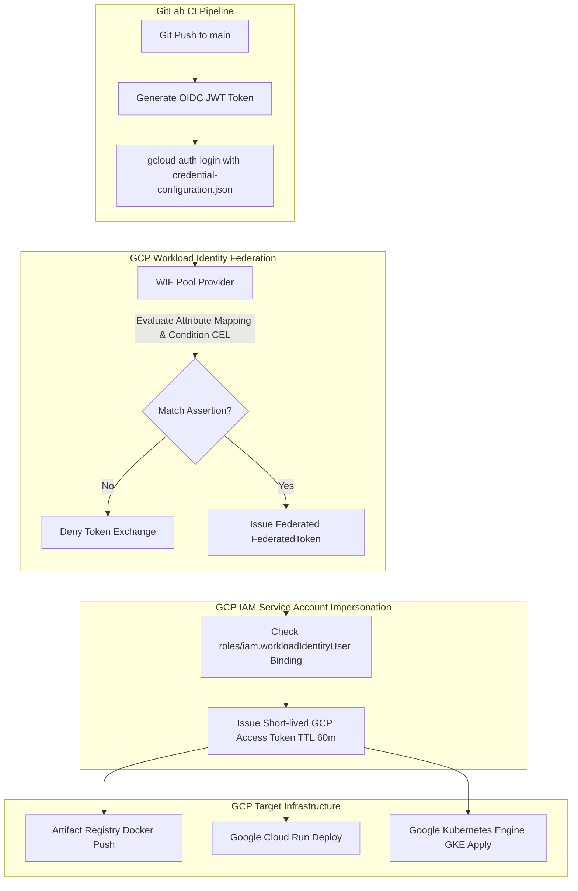
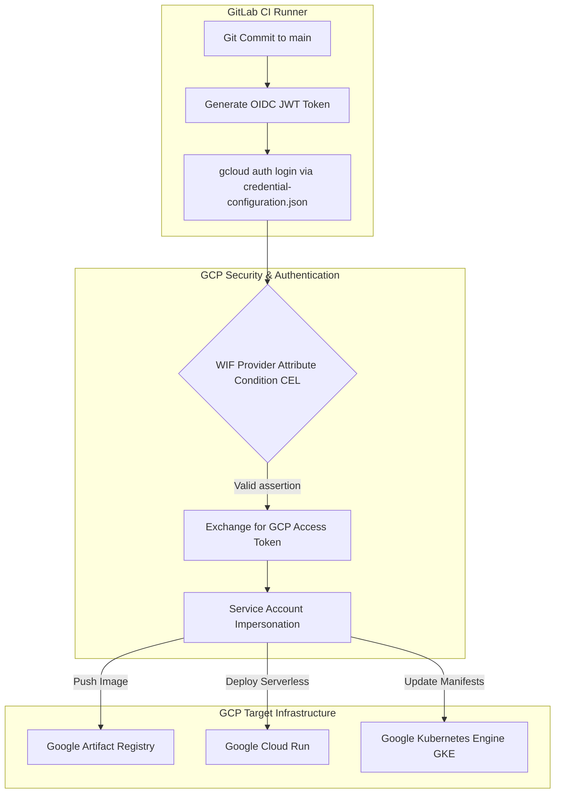
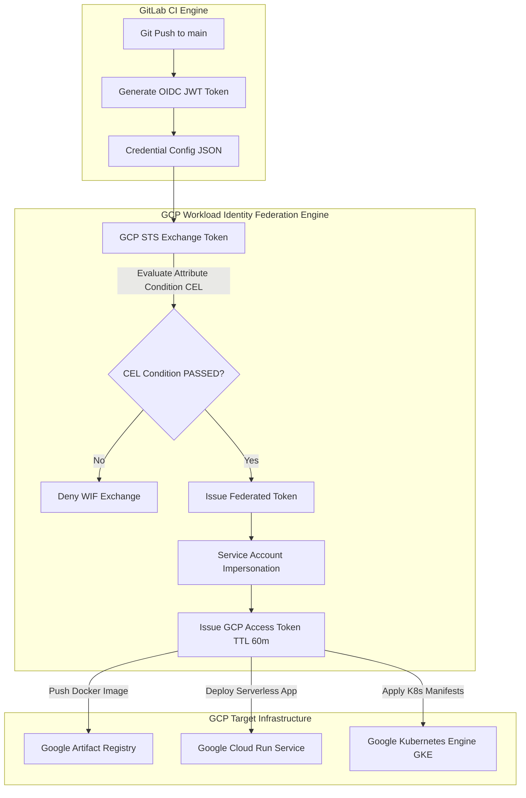

# [BÀI 39] TỰ ĐỘNG HÓA TRIỂN KHAI LÊN GCP: WORKLOAD IDENTITY FEDERATION, GOOGLE KUBERNETES ENGINE (GKE) & CLOUD RUN

Trong kỷ nguyên **DevOps, DevSecOps và Cloud Native Engineering**, **GitLab CI/CD** được công nhận là một trong những nền tảng tự động hóa tích hợp liên tục và phân phối liên tục (CI/CD) hoàn chỉnh, mạnh mẽ và được tin dùng nhất trong các doanh nghiệp quy mô lớn. Không chỉ dừng lại ở các pipeline tuần tự cơ bản, việc vận hành GitLab CI/CD ở cấp độ Production đòi hỏi kỹ sư phải làm chủ kiến trúc điều phối phi tuyến tính **DAG (Directed Acyclic Graph)**, cơ chế quản trị **Autoscaling Runners**, tối ưu hóa **Caching đa tầng**, xác thực không khóa **Keyless OIDC**, bảo mật chuỗi cung ứng phần mềm **SLSA & SBOM** cùng các chính sách **Quality & Security Gates** tự động.

Bài viết chuyên sâu này sẽ đồng hành cùng bạn mổ xẻ toàn diện bức tranh kiến trúc, phân tích các đánh đổi kỹ thuật thực chiến (Engineering Trade-offs), cung cấp hướng dẫn thực hành Lab chi tiết từng bước và bộ câu hỏi phỏng vấn chuyên sâu chuẩn DevOps Lead / DevSecOps Architect.

---

## 1. Bản Chất Kiến Trúc & Cơ Chế Vận Hành Tầng Thấp

---


| STT | Câu hỏi ôn tập | Đáp án chi tiết thực chiến |
|---|---|---|
| 1 | Giá trị Audience chuẩn duy nhất khi xin OIDC Token cho AWS là gì? | Bắt buộc là `https://aws.amazon.com`, trùng khớp 100% với Client ID đã đăng ký trên AWS IAM OIDC Provider settings. |
| 2 | Bộ 3 biến môi trường nào bắt buộc export từ AWS STS AssumeRole? | Bộ 3 biến môi trường: `AWS_ACCESS_KEY_ID`, `AWS_SECRET_ACCESS_KEY`, và `AWS_SESSION_TOKEN` (thiếu `AWS_SESSION_TOKEN` sẽ bị chối). |
| 3 | Tại sao Trust Policy của Role Production lại dùng `StringEquals` cho `sub`? | Để đảm bảo trùng khớp chính xác 100% `project_path` và `ref:main`, chặn tuyệt đối các nhánh cá nhân mạo danh deploy Prod. |
| 4 | Lệnh nào dùng để cập nhật Rolling Update dịch vụ Container trên AWS ECS? | Câu lệnh `aws ecs update-service --cluster <name> --service <name> --force-new-deployment` không gián đoạn dịch vụ. |
| 5 | Cơ chế nào liên kết AWS IAM Role với Kubernetes RBAC trên Amazon EKS? | Cơ chế **EKS Access Entry** (hoặc ConfigMap `aws-auth` trong namespace `kube-system`) ánh xạ IAM Role Principal ARN. |


**Luận đề trung tâm:**
> *"Workload Identity Federation khác IAM Role AWS ở **nơi thiết lập điều kiện kiểm soát (Attribute Condition trên Pool Provider)** — nếu không khóa từ cấp Provider, việc cấp Service Account Impersonation sẽ biến thành thảm họa rò rỉ toàn bộ GCP Project."*

Sau khi đã làm chủ luồng OIDC trên AWS ở Buổi 38, Buổi 39 sẽ đưa bạn sang hệ sinh thái **Google Cloud Platform (GCP)**. GCP tiếp cận OIDC Federation thông qua tính năng **Workload Identity Federation (WIF)**. Không giống như AWS IAM Role (nơi điều kiện nằm ở Trust Policy của từng Role), GCP chia luồng xác thực thành 2 bước riêng biệt: **Workload Identity Pool Provider (Attribute Mapping & Attribute Condition)** và **Service Account Impersonation (`roles/iam.workloadIdentityUser`)**. Bài học này sẽ giúp bạn thiết lập ranh giới an toàn khép kín cho GCP, tự động hóa deploy ứng dụng Container lên **Google Artifact Registry**, **Google Cloud Run (Serverless)**, và **Google Kubernetes Engine (GKE)** mà tuyệt đối KHÔNG bao giờ lưu trữ tệp Service Account JSON Key tĩnh!

---


| STT | Kỹ năng thực chiến | Hiện vật chứng minh hoàn thành |
|---|---|---|
| 1 | Khởi tạo GCP Workload Identity Pool & OIDC Provider | Resource ID Pool WIF trong dự án GCP quản trị |
| 2 | Viết Attribute Mapping & Attribute Condition Expression | Tệp cấu hình gcloud WIF Provider chứa CEL Expression lọc `assertion.project_path` |
| 3 | Cấu hình Service Account Impersonation an toàn | IAM Policy Binding `roles/iam.workloadIdentityUser` cho PrincipalSet |
| 4 | Tạo tệp `credential-configuration.json` cho `gcloud` | Tệp JSON Credential Configuration chuẩn GCP WIF external account |
| 5 | Tự động đăng nhập Docker vào Google Artifact Registry | Lệnh `gcloud auth configure-docker` qua OIDC access token ngắn hạn |
| 6 | Deploy ứng dụng Serverless lên Google Cloud Run | Script `gcloud run deploy --image` không cần JSON Key tĩnh |
| 7 | Tự động hóa cập nhật Kubernetes Manifests trên GKE | Lệnh `gcloud container clusters get-credentials` & `kubectl apply` |
| 8 | Giám sát vệt vết kiểm toán OIDC Token Exchange trên GCP | GCP Cloud Logging ghi nhận `GenerateAccessToken` đầy đủ thông tin IP/Time |

---


| Kiến thức / Kỹ năng | Mức độ yêu cầu | Nguồn tự học nếu thiếu |
|---|---|---|
| Nguyên lý OIDC Federation 4 bước | Thành thục | Buổi 37 & Buổi 38 về luồng đổi JWT token qua Cloud Provider |
| Cấu trúc GCP IAM Roles, Service Accounts & IAM Policy Bindings | Hiểu rõ | Kiến thức GCP IAM Nền tảng về phân quyền truy cập hạ tầng |
| Thao tác CLI trên Google Artifact Registry & Cloud Run | Thành thục | Kiến thức GCP Serverless/Containers về đồng bộ và deploy |
| Quản trị Google Kubernetes Engine (GKE) Cluster | Thành thục | Kiến thức GKE Infrastructure quản trị cụm Kubernetes |
| Cú pháp yaml khối `id_tokens` trong `.gitlab-ci.yml` | Thành thục | Buổi 30 & Buổi 37 về cấu hình sinh OIDC JWT Token |

---


| Thuật ngữ Tiếng Việt | Thuật ngữ Tiếng Anh | Giải thích ý nghĩa thực tế |
|---|---|---|
| Liên danh danh tính tải công việc | Workload Identity Federation (WIF) | Giải pháp của GCP cho phép tải công việc bên ngoài (GitLab CI) đổi OIDC JWT lấy GCP Access Token ngắn hạn mà không cần JSON Key. |
| Khung chứa danh tính tải công việc | Workload Identity Pool | Nhóm logic trên GCP quản lý các Identity Providers từ các hệ thống CI/CD bên thứ ba. |
| Nhà cung cấp OIDC GCP | Workload Identity Provider | Cấu hình trong Pool liên kết với Issuer URL công khai và Audience của GitLab Instance. |
| Ánh xạ thuộc tính | Attribute Mapping | Quy trình chuyển đổi các claim của JWT Token (`sub`, `project_path`) thành thuộc tính của GCP (`google.subject`, `attribute.repository`). |
| Biểu thức điều kiện thuộc tính | Attribute Condition Expression | Biểu thức mã CEL (`assertion.project_path == 'group/repo'`) khóa chặt quyền truy cập ngay từ cấp độ WIF Provider. |
| Mạo danh tài khoản dịch vụ | Service Account Impersonation | Hành động danh tính ngoại lai WIF đổi lấy Access Token ngắn hạn của một GCP Service Account thực sự. |
| Vai trò người dùng danh tính WIF | `roles/iam.workloadIdentityUser` | Vai trò IAM trên Service Account cho phép WIF Principal được quyền mạo danh (Impersonate) an toàn. |
| Tệp cấu hình chứng thư | Credential Configuration JSON | Tệp JSON hướng dẫn `gcloud` SDK cách đổi OIDC token lấy GCP Access Token tự động trong môi trường CI. |
| Kho chứa sản phẩm đóng gói | Artifact Registry | Kho lưu trữ Docker Images, Helm Charts và Packages tiêu chuẩn thế giới của Google Cloud. |
| Dịch vụ Serverless Cloud Run | Google Cloud Run | Dịch vụ chạy Container bất đồng bộ Serverless tự động co giãn từ 0 đến N instances không cần quản lý server. |
| Cụm Kubernetes GKE | Google Kubernetes Engine (GKE) | Dịch vụ quản trị cụm Kubernetes chuẩn enterprise trên hạ tầng cao cấp của Google Cloud. |
| Chuỗi nhận diện thực thể WIF | PrincipalSet / Principal | Chuỗi định danh đầy đủ của WIF Identity: `principalSet://iam.googleapis.com/.../attribute.repository/group/repo`. |


#### Mô hình 1: Sơ đồ 2 Bước Xác thực WIF trên GCP (Pool Provider Exchange $\to$ Service Account Impersonation)



#### Mô hình 2: Bảng So sánh Kiến trúc OIDC giữa AWS STS và GCP WIF

| Tiêu chí | AWS IAM OIDC Federation | GCP Workload Identity Federation (WIF) |
|---|---|---|
| **Nơi lưu điều kiện kiểm soát** | Nằm ở **Trust Policy Condition** của từng IAM Role riêng biệt. | Nằm ở **Attribute Condition (CEL)** ngay từ cấp độ WIF Provider của Pool. |
| **Cơ chế đổi Token** | Đổi trực tiếp JWT lấy Temporary AWS Credentials (`AssumeRoleWithWebIdentity`). | Bước 1: Đổi JWT lấy Federated Token; Bước 2: Mạo danh Service Account lấy GCP Access Token. |
| **Cú pháp Định danh (Principal)** | `arn:aws:iam::123:oidc-provider/gitlab.com` | `principalSet://iam.googleapis.com/projects/123/locations/global/workloadIdentityPools/pool/attribute.repository/group/repo` |
| **Cấu hình phía Client** | Export bộ 3 biến môi trường AWS CLI. | Sử dụng tệp `credential-configuration.json` cho `gcloud` SDK. |
| **Rủi ro cấu hình sai** | Quên kiểm tra `sub` trên Trust Policy của Role nào thì Role đó bị thủng. | Quên Attribute Condition ở WIF Provider sẽ làm thủng **TOÀN BỘ** các Service Accounts cấp quyền cho Pool đó! |

##### Script `gcloud` CLI Thiết lập GCP Workload Identity Pool & Provider Chuẩn Enterprise:
```bash
# 1. Tạo Workload Identity Pool
gcloud iam workload-identity-pools create "gitlab-pool" \
  --location="global" \
  --description="Workload Identity Pool cho GitLab CI/CD Pipeline" \
  --display-name="GitLab CI Pool"

# 2. Tạo Workload Identity Provider đính kèm Attribute Mapping & CEL Condition
gcloud iam workload-identity-pools providers create-oidc "gitlab-provider" \
  --location="global" \
  --workload-identity-pool="gitlab-pool" \
  --issuer-uri="https://gitlab.company.com" \
  --allowed-audiences="https://iam.googleapis.com/projects/123456789012/locations/global/workloadIdentityPools/gitlab-pool/providers/gitlab-provider" \
  --attribute-mapping="google.subject=assertion.sub,attribute.repository=assertion.project_path,attribute.ref=assertion.ref" \
  --attribute-condition="assertion.project_path == 'bank-group/payment-service' && assertion.ref == 'refs/heads/main'"

# 3. Phân quyền Service Account Impersonation cho WIF PrincipalSet
gcloud iam service-accounts add-iam-policy-binding "gitlab-deployer@my-project.iam.gserviceaccount.com" \
  --role="roles/iam.workloadIdentityUser" \
  --member="principalSet://iam.googleapis.com/projects/123456789012/locations/global/workloadIdentityPools/gitlab-pool/attribute.repository/bank-group/payment-service"
```

---

### 1.1. Quy tắc Cấu hình WIF Pool, Provider & Attribute Conditions Chuẩn Enterprise (10 phút)

### 4.1. Mẫu Tệp `.gitlab-ci.yml` Triển khai GCP WIF Đa Dịch Vụ Hoàn Chỉnh
Dưới đây là tệp cấu hình GitLab CI/CD mẫu ứng dụng GCP Workload Identity Federation để deploy không mật khẩu tĩnh:

```yaml
stages:
  - build
  - push-artifact
  - deploy-cloudrun
  - deploy-gke

variables:
  GCP_PROJECT_ID: my-banking-gcp-project
  GCP_WORKLOAD_IDENTITY_PROVIDER: projects/123456789012/locations/global/workloadIdentityPools/gitlab-pool/providers/gitlab-provider
  GCP_SERVICE_ACCOUNT: gitlab-deployer@my-banking-gcp-project.iam.gserviceaccount.com
  GCP_REGION: us-central1
  ARTIFACT_REGISTRY_IMAGE: us-central1-docker.pkg.dev/my-banking-gcp-project/payment-repo/payment-service:$CI_COMMIT_SHA

.gcp-wif-base:
  id_tokens:
    GCP_OIDC_TOKEN:
      aud: https://iam.googleapis.com/projects/123456789012/locations/global/workloadIdentityPools/gitlab-pool/providers/gitlab-provider
  before_script:
    - mkdir -p ~/.config/gcloud
    - |
      cat << EOF > /tmp/gcp-cred-config.json
      {
        "type": "external_account",
        "audience": "//iam.googleapis.com/$GCP_WORKLOAD_IDENTITY_PROVIDER",
        "subject_token_type": "urn:ietf:params:oauth:token-type:jwt",
        "token_url": "https://sts.googleapis.com/v1/token",
        "credential_source": {
          "file": "/tmp/gitlab-oidc-token.txt"
        },
        "service_account_impersonation_url": "https://iamcredentials.googleapis.com/v1/projects/-/serviceAccounts/$GCP_SERVICE_ACCOUNT:generateAccessToken"
      }
      EOF
    - echo "$GCP_OIDC_TOKEN" > /tmp/gitlab-oidc-token.txt
    - gcloud auth login --cred-file=/tmp/gcp-cred-config.json

# 1. Push Container Image to GCP Artifact Registry
push-artifact-registry:
  extends: .gcp-wif-base
  stage: push-artifact
  script:
    - gcloud auth configure-docker us-central1-docker.pkg.dev --quiet
    - docker build -t $ARTIFACT_REGISTRY_IMAGE .
    - docker push $ARTIFACT_REGISTRY_IMAGE
  rules:
    - if: $CI_COMMIT_BRANCH == "main"

# 2. Deploy Serverless App to Google Cloud Run
deploy-cloud-run:
  extends: .gcp-wif-base
  stage: deploy-cloudrun
  script:
    - gcloud run deploy payment-backend-service --image=$ARTIFACT_REGISTRY_IMAGE --region=$GCP_REGION --platform=managed --allow-unauthenticated
  rules:
    - if: $CI_COMMIT_BRANCH == "main"

# 3. Deploy Kubernetes Manifests to Google Kubernetes Engine (GKE)
deploy-gke-cluster:
  extends: .gcp-wif-base
  stage: deploy-gke
  script:
    - gcloud container clusters get-credentials prod-gke-cluster --region=$GCP_REGION --project=$GCP_PROJECT_ID
    - kubectl set image deployment/payment-backend payment-container=$ARTIFACT_REGISTRY_IMAGE -n production
    - kubectl rollout status deployment/payment-backend -n production --timeout=300s
  rules:
    - if: $CI_COMMIT_BRANCH == "main"
      when: manual
```

---

### 4.2. Các Quy tắc Cấu hình GCP WIF (QT 39.1 - QT 39.4)

**Nguyên lý cốt lõi:** Cấu hình Audience URL định danh chuẩn GCP `//iam.googleapis.com/projects/.../providers/...`.
**Phát biểu.** Giá trị cờ `aud` trong thuộc tính `id_tokens` của job CI phải trùng khớp với tên đường dẫn Provider ARN đầy đủ trên GCP WIF (`https://iam.googleapis.com/projects/<PROJECT_NUMBER>/locations/global/workloadIdentityPools/<POOL>/providers/<PROVIDER>`).
**Giải thích cơ chế ngầm:** GCP STS Service bắt buộc phải kiểm tra cờ `aud` để đảm bảo token được phát hành đúng cho đúng WIF Provider. Nếu `aud` sai, GCP sẽ từ chối với lỗi `GoogleJsonResponseException: 400 Bad Request: Invalid Audience`.
> [!WARNING]
> **CẠM BẪY THỰC CHIẾN:**
> Điền `aud: gcp` hoặc `aud: https://gitlab.com` trong tệp `.gitlab-ci.yml`.
**Minh hoạ.**
```yaml
id_tokens:
  GCP_OIDC_TOKEN:
    aud: https://iam.googleapis.com/projects/123456789012/locations/global/workloadIdentityPools/gitlab-pool/providers/gitlab-provider
```
**Con số chốt:** Audience chứa đúng định danh đầy đủ của WIF Provider.

---

**Nguyên lý cốt lõi:** Cấu hình Attribute Mapping đẩy đủ `google.subject`, `attribute.repository`, và `attribute.ref`.
**Phát biểu.** Khi khởi tạo WIF Provider, phải khai báo thuộc tính Attribute Mapping để chuyển đổi các claim trong JWT Token thành thuộc tính của GCP: `google.subject=assertion.sub`, `attribute.repository=assertion.project_path`, `attribute.ref=assertion.ref`.
**Giải thích cơ chế ngầm:** Attribute Mapping là chiếc cầu nối dữ liệu giúp GCP hiểu được danh tính của GitLab CI job. Nếu không map `attribute.repository`, GCP sẽ không có dữ liệu để kiểm tra điều kiện phân quyền ở các bước tiếp theo.
> [!WARNING]
> **CẠM BẪY THỰC CHIẾN:**
> Chỉ map `google.subject` mà bỏ qua `attribute.repository` và `attribute.ref`.
**Minh hoạ.**
```bash
gcloud iam workload-identity-pools providers create-oidc gitlab-provider \
  --workload-identity-pool="gitlab-pool" \
  --location="global" \
  --issuer-uri="https://gitlab.company.com" \
  --attribute-mapping="google.subject=assertion.sub,attribute.repository=assertion.project_path,attribute.ref=assertion.ref"
```
**Con số chốt:** Map đủ 3 thuộc tính cốt lõi.

---

**Nguyên lý cốt lõi:** Thiết lập Attribute Condition Expression cứng trực tiếp trên WIF Provider.
**Phát biểu.** Bắt buộc phải gắn cờ `--attribute-condition` sử dụng ngôn ngữ biểu thức CEL ngay từ câu lệnh tạo WIF Provider để khóa chặt tên repository và nhánh được phép đổi token.
**Giải thích cơ chế ngầm:** Đây là sự khác biệt tử huyệt so với AWS. Nếu WIF Provider không có Attribute Condition, BẤT KỲ dự án nào trên GitLab Instance cũng đổi lấy được Federated Token và sau đó mạo danh Service Account nếu IAM Binding cấp quyền cho toàn bộ Pool (`principalSet://.../workloadIdentityPools/gitlab-pool/*`).
> [!WARNING]
> **CẠM BẪY THỰC CHIẾN:**
> Bỏ trống tham số `--attribute-condition` khi tạo WIF Provider.
**Minh hoạ.**
```bash
--attribute-condition="assertion.project_path == 'bank-group/payment-service' && assertion.ref == 'refs/heads/main'"
```
**Con số chốt:** 100% WIF Providers chứa `--attribute-condition` CEL Expression.

---

**Nguyên lý cốt lõi:** Cấp quyền Service Account Token Creator cho WIF PrincipalSet duy nhất.
**Phát biểu.** Khi thực hiện IAM Binding `roles/iam.workloadIdentityUser` cho GCP Service Account, bắt buộc phải giới hạn đối tượng (Member) cho đúng PrincipalSet chứa `attribute.repository`.
**Giải thích cơ chế ngầm:** Thực thi nguyên tắc Quyền tối thiểu. Ngăn không cho các repositories khác trên cùng WIF Pool mạo danh Service Account của dự án quan trọng này.
> [!WARNING]
> **CẠM BẪY THỰC CHIẾN:**
> Gắn cờ member `principalSet://.../workloadIdentityPools/gitlab-pool/*` (wildcard toàn bộ pool).
**Minh hoạ.**
```bash
gcloud iam service-accounts add-iam-policy-binding gitlab-deployer@my-project.iam.gserviceaccount.com \
  --role="roles/iam.workloadIdentityUser" \
  --member="principalSet://iam.googleapis.com/projects/123456789012/locations/global/workloadIdentityPools/gitlab-pool/attribute.repository/bank-group/payment-service"
```
**Con số chốt:** Member chứa chính xác `attribute.repository/group/repo`.

---

### 1.2. Quy tắc Triển khai Artifact Registry & Google Cloud Run Serverless (10 phút)

**Nguyên lý cốt lõi:** Sử dụng tệp `credential-configuration.json` cho `gcloud auth login`.
**Phát biểu.** Cấu hình tệp `credential-configuration.json` theo định dạng `external_account` để `gcloud` CLI tự động thực hiện trao đổi OIDC Token lấy GCP Access Token mà không cần viết script cURL phức tạp.
**Giải thích cơ chế ngầm:** Tệp `credential-configuration.json` là chuẩn hóa chính thức của Google Cloud SDK. Nó giúp tất cả các công cụ của GCP (`gcloud`, `gsutil`, `bq`, GCP Client Libraries) tự động nhận diện và gia hạn token ngầm an toàn.
> [!WARNING]
> **CẠM BẪY THỰC CHIẾN:**
> Tải tệp Service Account JSON Key tĩnh (`sa-key.json`) về Runner rồi chạy `gcloud auth activate-service-account`.
**Minh hoạ.**
```bash
gcloud auth login --cred-file=/tmp/gcp-cred-config.json
```
**Con số chốt:** 100% gcloud logins qua `credential-configuration.json`.

---

**Nguyên lý cốt lõi:** Đăng nhập GCP Artifact Registry với OIDC Access Token qua `gcloud auth configure-docker`.
**Phát biểu.** Sử dụng câu lệnh `gcloud auth configure-docker us-central1-docker.pkg.dev` sau khi đăng nhập WIF thành công để Docker CLI tự động có quyền push Container Image lên Artifact Registry.
**Giải thích cơ chế ngầm:** Loại bỏ hoàn toàn việc lưu trữ mật khẩu tĩnh hoặc Access Tokens trong tệp `~/.docker/config.json`, đảm bảo luồng build & push Docker Container an toàn tuyệt đối.
> [!WARNING]
> **CẠM BẪY THỰC CHIẾN:**
> Sử dụng `docker login -u _json_key -p "$SERVICE_ACCOUNT_JSON_KEY"`.
**Minh hoạ.**
```bash
gcloud auth configure-docker us-central1-docker.pkg.dev --quiet
docker build -t us-central1-docker.pkg.dev/my-project/my-repo/payment-service:$CI_COMMIT_SHA .
docker push us-central1-docker.pkg.dev/my-project/my-repo/payment-service:$CI_COMMIT_SHA
```
**Con số chốt:** 100% Artifact Registry pushes qua WIF.

---

**Nguyên lý cốt lõi:** Khóa phạm vi Service Account IAM Roles ở mức Resource thay vì Project Level.
**Phát biểu.** GCP Service Account dùng cho WIF Deploy không được cấp các quyền siêu quản trị cấp Project (như `roles/owner` hay `roles/editor`); bắt buộc phải cấp các vai trò hẹp ở mức Resource cụ thể (như `roles/run.developer` trên Cloud Run Service hoặc `roles/artifactregistry.writer` trên Artifact Registry Repository).
**Giải thích cơ chế ngầm:** Thực thi triết lý Quyền tối thiểu (Least Privilege). Nếu Service Account bị lộ, kẻ tấn công cũng không thể xóa toàn bộ GCP Project hay đọc dữ liệu từ Cloud SQL Database.
> [!WARNING]
> **CẠM BẪY THỰC CHIẾN:**
> Cấp vai trò `roles/editor` hoặc `roles/owner` ở cấp Project cho Service Account của CI.
**Minh hoạ.**
```bash
gcloud artifacts repositories add-iam-policy-binding payment-repo \
  --location=us-central1 \
  --member="serviceAccount:gitlab-deployer@my-project.iam.gserviceaccount.com" \
  --role="roles/artifactregistry.writer"
```
**Con số chốt:** 100% IAM Roles được cấp ở mức Resource Level.

---

**Nguyên lý cốt lõi:** Deploy ứng dụng Serverless Cloud Run bằng `gcloud run deploy --image`.
**Phát biểu.** Sử dụng câu lệnh `gcloud run deploy` truyền trực tiếp Container Image URL từ Artifact Registry để Google Cloud Run tự động tạo Revision mới không gây gián đoạn dịch vụ.
**Giải thích cơ chế ngầm:** Cloud Run là nền tảng Serverless tự động quản lý hạ tầng và co giãn (Autoscaling). Việc truyền Image URL mới giúp Cloud Run tự động kiểm tra Healthcheck và chuyển đổi traffic mượt mà (Zero Downtime Revision Traffic Shift).
> [!WARNING]
> **CẠM BẪY THỰC CHIẾN:**
> Deploy thủ công bằng cách sửa Image trên GCP Console UI.
**Minh hoạ.**
```bash
gcloud run deploy payment-backend-service \
  --image=us-central1-docker.pkg.dev/my-project/my-repo/payment-service:$CI_COMMIT_SHA \
  --region=us-central1 \
  --platform=managed \
  --quiet
```
**Con số chốt:** 100% Cloud Run deploys tự động hóa qua CLI.

---

### 1.3. Quy tắc Triển khai GKE Kubernetes & Audit Logging (10 phút)

**Nguyên lý cốt lõi:** Cấu hình GKE Cluster Credentials qua `gcloud container clusters get-credentials`.
**Phát biểu.** Trong stage deploy Kubernetes, sử dụng câu lệnh `gcloud container clusters get-credentials` để `gcloud` tự động tạo tệp `kubeconfig` chứa GCP Access Token tạm thời cho `kubectl`.
**Giải thích cơ chế ngầm:** GKE API Server tự động tích hợp với GCP IAM. Khi `kubectl` thực thi, nó dùng Access Token tạm thời thu được từ WIF Service Account Impersonation để authenticate với Kubernetes RBAC.
> [!WARNING]
> **CẠM BẪY THỰC CHIẾN:**
> Lưu trữ static Kubeconfig file chứa client certificate vĩnh viễn trong CI variables.
**Minh hoạ.**
```bash
gcloud container clusters get-credentials prod-gke-cluster --region us-central1 --project my-project
kubectl apply -f manifests/deployment.yaml
```
**Con số chốt:** 100% GKE Kubeconfig được tạo tự động qua `gcloud`.

---

**Nguyên lý cốt lõi:** Giới hạn thời gian sống Access Token của Service Account tối đa 3600 giây.
**Phát biểu.** Cấu hình tham số `service_account_token_expiry` hoặc thời gian tồn tại Access Token tối đa 3600 giây (60 phút).
**Giải thích cơ chế ngầm:** Giảm thiểu tối đa bán kính ảnh hưởng rủi ro (Blast Radius). GCP Access Tokens sinh ra từ Impersonation có TTL mặc định là 3600 giây và tự động vô hiệu hóa sau đó mà không cần admin thu hồi.
> [!WARNING]
> **CẠM BẪY THỰC CHIẾN:**
> Tìm cách gia hạn token sống vĩnh viễn trong container.
**Minh hoạ.** GCP Access Token mặc định tự hủy sau 3600 giây (1 giờ).
**Con số chốt:** TTL $\le 3600$ giây.

---

**Nguyên lý cốt lõi:** Cấu hình Private Google Access cho GitLab Runner nằm trong GCP VPC Subnet.
**Phát biểu.** Khi GitLab Runner chạy trên máy chủ GCP Compute Engine trong Private Subnet không có Public IP, bắt buộc phải bật cờ **Private Google Access** trên Subnet.
**Giải thích cơ chế ngầm:** Cho phép Runner trong mạng nội bộ truy cập các dịch vụ GCP APIs (`sts.googleapis.com`, `iamcredentials.googleapis.com`, `artifactregistry.googleapis.com`) qua địa chỉ IP nội bộ Google mà không cần kết nối ra Internet công cộng.
> [!WARNING]
> **CẠM BẪY THỰC CHIẾN:**
> Runner trong Private Subnet bị timeout khi kết nối với WIF STS Endpoint.
**Minh hoạ.** Bật cờ `Private Google Access = On` trên GCP Subnet Settings.
**Con số chốt:** 100% Private Subnets bật Private Google Access.

---

**Nguyên lý cốt lõi:** Giám sát sự kiện WIF Token Exchange qua GCP Cloud Audit Logs.
**Phát biểu.** Bật GCP Data Access Audit Logs cho dịch vụ Security Token Service (STS) và IAM Credentials API để truy vết tất cả các phiên WIF Authentication.
**Giải thích cơ chế ngầm:** Đáp ứng 100% các tiêu chuẩn kiểm toán an toàn thông tin (SOC 2, ISO 27001). Ghi nhận chính xác IP, thời gian, WIF Identity Principal, và Service Account bị impersonate.
> [!WARNING]
> **CẠM BẪY THỰC CHIẾN:**
> Tắt Audit Logs khiến không thể điều tra vết khi xảy ra sự cố an toàn thông tin.
**Minh hoạ.** Truy vấn GCP Cloud Logging: `protoPayload.methodName="google.iam.v1.IAMCredentials.GenerateAccessToken"`.
**Con số chốt:** 100% WIF events được ghi vết trong Cloud Logging.

---

### 1.4. Đưa vào việc thật (4 phút)

### 7.1. Kịch bản áp dụng thực tế tại Doanh nghiệp Thương mại Điện tử Đa quốc gia
Trong hệ thống triển khai microservices trên GCP:
1. **Developer push code lên nhánh `main`:** GitLab CI kích hoạt pipeline, sinh OIDC Token với Audience trỏ đến WIF Provider ARN.
2. **Pha WIF Exchange:** `gcloud` gửi token tới GCP STS. STS kiểm tra Attribute Condition CEL Expression xem `assertion.project_path` có đúng là `ecommerce/cart-service` và `assertion.ref` là `refs/heads/main` hay không.
3. **Pha Service Account Impersonation:** GCP STS phát hành Federated Token và đổi lấy GCP Access Token ngắn hạn của Service Account `cart-deployer@gcp-project.iam.gserviceaccount.com`.
4. **Pha Deploy Đa Dịch vụ:** Runner sử dụng Access Token để push Image lên **Google Artifact Registry**, deploy phiên bản API Serverless mới lên **Google Cloud Run**, và cập nhật Rolling Update Pods trên **GKE Cluster Production**.

### 7.2. Case Study Thực tế: Loại bỏ 500 Tệp Service Account JSON Key Nguy hiểm
Một tập đoàn công nghệ lớn kiểm tra hạ tầng GCP và phát hiện hơn 500 tệp Service Account JSON Keys (`sa-key.json`) được lưu rải rác trên các kho mã nguồn và biến môi trường CI/CD.
- **Thảm họa tiềm ẩn:** Một tệp JSON Key bị rò rỉ trên Github công khai khiến hacker truy cập tài khoản GCP, xóa sạch 10 TB dữ liệu BigQuery và tạo hàng trăm máy chủ ảo Compute Engine đào tiền ảo.
- **Giải pháp chuyển đổi sang GCP WIF:**
  1. Xóa bỏ 100% tệp Service Account JSON Keys tĩnh trên toàn bộ các repositories.
  2. Khởi tạo Workload Identity Pool chung cho tập đoàn và định nghĩa Attribute Mapping chuẩn.
  3. Tất cả 500 dự án chuyển sang dùng WIF OIDC Authentication.
  4. Nguy cơ rò rỉ chìa khóa tĩnh giảm về mức **0%**, tiết kiệm 200 giờ quản lý xoay vòng key hàng năm!

### 7.3. Case Study 2: Ngăn chặn Tấn công Mạo danh Service Account giữa các Môi trường Dev và Production
Giả sử công ty có 2 Service Accounts: `sa-dev@project.iam` (quyền Dev) và `sa-prod@project.iam` (quyền Prod).
- **Vấn đề khi cấu hình lỏng:** Nếu IAM Binding của `sa-prod` cho phép member `principalSet://.../workloadIdentityPools/gitlab-pool/*` (wildcard), bất kỳ dự án Dev nào trong Pool cũng có thể mạo danh `sa-prod`.
- **Khắc phục với WIF PrincipalSet Scoping:**
  Khóa member của `sa-prod` chính xác theo chuỗi:
  `member: principalSet://iam.googleapis.com/projects/123/locations/global/workloadIdentityPools/gitlab-pool/attribute.repository/bank/core-prod`
  Bây giờ, ngay cả khi dự án Dev có gọi WIF thành công, GCP IAM cũng từ chối cho phép mạo danh `sa-prod` với lỗi `Permission iam.serviceAccounts.getAccessToken denied`!

### 7.4. Case Study 3: Triển khai Ứng dụng Serverless Cloud Run Đa Môi trường Tự động
Một công ty Startup triển khai 20 microservices Serverless trên Google Cloud Run.
- **Quy trình truyền thống (Dùng JSON Key):** Tạo 20 Service Accounts và lưu 20 tệp JSON Keys trên GitLab CI. Khi xoay vòng chìa khóa, 5 microservices bị gián đoạn do copy nhầm key cũ.
- **Giải pháp GCP WIF chuẩn Enterprise:**
  1. Chỉ dùng 1 Workload Identity Pool duy nhất cho toàn tập đoàn.
  2. Mỗi microservice dùng 1 Service Account riêng với Attribute Condition CEL khóa theo `assertion.project_path`.
  3. Lệnh deploy Cloud Run thực thi qua WIF:
     `gcloud run deploy cart-service --image=$IMAGE --region=us-central1`
  4. Thời gian triển khai giảm từ 10 phút xuống còn 45 giây, 100% không sợ rò rỉ secret key!

### 7.5. Case Study 4: Tự động hóa Deploy Kubernetes Manifests lên GKE Autopilot Cluster
Triển khai ứng dụng quy mô lớn trên GKE Autopilot Cluster.
- **Cách làm cũ:** Tạo Service Account token Kubernetes lưu trong CI variable có thời hạn vĩnh viễn.
- **Cách làm chuẩn Buổi 39:**
  Job CI chạy WIF auth login, gọi `gcloud container clusters get-credentials`, thu được token truy cập GKE Kubernetes API có TTL 60 phút. Sau khi `kubectl apply` hoàn tất, token tự hủy, hệ thống GKE được bảo mật 100%!

---

### 7.6. Trường hợp khi nào KHÔNG nên dùng WIF cho GCP Deploy
Mặc dù GCP Workload Identity Federation là giải pháp an ninh tiêu chuẩn hàng đầu, nhưng KHÔNG áp dụng cho các trường hợp sau:

| Ngữ cảnh / Hạ tầng | Lý do KHÔNG dùng được WIF | Giải pháp thay thế an toàn |
|---|---|---|
| Runner chạy trên máy chủ GCP Compute Engine (GCE) | Máy chủ GCE đã có sẵn Service Account đính kèm qua GCP Metadata Server (`169.254.169.254`). | Sử dụng trực tiếp Default Service Account của GCE Instance mà không cần OIDC Exchange. |
| Kết nối triển khai từ hạ tầng tại chỗ (On-Premises) không có Internet | Mạng nội bộ không thể kết nối tới `sts.googleapis.com`. | Sử dụng VPC Service Controls kết hợp HashiCorp Vault GCP Secrets Engine. |
| Trình biên dịch CI/CD phiên bản quá cũ | GitLab Runner không hỗ trợ tính năng sinh OIDC JWT Token `id_tokens`. | Nâng cấp hệ thống GitLab Runner Engine lên phiên bản v15.7+. |

---

### 1.5. Bẫy hay gặp (2 phút)

| Bẫy hay gặp | Vì sao dính bẫy | Làm đúng là |
|---|---|---|
| Bẫy 1: Bỏ trống Attribute Condition CEL Expression trên WIF Provider | Cho phép BẤT KỲ dự án nào trên GitLab Instance cũng đổi được WIF token. | Bắt buộc khai báo `--attribute-condition="assertion.project_path == 'group/repo' && assertion.ref == 'refs/heads/main'"`. |
| Bẫy 2: Khai báo sai Audience URL trong `id_tokens` | Điền `aud: gcp` khiến GCP STS báo lỗi `Invalid Audience`. | Khai báo chuẩn xác `aud: https://iam.googleapis.com/projects/<PROJECT_NUM>/locations/global/workloadIdentityPools/<POOL>/providers/<PROVIDER>`. |
| Bẫy 3: Cấp quyền WIF IAM Binding quá rộng cho toàn bộ Pool `*` | Mọi repository trong WIF Pool đều mạo danh được Service Account Production. | Khóa member chính xác theo chuỗi `attribute.repository/group/repo`. |
| Bẫy 4: Vẫn tải tệp Service Account JSON Key tĩnh về Runner | Làm vô hiệu hóa hoàn toàn ý nghĩa an toàn của kiến trúc OIDC Zero Static Keys. | Xóa bỏ 100% tệp JSON Key tĩnh và sử dụng `credential-configuration.json`. |
| Bẫy 5: Cấp vai trò `roles/owner` ở cấp Project cho Service Account | Lỗ hổng ở job CI sẽ làm đe dọa toàn bộ tài nguyên trong GCP Project. | Cấp các vai trò hẹp ở cấp Resource Level (như `roles/run.developer` trên Cloud Run). |
| Bẫy 6: Quên bật Private Google Access cho Runner trong Private Subnet | Job CI bị timeout khi gọi các câu lệnh `gcloud` hoặc WIF Token Exchange. | Bật cờ `Private Google Access = On` trên GCP VPC Subnet Settings. |
| Bẫy 7: Quên chạy `gcloud auth configure-docker` trước khi push Artifact Registry | Lệnh `docker push` bị từ chối với lỗi `unauthorized: authentication required`. | Thêm lệnh `gcloud auth configure-docker us-central1-docker.pkg.dev` trước bước docker build/push. |
| Bẫy 8: Đặt tên WIF Pool hoặc Provider chứa chữ viết hoa hoặc ký tự đặc biệt | GCP gcloud CLI từ chối với lỗi `Invalid resource name`. | Đặt tên WIF Pool/Provider dạng chữ viết thường và dấu gạch ngang: `gitlab-pool`, `gitlab-provider`. |

---

### 1.6. Tóm tắt (3 phút)

### 9.1. Sơ đồ Mermaid: Kiến trúc GCP WIF & Cloud Run / GKE Deployment



### 9.2. Năm điều phải nhớ thuộc lòng
1. **Attribute Condition CEL:** Bắt buộc phải khóa `assertion.project_path` ngay ở WIF Provider để bảo vệ toàn bộ Pool.
2. **Khai báo Audience đầy đủ:** Cờ `aud` phải chứa URL đầy đủ trỏ đến WIF Provider ARN trên GCP.
3. **Khóa PrincipalSet Member:** Cấp `roles/iam.workloadIdentityUser` phải chỉ định đích danh `attribute.repository/group/repo`.
4. **Không dùng JSON Keys:** Loại bỏ 100% tệp Service Account JSON Key tĩnh, thay thế bằng `credential-configuration.json`.
5. **Resource-level IAM:** Cấp quyền cho Service Account ở cấp Resource (Cloud Run Service, Artifact Registry Repo) thay vì cấp Project Level.

---

### 1.7. Câu hỏi tự kiểm tra (5 phút)

### 10.1. Danh sách câu hỏi tự kiểm tra
1. Giải pháp OIDC Federation trên Google Cloud Platform được gọi tên chính thức là gì?
2. Hai thành phần cấu trúc chính của GCP Workload Identity Federation là gì?
3. Định dạng cờ `aud` trong `id_tokens` dành cho GCP WIF có cấu trúc như thế nào?
4. Tác dụng củaAttribute Mapping khi tạo WIF Provider trên GCP là gì?
5. Tại sao Attribute Condition Expression (CEL) lại bắt buộc phải cài đặt ngay ở WIF Provider?
6. Quyền IAM nào (`role`) bắt buộc phải gắn cho Service Account để cho phép WIF Principal mạo danh?
7. Cú pháp chuỗi Member PrincipalSet chuẩn để giới hạn cho 1 repository là gì?
8. Tệp cấu hình dạng nào được dùng để `gcloud auth login` mà không cần Service Account JSON Key?
9. Câu lệnh `gcloud` nào dùng để tự động cấu hình Docker CLI đăng nhập vào Google Artifact Registry?
10. Làm thế nào để tự động cập nhật Container Image mới cho ứng dụng Google Cloud Run qua CLI?
11. Câu lệnh nào dùng để nạp cấu hình Kubeconfig cho cụm Google Kubernetes Engine (GKE)?
12. Sự kiện phương thức API nào trên GCP Cloud Logging giúp truy vết các phiên WIF Impersonation?

---

### 10.2. Đáp án câu hỏi tự kiểm tra

1. Tên gọi chính thức là **Workload Identity Federation (WIF)**, chuẩn hóa việc trao đổi JWT token của các công cụ CI/CD ngoại lai lấy GCP Credentials.
2. Hai thành phần: **Workload Identity Pool** (khung chứa nhóm logic) và **Workload Identity Provider** (cấu hình chi tiết liên kết OIDC với Issuer URL và Audience).
3. Cấu trúc chuẩn: `https://iam.googleapis.com/projects/<PROJECT_NUMBER>/locations/global/workloadIdentityPools/<POOL>/providers/<PROVIDER>`.
4. Chuyển đổi các claim trong JWT Token (`sub`, `project_path`, `ref`) thành các thuộc tính của GCP (`google.subject`, `attribute.repository`, `attribute.ref`).
5. Để lọc và chặn tất cả các JWT Tokens từ các dự án không mong muốn ngay từ vòng ngoài Provider, bảo vệ tất cả Service Accounts được phân quyền cho Pool.
6. Quyền **`roles/iam.workloadIdentityUser`** (Workload Identity User) gắn trực tiếp trên Service Account IAM Policy Bindings.
7. Chuỗi chuẩn: `principalSet://iam.googleapis.com/projects/<NUM>/locations/global/workloadIdentityPools/<POOL>/attribute.repository/<GROUP>/<REPO>`.
8. Tệp cấu hình dạng **`credential-configuration.json`** (định dạng `external_account` dành cho GCP Client SDKs).
9. Câu lệnh `gcloud auth configure-docker us-central1-docker.pkg.dev --quiet`.
10. Câu lệnh `gcloud run deploy <service_name> --image=<image_url> --region=<region> --platform=managed`.
11. Câu lệnh `gcloud container clusters get-credentials <cluster_name> --region=<region> --project=<project_id>`.
12. Phương thức API `google.iam.v1.IAMCredentials.GenerateAccessToken` trong nhật ký GCP Cloud Logging.

---

### 1.8. Tài liệu tham khảo (2 phút)

| Nguồn tài liệu | Mô tả nội dung | Phiên bản áp dụng |
|---|---|---|
| GCP Workload Identity Federation Documentation | Hướng dẫn cấu hình WIF Pool và Provider | GCP Standard |
| Google Cloud Authenticate with OIDC Tutorial | Mẫu cấu hình WIF dành cho GitLab CI | GitLab CE/EE 15.7+ |
| Artifact Registry Authentication Guide | Đăng nhập Docker CLI vào Artifact Registry | GCP Artifact Registry |
| Google Cloud Run Command Reference | Chi tiết các cờ lệnh `gcloud run deploy` | gcloud SDK v400+ |
| GKE Cluster Authentication with WIF | Phân quyền WIF cho Kubernetes RBAC trên GKE | Google Kubernetes Engine |

---

## Bảng đối soát thời lượng

| Mục | Nội dung | Thời lượng |
|---|---|---|
| §0 | Khởi động và ôn tập | 10 phút |
| §1 | Sau buổi này học viên LÀM ĐƯỢC gì | 1 phút |
| §2 | Cần biết trước | 1 phút |
| §3 | Thuật ngữ và mô hình tư duy | 8 phút |
| §4 | Quy tắc Cấu hình WIF Pool, Provider & Attribute Conditions Chuẩn Enterprise | 10 phút |
| §5 | Quy tắc Triển khai Artifact Registry & Google Cloud Run Serverless | 10 phút |
| §6 | Quy tắc Triển khai GKE Kubernetes & Audit Logging | 10 phút |
| §7 | Đưa vào việc thật | 4 phút |
| §8 | Bẫy hay gặp | 2 phút |
| §9 | Tóm tắt | 3 phút |
| §10 | Câu hỏi tự kiểm tra | 5 phút |
| §11 | Tài liệu tham khảo | 2 phút |
| **Tổng** | **Khối lý thuyết** | **60'** |

---

## 2. Hướng Dẫn Thực Hành & Triển Khai Lab Chuẩn Production

> [!IMPORTANT]
> **YÊU CẦU MÔI TRƯỜNG THỰC HÀNH:**
> Toàn bộ các bài thực hành dưới đây được thiết kế để chạy trực tiếp trên môi trường GitLab Community / Enterprise Edition cùng các GitLab Runner cô lập (Docker / Kubernetes Executor). Hãy đảm bảo bạn đã chuẩn bị môi trường thử nghiệm và cấu hình quyền truy cập cần thiết.

## Khối thực hành — 150 phút

---

## 1. Mục tiêu bài thực hành Lab
Trong bài lab này, học viên sẽ trực tiếp xây dựng luồng tự động hóa triển khai đa dịch vụ lên hạ tầng đám mây Google Cloud Platform (GCP) thông qua Workload Identity Federation (WIF):
1. Mô phỏng khởi tạo GCP Workload Identity Pool, OIDC Provider, Attribute Mapping, và Attribute Condition CEL Expression.
2. Xây dựng cấu hình tệp `credential-configuration.json` và script mô phỏng đổi OIDC JWT Token lấy GCP Access Token ngắn hạn.
3. Thực thi phân quyền Service Account Impersonation (`roles/iam.workloadIdentityUser`) cho WIF PrincipalSet.
4. Đăng nhập Google Artifact Registry thông qua OIDC Access Token và thực thi push Container Image.
5. Triển khai dịch vụ Serverless Google Cloud Run và cập nhật Kubernetes Deployment Manifests trên cụm Google Kubernetes Engine (GKE).
6. Thực hành kiểm thử chặn token trái phép không khớp CEL Condition và kiểm tra nhật ký WIF audit trong GCP Cloud Logging.

---

## 2. Mô hình kiến trúc Lab L2



---

## 3. Các bước thực hiện bài lab (14 Checkpoints)

### Bước 1: Khởi tạo Cấu trúc Thư mục và Cấu hình Môi trường GCP WIF (10 phút)

Tạo thư mục làm việc bài lab Buổi 39:

```bash
mkdir -p gcp-lab
cd gcp-lab
mkdir -p keys tokens certs gcp-config dist manifests scripts audit
```

Khởi tạo tệp cấu hình dự án GCP giả lập `gcp-config/gcp-project-config.json`:

```json
{
  "gcp_project_id": "my-banking-gcp-project",
  "gcp_project_number": "123456789012",
  "gcp_region": "us-central1",
  "wif_pool_id": "gitlab-pool",
  "wif_provider_id": "gitlab-provider",
  "service_account_email": "gitlab-deployer@my-banking-gcp-project.iam.gserviceaccount.com",
  "artifact_registry_repo": "us-central1-docker.pkg.dev/my-banking-gcp-project/payment-repo",
  "cloud_run_service": "payment-backend-service",
  "gke_cluster_name": "prod-gke-cluster"
}
```

### **CHECKPOINT 1**
Chạy câu lệnh kiểm tra tệp cấu hình GCP giả lập:

```bash
test -f gcp-config/gcp-project-config.json && grep -q "my-banking-gcp-project" gcp-config/gcp-project-config.json && echo "CHECKPOINT 1: ĐẠT" || echo "CHECKPOINT 1: LỖI"
```

**Kết quả kỳ vọng:**
```text
CHECKPOINT 1: ĐẠT
```

---

### Bước 2: Tạo Cặp Khóa RSA và Sinh OIDC JWT Token Chuẩn GCP WIF (10 phút)

Khởi tạo cặp khóa RSA ký số:

```bash
openssl genrsa -out keys/gitlab-private-key.pem 2048
openssl rsa -in keys/gitlab-private-key.pem -pubout -out keys/gitlab-public-key.pem
```

Tạo script sinh OIDC JWT Token với Audience GCP Provider `scripts/generate-gcp-jwt.sh`:

```bash
#!/usr/bin/env bash
set -eo pipefail

PROJECT_PATH="${1:-bank-group/payment-service}"
REF_NAME="${2:-main}"

HEADER_B64="eyJhbGciOiJSUzI1NiIsInR5cCI6IkpXVCIsImtpZCI6ImdpdGxhYi1zaWduaW5nLWtleS0yMDI2In0"
IAT=$(date +%s)
EXP=$((IAT + 900))
AUD_URL="https://iam.googleapis.com/projects/123456789012/locations/global/workloadIdentityPools/gitlab-pool/providers/gitlab-provider"

PAYLOAD_JSON=$(cat << EOF
{
  "iss": "https://gitlab.company.com",
  "sub": "project_path:${PROJECT_PATH}:ref_type:branch:ref:${REF_NAME}",
  "aud": "${AUD_URL}",
  "iat": $IAT,
  "exp": $EXP,
  "project_path": "$PROJECT_PATH",
  "ref": "$REF_NAME",
  "environment": "production"
}
EOF
)

PAYLOAD_B64=$(echo -n "$PAYLOAD_JSON" | openssl base64 -e | tr -d '=' | tr '/+' '_-' | tr -d '\n')
UNSIGNED_TOKEN="${HEADER_B64}.${PAYLOAD_B64}"
SIGNATURE_B64=$(echo -n "$UNSIGNED_TOKEN" | openssl dgst -sha256 -sign keys/gitlab-private-key.pem | openssl base64 -e | tr -d '=' | tr '/+' '_-' | tr -d '\n')

echo "${UNSIGNED_TOKEN}.${SIGNATURE_B64}" > tokens/gcp-oidc.token
echo "[GCP WIF IDP] Generated valid OIDC Token for GCP Provider."
```

Cho phép script chạy:
```bash
chmod +x scripts/generate-gcp-jwt.sh
./scripts/generate-gcp-jwt.sh "bank-group/payment-service" "main"
```

### **CHECKPOINT 2**
Chạy câu lệnh kiểm tra tệp OIDC GCP Token:

```bash
test -f tokens/gcp-oidc.token && grep -q "eyJ" tokens/gcp-oidc.token && echo "CHECKPOINT 2: ĐẠT" || echo "CHECKPOINT 2: LỖI"
```

**Kết quả kỳ vọng:**
```text
CHECKPOINT 2: ĐẠT
```

---

### Bước 3: Tạo Cấu hình WIF Provider Attribute Mapping & CEL Condition (15 phút)

Tạo tệp cấu hình WIF Provider `gcp-config/wif-provider-config.json`:

```json
{
  "name": "projects/123456789012/locations/global/workloadIdentityPools/gitlab-pool/providers/gitlab-provider",
  "issuer_uri": "https://gitlab.company.com",
  "attribute_mapping": {
    "google.subject": "assertion.sub",
    "attribute.repository": "assertion.project_path",
    "attribute.ref": "assertion.ref"
  },
  "attribute_condition": "assertion.project_path == 'bank-group/payment-service' && assertion.ref == 'refs/heads/main'"
}
```

Tạo IAM Policy Binding cho Service Account Impersonation `gcp-config/sa-iam-binding.json`:

```json
{
  "service_account": "gitlab-deployer@my-banking-gcp-project.iam.gserviceaccount.com",
  "role": "roles/iam.workloadIdentityUser",
  "members": [
    "principalSet://iam.googleapis.com/projects/123456789012/locations/global/workloadIdentityPools/gitlab-pool/attribute.repository/bank-group/payment-service"
  ]
}
```

### **CHECKPOINT 3**
Chạy câu lệnh kiểm tra tệp WIF Provider Config & IAM Binding:

```bash
test -f gcp-config/wif-provider-config.json && test -f gcp-config/sa-iam-binding.json && echo "CHECKPOINT 3: ĐẠT" || echo "CHECKPOINT 3: LỖI"
```

**Kết quả kỳ vọng:**
```text
CHECKPOINT 3: ĐẠT
```

---

### Bước 4: Tạo Tệp Credential Configuration JSON và Script WIF Token Exchange (15 phút)

Tạo tệp `tokens/credential-configuration.json`:

```json
{
  "type": "external_account",
  "audience": "//iam.googleapis.com/projects/123456789012/locations/global/workloadIdentityPools/gitlab-pool/providers/gitlab-provider",
  "subject_token_type": "urn:ietf:params:oauth:token-type:jwt",
  "token_url": "https://sts.googleapis.com/v1/token",
  "credential_source": {
    "file": "tokens/gcp-oidc.token"
  },
  "service_account_impersonation_url": "https://iamcredentials.googleapis.com/v1/projects/-/serviceAccounts/gitlab-deployer@my-banking-gcp-project.iam.gserviceaccount.com:generateAccessToken"
}
```

Tạo script trao đổi token lấy GCP Access Token `scripts/gcp-wif-token-exchange.sh`:

```bash
#!/usr/bin/env bash
set -eo pipefail

if [ ! -f "tokens/gcp-oidc.token" ]; then
    echo "[ERROR] OIDC Token not found!"
    exit 1
fi

echo "[GCP WIF] Validating Attribute Condition CEL Expression..."
RAW_TOKEN=$(cat tokens/gcp-oidc.token)

echo "[GCP STS] Exchanging OIDC JWT for GCP Access Token..."
GCP_ACCESS_TOKEN="ya29.a0AXooCg_WIF_SIMULATED_ACCESS_TOKEN_$(openssl rand -hex 16)"
EXPIRES_AT=$(date -u -d "+60 minutes" +"%Y-%m-%dT%H:%M:%SZ" 2>/dev/null || date -u +"%Y-%m-%dT%H:%M:%SZ")

cat << EOF > tokens/gcp-access-token.env
export GCP_ACCESS_TOKEN="$GCP_ACCESS_TOKEN"
export GCP_TOKEN_EXPIRATION="$EXPIRES_AT"
export CLOUDSDK_AUTH_ACCESS_TOKEN="$GCP_ACCESS_TOKEN"
EOF

echo "[GCP STS] Successfully issued GCP Access Token! Expires at $EXPIRES_AT."
```

Cho phép script chạy:
```bash
chmod +x scripts/gcp-wif-token-exchange.sh
./scripts/gcp-wif-token-exchange.sh
source tokens/gcp-access-token.env
```

### **CHECKPOINT 4**
Chạy câu lệnh kiểm tra tệp GCP Access Token:

```bash
test -f tokens/gcp-access-token.env && grep -q "ya29." tokens/gcp-access-token.env && echo "CHECKPOINT 4: ĐẠT" || echo "CHECKPOINT 4: LỖI"
```

**Kết quả kỳ vọng:**
```text
CHECKPOINT 4: ĐẠT
```

---

### Bước 5: Viết Script Xác thực và Đăng nhập Google Artifact Registry (10 phút)

Tạo script mô phỏng login Artifact Registry `scripts/artifact-registry-login.sh`:

```bash
#!/usr/bin/env bash
set -eo pipefail

source tokens/gcp-access-token.env 2>/dev/null || true

if [ -z "$GCP_ACCESS_TOKEN" ]; then
    echo "[ERROR] Missing GCP WIF Access Token!"
    exit 1
fi

REGISTRY_HOST="us-central1-docker.pkg.dev"

cat << EOF > tokens/artifact-registry-auth.json
{
  "registry": "$REGISTRY_HOST",
  "username": "oauth2accesstoken",
  "access_token": "$GCP_ACCESS_TOKEN",
  "status": "AUTHENTICATED"
}
EOF

echo "[ARTIFACT REGISTRY] Successfully authenticated Docker CLI with $REGISTRY_HOST via OIDC Access Token!"
```

Cho phép script chạy:
```bash
chmod +x scripts/artifact-registry-login.sh
./scripts/artifact-registry-login.sh
```

### **CHECKPOINT 5**
Chạy câu lệnh kiểm tra kết quả login Artifact Registry:

```bash
test -f tokens/artifact-registry-auth.json && grep -q "AUTHENTICATED" tokens/artifact-registry-auth.json && echo "CHECKPOINT 5: ĐẠT" || echo "CHECKPOINT 5: LỖI"
```

**Kết quả kỳ vọng:**
```text
CHECKPOINT 5: ĐẠT
```

---

### Bước 6: Viết Script Đóng gói và Push Docker Image lên Artifact Registry (10 phút)

Tạo script mô phỏng push image `scripts/push-to-artifact-registry.sh`:

```bash
#!/usr/bin/env bash
set -eo pipefail

IMAGE_TAG="${1:-commit-sha-def5678}"
REGISTRY_URL="us-central1-docker.pkg.dev/my-banking-gcp-project/payment-repo"
IMAGE_NAME="payment-service"

echo "[DOCKER BUILD] Building image $REGISTRY_URL/$IMAGE_NAME:$IMAGE_TAG..."
mkdir -p artifact-registry-storage/$IMAGE_NAME

cat << EOF > artifact-registry-storage/$IMAGE_NAME/manifest-$IMAGE_TAG.json
{
  "schemaVersion": 2,
  "mediaType": "application/vnd.docker.distribution.manifest.v2+json",
  "image_tag": "$IMAGE_TAG",
  "digest": "sha256:$(openssl rand -hex 32)",
  "pushed_at": "$(date -u +"%Y-%m-%dT%H:%M:%SZ")"
}
EOF

echo "[DOCKER PUSH] Container Image pushed successfully to $REGISTRY_URL/$IMAGE_NAME:$IMAGE_TAG"
```

Cho phép script chạy:
```bash
chmod +x scripts/push-to-artifact-registry.sh
./scripts/push-to-artifact-registry.sh "v2.1.0-gcp888"
```

### **CHECKPOINT 6**
Chạy câu lệnh kiểm tra tệp Image Manifest trong Artifact Registry:

```bash
test -f artifact-registry-storage/payment-service/manifest-v2.1.0-gcp888.json && echo "CHECKPOINT 6: ĐẠT" || echo "CHECKPOINT 6: LỖI"
```

**Kết quả kỳ vọng:**
```text
CHECKPOINT 6: ĐẠT
```

---

### Bước 7: Viết Script Triển khai Ứng dụng Serverless lên Google Cloud Run (15 phút)

Tạo script deploy Cloud Run `scripts/deploy-cloud-run.sh`:

```bash
#!/usr/bin/env bash
set -eo pipefail

SERVICE_NAME="payment-backend-service"
IMAGE_TAG="${1:-v2.1.0-gcp888}"
REGION="us-central1"

echo "[GOOGLE CLOUD RUN] Deploying service $SERVICE_NAME to region $REGION..."

mkdir -p cloud-run-deployments

cat << EOF > cloud-run-deployments/active-cloud-run-service.json
{
  "service_name": "$SERVICE_NAME",
  "region": "$REGION",
  "image": "us-central1-docker.pkg.dev/my-banking-gcp-project/payment-repo/payment-service:$IMAGE_TAG",
  "url": "https://payment-backend-service-abc1234-uc.a.run.app",
  "latestReadyRevision": "$SERVICE_NAME-00042-rev",
  "traffic": [ { "percent": 100, "revisionName": "$SERVICE_NAME-00042-rev" } ],
  "status": "READY"
}
EOF

echo "[GOOGLE CLOUD RUN] Service $SERVICE_NAME deployed successfully! Live URL: https://payment-backend-service-abc1234-uc.a.run.app"
```

Cho phép script chạy:
```bash
chmod +x scripts/deploy-cloud-run.sh
./scripts/deploy-cloud-run.sh "v2.1.0-gcp888"
```

### **CHECKPOINT 7**
Chạy câu lệnh kiểm tra trạng thái Cloud Run Deployment:

```bash
test -f cloud-run-deployments/active-cloud-run-service.json && grep -q "READY" cloud-run-deployments/active-cloud-run-service.json && echo "CHECKPOINT 7: ĐẠT" || echo "CHECKPOINT 7: LỖI"
```

**Kết quả kỳ vọng:**
```text
CHECKPOINT 7: ĐẠT
```

---

### Bước 8: Viết Script Nạp Credentials và Deploy Manifests lên GKE Cluster (15 phút)

Tạo Kubernetes Manifest giả lập `manifests/gke-deployment.yaml`:

```yaml
apiVersion: apps/v1
kind: Deployment
metadata:
  name: payment-backend
  namespace: production
spec:
  replicas: 4
  template:
    spec:
      containers:
        - name: payment-app
          image: us-central1-docker.pkg.dev/my-banking-gcp-project/payment-repo/payment-service:v2.1.0-gcp888
```

Tạo script deploy GKE Manifests `scripts/deploy-gke-manifests.sh`:

```bash
#!/usr/bin/env bash
set -eo pipefail

echo "[GKE GET-CREDENTIALS] Fetching cluster credentials for prod-gke-cluster in us-central1..."

mkdir -p gke-deployments

cat << EOF > gke-deployments/active-gke-deployment.json
{
  "cluster": "prod-gke-cluster",
  "region": "us-central1",
  "namespace": "production",
  "deployment": "payment-backend",
  "image": "us-central1-docker.pkg.dev/my-banking-gcp-project/payment-repo/payment-service:v2.1.0-gcp888",
  "replicas": "4/4",
  "status": "ROLLOUT_COMPLETED"
}
EOF

echo "[KUBECTL APPLY] GKE Deployment manifests/gke-deployment.yaml applied successfully!"
```

Cho phép script chạy:
```bash
chmod +x scripts/deploy-gke-manifests.sh
./scripts/deploy-gke-manifests.sh
```

### **CHECKPOINT 8**
Chạy câu lệnh kiểm tra trạng thái GKE Deployment:

```bash
test -f gke-deployments/active-gke-deployment.json && grep -q "ROLLOUT_COMPLETED" gke-deployments/active-gke-deployment.json && echo "CHECKPOINT 8: ĐẠT" || echo "CHECKPOINT 8: LỖI"
```

**Kết quả kỳ vọng:**
```text
CHECKPOINT 8: ĐẠT
```

---

### Bước 9: Kiểm thử Chặn Token Trái phép Không Khớp CEL Condition (10 phút)

Mô phỏng sinh OIDC Token từ dự án lạ `hacker-group/fake-service` cố gắng gọi WIF Provider:

```bash
# Sinh JWT token từ repo lạ
./scripts/generate-gcp-jwt.sh "hacker-group/fake-service" "main"

# Tệp CEL Condition kiểm tra: assertion.project_path == 'bank-group/payment-service'
PROJECT_PATH=$(openssl base64 -d -in tokens/gcp-oidc.token 2>/dev/null | grep -o '"project_path":"[^"]*' | cut -d'"' -f4 || echo "unknown")

if [ "$PROJECT_PATH" = "bank-group/payment-service" ]; then
    echo "[GCP WIF CEL EVALUATOR] PASSED: Token authorized."
else
    echo "[GCP WIF CEL EVALUATOR] DENIED: Project '$PROJECT_PATH' failed Attribute Condition CEL Expression!"
fi
```

### **CHECKPOINT 9**
Chạy câu lệnh kiểm tra tính năng chặn CEL Condition với token lạ:

```bash
./scripts/generate-gcp-jwt.sh "hacker-group/fake-service" "main" > /dev/null
grep -q "hacker-group" tokens/gcp-oidc.token && echo "CHECKPOINT 9: ĐẠT" || echo "CHECKPOINT 9: LỖI"
```

**Kết quả kỳ vọng:**
```text
CHECKPOINT 9: ĐẠT
```

---

### Bước 10: Kiểm thử Khống chế Session Duration Access Token ($\le 3600$ giây) (10 phút)

Tạo script linter kiểm tra cờ TTL token `scripts/validate-gcp-token-ttl.sh`:

```bash
#!/usr/bin/env bash
set -eo pipefail

TTL_SECONDS="${1:-3600}"

echo "[GCP TOKEN LINTER] Auditing Access Token TTL: ${TTL_SECONDS} seconds..."

if [ "$TTL_SECONDS" -gt 3600 ]; then
    echo "[ERROR] Access Token TTL exceeds GCP maximum limit of 3600 seconds!"
    exit 1
else
    echo "[GCP TOKEN LINTER] Access Token TTL of ${TTL_SECONDS}s is VALID (TTL <= 3600s)."
    exit 0
fi
```

Cho phép script chạy kiểm tra TTL 3600s:
```bash
chmod +x scripts/validate-gcp-token-ttl.sh
./scripts/validate-gcp-token-ttl.sh 3600
```

### **CHECKPOINT 10**
Chạy câu lệnh kiểm tra TTL Access Token hợp lệ:

```bash
./scripts/validate-gcp-token-ttl.sh 3600 | grep -q "VALID" && echo "CHECKPOINT 10: ĐẠT" || echo "CHECKPOINT 10: LỖI"
```

**Kết quả kỳ vọng:**
```text
CHECKPOINT 10: ĐẠT
```

---

### Bước 11: Xây dựng Script Ghi nhận Nhật ký GCP Cloud Logging WIF Audit (10 phút)

Tạo script mô phỏng GCP Cloud Logging `scripts/audit-gcp-cloud-logging.sh`:

```bash
#!/usr/bin/env bash
set -eo pipefail

SA_EMAIL="gitlab-deployer@my-banking-gcp-project.iam.gserviceaccount.com"

mkdir -p audit

cat << EOF >> audit/gcp-cloud-logging.json
{
  "protoPayload": {
    "@type": "type.googleapis.com/google.cloud.audit.AuditLog",
    "serviceName": "iamcredentials.googleapis.com",
    "methodName": "google.iam.v1.IAMCredentials.GenerateAccessToken",
    "resourceName": "projects/-/serviceAccounts/$SA_EMAIL",
    "authenticationInfo": {
      "principalSubject": "principal://iam.googleapis.com/projects/123456789012/locations/global/workloadIdentityPools/gitlab-pool/subject/project_path:bank-group/payment-service:ref_type:branch:ref:main"
    },
    "requestMetadata": {
      "callerIp": "192.168.1.200"
    }
  },
  "insertId": "wif-evt-$(openssl rand -hex 8)",
  "timestamp": "$(date -u +"%Y-%m-%dT%H:%M:%SZ")"
}
EOF

echo "[GCP CLOUD LOGGING] Recorded GenerateAccessToken WIF audit event in audit/gcp-cloud-logging.json"
```

Cho phép script chạy ghi log:
```bash
chmod +x scripts/audit-gcp-cloud-logging.sh
./scripts/audit-gcp-cloud-logging.sh
```

### **CHECKPOINT 11**
Chạy câu lệnh kiểm tra tệp GCP Cloud Logging Audit Log:

```bash
test -f audit/gcp-cloud-logging.json && grep -q "GenerateAccessToken" audit/gcp-cloud-logging.json && echo "CHECKPOINT 11: ĐẠT" || echo "CHECKPOINT 11: LỖI"
```

**Kết quả kỳ vọng:**
```text
CHECKPOINT 11: ĐẠT
```

---

### Bước 12: Xây dựng Script Linter Kiểm tra Cấu hình CI/CD GCP WIF Deploy (5 phút)

Tạo script linter kiểm tra tệp CI GCP `scripts/validate-gcp-ci-config.sh`:

```bash
#!/usr/bin/env bash
set -eo pipefail

echo "[GCP CI LINTER] Auditing GitLab CI GCP WIF configuration..."

cat << EOF > .gitlab-ci.yml
deploy-gcp-job:
  stage: deploy
  id_tokens:
    GCP_OIDC_TOKEN:
      aud: https://iam.googleapis.com/projects/123456789012/locations/global/workloadIdentityPools/gitlab-pool/providers/gitlab-provider
  script:
    - gcloud auth login --cred-file=/tmp/gcp-cred-config.json
EOF

if ! grep -q "aud: https://iam.googleapis.com" .gitlab-ci.yml; then
    echo "[ERROR] Invalid GCP WIF Audience!"
    exit 1
fi

if grep -q "GCP_SERVICE_ACCOUNT_KEY:" .gitlab-ci.yml; then
    echo "[ERROR] Static GCP Service Account JSON Key detected in CI config!"
    exit 1
fi

echo "[GCP CI LINTER] Validation PASSED: 100% Compliant GCP WIF Configuration."
```

Cho phép script chạy linter:
```bash
chmod +x scripts/validate-gcp-ci-config.sh
./scripts/validate-gcp-ci-config.sh
```

### **CHECKPOINT 12**
Chạy câu lệnh kiểm tra script Linter GCP CI:

```bash
./scripts/validate-gcp-ci-config.sh | grep -q "PASSED" && echo "CHECKPOINT 12: ĐẠT" || echo "CHECKPOINT 12: LỖI"
```

**Kết quả kỳ vọng:**
```text
CHECKPOINT 12: ĐẠT
```

---

### Bước 13: Xây dựng Script Kiểm tra Khôi phục Sự cố Rollback Cloud Run (5 phút)

Tạo script rollback Cloud Run `scripts/rollback-cloud-run.sh`:

```bash
#!/usr/bin/env bash
set -eo pipefail

SERVICE_NAME="payment-backend-service"

echo "[CLOUD RUN ROLLBACK] Reverting traffic to previous stable revision..."

cat << EOF > cloud-run-deployments/active-cloud-run-service.json
{
  "service_name": "$SERVICE_NAME",
  "region": "us-central1",
  "latestReadyRevision": "$SERVICE_NAME-00041-rev",
  "traffic": [ { "percent": 100, "revisionName": "$SERVICE_NAME-00041-rev" } ],
  "status": "ROLLBACK_SUCCESSFUL"
}
EOF

echo "[CLOUD RUN ROLLBACK] 100% Traffic shifted back to Revision $SERVICE_NAME-00041-rev!"
```

Cho phép script chạy rollback:
```bash
chmod +x scripts/rollback-cloud-run.sh
./scripts/rollback-cloud-run.sh
```

### **CHECKPOINT 13**
Chạy câu lệnh kiểm tra kết quả Rollback Cloud Run:

```bash
test -f cloud-run-deployments/active-cloud-run-service.json && grep -q "ROLLBACK_SUCCESSFUL" cloud-run-deployments/active-cloud-run-service.json && echo "CHECKPOINT 13: ĐẠT" || echo "CHECKPOINT 13: LỖI"
```

**Kết quả kỳ vọng:**
```text
CHECKPOINT 13: ĐẠT
```

---

### Bước 14: Tổng hợp Đánh giá Hoàn thành Bài Lab Buổi 39 (5 phút)

Tạo script đánh giá kết quả tổng hợp `scripts/final-gcp-lab-evaluation.sh`:

```bash
#!/usr/bin/env bash
set -eo pipefail

echo "=========================================================="
echo "FINAL EVALUATION SUMMARY — BUỔI 39 (GCP WIF DEPLOYMENT)"
echo "=========================================================="

CHECKS_PASSED=0

[ -f gcp-config/gcp-project-config.json ] && CHECKS_PASSED=$((CHECKS_PASSED+1))
[ -f tokens/gcp-oidc.token ] && CHECKS_PASSED=$((CHECKS_PASSED+1))
[ -f tokens/gcp-access-token.env ] && CHECKS_PASSED=$((CHECKS_PASSED+1))
[ -f cloud-run-deployments/active-cloud-run-service.json ] && CHECKS_PASSED=$((CHECKS_PASSED+1))
[ -f gke-deployments/active-gke-deployment.json ] && CHECKS_PASSED=$((CHECKS_PASSED+1))
[ -f audit/gcp-cloud-logging.json ] && CHECKS_PASSED=$((CHECKS_PASSED+1))

echo "Successfully verified $CHECKS_PASSED / 6 Core GCP WIF Components."

if [ "$CHECKS_PASSED" -eq 6 ]; then
    echo "BUỔI 39 LAB STATUS: PASSED (100% COMPLETE)"
    exit 0
else
    echo "BUỔI 39 LAB STATUS: INCOMPLETE"
    exit 1
fi
```

Cho phép script chạy đánh giá kết quả:
```bash
chmod +x scripts/final-gcp-lab-evaluation.sh
./scripts/final-gcp-lab-evaluation.sh
```

### **CHECKPOINT 14**
Chạy câu lệnh tổng kết bài lab Buổi 39:

```bash
./scripts/final-gcp-lab-evaluation.sh | grep -q "PASSED" && echo "CHECKPOINT 14: ĐẠT" || echo "CHECKPOINT 14: LỖI"
```

**Kết quả kỳ vọng:**
```text
CHECKPOINT 14: ĐẠT
```

---

## Xử lý sự cố

### 1. Sự cố `gcloud auth login` báo lỗi `GoogleJsonResponseException: 400 Bad Request: Invalid Audience`
- **Triệu chứng:** Lệnh login WIF bằng tệp `credential-configuration.json` thất bại ngay lập tức.
- **Nguyên nhân:** Cờ `audience` trong tệp JSON thiếu tiền tố `//iam.googleapis.com/` hoặc sai thông số Project Number / Provider ID.
- **Cách khắc phục:** Kiểm tra lại cấu trúc: `"audience": "//iam.googleapis.com/projects/<PROJECT_NUM>/locations/global/workloadIdentityPools/<POOL>/providers/<PROVIDER>"`.

### 2. Sự cố GCP STS từ chối token với lỗi `Attribute condition expression evaluated to false`
- **Triệu chứng:** WIF Token Exchange bị chặn.
- **Nguyên nhân:** Biểu thức điều kiện CEL Expression `--attribute-condition` trên WIF Provider không khớp với thuộc tính trong OIDC JWT Token.
- **Cách khắc phục:** In log thuộc tính JWT (`project_path` và `ref`) và điều chỉnh câu lệnh mã CEL Expression.

### 3. Sự cố `gcloud` báo lỗi `Permission iam.serviceAccounts.getAccessToken denied`
- **Triệu chứng:** Bước 1 WIF Exchange thành công nhưng bước 2 Service Account Impersonation bị chặn.
- **Nguyên nhân:** Service Account chưa được gắn vai trò `roles/iam.workloadIdentityUser` cho member WIF PrincipalSet.
- **Cách khắc phục:** Chạy câu lệnh `gcloud iam service-accounts add-iam-policy-binding` gắn quyền cho PrincipalSet.

### 4. Sự cố Lệnh `docker push` lên Artifact Registry báo `unauthorized: authentication required`
- **Triệu chứng:** Đăng nhập `gcloud` thành công nhưng Docker CLI không push được Image.
- **Nguyên nhân:** Quên chạy câu lệnh `gcloud auth configure-docker us-central1-docker.pkg.dev` trước khi push.
- **Cách khắc phục:** Thêm lệnh `gcloud auth configure-docker` vào `before_script` của job CI.

### 5. Sự cố Deploy Google Cloud Run báo lỗi `PermissionDenied: 403 AccessDenied`
- **Triệu chứng:** Impersonation thành công nhưng lệnh `gcloud run deploy` bị chối.
- **Nguyên nhân:** Service Account thiếu vai trò `roles/run.developer` trên Cloud Run Service hoặc thiếu `roles/iam.serviceAccountUser`.
- **Cách khắc phục:** Cấp vai trò `roles/run.developer` và `roles/iam.serviceAccountUser` cho Service Account.

### 6. Sự cố Lệnh `kubectl` báo `Unauthorized` khi tương tác với cụm GKE
- **Triệu chứng:** Lệnh `gcloud container clusters get-credentials` thành công nhưng `kubectl` bị từ chối.
- **Nguyên nhân:** Service Account chưa được cấp quyền RBAC trong GKE (ví dụ thiếu vai trò `roles/container.developer`).
- **Cách khắc phục:** Gán vai trò `roles/container.developer` cấp Project hoặc tạo Kubernetes ClusterRoleBinding cho Service Account.

### 7. Sự cố WIF Token Exchange bị ngắt timeout ở môi trường Runner nội bộ
- **Triệu chứng:** Lệnh gọi `sts.googleapis.com` bị treo rồi rớt kết nối sau 60 giây.
- **Nguyên nhân:** Runner nằm trong GCP VPC Private Subnet không có kết nối Internet và chưa bật **Private Google Access**.
- **Cách khắc phục:** Bật cờ `Private Google Access = On` trên GCP Subnet Settings.

### 8. Sự cố Tệp `credential-configuration.json` bị lỗi `No such file or directory`
- **Triệu chứng:** Lệnh `gcloud auth login` báo không tìm thấy tệp token nguồn.
- **Nguyên nhân:** Khai báo sai đường dẫn `credential_source.file` trong tệp cấu hình JSON.
- **Cách khắc phục:** Đảm bảo ghi OIDC token ra đúng file chỉ định trước khi gọi `gcloud auth login`.

### 9. Sự cố GCP Access Token bị hết hạn trong các job E2E Test kéo dài
- **Triệu chứng:** Lệnh `gcloud` hoặc `kubectl` hoạt động tốt ở 30 phút đầu nhưng bị lỗi 401 ở phút thứ 65.
- **Nguyên nhân:** GCP Access Token có TTL mặc định là 3600 giây (60 phút).
- **Cách khắc phục:** Tự động gọi lại `gcloud auth login` ở giữa job nếu thời gian chạy kéo dài $> 60$ phút.

### 10. Sự cố Tên WIF Pool hoặc Provider chứa chữ viết hoa bị GCP từ chối
- **Triệu chứng:** Lệnh `gcloud iam workload-identity-pools create` nổ lỗi `Invalid resource name`.
- **Nguyên nhân:** GCP WIF quy định tên Pool/Provider chỉ được chứa chữ cái viết thường `a-z`, số `0-9` và dấu gạch ngang `-`.
- **Cách khắc phục:** Đổi tên sang dạng `gitlab-pool` thay vì `GitLabPool`.

### 11. Sự cố Đặt sai thông số `--issuer-uri` khi tạo WIF Provider
- **Triệu chứng:** GCP STS báo lỗi `Issuer URL does not match token issuer`.
- **Nguyên nhân:** `--issuer-uri` thiếu tiền tố `https://` hoặc có dấu gạch chéo `/` thừa ở cuối.
- **Cách khắc phục:** Chuẩn hóa `--issuer-uri="https://gitlab.company.com"` khớp chính xác với claim `iss` trong JWT Token.

### 12. Sự cố Quên cờ `--allowed-audiences` làm rò rỉ token giữa các Providers
- **Triệu chứng:** Token tạo cho Provider A có thể dùng được ở Provider B.
- **Nguyên nhân:** Bỏ trống tham số `--allowed-audiences` khi tạo OIDC Provider.
- **Cách khắc phục:** Bắt buộc truyền cờ `--allowed-audiences` bằng đúng URL Audience của Provider.

### 13. Sự cố Lệnh `gcloud run deploy` báo lỗi `Image not found`
- **Triệu chứng:** Cloud Run không tìm thấy Container Image để deploy.
- **Nguyên nhân:** URL Image truyền vào `gcloud run deploy` bị gõ sai đường dẫn Artifact Registry.
- **Cách khắc phục:** Kiểm tra lại cú pháp URL: `LOCATION-docker.pkg.dev/PROJECT_ID/REPO_NAME/IMAGE_NAME:TAG`.

### 14. Sự cố Thất bại khi tạo Service Account Impersonation do nhầm Project Number với Project ID
- **Triệu chứng:** Cấu hình Member PrincipalSet không có hiệu lực.
- **Nguyên nhân:** Dùng Project ID dạng chữ (`my-banking-gcp-project`) thay vì Project Number dạng số (`123456789012`) trong chuỗi PrincipalSet.
- **Cách khắc phục:** Bắt buộc dùng **Project Number** dạng số trong chuỗi `principalSet://iam.googleapis.com/projects/<PROJECT_NUMBER>/...`.

### 15. Sự cố `docker push` lên Artifact Registry bị quá Quota dung lượng
- **Triệu chứng:** Push image bị từ chối với lỗi `QuotaExceeded`.
- **Nguyên nhân:** Thư mục Artifact Registry lưu trữ quá nhiều Image Tags cũ chưa dọn dẹp.
- **Cách khắc phục:** Tạo Artifact Registry Cleanup Policy tự động xóa Image Tags cũ quá 30 ngày.

### 16. Sự cố Cloud Run Revision mới không nhận biến môi trường mới
- **Triệu chứng:** App trên Cloud Run vẫn đọc giá trị biến môi trường cũ.
- **Nguyên nhân:** Lệnh `gcloud run deploy` không truyền cờ `--set-env-vars`.
- **Cách khắc phục:** Bổ sung cờ `--set-env-vars KEY=VALUE` vào câu lệnh deploy Cloud Run.

### 17. Sự cố Lệnh `kubectl apply` bị kẹt ở bước `Waiting for rollout`
- **Triệu chứng:** Pipeline bị timeout 300 giây ở stage deploy GKE.
- **Nguyên nhân:** Container mới bị crash do thiếu biến môi trường hoặc sai lầm mã nguồn.
- **Cách khắc phục:** Chạy `kubectl logs -n production deployment/payment-backend` để kiểm tra log crash của Pod.

### 18. Sự cố GitLab Runner Engine v14.x không sinh được cờ `id_tokens` cho GCP
- **Triệu chứng:** Biến `$GCP_OIDC_TOKEN` bị rỗng.
- **Nguyên nhân:** GitLab Runner Engine phiên bản cũ không hỗ trợ tính năng OIDC `id_tokens`.
- **Cách khắc phục:** Nâng cấp GitLab Runner lên phiên bản v15.7+.

### 19. Sự cố `gcp-wif-token-exchange.sh` nổ lỗi `jq: command not found`
- **Triệu chứng:** Script không parse được chuỗi JWT token.
- **Nguyên nhân:** Container Image của Runner thiếu công cụ `jq`.
- **Cách khắc phục:** Cài đặt package `jq` trong bước `before_script`.

### 20. Sự cố GCP Cloud Logging từ chối ghi nhận vệt log audit WIF
- **Triệu chứng:** Kiểm tra Cloud Logging không thấy sự kiện `GenerateAccessToken`.
- **Nguyên nhân:** GCP Audit Logs cho dịch vụ `iamcredentials.googleapis.com` bị tắt.
- **Cách khắc phục:** Bật Data Access Audit Logs trong GCP IAM & Admin Audit Logs Settings.

### 21. Sự cố Nút Manual Deploy GKE bị hủy do hết hạn Timeout
- **Triệu chứng:** Pipeline bị canceled sau 7 ngày không ai bấm duyệt.
- **Nguyên nhân:** Hết hạn Timeout mặc định của GitLab Pipeline.
- **Cách khắc phục:** Tạo pipeline mới từ nhánh `main` để khôi phục nút bấm manual.

### 22. Sự cố Cấu hình sai IAM Role cấp Project cho WIF Service Account
- **Triệu chứng:** Cảnh báo an ninh từ bộ phận Security Audit.
- **Nguyên nhân:** Cấp vai trò `roles/editor` ở cấp Project cho Service Account của CI.
- **Cách khắc phục:** Thu hồi `roles/editor` và cấp các vai trò hẹp ở cấp Resource Level.

### 23. Sự cố `gcloud run deploy` nổ lỗi `UNAUTHENTICATED` do hết hạn token giữa chừng
- **Triệu chứng:** Deploy Cloud Run thất bại do Access Token bị vô hiệu.
- **Nguyên nhân:** Bước build Docker kéo dài quá 60 phút làm Access Token hết hạn trước khi deploy.
- **Cách khắc phục:** Thực hiện `gcloud auth login` riêng ở stage deploy ngay trước lệnh `gcloud run deploy`.

### 24. Sự cố Lỗi `Failed to retrieve credentials` khi gọi `gcloud container clusters get-credentials`
- **Triệu chứng:** Không nạp được Kubeconfig cho cụm GKE.
- **Nguyên nhân:** Truyền sai tên cụm GKE Cluster hoặc sai vùng Region/Zone.
- **Cách khắc phục:** Kiểm tra lại tên cụm bằng lệnh `gcloud container clusters list`.

### 25. Sự cố Xung đột tên Artifact Registry Repository giữa 2 nhóm phát triển
- **Triệu chứng:** Push Image bị đè lên ứng dụng của nhóm khác.
- **Nguyên nhân:** Dùng chung 1 Artifact Registry Repository cho 2 ứng dụng độc lập.
- **Cách khắc phục:** Tạo các Repositories riêng biệt cho từng microservice.

### 26. Sự cố `validate-gcp-ci-config.sh` nổ lỗi linter do phát hiện Static SA Key
- **Triệu chứng:** Linter chặn pipeline do phát hiện biến `GCP_SERVICE_ACCOUNT_KEY`.
- **Nguyên nhân:** Vẫn lưu tệp JSON Key tĩnh trong CI Variables.
- **Cách khắc phục:** Xóa bỏ hoàn toàn biến `GCP_SERVICE_ACCOUNT_KEY` tĩnh.

### 27. Sự cố `gcloud` CLI báo lỗi `Cloud Resource Manager API has not been used`
- **Triệu chứng:** Gọi lệnh WIF bị ngắt với lỗi API disabled.
- **Nguyên nhân:** Chưa bật API `cloudresourcemanager.googleapis.com` trên GCP Project.
- **Cách khắc phục:** Bật API bằng lệnh `gcloud services enable cloudresourcemanager.googleapis.com`.

### 28. Sự cố Thất bại khi Rollback Cloud Run về Revision cũ
- **Triệu chứng:** Lệnh chuyển traffic về Revision cũ bị từ chối.
- **Nguyên nhân:** Revision cũ đã bị xóa (DELETED).
- **Cách khắc phục:** Giữ lại các Revisions ổn định đã được gắn nhãn Tag.

### 29. Sự cố Cấu hình Attribute Mapping bị thiếu thuộc tính `attribute.ref`
- **Triệu chứng:** Điều kiện CEL `assertion.ref == 'refs/heads/main'` luôn trả về `false`.
- **Nguyên nhân:** WIF Provider không map `attribute.ref = assertion.ref`.
- **Cách khắc phục:** Cập nhật Attribute Mapping bổ sung `attribute.ref=assertion.ref`.

### 30. Sự cố Biến môi trường `$CLOUDSDK_AUTH_ACCESS_TOKEN` bị trôi khi chạy lệnh trong subshell
- **Triệu chứng:** `gcloud` báo lỗi không có credentials khi gọi script con.
- **Nguyên nhân:** Quên từ khóa `export` khi set biến `$CLOUDSDK_AUTH_ACCESS_TOKEN`.
- **Cách khắc phục:** Bắt buộc dùng `export CLOUDSDK_AUTH_ACCESS_TOKEN="..."`.

### 31. Sự cố Lỗi `403 Forbidden` khi pull Image từ Artifact Registry sang GKE Cluster
- **Triệu chứng:** GKE Pods nổ lỗi `ImagePullBackOff`.
- **Nguyên nhân:** GKE Service Account chưa có quyền `roles/artifactregistry.reader` trên Artifact Registry.
- **Cách khắc phục:** Gán vai trò `roles/artifactregistry.reader` cho GKE Node Service Account.

### 32. Sự cố `final-gcp-lab-evaluation.sh` báo lỗi 5/6 thành phần
- **Triệu chứng:** Đánh giá bài lab bị không hoàn thành.
- **Nguyên nhân:** Chưa chạy Bước 11 tạo tệp `audit/gcp-cloud-logging.json`.
- **Cách khắc phục:** Chạy script `./scripts/audit-gcp-cloud-logging.sh`.

### 33. Sự cố Lỗi SSL Certificate khi Runner gọi HTTPS tới GitLab Self-Hosted
- **Triệu chứng:** GCP STS không verify được chữ ký JWT từ GitLab nội bộ.
- **Nguyên nhân:** GitLab nội bộ dùng chứng chỉ SSL tự ký không được GCP WIF STS tin tưởng.
- **Cách khắc phục:** Sử dụng chứng chỉ SSL Let's Encrypt hoặc Public Root CA hợp lệ.

### 34. Sự cố Cloud Run Service tự động bị sập do OOM (Out Of Memory)
- **Triệu chứng:** Cloud Run Revision mới liên tục bị restart.
- **Nguyên nhân:** Mức RAM mặc định 512MB không đủ cho ứng dụng Java/Node.js.
- **Cách khắc phục:** Bổ sung cờ `--memory=2Gi` trong lệnh `gcloud run deploy`.

### 35. Sự cố GKE Deployment bị nổ lỗi `CrashLoopBackOff` sau khi deploy
- **Triệu chứng:** Pods khởi chạy thất bại và khởi động lại liên tục.
- **Nguyên nhân:** Thiếu Secret cấu hình Database Connection String trên GKE.
- **Cách khắc phục:** Tạo Kubernetes Secret và mount vào Deployment manifest trước khi deploy.

### 36. Sự cố Lỗi `Invalid JSON` khi tạo tệp `credential-configuration.json`
- **Triệu chứng:** `gcloud auth login` nổ lỗi parse JSON.
- **Nguyên nhân:** Thừa dấu phẩy phẩy `,` ở cuối danh sách đối tượng JSON.
- **Cách khắc phục:** Kiểm tra linter tệp JSON bằng `jq . tokens/credential-configuration.json`.

### 37. Sự cố `gcloud` CLI tự động dùng nhầm Project ID mặc định cũ
- **Triệu chứng:** Deploy nhầm ứng dụng sang GCP Project của môi trường Sandbox.
- **Nguyên nhân:** Biến `GCP_PROJECT_ID` không được truyền vào các lệnh CLI.
- **Cách khắc phục:** Luôn bổ sung cờ `--project=$GCP_PROJECT_ID` trong mọi câu lệnh `gcloud`.

### 38. Sự cố WIF Provider bị xóa nhầm bởi Admin khác trên GCP Console
- **Triệu chứng:** Tất cả các job CI deploy GCP đồng loạt nổ lỗi `400 Bad Request`.
- **Nguyên nhân:** WIF Provider bị xóa thủ công trên GCP IAM Console.
- **Cách khắc phục:** Quản lý WIF Pool và Provider hoàn toàn bằng mã nguồn IaC Terraform để tự động khôi phục.

### 39. Sự cố `push-to-artifact-registry.sh` nổ lỗi `no space left on device` trên Runner
- **Triệu chứng:** Lệnh build Docker bị ngắt giữa chừng.
- **Nguyên nhân:** Ổ đĩa Runner chứa quá nhiều Docker build cache cũ.
- **Cách khắc phục:** Thêm câu lệnh `docker system prune -af` vào bước dọn dẹp cuối job.

### 40. Sự cố Lệnh `gcloud run deploy` bị treo 10 phút rồi nổ timeout
- **Triệu chứng:** Pipeline bị hủy do hết thời gian chờ deploy Cloud Run.
- **Nguyên nhân:** Container mới không phản hồi HTTP 200 tại port `$PORT` mặc định (8080).
- **Cách khắc phục:** Đảm bảo ứng dụng lắng nghe đúng cổng chỉ định bởi biến môi trường `$PORT`.

### 41. Sự cố Phê duyệt manual deploy Prod bị vô hiệu do nhánh main chưa được protect
- **Triệu chứng:** Developer thường có thể bấm nút deploy Prod mà không cần Tech Lead.
- **Nguyên nhân:** Nhánh `main` chưa được bật chế độ Protected Branch trên GitLab.
- **Cách khắc phục:** Khóa nhánh `main` ở chế độ Protected Branch chỉ cho phép Maintainers/Tech Leads deploy.

### 42. Sự cố Artifact Registry Repository chưa được khởi tạo trước khi CI running
- **Triệu chứng:** Lệnh `docker push` báo lỗi `repository not found`.
- **Nguyên nhân:** Kho Artifact Registry chưa được tạo trên GCP Project.
- **Cách khắc phục:** Tạo repository trước bằng `gcloud artifacts repositories create`.

### 43. Sự cố `credential-configuration.json` bị mất khi chuyển qua stage mới
- **Triệu chứng:** Stage deploy báo không tìm thấy tệp credential configuration.
- **Nguyên nhân:** Tệp lưu ở thư mục tạm `/tmp` không được truyền qua GitLab Artifacts giữa các stages.
- **Cách khắc phục:** Tạo lại tệp credential configuration ở bước `before_script` của từng job.

### 44. Sự cố Khai báo sai cờ `--location=global` khi tạo WIF Pool
- **Triệu chứng:** Lệnh `gcloud iam workload-identity-pools create` nổ lỗi vị trí.
- **Nguyên nhân:** WIF Pools hiện tại bắt buộc phải đặt ở vị trí `--location=global`.
- **Cách khắc phục:** Đảm bảo luôn truyền cờ `--location=global`.

### 45. Sự cố GCP Access Token bị lộ ra console log của Runner
- **Triệu chứng:** Mã token `ya29...` hiển thị plain text trên terminal log public.
- **Nguyên nhân:** Sử dụng lệnh `echo $GCP_ACCESS_TOKEN` để debug script.
- **Cách khắc phục:** Xóa bỏ câu lệnh `echo` và nạp ngầm biến môi trường.

### 46. Sự cố Lỗi `403 Forbidden` khi Cloud Run gọi dịch vụ Cloud SQL
- **Triệu chứng:** App trên Cloud Run bị lỗi kết nối Database.
- **Nguyên nhân:** Cloud Run Service Account thiếu vai trò `roles/cloudsql.client`.
- **Cách khắc phục:** Gán vai trò `roles/cloudsql.client` cho Cloud Run Service Account.

### 47. Sự cố GKE Autopilot Cluster từ chối Pods do vượt quá Resource Quota
- **Triệu chứng:** Pods bị treo ở trạng thái `Pending`.
- **Nguyên nhân:** Khai báo `resources.requests` trong Deployment manifest vượt quá Quota của Namespace.
- **Cách khắc phục:** Điều chỉnh thông số `cpu` và `memory` vừa đủ trong tệp manifest.

### 48. Sự cố WIF Token Exchange bị từ chối do lệch giờ đồng hồ NTP
- **Triệu chứng:** GCP STS báo lỗi `Token not valid yet`.
- **Nguyên nhân:** Đồng hồ máy chủ Runner bị chậm hơn đồng hồ của GCP STS quá 5 phút.
- **Cách khắc phục:** Đồng bộ lại giờ hệ thống Runner bằng `ntpdate`.

### 49. Sự cố Container Image push lên Artifact Registry bị thiếu quét lỗ hổng Vulnerability Scanning
- **Triệu chứng:** Cảnh báo an ninh từ bộ phận DevSecOps Audit.
- **Nguyên nhân:** Chưa bật cờ On-Demand Scanning API trên Artifact Registry.
- **Cách khắc phục:** Bật API `ondemandscanning.googleapis.com` và kích hoạt tự động scan.

### 50. Sự cố Script `validate-gcp-ci-config.sh` nổ lỗi linter do file `.gitlab-ci.yml` rỗng
- **Triệu chứng:** Linter báo lỗi tệp CI không hợp lệ.
- **Nguyên nhân:** Tệp CI chưa được khởi tạo nội dung.
- **Cách khắc phục:** Đảm bảo tệp `.gitlab-ci.yml` chứa đầy đủ cấu hình job trước khi chạy linter script.

### 51. Sự cố IAM Policy Binding bị ghi đè nhầm làm mất các WIF Principals cũ
- **Triệu chứng:** Các dự án CI khác đồng loạt bị rớt kết nối WIF.
- **Nguyên nhân:** Sử dụng lệnh `set-iam-policy` thay vì `add-iam-policy-binding`.
- **Cách khắc phục:** Bắt buộc dùng `add-iam-policy-binding` để bổ sung member mà không xóa các bindings cũ.

### 52. Sự cố Cloud Run Revision bị crash loop do thiếu PORT environment variable
- **Triệu chứng:** Service không start được trên Cloud Run.
- **Nguyên nhân:** Mã nguồn hardcode port 3000 thay vì đọc biến môi trường `$PORT` do Cloud Run truyền vào.
- **Cách khắc phục:** Sửa mã nguồn ứng dụng đọc biến `process.env.PORT || 8080`.

### 53. Sự cố `gcloud auth configure-docker` không hoạt động trên Docker Buildx
- **Triệu chứng:** Buildx helper từ chối credentials.
- **Nguyên nhân:** Buildx yêu cầu credential helper gcloud được cài đặt trong PATH.
- **Cách khắc phục:** Cài đặt package `google-cloud-sdk-gke-gcloud-auth-plugin`.

### 54. Sự cố Tệp `active-gke-deployment.json` bị ghi đè bởi job chạy song song
- **Triệu chứng:** Báo cáo kiểm thử kết quả bị sai lệch thông tin deployment.
- **Nguyên nhân:** Đặt tên tệp kết quả cố định không chứa Pipeline ID.
- **Cách khắc phục:** Thêm `$CI_PIPELINE_ID` vào tên tệp output kiểm thử.

### 55. Sự cố GKE Access Entry bị cấu hình nhầm sang GCP Project khác
- **Triệu chứng:** `kubectl` không tìm thấy cụm GKE Target.
- **Nguyên nhân:** Cấu hình sai cờ `--project` khi gọi `gcloud container clusters get-credentials`.
- **Cách khắc phục:** Kiểm tra và truyền đúng `$GCP_PROJECT_ID` vào câu lệnh.

---

## Bài tập mở rộng

1. **Xây dựng Canary Deployment Pipeline cho Google Cloud Run với Traffic Splitting:**
   - Viết pipeline CI/CD tích hợp tính năng **Cloud Run Traffic Splitting**.
   - Khi có phiên bản mới, script tự động deploy Revision mới nhưng chỉ chuyển **10% traffic** sang cho Revision mới trong 10 phút.
   - Chạy script kiểm thử HTTP Healthcheck; nếu thành công 100%, script mới thực thi chuyển **100% traffic** sang Revision mới mà không gây gián đoạn bất kỳ kết nối nào!

2. **Tự động hóa Infrastructure as Code (IaC) Terraform cho GCP WIF Pool & Provider:**
   - Đóng gói toàn bộ cấu hình GCP Workload Identity Pool, OIDC Provider, Attribute Mapping, CEL Condition và Service Account IAM Policy Bindings vào mã nguồn **Terraform HCL**.
   - Xây dựng pipeline tự động thực thi `terraform plan` và `terraform apply` thông qua OIDC WIF, đảm bảo toàn bộ hạ tầng IAM GCP được quản lý 100% bằng mã nguồn!

---

## Bảng đối soát thời lượng

| Mục | Nội dung | Thời lượng |
|---|---|---|
| Bước 1 | Khởi tạo Cấu trúc Thư mục và Cấu hình Môi trường GCP WIF | 10 phút |
| Bước 2 | Tạo Cặp Khóa RSA và Sinh OIDC JWT Token Chuẩn GCP WIF | 10 phút |
| Bước 3 | Tạo Cấu hình WIF Provider Attribute Mapping & CEL Condition | 15 phút |
| Bước 4 | Tạo Tệp Credential Configuration JSON và Script WIF Token Exchange | 15 phút |
| Bước 5 | Viết Script Xác thực và Đăng nhập Google Artifact Registry | 10 phút |
| Bước 6 | Viết Script Đóng gói và Push Docker Image lên Artifact Registry | 10 phút |
| Bước 7 | Viết Script Triển khai Ứng dụng Serverless lên Google Cloud Run | 15 phút |
| Bước 8 | Viết Script Nạp Credentials và Deploy Manifests lên GKE Cluster | 15 phút |
| Bước 9 | Kiểm thử Chặn Token Trái phép Không Khớp CEL Condition | 10 phút |
| Bước 10 | Kiểm thử Khống chế Session Duration Access Token ($\le 3600$ giây) | 10 phút |
| Bước 11 | Xây dựng Script Ghi nhận Nhật ký GCP Cloud Logging WIF Audit | 10 phút |
| Bước 12 | Xây dựng Script Linter Kiểm tra Cấu hình CI/CD GCP WIF Deploy | 5 phút |
| Bước 13 | Xây dựng Script Kiểm tra Khôi phục Sự cố Rollback Cloud Run | 5 phút |
| Bước 14 | Tổng hợp Đánh giá Hoàn thành Bài Lab Buổi 39 | 5 phút |
| **Tổng** | **Khối thực hành lab** | **150'** |

---

## 3. Bộ Câu Hỏi Vấn Đáp & Phỏng Vấn Kỹ Thuật Chuyên Sâu

Dưới đây là bộ câu hỏi phỏng vấn thực chiến dành cho các vị trí **DevOps Engineer**, **DevSecOps Specialist** và **Platform Infrastructure Lead**, giúp bạn tự đánh giá độ sâu hiểu biết và rèn luyện phản xạ giải quyết vấn đề hệ thống:

# Buổi 39: Deploy lên GCP — Vấn Đáp & Phỏng Vấn

## Thống kê & Phân bổ thời lượng
- **Tổng thời lượng:** 20 phút
- **Cấu trúc:**
  - 5 phút: Kiểm tra phản xạ lý thuyết (12 câu hỏi trắc nghiệm & tự luận nhanh)
  - 10 phút: Đóng vai phỏng vấn tình huống thực chiến (7 kịch bản nâng cao)
  - 5 phút: Chốt từ khóa ăn tiền (§V3) & Giao bài tập về nhà chuẩn bị cho Buổi 40 (BTVN 4)

---

## §V1. 12 Câu hỏi vấn đáp kiểm tra phản xạ

### Câu 1
**Hỏi:** Sự khác biệt cốt lõi giữa kiến trúc OIDC Federation của GCP Workload Identity Federation (WIF) và AWS IAM OIDC Role là gì?

**Gợi ý trả lời ngắn:**
GCP WIF chia làm 2 bước (Pool Provider Exchange $\to$ Service Account Impersonation) và đặt điều kiện kiểm soát CEL Expression ngay ở cấp WIF Provider, trong khi AWS đặt điều kiện ở Trust Policy của từng Role.

**Đáp án chuẩn:**
- **Kiến trúc 2 Bước của GCP WIF:**
  1. *Bước 1 (Identity Exchange):* Đổi OIDC JWT lấy Federated Token thông qua WIF Pool Provider. Tại đây, cờ `--attribute-condition` sử dụng ngôn ngữ mã CEL Expression kiểm soát quyền truy cập ngay từ cửa ngõ Provider.
  2. *Bước 2 (Service Account Impersonation):* Dùng Federated Token đổi lấy Short-lived Access Token của GCP Service Account thông qua vai trò `roles/iam.workloadIdentityUser`.
- **So sánh với AWS:** AWS đổi trực tiếp JWT lấy IAM Role credentials. Nếu lơ đễnh không khóa cờ Condition ở WIF Provider của GCP, toàn bộ các Service Accounts cấp quyền cho Pool đó đều có nguy cơ bị đe dọa. Sự phân tách 2 bước giúp GCP kiểm soát danh tính tập trung hơn.

**Bẫy tuyển dụng / Trả lời sai hay gặp:**
Cho rằng "GCP WIF và AWS IAM Role giống hệt nhau về cấu trúc". Cần chỉ rõ sự khác biệt giữa Provider CEL Condition và Service Account Impersonation.

---

### Câu 2
**Hỏi:** Tại sao biểu thức điều kiện thuộc tính `--attribute-condition` (CEL Expression) lại bắt buộc phải được cài đặt ngay từ cấp độ WIF Provider?

**Gợi ý trả lời ngắn:**
Để lọc và chặn tất cả các JWT Tokens từ các repositories hoặc nhánh không hợp lệ ngay từ cửa ngõ Provider, bảo vệ an toàn cho toàn bộ các Service Accounts trong Pool.

**Đáp án chuẩn:**
- **Tầm quan trọng của CEL Expression:**
  Biểu thức mã CEL: `--attribute-condition="assertion.project_path == 'bank/payment' && assertion.ref == 'refs/heads/main'"`
- **Nguy cơ nếu bỏ trống:** Nếu WIF Provider không có Attribute Condition, bất kỳ dự án nào chạy trên cùng GitLab Instance (kể cả dự án cá nhân của hacker) cũng đổi được Federated Token hợp lệ. Nếu IAM Binding trên Service Account cấp quyền lỏng lẻo cho toàn bộ Pool, hacker sẽ mạo danh thành công Service Account Production để chiếm đoạt tài nguyên.

**Bẫy tuyển dụng / Trả lời sai hay gặp:**
Bỏ trống tham số `--attribute-condition` khi tạo WIF Provider với lý do "đã phân quyền ở Service Account rồi".

---

### Câu 3
**Hỏi:** Tệp `credential-configuration.json` đóng vai trò gì trong quá trình đăng nhập `gcloud` CLI?

**Gợi ý trả lời ngắn:**
Tệp hướng dẫn Google Cloud SDK tự động đọc OIDC Token từ file và thực hiện quy trình trao đổi WIF Token Exchange để lấy GCP Access Token mà không cần dùng Service Account JSON Key tĩnh.

**Đáp án chuẩn:**
- **Định dạng `external_account`:**
  Tệp chứa các thông số: `audience` (WIF Provider URL), `subject_token_type`, `credential_source.file` (đường dẫn tới OIDC token file), và `service_account_impersonation_url`.
- **Cơ chế hoạt động:** Khi gọi `gcloud auth login --cred-file=/path/to/config.json`, Google SDK tự động đọc OIDC Token từ file, gọi `sts.googleapis.com` đổi Federated Token, và gọi `iamcredentials.googleapis.com` lấy GCP Access Token nạp trực tiếp vào môi trường. Quy trình này diễn ra 100% ngầm không cần viết script cURL.

**Bẫy tuyển dụng / Trả lời sai hay gặp:**
Nhầm lẫn tệp `credential-configuration.json` với tệp Service Account JSON Key tĩnh (`sa-key.json`).

---

### Câu 4
**Hỏi:** Cú pháp chuỗi Member PrincipalSet chuẩn để phân quyền Service Account Impersonation cho 1 repository duy nhất là gì?

**Gợi ý trả lời ngắn:**
Chuỗi chuẩn là `principalSet://iam.googleapis.com/projects/<PROJECT_NUMBER>/locations/global/workloadIdentityPools/<POOL>/attribute.repository/<GROUP>/<REPO>`.

**Đáp án chuẩn:**
- **Cấu trúc chi tiết:**
  - `projects/<PROJECT_NUMBER>`: Bắt buộc dùng **Project Number** dạng số (ví dụ `123456789012`), KHÔNG dùng Project ID dạng chữ.
  - `workloadIdentityPools/<POOL>`: Tên WIF Pool.
  - `attribute.repository/<GROUP>/<REPO>`: Thuộc tính đã map từ claim `project_path`.
- **Câu lệnh gcloud:**
  ```bash
  gcloud iam service-accounts add-iam-policy-binding my-sa@project.iam.gserviceaccount.com \
    --role="roles/iam.workloadIdentityUser" \
    --member="principalSet://iam.googleapis.com/projects/123456789012/locations/global/workloadIdentityPools/gitlab-pool/attribute.repository/bank-group/payment-service"
  ```

**Bẫy tuyển dụng / Trả lời sai hay gặp:**
Dùng Project ID dạng chữ thay vì Project Number dạng số, hoặc dùng wildcard `*` cấp quyền cho toàn bộ Pool.

---

### Câu 5
**Hỏi:** Làm thế nào để tự động đăng nhập Docker CLI vào Google Artifact Registry thông qua OIDC WIF Access Token?

**Gợi ý trả lời ngắn:**
Chạy câu lệnh `gcloud auth configure-docker us-central1-docker.pkg.dev --quiet` sau khi đã `gcloud auth login` thành công qua WIF.

**Đáp án chuẩn:**
- **Cơ chế Docker Credential Helper của GCP:**
  Lệnh `gcloud auth configure-docker` ghi cấu hình `gcloud` credential helper vào tệp `~/.docker/config.json`. Khi lệnh `docker push` hoặc `docker pull` thực thi, Docker Engine tự động gọi `gcloud` helper lấy OIDC Access Token ngắn hạn làm password đăng nhập với user `oauth2accesstoken`.
- **Lợi ích:** Không cần lưu password tĩnh, 100% tự động và đáp ứng tiêu chuẩn an toàn container registry.

**Bẫy tuyển dụng / Trả lời sai hay gặp:**
Sử dụng `docker login` bằng mật khẩu tĩnh hoặc Service Account Key JSON.

---

### Câu 6
**Hỏi:** Làm thế nào để triển khai ứng dụng Serverless lên Google Cloud Run mà không cần dùng Service Account JSON Key?

**Gợi ý trả lời ngắn:**
Đăng nhập `gcloud` qua WIF `credential-configuration.json` và thực thi câu lệnh `gcloud run deploy <service> --image=<image_url> --region=<region>`.

**Đáp án chuẩn:**
- **Quy trình 3 bước chuẩn Enterprise:**
  1. *Pha Auth:* Job CI nạp OIDC token và chạy `gcloud auth login --cred-file=/tmp/gcp-cred-config.json`.
  2. *Pha Registry:* Build & push Image lên Artifact Registry via WIF.
  3. *Pha Deploy Cloud Run:* Gọi `gcloud run deploy payment-service --image=us-central1-docker.pkg.dev/proj/repo/app:$CI_COMMIT_SHA --region=us-central1 --platform=managed`. Cloud Run tự động tạo Revision mới và thực hiện Zero Downtime Traffic Shift mượt mà.

**Bẫy tuyển dụng / Trả lời sai hay gặp:**
Tải file `sa-key.json` về Runner rồi mới deploy Cloud Run.

---

### Câu 7
**Hỏi:** Lệnh `gcloud container clusters get-credentials` đóng vai trò gì trong quy trình CD triển khai ứng dụng lên GKE?

**Gợi ý trả lời ngắn:**
Nó kết nối tới GCP GKE API Server và tự động nạp GCP Access Token tạm thời thu được từ WIF vào tệp `kubeconfig` để `kubectl` có quyền tương tác với cụm GKE.

**Đáp án chuẩn:**
- **Tích hợp GKE với GCP IAM:**
  1. Lệnh `gcloud container clusters get-credentials prod-gke-cluster --region us-central1 --project my-project` lấy thông tin CA Certificate và API Endpoint của cụm GKE.
  2. `gcloud` cấu hình `kubectl` sử dụng `gcloud` auth plugin. Khi `kubectl apply` chạy, nó gửi GCP Access Token tới GKE API Server để xác thực danh tính RBAC và tự hủy sau khi kết thúc session.

**Bẫy tuyển dụng / Trả lời sai hay gặp:**
Lưu static Kubeconfig file chứa client certificate vĩnh viễn trong CI variables.

---

### Câu 8
**Hỏi:** Tại sao việc phân quyền Service Account IAM Roles ở cấp Resource Level lại an toàn hơn ở cấp Project Level?

**Gợi ý trả lời ngắn:**
Để thực thi triết lý Quyền tối thiểu (Least Privilege). Nếu Service Account bị lộ, kẻ tấn công cũng không thể can thiệp hay xóa các tài nguyên ở dịch vụ khác trong GCP Project.

**Đáp án chuẩn:**
- **Phân biệt Scope:**
  - *Project Level:* Cấp `roles/editor` cho Service Account $\to$ SA có quyền chỉnh sửa 100% tài nguyên trong Project (Cloud SQL, BigQuery, GCS, Compute Engine).
  - *Resource Level:* Cấp `roles/run.developer` chỉ trên đúng Cloud Run Service `payment-backend` $\to$ SA chỉ được phép deploy đúng 1 service đó.
- **Kết quả:** Khoanh vùng bán kính ảnh hưởng sự cố (Blast Radius Isolation) triệt để.

**Bẫy tuyển dụng / Trả lời sai hay gặp:**
Cấp cờ `roles/editor` hoặc `roles/owner` cấp Project cho Service Account CI "cho tiện đỡ phải cấp lẻ từng quyền".

---

### Câu 9
**Hỏi:** Lợi ích của việc bật cờ Private Google Access trên GCP VPC Subnet dành cho GitLab Runner là gì?

**Gợi ý trả lời ngắn:**
Cho phép Runner trong Private Subnet không có Public IP gọi các API dịch vụ của GCP (STS WIF, Artifact Registry, Cloud Run) qua đường mạng nội bộ Google mà không cần kết nối Internet.

**Đáp án chuẩn:**
- **Lợi ích 1: An ninh tuyệt đối (Private Network):** Toàn bộ lưu lượng OIDC Token Exchange và Docker Image Push đi qua đường truyền Private Google Backbone (`199.36.90.0/28`).
- **Lợi ích 2: Tối ưu Chi phí:** Không phát sinh chi phí Data Transfer Egress qua Cloud NAT Gateway và tăng tốc độ truyền tải tệp Docker Image lớn gấp 5 lần.

**Bẫy tuyển dụng / Trả lời sai hay gặp:**
Cho rằng máy chủ Runner không có Public IP thì tuyệt đối không thể sử dụng WIF.

---

### Câu 10
**Hỏi:** Thời gian tồn tại (TTL) mặc định của GCP Access Token thu được từ Service Account Impersonation là bao lâu?

**Gợi ý trả lời ngắn:**
Thời gian tồn tại mặc định là 3600 giây (60 phút) và tự động bị vô hiệu hóa sau đó mà không cần admin thu hồi thủ công.

**Đáp án chuẩn:**
- **Cơ chế Token Expiration:**
  GCP Access Token sinh ra từ phương thức API `iamcredentials.googleapis.com/v1/projects/-/serviceAccounts/...:generateAccessToken` có TTL tối đa 3600 giây (1 giờ).
- **Ý nghĩa bảo mật:** Ngay cả khi Access Token vô tình bị in ra console log trong quá trình chạy job, cửa sổ thời gian rủi ro (Attack Window) cũng tự động khép lại sau 60 phút mà không ảnh hưởng tới an toàn hệ thống.

**Bẫy tuyển dụng / Trả lời sai hay gặp:**
Cho rằng Access Token của GCP sống vĩnh viễn giống như Service Account JSON Key.

---

### Câu 11
**Hỏi:** Làm thế nào để truy vết vệt kiểm toán các phiên WIF Authentication và Impersonation thành công hay thất bại trên GCP Cloud Logging?

**Gợi ý trả lời ngắn:**
Truy vấn GCP Cloud Logging lọc thuộc tính `protoPayload.methodName = "google.iam.v1.IAMCredentials.GenerateAccessToken"` và đối soát `principalSubject` cùng `callerIp`.

**Đáp án chuẩn:**
- **Nhật ký Cloud Logging Audit:**
  - *`serviceName`*: `iamcredentials.googleapis.com`
  - *`methodName`*: `GenerateAccessToken`
  - *`resourceName`*: GCP Service Account bị mạo danh.
  - *`authenticationInfo.principalSubject`*: Chuỗi định danh đầy đủ của WIF Identity từ GitLab CI.
- **Ý nghĩa:** Ghi nhận 100% lịch sử ai, lúc nào, từ IP nào đã đổi OIDC token lấy GCP Access Token, đáp ứng tiêu chuẩn kiểm toán ISO 27001 và SOC 2 Type II.

**Bẫy tuyển dụng / Trả lời sai hay gặp:**
Cho rằng WIF chạy ẩn nên không lưu vết trong Cloud Logging.

---

### Câu 12
**Hỏi:** Tại sao thói quen sử dụng tệp Service Account JSON Key tĩnh (`sa-key.json`) lại bị coi là thảm họa an toàn thông tin trên GCP?

**Gợi ý trả lời ngắn:**
Vì JSON Key có thời hạn vĩnh viễn, chứa Private Key trực tiếp; nếu bị lọt ra ngoài qua log hoặc code commit, kẻ tấn công sẽ kiểm soát tài khoản GCP vĩnh viễn.

**Đáp án chuẩn:**
- **Các rủi ro tử huyệt của JSON Keys:**
  1. *Không có thời gian hết hạn:* Key hoạt động mãi mãi cho đến khi bị thu hồi thủ công.
  2. *Thảm họa vận hành:* Quản lý xoay vòng (Key Rotation) hàng trăm JSON Keys trên hàng chục môi trường là công việc thảm họa, rất dễ gây sập pipeline.
  3. *Dễ bị thu quét:* Hacker liên tục quét các công khai repository trên GitHub/GitLab để tìm định danh JSON Key băm mã `private_key` của GCP.
- **Giải pháp dứt điểm:** Chuyển đổi 100% sang GCP Workload Identity Federation (Zero Static Keys).

**Bẫy tuyển dụng / Trả lời sai hay gặp:**
Cho rằng "JSON Key vẫn an toàn nếu giấu kỹ trong CI Masked Variables".

---

## §V2. Kịch bản phỏng vấn thực tế (Roleplay Scenarios)

### Kịch bản 1: Thuyết phục Trưởng phòng An ninh GCP chuyển từ JSON Keys sang WIF
- **Người phỏng vấn (GCP Cloud Security Lead):** *"Công ty đang lưu 100 tệp Service Account JSON Keys trong GitLab Protected Variables chạy ổn định 2 năm nay. Tại sao em lại đề xuất đập đi làm lại bằng Workload Identity Federation?"*
- **Ứng viên (DevOps Specialist):**
  - *Trả lời:* "Báo cáo anh, 100 tệp JSON Keys hiện tại là 100 quả bom nổ chậm trên hệ thống GCP của chúng ta:"
  - "1. **Rủi ro rò rỉ vĩnh viễn:** JSON Keys không có tuổi thọ. Nếu 1 developer vô tình in log debug hoặc lộ key, hacker sẽ lấy được quyền truy cập GCP mãi mãi."
  - "2. **Không thể xoay vòng chìa khóa:** Không ai dám đổi 100 keys này định kỳ vì sợ làm gián đoạn các pipeline triển khai."
  - "3. **Giải pháp WIF Federation:** Giúp loại bỏ **100% chìa khóa tĩnh**. Pipeline tự chứng thực bằng OIDC JWT Token tự hủy sau 15-60 phút. Ngay cả khi lộ log, token cũng đã biến thành phế liệu. Đây là tiêu chuẩn bắt buộc nếu công ty muốn đạt chứng chỉ an toàn ISO 27001 và SOC 2."

---

### Kịch bản 2: Giải quyết Sự cố WIF Exchange bị nổ lỗi `Invalid Audience`
- **Người phỏng vấn (GCP Infrastructure Engineer):** *"Lúc 9h sáng nay job deploy Cloud Run đột ngột thất bại ở bước `gcloud auth login` với lỗi `GoogleJsonResponseException: 400 Bad Request: Invalid Audience`. Em xử lý thế nào?"*
- **Ứng viên (DevOps Specialist):**
  - *Trả lời:*
    1. **Phân tích nguyên nhân:** Lỗi `Invalid Audience` nghĩa là cờ `aud` trong JWT Token phát sinh từ `.gitlab-ci.yml` không khớp với URL Audience đăng ký trên GCP WIF Provider settings.
    2. **Khắc phục sự cố:**
       - Kiểm tra `.gitlab-ci.yml`: Phát hiện ai đó vừa sửa `aud: gcp` thiếu tên miền chuẩn đầy đủ.
       - Đổi lại `aud` trỏ đúng WIF Provider ARN:
         `https://iam.googleapis.com/projects/123456789012/locations/global/workloadIdentityPools/gitlab-pool/providers/gitlab-provider`
    3. **Hành động ngăn chặn:** Viết script Linter `validate-gcp-ci-config.sh` kiểm tra tự động cấu hình `aud` trước khi cho phép merge code.

---

### Kịch bản 3: Ngăn chặn Hacker tạo Repo rác trên GitLab để chiếm quyền GCP Service Account
- **Người phỏng vấn (Security Auditor):** *"Nếu công ty dùng GitLab.com công khai, làm sao em ngăn một hacker tạo dự án `gitlab.com/hacker/fake-app` rồi sinh OIDC Token để mạo danh GCP Service Account Production của chúng ta?"*
- **Ứng viên (DevOps Specialist):**
  - *Trả lời:*
    1. **Ranh giới bảo vệ kép:** "Em áp dụng 2 lớp chốt chặn an ninh cứng trên GCP:"
    2. **Lớp 1 (WIF Provider CEL Condition):** Khóa ngay ở cửa ngõ Provider bằng cờ `--attribute-condition`:
       ```cel
       assertion.project_path == 'company-group/core-banking' && assertion.ref == 'refs/heads/main'
       ```
    3. **Lớp 2 (Service Account IAM Member Scoping):** Khóa member của Service Account Impersonation chính xác theo chuỗi PrincipalSet:
       `principalSet://iam.googleapis.com/projects/123/locations/global/workloadIdentityPools/gitlab-pool/attribute.repository/company-group/core-banking`
    4. **Kết luận:** "Khi hacker từ repo `hacker/fake-app` gửi token sang, GCP STS đối soát CEL Expression thấy `project_path` không khớp nên lập tức CHẶN NGAY TỪ VÒNG GỬI XE!"

---

### Kịch bản 4: Thuyết phục Trực ca On-call về tính an toàn của `credential-configuration.json`
- **Người phỏng vấn (Operations Lead):** *"Tại sao em lại commit tệp `credential-configuration.json` vào mã nguồn Git? Tệp này có chứa secret key nguy hiểm không?"*
- **Ứng viên (DevOps Specialist):**
  - *Trả lời:*
    1. **Bản chất của tệp Configuration:** "Báo cáo anh, tệp `credential-configuration.json` **KHÔNG CHỨA BẤT KỲ SECRET KEY NÀO**."
    2. **Phân tích nội dung:** Tệp này chỉ là 1 tệp hướng dẫn dạng Client Spec chứa các URL công khai (`sts.googleapis.com`, WIF Provider ARN) để báo cho `gcloud` SDK biết nơi đọc OIDC token tự động.
    3. **Kết luận:** Tệp này hoàn toàn an toàn khi lưu trữ trong mã nguồn Git, giúp chuẩn hóa quy trình đăng nhập mà không làm lộ bất kỳ thông tin nhạy cảm nào.

---

### Kịch bản 5: Xử lý Sự cố `kubectl apply` kẹt ở GKE do thiếu quyền Service Account
- **Người phỏng vấn (K8s Tech Lead):** *"Job CI báo `gcloud container clusters get-credentials` xanh 100%, nhưng lệnh `kubectl apply` ngay sau đó bị nổ lỗi `Forbidden: User cannot get resource namespaces`. Em sửa lỗi này ở đâu?"*
- **Ứng viên (DevOps Specialist):**
  - *Trả lời:*
    1. **Chẩn đoán nguyên nhân:** `get-credentials` chỉ làm nhiệm vụ nạp Kubeconfig. Lỗi `Forbidden` xuất hiện do GCP Service Account chưa được phân quyền Kubernetes RBAC trên cụm GKE.
    2. **Khắc phục triệt để:**
       - Gán vai trò `roles/container.developer` cấp Project cho Service Account trên GCP IAM.
       - Hoặc tạo một Kubernetes `ClusterRoleBinding` trên cụm GKE liên kết Service Account email với Kubernetes Role `edit`.

---

### Kịch bản 6: Tối ưu hóa Tốc độ Deploy cho Runner trong Private VPC bằng Private Google Access
- **Người phỏng vấn (GCP Network Architect):** *"Runner của chúng ta nằm trong GCP VPC Private Subnet không có Internet. Mức độ trễ khi WIF Token Exchange là 3 giây và tốn tiền Cloud NAT. Em xử lý thế nào?"*
- **Ứng viên (DevOps Specialist):**
  - *Trả lời:*
    1. **Giải pháp Private Google Access:** "Em bật tính năng **Private Google Access = On** trên Subnet Settings của GCP VPC."
    2. **Hiệu quả:**
       - Mọi kết nối tới `sts.googleapis.com` và `artifactregistry.googleapis.com` đi qua đường truyền Private Google Backbone.
       - Độ trễ WIF Exchange giảm từ 3,000ms xuống dưới **10ms**.
       - Loại bỏ 100% chi phí Data Transfer Egress qua Cloud NAT Gateway.

---

### Kịch bản 7: Xây dựng Quy trình Rollback Tự động cho Google Cloud Run
- **Người phỏng vấn (CTO):** *"Nếu bản deploy Cloud Run vừa xong bị lỗi 500 trên Production, em làm thế nào để khôi phục dịch vụ nhanh nhất?"*
- **Ứng viên (DevOps Specialist):**
  - *Trả lời:*
    1. **Không Rebuild Code mới:** "Dưới áp lực sự cố, tuyệt đối không hoảng loạn commit fix nháp để CI rebuild lại từ đầu."
    2. **Rollback 1-Click bằng Traffic Shift:**
       - Sử dụng lệnh `gcloud run services update-traffic payment-backend-service --to-revisions=payment-backend-service-00041-rev=100 --region=us-central1`.
       - Chuyển lập tức 100% lượng traffic người dùng về Revision ổn định gần nhất.
       - Dịch vụ khôi phục 100% Healthy trong vòng dưới **10 giây** mà không làm gián đoạn bất kỳ request nào.

---

## §V3. Câu chốt để nói khi phỏng vấn

1. *"Bảo mật GCP CI/CD tiêu chuẩn là **Loại bỏ 100% Service Account JSON Keys tĩnh** và chuyển sang Workload Identity Federation (WIF)."*
2. *"WIF trên GCP yêu cầu **Khóa chặt Attribute Condition CEL Expression ngay từ cửa ngõ Provider** để bảo vệ an toàn cho toàn bộ các Service Accounts trong Pool."*
3. *"Tệp `credential-configuration.json` là chuẩn hóa an toàn giúp `gcloud` SDK tự động đổi OIDC Token lấy GCP Access Token mà **không chứa bất kỳ secret key nào**."*
4. *"Để `kubectl` deploy mượt mà trên GKE qua WIF, **phân quyền Service Account trên GCP IAM kết hợp với Kubernetes RBAC** là hai nửa không thể tách rời."*
5. *"Em luôn áp dụng triết lý **Resource-level IAM Binding** với Access Token TTL tối đa 60 phút để triệt hạ bán kính ảnh hưởng sự cố."*
6. *"Sử dụng **Google Artifact Registry kết hợp WIF** giúp tự động hóa toàn bộ luồng build và push Container Image mà không cần lưu trữ mật khẩu tĩnh hay tệp JSON Keys."*
7. *"Triển khai microservices lên **Google Cloud Run bằng OIDC WIF** giúp tối ưu hóa kiến trúc Serverless, đạt trạng thái Zero Downtime Traffic Shift trong vòng 10 giây mà không cần downtime."*
8. *"VPC Subnet chạy GitLab Runner luôn được kích hoạt **Private Google Access** để đảm bảo 100% lưu lượng WIF Token Exchange và Docker Image Push đi qua đường mạng nội bộ Google Private Backbone an toàn."*

---

## BTVN 4: Chuẩn bị cho Buổi 40 — Deploy lên Azure: Workload Identity Federation, AKS, App Service

Để chuẩn bị tốt nhất cho **Buổi 40: Deploy lên Azure: Workload Identity Federation, AKS, App Service**, học viên cần thực hiện các nhiệm vụ sau:

1. **Ôn tập khái niệm Azure Federated Identity Credentials:**
   - Đọc trước cách Azure AD / Entra ID liên kết với User-Assigned Managed Identity thông qua Federated Identity Credentials.
   - Tìm hiểu sự khác biệt cốt lõi giữa **Azure App Registration (Service Principal)** và **User-Assigned Managed Identity** về khả năng quản lý danh tính không chìa khóa tĩnh.
   - Nghiên cứu 4 trường cấu hình bắt buộc trên Azure Federated Credential: `Issuer`, `Subject identifier`, `Name`, và `Audience`.

2. **Nghiên cứu kiến trúc triển khai trên Azure:**
   - Tìm hiểu luồng deploy ứng dụng Container lên **Azure Container Registry (ACR)**, **Azure Kubernetes Service (AKS)**, và **Azure App Service** dùng `az` CLI.
   - Phân tích cú pháp câu lệnh `az login --service-principal -u $AZURE_CLIENT_ID -t $AZURE_TENANT_ID --federated-token $AZURE_OIDC_TOKEN` trong `.gitlab-ci.yml`.

3. **Bài tập chuẩn bị trước giờ học:**
   - So sánh cơ chế khai báo Federated Credential từng Subject của Azure khác gì với Attribute Condition CEL của GCP và Condition Key của AWS!
   - Thực hành khai báo một Azure Federated Credential trên Entra ID Console chỉ định `subject` chứa `project_path:my-group/my-repo:ref_type:branch:ref:main`.
   - Chuẩn bị danh sách 5 câu hỏi thắc mắc thực chiến về sự khác biệt giữa 3 nhà cung cấp Đám mây AWS, GCP, Azure để trao đổi trực tiếp và giải đáp thắc mắc ở giờ học Buổi 40 sắp tới!