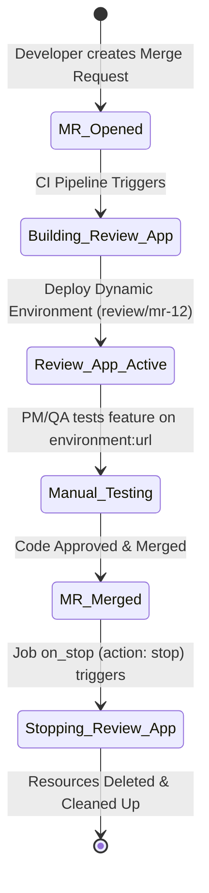
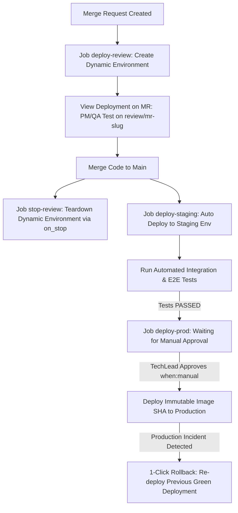
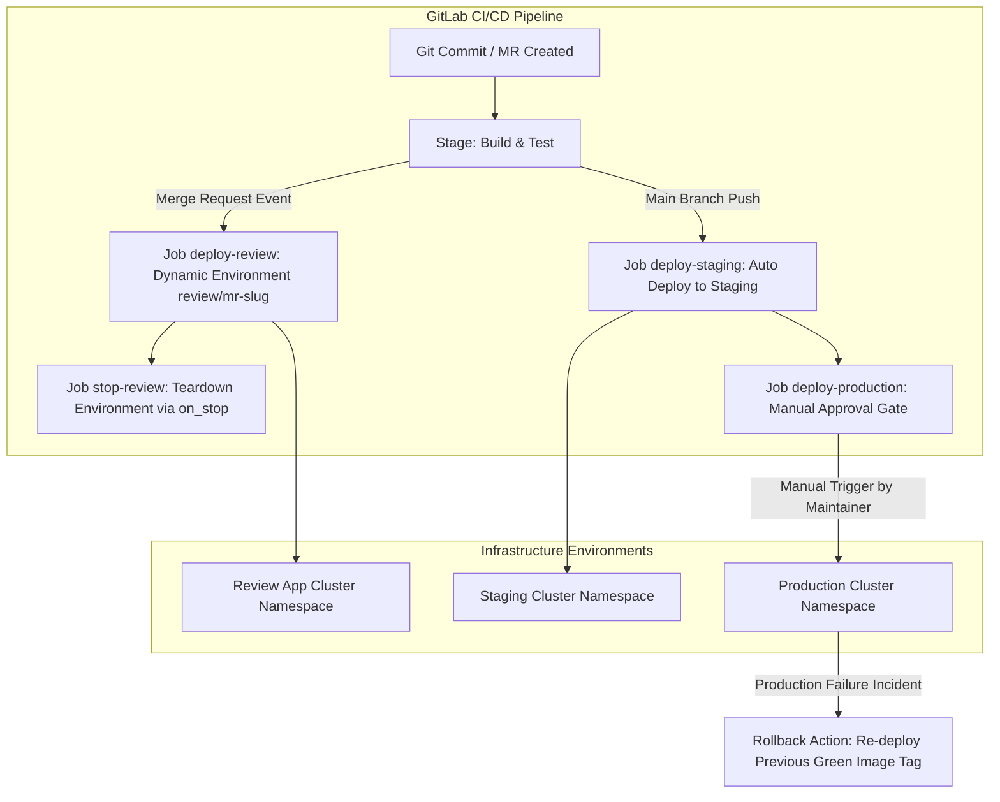

# [BÀI 36] QUẢN TRỊ MÔI TRƯỜNG TRIỂN KHAI (ENVIRONMENTS): DYNAMIC REVIEW APPS, URL MAPPING & MANUAL APPROVAL GATES

Trong kỷ nguyên **DevOps, DevSecOps và Cloud Native Engineering**, **GitLab CI/CD** được công nhận là một trong những nền tảng tự động hóa tích hợp liên tục và phân phối liên tục (CI/CD) hoàn chỉnh, mạnh mẽ và được tin dùng nhất trong các doanh nghiệp quy mô lớn. Không chỉ dừng lại ở các pipeline tuần tự cơ bản, việc vận hành GitLab CI/CD ở cấp độ Production đòi hỏi kỹ sư phải làm chủ kiến trúc điều phối phi tuyến tính **DAG (Directed Acyclic Graph)**, cơ chế quản trị **Autoscaling Runners**, tối ưu hóa **Caching đa tầng**, xác thực không khóa **Keyless OIDC**, bảo mật chuỗi cung ứng phần mềm **SLSA & SBOM** cùng các chính sách **Quality & Security Gates** tự động.

Bài viết chuyên sâu này sẽ đồng hành cùng bạn mổ xẻ toàn diện bức tranh kiến trúc, phân tích các đánh đổi kỹ thuật thực chiến (Engineering Trade-offs), cung cấp hướng dẫn thực hành Lab chi tiết từng bước và bộ câu hỏi phỏng vấn chuyên sâu chuẩn DevOps Lead / DevSecOps Architect.

---

## 1. Bản Chất Kiến Trúc & Cơ Chế Vận Hành Tầng Thấp

---


| STT | Câu hỏi ôn tập | Đáp án chi tiết thực chiến |
|---|---|---|
| 1 | Hệ thống phòng thủ CI/CD tự động 6 lớp bao gồm những lớp nào? | Lớp 1 (Code & Secret SAST với Gitleaks/Semgrep), Lớp 2 (IaC Security Checkov), Lớp 3 (Vault OIDC JWT Token ngắn hạn), Lớp 4 (Multi-stage Container Build Distroless & Trivy Scan), Lớp 5 (Syft SBOM & Cosign Keyless Sign), và Lớp 6 (OPA Rego Policy & Quality Gate Parser). |
| 2 | Tại sao xác thực Vault OIDC lại an toàn hơn biến môi trường tĩnh? | OIDC sinh ra JWT token tạm thời có thời hạn dưới 60 phút tự hủy, loại bỏ 100% rủi ro rò rỉ secret tĩnh khi log dump hoặc khi Runner host bị chiếm quyền kiểm soát. Giúp hệ thống tuân thủ nguyên tắc Zero Static Secrets. |
| 3 | Tệp allowlist `.trivyignore` bắt buộc phải có những metadata gì? | Bắt buộc phải chứa đủ 4 trường metadata: CVE ID, Ngày hết hạn chuẩn ISO 8601 (YYYY-MM-DD), Người phê duyệt (@username) và Ticket JIRA/ServiceNow theo dõi. Nếu thiếu bất kỳ trường nào, script audit tự động đánh nổ lỗi build. |
| 4 | Kỹ thuật Cosign Keyless signing xác thực chữ ký dựa trên điều kiện gì? | Dựa trên OIDC Identity token ngắn hạn của GitLab Runner kết hợp với nhật ký Rekor Transparency Log công khai mà không cần quản lý Private Key tĩnh hay lo lắng nguy cơ rò rỉ khóa vĩnh viễn. |
| 5 | Hai chỉ số KPI quan trọng nhất để đo độ hiệu quả của DevSecOps là gì? | Số lượng lỗ hổng lọt lưới lên Production (Escaped Vulnerabilities) và Thời gian trung bình để khắc phục lỗ hổng (MTTR $< 24$ giờ cho Critical). Chỉ số này đo lường chất lượng thực tế thay vì số lượng tool được cài. |


**Luận đề trung tâm:**
> *"Thêm từ khóa `environment` là bước ngoặt biến một CI Job vô danh thành một **sự kiện triển khai có định danh và lịch sử** — nếu không khai báo `environment`, bạn không thể rollback tự động bằng dữ liệu của hệ thống."*

Cho đến trước Buổi 36, các pipeline của chúng ta chủ yếu tập trung vào việc Kiểm thử, Đóng gói Container và Kiểm tra An ninh (Build, Test, Scan). Từ Buổi 36 trở đi, chúng ta bước sang **Giai đoạn 6: Triển khai và Đa đám mây**. Để quản lý việc triển khai sản phẩm lên hàng loạt môi trường từ Dev, Staging đến Production một cách có kiểm soát, GitLab cung cấp đối tượng **Environment**. Khai báo `environment` giúp gắn kết Job CI với một môi trường hạ tầng thực tế, ghi lại toàn bộ lịch sử deployment, cung cấp đường dẫn truy cập Web trực tiếp trên Merge Request, và cho phép Rollback về phiên bản ổn định trước đó chỉ với 1 cú click. Nếu không có đối tượng này, hệ thống CI/CD chỉ là một script chạy câu lệnh rời rạc mà không có bộ nhớ theo dõi trạng thái ứng dụng.

---


| STT | Kỹ năng thực chiến | Hiện vật chứng minh hoàn thành |
|---|---|---|
| 1 | Khai báo và quản lý Static Environments | Tệp `.gitlab-ci.yml` định nghĩa môi trường `staging` và `production` hiển thị trên GitLab UI |
| 2 | Xây dựng hạ tầng Dynamic Review Apps | Tự động tạo môi trường `review/$CI_COMMIT_REF_SLUG` cho từng Merge Request |
| 3 | Cấu hình tự động dọn dẹp môi trường tạm | Khai báo cặp cờ `action: stop` và `on_stop` giải phóng tài nguyên sau khi Merge MR |
| 4 | Phân quyền kiểm soát Protected Environments | Cấu hình chỉ có `Maintainers` hoặc `SecLead` mới có quyền trigger deploy lên Prod |
| 5 | Cấu hình Cổng phê duyệt thủ công (Manual Gate) | Thêm thuộc tính `when: manual` bắt buộc phê duyệt trước khi chạy job Deploy |
| 6 | Quản lý biến theo phạm vi Environment Scoped | Khai báo biến `DATABASE_URL` khác nhau cho từng môi trường Dev/Staging/Prod |
| 7 | Thực hiện Rollback khẩn cấp an toàn | Thực thi quy trình Re-deploy phiên bản ổn định cũ trực tiếp từ Environment Dashboard |
| 8 | Đo lường chỉ số Deployment Frequency DORA | Theo dõi tần suất và tỷ lệ triển khai thành công trên GitLab Analytics Dashboard |

---


| Kiến thức / Kỹ năng | Mức độ yêu cầu | Nguồn tự học nếu thiếu |
|---|---|---|
| Cú pháp `.gitlab-ci.yml` và `rules` | Thành thục | Buổi 05 & Buổi 12 (QT 5.1, QT 12.1) |
| Đóng gói Container Image bằng Docker | Thành thục | Buổi 25 (QT 25.1, QT 25.4) |
| Quản lý biến CI/CD Variables | Thành thục | Buổi 08 & Buổi 30 (QT 8.2, QT 30.1) |
| Khái niệm Merge Request và Merge Train | Thành thục | Buổi 13 (QT 13.2) |
| Thao tác CLI curl, jq, bash script | Thành thục | Buổi 02 & Buổi 34 (QT 34.3) |

---


| Thuật ngữ Tiếng Việt | Thuật ngữ Tiếng Anh | Giải thích ý nghĩa thực tế |
|---|---|---|
| Môi trường triển khai | Environment | Đối tượng đại diện cho hạ tầng thực tế (Dev, Staging, Prod) lưu giữ lịch sử các phiên bản deployment và hỗ trợ Rollback 1-click. |
| Môi trường động tạm thời | Dynamic Environment / Review App | Môi trường được sinh ra tự động cho từng Merge Request để kiểm thử UI/UX trực quan và tự hủy khi MR được merge để tiết kiệm tài nguyên. |
| Môi trường được bảo vệ | Protected Environment | Môi trường bị giới hạn quyền triển khai, chỉ những tài khoản có Role hoặc nhóm chỉ định (như Maintainer/SecLead) mới có quyền bấm nút deploy. |
| Cổng phê duyệt thủ công | Manual Approval Gate | Cấu hình `when: manual` kết hợp `allow_failure: false` yêu cầu con người kiểm tra và bấm xác nhận trước khi job triển khai được phép chạy. |
| Hành động dừng môi trường | Environment Stop Action | Cấu hình `action: stop` chỉ định job dọn dẹp tài nguyên hạ tầng (xóa Pod/Namespace) khi môi trường tạm bị đóng hoặc hủy. |
| Tự động dừng sau thời gian | `auto_stop_in` | Thuộc tính tự động hủy môi trường Dynamic Review App sau một khoảng thời gian chờ (ví dụ: `1 day`) để dọn dẹp các MR bị bỏ quên. |
| Phân cấp môi trường | Deployment Tiers | Phân loại môi trường theo 4 cấp chuẩn quốc tế: `production`, `staging`, `testing`, `development` để GitLab hiển thị nhóm trực quan. |
| Biến theo phạm vi môi trường | Environment Scoped Variable | Biến CI/CD chỉ có giá trị khi job chạy dưới môi trường tương ứng (ví dụ Prod DB URL khác Staging DB URL), ngăn thảm họa lỡ xóa nhầm Prod DB. |
| Khôi phục phiên bản cũ | Rollback Deployment | Thao tác tái triển khai (Re-deploy) một Artifact/Container Image cũ đã được chứng minh an toàn 100% lên Production trong vòng dưới 60 giây. |
| Tần suất triển khai | Deployment Frequency | Chỉ số DORA đo số lần sản phẩm được đưa lên môi trường Production thành công trong một khoảng thời gian (ngày/tuần/tháng). |
| Tỷ lệ thất bại khi thay đổi | Change Failure Rate | Chỉ số DORA đo phần trăm các bản triển khai Production gây ra sự cố cần phải rollback hoặc hotfix khẩn cấp. |
| Vệt vết kiểm toán triển khai | Deployment Audit Log | Nhật ký chi tiết không thể sửa xóa ghi lại chính xác ai bấm deploy, vào lúc nào, từ commit SHA nào lên môi trường nào. |


#### Mô hình 1: Vòng đời của Dynamic Review App (Review App Lifecycle Management)
Một Merge Request mở ra $\to$ CI Pipeline tự động trigger job `deploy-review` $\to$ Khởi tạo Namespace và Pods ứng dụng tạm thời trên Kubernetes Cluster $\to$ Ghi nhận URL `https://review-mr-12.app.domain` lên Merge Request Widget $\to$ Tester/Product Manager kiểm thử trực tiếp giao diện ứng dụng trên môi trường sống $\to$ Merge Code vào nhánh `main` $\to$ Job `stop-review` (khai báo `action: stop` thông qua `on_stop`) tự động chạy ngầm gỡ bỏ toàn bộ Pods/Services/Ingress để giải phóng tài nguyên. Nếu MR bị bỏ quên không ai đụng tới, cờ `auto_stop_in: 1 day` sẽ tự động kích hoạt job teardown sau 24h.



#### Mô hình 2: Phân cấp Môi trường và Luồng Phê duyệt (Deployment Tier Matrix & Protected Envs)
Tất cả các dự án Enterprise đều tuân theo phân cấp 4 Tiers tiêu chuẩn. Mỗi Tier có quy tắc bảo vệ, phân quyền và hình thức kích hoạt khác nhau:
- **Tier 1: Development (`deployment_tier: development`):** Môi trường thử nghiệm cá nhân hoặc Dynamic Review Apps cho Merge Request. Tự động deploy, tự động teardown, không bảo vệ.
- **Tier 2: Testing (`deployment_tier: testing`):** Môi trường chạy Integration Test và Automation Test tập trung của QA Team. Tự động deploy từ commit SHA của nhánh `main`.
- **Tier 3: Staging (`deployment_tier: staging`):** Môi trường mô phỏng 99% cấu hình Production (Pre-production). Tự động deploy, sử dụng dữ liệu test đã được làm sạch (Sanitized Data).
- **Tier 4: Production (`deployment_tier: production`):** Môi trường phục vụ người dùng cuối thật. Yêu cầu **Protected Environment**, phân quyền chỉ `Maintainers/SecLead` được trigger, bắt buộc có nút phê duyệt thủ công `when: manual`, và hỗ trợ nút bấm **Re-deploy Rollback 1-click** khi xảy ra sự cố.

#### Mô hình 3: Chiến lược Rollback Bất biến (Immutable Artifact Rollback Strategy)
Khi có sự cố Production xảy ra, tuyệt đối không tạo commit fix mới vội vã. Hệ thống sử dụng đối tượng Environment để tìm bản Deployment màu xanh gần nhất trong lịch sử, lấy đúng Container Image Tag `$CI_COMMIT_SHA` đã được kiểm chứng an toàn 100%, và Re-deploy đè lên cluster. Thời gian khôi phục dịch vụ khẩn cấp chỉ mất dưới 60 giây.

---

### 1.1. Quy tắc Định danh và Quản lý Lịch sử Triển khai (10 phút)

**Nguyên lý cốt lõi:** Định danh duy nhất và theo dõi lịch sử triển khai bằng `environment:name`.
**Phát biểu.** Mọi job thực hiện hành vi thay đổi trạng thái hạ tầng bắt buộc phải khai báo từ khóa `environment:name` chuẩn xác.
**Giải thích cơ chế ngầm:** Khai báo `environment:name` chuyển đổi một CI job vô danh thành một sự kiện deployment chính thức. Dữ liệu này giúp GitLab lưu vết lịch sử (Deployment History), ghi nhận commit SHA đang chạy trên từng server và hỗ trợ tính năng Rollback 1-click. Nếu không có `environment:name`, hệ thống hoàn toàn không biết job đó triển khai đi đâu và không tạo được trang dashboard theo dõi.
> [!WARNING]
> **CẠM BẪY THỰC CHIẾN:**
> Job triển khai chỉ ghi script `kubectl apply` hoặc `docker run` nhưng không khai báo thuộc tính `environment`, khiến GitLab UI không hiển thị danh sách môi trường và không biết server đang chạy bản commit nào.
**Minh hoạ.**
```yaml
deploy-staging-job:
  stage: deploy
  script:
    - echo "Deploying commit $CI_COMMIT_SHA to Staging Environment..."
    - ./scripts/deploy-k8s.sh staging $CI_COMMIT_SHA
  environment:
    name: staging
    deployment_tier: staging
```
**Con số chốt:** 100% job deploy có `environment:name`.

---

**Nguyên lý cốt lõi:** Ghi nhận URL môi trường trực tiếp trên Merge Request bằng `environment:url`.
**Phát biểu.** Tất cả các job triển khai web service phải khai báo `environment:url` dẫn thẳng tới địa chỉ HTTP/HTTPS của ứng dụng đang chạy.
**Giải thích cơ chế ngầm:** Giúp Tester, Product Owner và Security Reviewer có thể bấm trực tiếp vào nút "View Deployment" ngay trên giao diện Merge Request để kiểm thử giao diện mà không cần hỏi Developer địa chỉ IP hay port của server. Điều này cắt giảm 80% thời gian trao đổi qua lại giữa nhóm Dev và nhóm QA.
> [!WARNING]
> **CẠM BẪY THỰC CHIẾN:**
> Triển khai xong nhưng không ai biết truy cập ở đâu, Developer phải copy-paste URL thủ công vào comment của Merge Request mỗi lần push commit mới.
**Minh hoạ.**
```yaml
deploy-review-app:
  stage: deploy
  script:
    - ./scripts/deploy-dynamic-review.sh $CI_COMMIT_REF_SLUG
  environment:
    name: review/$CI_COMMIT_REF_SLUG
    url: https://$CI_COMMIT_REF_SLUG.review.company.internal
    deployment_tier: development
```
**Con số chốt:** 100% Review Apps có `environment:url`.

---

**Nguyên lý cốt lõi:** Tự động dọn dẹp tài nguyên Dynamic Environment bằng cặp cờ `action: stop` và `on_stop`.
**Phát biểu.** Mỗi job khởi tạo Dynamic Review App bắt buộc phải đi kèm một job dọn dẹp khai báo `environment:action: stop` và liên kết qua `environment:on_stop`.
**Giải thích cơ chế ngầm:** Hàng trăm Merge Request được tạo ra mỗi tuần sẽ sinh ra hàng trăm môi trường Review Apps. Nếu không có job tự động dọn dẹp khi MR đóng/merge, tài nguyên CPU/RAM trên Kubernetes Cluster sẽ bị cạn kiệt hoàn toàn (Resource Exhaustion).
> [!WARNING]
> **CẠM BẪY THỰC CHIẾN:**
> Tạo được Review App nhưng khi Merge MR thì Pod và Namespace vẫn chạy ngầm vĩnh viễn trên cluster, tốn hàng ngàn USD tiền điện cloud.
**Minh hoạ.**
```yaml
deploy-review:
  stage: deploy
  script: 
    - echo "Spinning up Dynamic Review Environment for $CI_COMMIT_REF_SLUG"
    - ./scripts/provision-review-app.sh $CI_COMMIT_REF_SLUG
  environment:
    name: review/$CI_COMMIT_REF_SLUG
    url: https://$CI_COMMIT_REF_SLUG.review.company.internal
    on_stop: stop-review

stop-review:
  stage: deploy
  script: 
    - echo "Tearing down Dynamic Review Environment for $CI_COMMIT_REF_SLUG"
    - ./scripts/teardown-review-app.sh $CI_COMMIT_REF_SLUG
  rules:
    - if: $CI_MERGE_REQUEST_ID
      when: manual
  environment:
    name: review/$CI_COMMIT_REF_SLUG
    action: stop
```
**Con số chốt:** Cặp cờ `on_stop` + `action: stop` bắt buộc.

---

**Nguyên lý cốt lõi:** Cấu hình cờ `auto_stop_in` để giải phóng tài nguyên Review Apps tự động sau thời gian chờ.
**Phát biểu.** Mọi Dynamic Environment phải được khai báo thuộc tính `auto_stop_in` (ví dụ: `1 day` hoặc `3 days`) để tự động kích hoạt job teardown nếu MR bị bỏ quên.
**Giải thích cơ chế ngầm:** Lập trình viên có thể mở MR rồi bỏ quên không merge trong nhiều tuần. Cờ `auto_stop_in` đóng vai trò làm hàng rào bảo vệ cuối cùng tự động thu hồi tài nguyên rác mà không cần sự can thiệp của con người.
> [!WARNING]
> **CẠM BẪY THỰC CHIẾN:**
> Các Review Apps của các MR bị bỏ quên chạy ròng rã 3 tháng trời mà không có bất kỳ lượt truy cập nào.
**Minh hoạ.**
```yaml
environment:
  name: review/$CI_COMMIT_REF_SLUG
  url: https://$CI_COMMIT_REF_SLUG.review.company.internal
  on_stop: stop-review
  auto_stop_in: 1 day
```
**Con số chốt:** Auto-stop sau maximum 3 ngày.

---

### 1.2. Quy tắc Phân quyền và Bảo vệ Protected Environments (10 phút)

**Nguyên lý cốt lõi:** Khóa quyền triển khai môi trường nhạy cảm bằng Protected Environments.
**Phát biểu.** Các môi trường `production` và `staging` bắt buộc phải được bật cấu hình Protected Environments trên Project Settings, giới hạn quyền trigger cho các Role chỉ định.
**Giải thích cơ chế ngầm:** Ngăn chặn lập trình viên junior hoặc các pipeline chạy ở nhánh cá nhân tự ý bấm lệnh deploy làm ghi đè hạ tầng Production đang hoạt động. Phân quyền môi trường là nguyên tắc cốt lõi của tiêu chuẩn tuân thủ an toàn thông tin ISO 27001.
> [!WARNING]
> **CẠM BẪY THỰC CHIẾN:**
> Bất kỳ ai có quyền Developer cũng có thể kích hoạt job deploy trực tiếp lên máy chủ Production mà không cần ai kiểm soát.
**Minh hoạ.** Cấu hình trong GitLab Settings -> CI/CD -> Protected Environments:
- Environment: `production`
- Allowed to Deploy: `Maintainers` + `Security Lead`
- Unified Approval Rules: Minimum 1 Approval Required.
**Con số chốt:** 100% Prod Envs được Protected.

---

**Nguyên lý cốt lõi:** Cấu hình quy trình phê duyệt thủ công bắt buộc (Manual Approval Gate) trước khi Deploy.
**Phát biểu.** Job triển khai lên Production bắt buộc phải khai báo thuộc tính `when: manual` kết hợp với thuộc tính `allow_failure: false`.
**Giải thích cơ chế ngầm:** Đảm bảo có sự kiểm tra và phê duyệt cuối cùng của con người (Human-in-the-loop) sau khi tất cả các bài test tự động và Security Gate đã trôi qua màu xanh. Điều này giúp kiểm soát chính xác thời điểm release phù hợp với kế hoạch kinh doanh.
> [!WARNING]
> **CẠM BẪY THỰC CHIẾN:**
> Pipeline vừa build xong là tự động đẩy thẳng code mới lên Prod lúc 12h trưa mà không cho phép Tech Lead xem xét thời điểm thích hợp.
**Minh hoạ.**
```yaml
deploy-prod-job:
  stage: deploy
  script:
    - echo "Deploying release candidate $CI_COMMIT_SHA to Production..."
    - ./scripts/deploy-k8s.sh production $CI_COMMIT_SHA
  environment:
    name: production
    deployment_tier: production
  rules:
    - if: $CI_COMMIT_BRANCH == "main"
      when: manual
  allow_failure: false
```
**Con số chốt:** `when: manual` cho Prod Deploy.

---

**Nguyên lý cốt lõi:** Phân cấp môi trường chuẩn mực theo Deployment Tiers.
**Phát biểu.** Khai báo chính xác thuộc tính `deployment_tier` (`production`, `staging`, `testing`, `development`) cho mọi môi trường trong tệp `.gitlab-ci.yml`.
**Giải thích cơ chế ngầm:** Giúp GitLab tự động nhóm các môi trường vào đúng tab trên Dashboard, hỗ trợ phân loại metric DORA chính xác và áp dụng các chính sách an ninh phù hợp cho từng cấp.
> [!WARNING]
> **CẠM BẪY THỰC CHIẾN:**
> Đặt tên môi trường lộn xộn (`prod-server-1`, `test-node-abc`) khiến GitLab hiển thị lộn xộn và không tính toán được DORA Metrics.
**Minh hoạ.**
```yaml
environment:
  name: production/asia-south
  deployment_tier: production
```
**Con số chốt:** 4 Tiers chuẩn quốc tế.

---

**Nguyên lý cốt lõi:** Quản lý biến môi trường theo phạm vi Environment Scoped Variables.
**Phát biểu.** Tất cả các biến cấu hình hạ tầng nhạy cảm (như Database Connection String, API Endpoint) phải được phân tách giá trị theo đúng Environment Scope trên GitLab Settings.
**Giải thích cơ chế ngầm:** Tránh thảm họa lộ thông tin khi job ở môi trường Staging lại vô tình truy cập và làm hỏng cơ sở dữ liệu thật của môi trường Production.
> [!WARNING]
> **CẠM BẪY THỰC CHIẾN:**
> Dùng chung một biến `DB_URL` cho tất cả các job khiến code ở nhánh Dev kết nối nhầm vào Prod DB.
**Minh hoạ.**
- Variable `DATABASE_URL` | Scope: `development` | Value: `postgres://dev-db:5432/app`
- Variable `DATABASE_URL` | Scope: `production`  | Value: `postgres://prod-cluster:5432/app`
**Con số chốt:** 100% Secret Scoped theo Environment.

---

### 1.3. Quy tắc An toàn Artifacts và Chiến lược Rollback (10 phút)

**Nguyên lý cốt lõi:** Đảm bảo tính bất biến của Deployment Artifacts giữa Staging và Production.
**Phát biểu.** Artifact (Container Image hoặc Binary) được deploy lên Production bắt buộc phải là ĐÚNG ARTIFACT đã chạy thành công trên Staging, tuyệt đối không rebuild lại code.
**Giải thích cơ chế ngầm:** Rebuild lại mã nguồn ở job Prod có thể kéo về các thư viện phụ thuộc mới hơn (Dependency Drift) hoặc sinh ra binary khác với bản đã test trên Staging, gây ra lỗi ẩn nguy hiểm.
> [!WARNING]
> **CẠM BẪY THỰC CHIẾN:**
> Stage Staging build một Docker Image, đến Stage Prod lại chạy lệnh `docker build` lần 2 từ source code.
**Minh hoạ.** Đóng gói Image ở stage `build` với Tag cố định `$CI_COMMIT_SHA`, và dùng chính Image Tag đó deploy cho cả Staging và Prod:
```bash
# Trong deploy-staging.sh
helm upgrade app ./chart --set image.tag=$CI_COMMIT_SHA -n staging
# Trong deploy-prod.sh
helm upgrade app ./chart --set image.tag=$CI_COMMIT_SHA -n production
```
**Con số chốt:** 1 Artifact SHA cho 100% môi trường.

---

**Nguyên lý cốt lõi:** Thực hiện Rollback an toàn bằng cách tái triển khai (Re-deploy) commit SHA xanh cũ thay vì push hotfix vội vã.
**Phát biểu.** Khi xảy ra sự cố Production, quy trình Rollback tiêu chuẩn là bấm nút **Re-deploy** phiên bản xanh gần nhất từ GitLab Environment UI, không vội vã tạo commit hotfix nháp.
**Giải thích cơ chế ngầm:** Re-deploy phiên bản cũ đã được kiểm chứng xanh 100% giúp khôi phục dịch vụ chỉ trong vài giây. Trong khi viết hotfix vội vã dưới áp lực sự cố rất dễ sinh ra thêm lỗi mới nặng nề hơn.
> [!WARNING]
> **CẠM BẪY THỰC CHIẾN:**
> Prod sập 3h sáng, lập trình viên luống cuống viết code sửa dán đè trực tiếp lên server mà không có lịch sử ghi vết.
**Minh hoạ.** Mở GitLab Operations -> Environments -> Click `production` -> Chọn phiên bản Deployment màu xanh cũ -> Click `Re-deploy`.
**Con số chốt:** Thời gian Rollback $< 60$ giây.

---

**Nguyên lý cốt lõi:** Cấm tuyệt đối việc sử dụng cờ `when: manual` không đi kèm `environment` bảo vệ.
**Phát biểu.** Mọi job có khai báo nút bấm thủ công `when: manual` ở stage deploy bắt buộc phải gắn liền với một `environment` chính thức.
**Giải thích cơ chế ngầm:** Nếu một job `when: manual` không có `environment`, ai cũng có thể bấm nút chạy mà không qua hạ tầng phân quyền Protected Environments và không lưu được log rollback.
> [!WARNING]
> **CẠM BẪY THỰC CHIẾN:**
> Khai báo job `deploy-job: script: ./deploy.sh; when: manual` nhưng hoàn toàn bỏ trống mục `environment`.
**Minh hoạ.** Cặp đôi bắt buộc: `when: manual` luôn phải đi cùng `environment: name: production`.
**Con số chốt:** 100% manual jobs có `environment`.

---

**Nguyên lý cốt lõi:** Theo dõi tần suất triển khai và chỉ số Deployment Frequency trong DORA Metrics.
**Phát biểu.** Tận dụng dữ liệu từ đối tượng `environment` để theo dõi và tối ưu hóa chỉ số DORA Deployment Frequency và Lead Time for Changes trên GitLab Analytics.
**Giải thích cơ chế ngầm:** Đo lường bằng con số thực tế giúp tổ chức đánh giá tốc độ đưa tính năng mới ra thị trường và phát hiện các nút thắt cổ chai trong quy trình phê duyệt release.
> [!WARNING]
> **CẠM BẪY THỰC CHIẾN:**
> Triển khai phần mềm theo cảm tính, không biết một tháng công ty deploy bao nhiêu lần và tỷ lệ deploy lỗi là bao nhiêu.
**Minh hoạ.** Theo dõi dashboard GitLab CI/CD Analytics -> Value Stream Analytics -> DORA Metrics:
- High Performers: Deployment Frequency $> 1$ lần / ngày.
- Change Failure Rate $< 5\%$.
**Con số chốt:** Tần suất deploy $> 1$ lần/ngày.

---

### 1.4. Đưa vào việc thật (4 phút)

### 7.1. Kịch bản áp dụng thực tế tại Doanh nghiệp Tài chính & Thương mại Điện tử
Trong hệ thống Ngân hàng số và Thương mại Điện tử quy mô lớn:
1. **Developer tạo Merge Request (MR Phase):** Ngay khi Developer tạo MR để phát triển tính năng mới, CI Pipeline tự động khởi tạo một **Dynamic Review App** tại địa chỉ URL `https://feature-payment-v2.review.company.internal`. Product Manager và QA Lead truy cập trực tiếp vào URL này để test giao diện thanh toán mới trên môi trường sống thực tế.
2. **Merge Code vào Nhánh Main (Merge Phase):** Ngay khi MR được phê duyệt và Merge vào nhánh main, job `stop_review` tự động chạy ngầm gỡ bỏ toàn bộ Pods, Services và Ingress Namespace của Review App trên Kubernetes Cluster để giải phóng tài nguyên CPU/RAM.
3. **Triển khai tự động lên Staging (Staging Phase):** Pipeline tự động đóng gói Container Image với Tag cố định `$CI_COMMIT_SHA` và deploy bản build mới nhất lên môi trường `staging`. Nhóm QA tiến hành chạy bộ kịch bản Automation E2E Testing (Selenium/Cypress).
4. **Phê duyệt thủ công lên Production (Production Release Phase):** Khi toàn bộ E2E Test và Security Gate trên Staging trôi qua màu xanh, job `deploy-production` chuyển sang trạng thái chờ nút bấm phê duyệt `when: manual`. Tech Lead và Security Officer xem xét báo cáo tổng hợp và chọn thời điểm ít truy cập (ví dụ 23h đêm) để bấm nút Deploy sản phẩm lên hạ tầng Production.

### 7.2. Case Study Thực tế: Cứu nguy Sự cố Production bằng Rollback 1-Click trong 60 giây
Vào lúc 2h sáng, một bản cập nhật giao thức mã hóa kết nối Database được triển khai lên Production. Ngay lập tức, 35% lượng giao dịch của người dùng bị thất bại do timeout kết nối.
- **Cách xử lý sai thất bại cổ điển:** Kỹ sư On-call hoảng loạn thức dậy mở máy tính, cố gắng tìm dòng code lỗi, sửa trực tiếp trên máy local, push commit mới, và chờ CI Pipeline build lại toàn bộ từ đầu mất 25 phút $\to$ Hệ thống sập ròng rã 45 phút, doanh nghiệp bị phạt hợp đồng SLA và thiệt hại hàng triệu USD.
- **Cách xử lý chuẩn Enterprise (GitLab Environment Rollback 1-Click):**
  1. Trực ca On-call nhận được cảnh báo PagerDuty lúc 2h01 sáng.
  2. Mở điện thoại di động hoặc laptop truy cập nhanh vào giao diện **GitLab Operations -> Environments -> Production Dashboard**.
  3. Tìm lại phiên bản Deployment thành công gần nhất lúc 18h chiều hôm trước (bản xanh 100%) $\to$ Click vào nút **Re-deploy**.
  4. GitLab CI lập tức kích hoạt job deploy lại ĐÚNG Container Image Tag SHA cũ đã được kiểm chứng an toàn.
  5. Hệ thống Production khôi phục hoàn toàn lúc 2h02 sáng (Thời gian gián đoạn thực tế đúng 60 giây).
  6. Sáng hôm sau, Dev Team thong thả tái hiện lại sự cố trên môi trường Staging để nghiên cứu nguyên nhân gốc rễ (Root Cause Analysis) mà không bị áp lực downtime từ khách hàng.

---

### 7.3. Trường hợp khi nào KHÔNG nên dùng Dynamic Review Apps
Mặc dù Dynamic Environments (Review Apps) rất mạnh mẽ cho các ứng dụng Web Stateless, nhưng KHÔNG nên áp dụng một cách máy móc cho tất cả các trường hợp sau:

| Loại dự án / Ngữ cảnh | Lý do KHÔNG nên dùng Dynamic Review Apps | Giải pháp thay thế phù hợp |
|---|---|---|
| Ứng dụng dính chặt với Database Oracle/Legacy | Không thể tự động nhân bản (clone) cơ sở dữ liệu Terabyte khổng lồ cho từng MR. | Dùng chung môi trường `staging-shared` có sẵn data test đã được làm sạch. |
| Hệ thống Batch Job / Worker Cronjob | Không có giao diện Web HTTP/HTTPS để review trực quan trên browser. | Chỉ chạy Unit Test, Integration Test và Mock Data trong pipeline CI. |
| Hạ tầng CI Runner có tài nguyên RAM/CPU rất hạn chế | Việc bật hàng chục Review Apps đồng thời sẽ làm sập máy chủ CI Runner Host. | Khai báo cờ `auto_stop_in: 2 hours` hoặc tắt cờ Review Apps ở repo này. |
| Dịch vụ yêu cầu cấp phát chứng chỉ SSL/TLS cứng | Việc cấp SSL Cert thủ công cho từng tên miền subdomain động tốn quá nhiều thời gian. | Sử dụng Wildcard Certificate (`*.review.company.internal`) nếu bắt buộc dùng. |

---

### 1.5. Bẫy hay gặp (2 phút)

| Bẫy hay gặp | Vì sao dính bẫy | Làm đúng là |
|---|---|---|
| Bẫy 1: Quên khai báo `on_stop` khiến Review Apps mọc như nấm không bao giờ bị xóa | Chỉ viết job deploy review mà không viết job teardown dọn dẹp liên kết. | Luôn khai báo cặp đôi `on_stop: stop-review` (job deploy) và `action: stop` (job teardown). |
| Bẫy 2: Dùng cờ `when: manual` ở job deploy Prod nhưng không bật Protected Environments | Nghĩ rằng `when: manual` là đủ an toàn mà không biết bất kỳ quyền Developer nào cũng bấm được. | Bắt buộc bật Protected Environment cho Prod trên GitLab Settings để giới hạn tài khoản được bấm nút. |
| Bẫy 3: Rebuild lại Docker Image khi deploy lên Production | Muốn chắc chắn code mới nhất nên chạy lại `docker build` ở stage Prod gây ra Dependency Drift. | Sử dụng đúng **1 Image SHA** duy nhất đã được test xanh trên Staging để deploy cho Production. |
| Bẫy 4: Quên khai báo `allow_failure: false` ở job `when: manual` | Khiến pipeline tổng thể bị coi là "Pass với warning" làm các stage đằng sau tự chạy trôi qua khi chưa deploy. | Khai báo `allow_failure: false` cho các job manual deploy quan trọng để giữ pipeline ở trạng thái Pending. |
| Bẫy 5: Lẫn lộn biến Database giữa môi trường Dev và Production | Không sử dụng Environment Scoped Variables nên job Dev đọc nhầm biến Prod DB URL. | Phân tách Scope rõ ràng cho mọi Variable nhạy cảm trên GitLab Project Settings theo từng Environment. |
| Bẫy 6: Khai báo `environment:url` sai định dạng protocol HTTP/HTTPS | Quên gõ `http://` hoặc `https://` đằng trước làm nút View Deployment bị hỏng link. | Bắt buộc khai báo đầy đủ URL có protocol: `url: https://$CI_COMMIT_REF_SLUG.review.domain`. |
| Bẫy 7: Tạo hotfix commit vội vã lúc 3h sáng thay vì Re-deploy bản cũ | Hoảng loạn khi Prod bị sập nên cố gắng sửa code trực tiếp dưới áp lực downtime. | Mở Environment UI, chọn bản xanh gần nhất và bấm nút **Re-deploy** khôi phục dịch vụ trong 60s. |

---

### 1.6. Tóm tắt (3 phút)

### 9.1. Sơ đồ Mermaid: Kiến trúc Luồng Triển khai Multi-Environment chuẩn Enterprise



### 9.2. Năm điều phải nhớ thuộc lòng
1. **Environment định danh sự kiện:** Không có từ khóa `environment:name`, job deploy chỉ là một tập lệnh CLI vô danh không thể tạo dashboard và không thể rollback tự động.
2. **Review Apps tự dọn dẹp:** Bắt buộc dùng cặp thuộc tính `on_stop` + `action: stop` và cờ `auto_stop_in` để không làm cạn kiệt tài nguyên CPU/RAM trên Kubernetes Cluster.
3. **Protected Environments:** Chỉ tài khoản có Role chỉ định (Maintainers/SecLead) mới được quyền trigger triển khai lên các môi trường nhạy cảm như Staging và Production.
4. **Bất biến Artifact (Immutability):** Triển khai Production sử dụng ĐÚNG Container Image SHA đã được kiểm thử màu xanh 100% trên Staging, tuyệt đối không rebuild lại code.
5. **Rollback bằng Re-deploy 1-Click:** Khi Production gặp sự cố, truy cập Environment UI, chọn bản deployment xanh gần nhất và bấm nút **Re-deploy** để khôi phục dịch vụ trong 60 giây.

---

### 1.7. Câu hỏi tự kiểm tra (5 phút)

### 10.1. Danh sách câu hỏi tự kiểm tra
1. Từ khóa `environment:name` trong tệp `.gitlab-ci.yml` mang lại giá trị cốt lõi gì cho hệ thống quản trị CI/CD Enterprise?
2. Thuộc tính `environment:url` giúp ích gì cho quy trình kiểm thử và làm việc liên phòng ban trên Merge Request?
3. Cặp thuộc tính nào bắt buộc phải đi cùng nhau để đảm bảo môi trường động Review Apps tự dọn dẹp khi Merge MR?
4. Thuộc tính `auto_stop_in` giải quyết vấn đề gì trong quản lý hạ tầng môi trường động trên Kubernetes?
5. Sự khác biệt cốt lõi về mục đích bảo vệ giữa Protected Branch và Protected Environment là gì?
6. Tại sao job triển khai Production nên cấu hình thuộc tính `when: manual` kết hợp bắt buộc với `allow_failure: false`?
7. Bốn tầng phân cấp môi trường tiêu chuẩn trong `deployment_tier` của GitLab được quy định như thế nào?
8. Tại sao việc Rebuild lại mã nguồn khi deploy lên Production lại bị coi là một Anti-Pattern nguy hiểm trong Continuous Delivery?
9. Cơ chế Environment Scoped Variables giúp ngăn ngừa thảm họa lộ secret hay thao tác nhầm lẫn như thế nào?
10. Quy trình Rollback chuẩn nhất khi môi trường Production bị sự cố sập dịch vụ khẩn cấp là gì?
11. Hai chỉ số DORA Metrics nào liên quan trực tiếp đến việc quản lý đối tượng Environment trong GitLab Analytics?
12. Tại sao tuyệt đối không được cấu hình cờ `when: manual` mà bỏ trống việc khai báo đối tượng `environment`?

---

### 10.2. Đáp án câu hỏi tự kiểm tra

1. Từ khóa `environment:name` giúp chuyển đổi một CI job vô danh thành một sự kiện deployment chính thức. Dữ liệu này giúp GitLab lưu giữ lịch sử triển khai (Deployment History), theo dõi commit SHA đang chạy trên từng môi trường và cung cấp nút bấm Rollback 1-click tự động.
2. Thuộc tính `environment:url` hiển thị nút bấm "View Deployment" trực tiếp trên giao diện Merge Request. Điều này cho phép Tester, Product Owner và Security Reviewer truy cập ngay vào địa chỉ ứng dụng web để kiểm thử giao diện mà không cần hỏi Developer IP hay Port.
3. Cặp thuộc tính bắt buộc gồm `on_stop: <job_name>` (khai báo ở job deploy) và `action: stop` (khai báo ở job teardown).
4. Thuộc tính `auto_stop_in` tự động kích hoạt job teardown dọn dẹp môi trường Review App sau một khoảng thời gian quy định (ví dụ `1 day`), giúp thu hồi tài nguyên rác của các Merge Request bị bỏ quên.
5. Protected Branch bảo vệ mã nguồn Git không cho phép push code trực tiếp. Protected Environment bảo vệ hạ tầng máy chủ không cho phép các tài khoản không có thẩm quyền (như Junior Developer) bấm nút triển khai code lên môi trường nhạy cảm.
6. Cần khai báo `when: manual` để yêu cầu sự phê duyệt của con người trước khi release, và `allow_failure: false` giúp giữ pipeline ở trạng thái chờ chứ không coi pipeline là đã kết thúc thành công khi chưa được deploy.
7. Gồm 4 tầng phân cấp tiêu chuẩn: `production`, `staging`, `testing`, `development`.
8. Vì việc rebuild lại mã nguồn ở stage Prod có thể kéo về các thư viện phụ thuộc mới hơn (Dependency Drift) hoặc tạo ra file binary khác với phiên bản đã được kiểm thử màu xanh trên môi trường Staging.
9. Giúp phân tách riêng biệt các biến cấu hình nhạy cảm (như Database Connection String, API Endpoint) cho từng môi trường, ngăn ngừa thảm họa code ở môi trường Dev/Staging kết nối nhầm vào Database thật của môi trường Production.
10. Quy trình Rollback chuẩn là mở GitLab Environment UI đối với môi trường Production, chọn bản Deployment màu xanh gần nhất và bấm nút **Re-deploy** (thời gian khôi phục dịch vụ $< 60$ giây).
11. Hai chỉ số DORA Metrics gồm: Deployment Frequency (Tần suất triển khai thành công) và Change Failure Rate (Tỷ lệ thất bại khi thay đổi).
12. Vì nếu thiếu `environment`, job manual đó sẽ không được bảo vệ bởi hạ tầng Protected Environments, dẫn đến bất kỳ ai có quyền Developer cũng có thể tự ý bấm nút kích hoạt job deploy.

---

### 1.8. Tài liệu tham khảo (2 phút)

| Nguồn tài liệu | Mô tả nội dung | Phiên bản GitLab áp dụng |
|---|---|---|
| GitLab Environments Documentation | Hướng dẫn đầy đủ về cấu hình Environments & Review Apps | GitLab CE/EE 16.x + |
| GitLab Protected Environments Guide | Phân quyền và Approval Rules cho môi trường nhạy cảm | GitLab Premium/EE 16.x + |
| DORA Metrics in GitLab | Đo lường Deployment Frequency và Lead Time for Changes | GitLab Ultimate/EE |
| Continuous Delivery Best Practices | Nguyên tắc Immutability Artifacts & Rollback Strategy | CNCF CD Foundation |
| Kubernetes Review Apps Architecture | Thiết lập Dynamic Namespaces cho Dynamic Review Apps | Kubernetes v1.28+ |

---

## Bảng đối soát thời lượng

| Mục | Nội dung | Thời lượng |
|---|---|---|
| §0 | Khởi động và ôn tập | 10 phút |
| §1 | Sau buổi này học viên LÀM ĐƯỢC gì | 1 phút |
| §2 | Cần biết trước | 1 phút |
| §3 | Thuật ngữ và mô hình tư duy | 8 phút |
| §4 | Quy tắc Định danh và Quản lý Lịch sử Triển khai | 10 phút |
| §5 | Quy tắc Phân quyền và Bảo vệ Protected Environments | 10 phút |
| §6 | Quy tắc An toàn Artifacts và Chiến lược Rollback | 10 phút |
| §7 | Đưa vào việc thật | 4 phút |
| §8 | Bẫy hay gặp | 2 phút |
| §9 | Tóm tắt | 3 phút |
| §10 | Câu hỏi tự kiểm tra | 5 phút |
| §11 | Tài liệu tham khảo | 2 phút |
| **Tổng** | **Khối lý thuyết** | **60'** |

---

## 2. Hướng Dẫn Thực Hành & Triển Khai Lab Chuẩn Production

> [!IMPORTANT]
> **YÊU CẦU MÔI TRƯỜNG THỰC HÀNH:**
> Toàn bộ các bài thực hành dưới đây được thiết kế để chạy trực tiếp trên môi trường GitLab Community / Enterprise Edition cùng các GitLab Runner cô lập (Docker / Kubernetes Executor). Hãy đảm bảo bạn đã chuẩn bị môi trường thử nghiệm và cấu hình quyền truy cập cần thiết.

## Khối thực hành — 150 phút

---

## 1. Mục tiêu bài thực hành Lab
Trong bài lab này, học viên sẽ trực tiếp xây dựng luồng triển khai Multi-Environment chuẩn Enterprise trên GitLab CI/CD:
1. Thiết lập các Static Environments (`development`, `staging`, `production`) phân cấp chuẩn `deployment_tier`.
2. Xây dựng Dynamic Review Apps tự động khởi tạo khi tạo Merge Request và tự động dọn dẹp qua `action: stop` và `on_stop`.
3. Phân quyền và bảo vệ môi trường Protected Environments đối với `staging` và `production`.
4. Cấu hình Cổng phê duyệt thủ công (`when: manual` kết hợp `allow_failure: false`).
5. Thực hành mô phỏng sự cố Production và thực thi quy trình Rollback 1-Click bằng phương pháp Re-deploy bản build xanh cũ.

---

## 2. Mô hình kiến trúc Lab L2



---

## 3. Các bước thực hiện bài lab (14 Checkpoints)

### Bước 1: Khởi tạo Cấu trúc Thư mục và Mã nguồn Ứng dụng Web (10 phút)

Tạo thư mục làm việc bài lab Buổi 36:

```bash
mkdir -p environment-lab
cd environment-lab
mkdir -p app scripts manifests
```

Tạo mã nguồn Web Server Node.js đơn giản `app/server.js`:
```javascript
const http = require('http');
const port = process.env.PORT || 3000;
const envName = process.env.NODE_ENV || 'development';
const commitSha = process.env.COMMIT_SHA || 'unknown-sha';

const server = http.createServer((req, res) => {
  res.statusCode = 200;
  res.setHeader('Content-Type', 'text/plain');
  res.end(`App Running on Environment: ${envName} | Commit: ${commitSha}\n`);
});

server.listen(port, () => {
  console.log(`Server running on port ${port} under ${envName}`);
});
```

### **CHECKPOINT 1**
Chạy câu lệnh kiểm tra tệp mã nguồn server:

```bash
test -f app/server.js && echo "CHECKPOINT 1: ĐẠT" || echo "CHECKPOINT 1: LỖI"
```

**Kết quả kỳ vọng:**
```text
CHECKPOINT 1: ĐẠT
```

---

### Bước 2: Viết Script Triển khai Môi trường Giả lập (15 phút)

Tạo script mô phỏng deploy môi trường `scripts/deploy-env.sh`:

```bash
#!/usr/bin/env bash
set -eo pipefail

ENV_NAME="$1"
COMMIT_SHA="$2"
PORT="$3"

if [ -z "$ENV_NAME" ] || [ -z "$COMMIT_SHA" ]; then
    echo "[ERROR] Missing Environment Name or Commit SHA!"
    exit 1
fi

echo "=========================================================="
echo "DEPLOYING APPLICATION TO ENVIRONMENT: $ENV_NAME"
echo "Commit SHA: $COMMIT_SHA"
echo "Target Port: ${PORT:-3000}"
echo "=========================================================="

mkdir -p deployments/$ENV_NAME

cat << EOF > deployments/$ENV_NAME/active-deployment.json
{
  "environment": "$ENV_NAME",
  "commit_sha": "$COMMIT_SHA",
  "port": "${PORT:-3000}",
  "deployed_at": "$(date -u +"%Y-%m-%dT%H:%M:%SZ")",
  "status": "HEALTHY"
}
EOF

echo "Deployment to $ENV_NAME completed successfully!"
```

Cho phép script chạy:
```bash
chmod +x scripts/deploy-env.sh
./scripts/deploy-env.sh development commit-abc1234 3000
```

### **CHECKPOINT 2**
Chạy câu lệnh kiểm tra tệp deployment metadata:

```bash
test -f deployments/development/active-deployment.json && grep -q "HEALTHY" deployments/development/active-deployment.json && echo "CHECKPOINT 2: ĐẠT" || echo "CHECKPOINT 2: LỖI"
```

**Kết quả kỳ vọng:**
```text
CHECKPOINT 2: ĐẠT
```

---

### Bước 3: Cấu hình Static Environment `staging` trong Pipeline (10 phút)

Tạo tệp script deploy riêng cho Staging `scripts/deploy-staging.sh`:

```bash
#!/usr/bin/env bash
set -eo pipefail

echo "[STAGING DEPLOY] Initializing Staging Environment..."
./scripts/deploy-env.sh staging "${CI_COMMIT_SHA:-staging-sha-1111}" 8080
echo "[STAGING DEPLOY] Healthcheck PASSED on http://staging.company.internal:8080"
```

Cho phép script chạy:
```bash
chmod +x scripts/deploy-staging.sh
./scripts/deploy-staging.sh
```

### **CHECKPOINT 3**
Chạy câu lệnh kiểm tra môi trường Staging:

```bash
test -f deployments/staging/active-deployment.json && echo "CHECKPOINT 3: ĐẠT" || echo "CHECKPOINT 3: LỖI"
```

**Kết quả kỳ vọng:**
```text
CHECKPOINT 3: ĐẠT
```

---

### Bước 4: Viết Script Triển khai Dynamic Review App cho MR (15 phút)

Tạo script khởi tạo Dynamic Review App `scripts/provision-review-app.sh`:

```bash
#!/usr/bin/env bash
set -eo pipefail

MR_SLUG="$1"

if [ -z "$MR_SLUG" ]; then
    echo "[ERROR] Missing MR Slug parameter!"
    exit 1
fi

ENV_KEY="review-$MR_SLUG"
echo "[REVIEW APP] Provisioning Dynamic Environment: $ENV_KEY..."

mkdir -p deployments/$ENV_KEY

cat << EOF > deployments/$ENV_KEY/active-deployment.json
{
  "environment": "$ENV_KEY",
  "type": "DYNAMIC_REVIEW_APP",
  "url": "https://$MR_SLUG.review.company.internal",
  "deployed_at": "$(date -u +"%Y-%m-%dT%H:%M:%SZ")",
  "status": "RUNNING"
}
EOF

echo "[REVIEW APP] Dynamic Environment created at https://$MR_SLUG.review.company.internal"
```

Cho phép script chạy thử nghiệm với MR Slug `feature-login`:
```bash
chmod +x scripts/provision-review-app.sh
./scripts/provision-review-app.sh feature-login
```

### **CHECKPOINT 4**
Chạy câu lệnh kiểm tra tệp Review App metadata:

```bash
test -f deployments/review-feature-login/active-deployment.json && echo "CHECKPOINT 4: ĐẠT" || echo "CHECKPOINT 4: LỖI"
```

**Kết quả kỳ vọng:**
```text
CHECKPOINT 4: ĐẠT
```

---

### Bước 5: Viết Script Teardown Dọn dẹp Review App (`on_stop`) (15 phút)

Tạo script hủy bỏ Dynamic Review App `scripts/teardown-review-app.sh`:

```bash
#!/usr/bin/env bash
set -eo pipefail

MR_SLUG="$1"

if [ -z "$MR_SLUG" ]; then
    echo "[ERROR] Missing MR Slug parameter!"
    exit 1
fi

ENV_KEY="review-$MR_SLUG"
echo "[TEARDOWN] Stopping Dynamic Environment: $ENV_KEY..."

if [ -d "deployments/$ENV_KEY" ]; then
    rm -rf "deployments/$ENV_KEY"
    echo "[TEARDOWN] Resource folder deployments/$ENV_KEY removed successfully!"
else
    echo "[TEARDOWN] Environment $ENV_KEY already removed or not found."
fi
```

Cho phép script chạy dọn dẹp Review App `feature-login`:
```bash
chmod +x scripts/teardown-review-app.sh
./scripts/teardown-review-app.sh feature-login
```

### **CHECKPOINT 5**
Chạy câu lệnh kiểm tra xem thư mục Review App đã được xóa sạch chưa:

```bash
test ! -d deployments/review-feature-login && echo "CHECKPOINT 5: ĐẠT" || echo "CHECKPOINT 5: LỖI"
```

**Kết quả kỳ vọng:**
```text
CHECKPOINT 5: ĐẠT
```

---

### Bước 6: Cấu hình Static Environment `production` có Manual Gate (15 phút)

Tạo script deploy Production `scripts/deploy-production.sh`:

```bash
#!/usr/bin/env bash
set -eo pipefail

echo "[PRODUCTION DEPLOY] Initializing Production Release..."
echo "Verifying Immutable Image Tag: ${CI_COMMIT_SHA:-prod-sha-9999}..."

./scripts/deploy-env.sh production "${CI_COMMIT_SHA:-prod-sha-9999}" 443
echo "[PRODUCTION DEPLOY] Production Deployment Completed Successfully!"
```

Cho phép script chạy:
```bash
chmod +x scripts/deploy-production.sh
./scripts/deploy-production.sh
```

### **CHECKPOINT 6**
Chạy câu lệnh kiểm tra tệp deployment Production:

```bash
test -f deployments/production/active-deployment.json && echo "CHECKPOINT 6: ĐẠT" || echo "CHECKPOINT 6: LỖI"
```

**Kết quả kỳ vọng:**
```text
CHECKPOINT 6: ĐẠT
```

---

### Bước 7: Xây dựng tệp `.gitlab-ci.yml` Tích hợp Multi-Environment (15 phút)

Tạo tệp cấu hình GitLab CI/CD chính thức của bài lab `.gitlab-ci.yml`:

```yaml
stages:
  - build
  - test
  - deploy-review
  - deploy-staging
  - deploy-production

variables:
  DOCKER_IMAGE_TAG: $CI_REGISTRY_IMAGE:$CI_COMMIT_SHA

build-job:
  stage: build
  script:
    - echo "Building Immutable Container Image with Tag $CI_COMMIT_SHA"

test-job:
  stage: test
  script:
    - echo "Running Unit Tests and Security Scans..."

# Dynamic Review App for Merge Requests
deploy-review-job:
  stage: deploy-review
  script:
    - ./scripts/provision-review-app.sh $CI_COMMIT_REF_SLUG
  environment:
    name: review/$CI_COMMIT_REF_SLUG
    url: https://$CI_COMMIT_REF_SLUG.review.company.internal
    on_stop: stop-review-job
    auto_stop_in: 1 day
    deployment_tier: development
  rules:
    - if: $CI_MERGE_REQUEST_ID

stop-review-job:
  stage: deploy-review
  script:
    - ./scripts/teardown-review-app.sh $CI_COMMIT_REF_SLUG
  environment:
    name: review/$CI_COMMIT_REF_SLUG
    action: stop
  rules:
    - if: $CI_MERGE_REQUEST_ID
      when: manual
  allow_failure: true

# Staging Environment
deploy-staging-job:
  stage: deploy-staging
  script:
    - ./scripts/deploy-staging.sh
  environment:
    name: staging
    url: https://staging.company.internal
    deployment_tier: staging
  rules:
    - if: $CI_COMMIT_BRANCH == "main"

# Protected Production Environment with Manual Gate
deploy-production-job:
  stage: deploy-production
  script:
    - ./scripts/deploy-production.sh
  environment:
    name: production
    url: https://app.company.internal
    deployment_tier: production
  rules:
    - if: $CI_COMMIT_BRANCH == "main"
      when: manual
  allow_failure: false
```

### **CHECKPOINT 7**
Chạy câu lệnh kiểm tra tệp `.gitlab-ci.yml` vừa tạo:

```bash
test -f .gitlab-ci.yml && grep -q "on_stop: stop-review-job" .gitlab-ci.yml && echo "CHECKPOINT 7: ĐẠT" || echo "CHECKPOINT 7: LỖI"
```

**Kết quả kỳ vọng:**
```text
CHECKPOINT 7: ĐẠT
```

---

### Bước 8: Kiểm thử Cấu hình Protected Environments & Permission Check (10 phút)

Tạo script mô phỏng kiểm tra phân quyền tài khoản khi deploy `scripts/check-environment-permissions.sh`:

```bash
#!/usr/bin/env bash
set -eo pipefail

USER_ROLE="$1"
TARGET_ENV="$2"

echo "[IAM CHECK] User Role: $USER_ROLE | Target Environment: $TARGET_ENV"

if [ "$TARGET_ENV" = "production" ] || [ "$TARGET_ENV" = "staging" ]; then
    if [ "$USER_ROLE" != "Maintainer" ] && [ "$USER_ROLE" != "Owner" ]; then
        echo "[ERROR] Access Denied! Role '$USER_ROLE' is not authorized to deploy to Protected Environment '$TARGET_ENV'."
        exit 1
    fi
fi

echo "[IAM CHECK] Permission Granted for $USER_ROLE to deploy $TARGET_ENV."
```

Cho phép script chạy thử nghiệm:
```bash
chmod +x scripts/check-environment-permissions.sh
./scripts/check-environment-permissions.sh Maintainer production
```

### **CHECKPOINT 8**
Chạy câu lệnh kiểm tra phân quyền Maintainer deploy Production:

```bash
./scripts/check-environment-permissions.sh Maintainer production | grep -q "Granted" && echo "CHECKPOINT 8: ĐẠT" || echo "CHECKPOINT 8: LỖI"
```

**Kết quả kỳ vọng:**
```text
CHECKPOINT 8: ĐẠT
```

---

### Bước 9: Kiểm thử Chặn Tài khoản Developer Deploy Production (10 phút)

Mô phỏng tài khoản `Developer` cố gắng bấm nút deploy Production:

```bash
./scripts/check-environment-permissions.sh Developer production || echo "PERMISSION_DENIED_SUCCESS"
```

### **CHECKPOINT 9**
Chạy câu lệnh kiểm tra việc chặn thành công tài khoản Developer:

```bash
./scripts/check-environment-permissions.sh Developer production 2>&1 | grep -q "Access Denied" && echo "CHECKPOINT 9: ĐẠT" || echo "CHECKPOINT 9: LỖI"
```

**Kết quả kỳ vọng:**
```text
CHECKPOINT 9: ĐẠT
```

---

### Bước 10: Xây dựng Script Giám sát Lịch sử Deployment (10 phút)

Tạo script hiển thị lịch sử deployment `scripts/deployment-history.sh`:

```bash
#!/usr/bin/env bash
set -eo pipefail

echo "=========================================================="
echo "GITLAB ENVIRONMENT DEPLOYMENT HISTORY LOG"
echo "=========================================================="

for env_dir in deployments/*; do
    if [ -f "$env_dir/active-deployment.json" ]; then
        echo "Environment: $(basename $env_dir)"
        cat "$env_dir/active-deployment.json"
        echo "----------------------------------------------------------"
    fi
done
```

Cho phép script chạy:
```bash
chmod +x scripts/deployment-history.sh
./scripts/deployment-history.sh
```

### **CHECKPOINT 10**
Chạy câu lệnh kiểm tra script hiển thị lịch sử Deployment:

```bash
./scripts/deployment-history.sh | grep -q "Environment: production" && echo "CHECKPOINT 10: ĐẠT" || echo "CHECKPOINT 10: LỖI"
```

**Kết quả kỳ vọng:**
```text
CHECKPOINT 10: ĐẠT
```

---

### Bước 11: Mô phỏng Sự cố Production sập và Tạo bản Deployment Lỗi (10 phút)

Giả lập một bản deploy bị hỏng trên môi trường Production:

```bash
./scripts/deploy-env.sh production "broken-commit-bad999" 443

# Đánh dấu trạng thái FAILED
cat << EOF > deployments/production/active-deployment.json
{
  "environment": "production",
  "commit_sha": "broken-commit-bad999",
  "port": "443",
  "deployed_at": "$(date -u +"%Y-%m-%dT%H:%M:%SZ")",
  "status": "CRASHED_500_ERROR"
}
EOF
```

### **CHECKPOINT 11**
Chạy câu lệnh kiểm tra trạng thái lỗi sập Production:

```bash
grep -q "CRASHED_500_ERROR" deployments/production/active-deployment.json && echo "CHECKPOINT 11: ĐẠT" || echo "CHECKPOINT 11: LỖI"
```

**Kết quả kỳ vọng:**
```text
CHECKPOINT 11: ĐẠT
```

---

### Bước 12: Thực thi Quy trình Rollback 1-Click khôi phục Phiên bản Cũ (10 phút)

Tạo script thực thi Rollback `scripts/rollback-production.sh`:

```bash
#!/usr/bin/env bash
set -eo pipefail

TARGET_GREEN_SHA="$1"

if [ -z "$TARGET_GREEN_SHA" ]; then
    echo "[ERROR] Missing Target Green Commit SHA for Rollback!"
    exit 1
fi

echo "=========================================================="
echo "EMERGENCY ROLLBACK INITIATED FOR PRODUCTION"
echo "Re-deploying Proven Green Commit SHA: $TARGET_GREEN_SHA"
echo "=========================================================="

./scripts/deploy-env.sh production "$TARGET_GREEN_SHA" 443

echo "[ROLLBACK] Production Environment restored successfully to $TARGET_GREEN_SHA!"
```

Thực thi Rollback về phiên bản xanh cũ `stable-commit-good11`:
```bash
chmod +x scripts/rollback-production.sh
./scripts/rollback-production.sh "stable-commit-good11"
```

### **CHECKPOINT 12**
Chạy câu lệnh kiểm tra trạng thái khôi phục thành công sau Rollback:

```bash
grep -q "HEALTHY" deployments/production/active-deployment.json && grep -q "stable-commit-good11" deployments/production/active-deployment.json && echo "CHECKPOINT 12: ĐẠT" || echo "CHECKPOINT 12: LỖI"
```

**Kết quả kỳ vọng:**
```text
CHECKPOINT 12: ĐẠT
```

---

### Bước 13: Xây dựng Script Kiểm tra Tính hợp lệ của tệp `.gitlab-ci.yml` (5 phút)

Tạo script linter kiểm tra cú pháp environment `scripts/validate-ci-environments.sh`:

```bash
#!/usr/bin/env bash
set -eo pipefail

echo "[CI LINTER] Validating Environment Syntax in .gitlab-ci.yml..."

if ! grep -q "environment:" .gitlab-ci.yml; then
    echo "[ERROR] Missing 'environment' declaration in CI config!"
    exit 1
fi

if ! grep -q "on_stop:" .gitlab-ci.yml; then
    echo "[ERROR] Missing 'on_stop' binding for Dynamic Review Apps!"
    exit 1
fi

if ! grep -q "action: stop" .gitlab-ci.yml; then
    echo "[ERROR] Missing 'action: stop' declaration in teardown job!"
    exit 1
fi

echo "[CI LINTER] All Environment configurations are VALID."
```

Cho phép script chạy:
```bash
chmod +x scripts/validate-ci-environments.sh
./scripts/validate-ci-environments.sh
```

### **CHECKPOINT 13**
Chạy câu lệnh kiểm tra script Linter Environment:

```bash
./scripts/validate-ci-environments.sh | grep -q "VALID" && echo "CHECKPOINT 13: ĐẠT" || echo "CHECKPOINT 13: LỖI"
```

**Kết quả kỳ vọng:**
```text
CHECKPOINT 13: ĐẠT
```

---

### Bước 14: Tổng hợp Đánh giá Hoàn thành Bài Lab Buổi 36 (5 phút)

Tạo script đánh giá kết quả tổng hợp `scripts/final-lab-evaluation.sh`:

```bash
#!/usr/bin/env bash
set -eo pipefail

echo "=========================================================="
echo "FINAL EVALUATION SUMMARY — BUỔI 36"
echo "=========================================================="

CHECKS_PASSED=0

[ -f app/server.js ] && CHECKS_PASSED=$((CHECKS_PASSED+1))
[ -f scripts/deploy-env.sh ] && CHECKS_PASSED=$((CHECKS_PASSED+1))
[ -f scripts/provision-review-app.sh ] && CHECKS_PASSED=$((CHECKS_PASSED+1))
[ -f scripts/teardown-review-app.sh ] && CHECKS_PASSED=$((CHECKS_PASSED+1))
[ -f .gitlab-ci.yml ] && CHECKS_PASSED=$((CHECKS_PASSED+1))
[ -f scripts/rollback-production.sh ] && CHECKS_PASSED=$((CHECKS_PASSED+1))

echo "Successfully verified $CHECKS_PASSED / 6 Core Infrastructure Components."

if [ "$CHECKS_PASSED" -eq 6 ]; then
    echo "BUỔI 36 LAB STATUS: PASSED (100% COMPLETE)"
    exit 0
else
    echo "BUỔI 36 LAB STATUS: INCOMPLETE"
    exit 1
fi
```

Cho phép script chạy và đánh giá kết quả:
```bash
chmod +x scripts/final-lab-evaluation.sh
./scripts/final-lab-evaluation.sh
```

### **CHECKPOINT 14**
Chạy câu lệnh tổng kết bài lab Buổi 36:

```bash
./scripts/final-lab-evaluation.sh | grep -q "PASSED" && echo "CHECKPOINT 14: ĐẠT" || echo "CHECKPOINT 14: LỖI"
```

**Kết quả kỳ vọng:**
```text
CHECKPOINT 14: ĐẠT
```

---

## Xử lý sự cố

### 1. Sự cố Job `stop-review-job` bị bỏ qua không chạy khi Merge MR
- **Triệu chứng:** Merge MR xong nhưng Pod Review App vẫn ròng rã chạy trên Kubernetes Cluster.
- **Nguyên nhân:** Khai báo sai cú pháp `rules` khiến job `on_stop` không nhận diện được sự kiện Merge Request.
- **Cách khắc phục:** Thêm điều kiện `rules: - if: $CI_MERGE_REQUEST_ID` ở cả job deploy và job teardown.

### 2. Sự cố Nút bấm "View Deployment" trên Merge Request bị hỏng Link (`404 Not Found`)
- **Triệu chứng:** Bấm nút View Deployment trên MR bị báo lỗi trang không tồn tại.
- **Nguyên nhân:** Khai báo thuộc tính `environment:url` thiếu giao thức `https://` hoặc gõ sai tên miền Ingress Controller.
- **Cách khắc phục:** Đảm bảo `url` bắt đầu bằng `https://` và khớp với quy tắc routing của NGINX Ingress (`https://$CI_COMMIT_REF_SLUG.review.domain`).

### 3. Sự cố Job manual deploy bị trôi qua tự động khi không ai bấm nút
- **Triệu chứng:** Code vừa merge vào main là tự động deploy thẳng lên Production lúc 12h trưa.
- **Nguyên nhân:** Khai báo cờ `allow_failure: true` hoặc quên từ khóa `when: manual` trong mục `rules`.
- **Cách khắc phục:** Đặt cờ `allow_failure: false` và khai báo `when: manual` trong mảng `rules` của job Production.

### 4. Sự cố Lập trình viên Junior có thể tự bấm deploy Production
- **Triệu chứng:** Developer bấm được nút manual deploy Prod từ nhánh cá nhân.
- **Nguyên nhân:** Chưa bật tính năng Protected Environment cho môi trường `production` trên GitLab Project Settings.
- **Cách khắc phục:** Vào Settings -> CI/CD -> Protected Environments -> Thêm môi trường `production` -> Đặt `Allowed to Deploy: Maintainers`.

### 5. Sự cố Biến `DATABASE_URL` của môi trường Dev bị đọc đè lên Production
- **Triệu chứng:** Code trên Prod kết nối nhầm vào Database thử nghiệm của môi trường Dev.
- **Nguyên nhân:** Khai báo biến `DATABASE_URL` ở phạm vi Global Scope (All Environments) thay vì Scoped Environment.
- **Cách khắc phục:** Đặt Environment Scope cho từng biến: `DATABASE_URL` (Scope: `production`) và `DATABASE_URL` (Scope: `development`).

### 6. Sự cố Job `teardown-review-app.sh` nổ lỗi `Permission Denied`
- **Triệu chứng:** Runner không xóa được namespace Kubernetes của Review App.
- **Nguyên nhân:** ServiceAccount của GitLab Runner không có quyền `delete namespace` trên Kubernetes RBAC.
- **Cách khắc phục:** Cấp quyền `delete` cho ServiceAccount trong tệp `ClusterRoleBinding`.

### 7. Sự cố `auto_stop_in` không tự động dừng môi trường sau 1 ngày
- **Triệu chứng:** Review App của các MR cũ vẫn ở trạng thái Available sau 48h.
- **Nguyên nhân:** GitLab Runner host bị ngắt daemon cronjob background kiểm tra scheduled jobs.
- **Cách khắc phục:** Đảm bảo GitLab Sidekiq background worker hoạt động bình thường trên máy chủ GitLab CE.

### 8. Sự cố Triển khai Production thất bại do Container Image bị lỗi Rebuild
- **Triệu chứng:** Stage Prod báo lỗi `docker build failed` do thiếu file dependency.
- **Nguyên nhân:** Job Prod chạy lại lệnh `docker build` thay vì kéo Image Tag SHA cũ từ Container Registry.
- **Cách khắc phục:** Đóng gói Image ở stage `build` duy nhất một lần và chỉ truyền Image Tag `$CI_COMMIT_SHA` cho các stage deploy đằng sau.

### 9. Sự cố Nút bấm Rollback bị vô hiệu hóa (Greyed Out) trên GitLab UI
- **Triệu chứng:** Không thể bấm nút Re-deploy ở trang Environments Dashboard.
- **Nguyên nhân:** Job deploy không khai báo thuộc tính `environment:name` hoặc tệp `.gitlab-ci.yml` đã bị xóa mất job deploy tương ứng.
- **Cách khắc phục:** Giữ nguyên tên job deploy và đảm bảo khai báo `environment:name` chính xác.

### 10. Sự cố Biến môi trường `$CI_ENVIRONMENT_SLUG` chứa ký tự không hợp lệ
- **Triệu chứng:** Kubernetes báo lỗi `invalid DNS label name` khi tạo Namespace cho Review App.
- **Nguyên nhân:** Tên nhánh Git chứa dấu gạch dưới `_` hoặc chữ in hoa (ví dụ: `Feature_Login_New`).
- **Cách khắc phục:** Sử dụng biến `$CI_ENVIRONMENT_SLUG` hoặc `$CI_COMMIT_REF_SLUG` (GitLab tự động chuyển thành chữ thường và dấu gạch ngang).

### 11. Sự cố Pipeline bị đơ ở trạng thái Pending khi chạy job manual
- **Triệu chứng:** Pipeline hiển thị màu cam Pending không kết thúc.
- **Nguyên nhân:** Đây là hành vi bình thường của job `when: manual` khi đi kèm `allow_failure: false` để chờ con người phê duyệt.
- **Cách khắc phục:** Người có thẩm quyền bấm nút Play trên giao diện UI để giải phóng job.

### 12. Sự cố Tệp `active-deployment.json` bị ghi đè bởi 2 job chạy song song
- **Triệu chứng:** Lịch sử deployment hiển thị sai thông tin commit SHA.
- **Nguyên nhân:** Khai báo 2 job deploy cùng ghi vào một đường dẫn tương đối mà không có khóa thư mục.
- **Cách khắc phục:** Phân tách thư mục output theo từng tên môi trường `deployments/$ENV_NAME/`.

### 13. Sự cố Deploy Staging thất bại do trùng lặp Port 8080 trên Runner
- **Triệu chứng:** Script báo lỗi `bind: address already in use`.
- **Nguyên nhân:** Container của bản build cũ chưa bị kill trước khi container mới khởi chạy.
- **Cách khắc phục:** Thêm bước `docker rm -f app-staging || true` trước khi khởi chạy container mới.

### 14. Sự cố Khôi phục Rollback bị lỗi do Database Schema đã bị Migration phá vỡ
- **Triệu chứng:** Re-deploy code cũ thành công nhưng ứng dụng vẫn báo lỗi 500 khi đọc Database.
- **Nguyên nhân:** Bản deploy lỗi trước đó đã thực thi Database Migration xóa cột (Breaking Schema Change).
- **Cách khắc phục:** Áp dụng chiến lược Expand-and-Contract Migration (không bao giờ xóa cột DB trực tiếp trong 1 phiên bản release).

### 15. Sự cố GitLab Runner hết dung lượng đĩa đĩa đĩa đệm do lưu trữ quá nhiều Review Apps artifacts
- **Triệu chứng:** Runner báo lỗi `no space left on device` ở stage build.
- **Nguyên nhân:** Artifacts của các job review app không được dọn dẹp.
- **Cách khắc phục:** Khai báo `artifacts:expire_in: 2 days` cho các job môi trường tạm.

### 16. Sự cố Tệp `.gitlab-ci.yml` báo lỗi cú pháp `environment:on_stop must be a job name`
- **Triệu chứng:** GitLab Linter đánh lỗi không hợp lệ tệp CI.
- **Nguyên nhân:** Điền từ khóa `on_stop` chỉ sang một tên job không tồn tại trong tệp YAML.
- **Cách khắc phục:** Đảm bảo tên chỉ định ở `on_stop` khớp chính xác 100% với tên job teardown ở bên dưới.

### 17. Sự cố Job `stop-review-job` bị tự động trigger ngay sau khi deploy review xong
- **Triệu chứng:** Vừa deploy Review App xong thì job teardown tự động chạy xóa mất app.
- **Nguyên nhân:** Quên khai báo cờ `when: manual` ở job `stop-review-job`.
- **Cách khắc phục:** Khai báo `rules: - if: $CI_MERGE_REQUEST_ID; when: manual` ở job teardown.

### 18. Sự cố Protected Environment không nhận diện được môi trường động `review/*`
- **Triệu chứng:** Không thể áp dụng luật bảo vệ cho các Review Apps.
- **Nguyên nhân:** Cấu hình tên môi trường bảo vệ dạng chuỗi tĩnh thay vì wildcard pattern.
- **Cách khắc phục:** Sử dụng wildcard pattern `review/*` trong cấu hình Protected Environments.

### 19. Sự cố Biến môi trường nhạy cảm lọt ra log khi chạy script deploy
- **Triệu chứng:** Mật khẩu Prod DB hiển thị dạng plain text ở console log của Runner.
- **Nguyên nhân:** Script `deploy.sh` dùng lệnh `set -x` in tất cả các dòng lệnh ra terminal.
- **Cách khắc phục:** Tắt cờ `set -x` hoặc sử dụng `set +x` trước các câu lệnh xử lý biến nhạy cảm.

### 20. Sự cố Script `deployment-history.sh` không hiển thị được tệp JSON do thiếu quyền đọc
- **Triệu chứng:** Script báo `Permission Denied` khi đọc thư mục `deployments/`.
- **Nguyên nhân:** User chạy script không có quyền truy cập thư mục do container root tạo ra.
- **Cách khắc phục:** Thêm câu lệnh `chmod -R 755 deployments/` trước khi liệt kê lịch sử.

### 21. Sự cố Review App bị lỗi CORS khi gọi API Backend ở Staging
- **Triệu chứng:** Giao diện Web Review App bị trắng trang do trình duyệt chặn API request.
- **Nguyên nhân:** Server Backend Staging không cấu hình cho phép Domain Wildcard `*.review.company.internal` truy cập CORS.
- **Cách khắc phục:** Bổ sung header `Access-Control-Allow-Origin: *.review.company.internal` trên Staging Gateway.

### 22. Sự cố Tự động Rollback thất bại do thiếu cờ `--force` khi Re-deploy
- **Triệu chứng:** Helm chart báo lỗi `release already exists and is in status FAILED`.
- **Nguyên nhân:** Lệnh `helm upgrade` bị chặn bởi trạng thái lỗi của bản deploy trước.
- **Cách khắc phục:** Thêm cờ `helm rollback app <revision_number>` hoặc `helm upgrade --force`.

### 23. Sự cố Deploy Production bị hủy tự động do Pipeline Timeout
- **Triệu chứng:** Job manual deploy bị hủy sau 60 phút chờ phê duyệt.
- **Nguyên nhân:** Project Timeout được đặt quá ngắn khiến job manual bị hết hạn chờ.
- **Cách khắc phục:** Tăng `Timeout` trong GitLab Project Settings -> CI/CD -> General Pipelines lên 7 ngày cho các job manual.

### 24. Sự cố Phê duyệt manual không gửi được thông báo tới Slack
- **Triệu chứng:** Tech Lead không biết có job đang chờ phê duyệt deploy Prod.
- **Nguyên nhân:** Chưa bật cờ `Pipeline status notification` trên Slack Integration.
- **Cách khắc phục:** Cấu hình GitLab Integration Webhook bắn tin Slack khi job chuyển sang trạng thái `manual`.

### 25. Sự cố Cấu hình `deployment_tier` bị sai chính tả làm GitLab không hiển thị đúng Tab
- **Triệu chứng:** Môi trường Production bị tụt xuống nhóm `Other` trên GitLab UI.
- **Nguyên nhân:** Gõ sai từ khóa `deployment_tier: prod` thay vì `deployment_tier: production`.
- **Cách khắc phục:** Sử dụng đúng 1 trong 4 từ khóa chuẩn: `production`, `staging`, `testing`, `development`.

### 26. Sự cố Lỗi xung đột tên Namespace khi 2 MR có cùng tên nhánh
- **Triệu chứng:** Review App của MR thứ 2 đè lên và làm hỏng Review App của MR thứ 1.
- **Nguyên nhân:** Dùng `$CI_COMMIT_REF_NAME` thô làm tên namespace thay vì `$CI_MERGE_REQUEST_IID`.
- **Cách khắc phục:** Sử dụng tên định danh duy nhất theo IID: `review/mr-$CI_MERGE_REQUEST_IID`.

### 27. Sự cố `auto_stop_in` bị hủy khi có commit mới push lên MR
- **Triệu chứng:** Thời gian chờ đếm ngược tự dừng không hoạt động khi dev push code sửa tiếp.
- **Nguyên nhân:** Commit mới làm lại pipeline và reset đồng hồ đếm ngược `auto_stop_in`.
- **Cách khắc phục:** Đây là hành vi chính xác giúp giữ Review App hoạt động trong khi Dev vẫn đang liên tục làm việc.

### 28. Sự cố Thất bại khi Rollback do Container Image xanh cũ bị xóa khỏi Registry
- **Triệu chứng:** Job Re-deploy báo `image pull failure: manifest unknown`.
- **Nguyên nhân:** Chính sách dọn dẹp Docker Registry (Cleanup Policy) đã tự động xóa các Image Tag cũ quá 30 ngày.
- **Cách khắc phục:** Cấu hình giữ lại (Keep) các Image Tags đã từng được deploy lên môi trường `production`.

### 29. Sự cố `on_stop` không thực thi khi MR bị Closed mà không Merge
- **Triệu chứng:** Đóng MR mà không merge khiến Review App vẫn tồn tại.
- **Nguyên nhân:** Job teardown cấu hình `rules` chỉ kiểm tra sự kiện `merged`.
- **Cách khắc phục:** Cấu hình `rules` hỗ trợ cả sự kiện `closed` và `merged` của Merge Request.

### 30. Sự cố Script `validate-ci-environments.sh` nổ lỗi khi gặp comment chứa chữ `environment`
- **Triệu chứng:** Script linter báo ĐẠT ảo trên tệp CI lỗi.
- **Nguyên nhân:** Lệnh `grep` tìm thấy từ khóa `environment` ở các dòng comment giải thích.
- **Cách khắc phục:** Sử dụng linter parser chuyên dụng hoặc lọc bỏ các dòng comment `#` trước khi grep.

### 31. Sự cố Dynamic Environment bị đè mất dữ liệu khi 2 Merge Request chạy cùng một slug
- **Triệu chứng:** Review App của MR #10 bị đè bởi dữ liệu của MR #11.
- **Nguyên nhân:** Dùng `$CI_COMMIT_REF_SLUG` chung chung không có IID phân biệt.
- **Cách khắc phục:** Sử dụng cú pháp định danh duy nhất `review/mr-$CI_MERGE_REQUEST_IID`.

### 32. Sự cố Deployment Audit Log bị mất thông tin tên người bấm nút Re-deploy
- **Triệu chứng:** Log audit ghi nhận người thực thi là `GitLab Runner System` thay vì username thật.
- **Nguyên nhân:** Gọi script qua runner không truyền biến `$GITLAB_USER_LOGIN`.
- **Cách khắc phục:** Đính kèm `--user $GITLAB_USER_LOGIN` trong script deployment audit.

### 33. Sự cố `auto_stop_in` bị hủy do Runner bị đơ job scheduled
- **Triệu chứng:** Review App không tự dừng sau 24h đếm ngược.
- **Nguyên nhân:** Sidekiq Cron worker của GitLab bị nghẽn queue.
- **Cách khắc phục:** Khởi động lại dịch vụ `gitlab-ctl restart sidekiq`.

### 34. Sự cố Job `stop-review-job` thất bại do hết thời hạn lưu trữ Artifacts
- **Triệu chứng:** Job teardown báo không tìm thấy credentials để xóa Namespace.
- **Nguyên nhân:** Khai báo `artifacts:expire_in: 1 hour` quá ngắn khiến credentials bị tự động dọn dẹp trước khi MR được merge.
- **Cách khắc phục:** Tăng thời hạn `expire_in: 30 days` cho các job môi trường động.

### 35. Sự cố Protected Environment cho phép Developer trigger deploy khi chạy trên nhánh Protected Branch
- **Triệu chứng:** Junior Dev bấm được nút deploy Prod từ nhánh `main`.
- **Nguyên nhân:** Chưa bật cờ `Require Maintainer Role` trong Protected Environment settings.
- **Cách khắc phục:** Khóa quyền Deploy trong Settings -> Protected Environments chọn `Maintainers`.

### 36. Sự cố Nút bấm View Deployment hiển thị trang trắng do lỗi HTTPS Certificate
- **Triệu chứng:** Trình duyệt báo `NET::ERR_CERT_COMMON_NAME_INVALID`.
- **Nguyên nhân:** Tên miền Review App không khớp với chứng chỉ TLS SSL wildcard.
- **Cách khắc phục:** Sử dụng đúng định dạng subdomain khớp với wildcard certificate `*.review.company.internal`.

### 37. Sự cố Rollback thất bại do mã nguồn chứa Database Schema Migration phá vỡ tương thích
- **Triệu chứng:** Re-deploy Image xanh cũ thành công nhưng ứng dụng nổ lỗi 500 khi query DB.
- **Nguyên nhân:** Bản deploy lỗi trước đó đã thực hiện migration xóa cột DB (Breaking Change).
- **Cách khắc phục:** Áp dụng nguyên tắc Expand-and-Contract (không bao giờ xóa cột DB trong 1 bản release).

### 38. Sự cố Tệp `active-deployment.json` bị hỏng định dạng ISO 8601 Timestamp
- **Triệu chứng:** GitLab UI từ chối nạp thông tin Deployment Time.
- **Nguyên nhân:** In timestamp theo định dạng Unix Epoch thay vì chuẩn UTC ISO 8601.
- **Cách khắc phục:** Sử dụng câu lệnh `date -u +"%Y-%m-%dT%H:%M:%SZ"` để format timestamp chuẩn.

### 39. Sự cố `environment:action: stop` bị treo vô tận khi Pod Kubernetes không chịu ngắt
- **Triệu chứng:** Job teardown bị timeout sau 60 phút.
- **Nguyên nhân:** Pod ứng dụng thiếu `terminationGracePeriodSeconds` hoặc bị treo ở SIGTERM handler.
- **Cách khắc phục:** Bổ sung cờ `kubectl delete namespace <name> --force --grace-period=0` trong script teardown.

### 40. Sự cố Biến môi trường nhạy cảm lọt ra log công khai ở job `deploy-staging`
- **Triệu chứng:** API Key Staging hiển thị rõ trên console log của Runner.
- **Nguyên nhân:** Quên không tick cờ `Masked` trên GitLab Variable Settings.
- **Cách khắc phục:** Tick chọn cờ `Mask variable` cho tất cả các biến chứa password và token.

### 41. Sự cố Job `deploy-production` bị bỏ qua không chạy khi Merge Train kích hoạt
- **Triệu chứng:** Pipeline trôi qua nhưng job Prod không xuất hiện nút bấm manual.
- **Nguyên nhân:** Khai báo `rules: - if: $CI_COMMIT_BRANCH == "main"` nhưng không hỗ trợ `merge_requests`.
- **Cách khắc phục:** Bổ sung điều kiện `rules: - if: $CI_PIPELINE_SOURCE == "merge_request_event"`.

### 42. Sự cố Tệp `.gitlab-ci.yml` báo lỗi `environment tier invalid`
- **Triệu chứng:** Linter đánh lỗi tệp CI không hợp lệ.
- **Nguyên nhân:** Đặt tên tier là `prod` hoặc `dev` không nằm trong danh mục 4 tiers chuẩn.
- **Cách khắc phục:** Đổi tên tier thành `production` hoặc `development`.

### 43. Sự cố Phê duyệt thủ công bị kẹt do không có ai thuộc Role Maintainer trực ca
- **Triệu chứng:** Release Prod bị gián đoạn 4h do thiếu người bấm nút Approval.
- **Nguyên nhân:** Cấu hình Protected Environment chỉ định 1 tài khoản cá nhân thay vì Group Role.
- **Cách khắc phục:** Cấu hình phễu phê duyệt theo Group Role (Maintainers / Tech Leads) để đảm bảo luôn có người On-call.

### 44. Sự cố Tệp `deployment-history.sh` báo sai số lượng active environments
- **Triệu chứng:** Script đếm dư các thư mục rác cũ.
- **Nguyên nhân:** Thư mục đệm `deployments/` không được dọn dẹp trước khi chạy bài test mới.
- **Cách khắc phục:** Thêm câu lệnh `rm -rf deployments/` ở bước khởi động script test.

### 45. Sự cố Rollback làm mất dữ liệu người dùng vừa đăng ký trong 10 phút sự cố
- **Triệu chứng:** Người dùng phản ánh tài khoản vừa tạo bị biến mất sau khi Rollback.
- **Nguyên nhân:** Nhầm lẫn giữa Rollback mã nguồn ứng dụng và Restore Backup Database.
- **Cách khắc phục:** Khai báo rõ Rollback 1-Click chỉ tác động tới Container Image Code, giữ nguyên Database State.

### 46. Sự cố Job `deploy-review-job` bị treo vô tận do NGINX Ingress Controller quá tải
- **Triệu chứng:** Job deploy Review App bị đơ ở bước cấp phát tên miền.
- **Nguyên nhân:** Ingress Controller bị cạn kiệt IP pool hoặc SSL Certificate quota.
- **Cách khắc phục:** Cấu hình timeout 3 phút cho script provision review app `timeout 3m ./scripts/provision-review-app.sh`.

### 47. Sự cố Tệp `.gitlab-ci.yml` bị sai cú pháp `environment:url` chứa khoảng trắng
- **Triệu chứng:** GitLab CI Linter nổ lỗi `invalid environment url`.
- **Nguyên nhân:** Giá trị URL bị chứa khoảng trắng không mong muốn.
- **Cách khắc phục:** Bọc đường dẫn URL bằng dấu ngoặc kép hoặc dùng biến `$CI_COMMIT_REF_SLUG` chuẩn.

### 48. Sự cố Nút bấm Re-deploy biến mất khỏi giao diện GitLab UI sau 90 ngày
- **Triệu chứng:** Cần Rollback về bản deployment 3 tháng trước nhưng nút bấm Re-deploy bị mờ.
- **Nguyên nhân:** Đã vượt quá thời hạn lưu giữ deployment history mặc định của GitLab.
- **Cách khắc phục:** Tải bản Container Image Tag SHA cũ từ Container Registry và kích hoạt manual job với biến `IMAGE_TAG`.

### 49. Sự cố `environment:action: stop` không dọn dẹp được Secret Kubernetes
- **Triệu chứng:** Namespace của Review App bị xóa nhưng Secret dữ liệu vẫn còn tồn tại.
- **Nguyên nhân:** Script teardown chỉ xóa Deployment mà quên xóa Secret và ConfigMap.
- **Cách khắc phục:** Thực thi `kubectl delete namespace <review-namespace>` để xóa sạch 100% tài nguyên liên quan.

### 50. Sự cố Triển khai Staging thất bại do Runner host thiếu bộ nhớ RAM
- **Triệu chứng:** Job deploy Staging bị ngắt với lỗi `OOMKilled`.
- **Nguyên nhân:** Runner host chạy quá nhiều job cùng lúc không đủ RAM cho container deploy.
- **Cách khắc phục:** Tối ưu hóa thuộc tính `concurrent` trong tệp `config.toml` của GitLab Runner.

### 51. Sự cố Job `deploy-production` bị trùng lặp tên môi trường với dự án khác
- **Triệu chứng:** Deployment history của Project A ghi nhận đè lên Project B.
- **Nguyên nhân:** Đặt tên môi trường `production` trùng nhau ở cấp độ Group level.
- **Cách khắc phục:** Khai báo tên môi trường có prefix định danh dự án `$CI_PROJECT_NAME/production`.

### 52. Sự cố Tệp `active-deployment.json` bị mất khi Runner bị crash đột ngột
- **Triệu chứng:** Trạng thái deployment không được cập nhật trên dashboard.
- **Nguyên nhân:** Script deploy bị kill giữa chừng trước khi kịp ghi file JSON.
- **Cách khắc phục:** Bổ sung bẫy tín hiệu `trap 'echo FAIL > active-deployment.json' EXIT` trong bash script.

### 53. Sự cố Deploy Review App bị từ chối do tên miền dài quá 63 ký tự
- **Triệu chứng:** Kubernetes Ingress báo lỗi `DNS-1123 subdomain must be no more than 63 characters`.
- **Nguyên nhân:** Tên nhánh Git quá dài làm tên miền subdomain vượt quá giới hạn DNS.
- **Cách khắc phục:** Sử dụng thuật toán cắt ngắn chuỗi `${CI_COMMIT_REF_SLUG:0:30}` trong script provision.

### 54. Sự cố Nút bấm manual deploy bị mất khi Pipeline re-run
- **Triệu chứng:** Bấm Retry Pipeline làm mất trạng thái nút manual deploy Prod.
- **Nguyên nhân:** Thuộc tính `when: manual` không được bảo toàn khi re-run pipeline cũ.
- **Cách khắc phục:** Tạo pipeline mới từ nhánh `main` để kích hoạt lại nút bấm manual deploy chuẩn.

### 55. Sự cố Rollback thất bại do script deploy không tìm thấy biến `$TARGET_GREEN_SHA`
- **Triệu chứng:** Script rollback nổ lỗi `Missing Target Green Commit SHA`.
- **Nguyên nhân:** Gọi script rollback mà không truyền đối số SHA phiên bản cũ.
- **Cách khắc phục:** Truyền đối số SHA hợp lệ: `./scripts/rollback-production.sh "stable-commit-good11"`.

### 56. Sự cố Job `deploy-review-job` nổ lỗi do tên miền trùng lặp với tệp hosts local
- **Triệu chứng:** Nút View Deployment dẫn tới địa chỉ `127.0.0.1` thay vì Ingress URL.
- **Nguyên nhân:** Khai báo cứng `url: http://localhost:3000` trong tệp `.gitlab-ci.yml`.
- **Cách khắc phục:** Khai báo URL động `url: https://$CI_COMMIT_REF_SLUG.review.company.internal`.

### 57. Sự cố Protected Environment từ chối pipeline khi chạy từ Scheduled Trigger
- **Triệu chứng:** Job deploy Staging định kỳ đêm 12h bị nổ lỗi `Unauthorized`.
- **Nguyên nhân:** Scheduled Trigger chạy dưới danh nghĩa User bot không có quyền Maintainer.
- **Cách khắc phục:** Phân quyền `Maintainer` cho tài khoản Bot User trên Protected Environment Settings.

### 58. Sự cố Tệp `active-deployment.json` bị mất thuộc tính `deployed_at` khi format bằng BusyBox date
- **Triệu chứng:** Script deployment history báo `invalid timestamp format`.
- **Nguyên nhân:** Lệnh `date` trên BusyBox Alpine không hỗ trợ cờ `-u` định dạng ISO 8601.
- **Cách khắc phục:** Cài đặt package `coreutils` bằng lệnh `apk add --no-cache coreutils` trên Runner image.

---

## Bài tập mở rộng

1. **Tích hợp Dynamic Kubernetes Namespaces cho Review Apps:**
   - Đóng gói ứng dụng Helm Chart và viết script `provision-review-app.sh` tự động tạo một Kubernetes Namespace riêng biệt `review-mr-$CI_MERGE_REQUEST_IID` khi MR mở ra.
   - Cấu hình Ingress Hostname động dạng `mr-$CI_MERGE_REQUEST_IID.review.company.internal`.
   - Viết job `stop-review-job` tự động thực thi `kubectl delete namespace review-mr-$CI_MERGE_REQUEST_IID` khi MR được Merge hoặc Close.

2. **Xây dựng Automated Rollback dựa trên Prometheus Healthcheck Metrics:**
   - Tích hợp công cụ giám sát Prometheus / Grafana vào pipeline triển khai Production.
   - Sau khi job `deploy-production` thực thi thành công, kích hoạt một job kiểm tra sức khỏe `verify-deployment-health` chạy ròng rã trong 5 phút.
   - Nếu tỷ lệ HTTP 5xx Error Rate $> 2\%$, script tự động gọi GitLab REST API kích hoạt quy trình Rollback về bản deployment xanh cũ mà không cần chờ con người phát hiện!

---

## Bảng đối soát thời lượng

| Mục | Nội dung | Thời lượng |
|---|---|---|
| Bước 1 | Khởi tạo Cấu trúc Thư mục và Mã nguồn Ứng dụng Web | 10 phút |
| Bước 2 | Viết Script Triển khai Môi trường Giả lập | 15 phút |
| Bước 3 | Cấu hình Static Environment `staging` trong Pipeline | 10 phút |
| Bước 4 | Viết Script Triển khai Dynamic Review App cho MR | 15 phút |
| Bước 5 | Viết Script Teardown Dọn dẹp Review App (`on_stop`) | 15 phút |
| Bước 6 | Cấu hình Static Environment `production` có Manual Gate | 15 phút |
| Bước 7 | Xây dựng tệp `.gitlab-ci.yml` Tích hợp Multi-Environment | 15 phút |
| Bước 8 | Kiểm thử Cấu hình Protected Environments & Permission Check | 10 phút |
| Bước 9 | Kiểm thử Chặn Tài khoản Developer Deploy Production | 10 phút |
| Bước 10 | Xây dựng Script Giám sát Lịch sử Deployment | 10 phút |
| Bước 11 | Mô phỏng Sự cố Production sập và Tạo bản Deployment Lỗi | 10 phút |
| Bước 12 | Thực thi Quy trình Rollback 1-Click khôi phục Phiên bản Cũ | 10 phút |
| Bước 13 | Xây dựng Script Kiểm tra Tính hợp lệ của tệp `.gitlab-ci.yml` | 5 phút |
| Bước 14 | Tổng hợp Đánh giá Hoàn thành Bài Lab Buổi 36 | 5 phút |
| **Tổng** | **Khối thực hành lab** | **150'** |

---

## 3. Bộ Câu Hỏi Vấn Đáp & Phỏng Vấn Kỹ Thuật Chuyên Sâu

Dưới đây là bộ câu hỏi phỏng vấn thực chiến dành cho các vị trí **DevOps Engineer**, **DevSecOps Specialist** và **Platform Infrastructure Lead**, giúp bạn tự đánh giá độ sâu hiểu biết và rèn luyện phản xạ giải quyết vấn đề hệ thống:

# Buổi 36: Environment, Deployment & Protected Environments — Vấn Đáp & Phỏng Vấn

## Thống kê & Phân bổ thời lượng
- **Tổng thời lượng:** 20 phút
- **Cấu trúc:**
  - 5 phút: Kiểm tra phản xạ lý thuyết (12 câu hỏi trắc nghiệm & tự luận nhanh)
  - 10 phút: Đóng vai phỏng vấn tình huống thực chiến (7 kịch bản nâng cao)
  - 5 phút: Chốt từ khóa ăn tiền (§V3) & Giao bài tập về nhà chuẩn bị cho Buổi 37 (BTVN 4)

---

## §V1. 12 Câu hỏi vấn đáp kiểm tra phản xạ

### Câu 1
**Hỏi:** Từ khóa `environment` trong GitLab CI/CD mang lại giá trị cốt lõi gì so với một CI job chạy câu lệnh deployment thông thường?

**Gợi ý trả lời ngắn:**
Từ khóa `environment` định danh một job CI thành một sự kiện deployment có lịch sử, lưu giữ commit SHA đang chạy trên từng server, hỗ trợ nút bấm Rollback 1-click và tích hợp hiển thị URL trên Merge Request.

**Đáp án chuẩn:**
- **Không có `environment`:** Job CI chỉ thực thi tập lệnh CLI (`kubectl apply` hay `docker run`) rồi kết thúc. GitLab hoàn toàn không biết mã nguồn được deploy đi đâu, không có bộ nhớ theo dõi trạng thái server, và không thể tính toán các chỉ số DORA Metrics.
- **Có `environment`:**
  1. *Deployment History:* GitLab lưu vết toàn bộ nhật ký các bản build đã được đẩy lên server (ai deploy, lúc nào, từ commit SHA nào).
  2. *Rollback 1-Click:* Khi Prod bị lỗi, chỉ cần mở Environment UI và bấm nút **Re-deploy** bản xanh cũ.
  3. *Review Apps Integration:* Hiển thị nút "View Deployment" trực tiếp trên Merge Request Widget.
  4. *Protected Environments & Scoped Variables:* Cho phép phân quyền IAM cứng và tách biệt biến cấu hình DB theo từng môi trường.

**Bẫy tuyển dụng / Trả lời sai hay gặp:**
Nói rằng "environment chỉ là chỗ đặt tên cho vui". Cần phân tích sâu tính chất State Management và Observability củađối tượng Environment.

---

### Câu 2
**Hỏi:** Nguyên lý hoạt động của Dynamic Review Apps là gì? Cặp thuộc tính nào là bắt buộc để tránh cạn kiệt tài nguyên cluster?

**Gợi ý trả lời ngắn:**
Review App là môi trường hạ tầng tạm thời sinh ra tự động cho từng Merge Request để QA/PM test giao diện sống. Cặp thuộc tính bắt buộc là `on_stop` (ở job deploy) và `action: stop` (ở job teardown).

**Đáp án chuẩn:**
- **Nguyên lý Hoạt động:**
  1. Dev push code và mở Merge Request `feature-xyz`.
  2. CI kích hoạt job deploy Review App, khởi tạo Namespace/Pod riêng trên Kubernetes với URL `https://feature-xyz.review.company.internal`.
  3. Product Owner truy cập URL kiểm thử trực quan mà không ảnh hưởng tới môi trường Staging chung.
  4. Khi MR được Merge hoặc Close, job `on_stop` tự động chạy ngầm xóa sạch Namespace và Pods để thu hồi tài nguyên.
- **Cặp thuộc tính bắt buộc:**
  ```yaml
  deploy-review:
    script: ./provision.sh
    environment:
      name: review/$CI_COMMIT_REF_SLUG
      on_stop: stop-review

  stop-review:
    script: ./teardown.sh
    environment:
      name: review/$CI_COMMIT_REF_SLUG
      action: stop
    rules:
      - if: $CI_MERGE_REQUEST_ID
        when: manual
  ```

**Bẫy tuyển dụng / Trả lời sai hay gặp:**
Chỉ biết cách bật Review App nhưng không viết job `on_stop`, dẫn đến hàng trăm Pods rác chạy ngầm làm sập cluster.

---

### Câu 3
**Hỏi:** Sự khác biệt cốt lõi giữa Protected Branch và Protected Environment trong GitLab là gì?

**Gợi ý trả lời ngắn:**
Protected Branch bảo vệ mã nguồn Git (chặn push code trực tiếp). Protected Environment bảo vệ hạ tầng máy chủ (chặn quyền bấm nút deploy lên server).

**Đáp án chuẩn:**
- **Protected Branch:**
  - *Đối tượng bảo vệ:* Git Repository Branch (ví dụ nhánh `main`, `release/*`).
  - *Mục tiêu:* Ngăn chặn Developer push code trực tiếp hoặc force push xóa lịch sử Git, bắt buộc phải đi qua quy trình Merge Request Code Review.
- **Protected Environment:**
  - *Đối tượng bảo vệ:* Hạ tầng máy chủ thực tế (ví dụ môi trường `production`, `staging`).
  - *Mục tiêu:* Ngăn chặn các tài khoản không có thẩm quyền (như Junior Dev hoặc Bot User) kích hoạt job deploy làm ghi đè ứng dụng trên Production, ngay cả khi họ có quyền push code trên nhánh `main`.

**Bẫy tuyển dụng / Trả lời sai hay gặp:**
Nhầm lẫn giữa hai khái niệm, cho rằng bảo vệ nhánh `main` nghĩa là tự động bảo vệ môi trường Production.

---

### Câu 4
**Hỏi:** Tại sao job triển khai Production nên cấu hình thuộc tính `when: manual` kết hợp bắt buộc với `allow_failure: false`?

**Gợi ý trả lời ngắn:**
Cờ `when: manual` tạo nút bấm phê duyệt của con người trước khi release, và `allow_failure: false` giữ pipeline ở trạng thái Pending chờ phê duyệt chứ không coi là đã hoàn thành.

**Đáp án chuẩn:**
- **Human-in-the-loop Gate (`when: manual`):** Đảm bảo bản release Production được kiểm soát thời điểm bấm nút (ví dụ chọn thời điểm đêm ít truy cập), tránh việc pipeline tự động đẩy code lên Prod lúc cao điểm.
- **Vai trò của `allow_failure: false`:**
  - Mặc định các job `manual` trong GitLab có `allow_failure: true`, nghĩa là pipeline sẽ bỏ qua job đó và báo tích xanh "Passed with warnings".
  - Nếu đặt `allow_failure: false`, pipeline sẽ giữ trạng thái màu cam **Blocked / Pending**, bắt buộc người quản trị phải đưa ra quyết định (Approve hoặc Cancel) thì pipeline mới có kết quả cuối cùng.

**Bẫy tuyển dụng / Trả lời sai hay gặp:**
Quên khai báo `allow_failure: false`, khiến các stage đằng sau (như notification hay post-deploy audit) tự động chạy trước khi người dùng bấm nút deploy.

---

### Câu 5
**Hỏi:** Trình bày 4 tầng phân cấp môi trường tiêu chuẩn (`deployment_tier`) trong GitLab CI/CD.

**Gợi ý trả lời ngắn:**
Gồm 4 tiers: `production` (phục vụ người dùng thật), `staging` (mô phỏng prod), `testing` (chạy E2E test), và `development` (môi trường dev nháp/Review Apps).

**Đáp án chuẩn:**
- **`production`:** Môi trường phục vụ người dùng cuối (End-users). Yêu cầu cao nhất về tính khả dụng (SLA 99.99%), Protected Env và Audit Trail.
- **`staging`:** Môi trường Pre-production có cấu hình hạ tầng và dữ liệu test tương đồng 99% với Prod để kiểm thử tải và tương thích cuối cùng.
- **`testing`:** Môi trường dành cho nhóm QA chạy các kịch bản kiểm thử tự động (Automation Integration & E2E Testing).
- **`development`:** Môi trường dành cho lập trình viên phát triển tính năng mới, bao gồm cả các Dynamic Review Apps.

**Bẫy tuyển dụng / Trả lời sai hay gặp:**
Tự đặt tên tier theo cảm tính (`prod-1`, `dev-node`), làm mất khả năng phân nhóm tự động và tính toán chỉ số DORA trên GitLab Analytics.

---

### Câu 6
**Hỏi:** Cơ chế Environment Scoped Variables giúp giải quyết thảm họa gì trong quản trị cấu hình hạ tầng?

**Gợi ý trả lời ngắn:**
Giúp phân tách riêng biệt giá trị biến (như Database Connection String) cho từng môi trường, ngăn chặn việc code chạy ở Dev/Staging kết nối nhầm và làm hỏng Database Production.

**Đáp án chuẩn:**
- **Rủi ro khi dùng Global Variables:** Nếu khai báo biến `DATABASE_URL=postgres://prod-db:5432` ở mức Global, mọi job ở tất cả các nhánh (bao gồm cả nhánh feature của Dev) đều có thể đọc được biến này và vô tình thực thi script xóa bảng DB thật.
- **Giải pháp Environment Scoped Variables:**
  - Định nghĩa biến `DATABASE_URL` có Scope: `development` $\to$ Value: `postgres://dev-db:5432/test`.
  - Định nghĩa biến `DATABASE_URL` có Scope: `production` $\to$ Value: `postgres://prod-db:5432/live`.
  - GitLab CI tự động nạp đúng giá trị biến tương ứng dựa trên từ khóa `environment:name` của job đang chạy.

**Bẫy tuyển dụng / Trả lời sai hay gặp:**
Trả lời chung chung là "để quản lý biến gọn hơn". Phải nhấn mạnh yếu tố An toàn Hạ tầng và Cách ly Rủi ro (Blast Radius Reduction).

---

### Câu 7
**Hỏi:** Tại sao việc Rebuild lại Docker Image khi deploy lên Production lại bị coi là một Anti-Pattern cực kỳ nguy hiểm?

**Gợi ý trả lời ngắn:**
Rebuild lại mã nguồn ở Prod có thể kéo về các thư viện phụ thuộc mới hơn (Dependency Drift) hoặc tạo ra binary khác với phiên bản đã được kiểm thử màu xanh trên Staging.

**Đáp án chuẩn:**
- **Nguyên tắc Bất biến (Immutable Artifact Principle):**
  - Mọi Artifact (Container Image) sau khi được đóng gói ở stage `build` và kiểm thử thành công trên `staging` phải được giữ nguyên 100% khi đem deploy lên `production`.
- **Rủi ro khi Rebuild ở Prod:**
  1. *Dependency Drift:* Câu lệnh `npm install` hoặc `apt-get update` khi rebuild có thể kéo về một package bản patch mới chứa lỗi ngầm.
  2. *Build Non-determinism:* Mã nguồn hoặc môi trường build của Runner lúc 14h chiều có thể khác với lúc 18h tối.
  3. *Mất hiệu lực Chữ ký Cosign:* Chữ ký số và SBOM đã tạo cho Image ở Staging sẽ bị vô hiệu nếu Prod tự build ra Image Hash mới.

**Bẫy tuyển dụng / Trả lời sai hay gặp:**
Nghĩ rằng "rebuild cho chắc chắn là code mới nhất". Đúng ra phải sử dụng chính xác Container Image Tag SHA (`$CI_COMMIT_SHA`) đã test xanh.

---

### Câu 8
**Hỏi:** Quy trình Rollback sự cố Production chuẩn nhất trên GitLab CI/CD được thực thi như thế nào?

**Gợi ý trả lời ngắn:**
Mở giao diện GitLab Operations -> Environments -> Production, chọn phiên bản Deployment màu xanh gần nhất và bấm nút **Re-deploy** để khôi phục dịch vụ trong vòng dưới 60 giây.

**Đáp án chuẩn:**
- **Tại sao chọn Re-deploy thay vì Push Hotfix Commit?**
  - Viết hotfix commit dưới áp lực sự cố lúc 2h sáng rất dễ phát sinh lỗi mới nguy hiểm hơn.
  - Re-deploy phiên bản xanh cũ đã được chứng minh ổn định 100% giúp khôi phục dịch vụ tức thì ($< 60$ giây).
- **Quy trình các bước:**
  1. Trực ca On-call nhận cảnh báo sập Prod.
  2. Vẫn giữ nguyên Database State (không rollback DB nếu không bắt buộc).
  3. Truy cập **GitLab Environment UI** của môi trường `production`.
  4. Tìm lại bản Deployment đã chạy thành công trước thời điểm xảy ra sự cố.
  5. Bấm nút **Re-deploy**. Runner sẽ kích hoạt job deploy đúng Container Image Tag SHA cũ đè lên cluster.

**Bẫy tuyển dụng / Trả lời sai hay gặp:**
Nói rằng "Rollback là gõ lệnh `git revert` rồi push code mới lên". Cách làm đó làm tốn thêm 20-30 phút build lại CI pipeline.

---

### Câu 9
**Hỏi:** Thuộc tính `auto_stop_in` trong khai báo `environment` có tác dụng gì? Cho ví dụ trường hợp áp dụng.

**Gợi ý trả lời ngắn:**
Tự động hủy môi trường Dynamic Review App sau một khoảng thời gian đếm ngược (như `1 day`) để dọn dẹp các tài nguyên của Merge Request bị bỏ quên.

**Đáp án chuẩn:**
- **Tác dụng:**
  Đóng vai trò làm cơ chế dọn dẹp tự động dự phòng (Fallback Cleanup). Nếu Developer mở MR, sinh ra Review App, nhưng sau đó nghỉ việc hoặc bỏ quên MR không bao giờ merge, cờ `auto_stop_in` sẽ tự động đếm ngược và kích hoạt job `on_stop` để giải phóng Pods/RAM.
- **Ví dụ cấu hình:**
  ```yaml
  environment:
    name: review/$CI_COMMIT_REF_SLUG
    url: https://$CI_COMMIT_REF_SLUG.review.company.internal
    on_stop: stop-review
    auto_stop_in: 2 days
  ```

**Bẫy tuyển dụng / Trả lời sai hay gặp:**
Nhầm lẫn `auto_stop_in` với `artifacts:expire_in`. `auto_stop_in` là để dừng môi trường hạ tầng, còn `expire_in` là để dọn dẹp tệp tin trên Runner.

---

### Câu 10
**Hỏi:** Hai chỉ số DORA Metrics nào phản ánh trực tiếp chất lượng vận hành của hệ thống Environment?

**Gợi ý trả lời ngắn:**
Đó là Deployment Frequency (Tần suất triển khai thành công lên Prod) và Change Failure Rate (Tỷ lệ bản triển khai gây ra sự cố cần rollback).

**Đáp án chuẩn:**
- **Deployment Frequency (DF):** Tần suất tổ chức đưa mã nguồn mới lên môi trường Production thành công (Hàng ngày, hàng tuần hay hàng tháng). Nhóm High Performers có DF $> 1$ lần/ngày.
- **Change Failure Rate (CFR):** Phần trăm số lần triển khai lên Production gặp sự cố phải Rollback hoặc tung Hotfix. Nhóm High Performers có CFR $< 5\%$.
- **Mối liên hệ với Environment:** GitLab tự động thu thập 2 chỉ số này dựa trên dữ liệu các sự kiện thành công/thất bại ghi nhận được từ từ khóa `environment: name: production`.

**Bẫy tuyển dụng / Trả lời sai hay gặp:**
Trả lời các chỉ số không thuộc DORA như "Số lượng dòng code viết được".

---

### Câu 11
**Hỏi:** Làm thế nào để cấu hình Dynamic Namespace cho Review Apps trên hạ tầng Kubernetes Cluster?

**Gợi ý trả lời ngắn:**
Trong script deploy review, sử dụng tên biến `$CI_ENVIRONMENT_SLUG` hoặc `mr-$CI_MERGE_REQUEST_IID` để tạo Namespace riêng biệt trên Kubernetes (`kubectl create namespace <name>`).

**Đáp án chuẩn:**
- **Kiến trúc Cách ly Namespace (Namespace Isolation):**
  Mỗi Review App bắt buộc phải nằm ở một Kubernetes Namespace riêng biệt để tránh xung đột tên Pod, Service và Ingress với các MR khác.
- **Cấu hình Script Deploy:**
  ```bash
  K8S_NAMESPACE="review-mr-${CI_MERGE_REQUEST_IID}"
  kubectl create namespace $K8S_NAMESPACE || true
  helm upgrade --install app ./chart -n $K8S_NAMESPACE \
    --set ingress.host="${CI_ENVIRONMENT_SLUG}.review.company.internal"
  ```
- **Cấu hình Script Teardown:**
  ```bash
  K8S_NAMESPACE="review-mr-${CI_MERGE_REQUEST_IID}"
  kubectl delete namespace $K8S_NAMESPACE --ignore-not-found
  ```

**Bẫy tuyển dụng / Trả lời sai hay gặp:**
Deploy tất cả Review Apps của các MR vào chung 1 namespace `default`, dẫn đến Pod của MR này đè lên Pod của MR khác.

---

### Câu 12
**Hỏi:** Tại sao cấm tuyệt đối việc sử dụng cờ `when: manual` mà bỏ trống việc khai báo đối tượng `environment`?

**Gợi ý trả lời ngắn:**
Vì nếu thiếu `environment`, job manual đó sẽ không được bảo vệ bởi hạ tầng Protected Environments, dẫn đến bất kỳ tài khoản Developer nào cũng có thể tự ý bấm nút trigger triển khai lên Prod.

**Đáp án chuẩn:**
- **Lỗ hổng Phân quyền:** Cờ `when: manual` đơn thuần chỉ tạo ra một nút bấm Play trên giao diện UI. Nếu không khai báo `environment`, nút bấm đó KHÔNG bị ràng buộc bởi luật Protected Environment Settings.
- **Hệ quả nguy hiểm:** Một tài khoản Junior Developer ở nhánh nháp cá nhân có thể nhìn thấy nút Play đó và tự bấm nút deploy code rác lên thẳng máy chủ Production.
- **Quy tắc vàng:** Mọi job `when: manual` phục vụ triển khai hạ tầng BẮT BUỘC phải khai báo `environment: name: production`.

**Bẫy tuyển dụng / Trả lời sai hay gặp:**
Cho rằng `when: manual` đã là phương pháp bảo mật tuyệt đối rồi nên không cần `environment`.

---

## §V2. Kịch bản phỏng vấn thực tế (Roleplay Scenarios)

### Kịch bản 1: Thuyết phục Ban Giám đốc áp dụng Dynamic Review Apps
- **Người phỏng vấn (CTO):** *"Team em đề xuất tốn thêm hạ tầng cho Dynamic Review Apps. Anh thấy môi trường Staging có sẵn đủ dùng rồi, tại sao phải tốn tiền bật môi trường riêng cho từng Merge Request?"*
- **Ứng viên (DevOps Specialist):**
  - *Trả lời:* "Báo cáo anh, môi trường Staging có sẵn mang lại 3 nút thắt cổ chai lớn:"
  - "1. **Nút thắt Nút cổ chai Testing (Staging Contention):** Khi 10 dev cùng làm 10 feature khác nhau, ai cũng muốn deploy lên Staging để test $\to$ Gây ra hiện tượng đè code của nhau, QA không biết bug là do feature của ai."
  - "2. **Tốc độ Feedback chậm:** PM phải chờ code merge vào main mới xem được giao diện. Với Review App, PM xem và duyệt UI/UX trực tiếp trên đường link của MR chỉ sau 2 phút."
  - "3. **Tối ưu Chi phí:** Review Apps được cấu hình **tự dọn dẹp** ngay khi MR merge (`on_stop`) và tự hủy sau 24h (`auto_stop_in`). Chúng em chỉ trả tiền điện cloud cho vài giờ sử dụng thực tế của MR chứ không duy trì server 24/7."

---

### Kịch bản 2: Xử lý Tranh chấp về Quyền Bấm Nút Deploy Production
- **Người phỏng vấn (Senior Developer):** *"Tại sao team em lại khóa Protected Environment không cho tài khoản Developer của anh bấm nút manual deploy Prod? Anh là người viết ra dòng code đó, anh phải là người bấm deploy chứ!"*
- **Ứng viên (DevOps Specialist):**
  - *Trả lời:*
    1. **Tôn trọng năng lực chuyên môn:** "Em hoàn toàn tin tưởng vào chất lượng mã nguồn mà anh và team đã viết."
    2. **Giải thích chuẩn mực Quản trị (Compliance & SOD):** "Tuy nhiên, theo tiêu chuẩn an toàn thông tin ISO 27001 và SOC 2, chúng ta bắt buộc phải tuân thủ nguyên tắc **Phân tách Trách nhiệm (Separation of Duties - SOD)**: Người viết code (Developer) không nên là người trực tiếp kích hoạt lệnh thay đổi hạ tầng Production."
    3. **Quy trình vận hành chuẩn:** "Việc bấm nút deploy Prod được giao cho Maintainer / On-call Lead sau khi đã kiểm tra đủ báo cáo test và chọn đúng khung giờ release an toàn. Điều này vừa bảo vệ hệ thống vừa bảo vệ chính anh khỏi các trách nhiệm pháp lý nếu có sự cố hạ tầng xảy ra ngoài giờ."

---

### Kịch bản 3: Giải trình Sự cố Prod sập và Thao tác Rollback 1-Click
- **Người phỏng vấn (Director of Engineering):** *"Đêm qua bản release 2.1 bị lỗi làm sập hệ thống thanh toán lúc 1h sáng. Em đã xử lý sự cố đó như thế nào và mất bao lâu để khôi phục?"*
- **Ứng viên (DevOps Specialist):**
  - *Trả lời:*
    1. **Báo cáo chỉ số khôi phục ($< 60$s):** "Báo cáo anh, thời gian gián đoạn dịch vụ thực tế đêm qua là đúng **55 giây** nhờ quy trình Automated Environment Rollback."
    2. **Trình bày các bước thực thi:**
       - "Lúc 1h01, hệ thống PagerDuty báo động lỗi 5xx trên Production. Trực ca On-call lập tức mở giao diện **GitLab Operations -> Environments -> Production**."
       - "Thay vì hoảng loạn tìm code sửa, On-call Lead chọn bản Deployment xanh 2.0 chạy ổn định lúc 18h chiều hôm trước và bấm nút **Re-deploy**."
       - "GitLab CI kích hoạt job deploy lại ĐÚNG Container Image Tag SHA cũ đè lên Kubernetes Cluster. Đến 1h02 sáng, 100% dịch vụ khôi phục trạng thái Healthy."
    3. **Hành động hậu kiểm:** "Sáng nay Dev Team đã tái hiện lại lỗi kết nối của bản 2.1 trên Staging để vá dứt điểm mà không gây ảnh hưởng tới khách hàng."

---

### Kịch bản 4: Tranh luận về việc Rebuild Image khi Deploy Production
- **Người phỏng vấn (QA Lead):** *"Tại sao khi deploy lên Production, pipeline không chạy lại `docker build` từ source code cho tươi mới mà lại bê nguyên Container Image Tag từ Staging sang?"*
- **Ứng viên (DevOps Specialist):**
  - *Trả lời:*
    1. **Nguyên tắc Bất biến (Immutability):** "Trong Continuous Delivery, nguyên tắc vàng là **Build Once, Deploy Anywhere** (Đóng gói một lần, triển khai mọi nơi)."
    2. **Chỉ ra rủi ro của việc Rebuild:** "Nếu chúng ta `docker build` lại ở stage Prod, câu lệnh `npm install` hoặc `apt-get` có thể vô tình kéo về một bản patch thư viện mới hơn lúc chiều (Dependency Drift). Kết quả là Container Image chạy ở Prod sẽ KHÁC với Container Image mà team anh đã dày công test xanh ở Staging!"
    3. **Kết luận:** "Bê nguyên Container Image Tag SHA cũ sang Prod đảm bảo tính nhất quán 100% về mặt nhị phân và giữ nguyên giá trị chữ ký điện tử Cosign đã kiểm định."

---

### Kịch bản 5: Xử lý Thảm họa Lẫn lộn Biến Môi trường (Dev đọc nhầm Prod DB)
- **Người phỏng vấn (Principal System Architect):** *"Tuần trước một Developer chạy job test ở nhánh Feature nhưng lại làm xóa mất bảng dữ liệu thật ở Production. Em khắc phục lỗ hổng cấu hình này như thế nào?"*
- **Ứng viên (DevOps Specialist):**
  - *Trả lời:*
    1. **Xác định Root Cause:** "Sự cố xảy ra do biến `DATABASE_URL` trước đây được khai báo ở phạm vi **Global Scope**, làm tất cả các job ở mọi nhánh đều đọc chung một connection string."
    2. **Khắc phục triệt để bằng Environment Scoped Variables:**
       - Đã xóa hoàn toàn biến Global `DATABASE_URL`.
       - Phân tách riêng biệt biến `DATABASE_URL` với **Environment Scope: `production`** (chỉ nạp cho job có `environment: name: production`).
       - Phân tách biến `DATABASE_URL` với **Environment Scope: `development`** cho các nhánh còn lại.
    3. **Bọc lót tầng Network Policy:** Cấu hình Security Group chặn toàn bộ traffic từ máy chủ CI Runner nhánh Dev tới dải IP của Database Production.

---

### Kịch bản 6: Thiết kế Chiến lược Dọn dẹp Review Apps Tự động
- **Người phỏng vấn (Infra Manager):** *"Làm sao em khống chế được số lượng Review Apps không vượt quá 20 môi trường cùng lúc trên Kubernetes Cluster để không bị tràn RAM?"*
- **Ứng viên (DevOps Specialist):**
  - *Trả lời:* "Em áp dụng chiến lược phòng thủ 3 tầng dọn dẹp:"
  - "1. **Tầng 1 (Event-driven Cleanup):** Cấu hình cờ `on_stop` liên kết với job `action: stop` để xóa Review App ngay khi MR được Merge hoặc Closed."
  - "2. **Tầng 2 (Time-based Auto Stop):** Khai báo `auto_stop_in: 1 day` cho mọi Review App để tự động dừng các MR bị lập trình viên bỏ quên quá 24h."
  - "3. **Tầng 3 (Cluster Resource Quota):** Cấu hình ResourceQuota và LimitRange trên Kubernetes Namespace của Review Apps, khống chế tổng RAM tối đa là 32GB. Nếu vượt quá, script provision sẽ báo lỗi và nhắc dev dọn dẹp các MR cũ."

---

### Kịch bản 7: Tối ưu hóa Chỉ số DORA Deployment Frequency
- **Người phỏng vấn (Head of DevOps):** *"Chỉ số Deployment Frequency của công ty hiện tại chỉ đạt 1 lần / 2 tuần. Em dùng các tính năng Environment của GitLab để đẩy con số này lên 3 lần / ngày như thế nào?"*
- **Ứng viên (DevOps Specialist):**
  - *Trả lời:*
    1. **Giảm kích thước bản Release (Small Batch Sizes):** Khuyến khích Dev tách các MR nhỏ thay vì gom thành 1 bản release khổng lồ 2 tuần.
    2. **Tự động hóa Staging Deployment:** Bật cờ deploy tự động lên `staging` ngay khi code merge vào `main`.
    3. **Tự tin với Review Apps:** PM và QA đã approve UI/UX ngay trên Review App của MR nên không mất thời gian chờ kiểm thử thủ công kéo dài trên Staging.
    4. **Manual Gate 1-Click:** Nhờ có nút manual deploy Prod an toàn được Protected, Tech Lead chỉ tốn 5 giây bấm nút phê duyệt release bất kỳ lúc nào trong ngày.

---

## §V3. Câu chốt để nói khi phỏng vấn

1. *"Từ khóa `environment` không phải là thuộc tính trang trí, mà là **bước ngoặt chuyển đổi một CI job vô danh thành một sự kiện triển khai có lịch sử và khả năng Rollback 1-click**."*
2. *"Triết lý của em khi dựng hạ tầng CD là **Build Once, Deploy Anywhere** — một Container Image Tag SHA duy nhất phải được dùng chung cho cả Staging và Production."*
3. *"Một hệ thống Dynamic Review App không có cặp cờ `on_stop` và `auto_stop_in` chỉ là một **cỗ máy lãng phí tài nguyên cloud**."*
4. *"Để bảo vệ Production, em luôn áp dụng bộ ba lá chắn: **Protected Environments** phân quyền IAM, **Manual Approval Gate** kiểm soát thời điểm, và **Environment Scoped Variables** cách ly dữ liệu."*
5. *"Rollback chuẩn Enterprise lúc 2h sáng là bấm nút **Re-deploy bản xanh cũ trong 60 giây**, tuyệt đối không hoảng loạn viết commit hotfix nháp dưới áp lực downtime."*

---

## BTVN 4: Chuẩn bị cho Buổi 37 — OIDC Federation: Nguyên Lý Chung Cho Cả 3 Cloud (AWS, GCP, Azure)

Để chuẩn bị tốt nhất cho **Buổi 37: OIDC Federation — Nguyên Lý Chung Cho Cả 3 Cloud**, học viên cần thực hiện các nhiệm vụ sau:

1. **Ôn tập lại khái niệm OIDC JWT Token:**
   - Đọc lại buổi 30 QT 30.3 về cấu trúc tệp JWT Token (`header.payload.signature`) sinh ra từ trường `id_tokens` trong GitLab CI.
   - Tìm hiểu ý nghĩa các Claim chuẩn trong JWT: `iss` (Issuer), `aud` (Audience), và `sub` (Subject Identity).

2. **Nghiên cứu nguyên lý OIDC Federated Identity:**
   - Tìm hiểu cách AWS STS `AssumeRoleWithWebIdentity`, GCP Workload Identity Federation (WIF), và Azure Federated Identity Credentials dùng chung 1 nguyên lý xác thực không mật khẩu tĩnh.
   - Phân tích cú pháp của chuỗi `sub` claim do GitLab CI sinh ra: `project_path:group/project:ref_type:branch:ref:main`.

3. **Bài tập chuẩn bị trước giờ học:**
   - Hãy thử viết câu lệnh `curl` trích xuất thông tin JWT Token từ biến `$MY_OIDC_TOKEN` và giải mã (decode) phần payload trên trang `jwt.io` để xem thông tin `sub` claim!