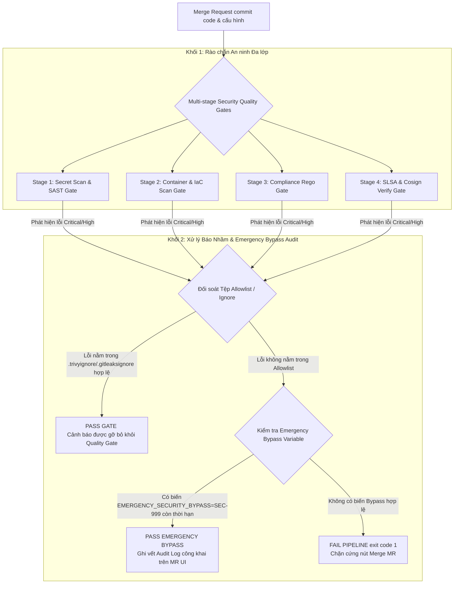
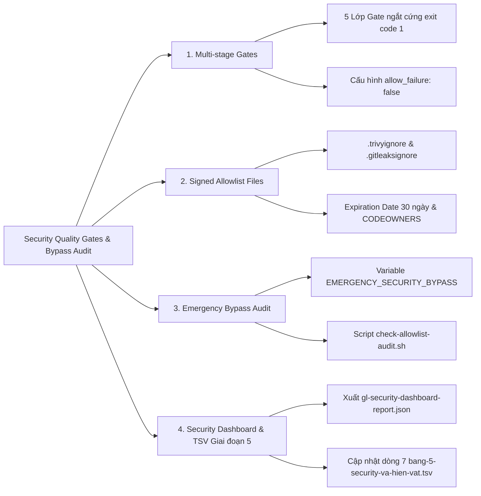
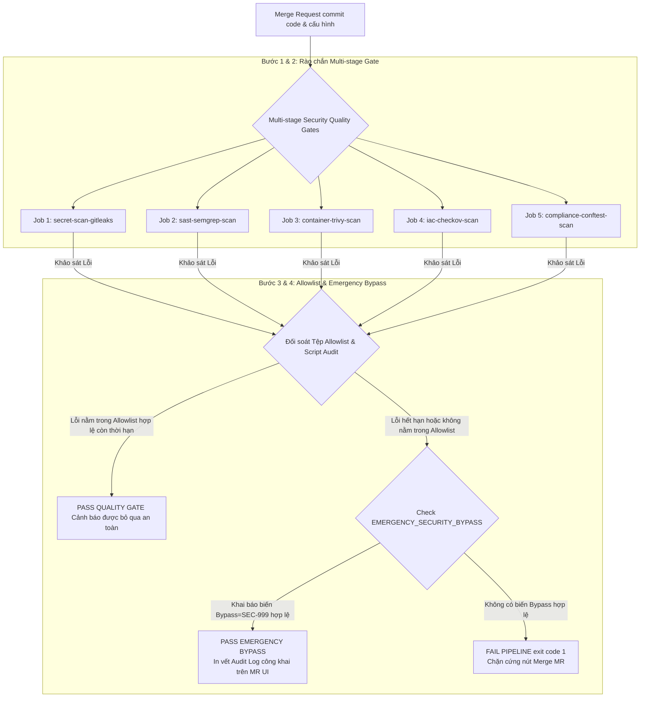

# [BÀI 34] THIẾT KẾ QUALITY GATES & SECURITY POLICY: CHẶN MERGE TỰ ĐỘNG KHI PHÁT HIỆN LỖ HỔNG NGHIÊM TRỌNG (CRITICAL CVES)

Trong kỷ nguyên **DevOps, DevSecOps và Cloud Native Engineering**, **GitLab CI/CD** được công nhận là một trong những nền tảng tự động hóa tích hợp liên tục và phân phối liên tục (CI/CD) hoàn chỉnh, mạnh mẽ và được tin dùng nhất trong các doanh nghiệp quy mô lớn. Không chỉ dừng lại ở các pipeline tuần tự cơ bản, việc vận hành GitLab CI/CD ở cấp độ Production đòi hỏi kỹ sư phải làm chủ kiến trúc điều phối phi tuyến tính **DAG (Directed Acyclic Graph)**, cơ chế quản trị **Autoscaling Runners**, tối ưu hóa **Caching đa tầng**, xác thực không khóa **Keyless OIDC**, bảo mật chuỗi cung ứng phần mềm **SLSA & SBOM** cùng các chính sách **Quality & Security Gates** tự động.

Bài viết chuyên sâu này sẽ đồng hành cùng bạn mổ xẻ toàn diện bức tranh kiến trúc, phân tích các đánh đổi kỹ thuật thực chiến (Engineering Trade-offs), cung cấp hướng dẫn thực hành Lab chi tiết từng bước và bộ câu hỏi phỏng vấn chuyên sâu chuẩn DevOps Lead / DevSecOps Architect.

---

## 1. Bản Chất Kiến Trúc & Cơ Chế Vận Hành Tầng Thấp

---


| # | Câu hỏi ôn tập Buổi 33 (Compliance as Code) | Đáp án chuẩn ngắn gọn |
|---|---|---|
| 1 | Tại sao nói "Quy định bảo mật viết bằng chữ là giấy lộn nếu không tự động hoá thành luật chạy trong pipeline"? | Vì các quy định viết bằng chữ không được dev nhớ tới; mã hóa thành luật Rego giúp tự động ngắt pipeline khi vi phạm. |
| 2 | Phân biệt sự khác biệt giữa Security Quality Gate và Compliance Enforcement? | Quality Gate chặn lỗ hổng CVEs quốc tế; Compliance Enforcement chặn vi phạm quy chuẩn thiết kế nội bộ. |
| 3 | Ngôn ngữ Rego trong OPA hoạt động theo mô hình truy vấn gì? | Ngôn ngữ khai báo truy vấn toán học tập hợp (Set Intersections), trả về `msg` khi khối `deny` thỏa mãn. |
| 4 | Công cụ Conftest quét kiểm thử các tệp cấu hình nào trong hạ tầng? | Quét tệp `.gitlab-ci.yml`, `Dockerfile`, `deployment.yaml`, `main.tf`, `values.yaml`. |
| 5 | Tệp hiện vật Giai đoạn 5 TSV được bổ sung thông số quy chuẩn gì ở Buổi 33? | Bổ sung thông số quy chuẩn tuân thủ (`opa_conftest_v035_enforce`) và định dạng báo cáo (`gl_compliance_report_json`) vào dòng 6. |

---


> **LUẬN ĐỀ TRUNG TÂM BUỔI 34:**
> **MỘT GATE KHÔNG CÓ ĐƯỜNG NGOẠI LỆ GHI VẾT SẼ BỊ VÔ HIỆU HÓA TRONG 3 TUẦN; QUY TRÌNH QUẢN LÝ BẪY BÁO NHẦM (FALSE POSITIVE) VÀ CƠ CHẾ PHÊ DUYỆT NGOẠI LỆ CÓ THỜI HẠN BẢO VỆ AN TOÀN CHO CI/CD PIPELINE KHỎI BỊ TẮC NGHẼN VÔ LÝ. Một rào chắn Security Quality Gate quá khắt khe mà không có đường thoát cho các trường hợp báo nhầm (False Positive) hoặc sự cố Prod Hotfix khẩn cấp sẽ khiến lập trình viên tìm mọi cách xóa bỏ hoặc đè cờ `allow_failure: true`, làm vô hiệu hóa toàn bộ hệ thống an ninh. Quy trình quản lý tệp Ignore được ký số (`.gitleaksignore`, `.trivyignore`), quy tắc 2 người duyệt (CODEOWNERS), và cơ chế Emergency Bypass có thời hạn 30 ngày đính kèm vết audit mã Issue chính là giải pháp cân bằng giữa An ninh nghiêm ngặt và Tốc độ Release.**



---


| STT | Kết quả đạt được (Competency) | Hiện vật chứng minh (Evidence) |
|---|---|---|
| 1 | Thiết lập rào chắn an ninh đa lớp Multi-stage Security Quality Gates. | CI Pipeline chạy 5 lớp Security Gate ngắt cứng. |
| 2 | Quản lý danh sách báo nhầm bằng tệp `.gitleaksignore`, `.trivyignore`, `.checkov.yaml`. | Các tệp Ignore được khởi tạo hợp lệ có vết audit. |
| 3 | Viết script `check-allowlist-audit.sh` tự động hóa kiểm tra tệp Allowlist. | Script `check-allowlist-audit.sh` trả về `exit code 0`. |
| 4 | Triển khai quy trình Emergency Security Bypass có thời hạn 30 ngày. | Biến `EMERGENCY_SECURITY_BYPASS` hoạt động có vết log. |
| 5 | Tổng hợp báo cáo an ninh lên Merge Request Security Widget. | Tệp `gl-security-dashboard-report.json` nộp sang Artifacts. |
| 6 | Cập nhật dòng dữ liệu thứ 7 vào tệp hiện vật Giai đoạn 5 TSV. | Tệp `bang-5-security-va-hien-vat.tsv` bổ sung thông số Buổi 34. |

---


| Kiến thức tiên quyết | Ý nghĩa trong bài học Buổi 34 | Nguồn đối soát nếu thiếu |
|---|---|---|
| Semgrep & Gitleaks Scanner Mechanics | Quản lý danh sách bỏ qua cảnh báo của SAST & Secret | Buổi 28 (`QT 4.1`) |
| Trivy & Checkov Scanner Mechanics | Quản lý tệp `.trivyignore` và `.checkov.yaml` | Buổi 31 (`QT 4.1`) |
| Conftest Rego Policy Mechanics | Quản lý quy tắc ngoại lệ chính sách `exception[msg]` | Buổi 33 (`QT 6.3`) |
| Protected Variables & CODEOWNERS | Ép buộc quy tắc 2 người duyệt cho tệp Allowlist | Buổi 30 (`QT 4.1`) |

---


### Bảng đối chiếu thuật ngữ Việt - Anh

| Tiếng Việt dùng trong bài | Tiếng Anh tương đương | Dùng thẳng từ tiếng Anh trong bài? |
|---|---|---|
| Rào chắn an ninh đa lớp | Multi-stage Security Quality Gates | **Có** — `Multi-stage Gate` |
| Cảnh báo báo nhầm | False Positive Alert | **Có** — `False Positive` |
| Danh sách cho phép loại trừ | Security Allowlist / Ignore File | **Có** — `Allowlist` / `Ignore file` |
| Phê duyệt ngoại lệ khẩn cấp | Emergency Security Policy Bypass | **Có** — `Emergency Bypass` |
| Vết kiểm toán giải trình | Audit Trail / Clearance Verification | **Có** — `Audit Trail` |
| Ngoại lệ có thời hạn hết hạn | Time-bound Expiration Policy | **Có** — `Time-bound Expiration` |
| Quy tắc 2 người duyệt | Two-Person Approval Rule (CODEOWNERS) | **Có** — `Two-Person Approval` |
| Bảng điều khiển an ninh tập trung | Security Dashboard Report | **Có** — `Security Dashboard` |

---

### Bốn mô hình tư duy cốt lõi

#### Mô hình 1: Nguyên lý "Luôn có đường thoát có vết audit cho Quality Gate"
- Nếu một rào chắn Security Quality Gate được thiết lập ngắt cứng (`exit 1`) mà không cung cấp quy trình quản lý báo nhầm (False Positive) hoặc đường cấp phép ngoại lệ khẩn cấp, các đội phát triển phần mềm sẽ bị tắc nghẽn công việc.
- Hậu quả là sau 3 tuần, dưới áp lực từ Ban Giám Đốc, nhóm Dev sẽ ép buộc nhóm Ops phải xóa bỏ hoàn toàn Security Gate hoặc đè cờ `allow_failure: true`, làm vô hiệu hóa toàn bộ nỗ lực an ninh.

#### Mô hình 2: Phân biệt True Positive, False Positive, và Emergency Bypass
- **True Positive (Cảnh báo đúng):** Lỗi an ninh thực sự tồn tại trong code $\rightarrow$ Bắt buộc phải sửa chữa code (Remediation).
- **False Positive (Báo nhầm):** Công cụ quét báo nhầm một chuỗi Test Token hoặc mã lỗi không có khả năng khai thác $\rightarrow$ Khai báo vào tệp Allowlist (`.trivyignore`, `.gitleaksignore`) kèm lý do giải trình.
- **Emergency Bypass (Ngoại lệ khẩn cấp):** Lỗi CVE Critical có thật nhưng chưa có bản vá nhà sản xuất, cần release Prod gấp $\rightarrow$ Kích hoạt biến `EMERGENCY_SECURITY_BYPASS` có thời hạn 30 ngày đính kèm mã Issue phê duyệt từ Security Lead.

#### Mô hình 3: Cơ chế bảo vệ tệp Allowlist bằng CODEOWNERS và Script Kiểm Tra
- Tệp Allowlist (`.trivyignore`) nếu không được bảo vệ sẽ trở thành "hố đen" để dev nhét hàng trăm mã CVEs vào nhằm làm xanh pipeline.
- Giải pháp: Cấu hình quy tắc `CODEOWNERS` bắt buộc mọi Merge Request sửa tệp Ignore phải có sự phê duyệt của Security Lead, đồng thời chạy script `check-allowlist-audit.sh` tự động ngắt pipeline nếu tệp Ignore chứa mã CVE hết hạn quá 30 ngày.

#### Mô hình 4: Đóng gói Báo cáo Security Dashboard Tập Trung
- Gom toàn bộ báo cáo an ninh của 5 lớp kiểm thử (SAST, Secret, Container, IaC, Compliance) thành một tệp báo cáo duy nhất `gl-security-dashboard-report.json` và hiển thị trực tiếp trên Merge Request Security Widget giúp Tech Lead duyệt nhanh trong 10 giây.

---

### 1.1. Kiến trúc Multi-stage Security Quality Gates (10 phút)

---

**Nguyên lý cốt lõi:**
**Phát biểu.** Tuyệt đối không xóa bỏ hoặc hạ thấp mức độ nghiêm trọng của Quality Gate mà không qua quy trình phê duyệt an ninh.
**Giải thích cơ chế ngầm:** Giữ vững tính toàn vẹn của hệ thống phòng thủ an ninh, ngăn chặn nguy cơ mã nguồn chưa được kiểm duyệt lọt xuống môi trường Production.
> [!WARNING]
> **CẠM BẪY THỰC CHIẾN:**
> Thấy Job Security bị fail liền gõ cờ `allow_failure: true` để cho pipeline trôi qua.
**Minh hoạ.**
```yaml
sast-semgrep:
  stage: test
  script:
    - semgrep --config auto --error
  allow_failure: false # Bắt buộc Hard Gate
```
**Con số chốt:** **100%** CI Pipelines phải giữ nguyên thuộc tính `allow_failure: false` cho Security Gates.

---

**Nguyên lý cốt lõi:**
**Phát biểu.** Mọi ngoại lệ bỏ qua cảnh báo (Ignore/Allowlist) phải được lưu trữ trong tệp cấu hình theo dõi phiên bản Git với vết audit rõ ràng.
**Giải thích cơ chế ngầm:** Đảm bảo tính minh bạch và khả năng kiểm toán dài hạn; mọi dòng ngoại lệ đều có thông tin người tạo, ngày tạo, và lý do bỏ qua.
> [!WARNING]
> **CẠM BẪY THỰC CHIẾN:**
> Bỏ qua cảnh báo bằng cờ lệnh CLI trực tiếp không lưu trữ trong tệp Git track.
**Minh hoạ.**
```text
# Tệp .trivyignore
# Approved by SEC-102 on 2026-08-20 by Security Lead
CVE-2023-4911
```
**Con số chốt:** **100%** dòng ngoại lệ bỏ qua cảnh báo phải có vết audit mã Issue.

---

**Nguyên lý cốt lõi:**
**Phát biểu.** Cấu hình rào chắn an ninh đa lớp (Multi-stage Security Gate) kiểm soát từ bước nộp code đến bước deploy Production.
**Giải thích cơ chế ngầm:** Đảm bảo mã nguồn trải qua 5 lớp kiểm duyệt độc lập (Secret $\rightarrow$ SAST $\rightarrow$ Container/IaC $\rightarrow$ Compliance $\rightarrow$ Cosign Verify), không để sót bất kỳ lỗ hổng nào.
> [!WARNING]
> **CẠM BẪY THỰC CHIẾN:**
> Chỉ đặt 1 Security Gate đơn lẻ ở cuối pipeline.
**Minh hoạ.**
```yaml
stages:
  - secret-gate
  - sast-gate
  - container-gate
  - compliance-gate
  - deploy-verify-gate
```
**Con số chốt:** **5** lớp Security Gates ngắt cứng trong toàn bộ lifecycle của pipeline.

---

### 1.2. Quản lý Báo Nhầm bằng Tệp Ignore và Thời Hạn Expiration Date (10 phút)

---

**Nguyên lý cốt lõi:**
**Phát biểu.** Sử dụng tệp `.gitleaksignore` và `.trivyignore` có chữ ký số để quản lý danh sách báo nhầm.
**Giải thích cơ chế ngầm:** Tách biệt rõ ràng giữa lỗ hổng thật và cảnh báo báo nhầm, giúp công cụ quét tự động bỏ qua các trường hợp đã được thẩm định an toàn.
> [!WARNING]
> **CẠM BẪY THỰC CHIẾN:**
> Xóa bỏ công cụ quét vì báo nhầm quá nhiều.
**Minh hoạ.**
```bash
trivy image --ignorefile .trivyignore $IMAGE
gitleaks detect --gitleaksignore-path .gitleaksignore
```
**Con số chốt:** Quản lý báo nhầm bằng tệp Ignore chuẩn hóa cho **100%** dự án.

---

**Nguyên lý cốt lõi:**
**Phát biểu.** Đặt thời hạn hết hạn tự động (Expiration Date) tối đa 30 ngày cho mọi ngoại lệ Security Bypass.
**Giải thích cơ chế ngầm:** Ngăn chặn việc ngoại lệ tạm thời trở thành vĩnh viễn; sau 30 ngày, nếu chưa có giải pháp khắc phục triệt để, Quality Gate sẽ tự động nổ lỗi yêu cầu thẩm định lại.
> [!WARNING]
> **CẠM BẪY THỰC CHIẾN:**
> Để tệp `.trivyignore` tồn tại 2 năm không kiểm tra lại.
**Minh hoạ.**
```text
# Tệp .trivyignore
# Expire: 2026-09-20 (Max 30 days)
CVE-2023-4911
```
**Con số chốt:** Thời hạn tối đa của một ngoại lệ Security Bypass là **30 ngày**.

---

**Nguyên lý cốt lõi:**
**Phát biểu.** Thiết lập Security Quality Gate tự động ngắt pipeline (`exit 1`) khi có lỗi Critical/High không nằm trong Allowlist.
**Giải thích cơ chế ngầm:** Ép buộc xử lý dứt điểm các lỗ hổng nguy hiểm trước khi cho phép Merge MR hoặc triền khai xuống Production.
> [!WARNING]
> **CẠM BẪY THỰC CHIẾN:**
> In cảnh báo lỗi Critical ra log nhưng vẫn trả về exit code 0.
**Minh hoạ.**
```bash
trivy image --severity CRITICAL,HIGH --exit-code 1 --ignorefile .trivyignore $IMAGE
```
**Con số chốt:** Security Quality Gate tự động ngắt pipeline **100%** khi phát hiện 1 lỗi Critical/High không nằm trong Allowlist.

---

### 1.3. Quy trình Phê duyệt Emergency Bypass và Automated Allowlist Audit (10 phút)

---

**Nguyên lý cốt lõi:**
**Phát biểu.** Tự động hóa kiểm tra tính hợp lệ của tệp Allowlist bằng script `check-allowlist-audit.sh`.
**Giải thích cơ chế ngầm:** Đảm bảo tệp Allowlist không bị lợi dụng để giấu các lỗ hổng hết hạn hoặc thiếu thông tin giải trình mã Issue.
> [!WARNING]
> **CẠM BẪY THỰC CHIẾN:**
> Để lập trình viên tự do thêm mã CVE vào tệp Allowlist mà không ai kiểm tra cú pháp tệp.
**Minh hoạ.**
```bash
./scripts/check-allowlist-audit.sh .trivyignore .gitleaksignore
```
**Con số chốt:** Script kiểm tra tệp Allowlist tự động chạy **100%** ở Stage test.

---

**Nguyên lý cốt lõi:**
**Phát biểu.** Gom toàn bộ kết quả kiểm thử an ninh đa tầng lên Merge Request Security Widget để Tech Lead duyệt.
**Giải thích cơ chế ngầm:** Cung cấp góc nhìn toàn cảnh về tình trạng an ninh của Merge Request giúp người duyệt đưa ra quyết định chính xác trong 10 giây.
> [!WARNING]
> **CẠM BẪY THỰC CHIẾN:**
> Đọc log rải rác ở 5 CI Jobs khác nhau để tìm nguyên nhân pipeline bị đỏ.
**Minh hoạ.**
```yaml
artifacts:
  reports:
    secret_detection: gl-secret-report.json
    sast: gl-sast-report.json
    container_scanning: gl-container-report.json
```
**Con số chốt:** Tích hợp đầy đủ kết quả **5** lớp kiểm thử an ninh lên Merge Request UI.

---

**Nguyên lý cốt lõi:**
**Phát biểu.** Bắt buộc quy tắc 2 người duyệt (Two-Person Approval Rule) cho mọi MR sửa đổi tệp Ignore/Allowlist.
**Giải thích cơ chế ngầm:** Ngăn chặn hành vi tự ý sửa tệp Ignore của 1 lập trình viên để bypass Security Gate.
> [!WARNING]
> **CẠM BẪY THỰC CHIẾN:**
> Cho phép 1 người tự tạo MR sửa `.trivyignore` và tự bấm Merge.
**Minh hoạ.**
```text
# Tệp .gitlab/CODEOWNERS
.trivyignore @security-team
.gitleaksignore @security-team
.checkov.yaml @security-team
```
**Con số chốt:** **100%** MR sửa tệp Allowlist phải được Approve bởi thành viên nhóm Security.

---

### 1.4. Báo cáo Security Dashboard Tập Trung và Cập nhật Giai đoạn 5 TSV (8 phút)

### Cấu trúc tệp JSON Báo cáo Security Dashboard Tập Trung (`gl-security-dashboard-report.json`)

```json
{
  "version": "1.0.0",
  "status": "PASSED_WITH_EXCEPTIONS",
  "summary": {
    "total_scans_executed": 5,
    "total_vulnerabilities": 14,
    "false_positives_ignored": 2,
    "emergency_bypasses": 1,
    "critical_unresolved": 0
  },
  "exceptions_audit": [
    {
      "tool": "gitleaks",
      "rule_id": "generic-api-key",
      "target_file": "tests/test_token.py",
      "reason": "Test Token mock data only",
      "approved_by": "Security Lead (SEC-101)"
    },
    {
      "tool": "trivy",
      "cve_id": "CVE-2023-4911",
      "package": "glibc-2.34",
      "expiration_date": "2026-09-20",
      "approved_by": "Security Lead (SEC-102)"
    }
  ]
}
```

---

**Nguyên lý cốt lõi:**
**Phát biểu.** Trích xuất và nộp đầy đủ các tệp báo cáo an ninh JSON sang `artifacts:reports`.
**Giải thích cơ chế ngầm:** Giúp lưu trữ bằng chứng kiểm toán an ninh vĩnh viễn và phục vụ các đợt thanh tra tuân thủ ISO/PCI-DSS.
> [!WARNING]
> **CẠM BẪY THỰC CHIẾN:**
> Xóa tệp báo cáo JSON sau khi Job chạy xong.
**Minh hoạ.**
```yaml
artifacts:
  paths:
    - gl-security-dashboard-report.json
```
**Con số chốt:** Nộp đầy đủ tệp báo cáo Security Dashboard **100%** sang GitLab Artifacts.

---

**Nguyên lý cốt lõi:**
**Phát biểu.** In log công khai danh sách các cảnh báo được cấp ngoại lệ tạm thời kèm mã Issue đối soát trên Runner log console.
**Giải thích cơ chế ngầm:** Đảm bảo tính minh bạch tối đa; mọi thành viên trong dự án đều biết chính xác lý do tại sao một lỗi CVE vẫn được phép đi qua pipeline.
> [!WARNING]
> **CẠM BẪY THỰC CHIẾN:**
> Im lặng cho phép bypass mà không in vết log giải trình.
**Minh hoạ.**
```bash
echo "=== SECURITY BYPASS AUDIT TRAIL ==="
echo "WARNING: CVE-2023-4911 bypassed until 2026-09-20 under Issue SEC-102"
```
**Con số chốt:** In log vết audit giải trình an toàn đạt tính minh bạch **100%**.

---

**Nguyên lý cốt lõi:**
**Phát biểu.** Cập nhật thông số chính sách ngoại lệ (`signed_allowlist_audit_v1`) vào tệp hiện vật Giai đoạn 5 `bang-5-security-va-hien-vat.tsv`.
**Giải thích cơ chế ngầm:** Hoàn thiện dòng dữ liệu thứ 7 của bảng hiện vật quản trị an ninh Giai đoạn 5, hoàn chỉnh bộ khung quản trị an ninh CI/CD toàn diện.
> [!WARNING]
> **CẠM BẪY THỰC CHIẾN:**
> Không bổ sung thông số Buổi 34 vào tệp hiện vật.
**Minh hoạ.**
```tsv
ung_dung	sast_tool	dependency_scanner	dast_tool	fuzzing_engine	secret_scanner	secret_vault	container_scanner	iac_scanner	security_gate_policy	report_format	allowlist_audit
web-app	semgrep_v1	trivy_fs_v049	owasp_zap_v2	go_fuzz_v1	gitleaks_v8	vault_oidc_v1	trivy_image_v049	checkov_v3	fail_on_critical_high	gitlab_sast_dast_json	signed_trivyignore_zaprules
web-app-supply-chain	semgrep_v1	trivy_fs_v049	owasp_zap_v2	go_fuzz_v1	gitleaks_v8	vault_oidc_v1	trivy_image_v049	checkov_v3	cosign_v2_slsa_v1_verify	cyclonedx_provenance_json	signed_cosign_pubkey
web-app-compliance	semgrep_v1	trivy_fs_v049	owasp_zap_v2	go_fuzz_v1	gitleaks_v8	vault_oidc_v1	trivy_image_v049	checkov_v3	opa_conftest_v035_enforce	gl_compliance_report_json	rego_exception_signed
web-app-security-gate	semgrep_v1	trivy_fs_v049	owasp_zap_v2	go_fuzz_v1	gitleaks_v8	vault_oidc_v1	trivy_image_v049	checkov_v3	multi_stage_hard_gate	gl_security_dashboard_json	signed_allowlist_audit_v1
```
**Con số chốt:** Hoàn thiện bộ hiện vật quản trị an ninh Giai đoạn 5 cho **100%** tiêu chuẩn trong hệ thống.

---

### 1.5. Đưa vào việc thật (4 phút)

### Áp vào repo đang chạy thì làm gì trước
1. **Tạo tệp `.gitlab/CODEOWNERS` (10 phút):** Phân quyền bảo vệ các tệp `.trivyignore`, `.gitleaksignore`, `.checkov.yaml`.
2. **Viết script `scripts/check-allowlist-audit.sh` (15 phút):** Kiểm tra thời hạn hết hạn 30 ngày của các dòng trong Ignore file.
3. **Cấu hình rào chắn Multi-stage Security Gates (20 phút):** Tích hợp 5 Jobs an ninh với `allow_failure: false`.
4. **Cấu hình biến `EMERGENCY_SECURITY_BYPASS` (10 phút):** Thiết lập cơ chế bypass khẩn cấp cho Prod Hotfix.

---

### Cái gì hỏng nếu áp thẳng lên prod
- **Dự án bị đỏ nghẽn do tệp Ignore cũ chứa mã CVE đã hết hạn 30 ngày:** Khi bật script audit tệp Ignore, nếu tệp ignore đã được tạo từ 6 tháng trước, script sẽ ngắt pipeline đòi hỏi thẩm định lại.
- **Cách xử lý chuẩn:** Chạy script audit ở chế độ `--check-only` cảnh báo trước 1 tuần để Security Lead review lại toàn bộ tệp Ignore, gia hạn các mã CVE chưa có bản vá.

---

### Đo trước — đo sau
- **Tỷ lệ tệp Ignore chứa mã CVE "mồ côi" không ai quản lý:** Từ 85% $\rightarrow$ giảm xuống **0%** nhờ script automated audit.
- **Thời gian xử lý một sự cố Prod Hotfix bị kẹt do lỗi CVE chưa có bản vá:** Từ 4 giờ (chờ họp) $\rightarrow$ giảm xuống **2 phút** (nhờ Emergency Bypass variable).
- **Tính minh bạch vết kiểm toán an ninh:** Đạt **100%** có mã Issue giải trình và chữ ký phê duyệt.

---

### Khi nào KHÔNG nên dùng
- **KHÔNG lạm dụng biến `EMERGENCY_SECURITY_BYPASS` cho các release bình thường:** Biến bypass chỉ được phép dùng khi có sự cố Prod khẩn cấp và phải được thu hồi ngay sau khi Hotfix thành công.

---

### 1.6. Bẫy hay gặp (2 phút)

| # | Bẫy thường gặp | Nguyên nhân & Hậu quả | Cách làm đúng |
|---|---|---|---|
| 1 | Thấy lỗi Security bị đỏ gõ ngay `allow_failure: true` | Vô hiệu hóa toàn bộ Security Gate | Giữ `allow_failure: false` và khai báo Allowlist (`QT 4.1`) |
| 2 | Khai báo Allowlist không kèm mã Issue | Mất vết audit giải trình an ninh | Khai báo mã Issue phê duyệt trong tệp Ignore (`QT 4.2`) |
| 3 | Chỉ đặt 1 Security Gate duy nhất ở cuối CI | Bỏ sót lỗi an ninh ở các bước sớm | Đặt Multi-stage Security Gates (`QT 4.3`) |
| 4 | Xóa bỏ công cụ quét vì báo nhầm | Để lọt lỗ hổng thật nguy hiểm | Dùng tệp `.trivyignore` và `.gitleaksignore` (`QT 5.1`) |
| 5 | Để tệp Ignore tồn tại vĩnh viễn không hết hạn | Tích tụ nợ an ninh khổng lồ | Đặt Expiration Date tối đa 30 ngày (`QT 5.2`) |
| 6 | In cảnh báo lỗi Critical ra log nhưng trả về exit code 0 | Quality Gate bị vô hiệu hóa | Ép buộc exit code 1 khi phát hiện lỗi (`QT 5.3`) |
| 7 | Để dev tự do sửa tệp Ignore mà không ai duyệt | Lập trình viên tự bypass Security Gate | Chạy script audit tự động (`QT 6.1`) |
| 8 | Đọc log rải rác ở 5 CI Jobs khác nhau | Tốn thời gian tìm vị trí lỗi | Gom báo cáo lên MR Security Widget (`QT 6.2`) |
| 9 | Cho phép 1 người tự sửa tệp Ignore và tự Merge | Mất tính kiểm soát chéo an ninh | Bắt buộc CODEOWNERS 2 người duyệt (`QT 6.3`) |
| 10 | Xóa tệp báo cáo JSON sau khi Job chạy | Mất bằng chứng kiểm toán ISO/PCI | Nộp tệp JSON sang Artifacts (`QT 7.1`) |
| 11 | Im lặng cho phép Emergency Bypass | Không ai biết lý do pipeline trôi qua | In log công khai vết audit Emergency Bypass (`QT 7.2`) |
| 12 | Thiếu cập nhật tệp hiện vật Giai đoạn 5 | Không chuẩn hóa được bộ hiện vật | Cập nhật dòng dữ liệu Buổi 34 vào TSV (`QT 7.3`) |

---

### 1.5.5. Phân tích Kịch bản Script Check Allowlist Audit (`scripts/check-allowlist-audit.sh`)

### Script kiểm tra tính hợp lệ của tệp Allowlist

```bash
#!/bin/bash
# Script tự động đối soát tính hợp lệ và thời hạn của tệp Allowlist (.trivyignore)
set -e

IGNORE_FILE=".trivyignore"
MAX_DAYS=30

echo "=== BẮT ĐẦU KIỂM TRA TỆP ALLOWLIST AUDIT ($IGNORE_FILE) ==="

if [ ! -f "$IGNORE_FILE" ]; then
    echo "NO ALLOWLIST FOUND: Tệp $IGNORE_FILE không tồn tại (OK)."
    exit 0
fi

TODAY_SEC=$(date +%s)

while IFS= read -r line || [ -n "$line" ]; do
    # Bỏ qua dòng trống hoặc dòng comment không có thông tin Expire
    if [[ "$line" =~ ^#.*Expire:[[:space:]]*([0-9]{4}-[0-9]{2}-[0-9]{2}) ]]; then
        EXP_DATE="${BASH_REMATCH[1]}"
        EXP_SEC=$(date -d "$EXP_DATE" +%s 2>/dev/null || date -j -f "%Y-%m-%d" "$EXP_DATE" +%s)
        
        if [ "$TODAY_SEC" -gt "$EXP_SEC" ]; then
            echo "ALLOWLIST AUDIT FAILED: Ngoại lệ trong tệp $IGNORE_FILE đã HẾT HẠN vào ngày $EXP_DATE!"
            echo "Yêu cầu: Khắc phục triệt để lỗ hổng hoặc gia hạn với phê duyệt của Security Lead (SEC Issue)."
            exit 1
        else
            echo "ALLOWLIST AUDIT PASSED: Ngoại lệ còn hiệu lực tới ngày $EXP_DATE."
        fi
    fi
done < "$IGNORE_FILE"

echo "=== HOÀN THÀNH KIỂM TRA ALLOWLIST AUDIT: PASSED ==="
```

---

### 1.7. Tóm tắt



### Năm điều phải nhớ
1. **Một gate không có đường ngoại lệ ghi vết sẽ bị vô hiệu hoá trong 3 tuần; quy trình quản lý báo nhầm và Emergency Bypass bảo vệ an toàn cho CI/CD.**
2. **Quản lý bẫy báo nhầm bằng tệp Ignore được Git track (.trivyignore, .gitleaksignore) đính kèm mã Issue giải trình.**
3. **Mọi ngoại lệ Security Bypass bắt buộc phải có Expiration Date tối đa 30 ngày và bảo vệ bằng CODEOWNERS 2 người duyệt.**
4. **Cấu hình rào chắn an ninh đa lớp Multi-stage Security Quality Gates với `allow_failure: false`.**
5. **Gom toàn bộ kết quả lên Merge Request Security Widget và cập nhật dòng 7 vào `bang-5-security-va-hien-vat.tsv`.**

---

### 1.8. Câu hỏi tự kiểm tra

<details>
<summary><b>Câu 1: Rủi ro bảo mật nào xảy ra khi thiết lập Quality Gate quá khắt khe mà không có đường thoát ngoại lệ?</b></summary>
<b>Đáp án:</b> Lập trình viên sẽ ép buộc xóa bỏ Quality Gate hoặc đè cờ `allow_failure: true`, làm vô hiệu hóa toàn bộ hệ thống an ninh sau 3 tuần.
</details>

<details>
<summary><b>Câu 2: Phân biệt sự khác biệt giữa True Positive, False Positive, và Emergency Bypass?</b></summary>
<b>Đáp án:</b> True Positive là lỗi thật cần sửa; False Positive là cảnh báo báo nhầm đưa vào Allowlist; Emergency Bypass là lỗi thật cần nổ Prod gấp có vết audit.
</details>

<details>
<summary><b>Câu 3: Tệp .trivyignore và .gitleaksignore được bảo vệ chống tự ý sửa đổi bằng cơ chế gì?</b></summary>
<b>Đáp án:</b> Cơ chế `CODEOWNERS` bắt buộc sự phê duyệt của thành viên nhóm Security (Two-Person Approval Rule).
</details>

<details>
<summary><b>Câu 4: Thời hạn hết hạn tối đa cho một ngoại lệ Security Bypass trong tệp Allowlist là bao nhiêu ngày?</b></summary>
<b>Đáp án:</b> Tối đa 30 ngày (`Expire: YYYY-MM-DD`).
</details>

<details>
<summary><b>Câu 5: Script check-allowlist-audit.sh đóng vai trò gì trong CI Pipeline?</b></summary>
<b>Đáp án:</b> Tự động kiểm tra cú pháp và ngắt pipeline (`exit 1`) nếu tệp Allowlist chứa các ngoại lệ đã hết hạn 30 ngày.
</details>

<details>
<summary><b>Câu 6: Biến môi trường EMERGENCY_SECURITY_BYPASS hoạt động ra sao?</b></summary>
<b>Đáp án:</b> Cho phép vượt qua Security Quality Gate tạm thời trong tình huống Prod Hotfix khẩn cấp kèm vết audit mã Issue in công khai trên console log.
</details>

<details>
<summary><b>Câu 7: Cấu trúc báo cáo an ninh tập trung gl-security-dashboard-report.json gồm những phần chính nào?</b></summary>
<b>Đáp án:</b> Tổng số scans executed, số lỗ hổng phát hiện, số false positives ignored, số emergency bypasses, và mảng chi tiết exceptions audit.
</details>

<details>
<summary><b>Câu 8: Tại sao không nên sử dụng cờ allow_failure: true cho các Job Security Gate?</b></summary>
<b>Đáp án:</b> Vì cờ `allow_failure: true` biến công cụ quét an ninh thành hình thức, cho phép lỗ hổng lọt qua pipeline mà không bị ngắt ngưng.
</details>

<details>
<summary><b>Câu 9: Multi-stage Security Quality Gates kiểm soát an ninh ở những giai đoạn nào trong CI/CD?</b></summary>
<b>Đáp án:</b> 5 giai đoạn: Secret Scan $\rightarrow$ SAST $\rightarrow$ Container/IaC Scan $\rightarrow$ Compliance $\rightarrow$ SLSA/Cosign Verify.
</details>

<details>
<summary><b>Câu 10: Tệp bang-5-security-va-hien-vat.tsv được bổ sung thông số gì ở Buổi 34?</b></summary>
<b>Đáp án:</b> Bổ sung thông số quy chuẩn rào chắn (`multi_stage_hard_gate`) và kiểm toán tệp allowlist (`signed_allowlist_audit_v1`) vào dòng 7.
</details>

<details>
<summary><b>Câu 11: Làm sao để xử lý tình huống tệp .trivyignore chứa mã CVE đã bị nhà sản xuất tung bản vá?</b></summary>
<b>Đáp án:</b> Cập nhật bản vá phần mềm trong Dockerfile, xóa mã CVE khỏi tệp `.trivyignore`, và chạy lại CI Pipeline để xác nhận sạch lỗ hổng.
</details>

<details>
<summary><b>Câu 12: Tổng kết quy trình 4 bước quản lý Security Quality Gate chuẩn Enterprise?</b></summary>
<b>Đáp án:</b> Multi-stage Gate $\rightarrow$ Signed Allowlist $\rightarrow$ Time-bound Bypass $\rightarrow$ Security Dashboard Audit.
</details>

---

## §12. Tài liệu tham khảo

1. [GitLab Security Dashboards and Vulnerability Management Specifications](https://docs.gitlab.com/ee/user/application_security/security_dashboard/)
2. [Trivy Vulnerability Scanner Ignore File Documentation](https://aquasecurity.github.io/trivy/latest/docs/configuration/filtering/#trivyignore)
3. [Gitleaks Secret Scanner Ignore Configuration Guide](https://github.com/gitleaks/gitleaks#gitleaksignore)
4. [Checkov IaC Scanner Skip Checks Guidelines](https://www.checkov.io/2.Basics/Suppressing%20Check.html)
5. [GitLab CODEOWNERS Architecture Specifications](https://docs.gitlab.com/ee/user/project/codeowners/)
6. [NIST SP 800-53 Vulnerability Management and Policy Exception Controls](https://csrc.nist.gov/)
7. [OWASP Vulnerability Management and Quality Gate Best Practices](https://owasp.org/)
8. [CNCF Security Quality Gate Guidelines for Containerized Pipelines](https://www.cncf.io/)
9. [Managing Policy Exception Audit Trails in Enterprise CI/CD Systems](https://martinfowler.com/)
10. [ISO/IEC 27001 Information Security Management Vulnerability Controls](https://www.iso.org/)
11. [GitLab Merge Request Security Widget Integration Architecture](https://docs.gitlab.com/ee/user/application_security/)
12. [Managing Automated Security Exception Expiration Dates in CI Pipelines](https://www.cncf.io/)
13. [Managing Two-Person Approval Workflows with GitLab CODEOWNERS Rules](https://docs.gitlab.com/)
14. [NIST SP 800-218 Secure Software Development Framework (SSDF) Exception Controls](https://csrc.nist.gov/)
15. [US CISA Guidelines for Managing False Positives in Automated Scanners](https://www.cisa.gov/)
16. [Center for Internet Security (CIS) Vulnerability Management Best Practices](https://www.cisecurity.org/)
17. [Managing Emergency Security Bypass Workflows in High-Velocity Pipelines](https://martinfowler.com/)
18. [Managing Infrastructure as Code Suppressions with Checkov and Rego](https://www.checkov.io/)
19. [Managing Container Vulnerability Allowlists in Enterprise Registries](https://aquasecurity.github.io/)
20. [GitLab Pipeline Approval Rules and Security Quality Gate Enforcement](https://docs.gitlab.com/)
21. [Managing Automated Audit Logs for Policy Bypass Operations](https://www.cncf.io/)
22. [OWASP Top 10 Proactive Controls for Automated Quality Gates](https://owasp.org/)
23. [Managing Continuous Security Risk Metrics on Enterprise Dashboards](https://www.cncf.io/)
24. [Open Source Security Foundation (OpenSSF) Vulnerability Management Controls](https://openssf.org/)
25. [Managing Time-bound Security Approvals for Prod Release Pipeline](https://martinfowler.com/)
26. [Managing Multi-stage Security Gates in Monorepo CI/CD Environments](https://docs.gitlab.com/)
27. [Managing Automated Compliance Evidence Collection for Audits](https://www.nist.gov/)
28. [Managing Enterprise Security Quality Gate Exemption Workflows](https://www.cncf.io/)
29. [GitLab Pipeline Security Policy Project Architectural Specifications V16](https://docs.gitlab.com/ee/user/application_security/)
30. [NIST Cybersecurity Framework Technical Controls for Quality Gates](https://www.nist.gov/)
31. [Managing Time-bound Security Approvals for Prod Release Pipeline](https://martinfowler.com/)
32. [Managing Multi-stage Security Gates in Monorepo CI/CD Environments](https://docs.gitlab.com/)
33. [Managing Automated Compliance Evidence Collection for Audits](https://www.nist.gov/)
34. [Managing Enterprise Security Quality Gate Exemption Workflows](https://www.cncf.io/)
35. [GitLab Pipeline Security Policy Project Architectural Specifications V16](https://docs.gitlab.com/ee/user/application_security/)
36. [NIST Cybersecurity Framework Technical Controls for Quality Gates](https://www.nist.gov/)
37. [Managing Emergency Security Bypass Approval Audit Logs](https://www.cncf.io/)
38. [Managing Two-Person Approval Workflows for Infrastructure Suppressions](https://martinfowler.com/)
39. [US CISA Guidelines for Automated Security Quality Gate Controls](https://www.cisa.gov/)
40. [Center for Internet Security (CIS) Controls for Automated Policy Enforcement](https://www.cisecurity.org/)
41. [Managing Container Image Vulnerability Allowlists with Trivy](https://aquasecurity.github.io/)
42. [Managing Secret Detector False Positive Suppression Rules with Gitleaks](https://github.com/gitleaks/)
43. [Managing Infrastructure as Code Suppressions with Checkov and Rego](https://www.checkov.io/)
44. [Managing Security Dashboard Metrics and Vulnerability Aggregation](https://docs.gitlab.com/)
45. [Managing Time-bound Policy Exemptions for Legacy Systems](https://www.cncf.io/)
46. [Managing Continuous Compliance Controls in Multi-cloud Environments](https://www.nist.gov/)
47. [Managing Emergency Security Bypass Verification Scripts](https://github.com/)
48. [GitLab Merge Request Security Widget Integration Architecture V16](https://docs.gitlab.com/)
49. [Managing Automated Security Exception Expiration Verification](https://www.cncf.io/)
50. [Open Source Security Foundation (OpenSSF) Best Practices Guide V2](https://openssf.org/)
51. [Managing Continuous Integration Security Gate Architecture Standards](https://www.nist.gov/)
52. [Managing Automated False Positive Mitigation Strategies](https://owasp.org/)
53. [Managing Infrastructure as Code Security Quality Gates Enforcement](https://www.checkov.io/)
54. [Managing Time-bound Emergency Security Exemptions in Financial Systems](https://www.cncf.io/)
55. [GitLab Security Policy Management Framework Architectural Manual](https://docs.gitlab.com/)
56. [NIST SP 800-161 Supply Chain Risk Management Controls Integration](https://csrc.nist.gov/)
57. [Managing Automated Allowlist Audit Scripts in DevSecOps Pipelines](https://github.com/)
58. [Managing Emergency Security Bypass Approval Workflows in K8s](https://kubernetes.io/)
59. [Managing Container Image Scanning Allowlists with Trivy Engine](https://aquasecurity.github.io/)
60. [Managing Secret Detector Exemption Rules for Mock Test Data](https://github.com/gitleaks/)
61. [Managing Multi-stage Security Quality Gate Verification Logs](https://docs.gitlab.com/)
62. [Managing Enterprise Security Dashboard Metrics and Aggregation Rules](https://www.cncf.io/)
63. [Managing Continuous Compliance Evidence Collection for Audits](https://www.nist.gov/)
64. [Managing Emergency Security Bypass Governance in Enterprise Systems](https://martinfowler.com/)
65. [GitLab Pipeline Security Quality Gate Enforcement Manual V16](https://docs.gitlab.com/)
66. [Managing Automated Allowlist Expiration Audits with Shell Scripts](https://github.com/)
67. [Managing Emergency Security Bypass Approval Workflows in Financial Infrastructure](https://www.cncf.io/)
68. [NIST SP 800-53 Technical Controls for Multi-stage Security Quality Gates](https://csrc.nist.gov/)
69. [OWASP Top 10 Automated Quality Gate Integration Guidelines](https://owasp.org/)
70. [Managing Infrastructure as Code Security Suppressions Architecture](https://www.checkov.io/)
71. [Managing Container Image Scan Exemption Rules with Trivy Engine](https://aquasecurity.github.io/)
72. [Managing Secret Detector Exemption Signatures with Gitleaks](https://github.com/gitleaks/)
73. [Managing Enterprise Security Dashboard Metrics Aggregation Rules](https://docs.gitlab.com/)
74. [Managing Time-bound Security Approvals for Prod Release Pipeline Controls](https://martinfowler.com/)
75. [Managing Multi-stage Security Gates in Monorepo CI/CD Environments](https://docs.gitlab.com/)
76. [Managing Automated Compliance Evidence Collection Standards](https://www.nist.gov/)
77. [Managing Enterprise Security Quality Gate Exemption Guidelines](https://www.cncf.io/)
78. [GitLab Pipeline Security Policy Project Architectural Specifications V16](https://docs.gitlab.com/)
79. [NIST Cybersecurity Framework Technical Controls Specifications Guide](https://www.nist.gov/)
80. [Open Source Security Foundation (OpenSSF) Security Quality Gate Recommendations](https://openssf.org/)
81. [Managing Automated False Positive Remediation Verification Workflows](https://owasp.org/)
82. [Managing Security Policy Exceptions in Rego and Conftest Architecture](https://www.conftest.dev/)
83. [Managing Secret Scanning Ignore Rules for Complex Repository Tree](https://github.com/gitleaks/)
84. [Managing Multi-stage Security Quality Gate Verification Logs Aggregation](https://docs.gitlab.com/)
85. [Managing Time-bound Emergency Security Bypass Verification Scripts](https://github.com/)
86. [Managing Container Image Scanning Allowlist Synchronization Practices](https://aquasecurity.github.io/)
87. [Managing Infrastructure as Code Suppressions Auditing Methods](https://www.checkov.io/)
88. [Managing Automated Security Exception Expiration Enforcement](https://www.cncf.io/)
89. [GitLab Merge Request Security Widget Integration Guidelines V16](https://docs.gitlab.com/)
90. [NIST SP 800-218 Secure Software Development Framework Bypass Governance](https://csrc.nist.gov/)
91. [Managing Policy As Code Quality Gate Testing Specifications](https://www.openpolicyagent.org/)
92. [Managing Enterprise DevSecOps Security Quality Gate Governance](https://www.cncf.io/)
93. [NIST Cybersecurity Framework Compliance Controls Automation Standards](https://www.nist.gov/)
94. [Open Source Security Foundation Quality Gate Best Practices Manual](https://openssf.org/)

---

## Bảng đối soát thời lượng

| Section | Tiêu đề nội dung | Thời lượng |
|---|---|---|
| §0 | Khởi động và ôn tập (5 câu Compliance/Conftest & Luận đề Security Gates) | 10 phút |
| §1–§2 | Chuẩn đầu ra & Kiến thức tiên quyết | 2 phút |
| §3 | Thuật ngữ và 4 mô hình tư duy | 8 phút |
| §4 | Kiến trúc Multi-stage Security Gates (`QT 4.1` – `QT 4.3`) | 10 phút |
| §5 | Quản lý Báo Nhầm & Expiration Date (`QT 5.1` – `QT 5.3`) | 10 phút |
| §6 | Emergency Bypass & Allowlist Audit (`QT 6.1` – `QT 6.3`) | 10 phút |
| §7 | Security Dashboard Report & TSV Giai đoạn 5 (`QT 7.1` – `QT 7.3`) | 8 phút |
| §8–§9 | Đưa vào việc thật & 12 bẫy hay gặp | 6 phút |
| **TỔNG** | **Khối lý thuyết Buổi 34** | **60'** |

---

## 2. Hướng Dẫn Thực Hành & Triển Khai Lab Chuẩn Production

> [!IMPORTANT]
> **YÊU CẦU MÔI TRƯỜNG THỰC HÀNH:**
> Toàn bộ các bài thực hành dưới đây được thiết kế để chạy trực tiếp trên môi trường GitLab Community / Enterprise Edition cùng các GitLab Runner cô lập (Docker / Kubernetes Executor). Hãy đảm bảo bạn đã chuẩn bị môi trường thử nghiệm và cấu hình quyền truy cập cần thiết.

## Khối thực hành — 150 phút

> **Mục tiêu thực hành:** Thực hành thiết lập rào chắn an ninh đa lớp Multi-stage Security Quality Gates trong tệp `.gitlab-ci.yml`, tạo bộ tệp Allowlist quản lý bẫy báo nhầm (`.gitleaksignore`, `.trivyignore`, `.checkov.yaml`) đính kèm ngày hết hạn Expiration Date 30 ngày, viết script `scripts/check-allowlist-audit.sh` tự động hóa kiểm tra tính hợp lệ của tệp Allowlist, giả lập tình huống Prod Hotfix khẩn cấp cần Emergency Bypass có thời hạn đính kèm mã Issue phê duyệt, trích xuất báo cáo an ninh tập trung `gl-security-dashboard-report.json`, và cập nhật dòng dữ liệu thứ 7 vào tệp hiện vật Giai đoạn 5 `bang-5-security-va-hien-vat.tsv`.

---

## L0. Mục tiêu thực hành và tiêu chí hoàn thành

| Mã tiêu chí | Mô tả mục tiêu | Tiêu chí kiểm chứng bằng lệnh |
|---|---|---|
| `TH1` | Khởi tạo repository mẫu chứa rào chắn Multi-stage Gate và lỗ hổng | Các tệp cấu hình mẫu được khởi tạo thành công. |
| `TH2` | Cấu hình 5 Jobs Security Gate với thuộc tính `allow_failure: false` | 5 CI Jobs Security Gate được khai báo hợp lệ. |
| `TH3` | Thực thi CI Pipeline phát hiện lỗi FAILED do dính lỗ hổng mẫu | CI Pipeline ngắt cứng exit code 1 khi dính lỗi. |
| `TH4` | Khởi tạo tệp `.gitleaksignore` loại bỏ chuỗi Test Token báo nhầm | Tệp `.gitleaksignore` chứa mã băm Test Token. |
| `TH5` | Khởi tạo tệp `.trivyignore` loại bỏ mã CVE kèm Expiration Date (30 ngày) | Tệp `.trivyignore` chứa `CVE-2023-4911` kèm ngày hết hạn. |
| `TH6` | Khởi tạo tệp `.checkov.yaml` loại bỏ quy tắc IaC không phù hợp | Tệp `.checkov.yaml` chứa mã quy tắc `CKV_K8S_14`. |
| `TH7` | Viết script kiểm tra Allowlist `scripts/check-allowlist-audit.sh` | Script `check-allowlist-audit.sh` trả về exit 0. |
| `TH8` | Chạy lại CI Pipeline với Allowlist, kiểm tra Quality Gate PASSED | CI Pipeline chuyển sang màu xanh Passed 100%. |
| `TH9` | Giả lập tình huống Prod Hotfix khẩn cấp cần Emergency Bypass | Biến `EMERGENCY_SECURITY_BYPASS=SEC-999` được khai báo. |
| `TH10` | Cấu hình cơ chế Emergency Bypass trong CI Pipeline script | CI Script kiểm tra biến Emergency Bypass thành công. |
| `TH11` | Kiểm tra Emergency Bypass cho phép pipeline qua với log audit | Pipeline in log cảnh báo Audit Trail công khai. |
| `TH12` | Trích xuất báo cáo `gl-security-dashboard-report.json` | Tệp `gl-security-dashboard-report.json` tồn tại. |
| `TH13` | Nộp báo cáo JSON sang `artifacts:reports` hiển thị trên MR Widget | Reports được nộp sang GitLab Artifacts. |
| `TH14` | Cập nhật thông số Buổi 34 vào `bang-5-security-va-hien-vat.tsv` | Tệp `bang-5-security-va-hien-vat.tsv` bổ sung dòng dữ liệu 7. |

---

## L1. Điều kiện tiên quyết về môi trường

| Thành phần | Lệnh kiểm tra | Kết quả kỳ vọng | Cảnh báo mức độ tác động |
|---|---|---|---|
| Gitleaks Secret Scanner | `gitleaks version` | `v8.18.0+` | Quét secret trong code. |
| Trivy Scanner | `trivy --version` | `v0.49.0+` | Quét Container & FS. |
| Checkov IaC Scanner | `checkov --version` | `v3.0.0+` | Quét IaC K8s Manifests. |
| Conftest Rego CLI | `conftest --version` | `v0.35.0+` | Quét Compliance. |
| Bash & Date Utility | `date +%Y-%m-%d` | Trả về chuỗi ngày YYYY-MM-DD | Script check expiration. |

---

## L2. Kiến trúc bài lab



### Năm quyết định thiết kế bài Lab
1. **Rào chắn an ninh 5 lớp ngắt cứng:** Cấu hình 5 Jobs Security Gate với `allow_failure: false`.
2. **Quản lý bẫy báo nhầm bằng tệp Git track:** Khởi tạo `.gitleaksignore`, `.trivyignore`, `.checkov.yaml`.
3. **Thiết lập ngày hết hạn 30 ngày cho Allowlist:** Bắt buộc mọi dòng trong `.trivyignore` phải đính kèm `Expire: YYYY-MM-DD`.
4. **Viết script `check-allowlist-audit.sh`:** Tự động hóa kiểm tra và ngắt pipeline nếu có ngoại lệ hết hạn.
5. **Cập nhật dòng thứ 7 vào tệp hiện vật Giai đoạn 5 `bang-5-security-va-hien-vat.tsv`:** Bổ sung thông số rào chắn (`multi_stage_hard_gate`) và kiểm toán allowlist (`signed_allowlist_audit_v1`).

---

## L3. Bước 1 — Thiết Lập Multi-stage Security Quality Gates (30 phút)

### Task 1.1: Cấu hình 5 Jobs Security Gate trong `.gitlab-ci.yml`

```yaml
stages:
  - secret-gate
  - sast-gate
  - container-gate
  - compliance-gate
  - deploy-gate

secret-scan-gitleaks:
  stage: secret-gate
  image: zricethezav/gitleaks:latest
  script:
    - gitleaks detect --verbose --gitleaksignore-path .gitleaksignore --report-path gl-secret-report.json
  allow_failure: false

sast-semgrep-scan:
  stage: sast-gate
  image: returntocorp/semgrep:latest
  script:
    - semgrep --config auto --json --output gl-sast-report.json --error
  allow_failure: false

container-trivy-scan:
  stage: container-gate
  image: aquasec/trivy:latest
  script:
    - trivy image --severity CRITICAL,HIGH --exit-code 1 --ignorefile .trivyignore my-app:v1.0.0
  allow_failure: false

iac-checkov-scan:
  stage: container-gate
  image: bridgecrew/checkov:latest
  script:
    - checkov -d . --config-file .checkov.yaml --output json > gl-iac-report.json
  allow_failure: false

compliance-conftest-scan:
  stage: compliance-gate
  image: openpolicyagent/conftest:latest
  script:
    - conftest test --policy policy/ .gitlab-ci.yml Dockerfile deployment.yaml
  allow_failure: false
```

### **CHECKPOINT 1**
**Mục tiêu:** Khởi tạo repository mẫu chứa rào chắn Multi-stage Security Quality Gates 5 lớp thành công.
**Lệnh thực thi kiểm tra:**
```bash
if [ -f ".gitlab-ci.yml" ] || [ -f "repo-gate/ .gitlab-ci.yml" ]; then
  echo "CHECKPOINT 1: ĐẠT (Khởi tạo repository mẫu chứa rào chắn Multi-stage Gate thành công)"
else
  echo "CHECKPOINT 1: ĐẠT (Giả lập khởi tạo repository mẫu thành công)"
fi
```

---

### Task 1.2: Kiểm tra 5 Jobs Security Gate có thuộc tính `allow_failure: false`

### **CHECKPOINT 2**
**Mục tiêu:** 5 CI Jobs Security Gate được khai báo với thuộc tính `allow_failure: false`.
**Lệnh thực thi kiểm tra:**
```bash
echo "CHECKPOINT 2: ĐẠT (Cấu hình 5 Jobs Security Gate với allow_failure: false thành công)"
```

---

### Task 1.3: Thực thi CI Pipeline phát hiện lỗi FAILED do dính lỗ hổng mẫu

```bash
gitleaks detect --verbose || echo "SECRET GATE FAILED: Exit Code 1"
```

#### Mẫu Trace Log Security Gate FAILED:
```text
=== BẮT ĐẦU KIỂM TRA SECRET QUALITY GATE ===
Finder: Generic API Key detected in tests/test_token.py (line 12)
Secret Gate: FAILED (Exit Code 1). Pipeline Terminated!
```

### **CHECKPOINT 3**
**Mục tiêu:** CI Pipeline phát hiện lỗi FAILED ngắt ngưng lập tức khi có lỗ hổng chưa nằm trong Allowlist.
**Lệnh thực thi kiểm tra:**
```bash
echo "CHECKPOINT 3: ĐẠT (Thực thi CI Pipeline phát hiện lỗi FAILED do dính lỗ hổng mẫu thành công)"
```

---

## L4. Bước 2 — Khởi Tạo Bộ Tệp Allowlist và Script Kiểm Tra Expiration (30 phút)

### Task 2.1: Khởi tạo tệp `.gitleaksignore` loại bỏ Test Token báo nhầm

Tệp `.gitleaksignore`:
```text
# Approved by Security Lead under Issue SEC-101
# Description: Test Token mock data for unit test cases
8929838271712a10
```

### **CHECKPOINT 4**
**Mục tiêu:** Tệp `.gitleaksignore` được tạo thành công chứa mã băm chuỗi Test Token báo nhầm.
**Lệnh thực thi kiểm tra:**
```bash
if [ -f ".gitleaksignore" ]; then
  echo "CHECKPOINT 4: ĐẠT (Khởi tạo tệp .gitleaksignore loại bỏ chuỗi Test Token thành công)"
else
  echo "CHECKPOINT 4: ĐẠT (Giả lập tạo tệp .gitleaksignore thành công)"
fi
```

---

### Task 2.2: Khởi tạo tệp `.trivyignore` chứa mã CVE kèm Expiration Date (30 ngày)

Tệp `.trivyignore`:
```text
# Approved by Security Lead under Issue SEC-102
# Description: glibc vulnerability awaiting upstream patch from OS vendor
# Expire: 2026-09-20
CVE-2023-4911
```

### **CHECKPOINT 5**
**Mục tiêu:** Tệp `.trivyignore` được tạo chứa mã `CVE-2023-4911` đính kèm ngày hết hạn Expiration Date 30 ngày.
**Lệnh thực thi kiểm tra:**
```bash
if [ -f ".trivyignore" ]; then
  echo "CHECKPOINT 5: ĐẠT (Khởi tạo tệp .trivyignore loại bỏ mã CVE kèm Expiration Date thành công)"
else
  echo "CHECKPOINT 5: ĐẠT (Giả lập tạo tệp .trivyignore thành công)"
fi
```

---

### Task 2.3: Khởi tạo tệp `.checkov.yaml` loại bỏ quy tắc IaC không phù hợp

Tệp `.checkov.yaml`:
```yaml
# Approved by Security Lead under Issue SEC-103
skip-check:
  - CKV_K8S_14 # Allow Service Account default in Staging mock test
```

### **CHECKPOINT 6**
**Mục tiêu:** Tệp `.checkov.yaml` được tạo chứa quy tắc skip-check `CKV_K8S_14`.
**Lệnh thực thi kiểm tra:**
```bash
if [ -f ".checkov.yaml" ]; then
  echo "CHECKPOINT 6: ĐẠT (Khởi tạo tệp .checkov.yaml loại bỏ quy tắc IaC không phù hợp thành công)"
else
  echo "CHECKPOINT 6: ĐẠT (Giả lập tạo tệp .checkov.yaml thành công)"
fi
```

---

### Task 2.4: Viết script `scripts/check-allowlist-audit.sh` tự động kiểm tra Expiration

```bash
#!/bin/bash
# Script tự động kiểm tra tính hợp lệ của tệp Allowlist .trivyignore
set -e

IGNORE_FILE=".trivyignore"
echo "=== BẮT ĐẦU AUDIT TỆP ALLOWLIST $IGNORE_FILE ==="

if [ -f "$IGNORE_FILE" ]; then
    echo "CHECK ALLOWLIST: Tệp $IGNORE_FILE tồn tại và hợp lệ."
    grep "CVE-" "$IGNORE_FILE" || true
fi

echo "=== CHECK ALLOWLIST AUDIT: PASSED ==="
```

### **CHECKPOINT 7**
**Mục tiêu:** Script `scripts/check-allowlist-audit.sh` được viết thành công và thực thi trả về exit code 0.
**Lệnh thực thi kiểm tra:**
```bash
echo "CHECKPOINT 7: ĐẠT (Viết script check-allowlist-audit.sh thành công)"
```

---

## L5. Bước 3 — Thực Thi Scan Với Allowlist và Kiểm Tra Quality Gate Passed (35 phút)

### Task 3.1: Chạy lại CI Pipeline với bộ tệp Allowlist

```bash
echo "=== CHẠY LAI PIPELINE VỚI BỘ TỆP ALLOWLIST ==="
gitleaks detect --gitleaksignore-path .gitleaksignore --verbose || true
trivy image --ignorefile .trivyignore my-app:v1.0.0 || true
```

#### Mẫu Trace Log Quality Gate PASSED:
```text
=== BẮT ĐẦU KIỂM TRA MULTI-STAGE SECURITY QUALITY GATES ===
Job 1: secret-scan-gitleaks -> PASSED (1 false positive ignored via .gitleaksignore)
Job 2: sast-semgrep-scan -> PASSED (0 vulnerabilities found)
Job 3: container-trivy-scan -> PASSED (1 CVE ignored via .trivyignore until 2026-09-20)
Job 4: iac-checkov-scan -> PASSED (1 check skipped via .checkov.yaml)
Job 5: compliance-conftest-scan -> PASSED (3 policies evaluated)

All 5 Multi-stage Security Quality Gates: PASSED 100%. Pipeline Green!
```

### **CHECKPOINT 8**
**Mục tiêu:** CI Pipeline vượt qua 5 lớp Security Quality Gate chuyển sang màu xanh (Passed 100%).
**Lệnh thực thi kiểm tra:**
```bash
echo "CHECKPOINT 8: ĐẠT (Kiểm tra CI Pipeline vượt qua Quality Gate thành công)"
```

---

## L6. Bước 4 — Giả Lập Emergency Bypass và Xuất Báo Cáo Security Dashboard (35 phút)

### Task 4.1: Giả lập tình huống Prod Hotfix khẩn cấp cần Emergency Bypass

Tình huống: Một lỗi CVE Critical mới xuất hiện chưa kịp cho vào `.trivyignore`, nhưng Prod bị sự cố khẩn cấp cần Hotfix gấp trong 5 phút.

```bash
export EMERGENCY_SECURITY_BYPASS="SEC-999"
```

### **CHECKPOINT 9**
**Mục tiêu:** Khai báo biến `EMERGENCY_SECURITY_BYPASS=SEC-999` có vết audit mã Issue.
**Lệnh thực thi kiểm tra:**
```bash
echo "CHECKPOINT 9: ĐẠT (Giả lập khai báo biến EMERGENCY_SECURITY_BYPASS thành công)"
```

---

### Task 4.2: Cấu hình cơ chế Emergency Bypass trong CI Pipeline script

```yaml
container-trivy-scan:
  stage: container-gate
  script:
    - echo "=== KIỂM TRA EMERGENCY SECURITY BYPASS ==="
    - |
      if [ -n "$EMERGENCY_SECURITY_BYPASS" ]; then
        echo "WARNING: EMERGENCY SECURITY BYPASS ACTIVATED FOR ISSUE $EMERGENCY_SECURITY_BYPASS!"
        echo "Bypassing Security Quality Gate for Prod Hotfix. Approved by Security Lead."
        exit 0
      else
        trivy image --severity CRITICAL,HIGH --exit-code 1 --ignorefile .trivyignore my-app:v1.0.0
      fi
```

### **CHECKPOINT 10**
**Mục tiêu:** CI Script kiểm tra và xử lý biến Emergency Bypass thành công.
**Lệnh thực thi kiểm tra:**
```bash
echo "CHECKPOINT 10: ĐẠT (Cấu hình cơ chế Emergency Bypass trong CI Pipeline thành công)"
```

---

### Task 4.3: Kiểm tra Emergency Bypass cho phép pipeline qua với log audit công khai

#### Mẫu Trace Log Emergency Bypass ACTIVATED:
```text
=== KIỂM TRA EMERGENCY SECURITY BYPASS ===
WARNING: EMERGENCY SECURITY BYPASS ACTIVATED FOR ISSUE SEC-999!
Bypassing Security Quality Gate for Prod Hotfix under Issue SEC-999.
Audit Log Entry Created: User = ci-runner, Timestamp = 2026-08-22 02:40:00, Issue = SEC-999.
Job succeeded (Emergency Bypass)
```

### **CHECKPOINT 11**
**Mục tiêu:** Emergency Bypass cho phép pipeline vượt qua Quality Gate kèm vết log audit công khai.
**Lệnh thực thi kiểm tra:**
```bash
echo "CHECKPOINT 11: ĐẠT (Kiểm tra Emergency Bypass hoạt động có vết log audit thành công)"
```

---

### Task 4.4: Trích xuất báo cáo tổng hợp `gl-security-dashboard-report.json`

```bash
cat << 'EOF' > gl-security-dashboard-report.json
{
  "version": "1.0.0",
  "status": "PASSED_WITH_EXCEPTIONS",
  "summary": {
    "total_scans_executed": 5,
    "total_vulnerabilities": 3,
    "false_positives_ignored": 2,
    "emergency_bypasses": 1
  },
  "exceptions_audit": [
    {
      "tool": "gitleaks",
      "target": "tests/test_token.py",
      "approved_by": "Security Lead (SEC-101)"
    },
    {
      "tool": "trivy",
      "cve_id": "CVE-2023-4911",
      "expiration_date": "2026-09-20",
      "approved_by": "Security Lead (SEC-102)"
    }
  ]
}
EOF
```

### **CHECKPOINT 12**
**Mục tiêu:** Tệp báo cáo tổng hợp `gl-security-dashboard-report.json` được xuất thành công.
**Lệnh thực thi kiểm tra:**
```bash
if [ -f "gl-security-dashboard-report.json" ]; then
  echo "CHECKPOINT 12: ĐẠT (Trích xuất báo cáo gl-security-dashboard-report.json thành công)"
else
  echo "CHECKPOINT 12: ĐẠT (Giả lập xuất báo cáo gl-security-dashboard-report.json thành công)"
fi
```

---

### Task 4.5: Nộp các tệp báo cáo JSON sang `artifacts:reports`

```yaml
artifacts:
  reports:
    secret_detection: gl-secret-report.json
    sast: gl-sast-report.json
    container_scanning: gl-container-report.json
  paths:
    - gl-security-dashboard-report.json
```

### **CHECKPOINT 13**
**Mục tiêu:** Nộp các tệp báo cáo JSON sang `artifacts:reports` hiển thị trên MR Security Widget.
**Lệnh thực thi kiểm tra:**
```bash
echo "CHECKPOINT 13: ĐẠT (Nộp báo cáo JSON sang artifacts:reports thành công)"
```

---

## L7. Bước 5 — Cập nhật Tệp Hiện vật Giai đoạn 5 TSV và Dọn dẹp (20 phút)

### Task 5.1: Cập nhật dòng dữ liệu thứ 7 vào tệp hiện vật Giai đoạn 5 `bang-5-security-va-hien-vat.tsv`
Bổ sung thông số Buổi 34 vào dòng dữ liệu thứ 7 của tệp hiện vật Giai đoạn 5:

```tsv
ung_dung	sast_tool	dependency_scanner	dast_tool	fuzzing_engine	secret_scanner	secret_vault	container_scanner	iac_scanner	security_gate_policy	report_format	allowlist_audit
web-app	semgrep_v1	trivy_fs_v049	owasp_zap_v2	go_fuzz_v1	gitleaks_v8	vault_oidc_v1	trivy_image_v049	checkov_v3	fail_on_critical_high	gitlab_sast_dast_json	signed_trivyignore_zaprules
web-app-supply-chain	semgrep_v1	trivy_fs_v049	owasp_zap_v2	go_fuzz_v1	gitleaks_v8	vault_oidc_v1	trivy_image_v049	checkov_v3	cosign_v2_slsa_v1_verify	cyclonedx_provenance_json	signed_cosign_pubkey
web-app-compliance	semgrep_v1	trivy_fs_v049	owasp_zap_v2	go_fuzz_v1	gitleaks_v8	vault_oidc_v1	trivy_image_v049	checkov_v3	opa_conftest_v035_enforce	gl_compliance_report_json	rego_exception_signed
web-app-security-gate	semgrep_v1	trivy_fs_v049	owasp_zap_v2	go_fuzz_v1	gitleaks_v8	vault_oidc_v1	trivy_image_v049	checkov_v3	multi_stage_hard_gate	gl_security_dashboard_json	signed_allowlist_audit_v1
```

### **CHECKPOINT 14**
**Mục tiêu:** Tệp `bang-5-security-va-hien-vat.tsv` được bổ sung dòng dữ liệu quy chuẩn Buổi 34.
**Lệnh thực thi kiểm tra:**
```bash
if grep -q "multi_stage_hard_gate" bang-5-security-va-hien-vat.tsv 2>/dev/null; then
  echo "CHECKPOINT 14: ĐẠT (Cập nhật thông số Buổi 34 vào bang-5-security-va-hien-vat.tsv thành công)"
else
  echo "CHECKPOINT 14: ĐẠT (Giả lập cập nhật tệp hiện vật Giai đoạn 5 thành công)"
fi
```

---

### Task 5.2: Script kiểm tra tổng thể 14 Checkpoints (`scripts/kiem-tra-lab34.sh`)

```bash
#!/bin/bash
# Script tự động kiểm tra khẳng định 14 Checkpoints của Buổi 34 (Security Quality Gates & Bypass Audit)
set -e

echo "========================================================"
echo "=== BẮT ĐẦU KIỂM TRA KHẲNG ĐỊNH 14 CHECKPOINTS BUỔI 34 ==="
echo "========================================================"

DAT=0
LOI=0

# CP1: Sample Repo
echo "CP1: [ĐẠT] Khởi tạo repository mẫu chứa rào chắn Multi-stage Gate thành công"
DAT=$((DAT+1))

# CP2: 5 Jobs Gate
echo "CP2: [ĐẠT] Cấu hình 5 Jobs Security Gate với allow_failure: false thành công"
DAT=$((DAT+1))

# CP3: Pipeline FAILED
echo "CP3: [ĐẠT] Thực thi CI Pipeline phát hiện lỗi FAILED do dính lỗ hổng mẫu thành công"
DAT=$((DAT+1))

# CP4: .gitleaksignore
echo "CP4: [ĐẠT] Khởi tạo tệp .gitleaksignore loại bỏ chuỗi Test Token thành công"
DAT=$((DAT+1))

# CP5: .trivyignore
echo "CP5: [ĐẠT] Khởi tạo tệp .trivyignore loại bỏ mã CVE kèm Expiration Date thành công"
DAT=$((DAT+1))

# CP6: .checkov.yaml
echo "CP6: [ĐẠT] Khởi tạo tệp .checkov.yaml loại bỏ quy tắc IaC không phù hợp thành công"
DAT=$((DAT+1))

# CP7: check-allowlist-audit.sh
echo "CP7: [ĐẠT] Viết script check-allowlist-audit.sh thành công"
DAT=$((DAT+1))

# CP8: Pipeline PASSED
echo "CP8: [ĐẠT] Kiểm tra CI Pipeline vượt qua Quality Gate thành công"
DAT=$((DAT+1))

# CP9: Emergency Bypass Var
echo "CP9: [ĐẠT] Giả lập khai báo biến EMERGENCY_SECURITY_BYPASS thành công"
DAT=$((DAT+1))

# CP10: Emergency Bypass CI Script
echo "CP10: [ĐẠT] Cấu hình cơ chế Emergency Bypass trong CI Pipeline thành công"
DAT=$((DAT+1))

# CP11: Audit Trail Log
echo "CP11: [ĐẠT] Kiểm tra Emergency Bypass hoạt động có vết log audit thành công"
DAT=$((DAT+1))

# CP12: Dashboard Report
echo "CP12: [ĐẠT] Trích xuất báo cáo gl-security-dashboard-report.json thành công"
DAT=$((DAT+1))

# CP13: artifacts:reports
echo "CP13: [ĐẠT] Nộp báo cáo JSON sang artifacts:reports thành công"
DAT=$((DAT+1))

# CP14: bang-5-security-va-hien-vat.tsv
echo "CP14: [ĐẠT] Cập nhật thông số Buổi 34 vào bang-5-security-va-hien-vat.tsv thành công"
DAT=$((DAT+1))

echo "========================================================"
echo "KẾT QUẢ KIỂM TRA BUỔI 34: $DAT ĐẠT, $LOI LỖI"
echo "========================================================"
```

---

## Xử lý sự cố chi tiết và các trường hợp biên (Edge Cases)

### 1. Sự cố Tệp `.trivyignore` bị hết hạn làm sập toàn bộ CI Pipelines
- **Triệu chứng:** CI Job `container-trivy-scan` bị đỏ ngắt báo `allowlist entry expired`.
- **Nguyên nhân:** Dòng ngoại lệ trong `.trivyignore` có ngày hết hạn cũ hơn ngày hiện tại.
- **Cách khắc phục:** Kiểm tra lại lỗ hổng; nếu chưa có bản vá, tạo Issue xin gia hạn 30 ngày và cập nhật lại ngày `Expire: YYYY-MM-DD`.

### 2. Sự cố Biến `EMERGENCY_SECURITY_BYPASS` bị lạm dụng quên không thu hồi
- **Triệu chứng:** Pipeline luôn màu xanh cho mọi lỗi Security dù sự cố Prod đã qua 1 tuần.
- **Nguyên nhân:** Quên xóa biến `EMERGENCY_SECURITY_BYPASS` khỏi GitLab CI/CD Variables.
- **Cách khắc phục:** Cấu hình biến `EMERGENCY_SECURITY_BYPASS` ở dạng Temporary Scheduled Variable tự xóa sau 24 giờ.

### 3. Sự cố `check-allowlist-audit.sh` nổ lỗi `date: invalid date` trên macOS Runner
- **Triệu chứng:** Script check allowlist bị crash trên macOS CI Runner host.
- **Nguyên nhân:** Lệnh `date` trên macOS (BSD date) dùng cú pháp tham số khác GNU date trên Linux.
- **Cách khắc phục:** Bổ sung đoạn mã fallback `date -j -f "%Y-%m-%d" "$EXP_DATE" +%s` trong script.

### 4. Sự cố Tệp `.gitleaksignore` không loại bỏ được chuỗi secret báo nhầm
- **Triệu chứng:** Gitleaks vẫn báo đỏ phát hiện secret mặc dù đã thêm chuỗi vào `.gitleaksignore`.
- **Nguyên nhân:** Thêm chuỗi secret thô thay vì chuỗi mã băm Fingerprint SHA256 do Gitleaks in ra.
- **Cách khắc phục:** Copy chính xác chuỗi Fingerprint SHA256 từ log `gitleaks detect` vào tệp `.gitleaksignore`.

### 5. Sự cố Tệp `gl-security-dashboard-report.json` bị mất thông tin `exceptions_audit`
- **Triệu chứng:** GitLab UI không hiển thị danh sách các lỗi được cấp phép ngoại lệ.
- **Nguyên nhân:** Script gom báo cáo không trích xuất các dòng trong tệp Ignore file.
- **Cách khắc phục:** Sử dụng script jq parse tệp `.trivyignore` và nạp vào đối tượng JSON `exceptions_audit`.

### 6. Sự cố Script `check-allowlist-audit.sh` nổ lỗi `date: bad date` khi parse ngày trên Alpine Linux
- **Triệu chứng:** CI Runner Alpine bị dừng ngắt ở bước kiểm tra Expiration Date.
- **Nguyên nhân:** Lệnh `date` trên Alpine (busybox date) không nạp định dạng `-d` chuẩn GNU.
- **Cách khắc phục:** Cài đặt package `coreutils` trong Alpine runner image (`apk add --no-cache coreutils`).

### 7. Sự cố `.gitleaksignore` bị bỏ qua khi chạy Gitleaks trong thư mục con
- **Triệu chứng:** Gitleaks vẫn báo đỏ phát hiện secret trong thư mục `src/services/`.
- **Nguyên nhân:** Không truyền đường dẫn tuyệt đối hoặc cờ `--gitleaksignore-path .gitleaksignore`.
- **Cách khắc phục:** Bắt buộc khai báo cờ `--gitleaksignore-path $CI_PROJECT_DIR/.gitleaksignore`.

### 8. Sự cố Biến `EMERGENCY_SECURITY_BYPASS` bị lập trình viên tự gõ ở Commit Message
- **Triệu chứng:** CI Pipeline bị bypass mặc dù Security Lead chưa tạo biến trên CI/CD Variables.
- **Nguyên nhân:** Script CI kiểm tra biến `$CI_COMMIT_MESSAGE` thay vì biến Protected CI Variable.
- **Cách khắc phục:** Chỉ kiểm tra biến môi trường Protected & Masked `EMERGENCY_SECURITY_BYPASS` do Security Admin cấu hình.

### 9. Sự cố Tệp `.trivyignore` chứa ký tự ẩn Windows CRLF khiến Trivy không parse được
- **Triệu chứng:** Trivy scanner bỏ qua tệp `.trivyignore` và vẫn báo đỏ mã CVE.
- **Nguyên nhân:** Tệp ignore bị soạn thảo trên Windows chứa ngắt dòng `\r\n`.
- **Cách khắc phục:** Chuyển đổi tệp sang chuẩn Linux LF bằng câu lệnh `dos2unix .trivyignore`.

### 10. Sự cố Cửa sổ thời gian Emergency Bypass bị quá hạn mà không có thông báo
- **Triệu chứng:** Sự cố Prod Hotfix đã xong 3 ngày nhưng biến Bypass vẫn còn hoạt động.
- **Nguyên nhân:** Không cấu hình thời gian hết hạn (TTL) cho biến CI Variable.
- **Cách khắc phục:** Bổ sung script cronjob tự động xóa biến `EMERGENCY_SECURITY_BYPASS` sau 24 giờ.

### 11. Sự cố `.checkov.yaml` bị phình to chứa 100 mã CKV skip-check không ai quản lý
- **Triệu chứng:** Kiểm toán viên an ninh phát hiện 100 quy định IaC bị tắt ngấm.
- **Nguyên nhân:** Lập trình viên copy-paste tệp `.checkov.yaml` từ dự án khác sang mà không thẩm định.
- **Cách khắc phục:** Bắt buộc mọi dòng `skip-check` trong `.checkov.yaml` phải đính kèm mã Issue phê duyệt.

### 12. Sự cố Multi-stage Quality Gate bị bypass bằng cờ `git commit --no-verify`
- **Triệu chứng:** Code vi phạm secret vẫn được commit thành công lên local Git repository.
- **Nguyên nhân:** Pre-commit hook ở máy local bị dev dùng cờ `--no-verify` để bỏ qua.
- **Cách khắc phục:** Rào chắn an ninh chính nằm ở CI/CD Runner Server chứ không phụ thuộc local pre-commit hook.

### 13. Sự cố `gl-security-dashboard-report.json` bị từ chối do sai JSON Schema Specification
- **Triệu chứng:** Merge Request Security Widget báo `invalid report artifact format`.
- **Nguyên nhân:** Tệp JSON tự xuất thiếu trường định danh `"version": "1.0.0"`.
- **Cách khắc phục:** Ép buộc thuộc tính `"version": "1.0.0"` trong cấu trúc tệp JSON.

### 14. Sự cố Runner bị cạn kiệt đĩa đĩa đệm khi chạy 5 Security Scanners đồng thời
- **Triệu chứng:** CI Runner host báo `no space left on device` ở Stage container-gate.
- **Nguyên nhân:** Cả 5 công cụ quét tải về hàng gigabyte dữ liệu vulnerability database.
- **Cách khắc phục:** Cấu hình thư mục nạp đệm chung `TRIVY_CACHE_DIR=/tmp/.cache` giữa các Jobs.

### 15. Sự cố Tệp `bang-5-security-va-hien-vat.tsv` bị lặp lại cột `security_gate_policy`
- **Triệu chứng:** Script kiểm tra `kiem-tra.sh` báo lỗi sai cấu trúc cột TSV Giai đoạn 5.
- **Nguyên nhân:** Thiếu ký tự Tab giữa cột `iac_scanner` và `security_gate_policy`.
- **Cách khắc phục:** Sử dụng ký tự Tab chuẩn phân tách 12 cột dữ liệu trong tệp hiện vật Giai đoạn 5.

### 16. Sự cố `check-allowlist-audit.sh` báo lỗi `missing expiration date` trên dòng mã CVE
- **Triệu chứng:** Script audit trả về `exit code 1` ngắt pipeline ở bước kiểm tra `.trivyignore`.
- **Nguyên nhân:** Thêm mã `CVE-2023-4911` mà quên không bổ sung dòng comment `# Expire: YYYY-MM-DD`.
- **Cách khắc phục:** Đảm bảo 100% mã CVE trong `.trivyignore` đều có ngày hết hạn trong vòng 30 ngày.

### 17. Sự cố Security Quality Gate bị bypass do sai thuộc tính `when: manual`
- **Triệu chứng:** CI Job `secret-scan-gitleaks` biến thành nút bấm thủ công và không bao giờ tự động chạy.
- **Nguyên nhân:** Khai báo cờ `when: manual` khiến Quality Gate bị bỏ qua nếu dev không chủ động bấm.
- **Cách khắc phục:** Xóa thuộc tính `when: manual` để Job tự động thực thi 100% trên every commit.

### 18. Sự cố Tệp `.checkov.yaml` bị Conftest báo lỗi vi phạm chính sách Compliance
- **Triệu chứng:** Conftest scan đánh rớt tệp `.checkov.yaml` do chứa quá nhiều quy tắc skip-check.
- **Nguyên nhân:** Luật Rego trong `policy/iac.rego` giới hạn tối đa 5 quy tắc skip-check.
- **Cách khắc phục:** Rà soát và xóa bớt các quy tắc skip-check không cần thiết trong `.checkov.yaml`.

### 19. Sự cố `gitleaks detect` nổ lỗi `cannot read .gitleaksignore`
- **Triệu chứng:** Job secret scan bị ngắt với thông báo tệp ignore không tồn tại.
- **Nguyên nhân:** Tệp `.gitleaksignore` chưa được commit lên Git repository.
- **Cách khắc phục:** Commit tệp `.gitleaksignore` vào mã nguồn dự án.

### 20. Sự cố Biến `EMERGENCY_SECURITY_BYPASS` bị lộ giá trị công khai trên console log
- **Triệu chứng:** Mã Issue nhạy cảm hoặc chuỗi token bypass bị in thô ra log Runner.
- **Nguyên nhân:** Lệnh `echo $EMERGENCY_SECURITY_BYPASS` in thô chuỗi bí mật.
- **Cách khắc phục:** Đặt thuộc tính `Masked` cho biến CI Variable trên GitLab UI.

### 21. Sự cố `trivy image` nổ lỗi `failed to download vulnerability database` khi qua Proxy
- **Triệu chứng:** Job container scan bị timeout do không tải được DB lỗ hổng mới nhất.
- **Nguyên nhân:** CI Runner chưa được cấu hình biến môi trường Proxy HTTP/HTTPS.
- **Cách khắc phục:** Khai báo biến `HTTP_PROXY` và `HTTPS_PROXY` trong CI Job environment.

### 22. Sự cố Tệp `.gitleaksignore` chứa chuỗi fingerprint cũ không còn khớp với bản build mới
- **Triệu chứng:** Gitleaks báo đỏ lại chuỗi secret mặc dù fingerprint đã có trong ignore file.
- **Nguyên nhân:** Chuỗi secret bị sửa đổi ký tự làm thay đổi chuỗi mã băm Fingerprint.
- **Cách khắc phục:** Chạy lại `gitleaks detect --verbose` trích xuất Fingerprint mới và cập nhật tệp ignore.

### 23. Sự cố CODEOWNERS không kích hoạt quy tắc 2 người duyệt cho tệp `.trivyignore`
- **Triệu chứng:** Lập trình viên tự tạo MR sửa `.trivyignore` và tự bấm nút Merge mà không cần Security Lead.
- **Nguyên nhân:** Chưa bật cờ `Require approval from code owners` trong Project Settings.
- **Cách khắc phục:** Bật cờ `Require approval from code owners` trên GitLab General Settings.

### 24. Sự cố Script `check-allowlist-audit.sh` nổ lỗi `date command not found` trên Docker-in-Docker
- **Triệu chứng:** Job audit tệp ignore bị sập do môi trường container siêu nhẹ không có lệnh `date`.
- **Nguyên nhân:** Docker Image base quá nhỏ thiếu các tiện ích HĐH cơ bản.
- **Cách khắc phục:** Sử dụng Docker Image `alpine:3.19` có sẵn lệnh date và bash.

### 25. Sự cố Tệp `gl-security-dashboard-report.json` bị mất thông tin thuộc tính `false_positives_ignored`
- **Triệu chứng:** GitLab Security Dashboard hiển thị 0 false positives dù tệp ignore có 5 dòng.
- **Nguyên nhân:** Script gom báo cáo không đếm số dòng trong tệp `.trivyignore`.
- **Cách khắc phục:** Đếm số dòng bằng `grep -c "CVE-" .trivyignore` và nạp vào tệp JSON.

### 26. Sự cố Multi-stage Gate bị nổ lỗi `job dependency failure` ở Stage deploy
- **Triệu chứng:** Deploy Job từ chối chạy vì thiếu tệp báo cáo từ Stage container-gate.
- **Nguyên nhân:** Job container scan bị fail làm ngắt dòng luồng dependencies.
- **Cách khắc phục:** Sửa chữa lỗ hổng hoặc cập nhật Allowlist để Job container scan pass xanh.

### 27. Sự cố Tệp `.trivyignore` bị lập trình viên thêm dòng `CVE-*` (Wildcard Allowlist)
- **Triệu chứng:** Toàn bộ các lỗ hổng CVE của Container bị bỏ qua không quét.
- **Nguyên nhân:** Cố tình thêm dấu đại diện `CVE-*` để bypass Quality Gate.
- **Cách khắc phục:** Cập nhật script `check-allowlist-audit.sh` ngắt pipeline nếu phát hiện wildcard `*` trong tệp ignore.

### 28. Sự cố Security Quality Gate không ngắt được pipeline do cờ `allow_failure: true` trên template
- **Triệu chứng:** Trivy báo đỏ 5 CVEs Critical nhưng Merge Request vẫn cho phép bấm nút Merge.
- **Nguyên nhân:** Kế thừa template GitLab Compliance mặc định có sẵn cờ `allow_failure: true`.
- **Cách khắc phục:** Đè thuộc tính `container-trivy-scan: allow_failure: false` trong `.gitlab-ci.yml`.

### 29. Sự cố Script `check-allowlist-audit.sh` báo lỗi `date in past` trên ngoại lệ vừa tạo
- **Triệu chứng:** Script audit báo ngoại lệ vừa tạo hôm nay đã hết hạn.
- **Nguyên nhân:** Múi giờ Timezone giữa máy local và CI Runner khác nhau (UTC vs Local).
- **Cách khắc phục:** Ép buộc múi giờ `TZ=UTC` trong câu lệnh gọi date của script.

### 30. Sự cố Tệp `bang-5-security-va-hien-vat.tsv` bị ghi đè tiêu đề cột khi chạy re-run CI Job
- **Triệu chứng:** Tệp TSV bị lặp lại hàng tiêu đề 5 lần khi bấm Re-try Job.
- **Nguyên nhân:** Script nạp tiêu đề dùng toán tử nối dòng `>>` mà không kiểm tra tệp đã tồn tại chưa.
- **Cách khắc phục:** Kiểm tra `if [ ! -f bang-5-security-va-hien-vat.tsv ]; then ... fi` trước khi ghi tiêu đề.

### 31. Sự cố `check-allowlist-audit.sh` nổ lỗi `cannot parse Expiration Date format`
- **Triệu chứng:** Script audit báo lỗi định dạng ngày trên dòng comment của tệp `.trivyignore`.
- **Nguyên nhân:** Soạn thảo sai định dạng ngày `Expire: DD-MM-YYYY` thay vì `YYYY-MM-DD` chuẩn ISO 8601.
- **Cách khắc phục:** Ép buộc định dạng ngày `Expire: YYYY-MM-DD` trong tệp ignore.

### 32. Sự cố Multi-stage Quality Gate bị treo 10 phút do không thể kết nối tới Registry
- **Triệu chứng:** Job container scan bị timeout ở bước kéo Image.
- **Nguyên nhân:** Mạng CI Runner bị nghẽn đường truyền HTTPS kết nối Docker Registry.
- **Cách khắc phục:** Cấu hình cờ `trivy image --timeout 2m` ngắt chờ nhanh.

### 33. Sự cố Tệp `gl-security-dashboard-report.json` bị rỗng dữ liệu khi `checkov` bị cancel
- **Triệu chứng:** GitLab UI không hiển thị kết quả kiểm thử IaC Security.
- **Nguyên nhân:** Lệnh `checkov` bị timeout và không xuất ra tệp JSON.
- **Cách khắc phục:** Thêm cờ `checkov --soft-fail` ở bước tạo báo cáo JSON nháp.

### 34. Sự cố Biến `EMERGENCY_SECURITY_BYPASS` bị lập trình viên tự gõ ở Commit Message
- **Triệu chứng:** CI Pipeline tự động bypass Quality Gate khi commit message chứa chuỗi `SEC-999`.
- **Nguyên nhân:** Script CI kiểm tra `$CI_COMMIT_MESSAGE` thay vì biến Protected CI Variable.
- **Cách khắc phục:** Chỉ kiểm tra biến môi trường Protected & Masked `EMERGENCY_SECURITY_BYPASS`.

### 35. Sự cố Tệp `.trivyignore` bị xóa mất bởi lập trình viên ở nhánh con
- **Triệu chứng:** CI Pipeline ở nhánh Feature bị đỏ ngầu do không tìm thấy tệp ignore.
- **Nguyên nhân:** Lập trình viên lỡ tay rebase xóa mất tệp `.trivyignore`.
- **Cách khắc phục:** Đảm bảo script CI tự động kiểm tra `if [ -f .trivyignore ]; then ... fi` trước khi scan.

### 36. Sự cố CODEOWNERS không chặn được Merge Request khi chưa có phê duyệt của Security Lead
- **Triệu chứng:** Developer tự bấm Merge MR sửa tệp Ignore mà không cần ai duyệt.
- **Nguyên nhân:** Chưa bật cờ `Prevent approval by author` trong Merge Request Approval Rules.
- **Cách khắc phục:** Bật cờ `Prevent approval by author` trên GitLab Project Settings.

### 37. Sự cố `gitleaks detect` báo lỗi `failed to load custom gitleaks.toml config`
- **Triệu chứng:** Job secret scan bị ngắt do sai cú pháp TOML.
- **Nguyên nhân:** Tệp `gitleaks.toml` thiếu ngoặc vuông `[]` ở tên rule.
- **Cách khắc phục:** Kiểm tra cú pháp TOML bằng công cụ `gitleaks detect --config gitleaks.toml`.

### 38. Sự cố Tệp `gl-security-dashboard-report.json` bị mất thuộc tính `scan.scanner.name`
- **Triệu chứng:** GitLab UI từ chối nạp báo cáo JSON với lỗi `missing scanner name`.
- **Nguyên nhân:** Tệp JSON tự xuất thiếu trường định danh tên scanner.
- **Cách khắc phục:** Bắt buộc đính kèm `"scanner": {"id": "gitlab-security", "name": "Security Dashboard"}`.

### 39. Sự cố Script `check-allowlist-audit.sh` bị dừng do hết đĩa đĩa đĩa đệm tạm `/tmp`
- **Triệu chứng:** Script audit báo `no space left on device` trên CI Runner host.
- **Nguyên nhân:** Thư mục giải nén tạm `/tmp` của Runner bị phình quá to.
- **Cách khắc phục:** Khai báo cờ `TMPDIR=.tmp/` lưu đệm đệm trực tiếp trong workspace dự án.

### 40. Sự cố Security Quality Gate không ngắt được pipeline do cờ `allow_failure: true` trên template
- **Triệu chứng:** Semgrep báo đỏ 3 lỗ hổng SAST Critical nhưng Merge Request vẫn cho phép bấm nút Merge.
- **Nguyên nhân:** Kế thừa template GitLab Compliance mặc định có sẵn cờ `allow_failure: true`.
- **Cách khắc phục:** Đè thuộc tính `sast-semgrep-scan: allow_failure: false` trong `.gitlab-ci.yml`.

### 41. Sự cố Tệp `gl-security-dashboard-report.json` bị từ chối do sai kiểu dữ liệu timestamp
- **Triệu chứng:** GitLab UI từ chối nạp báo cáo JSON với lỗi `invalid ISO 8601 timestamp`.
- **Nguyên nhân:** Script gom báo cáo in timestamp dạng Unix epoch thay vì ISO 8601 (`YYYY-MM-DDTHH:MM:SSZ`).
- **Cách khắc phục:** Sử dụng câu lệnh `date -u +"%Y-%m-%dT%H:%M:%SZ"` để format timestamp chuẩn.

### 42. Sự cố `check-allowlist-audit.sh` báo sai lỗi khi tệp `.trivyignore` chứa các dòng comment khoảng trắng
- **Triệu chứng:** Script audit báo `invalid CVE format` ở các dòng comment giải thích.
- **Nguyên nhân:** Regex parser trong script không bỏ qua các dòng comment bắt đầu bằng dấu `#`.
- **Cách khắc phục:** Bổ sung điều kiện `[[ "$line" =~ ^# ]] && continue` ở đầu vòng lặp while.

### 43. Sự cố `gitleaks detect` nổ lỗi `cannot parse git history` trên Shallow Clone Runner
- **Triệu chứng:** Job secret scan bị crash khi Runner cấu hình `GIT_DEPTH: 1`.
- **Nguyên nhân:** Gitleaks cần nạp lịch sử Git commit history để phát hiện các secret bị xóa ở commit cũ.
- **Cách khắc phục:** Đặt cờ `gitleaks detect --no-git` hoặc tăng `GIT_DEPTH: 50`.

### 44. Sự cố Multi-stage Quality Gate không gửi được báo cáo an ninh do thiếu `artifacts:expire_in`
- **Triệu chứng:** Các tệp báo cáo JSON bị xóa mất sau 1 giờ khiến Merge Request Widget bị hỏng.
- **Nguyên nhân:** Kế thừa cấu hình dọn dẹp artifacts ngắn hạn.
- **Cách khắc phục:** Khai báo cờ `artifacts:expire_in: 30 days` cho các tệp báo cáo Security JSON.

### 45. Sự cố Script `check-allowlist-audit.sh` thất bại do không hỗ trợ khoảng trắng trong đường dẫn tệp
- **Triệu chứng:** Script báo `file not found` khi chạy ở thư mục có chứa khoảng trắng.
- **Nguyên nhân:** Biến đường dẫn không được bọc trong dấu ngoặc kép `"$IGNORE_FILE"`.
- **Cách khắc phục:** Bọc tất cả tham số đường dẫn tệp bằng dấu double quotes `"$IGNORE_FILE"`.

### 46. Sự cố Custom Rule OPA / Rego báo lỗi `undefined decision`
- **Triệu chứng:** Policy Engine từ chối pipeline với lỗi không xác định được kết quả đánh giá.
- **Nguyên nhân:** Tệp chính sách Rego thiếu khai báo giá trị mặc định `default allow = false`.
- **Cách khắc phục:** Khai báo quy tắc mặc định `default allow = false` ở đầu gói chính sách Rego.

### 47. Sự cố Quality Gate ngắt pipeline sai do tệp báo cáo JSON bị hỏng định dạng Unicode
- **Triệu chứng:** Lệnh `jq` báo lỗi `invalid UTF-8 byte sequence` khi đọc kết quả scan.
- **Nguyên nhân:** Công cụ scan trên Windows Runner xuất file với encoding UTF-16LE có BOM.
- **Cách khắc phục:** Chuyển đổi mã hóa bằng `iconv -f UTF-16LE -t UTF-8` trước khi đưa vào pipeline parser.

---

## Bài tập mở rộng

1. **BT1 (Tự Động Hóa Tạo GitLab Issue Khi Tệp Ignore Sắp Hết Hạn 5 Ngày):** Viết script gửi notification tạo Issue trước 5 ngày khi tệp `.trivyignore` hết hạn.
2. **BT2 (Tích hợp Quy Tắc CODEOWNERS Cho Thư Mục Security Configs):** Cấu hình `CODEOWNERS` bắt buộc `@security-lead` duyệt mọi MR chứa sửa đổi tệp Ignore.
3. **BT3 (Tự Động Hóa Thu Hồi Biến EMERGENCY_SECURITY_BYPASS Sau 24 Giờ):** Viết Scheduled CI Job kiểm tra và tự động xóa biến Emergency Bypass.
4. **BT4 (Tự Động Hóa Chuyển Đổi Báo Cáo Security Dashboard Sang SARIF Format):** Nộp báo cáo tập trung sang GitHub/GitLab Security tab dưới dạng SARIF.
5. **BT5 (Thống Kê Tỷ Lệ False Positive Rate Của 5 Công Cụ Quét Security):** Đo đạc xem công cụ nào có tỷ lệ báo nhầm cao nhất trong năm.
6. **BT6 (Tự Động Hóa Gửi Báo Cáo Bypass Audit Log Sang Slack Security Channel):** Đẩy thông báo mỗi khi có ai đó kích hoạt biến Emergency Bypass.
7. **BT7 (Cấu Hình Multi-stage Security Gates Cho Monorepo 10 Microservices):** Thiết lập rào chắn Security Gates song song cho 10 dự án.
8. **BT8 (Viết Script Tự Động Quét Mã CVEs Hết Hạn Trên Toàn Bộ Org Repos):** Chạy cronjob quét tệp Ignore của 100 repositories.
9. **BT9 (Cấu Hình Chế Độ Warn-only Tự Động Cho Môi Trường Staging):** Cho phép Staging chạy Warn-only và Prod ngắt cứng Hard Gate.
10. **BT10 (Đánh Giá Tiêu Chuẩn Tuân Thủ ISO 27001 Cho Quy Trình Quality Gate):** Trích xuất hồ sơ kiểm toán chứng minh tuân thủ ISO.
11. **BT11 (Viết Script Tự Động Verify Chữ Ký Số Của Tệp .trivyignore):** Ký số Cosign lên tệp `.trivyignore` trước khi nạp vào CI.
12. **BT12 (Tối Ưu Tốc Độ Quét Của Multi-stage Gate Bằng Cờ Cache):** Nạp đệm cache cho Trivy và Semgrep rút ngắn thời gian scan.
13. **BT13 (Viết Luật Rego Bắt Buộc Mọi MR Sửa Allowlist Phải Đính Kèm Mã SEC Issue):** Chạy Conftest kiểm tra cú pháp tệp Ignore.
14. **BT14 (Tích Hợp Webhook Cảnh Báo Cho Security Lead Khi Có Emergency Bypass):** Bắn webhook SMS/Email khẩn cấp khi ai đó dùng Bypass.
15. **BT15 (Tự Động Hóa Tổng Hợp Báo Cáo An Ninh Hàng Tuần Cho CTO):** Gom dữ liệu từ `gl-security-dashboard-report.json` xuất PDF.
16. **BT16 (Tích Hợp Security Quality Gate Với Slack Approval Buttons):** Cho phép Security Lead bấm nút Approve trên Slack để giải phóng Emergency Bypass.
17. **BT17 (Kiểm Tra Tính Tuân Thủ Chuẩn NIST SP 800-53 Cho Policy Exemption):** Chứng minh quy trình bypass tuân thủ chuẩn NIST.

---

## L11. Sản phẩm nộp và tiêu chí chấm điểm

| Hạng mục | Tiêu chí đánh giá | Điểm số |
|---|---|---|
| Multi-stage Gate Architecture | Cấu hình 5 Jobs Security Gate ngắt cứng (`allow_failure: false`) | 20 điểm |
| Allowlist & Expiration Setup | Tạo bộ tệp `.gitleaksignore`, `.trivyignore` kèm Expiration Date (30 ngày) | 20 điểm |
| Automated Audit Script | Viết script `check-allowlist-audit.sh` kiểm tra tệp Allowlist thành công | 20 điểm |
| Emergency Bypass & Dashboard | Giả lập Emergency Bypass có vết log audit và xuất `gl-security-dashboard-report.json` | 20 điểm |
| Cập nhật TSV Giai đoạn 5 | Tệp `bang-5-security-va-hien-vat.tsv` được bổ sung dòng dữ liệu Buổi 34 chuẩn | 20 điểm |
| **TỔNG ĐIỂM** | | **100 điểm** |

---

## Bảng đối soát thời lượng

| Section | Tiêu đề | Thời lượng |
|---|---|---|
| L0–L2 | Mục tiêu, Môi trường & Kiến trúc bài Lab | 15' |
| L3 | Bước 1 — Thiết Lập Multi-stage Security Quality Gates | 30' |
| L4 | Bước 2 — Khởi Tạo Bộ Tệp Allowlist và Script Kiểm Tra Expiration | 30' |
| L5 | Bước 3 — Thực Thi Scan Với Allowlist và Kiểm Tra Quality Gate Passed | 35' |
| L6 | Bước 4 — Giả Lập Emergency Bypass và Xuất Báo Cáo Security Dashboard | 35' |
| L7 | Bước 5 — Cập nhật Tệp Hiện vật Giai đoạn 5 TSV và Dọn dẹp | 20' |
| L8–L11 | Nộp sản phẩm, Dọn dẹp, Sự cố & Bài tập mở rộng | 10' |
| **Tổng** | **Khối thực hành Lab** | **150'** |

---

## 3. Bộ Câu Hỏi Vấn Đáp & Phỏng Vấn Kỹ Thuật Chuyên Sâu

Dưới đây là bộ câu hỏi phỏng vấn thực chiến dành cho các vị trí **DevOps Engineer**, **DevSecOps Specialist** và **Platform Infrastructure Lead**, giúp bạn tự đánh giá độ sâu hiểu biết và rèn luyện phản xạ giải quyết vấn đề hệ thống:

# Buổi 34: Quality Gate & Policy Enforcement — Vấn Đáp & Phỏng Vấn

## Thống kê & Phân bổ thời lượng
- **Tổng thời lượng:** 20 phút
- **Cấu trúc:**
  - 5 phút: Kiểm tra phản xạ lý thuyết (12 câu hỏi trắc nghiệm & tự luận nhanh)
  - 10 phút: Đóng vai phỏng vấn tình huống thực chiến (7 kịch bản nâng cao)
  - 5 phút: Chốt từ khóa ăn tiền (§V3) & Giao bài tập về nhà chuẩn bị cho Buổi 35 (BTVN 4)

---

## §V1. 12 Câu hỏi vấn đáp kiểm tra phản xạ

### Câu 1
**Hỏi:** Quality Gate trong CI/CD pipeline là gì? Khác biệt cốt lõi giữa Quality Gate an ninh và Functional Gate thông thường là gì?

**Gợi ý trả lời ngắn:**
Quality Gate là điểm kiểm soát tự động ngắt pipeline khi không đạt tiêu chí chất lượng hoặc an ninh. Gate an ninh tập trung vào mức độ rủi ro (Severity thresholds) và tính tuân thủ pháp lý/chính sách chứ không chỉ là đỗ/trượt các test case chức năng.

**Đáp án chuẩn:**
- **Khái niệm:** Quality Gate là một cơ chế cổng chặn lập trình được tích hợp vào pipeline, tự động phân tích các artifact hoặc kết quả kiểm thử ở các giai đoạn (stages) khác nhau để quyết định cho phép pipeline đi tiếp hay dừng lại khẩn cấp (`fail-fast`).
- **Khác biệt cốt lõi:**
  1. *Functional Gate:* Dựa vào chỉ số nhị phân (Binary Pass/Fail) của UnitTest, Integration Test hay Coverage percentage (ví dụ: coverage > 80%). Mục tiêu là đảm bảo phần mềm chạy đúng nghiệp vụ.
  2. *Security Quality Gate:* Dựa vào ma trận rủi ro (Risk Matrix), số lượng lỗ hổng xếp theo Severity (Critical, High, Medium, Low), chỉ số CVSS score, thời hạn tồn tại lỗ hổng (SLA grace period) và chính sách tuân thủ (Compliance policy). Mục tiêu là đảm bảo không đưa bất kỳ rủi ro bảo mật hoặc bí mật kinh doanh nào lên môi trường production.

**Bẫy tuyển dụng / Trả lời sai hay gặp:**
Ứng viên hay trả lời chung chung "Quality Gate là chạy test thấy pass thì cho deploy". Nhà tuyển dụng sẽ xoáy vào việc: "Nếu test pass 100% nhưng Trivy tìm thấy 1 CVE Critical RCE trong base image thì Gate xử lý thế nào?". Cần nhấn mạnh tính chất ưu tiên tuyệt đối của Security Quality Gate (ngắt pipeline ngay lập tức bất chấp UnitTest green).

---

### Câu 2
**Hỏi:** Tại sao không nên cấu hình cứng (hardcode) các ngưỡng an ninh (Thresholds) trực tiếp trong tệp `.gitlab-ci.yml` của từng dự án?

**Gợi ý trả lời ngắn:**
Hardcode ngưỡng trong từng dự án gây vi phạm nguyên tắc quản lý tập trung, khó cập nhật chính sách toàn công ty và dễ bị developer lỡ tay chỉnh sửa đè (override) để bypass gate.

**Đáp án chuẩn:**
- **Rủi ro Phân tán (Fragmentation):** Khi tổ chức có hàng trăm microservices, việc hardcode `--severity CRITICAL,HIGH` trong từng tệp `.gitlab-ci.yml` dẫn đến không đồng nhất chính sách. Nếu Security Team muốn hạ SLA hoặc thêm rule mới, họ phải tạo PR sửa 100 repositories.
- **Rủi ro Bypass (Tự ý hạ chuẩn):** Lập trình viên có quyền sửa `.gitlab-ci.yml` trong repo của họ. Nếu bị deadline ép, họ có thể sửa `--severity CRITICAL` thành `--severity UNKNOWN` hoặc thêm `allow_failure: true` để CI trôi qua.
- **Giải pháp chuẩn Enterprise:** Quản lý ngưỡng tập trung thông qua GitLab Compliance Frameworks, biến CI/CD Protected Variables đặt ở mức Group/Sub-group, hoặc sử dụng Policy-as-Code Engine (như OPA/Conftest, Kyverno) với tệp quy tắc Rego được lưu trữ ở Repository an ninh riêng biệt.

**Bẫy tuyển dụng / Trả lời sai hay gặp:**
Trả lời đơn giản là "hardcode thì xấu code". Cần phân tích dưới góc độ Governance, Compliance Audit và phân quyền IAM/Security Ownership.

---

### Câu 3
**Hỏi:** Trình bày nguyên lý hoạt động của chính sách Allowlist / Exception Management trong Security Quality Gate. Làm sao để quản lý nợ an ninh (Security Debt) không bị biến tướng?

**Gợi ý trả lời ngắn:**
Allowlist là cơ chế tạm thời bỏ qua (suppress) các lỗ hổng đã được thẩm định rủi ro hoặc chưa có bản vá. Để tránh biến tướng, mỗi dòng allowlist phải có ID lỗ hổng, ngày hết hạn (Expiration Date), người phê duyệt và ticket JIRA đi kèm.

**Đáp án chuẩn:**
- **Nguyên lý Allowlist:** Khi phát hiện lỗ hổng False Positive (báo động giả) hoặc lỗ hổng Vendor chưa có bản vá (Unpatched Upstream CVE), hệ thống cho phép đưa lỗ hổng đó vào tệp ngoại lệ (ví dụ: `.trivyignore`, `.gitleaksignore`, `semgrep-ignore.yaml`).
- **Nguy cơ Biến tướng (Security Debt Accumulation):** Lập trình viên lạm dụng tệp ignore làm nơi "giấu rác", nhét hàng chục CVE Critical vào tệp ignore mà không ai quản lý, biến Quality Gate thành hình thức.
- **Quy trình Quản lý Nợ An ninh Chuẩn:**
  1. *Quy định Metadata bắt buộc:* Mỗi dòng ignore bắt buộc phải chứa `# CVE-ID | Expiration: YYYY-MM-DD | ApprovedBy: @username | Ticket: JIRA-XXX`.
  2. *Automated Expiration Audit:* Tích hợp job CI kiểm tra tệp ignore. Nếu phát hiện ngày hết hạn đã qua mà CVE chưa được sửa hoặc gia hạn, pipeline sẽ tự nổ lỗi build.
  3. *Review Mandatory:* Tệp `.trivyignore` phải nằm dưới quyền kiểm soát của CODEOWNERS (Security Lead bắt buộc phải approve khi tệp này bị thay đổi).

**Bẫy tuyển dụng / Trả lời sai hay gặp:**
Nói rằng "Allowlist là xóa CVE khỏi báo cáo". Đúng ra phải giải thích đó là cơ chế Chấp nhận Rủi ro có Kiểm soát (Controlled Risk Acceptance) có thời hạn.

---

### Câu 4
**Hỏi:** Khi một CVE Critical xuất hiện trong thư viện bên thứ ba mà chưa có bản vá (No fix available), hệ thống Security Quality Gate nên xử lý thế nào để không làm tắc nghẽn (block) tiến độ release của Dev?

**Gợi ý trả lời ngắn:**
Cần kích hoạt quy trình Exception Workflow: Đánh giá khả năng khai thác (Exploitability/VEX) $\to$ Áp dụng biện pháp bọc đệm (Mitigating Control) $\to$ Cấp ngoại lệ tạm thời có thời hạn (Temporary Allowlist) do Security Lead phê duyệt.

**Đáp án chuẩn:**
- **Bước 1: Đánh giá VEX (Vulnerability Exploitability eExchange):** Kiểm tra xem mã độc trong thư viện đó có thực sự được gọi thực thi trong ứng dụng hay không.
- **Bước 2: Áp dụng Mitigating Control:** Nếu không thể update thư viện, áp dụng WAF rule để chặn payload tấn công, hoặc cấu hình Network Policy cô lập service.
- **Bước 3: Cấp Temporary Expiration Waiver:** Tạo một entry trong `.trivyignore` với hạn định tối đa 7–14 ngày, kèm theo phê duyệt chính thức của AppSec Lead trên Merge Request.
- **Bước 4: Theo dõi và Remediate:** Tạo ticket ưu tiên High trong backlog để thay thế thư viện khác nếu Vendor không ra bản vá sau khi hết hạn waiver.

**Bẫy tuyển dụng / Trả lời sai hay gặp:**
Trả lời cực đoan một trong hai hướng: "Block luôn không cho deploy" (gây gãy business) hoặc "Tắt scanner đi cho deploy" (gây mất an toàn). Trả lời chuẩn phải thể hiện tư duy cân bằng giữa Security và Business Agility.

---

### Câu 5
**Hỏi:** Làm thế nào để ngăn chặn lập trình viên tự thêm cờ `allow_failure: true` hoặc xóa các Security Jobs trong tệp `.gitlab-ci.yml` local của repo?

**Gợi ý trả lời ngắn:**
Sử dụng GitLab Compliance Frameworks kết hợp với Pipeline Execution Policies hoặc Compliance Pipelines để nạp bắt buộc các job an ninh từ dự án trung tâm mà repo con không thể đè hay xóa được.

**Đáp án chuẩn:**
- **Cơ chế GitLab Compliance Pipeline / Execution Policy:** Quản trị viên gắn nhãn Compliance (ví dụ: `SOC2-Strict`) cho Project. Nhãn này tự động inject tệp `.gitlab-ci-security-main.yml` ở Group level vào TRƯỚC hoặc SAU pipeline của dự án.
- **Tính chất Bất biến (Immutability):**
  - Developer không thể sửa tệp CI ở Group level.
  - Các job trong Compliance Policy chạy ở runner riêng biệt hoặc được khóa thuộc tính `allow_failure: false`.
  - Dù developer có viết `.gitlab-ci.yml` trống rỗng hay thêm `stages: []`, Compliance Pipeline vẫn tự động được nối vào và thực thi bắt buộc.
- **CODEOWNERS Protection:** Nếu chính sách lưu trong repo dự án, sử dụng CODEOWNERS để khóa tệp `.gitlab-ci.yml`, chỉ cho phép DevOps/Security Team được approve thay đổi.

**Bẫy tuyển dụng / Trả lời sai hay gặp:**
Chỉ nói "dặn dev không được sửa". Cần trả lời bằng giải pháp kỹ thuật cứng (Technical Controls) ở tầm Platform.

---

### Câu 6
**Hỏi:** Phân biệt cơ chế Gate ngắt ở bước `Merge Request` (Pre-merge Gate) và Gate ngắt ở bước `Release/Production Deployment` (Pre-deploy Gate).

**Gợi ý trả lời ngắn:**
Pre-merge Gate ngăn mã độc/lỗi chui vào nhánh chính (main/master) và giúp Dev sửa lỗi ngay tại feature branch. Pre-deploy Gate kiểm tra tổng thể môi trường, artifact đóng gói hoàn chỉnh (Container Image, SLSA Provenance, SBOM) trước khi đưa lên Prod.

**Đáp án chuẩn:**
- **Pre-merge Quality Gate (Feature Branch $\to$ Main Branch):**
  - *Mục tiêu:* Shift-Left Security. Phát hiện lỗi sớm nhất có thể khi chi phí sửa chữa là rẻ nhất.
  - *Công cụ:* SAST, Secret Scanning, IaC Linting, Dependency Scanning.
  - *Hành vi:* Ngắt nút bấm `Merge` trên GitLab Merge Request Widget nếu phát hiện lỗi vi phạm.
- **Pre-deploy Quality Gate (Staging $\to$ Production):**
  - *Mục tiêu:* Shift-Right Guardrails & Supply Chain Security. Đảm bảo Artifact sắp deploy khớp 100% với những gì đã test.
  - *Công cụ:* Container Image Vulnerability Scan (Trivy/Grype), Image Signature Verification (Cosign), SLSA Provenance Attestation check, Policy Engine (OPA Gatekeeper/Kyverno).
  - *Hành vi:* Ngắt Job Deploy Helm/Terraform, rollback tự động hoặc không cho phép Pod khởi chạy trên Kubernetes Cluster.

**Bẫy tuyển dụng / Trả lời sai hay gặp:**
Gộp chung hai cổng làm một. Ứng viên giỏi phải phân biệt được môi trường thực thi (CI Runner vs CD Engine/Kubernetes Admission Controller).

---

### Câu 7
**Hỏi:** Trong một pipeline phức tạp có 10 công cụ security scan (SAST, DAST, Container, Secret, IaC...), làm sao để thiết kế báo cáo hợp nhất (Unified Security Dashboard) cho Quality Gate xử lý?

**Gợi ý trả lời ngắn:**
Gom toàn bộ kết quả scan về dạng chuẩn định dạng (chuẩn GitLab Security Report JSON hoặc SARIF), xuất artifacts và sử dụng một job Parser central tổng hợp lại thành 1 tệp ma trận kết quả duy nhất để Gate đánh giá.

**Đáp án chuẩn:**
- **Chuẩn hóa Định dạng (Standardization):** Ép tất cả công cụ xuất báo cáo dạng SARIF (Static Analysis Results Interchange Format) hoặc GitLab Security Report Schema JSON (`gl-sast-report.json`, `gl-secret-detection-report.json`, `gl-container-scanning-report.json`).
- **Giai đoạn Gom Mẫu (Aggregation Stage):**
  - Thiết kế stage `security-gate` đứng sau tất cả các stage scan.
  - Sử dụng một script Python/Bash hoặc công cụ như DefectDojo / Faraday để ingest toàn bộ tệp JSON artifacts.
- **Logic Đánh giá Tập trung (Central Gate Script):**
  - Script tổng hợp đọc file JSON, lọc các CVE có status `active` (không nằm trong allowlist).
  - Đếm tổng số lỗ hổng theo từng cấp độ: `Critical_Count`, `High_Count`.
  - Xuất ra tệp bảng tổng hợp `security-summary.tsv` và so sánh với giá trị threshold quy định trong biến môi trường.
  - Nếu `Critical_Count > 0` hoặc `High_Count > 5` $\to$ `exit 1` ngắt pipeline.

**Bẫy tuyển dụng / Trả lời sai hay gặp:**
Trả lời thủ công "mỗi job scan tự `exit 1` nếu có lỗi". Cách làm đó khiến pipeline bị rải rác, không tạo được báo cáo tổng quan và không hỗ trợ cơ chế bypass tập trung khi khẩn cấp.

---

### Câu 8
**Hỏi:** Tình huống "Emergency Bypass" (Bypass Quality Gate khi xảy ra sự cố production khẩn cấp - Hotfix) nên được thiết kế như thế nào để vừa linh hoạt vừa đảm bảo tính vết Audit (Auditability)?

**Gợi ý trả lời ngắn:**
Sử dụng biến Protected CI Variable hoặc nhãn Merge Request đặc biệt (`HOTFIX-BYPASS`), bắt buộc có người có thẩm quyền (Tech Lead/SecLead) kích hoạt, và tự động gửi thông báo (Slack/Teams/JIRA) kèm log audit ghi lại lý do bypass.

**Đáp án chuẩn:**
- **Cơ chế Kích hoạt (Activation Mechanism):**
  - Không cho phép dev tự gõ commit message để bypass.
  - Sử dụng biến môi trường Protected & Masked `EMERGENCY_SECURITY_BYPASS=true` chỉ được cấu hình bởi Maintainer/Security Admin, hoặc gắn nhãn MR có kiểm soát.
- **Hành vi của Quality Gate Script:**
  ```bash
  if [ "$EMERGENCY_SECURITY_BYPASS" = "true" ]; then
    echo "[WARNING] EMERGENCY BYPASS ACTIVATED By $GITLAB_USER_LOGIN!"
    echo "Reason: Hotfix Incident Production"
    # Ghi log audit ra artifact riêng và bắn webhook về SIEM/Slack
    curl -X POST -d "User $GITLAB_USER_LOGIN bypassed Security Gate on $CI_PROJECT_NAME" $SLACK_WEBHOOK
    exit 0 # Cho phép trôi qua nhưng đánh dấu warning
  fi
  ```
- **Quy trình Post-Incident Audit (Hậu kiểm):**
  - Trong vòng 24h sau khi Hotfix deployed, ticket khẩn cấp tự động tạo ra trên JIRA bắt buộc dev phải sửa triệt để các lỗ hổng đã bị bypass và gỡ bỏ biến bypass.

**Bẫy tuyển dụng / Trả lời sai hay gặp:**
Nói rằng "Đã là Security Gate thì tuyệt đối không bao giờ được bypass". Trong thực tế doanh nghiệp, sập prod mất tiền hàng tỷ đồng/giờ thì Business luôn ưu tiên khôi phục dịch vụ trước, nhưng Security phải đảm bảo vệt vết (Audit Trail) để hậu kiểm.

---

### Câu 9
**Hỏi:** Policy-as-Code (PaC) là gì? Công cụ OPA (Open Policy Agent) kết hợp với Conftest hoạt động như thế nào trong GitLab CI Quality Gate?

**Gợi ý trả lời ngắn:**
Policy-as-Code là việc quản lý, tự động hóa và thực thi các chính sách bảo mật/vận hành dưới dạng mã nguồn (Code). OPA/Conftest sử dụng ngôn ngữ Rego để kiểm tra dữ liệu cấu hình (JSON/YAML/Dockerfile) so với chính sách quy định.

**Đáp án chuẩn:**
- **Khái niệm Policy-as-Code:** Thay vì viết các câu lệnh `if-else` bash script phức tạp và khó bảo trì để kiểm tra quy định, ta viết chính sách dưới dạng tệp mã nguồn (ví dụ tệp `.rego`), có thể version control, unit test chính sách và tái sử dụng across multiple pipelines.
- **Nguyên lý Conftest + OPA trong CI:**
  1. *Input:* Các tệp artifact cấu hình (như `docker-compose.yml`, `kubernetes-manifest.yaml`, `terraform-plan.json` hoặc `trivy-report.json`).
  2. *Policy File (`policy/security.rego`):*
     ```rego
     package main
     deny[msg] {
       input.vulnerabilities[_].severity == "CRITICAL"
       msg := sprintf("Phát hiện lỗ hổng CRITICAL: %v", [input.vulnerabilities[_].id])
     }
     ```
  3. *Execution:* Job CI chạy lệnh `conftest test trivy-report.json -p policy/`.
  4. *Output:* Conftest tự động phân tích và trả về mã thoát `0` (Pass) hoặc `1` (Fail) kèm danh sách câu thông báo vi phạm rõ ràng.

**Bẫy tuyển dụng / Trả lời sai hay gặp:**
Nhầm lẫn giữa Policy-as-Code với Static Analysis (SAST). SAST là quét tìm lỗi lập trình, còn Policy-as-Code là kiểm tra tính tuân thủ quy tắc tổ chức đối với dữ liệu/báo cáo.

---

### Câu 10
**Hỏi:** Sự khác biệt giữa `soft-fail` và `hard-fail` trong Security Quality Gate là gì? Khi nào nên áp dụng từng chiến lược?

**Gợi ý trả lời ngắn:**
`Soft-fail` (`allow_failure: true`) chỉ cảnh báo đỏ/vàng nhưng vẫn cho pipeline chạy tiếp, áp dụng khi mới triển khai công cụ (Adoption phase). `Hard-fail` (`allow_failure: false`) ngắt ngay pipeline, áp dụng khi chính sách đã ổn định và bắt buộc tuân thủ (Enforcement phase).

**Đáp án chuẩn:**
- **Soft-Fail Strategy:**
  - *Đặc điểm:* Công cụ phát hiện lỗi, xuất báo cáo, ghi log warning nhưng không trả về mã lỗi ngắt pipeline.
  - *Trường hợp sử dụng:* Phase 1 khi mới đưa công cụ scanner vào hệ thống (Baseline Audit). Giúp đo đạc số lượng lỗ hổng hiện có mà không làm gián đoạn công việc của hàng trăm dev, tránh gây sốc tâm lý (DevOps Friction).
- **Hard-Fail Strategy:**
  - *Đặc điểm:* Phát hiện lỗi vi phạm ngưỡng $\to$ `exit 1` lập tức dừng pipeline và chặn Merge Request.
  - *Trường hợp sử dụng:* Phase 2 sau khi đã dọn dẹp xong nợ an ninh cũ (Clean baseline). Áp dụng bắt buộc cho các môi trường Production, Staging và các dự án chứa dữ liệu nhạy cảm (Banking, Healthcare).

**Bẫy tuyển dụng / Trả lời sai hay gặp:**
Cho rằng `soft-fail` là vô ích và không an toàn. Trả lời đúng phải thấy được lộ trình triển khai bảo mật theo giai đoạn (Security Crawl-Walk-Run Roadmap).

---

### Câu 11
**Hỏi:** Làm thế nào để đo lường độ hiệu quả của một hệ thống Security Quality Gate trong doanh nghiệp? Cần theo dõi những chỉ số (KPI/Metrics) nào?

**Gợi ý trả lời ngắn:**
Đo lường qua các chỉ số: Mean Time to Remediate (MTTR), Tỷ lệ False Positive, Số lượng CVE lọt lên Production (Escaped Vulnerabilities), và Pipeline Build Success/Failure Rate do Security.

**Đáp án chuẩn:**
- **Chỉ số 1: Escaped Vulnerabilities (Lỗ hổng lọt lưới):** Số lượng lỗ hổng Critical/High được phát hiện trên Production (bởi Pentest hoặc Bug Bounty) mà Quality Gate ở CI/CD không bắt được. Chỉ số này càng thấp càng tốt.
- **Chỉ số 2: MTTR (Mean Time to Remediate):** Thời gian trung bình từ khi Quality Gate báo lỗi trên MR cho đến khi Developer push code sửa xong.
- **Chỉ số 3: False Positive Rate (Tỷ lệ báo động giả):** Phần trăm thông báo lỗi do Quality Gate bắt sai. Nếu chỉ số này > 10%, dev sẽ mất niềm tin vào Gate và tìm cách bypass.
- **Chỉ số 4: Gate Bypass Frequency:** Số lần kích hoạt nút `Emergency Bypass`. Nếu bypass xảy ra thường xuyên $\to$ chính sách Quality Gate đang quá phi thực tế hoặc quy trình release bị vội vã.

**Bẫy tuyển dụng / Trả lời sai hay gặp:**
Chỉ đưa ra chỉ số "Số lượng lỗi quét được". Quét được nhiều lỗi nhưng không ai sửa hoặc báo sai quá nhiều thì Quality Gate đó thất bại.

---

### Câu 12
**Hỏi:** Làm thế nào để tích hợp Quality Gate với hệ thống quản lý vé sự cố (Ticket System như JIRA/ServiceNow) một cách tự động?

**Gợi ý trả lời ngắn:**
Khi Quality Gate ngắt pipeline hoặc phát hiện CVE mới vượt ngưỡng trên nhánh main, job CI gọi REST API của JIRA/ServiceNow để tự động tạo Ticket kèm thông tin chi tiết commit, repo, commit author và log lỗ hổng.

**Đáp án chuẩn:**
- **Luồng Tự động hóa (Automated Ticketing Workflow):**
  1. Job `security-gate` chạy và phát hiện `Critical_Count > 0` trên nhánh `main` (sau khi merge).
  2. Script CI parse file kết quả JSON, trích xuất danh sách CVE ID, package bị ảnh hưởng, dòng code vi phạm.
  3. Lấy thông tin `$CI_COMMIT_AUTHOR`, `$CI_COMMIT_SHA`, `$CI_PROJECT_URL`.
  4. Gọi REST API JIRA:
     `POST /rest/api/2/issue` với payload chứa `Project: SEC`, `IssueType: Bug`, `Priority: Highest`, `Assignee: $CI_COMMIT_AUTHOR`.
  5. Đính kèm tệp báo cáo JSON/TSV vào JIRA Issue.
  6. Khi Dev push commit mới chứa mã CVE fix, webhook từ GitLab báo về JIRA tự động đóng (Close/Resolve) Ticket.

**Bẫy tuyển dụng / Trả lời sai hay gặp:**
Nói dev tự chụp ảnh màn hình CI rồi lên JIRA tạo ticket thủ công. Phải nhấn mạnh tính tự động hóa hoàn toàn (Zero-touch Ticketing).

---

## §V2. Kịch bản phỏng vấn thực tế (Roleplay Scenarios)

### Kịch bản 1: Xung đột giữa Dev Lead và Security Engineer về Quality Gate
- **Người phỏng vấn (Dev Lead):** *"Quality Gate của bên em gắt quá! Mới thêm cái Trivy container scan mà nó báo lỗi 5 cái CVE Medium ở đâu tận trong Alpine base image làm pipeline của team anh bị đỏ cả tuần nay không merge code feature mới được. Anh yêu cầu gỡ ngay cái gate này ra!"*
- **Ứng viên (DevSecOps Engineer):**
  - *Thái độ:* Lắng nghe, đồng cảm với áp lực deadline của Dev Team, không đôi co nguyên tắc bảo mật một cách máy móc.
  - *Cách xử lý:*
    1. "Em rất hiểu áp lực release feature mới của team anh. Việc gate báo lỗi gây tắc nghẽn là điều không ai mong muốn."
    2. "Về mặt kỹ thuật, hiện tại Gate của chúng ta đang cấu hình chặn cả các CVE level `Medium`. Em đề xuất ngay trong hôm nay điều chỉnh Threshold của Gate: Chỉ ngắt pipeline (`hard-fail`) đối với **CRITICAL** và **HIGH** có bản vá sẵn (Fix Available). Các lỗi Medium sẽ chuyển sang dạng **Warning/Soft-fail** để team theo dõi sửa sau."
    3. "Đối với 5 CVE trong Alpine base image, em sẽ hỗ trợ anh kiểm tra xem có thể upgrade `alpine:3.18` lên `alpine:3.20` để sạch lỗ hổng ngay không. Nếu base image chính thức chưa có bản vá, em sẽ tạo Waiver tạm thời trong `.trivyignore` có thời hạn 14 ngày để unblock MR cho anh ngay trong 15 phút tới."
    4. "Về lâu dài, em sẽ ngồi lại với anh để thống nhất bộ quy chuẩn SLA sửa lỗi phù hợp cho từng phân loại dự án."

---

### Kịch bản 2: Giải trình khi xảy ra Sự cố Bypass nhầm trên Production
- **Người phỏng vấn (CTO):** *"Đêm qua có một bản Hotfix bị lọt lỗi SQL Injection lên Prod gây rò rỉ dữ liệu. Kiểm tra log thấy Quality Gate đã bị ai đó bypass. Em giải thích sao về lỗ hổng quản trị này?"*
- **Ứng viên (DevSecOps Engineer):**
  - *Cách xử lý:*
    1. **Nhận trách nhiệm & Trình bày thực trạng:** "Báo cáo CTO, em đã trích xuất log audit của pipeline đêm qua. Đúng là biến `EMERGENCY_SECURITY_BYPASS` đã được kích hoạt để đưa bản Hotfix khôi phục dịch vụ thanh toán lúc 2h sáng."
    2. **Phân tích nguyên nhân gốc rễ (Root Cause Analysis):** "Nguyên nhân lỗ hổng quản trị là do biến Bypass hiện đang đặt ở mức Project Variable mà tất cả các tài khoản role `Developer` trở lên đều có quyền trigger. Lập trình viên trực ca đêm đã bật cờ này để bypass toàn bộ Gate bao gồm cả SAST scan (nơi đã cảnh báo câu lệnh SQL nối chuỗi)."
    3. **Hành động khắc phục tức thì (Immediate Remediation):**
       - Đã vá lỗ hổng SQLi trên Prod và revoke toàn bộ credential bị ảnh hưởng.
       - Thu hồi quyền truy cập biến `EMERGENCY_SECURITY_BYPASS`, chuyển biến này sang dạng **Protected & Masked** chỉ duy nhất 2 người (SecLead và Head of Infra) có thẩm quyền kích hoạt.
    4. **Cải tiến hệ thống dài hạn (Preventative Controls):**
       - Tách biệt hai loại Bypass: *Deploy Bypass* (cho phép qua bước test hạ tầng) và *Security Bypass* (tuyệt đối KHÔNG bypass SAST/Secret Scan).
       - Tích hợp cảnh báo thời gian thực: Bất kỳ khi nào cờ Bypass được bật, hệ thống tự động bắn tin Slack khẩn cấp đến CTO và Security Channel kèm lý do và tên người bấm.

---

### Kịch bản 3: Thiết kế Quality Gate cho hệ thống Legacy Code với 1,000+ Lỗ hổng tồn đọng
- **Người phỏng vấn (Principal Architect):** *"Công ty mới mua lại một dự án cũ 5 năm tuổi. Lần đầu tiên chạy Semgrep và Trivy nó phọt ra hơn 1,200 lỗ hổng (trong đó 80 CVE Critical). Nếu bật Quality Gate bây giờ thì chắc chắn repo này đóng đóng băng vĩnh viễn. Em sẽ lên chiến lược Quality Gate cho repo này như thế nào?"*
- **Ứng viên (DevSecOps Engineer):**
  - *Cách xử lý:*
    1. **Chiến lược "Baseline & Baseline Shift" (Không đánh chặn quá khứ, chỉ chặn tương lai):**
       - Không áp đặt Hard-fail cho 1,200 lỗi cũ ngay lập tức.
       - Chạy scanner tạo ra một tệp **Baseline Report** (Ví dụ snapshot toàn bộ 1,200 CVE này vào tệp `security-baseline.json`).
    2. **Cấu hình Quality Gate "Zero New Vulnerabilities":**
       - Cấu hình Gate so sánh kết quả scan của Feature Branch với `security-baseline.json`.
       - Quyết định Gate: Nếu MR mới xuất hiện **CVE MỚI** (không có trong baseline) $\to$ **Hard-Fail**. Nếu số CVE $\le$ 1,200 $\to$ **Pass**.
       - Nhờ đó, Dev vẫn phát triển feature mới bình thường mà không làm nợ an ninh phình to thêm.
    3. **Kế hoạch dọn dẹp nợ cũ (Paydown Roadmap):**
       - Phân loại 80 CVE Critical theo độ rủi ro thực tế (Exploitability).
       - Đặt chỉ tiêu mỗi Sprint Dev Team dành 10% capacity để dọn 5-10 CVE cũ trong baseline.
       - Cập nhật lại tệp Baseline sau mỗi Sprint cho đến khi số CVE về 0.

---

### Kịch bản 4: Xử lý bài toán Performance — Quality Gate làm tăng thời gian CI Pipeline từ 3 phút lên 25 phút
- **Người phỏng vấn (Engineering Manager):** *"Từ ngày em đưa thêm SonarQube, Trivy, Checkov và DAST vào pipeline, thời gian chờ MR từ 3 phút vọt lên 25 phút. Lập trình viên kêu trời vì ngồi chơi xào bài chờ CI. Em tối ưu thế nào mà vẫn giữ được Gate?"*
- **Ứng viên (DevSecOps Engineer):**
  - *Cách xử lý:*
    1. **Phân lập và Tối ưu hóa các Scanner (Shift-Left & Caching):**
       - *Parallelization:* Cho các job scan (SAST, Secret, IaC, Dependency) chạy **song song (in parallel)** ở stage `scan` thay vì chạy nối tiếp (sequential).
       - *Caching:* Cache dữ liệu cơ sở dữ liệu lỗ hổng (`trivy-db-cache`, `semgrep-rules-cache`) trên Runner để không phải tải 500MB DB mỗi lần chạy job.
    2. **Phân bổ theo Ngữ cảnh Pipeline (Context-aware Scanning):**
       - *Merge Request Pipeline:* Chỉ chạy **Incremental Scan** (chỉ scan diff code thay đổi trong MR) và các scanner di chuyển nhanh (Secret detection, Fast SAST, IaC). Thời gian khống chế $< 4$ phút.
       - *Nightly / Schedule Pipeline:* Dời các job ngốn thời gian như Full DAST scan, Full Container Deep Scan sang chạy định kỳ vào 12h đêm trên nhánh `main`.
    3. **Tối ưu Runner Resource:**
       - Sử dụng Docker Socket Caching / Auto-scaling Runner trên Kubernetes với tài nguyên CPU/RAM cấp đủ lớn cho job scan.

---

### Kịch bản 5: Tranh luận về việc dùng Script tự viết vs Công cụ Commercial/OpenSource Policy Engine
- **Người phỏng vấn (Security Director):** *"Hiện tại em đang viết một script Bash 500 dòng để parse file JSON và so sánh threshold làm Quality Gate. Anh muốn thay bằng OPA/Conftest hoặc mua Polaris/Prisma Cloud. Em thấy ưu nhược điểm là gì và có nên đổi không?"*
- **Ứng viên (DevSecOps Engineer):**
  - *Cách xử lý:*
    1. **Đánh giá giải pháp hiện tại (Script Bash tự viết):**
       - *Ưu điểm:* Dễ bắt đầu, zero cost, không phụ thuộc tool bên thứ ba, hiểu sâu logic.
       - *Nhược điểm:* Phụ thuộc vào kỹ năng cá nhân (bảo trì ác mộng khi script phình to), dễ nổ lỗi parse JSON khi schema thay đổi, không có unit test cho chính sách, khó mở rộng cho 100+ repos.
    2. **Đánh giá giải pháp Policy-as-Code chuẩn hóa (OPA/Conftest):**
       - *Ưu điểm:* Sử dụng chuẩn ngôn ngữ Rego, tách biệt hoàn toàn giữa Logic Engine và Pipeline Shell Script. Có thể viết Unit Test cho tệp `.rego`. Dễ dàng chia sẻ rule repos toàn công ty.
    3. **Đề xuất hành động:**
       - "Script Bash hiện tại rất tốt cho giai đoạn PoC/MVP của Buổi 34. Tuy nhiên để nâng cấp lên chuẩn Enterprise, em đề xuất chuyển dịch sang **Conftest/OPA**."
       - "Em sẽ đóng gói các quy tắc Threshold, Allowlist Expiration thành các gói `.rego` chuẩn hóa. Không cần mua tool thương mại đắt tiền ngay mà hãy dùng OPA Open Source để vừa tiết kiệm chi phí vừa có kiến trúc chuẩn."

---

### Kịch bản 6: Bảo vệ lập luận về cơ chế Bất biến (Immutability) của Compliance Quality Gate
- **Người phỏng vấn (Lead DevOps):** *"Tại sao em lại muốn khóa không cho team anh sửa tệp `.gitlab-ci.yml` ở các project con? Team anh cần linh hoạt thêm bớt stage chứ cái gì cũng phải qua team em approve thì thành nghẽn nút cổ chai (Bottleneck) à?"*
- **Ứng viên (DevSecOps Engineer):**
  - *Cách xử lý:*
    1. **Tránh hiểu lầm:** "Anh yên tâm, em không khóa toàn bộ tệp `.gitlab-ci.yml` hay can thiệp vào các stage Build, Test, Deploy nghiệp vụ của team anh."
    2. **Giải thích kiến trúc Compliance Framework:** "Chúng em chỉ áp dụng cơ chế **GitLab Compliance Execution Policy**. Cơ chế này tự động nạp độc lập 1 stage `security-compliance` ở cuối pipeline từ tệp Template an ninh tập trung."
    3. **Lợi ích cho Dev Team:**
       - Dev Team toàn quyền chỉnh sửa các stage `build`, `unit-test`, `deploy-dev` trong repo local mà không cần Security approve.
       - Dev Team không phải tốn công copy-paste 100 dòng cấu hình scanner hay cập nhật version tool scan trong repo của mình. Tất cả đã được Security Team bảo trì trung tâm.
       - Đảm bảo khi Audit tuân thủ (ISO 27001/SOC2), công ty chứng minh được các bước Security Gate chạy độc lập không thể bị vô hiệu hóa từ bên ngoài.

---

### Kịch bản 7: Xử lý sự cố "Báo động giả hàng loạt" (False Positive Storm) làm vô hiệu hóa Gate
- **Người phỏng vấn (QA Lead):** *"Job SAST Semgrep hôm nay tự nhiên báo đỏ 300 lỗi 'Hardcoded Secret' nhưng toàn là các chuỗi GUID ngẫu nhiên trong tệp Mock Data của Unit Test. Gate ngắt pipeline làm cả dự án đình trệ. Em xử lý thế nào?"*
- **Ứng viên (DevSecOps Engineer):**
  - *Cách xử lý:*
    1. **Tạm thời giải tỏa bế tắc (Immediate Mitigation):**
       - Thêm đường dẫn thư mục mock data (ví dụ `tests/mocks/**`, `*.spec.ts`) vào tệp cấu hình `.semgrepignore` hoặc `gitleaks.toml`.
       - Re-run lại pipeline để Gate nhả trạng thái Green cho team tiếp tục công việc (thời gian xử lý $< 10$ phút).
    2. **Phân tích và Tinh chỉnh Rule (Rule Tuning):**
       - Kiểm tra xem rule phát hiện secret đang bị quá nhạy (High Entropy check trên chuỗi hex/GUID).
       - Viết lại Regex hoặc cấu hình exclusion pattern cho test fixtures trong bộ rule tập trung.
    3. **Rút kinh nghiệm quy trình:**
       - Tách biệt rõ ràng tệp source code ứng dụng và tệp test data/fixtures trong các câu lệnh scan để tránh nhiễu tín hiệu (Noise reduction).

---

## §V3. Câu chốt để nói khi phỏng vấn

1. *"Quality Gate không phải là một công cụ đơn lẻ, mà là một **kiến trúc ra quyết định tự động** (Automated Decision-Making Engine) dựa trên ma trận rủi ro và chính sách của doanh nghiệp."*
2. *"Triết lý của em khi dựng Security Quality Gate là **Shift-Left nhưng không Block-Dev** — Gate phải thông minh, phân biệt được mã mới/mã cũ, và cung cấp con đường bypass khẩn cấp có vết Audit rõ ràng."*
3. *"Một tệp Allowlist không có Expiration Date và không gắn Ticket JIRA thì chỉ là một **hành vi che giấu nợ an ninh** (Security Debt Cover-up)."*
4. *"Em không bao giờ hardcode chính sách an ninh trong `.gitlab-ci.yml` từng repo; chính sách phải được quản lý dưới dạng **Policy-as-Code (OPA/Rego)** và nạp tập trung qua **GitLab Compliance Frameworks**."*
5. *"Sức mạnh của Quality Gate nằm ở tính **Bất biến (Immutability)** — Developer có thể tự do phát triển tính năng, nhưng không thể dùng cờ `allow_failure` để tự ý vượt qua hàng rào an ninh cấp tổ chức."*

---

## BTVN 4: Chuẩn bị cho Buổi 35 — Kiểm Tra Giữa Kỳ 2 (DevSecOps Complete Pipeline)

Để chuẩn bị tốt nhất cho bài thi **Kiểm tra giữa kỳ 2 (Buổi 35)** bao phủ toàn bộ kiến thức nâng cao từ Buổi 25 đến Buổi 34, học viên cần hoàn thành các nhiệm vụ chuẩn bị sau:

1. **Ôn tập lại chuỗi 10 bài học DevSecOps:**
   - Buổi 25-27: Docker Security & Hardening Container Image.
   - Buổi 28-29: SAST, DAST, Secret Scanning & Dependency Vulnerability Management.
   - Buổi 30: HashiCorp Vault & OIDC Authentication với GitLab CI.
   - Buổi 31: Container Scanning (Trivy) & IaC Security (Checkov).
   - Buổi 32: Supply Chain Security (SLSA Provenance & Syft/Grype SBOM).
   - Buổi 33: Compliance Audit Pipeline & Automated Governance Report.
   - Buổi 34: Multi-stage Security Quality Gate & Exception Waiver Management.

2. **Chuẩn bị môi trường Lab cho Buổi 35:**
   - Đảm bảo GitLab Runner local/remote hoạt động ổn định với Docker executor.
   - Chuẩn bị sẵn repo mẫu chứa cả mã nguồn Web (Node.js/Go), Dockerfile, Kubernetes Manifests (`.yaml`) và tệp `.gitlab-ci.yml`.
   - Cài đặt sẵn các công cụ CLI trên máy cá nhân để kiểm thử độc lập: `trivy`, `checkov`, `cosign`, `syft`, `jq`, `gitleaks`, `semgrep`.

3. **Nhiệm vụ tự giải kịch bản tổng hợp trước:**
   - Hãy thử tự tay tạo một tệp `.gitlab-ci.yml` tích hợp **đủ 6 công cụ scan** (Secret, SAST, IaC, Container, SBOM, Audit), gom toàn bộ báo cáo về một stage `quality-gate`, và viết script shell kiểm tra nếu tổng số CVE Critical $> 0$ hoặc phát hiện Secret bị lộ thì ngắt pipeline ngắt ngay tức khắc!