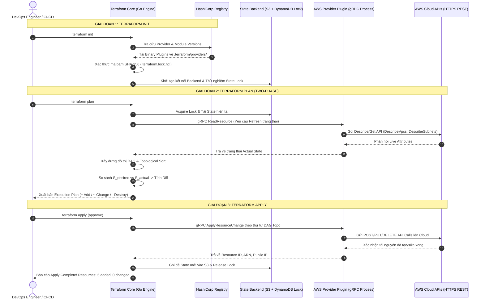
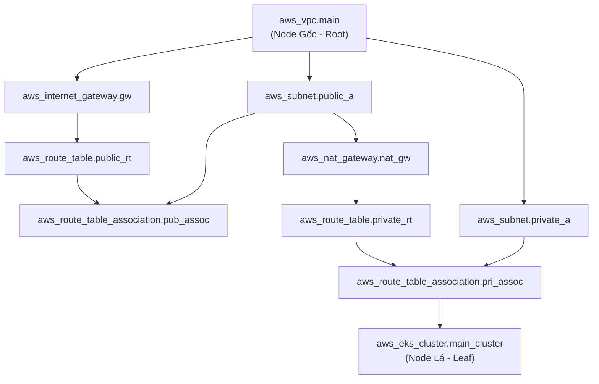
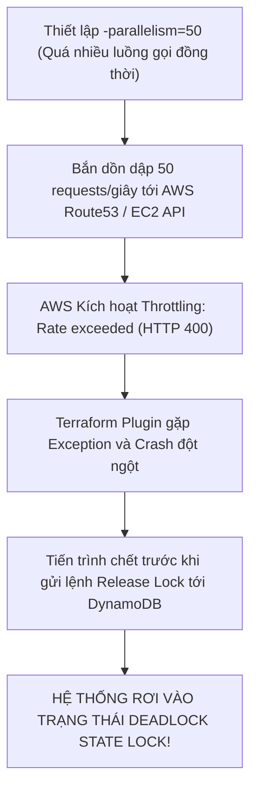

# Giải Mã Workflow Terraform: Cơ Chế Hoạt Động Ngầm Của Init, Plan, Apply & Đồ Thị DAG

Hầu hết các kỹ sư khi bắt đầu làm quen với Terraform đều thuộc lòng bộ ba câu lệnh quen thuộc: `terraform init`, `terraform plan` và `terraform apply`. Tuy nhiên, khi vận hành hệ thống quy mô lớn với hàng trăm tài nguyên phân tán trên nhiều tài khoản đám mây, việc hiểu rõ **cơ chế ngầm (under-the-hood)** của từng giai đoạn thực thi là yếu tố sống còn giúp bạn tối ưu hóa thời gian chạy pipeline từ 45 phút xuống dưới 3 phút, gỡ rối các vòng lặp phụ thuộc (**Circular Dependency**) và ngăn chặn thảm họa xóa nhầm cơ sở dữ liệu Production.

Trong bài viết chuyên sâu này, chúng ta sẽ mở nắp "bộ máy cơ học" bên trong Terraform Core: Khám phá giao thức giao tiếp **gRPC Plugin RPC**, cơ chế phân tích cú pháp **Two-Phase Execution**, thuật toán sắp xếp topo trên **Đồ thị không tuần hoàn có hướng (Directed Acyclic Graph - DAG)** và phương pháp điều phối luồng song song với tham số `-parallelism`.

---

## 1. Toàn Cảnh Chu Trình Vòng Đời Terraform Core Workflow

Kiến trúc nội tại của Terraform được chia thành 2 phần tách biệt hoàn toàn: **Terraform Core** (chịu trách nhiệm phân tích HCL, dựng đồ thị DAG, quản lý State) và **Provider Plugins** (chịu trách nhiệm giao tiếp trực tiếp với Cloud API). Hai thành phần này giao tiếp với nhau qua giao thức **HashiCorp go-plugin** dựa trên **gRPC over Local Unix Sockets / Named Pipes**:



---

## 2. Giải Phẫu Chi Tiết Ba Giai Đoạn Cốt Lõi

### 2.1. `terraform init` — Quản Trị Dependency & Cấu Trúc Khóa Lock File
Khi phát lệnh `init`, Terraform chuẩn bị toàn bộ không gian làm việc với 3 bước nền tảng:
1. **Provider Discovery & Checksum Verification**: Quét các khối `required_providers`, tải binary tương thích với OS/Arch về `.terraform/providers/`.
2. **Khóa Phiên Bản Bất Biến (`.terraform.lock.hcl`)**: Ghi lại mã băm SHA-256 của từng Provider binary (cả mã hash nền tảng `h1:` và mã hash đa nền tảng `zh:`). Tệp này phải luôn được commit vào Git để tránh lỗi lệch phiên bản trong CI/CD.
3. **Remote Backend & State Lock Binding**: Thiết lập kênh truyền dữ liệu an toàn tới S3 Bucket và xác thực quyền ghi vào DynamoDB Lock Table.

> [!TIP]
> **TỐI ƯU HIỆU NĂNG CI/CD VỚI PLUGIN CACHE:**
> Thiết lập biến môi trường `export TF_PLUGIN_CACHE_DIR="$HOME/.terraform.d/plugin-cache"` trong máy chủ CI/CD (GitLab Runner / GitHub Action Runner). Lệnh này giúp tái sử dụng lại các binary provider đã tải, giảm thời gian chạy `terraform init` từ 40 giây xuống dưới **2 giây**!

---

### 2.2. `terraform plan` — Two-Phase Execution & Thuật Toán Xây Dựng DAG
Lệnh `plan` thực hiện chu trình phân tích 2 pha nghiêm ngặt:

#### Pha 1: Refresh State (Đối Soát Trạng Thái Thực Tế)
Terraform đọc State file hiện hành, gửi các lệnh RPC `ReadResource` tới Provider để truy vấn trực tiếp Cloud API, phát hiện các thay đổi ngoài luồng (**State Drift**) do ai đó can thiệp thủ công trên giao diện Web.

#### Pha 2: Xây Dựng Đồ Thị DAG & Thuật Toán Sắp Xếp Topo (Topological Sort)
Terraform Engine phân tích toàn bộ mã nguồn HCL, xác định các tham chiếu ngầm định (`aws_subnet.public.id` tham chiếu `aws_vpc.main.id`) và tham chiếu tường minh (`depends_on`). Toàn bộ hệ thống được mô hình hóa thành một **Đồ thị không tuần hoàn có hướng (Directed Acyclic Graph - DAG)**:



Dựa trên thuật toán sắp xếp Topo (Topological Sorting - Kahn's Algorithm), Terraform xác định:
- **Thứ tự xuôi khi Tạo mới (+):** Đi từ Node gốc (VPC) $\rightarrow$ Subnet $\rightarrow$ Route Table $\rightarrow$ EKS Cluster.
- **Thứ tự ngược khi Xóa bỏ (-):** Đi từ Node lá (EKS Cluster) $\rightarrow$ Route Table Association $\rightarrow$ Subnet $\rightarrow$ VPC (LIFO - Last In First Out).
- **Phát hiện Vòng lặp bế tắc (Circular Dependency):** Nếu tài nguyên $A$ phụ thuộc $B$ và $B$ lại phụ thuộc ngược lại $A$, thuật toán sẽ phát hiện chu trình (Cycle) và lập tức dừng lại báo lỗi `Cycle: aws_security_group_rule.a, aws_security_group_rule.b`.

---

### 2.3. `terraform apply` — Cơ Chế Điều Phối Đa Luồng Với Tham Số `-parallelism`
Trong giai đoạn `apply`, Terraform Core duyệt qua đồ thị DAG theo thứ tự topo và phân bổ công việc vào một **Worker Pool đa luồng** (Goroutines trong Go).

Mặc định, Terraform sử dụng tham số `-parallelism=10` (đồng thời gửi tối đa 10 API requests lên Cloud Provider).

| Tham Số CLI | Giá Trị Mặc Định | Hành Vi Kỹ Thuật | Khuyến Nghị Thực Chiến |
| :--- | :--- | :--- | :--- |
| **`-parallelism=N`** | `10` | Số lượng Node độc lập trên DAG được thực thi song song | Giảm xuống `3` - `5` khi bị Rate Limit / Throttling; Tăng lên `30` khi khởi tạo hàng trăm DNS records |
| **`-refresh=false`** | `true` | Bỏ qua bước gọi API kiểm tra Live State trong pha 1 | Dùng khi cần apply khẩn cấp các tài nguyên độc lập mà Cloud API đang chậm |
| **`-lock-timeout=Xs`**| `0s` | Thời gian chờ nếu State đang bị khóa bởi tiến trình khác | Luôn đặt `-lock-timeout=120s` trong CI/CD để xếp hàng chờ thay vì fail ngay lập tức |
| **`-target=resource`**| N/A | Chỉ áp dụng một nhánh cụ thể trên đồ thị DAG | Chỉ dùng để cứu hộ sự cố, không lạm dụng trong quy trình chuẩn |

---

## 3. Kiến Trúc Mẫu Triển Khai Mạng VPC Chuẩn Đồ Thị DAG (HCL Breakdown)

Dưới đây là cấu hình một hệ sinh thái mạng VPC hoàn chỉnh, thể hiện rõ ràng cây phân nhánh của đồ thị DAG từ gốc tới lá:

```hcl
# main.tf - Kiến trúc hạ tầng mạng VPC chuẩn Enterprise
terraform {
  required_version = ">= 1.7.0"
  required_providers {
    aws = {
      source  = "hashicorp/aws"
      version = "~> 5.45.0"
    }
  }
}

provider "aws" {
  region = var.aws_region
}

# 1. ROOT NODE: Mạng VPC cốt lõi
resource "aws_vpc" "main" {
  cidr_block           = var.vpc_cidr
  enable_dns_hostnames = true
  enable_dns_support   = true

  tags = {
    Name = "showtech-enterprise-vpc"
  }
}

# 2. CHILD NODE: Internet Gateway (Phụ thuộc ngầm định vào VPC)
resource "aws_internet_gateway" "gw" {
  vpc_id = aws_vpc.main.id

  tags = {
    Name = "showtech-igw"
  }
}

# 3. CHILD NODES: Public Subnet và Private Subnet (Độc lập, tạo song song)
resource "aws_subnet" "public" {
  vpc_id                  = aws_vpc.main.id
  cidr_block              = cidrsubnet(var.vpc_cidr, 4, 0) # 10.0.0.0/20
  availability_zone       = "${var.aws_region}a"
  map_public_ip_on_launch = true

  tags = {
    Name = "showtech-public-subnet-a"
  }
}

resource "aws_subnet" "private" {
  vpc_id            = aws_vpc.main.id
  cidr_block        = cidrsubnet(var.vpc_cidr, 4, 1) # 10.0.16.0/20
  availability_zone = "${var.aws_region}a"

  tags = {
    Name = "showtech-private-subnet-a"
  }
}

# 4. INTERMEDIATE NODE: Elastic IP & NAT Gateway (Nằm trong Public Subnet)
resource "aws_eip" "nat" {
  domain     = "vpc"
  depends_on = [aws_internet_gateway.gw] # Bắt buộc IGW phải có trước EIP

  tags = {
    Name = "showtech-nat-eip"
  }
}

resource "aws_nat_gateway" "nat" {
  allocation_id = aws_eip.nat.id
  subnet_id     = aws_subnet.public.id

  tags = {
    Name = "showtech-nat-gw"
  }
}

# 5. LEAF NODES: Route Tables và Route Associations
resource "aws_route_table" "public_rt" {
  vpc_id = aws_vpc.main.id

  route {
    cidr_block = "0.0.0.0/0"
    gateway_id = aws_internet_gateway.gw.id
  }

  tags = {
    Name = "showtech-public-rt"
  }
}

resource "aws_route_table_association" "public_assoc" {
  subnet_id      = aws_subnet.public.id
  route_table_id = aws_route_table.public_rt.id
}
```

```hcl
# variables.tf
variable "aws_region" {
  type    = string
  default = "ap-southeast-1"
}

variable "vpc_cidr" {
  type    = string
  default = "10.0.0.0/16"
}
```

### Phân Tích Kỹ Thuật Chi Tiết:
- **Tham chiếu ngầm định (`Implicit Dependency`):** Dòng `vpc_id = aws_vpc.main.id` tự động thông báo cho Terraform DAG rằng tài nguyên `aws_subnet.public` không thể được tạo trước khi `aws_vpc.main` trả về thuộc tính `id`.
- **Tham chiếu tường minh (`Explicit Dependency`):** Dòng `depends_on = [aws_internet_gateway.gw]` ép buộc Terraform phải đợi Internet Gateway gắn thành công vào VPC thì mới xin cấp Elastic IP, loại bỏ lỗi gián đoạn định tuyến của AWS.

---

## 4. Phân Tích Cạm Bẫy Thực Chiến: Thảm Họa "API Throttling & Deadlock Lock State"

### Tình Huống Sự Cố Thực Tế:
Tại một công ty thương mại điện tử, một kỹ sư thực hiện triển khai cụm 150 DNS Records và 80 Security Group Rules bằng một tệp cấu hình Terraform duy nhất. Để tăng tốc độ apply, kỹ sư đã thiết lập tham số:
```bash
terraform apply -parallelism=50 -auto-approve
```

### Hậu Quả & Log Lỗi Thực Tế:
```log
# Trích đoạn log lỗi từ AWS Provider Plugin
2026-09-05T10:14:02.120Z [ERROR] provider.aws: RequestError: send request failed
caused by: ThrottlingException: Rate exceeded
	status code: 400, request id: 89ab32cd-1234-5678-90ab-cdef12345678
aws_route53_record.app_record[42]: Creating...
aws_route53_record.app_record[43]: Creating...
aws_security_group_rule.ingress[18]: Creating...

Error: Error creating Route53 Record: ThrottlingException: Rate exceeded
Error: Error creating Security Group Rule: RequestLimitExceeded: Request limit exceeded.

# Tiến trình apply bị crash giữa chừng, State Lock trong DynamoDB không kịp giải phóng!
# Khi kỹ sư chạy lại lệnh apply lần 2:
Error: Error acquiring the state lock
Lock Info:
  ID:        e2b9c031-41fa-4f2a-b731-92fa0912384a
  Path:      showtech-prod-tfstate-ap-southeast-1/core/network.tfstate
  Operation: OperationTypeApply
  Who:       jenkins@ci-runner-04
  Created:   2026-09-05 10:14:00.1023 UTC
```



### 5-Whys Root Cause Analysis:
1. **Tại sao hệ thống bị khóa không cho deploy tiếp?** $\rightarrow$ Vì DynamoDB Lock Table vẫn đang giữ bản ghi Lock ID `e2b9c031...` của tiến trình trước.
2. **Tại sao tiến trình trước không nhả khóa?** $\rightarrow$ Vì tiến trình bị crash đột ngột do gặp lỗi `ThrottlingException` từ AWS API.
3. **Tại sao AWS API trả về lỗi Throttling?** $\rightarrow$ Vì Terraform gửi đồng thời 50 requests/giây, vượt quá ngưỡng Token Bucket Rate Limit của tài khoản AWS.
4. **Tại sao lại gửi 50 requests cùng lúc?** $\rightarrow$ Vì kỹ sư tùy tiện cấu hình `-parallelism=50` mà không nắm rõ hạn mức API của dịch vụ Route53 và EC2.
5. **Biện pháp khắc phục chuẩn SRE (Remedy Protocol):**
   - **Mở khóa khẩn cấp an toàn:** Chạy `terraform force-unlock <Lock-ID>` sau khi đã xác minh không còn tiến trình nào đang chạy ngầm trên CI/CD runner.
   - **Điều chỉnh `-parallelism` hợp lý:** Đặt `-parallelism=10` (mặc định) hoặc `-parallelism=5` cho các dịch vụ nhạy cảm về API rate limit.
   - **Thêm tham số `-lock-timeout` trong CI/CD:** Luôn truyền cờ `-lock-timeout=120s` để pipeline tự động đợi khóa được nhả thay vì báo fail tức thì.

---

## 5. Hands-on Lab: Khám Phá & Xuất Bản Đồ Thị DAG (8 Bước)

### Bước 1: Khởi tạo mã nguồn và cài đặt Graphviz
```bash
# Cài đặt công cụ vẽ đồ thị Graphviz (trên Ubuntu/Debian hoặc MacOS)
sudo apt-get install -y graphviz || brew install graphviz

# Khởi tạo thư mục làm việc Terraform
terraform init
```

### Bước 2: Bật chế độ Debug Logging chi tiết
```bash
# Kích hoạt log chi tiết để quan sát các lệnh gRPC và API calls
export TF_LOG=DEBUG
export TF_LOG_PATH="./terraform_debug.log"
```

### Bước 3: Xuất bản dữ liệu đồ thị DAG dưới định dạng DOT
```bash
# Xuất đồ thị phụ thuộc của toàn bộ tài nguyên
terraform graph > graph.dot
```

### Bước 4: Chuyển đổi đồ thị DOT sang hình ảnh trực quan PNG
```bash
# Sử dụng công cụ dot của Graphviz để render hình ảnh kiến trúc
dot -Tpng graph.dot -o terraform_dag_architecture.png

# Kiểm tra tệp ảnh vừa tạo
ls -lh terraform_dag_architecture.png
```

### Bước 5: Thực hiện Plan với tham số giới hạn luồng song song
```bash
# Thực hiện plan với mức độ song song được kiểm soát an toàn
terraform plan -parallelism=5 -out=tfplan.binary
```

### Bước 6: Kiểm tra cơ chế thay thế tài nguyên có chủ đích (`-replace`)
```bash
# Đánh dấu buộc phải hủy và tạo lại một tài nguyên cụ thể mà không sửa code
terraform plan -replace="aws_nat_gateway.nat"
```

### Bước 7: Áp dụng kế hoạch thực thi với cấu hình State Lock Timeout
```bash
# Thực thi apply an toàn với thời gian chờ nhả khóa 60 giây
terraform apply -lock-timeout=60s tfplan.binary
```

### Bước 8: Kiểm tra trạng thái và thu dọn tài nguyên có kiểm soát
```bash
# Liệt kê tài nguyên trong State
terraform state list

# Hủy tài nguyên theo thứ tự ngược của DAG
terraform destroy -auto-approve
```

---

## 6. 10 Câu Hỏi Tự Kiểm Tra Chuyên Sâu (Self-Check Q&A)

### Câu 1: Tệp `.terraform.lock.hcl` đóng vai trò gì và có nên đưa vào Git không?
<details>
<summary><b>Xem lời giải chi tiết</b></summary>
Tệp này lưu trữ chính xác phiên bản và mã băm SHA-256 (Checksum) của các Provider Plugins đã được sử dụng. <b>BẮT BUỘC</b> phải đưa tệp này vào Git để đảm bảo tính bất biến (Reproducibility), ngăn chặn việc các môi trường CI/CD khác nhau vô tình tải về phiên bản Provider mới hơn có chứa breaking changes.
</details>

### Câu 2: Trong giao thức nội bộ, Terraform Core giao tiếp với các Provider Plugins thông qua cơ chế nào?
<details>
<summary><b>Xem lời giải chi tiết</b></summary>
Terraform Core và Provider Plugins là các tiến trình (OS Processes) riêng biệt. Chúng giao tiếp với nhau thông qua cơ chế <b>gRPC over Local Sockets (Unix Domain Socket trên Linux/Mac hoặc Named Pipes trên Windows)</b> sử dụng thư viện mã nguồn mở <code>hashicorp/go-plugin</code>.
</details>

### Câu 3: Khái niệm "Directed Acyclic Graph (DAG)" nghĩa là gì và tại sao Terraform bắt buộc phải dùng đồ thị không tuần hoàn?
<details>
<summary><b>Xem lời giải chi tiết</b></summary>
DAG là đồ thị có hướng và <b>không chứa bất kỳ vòng lặp khép kín nào</b>. Terraform bắt buộc phải dùng DAG vì nếu tồn tại chu trình tuần hoàn (tài nguyên A phụ thuộc B và B phụ thuộc A), thuật toán sẽ không thể xác định điểm bắt đầu và rơi vào bế tắc vô tận (Deadlock).
</details>

### Câu 4: Tham chiếu ngầm định (Implicit Dependency) khác gì so với tham chiếu tường minh (Explicit Dependency)?
<details>
<summary><b>Xem lời giải chi tiết</b></summary>
- <b>Implicit Dependency:</b> Được tạo tự động khi một tài nguyên sử dụng trực tiếp thuộc tính đầu ra của tài nguyên khác (ví dụ <code>subnet_id = aws_subnet.pub.id</code>).<br/>
- <b>Explicit Dependency:</b> Được kỹ sư khai báo thủ công thông qua thuộc tính <code>depends_on = [...]</code> khi không có sự ràng buộc dữ liệu trực tiếp nhưng bắt buộc phải có thứ tự khởi tạo trước sau.
</details>

### Câu 5: Điều gì xảy ra trong pha "Refresh" khi chạy `terraform plan`?
<details>
<summary><b>Xem lời giải chi tiết</b></summary>
Terraform Core sẽ gửi các yêu cầu <code>ReadResource</code> tới Provider để gọi các API đọc (Describe/Get) từ Cloud, sau đó cập nhật dữ liệu mới nhất vào bộ nhớ đệm State nhằm phát hiện xem có sự sai lệch nào giữa thực tế và State hay không trước khi tính toán Diff.
</details>

### Câu 6: Khi nào nên sử dụng cờ `-refresh=false` trong các lệnh Terraform?
<details>
<summary><b>Xem lời giải chi tiết</b></summary>
Nên dùng khi hạ tầng có số lượng tài nguyên quá lớn (hàng ngàn resources) khiến bước Refresh mất hàng chục phút, hoặc khi Cloud API đang bị chậm/nghẽn mà bạn chỉ cần thực hiện một thay đổi nhỏ đã biết chắc chắn trạng thái. Tuy nhiên cần thận trọng vì nó bỏ qua việc kiểm tra Drift.
</details>

### Câu 7: Lệnh `terraform force-unlock <LOCK-ID>` nên được sử dụng trong tình huống nào và rủi ro của nó là gì?
<details>
<summary><b>Xem lời giải chi tiết</b></summary>
Chỉ sử dụng khi một tiến trình Terraform trước đó bị crash/kill bất ngờ khiến bản ghi Lock vẫn còn kẹt trong Backend (DynamoDB). <b>Rủi ro lớn nhất:</b> Nếu tiến trình cũ thực tế vẫn đang âm thầm chạy và ghi dữ liệu, việc force-unlock sẽ cho phép tiến trình thứ hai nhảy vào ghi đè, gây hỏng hoàn toàn tệp State (State Corruption).
</details>

### Câu 8: Tham số `-parallelism=10` kiểm soát điều gì trong chu trình `terraform apply`?
<details>
<summary><b>Xem lời giải chi tiết</b></summary>
Kiểm soát số lượng tác vụ (Goroutines) độc lập trên đồ thị DAG có thể được thực thi đồng thời. Giảm tham số này giúp tránh lỗi API Throttling của Cloud Provider; tăng tham số này giúp rút ngắn thời gian triển khai khi có nhiều tài nguyên độc lập (như DNS records, S3 buckets).
</details>

### Câu 9: Lệnh `terraform graph` xuất ra định dạng gì và công cụ nào được dùng để xem hình ảnh?
<details>
<summary><b>Xem lời giải chi tiết</b></summary>
Lệnh <code>terraform graph</code> xuất ra dữ liệu mô tả đồ thị dưới định dạng ngôn ngữ <b>DOT</b>. Ta sử dụng công cụ mã nguồn mở <b>Graphviz</b> (lệnh <code>dot -Tpng graph.dot -o graph.png</code>) để chuyển đổi sang hình ảnh SVG/PNG.
</details>

### Câu 10: Tùy chọn `-replace="resource_address"` có công dụng gì trong Terraform 0.15.2+?
<details>
<summary><b>Xem lời giải chi tiết</b></summary>
Dùng để thay thế lệnh cũ <code>terraform taint</code>. Nó yêu cầu Terraform trong đợt apply tiếp theo phải hủy bỏ (destroy) và tạo mới lại (recreate) chính xác tài nguyên được chỉ định mà không cần chỉnh sửa bất kỳ dòng mã nguồn HCL nào.
</details>

---

## 7. Tổng Kết & Lộ Trình Bài Học Tiếp Theo

Hiểu rõ cơ chế **Two-Phase Execution**, giao thức **gRPC Plugin RPC** và thuật toán **DAG** giúp bạn nắm trong tay chìa khóa để điều khiển, tối ưu hóa và gỡ lỗi mọi hệ thống IaC phức tạp nhất.

Trong **[Bài 03: Tối Ưu Cú Pháp HCL: Xử Lý Dynamic Types, Expressions, Built-in Functions & Meta-Arguments Chuẩn Enterprise](03-toi-uu-cu-phap-hcl-xu-ly-dynamic-type-expressions.md)**, chúng ta sẽ đi sâu vào nghệ thuật lập trình HCL: Làm chủ hệ thống kiểu dữ liệu động, biểu thức điều kiện tam nguyên, các hàm tích hợp sẵn (Built-in Functions) và siêu tham số vòng lặp meta-arguments.
