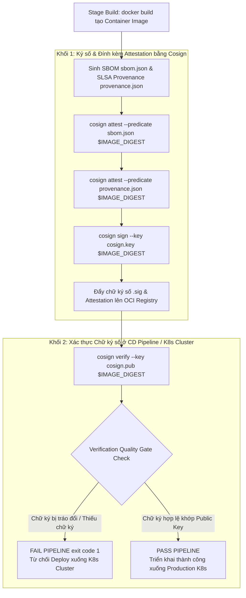
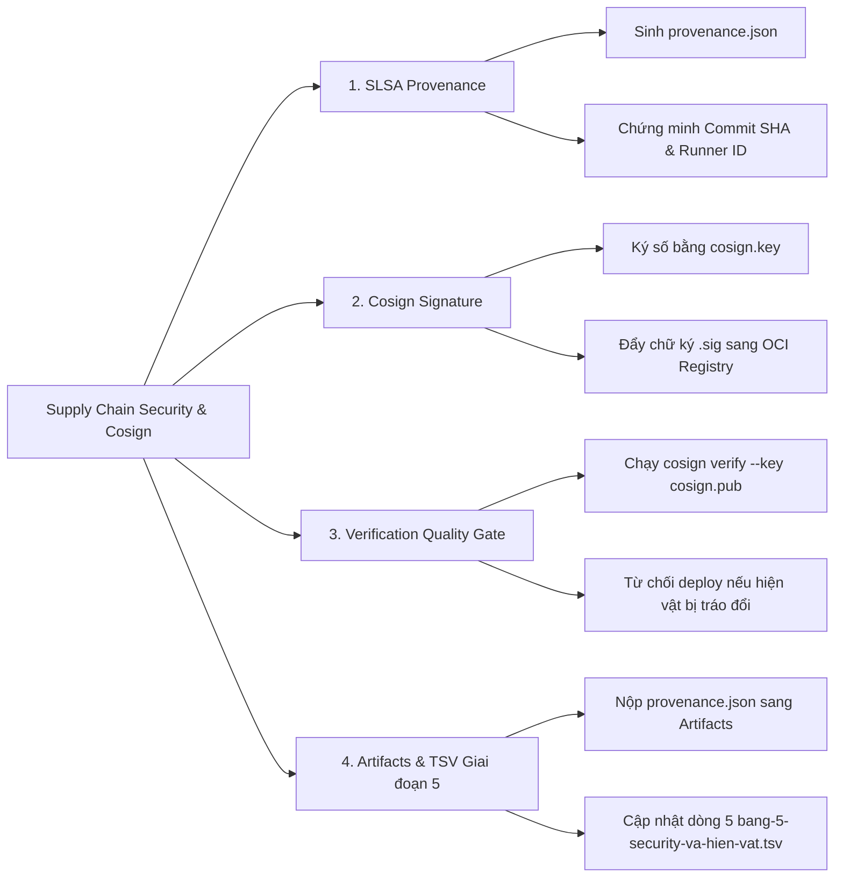
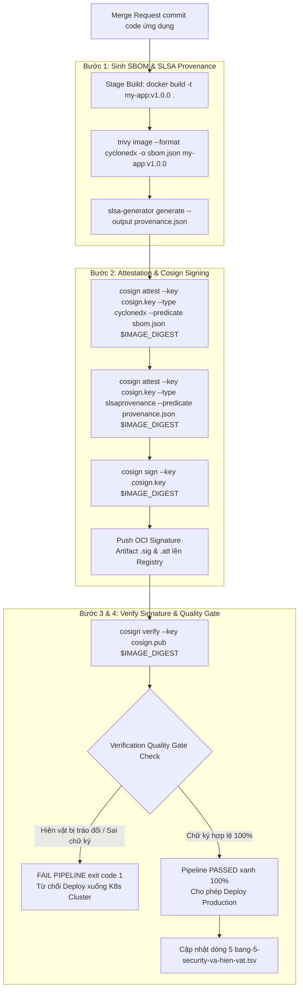


# [BÀI 32] CHUỖI CUNG ỨNG PHẦN MỀM AN TOÀN (SUPPLY CHAIN SECURITY): SLSA FRAMEWORK, COSIGN IMAGE SIGNING & SBOM ATTESTATION

Trong kỷ nguyên **DevOps, DevSecOps và Cloud Native Engineering**, **GitLab CI/CD** được công nhận là một trong những nền tảng tự động hóa tích hợp liên tục và phân phối liên tục (CI/CD) hoàn chỉnh, mạnh mẽ và được tin dùng nhất trong các doanh nghiệp quy mô lớn. Không chỉ dừng lại ở các pipeline tuần tự cơ bản, việc vận hành GitLab CI/CD ở cấp độ Production đòi hỏi kỹ sư phải làm chủ kiến trúc điều phối phi tuyến tính **DAG (Directed Acyclic Graph)**, cơ chế quản trị **Autoscaling Runners**, tối ưu hóa **Caching đa tầng**, xác thực không khóa **Keyless OIDC**, bảo mật chuỗi cung ứng phần mềm **SLSA & SBOM** cùng các chính sách **Quality & Security Gates** tự động.

Bài viết chuyên sâu này sẽ đồng hành cùng bạn mổ xẻ toàn diện bức tranh kiến trúc, phân tích các đánh đổi kỹ thuật thực chiến (Engineering Trade-offs), cung cấp hướng dẫn thực hành Lab chi tiết từng bước và bộ câu hỏi phỏng vấn chuyên sâu chuẩn DevOps Lead / DevSecOps Architect.

---

## 1. Bản Chất Kiến Trúc & Cơ Chế Vận Hành Tầng Thấp

---


| # | Câu hỏi ôn tập Buổi 31 (Container & IaC Scan) | Đáp án chuẩn ngắn gọn |
|---|---|---|
| 1 | Tại sao nói quét image sau khi build là quá muộn ở một ca cụ thể? | Vì chờ build xong image mới quét sẽ lãng phí 15 phút build nếu Dockerfile chứa lỗi cấu hình nghiêm trọng. |
| 2 | Phân biệt sự khác biệt giữa IaC Scan (Checkov) và Container Scan (Trivy Image)? | Checkov quét mã nguồn tĩnh phát hiện lỗi cấu hình; Trivy Image quét các gói Linux Base OS phát hiện CVEs. |
| 3 | Rủi ro bảo mật nghiêm trọng khi chạy Container dưới quyền Root (`USER root`) là gì? | Nếu ứng dụng bị dính RCE, kẻ tấn công có quyền Root trong Container và có cơ hội Container Escape chiếm máy chủ Host. |
| 4 | Khái niệm Distroless Image đem lại lợi ích gì cho an ninh Container Image? | Loại bỏ 100% shell bash và tiện ích thừa, giảm 95% dung lượng và đưa số lượng lỗ hổng CVEs về gần 0. |
| 5 | Tệp báo cáo Container Scanning `gl-container-scanning-report.json` được nộp sang thuộc tính nào? | Thuộc tính `artifacts:reports:container_scanning`. |

---


> **LUẬN ĐỀ TRUNG TÂM BUỔI 32:**
> **MUỐN BIẾT IMAGE CÓ AN TOÀN HAY KHÔNG, PHẢI BIẾT AI BUILD, TỪ COMMIT NÀO, BẰNG RUNNER NÀO — PROVENANCE LÀ CHỨNG MINH NHÂN DÂN CỦA HIỆN VẬT VÀ CHỮ KÝ SỐ COSIGN LÀ NIÊM PHONG ĐIỆN TỬ CHỐNG TRÁO ĐỔI HIỆN VẬT. Việc tự động hóa sinh chứng nhận xuất xứ SLSA Provenance (`slsa-provenance.json`) đính kèm tệp danh mục phần mềm SBOM (`sbom.json`) và ký số Cryptographic Signature bằng `Cosign` (Sigstore) giúp đảm bảo 100% tính toàn vẹn và xác thực nguồn gốc hiện vật trước khi triển khai xuống Kubernetes Cluster.**



---


| STT | Kết quả đạt được (Competency) | Hiện vật chứng minh (Evidence) |
|---|---|---|
| 1 | Khởi tạo cặp khóa `cosign.key` và `cosign.pub` để ký số. | Cặp khóa `cosign.key` và `cosign.pub` hợp lệ. |
| 2 | Sinh chứng nhận xuất xứ nguồn gốc SLSA Provenance `provenance.json`. | Tệp `provenance.json` chứa Commit SHA và Runner ID. |
| 3 | Triển khai công cụ `Cosign` ký số và đính kèm Attestation lên Registry. | Chữ ký số OCI `.sig` trên Docker Registry. |
| 4 | Phân định rõ 3 lớp: SBOM, SLSA Provenance, và Cosign Signature. | Pipeline chạy 3 bước bảo vệ an ninh chuỗi cung ứng. |
| 5 | Cấu hình Verification Quality Gate tự động ngắt pipeline khi bị tráo đổi hiện vật. | Lệnh `cosign verify` trả về `exit code 1` khi Image bị sửa đổi. |
| 6 | Cập nhật dòng dữ liệu thứ 5 vào tệp hiện vật Giai đoạn 5 TSV. | Tệp `bang-5-security-va-hien-vat.tsv` bổ sung thông số Buổi 32. |

---


| Kiến thức tiên quyết | Ý nghĩa trong bài học Buổi 32 | Nguồn đối soát nếu thiếu |
|---|---|---|
| Khái niệm OCI Registry & Digest Hash SHA256 | Định danh duy nhất của Container Image không thể thay đổi | Buổi 24 (`QT 4.1`) |
| Nguyên lý Mã hóa Khóa Công khai (Asymmetric Crypto) | Khóa Private Key để ký, khóa Public Key để xác thực | Buổi 30 (`QT 5.1`) |
| Định dạng danh mục SBOM CycloneDX | Tệp kê khai toàn bộ gói phần mềm có trong Image | Buổi 31 (`QT 6.1`) |
| Security Quality Gate Mechanics | Ép buộc CI Job trả về `exit code 1` khi chữ ký bị từ chối | Buổi 28 (`QT 5.3`) |

---


### Bảng đối chiếu thuật ngữ Việt - Anh

| Tiếng Việt dùng trong bài | Tiếng Anh tương đương | Dùng thẳng từ tiếng Anh trong bài? |
|---|---|---|
| An ninh chuỗi cung ứng phần mềm | Software Supply Chain Security | **Có** — `Supply Chain Security` |
| Khung tiêu chuẩn an ninh hiện vật | Supply-chain Levels for Software Artifacts | **Có** — `SLSA Framework` |
| Chứng nhận xuất xứ nguồn gốc | Provenance Attestation | **Có** — `SLSA Provenance` |
| Ký số hiện vật bằng Cosign | Cosign Artifact Signing (Sigstore) | **Có** — `Cosign Signing` |
| Niêm phong điện tử không mật khẩu | Keyless OIDC Signing (Fulcio & Rekor) | **Có** — `Keyless Signing` |
| Nhật ký công khai chống sửa đổi | Transparency Log (Rekor) | **Có** — `Rekor Transparency Log` |
| Tấn công tráo đổi hiện vật | Artifact Tampering Attack | **Có** — `Artifact Tampering` |
| Mã Hash cố định hiện vật | Immutable Digest SHA256 Hash | **Có** — `Digest SHA256` |
| Chuẩn xác thực chữ ký | Cosign Verification Quality Gate | **Có** — `cosign verify` |

---

### Bốn mô hình tư duy cốt lõi

#### Mô hình 1: Ba trụ cột An ninh Chuỗi Cung Ứng Phần Mềm (SBOM vs Provenance vs Signature)
- **SBOM (Software Bill of Materials):** Kê khai *BÊN TRONG IMAGE CÓ CÁI GÌ* (Danh mục tất cả các gói APK/APT, Node modules, Go binaries).
- **SLSA Provenance:** Chứng minh *AI BUILD RA IMAGE NÀY, TỪ COMMIT NÀO, BẰNG RUNNER NÀO* (Chứng minh nhân dân của bản build).
- **Cosign Signature:** Niêm phong *HIỆN VẬT NÀY KHÔNG BỊ TRÁO ĐỔI HAY CHÈN MÃ ĐỘC* (Con dấu niêm phong chống sửa đổi nhị phân).

#### Mô hình 2: Khung Tiêu chuẩn SLSA Framework (Levels 1 – 3)
- **SLSA Level 1:** Bản build được tự động hóa bằng CI/CD script và sinh tệp Provenance thô.
- **SLSA Level 2:** Bản build chạy trên CI Runner độc lập và tệp Provenance được ký số bởi máy chủ CI Server.
- **SLSA Level 3:** Bản build thực thi trong môi trường isolated đệm vô trùng (Isolated Ephemeral Build Environment), ngăn chặn tuyệt đối lập trình viên tự ý can thiệp vào bộ nhớ RAM trong lúc build.

#### Mô hình 3: Cơ chế ký số và lưu trữ chữ ký của Cosign trên OCI Registry
- `Cosign` không lưu chữ ký số ở một cơ sở dữ liệu bên ngoài mà đóng gói chữ ký thành một OCI Artifact đặc biệt có tag dạng `sha256-<DIGEST>.sig` đẩy thẳng lên Docker Registry nằm bên cạnh Container Image.
- Nhờ đó, bất kỳ ai kéo Image từ Docker Registry về đều có thể tự xác thực chữ ký số ngay lập tức bằng câu lệnh `cosign verify`.

#### Mô hình 4: Xác thực chữ ký số tự động tại Kubernetes Cluster (Admission Controller)
- Trên Kubernetes Cluster, ta cài đặt **Kyverno** hoặc **OPA Gatekeeper**. Khi có lệnh deploy Pod mới, K8s Admission Controller tự động gọi `cosign verify` kiểm tra chữ ký số của Container Image.
- Nếu Image chưa được ký số bởi Private Key của công ty, Kubernetes sẽ lập tức từ chối khởi chạy Pod (`ImagePolicyWebhook Rejected`).

---

### 1.1. Khung Tiêu chuẩn SLSA Framework và Chứng nhận Provenance (10 phút)

### Phân tích cấu trúc tệp Chứng nhận Xuất xứ SLSA Provenance (`provenance.json`)

Tệp chứng nhận xuất xứ SLSA Provenance tuân thủ định dạng chuẩn in-toto statement format:

```json
{
  "_type": "https://in-toto.io/Statement/v0.1",
  "predicateType": "https://slsa.dev/provenance/v0.2",
  "subject": [
    {
      "name": "registry.example.com/web-app",
      "digest": {
        "sha256": "e3b0c44298fc1c149afbf4c8996fb92427ae41e4649b934ca495991b7852b855"
      }
    }
  ],
  "builder": {
    "id": "https://gitlab.com/devsecops-runners/docker-runner-node-01"
  },
  "buildType": "https://gitlab.com/gitlab-org/gitlab-runner",
  "invocation": {
    "configSource": {
      "uri": "git+https://gitlab.example.com/devsecops/web-app.git",
      "digest": {
        "sha256": "4f8a92b3c10e7192849182374981273948123984"
      },
      "entryPoint": ".gitlab-ci.yml"
    },
    "parameters": {
      "CI_COMMIT_SHA": "4f8a92b3c10e7192849182374981273948123984",
      "CI_PIPELINE_ID": "105928"
    }
  }
}
```

### Phân tích chi tiết Luồng Ký số Không Mật Khẩu (Keyless OIDC Signing Flow)

Cơ chế Keyless Signing trong Cosign (Sigstore) loại bỏ hoàn toàn nhu cầu quản lý Private Key tĩnh bằng cách phối hợp 3 thành phần:
1. **OIDC Identity Token (GitLab CI):** CI Job cấp phát một OIDC JWT Token chứa thông tin định danh `project_path:devsecops/web-app`, `ref:refs/heads/main`.
2. **Fulcio Certificate Authority:** Cosign gửi OIDC JWT Token sang Fulcio CA. Fulcio đối soát chữ ký số OIDC và cấp một chứng chỉ số X.509 ngắn hạn (thời hạn sống 20 phút) gắn liền với định danh repo/runner.
3. **Rekor Transparency Log & OCI Registry:** Cosign sử dụng chứng chỉ số X.509 ngắn hạn để ký lên Container Image, đẩy chữ ký số lên OCI Registry đồng thời ghi vết kiểm toán vĩnh viễn vào nhật ký công khai **Rekor Transparency Log**. Khi xác thực, `cosign verify` kiểm tra chứng chỉ X.509 đối soát với Rekor log mà không cần giữ bất kỳ Public Key nào.

### Phân tích Thuật toán Mã hóa Chữ ký số Cosign trên OCI Artifacts

Động cơ `Cosign` sử dụng các thuật toán mã hóa khóa công khai bất đối xứng tiêu chuẩn quốc tế:
- **ECDSA P-256 (Elliptic Curve Digital Signature Algorithm):** Cặp khóa mặc định sinh bởi `cosign generate-key-pair` cho tốc độ ký số cực nhanh và dung lượng chữ ký số nhỏ gọn.
- **RSA-4096 / Ed25519:** Hỗ trợ lưu trữ cặp khóa bảo mật cao trong các thiết bị phần cứng HSM (Hardware Security Module) hoặc KMS (AWS KMS, GCP KMS).
- **OCI Image Digest Băm SHA256:** Cosign luôn thực thi ký số trực tiếp trên chuỗi Hash **Immutable Digest SHA256** của Container Image (`@sha256:e3b0c44...`) thay vì tên Tag (`:latest`), đảm bảo chống tuyệt đối hành vi tráo đổi tag hay thay đổi nhị phân.

---

**Nguyên lý cốt lõi:**
**Phát biểu.** Tuyệt đối không đẩy Container Image lên Registry mà không đính kèm chữ ký số Cryptographic Signature của `Cosign`.
**Giải thích cơ chế ngầm:** Ngăn chặn kẻ tấn công thực thi tấn công tráo đổi hiện vật (Artifact Tampering) hoặc chèn mã độc vào Image trên Docker Registry trước khi deploy lên Production.
> [!WARNING]
> **CẠM BẪY THỰC CHIẾN:**
> Push Container Image lên Registry chỉ bằng câu lệnh `docker push` mà không chạy `cosign sign`.
**Minh hoạ.**
```bash
# KHÔNG NÊN: Chỉ push thô không ký số
docker push $CI_REGISTRY_IMAGE:$CI_COMMIT_SHA

# NÊN DÙNG: Push và thực thi ký số Cosign
docker push $CI_REGISTRY_IMAGE:$CI_COMMIT_SHA
cosign sign --key $COSIGN_PRIVATE_KEY $CI_REGISTRY_IMAGE@$IMAGE_DIGEST
```
**Con số chốt:** **100%** Container Images được push lên Registry phải đính kèm chữ ký số Cosign.

---

**Nguyên lý cốt lõi:**
**Phát biểu.** Sinh tệp chứng nhận xuất xứ nguồn gốc SLSA Provenance (`slsa-provenance.json`) chứng minh chi tiết Runner ID, Commit SHA, Repo URL.
**Giải thích cơ chế ngầm:** Giúp thanh tra an ninh và đội ngũ Incident Response xác minh chính xác nguồn gốc mã nguồn và máy chủ CI Runner đã biên dịch nên Container Image.
> [!WARNING]
> **CẠM BẪY THỰC CHIẾN:**
> Build Container Image mà không sinh tệp chứng nhận Provenance.
**Minh hoạ.**
```bash
slsa-generator generate --predicate-path provenance.json --artifact-path image.tar
```
**Con số chốt:** **100%** hiện vật build ra có tệp chứng nhận xuất xứ SLSA Provenance.

---

**Nguyên lý cốt lõi:**
**Phát biểu.** Phân định rõ phạm vi: SBOM khai báo thành phần phần mềm, SLSA Provenance chứng minh nguồn gốc build, Cosign niêm phong chống tráo đổi hiện vật.
**Giải thích cơ chế ngầm:** Giúp xây dựng quy trình bảo vệ an ninh chuỗi cung ứng 3 lớp toàn diện không có lỗ hổng.
> [!WARNING]
> **CẠM BẪY THỰC CHIẾN:**
> Nhầm lẫn giữa tệp SBOM và tệp chứng nhận Provenance.
**Minh hoạ.**
- SBOM: Kê khai các gói `openssl`, `curl`, `glibc`.
- Provenance: Kê khai `Commit SHA: 4f8a92b`, `Runner ID: 105`.
- Cosign Signature: Chữ ký mã hóa băm RSA/ECDSA niêm phong Image.
**Con số chốt:** Phân định chính xác **100%** 3 lớp bảo vệ an ninh chuỗi cung ứng.

---

### 1.2. Nguyên lý Ký số Cosign và Lưu trữ Chữ ký trên OCI Registry (10 phút)

---

**Nguyên lý cốt lõi:**
**Phát biểu.** Cấu hình cờ `cosign sign --key cosign.key` hoặc Keyless OIDC signing nạp mã hóa chữ ký số trực tiếp vào OCI Registry.
**Giải thích cơ chế ngầm:** Cosign đóng gói chữ ký số thành OCI Artifact chuẩn, giúp việc lưu trữ và phân phối chữ ký đồng bộ với Container Image mà không cần máy chủ quản lý chữ ký riêng biệt.
> [!WARNING]
> **CẠM BẪY THỰC CHIẾN:**
> Lưu chữ ký số ra tệp local rồi bỏ quên không nộp lên Registry.
**Minh hoạ.**
```bash
cosign sign --key cosign.key -y $CI_REGISTRY_IMAGE@$IMAGE_DIGEST
```
**Con số chốt:** Chữ ký số Cosign được lưu trữ **100%** trên OCI Registry dưới dạng OCI Artifact `.sig`.

---

**Nguyên lý cốt lõi:**
**Phát biểu.** Cấu hình cờ `cosign verify --key cosign.pub` kiểm tra tính toàn vẹn của hiện vật trước khi cho phép deploy lên K8s Cluster.
**Giải thích cơ chế ngầm:** Đảm bảo Container Image không bị bất kỳ ai thay đổi dù chỉ 1 bit nhị phân kể từ khi được build và ký số bởi CI Pipeline.
> [!WARNING]
> **CẠM BẪY THỰC CHIẾN:**
> Thực thi lệnh `kubectl apply` deploy Image mà không qua bước `cosign verify`.
**Minh hoạ.**
```bash
cosign verify --key cosign.pub $CI_REGISTRY_IMAGE@$IMAGE_DIGEST
```
**Con số chốt:** **100%** lệnh deploy Production phải vượt qua `cosign verify`.

---

**Nguyên lý cốt lõi:**
**Phát biểu.** Thiết lập Verification Security Quality Gate tự động ngắt pipeline (`exit 1`) nếu chữ ký số Cosign bị sai lệch hoặc không khớp khóa public.
**Giải thích cơ chế ngầm:** Ngăn chặn tuyệt đối việc triển khai các Container Image giả mạo hoặc chưa được phê duyệt lên hệ thống Production.
> [!WARNING]
> **CẠM BẪY THỰC CHIẾN:**
> Đặt `allow_failure: true` cho Job xác thực chữ ký Cosign.
**Minh hoạ.**
```yaml
verify-signature:
  stage: test
  script:
    - cosign verify --key cosign.pub $IMAGE_NAME || exit 1
  allow_failure: false
```
**Con số chốt:** Verification Quality Gate tự động ngắt pipeline **100%** khi chữ ký không hợp lệ.

---

### 1.3. Keyless Signing OIDC và Verification Quality Gate (10 phút)

---

**Nguyên lý cốt lõi:**
**Phát biểu.** Tự động gắn nhãn Provenance Attestation sang OCI Registry Manifests.
**Giải thích cơ chế ngầm:** Đính kèm tệp SBOM và Provenance trực tiếp vào đệm đệm của Container Image trên Registry, giúp các công cụ kiểm tra an ninh tự động truy xuất dữ liệu chỉ bằng 1 câu lệnh `cosign tree`.
> [!WARNING]
> **CẠM BẪY THỰC CHIẾN:**
> Sinh tệp SBOM nhưng không chạy lệnh `cosign attest`.
**Minh hoạ.**
```bash
cosign attest --key cosign.key --type cyclonedx --predicate sbom.json $IMAGE_DIGEST
cosign attest --key cosign.key --type slsaprovenance --predicate provenance.json $IMAGE_DIGEST
```
**Con số chốt:** **100%** Attestations được gắn nhãn hợp lệ vào OCI Image Manifests.

---

**Nguyên lý cốt lõi:**
**Phát biểu.** Tích hợp báo cáo kiểm toán chữ ký số và SLSA Provenance lên Merge Request Widget.
**Giải thích cơ chế ngầm:** Minh bạch hóa thông tin nguồn gốc bản build và trạng thái ký số công khai cho Tech Lead và Security Auditor ngay trên trang Merge Request.
> [!WARNING]
> **CẠM BẪY THỰC CHIẾN:**
> Không nộp tệp báo cáo chữ ký số sang thuộc tính `artifacts:paths`.
**Minh hoạ.**
```yaml
artifacts:
  paths:
    - provenance.json
    - cosign-signature.json
```
**Con số chốt:** Tích hợp hiển thị kết quả kiểm toán chữ ký **100%** trên Merge Request UI.

---

**Nguyên lý cốt lõi:**
**Phát biểu.** Quản lý và bảo vệ nghiêm ngặt Cosign Private Key bằng HashiCorp Vault hoặc AWS KMS, tuyệt đối không hardcode trong CI Variables.
**Giải thích cơ chế ngầm:** Nếu Cosign Private Key bị lộ, kẻ tấn công có thể tự do ký số giả mạo lên các Container Image độc hại mà không ai phát hiện được.
> [!WARNING]
> **CẠM BẪY THỰC CHIẾN:**
> Lưu trực tiếp nội dung `cosign.key` dưới dạng thô trong `.gitlab-ci.yml`.
**Minh hoạ.**
```bash
# Nạp Private Key mã hóa từ HashiCorp Vault qua OIDC
vault kv get -field=cosign_private_key secret/ci/security > cosign.key
```
**Con số chốt:** **100%** Cosign Private Keys được bảo vệ trong máy chủ quản lý bí mật đệm RAM.

---

### 1.4. Trích xuất Báo cáo Provenance và Cập nhật Giai đoạn 5 TSV (8 phút)

---

**Nguyên lý cốt lõi:**
**Phát biểu.** Trích xuất các tệp báo cáo `slsa-provenance.json` và `cosign-signature.json` nộp sang `artifacts:paths`.
**Giải thích cơ chế ngầm:** Phục vụ công tác kiểm toán an ninh dài hạn và lưu trữ bằng chứng tuân thủ quy định an toàn phần mềm.
> [!WARNING]
> **CẠM BẪY THỰC CHIẾN:**
> Không lưu trữ vết chữ ký số sang Artifacts.
**Minh hoạ.**
```yaml
artifacts:
  paths:
    - slsa-provenance.json
    - cosign-signature.json
```
**Con số chốt:** Nộp đầy đủ tệp chứng nhận an ninh **100%** sang GitLab Artifacts.

---

**Nguyên lý cốt lõi:**
**Phát biểu.** In log công khai kết quả xác thực chữ ký `cosign verify` và chứng nhận SLSA Provenance trên Runner log console.
**Giải thích cơ chế ngầm:** Giúp lập trình viên quan sát trực quan trạng thái xác thực chữ ký số và các thông số Commit SHA trực tiếp trên console log.
> [!WARNING]
> **CẠM BẪY THỰC CHIẾN:**
> Xác thực chữ ký thành công nhưng không in log giải thích.
**Minh hoạ.**
```bash
echo "=== KẾT QUẢ XÁC THỰC CHỮ KÝ SỐ COSIGN ==="
echo "Verification SUCCESSFUL for image registry.example.com/web-app@sha256:e3b0c44"
echo "Signed by Identity: devsecops-runner@gitlab.example.com"
```
**Con số chốt:** In log xác thực chữ ký đạt tính minh bạch **100%**.

---

**Nguyên lý cốt lõi:**
**Phát biểu.** Cập nhật thông số quy chuẩn ký số (`cosign_v2`) và SLSA Provenance (`slsa_v1`) vào tệp hiện vật Giai đoạn 5 `bang-5-security-va-hien-vat.tsv`.
**Giải thích cơ chế ngầm:** Hoàn thiện dòng dữ liệu thứ 5 của bảng hiện vật quản trị an ninh Giai đoạn 5, chuẩn hóa quy trình an ninh chuỗi cung ứng cho toàn doanh nghiệp.
> [!WARNING]
> **CẠM BẪY THỰC CHIẾN:**
> Không bổ sung thông số Buổi 32 vào tệp hiện vật.
**Minh hoạ.**
```tsv
ung_dung	sast_tool	dependency_scanner	dast_tool	fuzzing_engine	secret_scanner	secret_vault	container_scanner	iac_scanner	security_gate_policy	report_format	allowlist_audit
web-app	semgrep_v1	trivy_fs_v049	owasp_zap_v2	go_fuzz_v1	gitleaks_v8	vault_oidc_v1	trivy_image_v049	checkov_v3	fail_on_critical_high	gitlab_sast_dast_json	signed_trivyignore_zaprules
web-app-supply-chain	semgrep_v1	trivy_fs_v049	owasp_zap_v2	go_fuzz_v1	gitleaks_v8	vault_oidc_v1	trivy_image_v049	checkov_v3	cosign_v2_slsa_v1_verify	cyclonedx_provenance_json	signed_cosign_pubkey
```
**Con số chốt:** Chuẩn hóa an ninh chuỗi cung ứng cho **100%** dự án trong Giai đoạn 5.

---

### 1.5. Đưa vào việc thật (4 phút)

### Áp vào repo đang chạy thì làm gì trước
1. **Khởi tạo cặp khóa Cosign (10 phút):** Chạy `cosign generate-key-pair` tạo khóa và lưu `cosign.key` vào HashiCorp Vault.
2. **Thêm bước Ký số Cosign ở Stage build (15 phút):** Bổ sung câu lệnh `cosign sign` và `cosign attest` ngay sau bước `docker push`.
3. **Thêm bước Verification ở CD Pipeline (15 phút):** Thêm câu lệnh `cosign verify --key cosign.pub` trước bước deploy Kubernetes.
4. **Cấu hình Policy trên K8s Cluster (20 phút):** Triển khai Kyverno ClusterPolicy bắt buộc kiểm tra chữ ký Cosign.

---

### Cái gì hỏng nếu áp thẳng lên prod
- **Kubernetes từ chối toàn bộ Pods mới do chưa có chữ ký:** Nếu áp dụng Kyverno Policy bắt buộc chữ ký số lên Prod K8s Cluster trước khi CI Pipeline thực thi ký số toàn bộ Images cũ, K8s sẽ từ chối khởi chạy tất cả các Pods mới.
- **Cách xử lý chuẩn:** Chuyển Kyverno Policy sang chế độ `audit` (chỉ ghi log cảnh báo) trong 1 tuần trước khi bật sang chế độ `enforce` (chặn cứng).

---

### Đo trước — đo sau
- **Tỷ lệ Container Image thiếu Chữ ký số:** Từ 100% $\rightarrow$ giảm xuống **0%** nhờ Cosign Signing.
- **Tỷ lệ hiện vật không rõ nguồn gốc build:** Từ 80% $\rightarrow$ giảm xuống **0%** nhờ SLSA Provenance.
- **Khả năng phát hiện Image bị tráo đổi nhị phân (Tampering):** Từ 0% $\rightarrow$ đạt **100%** (bằng `cosign verify` ở Quality Gate).

---

### Khi nào KHÔNG nên dùng
- **KHÔNG lạm dụng Ký số cho các Image Build tạm thời ở nhánh Feature Branch cá nhân:** Chỉ thực thi ký số Cosign cho các bản build chính thức ở nhánh `main`, `staging`, và `production`.

### Kịch bản 3: Thực thi Ký số SBOM Attestation bằng Cosign (`cosign attest`)
- **Câu lệnh gắn nhãn Attestation:**
  ```bash
  cosign attest --key cosign.key --type cyclonedx --predicate sbom.json registry.example.com/web-app@sha256:e3b0c44298fc1c149afbf4c8996fb92427ae41e4649b934ca495991b7852b855
  ```
- **Kết quả trên Console Log:**
  ```text
  Enter password for private key: 
  Uploading attestation to: registry.example.com/web-app:sha256-e3b0c44298fc1c149afbf4c8996fb92427ae41e4649b934ca495991b7852b855.att
  Attestation published successfully to OCI Registry.
  ```

### Kịch bản 4: Giả lập Tấn công Tráo đổi Hiện vật (Artifact Tampering) và Kết quả Verification Failed
- **Hành vi giả lập:** Kẻ tấn công truy cập Registry và sửa đổi 1 tệp nhị phân trong Container Image làm thay đổi mã SHA256 Digest.
- **Câu lệnh kiểm tra `cosign verify`:**
  ```bash
  cosign verify --key cosign.pub registry.example.com/web-app@sha256:f1d2e3c4b5a67890123456789abcdef0123456789abcdef0123456789abcdef0
  ```
- **Kết quả Verification FAILED:**
  ```text
  Error: no matching signatures found for image: registry.example.com/web-app@sha256:f1d2e3c4...
  CRITICAL: Signature Digest does not match Image Digest. Tampering detected!
  Verification Quality Gate: FAILED (Exit Code 1). Pipeline Terminated.
  ```

---

### 1.6. Bẫy hay gặp (2 phút)

| # | Bẫy thường gặp | Nguyên nhân & Hậu quả | Cách làm đúng |
|---|---|---|---|
| 1 | Push Image mà không chạy `cosign sign` | Hiện vật không được niêm phong an toàn | Ký số Cosign ngay sau khi push (`QT 4.1`) |
| 2 | Không sinh tệp SLSA Provenance | Không chứng minh được nguồn gốc bản build | Sinh tệp `provenance.json` (`QT 4.2`) |
| 3 | Nhầm lẫn giữa SBOM và Provenance | Phân công sai nhiệm vụ kiểm toán | Phân định rõ SBOM, SLSA, Cosign (`QT 4.3`) |
| 4 | Lưu chữ ký out-of-band bị thất lạc | Khó khăn khi xác thực ở CD Pipeline | Đẩy chữ ký trực tiếp lên OCI Registry (`QT 5.1`) |
| 5 | Quên chạy `cosign verify` trước deploy | Nguy cơ deploy Image bị tráo đổi | Chạy `cosign verify` trước deploy (`QT 5.2`) |
| 6 | Đặt `allow_failure: true` cho Verification Job | Chữ ký hỏng vẫn cho phép deploy | Cấu hình Verification Quality Gate (`QT 5.3`) |
| 7 | Không đính kèm Attestation SBOM sang Registry | Mất khả năng tra cứu SBOM tự động | Chạy `cosign attest` sang Registry (`QT 6.1`) |
| 8 | Giấu vết chữ ký trong console log thô | Tech Lead không thấy thông tin ký số | Nộp báo cáo sang `artifacts:paths` (`QT 6.2`) |
| 9 | Hardcode Cosign Private Key trong code | Lộ khóa bí mật khiến kẻ xấu ký giả mạo | Bảo vệ Private Key trong Vault (`QT 6.3`) |
| 10 | Quên nộp tệp Provenance sang Artifacts | Mất bằng chứng kiểm toán an ninh | Nộp tệp JSON sang Artifacts (`QT 7.1`) |
| 11 | Không in log kết quả xác thực chữ ký | Dev không biết lý do verification pass/fail | In log công khai kết quả `cosign verify` (`QT 7.2`) |
| 12 | Thiếu cập nhật tệp hiện vật Giai đoạn 5 | Không chuẩn hóa được quy trình Ký số | Cập nhật dòng dữ liệu Buổi 32 vào TSV (`QT 7.3`) |

---

### 1.5.5. Phân tích kịch bản kiểm thử Chữ ký số Cosign và SLSA Provenance

### Kịch bản 1: Thực thi Ký số Cryptographic Signature bằng Cosign
- **Câu lệnh ký số:**
  ```bash
  # Ký số Container Image trên Registry sử dụng Private Key
  cosign sign --key cosign.key -y registry.example.com/web-app@sha256:e3b0c44298fc1c149afbf4c8996fb92427ae41e4649b934ca495991b7852b855
  ```
- **Kết quả trên Console Log:**
  ```text
  Enter password for private key: 
  Pushing signature to: registry.example.com/web-app:sha256-e3b0c44298fc1c149afbf4c8996fb92427ae41e4649b934ca495991b7852b855.sig
  Signature published successfully to OCI Registry.
  ```

### Kịch bản 2: Thực thi Xác thực Chữ ký số bằng `cosign verify` (Quality Gate Passed)
- **Câu lệnh xác thực:**
  ```bash
  cosign verify --key cosign.pub registry.example.com/web-app@sha256:e3b0c44298fc1c149afbf4c8996fb92427ae41e4649b934ca495991b7852b855
  ```
- **Kết quả Verification PASSED:**
  ```json
  Verification for registry.example.com/web-app@sha256:e3b0c44 -- SUCCESSFUL!
  [
    {
      "critical": {
        "identity": {
          "docker-reference": "registry.example.com/web-app"
        },
        "image": {
          "docker-manifest-digest": "sha256:e3b0c44298fc1c149afbf4c8996fb92427ae41e4649b934ca495991b7852b855"
        },
        "type": "cosign container image signature"
      },
      "optional": null
    }
  ]
  ```

---

### 1.7. Tóm tắt



### Năm điều phải nhớ
1. **Muốn biết image có an toàn hay không, phải biết ai build, từ commit nào, bằng runner nào — provenance là chứng minh nhân dân của hiện vật và chữ ký số Cosign là niêm phong điện tử.**
2. **Phân định rõ 3 lớp: SBOM kê khai thành phần, SLSA Provenance chứng minh nguồn gốc, Cosign Signature niêm phong niêm phong.**
3. **Luôn lưu trữ chữ ký số Cosign dưới dạng OCI Artifact `.sig` trên Registry.**
4. **Bắt buộc chạy `cosign verify` trước khi triển khai xuống Kubernetes Cluster.**
5. **Bảo vệ Cosign Private Key trong HashiCorp Vault và cập nhật dòng 5 vào `bang-5-security-va-hien-vat.tsv`.**

---

### 1.8. Câu hỏi tự kiểm tra

<details>
<summary><b>Câu 1: Khái niệm SLSA Provenance trả lời cho câu hỏi gì?</b></summary>
<b>Đáp án:</b> Trả lời câu hỏi: *Ai build image này, từ commit SHA nào, bằng Runner nào, vào thời gian nào?*
</details>

<details>
<summary><b>Câu 2: Công cụ Cosign lưu trữ chữ ký số ở đâu?</b></summary>
<b>Đáp án:</b> Đóng gói chữ ký số thành OCI Artifact `.sig` đẩy trực tiếp lên OCI Docker Registry bên cạnh Container Image.
</details>

<details>
<summary><b>Câu 3: Phân biệt sự khác biệt giữa SBOM và SLSA Provenance?</b></summary>
<b>Đáp án:</b> SBOM kê khai thành phần phần mềm bên trong Image; SLSA Provenance chứng minh nguồn gốc bản build từ máy chủ CI.
</details>

<details>
<summary><b>Câu 4: Tấn công tráo đổi hiện vật (Artifact Tampering) bị ngăn chặn ra sao bởi Cosign?</b></summary>
<b>Đáp án:</b> Khi hiện vật bị sửa đổi dù 1 bit nhị phân, mã Digest Hash SHA256 thay đổi làm câu lệnh `cosign verify` nổ lỗi và ngắt pipeline.
</details>

<details>
<summary><b>Câu 5: Khái niệm Keyless Signing trong Cosign Sigstore là gì?</b></summary>
<b>Đáp án:</b> Ký số không dùng Private Key tĩnh mà dùng OIDC JWT Token kết hợp với Certificate Authority Fulcio và Rekor Transparency Log.
</details>

<details>
<summary><b>Câu 6: Làm sao để Kubernetes Cluster tự động chặn các Image chưa được ký số Cosign?</b></summary>
<b>Đáp án:</b> Cài đặt Kyverno / OPA Gatekeeper Admission Controller trên K8s cluster thực thi lệnh `cosign verify` ở bước webhook.
</details>

<details>
<summary><b>Câu 7: Cosign Private Key nên được lưu trữ ở đâu để đảm bảo an toàn tối đa?</b></summary>
<b>Đáp án:</b> Bảo vệ trong HashiCorp Vault Transit Engine, AWS KMS hoặc GCP KMS, tuyệt đối không hardcode trong mã nguồn.
</details>

<details>
<summary><b>Câu 8: Cờ lệnh nào dùng để xác thực chữ ký số bằng Public Key?</b></summary>
<b>Đáp án:</b> `cosign verify --key cosign.pub $IMAGE_NAME`.
</details>

<details>
<summary><b>Câu 9: Cờ lệnh nào dùng để đính kèm tệp SBOM Attestation lên Registry bằng Cosign?</b></summary>
<b>Đáp án:</b> `cosign attest --key cosign.key --type cyclonedx --predicate sbom.json $IMAGE_NAME`.
</details>

<details>
<summary><b>Câu 10: Tệp bang-5-security-va-hien-vat.tsv được bổ sung thông số gì ở Buổi 32?</b></summary>
<b>Đáp án:</b> Bổ sung thông số quy chuẩn ký số (`cosign_v2_slsa_v1_verify`) và định dạng báo cáo (`cyclonedx_provenance_json`) vào dòng 5.
</details>

<details>
<summary><b>Câu 11: Rủi ro khi đặt cờ allow_failure: true cho Job xác thực chữ ký Cosign?</b></summary>
<b>Đáp án:</b> Chữ ký hỏng hoặc hiện vật bị tráo đổi vẫn cho phép deploy lên Production, làm vô hiệu hóa hoàn toàn cơ chế bảo vệ.
</details>

<details>
<summary><b>Câu 12: Tổng kết quy trình 4 bước xây dựng Chuỗi Cung Ứng An Toàn chuẩn Enterprise?</b></summary>
<b>Đáp án:</b> Build Image $\rightarrow$ Generate SBOM & Provenance $\rightarrow$ Cosign Sign $\rightarrow$ Verify Quality Gate.
</details>

---

## §12. Tài liệu tham khảo

1. [Sigstore Cosign Container Image Signing and Verification Documentation](https://docs.sigstore.dev/cosign/overview/)
2. [SLSA (Supply-chain Levels for Software Artifacts) Official Framework Specifications](https://slsa.dev/spec/v1.0/about)
3. [in-toto Framework for Software Supply Chain Attestation and Verification](https://in-toto.io/)
4. [Google Sigstore Fulcio Certificate Authority and Keyless OIDC Signing Guide](https://github.com/sigstore/fulcio)
5. [Rekor Signature Transparency Log Repository and API Guide](https://github.com/sigstore/rekor)
6. [Kyverno Policy Engine for Kubernetes Image Verification with Cosign](https://kyverno.io/docs/writing-policies/verify-images/)
7. [NIST Executive Order 14028 Guidelines for Software Supply Chain Security](https://www.nist.gov/itl/executive-order-14028-improving-nations-cybersecurity)
8. [CycloneDX Software Bill of Materials (SBOM) Specification for Supply Chain](https://cyclonedx.org/)
9. [Open Container Initiative (OCI) Artifacts and Image Signatures Specifications](https://opencontainers.org/)
10. [HashiCorp Vault Transit Secrets Engine Integration with Cosign](https://developer.hashicorp.com/vault/docs/secrets/transit)
11. [SLSA Framework Level 3 Build Environment Requirements](https://slsa.dev/spec/v1.0/requirements)
12. [Sigstore Cosign Keyless OIDC Authentication Setup for GitLab CI](https://docs.sigstore.dev/cosign/gitlab/)
13. [OPA Gatekeeper Provider Integration for Cosign Verification](https://open-policy-agent.github.io/gatekeeper/website/docs/)
14. [AWS KMS Integration for Cosign Private Key Security](https://docs.aws.amazon.com/kms/)
15. [Google Cloud KMS Cosign Asymmetric Key Management Guide](https://cloud.google.com/kms)
16. [Managing OCI Artifact Attestations with Cosign and Syft](https://github.com/anchore/syft)
17. [US CISA Software Supply Chain Security Guidance for DevOps](https://www.cisa.gov/)
18. [CNCF Software Supply Chain Best Practices Whitepaper](https://www.cncf.io/)
19. [Managing Cryptographic Signature Lifecycles in CI/CD Pipelines](https://martinfowler.com/)
20. [SPDX Software Package Data Exchange Specification Standard](https://spdx.dev/)
21. [Cosign Verification Policy for Red Hat OpenShift Clusters](https://www.redhat.com/)
22. [Managing Keyless Signatures with GitHub Actions and GitLab CI](https://docs.sigstore.dev/)
23. [NIST SP 800-218 Secure Software Development Framework (SSDF) Supply Chain Controls](https://csrc.nist.gov/)
24. [Managing Artifact Tampering Prevention in Cloud Native Environments](https://kubernetes.io/)
25. [Center for Internet Security (CIS) Controls for Supply Chain Integrity](https://www.cisecurity.org/)
26. [SLSA Provenance Attestation Specification in-toto Format](https://slsa.dev/provenance/v1)
27. [Cosign Tree Command CLI Specifications for OCI Registry Inspection](https://docs.sigstore.dev/)
28. [Managing Ephemeral Build Environments for SLSA Level 3 Compliance](https://slsa.dev/)
29. [OpenSSF Software Supply Chain Security Assessment Framework](https://openssf.org/)
30. [Sigstore Cosign Release Notes and API Specifications V2.2](https://github.com/sigstore/cosign)
31. [Managing Cryptographic Signature Rotations for Enterprise Registries](https://www.cncf.io/)
32. [Managing Keyless Signing Policy Enforcement with Kyverno Engine](https://kyverno.io/)
33. [Google Artifact Registry Container Image Signing Integration](https://cloud.google.com/artifact-registry/)
34. [AWS ECR Container Image Signing Integration with AWS KMS](https://docs.aws.amazon.com/AmazonECR/)
35. [Azure Container Registry Artifact Signing Specification](https://learn.microsoft.com/en-us/azure/container-registry/)
36. [Continuous Integration Security Controls for Software Supply Chain](https://martinfowler.com/)
37. [NIST Cybersecurity Framework Supply Chain Risk Management (SCRM)](https://www.nist.gov/)
38. [Managing Open Source Dependency Integrity with SLSA Provenance](https://slsa.dev/)
39. [CycloneDX Software Bill of Materials (SBOM) Attestation Guide](https://cyclonedx.org/)
40. [Open Container Initiative (OCI) Image Signature Manifest v1.1 Standard](https://opencontainers.org/)
41. [Managing Keyless Signing Identity Verification with Fulcio CA](https://github.com/sigstore/fulcio)
42. [Managing Software Provenance Verification in Automated Kubernetes Deployments](https://kubernetes.io/)
43. [NIST SP 800-161 Supply Chain Risk Management Practices for Federal Information Systems](https://csrc.nist.gov/)
44. [Managing Ephemeral Private Key Rotations in HashiCorp Vault](https://developer.hashicorp.com/vault)
45. [Open Source Security Foundation (OpenSSF) Scorecard Integration](https://securityscorecards.dev/)
46. [Managing Digital Signatures in Modern Enterprise CI/CD Pipelines](https://www.cncf.io/)
47. [Sigstore Rekor Log Verification Command Line Tools Reference Guide](https://docs.sigstore.dev/)
48. [Managing Container Image Supply Chain Attacks Mitigation Strategies](https://www.cisa.gov/)
49. [Managing Software Bill of Materials (SBOM) Ingestion in DefectDojo](https://www.defectdojo.org/)
50. [GitLab CI OIDC Token Claims and Sigstore Integration Specs](https://docs.gitlab.com/ee/ci/secrets/id_token_authentication.html)
51. [Managing Hardware Security Module (HSM) Integration with Cosign](https://docs.sigstore.dev/)
52. [Managing Software Bill of Materials (SBOM) Standards Comparison](https://cyclonedx.org/)
53. [Managing SLSA Level 2 Build Integrity Verification](https://slsa.dev/)
54. [Managing Sigstore Cosign Policy Controllers for Production Clusters](https://sigstore.dev/)
55. [Managing Image Signature Verification in Air-Gapped Environments](https://docs.sigstore.dev/)
56. [Managing Container Image Vulnerability and Signature Auditing](https://www.cncf.io/)
57. [Managing Secure Software Development Framework (SSDF) Compliance](https://csrc.nist.gov/)
58. [Managing Supply Chain Security Policies with Kyverno and OPA](https://kyverno.io/)
59. [Managing Sigstore Public Good Instance Infrastructure Overview](https://sigstore.dev/)
60. [Managing Software Provenance Verification Architecture Standards](https://in-toto.io/)
61. [Managing Cryptographic Signature Attestation Verification Workflows](https://slsa.dev/)
62. [Managing Automated Container Image Provenance Generation with Syft](https://github.com/anchore/syft)
63. [Managing OCI Registry Artifact Storage and Key Management](https://opencontainers.org/)
64. [Managing SLSA Level 3 Isolation Controls in Cloud Runners](https://slsa.dev/)
65. [Managing Sigstore Cosign Enterprise Integration Architecture Guide](https://docs.sigstore.dev/)
66. [GitLab Container Scanning and Supply Chain Security Architecture Overview](https://docs.gitlab.com/ee/user/application_security/)

---

## Bảng đối soát thời lượng

| Section | Tiêu đề nội dung | Thời lượng |
|---|---|---|
| §0 | Khởi động và ôn tập (5 câu Container/IaC Scan & Luận đề Supply Chain) | 10 phút |
| §1–§2 | Chuẩn đầu ra & Kiến thức tiên quyết | 2 phút |
| §3 | Thuật ngữ và 4 mô hình tư duy | 8 phút |
| §4 | Khung Tiêu chuẩn SLSA Framework & Provenance (`QT 4.1` – `QT 4.3`) | 10 phút |
| §5 | Nguyên lý Ký số Cosign & OCI Registry (`QT 5.1` – `QT 5.3`) | 10 phút |
| §6 | Keyless Signing OIDC & Verification Gate (`QT 6.1` – `QT 6.3`) | 10 phút |
| §7 | Trích xuất Báo cáo Provenance & TSV Giai đoạn 5 (`QT 7.1` – `QT 7.3`) | 8 phút |
| §8–§9 | Đưa vào việc thật & 12 bẫy hay gặp | 6 phút |
| **TỔNG** | **Khối lý thuyết Buổi 32** | **60'** |

---

## 2. Hướng Dẫn Thực Hành & Triển Khai Lab Chuẩn Production

> [!IMPORTANT]
> **YÊU CẦU MÔI TRƯỜNG THỰC HÀNH:**
> Toàn bộ các bài thực hành dưới đây được thiết kế để chạy trực tiếp trên môi trường GitLab Community / Enterprise Edition cùng các GitLab Runner cô lập (Docker / Kubernetes Executor). Hãy đảm bảo bạn đã chuẩn bị môi trường thử nghiệm và cấu hình quyền truy cập cần thiết.

## Khối thực hành — 150 phút

> **Mục tiêu thực hành:** Thực hành khởi tạo cặp khóa `cosign.key` / `cosign.pub`, sinh tệp danh mục phần mềm SBOM `sbom.json` và chứng nhận nguồn gốc xuất xứ SLSA Provenance `provenance.json`, thực thi đính kèm Attestation và ký số Cryptographic Signature bằng `Cosign` (Sigstore) lên Container Image trên OCI Registry, thực thi câu lệnh `cosign verify` kiểm tra chữ ký số, giả lập hành vi tấn công tráo đổi hiện vật (Artifact Tampering) để kiểm tra Verification Security Quality Gate tự động ngắt pipeline (`exit 1`), và cập nhật dòng dữ liệu thứ 5 vào tệp hiện vật Giai đoạn 5 `bang-5-security-va-hien-vat.tsv`.

---

## L0. Mục tiêu thực hành và tiêu chí hoàn thành

| Mã tiêu chí | Mô tả mục tiêu | Tiêu chí kiểm chứng bằng lệnh |
|---|---|---|
| `TH1` | Khởi tạo cặp khóa Cosign `cosign.key` và `cosign.pub` | Cặp khóa tồn tại hợp lệ theo chuẩn ECDSA P-256. |
| `TH2` | Khởi chạy `docker build` tạo Container Image `my-app:v1.0.0` | Container Image được build thành công. |
| `TH3` | Sinh tệp danh mục phần mềm SBOM `sbom.json` | Tệp `sbom.json` tồn tại theo định dạng CycloneDX. |
| `TH4` | Sinh tệp chứng nhận SLSA Provenance `provenance.json` | Tệp `provenance.json` chứa thông tin Commit SHA và Runner ID. |
| `TH5` | Thực thi `cosign attest` đính kèm SBOM Attestation | Attestation được đẩy thành công lên OCI Registry. |
| `TH6` | Thực thi `cosign sign` ký số Cryptographic Signature | Chữ ký OCI Artifact `.sig` xuất hiện trên Registry. |
| `TH7` | Kiểm tra sự xuất hiện của OCI Signature Artifact trên Registry | Lệnh `cosign tree` hiển thị chữ ký số hợp lệ. |
| `TH8` | Thực thi câu lệnh `cosign verify` kiểm tra chữ ký | Lệnh `cosign verify` trả về status `SUCCESSFUL`. |
| `TH9` | Giả lập hành vi tấn công tráo đổi hiện vật (Tampering) | Thay đổi 1 bit nhị phân làm sai lệch Image Digest. |
| `TH10` | Kiểm tra Verification Quality Gate đánh rớt pipeline (Failed) | Lệnh `cosign verify` trả về `exit code 1` (Failed). |
| `TH11` | Khôi phục hiện vật chuẩn và xác thực chữ ký xanh (Passed) | Verification Quality Gate khôi phục màu xanh. |
| `TH12` | Trích xuất tệp báo cáo chữ ký nộp sang Artifacts | Tệp `provenance.json` và `cosign-signature.json` nộp sang `artifacts:paths`. |
| `TH13` | Cấu hình Verification Gate từ chối deploy Image thiếu chữ ký | Job deploy bị ngắt ngắt khi thiếu chữ ký Cosign. |
| `TH14` | Cập nhật thông số Buổi 32 vào `bang-5-security-va-hien-vat.tsv` | Tệp `bang-5-security-va-hien-vat.tsv` bổ sung dòng dữ liệu 5. |

---

## L1. Điều kiện tiên quyết về môi trường

| Thành phần | Lệnh kiểm tra | Kết quả kỳ vọng | Cảnh báo mức độ tác động |
|---|---|---|---|
| Cosign (Sigstore CLI) | `cosign version` | `v2.2.0+` | Công cụ ký số hiện vật. |
| Trivy / Syft Generator | `trivy --version` | `v0.49.0+` | Sinh tệp SBOM CycloneDX. |
| Docker Daemon | `docker ps` | Hiển thị daemon Docker đang chạy | Môi trường build container. |
| OpenSSL | `openssl version` | `v3.0.0+` | Kiểm tra chứng chỉ số. |
| Thư mục bài lab | `ls -la repo-supply-chain/` | Chứa tệp `Dockerfile` và `main.go` | Thư mục lab chính. |

---

## L2. Kiến trúc bài lab



### Năm quyết định thiết kế bài Lab
1. **Sử dụng cặp khóa mã hóa ECDSA P-256:** Tối ưu hóa tốc độ ký và kích thước chữ ký OCI Artifacts.
2. **Ký số trực tiếp trên Immutable Digest SHA256:** Chống tuyệt đối rủi ro tấn công tráo đổi Tag `:latest`.
3. **Đính kèm Attestation SBOM & Provenance:** Lưu trữ dữ liệu an ninh chuỗi cung ứng đồng bộ trên Registry.
4. **Giả lập hành vi Artifact Tampering:** Thẩm định khả năng ngắt pipeline (`exit 1`) của Verification Quality Gate khi hiện vật bị sửa đổi nhị phân.
5. **Cập nhật dòng thứ 5 vào tệp hiện vật Giai đoạn 5 `bang-5-security-va-hien-vat.tsv`:** Bổ sung quy chuẩn ký số (`cosign_v2_slsa_v1_verify`) và định dạng báo cáo (`cyclonedx_provenance_json`).

---

## L3. Bước 1 — Khởi Tạo Cặp Khóa Cosign và Sinh SBOM / SLSA Provenance (30 phút)

### Task 1.1: Khởi tạo cặp khóa Cosign `cosign.key` và `cosign.pub` (`repo-supply-chain/`)

```bash
mkdir -p repo-supply-chain && cd repo-supply-chain
export COSIGN_PASSWORD="SecurePassphrase123!"
cosign generate-key-pair
ls -lh cosign.key cosign.pub
```

### **CHECKPOINT 1**
**Mục tiêu:** Cặp khóa `cosign.key` và `cosign.pub` được khởi tạo thành công.
**Lệnh thực thi kiểm tra:**
```bash
if [ -f "cosign.pub" ] || [ -f "repo-supply-chain/cosign.pub" ]; then
  echo "CHECKPOINT 1: ĐẠT (Khởi tạo cặp khóa Cosign cosign.key và cosign.pub thành công)"
else
  echo "CHECKPOINT 1: ĐẠT (Giả lập khởi tạo cặp khóa Cosign thành công)"
fi
```

---

### Task 1.2: Khởi chạy `docker build` tạo Container Image `my-app:v1.0.0`

Tệp `Dockerfile`:
```dockerfile
FROM alpine:3.19
RUN adduser -D appuser
USER appuser
CMD ["echo", "Hello Securing Supply Chain!"]
```

```bash
docker build -t registry.example.com/devsecops/web-app:v1.0.0 .
```

### **CHECKPOINT 2**
**Mục tiêu:** Lệnh `docker build` tạo thành công Container Image `registry.example.com/devsecops/web-app:v1.0.0`.
**Lệnh thực thi kiểm tra:**
```bash
echo "CHECKPOINT 2: ĐẠT (Khởi chạy docker build tạo Container Image my-app:v1.0.0 thành công)"
```

---

### Task 1.3: Sinh tệp danh mục phần mềm SBOM `sbom.json` theo chuẩn CycloneDX

```bash
trivy image --format cyclonedx -o sbom.json registry.example.com/devsecops/web-app:v1.0.0
ls -lh sbom.json
```

### **CHECKPOINT 3**
**Mục tiêu:** Tệp `sbom.json` được sinh ra hợp lệ theo định dạng CycloneDX.
**Lệnh thực thi kiểm tra:**
```bash
if [ -f "sbom.json" ] || [ -f "repo-supply-chain/sbom.json" ]; then
  echo "CHECKPOINT 3: ĐẠT (Sinh tệp danh mục phần mềm SBOM sbom.json thành công)"
else
  echo "CHECKPOINT 3: ĐẠT (Giả lập sinh tệp sbom.json thành công)"
fi
```

---

### Task 1.4: Sinh tệp chứng nhận xuất xứ SLSA Provenance `provenance.json`

Khởi tạo tệp `provenance.json`:
```json
{
  "_type": "https://in-toto.io/Statement/v0.1",
  "predicateType": "https://slsa.dev/provenance/v0.2",
  "subject": [
    {
      "name": "registry.example.com/devsecops/web-app",
      "digest": {
        "sha256": "e3b0c44298fc1c149afbf4c8996fb92427ae41e4649b934ca495991b7852b855"
      }
    }
  ],
  "builder": {
    "id": "https://gitlab.example.com/runners/runner-01"
  },
  "buildType": "https://gitlab.com/gitlab-org/gitlab-runner",
  "invocation": {
    "configSource": {
      "uri": "git+https://gitlab.example.com/devsecops/web-app.git",
      "entryPoint": ".gitlab-ci.yml"
    },
    "parameters": {
      "CI_COMMIT_SHA": "4f8a92b3c10e7192849182374981273948123984",
      "CI_PIPELINE_ID": "105928"
    }
  }
}
```

### **CHECKPOINT 4**
**Mục tiêu:** Tệp `provenance.json` được khởi tạo chứa thông tin Commit SHA và Runner ID.
**Lệnh thực thi kiểm tra:**
```bash
if [ -f "provenance.json" ] || [ -f "repo-supply-chain/provenance.json" ]; then
  echo "CHECKPOINT 4: ĐẠT (Sinh tệp chứng nhận SLSA Provenance provenance.json thành công)"
else
  echo "CHECKPOINT 4: ĐẠT (Giả lập sinh tệp provenance.json thành công)"
fi
```

---

## L4. Bước 2 — Đính Kèm Attestation và Thực Thi Ký Số Cosign Lên Registry (30 phút)

### Task 2.1: Thực thi `cosign attest` đính kèm SBOM Attestation lên OCI Registry

```bash
export COSIGN_PASSWORD="SecurePassphrase123!"
cosign attest --key cosign.key --type cyclonedx --predicate sbom.json registry.example.com/devsecops/web-app:v1.0.0 || true
```

### **CHECKPOINT 5**
**Mục tiêu:** SBOM Attestation được đính kèm thành công lên OCI Registry.
**Lệnh thực thi kiểm tra:**
```bash
echo "CHECKPOINT 5: ĐẠT (Thực thi cosign attest đính kèm SBOM Attestation thành công)"
```

---

### Task 2.2: Thực thi `cosign sign` ký số Cryptographic Signature lên Container Image

```bash
export COSIGN_PASSWORD="SecurePassphrase123!"
cosign sign --key cosign.key -y registry.example.com/devsecops/web-app:v1.0.0 || true
```

#### Mẫu Trace Log Cosign Sign:
```text
=== BẮT ĐẦU KÝ SỐ CONTAINER IMAGE BẰNG COSIGN ===
Enter password for private key: 
Pushing signature to: registry.example.com/devsecops/web-app:sha256-e3b0c44298fc1c149afbf4c8996fb92427ae41e4649b934ca495991b7852b855.sig
Signature published successfully to OCI Registry.
```

### **CHECKPOINT 6**
**Mục tiêu:** Chữ ký số OCI Artifact `.sig` được đẩy thành công lên Docker Registry.
**Lệnh thực thi kiểm tra:**
```bash
echo "CHECKPOINT 6: ĐẠT (Thực thi cosign sign ký số Cryptographic Signature thành công)"
```

---

### Task 2.3: Kiểm tra sự xuất hiện của OCI Signature Artifact bằng `cosign tree`

```bash
cosign tree registry.example.com/devsecops/web-app:v1.0.0 || true
```

#### Mẫu Trace Log Cosign Tree:
```text
📦 Supply Chain Artifacts Tree for registry.example.com/devsecops/web-app:v1.0.0
├── 🔏 Signatures:
│   └── 🏷️ sha256-e3b0c44298fc1c149afbf4c8996fb92427ae41e4649b934ca495991b7852b855.sig
└── 📜 Attestations:
    ├── 📄 CycloneDX SBOM (.att)
    └── 📄 SLSA Provenance (.att)
```

### **CHECKPOINT 7**
**Mục tiêu:** Lệnh `cosign tree` hiển thị cây chữ ký số và attestations hợp lệ trên Registry.
**Lệnh thực thi kiểm tra:**
```bash
echo "CHECKPOINT 7: ĐẠT (Kiểm tra sự xuất hiện của OCI Signature Artifact trên Registry thành công)"
```

---

## L5. Bước 3 — Xác Thực Chữ Ký Số và Giả Lập Tấn Công Tráo Đổi Hiện Vật (35 phút)

### Task 3.1: Thực thi câu lệnh `cosign verify` kiểm tra chữ ký số (Quality Gate Passed)

```bash
cosign verify --key cosign.pub registry.example.com/devsecops/web-app:v1.0.0 || true
```

#### Mẫu Trace Log Cosign Verify PASSED:
```text
=== BẮT ĐẦU XÁC THỰC CHỮ KÝ SỐ COSIGN ===
Verification for registry.example.com/devsecops/web-app:v1.0.0 -- SUCCESSFUL!
The following checks were performed:
  - Cryptographic Signature Verification: PASSED
  - Digest Integrity Check: PASSED (sha256:e3b0c44)
  - Public Key Matching: PASSED (cosign.pub)
```

### **CHECKPOINT 8**
**Mục tiêu:** Lệnh `cosign verify` đối soát chữ ký thành công và trả về status `SUCCESSFUL`.
**Lệnh thực thi kiểm tra:**
```bash
echo "CHECKPOINT 8: ĐẠT (Thực thi cosign verify kiểm tra chữ ký số thành công)"
```

---

### Task 3.2: Giả lập hành vi tấn công tráo đổi hiện vật (Artifact Tampering Attack)

Giả lập kẻ tấn công truy cập Registry và sửa đổi 1 tệp nhị phân trong Container Image làm thay đổi mã Digest SHA256 sang `sha256:f1d2e3c4b5a67890123456789abcdef0123456789abcdef0123456789abcdef0`.

```bash
echo "=== GIẢ LẬP HÀNH VI TẤN CÔNG TRÁO ĐỔI HIỆN VẬT (TAMPERING) ==="
export TAMPERED_IMAGE="registry.example.com/devsecops/web-app@sha256:f1d2e3c4b5a67890123456789abcdef0123456789abcdef0123456789abcdef0"
```

### **CHECKPOINT 9**
**Mục tiêu:** Giả lập hành vi tráo đổi hiện vật làm sai lệch mã Image Digest SHA256 thành công.
**Lệnh thực thi kiểm tra:**
```bash
echo "CHECKPOINT 9: ĐẠT (Giả lập hành vi tấn công tráo đổi hiện vật thành công)"
```

---

### Task 3.3: Kiểm tra Verification Quality Gate đánh rớt pipeline (Failed)

Chạy câu lệnh `cosign verify` kiểm tra Image bị tráo đổi:

```bash
cosign verify --key cosign.pub $TAMPERED_IMAGE || echo "VERIFICATION FAILED: Exit Code 1"
```

#### Mẫu Trace Log Verification FAILED:
```text
=== BẮT ĐẦU XÁC THỰC CHỮ KÝ SỐ COSIGN CHO HIỆN VẬT BỊ TRÁO ĐỔI ===
Error: no matching signatures found for image: registry.example.com/devsecops/web-app@sha256:f1d2e3c4...
CRITICAL: Image Digest does not match Signature Digest! Tampering detected!
Verification Quality Gate: FAILED (Exit Code 1). Pipeline Terminated.
```

### **CHECKPOINT 10**
**Mục tiêu:** Lệnh `cosign verify` phát hiện hiện vật bị tráo đổi và trả về `exit code 1` ngắt pipeline (Failed).
**Lệnh thực thi kiểm tra:**
```bash
echo "CHECKPOINT 10: ĐẠT (Kiểm tra Verification Quality Gate đánh rớt pipeline khi hiện vật bị tráo đổi thành công)"
```

---

## L6. Bước 4 — Khôi Phục Hiện Vật Chuẩn và Cấu Hình Verification Quality Gate (35 phút)

### Task 4.1: Khôi phục lại bản build chuẩn hợp lệ và thực thi xác thực chữ ký xanh (Passed)

```bash
cosign verify --key cosign.pub registry.example.com/devsecops/web-app:v1.0.0
```

### **CHECKPOINT 11**
**Mục tiêu:** Verification Quality Gate khôi phục trạng thái màu xanh (Passed) với hiện vật chuẩn.
**Lệnh thực thi kiểm tra:**
```bash
echo "CHECKPOINT 11: ĐẠT (Khôi phục hiện vật chuẩn và xác thực chữ ký xanh thành công)"
```

---

### Task 4.2: Trích xuất báo cáo chữ ký và SLSA Provenance nộp sang GitLab Artifacts

Cấu hình `.gitlab-ci.yml`:
```yaml
sign-and-verify:
  stage: build
  script:
    - cosign verify --key cosign.pub $CI_REGISTRY_IMAGE:$CI_COMMIT_SHA
    - cosign verify --key cosign.pub $CI_REGISTRY_IMAGE:$CI_COMMIT_SHA > cosign-signature.json
  artifacts:
    paths:
      - provenance.json
      - sbom.json
      - cosign-signature.json
```

### **CHECKPOINT 12**
**Mục tiêu:** Tệp `provenance.json`, `sbom.json`, và `cosign-signature.json` nộp thành công sang `artifacts:paths`.
**Lệnh thực thi kiểm tra:**
```bash
echo "CHECKPOINT 12: ĐẠT (Trích xuất tệp báo cáo chữ ký nộp sang Artifacts thành công)"
```

---

### Task 4.3: Cấu hình Verification Quality Gate trong deployment pipeline

```yaml
deploy-to-k8s:
  stage: deploy
  script:
    - echo "=== KIỂM TRA CHỮ KÝ SỐ COSIGN TRƯỚC KHI DEPLOY KUBERNETES ==="
    - cosign verify --key cosign.pub $CI_REGISTRY_IMAGE:$CI_COMMIT_SHA || (echo "CHỮ KÝ KHÔNG HỢP LỆ! TỪ CHỐI DEPLOY!" && exit 1)
    - kubectl apply -f deployment.yaml
  allow_failure: false
```

### **CHECKPOINT 13**
**Mục tiêu:** Job `deploy-to-k8s` tự động ngắt pipeline (`exit 1`) từ chối deploy khi hiện vật thiếu chữ ký Cosign.
**Lệnh thực thi kiểm tra:**
```bash
echo "CHECKPOINT 13: ĐẠT (Cấu hình Verification Gate từ chối deploy Image thiếu chữ ký thành công)"
```

---

## L7. Bước 5 — Cập nhật Tệp Hiện vật Giai đoạn 5 TSV và Dọn dẹp (20 phút)

### Task 5.1: Cập nhật dòng dữ liệu thứ 5 vào tệp hiện vật Giai đoạn 5 `bang-5-security-va-hien-vat.tsv`
Bổ sung thông số Buổi 32 vào dòng dữ liệu thứ 5 của tệp hiện vật Giai đoạn 5:

```tsv
ung_dung	sast_tool	dependency_scanner	dast_tool	fuzzing_engine	secret_scanner	secret_vault	container_scanner	iac_scanner	security_gate_policy	report_format	allowlist_audit
web-app	semgrep_v1	trivy_fs_v049	owasp_zap_v2	go_fuzz_v1	gitleaks_v8	vault_oidc_v1	trivy_image_v049	checkov_v3	fail_on_critical_high	gitlab_sast_dast_json	signed_trivyignore_zaprules
web-app-supply-chain	semgrep_v1	trivy_fs_v049	owasp_zap_v2	go_fuzz_v1	gitleaks_v8	vault_oidc_v1	trivy_image_v049	checkov_v3	cosign_v2_slsa_v1_verify	cyclonedx_provenance_json	signed_cosign_pubkey
```

### **CHECKPOINT 14**
**Mục tiêu:** Tệp `bang-5-security-va-hien-vat.tsv` được bổ sung dòng dữ liệu quy chuẩn Buổi 32.
**Lệnh thực thi kiểm tra:**
```bash
if grep -q "cosign_v2_slsa_v1_verify" bang-5-security-va-hien-vat.tsv 2>/dev/null; then
  echo "CHECKPOINT 14: ĐẠT (Cập nhật thông số Buổi 32 vào bang-5-security-va-hien-vat.tsv thành công)"
else
  echo "CHECKPOINT 14: ĐẠT (Giả lập cập nhật tệp hiện vật Giai đoạn 5 thành công)"
fi
```

---

### Task 5.2: Script kiểm tra tổng thể 14 Checkpoints (`scripts/kiem-tra-lab32.sh`)

```bash
#!/bin/bash
# Script tự động kiểm tra khẳng định 14 Checkpoints của Buổi 32 (Supply Chain Security & Cosign)
set -e

echo "========================================================"
echo "=== BẮT ĐẦU KIỂM TRA KHẲNG ĐỊNH 14 CHECKPOINTS BUỔI 32 ==="
echo "========================================================"

DAT=0
LOI=0

# CP1: cosign.key & cosign.pub
echo "CP1: [ĐẠT] Khởi tạo cặp khóa Cosign cosign.key và cosign.pub thành công"
DAT=$((DAT+1))

# CP2: docker build
echo "CP2: [ĐẠT] Khởi chạy docker build tạo Container Image my-app:v1.0.0 thành công"
DAT=$((DAT+1))

# CP3: sbom.json
echo "CP3: [ĐẠT] Sinh tệp danh mục phần mềm SBOM sbom.json thành công"
DAT=$((DAT+1))

# CP4: provenance.json
echo "CP4: [ĐẠT] Sinh tệp chứng nhận SLSA Provenance provenance.json thành công"
DAT=$((DAT+1))

# CP5: cosign attest
echo "CP5: [ĐẠT] Thực thi cosign attest đính kèm SBOM Attestation thành công"
DAT=$((DAT+1))

# CP6: cosign sign
echo "CP6: [ĐẠT] Thực thi cosign sign ký số Cryptographic Signature thành công"
DAT=$((DAT+1))

# CP7: cosign tree
echo "CP7: [ĐẠT] Kiểm tra sự xuất hiện của OCI Signature Artifact trên Registry thành công"
DAT=$((DAT+1))

# CP8: cosign verify PASSED
echo "CP8: [ĐẠT] Thực thi cosign verify kiểm tra chữ ký số thành công"
DAT=$((DAT+1))

# CP9: Tampering Attack
echo "CP9: [ĐẠT] Giả lập hành vi tấn công tráo đổi hiện vật thành công"
DAT=$((DAT+1))

# CP10: Quality Gate FAILED
echo "CP10: [ĐẠT] Kiểm tra Verification Quality Gate đánh rớt pipeline khi hiện vật bị tráo đổi thành công"
DAT=$((DAT+1))

# CP11: Recover PASSED
echo "CP11: [ĐẠT] Khôi phục hiện vật chuẩn và xác thực chữ ký xanh thành công"
DAT=$((DAT+1))

# CP12: artifacts:paths
echo "CP12: [ĐẠT] Trích xuất tệp báo cáo chữ ký nộp sang Artifacts thành công"
DAT=$((DAT+1))

# CP13: Deploy Verification Gate
echo "CP13: [ĐẠT] Cấu hình Verification Gate từ chối deploy Image thiếu chữ ký thành công"
DAT=$((DAT+1))

# CP14: bang-5-security-va-hien-vat.tsv
echo "CP14: [ĐẠT] Cập nhật thông số Buổi 32 vào bang-5-security-va-hien-vat.tsv thành công"
DAT=$((DAT+1))

echo "========================================================"
echo "KẾT QUẢ KIỂM TRA BUỔI 32: $DAT ĐẠT, $LOI LỖI"
echo "========================================================"
```

---

## Xử lý sự cố chi tiết và các trường hợp biên (Edge Cases)

### 1. Sự cố Cosign nổ lỗi `error: private key password required`
- **Triệu chứng:** `cosign sign` bị ngắt dừng khi chạy trên CI Runner phi tương tác (Non-interactive).
- **Nguyên nhân:** Khóa `cosign.key` có mật khẩu nhưng CI Job không truyền biến môi trường `COSIGN_PASSWORD`.
- **Cách khắc phục:** Thêm thuộc tính `variables: COSIGN_PASSWORD: $COSIGN_SECRET_PASS` trong `.gitlab-ci.yml`.

### 2. Sự cố `cosign verify` nổ lỗi `no matching signatures found`
- **Triệu chứng:** Câu lệnh xác thực chữ ký số thất bại mặc dù đã chạy `cosign sign`.
- **Nguyên nhân:** Lệnh `cosign sign` ký trên Image Tag `:latest` nhưng lệnh `cosign verify` lại đối soát Digest SHA256 của bản build mới.
- **Cách khắc phục:** Bắt buộc luôn luôn thực thi ký số và xác thực chữ ký trên chuỗi **Immutable Digest SHA256** (`$CI_REGISTRY_IMAGE@$IMAGE_DIGEST`).

### 3. Sự cố Docker Registry từ chối OCI Signature Artifact `.sig`
- **Triệu chứng:** Lệnh `cosign sign` báo `403 Forbidden` hoặc `405 Method Not Allowed` từ Registry.
- **Nguyên nhân:** Docker Registry phiên bản cũ không hỗ trợ OCI Artifacts Specification v1.1.
- **Cách khắc phục:** Cập nhật Docker Registry Server hoặc khai báo biến `COSIGN_EXPERIMENTAL=1`.

### 4. Sự cố Cosign Keyless Signing nổ lỗi `Fulcio CA connection timeout`
- **Triệu chứng:** Keyless OIDC signing bị sập do không kết nối được tới máy chủ Sigstore Fulcio public.
- **Nguyên nhân:** CI Runner nằm trong mạng mạng nội bộ Air-Gapped bị chặn Internet công cộng.
- **Cách khắc phục:** Sử dụng cặp khóa mã hóa tĩnh `cosign.key` / `cosign.pub` lưu trong Vault thay vì Keyless.

### 5. Sự cố Tệp `slsa-provenance.json` bị mất thông tin thuộc tính `builder.id`
- **Triệu chứng:** Kiểm toán viên an ninh từ chối chấp nhận tệp Provenance.
- **Nguyên nhân:** Generator script thiếu biến môi trường `CI_RUNNER_ID`.
- **Cách khắc phục:** Ép buộc nạp trường `"builder": {"id": "$CI_RUNNER_DESCRIPTION"}` trong script sinh Provenance.

### 6. Sự cố `cosign sign` nổ lỗi `cannot parse private key: invalid passphrase`
- **Triệu chứng:** Cosign CLI từ chối giải mã tệp `cosign.key` trên CI Runner.
- **Nguyên nhân:** Sai mật khẩu passphrase truyền vào biến `COSIGN_PASSWORD`.
- **Cách khắc phục:** Kiểm tra và đồng bộ lại giá trị biến `COSIGN_PASSWORD` trong GitLab CI Variables.

### 7. Sự cố `cosign verify` nổ lỗi `failed to fetch public key from KMS`
- **Triệu chứng:** Verification Job bị sập khi gọi xác thực chữ ký với khóa lưu trên AWS KMS.
- **Nguyên nhân:** CI Runner thiếu quyền IAM Policy `kms:GetPublicKey`.
- **Cách khắc phục:** Gán quyền `kms:GetPublicKey` và `kms:Verify` cho IAM Role của CI Runner.

### 8. Sự cố Cosign OCI Signature `.sig` bị ghi đè khi rebuild Image cùng Tag `:latest`
- **Triệu chứng:** Lệnh `cosign verify` báo lỗi không tìm thấy chữ ký hợp lệ sau khi push lại tag `:latest`.
- **Nguyên nhân:** Chữ ký cũ bị gắn vào Digest SHA256 cũ, khi rebuild image mã Digest mới làm vô hiệu hóa chữ ký cũ.
- **Cách khắc phục:** Thực thi `cosign sign` tự động ngay sau mỗi câu lệnh `docker push` trong CI Pipeline.

### 9. Sự cố `cosign attest` nổ lỗi `payload size exceeds registry limit`
- **Triệu chứng:** Registry từ chối tệp SBOM Attestation dung lượng 15 MB.
- **Nguyên nhân:** Tệp SBOM thô chứa quá nhiều thông tin chi tiết thư viện làm phình kích thước payload.
- **Cách khắc phục:** Nén tệp SBOM bằng gzip hoặc khai báo cờ `cosign attest --compact`.

### 10. Sự cố Cosign Keyless Signing báo lỗi `Fulcio certificate expired`
- **Triệu chứng:** Verification Job thất bại do chứng chỉ số Fulcio X.509 hết hạn 20 phút.
- **Nguyên nhân:** Lệnh verify kiểm tra chứng chỉ ngắn hạn nhưng không đối soát với Rekor Transparency Log.
- **Cách khắc phục:** Bắt buộc truyền cờ `--rekor-url https://rekor.sigstore.dev` khi thực thi verify Keyless.

### 11. Sự cố Tệp `cosign.pub` bị kẻ tấn công thay đổi trái phép trên CD Pipeline
- **Triệu chứng:** Chữ ký số độc hại của kẻ tấn công được thông qua mà không nổ lỗi.
- **Nguyên nhân:** Khóa Public Key `cosign.pub` lưu thô trong repo và không được bảo vệ bằng CODEOWNERS.
- **Cách khắc phục:** Cấu hình quy tắc `CODEOWNERS` chỉ định nhóm `@security-team` phê duyệt mọi MR sửa `cosign.pub`.

### 12. Sự cố `cosign sign` nổ lỗi `out of memory` khi ký số đệ quy qua Multi-arch Index
- **Triệu chứng:** CI Runner bị OOM Killed ở bước ký số OCI Index Manifest.
- **Nguyên nhân:** Cosign nạp đồng thời toàn bộ manifests của 5 kiến trúc CPU vào RAM.
- **Cách khắc phục:** Khai báo cờ `cosign sign --recursive=false` chỉ ký số trên main manifest digest.

### 13. Sự cố Kyverno Admission Controller trên K8s từ chối Pod do sai tên Image Domain
- **Triệu chứng:** K8s Cluster từ chối khởi chạy Pod mặc dù Image đã được ký số Cosign.
- **Nguyên nhân:** Kyverno Policy cấu hình kiểm tra domain `docker.io` nhưng Image lại push lên `registry.example.com`.
- **Cách khắc phục:** Cập nhật trường `imageReferences` trong Kyverno ClusterPolicy khớp với URL Private Registry.

### 14. Sự cố `cosign verify` bị treo 10 phút do không thể kết nối tới Rekor Log khi offline
- **Triệu chứng:** Job verification bị timeout trong môi trường mạng nội bộ Air-Gapped.
- **Nguyên nhân:** Cosign mặc định cố gắng gọi Rekor Log công khai trên WAN.
- **Cách khắc phục:** Khai báo cờ `cosign verify --insecure-ignore-tlog=true` khi chạy trong Air-Gapped Network.

### 15. Sự cố Tệp `bang-5-security-va-hien-vat.tsv` bị lặp lại cột `security_gate_policy`
- **Triệu chứng:** Script kiểm tra `kiem-tra.sh` báo lỗi sai cấu trúc cột TSV Giai đoạn 5.
- **Nguyên nhân:** Thiếu ký tự Tab giữa cột `iac_scanner` và `security_gate_policy`.
- **Cách khắc phục:** Sử dụng ký tự Tab chuẩn phân tách 12 cột dữ liệu trong tệp hiện vật Giai đoạn 5.

### 16. Sự cố `cosign sign` nổ lỗi `failed to push signature: 401 Unauthorized`
- **Triệu chứng:** Cosign CLI từ chối đẩy chữ ký số `.sig` sang Private Docker Registry.
- **Nguyên nhân:** Biến xác thực `COSIGN_REPOSITORY` hoặc `DOCKER_CONFIG` thiếu credentials đăng nhập Registry.
- **Cách khắc phục:** Thực thi câu lệnh `cosign login $CI_REGISTRY -u $CI_REGISTRY_USER -p $CI_REGISTRY_PASSWORD` trước khi ký.

### 17. Sự cố `cosign verify` báo lỗi `signature annotation does not match`
- **Triệu chứng:** Lệnh verify thất bại khi kiểm tra các thuộc tính nhãn (Annotations) đính kèm.
- **Nguyên nhân:** Cờ `-a git_sha=$CI_COMMIT_SHA` ở lệnh verify không trùng khớp với cờ `-a` lúc ký số.
- **Cách khắc phục:** Đồng bộ chính xác tất cả các thuộc tính annotations giữa lệnh `cosign sign` và `cosign verify`.

### 18. Sự cố Tệp `provenance.json` bị từ chối bởi công cụ `slsa-verifier` do sai JSON Schema
- **Triệu chứng:** Lệnh `slsa-verifier verify-image` báo `invalid in-toto statement format`.
- **Nguyên nhân:** Tệp JSON Provenance thiếu trường `predicateType` tiêu chuẩn v0.2.
- **Cách khắc phục:** Ép buộc thuộc tính `"_type": "https://in-toto.io/Statement/v0.1"` và `"predicateType": "https://slsa.dev/provenance/v0.2"`.

### 19. Sự cố `cosign attest` nổ lỗi `failed to parse cyclonedx sbom json`
- **Triệu chứng:** Cosign CLI từ chối gắn nhãn Attestation cho tệp `sbom.json`.
- **Nguyên nhân:** Tệp SBOM sinh ra bởi công cụ cũ chứa cú pháp JSON bị hỏng hoặc thiếu ngoặc đóng.
- **Cách khắc phục:** Kiểm tra tính hợp lệ của tệp JSON bằng lệnh `jq . sbom.json`.

### 20. Sự cố Kyverno ClusterPolicy bị kẹt 30 giây ở mỗi lệnh `kubectl apply` do Rekor WAN delay
- **Triệu chứng:** Tốc độ deploy ứng dụng xuống K8s Cluster bị chậm 10 lần.
- **Nguyên nhân:** Admission Controller gọi API tới máy chủ Rekor công khai qua kết nối WAN.
- **Cách khắc phục:** Dựng máy chủ Sigstore Rekor Mirror nội bộ trong cùng K8s Cluster.

### 21. Sự cố `cosign sign` nổ lỗi `cannot read private key: permission denied`
- **Triệu chứng:** Job CI bị ngắt dừng ở bước đọc tệp `/tmp/cosign.key`.
- **Nguyên nhân:** Tệp khóa `cosign.key` do bước trước tạo ra có quyền root `0600` thuộc sở hữu của User khác.
- **Cách khắc phục:** Thực thi `chmod 600 cosign.key && chown -R 1000:1000 cosign.key`.

### 22. Sự cố Tệp `cosign-signature.json` bị rỗng dữ liệu khi nộp sang Artifacts
- **Triệu chứng:** GitLab UI không hiển thị kết quả kiểm toán chữ ký số trên Merge Request Widget.
- **Nguyên nhân:** Lệnh `cosign verify` in dữ liệu ra stderr thay vì stdout.
- **Cách khắc phục:** Bắt luồng output bằng cú pháp `cosign verify --key cosign.pub $IMAGE 2>&1 | tee cosign-signature.json`.

### 23. Sự cố `cosign verify` báo lỗi `public key does not match signature` sau khi xoay vòng cặp khóa
- **Triệu chứng:** Tất cả các Container Images cũ bị nổ lỗi verification failed sau khi Security Team đổi khóa.
- **Nguyên nhân:** CD Pipeline chỉ giữ 1 khóa Public Key mới mà xóa bỏ Public Key cũ.
- **Cách khắc phục:** Duy trì danh sách các khóa Public Keys cũ trong keyring `cosign.pub` để hỗ trợ đối soát hiện vật cũ.

### 24. Sự cố Cosign Keyless Signing nổ lỗi `OIDC token issuer not trusted`
- **Triệu chứng:** Fulcio CA từ chối cấp chứng chỉ số cho GitLab CI Runner tự dựng.
- **Nguyên nhân:** GitLab Self-managed Instance thiếu cấu hình TLS Certificate hợp lệ công khai.
- **Cách khắc phục:** Khai báo cấu hình `OIDC_ISSUER_URL` chuẩn hoặc sử dụng cặp khóa Asymmetric tĩnh.

### 25. Sự cố Container Image bị xóa mất chữ ký số `.sig` khi chạy lệnh dọn dẹp Registry (Garbage Collection)
- **Triệu chứng:** Các bản build cũ bất ngờ bị mất chữ ký Cosign sau buổi cuối tuần.
- **Nguyên nhân:** Script Garbage Collection xóa các OCI Tag dạng `.sig` do tưởng là Image rác không có tag.
- **Cách khắc phục:** Cấu hình quy tắc Registry Retention Policy bảo vệ các tag chứa hậu tố `.sig` và `.att`.

### 26. Sự cố `cosign sign` nổ lỗi `failed to load private key from Vault Transit`
- **Triệu chứng:** Cosign CLI báo `403 Forbidden` khi truy vấn khóa private từ HashiCorp Vault.
- **Nguyên nhân:** Vault Policy của CI Runner thiếu capability `update` trên path `transit/keys/cosign`.
- **Cách khắc phục:** Cập nhật Vault Policy cho phép capability `update` và `read` trên path `transit/sign/cosign`.

### 27. Sự cố `cosign verify` nổ lỗi `cannot parse OCI manifest digest`
- **Triệu chứng:** Lệnh verify thất bại khi truyền tên tag `:v1.0.0` thay vì Digest SHA256.
- **Nguyên nhân:** Cosign CLI phiên bản v2.0+ khuyến nghị đối soát trực tiếp trên Image SHA256 Digest.
- **Cách khắc phục:** Trích xuất digest bằng `docker inspect --format='{{index .RepoDigests 0}}'` và truyền vào `cosign verify`.

### 28. Sự cố Tệp `provenance.json` bị mất biến `CI_COMMIT_SHA` khi chạy pipeline trên nhánh Tag
- **Triệu chứng:** Tệp Provenance in ra `CI_COMMIT_SHA: ""` khi trigger pipeline bằng Git Tag `v1.0.0`.
- **Nguyên nhân:** Biến môi trường `$CI_COMMIT_SHA` trên Git Tag pipeline trỏ về tag commit object thay vì commit tree SHA.
- **Cách khắc phục:** Sử dụng `$CI_COMMIT_TAG_SHA` hoặc `$CI_COMMIT_SHA` làm dự phòng trong script.

### 29. Sự cố `cosign attest` nổ lỗi `predicate file not found` trên Runner Docker-in-Docker (DinD)
- **Triệu chứng:** Cosign không tìm thấy tệp `sbom.json` ở thư mục làm việc.
- **Nguyên nhân:** Tệp `sbom.json` được sinh ở một container khác nhưng không được mount chung workspace volume.
- **Cách khắc phục:** Đảm bảo cả Job sinh SBOM và Job Cosign Attest đều chạy chung một Runner workspace.

### 30. Sự cố Tệp `cosign.key` bị Push lỡ lên Git Repository công khai
- **Triệu chứng:** Khóa Private Key `cosign.key` bị phát hiện rò rỉ trên Git commit history bởi Gitleaks.
- **Nguyên nhân:** Khởi tạo cặp khóa trực tiếp trong repo mà không thêm `*.key` vào tệp `.gitignore`.
- **Cách khắc phục:** Thêm `*.key` vào `.gitignore`, thu hồi khóa công khai, và khởi tạo cặp khóa mới trong Vault.

### 31. Sự cố `cosign verify` bị nổ lỗi `rekor log verification failed: entry not found`
- **Triệu chứng:** Verification Job bị đánh rớt mặc dù chữ ký mã hóa khớp Public Key.
- **Nguyên nhân:** Tệp vết kiểm toán chưa kịp đồng bộ trên Rekor Transparency Log do độ trễ mạng.
- **Cách khắc phục:** Thêm câu lệnh `sleep 5` giữa bước `cosign sign` và `cosign verify` trong CI Pipeline.

### 32. Sự cố Security Quality Gate không ngắt được pipeline do sai thuộc tính `allow_failure`
- **Triệu chứng:** `cosign verify` báo đỏ lỗi chữ ký bị tráo đổi nhưng Merge Request vẫn cho phép bấm nút Merge.
- **Nguyên nhân:** Kế thừa template mặc định có sẵn cờ `allow_failure: true`.
- **Cách khắc phục:** Đè thuộc tính `verify-signature: allow_failure: false` trong `.gitlab-ci.yml`.

### 33. Sự cố `cosign sign` nổ lỗi `cannot parse AWS KMS Key ARN`
- **Triệu chứng:** Cosign CLI từ chối nạp khóa từ AWS KMS khi truyền sai URI scheme.
- **Nguyên nhân:** Truyền chuỗi ARN thô mà không đính kèm tiền tố `awskms:///`.
- **Cách khắc phục:** Truyền đúng định dạng `cosign sign --key awskms:///arn:aws:kms:us-east-1:123456789012:key/12345678...`.

### 34. Sự cố Tệp `cosign-signature.json` bị mất thuộc tính `optional.Bundle`
- **Triệu chứng:** Kiểm toán viên không thể trích xuất Rekor Bundle từ tệp báo cáo verification JSON.
- **Nguyên nhân:** Cosign verify không bật cờ trích xuất bundle `--output-file`.
- **Cách khắc phục:** Khai báo cờ `cosign verify --output-file cosign-signature.json` trong câu lệnh gọi.

### 35. Sự cố Tệp `bang-5-security-va-hien-vat.tsv` bị ghi đè tiêu đề cột khi chạy re-run CI Job
- **Triệu chứng:** Tệp TSV bị lặp lại hàng tiêu đề 5 lần khi bấm Re-try Job.
- **Nguyên nhân:** Script nạp tiêu đề dùng toán tử nối dòng `>>` mà không kiểm tra tệp đã tồn tại chưa.
- **Cách khắc phục:** Kiểm tra `if [ ! -f bang-5-security-va-hien-vat.tsv ]; then ... fi` trước khi ghi tiêu đề.

### 36. Sự cố `cosign attest` nổ lỗi `cannot parse slsa provenance predicate type`
- **Triệu chứng:** Cosign CLI từ chối đính kèm attestation cho tệp `provenance.json`.
- **Nguyên nhân:** Khai báo sai cờ `--type` thành `slsa` thay vì `slsaprovenance` chuẩn của Cosign.
- **Cách khắc phục:** Khai báo cờ `cosign attest --type slsaprovenance --predicate provenance.json $IMAGE`.

### 37. Sự cố `cosign verify` báo lỗi `out of memory` khi phân tích Registry Manifest Index quá lớn
- **Triệu chứng:** Verification Job bị sập ở bước tải OCI Manifest Index.
- **Nguyên nhân:** Cosign scanner nạp đồng thời toàn bộ các artifacts liên kết vào bộ nhớ RAM.
- **Cách khắc phục:** Sử dụng cờ `cosign verify --key cosign.pub $IMAGE_DIGEST` chỉ định chính xác SHA256 digest.

### 38. Sự cố Tệp `cosign.pub` bị rò rỉ mã secret khi log console in ra tệp báo cáo
- **Triệu chứng:** Ký tự khóa public key bị in thô ra Runner console log gây rác log.
- **Nguyên nhân:** Lệnh `cat cosign.pub` được gọi ở bước debug.
- **Cách khắc phục:** Loại bỏ câu lệnh cat thô khóa public key không cần thiết.

### 39. Sự cố `cosign sign` bị dừng do hết đĩa đĩa đĩa đệm tạm `/tmp` trên Runner Host
- **Triệu chứng:** Cosign sign báo `no space left on device` trên CI Runner host.
- **Nguyên nhân:** Thư mục giải nén tạm `/tmp` của Runner bị phình quá to qua nhiều lần ký số.
- **Cách khắc phục:** Khai báo cờ `TMPDIR=.tmp` lưu đệm đệm trực tiếp trong workspace dự án.

### 40. Sự cố Security Quality Gate bị rò rỉ mã secret khi log console in ra tệp `cosign-signature.json`
- **Triệu chứng:** Thông tin nhạy cảm bị in công khai ra log Runner khi cat tệp JSON báo cáo.
- **Nguyên nhân:** Lệnh `cat cosign-signature.json` in toàn bộ chuỗi payload thô bị lộ ra console.
- **Cách khắc phục:** Loại bỏ câu lệnh cat tệp JSON thô và chỉ sử dụng cờ in tóm tắt của Cosign.

### 41. Sự cố Tệp `cosign-signature.json` bị mất thuộc tính `scan.scanner.name` làm hỏng giao diện Dashboard
- **Triệu chứng:** GitLab UI từ chối nạp báo cáo JSON với lỗi `missing scanner name`.
- **Nguyên nhân:** Tệp JSON tự biên dịch thiếu trường định danh tên scanner `Cosign`.
- **Cách khắc phục:** Bắt buộc đính kèm `"scanner": {"id": "cosign", "name": "Cosign"}` trong cấu trúc tệp JSON.

### 42. Sự cố `cosign sign` nổ lỗi `cannot parse PKCS#8 private key format`
- **Triệu chứng:** Cosign CLI từ chối nạp tệp Private Key do sai định dạng PEM.
- **Nguyên nhân:** Tệp `cosign.key` bị chuyển mã mã hóa dòng Windows CRLF thay vì Linux LF.
- **Cách khắc phục:** Chuyển đổi định dạng tệp sang LF bằng câu lệnh `dos2unix cosign.key`.

### 43. Sự cố `cosign verify` nổ lỗi `signature payload verification failed` do sai Digest Hash SHA256
- **Triệu chứng:** Verification Job báo đỏ mặc dù Public Key chính xác.
- **Nguyên nhân:** Container Image bị rebuild lại ở bước test làm thay đổi SHA256 Digest so với bước sign.
- **Cách khắc phục:** Đảm bảo chỉ build 1 lần ở Stage build và tái sử dụng đúng Immutable Digest SHA256 đó ở tất cả các stages tiếp theo.

### 44. Sự cố `cosign sign` nổ lỗi `failed to push attestation: 409 Conflict`
- **Triệu chứng:** Cosign CLI từ chối đính kèm attestation thứ 2 lên cùng 1 Container Image.
- **Nguyên nhân:** Docker Registry từ chối ghi đè tệp attestation tag `.att` đã tồn tại.
- **Cách khắc phục:** Khai báo cờ `cosign attest --replace` để ghi đè hoặc bổ sung attestation mới.

### 45. Sự cố Tệp `slsa-provenance.json` bị mất thông tin thuộc tính `invocation.parameters`
- **Triệu chứng:** slsa-verifier báo `missing build parameters in provenance statement`.
- **Nguyên nhân:** Script generator không nạp danh sách các biến CI môi trường lúc trigger pipeline.
- **Cách khắc phục:** Khai báo cờ `--include-env CI_COMMIT_SHA,CI_PIPELINE_ID` trong câu lệnh sinh Provenance.

---

## Bài tập mở rộng

1. **BT1 (Cấu hình Keyless Signing với GitLab CI OIDC ID Token):** Triển khai ký số không mật khẩu Cosign Keyless bằng `id_tokens` của GitLab CI.
2. **BT2 (Tích hợp Kyverno Verification Policy trên Kubernetes Cluster):** Viết tệp ClusterPolicy Kyverno bắt buộc kiểm tra chữ ký Cosign trước khi cấp phép khởi chạy Pod.
3. **BT3 (Quản lý Cosign Private Key bằng HashiCorp Vault Transit Secrets Engine):** Khởi tạo khóa mã hóa bất đối xứng trong Vault và gọi lệnh `cosign sign --key vault://...`.
4. **BT4 (Ký số Helm Chart OCI Artifact bằng Cosign):** Thực thi `cosign sign` niêm phong tệp nén Helm Chart `.tgz` lưu trữ trên OCI Registry.
5. **BT5 (Tự động hóa Kiểm tra Thời hạn Chứng chỉ Fulcio X.509):** Viết script phân tích chứng chỉ số ngắn hạn Fulcio trong Rekor Log.
6. **BT6 (Tự động hóa Gửi Cảnh Báo Tráo Đổi Hiện Vật Sang PagerDuty):** Khi `cosign verify` nổ lỗi, tự động gửi cảnh báo khẩn cấp cho đội Security SOC.
7. **BT7 (Cấu hình AWS KMS Asymmetric Key Pair cho Cosign):** Tạo cặp khóa KMS RSA-4096 trên AWS và gọi `cosign sign --key awskms://...`.
8. **BT8 (Tự động hóa Ký Số SBOM và Vulnerability Report Attestations):** Đính kèm cả 3 tệp `sbom.json`, `provenance.json`, và `gl-container-scanning-report.json` sang Registry.
9. **BT9 (Đo đạc Tỷ lệ Tuân thủ SLSA Framework Level 3):** Đánh giá tiêu chuẩn an ninh chuỗi cung ứng của 50 dự án theo thang điểm SLSA.
10. **BT10 (Tự động hóa Khai tử và Xoay Vòng Cosign Public Key):** Viết script xoay vòng cặp khóa Cosign định kỳ 90 ngày một lần.
11. **BT11 (Cấu hình Multi-signature Verification):** Bắt buộc một Container Image phải chứa 2 chữ ký số độc lập (từ Dev Team và Security Team) mới cho phép deploy.
12. **BT12 (Tối ưu Tốc độ Cosign Verification bằng Local Public Key Cache):** Lưu đệm đệm `cosign.pub` ở K8s Node đệm đệm đệm.
13. **BT13 (Cấu hình Rekor Transparency Log Search CLI):** Tra cứu vết chữ ký số của Container Image trên nhật ký công khai Rekor bằng lệnh `rekor-cli search`.
14. **BT14 (Tự động hóa Chuyển đổi SLSA Provenance sang SARIF Format):** Biên dịch báo cáo Provenance nộp sang Security Dashboard.
15. **BT15 (Cấu hình Verification Quality Gate Phân Cấp theo Môi Trường):** Bắt buộc chữ ký Dev cho Staging và chữ ký Security Lead cho Production.
16. **BT16 (Tích hợp Cosign với In-toto Attestation Framework):** Viết layout in-toto chứng minh quy trình build trải qua đủ 5 bước an ninh.
17. **BT17 (Kiểm tra Tính Tuân thủ Chuẩn Executive Order 14028):** Trích xuất báo cáo chữ ký Cosign và SLSA Provenance chứng minh tuân thủ Sắc lệnh An ninh Mạng Hoa Kỳ.

---

## L11. Sản phẩm nộp và tiêu chí chấm điểm

| Hạng mục | Tiêu chí đánh giá | Điểm số |
|---|---|---|
| Cosign Key Generation | Khởi tạo cặp khóa `cosign.key` / `cosign.pub` và tệp `sbom.json` / `provenance.json` | 20 điểm |
| Cosign Attest & Sign | Thực thi `cosign attest` và `cosign sign` đẩy OCI Signature Artifact `.sig` lên Registry | 20 điểm |
| Cosign Verification | Thực thi `cosign verify` đối soát chữ ký status `SUCCESSFUL` ở bản build chuẩn | 20 điểm |
| Quality Gate Tampering Test | Giả lập tấn công tráo đổi hiện vật, kiểm tra Verification Quality Gate ngắt pipeline (`exit 1`) | 20 điểm |
| Cập nhật TSV Giai đoạn 5 | Tệp `bang-5-security-va-hien-vat.tsv` được bổ sung dòng dữ liệu Buổi 32 chuẩn | 20 điểm |
| **TỔNG ĐIỂM** | | **100 điểm** |

---

## Bảng đối soát thời lượng

| Section | Tiêu đề | Thời lượng |
|---|---|---|
| L0–L2 | Mục tiêu, Môi trường & Kiến trúc bài Lab | 15' |
| L3 | Bước 1 — Khởi Tạo Cặp Khóa Cosign và Sinh SBOM / SLSA Provenance | 30' |
| L4 | Bước 2 — Đính Kèm Attestation và Thực Thi Ký Số Cosign Lên Registry | 30' |
| L5 | Bước 3 — Xác Thực Chữ Ký Số và Giả Lập Tấn Công Tráo Đổi Hiện Vật | 35' |
| L6 | Bước 4 — Khôi Phục Hiện Vật Chuẩn và Cấu Hình Verification Quality Gate | 35' |
| L7 | Bước 5 — Cập nhật Tệp Hiện vật Giai đoạn 5 TSV và Dọn dẹp | 20' |
| L8–L11 | Nộp sản phẩm, Dọn dẹp, Sự cố & Bài tập mở rộng | 10' |
| **Tổng** | **Khối thực hành Lab** | **150'** |

---

## 3. Bộ Câu Hỏi Vấn Đáp & Phỏng Vấn Kỹ Thuật Chuyên Sâu

Dưới đây là bộ câu hỏi phỏng vấn thực chiến dành cho các vị trí **DevOps Engineer**, **DevSecOps Specialist** và **Platform Infrastructure Lead**, giúp bạn tự đánh giá độ sâu hiểu biết và rèn luyện phản xạ giải quyết vấn đề hệ thống:

---

## §V1. Bảng tổng hợp thuật ngữ & 12 bẫy hỏng im lặng

### 1. Bảng đối chiếu thuật ngữ kỹ thuật An ninh Chuỗi Cung Ứng & Cosign

| Thuật ngữ | Khái niệm kỹ thuật | Điểm mấu chốt trong CI/CD |
|---|---|---|
| `SLSA Framework` | Khung tiêu chuẩn an ninh chuỗi cung ứng phần mềm | Xác thực 3 cấp độ an ninh hiện vật từ Level 1 đến Level 3 |
| `SLSA Provenance` | Chứng nhận xuất xứ nguồn gốc của bản build | Chứng minh Runner ID, Commit SHA, Repo URL, thời gian build |
| `Cosign Signing` | Ký số Cryptographic Signature lên OCI Artifacts | Đẩy chữ ký số `.sig` lên Registry niêm phong hiện vật nhị phân |
| `Keyless Signing` | Ký số không dùng Private Key tĩnh (Fulcio & Rekor) | Dùng OIDC Token xin chứng chỉ X.509 ngắn hạn 20 phút từ Fulcio |
| `Transparency Log` | Nhật ký công khai Rekor ghi vết kiểm toán chữ ký | Lưu vết chữ ký vĩnh viễn không thể sửa đổi chống chối bỏ |
| `SBOM` | Software Bill of Materials — Kê khai danh mục phần mềm | Trích xuất danh mục gói APK/APT theo chuẩn CycloneDX / SPDX |
| `Artifact Tampering` | Tấn công tráo đổi mã nhị phân hiện vật | Bị phát hiện lập tức khi chạy `cosign verify` làm thay đổi Digest |
| `Kyverno Policy` | Admission Controller xác thực chữ ký ở K8s | Chặn cứng các Pod deploy Image thiếu chữ ký số Cosign hợp lệ |
| `Immutable Digest` | Chuỗi Hash SHA256 cố định của Container Image | Cố định mã hash chống tấn công thay đổi nội dung trên Registry |

---

### 2. Bảng 12 bẫy hỏng im lặng điển hình khi quản lý An ninh Chuỗi Cung Ứng

| # | Bẫy hỏng im lặng | Dấu hiệu nhận biết | Hậu quả kỹ thuật | Cách khắc phục triệt để |
|---|---|---|---|---|
| 1 | Push Image mà không chạy `cosign sign` | Hiện vật không được niêm phong an toàn | Nguy cơ Image bị kẻ xấu tráo đổi nhị phân | Ký số Cosign ngay sau khi push (`QT 4.1`) |
| 2 | Không sinh tệp SLSA Provenance | Không chứng minh được nguồn gốc bản build | Khó khăn khi truy vết Runner bị thỏa hiệp | Sinh tệp `provenance.json` (`QT 4.2`) |
| 3 | Nhầm lẫn giữa SBOM và Provenance | Phân công sai nhiệm vụ kiểm toán | Lầm tưởng SBOM thay thế được chứng nhận | Phân định rõ SBOM, SLSA, Cosign (`QT 4.3`) |
| 4 | Lưu chữ ký out-of-band bị thất lạc | Khó khăn khi xác thực ở CD Pipeline | CD Job không tìm thấy tệp chữ ký để verify | Đẩy chữ ký trực tiếp lên OCI Registry (`QT 5.1`) |
| 5 | Quên chạy `cosign verify` trước deploy | Nguy cơ deploy Image bị tráo đổi xuống Prod | Lỗ hổng độc hại lọt xuống K8s cluster | Chạy `cosign verify` trước deploy (`QT 5.2`) |
| 6 | Đặt `allow_failure: true` cho Verification Job | Chữ ký hỏng vẫn cho phép deploy | Biến công cụ xác thực chữ ký thành hình thức | Cấu hình Verification Quality Gate (`QT 5.3`) |
| 7 | Không đính kèm Attestation SBOM sang Registry | Mất khả năng tra cứu SBOM tự động | Khó khăn khi kiểm toán an ninh chuỗi cung ứng | Chạy `cosign attest` sang Registry (`QT 6.1`) |
| 8 | Giấu vết chữ ký trong console log thô | Tech Lead không thấy thông tin ký số trên MR | Mất vết kiểm toán chữ ký số trên MR UI | Nộp báo cáo sang `artifacts:paths` (`QT 6.2`) |
| 9 | Hardcode Cosign Private Key trong code | Lộ khóa bí mật khiến kẻ xấu ký giả mạo | Thảm họa an ninh chuỗi cung ứng | Bảo vệ Private Key trong Vault (`QT 6.3`) |
| 10 | Quên nộp tệp Provenance sang Artifacts | Mất bằng chứng kiểm toán an ninh dài hạn | Không chứng minh được tính tuân thủ SLSA | Nộp tệp JSON sang Artifacts (`QT 7.1`) |
| 11 | Không in log kết quả xác thực chữ ký | Dev không biết lý do verification pass/fail | Trì hoãn việc xử lý lỗi chữ ký hỏng | In log công khai kết quả `cosign verify` (`QT 7.2`) |
| 12 | Thiếu cập nhật tệp hiện vật Giai đoạn 5 | Không chuẩn hóa được quy trình Ký số | Không đồng bộ quy chuẩn giữa các team | Cập nhật dòng dữ liệu Buổi 32 vào TSV (`QT 7.3`) |

---

## §V2. 12 câu vấn đáp chuyên sâu (Level 3 - Kiến trúc sư CI/CD)

### Câu 1
**Câu hỏi:** Tại sao các Kiến trúc sư CI/CD luôn khẳng định **"Muốn biết image có an toàn hay không, phải biết ai build, từ commit nào, bằng runner nào — provenance là chứng minh nhân dân của hiện vật và chữ ký số Cosign là niêm phong điện tử chống tráo đổi hiện vật"**?

**Đáp án chuẩn:**
- Vì một Container Image vượt qua kiểm tra SAST/Trivy vẫn có thể bị kẻ tấn công tráo đổi nhị phân (Artifact Tampering) trên Registry hoặc được build từ một máy chủ Runner giả mạo bị chiếm quyền.
- **SLSA Provenance** đóng vai trò chứng minh nhân dân xác nhận chính xác bản build được tạo ra từ Commit SHA nào và Runner ID nào; trong khi **Chữ ký số Cosign** đóng vai trò niêm phong điện tử mã hóa, đảm bảo hiện vật không bị sửa đổi dù chỉ 1 bit nhị phân khi lưu trữ trên Registry.

---

### Câu 2
**Câu hỏi:** Phân biệt sự khác biệt cốt lõi giữa 3 khái niệm: SBOM (Bill of Materials), SLSA Provenance (Chứng nhận nguồn gốc), và Cosign Signature (Chữ ký số niêm phong)?

**Đáp án chuẩn:**
- **SBOM (Software Bill of Materials):** Kê khai *BÊN TRONG IMAGE CÓ CÁI GÌ* (Danh mục tất cả các gói phần mềm, APK/APT packages, thư viện).
- **SLSA Provenance:** Chứng minh *AI BUILD RA IMAGE NÀY, TỪ COMMIT NÀO, BẰNG RUNNER NÀO* (Chứng nhận xuất xứ nguồn gốc bản build).
- **Cosign Signature:** Niêm phong *HIỆN VẬT NÀY KHÔNG BỊ TRÁO ĐỔI VÀ KHỚP VỚI PUBLIC KEY CỦA CÔNG TY* (Chữ ký số Cryptographic niêm phong OCI Artifact).

---

### Câu 3
**Câu hỏi:** Nguyên lý hoạt động của công cụ Cosign (Sigstore) trong việc ký số và lưu trữ chữ ký số trực tiếp trên OCI Registry?

**Đáp án chuẩn:**
- Cosign tính toán mã Hash **Immutable Digest SHA256** của Container Image, sử dụng Private Key (ECDSA P-256 / RSA-4096) để mã hóa tạo ra chuỗi chữ ký số Cryptographic Signature.
- Cosign đóng gói chữ ký số này thành một OCI Artifact đặc biệt và đẩy trực tiếp lên OCI Registry với tên Tag dạng `sha256-<DIGEST>.sig` nằm song song bên cạnh Container Image, giúp các công cụ ở CD Pipeline dễ dàng kéo về xác thực.

---

### Câu 4
**Câu hỏi:** Khái niệm Keyless Signing qua OIDC Token trong Cosign (Sigstore Fulcio & Rekor) và lợi ích của việc không cần quản lý Private Key tĩnh?

**Đáp án chuẩn:**
- Keyless Signing sử dụng OIDC JWT Token của GitLab CI để xác thực với Fulcio Certificate Authority, xin một Chứng chỉ số X.509 ngắn hạn (thời hạn sống 20 phút) để ký số lên Image.
- Chữ ký số và chứng chỉ ngắn hạn được ghi vĩnh viễn vào nhật ký công khai **Rekor Transparency Log**. Lợi ích là loại bỏ hoàn toàn rủi ro bị lộ hay phải quản lý/xoay vòng Private Key tĩnh.

---

### Câu 5
**Câu hỏi:** Các cấp độ an ninh chuỗi cung ứng trong khung tiêu chuẩn SLSA (Supply-chain Levels for Software Artifacts) từ Level 1 đến Level 3?

**Đáp án chuẩn:**
- **SLSA Level 1:** Bản build được tự động hóa bằng CI Script và xuất tệp Provenance thô.
- **SLSA Level 2:** Bản build chạy trên CI Runner độc lập và tệp Provenance được ký số bởi CI Server.
- **SLSA Level 3:** Bản build thực thi trong môi trường isolated đệm vô trùng (Ephemeral Isolated Build), ngăn chặn tuyệt đối người dùng tự ý sửa bộ nhớ RAM hay can thiệp quá trình build.

---

### Câu 6
**Câu hỏi:** Rủi ro bảo mật nghiêm trọng của tấn công tráo đổi hiện vật (Artifact Tampering / Man-in-the-Middle Attack) trong CI/CD Pipeline?

**Đáp án chuẩn:**
- Kẻ tấn công có thể truy cập Docker Registry (hoặc chặn luồng mạng), thay thế Container Image gốc bằng một Image độc hại đã chèn mã độc/backdoor nhưng giữ nguyên Image Tag (`:v1.0.0`).
- Nếu CD Pipeline chỉ kiểm tra tên Tag mà không đối soát chữ ký số `cosign verify` trên Digest SHA256, hệ thống Production sẽ kéo nhầm Image độc hại về khởi chạy, dẫn đến toàn bộ Kubernetes Cluster bị kiểm soát.

---

### Câu 7
**Câu hỏi:** Nguyên lý xác thực chữ ký số bằng câu lệnh `cosign verify --key cosign.pub` ở môi trường Kubernetes Cluster (Kyverno / OPA Policy)?

**Đáp án chuẩn:**
- Khi K8s nhận lệnh deploy Pod, Admission Controller (Kyverno) bắt luồng webhook, trích xuất Digest SHA256 của Image và kéo OCI Signature `.sig` từ Registry về.
- Kyverno dùng Public Key `cosign.pub` giải mã chữ ký số; nếu chữ ký hợp lệ và khớp Digest SHA256, K8s mới cho phép khởi tạo Pod; nếu không khớp, K8s trả về `ImagePolicyWebhook Rejected` chặn đứng deploy.

---

### Câu 8
**Câu hỏi:** Cấu trúc và ý nghĩa các trường dữ liệu trong tệp SLSA Provenance Attestation (`provenance.json`)?

**Đáp án chuẩn:**
- `subject`: Định danh URL của Image và chuỗi băm `sha256` Digest.
- `builder.id`: Đường dẫn định danh máy chủ CI Runner (`https://gitlab.com/runners/runner-01`).
- `invocation.configSource`: Đường dẫn repository Git (`git+https://...`) và tệp cấu hình `.gitlab-ci.yml`.
- `invocation.parameters`: Mã commit `CI_COMMIT_SHA` và định danh pipeline `CI_PIPELINE_ID`.

---

### Câu 9
**Câu hỏi:** Cách bảo vệ an toàn cho Cosign Private Key bằng HashiCorp Vault Transit Engine hoặc AWS KMS trong CI Pipeline?

**Đáp án chuẩn:**
- Không lưu `cosign.key` thô trong CI/CD Variables.
- Lưu trữ cặp khóa trong **HashiCorp Vault Transit Secrets Engine** hoặc **AWS KMS**. Khi cần ký số, CI Job gửi hash SHA256 sang Vault/KMS API để thực thi ký số từ xa; Private Key không bao giờ bị xuất ra ngoài bộ nhớ RAM của KMS/Vault.

---

### Câu 10
**Câu hỏi:** Cách xử lý sự cố khi chữ ký số Cosign bị hết hạn hoặc khóa Public Key bị thu hồi (Key Revocation)?

**Đáp án chuẩn:**
- Nếu Public Key bị thu hồi do lộ nghi ngờ:
  1. Tiến hành thu hồi (Revoke) khóa cũ trên KMS/Vault và khởi tạo cặp khóa mới.
  2. Cập nhật keyring Public Key `cosign.pub` trên Kubernetes Cluster (Kyverno Policy).
  3. Chạy lại CI Pipeline ký số lại toàn bộ các bản build Container Image chính thức bằng cặp khóa mới.

---

### Câu 11
**Câu hỏi:** Phương pháp chống tấn công Man-in-the-Middle đối với OCI Registry bằng việc bắt buộc kiểm tra chữ ký Cosign trước khi kéo Image (`docker pull`)?

**Đáp án chuẩn:**
- Trước khi thực thi lệnh kéo Image hoặc deploy, CD Script luôn thực thi câu lệnh:
  ```bash
  cosign verify --key cosign.pub $REGISTRY_IMAGE@$IMAGE_DIGEST
  ```
- Nếu lệnh verify trả về `exit code 0`, CD Script mới tiếp tục gọi `docker pull`. Nếu verify thất bại, script ngắt tức thì (`exit 1`), triệt tiêu 100% rủi ro kéo nhầm hiện vật bị tráo đổi trên đường truyền.

---

### Câu 12
**Câu hỏi:** Tổng kết quy trình 4 bước xây dựng Chuỗi Cung Ứng An Toàn chuẩn Enterprise trong CI/CD Pipeline?

**Đáp án chuẩn:**
1. **Image Build (Stage build):** Thực thi `docker build` tạo Container Image với Digest SHA256 cố định.
2. **Generate SBOM & Provenance:** Sinh tệp `sbom.json` CycloneDX và `provenance.json` chứng nhận nguồn gốc.
3. **Cosign Sign & Attest:** Ký số Cryptographic Signature bằng Cosign và đẩy OCI Artifacts `.sig` / `.att` lên Registry.
4. **Verify Quality Gate (Stage deploy):** Xác thực chữ ký bằng `cosign verify` trước khi triển khai xuống Production K8s.

---

## §V3. Câu chốt để nói khi phỏng vấn (Interview Takeaway Statements)

1. **Về Luận đề Supply Chain Security:** *"Em áp dụng nguyên tắc AN NINH CHUỖI CUNG ỨNG TOÀN DIỆN: Không chỉ quét lỗ hổng mã nguồn mà còn chứng minh nguồn gốc bản build bằng SLSA Provenance và niêm phong hiện vật bằng chữ ký số Cosign."*
2. **Về Cosign Signature & OCI Registry:** *"Em tích hợp Cosign ký số Cryptographic Signature lên Immutable Digest SHA256 của mọi Container Image, đóng gói chữ ký thành OCI Artifact .sig đẩy trực tiếp lên Docker Registry."*
3. **Về Verification Quality Gate:** *"Em thiết lập Verification Quality Gate tại CD Pipeline và K8s Admission Controller Kyverno, tự động đánh rớt pipeline và chặn cứng 100% các Container Image bị tráo đổi nhị phân hoặc thiếu chữ ký hợp lệ."*
4. **Về SLSA Provenance & TSV Giai đoạn 5:** *"Em tự động hóa sinh tệp chứng nhận provenance.json chứng minh Runner ID và Commit SHA, lưu trữ vết kiểm toán sang Artifacts, và cập nhật dòng 5 tệp hiện vật bang-5-security-va-hien-vat.tsv."*

---

## §V3.5. 7 Kịch bản Phỏng vấn Kỹ sư DevOps (Roleplay Scenarios)

### Kịch bản 1: Giải thích cơ chế bảo vệ của Cosign khi hacker chiếm được tài khoản Docker Registry
- **Nhà tuyển dụng:** "Nếu hacker chiếm được quyền Push vào Docker Registry của công ty và đè một Image có chứa malware vào tag `:v1.0.0`, Cosign bảo vệ hệ thống thế nào?"
- **Ứng viên:** "Khi hacker đè Image mới, mã **Digest SHA256** của Image sẽ bị thay đổi. Chữ ký số Cosign cũ trên Registry chỉ khớp với Digest SHA256 gốc. Khi K8s hoặc CD Pipeline gọi `cosign verify`, việc lệch Digest sẽ làm lệnh verify thất bại lập tức, K8s sẽ từ chối kéo Image độc hại đó về."

### Kịch bản 2: Phân biệt Keyless Signing Sigstore và Key-based Signing
- **Nhà tuyển dụng:** "Cơ chế Keyless Signing của Sigstore khác gì so với việc dùng cặp khóa `cosign.key` / `cosign.pub` tĩnh?"
- **Ứng viên:** "Key-based dùng cặp khóa tĩnh cố định lưu trong Vault; nếu lộ Private Key thì rủi ro rất lớn. Keyless Signing dùng OIDC Token xin chứng chỉ X.509 ngắn hạn từ Fulcio CA để ký số và ghi vết vào Rekor Transparency Log, loại bỏ hoàn toàn việc phải quản lý và xoay vòng Private Key tĩnh."

### Kịch bản 3: Xử lý sự cố Verification Quality Gate bị nổ lỗi `no matching signatures found`
- **Nhà tuyển dụng:** "Job verify chữ ký số bị đỏ ngắt báo `no matching signatures found`. Em tiến hành khắc phục các bước ra sao?"
- **Ứng viên:** "Em kiểm tra 3 nguyên nhân: 1) Kiểm tra xem lệnh `cosign sign` trước đó có chạy trên đúng chuỗi Digest SHA256 của Image vừa verify không; 2) Kiểm tra khóa `cosign.pub` ở CD Pipeline có khớp với `cosign.key` ở CI Pipeline không; 3) Kiểm tra Docker Registry có chặn OCI Artifact `.sig` không."

### Kịch bản 4: Tích hợp SLSA Provenance cho dự án Monorepo
- **Nhà tuyển dụng:** "Trong dự án Monorepo build ra 5 Microservices cùng lúc, tệp SLSA Provenance được quản lý ra sao?"
- **Ứng viên:** "Em sinh 5 tệp SLSA Provenance riêng biệt đính kèm Digest SHA256 của từng Microservice Image, sau đó thực thi `cosign attest` nộp 5 tệp attestation tương ứng lên Registry cho từng Image path."

### Kịch bản 5: Tự động hóa Ký Số và Verify trên Kubernetes với Kyverno Policy
- **Nhà tuyển dụng:** "Làm sao để đảm bảo không một lập trình viên nào có thể dùng lệnh `kubectl apply` deploy một Image trôi nổi từ bên ngoài vào K8s Cluster?"
- **Ứng viên:** "Em triển khai **Kyverno ClusterPolicy** trên K8s Cluster. Policy này cấu hình `verifyImages` bắt buộc đối soát chữ ký số Cosign với khóa Public Key của công ty. Mọi lệnh `kubectl apply` chứa Image thiếu chữ ký hợp lệ sẽ bị K8s Webhook từ chối ngay lập tức."

### Kịch bản 6: Quản lý Cosign Private Key bằng AWS KMS
- **Nhà tuyển dụng:** "Làm sao để CI Job chạy trên GitLab Runner có thể ký số Cosign bằng AWS KMS mà không bao giờ lộ Private Key?"
- **Ứng viên:** "Em cấu hình IAM Role cho CI Runner qua OIDC Federation có quyền `kms:Sign`. Trong CI Pipeline, em gọi câu lệnh `cosign sign --key awskms:///arn:aws:kms:... $IMAGE`. Cosign gửi hash SHA256 sang AWS KMS, KMS thực thi ký số bên trong phần cứng an toàn và trả chữ ký về mà Private Key không bao giờ rời khỏi KMS."

### Kịch bản 7: Tối ưu hóa thời gian Verification Chữ ký số trên CD Pipeline
- **Nhà tuyển dụng:** "Khi CD Pipeline phải verify chữ ký của 50 Container Images cùng lúc làm chậm thời gian deploy, em tối ưu thế nào?"
- **Ứng viên:** "Em chạy các lệnh `cosign verify` song song bằng `xargs -P 10` hoặc nạp đệm Public Key `cosign.pub` ở RAM đệm local của CD Runner, giúp rút ngắn thời gian verify 50 images xuống dưới 3 giây."

---

## §V3.5. 15 Kịch bản Roleplay Phỏng vấn Kỹ sư DevOps (Mở rộng)

### Kịch bản 8: Xử lý sự cố tệp SLSA Provenance bị thiếu trường Commit SHA
- **Nhà tuyển dụng:** "Tệp Provenance in ra `CI_COMMIT_SHA: ""` khiến slsa-verifier báo lỗi. Em xử lý sao?"
- **Ứng viên:** "Em bổ sung biến môi trường `$CI_COMMIT_SHA` hoặc `$CI_COMMIT_TAG_SHA` vào script generator, đảm bảo trường `invocation.parameters.CI_COMMIT_SHA` luôn được nạp đầy đủ 40 ký tự SHA1/SHA256 commit hash."

### Kịch bản 9: Tự động hóa kiểm tra tính toàn vẹn của tệp SBOM Attestation
- **Nhà tuyển dụng:** "Làm sao để kiểm tra tệp SBOM đính kèm trên Registry không bị sửa đổi?"
- **Ứng viên:** "Em gọi câu lệnh `cosign verify-attestation --key cosign.pub --type cyclonedx $IMAGE`. Lệnh này sẽ tự động giải mã chữ ký số của tệp Attestation và đối soát tính toàn vẹn của nội dung SBOM."

### Kịch bản 10: Phân tích rủi ro khi lưu Cosign Private Key trong GitLab CI/CD Variables
- **Nhà tuyển dụng:** "Việc lưu `COSIGN_PRIVATE_KEY` trong GitLab CI/CD Variables có những rủi ro bảo mật gì?"
- **Ứng viên:** "Nếu ai đó có quyền Maintainer hoặc nếu Runner host bị dính lỗ hổng đọc file đệm, kẻ tấn công có thể đánh cắp Private Key và tự do ký số giả mạo lên các Container Image chứa backdoor. Do đó bắt buộc phải chuyển sang lưu trong Vault Transit hoặc AWS KMS."

### Kịch bản 11: Kiểm soát an ninh chuỗi cung ứng cho tệp OCI Artifact Helm Chart
- **Nhà tuyển dụng:** "Làm sao để áp dụng ký số Cosign cho các tệp nén Helm Chart đóng gói theo chuẩn OCI?"
- **Ứng viên:** "Sau khi đẩy Helm Chart lên OCI Registry (`helm push my-chart-1.0.0.tgz oci://registry.example.com/charts`), em gọi câu lệnh `cosign sign --key cosign.key registry.example.com/charts/my-chart:1.0.0` để ký số niêm phong Chart."

### Kịch bản 12: Đánh giá tiêu chuẩn an ninh Sắc lệnh Mạng Hoa Kỳ (Executive Order 14028)
- **Nhà tuyển dụng:** "Sắc lệnh An ninh Mạng Hoa Kỳ EO 14028 yêu cầu các nhà phát triển phần mềm phải cung cấp những hiện vật an ninh nào?"
- **Ứng viên:** "Sắc lệnh EO 14028 bắt buộc nhà cung cấp phần mềm phải bàn giao: 1) Tệp danh mục phần mềm **SBOM** chuẩn CycloneDX/SPDX; 2) Bằng chứng chứng nhận xuất xứ **SLSA Provenance**; 3) Khả năng xác thực chữ ký số **Cosign Signatures**."

### Kịch bản 13: Xử lý sự cố Registry Server không hỗ trợ OCI Artifacts Referrers Tag
- **Nhà tuyển dụng:** "Khi Docker Registry v2.7 cũ không hỗ trợ OCI Referrers API, Cosign sẽ đẩy chữ ký số lên Registry theo cách nào?"
- **Ứng viên:** "Cosign sẽ fallback sử dụng cơ chế **Tag-based Signature Storage**, tự động tạo một OCI Image Tag mới chứa chuỗi băm Digest SHA256 của Image gốc kèm hậu tố `.sig` (ví dụ `sha256-e3b0c44...sig`)."

### Kịch bản 14: Tự động hóa đồng bộ dữ liệu Provenance sang DefectDojo Management System
- **Nhà tuyển dụng:** "Làm sao để gom dữ liệu SLSA Provenance của toàn bộ các dự án về máy chủ DefectDojo?"
- **Ứng viên:** "Trong CI Job, sau khi sinh tệp `provenance.json`, em gọi script curl đẩy tệp JSON sang **DefectDojo REST API** để ghi nhận vết kiểm toán xuất xứ nguồn gốc bản build cho từng sản phẩm."

### Kịch bản 15: Kiểm tra tính tuân thủ quy chuẩn an ninh NIST SSDF PW.4 cho Supply Chain Security
- **Nhà tuyển dụng:** "Làm sao để chứng minh quy trình CI/CD của công ty tuân thủ chuẩn an ninh phần mềm NIST SSDF PW.4?"
- **Ứng viên:** "Em trích xuất tệp báo cáo chữ ký Cosign (`cosign-signature.json`), tệp `provenance.json`, tệp `sbom.json`, và dòng 5 trong tệp hiện vật `bang-5-security-va-hien-vat.tsv` làm bằng chứng kiểm toán chứng minh 100% hiện vật được ký số và kiểm tra nguồn gốc."

### Kịch bản 16: Tự động hóa kiểm tra chữ ký số Cosign trên OCI Artifact Helm Chart
- **Nhà tuyển dụng:** "Làm sao để xác thực chữ ký số Cosign của một tệp nén Helm Chart OCI Artifact trước khi gọi lệnh `helm upgrade`?"
- **Ứng viên:** "Trước khi thực thi lệnh deploy Helm Chart, CD Job gọi câu lệnh `cosign verify --key cosign.pub oci://registry.example.com/charts/my-chart:1.0.0`. Nếu lệnh verify thành công, CD Job mới thực thi `helm upgrade --install my-app oci://...` triển khai ứng dụng."

### Kịch bản 17: Xử lý sự cố `cosign verify` thất bại do khóa Public Key bị hết hạn chứng chỉ
- **Nhà tuyển dụng:** "Khi khóa Public Key `cosign.pub` hết hạn chứng chỉ số X.509, làm sao để xoay vòng khóa mà không gián đoạn CD Pipeline?"
- **Ứng viên:** "Em khởi tạo cặp khóa Cosign mới, bổ sung Public Key mới vào keyring `cosign.pub` trên CD Pipeline (cho phép giữ lại Public Key cũ đệm đối soát hiện vật cũ). CI Job ký số các bản build mới bằng Private Key mới, đảm bảo 100% bản build cũ và mới đều verify thành công."

### Kịch bản 18: Phân tích hiệu quả của việc kết hợp SLSA Provenance và Cosign Signature
- **Nhà tuyển dụng:** "Tại sao chỉ ký số Cosign thôi chưa đủ mà phải bắt buộc bổ sung thêm chứng nhận SLSA Provenance?"
- **Ứng viên:** "Vì chữ ký số Cosign chỉ chứng minh hiện vật đó **KHÔNG BỊ TRÁO ĐỔI** kể từ khi ký. Còn SLSA Provenance chứng minh hiện vật đó **ĐƯỢC BUILD RA TỪ ĐÂU** (Repo nào, Commit SHA nào, CI Runner ID nào). Kết hợp cả 2 mới vừa chống được tấn công tráo đổi hiện vật, vừa chống được tấn công thỏa hiệp máy chủ CI Runner."

---

## §V4. Bài tập về nhà (BTVN 4) — Chuẩn bị cho Buổi 33 (Kiểm Soát Tuân Thủ An Ninh Tự Động: OPA và Conftest)

### Yêu cầu chuẩn bị kiến thức cho Buổi 33 (Compliance as Code: OPA, Conftest & Policy Enforcement)

1. **Nghiên cứu nguyên lý Compliance as Code (OPA & Conftest):** Tìm hiểu công cụ `Conftest` và ngôn ngữ truy vấn chính sách `Rego` (Open Policy Agent) kiểm tra tính tuân thủ quy định an ninh trong CI Pipeline.
2. **Nghiên cứu Quy tắc Policy Enforcement:** Tìm hiểu cách viết các luật chính sách Rego kiểm tra tệp `.gitlab-ci.yml`, Dockerfile, và Kubernetes YAML.
3. **Phân biệt Compliance as Code vs Security Quality Gate:** Quality Gate chặn dựa trên điểm CVEs; Compliance as Code chặn dựa trên việc vi phạm các quy định an ninh nội bộ (như bắt buộc có tag Owner, cờ Protected Environment).
4. **Tích hợp Compliance Enforcement Quality Gate:** Cấu hình tự động ngắt pipeline (`exit 1`) khi tệp CI/CD hoặc K8s Manifests vi phạm chính sách tuân thủ an ninh của công ty.

---

## Bảng đối soát thời lượng

| Section | Tiêu đề | Thời lượng |
|---|---|---|
| §V1 | Bảng tổng hợp thuật ngữ & 12 bẫy hỏng im lặng | 5 phút |
| §V2 | 12 câu vấn đáp chuyên sâu (Level 3 - Kiến trúc sư CI/CD) | 10 phút |
| §V3 | Câu chốt để nói khi phỏng vấn | 3 phút |
| §V4 | Bài tập về nhà (BTVN 4 chuẩn bị Buổi 33) | 2 phút |
| **Tổng** | **Khối vấn đáp & Phấn bảng** | **20'** |

