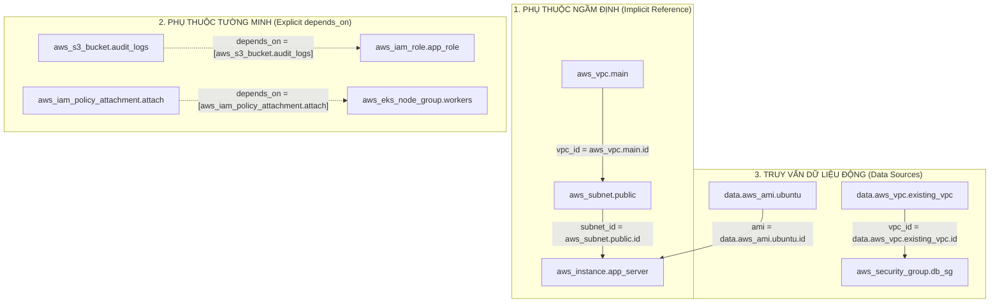

# Làm Chủ Dependency Graph (DAG): Quản Lý Phụ Thuộc Tường Minh vs Ngầm Định & Data Sources

Trong một hệ thống hạ tầng đám mây đa tầng (Multi-Tier Enterprise Infrastructure), mối quan hệ phụ thuộc giữa các thành phần là vô cùng chằng chịt: *EC2 Instance bắt buộc phải đặt trong Subnet, Subnet phải gắn vào VPC, Security Group Rule cần ID của Security Group, và Kubernetes EKS Node Group chỉ có thể khởi động sau khi IAM Policy Attachment đã hoàn tất trên AWS IAM Service*.

Terraform Core xử lý mạng lưới phụ thuộc phức tạp này một cách tự động và chuẩn xác thông qua cấu trúc dữ liệu **Đồ thị không tuần hoàn có hướng (Directed Acyclic Graph - DAG)**. Tuy nhiên, việc hiểu sai cơ chế dựng đồ thị (đặc biệt là lạm dụng từ khóa `depends_on`, khai báo quan hệ phụ thuộc chéo hoặc sử dụng Data Sources phụ thuộc vào giá trị động chưa xác định tại pha Plan) là nguyên nhân hàng đầu phá hủy khả năng thực thi song song (`parallelism`), gây kéo dài thời gian deploy hoặc dẫn tới lỗi nghiêm trọng **Cyclic Dependency**.

Bài viết này sẽ hướng dẫn bạn giải phẫu cấu trúc DAG trong Terraform Core, phân biệt rạch ròi giữa **Phụ thuộc ngầm định (Implicit)** và **Phụ thuộc tường minh (Explicit)**, làm chủ cơ chế nạp dữ liệu của **Data Sources** và kỹ thuật phá vỡ vòng lặp phụ thuộc 2 chiều.

---

## 1. Cơ Chế Xây Dựng Đồ Thị DAG Trong Terraform Core

Mỗi tài nguyên khai báo trong mã nguồn HCL được biểu diễn như một **Node (Đỉnh)** trên đồ thị, và các mối quan hệ phụ thuộc giữa chúng được biểu diễn bằng các **Directed Edges (Cạnh có hướng)**:



---

## 2. Bảng So Sánh Ba Phương Thức Quản Lý Phụ Thuộc

| Tiêu Chí Kỹ Thuật | Phụ Thuộc Ngầm Định (Implicit) | Phụ Thuộc Tường Minh (`depends_on`) | Data Source References |
| :--- | :--- | :--- | :--- |
| **Cơ Chế Nhận Diện** | Tự động phân tích từ cú pháp `${resource.name.attr}` | Kỹ sư khai báo thủ công trong khối `depends_on = [...]` | Truy vấn API đám mây thông qua khối `data "type" "name"` |
| **Tối Ưu Thực Thi Song Song** | Tối đa (Chỉ khóa chính xác thuộc tính cần thiết) | Kém (Khóa toàn bộ Node, làm tuần tự hóa DAG) | Tối ưu nếu Data Source không phụ thuộc giá trị động |
| **Thứ Tự Hủy Tài Nguyên (`destroy`)** | Tự động đảo ngược 100% theo thứ tự LIFO | Tự động đảo ngược theo danh sách khai báo | Không bị ảnh hưởng (Data Source là Read-Only) |
| **Nguy Cơ Gây Lỗi Cycle** | Thấp (Dễ phát hiện khi code) | Cao (Dễ vô tình tạo quan hệ chéo đa module) | Rất cao nếu Data Source phụ thuộc Resource mới tạo |
| **Khuyến Nghị Thiết Kế** | **Khuyến nghị số 1 cho 95% trường hợp** | Chỉ dùng cho Side-effects (IAM propagation, S3 Bucket Policy) | Dùng để tích hợp hạ tầng chia sẻ có sẵn |

> [!IMPORTANT]
> **NGUYÊN TẮC THIẾT KẾ DAG TINH GỌN:**
> Luôn ưu tiên sử dụng **Implicit Dependency** thông qua việc truyền tham chiếu trực tiếp `resource_type.name.id`. Tuyệt đối không lạm dụng `depends_on` cho toàn bộ Module cha nếu chỉ có 1 tài nguyên con bên trong cần đồng bộ.

---

## 3. Nghệ Thuật Phá Vỡ Vòng Lặp Phụ Thuộc Hai Chiều (Bidirectional Cyclic Dependency)

Một trong những bài toán kinh điển trong quản trị mạng AWS là: **Security Group của Web Server cần cho phép Ingress từ Security Group của Database Server, và Security Group của Database Server chỉ cho phép Ingress từ Web Server**.

Nếu bạn khai báo Ingress Rules trực tiếp lồng bên trong khối `aws_security_group`, Terraform sẽ gặp lỗi **Cyclic Dependency** ngay lập tức vì không thể xác định cái nào phải tạo trước:

```mermaid
flowchart LR
    subgraph WRONG["SAI: Khai Báo Ingress Lồng Nhau (Tạo Lỗi Cycle)"]
        SG_A["aws_security_group.web<br/>(Cần ID của sg.db)"] [---] SG_B["aws_security_group.db<br/>(Cần ID của sg.web)"]
    end

    subgraph CORRECT["ĐÚNG: Tách Rời Bằng Resource Độc Lập"]
        SG_WEB["aws_security_group.web<br/>(Tạo trước, không có rule)"]
        SG_DB["aws_security_group.db<br/>(Tạo trước, không có rule)"]
        
        RULE_WEB["aws_security_group_rule.web_ingress"]
        RULE_DB["aws_security_group_rule.db_ingress"]

        SG_WEB --> RULE_WEB
        SG_DB --> RULE_WEB
        SG_WEB --> RULE_DB
        SG_DB --> RULE_DB
    end


```

---

## 4. Kiến Trúc Mẫu Triển Khai Multi-Tier Với Dependency Graph Chuẩn Mực

Dưới đây là bộ mã nguồn HCL giải quyết triệt để bài toán phụ thuộc đa tầng, tích hợp Data Sources và tách rời Security Group Rules độc lập:

```hcl
# main.tf - Kiến trúc 3-Tier Enterprise tách rời phụ thuộc
terraform {
  required_version = ">= 1.7.0"
  required_providers {
    aws = {
      source  = "hashicorp/aws"
      version = "~> 5.45.0"
    }
  }
}

provider "aws" {
  region = var.aws_region
}

# 1. DATA SOURCES: Truy vấn thông tin hạ tầng chia sẻ có sẵn
data "aws_vpc" "default_vpc" {
  default = true
}

data "aws_ami" "ubuntu_lts" {
  most_recent = true
  owners      = ["099720109477"] # Canonical Official Owner ID

  filter {
    name   = "name"
    values = ["ubuntu/images/hvm-ssd/ubuntu-jammy-22.04-amd64-server-*"]
  }

  filter {
    name   = "virtualization-type"
    values = ["hvm"]
  }
}

# 2. KHỞI TẠO CÁC SECURITY GROUPS CỐT LÕI (Không chứa inline rules)
resource "aws_security_group" "web_tier" {
  name        = "showtech-web-sg-${var.environment}"
  description = "Security Group cho Web Frontend Tier"
  vpc_id      = data.aws_vpc.default_vpc.id

  tags = {
    Name = "sg-web-${var.environment}"
  }
}

resource "aws_security_group" "db_tier" {
  name        = "showtech-db-sg-${var.environment}"
  description = "Security Group cho Database Backend Tier"
  vpc_id      = data.aws_vpc.default_vpc.id

  tags = {
    Name = "sg-db-${var.environment}"
  }
}

# 3. PHÁ VỠ CYCLE BẰNG SECURITY GROUP RULES ĐỘC LẬP
resource "aws_security_group_rule" "web_allow_https" {
  type              = "ingress"
  from_port         = 443
  to_port           = 443
  protocol          = "tcp"
  cidr_blocks       = ["0.0.0.0/0"]
  security_group_id = aws_security_group.web_tier.id
  description       = "Cho phep truy cap Web HTTPS tu Internet"
}

# DB chỉ nhận kết nối Port 5432 từ Web SG
resource "aws_security_group_rule" "db_allow_web" {
  type                     = "ingress"
  from_port                = 5432
  to_port                  = 5432
  protocol                 = "tcp"
  source_security_group_id = aws_security_group.web_tier.id
  security_group_id        = aws_security_group.db_tier.id
  description              = "Cho phep Postgres connection tu Web Tier"
}

# 4. KHỞI TẠO IAM ROLE & EXPLICIT DEPENDENCY VỚI EKS NODE GROUP
resource "aws_iam_role" "node_role" {
  name = "showtech-eks-node-role-${var.environment}"

  assume_role_policy = jsonencode({
    Version = "2012-10-17"
    Statement = [
      {
        Action = "sts:AssumeRole"
        Effect = "Allow"
        Principal = {
          Service = "ec2.amazonaws.com"
        }
      }
    ]
  })
}

resource "aws_iam_role_policy_attachment" "worker_node" {
  role       = aws_iam_role.node_role.name
  policy_arn = "arn:aws:iam::aws:policy/AmazonEKSWorkerNodePolicy"
}

resource "aws_iam_role_policy_attachment" "cni_policy" {
  role       = aws_iam_role.node_role.name
  policy_arn = "arn:aws:iam::aws:policy/AmazonEKS_CNI_Policy"
}

# 5. EC2 INSTANCE: Tích hợp Implicit Dependency và Data Source AMI
resource "aws_instance" "web_server" {
  ami                  = data.aws_ami.ubuntu_lts.id # Implicit tu Data Source
  instance_type        = var.instance_type
  vpc_security_group_ids = [aws_security_group.web_tier.id] # Implicit tu SG

  # Phụ thuộc tường minh: Đảm bảo Policy đã gắn xong vào IAM Role
  depends_on = [
    aws_iam_role_policy_attachment.worker_node,
    aws_iam_role_policy_attachment.cni_policy
  ]

  tags = {
    Name = "web-server-${var.environment}"
  }
}
```

```hcl
# variables.tf
variable "aws_region" {
  type    = string
  default = "ap-southeast-1"
}

variable "environment" {
  type    = string
  default = "production"
}

variable "instance_type" {
  type    = string
  default = "t3.medium"
}
```

---

## 5. Phân Tích Cạm Bẫy Thực Chiến: Lỗi "Data Source Deferral & Cycle Error"

### Tình Huống Sự Cố Thực Tế:
Một nhóm kỹ sư muốn cấu hình Security Group dựa trên thông tin trả về từ một Data Source VPC Subnet. Tuy nhiên, Data Source này lại được truyền vào một biến `vpc_id` lấy từ tài nguyên `aws_vpc` được tạo trong cùng một đợt Apply:

```hcl
# CODE GÂY LỖI: Data Source phụ thuộc thuộc tính chưa xác định tại Pha Plan
resource "aws_vpc" "new_vpc" {
  cidr_block = "10.100.0.0/16"
}

data "aws_subnets" "created_subnets" {
  filter {
    name   = "vpc-id"
    values = [aws_vpc.new_vpc.id] # aws_vpc.new_vpc.id CHƯA TỒN TẠI tại pha Plan!
  }
}
```

### Log Lỗi Trả Về Khi Chạy `terraform plan`:
```log
Error: Invalid data source query during plan

  on main.tf line 6, in data "aws_subnets" "created_subnets":
   6:   values = [aws_vpc.new_vpc.id]

The argument "values" depends on a resource attribute that cannot be determined 
until apply. Data sources must be readable during the plan phase to build the 
dependency graph.
```

### 5-Whys Root Cause Analysis:
1. **Tại sao Data Source bị lỗi không đọc được?** $\rightarrow$ Vì Data Source cố gắng gửi API query lên AWS trong pha `plan`, nhưng tham số `vpc_id` lại là `(known after apply)`.
2. **Tại sao `vpc_id` chưa có giá trị?** $\rightarrow$ Vì tài nguyên `aws_vpc.new_vpc` mới chỉ được khai báo, chưa hề được tạo trên AWS.
3. **Tại sao Data Source lại chạy ở pha Plan?** $\rightarrow$ Vì Terraform cần toàn bộ kết quả của Data Source để tính toán số lượng phần tử cho các khối vòng lặp và dựng đồ thị DAG.
4. **Tại sao kỹ sư lại dùng Data Source cho tài nguyên vừa tạo?** $\rightarrow$ Do thói quen thiết kế sai lầm; thay vì tham chiếu trực tiếp tài nguyên con qua mã HCL, kỹ sư lại cố gắng query ngược lại từ Cloud.
5. **Biện pháp khắc phục chuẩn SRE:**
   - **Tuyệt đối không dùng Data Source để đọc lại tài nguyên vừa tạo trong cùng một Terraform State:** Hãy sử dụng trực tiếp tham chiếu tài nguyên (`aws_subnet.my_subnet.id`).
   - **Tách Workspace/Module độc lập:** Nếu bắt buộc phải query, hãy tách tầng Network (VPC/Subnet) thành một State riêng biệt được apply trước, sau đó tầng App mới dùng Data Source để đọc.

---

## 6. Hands-on Lab: Tái Hiện & Phá Vỡ Lỗi Cyclic Dependency (8 Bước)

### Bước 1: Khởi tạo thư mục thực hành thử nghiệm
```bash
mkdir -p /tmp/terraform-dag-lab && cd /tmp/terraform-dag-lab
terraform init
```

### Bước 2: Cố tình tạo mã nguồn có chứa lỗi Cycle phụ thuộc 2 chiều
```bash
cat << 'EOF' > cycle_test.tf
terraform {
  required_providers {
    aws = {
      source  = "hashicorp/aws"
      version = "~> 5.45.0"
    }
  }
}

provider "aws" {
  region = "ap-southeast-1"
}

resource "aws_security_group" "service_a" {
  name        = "sg-service-a"
  description = "Service A Security Group"
  ingress {
    from_port       = 80
    to_port         = 80
    protocol        = "tcp"
    security_groups = [aws_security_group.service_b.id]
  }
}

resource "aws_security_group" "service_b" {
  name        = "sg-service-b"
  description = "Service B Security Group"
  ingress {
    from_port       = 8080
    to_port         = 8080
    protocol        = "tcp"
    security_groups = [aws_security_group.service_a.id]
  }
}
EOF
```

### Bước 3: Chạy `terraform plan` để quan sát thông báo lỗi Cycle
```bash
terraform plan
```
Quan sát thông báo lỗi: `Error: Cycle: aws_security_group.service_a, aws_security_group.service_b`.

### Bước 4: Xuất bản đồ thị thể hiện vòng lặp bế tắc
```bash
terraform graph | grep -E "service_a|service_b"
```

### Bước 5: Refactor mã nguồn — Tách rời Ingress Rules độc lập
```bash
cat << 'EOF' > cycle_test.tf
terraform {
  required_providers {
    aws = {
      source  = "hashicorp/aws"
      version = "~> 5.45.0"
    }
  }
}

provider "aws" {
  region = "ap-southeast-1"
}

# 1. Khởi tạo 2 Security Group rỗng không chứa inline rules
resource "aws_security_group" "service_a" {
  name = "sg-service-a"
}

resource "aws_security_group" "service_b" {
  name = "sg-service-b"
}

# 2. Định nghĩa Rules độc lập để phá vỡ Cycle
resource "aws_security_group_rule" "a_from_b" {
  type                     = "ingress"
  from_port                = 80
  to_port                  = 80
  protocol                 = "tcp"
  source_security_group_id = aws_security_group.service_b.id
  security_group_id        = aws_security_group.service_a.id
}

resource "aws_security_group_rule" "b_from_a" {
  type                     = "ingress"
  from_port                = 8080
  to_port                  = 8080
  protocol                 = "tcp"
  source_security_group_id = aws_security_group.service_a.id
  security_group_id        = aws_security_group.service_b.id
}
EOF
```

### Bước 6: Chạy kiểm tra lại với `terraform validate`
```bash
terraform validate
```

### Bước 7: Thực hiện `terraform plan` kiểm tra tính hợp lệ của DAG
```bash
terraform plan
```
Xác nhận kế hoạch tạo thành công 4 tài nguyên mà không còn bất kỳ lỗi Cycle nào!

### Bước 8: Dọn dẹp thư mục thử nghiệm
```bash
cd .. && rm -rf /tmp/terraform-dag-lab
```

---

## 7. 10 Câu Hỏi Tự Kiểm Tra Chuyên Sâu (Self-Check Q&A)

### Câu 1: Tại sao phụ thuộc ngầm định (Implicit Dependency) luôn được ưu tiên hơn phụ thuộc tường minh (`depends_on`)?
<details>
<summary><b>Xem lời giải chi tiết</b></summary>
Vì phụ thuộc ngầm định cho phép Terraform biết chính xác <b>thuộc tính nào</b> đang được truyền đi giữa 2 Node trên DAG, giúp đồ thị tối ưu hóa tối đa các nhánh thực thi song song. Trong khi <code>depends_on</code> khóa toàn bộ Node cha, ép buộc tất cả tài nguyên con phải chờ đợi tuần tự dù không cần thiết.
</details>

### Câu 2: Lỗi "Cyclic Dependency" (Vòng lặp phụ thuộc) xảy ra khi nào trong Terraform?
<details>
<summary><b>Xem lời giải chi tiết</b></summary>
Xảy ra khi đồ thị tồn tại một chu trình khép kín: Node A phụ thuộc Node B, và Node B (trực tiếp hoặc gián tiếp) lại phụ thuộc ngược lại Node A. Thuật toán sắp xếp Topo không thể tìm thấy đỉnh bắt đầu hợp lệ và dừng lại báo lỗi.
</details>

### Câu 3: Làm thế nào để giải quyết triệt để lỗi Cyclic Dependency giữa 2 Security Groups trên AWS?
<details>
<summary><b>Xem lời giải chi tiết</b></summary>
Không khai báo khối <code>ingress</code> hoặc <code>egress</code> lồng bên trong tài nguyên <code>aws_security_group</code>. Thay vào đó, hãy khởi tạo 2 Security Group rỗng, sau đó sử dụng các tài nguyên độc lập <code>aws_security_group_rule</code> để gắn quan hệ sau.
</details>

### Câu 4: Data Sources trong Terraform được thực thi ở giai đoạn nào (Plan hay Apply)?
<details>
<summary><b>Xem lời giải chi tiết</b></summary>
Phần lớn Data Sources được thực thi ngay trong <b>pha Plan</b> để nạp dữ liệu và kiểm tra kiểu. Tuy nhiên, nếu một tham số của Data Source phụ thuộc vào giá trị của một tài nguyên chỉ được xác định sau pha Apply (<code>known after apply</code>), việc đọc Data Source sẽ bị hoãn (Deferred) sang pha Apply.
</details>

### Câu 5: Khi nào bắt buộc phải dùng từ khóa `depends_on`? Cho ví dụ thực tế?
<details>
<summary><b>Xem lời giải chi tiết</b></summary>
Khi có mối quan hệ phụ thuộc ngầm về mặt logic hoặc quyền hạn nhưng <b>không có tham chiếu dữ liệu trực tiếp trong code</b>. Ví dụ: EKS Node Group cần IAM Policy đã gắn xong vào Role trước khi khởi tạo, hoặc EC2 instance cần S3 Bucket Policy cấu hình xong mới được gọi API đọc dữ liệu.
</details>

### Câu 6: Điều gì xảy ra khi bạn đặt `depends_on` ở cấp độ Module (`module "vpc"`)?
<details>
<summary><b>Xem lời giải chi tiết</b></summary>
Toàn bộ mọi tài nguyên bên trong module con đó sẽ bị hoãn thực thi cho đến khi mọi tài nguyên trong danh sách <code>depends_on</code> hoàn tất 100%. Điều này làm tê liệt hoàn toàn tính năng chạy song song giữa các module.
</details>

### Câu 7: Tại sao không nên dùng Data Source để truy vấn lại tài nguyên vừa được tạo trong cùng một State?
<details>
<summary><b>Xem lời giải chi tiết</b></summary>
Vì trong lần chạy đầu tiên (khi tài nguyên chưa được tạo), Data Source sẽ gửi query lên Cloud và báo lỗi <code>ResourceNotFound</code> ở pha Plan, khiến toàn bộ tiến trình Apply bị sập. Hãy luôn tham chiếu trực tiếp qua thuộc tính của Resource.
</details>

### Câu 8: Thuật toán sắp xếp Topo (Topological Sort) duyệt qua đồ thị DAG theo thứ tự nào khi hủy tài nguyên (`terraform destroy`)?
<details>
<summary><b>Xem lời giải chi tiết</b></summary>
Terraform tự động đảo ngược hướng của toàn bộ các cạnh trên đồ thị DAG, thực hiện hủy các Node lá (Leaf Nodes) trước, sau đó mới đi ngược về Node gốc (Root Nodes) theo nguyên lý <b>LIFO (Last In, First Out)</b>.
</details>

### Câu 9: Data Source `aws_ami` với tham số `most_recent = true` có rủi ro tiềm ẩn nào khi vận hành?
<details>
<summary><b>Xem lời giải chi tiết</b></summary>
Mỗi khi nhà cung cấp (Canonical/AWS) phát hành một bản vá AMI mới, lệnh <code>terraform plan</code> tiếp theo sẽ phát hiện ID của AMI đã thay đổi và đề xuất <b>hủy và tạo lại (Destroy and Recreate)</b> toàn bộ các EC2 Instances đang chạy, có thể gây gián đoạn dịch vụ ngoài ý muốn nếu không dùng Launch Template / ASG.
</details>

### Câu 10: Làm thế nào để trực quan hóa đồ thị DAG của một dự án lớn một cách nhanh nhất?
<details>
<summary><b>Xem lời giải chi tiết</b></summary>
Sử dụng lệnh <code>terraform graph | dot -Tsvg -o graph.svg</code> kết hợp với trình duyệt Web hoặc công cụ trực quan hóa trực tuyến Graphviz để xem cấu trúc phân nhánh và mối quan hệ phụ thuộc.
</details>

---

## 8. Tổng Kết & Lộ Trình Bài Học Tiếp Theo

Làm chủ **Dependency Graph (DAG)**, phân biệt rõ ràng **Implicit vs Explicit Dependencies** và nắm vững quy tắc vận hành của **Data Sources** giúp bạn tự tin thiết kế những hệ sinh thái hạ tầng khổng lồ mà không bao giờ gặp phải các lỗi bế tắc vòng lặp.

Trong **[Bài 05: Thiết Kế Variables, Locals & Outputs Chuẩn Enterprise: Type Constraints, Validation Rules & Sensitive Data Masking](05-thiet-ke-variables-locals-outputs-chuan-enterprise.md)**, chúng ta sẽ hoàn thiện chặng 1 với nghệ thuật thiết kế giao diện hạ tầng: Tùy biến biến đầu vào với các quy tắc kiểm tra biểu thức chính quy (Regex Validation), quản lý biến nội bộ bất biến `locals` và che giấu dữ liệu nhạy cảm với cờ `sensitive = true`.
