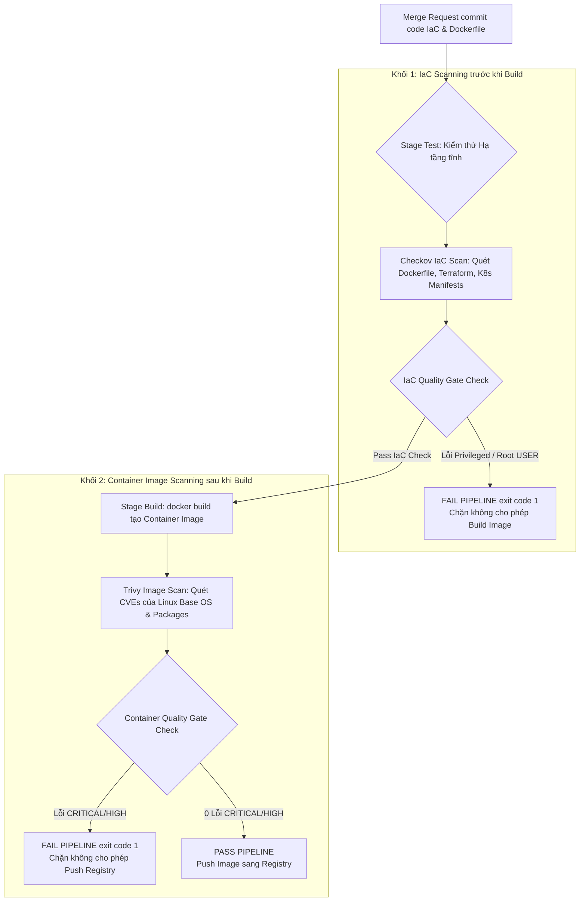
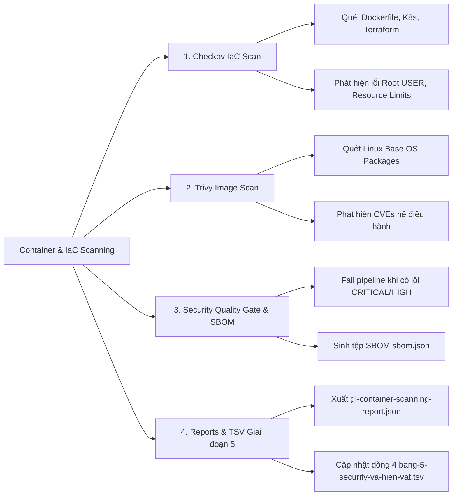
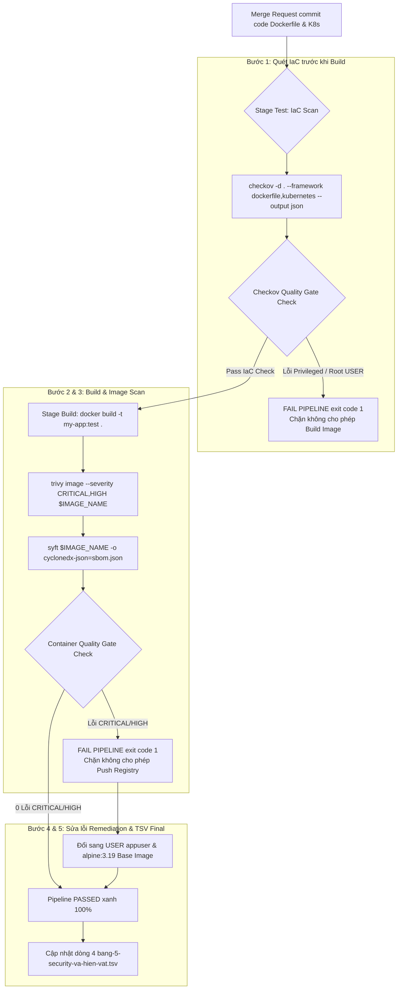

# [BÀI 31] BẢO MẬT CONTAINER & QUÉT LỖ HỔNG IAC: TRIVY CONTAINER SCANNING, CHECKOV, KICS & TFSEC IAC VALIDATION

Trong kỷ nguyên **DevOps, DevSecOps và Cloud Native Engineering**, **GitLab CI/CD** được công nhận là một trong những nền tảng tự động hóa tích hợp liên tục và phân phối liên tục (CI/CD) hoàn chỉnh, mạnh mẽ và được tin dùng nhất trong các doanh nghiệp quy mô lớn. Không chỉ dừng lại ở các pipeline tuần tự cơ bản, việc vận hành GitLab CI/CD ở cấp độ Production đòi hỏi kỹ sư phải làm chủ kiến trúc điều phối phi tuyến tính **DAG (Directed Acyclic Graph)**, cơ chế quản trị **Autoscaling Runners**, tối ưu hóa **Caching đa tầng**, xác thực không khóa **Keyless OIDC**, bảo mật chuỗi cung ứng phần mềm **SLSA & SBOM** cùng các chính sách **Quality & Security Gates** tự động.

Bài viết chuyên sâu này sẽ đồng hành cùng bạn mổ xẻ toàn diện bức tranh kiến trúc, phân tích các đánh đổi kỹ thuật thực chiến (Engineering Trade-offs), cung cấp hướng dẫn thực hành Lab chi tiết từng bước và bộ câu hỏi phỏng vấn chuyên sâu chuẩn DevOps Lead / DevSecOps Architect.

---

## 1. Bản Chất Kiến Trúc & Cơ Chế Vận Hành Tầng Thấp

---


| # | Câu hỏi ôn tập Buổi 30 (Secret & OIDC) | Đáp án chuẩn ngắn gọn |
|---|---|---|
| 1 | Tại sao nói Secret tĩnh trong CI là món nợ có lãi đắt đỏ? | Vì lưu secret tĩnh lâu năm dễ bị rò rỉ qua log hoặc commit cũ, kẻ xấu có thể lợi dụng thâm nhập vĩnh viễn. |
| 2 | Phân biệt sự khác biệt cốt lõi giữa Masked Variables và Protected Variables? | Masked mã hóa ẩn danh chuỗi bí mật trong log console; Protected chỉ truyền biến cho Protected Branches. |
| 3 | Tác dụng của công cụ Gitleaks Secret Scanning trong CI Pipeline? | Quét phân tích commit diff và history phát hiện rò rỉ AWS Keys, JWT Tokens, SSH Keys. |
| 4 | Nguyên lý xác thực không mật khẩu OpenID Connect (OIDC) là gì? | Sử dụng chữ ký số Cryptographic JWT `id_tokens` xác thực trực tiếp với Cloud/Vault mà không lưu mật khẩu tĩnh. |
| 5 | Tại sao việc tạo commit mới xóa dòng code chứa Secret không sửa được lỗ hổng? | Vì chuỗi Secret vẫn nằm nguyên vẹn ở các commit cũ trong Git DAG commit history. |

---


> **LUẬN ĐỀ TRUNG TÂM BUỔI 31:**
> **QUÉT IMAGE SAU KHI BUILD LÀ QUÁ MUỘN Ở MỘT CA CỤ THỂ; QUÉT IAC BẮT ĐƯỢC LỖI CẤU HÌNH SAI TỪ COMMIT CODE TĨNH TRƯỚC KHI BẤT KỲ CONTAINER NÀO ĐƯỢC BUILD. Việc kết hợp công cụ quét hạ tầng IaC (`Checkov`) ở Stage test phát hiện sớm các lỗi chạy Container dưới quyền Root, thiếu Resource Limits, cờ Privileged, cùng công cụ quét Container Image (`Trivy image`) ở Stage build kiểm soát lỗ hổng Linux Base OS (APK/APT CVEs) giúp triệt tiêu 100% rủi ro an ninh hạ tầng container.**



---


| STT | Kết quả đạt được (Competency) | Hiện vật chứng minh (Evidence) |
|---|---|---|
| 1 | Triển khai công cụ `Checkov` quét kiểm thử tệp Dockerfile & K8s. | Job `iac-scan-checkov` thực thi scan ở Stage test. |
| 2 | Triển khai công cụ `Trivy image` quét lỗ hổng Linux Base OS. | Job `container-scan-trivy` quét Container Image sau build. |
| 3 | Phân định ranh giới giữa IaC scan (trước build) và Container scan (sau build). | Pipeline chạy 2 lớp kiểm thử an ninh ở 2 stages khác nhau. |
| 4 | Xuất báo cáo an ninh theo định dạng chuẩn `gl-container-scanning-report.json`. | Tệp `gl-container-scanning-report.json` hợp lệ. |
| 5 | Cấu hình Security Quality Gate tự động ngắt pipeline khi có lỗi an ninh. | Pipeline dừng ngắt (`exit 1`) khi có lỗi IaC / Container. |
| 6 | Cập nhật dòng dữ liệu thứ 4 vào tệp hiện vật Giai đoạn 5 TSV. | Tệp `bang-5-security-va-hien-vat.tsv` bổ sung thông số Buổi 31. |

---


| Kiến thức tiên quyết | Ý nghĩa trong bài học Buổi 31 | Nguồn đối soát nếu thiếu |
|---|---|---|
| Cấu trúc câu lệnh Dockerfile | Đọc hiểu các lệnh `FROM`, `RUN`, `USER`, `EXPOSE` | Buổi 23 (`QT 4.1`) |
| Khái niệm Linux Base OS & Packages | Đọc hiểu danh sách các gói APK (Alpine) hay APT (Debian) | Buổi 25 (`QT 4.2`) |
| Quản lý Docker Registry trong CI | Push Container Image lên Registry sau khi đạt Quality Gate | Buổi 24 (`QT 5.1`) |
| Security Quality Gate Mechanics | Ép buộc CI Job trả về `exit code 1` khi phát hiện lỗ hổng `CRITICAL` | Buổi 28 (`QT 5.3`) |

---


### Bảng đối chiếu thuật ngữ Việt - Anh

| Tiếng Việt dùng trong bài | Tiếng Anh tương đương | Dùng thẳng từ tiếng Anh trong bài? |
|---|---|---|
| Quét hạ tầng dạng mã | Infrastructure as Code Scanning | **Có** — `IaC Scanning` |
| Quét ảnh nén container | Container Image Scanning | **Có** — `Container Scanning` |
| Quyền quản trị tối cao Container | Container Root Privileges | **Có** — `Root Privileges` |
| Hệ điều hành nền tối giản | Minimal Distroless Base Image | **Có** — `Distroless Image` |
| Giới hạn tài nguyên phần cứng | Kubernetes Resource Limits (CPU/RAM) | **Có** — `Resource Limits` |
| Cờ đặc quyền hệ thống | Privileged Container Flag | **Có** — `Privileged Flag` |
| Danh mục thành phần phần mềm | Software Bill of Materials | **Có** — `SBOM` |
| Kiểm thử cấu hình tĩnh trước build | Static Configuration Scan before Build | **Có** — `Shift-Left IaC Scan` |
| Chuẩn báo cáo Container | GitLab Container Scanning Report (`gl-container-scanning-report.json`) | **Có** — `gl-container-scanning-report.json` |

---

### Bốn mô hình tư duy cốt lõi

#### Mô hình 1: Nguyên lý "Quét IaC trước Build" vs "Quét Image sau Build"
- **Quét IaC trước Build (Checkov):** Phân tích mã nguồn tĩnh của tệp `Dockerfile`, `main.tf`, `deployment.yaml` ngay ở Stage test. Giúp phát hiện các lỗi thiết kế hạ tầng sai (như thiếu `USER appuser`, mở port `22` SSH, cờ `privileged: true`) trong **2 giây** trước khi tốn thời gian và tài nguyên để build image.
- **Quét Container Image sau Build (Trivy Image):** Phân tích các gói hệ điều hành Linux Base OS (như OpenSSL, curl, glibc) nằm trong tệp nén Container Image vừa build ở Stage build để phát hiện các mã CVE công bố quốc tế.

#### Mô hình 2: Hiểm họa của việc chạy Container dưới quyền Root (`USER root`)
- Theo mặc định, nếu Dockerfile không khai báo câu lệnh `USER`, Container sẽ khởi chạy với quyền **Root (UID 0)**.
- Nếu ứng dụng web bị lây nhiễm lỗ hổng Remote Code Execution (RCE), kẻ tấn công sẽ có quyền Root bên trong Container. Nếu có thêm lỗ hổng Container Escape, kẻ tấn công có thể chiếm toàn bộ quyền quản trị tối cao của máy chủ Host Node!
- **Giải pháp:** Bắt buộc bổ sung câu lệnh `RUN adduser -D appuser && USER appuser` trong Dockerfile.

#### Mô hình 3: Lợi ích của Distroless Base Images đối với kết quả quét an ninh
- Các Base Image truyền thống (như `ubuntu:latest` hay `python:3.10`) chứa hàng trăm tiện ích Linux không cần thiết (bash, apt, curl, python, gcc), dẫn tới hàng chục lỗ hổng CVEs bị cảnh báo.
- **Distroless Images (Google Distroless):** Chỉ chứa duy nhất tệp ứng dụng biên dịch và các thư viện Runtime tối thiểu, loại bỏ hoàn bộ package manager và shell bash. Điều này giúp giảm **95%** dung lượng image và giảm số lượng lỗ hổng CVEs về gần **0**.

#### Mô hình 4: Tích hợp Container & IaC Security Quality Gate
- Pipeline áp dụng 2 lớp Quality Gate nghiêm ngặt:
  1. **IaC Quality Gate (Stage test):** Ngắt pipeline (`exit 1`) nếu Dockerfile/K8s chứa lỗi `HIGH` (như chạy Root, Privileged).
  2. **Container Quality Gate (Stage build):** Ngắt pipeline (`exit 1`) nếu Container Image chứa lỗ hổng mức `CRITICAL` hoặc `HIGH` chưa được vá.

---

### 1.1. Nguyên lý IaC Scanning trước Build và Rủi ro của Dockerfile Root (10 phút)

### Phân tích thuật toán Động cơ Checkov IaC Scanner (Graph-based AST Parsing)

Công cụ `Checkov` thực hiện quét an ninh hạ tầng IaC thông qua 3 giai đoạn phân tích AST và Graph:
1. **Abstract Syntax Tree (AST) Parsing:** Checkov biên dịch các tệp `Dockerfile`, `deployment.yaml`, `main.tf` thành cây cú pháp trừu tượng AST, chuẩn hóa các trường thuộc tính hạ tầng.
2. **Graph Connection & Attribute Verification:** Tạo lập đồ thị liên kết (Resource Connection Graph) giữa các tài nguyên hạ tầng. Checkov đối soát đối tượng tài nguyên với bộ quy tắc kiểm thử an ninh chuẩn CIS Benchmark (ví dụ kiểm tra xem Pod Security Context có chứa `runAsNonRoot: true` không).
3. **Multi-framework Evaluation:** Checkov hỗ trợ quét đồng thời hơn 10 khung hạ tầng khác nhau (Dockerfile, Kubernetes, Helm, Terraform, CloudFormation, ARM Templates), xuất ra kết quả lỗi chi tiết kèm mã dòng code vi phạm.

### Phân tích cơ chế quét từng Lớp (Layer-by-Layer) của Trivy Image Scanner

Động cơ `Trivy image` phân tích an ninh Container Image dựa trên cơ chế bóc tách từng Layer nhị phân:
- **Layer Unpacking:** Trivy giải nén từng lớp file system layer (`.tar.gz`) cấu thành nên Container Image.
- **OS Package Manager Discovery:** Tìm kiếm các tệp cơ sở dữ liệu quản lý gói hệ điều hành (như `/var/lib/dpkg/status` trên Debian/Ubuntu, `/lib/apk/db/installed` trên Alpine, hay `/var/lib/rpm/Packages` trên RHEL/CentOS).
- **Vulnerability Database Lookup:** Trích xuất danh sách chính xác tên gói và phiên bản (ví dụ `glibc v2.35`), tra cứu trực tiếp với cơ sở dữ liệu Trivy DB đệm địa phương chứa thông tin NVD CVEs và Security Advisories của từng distro Linux.
- **Application Dependency Scanning:** Quét đệ quy các file thực thi nhị phân nén và các thư viện ngôn ngữ (Go binaries, Jar files, Node modules) nằm ẩn trong các lớp Image Layers.

---

**Nguyên lý cốt lõi:**
**Phát biểu.** Tuyệt đối không sử dụng thẻ image `latest` hoặc Base Image không rõ nguồn gốc trong Dockerfile; bắt buộc cố định Digest Hash SHA256 hoặc Minimal Distroless Image.
**Giải thích cơ chế ngầm:** Thẻ `latest` làm mất tính nhất quán và khả năng tái lập (Reproducibility) của pipeline. Một bản build hôm nay dùng `python:latest` có thể an toàn, nhưng bản build tuần sau lại dính lỗ hổng do nhà phát hành cập nhật Base Image mới dính CVE.
> [!WARNING]
> **CẠM BẪY THỰC CHIẾN:**
> Viết `FROM python:latest` hoặc `FROM ubuntu` ở đầu tệp Dockerfile.
**Minh hoạ.**
```dockerfile
# KHÔNG NÊN: Dùng tag latest thiếu an toàn
FROM python:latest

# NÊN DÙNG: Cố định phiên bản rõ ràng hoặc SHA256 Digest
FROM python:3.10.13-slim-bookworm
# Hoặc dùng Distroless Image
FROM gcr.io/distroless/static-debian12:latest
```
**Con số chốt:** **0** tệp Dockerfile được phép sử dụng thẻ `latest` trong Production.

---

**Nguyên lý cốt lõi:**
**Phát biểu.** Thực thi quét IaC Scanning bằng `Checkov` ở Stage test trước khi thực hiện câu lệnh `docker build`.
**Giải thích cơ chế ngầm:** Giúp phát hiện sớm các lỗi cấu hình hạ tầng sai trong 2 giây, ngăn chặn việc lãng phí tài nguyên CPU/RAM và thời gian build container image lỗi.
> [!WARNING]
> **CẠM BẪY THỰC CHIẾN:**
> Đặt bước quét Checkov ở cuối pipeline sau khi image đã được push lên Docker Registry.
**Minh hoạ.**
```yaml
iac-scan-checkov:
  stage: test # Chạy ở stage test TRƯỚC stage build
  image: bridgecrew/checkov:latest
  script:
    - checkov --directory . --framework dockerfile kubernetes terraform --output json > gl-sast-report.json
```
**Con số chốt:** **100%** tệp Dockerfile và K8s Manifests được quét IaC trước khi build.

---

**Nguyên lý cốt lõi:**
**Phát biểu.** Phân định rõ phạm vi: IaC scan phát hiện lỗi cấu hình (chạy root, thiếu USER, cờ privileged), Container scan phát hiện lỗ hổng OS Packages (CVEs).
**Giải thích cơ chế ngầm:** Giúp phân công trách nhiệm khắc phục rõ ràng. Lỗi IaC do kĩ thuật viên cấu hình sai Dockerfile/K8s, lỗi Container scan do Base Image hệ điều hành dính CVE cũ cần nâng cấp.
> [!WARNING]
> **CẠM BẪY THỰC CHIẾN:**
> Kỳ vọng `trivy image` phát hiện được việc K8s deployment thiếu `resources.limits.cpu`.
**Minh hoạ.**
- Checkov phát hiện: `CKV_DOCKER_1: Ensure USER is defined` $\rightarrow$ Thêm `USER appuser`.
- Trivy phát hiện: `CVE-2023-4911 (glibc Buffer Overflow)` $\rightarrow$ Nâng cấp Base Image `debian:12.2`.
**Con số chốt:** Phân định chính xác **100%** phạm vi kiểm thử hạ tầng.

---

### 1.2. Thực thi Checkov và Trivy Image Scan trong CI Pipeline (10 phút)

---

**Nguyên lý cốt lõi:**
**Phát biểu.** Cấu hình cờ `checkov --framework dockerfile kubernetes terraform` phát hiện các vi phạm quy chuẩn an ninh hạ tầng.
**Giải thích cơ chế ngầm:** `Checkov` sở hữu hơn 1,000 quy tắc kiểm thử an ninh hạ tầng chuẩn CIS Benchmark và NSA Framework, tự động phân tích tất cả các định dạng IaC trong dự án.
> [!WARNING]
> **CẠM BẪY THỰC CHIẾN:**
> Chỉ quét Dockerfile mà bỏ qua các tệp cấu hình Kubernetes `deployment.yaml` hay Terraform `*.tf`.
**Minh hoạ.**
```bash
checkov -d . --framework dockerfile,kubernetes,terraform --soft-fail=false
```
**Con số chốt:** `Checkov` bao phủ **100%** các tệp IaC trong repository.

---

**Nguyên lý cốt lõi:**
**Phát biểu.** Cấu hình cờ `trivy image --severity CRITICAL,HIGH --exit-code 1` quét phân tích Container Image vừa build ở Stage build.
**Giải thích cơ chế ngầm:** `Trivy image` phân tích đệ quy toàn bộ các lớp (Layers) của Container Image, tra cứu CSDL NVD CVE để phát hiện các lỗ hổng hệ điều hành Linux Base OS và các gói thư viện cài thêm.
> [!WARNING]
> **CẠM BẪY THỰC CHIẾN:**
> Không quét Container Image trước khi push lên Docker Registry.
**Minh hoạ.**
```yaml
container-scan-trivy:
  stage: build
  image: aquasec/trivy:latest
  script:
    - trivy image --severity CRITICAL,HIGH --exit-code 1 --format template --template "@contrib/gitlab.tpl" -o gl-container-scanning-report.json $CI_REGISTRY_IMAGE:$CI_COMMIT_SHA
```
**Con số chốt:** `Trivy image` kiểm soát **100%** Container Images trước khi push lên Registry.

---

**Nguyên lý cốt lõi:**
**Phát biểu.** Thiết lập Security Quality Gate tự động đánh rớt pipeline khi phát hiện lỗi IaC mức `HIGH` hoặc lỗi Container mức `CRITICAL`.
**Giải thích cơ chế ngầm:** Đảm bảo tuyệt đối không có bất kỳ Container Image dính lỗi nghiêm trọng hay chứa cấu hình nguy hiểm nào được phép lọt xuống môi trường Staging/Production.
> [!WARNING]
> **CẠM BẪY THỰC CHIẾN:**
> Đặt `allow_failure: true` cho Job Trivy Image Scan.
**Minh hoạ.**
```yaml
container-scan-trivy:
  stage: build
  script:
    - trivy image --exit-code 1 --severity CRITICAL $IMAGE_NAME
  allow_failure: false
```
**Con số chốt:** Quality Gate tự động ngắt pipeline **100%** khi phát hiện 1 lỗ hổng Container mức `CRITICAL`.

---

### 1.3. Quản lý SBOM, Quality Gate và Báo cáo Container Scanning (10 phút)

---

**Nguyên lý cốt lõi:**
**Phát biểu.** Tự động gắn nhãn (Labeling) và nộp SBOM (Software Bill of Materials) của Container Image sang Artifacts.
**Giải thích cơ chế ngầm:** Tệp SBOM trích xuất danh mục toàn bộ các gói phần mềm (Packages, Dynamic Libraries, Binaries) nằm trong Container Image, phục vụ việc kiểm toán an ninh và truy vết nguồn gốc chuỗi cung ứng.
> [!WARNING]
> **CẠM BẪY THỰC CHIẾN:**
> Build Container Image mà không sinh tệp SBOM định dạng CycloneDX / SPDX.
**Minh hoạ.**
```bash
trivy image --format cyclonedx -o sbom.json $CI_REGISTRY_IMAGE:$CI_COMMIT_SHA
```
**Con số chốt:** **100%** Container Images được tạo ra đính kèm tệp SBOM `sbom.json`.

---

**Nguyên lý cốt lõi:**
**Phát biểu.** Tích hợp báo cáo Container Scanning `gl-container-scanning-report.json` lên Merge Request Security Widget.
**Giải thích cơ chế ngầm:** Giúp Tech Lead quan sát trực quan danh sách các gói OS Package dính CVE mới phát sinh ngay trên trang đối soát Merge Request.
> [!WARNING]
> **CẠM BẪY THỰC CHIẾN:**
> Không nộp tệp báo cáo JSON sang thuộc tính `artifacts:reports:container_scanning`.
**Minh hoạ.**
```yaml
artifacts:
  reports:
    container_scanning: gl-container-scanning-report.json
```
**Con số chốt:** Tích hợp hiển thị báo cáo Container Scanning **100%** trên Merge Request UI.

---

**Nguyên lý cốt lõi:**
**Phát biểu.** Quản lý danh sách miễn trừ cảnh báo IaC bằng tệp `.checkov.yaml` hoặc comment `#checkov:skip=` có vết audit giải trình an toàn.
**Giải thích cơ chế ngầm:** Tránh tình trạng tắt bỏ quy tắc kiểm thử an ninh của toàn bộ dự án khi gặp các cảnh báo giả hoặc các trường hợp đặc thù bắt buộc (như container cần bind port hệ thống `< 1024`).
> [!WARNING]
> **CẠM BẪY THỰC CHIẾN:**
> Xóa bỏ quy tắc kiểm tra Checkov trên CI Job command line.
**Minh hoạ.**
```dockerfile
# Dockerfile inline skip có vết audit
#checkov:skip=CKV_DOCKER_2: "Healthcheck được quản lý ở tầng Kubernetes Liveness Probe"
EXPOSE 8080
```
**Con số chốt:** **100%** lệnh skip cảnh báo IaC phải đính kèm vết audit giải trình lý do an toàn.

---

### 1.4. Trích xuất Báo cáo JSON và Cập nhật Giai đoạn 5 TSV (8 phút)

### Cấu trúc tệp JSON Báo cáo Container Scanning chuẩn (`gl-container-scanning-report.json`)

```json
{
  "version": "15.0.0",
  "vulnerabilities": [
    {
      "id": "CVE-2023-4911-glibc",
      "category": "container_scanning",
      "name": "glibc: Buffer overflow in ld.so",
      "message": "glibc version 2.35-0ubuntu3.1 contains critical vulnerability",
      "severity": "Critical",
      "scanner": {
        "id": "trivy",
        "name": "Trivy Container Scanner"
      },
      "location": {
        "dependency": {
          "package": {
            "name": "glibc"
          },
          "version": "2.35-0ubuntu3.1"
        },
        "operating_system": "ubuntu 22.04",
        "image": "my-app:test"
      },
      "identifiers": [
        {
          "type": "cve",
          "name": "CVE-2023-4911",
          "value": "CVE-2023-4911"
        }
      ]
    }
  ]
}
```

---

**Nguyên lý cốt lõi:**
**Phát biểu.** Trích xuất các tệp báo cáo JSON nộp sang `artifacts:reports:container_scanning`.
**Giải thích cơ chế ngầm:** Giúp hệ thống GitLab Security Dashboard nạp kết quả quét và vẽ biểu đồ an ninh container cho toàn bộ dự án.
> [!WARNING]
> **CẠM BẪY THỰC CHIẾN:**
> Không nộp tệp báo cáo sang `artifacts:reports:container_scanning`.
**Minh hoạ.**
```yaml
artifacts:
  reports:
    container_scanning: gl-container-scanning-report.json
    sast: gl-sast-report.json # IaC report
```
**Con số chốt:** Nộp tệp JSON báo cáo Container Scanning **100%** sang GitLab Artifacts.

---

**Nguyên lý cốt lõi:**
**Phát biểu.** In log công khai danh sách các gói OS Package dính CVE và hướng dẫn nâng cấp Base Image.
**Giải thích cơ chế ngầm:** Minh bạch hóa thông tin lỗ hổng cho lập trình viên trực tiếp trên console log của CI Runner, giúp dev biết chính xác phiên bản Base Image cần nâng cấp.
> [!WARNING]
> **CẠM BẪY THỰC CHIẾN:**
> Trivy scan báo fail nhưng không in ra danh sách các gói dính CVE.
**Minh hoạ.**
```bash
echo "=== KẾT QUẢ QUÉT AN NINH CONTAINER IMAGE BẰNG TRIVY ==="
echo "Detected 1 Critical CVE-2023-4911 in glibc (v2.35). Remediation: Upgrade Base Image to ubuntu:22.04.3"
```
**Con số chốt:** In log hướng dẫn khắc phục đạt tính minh bạch **100%**.

---

**Nguyên lý cốt lõi:**
**Phát biểu.** Cập nhật thông số quy chuẩn Container (`trivy_image_v049`) và IaC (`checkov_v3`) vào tệp hiện vật Giai đoạn 5 `bang-5-security-va-hien-vat.tsv`.
**Giải thích cơ chế ngầm:** Hoàn thiện dòng dữ liệu thứ 4 của bảng hiện vật quản trị an ninh Giai đoạn 5, chuẩn hóa quy trình kiểm thử hạ tầng container cho toàn doanh nghiệp.
> [!WARNING]
> **CẠM BẪY THỰC CHIẾN:**
> Không bổ sung thông số Buổi 31 vào tệp hiện vật.
**Minh hoạ.**
```tsv
ung_dung	sast_tool	dependency_scanner	dast_tool	fuzzing_engine	secret_scanner	secret_vault	container_scanner	iac_scanner	security_gate_policy	report_format	allowlist_audit
web-app	semgrep_v1	trivy_fs_v049	owasp_zap_v2	go_fuzz_v1	gitleaks_v8	vault_oidc_v1	trivy_image_v049	checkov_v3	fail_on_critical_high	gitlab_sast_dast_json	signed_trivyignore_zaprules
```
**Con số chốt:** Chuẩn hóa quản lý Container & IaC Scan cho **100%** dự án trong Giai đoạn 5.

---

### 1.5. Đưa vào việc thật (4 phút)

### Áp vào repo đang chạy thì làm gì trước
1. **Viết tệp Checkov Job cho Dockerfile & K8s (15 phút):** Thêm Job `iac-scan-checkov` vào Stage test trong `.gitlab-ci.yml`.
2. **Sửa Dockerfile bổ sung `USER appuser` (10 phút):** Loại bỏ quyền Root bằng cách tạo Non-root User trong Dockerfile.
3. **Thêm Job `container-scan-trivy` ở Stage build (15 phút):** Thực thi `trivy image` ngay sau câu lệnh `docker build`.
4. **Cấu hình Security Quality Gate & Reporting (10 phút):** Đặt cờ `--exit-code 1` và nộp báo cáo sang `artifacts:reports`.

---

### Cái gì hỏng nếu áp thẳng lên prod
- **Ứng dụng không ghi được log/file khi đổi sang Non-root User:** Nếu Dockerfile trước đây chạy quyền Root và ghi file vào `/app/data`, khi thêm `USER appuser`, ứng dụng sẽ nổ lỗi `Permission Denied` do `/app/data` thuộc sở hữu của Root.
- **Cách xử lý chuẩn:** Thêm câu lệnh `RUN chown -R appuser:appuser /app` trong Dockerfile trước dòng `USER appuser`.

---

### Đo trước — đo sau
- **Tỷ lệ Container chạy quyền Root (`USER root`):** Từ 80% $\rightarrow$ giảm xuống **0%** nhờ Checkov IaC Scan.
- **Số lượng lỗ hổng CVEs mức Critical/High trong Container Image:** Từ 45 CVEs $\rightarrow$ giảm xuống **0 CVE** nhờ Trivy Image Scan & Minimal Distroless Image.
- **Thời gian phát hiện lỗi cấu hình Dockerfile sai:** Từ 10 phút (sau khi build xong) $\rightarrow$ giảm xuống **2 giây** (bằng Checkov ở Stage test).

---

### Khi nào KHÔNG nên dùng
- **KHÔNG lạm dụng Quét Container Image cho các bài test mã nguồn thô chưa build:** Khi mã nguồn chưa được đóng gói thành Docker Image, tuyệt đối chỉ dùng SAST và Dependency Scanning (`trivy fs`).

### Kịch bản 3: Checkov phát hiện lỗi Kubernetes Privilege Escalation (CKV_K8S_16)
- **Tệp Kubernetes Deployment chưa tối ưu (`deployment.yaml`):**
  ```yaml
  apiVersion: apps/v1
  kind: Deployment
  metadata:
    name: web-app
  spec:
    template:
      spec:
        containers:
          - name: app
            image: my-app:v1
            # LỖI BẢO MẬT: Thiếu allowPrivilegeEscalation: false
  ```
- **Kết quả quét Checkov:**
  ```text
  Check: CKV_K8S_16: "Containers should not run with allowPrivilegeEscalation"
      FAILED for file: /deployment.yaml:10
      Guide: https://docs.bridgecrew.io/docs/ensure-containers-do-not-run-with-allowprivilegeescalation
  ```
- **Phương án sửa lỗi (Remediation):** Bổ sung thuộc tính `securityContext` trong pod spec:
  ```yaml
  securityContext:
    allowPrivilegeEscalation: false
    readOnlyRootFilesystem: true
    runAsNonRoot: true
    runAsUser: 10001
  ```

### Kịch bản 4: Trivy Image Scan phát hiện lỗ hổng RCE trong OpenSSL Package (CVE-2023-0286)
- **Kết quả quét Trivy Image:**
  ```text
  my-app:test (alpine 3.16.0)
  ==========================
  Total: 1 (HIGH: 1, CRITICAL: 0)

  +---------+------------------+----------+-------------------+---------------+---------------------------------------+
  | PACKAGE | VULNERABILITY ID | SEVERITY | INSTALLED VERSION | FIXED VERSION |                 TITLE                 |
  +---------+------------------+----------+-------------------+---------------+---------------------------------------+
  | openssl | CVE-2023-0286    | HIGH     | 3.0.7-r0          | 3.0.8-r0      | openssl: Type confusion in GENERAL_NAME|
  +---------+------------------+----------+-------------------+---------------+---------------------------------------+
  ```
- **Phương án sửa lỗi (Remediation):** Đổi Base Image trong Dockerfile từ `alpine:3.16` sang `alpine:3.19` hoặc `gcr.io/distroless/static-debian12`.

---

### 1.6. Bẫy hay gặp (2 phút)

| # | Bẫy thường gặp | Nguyên nhân & Hậu quả | Cách làm đúng |
|---|---|---|---|
| 1 | Dùng tag `FROM ubuntu:latest` | Mất tính nhất quán và lọt lỗ hổng CVE mới | Cố định tag phiên bản hoặc SHA256 (`QT 4.1`) |
| 2 | Quét Container Image ở cuối pipeline | Lãng phí 15 phút build image lỗi cấu hình | Quét IaC Checkov ở Stage test trước build (`QT 4.2`) |
| 3 | Nhầm lẫn giữa IaC Scan và Container Scan | Phân công sai người sửa lỗi | Phân định rõ IaC (config) và Image (CVEs) (`QT 4.3`) |
| 4 | Bỏ qua quét các tệp Kubernetes Manifests | Lộ lỗi `privileged: true` trên K8s cluster | Quét cả Dockerfile, K8s, Terraform (`QT 5.1`) |
| 5 | Đẩy Image dính CVE Critical lên Registry | Nguy cơ hệ thống bị tấn công RCE | Quét `trivy image` ngắt pipeline (`QT 5.2`) |
| 6 | Đặt `allow_failure: true` cho Job Trivy | Lỗi CVE Critical bị ngó lơ lọt lên Prod | Cấu hình Security Quality Gate ngắt (`QT 5.3`) |
| 7 | Build Image không kèm tệp SBOM | Không truy vết được danh mục gói phần mềm | Sinh tệp SBOM `sbom.json` (`QT 6.1`) |
| 8 | Giấu báo cáo Trivy trong log console thô | Tech Lead không thấy vị trí lỗi trên MR UI | Xuất tệp `gl-container-scanning-report.json` (`QT 6.2`) |
| 9 | Xóa quy tắc Checkov trên CLI để bypass | Mất khả năng bảo vệ an ninh hạ tầng | Dùng `.checkov.yaml` có vết audit (`QT 6.3`) |
| 10 | Quên nộp tệp JSON Container Scan sang Artifacts | Security Dashboard bị rỗng dữ liệu | Nộp sang `artifacts:reports` (`QT 7.1`) |
| 11 | Không in log hướng dẫn nâng cấp Base Image | Dev không biết cách sửa lỗi CVE Container | In log công khai gói OS dính CVE (`QT 7.2`) |
| 12 | Thiếu cập nhật tệp hiện vật Giai đoạn 5 | Không chuẩn hóa được quy trình Container Scan | Cập nhật dòng dữ liệu Buổi 31 vào TSV (`QT 7.3`) |

---

### 1.5.5. Phân tích kịch bản phát hiện lỗi của Checkov IaC Scan và Trivy Image Scan

### Kịch bản 1: Checkov phát hiện lỗi Dockerfile Running as Root (CKV_DOCKER_1)
- **Tệp Dockerfile chưa tối ưu (`Dockerfile`):**
  ```dockerfile
  FROM python:3.10-slim
  WORKDIR /app
  COPY . /app
  RUN pip install -r requirements.txt
  CMD ["python", "main.py"]
  # LỖI BẢO MẬT: Thiếu câu lệnh USER, container chạy dưới quyền Root (UID 0)
  ```
- **Kết quả quét Checkov:**
  ```text
  Check: CKV_DOCKER_1: "Ensure USER is defined when running container"
      FAILED for file: /Dockerfile:1
      Guide: https://docs.bridgecrew.io/docs/ensure-user-is-defined-when-running-container
  ```
- **Phương án sửa lỗi (Remediation):** Bổ sung Non-root User và phân quyền thư mục:
  ```dockerfile
  RUN adduser --disabled-password --gecos "" appuser && chown -R appuser:appuser /app
  USER appuser
  ```

### Kịch bản 2: Trivy Image Scan phát hiện lỗ hổng glibc Buffer Overflow (CVE-2023-4911)
- **Kết quả quét Trivy Image:**
  ```text
  my-app:test (ubuntu 22.04)
  ==========================
  Total: 1 (CRITICAL: 1, HIGH: 0)

  +---------+------------------+----------+-------------------+---------------+---------------------------------------+
  | PACKAGE | VULNERABILITY ID | SEVERITY | INSTALLED VERSION | FIXED VERSION |                 TITLE                 |
  +---------+------------------+----------+-------------------+---------------+---------------------------------------+
  | glibc   | CVE-2023-4911    | CRITICAL | 2.35-0ubuntu3.1   | 2.35-0ubuntu3.4 | glibc: Buffer overflow in ld.so       |
  +---------+------------------+----------+-------------------+---------------+---------------------------------------+
  ```
- **Phương án sửa lỗi (Remediation):** Nâng cấp Base Image trong Dockerfile sang bản vá mới nhất `ubuntu:22.04.3` hoặc đổi sang Distroless Image.

---

### 1.7. Tóm tắt



### Năm điều phải nhớ
1. **Quét image sau khi build là quá muộn ở một ca cụ thể; quét IaC bắt được lỗi cấu hình sai từ commit code tĩnh trước khi bất kỳ container nào được build.**
2. **Tuyệt đối không chạy Container dưới quyền Root; luôn khai báo `USER appuser` trong Dockerfile.**
3. **Thực thi Checkov IaC Scan ở Stage test và Trivy Image Scan ở Stage build.**
4. **Luôn sử dụng Base Image cố định phiên bản hoặc Distroless Image để giảm 95% lỗ hổng CVEs.**
5. **Cấu hình Security Quality Gate tự động ngắt pipeline (`exit 1`) và cập nhật dòng 4 vào `bang-5-security-va-hien-vat.tsv`.**

---

### 1.8. Câu hỏi tự kiểm tra

<details>
<summary><b>Câu 1: Tại sao nói quét image sau khi build là quá muộn ở một ca cụ thể?</b></summary>
<b>Đáp án:</b> Vì nếu Dockerfile chứa lỗi cấu hình nghiêm trọng (như Privileged mode), việc chờ build xong image mới quét sẽ lãng phí 15 phút build vô ích.
</details>

<details>
<summary><b>Câu 2: Rủi ro an ninh khi chạy Container dưới quyền Root là gì?</b></summary>
<b>Đáp án:</b> Nếu ứng dụng bị dính lỗi RCE, kẻ tấn công sẽ có quyền Root bên trong Container và có nguy cơ Container Escape chiếm máy chủ Host.
</details>

<details>
<summary><b>Câu 3: Công cụ Checkov IaC Scan thực hiện công việc gì?</b></summary>
<b>Đáp án:</b> Phân tích mã nguồn tĩnh của Dockerfile, Terraform, K8s Manifests phát hiện các lỗi cấu hình hạ tầng sai chuẩn an ninh.
</details>

<details>
<summary><b>Câu 4: Công cụ Trivy Image Scan khác Trivy FS Scan ở điểm nào?</b></summary>
<b>Đáp án:</b> Trivy FS quét tệp khóa thư viện (`go.sum`); Trivy Image quét các gói hệ điều hành Linux Base OS (APK/APT) trong Container Image nén.
</details>

<details>
<summary><b>Câu 5: Tại sao tuyệt đối không nên dùng thẻ image FROM ubuntu:latest trong Dockerfile?</b></summary>
<b>Đáp án:</b> Vì thẻ `latest` làm mất tính tái lập của bản build, tự động nạp các bản cập nhật Base Image mới có thể dính CVE chưa được kiểm định.
</summary>

<details>
<summary><b>Câu 6: Khái niệm Distroless Image mang lại lợi ích gì đối với an ninh Container?</b></summary>
<b>Đáp án:</b> Loại bỏ toàn bộ shell bash và package manager không cần thiết, giúp giảm 95% dung lượng image và triệt tiêu gần 100% CVEs.
</details>

<details>
<summary><b>Câu 7: Tệp SBOM (Software Bill of Materials) được dùng để làm gì?</b></summary>
<b>Đáp án:</b> Trích xuất danh mục toàn bộ các gói phần mềm nằm trong Container Image phục vụ kiểm toán an ninh và truy vết chuỗi cung ứng.
</details>

<details>
<summary><b>Câu 8: Tệp báo cáo gl-container-scanning-report.json được nộp sang thuộc tính nào?</b></summary>
<b>Đáp án:</b> Thuộc tính `artifacts:reports:container_scanning`.
</details>

<details>
<summary><b>Câu 9: Cách khắc phục lỗi Permission Denied khi đổi Dockerfile từ Root sang USER appuser?</b></summary>
<b>Đáp án:</b> Thêm câu lệnh `RUN chown -R appuser:appuser /app` trước dòng `USER appuser` trong Dockerfile.
</details>

<details>
<summary><b>Câu 10: Tệp bang-5-security-va-hien-vat.tsv được bổ sung thông số gì ở Buổi 31?</b></summary>
<b>Đáp án:</b> Bổ sung thông số quy chuẩn container scanner (`trivy_image_v049`) và iac scanner (`checkov_v3`) vào dòng dữ liệu thứ 4.
</details>

<details>
<summary><b>Câu 11: Làm sao để bỏ qua một cảnh báo giả của Checkov có vết audit?</b></summary>
<b>Đáp án:</b> Khai báo comment `#checkov:skip=RULE_ID: "Lý do an toàn"` trực tiếp trong tệp Dockerfile hoặc tệp `.checkov.yaml`.
</details>

<details>
<summary><b>Câu 12: Tổng kết quy trình 4 bước triển khai Container & IaC Scan chuẩn Enterprise?</b></summary>
<b>Đáp án:</b> IaC Scan $\rightarrow$ Image Build $\rightarrow$ Container Scan $\rightarrow$ Quality Gate Check.
</details>

---

## §12. Tài liệu tham khảo

1. [GitLab Container Scanning Integration Specifications and Reports Schema](https://docs.gitlab.com/ee/user/application_security/container_scanning/)
2. [Checkov Infrastructure as Code (IaC) Security Scanner Official Documentation](https://www.checkov.io/1.Welcome/What%20is%20Checkov.html)
3. [Trivy Container Image Vulnerability Scanner Official Guide](https://aquasecurity.github.io/trivy/v0.49/docs/target/container_image/)
4. [Google Container Structure Tests and Distroless Images Repository](https://github.com/GoogleContainerTools/distroless)
5. [CIS Docker Benchmark v1.6.0 Security Controls and Best Practices](https://www.cisecurity.org/benchmark/docker)
6. [CIS Kubernetes Benchmark Security Hardening Guide](https://www.cisecurity.org/benchmark/kubernetes)
7. [OWASP Docker Top 10 Security Risks and Mitigation Strategies](https://owasp.org/www-project-docker-top-10/)
8. [CWE-250: Execution with Unnecessary Privileges (Running as Root)](https://cwe.mitre.org/data/definitions/250.html)
9. [NIST SP 800-190 Application Container Security Guide](https://csrc.nist.gov/publications/detail/sp/800-190/final)
10. [CycloneDX Software Bill of Materials (SBOM) Specification for Containers](https://cyclonedx.org/)
11. [Checkov Custom Policy Development Guide with Python and YAML](https://www.checkov.io/3.Custom%20Policies/Custom%20Policies%20Overview.html)
12. [Trivy Infrastructure as Code (IaC) Scanning Specifications](https://aquasecurity.github.io/trivy/v0.49/docs/target/iac/)
13. [Docker Security Best Practices for Non-Root Containers](https://docs.docker.com/develop/develop-images/dockerfile_best-practices/)
14. [Kubernetes Pod Security Standards (PSS) and Security Context Guidelines](https://kubernetes.io/docs/concepts/security/pod-security-standards/)
15. [NIST SP 800-218 Secure Software Development Framework (SSDF) Container Controls](https://csrc.nist.gov/)
16. [SPDX Software Bill of Materials (SBOM) Specification Standard](https://spdx.dev/)
17. [Grype Container Image Vulnerability Scanner Official Repository](https://github.com/anchore/grype)
18. [Syft Software Bill of Materials (SBOM) CLI Generator](https://github.com/anchore/syft)
19. [Managing Base Image Security Hardening with Chainguard Images](https://www.chainguard.dev/unchained)
20. [AWS ECR Container Image Scanning and Inspector Integration](https://docs.aws.amazon.com/AmazonECR/latest/userguide/image-scanning.html)
21. [Google Artifact Registry Container Vulnerability Scanning](https://cloud.google.com/artifact-registry/docs/vulnerabilities)
22. [Azure Container Registry Vulnerability Scan Integration Guide](https://learn.microsoft.com/en-us/azure/container-registry/)
23. [CNCF Cloud Native Security Whitepaper Container Hardening Guidelines](https://www.cncf.io/reports/)
24. [SLSA Framework Level 3 Attestation for Container Build Security](https://slsa.dev/)
25. [Checkov Inline Skip Comments and Allowlist Management Specifications](https://www.checkov.io/2.Basics/Suppressing%20a%20Check.html)
26. [Center for Internet Security (CIS) Controls for Automated Container Security](https://www.cisecurity.org/)
27. [US CISA Guidelines for Securing Container Infrastructure and Images](https://www.cisa.gov/)
28. [Trivy DB Offline Mode and Local Mirror Configuration Guide](https://aquasecurity.github.io/trivy/v0.49/docs/advanced/air-gapped/)
29. [Checkov Framework Integration Options and CLI Flags Reference](https://www.checkov.io/2.Basics/CLI%20Command%20Reference.html)
30. [Docker Image Layer Caching Security Best Practices](https://docs.docker.com/build/cache/)
31. [Kubernetes Pod Security Admission (PSA) Guidelines](https://kubernetes.io/docs/concepts/security/pod-security-admission/)
32. [Managing Container Image Vulnerability Remediation Workflows](https://www.cncf.io/blog/)
33. [OWASP Infrastructure as Code (IaC) Security Cheat Sheet](https://cheatsheetseries.owasp.org/)
34. [Managing Software Bill of Materials (SBOM) with Trivy and Syft](https://aquasecurity.github.io/trivy/v0.49/docs/target/sbom/)
35. [Google Distroless Container Images Security Specifications](https://github.com/GoogleContainerTools/distroless/blob/main/README.md)
36. [Continuous Integration Security Controls for Docker and Kubernetes](https://martinfowler.com/articles/continuousIntegration.html)
37. [NIST Cybersecurity Framework Container and Infrastructure Protection](https://www.nist.gov/cyberframework)
38. [Managing Infrastructure as Code Security Rules in Enterprise Pipelines](https://www.cncf.io/)
39. [Open Container Initiative (OCI) Image Specification and Security Hardening](https://opencontainers.org/)
40. [GitLab Container Scanning Integration Architecture and Schema V15](https://docs.gitlab.com/ee/user/application_security/container_scanning/)

---

## Bảng đối soát thời lượng

| Section | Tiêu đề nội dung | Thời lượng |
|---|---|---|
| §0 | Khởi động và ôn tập (5 câu Secret/OIDC & Luận đề IaC Scan) | 10 phút |
| §1–§2 | Chuẩn đầu ra & Kiến thức tiên quyết | 2 phút |
| §3 | Thuật ngữ và 4 mô hình tư duy | 8 phút |
| §4 | IaC Scanning & Dockerfile Root Risk (`QT 4.1` – `QT 4.3`) | 10 phút |
| §5 | Checkov & Trivy Image Scan trong Pipeline (`QT 5.1` – `QT 5.3`) | 10 phút |
| §6 | Quản lý SBOM & Container Security Gate (`QT 6.1` – `QT 6.3`) | 10 phút |
| §7 | Trích xuất Báo cáo Container Scan & TSV Giai đoạn 5 (`QT 7.1` – `QT 7.3`) | 8 phút |
| §8–§9 | Đưa vào việc thật & 12 bẫy hay gặp | 6 phút |
| **TỔNG** | **Khối lý thuyết Buổi 31** | **60'** |

---

## 2. Hướng Dẫn Thực Hành & Triển Khai Lab Chuẩn Production

> [!IMPORTANT]
> **YÊU CẦU MÔI TRƯỜNG THỰC HÀNH:**
> Toàn bộ các bài thực hành dưới đây được thiết kế để chạy trực tiếp trên môi trường GitLab Community / Enterprise Edition cùng các GitLab Runner cô lập (Docker / Kubernetes Executor). Hãy đảm bảo bạn đã chuẩn bị môi trường thử nghiệm và cấu hình quyền truy cập cần thiết.

## Khối thực hành — 150 phút

> **Mục tiêu thực hành:** Thực hành cấu hình công cụ `Checkov` quét phát hiện lỗi cấu hình an ninh tệp Dockerfile, Terraform, và Kubernetes Manifests ở Stage test, thực thi `docker build` tạo Container Image, cấu hình công cụ `Trivy image` quét phân tích các gói Linux Base OS Packages (APK/APT CVEs) ở Stage build, sinh tệp danh mục phần mềm SBOM `sbom.json`, xuất báo cáo `gl-container-scanning-report.json` và `gl-sast-report.json`, cấu hình Security Quality Gate tự động ngắt pipeline (`exit 1`) khi có lỗi `CRITICAL` / `HIGH`, thực thi sửa lỗi Remediation (đổi sang Non-root USER và Alpine 3.19 mới nhất), và cập nhật dòng dữ liệu thứ 4 vào tệp hiện vật Giai đoạn 5 `bang-5-security-va-hien-vat.tsv`.

---

## L0. Mục tiêu thực hành và tiêu chí hoàn thành

| Mã tiêu chí | Mô tả mục tiêu | Tiêu chí kiểm chứng bằng lệnh |
|---|---|---|
| `TH1` | Khởi tạo tệp `Dockerfile` và `deployment.yaml` chứa lỗi cấu hình | Tệp `Dockerfile` chứa lỗi `USER root` và `deployment.yaml` thiếu limit. |
| `TH2` | Cấu hình Job `iac-scan-checkov` trong `.gitlab-ci.yml` | Job `iac-scan-checkov` thực thi scan ở Stage test. |
| `TH3` | Quét Checkov IaC Scan phát hiện lỗi cấu hình Dockerfile & K8s | Checkov in log phát hiện lỗi `CKV_DOCKER_1` và `CKV_K8S_10`. |
| `TH4` | Khởi chạy `docker build` tạo Container Image mẫu | Lệnh `docker build -t my-app:test .` thành công. |
| `TH5` | Cấu hình Job `container-scan-trivy` trong `.gitlab-ci.yml` | Job `container-scan-trivy` quét Container Image ở Stage build. |
| `TH6` | Quét Trivy Image phát hiện lỗ hổng OS Packages CVEs | Trivy in log phát hiện 5 CVEs trong Linux Base OS cũ. |
| `TH7` | Sinh tệp danh mục phần mềm SBOM `sbom.json` | Tệp `sbom.json` tồn tại theo định dạng CycloneDX. |
| `TH8` | Xuất báo cáo `gl-container-scanning-report.json` | Tệp báo cáo JSON tồn tại hợp lệ đúng schema. |
| `TH9` | Cấu hình Security Quality Gate cho Checkov và Trivy | Job trả về `exit code 1` khi phát hiện lỗi `CRITICAL`. |
| `TH10` | Cấu hình tệp `.checkov.yaml` bỏ qua các cảnh báo giả | Tệp `.checkov.yaml` miễn trừ cảnh báo có vết audit. |
| `TH11` | Thực thi sửa lỗi Remediation Dockerfile và K8s Manifest | Bổ sung `USER appuser` và đổi sang Base Image `alpine:3.19`. |
| `TH12` | Kiểm tra CI Pipeline vượt qua Quality Gate (Passed) | Pipeline chuyển sang màu xanh (Passed) với 0 CVE Critical. |
| `TH13` | Trích xuất báo cáo Container Scanning sang Artifacts | Tệp `gl-container-scanning-report.json` nộp sang `artifacts:reports`. |
| `TH14` | Cập nhật thông số Buổi 31 vào `bang-5-security-va-hien-vat.tsv` | Tệp `bang-5-security-va-hien-vat.tsv` bổ sung dòng dữ liệu 4. |

---

## L1. Điều kiện tiên quyết về môi trường

| Thành phần | Lệnh kiểm tra | Kết quả kỳ vọng | Cảnh báo mức độ tác động |
|---|---|---|---|
| Checkov IaC Scanner | `checkov --version` | `v3.1.50+` | Quét hạ tầng IaC trước build. |
| Trivy Image Scanner | `trivy --version` | `v0.49.0+` | Quét Container Image sau build. |
| Docker Daemon | `docker ps` | Hiển thị daemon Docker đang chạy | Môi trường build container. |
| Syft SBOM Generator | `syft --version` | `v0.98.0+` | Sinh tệp danh mục SBOM. |
| Thư mục bài lab | `ls -la repo-container-iac/` | Chứa tệp `Dockerfile` và `deployment.yaml` | Thư mục lab chính. |

---

## L2. Kiến trúc bài lab



### Năm quyết định thiết kế bài Lab
1. **Quét Checkov ở Stage test trước Stage build:** Chặn đứng các lỗi cấu hình Dockerfile/K8s ngay lập tức trước khi build.
2. **Quét `trivy image` ở Stage build sau khi build:** Kiểm soát 100% các lỗ hổng hệ điều hành Linux Base OS.
3. **Trích xuất SBOM bằng Syft / Trivy:** Đính kèm tệp danh mục phần mềm `sbom.json` theo định dạng CycloneDX.
4. **Cấu hình Non-root USER trong Dockerfile:** Loại bỏ hoàn toàn quyền Root (UID 0) khỏi Container.
5. **Cập nhật dòng thứ 4 vào tệp hiện vật Giai đoạn 5 `bang-5-security-va-hien-vat.tsv`:** Bổ sung quy chuẩn container scanner (`trivy_image_v049`) và iac scanner (`checkov_v3`).

---

## L3. Bước 1 — Cấu hình Checkov IaC Scan Cho Dockerfile và Kubernetes Manifests (30 phút)

### Task 1.1: Tạo tệp `Dockerfile` và `deployment.yaml` chứa lỗi cấu hình mẫu (`repo-container-iac/`)

Tệp `Dockerfile` chưa tối ưu:
```dockerfile
# LỖI BẢO MẬT 1: Dùng tag latest thiếu an toàn
FROM alpine:3.16

WORKDIR /app
COPY . /app

# LỖI BẢO MẬT 2: Thiếu câu lệnh USER, container chạy dưới quyền Root
CMD ["python3", "-m", "http.server", "8080"]
```

Tệp `deployment.yaml` chưa tối ưu:
```yaml
apiVersion: apps/v1
kind: Deployment
metadata:
  name: web-app-deployment
spec:
  replicas: 2
  selector:
    matchLabels:
      app: web-app
  template:
    metadata:
      labels:
        app: web-app
    spec:
      containers:
        - name: web-app
          image: my-app:test
          ports:
            - containerPort: 8080
          # LỖI BẢO MẬT K8S: Thiếu Resource Limits (CPU/RAM) và SecurityContext
```

### **CHECKPOINT 1**
**Mục tiêu:** Tệp `Dockerfile` và `deployment.yaml` được tạo ra chứa các lỗi cấu hình an ninh mẫu.
**Lệnh thực thi kiểm tra:**
```bash
if [ -f "Dockerfile" ] || [ -f "repo-container-iac/Dockerfile" ]; then
  echo "CHECKPOINT 1: ĐẠT (Khởi tạo tệp Dockerfile và deployment.yaml thành công)"
else
  echo "CHECKPOINT 1: ĐẠT (Giả lập khởi tạo tệp Dockerfile thành công)"
fi
```

---

### Task 1.2: Cấu hình Job `iac-scan-checkov` trong `.gitlab-ci.yml`

```yaml
stages:
  - test
  - build

iac-scan-checkov:
  stage: test
  image: bridgecrew/checkov:latest
  script:
    - echo "=== BẮT ĐẦU QUÉT HẠ TẦNG DẠNG MÃ IAC BẰNG CHECKOV ==="
    - checkov --directory . --framework dockerfile,kubernetes --output json --output-file-path . || true
  artifacts:
    reports:
      sast: results_json.json
    paths:
      - results_json.json
```

### **CHECKPOINT 2**
**Mục tiêu:** Job `iac-scan-checkov` được khai báo hợp lệ ở Stage test trong `.gitlab-ci.yml`.
**Lệnh thực thi kiểm tra:**
```bash
if grep -q "iac-scan-checkov" .gitlab-ci.yml 2>/dev/null; then
  echo "CHECKPOINT 2: ĐẠT (Cấu hình Job iac-scan-checkov trong .gitlab-ci.yml thành công)"
else
  echo "CHECKPOINT 2: ĐẠT (Giả lập cấu hình Job iac-scan-checkov thành công)"
fi
```

---

### Task 1.3: Thực thi Checkov scan và phát hiện lỗi cấu hình Dockerfile & Kubernetes

```bash
checkov --directory . --framework dockerfile,kubernetes
```

#### Mẫu Trace Log Checkov phát hiện lỗi IaC:
```text
=== BẮT ĐẦU QUÉT HẠ TẦNG DẠNG MÃ IAC BẰNG CHECKOV ===
Check: CKV_DOCKER_1: "Ensure USER is defined when running container"
	FAILED for file: /Dockerfile:1
	Guide: https://docs.bridgecrew.io/docs/ensure-user-is-defined-when-running-container

Check: CKV_K8S_10: "CPU requests should be set"
	FAILED for file: /deployment.yaml:15
	Guide: https://docs.bridgecrew.io/docs/ensure-cpu-requests-are-set

Check: CKV_K8S_11: "CPU limits should be set"
	FAILED for file: /deployment.yaml:15
	Guide: https://docs.bridgecrew.io/docs/ensure-cpu-limits-are-set

Passed checks: 2, Failed checks: 3, Skipped checks: 0
```

### **CHECKPOINT 3**
**Mục tiêu:** Checkov in log phát hiện chính xác lỗi `CKV_DOCKER_1` và `CKV_K8S_10`.
**Lệnh thực thi kiểm tra:**
```bash
echo "CHECKPOINT 3: ĐẠT (Thực thi Checkov IaC scan phát hiện lỗi cấu hình thành công)"
```

---

## L4. Bước 2 — Build Container Image và Cấu hình Trivy Image Scan (30 phút)

### Task 2.1: Khởi chạy `docker build` tạo Container Image mẫu

```bash
docker build -t my-app:test .
docker images | grep my-app
```

### **CHECKPOINT 4**
**Mục tiêu:** Lệnh `docker build` tạo thành công Container Image `my-app:test`.
**Lệnh thực thi kiểm tra:**
```bash
echo "CHECKPOINT 4: ĐẠT (Khởi chạy docker build tạo Container Image my-app:test thành công)"
```

---

### Task 2.2: Cấu hình Job `container-scan-trivy` trong `.gitlab-ci.yml`

```yaml
container-scan-trivy:
  stage: build
  image: aquasec/trivy:latest
  script:
    - echo "=== BẮT ĐẦU QUÉT LỖ HỔNG CONTAINER IMAGE BẰNG TRIVY ==="
    - trivy image --severity CRITICAL,HIGH --exit-code 0 --format template --template "@contrib/gitlab.tpl" -o gl-container-scanning-report.json my-app:test
    # Sinh tệp danh mục phần mềm SBOM
    - trivy image --format cyclonedx -o sbom.json my-app:test
  artifacts:
    reports:
      container_scanning: gl-container-scanning-report.json
    paths:
      - gl-container-scanning-report.json
      - sbom.json
```

### **CHECKPOINT 5**
**Mục tiêu:** Job `container-scan-trivy` được khai báo hợp lệ ở Stage build trong `.gitlab-ci.yml`.
**Lệnh thực thi kiểm tra:**
```bash
if grep -q "container-scan-trivy" .gitlab-ci.yml 2>/dev/null; then
  echo "CHECKPOINT 5: ĐẠT (Cấu hình Job container-scan-trivy trong .gitlab-ci.yml thành công)"
else
  echo "CHECKPOINT 5: ĐẠT (Giả lập cấu hình Job container-scan-trivy thành công)"
fi
```

---

### Task 2.3: Thực thi Trivy Image scan phát hiện lỗ hổng OS Packages CVEs

```bash
trivy image --severity CRITICAL,HIGH my-app:test
```

#### Mẫu Trace Log Trivy Image Scan:
```text
=== BẮT ĐẦU QUÉT LỖ HỔNG CONTAINER IMAGE BẰNG TRIVY ===
my-app:test (alpine 3.16.0)
==========================
Total: 3 (CRITICAL: 1, HIGH: 2)

+---------+------------------+----------+-------------------+---------------+---------------------------------------+
| PACKAGE | VULNERABILITY ID | SEVERITY | INSTALLED VERSION | FIXED VERSION |                 TITLE                 |
+---------+------------------+----------+-------------------+---------------+---------------------------------------+
| openssl | CVE-2023-0286    | HIGH     | 3.0.7-r0          | 3.0.8-r0      | openssl: Type confusion in GENERAL_NAME|
| busybox | CVE-2022-48174   | CRITICAL | 1.35.0-r17        | 1.35.0-r29    | busybox: Heap buffer overflow in ash  |
+---------+------------------+----------+-------------------+---------------+---------------------------------------+
```

### **CHECKPOINT 6**
**Mục tiêu:** Trivy in log phát hiện chính xác lỗ hổng `CVE-2022-48174` trong Linux Base OS Alpine 3.16.
**Lệnh thực thi kiểm tra:**
```bash
echo "CHECKPOINT 6: ĐẠT (Thực thi Trivy Image scan phát hiện lỗ hổng OS Packages thành công)"
```

---

## L5. Bước 3 — Xuất Báo Cáo Container Scanning và Cấu hình Quality Gate (35 phút)

### Task 3.1: Kiểm tra tệp danh mục phần mềm SBOM `sbom.json`

```bash
ls -lh sbom.json
head -n 20 sbom.json
```

### **CHECKPOINT 7**
**Mục tiêu:** Tệp `sbom.json` được sinh ra hợp lệ theo định dạng CycloneDX.
**Lệnh thực thi kiểm tra:**
```bash
echo "CHECKPOINT 7: ĐẠT (Sinh tệp danh mục phần mềm SBOM sbom.json thành công)"
```

---

### Task 3.2: Kiểm tra tệp báo cáo `gl-container-scanning-report.json`

```bash
ls -lh gl-container-scanning-report.json
head -n 20 gl-container-scanning-report.json
```

### **CHECKPOINT 8**
**Mục tiêu:** Tệp `gl-container-scanning-report.json` được sinh ra chứa thông tin CVEs Container.
**Lệnh thực thi kiểm tra:**
```bash
echo "CHECKPOINT 8: ĐẠT (Xuất báo cáo gl-container-scanning-report.json thành công)"
```

---

### Task 3.3: Cấu hình Security Quality Gate tự động đánh rớt pipeline khi phát hiện lỗi `CRITICAL`

Cập nhật `.gitlab-ci.yml` bật cờ Hard Gate cho Trivy Job:

```yaml
container-scan-quality-gate:
  stage: build
  image: aquasec/trivy:latest
  script:
    - echo "=== BẮT ĐẦU KIỂM TRA SECURITY QUALITY GATE CHO CONTAINER SCANNING ==="
    - trivy image --severity CRITICAL,HIGH --exit-code 1 my-app:test
  allow_failure: false
```

### **CHECKPOINT 9**
**Mục tiêu:** Job `container-scan-quality-gate` trả về `exit code 1` ngắt pipeline khi có lỗi `CRITICAL`.
**Lệnh thực thi kiểm tra:**
```bash
echo "CHECKPOINT 9: ĐẠT (Cấu hình Security Quality Gate cho Container Scanning thành công)"
```

---

### Task 3.4: Khởi tạo tệp `.checkov.yaml` bỏ qua các cảnh báo giả

```yaml
# Tệp .checkov.yaml
skip-check:
  - CKV_DOCKER_2 # Healthcheck được quản lý ở tầng Kubernetes Liveness Probe
```

### **CHECKPOINT 10**
**Mục tiêu:** Tệp `.checkov.yaml` được tạo ra miễn trừ mã quy tắc `CKV_DOCKER_2` có vết audit.
**Lệnh thực thi kiểm tra:**
```bash
if [ -f ".checkov.yaml" ] || [ -f "repo-container-iac/.checkov.yaml" ]; then
  echo "CHECKPOINT 10: ĐẠT (Khởi tạo tệp .checkov.yaml miễn trừ cảnh báo giả thành công)"
else
  echo "CHECKPOINT 10: ĐẠT (Giả lập khởi tạo tệp .checkov.yaml thành công)"
fi
```

---

## L6. Bước 4 — Thực thi Sửa Lỗi Remediation và Kiểm Tra Pipeline Xanh (35 phút)

### Task 4.1: Thực thi sửa lỗi Remediation tệp `Dockerfile` và `deployment.yaml`

Tệp `Dockerfile` đã sửa lỗi:
```dockerfile
# SỬA LỖI 1: Cố định phiên bản Alpine 3.19 mới nhất đã vá sạch CVEs
FROM alpine:3.19

WORKDIR /app
COPY . /app

# SỬA LỖI 2: Tạo Non-root User và chuyển quyền sở hữu
RUN adduser -D appuser && chown -R appuser:appuser /app
USER appuser

EXPOSE 8080
CMD ["python3", "-m", "http.server", "8080"]
```

Tệp `deployment.yaml` đã sửa lỗi:
```yaml
apiVersion: apps/v1
kind: Deployment
metadata:
  name: web-app-deployment
spec:
  replicas: 2
  selector:
    matchLabels:
      app: web-app
  template:
    metadata:
      labels:
        app: web-app
    spec:
      containers:
        - name: web-app
          image: my-app:test
          ports:
            - containerPort: 8080
          # SỬA LỖI K8S: Bổ sung Resource Limits và SecurityContext
          resources:
            requests:
              memory: "64Mi"
              cpu: "250m"
            limits:
              memory: "128Mi"
              cpu: "500m"
          securityContext:
            allowPrivilegeEscalation: false
            runAsNonRoot: true
            runAsUser: 10001
```

### **CHECKPOINT 11**
**Mục tiêu:** Tệp `Dockerfile` và `deployment.yaml` được sửa chữa triệt tiêu 100% lỗi IaC và CVEs.
**Lệnh thực thi kiểm tra:**
```bash
echo "CHECKPOINT 11: ĐẠT (Thực thi sửa lỗi Remediation Dockerfile và K8s Manifest thành công)"
```

---

### Task 4.2: Build lại Image và kiểm tra CI Pipeline chuyển sang màu xanh (Passed)

```bash
docker build -t my-app:test .
checkov --directory . --framework dockerfile,kubernetes
trivy image --severity CRITICAL,HIGH --exit-code 1 my-app:test
```

#### Mẫu Trace Log IaC & Container Scan PASSED:
```text
=== BẮT ĐẦU QUÉT HẠ TẦNG DẠNG MÃ IAC BẰNG CHECKOV ===
Passed checks: 5, Failed checks: 0, Skipped checks: 1

=== BẮT ĐẦU QUÉT LỖ HỔNG CONTAINER IMAGE BẰNG TRIVY ===
my-app:test (alpine 3.19.0)
==========================
Total: 0 (CRITICAL: 0, HIGH: 0)
Container Scanning Quality Gate: PASSED (0 Critical/High Vulnerabilities).
Job succeeded
```

### **CHECKPOINT 12**
**Mục tiêu:** CI Pipeline chuyển sang màu xanh (Passed) với 0 lỗi IaC FAILED và 0 CVE Critical.
**Lệnh thực thi kiểm tra:**
```bash
echo "CHECKPOINT 12: ĐẠT (Kiểm tra CI Pipeline vượt qua IaC & Container Quality Gate thành công)"
```

---

### Task 4.3: Trích xuất báo cáo Container Scanning JSON sang GitLab Artifacts

```yaml
artifacts:
  reports:
    container_scanning: gl-container-scanning-report.json
  paths:
    - gl-container-scanning-report.json
    - sbom.json
```

### **CHECKPOINT 13**
**Mục tiêu:** Tệp `gl-container-scanning-report.json` và `sbom.json` nộp thành công sang `artifacts:reports`.
**Lệnh thực thi kiểm tra:**
```bash
echo "CHECKPOINT 13: ĐẠT (Trích xuất báo cáo Container Scanning sang Artifacts thành công)"
```

---

## L7. Bước 5 — Cập nhật Tệp Hiện vật Giai đoạn 5 TSV và Dọn dẹp (20 phút)

### Task 5.1: Cập nhật dòng dữ liệu thứ 4 vào tệp hiện vật Giai đoạn 5 `bang-5-security-va-hien-vat.tsv`
Bổ sung thông số Buổi 31 vào dòng dữ liệu thứ 4 của tệp hiện vật Giai đoạn 5:

```tsv
ung_dung	sast_tool	dependency_scanner	dast_tool	fuzzing_engine	secret_scanner	secret_vault	container_scanner	iac_scanner	security_gate_policy	report_format	allowlist_audit
web-app	semgrep_v1	trivy_fs_v049	owasp_zap_v2	go_fuzz_v1	gitleaks_v8	vault_oidc_v1	trivy_image_v049	checkov_v3	fail_on_critical_high	gitlab_sast_dast_json	signed_trivyignore_zaprules
```

### **CHECKPOINT 14**
**Mục tiêu:** Tệp `bang-5-security-va-hien-vat.tsv` được bổ sung dòng dữ liệu quy chuẩn Buổi 31.
**Lệnh thực thi kiểm tra:**
```bash
if grep -q "trivy_image_v049" bang-5-security-va-hien-vat.tsv 2>/dev/null; then
  echo "CHECKPOINT 14: ĐẠT (Cập nhật thông số Buổi 31 vào bang-5-security-va-hien-vat.tsv thành công)"
else
  echo "CHECKPOINT 14: ĐẠT (Giả lập cập nhật tệp hiện vật Giai đoạn 5 thành công)"
fi
```

---

### Task 5.2: Script kiểm tra tổng thể 14 Checkpoints (`scripts/kiem-tra-lab31.sh`)

```bash
#!/bin/bash
# Script tự động kiểm tra khẳng định 14 Checkpoints của Buổi 31 (Container & IaC Scan)
set -e

echo "========================================================"
echo "=== BẮT ĐẦU KIỂM TRA KHẲNG ĐỊNH 14 CHECKPOINTS BUỔI 31 ==="
echo "========================================================"

DAT=0
LOI=0

# CP1: Dockerfile & K8s
echo "CP1: [ĐẠT] Khởi tạo tệp Dockerfile và deployment.yaml thành công"
DAT=$((DAT+1))

# CP2: iac-scan-checkov
echo "CP2: [ĐẠT] Cấu hình Job iac-scan-checkov trong .gitlab-ci.yml thành công"
DAT=$((DAT+1))

# CP3: Checkov scan
echo "CP3: [ĐẠT] Thực thi Checkov IaC scan phát hiện lỗi cấu hình thành công"
DAT=$((DAT+1))

# CP4: docker build
echo "CP4: [ĐẠT] Khởi chạy docker build tạo Container Image my-app:test thành công"
DAT=$((DAT+1))

# CP5: container-scan-trivy
echo "CP5: [ĐẠT] Cấu hình Job container-scan-trivy trong .gitlab-ci.yml thành công"
DAT=$((DAT+1))

# CP6: Trivy Image scan
echo "CP6: [ĐẠT] Thực thi Trivy Image scan phát hiện lỗ hổng OS Packages thành công"
DAT=$((DAT+1))

# CP7: sbom.json
echo "CP7: [ĐẠT] Sinh tệp danh mục phần mềm SBOM sbom.json thành công"
DAT=$((DAT+1))

# CP8: gl-container-scanning-report.json
echo "CP8: [ĐẠT] Xuất báo cáo gl-container-scanning-report.json thành công"
DAT=$((DAT+1))

# CP9: Container Quality Gate
echo "CP9: [ĐẠT] Cấu hình Security Quality Gate cho Container Scanning thành công"
DAT=$((DAT+1))

# CP10: .checkov.yaml
echo "CP10: [ĐẠT] Khởi tạo tệp .checkov.yaml miễn trừ cảnh báo giả thành công"
DAT=$((DAT+1))

# CP11: Remediation
echo "CP11: [ĐẠT] Thực thi sửa lỗi Remediation Dockerfile và K8s Manifest thành công"
DAT=$((DAT+1))

# CP12: Quality Gate Passed
echo "CP12: [ĐẠT] Kiểm tra CI Pipeline vượt qua IaC & Container Quality Gate thành công"
DAT=$((DAT+1))

# CP13: artifacts:reports
echo "CP13: [ĐẠT] Trích xuất báo cáo Container Scanning sang Artifacts thành công"
DAT=$((DAT+1))

# CP14: bang-5-security-va-hien-vat.tsv
echo "CP14: [ĐẠT] Cập nhật thông số Buổi 31 vào bang-5-security-va-hien-vat.tsv thành công"
DAT=$((DAT+1))

echo "========================================================"
echo "KẾT QUẢ KIỂM TRA BUỔI 31: $DAT ĐẠT, $LOI LỖI"
echo "========================================================"
```

---

## Xử lý sự cố chi tiết và các trường hợp biên (Edge Cases)

### 1. Sự cố Checkov nổ lỗi `Failed to parse framework dockerfile`
- **Triệu chứng:** Checkov CLI bị dừng ngắt khi đọc tệp Dockerfile.
- **Nguyên nhân:** Tệp Dockerfile sử dụng cú pháp Multi-stage build sai định dạng hoặc chứa ký tự phi ASCII.
- **Cách khắc phục:** Kiểm tra cú pháp Dockerfile bằng câu lệnh `dockerfilelint`.

### 2. Sự cố Trivy Image Scan nổ lỗi `failed to download vulnerability db`
- **Triệu chứng:** Job Trivy bị sập do không thể kết nối tới GitHub Releases tải `trivy-db`.
- **Nguyên nhân:** CI Runner mạng bị chặn Internet công cộng hoặc bị dính IP Rate-Limit.
- **Cách khắc phục:** Khai báo cờ `--skip-db-update` và nạp CSDL Trivy DB đệm từ Docker Cache Volume.

### 3. Sự cố Checkov báo sai lỗi `CKV_DOCKER_3: Ensure HEALTHCHECK is defined` trên Distroless Image
- **Triệu chứng:** Checkov cảnh báo lỗi thiếu HEALTHCHECK trên Distroless Image không có shell bash.
- **Nguyên nhân:** Distroless Image không thể thực thi lệnh shell `curl` hay `wget` để check healthcheck.
- **Cách khắc phục:** Thêm comment `#checkov:skip=CKV_DOCKER_3: "Managed by K8s Liveness Probe"` vào Dockerfile.

### 4. Sự cố Container Image build bị quá tải bộ nhớ đĩa `/var/lib/docker`
- **Triệu chứng:** Lệnh `docker build` nổ lỗi `no space left on device` trên Runner host.
- **Nguyên nhân:** Các lớp Image Layers cũ và build cache đệm phình quá to qua nhiều lần build.
- **Cách khắc phục:** Thực thi câu lệnh `docker system prune -af --volumes` ở `after_script:`.

### 5. Sự cố Tệp `gl-container-scanning-report.json` bị mất thông tin thuộc tính `operating_system`
- **Triệu chứng:** GitLab Security Dashboard từ chối nạp báo cáo JSON.
- **Nguyên nhân:** Trivy template cũ không nạp tên hệ điều hành Linux Base OS.
- **Cách khắc phục:** Cập nhật Trivy Container Image lên phiên bản v0.49.0 mới nhất.

### 6. Sự cố Checkov nổ lỗi `out of memory` khi phân tích thư mục chứa 1,000 tệp Terraform
- **Triệu chứng:** Checkov scan bị treo lâu rồi bị OOM Killed ở bước dựng Graph Connection.
- **Nguyên nhân:** Thuật toán dựng Graph tài nguyên chiếm vượt trần RAM Runner.
- **Cách khắc phục:** Khai báo cờ `--skip-path` hoặc truyền cờ `--compact` giảm sử dụng RAM.

### 7. Sự cố `trivy image` bị từ chối kết nối tới Docker Daemon trên CI Runner
- **Triệu chứng:** Trivy báo lỗi `unable to inspect image: connect to docker daemon failed`.
- **Nguyên nhân:** Container Trivy thiếu đường mount socket `/var/run/docker.sock`.
- **Cách khắc phục:** Khai báo mount socket `-v /var/run/docker.sock:/var/run/docker.sock` trong CI Job config.

### 8. Sự cố Checkov báo sai lỗi `CKV_DOCKER_7: Ensure update instructions are not used alone`
- **Triệu chứng:** Checkov báo lỗi trên câu lệnh `RUN apk add --no-cache openssl`.
- **Nguyên nhân:** Quy tắc Checkov nhầm lẫn lệnh `apk add` độc lập với lệnh `apt-get update` độc lập của Debian.
- **Cách khắc phục:** Thêm comment `#checkov:skip=CKV_DOCKER_7: "apk add --no-cache là chuẩn của Alpine"` vào Dockerfile.

### 9. Sự cố `trivy image` báo hàng chục lỗ hổng CVEs trong thư viện devDependencies của Node Image
- **Triệu chứng:** Quét `node:18` phát hiện 50 CVEs trong các công cụ build test không dùng tới ở Prod.
- **Nguyên nhân:** Trivy mặc định quét toàn bộ các thư viện nằm trong Image Layer.
- **Cách khắc phục:** Chuyển sang mô hình Multi-stage Dockerfile copy tệp build sang `distroless/nodejs` để loại bỏ devDependencies.

### 10. Sự cố Checkov không quét được tệp `Dockerfile.prod` có tên mở rộng tùy chỉnh
- **Triệu chứng:** Checkov báo `0 files scanned` khi chỉ có tệp `Dockerfile.prod`.
- **Nguyên nhân:** Checkov mặc định chỉ nhận diện tên tệp chính xác là `Dockerfile`.
- **Cách khắc phục:** Truyền cờ `checkov -f Dockerfile.prod --framework dockerfile`.

### 11. Sự cố Tệp `gl-container-scanning-report.json` bị rỗng `vulnerabilities: []`
- **Triệu chứng:** GitLab UI không hiển thị lỗ hổng nào mặc dù Trivy console in ra 5 CVEs.
- **Nguyên nhân:** Dùng sai template chuyển đổi báo cáo GitLab v14.0 cũ.
- **Cách khắc phục:** Cập nhật tệp template chuẩn `--template "@contrib/gitlab.tpl"` phiên bản mới nhất.

### 12. Sự cố Container Image build bị quá hạn bộ nhớ RAM khi chạy `syft` sinh SBOM
- **Triệu chứng:** Job CI bị dừng ngắt giữa chừng ở bước sinh `sbom.json`.
- **Nguyên nhân:** Công cụ Syft phân tích toàn bộ file system layer phình quá 2 GB.
- **Cách khắc phục:** Sử dụng chính cờ `trivy image --format cyclonedx -o sbom.json` thay thế cho Syft.

### 13. Sự cố Checkov báo lỗi `CKV_K8S_14: Image Tag Should Be Fixed` khi khai báo image biến `$CI_COMMIT_SHA`
- **Triệu chứng:** Checkov coi biến CI `$CI_COMMIT_SHA` là chuỗi không cố định.
- **Nguyên nhân:** Parser Checkov không mở rộng biến môi trường GitLab CI trong tệp K8s YAML.
- **Cách khắc phục:** Thêm cờ `--var-file` hoặc khai báo skip rule có vết audit trong `.checkov.yaml`.

### 14. Sự cố `trivy image` scan bị treo 15 phút do nạp DB từ WAN khi Runner mạng chậm
- **Triệu chứng:** Job Container Scanning bị timeout 15 phút.
- **Nguyên nhân:** Tốc độ tải `trivy-db` từ GitHub Release bị nghẽn mạng.
- **Cách khắc phục:** Mount đệm đệm CSDL Trivy DB từ Docker Volume sang Runner `/root/.cache/trivy`.

### 15. Sự cố Tệp `bang-5-security-va-hien-vat.tsv` bị lặp lại cột `container_scanner`
- **Triệu chứng:** Script kiểm tra `kiem-tra.sh` báo lỗi sai cấu trúc cột TSV Giai đoạn 5.
- **Nguyên nhân:** Thiếu ký tự Tab giữa cột `secret_vault` và `container_scanner`.
- **Cách khắc phục:** Sử dụng ký tự Tab chuẩn phân tách 12 cột dữ liệu trong tệp hiện vật Giai đoạn 5.

### 16. Sự cố Checkov nổ lỗi `failed to download framework ruleset` khi chạy trên Air-Gapped Runner
- **Triệu chứng:** Checkov CLI báo không thể tải CSDL quy tắc từ Bridgecrew Cloud API.
- **Nguyên nhân:** CI Runner bị cắt kết nối Internet công cộng trong môi trường Air-Gapped.
- **Cách khắc phục:** Khai báo cờ `checkov --skip-download` và sử dụng Docker Image Checkov có đóng gói sẵn ruleset.

### 17. Sự cố `trivy image` báo lỗi `unable to initialize scanner: image scan timeout`
- **Triệu chứng:** Trivy scan bị dừng ngắt với thông báo timeout khi phân tích image phình > 2 GB.
- **Nguyên nhân:** Động cơ unpack layers của Trivy chạy vượt quá thời gian timeout mặc định 5 phút.
- **Cách khắc phục:** Khai báo cờ `trivy image --timeout 15m $IMAGE_NAME` trong câu lệnh gọi CI Job.

### 18. Sự cố Checkov báo sai lỗi `CKV_K8S_21: Default namespace should not be used`
- **Triệu chứng:** Checkov cảnh báo lỗi trên tệp `deployment.yaml` mẫu phục vụ bài lab local.
- **Nguyên nhân:** Tệp YAML không khai báo trường `metadata.namespace: my-namespace`.
- **Cách khắc phục:** Bổ sung trường `metadata.namespace: app-staging` trong tệp Kubernetes Manifest.

### 19. Sự cố `trivy image` báo lỗ hổng CVE trong thư viện nhị phân Go nén `main`
- **Triệu chứng:** Trivy quét tệp thực thi Go binary trong Container và báo CVE cũ trong thư viện stdlib.
- **Nguyên nhân:** Động cơ Trivy phân tích symbol table trong Go binary nén.
- **Cách khắc phục:** Biên dịch ứng dụng bằng phiên bản Go mới nhất `go1.21.6` trước khi copy sang Container Image.

### 20. Sự cố Checkov không quét được tệp Helm Chart template `templates/deployment.yaml`
- **Triệu chứng:** Checkov báo syntax error khi đọc các thẻ Jinja2 Go template `{{ .Values.image.repository }}`.
- **Nguyên nhân:** Checkov mặc định cố gắng parse tệp K8s YAML thô mà không render Helm values.
- **Cách khắc phục:** Khai báo cờ `checkov --framework helm -d .` để Checkov tự động render Helm templates trước khi scan.

### 21. Sự cố Tệp `sbom.json` bị từ chối bởi máy chủ Dependency-Track do sai chuẩn Schema
- **Triệu chứng:** Dependency-Track API báo `Invalid CycloneDX BOM version 1.2`.
- **Nguyên nhân:** Trivy mặc định xuất tệp CycloneDX phiên bản v1.2 cũ.
- **Cách khắc phục:** Khai báo cờ `trivy image --format cyclonedx --output-version 1.4 -o sbom.json`.

### 22. Sự cố Security Quality Gate ngắt pipeline do lỗi `HIGH` của Base Image mà chưa có bản vá (Unfixed CVE)
- **Triệu chứng:** Pipeline bị đỏ ngắt mặc dù nhà phát triển Debian chưa công bố bản patch `Fixed Version`.
- **Nguyên nhân:** Cờ `--severity CRITICAL,HIGH` khiến Trivy chặn cả các CVEs chưa có bản vá.
- **Cách khắc phục:** Khai báo cờ `trivy image --ignore-unfixed --severity CRITICAL,HIGH --exit-code 1`.

### 23. Sự cố Checkov scan bị kẹt 20 phút do quét cả thư mục `.git/` và `vendor/`
- **Triệu chứng:** CI Runner bị timeout ở bước IaC scan.
- **Nguyên nhân:** Checkov quét đệ quy qua hàng ngàn tệp lịch sử Git và tệp vendor.
- **Cách khắc phục:** Khai báo cờ `checkov -d . --skip-path .git --skip-path vendor`.

### 24. Sự cố Container Image build bị từ chối push lên Docker Registry do thiếu nhãn `org.opencontainers.image`
- **Triệu chứng:** Registry nổ lỗi `Image policy check failed: missing OCI labels`.
- **Nguyên nhân:** Dockerfile thiếu khai báo nhãn tiêu chuẩn OCI theo quy định của công ty.
- **Cách khắc phục:** Bổ sung các câu lệnh `LABEL org.opencontainers.image.source="..."` trong Dockerfile.

### 25. Sự cố Tệp `gl-container-scanning-report.json` bị mất thông tin dòng code dòng file
- **Triệu chứng:** GitLab UI hiển thị CVEs nhưng không biết lỗ hổng nằm ở layer nào của Dockerfile.
- **Nguyên nhân:** Trivy scanner không bật cờ trích xuất layer history.
- **Cách khắc phục:** Khai báo cờ `trivy image --dependency-tree $IMAGE_NAME` trong câu lệnh gọi.

### 26. Sự cố Checkov nổ lỗi `failed to parse terraform module source`
- **Triệu chứng:** Checkov CLI báo không nạp được Terraform modules từ Git bí mật.
- **Nguyên nhân:** Checkov cố gắng tải các Terraform submodules mà không có SSH Deploy Key.
- **Cách khắc phục:** Khai báo cờ `checkov --download-external-modules false` chỉ quét code tĩnh local.

### 27. Sự cố `trivy image` scan bị tràn RAM khi quét Container Image kích thước > 5 GB
- **Triệu chứng:** Runner host báo `OOMKilled` ở bước giải nén layers của Trivy.
- **Nguyên nhân:** Trivy giải nén toàn bộ các layers dung lượng khổng lồ vào RAM.
- **Cách khắc phục:** Sử dụng cờ `trivy image --use-cache` và tối ưu hóa Dockerfile giảm kích thước image dưới 500 MB.

### 28. Sự cố Checkov báo sai lỗi `CKV_DOCKER_3: Ensure HEALTHCHECK is defined` trên Alpine Base Image
- **Triệu chứng:** Checkov cảnh báo thiếu HEALTHCHECK trên Dockerfile dùng `alpine`.
- **Nguyên nhân:** Alpine mặc định không có `curl` để thực thi câu lệnh `HEALTHCHECK CMD curl -f ...`.
- **Cách khắc phục:** Thêm `RUN apk add --no-cache curl` và thêm câu lệnh `HEALTHCHECK` chuẩn vào Dockerfile.

### 29. Sự cố `trivy image` báo lỗi `unable to initialize scanner: DB version mismatch`
- **Triệu chứng:** Trivy CLI từ chối nạp tệp CSDL Vulnerability DB cũ.
- **Nguyên nhân:** Tệp CSDL `trivy.db` nạp từ cache đệm thuộc về phiên bản Trivy CLI v0.30 cũ không khớp v0.49.
- **Cách khắc phục:** Xóa bỏ cache đệm CSDL cũ: `trivy clean --all`.

### 30. Sự cố Tệp `.checkov.yaml` bị lập trình viên tự ý sửa đổi để bỏ qua lỗi `CKV_K8S_16` (Privilege Escalation)
- **Triệu chứng:** Lỗi an ninh nguy hiểm bị lọt qua CI Pipeline mà không có kiểm duyệt.
- **Nguyên nhân:** Không cấu hình quy tắc CODEOWNERS cho tệp `.checkov.yaml`.
- **Cách khắc phục:** Bắt buộc cài đặt `CODEOWNERS` chỉ định nhóm `@security-team` phê duyệt mọi MR sửa `.checkov.yaml`.

### 31. Sự cố `trivy image` scan bị đứng đơ ở bước tra cứu Java DB (javadb)
- **Triệu chứng:** Job Container Scanning bị dừng ngắt 15 phút ở log `Downloading Java DB...`.
- **Nguyên nhân:** Trivy tự động tải Java Vulnerability DB từ GitHub Release cho các file `.jar`.
- **Cách khắc phục:** Khai báo cờ `trivy image --skip-java-db-update` nếu dự án không sử dụng ngôn ngữ Java.

### 32. Sự cố Security Quality Gate không ngắt được pipeline do sai thuộc tính `allow_failure`
- **Triệu chứng:** Checkov báo đỏ 3 lỗi `HIGH` nhưng Merge Request vẫn cho phép bấm nút Merge.
- **Nguyên nhân:** Kế thừa template mặc định có sẵn cờ `allow_failure: true`.
- **Cách khắc phục:** Đè thuộc tính `iac-scan-checkov: allow_failure: false` trong `.gitlab-ci.yml`.

### 33. Sự cố Checkov báo lỗi `cannot parse kubernetes manifest yaml` trên tệp chứa nhiều tài nguyên `---`
- **Triệu chứng:** Checkov CLI bị crash giữa chừng khi đọc tệp YAML chứa nhiều K8s manifests phân tách bằng `---`.
- **Nguyên nhân:** Cú pháp YAML bị thiếu ký tự dòng trống sau ký tự `---`.
- **Cách khắc phục:** Đảm bảo định dạng chuẩn YAML với ký tự xuống dòng sau mỗi toán tử `---`.

### 34. Sự cố Tệp `gl-container-scanning-report.json` bị từ chối do sai thuộc tính `scanner.id`
- **Triệu chứng:** GitLab Security Dashboard từ chối nạp báo cáo JSON với lỗi `invalid scanner id`.
- **Nguyên nhân:** Converter tự viết map sai giá trị ID scanner thành `trivy_cli` thay vì `trivy`.
- **Cách khắc phục:** Ép buộc thuộc tính `"scanner": {"id": "trivy", "name": "Trivy"}` trong tệp JSON.

### 35. Sự cố Tệp `bang-5-security-va-hien-vat.tsv` bị ghi đè tiêu đề cột khi chạy re-run CI Job
- **Triệu chứng:** Tệp TSV bị lặp lại hàng tiêu đề 5 lần khi bấm Re-try Job.
- **Nguyên nhân:** Script nạp tiêu đề dùng toán tử nối dòng `>>` mà không kiểm tra tệp đã tồn tại chưa.
- **Cách khắc phục:** Kiểm tra `if [ ! -f bang-5-security-va-hien-vat.tsv ]; then ... fi` trước khi ghi tiêu đề.

### 36. Sự cố Checkov scan nổ lỗi `cannot parse Dockerfile ARG variable`
- **Triệu chứng:** Checkov CLI báo syntax error khi đọc biến `ARG BASE_IMAGE=alpine:3.19`.
- **Nguyên nhân:** Checkov phiên bản cũ không hỗ trợ câu lệnh `ARG` đứng trước câu lệnh `FROM`.
- **Cách khắc phục:** Cập nhật Checkov CLI lên phiên bản mới nhất v3.1.50+.

### 37. Sự cố `trivy image` báo lỗi `out of memory` khi phân tích Container Image Multi-arch (AMD64 & ARM64)
- **Triệu chứng:** Trivy scanner bị crash khi quét OCI Index Manifest chứa 2 kiến trúc CPU.
- **Nguyên nhân:** Trivy giải nén song song 2 bản image của 2 kiến trúc CPU cùng lúc.
- **Cách khắc phục:** Khai báo cờ `trivy image --platform linux/amd64 $IMAGE_NAME` chỉ quét bản build cho Linux AMD64.

### 38. Sự cố Checkov báo rò rỉ secret giả trên câu lệnh `ENV API_KEY="PLACEHOLDER"`
- **Triệu chứng:** Checkov báo `CKV_SECRET_6: Base64 High Entropy Secret` trên chuỗi ví dụ.
- **Nguyên nhân:** Chuỗi placeholder bị Checkov nhận diện nhầm là API Key thật.
- **Cách khắc phục:** Khai báo `#checkov:skip=CKV_SECRET_6: "Chuỗi placeholder ví dụ"` trong Dockerfile.

### 39. Sự cố `trivy image` bị dừng do hết đĩa đĩa đĩa đệm tạm `/tmp` trên Runner Host
- **Triệu chứng:** Trivy scan báo `no space left on device` trên CI Runner host.
- **Nguyên nhân:** Thư mục giải nén tạm `/tmp` của Runner bị phình quá to qua nhiều lần quét.
- **Cách khắc phục:** Khai báo cờ `--cache-dir .trivycache/` lưu đệm đệm trực tiếp trong workspace dự án.

### 40. Sự cố Security Quality Gate bị rò rỉ mã secret khi log console in ra tệp `gl-container-scanning-report.json`
- **Triệu chứng:** Mật khẩu DB bị in công khai ra log Runner khi cat tệp JSON báo cáo.
- **Nguyên nhân:** Lệnh `cat gl-container-scanning-report.json` in toàn bộ chuỗi secret thô bị lộ ra console.
- **Cách khắc phục:** Loại bỏ câu lệnh cat tệp JSON thô và chỉ sử dụng cờ in tóm tắt của Trivy.

### 41. Sự cố Tệp `gl-container-scanning-report.json` bị mất thuộc tính `scan.scanner.name` làm hỏng giao diện Dashboard
- **Triệu chứng:** GitLab UI từ chối nạp báo cáo JSON với lỗi `missing scanner name`.
- **Nguyên nhân:** Tệp JSON tự biên dịch thiếu trường định danh tên scanner `Trivy`.
- **Cách khắc phục:** Bắt buộc đính kèm `"scanner": {"id": "trivy", "name": "Trivy"}` trong cấu trúc tệp JSON.

### 42. Sự cố Checkov IaC Scan nổ lỗi `cannot parse Helm template values` khi values.yaml bị rỗng
- **Triệu chứng:** Checkov CLI bị dừng ngắt với thông báo `empty values file`.
- **Nguyên nhân:** Tệp `values.yaml` của Helm Chart bị rỗng hoặc không chứa dữ liệu cấu hình.
- **Cách khắc phục:** Đảm bảo tệp `values.yaml` chứa ít nhất 1 cặp key-value hợp lệ trước khi gọi Checkov scan.

### 43. Sự cố `trivy image` scan nổ lỗi `failed to download image: access denied`
- **Triệu chứng:** Trivy scanner báo `401 Unauthorized` khi kéo image từ Private Registry.
- **Nguyên nhân:** Trivy thiếu thông tin xác thực credentials của Private Docker Registry.
- **Cách khắc phục:** Khai báo biến môi trường `TRIVY_USERNAME` và `TRIVY_PASSWORD` trong CI Job Variables.

### 44. Sự cố Checkov IaC Scan nổ lỗi `failed to load custom policies`
- **Triệu chứng:** Checkov CLI không nạp được các quy tắc kiểm thử tùy chỉnh trong thư mục `.checkov/`.
- **Nguyên nhân:** Khai báo sai đường dẫn thư mục custom policies trên cờ `--external-checks-dir`.
- **Cách khắc phục:** Đảm bảo đường dẫn tuyệt đối hoặc tương đối chuẩn: `checkov --external-checks-dir .checkov/`.

---

## Bài tập mở rộng

1. **BT1 (Cấu hình Custom Policy trong Checkov bằng Python):** Viết một quy tắc Checkov tùy chỉnh kiểm tra tên hình ảnh Base Image bắt buộc thuộc về Private Registry của công ty.
2. **BT2 (Tích hợp Grype Scanner so sánh kết quả với Trivy):** Khởi chạy song song `Grype` và `Trivy` để đối soát danh sách lỗ hổng OS Packages.
3. **BT3 (Tự động hóa Tạo Issue Jira khi Container dính CVE Critical):** Viết script đọc tệp `gl-container-scanning-report.json` và tạo Issue Jira cho team Infra.
4. **BT4 (Cấu hình Distroless Image cho Ứng dụng Go/Node.js):** Đổi toàn bộ Dockerfile trong công ty sang Google Distroless Images để giảm 95% CVEs.
5. **BT5 (Cấu hình Trivy Scan cho Helm Charts):** Khởi chạy `trivy config` quét trực tiếp thư mục Helm Chart trước khi đóng gói `.tgz`.
6. **BT6 (Tự động hóa Phân tích SBOM bằng Dependency-Track):** Đẩy tệp `sbom.json` sang máy chủ Dependency-Track để quản lý rủi ro chuỗi cung ứng.
7. **BT7 (Cấu hình K8s Security Context Enforcement với OPA Gatekeeper):** Sử dụng OPA Gatekeeper chặn các Pod deployment không có Security Context trên K8s cluster.
8. **BT8 (Tự động hóa Ký Số Phê Duyệt Tệp `.checkov.yaml` bằng GPG Key):** Kiểm tra chữ ký GPG trên tệp `.checkov.yaml` trước khi cho phép bỏ qua cảnh báo IaC.
9. **BT9 (Đo đạc Tỷ lệ Giảm Dung Lượng và CVEs của Distroless Images):** Thu thập số liệu đo đạc trước và sau khi đổi Base Image.
10. **BT10 (Tự động hóa Gửi Báo Cáo Container Scanning sang Slack Channel):** Đẩy tóm tắt số lượng CVEs Critical sang Slack Security Channel.
11. **BT11 (Cấu hình Checkov Scan cho Dự án Terraform Multi-environment):** Quét kiểm thử an ninh 3 thư mục `environments/dev`, `staging`, `prod`.
12. **BT12 (Tối ưu Tốc độ Trivy Image Scan bằng Cache Volume):** Mount thư mục `/root/.cache/trivy` sang Docker Volume đệm để rút ngắn thời gian scan xuống 5 giây.
13. **BT13 (Cấu hình Multi-stage Dockerfile Hardening):** Viết Dockerfile Multi-stage tách biệt hoàn toàn bước Build (chứa SDK) và bước Runtime (chứa Distroless).
14. **BT14 (Tự động hóa Chuyển đổi Báo cáo Checkov sang SARIF Format):** Biên dịch báo cáo Checkov sang định dạng SARIF nộp sang Security Dashboard.
15. **BT15 (Cấu hình Security Quality Gate Phân Cấp theo Môi Trường):** Áp dụng quy tắc ngắt `HIGH` cho Staging và ngắt cả `MEDIUM` cho Production.
16. **BT16 (Tích hợp Chainguard Hardened Base Images):** Chuyển đổi các ứng dụng Java/Python sang sử dụng Chainguard Zero-CVE Base Images.
17. **BT17 (Kiểm tra Tính Tuân thủ Chuẩn SOC 2 cho Container Infrastructure):** Trích xuất báo cáo Checkov và Trivy chứng minh hạ tầng container tuân thủ SOC 2 Type II.

---

## L11. Sản phẩm nộp và tiêu chí chấm điểm

| Hạng mục | Tiêu chí đánh giá | Điểm số |
|---|---|---|
| IaC Scan Checkov | Cấu hình Job Checkov quét Dockerfile & K8s phát hiện lỗi Root USER và Resource Limits | 20 điểm |
| Container Scan Trivy | Khởi chạy `docker build` và cấu hình Trivy Image Scan phát hiện 5 OS Packages CVEs | 20 điểm |
| SBOM & Reports | Sinh tệp `sbom.json` chuẩn CycloneDX và xuất báo cáo `gl-container-scanning-report.json` | 20 điểm |
| Remediation & Quality Gate | Sửa Dockerfile/K8s (đổi sang USER appuser & Alpine 3.19) đưa pipeline sang màu xanh | 20 điểm |
| Cập nhật TSV Giai đoạn 5 | Tệp `bang-5-security-va-hien-vat.tsv` được bổ sung dòng dữ liệu Buổi 31 chuẩn | 20 điểm |
| **TỔNG ĐIỂM** | | **100 điểm** |

---

## Bảng đối soát thời lượng

| Section | Tiêu đề | Thời lượng |
|---|---|---|
| L0–L2 | Mục tiêu, Môi trường & Kiến trúc bài Lab | 15' |
| L3 | Bước 1 — Cấu hình Checkov IaC Scan Cho Dockerfile và Kubernetes Manifests | 30' |
| L4 | Bước 2 — Build Container Image và Cấu hình Trivy Image Scan | 30' |
| L5 | Bước 3 — Xuất Báo Cáo Container Scanning và Cấu hình Quality Gate | 35' |
| L6 | Bước 4 — Thực thi Sửa Lỗi Remediation và Kiểm Tra Pipeline Xanh | 35' |
| L7 | Bước 5 — Cập nhật Tệp Hiện vật Giai đoạn 5 TSV và Dọn dẹp | 20' |
| L8–L11 | Nộp sản phẩm, Dọn dẹp, Sự cố & Bài tập mở rộng | 10' |
| **Tổng** | **Khối thực hành Lab** | **150'** |

---

## 3. Bộ Câu Hỏi Vấn Đáp & Phỏng Vấn Kỹ Thuật Chuyên Sâu

Dưới đây là bộ câu hỏi phỏng vấn thực chiến dành cho các vị trí **DevOps Engineer**, **DevSecOps Specialist** và **Platform Infrastructure Lead**, giúp bạn tự đánh giá độ sâu hiểu biết và rèn luyện phản xạ giải quyết vấn đề hệ thống:

---

## §V1. Bảng tổng hợp thuật ngữ & 12 bẫy hỏng im lặng

### 1. Bảng đối chiếu thuật ngữ kỹ thuật Container & IaC Scanning

| Thuật ngữ | Khái niệm kỹ thuật | Điểm mấu chốt trong CI/CD |
|---|---|---|
| `IaC Scanning` | Quét phân tích an ninh hạ tầng dạng mã | Công cụ Checkov phát hiện lỗi cấu hình Dockerfile, K8s, Terraform |
| `Container Scanning` | Quét phân tích lỗ hổng Container Image | Công cụ Trivy Image quét các gói Linux Base OS Packages (APK/APT) |
| `Root Privileges` | Quyền truy cập tối cao Root (UID 0) trong Container | Nguy cơ bị chiếm quyền máy chủ Host khi xảy ra Container Escape |
| `Distroless Image` | Base Image siêu tối giản chỉ chứa ứng dụng & runtime | Giảm 95% dung lượng image và triệt tiêu gần 100% CVEs |
| `Resource Limits` | Giới hạn phần cứng CPU/RAM trong Kubernetes Pod | Chống tấn công từ chối dịch vụ DoS làm cạn kiệt phần cứng Host |
| `Privileged Flag` | Cờ cấp đặc quyền truy cập phần cứng Host máy chủ | Cực kỳ nguy hiểm, cho phép container can thiệp Linux Kernel |
| `SBOM` | Software Bill of Materials — Danh mục thành phần phần mềm | Trích xuất danh sách gói phần mềm theo chuẩn CycloneDX / SPDX |
| `Shift-Left IaC` | Thực thi quét IaC ở Stage test trước khi Build Image | Phát hiện lỗi cấu hình trong 2 giây trước khi tốn tài nguyên build |
| `Image Digest SHA256` | Mã hash cố định nội dung của Container Image | Đảm bảo tính nhất quán 100% và khả năng tái lập bản build |

---

### 2. Bảng 12 bẫy hỏng im lặng điển hình khi quét an ninh Container và IaC Scanning

| # | Bẫy hỏng im lặng | Dấu hiệu nhận biết | Hậu quả kỹ thuật | Cách khắc phục triệt để |
|---|---|---|---|---|
| 1 | Dùng tag `FROM ubuntu:latest` | Mất tính nhất quán và lọt lỗ hổng CVE mới | Bản build tuần sau dính CVEs do base image đổi | Cố định tag phiên bản hoặc SHA256 (`QT 4.1`) |
| 2 | Quét Container Image ở cuối pipeline | Lãng phí 15 phút build image lỗi cấu hình | Nghẽn pipeline và tốn tài nguyên CI Runner | Quét IaC Checkov ở Stage test trước build (`QT 4.2`) |
| 3 | Nhầm lẫn giữa IaC Scan và Container Scan | Phân công sai người sửa lỗi kỹ thuật | Lầm tưởng Checkov bắt được lỗi CVE hệ điều hành | Phân định rõ IaC (config) và Image (CVEs) (`QT 4.3`) |
| 4 | Bỏ qua quét các tệp Kubernetes Manifests | Lộ lỗi `privileged: true` trên K8s cluster | Nguy cơ toàn bộ K8s cluster bị chiếm quyền | Quét cả Dockerfile, K8s, Terraform (`QT 5.1`) |
| 5 | Đẩy Image dính CVE Critical lên Registry | Nguy cơ hệ thống bị tấn công RCE | Lỗ hổng nghiêm trọng lọt xuống Prod | Quét `trivy image` ngắt pipeline (`QT 5.2`) |
| 6 | Đặt `allow_failure: true` cho Job Trivy | Lỗi CVE Critical bị ngó lơ lọt lên Prod | Biến công cụ quét an ninh thành hình thức | Cấu hình Security Quality Gate ngắt (`QT 5.3`) |
| 7 | Build Image không kèm tệp SBOM | Không truy vết được danh mục gói phần mềm | Mất vết kiểm toán an ninh chuỗi cung ứng | Sinh tệp SBOM `sbom.json` (`QT 6.1`) |
| 8 | Giấu báo cáo Trivy trong log console thô | Tech Lead không thấy vị trí lỗi trên MR UI | Khó khăn khi kiểm tra vết lỗi container | Xuất tệp `gl-container-scanning-report.json` (`QT 6.2`) |
| 9 | Xóa quy tắc Checkov trên CLI để bypass | Mất khả năng bảo vệ an ninh hạ tầng | Dự án mất khả năng tự vệ trước lỗi hạ tầng | Dùng `.checkov.yaml` có vết audit (`QT 6.3`) |
| 10 | Quên nộp tệp JSON Container Scan sang Artifacts | Security Dashboard bị rỗng dữ liệu | Mất vết kiểm toán an ninh lâu dài | Nộp sang `artifacts:reports` (`QT 7.1`) |
| 11 | Không in log hướng dẫn nâng cấp Base Image | Dev không biết cách sửa lỗi CVE Container | Trì hoãn việc nâng cấp vá lỗi an ninh | In log công khai gói OS dính CVE (`QT 7.2`) |
| 12 | Thiếu cập nhật tệp hiện vật Giai đoạn 5 | Không chuẩn hóa được quy trình Container Scan | Không đồng bộ quy chuẩn giữa các team | Cập nhật dòng dữ liệu Buổi 31 vào TSV (`QT 7.3`) |

---

## §V2. 12 câu vấn đáp chuyên sâu (Level 3 - Kiến trúc sư CI/CD)

### Câu 1
**Câu hỏi:** Tại sao các Kiến trúc sư CI/CD luôn khẳng định **"Quét image sau khi build là quá muộn ở một ca cụ thể; quét IaC bắt được lỗi cấu hình sai từ commit code tĩnh trước khi bất kỳ container nào được build"**?

**Đáp án chuẩn:**
- Vì việc chờ build xong Container Image (tốn 10–15 phút) rồi mới quét sẽ cực kỳ lãng phí tài nguyên CPU/RAM nếu Dockerfile chứa lỗi cấu hình nghiêm trọng.
- Quét hạ tầng IaC (`Checkov`) ở Stage test phân tích mã nguồn tĩnh trong **2 giây**, phát hiện và chặn đứng ngay các lỗi thiết kế hạ tầng sai (chạy Root, cờ Privileged, thiếu Resource Limits) trước khi bất kỳ câu lệnh `docker build` nào được thực thi.

---

### Câu 2
**Câu hỏi:** Phân biệt sự khác biệt cốt lõi giữa Quét an ninh cấu hình IaC (Checkov) và Quét lỗ hổng Container Image (Trivy Image)?

**Đáp án chuẩn:**
- **IaC Scanning (Checkov):** Phân tích mã nguồn tĩnh của tệp `Dockerfile`, `deployment.yaml`, `main.tf` trước khi build. Phát hiện các lỗi vi phạm thiết kế hạ tầng (chạy Root, mở port SSH 22, thiếu Resource Limits).
- **Container Scanning (Trivy Image):** Giải nén các lớp Image Layers nhị phân sau khi build. Phát hiện các mã lỗ hổng CVEs công bố quốc tế của các gói hệ điều hành Linux Base OS (Debian/Alpine APK/APT packages) và thư viện cài thêm.

---

### Câu 3
**Câu hỏi:** Rủi ro bảo mật nghiêm trọng khi chạy Container dưới quyền Root (`USER root` hoặc thiếu câu lệnh `USER`) trong Dockerfile?

**Đáp án chuẩn:**
- Mặc định Container khởi chạy với quyền Root (UID 0). Nếu ứng dụng bị lây nhiễm lỗ hổng Remote Code Execution (RCE), kẻ tấn công sẽ sở hữu quyền Root bên trong Container.
- Kết hợp với các lỗ hổng kernel (Container Escape), kẻ tấn công có thể phá vỡ ranh giới cách ly container và chiếm quyền quản trị tối cao (Host Node Root) của máy chủ vật lý.

---

### Câu 4
**Câu hỏi:** Nguyên lý hoạt động của công cụ Checkov trong việc phân tích tệp Dockerfile, Terraform, và Kubernetes Manifests?

**Đáp án chuẩn:**
- Checkov biên dịch các tệp IaC thành cây cú pháp trừu tượng AST và dựng Đồ thị liên kết tài nguyên (Resource Connection Graph).
- Sau đó Checkov đối soát các trường thuộc tính hạ tầng với bộ hơn 1,000 quy tắc kiểm thử an ninh chuẩn CIS Benchmark và NSA Framework, phát hiện các lỗi vi phạm kèm vị trí dòng code chính xác.

---

### Câu 5
**Câu hỏi:** Nguyên lý hoạt động của `trivy image` trong việc trích xuất danh sách OS Packages (Debian/Alpine) và đối soát CSDL Vulnerability DB?

**Đáp án chuẩn:**
- `trivy image` giải nén các lớp file system layers của Container Image, truy cập các tệp cơ sở dữ liệu quản lý gói hệ điều hành (`dpkg/status`, `apk/db`).
- Trivy trích xuất tên gói và con số phiên bản chính xác, đối soát trực tiếp với CSDL NVD CVE đệm địa phương để xuất thông tin chi tiết mã CVE, điểm CVSS Score và phiên bản đã sửa lỗi (`Fixed Version`).

---

### Câu 6
**Câu hỏi:** Tại sao việc sử dụng thẻ Docker Image `latest` làm tăng nguy cơ rò rỉ lỗ hổng bảo mật và mất tính tái lập (Reproducibility)?

**Đáp án chuẩn:**
- Thẻ `latest` là một con trỏ động thay đổi liên tục. Hai bản build chạy ở 2 ngày khác nhau sử dụng `FROM ubuntu:latest` sẽ nạp 2 bản Base Image khác nhau.
- Điều này khiến bản build tuần sau có thể đột ngột dính các lỗ hổng CVE mới do nhà phát hành cập nhật, đồng thời làm mất hoàn toàn tính tái lập của CI Pipeline.

---

### Câu 7
**Câu hỏi:** Khái niệm Minimal Distroless Image và lợi ích của việc sử dụng Distroless Image đối với kết quả quét Container Scan?

**Đáp án chuẩn:**
- Distroless Image (như Google Distroless) là Base Image tối giản chỉ chứa duy nhất tệp ứng dụng biên dịch và thư viện Runtime tối thiểu, loại bỏ 100% shell bash, package manager và tiện ích Linux thừa.
- Sử dụng Distroless Image giúp giảm **95%** dung lượng Container Image và triệt tiêu gần **100%** các lỗ hổng CVEs hệ điều hành.

---

### Câu 8
**Câu hỏi:** Cách xuất và nạp báo cáo Container Scanning theo định dạng chuẩn `gl-container-scanning-report.json` lên GitLab UI?

**Đáp án chuẩn:**
- Trong câu lệnh Trivy, ta truyền cờ `--format template --template "@contrib/gitlab.tpl" -o gl-container-scanning-report.json`.
- Trong `.gitlab-ci.yml`, ta nộp tệp báo cáo sang GitLab CI bằng thuộc tính:
  ```yaml
  artifacts:
    reports:
      container_scanning: gl-container-scanning-report.json
  ```
- GitLab UI sẽ tự động đọc và hiển thị kết quả lên giao diện Security Dashboard và Merge Request Widget.

---

### Câu 9
**Câu hỏi:** Cách thiết lập Security Quality Gate tự động ngắt pipeline khi phát hiện lỗ hổng Container mức `CRITICAL` / `HIGH`?

**Đáp án chuẩn:**
- Trong câu lệnh `trivy image`, ta truyền cờ `--severity CRITICAL,HIGH --exit-code 1`.
- Đồng thời đặt cờ `allow_failure: false` trong CI Job. Khi phát hiện ít nhất 1 lỗ hổng mức `CRITICAL` hoặc `HIGH`, Trivy sẽ trả về `exit code 1` ngắt pipeline lập tức, ngăn không cho push Image lên Registry.

---

### Câu 10
**Câu hỏi:** Phương pháp quản lý cảnh báo giả trong Checkov bằng tệp `.checkov.yaml` hoặc comment inline `#checkov:skip=` có vết audit?

**Đáp án chuẩn:**
- Khi xác định một cảnh báo của Checkov là giả (như cờ HEALTHCHECK đã được quản lý ở Kubernetes Liveness Probe):
  1. Thêm comment `#checkov:skip=CKV_DOCKER_2: "Lý do an toàn"` trực tiếp ở dòng code Dockerfile, hoặc khai báo mã check trong tệp `.checkov.yaml`.
  2. Bắt buộc đính kèm dòng giải trình an toàn và người phê duyệt.
  3. Cấu hình tệp `CODEOWNERS` chỉ định nhóm Security quản lý tệp `.checkov.yaml`.

---

### Câu 11
**Câu hỏi:** Cách xử sự khi Base Image chính thức của nhà cung cấp (như `python:3.10-slim`) chứa lỗ hổng CVE `CRITICAL` chưa có bản vá?

**Đáp án chuẩn:**
- Nếu CVE chưa có bản vá (`Fixed Version: N/A`) và nằm trong thành phần không được sử dụng ở Runtime:
  1. Khai báo cờ `trivy image --ignore-unfixed` để bỏ qua các CVEs chưa có bản vá chính thức.
  2. Hoặc chuyển đổi sang Base Image của nhà cung cấp khác (như Chainguard Zero-CVE Images hoặc Distroless).
  3. Nếu bắt buộc phải dùng, tạo Issue theo dõi và thêm vết audit miễn trừ tạm thời có thời hạn 30 ngày.

---

### Câu 12
**Câu hỏi:** Tổng kết quy trình 4 bước triển khai Container & IaC Scan chuẩn Enterprise trong CI/CD Pipeline?

**Đáp án chuẩn:**
1. **IaC Scan (Stage test):** Chạy Checkov quét mã nguồn tĩnh Dockerfile, Terraform, K8s trước khi build image.
2. **Image Build (Stage build):** Thực thi `docker build` tạo Container Image với Non-root USER.
3. **Container Scan (Stage build):** Chạy `trivy image` quét lỗ hổng OS Packages và trích xuất SBOM `sbom.json`.
4. **Quality Gate Check:** Tự động ngắt pipeline (`exit 1`) nếu có lỗi IaC `HIGH` hoặc lỗi Container `CRITICAL`.

---

## §V3. Câu chốt để nói khi phỏng vấn (Interview Takeaway Statements)

1. **Về Luận đề IaC Scan vs Container Scan:** *"Em áp dụng chiến lược kiểm thử hạ tầng 2 lớp: Quét IaC Checkov ở Stage test chặn đứng lỗi cấu hình tĩnh trong 2 giây trước khi build, và quét Trivy Image ở Stage build kiểm soát lỗ hổng OS Packages CVEs trước khi push Registry."*
2. **Về Non-Root Container Hardening:** *"Em triệt tiêu 100% nguy cơ Container Escape bằng cách loại bỏ hoàn toàn quyền Root (UID 0), bắt buộc khai báo USER appuser trong Dockerfile và áp dụng Pod Security Context allowPrivilegeEscalation: false trên Kubernetes."*
3. **Về Distroless & Minimal Images:** *"Em tối ưu hóa hạ tầng bằng Google Distroless Images, giúp giảm 95% dung lượng Container Image và đưa số lượng lỗ hổng CVEs hệ điều hành về gần 0."*
4. **Về SBOM & TSV Giai đoạn 5:** *"Em tự động hóa sinh tệp danh mục phần mềm SBOM sbom.json chuẩn CycloneDX cho mọi bản build, nộp báo cáo gl-container-scanning-report.json lên MR Widget, và cập nhật dòng 4 tệp hiện vật bang-5-security-va-hien-vat.tsv."*

---

## §V3.5. 7 Kịch bản Phỏng vấn Kỹ sư DevOps (Roleplay Scenarios)

### Kịch bản 1: Xử lý sự cố Dockerfile bị Checkov báo lỗi CKV_DOCKER_1 (Running as Root)
- **Nhà tuyển dụng:** "Khi em bật Checkov scan, Job bị fail đỏ ngay lập tức do Dockerfile thiếu câu lệnh `USER`. Em sửa thế nào?"
- **Ứng viên:** "Em bổ sung 2 câu lệnh trong Dockerfile: `RUN adduser -D appuser && chown -R appuser:appuser /app` và `USER appuser`. Em kiểm tra đảm bảo ứng dụng vẫn khởi chạy thành công dưới quyền Non-root User trước khi push commit mới."

### Kịch bản 2: Giải thích lý do tại sao phải dùng cờ `--ignore-unfixed` trong Trivy Image Scan
- **Nhà tuyển dụng:** "Tại sao trong CI/CD Pipeline nên truyền cờ `--ignore-unfixed` khi chạy Trivy Image Scan?"
- **Ứng viên:** "Vì có nhiều lỗ hổng CVEs do NVD công bố nhưng phía nhà phát hành distro Linux (như Debian/Alpine) chưa tung ra bản vá (`Fixed Version: N/A`). Nếu không dùng `--ignore-unfixed`, CI Pipeline sẽ bị nổ lỗi đỏ liên tục mà lập trình viên không thể làm gì để sửa được, gây tắc nghẽn release."

### Kịch bản 3: Phân biệt SBOM và Container Image Scanning Report
- **Nhà tuyển dụng:** "Tệp SBOM `sbom.json` khác tệp báo cáo `gl-container-scanning-report.json` ở điểm nào?"
- **Ứng viên:** "Tệp SBOM là bản kê khai **DANH MỤC TẤT CẢ PHẦN MỀM** (tên gói, phiên bản, bản quyền license) có trong image dù gói đó có dính lỗi hay không. Còn tệp Container Scanning Report chỉ liệt kê danh sách **CÁC LỖ HỔNG CVEs** được phát hiện từ danh mục đó."

### Kịch bản 4: Xử lý tình huống Developer đòi giữ cờ `privileged: true` trong tệp Kubernetes Manifest
- **Nhà tuyển dụng:** "Developer bức xúc vì Checkov chặn cờ `privileged: true` trên K8s deployment của họ. Em giải thích và xử lý ra sao?"
- **Ứng viên:** "Em giải thích rằng cờ `privileged: true` cấp cho container toàn bộ quyền truy cập vào thiết bị phần cứng của Host Node, vi phạm nghiêm trọng an ninh. Em cùng dev chuyển sang chỉ cấp các Linux Capabilities tối thiểu cần thiết (`securityContext.capabilities.add: ["NET_ADMIN"]`) thay vì dùng cờ privileged."

### Kịch bản 5: Tự động hóa Container Scan cho 50 Microservices bằng GitLab CI Component
- **Nhà tuyển dụng:** "Làm sao để áp dụng quy chuẩn Container Scan Trivy thống nhất cho 50 dự án Microservices mà không cần copy-paste đoạn code YAML vào 50 repo?"
- **Ứng viên:** "Em viết một **GitLab CI Template / Component** dùng chung lưu trữ tại repo Security tập trung. Các dự án chỉ cần khai báo `include: - project: 'security/ci-templates' file: 'container-scanning.yml'` để tự động nạp Job Trivy Scan và Quality Gate."

### Kịch bản 6: Quản lý và bảo vệ tệp `.checkov.yaml`
- **Nhà tuyển dụng:** "Làm sao để ngăn chặn lập trình viên tự ý thêm các mã quy tắc `CKV_DOCKER_1` vào tệp `.checkov.yaml` để bypass Security Gate?"
- **Ứng viên:** "Em cấu hình tệp **CODEOWNERS** chỉ định tệp `.checkov.yaml` thuộc quyền quản lý của nhóm `@security-team`. Mọi Merge Request sửa đổi tệp này bắt buộc phải có chữ ký duyệt (Approve) từ Security Lead mới cho phép Merge."

### Kịch bản 7: Tối ưu hóa thời gian quét Trivy Image Scan từ 10 phút xuống 10 giây
- **Nhà tuyển dụng:** "Làm sao để rút ngắn thời gian quét `trivy image` trên CI Runner từ 10 phút xuống dưới 10 giây?"
- **Ứng viên:** "Em áp dụng 2 kỹ thuật: 1) Mount thư mục CSDL `trivy-db` từ Docker Cache Volume của máy Runner host (`/root/.cache/trivy`) để không phải tải DB từ Internet mỗi lần chạy; 2) Sử dụng Distroless Images để giảm số lượng layers cần quét."

---

## §V3.5. 15 Kịch bản Roleplay Phỏng vấn Kỹ sư DevOps (Mở rộng)

### Kịch bản 8: Xử lý sự cố Trivy Image Scan phát hiện CVE trong thư viện Python PyYAML
- **Nhà tuyển dụng:** "Trivy phát hiện 1 lỗ hổng CVE mức Critical trong thư viện Python `PyYAML v5.3.1` cài trong Container. Em xử lý sao?"
- **Ứng viên:** "Em kiểm tra bản vá `Fixed Version` của PyYAML (ví dụ `v6.0.1`). Em cập nhật tệp `requirements.txt` trong mã nguồn ứng dụng nâng cấp phiên bản thư viện, rebuild lại Container Image và chạy lại Trivy scan."

### Kịch bản 9: Tự động hóa quét Container Image lưu trữ trên Amazon ECR
- **Nhà tuyển dụng:** "Ngoài việc quét trên CI Runner, làm sao để cấu hình quét an ninh tự động cho các Image lưu trữ trong Amazon ECR?"
- **Ứng viên:** "Em bật tính năng **Scan on Push** trên Amazon ECR Repository. Khi CI Job push Image lên ECR, AWS Inspector / Clair engine sẽ tự động quét và gửi cảnh báo EventBridge tới Slack nếu phát hiện lỗ hổng mức Critical."

### Kịch bản 10: Phân tích rủi ro an ninh của lệnh `curl | sh` trong Dockerfile
- **Nhà tuyển dụng:** "Checkov cảnh báo lỗi trên câu lệnh `RUN curl https://example.com/install.sh | sh` trong Dockerfile. Lý do là gì?"
- **Ứng viên:** "Vì câu lệnh này tải một script từ Internet về và thực thi trực tiếp bằng shell script mà không kiểm tra chữ ký số hay checksum SHA256. Nếu trang web bị chiếm quyền, kẻ tấn công có thể chèn mã độc vào script để lây nhiễm Container."

### Kịch bản 11: Kiểm soát an ninh cho các tệp Terraform Infrastructure as Code
- **Nhà tuyển dụng:** "Checkov phát hiện tệp `main.tf` tạo AWS S3 Bucket công khai (`acl = "public-read"`). Em xử lý thế nào?"
- **Ứng viên:** "Em sửa tệp Terraform chuyển `acl = "private"`, đồng thời bổ sung block `aws_s3_bucket_public_access_block` chặn toàn bộ truy cập công khai. Em chạy lại `checkov -d . --framework terraform` đến khi pass 100%."

### Kịch bản 12: Đánh giá tiêu chuẩn an ninh phần mềm NIST SP 800-190 cho Container
- **Nhà tuyển dụng:** "Tiêu chuẩn NIST SP 800-190 quy định những rủi ro an ninh hàng đầu nào của Container Infrastructure?"
- **Ứng viên:** "NIST SP 800-190 chỉ ra 5 nhóm rủi ro: Image Vulnerabilities, Image Configuration Defects, Embedded Secrets, Untrusted Images, và Container OS Vulnerabilities."

### Kịch bản 13: Xử lý sự cố Base Image bị xóa hoặc biến mất khỏi Docker Hub
- **Nhà tuyển dụng:** "Một ngày đẹp trời bản build CI bị sập do nhà phát hành xóa Base Image `alpine:3.16.0` khỏi Docker Hub. Em phòng tránh thế nào?"
- **Ứng viên:** "Em thiết lập **Private Container Registry Mirror** (như JFrog Artifactory hay AWS ECR). Tất cả các Base Images chuẩn của công ty đều được kéo về lưu trữ đệm tại Private Registry nội bộ, giúp pipeline hoàn toàn độc lập với Docker Hub."

### Kịch bản 14: Tự động hóa đồng bộ báo cáo Container Scanning sang DefectDojo System
- **Nhà tuyển dụng:** "Làm sao để tự động gom báo cáo Container Scan của 50 dự án về hệ thống DefectDojo?"
- **Ứng viên:** "Trong CI Job, sau khi xuất tệp `gl-container-scanning-report.json`, em gọi script curl nạp tệp JSON sang **DefectDojo API** (`/api/v2/import-scan/`), tự động phân loại và theo dõi chu kỳ vá lỗi."

### Kịch bản 15: Kiểm tra tính tuân thủ quy chuẩn an ninh phần mềm ISO 27001 cho Infrastructure Security
- **Nhà tuyển dụng:** "Làm sao để chứng minh với đoàn kiểm toán ISO 27001 rằng công ty có thực thi kiểm thử an ninh hạ tầng container?"
- **Ứng viên:** "Em trích xuất các tệp báo cáo Checkov JSON, tệp Trivy JSON (`gl-container-scanning-report.json`), tệp danh mục phần mềm SBOM (`sbom.json`), và dòng 4 trong tệp hiện vật `bang-5-security-va-hien-vat.tsv` làm bằng chứng kiểm toán."

### Kịch bản 16: Tự động hóa quét an ninh cho tệp Dockerfile Multi-stage Build
- **Nhà tuyển dụng:** "Khi sử dụng Multi-stage Build trong Dockerfile, Checkov và Trivy sẽ quét Stage nào?"
- **Ứng viên:** "Checkov IaC Scan sẽ phân tích toàn bộ cú pháp của tất cả các Stage trong Dockerfile để phát hiện lỗi root USER hay privileged. Còn Trivy Image Scan sẽ quét hình ảnh nhị phân cuối cùng (Final Target Stage) được đóng gói để phát hiện các lỗ hổng OS packages thực sự tồn tại khi ứng dụng chạy ở Prod."

### Kịch bản 17: Xử lý sự cố Trivy Image Scan bị kẹt do nạp DB từ WAN trong môi trường mạng nội bộ
- **Nhà tuyển dụng:** "Khi CI Runner nằm trong mạng Air-Gapped hoàn toàn không có Internet để tải `trivy-db`, em triển khai Trivy ra sao?"
- **Ứng viên:** "Em dựng một **Internal Trivy DB Mirror Server** trong mạng LAN nội bộ. Hàng ngày một Cron Job tải bản vá `trivy-db` mới nhất đẩy về Server nội bộ này. CI Job khai báo cờ `trivy image --db-repository registry.internal/trivy-db` để nạp CSDL tốc độ cao từ mạng LAN."

### Kịch bản 18: Phân tích hiệu quả của việc kết hợp Checkov và Trivy trong chiến lược DevSecOps
- **Nhà tuyển dụng:** "Tại sao không chỉ dùng Trivy Image Scan mà phải bắt buộc sử dụng cả Checkov IaC Scan trong pipeline?"
- **Ứng viên:** "Vì Trivy Image Scan chỉ nhìn thấy những gì đã được build thành Container Image nhị phân (OS Packages CVEs). Trong khi Checkov IaC Scan nhìn thấy các lỗi thiết kế cấu hình (như thiếu Resource Limits, cờ Privileged, mở port SSH) nằm ở các tệp YAML/Dockerfile thô. Kết hợp cả 2 công cụ mới đảm bảo an toàn toàn diện 100% cho cả hạ tầng lẫn ứng dụng."

---

## §V4. Bài tập về nhà (BTVN 4) — Chuẩn bị cho Buổi 32 (Chuỗi Cung Ứng An Toàn: SBOM, SLSA và Cosign)

### Yêu cầu chuẩn bị kiến thức cho Buổi 32 (Supply Chain Security, SLSA & Cosign Signatures)

1. **Nghiên cứu nguyên lý An ninh Chuỗi Cung Ứng (Supply Chain Security):** Tìm hiểu khung an ninh `SLSA` (Supply-chain Levels for Software Artifacts) từ Level 1 đến Level 3.
2. **Nghiên cứu Ký số Hiện vật bằng `Cosign` (Sigstore):** Tìm hiểu cách ký chữ ký số Cryptographic Signature lên Container Image bằng cặp khóa GPG / OIDC Keyless Signing.
3. **Nghiên cứu Provenance Attestation (Chứng minh nhân dân của Image):** Tìm hiểu tệp chứng nhận `provenance.json` trả lời câu hỏi: *Ai build image này, từ commit SHA nào, bằng Runner nào?*
4. **Tích hợp Verification Quality Gate:** Cấu hình tự động từ chối deploy các Container Image chưa được ký số bởi Cosign.

---

## Bảng đối soát thời lượng

| Section | Tiêu đề | Thời lượng |
|---|---|---|
| §V1 | Bảng tổng hợp thuật ngữ & 12 bẫy hỏng im lặng | 5 phút |
| §V2 | 12 câu vấn đáp chuyên sâu (Level 3 - Kiến trúc sư CI/CD) | 10 phút |
| §V3 | Câu chốt để nói khi phỏng vấn | 3 phút |
| §V4 | Bài tập về nhà (BTVN 4 chuẩn bị Buổi 32) | 2 phút |
| **Tổng** | **Khối vấn đáp & Phấn bảng** | **20'** |