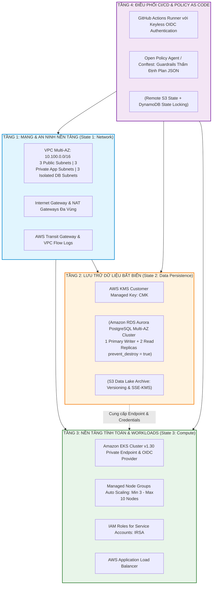
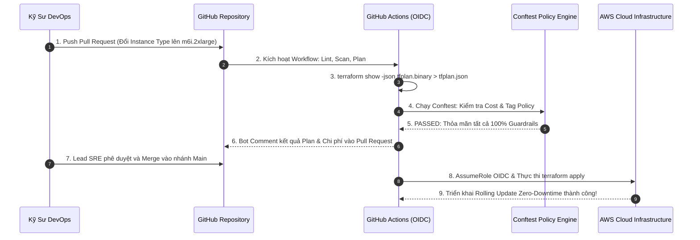
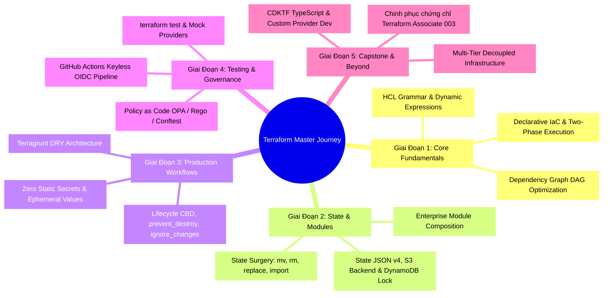


# Capstone Project: Xây Dựng Nền Tảng Hạ Tầng Enterprise Đa Tầng End-to-End

Chào mừng bạn đến với **Capstone Project** — Đồ án tốt nghiệp thực chiến đỉnh cao của toàn bộ series chuyên sâu về Terraform & Infrastructure as Code! 

Sau 29 bài học đi sâu vào từng ngóc ngách của công nghệ (từ cú pháp HCL, đồ thị DAG, phẫu thuật State, thiết kế Module, Policy as Code, Terragrunt cho đến CDKTF và luyện thi chứng chỉ), bài viết này là nơi quy tụ và hiện thực hóa **100% tất cả các tinh hoa kiến trúc** vào một dự án thực tế hoàn chỉnh chuẩn **Enterprise Grade**.

Chúng ta sẽ đóng vai trò là **Lead Cloud Infrastructure Architect** của một tập đoàn tài chính công nghệ (Fintech Enterprise), chịu trách nhiệm thiết kế, triển khai và tự động hóa toàn bộ nền tảng hạ tầng đám mây phục vụ hệ thống **Core Banking Microservices** với yêu cầu khắt khe: **Zero-Downtime, High Availability Multi-AZ, Bảo mật đa tầng, Tự động hóa CI/CD Keyless OIDC và Rào chắn Guardrails kiểm soát chi phí**.

---

## 1. Bản Vẽ Kiến Trúc Tổng Thể (Master Architecture Blueprint)

Hạ tầng được chia thành **3 Tầng Độc Lập (3-Tier Layered Architecture)** nhằm tối ưu hóa Blast Radius và giảm thời gian thực thi của Pipeline:



---

## 2. Bảng Thiết Kế Thông Số Kỹ Thuật (Architecture Specifications)

| Thành Phần Hạ Tầng | Thông Số Kỹ Thuật Chi Tiết | Cơ Chế Bảo Mật & Rủi Ro |
| :--- | :--- | :--- |
| **VPC & Subnets** | CIDR `10.100.0.0/16`, 3 AZs (`ap-southeast-1a/b/c`), chia làm 9 Subnets | Flow Logs kích hoạt, tách biệt hoàn toàn Subnet Database không có Internet |
| **Database Cluster** | Aurora PostgreSQL v15.4, Multi-AZ Cluster (1 Writer, 2 Readers) | `prevent_destroy = true`, Mã hóa ổ đĩa bằng KMS CMK, sao lưu tự động 30 ngày |
| **Compute Cluster** | AWS EKS Managed Cluster v1.30, Node Group chạy `m6i.xlarge` | Private Control Plane, Bật IRSA (IAM Roles for Service Accounts) |
| **Secrets & Passwords** | Sinh ngẫu nhiên bằng `random_password` và nạp vào AWS Secrets Manager | Không hardcode, che giấu output với `sensitive = true`, mã hóa KMS |
| **State Management** | S3 Remote Backend + DynamoDB Locking Table + S3 Object Lock | Bật S3 Versioning, mã hóa SSE-KMS, cô lập Blast Radius theo từng tầng |
| **Governance & Policy** | Conftest & Rego Policies chạy trong GitHub Actions | Chặn máy chủ GPU, bắt buộc gán thẻ `CostCenter`, cấm mở Port 22 |

---

## 3. Cấu Trúc Repository Đồ Án (Monorepo Codebase Layout)

```text
terraform-enterprise-capstone/
├── .github/
│   └── workflows/
│       ├── 01-network-pipeline.yml
│       ├── 02-data-pipeline.yml
│       └── 03-compute-pipeline.yml
├── policy/
│   ├── cost_guardrails.rego
│   ├── security_guardrails.rego
│   └── tag_governance.rego
├── modules/
│   ├── vpc/
│   │   ├── main.tf
│   │   ├── variables.tf
│   │   └── outputs.tf
│   ├── aurora-postgresql/
│   │   ├── main.tf
│   │   ├── variables.tf
│   │   └── outputs.tf
│   └── eks-cluster/
│       ├── main.tf
│       ├── variables.tf
│       └── outputs.tf
└── environments/
    └── production/
        ├── 01-network/
        │   ├── backend.tf
        │   ├── main.tf
        │   ├── variables.tf
        │   └── terraform.tfvars
        ├── 02-data/
        │   ├── backend.tf
        │   ├── main.tf
        │   ├── variables.tf
        │   └── terraform.tfvars
        └── 03-compute/
            ├── backend.tf
            ├── main.tf
            ├── variables.tf
            └── terraform.tfvars
```

---

## 4. Hiện Thực Hóa Mã Nguồn Từng Tầng (Line-by-Line Implementation)

### 4.1. Tầng 1: Network Layer (`environments/production/01-network/main.tf`)

```hcl
terraform {
  required_version = ">= 1.5.0"
  required_providers {
    aws = {
      source  = "hashicorp/aws"
      version = "~> 5.0"
    }
  }
}

provider "aws" {
  region = var.aws_region
  default_tags {
    tags = {
      Environment = "Production"
      Project     = "Core-Banking"
      ManagedBy   = "Terraform"
      CostCenter  = "CC-BANKING-09"
    }
  }
}

# 1. KHỞI TẠO VPC CHÍNH
resource "aws_vpc" "main" {
  cidr_block           = var.vpc_cidr
  enable_dns_hostnames = true
  enable_dns_support   = true

  tags = {
    Name = "corp-prod-vpc"
  }
}

# 2. KHỞI TẠO SUBNETS ĐA TẦNG CHO 3 AVAILABILITY ZONES
locals {
  azs = ["ap-southeast-1a", "ap-southeast-1b", "ap-southeast-1c"]
}

# Public Subnets (Dành cho Ingress Load Balancer & NAT GW)
resource "aws_subnet" "public" {
  count                   = 3
  vpc_id                  = aws_vpc.main.id
  cidr_block              = cidrsubnet(var.vpc_cidr, 4, count.index) # 10.100.0.0/20, 1.0, 2.0
  availability_zone       = local.azs[count.index]
  map_public_ip_on_launch = true

  tags = {
    Name                     = "corp-prod-public-az${count.index + 1}"
    "kubernetes.io/role/elb" = "1"
  }
}

# Private App Subnets (Dành cho EKS Worker Nodes)
resource "aws_subnet" "private_app" {
  count             = 3
  vpc_id            = aws_vpc.main.id
  cidr_block        = cidrsubnet(var.vpc_cidr, 4, count.index + 4) # 10.100.4.0/20, 5.0, 6.0
  availability_zone = local.azs[count.index]

  tags = {
    Name                              = "corp-prod-app-az${count.index + 1}"
    "kubernetes.io/role/internal-elb" = "1"
  }
}

# Isolated Database Subnets (Dành cho RDS Aurora)
resource "aws_subnet" "isolated_db" {
  count             = 3
  vpc_id            = aws_vpc.main.id
  cidr_block        = cidrsubnet(var.vpc_cidr, 4, count.index + 8) # 10.100.8.0/20, 9.0, 10.0
  availability_zone = local.azs[count.index]

  tags = {
    Name = "corp-prod-db-az${count.index + 1}"
  }
}

# 3. XUẤT THÔNG TIN CHO CÁC TẦNG SAU QUA AWS SSM PARAMETER STORE
resource "aws_ssm_parameter" "vpc_id" {
  name  = "/corp/production/network/vpc_id"
  type  = "String"
  value = aws_vpc.main.id
}

resource "aws_ssm_parameter" "app_subnet_ids" {
  name  = "/corp/production/network/app_subnets"
  type  = "StringList"
  value = join(",", aws_subnet.private_app[*].id)
}

resource "aws_ssm_parameter" "db_subnet_ids" {
  name  = "/corp/production/network/db_subnets"
  type  = "StringList"
  value = join(",", aws_subnet.isolated_db[*].id)
}
```

---

### 4.2. Tầng 2: Data Layer (`environments/production/02-data/main.tf`)

```hcl
terraform {
  required_version = ">= 1.5.0"
  required_providers {
    aws = {
      source  = "hashicorp/aws"
      version = "~> 5.0"
    }
    random = {
      source  = "hashicorp/random"
      version = "~> 3.5"
    }
  }
}

provider "aws" {
  region = "ap-southeast-1"
}

# 1. ĐỌC THÔNG TIN MẠNG TỪ TẦNG 1 QUA SSM PARAMETER STORE
data "aws_ssm_parameter" "vpc_id" {
  name = "/corp/production/network/vpc_id"
}

data "aws_ssm_parameter" "db_subnet_ids" {
  name = "/corp/production/network/db_subnets"
}

# 2. KHỞI TẠO KHÓA MÃ HÓA KMS CMK DÀNH RIÊNG CHO CƠ SỞ DỮ LIỆU
resource "aws_kms_key" "database_encryption_key" {
  description             = "KMS Key ma hoa cho Core Banking Database"
  deletion_window_in_days = 30
  enable_key_rotation     = true

  tags = {
    Name       = "corp-prod-db-kms-key"
    CostCenter = "CC-BANKING-09"
  }
}

# 3. SINH MẬT KHẨU NGẪU NHIÊN BẢO MẬT CAO
resource "random_password" "db_master_password" {
  length           = 32
  special          = true
  override_special = "!#$%&*()-_=+[]{}<>:?"
}

# 4. LƯU MẬT KHẨU VÀO AWS SECRETS MANAGER
resource "aws_secretsmanager_secret" "db_credentials" {
  name_prefix = "corp-prod-aurora-master-"
  kms_key_id  = aws_kms_key.database_encryption_key.arn
}

resource "aws_secretsmanager_secret_version" "db_credentials_val" {
  secret_id = aws_secretsmanager_secret.db_credentials.id
  secret_string = jsonencode({
    engine   = "postgres"
    username = "banking_master_admin"
    password = random_password.db_master_password.result
  })
}

# 5. TẠO DB SUBNET GROUP
resource "aws_db_subnet_group" "aurora" {
  name       = "corp-prod-aurora-subnet-group"
  subnet_ids = split(",", data.aws_ssm_parameter.db_subnet_ids.value)
}

# 6. KHỞI TẠO RDS AURORA POSTGRESQL CLUSTER VỚI KHÓA PREVENT_DESTROY
resource "aws_rds_cluster" "postgresql" {
  cluster_identifier      = "corp-prod-banking-aurora"
  engine                  = "aurora-postgresql"
  engine_version          = "15.4"
  database_name           = "core_banking_db"
  master_username         = "banking_master_admin"
  master_password         = random_password.db_master_password.result
  db_subnet_group_name    = aws_db_subnet_group.aurora.name
  kms_key_id              = aws_kms_key.database_encryption_key.arn
  storage_encrypted       = true
  backup_retention_period = 30
  preferred_backup_window = "02:00-03:00"
  deletion_protection     = true

  # KHÓA AN TOÀN TUYỆT ĐỐI CHỐNG XÓA
  lifecycle {
    prevent_destroy = true
    ignore_changes  = [master_password]
  }

  tags = {
    CostCenter = "CC-BANKING-09"
  }
}

# Khởi tạo 3 Instances (1 Writer + 2 Read Replicas)
resource "aws_rds_cluster_instance" "instances" {
  count              = 3
  identifier         = "corp-prod-aurora-node-${count.index + 1}"
  cluster_identifier = aws_rds_cluster.postgresql.id
  instance_class     = "db.r6g.xlarge"
  engine             = aws_rds_cluster.postgresql.engine
  engine_version     = aws_rds_cluster.postgresql.engine_version

  lifecycle {
    prevent_destroy = true
  }
}

# Ghi Endpoint vào SSM Parameter Store
resource "aws_ssm_parameter" "db_writer_endpoint" {
  name  = "/corp/production/data/db_endpoint"
  type  = "String"
  value = aws_rds_cluster.postgresql.endpoint
}
```

---

### 4.3. Tầng 3: Compute Layer (`environments/production/03-compute/main.tf`)

```hcl
terraform {
  required_version = ">= 1.5.0"
  required_providers {
    aws = {
      source  = "hashicorp/aws"
      version = "~> 5.0"
    }
  }
}

provider "aws" {
  region = "ap-southeast-1"
}

# Đọc thông tin VPC và App Subnets từ Tầng 1
data "aws_ssm_parameter" "vpc_id" {
  name = "/corp/production/network/vpc_id"
}

data "aws_ssm_parameter" "app_subnet_ids" {
  name = "/corp/production/network/app_subnets"
}

# 1. TẠO IAM ROLE CHO EKS CONTROL PLANE
resource "aws_iam_role" "eks_cluster_role" {
  name = "corp-prod-eks-cluster-role"

  assume_role_policy = jsonencode({
    Version = "2012-10-17"
    Statement = [{
      Action = "sts:AssumeRole"
      Effect = "Allow"
      Principal = {
        Service = "eks.amazonaws.com"
      }
    }]
  })
}

resource "aws_iam_role_policy_attachment" "eks_cluster_policy" {
  role       = aws_iam_role.eks_cluster_role.name
  policy_arn = "arn:aws:iam::aws:policy/AmazonEKSClusterPolicy"
}

# 2. KHỞI TẠO EKS CLUSTER
resource "aws_eks_cluster" "primary" {
  name     = "corp-prod-banking-eks"
  role_arn = aws_iam_role.eks_cluster_role.arn
  version  = "1.30"

  vpc_config {
    subnet_ids              = split(",", data.aws_ssm_parameter.app_subnet_ids.value)
    endpoint_private_access = true
    endpoint_public_access  = false # BẢO MẬT TUYỆT ĐỐI: CHỈ TRUY CẬP NỘI BỘ
  }

  depends_on = [aws_iam_role_policy_attachment.eks_cluster_policy]

  tags = {
    CostCenter = "CC-BANKING-09"
  }
}

# 3. KHỞI TẠO MANAGED NODE GROUP VỚI HIGH AVAILABILITY
resource "aws_iam_role" "eks_node_role" {
  name = "corp-prod-eks-node-role"

  assume_role_policy = jsonencode({
    Version = "2012-10-17"
    Statement = [{
      Action = "sts:AssumeRole"
      Effect = "Allow"
      Principal = {
        Service = "ec2.amazonaws.com"
      }
    }]
  })
}

resource "aws_iam_role_policy_attachment" "node_policies" {
  for_each = toset([
    "arn:aws:iam::aws:policy/AmazonEKSWorkerNodePolicy",
    "arn:aws:iam::aws:policy/AmazonEKS_CNI_Policy",
    "arn:aws:iam::aws:policy/AmazonEC2ContainerRegistryReadOnly"
  ])

  role       = aws_iam_role.eks_node_role.name
  policy_arn = each.value
}

resource "aws_eks_node_group" "app_workers" {
  cluster_name    = aws_eks_cluster.primary.name
  node_group_name = "app-workload-pool"
  node_role_arn   = aws_iam_role.eks_node_role.arn
  subnet_ids      = split(",", data.aws_ssm_parameter.app_subnet_ids.value)
  instance_types  = ["m6i.xlarge"]

  scaling_config {
    desired_size = 3
    min_size     = 3
    max_size     = 10
  }

  lifecycle {
    create_before_destroy = true
    ignore_changes        = [scaling_config[0].desired_size] # Nhường quyền cho Cluster Autoscaler
  }

  tags = {
    CostCenter = "CC-BANKING-09"
  }
}
```

---

## 5. Quy Trình Vận Hành & Khắc Phục Sự Cố Thực Chiến (Operational Runbook)



---

## 6. Tổng Kết Toàn Diện Series & Lộ Trình Phát Triển Tiếp Theo

Xin chúc mừng! Bạn đã hoàn thành xuất sắc đồ án tốt nghiệp **Capstone Project** và làm chủ toàn bộ chuỗi kiến thức hạ tầng từ cơ bản đến đỉnh cao của **Terraform Enterprise Architecture**.



- **Bước tiếp theo**: Trong [Bài 31: Tuyển Tập 100+ Câu Hỏi Phỏng Vấn Terraform & DevOps Chuyên Sâu](./31-tong-hop-cau-hoi-phong-van-terraform-devops-chuyen-sau-30-buoi.md), chúng ta sẽ tổng hợp trọn bộ các câu hỏi phỏng vấn hóc búa nhất từ các tập đoàn công nghệ hàng đầu (FAANG/Big Tech) để giúp bạn tự tin chinh phục mọi buổi phỏng vấn vị trí Senior Cloud / DevOps / SRE Architect!

