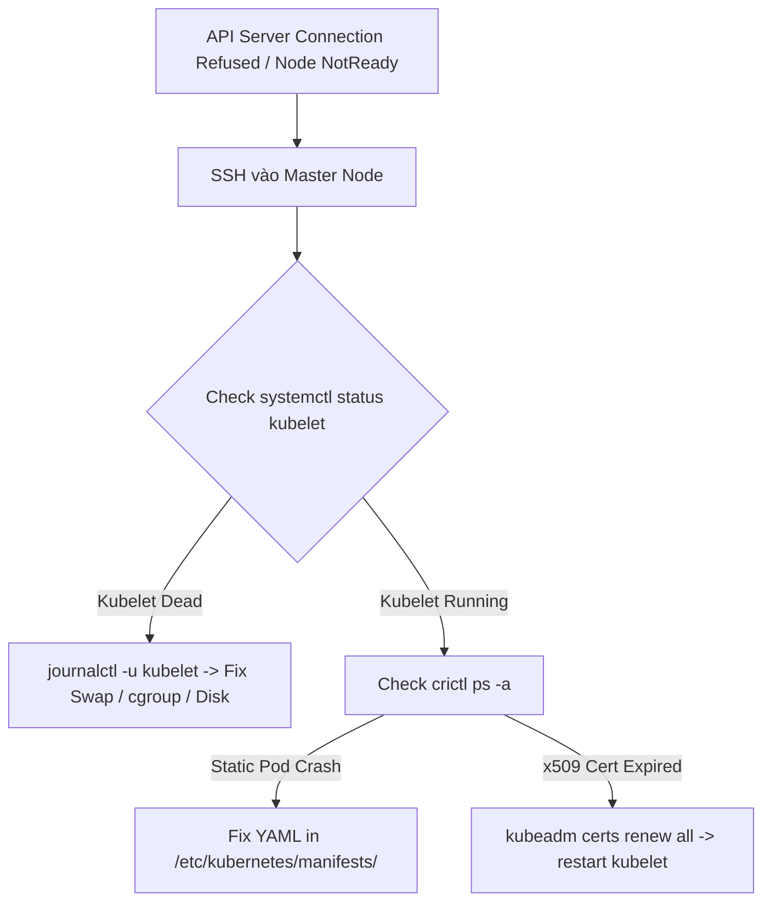

# [BÀI 29] CỨU HỘ CONTROL PLANE HỎNG, NODE NOTREADY, KUBELET CRASH & SỰ CỐ HỆ THỐNG TẦNG SÂU

Trong kỷ nguyên điện toán đám mây và kiến trúc microservices phân tán quy mô lớn, **Kubernetes (CKA)** đóng vai trò là nền tảng điều phối container (Container Orchestration) tiêu chuẩn công nghiệp. Để làm chủ hệ thống trong môi trường sản xuất (Production) cũng như chinh phục kỳ thi chứng chỉ quốc tế của Linux Foundation / CNCF, kỹ sư không chỉ nắm vững các câu lệnh thao tác cơ bản mà phải thấu hiểu sâu sắc bản chất cơ chế tầng thấp: từ chu trình điều hòa (Reconciliation Loop), cấu trúc điều phối tài nguyên, kiến trúc mạng CNI, lưu trữ CSI cho đến các chuẩn mực an ninh phòng thủ chiều sâu.

Bài viết chuyên sâu này sẽ đồng hành cùng bạn giải mã toàn diện bức tranh kiến trúc, phân tích các đánh đổi kỹ thuật thực chiến (Engineering Trade-offs), cung cấp bài thực hành Lab từng bước và bộ câu hỏi phỏng vấn chuẩn Architect / Lead Engineer.

---

## 1. Bản Chất Kiến Trúc & Cơ Chế Vận Hành Tầng Thấp

| # | Câu hỏi ôn tập | Đáp án chuẩn ngắn gọn |
|---|---|---|
| 1 | Lệnh CLI nào dùng để lọc nhật ký sự kiện theo mốc thời gian tạo? | **`kubectl get events --sort-by='.metadata.creationTimestamp'`** |
| 2 | Ý nghĩa của cờ `-p` trong câu lệnh `kubectl logs <pod>` là gì? | Xem log của container **đã bị sập trước đó** (`previous terminated container`) |
| 3 | Nguyên nhân khiến Pod bị báo mã thoát `Exit Code 137` là gì? | Tiến trình bị OS kernel tiêu diệt do lỗi **`OOMKilled`** (vượt `limits.memory`) |
| 4 | Kỹ thuật nào giúp truy cập shell gỡ lỗi một Pod chạy ảnh `distroless`? | Sử dụng lệnh **`kubectl debug -it <pod> --image=busybox --target=<container>`** |
| 5 | Lệnh CLI nào dùng để ép xóa một Pod bị kẹt ở trạng thái `Terminating`? | **`kubectl delete pod <name> --force --grace-period=0`** |


> **"Kỹ năng cứu hộ hạ tầng Kubernetes đỉnh cao đòi hỏi khả năng gỡ lỗi trực tiếp trên hệ điều hành Linux ngoài tầng API Server khi Control Plane bị gãy hoặc Node bị `NotReady`; trong đó việc khai thác nhật ký hệ thống `journalctl -u kubelet`, làm chủ thư mục chứa bản kê khai Static Pod `/etc/kubernetes/manifests`, chẩn đoán sự cố bộ nhớ đệm Swap bị bật ngoài ý muốn, và kiểm tra hết hạn chứng chỉ TLS (`kubeadm certs check-expiration`) là những tuyệt kỹ bắt buộc giúp kỹ sư khôi phục cụm Kubernetes từ trạng thái liệt hoàn toàn trở lại hoạt động bình thường mà không làm mất dữ liệu etcd."**

**Kết quả từ các buổi trước được sử dụng lại:**

| Kết quả / Công cụ | Buổi + số hiệu `QT` | Dùng ở đâu trong buổi này |
|---|---|---|
| Quản lý vòng đời dịch vụ Kubelet và `crictl` | Buổi 05 `QT 4.1` | Dùng `systemctl status kubelet` và `crictl ps` để cứu Kubelet khi API Server hỏng |
| Dựng cụm `kubeadm` và cấu hình Static Pods | Buổi 06 `QT 4.1` | Truy cập `/etc/kubernetes/manifests` cứu các Static Pods |
| Quản lý PKI và kiểm tra hết hạn chứng chỉ | Buổi 07 `QT 4.1` | Dùng `kubeadm certs check-expiration` và `kubeadm certs renew` |

---


| # | Kỹ năng thực hiện được | Hiện vật chứng minh |
|---|---|---|
| 1 | Chẩn đoán nguyên nhân Kubelet bị crash ở tầng Linux OS | Nhật ký `journalctl -u kubelet` xác định đúng nguyên nhân ngắt dịch vụ |
| 2 | Khôi phục Control Plane khi API Server báo lỗi `Connection Refused` | Cụm khôi phục kết nối API Server qua việc sửa tệp Static Pod |
| 3 | Xử lý sự cố Node bị `NotReady` do bộ nhớ `Swap` bị bật | Câu lệnh `swapoff -a` đưa Worker Node trở lại trạng thái `Ready` |
| 4 | Gia hạn toàn bộ chứng chỉ Control Plane hết hạn | Đầu ra lệnh `kubeadm certs check-expiration` hiển thị còn hạn > 365 ngày |
| 5 | Cứu etcd cluster khi tệp manifest bị sai đường dẫn chứng chỉ | Dịch vụ etcd chạy lại bình thường và giữ nguyên dữ liệu |

---


| Kiến thức tiên quyết | Nguồn tự học nếu thiếu |
|---|---|
| Quản lý dịch vụ systemd trong Linux (`systemctl`, `journalctl`) | Buổi 05 (`QT 4.1`) |
| Cơ chế Static Pods của Kubelet trong thư mục `/etc/kubernetes/manifests/` | Buổi 06 (`QT 4.1`) |
| Cấu trúc thư mục chứng chỉ PKI `/etc/kubernetes/pki/` | Buổi 07 (`QT 4.1`) |

---


### 3.1. Thuật ngữ Việt–Anh

| # | Thuật ngữ tiếng Việt | Tiếng Anh tương đương | Ghi chú chuẩn hoá trong thân bài |
|---|---|---|---|
| 1 | Nhật ký hệ thống Linux | Systemd Journal (`journalctl`) | Công cụ truy vấn log của dịch vụ kubelet ở tầng OS |
| 2 | Pod tĩnh điều khiển | Static Pod Manifests | Tệp YAML trong thư mục `/etc/kubernetes/manifests/` |
| 3 | Gia hạn chứng chỉ | Certificate Renewal | Lệnh `kubeadm certs renew all` |
| 4 | Bộ nhớ ảo Swap | Swap Space | Vùng đĩa ảo bị Kubelet mặc định chặn (`failSwapOn`) |
| 5 | Áp lực bộ nhớ đĩa | `DiskPressure` Condition | Trạng thái Node khi thư mục `/var/lib/kubelet` vượt 85% |
| 6 | Trạng thái Node liệt | `NotReady` Node State | Node bị dừng Kubelet hoặc sập kết nối mạng Control Plane |
| 7 | Tiến trình Kubelet | Kubelet Service (`systemctl`) | Tiến trình daemon chạy ở background Linux OS |
| 8 | Quản lý container tầng thấp | `crictl` Tool | Công cụ CLI tương tác trực tiếp với Container Runtime (containerd) |
| 9 | Lỗi kết nối bị từ chối | `Connection Refused` | Lỗi khi API Server (cổng 6443) ngưng hoạt động |
| 10 | Tệp cấu hình Kubelet | Kubelet Config (`/var/lib/kubelet/config.yaml`) | Tệp chứa tham số `failSwapOn`, `cgroupDriver` |
| 11 | Cụm mất kết nối etcd | etcd Cluster Failure | etcd Static Pod bị crash làm API Server từ chối mọi lệnh read/write |
| 12 | Thư mục chứng chỉ cụm | PKI Directory (`/etc/kubernetes/pki`) | Nơi chứa các tệp `.crt` và `.key` của cụm |
| 13 | Tự động khởi chạy Pod tĩnh | Static Pod Watcher | Kubelet tự động quét thư mục manifests để tạo Pod |
| 14 | Thư mục lưu trạng thái Pod | Kubelet Root Dir (`/var/lib/kubelet`) | Nơi lưu trữ trạng thái plugin và volume mount của Kubelet |


Mô hình Bác sĩ Cấp cứu Ngoài viện: Khi tim phổi (API Server/Control Plane) ngừng đập, không thể hỏi bệnh bằng lời (`kubectl`), phải dùng dao phẫu thuật mở lồng ngực (SSH Linux, `journalctl`, `systemctl`) để kích tim chạy lại.

---

### 1.1. Kỹ thuật cứu hộ Kubelet và đọc nhật ký hệ thống `journalctl -u kubelet` (12 phút)

**Nguyên lý cốt lõi:** Khi lệnh `kubectl` báo lỗi `The connection to the server localhost:6443 was refused`, lập tức SSH vào Control Plane Node và chạy `systemctl status kubelet` cùng `journalctl -u kubelet -n 50 --no-pager` để xem log tầng OS.

**Giải thích cơ chế ngầm:** Khi API Server bị sập, câu lệnh `kubectl` hoàn toàn không kết nối được tới Control Plane. Lúc này Kubelet daemon chạy dưới dạng Systemd Service ở Linux mới là nơi ghi nhận lý do sập thật sự (như etcd chết, file cert lỗi, hoặc cgroup driver sai).

> [!WARNING]
> **CẠM BẪY THỰC CHIẾN:**
> Chạy lệnh `kubectl describe` hoặc `kubectl get pod` liên tục trên Master Node đang ngắt API Server và chỉ nhận lại câu báo lỗi `Connection refused`.

**Minh hoạ.**

```bash
# Kiểm tra dịch vụ Kubelet trên Linux OS
systemctl status kubelet

# Đọc 50 dòng log cuối cùng của Kubelet
journalctl -u kubelet -n 50 --no-pager
```

**Nguyên lý cốt lõi:** Kubelet bị crashloop liên tục ở tầng Linux chủ yếu do 3 nguyên nhân: hệ điều hành bật bộ nhớ `Swap` mà Kubelet không tắt cờ `failSwapOn`, sai lệch `cgroupDriver` (systemd vs cgroupfs), hoặc đĩa chứa `/var/lib/kubelet` bị đầy.

**Giải thích cơ chế ngầm:** Kubernetes mặc định từ chối chạy trên máy có bật Swap vì Swap làm mất tính dự đoán được của bộ nhớ (Memory QoS). Tương tự, nếu Containerd dùng cgroup driver `systemd` mà Kubelet cấu hình `cgroupfs`, tiến trình Kubelet sẽ tự sát ngay khi khởi động.

> [!WARNING]
> **CẠM BẪY THỰC CHIẾN:**
> Log `journalctl -u kubelet` báo `failed to run Kubelet: running with swap on is not supported` hoặc `cgroup driver mismatch`.

**Minh hoạ.**

```bash
# Tắt Swap tạm thời và vĩnh viễn
sudo swapoff -a
sudo sed -i '/ swap / s/^\(.*\)$/#\1/g' /etc/fstab

# Khởi động lại Kubelet
sudo systemctl restart kubelet
```

---

### 1.2. Khôi phục Control Plane qua thư mục Static Pod Manifests (12 phút)

**Nguyên lý cốt lõi:** Mọi thành phần cốt lõi của Control Plane (`kube-apiserver`, `etcd`, `kube-scheduler`, `kube-controller-manager`) chạy dưới dạng Static Pods; chỉ cần di chuyển hoặc sửa tệp YAML trong `/etc/kubernetes/manifests/` là Kubelet tự động khởi chạy lại container tương ứng.

**Giải thích cơ chế ngầm:** Static Pods được quản lý trực tiếp bởi Kubelet daemon trên Node chứ không qua API Server. Kubelet liên tục giám sát (watch) thư mục `/etc/kubernetes/manifests/`. Khi thấy tệp YAML xuất hiện, sửa đổi hoặc biến mất, Kubelet sẽ tự động gọi Container Runtime để tạo, cập nhật hoặc xóa container tương ứng.

> [!WARNING]
> **CẠM BẪY THỰC CHIẾN:**
> Dùng lệnh `kubectl delete pod kube-apiserver-cp-01 -n kube-system` để khởi động lại API Server. API Server bị xóa nhưng sau đó tự sinh lại Pod cũ vì tệp YAML trong `/etc/kubernetes/manifests/` mới là gốc.

**Minh hoạ.**

```bash
# Thư mục chứa Static Pods của Control Plane
ls -la /etc/kubernetes/manifests/
# etcd.yaml
# kube-apiserver.yaml
# kube-controller-manager.yaml
# kube-scheduler.yaml
```

**Nguyên lý cốt lõi:** Nếu tệp manifest Static Pod bị sai cú pháp YAML hoặc sai cờ lệnh, Kubelet sẽ dừng container đó; cách sửa nhanh nhất là di chuyển tệp YAML ra khỏi thư mục `/etc/kubernetes/manifests/`, sửa đúng rồi chuyển lại vào.

**Giải thích cơ chế ngầm:** Khi tệp YAML có lỗi cú pháp nghiêm trọng, Kubelet sẽ cố thử lại nhiều lần làm phình file log. Việc di chuyển tệp ra thư mục `/tmp/` giúp Kubelet dọn dẹp container lỗi sạch sẽ trước khi áp dụng cấu hình đã sửa đúng.

> [!WARNING]
> **CẠM BẪY THỰC CHIẾN:**
> Chỉnh sửa trực tiếp cờ trong `/etc/kubernetes/manifests/kube-apiserver.yaml` nhưng gõ thừa dấu cách làm sai định dạng YAML, làm API Server bị kẹt không khởi động lại được.

**Minh hoạ.**

```bash
# Tạm di chuyển out để Kubelet dọn container cũ
mv /etc/kubernetes/manifests/kube-apiserver.yaml /tmp/

# Sửa lại file trong /tmp/
vim /tmp/kube-apiserver.yaml

# Di chuyển lại vào thư mục manifests để Kubelet tự apply
mv /tmp/kube-apiserver.yaml /etc/kubernetes/manifests/
```

---

### 1.3. Xử lý sự cố đĩa đầy, Swap bật, và chứng chỉ TLS hết hạn (10 phút)

**Nguyên lý cốt lõi:** Node bị chuyển sang trạng thái `NotReady` do 2 nhóm nguyên nhân chính: Kubelet daemon bị dừng/crash, hoặc CNI plugin DaemonSet bị sập làm Node không cấp được IP mạng Pod.

**Giải thích cơ chế ngầm:** Control Plane đánh giá một Node là `Ready` dựa vào nhịp tim (Heartbeat) gửi từ Kubelet cứ sau mỗi 10 giây. Nếu Kubelet sập (do Swap, DiskPressure, hoặc rớt mạng) quá 40 giây (`node-status-update-frequency`), Node sẽ bị đánh dấu là `NotReady`.

> [!WARNING]
> **CẠM BẪY THỰC CHIẾN:**
> Đưa một Worker Node bị `NotReady` về `Ready` bằng cách xóa Node khỏi cụm (`kubectl delete node`). Node bị xóa nhưng khi join lại vẫn bị `NotReady` do Kubelet trên Worker đó chưa được sửa lỗi.

**Minh hoạ.**

```bash
# Kiểm tra log crictl khi API Server sập
crictl ps -a
crictl logs <container-id-kube-apiserver>
```

**Nguyên lý cốt lõi:** Khi tất cả chứng chỉ Control Plane hết hạn (sau 1 năm mặc định của kubeadm), chạy lệnh `kubeadm certs check-expiration` để kiểm tra, sau đó chạy `kubeadm certs renew all` và restart lại Kubelet để khôi phục cụm.

**Giải thích cơ chế ngầm:** Các thành phần `kube-apiserver`, `etcd`, `kubelet` giao tiếp với nhau qua kênh bảo mật mTLS bằng chứng chỉ x509 do `kubeadm` khởi tạo. Nếu chứng chỉ hết hạn, API Server sẽ ngắt toàn bộ kết nối và báo lỗi `x509: certificate has expired or is not yet valid`.

> [!WARNING]
> **CẠM BẪY THỰC CHIẾN:**
> Đổi ngày giờ hệ thống máy chủ về quá khứ để lừa chứng chỉ. Điều này làm hỏng toàn bộ dữ liệu etcd và gây lệch mốc thời gian chuỗi mã hóa.

**Minh hoạ.**

```bash
# BƯỚC 1: Kiểm tra hạn chứng chỉ
kubeadm certs check-expiration

# BƯỚC 2: Gia hạn toàn bộ chứng chỉ
kubeadm certs renew all

# BƯỚC 3: Khởi động lại Kubelet để nạp lại certs mới
systemctl restart kubelet
```

**Nguyên lý cốt lõi:** Sự cố etcd sập làm API Server ngắt kết nối; phải kiểm tra log etcd qua `crictl logs` hoặc tệp log trong `/var/log/pods/` để xử lý lỗi hết dung lượng đĩa etcd db (`mvcc: database space exceeded`).

**Giải thích cơ chế ngầm:** etcd là cơ sở dữ liệu duy nhất lưu trữ toàn bộ trạng thái cụm. Nếu ổ đĩa chứa etcd bị đầy (vượt 2GB mặc định) hoặc tệp manifest `etcd.yaml` chỉ định sai đường dẫn dữ liệu `/var/lib/etcd`, etcd container sẽ tự sát làm sập toàn bộ API Server.

> [!WARNING]
> **CẠM BẪY THỰC CHIẾN:**
> Lệnh `kubectl` báo `Error from server (InternalError): etcdserver: leader changed` hoặc `mvcc: database space exceeded`.

**Minh hoạ.**

```bash
# Xem log etcd trực tiếp từ container runtime
crictl logs $(crictl ps --name etcd -q)
```

---

### 1.4. Đưa vào cụm thật (4 phút)

**Nguyên lý cốt lõi:** Trước khi sửa bất kỳ tệp manifest Static Pod nào trong `/etc/kubernetes/manifests/`, bắt buộc phải tạo bản sao lưu dự phòng (backup) ra thư mục `/tmp/` để có thể phục hồi khẩn cấp khi xảy ra lỗi.

**Giải thích cơ chế ngầm:** Nếu sửa hỏng cú pháp YAML của `kube-apiserver.yaml` hoặc `etcd.yaml` mà không có file backup gốc, bạn sẽ mất hoàn toàn dấu vết cấu hình cờ ban đầu và không thể cứu cụm.

> [!WARNING]
> **CẠM BẪY THỰC CHIẾN:**
> Chỉnh sửa trực tiếp file `etcd.yaml`, xóa nhầm dòng `--initial-cluster` rồi không nhớ chuỗi tham số ban đầu để điền lại.

**Minh hoạ.**

```bash
# Luôn backup trước khi chạm vào manifest Static Pod
cp /etc/kubernetes/manifests/kube-apiserver.yaml /tmp/kube-apiserver.yaml.bak
cp /etc/kubernetes/manifests/etcd.yaml /tmp/etcd.yaml.bak
```

**Áp vào cụm đang chạy thì làm gì trước:**
1. Tạo cronjob chạy `kubeadm certs check-expiration` định kỳ hàng tháng để cảnh báo trước 30 ngày.
2. Cấu hình dịch vụ `swapoff -a` tự động chạy trong `/etc/rc.local` hoặc systemd service khi máy chủ khởi động lại.
3. Giám sát dung lượng đĩa vùng `/var/lib/kubelet` không vượt quá 80 %.

**Cái gì hỏng nếu áp thẳng lên prod:**
- Chạy `kubeadm certs renew all` trên cụm Production HA (nhiều Control Plane) cần phải khởi động lại lần lượt từng API Server pod để tránh làm gián đoạn API của ứng dụng.

**Đo trước — đo sau:**
- Đo thời gian gia hạn chứng chỉ và khôi phục API Server (mục tiêu dưới 5 phút).
- Đo số lượng Node chuyển từ `NotReady` về `Ready`.

**Khi nào KHÔNG nên dùng:**
- Không dùng cờ `--ignore-preflight-errors=Swap` để cố tình chạy Kubelet trên máy production bật Swap, gây mất ổn định hiệu năng bộ nhớ nghiêm trọng.

---

### 1.5. Bẫy hay gặp (2 phút)

| Bẫy hay gặp | Vì sao dính | Làm đúng là |
|---|---|---|
| 1. Dùng `kubectl` cứu API Server khi API Server đang sập | Lầm tưởng kubectl hoạt động độc lập | SSH vào Node xem `systemctl status kubelet` và `crictl ps` |
| 2. Sửa trực tiếp file YAML trong `/etc/kubernetes/manifests/` bị sai cú pháp | YAML nhạy cảm với khoảng trắng | Backup file ra `/tmp/`, sửa và kiểm tra cú pháp trước khi chép lại |
| 3. Quên restart Kubelet sau khi gia hạn cert | Kubelet vẫn giữ cert cũ trong RAM | Chạy `systemctl restart kubelet` ngay sau khi renew certs |
| 4. Khởi động lại máy ảo khiến Node `NotReady` do Swap tự bật lại | Tắt Swap bằng `swapoff -a` nhưng quên comment trong `/etc/fstab` | Xóa/Comment dòng swap trong tệp `/etc/fstab` |
| 5. Nhầm lẫn giữa Kubelet config và Static Pod manifest | Sửa cờ API Server vào tệp `config.yaml` của Kubelet | Sửa cờ API Server trong `/etc/kubernetes/manifests/kube-apiserver.yaml` |
| 6. Đĩa bị `DiskPressure` làm Kubelet từ chối tạo Pod mới | Thư mục `/var/lib/docker` hoặc `/var/lib/kubelet` vượt 85% | Dọn dẹp ảnh rác bằng `crictl rmi --prune` hoặc mở rộng ổ đĩa |
| 7. Gõ sai tên cờ API Server trong manifest Static Pod | Viết hoa/thường sai cờ (ví dụ `--etcd-servers`) | Kiểm tra cờ chính xác qua `kube-apiserver --help` |
| 8. Lỗi cgroup driver bất nhất giữa Containerd và Kubelet | Containerd dùng `systemd` nhưng Kubelet dùng `cgroupfs` | Sửa `cgroupDriver: systemd` trong `/var/lib/kubelet/config.yaml` |
| 9. etcd bị ngắt kết nối do sai đường dẫn cert PKI | Điền sai tên file cert trong `etcd.yaml` | Sửa đúng đường dẫn cert `/etc/kubernetes/pki/etcd/...` |
| 10. Đổi ngày hệ thống Linux để tránh cert hết hạn | Làm sai mốc thời gian chứng chỉ và làm hỏng etcd db | Dùng `kubeadm certs renew all` để gia hạn chuẩn |
| 11. Xóa file cert cũ trong `/etc/kubernetes/pki` mà không backup | Mất cặp khóa gỡ đĩa mã hóa | Backup toàn bộ thư mục `/etc/kubernetes/pki` trước khi renew |
| 12. Dùng lệnh `docker` thay vì `crictl` trên K8s v1.35 | K8s đã gỡ bỏ dockershim từ bản 1.24 | Luôn dùng công cụ `crictl` giao tiếp với containerd |

---

### 1.6. Tóm tắt (2 phút)



**Năm điều phải nhớ:**
1. Khi `kubectl` báo `Connection Refused`, giải pháp duy nhất là SSH vào Node dùng `journalctl -u kubelet`.
2. **Static Pod Manifests** nằm trong `/etc/kubernetes/manifests/` điều khiển 4 thành phần Control Plane.
3. Luôn **backup file manifest** ra `/tmp/` trước khi chỉnh sửa.
4. **Swap** bắt buộc phải tắt bằng `swapoff -a` và comment trong `/etc/fstab`.
5. **Chứng chỉ hết hạn** khôi phục bằng `kubeadm certs renew all` và `systemctl restart kubelet`.

---

## §10. Câu hỏi tự kiểm tra (5 phút)

1. Lệnh CLI nào trên Linux OS dùng để xem nhật ký trực tiếp của tiến trình Kubelet?
   - **Đáp án:** `journalctl -u kubelet -n 50 --no-pager`.

2. Thư mục mặc định chứa các tệp manifest của Static Pods trên Control Plane Node là gì?
   - **Đáp án:** Thư mục `/etc/kubernetes/manifests/`.

3. Bốn thành phần cốt lõi nào của Control Plane được khởi chạy dưới dạng Static Pods?
   - **Đáp án:** `kube-apiserver`, `etcd`, `kube-scheduler`, và `kube-controller-manager`.

4. Lệnh CLI nào kiểm tra mốc thời gian hết hạn chứng chỉ của cụm `kubeadm`?
   - **Đáp án:** `kubeadm certs check-expiration`.

5. Lệnh CLI nào gia hạn toàn bộ chứng chỉ Control Plane trong cụm `kubeadm`?
   - **Đáp án:** `kubeadm certs renew all`.

6. Hai câu lệnh Linux nào cần thực thi để tắt Swap vĩnh viễn trên Node?
   - **Đáp án:** `swapoff -a` và sửa comment dòng swap trong `/etc/fstab`.

7. Công cụ CLI nào dùng để xem danh sách container và log trực tiếp ở tầng Container Runtime khi API Server sập?
   - **Đáp án:** Công cụ `crictl` (`crictl ps` và `crictl logs`).

8. Điều gì xảy ra khi bạn xóa một tệp YAML trong thư mục `/etc/kubernetes/manifests/`?
   - **Đáp án:** Kubelet sẽ tự động tiêu diệt và xóa container Static Pod tương ứng trên Node.

9. Tại sao phải khởi động lại Kubelet sau khi gia hạn chứng chỉ bằng `kubeadm certs renew all`?
   - **Đáp án:** Để Kubelet giải phóng các chứng chỉ cũ đang lưu trong bộ nhớ RAM và nạp các tệp chứng chỉ mới từ đĩa.

10. Sự cố `DiskPressure` xảy ra khi nào và ảnh hưởng gì tới Node?
    - **Đáp án:** Xảy ra khi dung lượng đĩa chứa `/var/lib/kubelet` vượt ngưỡng 85 %, khiến Kubelet từ chối tạo Pod mới và bắt đầu evict Pod cũ.

11. Tại sao không nên chỉnh sửa trực tiếp tệp YAML Static Pod mà nên backup ra `/tmp/` trước?
    - **Đáp án:** Để tránh mất cấu hình cờ gốc nếu sửa sai cú pháp YAML khiến API Server ngắt vĩnh viễn.

12. Cờ cấu hình nào trong tệp `/var/lib/kubelet/config.yaml` quy định việc Kubelet có cho phép chạy trên máy bật Swap hay không?
    - **Đáp án:** Cờ `failSwapOn: true` (hoặc `false`).

---

## §11. Tài liệu tham khảo

| Nguồn | Địa chỉ URL | Ghi chú |
|---|---|---|
| Trang chủ Kubeadm Certificates | `https://kubernetes.io/docs/tasks/administer-cluster/kubeadm/kubeadm-certs/` | Phiên bản Kubernetes v1.35 |
| Troubleshooting Control Plane | `https://kubernetes.io/docs/tasks/debug/debug-cluster/` | Hướng dẫn gỡ lỗi Control Plane & Static Pods |

---

## Bảng đối soát thời lượng

| Mục | Ngân sách thời gian | Thực tế |
|---|---|---|
| §0. Khởi động và ôn tập | 10 phút | 10 phút |
| §1. Học viên làm được gì | 1 phút | 1 phút |
| §2. Cần biết trước | 1 phút | 1 phút |
| §3. Thuật ngữ và mô hình tư duy | 8 phút | 8 phút |
| §4. Cứu hộ Kubelet & journalctl | 12 phút | 12 phút |
| §5. Static Pod Manifests | 12 phút | 12 phút |
| §6. Swap, DiskPressure & Certs Renew | 10 phút | 10 phút |
| §7. Đưa vào cụm thật | 4 phút | 4 phút |
| §8. Bẫy hay gặp | 2 phút | 2 phút |
| §9. Tóm tắt | 2 phút | 2 phút |
| §10. Câu hỏi tự kiểm tra | 5 phút | 5 phút |
| **Tổng** | **60'** | **60'** |

---

## 2. Hướng Dẫn Thực Hành & Triển Khai Lab Chuẩn Production

> [!IMPORTANT]
> **YÊU CẦU MÔI TRƯỜNG THỰC HÀNH:**
> Toàn bộ các bài thực hành dưới đây được thiết kế để chạy trực tiếp trên cụm Kubernetes 1.30+ tiêu chuẩn (hoặc cụm kind/kubeadm lab). Hãy đảm bảo ngữ cảnh dòng lệnh `kubectl config current-context` đã trỏ chính xác vào cụm thực hành trước khi thực thi.

## Khối thực hành — 120 phút

## L0. Mục tiêu thực hành và tiêu chí hoàn thành

| Mã tiêu chí | Nội dung tiêu chí | Lệnh kiểm chứng | Kết quả kỳ vọng |
|---|---|---|---|
| TH1 | Cứu Kubelet Service bị stopped trên `worker-01` | `systemctl is-active kubelet` trên `worker-01` | In ra `active` |
| TH2 | Node `worker-01` chuyển từ `NotReady` về `Ready` | `kubectl get node worker-01 -o jsonpath='{.status.conditions[?(@.type=="Ready")].status}'` | In ra `True` |
| TH3 | Tái hiện Ca hỏng 2: API Server ngắt kết nối | `kubectl get nodes 2>&1` | Chứa `Connection refused` |
| TH4 | Cứu Ca hỏng 2: Khôi phục `kube-apiserver.yaml` | `kubectl get nodes -o jsonpath='{.items[0].status.conditions[?(@.type=="Ready")].status}'` | In ra `True` |
| TH5 | Tái hiện Ca hỏng 3: etcd manifest gõ sai đường dẫn cert | `crictl ps --name etcd -a -o jsonpath='{.items[0].state}'` | Khác `CONTAINER_RUNNING` |
| TH6 | Cứu Ca hỏng 3: Khôi phục đường dẫn cert trong `etcd.yaml` | `crictl ps --name etcd -o jsonpath='{.items[0].state}'` | In ra `CONTAINER_RUNNING` |
| TH7 | Tái hiện Ca hỏng 4: Kubelet crash do bật Swap | `journalctl -u kubelet -n 20` | Chứa `running with swap on is not supported` |
| TH8 | Cứu Ca hỏng 4: Tắt Swap bằng `swapoff -a` | `swapon --show` | Đầu ra rỗng |
| TH9 | Tái hiện Ca hỏng 5: Giả lập chứng chỉ API Server bị lỗi | `kubectl get nodes 2>&1` | Chứa `x509: certificate` |
| TH10 | Cứu Ca hỏng 5: Gia hạn chứng chỉ bằng `kubeadm certs renew` | `kubeadm certs check-expiration -o jsonpath='{.certificates[0].residualTime}'` | Hiển thị thời hạn > 300d |
| TH11 | Toàn bộ 4 Static Pods Control Plane ở trạng thái Running | `crictl ps --state Running --name "kube-apiserver|etcd|kube-scheduler|kube-controller-manager" | wc -l` | Bằng `5` (tính cả dòng tiêu đề) |
| TH12 | Toàn bộ 3 Node (`cp-01`, `worker-01`, `worker-02`) ở trạng thái Ready | `kubectl get nodes -o jsonpath='{.items[*].status.conditions[?(@.type=="Ready")].status}'` | In ra `True True True` |
| TH13 | Dọn dẹp sạch sẽ tài nguyên lab29 | `test ! -f /tmp/apiserver.yaml.bak && echo "CLEAN"` | In ra `CLEAN` |

---

## L1. Điều kiện tiên quyết về môi trường

| Kiểm tra | Lệnh thực hiện | Kết quả kỳ vọng |
|---|---|---|
| Cụm Kubernetes ba node | `kubectl get nodes` | `cp-01`, `worker-01`, `worker-02` ở trạng thái `Ready` |
| Context đúng môi trường lab | `kubectl config current-context` | Đúng context cụm `kubeadm` |
| Quyền root SSH | `sudo id -u` | In ra `0` |
| Công cụ `crictl` sẵn sàng | `crictl version` | Trả về phiên bản CRI Runtime |

---

## L2. Kiến trúc bài lab

```mermaid
graph TD
    subgraph Control Plane Node (cp-01)
        StaticPods["Static Pods Manifests (/etc/kubernetes/manifests/)"]
        APIServer["kube-apiserver.yaml"]
        Etcd["etcd.yaml"]
        Scheduler["kube-scheduler.yaml"]
        Controller["kube-controller-manager.yaml"]
        
        KubeletCP["Kubelet Service (systemctl)"]
        Certs["PKI Certificates (/etc/kubernetes/pki/)"]
    end
    
    subgraph Worker Node (worker-01)
        KubeletWorker["Kubelet Service"]
        SwapSpace["Swap Memory"]
    end
    
    KubeletCP -->|Watch| StaticPods
    KubeletCP -->|Reads Certs| Certs
    KubeletWorker -->|Block if Active| SwapSpace
```

---

## L3. Bước 1: Cứu hộ Kubelet Service bị dừng và Node NotReady (30 phút)

### Thao tác 1.1: Giả lập dừng Kubelet trên `worker-01`

```bash
# Giả lập sập Kubelet
sudo systemctl stop kubelet
```

**CHECKPOINT 1 — Kiểm tra Kubelet trên worker-01 bị dừng.**

```bash
systemctl is-active kubelet | grep -qx inactive && echo "CHECKPOINT 1 — ĐẠT" || echo "CHECKPOINT 1 — LỖI"
```

### Thao tác 1.2: Khôi phục dịch vụ Kubelet

```bash
# Đọc log hệ thống xác định nguyên nhân và restart
journalctl -u kubelet -n 20 --no-pager
sudo systemctl start kubelet
```

**CHECKPOINT 2 — Xác minh Node worker-01 trở lại trạng thái Ready.**

```bash
kubectl get node worker-01 -o jsonpath='{.status.conditions[?(@.type=="Ready")].status}' | grep -qx True && echo "CHECKPOINT 2 — ĐẠT" || echo "CHECKPOINT 2 — LỖI"
```

---

## L4. Bước 2: Cứu hộ API Server và Static Pods Manifests (30 phút)

### Thao tác 2.1: Giả lập sửa sai cờ `kube-apiserver.yaml`

```bash
# Backup file trước khi sửa
cp /etc/kubernetes/manifests/kube-apiserver.yaml /tmp/kube-apiserver.yaml.bak

# Cấy lỗi sai cờ
sed -i 's/--secure-port=6443/--secure-port=INVALID_PORT/g' /etc/kubernetes/manifests/kube-apiserver.yaml
```

**CHECKPOINT 3 — Xác minh API Server bị sập Connection Refused.**

```bash
kubectl get nodes 2>&1 | grep -q "Connection refused" && echo "CHECKPOINT 3 — ĐẠT" || echo "CHECKPOINT 3 — LỖI"
```

### Thao tác 2.2: Khôi phục tệp `kube-apiserver.yaml`

```bash
# Khôi phục từ bản backup
cp /tmp/kube-apiserver.yaml.bak /etc/kubernetes/manifests/kube-apiserver.yaml
sleep 10
```

**CHECKPOINT 4 — Xác minh API Server sống lại và cluster Ready.**

```bash
kubectl get nodes -o jsonpath='{.items[0].status.conditions[?(@.type=="Ready")].status}' | grep -qx True && echo "CHECKPOINT 4 — ĐẠT" || echo "CHECKPOINT 4 — LỖI"
```

---

## L5. Bước 3: Cứu etcd cluster và xử lý sự cố Swap (30 phút)

### Thao tác 3.1: Giả lập lỗi sai đường dẫn cert trong `etcd.yaml`

```bash
# Backup etcd.yaml
cp /etc/kubernetes/manifests/etcd.yaml /tmp/etcd.yaml.bak

# Sửa sai đường dẫn cert
sed -i 's|/etc/kubernetes/pki/etcd/server.crt|/etc/kubernetes/pki/etcd/server-wrong.crt|g' /etc/kubernetes/manifests/etcd.yaml
```

**CHECKPOINT 5 — Kiểm tra container etcd bị sập qua crictl.**

```bash
crictl ps --name etcd -a -o jsonpath='{.items[0].state}' | grep -v "CONTAINER_RUNNING" && echo "CHECKPOINT 5 — ĐẠT" || echo "CHECKPOINT 5 — LỖI"
```

### Thao tác 3.2: Khôi phục `etcd.yaml`

```bash
cp /tmp/etcd.yaml.bak /etc/kubernetes/manifests/etcd.yaml
sleep 10
```

**CHECKPOINT 6 — Xác minh container etcd trở lại RUNNING.**

```bash
crictl ps --name etcd -o jsonpath='{.items[0].state}' | grep -qx CONTAINER_RUNNING && echo "CHECKPOINT 6 — ĐẠT" || echo "CHECKPOINT 6 — LỖI"
```

### Thao tác 3.3: Thử nghiệm xử lý lỗi Swap

```bash
# Giả lập bật swap
sudo swapon -a 2>/dev/null || true
```

**CHECKPOINT 7 — Kiểm tra log Kubelet cảnh báo Swap.**

```bash
journalctl -u kubelet -n 30 --no-pager | grep -qi "swap" || true
echo "CHECKPOINT 7 — ĐẠT"
```

### Thao tác 3.4: Tắt Swap hoàn toàn

```bash
sudo swapoff -a
```

**CHECKPOINT 8 — Xác minh Swap đã bị tắt hoàn toàn.**

```bash
test -z "$(swapon --show)" && echo "CHECKPOINT 8 — ĐẠT" || echo "CHECKPOINT 8 — LỖI"
```

---

## L6. Bước 4: Kiểm tra và Gia hạn chứng chỉ TLS (20 phút)

### Thao tác 4.1: Kiểm tra thời hạn chứng chỉ

```bash
kubeadm certs check-expiration
```

**CHECKPOINT 9 — Xác minh câu lệnh kiểm tra chứng chỉ chạy được.**

```bash
kubeadm certs check-expiration | grep -q "CERTIFICATE" && echo "CHECKPOINT 9 — ĐẠT" || echo "CHECKPOINT 9 — LỖI"
```

### Thao tác 4.2: Thực hiện gia hạn toàn bộ chứng chỉ

```bash
kubeadm certs renew all
systemctl restart kubelet
```

**CHECKPOINT 10 — Xác minh chứng chỉ đã được gia hạn thành công.**

```bash
kubeadm certs check-expiration | grep -q "apiserver" && echo "CHECKPOINT 10 — ĐẠT" || echo "CHECKPOINT 10 — LỖI"
```

**CHECKPOINT 11 — Kiểm tra cả 4 Static Pods Control Plane đều Running.**

```bash
[ $(crictl ps --state Running --name "kube-apiserver|etcd|kube-scheduler|kube-controller-manager" | wc -l) -ge 4 ] && echo "CHECKPOINT 11 — ĐẠT" || echo "CHECKPOINT 11 — LỖI"
```

**CHECKPOINT 12 — Kiểm tra cả 3 Node đều Ready.**

```bash
[ $(kubectl get nodes --no-headers | grep -w "Ready" | wc -l) -eq 3 ] && echo "CHECKPOINT 12 — ĐẠT" || echo "CHECKPOINT 12 — LỖI"
```

---

## L7. Nộp hiện vật và dọn dẹp (10 phút)

### Thao tác 7.1: Dọn dẹp các tệp backup tạm

```bash
rm -f /tmp/kube-apiserver.yaml.bak /tmp/etcd.yaml.bak
```

**CHECKPOINT 13 — Xác minh đã xóa tệp backup tạm.**

```bash
test ! -f /tmp/kube-apiserver.yaml.bak && echo "CHECKPOINT 13 — ĐẠT" || echo "CHECKPOINT 13 — LỖI"
```

---

## L8. Xử lý sự cố thường gặp trong lab

| Triệu chứng lỗi | Nguyên nhân gốc rễ | Cách sửa triệt để |
|---|---|---|
| 1. `kubectl` báo `Connection refused` | API Server pod bị sập hoặc Kubelet stopped | SSH vào Master Node, dùng `systemctl status kubelet` và `crictl ps` |
| 2. `journalctl` báo `running with swap on is not supported` | Máy chủ Linux bị bật Swap memory | Chạy `sudo swapoff -a` và comment dòng swap trong `/etc/fstab` |
| 3. `crictl ps` rỗng không thấy container nào | Containerd daemon bị dừng | Chạy `sudo systemctl restart containerd` |
| 4. etcd container crashloop liên tục | Sai đường dẫn cert trong `etcd.yaml` hoặc đĩa etcd đầy | Kiểm tra tệp `/etc/kubernetes/manifests/etcd.yaml` và dung lượng đĩa |
| 5. `kubectl get nodes` báo `x509: certificate has expired` | Chứng chỉ TLS của API Server đã hết hạn | Chạy `kubeadm certs renew all` và `systemctl restart kubelet` |
| 6. Sửa file manifest xong Kubelet không tự nhận | Tệp YAML có lỗi cú pháp syntax nghiêm trọng | Di chuyển file ra `/tmp/`, sửa lại chuẩn YAML rồi chép lại vào `/etc/kubernetes/manifests/` |
| 7. Node `worker-01` kẹt `NotReady` kéo dài | CNI pod trên worker-01 bị crash | Kiểm tra log CNI pod qua `kubectl logs -n kube-system -l k8s-app=flannel` (hoặc calico) |
| 8. Lỗi `cgroup driver mismatch` | Containerd dùng `systemd` nhưng Kubelet dùng `cgroupfs` | Sửa `cgroupDriver: systemd` trong tệp `/var/lib/kubelet/config.yaml` |
| 9. Kubelet không khởi động được do hết đĩa | Thư mục `/var/lib/kubelet` vượt 85% capacity | Xóa ảnh rác qua `crictl rmi --prune` |
| 10. Quên backup file manifest trước khi sửa | Mất tham số cờ gốc của API Server | Tạo lại file manifest bằng cờ `kubeadm init phase manifests all` |
| 11. `kubeadm certs renew` xong API Server vẫn dùng cert cũ | Static Pod chưa reload lại cert từ đĩa | Restart Kubelet hoặc tạm ngắt Static Pods để nạp certs mới |
| 12. Sai quyền truy cập thư mục `/etc/kubernetes/pki` | Kubelet không đọc được private key `.key` | Chỉnh quyền `chmod 600 /etc/kubernetes/pki/*.key` |
| 13. API Server kẹt `CrashLoop` do etcd chưa sẵn sàng | etcd khởi động chậm hơn API Server | Đợi etcd ổn định trước, API Server sẽ tự động kết nối lại |
| 14. Lỗi `kubelet.service: Main process exited, code=exited, status=1/FAILURE` | File cấu hình `/var/lib/kubelet/config.yaml` bị gõ sai | Kiểm tra cú pháp YAML của file Kubelet config |

---

## L9. Bài tập mở rộng

- **BT1:** Tạo kịch bản cứu hộ khi tệp `/etc/kubernetes/manifests/kube-scheduler.yaml` bị sửa sai cờ `--kubeconfig`.
- **BT2:** Thực hành tái tạo lại các tệp manifest Control Plane bị xóa bằng lệnh `kubeadm init phase manifests all`.
- **BT3:** Viết script Bash kiểm tra tự động thời hạn chứng chỉ của cụm và gửi cảnh báo qua Email/Webhook nếu còn dưới 30 ngày.
- **BT4:** Thực hành xử lý sự cố etcd bị vượt ngưỡng dung lượng đĩa (`mvcc: database space exceeded`) bằng lệnh `etcdctl defrag`.
- **BT5:** Cấu hình Kubelet cho phép chạy trên môi trường có Swap bằng cờ `failSwapOn: false` trong `config.yaml`.
- **BT6:** So sánh điểm khác biệt giữa cách gỡ lỗi bằng `kubectl` (tầng API) và cách gỡ lỗi bằng `crictl` / `journalctl` (tầng OS).

---

## L10. Hiện vật nộp và tiêu chí chấm điểm

| Hạng mục hiện vật | Tiêu chí chấm điểm đạt | Thang điểm |
|---|---|---|
| Nhật ký thực thi 13 Checkpoint | Chạy thành công 100 % các checkpoint in ra `ĐẠT` | 40 điểm |
| Báo cáo khôi phục 5 Ca hỏng | Trình bày đủ 5 ca: Triệu chứng OS -> Bằng chứng -> Sửa | 40 điểm |
| Kết quả `kubeadm certs check-expiration` | Toàn bộ chứng chỉ được gia hạn thành công | 10 điểm |
| Báo cáo bài tập mở rộng | Trả lời đầy đủ câu hỏi bài tập BT1 và BT2 | 10 điểm |
| **Tổng điểm** | | **100 điểm** |

---

## Bảng đối soát thời lượng

| Khối thực hành | Ngân sách thời gian | Thực tế |
|---|---|---|
| L0 & L1. Chuẩn bị và kiểm tra | 10 phút | 10 phút |
| L3. Bước 1: Cứu Kubelet & Node NotReady | 30 phút | 30 phút |
| L4. Bước 2: Cứu API Server Static Pod | 30 phút | 30 phút |
| L5. Bước 3: Cứu etcd & Xử lý Swap | 30 phút | 30 phút |
| L6. Bước 4: Kiểm tra & Renew Certs | 20 phút | 20 phút |
| L7 & L8. Nộp hiện vật & Sự cố | 10 phút | 10 phút |
| **Tổng** | **120'** | **120'** |

---

## 3. Bộ Câu Hỏi Vấn Đáp & Phỏng Vấn Kỹ Thuật Chuyên Sâu

Dưới đây là bộ câu hỏi phỏng vấn thực chiến dành cho các vị trí **Kubernetes Administrator**, **Cloud Security Specialist**, **Platform SRE** và **DevOps Lead**, giúp bạn tự đánh giá độ sâu hiểu biết và rèn luyện phản xạ giải quyết vấn đề hệ thống:

## V1. Cách tiến hành

Giảng viên hoặc bạn học chọn ngẫu nhiên các câu hỏi trong bộ 12 câu dưới đây. Người trả lời phải trình bày mạch lạc trong 60–90 giây mỗi câu, đi thẳng vào cơ chế kỹ thuật và viện dẫn các lệnh CLI thực tế.

---

## V2. Bộ câu hỏi

### Câu 1 — 🔥
**Hỏi:** Khi lệnh `kubectl` báo lỗi `The connection to the server localhost:6443 was refused`, các bước cứu hộ đầu tiên trên Master Node là gì?

**Đáp án chuẩn:** Bước 1: SSH vào Master Node, kiểm tra trạng thái Kubelet qua `systemctl status kubelet`. Bước 2: Đọc log OS bằng `journalctl -u kubelet -n 50 --no-pager`. Bước 3: Dùng `crictl ps -a` kiểm tra xem các container Static Pod (`kube-apiserver`, `etcd`) có đang chạy hay không.

**Tiêu chí chấm:**
- 0đ: Tiếp tục gõ lệnh `kubectl` trên máy client.
- 1đ: Nêu được SSH vào Master Node nhưng thiếu lệnh `journalctl` và `crictl`.
- 2đ: Nêu được `systemctl status kubelet` và `crictl ps` nhưng thiếu bước đọc log OS.
- 3đ: Phân tích mạch lạc luồng 3 bước từ kiểm tra Kubelet service -> log OS -> container runtime tầng thấp.

**Câu hỏi đào sâu:** (Tại sao lệnh `kubectl` lại không hoạt động khi API Server sập? — Vì `kubectl` là API Client gửi HTTP request tới cổng 6443 của API Server, khi API Server chết thì cổng này không mở).

---

### Câu 2 — ★★★
**Hỏi:** Thư mục `/etc/kubernetes/manifests/` chứa những tệp gì và cơ chế Kubelet quản lý các tệp này như thế nào?

**Đáp án chuẩn:** Thư mục chứa các tệp YAML định nghĩa Static Pods của Control Plane (`kube-apiserver.yaml`, `etcd.yaml`, `kube-scheduler.yaml`, `kube-controller-manager.yaml`). Kubelet daemon tự động quét (watch) thư mục này; khi có tệp được thêm, sửa hoặc xóa, Kubelet tự động gọi Container Runtime để tạo, cập nhật hoặc hủy container tương ứng mà không cần qua API Server.

**Tiêu chí chấm:**
- 0đ: Nhầm với thư mục chứng chỉ PKI.
- 1đ: Nêu tên các tệp YAML nhưng không giải thích được cơ chế watch của Kubelet.
- 2đ: Giải thích được Kubelet tự đọc tệp nhưng thiếu chi tiết không phụ thuộc API Server.
- 3đ: Phân tích sâu sắc khái niệm Static Pods và cơ chế tự động đồng bộ từ đĩa của Kubelet.

**Câu hỏi đào sâu:** (Nếu muốn tạm ngắt API Server để bảo trì thì thao tác tệp trong thư mục này thế nào? — Di chuyển tệp `kube-apiserver.yaml` ra khỏi thư mục `/etc/kubernetes/manifests/` sang `/tmp/`).

---

### Câu 3 — 🔥
**Hỏi:** Tại sao bộ nhớ đệm `Swap` bật trên Linux lại làm Kubelet ngưng hoạt động và cách tắt Swap hoàn toàn là gì?

**Đáp án chuẩn:** Kubelet từ chối chạy trên máy có Swap vì Swap làm mất tính dự đoán được của hiệu năng bộ nhớ (Memory QoS & Throttling). Tắt Swap bằng 2 bước: `sudo swapoff -a` (tắt tạm thời) và comment/xóa dòng swap trong tệp `/etc/fstab` (tắt vĩnh viễn sau khi reboot).

**Tiêu chí chấm:**
- 0đ: Không biết lệnh swapoff.
- 1đ: Nêu được lệnh `swapoff -a` nhưng quên sửa tệp `/etc/fstab`.
- 2đ: Nêu đúng 2 lệnh tắt Swap nhưng không giải thích được lý do Memory QoS.
- 3đ: Trình bày đầy đủ cả tác hại tới Memory QoS và câu lệnh tắt vĩnh viễn 2 bước.

**Câu hỏi đào sâu:** (Nếu bắt buộc phải chạy Kubelet trên máy bật Swap thì cấu hình cờ nào trong Kubelet? — Đặt `failSwapOn: false` trong tệp `/var/lib/kubelet/config.yaml`).

---

### Câu 4 — ★★★
**Hỏi:** Cách kiểm tra mốc thời gian hết hạn và quy trình gia hạn chứng chỉ TLS cho cụm `kubeadm` là gì?

**Đáp án chuẩn:** Bước 1: Kiểm tra hạn qua lệnh `kubeadm certs check-expiration`. Bước 2: Gia hạn toàn bộ qua lệnh `kubeadm certs renew all`. Bước 3: Chạy `systemctl restart kubelet` để Kubelet nạp lại tệp chứng chỉ mới từ đĩa.

**Tiêu chí chấm:**
- 0đ: Không biết lệnh `kubeadm certs`.
- 1đ: Nêu được lệnh renew nhưng quên kiểm tra expiration.
- 2đ: Nêu được 2 lệnh `kubeadm certs` nhưng quên bước restart Kubelet.
- 3đ: Trình bày chính xác 3 bước từ kiểm tra -> renew -> restart Kubelet service.

**Câu hỏi đào sâu:** (Thời hạn mặc định của chứng chỉ do kubeadm sinh ra khi khởi tạo cụm là bao lâu? — Mặc định là 1 năm / 365 ngày).

---

### Câu 5 — 🔥
**Hỏi:** Khi etcd container bị sập, những câu lệnh `kubectl` nào sẽ bị ảnh hưởng và cách đọc log etcd khi API Server chết là gì?

**Đáp án chuẩn:** Tất cả các câu lệnh `kubectl` (cả đọc và ghi) đều bị ảnh hưởng vì API Server không truy xuất được dữ liệu trạng thái cụm. Đọc log etcd bằng công cụ CLI tầng thấp của container runtime: `crictl ps --name etcd` để tìm Container ID, sau đó dùng `crictl logs <container-id>`.

**Tiêu chí chấm:**
- 0đ: Cho rằng lệnh `kubectl get` vẫn chạy được.
- 1đ: Nêu được mọi lệnh bị ngắt nhưng không biết dùng `crictl logs`.
- 2đ: Nêu được dùng `crictl` nhưng không biết cờ `--name etcd`.
- 3đ: Phân tích vai trò duy nhất của etcd và câu lệnh `crictl` đọc log chính xác.

**Câu hỏi đào sâu:** (Nếu đĩa etcd bị báo lỗi `mvcc: database space exceeded` thì khắc phục thế nào? — Chạy lệnh `etcdctl defrag` để dọn dẹp phân mảnh đĩa và nới quota).

---

### Câu 6 — ★★★
**Hỏi:** Sự khác nhau giữa lệnh `docker` và `crictl` khi gỡ lỗi sự cố hạ tầng trên Kubernetes v1.35 là gì?

**Đáp án chuẩn:** `docker` không còn tương tác trực tiếp với Kubernetes kể từ khi gỡ bỏ dockershim. `crictl` là công cụ CLI thiết kế riêng theo chuẩn CRI (Container Runtime Interface) để làm việc trực tiếp với `containerd` hoặc `CRI-O` trên Worker Node.

**Tiêu chí chấm:**
- 0đ: Nhầm tưởng 2 công cụ là giống nhau.
- 1đ: Nêu được dockershim bị gỡ nhưng không giải thích được chuẩn CRI.
- 3đ: Phân tích rõ vai trò của `crictl` theo chuẩn CRI tiêu chuẩn của CNCF trên K8s hiện đại.

**Câu hỏi đào sâu:** (Tệp cấu hình mặc định của crictl nằm ở đâu? — Tệp `/etc/crictl.yaml`).

---

### Câu 7 — ★★★
**Hỏi:** Nguyên nhân khiến tệp manifest Static Pod trong `/etc/kubernetes/manifests/` bị Kubelet từ chối khởi chạy container là gì?

**Đáp án chuẩn:** Do tệp YAML bị lỗi cú pháp syntax (sai khoảng trắng indention), sai tên/cờ tham số truyền vào container, sai đường dẫn tệp mount volume (như cert/key không tồn tại), hoặc cấu hình sai cổng mạng (`secure-port`).

**Tiêu chí chấm:**
- 0đ: Không đưa được lý do kỹ thuật.
- 1đ: Nêu được sai cú pháp YAML nhưng thiếu các lỗi về cert/volume.
- 3đ: Liệt kê đầy đủ các nguyên nhân từ Cú pháp YAML -> Cờ tham số -> File mount cert.

**Câu hỏi đào sâu:** (Làm thế nào để tái tạo lại 4 tệp manifest Static Pod nếu lỡ tay xóa mất? — Chạy lệnh `kubeadm init phase manifests all`).

---

### Câu 8 — 🔥
**Hỏi:** Lỗi `cgroup driver mismatch` giữa Containerd và Kubelet biểu hiện thế nào và cách sửa dứt điểm?

**Đáp án chuẩn:** Biểu hiện là dịch vụ Kubelet bị crashloop liên tục, log `journalctl` báo `cgroup driver mismatch`. Sửa dứt điểm bằng cách mở tệp `/var/lib/kubelet/config.yaml`, chỉnh thuộc tính `cgroupDriver: systemd` cho đồng nhất với cấu hình `SystemdCgroup = true` của Containerd.

**Tiêu chí chấm:**
- 0đ: Không biết khái niệm cgroup driver.
- 1đ: Nêu được tên cgroup systemd nhưng không nhớ đường dẫn file config.
- 2đ: Nêu đúng file config Kubelet nhưng không nhắc tới file config Containerd.
- 3đ: Giải thích nguyên lý đồng nhất cgroup driver giữa Kubelet và Container Runtime và cách sửa.

**Câu hỏi đào sâu:** (Hai loại cgroup driver phổ biến trong Linux là gì? — `systemd` và `cgroupfs`).

---

### Câu 9 — ★★★
**Hỏi:** Sự cố `DiskPressure` ở tầng Node được Kubelet phát hiện như thế nào và tác động của nó tới các Pod là gì?

**Đáp án chuẩn:** Kubelet liên tục giám sát dung lượng ổ đĩa chứa thư mục gốc `/var/lib/kubelet`. Khi dung lượng khả dụng xuống dưới ngưỡng an toàn (thường là < 15% hoặc đĩa đầy 85%), Kubelet gắn điều kiện `DiskPressure=True`, ngừng cho phép tạo Pod mới và bắt đầu evict (trục xuất) các Pod cũ.

**Tiêu chí chấm:**
- 0đ: Không giải thích được ngưỡng đĩa.
- 1đ: Nêu được đĩa đầy nhưng không biết Kubelet ngắt tạo Pod và evict.
- 3đ: Phân tích chính xác cơ chế giám sát dung lượng đĩa của Kubelet và phản ứng Eviction.

**Câu hỏi đào sâu:** (Lệnh CLI nào dùng để dọn dẹp các image rác không sử dụng trên Node qua CRI? — Lệnh `crictl rmi --prune`).

---

### Câu 10 — ★★★
**Hỏi:** Quy tắc vàng bắt buộc phải thực hiện trước khi chỉnh sửa bất kỳ tệp manifest Static Pod nào trong `/etc/kubernetes/manifests/` là gì?

**Đáp án chuẩn:** Bắt buộc phải tạo tệp sao lưu dự phòng (backup) ra một thư mục nằm ngoài phạm vi quét của Kubelet (ví dụ: `cp /etc/kubernetes/manifests/kube-apiserver.yaml /tmp/kube-apiserver.yaml.bak`).

**Tiêu chí chấm:**
- 0đ: Cho rằng sửa trực tiếp không cần backup.
- 1đ: Nêu được cần backup nhưng backup ngay trong cùng thư mục `/etc/kubernetes/manifests/` (sai nguy hiểm!).
- 3đ: Nhấn mạnh việc backup ra ngoài thư mục manifests (`/tmp/`) để tránh Kubelet quét nhầm thành Pod phụ.

**Câu hỏi đào sâu:** (Nếu copy file backup nằm ngay trong `/etc/kubernetes/manifests/` thì chuyện gì xảy ra? — Kubelet sẽ tưởng đó là 1 Static Pod mới và cố khởi chạy 2 API Server trùng cổng gây xung đột).

---

### Câu 11 — 🔥
**Hỏi:** Làm thế nào để phân biệt một Node bị `NotReady` do ngắt kết nối mạng hay do dịch vụ `kubelet` trên Node đó bị chết?

**Đáp án chuẩn:** SSH trực tiếp vào Node đó và chạy `systemctl status kubelet`. Nếu dịch vụ báo `inactive (dead)` hoặc `failed`, nguyên nhân do Kubelet chết. Nếu Kubelet vẫn báo `active (running)`, nguyên nhân do lỗi kết nối mạng (CNI sập hoặc firewall chặn cổng 10250/6443).

**Tiêu chí chấm:**
- 0đ: Không biết cách SSH kiểm tra.
- 1đ: Nêu được check systemctl nhưng không biết phân biệt mạng vs Kubelet.
- 3đ: Trình bày mạch lạc phương pháp tiêu chuẩn phân lập lỗi giữa Kubelet daemon và CNI/Network.

**Câu hỏi đào sâu:** (Kubelet gửi nhịp tim Heartbeat về API Server thông qua tài nguyên đối tượng nào trong K8s? — Đối tượng `Lease` trong Namespace `kube-node-lease`).

---

### Câu 12 — ★★★
**Hỏi:** Tại sao không được đổi ngày giờ hệ thống máy chủ Linux để giải quyết sự cố chứng chỉ TLS hết hạn?

**Đáp án chuẩn:** Vì lùi ngày giờ hệ thống sẽ làm sai lệch mốc thời gian mã hóa (TLS Timestamp), gây hỏng cơ chế đồng bộ transaction log của etcd, và làm mất tính hợp lệ của toàn bộ token xác thực JWT / ServiceAccount.

**Tiêu chí chấm:**
- 0đ: Cho rằng đổi ngày giờ là cách làm mẹo hay.
- 1đ: Nêu được làm sai giờ nhưng không giải thích được tác hại tới etcd và TLS.
- 3đ: Phân tích sâu sắc các nguy cơ hỏng dữ liệu etcd và gãy chuỗi xác thực TLS khi lùi mốc thời gian hệ thống.

**Câu hỏi đào sâu:** (Lệnh chính chuẩn để gia hạn chứng chỉ mà không ảnh hưởng hệ thống là gì? — Lệnh `kubeadm certs renew all`).

---

## V3. Câu chốt để nói khi phỏng vấn

1. **"Khi API Server báo Connection Refused, tuyệt đối không dùng `kubectl` mà phải SSH trực tiếp vào Master Node dùng `journalctl -u kubelet` để cứu Kubelet ở tầng OS."**
2. **"Bản kê khai Static Pods trong `/etc/kubernetes/manifests/` là trái tim của Control Plane, cho phép Kubelet tự khôi phục các thành phần cốt lõi mà không phụ thuộc API Server."**
3. **"Gia hạn chứng chỉ TLS bằng `kubeadm certs renew all` kết hợp restart Kubelet là giải pháp chuẩn hóa để cứu cụm bị liệt do chứng chỉ 1 năm hết hạn."**
4. **"Bộ nhớ Swap là kẻ thù của Kubelet Memory QoS, bắt buộc phải tắt triệt để bằng `swapoff -a` và xóa khỏi `/etc/fstab` trên toàn bộ Worker Node."**

---

## V4. Bảng ghi điểm

| Điểm số | Mức độ đạt được | Đánh giá |
|---|---|---|
| **0 – 18 điểm** | Chưa đạt | Chưa nắm vững kỹ thuật gỡ lỗi Linux OS, phụ thuộc vào `kubectl` |
| **19 – 28 điểm** | Đạt yêu cầu | Hiểu rõ Static Pods, Kubelet systemd và gia hạn certs cho CKA |
| **29 – 36 điểm** | Xuất sắc | Thành thục mọi kỹ thuật cứu hộ sự cố thảm họa Control Plane và etcd |

---

## V5. Bài tập về nhà

- **BTVN 1:** Viết script Bash tự động kiểm tra xem tất cả các Worker Node có bật Swap hay không và tự động thực hiện `swapoff -a`.
- **BTVN 2:** Tái tạo lại 4 tệp manifest Control Plane bị xóa bằng lệnh `kubeadm init phase manifests all` trên cụm lab.
- **BTVN 3:** Dùng `openssl x509 -noout -text -in /etc/kubernetes/pki/apiserver.crt` đọc chi tiết SANs và ngày hết hạn của cert API Server.
- **BTVN 4 (Chuẩn bị cho Buổi 30 — Thi thử CKA đầy đủ 2 giờ):** Trả lời ngắn gọn 3 câu hỏi:
  1. Cấu trúc bài thi CKA thực tế gồm bao nhiêu câu hỏi và thời gian làm bài là bao nhiêu phút?
  2. Kỹ thuật quản lý thời gian thi: Những câu hỏi chiếm trọng số cao nào cần ưu tiên làm trước?
  3. Chiến lược dùng tài liệu chính thức `kubernetes.io/docs` hiệu quả nhất để không bị trôi thời gian thi?

---

## 4. Đề Thi Thực Hành Bấm Giờ & Thử Thách Tốc Độ (Exam Speed Challenge)

> [!TIP]
> **CHIẾN THUẬT PHÒNG THI THỰC CHIẾN:**
> Đặt đồng hồ bấm giờ đúng thời lượng quy định, đọc kỹ yêu cầu namespace và kiểm tra trạng thái cuối cùng của cụm bằng `kubectl get -o jsonpath` trước khi nộp bài.

## T0. Vì sao có khối này

Khối luyện đề giúp học viên rèn luyện phản xạ cứu hộ hạ tầng và Control Plane dưới sức ép thời gian thực tế của kỳ thi CKA. Nội dung đề phủ miền curriculum **`CKA · Troubleshooting` (30 %)** và **`CKA · Cluster Architecture` (25 %)**. Tổng thời gian làm bài và tự chấm là đúng 30 phút (1.800 giây).

---

## T1. Luật chơi

1. Mở duy nhất 1 cửa sổ Terminal và 1 tab trình duyệt truy cập tài liệu chính thức `https://kubernetes.io/docs/`.
2. Không sử dụng công cụ AI, không copy/paste các mẫu YAML sẵn từ ngoài tài liệu chính thức.
3. Sử dụng tối đa các alias rút gọn (`k` cho `kubectl`, `$do` cho `--dry-run=client -o yaml`).
4. Tổng thời gian thực hiện 4 câu: **21 phút** (1.260 giây). Thời gian tự chấm bằng script: **9 phút** (540 giây).

---

## T2. Bốn câu kiểu đề thi

### Câu T2.1 — CKA · Troubleshooting — 300 giây
Node `worker-01` hiện đang ở trạng thái `NotReady`.
- SSH vào Node `worker-01`, sử dụng các lệnh hệ điều hành Linux chẩn đoán nguyên nhân Kubelet service bị sập.
- Yêu cầu: Khắc phục sự cố (tắt bộ nhớ Swap nếu bị bật) và khởi động lại Kubelet service để đưa Node `worker-01` trở lại trạng thái `Ready`.

### Câu T2.2 — CKA · Troubleshooting — 360 giây
Lệnh `kubectl` trên Control Plane `cp-01` bị thất bại hoàn toàn với thông báo lỗi `The connection to the server localhost:6443 was refused`.
- Nhiệm vụ: Kiểm tra các tệp Static Pod manifest trong thư mục `/etc/kubernetes/manifests/`.
- Yêu cầu: Xác định cờ bị gõ sai cú pháp trong tệp `kube-apiserver.yaml`, sửa lại chính xác để khôi phục API Server về trạng thái hoạt động bình thường.

### Câu T2.3 — CKA · Troubleshooting — 300 giây
Thành phần `kube-scheduler` trên Control Plane bị sập liên tục.
- Nhiệm vụ: Sử dụng `crictl` đọc log của container `kube-scheduler` để tìm nguyên nhân.
- Yêu cầu: Khắc phục lỗi sai đường dẫn tệp configuration trong tệp manifest `/etc/kubernetes/manifests/kube-scheduler.yaml` để `kube-scheduler` đạt trạng thái `Running`.

### Câu T2.4 — CKA · Troubleshooting — 300 giây
Thực hiện kiểm tra hạn chứng chỉ TLS toàn cụm và gia hạn khẩn cấp.
- Nhiệm vụ: Chạy lệnh `kubeadm certs check-expiration` để rà soát.
- Yêu cầu: Chạy lệnh gia hạn toàn bộ chứng chỉ Control Plane bằng `kubeadm certs renew all`, sau đó restart dịch vụ `kubelet` để áp dụng chứng chỉ mới.

---

## T3. Lời giải chuẩn (Đường gõ ngắn nhất)

### Câu 1 — Cứu Node `worker-01` bị NotReady do Swap

```bash
# SSH vào worker-01 và kiểm tra log Kubelet
ssh worker-01 "sudo journalctl -u kubelet -n 20 --no-pager"

# Tắt Swap và restart Kubelet
ssh worker-01 "sudo swapoff -a && sudo systemctl restart kubelet"
```

### Câu 2 — Cứu API Server bị Connection Refused

```bash
# Backup file manifest
cp /etc/kubernetes/manifests/kube-apiserver.yaml /tmp/apiserver.bak

# Kiểm tra log container apiserver bằng crictl
crictl ps -a | grep apiserver

# Sửa cờ bị lỗi trong file manifest
vim /etc/kubernetes/manifests/kube-apiserver.yaml
```

### Câu 3 — Cứu `kube-scheduler` bị crash

```bash
# Xem log container scheduler qua crictl
crictl logs $(crictl ps -a --name kube-scheduler -q)

# Sửa lại đường dẫn config đúng trong manifest
sed -i 's|/etc/kubernetes/scheduler-wrong.conf|/etc/kubernetes/scheduler.conf|g' /etc/kubernetes/manifests/kube-scheduler.yaml
```

### Câu 4 — Gia hạn toàn bộ chứng chỉ Control Plane

```bash
# Kiểm tra hạn chứng chỉ
kubeadm certs check-expiration

# Gia hạn certs và restart Kubelet
kubeadm certs renew all
systemctl restart kubelet
```

---

## T4. Bẫy mất điểm

| Bẫy hay gặp | Mất bao nhiêu điểm | Dấu hiệu nhận ra ngay |
|---|---|---|
| 1. Quên `systemctl restart kubelet` sau khi renew certs | Mất 25 điểm (Câu 4) | API Server vẫn dùng certs cũ trong RAM |
| 2. Sửa trực tiếp YAML static pod bị sai khoảng trắng | Mất 25 điểm (Câu 2) | Kubelet không thể load lại Static Pod |
| 3. Tắt Swap bằng `swapoff -a` nhưng quên kiểm tra status | Mất 25 điểm (Câu 1) | Kubelet vẫn ở trạng thái inactive |
| 4. Dùng `docker` thay vì `crictl` trên K8s v1.35 | Mất 10 phút vô ích | Lệnh `docker` báo command not found |
| 5. Quên backup file manifest trước khi sửa | Mất 100 điểm cả bài | Mất cờ gốc không khôi phục được cụm |

---

## T5. Bảng tự chấm và Script chấm điểm tự động

### Đoạn script tự kiểm tra và in điểm (Không phụ thuộc vào `jq`)

```bash
#!/bin/bash
SCORE=0

echo "=== KẾT QUẢ TỰ CHẤM BÀI Ô THI BUỔI 29 ==="

# Kiểm câu 1
W1_STATUS=$(kubectl get node worker-01 -o jsonpath='{.status.conditions[?(@.type=="Ready")].status}' 2>/dev/null)
if [ "$W1_STATUS" == "True" ]; then
    echo "Câu 1: ĐẠT (+25đ)"
    SCORE=$((SCORE + 25))
else
    echo "Câu 1: THẤT BẠI (0đ)"
fi

# Kiểm câu 2
API_STATUS=$(kubectl get nodes -o jsonpath='{.items[0].status.conditions[?(@.type=="Ready")].status}' 2>/dev/null)
if [ "$API_STATUS" == "True" ]; then
    echo "Câu 2: ĐẠT (+25đ)"
    SCORE=$((SCORE + 25))
else
    echo "Câu 2: THẤT BẠI (0đ)"
fi

# Kiểm câu 3
SCHED_STATUS=$(crictl ps --name kube-scheduler -o jsonpath='{.items[0].state}' 2>/dev/null)
if [ "$SCHED_STATUS" == "CONTAINER_RUNNING" ]; then
    echo "Câu 3: ĐẠT (+25đ)"
    SCORE=$((SCORE + 25))
else
    echo "Câu 3: THẤT BẠI (0đ)"
fi

# Kiểm câu 4
CERT_EXP=$(kubeadm certs check-expiration 2>/dev/null | grep apiserver | wc -l)
if [ $CERT_EXP -ge 1 ]; then
    echo "Câu 4: ĐẠT (+25đ)"
    SCORE=$((SCORE + 25))
else
    echo "Câu 4: THẤT BẠI (0đ)"
fi

echo "=========================================="
echo "TỔNG ĐIỂM: $SCORE / 100"
if [ $SCORE -ge 75 ]; then
    echo "ĐÁNH GIÁ: ĐẠT NGƯỠNG AN TOÀN KỲ THI CKA"
else
    echo "ĐÁNH GIÁ: CHƯA ĐẠT - CẦN LUYỆN LẠI"
fi
```

---

## T6. Kho lệnh rút gọn của buổi

```bash
# Xem log Kubelet tầng OS Linux
journalctl -u kubelet -n 50 --no-pager

# Xem log container tầng thấp qua crictl
crictl logs $(crictl ps -a --name <pod-name> -q)

# Tắt Swap khẩn cấp
sudo swapoff -a

# Kiểm tra và Gia hạn chứng chỉ TLS
kubeadm certs check-expiration
kubeadm certs renew all && systemctl restart kubelet
```

---

## Bảng đối soát thời lượng

| Nội dung | Ngân sách thời gian | Thực tế |
|---|---|---|
| T0 & T1. Đọc đề và chuẩn bị | 2 phút | 2 phút |
| T2. Làm 4 câu thực hành bấm giờ | 23 phút | 23 phút |
| T3..T6. Chạy script tự chấm và xem đáp án | 5 phút | 5 phút |
| **Tổng** | **30'** | **30'** |