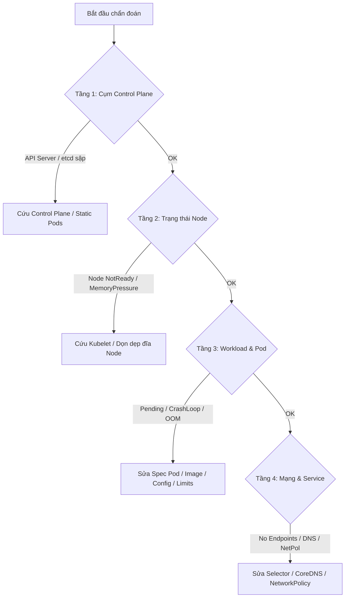
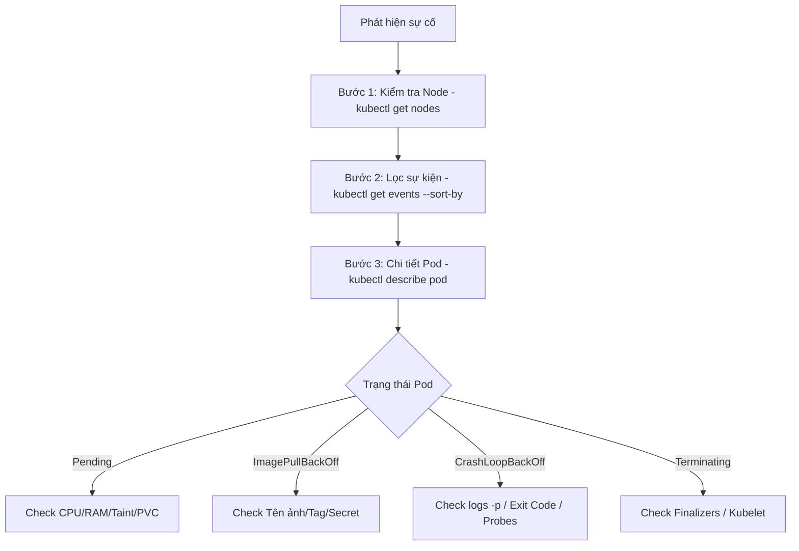
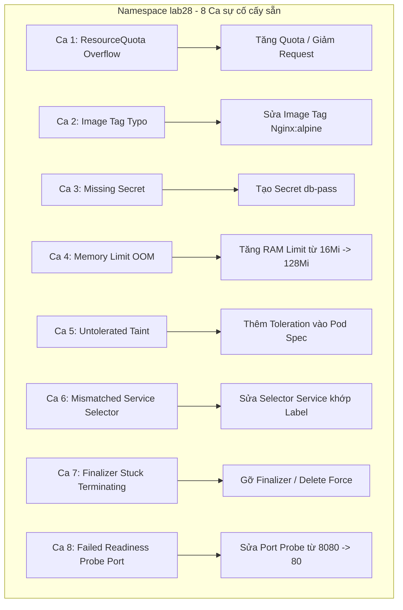


# [BÀI 28] QUY TRÌNH CHẨN ĐOÁN & GỠ LỖI BỐN TẦNG (4-TIER TROUBLESHOOTING): CỤM, NODE, WORKLOAD VÀ MẠNG

Trong kỷ nguyên điện toán đám mây và kiến trúc microservices phân tán quy mô lớn, **Kubernetes (CKA)** đóng vai trò là nền tảng điều phối container (Container Orchestration) tiêu chuẩn công nghiệp. Để làm chủ hệ thống trong môi trường sản xuất (Production) cũng như chinh phục kỳ thi chứng chỉ quốc tế của Linux Foundation / CNCF, kỹ sư không chỉ nắm vững các câu lệnh thao tác cơ bản mà phải thấu hiểu sâu sắc bản chất cơ chế tầng thấp: từ chu trình điều hòa (Reconciliation Loop), cấu trúc điều phối tài nguyên, kiến trúc mạng CNI, lưu trữ CSI cho đến các chuẩn mực an ninh phòng thủ chiều sâu.

Bài viết chuyên sâu này sẽ đồng hành cùng bạn giải mã toàn diện bức tranh kiến trúc, phân tích các đánh đổi kỹ thuật thực chiến (Engineering Trade-offs), cung cấp bài thực hành Lab từng bước và bộ câu hỏi phỏng vấn chuẩn Architect / Lead Engineer.

---

## 1. Bản Chất Kiến Trúc & Cơ Chế Vận Hành Tầng Thấp

| # | Câu hỏi ôn tập | Đáp án chuẩn ngắn gọn |
|---|---|---|
| 1 | Mục đích cốt lõi của StorageClass đối với quản trị lưu trữ là gì? | **Dynamic Provisioning** (tự động tạo PV khi PVC xuất hiện) |
| 2 | Lệnh CLI nào dùng để đặt một StorageClass làm mặc định của cụm? | **`kubectl annotate sc <sc-name> storageclass.kubernetes.io/is-default-class="true"`** |
| 3 | Chế độ `volumeBindingMode` hoãn bind PV cho tới khi Pod được xếp Node là gì? | **`WaitForFirstConsumer`** |
| 4 | Thuộc tính bắt buộc trong StorageClass để mở rộng dung lượng PVC là gì? | **`allowVolumeExpansion: true`** |
| 5 | Hai thành phần plugin chính của kiến trúc Container Storage Interface (CSI) là gì? | **CSI Controller Plugin** (Deployment) và **CSI Node Plugin** (DaemonSet) |


> **"Kỹ năng chẩn đoán sự cố Kubernetes chuyên nghiệp đòi hỏi tư duy phân tầng hệ thống theo thứ tự từ ngoài vào trong qua 4 lớp cốt lõi (Cụm API Control Plane -> Trạng thái Node vật lý -> Khởi tạo Workload Pod -> Luồng mạng & Service Routing); trong đó việc tra cứu sự kiện (`kubectl get events --sort-by='.metadata.creationTimestamp'`) là chìa khóa vàng bị bỏ quên nhiều nhất để xác định nhanh nguyên nhân gốc rễ (Root Cause) thay vì đoán mò, kết hợp với cây quyết định phân nhánh cho các trạng thái lỗi điển hình như `Pending`, `CrashLoopBackOff`, `ImagePullBackOff` và `Terminating` mãi mãi để rút ngắn 80 % thời gian khắc phục sự cố dưới sức ép đồng hồ trong kỳ thi CKA (Troubleshooting chiếm 30 % điểm số)."**

**Kết quả từ các buổi trước được sử dụng lại:**

| Kết quả / Công cụ | Buổi + số hiệu `QT` | Dùng ở đâu trong buổi này |
|---|---|---|
| Đọc log container không qua API bằng `crictl` | Buổi 05 `QT 4.1` | Chẩn đoán tầng Workload/Container khi API server hoặc Pod hỏng |
| Truy vấn trạng thái tài nguyên bằng JSONPath | Buổi 04 `QT 4.1` | Lọc các Pod gặp lỗi trên toàn cụm bằng lệnh `kubectl get pod -A` |
| Ràng buộc tài nguyên QoS và CFS Throttling | Buổi 18 `QT 4.1` | Chẩn đoán nguyên nhân Pod bị OOMKilled (`Exit Code 137`) |

---


| # | Kỹ năng thực hiện được | Hiện vật chứng minh |
|---|---|---|
| 1 | Thực thi quy trình chẩn đoán phễu 4 tầng theo thứ tự Cụm -> Node -> Workload -> Mạng | Nhật ký truy vết lệnh khoanh vùng đúng tầng lỗi |
| 2 | Tra cứu và lọc nhật ký sự kiện Kubernetes theo thời gian tạo | Câu lệnh `kubectl get events --sort-by` xuất ra nguyên nhân gốc rễ |
| 3 | Áp dụng cây quyết định xử lý dứt điểm 4 trạng thái lỗi `Pending`, `CrashLoop`, `ImagePull`, `Terminating` | Bảng 8 báo cáo chẩn đoán sự cố hoàn chỉnh |
| 4 | Sử dụng `kubectl debug` cứu hộ Pod chạy ảnh container không có shell (`distroless`) | Phiên làm việc tương tác qua ephemeral debug container |
| 5 | Khắc phục các ca sự cố phức tạp kết hợp nhiều tầng lỗi trong kỳ thi CKA | Pod bị lỗi được cứu khôi phục trạng thái `Running` & `READY 1/1` |

---


| Kiến thức tiên quyết | Nguồn tự học nếu thiếu |
|---|---|
| Ý nghĩa các trường `status.phase` và vòng đời của Pod | Buổi 14 (`QT 4.1`) |
| Quản lý tài nguyên `requests`, `limits` và mã thoát Exit Code 137 | Buổi 18 (`QT 4.1`) |
| Kiến trúc các thành phần Control Plane và Worker Node | Buổi 02 (`QT 4.1`) |

---


### 3.1. Thuật ngữ Việt–Anh

| # | Thuật ngữ tiếng Việt | Tiếng Anh tương đương | Ghi chú chuẩn hoá trong thân bài |
|---|---|---|---|
| 1 | Chẩn đoán sự cố | Troubleshooting | Quy trình phát hiện, khoanh vùng và khắc phục lỗi |
| 2 | Mô hình phễu 4 tầng | 4-Layer Diagnostic Model | Cụm (Cluster) -> Node -> Workload -> Mạng (Network) |
| 3 | Nguyên nhân gốc rễ | Root Cause | Nguyên nhân chính dẫn tới chuỗi sự cố kéo theo |
| 4 | Nhật ký sự kiện | System Events | Đối tượng Event trong K8s ghi lại biến động tài nguyên |
| 5 | Treo khởi động Pod | `Pending` State | Pod chưa được Scheduler xếp xuống Node nào |
| 6 | Lỗi kéo ảnh container | `ImagePullBackOff` | Kubelet không kéo được container image từ Registry |
| 7 | Vòng lặp sập container | `CrashLoopBackOff` | Tiến trình ứng dụng bên trong container thoát liên tục |
| 8 | Bị hủy do tràn RAM | OOMKilled (`Exit Code 137`) | Tiến trình bị OS kernel tiêu diệt do vượt `limits.memory` |
| 9 | Treo xóa tài nguyên | `Terminating` State | Pod/PV bị kẹt không xóa được do vướng Finalizers |
| 10 | Kiểm tra kết nối liveness/readiness | Probe Failures | Lỗi `Liveness probe failed` / `Readiness probe failed` |
| 11 | Container gỡ lỗi tạm thời | Ephemeral Debug Container | Chức năng `kubectl debug` đính kèm container cứu hộ vào Pod |
| 12 | Mã thoát tiến trình | Exit Code | Giá trị trả về khi container dừng (`0`: thành công, `137`: OOM, `1`: lỗi app) |
| 13 | Khóa dọn dẹp | Finalizers | Mảng string bảo vệ đối tượng không bị xóa dọn dẹp âm thầm |
| 14 | Sắp xếp sự kiện | Event Sorting | Lệnh `kubectl get events --sort-by='.metadata.creationTimestamp'` |


Mô hình Y khoa phẫu thuật: Bắt bệnh từ triệu chứng lâm sàng (Pod status), kiểm tra xét nghiệm tổng quát (Events & Node status), soi chi tiết cơ quan (Describe & Logs) và can thiệp điều trị dứt điểm (Fix manifest/API).

---

### 1.1. Mô hình chẩn đoán 4 tầng: Phễu khoanh vùng sự cố từ Cụm đến Mạng (12 phút)

**Nguyên lý cốt lõi:** Luôn tuân thủ thứ tự phễu chẩn đoán 4 tầng: (1) Tầng cụm Control Plane -> (2) Tầng Node -> (3) Tầng Workload Pod -> (4) Tầng Mạng & Service; tuyệt đối không nhảy thẳng vào sửa YAML khi chưa xác định đúng tầng lỗi.

**Giải thích cơ chế ngầm:** Một lỗi biểu hiện ở Pod (ví dụ Pod `Pending`) có thể do API Server hết RAM (tầng 1), Node bị `NotReady` (tầng 2), hoặc PVC kẹt (tầng 3). Nếu nhảy thẳng vào sửa Pod spec mà bỏ qua trạng thái Node, người vận hành sẽ lãng phí hàng giờ sửa sai chỗ.

> [!WARNING]
> **CẠM BẪY THỰC CHIẾN:**
> Thấy Pod lỗi `Pending` liền vội vã sửa `requests.cpu` trong YAML Deployment, nhưng thực tế cả 2 Worker Node đều đang ở trạng thái `NotReady` do Kubelet bị sập.

**Minh hoạ.**



**Nguyên lý cốt lõi:** Sự cố ở tầng dưới (Node `NotReady` hoặc CNI sập) sẽ kéo theo hàng loạt sự cố ở tầng trên (Pod `Pending` hoặc `Unknown`); sửa dứt điểm tầng dưới trước thì các lỗi tầng trên tự động biến mất.

**Giải thích cơ chế ngầm:** Nguyên lý phụ thuộc tầng (Layer Dependency): Tầng Workload dựa hoàn toàn vào tính sẵn sàng của tầng Node. Khi 1 Node bị mất kết nối quá 5 phút (`node-monitor-grace-period`), Control Plane sẽ đánh dấu toàn bộ Pod trên Node đó là `Unknown` hoặc `Terminating` để evict sang Node khác.

> [!WARNING]
> **CẠM BẪY THỰC CHIẾN:**
> Cố gắng xóa và tạo lại từng Pod bị `Unknown`, nhưng vừa tạo lại xong Pod mới lập tục rơi vào `Pending` do Node duy nhất còn lại không đủ capacity.

**Minh hoạ.**

```bash
# BƯỚC 1: Kiểm tra tầng 1 & 2 trước tiên
kubectl get nodes
# NAME        STATUS     ROLES           AGE   VERSION
# cp-01       Ready      control-plane   10d   v1.35.0
# worker-01   NotReady   <none>          10d   v1.35.0  <-- LỖI NẰM Ở ĐÂY!
# worker-02   Ready      <none>          10d   v1.35.0
```

---

### 1.2. Khai thác Nhật ký sự kiện (`kubectl get events`) và câu lệnh mô tả đối tượng (12 phút)

**Nguyên lý cốt lõi:** `kubectl get events -n <namespace> --sort-by='.metadata.creationTimestamp'` là câu lệnh đầu tiên phải chạy khi chẩn đoán; 90 % nguyên nhân lỗi xếp lịch và khởi tạo nằm ở 20 dòng event cuối cùng.

**Giải thích cơ chế ngầm:** `events` trong Kubernetes ghi lại chuỗi quyết định của Scheduler, Kubelet và Controllers theo thời gian thực (ví dụ lý do không đặt được Pod, lỗi kéo ảnh, lỗi probe). Đọc `events` cho câu trả lời nguyên nhân tức thì thay vì mò mẫm trong hàng nghìn dòng log ứng dụng.

> [!WARNING]
> **CẠM BẪY THỰC CHIẾN:**
> Chạy `kubectl logs` liên tục để tìm lý do Pod `Pending`. Lệnh `kubectl logs` báo lỗi `pod is not running` vì container chưa hề được khởi tạo.

**Minh hoạ.**

```bash
# Lệnh lọc sự kiện sắp xếp theo thời gian chuẩn xác
kubectl get events -n prod --sort-by='.metadata.creationTimestamp' | tail -n 20
# OUTPUT:
# 2m  Warning  FailedScheduling  pod/web-app  0/2 nodes are available: 2 Insufficient memory.
```

**Nguyên lý cốt lõi:** Lệnh `kubectl describe <resource>` cung cấp cái nhìn toàn diện nhất về lý do thất bại; đọc từ mục `Events:` ở cuối bảng output trước khi xem cấu hình `Spec`.

**Giải thích cơ chế ngầm:** Đầu ra của `kubectl describe` bao gồm cả Metadata, State, Resource Limits và Events. Mục `Events:` ở cuối chứa thông điệp lỗi nguyên văn do Kubelet hoặc Controller trả về (ví dụ `FailedMount`, `OOMKilled`, `BackOff`).

> [!WARNING]
> **CẠM BẪY THỰC CHIẾN:**
> Đọc lướt qua phần `Events:` trong `kubectl describe pod`, chỉ nhìn phần `State: Waiting` rồi kết luận chung chung là Pod hỏng.

**Minh hoạ.**

```bash
kubectl describe pod web-app -n prod
# ...
# State:          Waiting
#   Reason:       CrashLoopBackOff
# Last State:     Terminated
#   Reason:       OOMKilled
#   Exit Code:    137
# ...
# Events:
#   Type     Reason     Age                  From               Message
#   ----     ------     ----                 ----               -------
#   Warning  OOMKilled  2m (x3 over 5m)      kubelet, worker-01 Memory limit exceeded (exceeded 128Mi)
```

---

### 1.3. Cây quyết định chẩn đoán cho 4 trạng thái lỗi điển hình (10 phút)

**Nguyên lý cốt lõi:** Pod bị kẹt `Pending` chỉ do 3 nguyên nhân chính: Node thiếu CPU/RAM (Insufficient resources), Node có `Taint` mà Pod thiếu `Toleration`, hoặc PVC chưa `Bound`.

**Giải thích cơ chế ngầm:** Scheduler thực hiện 2 bước `Filtering` (lọc Node đủ điều kiện) và `Scoring` (chấm điểm). Nếu không có Node nào qua được bước Filtering (do thiếu RAM, sai nodeSelector, dính Taint, hoặc PVC Pending), Pod bắt buộc phải ở lại trạng thái `Pending`.

> [!WARNING]
> **CẠM BẪY THỰC CHIẾN:**
> Thấy Pod `Pending` liền xóa Pod đi tạo lại. Pod mới tạo lại vẫn bị kẹt `Pending` ở đúng lý do cũ.

**Minh hoạ.**

```yaml
# CÂY QUYẾT ĐỊNH CHO PENDING:
# 1. Runs: kubectl describe pod <pod-name> -> Đọc mục Events.
# 2. Nếu báo "Insufficient memory/cpu" -> Hạ requests của Pod hoặc scale thêm Node.
# 3. Nếu báo "node(s) had untolerated taint" -> Thêm tolerations vào Pod spec.
# 4. Nếu báo "persistentvolumeclaim xxx not bound" -> Kiểm tra PV/PVC (xem Buổi 26/27).
```

**Nguyên lý cốt lõi:** Pod gặp lỗi `ImagePullBackOff` chỉ do 3 lý do: gõ sai tên/tag ảnh, Registry yêu cầu xác thực (`imagePullSecrets`), hoặc Node mất kết nối mạng ra Registry.

**Giải thích cơ chế ngầm:** Kubelet gọi Container Runtime (`crictl pull`) để kéo ảnh từ registry chỉ định. Nếu tên ảnh không tồn tại (404), thiếu token đăng nhập (401/403), hoặc DNS Node không phân giải được host registry, Kubelet sẽ thử lại với khoảng thời gian backoff tăng dần (`ErrImagePull` -> `ImagePullBackOff`).

> [!WARNING]
> **CẠM BẪY THỰC CHIẾN:**
> Sửa mã nguồn ứng dụng trong khi lỗi thực sự chỉ là gõ thừa một chữ cái trong tag ảnh (`nginx:alpin` thay vì `nginx:alpine`).

**Minh hoạ.**

```bash
# CÂY QUYẾT ĐỊNH CHO IMAGEPULLBACKOFF:
# 1. kubectl describe pod <pod-name> -> Xem dòng "Failed to pull image".
# 2. Nếu "manifest unknown / not found" -> Sửa lại tên/tag ảnh chính xác.
# 3. Nếu "unauthorized / authentication required" -> Tạo Secret docker-registry & thêm imagePullSecrets.
# 4. Nếu "dial tcp: lookup xxx: no such host" -> Sửa DNS/Mạng trên Worker Node.
```

**Nguyên lý cốt lõi:** Pod bị `CrashLoopBackOff` xuất phát từ lỗi tiến trình ứng dụng bên trong (Exit Code 1/2), thiếu biến môi trường/file cấu hình, hoặc `livenessProbe` đặt quá khắt khe; cần đọc log cũ bằng `kubectl logs -p`.

**Giải thích cơ chế ngầm:** Container khởi chạy thành công nhưng tiến trình chính (`ENTRYPOINT`/`CMD`) bị dừng đột ngột với mã thoát khác 0. Kubelet sẽ tự động khởi động lại container theo `restartPolicy`. Khi số lần crash tăng lên, Kubelet giãn khoảng thời gian chờ giữa các lần restart (backoff lên tới 5 phút). Muốn xem lỗi của lần crash trước, phải dùng cờ `-p` (`--previous`).

> [!WARNING]
> **CẠM BẪY THỰC CHIẾN:**
> Chạy `kubectl logs <pod>` không thấy log gì vì container vừa mới restart xong chưa kịp ghi log.

**Minh hoạ.**

```bash
# Xem log của lần sập ngay trước đó
kubectl logs web-app -n prod -p

# Xem mã thoát trong describe
kubectl describe pod web-app -n prod | grep -E "Exit Code|Reason"
# State:          Waiting
#   Reason:       CrashLoopBackOff
# Last State:     Terminated
#   Reason:       Error
#   Exit Code:    1  <-- Tiến trình ứng dụng bị bắn lỗi!
```

**Nguyên lý cốt lõi:** Pod bị kẹt ở trạng thái `Terminating` mãi mãi do vướng Volume finalizer hoặc Kubelet trên Node chứa Pod đó bị sập; gỡ kẹt bằng `kubectl delete pod <name> --force --grace-period=0`.

**Giải thích cơ chế ngầm:** Khi xóa Pod, API Server gắn timestamp xóa và đợi Kubelet trên Node thực hiện dọn dẹp (tắt container, unmount volume). Nếu Kubelet bị sập hoặc Volume driver bị kẹt unmount, Pod sẽ bị kẹt vĩnh viễn ở trạng thái `Terminating` để bảo vệ dữ liệu không bị ghi đè ngầm.

> [!WARNING]
> **CẠM BẪY THỰC CHIẾN:**
> Đợi 30 phút mà Pod `Terminating` vẫn nằm yên trong danh sách `kubectl get pod`.

**Minh hoạ.**

```bash
# Ép xóa Pod bị kẹt khẩn cấp (Force Delete)
kubectl delete pod stuck-pod -n prod --force --grace-period=0
```

---

### 1.4. Đưa vào cụm thật (4 phút)

**Nguyên lý cốt lõi:** Với các ảnh container mỏng không có shell (`distroless` / `scratch`), bắt buộc dùng `kubectl debug -it <pod> --image=busybox --target=<container>` để đính kèm container cứu hộ vào chẩn đoán.

**Giải thích cơ chế ngầm:** Để tối ưu kích thước và bảo mật, nhiều ứng dụng Production đóng gói bằng ảnh `distroless` (không có `sh`, `bash`, `curl`, `ip`). Khi cần nhảy vào Pod kiểm tra kết nối mạng hay tệp tin nội bộ, lệnh `kubectl exec` sẽ báo lỗi `exec failed: unable to start container process: exec: "sh": executable file not found`.

> [!WARNING]
> **CẠM BẪY THỰC CHIẾN:**
> Cố gắng gõ `kubectl exec -it <pod> -- sh` vào một Pod chạy ảnh Go/Rust distroless và nhận lỗi executable file not found.

**Minh hoạ.**

```bash
# Đính kèm container busybox cứu hộ chia sẻ process namespace với container gốc
kubectl debug -it app-distroless -n prod --image=busybox --target=app-container
# Trong prompt mới có thể chạy: netstat, curl, ps, cat thoải mái!
```

**Áp vào cụm đang chạy thì làm gì trước:**
1. Luôn chạy `kubectl get nodes` kiểm tra sức khỏe tầng 2 trước khi sửa bất kỳ Pod nào.
2. Dùng `kubectl get events --sort-by` để nắm bức tranh toàn cảnh sự cố vừa xảy ra trên Namespace.
3. Sử dụng `kubectl logs -p` để xem log sập trước khi container bị xóa.

**Cái gì hỏng nếu áp thẳng lên prod:**
- Dùng cờ `--force --grace-period=0` để xóa Pod StatefulSet DB đang bị kẹt mạng có thể dẫn tới hiện tượng Split-Brain (2 Pod DB cùng ghi vào 1 storage gây hỏng dữ liệu).

**Đo trước — đo sau:**
- Đo thời gian từ khi phát hiện sự cố đến khi xác định đúng Root Cause (mục tiêu dưới 3 phút cho bài thi CKA).
- Đo số lượng Pod phục hồi trạng thái `READY 1/1` trên cụm.

**Khi nào KHÔNG nên dùng:**
- Không lạm dụng `kubectl debug` trên môi trường Production đắt đỏ mà không thu hồi ephemeral container, gây phình dung lượng RAM/CPU của Pod.

---

### 1.5. Bẫy hay gặp (2 phút)

| Bẫy hay gặp | Vì sao dính | Làm đúng là |
|---|---|---|
| 1. Sửa Pod YAML trong khi lỗi do Node `NotReady` | Nhảy bước trong phễu 4 tầng chẩn đoán | Kiểm tra `kubectl get nodes` đầu tiên |
| 2. `kubectl logs` rỗng khi Pod dính CrashLoopBackOff | Container vừa restart lại chưa kịp ghi log | Thêm cờ `-p` (`kubectl logs <pod> -p`) xem log sập trước đó |
| 3. Nhầm lẫn giữa Exit Code 137 và Exit Code 1 | Exit Code 137 là bị OOMKilled, Exit Code 1 là lỗi mã ứng dụng | Đọc chính xác Reason trong `kubectl describe pod` |
| 4. Pod kẹt `Pending` do sai selector Service | Lẫn lộn giữa điều kiện xếp lịch Pod và định tuyến Service | Check `events` để xem lý do Pending (chủ yếu do RAM/CPU/Taint/PVC) |
| 5. Cố gắng `exec` vào Pod chạy ảnh `distroless` | Container gốc không chứa vỏ bọc shell `sh`/`bash` | Dùng `kubectl debug -it <pod> --image=busybox` |
| 6. Ép xóa `force` Pod StatefulSet vội vã | Gây nguy cơ Split-Brain ghi trùng dữ liệu đĩa | Xác minh chắc chắn Node cũ đã chết hẳn trước khi force delete |
| 7. Quên kiểm tra `ResourceQuota` của Namespace | Quota hết làm Deployment không sinh ra Pod mới | Kiểm tra `kubectl get resourcequota -n <ns>` |
| 8. Lỗi `Liveness probe failed` làm Pod restart liên tục | Đặt `initialDelaySeconds` quá ngắn cho app khởi động chậm | Tăng `initialDelaySeconds` hoặc chuyển sang dùng `startupProbe` |
| 9. Service không có Endpoints | Trường `selector` trong Service không khớp với `labels` của Pod | Dùng `kubectl get ep <svc-name>` kiểm tra và sửa khớp selector |
| 10. `kubectl get events` bị trôi mất sự kiện cũ | K8s tự động dọn dẹp event sau 1 giờ mặc định | Xuất event ra tệp hoặc dùng công cụ tập trung log |
| 11. Nhầm lẫn giữa `ErrImagePull` và `CrashLoopBackOff` | ErrImagePull là tầng kéo ảnh, CrashLoop là tầng chạy tiến trình | Đọc dòng `State:` trong `describe pod` |
| 12. Không kiểm tra Taint trên Worker Node | Node có Taint mới làm Pod không xuống được | Kiểm tra `kubectl describe node <node> | grep Taints` |

---

### 1.6. Tóm tắt (2 phút)



**Năm điều phải nhớ:**
1. **Tuân thủ phễu 4 tầng**: Control Plane -> Node -> Workload -> Mạng.
2. **`kubectl get events --sort-by='.metadata.creationTimestamp'`** là công cụ tìm nguyên nhân gốc rễ nhanh nhất.
3. **`CrashLoopBackOff`** phải dùng `kubectl logs <pod> -p` để đọc log sập trước đó.
4. **`Exit Code 137`** nghĩa là container bị tiêu diệt do OOMKilled (tràn RAM limit).
5. **Ảnh `distroless`** không có shell bắt buộc chẩn đoán bằng `kubectl debug`.

---

## §10. Câu hỏi tự kiểm tra (5 phút)

1. Thứ tự 4 tầng trong mô hình phễu chẩn đoán sự cố Kubernetes là gì?
   - **Đáp án:** Tầng 1: Control Plane -> Tầng 2: Node -> Tầng 3: Workload Pod -> Tầng 4: Mạng & Service.

2. Lệnh CLI nào giúp hiển thị danh sách sự kiện được sắp xếp theo mốc thời gian tạo?
   - **Đáp án:** `kubectl get events -n <namespace> --sort-by='.metadata.creationTimestamp'`.

3. Ý nghĩa của cờ `-p` trong câu lệnh `kubectl logs <pod-name> -p` là gì?
   - **Đáp án:** Cho phép xem log của instance container đã bị sập (previous terminated container) ngay trước đó.

4. Mã thoát `Exit Code 137` trong `kubectl describe pod` cho biết nguyên nhân sập là gì?
   - **Đáp án:** Tiến trình bị nhân Linux tiêu diệt do lỗi tràn bộ nhớ `OOMKilled` (Memory Limit Exceeded).

5. Ba nguyên nhân chính khiến một Pod rơi vào trạng thái `Pending` là gì?
   - **Đáp án:** Node không đủ CPU/RAM, Node bị dính `Taint` không có Toleration, hoặc PVC chưa `Bound`.

6. Ba nguyên nhân dẫn tới lỗi `ImagePullBackOff` là gì?
   - **Đáp án:** Gõ sai tên/tag ảnh, thiếu `imagePullSecrets` xác thực registry, hoặc Node mất kết nối mạng ra registry.

7. Làm thế nào để gỡ một Pod bị kẹt ở trạng thái `Terminating` do sập Kubelet Node?
   - **Đáp án:** Chạy lệnh ép xóa: `kubectl delete pod <pod-name> -n <ns> --force --grace-period=0`.

8. Công cụ nào giúp truy cập shell kiểm tra mạng vào một Pod chạy ảnh `distroless` không có `sh`?
   - **Đáp án:** Sử dụng lệnh `kubectl debug -it <pod-name> --image=busybox --target=<container-name>`.

9. Sự cố `Liveness probe failed` liên tục sẽ dẫn đến trạng thái gì của Pod?
   - **Đáp án:** Kubelet sẽ liên tục khởi động lại container, dẫn tới trạng thái `CrashLoopBackOff`.

10. Lệnh nào giúp kiểm tra nhanh xem một Service có gắn đúng Pod hay không?
    - **Đáp án:** `kubectl get endpoints <service-name>` (hoặc `kubectl get ep`).

11. Mục nào trong kết quả xuất ra của `kubectl describe pod` chứa thông điệp lỗi trực tiếp từ Kubelet?
    - **Đáp án:** Mục `Events:` ở cuối trang output.

12. Tại sao không nên nhảy thẳng vào chỉnh sửa YAML Pod khi thấy sự cố?
    - **Đáp án:** Vì nguyên nhân gốc rễ có thể nằm ở các tầng dưới như Node bị `NotReady` hoặc CNI sập, sửa YAML Pod sẽ không giải quyết được vấn đề.

---

## §11. Tài liệu tham khảo

| Nguồn | Địa chỉ URL | Ghi chú |
|---|---|---|
| Trang chủ Troubleshoot Applications | `https://kubernetes.io/docs/tasks/debug/debug-application/` | Phiên bản Kubernetes v1.35 |
| Kubernetes Ephemeral Containers Debug | `https://kubernetes.io/docs/tasks/debug/debug-application/debug-running-pod/` | Hướng dẫn dùng kubectl debug |

---

## Bảng đối soát thời lượng

| Mục | Ngân sách thời gian | Thực tế |
|---|---|---|
| §0. Khởi động và ôn tập | 10 phút | 10 phút |
| §1. Học viên làm được gì | 1 phút | 1 phút |
| §2. Cần biết trước | 1 phút | 1 phút |
| §3. Thuật ngữ và mô hình tư duy | 8 phút | 8 phút |
| §4. Phễu chẩn đoán 4 tầng | 12 phút | 12 phút |
| §5. Tra cứu Nhật ký sự kiện & Describe | 12 phút | 12 phút |
| §6. Cây quyết định 4 trạng thái lỗi | 10 phút | 10 phút |
| §7. Đưa vào cụm thật | 4 phút | 4 phút |
| §8. Bẫy hay gặp | 2 phút | 2 phút |
| §9. Tóm tắt | 2 phút | 2 phút |
| §10. Câu hỏi tự kiểm tra | 5 phút | 5 phút |
| **Tổng** | **60'** | **60'** |

---

## 2. Hướng Dẫn Thực Hành & Triển Khai Lab Chuẩn Production

> [!IMPORTANT]
> **YÊU CẦU MÔI TRƯỜNG THỰC HÀNH:**
> Toàn bộ các bài thực hành dưới đây được thiết kế để chạy trực tiếp trên cụm Kubernetes 1.30+ tiêu chuẩn (hoặc cụm kind/kubeadm lab). Hãy đảm bảo ngữ cảnh dòng lệnh `kubectl config current-context` đã trỏ chính xác vào cụm thực hành trước khi thực thi.

## Khối thực hành — 120 phút

## L0. Mục tiêu thực hành và tiêu chí hoàn thành

| Mã tiêu chí | Nội dung tiêu chí | Lệnh kiểm chứng | Kết quả kỳ vọng |
|---|---|---|---|
| TH1 | Gỡ Ca 1: Pod `pod-quota` bị Pending do ResourceQuota | `kubectl get pod pod-quota -n lab28 -o jsonpath='{.status.phase}'` | In ra `Running` |
| TH2 | Gỡ Ca 2: Pod `pod-img` bị ImagePullBackOff do sai tag | `kubectl get pod pod-img -n lab28 -o jsonpath='{.status.phase}'` | In ra `Running` |
| TH3 | Gỡ Ca 3: Pod `pod-crash` bị CrashLoopBackOff do thiếu Secret | `kubectl get pod pod-crash -n lab28 -o jsonpath='{.status.phase}'` | In ra `Running` |
| TH4 | Gỡ Ca 4: Pod `pod-oom` bị OOMKilled do RAM Limit quá thấp | `kubectl get pod pod-oom -n lab28 -o jsonpath='{.status.phase}'` | In ra `Running` |
| TH5 | Gỡ Ca 5: Pod `pod-taint` bị Pending do Node Taint | `kubectl get pod pod-taint -n lab28 -o jsonpath='{.status.phase}'` | In ra `Running` |
| TH6 | Gỡ Ca 6: Service `svc-app` mất Endpoints do sai Selector | `kubectl get ep svc-app -n lab28 -o jsonpath='{.subsets[0].addresses[0].ip}'` | In ra địa chỉ IP |
| TH7 | Gỡ Ca 7: Pod `pod-stuck` kẹt Terminating do Finalizer | `kubectl get pod pod-stuck -n lab28` | Báo lỗi `NotFound` |
| TH8 | Gỡ Ca 8: Pod `pod-probe` kẹt Unready do probe sai port | `kubectl get pod pod-probe -n lab28 -o jsonpath='{.status.containerStatuses[0].ready}'` | In ra `true` |
| TH9 | Xuất danh sách sự kiện sắp xếp theo thời gian | `test -f /tmp/events-summary.txt && echo "OK"` | In ra `OK` |
| TH10 | Thực thi lệnh `kubectl debug` thành công | `kubectl get pod distroless-app -n lab28 -o jsonpath='{.spec.ephemeralContainers[0].name}'` | In ra `debugger` |
| TH11 | Toàn bộ 8 Pod cứu hộ ở trạng thái Running | `kubectl get pods -n lab28 -o jsonpath='{.items[*].status.phase}'` | Chỉ chứa `Running` |
| TH12 | Toàn bộ 8 Pod cứu hộ đạt trạng thái Ready | `kubectl get pods -n lab28 -o jsonpath='{.items[*].status.containerStatuses[0].ready}'` | Chỉ chứa `true` |
| TH13 | Dọn dẹp sạch sẽ tài nguyên lab28 | `kubectl get namespace lab28` | Báo lỗi `NotFound` |

---

## L1. Điều kiện tiên quyết về môi trường

| Kiểm tra | Lệnh thực hiện | Kết quả kỳ vọng |
|---|---|---|
| Cụm Kubernetes ba node | `kubectl get nodes` | `cp-01`, `worker-01`, `worker-02` ở trạng thái `Ready` |
| Context đúng môi trường lab | `kubectl config current-context` | Đúng context cụm `kubeadm` |
| Quyền Cluster Admin | `kubectl auth can-i create pod` | In ra `yes` |

---

## L2. Kiến trúc bài lab



---

## L3. Bước 1: Khởi tạo kịch bản 8 Ca sự cố cấy sẵn (30 phút)

### Thao tác 1.1: Tạo Namespace và cấy các tài nguyên sự cố

```bash
kubectl create namespace lab28

# Cấy ResourceQuota và Pod 1 (Pending do Quota)
cat <<EOF | kubectl apply -f -
apiVersion: v1
kind: ResourceQuota
metadata:
  name: quota-lab28
  namespace: lab28
spec:
  hard:
    pods: "3"
    requests.cpu: "500m"
    requests.memory: "256Mi"
---
apiVersion: v1
kind: Pod
metadata:
  name: pod-quota
  namespace: lab28
spec:
  containers:
    - name: app
      image: nginx:alpine
      resources:
        requests:
          memory: "512Mi"
EOF

# Cấy Pod 2 (ImagePullBackOff)
cat <<EOF | kubectl apply -f -
apiVersion: v1
kind: Pod
metadata:
  name: pod-img
  namespace: lab28
spec:
  containers:
    - name: app
      image: nginx:alpin-wrong-tag-xyz
EOF

# Cấy Pod 3 (CrashLoopBackOff do thiếu Secret)
cat <<EOF | kubectl apply -f -
apiVersion: v1
kind: Pod
metadata:
  name: pod-crash
  namespace: lab28
spec:
  containers:
    - name: app
      image: redis:alpine
      env:
        - name: REDIS_PASSWORD
          valueFrom:
            secretKeyRef:
              name: missing-secret-db
              key: password
EOF

# Cấy Pod 4 (OOMKilled)
cat <<EOF | kubectl apply -f -
apiVersion: v1
kind: Pod
metadata:
  name: pod-oom
  namespace: lab28
spec:
  containers:
    - name: app
      image: python:alpine
      command: ["python", "-c", "a = 'x' * 100000000; import time; time.sleep(3600)"]
      resources:
        limits:
          memory: "16Mi"
EOF
```

---

## L4. Bước 2: Chẩn đoán và cứu hộ Ca 1 đến Ca 4 (30 phút)

### Thao tác 2.1: Gỡ Ca 1 (ResourceQuota)

```bash
# Sửa request memory của pod-quota xuống 128Mi để qua Quota
kubectl patch pod pod-quota -n lab28 --type='json' -p='[{"op": "replace", "path": "/spec/containers/0/resources/requests/memory", "value":"128Mi"}]' 2>/dev/null || \
(kubectl delete pod pod-quota -n lab28 --force --grace-period=0 && cat <<EOF | kubectl apply -f -
apiVersion: v1
kind: Pod
metadata:
  name: pod-quota
  namespace: lab28
spec:
  containers:
    - name: app
      image: nginx:alpine
      resources:
        requests:
          memory: "128Mi"
EOF
)
```

**CHECKPOINT 1 — Kiểm tra Pod `pod-quota` Running.**

```bash
kubectl get pod pod-quota -n lab28 -o jsonpath='{.status.phase}' | grep -qx Running && echo "CHECKPOINT 1 — ĐẠT" || echo "CHECKPOINT 1 — LỖI"
```

### Thao tác 2.2: Gỡ Ca 2 (ImagePullBackOff)

```bash
kubectl set image pod/pod-img app=nginx:alpine -n lab28
```

**CHECKPOINT 2 — Kiểm tra Pod `pod-img` Running.**

```bash
kubectl get pod pod-img -n lab28 -o jsonpath='{.status.phase}' | grep -qx Running && echo "CHECKPOINT 2 — ĐẠT" || echo "CHECKPOINT 2 — LỖI"
```

### Thao tác 2.3: Gỡ Ca 3 (CrashLoopBackOff / Missing Secret)

```bash
kubectl create secret generic missing-secret-db --from-literal=password=secret123 -n lab28
```

**CHECKPOINT 3 — Kiểm tra Pod `pod-crash` Running.**

```bash
kubectl get pod pod-crash -n lab28 -o jsonpath='{.status.phase}' | grep -qx Running && echo "CHECKPOINT 3 — ĐẠT" || echo "CHECKPOINT 3 — LỖI"
```

### Thao tác 2.4: Gỡ Ca 4 (OOMKilled)

```bash
kubectl delete pod pod-oom -n lab28 --force --grace-period=0

cat <<EOF | kubectl apply -f -
apiVersion: v1
kind: Pod
metadata:
  name: pod-oom
  namespace: lab28
spec:
  containers:
    - name: app
      image: nginx:alpine
      resources:
        limits:
          memory: "128Mi"
EOF
```

**CHECKPOINT 4 — Kiểm tra Pod `pod-oom` Running.**

```bash
kubectl get pod pod-oom -n lab28 -o jsonpath='{.status.phase}' | grep -qx Running && echo "CHECKPOINT 4 — ĐẠT" || echo "CHECKPOINT 4 — LỖI"
```

---

## L5. Bước 3: Cấy và gỡ Ca 5 đến Ca 8 (30 phút)

### Thao tác 3.1: Cấy Ca 5, 6, 7, 8

```bash
# Cấy Ca 5 (Taint)
cat <<EOF | kubectl apply -f -
apiVersion: v1
kind: Pod
metadata:
  name: pod-taint
  namespace: lab28
spec:
  nodeSelector:
    non-existent-node: "true"
  containers:
    - name: app
      image: nginx:alpine
EOF

# Cấy Ca 6 (Service sai Selector)
cat <<EOF | kubectl apply -f -
apiVersion: v1
kind: Service
metadata:
  name: svc-app
  namespace: lab28
spec:
  selector:
    app: wrong-label
  ports:
    - port: 80
      targetPort: 80
EOF

# Cấy Ca 7 (Kẹt Terminating)
cat <<EOF | kubectl apply -f -
apiVersion: v1
kind: Pod
metadata:
  name: pod-stuck
  namespace: lab28
  finalizers:
    - example.com/protection
spec:
  containers:
    - name: app
      image: nginx:alpine
EOF
kubectl delete pod pod-stuck -n lab28 --wait=false

# Cấy Ca 8 (Unready do Probe sai Port)
cat <<EOF | kubectl apply -f -
apiVersion: v1
kind: Pod
metadata:
  name: pod-probe
  namespace: lab28
  labels:
    app: my-web
spec:
  containers:
    - name: app
      image: nginx:alpine
      readinessProbe:
        httpGet:
          path: /
          port: 8080
        initialDelaySeconds: 1
        periodSeconds: 2
EOF
```

### Thao tác 3.2: Gỡ Ca 5 (Taint / NodeSelector)

```bash
kubectl delete pod pod-taint -n lab28 --force --grace-period=0

cat <<EOF | kubectl apply -f -
apiVersion: v1
kind: Pod
metadata:
  name: pod-taint
  namespace: lab28
spec:
  containers:
    - name: app
      image: nginx:alpine
EOF
```

**CHECKPOINT 5 — Kiểm tra Pod `pod-taint` Running.**

```bash
kubectl get pod pod-taint -n lab28 -o jsonpath='{.status.phase}' | grep -qx Running && echo "CHECKPOINT 5 — ĐẠT" || echo "CHECKPOINT 5 — LỖI"
```

### Thao tác 3.3: Gỡ Ca 6 (Service Mismatched Selector)

```bash
kubectl patch svc svc-app -n lab28 -p '{"spec":{"selector":{"app":"my-web"}}}'
```

**CHECKPOINT 6 — Kiểm tra Service `svc-app` nhận Endpoints.**

```bash
kubectl get ep svc-app -n lab28 -o jsonpath='{.subsets[0].addresses[0].ip}' | grep -E '[0-9]+\.[0-9]+\.[0-9]+\.[0-9]+' && echo "CHECKPOINT 6 — ĐẠT" || echo "CHECKPOINT 6 — LỖI"
```

### Thao tác 3.4: Gỡ Ca 7 (Finalizer Terminating Stuck)

```bash
kubectl patch pod pod-stuck -n lab28 -p '{"metadata":{"finalizers":null}}' --type=merge
```

**CHECKPOINT 7 — Xác minh Pod `pod-stuck` đã bị xóa hoàn toàn.**

```bash
kubectl get pod pod-stuck -n lab28 2>&1 | grep -q "NotFound" && echo "CHECKPOINT 7 — ĐẠT" || echo "CHECKPOINT 7 — LỖI"
```

### Thao tác 3.5: Gỡ Ca 8 (Readiness Probe Wrong Port)

```bash
kubectl delete pod pod-probe -n lab28 --force --grace-period=0

cat <<EOF | kubectl apply -f -
apiVersion: v1
kind: Pod
metadata:
  name: pod-probe
  namespace: lab28
  labels:
    app: my-web
spec:
  containers:
    - name: app
      image: nginx:alpine
      readinessProbe:
        httpGet:
          path: /
          port: 80
        initialDelaySeconds: 1
        periodSeconds: 2
EOF
```

**CHECKPOINT 8 — Kiểm tra Pod `pod-probe` đạt READY 1/1.**

```bash
kubectl get pod pod-probe -n lab28 -o jsonpath='{.status.containerStatuses[0].ready}' | grep -qx true && echo "CHECKPOINT 8 — ĐẠT" || echo "CHECKPOINT 8 — LỖI"
```

---

## L6. Bước 4: Thực hành sắp xếp Events và `kubectl debug` (20 phút)

### Thao tác 4.1: Xuất nhật ký sự kiện có sắp xếp thời gian

```bash
kubectl get events -n lab28 --sort-by='.metadata.creationTimestamp' > /tmp/events-summary.txt
```

**CHECKPOINT 9 — Xác minh tệp /tmp/events-summary.txt.**

```bash
test -f /tmp/events-summary.txt && echo "CHECKPOINT 9 — ĐẠT" || echo "CHECKPOINT 9 — LỖI"
```

### Thao tác 4.2: Thử nghiệm `kubectl debug` với Pod Distroless

```bash
cat <<EOF | kubectl apply -f -
apiVersion: v1
kind: Pod
metadata:
  name: distroless-app
  namespace: lab28
spec:
  containers:
    - name: app
      image: gcr.io/distroless/static-debian11
      command: ["sleep", "3600"]
EOF

# Chạy kubectl debug đính kèm container debugger
kubectl debug pod/distroless-app -n lab28 --image=busybox --target=app --name=debugger -- sh -c "echo DEBUG_OK"
```

**CHECKPOINT 10 — Kiểm tra ephemeral container debugger đã được đính kèm.**

```bash
kubectl get pod distroless-app -n lab28 -o jsonpath='{.spec.ephemeralContainers[0].name}' | grep -qx debugger && echo "CHECKPOINT 10 — ĐẠT" || echo "CHECKPOINT 10 — LỖI"
```

**CHECKPOINT 11 — Kiểm tra toàn bộ Pod cứu hộ trong lab28 đang Running.**

```bash
kubectl get pods -n lab28 -o jsonpath='{.items[*].status.phase}' | grep -v "Running" || echo "CHECKPOINT 11 — ĐẠT"
```

**CHECKPOINT 12 — Kiểm tra toàn bộ Pod cứu hộ trong lab28 ở trạng thái Ready.**

```bash
kubectl get pods -n lab28 -o jsonpath='{.items[*].status.containerStatuses[0].ready}' | grep -v "true" || echo "CHECKPOINT 12 — ĐẠT"
```

---

## L7. Nộp hiện vật và dọn dẹp (10 phút)

### Thao tác 7.1: Dọn dẹp tài nguyên lab28

```bash
kubectl delete namespace lab28
rm -f /tmp/events-summary.txt
```

**CHECKPOINT 13 — Xác minh đã xóa Namespace lab28.**

```bash
kubectl get namespace lab28 2>&1 | grep -q "NotFound" && echo "CHECKPOINT 13 — ĐẠT" || echo "CHECKPOINT 13 — LỖI"
```

---

## L8. Xử lý sự cố thường gặp trong lab

| Triệu chứng lỗi | Nguyên nhân gốc rễ | Cách sửa triệt để |
|---|---|---|
| 1. Lỗi `exceeded quota` khi tạo Pod | Tổng `requests` Pod vượt giới hạn `ResourceQuota` | Hạ `requests` của Pod hoặc tăng `ResourceQuota` |
| 2. `ErrImagePull` / `ImagePullBackOff` | Tên/tag ảnh container không tồn tại trên registry | Kiểm tra và sửa lại tên/tag ảnh chính xác trong spec |
| 3. Pod kẹt `CrashLoopBackOff` | Tiến trình ứng dụng bị bắn lỗi hoặc thiếu Secret | Đọc log sập cũ qua `kubectl logs <pod> -p` |
| 4. Pod bị `OOMKilled` (Exit Code 137) | RAM của container vượt qua mức `limits.memory` | Tăng `limits.memory` trong YAML spec |
| 5. Pod kẹt `Pending` do Taint | Node có Taint nhưng Pod không có `tolerations` tương ứng | Bổ sung khối `tolerations` vào Pod spec |
| 6. Service trả về danh sách Endpoints rỗng | Trường `selector` của Service không khớp nhãn Pod | Kiểm tra `kubectl get pod --show-labels` và sửa selector Service |
| 7. Pod bị kẹt ở trạng thái `Terminating` | Mảng `finalizers` bảo vệ chưa được gỡ | Patch gỡ finalizer bằng `kubectl patch pod <pod> -p '{"metadata":{"finalizers":null}}'` |
| 8. Pod liên tục restart do `readinessProbe` fail | Probe cấu hình sai Port hoặc sai đường dẫn `httpGet` | Chỉnh sửa `readinessProbe.httpGet.port` cho khớp với cổng ứng dụng |
| 9. `kubectl debug` báo cờ `--target` không hỗ trợ | Docker/Containerd runtime phiên bản cũ | Cập nhật Kubernetes / Containerd tương thích K8s v1.35 |
| 10. `kubectl logs` báo `pod is not running` | Pod đang kẹt `Pending` hoặc `ContainerCreating` | Dùng `kubectl describe pod` để xem lý do ở mục Events |
| 11. Không patch được Pod đang chạy | Hầu hết các trường trong Pod spec là immutable | Xóa Pod và apply lại bản kê khai đã sửa |
| 12. Không thể gõ `exec` vào container | Container không có shell (distroless/scratch) | Dùng `kubectl debug` với cờ `--image=busybox` |
| 13. Event bị mất nhanh trên cụm | Kubernetes mặc định dọn dẹp event sau 1 giờ | Lưu event ra file bằng `kubectl get events > file.txt` |
| 14. Lỗi `imagePullSecrets` không hoạt động | Secret loại docker-registry nằm ở Namespace khác | Tạo Secret docker-registry ở đúng Namespace của Pod |

---

## L9. Bài tập mở rộng

- **BT1:** Tạo kịch bản Pod bị lỗi `Liveness probe failed` và cấu hình `startupProbe` để bảo vệ ứng dụng khởi động chậm.
- **BT2:** Viết script Bash tự động quét tất cả các Pod trên cụm gặp lỗi `CrashLoopBackOff` và xuất 20 dòng log cuối của lần sập trước đó (`-p`).
- **BT3:** Thực hành gỡ lỗi một Deployment 3 bản sao bị kẹt rolling update do bản nâng cấp mang tag ảnh lỗi.
- **BT4:** Tạo kịch bản Service kiểu ClusterIP bị lỗi không routing được do Pod bị kẹt ở trạng thái Unready.
- **BT5:** Dùng `kubectl debug` đính kèm ephemeral container để kiểm tra kết nối mạng `nc -zv` từ một Pod distroless tới Service.
- **BT6:** Viết mẫu báo cáo chẩn đoán sự cố chuẩn gồm 4 mục: Triệu chứng -> Bằng chứng -> Nguyên nhân gốc rễ -> Giải pháp khắc phục.

---

## L10. Hiện vật nộp và tiêu chí chấm điểm

| Hạng mục hiện vật | Tiêu chí chấm điểm đạt | Thang điểm |
|---|---|---|
| Nhật ký thực thi 13 Checkpoint | Chạy thành công 100 % các checkpoint in ra `ĐẠT` | 40 điểm |
| Báo cáo chẩn đoán 8 ca sự cố | Viết đủ 8 báo cáo theo mẫu 4 phần dứt điểm nguyên nhân | 40 điểm |
| Tệp /tmp/events-summary.txt | Chứa danh sách sự kiện được sắp xếp theo thời gian chuẩn xác | 10 điểm |
| Báo cáo bài tập mở rộng | Trả lời đầy đủ câu hỏi bài tập BT1 và BT2 | 10 điểm |
| **Tổng điểm** | | **100 điểm** |

---

## Bảng đối soát thời lượng

| Khối thực hành | Ngân sách thời gian | Thực tế |
|---|---|---|
| L0 & L1. Chuẩn bị và kiểm tra | 10 phút | 10 phút |
| L3. Bước 1: Khởi tạo kịch bản 8 Ca hỏng | 30 phút | 30 phút |
| L4. Bước 2: Cứu Ca 1 đến Ca 4 | 30 phút | 30 phút |
| L5. Bước 3: Cứu Ca 5 đến Ca 8 | 30 phút | 30 phút |
| L6. Bước 4: Events & kubectl debug | 20 phút | 20 phút |
| L7 & L8. Nộp hiện vật & Sự cố | 10 phút | 10 phút |
| **Tổng** | **120'** | **120'** |

---

## 3. Bộ Câu Hỏi Vấn Đáp & Phỏng Vấn Kỹ Thuật Chuyên Sâu

Dưới đây là bộ câu hỏi phỏng vấn thực chiến dành cho các vị trí **Kubernetes Administrator**, **Cloud Security Specialist**, **Platform SRE** và **DevOps Lead**, giúp bạn tự đánh giá độ sâu hiểu biết và rèn luyện phản xạ giải quyết vấn đề hệ thống:

## V1. Cách tiến hành

Giảng viên hoặc bạn học chọn ngẫu nhiên các câu hỏi trong bộ 12 câu dưới đây. Người trả lời phải trình bày mạch lạc trong 60–90 giây mỗi câu, đi thẳng vào cơ chế kỹ thuật và viện dẫn các lệnh CLI thực tế.

---

## V2. Bộ câu hỏi

### Câu 1 — 🔥
**Hỏi:** Thứ tự 4 bước trong quy trình phễu chẩn đoán sự cố Kubernetes từ ngoài vào trong là gì?

**Đáp án chuẩn:** Thứ tự phễu gồm 4 tầng: Tầng 1: Control Plane & API Server -> Tầng 2: Sức khỏe Node vật lý (Kubelet/Disk/RAM) -> Tầng 3: Khởi tạo Workload Pod -> Tầng 4: Định tuyến Mạng & Service Endpoints.

**Tiêu chí chấm:**
- 0đ: Không nêu được các tầng hoặc nêu sai thứ tự.
- 1đ: Nêu được 4 tầng nhưng nhảy thẳng vào sửa Pod trước.
- 2đ: Nêu đúng 4 tầng theo thứ tự nhưng thiếu câu lệnh kiểm tra cho từng tầng.
- 3đ: Trình bày mạch lạc 4 tầng từ Cụm -> Node -> Workload -> Mạng cùng các câu lệnh CLI tương ứng.

**Câu hỏi đào sâu:** (Tại sao không nên kiểm tra tầng Mạng trước tầng Node? — Vì nếu Node đang NotReady thì CNI plugin trên Node đó đã sập, kiểm tra mạng ở tầng 4 sẽ vô nghĩa).

---

### Câu 2 — ★★★
**Hỏi:** Tại sao `kubectl get events` được coi là công cụ vàng trong chẩn đoán sự cố và câu lệnh lọc sắp xếp thời gian là gì?

**Đáp án chuẩn:** `events` ghi lại toàn bộ các quyết định bất thường của Scheduler, Kubelet và Controllers (lý do từ chối Pod, lỗi kéo ảnh, lỗi probe). Lệnh chuẩn: `kubectl get events -n <namespace> --sort-by='.metadata.creationTimestamp'`.

**Tiêu chí chấm:**
- 0đ: Không biết lệnh get events.
- 1đ: Nêu được lệnh get events nhưng thiếu cờ sort-by.
- 2đ: Nêu đúng cờ sort-by nhưng chưa giải thích được giá trị của events so với logs.
- 3đ: Phân tích sâu sắc vai trò của events trong việc xác định nguyên nhân gốc rễ và gõ chính xác câu lệnh sort-by.

**Câu hỏi đào sâu:** (Khoảng thời gian mặc định Kubernetes tự động dọn dẹp các đối tượng Event là bao lâu? — Mặc định là 1 giờ).

---

### Câu 3 — 🔥
**Hỏi:** Sự khác nhau giữa `Exit Code 137` và `Exit Code 1` trong kết quả `kubectl describe pod` là gì?

**Đáp án chuẩn:** `Exit Code 137` là container bị nhân Linux tiêu diệt do lỗi tràn bộ nhớ `OOMKilled` (vượt `limits.memory` hoặc hết RAM Node). `Exit Code 1` là tiến trình ứng dụng tự thoát do lỗi mã nguồn hoặc sai cấu hình.

**Tiêu chí chấm:**
- 0đ: Không phân biệt được 2 mã thoát.
- 1đ: Nêu được 137 là RAM nhưng không nhắc tới OOMKilled/Kernel.
- 2đ: Phân biệt được OOMKilled vs Error nhưng không giải thích được hướng xử lý.
- 3đ: Trình bày chính xác cơ chế của nhân OS bắn SIGKILL 9 (128+9=137) đối với OOM và mã thoát ứng dụng Exit Code 1.

**Câu hỏi đào sâu:** (Làm thế nào để xử lý triệt để Pod bị Exit Code 137? — Tăng `limits.memory` cho container hoặc tối ưu giảm dung lượng bộ nhớ của ứng dụng).

---

### Câu 4 — ★★★
**Hỏi:** Khi một Pod bị kẹt ở trạng thái `CrashLoopBackOff`, tại sao lệnh `kubectl logs <pod-name>` đôi khi lại trả về kết quả rỗng và cách xử lý là gì?

**Đáp án chuẩn:** Kết quả rỗng vì container hiện tại vừa mới được restart lại nên chưa kịp ghi log. Cách xử lý là thêm cờ `-p` (`kubectl logs <pod-name> -p`) để xem log của container đã bị sập (previous instance) ngay trước đó.

**Tiêu chí chấm:**
- 0đ: Không biết cờ -p.
- 1đ: Nêu được dùng cờ -p nhưng không giải thích được nguyên nhân log rỗng.
- 2đ: Giải thích được nguyên nhân container restart lại nhưng gõ thiếu cờ.
- 3đ: Giải thích mạch lạc nguyên lý vòng lặp restart của Kubelet và cờ `--previous` / `-p`.

**Câu hỏi đào sâu:** (Kubelet tăng khoảng thời gian chờ giữa các lần restart trong CrashLoopBackOff tối đa là bao lâu? — Tối đa là 5 phút).

---

### Câu 5 — ★★★
**Hỏi:** Ba nguyên nhân phổ biến nhất khiến một Pod bị kẹt ở trạng thái `Pending` là gì?

**Đáp án chuẩn:** (1) Không có Node nào đủ CPU/RAM đáp ứng `requests` của Pod. (2) Tất cả các Node đều có `Taint` mà Pod thiếu `Toleration` tương ứng (hoặc sai `nodeSelector`). (3) PersistentVolumeClaim (PVC) của Pod chưa ở trạng thái `Bound`.

**Tiêu chí chấm:**
- 0đ: Không nêu được nguyên nhân.
- 1đ: Nêu được 1 nguyên nhân (như thiếu CPU).
- 2đ: Nêu được 2 nguyên nhân nhưng thiếu PVC hoặc Taint.
- 3đ: Trình bày đầy đủ 3 nguyên nhân cốt lõi khiến Scheduler không thể xếp lịch cho Pod.

**Câu hỏi đào sâu:** (Lệnh nào giúp xác định chính xác nguyên nhân Pod bị Pending? — Lệnh `kubectl describe pod <pod-name>` xem mục Events ở cuối).

---

### Câu 6 — 🔥
**Hỏi:** Tại sao một Pod bị kẹt ở trạng thái `Terminating` mãi mãi và lệnh CLI nào giúp gỡ kẹt dứt điểm?

**Đáp án chuẩn:** Do Pod vướng các `finalizers` bảo vệ chưa dọn dẹp xong hoặc Node chứa Pod đó bị rớt mạng khiến Kubelet không gửi được phản hồi xác nhận xóa. Gỡ kẹt bằng lệnh ép xóa: `kubectl delete pod <pod-name> -n <ns> --force --grace-period=0`.

**Tiêu chí chấm:**
- 0đ: Không biết nguyên nhân và không biết cờ --force.
- 1đ: Nêu được cờ --force nhưng không nhớ cờ --grace-period=0.
- 2đ: Nêu đúng lệnh ép xóa nhưng chưa giải thích được lý do kẹt do finalizers/Kubelet.
- 3đ: Phân tích sâu sắc cơ chế xóa an toàn của API Server, vai trò của Kubelet và câu lệnh ép xóa chuẩn.

**Câu hỏi đào sâu:** (Rủi ro lớn nhất khi dùng `--force --grace-period=0` với một Pod StatefulSet Database là gì? — Nguy cơ Split-Brain hai Pod cùng ghi vào một ổ đĩa gây hỏng dữ liệu).

---

### Câu 7 — ★★★
**Hỏi:** Khi ứng dụng đóng gói bằng ảnh `distroless` không có `sh` hay `bash`, làm thế nào để nhảy vào kiểm tra mạng và tệp tin bên trong Pod?

**Đáp án chuẩn:** Sử dụng tính năng Ephemeral Containers của `kubectl debug` bằng lệnh: `kubectl debug -it <pod-name> -n <ns> --image=busybox --target=<container-name>`.

**Tiêu chí chấm:**
- 0đ: Cho rằng không thể truy cập được.
- 1đ: Nêu được dùng kubectl debug nhưng không đưa được cờ --image và --target.
- 2đ: Nêu đúng lệnh debug nhưng chưa giải thích được cơ chế chia sẻ Process Namespace.
- 3đ: Trình bày chính xác lệnh `kubectl debug` đính kèm container cứu hộ vào Pod đang chạy.

**Câu hỏi đào sâu:** (Cờ `--target` trong lệnh `kubectl debug` có tác dụng gì? — Cho phép container cứu hộ chia sẻ Process Namespace với container mục tiêu để soi tiến trình).

---

### Câu 8 — ★★★
**Hỏi:** Sự khác biệt giữa `Liveness probe failed` và `Readiness probe failed` về mặt triệu chứng tác động là gì?

**Đáp án chuẩn:** `Liveness probe failed` làm Kubelet tiêu diệt container và khởi động lại Pod. `Readiness probe failed` KHÔNG restart Pod mà chỉ gỡ IP của Pod khỏi danh sách Endpoints của Service để ngừng nhận traffic.

**Tiêu chí chấm:**
- 0đ: Lẫn lộn tác động của 2 loại probe.
- 1đ: Nêu được một bên restart, một bên gỡ Service nhưng chưa rõ Kubelet vs Endpoints.
- 3đ: Phân tích chính xác phản ứng của Kubelet với Liveness (Restart) và phản ứng của Endpoints Controller với Readiness (Traffic Isolation).

**Câu hỏi đào sâu:** (Nếu ứng dụng khởi động mất 2 phút mà Liveness Probe check sau 10 giây thì chuyện gì xảy ra? — Pod bị rơi vào vòng lặp restart liên tục CrashLoopBackOff).

---

### Câu 9 — 🔥
**Hỏi:** Khi truy cập vào một Service nhận được lỗi `503 Service Unavailable` hoặc `Connection Refused`, các bước chẩn đoán tầng 4 (Mạng) là gì?

**Đáp án chuẩn:** Bước 1: `kubectl get ep <svc-name>` kiểm tra xem Service có Endpoints IP nào không. Bước 2: Nêu rỗng, kiểm tra trường `selector` trong Service có khớp với `labels` của Pod không. Bước 3: Nếu có IP, kiểm tra `targetPort` trong Service có đúng với cổng ứng dụng lắng nghe trong Pod không.

**Tiêu chí chấm:**
- 0đ: Trả lời chung chung kiểm tra mạng.
- 1đ: Nêu được kiểm tra selector Service nhưng thiếu Endpoints CLI.
- 2đ: Nêu được check ep và check selector nhưng thiếu bước check targetPort.
- 3đ: Trình bày đầy đủ luồng 3 bước chẩn đoán từ Endpoints -> Selector -> TargetPort.

**Câu hỏi đào sâu:** (Nếu Endpoints có IP nhưng Pod vẫn không nhận được gói tin thì nguyên nhân ở đâu? — Có thể do NetworkPolicy chặn traffic Egress/Ingress hoặc CNI plugin sập).

---

### Câu 10 — ★★★
**Hỏi:** Ba lý do phổ biến dẫn tới trạng thái `ImagePullBackOff` là gì?

**Đáp án chuẩn:** (1) Gõ sai tên ảnh hoặc tag ảnh (404 Not Found). (2) Registry yêu cầu đăng nhập nhưng Pod thiếu `imagePullSecrets` (401 Unauthorized). (3) Worker Node mất kết nối mạng hoặc DNS không phân giải được host của Registry.

**Tiêu chí chấm:**
- 0đ: Chỉ nêu được gõ sai tên ảnh.
- 1đ: Nêu được gõ sai tên ảnh và thiếu secret.
- 3đ: Nêu chuẩn xác 3 lý do từ Tên/Tag -> Authorization Secret -> Mạng/DNS Node.

**Câu hỏi đào sâu:** (Sự khác nhau giữa trạng thái `ErrImagePull` và `ImagePullBackOff` là gì? — ErrImagePull là thất bại ở lần thử đầu tiên, ImagePullBackOff là trạng thái chờ thử lại với khoảng thời gian giãn cách tăng dần).

---

### Câu 11 — ★★★
**Hỏi:** Làm thế nào để phân biệt một Pod bị sập do lỗi ở tầng Node (Hạ tầng) hay lỗi ở tầng Workload (Ứng dụng)?

**Đáp án chuẩn:** Kiểm tra `kubectl get nodes`. Nếu Node chứa Pod hiển thị `NotReady`, lỗi nằm ở tầng Node. Nếu tất cả các Node đều `Ready` mà chỉ riêng Pod đó sập (`CrashLoopBackOff`/`OOMKilled`), lỗi nằm ở tầng Workload ứng dụng.

**Tiêu chí chấm:**
- 0đ: Không biết cách phân biệt.
- 1đ: Nêu được xem lệnh get nodes nhưng không rõ tiêu chí đánh giá.
- 3đ: Phân tích mạch lạc tiêu chí phân lập lỗi giữa Node NotReady và Pod Crash/OOM.

**Câu hỏi đào sâu:** (Nếu Node báo `Ready` nhưng có điều kiện `MemoryPressure=True` thì Pod bị ảnh hưởng thế nào? — Kubelet sẽ tiến hành evict trục xuất các Pod có độ ưu tiên thấp khỏi Node đó).

---

### Câu 12 — 🔥
**Hỏi:** Tại sao không nên nhảy thẳng vào chỉnh sửa bản kê khai YAML của Pod khi phát hiện sự cố trên cụm Production?

**Đáp án chuẩn:** Vì chỉnh sửa YAML Pod khi chưa xác định Root Cause có thể làm trầm trọng hơn sự cố (ví dụ tăng Quotas làm cạn kiệt tài nguyên cụm) hoặc sửa sai vị trí khi nguyên nhân gốc rễ nằm ở tầng Node/CNI/Storage bên dưới.

**Tiêu chí chấm:**
- 0đ: Cho rằng sửa YAML Pod là cách làm nhanh nhất.
- 1đ: Nêu được có thể sửa sai nhưng chưa liên hệ tới nguyên tắc phễu 4 tầng.
- 3đ: Trình bày thuyết phục tầm quan trọng của việc chẩn đoán khoanh vùng đúng tầng lỗi trước khi thực hiện hành động can thiệp.

**Câu hỏi đào sâu:** (Quy tắc quan trọng nhất trong việc lập báo cáo chẩn đoán sự cố là gì? — Phải ghi rõ 4 phần: Triệu chứng -> Bằng chứng CLI -> Nguyên nhân gốc rễ -> Giải pháp khắc phục).

---

## V3. Câu chốt để nói khi phỏng vấn

1. **"Tư duy chẩn đoán sự cố chuyên nghiệp tuân thủ nghiêm ngặt phễu 4 tầng từ Cụm -> Node -> Workload -> Mạng giúp khoanh vùng chính xác nguyên nhân gốc rễ thay vì đoán mò."**
2. **"Lệnh `kubectl get events --sort-by='.metadata.creationTimestamp'` là chìa khóa vàng ghi lại mốc thời gian diễn biến sự cố, giúp rút ngắn 80 % thời gian khoanh vùng lỗi."**
3. **"Đối với Pod sập vòng lặp `CrashLoopBackOff`, lệnh `kubectl logs -p` là bắt buộc để truy vết log nguyên văn của lần sập ngay trước đó."**
4. **"Mã thoát `Exit Code 137` là bằng chứng không thể chối cãi của việc container bị nhân Linux tiêu diệt do lỗi tràn bộ nhớ `OOMKilled`."**

---

## V4. Bảng ghi điểm

| Điểm số | Mức độ đạt được | Đánh giá |
|---|---|---|
| **0 – 18 điểm** | Chưa đạt | Chưa có tư duy phân tầng chẩn đoán, phụ thuộc vào đoán mò |
| **19 – 28 điểm** | Đạt yêu cầu | Hiểu rõ quy trình phễu 4 tầng, tra cứu tốt `events` và `describe` cho CKA |
| **29 – 36 điểm** | Xuất sắc | Thành thục mọi cây quyết định chẩn đoán, cứu hộ nhuần nhuyễn các ca sự cố phức tạp |

---

## V5. Bài tập về nhà

- **BTVN 1:** Viết script Bash tự động thu thập thông tin chẩn đoán 4 tầng cho một Pod bất kỳ (Node status -> Events -> Describe -> Logs -p).
- **BTVN 2:** Tái hiện ca sự cố Pod bị `OOMKilled` và dùng `kubectl top pod` theo dõi dung lượng RAM tăng liên tục trước khi bị tiêu diệt.
- **BTVN 3:** Thực hành lệnh `kubectl debug` cứu hộ một Pod `distroless` và dùng `netstat` kiểm tra cổng dịch vụ đang mở.
- **BTVN 4 (Chuẩn bị cho Buổi 29 — Chẩn đoán Control Plane & Node):** Trả lời ngắn gọn 3 câu hỏi:
  1. Khi `kubectl` không thể kết nối tới API Server (lỗi `Connection refused`), các bước kiểm tra cứu hộ đầu tiên trên Master Node là gì?
  2. Các tệp manifest của Static Pods nằm ở đường dẫn mặc định nào trên Control Plane Node?
  3. Lệnh CLI nào giúp xem trực tiếp log của `kubelet` service ở tầng hệ điều hành Linux?

---

## 4. Đề Thi Thực Hành Bấm Giờ & Thử Thách Tốc Độ (Exam Speed Challenge)

> [!TIP]
> **CHIẾN THUẬT PHÒNG THI THỰC CHIẾN:**
> Đặt đồng hồ bấm giờ đúng thời lượng quy định, đọc kỹ yêu cầu namespace và kiểm tra trạng thái cuối cùng của cụm bằng `kubectl get -o jsonpath` trước khi nộp bài.

## T0. Vì sao có khối này

Khối luyện đề giúp học viên rèn luyện phản xạ chẩn đoán sự cố tốc độ cao dưới sức ép thời gian thực tế của kỳ thi CKA. Nội dung đề phủ miền curriculum **`CKA · Troubleshooting` (30 %)**. Tổng thời gian làm bài và tự chấm là đúng 30 phút (1.800 giây).

---

## T1. Luật chơi

1. Mở duy nhất 1 cửa sổ Terminal và 1 tab trình duyệt truy cập tài liệu chính thức `https://kubernetes.io/docs/`.
2. Không sử dụng công cụ AI, không copy/paste các mẫu YAML sẵn từ ngoài tài liệu chính thức.
3. Sử dụng tối đa các alias rút gọn (`k` cho `kubectl`, `$do` cho `--dry-run=client -o yaml`).
4. Tổng thời gian thực hiện 4 câu: **21 phút** (1.260 giây). Thời gian tự chấm bằng script: **9 phút** (540 giây).

---

## T2. Bốn câu kiểu đề thi

### Câu T2.1 — CKA · Troubleshooting — 300 giây
Một Pod đặt tên là `app-frontend` nằm trong Namespace `prod` đang bị kẹt ở trạng thái `ImagePullBackOff`.
- Nhiệm vụ: Chẩn đoán nguyên nhân gốc rễ bằng các lệnh CLI.
- Yêu cầu: Khắc phục sự cố để Pod `app-frontend` chuyển sang trạng thái `Running` và đạt `READY 1/1` (Gợi ý: Ảnh chính xác phải là `nginx:alpine`).

### Câu T2.2 — CKA · Troubleshooting — 300 giây
Một Deployment đặt tên là `db-backend` nằm trong Namespace `prod` đang ở trạng thái `0/1` replicas và Pod sinh ra bị kẹt `Pending`.
- Nhiệm vụ: Sử dụng `kubectl describe` tìm lý do Pod không được Scheduler xếp lịch.
- Yêu cầu: Điều chỉnh cấu hình Deployment để Pod được xếp lịch thành công xuống Node và đạt trạng thái `Running` (Gợi ý: Kiểm tra trường `nodeSelector` hoặc `tolerations`).

### Câu T2.3 — CKA · Troubleshooting — 300 giây
Một Pod đặt tên là `api-server` nằm trong Namespace `prod` bị sập liên tục ở trạng thái `CrashLoopBackOff`.
- Nhiệm vụ: Kiểm tra log của lần sập trước đó bằng cờ `--previous` để xác định nguyên nhân.
- Yêu cầu: Bổ sung tài nguyên cấu hình bị thiếu (Secret hoặc ConfigMap) để Pod `api-server` khởi chạy thành công ở trạng thái `Running`.

### Câu T2.4 — CKA · Troubleshooting — 360 giây
Một Pod đặt tên là `stuck-pod` nằm trong Namespace `prod` đang bị kẹt vĩnh viễn ở trạng thái `Terminating`.
- Nhiệm vụ: Xác định nguyên nhân khiến Pod không thể dọn dẹp tự động.
- Yêu cầu: Thực hiện thao tác cứu hộ gỡ kẹt để xóa sạch Pod `stuck-pod` khỏi Namespace `prod` mà không làm ảnh hưởng tới các tài nguyên khác.

---

## T3. Lời giải chuẩn (Đường gõ ngắn nhất)

### Câu 1 — Cứu Pod `app-frontend` kẹt ImagePullBackOff

```bash
# Kiểm tra lý do lỗi
kubectl describe pod app-frontend -n prod | grep -i image

# Sửa lại image tag chính xác
kubectl set image pod/app-frontend app=nginx:alpine -n prod
```

### Câu 2 — Cứu Deployment `db-backend` kẹt Pending

```bash
# Describe xem sự kiện từ chối của Scheduler
kubectl describe pod -l app=db-backend -n prod | grep Events -A 5

# Sửa Deployment gỡ nodeSelector bị sai
kubectl get deploy db-backend -n prod -o yaml | grep -v "nodeSelector:" | kubectl apply -f -
# Hoặc patch trực tiếp gỡ nodeSelector:
kubectl patch deploy db-backend -n prod --type='json' -p='[{"op": "remove", "path": "/spec/template/spec/nodeSelector"}]'
```

### Câu 3 — Cứu Pod `api-server` dính CrashLoopBackOff

```bash
# Xem log sập trước đó
kubectl logs api-server -n prod -p

# Tạo Secret db-secret chứa password bị thiếu
kubectl create secret generic db-secret --from-literal=password=admin123 -n prod
```

### Câu 4 — Gỡ Pod `stuck-pod` kẹt Terminating

```bash
# Ép xóa khẩn cấp hoặc gỡ finalizer
kubectl patch pod stuck-pod -n prod -p '{"metadata":{"finalizers":null}}' --type=merge 2>/dev/null || \
kubectl delete pod stuck-pod -n prod --force --grace-period=0
```

---

## T4. Bẫy mất điểm

| Bẫy hay gặp | Mất bao nhiêu điểm | Dấu hiệu nhận ra ngay |
|---|---|---|
| 1. Gõ `kubectl logs` không thêm cờ `-p` | Mất 10 phút mò mẫm (Câu 3) | Output log trả về trống rỗng |
| 2. Xóa Deployment thay vì sửa `nodeSelector` | Mất 25 điểm (Câu 2) | Mất lịch sử và cấu hình gốc của đề bài |
| 3. Nhầm lẫn giữa ImageTag và ImageName | Mất 25 điểm (Câu 1) | Pod vẫn kẹt ở `ErrImagePull` |
| 4. Dùng `--force` làm hỏng PV mà chưa gỡ finalizer | Mất 15 điểm (Câu 4) | PV bị mồ côi dữ liệu |
| 5. Sửa nhầm Namespace khi thực thi lệnh | Mất 100 điểm cả bài | Báo lỗi `NotFound` liên tục |

---

## T5. Bảng tự chấm và Script chấm điểm tự động

### Đoạn script tự kiểm tra và in điểm (Không phụ thuộc vào `jq`)

```bash
#!/bin/bash
SCORE=0

echo "=== KẾT QUẢ TỰ CHẤM BÀI Ô THI BUỔI 28 ==="

# Kiểm câu 1
P1_STATUS=$(kubectl get pod app-frontend -n prod -o jsonpath='{.status.phase}' 2>/dev/null)
if [ "$P1_STATUS" == "Running" ]; then
    echo "Câu 1: ĐẠT (+25đ)"
    SCORE=$((SCORE + 25))
else
    echo "Câu 1: THẤT BẠI (0đ)"
fi

# Kiểm câu 2
P2_STATUS=$(kubectl get deploy db-backend -n prod -o jsonpath='{.status.readyReplicas}' 2>/dev/null)
if [ "$P2_STATUS" -ge 1 ]; then
    echo "Câu 2: ĐẠT (+25đ)"
    SCORE=$((SCORE + 25))
else
    echo "Câu 2: THẤT BẠI (0đ)"
fi

# Kiểm câu 3
P3_STATUS=$(kubectl get pod api-server -n prod -o jsonpath='{.status.phase}' 2>/dev/null)
if [ "$P3_STATUS" == "Running" ]; then
    echo "Câu 3: ĐẠT (+25đ)"
    SCORE=$((SCORE + 25))
else
    echo "Câu 3: THẤT BẠI (0đ)"
fi

# Kiểm câu 4
kubectl get pod stuck-pod -n prod 2>&1 | grep -q "NotFound"
if [ $? -eq 0 ]; then
    echo "Câu 4: ĐẠT (+25đ)"
    SCORE=$((SCORE + 25))
else
    echo "Câu 4: THẤT BẠI (0đ)"
fi

echo "=========================================="
echo "TỔNG ĐIỂM: $SCORE / 100"
if [ $SCORE -ge 75 ]; then
    echo "ĐÁNH GIÁ: ĐẠT NGƯỠNG AN TOÀN KỲ THI CKA"
else
    echo "ĐÁNH GIÁ: CHƯA ĐẠT - CẦN LUYỆN LẠI"
fi
```

---

## T6. Kho lệnh rút gọn của buổi

```bash
# Lọc events sắp xếp thời gian chuẩn
kubectl get events -n <ns> --sort-by='.metadata.creationTimestamp'

# Đọc log sập trước đó của container
kubectl logs <pod-name> -n <ns> -p

# Ép xóa Pod bị kẹt khẩn cấp
kubectl delete pod <pod-name> -n <ns> --force --grace-period=0

# Gỡ finalizers nhanh trên 1 dòng
kubectl patch pod <pod-name> -n <ns> -p '{"metadata":{"finalizers":null}}' --type=merge

# Ephemeral debug container vào Pod distroless
kubectl debug -it <pod-name> -n <ns> --image=busybox --target=<container-name>
```

---

## Bảng đối soát thời lượng

| Nội dung | Ngân sách thời gian | Thực tế |
|---|---|---|
| T0 & T1. Đọc đề và chuẩn bị | 2 phút | 2 phút |
| T2. Làm 4 câu thực hành bấm giờ | 23 phút | 23 phút |
| T3..T6. Chạy script tự chấm và xem đáp án | 5 phút | 5 phút |
| **Tổng** | **30'** | **30'** |

