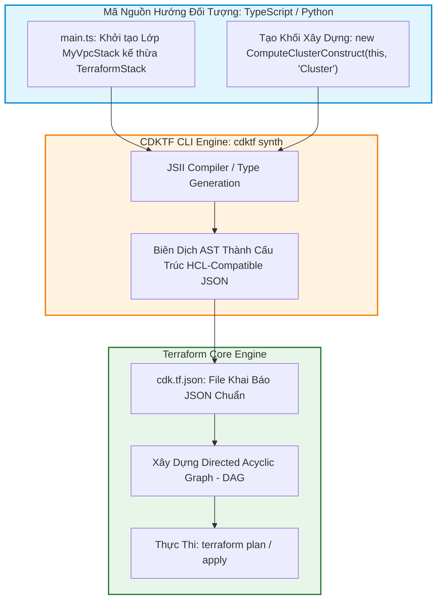
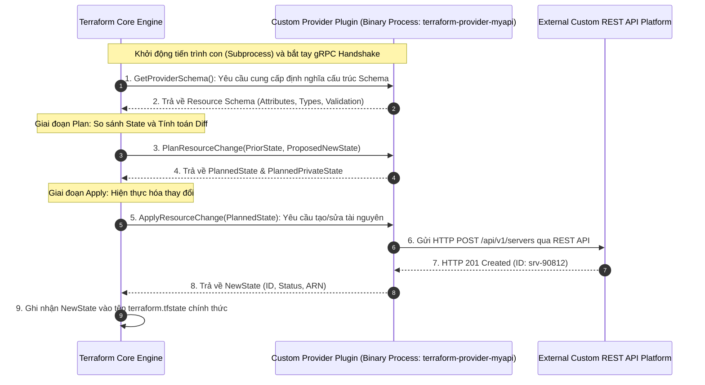
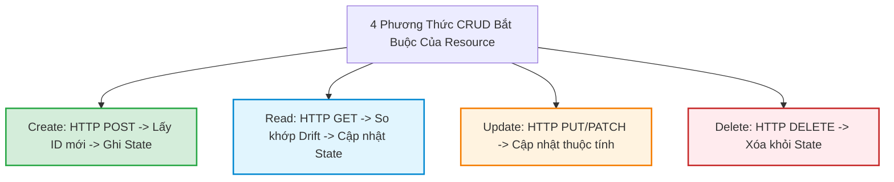
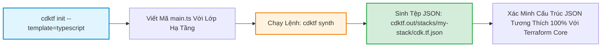
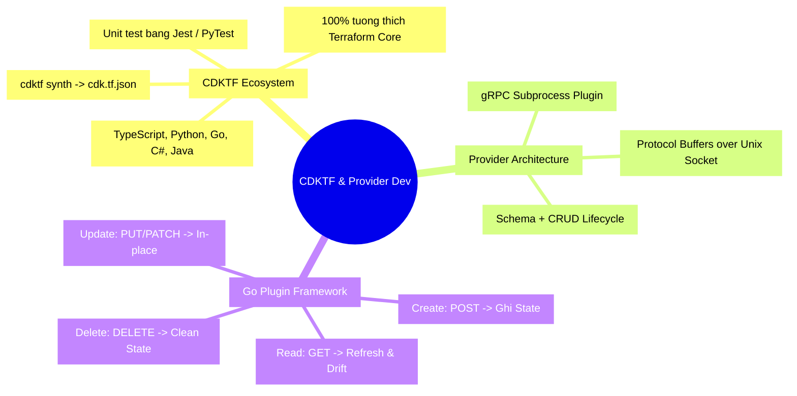


# CDKTF và Kiến Trúc Phát Triển Custom Terraform Provider

Đối với đại đa số các tác vụ quản trị hạ tầng, ngôn ngữ cấu hình HashiCorp Configuration Language (HCL) mang lại sự đơn giản, trực quan và an toàn tuyệt đối nhờ tính chất Declarative. Tuy nhiên, khi đối mặt với các bài toán trừu tượng hóa phức tạp — như xây dựng các thuật toán tính toán phân bổ tài nguyên động, tái sử dụng các mẫu thiết kế hướng đối tượng (OOP Design Patterns), hoặc kiểm thử hạ tầng bằng các framework kiểm thử phần mềm tiêu chuẩn (như Jest hay PyTest) — HCL bắt đầu bộc lộ những giới hạn của một ngôn ngữ cấu hình tĩnh.

Để giải phóng toàn bộ sức mạnh lập trình hướng đối tượng cho IaC, HashiCorp đã hợp tác với AWS để ra mắt **CDKTF (Cloud Development Kit for Terraform)**, cho phép bạn định nghĩa hạ tầng bằng các ngôn ngữ lập trình đa năng quen thuộc: **TypeScript, Python, Go, C# hoặc Java**.

Đồng thời, khi doanh nghiệp của bạn sở hữu các hệ thống nội bộ chuyên biệt (In-house Custom APIs, Private Cloud Data Center hoặc các nền tảng SaaS nội bộ) chưa có Provider chính thức trên Terraform Registry, câu hỏi đặt ra là: **Làm thế nào để tự viết một Custom Terraform Provider bằng ngôn ngữ Golang từ con số 0?**

Bài viết này sẽ đi sâu vào kiến trúc **CDKTF**, mổ xẻ giao thức **Terraform Plugin Protocol (gRPC)** và hướng dẫn từng bước lập trình một Custom Provider hoàn chỉnh với đầy đủ các hàm CRUD (Create, Read, Update, Delete).

---

## 1. Kiến Trúc CDKTF: Từ Code Hướng Đối Tượng Đến JSON Hạ Tầng

CDKTF không thay đổi cách thức Terraform tương tác với Cloud. Bản chất của CDKTF là sử dụng **JSII Library** để dịch mã nguồn hướng đối tượng (TypeScript/Python/Go) thành tệp **`cdktf.out/stacks/<stack>/cdk.tf.json`**, sau đó nạp file JSON này vào Terraform Core Engine để thực thi kế hoạch Plan/Apply như bình thường.



### 1.1. Ma Trận So Sánh: HCL Thuần Túy vs CDKTF vs Pulumi

| Tiêu Chí So Sánh | Terraform HCL (Truyền Thống) | CDKTF (Cloud Development Kit) | Pulumi |
| :--- | :--- | :--- | :--- |
| **Ngôn ngữ hỗ trợ** | Duy nhất HCL | TypeScript, Python, Go, C#, Java | TypeScript, Python, Go, C#, YAML |
| **Engine thực thi bên dưới** | Terraform Core Engine bản địa | **100% Terraform Core Engine** (Biên dịch qua JSON) | Pulumi Core Engine độc lập (Không dùng Terraform) |
| **Hệ sinh thái Providers** | Toàn bộ 3,500+ Terraform Providers | Toàn bộ 3,500+ Terraform Providers (Tự động sinh type bindings) | Pulumi Packages & Terraform Provider Adapters |
| **Khả năng kế thừa & OOP** | Không (Chỉ có Modules tái sử dụng) | **Có đầy đủ**: Classes, Interfaces, Generics, Design Patterns | Có đầy đủ: OOP, Async/Await |
| **Kiểm thử Unit Tests** | `terraform test` (.tftest.hcl) | Dùng trực tiếp **Jest, Mocha, PyTest, Go Test** | Dùng trực tiếp framework ngôn ngữ |

---

## 2. Viết Hạ Tầng Bằng TypeScript Với CDKTF

Dưới đây là ví dụ minh họa việc xây dựng một Web Server Stack hoàn chỉnh bằng ngôn ngữ TypeScript:

```typescript
// main.ts
import { Construct } from "constructs";
import { App, TerraformStack, TerraformOutput } from "cdktf";
import { AwsProvider } from "@cdktf/provider-aws/lib/provider";
import { Instance } from "@cdktf/provider-aws/lib/instance";
import { SecurityGroup } from "@cdktf/provider-aws/lib/security-group";

// ĐỊNH NGHĨA MỘT STACK HẠ TẦNG HƯỚNG ĐỐI TƯỢNG
export class SecureWebServerStack extends TerraformStack {
  constructor(scope: Construct, id: string, environment: string) {
    super(scope, id);

    // 1. Khởi tạo AWS Provider
    new AwsProvider(this, "AWS", {
      region: "ap-southeast-1",
    });

    // 2. Khởi tạo Security Group với lập trình logic
    const webSg = new SecurityGroup(this, "WebServerSG", {
      namePrefix: `web-sg-${environment}-`,
      ingress: [
        {
          fromPort: 80,
          toPort: 80,
          protocol: "tcp",
          cidrBlocks: ["0.0.0.0/0"],
        },
        {
          fromPort: 443,
          toPort: 443,
          protocol: "tcp",
          cidrBlocks: ["0.0.0.0/0"],
        },
      ],
      tags: {
        Environment: environment,
        ManagedBy: "CDKTF-TypeScript",
      },
    });

    // 3. Khởi tạo EC2 Instance
    const webInstance = new Instance(this, "WebServerInstance", {
      ami: "ami-0c55b159cbfafe1f0",
      instanceType: environment === "production" ? "t3.large" : "t3.micro",
      vpcSecurityGroupIds: [webSg.id],
      tags: {
        Name: `${environment}-app-server`,
      },
    });

    // 4. Định nghĩa Outputs
    new TerraformOutput(this, "server_public_ip", {
      value: webInstance.publicIp,
      description: "Địa chỉ IP công khai của máy chủ web",
    });
  }
}

// Khởi chạy ứng dụng và tạo 2 môi trường Dev và Prod
const app = new App();
new SecureWebServerStack(app, "dev-stack", "development");
new SecureWebServerStack(app, "prod-stack", "production");
app.synth();
```

---

## 3. Kiến Trúc Bên Dưới Của Một Terraform Provider

Một Terraform Provider không phải là một thư viện mã nguồn được nhúng tĩnh, mà là một **Tiến trình độc lập (Standalone Binary Executable)** giao tiếp với Terraform Core thông qua giao thức mạng nội bộ **gRPC qua Unix Domain Sockets (hoặc Windows Named Pipes)**.



---

## 4. Phát Triển Custom Provider Bằng Terraform Plugin Framework (Golang)

HashiCorp cung cấp **Terraform Plugin Framework** (thay thế cho SDKv2 cũ) để xây dựng các Provider hiện đại, hỗ trợ type-safety mạnh mẽ bằng ngôn ngữ Go.

Một Provider bao gồm 4 hàm vòng đời CRUD bắt buộc:
1. **`Create`**: Tạo mới tài nguyên khi node ở trạng thái Add (+).
2. **`Read`**: Đọc trạng thái mới nhất từ API thực tế khi chạy Refresh/Plan.
3. **`Update`**: Cập nhật các thuộc tính có thể thay đổi trực tiếp (In-place update ~).
4. **`Delete`**: Xóa tài nguyên trên API khi chạy Destroy (-).



### 4.1. Mã Nguồn Mẫu: `server_resource.go`

```go
package provider

import (
	"context"
	"fmt"
	"github.com/hashicorp/terraform-plugin-framework/resource"
	"github.com/hashicorp/terraform-plugin-framework/resource/schema"
	"github.com/hashicorp/terraform-plugin-framework/types"
)

// Đảm bảo struct thỏa mãn Interface của Resource
var _ resource.Resource = &ServerResource{}

type ServerResource struct {
	client *MyCustomAPIClient
}

// Struct ánh xạ dữ liệu HCL vào Go Type
type ServerResourceModel struct {
	ID       types.String `tfsdk:"id"`
	Hostname types.String `tfsdk:"hostname"`
	Cores    types.Int64  `tfsdk:"cores"`
	MemoryGB types.Int64  `tfsdk:"memory_gb"`
	Status   types.String `tfsdk:"status"`
}

func (r *ServerResource) Metadata(ctx context.Context, req resource.MetadataRequest, resp *resource.MetadataResponse) {
	resp.TypeName = req.ProviderTypeName + "_server" // myapi_server
}

// 1. ĐỊNH NGHĨA SCHEMA CỦA TÀI NGUYÊN
func (r *ServerResource) Schema(ctx context.Context, req resource.SchemaRequest, resp *resource.SchemaResponse) {
	resp.Schema = schema.Schema{
		Description: "Quản trị máy chủ ảo thông qua Custom Internal API.",
		Attributes: map[string]schema.Attribute{
			"id": schema.StringAttribute{
				Computed:    true,
				Description: "ID định danh máy chủ do API sinh ra.",
			},
			"hostname": schema.StringAttribute{
				Required:    true,
				Description: "Tên định danh của máy chủ.",
			},
			"cores": schema.Int64Attribute{
				Required:    true,
				Description: "Số lượng CPU Cores.",
			},
			"memory_gb": schema.Int64Attribute{
				Required:    true,
				Description: "Dung lượng RAM tính bằng GB.",
			},
			"status": schema.StringAttribute{
				Computed:    true,
				Description: "Trạng thái vận hành hiện tại của máy chủ.",
			},
		},
	}
}

// 2. PHƯƠNG THỨC CREATE: GỌI API TẠO MỚI
func (r *ServerResource) Create(ctx context.Context, req resource.CreateRequest, resp *resource.CreateResponse) {
	var plan ServerResourceModel
	diags := req.Plan.Get(ctx, &plan)
	resp.Diagnostics.Append(diags...)
	if resp.Diagnostics.HasError() {
		return
	}

	// Giả lập gọi API tạo máy chủ
	createdServer, err := r.client.CreateServer(plan.Hostname.ValueString(), plan.Cores.ValueInt64(), plan.MemoryGB.ValueInt64())
	if err != nil {
		resp.Diagnostics.AddError("Lỗi khởi tạo Server", fmt.Sprintf("Không thể gọi API: %s", err))
		return
	}

	// Ghi nhận dữ liệu vào State
	plan.ID = types.StringValue(createdServer.ID)
	plan.Status = types.StringValue("RUNNING")

	diags = resp.State.Set(ctx, plan)
	resp.Diagnostics.Append(diags...)
}

// 3. PHƯƠNG THỨC READ: ĐỌC VÀ PHÁT HIỆN DRIFT
func (r *ServerResource) Read(ctx context.Context, req resource.ReadRequest, resp *resource.ReadResponse) {
	var state ServerResourceModel
	diags := req.State.Get(ctx, &state)
	resp.Diagnostics.Append(diags...)
	if resp.Diagnostics.HasError() {
		return
	}

	server, err := r.client.GetServer(state.ID.ValueString())
	if err != nil {
		resp.Diagnostics.AddError("Lỗi đọc Server", fmt.Sprintf("Không tìm thấy server ID %s: %s", state.ID.ValueString(), err))
		return
	}

	state.Hostname = types.StringValue(server.Hostname)
	state.Status = types.StringValue(server.Status)

	diags = resp.State.Set(ctx, &state)
	resp.Diagnostics.Append(diags...)
}

// 4. PHƯƠNG THỨC UPDATE: CẬP NHẬT TẠI CHỖ
func (r *ServerResource) Update(ctx context.Context, req resource.UpdateRequest, resp *resource.UpdateResponse) {
	var plan ServerResourceModel
	diags := req.Plan.Get(ctx, &plan)
	resp.Diagnostics.Append(diags...)
	if resp.Diagnostics.HasError() {
		return
	}

	err := r.client.UpdateServer(plan.ID.ValueString(), plan.Cores.ValueInt64(), plan.MemoryGB.ValueInt64())
	if err != nil {
		resp.Diagnostics.AddError("Lỗi cập nhật Server", err.Error())
		return
	}

	diags = resp.State.Set(ctx, plan)
	resp.Diagnostics.Append(diags...)
}

// 5. PHƯƠNG THỨC DELETE: XÓA TÀI NGUYÊN
func (r *ServerResource) Delete(ctx context.Context, req resource.DeleteRequest, resp *resource.DeleteResponse) {
	var state ServerResourceModel
	diags := req.State.Get(ctx, &state)
	resp.Diagnostics.Append(diags...)
	if resp.Diagnostics.HasError() {
		return
	}

	err := r.client.DeleteServer(state.ID.ValueString())
	if err != nil {
		resp.Diagnostics.AddError("Lỗi xóa Server", err.Error())
		return
	}
}
```

---

## 5. Hands-On Lab: Khởi Tạo Dự Án CDKTF Bằng TypeScript & Tổng Hợp JSON

Trong bài lab này, chúng ta sẽ cài đặt CDKTF CLI, khởi tạo một dự án TypeScript và tiến hành biên dịch (Synth) mã nguồn hướng đối tượng thành tệp khai báo `cdk.tf.json`.



### Bước 1: Cài đặt CDKTF CLI toàn cục (Nếu đã có NodeJS)
```bash
npm install -g cdktf-cli
```

### Bước 2: Khởi tạo thư mục và cấu trúc dự án CDKTF
```bash
mkdir -p cdktf-lab28-typescript
cd cdktf-lab28-typescript
cdktf init --template="typescript" --local --project-name="lab28-cdktf" --project-description="Lab 28 CDKTF Architecture"
```

### Bước 3: Thêm Provider Local vào `cdktf.json`
Chỉnh sửa file `cdktf.json`:
```json
{
  "language": "typescript",
  "app": "npx ts-node main.ts",
  "terraformProviders": [
    "hashicorp/local@~> 2.4"
  ]
}
```

Tải type bindings cho Provider:
```bash
cdktf get
```

### Bước 4: Viết mã nguồn hướng đối tượng trong `main.ts`
Mở file `main.ts` và thêm nội dung:
```typescript
import { Construct } from "constructs";
import { App, TerraformStack, TerraformOutput } from "cdktf";
import { LocalProvider } from "./.gen/providers/local/provider";
import { File } from "./.gen/providers/local/file";

class EnterpriseConfigStack extends TerraformStack {
  constructor(scope: Construct, id: string, envName: string) {
    super(scope, id);

    new LocalProvider(this, "LocalProvider", {});

    const configFile = new File(this, "ConfigFile", {
      filename: `${__dirname}/output-${envName}.json`,
      content: JSON.stringify({
        environment: envName,
        managedBy: "CDKTF-TypeScript-Engine",
        generatedAt: new Date().toISOString(),
      }, null, 2),
    });

    new TerraformOutput(this, "generated_file_path", {
      value: configFile.filename,
    });
  }
}

const app = new App();
new EnterpriseConfigStack(app, "dev-stack", "development");
new EnterpriseConfigStack(app, "prod-stack", "production");
app.synth();
```

### Bước 5: Thực thi biên dịch (Synth)
```bash
cdktf synth
```

**Quan sát kết quả:** CDKTF tạo ra thư mục `cdktf.out/stacks/dev-stack/cdk.tf.json` và `cdktf.out/stacks/prod-stack/cdk.tf.json`.

### Bước 6: Kiểm tra tệp JSON được sinh ra
```bash
cat cdktf.out/stacks/dev-stack/cdk.tf.json
```
**Kết quả:** Một tệp Terraform JSON Schema hoàn hảo được sinh ra tự động từ các Class TypeScript!

### Bước 7: Dọn dẹp môi trường lab
```bash
cd ..
rm -rf cdktf-lab28-typescript
```

---

## 6. 10 Câu Hỏi Trắc Nghiệm & Phỏng Vấn Chuyên Sâu (Self-Check Q&A)

### Q1: CDKTF có thực hiện việc gọi trực tiếp đến API của Cloud Provider (như AWS hay Azure) không?
- **Trả lời**: **HOÀN TOÀN KHÔNG**. CDKTF chỉ đóng vai trò là một trình chuyển dịch (Transpiler / Synthesizer). Nó nhận mã TypeScript/Python và biên dịch thành tệp `cdk.tf.json`. Mọi thao tác gửi API, quản lý State và xây dựng DAG vẫn do chính Terraform Core Engine và các Terraform Providers nguyên bản chịu trách nhiệm.

### Q2: Cơ chế giao tiếp giữa Terraform Core và Custom Provider Plugin diễn ra qua giao thức nào?
- **Trả lời**: Diễn ra qua giao thức **gRPC (Google Remote Procedure Call)** chạy trên nền tảng **HTTP/2** thông qua Unix Domain Sockets (trên Linux/macOS) hoặc Windows Named Pipes. Nhờ gRPC và Protocol Buffers (protobuf), Terraform Core có thể giao tiếp với các Provider viết bằng bất kỳ ngôn ngữ nào với độ trễ cực thấp và tính toàn vẹn dữ liệu cao.

### Q3: Khi nào một tổ chức nên chuyển dịch từ HCL thuần sang CDKTF?
- **Trả lời**: Khi:
  - Đội ngũ kỹ sư phần mềm (App Developers) chiếm đa số và đã thành thạo TypeScript/Python, không muốn học cú pháp HCL riêng biệt.
  - Hạ tầng có các bài toán logic phức tạp cần xử lý bằng vòng lặp nâng cao, cấu trúc dữ liệu đệ quy, hoặc tích hợp các thư viện bên ngoài (như gọi SDK tính toán toán học, parse YAML bên thứ ba).
  - Doanh nghiệp muốn áp dụng các framework Unit Test phần mềm tiêu chuẩn (Jest, PyTest) để kiểm thử hạ tầng.

### Q4: Trong Terraform Plugin Framework (Golang), phương thức `Read` được gọi vào những thời điểm nào?
- **Trả lời**: Phương thức `Read` được gọi:
  1. Trong bước **State Refresh** (mỗi khi chạy `terraform plan` hoặc `terraform apply`) để đồng bộ trạng thái thực tế từ Cloud về State.
  2. Ngay sau khi phương thức `Create` hoặc `Update` hoàn tất để đảm bảo các thuộc tính Computed (như ID, ARN) đã được ghi nhận chính xác vào State.
  3. Khi thực hiện lệnh `terraform import`.

### Q5: Thư viện JSII đóng vai trò gì trong kiến trúc CDKTF?
- **Trả lời**: JSII (phát triển bởi AWS) cho phép một codebase viết bằng TypeScript có thể tự động sinh ra các gói thư viện (Package Bindings) và chạy mượt mà trên nhiều ngôn ngữ khác nhau như Python, Go, Java, và C# mà không cần viết lại mã nguồn.

### Q6: Làm thế nào để cài đặt và sử dụng một Custom Provider tự viết trên máy cục bộ mà không cần xuất bản lên Terraform Registry công cộng?
- **Trả lời**: Cấu hình khối `provider_installation` trong tệp cấu hình CLI `~/.terraformrc` (hoặc `terraform.rc` trên Windows) sử dụng cơ chế **`filesystem_mirror`** hoặc **`dev_overrides`** để trỏ trực tiếp đến thư mục chứa file binary đã compile của provider.

### Q7: Tại sao việc phát triển Provider bằng Terraform Plugin Framework mới lại được khuyến nghị hơn SDKv2 cũ?
- **Trả lời**: Plugin Framework mới cung cấp:
  - Hệ thống kiểu dữ liệu Type-Safe chặt chẽ hơn bằng Go native types.
  - Hỗ trợ đầy đủ các tính năng hiện đại của Terraform như Structural Types, Optional Attributes with Defaults, Dynamic Expressions, và Unknown Values.
  - Báo cáo lỗi (Diagnostics) chi tiết và trực quan hơn.

### Q8: Lệnh `cdktf diff` tương đương với câu lệnh nào trong Terraform CLI truyền thống?
- **Trả lời**: Tương đương với lệnh `terraform plan`. Nó biên dịch mã nguồn thành JSON và so sánh với State hiện tại để hiển thị danh sách các tài nguyên dự kiến sẽ được thêm, sửa, hoặc xóa.

### Q9: Trong Custom Provider, làm thế nào để thông báo cho Terraform biết rằng một thuộc tính khi bị sửa đổi sẽ bắt buộc phải Recreate tài nguyên (Force New)?
- **Trả lời**: Trong định nghĩa Schema của thuộc tính, sử dụng thuộc tính `PlanModifiers` và gắn thêm modifier `stringplanmodifier.RequiresReplace()` (hoặc modifier tương ứng cho Int/Bool).

### Q10: Nhược điểm lớn nhất khi áp dụng CDKTF trong doanh nghiệp là gì?
- **Trả lời**: 
  - Thêm một tầng trừu tượng (Abstraction Layer) làm tăng thời gian build/synth.
  - Đòi hỏi phải quản lý thêm môi trường runtime (NodeJS / Python Virtualenv / npm dependencies).
  - Khó debug hơn khi có lỗi biên dịch giữa tầng mã nguồn và tầng JSON của Terraform Core.

---

## 7. Tổng Kết & Cheat Sheet Thực Chiến



- **Quy tắc lựa chọn công cụ**: Sử dụng **HCL thuần** cho 90% các nhu cầu hạ tầng tiêu chuẩn; chỉ chuyển sang **CDKTF** khi cần giải quyết các bài toán logic phức tạp hoặc tích hợp sâu vào quy trình của Software Engineering.
- **Tiêu chuẩn phát triển Provider**: Luôn sử dụng **Terraform Plugin Framework** thế hệ mới bằng ngôn ngữ Golang để đảm bảo hiệu năng và tính an toàn kiểu dữ liệu.
- **Bước tiếp theo**: Trong [Bài 29: Tổng Ôn và Bí Kíp Chinh Phục Chứng Chỉ Terraform Associate (003)](./29-tong-on-va-bi-kip-chinh-phuc-chung-chi-terraform-associate-003.md), chúng ta sẽ hệ thống hóa toàn bộ 9 chuyên đề thi, mổ xẻ các câu hỏi bẫy kinh điển và trang bị chiến lược đạt điểm tuyệt đối trong kỳ thi HashiCorp Certified: Terraform Associate!

