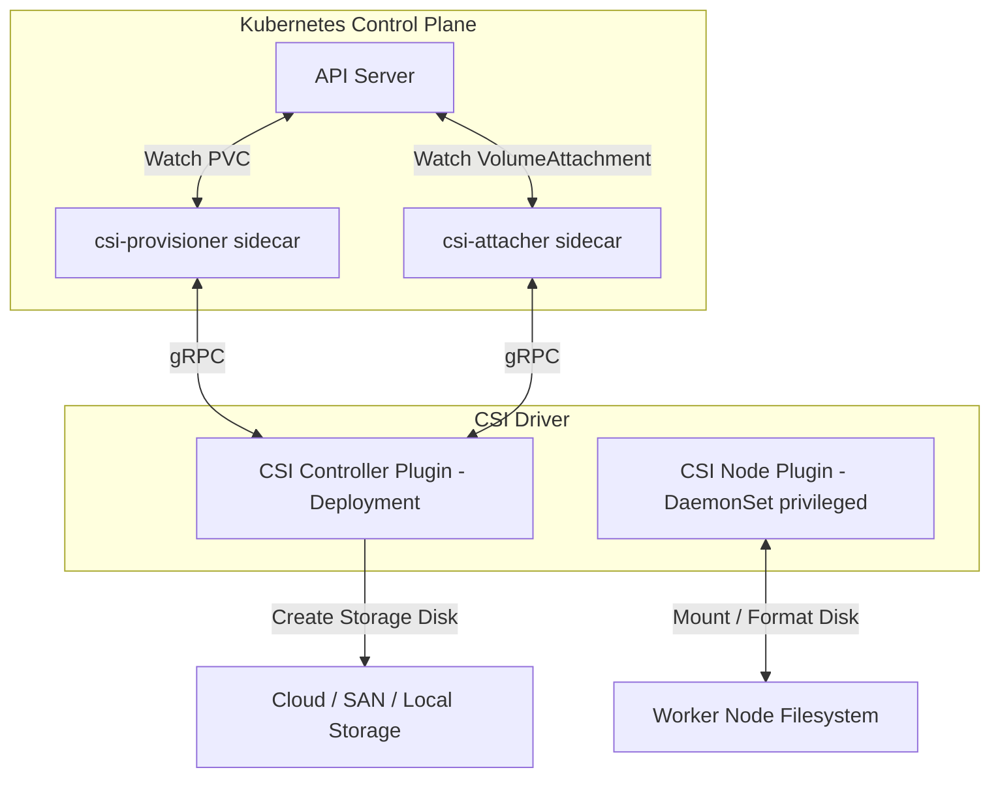
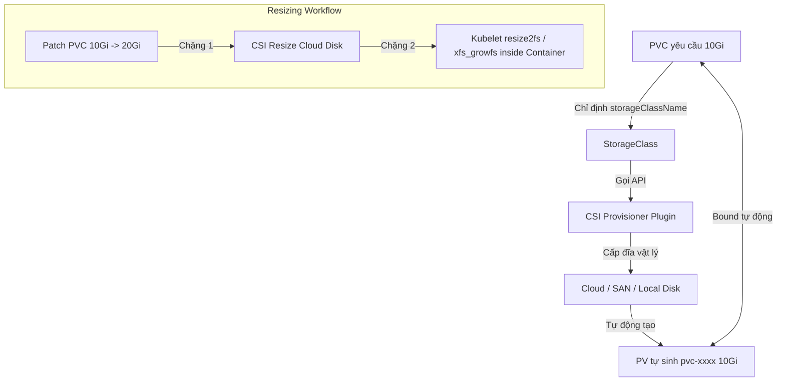
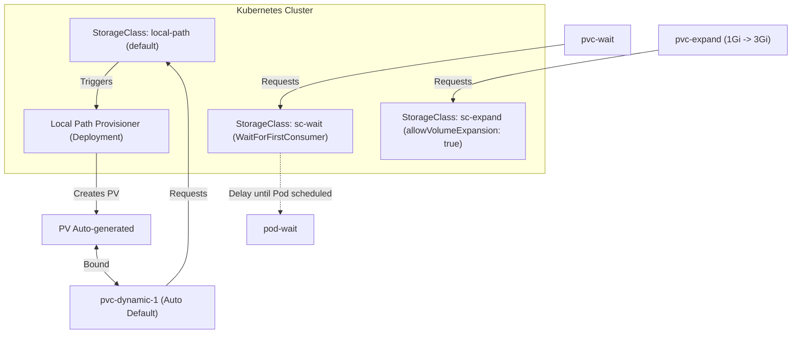

# [BÀI 27] CONTAINER STORAGE INTERFACE (CSI) & STORAGECLASS: CẤP PHÁT ĐỘNG (DYNAMIC PROVISIONING) & MỞ RỘNG DUNG LƯỢNG

Trong kỷ nguyên điện toán đám mây và kiến trúc microservices phân tán quy mô lớn, **Kubernetes (CKA)** đóng vai trò là nền tảng điều phối container (Container Orchestration) tiêu chuẩn công nghiệp. Để làm chủ hệ thống trong môi trường sản xuất (Production) cũng như chinh phục kỳ thi chứng chỉ quốc tế của Linux Foundation / CNCF, kỹ sư không chỉ nắm vững các câu lệnh thao tác cơ bản mà phải thấu hiểu sâu sắc bản chất cơ chế tầng thấp: từ chu trình điều hòa (Reconciliation Loop), cấu trúc điều phối tài nguyên, kiến trúc mạng CNI, lưu trữ CSI cho đến các chuẩn mực an ninh phòng thủ chiều sâu.

Bài viết chuyên sâu này sẽ đồng hành cùng bạn giải mã toàn diện bức tranh kiến trúc, phân tích các đánh đổi kỹ thuật thực chiến (Engineering Trade-offs), cung cấp bài thực hành Lab từng bước và bộ câu hỏi phỏng vấn chuẩn Architect / Lead Engineer.

---

## 1. Bản Chất Kiến Trúc & Cơ Chế Vận Hành Tầng Thấp

| # | Câu hỏi ôn tập | Đáp án chuẩn ngắn gọn |
|---|---|---|
| 1 | Phân biệt phạm vi quản lý của tài nguyên PV và PVC trong cụm? | PV là **`Cluster-scoped`** (do Admin tạo), PVC là **`Namespace-scoped`** (do Dev tạo) |
| 2 | Hai điều kiện kỹ thuật bắt buộc để PVC bind được vào PV tĩnh là gì? | Dung lượng PV **`>=`** PVC và **`accessModes`** của PVC phải là tập con của PV |
| 3 | Trạng thái của PV khi xóa PVC tương ứng có `reclaimPolicy: Retain` là gì? | Trạng thái **`Released`** (dữ liệu vẫn còn nguyên trên đĩa) |
| 4 | Lệnh CLI nào dùng để gỡ thuộc tính `claimRef` nhằm tái sử dụng PV bị Released? | **`kubectl patch pv <pv-name> -p '{"spec":{"claimRef":null}}'`** |
| 5 | Loại Volume nào gắn liền với vòng đời Pod và bị xóa sạch khi Pod ngưng? | Volume **`emptyDir`** |


> **"StorageClass đóng vai trò là khuôn mẫu định nghĩa loại lưu trữ và nhà cung cấp đĩa (Provisioner) giúp tự động hóa quá trình tạo PersistentVolume (Dynamic Provisioning) ngay khi có PersistentVolumeClaim xuất hiện; trong đó kiến trúc giao tiếp chuẩn CSI (Container Storage Interface) chịu trách nhiệm kết nối Kubernetes Control Plane với các hệ thống đĩa bên ngoài, chế độ `volumeBindingMode: WaitForFirstConsumer` trì hoãn việc cấp phát đĩa cho tới khi Pod được xếp lịch xuống Node cụ thể để tránh lỗi lệch vùng lưu trữ, và thuộc tính `allowVolumeExpansion: true` cho phép mở rộng dung lượng đĩa PVC trực tuyến mà không cần dừng dịch vụ."**

**Kết quả từ các buổi trước được sử dụng lại:**

| Kết quả / Công cụ | Buổi + số hiệu `QT` | Dùng ở đâu trong buổi này |
|---|---|---|
| Khái niệm PV, PVC và cơ chế Binding | Buổi 26 `QT 5.1` | Nền tảng để nâng cấp từ bind thủ công lên Dynamic Provisioning |
| Ràng buộc đặt Pod của Scheduler | Buổi 17 `QT 4.1` | Kết hợp với `volumeBindingMode: WaitForFirstConsumer` |
| Quản lý tài nguyên mặc định Annotation | Buổi 04 `QT 4.1` | Đặt StorageClass mặc định qua annotation `storageclass.kubernetes.io/is-default-class` |

---


| # | Kỹ năng thực hiện được | Hiện vật chứng minh |
|---|---|---|
| 1 | Biên soạn tệp YAML StorageClass hỗ trợ Dynamic Provisioning | Tệp YAML StorageClass với `provisioner` và `parameters` |
| 2 | Đặt StorageClass mặc định cho toàn cụm bằng Annotation | Lệnh `kubectl get sc` hiển thị `(default)` bên cạnh tên StorageClass |
| 3 | Cấu hình chế độ `volumeBindingMode: WaitForFirstConsumer` tránh lệch Topology | PVC giữ `Pending` cho đến khi Pod được xếp lịch xuống Node |
| 4 | Thực hiện tăng dung lượng ổ đĩa PVC trực tuyến (Online Volume Resizing) | Dung lượng PVC chuyển từ `1Gi` lên `3Gi` thành công khi Pod đang chạy |
| 5 | Chẩn đoán các sự cố gRPC giữa Kubernetes và CSI Driver qua log sidecar | Bản thu thập log từ `csi-provisioner` và `csi-node-driver-registrar` |

---


| Kiến thức tiên quyết | Nguồn tự học nếu thiếu |
|---|---|
| Khái niệm vòng đời PV, PVC, accessModes và reclaimPolicy | Buổi 26 (`QT 5.1`, `QT 6.1`) |
| Nguyên lý hoạt động của DaemonSet trên Worker Node | Buổi 16 (`QT 4.1`) |
| Cơ chế gán nhãn Annotation trên đối tượng Kubernetes | Buổi 04 (`QT 4.1`) |

---


### 3.1. Thuật ngữ Việt–Anh

| # | Thuật ngữ tiếng Việt | Tiếng Anh tương đương | Ghi chú chuẩn hoá trong thân bài |
|---|---|---|---|
| 1 | Lớp lưu trữ | StorageClass (`kind: StorageClass`) | Tài nguyên khai báo khuôn mẫu tạo đĩa tự động |
| 2 | Cấp phát động | Dynamic Provisioning | Cơ chế tự tạo PV khi PVC xuất hiện qua StorageClass |
| 3 | Nhà cấp phát đĩa | Provisioner | Trình điều khiển đĩa (ví dụ `rancher.io/local-path`, `ebs.csi.aws.com`) |
| 4 | Giao diện lưu trữ container | CSI (Container Storage Interface) | Chuẩn kết nối giữa K8s và hệ thống đĩa bên ngoài |
| 5 | Chế độ gắn đĩa | `volumeBindingMode` | `Immediate` (gắn ngay) hoặc `WaitForFirstConsumer` (chờ Pod) |
| 6 | Mở rộng đĩa | Volume Expansion | Thuộc tính `allowVolumeExpansion: true` |
| 7 | Đĩa mặc định | Default StorageClass | Annotation `storageclass.kubernetes.io/is-default-class: "true"` |
| 8 | Tiền xử lý đĩa Node | CSI Node Plugin | DaemonSet chạy trên Worker Node thực hiện mount/format đĩa |
| 9 | Bộ điều khiển CSI | CSI Controller Plugin | Deployment chạy trên Control Plane quản lý lifecycle đĩa |
| 10 | Đĩa theo vùng | Topology-Aware Storage | Lưu trữ đĩa phụ thuộc vị trí địa lý/AZ/Node |
| 11 | Tham số hạ tầng | `parameters` | Khai báo loại đĩa, iops, mã hóa riêng của provider |
| 12 | Định dạng lại hệ tập tin | Filesystem Resizing | Thao tác mở rộng partition đĩa bên trong OS (`resize2fs`, `xfs_growfs`) |
| 13 | Sidecar CSI hỗ trợ | CSI External Attacher / Provisioner | Các tiến trình sidecar lắng nghe K8s API để gọi CSI driver |
| 14 | Mở rộng trực tuyến | Online Resizing | Mở rộng PVC khi Pod vẫn đang mount và chạy |


Mô hình nhà máy cấp phát tự động: StorageClass là hợp đồng đặt hàng, CSI Driver là robot nhà máy tự sản xuất PV đĩa vật lý ngay khi Lập trình viên gửi yêu cầu PVC.

---

### 1.1. Khái niệm StorageClass và cơ chế cấp phát động (12 phút)

**Nguyên lý cốt lõi:** Dynamic Provisioning xảy ra khi PVC khai báo `storageClassName` khớp với tên một `StorageClass` đang tồn tại; hệ thống tự động sinh PV tương ứng mà Admin không cần can thiệp.

**Giải thích cơ chế ngầm:** Trong mô hình tĩnh, Admin phải đoán trước nhu cầu và tạo thủ công hàng trăm PV. Trong mô hình động, khi PVC được apply, Controller của StorageClass sẽ gọi API của nhà cung cấp lưu trữ (AWS, GCP, Ceph) để khởi tạo đĩa thật, sau đó tự động tạo đối tượng PV trong Kubernetes và bind thẳng vào PVC.

> [!WARNING]
> **CẠM BẪY THỰC CHIẾN:**
> PVC khai báo `storageClassName: fast-disk` nhưng trên cụm chưa cài đặt Provisioner tương ứng. PVC bị kẹt ở trạng thái `Pending` với sự kiện `warning ProvisioningFailed`.

**Minh hoạ.**

```yaml
# Định nghĩa StorageClass dùng local-path
apiVersion: storage.k8s.io/v1
kind: StorageClass
metadata:
  name: local-path
provisioner: rancher.io/local-path
volumeBindingMode: WaitForFirstConsumer
reclaimPolicy: Delete
---
# PVC xin 2Gi tự động kích hoạt tạo PV
apiVersion: v1
kind: PersistentVolumeClaim
metadata:
  name: pvc-dynamic
spec:
  accessModes:
    - ReadWriteOnce
  storageClassName: local-path
  resources:
    requests:
      storage: 2Gi
```

**Nguyên lý cốt lõi:** Mỗi cụm Kubernetes chỉ nên có tối đa **1 StorageClass** được đánh dấu mặc định (`is-default-class: "true"`); nếu không có StorageClass nào mặc định và PVC không khai báo `storageClassName`, PVC sẽ rơi vào kẹt `Pending`.

**Giải thích cơ chế ngầm:** Khi Lập trình viên tạo PVC mà không điền trường `storageClassName`, Kubernetes Admission Controller sẽ tìm StorageClass có annotation `storageclass.kubernetes.io/is-default-class: "true"` để gán tự động. Nếu có 2 StorageClass cùng mang cờ mặc định, hệ thống sẽ chọn ngẫu nhiên gây không nhất quán hạ tầng.

> [!WARNING]
> **CẠM BẪY THỰC CHIẾN:**
> Tạo PVC không ghi `storageClassName`, PVC kẹt `Pending` mãi mãi do cụm thiếu StorageClass mặc định.

**Minh hoạ.**

```bash
# Đặt StorageClass local-path làm mặc định của cụm
kubectl annotate storageclass local-path storageclass.kubernetes.io/is-default-class="true" --overwrite

# Kiểm tra cờ default
kubectl get sc
# NAME                 PROVISIONER              RECLAIMPOLICY   VOLUMEBINDINGMODE      ALLOWVOLUMEEXPANSION   AGE
# local-path (default) rancher.io/local-path   Delete          WaitForFirstConsumer   false                  10m
```

---

### 1.2. Kiến trúc Container Storage Interface (CSI) và các sidecar container (12 phút)

**Nguyên lý cốt lõi:** Kiến trúc CSI tách biệt hoàn toàn mã nguồn Kubernetes core khỏi Storage Driver, giao tiếp qua gRPC socket; gồm 2 thành phần chính: CSI Controller (cấp cụm) và CSI Node Plugin (cấp Node).

**Giải thích cơ chế ngầm:** Trước khi có CSI (thời in-tree volume), mọi mã nguồn kết nối đĩa (AWS EBS, GCP PD) đều nằm trong nhân Kubernetes `k8s.io/kubernetes`. Mỗi lần hãng đĩa cập nhật driver phải biên dịch lại toàn bộ Kubernetes. Với CSI, các nhà sản xuất đĩa chỉ cần phát triển một Container Image tuân thủ giao diện gRPC tiêu chuẩn của CNCF.

> [!WARNING]
> **CẠM BẪY THỰC CHIẾN:**
> Sửa tệp cấu hình đĩa nhưng quên restart CSI Node Plugin DaemonSet trên Worker Node, làm Kubelet không mount được đĩa mới vào Pod.

**Minh hoạ.**



**Nguyên lý cốt lõi:** CSI Node Plugin bắt buộc chạy dưới dạng `DaemonSet` trên mọi Worker Node với quyền `privileged: true` để thực hiện các câu lệnh mount/format đĩa ở tầng nhân OS.

**Giải thích cơ chế ngầm:** Thao tác mount đĩa vật lý (`mount /dev/sdb /var/lib/kubelet/...`) và format hệ tập tin (`mkfs.ext4`) đòi hỏi truy cập trực tiếp vào các thiết bị khối (Block Devices) nằm trong thư mục `/dev` của Node mẹ. Container thường không có quyền này trừ khi bật `privileged: true`.

> [!WARNING]
> **CẠM BẪY THỰC CHIẾN:**
> Pod bị kẹt ở trạng thái `ContainerCreating` với sự kiện `MountVolume.SetUp failed for volume: permission denied`. Đọc log CSI Node Plugin thấy báo lỗi không thể truy cập `/dev`.

**Minh hoạ.**

```yaml
# Mảnh tệp DaemonSet của CSI Node Plugin bắt buộc có privileged
spec:
  containers:
    - name: csi-node-driver
      image: driver-csi:v1.0.0
      securityContext:
        privileged: true # BẮT BUỘC ĐỂ MOUNT ĐĨA TẦNG OS!
      volumeMounts:
        - mountPath: /dev
          name: dev
```

---

### 1.3. Chế độ `volumeBindingMode` và mở rộng dung lượng đĩa (10 phút)

**Nguyên lý cốt lõi:** Chế độ `volumeBindingMode: Immediate` sẽ tạo PV và bind ngay khi PVC được tạo; chế độ `WaitForFirstConsumer` sẽ hoãn tạo PV cho tới khi Pod sử dụng PVC đó được Scheduler chọn xong Node.

**Giải thích cơ chế ngầm:** Với `Immediate`, PV được tạo tức thì ngay khi `kubectl apply -f pvc.yaml`. Nhưng nếu đĩa đó là đĩa cục bộ (Local SAN) nằm ở Worker 01, mà sau đó Scheduler lại xếp Pod chạy sang Worker 02 (do Worker 01 hết CPU), Pod sẽ không thể chạy được do không mount được đĩa từ xa.

> [!WARNING]
> **CẠM BẪY THỰC CHIẾN:**
> Dùng `Immediate` cho đĩa cục bộ, Pod rơi vào lỗi `node(s) had volume node affinity conflict`.

**Minh hoạ.**

```yaml
# Cấu hình chuẩn cho đĩa cục bộ hoặc đĩa Cloud theo zone
apiVersion: storage.k8s.io/v1
kind: StorageClass
metadata:
  name: local-storage
provisioner: kubernetes.io/no-provisioner
volumeBindingMode: WaitForFirstConsumer # Trì hoãn bind cho tới khi biết Node của Pod
```

**Nguyên lý cốt lõi:** Với các đĩa đính kèm theo Node (Local Storage, AWS EBS theo Availability Zone), bắt buộc phải dùng `volumeBindingMode: WaitForFirstConsumer` để tránh lỗi lệch Topology.

**Giải thích cơ chế ngầm:** Ổ đĩa AWS EBS ở Zone `us-east-1a` không thể đính kèm vào máy ảo EC2 ở Zone `us-east-1b`. Khi hoãn tạo PV cho đến khi Pod được xếp Node, Kubernetes sẽ truyền thông tin Zone của Node được chọn vào câu lệnh gọi CSI Provisioner để tạo đĩa ở đúng Zone đó.

> [!WARNING]
> **CẠM BẪY THỰC CHIẾN:**
> Pod bị kẹt `ContainerCreating`, log ghi `Volume is in zone us-east-1a but node is in us-east-1b`.

**Minh hoạ.**

```bash
# Kiểm tra sự kiện khi dùng WaitForFirstConsumer: PVC sẽ ở trạng thái Pending có chủ đích
kubectl get pvc pvc-delayed
# NAME          STATUS    VOLUME   CAPACITY   ACCESS MODES   STORAGECLASS   AGE
# pvc-delayed   Pending                                      local-delayed  5s
# (Sẽ chuyển sang Bound ngay khi Pod được apply!)
```

**Nguyên lý cốt lõi:** Mở rộng PVC trực tuyến đòi hỏi StorageClass phải có `allowVolumeExpansion: true`; thao tác tăng dung lượng chỉ sửa `spec.resources.requests.storage` của PVC (không thể giảm dung lượng đĩa).

**Giải thích cơ chế ngầm:** Hệ thống đĩa vật lý và hệ tập tin (ext4/xfs) chỉ hỗ trợ mở rộng không gian lưu trữ mà không hỗ trợ thu nhỏ an toàn mà không làm hỏng dữ liệu. Kubernetes chặn toàn bộ thao tác hạ dung lượng đĩa ở mức API Validation.

> [!WARNING]
> **CẠM BẪY THỰC CHIẾN:**
> Sửa tệp YAML PVC hạ dung lượng từ `10Gi` xuống `5Gi`. Lệnh `kubectl apply` báo lỗi ngay lập tức: `field is immutable: capacity cannot be decreased`.

**Minh hoạ.**

```yaml
# StorageClass cho phép mở rộng
apiVersion: storage.k8s.io/v1
kind: StorageClass
metadata:
  name: expandable-sc
provisioner: rancher.io/local-path
allowVolumeExpansion: true # CHO PHÉP MỞ RỘNG DUNG LƯỢNG
---
# Sửa PVC tăng dung lượng từ 2Gi lên 10Gi
apiVersion: v1
kind: PersistentVolumeClaim
metadata:
  name: my-pvc
spec:
  resources:
    requests:
      storage: 10Gi # ĐÚNG (TĂNG ĐƯỢC, KHÔNG GIẢM ĐƯỢC)
```

**Nguyên lý cốt lõi:** Quá trình mở rộng đĩa gồm 2 chặng: mở rộng đĩa vật lý (Cloud/Storage Provider) và mở rộng hệ tập tin (Filesystem); chặng 2 chỉ hoàn tất khi Pod mount đĩa đó được khởi động lại hoặc kích hoạt online resize.

**Giải thích cơ chế ngầm:** Khi sửa PVC lên 10Gi, CSI Controller gọi AWS/Storage Provider nới rộng đĩa ảo lên 10Gi trước (chặng 1). Nhưng hệ tập tin ext4/xfs bên trong đĩa vẫn chứa bảng chỉ mục ở mức 2Gi cũ. Kubelet cần chạy lệnh `resize2fs` hoặc `xfs_growfs` trên Node để mở rộng partition hệ tập tin (chặng 2).

> [!WARNING]
> **CẠM BẪY THỰC CHIẾN:**
> `kubectl get pvc` báo `10Gi` nhưng chạy `df -h` bên trong Pod vẫn báo ổ đĩa chỉ có `2Gi`. Ngay dưới status PVC xuất hiện condition `FileSystemResizePending`.

**Minh hoạ.**

```bash
# Sửa dung lượng trực tuyến
kubectl patch pvc my-pvc -p '{"spec":{"resources":{"requests":{"storage":"10Gi"}}}}'

# Kiểm tra điều kiện chờ resize hệ tập tin
kubectl describe pvc my-pvc
# Conditions:
#   Type                      Status
#   FileSystemResizePending   True (Waiting for user to restart pod or kubelet to online resize)
```

---

### 1.4. Đưa vào cụm thật (4 phút)

**Nguyên lý cốt lõi:** Muốn đổi StorageClass mặc định của cụm, phải gỡ annotation `is-default-class` ở StorageClass cũ trước khi gắn sang StorageClass mới để tránh xung đột.

**Giải thích cơ chế ngầm:** Nếu gán đồng thời 2 StorageClass làm default, các PVC mới tạo không chỉ định `storageClassName` sẽ nhận được lỗi mơ hồ và không thể tự động cấp phát PV.

> [!WARNING]
> **CẠM BẪY THỰC CHIẾN:**
> Chạy `kubectl get sc` thấy có 2 dòng cùng hiện `(default)`. Các PVC mới bị kẹt `Pending`.

**Minh hoạ.**

```bash
# Gỡ cờ default của SC cũ trước khi gán cho SC mới
kubectl annotate storageclass old-sc storageclass.kubernetes.io/is-default-class-
kubectl annotate storageclass new-sc storageclass.kubernetes.io/is-default-class="true" --overwrite
```

**Áp vào cụm đang chạy thì làm gì trước:**
1. Rà soát danh sách StorageClass hiện có qua `kubectl get sc`.
2. Kiểm tra cờ `ALLOWVOLUMEEXPANSION` của các StorageClass Production, bật `true` cho các đĩa database.
3. Đảm bảo toàn bộ StorageClass cho đĩa cục bộ hoặc đĩa Cloud vùng đều đặt `volumeBindingMode: WaitForFirstConsumer`.

**Cái gì hỏng nếu áp thẳng lên prod:**
- Đổi `volumeBindingMode` từ `WaitForFirstConsumer` sang `Immediate` trên StorageClass đang dùng cho StatefulSet nhiều zone sẽ làm gãy luồng khởi tạo Pod mới khi zone bị nghẽn.
- Thao tác resize đĩa trực tuyến có thể gây tăng IOPS đột biến trên SAN/Storage Array trong vài phút.

**Đo trước — đo sau:**
- Đo thời gian tạo đĩa tự động từ khi apply PVC đến khi PV ở trạng thái `Bound` (thường 3–10 giây tùy cloud provider).
- Đo dung lượng hệ tập tin bên trong Pod bằng `kubectl exec <pod> -- df -h <mount-path>` trước và sau khi resize.

**Khi nào KHÔNG nên dùng:**
- Không bật Dynamic Provisioning tự do không giới hạn trên các cụm dùng chung nhiều đội mà không đi kèm với `ResourceQuota` (xem Buổi 42). Dev có thể xả script tạo hàng nghìn PVC làm cạn kiệt tài nguyên đĩa của cụm.

---

### 1.5. Bẫy hay gặp (2 phút)

| Bẫy hay gặp | Vì sao dính | Làm đúng là |
|---|---|---|
| 1. PVC kẹt `Pending` do không có StorageClass mặc định | Quên không gán annotation `is-default-class` | Chạy lệnh `kubectl annotate sc <name> storageclass.kubernetes.io/is-default-class="true"` |
| 2. Có 2 StorageClass cùng mang nhãn mặc định | Đặt cờ default cho SC mới mà quên gỡ SC cũ | Gỡ cờ SC cũ trước: `kubectl annotate sc <old-sc> storageclass.kubernetes.io/is-default-class-` |
| 3. Pod lệch Zone với ổ đĩa | Dùng `volumeBindingMode: Immediate` cho đĩa Cloud/Local | Luôn dùng `volumeBindingMode: WaitForFirstConsumer` cho đĩa phụ thuộc Topology |
| 4. Không mở rộng được PVC | StorageClass không bật `allowVolumeExpansion: true` | Sửa StorageClass thêm `allowVolumeExpansion: true` trước khi patch PVC |
| 5. Cố tình sửa hạ dung lượng PVC | Thói quen nghĩ rằng PVC sửa được 2 chiều như CPU/RAM | Chỉ được phép tăng dung lượng đĩa, không bao giờ được giảm |
| 6. Sửa PVC thành công nhưng `df -h` trong Pod không tăng | Chưa hoàn tất chặng 2 (mở rộng hệ tập tin) | Restart Pod hoặc đợi Kubelet hoàn tất online filesystem resize |
| 7. Gõ sai tên `provisioner` trong StorageClass | Viết hoa nhầm hoặc gõ sai chuỗi driver name | Copy chính xác tên Provisioner từ tài liệu của nhà cung cấp đĩa |
| 8. Lỗi CSI Controller không tạo được đĩa Cloud | ServiceAccount của CSI thiếu quyền IAM trên Cloud | Kiểm tra IAM role và secret credential gắn cho CSI Controller |
| 9. Sửa `storageClassName` của PVC đang ở trạng thái Bound | Trường `storageClassName` là immutable sau khi đã Bind | Xóa PVC và tạo lại nếu buộc phải đổi StorageClass |
| 10. CSI Node Plugin bị crashloop trên Worker Node | Mới nâng cấp nhân OS Linux nhưng driver CSI chưa tương thích | Cập nhật bản ảnh CSI Node Plugin mới nhất tương thích với K8s v1.35 |
| 11. Nhầm lẫn giữa `reclaimPolicy` của SC và PV | Cho rằng SC ghi đè được PV tĩnh có sẵn | SC chỉ áp dụng `reclaimPolicy` cho các PV tự động sinh ra |
| 12. Quên cấp quyền `privileged` cho CSI Node Plugin | Tạo DaemonSet custom CSI driver không bật securityContext | Khai báo `securityContext.privileged: true` trong DaemonSet spec |

---

### 1.6. Tóm tắt (2 phút)



**Năm điều phải nhớ:**
1. **Dynamic Provisioning** giải phóng Admin khỏi việc tạo PV thủ công bằng cách tự động sinh PV qua `StorageClass`.
2. **Chỉ có tối đa 1 Default StorageClass** trong cụm để xử lý các PVC không chỉ định SC.
3. **`volumeBindingMode: WaitForFirstConsumer`** là bắt buộc cho đĩa cục bộ/Zone để tránh lỗi lệch Topology.
4. **Mở rộng PVC** chỉ có thể **TĂNG**, không thể **GIẢM**, và đòi hỏi SC có `allowVolumeExpansion: true`.
5. **Quá trình resize PVC** gồm 2 chặng: đĩa vật lý (Cloud) và hệ tập tin (FS resize).

---

## §10. Câu hỏi tự kiểm tra (5 phút)

1. Sự khác nhau giữa Static Provisioning và Dynamic Provisioning là gì?
   - **Đáp án:** Static Provisioning đòi hỏi Admin tạo PV trước thủ công. Dynamic Provisioning tự động sinh PV qua StorageClass khi PVC xuất hiện.

2. Lệnh CLI nào dùng để đánh dấu một StorageClass làm mặc định của cụm?
   - **Đáp án:** `kubectl annotate storageclass <sc-name> storageclass.kubernetes.io/is-default-class="true"`.

3. Tại sao phải dùng `volumeBindingMode: WaitForFirstConsumer` cho đĩa cục bộ?
   - **Đáp án:** Để hoãn tạo PV đến khi Scheduler chọn xong Node cho Pod, tránh trường hợp đĩa tạo ở Node A nhưng Pod bị xếp sang Node B.

4. Điều kiện gì ở StorageClass để có thể mở rộng dung lượng PVC?
   - **Đáp án:** StorageClass phải có trường `allowVolumeExpansion: true`.

5. Có thể giảm dung lượng của một PVC từ 20Gi xuống 10Gi được không?
   - **Đáp án:** Không. Dung lượng PVC chỉ có thể tăng, không bao giờ được giảm do giới hạn của hệ tập tin.

6. Kiến trúc CSI gồm hai thành phần plugin chính nào?
   - **Đáp án:** CSI Controller Plugin (chạy ở Control Plane) và CSI Node Plugin (chạy dưới dạng DaemonSet trên các Worker Node).

7. Tại sao CSI Node Plugin lại cần quyền `privileged: true`?
   - **Đáp án:** Vì nó phải thực thi các lệnh mount và format đĩa trực tiếp trên thiết bị khối thuộc thư mục `/dev` của Node mẹ.

8. Nếu `kubectl get pvc` báo dung lượng mới 10Gi nhưng trong Pod `df -h` vẫn báo 5Gi thì do nguyên nhân gì?
   - **Đáp án:** Do mới hoàn tất chặng 1 (mở rộng đĩa Cloud) nhưng chưa hoàn tất chặng 2 (mở rộng hệ tập tin filesystem).

9. Trường `parameters` trong tệp YAML StorageClass chứa thông tin gì?
   - **Đáp án:** Chứa các tham số cấu hình riêng do từng nhà cung cấp lưu trữ quy định (loại đĩa SSD/HDD, IOPS, mã hóa đĩa).

10. Điều gì xảy ra nếu PVC không chỉ định `storageClassName` và cụm không có Default StorageClass?
    - **Đáp án:** PVC sẽ bị kẹt ở trạng thái `Pending` và báo lỗi không tìm thấy StorageClass.

11. Làm thế nào để ép PVC không dùng StorageClass mặc định mà buộc phải bind vào PV tĩnh?
    - **Đáp án:** Khai báo cụ thể `storageClassName: ""` (xâu rỗng) trong spec của PVC.

12. Hai chế độ của `volumeBindingMode` trong StorageClass là gì?
    - **Đáp án:** `Immediate` (tạo và bind PV ngay khi có PVC) và `WaitForFirstConsumer` (trì hoãn chờ đến khi Pod có Node).

---

## §11. Tài liệu tham khảo

| Nguồn | Địa chỉ URL | Ghi chú |
|---|---|---|
| Trang chủ StorageClasses | `https://kubernetes.io/docs/concepts/storage/storage-classes/` | Phiên bản Kubernetes v1.35 |
| Kubernetes CSI Specification | `https://kubernetes-csi.github.io/docs/` | Chuẩn giao diện Container Storage Interface |

---

## Bảng đối soát thời lượng

| Mục | Ngân sách thời gian | Thực tế |
|---|---|---|
| §0. Khởi động và ôn tập | 10 phút | 10 phút |
| §1. Học viên làm được gì | 1 phút | 1 phút |
| §2. Cần biết trước | 1 phút | 1 phút |
| §3. Thuật ngữ và mô hình tư duy | 8 phút | 8 phút |
| §4. StorageClass & Dynamic Provisioning | 12 phút | 12 phút |
| §5. Kiến trúc CSI & Sidecar | 12 phút | 12 phút |
| §6. volumeBindingMode & Volume Expansion | 10 phút | 10 phút |
| §7. Đưa vào cụm thật | 4 phút | 4 phút |
| §8. Bẫy hay gặp | 2 phút | 2 phút |
| §9. Tóm tắt | 2 phút | 2 phút |
| §10. Câu hỏi tự kiểm tra | 5 phút | 5 phút |
| **Tổng** | **60'** | **60'** |

---

## 2. Hướng Dẫn Thực Hành & Triển Khai Lab Chuẩn Production

> [!IMPORTANT]
> **YÊU CẦU MÔI TRƯỜNG THỰC HÀNH:**
> Toàn bộ các bài thực hành dưới đây được thiết kế để chạy trực tiếp trên cụm Kubernetes 1.30+ tiêu chuẩn (hoặc cụm kind/kubeadm lab). Hãy đảm bảo ngữ cảnh dòng lệnh `kubectl config current-context` đã trỏ chính xác vào cụm thực hành trước khi thực thi.

## Khối thực hành — 120 phút

## L0. Mục tiêu thực hành và tiêu chí hoàn thành

| Mã tiêu chí | Nội dung tiêu chí | Lệnh kiểm chứng | Kết quả kỳ vọng |
|---|---|---|---|
| TH1 | Cài đặt `local-path-provisioner` thành công | `kubectl get pod -n local-path-storage -o jsonpath='{.items[0].status.phase}'` | In ra `Running` |
| TH2 | StorageClass `local-path` xuất hiện trong cụm | `kubectl get sc local-path -o jsonpath='{.metadata.name}'` | In ra `local-path` |
| TH3 | Đặt `local-path` làm StorageClass mặc định | `kubectl get sc local-path -o jsonpath='{.metadata.annotations.storageclass\.kubernetes\.io/is-default-class}'` | In ra `true` |
| TH4 | PVC tự động nhận StorageClass mặc định và Bound | `kubectl get pvc pvc-dynamic-1 -n lab27 -o jsonpath='{.status.phase}'` | In ra `Bound` |
| TH5 | PV tự động sinh ra với tiền tố `pvc-` | `kubectl get pv -o jsonpath='{.items[?(@.spec.claimRef.name=="pvc-dynamic-1")].metadata.name}'` | Khác rỗng và chứa `pvc-` |
| TH6 | Tạo StorageClass `sc-wait` có `WaitForFirstConsumer` | `kubectl get sc sc-wait -o jsonpath='{.volumeBindingMode}'` | In ra `WaitForFirstConsumer` |
| TH7 | PVC `pvc-wait` ở trạng thái `Pending` khi chưa có Pod | `kubectl get pvc pvc-wait -n lab27 -o jsonpath='{.status.phase}'` | In ra `Pending` |
| TH8 | PVC `pvc-wait` chuyển sang `Bound` ngay khi Pod được gán | `kubectl get pvc pvc-wait -n lab27 -o jsonpath='{.status.phase}'` | In ra `Bound` |
| TH9 | StorageClass `sc-expand` bật `allowVolumeExpansion` | `kubectl get sc sc-expand -o jsonpath='{.allowVolumeExpansion}'` | In ra `true` |
| TH10 | PVC `pvc-expand` khởi tạo ban đầu `1Gi` | `kubectl get pvc pvc-expand -n lab27 -o jsonpath='{.status.capacity.storage}'` | In ra `1Gi` |
| TH11 | Resize PVC `pvc-expand` trực tuyến lên `3Gi` thành công | `kubectl get pvc pvc-expand -n lab27 -o jsonpath='{.spec.resources.requests.storage}'` | In ra `3Gi` |
| TH12 | Dung lượng dung nạp thực tế đạt `3Gi` | `kubectl get pvc pvc-expand -n lab27 -o jsonpath='{.status.capacity.storage}'` | In ra `3Gi` |
| TH13 | Dọn dẹp sạch sẽ tài nguyên lab27 | `kubectl get namespace lab27` | Báo lỗi `NotFound` |

---

## L1. Điều kiện tiên quyết về môi trường

| Kiểm tra | Lệnh thực hiện | Kết quả kỳ vọng |
|---|---|---|
| Cụm Kubernetes ba node | `kubectl get nodes` | `cp-01`, `worker-01`, `worker-02` ở trạng thái `Ready` |
| Context đúng môi trường lab | `kubectl config current-context` | Đúng context cụm `kubeadm` |
| Quyền Cluster Admin | `kubectl auth can-i create storageclass` | In ra `yes` |

---

## L2. Kiến trúc bài lab



---

## L3. Bước 1: Cài đặt Provisioner và cấu hình StorageClass mặc định (30 phút)

### Thao tác 1.1: Tạo Namespace `lab27` và cài đặt `local-path-provisioner`

```bash
kubectl create namespace lab27
kubectl apply -f https://raw.githubusercontent.com/rancher/local-path-provisioner/v0.0.30/deploy/local-path-storage.yaml
```

**CHECKPOINT 1 — Kiểm tra local-path-provisioner chạy thành công.**

```bash
kubectl get pod -n local-path-storage -l app=local-path-provisioner -o jsonpath='{.items[0].status.phase}' | grep -qx Running && echo "CHECKPOINT 1 — ĐẠT" || echo "CHECKPOINT 1 — LỖI"
```

**CHECKPOINT 2 — Kiểm tra StorageClass `local-path` xuất hiện.**

```bash
kubectl get sc local-path -o jsonpath='{.metadata.name}' | grep -qx local-path && echo "CHECKPOINT 2 — ĐẠT" || echo "CHECKPOINT 2 — LỖI"
```

### Thao tác 1.2: Cấu hình StorageClass `local-path` làm mặc định

```bash
kubectl annotate storageclass local-path storageclass.kubernetes.io/is-default-class="true" --overwrite
```

**CHECKPOINT 3 — Kiểm tra annotation mặc định.**

```bash
kubectl get sc local-path -o jsonpath='{.metadata.annotations.storageclass\.kubernetes\.io/is-default-class}' | grep -qx true && echo "CHECKPOINT 3 — ĐẠT" || echo "CHECKPOINT 3 — LỖI"
```

### Thao tác 1.3: Thử nghiệm Dynamic Provisioning với PVC không chỉ định SC

```bash
cat <<EOF | kubectl apply -f -
apiVersion: v1
kind: PersistentVolumeClaim
metadata:
  name: pvc-dynamic-1
  namespace: lab27
spec:
  accessModes:
    - ReadWriteOnce
  resources:
    requests:
      storage: 2Gi
EOF
```

**CHECKPOINT 4 — Kiểm tra PVC `pvc-dynamic-1` tự động Bound.**

```bash
kubectl get pvc pvc-dynamic-1 -n lab27 -o jsonpath='{.status.phase}' | grep -qx Bound && echo "CHECKPOINT 4 — ĐẠT" || echo "CHECKPOINT 4 — LỖI"
```

**CHECKPOINT 5 — Xác minh PV được tự động tạo ra.**

```bash
PV_NAME=$(kubectl get pvc pvc-dynamic-1 -n lab27 -o jsonpath='{.spec.volumeName}')
kubectl get pv "$PV_NAME" -o jsonpath='{.spec.storageClassName}' | grep -qx local-path && echo "CHECKPOINT 5 — ĐẠT" || echo "CHECKPOINT 5 — LỖI"
```

---

## L4. Bước 2: Thử nghiệm chế độ `volumeBindingMode: WaitForFirstConsumer` (30 phút)

### Thao tác 2.1: Tạo StorageClass `sc-wait`

```bash
cat <<EOF | kubectl apply -f -
apiVersion: storage.k8s.io/v1
kind: StorageClass
metadata:
  name: sc-wait
provisioner: rancher.io/local-path
volumeBindingMode: WaitForFirstConsumer
reclaimPolicy: Delete
EOF
```

**CHECKPOINT 6 — Kiểm tra StorageClass `sc-wait`.**

```bash
kubectl get sc sc-wait -o jsonpath='{.volumeBindingMode}' | grep -qx WaitForFirstConsumer && echo "CHECKPOINT 6 — ĐẠT" || echo "CHECKPOINT 6 — LỖI"
```

### Thao tác 2.2: Tạo PVC `pvc-wait` dùng `sc-wait`

```bash
cat <<EOF | kubectl apply -f -
apiVersion: v1
kind: PersistentVolumeClaim
metadata:
  name: pvc-wait
  namespace: lab27
spec:
  accessModes:
    - ReadWriteOnce
  storageClassName: sc-wait
  resources:
    requests:
      storage: 1Gi
EOF
```

**CHECKPOINT 7 — Kiểm tra PVC `pvc-wait` bị hoãn ở trạng thái Pending.**

```bash
kubectl get pvc pvc-wait -n lab27 -o jsonpath='{.status.phase}' | grep -qx Pending && echo "CHECKPOINT 7 — ĐẠT" || echo "CHECKPOINT 7 — LỖI"
```

### Thao tác 2.3: Triển khai Pod `pod-wait` để kích hoạt bind PVC

```bash
cat <<EOF | kubectl apply -f -
apiVersion: v1
kind: Pod
metadata:
  name: pod-wait
  namespace: lab27
spec:
  containers:
    - name: web
      image: nginx:alpine
      volumeMounts:
        - mountPath: /usr/share/nginx/html
          name: data-vol
  volumes:
    - name: data-vol
      persistentVolumeClaim:
        claimName: pvc-wait
EOF
```

**CHECKPOINT 8 — Xác minh PVC `pvc-wait` chuyển sang Bound.**

```bash
kubectl get pvc pvc-wait -n lab27 -o jsonpath='{.status.phase}' | grep -qx Bound && echo "CHECKPOINT 8 — ĐẠT" || echo "CHECKPOINT 8 — LỖI"
```

---

## L5. Bước 3: Thực hành mở rộng dung lượng PVC trực tuyến (30 phút)

### Thao tác 3.1: Tạo StorageClass `sc-expand` hỗ trợ mở rộng đĩa

```bash
cat <<EOF | kubectl apply -f -
apiVersion: storage.k8s.io/v1
kind: StorageClass
metadata:
  name: sc-expand
provisioner: rancher.io/local-path
allowVolumeExpansion: true
volumeBindingMode: Immediate
EOF
```

**CHECKPOINT 9 — Kiểm tra cờ `allowVolumeExpansion`.**

```bash
kubectl get sc sc-expand -o jsonpath='{.allowVolumeExpansion}' | grep -qx true && echo "CHECKPOINT 9 — ĐẠT" || echo "CHECKPOINT 9 — LỖI"
```

### Thao tác 3.2: Tạo PVC `pvc-expand` 1Gi và Pod `app-expand`

```bash
cat <<EOF | kubectl apply -f -
apiVersion: v1
kind: PersistentVolumeClaim
metadata:
  name: pvc-expand
  namespace: lab27
spec:
  accessModes:
    - ReadWriteOnce
  storageClassName: sc-expand
  resources:
    requests:
      storage: 1Gi
---
apiVersion: v1
kind: Pod
metadata:
  name: app-expand
  namespace: lab27
spec:
  containers:
    - name: app
      image: nginx:alpine
      volumeMounts:
        - mountPath: /data
          name: vol
  volumes:
    - name: vol
      persistentVolumeClaim:
        claimName: pvc-expand
EOF
```

**CHECKPOINT 10 — Kiểm tra dung lượng ban đầu 1Gi.**

```bash
kubectl get pvc pvc-expand -n lab27 -o jsonpath='{.status.capacity.storage}' | grep -qx 1Gi && echo "CHECKPOINT 10 — ĐẠT" || echo "CHECKPOINT 10 — LỖI"
```

### Thao tác 3.3: Patch mở rộng dung lượng PVC lên 3Gi trực tuyến

```bash
kubectl patch pvc pvc-expand -n lab27 -p '{"spec":{"resources":{"requests":{"storage":"3Gi"}}}}'
```

**CHECKPOINT 11 — Xác minh Yêu cầu dung lượng mới 3Gi trong spec.**

```bash
kubectl get pvc pvc-expand -n lab27 -o jsonpath='{.spec.resources.requests.storage}' | grep -qx 3Gi && echo "CHECKPOINT 11 — ĐẠT" || echo "CHECKPOINT 11 — LỖI"
```

**CHECKPOINT 12 — Kiểm tra Dung lượng thực tế chuyển sang 3Gi.**

```bash
kubectl get pvc pvc-expand -n lab27 -o jsonpath='{.status.capacity.storage}' | grep -qx 3Gi && echo "CHECKPOINT 12 — ĐẠT" || echo "CHECKPOINT 12 — LỖI"
```

---

## L6. Bước 4: Chẩn đoán sự cố CSI và Dọn dẹp (20 phút)

### Thao tác 4.1: Kiểm tra log của CSI Provisioner sidecar

```bash
kubectl logs -n local-path-storage -l app=local-path-provisioner --tail=20
```

### Thao tác 4.2: Dọn dẹp toàn bộ tài nguyên lab27

```bash
kubectl delete namespace lab27
kubectl delete sc sc-wait sc-expand
kubectl delete -f https://raw.githubusercontent.com/rancher/local-path-provisioner/v0.0.30/deploy/local-path-storage.yaml
```

**CHECKPOINT 13 — Xác minh đã xóa sạch Namespace lab27.**

```bash
kubectl get namespace lab27 2>&1 | grep -q "NotFound" && echo "CHECKPOINT 13 — ĐẠT" || echo "CHECKPOINT 13 — LỖI"
```

---

## L7. Nộp hiện vật và dọn dẹp (10 phút)

Thu thập các tệp YAML StorageClass và ảnh chụp kết quả kiểm tra `kubectl get sc` đính kèm vào báo cáo nộp bài.

---

## L8. Xử lý sự cố thường gặp trong lab

| Triệu chứng lỗi | Nguyên nhân gốc rễ | Cách sửa triệt để |
|---|---|---|
| 1. `local-path-provisioner` bị kẹt `ImagePullBackOff` | Mạng không kết nối được GitHub/DockerHub | Kéo ảnh thủ công hoặc mirror ảnh vào registry nội bộ |
| 2. PVC `Pending` với lỗi `no default storage class` | Cụm chưa có SC nào được đánh dấu default | Chạy lệnh `kubectl annotate sc <name> storageclass.kubernetes.io/is-default-class="true"` |
| 3. PVC `pvc-wait` không Bound mặc dù đã chờ lâu | Chưa tạo Pod mount PVC đó | Tạo Pod mount PVC để kích hoạt `WaitForFirstConsumer` |
| 4. Lỗi `ignoring storageClass: allowVolumeExpansion is false` | Cố tình patch PVC mở rộng khi SC chưa bật cờ | Thêm `allowVolumeExpansion: true` vào tệp YAML StorageClass |
| 5. Lỗi `field is immutable: capacity cannot be decreased` | Thử giảm dung lượng PVC | Chỉ được điều chỉnh tăng dung lượng, không bao giờ được giảm |
| 6. Pod kẹt `ContainerCreating` khi dùng local-path | Thư mục lưu trữ trên Worker Node bị đầy | Kiểm tra dung lượng đĩa `df -h /opt/local-path-provisioner` |
| 7. Cụm có 2 SC cùng hiện `(default)` | Đặt cờ default mới mà chưa gỡ cờ cũ | Gỡ cờ SC cũ qua lệnh `kubectl annotate sc <old> storageclass.kubernetes.io/is-default-class-` |
| 8. Lỗi `VolumePluginNotFound` | Tên `provisioner` trong SC bị gõ sai | Đối chiếu tên Provisioner chính xác với controller đang chạy |
| 9. PVC resize kẹt `FileSystemResizePending` | Kubelet chưa thực hiện online filesystem resize | Restart Pod để buộc Kubelet chạy `resize2fs` trên mount point |
| 10. `kubectl delete sc` bị treo | Vẫn còn PV/PVC đang tham chiếu StorageClass đó | Xóa toàn bộ PVC sử dụng SC đó trước khi xóa SC |
| 11. Không thể tải manifest local-path | Lỗi DNS hoặc firewall chặn GitHub | Tải trước tệp YAML về đĩa cục bộ rồi `kubectl apply -f` |
| 12. Lỗi `volume node affinity conflict` | Dùng `volumeBindingMode: Immediate` trên local storage | Chuyển sang `volumeBindingMode: WaitForFirstConsumer` |
| 13. Sửa SC không có hiệu lực với PV cũ | StorageClass thay đổi tham số không áp dụng retroactively | Các PV đã sinh ra giữ nguyên cấu hình cũ |
| 14. Lỗi RBAC của CSI Provisioner | ServiceAccount của provisioner thiếu ClusterRoleBinding | Apply lại tệp RBAC manifest đi kèm provisioner |

---

## L9. Bài tập mở rộng

- **BT1:** Tạo StorageClass `fast-ssd` tự định nghĩa với `reclaimPolicy: Retain` và `volumeBindingMode: WaitForFirstConsumer`.
- **BT2:** Viết script Bash tự động kiểm tra xem cụm có đúng 1 Default StorageClass hay không và cảnh báo nếu có 0 hoặc >1.
- **BT3:** Thực hành mở rộng dung lượng đĩa trực tuyến từ `5Gi` lên `20Gi` cho một PVC đang phục vụ ứng dụng MySQL.
- **BT4:** Tìm hiểu cấu hình `topologies` trong StorageClass để giới hạn đĩa chỉ được tạo ở các Node mang nhãn `topology.kubernetes.io/zone=us-east-1a`.
- **BT5:** Cài đặt nfs-subdir-external-provisioner và cấu hình Dynamic Provisioning qua máy chủ NFS.
- **BT6:** So sánh thời gian đáp ứng khi cấp phát đĩa động giữa `Immediate` và `WaitForFirstConsumer`.

---

## L10. Hiện vật nộp và tiêu chí chấm điểm

| Hạng mục hiện vật | Tiêu chí chấm điểm đạt | Thang điểm |
|---|---|---|
| Tệp YAML StorageClasses | Khai báo chính xác các thuộc tính `provisioner`, `volumeBindingMode`, `allowVolumeExpansion` | 30 điểm |
| Nhật ký thực thi 13 Checkpoint | Chạy thành công 100 % các checkpoint in ra `ĐẠT` | 40 điểm |
| Bằng chứng resize PVC trực tuyến | Nhật ký `kubectl describe pvc` chứng minh dung lượng tăng từ 1Gi lên 3Gi | 20 điểm |
| Báo cáo bài tập mở rộng | Trả lời đầy đủ câu hỏi bài tập BT1 và BT2 | 10 điểm |
| **Tổng điểm** | | **100 điểm** |

---

## Bảng đối soát thời lượng

| Khối thực hành | Ngân sách thời gian | Thực tế |
|---|---|---|
| L0 & L1. Chuẩn bị và kiểm tra | 10 phút | 10 phút |
| L3. Bước 1: Cài Provisioner & SC Default | 30 phút | 30 phút |
| L4. Bước 2: WaitForFirstConsumer | 30 phút | 30 phút |
| L5. Bước 3: Online Volume Expansion | 30 phút | 30 phút |
| L6. Bước 4: Chẩn đoán & Dọn dẹp | 20 phút | 20 phút |
| L7 & L8. Nộp hiện vật & Sự cố | 10 phút | 10 phút |
| **Tổng** | **120'** | **120'** |

---

## 3. Bộ Câu Hỏi Vấn Đáp & Phỏng Vấn Kỹ Thuật Chuyên Sâu

Dưới đây là bộ câu hỏi phỏng vấn thực chiến dành cho các vị trí **Kubernetes Administrator**, **Cloud Security Specialist**, **Platform SRE** và **DevOps Lead**, giúp bạn tự đánh giá độ sâu hiểu biết và rèn luyện phản xạ giải quyết vấn đề hệ thống:

## V1. Cách tiến hành

Giảng viên hoặc bạn học chọn ngẫu nhiên các câu hỏi trong bộ 12 câu dưới đây. Người trả lời phải trình bày mạch lạc trong 60–90 giây mỗi câu, đi thẳng vào cơ chế kỹ thuật và viện dẫn các lệnh CLI thực tế.

---

## V2. Bộ câu hỏi

### Câu 1 — ★★★
**Hỏi:** Sự khác nhau căn bản giữa Dynamic Provisioning và Static Provisioning trong Kubernetes là gì?

**Đáp án chuẩn:** Static Provisioning đòi hỏi Quản trị viên phải tạo thủ công từng PV đĩa trước khi Lập trình viên xin PVC. Dynamic Provisioning tự động khởi tạo PV và đĩa vật lý ở hạ tầng bên dưới thông qua `StorageClass` ngay khi có PVC xuất hiện.

**Tiêu chí chấm:**
- 0đ: Không phân biệt được 2 cơ chế.
- 1đ: Nêu được một bên bằng tay, một bên tự động nhưng thiếu tên StorageClass.
- 2đ: Nêu đúng tên StorageClass nhưng chưa giải thích được việc tự động gọi Provisioner tạo đĩa thật.
- 3đ: Phân tích mạch lạc bản chất, vai trò của StorageClass và tự động hóa hạ tầng.

**Câu hỏi đào sâu:** (Nếu PVC xin 10Gi qua Dynamic Provisioning thì dung lượng của PV sinh ra là bao nhiêu? — Thường đúng bằng 10Gi hoặc lớn hơn tùy bước nhảy dung lượng tối thiểu của nhà cung cấp đĩa).

---

### Câu 2 — 🔥
**Hỏi:** Ý nghĩa và sự khác biệt giữa hai chế độ `volumeBindingMode: Immediate` và `WaitForFirstConsumer` trong StorageClass là gì?

**Đáp án chuẩn:** `Immediate` tự động tạo PV và bind với PVC ngay khi PVC được khởi tạo (không quan tâm Pod). `WaitForFirstConsumer` hoãn việc tạo PV cho tới khi có Pod mount PVC đó và được Scheduler chọn xong Node, giúp tránh lỗi đĩa bị tạo ở sai Zone/Node so với vị trí xếp lịch của Pod.

**Tiêu chí chấm:**
- 0đ: Trả lời sai hoặc không hiểu từ tiếng Anh.
- 1đ: Nêu được Immediate làm ngay, WaitForFirstConsumer chờ Pod nhưng không giải thích được lý do.
- 2đ: Nêu được lý do hoãn bind nhưng không đề cập tới vấn đề Topology / Zone / Local Storage.
- 3đ: Giải thích chính xác cơ chế của 2 chế độ và bài toán rủi ro lệch Topology mà `WaitForFirstConsumer` giải quyết.

**Câu hỏi đào sâu:** (Khi dùng `WaitForFirstConsumer`, trước khi có Pod thì PVC ở trạng thái gì? — Ở trạng thái `Pending` có chủ đích).

---

### Câu 3 — ★★★
**Hỏi:** Làm thế nào để cấu hình một StorageClass làm mặc định (Default StorageClass) cho toàn bộ cụm Kubernetes?

**Đáp án chuẩn:** Gán annotation `storageclass.kubernetes.io/is-default-class: "true"` vào đối tượng StorageClass đó bằng lệnh `kubectl annotate storageclass <sc-name> storageclass.kubernetes.io/is-default-class="true"`.

**Tiêu chí chấm:**
- 0đ: Không nhớ tên annotation.
- 1đ: Nêu được gán nhãn label thay vì annotation.
- 2đ: Nêu đúng cờ annotation nhưng không nhớ lệnh kubectl chính xác.
- 3đ: Trình bày chính xác tên annotation và câu lệnh CLI hoàn chỉnh.

**Câu hỏi đào sâu:** (Nếu cụm có 2 StorageClass cùng mang cờ default thì chuyện gì xảy ra? — PVC không chỉ định storageClassName sẽ bị lỗi không biết chọn cái nào hoặc chọn ngẫu nhiên, cần gỡ cờ 1 bên).

---

### Câu 4 — 🔥
**Hỏi:** Kiến trúc CSI (Container Storage Interface) gồm những thành phần plugin chính nào và chúng chạy ở đâu trong cụm?

**Đáp án chuẩn:** Gồm 2 thành phần chính: **CSI Controller Plugin** chạy dưới dạng Deployment ở Control Plane (lắng nghe K8s API để tạo/xóa đĩa ở hạ tầng cloud) và **CSI Node Plugin** chạy dưới dạng DaemonSet trên mọi Worker Node (thực hiện mount/format đĩa ở tầng OS).

**Tiêu chí chấm:**
- 0đ: Không nêu được tên các thành phần CSI.
- 1đ: Nêu được CSI Controller và Node Plugin nhưng không chỉ ra loại workload (Deployment vs DaemonSet).
- 2đ: Nêu đúng loại workload nhưng chưa giải thích rõ chức năng từng bên.
- 3đ: Phân tích đầy đủ vị trí triển khai, loại workload và chức năng của từng thành phần CSI.

**Câu hỏi đào sâu:** (Các sidecar container như csi-provisioner hay csi-attacher làm nhiệm vụ gì? — Chúng lắng nghe sự kiện K8s API và dịch thành các cuộc gọi gRPC tiêu chuẩn tới CSI driver).

---

### Câu 5 — ★★★
**Hỏi:** Điều kiện gì ở tầng StorageClass và PVC để có thể mở rộng dung lượng ổ đĩa trực tuyến (Online Volume Expansion)?

**Đáp án chuẩn:** StorageClass phải khai báo thuộc tính `allowVolumeExpansion: true`. Sau đó, ta chỉ cần chỉnh sửa trường `spec.resources.requests.storage` của PVC lên dung lượng lớn hơn.

**Tiêu chí chấm:**
- 0đ: Không biết cờ allowVolumeExpansion.
- 1đ: Nêu được cờ allowVolumeExpansion nhưng không biết cách sửa PVC.
- 2đ: Nêu đúng cờ và cách sửa PVC nhưng không nhấn mạnh là chỉ được TĂNG dung lượng.
- 3đ: Trình bày đầy đủ cờ SC, cách patch PVC và nguyên tắc bất biến chỉ được tăng không được giảm.

**Câu hỏi đào sâu:** (Nếu cố tình sửa giảm dung lượng PVC thì K8s phản hồi thế nào? — Báo lỗi immutable field, API từ chối cập nhật).

---

### Câu 6 — 🔥
**Hỏi:** Hai chặng kỹ thuật của quá trình mở rộng dung lượng PVC (Volume Expansion) diễn ra như thế nào?

**Đáp án chuẩn:** Chặng 1 là **Mở rộng đĩa vật lý** (CSI Controller gọi Storage Provider nới rộng khối đĩa). Chặng 2 là **Mở rộng hệ tập tin** (Kubelet chạy `resize2fs` hoặc `xfs_growfs` trên Node để nới rộng partition bên trong OS).

**Tiêu chí chấm:**
- 0đ: Cho rằng sửa PVC là đĩa tự to ra ngay lập tức.
- 1đ: Nêu được có 2 chặng nhưng không phân biệt được đĩa vật lý vs hệ tập tin.
- 2đ: Phân biệt được 2 chặng nhưng không nêu được vai trò của Kubelet ở chặng 2.
- 3đ: Phân tích chi tiết luồng xử lý từ CSI Controller chặng 1 đến Kubelet chặng 2.

**Câu hỏi đào sâu:** (Nếu chặng 1 xong mà chặng 2 chưa xong thì trạng thái PVC xuất hiện condition gì? — Condition `FileSystemResizePending`).

---

### Câu 7 — ★★★
**Hỏi:** Tại sao CSI Node Plugin lại bắt buộc phải cấu hình `securityContext.privileged: true`?

**Đáp án chuẩn:** Vì CSI Node Plugin chạy trong container nhưng phải thực thi các câu lệnh Linux trực tiếp thao tác trên các thiết bị khối (Block Devices) thuộc thư mục `/dev` của Node mẹ để thực hiện `mount` và `format` đĩa.

**Tiêu chí chấm:**
- 0đ: Không giải thích được lý do privileged.
- 1đ: Nêu được để có quyền root nhưng chưa gắn với thao tác mount đĩa Node mẹ.
- 3đ: Phân tích chính xác quyền truy cập thiết bị khối `/dev` và lệnh mount ở tầng OS.

**Câu hỏi đào sâu:** (Nếu không bật privileged thì Pod ứng dụng có mount được đĩa không? — Không, CSI Node Plugin sẽ crash hoặc báo lỗi permission denied khi nhận lệnh mount).

---

### Câu 8 — ★★★
**Hỏi:** Trường `parameters` trong định nghĩa StorageClass dùng để làm gì?

**Đáp án chuẩn:** Chứa các tham số cấu hình riêng biệt do nhà cung cấp lưu trữ (Provisioner) quy định, ví dụ: loại đĩa (`type: gp3`), số IOPS (`iops: "3000"`), hay mã hóa đĩa (`encrypted: "true"`).

**Tiêu chí chấm:**
- 0đ: Không giải thích được mục đích trường parameters.
- 1đ: Nêu được là cấu hình đĩa nhưng không đưa được ví dụ cụ thể.
- 3đ: Giải thích đúng ý nghĩa tuỳ biến theo từng provider và nêu các ví dụ thông số đĩa thực tế.

**Câu hỏi đào sâu:** (Kubernetes Core có kiểm tra cú pháp bên trong trường parameters không? — Không, Kubernetes chỉ chuyển tiếp toàn bộ dictionary này cho CSI driver xử lý).

---

### Câu 9 — 🔥
**Hỏi:** Làm thế nào để ép một PVC không dùng StorageClass mặc định mà buộc phải bind vào một PV được tạo thủ công (Static PV)?

**Đáp án chuẩn:** Khai báo trường `storageClassName: ""` (xâu rỗng) trong tệp YAML định nghĩa PVC. Điều này vô hiệu hóa hoàn toàn cơ chế gán StorageClass mặc định và ngăn chặn Dynamic Provisioning.

**Tiêu chí chấm:**
- 0đ: Cho rằng chỉ cần bỏ trống trường `storageClassName`.
- 1đ: Nêu được điền xâu rỗng `""` nhưng không giải thích được sự khác biệt với việc bỏ quên không khai báo.
- 3đ: Phân tích rõ ràng sự khác biệt giữa bỏ quên (dẫn tới nhận SC default) và điền xâu rỗng (tắt SC default).

**Câu hỏi đào sâu:** (Nếu PV tĩnh có `storageClassName: manual` thì PVC cần khai báo thế nào? — Khai báo `storageClassName: manual` cho khớp tên).

---

### Câu 10 — ★★★
**Hỏi:** Tại sao không nên dùng `volumeBindingMode: Immediate` cho các loại ổ đĩa gắn cục bộ (Local Storage)?

**Đáp án chuẩn:** Vì `Immediate` sẽ ép tạo PV ngay lập tức trên một Node ngẫu nhiên khi PVC xuất hiện. Nếu sau đó Pod được Scheduler xếp chạy sang Node khác do thiếu CPU/RAM, Pod sẽ bị kẹt vĩnh viễn vì không thể mount đĩa từ xa.

**Tiêu chí chấm:**
- 0đ: Không giải thích được nguy cơ kẹt Pod.
- 1đ: Nêu được Pod không chạy được nhưng không giải thích được cơ chế Scheduler.
- 3đ: Phân tích sâu sắc sự lệch pha giữa quyết định tạo đĩa của SC và quyết định xếp lịch Pod của Scheduler.

**Câu hỏi đào sâu:** (Lỗi hiển thị khi xảy ra sự cố này là gì? — Lỗi `node(s) had volume node affinity conflict`).

---

### Câu 11 — ★★★
**Hỏi:** Sự khác nhau giữa `reclaimPolicy` được khai báo trong StorageClass và `reclaimPolicy` nằm trong PV là gì?

**Đáp án chuẩn:** `reclaimPolicy` trong StorageClass là cấu hình mẫu để áp dụng tự động cho các PV **được sinh ra từ SC đó**. `reclaimPolicy` trong PV là thuộc tính thực tế điều khiển hành vi của ổ đĩa cụ thể đó khi PVC bị xóa.

**Tiêu chí chấm:**
- 0đ: Nhầm tưởng hai cái là một.
- 1đ: Nêu được SC là mẫu, PV là thật nhưng chưa rõ thời điểm áp dụng.
- 3đ: Phân tích mạch lạc cơ chế kế thừa thuộc tính từ StorageClass sang PV tự động sinh ra.

**Câu hỏi đào sâu:** (Sau khi PV được sinh ra từ SC, ta có thể patch đổi reclaimPolicy của riêng PV đó không? — Hoàn toàn được).

---

### Câu 12 — 🔥
**Hỏi:** Cách nhanh nhất để chẩn đoán nguyên nhân khi một PVC dùng StorageClass bị kẹt ở trạng thái `Pending`?

**Đáp án chuẩn:** Bước 1: `kubectl describe pvc <pvc-name>` xem mục Events. Bước 2: Kiểm tra trạng thái StorageClass và Provisioner pod. Bước 3: Xem log của CSI Provisioner sidecar pod bằng lệnh `kubectl logs -n <csi-namespace> -l app=<provisioner-label>`.

**Tiêu chí chấm:**
- 0đ: Chỉ biết trả lời chung chung xem log.
- 1đ: Nêu được lệnh `kubectl describe pvc`.
- 2đ: Nêu được describe pvc và xem log pod ứng dụng (sai pod log).
- 3đ: Nêu chuẩn xác luồng 3 bước chẩn đoán từ PVC Events tới log của CSI Provisioner container.

**Câu hỏi đào sâu:** (Nếu describe pvc báo `storageclass.storage.k8s.io "fast" not found` thì sửa thế nào? — Tạo StorageClass tên `fast` hoặc sửa tên storageClassName trong PVC).

---

## V3. Câu chốt để nói khi phỏng vấn

1. **"Dynamic Provisioning thông qua StorageClass giúp tự động hóa 100 % vòng đời ổ đĩa vật lý, giải phóng quản trị viên khỏi các thao tác thủ công cấp đĩa."**
2. **"Kiến trúc chuẩn CSI tách biệt hoàn toàn Storage Driver khỏi nhân Kubernetes, cho phép tích hợp linh hoạt mọi giải pháp lưu trữ qua giao diện gRPC tiêu chuẩn."**
3. **"Chế độ `volumeBindingMode: WaitForFirstConsumer` là bắt buộc đối với đĩa cục bộ hoặc đĩa Cloud theo vùng để đảm bảo đĩa được tạo đúng ở Node mà Pod được xếp lịch."**
4. **"Mở rộng dung lượng đĩa PVC trực tuyến đòi hỏi cờ `allowVolumeExpansion: true` và gồm 2 chặng: nới rộng đĩa ở hạ tầng cloud và nới rộng hệ tập tin ở Kubelet."**

---

## V4. Bảng ghi điểm

| Điểm số | Mức độ đạt được | Đánh giá |
|---|---|---|
| **0 – 18 điểm** | Chưa đạt | Chưa nắm vững cơ chế Dynamic Provisioning và StorageClass |
| **19 – 28 điểm** | Đạt yêu cầu | Hiểu rõ StorageClass và CSI, thực hiện tốt các thao tác resize đĩa cơ bản |
| **29 – 36 điểm** | Xuất sắc | Làm chủ hoàn toàn kiến trúc CSI, xử lý nhuần nhuyễn các sự cố Topology và Resize đĩa cho CKA |

---

## V5. Bài tập về nhà

- **BTVN 1:** Viết tệp YAML tạo StorageClass `fast-disks` dùng `rancher.io/local-path`, `volumeBindingMode: WaitForFirstConsumer`, `allowVolumeExpansion: true`.
- **BTVN 2:** Tạo PVC 1Gi sử dụng StorageClass `fast-disks`, triển khai Pod Nginx mount PVC này và thực hiện resize trực tuyến lên 4Gi.
- **BTVN 3:** Vẽ sơ đồ luồng gRPC giữa API Server, `csi-provisioner` sidecar và `CSI Driver` khi một PVC được khởi tạo.
- **BTVN 4 (Chuẩn bị cho Buổi 28 — Chẩn đoán 4 tầng):** Trả lời ngắn gọn 3 câu hỏi:
  1. Mô hình chẩn đoán 4 tầng trong Kubernetes gồm những tầng nào theo thứ tự từ ngoài vào trong?
  2. Sự khác nhau giữa lỗi ở tầng Workload (`CrashLoopBackOff`) và lỗi ở tầng Node (`NotReady`) là gì?
  3. Lệnh CLI nào giúp truy vết các sự kiện bất thường (`Events`) trên toàn cụm nhanh nhất?

---

## 4. Đề Thi Thực Hành Bấm Giờ & Thử Thách Tốc Độ (Exam Speed Challenge)

> [!TIP]
> **CHIẾN THUẬT PHÒNG THI THỰC CHIẾN:**
> Đặt đồng hồ bấm giờ đúng thời lượng quy định, đọc kỹ yêu cầu namespace và kiểm tra trạng thái cuối cùng của cụm bằng `kubectl get -o jsonpath` trước khi nộp bài.

## T0. Vì sao có khối này

Khối luyện đề giúp học viên rèn luyện phản xạ gõ lệnh dưới sức ép thời gian thực tế của kỳ thi CKA và CKAD. Nội dung đề phủ miền curriculum **`CKA · Storage` (10 %)** và **`CKA · Cluster Architecture` (25 %)**. Tổng thời gian làm bài và tự chấm là đúng 30 phút (1.800 giây).

---

## T1. Luật chơi

1. Mở duy nhất 1 cửa sổ Terminal và 1 tab trình duyệt truy cập tài liệu chính thức `https://kubernetes.io/docs/`.
2. Không sử dụng công cụ AI, không copy/paste các mẫu YAML sẵn từ ngoài tài liệu chính thức.
3. Sử dụng tối đa các alias rút gọn (`k` cho `kubectl`, `$do` cho `--dry-run=client -o yaml`).
4. Tổng thời gian thực hiện 4 câu: **21 phút** (1.260 giây). Thời gian tự chấm bằng script: **9 phút** (540 giây).

---

## T2. Bốn câu kiểu đề thi

### Câu T2.1 — CKA · Storage — 300 giây
Đánh dấu StorageClass `local-path` sẵn có làm StorageClass mặc định (Default StorageClass) của cụm Kubernetes bằng câu lệnh cờ annotation.

### Câu T2.2 — CKA · Storage — 300 giây
Tạo một StorageClass mới đặt tên là `local-delayed`:
- Trình cấp phát đĩa (`provisioner`): `rancher.io/local-path`
- Chế độ gắn đĩa (`volumeBindingMode`): `WaitForFirstConsumer`
- Chính sách thu hồi (`reclaimPolicy`): `Delete`
- Cho phép mở rộng đĩa (`allowVolumeExpansion`): `true`

### Câu T2.3 — CKA · Storage — 300 giây
Tạo một PersistentVolumeClaim đặt tên là `pvc-auto` nằm trong Namespace `prod`:
- Dung lượng yêu cầu (`requests.storage`): `2Gi`
- Chế độ truy cập (`accessModes`): `ReadWriteOnce`
- Không chỉ định trường `storageClassName` trong file spec (để nó tự động nhận StorageClass mặc định).
- Xác minh PVC chuyển sang trạng thái `Bound`.

### Câu T2.4 — CKA · Storage — 360 giây
Thực hiện mở rộng dung lượng trực tuyến cho PVC `pvc-expandable` trong Namespace `prod` từ `1Gi` lên `4Gi`.
- Bối cảnh: PVC đang được đính kèm bởi Pod `app-worker` đang ở trạng thái `Running`.
- Yêu cầu: Điều chỉnh cấu hình PVC để dung lượng đĩa mở rộng lên `4Gi` mà không cần xóa Pod hay gián đoạn ứng dụng.

---

## T3. Lời giải chuẩn (Đường gõ ngắn nhất)

### Câu 1 — Đặt StorageClass mặc định

```bash
kubectl annotate storageclass local-path storageclass.kubernetes.io/is-default-class="true" --overwrite
```

### Câu 2 — Tạo StorageClass `local-delayed`

```bash
cat <<EOF | kubectl apply -f -
apiVersion: storage.k8s.io/v1
kind: StorageClass
metadata:
  name: local-delayed
provisioner: rancher.io/local-path
volumeBindingMode: WaitForFirstConsumer
reclaimPolicy: Delete
allowVolumeExpansion: true
EOF
```

### Câu 3 — Tạo PVC `pvc-auto` tự nhận SC mặc định

```bash
kubectl create ns prod --dry-run=client -o yaml | kubectl apply -f -

cat <<EOF | kubectl apply -f -
apiVersion: v1
kind: PersistentVolumeClaim
metadata:
  name: pvc-auto
  namespace: prod
spec:
  accessModes:
    - ReadWriteOnce
  resources:
    requests:
      storage: 2Gi
EOF
```

### Câu 4 — Mở rộng trực tuyến PVC `pvc-expandable`

```bash
kubectl patch pvc pvc-expandable -n prod -p '{"spec":{"resources":{"requests":{"storage":"4Gi"}}}}'
```

---

## T4. Bẫy mất điểm

| Bẫy hay gặp | Mất bao nhiêu điểm | Dấu hiệu nhận ra ngay |
|---|---|---|
| 1. Quên cờ `--overwrite` khi annotate StorageClass | Mất 25 điểm (Câu 1) | Lệnh báo lỗi `already has a value` |
| 2. Gõ sai từ khóa `WaitForFirstConsumer` | Mất 25 điểm (Câu 2) | Lệnh `kubectl apply` từ chối do sai enum value |
| 3. Điền nhầm `storageClassName: ""` thay vì bỏ trống | Mất 25 điểm (Câu 3) | PVC bị kẹt ở trạng thái `Pending` do tắt SC default |
| 4. Xóa Pod `app-worker` để resize đĩa | Mất 15 điểm (Câu 4) | Ứng dụng bị gián đoạn ngắt kết nối |
| 5. Quên cờ `allowVolumeExpansion: true` ở SC | Mất 25 điểm (Câu 2) | PVC không mở rộng được |
| 6. Sửa nhầm dung lượng giảm xuống thay vì tăng lên | Mất 25 điểm (Câu 4) | API báo lỗi immutable field |

---

## T5. Bảng tự chấm và Script chấm điểm tự động

### Đoạn script tự kiểm tra và in điểm (Không phụ thuộc vào `jq`)

```bash
#!/bin/bash
SCORE=0

echo "=== KẾT QUẢ TỰ CHẤM BÀI Ô THI BUỔI 27 ==="

# Kiểm câu 1
DEF_SC=$(kubectl get sc local-path -o jsonpath='{.metadata.annotations.storageclass\.kubernetes\.io/is-default-class}' 2>/dev/null)
if [ "$DEF_SC" == "true" ]; then
    echo "Câu 1: ĐẠT (+25đ)"
    SCORE=$((SCORE + 25))
else
    echo "Câu 1: THẤT BẠI (0đ)"
fi

# Kiểm câu 2
BIND_MODE=$(kubectl get sc local-delayed -o jsonpath='{.volumeBindingMode}' 2>/dev/null)
ALLOW_EXP=$(kubectl get sc local-delayed -o jsonpath='{.allowVolumeExpansion}' 2>/dev/null)
if [ "$BIND_MODE" == "WaitForFirstConsumer" ] && [ "$ALLOW_EXP" == "true" ]; then
    echo "Câu 2: ĐẠT (+25đ)"
    SCORE=$((SCORE + 25))
else
    echo "Câu 2: THẤT BẠI (0đ)"
fi

# Kiểm câu 3
AUTO_STATUS=$(kubectl get pvc pvc-auto -n prod -o jsonpath='{.status.phase}' 2>/dev/null)
if [ "$AUTO_STATUS" == "Bound" ]; then
    echo "Câu 3: ĐẠT (+25đ)"
    SCORE=$((SCORE + 25))
else
    echo "Câu 3: THẤT BẠI (0đ)"
fi

# Kiểm câu 4
EXP_SIZE=$(kubectl get pvc pvc-expandable -n prod -o jsonpath='{.spec.resources.requests.storage}' 2>/dev/null)
if [ "$EXP_SIZE" == "4Gi" ]; then
    echo "Câu 4: ĐẠT (+25đ)"
    SCORE=$((SCORE + 25))
else
    echo "Câu 4: THẤT BẠI (0đ)"
fi

echo "=========================================="
echo "TỔNG ĐIỂM: $SCORE / 100"
if [ $SCORE -ge 75 ]; then
    echo "ĐÁNH GIÁ: ĐẠT NGƯỠNG AN TOÀN KỲ THI CKA"
else
    echo "ĐÁNH GIÁ: CHƯA ĐẠT - CẦN LUYỆN LẠI"
fi
```

---

## T6. Kho lệnh rút gọn của buổi

```bash
# Đặt StorageClass mặc định nhanh
kubectl annotate sc <name> storageclass.kubernetes.io/is-default-class="true" --overwrite

# Gỡ cờ StorageClass mặc định
kubectl annotate sc <name> storageclass.kubernetes.io/is-default-class-

# Patch resize PVC nhanh trên 1 dòng
kubectl patch pvc <pvc-name> -n <ns> -p '{"spec":{"resources":{"requests":{"storage":"5Gi"}}}}'

# Xem nhanh cờ allowVolumeExpansion của toàn bộ SC
kubectl get sc -o jsonpath='{range .items[*]}{.metadata.name}{"\t"}{.allowVolumeExpansion}{"\n"}{end}'
```

---

## Bảng đối soát thời lượng

| Nội dung | Ngân sách thời gian | Thực tế |
|---|---|---|
| T0 & T1. Đọc đề và chuẩn bị | 2 phút | 2 phút |
| T2. Làm 4 câu thực hành bấm giờ | 23 phút | 23 phút |
| T3..T6. Chạy script tự chấm và xem đáp án | 5 phút | 5 phút |
| **Tổng** | **30'** | **30'** |