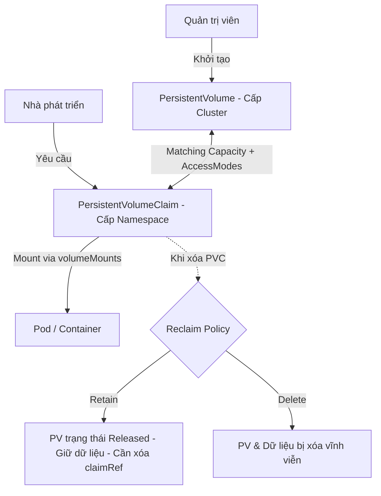
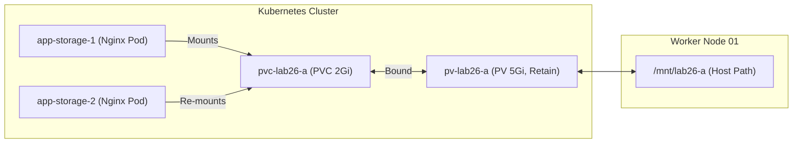

# [BÀI 26] KIẾN TRÚC LƯU TRỮ BỀN VỮNG: VOLUME, PERSISTENTVOLUME (PV), PERSISTENTVOLUMECLAIM (PVC) & RECLAIMPOLICY

Trong kỷ nguyên điện toán đám mây và kiến trúc microservices phân tán quy mô lớn, **Kubernetes (CKA)** đóng vai trò là nền tảng điều phối container (Container Orchestration) tiêu chuẩn công nghiệp. Để làm chủ hệ thống trong môi trường sản xuất (Production) cũng như chinh phục kỳ thi chứng chỉ quốc tế của Linux Foundation / CNCF, kỹ sư không chỉ nắm vững các câu lệnh thao tác cơ bản mà phải thấu hiểu sâu sắc bản chất cơ chế tầng thấp: từ chu trình điều hòa (Reconciliation Loop), cấu trúc điều phối tài nguyên, kiến trúc mạng CNI, lưu trữ CSI cho đến các chuẩn mực an ninh phòng thủ chiều sâu.

Bài viết chuyên sâu này sẽ đồng hành cùng bạn giải mã toàn diện bức tranh kiến trúc, phân tích các đánh đổi kỹ thuật thực chiến (Engineering Trade-offs), cung cấp bài thực hành Lab từng bước và bộ câu hỏi phỏng vấn chuẩn Architect / Lead Engineer.

---

## 1. Bản Chất Kiến Trúc & Cơ Chế Vận Hành Tầng Thấp

| # | Câu hỏi ôn tập | Đáp án chuẩn ngắn gọn |
|---|---|---|
| 1 | Trạng thái mạng mặc định của Kubernetes khi chưa áp dụng NetworkPolicy là gì? | **Default Allow-All** (mở 100 % kết nối giữa mọi Pod trên toàn cụm) |
| 2 | Điều kiện kỹ thuật bắt buộc ở tầng hạ tầng để NetworkPolicy có hiệu lực là gì? | CNI plugin bắt buộc phải hỗ trợ **NetworkPolicy enforcement** (Calico, Cilium) |
| 3 | Đoạn mã YAML nào thực hiện khóa 100 % traffic đi vào (Ingress) của một Namespace? | **`podSelector: {}`** đi kèm cấu hình `ingress: []` trong NetworkPolicy |
| 4 | Ba bộ lọc đối tượng kết hợp trong tệp YAML của NetworkPolicy là gì? | **`podSelector`**, **`namespaceSelector`**, và **`ipBlock`** |
| 5 | Lệnh CLI nào được sử dụng để kiểm thử nhanh khả năng kết nối mạng với timeout 2 giây? | **`nc -zv <IP> <PORT>`** hoặc **`curl --connect-timeout 2 <URL>`** |


> **"Kubernetes tách biệt hoàn toàn trách nhiệm giữa hạ tầng lưu trữ vật lý (PersistentVolume - PV) do Quản trị viên khởi tạo và nhu cầu lưu trữ logic của ứng dụng (PersistentVolumeClaim - PVC) do Nhà phát triển khai báo; trong đó sự kết nối thành công (Binding) phụ thuộc tuyệt đối vào sự khớp nhau về Dung lượng (capacity), Chế độ truy cập (accessModes: ReadWriteOnce, ReadOnlyMany, ReadWriteMany) và StorageClass; đồng thời chính sách thu hồi (`persistentVolumeReclaimPolicy`: Retain, Delete, Recycle) quyết định trực tiếp số phận của dữ liệu gốc trên ổ đĩa vật lý khi PVC bị xóa."**

**Kết quả từ các buổi trước được sử dụng lại:**

| Kết quả / Công cụ | Buổi + số hiệu `QT` | Dùng ở đâu trong buổi này |
|---|---|---|
| Phân quyền RBAC và Namespace scope | Buổi 10 `QT 4.1` | Phân biệt PV là Cluster-scoped còn PVC là Namespace-scoped |
| Khai báo `spec.volumes` và `volumeMounts` trong Pod | Buổi 14 `QT 4.1` | Mount Volume từ PVC vào container bên trong Pod |
| Lệnh kiểm tra đối tượng JSONPath `-o jsonpath` | Buổi 04 `QT 4.1` | Truy vấn trường `status.phase` và `spec.persistentVolumeReclaimPolicy` |

---


| # | Kỹ năng thực hiện được | Hiện vật chứng minh |
|---|---|---|
| 1 | Tạo và quản lý PersistentVolume (PV) thủ công cấp cụm | Tệp YAML PV có cấu hình `capacity`, `accessModes`, `hostPath` |
| 2 | Khai báo PersistentVolumeClaim (PVC) để gắn kết vào PV | Trạng thái PVC đổi sang `Bound` khi kiểm tra bằng `kubectl get pvc` |
| 3 | Khắc phục sự cố PVC bị kẹt ở trạng thái `Pending` do sai thông số | Nhật ký chẩn đoán `kubectl describe pvc` và bản sửa lỗi YAML |
| 4 | Xử lý thủ công PV ở trạng thái `Released` để tái sử dụng bằng cách gỡ `claimRef` | PV chuyển từ `Released` sang `Available` và bind được PVC mới |
| 5 | Chọn đúng chính sách thu hồi `reclaimPolicy` (`Retain` vs `Delete`) để bảo vệ dữ liệu prod | Bảng kiểm tra thực nghiệm xóa PVC và theo dõi sự tồn tại của PV |

---


| Kiến thức tiên quyết | Nguồn tự học nếu thiếu |
|---|---|
| Cấu trúc tệp YAML Pod và cách mount volume cơ bản | Buổi 14 (`QT 4.1`) |
| Quản lý tài nguyên thuộc Namespace và Cluster scope | Buổi 10 (`QT 4.1`) |
| Truy vấn trạng thái tài nguyên Kubernetes qua JSONPath | Buổi 04 (`QT 4.1`) |

---


### 3.1. Thuật ngữ Việt–Anh

| # | Thuật ngữ tiếng Việt | Tiếng Anh tương đương | Ghi chú chuẩn hoá trong thân bài |
|---|---|---|---|
| 1 | Ổ đĩa bền vững | PersistentVolume (PV) | Tài nguyên lưu trữ cấp cụm do Administrator khởi tạo |
| 2 | Yêu cầu ổ đĩa | PersistentVolumeClaim (PVC) | Yêu cầu lưu trữ cấp Namespace do Developer tạo |
| 3 | Chế độ truy cập | Access Modes | `ReadWriteOnce`, `ReadOnlyMany`, `ReadWriteMany` |
| 4 | Chính sách thu hồi | Reclaim Policy | `Retain`, `Delete`, `Recycle` |
| 5 | Gắn kết | Binding / Bound | Trạng thái PV và PVC khớp thông số và nối liền với nhau |
| 6 | Thư mục tạm thời | `emptyDir` | Volume gắn liền với vòng đời của Pod, mất dữ liệu khi Pod bị xóa |
| 7 | Đường dẫn trên Host | `hostPath` | Mount trực tiếp thư mục từ Node vào Pod |
| 8 | Lớp lưu trữ | StorageClass | Định nghĩa loại đĩa và nhà cung cấp lưu trữ |
| 9 | Chưa được gắn kết | Unbound / Pending | Trạng thái PVC chưa tìm thấy PV phù hợp |
| 10 | Đã giải phóng | Released | Trạng thái PV khi PVC tương ứng đã bị xóa nhưng PV chưa thu hồi |
| 11 | Bị lỗi thu hồi | Failed | Trạng thái PV khi quá trình xóa tự động bị lỗi |
| 12 | Điểm gắn ổ đĩa | `volumeMounts` | Khai báo thư mục đích bên trong container |
| 13 | Vòng đời lưu trữ | Storage Lifecycle | Các mốc Provisioning -> Binding -> Using -> Reclaiming |
| 14 | Tham chiếu yêu cầu | `claimRef` | Trường chứa định danh PVC được bind vào PV |


Kiến trúc phân tách trách nhiệm giữa Quản trị viên (PV) và Lập trình viên (PVC): Admin tạo ổ đĩa đính kèm hệ thống, Dev xin dung lượng đĩa theo Namespace.

---

### 1.1. Phân loại Volume tạm thời và Volume bền vững (12 phút)

**Nguyên lý cốt lõi:** `emptyDir` gắn liền vòng đời với Pod (chết Pod là mất dữ liệu); `hostPath` gắn liền với Node (chết Node là mất dữ liệu); chỉ có PV/PVC mới độc lập hoàn toàn với Pod và Node.

**Giải thích cơ chế ngầm:** `emptyDir` được kubelet tạo ra trên đĩa cục bộ của Node khi Pod khởi chạy và xóa sạch khi Pod ngưng tồn tại. `hostPath` trỏ trực tiếp tới tệp/thư mục trên đĩa vật lý của Node chứa Pod, nếu Pod bị dời sang Node khác thì dữ liệu cũ không đi theo. PV/PVC đại diện cho hệ thống lưu trữ mạng (NFS, Ceph, EBS, iSCSI) tách rời khỏi sự tồn tại của Pod lẫn Node.

> [!WARNING]
> **CẠM BẪY THỰC CHIẾN:**
> Dùng `emptyDir` lưu cơ sở dữ liệu Postgres, khi Pod bị restart do OOM thì toàn bộ dữ liệu database biến mất. Hoặc dùng `hostPath` cho StatefulSet nhiều Node khiến các Pod trên Node 2 không thể truy cập dữ liệu đã ghi ở Node 1.

**Minh hoạ.**

```yaml
# SAI — Dùng emptyDir cho dữ liệu quan trọng
volumes:
  - name: db-data
    emptyDir: {}

# ĐÚNG — Dùng PVC để dữ liệu độc lập hoàn toàn với Pod
volumes:
  - name: db-data
    persistentVolumeClaim:
      claimName: pvc-postgres-data
```

**Nguyên lý cốt lõi:** PV là tài nguyên cấp cụm (`Cluster-scoped`), không thuộc bất kỳ Namespace nào; PVC là đối tượng cấp Namespace (`Namespace-scoped`).

**Giải thích cơ chế ngầm:** Administrator quản lý hạ tầng phần cứng đĩa ở cấp toàn cụm (PV). Developer ở các đội nhóm làm việc trên từng Namespace riêng biệt chỉ gửi yêu cầu dung lượng (PVC) mà không cần biết chi tiết hạ tầng bên dưới.

> [!WARNING]
> **CẠM BẪY THỰC CHIẾN:**
> Khai báo trường `metadata.namespace` trong tệp YAML định nghĩa `PersistentVolume`. Lệnh `kubectl apply` sẽ bỏ qua hoặc báo lỗi vì PV không nhận Namespace.

**Minh hoạ.**

```yaml
# SAI — Khai báo namespace cho PV
apiVersion: v1
kind: PersistentVolume
metadata:
  name: pv-data-01
  namespace: prod # SAI — PV không có namespace!

# ĐÚNG — PV cấp cụm, PVC cấp namespace
apiVersion: v1
kind: PersistentVolume
metadata:
  name: pv-data-01 # ĐÚNG
---
apiVersion: v1
kind: PersistentVolumeClaim
metadata:
  name: pvc-data-01
  namespace: prod # ĐÚNG
```

---

### 1.2. Cơ chế Binding giữa PVC và PV (12 phút)

**Nguyên lý cốt lõi:** PVC chỉ gắn kết (`Bound`) với PV khi dung lượng PV `>=` dung lượng yêu cầu của PVC, và tập hợp `accessModes` của PVC phải là tập con hoặc bằng `accessModes` của PV.

**Giải thích cơ chế ngầm:** Kubernetes Control Plane (PersistentVolumeController) thực hiện thuật toán tìm kiếm PV phù hợp nhất cho PVC. Nếu PV có dung lượng nhỏ hơn yêu cầu của PVC hoặc không đáp ứng đủ chế độ truy cập (ví dụ PVC đòi `ReadWriteMany` mà PV chỉ có `ReadWriteOnce`), PVC sẽ không thể bind.

> [!WARNING]
> **CẠM BẪY THỰC CHIẾN:**
> `kubectl get pvc` hiển thị trạng thái `Pending`. Kiểm tra bằng `kubectl describe pvc` thấy thông báo: `warning ProvisioningFailed: no persistent volumes available for this claim and no storage class is set`.

**Minh hoạ.**

```yaml
# PV có dung lượng 5Gi, accessMode ReadWriteOnce
apiVersion: v1
kind: PersistentVolume
metadata:
  name: pv-storage-5g
spec:
  capacity:
    storage: 5Gi
  accessModes:
    - ReadWriteOnce
  hostPath:
    path: /mnt/data
---
# PVC đòi 2Gi, accessMode ReadWriteOnce -> BIND THÀNH CÔNG (5Gi >= 2Gi)
apiVersion: v1
kind: PersistentVolumeClaim
metadata:
  name: pvc-app
spec:
  accessModes:
    - ReadWriteOnce
  resources:
    requests:
      storage: 2Gi
```

**Nguyên lý cốt lõi:** Thuộc tính `accessModes` của PV chỉ là **khai báo nhãn** đối sánh của Kubernetes, không tự biến một ổ đĩa không hỗ trợ chia sẻ mạng thành ổ đĩa đọc ghi nhiều nơi (`ReadWriteMany`).

**Giải thích cơ chế ngầm:** `accessModes` gồm 3 kiểu: `ReadWriteOnce` (RWO - 1 Node đọc ghi), `ReadOnlyMany` (ROX - nhiều Node đọc), `ReadWriteMany` (RWX - nhiều Node đọc ghi). Nhãn này do người tạo PV ghi vào. Nếu tạo PV loại `hostPath` hoặc AWS EBS (chỉ hỗ trợ đĩa đơn) nhưng cố tình khai báo `ReadWriteMany`, Kubernetes vẫn cho bind nhưng khi 2 Pod trên 2 Node khác nhau cùng ghi sẽ gây hỏng dữ liệu hoặc lỗi mount ở tầng nhân OS.

> [!WARNING]
> **CẠM BẪY THỰC CHIẾN:**
> Đặt `accessModes: ReadWriteMany` cho đĩa EBS cục bộ, khi đính kèm vào 2 Pod ở 2 Worker Node khác nhau, Pod thứ hai bị treo với lỗi `Multi-Attach error for volume`.

**Minh hoạ.**

```yaml
# SAI — Đĩa hostPath cục bộ nhưng khai báo giả chia sẻ RWX
spec:
  capacity:
    storage: 10Gi
  accessModes:
    - ReadWriteMany # SAI VỀ BẢN CHẤT HẠ TẦNG!
  hostPath:
    path: /data/local

# ĐÚNG — Chỉ khai báo RWX với hạ tầng lưu trữ mạng thực sự (NFS, CephFS)
spec:
  capacity:
    storage: 10Gi
  accessModes:
    - ReadWriteMany
  nfs:
    path: /exports/share
    server: 192.168.1.50
```

**Nguyên lý cốt lõi:** Hai PVC khác nhau **không thể** bind chung vào cùng một PV (mỗi PV chỉ gắn duy nhất 1 PVC tại một thời điểm, quan hệ 1-1).

**Giải thích cơ chế ngầm:** Quá trình binding thiết lập một liên kết 1-1 độc quyền giữa 1 PV và 1 PVC. Khi PVC-A bind vào PV-1, thuộc tính `spec.claimRef` của PV-1 sẽ ghi tên PVC-A. PVC-B cho dù có thông số khớp 100 % cũng không thể sử dụng lại PV-1 đó nữa.

> [!WARNING]
> **CẠM BẪY THỰC CHIẾN:**
> Tạo PVC thứ hai đòi sử dụng lại PV đang ở trạng thái `Bound`. PVC thứ hai bị kẹt `Pending` dù kiểm tra thấy dung lượng PV vẫn thừa.

**Minh hoạ.**

```bash
# Kiểm tra PV đã bound cho pvc-01
kubectl get pv pv-data-01
# Output: STATUS: Bound, CLAIM: default/pvc-01

# PVC pvc-02 tạo sau đòi dùng cùng PV sẽ bị Pending
kubectl get pvc pvc-02
# Output: STATUS: Pending
```

---

### 1.3. Ba chính sách thu hồi `persistentVolumeReclaimPolicy` (10 phút)

**Nguyên lý cốt lõi:** Khi PVC bị xóa, nếu PV có `reclaimPolicy: Retain`, PV chuyển sang trạng thái `Released` và giữ nguyên dữ liệu trên đĩa; admin phải xử lý thủ công mới tái sử dụng được PV.

**Giải thích cơ chế ngầm:** Chính sách `Retain` bảo vệ dữ liệu an toàn tối đa. Ngay cả khi Lập trình viên vô tình xóa PVC, dữ liệu gốc trên ổ đĩa vật lý không bị đụng tới. Tuy nhiên, PV không tự động sẵn sàng cho PVC khác mà bị khóa ở trạng thái `Released`.

> [!WARNING]
> **CẠM BẪY THỰC CHIẾN:**
> Xóa PVC cũ, tạo PVC mới đòi dùng lại dữ liệu cũ nhưng PVC mới bị kẹt `Pending`. Kiểm tra `kubectl get pv` thấy trạng thái `Released`.

**Minh hoạ.**

```yaml
spec:
  capacity:
    storage: 5Gi
  persistentVolumeReclaimPolicy: Retain # Giữ nguyên dữ liệu khi PVC bị xóa
  accessModes:
    - ReadWriteOnce
```

**Nguyên lý cốt lõi:** Khi PV ở trạng thái `Released`, thuộc tính `claimRef` trong PV vẫn giữ tên PVC cũ, ngăn chặn bất kỳ PVC mới nào bind vào cho đến khi `claimRef` được xóa thủ công.

**Giải thích cơ chế ngầm:** Trường `spec.claimRef` chứa thông tin định danh của PVC đã bị xóa. Controller dựa vào đây để ngăn chặn các PVC khác vô tình ghi đè lên dữ liệu chưa được nghiệm thu hoặc dọn dẹp.

> [!WARNING]
> **CẠM BẪY THỰC CHIẾN:**
> Thắc mắc tại sao PV dung lượng còn trống, trạng thái không phải `Bound` mà PVC mới vẫn `Pending`.

**Minh hoạ.**

```bash
# Xóa thuộc tính claimRef thủ công để trả PV về trạng thái Available
kubectl patch pv pv-data-01 -p '{"spec":{"claimRef":null}}'
```

**Nguyên lý cốt lõi:** Với `reclaimPolicy: Delete`, khi PVC bị xóa, PV vật lý và dữ liệu bên dưới sẽ bị hệ thống tự động xóa sạch lập tức.

**Giải thích cơ chế ngầm:** Chính sách `Delete` thường đi kèm với các StorageClass cấp phát động (Dynamic Provisioning). Hệ thống coi dữ liệu của PVC là tạm thời hoặc đã được sao lưu, giúp giải phóng tự động không gian đĩa trên đám mây (EBS, GPD).

> [!WARNING]
> **CẠM BẪY THỰC CHIẾN:**
> Áp dụng `reclaimPolicy: Delete` cho cơ sở dữ liệu sản xuất. Khi ai đó xóa PVC, toàn bộ ổ đĩa EBS và dữ liệu DB bị hủy vĩnh viễn không thể khôi phục.

**Minh hoạ.**

```yaml
# Cảnh báo: Chỉ dùng Delete cho môi trường test hoặc ứng dụng không lưu trạng thái quan trọng
spec:
  capacity:
    storage: 10Gi
  persistentVolumeReclaimPolicy: Delete
```

---

### 1.4. Đưa vào cụm thật (4 phút)

**Nguyên lý cốt lõi:** Pod chỉ có thể Mount PVC ở trạng thái `Bound`; nếu PVC đang `Pending`, Pod sẽ bị kẹt vĩnh viễn ở trạng thái `ContainerCreating` hoặc `Pending`.

**Giải thích cơ chế ngầm:** Kubelet trên Worker Node chỉ có thể thực hiện thao tác `AttachVolume` và `MountVolume` khi Control Plane đã hoàn tất việc kết nối PVC với PV vật lý và trả về đường dẫn ổ đĩa thực sự.

> [!WARNING]
> **CẠM BẪY THỰC CHIẾN:**
> Pod báo lỗi `CreateContainerError` hoặc `Pending`. Lệnh `kubectl describe pod <pod-name>` báo lỗi `VolumeSubjectName not bound` hoặc `waiting for volume to be bound`.

**Minh hoạ.**

```yaml
# Tệp YAML Pod mount PVC pvc-app đang Pending -> Pod kẹt ContainerCreating
apiVersion: v1
kind: Pod
metadata:
  name: web-app
spec:
  containers:
    - name: nginx
      image: nginx:alpine
      volumeMounts:
        - mountPath: /usr/share/nginx/html
          name: storage
  volumes:
    - name: storage
      persistentVolumeClaim:
        claimName: pvc-app
```

**Áp vào cụm đang chạy thì làm gì trước:**
1. Luôn kiểm tra danh sách PV sẵn có bằng `kubectl get pv` trước khi viết tệp YAML PVC.
2. Thiết lập `persistentVolumeReclaimPolicy: Retain` cho toàn bộ tài nguyên đĩa của môi trường Production.
3. Sử dụng `kubectl get pvc -n <namespace>` để đảm bảo trạng thái `Bound` trước khi triển khai Pod/Deployment.

**Cái gì hỏng nếu áp thẳng lên prod:**
- Đổi `reclaimPolicy` sang `Delete` trên cụm Prod có thể khiến dữ liệu bị xóa sạch nếu người vận hành gỡ PVC để bảo trì.
- Tạo PVC đòi `accessModes: ReadWriteMany` trên ổ đĩa chỉ hỗ trợ `ReadWriteOnce` sẽ khiến Deployment nhiều Pod không thể khởi động.

**Đo trước — đo sau:**
- Đo thời gian từ lúc tạo PVC đến khi trạng thái chuyển sang `Bound` (dưới 2 giây với PV tĩnh).
- Xác minh tính toàn vẹn dữ liệu bằng cách đếm checksum tệp tin trước và sau khi tái tạo Pod.

**Khi nào KHÔNG nên dùng:**
- Không dùng PV/PVC cho các ứng dụng hoàn toàn không lưu trạng thái (Stateless app như Nginx frontend). Dùng đĩa đính kèm làm tăng độ phức tạp vận hành không cần thiết.

---

### 1.5. Bẫy hay gặp (2 phút)

| Bẫy hay gặp | Vì sao dính | Làm đúng là |
|---|---|---|
| 1. Khai báo `namespace` vào tệp YAML định nghĩa PV | Lẫn lộn giữa PV (Cluster-scoped) và PVC (Namespace-scoped) | Bỏ trường `metadata.namespace` khỏi định nghĩa PV |
| 2. PVC bị kẹt `Pending` do khai báo dung lượng đòi hỏi lớn hơn PV | PV có 5Gi nhưng PVC yêu cầu 10Gi | Tạo PV mới lớn hơn hoặc hạ yêu cầu PVC xuống `<= 5Gi` |
| 3. PVC bị kẹt `Pending` do sai lệch `accessModes` | PV để `ReadWriteOnce` nhưng PVC đòi `ReadWriteMany` | Sửa `accessModes` của PVC cho khớp với PV |
| 4. Xóa PVC rồi tạo lại PVC mới nhưng không bind được PV cũ | PV chuyển sang `Released` và bị khóa bởi `claimRef` cũ | Dùng `kubectl patch pv <pv-name> -p '{"spec":{"claimRef":null}}'` |
| 5. Mất sạch dữ liệu sau khi xóa PVC | PV đặt `persistentVolumeReclaimPolicy: Delete` | Luôn cấu hình `reclaimPolicy: Retain` cho đĩa quan trọng |
| 6. Đặt tên `storageClassName` không khớp giữa PV và PVC | PV đặt `storageClassName: fast`, PVC đặt `storageClassName: slow` | Đảm bảo trường `storageClassName` của PV và PVC phải giống hệt nhau |
| 7. Pod bị treo do ghi vào đĩa `hostPath` không tồn tại trên Node | Chưa tạo sẵn thư mục trên Node vật lý | Tạo sẵn thư mục trên Worker Node hoặc dùng `hostPath.type: DirectoryOrCreate` |
| 8. Hai Pod trên 2 Node khác nhau cùng mount PVC `ReadWriteOnce` | Hiểu sai RWO là "ghi một lần" thay vì "gắn vào 1 Node" | Dùng RWO cho Pod đơn lẻ hoặc chuyển sang hạ tầng đĩa mạng hỗ trợ RWX |
| 9. Khai báo sai tên PVC trong `spec.volumes` của Pod | Gõ nhầm `claimName` | Kiểm tra tên PVC chính xác bằng `kubectl get pvc` trước khi gắn vào Pod |
| 10. Xóa PV đang có PVC và Pod đang dùng | Thao tác vội vàng gây treo lệnh xóa | Xóa Pod trước, sau đó xóa PVC, cuối cùng mới xóa PV |
| 11. Nhầm lẫn giữa `Recycle` và `Delete` | Cho rằng `Recycle` giữ dữ liệu | `Recycle` thực hiện `rm -rf /volume/*` xóa sạch dữ liệu để cho PVC khác dùng lại |
| 12. Không kiểm tra quyền ghi thư mục khi mount volume vào container | Container chạy với user không phải root (non-root) bị lỗi `Permission denied` | Cấu hình `securityContext.fsGroup` trong Pod spec để cấp quyền |

---

### 1.6. Tóm tắt (2 phút)



**Năm điều phải nhớ:**
1. **PV là tài nguyên Cluster-scoped**, **PVC là tài nguyên Namespace-scoped**.
2. **Binding thành công** đòi hỏi dung lượng PV `>=` PVC và `accessModes` phải khớp.
3. **`accessModes` chỉ là nhãn khai báo**, không thay đổi tính chất đĩa vật lý bên dưới.
4. **`reclaimPolicy: Retain`** bảo vệ dữ liệu tuyệt đối khi xóa PVC, nhưng để lại `claimRef` khóa PV ở trạng thái `Released`.
5. **Muốn tái sử dụng PV `Released`**, phải patch xóa `spec.claimRef` về `null`.

---

## §10. Câu hỏi tự kiểm tra (5 phút)

1. Sự khác nhau căn bản giữa PV và PVC trong Kubernetes là gì?
   - **Đáp án:** PV đại diện cho hạ tầng đĩa vật lý do Admin tạo cấp cụm (`Cluster-scoped`). PVC đại diện cho nhu cầu xin sử dụng đĩa của Dev ở từng Namespace (`Namespace-scoped`).

2. Một PV có dung lượng 10Gi, `accessModes: ReadWriteOnce`. Một PVC xin 15Gi `ReadWriteOnce`. Trạng thái của PVC sẽ là gì?
   - **Đáp án:** Trạng thái `Pending` do dung lượng PV không đủ đáp ứng (10Gi < 15Gi).

3. Điều gì xảy ra với dữ liệu trên đĩa khi ta xóa PVC gắn với PV có `reclaimPolicy: Retain`?
   - **Đáp án:** Dữ liệu trên đĩa được giữ nguyên 100 %. PV chuyển sang trạng thái `Released`.

4. Làm thế nào để một PVC mới có thể bind vào một PV đang ở trạng thái `Released`?
   - **Đáp án:** Xóa thông tin `claimRef` cũ trong PV bằng lệnh `kubectl patch pv <pv-name> -p '{"spec":{"claimRef":null}}'`.

5. Trình bày ý nghĩa của 3 chế độ `accessModes`: RWO, ROX, RWX.
   - **Đáp án:** RWO (`ReadWriteOnce` - mount đọc ghi trên 1 Node), ROX (`ReadOnlyMany` - mount chỉ đọc trên nhiều Node), RWX (`ReadWriteMany` - mount đọc ghi đồng thời trên nhiều Node).

6. Tại sao không nên dùng `hostPath` cho các ứng dụng có tính sẵn sàng cao (HA) chạy trên cụm nhiều Node?
   - **Đáp án:** Vì `hostPath` gắn chặt dữ liệu vào đĩa cục bộ của 1 Node. Khi Pod chuyển sang Node khác, nó không thể truy cập dữ liệu cũ.

7. Khai báo `emptyDir` có dữ liệu tồn tại sau khi Pod bị gỡ bỏ không?
   - **Đáp án:** Không. `emptyDir` bị xóa sạch hoàn toàn ngay khi Pod ngưng tồn tại.

8. Nếu một Pod trỏ tới PVC ở trạng thái `Pending`, trạng thái của Pod sẽ là gì?
   - **Đáp án:** `ContainerCreating` hoặc `Pending`.

9. Sự khác biệt giữa `reclaimPolicy: Delete` và `Recycle` là gì?
   - **Đáp án:** `Delete` xóa sạch cả PV lẫn đĩa bên dưới. `Recycle` thực hiện `rm -rf` dữ liệu bên trong đĩa và đưa PV trở lại trạng thái `Available`.

10. Quan hệ giữa PV và PVC khi bind là 1-1 hay 1-nhiều?
    - **Đáp án:** Là quan hệ 1-1 độc quyền.

11. Trường `storageClassName` trong PV và PVC có vai trò gì khi bind tĩnh (Static Provisioning)?
    - **Đáp án:** Chúng bắt buộc phải khớp tên chuỗi với nhau. Nếu một bên có tên storageClass mà bên kia rỗng/khác tên thì sẽ không bind được.

12. Lệnh nào giúp kiểm tra chi tiết lý do PVC không bind được PV?
    - **Đáp án:** `kubectl describe pvc <tên-pvc>`.

---

## §11. Tài liệu tham khảo

| Nguồn | Địa chỉ URL | Ghi chú |
|---|---|---|
| Trang chủ Kubernetes Storage | `https://kubernetes.io/docs/concepts/storage/persistent-volumes/` | Phiên bản Kubernetes v1.35 |
| Kubernetes Volumes Overview | `https://kubernetes.io/docs/concepts/storage/volumes/` | Chi tiết về emptyDir & hostPath |

---

## Bảng đối soát thời lượng

| Mục | Ngân sách thời gian | Thực tế |
|---|---|---|
| §0. Khởi động và ôn tập | 10 phút | 10 phút |
| §1. Học viên làm được gì | 1 phút | 1 phút |
| §2. Cần biết trước | 1 phút | 1 phút |
| §3. Thuật ngữ và mô hình tư duy | 8 phút | 8 phút |
| §4. Phân loại Volume tạm & bền vững | 12 phút | 12 phút |
| §5. Cơ chế Binding PV & PVC | 12 phút | 12 phút |
| §6. Ba chính sách thu hồi | 10 phút | 10 phút |
| §7. Đưa vào cụm thật | 4 phút | 4 phút |
| §8. Bẫy hay gặp | 2 phút | 2 phút |
| §9. Tóm tắt | 2 phút | 2 phút |
| §10. Câu hỏi tự kiểm tra | 5 phút | 5 phút |
| **Tổng** | **60'** | **60'** |

---

## 2. Hướng Dẫn Thực Hành & Triển Khai Lab Chuẩn Production

> [!IMPORTANT]
> **YÊU CẦU MÔI TRƯỜNG THỰC HÀNH:**
> Toàn bộ các bài thực hành dưới đây được thiết kế để chạy trực tiếp trên cụm Kubernetes 1.30+ tiêu chuẩn (hoặc cụm kind/kubeadm lab). Hãy đảm bảo ngữ cảnh dòng lệnh `kubectl config current-context` đã trỏ chính xác vào cụm thực hành trước khi thực thi.

## Khối thực hành — 120 phút

## L0. Mục tiêu thực hành và tiêu chí hoàn thành

| Mã tiêu chí | Nội dung tiêu chí | Lệnh kiểm chứng | Kết quả kỳ vọng |
|---|---|---|---|
| TH1 | Tạo PV `pv-lab26-a` kiểu hostPath `5Gi` | `kubectl get pv pv-lab26-a -o jsonpath='{.spec.capacity.storage}'` | In ra `5Gi` |
| TH2 | Tạo PVC `pvc-lab26-a` đòi `2Gi` bind thành công | `kubectl get pvc pvc-lab26-a -n lab26 -o jsonpath='{.status.phase}'` | In ra `Bound` |
| TH3 | Pod `app-storage-1` mount thành công PVC | `kubectl get pod app-storage-1 -n lab26 -o jsonpath='{.status.phase}'` | In ra `Running` |
| TH4 | Kiểm tra ghi dữ liệu vào PVC | `kubectl exec app-storage-1 -n lab26 -- cat /usr/share/nginx/html/data.txt` | Chứa `NTKK8S-LAB26-TEST` |
| TH5 | Tái tạo Pod mới `app-storage-2` giữ nguyên dữ liệu | `kubectl exec app-storage-2 -n lab26 -- cat /usr/share/nginx/html/data.txt` | Chứa `NTKK8S-LAB26-TEST` |
| TH6 | PVC đòi `10Gi` rơi vào trạng thái Pending | `kubectl get pvc pvc-mismatch -n lab26 -o jsonpath='{.status.phase}'` | In ra `Pending` |
| TH7 | Xóa PVC làm PV chuyển sang Released | `kubectl get pv pv-lab26-a -o jsonpath='{.status.phase}'` | In ra `Released` |
| TH8 | Sửa lỗi `claimRef` đưa PV về Available | `kubectl get pv pv-lab26-a -o jsonpath='{.status.phase}'` | In ra `Available` |
| TH9 | PVC mới `pvc-lab26-b` bind thành công vào PV vừa giải phóng | `kubectl get pvc pvc-lab26-b -n lab26 -o jsonpath='{.status.phase}'` | In ra `Bound` |
| TH10 | Thử nghiệm `reclaimPolicy: Delete` tự động xóa PV | `kubectl get pv pv-lab26-delete` | Báo lỗi `NotFound` |

---

## L1. Điều kiện tiên quyết về môi trường

| Kiểm tra | Lệnh thực hiện | Kết quả kỳ vọng |
|---|---|---|
| Cụm Kubernetes ba node | `kubectl get nodes` | `cp-01`, `worker-01`, `worker-02` ở trạng thái `Ready` |
| Context đúng môi trường lab | `kubectl config current-context` | Đúng context cụm `kubeadm` |
| Thư mục lưu trữ trên Worker Node | `ssh worker-01 "ls -ld /mnt/lab26-a"` | Thư mục tồn tại với quyền `0777` |

---

## L2. Kiến trúc bài lab



**Các quyết định thiết kế bài lab:**
1. Tạo Namespace riêng `lab26` để cô lập các tài nguyên thử nghiệm.
2. Tạo thư mục `/mnt/lab26-a` trên Worker Node 01 đại diện cho đĩa đính kèm vật lý.
3. Sử dụng hai chính sách thu hồi `Retain` và `Delete` để so sánh thực nghiệm.

---

## L3. Bước 1: Khởi tạo PersistentVolume (PV) và PersistentVolumeClaim (PVC) (30 phút)

### Thao tác 1.1: Tạo Namespace và thư mục trên Node

```bash
kubectl create namespace lab26
ssh worker-01 "sudo mkdir -p /mnt/lab26-a && sudo chmod 777 /mnt/lab26-a"
```

### Thao tác 1.2: Định nghĩa và tạo PV `pv-lab26-a`

```bash
cat <<EOF | kubectl apply -f -
apiVersion: v1
kind: PersistentVolume
metadata:
  name: pv-lab26-a
spec:
  capacity:
    storage: 5Gi
  volumeMode: Filesystem
  accessModes:
    - ReadWriteOnce
  persistentVolumeReclaimPolicy: Retain
  storageClassName: manual
  hostPath:
    path: /mnt/lab26-a
EOF
```

**CHECKPOINT 1 — Kiểm tra PV `pv-lab26-a` tạo thành công.**

```bash
kubectl get pv pv-lab26-a -o jsonpath='{.status.phase}' | grep -qx Available && echo "CHECKPOINT 1 — ĐẠT" || echo "CHECKPOINT 1 — LỖI"
```

### Thao tác 1.3: Tạo PVC `pvc-lab26-a` đòi 2Gi

```bash
cat <<EOF | kubectl apply -f -
apiVersion: v1
kind: PersistentVolumeClaim
metadata:
  name: pvc-lab26-a
  namespace: lab26
spec:
  accessModes:
    - ReadWriteOnce
  storageClassName: manual
  resources:
    requests:
      storage: 2Gi
EOF
```

**CHECKPOINT 2 — Kiểm tra PVC `pvc-lab26-a` đã Bound với PV `pv-lab26-a`.**

```bash
kubectl get pvc pvc-lab26-a -n lab26 -o jsonpath='{.status.phase}' | grep -qx Bound && echo "CHECKPOINT 2 — ĐẠT" || echo "CHECKPOINT 2 — LỖI"
```

---

## L4. Bước 2: Mount PVC vào Pod và xác minh tính toàn vẹn dữ liệu (30 phút)

### Thao tác 2.1: Triển khai Pod `app-storage-1`

```bash
cat <<EOF | kubectl apply -f -
apiVersion: v1
kind: Pod
metadata:
  name: app-storage-1
  namespace: lab26
spec:
  nodeName: worker-01
  containers:
    - name: web
      image: nginx:alpine
      volumeMounts:
        - mountPath: /usr/share/nginx/html
          name: data-volume
  volumes:
    - name: data-volume
      persistentVolumeClaim:
        claimName: pvc-lab26-a
EOF
```

**CHECKPOINT 3 — Kiểm tra Pod `app-storage-1` chạy thành công.**

```bash
kubectl get pod app-storage-1 -n lab26 -o jsonpath='{.status.phase}' | grep -qx Running && echo "CHECKPOINT 3 — ĐẠT" || echo "CHECKPOINT 3 — LỖI"
```

### Thao tác 2.2: Ghi tệp kiểm thử vào Volume

```bash
kubectl exec app-storage-1 -n lab26 -- sh -c 'echo "NTKK8S-LAB26-TEST" > /usr/share/nginx/html/data.txt'
```

**CHECKPOINT 4 — Kiểm tra tệp `data.txt` chứa dữ liệu.**

```bash
kubectl exec app-storage-1 -n lab26 -- cat /usr/share/nginx/html/data.txt | grep -qx "NTKK8S-LAB26-TEST" && echo "CHECKPOINT 4 — ĐẠT" || echo "CHECKPOINT 4 — LỖI"
```

### Thao tác 2.3: Xóa Pod 1 và tạo Pod 2 để kiểm tra giữ lại dữ liệu

```bash
kubectl delete pod app-storage-1 -n lab26

cat <<EOF | kubectl apply -f -
apiVersion: v1
kind: Pod
metadata:
  name: app-storage-2
  namespace: lab26
spec:
  nodeName: worker-01
  containers:
    - name: web
      image: nginx:alpine
      volumeMounts:
        - mountPath: /usr/share/nginx/html
          name: data-volume
  volumes:
    - name: data-volume
      persistentVolumeClaim:
        claimName: pvc-lab26-a
EOF
```

**CHECKPOINT 5 — Xác minh Pod 2 truy cập dữ liệu cũ nguyên vẹn.**

```bash
kubectl exec app-storage-2 -n lab26 -- cat /usr/share/nginx/html/data.txt | grep -qx "NTKK8S-LAB26-TEST" && echo "CHECKPOINT 5 — ĐẠT" || echo "CHECKPOINT 5 — LỖI"
```

---

## L5. Bước 3: Tái hiện sự cố không khớp thông số và PVC `Pending` (30 phút)

### Thao tác 3.1: Tạo PVC `pvc-mismatch` đòi 10Gi (vượt 5Gi của PV)

```bash
cat <<EOF | kubectl apply -f -
apiVersion: v1
kind: PersistentVolumeClaim
metadata:
  name: pvc-mismatch
  namespace: lab26
spec:
  accessModes:
    - ReadWriteOnce
  storageClassName: manual
  resources:
    requests:
      storage: 10Gi
EOF
```

**CHECKPOINT 6 — Kiểm tra PVC `pvc-mismatch` ở trạng thái Pending.**

```bash
kubectl get pvc pvc-mismatch -n lab26 -o jsonpath='{.status.phase}' | grep -qx Pending && echo "CHECKPOINT 6 — ĐẠT" || echo "CHECKPOINT 6 — LỖI"
```

---

## L6. Bước 4: Kiểm chứng ReclaimPolicy `Retain` vs `Delete` và khắc phục khóa `claimRef` (20 phút)

### Thao tác 4.1: Xóa PVC `pvc-lab26-a` và kiểm tra PV `Released`

```bash
kubectl delete pod app-storage-2 -n lab26
kubectl delete pvc pvc-lab26-a -n lab26
```

**CHECKPOINT 7 — Xác minh PV `pv-lab26-a` chuyển sang trạng thái Released.**

```bash
kubectl get pv pv-lab26-a -o jsonpath='{.status.phase}' | grep -qx Released && echo "CHECKPOINT 7 — ĐẠT" || echo "CHECKPOINT 7 — LỖI"
```

### Thao tác 4.2: Thử tạo PVC mới `pvc-lab26-b` và xác minh bị kẹt

```bash
cat <<EOF | kubectl apply -f -
apiVersion: v1
kind: PersistentVolumeClaim
metadata:
  name: pvc-lab26-b
  namespace: lab26
spec:
  accessModes:
    - ReadWriteOnce
  storageClassName: manual
  resources:
    requests:
      storage: 2Gi
EOF
```

**CHECKPOINT 8 — Kiểm tra PVC `pvc-lab26-b` bị Pending do PV bị khóa claimRef.**

```bash
kubectl get pvc pvc-lab26-b -n lab26 -o jsonpath='{.status.phase}' | grep -qx Pending && echo "CHECKPOINT 8 — ĐẠT" || echo "CHECKPOINT 8 — LỖI"
```

### Thao tác 4.3: Patch xóa `claimRef` trong PV để giải phóng

```bash
kubectl patch pv pv-lab26-a -p '{"spec":{"claimRef":null}}'
```

**CHECKPOINT 9 — Xác minh PVC `pvc-lab26-b` đã Bound thành công.**

```bash
kubectl get pvc pvc-lab26-b -n lab26 -o jsonpath='{.status.phase}' | grep -qx Bound && echo "CHECKPOINT 9 — ĐẠT" || echo "CHECKPOINT 9 — LỖI"
```

### Thao tác 4.4: Thử nghiệm với ReclaimPolicy `Delete`

```bash
ssh worker-01 "sudo mkdir -p /mnt/lab26-delete && sudo chmod 777 /mnt/lab26-delete"

cat <<EOF | kubectl apply -f -
apiVersion: v1
kind: PersistentVolume
metadata:
  name: pv-lab26-delete
spec:
  capacity:
    storage: 1Gi
  accessModes:
    - ReadWriteOnce
  persistentVolumeReclaimPolicy: Delete
  storageClassName: auto-delete
  hostPath:
    path: /mnt/lab26-delete
---
apiVersion: v1
kind: PersistentVolumeClaim
metadata:
  name: pvc-lab26-delete
  namespace: lab26
spec:
  accessModes:
    - ReadWriteOnce
  storageClassName: auto-delete
  resources:
    requests:
      storage: 1Gi
EOF
```

**CHECKPOINT 10 — Kiểm tra PV `pv-lab26-delete` và PVC `pvc-lab26-delete` được tạo.**

```bash
kubectl get pv pv-lab26-delete -o jsonpath='{.status.phase}' | grep -qx Bound && echo "CHECKPOINT 10 — ĐẠT" || echo "CHECKPOINT 10 — LỖI"
```

**CHECKPOINT 11 — Kiểm tra PVC `pvc-lab26-delete` Bound.**

```bash
kubectl get pvc pvc-lab26-delete -n lab26 -o jsonpath='{.status.phase}' | grep -qx Bound && echo "CHECKPOINT 11 — ĐẠT" || echo "CHECKPOINT 11 — LỖI"
```

### Thao tác 4.5: Xóa PVC `pvc-lab26-delete` và xem PV tự biến mất

```bash
kubectl delete pvc pvc-lab26-delete -n lab26
```

**CHECKPOINT 12 — Xác minh PV `pv-lab26-delete` bị xóa khỏi cụm.**

```bash
kubectl get pv pv-lab26-delete 2>&1 | grep -q "NotFound" && echo "CHECKPOINT 12 — ĐẠT" || echo "CHECKPOINT 12 — LỖI"
```

---

## L7. Nộp hiện vật và dọn dẹp (10 phút)

### Thao tác 7.1: Dọn dẹp tài nguyên

```bash
kubectl delete namespace lab26
kubectl delete pv pv-lab26-a
ssh worker-01 "sudo rm -rf /mnt/lab26-a /mnt/lab26-delete"
```

**CHECKPOINT 13 — Xác minh đã dọn dẹp sạch tài nguyên lab26.**

```bash
kubectl get namespace lab26 2>&1 | grep -q "NotFound" && echo "CHECKPOINT 13 — ĐẠT" || echo "CHECKPOINT 13 — LỖI"
```

---

## L8. Xử lý sự cố thường gặp trong lab

| Triệu chứng lỗi | Nguyên nhân gốc rễ | Cách sửa triệt để |
|---|---|---|
| 1. PVC ở trạng thái `Pending` mãi mãi | Không có PV nào khớp dung lượng hoặc accessModes | `kubectl describe pvc` xem lý do, điều chỉnh lại YAML |
| 2. Pod ở trạng thái `ContainerCreating` | PVC trỏ tới chưa `Bound` hoặc sai tên `claimName` | Kiểm tra tên PVC trong `spec.volumes` của Pod |
| 3. PV ở trạng thái `Released` không bind được PVC mới | Thuộc tính `claimRef` cũ chưa được gỡ | Chạy `kubectl patch pv <pv> -p '{"spec":{"claimRef":null}}'` |
| 4. Lỗi `Permission denied` khi Pod ghi dữ liệu vào Volume | Thư mục trên Node chưa cấp quyền ghi cho Nginx | Chạy `chmod 777` trên thư mục đĩa vật lý của Worker Node |
| 5. Lỗi `storageClassName` mismatch | PV đặt một tên storageClass, PVC đặt tên khác | Đồng bộ giá trị `storageClassName` giữa PV và PVC |
| 6. Xóa PVC bị treo không hoàn thành | Pod vẫn đang mount và sử dụng PVC đó | Xóa Pod trước để nhả PVC ra |
| 7. PV không tự động xóa khi dùng `reclaimPolicy: Delete` | Plugin hạ tầng lưu trữ đĩa không hỗ trợ tự xóa | Chuyển sang xóa PV thủ công qua `kubectl delete pv` |
| 8. Lỗi `hostPath` không tìm thấy thư mục | Thuộc tính `hostPath.type` chưa đặt hoặc thiếu thư mục trên Node | Tạo thư mục trên Node trước hoặc đặt `type: DirectoryOrCreate` |
| 9. Pod bị kẹt `Terminating` khi xóa | Cụm bị kẹt finalizer của Volume | Xóa finalizers bằng lệnh `kubectl patch pod <pod> -p '{"metadata":{"finalizers":null}}'` |
| 10. `kubectl get pvc` báo `No resources found` | Quên truyền đúng `-n <namespace>` | Thêm cờ `-n lab26` vào câu lệnh kubectl |
| 11. Đổi `accessModes` của PV đang chạy | Kubernetes không cho phép sửa trường mutable này | Xóa PV và tạo lại với `accessModes` mới |
| 12. Không ghi được file do đĩa bị đầy | Dung lượng đĩa trên Node vật lý hết | Dọn dẹp ổ đĩa trên Worker Node `df -h` |
| 13. Tên PV bị trùng lặp | Tên PV đã tồn tại trên cụm | PV là Cluster-scoped, phải đổi tên PV duy nhất |
| 14. Lỗi mount volume trên Pod multi-node | Dùng `hostPath` nhưng Pod bị schedule sang Node khác | Ép Pod chạy đúng Node bằng `nodeName` hoặc `nodeSelector` |

---

## L9. Bài tập mở rộng

- **BT1:** Tạo PV dung lượng `10Gi` hỗ trợ `ReadOnlyMany`, tạo 2 Pod ở 2 Namespace khác nhau cùng mount PVC này để đọc dữ liệu.
- **BT2:** Viết script Bash tự động phát hiện các PV ở trạng thái `Released` và patch gỡ `claimRef`.
- **BT3:** Cấu hình Pod chạy với user `1001` (non-root) và dùng `securityContext.fsGroup: 2000` để cấp quyền ghi vào PVC.
- **BT4:** Thử nghiệm tạo PV kiểu `nfs` (giả lập hoặc dùng NFS server) và chia sẻ giữa 3 Pod.
- **BT5:** Đo thời gian gắn volume từ khi Pod khởi tạo đến khi ứng dụng ghi được byte đầu tiên.
- **BT6:** Viết bản kê khai Kustomize để quản lý PV/PVC cho hai môi trường dev và prod.

---

## L10. Hiện vật nộp và tiêu chí chấm điểm

| Hạng mục hiện vật | Tiêu chí chấm điểm đạt | Thang điểm |
|---|---|---|
| Tệp YAML `pv.yaml` và `pvc.yaml` | Cấu hình chính xác `capacity`, `accessModes`, `reclaimPolicy` | 30 điểm |
| Nhật ký thực thi 13 Checkpoint | Chạy thành công 100 % các checkpoint in ra `ĐẠT` | 40 điểm |
| Bảng ghi nhận trạng thái vòng đời PV/PVC | Mô tả đầy đủ mốc thay đổi từ `Available` -> `Bound` -> `Released` | 20 điểm |
| Báo cáo bài tập mở rộng | Trả lời đầy đủ yêu cầu của bài tập BT1 và BT2 | 10 điểm |
| **Tổng điểm** | | **100 điểm** |

---

## Bảng đối soát thời lượng

| Khối thực hành | Ngân sách thời gian | Thực tế |
|---|---|---|
| L0 & L1. Chuẩn bị và kiểm tra | 10 phút | 10 phút |
| L3. Bước 1: Khởi tạo PV và PVC | 30 phút | 30 phút |
| L4. Bước 2: Mount PVC vào Pod | 30 phút | 30 phút |
| L5. Bước 3: Tái hiện sự cố PVC Pending | 30 phút | 30 phút |
| L6. Bước 4: Kiểm chứng ReclaimPolicy & claimRef | 20 phút | 20 phút |
| L7 & L8. Dọn dẹp và sự cố | 10 phút | 10 phút |
| **Tổng** | **120'** | **120'** |

---

## 3. Bộ Câu Hỏi Vấn Đáp & Phỏng Vấn Kỹ Thuật Chuyên Sâu

Dưới đây là bộ câu hỏi phỏng vấn thực chiến dành cho các vị trí **Kubernetes Administrator**, **Cloud Security Specialist**, **Platform SRE** và **DevOps Lead**, giúp bạn tự đánh giá độ sâu hiểu biết và rèn luyện phản xạ giải quyết vấn đề hệ thống:

## V1. Cách tiến hành

Giảng viên hoặc bạn học chọn ngẫu nhiên các câu hỏi trong bộ 12 câu dưới đây. Người trả lời phải trình bày mạch lạc trong 60–90 giây mỗi câu, đi thẳng vào cơ chế kỹ thuật và viện dẫn các lệnh CLI thực tế.

---

## V2. Bộ câu hỏi

### Câu 1 — ★★★
**Hỏi:** Hãy phân biệt sự khác nhau về phạm vi (Scope) và quản trị giữa PersistentVolume (PV) và PersistentVolumeClaim (PVC)?

**Đáp án chuẩn:** PV là tài nguyên lưu trữ cấp cụm (`Cluster-scoped`) do Quản trị viên (Admin) khởi tạo để đại diện cho hạ tầng đĩa vật lý. PVC là yêu cầu xin dung lượng đĩa cấp Namespace (`Namespace-scoped`) do Lập trình viên (Developer) khai báo. Hai thành phần này gắn kết với nhau qua cơ chế Binding.

**Tiêu chí chấm:**
- 0đ: Không phân biệt được PV và PVC.
- 1đ: Nêu được PV là đĩa, PVC là yêu cầu dùng đĩa nhưng không nói được vai trò Admin/Dev.
- 2đ: Nêu đúng vai trò Admin/Dev nhưng thiếu thông tin về phạm vi `Cluster-scoped` vs `Namespace-scoped`.
- 3đ: Trình bày đầy đủ scope, vai trò quản trị và cơ chế Binding giữa PV và PVC.

**Câu hỏi đào sâu:** (Nếu khai báo namespace vào YAML của PV thì điều gì xảy ra? — Kubernetes sẽ bỏ qua hoặc báo lỗi vì PV là đối tượng toàn cụm, không thuộc Namespace nào).

---

### Câu 2 — 🔥
**Hỏi:** Sự khác nhau giữa 3 chế độ `reclaimPolicy`: `Retain`, `Delete` và `Recycle` là gì?

**Đáp án chuẩn:** Khi PVC bị xóa: `Retain` giữ nguyên dữ liệu và đĩa vật lý, chuyển PV sang trạng thái `Released` (cần gỡ `claimRef` mới dùng lại được). `Delete` tự động xóa sạch PV và ổ đĩa bên dưới (thường dùng cho cloud storage). `Recycle` thực hiện `rm -rf` dữ liệu trong ổ đĩa và trả PV về trạng thái `Available` (đã bị gắn cờ ngưng hỗ trợ trong các bản K8s mới).

**Tiêu chí chấm:**
- 0đ: Trả lời sai hoặc nhầm lẫn giữa Retain và Delete.
- 1đ: Nêu được Retain giữ dữ liệu, Delete xóa dữ liệu.
- 2đ: Nêu được 3 chế độ nhưng chưa giải thích được trạng thái `Released` của Retain.
- 3đ: Trình bày chính xác 3 chế độ, cơ chế `claimRef` của Retain và lưu ý về Recycle.

**Câu hỏi đào sâu:** (Trong môi trường sản xuất Production nên chọn chính sách nào? — Bắt buộc dùng `Retain` cho dữ liệu quan trọng để tránh thảm họa mất dữ liệu khi trỡ tay xóa PVC).

---

### Câu 3 — ★★★
**Hỏi:** Điều kiện để một PVC có thể bind thành công vào một PV tĩnh (Static Provisioning) là gì?

**Đáp án chuẩn:** Đòi hỏi 4 yếu tố: Dung lượng PV phải lớn hơn hoặc bằng PVC (`capacity >= request`), `accessModes` của PVC phải là tập con hoặc bằng PV, `storageClassName` phải giống hệt nhau (hoặc cùng rỗng), và PV phải đang ở trạng thái `Available` (chưa bị khóa bởi `claimRef` khác).

**Tiêu chí chấm:**
- 0đ: Chỉ nêu được dung lượng.
- 1đ: Nêu được dung lượng và accessModes.
- 2đ: Nêu đủ 3 yếu tố đầu nhưng quên trạng thái `Available` / `claimRef`.
- 3đ: Trình bày chính xác và đầy đủ cả 4 điều kiện.

**Câu hỏi đào sâu:** (Nếu PV có 10Gi mà PVC xin 2Gi thì sau khi Bind dung lượng 8Gi còn lại có dùng cho PVC khác được không? — Không được, mối quan hệ bind là 1-1 độc quyền).

---

### Câu 4 — 🔥
**Hỏi:** Khi một PV có `reclaimPolicy: Retain` bị chuyển sang trạng thái `Released`, tại sao một PVC mới khớp thông số vẫn bị kẹt `Pending` và cách xử lý thế nào?

**Đáp án chuẩn:** Vì PV ở trạng thái `Released` vẫn còn lưu vết `spec.claimRef` chỉ định tên PVC cũ. Để tái sử dụng, ta phải dùng lệnh `kubectl patch pv <pv-name> -p '{"spec":{"claimRef":null}}'` để gỡ `claimRef`, đưa PV về `Available`.

**Tiêu chí chấm:**
- 0đ: Không biết nguyên nhân tại sao kẹt.
- 1đ: Biết tại sao kẹt do dữ liệu cũ nhưng không nêu được trường `claimRef`.
- 2đ: Nêu được `claimRef` nhưng không nhớ câu lệnh patch gỡ bỏ.
- 3đ: Trình bày chính xác bản chất `claimRef` và lệnh `kubectl patch` gỡ bỏ.

**Câu hỏi đào sâu:** (Sau khi patch claimRef xong dữ liệu cũ trên đĩa có bị mất không? — Không mất, dữ liệu cũ vẫn nằm trên đĩa vật lý).

---

### Câu 5 — ★★★
**Hỏi:** Ba chế độ `accessModes`: `ReadWriteOnce` (RWO), `ReadOnlyMany` (ROX), `ReadWriteMany` (RWX) thể hiện hạn chế kỹ thuật hay chỉ là nhãn khai báo?

**Đáp án chuẩn:** Chúng trước hết là **nhãn khai báo** để Kubernetes match PVC với PV. Tuy nhiên, nó bắt buộc phải phản ánh đúng **khả năng kỹ thuật của hạ tầng lưu trữ bên dưới** (ví dụ AWS EBS chỉ hỗ trợ RWO, NFS hỗ trợ RWX). Khai báo sai so với hạ tầng sẽ dẫn đến lỗi mount đĩa ở tầng OS.

**Tiêu chí chấm:**
- 0đ: Trả lời nhầm là Kubernetes tự chuyển đổi đĩa RWO thành RWX.
- 1đ: Trả lời đúng là nhãn khai báo nhưng không giải thích được hạ tầng bên dưới.
- 2đ: Nêu được ý nghĩa RWO/ROX/RWX nhưng chưa làm rõ hậu quả khi khai báo sai so với đĩa thật.
- 3đ: Phân tích sâu sắc cả hai khía cạnh khai báo đối sánh và hạn chế hạ tầng đĩa thật.

**Câu hỏi đào sâu:** (Chữ "Once" trong ReadWriteOnce nghĩa là 1 Pod hay 1 Node? — Là 1 Node! Nhiều Pod chạy trên CÙNG 1 Node vẫn có thể mount chung đĩa RWO).

---

### Câu 6 — 🔥
**Hỏi:** Sự khác nhau giữa Volume `emptyDir` và `hostPath` là gì? Khi nào nên và không nên dùng chúng?

**Đáp án chuẩn:** `emptyDir` tạo ra thư mục tạm trên Node gắn với vòng đời Pod (chết Pod là mất). `hostPath` trỏ tới thư mục có sẵn trên đĩa Node (chết Pod dữ liệu vẫn còn trên Node đó). `emptyDir` dùng cho cache tạm; `hostPath` dùng cho Pod hệ thống cần can thiệp Node (DaemonSet như Fluentd, Calico). Không dùng `hostPath` cho ứng dụng HA multi-node.

**Tiêu chí chấm:**
- 0đ: Không phân biệt được 2 loại volume.
- 1đ: Nêu được khái niệm nhưng không chỉ ra được trường hợp dùng thực tế.
- 2đ: Phân biệt đúng nhưng chưa giải thích được tại sao cấm dùng `hostPath` cho app HA.
- 3đ: Phân tích rõ ràng vòng đời, trường hợp sử dụng và các lưu ý bảo mật/HA.

**Câu hỏi đào sâu:** (Khi Pod dùng `emptyDir` bị restart container do CrashLoopBackOff thì dữ liệu trong `emptyDir` có mất không? — Không mất, trừ khi chính Pod bị xoá hoàn toàn).

---

### Câu 7 — ★★★
**Hỏi:** Tại sao Pod lại rơi vào trạng thái `ContainerCreating` khi PVC chưa ở trạng thái `Bound`?

**Đáp án chuẩn:** Vì Kubelet trên Worker Node chỉ có thể thực hiện thao tác mount đĩa vào container khi Control Plane đã hoàn tất việc kết nối PVC với PV. Khi PVC chưa `Bound`, Kubelet không nhận được thông số đường dẫn đĩa nên phải tạm dừng quá trình khởi tạo container.

**Tiêu chí chấm:**
- 0đ: Không giải thích được liên hệ giữa Pod và PVC.
- 1đ: Nêu được vì PVC chưa xong nhưng không nói được vai trò của Kubelet.
- 2đ: Nêu đúng vai trò Kubelet nhưng chưa nêu câu lệnh chẩn đoán (`kubectl describe pod`).
- 3đ: Phân tích chính xác luồng điều phối của Kubelet và cách chẩn đoán sự cố.

**Câu hỏi đào sâu:** (Lệnh nào để xem nguyên nhân Pod bị kẹt Mount volume? — `kubectl describe pod <pod-name>` trong mục Events).

---

### Câu 8 — 🔥
**Hỏi:** Giả sử có 2 PVC cùng trỏ vào 1 PV bằng cách ghi cứng `volumeName` trong PVC spec, Kubernetes xử lý thế nào?

**Đáp án chuẩn:** PVC nào gửi câu lệnh tạo trước sẽ bind thành công với PV đó. PVC thứ hai gửi sau sẽ bị kẹt ở trạng thái `Pending` với thông báo lỗi PV đã bị `Claimed` bởi PVC thứ nhất (do mối quan hệ 1-1).

**Tiêu chí chấm:**
- 0đ: Trả lời sai rằng cả 2 PVC đều bind được.
- 1đ: Nêu được chỉ 1 PVC bind được nhưng không giải thích được lý tự.
- 2đ: Giải thích được nhưng không nhớ rõ trạng thái PVC thứ hai.
- 3đ: Trình bày chuẩn xác cơ chế race-condition và quan hệ bind 1-1.

**Câu hỏi đào sâu:** (Cách nào để 2 Pod ở 2 Namespace khác nhau chia sẻ cùng dữ liệu? — Dùng đĩa hỗ trợ ReadWriteMany và tạo 2 PVC bind vào 2 PV cùng trỏ chung 1 thư mục đĩa mạng NFS bên dưới).

---

### Câu 9 — ★★★
**Hỏi:** Thuộc tính `persistentVolumeReclaimPolicy` nằm trong file spec của PV hay PVC?

**Đáp án chuẩn:** `persistentVolumeReclaimPolicy` nằm trong `spec` của **PV** (PersistentVolume), vì chính sách thu hồi đĩa vật lý thuộc quyền quyết định của Quản trị viên hạ tầng.

**Tiêu chí chấm:**
- 0đ: Trả lời sai là PVC.
- 1đ: Trả lời đúng là PV nhưng không giải thích được lý do.
- 3đ: Trả lời đúng PV và phân tích đúng phân quyền trách nhiệm giữa Admin và Dev.

**Câu hỏi đào sâu:** (Có thể sửa `reclaimPolicy` của một PV đang ở trạng thái `Bound` không? — Có thể sửa trực tiếp bằng lệnh `kubectl patch pv <pv-name> -p '{"spec":{"persistentVolumeReclaimPolicy":"Retain"}}'`).

---

### Câu 10 — ★★★
**Hỏi:** Nếu ta xóa một PVC đang được đính kèm (mount) bởi một Pod đang chạy (`Running`), chuyện gì sẽ xảy ra?

**Đáp án chuẩn:** PVC sẽ rơi vào trạng thái chờ xóa (`Terminating`) nhưng **chưa bị xóa hẳn** nhờ cơ chế `Storage Object in Use Protection` (Finalizer: `kubernetes.io/pvc-protection`). Chỉ khi Pod dừng hẳn và nhả volume, PVC mới thực sự bị xóa.

**Tiêu chí chấm:**
- 0đ: Trả lời sai là PVC bị xóa ngay và Pod bị sập.
- 1đ: Nêu được PVC không bị xóa ngay nhưng không biết tên cơ chế.
- 3đ: Giải thích chính xác cơ chế Finalizer `pvc-protection` bảo vệ tài nguyên.

**Câu hỏi đào sâu:** (Làm sao để giải phóng PVC đang kẹt Terminating? — Xóa Pod đang sử dụng PVC đó).

---

### Câu 11 — 🔥
**Hỏi:** Trường `storageClassName: ""` (xâu rỗng) trong PVC có ý nghĩa kỹ thuật gì đặc biệt?

**Đáp án chuẩn:** `storageClassName: ""` ép buộc PVC **chỉ được bind với các PV tĩnh không có storageClassName hoặc storageClassName rỗng**, đồng thời vô hiệu hóa cơ chế cấp phát động (Dynamic Provisioning) tự tạo PV từ StorageClass mặc định.

**Tiêu chí chấm:**
- 0đ: Cho rằng xâu rỗng giống như không khai báo trường.
- 1đ: Nêu được không dùng StorageClass nhưng không giải thích được việc chặn Dynamic Provisioning.
- 3đ: Phân tích đầy đủ ảnh hưởng đến Static Bind và Dynamic Provisioning.

**Câu hỏi đào sâu:** (Nếu không khai báo trường `storageClassName` trong PVC thì sao? — Kubernetes sẽ tự động gán StorageClass mặc định của cụm nếu có).

---

### Câu 12 — ★★★
**Hỏi:** Khi ứng dụng bị lỗi `Permission denied` không thể ghi dữ liệu vào PVC đã mount, cách xử lý chuẩn trên Kubernetes là gì?

**Đáp án chuẩn:** Cấu hình `securityContext.fsGroup: <gid>` trong Pod spec để Kubelet tự động thay đổi quyền sở hữu (ownership) của thư mục mount cho nhóm GID tương ứng, cho phép container non-root ghi được dữ liệu.

**Tiêu chí chấm:**
- 0đ: Bảo SSH vào Node bấm `chmod 777` (không phải cách chuẩn trên K8s).
- 1đ: Nêu được sửa quyền nhưng không biết thuộc tính `fsGroup`.
- 3đ: Nêu đúng `securityContext.fsGroup` và cơ chế Kubelet tự điều chỉnh permission.

**Câu hỏi đào sâu:** (Lệnh `fsGroup` hoạt động với loại volume nào? — Với các volume hỗ trợ quản lý POSIX file permission).

---

## V3. Câu chốt để nói khi phỏng vấn

1. **"PV là tài nguyên Cluster-scope đại diện đĩa thật, PVC là Namespace-scope đại diện yêu cầu dùng đĩa; sự kết nối giữa chúng là quan hệ 1-1 độc quyền dựa trên sự phù hợp về dung lượng và accessModes."**
2. **"Chính sách `reclaimPolicy: Retain` bảo vệ an toàn dữ liệu Production khi xóa PVC bằng cách giữ nguyên ổ đĩa và khóa PV ở trạng thái `Released` qua trường `claimRef`."**
3. **"Thuộc tính `accessModes` như ReadWriteOnce hay ReadWriteMany trước hết là nhãn đối sánh của Kubernetes, và bắt buộc phải phản ánh đúng khả năng kỹ thuật của hệ thống lưu trữ bên dưới."**
4. **"Cơ chế Finalizer `pvc-protection` ngăn chặn việc xóa PVC khi vẫn còn Pod đang mount, bảo vệ hệ thống khỏi hiện tượng hỏng hệ tập tin đột ngột."**

---

## V4. Bảng ghi điểm

| Điểm số | Mức độ đạt được | Đánh giá |
|---|---|---|
| **0 – 18 điểm** | Chưa đạt | Thiếu hụt kiến thức cốt lõi về PV/PVC, chưa nắm rõ cơ chế binding |
| **19 – 28 điểm** | Đạt yêu cầu | Nắm vững lý thuyết, phân biệt tốt các thuộc tính nhưng cần rèn luyện phản xạ CLI |
| **29 – 36 điểm** | Xuất sắc | Hiểu sâu sắc bản chất hệ thống lưu trữ, làm chủ kỹ năng chẩn đoán sự cố cho CKA/CKAD |

---

## V5. Bài tập về nhà

- **BTVN 1:** Viết bộ bản kê khai YAML tạo PV 5Gi RWO `hostPath` và PVC tương ứng, mount vào Pod Nginx test khả năng giữ dữ liệu sau khi xóa Pod.
- **BTVN 2:** Thực hiện bài lab gỡ khóa `claimRef` của một PV ở trạng thái `Released` để bind lại vào PVC mới.
- **BTVN 3:** So sánh và tổng hợp bảng khác biệt giữa 3 loại volume: `emptyDir`, `hostPath` và `persistentVolumeClaim`.
- **BTVN 4 (Chuẩn bị cho Buổi 27 — StorageClass & CSI):** Trả lời ngắn gọn 3 câu hỏi:
  1. StorageClass giải quyết bài toán cấp phát tự động (Dynamic Provisioning) PV thế nào so với tạo PV bằng tay?
  2. Khác biệt giữa hai chế độ `volumeBindingMode: Immediate` và `WaitForFirstConsumer` trong StorageClass là gì?
  3. Kiến trúc CSI (Container Storage Interface) gồm những thành phần plugin nào trên Control Plane và Worker Node?

---

## 4. Đề Thi Thực Hành Bấm Giờ & Thử Thách Tốc Độ (Exam Speed Challenge)

> [!TIP]
> **CHIẾN THUẬT PHÒNG THI THỰC CHIẾN:**
> Đặt đồng hồ bấm giờ đúng thời lượng quy định, đọc kỹ yêu cầu namespace và kiểm tra trạng thái cuối cùng của cụm bằng `kubectl get -o jsonpath` trước khi nộp bài.

## T0. Vì sao có khối này

Khối luyện đề giúp học viên rèn luyện phản xạ gõ lệnh dưới sức ép thời gian thực tế của kỳ thi CKA và CKAD. Nội dung đề phủ miền curriculum **`CKA · Storage` (10 %)** và **`CKAD · Application Environment` (25 %)**. Tổng thời gian làm bài và tự chấm là đúng 30 phút (1.800 giây).

---

## T1. Luật chơi

1. Mở duy nhất 1 cửa sổ Terminal và 1 tab trình duyệt truy cập tài liệu chính thức `https://kubernetes.io/docs/`.
2. Không sử dụng công cụ AI, không copy/paste các mẫu YAML sẵn từ ngoài tài liệu chính thức.
3. Sử dụng tối đa các alias rút gọn (`k` cho `kubectl`, `$do` cho `--dry-run=client -o yaml`).
4. Tổng thời gian thực hiện 4 câu: **21 phút** (1.260 giây). Thời gian tự chấm bằng script: **9 phút** (540 giây).

---

## T2. Bốn câu kiểu đề thi

### Câu T2.1 — CKA · Storage — 300 giây
Tạo một PersistentVolume đặt tên là `pv-analytics` đáp ứng các yêu cầu kỹ thuật sau:
- Dung lượng lưu trữ (`capacity`): `2Gi`
- Chế độ truy cập (`accessModes`): `ReadWriteMany`
- Chính sách thu hồi (`reclaimPolicy`): `Retain`
- Loại đĩa (`storageClassName`): `manual`
- Đường dẫn đĩa vật lý (`hostPath`): `/data/analytics`

### Câu T2.2 — CKA · Storage — 300 giây
Tạo một PersistentVolumeClaim đặt tên là `pvc-analytics` nằm trong Namespace `prod` (tạo Namespace nếu chưa có):
- Yêu cầu dung lượng (`requests.storage`): `1Gi`
- Chế độ truy cập (`accessModes`): `ReadWriteMany`
- Loại đĩa (`storageClassName`): `manual`
- Đảm bảo PVC rơi vào trạng thái `Bound` với PV `pv-analytics`.

### Câu T2.3 — CKAD · Application Deployment — 300 giây
Tạo một Pod đặt tên là `web-analytics` thuộc Namespace `prod`:
- Container dùng ảnh: `nginx:alpine`
- Mount PVC `pvc-analytics` vào đường dẫn `/var/log/analytics` bên trong container.
- Đảm bảo Pod khởi chạy thành công ở trạng thái `Running`.

### Câu T2.4 — CKA · Troubleshooting — 360 giây
Kiểm tra và sửa lỗi PVC `pvc-data-claim` thuộc Namespace `default` đang bị kẹt ở trạng thái `Pending`.
- Bối cảnh: PVC đòi `accessModes: ReadWriteMany` nhưng PV sẵn có `pv-data-store` chỉ hỗ trợ `ReadWriteOnce`.
- Yêu cầu: Điều chỉnh cấu hình YAML của PVC để nó bind thành công với `pv-data-store` mà không làm mất dữ liệu.

---

## T3. Lời giải chuẩn (Đường gõ ngắn nhất)

### Câu 1 — Tạo PV `pv-analytics`

```bash
cat <<EOF | kubectl apply -f -
apiVersion: v1
kind: PersistentVolume
metadata:
  name: pv-analytics
spec:
  capacity:
    storage: 2Gi
  accessModes:
    - ReadWriteMany
  persistentVolumeReclaimPolicy: Retain
  storageClassName: manual
  hostPath:
    path: /data/analytics
EOF
```

### Câu 2 — Tạo Namespace `prod` và PVC `pvc-analytics`

```bash
kubectl create ns prod --dry-run=client -o yaml | kubectl apply -f -

cat <<EOF | kubectl apply -f -
apiVersion: v1
kind: PersistentVolumeClaim
metadata:
  name: pvc-analytics
  namespace: prod
spec:
  accessModes:
    - ReadWriteMany
  storageClassName: manual
  resources:
    requests:
      storage: 1Gi
EOF
```

### Câu 3 — Tạo Pod `web-analytics` mount PVC

```bash
cat <<EOF | kubectl apply -f -
apiVersion: v1
kind: Pod
metadata:
  name: web-analytics
  namespace: prod
spec:
  containers:
    - name: nginx
      image: nginx:alpine
      volumeMounts:
        - mountPath: /var/log/analytics
          name: analytics-vol
  volumes:
    - name: analytics-vol
      persistentVolumeClaim:
        claimName: pvc-analytics
EOF
```

### Câu 4 — Sửa lỗi PVC `pvc-data-claim` bị Pending

```bash
# Export YAML của PVC cũ
kubectl get pvc pvc-data-claim -o yaml > /tmp/pvc.yaml

# Xóa PVC lỗi (dùng --force nếu kẹt)
kubectl delete pvc pvc-data-claim --grace-period=0 --force

# Sửa accessModes thành ReadWriteOnce trong file YAML
sed -i 's/ReadWriteMany/ReadWriteOnce/g' /tmp/pvc.yaml

# Apply lại PVC đã sửa
kubectl apply -f /tmp/pvc.yaml
```

---

## T4. Bẫy mất điểm

| Bẫy hay gặp | Mất bao nhiêu điểm | Dấu hiệu nhận ra ngay |
|---|---|---|
| 1. Quên khai báo `namespace: prod` cho PVC | Mất 25 điểm (Câu 2) | PVC nhảy vào Namespace `default` |
| 2. Nhầm lẫn giữa `ReadWriteOnce` và `ReadWriteMany` | Mất 25 điểm (Câu 1/2) | PVC bị kẹt ở trạng thái `Pending` do sai accessModes |
| 3. Gõ sai đường dẫn mount `/var/log/analytics` | Mất 15 điểm (Câu 3) | Lệnh chấm không thấy volume ở đúng path |
| 4. Khai báo `namespace` vào YAML của PV | Mất 10 điểm (Câu 1) | Lệnh `kubectl apply` cảnh báo hoặc bỏ qua |
| 5. Đặt tên `storageClassName` không khớp giữa PV và PVC | Mất 25 điểm (Câu 2) | PVC không bind được vào PV |
| 6. Sửa trực tiếp trường `accessModes` của PVC mà không xóa tạo lại | Mất 15 điểm (Câu 4) | API báo lỗi immutable field |

---

## T5. Bảng tự chấm và Script chấm điểm tự động

### Đoạn script tự kiểm tra và in điểm (Không phụ thuộc vào `jq`)

```bash
#!/bin/bash
SCORE=0

echo "=== KẾT QUẢ TỰ CHẤM BÀI Ô THI BUỔI 26 ==="

# Kiểm câu 1
PV_CAP=$(kubectl get pv pv-analytics -o jsonpath='{.spec.capacity.storage}' 2>/dev/null)
PV_MODE=$(kubectl get pv pv-analytics -o jsonpath='{.spec.accessModes[0]}' 2>/dev/null)
if [ "$PV_CAP" == "2Gi" ] && [ "$PV_MODE" == "ReadWriteMany" ]; then
    echo "Câu 1: ĐẠT (+25đ)"
    SCORE=$((SCORE + 25))
else
    echo "Câu 1: THẤT BẠI (0đ)"
fi

# Kiểm câu 2
PVC_STATUS=$(kubectl get pvc pvc-analytics -n prod -o jsonpath='{.status.phase}' 2>/dev/null)
if [ "$PVC_STATUS" == "Bound" ]; then
    echo "Câu 2: ĐẠT (+25đ)"
    SCORE=$((SCORE + 25))
else
    echo "Câu 2: THẤT BẠI (0đ)"
fi

# Kiểm câu 3
POD_STATUS=$(kubectl get pod web-analytics -n prod -o jsonpath='{.status.phase}' 2>/dev/null)
MOUNT_PATH=$(kubectl get pod web-analytics -n prod -o jsonpath='{.spec.containers[0].volumeMounts[0].mountPath}' 2>/dev/null)
if [ "$POD_STATUS" == "Running" ] && [ "$MOUNT_PATH" == "/var/log/analytics" ]; then
    echo "Câu 3: ĐẠT (+25đ)"
    SCORE=$((SCORE + 25))
else
    echo "Câu 3: THẤT BẠI (0đ)"
fi

# Kiểm câu 4
FIXED_STATUS=$(kubectl get pvc pvc-data-claim -o jsonpath='{.status.phase}' 2>/dev/null)
if [ "$FIXED_STATUS" == "Bound" ]; then
    echo "Câu 4: ĐẠT (+25đ)"
    SCORE=$((SCORE + 25))
else
    echo "Câu 4: THẤT BẠI (0đ)"
fi

echo "=========================================="
echo "TỔNG ĐIỂM: $SCORE / 100"
if [ $SCORE -ge 75 ]; then
    echo "ĐÁNH GIÁ: ĐẠT NGƯỠNG AN TOÀN KỲ THI CKA"
else
    echo "ĐÁNH GIÁ: CHƯA ĐẠT - CẦN LUYỆN LẠI"
fi
```

---

## T6. Kho lệnh rút gọn của buổi

```bash
# Tạo nhanh PV mẫu
kubectl apply -f - <<EOF
apiVersion: v1
kind: PersistentVolume
metadata:
  name: pv-demo
spec:
  capacity:
    storage: 1Gi
  accessModes: [- ReadWriteOnce]
  hostPath: {path: /tmp/data}
EOF

# Kiểm tra trạng thái PV & PVC ngắn nhất
kubectl get pv,pvc -A

# Lấy nhanh trường reclaimPolicy của PV qua jsonpath
kubectl get pv pv-analytics -o jsonpath='{.spec.persistentVolumeReclaimPolicy}'

# Patch gỡ claimRef của PV bị Released
kubectl patch pv <pv-name> -p '{"spec":{"claimRef":null}}'
```

---

## Bảng đối soát thời lượng

| Nội dung | Ngân sách thời gian | Thực tế |
|---|---|---|
| T0 & T1. Đọc đề và chuẩn bị | 2 phút | 2 phút |
| T2. Làm 4 câu thực hành bấm giờ | 23 phút | 23 phút |
| T3..T6. Chạy script tự chấm và xem đáp án | 5 phút | 5 phút |
| **Tổng** | **30'** | **30'** |