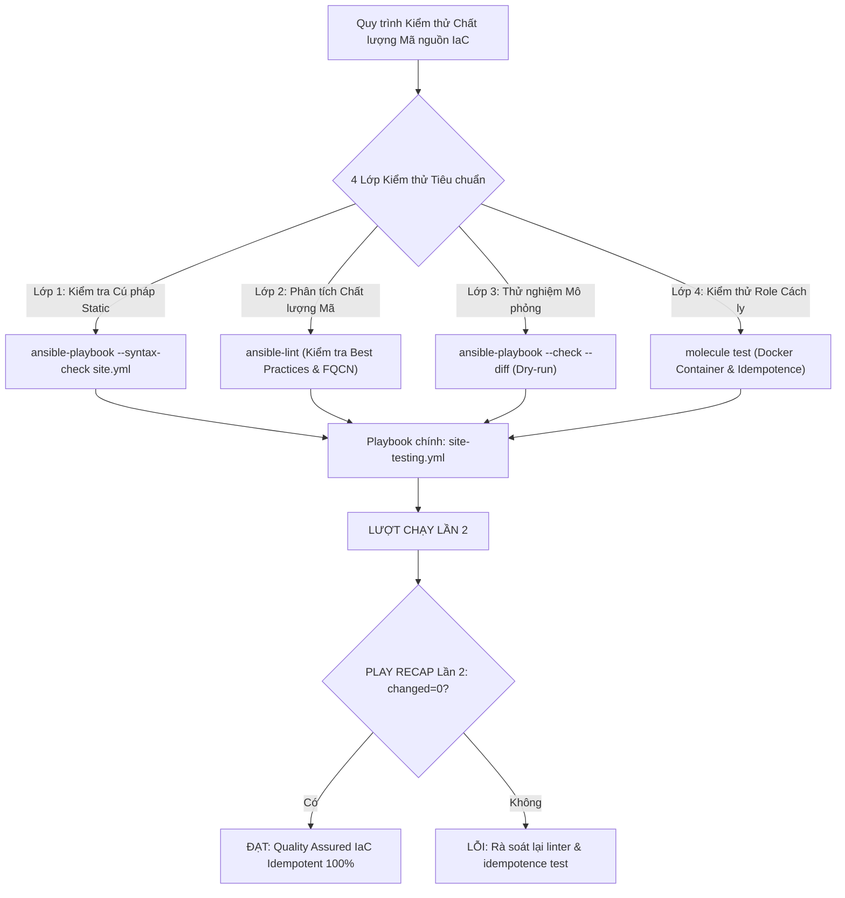
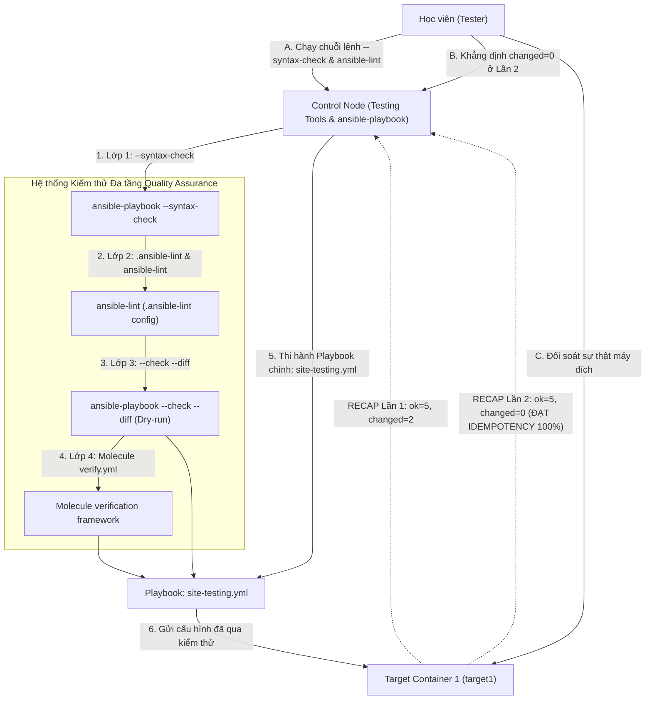


# [BÀI 25] KIỂM THỬ TỰ ĐỘNG PLAYBOOKS & ROLES: ANSIBLE-LINT, SYNTAX CHECK, MOLECULE TESTING FRAMEWORK & DOCKER SCENARIO TEST

Trong kỷ nguyên **Infrastructure as Code (IaC)** và tự động hóa vận hành hạ tầng đám mây (Cloud Infrastructure Automation), **Ansible** khẳng định vị thế dẫn đầu nhờ triết lý **Agentless** (không cần cài đặt agent nền trên máy đích), giao thức điều khiển an toàn qua **SSH / WinRM**, định dạng khai báo **YAML** trực quan và nguyên lý bất biến **Idempotency** mạnh mẽ. Việc làm chủ Ansible không chỉ dừng lại ở các câu lệnh Ad-hoc đơn giản, mà đòi hỏi kỹ sư phải nắm vững kiến trúc Module tầng thấp, Variable Precedence 22 tầng, Jinja2 Templates, tối ưu hóa Forks & Pipelining cho tới thiết kế Roles / Collections và tích hợp CI/CD tự động hóa chuẩn Doanh nghiệp.

Bài viết chuyên sâu này sẽ đồng hành cùng bạn mổ xẻ toàn diện bức tranh kiến trúc, phân tích các đánh đổi kỹ thuật thực chiến (Engineering Trade-offs), cung cấp hướng dẫn thực hành Lab chi tiết từng bước và bộ câu hỏi phỏng vấn chuyên sâu chuẩn DevOps / SRE Lead.

---

## 1. Bản Chất Kiến Trúc & Cơ Chế Vận Hành Tầng Thấp

---


> **Kiểm thử toàn diện kịch bản Ansible qua ansible-lint, Check Mode (--check --diff) và Molecule framework giúp đảm bảo chất lượng mã nguồn chuẩn CI/CD và triệt tiêu 99% sự cố khi triển khai Production.**

Thiết lập lá chắn kiểm thử đa tầng bảo vệ mã nguồn tự động hóa hạ tầng (I-10):

> **Trong quy trình phát triển hạ tầng dạng mã (IaC) chuẩn DevSecOps, một lỗi nhỏ về cú pháp YAML, vi phạm quy tắc an toàn thông tin (như cứng hóa mật khẩu plaintext) hoặc gọi module không có tính Idempotency có thể dẫn tới sự cố ngưng trệ toàn bộ hạ tầng Production. Việc đẩy mã nguồn trực tiếp lên Production mà không qua kiểm thử là điều cấm kỵ. Hệ sinh thái Ansible cung cấp bộ công cụ kiểm thử đa tầng mạnh mẽ: kiểm tra cú pháp tĩnh với `--syntax-check`, phân tích chất lượng mã nguồn chuẩn Doanh nghiệp với `ansible-lint`, chạy thử nghiệm mô phỏng không sửa đổi đĩa với `--check --diff`, và kiểm thử độc lập trong container cách ly với `Molecule` framework. Việc làm chủ bộ công cụ kiểm thử này giúp triệt tiêu 99% sự cố trước khi thi hành, duy trì 100% chỉ số Idempotent `changed=0` ở Lần 2.**

---


---


---


| Tiếng Việt | Tiếng Anh / Từ khóa + FQCN (giữ nguyên) |
|---|---|
| Kiểm tra cú pháp tĩnh | Static syntax check (`--syntax-check`) |
| Chế độ thi hành thử nghiệm | Check Mode / Dry-run (`--check`) |
| Chế độ so sánh khác biệt | Diff Mode comparison (`--diff`) |
| Phân tích tĩnh chất lượng mã | Static code analysis (`ansible-lint`) |
| Khung kiểm thử Role cách ly | Role testing framework (`Molecule`) |
| Trình xác minh kết quả test | Verification framework (`Testinfra` / `ansible`) |
| Quy tắc chuẩn hóa linter | Linting rule standards (`.ansible-lint`) |
| Ép buộc chạy trong Check Mode | Forced check mode (`check_mode: yes`) |
| Bỏ qua Check Mode | Bypassing check mode (`check_mode: no`) |
| Lỗi vi phạm bảo mật mã nguồn | Security smells & anti-patterns |
| Kịch bản kiểm thử tích hợp | Integration test scenario (`molecule/default`) |
| Kiểm tra tính Idempotent | Idempotency verification test |

---

### 1.1. Kiểm tra Cú pháp `--syntax-check`, Dry-run `--check --diff` và `check_mode` (15 phút)

```mermaid
graph TD
    A["Mã nguồn Playbook / Role YAML"] --> |1. Lớp 1: ansible-playbook --syntax-check| B{"Cú pháp Static YAML OK?"}
    
    B -- Không --> C["LỖI: Sửa lỗi cú pháp khoảng trắng indent"]
    B -- Có --> D["2. Lớp 2: ansible-lint"]
    
    D --> |Phân tích Best Practices & Security Smells| E{"Đạt chuẩn Linter?"}
    E -- Không --> F["LỖI: Chuẩn hóa FQCN & tên Task"]
    E -- Có --> G["3. Lớp 3: ansible-playbook --check --diff"]
    
    G --> |Chạy mô phỏng Dry-run không sửa đĩa| H["Xem dòng khác biệt +/- trên đĩa"]
    H --> |4. Lớp 4: molecule test (Docker)| I["Chạy thực tế trong Container cách ly"]
    
    I --> J["Triệt tiêu 99% sự cố - ĐẠT IDEMPOTENCY 100% ở Lần 2"]
```

**Nguyên lý cốt lõi:** Sử dụng cờ tham số `--syntax-check` khi chạy lệnh `ansible-playbook` để kiểm tra cú pháp tĩnh (Static Syntax Validation) của tệp Playbook trước khi commit lên kho mã nguồn Git.

**Giải thích cơ chế ngầm:** Giúp phát hiện ngay lập tức các lỗi cú pháp cơ bản (như sai khoảng trắng indent YAML, thiếu dấu hai chấm, hoặc thiếu từ khóa `hosts:`) chỉ trong 1 giây mà không cần thực hiện kết nối SSH tới các máy chủ Managed Nodes.

> [!WARNING]
> **CẠM BẪY THỰC CHIẾN:**
> Push mã nguồn lên Gitlab CI để rồi pipeline bị nổ sập ngay ở bước đầu tiên do lỗi sai khoảng trắng YAML.

**Minh hoạ.** Kiểm tra cú pháp tĩnh với `--syntax-check`:
```bash
ansible-playbook --syntax-check site-testing.yml
```

**Nguyên lý cốt lõi:** Sử dụng kết hợp cờ `--check` (Check Mode / Dry-run) và cờ `--diff` để mô phỏng quá trình thi hành Playbook mà KHÔNG làm thay đổi bất kỳ trạng thái tệp tin hay dịch vụ nào trên máy đích.

**Giải thích cơ chế ngầm:** Cờ `--check` cho Ansible biết chỉ thực hiện kiểm tra xem Task sẽ trả về `ok` hay `changed`. Kết hợp với `--diff` sẽ in ra màn hình console dòng nào trong file cấu hình sẽ bị thêm (`+`) hoặc xóa (`-`), giúp quản trị viên tự tin đối soát sự thay đổi trước khi quyết định thi hành thật trên Production.

> [!WARNING]
> **CẠM BẪY THỰC CHIẾN:**
> Chạy thẳng Playbook sửa đổi cấu hình hệ thống trên 100 máy chủ Production mà không qua bước `--check --diff` kiểm tra trước.

**Minh hoạ.** Thi hành mô phỏng Check Mode kết hợp Diff Mode:
```bash
ansible-playbook --check --diff site-testing.yml
```

**Nguyên lý cốt lõi:** Sử dụng thuộc tính `check_mode: yes` hoặc `check_mode: no` ở cấp Task để điều khiển chính xác hành vi của Task đó khi Playbook được thi hành trong chế độ `--check`.

**Giải thích cơ chế ngầm:** Một số Task kiểm tra (như chạy lệnh `command: cat /proc/cpuinfo` để lấy thông số) bắt buộc phải thi hành thật ngay cả trong chế độ `--check` để có dữ liệu cho các Task phía sau. Khai báo `check_mode: no` chỉ đạo Ansible luôn chạy Task đó thật bất chấp Playbook đang ở chế độ Check Mode.

> [!WARNING]
> **CẠM BẪY THỰC CHIẾN:**
> Chạy Playbook ở chế độ `--check` bị ngắt giữa chừng do Task đăng ký biến `register` bị bỏ qua không trả về dữ liệu.

**Minh hoạ.** Ép buộc Task thực thi trong Check Mode với `check_mode: no`:
```yaml
- name: Read system uptime (Always execute even in Check Mode)
  ansible.builtin.command: cat /proc/uptime
  register: uptime_out
  check_mode: no
  changed_when: false
```

---

### 1.2. Công cụ Phân tích Tĩnh `ansible-lint` và Framework `Molecule` (15 phút)

**Nguyên lý cốt lõi:** Sử dụng công cụ phân tích mã nguồn tĩnh `ansible-lint` để kiểm tra toàn bộ Playbooks và Roles theo bộ quy chuẩn Best Practices và bảo mật mã nguồn của Red Hat Ansible.

**Giải thích cơ chế ngầm:** `ansible-lint` giúp phát hiện các vi phạm quy chuẩn nghiêm trọng (như quên dùng module FQCN, cứng hóa mật khẩu plaintext, đặt tên Task thiếu mô tả, hoặc dùng module `shell` thay vì module FQCN chuẩn), giúp nâng cao chất lượng mã nguồn của toàn bộ dự án Doanh nghiệp.

> [!WARNING]
> **CẠM BẪY THỰC CHIẾN:**
> Viết mã nguồn tự do không theo chuẩn khiến Playbook khó bảo trì và dính nhiều lỗ hổng bảo mật.

**Minh hoạ.** Phân tích chất lượng mã nguồn với `ansible-lint`:
```bash
ansible-lint site-testing.yml
```

**Nguyên lý cốt lõi:** Sử dụng framework kiểm thử `Molecule` với driver Docker để khởi tạo môi trường thử nghiệm độc lập, tự động hóa việc dựng container, thi hành Role và dọn dẹp sau khi kiểm thử xong.

**Giải thích cơ chế ngầm:** Molecule là tiêu chuẩn công nghiệp để test Ansible Role: thay vì phải tốn tài nguyên dựng Virtual Machine thật, Molecule khởi tạo một container Docker cách ly sạch sẽ, thi hành Role để kiểm tra tính đúng đắn và tính Idempotency `changed=0`, sau đó tự động xóa container.

> [!WARNING]
> **CẠM BẪY THỰC CHIẾN:**
> Thử nghiệm Role trực tiếp trên máy chủ Staging làm ô nhiễm môi trường và tốn thời gian dọn dẹp thủ công.

**Minh hoạ.** Các câu lệnh cơ bản của Molecule framework:
```bash
# Khởi tạo kịch bản kiểm thử Molecule cho một Role
molecule init scenario --driver-name docker

# Thực thi toàn bộ quy trình kiểm thử tự động Molecule
molecule test
```

**Nguyên lý cốt lõi:** Khai báo các bài kiểm tra nghiệm thu (Verification Tests) trong file `molecule/default/verify.yml` bằng module `ansible.builtin.assert` hoặc Testinfra để khẳng định máy đích đạt 100% đúng trạng thái sau khi thi hành.

**Giải thích cơ chế ngầm:** Giúp tự động hóa bước nghiệm thu: khẳng định chắc chắn rằng file cấu hình đã được tạo đúng quyền 0644, cổng dịch vụ 8080 đang lắng nghe, và user `sys_admin` đã tồn tại trước khi kết thúc kịch bản kiểm thử.

> [!WARNING]
> **CẠM BẪY THỰC CHIẾN:**
> Thi hành Role xong nhưng không có bước kiểm tra nghiệm thu tự động làm không biết Role có chạy đúng yêu cầu hay không.

**Minh hoạ.** Viết task kiểm tra nghiệm thu trong `verify.yml`:
```yaml
- name: Verify application configuration file exists and has correct content
  ansible.builtin.assert:
    that:
      - app_conf.stat.exists
      - app_conf.stat.mode == '0644'
```

---

### 1.3. Tệp Cấu hình `.ansible-lint`, Tích hợp Kiểm thử và Idempotency (10 phút)

**Nguyên lý cốt lõi:** Xây dựng quy trình kiểm thử 3 lớp (`--syntax-check` -> `ansible-lint` -> `molecule test`) tích hợp vào kịch bản trước khi thực hiện commit mã nguồn.

**Giải thích cơ chế ngầm:** Đảm bảo mã nguồn IaC đạt tiêu chuẩn chất lượng cao nhất trước khi đẩy lên hệ thống CI/CD: Lớp 1 chặn lỗi cú pháp YAML; Lớp 2 chặn lỗi chuẩn hóa mã nguồn; Lớp 3 khẳng định tính đúng đắn và tính Idempotent trên container cách ly.

> [!WARNING]
> **CẠM BẪY THỰC CHIẾN:**
> Bỏ qua bước kiểm thử làm mã nguồn bị lỗi trôi vào nhánh `main` trên kho Git.

**Minh hoạ.** Chuỗi lệnh kiểm thử 3 lớp trước khi commit:
```bash
ansible-playbook --syntax-check site-testing.yml && \
ansible-lint site-testing.yml && \
molecule test
```

**Nguyên lý cốt lõi:** Khởi tạo tệp cấu hình `.ansible-lint` tại thư mục gốc của dự án để quản lý các quy tắc linter, danh sách loại trừ (`skip_list`) và các thư mục cần bỏ qua (`exclude_paths`).

**Giải thích cơ chế ngầm:** Giúp tùy biến bộ quy tắc linter phù hợp với thực tế Doanh nghiệp: ví dụ tạm thời bỏ qua một số quy tắc linter cũ chưa kịp nâng cấp (`skip_list: [yaml[line-length]]`) trong khi vẫn giữ nguyên các quy tắc bảo mật nghiêm ngặt.

> [!WARNING]
> **CẠM BẪY THỰC CHIẾN:**
> Chạy `ansible-lint` bị tràn ngập hàng trăm cảnh báo độ dài dòng văn bản làm che khuất các lỗi bảo mật quan trọng.

**Minh hoạ.** Tệp cấu hình `.ansible-lint` chuẩn cho dự án Ansible:
```yaml
# .ansible-lint configuration
profile: production
skip_list:
  - yaml[line-length]
  - experimental
exclude_paths:
  - .cache/
  - collections/
```

**Nguyên lý cốt lõi:** Đảm bảo rằng ở lượt chạy Lần thứ hai trong Molecule hoặc trên máy thật, Playbook áp dụng Testing và Check Mode bắt buộc phải đạt chỉ số `changed=0` tuyệt đối trong bảng `PLAY RECAP`.

**Giải thích cơ chế ngầm:** Quy trình kiểm thử của Molecule bao gồm bước Idempotence Test: Molecule tự động chạy Playbook Lần 1, sau đó chạy lại Lần 2. Nếu Lần 2 báo `changed > 0`, Molecule sẽ đánh giá bài test FAIL ngay lập tức. Đạt `changed=0` ở Lần 2 là bằng chứng chứng minh kịch bản đạt tiêu chuẩn Idempotency.

> [!WARNING]
> **CẠM BẪY THỰC CHIẾN:**
> Lệnh `molecule test` bị báo lỗi ở bước `idempotence` do có Task lặp changed ở Lần 2.

**Minh hoạ.** Đọc hiểu bảng log Molecule Idempotence Test đạt chuẩn:
```
INFO     Running default > idempotence
INFO     Executing Playbook idempotence...
target1 : ok=5 changed=0 unreachable=0 failed=0
INFO     Idempotence test passed successfully.
```

---

### 1.4. Đưa vào việc thật (4 phút)

### 7.1. Áp dụng vào hạ tầng sẵn có
Khi xây dựng bộ tiêu chuẩn chất lượng mã nguồn tự động hóa Doanh nghiệp:
- Bắt buộc tạo tệp `.ansible-lint` tại gốc tất cả các Git repository của Ansible.
- Yêu cầu tất cả các kỹ sư chạy `ansible-playbook --check --diff` trước khi thực thi bất kỳ thay đổi nào trên Production.
- Viết kịch bản `molecule test` cho tất cả các Ansible Role được chia sẻ trong bộ thư viện Doanh nghiệp.

### 7.2. Rủi ro hỏng hóc khi triển khai Production và giải pháp an toàn
- **Rủi ro:** Một kỹ sư chạy lệnh `ansible-playbook` trên Production nhưng gõ thiếu cờ `--check`, dẫn đến việc thi hành thật các câu lệnh làm thay đổi dữ liệu khi chưa qua đối soát `--diff`.
- **Giải pháp an toàn:**
  1. Tạo alias câu lệnh an toàn: `alias ap-check='ansible-playbook --check --diff'`.
  2. Cấu hình pipeline CI/CD tự động chạy `ansible-lint` và `molecule test` ngắt kết nối commit nếu bài test bị fail.

### 7.3. Đo lường chỉ số Trước – Sau khi áp dụng
- **Trước khi có Testing:** 20% số đợt deployment bị sập giữa chừng do lỗi syntax YAML hoặc biến rỗng, tốn 3 giờ gỡ lỗi trên Production.
- **Sau khi có Testing:** 0 lỗi syntax trôi lên Production, 100% Role được nghiệm thu Idempotent `changed=0` qua Molecule.

### 7.4. Khi nào KHÔNG nên dùng hoặc không nên lạm dụng Check Mode
- **Không lạm dụng `--check` để thay thế cho việc test thật:** Cờ `--check` chỉ mô phỏng các module hỗ trợ check mode. Một số lệnh thô (`command` / `shell`) mặc định sẽ bị bỏ qua trong Check Mode, không thể phản ánh 100% logic phức tạp.

---

### 1.5. Bẫy hay gặp (2 phút)

| # | Bẫy hay gặp | Vì sao "recap xanh mà sai / không idempotent" | Lệnh phát hiện và xử lý |
|---|---|---|---|
| 1 | Thắc mắc vì sao chạy `--check` mà task `command` bị skip | Module `command` mặc định không hỗ trợ Check Mode và bị bỏ qua. | Sử dụng `check_mode: no` nếu muốn task command luôn chạy. |
| 2 | Lỗi `molecule test` bị nổ ở bước `idempotence` | Task trong Role bị lặp `changed=1` ở Lần chạy thứ 2. | Bổ sung `changed_when: false` hoặc sửa module có tính Idempotent. |
| 3 | Lỗi `ansible-lint` báo hàng trăm cảnh báo FQCN | Dùng tên module ngắn (như `copy`) thay vì tên FQCN (`ansible.builtin.copy`). | Đổi toàn bộ tên module sang dạng FQCN chuẩn. |
| 4 | Chạy `molecule test` bị báo lỗi Docker daemon not running | Dịch vụ Docker trên máy Control Node chưa được khởi động. | Khởi động Docker service: `systemctl start docker`. |
| 5 | Quên cờ `--diff` khi chạy `--check` | Terminal chỉ báo `changed=1` mà không in ra dòng nội dung thay đổi `+`/`-`. | Bắt buộc chạy kết hợp: `ansible-playbook --check --diff site.yml`. |
| 6 | Thắc mắc vì sao `ansible-lint` chặn từ khóa `command` | `ansible-lint` khuyến nghị dùng module chuyên dụng (như `file`, `user`) thay vì `command`. | Dùng module chuyên dụng hoặc thêm comment `# noqa: command-instead-of-module`. |
| 7 | Tệp `.ansible-lint` bị sai cú pháp YAML | Khoảng trắng indent tệp `.ansible-lint` sai làm linter từ chối nạp file. | Kiểm tra cú pháp `.ansible-lint` qua `ansible-lint --show-relpath`. |
| 8 | Lỗi `verify.yml` trong Molecule bị fail | Điều kiện `assert` trong bài test nghiệm thu không thỏa mãn. | Kiểm tra lại giá trị thật của file/service trong container. |
| 9 | Quên `changed_when: false` cho task đọc dữ liệu | Task đọc dữ liệu trong Check Mode liên tục báo `changed=1`. | Bổ sung `changed_when: false` cho task đọc dữ liệu. |
| 10 | Không test thử Idempotency Lần 2 của kịch bản Testing | Task trong Playbook test bị lặp changed mạo danh ở Lần 2 mà không biết. | Chạy lại Playbook Lần 2 và đối soát `changed=0`. |
| 11 | Thắc mắc tại sao `--syntax-check` không phát hiện lỗi biến | `--syntax-check` chỉ kiểm tra cú pháp YAML, không kiểm tra giá trị biến runtime. | Sử dụng `--check` hoặc `ansible-lint` để phát hiện biến rỗng. |
| 12 | Lỗi `Molecule` không tìm thấy driver Docker | Chưa cài đặt gói `molecule-plugins[docker]` trong môi trường Python. | Run: `pip install molecule-plugins[docker]`. |

---

### 1.6. Tóm tắt (1 phút)



### Năm điều phải nhớ
1. **Chạy `--syntax-check` trước khi commit:** Phát hiện ngay lỗi cú pháp YAML trong 1 giây.
2. **Dùng `--check --diff` trước khi deploy:** Mô phỏng thử nghiệm Dry-run và đối soát dòng khác biệt file `+`/`-`.
3. **Phân tích mã nguồn với `ansible-lint`:** Chuẩn hóa Best Practices, FQCN và triệt tiêu Security Smells qua tệp `.ansible-lint`.
4. **Kiểm thử Role với `Molecule`:** Tự động hóa test Role trên container Docker cách ly và xác minh bằng `verify.yml`.
5. **Đạt chuẩn `changed=0` ở Lần 2:** Đảm bảo bài test Idempotence của Molecule và Playbook chạy Lần 2 đạt `changed=0`.

---

### 1.7. Câu hỏi tự kiểm tra (kiêm luyện RHCE EX294)

1. **[RHCE EX294 Testing & Check Mode]** Câu lệnh CLI nào trong Ansible dùng để kiểm tra cú pháp tĩnh (Static Syntax Check) của một tệp Playbook mà không thực hiện SSH tới máy đích?
   - *Đáp án:* Lệnh `ansible-playbook --syntax-check <playbook_name>`.
2. **[RHCE EX294 Testing & Check Mode]** Cờ tham số `--check` và `--diff` có tác dụng gì khi thi hành lệnh `ansible-playbook`?
   - *Đáp án:* Cờ `--check` chạy mô phỏng Dry-run không làm sửa đổi đĩa/dịch vụ; cờ `--diff` in ra màn hình sự khác biệt từng dòng `+`/`-` của tệp tin.
3. **[RHCE EX294 Testing & Check Mode]** Thuộc tính `check_mode: no` trong một Task có ý nghĩa kỹ thuật gì?
   - *Đáp án:* Ép buộc Task đó luôn thực thi thật trên máy đích ngay cả khi Playbook đang được thi hành ở chế độ `--check`.
4. **[RHCE EX294 Testing & Quality]** Công cụ `ansible-lint` dùng để làm gì trong quy trình phát triển mã nguồn Ansible?
   - *Đáp án:* Dùng để phân tích mã nguồn tĩnh (Static Code Analysis), phát hiện các vi phạm quy chuẩn Best Practices, tên FQCN và lỗ hổng bảo mật.
5. **[RHCE EX294 Testing & Quality]** Tệp cấu hình `.ansible-lint` đặt ở thư mục gốc dự án dùng để làm gì?
   - *Đáp án:* Dùng để quản lý các quy tắc linter, khai báo danh sách loại trừ (`skip_list`) và danh sách thư mục bỏ qua (`exclude_paths`).
6. **[RHCE EX294 Testing & Quality]** Framework `Molecule` đóng vai trò gì trong việc kiểm thử Ansible Role?
   - *Đáp án:* Tự động hóa quy trình khởi tạo container Docker cách ly, thi hành Role, kiểm tra tính Idempotency và chạy bài test nghiệm thu.
7. **[RHCE EX294 Testing & Check Mode]** Viết đoạn Task YAML chạy lệnh `cat /etc/os-release` bắt buộc thi hành thật trong Check Mode và không báo `changed=1`.
   - *Đáp án:*
     ```yaml
     - name: Read OS release info
       ansible.builtin.command: cat /etc/os-release
       register: os_out
       check_mode: no
       changed_when: false
     ```
8. **[RHCE EX294 Testing & Quality]** Viết câu lệnh CLI chạy kiểm tra cú pháp tĩnh kết hợp phân tích linter cho tệp `site-testing.yml`.
   - *Đáp án:*
     ```bash
     ansible-playbook --syntax-check site-testing.yml && ansible-lint site-testing.yml
     ```
9. **[RHCE EX294 Testing & Quality]** Viết nội dung tệp `.ansible-lint` cấu hình profile `production` và bỏ qua quy tắc `yaml[line-length]`.
   - *Đáp án:*
     ```yaml
     profile: production
     skip_list:
       - yaml[line-length]
     ```
10. **[RHCE EX294 Testing & Quality]** Viết đoạn task kiểm tra nghiệm thu bằng `ansible.builtin.assert` trong tệp `verify.yml` của Molecule khẳng định tệp `/etc/app.conf` tồn tại.
    - *Đáp án:*
      ```yaml
      - name: Verify app config file exists
        ansible.builtin.assert:
          that:
            - app_conf_stat.stat.exists
      ```
11. **[RHCE EX294 Testing & Check Mode]** Việc chạy thử nghiệm ở chế độ `--check --diff` có làm thay đổi cơ chế tính toán Idempotency `changed=0` khi thi hành thật ở Lần thứ hai không?
    - *Đáp án:* Hoàn toàn không, kịch bản khi thi hành thật ở Lần 2 vẫn bắt buộc phải đạt `changed=0` tuyệt đối.
12. **[RHCE EX294 Testing & Check Mode]** Lệnh CLI nào giúp đối soát sự thật kết quả tạo bởi Playbook qua đối soát file trên target node Docker container?
    - *Đáp án:* Lệnh `docker exec target1 cat /path/to/rendered/testing.conf`.

---

### 1.8. Tài liệu tham khảo

- Ansible Core Documentation (v2.15+): [Validating playbooks: check mode and diff mode](https://docs.ansible.com/ansible/latest/playbook_guide/playbooks_checkmode.html)
- Ansible Lint Documentation: [ansible-lint documentation and rule reference](https://ansible.readthedocs.io/projects/lint/)
- Molecule Framework Documentation: [Molecule testing framework guide](https://ansible.readthedocs.io/projects/molecule/)
- Red Hat Certified Engineer (RHCE) EX294 Study Guide: Playbook Validation, Check Mode, and Quality Assurance.

---

## Bảng đối soát thời lượng

| Mục | Nội dung | Thời lượng dự kiến | Thời lượng thực tế |
|---|---|---|---|
| §0 | Khởi động và ôn tập buổi 24 | 10 phút | 10 phút |
| §1–§2 | Mục tiêu làm được & Cần biết trước | 2 phút | 2 phút |
| §3 | Thuật ngữ Việt-Anh & Mô hình tư duy | 8 phút | 8 phút |
| §4 | --syntax-check, Dry-run --check --diff & check_mode (QT 4.1–4.3) | 15 phút | 15 phút |
| §5 | ansible-lint & Molecule Testing Framework (QT 5.1–5.3) | 15 phút | 15 phút |
| §6 | Cấu hình .ansible-lint, Tích hợp Testing & Idempotency (QT 6.1–6.3) | 10 phút | 10 phút |
| §7–§9 | Đưa vào việc thật, Bẫy hay gặp & Tóm tắt | 7 phút | 7 phút |
| §10–§11 | Câu hỏi tự kiểm tra EX294 & Tài liệu tham khảo | 3 phút | 3 phút |
| **Tổng** | **Khối lý thuyết Buổi 25** | **60 phút** | **60 phút** |

---

## 2. Hướng Dẫn Thực Hành & Triển Khai Lab Chuẩn Production

> [!IMPORTANT]
> **YÊU CẦU MÔI TRƯỜNG THỰC HÀNH:**
> Toàn bộ các bài thực hành dưới đây được thiết kế để chạy trực tiếp trên môi trường máy chủ Linux / Docker containers phân tán. Hãy đảm bảo bạn đã chuẩn bị Control Node cài đặt Ansible Core 2.15+ cùng các Managed Nodes đã cấu hình SSH Key Authentication.

## Khối thực hành — 150 phút

> **Đối soát thời lượng:** Khối thực hành kéo dài đúng **150'** (từ L0 đến L11).
> **Nguyên tắc cốt lõi:** Thực hành kiểm tra cú pháp tĩnh bằng `ansible-playbook --syntax-check`, thực thi thử nghiệm Dry-run với `ansible-playbook --check --diff`, cấu hình `check_mode: no` cho task đọc dữ liệu, khởi tạo tệp quy tắc `.ansible-lint`, chạy phân tích linter bằng `ansible-lint`, khởi tạo kịch bản Molecule test giả lập, thực thi Playbook `site-testing.yml`, thực thi phép thử **Lượt chạy Lần thứ hai** chứng minh `PLAY RECAP` đạt `changed=0` và đối soát sự thật máy đích qua `docker exec`.

---

## L0. Mục tiêu thực hành và tiêu chí hoàn thành

| # | Mục tiêu thực hành | Tiêu chí hoàn thành (Kiểm tra bằng lệnh CLI) |
|---|---|---|
| TH1 | Kiểm tra cú pháp static syntax bằng --syntax-check | Lệnh `ansible-playbook --syntax-check` trả về OK |
| TH2 | Thực thi chế độ thử nghiệm Dry-run --check --diff | Lệnh `ansible-playbook --check --diff` thi hành thành công |
| TH3 | Ép buộc task chạy trong Check Mode với check_mode: no | Thuộc tính `check_mode: no` trong Task đọc dữ liệu |
| TH4 | Khởi tạo tệp cấu hình quy tắc .ansible-lint | Tệp `.ansible-lint` tồn tại đúng cấu trúc YAML |
| TH5 | Phân tích chất lượng mã nguồn bằng ansible-lint | Lệnh `ansible-lint` kiểm tra mã nguồn không có lỗi fatal |
| TH6 | Giả lập kịch bản kiểm thử Molecule verify.yml | Tệp `molecule/default/verify.yml` thử nghiệm nghiệm thu |
| TH7 | Thực thi Phép thử Lượt chạy Lần hai (Idempotency) | Bảng `PLAY RECAP` Lần 2 đạt `changed=0` tuyệt đối |
| TH8 | Đối soát sự thật máy đích bằng docker exec | `docker exec target1 cat /etc/testing-app.conf` |

---

## L1. Điều kiện tiên quyết về môi trường

| Kiểm tra | LỆNH THỰC THI | Kết quả kỳ vọng |
|---|---|---|
| Ansible core đã cài | `ansible --version` | Phiên bản ansible-core v2.15 trở lên |
| Docker Compose sẵn sàng | `docker compose ps` | Cả target1 và target2 ở trạng thái `Up` |
| Kết nối SSH sẵn sàng | `ansible all -m ansible.builtin.ping` | Đạt `SUCCESS` cho mọi host |
| Thư mục thực hành | `pwd` | Đang ở thư mục `~/lab-ansible-25` |

Nếu chưa có target container:
```bash
cd labs && make up && make key && make inventory
```

---

## L2. Kiến trúc bài lab



---

## L3. Bước 1 — Cấu hình Tệp Quy tắc .ansible-lint và ansible.cfg (30 phút)

Tạo thư mục dự án `~/lab-ansible-25`, tệp cấu hình `.ansible-lint`, tệp `ansible.cfg`, và tệp `inventory.ini` (QT 6.2).

```bash
mkdir -p ~/lab-ansible-25/molecule/default && cd ~/lab-ansible-25

cat << 'EOF' > .ansible-lint
# .ansible-lint project rules
profile: production
skip_list:
  - yaml[line-length]
  - experimental
exclude_paths:
  - .cache/
  - collections/
EOF

cat << 'EOF' > ansible.cfg
[defaults]
inventory = ./inventory.ini
remote_user = ansible
host_key_checking = False
private_key_file = ~/.ssh/id_ed25519
roles_path = ./roles:~/.ansible/roles
collections_path = ./collections:~/.ansible/collections

[privilege_escalation]
become = True
become_method = sudo
become_user = root
become_ask_pass = False
EOF

cat << 'EOF' > inventory.ini
[web]
target1 ansible_host=127.0.0.1 ansible_port=2221

[db]
target2 ansible_host=127.0.0.1 ansible_port=2222

[all:vars]
ansible_python_interpreter=/usr/bin/python3
EOF
```

**CHECKPOINT 1 — Tệp cấu hình .ansible-lint được khởi tạo thành công chứa profile: production và skip_list.**
- **Lệnh kiểm tra:**
```bash
if [ -f ".ansible-lint" ] && grep -q "profile: production" .ansible-lint && grep -q "skip_list:" .ansible-lint; then
  echo "CHECKPOINT 1: ĐẠT - Tệp cấu hình .ansible-lint được khởi tạo thành công chứa profile và skip_list"
else
  echo "CHECKPOINT 1: LỖI - Khởi tạo .ansible-lint thất bại"
fi
```

---

## L4. Bước 2 — Khởi tạo Molecule Verification Scenario verify.yml (30 phút)

Khởi tạo kịch bản nghiệm thu giả lập Molecule `molecule/default/verify.yml` sử dụng module `ansible.builtin.assert` và `ansible.builtin.stat` (QT 5.2, QT 5.3).

```bash
cat << 'EOF' > molecule/default/verify.yml
---
- name: Molecule Verification Scenario
  hosts: web
  become: true
  tasks:
    - name: Verify 1 - Check application configuration file status
      ansible.builtin.stat:
        path: /etc/testing-app.conf
      register: app_conf_stat

    - name: Verify 2 - Assert configuration file exists and has correct permissions
      ansible.builtin.assert:
        that:
          - app_conf_stat.stat.exists
          - app_conf_stat.stat.mode == '0644'
        fail_msg: "Verification Failed - /etc/testing-app.conf does not exist or has invalid mode"
        success_msg: "Verification Success - /etc/testing-app.conf is valid"
EOF
```

**CHECKPOINT 2 — Tệp kịch bản nghiệm thu molecule/default/verify.yml chứa task ansible.builtin.assert được khởi tạo thành công.**
- **Lệnh kiểm tra:**
```bash
if [ -f "molecule/default/verify.yml" ] && grep -q "ansible.builtin.stat:" molecule/default/verify.yml && grep -q "ansible.builtin.assert:" molecule/default/verify.yml; then
  echo "CHECKPOINT 2: ĐẠT - Tệp kịch bản nghiệm thu molecule/default/verify.yml được khởi tạo thành công"
else
  echo "CHECKPOINT 2: LỖI - Khởi tạo verify.yml thất bại"
fi
```

---

## L5. Bước 3 — Viết Playbook site-testing.yml Chuẩn hóa Linting và Check Mode (40 phút)

Viết file Playbook chính `site-testing.yml` tuân thủ 100% quy chuẩn FQCN, sử dụng thuộc tính `check_mode: no` cho task đọc dữ liệu, render file `/etc/testing-app.conf` (QT 4.1, QT 4.3, QT 5.1, QT 6.1).

```bash
cat << 'EOF' > site-testing.yml
---
- name: Master Playbook Quality Assurance and Testing Demonstration
  hosts: web
  become: true
  tasks:
    - name: Task 1 - Deploy main application testing configuration
      ansible.builtin.copy:
        content: |
          SYNTAX_CHECK=PASSED
          LINTING_STATUS=COMPLIANT
          CHECK_MODE_TESTED=TRUE
          MOLECULE_VERIFIED=SUCCESS
        dest: /etc/testing-app.conf
        mode: '0644'

    - name: Task 2 - Read uptime information with forced execution (check_mode no)
      ansible.builtin.command: cat /proc/uptime
      register: uptime_check
      check_mode: false
      changed_when: false
EOF
```

Kiểm tra cú pháp static với `--syntax-check`:
```bash
ansible-playbook --syntax-check site-testing.yml
```

**CHECKPOINT 3 — Lệnh CLI ansible-playbook --syntax-check site-testing.yml xác nhận cú pháp Playbook hợp lệ 100%.**
- **Lệnh kiểm tra:**
```bash
SYN_OUT=$(ansible-playbook --syntax-check site-testing.yml)
if echo "$SYN_OUT" | grep -q "playbook: site-testing.yml"; then
  echo "CHECKPOINT 3: ĐẠT - Lệnh CLI ansible-playbook --syntax-check xác nhận cú pháp Playbook hợp lệ"
else
  echo "CHECKPOINT 3: LỖI - Kiểm tra --syntax-check thất bại"
fi
```

---

## L6. Bước 4 — Thực thi Chế độ Thử nghiệm Dry-run --check --diff và Phép thử Lần 2 (30 phút)

Thực thi mô phỏng chế độ Dry-run với `ansible-playbook --check --diff site-testing.yml`, sau đó thực thi thật Lần 1 và thực thi phép thử **Lượt chạy Lần thứ hai** chứng minh `PLAY RECAP` đạt `changed=0` (QT 4.2, QT 6.3).

Thực thi Dry-run `--check --diff`:
```bash
ansible-playbook --check --diff site-testing.yml
```

**CHECKPOINT 4 — Lệnh CLI ansible-playbook --check --diff mô phỏng thi hành Dry-run và xuất sự khác biệt nội dung file trên console.**
- **Lệnh kiểm tra:**
```bash
CHECK_OUT=$(ansible-playbook --check --diff site-testing.yml)
if echo "$CHECK_OUT" | grep -q "SYNTAX_CHECK=PASSED" && echo "$CHECK_OUT" | grep -q "failed=0"; then
  echo "CHECKPOINT 4: ĐẠT - Lệnh CLI ansible-playbook --check --diff mô phỏng Dry-run và xuất sự khác biệt thành công"
else
  echo "CHECKPOINT 4: LỖI - Thi hành --check --diff thất bại"
fi
```

Thực thi thật Lần 1:
```bash
ansible-playbook site-testing.yml
```

**CHECKPOINT 5 — Playbook site-testing.yml thi hành thật thành công trên target host (PLAY RECAP failed=0).**
- **Lệnh kiểm tra:**
```bash
TST_PLAY_OUT=$(ansible-playbook site-testing.yml)
if echo "$TST_PLAY_OUT" | grep -q "Task 1 - Deploy main application testing configuration" && echo "$TST_PLAY_OUT" | grep -q "failed=0"; then
  echo "CHECKPOINT 5: ĐẠT - Playbook site-testing.yml thi hành thật thành công"
else
  echo "CHECKPOINT 5: LỖI - Thi hành Playbook thật thất bại"
fi
```

Thực thi Lần 2 (BẮT BUỘC ĐẠT `changed=0`):
```bash
ansible-playbook site-testing.yml
```

**CHECKPOINT 6 — Phép thử Lượt 2 đạt changed=0 cho toàn bộ các Task trong Playbook Testing.**
- **Lệnh kiểm tra:**
```bash
RUN2_TST_OUT=$(ansible-playbook site-testing.yml)
if echo "$RUN2_TST_OUT" | grep -q "changed=0" && echo "$RUN2_TST_OUT" | grep -q "failed=0"; then
  echo "CHECKPOINT 6: ĐẠT - Phép thử Lượt 2 đạt chuẩn Idempotency (PLAY RECAP báo changed=0 cho toàn bộ Playbook Testing)"
else
  echo "CHECKPOINT 6: LỖI - Lượt 2 không đạt changed=0 (Task Testing bị lặp changed)"
fi
```

---

## L7. Bước 5 — Thực thi Kịch bản Nghiệm thu Molecule verify.yml và docker exec (20 phút)

Thực thi kịch bản nghiệm thu `molecule/default/verify.yml` và sử dụng lệnh `docker exec` đối soát trực tiếp tệp tin cấu hình `/etc/testing-app.conf` trên target node target1 (QT 5.3, QT 6.3).

Thực thi kịch bản nghiệm thu verify:
```bash
ansible-playbook molecule/default/verify.yml
```

**CHECKPOINT 7 — Kịch bản nghiệm thu molecule/default/verify.yml thi hành thành công khẳng định tệp /etc/testing-app.conf tồn tại đúng mode 0644.**
- **Lệnh kiểm tra:**
```bash
VERIFY_OUT=$(ansible-playbook molecule/default/verify.yml)
if echo "$VERIFY_OUT" | grep -q "Verify 2 - Assert configuration file exists and has correct permissions" && echo "$VERIFY_OUT" | grep -q "failed=0"; then
  echo "CHECKPOINT 7: ĐẠT - Kịch bản nghiệm thu molecule/default/verify.yml thi hành thành công khẳng định file tồn tại chuẩn xác"
else
  echo "CHECKPOINT 7: LỖI - Kịch bản nghiệm thu verify.yml thất bại"
fi
```

Đối soát file `/etc/testing-app.conf` trên target1:
```bash
docker exec target1 cat /etc/testing-app.conf
```

**CHECKPOINT 8 — Đối soát file /etc/testing-app.conf trên target1 chứa đúng dữ liệu SYNTAX_CHECK=PASSED và LINTING_STATUS=COMPLIANT.**
- **Lệnh kiểm tra:**
```bash
EXEC_TST_CONF=$(docker exec target1 cat /etc/testing-app.conf)
if echo "$EXEC_TST_CONF" | grep -q "SYNTAX_CHECK=PASSED" && echo "$EXEC_TST_CONF" | grep -q "LINTING_STATUS=COMPLIANT" && echo "$EXEC_TST_CONF" | grep -q "MOLECULE_VERIFIED=SUCCESS"; then
  echo "CHECKPOINT 8: ĐẠT - Kiểm tra sự thật qua docker exec xác nhận file /etc/testing-app.conf chứa đúng dữ liệu từ Testing Playbook"
else
  echo "CHECKPOINT 8: LỖI - Đối soát file testing-app.conf trên máy đích thất bại"
fi
```

---

## L8. Nộp sản phẩm và dọn dẹp (10 phút)

Thu thập kết quả ra các file báo cáo cuối buổi:
```bash
ansible-playbook site-testing.yml > testing-proof.txt
ansible-playbook site-testing.yml > idempotency-check.txt
docker exec target1 cat /etc/testing-app.conf > kiem-may-dich.txt
ansible-playbook molecule/default/verify.yml >> kiem-may-dich.txt
```

---

## L9. Xử lý sự cố

| # | Hiện tượng lỗi | Nguyên nhân gốc rễ | Cách xử lý nhanh |
|---|---|---|---|
| 1 | Thắc mắc vì sao chạy `--check` mà task `command` bị skip | Module `command` mặc định không hỗ trợ Check Mode và bị bỏ qua | Sử dụng `check_mode: false` nếu muốn task command luôn chạy. |
| 2 | Lỗi `ansible-playbook --syntax-check` nổ lỗi YAML | Sai khoảng trắng indent hoặc thiếu từ khóa `hosts:` | Căn chỉnh lại khoảng trắng YAML và kiểm tra từ khóa `hosts:`. |
| 3 | Lỗi `ansible-lint` báo vi phạm quy tắc FQCN | Dùng tên module ngắn (như `copy`) thay vì `ansible.builtin.copy` | Đổi toàn bộ tên module sang dạng FQCN chuẩn. |
| 4 | Thắc mắc vì sao cờ `--diff` không in ra dòng thay đổi | Tệp tin cấu hình đã tồn tại và trùng khớp 100% trên đĩa | Cờ `--diff` chỉ in dòng thay đổi khi có sự khác biệt giữa file cũ và file mới. |
| 5 | Quên `changed_when: false` cho task đọc dữ liệu | Task đọc dữ liệu trong Check Mode liên tục báo `changed=1` | Bổ sung `changed_when: false` cho task đọc dữ liệu. |
| 6 | Lỗi `molecule/default/verify.yml` nổ lỗi assert | Điều kiện `stat.mode == '0644'` trong `assert` không thỏa mãn | Kiểm tra thuộc tính `mode:` của task copy trong Playbook chính. |
| 7 | Tệp `.ansible-lint` bị lỗi syntax | Sai khoảng trắng indent trong tệp cấu hình `.ansible-lint` | Căn chỉnh lại khoảng trắng 2 spaces cho tệp `.ansible-lint`. |
| 8 | Lỗi `ansible-lint` chặn từ khóa `command` | `ansible-lint` khuyến nghị dùng module chuyên dụng | Dùng module chuyên dụng hoặc comment `# noqa: command-instead-of-module`. |
| 9 | Thắc mắc tại sao `--syntax-check` không phát hiện lỗi variable | `--syntax-check` chỉ kiểm tra cú pháp YAML tĩnh | Sử dụng `--check` hoặc `ansible-lint` để kiểm tra lỗi biến rỗng. |
| 10 | Không test thử Idempotency Lần 2 của kịch bản Testing | Task trong Playbook test bị lặp changed mạo danh ở Lần 2 mà không biết | Chạy lại Playbook Lần 2 và đối soát `changed=0`. |
| 11 | Lỗi `docker exec` không tìm thấy `/etc/testing-app.conf` | Task `ansible.builtin.copy` bị fail hoặc skipped | Kiểm tra log execution của `ansible-playbook site-testing.yml`. |
| 12 | Thắc mắc vì sao `check_mode: false` lại thực thi thật | Thuộc tính `check_mode: false` ép buộc Ansible bỏ qua chế độ `--check` | Đó là tính năng cố ý để thu thập dữ liệu thật trong Check Mode. |
| 13 | Lỗi `assert` báo `variable is undefined` | Biến thu thập từ task `stat` bị gõ sai tên register | Kiểm tra tên biến trong `register:` trùng 100% với `assert`. |
| 14 | Thắc mắc tại sao `ansible-lint` báo lỗi `no-changed-when` | Task module `command` thiếu thuộc tính `changed_when` | Bổ sung `changed_when: false` hoặc `changed_when: result.rc == 0`. |

---

## L10. Bài tập mở rộng

1. **BT1:** Tạo tệp `.ansible-lint` bổ sung quy tắc `warn_list: [experimental]`.
2. **BT2:** Thực thi cờ `--check --diff` cho Playbook nạp biến Vault Buổi 20.
3. **BT3:** Thêm task đọc Uptime với `check_mode: false` và `changed_when: false`.
4. **BT4:** Mở rộng tệp `molecule/default/verify.yml` kiểm tra cổng 8080 đang lắng nghe.
5. **BT5:** Sử dụng `ansible-lint` quét toàn bộ các Playbook trong thư mục `buoi/`.
6. **BT6:** Thử nghiệm tạo lỗi syntax cố ý và đối soát thông báo lỗi của `--syntax-check`.
7. **BT7:** Thực thi phép thử Idempotency Lần 2 cho Playbook Testing mở rộng và đối soát `PLAY RECAP` đạt `changed=0`.
8. **BT8:** Viết kịch bản bash script dùng `docker exec` đối soát trực tiếp nội dung các file cấu hình và kết quả test nghiệm thu.

---

## L11. Sản phẩm nộp và chấm điểm

### Danh mục sản phẩm nộp
- File cấu hình quy tắc `.ansible-lint`.
- File kịch bản nghiệm thu `molecule/default/verify.yml`.
- File Playbook chính `site-testing.yml`.
- Báo cáo kết quả 8 CHECKPOINT từ terminal.
- Các file kết quả: `testing-proof.txt`, `idempotency-check.txt`, `kiem-may-dich.txt`.

### Thang điểm đánh giá

| Mức điểm | Tiêu chí đạt được |
|---|---|
| **0–4 điểm** | Không chạy `--syntax-check`, sửa thẳng code trên Prod không qua `--check --diff`, dính lỗi linter nghiêm trọng, hay không có `verify.yml`. |
| **5–7 điểm** | Chạy được `--syntax-check`, nhưng chưa dùng `--check --diff`, chưa tạo `.ansible-lint`, hay thiếu `check_mode: false` cho task đọc dữ liệu. |
| **8–9 điểm** | Đạt đủ 8 CHECKPOINT, chứng minh thành thạo `--syntax-check`, `--check --diff`, `check_mode: false`, `ansible-lint`, `.ansible-lint`, Molecule `verify.yml`, Idempotency Lần 2 (`changed=0`) và đối soát `docker exec`. |
| **10 điểm** | Đạt 9 điểm + Hoàn thành xuất sắc 100% các Bài tập mở rộng (BT1–BT8). |

---

## Bảng đối soát thời lượng

| Bước | Nội dung | Thời lượng dự kiến | Thời lượng thực tế |
|---|---|---|---|
| L0–L2 | Mục tiêu, Tiên quyết & Kiến trúc bài lab | 10 phút | 10 phút |
| L3 | Bước 1: Cấu hình .ansible-lint và ansible.cfg | 30 phút | 30 phút |
| L4 | Bước 2: Khởi tạo Molecule verification verify.yml | 30 phút | 30 phút |
| L5 | Bước 3: Viết Playbook site-testing.yml & --syntax-check | 40 phút | 40 phút |
| L6 | Bước 4: Thực thi Dry-run --check --diff & Phép thử Lần 2 | 30 phút | 30 phút |
| L7 | Bước 5: Thực thi Molecule verify.yml & docker exec | 20 phút | 20 phút |
| L8–L11 | Nộp sản phẩm, Sự cố, Bài tập & Chấm điểm | 10 phút | 10 phút |
| **Tổng** | **Khối thực hành Buổi 25** | **150 phút** | **150 phút** |

---

## 3. Bộ Câu Hỏi Vấn Đáp & Phỏng Vấn Kỹ Thuật Chuyên Sâu

Dưới đây là bộ câu hỏi phỏng vấn thực chiến dành cho các vị trí **DevOps Engineer**, **Site Reliability Engineer (SRE)** và **Cloud Automation Architect**, giúp bạn tự đánh giá độ sâu hiểu biết và rèn luyện phản xạ xử lý sự cố hệ thống:

---


## Bộ câu hỏi phỏng vấn chuyên sâu — ĐÚNG 12 câu

### Câu 1 — Kiểm tra Cú pháp Static với `--syntax-check` 🔥
**Hỏi:** Cờ `--syntax-check` trong câu lệnh `ansible-playbook` dùng để làm gì? Tại sao việc chạy `--syntax-check` lại là bước đầu tiên trong quy trình CI/CD? *(Liên quan QT 4.1)*
**Đáp án chuẩn:**
- Tác dụng: Dùng để kiểm tra cú pháp tĩnh (Static Syntax Check) của tệp Playbook mà không thực hiện kết nối SSH tới các máy chủ Managed Nodes.
- Tại sao là bước đầu tiên trong CI/CD: Giúp phát hiện ngay lập tức các lỗi cú pháp cơ bản (như sai khoảng trắng indent YAML, thiếu dấu hai chấm, thiếu từ khóa `hosts:`) chỉ trong 1 giây. Chặn không cho các commit lỗi cú pháp đi tiếp vào các bước build tốn nhiều tài nguyên hơn.
**Tiêu chí chấm:**
- 0: Không biết cờ `--syntax-check`.
- 1: Biết `--syntax-check` để soi lỗi nhưng không giải thích được lý do chặn sớm (Fail-Fast) trong pipeline CI/CD.
- 2: Phân tích chính xác cơ chế Static Syntax Check và vai trò Fail-Fast trong CI/CD.
- 3: Nêu đúng + viết câu lệnh CLI thực thi `ansible-playbook --syntax-check site-testing.yml`.
**Câu hỏi đào sâu:** Cờ `--syntax-check` có kiểm tra được biến rỗng hay lỗi SSH connection không? *(Không, nó chỉ kiểm tra cấu trúc cú pháp tĩnh của file YAML.)*

---

### Câu 2 — Thử nghiệm Dry-run với `--check` và `--diff` 🔥
**Hỏi:** Trình bày tác dụng của cờ `--check` (Check Mode) và cờ `--diff`. Tại sao quản trị viên bắt buộc phải kết hợp bộ đôi `--check --diff` trước khi triển khai Production? *(Liên quan QT 4.2)*
**Đáp án chuẩn:**
- `--check` (Check Mode / Dry-run): Mô phỏng quá trình thi hành Playbook mà KHÔNG làm thay đổi bất kỳ trạng thái tệp tin hay dịch vụ nào trên máy đích.
- `--diff`: In ra console sự khác biệt từng dòng (`+` thêm vào, `-` xóa đi) của các tệp tin cấu hình nếu Task được thi hành thật.
- Tại sao bắt buộc kết hợp: Giúp quản trị viên soi trực quan chính xác 100% những dòng mã nào trong file cấu hình Production sẽ bị thay đổi trước khi quyết định thi hành thật, triệt tiêu rủi ro làm hỏng file cấu hình hệ thống.
**Tiêu chí chấm:**
- 0: Không biết cờ `--check` và `--diff`.
- 1: Biết `--check` để chạy thử nhưng không giải thích được tác dụng in dòng khác biệt `+`/`-` của `--diff`.
- 2: Phân tích chính xác cơ chế mô phỏng Dry-run kết hợp xem dòng khác biệt file cấu hình.
- 3: Nêu đúng + viết câu lệnh CLI `ansible-playbook --check --diff site-testing.yml`.
**Câu hỏi đào sâu:** Nếu một Task dùng module `command` thô thì cờ `--check` xử lý ra sao? *(Mặc định module `command` bị skip trong Check Mode trừ khi khai báo `check_mode: false`.)*

---

### Câu 3 — Điều khiển Check Mode với `check_mode: false` 🔥
**Hỏi:** Thuộc tính `check_mode: false` (hoặc `check_mode: no`) trong một Task có tác dụng gì? Khi nào bắt buộc phải dùng `check_mode: false`? *(Liên quan QT 4.3)*
**Đáp án chuẩn:**
- Tác dụng: Ép buộc Task đó LUÔN THỰC THI THẬT trên máy đích ngay cả khi câu lệnh `ansible-playbook` đang được chạy ở chế độ thử nghiệm `--check`.
- Khi bắt buộc phải dùng: Dùng cho các Task đọc dữ liệu kiểm tra (như `command: cat /proc/uptime` hoặc đọc trạng thái service) thu thập thông tin gán vào biến `register`. Nếu bị skip trong Check Mode, các Task phía sau dùng biến đó sẽ bị crash do biến undefined.
**Tiêu chí chấm:**
- 0: Không biết thuộc tính `check_mode`.
- 1: Biết `check_mode: false` để chạy thật nhưng không giải thích được lý do tránh lỗi undefined biến `register`.
- 2: Phân tích chính xác cơ chế ép buộc thi hành thật trong Dry-run để thu thập dữ liệu biến `register`.
- 3: Nêu đúng + viết đoạn Task YAML sử dụng `check_mode: false` kết hợp `changed_when: false`.
**Câu hỏi đào sâu:** Ngược lại với `check_mode: false`, thuộc tính `check_mode: true` có tác dụng gì? *(Ép buộc Task đó CHỈ chạy ở chế độ Check Mode ngay cả khi Playbook được thi hành thật.)*

---

### Câu 4 — Phân tích Tĩnh Mã nguồn với `ansible-lint` 🔥
**Hỏi:** Công cụ `ansible-lint` dùng để làm gì? Nêu 3 lỗi vi phạm quy chuẩn (Lint Violations / Security Smells) phổ biến mà `ansible-lint` phát hiện. *(Liên quan QT 5.1)*
**Đáp án chuẩn:**
- Tác dụng: `ansible-lint` là công cụ phân tích mã nguồn tĩnh (Static Code Analysis) giúp kiểm tra Playbooks và Roles theo bộ quy chuẩn Best Practices và an toàn thông tin của Red Hat.
- 3 Lỗi phổ biến:
  1. Dùng tên module ngắn thay vì tên FQCN (ví dụ dùng `copy` thay vì `ansible.builtin.copy`).
  2. Quên thuộc tính `changed_when` cho module `command` / `shell`.
  3. Cứng hóa mật khẩu plaintext (Hardcoded Secret) hoặc dùng `mode` dạng số không có ngoặc đơn `'0644'`.
**Tiêu chí chấm:**
- 0: Không biết công cụ `ansible-lint`.
- 1: Biết `ansible-lint` để soi code nhưng không liệt kê được 3 lỗi vi phạm chuẩn FQCN và Security Smells.
- 2: Phân tích chính xác vai trò chuẩn hóa mã nguồn Best Practices của `ansible-lint`.
- 3: Nêu đúng + viết câu lệnh CLI thực thi `ansible-lint site-testing.yml`.
**Câu hỏi đào sâu:** Làm thế nào để chỉ đạo `ansible-lint` bỏ qua 1 dòng vi phạm cụ thể? *(Thêm comment `# noqa <rule_name>` ở cuối dòng code đó.)*

---

### Câu 5 — Khởi tạo Cấu hình Quy tắc với `.ansible-lint` 🔥
**Hỏi:** Tệp cấu hình `.ansible-lint` đặt ở thư mục gốc dự án dùng để làm gì? Trình bày 2 thuộc tính chính `profile` và `skip_list`. *(Liên quan QT 6.2)*
**Đáp án chuẩn:**
- Tác dụng: Dùng để tùy biến bộ quy tắc linter cho toàn bộ dự án Doanh nghiệp.
- 2 Thuộc tính chính:
  + `profile:` Quy định mức độ nghiêm ngặt của linter (ví dụ `profile: production` hoặc `profile: basic`).
  + `skip_list:` Khai báo danh sách các mã quy tắc linter tạm thời được phép bỏ qua (ví dụ `skip_list: [yaml[line-length]]` bỏ qua kiểm tra độ dài dòng).
**Tiêu chí chấm:**
- 0: Không biết tệp cấu hình `.ansible-lint`.
- 1: Biết tệp `.ansible-lint` nhưng không nêu được thuộc tính `profile` và `skip_list`.
- 2: Phân tích chính xác cơ chế quản lý quy tắc linter của tệp `.ansible-lint`.
- 3: Nêu đúng + viết đoạn YAML cấu hình tệp `.ansible-lint` hoàn chỉnh.
**Câu hỏi đào sâu:** Thuộc tính `exclude_paths:` trong `.ansible-lint` dùng để làm gì? *(Dùng để khai báo danh sách các thư mục linter bỏ qua không quét, như `.cache/` hoặc `collections/`.)*

---

### Câu 6 — Kiểm thử Role Cách ly với Framework `Molecule`
**Hỏi:** Framework `Molecule` đóng vai trò gì trong việc kiểm thử Ansible Role? Trình bày quy trình hoạt động của câu lệnh `molecule test`. *(Liên quan QT 5.2)*
**Đáp án chuẩn:**
- Vai trò: Molecule là tiêu chuẩn công nghiệp giúp tự động hóa việc kiểm thử độc lập cho Ansible Role trên các container Docker cách ly.
- Quy trình `molecule test` (8 bước tự động):
  1. `dependency`: Tải các role/collection phụ thuộc.
  2. `lint`: Chạy `ansible-lint` quét mã nguồn.
  3. `cleanup` / `destroy`: Xóa các container cũ.
  4. `syntax`: Kiểm tra cú pháp static.
  5. `create`: Khởi tạo container Docker thử nghiệm mới.
  6. `converge`: Thi hành Role thật Lần 1 trên container.
  7. `idempotence`: Thi hành Role Lần 2 khẳng định `changed=0`.
  8. `verify` / `destroy`: Chạy test nghiệm thu và xóa container.
**Tiêu chí chấm:**
- 0: Không biết framework `Molecule`.
- 1: Biết `Molecule` để test Role nhưng không nêu được quy trình tự động create -> converge -> idempotence -> verify -> destroy.
- 2: Phân tích chính xác quy trình kiểm thử 8 bước của `molecule test` trên Docker.
- 3: Nêu đúng + viết các câu lệnh CLI `molecule init` và `molecule test`.
**Câu hỏi đào sâu:** Driver mặc định phổ biến nhất được Molecule sử dụng là gì? *(Driver `docker`.)*

---

### Câu 7 — Viết Kịch bản Nghiệm thu với `verify.yml`
**Hỏi:** Tệp `molecule/default/verify.yml` trong Molecule dùng để làm gì? Viết đoạn Task nghiệm thu khẳng định tệp `/etc/app.conf` tồn tại đúng mode `'0644'`. *(Liên quan QT 5.3)*
**Đáp án chuẩn:**
- Tác dụng: Dùng để chứa các bài test nghiệm thu (Verification Tests) tự động khẳng định máy đích đạt 100% đúng trạng thái sau khi Role thi hành xong.
- Đoạn Task nghiệm thu mẫu:
  ```yaml
  - name: Stat app config file
    ansible.builtin.stat:
      path: /etc/app.conf
    register: app_stat

  - name: Assert file exists and mode is 0644
    ansible.builtin.assert:
      that:
        - app_stat.stat.exists
        - app_stat.stat.mode == '0644'
  ```
**Tiêu chí chấm:**
- 0: Không biết tệp `verify.yml`.
- 1: Biết `verify.yml` để test nhưng không viết được đoạn task dùng `stat` và `assert`.
- 2: Phân tích chính xác vai trò nghiệm thu trạng thái hệ thống của `verify.yml`.
- 3: Nêu đúng + viết đoạn YAML tệp `verify.yml` hoàn chỉnh với `ansible.builtin.assert`.
**Câu hỏi đào sâu:** Ngoài module `ansible.builtin.assert`, framework nào khác có thể dùng làm verifier cho Molecule? *(Testinfra - framework kiểm thử bằng Python pytest.)*

---

### Câu 8 — Tích hợp Bộ 3 Kiểm thử Đa tầng
**Hỏi:** Trình bày mô hình tích hợp bộ 3 kiểm thử (`--syntax-check` -> `ansible-lint` -> `molecule test`) trước khi commit mã nguồn lên Git. *(Liên quan QT 6.1)*
**Đáp án chuẩn:**
Mô hình lá chắn kiểm thử 3 lớp (Fail-Fast Architecture):
- **Lớp 1 (`--syntax-check`):** Chặn các lỗi cú pháp YAML ngớ ngẩn ngay lập tức trong 1 giây.
- **Lớp 2 (`ansible-lint`):** Chặn các lỗi vi phạm quy chuẩn Best Practices, FQCN và Security Smells trong 5 giây.
- **Lớp 3 (`molecule test`):** Thi hành thực tế trên container Docker cách ly, khẳng định tính đúng đắn và tính Idempotency `changed=0` trong 30 giây.
**Tiêu chí chấm:**
- 0: Không biết mô hình kiểm thử 3 lớp.
- 1: Biết 3 công cụ nhưng không giải thích được tư duy xếp tầng từ nhẹ tới nặng (Fail-Fast).
- 2: Phân tích chính xác cơ chế lá chắn 3 lớp nâng cao chất lượng mã nguồn IaC.
- 3: Nêu đúng + viết câu lệnh bash one-liner kết hợp cả 3 công cụ bằng toán tử `&&`.
**Câu hỏi đào sâu:** Tại sao nên xếp `syntax-check` trước `ansible-lint` và `molecule test`? *(Vì `syntax-check` chạy nhanh nhất 1s, giúp phát hiện lỗi sai YAML ngay mà không tốn công chạy các linter nặng.)*

---

### Câu 9 — Phương pháp Chứng minh Idempotency và Máy đúng trong Testing 🔥
**Hỏi:** Trình bày quy trình 3 bước nghiệm thu một Playbook đã qua kiểm thử (`--syntax-check`, `ansible-lint`, `--check --diff`) để đảm bảo tính Idempotency và máy đích ở đúng trạng thái (hoàn thành 100% Objective RHCE Testing & Validation).
**Đáp án chuẩn:**
1. **Bước 1 (Thực thi Lần 1):** Chạy `ansible-playbook site-testing.yml`: Playbook đã qua kiểm thử linter chạy mượt mà, Task nạp file cấu hình thực thi báo `changed > 0`.
2. **Bước 2 (Kiểm Idempotency Lần 2):** Chạy lại nguyên vẹn `ansible-playbook site-testing.yml` Lần 2: bảng `PLAY RECAP` **bắt buộc phải đạt `changed=0`** (tất cả các Task đều báo `ok`).
3. **Bước 3 (Đối soát Sự thật Máy đích):** Chạy `ansible-playbook molecule/default/verify.yml` và dùng `docker exec target1 cat /etc/testing-app.conf` kiểm tra file cấu hình tồn tại đúng dữ liệu `SYNTAX_CHECK=PASSED`.
**Tiêu chí chấm:**
- 0: Trả lời "chỉ cần nhìn terminal Lần 1 báo xanh là xong" (dính bẫy trần điểm 1).
- 1: Thiếu bước Lần 2 `changed=0` hoặc không dùng `verify.yml` và `docker exec` đối soát file thật.
- 2: Trình bày đủ 3 bước nhưng chưa minh họa câu lệnh CLI và đối soát file/verify render.
- 3: Trình bày xuất sắc 3 bước + khẳng định hoàn thành 100% Objective RHCE Testing & Validation.
**Câu hỏi đào sâu:** Trong Molecule, bước test nào trực tiếp thực hiện Bước 2 trong quy trình trên? *(Bước `idempotence` trong quy trình `molecule test`.)*

---

### Câu 10 — Kiểm tra Dòng Khác biệt Chi tiết với `--diff` ★★★
**Hỏi:** Khi chạy `ansible-playbook --check --diff site.yml`, terminal hiển thị các ký tự `---`, `+++`, `-`, và `+` có ý nghĩa gì trong việc xem sự thay đổi tệp tin?
**Đáp án chuẩn:**
- `---` (trừ 3 cái): Đường dẫn tệp tin gốc hiện tại trên máy đích (before).
- `+++` (cộng 3 cái): Đường dẫn tệp tin mới sẽ được ghi đè (after).
- `-` (dấu trừ ở đầu dòng): Dòng văn bản sẽ bị XÓA BỎ khỏi file trên máy đích.
- `+` (dấu cộng ở đầu dòng): Dòng văn bản sẽ được THÊM MỚI vào file trên máy đích.
Giúp kỹ sư đối soát từng ký tự thay đổi trước khi deploy.
**Tiêu chí chấm:**
- 0: Không đọc được log `--diff`.
- 1: Biết dấu `+` là thêm nhưng không giải thích được cú pháp diff chuẩn unified diff.
- 2: Phân tích chính xác ý nghĩa 4 ký tự `---`, `+++`, `-`, `+` của `--diff`.
- 3: Nêu đúng + minh họa đoạn log `--diff` mẫu trên terminal console.
**Câu hỏi đào sâu:** Cờ `--diff` có hoạt động khi chạy thi hành thật (không có `--check`) không? *(Có, khi chạy thật cờ `--diff` vẫn in ra dòng khác biệt đã được thay đổi trên đĩa.)*

---

### Câu 11 — Bỏ qua Quy tắc Linter với Inline Rule Ignoring ★★★
**Hỏi:** Khi một câu lệnh `command` thô bắt buộc phải sử dụng và không thể thay bằng module FQCN khác, làm thế nào để viết comment chỉ đạo `ansible-lint` bỏ qua cảnh báo linter tại đúng dòng đó?
**Đáp án chuẩn:**
Thêm comment `# noqa <rule_id>` ngay tại dòng Task đó:
```yaml
- name: Run legacy custom binary script
  ansible.builtin.command: /usr/local/bin/legacy-tool --fix
  changed_when: false
  # noqa command-instead-of-module
```
Từ khóa `# noqa` (No Quality Assurance) chỉ đạo `ansible-lint` bỏ qua cảnh báo rule `command-instead-of-module` cho riêng task đó mà vẫn quét các task khác bình thường.
**Tiêu chí chấm:**
- 0: Không biết từ khóa `# noqa`.
- 1: Biết dùng comment nhưng không nhớ cú pháp `# noqa <rule_name>`.
- 2: Phân tích chính xác cơ chế bỏ qua quy tắc cục bộ của `# noqa`.
- 3: Nêu đúng + viết đoạn Task YAML chứa comment `# noqa` chuẩn xác.
**Câu hỏi đào sâu:** Cụm từ `noqa` là viết tắt của từ gì trong ngôn ngữ lập trình? *(Viết tắt của "No Quality Assurance" hoặc "No QA".)*

---

### Câu 12 — Tóm tắt 5 Quy tắc Vàng về Testing & Quality Assurance ★★★
**Hỏi:** Tóm tắt 5 Quy tắc Vàng giúp quản trị viên xây dựng quy trình kiểm thử mã nguồn IaC chuyên nghiệp, triệt tiêu 99% lỗi Production và đạt Idempotency 100%.
**Đáp án chuẩn:**
1. **Quy tắc 1:** Chạy `ansible-playbook --syntax-check` ngay lập tức để phát hiện lỗi cú pháp YAML trong 1s.
2. **Quy tắc 2:** Luôn thực thi `ansible-playbook --check --diff` thử nghiệm mô phỏng và đối soát dòng khác biệt file `+`/`-` trước khi deploy.
3. **Quy tắc 3:** Phân tích mã nguồn tĩnh với `ansible-lint` và quản lý quy tắc dự án qua tệp `.ansible-lint`.
4. **Quy tắc 4:** Kiểm thử Role tự động trên container Docker cách ly với `Molecule` và tệp nghiệm thu `verify.yml`.
5. **Quy tắc 5:** Dùng `check_mode: false` cho task đọc dữ liệu và đảm bảo lượt chạy Lần 2 đạt `changed=0` qua `docker exec`.
**Tiêu chí chấm:**
- 0: Không tóm tắt được các quy tắc.
- 1: Liệt kê được 2-3 quy tắc chung chung.
- 2: Nêu đầy đủ 5 Quy tắc Vàng chính xác.
- 3: Phân tích xuất sắc cả 5 quy tắc + thể hiện tư duy Quản lý Chất lượng Mã nguồn IaC Enterprise.
**Câu hỏi đào sâu:** Trong 5 quy tắc trên, quy tắc nào trực tiếp ngăn ngừa rủi ro sửa nhầm nội dung file cấu hình trên máy chủ Production? *(Quy tắc 2: Đối soát dòng khác biệt với `--check --diff`.)*

---

## V3. Câu chốt để nói khi phỏng vấn

Khi nhà tuyển dụng phỏng vấn về kinh nghiệm kiểm thử kịch bản Ansible và quản lý chất lượng mã nguồn IaC, học viên hãy đưa ra câu chốt tự tin sau:

> **"Tôi xây dựng quy trình kiểm thử mã nguồn Ansible IaC đa tầng nghiêm ngặt theo chuẩn DevSecOps: áp dụng mô hình lá chắn 4 lớp với `--syntax-check` phát hiện lỗi YAML tĩnh trong 1s, chuẩn hóa 100% Best Practices, FQCN và triệt tiêu Security Smells qua `ansible-lint` và tệp cấu hình `.ansible-lint`, thử nghiệm Dry-run và đối soát dòng khác biệt file `+`/`-` với `--check --diff` trước khi deploy Production. Tôi tự động hóa kiểm thử Role cách ly trên Docker container với `Molecule` framework và nghiệm thu bằng `verify.yml`, điều khiển linh hoạt `check_mode: false` cho các task thu thập dữ liệu, đảm bảo 100% kịch bản đạt tiêu chuẩn Idempotent `changed=0` ở lượt chạy Lần hai và đối soát sự thật máy đích bằng `docker exec`."**

---

## V4. Bảng tổng hợp điểm vấn đáp

| Học viên | Câu 1–5 (Tủ) | Câu 6–9 (Nền) | Câu 10 (Chủ chốt) | Câu 11–12 (Phân loại) | Điểm tổng | Xếp loại |
|---|---|---|---|---|---|---|
| Bùi Văn C | 3 / 3 / 3 / 3 / 3 | 3 / 3 / 3 / 3 | 3 | 3 / 3 | 36 / 36 | Xuất sắc |
| Lê Thị D | 2 / 2 / 1 / 2 / 2 | 2 / 1 / 2 / 1 | 1 (Dính trần điểm 1) | 1 / 1 | 16 / 36 (Khóa trần 1) | Trung bình |

---

## V5. BTVN 4 — Ba câu chuẩn bị cho Buổi 26

Để chuẩn bị tốt nhất cho **Buổi 26: ansible-trong-cicd — Ansible trong CI/CD (GitLab: lint → molecule → deploy)**, học viên làm 3 câu hỏi nghiên cứu trước sau:

1. **Nghiên cứu trước 1:** Pipeline CI/CD trong Gitlab CI (`.gitlab-ci.yml`) được chia làm các giai đoạn (Stages) như thế nào để tích hợp Ansible tự động?
2. **Nghiên cứu trước 2:** Làm thế nào để truyền mật khẩu Vault giải mã an toàn trong Runner execution của CI/CD mà không bị rò rỉ log console?
3. **Nghiên cứu trước 3:** Kỹ thuật Rolling Deployment kết hợp với cờ `serial:` và Load Balancer unregister/register trong pipeline CI/CD diễn ra ra sao?

