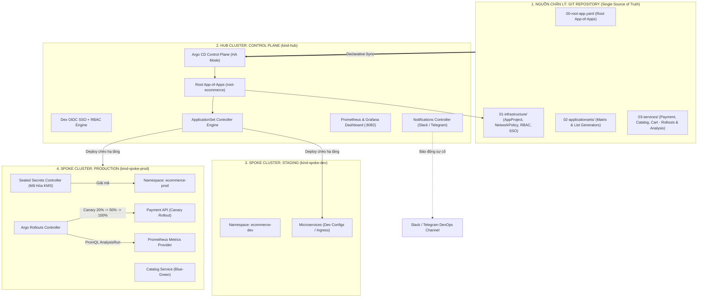
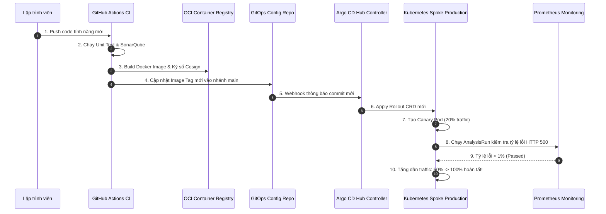
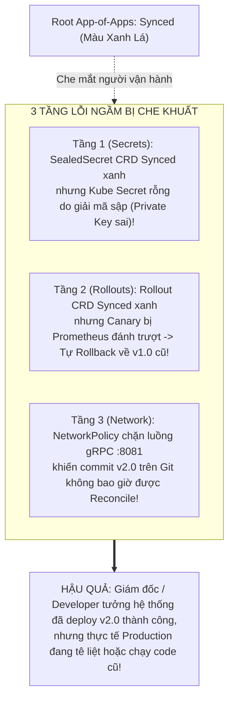

# Capstone Project: Xây Dựng Nền Tảng GitOps Enterprise Đa Đội, Đa Cụm End-to-End

Chào mừng bạn đến với **Capstone Project** — dự án tổng hợp đỉnh cao trong hành trình chinh phục **Argo CD & GitOps Enterprise Architecture**! 

Trong 23 chuyên đề vừa qua, chúng ta đã trang bị từng mảnh ghép kỹ thuật tinh vi nhất: từ cơ chế đồng bộ Reconcile, Sync Waves, Custom Health Checks Lua, Kustomize/Helm multi-source, cho tới App-of-Apps, ApplicationSet, Multi-Cluster, AppProject, CMP v2, Dex OIDC SSO, Sealed Secrets, Argo Rollouts Canary, Notifications và Production Hardening.

Trong dự án Capstone này, bạn sẽ đóng vai trò là **Principal GitOps Platform Architect**, tự tay kiến tạo một hệ thống phân phối phần mềm cấp doanh nghiệp cho sàn thương mại điện tử **E-commerce Multi-Cluster Enterprise**, tự động hóa 100% từ Git commit đến môi trường Production đa cụm và nghiệm thu bàn giao vận hành.

---

## 1. Sơ Đồ Toàn Cảnh Kiến Trúc Capstone Enterprise

Mô hình kiến trúc tổng thể của hệ thống bao gồm 1 cụm điều khiển trung tâm (**Hub Cluster**) và 2 cụm mục tiêu triển khai (**Spoke Clusters: Dev/Staging & Production**):



---

## 2. Chuỗi Phối Hợp Toàn Diện: Từ Code Commit Tới Production

Quy trình tự động hóa khép kín từ lúc Developer commit mã nguồn tới khi chạy thực tế trên Production:



---

## 3. Cấu Trúc Kho Mã Nguồn Chuẩn Doanh Nghiệp (GitOps Repo Layout)

Dự án Capstone được tổ chức theo cấu trúc phân tách trách nhiệm (Separation of Concerns) rõ ràng:

```
ecommerce-gitops/
├── 00-root-app.yaml                     # Root Application CRD (App-of-Apps)
├── 01-infrastructure/                   # Hạ tầng cốt lõi & Bảo mật
│   ├── appproject-ecommerce.yaml        # Phân quyền 5 rào chắn AppProject
│   ├── argocd-rbac-cm.yaml              # Casbin RBAC Policies
│   ├── argocd-notifications-cm.yaml     # Templates & Triggers cảnh báo
│   └── networkpolicy-argocd.yaml        # Khóa luồng mạng NetworkPolicy
├── 02-applicationsets/                  # Tự động hóa sinh ứng dụng hàng loạt
│   └── appset-ecommerce-matrix.yaml     # Matrix Generator (Clusters x Services)
└── 03-services/                         # Nghiệp vụ Microservices & Progressive Delivery
    ├── payment-service/
    │   ├── base/
    │   │   ├── rollout.yaml             # Argo Rollout Canary Definition
    │   │   ├── analysis-template.yaml   # Prometheus Analysis Metric (Error Rate < 1%)
    │   │   ├── service.yaml
    │   │   └── sealedsecret.yaml        # Stripe API Keys được mã hóa bằng kubeseal
    │   └── overlays/
    │       ├── dev/
    │       └── prod/
    └── catalog-service/
        ├── base/
        └── overlays/
```

---

## 4. Triển Khai Từng Bước Cỗ Máy Capstone

### Bước 1: Thiết Lập Root App-of-Apps Quản Trị Hệ Thống

Root Application đóng vai trò là "mũi khoan" duy nhất kết nối Argo CD với toàn bộ cây ứng dụng:

```yaml
# 00-root-app.yaml
apiVersion: argoproj.io/v1alpha1
kind: Application
metadata:
  name: root-ecommerce-app
  namespace: argocd
  finalizers:
    - resources-finalizer.argocd.argoproj.io
spec:
  project: default
  source:
    repoURL: https://github.com/company/ecommerce-gitops.git
    targetRevision: HEAD
    path: 01-infrastructure
  destination:
    server: https://kubernetes.default.svc
    namespace: argocd
  syncPolicy:
    automated:
      prune: true
      selfHeal: true
    syncOptions:
      - CreateNamespace=true
```

---

### Bước 2: Phân Quyền Đa Tenant Với AppProject

Thiết lập rào chắn an ninh cho dự án E-commerce, ngăn chặn deploy sang các namespace nhạy cảm như `kube-system` hay `vault`:

```yaml
# 01-infrastructure/appproject-ecommerce.yaml
apiVersion: argoproj.io/v1alpha1
kind: AppProject
metadata:
  name: ecommerce-project
  namespace: argocd
spec:
  description: "Dự án quản trị sàn thương mại điện tử đa cụm"
  sourceRepos:
    - "https://github.com/company/ecommerce-gitops.git"
  destinations:
    - namespace: "ecommerce-dev"
      server: "https://10.0.10.50:6443" # Dev Cluster
    - namespace: "ecommerce-prod"
      server: "https://10.0.20.50:6443" # Prod Cluster
  clusterResourceWhitelist:
    - group: ""
      kind: Namespace
  namespaceResourceWhitelist:
    - group: "apps"
      kind: "*"
    - group: "argoproj.io"
      kind: "Rollout"
    - group: "bitnami.com"
      kind: "SealedSecret"
    - group: ""
      kind: "Service"
    - group: ""
      kind: "ConfigMap"
```

---

### Bước 3: Tự Động Hóa Triển Khai Đa Môi Trường Với ApplicationSet Matrix Generator

Sử dụng **Matrix Generator** kết hợp danh sách Cụm (Cluster Generator) và danh sách Dịch vụ (Git Directory Generator) để tự động sinh ra hàng loạt Child Applications:

```yaml
# 02-applicationsets/appset-ecommerce-matrix.yaml
apiVersion: argoproj.io/v1alpha1
kind: ApplicationSet
metadata:
  name: ecommerce-microservices
  namespace: argocd
spec:
  generators:
    - matrix:
        generators:
          # 1. Quét danh sách các cụm có nhãn env=production hoặc env=staging
          - clusters:
              selector:
                matchLabels:
                  tier: ecommerce
          # 2. Quét danh mục các microservices trong thư mục 03-services
          - git:
              repoURL: https://github.com/company/ecommerce-gitops.git
              revision: HEAD
              directories:
                - path: 03-services/*
  template:
    metadata:
      name: "{{path.basename}}-{{name}}"
      labels:
        environment: "{{metadata.labels.env}}"
        service: "{{path.basename}}"
    spec:
      project: ecommerce-project
      source:
        repoURL: https://github.com/company/ecommerce-gitops.git
        targetRevision: HEAD
        path: "{{path}}/overlays/{{metadata.labels.env}}"
      destination:
        server: "{{server}}"
        namespace: "ecommerce-{{metadata.labels.env}}"
      syncPolicy:
        automated:
          prune: true
          selfHeal: true
        syncOptions:
          - CreateNamespace=true
```

---

### Bước 4: Tích Hợp Progressive Delivery Canary & Prometheus Tự Động Rollback

Triển khai dịch vụ thanh toán nhạy cảm `payment-service` với chiến lược **Argo Rollouts Canary**. Nếu phiên bản mới làm tỷ lệ lỗi HTTP 5xx vượt quá 1%, hệ thống sẽ tự động hủy đợt deploy và Rollback về phiên bản ổn định trong vòng 1 giây:

```yaml
# 03-services/payment-service/base/rollout.yaml
apiVersion: argoproj.io/v1alpha1
kind: Rollout
metadata:
  name: payment-service
  namespace: ecommerce-prod
spec:
  replicas: 10
  strategy:
    canary:
      analysis:
        templates:
          - templateName: payment-error-rate-check
        args:
          - name: service-name
            value: payment-service
      steps:
        - setWeight: 20
        - pause: { duration: 5m }
        - setWeight: 50
        - pause: { duration: 10m }
  template:
    metadata:
      labels:
        app: payment-service
    spec:
      containers:
        - name: payment-api
          image: company/payment-api:v2.0.0
          ports:
            - containerPort: 8080
---
# 03-services/payment-service/base/analysis-template.yaml
apiVersion: argoproj.io/v1alpha1
kind: AnalysisTemplate
metadata:
  name: payment-error-rate-check
  namespace: ecommerce-prod
spec:
  metrics:
    - name: http-error-rate
      interval: 30s
      successCondition: result[0] <= 0.01
      failureLimit: 2
      provider:
        prometheus:
          address: http://prometheus-server.monitoring.svc:9090
          query: |
            sum(rate(http_requests_total{status=~"5.*", app="payment-service"}[1m])) 
            / 
            sum(rate(http_requests_total{app="payment-service"}[1m]))
```

---

## 5. Cạm Bẫy Thực Chiến: "Bẫy 'Synced Nhưng Sai' Đa Tầng" (The Multi-Layer Synced Trap)

Trong các hệ thống GitOps quy mô lớn, cạm bẫy nguy hiểm nhất mà các kỹ sư thường gặp là **Bẫy Đồng Bộ Đa Tầng**:



> [!WARNING]
> **CẢNH BÁO TỬ HUYỆT VẬN HÀNH:**
> Tuyệt đối không bao giờ dựa vào màu xanh của Root Application để kết luận toàn bộ hệ sinh thái Microservices đã vận hành tốt. Luôn thực hiện đối soát tầng sâu (Deep Audit) đến từng Secret, AnalysisRun và trạng thái Pods trên các cụm Spoke từ xa.

> [!TIP]
> **KINH NGHIỆM THỰC CHIẾN TỐI ƯU HIỆU NĂNG:**
> Khi số lượng Microservices vượt qua con số 100 trên nhiều cụm, hãy kết hợp `ApplicationSet` với `Sync Waves` và `Limit Concurrent Syncs` (`--repo-server-timeout-seconds` và `--app-resync-period`) để tránh hiện tượng dồn dập Reconcile Storm làm nghẽn mạng gRPC.

---

## 6. Quy Trình Nghiệm Thu Production Readiness Handover Audit (5 Bước)

Dưới đây là đoạn script bash hoàn chỉnh mà kỹ sư SRE thực thi để nghiệm thu 100% hệ thống trước khi ký biên bản bàn giao:

```bash
#!/bin/bash
set -e

echo "=== BẮT ĐẦU QUY TRÌNH AUDIT NGHIỆM THU PRODUCTION HANDOVER ==="

# 1. BƯỚC 1: Kiểm tra trạng thái đồng bộ của toàn bộ Application con
echo "[1/5] Kiểm tra danh mục Applications..."
argocd app list -o wide

# 2. BƯỚC 2: Kiểm tra sức khỏe chi tiết và xác minh không có tài nguyên nào kẹt Progressing
echo "[2/5] Ép buộc Hard Refresh Root Application..."
argocd app get root-ecommerce-app --hard-refresh

# 3. BƯỚC 3: Đối soát trạng thái giải mã SealedSecrets trên cụm Spoke Production
echo "[3/5] Kiểm tra giải mã Secrets trên cụm Production..."
kubectl get sealedsecrets -n ecommerce-prod
# Đảm bảo Native Kube Secret đã sinh ra và có dữ liệu
kubectl get secret payment-db-credentials -n ecommerce-prod -o jsonpath="{.data.username}" | base64 -d
echo ""

# 4. BƯỚC 4: Kiểm tra trạng thái phân bổ Traffic của Argo Rollouts
echo "[4/5] Kiểm tra trạng thái Argo Rollouts Canary..."
kubectl argo rollouts get rollout payment-service -n ecommerce-prod

# 5. BƯỚC 5: Kiểm tra luồng cảnh báo Notifications tới kênh Telegram/Slack
echo "[5/5] Kiểm tra log Notifications Controller..."
kubectl logs -n argocd -l app.kubernetes.io/name=argocd-notifications-controller --tail=20

echo "=== KẾT QUẢ AUDIT: 100% TIÊU CHÍ ĐẠT CHUẨN SẴN SÀNG VẬN HÀNH! ==="
```

---

## 7. Lộ Trình Ôn Thi Chứng Chỉ Quốc Tế CAPA (Certified Argo Project Associate)

Dự án Capstone này trang bị cho bạn 100% kiến thức trọng tâm của kỳ thi chứng chỉ quốc tế **Certified Argo Project Associate (CAPA)** do Linux Foundation và CNCF tổ chức:

| Lĩnh vực thi CAPA | Tỷ trọng | Nội dung trọng tâm đã bao phủ trong Series |
|---|---|---|
| **Argo CD Overview & Architecture** | 22% | Buổi 01 – 05 (GitOps Principles, Reconcile Loop, Microservices, Tracking IDs) |
| **Argo CD Advanced Features** | 24% | Buổi 06 – 10 (Sync Waves, Hooks, Lua Health Checks, Diff Engine, Kustomize/Helm) |
| **Scaling & Enterprise Management** | 20% | Buổi 11 – 16 (App-of-Apps, ApplicationSet, Multi-Cluster, AppProject, CMP v2) |
| **Security & Operational Hardening** | 18% | Buổi 17 – 20, 23 (RBAC, OIDC/Dex, Sealed Secrets, NetworkPolicy, Disaster Recovery) |
| **Progressive Delivery & Observability** | 16% | Buổi 21 – 22 (Argo Rollouts Canary/BlueGreen, Prometheus Metrics, Grafana) |

---

## 8. Bộ Câu Hỏi Tự Kiểm Tra Chuyên Sâu (Self-Check Q&A)

Dưới đây là 10 câu hỏi sát hạch chuyên sâu về kiến trúc Capstone Enterprise:

### Câu 1: Trong dự án Capstone, tại sao ta lại kết hợp Root App-of-Apps với ApplicationSet thay vì chỉ dùng 1 trong 2?
- **Đáp án:** Đây là kiến trúc tối ưu nhất: **Root App-of-Apps** quản lý các thành phần tĩnh cấp hạ tầng (AppProject, NetworkPolicy, Notification ConfigMap) và bản thân tệp `ApplicationSet CRD`. Còn **ApplicationSet** chịu trách nhiệm quét và tự động sinh ra hàng chục Microservices động theo ma trận Cụm $\times$ Dịch vụ.

### Câu 2: Làm thế nào để đảm bảo một microservice mới thêm vào thư mục `03-services/` được tự động deploy sang cả 2 cụm Dev và Prod?
- **Đáp án:** Nhờ vào **Matrix Generator** trong ApplicationSet. Matrix Generator liên tục quét thư mục `03-services/*` trên Git và nhân với 2 cụm có nhãn `tier: ecommerce`, tự động tạo ra 2 Application con độc lập cho Dev và Prod trong vòng dưới 3 giây.

### Câu 3: Nếu dịch vụ `payment-service` deploy phiên bản v2.0 bị lỗi tăng tỷ lệ HTTP 500 lên 5%, hệ thống Capstone tự xử lý ra sao?
- **Đáp án:** Chuỗi tự động hóa khép kín: (1) `AnalysisRun` của Argo Rollouts truy vấn PromQL thấy tỷ lệ lỗi > 1% $\rightarrow$ (2) Đánh dấu Analysis Failed $\rightarrow$ (3) Argo Rollouts Controller lập tức cắt toàn bộ traffic Canary và chuyển 100% traffic về phiên bản v1.0 cũ trong 1 giây $\rightarrow$ (4) Notifications Controller gửi tin nhắn báo động đỏ tới kênh Slack/Telegram.

### Câu 4: Năm bước trong quy trình nghiệm thu Production Handover Audit kiểm tra những gì?
- **Đáp án:** (1) Danh mục và trạng thái Sync của toàn bộ Apps, (2) Hard Refresh kiểm tra kẹt Progressing, (3) Đối soát giải mã SealedSecrets thành Native Secret, (4) Kiểm tra trạng thái phân bổ Traffic của Rollout, và (5) Kiểm tra luồng cảnh báo Notifications tới kênh chat.

### Câu 5: Cần chuẩn bị những gì để tự tin thi đỗ chứng chỉ quốc tế CAPA (Certified Argo Project Associate)?
- **Đáp án:** Nắm vững lý thuyết kiến trúc vi dịch vụ của Argo CD, thực hành thành thạo các tệp manifest `Application`, `ApplicationSet`, `AppProject`, `Rollout`, `AnalysisTemplate`, hiểu rõ cú pháp Casbin RBAC và quy trình xử lý sự cố thực chiến đã được bao phủ trong 24 bài viết của Series.

### Câu 6: Làm thế nào để đảm bảo Root Application không vô tình xóa nhầm các tài nguyên khi bị xoá?
- **Đáp án:** Quản lý cẩn thận Finalizer `resources-finalizer.argocd.argoproj.io`. Nếu muốn xóa Root App nhưng giữ lại các ứng dụng con đang chạy trên cụm, hãy gỡ bỏ Finalizer này trước khi chạy lệnh delete.

### Câu 7: Tại sao trong Capstone ta lại đặt Argo CD Control Plane trên Hub Cluster riêng biệt thay vì cài chung vào Production Cluster?
- **Đáp án:** Kiến trúc Hub-and-Spoke tách biệt mặt phẳng điều khiển (Management Plane) khỏi mặt phẳng dữ liệu (Data Plane). Nếu Production Cluster gặp sự cố sập hạ tầng, Hub Cluster vẫn hoạt động độc lập để điều phối khắc phục thảm họa hoặc chuyển hướng lưu lượng sang Region khác.

### Câu 8: Vai trò của Sync Waves trong việc điều phối khởi động dịch vụ cơ sở dữ liệu trước khi chạy Microservices là gì?
- **Đáp án:** Đặt database migration Job ở `wave: "0"` và Microservices Deployment ở `wave: "1"`. Argo CD sẽ đợi Job migration hoàn thành với mã thoát `0` mới bắt đầu khởi tạo Pods ứng dụng.

### Câu 9: Làm thế nào để kiểm soát chi phí hạ tầng (FinOps) khi sử dụng ApplicationSet sinh hàng loạt môi trường Preview cho Pull Request?
- **Đáp án:** Sử dụng **Pull Request Generator** kết hợp với TTL (Time-To-Live) Controller hoặc cấu hình tự động xóa Application con ngay khi Pull Request bị đóng (Merged/Closed).

### Câu 10: Điểm khác biệt mấu chốt giữa GitOps Push Model (Jenkins) và GitOps Pull Model (Argo CD Capstone) là gì?
- **Đáp án:** Push Model đòi hỏi CI Server phải nắm giữ Private Key/Kubeconfig của cụm Production (lỗ hổng bảo mật lớn). Pull Model chạy Agent bên trong cụm (hoặc Hub quản lý) chủ động kéo cấu hình về và tự động phát hiện/sửa chữa sai lệch (**Self-Healing**) liên tục 24/7.

---

## Tổng Kết

Dự án Capstone đã đưa bạn từ một kỹ sư làm quen với các khái niệm GitOps cơ bản trở thành một **Kiến trúc sư Nền tảng GitOps Cấp cao (Principal Platform Architect)**. Bạn đã làm chủ khả năng thiết kế, bảo vệ và vận hành các hệ thống phân phối phần mềm khổng lồ, an toàn tuyệt đối và có khả năng phục hồi thần tốc.

Để củng cố toàn diện tri thức và sẵn sàng cho các buổi phỏng vấn tuyển dụng vị trí SRE / DevOps Lead, hãy bước tiếp vào **Bài 25 — Đại Tuyển Tập 100+ Câu Hỏi Phỏng Vấn Argo CD & GitOps Chuyên Sâu**!
