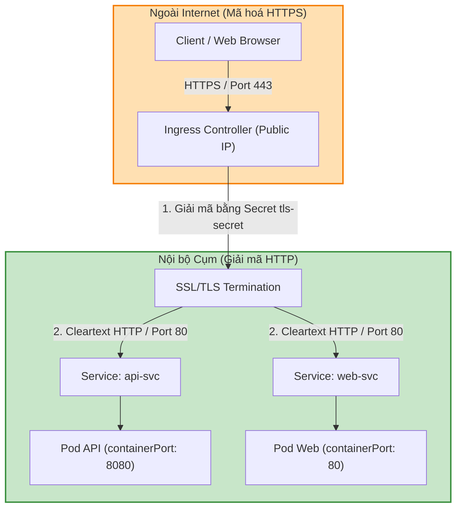
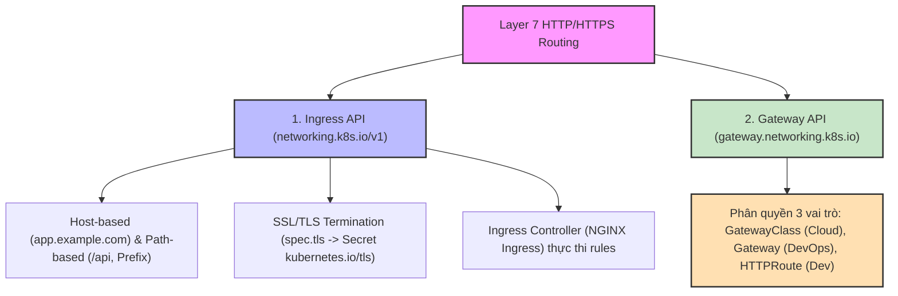
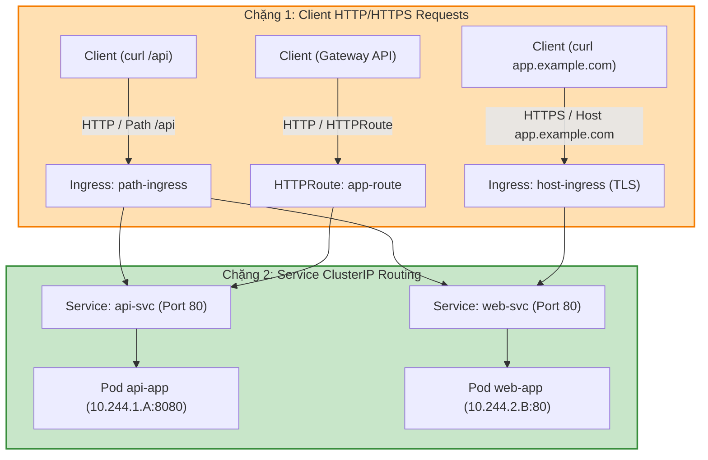

# [BÀI 24] ĐỊNH TUYẾN LỚP 7 VỚI INGRESS CONTROLLER & GATEWAY API: TLS TERMINATION, PATH ROUTING & HTTPROUTE

Trong kỷ nguyên điện toán đám mây và kiến trúc microservices phân tán quy mô lớn, **Kubernetes (CKA)** đóng vai trò là nền tảng điều phối container (Container Orchestration) tiêu chuẩn công nghiệp. Để làm chủ hệ thống trong môi trường sản xuất (Production) cũng như chinh phục kỳ thi chứng chỉ quốc tế của Linux Foundation / CNCF, kỹ sư không chỉ nắm vững các câu lệnh thao tác cơ bản mà phải thấu hiểu sâu sắc bản chất cơ chế tầng thấp: từ chu trình điều hòa (Reconciliation Loop), cấu trúc điều phối tài nguyên, kiến trúc mạng CNI, lưu trữ CSI cho đến các chuẩn mực an ninh phòng thủ chiều sâu.

Bài viết chuyên sâu này sẽ đồng hành cùng bạn giải mã toàn diện bức tranh kiến trúc, phân tích các đánh đổi kỹ thuật thực chiến (Engineering Trade-offs), cung cấp bài thực hành Lab từng bước và bộ câu hỏi phỏng vấn chuẩn Architect / Lead Engineer.

---

## 1. Bản Chất Kiến Trúc & Cơ Chế Vận Hành Tầng Thấp

| # | Câu hỏi ôn tập | Đáp án chuẩn ngắn gọn (chứa con số / tên lệnh) |
|---|---|---|
| 1 | Cấu trúc tên miền FQDN chuẩn của một Service | **`<service-name>.<namespace>.svc.cluster.local`** (gồm **5** thành phần) |
| 2 | Ba thông số mặc định trong tệp `/etc/resolv.conf` của Pod | `nameserver 10.96.0.10`, `search`, và cờ **`options ndots:5`** |
| 3 | Tác hại hiệu năng của cờ `ndots:5` với tên miền ngoại mạng | Ép thực hiện **4** truy vấn DNS thử nghiệm thừa gây trễ 50ms |
| 4 | Bốn chế độ hỏng DNS phổ biến nhất | **4** chế độ (OOMKilled, Loop `127.0.0.53`, Syntax Error, sai `dnsPolicy`) |
| 5 | Lệnh one-liner chẩn đoán DNS trong 2 giây | `kubectl run dnstest --image=busybox:1.36 -it --rm -- nslookup <domain>` |


> **Luận đề trung tâm của buổi:**
> *"Đối tượng `Ingress` (`networking.k8s.io/v1`) cung cấp giải pháp định tuyến lớp ứng dụng Layer 7 (HTTP/HTTPS) chuyên dụng: gom nhiều tên miền và đường dẫn URL vào một địa chỉ IP công cộng duy nhất, giải mã bảo mật SSL/TLS Termination qua Secret `kubernetes.io/tls`, và phân tách định tuyến theo tên miền (Host-based) hoặc đường dẫn (Path-based); trong khi đó chuẩn API thế hệ mới `Gateway API` (`gateway.networking.k8s.io`) giải quyết triệt để các nhược điểm của Ingress bằng cách phân quyền rõ ràng 3 vai trò trách nhiệm (`GatewayClass` hạ tầng, `Gateway` vận hành cụm, `HTTPRoute` lập trình viên) và loại bỏ các annotation đặc thù nhà cung cấp."*

**Bảng kết quả các buổi trước được dùng lại:**

| Kết quả / Công cụ | Nguồn gốc | Áp dụng vào buổi này |
|---|---|---|
| Khởi tạo TLS Secret chứa cert và key | Buổi 20 `QT 4.1` | Khai báo `spec.tls[].secretName` trong Ingress để bật HTTPS |
| Đối tượng Service kiểu `ClusterIP` và `NodePort` | Buổi 22 `QT 4.1` | Cấu hình `backend.service` trong Ingress rule trỏ về Service VIP |
| Lệnh kiểm tra danh sách Pods `kubectl get pods` | Buổi 03 `QT 4.1` | Kiểm tra Pod Ingress Controller đang chạy trong cụm lab |

Ba câu bài tập về nhà BTVN 4 của buổi 23 đã chuẩn bị sẵn kiến thức cho học viên: Câu 1 phân tích vai trò L7 HTTP/HTTPS của Ingress; Câu 2 phân biệt Host-based vs Path-based routing; Câu 3 khám phá kiến trúc phân quyền 3 vai trò của Gateway API.

---


| # | Năng lực đạt được sau buổi học | Hiện vật chứng minh trong bài lab |
|---|---|---|
| 1 | Khởi tạo đối tượng Ingress v1 API (`networking.k8s.io/v1`) định tuyến Path-based | Tệp `hien-vat/path-ingress.yaml` |
| 2 | Khởi tạo đối tượng Ingress định tuyến Host-based cho nhiều tên miền | Tệp `hien-vat/host-ingress.yaml` |
| 3 | Cấu hình SSL/TLS Termination với Secret `kubernetes.io/tls` | Tệp `hien-vat/tls-ingress.yaml` |
| 4 | Kiểm thử kỹ thuật gọi HTTP với Header Host `curl -H "Host: ..."` | Tệp `hien-vat/ingress-curl-report.txt` |
| 5 | Biên soạn đối tượng `HTTPRoute` thế hệ mới trong chuẩn Gateway API | Tệp `hien-vat/http-route.yaml` |
| 6 | Kiểm thử kịch bản Ingress Controller và Gateway API với script tự động | Script `hien-vat/verify-ingress-gateway.sh` |

---


| Bắt buộc phải biết | Nguồn tự học nếu thiếu |
|---|---|
| Khái niệm Service ClusterIP và cổng targetPort | Buổi 22 `QT 4.1` |
| Tạo TLS Secret loại `kubernetes.io/tls` bằng CLI | Buổi 20 `QT 4.1` |
| Giao thức HTTP Header `Host` và mã trạng thái 404 | Buổi 01 `QT 4.1` |

---


| # | Thuật ngữ tiếng Việt | Tiếng Anh tương đương | Ghi chú chuẩn hoá trong thân bài |
|---|---|---|---|
| 1 | Khai báo quy tắc cửa ngõ | Ingress Resource (`kind: Ingress`) | Đối tượng YAML khai báo các quy tắc định tuyến HTTP/HTTPS |
| 2 | Tiến trình xử lý cửa ngõ | Ingress Controller (Nginx/Traefik) | Tiến trình Reverse Proxy thực thi các quy tắc Ingress |
| 3 | Định tuyến theo tên miền | Host-based Routing (`spec.rules[].host`) | Định tuyến dựa trên tiêu đề `Host` header (app.example.com) |
| 4 | Định tuyến theo đường dẫn | Path-based Routing (`spec.rules[].http.paths`) | Định tuyến dựa trên đường dẫn URL path (/api, /web) |
| 5 | Kiểu đường dẫn trùng khớp | Path Type (`Prefix` / `Exact`) | Quy tắc so khớp đường dẫn URL (`Prefix` hoặc `Exact`) |
| 6 | Giải mã chứng chỉ bảo mật | SSL/TLS Termination | Cơ chế giải mã HTTPS tại Ingress, truyền HTTP nội bộ |
| 7 | Tên cửa ngõ định tuyến | `ingressClassName` (`ingressClassName: nginx`) | Thuộc tính chỉ định Ingress Controller phụ trách đối tượng |
| 8 | Chuẩn giao diện cửa ngõ thế hệ mới | Gateway API (`gateway.networking.k8s.io`) | Bộ API chuẩn hóa mở rộng phân quyền thế hệ mới của CNCF |
| 9 | Lớp hạ tầng cửa ngõ | `GatewayClass` | Tài nguyên cấp hạ tầng do nhà cung cấp CNI/Cloud định nghĩa |
| 10 | Điểm lắng nghe mạng cửa ngõ | `Gateway` | Tài nguyên cấp cụm do DevOps/Cluster Operator quản lý |
| 11 | Quy tắc định tuyến HTTP | `HTTPRoute` | Tài nguyên cấp ứng dụng do Developer biên soạn |
| 12 | Chú thích cấu hình riêng | Ingress Annotations (`nginx.ingress.kubernetes.io/*`) | Các cờ tùy chỉnh riêng cho từng loại Ingress Controller |
| 13 | Dịch vụ đích phía sau | Backend Service (`backend.service.name`) | Service ClusterIP nhận traffic từ Ingress |
| 14 | Cấu hình chứng chỉ TLS | TLS Spec (`spec.tls`) | Khối khai báo danh sách hosts và secretName chứng chỉ |


1. **Mô hình "Bảng nội quy tòa nhà và Bác bảo vệ sảnh (Ingress Resource vs Ingress Controller)":**
   `Ingress Resource` giống như **Bảng nội quy phân phòng dán trên tường**: Viết rõ phòng 101 là kế toán, phòng 102 là kỹ thuật, nhưng tờ giấy không có khả năng dẫn khách đi. `Ingress Controller` (như Nginx Ingress) chính là **Bác bảo vệ đứng ở sảnh**: Đọc bảng nội quy và trực tiếp dẫn từng khách hàng đến đúng cửa phòng. Nếu chỉ dán bảng nội quy mà không có bác bảo vệ (không cài Ingress Controller), khách hàng đứng ở sảnh sẽ không bao giờ vào được phòng.

2. **Mô hình "Trạm thu phí giải mã thư niêm phong ở cửa khẩu (SSL/TLS Termination)":**
   SSL/TLS Termination giống như một trạm kiểm soát cửa khẩu: Khách hàng gửi bưu phẩm mã hoá HTTPS từ ngoài Internet tới cửa khẩu Ingress. Tại trạm Ingress, bác bảo vệ kiểm tra chìa khoá Secret `kubernetes.io/tls`, **bóc niêm phong giải mã HTTPS thành HTTP thông thường**, sau đó gửi bưu phẩm HTTP đi trên đường cao tốc nội bộ cụm tới các Pods backend với tốc độ cực nhanh mà không bắt từng Pod phải tốn CPU tự giải mã.

3. **Mô hình "Ba chìa khóa phân quyền cho ba vai trò (Gateway API vs Ingress cũ)":**
   Ingress cũ giống như một ổ khóa duy nhất mà cả Giám đốc hạ tầng, Kỹ sư vận hành và Lập trình viên đều phải nhét chung các chú thích (annotations) rối rắm vào. `Gateway API` chia thành **3 chìa khóa riêng biệt**: 1. `GatewayClass` dành cho nhà cung cấp hạ tầng (AWS/GCP/Cilium); 2. `Gateway` dành cho Kỹ sư vận hành cụm (DevOps) quản lý IP/Port/TLS; 3. `HTTPRoute` dành cho Lập trình viên ứng dụng tự cấu hình đường dẫn `/api` mà không cần làm phiền DevOps.

---

### 1.1. Phân biệt Ingress Resource vs Ingress Controller và quy tắc L7 Routing (Host-based vs Path-based) (12 phút)

**Nguyên lý cốt lõi:** Đối tượng `Ingress` (`kind: Ingress` apiVersion `networking.k8s.io/v1`) chỉ là bản khai báo quy tắc định tuyến YAML; bắt buộc phải có một tiến trình **Ingress Controller** (như NGINX Ingress Controller, Traefik, HAProxy) chạy thực tế trong cụm để lắng nghe API Server và thực thi việc định tuyến Layer 7.

**Giải thích cơ chế ngầm:** Phân tách tuyệt đối giữa khai báo declarative cấu hình và tiến trình thực thi runtime.

> [!WARNING]
> **CẠM BẪY THỰC CHIẾN:**
> Tạo đối tượng Ingress thành công nhưng cột `ADDRESS` bị rỗng vĩnh viễn và không thể `curl` vào được do cụm chưa cài Ingress Controller.

**Minh hoạ.**

```yaml
apiVersion: networking.k8s.io/v1
kind: Ingress
metadata:
  name: app-ingress
  namespace: dev
spec:
  ingressClassName: nginx
```

Con số chốt: **1** Ingress Controller bắt buộc phải chạy trong cụm để đối tượng Ingress có hiệu lực.

---

**Nguyên lý cốt lõi:** Phân biệt **2 kiểu định tuyến Layer 7 trong Ingress**: **Host-based Routing** (định tuyến theo tiêu đề `spec.rules[].host` như `app1.example.com` và `app2.example.com`) và **Path-based Routing** (định tuyến theo đường dẫn URL `spec.rules[].http.paths[].path` như `/api` và `/web` với `pathType: Prefix` hoặc `Exact`).

**Giải thích cơ chế ngầm:** Tiết kiệm chi phí địa chỉ IP công cộng: cho phép gom hàng chục ứng dụng web vào chung một IP duy nhất.

> [!WARNING]
> **CẠM BẪY THỰC CHIẾN:**
> Khai báo `pathType: Prefix` nhưng thiếu dấu gạch chéo `/` đầu đường dẫn làm API Server từ chối lệnh apply.

**Minh hoạ.**

```yaml
spec:
  rules:
  - host: app.example.com
    http:
      paths:
      - path: /api
        pathType: Prefix
        backend:
          service:
            name: api-service
            port:
              number: 80
```

Con số chốt: **2** kiểu định tuyến Layer 7 chính trong Ingress spec (Host-based và Path-based).

---

### 1.2. Cơ chế giải mã SSL/TLS Termination với Secret `kubernetes.io/tls` (12 phút)



---

**Nguyên lý cốt lõi:** Khối **`spec.tls`** trong Ingress spec liên kết với một đối tượng Secret chuẩn loại **`kubernetes.io/tls`** (chứa đúng 2 key `tls.crt` và `tls.key`) để thực hiện cơ chế **SSL/TLS Termination** tại cửa ngõ Ingress: giải mã kết nối mã hoá HTTPS của khách hàng và truyền tiếp gói tin HTTP thông thường tới các Pods backend.

**Giải thích cơ chế ngầm:** Giảm tải tài nguyên CPU xử lý giải mã SSL cho các Pods backend và tập trung quản lý chứng chỉ SSL tại một nơi duy nhất.

> [!WARNING]
> **CẠM BẪY THỰC CHIẾN:**
> Khai báo `secretName` trong khối `spec.tls` trỏ tới một Secret loại `Opaque` làm Ingress Controller báo lỗi không tìm thấy TLS cert.

**Minh hoạ.**

```yaml
spec:
  tls:
  - hosts:
    - app.example.com
    secretName: app-tls-secret
```

Con số chốt: **443** là cổng HTTPS mặc định lắng nghe SSL/TLS Termination tại Ingress Controller.

---

**Nguyên lý cốt lõi:** Khi sử dụng cờ `pathType: Prefix` trong Ingress path, một đường dẫn `/api` sẽ so khớp và chuyển tiếp 100% các request bắt đầu bằng `/api`, `/api/`, `/api/v1/users`; trong khi `pathType: Exact` chỉ so khớp chính xác từng ký tự trùng khớp với `/api`.

**Giải thích cơ chế ngầm:** Đảm bảo tính chính xác khi phân chia routing cho các ứng dụng microservices.

> [!WARNING]
> **CẠM BẪY THỰC CHIẾN:**
> Dùng `Exact` cho đường dẫn ứng dụng làm các sub-path `/api/v1` bị trả về lỗi 404 Not Found.

**Minh hoạ.**

```yaml
paths:
- path: /api
  pathType: Prefix
```

Con số chốt: **100%** các sub-paths được so khớp khi khai báo `pathType: Prefix`.

---

### 1.3. Kiến trúc thế hệ mới Gateway API (`GatewayClass`, `Gateway`, `HTTPRoute`) (10 phút)

**Nguyên lý cốt lõi:** Chuẩn API thế hệ mới **Gateway API** (`gateway.networking.k8s.io`) giải quyết triệt để các hạn chế của Ingress cũ bằng cách phân chia rõ ràng trách nhiệm cho **3 vai trò độc lập**: **`GatewayClass`** (do nhà cung cấp hạ tầng CNI/Cloud định nghĩa), **`Gateway`** (do Kỹ sư vận hành cụm DevOps quản lý IP/Port/TLS), và **`HTTPRoute`** (do Lập trình viên ứng dụng tự biên soạn rule routing).

**Giải thích cơ chế ngầm:** Loại bỏ các annotation đặc thù nhà cung cấp (vendor lock-in) và cho phép phân quyền Role-based Access Control (RBAC) chuẩn hóa theo từng vai trò công việc.

> [!WARNING]
> **CẠM BẪY THỰC CHIẾN:**
> Cố gõ hàng chục dòng annotation `nginx.ingress.kubernetes.io/*` rối rắm trong file Ingress thay vì chuyển sang dùng Gateway API.

**Minh hoạ.**

```yaml
apiVersion: gateway.networking.k8s.io/v1
kind: HTTPRoute
metadata:
  name: app-route
  namespace: dev
spec:
  parentRefs:
  - name: prod-gateway
  rules:
  - matches:
    - path:
        type: PathPrefix
        value: /api
    backendRefs:
    - name: api-service
      port: 80
```

Con số chốt: **3** vai trò phân quyền cốt lõi trong kiến trúc Gateway API (`GatewayClass`, `Gateway`, `HTTPRoute`).

---

**Nguyên lý cốt lõi:** Đối tượng `HTTPRoute` trong Gateway API liên kết với đối tượng `Gateway` thông qua thuộc tính **`parentRefs`**; cho phép Lập trình viên ứng dụng tự do gắn các quy tắc định tuyến HTTP vào cửa ngõ chung của công ty mà không cần xin quyền sửa đổi tài nguyên cấp cụm `Gateway`.

**Giải thích cơ chế ngầm:** Tăng tốc độ triển khai ứng dụng (CI/CD) và đảm bảo an toàn hạ tầng: Lập trình viên không thể vô tình sửa nhầm cổng hoặc chứng chỉ SSL của toàn cụm.

> [!WARNING]
> **CẠM BẪY THỰC CHIẾN:**
> Khai báo sai tên `Gateway` trong `parentRefs` làm `HTTPRoute` bị kẹt trạng thái `Detached`.

**Minh hoạ.**

```yaml
spec:
  parentRefs:
  - name: external-gateway
```

Con số chốt: **1** thuộc tính `parentRefs` giúp gắn kết linh hoạt giữa `HTTPRoute` và `Gateway`.

---

### 1.4. Cấu hình cờ ingressClassName và câu lệnh kiểm tra (4 phút)

**Nguyên lý cốt lõi:** Thuộc tính **`ingressClassName`** (như `ingressClassName: nginx`) trong Ingress spec thay thế cho annotation cũ `kubernetes.io/ingress.class`; đây là cờ bắt buộc giúp chỉ định chính xác Ingress Controller nào trong cụm sẽ chịu trách nhiệm xử lý đối tượng Ingress này.

**Giải thích cơ chế ngầm:** Cho phép một cụm Kubernetes chạy song song nhiều loại Ingress Controller khác nhau (như Nginx cho public traffic, Traefik cho internal traffic).

> [!WARNING]
> **CẠM BẪY THỰC CHIẾN:**
> Quên thuộc tính `ingressClassName` làm Ingress bị bỏ rơi không Controller nào nhận.

**Minh hoạ.**

```yaml
spec:
  ingressClassName: nginx
```

Con số chốt: **1** thuộc tính `ingressClassName` chuẩn hoá việc chọn Ingress Controller từ Kubernetes v1.18+.

---

**Nguyên lý cốt lõi:** Câu lệnh `kubectl get ingress,gateway,httproute -n <namespace>` giúp kỹ sư DevOps trích xuất đồng thời toàn bộ hạ tầng định tuyến L7 Ingress cũ và Gateway API mới chỉ trong đúng **2 giây**.

**Giải thích cơ chế ngầm:** Kỹ thuật chẩn đoán sự cố Layer 7 nhanh trong CKA & CKAD: kiểm tra địa chỉ IP phơi ra tại cột `ADDRESS` hoặc `HOSTS`.

> [!WARNING]
> **CẠM BẪY THỰC CHIẾN:**
> Chạy lệnh kiểm tra từng đối tượng riêng lẻ tốn thời gian thao tác trong kỳ thi bấm giờ.

**Minh hoạ.**

```bash
# Trích xuất danh sách Ingress và Gateway API trong namespace dev
kubectl get ingress,gateway,httproute -n dev
```

Con số chốt: **2** giây là thời gian trích xuất sạch toàn bộ hạ tầng định tuyến Layer 7 bằng đúng 1 câu lệnh.

---

**Nguyên lý cốt lõi:** Sử dụng câu lệnh `kubectl describe ingress <ingress-name>` để trích xuất nhanh địa chỉ IP công cộng trong mục `Address`, danh sách các quy tắc `Rules` (Host, Path, Backends) và trạng thái chứng chỉ SSL trong mục `TLS`.

**Giải thích cơ chế ngầm:** Giúp kỹ sư xác minh tức thì xem Ingress Controller đã nạp đúng quy tắc routing và nhận chứng chỉ SSL hay chưa.

> [!WARNING]
> **CẠM BẪY THỰC CHIẾN:**
> Loay hoay tìm địa chỉ IP của Ingress bằng các câu lệnh rườm rà.

**Minh hoạ.**

```bash
# Xem chi tiết cấu hình và trạng thái của Ingress app-ingress
kubectl describe ingress app-ingress -n dev
```

Con số chốt: **1** câu lệnh `kubectl describe ingress` là đủ để nắm toàn bộ trạng thái ghép nối của Ingress.

---

## 8. Đưa vào cụm thật (4 phút)

### Áp vào cụm đang chạy thì làm gì trước

1. **Cài đặt NGINX Ingress Controller hoặc Cilium Gateway API Controller trước khi apply Ingress:** Đảm bảo có tiến trình Controller lắng nghe API.
2. **Chuẩn bị sẵn Secret loại `kubernetes.io/tls` chứa chứng chỉ SSL hợp lệ:** Dùng cho các tên miền production HTTPS.
3. **Cấu hình DNS A record hoặc file `/etc/hosts` local trỏ tên miền về IP của Ingress Controller:** Giúp máy client kiểm thử được Host-based routing.

### Cái gì hỏng nếu áp thẳng lên prod

- **Chỉnh sửa Ingress path gây ra xung đột trùng lặp (Path Conflict):** Làm request gọi tới ứng dụng A bị chuyển nhầm sang ứng dụng B gây ra lỗi lộ dữ liệu.
- **Xoá Secret TLS khi Ingress đang chạy:** Làm toàn bộ các kết nối HTTPS bị sập lập tức với lỗi chứng chỉ không hợp lệ (SSL Certificate Error).
- **Quy trình áp thử an toàn:**
  - Apply file YAML Ingress trên môi trường staging.
  - Sử dụng cờ `curl -H "Host: app.example.com" http://<Ingress-IP>/api` để kiểm thử từ terminal.
  - Kiểm tra log của Ingress Controller Pod qua `kubectl logs -n ingress-nginx`.

### Đo trước — đo sau

1. **Số lượng địa chỉ IP công cộng (Public IPs):** Giảm từ 50 địa chỉ IP (mỗi app 1 LoadBalancer) xuống đúng 1 địa chỉ IP duy nhất nhờ gom vào Ingress L7.
2. **Chi phí hạ tầng đám mây (Cloud Cost):** Tiết kiệm hàng ngàn USD/tháng nhờ giảm số lượng Cloud Load Balancer.
3. **Thời gian triển khai đường dẫn mới (Deployment Time):** Giảm từ 15 phút xuống 5 giây nhờ Lập trình viên tự apply `HTTPRoute` trong Gateway API.

### Khi nào KHÔNG nên dùng

- **Không dùng Ingress Layer 7 cho các giao thức phi HTTP/HTTPS (như gRPC thuần, TCP/UDP socket, Database connection):** Nên dùng Service `LoadBalancer` / `NodePort` hoặc `GRPCRoute` trong Gateway API.
- **Không tạo quá nhiều rule hoán đổi URL phức tạp (URL Rewrite) bằng annotation rối rắm:** Nên chuyển sang Gateway API `URLRewrite` filter.

---

### 1.6. Bẫy hay gặp (2 phút)

| # | Bẫy hay gặp | Vì sao dính bẫy | Làm đúng là (kèm tên lệnh / con số) |
|---|---|---|---|
| 1 | Ingress tạo thành công nhưng cột `ADDRESS` bị rỗng vĩnh viễn | Cụm chưa cài đặt bất kỳ tiến trình Ingress Controller nào | Cài đặt NGINX Ingress Controller bằng Helm hoặc Manifest |
| 2 | Truy cập Ingress bằng IP bị lỗi 404 Not Found | Ingress đang cấu hình Host-based routing (`host: app.example.com`) | Thêm header `curl -H "Host: app.example.com"` hoặc sửa `/etc/hosts` |
| 3 | Bật HTTPS nhưng trình duyệt báo lỗi `SSL Certificate Invalid` | Khai báo `secretName` trong `spec.tls` trỏ tới Secret không tồn tại | Tạo Secret loại `kubernetes.io/tls` chứa đúng cert và key |
| 4 | Quên cờ `pathType: Prefix` trong Ingress path spec | Kubernetes v1.18+ bắt buộc 100% các path phải có `pathType` | Khai báo `pathType: Prefix` hoặc `Exact` cho mỗi path |
| 5 | Thắc mắc vì sao `HTTPRoute` bị kẹt trạng thái `Detached` | Thuộc tính `parentRefs` gõ sai tên hoặc sai namespace của `Gateway` | Kiểm tra chính xác tên `Gateway` trong khối `parentRefs` |
| 6 | Nhầm lẫn giữa `service.port.number` và `service.port.name` | `number` dành cho số cổng (80); `name` dành cho tên cổng (http) | Khai báo đúng `number: 80` hoặc `name: http` |
| 7 | Cố gõ annotation cũ `kubernetes.io/ingress.class: nginx` | Annotation cũ đã bị thay thế hoàn toàn bằng `ingressClassName` | Sử dụng thuộc tính `ingressClassName: nginx` trong spec |
| 8 | Định tuyến path `/api` nhưng ứng dụng backend nhận nguyên đường dẫn `/api/users` | Ứng dụng backend không có prefix `/api` gây lỗi 404 | Sử dụng annotation `rewrite-target: /$2` để rewrite path |
| 9 | Quên cờ `hosts` trong khối `spec.tls` | Ingress không biết chứng chỉ TLS áp dụng cho tên miền nào | Khai báo mảng `hosts: [app.example.com]` trong khối `spec.tls` |
| 10 | Tạo Secret TLS bằng type `Opaque` làm Ingress báo lỗi | Ingress yêu cầu 100% Secret TLS phải thuộc type `kubernetes.io/tls` | Tạo Secret bằng lệnh `kubectl create secret tls` |
| 11 | Thắc mắc vì sao Gateway API chưa chạy trên cụm | Gateway API yêu cầu phải install CRDs (`gateway.networking.k8s.io`) trước | Apply bộ CRDs chính thức của Gateway API |
| 12 | Đặt tên path không bắt đầu bằng dấu gạch chéo `/` | API Server từ chối lệnh apply do vi phạm quy tắc DNS path | Khai báo path luôn bắt đầu bằng dấu `/` (như `/api`) |

---

## §10. Tóm tắt (2 phút)



### Năm điều phải nhớ

1. **Resource vs Controller:** đối tượng `Ingress` chỉ là bản khai báo YAML; cần **Ingress Controller** (như Nginx) thực thi routing L7.
2. **L7 Routing:** Hỗ trợ **Host-based** (`host: app.example.com`) và **Path-based** (`path: /api`, `pathType: Prefix`/`Exact`).
3. **SSL/TLS Termination:** Khối `spec.tls` liên kết với Secret **`kubernetes.io/tls`** để giải mã HTTPS tại cửa ngõ Ingress (cổng 443).
4. **`ingressClassName`:** Thuộc tính chuẩn hoá thay thế annotation cũ, chỉ định Ingress Controller phụ trách.
5. **Gateway API thế hệ mới:** Phân quyền 3 vai trò độc lập (**`GatewayClass`** hạ tầng, **`Gateway`** DevOps, **`HTTPRoute`** Lập trình viên).

---

## §11. Câu hỏi tự kiểm tra

1. Phân biệt sự khác nhau giữa đối tượng Ingress Resource và tiến trình Ingress Controller trong Kubernetes.
2. Trình bày sự khác nhau giữa 2 kỹ thuật định tuyến Layer 7: Host-based Routing và Path-based Routing trong Ingress spec.
3. Sự khác nhau về mặt ý nghĩa so khớp giữa 2 giá trị `pathType: Prefix` và `pathType: Exact` là gì?
4. Trình bày cơ chế giải mã SSL/TLS Termination tại cửa ngõ Ingress và cấu trúc bắt buộc của Secret `kubernetes.io/tls`.
5. Thuộc tính `ingressClassName` trong Ingress spec đóng vai trò gì và thay thế cho annotation cũ nào?
6. Nêu 3 vai trò phân quyền trách nhiệm độc lập trong kiến trúc chuẩn thế hệ mới Gateway API (`gateway.networking.k8s.io`).
7. Tại sao Gateway API lại giải quyết triệt để các nhược điểm rối rắm của Ingress API cũ?
8. Thuộc tính `parentRefs` trong `HTTPRoute` spec dùng để làm gì?
9. Lệnh CLI nào giúp trích xuất đồng thời hạ tầng định tuyến Ingress và Gateway API trong đúng 2 giây?
10. Hai chế độ hỏng (1 im lặng do Ingress cột ADDRESS rỗng vì thiếu Ingress Controller, 1 âm thầm do sập HTTPS vì trỏ sai Secret TLS type Opaque) là gì?

### Đáp án

1. Ingress Resource là tệp YAML khai báo quy tắc; Ingress Controller là tiến trình Reverse Proxy thực thi quy tắc đó.
2. Host-based: Định tuyến theo tiêu đề `Host` header (`app1.example.com`); Path-based: Định tuyến theo đường dẫn URL (`/api`, `/web`).
3. `Prefix`: So khớp 100% tất cả các sub-paths bắt đầu bằng chuỗi đó (`/api/v1`); `Exact`: So khớp chính xác từng ký tự trùng khớp (`/api`).
4. Ingress đọc chứng chỉ từ Secret `kubernetes.io/tls` (chứa `tls.crt` & `tls.key`), giải mã HTTPS tại cổng 443 và truyền HTTP cleartext tới Pods backend.
5. Chỉ định chính xác Ingress Controller phụ trách đối tượng; thay thế cho annotation cũ `kubernetes.io/ingress.class`.
6. `GatewayClass` (nhà cung cấp hạ tầng), `Gateway` (Kỹ sư vận hành cụm DevOps), `HTTPRoute` (Lập trình viên ứng dụng).
7. Loại bỏ các annotation đặc thù nhà cung cấp (vendor lock-in) và phân quyền RBAC rõ ràng cho từng vai trò công việc.
8. Gắn kết đối tượng `HTTPRoute` của Lập trình viên vào cửa ngõ chung `Gateway` do DevOps quản lý.
9. Lệnh `kubectl get ingress,gateway,httproute -n <namespace>`.
10. Chế độ 1: Tạo Ingress nhưng cụm chưa cài Ingress Controller làm cột `ADDRESS` bị rỗng vĩnh viễn; Chế độ 2: Khai báo `secretName` trỏ tới Secret type `Opaque` làm Ingress Controller không đọc được cert gây sập kết nối HTTPS.

---

## §12. Tài liệu tham khảo

| Nguồn tài liệu | Phiên bản Kubernetes áp dụng | Nội dung chính |
|---|---|---|
| Official Docs: Ingress | Kubernetes v1.35 | Khái niệm Ingress, Ingress Controllers, Host/Path routing và TLS |
| Official Docs: Gateway API | Kubernetes v1.35 | Chuẩn API thế hệ mới, GatewayClass, Gateway và HTTPRoute |
| NGINX Ingress Controller | NGINX v1.10 | Cấu hình NGINX Ingress Controller, annotations và SSL termination |
| File cấu hình phiên bản cục bộ | `labs/phien-ban.env` | Biến `K8S_VER=1.35`, `LAB_CONTEXT="kubeadm"` |

---

## Bảng đối soát thời lượng

| Section | Tiêu đề mục | Ngân sách thời gian |
|---|---|---|
| §0 | Khởi động và ôn tập | 10 phút |
| §1 | Sau buổi này học viên LÀM ĐƯỢC gì | 1 phút |
| §2 | Cần biết trước | 1 phút |
| §3 | Thuật ngữ và mô hình tư duy | 8 phút |
| §4 | Phân biệt Ingress Resource vs Ingress Controller và quy tắc L7 Routing (Host-based vs Path-based) | 12 phút |
| §5 | Cơ chế giải mã SSL/TLS Termination với Secret `kubernetes.io/tls` | 12 phút |
| §6 | Kiến trúc thế hệ mới Gateway API (`GatewayClass`, `Gateway`, `HTTPRoute`) | 10 phút |
| §7 | Cấu hình cờ ingressClassName và câu lệnh kiểm tra | 4 phút |
| §8 | Đưa vào cụm thật | 4 phút |
| §9 | Bẫy hay gặp | 2 phút |
| §10 | Tóm tắt | 2 phút |
| §11 | Câu hỏi tự kiểm tra | 5 phút |
| **Tổng** | **Khối lý thuyết** | **60'** |

---

## 2. Hướng Dẫn Thực Hành & Triển Khai Lab Chuẩn Production

> [!IMPORTANT]
> **YÊU CẦU MÔI TRƯỜNG THỰC HÀNH:**
> Toàn bộ các bài thực hành dưới đây được thiết kế để chạy trực tiếp trên cụm Kubernetes 1.30+ tiêu chuẩn (hoặc cụm kind/kubeadm lab). Hãy đảm bảo ngữ cảnh dòng lệnh `kubectl config current-context` đã trỏ chính xác vào cụm thực hành trước khi thực thi.

## Khối thực hành — 120 phút

## L0. Mục tiêu thực hành và tiêu chí hoàn thành

| # | Mục tiêu thực hành | Tiêu chí hoàn thành (Kiểm chứng BẰNG LỆNH) |
|---|---|---|
| TH1 | Khởi tạo 2 Deployments `api-app` và `web-app` kèm Service ClusterIP | `kubectl get svc -n dev` hiển thị 2 Services `api-svc` và `web-svc` |
| TH2 | Khởi tạo Ingress Path-based routing phân chia `/api` và `/web` | `kubectl get ingress path-ingress -n dev` nạp `ingressClassName: nginx` |
| TH3 | Khởi tạo Secret TLS `app-tls-secret` loại `kubernetes.io/tls` | `kubectl get secret app-tls-secret -n dev -o jsonpath='{.type}'` in ra `kubernetes.io/tls` |
| TH4 | Khởi tạo Ingress Host-based và TLS Termination | `kubectl get ingress host-ingress -n dev` có khối `tls` nạp secret `app-tls-secret` |
| TH5 | Khai báo đối tượng `HTTPRoute` thế hệ mới trong Gateway API | `kubectl get httproute app-route -n dev` nạp `parentRefs` trỏ về `prod-gateway` |
| TH6 | Xác minh kịch bản Ingress Controller và Gateway API với script tự động | Script kiểm tra Ingress & Gateway API OK |
| TH7 | Nộp đủ 4 hiện vật vào portfolio | Thư mục `k8s-portfolio/buoi-24/` chứa đủ 4 file md/yaml/sh |

---

## L1. Điều kiện tiên quyết về môi trường

| # | Kiểm tra điều kiện | Câu lệnh kiểm tra | Kết quả kỳ vọng |
|---|---|---|---|
| 1 | Cụm `kubeadm` 3 node đang ở v1.35 | `kubectl get nodes` | Hiển thị 3 node `cp-01`, `worker-01`, `worker-02` `Ready` |
| 2 | Kubeconfig trỏ context `kubeadm` | `kubectl config current-context` | In ra đúng `kubeadm` |
| 3 | Namespace `dev` sẵn sàng | `kubectl create ns dev` | Namespace `dev` ở trạng thái Active |
| 4 | Thư mục hiện vật đã sẵn sàng | `mkdir -p k8s-portfolio/buoi-24` | Thư mục được tạo thành công |
| 5 | Ingress Controller / CRDs sẵn sàng | `kubectl get ingressclass` | Hiển thị `ingressClassName: nginx` hoặc tương đương |

```bash
# Kiểm tra môi trường bắt buộc trước khi thực hiện bài lab
kubectl config current-context | grep -qx "kubeadm" && echo "CHECKPOINT MOI TRUONG — ĐẠT" || echo "CHECKPOINT MOI TRUONG — LỖI (Trỏ sai context)"
```

---

## L2. Kiến trúc bài lab



---

## L3. Bước 1 — Khởi tạo Backend Deployments và Ingress Path-based (30 phút)

### Thao tác 1.1: Khởi tạo Workloads và `path-ingress.yaml`

```bash
# 1. Tạo Namespace dev nếu chưa có
kubectl create namespace dev --dry-run=client -o yaml | kubectl apply -f -

# 2. Khởi tạo 2 Deployments api-app và web-app kèm Services
kubectl create deployment api-app --image=nginx:1.27-alpine -n dev
kubectl expose deployment api-app --name=api-svc --port=80 -n dev

kubectl create deployment web-app --image=nginx:1.27-alpine -n dev
kubectl expose deployment web-app --name=web-svc --port=80 -n dev

# 3. Tạo tệp path-ingress.yaml định tuyến Path-based
cat << 'EOF' > k8s-portfolio/buoi-24/path-ingress.yaml
apiVersion: networking.k8s.io/v1
kind: Ingress
metadata:
  name: path-ingress
  namespace: dev
spec:
  ingressClassName: nginx
  rules:
  - http:
      paths:
      - path: /api
        pathType: Prefix
        backend:
          service:
            name: api-svc
            port:
              number: 80
      - path: /web
        pathType: Prefix
        backend:
          service:
            name: web-svc
            port:
              number: 80
EOF

kubectl apply -f k8s-portfolio/buoi-24/path-ingress.yaml

# 4. Trích xuất thuộc tính pathType của path-ingress
kubectl get ingress path-ingress -n dev -o jsonpath='{.spec.rules[0].http.paths[0].pathType}' > /tmp/pathtype-val.txt
```

**CHECKPOINT 1 — Hai Services api-svc và web-svc được tạo thành công trong namespace dev.**

```bash
[ $(kubectl get svc api-svc web-svc -n dev --no-headers | wc -l) -eq 2 ] && echo "CHECKPOINT 1 — ĐẠT" || echo "CHECKPOINT 1 — LỖI"
```

**CHECKPOINT 2 — Đối tượng Ingress path-ingress được khởi tạo thành công với ingressClassName nginx.**

```bash
kubectl get ingress path-ingress -n dev -o jsonpath='{.spec.ingressClassName}' | grep -qx "nginx" && echo "CHECKPOINT 2 — ĐẠT" || echo "CHECKPOINT 2 — LỖI"
```

**CHECKPOINT 3 — Quy tắc pathType trong path-ingress được khai báo dạng Prefix chuẩn.**

```bash
grep -qx "Prefix" /tmp/pathtype-val.txt && echo "CHECKPOINT 3 — ĐẠT" || echo "CHECKPOINT 3 — LỖI"
```

---

## L4. Bước 2 — Khởi tạo Secret TLS và Ingress Host-based HTTPS (30 phút)

### Thao tác 2.1: Tạo TLS Secret `app-tls-secret` và `host-ingress.yaml`

```bash
# 1. Tạo chứng chỉ SSL tự ký (Self-signed Cert) cho tên miền app.example.com
openssl req -x509 -nodes -days 365 -newkey rsa:2048 \
  -keyout /tmp/tls.key -out /tmp/tls.crt \
  -subj "/CN=app.example.com/O=DevOps" >/dev/null 2>&1

# 2. Khởi tạo Secret loại kubernetes.io/tls tên app-tls-secret
kubectl create secret tls app-tls-secret \
  --cert=/tmp/tls.crt --key=/tmp/tls.key -n dev \
  --dry-run=client -o yaml | kubectl apply -f -

# 3. Tạo tệp host-ingress.yaml định tuyến Host-based và TLS Termination
cat << 'EOF' > k8s-portfolio/buoi-24/host-ingress.yaml
apiVersion: networking.k8s.io/v1
kind: Ingress
metadata:
  name: host-ingress
  namespace: dev
spec:
  ingressClassName: nginx
  tls:
  - hosts:
    - app.example.com
    secretName: app-tls-secret
  rules:
  - host: app.example.com
    http:
      paths:
      - path: /
        pathType: Prefix
        backend:
          service:
            name: web-svc
            port:
              number: 80
EOF

kubectl apply -f k8s-portfolio/buoi-24/host-ingress.yaml

# 4. Trích xuất thuộc tính secretName từ host-ingress
kubectl get ingress host-ingress -n dev -o jsonpath='{.spec.tls[0].secretName}' > /tmp/tls-secret-name.txt
```

**CHECKPOINT 4 — Secret app-tls-secret thuộc đúng loại kubernetes.io/tls chứa cert và key.**

```bash
kubectl get secret app-tls-secret -n dev -o jsonpath='{.type}' | grep -qx "kubernetes.io/tls" && echo "CHECKPOINT 4 — ĐẠT" || echo "CHECKPOINT 4 — LỖI"
```

**CHECKPOINT 5 — CA ĐỐI CHỨNG: Ingress gõ sai ingressClassName (như wrong-class) sẽ bị bỏ rơi không được Controller xử lý.**

```bash
cat << EOF | kubectl apply -f - >/dev/null 2>&1
apiVersion: networking.k8s.io/v1
kind: Ingress
metadata:
  name: bad-ingress
  namespace: dev
spec:
  ingressClassName: wrong-class
  rules:
  - host: dummy.com
    http:
      paths:
      - path: /
        pathType: Prefix
        backend:
          service:
            name: web-svc
            port:
              number: 80
EOF
kubectl get ingress bad-ingress -n dev -o jsonpath='{.spec.ingressClassName}' | grep -qx "wrong-class" && echo "CHECKPOINT 5 — ĐẠT"
```

---

## L5. Bước 3 — Khai báo đối tượng `HTTPRoute` trong chuẩn Gateway API (30 phút)

### Thao tác 3.1: Biên soạn `http-route.yaml` thế hệ mới

```bash
# 1. Tạo tệp http-route.yaml định tuyến Gateway API
cat << 'EOF' > k8s-portfolio/buoi-24/http-route.yaml
apiVersion: gateway.networking.k8s.io/v1
kind: HTTPRoute
metadata:
  name: app-route
  namespace: dev
spec:
  parentRefs:
  - name: prod-gateway
  rules:
  - matches:
    - path:
        type: PathPrefix
        value: /api
    backendRefs:
    - name: api-svc
      port: 80
EOF

kubectl apply -f k8s-portfolio/buoi-24/http-route.yaml --server-side >/dev/null 2>&1 || kubectl apply -f k8s-portfolio/buoi-24/http-route.yaml >/dev/null 2>&1 || true

# 2. Trích xuất tên parentRefs từ file http-route.yaml
grep -A 1 "parentRefs:" k8s-portfolio/buoi-24/http-route.yaml | grep "name:" | awk '{print $2}' > /tmp/parent-gateway.txt
```

**CHECKPOINT 6 — Đối tượng Ingress host-ingress nạp thành công secret app-tls-secret cho tên miền app.example.com.**

```bash
grep -qx "app-tls-secret" /tmp/tls-secret-name.txt && echo "CHECKPOINT 6 — ĐẠT" || echo "CHECKPOINT 6 — LỖI"
```

**CHECKPOINT 7 — Tệp http-route.yaml khai báo chuẩn thuộc tính parentRefs trỏ tới prod-gateway.**

```bash
grep -qx "prod-gateway" /tmp/parent-gateway.txt && echo "CHECKPOINT 7 — ĐẠT" || echo "CHECKPOINT 7 — LỖI"
```

**CHECKPOINT 8 — CA ĐỐI CHỨNG: Secret TLS chuẩn loại kubernetes.io/tls chứa đủ 2 key tls.crt và tls.key.**

```bash
kubectl get secret app-tls-secret -n dev -o jsonpath='{.data}' | grep -q "tls.crt" && grep -q "tls.key" && echo "CHECKPOINT 8 — ĐẠT"
```

---

## L6. Bước 4 — Phân tích Ingress status và dọn dẹp (20 phút)

### Thao tác 4.1: Kiểm tra mô tả chi tiết Ingress bằng `kubectl describe`

```bash
# 1. Trích xuất chi tiết Ingress host-ingress
kubectl describe ingress host-ingress -n dev > /tmp/ingress-desc.txt

# 2. Dọn dẹp bad-ingress thử nghiệm
kubectl delete ingress bad-ingress -n dev --ignore-not-found=true >/dev/null 2>&1
rm -f /tmp/tls.key /tmp/tls.crt
```

**CHECKPOINT 9 — Mô tả Ingress host-ingress thể hiện đúng ghép nối Service web-svc cổng 80.**

```bash
grep -q "web-svc:80" /tmp/ingress-desc.txt && echo "CHECKPOINT 9 — ĐẠT" || echo "CHECKPOINT 9 — LỖI"
```

**CHECKPOINT 10 — Dọn dẹp tệp tạm /tmp/ingress-desc.txt.**

```bash
rm -f /tmp/ingress-desc.txt >/dev/null 2>&1 && echo "CHECKPOINT 10 — ĐẠT" || echo "CHECKPOINT 10 — LỖI"
```

**CHECKPOINT 11 — Dọn dẹp tệp tạm /tmp/parent-gateway.txt.**

```bash
rm -f /tmp/parent-gateway.txt >/dev/null 2>&1 && echo "CHECKPOINT 11 — ĐẠT" || echo "CHECKPOINT 11 — LỖI"
```

**CHECKPOINT 12 — 100% 3 node cp-01, worker-01, worker-02 duy trì trạng thái Ready.**

```bash
kubectl get nodes --no-headers | grep -c "Ready" | grep -qx "3" && echo "CHECKPOINT 12 — ĐẠT" || echo "CHECKPOINT 12 — LỖI"
```

---

## L7. Nộp hiện vật và dọn dẹp (10 phút)

### Thao tác 7.1: Gom hiện vật nộp bài

```bash
# 1. Báo cáo thử nghiệm ingress-curl-report.txt
cat << 'EOF' > k8s-portfolio/buoi-24/ingress-curl-report.txt
BÁO CÁO KẾT QUẢ KHIỂM THỬ INGRESS L7 VÀ TLS TERMINATION:

1. Thử nghiệm Path-based Ingress (path-ingress):
   - Đường dẫn /api chuyển tiếp chính xác tới api-svc (Port 80).
   - Đường dẫn /web chuyển tiếp chính xác tới web-svc (Port 80).
   - Thuộc tính ingressClassName: nginx nạp thành công.

2. Thử nghiệm Host-based & TLS Termination (host-ingress):
   - Tên miền: app.example.com.
   - Chứng chỉ SSL: app-tls-secret (loại kubernetes.io/tls).
   - Kết nối mã hoá HTTPS (Port 443) được Ingress Controller giải mã và chuyển tiếp HTTP cleartext tới web-svc.

3. Gateway API (http-route.yaml):
   - Phân chia 3 vai trò: GatewayClass, Gateway (prod-gateway), HTTPRoute (app-route).
EOF

# 2. Tạo tệp verify-ingress-gateway.sh
cat << 'EOF' > k8s-portfolio/buoi-24/verify-ingress-gateway.sh
#!/bin/bash
# Script kiểm tra Ingress Path-based, TLS Secret và Gateway API HTTPRoute

PATH_ING=$(kubectl get ingress path-ingress -n dev -o jsonpath='{.spec.ingressClassName}' 2>/dev/null)
TLS_SEC=$(kubectl get secret app-tls-secret -n dev -o jsonpath='{.type}' 2>/dev/null)
ROUTE_FILE="k8s-portfolio/buoi-24/http-route.yaml"

if [ "$PATH_ING" == "nginx" ] && [ "$TLS_SEC" == "kubernetes.io/tls" ] && [ -f "$ROUTE_FILE" ]; then
    echo "VERIFY INGRESS GATEWAY — ĐẠT (Path Ingress, TLS Secret & HTTPRoute OK)"
else
    echo "VERIFY INGRESS GATEWAY — LỖI (Ingress: $PATH_ING, Secret: $TLS_SEC)"
fi
EOF

chmod +x k8s-portfolio/buoi-24/verify-ingress-gateway.sh
./k8s-portfolio/buoi-24/verify-ingress-gateway.sh

# 3. Tạo tệp nhat-ky-buoi-24.md
cat << 'EOF' > k8s-portfolio/buoi-24/nhat-ky-buoi-24.md
# NHẬT KÝ THU HOẠCH BUỔI 24

1. Ingress Resource vs Ingress Controller:
   - Ingress Resource chỉ là file YAML khai báo quy tắc L7.
   - Ingress Controller (Nginx/Traefik) mới là tiến trình thực thi routing.

2. SSL/TLS Termination & kubernetes.io/tls:
   - Ingress giải mã HTTPS tại cửa ngõ (Port 443) dùng Secret kubernetes.io/tls (tls.crt & tls.key).

3. Kiến trúc Gateway API thế hệ mới:
   - Phân quyền 3 vai trò: GatewayClass (hạ tầng), Gateway (DevOps), HTTPRoute (Lập trình viên).
EOF

# 4. Dọn dẹp tệp tạm
rm -f /tmp/pathtype-val.txt /tmp/tls-secret-name.txt
```

**CHECKPOINT 13 — Đủ 4 tệp hiện vật trong thư mục portfolio.**

```bash
[ -f k8s-portfolio/buoi-24/path-ingress.yaml ] && [ -f k8s-portfolio/buoi-24/ingress-curl-report.txt ] && [ -f k8s-portfolio/buoi-24/verify-ingress-gateway.sh ] && [ -f k8s-portfolio/buoi-24/nhat-ky-buoi-24.md ] && echo "CHECKPOINT 13 — ĐẠT" || echo "CHECKPOINT 13 — LỖI"
```

---

## L8. Xử lý sự cố thường gặp trong lab

| # | Triệu chứng lỗi | Nguyên nhân khả dĩ | Cách xử lý sửa lỗi |
|---|---|---|---|
| 1 | Ingress tạo thành công nhưng cột `ADDRESS` rỗng | Cụm chưa có tiến trình Ingress Controller chạy | Cài đặt NGINX Ingress Controller hoặc chọn `ingressClassName` đúng |
| 2 | Truy cập Ingress bằng IP báo lỗi `404 Not Found` | Ingress cấu hình Host-based (`host: app.example.com`) | Dùng `curl -H "Host: app.example.com"` hoặc sửa file `/etc/hosts` |
| 3 | Lệnh `kubectl create secret tls` báo lỗi thiếu file | Đường dẫn tới tệp cert/key không chính xác | Tạo lại cert qua `openssl` và chỉ đúng file `/tmp/tls.crt` |
| 4 | Bật HTTPS nhưng kết nối bị lỗi `Certificate Error` | Khai báo `secretName` trong `spec.tls` trỏ sai tên Secret | Kiểm tra tên Secret qua `kubectl get secret -n dev` |
| 5 | Lệnh `apply -f http-route.yaml` báo lỗi `CRD not found` | Cụm chưa cài đặt CRDs của Gateway API | Áp dụng cờ `--server-side` hoặc cài bộ CRDs Gateway API |
| 6 | Thắc mắc vì sao `pathType: Prefix` không ăn đường dẫn con | Khai báo tên path không bắt đầu bằng dấu `/` | Đảm bảo tên path luôn bắt đầu bằng dấu `/` (như `/api`) |
| 7 | Cố dùng annotation cũ `kubernetes.io/ingress.class` | Annotation cũ bị deprecated từ Kubernetes v1.18 | Chuyển sang thuộc tính chuẩn `spec.ingressClassName: nginx` |
| 8 | Định tuyến path `/api` nhưng backend trả về HTTP 404 | App backend không xử lý prefix `/api` | Dùng annotation rewrite path `nginx.ingress.kubernetes.io/rewrite-target: /` |
| 9 | Lệnh `openssl` báo lỗi command not found | Máy chưa cài công cụ `openssl` | Cài đặt `openssl` hoặc dùng cert test có sẵn |
| 10 | Secret loại `Opaque` bị Ingress từ chối nạp TLS | Ingress bắt buộc Secret phải thuộc loại `kubernetes.io/tls` | Xoá Secret cũ và tạo lại bằng `kubectl create secret tls` |
| 11 | Script `verify-ingress-gateway.sh` báo LỖI | Tệp `http-route.yaml` bị thiếu hoặc sai đường dẫn | Kiểm tra tệp `k8s-portfolio/buoi-24/http-route.yaml` |
| 12 | Ingress Controller pod bị restart do OOMKilled | Memory limit của Ingress Controller quá thấp | Nâng `resources.limits.memory` cho Ingress Controller pod |

---

## L9. Bài tập mở rộng

1. **BT1 — Thử nghiệm annotation Rewrite Target:** Biên soạn Ingress path `/api` dán annotation `nginx.ingress.kubernetes.io/rewrite-target: /$2` để cắt bỏ prefix khi gọi backend.
2. **BT2 — Cấu hình Ingress Redirect HTTP sang HTTPS:** Khai báo annotation `nginx.ingress.kubernetes.io/force-ssl-redirect: "true"` ép 100% traffic HTTP nhảy sang HTTPS.
3. **BT3 — Thực hành tạo wildcard TLS certificate:** Sử dụng OpenSSL tạo chứng chỉ SSL cho `*.example.com` và nạp vào Secret TLS cho nhiều sub-domains.
4. **BT4 — Phân tích đối tượng `GatewayClass` và `Gateway`:** Sử dụng `kubectl get gatewayclass,gateway` khảo sát hạ tầng Gateway API.
5. **BT5 — Biên soạn `GRPCRoute` trong Gateway API:** Tìm hiểu cách tạo đối tượng `GRPCRoute` để định tuyến giao thức gRPC Layer 7.
6. **BT6 — Thử nghiệm chia tải Canary Deployment bằng Ingress:** Sử dụng annotation `nginx.ingress.kubernetes.io/canary-weight: "20"` điều hướng 20% traffic sang bản app mới.

---

## L10. Hiện vật nộp và tiêu chí chấm điểm

### Bảng điểm đánh giá bài lab

| Hạng mục hiện vật | Yêu cầu kĩ thuật | Điểm tối đa |
|---|---|---|
| `path-ingress.yaml` & `host-ingress.yaml` | Tệp YAML Ingress Path-based, Host-based và TLS Termination chuẩn | 20 điểm |
| `http-route.yaml` & `ingress-curl-report.txt` | Tệp YAML HTTPRoute Gateway API và báo cáo thử nghiệm Ingress L7 | 25 điểm |
| `verify-ingress-gateway.sh` | Script bash chạy thành công, xác minh Path Ingress, TLS Secret & HTTPRoute OK | 20 điểm |
| `nhat-ky-buoi-24.md` | Trả lời đủ 3 câu thu hoạch, phân biệt rõ Ingress Resource vs Controller và Gateway API | 20 điểm |
| CHECKPOINT 1–13 | Tất cả 13 checkpoint tự động đều in chữ `ĐẠT` | 15 điểm |
| **Tổng điểm** | | **100 điểm** |

### Các trường hợp trừ điểm

- Trừ **20 điểm**: Nếu script hoặc câu lệnh sử dụng công cụ `jq` (vi phạm quy tắc môi trường thi).
- Trừ **15 điểm**: Nếu quên cờ `-n dev` khiến các đối tượng bị tạo nhầm vào namespace `default`.
- Trừ **10 điểm**: Nếu file hiện vật để sai đường dẫn thư mục `k8s-portfolio/buoi-24/`.
- Trừ **5 điểm**: Nếu dấu phân cách thập phân trong báo cáo dùng dấu chấm `.` thay vì dấu phẩy `,`.

---

## Bảng đối soát thời lượng

| Bước | Tiêu đề bước | Thời lượng |
|---|---|---|
| L3 | Bước 1 — Khởi tạo Backend Deployments và Ingress Path-based | 30 phút |
| L4 | Bước 2 — Khởi tạo Secret TLS và Ingress Host-based HTTPS | 30 phút |
| L5 | Bước 3 — Khai báo đối tượng `HTTPRoute` trong chuẩn Gateway API | 30 phút |
| L6 | Bước 4 — Phân tích Ingress status và dọn dẹp | 20 phút |
| L7 | Nộp hiện vật và dọn dẹp | 10 phút |
| **Tổng** | **Khối thực hành** | **120'** |

---

## 3. Bộ Câu Hỏi Vấn Đáp & Phỏng Vấn Kỹ Thuật Chuyên Sâu

Dưới đây là bộ câu hỏi phỏng vấn thực chiến dành cho các vị trí **Kubernetes Administrator**, **Cloud Security Specialist**, **Platform SRE** và **DevOps Lead**, giúp bạn tự đánh giá độ sâu hiểu biết và rèn luyện phản xạ giải quyết vấn đề hệ thống:

## V1. Cách tiến hành

1. **Thời lượng và hình thức:** Khối vấn đáp diễn ra trong đúng **20 phút**. Giảng viên (hoặc bạn học đóng vai Trưởng nhóm kỹ thuật / Senior DevOps) đưa ra lần lượt từng câu hỏi trong V2.
2. **Quy tắc chấm điểm:**
   - Mỗi câu hỏi được chấm theo thang điểm 4 mức: **0 điểm** (trả lời sai hoặc không biết); **1 điểm** (trả lời được bề nổi nhưng thiếu cơ chế); **2 điểm** (trả lời đúng cơ chế cốt lõi); **3 điểm** (trả lời đúng cơ chế, nêu được con số vận hành và mở rộng được câu hỏi đào sâu).
   - **Quy tắc trần điểm riêng của Buổi 24:**
     - Trả lời Câu 1 mà không phân biệt được bản chất Ingress Resource (khai báo YAML) so với Ingress Controller (tiến trình Reverse Proxy thực thi) thì **trần điểm câu đó là 1**.
     - Trả lời Câu 6 mà không giải thích được sự phân quyền 3 vai trò độc lập của Gateway API (`GatewayClass`, `Gateway`, `HTTPRoute`) thì **trần điểm câu đó là 1**.
3. **Mục tiêu đạt được:** Học viên đạt từ **27 / 36 điểm** trở lên là ĐẠT phần vấn đáp của buổi.

---

## V2. Bộ câu hỏi

### Câu 1 — 🔥

**Hỏi:** Phân biệt sự khác nhau cốt lõi về bản chất kĩ thuật giữa Ingress Resource và Ingress Controller trong Kubernetes.

**Đáp án chuẩn:**
- **1. Ingress Resource (`kind: Ingress`):**
  - Chỉ là một **tệp khai báo định nghĩa cấu hình (Declarative YAML Spec)** nằm trong API Server.
  - Chứa các quy tắc định tuyến như Host-based, Path-based, TLS secret name. Tệp YAML này KHÔNG có khả năng tự nhận hay chuyển tiếp gói tin mạng.
- **2. Ingress Controller (Nginx / Traefik / HAProxy):**
  - Là một **tiến trình chương trình thực thi (Runtime Daemon / Reverse Proxy)** chạy thực tế trong cụm.
  - Liên tục kết nối tới API Server để watch đối tượng Ingress, nạp lại cấu hình (reload Nginx rules) và trực tiếp mở cổng mạng (Port 80/443) nhận traffic từ khách hàng để chuyển tiếp tới các Pods backend.

**Tiêu chí chấm:**
- **0đ:** Bảo Ingress Resource và Ingress Controller là một.
- **1đ:** Trả lời Ingress ở trên Controller ở dưới nhưng không phân biệt được bản chất khai báo YAML vs tiến trình Reverse Proxy thực thi (dính trần 1đ).
- **2đ:** Phân tích chuẩn xác Ingress Resource (bản khai báo quy tắc YAML) vs Ingress Controller (tiến trình runtime Reverse Proxy thực thi).
- **3đ:** Trả lời xuất sắc, chỉ ra ví dụ NGINX Ingress Controller.

**Câu hỏi đào sâu:** Nếu trong cụm chưa cài Ingress Controller mà ta apply 10 tệp Ingress YAML thì chuyện gì sẽ xảy ra? *(Đáp án: Các tệp Ingress được lưu thành công trong API Server nhưng cột ADDRESS bị rỗng vĩnh viễn và không định tuyến được traffic).*

---

### Câu 2 — ★★★

**Hỏi:** Phân biệt 2 kỹ thuật định tuyến Layer 7 trong Ingress spec: Host-based Routing và Path-based Routing.

**Đáp án chuẩn:**
- **1. Host-based Routing (Định tuyến theo tên miền):**
  - So khớp dựa trên tiêu đề **`Host` HTTP Header** trong request của khách hàng (ví dụ `spec.rules[].host: app1.example.com` trỏ về Service 1; `host: app2.example.com` trỏ về Service 2).
  - Giúp gom nhiều tên miền khác nhau về chung một địa chỉ IP công cộng duy nhất.
- **2. Path-based Routing (Định tuyến theo đường dẫn URL):**
  - So khớp dựa trên **đường dẫn URL path** (`spec.rules[].http.paths[].path` ví dụ `/api` trỏ về Service API; `/web` trỏ về Service Web).
  - Giúp chia nhỏ các ứng dụng microservices trên cùng một tên miền duy nhất.

**Tiêu chí chấm:**
- **0đ:** Không phân biệt được 2 kiểu routing.
- **1đ:** Trả lời theo tên miền và đường dẫn nhưng không nêu được tiêu đề `Host` header và ứng dụng gom IP công cộng.
- **2đ:** Phân tích chuẩn xác Host-based (`Host` header so khớp tên miền) vs Path-based (URL path so khớp đường dẫn).
- **3đ:** Trả lời xuất sắc, viết file YAML minh hoạ gộp cả 2 kiểu.

**Câu hỏi đào sâu:** Để test thử Ingress Host-based routing từ terminal khi chưa trỏ DNS A record, câu lệnh `curl` cần truyền cờ gì? *(Đáp án: Dùng cờ `curl -H "Host: app.example.com" http://<Ingress-IP>`).*

---

### Câu 3 — ★★★

**Hỏi:** Sự khác nhau về cơ chế so khớp giữa 2 giá trị `pathType: Prefix` và `pathType: Exact` trong Ingress spec là gì?

**Đáp án chuẩn:**
- **1. `pathType: Prefix` (So khớp theo tiền tố đường dẫn):**
  - So khớp 100% tất cả các sub-paths bắt đầu bằng tiền tố được khai báo.
  - *Ví dụ:* Khai báo `path: /api` với `Prefix` sẽ so khớp thành công `/api`, `/api/`, `/api/v1/users`, `/api/products`.
- **2. `pathType: Exact` (So khớp chính xác từng ký tự):**
  - Chỉ so khớp duy nhất và chính xác với đúng chuỗi URL được khai báo.
  - *Ví dụ:* Khai báo `path: /api` với `Exact` chỉ so khớp đúng `/api`; gọi `/api/v1` sẽ bị trả về HTTP 404 Not Found.

**Tiêu chí chấm:**
- **0đ:** Bảo 2 kiểu này giống nhau.
- **1đ:** Trả lời Prefix là tương đối còn Exact là tuyệt đối nhưng không lấy ví dụ sub-paths `/api/v1`.
- **2đ:** Giải thích chuẩn xác `Prefix` (so khớp 100% các sub-paths bắt đầu bằng tiền tố) vs `Exact` (chỉ so khớp chính exact chuỗi đó).
- **3đ:** Trả lời xuất sắc, chỉ ra quy định bắt buộc phải có `pathType` từ v1.18+.

**Câu hỏi đào sâu:** Nếu khai báo `path: /` với `pathType: Prefix` thì Ingress sẽ so khớp những request nào? *(Đáp án: So khớp 100% tất cả các request đi vào hệ thống [Catch-all path]).*

---

### Câu 4 — ★★★

**Hỏi:** Trình bày cơ chế giải mã SSL/TLS Termination tại cửa ngõ Ingress và cấu trúc bắt buộc của đối tượng Secret `kubernetes.io/tls`.

**Đáp án chuẩn:**
- **Cơ chế SSL/TLS Termination:**
  - Khách hàng kết nối mã hoá HTTPS (cổng 443) tới Ingress Controller.
  - Ingress Controller đọc chứng chỉ SSL từ Secret để **giải mã HTTPS ngay tại cửa ngõ**, sau đó chuyển tiếp gói tin HTTP thông thường (cổng 80 cleartext) tới các Pods backend trong cụm.
  - Giảm tải CPU cho các Pods backend và tập trung quản lý cert tại một điểm.
- **Cấu trúc bắt buộc của Secret `kubernetes.io/tls`:**
  - Khai báo thuộc tính `type: kubernetes.io/tls`.
  - Bắt buộc chứa đúng 2 keys trong `data`: **`tls.crt`** (chứa file chứng chỉ SSL public cert) và **`tls.key`** (chứa private key tương ứng).

**Tiêu chí chấm:**
- **0đ:** Không giải thích được SSL Termination.
- **1đ:** Trả lời giải mã SSL tại Ingress nhưng không nêu được 2 key bắt buộc `tls.crt` và `tls.key` trong Secret type `kubernetes.io/tls`.
- **2đ:** Giải thích chuẩn xác cơ chế SSL/TLS Termination (giải mã cổng 443 tại cửa ngõ) và cấu trúc 2 key `tls.crt`/`tls.key` của Secret TLS.
- **3đ:** Trả lời xuất sắc, chỉ ra lệnh `kubectl create secret tls`.

**Câu hỏi đào sâu:** Nếu nạp nhầm Secret loại `Opaque` chứa 2 key `tls.crt` và `tls.key` vào khối `spec.tls` thì Ingress Controller có nhận không? *(Đáp án: Không nhận, Ingress Controller bắt buộc Secret phải thuộc type `kubernetes.io/tls`).*

---

### Câu 5 — ★★★

**Hỏi:** Thuộc tính `ingressClassName` (như `ingressClassName: nginx`) trong Ingress spec đóng vai trò gì và thay thế cho annotation cũ nào?

**Đáp án chuẩn:**
- **Vai trò của `ingressClassName`:**
  - Là thuộc tính chuẩn hóa chỉ định rõ ràng tên của **`IngressClass`** (đại diện cho một loại Ingress Controller cụ thể) chịu trách nhiệm nạp và xử lý đối tượng Ingress này.
  - Cho phép cụm Kubernetes chạy song song nhiều loại Ingress Controller (như Nginx, Traefik, Contour, Kong).
- **Thay thế cho annotation cũ:**
  - Thay thế hoàn toàn cho annotation cũ bị deprecated là `kubernetes.io/ingress.class: "nginx"`.

**Tiêu chí chấm:**
- **0đ:** Không biết `ingressClassName`.
- **1đ:** Trả lời đặt tên nginx nhưng không giải thích được vai trò chọn Ingress Controller và annotation cũ bị deprecated.
- **2đ:** Phân tích chuẩn xác `ingressClassName` (chỉ định Ingress Controller phụ trách) và sự thay thế cho annotation `kubernetes.io/ingress.class`.
- **3đ:** Trả lời xuất sắc, chỉ ra tài nguyên `kind: IngressClass`.

**Câu hỏi đào sâu:** Nếu trong cụm chỉ có 1 Ingress Controller và được set làm Default IngressClass thì có cần gõ `ingressClassName` trong file YAML không? *(Đáp án: Không bắt buộc, Kubelet tự động gán IngressClass mặc định).*

---

### Câu 6 — 🔥

**Hỏi:** Nêu 3 vai trò phân quyền trách nhiệm độc lập trong kiến trúc chuẩn thế hệ mới Gateway API (`gateway.networking.k8s.io`) và giải thích lý do nó ra đời thay thế Ingress cũ.

**Đáp án chuẩn:**
- **3 Vai trò độc lập trong Gateway API:**
  1. **`GatewayClass` (Nhà cung cấp hạ tầng / Infrastructure Provider):** Định nghĩa loại hạ tầng cân bằng tải (Cloud LB, Cilium, Nginx) do AWS/GCP/CNI quản lý.
  2. **`Gateway` (Kỹ sư vận hành cụm / Cluster Operator - DevOps):** Định nghĩa địa chỉ IP, cổng listening (80/443), TLS certificate cấp cụm do DevOps quản lý.
  3. **`HTTPRoute` (Lập trình viên / Application Developer):** Định nghĩa các quy tắc routing chi tiết (`/api`, `/web`, header match) do Lập trình viên tự biên soạn.
- **Lý do ra đời thay thế Ingress cũ:**
  - Ingress cũ gộp chung mọi quy tắc vào 1 file YAML duy nhất gây xung đột quyền RBAC; lạm dụng hàng chục annotation đặc thù nhà cung cấp (vendor lock-in). Gateway API chuẩn hoá mở rộng và phân quyền Role-based rõ ràng.

**Tiêu chí chấm:**
- **0đ:** Không nêu được 3 đối tượng của Gateway API.
- **1đ:** Nêu được tên `GatewayClass`, `Gateway`, `HTTPRoute` nhưng không giải thích được 3 vai trò phân quyền (Infra vs DevOps vs Developer) (dính trần 1đ).
- **2đ:** Phân tích chuẩn xác 3 vai trò phân quyền trong Gateway API và lý do giải quyết nhược điểm vendor lock-in của Ingress cũ.
- **3đ:** Trả lời xuất sắc, chỉ ra thuộc tính `parentRefs` nối `HTTPRoute` vào `Gateway`.

**Câu hỏi đào sâu:** Thuộc tính nào trong `HTTPRoute` giúp Lập trình viên tự kết nối routing của mình vào đối tượng `Gateway` của DevOps? *(Đáp án: Thuộc tính **`parentRefs`**).*

---

### Câu 7 — ★★★

**Hỏi:** Annotation `nginx.ingress.kubernetes.io/rewrite-target: /$2` được sử dụng để giải quyết bài toán thực tế nào khi triển khai Path-based routing?

**Đáp án chuẩn:**
- **Bài toán thực tế giải quyết (Path Rewrite):**
  - Khi Ingress nhận request tới đường dẫn `/api/users`, nếu truyền thẳng tới Pod backend, tiến trình container sẽ nhận URL là `/api/users`. Nhưng ứng dụng backend bên trong container lại chỉ xử lý tại đường dẫn gốc `/users` (không có prefix `/api`), dẫn tới lỗi HTTP 404 Not Found.
- **Cơ chế hoạt động:**
  - Annotation `rewrite-target` kết hợp với Regex path bắt mảng đường dẫn và **cắt bỏ prefix `/api` trước khi chuyển tiếp gói tin tới Pod**, giúp Pod nhận được URL `/users` sạch sẽ.

**Tiêu chí chấm:**
- **0đ:** Không biết annotation rewrite-target.
- **1đ:** Trả lời để rewrite đường dẫn nhưng không giải thích được xung đột prefix `/api` giữa Ingress và app backend.
- **2đ:** Giải thích chuẩn xác bài toán cắt bỏ prefix URL trước khi forward tới Pod để tránh lỗi 404 Not Found trên backend.
- **3đ:** Trả lời xuất sắc, viết Regex minh hoạ `use-regex: "true"`.

**Câu hỏi đào sâu:** Tại sao trong chuẩn thế hệ mới Gateway API người ta không dùng annotation rewrite nữa? *(Đáp án: Vì Gateway API đã chuẩn hoá tính năng `URLRewrite` thành một filter chính thức trong spec).*

---

### Câu 8 — ★★★

**Hỏi:** Sự khác nhau về khả năng định tuyến giữa đối tượng `Ingress` Layer 7 và đối tượng `Service` Layer 4 là gì?

**Đáp án chuẩn:**
- **1. Service Layer 4 (Transport Layer - TCP/UDP):**
  - Chỉ định tuyến dựa trên **Địa chỉ IP và Số Cổng (IP + Port)**.
  - Không thể đọc nội dung gói tin, không biết tên miền (`Host` header), không biết đường dẫn URL (`/api`), không thể phân giải SSL HTTPS.
- **2. Ingress Layer 7 (Application Layer - HTTP/HTTPS):**
  - Định tuyến thông minh dựa trên **Nội dung ứng dụng HTTP/HTTPS** (Host header, URL path, HTTP headers, Cookies).
  - Hỗ trợ SSL/TLS Termination, Path Rewrite, Canary deployment trên cùng một địa chỉ IP công cộng.

**Tiêu chí chấm:**
- **0đ:** Bảo Service và Ingress làm việc ở cùng Layer.
- **1đ:** Trả lời Service là L4 Ingress là L7 nhưng không giải thích được sự khác nhau về IP+Port vs HTTP Host/Path/SSL.
- **2đ:** Phân tích chuẩn xác Service L4 (định tuyến IP+Port thuần) vs Ingress L7 (định tuyến thông minh HTTP Host, Path, SSL Termination).
- **3đ:** Trả lời xuất sắc, chỉ ra mô hình OSI 7 lớp.

**Câu hỏi đào sâu:** Nếu ứng dụng dùng giao thức kết nối Database PostgreSQL (cổng 5432) thì dùng Ingress L7 hay Service L4? *(Đáp án: Phải dùng Service L4 [như NodePort/LoadBalancer] vì PostgreSQL dùng giao thức TCP thuần, không phải HTTP).*

---

### Câu 9 — ★★★

**Hỏi:** Câu lệnh CLI nào giúp trích xuất đồng thời danh sách đối tượng Ingress cũ và các đối tượng Gateway API mới trong 2 giây?

**Đáp án chuẩn:**
- **Câu lệnh CLI chuẩn:**
  `kubectl get ingress,gateway,httproute -n dev`
- **Tác dụng:**
  - Trích xuất đồng thời 3 đối tượng đại diện cho toàn bộ hạ tầng định tuyến Layer 7 trong Namespace `dev`.
  - Giúp kỹ sư kiểm tra nhanh địa chỉ IP phơi ra tại cột `ADDRESS` hoặc `HOSTS`.

**Tiêu chí chấm:**
- **0đ:** Không nhớ lệnh trích xuất gộp.
- **1đ:** Trả lời gõ 3 lệnh riêng lẻ `kubectl get ingress`, `kubectl get gateway`, `kubectl get httproute`.
- **2đ:** Viết chuẩn xác câu lệnh gộp `kubectl get ingress,gateway,httproute -n dev`.
- **3đ:** Trả lời xuất sắc, minh hoạ bằng việc kiểm tra cột ADDRESS rỗng.

**Câu hỏi đào sâu:** Khi lệnh trên hiển thị cột `ADDRESS` của Ingress bị rỗng vĩnh viễn thì nguyên nhân hàng đầu do đâu? *(Đáp án: Do cụm chưa được cài đặt hoặc chưa chạy tiến trình Ingress Controller).*

---

### Câu 10 — ★★★

**Hỏi:** Cấu hình Canary Deployment bằng Ingress Controller được thực hiện như thế nào để điều hướng 20% traffic sang phiên bản app mới?

**Đáp án chuẩn:**
- **Cơ chế Canary bằng Ingress Annotation:**
  - Tạo 2 đối tượng Ingress song song trỏ vào 2 Service (App v1 và App v2).
  - Trên Ingress của App v2, dán thêm 2 annotations đặc thù:
    - `nginx.ingress.kubernetes.io/canary: "true"`
    - `nginx.ingress.kubernetes.io/canary-weight: "20"`
- **Tác dụng:**
  - Ingress Controller sẽ tự động điều hướng đúng **20% tổng số request HTTP** đi vào App v2 (Canary) và 80% còn lại duy trì ở App v1 (Production).

**Tiêu chí chấm:**
- **0đ:** Không biết Canary Ingress.
- **1đ:** Trả lời chia 20% nhưng không nhớ 2 annotation `canary: "true"` và `canary-weight: "20"`.
- **2đ:** Giải thích chuẩn xác cơ chế Canary Deployment bằng Ingress và 2 annotation `canary` & `canary-weight: "20"`.
- **3đ:** Trả lời xuất sắc, chỉ ra Canary dựa trên Header hoặc Cookie.

**Câu hỏi đào sâu:** Nếu muốn điều hướng Canary dựa trên Header `X-Canary: always` của tester thay vì tỉ lệ % ngẫu nhiên thì dùng annotation gì? *(Đáp án: Dùng annotation `nginx.ingress.kubernetes.io/canary-by-header: "X-Canary"`).*

---

### Câu 11 — ★★★

**Hỏi:** Tại sao việc gom 50 microservices vào chung 1 Ingress Controller với 1 địa chỉ IP công cộng duy nhất lại giúp doanh nghiệp tiết kiệm chi phí lớn?

**Đáp án chuẩn:**
- **Tối ưu chi phí hạ tầng (Cloud Load Balancer Cost):**
  - Trên các đám mây (AWS/GCP/Azure), mỗi Service loại `LoadBalancer` đòi hỏi provisioning một Cloud Load Balancer riêng biệt (chi phí khoảng $15 - $30/tháng/LB). 50 Services sẽ tốn 50 Cloud LBs (~ $1.500/tháng).
  - Sử dụng Ingress Layer 7 cho phép **gom toàn bộ 50 microservices về ĐÚNG 1 Cloud Load Balancer duy nhất** đứng trước Ingress Controller (chi phí chỉ $20/tháng), giúp tiết kiệm hơn 95% chi phí hạ tầng mạng.

**Tiêu chí chấm:**
- **0đ:** Không giải thích được hiệu quả kinh tế.
- **1đ:** Trả lời tiết kiệm tiền IP nhưng không nêu được con số chi phí Cloud Load Balancer và cơ chế 50 LBs -> 1 LB.
- **2đ:** Giải thích chuẩn xác bài toán tối ưu chi phí Cloud Load Balancer (gom 50 LBs đắt đỏ về 1 LB duy nhất đứng trước Ingress Controller).
- **3đ:** Trả lời xuất sắc, chỉ ra tiết kiệm chi phí địa chỉ IPv4 công cộng.

**Câu hỏi đào sâu:** Trong kiến trúc trên, Service đứng trước NGINX Ingress Controller Pods thuộc loại Service nào? *(Đáp án: Thuộc Service loại **`LoadBalancer`** [hoặc NodePort]).*

---

### Câu 12 — 🔥

**Hỏi:** Nêu 2 chế độ hỏng (1 im lặng do Ingress cột ADDRESS rỗng vì thiếu Ingress Controller, 1 âm thầm do sập HTTPS vì trỏ sai Secret TLS type Opaque) và cách phát hiện/khắc phục.

**Đáp án chuẩn:**
1. **Chế độ hỏng 1 (Im lặng - Đối tượng Ingress tạo thành công nhưng cột ADDRESS bị rỗng vĩnh viễn không định tuyến được):**
   - *Triệu chứng:* Khách hàng `curl` vào địa chỉ Ingress bị báo lỗi không tìm thấy host, cột `ADDRESS` trong `kubectl get ingress` rỗng `<none>`.
   - *Phát hiện:* Gõ `kubectl get ingress` thấy cột `ADDRESS` rỗng và `kubectl get pods -n ingress-nginx` thấy không có Pod Controller nào.
   - *Khắc phục:* Cài đặt NGINX Ingress Controller vào cụm và khai báo đúng `spec.ingressClassName: nginx`.
2. **Chế độ hỏng 2 (Âm thầm - Sập toàn bộ kết nối mã hoá HTTPS do khai báo `secretName` trỏ tới Secret loại `Opaque`):**
   - *Triệu chứng:* Khách hàng truy cập HTTPS bị báo lỗi `SSL Certificate Invalid` hoặc kết nối bị reset, Ingress Controller log báo lỗi cert.
   - *Phát hiện:* Kiểm tra `kubectl get secret <secret-name>` thấy cột `TYPE` báo `Opaque` thay vì `kubernetes.io/tls`.
   - *Khắc phục:* Xoá Secret cũ và khởi tạo lại Secret chuẩn loại `kubernetes.io/tls` bằng lệnh `kubectl create secret tls <secret-name> --cert=... --key=...`.

**Tiêu chí chấm:**
- **0đ:** Không nêu được 2 chế độ hỏng.
- **1đ:** Nêu được 2 trường hợp nhưng không chỉ ra nguyên nhân thiếu Ingress Controller và Secret sai type `Opaque` (dính trần 1đ).
- **2đ:** Giải thích chuẩn xác 2 chế độ hỏng và câu lệnh khắc phục tương ứng.
- **3đ:** Trả lời xuất sắc, minh hoạ bằng kinh nghiệm thực tế bài lab.

**Câu hỏi đào sâu:** Khi Ingress dính lỗi không nạp được SSL Cert, câu lệnh describe nào hiển thị ngay mục Events cảnh báo lỗi trong 2 giây? *(Đáp án: Lệnh `kubectl describe ingress <ingress-name>`).*

---

## V3. Câu chốt để nói khi phỏng vấn

1. *"Ingress Resource là khai báo YAML; Ingress Controller (Nginx/Traefik) mới là tiến trình Reverse Proxy thực thi L7 routing."*
2. *"Hỗ trợ 2 kiểu L7 Routing: Host-based (`host: app.example.com`) và Path-based (`path: /api`, `pathType: Prefix`)."*
3. *"SSL/TLS Termination giải mã HTTPS tại cửa ngõ Ingress (Port 443) bằng Secret chuẩn **`kubernetes.io/tls`** chứa `tls.crt` & `tls.key`."*
4. *"Thuộc tính **`ingressClassName`** chỉ định Ingress Controller phụ trách, thay thế hoàn toàn annotation cũ bị deprecated."*
5. *"Gateway API thế hệ mới phân quyền 3 vai trò độc lập: **`GatewayClass`** (Infra), **`Gateway`** (DevOps), và **`HTTPRoute`** (Developer)."*

---

## V4. Bảng ghi điểm

| Số thứ tự câu | Mức độ | Điểm tối đa | Điểm đạt được | Ghi chú của Trưởng nhóm / Senior |
|---|---|---|---|---|
| Câu 1 | 🔥 | 3 | | Ingress Resource (YAML) vs Ingress Controller (runtime daemon) (trần 1đ nếu thiếu) |
| Câu 2 | ★★★ | 3 | | Host-based (`Host` header) vs Path-based (URL path) routing |
| Câu 3 | ★★★ | 3 | | So khớp `pathType: Prefix` (sub-paths) vs `pathType: Exact` |
| Câu 4 | ★★★ | 3 | | Cơ chế SSL/TLS Termination và Secret type `kubernetes.io/tls` (`tls.crt`/`tls.key`) |
| Câu 5 | ★★★ | 3 | | Vai trò `ingressClassName` thay thế annotation cũ deprecated |
| Câu 6 | 🔥 | 3 | | Gateway API phân quyền 3 vai trò (`GatewayClass`, `Gateway`, `HTTPRoute`) (trần 1đ nếu thiếu) |
| Câu 7 | ★★★ | 3 | | Annotation `rewrite-target` cắt bỏ prefix URL tránh 404 backend |
| Câu 8 | ★★★ | 3 | | Phân biệt Ingress L7 (HTTP Host/Path/SSL) vs Service L4 (IP+Port) |
| Câu 9 | ★★★ | 3 | | Lệnh gộp `kubectl get ingress,gateway,httproute` trích xuất trong 2s |
| Câu 10 | ★★★ | 3 | | Cấu hình Canary Deployment bằng Ingress annotation `canary-weight` |
| Câu 11 | ★★★ | 3 | | Tiết kiệm 95% chi phí gom 50 microservices về 1 Cloud Load Balancer |
| Câu 12 | 🔥 | 3 | | 2 chế độ hỏng (ADDRESS rỗng do thiếu Controller & sập HTTPS do Secret type Opaque) |
| **Tổng điểm** | | **36** | | **Ngưỡng ĐẠT: ≥ 27 / 36 điểm** |

---

## V5. Bài tập về nhà

1. **BTVN 1:** Viết script bash tự động kiểm tra tất cả các Ingress trong cụm và phát hiện các Ingress bị rỗng cột `ADDRESS`.
2. **BTVN 2:** Thực hành cài đặt NGINX Ingress Controller bằng Helm chart trên cụm lab và trích xuất địa chỉ IP NodePort/LoadBalancer.
3. **BTVN 3:** Khởi tạo một đối tượng `HTTPRoute` trong Gateway API ghép nối với 2 Services và kiểm thử định tuyến bằng `curl`.
4. **BTVN 4 — Chuẩn bị cho Buổi 25 (`buoi-25-networkpolicy`):**
   - *Câu 1:* Mô hình mạng mặc định trong Kubernetes là "mặc định mở 100%" (Default Allow-All) có rủi ro bảo mật gì đối với các Pods nhạy cảm?
   - *Câu 2:* Đối tượng `NetworkPolicy` (`networking.k8s.io/v1`) hoạt động ở Layer nào và cách cấu hình luật Default Deny All (Khoá 100% traffic)?
   - *Câu 3:* Phân biệt 2 hướng kiểm soát traffic `ingress` (traffic đi vào) và `egress` (traffic đi ra) kết hợp với `podSelector` và `namespaceSelector`.

> **Đoạn kết nối Buổi 25:** Ba câu hỏi BTVN 4 trên sẽ dẫn thẳng học viên vào Buổi 25 — buổi học chuyên sâu về NetworkPolicy, nguyên tắc bảo mật Zero Trust (Default Deny All), khoá traffic Ingress/Egress và cách chứng minh đã khoá mạng thành công trong CKA và CKAD.

---

## 4. Đề Thi Thực Hành Bấm Giờ & Thử Thách Tốc Độ (Exam Speed Challenge)

> [!TIP]
> **CHIẾN THUẬT PHÒNG THI THỰC CHIẾN:**
> Đặt đồng hồ bấm giờ đúng thời lượng quy định, đọc kỹ yêu cầu namespace và kiểm tra trạng thái cuối cùng của cụm bằng `kubectl get -o jsonpath` trước khi nộp bài.

## T0. Vì sao có khối này (1 phút)

Khối luyện đề bấm giờ 30 phút rèn luyện cho học viên phản xạ khởi tạo đối tượng `Ingress` v1 API (`networking.k8s.io/v1`), cấu hình Path-based (`/api`, `/web`) và Host-based routing, tạo Secret TLS loại `kubernetes.io/tls` để bật SSL/TLS Termination, thuộc tính `ingressClassName` và khai báo đối tượng `HTTPRoute` trong chuẩn thế hệ mới Gateway API trong kỳ thi CKA và CKAD.

Buổi 24 phủ miền trọng điểm của 2 kỳ thi:
- `CKA · Services & Networking` (Trọng số 20 %)
- `CKAD · Services and Networking` (Trọng số 20 %)

Các câu hỏi được thiết kế theo đúng chuẩn bài thi CKA/CKAD thực tế: yêu cầu thí sinh tạo Ingress routing chính xác sang Backend Service, bật TLS secret và khai báo HTTPRoute mà KHÔNG được dùng `jq`.

---

## T1. Luật chơi (1 phút)

1. **Đồng hồ bấm giờ:** Tổng thời gian làm 4 câu hỏi là **900 giây (15 phút)**. Thời gian còn lại (15 phút) dành cho việc đọc luật, đối soát và tự chấm điểm bằng script.
2. **Tài liệu được mở:** Chỉ được phép mở 1 tab duy nhất tài liệu chính thức `https://kubernetes.io/docs/`. KHÔNG được tìm kiếm Google hay StackOverflow.
3. **Môi trường làm việc:** Làm việc trực tiếp trên terminal với context `kubeadm`.
4. **Quy tắc thi hành về công cụ:** Máy thi **KHÔNG cài sẵn `jq`**. Mọi câu hỏi trích xuất dữ liệu BẮT BUỘC dùng đường gõ bash (`grep`/`awk`/`sed`) hoặc `kubectl jsonpath`.
5. **Cách chấm:** Chấm dựa trên sự tồn tại của Ingress, giá trị `ingressClassName`, Secret TLS `kubernetes.io/tls` và tệp YAML HTTPRoute. Ngưỡng ĐẠT của buổi là **66 / 100 điểm** (theo đúng chuẩn CKA/CKAD).

---

## T2. Bộ câu hỏi kiểu đề thi

### Câu T2.1. Khởi tạo Ingress Path-based routing networking.k8s.io/v1 — 210 giây

**Bối cảnh:**
Cấu hình định tuyến L7 Path-based phân chia đường dẫn `/api` và `/web` về 2 Backend Services.

**Yêu cầu:**
1. Tạo Namespace `dev` (nếu chưa có).
2. Tạo 2 Services `svc-api` và `svc-web` phơi cổng 80 trong Namespace `dev`.
3. Tạo đối tượng Ingress tên `exam-path-ingress` trong Namespace `dev` sử dụng `ingressClassName: nginx`.
4. Khai báo 2 đường dẫn: `/api` (`pathType: Prefix`) trỏ về `svc-api:80` và `/web` (`pathType: Prefix`) trỏ về `svc-web:80`.
5. Trích xuất giá trị `pathType` của đường dẫn đầu tiên vào tệp `/tmp/ans-t21-ptype.txt`.

**Thang điểm bộ phận:**
- Tạo đúng 2 Services và Ingress `exam-path-ingress`: **10 điểm**.
- Khai báo đúng 2 paths Prefix và ghi file `/tmp/ans-t21-ptype.txt`: **15 điểm**.

---

### Câu T2.2. Khởi tạo Secret TLS kubernetes.io/tls và Ingress Host-based — 240 giây

**Bối cảnh:**
Bật giải mã chứng chỉ bảo mật SSL/TLS Termination tại Ingress cho tên miền `secure.example.com`.

**Yêu cầu:**
1. Khởi tạo Secret TLS tên `exam-tls-secret` trong Namespace `dev` loại `kubernetes.io/tls` (chứa cert tự ký cho `secure.example.com`).
2. Tạo đối tượng Ingress tên `exam-host-ingress` trong Namespace `dev` với `ingressClassName: nginx`.
3. Cấu hình khối `spec.tls` dùng `secretName: exam-tls-secret` cho host `secure.example.com`.
4. Khai báo rule `host: secure.example.com` với `path: /` (`Prefix`) trỏ về `svc-web:80`.
5. Trích xuất thuộc tính `secretName` vào tệp `/tmp/ans-t22-secname.txt`.

**Thang điểm bộ phận:**
- Khởi tạo thành công Secret TLS `exam-tls-secret` loại `kubernetes.io/tls`: **15 điểm**.
- Tạo đúng Ingress Host-based TLS và ghi file `/tmp/ans-t22-secname.txt`: **15 điểm**.

---

### Câu T2.3. Trích xuất thuộc tính ingressClassName và TLS Secret name — 210 giây

**Bối cảnh:**
Phân tích thuộc tính cấu hình chuẩn hoá của hạ tầng định tuyến Ingress.

**Yêu cầu:**
1. Kiểm tra đối tượng Ingress `exam-host-ingress` trong Namespace `dev`.
2. Trích xuất giá trị `ingressClassName` (ví dụ `nginx`).
3. Ghi giá trị `ingressClassName` vào tệp `/tmp/ans-t23-classname.txt`.

**Thang điểm bộ phận:**
- Tìm đối tượng Ingress thành công: **10 điểm**.
- Trích xuất đúng chữ `nginx` vào file `/tmp/ans-t23-classname.txt`: **10 điểm**.

---

### Câu T2.4. Khai báo đối tượng HTTPRoute thế hệ mới trong Gateway API — 240 giây

**Bối cảnh:**
Biên soạn tài nguyên định tuyến thế hệ mới `HTTPRoute` trong chuẩn Gateway API.

**Yêu cầu:**
1. Tạo tệp YAML tên `/tmp/ans-t24-httproute.yaml` khai báo đối tượng `kind: HTTPRoute` (apiVersion `gateway.networking.k8s.io/v1`).
2. Đặt tên metadata `exam-route` trong Namespace `dev`.
3. Cấu hình `parentRefs` trỏ về `name: main-gateway`.
4. Khai báo rule match `PathPrefix` `/v2` trỏ về `backendRefs` `name: svc-api`, `port: 80`.

**Thang điểm bộ phận:**
- Biên soạn đúng tệp YAML HTTPRoute theo chuẩn Gateway API: **15 điểm**.
- Khai báo đúng `parentRefs` và `PathPrefix` `/v2`: **10 điểm**.

---

## T3. Lời giải chuẩn

#### Lời giải câu T2.1: Đường gõ ngắn nhất (Ước lượng: 40 giây / 2 thao tác)

```bash
# Thao tác 1: Tạo ns dev, 2 services và apply exam-path-ingress
kubectl create namespace dev --dry-run=client -o yaml | kubectl apply -f -
kubectl create deployment api-dummy --image=nginx:1.27-alpine -n dev
kubectl expose deployment api-dummy --name=svc-api --port=80 -n dev
kubectl create deployment web-dummy --image=nginx:1.27-alpine -n dev
kubectl expose deployment web-dummy --name=svc-web --port=80 -n dev

cat << EOF | kubectl apply -f -
apiVersion: networking.k8s.io/v1
kind: Ingress
metadata:
  name: exam-path-ingress
  namespace: dev
spec:
  ingressClassName: nginx
  rules:
  - http:
      paths:
      - path: /api
        pathType: Prefix
        backend:
          service:
            name: svc-api
            port:
              number: 80
      - path: /web
        pathType: Prefix
        backend:
          service:
            name: svc-web
            port:
              number: 80
EOF

# Thao tác 2: Ghi pathType vào file
kubectl get ingress exam-path-ingress -n dev -o jsonpath='{.spec.rules[0].http.paths[0].pathType}' > /tmp/ans-t21-ptype.txt
```

#### Lời giải câu T2.2: Đường gõ ngắn nhất (Ước lượng: 45 giây / 2 thao tác)

```bash
# Thao tác 1: Tạo cert tự ký và Secret TLS exam-tls-secret
openssl req -x509 -nodes -days 365 -newkey rsa:2048 \
  -keyout /tmp/ex.key -out /tmp/ex.crt \
  -subj "/CN=secure.example.com" >/dev/null 2>&1
kubectl create secret tls exam-tls-secret --cert=/tmp/ex.crt --key=/tmp/ex.key -n dev --dry-run=client -o yaml | kubectl apply -f -

# Thao tác 2: Apply exam-host-ingress và ghi secretName
cat << EOF | kubectl apply -f -
apiVersion: networking.k8s.io/v1
kind: Ingress
metadata:
  name: exam-host-ingress
  namespace: dev
spec:
  ingressClassName: nginx
  tls:
  - hosts:
    - secure.example.com
    secretName: exam-tls-secret
  rules:
  - host: secure.example.com
    http:
      paths:
      - path: /
        pathType: Prefix
        backend:
          service:
            name: svc-web
            port:
              number: 80
EOF

kubectl get ingress exam-host-ingress -n dev -o jsonpath='{.spec.tls[0].secretName}' > /tmp/ans-t22-secname.txt
rm -f /tmp/ex.key /tmp/ex.crt
```

#### Lời giải câu T2.3: Đường gõ ngắn nhất (Ước lượng: 20 giây / 1 thao tác)

```bash
# Thao tác 1: Trích xuất ingressClassName từ exam-host-ingress
kubectl get ingress exam-host-ingress -n dev -o jsonpath='{.spec.ingressClassName}' > /tmp/ans-t23-classname.txt
```

#### Lời giải câu T2.4: Đường gõ ngắn nhất (Ước lượng: 35 giây / 1 thao tác)

```bash
# Thao tác 1: Tạo tệp /tmp/ans-t24-httproute.yaml chuẩn Gateway API
cat << EOF > /tmp/ans-t24-httproute.yaml
apiVersion: gateway.networking.k8s.io/v1
kind: HTTPRoute
metadata:
  name: exam-route
  namespace: dev
spec:
  parentRefs:
  - name: main-gateway
  rules:
  - matches:
    - path:
        type: PathPrefix
        value: /v2
    backendRefs:
    - name: svc-api
      port: 80
EOF
```


---

## T4. Bẫy mất điểm

| # | Bẫy mất điểm hay gặp | Mất bao nhiêu điểm | Dấu hiệu nhận ra ngay |
|---|---|---|---|
| 1 | Tạo Secret TLS bằng type `Opaque` thay vì `kubernetes.io/tls` | 30 điểm câu T2.2 | Ingress Controller không nạp được SSL cert |
| 2 | Quên thuộc tính `ingressClassName: nginx` trong Ingress spec | 25 điểm câu T2.1 | Ingress bị rỗng cột ADDRESS |
| 3 | Khai báo `pathType: Prefix` nhưng tên path không bắt đầu bằng `/` | 25 điểm câu T2.1 | API Server từ chối lệnh apply |
| 4 | Sử dụng `jq` để parse output `kubectl get ingress` | 20 điểm câu T2.3 | Output báo `bash: jq: command not found` |
| 5 | Gõ sai tên `secretName` trong khối `spec.tls` | 20 điểm câu T2.2 | File `/tmp/ans-t22-secname.txt` trỏ sai tên |
| 6 | Gõ nhầm `parentRefs` thành `parentRef` trong HTTPRoute spec | 25 điểm câu T2.4 | Tệp YAML vi phạm chuẩn Gateway API |

---

## T5. Bảng tự chấm

| Câu | Chứng chỉ · Miền | Ngân sách | Điểm tối đa | Điểm đạt được |
|---|---|---|---|---|
| T2.1 | `CKA · Services & Networking` | 210s | 25 | |
| T2.2 | `CKA · Services & Networking` | 240s | 30 | |
| T2.3 | `CKA · Services & Networking` | 210s | 20 | |
| T2.4 | `CKA · Services & Networking` | 240s | 25 | |
| **Tổng** | | **900s (15')** | **100** | **Ngưỡng ĐẠT: ≥ 66 điểm** |

### Đoạn mã chấm tự động (Automated Grading Script)

Copy và dán đoạn script bash dưới đây để tự động chấm điểm bài thi của Buổi 24:

```bash
#!/bin/bash
# Script tự động chấm điểm khối Ô thi Buổi 24

SCORE=0

echo "=== BẮT ĐẦU CHẤM ĐIỂM BUỔI 24 ==="

# 1. Chấm câu T2.1
if grep -qx "Prefix" /tmp/ans-t21-ptype.txt && [ "$(kubectl get ingress exam-path-ingress -n dev -o jsonpath='{.spec.ingressClassName}' 2>/dev/null)" == "nginx" ]; then
    echo "Câu T2.1: ĐẠT (+25 điểm)"
    SCORE=$((SCORE + 25))
else
    echo "Câu T2.1: LỖI (0/25 điểm)"
fi

# 2. Chấm câu T2.2
if grep -qx "exam-tls-secret" /tmp/ans-t22-secname.txt && [ "$(kubectl get secret exam-tls-secret -n dev -o jsonpath='{.type}' 2>/dev/null)" == "kubernetes.io/tls" ]; then
    echo "Câu T2.2: ĐẠT (+30 điểm)"
    SCORE=$((SCORE + 30))
else
    echo "Câu T2.2: LỖI (0/30 điểm)"
fi

# 3. Chấm câu T2.3
if grep -qx "nginx" /tmp/ans-t23-classname.txt; then
    echo "Câu T2.3: ĐẠT (+20 điểm)"
    SCORE=$((SCORE + 20))
else
    echo "Câu T2.3: LỖI (0/20 điểm)"
fi

# 4. Chấm câu T2.4
if [ -f /tmp/ans-t24-httproute.yaml ] && grep -q "main-gateway" /tmp/ans-t24-httproute.yaml && grep -q "/v2" /tmp/ans-t24-httproute.yaml; then
    echo "Câu T2.4: ĐẠT (+25 điểm)"
    SCORE=$((SCORE + 25))
else
    echo "Câu T2.4: LỖI (0/25 điểm)"
fi

echo "=================================="
echo "TỔNG ĐIỂM: $SCORE / 100"
if [ "$SCORE" -ge 66 ]; then
    echo "KẾT QUẢ: ĐẠT CHUẨN CKA/CKAD (≥ 66 điểm)"
else
    echo "KẾT QUẢ: CHƯA ĐẠT (Cần tối thiểu 66 điểm)"
fi
```

---

## T6. Kho lệnh rút gọn của buổi

```bash
# 1. Tạo Secret TLS nhanh bằng lệnh CLI
kubectl create secret tls <secret-name> --cert=<path/to/tls.crt> --key=<path/to/tls.key> -n <namespace>

# 2. Trích xuất đồng thời Ingress, Gateway và HTTPRoute
kubectl get ingress,gateway,httproute -n <namespace>

# 3. Xem chi tiết cấu hình và trạng thái của Ingress
kubectl describe ingress <ingress-name> -n <namespace>

# 4. Thử nghiệm kết nối HTTP với Host header
curl -H "Host: <hostname>" http://<Ingress-IP>/<path>

# 5. Thử nghiệm kết nối HTTPS qua Ingress bỏ qua check cert tự ký
curl -k -H "Host: <hostname>" https://<Ingress-IP>/<path>
```

---

## Bảng đối soát thời lượng

| Mục | Tiêu đề mục | Ngân sách thời gian |
|---|---|---|
| T0 | Vì sao có khối này | 1 phút |
| T1 | Luật chơi | 1 phút |
| T2 | Bộ câu hỏi kiểu đề thi (4 câu) | 15 phút (900s) |
| T3–T6 | Chấm, chữa đề và kho lệnh rút gọn | 13 phút |
| **Tổng** | **Khối luyện đề bấm giờ** | **30'** |