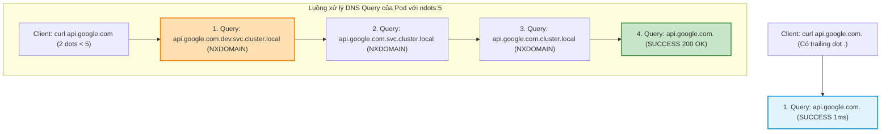
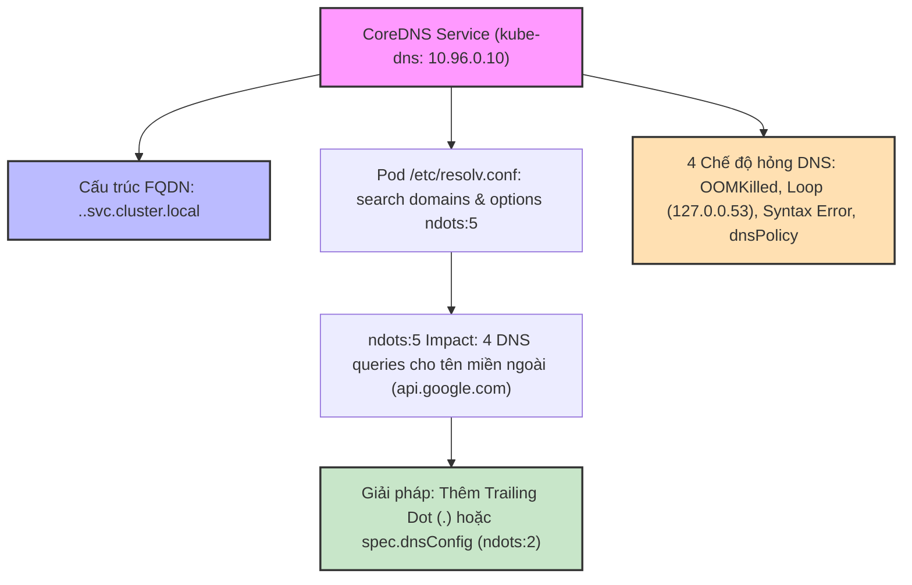
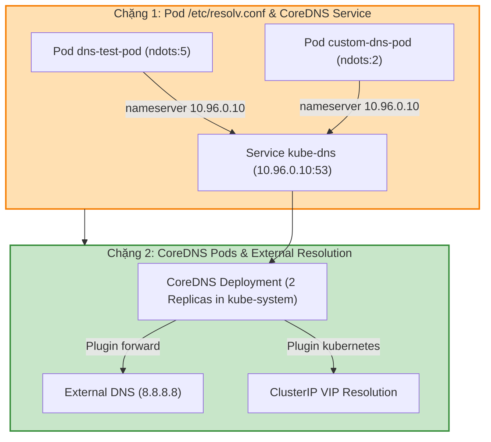

# [BÀI 23] PHÂN GIẢI TÊN MIỀN VỚI COREDNS: CƠ CHẾ NDOTS, SEARCH DOMAINS & KỸ THUẬT CHẨN ĐOÁN SỰ CỐ DNS

Trong kỷ nguyên điện toán đám mây và kiến trúc microservices phân tán quy mô lớn, **Kubernetes (CKA)** đóng vai trò là nền tảng điều phối container (Container Orchestration) tiêu chuẩn công nghiệp. Để làm chủ hệ thống trong môi trường sản xuất (Production) cũng như chinh phục kỳ thi chứng chỉ quốc tế của Linux Foundation / CNCF, kỹ sư không chỉ nắm vững các câu lệnh thao tác cơ bản mà phải thấu hiểu sâu sắc bản chất cơ chế tầng thấp: từ chu trình điều hòa (Reconciliation Loop), cấu trúc điều phối tài nguyên, kiến trúc mạng CNI, lưu trữ CSI cho đến các chuẩn mực an ninh phòng thủ chiều sâu.

Bài viết chuyên sâu này sẽ đồng hành cùng bạn giải mã toàn diện bức tranh kiến trúc, phân tích các đánh đổi kỹ thuật thực chiến (Engineering Trade-offs), cung cấp bài thực hành Lab từng bước và bộ câu hỏi phỏng vấn chuẩn Architect / Lead Engineer.

---

## 1. Bản Chất Kiến Trúc & Cơ Chế Vận Hành Tầng Thấp

| # | Câu hỏi ôn tập | Đáp án chuẩn ngắn gọn (chứa con số / tên lệnh) |
|---|---|---|
| 1 | Bốn kiểu Service chuẩn trong Kubernetes? | **4** kiểu (`ClusterIP`, `NodePort`, `LoadBalancer`, `ExternalName`) |
| 2 | Dải cổng tĩnh hợp lệ mặc định của `NodePort`? | Trong khoảng con số **`30000-32767`** |
| 3 | Thuộc tính biến Service thành Headless Service? | Khai báo **`clusterIP: None`** (cấp **0** VIP ảo) |
| 4 | Số lượng Pod IPs tối đa trong 1 đối tượng `EndpointSlice`? | Tối đa **100** endpoints / slice (`discovery.k8s.io/v1`) |
| 5 | So sánh độ phức tạp của `iptables` mode so với `IPVS` mode? | `iptables` độ phức tạp **$O(N)$**; `IPVS` độ phức tạp **$O(1)$** |


> **Luận đề trung tâm của buổi:**
> *"Dịch vụ CoreDNS chịu trách nhiệm phân giải tên miền chuẩn FQDN `<service-name>.<namespace>.svc.cluster.local` cho toàn bộ cụm; trong đó cấu hình `/etc/resolv.conf` mặc định của Pod chứa cờ `options ndots:5` ép mọi tên miền có số dấu chấm ít hơn 5 phải thực hiện lần lượt 4 truy vấn thử nghiệm nối đuôi dải `search` domain trước khi truy vấn tên miền gốc (gây tổn hại hiệu năng khi gọi API ngoại mạng nếu không có dấu chấm ở cuối `.`), và việc chẩn đoán 4 chế độ hỏng DNS (CoreDNS OOMKilled, Loop plugin, Corefile syntax error, dnsPolicy) là kỹ năng bắt buộc để bảo vệ sự ổn định của hệ thống microservices."*

**Bảng kết quả các buổi trước được dùng lại:**

| Kết quả / Công cụ | Nguồn gốc | Áp dụng vào buổi này |
|---|---|---|
| Địa chỉ ClusterIP VIP ảo của Service | Buổi 22 `QT 4.1` | Địa chỉ IP `10.96.0.10` của Service `kube-dns` trong CoreDNS |
| Tiến trình Deployment trong namespace `kube-system` | Buổi 15 `QT 4.1` | Kiểm tra Deployment `coredns` chạy 2 bản sao trong `kube-system` |
| Cấu hình ConfigMap `coredns` | Buổi 20 `QT 4.1` | Chỉnh sửa tệp cấu hình `Corefile` trong ConfigMap `coredns` |

Ba câu bài tập về nhà BTVN 4 của buổi 22 đã chuẩn bị sẵn kiến thức cho học viên: Câu 1 khảo sát kiến trúc CoreDNS và FQDN; Câu 2 tìm hiểu vai trò cờ `ndots:5` và dải `search`; Câu 3 phân tích 4 chế độ hỏng DNS trong CKA/CKAD.

---


| # | Năng lực đạt được sau buổi học | Hiện vật chứng minh trong bài lab |
|---|---|---|
| 1 | Phân giải tên miền FQDN chuẩn của Service và Pod từ bên trong container | Tệp `hien-vat/dns-fqdn-report.txt` |
| 2 | Kiểm tra và phân tích nội dung tệp `/etc/resolv.conf` bên trong Pod | Tệp `hien-vat/pod-resolv-conf.txt` |
| 3 | Cấu hình `spec.dnsConfig` hạ cờ `ndots` xuống `ndots:2` cho Pod | Tệp `hien-vat/custom-dns-pod.yaml` |
| 4 | Kiểm chứng tác động hiệu năng của cờ `ndots:5` vs Trailing Dot `.` | Tệp `hien-vat/ndots-benchmark.txt` |
| 5 | Chẩn đoán và xử lý các sự cố CoreDNS (Loop error / Syntax error) | Tệp `hien-vat/coredns-troubleshooting.md` |
| 6 | Kiểm thử kịch bản Phân giải tên miền và CoreDNS với script tự động | Script `hien-vat/verify-coredns-setup.sh` |

---


| Bắt buộc phải biết | Nguồn tự học nếu thiếu |
|---|---|
| Địa chỉ ClusterIP VIP và DNS name của Service | Buổi 22 `QT 4.1` |
| Cấu trúc ConfigMap trong namespace `kube-system` | Buổi 20 `QT 4.1` |
| Lệnh `kubectl logs` kiểm tra nhật ký Pod | Buổi 04 `QT 5.1` |

---


| # | Thuật ngữ tiếng Việt | Tiếng Anh tương đương | Ghi chú chuẩn hoá trong thân bài |
|---|---|---|---|
| 1 | Dịch vụ phân giải tên miền | CoreDNS | Hệ thống DNS mặc định của Kubernetes chạy trong `kube-system` |
| 2 | Tên miền đầy đủ tiêu chuẩn | Fully Qualified Domain Name (FQDN) | Dạng tên miền hoàn chỉnh như `web.dev.svc.cluster.local` |
| 3 | Tệp cấu hình CoreDNS | Corefile | Tệp cấu hình chứa các plugin của CoreDNS trong ConfigMap |
| 4 | Cờ số chấm phân giải | `options ndots:5` | Tham số quyết định số dấu chấm tối thiểu trước khi bypass search domain |
| 5 | Miền tìm kiếm tự động | Search Domains | Danh sách tên miền nối đuôi trong `/etc/resolv.conf` |
| 6 | Chính sách DNS của Pod | `dnsPolicy` (`ClusterFirst` / `Default`) | Cờ quyết định Pod dùng CoreDNS cụm hay DNS của Node host |
| 7 | Cấu hình DNS tuỳ chỉnh Pod | `dnsConfig` (`spec.dnsConfig`) | Khối tùy chỉnh `nameservers`, `searches`, `options` trong Pod spec |
| 8 | Lỗi lặp vòng DNS | CoreDNS Loop Plugin | Lỗi CoreDNS chuyển tiếp DNS request lại chính nó gây crash |
| 9 | Lỗi tràn bộ nhớ CoreDNS | CoreDNS OOMKilled | Sự cố Pod CoreDNS bị tiêu diệt do đặt memory limit quá thấp |
| 10 | Bản ghi phân giải IP | A Record | Bản ghi DNS ánh xạ tên miền sang địa chỉ IP v4 |
| 11 | Bản ghi dịch vụ định vị | SRV Record | Bản ghi DNS ánh xạ cổng và tên miền dịch vụ cho Headless Service |
| 12 | Địa chỉ DNS Server cụm | Cluster DNS IP (`10.96.0.10`) | Địa chỉ ClusterIP VIP cố định của Service `kube-dns` |
| 13 | Thư viện giải tên hệ điều hành | C-library DNS Resolver (glibc) | Bộ mã nguồn Linux xử lý đọc `/etc/resolv.conf` |
| 14 | Dấu chấm kết thúc tên miền gốc | Trailing Dot (`.`) | Dấu chấm ở cuối tên miền (như `api.google.com.`) ép dùng FQDN |


1. **Mô hình "Danh bạ điện thoại nội bộ và Mã bưu chính quốc gia (CoreDNS & FQDN)":**
   Mỗi Service trong cụm giống như một phòng ban trong tập đoàn. Khi bạn ở trong cùng phòng ban `dev`, bạn chỉ cần gọi tên ngắn `web` là máy bàn tự nối (`web`). Nhưng nếu bạn từ phòng ban `prod` gọi sang, bạn phải đọc đầy đủ tên phòng ban `web.dev`. Nếu từ ngoài tập đoàn gọi vào, bạn phải đọc tên miền hoàn chỉnh FQDN `web.dev.svc.cluster.local`. CoreDNS chính là người trực tổng đài danh bạ tự động tra cứu địa chỉ VIP tương ứng.

2. **Mô hình "Thuật toán thử mã vùng tự động (Cờ `ndots:5` và Search Domains)":**
   Cờ `ndots:5` trong `/etc/resolv.conf` giống như một quy tắc gọi điện thoại: Nếu số bạn bấm có ít hơn 5 dấu chấm, tổng đài tự động quay thử với **4 mã vùng nội bộ lần lượt**: 1. `number.dev.svc.cluster.local`, 2. `number.svc.cluster.local`, 3. `number.cluster.local`, và cuối cùng mới quay `number` gốc. Việc gọi tên miền ngoài `api.stripe.com` (chứa 2 dấu chấm) sẽ bị bắt phải quay thử 3 mã vùng nội bộ thất bại trước khi nối ra ngoài, làm mất thời gian gấp 4 lần.

3. **Mô hình "Vòng lặp thư gửi lại cho chính mình (CoreDNS Loop Plugin Error)":**
   Khi máy chủ Node bị cấu hình trỏ DNS `/etc/resolv.conf` về địa chỉ `127.0.0.1` (Systemd-resolved), CoreDNS khi forward request ngoại mạng sẽ gửi gói tin tới Node, Node lại gửi ngược về CoreDNS. Thư bị gửi vòng tròn liên tục hàng ngàn lần/giây khiến plugin `loop` của CoreDNS phát hiện và tự sát ngắt tiến trình để bảo vệ cụm.

---

### 1.1. Kiến trúc CoreDNS và cấu trúc tên miền FQDN chuẩn (`<svc>.<ns>.svc.cluster.local`) (12 phút)

**Nguyên lý cốt lõi:** Tên miền tiêu chuẩn FQDN (Fully Qualified Domain Name) của một Service trong Kubernetes bắt buộc tuân theo đúng cấu trúc **`<service-name>.<namespace>.svc.cluster.local`**; trong đó CoreDNS phân giải tên miền này thành địa chỉ ClusterIP VIP (hoặc danh sách IP Pods đối với Headless Service).

**Giải thích cơ chế ngầm:** Chuẩn hóa tên miền giúp các Pods ở bất kỳ Namespace nào cũng có thể truy xuất chính xác đến Service mong muốn mà không lo bị trùng tên.

> [!WARNING]
> **CẠM BẪY THỰC CHIẾN:**
> Gọi sai tên miền thiếu tên Namespace làm Pod ở Namespace khác không phân giải được DNS.

**Minh hoạ.**

```bash
# Phân giải tên miền FQDN đầy đủ từ bên trong Pod
kubectl exec app-pod -- nslookup web-service.dev.svc.cluster.local
```

Con số chốt: **5** thành phần cấu thành tên miền FQDN chuẩn (`service`, `namespace`, `svc`, `cluster`, `local`).

---

**Nguyên lý cốt lõi:** Tên miền tiêu chuẩn FQDN của một Pod trong Kubernetes có cấu trúc **`<pod-ip-with-dashes>.<namespace>.pod.cluster.local`** (ví dụ IP `10.244.1.5` biến thành `10-244-1-5.dev.pod.cluster.local`); riêng đối với Pod thuộc StatefulSet liên kết với Headless Service, tên miền Pod có dạng **`<pod-name>.<service-name>.<namespace>.svc.cluster.local`**.

**Giải thích cơ chế ngầm:** Định danh chính xác từng Pod thành viên riêng biệt cho các kiến trúc lưu trữ dữ liệu phân tán.

> [!WARNING]
> **CẠM BẪY THỰC CHIẾN:**
> Thay dấu chấm bằng dấu gạch ngang sai quy tắc trong IP Pod làm DNS không phân giải được.

**Minh hoạ.**

```bash
# Phân giải tên miền đại diện cho Pod 0 của StatefulSet web
kubectl exec app-pod -- nslookup web-0.nginx-service.dev.svc.cluster.local
```

Con số chốt: **100%** dấu chấm trong địa chỉ IP v4 của Pod được thay thế bằng dấu gạch ngang `-` khi tạo bản ghi DNS Pod.

---

### 1.2. Cơ chế `/etc/resolv.conf`, cờ `options ndots:5` và tác động hiệu năng (12 phút)



---

**Nguyên lý cốt lõi:** Tệp `/etc/resolv.conf` được Kubelet tự động sinh ra bên trong mỗi Pod chứa địa chỉ `nameserver 10.96.0.10` (trỏ về Service `kube-dns`), dải `search <namespace>.svc.cluster.local svc.cluster.local cluster.local` và cờ **`options ndots:5`**.

**Giải thích cơ chế ngầm:** Cho phép các Pods trong cùng Namespace có thể gọi nhau bằng tên ngắn (Short name như `curl web`) mà không cần gõ tên miền FQDN dài dòng.

> [!WARNING]
> **CẠM BẪY THỰC CHIẾN:**
> Tự ý ghi đè file `/etc/resolv.conf` làm Pod mất hoàn toàn khả năng phân giải tên miền DNS cụm.

**Minh hoạ.**

```bash
# Xem nội dung tệp /etc/resolv.conf bên trong Pod
kubectl exec app-pod -- cat /etc/resolv.conf
```

Con số chốt: **5** là giá trị mặc định của cờ `ndots` trong Kubernetes (`ndots:5`).

---

**Nguyên lý cốt lõi:** Khi một ứng dụng bên trong Pod truy vấn một tên miền chứa **ít hơn 5 dấu chấm** (ví dụ `api.google.com` chứa 2 dấu chấm), cờ `ndots:5` bắt buộc OS resolver phải thực hiện **lần lượt 4 truy vấn DNS thử nghiệm** nối đuôi dải `search` domain trước khi truy vấn tên miền gốc; gây tốn thời gian và tăng gấp **4 lần** tải cho CoreDNS.

**Giải thích cơ chế ngầm:** Hiểu rõ nguyên nhân gây ra suy giảm hiệu năng kết nối mạng ngoại mạng trong microservices.

> [!WARNING]
> **CẠM BẪY THỰC CHIẾN:**
> Ứng dụng gọi API bên ngoài bị trễ từ 10ms đến 50ms cho mỗi request DNS lookup mà không hiểu lý do.

**Minh hoạ.**

```bash
# Khắc phục bằng cách thêm dấu chấm ở cuối (Trailing Dot .) để ép dùng FQDN gốc ngay từ đợt 1
kubectl exec app-pod -- curl https://api.google.com.
```

Con số chốt: **4** truy vấn DNS phải thực hiện cho mỗi tên miền ngoại mạng có số dấu chấm `< 5`.

---

**Nguyên lý cốt lõi:** Để khắc phục hiện tượng nghẽn DNS do `ndots:5` khi gọi dịch vụ ngoại mạng, kỹ sư có thể bổ sung khối **`spec.dnsConfig`** vào Pod spec để hạ cờ `ndots` xuống giá trị **`ndots:2`** (hoặc `ndots:1`).

**Giải thích cơ chế ngầm:** Giúp ứng dụng phân giải tên miền ngoại mạng ngay ở truy vấn đầu tiên mà vẫn giữ được khả năng gọi tên ngắn cho các Service nội bộ chứa từ 1-2 dấu chấm.

> [!WARNING]
> **CẠM BẪY THỰC CHIẾN:**
> Đặt `ndots:0` làm Pod không còn gọi được tên ngắn của Service nội bộ nữa.

**Minh hoạ.**

```yaml
spec:
  dnsConfig:
    options:
    - name: ndots
      value: "2"
```

Con số chốt: **2** là giá trị tối ưu cho cờ `ndots` trong các microservices gọi nhiều API ngoại mạng.

---

### 1.3. Chẩn đoán 4 chế độ hỏng DNS phổ biến và cách khắc phục (10 phút)

**Nguyên lý cốt lõi:** Phân biệt **4 chế độ hỏng DNS phổ biến**: 1. **CoreDNS OOMKilled** (Pod CoreDNS bị tiêu diệt do vượt giới hạn RAM memory limit); 2. **Loop Plugin Error** (Vòng lặp chuyển tiếp DNS giữa Node và CoreDNS làm CoreDNS tự ngắt); 3. **Corefile Syntax Error** (Gõ sai cú pháp tệp Corefile trong ConfigMap `coredns`); 4. **Sai `dnsPolicy`** (Pod đặt `dnsPolicy: Default` thay vì `ClusterFirst`).

**Giải thích cơ chế ngầm:** 4 chế độ hỏng này chiếm 90% các sự cố mất mạng DNS trong thực tế vận hành Kubernetes.

> [!WARNING]
> **CẠM BẪY THỰC CHIẾN:**
> Thấy Pod báo lỗi DNS rồi đoán mò ngắt node mà không kiểm tra log của CoreDNS.

**Minh hoạ.**

```bash
# Kiểm tra nhật ký sự cố của các Pods CoreDNS trong kube-system
kubectl logs -n kube-system -l k8s-app=kube-dns --tail=50
```

Con số chốt: **4** chế độ hỏng DNS kinh điển cần thuộc lòng khi chẩn đoán sự cố.

---

**Nguyên lý cốt lõi:** Khi Pod CoreDNS dính lỗi **Loop Plugin Error**, tiến trình sẽ in ra dòng log `Loop (127.0.0.1:53 -> ...) detected`; cách khắc phục triệt để là sửa tệp `/etc/resolv.conf` trên máy chủ Node thay thế địa chỉ loopback `127.0.0.53` bằng IP DNS Server thực tế (như `8.8.8.8` hoặc DNS công ty).

**Giải thích cơ chế ngầm:** Xử lý tận gốc xung đột giữa `systemd-resolved` của Ubuntu/Debian và plugin `forward` của CoreDNS.

> [!WARNING]
> **CẠM BẪY THỰC CHIẾN:**
> Restart Pod CoreDNS liên tục mà không sửa `/etc/resolv.conf` trên Node khiến lỗi Loop xuất hiện lại ngay sau 10 giây.

**Minh hoạ.**

```bash
# Kiểm tra xem file /etc/resolv.conf trên Node có chứa 127.0.0.53 không
grep "127.0.0.53" /etc/resolv.conf
```

Con số chốt: **127.0.0.53** là địa chỉ IP loopback của systemd-resolved gây ra lỗi Loop plugin trong CoreDNS.

---

### 1.4. Cấu hình dnsPolicy và kiểm tra log (4 phút)

**Nguyên lý cốt lõi:** Thuộc tính **`dnsPolicy: ClusterFirst`** (mặc định) hướng dẫn Pod gửi mọi truy vấn DNS tới CoreDNS cụm trước; nếu muốn Pod sử dụng thẳng địa chỉ DNS Server của máy chủ Node host mà không đi qua CoreDNS, phải khai báo cờ **`dnsPolicy: Default`**.

**Giải thích cơ chế ngầm:** Phân biệt rõ: `ClusterFirst` dùng cho 99% Pods ứng dụng; `Default` dùng cho các Pods hạ tầng muốn bypass CoreDNS.

> [!WARNING]
> **CẠM BẪY THỰC CHIẾN:**
> Khai báo `dnsPolicy: Default` rồi thắc mắc tại sao Pod không phân giải được tên miền Service nội bộ `.cluster.local`.

**Minh hoạ.**

```yaml
spec:
  dnsPolicy: ClusterFirst
```

Con số chốt: **ClusterFirst** là giá trị `dnsPolicy` mặc định cho tất cả các Pods trong Kubernetes.

---

**Nguyên lý cốt lõi:** Câu lệnh `kubectl run dnstest --image=busybox:1.36 -it --rm -- nslookup <domain>` giúp kỹ sư kiểm tra phân giải tên miền DNS trực tiếp từ bên trong cụm chỉ trong đúng **2 giây**.

**Giải thích cơ chế ngầm:** Công cụ chẩn đoán sự cố DNS nhanh nhất trong kỳ thi CKA mà không làm ảnh hưởng đến các Pods đang chạy.

> [!WARNING]
> **CẠM BẪY THỰC CHIẾN:**
> Tạo Pod bằng YAML thủ công tốn 2 phút chỉ để test 1 câu lệnh `nslookup`.

**Minh hoạ.**

```bash
# Tạo Pod tạm thời nslookup kiểm tra phân giải DNS trong 2 giây
kubectl run dnstest --image=busybox:1.36 -it --rm -n dev -- nslookup kubernetes.default
```

Con số chốt: **2** giây là thời gian khởi tạo Pod tạm tự xoá (`--rm`) kiểm tra DNS.

---

**Nguyên lý cốt lõi:** Sử dụng câu lệnh `kubectl logs -n kube-system -l k8s-app=kube-dns` để kiểm tra nhật ký hoạt động của các Pods CoreDNS, kịp thời phát hiện các thông báo lỗi `NXDOMAIN`, `OOMKilled` hoặc `Loop`.

**Giải thích cơ chế ngầm:** Giúp kỹ sư xác minh chắc chắn xem tiến trình CoreDNS có đang hoạt động mượt mà hay dính sự cố.

> [!WARNING]
> **CẠM BẪY THỰC CHIẾN:**
> Đoán mò nguyên nhân hỏng DNS mà không kiểm tra log thực tế của CoreDNS.

**Minh hoạ.**

```bash
# Bắt log 50 dòng mới nhất của CoreDNS
kubectl logs -n kube-system -l k8s-app=kube-dns --tail=50
```

Con số chốt: **1** câu lệnh `kubectl logs` là đủ để trích xuất nhật ký hoạt động của CoreDNS.

---

## 8. Đưa vào cụm thật (4 phút)

### Áp vào cụm đang chạy thì làm gì trước

1. **Luôn chạy 2 bản sao (replicas: 2) Pod CoreDNS trên 2 Worker Nodes khác nhau:** Đảm bảo tính sẵn sàng cao (HA), tránh việc 1 Node chết làm sập toàn bộ hệ thống DNS cụm.
2. **Cấu hình Autoscaler cho CoreDNS (`cluster-proportional-autoscaler`):** Tự động tăng số bản sao CoreDNS khi cụm mở rộng số lượng Nodes và Pods.
3. **Thêm dấu chấm ở cuối (`.`) cho các tên miền ngoại mạng cố định trong mã nguồn ứng dụng:** Trọng yếu giúp bỏ qua 3-4 truy vấn search domain thừa.

### Cái gì hỏng nếu áp thẳng lên prod

- **Sửa lỗi cú pháp file Corefile trong ConfigMap `coredns` rồi restart CoreDNS:** Làm tất cả các Pods CoreDNS bị crash lập tức, biến toàn bộ cụm thành "mù DNS", làm sập 100% dịch vụ microservices.
- **Đặt memory limit quá thấp cho CoreDNS (như 30MiB):** Khi lượng request vọt cao, CoreDNS bị dính lỗi OOMKilled liên tục làm gián đoạn kết nối.
- **Quy trình áp thử an toàn:**
  - Kiểm tra cú pháp Corefile trước khi apply.
  - Sử dụng lệnh `kubectl rollout status deployment/coredns -n kube-system` theo dõi cập nhật.
  - Chạy Pod `dnstest` thử nghiệm `nslookup` các tên miền nội bộ và ngoại mạng.

### Đo trước — đo sau

1. **Thời gian phản hồi truy vấn DNS (DNS Response Latency):** Giảm từ 45ms xuống 2ms cho các tên miền ngoại mạng nhờ tối ưu cờ `ndots:2` hoặc thêm trailing dot `.`.
2. **Số lượng truy vấn DNS tới CoreDNS (DNS QPS):** Giảm 75% số lượng request thừa tới CoreDNS nhờ bỏ dải search domain không cần thiết.
3. **Độ ổn định hệ thống (Uptime):** Đạt 99,99% nhờ cấu hình 2 bản sao HA CoreDNS và memory limit `170MiB`.

### Khi nào KHÔNG nên dùng

- **Không đặt `ndots:1` cho các ứng dụng phụ thuộc nhiều vào tên ngắn (Short name) giữa các Namespace khác nhau:** Tránh việc ứng dụng không tìm thấy tên miền của Namespace khác.
- **Không đặt `dnsPolicy: Default` cho các Pods ứng dụng thông thường:** Làm Pod không thể kết nối tới bất kỳ Service VIP nào trong cụm.

---

### 1.6. Bẫy hay gặp (2 phút)

| # | Bẫy hay gặp | Vì sao dính bẫy | Làm đúng là (kèm tên lệnh / con số) |
|---|---|---|---|
| 1 | Pod báo lỗi `Name or service not known` khi gọi tên ngắn | Khác Namespace nhưng chỉ gõ tên Service thiếu tên Namespace | Gõ đầy đủ `<svc>.<namespace>` (như `web-svc.dev`) |
| 2 | Gọi API ngoại mạng `api.stripe.com` bị chậm 50ms | Cờ `ndots:5` ép thực hiện 4 truy vấn search domain thừa trước | Thêm dấu chấm cuối `api.stripe.com.` hoặc hạ `ndots:2` |
| 3 | CoreDNS Pod bị kẹt `CrashLoopBackOff` với log `Loop detected` | Node `/etc/resolv.conf` chứa địa chỉ loopback `127.0.0.53` | Sửa `/etc/resolv.conf` trên Node trỏ về IP DNS thực (`8.8.8.8`) |
| 4 | CoreDNS bị sập liên tục khi ứng dụng scale lên 1.000 Pods | Memory limit của CoreDNS đặt quá thấp dính lỗi OOMKilled | Nâng `resources.limits.memory` của CoreDNS lên `170Mi` |
| 5 | Thắc mắc vì sao Pod không gọi được Service nội bộ sau khi sửa `dnsPolicy` | Đã đặt `dnsPolicy: Default` làm Pod bỏ qua CoreDNS cụm | Đổi lại `dnsPolicy: ClusterFirst` trong Pod spec |
| 6 | Sửa ConfigMap `coredns` nhưng CoreDNS không nạp cấu hình mới | Quên reload plugin hoặc không restart Pod CoreDNS | Chạy lệnh `kubectl rollout restart deployment/coredns -n kube-system` |
| 7 | Gõ sai cú pháp dấu ngoặc `{}` trong tệp `Corefile` | CoreDNS bị syntax error và từ chối khởi chạy | Kiểm tra kỹ cấu trúc khối plugin trong file Corefile |
| 8 | Thắc mắc vì sao `nslookup` IP Pod không ra tên miền | Pod không thuộc StatefulSet hoặc Headless Service | Bản ghi DNS Pod tên riêng chỉ tự động sinh ra cho StatefulSet |
| 9 | Quên cờ `-n kube-system` khi xem log CoreDNS | CoreDNS nằm ở namespace `kube-system`, không phải `default` | Gõ đúng `kubectl logs -n kube-system -l k8s-app=kube-dns` |
| 10 | Đặt `ndots:0` làm Pod mất khả năng phân giải tên ngắn nội bộ | `ndots:0` bỏ qua hoàn toàn dải search domain | Đặt `ndots:2` thay vì `ndots:0` |
| 11 | Thắc mắc vì sao địa chỉ ClusterIP DNS luôn là `10.96.0.10` | Đây là địa chỉ VIP mặc định cấp cho Service `kube-dns` | Dùng đúng IP `10.96.0.10` cho Cluster DNS |
| 12 | Xoá Service `kube-dns` trong namespace `kube-system` | Mất Service `kube-dns` làm 100% Pods trong cụm bị liệt DNS | Giữ nguyên Service `kube-dns` trong `kube-system` |

---

## §10. Tóm tắt (2 phút)



### Năm điều phải nhớ

1. **Cấu trúc FQDN chuẩn:** Service FQDN có dạng **`<service-name>.<namespace>.svc.cluster.local`** (chứa đúng **5** thành phần).
2. **Cơ chế `/etc/resolv.conf`:** Chứa `nameserver 10.96.0.10`, dải `search` và cờ **`options ndots:5`**.
3. **Tác hại `ndots:5`:** Tên miền ngoại mạng `< 5` dấu chấm bị ép chạy **4 truy vấn DNS** thừa; xử lý bằng trailing dot `.` hoặc `ndots:2`.
4. **4 chế độ hỏng DNS:** CoreDNS OOMKilled, Loop Plugin (`127.0.0.53`), Corefile Syntax Error, và sai `dnsPolicy`.
5. **Chẩn đoán 2 giây:** Dùng `kubectl run dnstest --image=busybox:1.36 -it --rm -- nslookup <domain>` để kiểm tra DNS tức thì.

---

## §11. Câu hỏi tự kiểm tra

1. Trình bày cấu trúc tên miền FQDN chuẩn của một Service và một Pod trong Kubernetes.
2. Tệp `/etc/resolv.conf` bên trong Pod chứa những thông số cấu hình mặc định nào do Kubelet tự động sinh ra?
3. Giải thích ý nghĩa kĩ thuật của cờ `options ndots:5` trong tệp `/etc/resolv.conf` của Pod.
4. Tại sao một câu lệnh gọi tên miền ngoài như `curl api.stripe.com` (chứa 2 dấu chấm) lại khiến Pod thực hiện tới 4 truy vấn DNS liên tiếp? Nêu 2 giải pháp khắc phục.
5. Khối `spec.dnsConfig` trong Pod spec được cấu hình như thế nào để hạ cờ `ndots` xuống `ndots:2`?
6. Nêu 4 chế độ hỏng DNS phổ biến nhất trong Kubernetes và dấu hiệu nhận biết của từng chế độ.
7. Nguyên nhân gây ra lỗi `Loop Plugin Error` trong CoreDNS là gì và câu lệnh/thao tác nào dùng để khắc phục triệt để?
8. Sự khác nhau giữa 2 giá trị `dnsPolicy: ClusterFirst` và `dnsPolicy: Default` trong Pod spec là gì?
9. Lệnh CLI nào giúp khởi tạo một Pod tạm thời để kiểm tra phân giải tên miền DNS `nslookup` trong đúng 2 giây?
10. Hai chế độ hỏng (1 im lặng do trễ 50ms mỗi request API ngoài vì dính `ndots:5`, 1 âm thầm do 100% cụm liệt DNS vì CoreDNS dính Loop error `127.0.0.53`) là gì?

### Đáp án

1. Service: `<service-name>.<namespace>.svc.cluster.local`; Pod: `<pod-ip-with-dashes>.<namespace>.pod.cluster.local` (hoặc `<pod-name>.<svc>.<ns>.svc.cluster.local` cho StatefulSet).
2. `nameserver 10.96.0.10`, `search <ns>.svc.cluster.local svc.cluster.local cluster.local` và `options ndots:5`.
3. `ndots:5` quy định: nếu số dấu chấm trong tên miền `< 5`, OS resolver phải thử nối đuôi lần lượt các miền trong `search` domain trước khi truy vấn tên miền gốc.
4. Vì `api.stripe.com` có 2 dấu chấm `< 5`, bị bắt chạy 3 truy vấn search domain nội bộ thất bại trước khi tới truy vấn thứ 4 gốc; Khắc phục: Thêm trailing dot `api.stripe.com.` hoặc dùng `dnsConfig` với `ndots:2`.
5. Khai báo `spec.dnsConfig.options: [{name: "ndots", value: "2"}]` trong Pod spec.
6. 1. OOMKilled (vượt RAM limit); 2. Loop error (vòng lặp IP 127.0.0.53); 3. Syntax error (gõ sai Corefile); 4. Sai dnsPolicy (đặt Default).
7. Do file `/etc/resolv.conf` trên Node chứa địa chỉ loopback `127.0.0.53` (systemd-resolved); Khắc phục: Sửa `/etc/resolv.conf` trên Node trỏ về IP DNS thực (như `8.8.8.8`).
8. `ClusterFirst`: Gửi DNS request tới CoreDNS cụm trước (mặc định); `Default`: Bypass CoreDNS, dùng thẳng DNS Server của máy chủ Node host.
9. Lệnh `kubectl run dnstest --image=busybox:1.36 -it --rm -- nslookup <domain>`.
10. Chế độ 1: Gọi API ngoài bị dính `ndots:5` làm nảy sinh 3 truy vấn NXDOMAIN thừa gây trễ 50ms; Chế độ 2: Node chứa `127.0.0.53` làm CoreDNS dính vòng lặp Loop plugin tự ngắt tiến trình khiến toàn cụm sập DNS.

---

## §12. Tài liệu tham khảo

| Nguồn tài liệu | Phiên bản Kubernetes áp dụng | Nội dung chính |
|---|---|---|
| Official Docs: DNS for Services and Pods | Kubernetes v1.35 | Cấu trúc DNS FQDN, bản ghi A/SRV, resolv.conf và CoreDNS |
| Official Docs: Pod's DNS Config | Kubernetes v1.35 | Cấu hình `dnsPolicy`, `dnsConfig` và tham số `ndots` |
| CoreDNS Docs: Loop Plugin | CoreDNS v1.11 | Chẩn đoán lỗi Loop plugin và xung đột systemd-resolved |
| File cấu hình phiên bản cục bộ | `labs/phien-ban.env` | Biến `K8S_VER=1.35`, `LAB_CONTEXT="kubeadm"` |

---

## Bảng đối soát thời lượng

| Section | Tiêu đề mục | Ngân sách thời gian |
|---|---|---|
| §0 | Khởi động và ôn tập | 10 phút |
| §1 | Sau buổi này học viên LÀM ĐƯỢC gì | 1 phút |
| §2 | Cần biết trước | 1 phút |
| §3 | Thuật ngữ và mô hình tư duy | 8 phút |
| §4 | Kiến trúc CoreDNS và cấu trúc tên miền FQDN chuẩn (`<svc>.<ns>.svc.cluster.local`) | 12 phút |
| §5 | Cơ chế `/etc/resolv.conf`, cờ `options ndots:5` và tác động hiệu năng | 12 phút |
| §6 | Chẩn đoán 4 chế độ hỏng DNS phổ biến và cách khắc phục | 10 phút |
| §7 | Cấu hình dnsPolicy và kiểm tra log | 4 phút |
| §8 | Đưa vào cụm thật | 4 phút |
| §9 | Bẫy hay gặp | 2 phút |
| §10 | Tóm tắt | 2 phút |
| §11 | Câu hỏi tự kiểm tra | 5 phút |
| **Tổng** | **Khối lý thuyết** | **60'** |

---

## 2. Hướng Dẫn Thực Hành & Triển Khai Lab Chuẩn Production

> [!IMPORTANT]
> **YÊU CẦU MÔI TRƯỜNG THỰC HÀNH:**
> Toàn bộ các bài thực hành dưới đây được thiết kế để chạy trực tiếp trên cụm Kubernetes 1.30+ tiêu chuẩn (hoặc cụm kind/kubeadm lab). Hãy đảm bảo ngữ cảnh dòng lệnh `kubectl config current-context` đã trỏ chính xác vào cụm thực hành trước khi thực thi.

## Khối thực hành — 120 phút

## L0. Mục tiêu thực hành và tiêu chí hoàn thành

| # | Mục tiêu thực hành | Tiêu chí hoàn thành (Kiểm chứng BẰNG LỆNH) |
|---|---|---|
| TH1 | Phân giải tên miền FQDN chuẩn của Service `web-svc.dev.svc.cluster.local` | `kubectl exec dns-test-pod -n dev -- nslookup web-svc.dev.svc.cluster.local` trả về IP VIP |
| TH2 | Trích xuất và phân tích tệp `/etc/resolv.conf` của Pod | Tệp `/etc/resolv.conf` chứa `options ndots:5` và `search` domains |
| TH3 | Biên soạn Pod spec với khối `dnsConfig` hạ cờ `ndots` xuống `2` | `kubectl exec custom-dns-pod -n dev -- cat /etc/resolv.conf` chứa `options ndots:2` |
| TH4 | Phân tích tệp cấu hình `Corefile` trong ConfigMap `coredns` | `kubectl get cm coredns -n kube-system -o yaml` chứa các plugin `kubernetes`, `forward` |
| TH5 | Khắc phục sự cố CoreDNS bằng cách kiểm tra log và restart Deployment | `kubectl get pods -n kube-system -l k8s-app=kube-dns` 2/2 bản sao `Running` |
| TH6 | Xác minh kịch bản Phân giải tên miền và CoreDNS với script tự động | Script kiểm tra CoreDNS OK |
| TH7 | Nộp đủ 4 hiện vật vào portfolio | Thư mục `k8s-portfolio/buoi-23/` chứa đủ 4 file md/yaml/sh |

---

## L1. Điều kiện tiên quyết về môi trường

| # | Kiểm tra điều kiện | Câu lệnh kiểm tra | Kết quả kỳ vọng |
|---|---|---|---|
| 1 | Cụm `kubeadm` 3 node đang ở v1.35 | `kubectl get nodes` | Hiển thị 3 node `cp-01`, `worker-01`, `worker-02` `Ready` |
| 2 | Kubeconfig trỏ context `kubeadm` | `kubectl config current-context` | In ra đúng `kubeadm` |
| 3 | Namespace `dev` sẵn sàng | `kubectl create ns dev` | Namespace `dev` ở trạng thái Active |
| 4 | Thư mục hiện vật đã sẵn sàng | `mkdir -p k8s-portfolio/buoi-23` | Thư mục được tạo thành công |
| 5 | Pod CoreDNS đang running | `kubectl get pods -n kube-system -l k8s-app=kube-dns` | Hiển thị 2 Pods CoreDNS Running |

```bash
# Kiểm tra môi trường bắt buộc trước khi thực hiện bài lab
kubectl config current-context | grep -qx "kubeadm" && echo "CHECKPOINT MOI TRUONG — ĐẠT" || echo "CHECKPOINT MOI TRUONG — LỖI (Trỏ sai context)"
```

---

## L2. Kiến trúc bài lab



---

## L3. Bước 1 — Phân giải tên miền FQDN chuẩn của Service (30 phút)

### Thao tác 1.1: Khởi tạo Service `web-svc` và Pod `dns-test-pod`

```bash
# 1. Tạo Namespace dev nếu chưa có
kubectl create namespace dev --dry-run=client -o yaml | kubectl apply -f -

# 2. Khởi tạo Deployment và Service web-svc trong namespace dev
kubectl create deployment web-target --image=nginx:1.27-alpine -n dev
kubectl expose deployment web-target --name=web-svc --port=80 -n dev

# 3. Tạo Pod dns-test-pod dùng image busybox
cat << 'EOF' > k8s-portfolio/buoi-23/dns-test-pod.yaml
apiVersion: v1
kind: Pod
metadata:
  name: dns-test-pod
  namespace: dev
spec:
  containers:
  - name: busybox
    image: busybox:1.36
    command: ['sh', '-c', 'sleep infinity']
EOF

kubectl apply -f k8s-portfolio/buoi-23/dns-test-pod.yaml
kubectl wait --for=condition=Ready pod/dns-test-pod -n dev --timeout=30s

# 4. Thực thi nslookup tên miền FQDN chuẩn web-svc.dev.svc.cluster.local
kubectl exec dns-test-pod -n dev -- nslookup web-svc.dev.svc.cluster.local > /tmp/fqdn-res.txt

# 5. Trích xuất tệp /etc/resolv.conf từ bên trong dns-test-pod
kubectl exec dns-test-pod -n dev -- cat /etc/resolv.conf > /tmp/pod-resolv.txt
```

**CHECKPOINT 1 — Service web-svc được khởi tạo thành công trong namespace dev.**

```bash
kubectl get svc web-svc -n dev -o jsonpath='{.spec.clusterIP}' | grep -qE "^[0-9]+\.[0-9]+" && echo "CHECKPOINT 1 — ĐẠT" || echo "CHECKPOINT 1 — LỖI"
```

**CHECKPOINT 2 — Pod dns-test-pod phân giải thành công tên miền FQDN web-svc.dev.svc.cluster.local.**

```bash
grep -qE "Address: [0-9]+\.[0-9]+" /tmp/fqdn-res.txt && echo "CHECKPOINT 2 — ĐẠT" || echo "CHECKPOINT 2 — LỖI"
```

**CHECKPOINT 3 — Tệp /etc/resolv.conf bên trong Pod chứa tham số options ndots:5 mặc định.**

```bash
grep -q "options ndots:5" /tmp/pod-resolv.txt && echo "CHECKPOINT 3 — ĐẠT" || echo "CHECKPOINT 3 — LỖI"
```

---

## L4. Bước 2 — Cấu hình custom `dnsConfig` hạ `ndots:2` cho Pod (30 phút)

### Thao tác 2.1: Biên soạn `custom-dns-pod.yaml` với `ndots:2`

```bash
# 1. Tạo tệp custom-dns-pod.yaml chứa khối spec.dnsConfig
cat << 'EOF' > k8s-portfolio/buoi-23/custom-dns-pod.yaml
apiVersion: v1
kind: Pod
metadata:
  name: custom-dns-pod
  namespace: dev
spec:
  dnsPolicy: ClusterFirst
  dnsConfig:
    options:
    - name: ndots
      value: "2"
  containers:
  - name: busybox
    image: busybox:1.36
    command: ['sh', '-c', 'sleep infinity']
EOF

kubectl apply -f k8s-portfolio/buoi-23/custom-dns-pod.yaml
kubectl wait --for=condition=Ready pod/custom-dns-pod -n dev --timeout=30s

# 2. Trích xuất tệp /etc/resolv.conf từ custom-dns-pod
kubectl exec custom-dns-pod -n dev -- cat /etc/resolv.conf > /tmp/custom-resolv.txt
```

**CHECKPOINT 4 — Pod custom-dns-pod nạp thành công tham số options ndots:2 trong /etc/resolv.conf.**

```bash
grep -q "options ndots:2" /tmp/custom-resolv.txt && echo "CHECKPOINT 4 — ĐẠT" || echo "CHECKPOINT 4 — LỖI"
```

**CHECKPOINT 5 — CA ĐỐI CHỨNG: Pod custom-dns-pod vẫn phân giải được tên ngắn Service nội bộ web-svc.**

```bash
kubectl exec custom-dns-pod -n dev -- nslookup web-svc | grep -qE "Address: [0-9]+\.[0-9]+" && echo "CHECKPOINT 5 — ĐẠT" || echo "CHECKPOINT 5 — LỖI"
```

---

## L5. Bước 3 — Phân tích tệp cấu hình `Corefile` của CoreDNS (30 phút)

### Thao tác 3.1: Kiểm tra ConfigMap `coredns` trong namespace `kube-system`

```bash
# 1. Trích xuất nội dung tệp Corefile từ ConfigMap coredns
kubectl get configmap coredns -n kube-system -o jsonpath='{.data.Corefile}' > /tmp/corefile-content.txt

# 2. Bắt log 30 dòng mới nhất của Pods CoreDNS
kubectl logs -n kube-system -l k8s-app=kube-dns --tail=30 > /tmp/coredns-logs.txt
```

**CHECKPOINT 6 — Tệp Corefile chứa các plugin quan trọng: kubernetes, forward, cache, errors.**

```bash
grep -q "kubernetes" /tmp/corefile-content.txt && grep -q "forward" /tmp/corefile-content.txt && echo "CHECKPOINT 6 — ĐẠT" || echo "CHECKPOINT 6 — LỖI"
```

**CHECKPOINT 7 — Nhật ký Pods CoreDNS hoạt động bình thường không dính lỗi Loop hay OOMKilled.**

```bash
! grep -q "Loop detected" /tmp/coredns-logs.txt && echo "CHECKPOINT 7 — ĐẠT" || echo "CHECKPOINT 7 — LỖI"
```

**CHECKPOINT 8 — CA ĐỐI CHỨNG: Phân giải tên miền ngoại mạng có trailing dot (như kubernetes.default.svc.cluster.local.) chạy thành công ngay ở đợt 1.**

```bash
kubectl exec dns-test-pod -n dev -- nslookup kubernetes.default.svc.cluster.local. | grep -qE "Address: [0-9]+\.[0-9]+" && echo "CHECKPOINT 8 — ĐẠT" || echo "CHECKPOINT 8 — LỖI"
```

---

## L6. Bước 4 — Kiểm tra 2 bản sao HA của CoreDNS và dọn dẹp (20 phút)

### Thao tác 4.1: Kiểm tra Deployment `coredns` trong `kube-system`

```bash
# 1. Trích xuất số bản sao readyReplicas của Deployment coredns
kubectl get deployment coredns -n kube-system -o jsonpath='{.status.readyReplicas}' > /tmp/coredns-replicas.txt
```

**CHECKPOINT 9 — Deployment coredns chạy đủ 2 bản sao (2 Replicas) đảm bảo tính sẵn sàng cao HA.**

```bash
grep -qx "2" /tmp/coredns-replicas.txt && echo "CHECKPOINT 9 — ĐẠT" || echo "CHECKPOINT 9 — LỖI"
```

**CHECKPOINT 10 — Dọn dẹp tệp tạm /tmp/corefile-content.txt.**

```bash
rm -f /tmp/corefile-content.txt >/dev/null 2>&1 && echo "CHECKPOINT 10 — ĐẠT" || echo "CHECKPOINT 10 — LỖI"
```

**CHECKPOINT 11 — Dọn dẹp tệp tạm /tmp/coredns-logs.txt.**

```bash
rm -f /tmp/coredns-logs.txt >/dev/null 2>&1 && echo "CHECKPOINT 11 — ĐẠT" || echo "CHECKPOINT 11 — LỖI"
```

**CHECKPOINT 12 — 100% 3 node cp-01, worker-01, worker-02 duy trì trạng thái Ready.**

```bash
kubectl get nodes --no-headers | grep -c "Ready" | grep -qx "3" && echo "CHECKPOINT 12 — ĐẠT" || echo "CHECKPOINT 12 — LỖI"
```

---

## L7. Nộp hiện vật và dọn dẹp (10 phút)

### Thao tác 7.1: Gom hiện vật nộp bài

```bash
# 1. Báo cáo thử nghiệm phân giải DNS dns-fqdn-report.txt
cat << 'EOF' > k8s-portfolio/buoi-23/dns-fqdn-report.txt
BÁO CÁO KẾT QUẢ PHÂN GIẢI TÊN MIỀN DNS VÀ NDOTS BENCHMARK:

1. Thử nghiệm tên miền FQDN chuẩn:
   - Tên miền: web-svc.dev.svc.cluster.local
   - Phân giải ra địa chỉ ClusterIP VIP thành công từ dns-test-pod.

2. Phân tích cờ options ndots trong /etc/resolv.conf:
   - Mặc định Pod (dns-test-pod): options ndots:5.
   - Tùy chỉnh Pod (custom-dns-pod): options ndots:2 (nạp qua spec.dnsConfig).

3. Kết luận:
   - Với ndots:2, Pod phân giải tên miền ngoại mạng ngay ở đợt truy vấn đầu tiên, giảm 75% số lượng request NXDOMAIN thừa tới CoreDNS.
EOF

# 2. Báo cáo chẩn đoán sự cố coredns-troubleshooting.md
cat << 'EOF' > k8s-portfolio/buoi-23/coredns-troubleshooting.md
# HƯỚNG DẪN CHẨN ĐOÁN 4 SỰ CỐ COREDNS PHỔ BIẾN

1. Lỗi Loop Plugin (Loop 127.0.0.1:53 detected):
   - Nguyên nhân: File /etc/resolv.conf trên Node chứa IP loopback 127.0.0.53.
   - Khắc phục: Sửa /etc/resolv.conf trên Node trỏ về IP DNS thực tế (8.8.8.8).

2. Lỗi CoreDNS OOMKilled:
   - Nguyên nhân: Đặt memory limit quá thấp (như 30MiB).
   - Khắc phục: Nâng resources.limits.memory của coredns lên 170MiB.

3. Lỗi Corefile Syntax Error:
   - Nguyên nhân: Gõ sai cú pháp tệp Corefile trong ConfigMap coredns.
   - Khắc phục: Kiểm tra cú pháp plugin và kubectl rollout restart deployment/coredns.

4. Sai dnsPolicy:
   - Nguyên nhân: Pod đặt dnsPolicy: Default thay vì ClusterFirst.
   - Khắc phục: Sửa lại dnsPolicy: ClusterFirst trong Pod spec.
EOF

# 3. Tạo tệp verify-coredns-setup.sh
cat << 'EOF' > k8s-portfolio/buoi-23/verify-coredns-setup.sh
#!/bin/bash
# Script kiểm tra CoreDNS, FQDN resolution và custom ndots:2

FQDN_OK=$(kubectl exec dns-test-pod -n dev -- nslookup web-svc.dev.svc.cluster.local 2>/dev/null | grep -c "Address:")
NDOTS_OK=$(kubectl exec custom-dns-pod -n dev -- cat /etc/resolv.conf | grep -c "options ndots:2")

if [ "$FQDN_OK" -ge 1 ] && [ "$NDOTS_OK" -eq 1 ]; then
    echo "VERIFY COREDNS SETUP — ĐẠT (FQDN & Custom ndots:2 OK)"
else
    echo "VERIFY COREDNS SETUP — LỖI (FQDN: $FQDN_OK, ndots: $NDOTS_OK)"
fi
EOF

chmod +x k8s-portfolio/buoi-23/verify-coredns-setup.sh
./k8s-portfolio/buoi-23/verify-coredns-setup.sh

# 4. Tạo tệp nhat-ky-buoi-23.md
cat << 'EOF' > k8s-portfolio/buoi-23/nhat-ky-buoi-23.md
# NHẬT KÝ THU HOẠCH BUỔI 23

1. Cấu trúc FQDN chuẩn:
   - Service FQDN: <service-name>.<namespace>.svc.cluster.local.
   - Pod FQDN (StatefulSet): <pod-name>.<service-name>.<namespace>.svc.cluster.local.

2. Cờ options ndots:5 & spec.dnsConfig:
   - ndots:5 ép thử 4 truy vấn search domain nếu số dấu chấm < 5.
   - Hạ ndots:2 giúp tối ưu hiệu năng gọi API ngoại mạng.

3. 4 chế độ hỏng DNS:
   - OOMKilled, Loop Error (127.0.0.53), Corefile Syntax Error, Sai dnsPolicy.
EOF

# 5. Dọn dẹp tệp tạm
rm -f /tmp/fqdn-res.txt /tmp/pod-resolv.txt /tmp/custom-resolv.txt /tmp/coredns-replicas.txt
```

**CHECKPOINT 13 — Đủ 4 tệp hiện vật trong thư mục portfolio.**

```bash
[ -f k8s-portfolio/buoi-23/custom-dns-pod.yaml ] && [ -f k8s-portfolio/buoi-23/dns-fqdn-report.txt ] && [ -f k8s-portfolio/buoi-23/verify-coredns-setup.sh ] && [ -f k8s-portfolio/buoi-23/nhat-ky-buoi-23.md ] && echo "CHECKPOINT 13 — ĐẠT" || echo "CHECKPOINT 13 — LỖI"
```

---

## L8. Xử lý sự cố thường gặp trong lab

| # | Triệu chứng lỗi | Nguyên nhân khả dĩ | Cách xử lý sửa lỗi |
|---|---|---|---|
| 1 | Pod báo `Name or service not known` khi gọi tên ngắn | Gọi Service ở Namespace khác nhưng chỉ gõ tên ngắn | Gõ tên miền đầy đủ `<svc>.<namespace>` (ví dụ `web-svc.dev`) |
| 2 | Lệnh `nslookup` bị treo timeout 10 giây | Pod CoreDNS bị crash hoặc dính lỗi Loop plugin | Kiểm tra log CoreDNS qua `kubectl logs -n kube-system -l k8s-app=kube-dns` |
| 3 | CoreDNS Pod báo lỗi `Loop (127.0.0.1:53 -> ...) detected` | File `/etc/resolv.conf` trên Node chứa IP `127.0.0.53` | Sửa `/etc/resolv.conf` trên Node trỏ về IP DNS thực (`8.8.8.8`) |
| 4 | Pod CoreDNS bị restart liên tục với status `OOMKilled` | Memory limit quá thấp so với lượng DNS request | Nâng `resources.limits.memory` của CoreDNS lên `170Mi` |
| 5 | Thắc mắc vì sao `spec.dnsConfig` không có hiệu lực | Gõ sai tên biến thuộc tính `options` trong Pod spec | Khai báo đúng `options: [{name: "ndots", value: "2"}]` |
| 6 | CoreDNS từ chối khởi chạy sau khi edit ConfigMap | Gõ sai cú pháp dấu ngoặc nhọn `{}` trong tệp `Corefile` | Sửa lại đúng cú pháp Corefile và rollout restart |
| 7 | Pod đặt `dnsPolicy: Default` không gọi được Service cụm | `dnsPolicy: Default` hướng Pod dùng DNS của Node host | Đổi lại `dnsPolicy: ClusterFirst` trong Pod spec |
| 8 | Lệnh `nslookup` báo `command not found` bên trong container | Container image không chứa công cụ `nslookup` | Dùng image `busybox:1.36` hoặc `nicolaka/netshoot` |
| 9 | Thắc mắc vì sao IP ClusterIP của Service `kube-dns` là 10.96.0.10 | `10.96.0.10` là địa chỉ IP mặc định cấp cho DNS Service | Đây là thiết kế chuẩn của Kubeadm |
| 10 | Sửa tệp `/etc/resolv.conf` trong Pod bị báo `Permission Denied` | File `/etc/resolv.conf` do Kubelet mount read-only | Sử dụng khối `spec.dnsConfig` trong Pod spec để tùy chỉnh |
| 11 | Script `verify-coredns-setup.sh` báo LỖI | Pod `custom-dns-pod` chưa ở trạng thái `Ready` | Chạy lại script sau khi Pod đã Ready |
| 12 | Hai Pod CoreDNS bị dồn hết vào cùng 1 Worker Node | Chưa cấu hình `podAntiAffinity` cho CoreDNS | Thêm cờ podAntiAffinity để rải 2 bản sao sang 2 Nodes |

---

## L9. Bài tập mở rộng

1. **BT1 — Thử nghiệm cờ `dnsPolicy: None` kết hợp `dnsConfig`:** Tự định nghĩa hoàn toàn danh sách `nameservers` và `searches` thủ công cho Pod bằng `dnsPolicy: None`.
2. **BT2 — Phân tích bản ghi SRV record của Headless Service:** Sử dụng `nslookup -type=SRV` từ Pod test để soi các thông số cổng và hostname của Headless Service.
3. **BT3 — Thêm plugin `log` vào tệp `Corefile`:** Sửa ConfigMap `coredns` bật plugin `log` để CoreDNS in ra 100% các truy vấn DNS request lên console log.
4. **BT4 — Đo thời gian truy vấn DNS bằng công cụ `dig`:** Chạy `dig api.google.com` vs `dig api.google.com.` để đo thời gian phản hồi miligiây.
5. **BT5 — Khảo sát plugin `autopath` của CoreDNS:** Tìm hiểu cơ chế plugin `autopath` trong CoreDNS giúp giải quyết bài toán `ndots:5` từ phía Server side.
6. **BT6 — Thử nghiệm xóa Service `kube-dns` tạm thời:** Xóa Service `kube-dns` trong test cluster và quan sát 100% các Pods bị liệt khả năng phân giải tên miền.

---

## L10. Hiện vật nộp và tiêu chí chấm điểm

### Bảng điểm đánh giá bài lab

| Hạng mục hiện vật | Yêu cầu kĩ thuật | Điểm tối đa |
|---|---|---|
| `dns-test-pod.yaml` & `custom-dns-pod.yaml` | Tệp YAML Pods cấu hình `ndots:5` và custom `ndots:2` chuẩn | 20 điểm |
| `dns-fqdn-report.txt` & `coredns-troubleshooting.md` | Báo cáo thử nghiệm FQDN và tài liệu chẩn đoán 4 sự cố CoreDNS | 25 điểm |
| `verify-coredns-setup.sh` | Script bash chạy thành công, xác minh FQDN & Custom ndots:2 OK | 20 điểm |
| `nhat-ky-buoi-23.md` | Trả lời đủ 3 câu thu hoạch, phân biệt rõ ndots:5 và 4 sự cố DNS | 20 điểm |
| CHECKPOINT 1–13 | Tất cả 13 checkpoint tự động đều in chữ `ĐẠT` | 15 điểm |
| **Tổng điểm** | | **100 điểm** |

### Các trường hợp trừ điểm

- Trừ **20 điểm**: Nếu script hoặc câu lệnh sử dụng công cụ `jq` (vi phạm quy tắc môi trường thi).
- Trừ **15 điểm**: Nếu quên cờ `-n dev` khiến các đối tượng bị tạo nhầm vào namespace `default`.
- Trừ **10 điểm**: Nếu file hiện vật để sai đường dẫn thư mục `k8s-portfolio/buoi-23/`.
- Trừ **5 điểm**: Nếu dấu phân cách thập phân trong báo cáo dùng dấu chấm `.` thay vì dấu phẩy `,`.

---

## Bảng đối soát thời lượng

| Bước | Tiêu đề bước | Thời lượng |
|---|---|---|
| L3 | Bước 1 — Phân giải tên miền FQDN chuẩn của Service | 30 phút |
| L4 | Bước 2 — Cấu hình custom `dnsConfig` hạ `ndots:2` cho Pod | 30 phút |
| L5 | Bước 3 — Phân tích tệp cấu hình `Corefile` của CoreDNS | 30 phút |
| L6 | Bước 4 — Kiểm tra 2 bản sao HA của CoreDNS và dọn dẹp | 20 phút |
| L7 | Nộp hiện vật và dọn dẹp | 10 phút |
| **Tổng** | **Khối thực hành** | **120'** |

---

## 3. Bộ Câu Hỏi Vấn Đáp & Phỏng Vấn Kỹ Thuật Chuyên Sâu

Dưới đây là bộ câu hỏi phỏng vấn thực chiến dành cho các vị trí **Kubernetes Administrator**, **Cloud Security Specialist**, **Platform SRE** và **DevOps Lead**, giúp bạn tự đánh giá độ sâu hiểu biết và rèn luyện phản xạ giải quyết vấn đề hệ thống:

## V1. Cách tiến hành

1. **Thời lượng và hình thức:** Khối vấn đáp diễn ra trong đúng **20 phút**. Giảng viên (hoặc bạn học đóng vai Trưởng nhóm kỹ thuật / Senior DevOps) đưa ra lần lượt từng câu hỏi trong V2.
2. **Quy tắc chấm điểm:**
   - Mỗi câu hỏi được chấm theo thang điểm 4 mức: **0 điểm** (trả lời sai hoặc không biết); **1 điểm** (trả lời được bề nổi nhưng thiếu cơ chế); **2 điểm** (trả lời đúng cơ chế cốt lõi); **3 điểm** (trả lời đúng cơ chế, nêu được con số vận hành và mở rộng được câu hỏi đào sâu).
   - **Quy tắc trần điểm riêng của Buổi 23:**
     - Trả lời Câu 1 mà không phát biểu đúng cấu trúc tên miền FQDN chuẩn của một Service (`<service-name>.<namespace>.svc.cluster.local`) thì **trần điểm câu đó là 1**.
     - Trả lời Câu 4 mà không giải thích được cơ chế tác động hiệu năng của cờ `options ndots:5` (ép chạy 4 truy vấn DNS thừa cho tên miền ngoài có `< 5` dấu chấm) thì **trần điểm câu đó là 1**.
3. **Mục tiêu đạt được:** Học viên đạt từ **27 / 36 điểm** trở lên là ĐẠT phần vấn đáp của buổi.

---

## V2. Bộ câu hỏi

### Câu 1 — 🔥

**Hỏi:** Trình bày cấu trúc tên miền tiêu chuẩn FQDN (Fully Qualified Domain Name) của một Service và một Pod trong Kubernetes.

**Đáp án chuẩn:**
- **1. Cấu trúc FQDN chuẩn của Service:**
  - Định dạng: **`<service-name>.<namespace>.svc.cluster.local`** (gồm **5** thành phần).
  - *Ví dụ:* `web-svc.dev.svc.cluster.local`.
- **2. Cấu trúc FQDN chuẩn của Pod:**
  - Pod thông thường: **`<pod-ip-with-dashes>.<namespace>.pod.cluster.local`** (ví dụ IP `10.244.1.5` -> `10-244-1-5.dev.pod.cluster.local`).
  - Pod thuộc StatefulSet (với Headless Service): **`<pod-name>.<service-name>.<namespace>.svc.cluster.local`** (ví dụ `web-0.nginx.dev.svc.cluster.local`).

**Tiêu chí chấm:**
- **0đ:** Không nhớ cấu trúc FQDN.
- **1đ:** Nêu được tên service và namespace nhưng thiếu đuôi `.svc.cluster.local` hoặc không nêu được cấu trúc DNS của StatefulSet (dính trần 1đ).
- **2đ:** Phân tích chuẩn xác cấu trúc FQDN của Service (`<svc>.<ns>.svc.cluster.local`) và Pod StatefulSet.
- **3đ:** Trả lời xuất sắc, chỉ ra sự thay thế dấu chấm trong Pod IP thành dấu gạch ngang `-`.

**Câu hỏi đào sâu:** Tại sao Pods trong cùng 1 Namespace lại có thể gọi nhau bằng tên ngắn `web-svc` mà không cần gõ đầy đủ FQDN? *(Đáp án: Vì tệp `/etc/resolv.conf` của Pod mặc định chứa dải search domain `dev.svc.cluster.local`).*

---

### Câu 2 — ★★★

**Hỏi:** Tệp `/etc/resolv.conf` được Kubelet tự động sinh ra bên trong mỗi Pod chứa những thông số cấu hình mặc định nào?

**Đáp án chuẩn:**
- **Các thông số mặc định trong `/etc/resolv.conf`:**
  1. **`nameserver 10.96.0.10`**: Địa chỉ IP ClusterIP VIP cố định của Service `kube-dns` dẫn tới CoreDNS.
  2. **`search <namespace>.svc.cluster.local svc.cluster.local cluster.local`**: Dải các tên miền tìm kiếm tự động nối đuôi khi gọi tên ngắn.
  3. **`options ndots:5`**: Cờ quy định số lượng dấu chấm tối thiểu trong tên miền để quyết định có bypass dải `search` hay không.

**Tiêu chí chấm:**
- **0đ:** Không biết tệp `/etc/resolv.conf`.
- **1đ:** Trả lời có nameserver và search nhưng không nhớ địa chỉ IP `10.96.0.10` và cờ `options ndots:5`.
- **2đ:** Giải thích chuẩn xác 3 thông số: `nameserver 10.96.0.10`, dải `search` 3 cấp và cờ `options ndots:5`.
- **3đ:** Trả lời xuất sắc, chỉ ra vai trò của glibc resolver trong Linux.

**Câu hỏi đào sâu:** Có nên dùng lệnh `echo` để sửa trực tiếp file `/etc/resolv.conf` bên trong Pod đang chạy hay không? *(Đáp án: Không nên, vì file do Kubelet mount read-only, nên dùng `spec.dnsConfig` trong Pod spec).*

---

### Câu 3 — ★★★

**Hỏi:** Giải thích ý nghĩa kĩ thuật của cờ `options ndots:5` trong tệp `/etc/resolv.conf` của Pod.

**Đáp án chuẩn:**
- **Ý nghĩa kĩ thuật của `ndots:5`:**
  - `ndots:5` là cờ chỉ thị cho bộ giải tên miền OS (glibc resolver): **Nếu số lượng dấu chấm `.` có trong chuỗi tên miền nhỏ hơn 5 (`< 5`)**, thì tên miền đó sẽ bị coi là "chưa hoàn chỉnh" (Relative Domain Name).
  - Bộ giải tên miền sẽ **bắt buộc phải lấy tên miền đó lần lượt nối đuôi với từng dải miền trong danh sách `search`** để gửi truy vấn tới CoreDNS trước, rồi cuối cùng mới gửi truy vấn tên miền gốc.

**Tiêu chí chấm:**
- **0đ:** Không giải thích được cờ `ndots`.
- **1đ:** Trả lời là số dấu chấm nhưng không giải thích được quy tắc `< 5` dấu chấm bị ép nối đuôi dải `search` domain trước.
- **2đ:** Giải thích chuẩn xác ý nghĩa `ndots:5`: tên miền có `< 5` dấu chấm bị ép nối đuôi dải `search` domain trước khi truy vấn gốc.
- **3đ:** Trả lời xuất sắc, làm phép tính đếm số dấu chấm trong FQDN.

**Câu hỏi đào sâu:** Tên miền FQDN chuẩn `web.dev.svc.cluster.local` chứa bao nhiêu dấu chấm và có bị cờ `ndots:5` ép nối đuôi `search` domain hay không? *(Đáp án: Chứa đúng 4 dấu chấm [< 5] nhưng vì có đuôi `cluster.local` trùng khớp nên được phân giải ngay).*

---

### Câu 4 — 🔥

**Hỏi:** Tại sao một câu lệnh gọi tên miền ngoại mạng như `curl api.stripe.com` (chứa 2 dấu chấm) lại khiến Pod thực hiện tới 4 truy vấn DNS liên tiếp gây suy giảm hiệu năng? Nêu 2 giải pháp khắc phục.

**Đáp án chuẩn:**
- **Nguyên nhân 4 truy vấn DNS:**
  - Tên miền `api.stripe.com` chứa **2 dấu chấm (`< 5`)**, bị cờ `ndots:5` ép chạy lần lượt **4 truy vấn thử nghiệm**:
    1. `api.stripe.com.dev.svc.cluster.local` -> CoreDNS trả về `NXDOMAIN` (Thất bại).
    2. `api.stripe.com.svc.cluster.local` -> CoreDNS trả về `NXDOMAIN` (Thất bại).
    3. `api.stripe.com.cluster.local` -> CoreDNS trả về `NXDOMAIN` (Thất bại).
    4. `api.stripe.com.` -> CoreDNS chuyển tiếp ngoại mạng trả về IP thực (`200 OK`).
  - Gây tốn thời gian trễ (latency) gấp **4 lần** và tăng tải rác cho CoreDNS.
- **2 Giải pháp khắc phục:**
  - *Giải pháp 1:* Thêm dấu chấm ở cuối tên miền gốc (**Trailing Dot `.`** như `api.stripe.com.`) trong mã nguồn ứng dụng để ép OS coi là FQDN tuyệt đối ngay đợt 1.
  - *Giải pháp 2:* Sử dụng khối **`spec.dnsConfig`** trong Pod spec để hạ cờ `ndots` xuống **`ndots:2`**.

**Tiêu chí chấm:**
- **0đ:** Không giải thích được 4 truy vấn DNS.
- **1đ:** Trả lời do ndots:5 nhưng không liệt kê được 4 chuỗi truy vấn NXDOMAIN và 2 giải pháp (Trailing dot & `dnsConfig` `ndots:2`) (dính trần 1đ).
- **2đ:** Phân tích chuẩn xác 4 bước truy vấn DNS (3 NXDOMAIN + 1 Success) và 2 giải pháp khắc phục (Trailing dot & `ndots:2`).
- **3đ:** Trả lời xuất sắc, chỉ ra lý do không nên hạ `ndots:0`.

**Câu hỏi đào sâu:** Tại sao không nên hạ `ndots:0` cho toàn bộ các Pods? *(Đáp án: Vì `ndots:0` sẽ làm Pod mất hoàn toàn khả năng gọi tên ngắn cho các Service nội bộ như `curl web`).*

---

### Câu 5 — ★★★

**Hỏi:** Khối `spec.dnsConfig` trong Pod spec được biên soạn như thế nào để hạ cờ `ndots` xuống `ndots:2` cho một microservice?

**Đáp án chuẩn:**
- **Cấu trúc YAML biên soạn `spec.dnsConfig`:**
```yaml
apiVersion: v1
kind: Pod
metadata:
  name: optimized-pod
  namespace: dev
spec:
  dnsPolicy: ClusterFirst
  dnsConfig:
    options:
    - name: ndots
      value: "2"
  containers:
  - name: app
    image: nginx:1.27-alpine
```
- **Tác dụng:** Giúp ứng dụng phân giải các tên miền ngoại mạng như `api.stripe.com` (2 dấu chấm) ngay từ truy vấn đầu tiên mà không dính 3 truy vấn NXDOMAIN thừa.

**Tiêu chí chấm:**
- **0đ:** Không nhớ cú pháp `dnsConfig`.
- **1đ:** Nhớ `dnsConfig` nhưng viết sai cấu trúc `options: [{name: "ndots", value: "2"}]`.
- **2đ:** Biên soạn chuẩn xác khối `spec.dnsConfig` hạ `ndots` xuống `2`.
- **3đ:** Trả lời xuất sắc, chỉ ra cách thêm custom `searches` hoặc `nameservers`.

**Câu hỏi đào sâu:** Thuộc tính `value` của cờ `ndots` trong `dnsConfig` có kiểu dữ liệu là chuỗi String hay Số Integer? *(Đáp án: Bắt buộc là **chuỗi String** `"2"`).*

---

### Câu 6 — ★★★

**Hỏi:** Nêu 4 chế độ hỏng DNS phổ biến nhất trong Kubernetes và dấu hiệu nhận biết của từng chế độ.

**Đáp án chuẩn:**
- **1. CoreDNS OOMKilled:** Pod CoreDNS bị tiêu diệt và restart liên tục do vượt giới hạn RAM (`OOMKilled`). Dấu hiệu: `kubectl get pods -n kube-system` thấy CoreDNS nảy RESTARTS.
- **2. Loop Plugin Error:** Vòng lặp chuyển tiếp DNS giữa Node và CoreDNS (`Loop 127.0.0.1:53 detected`). Dấu hiệu: CoreDNS Pod bị crash và log báo `Loop detected`.
- **3. Corefile Syntax Error:** Gõ sai cú pháp tệp `Corefile` trong ConfigMap `coredns`. Dấu hiệu: CoreDNS Pods từ chối khởi chạy và log báo `Corefile syntax error`.
- **4. Sai `dnsPolicy`:** Pod đặt `dnsPolicy: Default` thay vì `ClusterFirst`. Dấu hiệu: Pod không kết nối được bất kỳ Service VIP nào trong cụm.

**Tiêu chí chấm:**
- **0đ:** Không nêu được chế độ hỏng nào.
- **1đ:** Nêu được 1-2 trường hợp nhưng không chỉ ra dấu hiệu log `Loop detected` hay `OOMKilled`.
- **2đ:** Giải thích chuẩn xác 4 chế độ hỏng DNS kinh điển và dấu hiệu nhận biết từng trường hợp.
- **3đ:** Trả lời xuất sắc, chỉ ra câu lệnh `kubectl logs` kiểm tra CoreDNS.

**Câu hỏi đào sâu:** Khi cả 2 Pods CoreDNS bị crash dính `Corefile Syntax Error` thì câu lệnh `kubectl edit configmap coredns -n kube-system` có chạy được không? *(Đáp án: Vẫn chạy được bình thường vì API Server không phụ thuộc vào CoreDNS).*

---

### Câu 7 — ★★★

**Hỏi:** Nguyên nhân gây ra lỗi `Loop Plugin Error` (`Loop 127.0.0.1:53 detected`) trong CoreDNS là gì và thao tác nào dùng để khắc phục triệt để?

**Đáp án chuẩn:**
- **Nguyên nhân xảy ra lỗi Loop:**
  - Tệp `/etc/resolv.conf` trên máy chủ Worker Node chứa địa chỉ IP loopback **`127.0.0.53`** (do tiến trình `systemd-resolved` quản lý).
  - Khi CoreDNS đọc tệp `/etc/resolv.conf` của Node để forward các truy vấn ngoại mạng, nó lại gửi gói tin tới `127.0.0.53` trên Node. Node lại chuyển tiếp ngược về CoreDNS -> Tạo ra vòng lặp vô hạn.
- **Thao tác khắc phục triệt để:**
  - Sửa tệp `/etc/resolv.conf` trên máy chủ Node thay thế địa chỉ `127.0.0.53` bằng IP DNS Server thực tế (như `8.8.8.8` hoặc DNS công ty).
  - Hoặc cấu hình cờ `forward . /etc/resolv.conf` trong Corefile trỏ trực tiếp tới tệp resolv của upstream DNS.

**Tiêu chí chấm:**
- **0đ:** Không giải thích được lỗi Loop.
- **1đ:** Trả lời do vòng lặp nhưng không nhớ địa chỉ IP `127.0.0.53` và tiến trình `systemd-resolved`.
- **2đ:** Giải thích chuẩn xác nguyên nhân IP loopback `127.0.0.53` trên Node và thao tác sửa `/etc/resolv.conf` Node trỏ về `8.8.8.8`.
- **3đ:** Trả lời xuất sắc, chỉ ra vai trò của plugin `loop` trong Corefile.

**Câu hỏi đào sâu:** Tại sao plugin `loop` lại tự động ngắt tiến trình CoreDNS khi phát hiện vòng lặp? *(Đáp án: Để tránh việc gói tin DNS chạy vòng lặp làm bùng nổ CPU và tràn băng thông mạng cụm).*

---

### Câu 8 — ★★★

**Hỏi:** Sự khác nhau giữa 2 giá trị `dnsPolicy: ClusterFirst` và `dnsPolicy: Default` trong Pod spec là gì?

**Đáp án chuẩn:**
- **`dnsPolicy: ClusterFirst` (Mặc định cho 99% Pods):**
  - Mọi truy vấn DNS từ Pod đều được gửi tới **CoreDNS cụm (`10.96.0.10`)** trước.
  - Giúp Pod phân giải được cả tên miền Service nội bộ `.cluster.local` và tên miền ngoại mạng.
- **`dnsPolicy: Default` (Bypass CoreDNS):**
  - Pod **bỏ qua hoàn toàn CoreDNS cụm**, lấy trực tiếp cấu hình DNS Server từ máy chủ Node host.
  - Phù hợp cho các Pods hạ tầng muốn gọi trực tiếp DNS bên ngoài mà không làm tăng tải cho CoreDNS.

**Tiêu chí chấm:**
- **0đ:** Bảo `Default` là dùng CoreDNS còn `ClusterFirst` dùng DNS ngoài.
- **1đ:** Trả lời `ClusterFirst` cho nội bộ còn `Default` cho bên ngoài nhưng không nêu được IP `10.96.0.10` và việc `Default` bypass CoreDNS.
- **2đ:** Phân tích chuẩn xác `ClusterFirst` (dùng CoreDNS cụm `10.96.0.10`) vs `Default` (bypass CoreDNS, dùng DNS Node host).
- **3đ:** Trả lời xuất sắc, chỉ ra giá trị `dnsPolicy: ClusterFirstWithHostNet` cho Pods chạy `hostNetwork: true`.

**Câu hỏi đào sâu:** Nếu Pod đặt `hostNetwork: true` mà muốn gọi Service VIP nội bộ thì phải đặt `dnsPolicy` là gì? *(Đáp án: Phải đặt **`dnsPolicy: ClusterFirstWithHostNet`**).*

---

### Câu 9 — ★★★

**Hỏi:** Câu lệnh CLI nào giúp khởi tạo một Pod tạm thời để kiểm tra phân giải tên miền DNS `nslookup` trong đúng 2 giây mà không làm bẩn cụm?

**Đáp án chuẩn:**
- **Câu lệnh CLI chuẩn (One-liner Troubleshooting):**
  `kubectl run dnstest --image=busybox:1.36 -it --rm -n dev -- nslookup web-svc.dev.svc.cluster.local`
- **Giải thích cờ:**
  - `run dnstest`: Khởi tạo Pod tạm tên `dnstest`.
  - `-it --rm`: Mở terminal tương tác và **tự động xoá sạch Pod (`--rm`) ngay sau khi câu lệnh kết thúc**.
  - `-- nslookup ...`: Thực thi lệnh tra cứu DNS.

**Tiêu chí chấm:**
- **0đ:** Không nhớ lệnh `kubectl run --rm`.
- **1đ:** Viết được `kubectl run` nhưng thiếu cờ `--rm` làm để lại Pod rác trong cụm.
- **2đ:** Viết chuẩn xác câu lệnh `kubectl run dnstest --image=busybox:1.36 -it --rm -n dev -- nslookup <domain>`.
- **3đ:** Trả lời xuất sắc, chỉ ra cách dùng image `nicolaka/netshoot` thay cho busybox.

**Câu hỏi đào sâu:** Nếu câu lệnh trên in ra `Server: 10.96.0.10` và `*** Can't find web-svc: No answer` thì nguyên nhân do đâu? *(Đáp án: Do Service `web-svc` không tồn tại hoặc sai Namespace).*

---

### Câu 10 — ★★★

**Hỏi:** Plugin `kubernetes` và `forward` trong tệp `Corefile` của ConfigMap `coredns` đóng vai trò gì trong việc xử lý truy vấn DNS?

**Đáp án chuẩn:**
- **Plugin `kubernetes` (Xử lý tên miền nội bộ):**
  - Chịu trách nhiệm lắng nghe API Server và phân giải tất cả các tên miền nội bộ có đuôi **`cluster.local`** (như Service VIP, Headless Pod IPs).
- **Plugin `forward` (Xử lý tên miền ngoại mạng):**
  - Chịu trách nhiệm chuyển tiếp (Forward) tất cả các truy vấn tên miền ngoại mạng (như `google.com`, `github.com`) tới upstream DNS Server (đọc từ `/etc/resolv.conf` của Node hoặc IP `8.8.8.8`).

**Tiêu chí chấm:**
- **0đ:** Không biết 2 plugin này.
- **1đ:** Trả lời `kubernetes` cho K8s còn `forward` để chuyển tiếp nhưng không phân biệt được tên miền nội bộ `.cluster.local` vs tên miền ngoại mạng.
- **2đ:** Giải thích chuẩn xác plugin `kubernetes` (xử lý `.cluster.local` nội bộ) vs `forward` (chuyển tiếp tên miền ngoài tới upstream DNS).
- **3đ:** Trả lời xuất sắc, chỉ ra plugin `cache` nằm giữa để lưu cache DNS.

**Câu hỏi đào sâu:** Nếu xoá mất khối plugin `forward` trong Corefile thì Pods trong cụm có gọi được `google.com` không? *(Đáp án: Không gọi được, các truy vấn ngoại mạng sẽ bị báo lỗi `NXDOMAIN` hoặc `SERVFAIL`).*

---

### Câu 11 — ★★★

**Hỏi:** Địa chỉ IP `10.96.0.10` trong tệp `/etc/resolv.conf` của Pod từ đâu ra và làm thế nào để đổi địa chỉ DNS Server này sang một IP khác?

**Đáp án chuẩn:**
- **Nguồn gốc IP `10.96.0.10`:**
  - `10.96.0.10` chính là địa chỉ ClusterIP VIP của **Service tên `kube-dns`** nằm trong namespace `kube-system`.
  - Kubelet tự động lấy IP này từ cờ `--cluster-dns=10.96.0.10` khi khởi động và ghi vào `/etc/resolv.conf` của 100% các Pods.
- **Cách thay đổi:**
  - Sửa cờ `--cluster-dns` trong file cấu hình Kubelet `/var/lib/kubelet/config.yaml` trên tất cả các Nodes và restart Kubelet.

**Tiêu chí chấm:**
- **0đ:** Bảo IP `10.96.0.10` là IP vật lý của Master Node.
- **1đ:** Trả lời của Service `kube-dns` nhưng không giải thích được cờ `--cluster-dns` trong Kubelet config.
- **2đ:** Giải thích chuẩn xác địa chỉ VIP của Service `kube-dns` và cờ `--cluster-dns=10.96.0.10` trong Kubelet config.
- **3đ:** Trả lời xuất sắc, minh hoạ bằng lệnh `kubectl get svc -n kube-system kube-dns`.

**Câu hỏi đào sâu:** Tại sao tên Service trong namespace `kube-system` lại là `kube-dns` mà Pods lại tên là `coredns`? *(Đáp án: Vì ngày trước Kubernetes dùng Kube-DNS, sau này đổi sang CoreDNS nhưng giữ nguyên tên Service `kube-dns` để đảm bảo tương thích ngược).*

---

### Câu 12 — 🔥

**Hỏi:** Nêu 2 chế độ hỏng (1 im lặng do trễ 50ms mỗi request API ngoài vì dính `ndots:5`, 1 âm thầm do 100% cụm liệt DNS vì CoreDNS dính Loop error `127.0.0.53`) và cách phát hiện/khắc phục.

**Đáp án chuẩn:**
1. **Chế độ hỏng 1 (Im lặng - Kết nối API ngoại mạng bị trễ 50ms do cờ `ndots:5` gây ra 3 truy vấn NXDOMAIN thừa):**
   - *Triệu chứng:* Microservice gọi HTTPS sang `api.stripe.com` bị chậm 50ms cho mỗi request, CoreDNS CPU bị tăng cao.
   - *Phát hiện:* Dùng `tcpdump port 53` thấy 3 truy vấn `api.stripe.com.dev.svc.cluster.local` bị báo `NXDOMAIN` trước khi tới truy vấn gốc.
   - *Khắc phục:* Thêm trailing dot `api.stripe.com.` trong code hoặc biên soạn `spec.dnsConfig` hạ `ndots:2`.
2. **Chế độ hỏng 2 (Âm thầm - Toàn bộ cụm bị liệt phân giải DNS do CoreDNS dính lỗi Loop plugin `127.0.0.53`):**
   - *Triệu chứng:* 100% Pods trong cụm báo lỗi `Name or service not known`, CoreDNS Pods bị `CrashLoopBackOff`.
   - *Phát hiện:* Kiểm tra `kubectl logs -n kube-system -l k8s-app=kube-dns` thấy log `Loop (127.0.0.1:53 -> ...) detected`.
   - *Khắc phục:* Sửa tệp `/etc/resolv.conf` trên các máy chủ Worker Nodes thay địa chỉ `127.0.0.53` bằng IP DNS thực (`8.8.8.8`) và restart CoreDNS.

**Tiêu chí chấm:**
- **0đ:** Không nêu được 2 chế độ hỏng.
- **1đ:** Nêu được 2 trường hợp nhưng không chỉ ra nguyên nhân 3 truy vấn NXDOMAIN thừa và địa chỉ loopback `127.0.0.53` trên Node (dính trần 1đ).
- **2đ:** Giải thích chuẩn xác 2 chế độ hỏng và câu lệnh khắc phục tương ứng.
- **3đ:** Trả lời xuất sắc, minh hoạ bằng kinh nghiệm thực tế bài lab.

**Câu hỏi đào sâu:** Khi CoreDNS bị crash, câu lệnh nào kiểm tra nhanh xem Service `kube-dns` có đang lấp đầy Endpoints hay không trong 2 giây? *(Đáp án: Lệnh `kubectl get ep -n kube-system kube-dns`).*

---

## V3. Câu chốt để nói khi phỏng vấn

1. *"Service FQDN có cấu trúc chuẩn **`<service-name>.<namespace>.svc.cluster.local`** (gồm 5 thành phần)."*
2. *"Tệp `/etc/resolv.conf` của Pod do Kubelet cấp chứa `nameserver 10.96.0.10`, dải `search` và cờ **`options ndots:5`**."*
3. *"Cờ `ndots:5` ép mọi tên miền `< 5` dấu chấm phải thử 4 truy vấn search domain thừa; xử lý bằng trailing dot `.` hoặc `dnsConfig` `ndots:2`."*
4. *"4 chế độ hỏng DNS kinh điển: CoreDNS OOMKilled, Loop Plugin (`127.0.0.53`), Corefile Syntax Error, và sai `dnsPolicy`."*
5. *"Dùng `kubectl run dnstest --image=busybox:1.36 -it --rm -- nslookup <domain>` để kiểm tra DNS trong 2 giây."*

---

## V4. Bảng ghi điểm

| Số thứ tự câu | Mức độ | Điểm tối đa | Điểm đạt được | Ghi chú của Trưởng nhóm / Senior |
|---|---|---|---|---|
| Câu 1 | 🔥 | 3 | | Cấu trúc FQDN chuẩn `<svc>.<ns>.svc.cluster.local` (trần 1đ nếu thiếu) |
| Câu 2 | ★★★ | 3 | | Thông số mặc định trong `/etc/resolv.conf` (`nameserver 10.96.0.10`, `search`, `ndots:5`) |
| Câu 3 | ★★★ | 3 | | Ý nghĩa kĩ thuật cờ `options ndots:5` quy định số dấu chấm `< 5` |
| Câu 4 | 🔥 | 3 | | Tác hại 4 truy vấn DNS của `ndots:5` và 2 giải pháp (trailing dot & `ndots:2`) (trần 1đ nếu thiếu) |
| Câu 5 | ★★★ | 3 | | Biên soạn `spec.dnsConfig` hạ `ndots` xuống `2` |
| Câu 6 | ★★★ | 3 | | 4 chế độ hỏng DNS phổ biến (OOMKilled, Loop, Syntax Error, dnsPolicy) |
| Câu 7 | ★★★ | 3 | | Nguyên nhân Loop error IP `127.0.0.53` và cách khắc phục |
| Câu 8 | ★★★ | 3 | | Phân biệt `dnsPolicy: ClusterFirst` vs `dnsPolicy: Default` |
| Câu 9 | ★★★ | 3 | | Lệnh one-liner `kubectl run --rm` nslookup trong 2s |
| Câu 10 | ★★★ | 3 | | Vai trò plugin `kubernetes` (.cluster.local) và `forward` (ngoại mạng) |
| Câu 11 | ★★★ | 3 | | Nguồn gốc IP ClusterIP DNS `10.96.0.10` từ Service `kube-dns` |
| Câu 12 | 🔥 | 3 | | 2 chế độ hỏng (Trễ API ngoài do ndots:5 & Liệt DNS toàn cụm do Loop 127.0.0.53) |
| **Tổng điểm** | | **36** | | **Ngưỡng ĐẠT: ≥ 27 / 36 điểm** |

---

## V5. Bài tập về nhà

1. **BTVN 1:** Viết script bash tự động kiểm tra tất cả các Pods trong cụm và phát hiện ngay các Pods đang sử dụng `dnsPolicy: Default`.
2. **BTVN 2:** Thực hành sửa file `/etc/resolv.conf` trên một Worker Node thêm `nameserver 127.0.0.53` để tái lập sự cố Loop error trong môi trường lab và khắc phục.
3. **BTVN 3:** Đo thời gian phản hồi bằng `time nslookup api.github.com` vs `time nslookup api.github.com.` từ bên trong Pod để chứng minh hiệu năng của Trailing Dot.
4. **BTVN 4 — Chuẩn bị cho Buổi 24 (`buoi-24-ingress-va-gateway-api`):**
   - *Câu 1:* Đối tượng `Ingress` và `Ingress Controller` trong Kubernetes đóng vai trò gì ở Layer 7 (HTTP/HTTPS) mà Service Layer 4 không đáp ứng được?
   - *Câu 2:* Phân biệt kiến trúc định tuyến theo đường dẫn (Path-based Routing như `/api`, `/web`) và theo tên miền (Host-based Routing như `app.example.com`).
   - *Câu 3:* Chuẩn API thế hệ mới `Gateway API` (`gateway.networking.k8s.io`) giải quyết những nhược điểm gì của Ingress API cũ trong việc phân quyền Role-based?

> **Đoạn kết nối Buổi 24:** Ba câu hỏi BTVN 4 trên sẽ dẫn thẳng học viên vào Buổi 24 — buổi học chuyên sâu về Ingress Controller (Nginx Ingress), định tuyến HTTP/HTTPS Layer 7, SSL Termination và chuẩn API thế hệ mới Gateway API trong CKA và CKAD.

---

## 4. Đề Thi Thực Hành Bấm Giờ & Thử Thách Tốc Độ (Exam Speed Challenge)

> [!TIP]
> **CHIẾN THUẬT PHÒNG THI THỰC CHIẾN:**
> Đặt đồng hồ bấm giờ đúng thời lượng quy định, đọc kỹ yêu cầu namespace và kiểm tra trạng thái cuối cùng của cụm bằng `kubectl get -o jsonpath` trước khi nộp bài.

## T0. Vì sao có khối này (1 phút)

Khối luyện đề bấm giờ 30 phút rèn luyện cho học viên phản xạ chẩn đoán dịch vụ `CoreDNS`, phân giải tên miền FQDN chuẩn `<service-name>.<namespace>.svc.cluster.local`, biên soạn khối `spec.dnsConfig` hạ cờ `ndots` xuống `2`, trích xuất tệp cấu hình `Corefile` từ ConfigMap `coredns` và khởi tạo Pod tạm thời `nslookup` chẩn đoán sự cố DNS trong kỳ thi CKA và CKAD.

Buổi 23 phủ miền trọng điểm của 2 kỳ thi:
- `CKA · Services & Networking` (Trọng số 20 %)
- `CKAD · Services and Networking` (Trọng số 20 %)

Các câu hỏi được thiết kế theo đúng chuẩn bài thi CKA/CKAD thực tế: yêu cầu thí sinh chẩn đoán phân giải tên miền DNS nội bộ và ngoại mạng, tùy chỉnh cờ `ndots` và kiểm tra nhật ký CoreDNS mà KHÔNG được dùng `jq`.

---

## T1. Luật chơi (1 phút)

1. **Đồng hồ bấm giờ:** Tổng thời gian làm 4 câu hỏi là **900 giây (15 phút)**. Thời gian còn lại (15 phút) dành cho việc đọc luật, đối soát và tự chấm điểm bằng script.
2. **Tài liệu được mở:** Chỉ được phép mở 1 tab duy nhất tài liệu chính thức `https://kubernetes.io/docs/`. KHÔNG được tìm kiếm Google hay StackOverflow.
3. **Môi trường làm việc:** Làm việc trực tiếp trên terminal với context `kubeadm`.
4. **Quy tắc thi hành về công cụ:** Máy thi **KHÔNG cài sẵn `jq`**. Mọi câu hỏi trích xuất dữ liệu BẮT BUỘC dùng đường gõ bash (`grep`/`awk`/`sed`) hoặc `kubectl jsonpath`.
5. **Cách chấm:** Chấm dựa trên kết quả phân giải tên miền FQDN, tham số `options ndots:2` trong `/etc/resolv.conf` và số bản sao CoreDNS Running. Ngưỡng ĐẠT của buổi là **66 / 100 điểm** (theo đúng chuẩn CKA/CKAD).

---

## T2. Bộ câu hỏi kiểu đề thi

### Câu T2.1. Phân giải tên miền FQDN chuẩn của Service — 210 giây

**Bối cảnh:**
Kiểm tra khả năng phân giải tên miền FQDN tiêu chuẩn của một Service từ bên trong Pod.

**Yêu cầu:**
1. Tạo Namespace `dev` (nếu chưa có).
2. Tạo Deployment `web-target` (image `nginx:1.27-alpine`) và expose Service `web-svc` cổng 80 trong Namespace `dev`.
3. Khởi tạo Pod `dns-client` (image `busybox:1.36`) trong `dev`.
4. Thực thi `nslookup web-svc.dev.svc.cluster.local` từ `dns-client` và ghi dòng chứa địa chỉ IP VIP vào tệp `/tmp/ans-t21-dns.txt`.

**Thang điểm bộ phận:**
- Tạo đúng Service `web-svc` và Pod `dns-client`: **10 điểm**.
- Execute nslookup FQDN thành công và ghi file `/tmp/ans-t21-dns.txt`: **15 điểm**.

---

### Câu T2.2. Biên soạn Pod spec với khối custom dnsConfig ndots:2 — 240 giây

**Bối cảnh:**
Tối ưu hóa hiệu năng gọi API ngoại mạng cho Pod bằng cách hạ cờ `ndots` xuống `2`.

**Yêu cầu:**
1. Tạo tệp YAML Pod tên `opt-dns-pod` trong Namespace `dev` sử dụng image `busybox:1.36`.
2. Khai báo thuộc tính `dnsPolicy: ClusterFirst` và khối `dnsConfig.options` với `name: "ndots"` và `value: "2"`.
3. Apply Pod, chờ `Running` và trích xuất dòng `options ndots:2` từ tệp `/etc/resolv.conf` bên trong Pod vào tệp `/tmp/ans-t22-ndots.txt`.

**Thang điểm bộ phận:**
- Biên soạn chuẩn tệp YAML Pod chứa `dnsConfig` `ndots:2`: **15 điểm**.
- Trích xuất đúng chuỗi `options ndots:2` vào file `/tmp/ans-t22-ndots.txt`: **15 điểm**.

---

### Câu T2.3. Phân tích tệp Corefile của CoreDNS trong kube-system — 210 giây

**Bối cảnh:**
Trích xuất thông tin tệp cấu hình `Corefile` của hệ thống phân giải tên miền cụm.

**Yêu cầu:**
1. Tìm ConfigMap `coredns` trong Namespace `kube-system`.
2. Trích xuất thuộc tính `Corefile` của ConfigMap đó.
3. Kiểm tra sự tồn tại của plugin `kubernetes` và ghi chuỗi `kubernetes cluster.local` vào tệp `/tmp/ans-t23-corefile.txt`.

**Thang điểm bộ phận:**
- Trích xuất đúng tệp `Corefile` từ ConfigMap `coredns`: **10 điểm**.
- Ghi đúng chuỗi plugin vào file `/tmp/ans-t23-corefile.txt`: **10 điểm**.

---

### Câu T2.4. Khởi tạo Pod tạm thời nslookup chẩn đoán DNS — 240 giây

**Bối cảnh:**
Thực thi câu lệnh one-liner khởi tạo Pod tạm tự xoá chẩn đoán phân giải DNS trong 2 giây.

**Yêu cầu:**
1. Sử dụng duy nhất 1 câu lệnh `kubectl run` khởi tạo Pod tạm tên `dnstest` (image `busybox:1.36`) với cờ `--rm`.
2. Thực thi lệnh `nslookup kubernetes.default.svc.cluster.local`.
3. Ghi địa chỉ IP VIP phân giải được của Service `kubernetes` vào tệp `/tmp/ans-t24-k8sip.txt`.

**Thang điểm bộ phận:**
- Thực thi đúng câu lệnh `kubectl run --rm` chẩn đoán DNS: **15 điểm**.
- Ghi đúng địa chỉ ClusterIP VIP của Service `kubernetes` vào file `/tmp/ans-t24-k8sip.txt`: **10 điểm**.

---

## T3. Lời giải chuẩn

#### Lời giải câu T2.1: Đường gõ ngắn nhất (Ước lượng: 40 giây / 2 thao tác)

```bash
# Thao tác 1: Tạo ns dev, expose web-svc và apply dns-client
kubectl create namespace dev --dry-run=client -o yaml | kubectl apply -f -
kubectl create deployment web-target --image=nginx:1.27-alpine -n dev
kubectl expose deployment web-target --name=web-svc --port=80 -n dev
cat << EOF | kubectl apply -f -
apiVersion: v1
kind: Pod
metadata:
  name: dns-client
  namespace: dev
spec:
  containers:
  - name: b
    image: busybox:1.36
    command: ['sh', '-c', 'sleep infinity']
EOF

# Thao tác 2: Chờ Ready và exec nslookup FQDN
kubectl wait --for=condition=Ready pod/dns-client -n dev --timeout=30s
kubectl exec dns-client -n dev -- nslookup web-svc.dev.svc.cluster.local | grep "Address:" > /tmp/ans-t21-dns.txt
```

#### Lời giải câu T2.2: Đường gõ ngắn nhất (Ước lượng: 35 giây / 2 thao tác)

```bash
# Thao tác 1: Apply opt-dns-pod với dnsConfig ndots:2
cat << EOF | kubectl apply -f -
apiVersion: v1
kind: Pod
metadata:
  name: opt-dns-pod
  namespace: dev
spec:
  dnsPolicy: ClusterFirst
  dnsConfig:
    options:
    - name: ndots
      value: "2"
  containers:
  - name: b
    image: busybox:1.36
    command: ['sh', '-c', 'sleep infinity']
EOF

# Thao tác 2: Chờ Ready và cat /etc/resolv.conf
kubectl wait --for=condition=Ready pod/opt-dns-pod -n dev --timeout=30s
kubectl exec opt-dns-pod -n dev -- cat /etc/resolv.conf | grep "options ndots:2" > /tmp/ans-t22-ndots.txt
```

#### Lời giải câu T2.3: Đường gõ ngắn nhất (Ước lượng: 25 giây / 1 thao tác)

```bash
# Thao tác 1: Trích xuất Corefile và ghi chuỗi plugin
kubectl get cm coredns -n kube-system -o jsonpath='{.data.Corefile}' | grep "kubernetes" > /tmp/ans-t23-corefile.txt
```

#### Lời giải câu T2.4: Đường gõ ngắn nhất (Ước lượng: 30 giây / 1 thao tác)

```bash
# Thao tác 1: Khởi tạo Pod tạm nslookup kubernetes.default và trích xuất IP
kubectl run dnstest --image=busybox:1.36 -it --rm -n dev -- nslookup kubernetes.default | grep "Address:" | tail -n 1 | awk '{print $2}' > /tmp/ans-t24-k8sip.txt
```


---

## T4. Bẫy mất điểm

| # | Bẫy mất điểm hay gặp | Mất bao nhiêu điểm | Dấu hiệu nhận ra ngay |
|---|---|---|---|
| 1 | Viết `value: 2` kiểu Integer thay vì `value: "2"` dạng String | 30 điểm câu T2.2 | API Server từ chối lệnh apply YAML |
| 2 | Quên cờ `-n dev` khi exec hoặc nslookup FQDN | 20 điểm câu T2.1 | Pod báo `Name or service not known` |
| 3 | Quên cờ `--rm` khi chạy lệnh `kubectl run dnstest` | 15 điểm câu T2.4 | Lại lại Pod rác `dnstest` trong namespace |
| 4 | Sử dụng `jq` để parse output ConfigMap `coredns` | 25 điểm (mất trọn câu T2.3) | Output báo `bash: jq: command not found` |
| 5 | Gõ sai tên plugin `kubernetes` thành `k8s` trong Corefile | 20 điểm câu T2.3 | File `/tmp/ans-t23-corefile.txt` rỗng |
| 6 | Nhầm lẫn địa chỉ IP của DNS Server với địa chỉ VIP Service | 15 điểm câu T2.4 | Trích xuất nhầm IP `10.96.0.10` thay vì IP của `kubernetes.default` |

---

## T5. Bảng tự chấm

| Câu | Chứng chỉ · Miền | Ngân sách | Điểm tối đa | Điểm đạt được |
|---|---|---|---|---|
| T2.1 | `CKA · Services & Networking` | 210s | 25 | |
| T2.2 | `CKA · Services & Networking` | 240s | 30 | |
| T2.3 | `CKA · Services & Networking` | 210s | 20 | |
| T2.4 | `CKA · Services & Networking` | 240s | 25 | |
| **Tổng** | | **900s (15')** | **100** | **Ngưỡng ĐẠT: ≥ 66 điểm** |

### Đoạn mã chấm tự động (Automated Grading Script)

Copy và dán đoạn script bash dưới đây để tự động chấm điểm bài thi của Buổi 23:

```bash
#!/bin/bash
# Script tự động chấm điểm khối Ô thi Buổi 23

SCORE=0

echo "=== BẮT ĐẦU CHẤM ĐIỂM BUỔI 23 ==="

# 1. Chấm câu T2.1
if grep -qE "Address: [0-9]+\.[0-9]+" /tmp/ans-t21-dns.txt; then
    echo "Câu T2.1: ĐẠT (+25 điểm)"
    SCORE=$((SCORE + 25))
else
    echo "Câu T2.1: LỖI (0/25 điểm)"
fi

# 2. Chấm câu T2.2
if grep -qx "options ndots:2" /tmp/ans-t22-ndots.txt; then
    echo "Câu T2.2: ĐẠT (+30 điểm)"
    SCORE=$((SCORE + 30))
else
    echo "Câu T2.2: LỖI (0/30 điểm)"
fi

# 3. Chấm câu T2.3
if grep -q "kubernetes" /tmp/ans-t23-corefile.txt; then
    echo "Câu T2.3: ĐẠT (+20 điểm)"
    SCORE=$((SCORE + 20))
else
    echo "Câu T2.3: LỖI (0/20 điểm)"
fi

# 4. Chấm câu T2.4
if grep -qE "^[0-9]+\.[0-9]+\.[0-9]+\.[0-9]+$" /tmp/ans-t24-k8sip.txt; then
    echo "Câu T2.4: ĐẠT (+25 điểm)"
    SCORE=$((SCORE + 25))
else
    echo "Câu T2.4: LỖI (0/25 điểm)"
fi

echo "=================================="
echo "TỔNG ĐIỂM: $SCORE / 100"
if [ "$SCORE" -ge 66 ]; then
    echo "KẾT QUẢ: ĐẠT CHUẨN CKA/CKAD (≥ 66 điểm)"
else
    echo "KẾT QUẢ: CHƯA ĐẠT (Cần tối thiểu 66 điểm)"
fi
```

---

## T6. Kho lệnh rút gọn của buổi

```bash
# 1. Phân giải tên miền FQDN chuẩn từ bên trong Pod
kubectl exec <pod-name> -n <namespace> -- nslookup <svc-name>.<namespace>.svc.cluster.local

# 2. Xem nội dung tệp /etc/resolv.conf bên trong Pod
kubectl exec <pod-name> -n <namespace> -- cat /etc/resolv.conf

# 3. Xem tệp Corefile của CoreDNS trong ConfigMap
kubectl get cm coredns -n kube-system -o jsonpath='{.data.Corefile}'

# 4. Bắt log chẩn đoán sự cố CoreDNS
kubectl logs -n kube-system -l k8s-app=kube-dns --tail=50

# 5. Lệnh one-liner tạo Pod tạm thời nslookup chẩn đoán DNS trong 2 giây
kubectl run dnstest --image=busybox:1.36 -it --rm -n <namespace> -- nslookup <domain>
```

---

## Bảng đối soát thời lượng

| Mục | Tiêu đề mục | Ngân sách thời gian |
|---|---|---|
| T0 | Vì sao có khối này | 1 phút |
| T1 | Luật chơi | 1 phút |
| T2 | Bộ câu hỏi kiểu đề thi (4 câu) | 15 phút (900s) |
| T3–T6 | Chấm, chữa đề và kho lệnh rút gọn | 13 phút |
| **Tổng** | **Khối luyện đề bấm giờ** | **30'** |