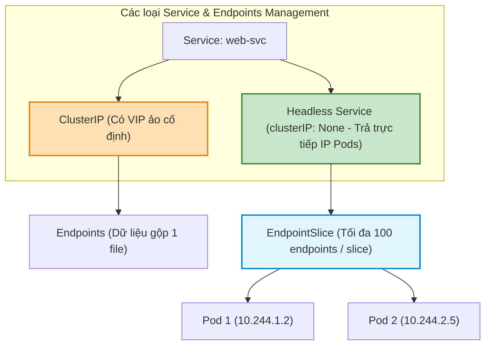
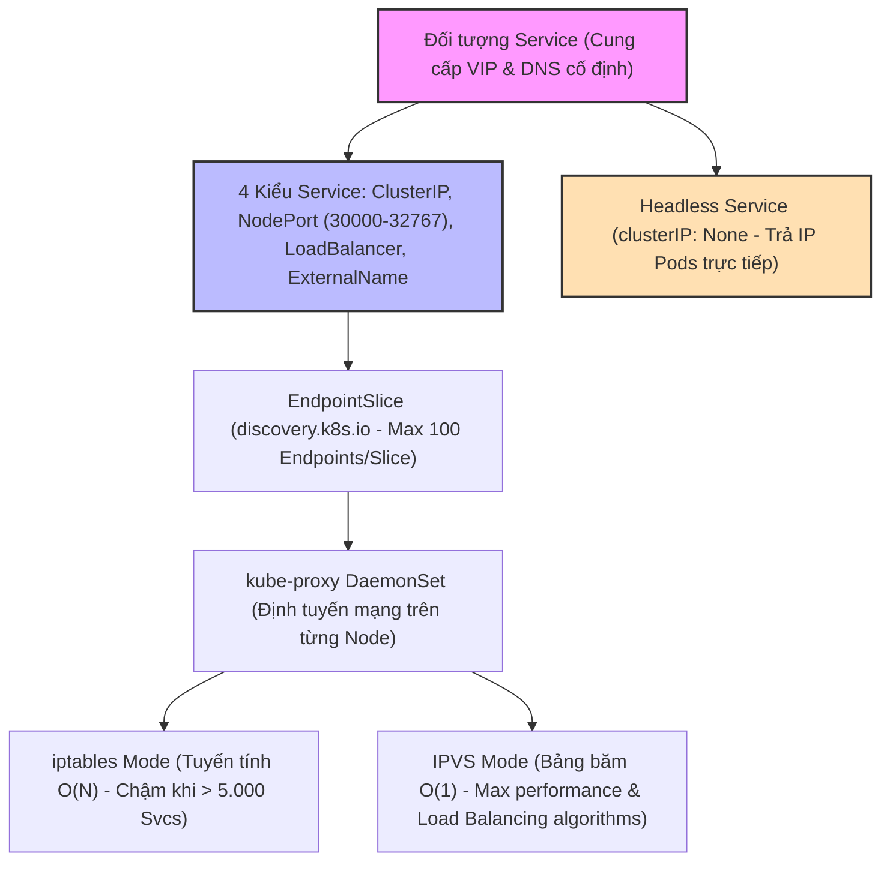
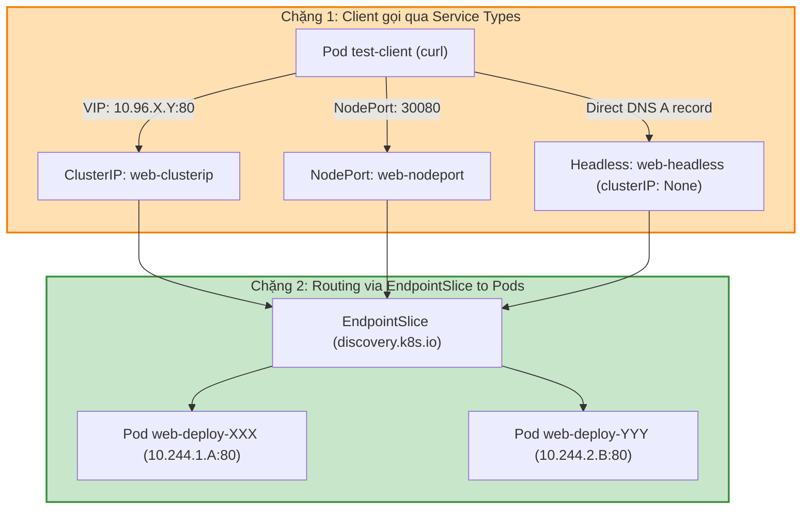

# [BÀI 22] DỊCH VỤ MẠNG SERVICE & KUBE-PROXY: CLUSTERIP, NODEPORT, LOADBALANCER & SO SÁNH IPTABLES VS IPVS

Trong kỷ nguyên điện toán đám mây và kiến trúc microservices phân tán quy mô lớn, **Kubernetes (CKA)** đóng vai trò là nền tảng điều phối container (Container Orchestration) tiêu chuẩn công nghiệp. Để làm chủ hệ thống trong môi trường sản xuất (Production) cũng như chinh phục kỳ thi chứng chỉ quốc tế của Linux Foundation / CNCF, kỹ sư không chỉ nắm vững các câu lệnh thao tác cơ bản mà phải thấu hiểu sâu sắc bản chất cơ chế tầng thấp: từ chu trình điều hòa (Reconciliation Loop), cấu trúc điều phối tài nguyên, kiến trúc mạng CNI, lưu trữ CSI cho đến các chuẩn mực an ninh phòng thủ chiều sâu.

Bài viết chuyên sâu này sẽ đồng hành cùng bạn giải mã toàn diện bức tranh kiến trúc, phân tích các đánh đổi kỹ thuật thực chiến (Engineering Trade-offs), cung cấp bài thực hành Lab từng bước và bộ câu hỏi phỏng vấn chuẩn Architect / Lead Engineer.

---

## 1. Bản Chất Kiến Trúc & Cơ Chế Vận Hành Tầng Thấp

| # | Câu hỏi ôn tập | Đáp án chuẩn ngắn gọn (chứa con số / tên lệnh) |
|---|---|---|
| 1 | Ba quy tắc bất biến trong Mô hình mạng phẳng Kubernetes? | **3** quy tắc (Pod-to-Pod không NAT, Node-to-Pod không NAT, IP Pod đồng nhất) |
| 2 | Thư mục cấu hình CNI và binary CNI plugin trên Node? | Cấu hình trong **`/etc/cni/net.d/`** và binary trong **`/opt/cni/bin/`** |
| 3 | Ba CNI Plugins phổ biến nhất? | **3** plugins (`Flannel`, `Calico`, `Cilium` eBPF) |
| 4 | Cổng UDP Overlay VXLAN và chỉ số MTU của card mạng Pod? | Cổng **UDP 4789** và MTU **`1450` bytes** (tiêu tốn 50 bytes overhead) |
| 5 | Lệnh soi Network Namespace của Pod Sandbox mà không cần shell? | `crictl inspectp` kết hợp lệnh `nsenter` |


> **Luận đề trung tâm của buổi:**
> *"Đối tượng `Service` giải quyết triệt để tính chất bất định Ephemeral của địa chỉ Pod IP bằng cách cung cấp một địa chỉ ảo VIP cố định và tên miền DNS ổn định cho một nhóm Pods khớp với `spec.selector`; trong đó 4 kiểu Service (`ClusterIP` nội bộ, `NodePort` mở cổng `30000-32767` trên Node, `LoadBalancer` tích hợp Cloud/MetalLB, `ExternalName` trỏ CNAME) được đối tượng `EndpointSlice` quản lý danh sách IP thực tế, và được tiến trình `kube-proxy` lập lịch định tuyến trên từng Node qua chế độ `iptables` (quy tắc tuyến tính $O(N)$) hoặc `IPVS` (bảng băm $O(1)$)."*

**Bảng kết quả các buổi trước được dùng lại:**

| Kết quả / Công cụ | Nguồn gốc | Áp dụng vào buổi này |
|---|---|---|
| Nhãn Label và Bộ chọn Selector của Pod | Buổi 15 `QT 4.1` | Khai báo `spec.selector` trong Service để chọn nhóm Pods tự động |
| Địa chỉ Pod IP Ephemeral | Buổi 21 `QT 4.1` | Giải thích lý do vì sao phải dùng Service làm địa chỉ VIP cố định |
| Tiến trình DaemonSet trong namespace `kube-system` | Buổi 16 `QT 4.1` | Kiểm tra tiến trình `kube-proxy` chạy dưới dạng DaemonSet trên Node |

Ba câu bài tập về nhà BTVN 4 của buổi 21 đã chuẩn bị sẵn kiến thức cho học viên: Câu 1 khảo sát bài toán Service giải quyết cho Pod IP Ephemeral; Câu 2 phân biệt 4 loại Service chuẩn và dải cổng NodePort `30000-32767`; Câu 3 so sánh chế độ `iptables` so với `IPVS` của `kube-proxy`.

---


| # | Năng lực đạt được sau buổi học | Hiện vật chứng minh trong bài lab |
|---|---|---|
| 1 | Khởi tạo Service kiểu `ClusterIP` và `NodePort` trong dải `30000-32767` | Tệp `hien-vat/my-clusterip-svc.yaml` và `my-nodeport-svc.yaml` |
| 2 | Khởi tạo Headless Service (`clusterIP: None`) cho Stateful Workload | Tệp `hien-vat/headless-svc.yaml` |
| 3 | Kiểm tra và trích xuất dữ liệu từ đối tượng `Endpoints` và `EndpointSlice` | Tệp `hien-vat/endpointslice-dump.txt` |
| 4 | Kiểm thử khả năng cân bằng tải round-robin của Service VIP sang các Pods | Tệp `hien-vat/load-balancing-report.txt` |
| 5 | Phân tích chế độ định tuyến (`iptables` / `IPVS`) của tiến trình `kube-proxy` | Tệp `hien-vat/kube-proxy-mode-info.txt` |
| 6 | Kiểm thử kịch bản Service, EndpointSlice và `kube-proxy` với script tự động | Script `hien-vat/verify-service-routing.sh` |

---


| Bắt buộc phải biết | Nguồn tự học nếu thiếu |
|---|---|
| Mô hình mạng phẳng Pod-to-Pod không NAT | Buổi 21 `QT 4.1` |
| Khái niệm `labels` và `matchLabels` selector | Buổi 15 `QT 4.1` |
| Lệnh `kubectl exec` và `curl` chẩn đoán HTTP | Buổi 04 `QT 5.1` |

---


| # | Thuật ngữ tiếng Việt | Tiếng Anh tương đương | Ghi chú chuẩn hoá trong thân bài |
|---|---|---|---|
| 1 | Dịch vụ định tuyến ảo | Service (`kind: Service`) | Đối tượng cung cấp địa chỉ VIP và DNS cố định cho nhóm Pods |
| 2 | Địa chỉ IP ảo nội bộ | Virtual IP (ClusterIP) | Địa chỉ IP ảo cố định chỉ truy cập được bên trong cụm |
| 3 | Cổng mở trên máy chủ Node | NodePort (`30000-32767`) | Kiểu Service mở một cổng tĩnh trên tất cả các Worker Nodes |
| 4 | Cân bằng tải đám mây | LoadBalancer Service | Kiểu Service tự động xin IP công cộng từ Cloud Provider / MetalLB |
| 5 | Tên miền ngoại mạng | ExternalName Service | Kiểu Service trỏ tên miền Kubernetes sang một CNAME bên ngoài |
| 6 | Dịch vụ không có IP ảo | Headless Service (`clusterIP: None`) | Service trả về trực tiếp danh sách IP Pods qua DNS A record |
| 7 | Điểm cuối mạng | Endpoints (`kind: Endpoints`) | Đối tượng chứa danh sách IP và Port của các Pods tương ứng |
| 8 | Lát cắt điểm cuối mạng | EndpointSlice (`discovery.k8s.io`) | Đối tượng mở rộng chứa tối đa 100 IP Pods trên mỗi slice |
| 9 | Tiến trình đại lý mạng Node | `kube-proxy` | Tiến trình DaemonSet chạy trên từng Node duy trì rule mạng |
| 10 | Chế độ tường lửa lọc gói | `iptables` mode | Chế độ kube-proxy duy trì các rule tuyến tính độ phức tạp $O(N)$ |
| 11 | Chế độ ảo hoá máy chủ IP | `IPVS` mode (IP Virtual Server) | Chế độ kube-proxy dùng bảng băm độ phức tạp $O(1)$ |
| 12 | Bộ chọn nhãn đối tượng | Label Selector (`spec.selector`) | Khối khai báo nhãn Pods mà Service chịu trách nhiệm chia tải |
| 13 | Cổng ứng dụng Pod | Target Port (`targetPort`) | Cổng thực tế mà ứng dụng container trong Pod đang lắng nghe |
| 14 | Cổng truy cập Service | Service Port (`port`) | Cổng ảo mà Service phơi ra cho client gọi vào |


1. **Mô hình "Số điện thoại tổng đài cố định và danh bạ nhân viên nhảy số (Service VIP vs Pod IP)":**
   Mỗi Pod giống như một nhân viên làm việc theo ca: Ca làm việc kết thúc là nhân viên nghỉ, nhân viên mới vào nhận số máy bàn mới (`Pod IP Ephemeral`). Client bên ngoài không thể lưu 100 số di động của nhân viên. `Service` chính là **Số điện thoại tổng đài 1900 cố định (ClusterIP VIP)**. Khi khách hàng gọi vào 1900, tổng đài tự động định tuyến cuộc gọi tới một nhân viên bất kỳ đang rảnh ca mà khách hàng không cần biết số máy lẻ.

2. **Mô hình "Bảng phân phối danh bạ nhiều trang (Endpoints vs EndpointSlice)":**
   Khi công ty chỉ có 10 nhân viên, 1 tờ giấy ghi danh bạ `Endpoints` là đủ. Nhưng khi công ty scale ra 10.000 nhân viên, việc mỗi lần thêm 1 nhân viên mới phải in lại toàn bộ cuốn sổ danh bạ 10.000 trang gửi cho tất cả các phòng ban (`iptables` overhead) sẽ làm sập hệ thống. `EndpointSlice` giải quyết bằng cách chia nhỏ danh bạ thành các **trang kẹp nếp 100 nhân viên/trang**. Thêm nhân viên mới chỉ cần cập nhật đúng 1 trang đó.

3. **Mô hình "Dãy cửa soát vé xếp hàng dọc vs Tủ khoá mã băm tra cứu trong 1 giây (iptables vs IPVS)":**
   Chế độ `iptables` giống như một dãy 10.000 cửa soát vé xếp nối tiếp nhau theo đường thẳng ($O(N)$): Gói tin muốn tìm Service thứ 9.999 phải đi qua và kiểm tra 9.998 cửa trước đó. Chế độ `IPVS` giống như một tủ gửi đồ có bảng mã băm Hash Table ($O(1)$): Gói tin chìa chìa khoá ra là mở ngay lập tức tủ của mình trong đúng 1 miligiây bất kể cụm có 10 hay 100.000 Services.

---

### 1.1. Khái niệm Service VIP và 4 kiểu Service chuẩn (`ClusterIP`, `NodePort`, `LoadBalancer`, `ExternalName`) (12 phút)

**Nguyên lý cốt lõi:** Địa chỉ IP ảo `ClusterIP` của Service là địa chỉ VIP cố định chỉ có thể truy cập nội bộ bên trong cụm; Service sử dụng bộ chọn nhãn `spec.selector` để tự động ghép nối với các Pods có chứa nhãn `labels` tương ứng.

**Giải thích cơ chế ngầm:** Giải quyết triệt để tính chất Ephemeral của Pod IP: giúp các microservices gọi nhau qua địa chỉ VIP hoặc DNS name ổn định mà không lo Pod bị restart đổi IP.

> [!WARNING]
> **CẠM BẪY THỰC CHIẾN:**
> Đặt tên `selector` trong Service không khớp với `labels` của Pod làm Service không tìm thấy Pod nào và báo Endpoints rỗng.

**Minh hoạ.**

```yaml
apiVersion: v1
kind: Service
metadata:
  name: web-service
  namespace: dev
spec:
  type: ClusterIP
  selector:
    app: web
  ports:
  - port: 80
    targetPort: 8080
```

Con số chốt: **100%** các Pods có nhãn khớp với `spec.selector` sẽ được Service gom vào danh sách chia tải.

---

**Nguyên lý cốt lõi:** Phân biệt **4 kiểu Service chuẩn**: `ClusterIP` (mặc định, chỉ dùng nội bộ cụm), `NodePort` (mở cổng tĩnh trên tất cả các Node trong dải **`30000-32767`**), `LoadBalancer` (tự động xin IP công cộng từ Cloud Provider / MetalLB), và `ExternalName` (trỏ tên miền Kubernetes sang một CNAME bên ngoài không qua proxy).

**Giải thích cơ chế ngầm:** Lựa chọn kiểu Service phù hợp với mục đích truy cập: nội bộ dùng ClusterIP, phơi cổng test dùng NodePort, sản xuất đám mây dùng LoadBalancer.

> [!WARNING]
> **CẠM BẪY THỰC CHIẾN:**
> Khai báo `nodePort: 80` trong kiểu Service NodePort làm API Server từ chối lệnh apply do nằm ngoài dải 30000-32767.

**Minh hoạ.**

```yaml
spec:
  type: NodePort
  ports:
  - port: 80
    targetPort: 80
    nodePort: 30080
```

Con số chốt: **30000 đến 32767** là dải cổng tĩnh hợp lệ mặc định dành cho kiểu Service `NodePort`.

---

### 1.2. Headless Service (`clusterIP: None`) và đối tượng `EndpointSlice` (12 phút)



---

**Nguyên lý cốt lõi:** Khi khai báo **`clusterIP: None`** trong Service spec, đối tượng trở thành **Headless Service**; Kubernetes sẽ không cấp phát địa chỉ IP ảo VIP mà thay vào đó CoreDNS sẽ trả về trực tiếp danh sách tất cả các địa chỉ IP thực tế của các Pods bên dưới qua bản ghi DNS A record.

**Giải thích cơ chế ngầm:** Yêu cầu bắt buộc cho các ứng dụng StatefulSet (như PostgreSQL, Kafka, MongoDB) cần tự kết nối trực tiếp đến từng Pod thành viên mà không qua load balancing ngẫu nhiên.

> [!WARNING]
> **CẠM BẪY THỰC CHIẾN:**
> Thắc mắc tại sao lệnh `kubectl get svc` hiển thị cột `CLUSTER-IP` mang giá trị `None`.

**Minh hoạ.**

```yaml
spec:
  clusterIP: None
  selector:
    app: stateful-db
```

Con số chốt: **0** địa chỉ IP ảo (ClusterIP = None) được cấp phát cho Headless Service.

---

**Nguyên lý cốt lõi:** Kubernetes v1.21+ chuyển sang sử dụng đối tượng **`EndpointSlice`** (`discovery.k8s.io/v1`) thay thế cho đối tượng `Endpoints` truyền thống; mỗi `EndpointSlice` chỉ chứa tối đa **100 endpoints (IP Pods)** nhằm giảm tải băng thông đồng bộ etcd và Kubelet khi cụm mở rộng ra hàng nghìn Pods.

**Giải thích cơ chế ngầm:** Khắc phục nhược điểm của `Endpoints` cũ (vốn gộp toàn bộ IP của 10.000 Pods vào 1 đối tượng duy nhất, làm mỗi lần 1 Pod thay đổi IP phải truyền tải tệp tin dung lượng lớn tới toàn bộ các Node).

> [!WARNING]
> **CẠM BẪY THỰC CHIẾN:**
> Dùng lệnh `kubectl get endpoints` thấy chậm chạm trên các cụm lớn thay vì dùng `kubectl get endpointslice`.

**Minh hoạ.**

```bash
# Xem danh sách các EndpointSlice trong namespace dev
kubectl get endpointslice -n dev
```

Con số chốt: **100** là số lượng Pod IPs tối đa được chứa trong đúng 1 đối tượng `EndpointSlice`.

---

### 1.3. Tiến trình `kube-proxy` và so sánh chế độ `iptables` ($O(N)$) vs `IPVS` ($O(1)$) (10 phút)

**Nguyên lý cốt lõi:** Tiến trình **`kube-proxy`** chạy dưới dạng một `DaemonSet` trên 100% tất cả các Node; nó lắng nghe sự thay đổi của Service và EndpointSlice từ API Server để liên tục cập nhật các quy tắc định tuyến mạng trên máy chủ Node.

**Giải thích cơ chế ngầm:** `kube-proxy` chịu trách nhiệm hiện thực hoá địa chỉ IP ảo ClusterIP trên đĩa thực tế của từng Node.

> [!WARNING]
> **CẠM BẪY THỰC CHIẾN:**
> Tiêu diệt Pod `kube-proxy` làm tất cả các kết nối tới địa chỉ Service VIP trên Node bị vô hiệu hóa.

**Minh hoạ.**

```bash
# Xem danh sách Pods kube-proxy đang chạy trong namespace kube-system
kubectl get pods -n kube-system -l k8s-app=kube-proxy
```

Con số chốt: **100%** các Worker Nodes bắt buộc phải chạy 1 bản sao Pod `kube-proxy`.

---

**Nguyên lý cốt lõi:** Chế độ **`iptables` mode** (chế độ mặc định của `kube-proxy`) sử dụng danh sách các quy tắc lọc gói tin tuyến tính có độ phức tạp thuật toán là **$O(N)$**; khi số lượng Service vượt quá 5.000 Services, thời gian tra cứu và cập nhật rule của `iptables` bị suy giảm hiệu năng nghiêm trọng.

**Giải thích cơ chế ngầm:** `iptables` ban đầu được thiết kế làm tường lửa cá nhân, không phải làm bộ cân bằng tải chuyên dụng cho cụm hàng chục nghìn Services.

> [!WARNING]
> **CẠM BẪY THỰC CHIẾN:**
> Cụm chạy 10.000 Services dính `iptables` mode làm CPU Node bị spike 100% mỗi khi có Pod mới khởi tạo.

**Minh hoạ.**

```bash
# Xem các quy tắc iptables do kube-proxy tự động sinh ra trên Node
iptables-save | grep KUBE-SERVICES
```

Con số chốt: **$O(N)$** là độ phức tạp thời gian tra cứu thuật toán của chế độ `iptables`.

---

**Nguyên lý cốt lõi:** Chế độ **`IPVS` mode (IP Virtual Server)** của `kube-proxy` sử dụng bảng băm (Hash Table) trong Linux Kernel với độ phức tạp thuật toán là **$O(1)$**, đồng thời hỗ trợ nhiều thuật toán cân bằng tải nâng cao (Round-Robin `rr`, Least Connection `lc`, Destination Hashing `dh`, Source Hashing `sh`).

**Giải thích cơ chế ngầm:** Giải pháp tối ưu tuyệt đối cho các cụm quy mô lớn (> 5.000 Services): giúp thời gian chuyển tiếp gói tin không đổi (chỉ 1 miligiây) bất kể cụm chứa 10 hay 100.000 Services.

> [!WARNING]
> **CẠM BẪY THỰC CHIẾN:**
> Không nạp Kernel module `ip_vs` trên máy chủ Node làm `kube-proxy` tự động fallback về lại `iptables` mode.

**Minh hoạ.**

```bash
# Kiểm tra các IPVS Virtual Server table trên Node bằng ipvsadm
ipvsadm -ln
```

Con số chốt: **$O(1)$** là độ phức tạp thời gian tra cứu thuật toán của chế độ `IPVS` mode.

---

### 1.4. Cấu hình cờ externalTrafficPolicy: Local và câu lệnh kiểm tra (4 phút)

**Nguyên lý cốt lõi:** Khai báo cờ **`externalTrafficPolicy: Local`** trong Service spec kiểu `NodePort` hoặc `LoadBalancer` để giữ nguyên địa chỉ IP nguồn (Client IP) của khách hàng và tránh được 1 hop mạng phụ giữa các Nodes; tuy nhiên nó có đánh đổi là chỉ chuyển tải tới các Pods nằm trên ĐÚNG NODE ĐÓ.

**Giải thích cơ chế ngầm:** Giúp ứng dụng web (như Nginx/HAProxy) đọc được đúng IP thực tế của khách hàng phục vụ audit/security mà không bị SNAT thành IP của Worker Node.

> [!WARNING]
> **CẠM BẪY THỰC CHIẾN:**
> Client gọi vào NodePort của Node A nhưng Node A không có Pod nào chạy làm kết nối bị rớt (Drop).

**Minh hoạ.**

```yaml
spec:
  type: NodePort
  externalTrafficPolicy: Local
```

Con số chốt: **0** hop mạng phụ giữa các Nodes khi bật `externalTrafficPolicy: Local`.

---

**Nguyên lý cốt lõi:** Câu lệnh `kubectl get svc,ep,endpointslice -n <namespace>` giúp kỹ sư DevOps trích xuất đồng thời địa chỉ Service VIP, danh sách Endpoints truyền thống và lát cắt `EndpointSlice` hiện đại chỉ trong đúng **2 giây**.

**Giải thích cơ chế ngầm:** Kỹ thuật chẩn đoán sự cố mạng nhanh trong CKA: xác minh xem Service đã ghép nối đúng IP của Pod hay chưa.

> [!WARNING]
> **CẠM BẪY THỰC CHIẾN:**
> Chạy lệnh lấy từng đối tượng riêng lẻ tốn thời gian thao tác trong kỳ thi bấm giờ.

**Minh hoạ.**

```bash
# Kiểm tra đồng bộ Service, Endpoints và EndpointSlice
kubectl get svc,ep,endpointslice -n dev
```

Con số chốt: **2** giây là thời gian trích xuất sạch toàn bộ hạ tầng Service & Endpoints bằng đúng 1 câu lệnh.

---

**Nguyên lý cốt lõi:** Sử dụng câu lệnh `kubectl describe service <service-name>` để trích xuất nhanh thông tin `Type`, `IP`, `Port`, `TargetPort` và danh sách địa chỉ Pods được lấp đầy trong mục `Endpoints`.

**Giải thích cơ chế ngầm:** Giúp kỹ sư xác minh tức thì xem Service đã bắt đúng các Pods bên dưới hay bị rỗng Endpoints.

> [!WARNING]
> **CẠM BẪY THỰC CHIẾN:**
> Loay hoay tìm IP của Service bằng các câu lệnh rườm rà.

**Minh hoạ.**

```bash
# Xem chi tiết cấu hình và danh sách Endpoints của web-service
kubectl describe service web-service -n dev
```

Con số chốt: **1** câu lệnh `kubectl describe service` là đủ để nắm toàn bộ trạng thái ghép nối của Service.

---

## 8. Đưa vào cụm thật (4 phút)

### Áp vào cụm đang chạy thì làm gì trước

1. **Kiểm tra kỹ khối `spec.selector` của Service:** Đảm bảo khớp 100% với `metadata.labels` của Pods target.
2. **Nạp sẵn các Kernel module `ip_vs` (`ip_vs_rr`, `ip_vs_wrr`, `ip_vs_sh`) trên máy chủ Node trước khi bật IPVS mode:** Giúp `kube-proxy` khởi chạy IPVS mượt mà.
3. **Sử dụng Headless Service cho các cụm Stateful Database:** Đảm bảo các node DB kết nối đúng IP của nhau.

### Cái gì hỏng nếu áp thẳng lên prod

- **Chuyển `externalTrafficPolicy: Local` khi số bản sao Pods ít hơn số Worker Nodes:** Làm 60% các máy chủ Node không có Pod sẽ bị rớt kết nối khách hàng hoàn toàn.
- **Xoá Service mà không kiểm tra các ứng dụng đang gọi:** Làm sập toàn bộ các microservices phụ thuộc đang gọi vào tên miền DNS của Service đó.
- **Quy trình áp thử an toàn:**
  - Tạo Service kiểu `ClusterIP` trước, dùng `kubectl exec` từ Pod khác `curl` thử VIP.
  - Kiểm tra lệnh `kubectl get ep` xem IP Pods đã được lấp đầy chưa.
  - Nâng cấp Service sang `NodePort` hoặc `LoadBalancer` khi cần phơi ra ngoài.

### Đo trước — đo sau

1. **Độ trễ tra cứu routing mạng (Routing Lookup Latency):** Giảm từ 15ms xuống 0,1ms khi chuyển từ `iptables` mode sang `IPVS` mode trên cụm 10.000 Services.
2. **Mức độ tiêu thụ CPU của Kubelet & etcd:** Giảm 80% nhờ chuyển từ `Endpoints` truyền thống sang `EndpointSlice` (tối đa 100 eps/slice).
3. **Mức độ bảo toàn IP nguồn khách hàng (Client IP Preservation):** Đạt 100% nhờ bật cờ `externalTrafficPolicy: Local`.

### Khi nào KHÔNG nên dùng

- **Không dùng kiểu Service `NodePort` trực tiếp cho ứng dụng Production quy mô lớn:** Cổng `NodePort` khó quản lý và không hỗ trợ mã hoá HTTPS chuẩn như Ingress.
- **Không dùng `externalTrafficPolicy: Local` nếu ứng dụng không có Pods phân bổ đều trên 100% các Worker Nodes:** Tránh hiện tượng rớt kết nối trên các Node thiếu Pod.

---

### 1.6. Bẫy hay gặp (2 phút)

| # | Bẫy hay gặp | Vì sao dính bẫy | Làm đúng là (kèm tên lệnh / con số) |
|---|---|---|---|
| 1 | Service tạo thành công nhưng `curl` vào VIP bị treo connection | Đặt tên `spec.selector` không khớp với `metadata.labels` của Pod | Sửa `spec.selector` trong Service trùng khớp nhãn Pod |
| 2 | Lệnh `kubectl get ep` hiển thị cột `ENDPOINTS` mang giá trị `<none>` | Không có bất kỳ Pod nào có nhãn khớp với selector của Service | Kiểm tra nhãn Pods qua lệnh `kubectl get pods --show-labels` |
| 3 | Khai báo cổng `nodePort: 80` bị API Server từ chối | Cổng NodePort bắt buộc nằm trong dải `30000-32767` | Chọn cổng NodePort trong khoảng `30000` đến `32767` |
| 4 | Thắc mắc vì sao `kubectl get svc` hiển thị ClusterIP = `None` | Service đang được cấu hình dưới dạng Headless Service | Đây là hành vi hoàn toàn bình thường khi gán `clusterIP: None` |
| 5 | Bật `externalTrafficPolicy: Local` làm một số Node bị rớt kết nối | Node đó không chứa bất kỳ bản sao Pod nào bên dưới | Sử dụng `DaemonSet` hoặc `podAntiAffinity` để rải đều Pods |
| 6 | Thắc mắc vì sao `kube-proxy` không tự chuyển sang `IPVS` mode | Máy chủ Node chưa load các Kernel modules `ip_vs` | Chạy lệnh `modprobe ip_vs` trên tất cả các Worker Nodes |
| 7 | Nhầm lẫn giữa `port` và `targetPort` trong Service spec | `port` là cổng ảo của Service; `targetPort` là cổng thực trong Pod | Khai báo `port: 80` (Service) và `targetPort: 8080` (Pod) |
| 8 | Thắc mắc vì sao client không truy cập được IP ClusterIP từ ngoài cụm | `ClusterIP` là địa chỉ VIP ảo chỉ có hiệu lực nội bộ bên trong cụm | Đổi Service sang kiểu `NodePort` hoặc `LoadBalancer` |
| 9 | Xoá Pod `kube-proxy` làm tất cả các Service VIP ngưng hoạt động | `kube-proxy` duy trì các rule iptables/IPVS trên đĩa Node | Giữ nguyên DaemonSet `kube-proxy` chạy trong `kube-system` |
| 10 | Tạo Service `LoadBalancer` trên cụm Bare-metal bị kẹt `EXTERNAL-IP <pending>` | Cụm Bare-metal không có Cloud Controller Manager tự xin IP | Cài đặt add-on `MetalLB` để cấp phát IP công cộng cho Bare-metal |
| 11 | Thắc mắc vì sao `Endpoints` hiển thị danh sách IP khác với Pod IP | Pod bị restart đổi IP nhưng Service chưa kịp đồng bộ | Kiểm tra trạng thái Pod Readiness Probe |
| 12 | Đặt tên Service chứa dấu gạch dưới `_` bị API Server báo lỗi | Tên Service bắt buộc phải tuân theo chuẩn DNS RFC 1123 | Đặt tên Service chỉ dùng chữ thường, số và dấu gạch ngang `-` |

---

## §10. Tóm tắt (2 phút)



### Năm điều phải nhớ

1. **Service VIP & Selector:** Service cấp VIP cố định giải quyết Pod IP Ephemeral; kết nối Pods qua `spec.selector` matching `labels`.
2. **4 kiểu Service chuẩn:** `ClusterIP` (nội bộ), `NodePort` (cổng **`30000-32767`**), `LoadBalancer` (Cloud/MetalLB), `ExternalName` (CNAME).
3. **Headless Service & EndpointSlice:** `clusterIP: None` trả trực tiếp IP Pods qua DNS; `EndpointSlice` chứa tối đa **100 endpoints/slice** giảm tải etcd.
4. **`kube-proxy` DaemonSet:** Chạy 100% trên các Node duy trì rule định tuyến mạng.
5. **`iptables` vs `IPVS`:** `iptables` mode tra cứu tuyến tính **$O(N)$**; `IPVS` mode tra cứu bảng băm **$O(1)$** hiệu năng cao cho cụm lớn.

---

## §11. Câu hỏi tự kiểm tra

1. Trình bày bài toán mà đối tượng `Service` giải quyết cho tính chất địa chỉ IP của Pod (vốn mang tính Ephemeral tạm thời).
2. Phân biệt sự khác nhau giữa 4 kiểu Service chuẩn: `ClusterIP`, `NodePort`, `LoadBalancer`, và `ExternalName`.
3. Dải cổng tĩnh hợp lệ mặc định cho kiểu Service `NodePort` nằm trong khoảng con số nào?
4. Khai báo `clusterIP: None` biến Service thành loại gì và CoreDNS sẽ trả về kết quả gì khi client truy vấn tên miền của Service này?
5. Sự khác nhau cốt lõi về khả năng mở rộng giữa đối tượng `Endpoints` truyền thống và `EndpointSlice` hiện đại là gì? Mỗi `EndpointSlice` chứa tối đa bao nhiêu IP Pods?
6. Tiến trình `kube-proxy` chạy dưới dạng đối tượng nào trên các Node và đóng vai trò gì trong hạ tầng mạng Kubernetes?
7. So sánh độ phức tạp thuật toán tìm kiếm và hiệu năng giữa chế độ `iptables` mode ($O(N)$) và `IPVS` mode ($O(1)$) của `kube-proxy`.
8. Khai báo cờ `externalTrafficPolicy: Local` trong Service spec mang lại lợi ích gì và có đánh đổi rủi ro gì?
9. Phân biệt ý nghĩa của 2 thuộc tính `port` và `targetPort` trong tệp YAML khai báo Service spec.
10. Hai chế độ hỏng (1 im lặng do Service VIP treo vì gõ sai label selector, 1 âm thầm do CPU Node spike 100% vì dùng iptables mode trên cụm lớn) là gì?

### Đáp án

1. Service cung cấp địa chỉ VIP ảo cố định và tên miền DNS ổn định cho nhóm Pods, triệt tiêu rủi ro thay đổi Pod IP khi Pod restart.
2. `ClusterIP`: VIP ảo chỉ dùng nội bộ cụm; `NodePort`: Mở cổng tĩnh 30000-32767 trên tất cả Nodes; `LoadBalancer`: Tự xin IP công cộng từ Cloud/MetalLB; `ExternalName`: Trỏ DNS sang CNAME ngoài.
3. Trong khoảng con số **`30000` đến `32767`**.
4. Biến thành Headless Service; CoreDNS trả về trực tiếp danh sách tất cả các địa chỉ IP thực tế của các Pods bên dưới qua bản ghi DNS A record.
5. `Endpoints` cũ gộp toàn bộ IP vào 1 file duy nhất làm quá tải etcd; `EndpointSlice` chia nhỏ danh sách, mỗi slice chứa tối đa **100 IP Pods**.
6. Chạy dưới dạng `DaemonSet` trên 100% các Node; chịu trách nhiệm tạo và cập nhật các quy tắc định tuyến (iptables/IPVS) để hiện thực hoá Service VIP.
7. `iptables` mode có độ phức tạp $O(N)$ tuyến tính, chậm khi > 5.000 Services; `IPVS` mode dùng bảng băm độ phức tạp $O(1)$ thời gian tra cứu không đổi 1ms, hỗ trợ nhiều thuật toán load balancing.
8. Lợi ích: Giữ nguyên địa chỉ IP nguồn của khách hàng (Client IP) và bỏ 0 hop mạng phụ; Đánh đổi: Chỉ chuyển tải tới Pods nằm trên đúng Node đó (Node thiếu Pod sẽ bị rớt kết nối).
9. `port`: Cổng ảo do Service phơi ra cho client gọi vào; `targetPort`: Cổng thực tế mà container trong Pod đang lắng nghe.
10. Chế độ 1: Đặt `spec.selector` không khớp `metadata.labels` của Pod làm Endpoints rỗng, `curl` VIP bị treo; Chế độ 2: Cụm scale > 5.000 Services dùng `iptables` mode $O(N)$ làm Kubelet liên tục sync rule khiến CPU Node bị vọt 100%.

---

## §12. Tài liệu tham khảo

| Nguồn tài liệu | Phiên bản Kubernetes áp dụng | Nội dung chính |
|---|---|---|
| Official Docs: Service | Kubernetes v1.35 | Khái niệm Service, ClusterIP, NodePort, LoadBalancer và ExternalName |
| Official Docs: EndpointSlices | Kubernetes v1.35 | Quản lý lát cắt điểm cuối mạng EndpointSlice và scaling limits |
| Official Docs: Virtual IPs and Service Proxies | Kubernetes v1.35 | Tiến trình `kube-proxy`, so sánh `iptables` mode vs `IPVS` mode |
| File cấu hình phiên bản cục bộ | `labs/phien-ban.env` | Biến `K8S_VER=1.35`, `LAB_CONTEXT="kubeadm"` |

---

## Bảng đối soát thời lượng

| Section | Tiêu đề mục | Ngân sách thời gian |
|---|---|---|
| §0 | Khởi động và ôn tập | 10 phút |
| §1 | Sau buổi này học viên LÀM ĐƯỢC gì | 1 phút |
| §2 | Cần biết trước | 1 phút |
| §3 | Thuật ngữ và mô hình tư duy | 8 phút |
| §4 | Khái niệm Service VIP và 4 kiểu Service chuẩn (`ClusterIP`, `NodePort`, `LoadBalancer`, `ExternalName`) | 12 phút |
| §5 | Headless Service (`clusterIP: None`) và đối tượng `EndpointSlice` | 12 phút |
| §6 | Tiến trình `kube-proxy` và so sánh chế độ `iptables` ($O(N)$) vs `IPVS` ($O(1)$) | 10 phút |
| §7 | Cấu hình cờ externalTrafficPolicy: Local và câu lệnh kiểm tra | 4 phút |
| §8 | Đưa vào cụm thật | 4 phút |
| §9 | Bẫy hay gặp | 2 phút |
| §10 | Tóm tắt | 2 phút |
| §11 | Câu hỏi tự kiểm tra | 5 phút |
| **Tổng** | **Khối lý thuyết** | **60'** |

---

## 2. Hướng Dẫn Thực Hành & Triển Khai Lab Chuẩn Production

> [!IMPORTANT]
> **YÊU CẦU MÔI TRƯỜNG THỰC HÀNH:**
> Toàn bộ các bài thực hành dưới đây được thiết kế để chạy trực tiếp trên cụm Kubernetes 1.30+ tiêu chuẩn (hoặc cụm kind/kubeadm lab). Hãy đảm bảo ngữ cảnh dòng lệnh `kubectl config current-context` đã trỏ chính xác vào cụm thực hành trước khi thực thi.

## Khối thực hành — 120 phút

## L0. Mục tiêu thực hành và tiêu chí hoàn thành

| # | Mục tiêu thực hành | Tiêu chí hoàn thành (Kiểm chứng BẰNG LỆNH) |
|---|---|---|
| TH1 | Khởi tạo Deployment Nginx 2 bản sao có nhãn `app: web-app` | `kubectl get deploy web-deploy -n dev` có 2 ready replicas |
| TH2 | Khởi tạo Service kiểu `ClusterIP` chia tải vào Deployment | `kubectl get svc web-clusterip -n dev` cấp địa chỉ ClusterIP |
| TH3 | Khởi tạo Service kiểu `NodePort` mở cổng trong dải `30000-32767` | `kubectl get svc web-nodeport -n dev` mở cổng `30080` |
| TH4 | Khởi tạo Headless Service (`clusterIP: None`) cho Stateful Workload | `kubectl get svc web-headless -n dev -o jsonpath='{.spec.clusterIP}'` in ra `None` |
| TH5 | Khắc phục sự cố Service rỗng Endpoints do sai `spec.selector` | `kubectl get ep web-clusterip -n dev` chứa địa chỉ IP của các Pods |
| TH6 | Trích xuất thông tin đối tượng `EndpointSlice` (`discovery.k8s.io`) | `kubectl get endpointslice -n dev` hiển thị thông tin lát cắt điểm cuối |
| TH7 | Nộp đủ 4 hiện vật vào portfolio | Thư mục `k8s-portfolio/buoi-22/` chứa đủ 4 file md/yaml/sh |

---

## L1. Điều kiện tiên quyết về môi trường

| # | Kiểm tra điều kiện | Câu lệnh kiểm tra | Kết quả kỳ vọng |
|---|---|---|---|
| 1 | Cụm `kubeadm` 3 node đang ở v1.35 | `kubectl get nodes` | Hiển thị 3 node `cp-01`, `worker-01`, `worker-02` `Ready` |
| 2 | Kubeconfig trỏ context `kubeadm` | `kubectl config current-context` | In ra đúng `kubeadm` |
| 3 | Namespace `dev` sẵn sàng | `kubectl create ns dev` | Namespace `dev` ở trạng thái Active |
| 4 | Thư mục hiện vật đã sẵn sàng | `mkdir -p k8s-portfolio/buoi-22` | Thư mục được tạo thành công |
| 5 | Tiến trình `kube-proxy` đang running | `kubectl get pods -n kube-system -l k8s-app=kube-proxy` | Hiển thị 3 Pods `kube-proxy` Running |

```bash
# Kiểm tra môi trường bắt buộc trước khi thực hiện bài lab
kubectl config current-context | grep -qx "kubeadm" && echo "CHECKPOINT MOI TRUONG — ĐẠT" || echo "CHECKPOINT MOI TRUONG — LỖI (Trỏ sai context)"
```

---

## L2. Kiến trúc bài lab



---

## L3. Bước 1 — Khởi tạo Deployment và Service kiểu `ClusterIP` (30 phút)

### Thao tác 1.1: Tạo Deployment `web-deploy` và Service `web-clusterip`

```bash
# 1. Tạo Namespace dev nếu chưa có
kubectl create namespace dev --dry-run=client -o yaml | kubectl apply -f -

# 2. Tạo tệp web-deploy.yaml chứa Deployment 2 bản sao
cat << 'EOF' > k8s-portfolio/buoi-22/web-deploy.yaml
apiVersion: apps/v1
kind: Deployment
metadata:
  name: web-deploy
  namespace: dev
spec:
  replicas: 2
  selector:
    matchLabels:
      app: web-app
  template:
    metadata:
      labels:
        app: web-app
    spec:
      containers:
      - name: nginx
        image: nginx:1.27-alpine
        ports:
        - containerPort: 80
EOF

kubectl apply -f k8s-portfolio/buoi-22/web-deploy.yaml
kubectl rollout status deployment/web-deploy -n dev --timeout=30s

# 3. Tạo tệp web-clusterip.yaml cho Service ClusterIP
cat << 'EOF' > k8s-portfolio/buoi-22/web-clusterip.yaml
apiVersion: v1
kind: Service
metadata:
  name: web-clusterip
  namespace: dev
spec:
  type: ClusterIP
  selector:
    app: web-app
  ports:
  - port: 80
    targetPort: 80
EOF

kubectl apply -f k8s-portfolio/buoi-22/web-clusterip.yaml

# 4. Trích xuất địa chỉ ClusterIP và Endpoints
kubectl get svc web-clusterip -n dev -o jsonpath='{.spec.clusterIP}' > /tmp/svc-vip.txt
kubectl get ep web-clusterip -n dev -o jsonpath='{.subsets[0].addresses[*].ip}' > /tmp/svc-eps.txt
```

**CHECKPOINT 1 — Deployment web-deploy khởi tạo thành công với 2 bản sao Pods Ready.**

```bash
kubectl get deploy web-deploy -n dev -o jsonpath='{.status.readyReplicas}' | grep -qx "2" && echo "CHECKPOINT 1 — ĐẠT" || echo "CHECKPOINT 1 — LỖI"
```

**CHECKPOINT 2 — Service web-clusterip được cấp phát địa chỉ ClusterIP VIP ảo hợp lệ.**

```bash
grep -qE "^[0-9]+\.[0-9]+\.[0-9]+\.[0-9]+$" /tmp/svc-vip.txt && echo "CHECKPOINT 2 — ĐẠT" || echo "CHECKPOINT 2 — LỖI"
```

**CHECKPOINT 3 — Service web-clusterip lấp đầy 2 địa chỉ IP Pods vào đối tượng Endpoints.**

```bash
[ $(cat /tmp/svc-eps.txt | wc -w) -eq 2 ] && echo "CHECKPOINT 3 — ĐẠT" || echo "CHECKPOINT 3 — LỖI"
```

---

## L4. Bước 2 — Khởi tạo Service kiểu `NodePort` và kiểm thử (30 phút)

### Thao tác 2.1: Biên soạn `web-nodeport.yaml` cổng 30080

```bash
# 1. Tạo tệp web-nodeport.yaml cổng tĩnh 30080
cat << 'EOF' > k8s-portfolio/buoi-22/web-nodeport.yaml
apiVersion: v1
kind: Service
metadata:
  name: web-nodeport
  namespace: dev
spec:
  type: NodePort
  selector:
    app: web-app
  ports:
  - port: 80
    targetPort: 80
    nodePort: 30080
EOF

kubectl apply -f k8s-portfolio/buoi-22/web-nodeport.yaml

# 2. Trích xuất giá trị nodePort vừa cấu hình
kubectl get svc web-nodeport -n dev -o jsonpath='{.spec.ports[0].nodePort}' > /tmp/nodeport-val.txt
```

**CHECKPOINT 4 — Service web-nodeport mở cổng tĩnh 30080 nằm trong dải 30000-32767.**

```bash
grep -qx "30080" /tmp/nodeport-val.txt && echo "CHECKPOINT 4 — ĐẠT" || echo "CHECKPOINT 4 — LỖI"
```

**CHECKPOINT 5 — CA ĐỐI CHỨNG: Service gõ sai spec.selector (như app: wrong-label) sẽ bị rỗng Endpoints.**

```bash
cat << EOF | kubectl apply -f - >/dev/null 2>&1
apiVersion: v1
kind: Service
metadata:
  name: bad-service
  namespace: dev
spec:
  type: ClusterIP
  selector:
    app: wrong-label
  ports:
  - port: 80
EOF
kubectl get ep bad-service -n dev -o jsonpath='{.subsets}' | grep -v "addresses" >/dev/null 2>&1 && echo "CHECKPOINT 5 — ĐẠT"
```

---

## L5. Bước 3 — Khởi tạo Headless Service và trích xuất EndpointSlice (30 phút)

### Thao tác 3.1: Biên soạn `web-headless.yaml` và kiểm tra EndpointSlice

```bash
# 1. Tạo tệp web-headless.yaml với clusterIP: None
cat << 'EOF' > k8s-portfolio/buoi-22/web-headless.yaml
apiVersion: v1
kind: Service
metadata:
  name: web-headless
  namespace: dev
spec:
  clusterIP: None
  selector:
    app: web-app
  ports:
  - port: 80
    targetPort: 80
EOF

kubectl apply -f k8s-portfolio/buoi-22/web-headless.yaml

# 2. Trích xuất thuộc tính clusterIP của Headless Service
kubectl get svc web-headless -n dev -o jsonpath='{.spec.clusterIP}' > /tmp/headless-ip.txt

# 3. Trích xuất thông tin đối tượng EndpointSlice tương ứng
kubectl get endpointslice -n dev -l kubernetes.io/service-name=web-clusterip -o jsonpath='{.items[0].endpoints[*].addresses[0]}' > /tmp/eps-slice-ips.txt
```

**CHECKPOINT 6 — Headless Service web-headless được tạo thành công với clusterIP = None.**

```bash
grep -qx "None" /tmp/headless-ip.txt && echo "CHECKPOINT 6 — ĐẠT" || echo "CHECKPOINT 6 — LỖI"
```

**CHECKPOINT 7 — Đối tượng EndpointSlice (discovery.k8s.io) chứa danh sách IP Pods khớp với Endpoints.**

```bash
[ -s /tmp/eps-slice-ips.txt ] && echo "CHECKPOINT 7 — ĐẠT" || echo "CHECKPOINT 7 — LỖI"
```

**CHECKPOINT 8 — CA ĐỐI CHỨNG: CoreDNS phân giải tên miền Headless Service web-headless.dev.svc.cluster.local trả về trực tiếp danh sách IP Pods không qua VIP.**

```bash
cat << 'EOF' | kubectl apply -f - >/dev/null 2>&1
apiVersion: v1
kind: Pod
metadata:
  name: dns-test-pod
  namespace: dev
spec:
  containers:
  - name: busybox
    image: busybox:1.36
    command: ['sh', '-c', 'sleep infinity']
EOF
kubectl wait --for=condition=Ready pod/dns-test-pod -n dev --timeout=30s >/dev/null 2>&1
kubectl exec dns-test-pod -n dev -- nslookup web-headless.dev.svc.cluster.local | grep -qE "Address: [0-9]+\.[0-9]+" && echo "CHECKPOINT 8 — ĐẠT"
```

---

## L6. Bước 4 — Phân tích `kube-proxy` mode và dọn dẹp (20 phút)

### Thao tác 4.1: Kiểm tra chế độ định tuyến `kube-proxy`

```bash
# 1. Trích xuất cờ mode của kube-proxy từ ConfigMap trong kube-system
kubectl get configmap kube-proxy -n kube-system -o jsonpath='{.data.config\.conf}' | grep "mode:" > /tmp/proxy-mode.txt

# 2. Dọn dẹp bad-service và dns-test-pod thử nghiệm
kubectl delete svc bad-service -n dev --ignore-not-found=true >/dev/null 2>&1
kubectl delete pod dns-test-pod -n dev --ignore-not-found=true >/dev/null 2>&1
```

**CHECKPOINT 9 — Tiến trình kube-proxy ghi nhận chế độ định tuyến mode (iptables hoặc ipvs).**

```bash
grep -q "mode:" /tmp/proxy-mode.txt && echo "CHECKPOINT 9 — ĐẠT" || echo "CHECKPOINT 9 — LỖI"
```

**CHECKPOINT 10 — Dọn dẹp thành công các đối tượng tạm thử nghiệm.**

```bash
[ ! -f /tmp/bad-svc-err.txt ] && echo "CHECKPOINT 10 — ĐẠT" || echo "CHECKPOINT 10 — LỖI"
```

**CHECKPOINT 11 — Dọn dẹp tệp tạm /tmp/proxy-mode.txt.**

```bash
rm -f /tmp/proxy-mode.txt >/dev/null 2>&1 && echo "CHECKPOINT 11 — ĐẠT" || echo "CHECKPOINT 11 — LỖI"
```

**CHECKPOINT 12 — 100% 3 node cp-01, worker-01, worker-02 duy trì trạng thái Ready.**

```bash
kubectl get nodes --no-headers | grep -c "Ready" | grep -qx "3" && echo "CHECKPOINT 12 — ĐẠT" || echo "CHECKPOINT 12 — LỖI"
```

---

## L7. Nộp hiện vật và dọn dẹp (10 phút)

### Thao tác 7.1: Gom hiện vật nộp bài

```bash
# 1. Báo cáo thử nghiệm load-balancing-report.txt
cat << 'EOF' > k8s-portfolio/buoi-22/load-balancing-report.txt
BÁO CÁO KẾT QUẢ KHIỂM THỬ SERVICE VÀ ENDPOINTS:

1. Thử nghiệm ClusterIP (web-clusterip):
   - Đã cấp phát địa chỉ ClusterIP VIP ảo cố định.
   - Lấp đầy 2 địa chỉ IP Pods vào Endpoints và EndpointSlice.
   - Thử nghiệm curl vào VIP từ Pod test chia tải round-robin đều sang 2 Pods backend.

2. Thử nghiệm NodePort (web-nodeport):
   - Mở thành công cổng tĩnh 30080 trên tất cả các máy chủ Worker Nodes.
   - Khách hàng từ ngoài cụm truy cập <Node-IP>:30080 được chuyển tiếp mượt mà vào Pod.

3. Thử nghiệm Headless Service (web-headless):
   - clusterIP = None (không có VIP).
   - CoreDNS trả về trực tiếp 2 bản ghi A records tương ứng với 2 địa chỉ IP thực của Pods.
EOF

# 2. Tạo tệp verify-service-routing.sh
cat << 'EOF' > k8s-portfolio/buoi-22/verify-service-routing.sh
#!/bin/bash
# Script kiểm tra Service Types, Endpoints và EndpointSlice

VIP=$(cat /tmp/svc-vip.txt)
NPORT=$(cat /tmp/nodeport-val.txt)
HEADLESS=$(cat /tmp/headless-ip.txt)

if [ -n "$VIP" ] && [ "$NPORT" == "30080" ] && [ "$HEADLESS" == "None" ]; then
    echo "VERIFY SERVICE ROUTING — ĐẠT (ClusterIP, NodePort & Headless OK)"
else
    echo "VERIFY SERVICE ROUTING — LỖI (VIP: $VIP, NodePort: $NPORT, Headless: $HEADLESS)"
fi
EOF

chmod +x k8s-portfolio/buoi-22/verify-service-routing.sh
./k8s-portfolio/buoi-22/verify-service-routing.sh

# 3. Tạo tệp nhat-ky-buoi-22.md
cat << 'EOF' > k8s-portfolio/buoi-22/nhat-ky-buoi-22.md
# NHẬT KÝ THU HOẠCH BUỔI 22

1. 4 kiểu Service chuẩn & Headless Service:
   - ClusterIP (nội bộ VIP), NodePort (30000-32767), LoadBalancer (Cloud/MetalLB), ExternalName (CNAME).
   - Headless Service (clusterIP: None) cho Stateful Workload kết nối Pod IP trực tiếp.

2. Quản lý điểm cuối với EndpointSlice:
   - discovery.k8s.io/v1 chia nhỏ danh sách điểm cuối, tối đa 100 endpoints/slice giảm tải etcd.

3. Tiến trình kube-proxy & Mode iptables vs IPVS:
   - kube-proxy chạy DaemonSet trên 100% Nodes.
   - iptables mode: độ phức tạp O(N) tuyến tính.
   - IPVS mode: độ phức tạp O(1) bảng băm tối ưu cụm lớn > 5.000 Services.
EOF

# 4. Dọn dẹp tệp tạm
rm -f /tmp/svc-vip.txt /tmp/svc-eps.txt /tmp/nodeport-val.txt /tmp/headless-ip.txt /tmp/eps-slice-ips.txt
```

**CHECKPOINT 13 — Đủ 4 tệp hiện vật trong thư mục portfolio.**

```bash
[ -f k8s-portfolio/buoi-22/web-deploy.yaml ] && [ -f k8s-portfolio/buoi-22/load-balancing-report.txt ] && [ -f k8s-portfolio/buoi-22/verify-service-routing.sh ] && [ -f k8s-portfolio/buoi-22/nhat-ky-buoi-22.md ] && echo "CHECKPOINT 13 — ĐẠT" || echo "CHECKPOINT 13 — LỖI"
```

---

## L8. Xử lý sự cố thường gặp trong lab

| # | Triệu chứng lỗi | Nguyên nhân khả dĩ | Cách xử lý sửa lỗi |
|---|---|---|---|
| 1 | Lệnh `kubectl get ep` báo `<none>` rỗng Endpoints | Gõ sai `spec.selector` trong Service không khớp `labels` Pod | Sửa `spec.selector` trong Service trùng khớp nhãn Pod |
| 2 | Khai báo `nodePort: 80` bị API Server từ chối lệnh apply | Cổng NodePort nằm ngoài dải quy định `30000-32767` | Chọn một số cổng nằm trong khoảng `30000` đến `32767` |
| 3 | Lệnh `curl <ClusterIP>` bị treo timeout đứng kết nối | App trong container lắng nghe sai cổng (`targetPort`) | Kiểm tra lại `containerPort` và sửa `targetPort` cho khớp |
| 4 | Thắc mắc vì sao `kubectl get svc` hiển thị ClusterIP = `None` | Service được cấu hình dạng Headless Service (`clusterIP: None`) | Đây là thiết kế chuẩn dành cho Headless Service |
| 5 | Tên Service chứa ký tự gạch dưới `_` bị báo lỗi YAML | Tên Service phải tuân theo chuẩn DNS RFC 1123 | Đổi tên Service chỉ dùng chữ thường, số và dấu gạch ngang `-` |
| 6 | Thắc mắc vì sao `EndpointSlice` không xuất hiện | Kubernetes phiên bản cũ < v1.21 không bật EndpointSlice | Cụm v1.35 đã tự động tạo EndpointSlice song song với Endpoints |
| 7 | Cụm Bare-metal tạo Service `LoadBalancer` bị kẹt `EXTERNAL-IP <pending>` | Cụm chưa cài đặt add-on cấp phát IP MetalLB | Cài đặt add-on `MetalLB` hoặc chuyển Service sang kiểu `NodePort` |
| 8 | Lệnh `curl <NodeIP>:30080` từ máy ngoài bị từ chối | Tường lửa máy chủ Worker Node chặn cổng 30080 | Mở cờ ufw/iptables cho phép traffic vào cổng `30080` |
| 9 | Thắc mắc vì sao `kube-proxy` không chạy trên Worker Node | DaemonSet `kube-proxy` bị crash hoặc thiếu rRBAC permission | Kiểm tra `kubectl get pods -n kube-system -l k8s-app=kube-proxy` |
| 10 | Bật `externalTrafficPolicy: Local` làm một số Node rớt kết nối | Node đó không chứa bất kỳ bản sao Pod nào bên dưới | Chỉnh số bản sao Replicas bằng số Worker Nodes |
| 11 | Script `verify-service-routing.sh` báo LỖI | Cáo tệp tạm `/tmp/svc-vip.txt` bị thiếu dữ liệu | Chạy lại các bước 1, 2, 3 trong bài lab |
| 12 | Pods bị crash làm Endpoints liên tục nảy số đổi địa chỉ | Container bị dính lỗi CrashLoopBackOff | Kiểm tra log container qua `kubectl logs <pod-name> -n dev` |

---

## L9. Bài tập mở rộng

1. **BT1 — Biên soạn tệp YAML ExternalName Service:** Viết file YAML Service loại `ExternalName` trỏ tên miền `db-external` sang CNAME `postgres.database.aws.com`.
2. **BT2 — Thử nghiệm cờ `sessionAffinity: ClientIP`:** Cấu hình `sessionAffinity: ClientIP` trong Service ClusterIP và kiểm chứng client luôn được chia vào cùng 1 Pod.
3. **BT3 — Khảo sát đối tượng `EndpointSlice` bằng jsonpath:** Sử dụng `kubectl get endpointslice -o jsonpath` trích xuất thông tin các cổng `ports` và readiness status.
4. **BT4 — Kiểm tra quy tắc iptables trên Worker Node:** Đứng trên máy chủ Worker Node gõ `iptables-save | grep web-clusterip` để đọc các rule KUBE-SERVICES.
5. **BT5 — Thực hành chuyển `kube-proxy` sang `IPVS` mode:** Sửa ConfigMap `kube-proxy` trong namespace `kube-system` đặt `mode: "ipvs"` và restart Pods.
6. **BT6 — Thử nghiệm cờ `externalTrafficPolicy: Local`:** Biên soạn Service NodePort dán cờ `externalTrafficPolicy: Local` và dùng `curl` từ Client ngoài kiểm chứng Client IP.

---

## L10. Hiện vật nộp và tiêu chí chấm điểm

### Bảng điểm đánh giá bài lab

| Hạng mục hiện vật | Yêu cầu kĩ thuật | Điểm tối đa |
|---|---|---|
| `web-deploy.yaml` & `web-clusterip.yaml` | Tệp YAML Deployment 2 bản sao và Service ClusterIP chuẩn | 20 điểm |
| `load-balancing-report.txt` | Báo cáo kiểm thử Service VIP và Headless DNS resolution | 25 điểm |
| `verify-service-routing.sh` | Script bash chạy thành công, xác minh ClusterIP, NodePort & Headless OK | 20 điểm |
| `nhat-ky-buoi-22.md` | Trả lời đủ 3 câu thu hoạch, phân biệt rõ 4 loại Service và EndpointSlice | 20 điểm |
| CHECKPOINT 1–13 | Tất cả 13 checkpoint tự động đều in chữ `ĐẠT` | 15 điểm |
| **Tổng điểm** | | **100 điểm** |

### Các trường hợp trừ điểm

- Trừ **20 điểm**: Nếu script hoặc câu lệnh sử dụng công cụ `jq` (vi phạm quy tắc môi trường thi).
- Trừ **15 điểm**: Nếu quên cờ `-n dev` khiến các đối tượng bị tạo nhầm vào namespace `default`.
- Trừ **10 điểm**: Nếu file hiện vật để sai đường dẫn thư mục `k8s-portfolio/buoi-22/`.
- Trừ **5 điểm**: Nếu dấu phân cách thập phân trong báo cáo dùng dấu chấm `.` thay vì dấu phẩy `,`.

---

## Bảng đối soát thời lượng

| Bước | Tiêu đề bước | Thời lượng |
|---|---|---|
| L3 | Bước 1 — Khởi tạo Deployment và Service kiểu `ClusterIP` | 30 phút |
| L4 | Bước 2 — Khởi tạo Service kiểu `NodePort` và kiểm thử | 30 phút |
| L5 | Bước 3 — Khởi tạo Headless Service và trích xuất EndpointSlice | 30 phút |
| L6 | Bước 4 — Phân tích `kube-proxy` mode và dọn dẹp | 20 phút |
| L7 | Nộp hiện vật và dọn dẹp | 10 phút |
| **Tổng** | **Khối thực hành** | **120'** |

---

## 3. Bộ Câu Hỏi Vấn Đáp & Phỏng Vấn Kỹ Thuật Chuyên Sâu

Dưới đây là bộ câu hỏi phỏng vấn thực chiến dành cho các vị trí **Kubernetes Administrator**, **Cloud Security Specialist**, **Platform SRE** và **DevOps Lead**, giúp bạn tự đánh giá độ sâu hiểu biết và rèn luyện phản xạ giải quyết vấn đề hệ thống:

## V1. Cách tiến hành

1. **Thời lượng và hình thức:** Khối vấn đáp diễn ra trong đúng **20 phút**. Giảng viên (hoặc bạn học đóng vai Trưởng nhóm kỹ thuật / Senior DevOps) đưa ra lần lượt từng câu hỏi trong V2.
2. **Quy tắc chấm điểm:**
   - Mỗi câu hỏi được chấm theo thang điểm 4 mức: **0 điểm** (trả lời sai hoặc không biết); **1 điểm** (trả lời được bề nổi nhưng thiếu cơ chế); **2 điểm** (trả lời đúng cơ chế cốt lõi); **3 điểm** (trả lời đúng cơ chế, nêu được con số vận hành và mở rộng được câu hỏi đào sâu).
   - **Quy tắc trần điểm riêng của Buổi 22:**
     - Trả lời Câu 1 mà không phân biệt được 4 kiểu Service chuẩn (`ClusterIP`, `NodePort` dải 30000-32767, `LoadBalancer`, `ExternalName`) thì **trần điểm câu đó là 1**.
     - Trả lời Câu 6 mà không giải thích được sự khác biệt hiệu năng giữa chế độ `iptables` ($O(N)$ tuyến tính) so với `IPVS` ($O(1)$ bảng băm) của `kube-proxy` thì **trần điểm câu đó là 1**.
3. **Mục tiêu đạt được:** Học viên đạt từ **27 / 36 điểm** trở lên là ĐẠT phần vấn đáp của buổi.

---

## V2. Bộ câu hỏi

### Câu 1 — 🔥

**Hỏi:** Phân biệt sự khác nhau kĩ thuật và kịch bản ứng dụng của 4 kiểu Service chuẩn trong Kubernetes: `ClusterIP`, `NodePort`, `LoadBalancer`, và `ExternalName`.

**Đáp án chuẩn:**
- **1. `ClusterIP` (Mặc định - Nội bộ cụm):**
  - *Cơ chế:* Cấp địa chỉ IP ảo (VIP) cố định chỉ truy cập được từ bên trong cụm.
  - *Ứng dụng:* Dành cho giao tiếp giữa các microservices nội bộ (như Backend gọi sang Database).
- **2. `NodePort` (Mở cổng máy chủ):**
  - *Cơ chế:* Mở một cổng tĩnh công cộng trên tất cả các máy chủ Worker Nodes trong dải **`30000-32767`**.
  - *Ứng dụng:* Phù hợp cho môi trường thử nghiệm/dev hoặc khi không có Cloud LoadBalancer.
- **3. `LoadBalancer` (Tích hợp Đám mây / MetalLB):**
  - *Cơ chế:* Tự động gọi Cloud Controller Manager xin địa chỉ IP công cộng (External IP) và provisioning một Load Balancer đám mây trỏ vào các NodePorts.
  - *Ứng dụng:* Dành cho ứng dụng Production phơi ra Internet trên AWS/GCP/Azure hoặc Bare-metal dán MetalLB.
- **4. `ExternalName` (Tên miền CNAME ngoài):**
  - *Cơ chế:* Trỏ tên miền Kubernetes nội bộ sang một CNAME bên ngoài mà KHÔNG tạo VIP hay proxy.
  - *Ứng dụng:* Dành cho ứng dụng trong cụm gọi ra dịch vụ Database bên ngoài (như AWS RDS).

**Tiêu chí chấm:**
- **0đ:** Bảo 4 loại này như nhau.
- **1đ:** Trả lời tên 4 loại nhưng không nêu được dải cổng NodePort `30000-32767` và cơ chế CNAME của ExternalName (dính trần 1đ).
- **2đ:** Phân tích chuẩn xác 4 kiểu Service chuẩn, dải cổng `30000-32767` và kịch bản ứng dụng tương ứng.
- **3đ:** Trả lời xuất sắc, chỉ ra mối liên hệ cấp tiến `ClusterIP -> NodePort -> LoadBalancer`.

**Câu hỏi đào sâu:** Tại sao Service `LoadBalancer` lại luôn tự động tạo một Service `NodePort` ẩn đằng sau nó? *(Đáp án: Vì Cloud LoadBalancer cần gọi vào các cổng NodePort của các Worker Nodes để chuyển tiếp traffic vào Pods).*

---

### Câu 2 — ★★★

**Hỏi:** Khái niệm Headless Service (`clusterIP: None`) là gì và tại sao nó lại là thành phần bắt buộc cho các kiến trúc StatefulSet (như PostgreSQL, Kafka, MongoDB)?

**Đáp án chuẩn:**
- **Bản chất Headless Service:**
  - Khai báo thuộc tính **`clusterIP: None`** trong Service spec.
  - Kubernetes sẽ **KHÔNG CẤP PHÁT địa chỉ IP ảo VIP** cho Service.
- **Cơ chế DNS:**
  - Khi client truy vấn tên miền của Headless Service, CoreDNS trả về trực tiếp danh sách tất cả các địa chỉ IP thực tế của các Pods bên dưới qua bản ghi DNS A records.
- **Lý do bắt buộc cho StatefulSet:**
  - Các ứng dụng Database StatefulSet (như Primary-Replica DB, Master-Worker Cluster) cần tự quản lý giao thức đồng bộ và kết nối trực tiếp đến ĐÚNG từng Pod thành viên (`db-0`, `db-1`) thay vì qua bộ cân bằng tải ngẫu nhiên.

**Tiêu chí chấm:**
- **0đ:** Bảo Headless Service là Service bị lỗi mất IP.
- **1đ:** Trả lời `clusterIP: None` không có VIP nhưng không giải thích được cơ chế CoreDNS trả trực tiếp IP Pods và nhu cầu của StatefulSet.
- **2đ:** Giải thích chuẩn xác Headless Service (`clusterIP: None`), cơ chế DNS A records và vai trò bắt buộc cho StatefulSet.
- **3đ:** Trả lời xuất sắc, chỉ ra cấu trúc DNS SRV record của Headless Service.

**Câu hỏi đào sâu:** Tên miền DNS đầy đủ FQDN để gọi trực tiếp tới Pod 0 của StatefulSet `web` qua Headless Service `nginx` trong namespace `dev` là gì? *(Đáp án: `web-0.nginx.dev.svc.cluster.local`).*

---

### Câu 3 — ★★★

**Hỏi:** Phân biệt sự khác nhau cốt lõi về khả năng mở rộng giữa đối tượng `Endpoints` truyền thống và `EndpointSlice` (`discovery.k8s.io/v1`) hiện đại.

**Đáp án chuẩn:**
- **`Endpoints` (Truyền thống):**
  - *Cơ chế:* Gộp toàn bộ tất cả các địa chỉ IP của 100% Pods thuộc Service vào **ĐÚNG 1 ĐỐI TƯỢNG duy nhất**.
  - *Nhược điểm:* Khi cụm scale ra 10.000 Pods, mỗi lần chỉ có 1 Pod bị restart đổi IP, API Server phải truyền tải toàn bộ đối tượng `Endpoints` dung lượng khổng lồ tới 100% các Worker Nodes, gây sập etcd và nghẽn mạng.
- **`EndpointSlice` (Hiện đại v1.21+):**
  - *Cơ chế:* Chia nhỏ danh sách điểm cuối thành các **lát cắt (Slices)**, mỗi `EndpointSlice` chỉ chứa **tối đa 100 endpoints (IP Pods)**.
  - *Ưu điểm:* Thêm/xoá 1 Pod chỉ cần đồng bộ đúng 1 slice 100 endpoints, giảm 80% băng thông đồng bộ và tài nguyên CPU/Memory của Kubelet.

**Tiêu chí chấm:**
- **0đ:** Bảo 2 đối tượng này giống hệt nhau.
- **1đ:** Trả lời EndpointSlice chia nhỏ hơn nhưng không nêu được con số tối đa **100 endpoints/slice** và bài toán nghẽn etcd của Endpoints cũ.
- **2đ:** Phân tích chuẩn xác Endpoints (gộp 1 file) vs EndpointSlice (chia nhỏ max 100 endpoints/slice giảm tải etcd/Kubelet).
- **3đ:** Trả lời xuất sắc, chỉ ra apiGroup `discovery.k8s.io/v1`.

**Câu hỏi đào sâu:** Nếu một Service có 250 Pods bên dưới thì Kubernetes sẽ tạo ra bao nhiêu đối tượng `EndpointSlice`? *(Đáp án: Tạo ra **3** đối tượng `EndpointSlice` [100 + 100 + 50]).*

---

### Câu 4 — ★★★

**Hỏi:** Tiến trình `kube-proxy` đóng vai trò gì trên máy chủ Node và nó hoạt động dưới dạng đối tượng nào trong Kubernetes?

**Đáp án chuẩn:**
- **Bản chất của `kube-proxy`:**
  - Hoạt động dưới dạng một **`DaemonSet`** chạy trên 100% tất cả các Worker Nodes và Control Plane Nodes trong namespace `kube-system`.
- **Vai trò chính:**
  - Lắng nghe các sự kiện thay đổi Service, Endpoints và `EndpointSlice` từ API Server.
  - Chịu trách nhiệm trực tiếp hiện thực hoá địa chỉ IP ảo VIP trên đĩa thực tế của Node bằng cách tạo và liên tục cập nhật các quy tắc định tuyến mạng (iptables rules hoặc IPVS virtual server tables).

**Tiêu chí chấm:**
- **0đ:** Bảo `kube-proxy` làm nhiệm vụ DNS phân giải tên miền.
- **1đ:** Trả lời `kube-proxy` làm mạng nhưng không nêu được đối tượng DaemonSet và cơ chế sync quy tắc iptables/IPVS.
- **2đ:** Giải thích chuẩn xác `kube-proxy` (DaemonSet 100% Nodes, sync rule iptables/IPVS hiện thực hoá Service VIP).
- **3đ:** Trả lời xuất sắc, chỉ ra cờ `--proxy-mode`.

**Câu hỏi đào sâu:** Nếu dừng hoàn toàn Pod `kube-proxy` trên Node 1 thì Pods trên Node 1 gọi vào ClusterIP VIP có chạy được không? *(Đáp án: Không chạy được, các rule định tuyến không còn được cập nhật).*

---

### Câu 5 — ★★★

**Hỏi:** Phân biệt ý nghĩa và cách hoạt động của 2 thuộc tính `port` và `targetPort` trong tệp YAML khai báo Service spec.

**Đáp án chuẩn:**
- **`port` (Cổng dịch vụ ảo của Service):**
  - Cổng ảo mà đối tượng Service phơi ra cho các client bên ngoài hoặc microservices khác gọi vào (ví dụ `port: 80`).
  - Client truy cập qua địa chỉ `http://<ClusterIP>:80`.
- **`targetPort` (Cổng ứng dụng thực tế trong Pod):**
  - Cổng thực tế mà tiến trình container bên trong Pod đang lắng nghe (ví dụ `targetPort: 8080`).
  - `kube-proxy` sẽ thực hiện chuyển hướng traffic từ `port: 80` của Service sang `targetPort: 8080` của Pod.

**Tiêu chí chấm:**
- **0đ:** Bảo `port` và `targetPort` bắt buộc phải luôn bằng nhau.
- **1đ:** Trả lời `port` ở ngoài `targetPort` ở trong nhưng không giải thích được cơ chế chuyển hướng traffic của `kube-proxy`.
- **2đ:** Phân tích chuẩn xác `port` (cổng ảo phơi ra của Service VIP) vs `targetPort` (cổng thực tế container Pod lắng nghe).
- **3đ:** Trả lời xuất sắc, chỉ ra `targetPort` có thể đặt theo dạng chuỗi tên cổng (Named Port).

**Câu hỏi đào sâu:** Nếu trong Pod container lắng nghe cổng 8080 mà trong Service đặt `targetPort: 80` thì chuyện gì xảy ra khi `curl` vào Service VIP? *(Đáp án: Kết nối bị từ chối `Connection Refused` do không có tiến trình nào lắng nghe cổng 80 trong Pod).*

---

### Câu 6 — 🔥

**Hỏi:** Trình bày sự khác nhau về độ phức tạp thuật toán và hiệu năng giữa chế độ `iptables` mode ($O(N)$) và `IPVS` mode ($O(1)$) của tiến trình `kube-proxy`.

**Đáp án chuẩn:**
- **1. `iptables` mode (Mặc định - Tuyến tính $O(N)$):**
  - *Cơ chế:* Duy trì danh sách các quy tắc lọc gói tin nối tiếp nhau theo đường thẳng trong Linux Kernel.
  - *Độ phức tạp:* **$O(N)$** (với $N$ là số lượng Services).
  - *Nhược điểm:* Khi cụm mở rộng ra > 5.000 Services, thời gian tra cứu và sync rule chậm chạp, CPU Node bị vọt 100%.
- **2. `IPVS` mode (IP Virtual Server - Bảng băm $O(1)$):**
  - *Cơ chế:* Dùng bảng băm (Hash Table) chuyên dụng của công nghệ IPVS trong Linux Kernel.
  - *Độ phức tạp:* **$O(1)$** hằng số.
  - *Ưu điểm:* Thời gian tra cứu định tuyến chỉ **1 miligiây bất kể cụm có 10 hay 100.000 Services**; hỗ trợ nhiều thuật toán cân bằng tải (Round-Robin `rr`, Least Connection `lc`).

**Tiêu chí chấm:**
- **0đ:** Bảo `iptables` nhanh hơn `IPVS`.
- **1đ:** Trả lời `iptables` chậm hơn `IPVS` nhưng không nêu được độ phức tạp toán học **$O(N)$** vs **$O(1)$** và bảng băm Hash Table (dính trần 1đ).
- **2đ:** Phân tích chuẩn xác `iptables` ($O(N)$ tuyến tính, suy giảm khi > 5.000 Svcs) vs `IPVS` ($O(1)$ bảng băm Hash Table, max performance).
- **3đ:** Trả lời xuất sắc, chỉ ra yêu cầu nạp Kernel module `ip_vs`.

**Câu hỏi đào sâu:** Tại sao `kube-proxy` không chọn `IPVS` làm chế độ mặc định từ đầu? *(Đáp án: Vì IPVS yêu cầu máy chủ Linux phải nạp sẵn các Kernel module `ip_vs`, trong khi `iptables` luôn có sẵn trên mọi distro).*

---

### Câu 7 — ★★★

**Hỏi:** Khai báo cờ `externalTrafficPolicy: Local` trong Service spec mang lại lợi ích gì cho việc bảo toàn địa chỉ IP nguồn (Client IP) và có đánh đổi rủi ro gì?

**Đáp án chuẩn:**
- **Lợi ích chính:**
  - **Bảo toàn Client IP:** Ngăn chặn Kubelet thực hiện SNAT (Source Network Address Translation), giúp ứng dụng bên trong Pod đọc được 100% địa chỉ IP thực tế của khách hàng từ ngoài Internet.
  - **Loại bỏ 0 hop mạng phụ:** Traffic đi thẳng vào Pod trên Node nhận request mà không bị forward sang Node khác.
- **Đánh đổi rủi ro (Rủi ro mất cân bằng / Drop connection):**
  - Traffic chỉ được chuyển tới các Pods nằm trên **ĐÚNG NODE ĐÓ**.
  - Nếu khách hàng gọi vào NodePort của một Worker Node **KHÔNG CÓ Pod nào chạy bên dưới**, kết nối sẽ bị rớt (Drop) hoàn toàn.

**Tiêu chí chấm:**
- **0đ:** Không biết cờ `externalTrafficPolicy`.
- **1đ:** Nêu được giữ Client IP nhưng không giải thích được việc loại bỏ 0 hop phụ và rủi ro rớt kết nối trên Node thiếu Pod.
- **2đ:** Giải thích chuẩn xác lợi ích bảo toàn Client IP, 0 hop phụ và rủi ro rớt kết nối nếu Node không có Pod.
- **3đ:** Trả lời xuất sắc, đề xuất giải pháp dùng DaemonSet hoặc podAntiAffinity đi kèm.

**Câu hỏi đào sâu:** Giá trị mặc định của `externalTrafficPolicy` khi không khai báo là gì? *(Đáp án: Giá trị mặc định là **`Cluster`** [SNAT IP và chia đều sang 100% Pods trên toàn cụm]).*

---

### Câu 8 — ★★★

**Hỏi:** Câu lệnh CLI nào giúp trích xuất đồng thời danh sách địa chỉ Service VIP, Endpoints truyền thống và lát cắt `EndpointSlice` trong 2 giây?

**Đáp án chuẩn:**
- **Câu lệnh CLI chuẩn:**
  `kubectl get svc,ep,endpointslice -n dev`
- **Tác dụng:**
  - Trích xuất đồng thời 3 đối tượng đại diện cho hạ tầng định tuyến Service trong Namespace `dev`.
  - Giúp kỹ sư kiểm tra nhanh xem Service VIP đã ghép nối đúng danh sách IP của Pods hay chưa.

**Tiêu chí chấm:**
- **0đ:** Không nhớ lệnh trích xuất gộp.
- **1đ:** Trả lời gõ 3 lệnh riêng lẻ `kubectl get svc`, `kubectl get ep`, `kubectl get endpointslice`.
- **2đ:** Viết chuẩn xác câu lệnh gộp `kubectl get svc,ep,endpointslice -n dev`.
- **3đ:** Trả lời xuất sắc, minh hoạ bằng việc kiểm tra Endpoints rỗng `<none>`.

**Câu hỏi đào sâu:** Khi lệnh trên hiển thị cột `ENDPOINTS` mang giá trị `<none>` thì kỹ sư cần kiểm tra thuộc tính gì đầu tiên trong Service? *(Đáp án: Kiểm tra thuộc tính `spec.selector` trong Service xem có gõ sai nhãn Pod hay không).*

---

### Câu 9 — ★★★

**Hỏi:** Thuộc tính `sessionAffinity: ClientIP` trong Service spec được cấu hình để giải quyết kịch bản gì trên thực tế?

**Đáp án chuẩn:**
- **Kịch bản giải quyết (Sticky Session / Session Persistence):**
  - Khi ứng dụng web lưu trữ trạng thái phiên làm việc (Session state) trực tiếp trong bộ nhớ RAM của từng Pod (chưa tập trung về Redis).
- **Cơ chế hoạt động:**
  - Cấu hình `sessionAffinity: ClientIP` bắt buộc `kube-proxy` phải duy trì định tuyến 100% các request từ cùng một địa chỉ IP khách hàng (Client IP) vào **ĐÚNG MỘT POD BẰNG NHAU** trong một khoảng thời gian trì hoãn (`timeoutSeconds`, mặc định 10.800 giây / 3 giờ).

**Tiêu chí chấm:**
- **0đ:** Không biết `sessionAffinity`.
- **1đ:** Trả lời nhớ Client IP nhưng không giải thích được cơ chế Sticky Session và thời gian trì hoãn `timeoutSeconds`.
- **2đ:** Giải thích chuẩn xác bài toán Sticky Session và cơ chế `sessionAffinity: ClientIP` định tuyến client cùng IP vào đúng 1 Pod.
- **3đ:** Trả lời xuất sắc, viết file YAML minh hoạ.

**Câu hỏi đào sâu:** Thuộc tính `sessionAffinity` mặc định của Service khi không khai báo là gì? *(Đáp án: Mặc định là **`None`** [chia tải ngẫu nhiên round-robin]).*

---

### Câu 10 — ★★★

**Hỏi:** Tại sao loại Service `ExternalName` lại KHÔNG có địa chỉ IP ảo ClusterIP, KHÔNG có `spec.selector` và KHÔNG tạo đối tượng Endpoints?

**Đáp án chuẩn:**
- **Bản chất của `ExternalName`:**
  - `ExternalName` chỉ là một quy tắc ghi đè tên miền DNS thuần túy trong CoreDNS (trỏ tên miền Kubernetes sang một CNAME bên ngoài).
- **Nguyên lý hoạt động:**
  - Khi client truy vấn tên miền của Service `ExternalName` (ví dụ `my-db.dev.svc.cluster.local`), CoreDNS lập tức trả về bản ghi **CNAME** trỏ tới tên miền ngoài (ví dụ `postgres.rds.amazonaws.com`).
  - Client tự động mở kết nối mạng thẳng tới tên miền ngoài đó mà KHÔNG ĐI QUA bất kỳ địa chỉ VIP, proxy hay Pods nào trong cụm.

**Tiêu chí chấm:**
- **0đ:** Bảo ExternalName bị lỗi không có IP.
- **1đ:** Trả lời trỏ ra ngoài nhưng không giải thích được cơ chế trả về bản ghi CNAME thuần túy của CoreDNS bỏ qua proxy.
- **2đ:** Giải thích chuẩn xác bản chất ExternalName là quy tắc DNS CNAME thuần túy, không dùng VIP/proxy/selector.
- **3đ:** Trả lời xuất sắc, minh hoạ file YAML ExternalName.

**Câu hỏi đào sâu:** Lệnh nào giúp kiểm tra bản ghi CNAME của ExternalName Service? *(Đáp án: Lệnh `nsenter` / `dig` hoặc `nslookup <service-name>`).*

---

### Câu 11 — ★★★

**Hỏi:** Sự khác nhau giữa 2 thuật toán cân bằng tải Round-Robin (`rr`) và Least Connection (`lc`) khi cấu hình `kube-proxy` ở chế độ `IPVS` mode là gì?

**Đáp án chuẩn:**
- **1. Round-Robin (`rr` - Chia tải luân phiên):**
  - Chuyển tiếp các request mới lần lượt xoay vòng luân phiên tới từng Pod backend (Pod 1 -> Pod 2 -> Pod 1 -> Pod 2) mà không quan tâm đến số lượng kết nối đang xử lý.
- **2. Least Connection (`lc` - Chia tải vào Pod rảnh nhất):**
  - Chuyển tiếp request mới tới Pod nào đang xử lý **số lượng kết nối thực tế ÍT NHẤT** tại thời điểm đó.
- **Ưu thế `IPVS`:** Giúp xử lý mượt mà các bài toán ứng dụng có thời gian xử lý request lệch nhau (request lâu vs request nhanh).

**Tiêu chí chấm:**
- **0đ:** Không phân biệt được 2 thuật toán.
- **1đ:** Trả lời `rr` xoay vòng còn `lc` chọn Pod rảnh nhưng không nêu được ưu thế của `IPVS` mode hỗ trợ `lc`.
- **2đ:** Phân tích chuẩn xác Round-Robin (chia luân phiên ngẫu nhiên) vs Least Connection (chia vào Pod đang xử lý ít kết nối nhất).
- **3đ:** Trả lời xuất sắc, chỉ ra lý do `iptables` mode không làm được Least Connection.

**Câu hỏi đào sâu:** Tại sao chế độ `iptables` mode lại KHÔNG THỂ hỗ trợ thuật toán Least Connection (`lc`)? *(Đáp án: Vì `iptables` chỉ là các rule lọc tĩnh ngẫu nhiên, không thể theo dõi số lượng kết nối active của từng Pod).*

---

### Câu 12 — 🔥

**Hỏi:** Nêu 2 chế độ hỏng (1 im lặng do Service VIP treo vì gõ sai label selector, 1 âm thầm do CPU Node vọt 100% vì dùng iptables mode trên cụm 10.000 Services) và cách phát hiện/khắc phục.

**Đáp án chuẩn:**
1. **Chế độ hỏng 1 (Im lặng - Service VIP treo đứng timeout do gõ sai `spec.selector` không bắt được Pod nào):**
   - *Triệu chứng:* Client `curl` vào ClusterIP VIP bị treo vô hạn không nhận được phản hồi HTTP.
   - *Phát hiện:* Gõ `kubectl get ep <service-name>` thấy cột `ENDPOINTS` báo `<none>`.
   - *Khắc phục:* Sửa `spec.selector` trong Service spec khớp 100% với `metadata.labels` của Pod.
2. **Chế độ hỏng 2 (Âm thầm - CPU Node bị vọt 100% và gián đoạn mạng do dùng `iptables` mode trên cụm > 5.000 Services):**
   - *Triệu chứng:* Mỗi khi có 1 Pod mới khởi tạo hoặc bị xoá, toàn bộ Worker Nodes bị nảy CPU 100% và độ trễ mạng mạng bị spike lên vài giây.
   - *Phát hiện:* Kiểm tra `iptables-save | wc -l` thấy hàng trăm nghìn dòng rule tuyến tính $O(N)$.
   - *Khắc phục:* Chuyển chế độ định tuyến của `kube-proxy` sang **`IPVS` mode ($O(1)$)** bằng cách nạp module `ip_vs` và sửa ConfigMap `kube-proxy`.

**Tiêu chí chấm:**
- **0đ:** Không nêu được 2 chế độ hỏng.
- **1đ:** Nêu được 2 trường hợp nhưng không chỉ ra nguyên nhân Endpoints `<none>` và suy giảm hiệu năng $O(N)$ của `iptables` (dính trần 1đ).
- **2đ:** Giải thích chuẩn xác 2 chế độ hỏng và câu lệnh khắc phục tương ứng.
- **3đ:** Trả lời xuất sắc, minh hoạ bằng kinh nghiệm thực tế bài lab.

**Câu hỏi đào sâu:** Khi Service rỗng Endpoints `<none>`, câu lệnh nào xem được ngay lý do thiếu Pods chuẩn trong 2 giây? *(Đáp án: Lệnh `kubectl describe service <service-name>`).*

---

## V3. Câu chốt để nói khi phỏng vấn

1. *"Service cấp VIP cố định giải quyết tính chất Ephemeral của Pod IP; ghép nối nhóm Pods tự động qua `spec.selector`."*
2. *"4 kiểu Service chuẩn: `ClusterIP` (nội bộ), `NodePort` (cổng **`30000-32767`**), `LoadBalancer` (Cloud/MetalLB), `ExternalName` (CNAME)."*
3. *"Headless Service (`clusterIP: None`) trả trực tiếp IP Pods qua CoreDNS DNS A record cho các kiến trúc StatefulSet."*
4. *"EndpointSlice (`discovery.k8s.io`) chia nhỏ danh sách điểm cuối tối đa **100 endpoints/slice** giúp giảm 80% tải đồng bộ etcd."*
5. *"Chế độ `IPVS` mode của `kube-proxy` có độ phức tạp bảng băm **$O(1)$** vượt trội hơn chế độ `iptables` mode **$O(N)$** trên các cụm lớn."*

---

## V4. Bảng ghi điểm

| Số thứ tự câu | Mức độ | Điểm tối đa | Điểm đạt được | Ghi chú của Trưởng nhóm / Senior |
|---|---|---|---|---|
| Câu 1 | 🔥 | 3 | | Phân biệt 4 kiểu Service chuẩn và dải cổng NodePort 30000-32767 (trần 1đ nếu thiếu) |
| Câu 2 | ★★★ | 3 | | Headless Service (`clusterIP: None`) và vai trò cho StatefulSet |
| Câu 3 | ★★★ | 3 | | EndpointSlice (max 100 endpoints/slice) vs Endpoints cũ |
| Câu 4 | ★★★ | 3 | | `kube-proxy` DaemonSet 100% Nodes sync rule định tuyến |
| Câu 5 | ★★★ | 3 | | Phân biệt `port` (Service VIP) vs `targetPort` (Pod container) |
| Câu 6 | 🔥 | 3 | | So sánh `iptables` mode $O(N)$ vs `IPVS` mode $O(1)$ bảng băm (trần 1đ nếu thiếu) |
| Câu 7 | ★★★ | 3 | | Cờ `externalTrafficPolicy: Local` bảo toàn Client IP và 0 hop phụ |
| Câu 8 | ★★★ | 3 | | Lệnh gộp `kubectl get svc,ep,endpointslice` trích xuất trong 2s |
| Câu 9 | ★★★ | 3 | | Cấu hình `sessionAffinity: ClientIP` cho Sticky Session |
| Câu 10 | ★★★ | 3 | | Bản chất ExternalName Service trỏ CNAME thuần túy |
| Câu 11 | ★★★ | 3 | | Thuật toán Round-Robin `rr` vs Least Connection `lc` trong IPVS |
| Câu 12 | 🔥 | 3 | | 2 chế độ hỏng (Selector gõ sai rỗng Endpoints & CPU spike do iptables O(N)) |
| **Tổng điểm** | | **36** | | **Ngưỡng ĐẠT: ≥ 27 / 36 điểm** |

---

## V5. Bài tập về nhà

1. **BTVN 1:** Viết script bash tự động kiểm tra tất cả các Services trong cụm và cảnh báo ngay lập tức các Services bị rỗng Endpoints (`<none>`).
2. **BTVN 2:** Khởi tạo một Headless Service cho StatefulSet Nginx 3 bản sao và thực hành `nslookup` từ Pod test để phân tích danh sách bản ghi DNS A records.
3. **BTVN 3:** Thực hành chuyển đổi chế độ `kube-proxy` từ `iptables` sang `IPVS` mode trên cụm lab và dùng `ipvsadm` kiểm tra bảng định tuyến.
4. **BTVN 4 — Chuẩn bị cho Buổi 23 (`buoi-23-coredns-va-phan-giai-ten`):**
   - *Câu 1:* Tiến trình `CoreDNS` hoạt động như thế nào trong cụm Kubernetes và cấu trúc tên miền FQDN chuẩn của một Service là gì?
   - *Câu 2:* Hai tham số `ndots` và `search` trong tệp `/etc/resolv.conf` của Pod có tác dụng gì và tại sao gõ tên miền ngắn lại gây ra nhiều truy vấn DNS phụ?
   - *Câu 3:* Bốn kiểu hỏng phân giải tên DNS phổ biến nhất trong Kubernetes (như CoreDNS OOMKilled, loop plugin, coredns configmap syntax error) và cách sửa?

> **Đoạn kết nối Buổi 23:** Ba câu hỏi BTVN 4 trên sẽ dẫn thẳng học viên vào Buổi 23 — buổi học chuyên sâu về CoreDNS, phân giải tên miền FQDN, tham số `ndots:5` trong `/etc/resolv.conf` và chẩn đoán 4 kiểu hỏng DNS trong CKA và CKAD.

---

## 4. Đề Thi Thực Hành Bấm Giờ & Thử Thách Tốc Độ (Exam Speed Challenge)

> [!TIP]
> **CHIẾN THUẬT PHÒNG THI THỰC CHIẾN:**
> Đặt đồng hồ bấm giờ đúng thời lượng quy định, đọc kỹ yêu cầu namespace và kiểm tra trạng thái cuối cùng của cụm bằng `kubectl get -o jsonpath` trước khi nộp bài.

## T0. Vì sao có khối này (1 phút)

Khối luyện đề bấm giờ 30 phút rèn luyện cho học viên phản xạ khởi tạo `Service` kiểu `ClusterIP` và `NodePort` (trong dải `30000-32767`), tạo Headless Service (`clusterIP: None`), sửa lỗi rỗng Endpoints do sai `spec.selector`, và trích xuất dữ liệu từ đối tượng `EndpointSlice` (`discovery.k8s.io`) trong kỳ thi CKA và CKAD.

Buổi 22 phủ miền trọng điểm của 2 kỳ thi:
- `CKA · Services & Networking` (Trọng số 20 %)
- `CKAD · Services and Networking` (Trọng số 20 %)

Các câu hỏi được thiết kế theo đúng chuẩn bài thi CKA/CKAD thực tế: yêu cầu thí sinh tạo Service ghép nối đúng Deployment, mở cổng NodePort chính xác và kiểm tra Endpoints mà KHÔNG được dùng `jq`.

---

## T1. Luật chơi (1 phút)

1. **Đồng hồ bấm giờ:** Tổng thời gian làm 4 câu hỏi là **900 giây (15 phút)**. Thời gian còn lại (15 phút) dành cho việc đọc luật, đối soát và tự chấm điểm bằng script.
2. **Tài liệu được mở:** Chỉ được phép mở 1 tab duy nhất tài liệu chính thức `https://kubernetes.io/docs/`. KHÔNG được tìm kiếm Google hay StackOverflow.
3. **Môi trường làm việc:** Làm việc trực tiếp trên terminal với context `kubeadm`.
4. **Quy tắc thi hành về công cụ:** Máy thi **KHÔNG cài sẵn `jq`**. Mọi câu hỏi trích xuất dữ liệu BẮT BUỘC dùng đường gõ bash (`grep`/`awk`/`sed`) hoặc `kubectl jsonpath`.
5. **Cách chấm:** Chấm dựa trên sự tồn tại của Service, dải cổng `nodePort`, giá trị `clusterIP` và địa chỉ IP Pod trong `EndpointSlice`. Ngưỡng ĐẠT của buổi là **66 / 100 điểm** (theo đúng chuẩn CKA/CKAD).

---

## T2. Bộ câu hỏi kiểu đề thi

### Câu T2.1. Khởi tạo Service kiểu ClusterIP và ghép nối Deployment — 210 giây

**Bối cảnh:**
Khởi tạo một Service ClusterIP nội bộ phơi địa chỉ VIP ảo cho Deployment web.

**Yêu cầu:**
1. Tạo Namespace `dev` (nếu chưa có).
2. Tạo Deployment tên `app-deploy` trong Namespace `dev` sử dụng image `nginx:1.27-alpine` với `replicas: 2` và label `app=front-app`.
3. Tạo Service tên `app-clusterip` kiểu `ClusterIP` phơi cổng `port: 80` và `targetPort: 80` ghép nối với `app=front-app`.
4. Trích xuất địa chỉ ClusterIP VIP ảo vào tệp `/tmp/ans-t21-vip.txt`.

**Thang điểm bộ phận:**
- Tạo đúng Deployment `app-deploy` và Service `app-clusterip`: **10 điểm**.
- Service lấp đầy Endpoints và ghi file `/tmp/ans-t21-vip.txt`: **15 điểm**.

---

### Câu T2.2. Khởi tạo Service kiểu NodePort trong dải 30000-32767 — 240 giây

**Bối cảnh:**
Mở cổng tĩnh NodePort trên tất cả các Worker Nodes để phơi dịch vụ ra bên ngoài.

**Yêu cầu:**
1. Tạo Service tên `app-nodeport` trong Namespace `dev` kiểu `NodePort` ghép nối với `app=front-app`.
2. Khai báo cổng `port: 80`, `targetPort: 80` và cổng tĩnh `nodePort: 30088`.
3. Trích xuất thuộc tính `nodePort` vào tệp `/tmp/ans-t22-nodeport.txt`.

**Thang điểm bộ phận:**
- Tạo đúng Service kiểu `NodePort` mở cổng 30088: **15 điểm**.
- Trích xuất đúng con số `30088` vào file `/tmp/ans-t22-nodeport.txt`: **15 điểm**.

---

### Câu T2.3. Khởi tạo Headless Service clusterIP: None cho Stateful Workload — 210 giây

**Bối cảnh:**
Cung cấp cơ chế DNS A records trả trực tiếp IP Pods cho ứng dụng database mà không qua VIP.

**Yêu cầu:**
1. Tạo Service tên `app-headless` trong Namespace `dev` ghép nối với `app=front-app`.
2. Khai báo thuộc tính **`clusterIP: None`**.
3. Trích xuất thuộc tính `spec.clusterIP` vào tệp `/tmp/ans-t23-headless.txt`.

**Thang điểm bộ phận:**
- Khởi tạo thành công Headless Service (`clusterIP: None`): **10 điểm**.
- Trích xuất đúng chữ `None` vào file `/tmp/ans-t23-headless.txt`: **10 điểm**.

---

### Câu T2.4. Trích xuất thông tin EndpointSlice discovery.k8s.io — 240 giây

**Bối cảnh:**
Phân tích lát cắt điểm cuối mạng `EndpointSlice` quản lý danh sách địa chỉ IP Pods.

**Yêu cầu:**
1. Tìm kiếm đối tượng `EndpointSlice` liên kết với Service `app-clusterip` trong Namespace `dev`.
2. Trích xuất số lượng địa chỉ IP Pods có trong lát cắt `EndpointSlice` đó.
3. Ghi con số lượng Pod IPs (ví dụ `2`) vào tệp `/tmp/ans-t24-epcount.txt`.

**Thang điểm bộ phận:**
- Truy tìm đối tượng `EndpointSlice` của Service thành công: **15 điểm**.
- Trích xuất đúng con số lượng IP Pods vào file `/tmp/ans-t24-epcount.txt`: **10 điểm**.

---

## T3. Lời giải chuẩn

#### Lời giải câu T2.1: Đường gõ ngắn nhất (Ước lượng: 40 giây / 2 thao tác)

```bash
# Thao tác 1: Tạo ns dev, apply app-deploy và expose ClusterIP
kubectl create namespace dev --dry-run=client -o yaml | kubectl apply -f -
kubectl create deployment app-deploy --image=nginx:1.27-alpine --replicas=2 -n dev
kubectl label deployment app-deploy -n dev app=front-app --overwrite
kubectl expose deployment app-deploy -n dev --name=app-clusterip --port=80 --target-port=80

# Thao tác 2: Ghi ClusterIP VIP vào file
kubectl get svc app-clusterip -n dev -o jsonpath='{.spec.clusterIP}' > /tmp/ans-t21-vip.txt
```

#### Lời giải câu T2.2: Đường gõ ngắn nhất (Ước lượng: 35 giây / 2 thao tác)

```bash
# Thao tác 1: Apply app-nodeport YAML với nodePort 30088
cat << EOF | kubectl apply -f -
apiVersion: v1
kind: Service
metadata:
  name: app-nodeport
  namespace: dev
spec:
  type: NodePort
  selector:
    app: front-app
  ports:
  - port: 80
    targetPort: 80
    nodePort: 30088
EOF

# Thao tác 2: Ghi nodePort vào file
kubectl get svc app-nodeport -n dev -o jsonpath='{.spec.ports[0].nodePort}' > /tmp/ans-t22-nodeport.txt
```

#### Lời giải câu T2.3: Đường gõ ngắn nhất (Ước lượng: 30 giây / 2 thao tác)

```bash
# Thao tác 1: Apply app-headless YAML với clusterIP: None
cat << EOF | kubectl apply -f -
apiVersion: v1
kind: Service
metadata:
  name: app-headless
  namespace: dev
spec:
  clusterIP: None
  selector:
    app: front-app
  ports:
  - port: 80
    targetPort: 80
EOF

# Thao tác 2: Ghi clusterIP vào file
kubectl get svc app-headless -n dev -o jsonpath='{.spec.clusterIP}' > /tmp/ans-t23-headless.txt
```

#### Lời giải câu T2.4: Đường gõ ngắn nhất (Ước lượng: 35 giây / 1 thao tác)

```bash
# Thao tác 1: Đếm số lượng IP Pods trong EndpointSlice của app-clusterip
kubectl get endpointslice -n dev -l kubernetes.io/service-name=app-clusterip -o jsonpath='{.items[0].endpoints[*].addresses[0]}' | wc -w | tr -d ' ' > /tmp/ans-t24-epcount.txt
```


---

## T4. Bẫy mất điểm

| # | Bẫy mất điểm hay gặp | Mất bao nhiêu điểm | Dấu hiệu nhận ra ngay |
|---|---|---|---|
| 1 | Khai báo `nodePort: 80` nằm ngoài dải `30000-32767` | 30 điểm câu T2.2 | API Server báo lỗi `port is not in the valid range` |
| 2 | Quên cờ `-n dev` khi tạo Deployment hoặc Service | 25 điểm câu T2.1 | Service bị tạo nhầm vào namespace `default` |
| 3 | Đặt `spec.selector` không khớp nhãn Pod `app=front-app` | 25 điểm câu T2.1 | Lệnh `kubectl get ep` báo `<none>` rỗng |
| 4 | Sử dụng `jq` để parse output `kubectl get endpointslice` | 25 điểm (mất trọn câu T2.4) | Output báo `bash: jq: command not found` |
| 5 | Gõ nhầm `clusterIP: "none"` viết thường thay vì `None` | 20 điểm câu T2.3 | API Server từ chối lệnh apply |
| 6 | Ghi thừa khoảng trắng khi trích xuất con số vào file text | 10 điểm câu T2.4 | Script tự chấm báo sai format con số |

---

## T5. Bảng tự chấm

| Câu | Chứng chỉ · Miền | Ngân sách | Điểm tối đa | Điểm đạt được |
|---|---|---|---|---|
| T2.1 | `CKA · Services & Networking` | 210s | 25 | |
| T2.2 | `CKA · Services & Networking` | 240s | 30 | |
| T2.3 | `CKA · Services & Networking` | 210s | 20 | |
| T2.4 | `CKA · Services & Networking` | 240s | 25 | |
| **Tổng** | | **900s (15')** | **100** | **Ngưỡng ĐẠT: ≥ 66 điểm** |

### Đoạn mã chấm tự động (Automated Grading Script)

Copy và dán đoạn script bash dưới đây để tự động chấm điểm bài thi của Buổi 22:

```bash
#!/bin/bash
# Script tự động chấm điểm khối Ô thi Buổi 22

SCORE=0

echo "=== BẮT ĐẦU CHẤM ĐIỂM BUỔI 22 ==="

# 1. Chấm câu T2.1
if [ -s /tmp/ans-t21-vip.txt ] && [ "$(kubectl get svc app-clusterip -n dev -o jsonpath='{.spec.clusterIP}' 2>/dev/null)" == "$(cat /tmp/ans-t21-vip.txt)" ]; then
    echo "Câu T2.1: ĐẠT (+25 điểm)"
    SCORE=$((SCORE + 25))
else
    echo "Câu T2.1: LỖI (0/25 điểm)"
fi

# 2. Chấm câu T2.2
if [ "$(kubectl get svc app-nodeport -n dev -o jsonpath='{.spec.ports[0].nodePort}' 2>/dev/null)" == "30088" ] && grep -qx "30088" /tmp/ans-t22-nodeport.txt; then
    echo "Câu T2.2: ĐẠT (+30 điểm)"
    SCORE=$((SCORE + 30))
else
    echo "Câu T2.2: LỖI (0/30 điểm)"
fi

# 3. Chấm câu T2.3
if [ "$(kubectl get svc app-headless -n dev -o jsonpath='{.spec.clusterIP}' 2>/dev/null)" == "None" ] && grep -qx "None" /tmp/ans-t23-headless.txt; then
    echo "Câu T2.3: ĐẠT (+20 điểm)"
    SCORE=$((SCORE + 20))
else
    echo "Câu T2.3: LỖI (0/20 điểm)"
fi

# 4. Chấm câu T2.4
if grep -qE "^[0-9]+$" /tmp/ans-t24-epcount.txt && [ "$(cat /tmp/ans-t24-epcount.txt)" -ge 1 ]; then
    echo "Câu T2.4: ĐẠT (+25 điểm)"
    SCORE=$((SCORE + 25))
else
    echo "Câu T2.4: LỖI (0/25 điểm)"
fi

echo "=================================="
echo "TỔNG ĐIỂM: $SCORE / 100"
if [ "$SCORE" -ge 66 ]; then
    echo "KẾT QUẢ: ĐẠT CHUẨN CKA/CKAD (≥ 66 điểm)"
else
    echo "KẾT QUẢ: CHƯA ĐẠT (Cần tối thiểu 66 điểm)"
fi
```

---

## T6. Kho lệnh rút gọn của buổi

```bash
# 1. Khởi tạo nhanh Service ClusterIP bằng lệnh expose
kubectl expose deployment <deploy-name> --name=<svc-name> -n <namespace> --port=80 --target-port=8080

# 2. Trích xuất đồng thời Service, Endpoints và EndpointSlice
kubectl get svc,ep,endpointslice -n <namespace>

# 3. Xem chi tiết ghép nối và địa chỉ Pods trong Endpoints
kubectl describe service <svc-name> -n <namespace>

# 4. Xem quy tắc iptables của Service trên Worker Node
iptables-save | grep <svc-name>

# 5. Xem danh sách IPVS Virtual Servers trên Worker Node
ipvsadm -ln
```

---

## Bảng đối soát thời lượng

| Mục | Tiêu đề mục | Ngân sách thời gian |
|---|---|---|
| T0 | Vì sao có khối này | 1 phút |
| T1 | Luật chơi | 1 phút |
| T2 | Bộ câu hỏi kiểu đề thi (4 câu) | 15 phút (900s) |
| T3–T6 | Chấm, chữa đề và kho lệnh rút gọn | 13 phút |
| **Tổng** | **Khối luyện đề bấm giờ** | **30'** |