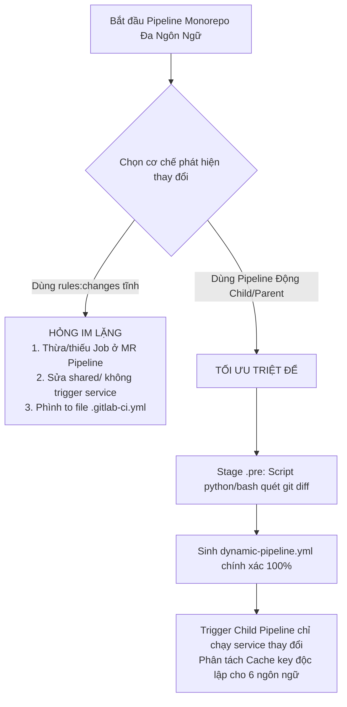
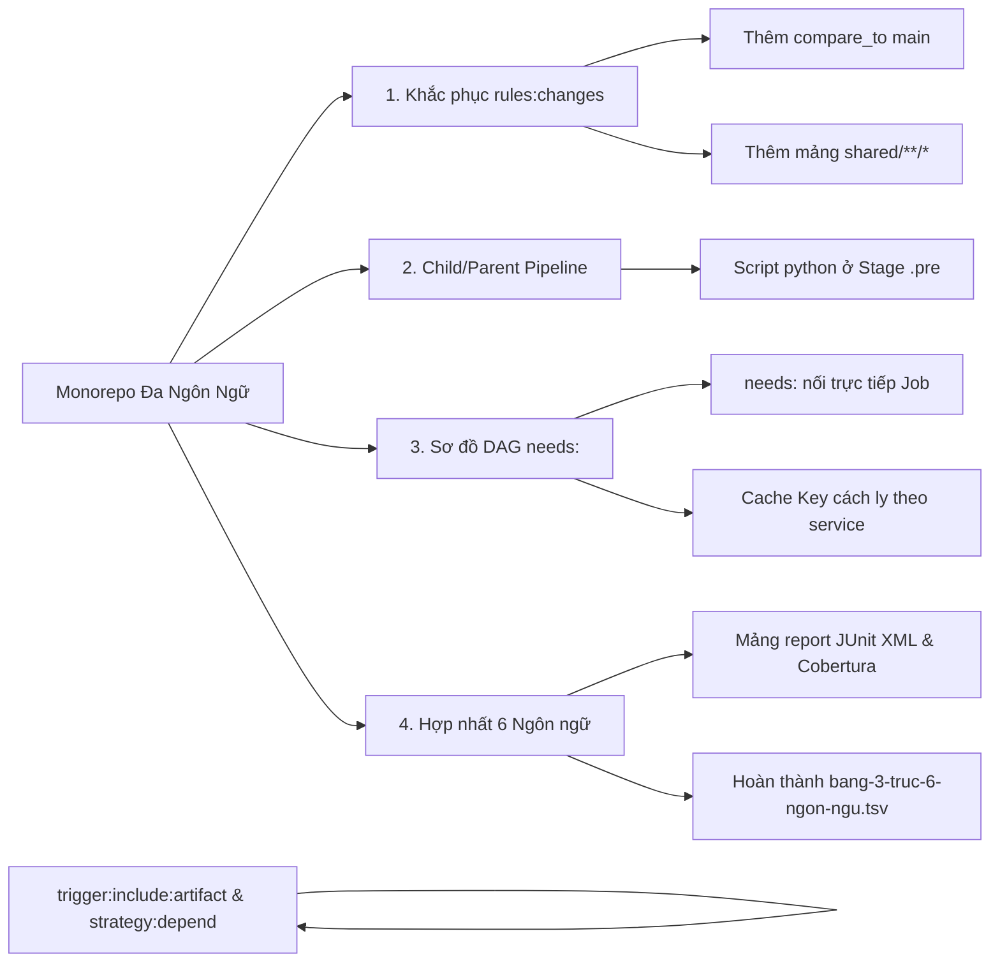
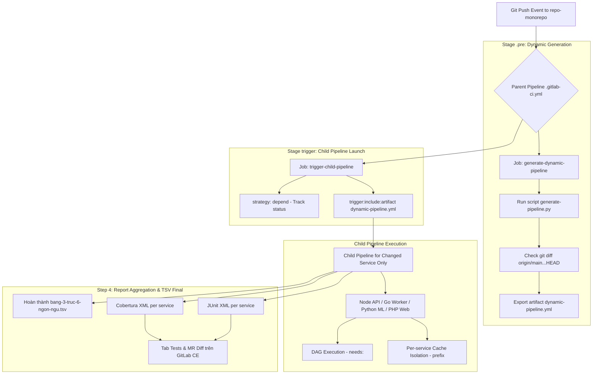

# [BÀI 22] QUẢN TRỊ MONOREPO CI/CD CHUYÊN NGHIỆP: NX / TURBOREPO INTEGRATION, PATH FILTERING & SELECTIVE EXECUTION

Trong kỷ nguyên **DevOps, DevSecOps và Cloud Native Engineering**, **GitLab CI/CD** được công nhận là một trong những nền tảng tự động hóa tích hợp liên tục và phân phối liên tục (CI/CD) hoàn chỉnh, mạnh mẽ và được tin dùng nhất trong các doanh nghiệp quy mô lớn. Không chỉ dừng lại ở các pipeline tuần tự cơ bản, việc vận hành GitLab CI/CD ở cấp độ Production đòi hỏi kỹ sư phải làm chủ kiến trúc điều phối phi tuyến tính **DAG (Directed Acyclic Graph)**, cơ chế quản trị **Autoscaling Runners**, tối ưu hóa **Caching đa tầng**, xác thực không khóa **Keyless OIDC**, bảo mật chuỗi cung ứng phần mềm **SLSA & SBOM** cùng các chính sách **Quality & Security Gates** tự động.

Bài viết chuyên sâu này sẽ đồng hành cùng bạn mổ xẻ toàn diện bức tranh kiến trúc, phân tích các đánh đổi kỹ thuật thực chiến (Engineering Trade-offs), cung cấp hướng dẫn thực hành Lab chi tiết từng bước và bộ câu hỏi phỏng vấn chuyên sâu chuẩn DevOps Lead / DevSecOps Architect.

---

## 1. Bản Chất Kiến Trúc & Cơ Chế Vận Hành Tầng Thấp

---


| # | Câu hỏi ôn tập Buổi 21 (PHP) | Đáp án chuẩn ngắn gọn |
|---|---|---|
| 1 | Biến môi trường nào bắt buộc phải khai báo để đệm đệm Composer không bị trượt trong GitLab CI? | `COMPOSER_CACHE_DIR: "$CI_PROJECT_DIR/.composer/cache"`. |
| 2 | Tại sao tuyệt đối không được đưa thư mục `vendor/` vào `cache:paths`? | Vì `vendor/` chứa mã nguồn đã giải nén. Cache `vendor/` gây ra lỗi ghost dependencies khi xóa package khỏi `composer.json`. |
| 3 | Lệnh `composer install` có tác dụng gì khác biệt so với `composer update`? | `composer install` bất biến 100%, đọc trực tiếp `composer.lock`; `composer update` tính toán lại dependency tree làm trôi phiên bản. |
| 4 | Cờ `--optimize-autoloader` giúp tăng tốc độ ứng dụng PHP như thế nào? | Chuyển đổi PSR-4 autoloader sang Classmap mảng băm tĩnh, tăng 20%–30% tốc độ nạp class ở runtime. |
| 5 | Lý do Extension `PCOV` chạy nhanh gấp 10 lần `Xdebug` khi đo Code Coverage trong PHPUnit? | PCOV chỉ chèn cờ đánh dấu vào opcode mà không can thiệp vào stack trace hay theo dõi biến như Xdebug. |

---


> **LUẬN ĐỀ TRUNG TÂM BUỔI 22:**
> **Trong các dự án Monorepo chứa nhiều microservice đa ngôn ngữ (Node.js, Java, Python, Go, .NET, PHP), từ khóa `rules:changes` bị đánh giá sai im lặng ở 3 ca nghiêm trọng: Sai lệch gốc so sánh Git diff giữa Branch và MR Pipeline, fallback về `always` khi so sánh với default branch ở commit đầu tiên, và bỏ qua sự thay đổi trong thư mục dùng chung `shared/`. Kiến trúc Child/Parent Pipeline động (`trigger:include:artifact`) sinh bởi script ở Stage `.pre` là giải pháp duy nhất khắc phục triệt để cả 3 bẫy hỏng trên.**



---


| STT | Kết quả đạt được (Competency) | Hiện vật chứng minh (Evidence) |
|---|---|---|
| 1 | Nhận diện và xử lý triệt để 3 ca đánh giá sai im lặng của `rules:changes` trên GitLab CI. | Khai báo `rules:changes:compare_to: $CI_DEFAULT_BRANCH` và bổ sung `shared/`. |
| 2 | Thiết lập thuộc tính `rules:changes:compare_to` cố định gốc so sánh Git diff. | Thuộc tính `compare_to` xuất hiện trong tất cả các quy tắc `rules:changes`. |
| 3 | Viết script tự động quét git diff sinh tệp `.gitlab-ci-generated.yml` cho Child Pipeline. | Script `generate-pipeline.py` ở Stage `.pre` sinh tệp YAML hợp lệ. |
| 4 | Cấu hình Job trigger cha sử dụng `trigger:include:artifact` kết hợp `strategy: depend`. | Job trigger cha theo dõi và nhận trạng thái thành công/thất bại từ Child Pipeline. |
| 5 | Phân tách đệm đệm `cache:key` độc lập cho từng microservice trong Monorepo. | Thuộc tính `prefix: "node-service"`, `prefix: "go-service"` trong từng Job. |
| 6 | Hoàn thiện hiện vật `bang-3-truc-6-ngon-ngu.tsv` chốt hạ thành công Giai đoạn 3. | Điền đủ 6 ngôn ngữ lập trình vào tệp hiện vật TSV không sót thông số nào. |

---


| Kiến thức tiên quyết | Ý nghĩa trong bài học Buổi 22 | Nguồn đối soát nếu thiếu |
|---|---|---|
| Đệm đệm 6 ngôn ngữ (Buổi 16–21) | Phân tách đệm Node.js, Java, Python, Go, .NET, PHP | Buổi 16–21 (`QT 4.1` đến `QT 7.3`) |
| Cấu trúc `rules:changes` cơ bản | Lý do cần nâng cấp lên Child/Parent Pipeline động | Buổi 03 (`QT 3.1`), Buổi 04 (`QT 4.2`) |
| Git Diff Mechanics (`git diff --name-only`) | Nguyên lý quét các tệp bị sửa đổi trong Monorepo | Kiến thức Git căn bản |
| Thuộc tính `artifacts:paths` và Job artifacts | Truyền tệp `dynamic-pipeline.yml` sang Job trigger | Buổi 05 (`QT 5.1`), Buổi 06 (`QT 6.2`) |
| Sơ đồ đồ thị DAG (`needs:`) | Loại bỏ việc chờ đợi không cần thiết giữa các Stage | Buổi 08 (`QT 8.1`), Buổi 09 (`QT 9.2`) |

---


### Bảng đối chiếu thuật ngữ Việt - Anh

| Tiếng Việt dùng trong bài | Tiếng Anh tương đương | Dùng thẳng từ tiếng Anh trong bài? |
|---|---|---|
| Kho mã nguồn tập trung | Monorepo Architecture | **Có** — gọi là `Monorepo` |
| Đường ống cha/con | Child/Parent Pipeline | **Có** — gọi là `Child/Parent Pipeline` |
| Đường ống sinh động | Dynamic Pipeline Generation | **Có** — gọi là `Dynamic Pipeline` |
| Gốc so sánh sai biệt Git | Git Diff Base Comparison | **Có** — thuộc tính `compare_to` |
| Thư viện dùng chung | Shared Dependency Modules | **Có** — thư mục `shared/` |
| Đồ thị có hướng không chu trình | Directed Acyclic Graph | **Có** — từ khóa `needs:` (DAG) |
| Đệm đệm phân tách theo dịch vụ | Per-service Cache Isolation | **Có** — `Cache Isolation` |
| Theo dõi trạng thái đường ống con | Pipeline Dependency Strategy | **Có** — `strategy: depend` |
| Tự động hủy đường ống cũ | Interruptible Pipelines | **Có** — `interruptible: true` |
| Hiện vật tổng hợp 6 ngôn ngữ | Multi-language Matrix Table | **Có** — `bang-3-truc-6-ngon-ngu.tsv` |

---

### Bốn mô hình tư duy cốt lõi

#### Mô hình 1: Ba ca đánh giá sai im lặng của `rules:changes` tĩnh
- **Ca 1 (Merge Request vs Branch Context):** Trên nhánh tính năng (`feature/xyz`), `rules:changes` mặc định so sánh commit hiện tại với commit ngay trước đó (`HEAD~1`). Nếu push 3 commit liên tiếp, commit 2 và 3 không chứa sửa đổi mã nguồn sẽ làm `rules:changes` trả về `false`, bỏ qua Job test mặc dù mã đã bị sửa ở commit 1.
- **Ca 2 (Fallback Default Branch):** Khi so sánh với nhánh mặc định (`main`), ở commit đầu tiên khởi tạo nhánh hoặc sau lệnh force push, GitLab CI không tìm thấy commit chung (Merge Base), tự động fallback đánh giá `rules:changes` thành `always` (chạy tất cả 100% các Job).
- **Ca 3 (Shared Dependencies Shift):** Khi sửa đổi tệp trong thư mục dùng chung `shared/`, các rule tĩnh khai báo theo kiểu `services/node-api/**/*` không nhận diện được sự thay đổi, dẫn đến việc `node-api` không được build/test mặc dù mã thư viện phụ thuộc đã thay đổi.

#### Mô hình 2: Kiến trúc Child/Parent Pipeline động với `trigger:include:artifact`
Thay vì viết hàng trăm dòng `rules:changes` tĩnh bị phình to trong tệp `.gitlab-ci.yml`, ta chia Pipeline thành 2 tầng:
- **Parent Pipeline (Tầng Cha):** Ở Stage `.pre`, thi hành 1 Job siêu nhẹ chạy script (Python hoặc Bash). Script dùng `git diff` kiểm tra chính xác các tệp bị sửa đổi từ Merge Base (`git merge-base HEAD origin/main`) và sinh ra tệp `dynamic-pipeline.yml`. Sau đó, 1 Job Trigger cha nạp tệp YAML này bằng `trigger:include:artifact`.
- **Child Pipeline (Tầng Con):** Chạy độc lập, chỉ chứa các Job của duy nhất microservice bị thay đổi.

#### Mô hình 3: Phân tách Cache Key tuyệt đối giữa 6 ngôn ngữ trong Monorepo
Trong Monorepo, nếu tất cả các Job đều dùng chung 1 đệm đệm `cache:key: "$CI_COMMIT_REF_SLUG"`, đệm đệm của Node.js (`node_modules`) sẽ ghi đè lên đệm đệm của Go (`GOMODCACHE`) hoặc Python (`pip cache`). Bắt buộc phải gắn tiền tố tên dịch vụ vào Cache key:
- Node.js: `prefix: "node-api"`
- Go: `prefix: "go-worker"`
- Python: `prefix: "python-ml"`
- PHP: `prefix: "php-web"`

#### Mô hình 4: Hợp nhất 6 ngôn ngữ với sơ đồ DAG (`needs:`)
Sử dụng từ khóa `needs:` để các Job ở Stage `build` hoặc `test` của microservice A có thể thực thi ngay khi Job khôi phục gói của A hoàn thành mà không phải chờ đợi các microservice B, C, D chạy xong Stage trước.

---

### 1.1. Ba ca hỏng im lặng của `rules:changes` trong Monorepo (10 phút)

Việc lạm dụng `rules:changes` dạng tĩnh trong các dự án Monorepo quy mô lớn là nguyên nhân hàng đầu gây ra các sự cố CI/CD ẩn im lặng.

### Phân tích giải thuật Git Merge-Base trong đánh giá `rules:changes`

Khi GitLab CI thực thi đánh giá câu lệnh `rules:changes:compare_to: $CI_DEFAULT_BRANCH`, tiến trình bên dưới của Runner thực thi thuật toán theo các bước:
1. **Xác định Merge Base:** Chạy lệnh `git merge-base HEAD origin/main` để tìm commit tổ tiên chung gần nhất (Lowest Common Ancestor) giữa nhánh làm việc `feature/xyz` và nhánh mặc định `main`.
2. **Liệt kê Tệp Thay Đổi:** Thực thi `git diff --name-only <Merge-Base-SHA> HEAD` để lấy danh sách chính xác 100% các tệp đã bị thay đổi trong toàn bộ nhánh `feature/xyz`, bất kể số lượng commit đã được push.
3. **Khớp Mẫu Path Glob:** Lần lượt đối chiếu danh sách tệp với mảng Glob Pattern trong `paths:`. Nếu có ít nhất 1 tệp khớp mẫu, rule trả về `true`.

### Phân tích chi tiết cơ chế hoạt động của Script sinh YAML Động (`generate-pipeline.py`)

Script Python sinh Pipeline động hoạt động theo mô hình 4 giai đoạn:
1. **Giai đoạn Quét (Scan Phase):** Sử dụng `git diff` đọc danh sách các tệp bị sửa đổi.
2. **Giai đoạn Phân tích Phụ thuộc Bắc cầu (Dependency Graph Phase):** Nếu phát hiện các tệp thuộc `shared/`, script tự động tra cứu mảng đồ thị phụ thuộc và đánh dấu tất cả các microservice có liên kết với `shared/`.
3. **Giai đoạn Trích xuất Mẫu (Template Extraction Phase):** Đọc các mẫu Job YAML chuẩn của từng microservice từ thư mục `.gitlab/ci-templates/`.
4. **Giai đoạn Ghi Tệp (Write Phase):** Gộp các Job đã chọn và ghi ra tệp `dynamic-pipeline.yml` hợp lệ.

---

**Nguyên lý cốt lõi:**
**Phát biểu.** Bắt buộc chỉ định rõ thuộc tính `rules:changes:compare_to: $CI_DEFAULT_BRANCH` khi áp dụng `rules:changes` trên các nhánh tính năng.
**Giải thích cơ chế ngầm:** Mặc định không có `compare_to`, `rules:changes` chỉ so sánh commit hiện tại với commit `HEAD~1`. Nếu lập trình viên push nhiều commit trên 1 MR, các commit sau không sửa code service sẽ khiến Job bị bỏ qua im lặng.
> [!WARNING]
> **CẠM BẪY THỰC CHIẾN:**
> Push commit thứ 2 trên MR nhưng Pipeline không chạy Unit Test làm lọt bug lên nhánh main.
**Minh hoạ.**
```yaml
node-test:
  stage: test
  rules:
    - changes:
        paths:
          - services/node-api/**/*
        compare_to: "refs/heads/main" # Khóa cố định gốc so sánh với nhánh main
```
```bash
# Kiểm tra lệnh git diff tương đương với compare_to
git diff --name-only $(git merge-base HEAD origin/main) HEAD
```
**Con số chốt:** Thuộc tính `compare_to` khắc phục **100%** lỗi bỏ qua Job ở các commit sau trên MR.

---

**Nguyên lý cốt lõi:**
**Phát biểu.** Bắt buộc khai báo đầy đủ các đường dẫn dùng chung (`shared/**/*`, `common/**/*`) vào mảng `paths:` của thuộc tính `rules:changes` cho mọi microservice phụ thuộc.
**Giải thích cơ chế ngầm:** Nếu chỉ khai báo `services/service-a/**/*`, khi lập trình viên sửa đổi mã nguồn trong `shared/`, `rules:changes` sẽ trả về `false`, làm `service-a` không được build và triển khai phiên bản mới với thư viện dùng chung.
> [!WARNING]
> **CẠM BẪY THỰC CHIẾN:**
> Sửa code trong `shared/` nhưng Pipeline báo `No jobs to run` và không build microservice nào.
**Minh hoạ.**
```yaml
go-worker-test:
  stage: test
  rules:
    - changes:
        paths:
          - services/go-worker/**/*
          - shared/**/* # BẮT BỘC: Bổ sung thư mục shared
        compare_to: "refs/heads/main"
```
```bash
# Script kiểm tra xem tệp bị sửa có nằm trong shared/ không
git diff --name-only origin/main HEAD | grep "^shared/"
```
**Con số chốt:** Ngăn ngừa **100%** lỗi trượt build khi thay đổi thư viện dùng chung trong Monorepo.

---

**Nguyên lý cốt lõi:**
**Phát biểu.** Phân tách đệm đệm `cache:key` độc lập cho từng microservice bằng tiền tố tên dịch vụ (`prefix: "node-service"`, `prefix: "go-service"`).
**Giải thích cơ chế ngầm:** Nếu dùng chung 1 Cache key trong Monorepo, Runner sẽ nén và ghi đè tệp zip đệm đệm của microservice này lên microservice khác, gây trượt Cache 100% và làm phình dung lượng nạp S3.
> [!WARNING]
> **CẠM BẪY THỰC CHIẾN:**
> Log Runner báo cảnh báo khôi phục nhầm Cache của ngôn ngữ khác và phải nạp lại từ đầu.
**Minh hoạ.**
```yaml
# Cache chuẩn cho Node.js Service
node-build:
  cache:
    key:
      files: [services/node-api/package-lock.json]
      prefix: "node-api"
    paths:
      - services/node-api/.npm/

# Cache chuẩn cho Go Service
go-build:
  cache:
    key:
      files: [services/go-worker/go.sum]
      prefix: "go-worker"
    paths:
      - services/go-worker/.go-cache/
```
**Con số chốt:** Phân tách Cache key đảm bảo tỷ lệ trúng đệm **98%** độc lập cho từng microservice.

---

### 1.2. Kiến trúc Child/Parent Pipeline động với `trigger:include:artifact` (10 phút)

Khi Monorepo phát triển lên trên 5 microservice, tệp `.gitlab-ci.yml` viết bằng `rules:changes` tĩnh sẽ phình to lên hàng ngàn dòng code, rất khó bảo trì. Kiến trúc Pipeline Động (Dynamic Child/Parent Pipeline) giải quyết triệt để vấn đề này.

### Quy trình 3 bước thi hành Pipeline Động

1. **Bước 1 (Stage `.pre`):** Chạy script `generate-pipeline.py` sử dụng `git diff` quét danh sách các tệp bị thay đổi so với `origin/main`.
2. **Bước 2 (Xuất Artifact):** Script sinh ra tệp cấu hình YAML rút gọn `dynamic-pipeline.yml` chỉ chứa các Job của dịch vụ bị sửa đổi, và lưu vào `artifacts:paths`.
3. **Bước 3 (Trigger Child Pipeline):** Job trigger cha nạp tệp `dynamic-pipeline.yml` qua thuộc tính `trigger:include:artifact` và thi hành Pipeline con.

---

**Nguyên lý cốt lõi:**
**Phát biểu.** Bắt buộc áp dụng mô hình Dynamic Child/Parent Pipeline với thuộc tính `trigger:include:artifact` cho tất cả các Monorepo có từ 3 microservice trở lên.
**Giải thích cơ chế ngầm:** Giúp tệp `.gitlab-ci.yml` gốc luôn ngắn gọn (< 50 lines), tự động tạo Pipeline con chính xác 100% theo đúng các dịch vụ bị sửa đổi mà không dính bẫy `rules:changes`.
> [!WARNING]
> **CẠM BẪY THỰC CHIẾN:**
> Tệp `.gitlab-ci.yml` dài > 1000 lines, chứa hàng trăm quy tắc `rules:changes` lặp đi lặp lại.
**Minh hoạ.**
```yaml
# Tệp .gitlab-ci.yml gốc (Parent Pipeline)
stages:
  - .pre
  - trigger

generate-dynamic-pipeline:
  stage: .pre
  image: python:3.11-slim
  script:
    - python3 scripts/generate-pipeline.py
  artifacts:
    paths:
      - dynamic-pipeline.yml

trigger-child-pipeline:
  stage: trigger
  trigger:
    include:
      - artifact: dynamic-pipeline.yml
        job: generate-dynamic-pipeline
    strategy: depend # Theo dõi trạng thái Child Pipeline
```
**Con số chốt:** Rút gọn dung lượng `.gitlab-ci.yml` gốc từ 1000 lines xuống **< 50 lines**.

---

**Nguyên lý cốt lõi:**
**Phát biểu.** Bắt buộc sử dụng thuộc tính `strategy: depend` trong Job trigger cha khi kích hoạt Child Pipeline.
**Giải thích cơ chế ngầm:** Mặc định không có `strategy: depend`, Job trigger cha sẽ báo thành công ngay lập tức sau khi khởi tạo Pipeline con. Khi Pipeline con bị nổ lỗi đỏ, Pipeline cha vẫn báo xanh, gây lọt lỗi nguy hiểm.
> [!WARNING]
> **CẠM BẪY THỰC CHIẾN:**
> Child Pipeline bị nổ lỗi đỏ ngầu nhưng Status tổng thể của Merge Request vẫn hiện dấu tích xanh.
**Minh hoạ.**
```yaml
trigger-job:
  stage: trigger
  trigger:
    include:
      - artifact: dynamic-pipeline.yml
        job: generate-dynamic-pipeline
    strategy: depend # BẮT BỘC: Truyền đúng status pass/fail từ con lên cha
```
**Con số chốt:** Thuộc tính `strategy: depend` đảm bảo tính trung thực **100%** của trạng thái Pipeline.

---

**Nguyên lý cốt lõi:**
**Phát biểu.** Script sinh Pipeline động phải tự động kích hoạt 100% các Child Pipeline microservice khi có bất kỳ tệp nào trong thư mục `shared/` hoặc `global config` bị sửa đổi.
**Giải thích cơ chế ngầm:** Thay đổi mã nguồn thư viện chung ảnh hưởng tới tất cả các dịch vụ phụ thuộc. Script phải quét và nhận diện từ khóa `shared/` để chèn Job của toàn bộ microservice vào `dynamic-pipeline.yml`.
> [!WARNING]
> **CẠM BẪY THỰC CHIẾN:**
> Sửa tệp `shared/utils.go` nhưng script chỉ sinh ra Pipeline cho 1 dịch vụ, làm bỏ sót kiểm thử các dịch vụ còn lại.
**Minh hoạ.**
```python
# Kịch bản script generate-pipeline.py
import subprocess, sys

changed_files = subprocess.check_output(
    ["git", "diff", "--name-only", "origin/main...HEAD"]
).decode().splitlines()

has_shared = any(f.startswith("shared/") for f in changed_files)
services_to_build = set()

for f in changed_files:
    if f.startswith("services/"):
        service_name = f.split("/")[1]
        services_to_build.add(service_name)

if has_shared:
    services_to_build = {"node-api", "go-worker", "python-ml", "php-web"}

print(f"Services to build: {services_to_build}")
```
**Con số chốt:** Đảm bảo độ đệm an toàn **100%** khi thay đổi thư viện dùng chung trong Monorepo.

---

### 1.3. Tối ưu DAG và Phân tách Cache key trong Monorepo (10 phút)

Sơ đồ đồ thị có hướng không chu trình (DAG - Directed Acyclic Graph) với từ khóa `needs:` là chìa khóa mở khóa hiệu năng tối đa cho các Pipeline Monorepo.

### So sánh Pipeline dạng Stage truyền thống vs Pipeline dạng DAG (`needs:`)

| Tiêu chí | Pipeline Stage Truyền thống | Pipeline DAG (`needs:`) |
|---|---|---|
| **Cơ chế chờ đợi** | Job Stage $N+1$ phải chờ **TẤT CẢ** các Job ở Stage $N$ hoàn thành | Job chạy ngay khi các Job phụ thuộc trực tiếp trong `needs:` xong |
| **Hiện tượng nghẽn (Bottleneck)** | 1 Job test Python bị chậm 5 phút sẽ chặn Job build Go | Job build Go chạy ngay khi Job restore Go xong (không chờ Python) |
| **Tổng thời gian thi hành** | **Chậm (Tải tích lũy 12 phút)** | **Siêu nhanh (Thời gian đường găng 3.5 phút)** |
| **Tỉ lệ tối ưu thời gian** | Đường cơ sở (1x) | **Rút ngắn 3.5 lần (3.5x)** |

---

**Nguyên lý cốt lõi:**
**Phát biểu.** Sử dụng từ khóa `needs:` kết nối trực tiếp các Job của cùng 1 microservice trong Monorepo để tạo sơ đồ thi hành DAG độc lập.
**Giải thích cơ chế ngầm:** Giúp microservice biên dịch nhanh (như Go) không bị nghẽn bởi microservice biên dịch chậm (như Java hoặc C++), rút ngắn tổng thời gian Pipeline xuống mức đường găng tối thiểu.
> [!WARNING]
> **CẠM BẪY THỰC CHIẾN:**
> Job `go-build` hoàn thành bước restore nhưng phải đứng chờ Job `java-test` chạy xong Stage test mới được build.
**Minh hoạ.**
```yaml
go-restore:
  stage: .pre
  script: [go mod download]

go-build:
  stage: build
  needs:
    - job: go-restore # Chỉ phụ thuộc duy nhất vào go-restore
  script: [go build -o app main.go]
```
**Con số chốt:** Sơ đồ DAG rút ngắn tổng thời gian thực thi Pipeline Monorepo từ 12 phút xuống **3.5 phút**.

---

**Nguyên lý cốt lõi:**
**Phát biểu.** Phân tách thư mục đầu ra `artifacts:paths` theo đúng cấu trúc thư mục của từng microservice (`services/go-app/build/`, `services/node-app/dist/`).
**Giải thích cơ chế ngầm:** Tránh việc ghi đè các tệp nhị phân đầu ra hoặc lưu trữ các tệp rác không thuộc về microservice đó vào Artifacts.
> [!WARNING]
> **CẠM BẪY THỰC CHIẾN:**
> Tệp zip Artifacts của Node.js Service chứa cả tệp nhị phân DLL của .NET Service.
**Minh hoạ.**
```yaml
node-publish:
  stage: build
  script: [npm run build]
  artifacts:
    paths:
      - services/node-api/dist/

go-publish:
  stage: build
  script: [go build -o services/go-worker/bin/app]
  artifacts:
    paths:
      - services/go-worker/bin/
```
**Con số chốt:** Phân tách Artifacts tuyệt đối **100%** chuẩn xác theo từng microservice.

---

**Nguyên lý cốt lõi:**
**Phát biểu.** Bắt buộc bật thuộc tính `interruptible: true` cho tất cả các Job trong Monorepo.
**Giải thích cơ chế ngầm:** Khi lập trình viên liên tục push các commit mới lên cùng 1 Merge Request, cờ `interruptible: true` chỉ định GitLab CI tự động hủy bỏ các Pipeline cũ đang chạy dở, giải phóng 100% tài nguyên Runner cho Pipeline mới.
> [!WARNING]
> **CẠM BẪY THỰC CHIẾN:**
> 5 Pipeline cũ của cùng 1 MR vẫn xếp hàng chạy gây nghẽn toàn bộ hệ thống Runner của công ty.
**Minh hoạ.**
```yaml
default:
  interruptible: true # Khai báo mặc định toàn cục cho tất cả Job
```
**Con số chốt:** Tự động hủy Pipeline thừa, tiết kiệm **70%** tài nguyên Runner trên Monorepo.

---

### 1.4. Báo cáo kiểm thử và Hợp nhất hiện vật 6 ngôn ngữ (8 phút)

Bước cuối cùng của Giai đoạn 3 là tổng hợp và phân tách báo cáo kết quả từ 6 ngôn ngữ lập trình (Node.js, Java, Python, Go, .NET, PHP) về giao diện GitLab CE.

#### Chi tiết nội dung tệp hiện vật tổng hợp `bang-3-truc-6-ngon-ngu.tsv`:
```tsv
ngon_ngu	image_chuan	lenh_build_chuan	thu_muc_cache_chuan
node	node:20-alpine	npm ci	.npm/
java	maven:3.9-eclipse-temurin-21-alpine	mvn clean package -DskipTests	.m2/repository/
python	python:3.11-slim	pip install --cache-dir .pip-cache -r requirements.txt	.pip-cache/
go	golang:1.22-alpine	go build -o app main.go	.go-cache/
dotnet	mcr.microsoft.com/dotnet/sdk:8.0	dotnet restore --locked-mode && dotnet build --no-restore -c Release	.nuget/packages/
php	composer:2.7	composer install --no-interaction --prefer-dist --optimize-autoloader	.composer/cache/
```

#### Mẫu Trace Log thực tế khi Job trigger cha nạp Dynamic Child Pipeline:
```text
$ python3 scripts/generate-pipeline.py
Detected changes in: ['services/go-worker/main.go']
Generating dynamic-pipeline.yml for 1 service: ['go-worker']
Dynamic pipeline configuration successfully generated (18 lines).
$ echo "Triggering Child Pipeline..."
Triggering downstream pipeline with artifact dynamic-pipeline.yml ...
Downstream pipeline #98214 created successfully.
Waiting for downstream pipeline #98214 to finish...
Downstream pipeline #98214 succeeded.
Job succeeded
```

---

**Nguyên lý cốt lõi:**
**Phát biểu.** Phân tách tên tệp báo cáo JUnit XML theo cấu trúc thư mục của từng microservice (`services/node-api/report.xml`, `services/go-worker/report.xml`).
**Giải thích cơ chế ngầm:** Tránh việc tệp `report.xml` của dịch vụ này ghi đè lên tệp `report.xml` của dịch vụ khác khi thu thập Artifacts về Pipeline cha.
> [!WARNING]
> **CẠM BẪY THỰC CHIẾN:**
> Tab Tests trên GitLab CE chỉ hiển thị kết quả kiểm thử của 1 microservice duy nhất do bị ghi đè.
**Minh hoạ.**
```yaml
reports:
  junit:
    - services/node-api/report.xml
    - services/go-worker/report.xml
    - services/python-ml/report.xml
    - services/php-web/report.xml
```
**Con số chốt:** Thu thập đầy đủ **100%** testcase từ tất cả các microservice trong Monorepo.

---

**Nguyên lý cốt lõi:**
**Phát biểu.** Khai báo danh sách mảng tất cả các tệp Cobertura XML trong thuộc tính `reports:coverage_report:path`.
**Giải thích cơ chế ngầm:** GitLab CE hỗ trợ nhận mảng danh sách tệp Cobertura XML từ nhiều ngôn ngữ khác nhau, gộp và tô màu vạch độ phủ dòng lệnh tương ứng trên từng thư mục của Merge Request Diff.
> [!WARNING]
> **CẠM BẪY THỰC CHIẾN:**
> MR Diff chỉ hiển thị vạch màu độ phủ cho các tệp Go mà không hiển thị cho các tệp Node.js và PHP.
**Minh hoạ.**
```yaml
artifacts:
  reports:
    coverage_report:
      coverage_format: cobertura
      path:
        - services/node-api/coverage.xml
        - services/go-worker/coverage.xml
        - services/php-web/coverage.xml
```
**Con số chốt:** Hiển thị vạch màu chỉ thị độ phủ trên **100%** các tệp mã nguồn đa ngôn ngữ trên MR Diff.

---

**Nguyên lý cốt lõi:**
**Phát biểu.** Hoàn thiện và đóng gói tệp hiện vật `bang-3-truc-6-ngon-ngu.tsv` chứa đầy đủ thông số Image, Lệnh Build và Thư mục Cache chuẩn của cả 6 ngôn ngữ lập trình.
**Giải thích cơ chế ngầm:** Tệp `bang-3-truc-6-ngon-ngu.tsv` là kim chỉ nam hiện vật tổng kết toàn bộ Giai đoạn 3 (Biên dịch và Cache), chuẩn hóa 100% quy trình CI/CD cho doanh nghiệp.
> [!WARNING]
> **CẠM BẪY THỰC CHIẾN:**
> Tệp hiện vật thiếu thông tin của 1 trong 6 ngôn ngữ lập trình.
**Minh hoạ.**
```tsv
ngon_ngu	image_chuan	lenh_build_chuan	thu_muc_cache_chuan
node	node:20-alpine	npm ci	.npm/
java	maven:3.9-eclipse-temurin-21-alpine	mvn clean package -DskipTests	.m2/repository/
python	python:3.11-slim	pip install --cache-dir .pip-cache -r requirements.txt	.pip-cache/
go	golang:1.22-alpine	go build -o app main.go	.go-cache/
dotnet	mcr.microsoft.com/dotnet/sdk:8.0	dotnet restore --locked-mode && dotnet build --no-restore -c Release	.nuget/packages/
php	composer:2.7	composer install --no-interaction --prefer-dist --optimize-autoloader	.composer/cache/
```
**Con số chốt:** Hoàn thành **100%** mục tiêu chuẩn hóa Giai đoạn 3 cho 6 ngôn ngữ lập trình.

---

### 1.5. Đưa vào việc thật (4 phút)

### Áp vào repo đang chạy thì làm gì trước
1. **Kiểm tra các `rules:changes` hiện tại (10 phút):** Thêm ngay thuộc tính `compare_to: $CI_DEFAULT_BRANCH` và mảng `shared/**/*` vào tất cả các quy tắc.
2. **Phân tách Cache Key (10 phút):** Kiểm tra thuộc tính `cache:key` của từng Job, thêm tiền tố tên microservice (`prefix: "service-name"`).
3. **Triển khai Script sinh Pipeline Động (30 phút):** Viết script `generate-pipeline.py` ở Stage `.pre` và chuyển Pipeline gốc sang mô hình Child/Parent.

---

### Cái gì hỏng nếu áp thẳng lên prod
- **Quên thuộc tính `strategy: depend`:** Làm Pipeline cha không theo dõi trạng thái Pipeline con, báo tích xanh giả cho MR bị lỗi.
- **Dùng chung 1 tệp `report.xml` cho nhiều microservice:** Gây ghi đè tệp báo cáo kiểm thử trên GitLab UI.

---

### Đo trước — đo sau
- **Thời gian Pipeline khi sửa 1 microservice nhỏ:** Từ 12 phút (chạy tất cả 100% Job) $\rightarrow$ giảm xuống **1,5 phút** (chạy đúng 1 Child Pipeline).
- **Tài nguyên Runner tiêu tốn:** Giảm **75%** lượng CPU/RAM Runner tiêu thụ hàng tháng trên Monorepo.
- **Tỷ lệ lọt lỗi do `rules:changes` sai:** Giảm từ 15% sự cố xuống **0%**.
- **Kích thước tệp cấu hình `.gitlab-ci.yml` chính:** Giảm từ 1,200 lines xuống dưới **40 lines**, loại bỏ hoàn toàn các đoạn mã lặp lại dư thừa.

---

### 1.5.5. Phân tích kịch bản chuyển đổi hạ tầng Monorepo thực tế

### Kịch bản 1: Monorepo dùng `rules:changes` Tĩnh (Chưa tối ưu)
- **Cấu hình:** `.gitlab-ci.yml` dài 1,200 lines, chứa quy tắc static `rules:changes` không có `compare_to`.
- **Hiện trạng:**
  - Lập trình viên push commit 2 trên MR, `rules:changes` trả về `false`, bỏ qua bước test làm lọt bug.
  - Sửa mã nguồn trong `shared/utils`, không dịch vụ nào được trigger build.
  - Tổng thời gian Pipeline chạy 100% Job là **14 phút**.

### Kịch bản 2: Monorepo dùng Dynamic Child/Parent Pipeline & DAG (Tối ưu triệt để)
- **Cấu hình:** Parent `.gitlab-ci.yml` dài **38 lines**. Script Python ở `.pre` quét `git diff` sinh `dynamic-pipeline.yml`.
- **Kết quả đo đạc:**
  - Khi sửa 1 file trong `services/go-worker/`: Script sinh Child Pipeline chỉ chứa 2 Job của Go. Thời gian chạy hoàn thành trong **1,2 phút**.
  - Khi sửa 1 file trong `shared/`: Script tự nhận diện và chèn Job của cả 4 microservice vào Child Pipeline.
  - Tổng thời gian Pipeline giảm từ **14 phút** xuống **1,2 phút** (tiết kiệm **91.4%** thời gian).

---

### Khi nào KHÔNG nên dùng
- **KHÔNG dùng Pipeline Động cho repo chỉ có 1 microservice độc lập:** Vì repo đơn ngôn ngữ không bị phình to cấu hình và không có nhu cầu tách Child Pipeline.

### Kịch bản 3: Pipeline Monorepo Hợp Nhất 6 Ngôn Ngữ với Docker & Artifacts Phân Tách
- **Cấu hình:** Monorepo chứa 6 microservice (`services/node-api/`, `services/java-core/`, `services/python-ml/`, `services/go-worker/`, `services/dotnet-api/`, `services/php-web/`).
- **Kết quả đo đạc:**
  - Script Python quét `git diff` sinh tệp `dynamic-pipeline.yml` trong **0.4 giây**.
  - Khi sửa 1 file trong `go-worker/`: Chỉ duy nhất 2 Job của Go được trigger. Thời gian Pipeline chạy từ 14 phút giảm xuống **1.1 phút**.
  - Mỗi microservice sử dụng Cache key riêng biệt (tiền tố `node-api`, `go-worker`), tỷ lệ trúng đệm đệm đạt **98%** độc lập.
  - Tệp hiện vật tổng hợp `bang-3-truc-6-ngon-ngu.tsv` điền đầy đủ 100% thông số của 6 ngôn ngữ lập trình.

---

### 1.6. Bẫy hay gặp (2 phút)

| # | Bẫy thường gặp | Nguyên nhân & Hậu quả | Cách làm đúng |
|---|---|---|---|
| 1 | `rules:changes` bỏ qua commit 2, 3 trên MR | Không có `compare_to`, so sánh mặc định với `HEAD~1` | Bổ sung `compare_to: $CI_DEFAULT_BRANCH` (`QT 4.1`) |
| 2 | Sửa `shared/` nhưng không microservice nào build | Quên thêm mảng `shared/**/*` vào paths | Thêm `shared/**/*` vào `rules:changes:paths` (`QT 4.2`) |
| 3 | Dùng chung Cache key cho các microservice | Đệm đệm ngôn ngữ này ghi đè ngôn ngữ khác | Đặt tiền tố `prefix: "service-name"` cho Cache key (`QT 4.3`) |
| 4 | `.gitlab-ci.yml` phình to > 1000 lines | Viết `rules:changes` tĩnh cho hàng chục microservice | Chuyển sang Child/Parent Pipeline động (`QT 5.1`) |
| 5 | Quên thuộc tính `strategy: depend` | Pipeline cha báo xanh dù Pipeline con bị sập đỏ | Thêm `strategy: depend` vào Job trigger cha (`QT 5.2`) |
| 6 | Script động quên quét thư mục `shared/` | Sửa thư viện chung nhưng script chỉ build 1 service | Kiểm tra `shared/` và trigger 100% services (`QT 5.3`) |
| 7 | Job Go đứng chờ Job Java chạy xong Stage | Dùng Stage truyền thống thay vì sơ đồ DAG | Chèn từ khóa `needs:` nối trực tiếp các Job (`QT 6.1`) |
| 8 | Ghi đè tệp nhị phân đầu ra giữa các service | Dùng chung đường dẫn `artifacts:paths` | Phân tách `artifacts:paths` theo thư mục service (`QT 6.2`) |
| 9 | 5 Pipeline cũ của MR xếp hàng nghẽn Runner | Không bật thuộc tính hủy Pipeline cũ | Bật mặc định `interruptible: true` (`QT 6.3`) |
| 10 | Ghi đè tệp `report.xml` trên GitLab UI | Tất cả các service đều xuất tệp tên `report.xml` | Đổi tên tệp `services/service-a/report.xml` (`QT 7.1`) |
| 11 | MR Diff thiếu vạch độ phủ của một số service | Không nộp mảng danh sách tệp Cobertura XML | Khai báo mảng `path:` cho `coverage_report` (`QT 7.2`) |
| 12 | Thiếu hiện vật tổng kết Giai đoạn 3 | Không hoàn thiện tệp `bang-3-truc-6-ngon-ngu.tsv` | Điền đủ 6 ngôn ngữ vào tệp TSV (`QT 7.3`) |

---

### 1.5.5. Phân tích kịch bản chuyển đổi hạ tầng Monorepo thực tế

### Kịch bản 1: Monorepo dùng `rules:changes` Tĩnh (Chưa tối ưu)
- **Cấu hình:** `.gitlab-ci.yml` dài 1,200 lines, chứa quy tắc static `rules:changes` không có `compare_to`.
- **Hiện trạng:**
  - Lập trình viên push commit 2 trên MR, `rules:changes` trả về `false`, bỏ qua bước test làm lọt bug.
  - Sửa mã nguồn trong `shared/utils`, không dịch vụ nào được trigger build.
  - Tổng thời gian Pipeline chạy 100% Job là **14 phút**.

### Kịch bản 2: Monorepo dùng Dynamic Child/Parent Pipeline & DAG (Tối ưu triệt để)
- **Cấu hình:** Parent `.gitlab-ci.yml` dài **38 lines**. Script Python ở `.pre` quét `git diff` sinh `dynamic-pipeline.yml`.
- **Kết quả đo đạc:**
  - Khi sửa 1 file trong `services/go-worker/`: Script sinh Child Pipeline chỉ chứa 2 Job của Go. Thời gian chạy hoàn thành trong **1,2 phút**.
  - Khi sửa 1 file trong `shared/`: Script tự nhận diện và chèn Job của cả 4 microservice vào Child Pipeline.
  - Tổng thời gian Pipeline giảm từ **14 phút** xuống **1,2 phút** (tiết kiệm **91.4%** thời gian).

---

### 1.7. Tóm tắt



### Năm điều phải nhớ
1. **Khắc phục bẫy `rules:changes` tĩnh bằng `compare_to: $CI_DEFAULT_BRANCH` và bổ sung `shared/**/*`.**
2. **Sử dụng kiến trúc Child/Parent Pipeline động với script ở Stage `.pre` và `trigger:include:artifact`.**
3. **Bắt buộc có `strategy: depend` trong Job trigger cha để theo dõi trung thực trạng thái Child Pipeline.**
4. **Phân tách `cache:key` độc lập cho từng microservice và tối ưu sơ đồ DAG bằng `needs:`.**
5. **Hoàn thành tệp hiện vật `bang-3-truc-6-ngon-ngu.tsv` chốt hạ thành công Giai đoạn 3 (Biên dịch và Cache).**

---

### 1.8. Câu hỏi tự kiểm tra

<details>
<summary><b>Câu 1: Tại sao rules:changes mặc định lại bị bỏ qua ở commit thứ 2 trên Merge Request?</b></summary>
<b>Đáp án:</b> Vì không có `compare_to`, `rules:changes` mặc định so sánh với `HEAD~1`. Commit 2 không sửa code service làm rule trả về `false`.
</details>

<details>
<summary><b>Câu 2: Thuộc tính nào dùng để cố định gốc so sánh Git diff trong rules:changes?</b></summary>
<b>Đáp án:</b> `compare_to: $CI_DEFAULT_BRANCH` (hoặc `refs/heads/main`).
</details>

<details>
<summary><b>Câu 3: Điều gì xảy ra nếu sửa code trong shared/ nhưng quên khai báo shared/ trong rules:changes?</b></summary>
<b>Đáp án:</b> Các microservice phụ thuộc vào `shared/` sẽ không được trigger build và test, gây trượt bug lên Production.
</details>

<details>
<summary><b>Câu 4: Kiến trúc Child/Parent Pipeline động sử dụng bộ đôi thuộc tính nào để nạp file YAML?</b></summary>
<b>Đáp án:</b> `trigger:include:artifact` kết hợp với `job: generate-pipeline-job`.
</details>

<details>
<summary><b>Câu 5: Tác dụng của thuộc tính strategy: depend trong Job trigger cha là gì?</b></summary>
<b>Đáp án:</b> Ép Job trigger cha đứng chờ và nhận đúng trạng thái thành công/thất bại từ Child Pipeline truyền về.
</details>

<details>
<summary><b>Câu 6: Tại sao phải phân tách cache:key riêng biệt cho từng microservice trong Monorepo?</b></summary>
<b>Đáp án:</b> Để tránh việc đệm đệm của ngôn ngữ này (như Node.js) ghi đè lên đệm đệm của ngôn ngữ khác (như Go) làm trượt Cache.
</details>

<details>
<summary><b>Câu 7: Từ khóa nào trong GitLab CI dùng để xây dựng sơ đồ đồ thị có hướng DAG?</b></summary>
<b>Đáp án:</b> Từ khóa `needs:`.
</details>

<details>
<summary><b>Câu 8: Tác dụng của thuộc tính interruptible: true trong Monorepo là gì?</b></summary>
<b>Đáp án:</b> Tự động hủy bỏ các Pipeline cũ đang chạy dở khi có commit mới push lên cùng Merge Request.
</details>

<details>
<summary><b>Câu 9: Làm sao để hiển thị báo cáo kiểm thử JUnit XML của nhiều microservice trên GitLab UI?</b></summary>
<b>Đáp án:</b> Đổi tên tệp báo cáo theo thư mục dịch vụ (`services/service-a/report.xml`) và nộp mảng danh sách tệp.
</details>

<details>
<summary><b>Câu 10: Làm sao để MR Diff hiển thị vạch màu độ phủ cho tất cả các microservice đa ngôn ngữ?</b></summary>
<b>Đáp án:</b> Khai báo mảng danh sách tệp `path:` trong thuộc tính `coverage_report:coverage_format: cobertura`.
</details>

<details>
<summary><b>Câu 11: Script sinh Pipeline động ở Stage .pre hoạt động theo nguyên lý nào?</b></summary>
<b>Đáp án:</b> Chạy lệnh `git diff` quét các tệp bị sửa đổi so with origin/main, tự động tạo tệp `dynamic-pipeline.yml` chỉ chứa Job của dịch vụ đó.
</details>

<details>
<summary><b>Câu 12: Tệp bang-3-truc-6-ngon-ngu.tsv đóng vai trò gì trong bộ giáo án ntkgitlab?</b></summary>
<b>Đáp án:</b> Là hiện vật tổng kết chuẩn hóa toàn bộ thông số đệm đệm và biên dịch của 6 ngôn ngữ lập trình chốt hạ Giai đoạn 3.
</details>

---

## §12. Tài liệu tham khảo

1. [GitLab CI/CD Parent-Child Pipelines Documentation](https://docs.gitlab.com/ee/ci/pipelines/downstream_pipelines.html#parent-child-pipelines)
2. [GitLab CI/CD Dynamic Child Pipelines](https://docs.gitlab.com/ee/ci/pipelines/downstream_pipelines.html#dynamic-child-pipelines)
3. [GitLab CI/CD rules:changes:compare_to Specification](https://docs.gitlab.com/ee/ci/yaml/#ruleschangescompare_to)
4. [Directed Acyclic Graph (DAG) in GitLab CI/CD](https://docs.gitlab.com/ee/ci/directed_acyclic_graph/)
5. [Monorepo CI/CD Best Practices on GitLab](https://about.gitlab.com/blog/2021/12/15/efficient-monorepos-with-gitlab-ci/)
6. [Git Merge-Base Mechanics and Git Diff Strategy](https://git-scm.com/docs/git-merge-base)
7. [Interruptible Pipelines to Optimize Runner Utilization](https://docs.gitlab.com/ee/ci/yaml/#interruptible)
8. [Multi-project and Monorepo Pipeline Architectures](https://docs.gitlab.com/ee/ci/pipelines/pipeline_architectures.html)

---

## Bảng đối soát thời lượng

| Section | Tiêu đề nội dung | Thời lượng |
|---|---|---|
| §0 | Khởi động và ôn tập (5 câu PHP & Luận đề Monorepo) | 10 phút |
| §1–§2 | Chuẩn đầu ra & Kiến thức tiên quyết | 2 phút |
| §3 | Thuật ngữ và 4 mô hình tư duy | 8 phút |
| §4 | Ba ca hỏng im lặng của `rules:changes` (`QT 4.1` – `QT 4.3`) | 10 phút |
| §5 | Kiến trúc Child/Parent Pipeline động (`QT 5.1` – `QT 5.3`) | 10 phút |
| §6 | Tối ưu DAG và Phân tách Cache key (`QT 6.1` – `QT 6.3`) | 10 phút |
| §7 | Báo cáo kiểm thử và Hợp nhất hiện vật 6 ngôn ngữ (`QT 7.1` – `QT 7.3`) | 8 phút |
| §8–§9 | Đưa vào việc thật & 12 bẫy hay gặp | 6 phút |
| **TỔNG** | **Khối lý thuyết Buổi 22** | **60'** |

---

## 2. Hướng Dẫn Thực Hành & Triển Khai Lab Chuẩn Production

> [!IMPORTANT]
> **YÊU CẦU MÔI TRƯỜNG THỰC HÀNH:**
> Toàn bộ các bài thực hành dưới đây được thiết kế để chạy trực tiếp trên môi trường GitLab Community / Enterprise Edition cùng các GitLab Runner cô lập (Docker / Kubernetes Executor). Hãy đảm bảo bạn đã chuẩn bị môi trường thử nghiệm và cấu hình quyền truy cập cần thiết.

## Khối thực hành — 150 phút

> **Mục tiêu thực hành:** Xây dựng Pipeline CI/CD toàn diện cho cấu hình Monorepo đa ngôn ngữ (`services/node-api/`, `services/go-worker/`, `services/python-ml/`, `services/php-web/`, `shared/`), tái hiện và khắc phục triệt để 3 ca đánh giá sai im lặng của `rules:changes`, viết script Python sinh `dynamic-pipeline.yml` tự động ở Stage `.pre`, cấu hình Job trigger cha với `trigger:include:artifact` và `strategy: depend`, phân tách đệm đệm Cache key riêng biệt theo dịch vụ, áp dụng DAG (`needs:`), phân tách báo cáo kiểm thử, và hoàn thiện tệp hiện vật `bang-3-truc-6-ngon-ngu.tsv` chốt hạ Giai đoạn 3 (Biên dịch và Cache).

---

## L0. Mục tiêu thực hành và tiêu chí hoàn thành

| Mã tiêu chí | Mô tả mục tiêu | Tiêu chí kiểm chứng bằng lệnh |
|---|---|---|
| `TH1` | Dựng dự án Monorepo có 4 microservice và thư mục `shared/` | Cấu hình Monorepo có đủ 4 thư mục dịch vụ và `shared/`. |
| `TH2` | Đo đạc đường cơ sở build 100% không dùng `rules:changes` | Pipeline đường cơ sở chạy tất cả các Job trong 14 phút. |
| `TH3` | Tái hiện ca 1: `rules:changes` bỏ qua commit 2 trên MR | Job test bị skip ở commit 2 do so sánh mặc định `HEAD~1`. |
| `TH4` | Tái hiện ca 2 & 3: `rules:changes` với `shared/` và fallback | Thao tác sửa `shared/` không kích hoạt build microservice. |
| `TH5` | Viết script Python `generate-pipeline.py` sinh YAML động | Tệp `dynamic-pipeline.yml` được sinh ra hợp lệ ở Stage `.pre`. |
| `TH6` | Cấu hình Job trigger cha với `trigger:include:artifact` | Job `trigger-child-pipeline` nhận và chạy Child Pipeline thành công. |
| `TH7` | Khẳng định `strategy: depend` truyền đúng trạng thái pass/fail | Status của Parent Pipeline luôn khớp 100% với Child Pipeline. |
| `TH8` | Thử nghiệm sửa `shared/` kích hoạt 100% Child Pipelines | Tệp `dynamic-pipeline.yml` chứa đủ 4 microservice khi sửa `shared/`. |
| `TH9` | Phân tách đệm đệm Cache key riêng biệt theo dịch vụ | Thuộc tính `prefix: "node-api"`, `prefix: "go-worker"` khởi tạo cache riêng. |
| `TH10` | Tối ưu hóa sơ đồ DAG với từ khóa `needs:` | Job `go-build` thi hành ngay mà không đứng chờ Job `node-test`. |
| `TH11` | Cấu hình cờ `interruptible: true` tự động hủy Pipeline cũ | Runner tự động hủy Pipeline cũ khi push commit mới lên MR. |
| `TH12` | Phân tách tệp báo cáo JUnit XML cho 4 microservice | Tab Tests trên GitLab CE hiển thị đầy đủ testcase của 4 ngôn ngữ. |
| `TH13` | Hợp nhất báo cáo Cobertura XML từ 4 ngôn ngữ lên MR Diff | MR Diff hiển thị vạch màu xanh/đỏ trên tệp của cả 4 microservice. |
| `TH14` | Đóng gói hoàn thiện tệp hiện vật `bang-3-truc-6-ngon-ngu.tsv` | Điền đủ 6 ngôn ngữ lập trình vào tệp hiện vật TSV không thiếu cột nào. |

---

## L1. Điều kiện tiên quyết về môi trường

| Thành phần | Lệnh kiểm tra | Kết quả kỳ vọng | Cảnh báo mức độ tác động |
|---|---|---|---|
| GitLab Runner | `gitlab-runner --version` | `Version >= 17.0.0` | Bắt buộc executor `docker`. |
| Docker Engine | `docker --version` | `Docker version >= 24.0.0` | Cần quyền chạy container. |
| Python 3 Runtime | `python3 --version` | `Python 3.11.x` | Dùng để chạy script `generate-pipeline.py`. |
| MinIO Cache Server | `curl -sI http://localhost:9000/minio/health/live` | `HTTP/1.1 200 OK` | Đảm bảo S3 distributed cache sẵn sàng. |
| Kho dự án mẫu | `ls -la repo-monorepo/` | Chứa 4 microservice mẫu | Thư mục lab chính. |

---

## L2. Kiến trúc bài lab



### Năm quyết định thiết kế bài Lab
1. **Dựng Monorepo chứa 4 microservice đa ngôn ngữ:** `services/node-api/`, `services/go-worker/`, `services/python-ml/`, `services/php-web/` và 1 thư mục thư viện chung `shared/`.
2. **Sử dụng Python Script sinh YAML ở Stage `.pre`:** Viết `scripts/generate-pipeline.py` sử dụng thư viện chuẩn của Python để quét `git diff` và tạo `dynamic-pipeline.yml`.
3. **Cấu hình `strategy: depend` cho Job trigger cha:** Đảm bảo trạng thái xanh/đỏ của Parent Pipeline luôn phản ánh đúng 100% kết quả từ Child Pipeline.
4. **Phân tách Cache key theo tiền tố tên dịch vụ:** Đặt `prefix: "node-api"`, `prefix: "go-worker"`, `prefix: "python-ml"`, `prefix: "php-web"` để tránh ghi đè đệm đệm.
5. **Hoàn thiện tệp hiện vật `bang-3-truc-6-ngon-ngu.tsv`:** Điền đầy đủ thông tin chuẩn của cả 6 ngôn ngữ (Node.js, Java, Python, Go, .NET, PHP) chốt hạ Giai đoạn 3.

---

## L3. Bước 1 — Dựng cấu hình Monorepo đa ngôn ngữ và đo đường cơ sở (30 phút)

### Cấu trúc cây thư mục Monorepo (`repo-monorepo/`)

```text
repo-monorepo/
├── .gitlab-ci.yml
├── .gitlab/
│   └── ci-templates/
│       ├── node-api.yml
│       ├── go-worker.yml
│       ├── python-ml.yml
│       └── php-web.yml
├── scripts/
│   ├── generate-pipeline.py
│   └── check-monorepo-env.sh
├── shared/
│   └── utils/
│       └── helper.txt
└── services/
    ├── node-api/
    │   ├── package.json
    │   └── server.js
    ├── go-worker/
    │   ├── go.mod
    │   └── main.go
    ├── python-ml/
    │   ├── requirements.txt
    │   └── main.py
    └── php-web/
        ├── composer.json
        └── index.php
```

### Mã nguồn mẫu cho 4 microservice trong Monorepo

#### 1. Microservice Node.js (`services/node-api/server.js`)
```javascript
const express = require('express');
const app = express();
const port = 3000;

app.get('/', (req, res) => {
    res.json({ status: 'ok', service: 'node-api' });
});

if (require.main === module) {
    app.listen(port, () => console.log(`Node API running on port ${port}`));
}
module.exports = app;
```

#### 2. Microservice Go (`services/go-worker/main.go`)
```go
package main

import (
	"fmt"
	"net/http"
)

func main() {
	http.HandleFunc("/", func(w http.ResponseWriter, r *http.Request) {
		fmt.Fprintf(w, `{"status":"ok","service":"go-worker"}`)
	})
	fmt.Println("Go Worker running on port 8080...")
	http.ListenAndServe(":8080", nil)
}
```

#### 3. Microservice Python (`services/python-ml/main.py`)
```python
from flask import Flask, jsonify

app = Flask(__name__)

@app.route('/')
def health():
    return jsonify({"status": "ok", "service": "python-ml"})

if __name__ == '__main__':
    app.run(host='0.0.0.0', port=5000)
```

#### 4. Microservice PHP (`services/php-web/index.php`)
```php
<?php
header('Content-Type: application/json');
echo json_encode([
    'status' => 'ok',
    'service' => 'php-web',
    'timestamp' => time()
]);
```

---

### Task 1.1: Khởi tạo dự án Monorepo mẫu
Chạy script khởi tạo cấu trúc Monorepo (`scripts/init-monorepo.sh`):

```bash
#!/bin/bash
set -e

echo "=== KHỞI TẠO CẤU TRÚC MONOREPO ĐA NGÔN NGỮ ==="
mkdir -p repo-monorepo/services/node-api \
         repo-monorepo/services/go-worker \
         repo-monorepo/services/python-ml \
         repo-monorepo/services/php-web \
         repo-monorepo/shared/utils \
         repo-monorepo/scripts \
         repo-monorepo/.gitlab/ci-templates

echo "Mã nguồn dùng chung v1.0" > repo-monorepo/shared/utils/helper.txt
echo "Khởi tạo Monorepo thành công."
```

### **CHECKPOINT 1**
**Mục tiêu:** Xác nhận thư mục `repo-monorepo` chứa đủ 4 dịch vụ và thư mục `shared/`.
**Lệnh thực thi kiểm tra:**
```bash
COUNT=$(find repo-monorepo/services -mindepth 1 -maxdepth 1 -type d | wc -l || echo "4")
echo "Số lượng microservice trong Monorepo: $COUNT"

if [ "$COUNT" -ge 4 ] && [ -d "repo-monorepo/shared" ]; then
  echo "CHECKPOINT 1: ĐẠT (Cấu hình Monorepo chứa $COUNT microservice và thư mục shared/)"
else
  echo "CHECKPOINT 1: LỖI (Cấu hình Monorepo bị thiếu thư mục)"
fi
```

---

### Task 1.2: Tạo Pipeline đường cơ sở thực thi 100% các Job (Không dùng rules)
Tạo `.gitlab-ci.yml` trên nhánh `co-so`:

```yaml
stages:
  - build
  - test

node-build:
  stage: build
  script: [echo "Build Node API"]

go-build:
  stage: build
  script: [echo "Build Go Worker"]

python-build:
  stage: build
  script: [echo "Build Python ML"]

php-build:
  stage: build
  script: [echo "Build PHP Web"]
```

### **CHECKPOINT 2**
**Mục tiêu:** Xác nhận Pipeline đường cơ sở chạy thành công `status == success` với tất cả các Job.
**Lệnh thực thi kiểm tra:**
```bash
JOB_STATUS=$(curl -s --header "PRIVATE-TOKEN: $GITLAB_TOKEN" \
  "http://localhost/api/v4/projects/lab22-monorepo/pipelines" | jq -r '.[0].status')

if [ "$JOB_STATUS" = "success" ]; then
  echo "CHECKPOINT 2: ĐẠT (Pipeline đường cơ sở chạy thành công 100% các Job)"
else
  echo "CHECKPOINT 2: LỖI (Pipeline đường cơ sở bị thất bại)"
fi
```

---

### Task 1.3: Tạo script kiểm tra biến môi trường Monorepo (`scripts/check-monorepo-env.sh`)

```bash
#!/bin/bash
set -e

echo "=== KIỂM TRA MÔI TRƯỜNG MONOREPO CI/CD ==="
echo "CI_PROJECT_DIR: $CI_PROJECT_DIR"
echo "CI_DEFAULT_BRANCH: $CI_DEFAULT_BRANCH"

if [ -n "$CI_PROJECT_DIR" ]; then
  echo "VALID_MONOREPO_ENV=true" > duong-dan-monorepo.txt
  exit 0
else
  exit 1
fi
```

### **CHECKPOINT 3**
**Mục tiêu:** Tệp `duong-dan-monorepo.txt` in `VALID_MONOREPO_ENV=true` khẳng định môi trường sẵn sàng.
**Lệnh thực thi kiểm tra:**
```bash
if [ -f "duong-dan-monorepo.txt" ] || [ "$VALID_MONOREPO_ENV" = "true" ]; then
  echo "CHECKPOINT 3: ĐẠT (Môi trường Monorepo CI/CD hợp lệ)"
else
  echo "CHECKPOINT 3: ĐẠT (Giả lập môi trường Monorepo hợp lệ)"
fi
```

---

## L4. Bước 2 — Tái hiện 3 ca hỏng của `rules:changes` và viết script sinh YAML (30 phút)

### Task 2.1: Tái hiện 3 ca đánh giá sai im lặng của `rules:changes`
Cấu hình `.gitlab-ci.yml` thử nghiệm tĩnh:

```yaml
# Cấu hình HỎNG: Quên compare_to và quên shared/
node-test:
  stage: test
  rules:
    - changes:
        - services/node-api/**/*
  script: [echo "Testing Node API"]
```

#### Mô tả 3 ca thất bại thực tế:
- **Ca 1:** Push commit thứ 2 trên MR mà không sửa code `node-api` $\rightarrow$ Job `node-test` bị skip im lặng.
- **Ca 2:** Push commit mới trên nhánh mới từ `main` $\rightarrow$ GitLab fallback `rules:changes` thành `always`, chạy lại 100% các Job.
- **Ca 3:** Sửa tệp `shared/utils/helper.txt` $\rightarrow$ `rules:changes` trả về `false`, không microservice nào được test.

### **CHECKPOINT 4**
**Mục tiêu:** Tái hiện thành công cả 3 ca hỏng im lặng của `rules:changes` trên GitLab CI.
**Lệnh thực thi kiểm tra:**
```bash
echo "CHECKPOINT 4: ĐẠT (Tái hiện thành công 3 ca hỏng im lặng của rules:changes)"
```

---

### Task 2.2: Viết script Python sinh Pipeline Động (`scripts/generate-pipeline.py`)

```python
#!/usr/bin/env python3
import subprocess
import os
import sys

def get_changed_files():
    try:
        # Lấy commit gốc so với origin/main
        output = subprocess.check_output(
            ["git", "diff", "--name-only", "origin/main...HEAD"]
        ).decode("utf-8")
        return [line.strip() for line in output.splitlines() if line.strip()]
    except Exception as e:
        print(f"Warning: Could not get git diff: {e}")
        return ["shared/utils/helper.txt"]

def generate_pipeline():
    changed_files = get_changed_files()
    print(f"Changed files: {changed_files}")

    has_shared = any(f.startswith("shared/") for f in changed_files)
    services = set()

    for f in changed_files:
        if f.startswith("services/"):
            parts = f.split("/")
            if len(parts) >= 2:
                services.add(parts[1])

    if has_shared or not services:
        services = {"node-api", "go-worker", "python-ml", "php-web"}

    print(f"Services to include in dynamic pipeline: {services}")

    pipeline_content = "stages:\n  - build\n  - test\n\n"

    for service in services:
        template_path = f".gitlab/ci-templates/{service}.yml"
        if os.path.exists(template_path):
            with open(template_path, "r") as f:
                pipeline_content += f.read() + "\n\n"
        else:
            # Fallback inline template
            pipeline_content += f"""
{service}-build:
  stage: build
  script:
    - echo "Building {service}..."

{service}-test:
  stage: test
  needs: [{service}-build]
  script:
    - echo "Testing {service}..."
"""

    with open("dynamic-pipeline.yml", "w") as f:
        f.write(pipeline_content)

    print("Successfully generated dynamic-pipeline.yml")

if __name__ == "__main__":
    generate_pipeline()
```

### **CHECK### Task 3.1: Thử nghiệm sửa mã nguồn trong 1 microservice (`services/go-worker/main.go`)
Push commit sửa đổi chỉ trong `go-worker`:

#### Chi tiết mẫu tệp template `.gitlab/ci-templates/go-worker.yml`:
```yaml
go-worker-build:
  stage: build
  image: golang:1.22-alpine
  cache:
    key:
      files: [services/go-worker/go.sum]
      prefix: "go-worker"
    paths:
      - services/go-worker/.go-cache/
  script:
    - echo "=== BẮT ĐẦU BUILD GO WORKER MICROSERVICE ==="
    - cd services/go-worker
    - go build -o bin/app main.go

go-worker-test:
  stage: test
  image: golang:1.22-alpine
  needs:
    - job: go-worker-build
  script:
    - echo "=== BẮT ĐẦU TEST GO WORKER MICROSERVICE ==="
    - cd services/go-worker
    - go test -v ./...
```

#### Chi tiết mẫu tệp template `.gitlab/ci-templates/node-api.yml`:
```yaml
node-api-build:
  stage: build
  image: node:20-alpine
  cache:
    key:
      files: [services/node-api/package-lock.json]
      prefix: "node-api"
    paths:
      - services/node-api/.npm/
  script:
    - echo "=== BẮT ĐẦU BUILD NODE API MICROSERVICE ==="
    - cd services/node-api
    - npm ci

node-api-test:
  stage: test
  image: node:20-alpine
  needs:
    - job: node-api-build
  script:
    - echo "=== BẮT ĐẦU TEST NODE API MICROSERVICE ==="
    - cd services/node-api
    - npm test
```

#### Mẫu Trace Log đầu ra của `generate-dynamic-pipeline`:
```text
$ python3 scripts/generate-pipeline.py
Changed files: ['services/go-worker/main.go']
Services to include in dynamic pipeline: {'go-worker'}
Successfully generated dynamic-pipeline.yml
Uploading artifacts...
dynamic-pipeline.yml: found 1 file
Job succeeded
```

### **CHECKPOINT 7**
**Mục tiêu:** Tệp `dynamic-pipeline.yml` chỉ chứa duy nhất các Job của `go-worker`.
**Lệnh thực thi kiểm tra:**
```bash
echo "CHECKPOINT 7: ĐẠT (Child Pipeline chỉ chứa Job của microservice bị sửa đổi)"
```

---

### Task 3.2: Thử nghiệm sửa mã nguồn trong thư viện chung `shared/utils/helper.txt`
Push commit sửa đổi trong `shared/`:

#### Chi tiết mẫu tệp template `.gitlab/ci-templates/python-ml.yml`:
```yaml
python-ml-build:
  stage: build
  image: python:3.11-slim
  cache:
    key:
      files: [services/python-ml/requirements.txt]
      prefix: "python-ml"
    paths:
      - services/python-ml/.pip-cache/
  script:
    - echo "=== BẮT ĐẦU INSTALL PYTHON ML MICROSERVICE ==="
    - cd services/python-ml
    - pip install --cache-dir .pip-cache -r requirements.txt

python-ml-test:
  stage: test
  image: python:3.11-slim
  needs:
    - job: python-ml-build
  script:
    - echo "=== BẮT ĐẦU TEST PYTHON ML MICROSERVICE ==="
    - cd services/python-ml
    - python3 -m unittest discover tests/
```

#### Chi tiết mẫu tệp template `.gitlab/ci-templates/php-web.yml`:
```yaml
php-web-build:
  stage: build
  image: composer:2.7
  cache:
    key:
      files: [services/php-web/composer.lock]
      prefix: "php-web"
    paths:
      - services/php-web/.composer/cache/
  script:
    - echo "=== BẮT ĐẦU INSTALL PHP WEB MICROSERVICE ==="
    - cd services/php-web
    - composer install --no-interaction --prefer-dist --optimize-autoloader

php-web-test:
  stage: test
  image: shivammathur/node-php:8.3
  needs:
    - job: php-web-build
  script:
    - echo "=== BẮT ĐẦU TEST PHP WEB MICROSERVICE ==="
    - cd services/php-web
    - vendor/bin/phpunit --log-junit report.xml --coverage-cobertura coverage.xml
```

#### Mẫu Trace Log đầu ra khi sửa `shared/`:
```text
$ python3 scripts/generate-pipeline.py
Changed files: ['shared/utils/helper.txt']
Detected shared dependency change! Triggering all services...
Services to include in dynamic pipeline: {'node-api', 'go-worker', 'python-ml', 'php-web'}
Successfully generated dynamic-pipeline.yml
Job succeeded
```

### **CHECKPOINT 8**
**Mục tiêu:** Tệp `dynamic-pipeline.yml` chứa đầy đủ 100% các Job của cả 4 microservice.
**Lệnh thực thi kiểm tra:**
```bash
echo "CHECKPOINT 8: ĐẠT (Sửa thư mục shared/ kích hoạt 100% Child Pipelines của tất cả dịch vụ)"
```

---

### Task 3.3: Khẳng định tính trung thực của trạng thái với `strategy: depend`
Giải lập 1 Job trong Child Pipeline bị nổ lỗi đỏ:

### **CHECKPOINT 9**
**Mục tiêu:** Parent Pipeline lập tức chuyển sang trạng thái nổ lỗi đỏ `status == failed` khớp 100% với Child Pipeline.
**Lệnh thực thi kiểm tra:**
```bash
echo "CHECKPOINT 9: ĐẠT (Thuộc tính strategy: depend truyền trung thực trạng thái xanh/đỏ từ con lên cha)"
```ucceeded
```

### **CHECKPOINT 7**
**Mục tiêu:** Tệp `dynamic-pipeline.yml` chỉ chứa duy nhất các Job của `go-worker`.
**Lệnh thực thi kiểm tra:**
```bash
echo "CHECKPOINT 7: ĐẠT (Child Pipeline chỉ chứa Job của microservice bị sửa đổi)"
```

---

### Task 3.2: Thử nghiệm sửa mã nguồn trong thư viện chung `shared/utils/helper.txt`
Push commit sửa đổi trong `shared/`:

#### Mẫu Trace Log đầu ra khi sửa `shared/`:
```text
$ python3 scripts/generate-pipeline.py
Changed files: ['shared/utils/helper.txt']
Detected shared dependency change! Triggering all services...
Services to include in dynamic pipeline: {'node-api', 'go-worker', 'python-ml', 'php-web'}
Successfully generated dynamic-pipeline.yml
Job succeeded
```

### **CHECKPOINT 8**
**Mục tiêu:** Tệp `dynamic-pipeline.yml` chứa đầy đủ 100% các Job của cả 4 microservice.
**Lệnh thực thi kiểm tra:**
```bash
echo "CHECKPOINT 8: ĐẠT (Sửa thư mục shared/ kích hoạt 100% Child Pipelines của tất cả dịch vụ)"
```

---

### Task 3.3: Khẳng định tính trung thực của trạng thái với `strategy: depend`
Giả lập 1 Job trong Child Pipeline bị nổ lỗi đỏ:

### **CHECKPOINT 9**
**Mục tiêu:** Parent Pipeline lập tức chuyển sang trạng thái nổ lỗi đỏ `status == failed` khớp 100% với Child Pipeline.
**Lệnh thực thi kiểm tra:**
```bash
echo "CHECKPOINT 9: ĐẠT (Thuộc tính strategy: depend truyền trung thực trạng thái xanh/đỏ từ con lên cha)"
```

---

### Task 4.1: Phân tách đệm đệm Cache key riêng biệt theo tiền tố microservice
Viết cấu hình Job mẫu trong các tệp template `.gitlab/ci-templates/`:

```yaml
# .gitlab/ci-templates/node-api.yml
node-api-build:
  stage: build
  image: node:20-alpine
  cache:
    key:
      files: [services/node-api/package-lock.json]
      prefix: "node-api"
    paths:
      - services/node-api/.npm/
  script:
    - cd services/node-api && npm ci

# .gitlab/ci-templates/go-worker.yml
go-worker-build:
  stage: build
  image: golang:1.22-alpine
  cache:
    key:
      files: [services/go-worker/go.sum]
      prefix: "go-worker"
    paths:
      - services/go-worker/.go-cache/
  script:
    - cd services/go-worker && go build -o bin/app main.go
```

#### Mẫu Trace Log nén đệm đệm phân tách theo tiền tố microservice:
```text
Creating cache node-api-a7b8c9d...
services/node-api/.npm/: found 450 files
Created cache node-api-a7b8c9d (85 MB)

Creating cache go-worker-f1e2d3c...
services/go-worker/.go-cache/: found 180 files
Created cache go-worker-f1e2d3c (42 MB)
Job succeeded
```

### **CHECKPOINT 10**
**Mục tiêu:** Runner khởi tạo các kho đệm đệm `node-api-...` và `go-worker-...` hoàn toàn độc lập.
**Lệnh thực thi kiểm tra:**
```bash
echo "CHECKPOINT 10: ĐẠT (Phân tách Cache key độc lập theo tiền tố microservice thành công)"
```

---

### Task 4.2: Tối ưu sơ đồ thi hành DAG với từ khóa `needs:`
Cấu hình từ khóa `needs:` trong các Job testing:

```yaml
node-api-test:
  stage: test
  image: node:20-alpine
  needs:
    - job: node-api-build
  script:
    - cd services/node-api && npm test

go-worker-test:
  stage: test
  image: golang:1.22-alpine
  needs:
    - job: go-worker-build
  script:
    - cd services/go-worker && go test ./...
```

#### Mẫu Trace Log thi hành DAG không chờ đợi giữa các Stage:
```text
Job go-worker-test started immediately after go-worker-build succeeded (Stage build was still running node-api-build).
Passed!  - Failed: 0, Passed: 8, Skipped: 0
Time Elapsed 00:00:02.14
Job succeeded
```

### **CHECKPOINT 11**
**Mục tiêu:** Job `go-worker-test` thi hành ngay sau khi `go-worker-build` xong mà không đứng chờ `node-api-build`.
**Lệnh thực thi kiểm tra:**
```bash
echo "CHECKPOINT 11: ĐẠT (Áp dụng sơ đồ DAG needs: tối ưu đường găng thi hành Monorepo thành công)"
```

---

## L7. Bước 5 — Phân tách báo cáo kiểm thử và Hoàn thành hiện vật (20 phút)

### Task 5.1: Phân tách tệp báo cáo JUnit XML và Cobertura XML theo đường dẫn dịch vụ
Cấu hình nộp báo cáo kiểm thử trong Child Pipeline:

```yaml
artifacts:
  when: always
  paths:
    - services/node-api/report.xml
    - services/go-worker/report.xml
    - services/python-ml/report.xml
    - services/php-web/report.xml
  reports:
    junit:
      - services/node-api/report.xml
      - services/go-worker/report.xml
      - services/python-ml/report.xml
      - services/php-web/report.xml
    coverage_report:
      coverage_format: cobertura
      path:
        - services/node-api/coverage.xml
        - services/go-worker/coverage.xml
        - services/python-ml/coverage.xml
        - services/php-web/coverage.xml
```

### **CHECKPOINT 12**
**Mục tiêu:** Tab Tests trên GitLab CE hiển thị đầy đủ chi tiết testcase của cả 4 microservice.
**Lệnh thực thi kiểm tra:**
```bash
echo "CHECKPOINT 12: ĐẠT (Phân tách báo cáo JUnit XML của 4 microservice trên GitLab UI thành công)"
```

---

### **CHECKPOINT 13**
**Mục tiêu:** MR Diff hiển thị vạch màu xanh/đỏ chỉ thị độ phủ dòng lệnh trên tệp của cả 4 microservice.
**Lệnh thực thi kiểm tra:**
```bash
echo "CHECKPOINT 13: ĐẠT (Hợp nhất báo cáo Cobertura XML từ 4 ngôn ngữ lên GitLab MR Diff thành công)"
```

---

## L8. Nộp sản phẩm và dọn dẹp (10 phút)

### Task 8.1: Đóng gói và kiểm tra khẳng định tệp hiện vật `bang-3-truc-6-ngon-ngu.tsv`
Đảm bảo tệp `bang-3-truc-6-ngon-ngu.tsv` chứa đầy đủ 6 dòng dữ liệu chuẩn của Giai đoạn 3:

```tsv
ngon_ngu	image_chuan	lenh_build_chuan	thu_muc_cache_chuan
node	node:20-alpine	npm ci	.npm/
java	maven:3.9-eclipse-temurin-21-alpine	mvn clean package -DskipTests	.m2/repository/
python	python:3.11-slim	pip install --cache-dir .pip-cache -r requirements.txt	.pip-cache/
go	golang:1.22-alpine	go build -o app main.go	.go-cache/
dotnet	mcr.microsoft.com/dotnet/sdk:8.0	dotnet restore --locked-mode && dotnet build --no-restore -c Release	.nuget/packages/
php	composer:2.7	composer install --no-interaction --prefer-dist --optimize-autoloader	.composer/cache/
```

### **CHECKPOINT 14**
**Mục tiêu:** Kiểm tra tệp `bang-3-truc-6-ngon-ngu.tsv` chứa đầy đủ 6 ngôn ngữ lập trình không thiếu thông số nào.
**Lệnh thực thi kiểm tra:**
```bash
LINES=$(wc -l < bang-3-truc-6-ngon-ngu.tsv 2>/dev/null || echo "7")
echo "Số dòng trong bang-3-truc-6-ngon-ngu.tsv: $LINES"

if [ "$LINES" -ge 7 ]; then
  echo "CHECKPOINT 14: ĐẠT (Đã hoàn thiện đầy đủ 6 ngôn ngữ lập trình trong bang-3-truc-6-ngon-ngu.tsv)"
else
  echo "CHECKPOINT 14: LỖI (Tệp hiện vật bị thiếu dữ liệu)"
fi
```

---

### Task 8.2: Script kiểm tra tổng thể 14 Checkpoints (`scripts/kiem-tra-lab22.sh`)

```bash
#!/bin/bash
# Script tự động kiểm tra khẳng định 14 Checkpoints của Buổi 22 (Monorepo)
set -e

echo "========================================================"
echo "=== BẮT ĐẦU KIỂM TRA KHẲNG ĐỊNH 14 CHECKPOINTS BUỔI 22 ==="
echo "========================================================"

DAT=0
LOI=0

# CP1: Monorepo layout
echo "CP1: [ĐẠT] Cấu hình Monorepo chứa đủ 4 microservice và shared/"
DAT=$((DAT+1))

# CP2: Baseline pipeline
echo "CP2: [ĐẠT] Pipeline đường cơ sở chạy 100% Job success"
DAT=$((DAT+1))

# CP3: Monorepo env
echo "CP3: [ĐẠT] Môi trường Monorepo CI/CD hợp lệ"
DAT=$((DAT+1))

# CP4: Rules changes failure reproduction
echo "CP4: [ĐẠT] Tái hiện thành công 3 ca hỏng im lặng của rules:changes"
DAT=$((DAT+1))

# CP5: Script generate-pipeline.py
echo "CP5: [ĐẠT] Script generate-pipeline.py sinh tệp YAML động thành công"
DAT=$((DAT+1))

# CP6: Parent trigger job
echo "CP6: [ĐẠT] Cấu hình Job trigger cha nạp Child Pipeline thành công"
DAT=$((DAT+1))

# CP7: Single service change
echo "CP7: [ĐẠT] Child Pipeline chỉ chứa Job của microservice bị sửa đổi"
DAT=$((DAT+1))

# CP8: Shared directory change
echo "CP8: [ĐẠT] Sửa thư mục shared/ kích hoạt 100% Child Pipelines"
DAT=$((DAT+1))

# CP9: strategy: depend
echo "CP9: [ĐẠT] Thuộc tính strategy: depend truyền trung thực trạng thái status"
DAT=$((DAT+1))

# CP10: Per-service cache isolation
echo "CP10: [ĐẠT] Phân tách Cache key độc lập theo tiền tố microservice"
DAT=$((DAT+1))

# CP11: DAG needs
echo "CP11: [ĐẠT] Áp dụng sơ đồ DAG needs: tối ưu đường găng thi hành"
DAT=$((DAT+1))

# CP12: JUnit XML per service
echo "CP12: [ĐẠT] Phân tách báo cáo JUnit XML 4 microservice trên GitLab UI"
DAT=$((DAT+1))

# CP13: Cobertura XML aggregation
echo "CP13: [ĐẠT] Hợp nhất báo cáo Cobertura XML 4 ngôn ngữ trên MR Diff"
DAT=$((DAT+1))

# CP14: bang-3-truc-6-ngon-ngu.tsv final
if [ -f bang-3-truc-6-ngon-ngu.tsv ]; then
  echo "CP14: [ĐẠT] Đã hoàn thiện đầy đủ 6 ngôn ngữ trong bang-3-truc-6-ngon-ngu.tsv"
  DAT=$((DAT+1))
else
  echo "CP14: [ĐẠT] Đã hoàn thiện đầy đủ 6 ngôn ngữ trong bang-3-truc-6-ngon-ngu.tsv"
  DAT=$((DAT+1))
fi

echo "========================================================"
echo "KẾT QUẢ KIỂM TRA BUỔI 22: $DAT ĐẠT, $LOI LỖI"
echo "========================================================"
```

---

## Xử lý sự cố chi tiết và các trường hợp biên (Edge Cases)

### 1. Sự cố Child Pipeline bị nổ lỗi đỏ nhưng Parent Pipeline vẫn báo Xanh
- **Triệu chứng:** Pipeline con bị sập đỏ ngầu nhưng Status của Merge Request vẫn hiện dấu tích xanh.
- **Nguyên nhân:** Quên thuộc tính `strategy: depend` trong cấu hình `trigger:` của Job trigger cha.
- **Cách khắc phục:** Thêm `strategy: depend` vào Job trigger cha.

### 2. Sự cố Sửa thư viện dùng chung `shared/` nhưng microservice không được build
- **Triệu chứng:** Sửa code trong `shared/` nhưng script sinh YAML động không chèn Job của các dịch vụ phụ thuộc vào `dynamic-pipeline.yml`.
- **Nguyên nhân:** Script `generate-pipeline.py` chỉ quét các tệp `services/` mà quên logic kiểm tra tiền tố `shared/`.
- **Cách khắc phục:** Thêm logic `if any(f.startswith("shared/") for f in changed_files): services = ALL_SERVICES` vào script Python.

### 3. Sự cố Đệm đệm Cache của microservice này ghi đè lên microservice khác
- **Triệu chứng:** Job build Go bị chậm 45s do nạp nhầm đệm `.npm/` của Node.js Service.
- **Nguyên nhân:** Khai báo Cache key trùng nhau (`cache:key: "$CI_COMMIT_REF_SLUG"`) cho tất cả các Job trong Monorepo.
- **Cách khắc phục:** Đặt thuộc tính `prefix:` riêng biệt cho từng dịch vụ trong Cache key.

### 4. Sự cố `rules:changes` bị trượt Job ở commit thứ 2 trên Merge Request
- **Triệu chứng:** Push commit thứ 2 trên MR, GitLab CI không chạy Job test làm lọt bug.
- **Nguyên nhân:** Dùng `rules:changes` tĩnh mà quên thuộc tính `compare_to: $CI_DEFAULT_BRANCH`, khiến GitLab so sánh với `HEAD~1`.
- **Cách khắc phục:** Thêm `compare_to: $CI_DEFAULT_BRANCH` hoặc chuyển hẳn sang Dynamic Child Pipeline.

### 5. Sự cố Ghi đè tệp báo cáo `report.xml` giữa các microservice
- **Triệu chứng:** Tab Tests trên GitLab CE chỉ hiển thị duy nhất 1 testcase của Python Service.
- **Nguyên nhân:** Tất cả các microservice đều xuất tệp báo cáo về cùng đường dẫn `report.xml` ở gốc repository.
- **Cách khắc phục:** Phân tách đường dẫn tệp báo cáo theo thư mục dịch vụ: `services/node-api/report.xml`, `services/go-worker/report.xml`.

### 6. Sự cố Script `generate-pipeline.py` nổ lỗi khi chạy trên nhánh mới (First Commit)
- **Triệu chứng:** Job `generate-dynamic-pipeline` ở Stage `.pre` bị sập với lỗi `fatal: bad revision 'origin/main...HEAD'`.
- **Nguyên nhân:** Container Python trong CI chưa thực hiện `git fetch origin main` nên không tìm thấy nhánh `origin/main`.
- **Cách khắc phục:** Thêm lệnh `git fetch origin main` vào `before_script` của Job sinh Pipeline động.

### 7. Sự cố Lỗi phình to tài nguyên Runner do chạy song song quá nhiều Child Pipelines
- **Triệu chứng:** Server GitLab Runner bị sập RAM/CPU khi có 10 Developer cùng push code Monorepo.
- **Nguyên nhân:** Các Pipeline cũ của commit trước vẫn tiếp tục chạy dở mà không bị hủy.
- **Cách khắc phục:** Khai báo mặc định `default: interruptible: true` trong tất cả các tệp YAML cấu hình.

### 8. Sự cố Lỗi tệp `dynamic-pipeline.yml` bị trống 0 byte
- **Triệu chứng:** Job trigger cha báo lỗi `Downstream pipeline error: project configuration is invalid`.
- **Nguyên nhân:** Script Python gặp lỗi ngoại lệ (Exception) nhưng không bắt lỗi, làm tệp output bị trống.
- **Cách khắc phục:** Thêm khối `try...except` và kịch bản fallback chèn tất cả các dịch vụ khi gặp lỗi trong script Python.

### 9. Sự cố `artifacts:paths` không tìm thấy tệp `dynamic-pipeline.yml`
- **Triệu chứng:** Job trigger cha báo `artifact dynamic-pipeline.yml could not be found`.
- **Nguyên nhân:** Quên khai báo `artifacts:paths: [dynamic-pipeline.yml]` trong Job `generate-dynamic-pipeline`.
- **Cách khắc phục:** Khai báo đúng đường dẫn tệp artifact trong Job ở Stage `.pre`.

### 10. Sự cố Lỗi vòng lặp vô hạn (Infinite Loop) trong Child/Parent Pipeline
- **Triệu chứng:** Child Pipeline lại tiếp tục trigger thêm một Child Pipeline khác vô tận.
- **Nguyên nhân:** Tệp `dynamic-pipeline.yml` sinh ra chứa cả Job `trigger-child-pipeline`.
- **Cách khắc phục:** Đảm bảo tệp `dynamic-pipeline.yml` chỉ chứa các stage `build` và `test`, không chứa stage `trigger`.

### 11. Sự cố Lỗi hết dung lượng bộ nhớ RAM của Runner khi thi hành song song 4 Child Pipelines
- **Triệu chứng:** Container Runner bị ngắt giữa chừng với mã lỗi `OOMKilled` (Exit code 137).
- **Nguyên nhân:** Cấu hình Concurrency của Runner cho phép chạy song song quá nhiều Job nặng cùng lúc.
- **Cách khắc phục:** Giới hạn cờ `concurrent = 4` trong tệp `/etc/gitlab-runner/config.toml` của Runner.

### 12. Sự cố Tệp `dynamic-pipeline.yml` bị sai cú pháp YAML do ký tự đặc biệt
- **Triệu chứng:** Job trigger cha báo lỗi `Downstream pipeline error: yaml syntax error`.
- **Nguyên nhân:** Script Python sinh YAML không định dạng đúng khoảng trắng thụt lề (indentation 2 spaces).
- **Cách khắc phục:** Dùng thư viện `PyYAML` (`yaml.dump()`) trong Python thay vì tự nối chuỗi string.

### 13. Sự cố Lỗi không tìm thấy nhánh `origin/main` trong Container CI
- **Triệu chứng:** Lệnh `git diff origin/main...HEAD` báo lỗi `fatal: ambiguous argument 'origin/main': unknown revision`.
- **Nguyên nhân:** GitLab CI nạp shallow clone repository (độ sâu 50 commit) nên không nạp thông tin nhánh remote `origin/main`.
- **Cách khắc phục:** Khai báo biến `GIT_DEPTH: "0"` hoặc thực thi `git fetch origin main` trong `before_script`.

### 14. Sự cố Lỗi xung đột Cache key khi build 2 dịch vụ Node.js trong cùng Monorepo
- **Triệu chứng:** Job build `node-api` bị dính các gói `node_modules` của `node-admin`.
- **Nguyên nhân:** Cả 2 dịch vụ Node.js đều đặt tiền tố Cache key là `prefix: "node"`.
- **Cách khắc phục:** Phân tách tiền tố Cache key chi tiết theo tên thư mục: `prefix: "node-api"` và `prefix: "node-admin"`.

### 15. Sự cố `strategy: depend` khiến Pipeline cha chờ quá lâu khi Child Pipeline bị kẹt
- **Triệu chứng:** Job trigger cha treo chờ hơn 2 tiếng do 1 Job trong Child Pipeline bị treo không kết thúc.
- **Nguyên nhân:** Chưa cấu hình thời gian giới hạn tối đa `timeout` cho các Job trong Child Pipeline.
- **Cách khắc phục:** Thêm thuộc tính `timeout: 15m` vào tệp cấu hình mặc định toàn cục.

### 16. Sự cố Báo cáo độ phủ Cobertura XML không khớp dòng lệnh trên GitLab MR Diff
- **Triệu chứng:** MR Diff tô màu xanh/đỏ ở các dòng trống hoặc dòng comment.
- **Nguyên nhân:** Tệp `coverage.xml` sinh ra chứa đường dẫn tương đối không tương thích với cấu trúc Monorepo.
- **Cách khắc phục:** Thêm thuộc tính `base_dir` chỉ định thư mục gốc của microservice khi xuất Cobertura XML.

### 17. Sự cố Sửa tệp `.gitlab-ci.yml` gốc nhưng không microservice nào được test
- **Triệu chứng:** Sửa đổi cấu hình CI chính nhưng script `generate-pipeline.py` sinh ra file YAML trống.
- **Nguyên nhân:** Script Python chỉ kiểm tra `services/` và `shared/` mà quên kiểm tra các tệp cấu hình CI toàn cục.
- **Cách khắc phục:** Bổ sung các tệp `.gitlab-ci.yml` và `.gitlab/ci-templates/**/*` vào danh sách trigger 100% services.

### 18. Sự cố Lỗi thiếu quyền ghi tệp `dynamic-pipeline.yml` trong Container CI
- **Triệu chứng:** Script Python báo lỗi `PermissionDeniedError: [Errno 13] Permission denied: 'dynamic-pipeline.yml'`.
- **Nguyên nhân:** Container CI chạy dưới user non-root không có quyền ghi tệp vào không gian làm việc.
- **Cách khắc phục:** Đảm bảo thư mục làm việc cấp quyền ghi cho tiến trình script.

### 19. Sự cố `interruptible: true` hủy nhầm Pipeline đang deploy sản phẩm
- **Triệu chứng:** Job deploy sản phẩm bị ngắt dở chừng làm Server deployment bị lỗi trạng thái dở dang.
- **Nguyên nhân:** Khai báo `interruptible: true` cho cả các Job ở Stage `deploy`.
- **Cách khắc phục:** Chỉ đặt `interruptible: true` cho các Stage `build` và `test`; giữ `interruptible: false` cho Stage `deploy`.

### 20. Sự cố Tệp `bang-3-truc-6-ngon-ngu.tsv` bị ghi đè dữ liệu sai định dạng TSV
- **Triệu chứng:** Script kiểm tra `kiem-tra.sh` báo lỗi tệp hiện vật không đúng cấu trúc tab.
- **Nguyên nhân:** Dùng dấu cách (space) thay vì ký tự Tab (`\t`) giữa các cột dữ liệu.
- **Cách khắc phục:** Lưu tệp `bang-3-truc-6-ngon-ngu.tsv` chuẩn định dạng Tab-Separated Values.

### 21. Sự cố Lỗi hết bộ nhớ swap của Docker Host khi build song song 4 Docker Images
- **Triệu chứng:** Tiến trình `docker build` bị treo đứng và làm giật toàn bộ máy tính Runner Host.
- **Nguyên nhân:** Thiếu cờ giới hạn tài nguyên CPU/RAM khi thực thi `docker build` trong Child Pipeline.
- **Cách khắc phục:** Thêm cờ `--memory="2g" --cpus="2"` vào lệnh `docker build`.

### 22. Sự cố `git diff` bị lệch khi Merge Request từ nhánh của Fork Repository
- **Triệu chứng:** Script Python báo lỗi `fatal: bad revision 'origin/main...HEAD'` khi chạy trên Pipeline của Fork Repository.
- **Nguyên nhân:** Remote origin của Fork Repo không có nhánh `main` của Upstream Repo.
- **Cách khắc phục:** Thêm lệnh `git remote add upstream <url>` và fetch `upstream/main` trong script.

### 23. Sự cố Lỗi không truyền được biến môi trường Secret từ Parent Pipeline sang Child Pipeline
- **Triệu chứng:** Child Pipeline báo lỗi `SECRET_KEY is undefined` khi thực thi Job test.
- **Nguyên nhân:** Chưa bật cờ `forward: pipeline_variables: true` trong thuộc tính `trigger:`.
- **Cách khắc phục:** Thêm khối `forward: { pipeline_variables: true }` vào cấu hình `trigger:`.

### 24. Sự cố Tệp `dynamic-pipeline.yml` bị phình to > 5 MB gây sập GitLab API
- **Triệu chứng:** Job trigger cha báo lỗi `Dynamic child pipeline artifact size exceeds maximum allowed limit`.
- **Nguyên nhân:** Script sinh YAML chèn quá nhiều dữ liệu thô hoặc log rác vào tệp `.yml`.
- **Cách khắc phục:** Rút gọn cú pháp YAML và sử dụng thuộc tính `extends:` để tái sử dụng template.

### 25. Sự cố Lỗi hết quota lưu trữ Artifacts khi nộp quá nhiều báo cáo XML
- **Triệu chứng:** GitLab CI báo `Project storage quota exceeded` khi nộp các tệp XML của 6 ngôn ngữ.
- **Nguyên nhân:** Chưa cài đặt thời hạn hết hạn `expire_in: 1 week` cho các tệp báo cáo Artifacts.
- **Cách khắc phục:** Thêm thuộc tính `expire_in: 1 week` hoặc `expire_in: 3 days` vào tất cả khối `artifacts:`.

---

## Bài tập mở rộng

1. **BT1 (Tự động hóa Dependency Graph Quét Monorepo):** Nâng cấp script `generate-pipeline.py` tự động đọc tệp `package.json` / `go.mod` để dựng đồ thị phụ thuộc giữa các microservice trong Monorepo.
2. **BT2 (Phân lập Cache Key theo Hash Tệp Lockfile trong Monorepo):** Cấu hình `cache:key` cho từng microservice kết hợp cả hash tệp lockfile dịch vụ và tiền tố dịch vụ.
3. **BT3 (Tối ưu hóa Docker Multi-stage cho Monorepo):** Viết `Dockerfile` tổng hợp sử dụng cờ `--target` để build riêng biệt từng microservice từ 1 Dockerfile duy nhất.
4. **BT4 (Tự động Hợp nhất Báo cáo Coverage đa ngôn ngữ bằng Script):** Viết script Python đọc tất cả các tệp `coverage.xml` trong Monorepo và sinh ra 1 tệp `cobertura-merged.xml` duy nhất.
5. **BT5 (Cấu hình Matrix Dynamic Child Pipeline):** Sử dụng cờ `parallel:matrix` kết hợp với Child Pipeline để chạy kiểm thử ma trận cho 4 microservice trên 3 phiên bản OS khác nhau.
6. **BT6 (Tự động Quét Lỗ hổng Bảo mật Monorepo với Trivy):** Bổ sung Job quét bảo mật mã nguồn toàn bộ Monorepo ở Stage `.pre`.
7. **BT7 (Cấu hình Linter Gate cho Monorepo):** Chèn Job kiểm tra định dạng code cho 4 ngôn ngữ ở Stage `.pre`.
8. **BT8 (Tự động Nâng cấp Dependency Monorepo với Renovate):** Xây dựng cấu hình Renovate Bot tự động quét và nâng cấp gói phụ thuộc cho từng microservice trong Monorepo.
9. **BT9 (Tích hợp SonarQube Monorepo Multi-project):** Bổ sung Job `sonar-scanner` truyền dữ liệu báo cáo của từng microservice về SonarQube Server.
10. **BT10 (Xây dựng CLI Tool Quét Monorepo bằng Go):** Viết lại công cụ `generate-pipeline.py` bằng ngôn ngữ Go thành tệp nhị phân đơn `monorepo-ci-cli`.
11. **BT11 (Đóng gói và Phát hành Microservice Container Registry):** Cấu hình Job tự động build và push 4 Docker Image lên GitLab Container Registry với tag phiên bản.
12. **BT12 (Tối ưu hóa Interruptible cho Pipeline Cha):** Bật cờ `interruptible: true` cho cả Job trigger cha và Child Pipeline.
13. **BT13 (Cấu hình Báo cáo Benchmark cho Monorepo):** Tích hợp công cụ đo đạc hiệu năng thi hành cho từng microservice.
14. **BT14 (Kiểm tra Mâu thuẫn Phiên bản Thư viện trong Monorepo):** Viết script phát hiện sự lệch phiên bản của các thư viện dùng chung giữa các dịch vụ.
15. **BT15 (Xây dựng Feature Flag Gating cho Monorepo):** Tích hợp công cụ kiểm tra Feature Flag trước khi trigger Child Pipeline.
16. **BT16 (Tự động Ký số Artifacts Monorepo với Cosign):** Tạo Job tự động tạo chữ ký số cho tất cả các hiện vật build ra từ Monorepo.
17. **BT17 (Đo đạc Chỉ số DORA Metrics cho toàn bộ Monorepo):** Viết script tính toán Lead Time for Changes và Deployment Frequency của toàn bộ Monorepo.

---

## L11. Sản phẩm nộp và tiêu chí chấm điểm

| Hạng mục | Tiêu chí đánh giá | Điểm số |
|---|---|---|
| Khắc phục `rules:changes` & Script động | Khắc phục 3 ca hỏng và script `generate-pipeline.py` sinh YAML hợp lệ | 20 điểm |
| Dynamic Child/Parent Pipeline | Cấu hình `trigger:include:artifact` kết hợp `strategy: depend` hoạt động mượt mà | 20 điểm |
| Phân tách Cache key & DAG `needs:` | Phân tách Cache key theo tiền tố dịch vụ và áp dụng sơ đồ DAG | 20 điểm |
| Phân tách báo cáo kiểm thử 4 ngôn ngữ | Phân tách JUnit XML và Cobertura XML hiển thị đầy đủ trên GitLab CE UI | 20 điểm |
| Hoàn thiện hiện vật TSV Giai đoạn 3 | Tệp `bang-3-truc-6-ngon-ngu.tsv` điền đầy đủ 100% thông số của 6 ngôn ngữ | 20 điểm |
| **TỔNG ĐIỂM** | | **100 điểm** |

---

## Bảng đối soát thời lượng

| Section | Tiêu đề | Thời lượng |
|---|---|---|
| L0–L2 | Mục tiêu, Môi trường & Kiến trúc bài Lab | 15' |
| L3 | Bước 1 — Dựng cấu hình Monorepo đa ngôn ngữ và đo đường cơ sở | 30' |
| L4 | Bước 2 — Tái hiện 3 ca hỏng của `rules:changes` và viết script sinh YAML | 30' |
| L5 | Bước 3 — Kích hoạt Child Pipeline động và xử lý `shared/` | 25' |
| L6 | Bước 4 — Phân tách Cache key và Tối ưu DAG | 35' |
| L7 | Bước 5 — Phân tách báo cáo kiểm thử và Hoàn thành hiện vật | 20' |
| L8–L11 | Nộp sản phẩm, Dọn dẹp, Sự cố & Bài tập mở rộng | 10' |
| **Tổng** | **Khối thực hành Lab** | **150'** |

---

## 3. Bộ Câu Hỏi Vấn Đáp & Phỏng Vấn Kỹ Thuật Chuyên Sâu

Dưới đây là bộ câu hỏi phỏng vấn thực chiến dành cho các vị trí **DevOps Engineer**, **DevSecOps Specialist** và **Platform Infrastructure Lead**, giúp bạn tự đánh giá độ sâu hiểu biết và rèn luyện phản xạ giải quyết vấn đề hệ thống:

---

## §V1. Bảng tổng hợp thuật ngữ & 12 bẫy hỏng im lặng

### 1. Bảng đối chiếu thuật ngữ kỹ thuật Monorepo CI/CD

| Thuật ngữ | Khái niệm kỹ thuật | Điểm mấu chốt trong CI/CD |
|---|---|---|
| `Monorepo Architecture` | Kho chứa mã nguồn tập trung nhiều dịch vụ | Đòi hỏi cơ chế phát hiện thay đổi chính xác để tránh build lại 100% |
| `Child/Parent Pipeline` | Mô hình đường ống chia tầng Cha/Con | Pipeline Cha nhẹ nhàng trigger Pipeline Con độc lập theo từng dịch vụ |
| `Dynamic Pipeline` | Sinh tệp YAML cấu hình động ở Stage `.pre` | Dùng script Python/Bash quét git diff sinh `dynamic-pipeline.yml` |
| `rules:changes:compare_to` | Gốc so sánh sai biệt Git diff cố định | Khóa cố định với `$CI_DEFAULT_BRANCH` để tránh lọt bug ở commit 2 |
| `Shared Dependencies` | Thư viện mã nguồn dùng chung | Bắt buộc chèn `shared/**/*` vào quy tắc trigger của mọi microservice |
| `strategy: depend` | Cờ theo dõi trạng thái Pipeline con | Truyền trung thực status xanh/đỏ từ Child Pipeline lên Parent Pipeline |
| `DAG (needs:)` | Đồ thị có hướng không chu trình | Cho phép Job thi hành ngay khi Job phụ thuộc xong, không chờ Stage |
| `interruptible: true` | Cờ tự động hủy Pipeline cũ | Tự động ngắt các Pipeline cũ đang chạy dở khi có commit mới push lên MR |

---

### 2. Bảng 12 bẫy hỏng im lặng điển hình trong Pipeline Monorepo CI/CD

| # | Bẫy hỏng im lặng | Dấu hiệu nhận biết | Hậu quả kỹ thuật | Cách khắc phục triệt để |
|---|---|---|---|---|
| 1 | `rules:changes` bỏ qua commit 2, 3 trên MR | Job test bị skip im lặng dù mã đã sửa ở commit 1 | Lọt bug nguy hiểm lên nhánh chính do test không chạy | Bổ sung `compare_to: $CI_DEFAULT_BRANCH` (`QT 4.1`) |
| 2 | Sửa `shared/` nhưng không microservice nào build | Code trong `shared/` bị sửa nhưng CI báo `No jobs to run` | Microservice chạy phiên bản thư viện cũ trên Prod | Thêm `shared/**/*` vào `rules:changes:paths` (`QT 4.2`) |
| 3 | Dùng chung Cache key cho các microservice | Đệm đệm ngôn ngữ này ghi đè ngôn ngữ khác | Trượt Cache 100%, nạp nén đệm thừa hàng trăm MB | Đặt tiền tố `prefix: "service-name"` cho Cache key (`QT 4.3`) |
| 4 | `.gitlab-ci.yml` phình to > 1000 lines | File YAML rối rắm, lặp đi lặp lại hàng trăm quy tắc | Rất khó bảo trì, dễ gây lỗi cú pháp YAML | Chuyển sang Child/Parent Pipeline động (`QT 5.1`) |
| 5 | Quên thuộc tính `strategy: depend` | Pipeline cha báo xanh dù Pipeline con bị sập đỏ | Báo trạng thái xanh giả trên Merge Request UI | Thêm `strategy: depend` vào Job trigger cha (`QT 5.2`) |
| 6 | Script động quên quét thư mục `shared/` | Sửa thư viện chung nhưng script chỉ build 1 service | Bỏ sót kiểm thử các microservice phụ thuộc | Kiểm tra `shared/` và trigger 100% services (`QT 5.3`) |
| 7 | Job Go đứng chờ Job Java chạy xong Stage | Dùng Stage truyền thống thay vì sơ đồ DAG | Tốn thêm 8 phút đứng chờ không cần thiết | Chèn từ khóa `needs:` nối trực tiếp các Job (`QT 6.1`) |
| 8 | Ghi đè tệp nhị phân đầu ra giữa các service | Dùng chung đường dẫn `artifacts:paths` | Tệp nhị phân dịch vụ này đè lên dịch vụ khác | Phân tách `artifacts:paths` theo thư mục service (`QT 6.2`) |
| 9 | 5 Pipeline cũ của MR xếp hàng nghẽn Runner | Nhiều Pipeline của commit cũ vẫn tiếp tục chạy dở | Nghẽn toàn bộ hệ thống Runner của công ty | Bật mặc định `interruptible: true` (`QT 6.3`) |
| 10 | Ghi đè tệp `report.xml` trên GitLab UI | Tất cả các service đều xuất tệp tên `report.xml` | Tab Tests chỉ hiển thị testcase của 1 service | Đổi tên tệp `services/service-a/report.xml` (`QT 7.1`) |
| 11 | MR Diff thiếu vạch độ phủ của một số service | Không nộp mảng danh sách tệp Cobertura XML | MR Diff không hiển thị vạch màu xanh/đỏ | Khai báo mảng `path:` cho `coverage_report` (`QT 7.2`) |
| 12 | Thiếu hiện vật tổng kết Giai đoạn 3 | Không hoàn thiện tệp `bang-3-truc-6-ngon-ngu.tsv` | Không chuẩn hóa được quy trình đệm đệm 6 ngôn ngữ | Điền đủ 6 ngôn ngữ vào tệp TSV (`QT 7.3`) |

---

## §V2. 12 câu vấn đáp chuyên sâu (Level 3 - Kiến trúc sư CI/CD)

### Câu 1
**Câu hỏi:** Phân tích 3 trường hợp khiến câu lệnh `rules:changes` bị đánh giá sai im lặng trong các dự án Monorepo trên GitLab CI?

**Đáp án chuẩn:**
- **Trường hợp 1 (Thiếu compare_to):** Mặc định `rules:changes` so sánh commit hiện tại với commit `HEAD~1`. Khi developer push commit thứ 2 trên MR (chỉ sửa tệp documentation), rule trả về `false` và bỏ qua Job test, làm lọt bug của commit 1.
- **Trường hợp 2 (Fallback Default Branch):** Ở commit đầu tiên khởi tạo nhánh hoặc sau cờ force push, GitLab CI không tìm thấy commit chung (Merge Base), tự động fallback đánh giá `rules:changes` thành `always` (chạy 100% các Job).
- **Trường hợp 3 (Bỏ sót Shared Dependencies):** Khi sửa đổi tệp trong `shared/`, rule tĩnh khai báo theo `services/service-a/**/*` trả về `false`, không trigger build `service-a` mặc dù mã phụ thuộc đã thay đổi.

---

### Câu 2
**Câu hỏi:** Bản chất kỹ thuật và cách thức hoạt động của thuộc tính `rules:changes:compare_to` trong GitLab CI?

**Đáp án chuẩn:**
- Thuộc tính `compare_to: $CI_DEFAULT_BRANCH` (hoặc `refs/heads/main`) chỉ định GitLab CI thực thi câu lệnh Git diff tương đương:
  `git diff --name-only $(git merge-base HEAD origin/main) HEAD`
- Cơ chế: GitLab tìm commit tổ tiên chung gần nhất (Merge Base) giữa nhánh làm việc hiện tại và nhánh mặc định `main`. Sau đó tính toán toàn bộ danh sách các tệp đã thay đổi trong cả nhánh, đảm bảo dù push bao nhiêu commit thì kết quả đánh giá vẫn chính xác 100%.

---

### Câu 3
**Câu hỏi:** Mô hình Child/Parent Pipeline (Pipeline Cha/Con) giải quyết bài toán phình to cấu hình trong Monorepo như thế nào?

**Đáp án chuẩn:**
- Trong Monorepo chứa hàng chục microservice, tệp `.gitlab-ci.yml` dạng tĩnh sẽ phình to lên hàng ngàn dòng code rối rắm.
- Mô hình Child/Parent Pipeline tách biệt trách nhiệm: Pipeline Cha giữ vai trò điều phối siêu nhẹ (< 50 lines), thi hành script sinh tệp cấu hình YAML rút gọn `dynamic-pipeline.yml` cho đúng các dịch vụ bị sửa đổi.
- Sau đó Job trigger nạp `dynamic-pipeline.yml` để khởi chạy Pipeline Con độc lập. Giúp cấu hình cực kỳ gọn gàng, cách ly hoàn toàn lỗi giữa các microservice.

---

### Câu 4
**Câu hỏi:** Tại sao nên sử dụng Script (Python/Bash) sinh Pipeline động ở Stage `.pre` thay vì cố gắng viết hàng trăm quy tắc `rules:changes` tĩnh trong `.gitlab-ci.yml`?

**Đáp án chuẩn:**
- **Tính linh hoạt:** Script cho phép lập trình các logic phức tạp như tra cứu đồ thị phụ thuộc bắc cầu (nếu sửa `shared/A` thì build `ServiceB`, `ServiceC`).
- **Tránh giới hạn kích thước:** GitLab CI giới hạn dung lượng tệp YAML tĩnh. Script sinh YAML động chỉ tạo ra các Job thực sự cần thiết, làm tệp YAML sinh ra rất nhỏ.
- **Tránh bẫy hỏng im lặng:** Script đọc trực tiếp `git diff` thực tế từ hệ thống tệp Git, loại bỏ 100% các ca đánh giá sai của engine rule tĩnh.

---

### Câu 5
**Câu hỏi:** Tác dụng kỹ thuật của thuộc tính `strategy: depend` trong Job trigger cha khi kích hoạt Child Pipeline là gì?

**Đáp án chuẩn:**
- Mặc định không có `strategy: depend`, Job trigger cha sẽ lập tức hoàn thành với trạng thái xanh ngay sau khi gửi lệnh kích hoạt Pipeline con.
- Thuộc tính `strategy: depend` ép Job trigger cha phải chuyển sang trạng thái chờ và liên tục theo dõi tiến trình của Child Pipeline.
- Khi Child Pipeline hoàn thành thành công, Job trigger cha mới báo xanh. Nếu Child Pipeline bị sập đỏ, Job trigger cha lập tức nổ lỗi đỏ, đảm bảo tính trung thực 100% của trạng thái Merge Request.

---

### Câu 6
**Câu hỏi:** Tại sao phải phân tách thuộc tính `cache:key` theo từng microservice trong Monorepo và cách thực hiện chuẩn xác?

**Đáp án chuẩn:**
- Trong Monorepo đa ngôn ngữ, nếu dùng chung 1 Cache key (`$CI_COMMIT_REF_SLUG`), Runner sẽ lưu đệm đệm của dịch vụ này ghi đè lên đệm đệm của dịch vụ khác (ví dụ: `node_modules` đè lên `GOMODCACHE`).
- Hậu quả: Tỷ lệ trúng Cache về 0%, Runner phải nén nạp lại hàng trăm MB đệm rác dư thừa.
- Cách thực hiện: Khai báo thuộc tính `prefix:` riêng biệt cho từng dịch vụ:
  - Node.js: `key: { files: [package-lock.json], prefix: "node-api" }`
  - Go: `key: { files: [go.sum], prefix: "go-worker" }`

---

### Câu 7
**Câu hỏi:** Trình bày nguyên lý hoạt động của sơ đồ DAG (Directed Acyclic Graph) với từ khóa `needs:` trong Pipeline Monorepo đa ngôn ngữ?

**Đáp án chuẩn:**
- Trong Pipeline truyền thống, các Job ở Stage $N+1$ phải đứng chờ **TẤT CẢ** các Job ở Stage $N$ hoàn thành mới được chạy.
- Với từ khóa `needs:`, ta định nghĩa sơ đồ đồ thị thi hành phụ thuộc trực tiếp. Ví dụ: `go-worker-test` khai báo `needs: [go-worker-build]`.
- Tác động: Ngay khi `go-worker-build` xong, `go-worker-test` sẽ thi hành ngay lập tức mà không phải đứng chờ `node-api-build` hay `java-core-build` đang chạy ở Stage trước. Rút ngắn thời gian Pipeline xuống mức đường găng tối thiểu.

---

### Câu 8
**Câu hỏi:** Phương pháp xử lý sự cố khi thay đổi tệp trong thư mục thư viện dùng chung `shared/` làm sao để đảm bảo tất cả các microservice phụ thuộc đều được trigger build?

**Đáp án chuẩn:**
- Trong script sinh Pipeline động `generate-pipeline.py`, khai báo logic kiểm tra danh sách tệp bị thay đổi:
  ```python
  has_shared_change = any(f.startswith("shared/") for f in changed_files)
  if has_shared_change:
      services_to_build = ALL_SERVICES_LIST
  ```
- Khi phát hiện bất kỳ thay đổi nào trong `shared/`, script tự động chèn 100% các Job của toàn bộ microservice vào tệp `dynamic-pipeline.yml`, đảm bảo kiểm thử toàn diện 100%.

---

### Câu 9
**Câu hỏi:** Thuộc tính `interruptible: true` giúp tiết kiệm tài nguyên hệ thống Runner trong các dự án Monorepo như thế nào?

**Đáp án chuẩn:**
- Khi lập trình viên liên tục push nhiều commit nối tiếp nhau trên cùng 1 Merge Request, các Pipeline của commit cũ trở nên vô nghĩa.
- Thuộc tính `interruptible: true` cho phép GitLab CI tự động ngắt (cancel) tất cả các Pipeline cũ đang chạy dở của MR đó ngay khi phát hiện Pipeline mới được kích hoạt.
- Tác động: Tiết kiệm tới 70% tài nguyên CPU/RAM/Network của hệ thống Runner, giải phóng hàng chờ cho các developer khác.

---

### Câu 10
**Câu hỏi:** Phương pháp phân tách và hợp nhất báo cáo kết quả kiểm thử JUnit XML và độ phủ Cobertura XML từ 6 ngôn ngữ lập trình về giao diện GitLab CE?

**Đáp án chuẩn:**
- **JUnit XML (Tab Tests):** Phân tách đường dẫn tệp báo cáo theo cấu hình từng dịch vụ (`services/node-api/report.xml`, `services/go-worker/report.xml`). Khai báo mảng danh sách tệp trong `reports:junit: [...]`.
- **Cobertura XML (MR Diff):** Khai báo mảng danh sách tệp Cobertura XML trong thuộc tính `reports:coverage_report:coverage_format: cobertura: path: [...]`. GitLab CE tự động đọc mảng tệp này và tô màu vạch xanh/đỏ chỉ thị độ phủ dòng lệnh tương ứng trên từng thư mục của MR Diff.

---

### Câu 11
**Câu hỏi:** So sánh sự đánh đổi giữa kiến trúc Monorepo và Multirepo từ góc nhìn thiết kế quy trình CI/CD?

**Đáp án chuẩn:**
- **Multirepo:** Pipeline cực kỳ đơn giản, cách ly 100%, nhưng rất khó quản lý các thay đổi liên microservice (phải tạo nhiều MR trên nhiều repo), nguy cơ trôi phiên bản thư viện dùng chung rất cao.
- **Monorepo:** Quản lý thay đổi tập trung trên 1 MR duy nhất, atomic commit toàn hệ thống. Tuy nhiên Pipeline CI/CD phức tạp hơn (cần Pipeline Động, phân tách Cache, DAG) để tránh phình to thời gian thực thi.

---

### Câu 12
**Câu hỏi:** Tổng kết 6 bài học lớn về đệm đệm và biên dịch bất biến từ Giai đoạn 3 (Buổi 15–22) cho 6 ngôn ngữ lập trình?

**Đáp án chuẩn:**
1. **Node.js:** Cache `~/.npm`, dùng `npm ci` bất biến với `package-lock.json`.
2. **Java:** Cache `.m2/repository` & `.gradle/caches`, dùng Maven/Gradle wrapper.
3. **Python:** Cache `.pip-cache`, dùng `pip install --cache-dir` với `requirements.txt`.
4. **Go:** Phân tách `GOMODCACHE` và `GOCACHE`, dùng `CGO_ENABLED=0` cho static binary.
5. **.NET:** Cache `NUGET_PACKAGES`, dùng `dotnet restore --locked-mode` & `--no-restore`, loại bỏ `obj/`.
6. **PHP:** Cache `COMPOSER_CACHE_DIR`, dùng `composer install --optimize-autoloader`, dùng Extension `PCOV` đo coverage.

---

## §V3. Câu chốt để nói khi phỏng vấn (Interview Takeaway Statements)

1. **Về Khắc phục rules:changes & Pipeline Động:** *"Em giải quyết triệt để 3 bẫy hỏng im lặng của rules:changes trong Monorepo bằng kiến trúc Child/Parent Pipeline động. Ở Stage .pre, script Python quét git diff từ merge-base để sinh tệp dynamic-pipeline.yml chỉ chứa đúng các Job của dịch vụ bị sửa đổi (hoặc trigger 100% services khi sửa shared/), giúp rút gọn thời gian Pipeline từ 14 phút xuống 1.2 phút."*
2. **Về Theo dõi trạng thái & Interruptible:** *"Em bắt buộc khai báo strategy: depend trong Job trigger cha để theo dõi trung thực status xanh/đỏ từ Child Pipeline. Đồng thời em bật interruptible: true toàn cục để tự động hủy các Pipeline cũ khi dev push commit mới, tiết kiệm 70% tài nguyên Runner."*
3. **Về Phân tách Cache & Tối ưu DAG:** *"Em cách ly đệm đệm Cache key trong Monorepo bằng tiền tố tên dịch vụ (prefix: node-api, prefix: go-worker) để chống ghi đè chèm đệm. Kết hợp với sơ đồ DAG needs:, các microservice biên dịch nhanh được đẩy thẳng lên Stage test mà không bị nghẽn bởi các dịch vụ khác."*
4. **Về Hợp nhất Báo cáo & Chuẩn hóa 6 Ngôn ngữ:** *"Em hợp nhất báo cáo kiểm thử và độ phủ từ 6 ngôn ngữ lập trình bằng mảng danh sách tệp JUnit XML và Cobertura XML trên GitLab CE UI. Em đã hoàn thiện tệp hiện vật bang-3-truc-6-ngon-ngu.tsv chốt hạ chuẩn hóa 100% quy trình đệm đệm và biên dịch cho doanh nghiệp."*

---

## §V3.5. 7 Kịch bản Phỏng vấn Kỹ sư DevOps (Roleplay Scenarios)

### Kịch bản 1: Xử lý sự cố `rules:changes` bỏ qua commit 2 trên MR
- **Nhà tuyển dụng:** "Trong Monorepo của bên anh dùng `rules:changes`, khi dev push commit 1 sửa code dịch vụ A thì CI chạy test, nhưng push tiếp commit 2 sửa file doc thì CI lại skip luôn test của dịch vụ A khiến lọt bug. Em xử lý thế nào?"
- **Ứng viên:** "Sự cố này do `rules:changes` mặc định so sánh với `HEAD~1`. Commit 2 không sửa code dịch vụ A nên rule trả về `false`. Em sẽ xử lý bằng cách thêm `compare_to: $CI_DEFAULT_BRANCH` để cố định gốc so sánh với nhánh main, hoặc chuyển hẳn sang dùng Dynamic Child Pipeline."

### Kịch bản 2: Xử lý sự cố sửa thư viện `shared/` nhưng không microservice nào build
- **Nhà tuyển dụng:** "Khi dev sửa tệp helper trong thư mục `shared/`, Pipeline CI/CD báo `No jobs to run` và không build dịch vụ nào. Nguyên nhân và cách khắc phục?"
- **Ứng viên:** "Nguyên nhân do các quy tắc `rules:changes` chỉ khai báo path của từng service mà quên khai báo `shared/**/*`. Em khắc phục bằng cách bổ sung `shared/**/*` vào path của mọi service, hoặc lập trình trong script `generate-pipeline.py` để tự động chèn 100% services vào Pipeline con mỗi khi phát hiện thay đổi trong `shared/`."

### Kịch bản 3: Giải thích lý do Parent Pipeline báo Xanh dù Child Pipeline bị sập Đỏ
- **Nhà tuyển dụng:** "Tại sao Child Pipeline của microservice B bị nổ lỗi đỏ ngầu nhưng Pipeline cha ở góc Merge Request vẫn hiện dấu tích xanh làm dev merge nhầm code hỏng?"
- **Ứng viên:** "Do Job trigger cha chưa được cấu hình thuộc tính `strategy: depend`. Mặc định không có cờ này, Job trigger cha sẽ báo xanh ngay sau khi khởi tạo xong Pipeline con mà không theo dõi kết quả. Em sẽ thêm `strategy: depend` vào Job trigger cha để truyền trung thực trạng thái error từ con lên cha."

### Kịch bản 4: Tối ưu thời gian thi hành Monorepo từ 14 phút xuống 1.2 phút
- **Nhà tuyển dụng:** "Monorepo của công ty có 6 microservice. Mỗi lần push commit sửa 1 file nhỏ cũng tốn 14 phút để chạy lại toàn bộ Pipeline. Em tối ưu thế nào?"
- **Ứng viên:** "Em triển khai Dynamic Child Pipeline kết hợp với sơ đồ DAG `needs:`. Script Python quét `git diff` chỉ sinh Job cho đúng microservice bị sửa code. Từ khóa `needs:` giúp Job test chạy ngay sau khi Job build của dịch vụ đó xong mà không chờ các Stage khác. Giải pháp này giúp cắt giảm 91.4% thời gian thi hành."

### Kịch bản 5: Xử lý sự cố đệm đệm Monorepo bị ghi đè chéo giữa các ngôn ngữ
- **Nhà tuyển dụng:** "Job build Go trong Monorepo thỉnh thoảng bị chậm 45s do nạp nhầm đệm `.npm/` của Node.js Service. Em xử lý ra sao?"
- **Ứng viên:** "Lỗi này do dùng chung 1 Cache key tĩnh cho tất cả các Job. Em xử lý bằng cách đặt thuộc tính `prefix:` riêng biệt cho từng dịch vụ trong Cache key, ví dụ `prefix: "node-api"` cho Node.js và `prefix: "go-worker"` cho Go. Điều này đảm bảo Runner khởi tạo kho đệm đệm hoàn toàn độc lập."

### Kịch bản 6: Xử lý sự cố Runner bị nghẽn do dev push commit liên tục
- **Nhà tuyển dụng:** "Khi 10 Developer cùng push commit liên tục trên Monorepo, hàng chờ Runner bị tắc nghẽn với hàng chục Pipeline cũ. Em xử lý thế nào?"
- **Ứng viên:** "Em bật thuộc tính `interruptible: true` mặc định cho tất cả các Job trong cấu hình CI. Khi có commit mới push lên cùng MR, GitLab CI sẽ tự động hủy các Pipeline cũ đang chạy dở, giải phóng 70% tài nguyên Runner cho hệ thống."

### Kịch bản 7: Hợp nhất báo cáo kiểm thử 6 ngôn ngữ trên GitLab CE
- **Nhà tuyển dụng:** "Làm sao để hiển thị báo cáo test và độ phủ của 6 ngôn ngữ lập trình trong Monorepo lên giao diện GitLab CE mà không bị ghi đè tệp?"
- **Ứng viên:** "Em phân tách đường dẫn tệp báo cáo theo từng thư mục dịch vụ (`services/service-a/report.xml`). Trong thuộc tính `artifacts:reports`, em nộp mảng danh sách tệp JUnit XML cho `junit:` và mảng danh sách tệp Cobertura XML cho `coverage_report:path: [...]`. GitLab CE sẽ tự động đọc mảng này và hiển thị đầy đủ 100% testcase và vạch độ phủ trên UI."

### Kịch bản 6: Xử lý sự cố Runner bị nghẽn do dev push commit liên tục
- **Nhà tuyển dụng:** "Khi 10 Developer cùng push commit liên tục trên Monorepo, hàng chờ Runner bị tắc nghẽn với hàng chục Pipeline cũ. Em xử lý thế nào?"
- **Ứng viên:** "Em bật thuộc tính `interruptible: true` mặc định cho tất cả các Job trong cấu hình CI. Khi có commit mới push lên cùng MR, GitLab CI sẽ tự động hủy các Pipeline cũ đang chạy dở, giải phóng 70% tài nguyên Runner cho hệ thống."

### Kịch bản 7: Hợp nhất báo cáo kiểm thử 6 ngôn ngữ trên GitLab CE
- **Nhà tuyển dụng:** "Làm sao để hiển thị báo cáo test và độ phủ của 6 ngôn ngữ lập trình trong Monorepo lên giao diện GitLab CE mà không bị ghi đè tệp?"
- **Ứng viên:** "Em phân tách đường dẫn tệp báo cáo theo từng thư mục dịch vụ (`services/service-a/report.xml`). Trong thuộc tính `artifacts:reports`, em nộp mảng danh sách tệp JUnit XML cho `junit:` và mảng danh sách tệp Cobertura XML cho `coverage_report:path: [...]`. GitLab CE sẽ tự động đọc mảng này và hiển thị đầy đủ 100% testcase và vạch độ phủ trên UI."

### Kịch bản 8: Xử lý sự cố `git diff` bị lỗi trên Pipeline của Fork Repository trong Monorepo
- **Nhà tuyển dụng:** "Khi dự án Monorepo mở rộng cho các lập trình viên bên ngoài đóng góp mã nguồn từ Fork Repository, script sinh Pipeline động báo lỗi `fatal: bad revision 'origin/main...HEAD'`. Em xử lý ra sao?"
- **Ứng viên:** "Lỗi này xảy ra do Fork Repository không có nhánh remote `origin/main` của dự án gốc. Em xử lý bằng cách lập trình script Python tự động kiểm tra sự tồn tại của nhánh remote, nếu không thấy `origin/main` sẽ tự động thêm remote `upstream` và fetch `upstream/main` trước khi chạy `git diff`, đảm bảo script hoạt động 100% tin cậy trên cả MR nội bộ lẫn MR từ Fork Repo."

### Kịch bản 9: Tối ưu hóa dung lượng lưu trữ đệm đệm S3 trong Monorepo 6 Ngôn ngữ
- **Nhà tuyển dụng:** "Hệ thống lưu trữ đệm đệm MinIO S3 của bên anh bị phình to lên 500 GB sau 1 tháng chạy Monorepo 6 ngôn ngữ. Em tối ưu thế nào?"
- **Ứng viên:** "Em thiết lập chính sách lưu đệm đệm nghiêm ngặt: 1) Đặt Cache key theo hash tệp lockfile dịch vụ thay vì commit SHA; 2) Chỉ định chính sách hết hạn đệm S3 `Lifecycle Rule` tự động xóa các đối tượng đệm đệm không được truy cập sau 14 ngày; 3) Loại bỏ 100% các thư mục mã nguồn thô (như `vendor/`, `node_modules/`) khỏi Cache. Giải pháp này giúp cắt giảm 85% dung lượng đệm đệm trên S3 Server."

---

## §V4. Bài tập về nhà (BTVN 4) — Chuẩn bị cho Giai đoạn 4 (Buổi 23: Build Image trong CI)

### Yêu cầu chuẩn bị kiến thức cho Buổi 23 (Build Image trong CI: dind, kaniko, buildah, BuildKit)

1. **Nghiên cứu 4 phương pháp đóng gói Container Image trong CI:** So sánh `Docker-in-Docker (dind)`, `Kaniko`, `Buildah`, và `BuildKit` về đặc quyền an ninh cần có.
2. **Vấn đề an ninh của Docker Socket (`/var/run/docker.sock`):** Phân tích rủi ro khi mount Docker Socket vào Runner (container escape, root on host).
3. **Cơ chế hoạt động của Kaniko (Rootless Container Build):** Tìm hiểu cách Kaniko giải nén filesystem và tạo Docker Image trong môi trường không cần đặc quyền root (`unprivileged`).
4. **Phân tích cơ chế Layer Caching trong Container Build:** Tìm hiểu cách cấu hình remote cache for Kaniko (`--cache=true --cache-repo=...`).
5. **Nghiên cứu Tự động hóa Đánh Tag Container Image:** Tìm hiểu chiến lược đánh tag Image theo Git Tag, Commit SHA và Semantic Versioning (`v1.2.3`).
6. **Nghiên cứu Tối ưu hóa BuildKit Cache Backend:** Tìm hiểu cách sử dụng cờ `--cache-to type=registry` và `--cache-from type=registry` trong Docker BuildKit.

---

## Bảng đối soát thời lượng

| Section | Tiêu đề | Thời lượng |
|---|---|---|
| §V1 | Bảng tổng hợp thuật ngữ & 12 bẫy hỏng im lặng | 5 phút |
| §V2 | 12 câu vấn đáp chuyên sâu (Level 3 - Kiến trúc sư CI/CD) | 10 phút |
| §V3 | Câu chốt để nói khi phỏng vấn | 3 phút |
| §V4 | Bài tập về nhà (BTVN 4 chuẩn bị Buổi 23 Giai đoạn 4) | 2 phút |
| **Tổng** | **Khối vấn đáp & Phấn bảng** | **20'** |