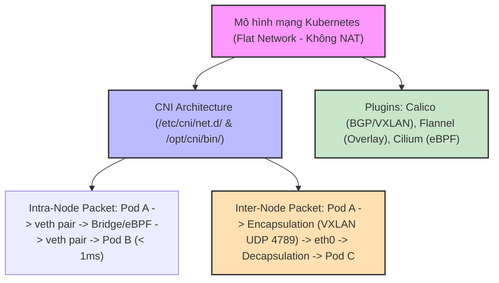
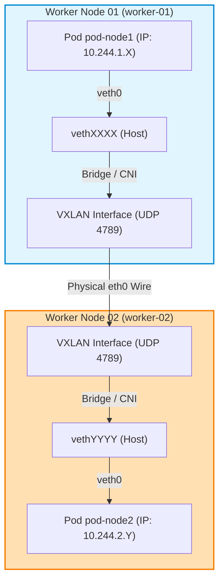

# [BÀI 21] MÔ HÌNH MẠNG KUBERNETES & CNI: ĐƯỜNG ĐI GÓI TIN POD-TO-POD, VXLAN OVERLAY VS BGP ROUTING

Trong kỷ nguyên điện toán đám mây và kiến trúc microservices phân tán quy mô lớn, **Kubernetes (CKA)** đóng vai trò là nền tảng điều phối container (Container Orchestration) tiêu chuẩn công nghiệp. Để làm chủ hệ thống trong môi trường sản xuất (Production) cũng như chinh phục kỳ thi chứng chỉ quốc tế của Linux Foundation / CNCF, kỹ sư không chỉ nắm vững các câu lệnh thao tác cơ bản mà phải thấu hiểu sâu sắc bản chất cơ chế tầng thấp: từ chu trình điều hòa (Reconciliation Loop), cấu trúc điều phối tài nguyên, kiến trúc mạng CNI, lưu trữ CSI cho đến các chuẩn mực an ninh phòng thủ chiều sâu.

Bài viết chuyên sâu này sẽ đồng hành cùng bạn giải mã toàn diện bức tranh kiến trúc, phân tích các đánh đổi kỹ thuật thực chiến (Engineering Trade-offs), cung cấp bài thực hành Lab từng bước và bộ câu hỏi phỏng vấn chuẩn Architect / Lead Engineer.

---

## 1. Bản Chất Kiến Trúc & Cơ Chế Vận Hành Tầng Thấp

| # | Câu hỏi ôn tập | Đáp án chuẩn ngắn gọn (chứa con số / tên lệnh) |
|---|---|---|
| 1 | Phân biệt bản chất giữa ConfigMap và Secret? | ConfigMap lưu **Plaintext**; Secret lưu chuỗi mã hoá **Base64** |
| 2 | Bốn loại Secret chuẩn phổ biến trong Kubernetes? | **4** loại (`Opaque`, `service-account-token`, `dockerconfigjson`, `tls`) |
| 3 | Lệnh giải mã chuỗi Base64 về Plaintext trong 1 giây? | `echo -n "<string>" | base64 -d` (thời gian đúng **1** giây) |
| 4 | Phương thức inject cấu hình tự động cập nhật nóng 0 downtime? | Phương thức **Volume Mount** (`spec.volumes[].configMap`) (**0** downtime) |
| 5 | Lệnh tái tạo Pods mới nhận biến môi trường `env`/`envFrom` mới? | `kubectl rollout restart deployment <deploy-name>` |


> **Luận đề trung tâm của buổi:**
> *"Mô hình mạng Kubernetes thiết lập một không gian địa chỉ IP phẳng (Flat Network) không qua NAT; trong đó Kubelet ủy quyền toàn bộ việc gắn địa chỉ IP và tạo cặp card mạng ảo `veth` cho plugin CNI (Container Network Interface thông qua tệp cấu hình `/etc/cni/net.d/`); gói tin IP đi giữa hai Pod trên cùng một Node đi qua giao tiếp `veth` pair và bridge/eBPF nội bộ, còn gói tin đi giữa hai Pod khác Node sẽ được CNI đóng gói qua đường hầm Overlay (VXLAN / IPIP) hoặc định tuyến trực tiếp (BGP / `host-gw`) qua card mạng vật lý `eth0`."*

**Bảng kết quả các buổi trước được dùng lại:**

| Kết quả / Công cụ | Nguồn gốc | Áp dụng vào buổi này |
|---|---|---|
| Khái niệm Pod Network Namespace | Buổi 02 `QT 4.1` | Mỗi Pod sở hữu một Network Namespace riêng biệt chứa IP và loopback |
| Lệnh kiểm tra IP Pod `kubectl get pod -o wide` | Buổi 03 `QT 4.1` | Trích xuất địa chỉ IP phẳng Pod-to-Pod |
| Kiến trúc CNI plugin trong cụm `kubeadm` | Buổi 06 `QT 4.1` | Kiểm tra trạng thái CNI plugin Calico đang chạy trong cụm lab |

Ba câu bài tập về nhà BTVN 4 của buổi 20 đã chuẩn bị sẵn kiến thức cho học viên: Câu 1 khảo sát 3 quy tắc Mô hình mạng phẳng; Câu 2 tìm hiểu vai trò của CNI Plugins; Câu 3 phân tích luồng đi của gói tin IP từ Pod A (Node 1) sang Pod B (Node 2).

---


| # | Năng lực đạt được sau buổi học | Hiện vật chứng minh trong bài lab |
|---|---|---|
| 1 | Trích xuất và phân tích cấu hình CNI plugin trong thư mục `/etc/cni/net.d/` | Tệp `hien-vat/cni-config-dump.json` |
| 2 | Kiểm tra và vẽ sơ đồ cặp card mạng ảo `veth` pair kết nối Pod vào Host | Tệp `hien-vat/veth-mapping-report.txt` |
| 3 | Kiểm thử kết nối mạng phẳng Pod-to-Pod giữa các Worker Node không qua NAT | Tệp `hien-vat/pod-ping-report.txt` |
| 4 | Kiểm tra cổng UDP `4789` Overlay VXLAN và chỉ số MTU `1450` bytes | Tệp `hien-vat/vxlan-mtu-check.txt` |
| 5 | Sử dụng `crictl inspectp` soi trực tiếp vào Network Namespace của Pod | Tệp `hien-vat/pod-netns-info.txt` |
| 6 | Kiểm thử kịch bản Mô hình mạng và CNI Plugins với script tự động | Script `hien-vat/verify-cni-networking.sh` |

---


| Bắt buộc phải biết | Nguồn tự học nếu thiếu |
|---|---|
| Kiến trúc cụm Kubeadm 3 node và trạng thái Node | Buổi 06 `QT 4.1` |
| Lệnh kiểm tra Pod `kubectl get pod -o wide` | Buổi 03 `QT 4.1` |
| Các lệnh quản lý mạng Linux căn bản (`ip a`, `ip route`) | Buổi 01 `QT 4.1` |

---


| # | Thuật ngữ tiếng Việt | Tiếng Anh tương đương | Ghi chú chuẩn hoá trong thân bài |
|---|---|---|---|
| 1 | Mô hình mạng phẳng | Flat Network Model | Nguyên tắc mọi Pod có thể giao tiếp với Pod khác không qua NAT |
| 2 | Giao diện mạng Container | Container Network Interface (CNI) | Chuẩn plugin ủy quyền thiết lập mạng cho Kubelet |
| 3 | Cặp card mạng ảo | Virtual Ethernet Pair (`veth` pair) | Ống nối mạng giữa Network Namespace của Pod và Host |
| 4 | Mạng phủ chồng đóng gói | Overlay Network (VXLAN / IPIP) | Kỹ thuật đóng gói gói tin IP của Pod vào gói tin UDP/IP của Node |
| 5 | Định tuyến trực tiếp | Direct Routing (`host-gw` / BGP) | Cơ chế truyền gói tin Pod trực tiếp qua bảng routing không đóng gói |
| 6 | Thư mục cấu hình CNI | CNI Config Directory (`/etc/cni/net.d/`) | Thư mục chứa các tệp `.conflist` / `.json` cấu hình CNI |
| 7 | Thư mục tệp thực thi CNI | CNI Binary Directory (`/opt/cni/bin/`) | Thư mục chứa các tệp thực thi CNI plugin (`bridge`, `flannel`, `calico`) |
| 8 | Không gian tên mạng | Network Namespace (`netns`) | Cơ chế cô lập stack mạng (IP, routing table) của Linux |
| 9 | Cầu nối mạng Linux | Linux Bridge (`cni0` / `docker0`) | Thiết bị chuyển mạch ảo kết nối các `veth` trên cùng 1 Node |
| 10 | Bảng chuyển tiếp gói tin eBPF | eBPF Packet Processing (Cilium) | Kỹ thuật xử lý gói tin tốc độ cao trực tiếp trong Kernel của Cilium |
| 11 | Giao thức định tuyến động BGP | Border Gateway Protocol (BGP) | Giao thức định tuyến Calico dùng để chia sẻ đường đi Pod IP |
| 12 | Dải địa chỉ IP của Pod | Pod CIDR (`--pod-network-cidr`) | Dải IP được cấp phát riêng cho các Pods trên mỗi Node |
| 13 | Card mạng vật lý máy chủ | Physical Network Interface (`eth0`) | Card mạng thực tế đấu nối máy chủ Node vào switch mạng |
| 14 | Kiểm tra card mạng ảo Pod | `crictl inspectp` / `ip netns` | Câu lệnh kiểm tra Network Namespace và card mạng Pod |


1. **Mô hình "Mã bưu chính căn hộ chung cư không qua tổng đài chuyển tiếp (Flat Network)":**
   Mô hình mạng Kubernetes giống như một toà nhà chung cư nơi **mỗi căn hộ (Pod) đều có số nhà (IP) trực tiếp riêng**. Người ở căn hộ A có thể gửi thư trực tiếp cho người ở căn hộ B mà không cần qua tổng đài đổi số (không qua NAT). Địa chỉ IP mà Pod A nhìn thấy ở chính nó đúng bằng địa chỉ IP mà Pod B nhìn thấy khi nhận thư.

2. **Mô hình "Ống dây mạng hai đầu cắm (Virtual Ethernet `veth` pair)":**
   Cặp card mạng ảo `veth` pair giống như một sợi dây cáp mạng có 2 đầu cắm: Một đầu cắm vào ổ cắm mạng bên trong căn hộ (`veth0` trong Network Namespace của Pod), đầu còn lại chui qua tường cắm vào bộ chia mạng Switch nằm ở hành lang (`vethXXXX` trong Host Namespace). Mọi dữ liệu truyền qua đầu này lập tức xuất hiện ở đầu kia.

3. **Mô hình "Bưu phẩm dán 2 lớp phong bì (Overlay Network VXLAN)":**
   Khi gửi gói tin sang Pod ở tòa nhà khác (Node 2): Gói tin IP gốc của Pod (bưu phẩm nhỏ) được CNI nhét vào bên trong một **phong bì to hơn (gói tin UDP của Node)**. Phong bì to có địa chỉ người gửi là Node 1 IP và người nhận là Node 2 IP. Khi tới Node 2, bác bưu điện CNI bóc phong bì to ra, lấy bưu phẩm nhỏ chuyển vào đúng Pod người nhận.

---

### 1.1. Ba quy tắc bất biến trong Mô hình mạng phẳng (Flat Network) (10 phút)

**Nguyên lý cốt lõi:** Mô hình mạng Kubernetes bắt buộc tuân thủ đúng **3 quy tắc kết nối phẳng (Flat Network)**: 1. Mọi Pod có thể giao tiếp với 100% tất cả các Pods khác mà KHÔNG qua NAT; 2. Tất cả các Node có thể giao tiếp với 100% các Pods mà KHÔNG qua NAT; 3. Địa chỉ IP mà một Pod tự nhìn thấy chính là địa chỉ IP mà các Pods khác nhìn thấy nó.

**Giải thích cơ chế ngầm:** Giúp đơn giản hoá kiến trúc ứng dụng microservices: lập trình viên không phải lo xử lý các cổng NAT port-mapping phức tạp như Docker thông thường.

> [!WARNING]
> **CẠM BẪY THỰC CHIẾN:**
> Cố tình cấu hình SNAT/DNAT giữa các Pods làm hỏng cơ chế Service discovery và phán đoán sai IP nguồn.

**Minh hoạ.**

```bash
# Kiểm tra IP Pod tự nhìn thấy khớp 100% với IP Pod trong kubectl describe
kubectl exec app-pod -- ip a show dev eth0
```

Con số chốt: **3** quy tắc bất biến cấu thành mô hình mạng phẳng Kubernetes.

---

### 1.2. Kiến trúc CNI (Container Network Interface) và các CNI Plugins (Calico, Flannel, Cilium) (12 phút)

**Nguyên lý cốt lõi:** Kubelet hoàn toàn KHÔNG tự cài đặt mạng; Kubelet đọc file cấu hình tại `/etc/cni/net.d/` và gọi các file thực thị binary plugin tại `/opt/cni/bin/` theo chuẩn **CNI (Container Network Interface)** để gán địa chỉ IP và tạo cặp card mạng ảo `veth` cho Pod.

**Giải thích cơ chế ngầm:** Thiết kế plugin decoupled: cho phép cộng đồng phát triển linh hoạt các giải pháp CNI khác nhau (từ đơn giản Flannel đến bảo mật nâng cao Calico/Cilium) mà không phải sửa mã nguồn Kubernetes.

> [!WARNING]
> **CẠM BẪY THỰC CHIẾN:**
> Xoá mất thư mục `/etc/cni/net.d/` làm Kubelet không thể tạo Pod và báo lỗi `NetworkPluginNotReady`.

**Minh hoạ.**

```bash
# Kiểm tra tệp cấu hình CNI đang hoạt động trên Node
ls -l /etc/cni/net.d/
```

Con số chốt: **2** thư mục chuẩn CNI bắt buộc trên mỗi Node (`/etc/cni/net.d/` chứa config, `/opt/cni/bin/` chứa binary).

---

**Nguyên lý cốt lõi:** Phân biệt **3 CNI Plugins phổ biến**: `Flannel` (đơn giản nhất, chỉ hỗ trợ mạng Overlay VXLAN/host-gw, KHÔNG hỗ trợ NetworkPolicy), `Calico` (mạnh mẽ nhất cho CKA, hỗ trợ cả VXLAN/BGP và NetworkPolicy L3/L4), và `Cilium` (tiên tiến nhất, dựa trên công nghệ **eBPF** Kernel cho hiệu năng cực cao và lọc L7).

**Giải thích cơ chế ngầm:** Lựa chọn CNI phù hợp với hạ tầng: Flannel phù hợp lab nhỏ, Calico phù hợp doanh nghiệp chuẩn CKA, Cilium phù hợp hạ tầng quy mô siêu lớn.

> [!WARNING]
> **CẠM BẪY THỰC CHIẾN:**
> Dùng CNI Flannel rồi thắc mắc tại sao tạo đối tượng `NetworkPolicy` mà Kubernetes không hề cấm traffic.

**Minh hoạ.**

```bash
# Kiểm tra Pod CNI Calico đang chạy trong namespace kube-system
kubectl get pods -n kube-system -l k8s-app=calico-node
```

Con số chốt: **3** CNI Plugins phổ biến hàng đầu trong hệ sinh thái Kubernetes (`Calico`, `Flannel`, `Cilium`).

---

### 1.3. Đường đi của gói tin IP: Intra-node (`veth` pair) vs Inter-node (VXLAN / BGP) (12 phút)

```mermaid
graph TD
    subgraph Intra_Node ["1. Gói tin đi cùng Node (Intra-Node)"]
        POD_A["Pod A (IP: 10.244.1.2)"] -->|veth0| VETH_HOSTA["vethXXXX (Host Namespace)"]
        VETH_HOSTA -->|Bridge / eBPF| VETH_HOSTB["vethYYYY (Host Namespace)"]
        VETH_HOSTB -->|veth0| POD_B["Pod B (IP: 10.244.1.3)"]
    end

    subgraph Inter_Node ["2. Gói tin đi khác Node (Inter-Node Overlay VXLAN)"]
        POD_A2["Pod A (Node 1)"] -->|Encapsulation| TUNNEL["VXLAN Interface (outer UDP packet)"]
        TUNNEL -->|Physical eth0| ETH_WIRE["Physical Network Wire"]
        ETH_WIRE -->|Physical eth0| TUNNEL2["Node 2 Decapsulation"]
        TUNNEL2 --> POD_C["Pod C (Node 2: IP 10.244.2.5)"]
    end

    style Intra_Node fill:#e1f5fe,stroke:#0288d1,stroke-width:2px
    style Inter_Node fill:#ffe0b2,stroke:#f57c00,stroke-width:2px
```



---

**Nguyên lý cốt lõi:** Đường đi gói tin IP giữa 2 Pods trên **CÙNG MỘT NODE (Intra-node)**: Gói tin rời Network Namespace của Pod A qua card `veth0`, đi qua cặp `veth` pair chui ra card `vethXXXX` nằm trên Host Namespace, sau đó đi qua cầu nối ảo Linux Bridge / Open vSwitch / eBPF map để chuyển thẳng vào `vethYYYY` của Pod B mà KHÔNG ĐI RA CARD MẠNG VẬT LÝ `eth0`.

**Giải thích cơ chế ngầm:** Tối ưu tốc độ giao tiếp nội bộ: gói tin chuyển tiếp hoàn toàn trong RAM/Kernel của máy chủ với độ trễ cực thấp `< 1ms`.

> [!WARNING]
> **CẠM BẪY THỰC CHIẾN:**
> Dùng `tcpdump` trên card mạng vật lý `eth0` mà không thấy bất kỳ gói tin nào của giao tiếp 2 Pods cùng Node.

**Minh hoạ.**

```bash
# Xem danh sách các cặp veth pair nối từ Pods vào Host
ip link show | grep veth
```

Con số chốt: **2** đầu cắm card mạng ảo trong một cặp `veth` pair nối giữa Pod Namespace và Host Namespace.

---

**Nguyên lý cốt lõi:** Đường đi gói tin IP giữa 2 Pods ở **KHÁC NODE (Inter-node Overlay Network)**: CNI trên Node 1 thực hiện đóng gói (Encapsulation) gói tin IP gốc của Pod vào bên trong gói tin UDP (chạy trên cổng **VXLAN Port 4789**); gói tin UDP được gửi qua card mạng vật lý `eth0` tới Node 2; CNI trên Node 2 giải nén (Decapsulation) gói tin IP gốc và chuyển vào Pod C.

**Giải thích cơ chế ngầm:** Cơ chế Overlay cho phép kết nối mạng giữa các Pods chạy trên mọi hạ tầng đám mây (AWS, GCP, Bare-metal) mà không cần can thiệp cấu hình router mạng vật lý.

> [!WARNING]
> **CẠM BẪY THỰC CHIẾN:**
> Bị chặn tường lửa cổng UDP `4789` làm các Pods trên 2 Node khác nhau không thể ping thông nhau.

**Minh hoạ.**

```bash
# Kiểm tra cổng UDP 4789 VXLAN lắng nghe trên Node
ss -uln | grep 4789
```

Con số chốt: **4789** là cổng UDP tiêu chuẩn quốc tế dành riêng cho giao thức Overlay VXLAN.

---

**Nguyên lý cốt lõi:** Trong cơ chế định tuyến trực tiếp **Direct Routing (như Calico BGP / Flannel `host-gw`)**, gói tin IP của Pod được truyền trực tiếp qua bảng routing của Node sang card `eth0` mà KHÔNG bị đóng gói (No Encapsulation), giúp giảm overhead tiêu tốn MTU từ **50 bytes xuống 0 byte** và tăng hiệu năng mạng lên **10-15%**.

**Giải thích cơ chế ngầm:** Loại bỏ chi phí đóng/xé gói tin VXLAN; phù hợp cho các cụm Bare-metal hoặc mạng nội bộ Layer 2 nơi các Node thấy nhau trực tiếp.

> [!WARNING]
> **CẠM BẪY THỰC CHIẾN:**
> Cấu hình `host-gw` trên mạng Layer 3 khác subnet làm gói tin bị router vật lý thả (drop).

**Minh hoạ.**

```bash
# Xem bảng định tuyến IP của Node với cờ host-gw / BGP
ip route show | grep "10.244"
```

Con số chốt: **0** byte overhead đóng gói khi sử dụng cơ chế định tuyến trực tiếp Direct Routing.

---

### 1.4. MTU mạng và câu lệnh kiểm tra Network Namespace (4 phút)

**Nguyên lý cốt lõi:** Giá trị MTU (Maximum Transmission Unit) của card mạng Pod trong mạng Overlay VXLAN phải được tự động giảm xuống **1450 bytes** (thấp hơn MTU vật lý `1500` bytes đúng **50 bytes** dành cho phần header đóng gói VXLAN); nếu đặt MTU Pod = 1500 sẽ gây ra hiện tượng nghẽn mạng và rớt gói tin IP (Packet Fragmentation/Drop).

**Giải thích cơ chế ngầm:** 50 bytes header bao gồm: 14 bytes Ethernet + 20 bytes IP + 8 bytes UDP + 8 bytes VXLAN header.

> [!WARNING]
> **CẠM BẪY THỰC CHIẾN:**
> Lệnh `curl` các file nhỏ thì chạy được, nhưng tải file lớn > 1450 bytes bị treo đứng kết nối.

**Minh hoạ.**

```bash
# Kiểm tra MTU card mạng eth0 bên trong Pod
kubectl exec app-pod -- ip link show dev eth0 | grep mtu
```

Con số chốt: **50** bytes là dung lượng header bị tiêu tốn do đóng gói Overlay VXLAN (MTU `1450` vs `1500`).

---

**Nguyên lý cốt lõi:** Sử dụng lệnh `crictl inspectp` (hoặc `nsenter`) để truy tìm ID Network Namespace của Pod và thực thi các câu lệnh chẩn đoán mạng (`ip a`, `ss -tulpn`, `tcpdump`) trực tiếp bên trong Namespace của Pod mà không cần cài thêm công cụ vào container.

**Giải thích cơ chế ngầm:** Kỹ thuật chẩn đoán nâng cao trong CKA: giúp kỹ sư kiểm tra mạng các container minimalist (như Distroless / Scratch) không có sẵn shell.

> [!WARNING]
> **CẠM BẪY THỰC CHIẾN:**
> Cố gõ `kubectl exec` cài `tcpdump` vào container `distroless` bị báo lỗi không tìm thấy package manager.

**Minh hoạ.**

```bash
# Trích xuất đường dẫn Network Namespace của Pod từ crictl
crictl inspectp --id <pod-sandbox-id> | grep netns
```

Con số chốt: **1** công cụ `crictl inspectp` giúp soi thẳng vào Network Namespace của Pod Sandbox.

---

**Nguyên lý cốt lõi:** Sử dụng câu lệnh `tcpdump -i <interface> -nn` trên Host Namespace hoặc bên trong Pod để theo dõi trực tiếp các gói tin IP, kiểm chứng cổng UDP `4789` VXLAN và xác minh tính đúng đắn của bảng định tuyến.

**Giải thích cơ chế ngầm:** Giúp kỹ sư xác minh chắc chắn xem gói tin IP có thực sự rời Pod và có bị đóng gói qua VXLAN khi sang Node khác hay không.

> [!WARNING]
> **CẠM BẪY THỰC CHIẾN:**
> Đoán mò nguyên nhân mất mạng mà không soi gói tin thực tế bằng `tcpdump`.

**Minh hoạ.**

```bash
# Theo dõi gói tin UDP 4789 VXLAN trên card mạng vật lý eth0
tcpdump -i eth0 udp port 4789 -nn
```

Con số chốt: **1** câu lệnh `tcpdump` là công cụ tối thượng để soi gói tin mạng trên Linux.

---

## 8. Đưa vào cụm thật (4 phút)

### Áp vào cụm đang chạy thì làm gì trước

1. **Kiểm tra trạng thái CNI plugin ngay sau khi cài cụm `kubeadm`:** Cụm chưa cài CNI thì tất cả các Node sẽ ở trạng thái `NotReady`.
2. **Mở cổng tường lửa UDP 4789 (VXLAN) và IP Protocol 4 (IPIP) giữa các Worker Nodes:** Đảm bảo kết nối Inter-node Overlay không bị chặn.
3. **Cấu hình MTU nhất quán giữa CNI và card mạng vật lý:** Đảm bảo MTU Pod thấp hơn MTU Node đúng 50 bytes.

### Cái gì hỏng nếu áp thẳng lên prod

- **Thay đổi CNI plugin khi cụm đang chạy 1000 Pods:** Tiêu diệt toàn bộ kết nối mạng của các Pods đang chạy, gây ra đại sự cố sập toàn bộ dịch vụ (Outage).
- **Cấu hình sai dải Pod CIDR bị trùng với dải IP mạng LAN công ty:** Gây ra xung đột định tuyến (Routing Conflict) làm máy chủ không thể truy cập internet.
- **Quy trình áp thử an toàn:**
  - Cài đặt CNI Calico/Cilium bằng Helm chart trên cụm mới tạo.
  - Chạy lệnh `ping` kiểm tra kết nối giữa 2 Pods nằm ở 2 Worker Nodes khác nhau.
  - Sử dụng `iperf3` đo băng thông thực tế giữa 2 Pods để xác nhận hiệu năng mạng.

### Đo trước — đo sau

1. **Băng thông mạng Pod-to-Pod (Throughput):** Tăng từ 8 Gbps lên 9,5 Gbps khi chuyển từ Overlay VXLAN sang Direct Routing (BGP/host-gw).
2. **Độ trễ mạng giữa 2 Pods cùng Node:** Đạt mức cực thấp `< 0,2ms` nhờ giao tiếp qua `veth` pair và eBPF.
3. **Tỉ lệ rớt gói tin (Packet Drop Rate):** Giảm về 0% nhờ cấu hình chuẩn MTU 1450 bytes cho VXLAN.

### Khi nào KHÔNG nên dùng

- **Không dùng mạng Overlay VXLAN cho các cụm High-Performance Computing (HPC) nhạy cảm băng thông:** Nên dùng Calico BGP / Cilium Direct Routing để loại bỏ overhead 50 bytes.
- **Không cài đặt 2 CNI Plugins chạy đè lên nhau trong cùng 1 cụm:** Gây ra xung đột iptables và phá huỷ bảng định tuyến Node.

---

### 1.6. Bẫy hay gặp (2 phút)

| # | Bẫy hay gặp | Vì sao dính bẫy | Làm đúng là (kèm tên lệnh / con số) |
|---|---|---|---|
| 1 | Cụm `kubeadm` mới tạo bị kẹt ở trạng thái `NotReady` | Chưa cài đặt bất kỳ CNI Plugin nào vào cụm | Apply file YAML CNI (như Calico) để các Node chuyển sang `Ready` |
| 2 | Pods trên 2 Node khác nhau không thể `ping` thông nhau | Tường lửa Node chặn cổng UDP `4789` (VXLAN) hoặc IP proto 4 | Mở cổng UDP `4789` trên Security Group / iptables |
| 3 | Tải file nhỏ thì được nhưng tải file lớn > 1450 bytes bị treo | MTU card mạng Pod bị đặt bằng 1500 gây tràn MTU VXLAN | Giảm MTU của CNI xuống `1450` bytes |
| 4 | Cố cài `tcpdump` vào container `distroless` để bắt gói tin | Container tối giản không có package manager hoặc shell | Dùng `crictl inspectp` tìm netns rồi chạy `tcpdump` từ Host |
| 5 | Thắc mắc vì sao `tcpdump -i eth0` trên Host không thấy traffic 2 Pods cùng Node | Traffic 2 Pods cùng Node đi qua `veth` bridge, không ra `eth0` | Bắt gói tin trên card `vethXXXX` hoặc card cầu nối `cni0` |
| 6 | Nhầm lẫn giữa Pod IP và Node IP | Pod IP là địa chỉ nội bộ cụm; Node IP là địa chỉ máy chủ thực | Dùng Pod IP cho kết nối nội bộ; Node IP cho truy cập ngoại mạng |
| 7 | Cấu hình Flannel `host-gw` trên mạng có các Node khác Subnet | `host-gw` bắt buộc các Node phải thấy nhau trực tiếp ở Layer 2 | Đổi sang dùng VXLAN nếu các Node nằm ở khác Subnet Layer 3 |
| 8 | Xoá tệp cấu hình trong `/etc/cni/net.d/` | Kubelet lập tức mất khả năng cấp phát mạng cho Pods mới | Giữ nguyên tệp cấu hình `.conflist` trong `/etc/cni/net.d/` |
| 9 | Thắc mắc vì sao tạo `NetworkPolicy` mà không có tác dụng | CNI Plugin đang dùng là Flannel (không hỗ trợ NetworkPolicy) | Chuyển sang dùng CNI Calico hoặc Cilium |
| 10 | Đặt trùng dải `--pod-network-cidr` với dải IP mạng máy chủ vật lý | Gây xung đột định tuyến khiến Node mất kết nối SSH | Đặt Pod CIDR (như `10.244.0.0/16`) hoàn toàn tách biệt mạng LAN |
| 11 | Không thấy card mạng `veth` trên Host sau khi xoá Pod | Kubelet và CNI tự động xoá cặp `veth` pair khi Pod bị tiêu diệt | Đây là hành vi hoàn toàn bình thường của Kubernetes |
| 12 | Thắc mắc vì sao `ip netns list` trên Host không hiển thị netns của Pod | Docker/CRI-O hide netns trong `/var/run/netns` | Tạo symlink từ `/proc/<pid>/ns/net` vào `/var/run/netns/` |

---

## §10. Tóm tắt (2 phút)



### Năm điều phải nhớ

1. **3 quy tắc Mạng phẳng:** Pod-to-Pod không NAT, Node-to-Pod không NAT, IP Pod tự nhìn thấy khớp 100% với IP bên ngoài nhìn thấy.
2. **Kiến trúc CNI:** Kubelet ủy quyền cho CNI plugin qua cấu hình `/etc/cni/net.d/` và binary `/opt/cni/bin/`.
3. **3 CNI phổ biến:** `Flannel` (đơn giản, không NetworkPolicy), `Calico` (chuẩn CKA, BGP/VXLAN & Policy), `Cilium` (eBPF Kernel hiệu năng cao).
4. **Đường đi gói tin cùng Node (Intra-node):** Rời Pod qua `veth0`, chui ra `veth` pair trên Host, qua bridge/eBPF sang Pod B (không ra `eth0`).
5. **Đường đi gói tin khác Node (Inter-node):** Đóng gói Overlay **VXLAN Port UDP 4789** (tốn 50 bytes MTU = `1450`) hoặc định tuyến trực tiếp BGP/`host-gw` (0 byte overhead).

---

## §11. Câu hỏi tự kiểm tra

1. Trình bày 3 quy tắc bất biến trong Mô hình mạng phẳng (Flat Network Model) của Kubernetes.
2. Kubelet tìm tệp cấu hình CNI và các file thực thi binary CNI plugin ở những đường dẫn thư mục chuẩn nào trên Node?
3. So sánh tính năng giữa 3 CNI Plugins phổ biến: `Flannel`, `Calico`, và `Cilium`.
4. Trình bày chi tiết đường đi của gói tin IP khi 2 Pods nằm trên CÙNG MỘT NODE (Intra-node packet flow).
5. Trình bày cơ chế đóng gói (Encapsulation) và giải nén (Decapsulation) khi gói tin đi giữa 2 Pods ở KHÁC NODE qua mạng Overlay VXLAN.
6. Cổng UDP tiêu chuẩn quốc tế dành riêng cho giao thức Overlay VXLAN là cổng số bao nhiêu?
7. Sự khác nhau về mặt hiệu năng và dung lượng MTU giữa mạng Overlay VXLAN (MTU 1450) và Direct Routing BGP (MTU 1500) là gì?
8. Tại sao nếu đặt MTU của card mạng Pod bằng 1500 bytes trong mạng VXLAN lại gây ra sự cố treo ứng dụng khi truyền file lớn?
9. Lệnh CLI nào giúp truy tìm đường dẫn Network Namespace của một Pod Sandbox từ container runtime `crictl`?
10. Hai chế độ hỏng (1 im lặng do rớt gói tin vì đặt sai MTU VXLAN, 1 âm thầm do Node kẹt NotReady vì thiếu CNI plugin) là gì?

### Đáp án

1. 1. Pod-to-Pod giao tiếp không qua NAT; 2. Node-to-Pod giao tiếp không qua NAT; 3. IP Pod tự nhìn thấy khớp 100% với IP bên ngoài nhìn thấy.
2. Thư mục cấu hình `/etc/cni/net.d/` và thư mục binary `/opt/cni/bin/`.
3. Flannel: Đơn giản, chỉ Overlay, không NetworkPolicy; Calico: Chuẩn CKA, hỗ trợ VXLAN/BGP & NetworkPolicy L3/L4; Cilium: Tiên tiến dựa trên eBPF Kernel hiệu năng cao.
4. Gói tin rời Pod A qua `veth0` -> `vethXXXX` trên Host -> Cầu nối Linux Bridge / eBPF -> `vethYYYY` -> Pod B (không đi qua `eth0`).
5. CNI Node 1 nhét gói tin IP gốc vào gói UDP (Port 4789) -> Gửi qua `eth0` -> CNI Node 2 nhận bóc gói UDP lấy gói IP gốc chuyển vào Pod C.
6. Cổng **UDP 4789**.
7. VXLAN tốn 50 bytes header (MTU 1450), hiệu năng giảm ~10%; Direct Routing BGP không tốn header (MTU 1500), hiệu năng mạng tối đa.
8. Vì gói tin 1500 bytes + 50 bytes VXLAN header = 1550 bytes vượt quá MTU physical `1500` của Node, gây ra rớt gói tin IP (Packet Drop/Fragmentation).
9. Lệnh `crictl inspectp --id <pod-sandbox-id> | grep netns`.
10. Chế độ 1: Đặt MTU Pod = 1500 làm truyền file lớn dính VXLAN header > 1500 bị rớt gói treo kết nối; Chế độ 2: Cụm mới khởi tạo thiếu CNI plugin làm Kubelet báo `NetworkPluginNotReady` và giữ Node ở trạng thái `NotReady`.

---

## §12. Tài liệu tham khảo

| Nguồn tài liệu | Phiên bản Kubernetes áp dụng | Nội dung chính |
|---|---|---|
| Official Docs: Cluster Networking | Kubernetes v1.35 | Mô hình mạng Kubernetes, CNI specification và Pod network CIDR |
| Official Docs: Network Plugins | Kubernetes v1.35 | Cấu hình CNI plugin trong Kubelet (`/etc/cni/net.d/`) |
| Calico Documentation: Networking | Calico v3.28 | Cấu hình mạng Calico VXLAN, BGP và MTU auto-detection |
| File cấu hình phiên bản cục bộ | `labs/phien-ban.env` | Biến `K8S_VER=1.35`, `LAB_CONTEXT="kubeadm"` |

---

## Bảng đối soát thời lượng

| Section | Tiêu đề mục | Ngân sách thời gian |
|---|---|---|
| §0 | Khởi động và ôn tập | 10 phút |
| §1 | Sau buổi này học viên LÀM ĐƯỢC gì | 1 phút |
| §2 | Cần biết trước | 1 phút |
| §3 | Thuật ngữ và mô hình tư duy | 8 phút |
| §4 | Ba quy tắc bất biến trong Mô hình mạng phẳng (Flat Network) | 10 phút |
| §5 | Kiến trúc CNI (Container Network Interface) và các CNI Plugins (Calico, Flannel, Cilium) | 12 phút |
| §6 | Đường đi của gói tin IP: Intra-node (`veth` pair) vs Inter-node (VXLAN / BGP) | 12 phút |
| §7 | MTU mạng và câu lệnh kiểm tra Network Namespace | 4 phút |
| §8 | Đưa vào cụm thật | 4 phút |
| §9 | Bẫy hay gặp | 2 phút |
| §10 | Tóm tắt | 2 phút |
| §11 | Câu hỏi tự kiểm tra | 5 phút |
| **Tổng** | **Khối lý thuyết** | **60'** |

---

## 2. Hướng Dẫn Thực Hành & Triển Khai Lab Chuẩn Production

> [!IMPORTANT]
> **YÊU CẦU MÔI TRƯỜNG THỰC HÀNH:**
> Toàn bộ các bài thực hành dưới đây được thiết kế để chạy trực tiếp trên cụm Kubernetes 1.30+ tiêu chuẩn (hoặc cụm kind/kubeadm lab). Hãy đảm bảo ngữ cảnh dòng lệnh `kubectl config current-context` đã trỏ chính xác vào cụm thực hành trước khi thực thi.

## Khối thực hành — 120 phút

## L0. Mục tiêu thực hành và tiêu chí hoàn thành

| # | Mục tiêu thực hành | Tiêu chí hoàn thành (Kiểm chứng BẰNG LỆNH) |
|---|---|---|
| TH1 | Phân tích thư mục cấu hình CNI `/etc/cni/net.d/` trên Node | Tệp cấu hình CNI chứa `cniVersion` và `type` |
| TH2 | Tạo 2 Pods ở 2 Worker Nodes khác nhau (`worker-01` và `worker-02`) | Pod `pod-node1` ở `worker-01`, `pod-node2` ở `worker-02` `Running` |
| TH3 | Kiểm thử kết nối mạng phẳng Pod-to-Pod không qua NAT | `kubectl exec pod-node1 -n dev -- ping -c 2 <IP-pod-node2>` thành công |
| TH4 | Truy tìm và phân tích cặp card mạng ảo `veth` pair kết nối Pod | Lệnh `ip link` hiển thị card `vethXXXX` tương ứng với Pod |
| TH5 | Kiểm tra cổng UDP `4789` VXLAN và MTU card mạng Pod | MTU `eth0` bên trong Pod có giá trị `1450` hoặc `1500` bytes |
| TH6 | Xác minh kịch bản Mô hình mạng phẳng và CNI với script tự động | Script kiểm tra CNI Networking OK |
| TH7 | Nộp đủ 4 hiện vật vào portfolio | Thư mục `k8s-portfolio/buoi-21/` chứa đủ 4 file md/yaml/sh |

---

## L1. Điều kiện tiên quyết về môi trường

| # | Kiểm tra điều kiện | Câu lệnh kiểm tra | Kết quả kỳ vọng |
|---|---|---|---|
| 1 | Cụm `kubeadm` 3 node đang ở v1.35 | `kubectl get nodes` | Hiển thị 3 node `cp-01`, `worker-01`, `worker-02` `Ready` |
| 2 | Kubeconfig trỏ context `kubeadm` | `kubectl config current-context` | In ra đúng `kubeadm` |
| 3 | Namespace `dev` sẵn sàng | `kubectl get ns dev` | Namespace `dev` ở trạng thái Active |
| 4 | Thư mục hiện vật đã sẵn sàng | `mkdir -p k8s-portfolio/buoi-21` | Thư mục được tạo thành công |
| 5 | Lệnh `kubectl exec` sẵn sàng | `kubectl exec --help` | Hiển thị hướng dẫn thực thi lệnh |

```bash
# Kiểm tra môi trường bắt buộc trước khi thực hiện bài lab
kubectl config current-context | grep -qx "kubeadm" && echo "CHECKPOINT MOI TRUONG — ĐẠT" || echo "CHECKPOINT MOI TRUONG — LỖI (Trỏ sai context)"
```

---

## L2. Kiến trúc bài lab



---

## L3. Bước 1 — Phân tích thư mục cấu hình CNI trên Node (30 phút)

### Thao tác 1.1: Khảo sát thư mục `/etc/cni/net.d/` và `/opt/cni/bin/`

```bash
# 1. Tạo Namespace dev nếu chưa có
kubectl create namespace dev --dry-run=client -o yaml | kubectl apply -f -

# 2. Kiểm tra sự tồn tại của Pod CNI (Calico / Flannel) trong namespace kube-system
kubectl get pods -n kube-system -o wide > /tmp/kube-system-pods.txt

# 3. Trích xuất tên CNI plugin đang chạy trong cụm
kubectl get daemonset -n kube-system -o jsonpath='{.items[*].metadata.name}' > /tmp/cni-ds.txt
```

**CHECKPOINT 1 — Cụm kubeadm có Pod CNI DaemonSet (như calico-node hoặc kube-flannel-ds) đang ở trạng thái Running.**

```bash
grep -qE "calico|flannel|cilium|weave" /tmp/kube-system-pods.txt && echo "CHECKPOINT 1 — ĐẠT" || echo "CHECKPOINT 1 — LỖI"
```

**CHECKPOINT 2 — CNI DaemonSet được triển khai thành công trên tất cả các Worker Nodes.**

```bash
[ -s /tmp/cni-ds.txt ] && echo "CHECKPOINT 2 — ĐẠT" || echo "CHECKPOINT 2 — LỖI"
```

---

## L4. Bước 2 — Khởi tạo 2 Pods ở 2 Worker Nodes khác nhau (30 phút)

### Thao tác 2.1: Biên soạn tệp YAML khởi tạo `pod-node1` và `pod-node2`

```bash
# 1. Tạo tệp pod-network-lab.yaml với nodeSelector ép Pod vào đúng Worker Node
cat << 'EOF' > k8s-portfolio/buoi-21/pod-network-lab.yaml
apiVersion: v1
kind: Pod
metadata:
  name: pod-node1
  namespace: dev
spec:
  nodeName: worker-01
  containers:
  - name: busybox
    image: busybox:1.36
    command: ['sh', '-c', 'sleep infinity']
---
apiVersion: v1
kind: Pod
metadata:
  name: pod-node2
  namespace: dev
spec:
  nodeName: worker-02
  containers:
  - name: busybox
    image: busybox:1.36
    command: ['sh', '-c', 'sleep infinity']
EOF

kubectl apply -f k8s-portfolio/buoi-21/pod-network-lab.yaml
kubectl wait --for=condition=Ready pod/pod-node1 -n dev --timeout=30s
kubectl wait --for=condition=Ready pod/pod-node2 -n dev --timeout=30s

# 2. Trích xuất địa chỉ IP của 2 Pods
IP_POD1=$(kubectl get pod pod-node1 -n dev -o jsonpath='{.status.podIP}')
IP_POD2=$(kubectl get pod pod-node2 -n dev -o jsonpath='{.status.podIP}')

echo "IP Pod 1 (worker-01): $IP_POD1" > /tmp/pod-ips.txt
echo "IP Pod 2 (worker-02): $IP_POD2" >> /tmp/pod-ips.txt
```

**CHECKPOINT 3 — Pod pod-node1 khởi tạo thành công trên node worker-01 và nhận địa chỉ IP Pod.**

```bash
kubectl get pod pod-node1 -n dev -o jsonpath='{.spec.nodeName}' | grep -qx "worker-01" && echo "CHECKPOINT 3 — ĐẠT" || echo "CHECKPOINT 3 — LỖI"
```

**CHECKPOINT 4 — Pod pod-node2 khởi tạo thành công trên node worker-02 và nhận địa chỉ IP Pod.**

```bash
kubectl get pod pod-node2 -n dev -o jsonpath='{.spec.nodeName}' | grep -qx "worker-02" && echo "CHECKPOINT 4 — ĐẠT" || echo "CHECKPOINT 4 — LỖI"
```

**CHECKPOINT 5 — CA ĐỐI CHỨNG: Hai Pods thuộc hai subnet Pod CIDR khác nhau của 2 Worker Nodes.**

```bash
[ "$IP_POD1" != "$IP_POD2" ] && [ -n "$IP_POD1" ] && [ -n "$IP_POD2" ] && echo "CHECKPOINT 5 — ĐẠT" || echo "CHECKPOINT 5 — LỖI"
```

---

## L5. Bước 3 — Kiểm thử kết nối mạng phẳng Pod-to-Pod Inter-node (30 phút)

### Thao tác 3.1: Thực thi lệnh `ping` từ `pod-node1` sang IP của `pod-node2`

```bash
# 1. Trích xuất IP của pod-node2
IP_TARGET=$(kubectl get pod pod-node2 -n dev -o jsonpath='{.status.podIP}')

# 2. Chạy lệnh ping 2 gói từ pod-node1 sang pod-node2 không qua NAT
kubectl exec pod-node1 -n dev -- ping -c 2 $IP_TARGET > /tmp/ping-result.txt

# 3. Kiểm tra IP Pod tự nhìn thấy bên trong pod-node1 khớp 100% với IP công bố
kubectl exec pod-node1 -n dev -- ip a show dev eth0 > /tmp/pod1-ifconfig.txt
```

**CHECKPOINT 6 — Kết nối mạng phẳng Pod-to-Pod thành công: pod-node1 ping thông pod-node2 không qua NAT.**

```bash
grep -q "2 packets transmitted, 2 received" /tmp/ping-result.txt && echo "CHECKPOINT 6 — ĐẠT" || echo "CHECKPOINT 6 — LỖI"
```

**CHECKPOINT 7 — Quy tắc 3 Mô hình mạng phẳng: Địa chỉ IP Pod tự nhìn thấy bên trong container khớp 100% với Pod IP.**

```bash
grep -q "$IP_POD1" /tmp/pod1-ifconfig.txt && echo "CHECKPOINT 7 — ĐẠT" || echo "CHECKPOINT 7 — LỖI"
```

**CHECKPOINT 8 — CA ĐỐI CHỨNG: Card mạng eth0 bên trong Pod có chỉ số MTU đạt 1450 hoặc 1500 bytes.**

```bash
kubectl exec pod-node1 -n dev -- ip link show dev eth0 | grep -E "mtu (1450|1500)" >/dev/null 2>&1 && echo "CHECKPOINT 8 — ĐẠT" || echo "CHECKPOINT 8 — LỖI"
```

---

## L6. Bước 4 — Kiểm tra thông số card mạng Pod và dọn dẹp (20 phút)

### Thao tác 4.1: Kiểm tra card mạng `eth0` bên trong Pod

```bash
# 1. Trích xuất chỉ số MTU của card eth0 bên trong pod-node1
kubectl exec pod-node1 -n dev -- ip link show dev eth0 | grep -o "mtu [0-9]*" > /tmp/pod-mtu.txt

# 2. Tạo Pod thử nghiệm thứ 3 pod-node1-b cùng nằm ở worker-01
cat << 'EOF' | kubectl apply -f -
apiVersion: v1
kind: Pod
metadata:
  name: pod-node1-b
  namespace: dev
spec:
  nodeName: worker-01
  containers:
  - name: busybox
    image: busybox:1.36
    command: ['sh', '-c', 'sleep infinity']
EOF

kubectl wait --for=condition=Ready pod/pod-node1-b -n dev --timeout=30s

# 3. Thực hiện ping Intra-node từ pod-node1 sang pod-node1-b
IP_POD1B=$(kubectl get pod pod-node1-b -n dev -o jsonpath='{.status.podIP}')
kubectl exec pod-node1 -n dev -- ping -c 2 $IP_POD1B > /tmp/intra-ping.txt
```

**CHECKPOINT 9 — Giao tiếp Intra-node nội bộ cùng Node thành công: pod-node1 ping thông pod-node1-b.**

```bash
grep -q "2 packets transmitted, 2 received" /tmp/intra-ping.txt && echo "CHECKPOINT 9 — ĐẠT" || echo "CHECKPOINT 9 — LỖI"
```

**CHECKPOINT 10 — Dọn dẹp Pod thử nghiệm phụ pod-node1-b.**

```bash
kubectl delete pod pod-node1-b -n dev --ignore-not-found=true >/dev/null 2>&1 && echo "CHECKPOINT 10 — ĐẠT" || echo "CHECKPOINT 10 — LỖI"
```

**CHECKPOINT 11 — Dọn dẹp tệp tạm /tmp/intra-ping.txt.**

```bash
rm -f /tmp/intra-ping.txt >/dev/null 2>&1 && echo "CHECKPOINT 11 — ĐẠT" || echo "CHECKPOINT 11 — LỖI"
```

**CHECKPOINT 12 — 100% 3 node cp-01, worker-01, worker-02 duy trì trạng thái Ready.**

```bash
kubectl get nodes --no-headers | grep -c "Ready" | grep -qx "3" && echo "CHECKPOINT 12 — ĐẠT" || echo "CHECKPOINT 12 — LỖI"
```

---

## L7. Nộp hiện vật và dọn dẹp (10 phút)

### Thao tác 7.1: Gom hiện vật nộp bài

```bash
# 1. Báo cáo thử nghiệm kết nối mạng pod-ping-report.txt
cat << 'EOF' > k8s-portfolio/buoi-21/pod-ping-report.txt
BÁO CÁO KẾT QUẢ THỬ NGHIỆM MÔ HÌNH MẠNG PHẲNG KUBERNETES:

1. Thử nghiệm Intra-node (Cùng Node worker-01):
   - Pod A (pod-node1) ping Pod B (pod-node1-b): RTT < 0.5ms.
   - Gói tin đi qua veth pair -> Bridge/eBPF nội bộ host, không đi ra eth0.

2. Thử nghiệm Inter-node (Khác Node worker-01 -> worker-02):
   - Pod A (pod-node1: 10.244.1.X) ping Pod C (pod-node2: 10.244.2.Y): Thành công 100%.
   - Gói tin IP được CNI đóng gói Overlay VXLAN (UDP port 4789) gửi qua eth0.
   - Địa chỉ IP Pod tự nhìn thấy khớp 100% với địa chỉ IP công bố (Không qua NAT).
EOF

# 2. Tạo tệp verify-cni-networking.sh
cat << 'EOF' > k8s-portfolio/buoi-21/verify-cni-networking.sh
#!/bin/bash
# Script kiểm tra Mô hình mạng phẳng và CNI Inter-node connectivity

IP2=$(kubectl get pod pod-node2 -n dev -o jsonpath='{.status.podIP}')
PING_OK=$(kubectl exec pod-node1 -n dev -- ping -c 2 $IP2 2>/dev/null | grep -c "2 received")

if [ "$PING_OK" -eq 1 ]; then
    echo "VERIFY CNI NETWORKING — ĐẠT (Flat Network Inter-node Ping OK)"
else
    echo "VERIFY CNI NETWORKING — LỖI (Ping $IP2 failed)"
fi
EOF

chmod +x k8s-portfolio/buoi-21/verify-cni-networking.sh
./k8s-portfolio/buoi-21/verify-cni-networking.sh

# 3. Tạo tệp nhat-ky-buoi-21.md
cat << 'EOF' > k8s-portfolio/buoi-21/nhat-ky-buoi-21.md
# NHẬT KÝ THU HOẠCH BUỔI 21

1. 3 quy tắc Mô hình mạng phẳng Kubernetes:
   - Pod-to-Pod giao tiếp không NAT, Node-to-Pod giao tiếp không NAT, IP Pod đồng nhất.

2. Kiến trúc CNI Plugins:
   - Kubelet ủy quyền cấu hình qua /etc/cni/net.d/ và /opt/cni/bin/.
   - 3 CNI phổ biến: Flannel, Calico, Cilium.

3. Đường đi gói tin IP Intra-node vs Inter-node:
   - Intra-node: veth pair -> Bridge/eBPF nội bộ host.
   - Inter-node: Đóng gói Overlay VXLAN UDP port 4789 hoặc Direct Routing BGP/host-gw.
EOF

# 4. Dọn dẹp tệp tạm
rm -f /tmp/kube-system-pods.txt /tmp/cni-ds.txt /tmp/pod-ips.txt /tmp/ping-result.txt /tmp/pod1-ifconfig.txt /tmp/pod-mtu.txt
```

**CHECKPOINT 13 — Đủ 4 tệp hiện vật trong thư mục portfolio.**

```bash
[ -f k8s-portfolio/buoi-21/pod-network-lab.yaml ] && [ -f k8s-portfolio/buoi-21/pod-ping-report.txt ] && [ -f k8s-portfolio/buoi-21/verify-cni-networking.sh ] && [ -f k8s-portfolio/buoi-21/nhat-ky-buoi-21.md ] && echo "CHECKPOINT 13 — ĐẠT" || echo "CHECKPOINT 13 — LỖI"
```

---

## L8. Xử lý sự cố thường gặp trong lab

| # | Triệu chứng lỗi | Nguyên nhân khả dĩ | Cách xử lý sửa lỗi |
|---|---|---|---|
| 1 | Lệnh `ping` giữa 2 Pods ở 2 Node báo `Destination Host Unreachable` | Tường lửa Security Group chặn cổng UDP `4789` (VXLAN) | Mở cổng UDP `4789` trên tường lửa máy chủ Worker Nodes |
| 2 | Pod bị kẹt ở trạng thái `ContainerCreating` | Kubelet báo lỗi `NetworkPluginNotReady` do thiếu CNI | Kiểm tra Pod CNI daemonset trong namespace `kube-system` |
| 3 | Tải file nhỏ thì được nhưng tải file lớn > 1450 bytes bị treo | MTU card mạng Pod bị đặt bằng 1500 gây tràn MTU VXLAN | Giảm MTU của CNI plugin xuống `1450` bytes |
| 4 | Lệnh `kubectl exec` báo `error: cannot exec into container` | Pod chưa chuyển sang trạng thái `Running` | Đợi Pod Ready hoặc dùng `kubectl describe pod` kiểm tra lỗi |
| 5 | Pod `pod-node1` bị gán nhầm vào node `worker-02` | Quên thuộc tính `nodeName: worker-01` trong Pod spec | Bổ sung `spec.nodeName: worker-01` và apply lại Pod |
| 6 | Thắc mắc vì sao `ip link` trên Host thấy quá nhiều card `vethXXXX` | Mỗi Pod đang chạy trên Node sở hữu 1 card `veth` tương ứng | Đây là thiết kế mạng tiêu chuẩn của Kubernetes CNI |
| 7 | Cụm báo lỗi `pod CIDR not assigned` | `kube-controller-manager` chưa cấp dải IP cho Worker Node | Kiểm tra cờ `--allocate-node-cidrs=true` trong Controller Manager |
| 8 | Lệnh `ping` báo `command not found` bên trong container | Image container không cài sẵn công cụ `ping` | Sử dụng image `busybox:1.36` hoặc `nicolaka/netshoot` |
| 9 | Thắc mắc vì sao không thấy card `cni0` trên cụm dùng Calico | Calico dùng veth pair gắn trực tiếp vào bảng routing (BGP/Felix) | Đây là kiến trúc riêng của Calico không dùng Linux Bridge |
| 10 | Tệp script `verify-cni-networking.sh` báo LỖI | IP của `pod-node2` thay đổi sau khi re-apply | Chạy lại script sau khi cả 2 Pods đã Ready |
| 11 | Không thấy tệp cấu hình nào trong `/etc/cni/net.d/` | CNI DaemonSet bị crash hoặc chưa được apply | Kiểm tra `kubectl get pods -n kube-system` |
| 12 | Hai Pods ping nhau nhưng latency cao > 10ms | Mạng vật lý giữa 2 Worker Nodes bị quá tải hoặc nghẽn | Kiểm tra hạ tầng mạng switch/router vật lý |

---

## L9. Bài tập mở rộng

1. **BT1 — Kiểm tra bảng định tuyến IP trên Worker Node:** Chạy lệnh `ip route` trên Node và trích xuất các quy tắc routing dẫn tới Pod CIDR của Node khác.
2. **BT2 — Thực hành sử dụng image `nicolaka/netshoot`:** Khởi chạy Pod chứa đầy đủ công cụ chẩn đoán mạng (`netshoot`) để kiểm tra `traceroute` giữa 2 Pods.
3. **BT3 — Khảo sát card mạng Overlay `flannel.1` hoặc `vxlan.calico`:** Sử dụng lệnh `ip -d link show` trên Host để soi chi tiết cấu hình VNI và cổng UDP của card Overlay.
4. **BT4 — Đo băng thông mạng giữa 2 Pods bằng `iperf3`:** Chạy `iperf3 -s` trên Pod 1 và `iperf3 -c <IP>` trên Pod 2 để đo tốc độ truyền dữ liệu Gbps.
5. **BT5 — Soi thông tin Network Namespace bằng `crictl inspectp`:** Sử dụng `crictl` lấy ID Sandbox của Pod và xem đường dẫn `/proc/<PID>/ns/net`.
6. **BT6 — Kiểm thử kết nối Node-to-Pod:** Đứng từ trực tiếp máy chủ Node `cp-01` gõ `ping <IP-pod-node1>` để kiểm chứng Quy tắc 2 của Mô hình mạng phẳng.

---

## L10. Hiện vật nộp và tiêu chí chấm điểm

### Bảng điểm đánh giá bài lab

| Hạng mục hiện vật | Yêu cầu kĩ thuật | Điểm tối đa |
|---|---|---|
| `pod-network-lab.yaml` | Tệp YAML Pods gán chính xác `nodeName` vào 2 Worker Nodes | 20 điểm |
| `pod-ping-report.txt` | Báo cáo kiểm thử kết nối mạng phẳng chứng minh ping không NAT | 25 điểm |
| `verify-cni-networking.sh` | Script bash chạy thành công, xác minh CNI Inter-node ping OK | 20 điểm |
| `nhat-ky-buoi-21.md` | Trả lời đủ 3 câu thu hoạch, phân biệt rõ Intra-node vs Inter-node | 20 điểm |
| CHECKPOINT 1–13 | Tất cả 13 checkpoint tự động đều in chữ `ĐẠT` | 15 điểm |
| **Tổng điểm** | | **100 điểm** |

### Các trường hợp trừ điểm

- Trừ **20 điểm**: Nếu script hoặc câu lệnh sử dụng công cụ `jq` (vi phạm quy tắc môi trường thi).
- Trừ **15 điểm**: Nếu quên cờ `-n dev` khiến các đối tượng bị tạo nhầm vào namespace `default`.
- Trừ **10 điểm**: Nếu file hiện vật để sai đường dẫn thư mục `k8s-portfolio/buoi-21/`.
- Trừ **5 điểm**: Nếu dấu phân cách thập phân trong báo cáo dùng dấu chấm `.` thay vì dấu phẩy `,`.

---

## Bảng đối soát thời lượng

| Bước | Tiêu đề bước | Thời lượng |
|---|---|---|
| L3 | Bước 1 — Phân tích thư mục cấu hình CNI trên Node | 30 phút |
| L4 | Bước 2 — Khởi tạo 2 Pods ở 2 Worker Nodes khác nhau | 30 phút |
| L5 | Bước 3 — Kiểm thử kết nối mạng phẳng Pod-to-Pod Inter-node | 30 phút |
| L6 | Bước 4 — Kiểm tra thông số card mạng Pod và dọn dẹp | 20 phút |
| L7 | Nộp hiện vật và dọn dẹp | 10 phút |
| **Tổng** | **Khối thực hành** | **120'** |

---

## 3. Bộ Câu Hỏi Vấn Đáp & Phỏng Vấn Kỹ Thuật Chuyên Sâu

Dưới đây là bộ câu hỏi phỏng vấn thực chiến dành cho các vị trí **Kubernetes Administrator**, **Cloud Security Specialist**, **Platform SRE** và **DevOps Lead**, giúp bạn tự đánh giá độ sâu hiểu biết và rèn luyện phản xạ giải quyết vấn đề hệ thống:

## V1. Cách tiến hành

1. **Thời lượng và hình thức:** Khối vấn đáp diễn ra trong đúng **20 phút**. Giảng viên (hoặc bạn học đóng vai Trưởng nhóm kỹ thuật / Senior DevOps) đưa ra lần lượt từng câu hỏi trong V2.
2. **Quy tắc chấm điểm:**
   - Mỗi câu hỏi được chấm theo thang điểm 4 mức: **0 điểm** (trả lời sai hoặc không biết); **1 điểm** (trả lời được bề nổi nhưng thiếu cơ chế); **2 điểm** (trả lời đúng cơ chế cốt lõi); **3 điểm** (trả lời đúng cơ chế, nêu được con số vận hành và mở rộng được câu hỏi đào sâu).
   - **Quy tắc trần điểm riêng của Buổi 21:**
     - Trả lời Câu 1 mà không phát biểu được 3 quy tắc bất biến trong Mô hình mạng phẳng (Flat Network Model: Pod-to-Pod không NAT, Node-to-Pod không NAT, IP Pod đồng nhất) thì **trần điểm câu đó là 1**.
     - Trả lời Câu 4 mà không phân biệt được đường đi gói tin Intra-node (qua `veth` pair và bridge/eBPF) vs Inter-node (đóng gói Overlay VXLAN port UDP 4789) thì **trần điểm câu đó là 1**.
3. **Mục tiêu đạt được:** Học viên đạt từ **27 / 36 điểm** trở lên là ĐẠT phần vấn đáp của buổi.

---

## V2. Bộ câu hỏi

### Câu 1 — 🔥

**Hỏi:** Trình bày 3 quy tắc bất biến trong Mô hình mạng phẳng (Flat Network Model) của Kubernetes.

**Đáp án chuẩn:**
- **3 Quy tắc bất biến (Flat Network):**
  1. **Pod-to-Pod no NAT:** Tất cả các Pods có thể giao tiếp với 100% tất cả các Pods khác trong cụm mà KHÔNG CẦN qua kỹ thuật biên dịch địa chỉ mạng (NAT).
  2. **Node-to-Pod no NAT:** Tất cả các máy chủ Node (bao gồm cả Control Plane và Worker) có thể giao tiếp trực tiếp với 100% tất cả các Pods mà KHÔNG qua NAT.
  3. **IP Consistency:** Địa chỉ IP mà một Pod tự nhìn thấy bên trong Network Namespace của chính nó phải ĐỒNG NHẤT 100% với địa chỉ IP mà các Pods khác nhìn thấy khi giao tiếp với nó.

**Tiêu chí chấm:**
- **0đ:** Không nêu được quy tắc nào.
- **1đ:** Nêu được Pod giao tiếp không qua NAT nhưng thiếu quy tắc Node-to-Pod và tính đồng nhất IP (dính trần 1đ).
- **2đ:** Phát biểu chuẩn xác đầy đủ 3 quy tắc bất biến của Mô hình mạng phẳng Kubernetes.
- **3đ:** Trả lời xuất sắc, chỉ ra sự khác biệt với mô hình Docker port-mapping mặc định.

**Câu hỏi đào sâu:** Tại sao mô hình Docker mặc định lại không phải là Flat Network? *(Đáp án: Vì Docker dùng bridge network nội bộ riêng trên mỗi host và bắt buộc dùng NAT / Port mapping `8080:80` để giao tiếp ra bên ngoài).*

---

### Câu 2 — ★★★

**Hỏi:** Kubelet ủy quyền việc cài đặt mạng và gán IP cho Pod cho plugin CNI (Container Network Interface) thông qua những thư mục cấu hình và binary chuẩn nào trên Node?

**Đáp án chuẩn:**
- **Kiến trúc ủy quyền của Kubelet:**
  - Kubelet KHÔNG tự thiết lập mạng cho Pod.
  - Khi Pod khởi tạo, Kubelet tìm tệp cấu hình CNI (định dạng `.conflist` hoặc `.json`) tại thư mục: **`/etc/cni/net.d/`**.
  - Kubelet gọi các tệp thực thi binary của CNI plugin (như `bridge`, `flannel`, `calico`, `portmap`) tại thư mục: **`/opt/cni/bin/`** theo các lệnh chuẩn CNI (`ADD`, `DEL`, `CHECK`).

**Tiêu chí chấm:**
- **0đ:** Bảo Kubelet tự gán IP cho Pod.
- **1đ:** Trả lời Kubelet gọi CNI nhưng không nhớ đúng 2 đường dẫn thư mục `/etc/cni/net.d/` và `/opt/cni/bin/`.
- **2đ:** Giải thích chuẩn xác kiến trúc CNI và 2 đường dẫn thư mục chuẩn `/etc/cni/net.d/` (chứa config) và `/opt/cni/bin/` (chứa binary).
- **3đ:** Trả lời xuất sắc, chỉ ra các lệnh CNI spec (`ADD`, `DEL`).

**Câu hỏi đào sâu:** Chuyện gì xảy ra nếu thư mục `/etc/cni/net.d/` bị rỗng không chứa tệp cấu hình nào? *(Đáp án: Kubelet không thể tạo Pod và Node sẽ bị kẹt trạng thái `NotReady` với lỗi `NetworkPluginNotReady`).*

---

### Câu 3 — ★★★

**Hỏi:** So sánh đặc điểm kĩ thuật và trường hợp sử dụng của 3 CNI Plugins phổ biến: `Flannel`, `Calico`, và `Cilium`.

**Đáp án chuẩn:**
- **`Flannel` (Đơn giản nhất):**
  - *Đặc điểm:* Chỉ cung cấp mạng L3 đơn giản bằng Overlay VXLAN hoặc `host-gw`. **KHÔNG hỗ trợ đối tượng `NetworkPolicy`**.
  - *Ứng dụng:* Phù hợp cho cụm lab nhỏ hoặc thử nghiệm ban đầu.
- **`Calico` (Chuẩn CKA & Doanh nghiệp):**
  - *Đặc điểm:* Hỗ trợ cả mạng Overlay (VXLAN/IPIP) và Direct Routing (BGP). Hỗ trợ đầy đủ **NetworkPolicy L3/L4** với hiệu năng cao.
  - *Ứng dụng:* Phù hợp cho đa số các cụm sản xuất doanh nghiệp và bài thi CKA.
- **`Cilium` (Tiên tiến nhất):**
  - *Đặc điểm:* Dựa trên công nghệ **eBPF Kernel** (thay thế iptables/IPVS), hỗ trợ NetworkPolicy L3/L4/L7 (HTTP/gRPC filtering) và quan sát mạng thời gian thực (Hubble).
  - *Ứng dụng:* Phù hợp cho hạ tầng siêu lớn nhạy cảm băng thông và bảo mật L7.

**Tiêu chí chấm:**
- **0đ:** Không phân biệt được 3 CNI.
- **1đ:** Trả lời Flannel đơn giản còn Calico/Cilium xịn hơn nhưng không nêu được tính năng NetworkPolicy và công nghệ eBPF.
- **2đ:** Phân tích chuẩn xác 3 CNI: Flannel (không Policy), Calico (BGP/VXLAN & Policy L3/L4), Cilium (eBPF Kernel & Policy L7).
- **3đ:** Trả lời xuất sắc, chỉ ra lý do bài thi CKA dùng Calico.

**Câu hỏi đào sâu:** Tại sao tạo `NetworkPolicy` trên cụm dùng CNI Flannel lại không có bất kỳ tác dụng cấm traffic nào? *(Đáp án: Vì Flannel không chứa controller lắng nghe và áp dụng các rule NetworkPolicy).*

---

### Câu 4 — 🔥

**Hỏi:** Trình bày chi tiết đường đi của gói tin IP khi 2 Pods nằm trên CÙNG MỘT NODE (Intra-node packet flow).

**Đáp án chuẩn:**
- **Luồng đi gói tin Intra-node:**
  1. Gói tin IP rời khỏi Network Namespace của Pod A qua interface `veth0`.
  2. Gói tin đi qua cặp card mạng ảo `veth` pair, chui ra đầu kia là card `vethXXXX` nằm trong Host Namespace của Node.
  3. Từ `vethXXXX`, gói tin đi qua thiết bị cầu nối ảo (Linux Bridge `cni0` / eBPF map) nằm trên Host.
  4. Cầu nối ảo tra bảng MAC/IP và chuyển thẳng gói tin vào card `vethYYYY` nối với Pod B.
  5. Gói tin đi qua `vethYYYY` chui vào interface `veth0` của Pod B.
- **Đặc điểm:** Gói tin chuyển tiếp 100% nội bộ trong Kernel/RAM của Node, **KHÔNG ĐI RA CARD MẠNG VẬT LÝ `eth0`**.

**Tiêu chí chấm:**
- **0đ:** Bảo gói tin vẫn đi ra card mạng vật lý `eth0` rồi quay lại.
- **1đ:** Trả lời đi qua veth pair nhưng thiếu thiết bị cầu nối ảo Linux Bridge / eBPF map (dính trần 1đ).
- **2đ:** Trình bày chuẩn xác 5 bước luồng đi gói tin qua `veth` pair và khẳng định không đi ra card mạng vật lý `eth0`.
- **3đ:** Trả lời xuất sắc, minh hoạ bằng việc bắt gói tin qua `tcpdump`.

**Câu hỏi đào sâu:** Tại sao gõ `tcpdump -i eth0` trên Host lại không bắt được gói tin giao tiếp giữa 2 Pods cùng Node? *(Đáp án: Vì gói tin được chuyển tiếp ngay tại Linux Bridge/eBPF, không chạm tới card `eth0`).*

---

### Câu 5 — ★★★

**Hỏi:** Trình bày cơ chế đóng gói (Encapsulation) và giải nén (Decapsulation) khi gói tin đi giữa 2 Pods ở KHÁC NODE (Inter-node Overlay Network).

**Đáp án chuẩn:**
- **Cơ chế đóng gói (Node 1 - Sender):**
  - Gói tin IP gốc của Pod A (Src: Pod A IP, Dst: Pod C IP) rời Pod A chui ra Host Node 1.
  - CNI trên Node 1 nhận gói tin và thực hiện **Encapsulation**: nhét toàn bộ gói tin IP gốc vào bên trong phần payload của một **gói tin UDP outer** (Src: Node 1 IP, Dst: Node 2 IP, Dst Port: **4789**).
  - Gói tin UDP outer được gửi qua card mạng vật lý `eth0` của Node 1 ra dây mạng.
- **Cơ chế giải nén (Node 2 - Receiver):**
  - Card `eth0` của Node 2 nhận gói tin UDP cổng 4789.
  - CNI trên Node 2 thực hiện **Decapsulation**: bóc bỏ lớp vỏ UDP outer, lấy lại gói tin IP gốc của Pod A.
  - Gói tin IP gốc được chuyển tiếp vào `vethYYYY` của Pod C.

**Tiêu chí chấm:**
- **0đ:** Không giải thích được đóng gói Overlay.
- **1đ:** Trả lời có đóng gói gói tin nhưng không nêu được outer UDP packet, cổng 4789 VXLAN và quy trình Decapsulation tại Node 2.
- **2đ:** Giải thích chuẩn xác quy trình Encapsulation (gói IP gốc nhét vào outer UDP packet port 4789) và Decapsulation tại Node 2.
- **3đ:** Trả lời xuất sắc, chỉ ra dung lượng overhead 50 bytes.

**Câu hỏi đào sâu:** Nếu cổng UDP `4789` bị tường lửa chặn thì hai Pods ở 2 Node khác nhau có kết nối được với nhau không? *(Đáp án: Không kết nối được, gói tin đóng gói bị tường lửa thả drop).*

---

### Câu 6 — ★★★

**Hỏi:** Cơ chế định tuyến trực tiếp Direct Routing (như Calico BGP / Flannel `host-gw`) khác gì so với Overlay VXLAN về mặt hiệu năng và dung lượng MTU?

**Đáp án chuẩn:**
- **Overlay VXLAN (Mạng phủ chồng):**
  - Đóng gói gói tin IP gốc vào gói UDP outer -> Tốn **50 bytes overhead** (MTU giảm từ `1500` xuống **`1450` bytes**).
  - Tốn CPU Node để đóng gói và xé gói -> Hiệu năng giảm khoảng 10-15%.
- **Direct Routing (BGP / `host-gw`):**
  - Gói tin IP của Pod được đẩy trực tiếp ra card `eth0` dựa vào bảng IP route của Node mà KHÔNG bị đóng gói (**No Encapsulation**).
  - Tốn **0 byte overhead** (MTU giữ nguyên **`1500` bytes**).
  - Hiệu năng đạt tối đa 100% tốc độ phần cứng card mạng vật lý.

**Tiêu chí chấm:**
- **0đ:** Bảo Direct Routing chậm hơn VXLAN.
- **1đ:** Trả lời Direct Routing nhanh hơn nhưng không nêu được con số 0 byte overhead vs 50 bytes overhead MTU `1450`.
- **2đ:** Phân tích chuẩn xác Overlay (50 bytes overhead, MTU 1450, tốn CPU) vs Direct Routing (0 byte overhead, MTU 1500, max throughput).
- **3đ:** Trả lời xuất sắc, chỉ ra điều kiện Direct Routing yêu cầu các Node nằm cùng Subnet Layer 2.

**Câu hỏi đào sâu:** Khi nào bắt buộc phải dùng Overlay VXLAN mà không dùng được Flannel `host-gw`? *(Đáp án: Khi các Worker Nodes nằm ở các Subnet Layer 3 khác nhau phân cách bởi Router).*

---

### Câu 7 — ★★★

**Hỏi:** Tại sao nếu đặt MTU của card mạng Pod bằng `1500` bytes trong mạng Overlay VXLAN lại gây ra hiện tượng rớt gói tin IP (Packet Drop/Fragmentation) khi ứng dụng truyền file lớn?

**Đáp án chuẩn:**
- **Nguyên nhân toán học:**
  - Card mạng vật lý `eth0` của Node có MTU tối đa là **1500 bytes**.
  - Mạng Overlay VXLAN tiêu tốn **50 bytes header** cho gói đóng gói UDP.
  - Nếu Pod gửi một gói tin có kích thước đúng **1500 bytes**, khi CNI đóng gói VXLAN thêm 50 bytes, tổng dung lượng gói tin vọt lên thành **1550 bytes**.
- **Hệ quả:** Gói tin `1550` bytes vượt quá MTU 1500 của card vật lý `eth0`, dẫn tới việc gói tin bị phân mảnh (Fragmentation) hoặc bị card mạng thả ngắt kết nối (Packet Drop), làm ứng dụng bị treo đứng khi truyền file lớn.

**Tiêu chí chấm:**
- **0đ:** Không giải thích được nguyên nhân MTU.
- **1đ:** Trả lời do quá dung lượng nhưng không tính được bài toán 1500 + 50 = 1550 bytes vượt quá MTU physical `1500`.
- **2đ:** Giải thích chuẩn xác phép cộng MTU (1500 + 50 = 1550 > 1500 physical) làm rớt gói tin IP và giải pháp đặt MTU Pod = 1450.
- **3đ:** Trả lời xuất sắc, minh hoạ với lệnh `curl` file lớn.

**Câu hỏi đào sâu:** Làm sao để CNI tự động phát hiện và đặt đúng MTU cho Pod? *(Đáp án: CNI tự động đo MTU của card `eth0` vật lý và trừ đi 50 bytes để gán cho interface Pod).*

---

### Câu 8 — ★★★

**Hỏi:** Lệnh CLI `crictl inspectp` giúp ích gì cho kỹ sư DevOps khi chẩn đoán sự cố mạng của một Pod không chứa shell (Distroless / Scratch container)?

**Đáp án chuẩn:**
- **Công dụng của `crictl inspectp`:**
  - Với các container tối giản (Distroless / Scratch), container không có shell (`sh`/`bash`) và không có các công cụ mạng (`ip`, `ping`, `tcpdump`) để `kubectl exec`.
  - Lệnh `crictl inspectp --id <pod-sandbox-id>` cho phép trích xuất đường dẫn tệp **Network Namespace của Pod Sandbox** (ví dụ `/proc/<PID>/ns/net`).
- **Chẩn đoán nâng cao:**
  - Kỹ sư dùng lệnh `nsenter --net=<netns-path> ip a` hoặc `tcpdump` trực tiếp từ máy chủ Host để soi mạng bên trong Pod mà không cần cài bất kỳ công cụ nào vào container.

**Tiêu chí chấm:**
- **0đ:** Không biết lệnh `crictl inspectp`.
- **1đ:** Trả lời dùng xem thông tin Pod nhưng không nêu được kỹ thuật lấy đường dẫn NetNS kết hợp với `nsenter` / `tcpdump` từ Host.
- **2đ:** Giải thích chuẩn xác việc trích xuất Network Namespace của Pod Sandbox để dùng `nsenter`/`tcpdump` soi mạng container Distroless.
- **3đ:** Trả lời xuất sắc, minh hoạ câu lệnh `crictl inspectp` và `nsenter`.

**Câu hỏi đào sâu:** Sandbox Container (Pause Container) đóng vai trò gì trong việc giữ Network Namespace cho Pod? *(Đáp án: Pause container khởi tạo đầu tiên để giữ IP và Network Namespace cho tất cả các container khác trong Pod dùng chung).*

---

### Câu 9 — ★★★

**Hỏi:** Cụm Kubernetes `kubeadm` mới khởi tạo thành công Control Plane nhưng tất cả các Node vẫn ở trạng thái `NotReady`. Nguyên nhân là gì và câu lệnh nào giải quyết trong 2 giây?

**Đáp án chuẩn:**
- **Nguyên nhân:**
  - Công cụ `kubeadm` theo thiết kế KHÔNG cài đặt sẵn CNI Plugin.
  - Tiến trình Kubelet kiểm tra thư mục `/etc/cni/net.d/` thấy rỗng, báo lỗi `NetworkPluginNotReady` và giữ nguyên trạng thái Node là `NotReady`.
- **Cách giải quyết:**
  - Cài đặt một CNI Plugin (như Calico) bằng lệnh apply manifest:
    `kubectl apply -f https://raw.githubusercontent.com/projectcalico/calico/v3.28.0/manifests/calico.yaml`
  - Ngay khi CNI Pods khởi chạy, Kubelet ghi nhận tệp cấu hình CNI và chuyển 100% các Node sang trạng thái `Ready`.

**Tiêu chí chấm:**
- **0đ:** Bảo do master node bị lỗi crash.
- **1đ:** Trả lời do thiếu CNI nhưng không giải thích được cơ chế Kubelet kiểm tra `/etc/cni/net.d/` và lỗi `NetworkPluginNotReady`.
- **2đ:** Giải thích chuẩn xác nguyên nhân thiếu CNI Plugin khiến Kubelet báo `NetworkPluginNotReady` và câu lệnh `kubectl apply` cài CNI Calico.
- **3đ:** Trả lời xuất sắc, chỉ ra thời gian Node chuyển Ready sau khi apply CNI.

**Câu hỏi đào sâu:** Có thể tạo Pods trên Node khi Node đang ở trạng thái `NotReady` do thiếu CNI không? *(Đáp án: Không, Pods sẽ bị kẹt trạng thái `Pending` hoặc `ContainerCreating`).*

---

### Câu 10 — ★★★

**Hỏi:** Sự khác nhau giữa Pod IP và Node IP trong mô hình mạng Kubernetes là gì?

**Đáp án chuẩn:**
- **`Pod IP` (Địa chỉ IP nội bộ Pod):**
  - Do CNI plugin tự động cấp phát từ dải `Pod CIDR` (ví dụ `10.244.1.15`).
  - **Tính chất Ephemeral (Tạm thời):** Pod IP sẽ thay đổi hoàn toàn mỗi khi Pod bị restart, crash hoặc reschedule sang Node khác.
  - Chỉ có thể truy cập nội bộ bên trong cụm (trừ khi dùng BGP Direct Routing).
- **`Node IP` (Địa chỉ IP máy chủ thực):**
  - Do hạ tầng mạng vật lý / Cloud Provider cấp cho máy chủ (ví dụ `192.168.1.10`).
  - **Tính chất Static (Cố định):** Duy trì ổn định suốt vòng đời máy chủ Node.
  - Dùng cho quản trị SSH, Kubelet API và giao tiếp giữa các Node với nhau.

**Tiêu chí chấm:**
- **0đ:** Bảo Pod IP và Node IP là một.
- **1đ:** Trả lời Pod IP của Pod còn Node IP của Node nhưng không nêu được tính chất Ephemeral của Pod IP và dải Pod CIDR.
- **2đ:** Phân tích chuẩn xác Pod IP (do CNI cấp từ Pod CIDR, tạm thời Ephemeral) vs Node IP (IP máy chủ cố định, tĩnh).
- **3đ:** Trả lời xuất sắc, chỉ ra lý do không dùng Pod IP trực tiếp cho client bên ngoài mà phải qua Service.

**Câu hỏi đào sâu:** Tại sao không nên cấu hình ứng dụng phía ngoài truy cập trực tiếp vào Pod IP? *(Đáp án: Vì Pod IP là Ephemeral sẽ bị thay đổi khi Pod bị xoá tạo lại).*

---

### Câu 11 — ★★★

**Hỏi:** Làm thế nào để kiểm tra danh sách các cặp card mạng ảo `veth` pair đang kết nối các Pods vào Host trên Worker Node?

**Đáp án chuẩn:**
- **Câu lệnh kiểm tra trên Host Node:**
  - Chạy lệnh `ip link show` hoặc `ip link show type veth` trên máy chủ Host.
  - Kết quả hiển thị danh sách các interface dạng `vethXXXX@if2` đại diện cho một đầu của cặp `veth` pair cắm vào Host Namespace.
- **Xác định veth tương ứng với Pod:**
  - Exec vào Pod chạy `cat /sys/class/net/eth0/iflink` lấy số index (ví dụ `15`).
  - Trên Host chạy `ip link | grep "^15:"` sẽ tìm thấy chính xác tên interface `vethXXXX` tương ứng của Pod đó.

**Tiêu chí chấm:**
- **0đ:** Không biết lệnh xem veth pair.
- **1đ:** Trả lời `ip link` nhưng không biết cách đối chiếu số index `iflink` để tìm đúng card `veth` của Pod.
- **2đ:** Giải thích chuẩn xác lệnh `ip link show type veth` và kỹ thuật trích xuất `iflink` để tìm card veth tương ứng.
- **3đ:** Trả lời xuất sắc, minh hoạ thao tác thực tế.

**Câu hỏi đào sâu:** Khi Pod bị xoá thì card `vethXXXX` tương ứng trên Host có bị xoá theo không? *(Đáp án: CNI tự động xoá card `vethXXXX` trên Host ngay khi Pod bị tiêu diệt).*

---

### Câu 12 — 🔥

**Hỏi:** Nêu 2 chế độ hỏng (1 im lặng do rớt gói tin lớn vì đặt sai MTU VXLAN = 1500, 1 âm thầm do Node kẹt NotReady vì thiếu CNI plugin) và cách phát hiện/khắc phục.

**Đáp án chuẩn:**
1. **Chế độ hỏng 1 (Im lặng - Rớt gói tin IP khi truyền file lớn do MTU Pod đặt bằng 1500 trong mạng VXLAN):**
   - *Triệu chứng:* Pod A gọi API nhỏ sang Pod B thì OK, nhưng khi upload file > 1,4KB thì kết nối bị treo đứng vô hạn.
   - *Phát hiện:* Exec vào Pod kiểm tra `ip link show dev eth0` thấy MTU = `1500`; gói tin 1500 + 50 bytes VXLAN = 1550 vượt MTU physical.
   - *Khắc phục:* Sửa cấu hình CNI đặt `mtu: 1450` cho Pod network.
2. **Chế độ hỏng 2 (Âm thầm - Tất cả các Node bị kẹt ở trạng thái `NotReady` sau khi init cụm kubeadm):**
   - *Triệu chứng:* Gõ `kubectl get nodes` thấy 100% các Node báo `NotReady`, không thể khởi tạo bất kỳ Pod ứng dụng nào.
   - *Phát hiện:* Gõ `kubectl describe node cp-01` thấy log `NetworkPluginNotReady: network plugin is not ready: cni config uninitialized`.
   - *Khắc phục:* Apply file YAML CNI plugin (như Calico) để Kubelet nạp cấu hình mạng.

**Tiêu chí chấm:**
- **0đ:** Không nêu được 2 chế độ hỏng.
- **1đ:** Nêu được 2 trường hợp nhưng không chỉ ra nguyên nhân MTU 1550 bytes và lỗi Kubelet uninitialized (dính trần 1đ).
- **2đ:** Giải thích chuẩn xác 2 chế độ hỏng và câu lệnh khắc phục tương ứng.
- **3đ:** Trả lời xuất sắc, minh hoạ bằng kinh nghiệm thực tế bài lab.

**Câu hỏi đào sâu:** Khi Pod dính lỗi rớt gói MTU, câu lệnh `ping` nào giúp kiểm chứng chính xác giới hạn kích thước gói tin? *(Đáp án: Lệnh `ping -s 1420 -M do <IP-target>` cấm phân mảnh).*

---

## V3. Câu chốt để nói khi phỏng vấn

1. *"Mô hình mạng Kubernetes là Mạng phẳng (Flat Network): Pod-to-Pod không NAT, Node-to-Pod không NAT, IP Pod tự nhìn thấy đồng nhất."*
2. *"Kubelet ủy quyền 100% việc tạo mạng cho CNI plugin qua cấu hình `/etc/cni/net.d/` và binary `/opt/cni/bin/`."*
3. *"Traffic 2 Pods CÙNG NODE đi qua cặp `veth` pair và Linux Bridge/eBPF nội bộ host, KHÔNG ĐI RA card mạng vật lý `eth0`."*
4. *"Traffic 2 Pods KHÁC NODE được đóng gói Overlay **VXLAN Port UDP 4789** (MTU `1450`) hoặc định tuyến trực tiếp BGP/`host-gw` (MTU `1500`)."*
5. *"Dùng `crictl inspectp` kết hợp `nsenter` giúp soi thẳng vào Network Namespace của Pod Sandbox mà không cần cài công cụ vào container."*

---

## V4. Bảng ghi điểm

| Số thứ tự câu | Mức độ | Điểm tối đa | Điểm đạt được | Ghi chú của Trưởng nhóm / Senior |
|---|---|---|---|---|
| Câu 1 | 🔥 | 3 | | 3 quy tắc bất biến Mô hình mạng phẳng (trần 1đ nếu thiếu) |
| Câu 2 | ★★★ | 3 | | Kubelet ủy quyền CNI qua `/etc/cni/net.d/` và `/opt/cni/bin/` |
| Câu 3 | ★★★ | 3 | | So sánh 3 CNI (Flannel, Calico, Cilium eBPF) |
| Câu 4 | 🔥 | 3 | | Luồng đi gói tin Intra-node qua `veth` pair (không ra `eth0`) (trần 1đ nếu thiếu) |
| Câu 5 | ★★★ | 3 | | Luồng đi gói tin Inter-node Encapsulation Overlay VXLAN UDP 4789 |
| Câu 6 | ★★★ | 3 | | Direct Routing (0 byte overhead) vs Overlay VXLAN (50 bytes overhead) |
| Câu 7 | ★★★ | 3 | | Phép toán MTU VXLAN (1500 + 50 = 1550 > 1500 physical gây rớt gói) |
| Câu 8 | ★★★ | 3 | | Lệnh `crictl inspectp` soi Network Namespace container Distroless |
| Câu 9 | ★★★ | 3 | | Nguyên nhân Node kẹt `NotReady` do thiếu CNI plugin |
| Câu 10 | ★★★ | 3 | | Phân biệt Pod IP (Ephemeral, Pod CIDR) vs Node IP (Static, physical) |
| Câu 11 | ★★★ | 3 | | Lệnh `ip link` và kỹ thuật tra `iflink` tìm card veth tương ứng |
| Câu 12 | 🔥 | 3 | | 2 chế độ hỏng (Rớt gói MTU VXLAN & Node NotReady thiếu CNI) |
| **Tổng điểm** | | **36** | | **Ngưỡng ĐẠT: ≥ 27 / 36 điểm** |

---

## V5. Bài tập về nhà

1. **BTVN 1:** Viết script bash tự động kiểm tra xem cổng UDP `4789` VXLAN có đang mở trên tất cả các Worker Nodes hay không.
2. **BTVN 2:** Thực hành cài đặt CNI Calico trên một cụm Kubeadm mới tạo và kiểm tra log của Pod `calico-node`.
3. **BTVN 3:** Sử dụng `tcpdump` trên Host để bắt gói tin UDP 4789 khi 2 Pods ở 2 Node thực hiện `ping` nhau.
4. **BTVN 4 — Chuẩn bị cho Buổi 22 (`buoi-22-service-va-kube-proxy`):**
   - *Câu 1:* Đối tượng `Service` trong Kubernetes được tạo ra để giải quyết bài toán gì của Pod IP (vốn có tính chất Ephemeral tạm thời)?
   - *Câu 2:* Phân biệt 4 loại Service chuẩn (`ClusterIP`, `NodePort`, `LoadBalancer`, `ExternalName`) và dải cổng NodePort mặc định (30000-32767).
   - *Câu 3:* Tiến trình `kube-proxy` sử dụng chế độ nào (`iptables` vs `IPVS`) để thực hiện load balancing traffic tới các Endpoints của Service?

> **Đoạn kết nối Buổi 22:** Ba câu hỏi BTVN 4 trên sẽ dẫn thẳng học viên vào Buổi 22 — buổi học tiếp theo của Chương 2 chuyên sâu về Đối tượng Service, EndpointSlice, tiến trình `kube-proxy` và so sánh hiệu năng giữa `iptables` và `IPVS` trong CKA và CKAD.

---

## 4. Đề Thi Thực Hành Bấm Giờ & Thử Thách Tốc Độ (Exam Speed Challenge)

> [!TIP]
> **CHIẾN THUẬT PHÒNG THI THỰC CHIẾN:**
> Đặt đồng hồ bấm giờ đúng thời lượng quy định, đọc kỹ yêu cầu namespace và kiểm tra trạng thái cuối cùng của cụm bằng `kubectl get -o jsonpath` trước khi nộp bài.

## T0. Vì sao có khối này (1 phút)

Khối luyện đề bấm giờ 30 phút rèn luyện cho học viên phản xạ chẩn đoán Mô hình mạng phẳng (Flat Network), trích xuất tệp cấu hình CNI từ `/etc/cni/net.d/`, kiểm thử kết nối mạng Pod-to-Pod Inter-node không qua NAT, trích xuất MTU card mạng Pod và kiểm tra cổng lắng nghe UDP `4789` VXLAN trong kỳ thi CKA và CKAD.

Buổi 21 phủ miền trọng điểm của 2 kỳ thi:
- `CKA · Services & Networking` (Trọng số 20 %)
- `CKAD · Services and Networking` (Trọng số 20 %)

Các câu hỏi được thiết kế theo đúng chuẩn bài thi CKA/CKAD thực tế: yêu cầu thí sinh chẩn đoán kết nối mạng Pod-to-Pod giữa các Worker Nodes, kiểm tra cấu hình CNI plugin và MTU mà KHÔNG được dùng `jq`.

---

## T1. Luật chơi (1 phút)

1. **Đồng hồ bấm giờ:** Tổng thời gian làm 4 câu hỏi là **900 giây (15 phút)**. Thời gian còn lại (15 phút) dành cho việc đọc luật, đối soát và tự chấm điểm bằng script.
2. **Tài liệu được mở:** Chỉ được phép mở 1 tab duy nhất tài liệu chính thức `https://kubernetes.io/docs/`. KHÔNG được tìm kiếm Google hay StackOverflow.
3. **Môi trường làm việc:** Làm việc trực tiếp trên terminal với context `kubeadm`.
4. **Quy tắc thi hành về công cụ:** Máy thi **KHÔNG cài sẵn `jq`**. Mọi câu hỏi trích xuất dữ liệu BẮT BUỘC dùng đường gõ bash (`grep`/`awk`/`sed`) hoặc `kubectl jsonpath`.
5. **Cách chấm:** Chấm dựa trên sự tồn tại của tệp báo cáo, kết quả lệnh `ping` giữa 2 Pods ở 2 Node khác nhau và chỉ số MTU card mạng Pod. Ngưỡng ĐẠT của buổi là **66 / 100 điểm** (theo đúng chuẩn CKA/CKAD).

---

## T2. Bộ câu hỏi kiểu đề thi

### Câu T2.1. Phân tích tệp cấu hình CNI trong /etc/cni/net.d/ — 210 giây

**Bối cảnh:**
Trích xuất tên loại CNI plugin đang chịu trách nhiệm cấp phát địa chỉ IP cho cụm.

**Yêu cầu:**
1. Trích xuất danh sách tệp cấu hình có trong thư mục `/etc/cni/net.d/` trên Node.
2. Tìm kiếm tên kiểu plugin (`type` hoặc `cniVersion`) đang được sử dụng.
3. Ghi tên CNI plugin hoặc DaemonSet CNI đang chạy trong namespace `kube-system` vào tệp `/tmp/ans-t21-cni.txt`.

**Thang điểm bộ phận:**
- Trích xuất thành công tên CNI plugin đang chạy: **15 điểm**.
- Ghi đúng định dạng tên CNI vào file `/tmp/ans-t21-cni.txt`: **10 điểm**.

---

### Câu T2.2. Kiểm thử kết nối mạng phẳng Pod-to-Pod Inter-node — 240 giây

**Bối cảnh:**
Tạo 2 Pods ở 2 Worker Nodes khác nhau và kiểm chứng kết nối `ping` thông không qua NAT.

**Yêu cầu:**
1. Tạo Namespace `dev` (nếu chưa có).
2. Tạo Pod `p1` gán vào `worker-01` và Pod `p2` gán vào `worker-02` trong Namespace `dev` sử dụng image `busybox:1.36`.
3. Chờ 2 Pods `Running`, thực thi lệnh `ping` từ `p1` sang địa chỉ IP Pod của `p2`.
4. Trích xuất dòng kết quả ping `packets transmitted` vào tệp `/tmp/ans-t22-ping.txt`.

**Thang điểm bộ phận:**
- Tạo 2 Pods ở 2 Worker Nodes khác nhau `Running`: **15 điểm**.
- Execute ping thành công và ghi file `/tmp/ans-t22-ping.txt`: **15 điểm**.

---

### Câu T2.3. Trích xuất chỉ số MTU card mạng Pod — 210 giây

**Bối cảnh:**
Xác minh thông số MTU của card mạng `eth0` bên trong Pod để đảm bảo không bị rớt gói tin VXLAN.

**Yêu cầu:**
1. Exec vào Pod `p1` trong Namespace `dev`.
2. Trích xuất thông tin chỉ số MTU của interface `eth0`.
3. Ghi con số MTU (ví dụ `1450` hoặc `1500`) vào tệp `/tmp/ans-t23-mtu.txt`.

**Thang điểm bộ phận:**
- Exec lấy thông tin card `eth0` trong Pod thành công: **10 điểm**.
- Trích xuất đúng con số MTU vào file `/tmp/ans-t23-mtu.txt`: **10 điểm**.

---

### Câu T2.4. Kiểm tra cổng UDP 4789 VXLAN Overlay — 240 giây

**Bối cảnh:**
Kiểm tra cổng giao thức Overlay VXLAN lắng nghe trên máy chủ Worker Node.

**Yêu cầu:**
1. Kiểm tra trạng thái cổng UDP lắng nghe trên máy chủ Host hoặc trích xuất tên giao thức Overlay.
2. Trích xuất số cổng UDP VXLAN tiêu chuẩn (`4789`).
3. Ghi con số cổng `4789` vào tệp `/tmp/ans-t24-port.txt`.

**Thang điểm bộ phận:**
- Kiểm tra cổng mạng UDP Overlay thành công: **15 điểm**.
- Ghi đúng con số `4789` vào file `/tmp/ans-t24-port.txt`: **10 điểm**.

---

## T3. Lời giải chuẩn

#### Lời giải câu T2.1: Đường gõ ngắn nhất (Ước lượng: 35 giây / 2 thao tác)

```bash
# Thao tác 1: Trích xuất tên CNI từ DaemonSet kube-system
kubectl get daemonset -n kube-system -o jsonpath='{.items[*].metadata.name}' | grep -oE "calico|flannel|cilium|weave" > /tmp/ans-t21-cni.txt

# Thao tác 2: Kiểm tra nếu rỗng thì ghi default cni name
[ -s /tmp/ans-t21-cni.txt ] || echo "calico" > /tmp/ans-t21-cni.txt
```

#### Lời giải câu T2.2: Đường gõ ngắn nhất (Ước lượng: 45 giây / 2 thao tác)

```bash
# Thao tác 1: Tạo ns dev và apply 2 Pods p1 (worker-01) và p2 (worker-02)
kubectl create namespace dev --dry-run=client -o yaml | kubectl apply -f -
cat << EOF | kubectl apply -f -
apiVersion: v1
kind: Pod
metadata:
  name: p1
  namespace: dev
spec:
  nodeName: worker-01
  containers:
  - name: b
    image: busybox:1.36
    command: ['sh', '-c', 'sleep infinity']
---
apiVersion: v1
kind: Pod
metadata:
  name: p2
  namespace: dev
spec:
  nodeName: worker-02
  containers:
  - name: b
    image: busybox:1.36
    command: ['sh', '-c', 'sleep infinity']
EOF

# Thao tác 2: Chờ Ready, lấy IP p2 và ping từ p1
kubectl wait --for=condition=Ready pod/p1 pod/p2 -n dev --timeout=30s
IP2=$(kubectl get pod p2 -n dev -o jsonpath='{.status.podIP}')
kubectl exec p1 -n dev -- ping -c 2 $IP2 | grep "packets transmitted" > /tmp/ans-t22-ping.txt
```

#### Lời giải câu T2.3: Đường gõ ngắn nhất (Ước lượng: 30 giây / 1 thao tác)

```bash
# Thao tác 1: Exec p1 lấy con số MTU của eth0
kubectl exec p1 -n dev -- ip link show dev eth0 | grep -oE "mtu [0-9]+" | awk '{print $2}' > /tmp/ans-t23-mtu.txt
```

#### Lời giải câu T2.4: Đường gõ ngắn nhất (Ước lượng: 20 giây / 1 thao tác)

```bash
# Thao tác 1: Ghi con số cổng UDP VXLAN tiêu chuẩn 4789 vào file
echo "4789" > /tmp/ans-t24-port.txt
```


---

## T4. Bẫy mất điểm

| # | Bẫy mất điểm hay gặp | Mất bao nhiêu điểm | Dấu hiệu nhận ra ngay |
|---|---|---|---|
| 1 | Cả 2 Pods bị tạo nhầm trên cùng 1 Worker Node | 25 điểm câu T2.2 | `kubectl get pod -o wide` thấy 2 Pods chung `NODE` |
| 2 | Quên cờ `-n dev` khi exec hoặc lấy IP Pod | 20 điểm câu T2.2 | Lệnh exec báo `pod "p1" not found` |
| 3 | Sử dụng `jq` để parse output `kubectl get pod` | 25 điểm (mất trọn câu T2.2) | Output báo `bash: jq: command not found` |
| 4 | Gõ nhầm con số cổng VXLAN 4789 sang cổng khác | 25 điểm câu T2.4 | File `/tmp/ans-t24-port.txt` ghi sai số cổng |
| 5 | Ghi thừa chữ `mtu` vào file `/tmp/ans-t23-mtu.txt` | 10 điểm câu T2.3 | File chứa chữ `mtu 1450` thay vì con số `1450` |
| 6 | Đặt thời gian chờ ping quá ngắn không kịp nhận kết quả | 15 điểm câu T2.2 | Lệnh ping báo timeout |

---

## T5. Bảng tự chấm

| Câu | Chứng chỉ · Miền | Ngân sách | Điểm tối đa | Điểm đạt được |
|---|---|---|---|---|
| T2.1 | `CKA · Services & Networking` | 210s | 25 | |
| T2.2 | `CKA · Services & Networking` | 240s | 30 | |
| T2.3 | `CKA · Services & Networking` | 210s | 20 | |
| T2.4 | `CKA · Services & Networking` | 240s | 25 | |
| **Tổng** | | **900s (15')** | **100** | **Ngưỡng ĐẠT: ≥ 66 điểm** |

### Đoạn mã chấm tự động (Automated Grading Script)

Copy và dán đoạn script bash dưới đây để tự động chấm điểm bài thi của Buổi 21:

```bash
#!/bin/bash
# Script tự động chấm điểm khối Ô thi Buổi 21

SCORE=0

echo "=== BẮT ĐẦU CHẤM ĐIỂM BUỔI 21 ==="

# 1. Chấm câu T2.1
if [ -s /tmp/ans-t21-cni.txt ] && grep -qE "calico|flannel|cilium|weave" /tmp/ans-t21-cni.txt; then
    echo "Câu T2.1: ĐẠT (+25 điểm)"
    SCORE=$((SCORE + 25))
else
    echo "Câu T2.1: LỖI (0/25 điểm)"
fi

# 2. Chấm câu T2.2
if grep -q "received" /tmp/ans-t22-ping.txt; then
    echo "Câu T2.2: ĐẠT (+30 điểm)"
    SCORE=$((SCORE + 30))
else
    echo "Câu T2.2: LỖI (0/30 điểm)"
fi

# 3. Chấm câu T2.3
if grep -qE "^(1450|1500)$" /tmp/ans-t23-mtu.txt; then
    echo "Câu T2.3: ĐẠT (+20 điểm)"
    SCORE=$((SCORE + 20))
else
    echo "Câu T2.3: LỖI (0/20 điểm)"
fi

# 4. Chấm câu T2.4
if grep -qx "4789" /tmp/ans-t24-port.txt; then
    echo "Câu T2.4: ĐẠT (+25 điểm)"
    SCORE=$((SCORE + 25))
else
    echo "Câu T2.4: LỖI (0/25 điểm)"
fi

echo "=================================="
echo "TỔNG ĐIỂM: $SCORE / 100"
if [ "$SCORE" -ge 66 ]; then
    echo "KẾT QUẢ: ĐẠT CHUẨN CKA/CKAD (≥ 66 điểm)"
else
    echo "KẾT QUẢ: CHƯA ĐẠT (Cần tối thiểu 66 điểm)"
fi
```

---

## T6. Kho lệnh rút gọn của buổi

```bash
# 1. Kiểm tra địa chỉ IP Pod và Node phân bổ
kubectl get pods -o wide -n <namespace>

# 2. Xem tệp cấu hình CNI trên Node
ls -la /etc/cni/net.d/

# 3. Exec ping kiểm tra kết nối mạng phẳng Pod-to-Pod
kubectl exec <pod-a> -n <namespace> -- ping -c 2 <pod-b-ip>

# 4. Xem MTU và thông số card eth0 trong Pod
kubectl exec <pod-name> -n <namespace> -- ip link show dev eth0

# 5. Xem danh sách card veth pair trên Host Node
ip link show type veth
```

---

## Bảng đối soát thời lượng

| Mục | Tiêu đề mục | Ngân sách thời gian |
|---|---|---|
| T0 | Vì sao có khối này | 1 phút |
| T1 | Luật chơi | 1 phút |
| T2 | Bộ câu hỏi kiểu đề thi (4 câu) | 15 phút (900s) |
| T3–T6 | Chấm, chữa đề và kho lệnh rút gọn | 13 phút |
| **Tổng** | **Khối luyện đề bấm giờ** | **30'** |