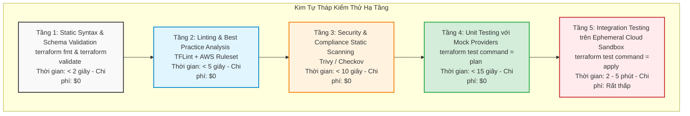
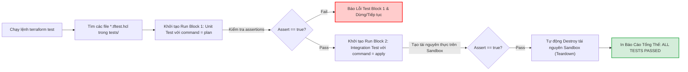
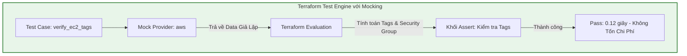
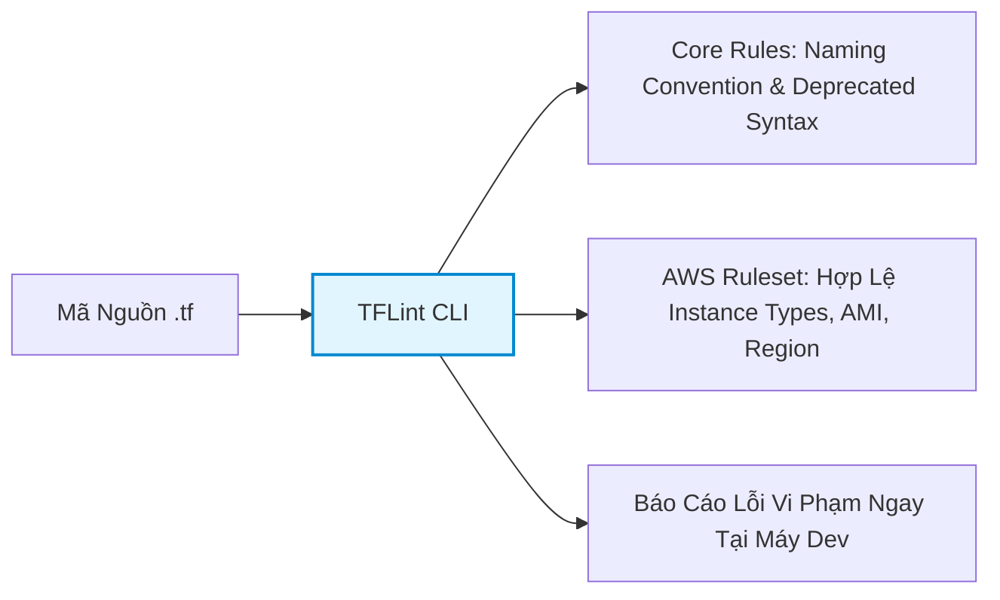
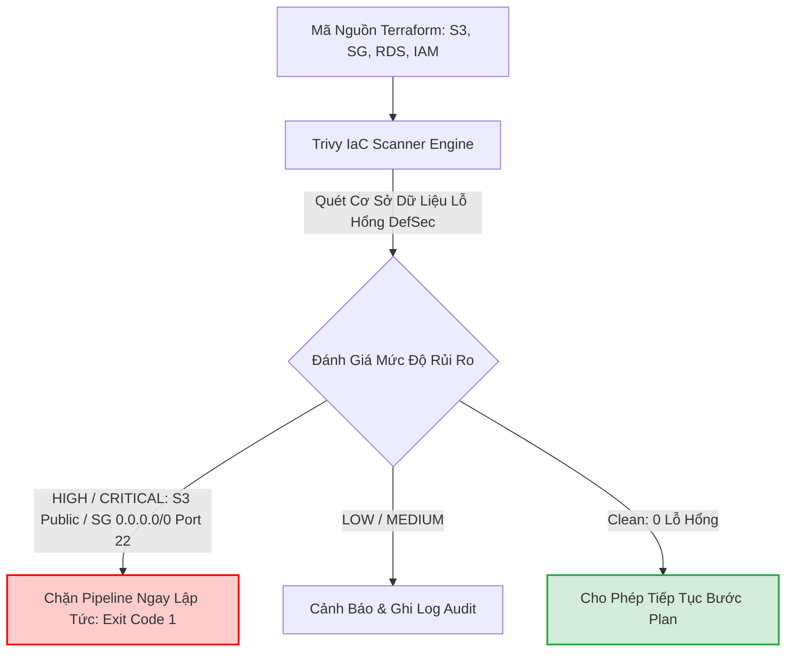
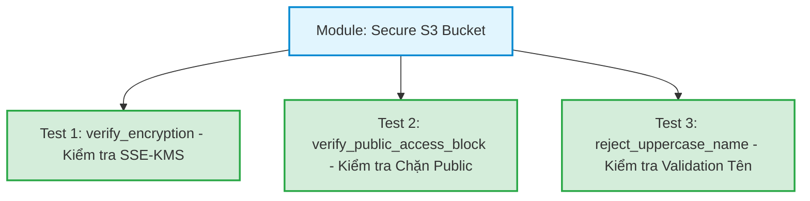
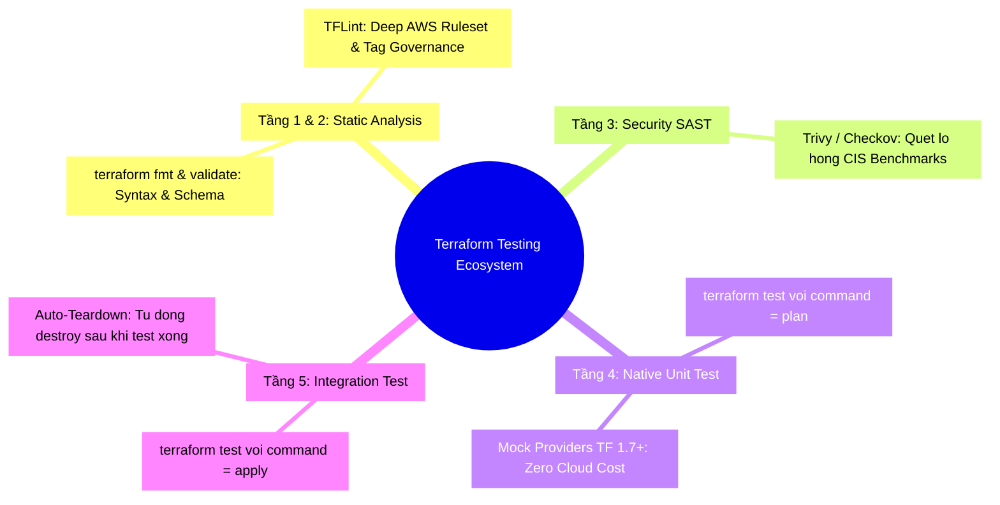


# Kiểm Thử Hạ Tầng: terraform test, TFLint, Trivy và Validate

Trong kỹ nghệ phần mềm truyền thống, không lập trình viên nào dám đẩy code lên Production mà không chạy qua bộ kiểm thử Unit Tests và Integration Tests. Thế nhưng trong lĩnh vực Infrastructure as Code, suốt một thời gian dài, phương pháp kiểm thử phổ biến nhất của các kỹ sư DevOps lại là... **chạy `terraform apply` trực tiếp lên Cloud thật rồi cầu nguyện (Hope-Driven Development)**!

Hậu quả của cách tiếp cận này là hàng loạt sự cố nghiêm trọng: cấu hình sai dải mạng làm cô lập máy chủ, mở port database công khai ra Internet, hoặc tạo ra các tài nguyên đắt đỏ gây thâm hụt ngân sách đám mây hàng chục nghìn USD.

Kể từ **Terraform 1.6+**, HashiCorp đã chính thức chuẩn hóa và tích hợp framework kiểm thử bản địa **`terraform test`** (sử dụng cú pháp `.tftest.hcl`), kết hợp với cơ chế **Mock Providers** (Terraform 1.7+). Giờ đây, bạn có thể kiểm thử toàn bộ logic của module từ Unit Test đến Integration Test mà không cần tốn một xu chi phí cloud thực tế!

Bài viết này sẽ xây dựng Kim tự tháp Kiểm thử Hạ tầng (Infrastructure Testing Pyramid), hướng dẫn viết kịch bản `.tftest.hcl` chuyên sâu và tích hợp bộ công cụ Static Analysis (**`terraform validate`**, **`tflint`**, **`trivy`**) vào quy trình Shift-Left Testing.

---

## 1. Kim Tự Tháp Kiểm Thử Hạ Tầng (Infrastructure Testing Pyramid)

Một chiến lược kiểm thử hạ tầng chuẩn mực tuân theo nguyên lý **Shift-Left**: Phát hiện lỗi càng sớm ở các tầng dưới, chi phí và thời gian sửa lỗi càng rẻ.



### 1.1. Ma Trận So Sánh Các Công Cụ Kiểm Thử

| Công Cụ / Tầng | Loại Kiểm Thử | Thời Điểm Thực Thi | Yêu Cầu Cloud Credentials? | Mục Tiêu Phát Hiện |
| :--- | :--- | :--- | :--- | :--- |
| **`terraform fmt & validate`** | Syntax & Schema | Pre-commit / Local | Không | Lỗi cú pháp HCL, sai tên thuộc tính schema |
| **`TFLint`** | Deep Linting | Pre-commit / CI | Không (hoặc Read-only) | Sai instance type, vi phạm quy ước đặt tên |
| **`Trivy / Checkov`** | Security SAST | CI Pipeline | Không | Mở port 22/3389, thiếu encryption, IAM quá rộng |
| **`terraform test (Mock)`** | Native Unit Test | CI Pipeline | **Không cần (Mock Data)** | Lỗi logic biến đổi HCL, tính toán outputs sai |
| **`terraform test (Live)`** | Integration Test | CI Staging Gate | **Bắt buộc có Cloud Account** | Lỗi tương thích API thực tế, xung đột tài nguyên |

---

## 2. Giải Mã Framework Bản Địa: `terraform test` (Terraform 1.6+)

Khung kiểm thử `terraform test` hoạt động dựa trên các tệp kịch bản kiểm thử có đuôi `.tftest.hcl` đặt trong thư mục gốc hoặc thư mục con `tests/`.



### 2.1. Cấu Trúc File Kịch Bản `.tftest.hcl`

Một file kịch bản kiểm thử bao gồm các khối:
- `variables`: Thiết lập các biến số đầu vào cho toàn bộ kịch bản hoặc từng run block.
- `provider`: Cấu hình provider giả lập hoặc provider thực tế.
- `run`: Từng ca kiểm thử (Test Case) độc lập. Trong mỗi `run`, bạn có thể chỉ định:
  - `command = plan` (Unit test: Không tạo tài nguyên, chỉ đánh giá logic đồ thị).
  - `command = apply` (Integration test: Tạo tài nguyên thực tế, sau đó tự động hủy).
  - `assert`: Các biểu thức điều kiện kèm thông điệp lỗi nếu vi phạm.

```hcl
# tests/vpc_validation.tftest.hcl

variables {
  environment = "production"
  vpc_cidr    = "10.0.0.0/16"
}

# TEST CASE 1: UNIT TEST - KIỂM TRA PHÂN PHỐI DẢI MẠNG SUBNET LOGIC
run "verify_subnet_allocation" {
  command = plan

  variables {
    az_count = 3
  }

  # Xác thực số lượng Subnets được tính toán đúng
  assert {
    condition     = length(aws_subnet.private) == 3
    error_message = "Số lượng Private Subnets phải bằng 3 theo đúng số lượng AZs!"
  }

  # Xác thực CIDR của Private Subnet đầu tiên
  assert {
    condition     = aws_subnet.private[0].cidr_block == "10.0.1.0/24"
    error_message = "Private Subnet AZ-1 phải có CIDR là 10.0.1.0/24!"
  }
}

# TEST CASE 2: UNIT TEST - KIỂM TRA CHẶN DẢI MẠNG BẤT HỢP LỆ
run "reject_invalid_cidr" {
  command = plan

  variables {
    vpc_cidr = "192.168.1.0/28" # Quá nhỏ, vi phạm validation
  }

  # Kỳ vọng câu lệnh Plan phải thất bại
  expect_failures = [
    var.vpc_cidr,
  ]
}
```

---

## 3. Đỉnh Cao Unit Test: Mock Providers Trong Terraform 1.7+

Một trong những tính năng đột phá nhất của **Terraform 1.7+** là khả năng **Mock Provider Data and Resources** mà không cần kết nối tới Internet hay Cloud Provider API.



```hcl
# tests/mock_ec2.tftest.hcl

# Giả lập toàn bộ Provider AWS
mock_provider "aws" {
  mock_data "aws_ami" {
    defaults = {
      id   = "ami-mock-0123456789abcdef0"
      name = "ubuntu/images/hvm-ssd/ubuntu-jammy-22.04-amd64-server-20260101"
      tags = {
        ComplianceApproved = "true"
      }
    }
  }
}

run "test_ec2_with_mock" {
  command = plan

  variables {
    instance_type = "t3.medium"
    environment   = "production"
  }

  assert {
    condition     = aws_instance.web.ami == "ami-mock-0123456789abcdef0"
    error_message = "EC2 Instance phải sử dụng AMI ID được trả về từ Mock Data!"
  }

  assert {
    condition     = aws_instance.web.tags["Environment"] == "production"
    error_message = "Tag Environment không khớp với cấu hình!"
  }
}
```

---

## 4. TFLint: Deep Static Code Analysis Cho Terraform

Mặc dù `terraform validate` kiểm tra cú pháp rất tốt, nhưng nó không thể phát hiện các lỗi nghiệp vụ riêng của từng Cloud (ví dụ: `instance_type = "t2.supermicro"` không tồn tại trên AWS). **TFLint** là công cụ phân tích tĩnh chuyên sâu, sử dụng các Rulesets chính thức của AWS/Azure/GCP để bắt các lỗi logic này ngay lập tức.



### 4.1. Cấu Hình Tệp `.tflint.hcl` Chuẩn Doanh Nghiệp

```hcl
config {
  module = true
  force  = false
}

# Kích hoạt Ruleset chính thức của AWS
plugin "aws" {
  enabled = true
  version = "0.30.0"
  source  = "github.com/terraform-linters/tflint-ruleset-aws"
}

# Rule 1: Bắt buộc mọi tài nguyên phải có thẻ Tags chuẩn
rule "aws_resource_missing_tags" {
  enabled = true
  tags = [
    "Environment",
    "Owner",
    "ManagedBy"
  ]
}

# Rule 2: Phát hiện các Instance Type không tồn tại trên AWS
rule "aws_instance_invalid_type" {
  enabled = true
}

# Rule 3: Cảnh báo việc sử dụng cú pháp nội suy chuỗi thừa thãi
rule "terraform_deprecated_interpolation" {
  enabled = true
}
```

---

## 5. Trivy: Quét Lỗ Hổng Bảo Mật & Tuân Thủ (Security SAST)

**Trivy** (phát triển bởi Aqua Security) là công cụ quét bảo mật toàn diện cho cả Container Images và mã nguồn IaC Terraform. Nó giúp phát hiện các cấu hình vi phạm chuẩn CIS Benchmarks, NIST và PCI-DSS.



### 5.1. Lệnh Quét Trivy Chuyên Dụng Cho CI/CD
```bash
# Quét toàn bộ thư mục và chặn pipeline nếu phát hiện lỗi mức độ HIGH hoặc CRITICAL
trivy config ./environments/production --exit-code 1 --severity HIGH,CRITICAL
```

---

## 6. Hands-On Lab: Xây Dựng Bộ Test Tự Động Với `terraform test` & Assertions

Trong bài lab này, chúng ta sẽ xây dựng một S3 Secure Bucket Module và viết kịch bản `.tftest.hcl` để kiểm thử toàn diện 3 tầng logic: Mã hóa KMS, Block Public Access và Ngăn chặn việc truyền tên bucket sai quy cách.



### Bước 1: Khởi tạo cấu trúc thư mục
```bash
mkdir -p terraform-lab21-testing/tests
cd terraform-lab21-testing
```

### Bước 2: Viết mã nguồn module `main.tf`
Tạo file `main.tf`:
```hcl
terraform {
  required_version = ">= 1.6.0"
  required_providers {
    aws = {
      source  = "hashicorp/aws"
      version = "~> 5.0"
    }
  }
}

variable "bucket_name" {
  type        = string
  description = "Tên của S3 Bucket (chỉ chữ thường, số và gạch ngang)"

  validation {
    condition     = can(regex("^[a-z0-9.-]{3,63}$", var.bucket_name))
    error_message = "Tên S3 Bucket không hợp lệ! Chỉ được dùng chữ thường, số, dấu chấm và gạch ngang."
  }
}

variable "enable_versioning" {
  type        = bool
  default     = true
  description = "Bật tính năng versioning lưu trữ lịch sử file"
}

# 1. Tạo S3 Bucket
resource "aws_s3_bucket" "this" {
  bucket = var.bucket_name
}

# 2. Cấu hình Versioning
resource "aws_s3_bucket_versioning" "this" {
  bucket = aws_s3_bucket.this.id
  versioning_configuration {
    status = var.enable_versioning ? "Enabled" : "Suspended"
  }
}

# 3. Cấu hình Chặn Toàn Bộ Public Access
resource "aws_s3_bucket_public_access_block" "this" {
  bucket = aws_s3_bucket.this.id

  block_public_acls       = true
  block_public_policy     = true
  ignore_public_acls      = true
  restrict_public_buckets = true
}

# 4. Cấu hình Mã Hóa Mặc Định SSE-S3 hoặc KMS
resource "aws_s3_bucket_server_side_encryption_configuration" "this" {
  bucket = aws_s3_bucket.this.id

  rule {
    apply_server_side_encryption_by_default {
      sse_algorithm = "AES256"
    }
  }
}

output "bucket_id" {
  value = aws_s3_bucket.this.id
}

output "public_access_blocked" {
  value = aws_s3_bucket_public_access_block.this.block_public_acls
}
```

### Bước 3: Tạo kịch bản kiểm thử `tests/s3_security.tftest.hcl`
Tạo file `tests/s3_security.tftest.hcl`:
```hcl
# Thiết lập biến chung cho toàn bộ bài kiểm thử
variables {
  bucket_name       = "corp-secure-data-storage-2026"
  enable_versioning = true
}

# Test Case 1: Kiểm tra cấu hình bảo mật ở tầng Plan (Unit Test)
run "verify_security_configuration_plan" {
  command = plan

  # Kiểm tra tính năng chặn public access
  assert {
    condition     = aws_s3_bucket_public_access_block.this.block_public_acls == true
    error_message = "block_public_acls bắt buộc phải là TRUE để chống rò rỉ dữ liệu!"
  }

  assert {
    condition     = aws_s3_bucket_public_access_block.this.restrict_public_buckets == true
    error_message = "restrict_public_buckets bắt buộc phải là TRUE!"
  }

  # Kiểm tra mã hóa mặc định
  assert {
    condition     = aws_s3_bucket_server_side_encryption_configuration.this.rule[0].apply_server_side_encryption_by_default[0].sse_algorithm == "AES256"
    error_message = "Mã hóa mặc định phải là AES256!"
  }
}

# Test Case 2: Kiểm tra bắt lỗi khi truyền tên chứa ký tự in hoa
run "reject_uppercase_bucket_name" {
  command = plan

  variables {
    bucket_name = "INVALID-UPPERCASE-BUCKET-NAME"
  }

  expect_failures = [
    var.bucket_name,
  ]
}
```

### Bước 4: Thực thi lệnh `terraform init` và `terraform test`
```bash
terraform init
terraform test
```

**Quan sát kết quả thực thi kiểm thử:**
```text
tests/s3_security.tftest.hcl... in progress
  run "verify_security_configuration_plan"... pass
  run "reject_uppercase_bucket_name"... pass
tests/s3_security.tftest.hcl... tearing down
tests/s3_security.tftest.hcl... pass

-------------------------------------------------------------------------------
Success: 2 passed, 0 failed.
```

### Bước 5: Thử nghiệm cố tình tạo lỗi kiểm thử (Breaking Test)
Sửa file `tests/s3_security.tftest.hcl`, đổi kỳ vọng `sse_algorithm == "aws:kms"`:
```hcl
  assert {
    condition     = aws_s3_bucket_server_side_encryption_configuration.this.rule[0].apply_server_side_encryption_by_default[0].sse_algorithm == "aws:kms"
    error_message = "Mã hóa mặc định phải là KMS!"
  }
```
Chạy lại:
```bash
terraform test
```

**Kết quả terminal:**
```text
╷
│ Error: Test assertion failed
│ 
│   on tests/s3_security.tftest.hcl line 20:
│   20:     condition     = aws_s3_bucket_server_side_encryption_configuration.this.rule[0].apply_server_side_encryption_by_default[0].sse_algorithm == "aws:kms"
│     ├────────────────
│     │ aws_s3_bucket_server_side_encryption_configuration.this.rule[0].apply_server_side_encryption_by_default[0].sse_algorithm is "AES256"
│ 
│ Mã hóa mặc định phải là KMS!
╵
```
Terraform test đã bắt chính xác lỗi sai lệch giá trị và in ra thông điệp chỉ dẫn rõ ràng!

### Bước 6: Khôi phục và dọn dẹp môi trường lab
Sửa lại assertion cho đúng và dọn dẹp:
```bash
cd ..
rm -rf terraform-lab21-testing
```

---

## 7. 10 Câu Hỏi Trắc Nghiệm & Phỏng Vấn Chuyên Sâu (Self-Check Q&A)

### Q1: Framework `terraform test` bản địa (kể từ 1.6+) có ưu điểm vượt trội gì so với Terratest (viết bằng Golang)?
- **Trả lời**: 
  - **Cú pháp HCL quen thuộc**: Không đòi hỏi kỹ sư DevOps phải học ngôn ngữ Go.
  - **Tích hợp sâu trong Core**: Không cần cài đặt Go Runtime hay compile binary, chạy trực tiếp bằng lệnh `terraform test`.
  - **Hỗ trợ Unit Test với `command = plan` và Mocking (1.7+)**: Kiểm thử logic module trong vài mili-giây mà không cần Cloud Account thực tế, trong khi Terratest gần như bắt buộc phải tạo tài nguyên thực trên Cloud.

### Q2: Khối `expect_failures` trong một `run` block của `terraform test` được sử dụng khi nào?
- **Trả lời**: Được dùng khi bạn muốn viết **Negative Test Cases** (Kiểm thử các trường hợp dữ liệu xấu). Nó thông báo cho Terraform biết rằng khối test này được thiết kế có chủ đích để kiểm tra xem hệ thống có chặn đứng các giá trị sai phạm hay không. Nếu câu lệnh ném ra đúng lỗi mong đợi tại biến hoặc check đã chỉ định, test case sẽ được tính là **PASS**.

### Q3: Sự khác biệt mấu chốt giữa `terraform validate` và `tflint` là gì?
- **Trả lời**: 
  - `terraform validate`: Chỉ kiểm tra cú pháp HCL hợp lệ và đối chiếu với Provider Schema tĩnh (xem tên thuộc tính có tồn tại không).
  - `tflint`: Phân tích sâu hơn bằng các bộ quy tắc (Rulesets). Nó kiểm tra được giá trị thực tế của thuộc tính có hợp lệ trên Cloud hay không (ví dụ: phát hiện EC2 `instance_type` không tồn tại, phát hiện thiếu tags bắt buộc theo chính sách doanh nghiệp).

### Q4: Khi chạy `terraform test` với `command = apply`, điều gì xảy ra với các tài nguyên vừa được tạo ra sau khi kịch bản test kết thúc?
- **Trả lời**: Terraform Test Engine sẽ **tự động kích hoạt cơ chế Teardown (tương đương `terraform destroy`)** để xóa toàn bộ các tài nguyên tạm thời đã tạo trong bài test, đảm bảo không để lại tài nguyên rác (Orphaned Resources) và không gây phát sinh chi phí duy trì.

### Q5: Mock Providers trong `terraform test` (Terraform 1.7+) giải quyết rào cản lớn nào trong quy trình CI/CD?
- **Trả lời**: Nó giải quyết bài toán **Bảo mật và Chi phí**: CI/CD Pipeline có thể chạy hàng trăm bài kiểm thử Unit Tests cho Terraform Modules trên môi trường cô lập (Isolated Runners) mà không cần cấp quyền truy cập AWS IAM Credentials, không lo vượt hạn mức API Rate Limit, và hoàn toàn miễn phí.

### Q6: Trong file `.tftest.hcl`, bạn có thể kiểm tra giá trị của một Output bằng cách nào?
- **Trả lời**: Bạn có thể tham chiếu trực tiếp thông qua cú pháp `output.<output_name>` bên trong khối `assert.condition`. Ví dụ: `condition = output.vpc_id != ""`.

### Q7: Công cụ Trivy quét mã nguồn Terraform dựa trên những tiêu chuẩn bảo mật quốc tế nào?
- **Trả lời**: Trivy tích hợp bộ quy tắc đối chiếu với các khung tiêu chuẩn hàng đầu: **CIS Benchmarks (Center for Internet Security)**, **NIST SP 800-53**, **PCI-DSS** (bảo mật thanh toán thẻ), và **AWS Well-Architected Framework Security Pillar**.

### Q8: Có thể chia sẻ biến số giữa nhiều khối `run` trong cùng một file `.tftest.hcl` không?
- **Trả lời**: Có thể. Khối `variables` ở cấp cao nhất (Root Level của file test) sẽ áp dụng giá trị mặc định cho toàn bộ các khối `run`. Nếu một khối `run` cụ thể khai báo lại `variables`, giá trị đó sẽ ghi đè cục bộ chỉ riêng cho khối `run` đó.

### Q9: `assert` block trong `terraform test` có thể chứa tối đa bao nhiêu điều kiện?
- **Trả lời**: Mỗi khối `assert` chỉ chứa duy nhất một biểu thức `condition` và một `error_message`. Tuy nhiên, trong một khối `run`, bạn có thể định nghĩa **không giới hạn số lượng khối `assert`** để kiểm tra song song nhiều thuộc tính khác nhau của hạ tầng.

### Q10: Tại sao nên chạy `trivy config` trước khi chạy `terraform test` trong Pipeline CI/CD?
- **Trả lời**: Vì `trivy config` là công cụ Static SAST cực nhanh (mất vài giây), giúp chặn đứng ngay lập tức các lỗi cấu hình hổng bảo mật nghiêm trọng (như mở CIDR 0.0.0.0/0 cho SSH) trước khi tiêu tốn thời gian và tài nguyên để chạy các bài test chức năng sâu hơn.

---

## 8. Tổng Kết & Cheat Sheet Thực Chiến



- **Quy tắc phát triển Module**: 100% Terraform Shared Modules dùng chung trong doanh nghiệp bắt buộc phải có thư mục `tests/` chứa ít nhất 2 kịch bản kiểm thử `.tftest.hcl` (1 Unit Test logic và 1 Negative Test kiểm tra Validation).
- **Tiêu chuẩn CI Pipeline**: Tích hợp chuỗi kiểm tra Shift-Left: `fmt` -> `validate` -> `tflint` -> `trivy` -> `terraform test`.
- **Bước tiếp theo**: Trong [Bài 22: Quản Trị Chính Sách Policy as Code: OPA/Rego, Conftest và Checkov](./22-quan-tri-chinh-sach-policy-as-code-opa-rego-conftest-va-checkov.md), chúng ta sẽ bước lên đỉnh cao của quản trị hạ tầng với ngôn ngữ Rego và Open Policy Agent để xây dựng các rào chắn Guardrails bất khả xâm phạm!

