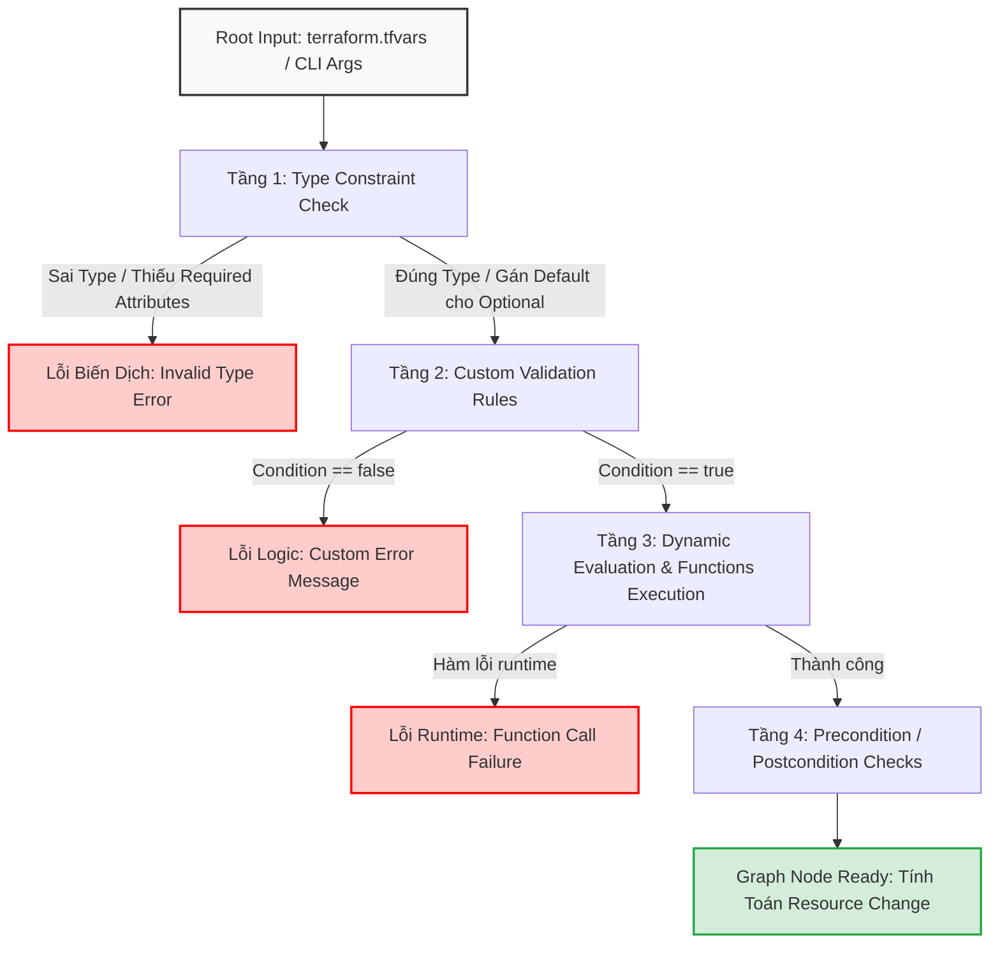
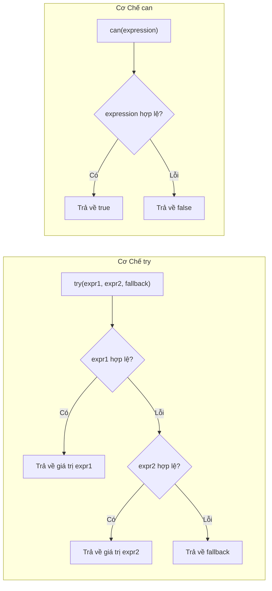
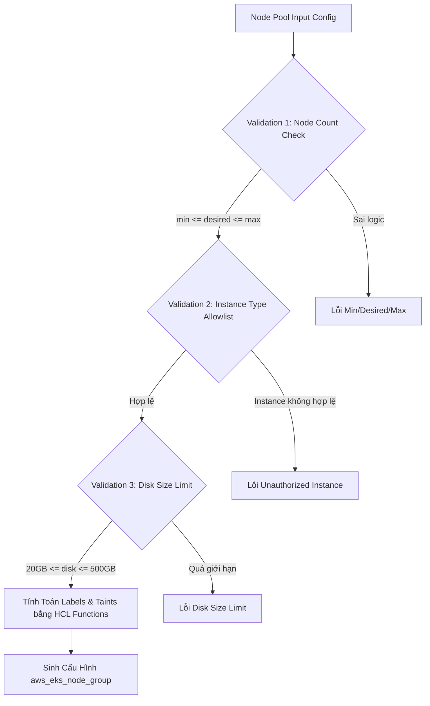
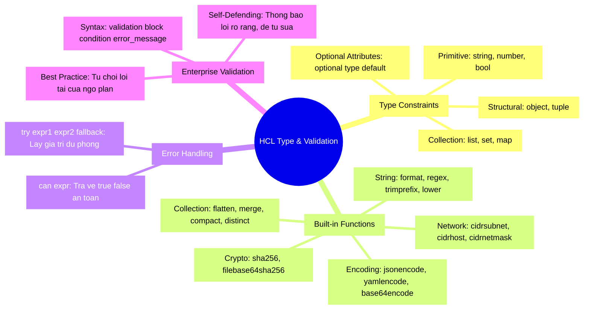

# Functions, Type Constraints & Custom Variable Validation Chuẩn Enterprise

Trong hành trình xây dựng các Terraform Modules dùng chung cho hàng trăm kỹ sư trong doanh nghiệp, thách thức lớn nhất không nằm ở việc viết code chạy được, mà là ngăn chặn người dùng truyền vào các tham số sai lệch, vi phạm tiêu chuẩn bảo mật, hoặc gây sập toàn bộ hệ thống ngay trong giai đoạn `terraform plan`.

Một module đẳng cấp Enterprise phải đóng vai trò như một **Hệ thống Tự phòng vệ (Self-Defending Codebase)**: từ chối các input không hợp lệ ngay tại cửa ngõ HCL bằng cơ chế **Type Constraints** chặt chẽ, tận dụng kho tàng **Built-in Functions** để biến đổi dữ liệu thông minh, và thiết lập các khối **Custom Validation** với thông báo lỗi chi tiết, hướng dẫn người dùng tự sửa lỗi mà không cần debug mò mẫm.

Bài viết này sẽ mổ xẻ toàn diện cấu trúc kiểu dữ liệu nâng cao trong Terraform, phân loại các hàm cốt lõi, cơ chế bắt lỗi `can()` vs `try()`, và cách hiện thực hóa các bài toán validation phức tạp trong thực tế.

---

## 1. Kiến Trúc Type System & Validation Engine Trong Terraform

Khi bạn chạy lệnh `terraform plan`, HCL Engine thực hiện quy trình kiểm tra và chuyển đổi dữ liệu qua nhiều tầng trước khi tài nguyên được đưa vào Dependency Graph.



### 1.1. Thứ Tự Đánh Giá Biến Số (Evaluation Lifecycle)
1. **Type Constraint Enforcement**: HCL phân tích kiểu dữ liệu thô và ép kiểu (type coercion) nếu có thể (ví dụ: chuỗi `"true"` thành boolean `true`). Nếu cấu trúc object không khớp hoặc sai kiểu không thể ép, Terraform dừng lại ngay lập tức.
2. **Optional Attribute Defaults**: Với các trường được đánh dấu `optional(type, default)`, Terraform tự động lấp đầy giá trị mặc định nếu người dùng không truyền.
3. **Custom Validation Evaluation**: Từng khối `validation` trong biến số được đánh giá độc lập. Điều kiện `condition` bắt buộc phải trả về giá trị boolean `true` hoặc `false`. Nếu trả về `false`, chuỗi `error_message` sẽ được in ra terminal.
4. **Local Values & Dynamic Functions**: Các hàm HCL trong khối `locals` hoặc `resource` được thực thi để chuẩn hóa dữ liệu trước khi gửi sang Provider Plugin.

---

## 2. Hệ Thống Type Constraints Chuyên Sâu

Terraform hỗ trợ hai nhóm kiểu dữ liệu chính: **Primitive Types** (kiểu nguyên thủy) và **Complex Types** (kiểu phức hợp gồm Collection và Structural).

```mermaid
classDiagram
    class Types {
    }
    class PrimitiveTypes {
        string
        number
        bool
    }
    class CollectionTypes {
        list(T)
        set(T)
        map(T)
    }
    class StructuralTypes {
        object({attr = T, ...})
        tuple([T1, T2, ...])
    }
    Types <|-- PrimitiveTypes
    Types <|-- CollectionTypes
    Types <|-- StructuralTypes


```

### 2.1. Ma Trận So Sánh Collection Types vs Structural Types

| Tiêu Chí | `list(T)` / `map(T)` | `set(T)` | `object({...})` | `tuple([...])` |
| :--- | :--- | :--- | :--- | :--- |
| **Tính đồng nhất (Homogeneity)** | Tất cả phần tử phải CÙNG kiểu `T` | CÙNG kiểu `T`, không trùng lặp | Cho phép CÁC kiểu khác nhau cho từng key | Cho phép CÁC kiểu khác nhau theo vị trí index |
| **Truy cập phần tử** | Index số `[0]` hoặc Key `["k"]` | Không hỗ trợ index trực tiếp | Qua tên thuộc tính `.attr_name` | Qua index số `[0]`, `[1]` |
| **Ứng dụng điển hình** | Danh sách CIDR, Map Subnet IDs | Danh sách Security Group Names | Cấu hình phức tạp của VPC, App, VM | Cặp tọa độ, tuple giá trị cố định |
| **Hỗ trợ Optional & Default** | Không (phải khai báo đầy đủ) | Không | Có (`optional(type, default)`) | Không |

### 2.2. Khai Phá Sức Mạnh Của `optional()` Trong Structural Types (Terraform 1.3+)

Trước Terraform 1.3, việc định nghĩa một object có nhiều thuộc tính tùy chọn đòi hỏi người dùng phải truyền đầy đủ tất cả các trường hoặc sử dụng `map(any)` làm mất đi tính an toàn của type system. Kể từ Terraform 1.3+, `optional()` giải quyết triệt để vấn đề này:

```hcl
variable "database_cluster" {
  description = "Cấu hình Enterprise Database Cluster hỗ trợ High Availability và Auto-scaling"
  type = object({
    cluster_name = string
    engine       = string
    engine_version = optional(string, "15.4")
    instance_class = string
    instances_count = optional(number, 2)
    
    storage = object({
      allocated_gb      = number
      max_allocated_gb  = optional(number, 1000)
      storage_type      = optional(string, "gp3")
      iops              = optional(number, 3000)
      throughput_mbps   = optional(number, 125)
    })

    backup_retention_period = optional(number, 7)
    preferred_backup_window = optional(string, "02:00-03:00")
    enable_deletion_protection = optional(bool, true)
    
    tags = optional(map(string), {})
  })

  default = {
    cluster_name   = "production-core-db"
    engine         = "aurora-postgresql"
    instance_class = "db.r6g.xlarge"
    storage = {
      allocated_gb = 100
    }
  }
}
```

> [!TIP]
> Bằng cách đặt giá trị mặc định trực tiếp bên trong `optional(type, default_value)`, bạn không cần phải viết hàm `coalesce()` hay `try()` phức tạp ở tầng `locals` nữa!

---

## 3. Tổng Kho Built-in Functions & Ứng Dụng Thực Chiến

HCL cung cấp hơn 100 hàm tích hợp chia thành nhiều nhóm. Dưới đây là các hàm cốt lõi mà mọi Senior DevOps Engineer phải nắm vững.

### 3.1. Nhóm Hàm Biến Đổi & Thao Tác Chuỗi (String Manipulation)

- `format(format_string, args...)`: Định dạng chuỗi theo cú pháp tương tự hàm `printf` trong ngôn ngữ C.
- `regex(pattern, string)` / `regexall(pattern, string)`: Khớp biểu thức chính quy (PCRE regex). `regex` trả về chuỗi hoặc object captured groups; `regexall` trả về danh sách các match.
- `join(separator, list)` / `split(separator, string)`: Nối mảng thành chuỗi và tách chuỗi thành mảng.
- `trimprefix(str, prefix)` / `trimsuffix(str, suffix)`: Cắt bỏ tiền tố/hậu tố xác định.

```hcl
locals {
  app_name      = "Payment-Gateway"
  raw_version   = "v2.14.0-rc1"
  
  # Chuẩn hóa tên định danh hạ tầng
  normalized_name = lower(replace(local.app_name, "/[^a-zA-Z0-9]/", "-")) # "payment-gateway"
  semver_clean    = trimprefix(local.raw_version, "v")                    # "2.14.0-rc1"
  
  # Bóc tách SemVer bằng Regex
  version_parts = regex("^(?P<major>\\d+)\\.(?P<minor>\\d+)\\.(?P<patch>\\d+)(-(?P<prerelease>.*))?$", local.semver_clean)
  # Trả về: { major = "2", minor = "14", patch = "0", prerelease = "rc1" }
}
```

### 3.2. Nhóm Hàm Thao Tác Collection & Chuyển Đổi Dữ Liệu

- `flatten(list_of_lists)`: Làm phẳng mảng lồng nhau nhiều cấp thành mảng 1 chiều duy nhất.
- `merge(map1, map2, ...)`: Gộp nhiều map lại với nhau. Map phía sau ghi đè key trùng của map phía trước.
- `lookup(map, key, default)`: Tìm kiếm giá trị theo key, trả về default nếu không tồn tại.
- `compact(list_of_strings)`: Loại bỏ các chuỗi rỗng `""` và null khỏi danh sách.
- `distinct(list)`: Loại bỏ các phần tử trùng lặp trong danh sách.
- `chunklist(list, size)`: Chia nhỏ một danh sách thành các danh sách con có kích thước `size`.

```hcl
locals {
  # Giả sử có cấu hình VPC đa tầng
  tier_subnets = {
    web = ["10.0.1.0/24", "10.0.2.0/24"]
    app = ["10.0.11.0/24", "10.0.12.0/24"]
    db  = ["10.0.21.0/24", "10.0.22.0/24"]
  }

  # Thu được danh sách phẳng của toàn bộ CIDR
  all_cidrs = flatten(values(local.tier_subnets))
  # ["10.0.1.0/24", "10.0.2.0/24", "10.0.11.0/24", "10.0.12.0/24", "10.0.21.0/24", "10.0.22.0/24"]

  # Gộp Tags chuẩn doanh nghiệp
  base_tags = {
    Environment = "Production"
    ManagedBy   = "Terraform"
  }
  custom_tags = {
    Owner       = "Core-Banking-Team"
    CostCenter  = "CC-9081"
  }
  final_tags = merge(local.base_tags, local.custom_tags, { ProvisionedDate = timestamp() })
}
```

### 3.3. Nhóm Hàm Mã Hóa & Băm Dữ Liệu (Encoding & Hashing)

- `jsonencode(value)` / `jsondecode(string)`: Chuyển đổi qua lại giữa HCL Data Types và chuẩn JSON.
- `yamlencode(value)` / `yamldecode(string)`: Chuyển đổi qua lại với YAML format.
- `base64encode(string)` / `base64decode(string)`: Mã hóa/Giải mã Base64 (dùng cho EC2 User Data, Kubernetes Secrets).
- `sha256(string)` / `filebase64sha256(path)`: Tạo mã băm cryptographic, cực kỳ hữu ích để phát hiện thay đổi file zip của AWS Lambda hay file script cấu hình.

```hcl
resource "aws_lambda_function" "api_handler" {
  filename         = "${path.module}/dist/handler.zip"
  function_name    = "api-gateway-handler"
  role             = aws_iam_role.lambda_exec.arn
  handler          = "index.handler"
  runtime          = "nodejs18.x"

  # Tự động phát hiện khi nội dung file zip thay đổi để kích hoạt redeployment
  source_code_hash = filebase64sha256("${path.module}/dist/handler.zip")

  environment {
    variables = {
      APP_CONFIG_JSON = jsonencode({
        rate_limit_per_minute = 1000
        enable_audit_logging  = true
        cors_origins          = ["https://app.company.internal", "https://admin.company.internal"]
      })
    }
  }
}
```

### 3.4. Nhóm Hàm Mạng Chuyên Sâu (IP Network Calculations)

- `cidrsubnet(prefix, newbits, netnum)`: Tính toán cấp phát dải IP subnet con từ một dải mạng gốc.
- `cidrhost(prefix, hostnum)`: Tính toán địa chỉ IP cụ thể của máy chủ trong dải subnet.
- `cidrnetmask(prefix)`: Lấy subnet mask dạng dotted-decimal (ví dụ: `255.255.255.0`).

```hcl
locals {
  vpc_cidr = "10.100.0.0/16"

  # Cắt nhỏ VPC /16 thành các Subnet /24 (16 + 8 = 24 bits)
  public_subnet_az1  = cidrsubnet(local.vpc_cidr, 8, 1)  # 10.100.1.0/24
  public_subnet_az2  = cidrsubnet(local.vpc_cidr, 8, 2)  # 10.100.2.0/24
  private_subnet_az1 = cidrsubnet(local.vpc_cidr, 8, 11) # 10.100.11.0/24
  private_subnet_az2 = cidrsubnet(local.vpc_cidr, 8, 12) # 10.100.12.0/24

  # Địa chỉ IP của Gateway máy chủ nội bộ đầu tiên trong subnet
  internal_gateway_ip = cidrhost(local.private_subnet_az1, 1) # 10.100.11.1
}
```

---

## 4. Cơ Chế Xử Lý Lỗi An Toàn: `can()` vs `try()`

Trong HCL, việc truy cập một thuộc tính không tồn tại hoặc gọi hàm với tham số không hợp lệ sẽ làm chương trình bị dừng ngay lập tức (Fatal Error). Để xử lý các tình huống dữ liệu động không chắc chắn, HCL cung cấp hai hàm bảo vệ:



### 4.1. Bản Chất Kỹ Thuật

- **`can(expression)`**: Đánh giá biểu thức `expression`. Nếu biểu thức tính toán thành công mà không gây lỗi runtime, trả về `true`. Nếu biểu thức gặp bất kỳ lỗi nào (ví dụ: null pointer, out of index, parse regex fail), trả về `false`. **`can()` chỉ được dùng trong các biểu thức logic boolean, đặc biệt là `validation.condition`.**
- **`try(expr1, expr2, ... fallback)`**: Đánh giá tuần tự từng biểu thức từ trái sang phải. Trả về kết quả của biểu thức đầu tiên thực thi thành công không bị lỗi.

### 4.2. Code Minh Họa & So Sánh

```hcl
variable "raw_config" {
  type    = any
  default = {}
}

locals {
  # SỬ DỤNG try() ĐỂ LẤY GIÁ TRỊ DỰ PHÒNG AN TOÀN
  # Nếu raw_config.database.port không tồn tại hoặc parse lỗi, gán mặc định 5432
  db_port = try(tonumber(local.raw_config.database.port), 5432)

  # SỬ DỤNG can() ĐỂ KIỂM TRA TÍNH HỢP LỆ
  # Trả về true nếu chuỗi là JSON hợp lệ, false nếu lỗi parse
  is_valid_json = can(jsondecode(var.raw_config.metadata_string))
}
```

> [!WARNING]
> Không lạm dụng `try()` để che giấu các lỗi lập trình ngớ ngẩn (bad code). Chỉ sử dụng `try()` khi xử lý dữ liệu động không thể biết trước kiểu dữ liệu từ bên ngoài module.

---

## 5. Thiết Kế Custom Variable Validation Chuẩn Enterprise

Một khối `validation` trong biến số bao gồm hai trường bắt buộc:
1. `condition`: Biểu thức logic phải trả về `true` (hợp lệ) hoặc `false` (vi phạm).
2. `error_message`: Thông điệp lỗi chi tiết. Phải là một câu hoàn chỉnh, giải thích rõ **vi phạm điều gì** và **cách sửa như thế nào**.

### 5.1. Ví Dụ 1: Validation Định Dạng Tên Tài Nguyên & Regex Bắt Buộc

```hcl
variable "environment" {
  type        = string
  description = "Tên môi trường triển khai (chỉ chấp nhận: dev, staging, prod)"

  validation {
    condition     = contains(["dev", "staging", "prod"], var.environment)
    error_message = "Môi trường không hợp lệ! Biến 'environment' bắt buộc phải là một trong các giá trị: ['dev', 'staging', 'prod']."
  }
}

variable "resource_prefix" {
  type        = string
  description = "Tiền tố đặt tên tài nguyên theo chuẩn Cloud Governance"

  validation {
    condition     = can(regex("^[a-z0-9]{3,8}-[a-z0-9]{3,8}$", var.resource_prefix))
    error_message = "Prefix tài nguyên không đúng định dạng chuẩn! Bắt buộc phải có dạng '[org]-[project]' (ví dụ: 'ntk-pay', 'corp-auth'), chỉ gồm chữ thường và số, độ dài từ 7 đến 17 ký tự."
  }
}
```

### 5.2. Ví Dụ 2: Validation Cấu Trúc Mạng CIDR An Toàn

```hcl
variable "vpc_cidr_block" {
  type        = string
  description = "Dải mạng chính của VPC"

  validation {
    # Kiểm tra chuỗi có phải là dải CIDR hợp lệ không
    condition     = can(cidrnetmask(var.vpc_cidr_block))
    error_message = "Giá trị 'vpc_cidr_block' phải là một địa chỉ CIDR IPv4 hợp lệ (ví dụ: '10.0.0.0/16')."
  }

  validation {
    # Ràng buộc subnet mask tối thiểu và tối đa theo chính sách Enterprise
    condition = (
      can(cidrnetmask(var.vpc_cidr_block)) &&
      tonumber(split("/", var.vpc_cidr_block)[1]) >= 16 &&
      tonumber(split("/", var.vpc_cidr_block)[1]) <= 20
    )
    error_message = "Chính sách bảo mật doanh nghiệp yêu cầu VPC CIDR Mask phải nằm trong khoảng từ /16 đến /20 để tối ưu định tuyến."
  }
}
```

### 5.3. Ví Dụ 3: Validation Danh Sách Đối Tượng Phức Tạp (Multi-rule Validation)

```hcl
variable "ingress_security_rules" {
  type = list(object({
    description = string
    port        = number
    protocol    = string
    cidr_blocks = list(string)
  }))
  description = "Danh sách các Security Group Ingress Rules"

  validation {
    # Không được mở port SSH (22) hoặc RDP (3389) công khai toàn cầu 0.0.0.0/0
    condition = alltrue([
      for rule in var.ingress_security_rules :
      !(
        contains([22, 3389], rule.port) &&
        contains(rule.cidr_blocks, "0.0.0.0/0")
      )
    ])
    error_message = "VI PHẠM BẢO MẬT NGHIÊM TRỌNG: Không được phép mở Port 22 (SSH) hoặc Port 3389 (RDP) ra toàn Internet (0.0.0.0/0)!"
  }

  validation {
    # Port phải nằm trong khoảng hợp lệ của TCP/UDP (1 - 65535)
    condition = alltrue([
      for rule in var.ingress_security_rules :
      rule.port >= 1 && rule.port <= 65535
    ])
    error_message = "Cổng mạng (port) không hợp lệ! Mọi rule phải có port nằm trong dải 1 - 65535."
  }

  validation {
    # Protocol chỉ chấp nhận tcp, udp, icmp
    condition = alltrue([
      for rule in var.ingress_security_rules :
      contains(["tcp", "udp", "icmp"], lower(rule.protocol))
    ])
    error_message = "Giao thức mạng (protocol) không hợp lệ! Chỉ chấp nhận: 'tcp', 'udp', 'icmp'."
  }
}
```

---

## 6. Hands-On Lab: Xây Dựng Secure Kubernetes Node Pool Module

Trong bài thực hành này, chúng ta sẽ xây dựng một module khởi tạo EKS Node Pool với đầy đủ Type Constraints, Functions tính toán Subnet động và 4 tầng Validation tự bảo vệ.



### Bước 1: Khởi tạo thư mục và cấu trúc file
```bash
mkdir -p terraform-lab15-validation
cd terraform-lab15-validation
```

### Bước 2: Định nghĩa `variables.tf` với Custom Validation Đa Tầng
Tạo file `variables.tf`:
```hcl
variable "cluster_name" {
  type        = string
  description = "Tên EKS Cluster"

  validation {
    condition     = can(regex("^[a-zA-Z0-9-_]{3,40}$", var.cluster_name))
    error_message = "Tên EKS Cluster chỉ được chứa ký tự chữ, số, gạch ngang '-', gạch dưới '_' và dài từ 3-40 ký tự."
  }
}

variable "node_pool_config" {
  type = object({
    pool_name      = string
    instance_types = list(string)
    capacity_type  = optional(string, "ON_DEMAND")
    disk_size_gb   = optional(number, 50)
    
    scaling = object({
      min_size     = number
      max_size     = number
      desired_size = number
    })

    subnet_ids = list(string)
    labels     = optional(map(string), {})
    taints = optional(list(object({
      key    = string
      value  = string
      effect = string
    })), [])
  })

  description = "Cấu hình chi tiết cho Kubernetes Node Pool"

  # Validation 1: Ràng buộc số lượng node logic
  validation {
    condition = (
      var.node_pool_config.scaling.min_size <= var.node_pool_config.scaling.desired_size &&
      var.node_pool_config.scaling.desired_size <= var.node_pool_config.scaling.max_size &&
      var.node_pool_config.scaling.min_size >= 1
    )
    error_message = "Cấu hình Scaling vi phạm logic: Yêu cầu 'min_size >= 1' và 'min_size <= desired_size <= max_size'."
  }

  # Validation 2: Kiểm soát capacity_type
  validation {
    condition     = contains(["ON_DEMAND", "SPOT"], var.node_pool_config.capacity_type)
    error_message = "Trường 'capacity_type' chỉ được nhận giá trị 'ON_DEMAND' hoặc 'SPOT'."
  }

  # Validation 3: Kiểm soát kích thước ổ đĩa
  validation {
    condition = (
      var.node_pool_config.disk_size_gb >= 20 &&
      var.node_pool_config.disk_size_gb <= 500
    )
    error_message = "Kích thước ổ đĩa 'disk_size_gb' phải nằm trong khoảng an toàn từ 20GB đến 500GB."
  }

  # Validation 4: Kiểm soát Taint Effect
  validation {
    condition = alltrue([
      for t in var.node_pool_config.taints :
      contains(["NO_SCHEDULE", "PREFER_NO_SCHEDULE", "NO_EXECUTE"], t.effect)
    ])
    error_message = "Taint Effect không hợp lệ! Chỉ chấp nhận: 'NO_SCHEDULE', 'PREFER_NO_SCHEDULE', 'NO_EXECUTE'."
  }
}
```

### Bước 3: Định nghĩa `main.tf` tận dụng Built-in Functions
Tạo file `main.tf`:
```hcl
terraform {
  required_version = ">= 1.5.0"
}

locals {
  # Chuẩn hóa tên Node Pool bằng String Functions
  normalized_pool_name = lower(replace(var.node_pool_config.pool_name, "/[^a-zA-Z0-9]/", "-"))

  # Tự động gộp các System Tags & Custom Labels
  default_labels = {
    "k8s.io/cluster-autoscaler/enabled"                 = "true"
    "k8s.io/cluster-autoscaler/${var.cluster_name}"     = "owned"
    "topology.kubernetes.io/managed-by"                = "terraform"
  }

  merged_labels = merge(local.default_labels, var.node_pool_config.labels)

  # Chuyển đổi taints thành format chuẩn
  formatted_taints = [
    for t in var.node_pool_config.taints : {
      key    = lower(t.key)
      value  = t.value
      effect = t.effect
    }
  ]
}

# Giả lập xuất dữ liệu chuẩn bị cho AWS Provider
output "debug_node_pool_payload" {
  description = "Payload cấu hình đã qua xử lý và chuẩn hóa dữ liệu"
  value = {
    final_name      = "${var.cluster_name}-${local.normalized_pool_name}"
    instance_types  = var.node_pool_config.instance_types
    capacity_type   = var.node_pool_config.capacity_type
    disk_size       = var.node_pool_config.disk_size_gb
    scaling_config  = var.node_pool_config.scaling
    labels          = local.merged_labels
    taints          = local.formatted_taints
    subnets_count   = length(var.node_pool_config.subnet_ids)
    subnets_hash    = sha256(join(",", var.node_pool_config.subnet_ids))
  }
}
```

### Bước 4: Tạo file cấu hình hợp lệ `terraform.tfvars`
```hcl
cluster_name = "corp-prod-eks"

node_pool_config = {
  pool_name      = "App_Worker_Pool"
  instance_types = ["m6i.xlarge", "m6a.xlarge"]
  capacity_type  = "ON_DEMAND"
  disk_size_gb   = 100

  scaling = {
    min_size     = 2
    desired_size = 4
    max_size     = 10
  }

  subnet_ids = ["subnet-0123456789abcdef0", "subnet-0fedcba9876543210"]

  labels = {
    "workload-type" = "stateful-backend"
    "team"          = "fintech-core"
  }

  taints = [
    {
      key    = "dedicated"
      value  = "fintech"
      effect = "NO_SCHEDULE"
    }
  ]
}
```

### Bước 5: Chạy `terraform init` và `terraform plan` kiểm tra
```bash
terraform init
terraform plan
```
**Kết quả Output mong đợi**: Kế hoạch thực thi thành công, biến số được chuẩn hóa sạch sẽ (`corp-prod-eks-app-worker-pool`), Labels được merge đầy đủ.

### Bước 6: Kiểm thử Phá hủy (Chaos Testing 1 - Sai Scaling Logic)
Sửa file `terraform.tfvars`: Đổi `desired_size = 15` (vượt quá `max_size = 10`):
```hcl
  scaling = {
    min_size     = 2
    desired_size = 15
    max_size     = 10
  }
```
Chạy lại:
```bash
terraform plan
```
**Kết quả terminal:**
```text
╷
│ Error: Invalid value for variable
│ 
│   on variables.tf line 12:
│   12: variable "node_pool_config" {
│     ├────────────────
│     │ var.node_pool_config.scaling is object with 3 attributes
│ 
│ Cấu hình Scaling vi phạm logic: Yêu cầu 'min_size >= 1' và 'min_size <= desired_size <= max_size'.
╵
```

### Bước 7: Kiểm thử Phá hủy (Chaos Testing 2 - Taint Effect Sai Quy Định)
Sửa `terraform.tfvars`:
```hcl
  taints = [
    {
      key    = "dedicated"
      value  = "fintech"
      effect = "KILL_IMMEDIATELY" # Sai chuẩn
    }
  ]
```
Chạy `terraform plan` và quan sát Terraform chặn đứng lỗi ngay lập tức mà không cần kết nối tới Cloud Provider.

### Bước 8: Dọn dẹp môi trường lab
```bash
cd ..
rm -rf terraform-lab15-validation
```

---

## 7. 10 Câu Hỏi Trắc Nghiệm & Phỏng Vấn Chuyên Sâu (Self-Check Q&A)

### Q1: Điểm khác biệt mấu chốt giữa `type = any` và `type = object({...})` là gì?
- **Trả lời**: `type = any` đóng vai trò là wildcard, tắt toàn bộ cơ chế type checking tại thời điểm parse HCL, dễ dẫn đến lỗi runtime nếu module truy cập thuộc tính không tồn tại. `type = object({...})` định nghĩa hợp đồng dữ liệu (data contract) tường minh, hỗ trợ kiểm tra kiểu của từng trường con, bắt buộc truyền đủ thuộc tính (trừ khi có `optional()`), giúp phát hiện lỗi sai cấu trúc ngay lập tức.

### Q2: Khối `validation` trong biến số có thể tham chiếu (reference) tới các biến số khác trong cùng module không?
- **Trả lời**: **KHÔNG**. Khối `validation` bên trong một `variable` chỉ có thể tham chiếu trực tiếp đến chính biến đó (`var.<variable_name>`). Nó không thể tham chiếu đến biến số khác, `local values`, hay `data sources` để tránh tạo ra vòng lặp phụ thuộc (dependency cycle) trong quá trình parse biến số ban đầu. Nếu cần validate tương quan giữa 2 biến, ta phải sử dụng `check` block hoặc `precondition` trong resource/lifecycle.

### Q3: Đoạn code `can(regex("^[0-9]+$", var.age))` hoạt động như thế nào khi `var.age` là `null` hoặc chuỗi `"abc"`?
- **Trả lời**: 
  - Nếu `var.age = "abc"`, hàm `regex()` không tìm thấy kết quả khớp và ném ra lỗi. Hàm `can()` bắt lỗi này và chuyển đổi thành `false`.
  - Nếu `var.age = null`, hàm `regex()` gặp lỗi null argument. `can()` bắt lỗi và trả về `false`.
  - Nếu `var.age = "25"`, `regex()` khớp thành công, `can()` trả về `true`.

### Q4: Sự khác nhau giữa `alltrue([for item in list: condition])` và `contains(list, value)`?
- **Trả lời**: `alltrue()` nhận vào một danh sách các giá trị boolean và chỉ trả về `true` nếu **100% các phần tử** trong mảng là `true`. `contains()` kiểm tra xem một giá trị cụ thể có xuất hiện trong danh sách hay không. Trong validation cho danh sách các object, `alltrue()` kết hợp với for expression là tiêu chuẩn vàng để duyệt kiểm tra từng phần tử.

### Q5: Khi nào nên sử dụng `precondition` và `postcondition` thay vì Variable Validation?
- **Trả lời**: 
  - Dùng **Variable Validation** khi muốn kiểm tra dữ liệu đầu vào tĩnh đã biết ngay trước khi tính toán đồ thị (ví dụ: regex string, dải số, enum value).
  - Dùng **Precondition / Postcondition** khi điều kiện kiểm tra phụ thuộc vào kết quả của một `data source`, một `resource` khác, hoặc thuộc tính chỉ được biết sau khi Cloud Provider phản hồi (ví dụ: kiểm tra AMI ID có tag `"Production-Approved"` trước khi tạo EC2).

### Q6: Tại sao nên ưu tiên dùng `formatlist()` hoặc `for` expression thay vì hardcode string concatenation?
- **Trả lời**: `formatlist()` và `for` expressions hỗ trợ xử lý linh hoạt các mảng có kích thước động, tự động áp dụng hàm biến đổi cho từng phần tử mà không gây lỗi index out of range, đồng thời giúp code HCL giữ vững nguyên lý Declarative.

### Q7: Hàm `compact()` loại bỏ những phần tử nào trong một danh sách?
- **Trả lời**: `compact()` chỉ nhận đầu vào là `list(string)` và loại bỏ tất cả các phần tử là **chuỗi rỗng `""`** hoặc `null`. Nó không loại bỏ số 0 hay boolean false.

### Q8: Làm thế nào để kiểm tra một biến kiểu `map(string)` không chứa bất kỳ key nào bắt đầu bằng từ khóa `"aws:"`?
- **Trả lời**:
```hcl
validation {
  condition = alltrue([
    for k, v in var.tags : !startswith(lower(k), "aws:")
  ])
  error_message = "Tags do người dùng định nghĩa không được phép bắt đầu bằng tiền tố bảo lưu 'aws:'."
}
```

### Q9: Điều gì xảy ra nếu hàm `try(local.a, local.b)` có `local.a` chứa syntax error (sai cú pháp HCL)?
- **Trả lời**: `try()` chỉ bắt các **lỗi runtime evaluation** (như truy cập key không tồn tại, chia cho 0, parse fail). Nếu `local.a` có lỗi cú pháp HCL (Syntax Error), Terraform sẽ báo lỗi cú pháp ngay trong giai đoạn Lexer/Parser và dừng chương trình, `try()` không thể che giấu được lỗi cú pháp.

### Q10: Làm thế nào để thiết lập một giá trị mặc định phức tạp cho biến `object` mà trong đó có thuộc tính lồng nhau (nested optional attributes)?
- **Trả lời**: Sử dụng cú pháp `optional(type, default_value)` ở mọi cấp lồng nhau trong định nghĩa `type` của biến. Ví dụ: `type = object({ db = optional(object({ port = optional(number, 5432) }), {}) })`.

---

## 8. Tổng Kết & Cheat Sheet Thực Chiến



- **Nguyên tắc vàng**: "Fail Fast, Fail Loudly" — Mọi biến số của Shared Module phải có Type Constraint chi tiết và ít nhất một Custom Validation Rule để bắt lỗi ngay tại máy trạm của Developer trước khi kích hoạt CI/CD Pipeline.
- **Tiêu chuẩn Error Message**: Luôn viết thông báo lỗi theo công thức: **[Lý do vi phạm] + [Quy định chuẩn] + [Ví dụ giá trị đúng]**.
- **Bước tiếp theo**: Trong [Bài 16: Lifecycle Meta-Arguments: create_before_destroy, prevent_destroy, ignore_changes](./16-lifecycle-meta-arguments-create-before-destroy-prevent-destroy-ignore-changes.md), chúng ta sẽ khám phá cách can thiệp trực tiếp vào chu kỳ sống của tài nguyên để thực hiện Zero-Downtime Deployment và bảo vệ tài nguyên trọng yếu khỏi nguy cơ vô tình bị xóa sổ!
