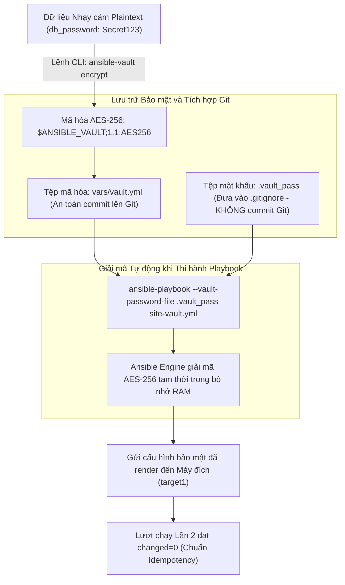
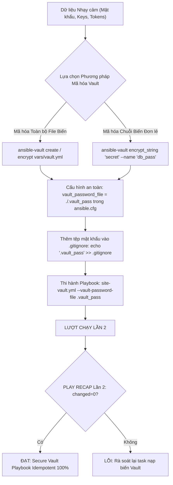
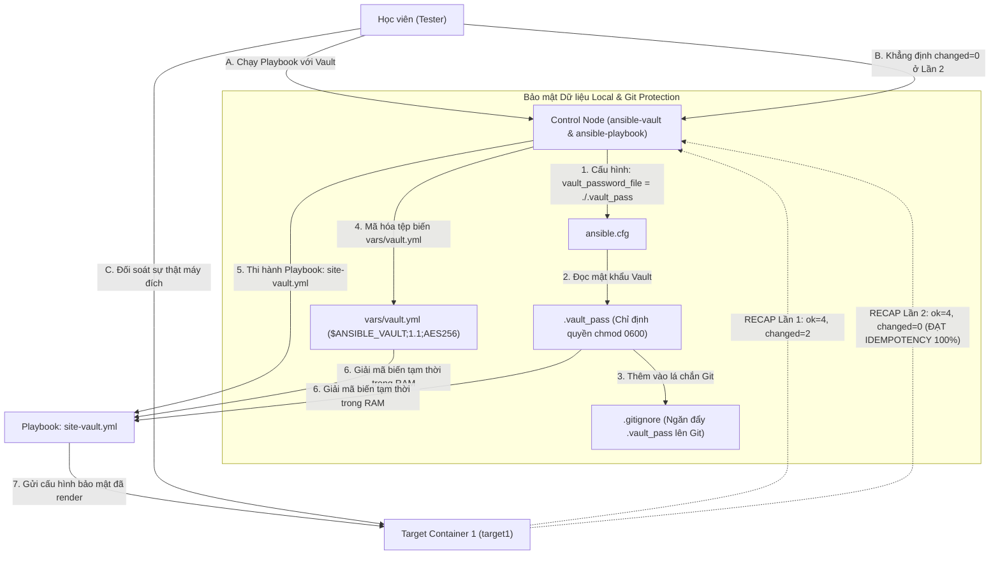

# [BÀI 20] BẢO MẬT DỮ LIỆU NHẠY CẢM VỚI ANSIBLE VAULT: MÃ HÓA FILE/STRING, VAULT PASSWORD CLIENT, MULTI-VAULT IDS & CI/CD VAULT

Trong kỷ nguyên **Infrastructure as Code (IaC)** và tự động hóa vận hành hạ tầng đám mây (Cloud Infrastructure Automation), **Ansible** khẳng định vị thế dẫn đầu nhờ triết lý **Agentless** (không cần cài đặt agent nền trên máy đích), giao thức điều khiển an toàn qua **SSH / WinRM**, định dạng khai báo **YAML** trực quan và nguyên lý bất biến **Idempotency** mạnh mẽ. Việc làm chủ Ansible không chỉ dừng lại ở các câu lệnh Ad-hoc đơn giản, mà đòi hỏi kỹ sư phải nắm vững kiến trúc Module tầng thấp, Variable Precedence 22 tầng, Jinja2 Templates, tối ưu hóa Forks & Pipelining cho tới thiết kế Roles / Collections và tích hợp CI/CD tự động hóa chuẩn Doanh nghiệp.

Bài viết chuyên sâu này sẽ đồng hành cùng bạn mổ xẻ toàn diện bức tranh kiến trúc, phân tích các đánh đổi kỹ thuật thực chiến (Engineering Trade-offs), cung cấp hướng dẫn thực hành Lab chi tiết từng bước và bộ câu hỏi phỏng vấn chuyên sâu chuẩn DevOps / SRE Lead.

---

## 1. Bản Chất Kiến Trúc & Cơ Chế Vận Hành Tầng Thấp

---


> **Bảo mật dữ liệu nhạy cảm với Ansible Vault giúp mã hóa thông tin bí mật qua AES-256, tự động hóa giải mã an toàn trong pipeline CI/CD mà không lộ mật khẩu trên Git repository.**

Khởi đầu Giai đoạn 4 (Sản xuất và vận hành) — Triệt tiêu nguy cơ lộ mật khẩu hạ tầng (I-10):

> **Trong quá trình vận hành hạ tầng tự động hóa trên môi trường Sản xuất (Production), kịch bản Ansible bắt buộc phải xử lý rất nhiều thông tin nhạy cảm: từ mật khẩu tài khoản root, mật khẩu cơ sở dữ liệu, SSH Private Keys, cho đến các API Tokens kết nối Cloud. Việc lưu trữ các thông tin bí mật này ở dạng văn bản thuần (Plaintext) bên trong Playbook hoặc tệp biến rồi đẩy lên kho mã nguồn Git là vi phạm nghiêm trọng quy chuẩn an toàn thông tin Doanh nghiệp. Ansible Vault cung cấp cơ chế mã hóa đối xứng AES-256 tích hợp sẵn, giúp chuyển đổi toàn bộ file biến hoặc chuỗi biến đơn lẻ thành dạng cipher text an toàn. Nhờ đó, đội ngũ kỹ sư có thể tự tin commit mã nguồn lên Git, đồng thời giải mã tự động bằng mật khẩu Vault trong pipeline CI/CD mà vẫn duy trì tiêu chuẩn Idempotent `changed=0` ở Lần 2.**

---


---


---


| Tiếng Việt | Tiếng Anh / Từ khóa + FQCN (giữ nguyên) |
|---|---|
| Công cụ quản lý kho mật | Ansible Vault CLI client (`ansible-vault`) |
| Chuẩn mã hóa đối xứng | AES-256 encryption standard (`$ANSIBLE_VAULT;1.1;AES256`) |
| Mã hóa tệp tin biến | File-level vault encryption (`ansible-vault encrypt`) |
| Mã hóa chuỗi biến inline | Inline string vault encryption (`ansible-vault encrypt_string`) |
| Tệp chứa mật khẩu giải mã | Vault password file (`.vault_pass`) |
| Mã định danh mật khẩu Vault | Vault password identity label (`--vault-id`) |
| Đổi mật khẩu giải mã Vault | Vault rekeying operation (`ansible-vault rekey`) |
| Xem nội dung giải mã tạm | Read-only vault inspection (`ansible-vault view`) |
| Chỉnh sửa tệp mã hóa | In-place encrypted file editing (`ansible-vault edit`) |
| Loại bỏ tệp mật khỏi Git | Git repository secret masking (`.gitignore`) |
| Tiêm mật khẩu trong CI/CD | CI/CD pipeline secret injection (`ANSIBLE_VAULT_PASSWORD`) |
| Đối soát thông số bảo mật | Decrypted secret runtime verification |

---

### 1.1. Khái niệm Ansible Vault, Mã hóa AES-256 và Lệnh CLI (15 phút)



**Nguyên lý cốt lõi:** Ansible Vault là tính năng bảo mật tích hợp sẵn trong Ansible Core, sử dụng thuật toán mã hóa đối xứng AES-256 để bảo vệ bí mật tuyệt đối cho tệp biến hoặc chuỗi biến nhạy cảm.

**Giải thích cơ chế ngầm:** Giúp mã hóa các thông tin cực kỳ quan trọng (như mật khẩu DB, API key, certificate key) thành dạng chuỗi ký tự ma trận vô nghĩa `$ANSIBLE_VAULT;1.1;AES256`, cho phép lưu trữ và quản lý mã nguồn tự động hóa trên Git repository một cách công khai và an toàn.

> [!WARNING]
> **CẠM BẪY THỰC CHIẾN:**
> Lưu trực tiếp chuỗi mật khẩu `"Secret123456"` ở dạng plaintext trong tệp YAML và push lên Github/Gitlab công cộng.

**Minh hoạ.** Cấu trúc tiêu chuẩn của một tệp tin đã được mã hóa bằng Ansible Vault:
```yaml
$ANSIBLE_VAULT;1.1;AES256
61663435643431613136343232373030383333333333343936663437346332306233303863333735
3363383031303732386134373634353434616238383833300a656661333735393033626233323066
```

**Nguyên lý cốt lõi:** Sử dụng thành thạo các câu lệnh CLI quản lý Vault cơ bản: `create`, `encrypt`, `decrypt`, `view`, `edit`, và `rekey`.

**Giải thích cơ chế ngầm:** Cho phép quản trị viên thực hiện toàn bộ các thao tác khởi tạo, mã hóa, giải mã thủ công, xem trực tiếp nội dung mà không làm mất mã hóa, và thay đổi mật khẩu định kỳ của tệp Vault một cách linh hoạt từ terminal.

> [!WARNING]
> **CẠM BẪY THỰC CHIẾN:**
> Chạy `ansible-vault decrypt` để sửa file sau đó quên không chạy lại `ansible-vault encrypt` làm file bị để lộ ở dạng plaintext trên đĩa.

**Minh hoạ.** Các lệnh CLI `ansible-vault` thông dụng:
```bash
# Khởi tạo một tệp mã hóa mới
ansible-vault create vars/vault.yml

# Mã hóa một tệp plaintext có sẵn
ansible-vault encrypt vars/vault.yml

# Xem nội dung tệp mã hóa mà KHÔNG giải mã ghi đè file trên đĩa
ansible-vault view vars/vault.yml

# Chỉnh sửa nội dung tệp mã hóa (tự động mã hóa lại khi lưu)
ansible-vault edit vars/vault.yml

# Thay đổi mật khẩu giải mã Vault (Rekeying)
ansible-vault rekey vars/vault.yml
```

**Nguyên lý cốt lõi:** Sử dụng lệnh CLI `ansible-vault encrypt_string` để mã hóa từng chuỗi biến đơn lẻ (Inline Vault Variables) và nhúng trực tiếp vào trong tệp `group_vars` mà không cần mã hóa toàn bộ tệp tin.

**Giải thích cơ chế ngầm:** Giúp các kỹ sư khác trong đội vẫn có thể đọc hiểu được cấu trúc và các biến bình thường trong tệp `group_vars/web.yml`, trong khi chỉ có riêng chuỗi mật khẩu nhạy cảm là được bọc trong khối `!vault |`.

> [!WARNING]
> **CẠM BẪY THỰC CHIẾN:**
> Mã hóa toàn bộ tệp `group_vars/web.yml` làm các kỹ sư khác không thể biết tệp đó đang khai báo những biến tên là gì.

**Minh hoạ.** Mã hóa chuỗi biến đơn lẻ với `encrypt_string`:
```bash
ansible-vault encrypt_string 'MySuperSecretDBPassword123' --name 'db_password'
```
Kết quả nhúng trực tiếp vào YAML:
```yaml
# group_vars/web.yml
db_port: 5432
db_user: "app_admin"
db_password: !vault |
          $ANSIBLE_VAULT;1.1;AES256
          636437346332306233303863333735336338303130373238613437363435343461623838
```

---

### 1.2. Quản lý Mật khẩu Vault qua Tệp `.vault_pass`, `.gitignore` và `--vault-id` (15 phút)

**Nguyên lý cốt lõi:** Tạo tệp tin chứa mật khẩu Vault local tên là `.vault_pass` (được bảo vệ quyền truy cập 0600) và khai báo thuộc tính `vault_password_file` trong `ansible.cfg`.

**Giải thích cơ chế ngầm:** Giúp tự động hóa quá trình thi hành Playbook: người dùng không phải gõ lại mật khẩu Vault bằng tay ở từng lần chạy lệnh `ansible-playbook`, đồng thời giúp hệ thống CI/CD đọc mật khẩu tự động từ tệp.

> [!WARNING]
> **CẠM BẪY THỰC CHIẾN:**
> Để tệp `.vault_pass` ở quyền 0777 cho phép bất kỳ user nào trên Control Node cũng đọc được mật khẩu.

**Minh hoạ.** Khai báo đường dẫn tệp mật khẩu trong `ansible.cfg`:
```ini
[defaults]
inventory = ./inventory/staging
roles_path = ./roles
vault_password_file = ./.vault_pass
```

**Nguyên lý cốt lõi:** Sử dụng cờ tham số `--vault-id` kết hợp với nhãn phân loại (Label Identity) để quản lý nhiều mật khẩu Vault khác nhau cho từng môi trường hoặc từng đội nhóm.

**Giải thích cơ chế ngầm:** Cho phép áp dụng mô hình phân quyền bảo mật chuyên sâu: Đội Dev sử dụng mật khẩu Vault `dev@.vault_dev` để giải mã biến Staging, trong khi Đội SysAdmin sử dụng mật khẩu Vault `prod@.vault_prod` để giải mã bí mật Production.

> [!WARNING]
> **CẠM BẪY THỰC CHIẾN:**
> Dùng chung 1 mật khẩu Vault duy nhất cho tất cả các môi trường Staging, UAT và Production.

**Minh hoạ.** Khai báo và sử dụng nhiều Vault ID:
```bash
# Mã hóa file biến Production bằng Vault ID prod
ansible-vault encrypt vars/vault_prod.yml --vault-id prod@.vault_prod

# Chạy Playbook với chỉ định Vault ID prod
ansible-playbook --vault-id prod@.vault_prod site-vault.yml
```

**Nguyên lý cốt lõi:** Bắt buộc thêm tên tệp mật khẩu local `.vault_pass` vào tệp cấu hình `.gitignore` ngay khi khởi tạo dự án.

**Giải thích cơ chế ngầm:** Đây là quy tắc an toàn sinh tử: nếu mã hóa tệp `vars/vault.yml` rất cẩn thận nhưng lại vô tình push tệp mật khẩu `.vault_pass` lên Git repository, kẻ xấu sẽ lập tức dùng tệp mật khẩu đó để giải mã toàn bộ dữ liệu của Doanh nghiệp.

> [!WARNING]
> **CẠM BẪY THỰC CHIẾN:**
> Để tệp `.vault_pass` xuất hiện trong kết quả của lệnh `git status`.

**Minh hoạ.** Nội dung tệp `.gitignore` chuẩn cho dự án Ansible:
```gitignore
# Gitignore rules for Ansible Vault project
.vault_pass
.vault_dev
.vault_prod
*.retry
*.log
```

---

### 1.3. Giải mã Tự động trong CI/CD và Idempotency (10 phút)

**Nguyên lý cốt lõi:** Sử dụng cờ `--vault-password-file` hoặc `--ask-vault-pass` khi chạy lệnh `ansible-playbook` để nạp và giải mã an toàn các tệp biến Vault.

**Giải thích cơ chế ngầm:** Đảm bảo Ansible Engine chỉ giải mã các biến nhạy cảm tạm thời trên bộ nhớ RAM trong suốt quá trình thi hành Playbook, tuyệt đối không bao giờ ghi tệp giải mã ở dạng plaintext ra đĩa cứng.

> [!WARNING]
> **CẠM BẪY THỰC CHIẾN:**
> Giải mã tệp Vault ra đĩa cứng rồi mới chạy Playbook.

**Minh hoạ.** Thực thi Playbook với giải mã Vault:
```bash
# Dùng tệp mật khẩu tự động
ansible-playbook --vault-password-file ./.vault_pass site-vault.yml

# Nhập mật khẩu tương tác từ bàn phím
ansible-playbook --ask-vault-pass site-vault.yml
```

**Nguyên lý cốt lõi:** Tự động hóa quá trình giải mã Ansible Vault trong các pipeline CI/CD (như Gitlab CI, Jenkins, Github Actions) bằng cách tiêm biến môi trường mật (Secret Variable) tạo tệp `.vault_pass` tạm thời.

**Giải thích cơ chế ngầm:** Giúp tiến trình triển khai tự động trong CI/CD diễn ra trôi chảy mà không cần con người can thiệp gõ mật khẩu, đồng thời giữ cho mật khẩu Vault được bảo mật tuyệt đối bên trong hệ thống Secret Manager của CI/CD.

> [!WARNING]
> **CẠM BẪY THỰC CHIẾN:**
> Cứng hóa mật khẩu Vault trực tiếp vào file `gitlab-ci.yml`.

**Minh hoạ.** Tự động tạo tệp `.vault_pass` từ biến môi trường CI/CD:
```yaml
# Đoạn kịch bản trong pipeline Gitlab CI / Github Actions
before_script:
  - echo "$ANSIBLE_VAULT_PASSWORD" > .vault_pass
  - chmod 0600 .vault_pass
```

**Nguyên lý cốt lõi:** Đảm bảo rằng ở lượt chạy Lần thứ hai, Playbook nạp và thi hành các biến mã hóa từ Ansible Vault bắt buộc phải đạt chỉ số `changed=0` tuyệt đối trong bảng `PLAY RECAP`.

**Giải thích cơ chế ngầm:** Việc mã hóa biến bằng Ansible Vault chỉ thay đổi hình thức lưu trữ của biến trên đĩa cứng (từ Plaintext sang AES-256 Ciphertext), không làm thay đổi giá trị biến sau khi được giải mã trong RAM và cơ chế Idempotency của các module bên dưới. Khi máy đích đã ở đúng trạng thái ở Lần 1, Lần 2 thi hành lại phải trả về `ok` và `changed=0`.

> [!WARNING]
> **CẠM BẪY THỰC CHIẾN:**
> Bảng `PLAY RECAP` Lần 2 báo `changed > 0` do biến mã hóa Vault bị lặp changed mạo danh.

**Minh hoạ.** Đọc hiểu bảng `PLAY RECAP` Lần 2 đạt Idempotency của Playbook Vault:
```
# Lần 1: changed=2 (Giải mã Vault trong RAM và ghi file cấu hình bảo mật)
target1 : ok=4 changed=2 unreachable=0 failed=0

# Lần 2: changed=0 (Mọi thứ trùng khớp 100% -> ĐẠT IDEMPOTENCY)
target1 : ok=4 changed=0 unreachable=0 failed=0
```

---

### 1.4. Đưa vào việc thật (4 phút)

### 7.1. Áp dụng vào hạ tầng sẵn có
Khi xây dựng bộ kịch bản quản trị hệ thống Doanh nghiệp chuẩn SecOps:
- Mã hóa toàn bộ các thông tin nhạy cảm (mật khẩu DB, SSL Private Keys, Token kết nối vCenter/AWS) bằng `ansible-vault encrypt_string`.
- Quản lý tệp khóa `.vault_pass` trong hệ thống HashiCorp Vault hoặc Bitwarden Enterprise, chỉ tiêm vào Control Node khi thi hành deployment.

### 7.2. Rủi ro hỏng hóc khi triển khai Production và giải pháp an toàn
- **Rủi ro:** Người dùng làm mất mật khẩu giải mã Vault hoặc quên không sao lưu tệp `.vault_pass`, dẫn đến toàn bộ các file biến mã hóa bằng AES-256 bị khóa vĩnh viễn không thể khôi phục được.
- **Giải pháp an toàn:**
  1. Bắt buộc sao lưu mật khẩu Vault vào hệ thống Quản lý Mật khẩu Doanh nghiệp (Password Manager) có phân quyền.
  2. Định kỳ 6 tháng thực hiện lệnh `ansible-vault rekey` để đổi mật khẩu Vault theo chuẩn an toàn thông tin.

### 7.3. Đo lường chỉ số Trước – Sau khi áp dụng
- **Trước khi dùng Vault:** Mật khẩu DB root bị để lộ dưới dạng plaintext trong 20 file Playbook trên Gitlab, rủi ro an toàn thông tin mức Rất Cao (High Severity).
- **Sau khi dùng Vault:** 100% mật khẩu được mã hóa AES-256, tệp `.vault_pass` nằm trong `.gitignore`, 0 rủi ro rò rỉ secret trên Git.

### 7.4. Khi nào KHÔNG nên dùng hoặc không nên lạm dụng Ansible Vault
- **Không mã hóa các biến cấu hình thông thường không nhạy cảm:** Không nên mã hóa các biến như `http_port: 8080` hoặc `domain_name: company.com` vì sẽ làm giảm khả năng đọc mã nguồn của đồng đội. Chỉ mã hóa những dữ liệu thực sự nhạy cảm (Secrets/Passwords/Keys).

---

### 1.5. Bẫy hay gặp (2 phút)

| # | Bẫy hay gặp | Vì sao "recap xanh mà sai / không idempotent" | Lệnh phát hiện và xử lý |
|---|---|---|---|
| 1 | Vô tình commit tệp `.vault_pass` lên Git | Quên khai báo tệp `.vault_pass` vào trong tệp `.gitignore`. | Thêm ngay `.vault_pass` vào `.gitignore` và thu hồi git commit. |
| 2 | Chạy `ansible-playbook` bị báo `Vault password file not found` | Sai đường dẫn tệp `.vault_pass` trong `ansible.cfg`. | Đặt đúng: `vault_password_file = ./.vault_pass`. |
| 3 | Lỗi `Decryption failed` khi chạy Playbook | Nhập sai mật khẩu Vault hoặc dùng nhầm tệp `.vault_pass` của môi trường khác. | Thử kiểm tra mật khẩu với `ansible-vault view vars/vault.yml`. |
| 4 | Dùng `ansible-vault decrypt` rồi quên mã hóa lại | File bị để trần ở dạng plaintext trên đĩa sau khi sửa. | Dùng `ansible-vault edit` thay vì `decrypt` rồi `edit`. |
| 5 | Quên thuộc tính `mode: '0600'` cho tệp `.vault_pass` | Tệp mật khẩu bị để ở quyền mở công cộng làm lộ bí mật cho local user khác. | Chạy lệnh phân quyền: `chmod 0600 .vault_pass`. |
| 6 | Thắc mắc vì sao `encrypt_string` bị sai cú pháp YAML | Quên từ khóa `!vault |` khi dán chuỗi mã hóa vào file YAML. | Đảm bảo đoạn mã bọc trong thuộc tính `!vault |`. |
| 7 | Làm mất mật khẩu Vault | Thuật toán AES-256 không có cửa sau (Backdoor), file bị khóa vĩnh viễn. | Lưu mật khẩu Vault vào Password Manager Doanh nghiệp ngay khi tạo. |
| 8 | Quên cờ `changed_when: false` cho task đọc dữ liệu giải mã | Task đọc dữ liệu liên tục báo `changed=1` ở Lần 2. | Bổ sung `changed_when: false` cho task đọc dữ liệu. |
| 9 | Dùng chung 1 mật khẩu Vault cho cả Dev và Prod | Đội Dev có thể tự ý giải mã dữ liệu bí mật của môi trường Production. | Sử dụng `--vault-id dev@.vault_dev` và `--vault-id prod@.vault_prod`. |
| 10 | Không test thử Idempotency Lần 2 của kịch bản dùng Vault | Task giải mã bị lặp changed mạo danh ở Lần 2 mà không biết. | Chạy lại Playbook Lần 2 và đối soát `changed=0`. |
| 11 | Thắc mắc vì sao `git diff` hiện file mã hóa bị thay đổi toàn bộ | Mã hóa AES-256 tạo ra ciphertext khác nhau ở mỗi lần mã hóa (do Salt). | Đó là cơ chế bảo mật tự nhiên của mã hóa AES-256. |
| 12 | Lỗi CI/CD pipeline bị treo do chờ gõ mật khẩu Vault | Quên truyền cờ `--vault-password-file` trong câu lệnh chạy của CI/CD. | Tạo file `.vault_pass` từ biến môi trường CI/CD trước khi chạy Playbook. |

---

### 1.6. Tóm tắt (1 phút)



### Năm điều phải nhớ
1. **Luôn mã hóa dữ liệu nhạy cảm:** Dùng Ansible Vault mã hóa 100% mật khẩu và SSH keys trước khi commit Git.
2. **Quản lý bằng CLI:** Nắm vững các lệnh `create`, `encrypt`, `view`, `edit`, `rekey`, và `encrypt_string`.
3. **Thêm `.vault_pass` vào `.gitignore`:** Tuyệt đối không bao giờ push tệp chứa mật khẩu Vault lên kho Git.
4. **Tự động hóa giải mã trong CI/CD:** Tiêm mật khẩu Vault qua Secret Variables của hệ thống CI/CD.
5. **Đạt chuẩn `changed=0` ở Lần 2:** Sử dụng biến giải mã từ Vault phải giữ nguyên tính Idempotency `changed=0` ở Lần 2.

---

### 1.7. Câu hỏi tự kiểm tra (kiêm luyện RHCE EX294)

1. **[RHCE EX294 Objective #14]** Ansible Vault sử dụng thuật toán mã hóa tiêu chuẩn nào để bảo vệ dữ liệu nhạy cảm?
   - *Đáp án:* Thuật toán mã hóa đối xứng AES-256 (Advanced Encryption Standard with 256-bit key).
2. **[RHCE EX294 Objective #14]** Lệnh CLI nào trong Ansible dùng để xem nội dung của một tệp biến đã mã hóa mà KHÔNG thực hiện giải mã và ghi đè file trên đĩa?
   - *Đáp án:* Lệnh `ansible-vault view <file_path>`.
3. **[RHCE EX294 Objective #14]** Lệnh CLI nào dùng để chỉnh sửa trực tiếp nội dung một tệp mã hóa Vault (tự động giải mã để sửa và tự động mã hóa lại khi lưu)?
   - *Đáp án:* Lệnh `ansible-vault edit <file_path>`.
4. **[RHCE EX294 Objective #14]** Lệnh CLI nào dùng để mã hóa một chuỗi biến đơn lẻ và in ra đoạn mã `!vault |` nhúng trực tiếp vào file YAML?
   - *Đáp án:* Lệnh `ansible-vault encrypt_string '<string_content>' --name '<var_name>'`.
5. **[RHCE EX294 Objective #14]** Lệnh CLI nào dùng để thay đổi mật khẩu giải mã (Rekeying) cho một tệp Vault đã mã hóa?
   - *Đáp án:* Lệnh `ansible-vault rekey <file_path>`.
6. **[RHCE EX294 Objective #14]** Thuộc tính nào trong tệp `ansible.cfg` dùng để chỉ định đường dẫn tới tệp chứa mật khẩu giải mã Vault mặc định của dự án?
   - *Đáp án:* Thuộc tính `vault_password_file = ./.vault_pass` (nằm trong mục `[defaults]`).
7. **[RHCE EX294 Objective #14]** Cờ tham số nào trong lệnh `ansible-playbook` dùng để yêu cầu Ansible hỏi mật khẩu giải mã Vault trực tiếp từ bàn phím?
   - *Đáp án:* Cờ `--ask-vault-pass`.
8. **[RHCE EX294 Objective #14]** Tại sao việc thêm tệp `.vault_pass` vào tệp cấu hình `.gitignore` lại là nguyên tắc bắt buộc sinh tử?
   - *Đáp án:* Để ngăn tệp chứa mật khẩu Vault bị vô tình commit và push lên kho mã nguồn Git public, tránh rò rỉ mật khẩu giải mã.
9. **[RHCE EX294 Objective #14]** Cờ tham số `--vault-id` có tác dụng gì khi thực thi các kịch bản có nhiều mật khẩu Vault khác nhau?
   - *Đáp án:* Dùng để chỉ định nhãn phân loại (Label Identity) và tệp mật khẩu cụ thể cho từng môi trường hoặc từng đội nhóm (ví dụ `--vault-id dev@.vault_dev`).
10. **[RHCE EX294 Objective #14]** Viết đoạn lệnh bash script trong pipeline CI/CD tạo tệp `.vault_pass` từ biến môi trường `$ANSIBLE_VAULT_PASSWORD` và phân quyền 0600.
    - *Đáp án:*
      ```bash
      echo "$ANSIBLE_VAULT_PASSWORD" > .vault_pass
      chmod 0600 .vault_pass
      ```
11. **[RHCE EX294 Objective #14]** Việc nạp và sử dụng các biến mã hóa từ Ansible Vault có làm thay đổi cơ chế tính toán Idempotency `changed=0` ở Lần chạy thứ hai không?
    - *Đáp án:* Hoàn toàn không, kịch bản ở Lần 2 thi hành lại vẫn bắt buộc phải đạt `changed=0` tuyệt đối.
12. **[RHCE EX294 Objective #14]** Lệnh CLI nào giúp kiểm tra sự thật kết quả render các thông số bảo mật giải mã từ Vault trên target node Docker container?
    - *Đáp án:* Lệnh `docker exec target1 cat /path/to/rendered/vault-app.conf`.

---

### 1.8. Tài liệu tham khảo

- Ansible Core Documentation (v2.15+): [Encrypting content with Ansible Vault](https://docs.ansible.com/ansible/latest/vault_guide/index.html)
- Ansible Core Documentation: [ansible-vault CLI tool reference](https://docs.ansible.com/ansible/latest/cli/ansible-vault.html)
- Red Hat Certified Engineer (RHCE) EX294 Study Guide: Protecting Sensitive Data with Ansible Vault.

---

## Bảng đối soát thời lượng

| Mục | Nội dung | Thời lượng dự kiến | Thời lượng thực tế |
|---|---|---|---|
| §0 | Khởi động và ôn tập buổi 19 | 10 phút | 10 phút |
| §1–§2 | Mục tiêu làm được & Cần biết trước | 2 phút | 2 phút |
| §3 | Thuật ngữ Việt-Anh & Mô hình tư duy | 8 phút | 8 phút |
| §4 | Khái niệm Vault, Mã hóa AES-256 & Lệnh CLI (QT 4.1–4.3) | 15 phút | 15 phút |
| §5 | Quản lý Mật khẩu .vault_pass, .gitignore & --vault-id (QT 5.1–5.3) | 15 phút | 15 phút |
| §6 | Giải mã Tự động trong CI/CD & Idempotency (QT 6.1–6.3) | 10 phút | 10 phút |
| §7–§9 | Đưa vào việc thật, Bẫy hay gặp & Tóm tắt | 7 phút | 7 phút |
| §10–§11 | Câu hỏi tự kiểm tra EX294 & Tài liệu tham khảo | 3 phút | 3 phút |
| **Tổng** | **Khối lý thuyết Buổi 20** | **60 phút** | **60 phút** |

---

## 2. Hướng Dẫn Thực Hành & Triển Khai Lab Chuẩn Production

> [!IMPORTANT]
> **YÊU CẦU MÔI TRƯỜNG THỰC HÀNH:**
> Toàn bộ các bài thực hành dưới đây được thiết kế để chạy trực tiếp trên môi trường máy chủ Linux / Docker containers phân tán. Hãy đảm bảo bạn đã chuẩn bị Control Node cài đặt Ansible Core 2.15+ cùng các Managed Nodes đã cấu hình SSH Key Authentication.

## Khối thực hành — 150 phút

> **Đối soát thời lượng:** Khối thực hành kéo dài đúng **150'** (từ L0 đến L11).
> **Nguyên tắc cốt lõi:** Thực hành khởi tạo tệp mật khẩu local `.vault_pass` với quyền 0600, cấu hình `vault_password_file = ./.vault_pass` trong `ansible.cfg`, tạo tệp `.gitignore` ngăn đẩy `.vault_pass` lên Git, sử dụng các lệnh CLI `ansible-vault create`, `encrypt`, `view`, `edit`, `rekey`, sử dụng `ansible-vault encrypt_string` mã hóa chuỗi biến đơn lẻ, viết Playbook `site-vault.yml` nạp và giải mã an toàn các biến Vault, thực thi phép thử **Lượt chạy Lần thứ hai** chứng minh `PLAY RECAP` đạt `changed=0` và đối soát sự thật máy đích qua `docker exec`.

---

## L0. Mục tiêu thực hành và tiêu chí hoàn thành

| # | Mục tiêu thực hành | Tiêu chí hoàn thành (Kiểm tra bằng lệnh CLI) |
|---|---|---|
| TH1 | Khởi tạo tệp .vault_pass quyền 0600 và cấu hình ansible.cfg | Tệp `.vault_pass` tồn tại quyền 0600 và `vault_password_file` |
| TH2 | Thêm tệp mật khẩu .vault_pass vào tệp .gitignore | Tệp `.gitignore` chứa từ khóa `.vault_pass` |
| TH3 | Mã hóa tệp biến vars/vault.yml bằng AES-256 | Tệp `vars/vault.yml` chứa header `$ANSIBLE_VAULT;1.1;AES256` |
| TH4 | Tra cứu và sửa tệp mã hóa bằng ansible-vault view / edit | Thực thi lệnh `ansible-vault view` xuất dữ liệu giải mã |
| TH5 | Mã hóa chuỗi biến đơn lẻ bằng ansible-vault encrypt_string | Mã hóa chuỗi `VaultSecretKey999` nhúng `!vault \|` vào YAML |
| TH6 | Đổi mật khẩu giải mã Vault bằng ansible-vault rekey | Lệnh `ansible-vault rekey` đổi mật khẩu thành công |
| TH7 | Thực thi Phép thử Lượt chạy Lần hai (Idempotency) | Bảng `PLAY RECAP` Lần 2 đạt `changed=0` tuyệt đối |
| TH8 | Đối soát sự thật máy đích bằng docker exec | `docker exec target1 cat /etc/vault-app.conf` |

---

## L1. Điều kiện tiên quyết về môi trường

| Kiểm tra | LỆNH THỰC THI | Kết quả kỳ vọng |
|---|---|---|
| Ansible core đã cài | `ansible --version` | Phiên bản ansible-core v2.15 trở lên |
| Docker Compose sẵn sàng | `docker compose ps` | Cả target1 và target2 ở trạng thái `Up` |
| Kết nối SSH sẵn sàng | `ansible all -m ansible.builtin.ping` | Đạt `SUCCESS` cho mọi host |
| Thư mục thực hành | `pwd` | Đang ở thư mục `~/lab-ansible-20` |

Nếu chưa có target container:
```bash
cd labs && make up && make key && make inventory
```

---

## L2. Kiến trúc bài lab



---

## L3. Bước 1 — Khởi tạo Tệp Mật khẩu .vault_pass, .gitignore và ansible.cfg (30 phút)

Tạo thư mục dự án `~/lab-ansible-20`, thư mục `vars`, tệp mật khẩu `.vault_pass` với quyền `0600`, tệp `.gitignore`, và cấu hình `vault_password_file = ./.vault_pass` trong `ansible.cfg` (QT 5.1, QT 5.3).

```bash
mkdir -p ~/lab-ansible-20/vars && cd ~/lab-ansible-20

# 1. Tạo tệp mật khẩu Vault local
echo "MyVaultSecretPass2026" > .vault_pass
chmod 0600 .vault_pass

# 2. Tạo tệp .gitignore ngăn lộ mật khẩu lên Git
cat << 'EOF' > .gitignore
.vault_pass
*.retry
*.log
EOF

# 3. Tạo file cấu hình ansible.cfg
cat << 'EOF' > ansible.cfg
[defaults]
inventory = ./inventory.ini
remote_user = ansible
host_key_checking = False
private_key_file = ~/.ssh/id_ed25519
roles_path = ./roles:~/.ansible/roles
collections_path = ./collections:~/.ansible/collections
vault_password_file = ./.vault_pass

[privilege_escalation]
become = True
become_method = sudo
become_user = root
become_ask_pass = False
EOF

cat << 'EOF' > inventory.ini
[web]
target1 ansible_host=127.0.0.1 ansible_port=2221

[db]
target2 ansible_host=127.0.0.1 ansible_port=2222

[all:vars]
ansible_python_interpreter=/usr/bin/python3
EOF
```

**CHECKPOINT 1 — Tệp .vault_pass được tạo đúng quyền 0600, tệp .gitignore chặn đẩy .vault_pass, và ansible.cfg cài đặt vault_password_file.**
- **Lệnh kiểm tra:**
```bash
PASS_PERM=$(ls -l .vault_pass | awk '{print $1}')
if [ -f ".vault_pass" ] && echo "$PASS_PERM" | grep -q "rw-------" && grep -q ".vault_pass" .gitignore && grep -q "vault_password_file = ./.vault_pass" ansible.cfg; then
  echo "CHECKPOINT 1: ĐẠT - Tệp .vault_pass được tạo đúng quyền 0600, .gitignore và ansible.cfg được cài đặt chuẩn xác"
else
  echo "CHECKPOINT 1: LỖI - Khởi tạo .vault_pass, .gitignore hoặc ansible.cfg thất bại"
fi
```

---

## L4. Bước 2 — Thao tác Mã hóa Tệp Biến vars/vault.yml với ansible-vault CLI (40 phút)

Sử dụng lệnh `ansible-vault` để tạo và mã hóa tệp biến `vars/vault.yml` chứa thông số nhạy cảm `vault_db_password` và `vault_api_key`, thực thi các lệnh `view` và `edit` (QT 4.1, QT 4.2).

```bash
# Tạo file biến plaintext ban đầu
cat << 'EOF' > vars/vault.yml
---
vault_db_password: "SuperSecretDBPassword2026"
vault_api_key: "API_KEY_998877665544332211"
EOF

# Mã hóa file biến bằng ansible-vault encrypt tự động dùng .vault_pass
ansible-vault encrypt vars/vault.yml
```

**CHECKPOINT 2 — Tệp vars/vault.yml được mã hóa thành công bằng thuật toán AES-256 chứa header $ANSIBLE_VAULT;1.1;AES256.**
- **Lệnh kiểm tra:**
```bash
if grep -q "\$ANSIBLE_VAULT;1.1;AES256" vars/vault.yml; then
  echo "CHECKPOINT 2: ĐẠT - Tệp vars/vault.yml được mã hóa thành công bằng thuật toán AES-256 chứa header chuẩn"
else
  echo "CHECKPOINT 2: LỖI - Mã hóa vars/vault.yml thất bại"
fi
```

**CHECKPOINT 3 — Lệnh CLI ansible-vault view tra cứu trực tiếp nội dung giải mã của vars/vault.yml thành công.**
- **Lệnh kiểm tra:**
```bash
VIEW_OUT=$(ansible-vault view vars/vault.yml)
if echo "$VIEW_OUT" | grep -q "vault_db_password: \"SuperSecretDBPassword2026\"" && echo "$VIEW_OUT" | grep -q "vault_api_key:"; then
  echo "CHECKPOINT 3: ĐẠT - Lệnh CLI ansible-vault view tra cứu trực tiếp nội dung giải mã thành công"
else
  echo "CHECKPOINT 3: LỖI - Tra cứu ansible-vault view thất bại"
fi
```

---

## L5. Bước 4 — Mã hóa Chuỗi Biến Đơn lẻ encrypt_string và Đổi Mật khẩu Rekey (30 phút)

Sử dụng `ansible-vault encrypt_string` mã hóa một chuỗi mật khẩu nhạy cảm và thử nghiệm tính năng đổi mật khẩu Vault bằng `ansible-vault rekey` (QT 4.3, QT 5.2).

```bash
# Mã hóa chuỗi biến đơn lẻ
ansible-vault encrypt_string 'InlineSecretToken999' --name 'inline_secret_token' > vars/inline_vault.yml

# Thử nghiệm đổi mật khẩu Rekey (đổi sang mật khẩu mới rồi đổi lại để giữ nguyên .vault_pass)
echo "TempNewPass2026" > .vault_new_pass
ansible-vault rekey vars/vault.yml --new-vault-password-file .vault_new_pass
ansible-vault rekey vars/vault.yml --vault-password-file .vault_new_pass --new-vault-password-file .vault_pass
rm -f .vault_new_pass
```

**CHECKPOINT 4 — Tệp vars/inline_vault.yml chứa chuỗi biến đơn lẻ được mã hóa thành công với từ khóa !vault |.**
- **Lệnh kiểm tra:**
```bash
if grep -q "inline_secret_token: !vault |" vars/inline_vault.yml && grep -q "\$ANSIBLE_VAULT;1.1;AES256" vars/inline_vault.yml; then
  echo "CHECKPOINT 4: ĐẠT - Tệp vars/inline_vault.yml chứa chuỗi biến đơn lẻ được mã hóa thành công với từ khóa !vault |"
else
  echo "CHECKPOINT 4: LỖI - Mã hóa encrypt_string thất bại"
fi
```

**CHECKPOINT 5 — Tiến trình đổi mật khẩu ansible-vault rekey thi hành thành công và giữ nguyên tính nhất quán của tệp vars/vault.yml.**
- **Lệnh kiểm tra:**
```bash
REKEY_VIEW=$(ansible-vault view vars/vault.yml)
if echo "$REKEY_VIEW" | grep -q "vault_db_password:"; then
  echo "CHECKPOINT 5: ĐẠT - Tiến trình đổi mật khẩu ansible-vault rekey thi hành thành công và giữ nguyên tính nhất quán"
else
  echo "CHECKPOINT 5: LỖI - Đổi mật khẩu rekey thất bại"
fi
```

---

## L6. Bước 5 — Viết Playbook site-vault.yml Nạp Biến Mã hóa và Phép thử Lần 2 (30 phút)

Viết file Playbook chính `site-vault.yml` nạp tệp biến mã hóa `vars/vault.yml` và `vars/inline_vault.yml`, render file cấu hình bảo mật `/etc/vault-app.conf`, thực thi Lần 1 và thực thi phép thử **Lượt chạy Lần thứ hai** chứng minh `PLAY RECAP` đạt `changed=0` (QT 6.1, QT 6.2, QT 6.3).

```bash
cat << 'EOF' > site-vault.yml
---
- name: Secure Playbook with Ansible Vault Integration
  hosts: web
  become: true
  vars_files:
    - vars/vault.yml
    - vars/inline_vault.yml
  tasks:
    - name: Task 1 - Deploy secure configuration file using Vault variables
      ansible.builtin.copy:
        content: |
          # Secure Application Configuration
          DATABASE_PASSWORD={{ vault_db_password }}
          API_KEY_TOKEN={{ vault_api_key }}
          INLINE_TOKEN={{ inline_secret_token }}
          VAULT_ENCRYPTION=AES256_ACTIVE
        dest: /etc/vault-app.conf
        mode: '0600'

    - name: Task 2 - Read secure configuration status (changed_when: false)
      ansible.builtin.command: cat /etc/vault-app.conf
      register: vault_conf_out
      changed_when: false
EOF
```

Thực thi Lần 1:
```bash
ansible-playbook site-vault.yml
```

**CHECKPOINT 6 — Playbook site-vault.yml tự động giải mã và thi hành thành công các biến Vault qua ansible.cfg (PLAY RECAP failed=0).**
- **Lệnh kiểm tra:**
```bash
VLT_PLAY_OUT=$(ansible-playbook site-vault.yml)
if echo "$VLT_PLAY_OUT" | grep -q "Task 1 - Deploy secure configuration file using Vault variables" && echo "$VLT_PLAY_OUT" | grep -q "failed=0"; then
  echo "CHECKPOINT 6: ĐẠT - Playbook site-vault.yml tự động giải mã và thi hành thành công các biến Vault"
else
  echo "CHECKPOINT 6: LỖI - Thi hành Playbook Vault thất bại"
fi
```

Thực thi Lần 2 (BẮT BUỘC ĐẠT `changed=0`):
```bash
ansible-playbook site-vault.yml
```

**CHECKPOINT 7 — Phép thử Lượt 2 đạt changed=0 cho toàn bộ các Task trong Playbook nạp biến mã hóa Vault.**
- **Lệnh kiểm tra:**
```bash
RUN2_VLT_OUT=$(ansible-playbook site-vault.yml)
if echo "$RUN2_VLT_OUT" | grep -q "changed=0" && echo "$RUN2_VLT_OUT" | grep -q "failed=0"; then
  echo "CHECKPOINT 7: ĐẠT - Phép thử Lượt 2 đạt chuẩn Idempotency (PLAY RECAP báo changed=0 cho toàn bộ Playbook Vault)"
else
  echo "CHECKPOINT 7: LỖI - Lượt 2 không đạt changed=0 (Task Vault bị lặp changed)"
fi
```

---

## L7. Bước 6 — Đối soát Sự thật Máy đích qua docker exec (20 phút)

Sử dụng lệnh `docker exec` đối soát trực tiếp tệp tin cấu hình bảo mật `/etc/vault-app.conf` trên target node target1 để nghiệm thu các biến bí mật đã được giải mã và render chuẩn xác (QT 6.3).

Đối soát file `/etc/vault-app.conf` trên target1:
```bash
docker exec target1 cat /etc/vault-app.conf
```

**CHECKPOINT 8 — Đối soát file /etc/vault-app.conf trên target1 chứa đúng dữ liệu DATABASE_PASSWORD=SuperSecretDBPassword2026 giải mã từ Vault.**
- **Lệnh kiểm tra:**
```bash
EXEC_VLT_CONF=$(docker exec target1 cat /etc/vault-app.conf)
if echo "$EXEC_VLT_CONF" | grep -q "DATABASE_PASSWORD=SuperSecretDBPassword2026" && echo "$EXEC_VLT_CONF" | grep -q "INLINE_TOKEN=InlineSecretToken999" && echo "$EXEC_VLT_CONF" | grep -q "VAULT_ENCRYPTION=AES256_ACTIVE"; then
  echo "CHECKPOINT 8: ĐẠT - Kiểm tra sự thật qua docker exec xác nhận file /etc/vault-app.conf chứa đúng dữ liệu giải mã từ Ansible Vault"
else
  echo "CHECKPOINT 8: LỖI - Đối soát file vault-app.conf trên máy đích thất bại"
fi
```

---

## L8. Nộp sản phẩm và dọn dẹp (10 phút)

Thu thập kết quả ra các file báo cáo cuối buổi:
```bash
ansible-playbook site-vault.yml > vault-proof.txt
ansible-playbook site-vault.yml > idempotency-check.txt
docker exec target1 cat /etc/vault-app.conf > kiem-may-dich.txt
```

---

## L9. Xử lý sự cố

| # | Hiện tượng lỗi | Nguyên nhân gốc rễ | Cách xử lý nhanh |
|---|---|---|---|
| 1 | Lỗi `Decryption failed on vars/vault.yml` | Nhập sai mật khẩu Vault hoặc tệp `.vault_pass` chứa sai ký tự | Kiểm tra nội dung tệp `.vault_pass` hoặc gõ lại mật khẩu chuẩn. |
| 2 | Lỗi `Vault password file not found` | Cấu hình sai đường dẫn `vault_password_file` trong `ansible.cfg` | Đặt đúng: `vault_password_file = ./.vault_pass`. |
| 3 | Tệp `.vault_pass` bị lộ khi `git status` | Quên không khai báo `.vault_pass` vào tệp cấu hình `.gitignore` | Thêm ngay `.vault_pass` vào tệp `.gitignore`. |
| 4 | Lỗi `command not found: ansible-vault` | Cài đặt Ansible thiếu gói `ansible-core` chứa công cụ Vault | Cài đặt bổ sung gói `ansible-core`. |
| 5 | Lỗi syntax YAML khi nạp `encrypt_string` | Quên từ khóa `!vault |` khi dán kết quả mã hóa vào file YAML | Bọc đoạn mã hóa trong từ khóa `!vault |`. |
| 6 | Thắc mắc vì sao `ansible-vault view` báo lỗi permission | Tệp `.vault_pass` bị mất quyền đọc hoặc không khớp user | Chạy `chmod 0600 .vault_pass` và kiểm tra user sở hữu. |
| 7 | Lượt chạy Lần 2 liên tục báo `changed=1` | Task `command` đọc file cấu hình trong Playbook thiếu `changed_when: false` | Bổ sung `changed_when: false` cho task đọc dữ liệu. |
| 8 | Lỗi `YAML parser error` trong `vars/vault.yml` | File biến mã hóa bị hỏng header `$ANSIBLE_VAULT;1.1;AES256` | Dùng `ansible-vault edit` để mở sửa và lưu lại header chuẩn. |
| 9 | Làm mất mật khẩu trong tệp `.vault_pass` | Thuật toán AES-256 không có cửa sau (Backdoor) để khôi phục | Phải tự viết lại biến và mã hóa lại tệp với mật khẩu mới. |
| 10 | Không test thử Idempotency Lần 2 của kịch bản dùng Vault | Task giải mã bị lặp changed mạo danh ở Lần 2 mà không biết | Chạy lại Playbook Lần 2 và đối soát `changed=0`. |
| 11 | Lỗi pipeline CI/CD bị dừng ở bước hỏi password | Quên tiêm biến môi trường mật `$ANSIBLE_VAULT_PASSWORD` vào tệp `.vault_pass` | Thêm bước `echo "$ANSIBLE_VAULT_PASSWORD" > .vault_pass` trong CI/CD script. |
| 12 | Thắc mắc vì sao `ansible-vault rekey` không đổi được mật khẩu | Cung cấp sai tệp mật khẩu cũ trong cờ `--vault-password-file` | Chỉ định đúng tệp mật khẩu cũ và tệp mật khẩu mới. |
| 13 | Lỗi `docker exec` không tìm thấy file `/etc/vault-app.conf` | Task `ansible.builtin.copy` bị fail hoặc skipped | Kiểm tra log execution của `ansible-playbook site-vault.yml`. |
| 14 | Biến `vault_db_password` bị rỗng khi render | Gọi sai tên biến trong file `.j2` hoặc trong Playbook | Đảm bảo tên biến trong `vars/vault.yml` trùng 100% với Playbook. |

---

## L10. Bài tập mở rộng

1. **BT1:** Khởi tạo thêm tệp mã hóa thứ 2 `vars/secrets.yml` chứa `secret_token: "TOKEN_8899"`.
2. **BT2:** Sử dụng cờ `--vault-id dev@.vault_dev` tạo một Vault ID riêng cho môi trường Development.
3. **BT3:** Mã hóa tệp `vars/secrets.yml` bằng Vault ID `dev@.vault_dev`.
4. **BT4:** Nạp tệp `vars/secrets.yml` vào Playbook `site-vault.yml` và chạy với cờ `--vault-id`.
5. **BT5:** Mã hóa tệp SSH Private Key `id_ed25519_deploy` bằng `ansible-vault encrypt`.
6. **BT6:** Dùng module `ansible.builtin.copy` giải mã và chép SSH Key vào `/root/.ssh/` trên máy đích với quyền 0600.
7. **BT7:** Thực thi phép thử Idempotency Lần 2 cho Playbook Vault mở rộng và đối soát `PLAY RECAP` đạt `changed=0`.
8. **BT8:** Viết kịch bản bash script dùng `docker exec` đối soát trực tiếp nội dung các thông số giải mã từ cả 2 tệp Vault trên máy đích.

---

## L11. Sản phẩm nộp và chấm điểm

### Danh mục sản phẩm nộp
- File `vars/vault.yml` đã mã hóa bằng AES-256.
- File `vars/inline_vault.yml` chứa biến mã hóa `!vault |`.
- File `.vault_pass` (quyền 0600) và tệp `.gitignore`.
- File `ansible.cfg` cài đặt `vault_password_file = ./.vault_pass`.
- File Playbook chính `site-vault.yml`.
- Báo cáo kết quả 8 CHECKPOINT từ terminal.
- Các file kết quả: `vault-proof.txt`, `idempotency-check.txt`, `kiem-may-dich.txt`.

### Thang điểm đánh giá

| Mức điểm | Tiêu chí đạt được |
|---|---|
| **0–4 điểm** | Để mật khẩu plaintext, không mã hóa Vault, làm mất `.vault_pass`, hoặc commit `.vault_pass` lên Git. |
| **5–7 điểm** | Mã hóa được `vars/vault.yml`, nhưng chưa dùng `encrypt_string`, chưa tạo `.gitignore`, hay thiếu `vault_password_file` trong `ansible.cfg`. |
| **8–9 điểm** | Đạt đủ 8 CHECKPOINT, chứng minh thành thạo `ansible-vault CLI` (`create`, `encrypt`, `view`, `edit`, `rekey`, `encrypt_string`), `.vault_pass`, `.gitignore`, `vault_password_file` `ansible.cfg`, Idempotency Lần 2 (`changed=0`) và đối soát `docker exec`. |
| **10 điểm** | Đạt 9 điểm + Hoàn thành xuất sắc 100% các Bài tập mở rộng (BT1–BT8). |

---

## Bảng đối soát thời lượng

| Bước | Nội dung | Thời lượng dự kiến | Thời lượng thực tế |
|---|---|---|---|
| L0–L2 | Mục tiêu, Tiên quyết & Kiến trúc bài lab | 10 phút | 10 phút |
| L3 | Bước 1: Khởi tạo .vault_pass, .gitignore & ansible.cfg | 30 phút | 30 phút |
| L4 | Bước 2: Thao tác mã hóa file vars/vault.yml bằng CLI | 40 phút | 40 phút |
| L5 | Bước 3: Mã hóa chuỗi encrypt_string & Đổi mật khẩu rekey | 30 phút | 30 phút |
| L6 | Bước 4: Viết Playbook site-vault.yml & Phép thử Lần 2 | 30 phút | 30 phút |
| L7 | Bước 5: Đối soát sự thật máy đích qua docker exec | 20 phút | 20 phút |
| L8–L11 | Nộp sản phẩm, Sự cố, Bài tập & Chấm điểm | 10 phút | 10 phút |
| **Tổng** | **Khối thực hành Buổi 20** | **150 phút** | **150 phút** |

---

## 3. Bộ Câu Hỏi Vấn Đáp & Phỏng Vấn Kỹ Thuật Chuyên Sâu

Dưới đây là bộ câu hỏi phỏng vấn thực chiến dành cho các vị trí **DevOps Engineer**, **Site Reliability Engineer (SRE)** và **Cloud Automation Architect**, giúp bạn tự đánh giá độ sâu hiểu biết và rèn luyện phản xạ xử lý sự cố hệ thống:

---


## Bộ câu hỏi phỏng vấn chuyên sâu — ĐÚNG 12 câu

### Câu 1 — Khái niệm và Vai trò của Ansible Vault 🔥
**Hỏi:** Ansible Vault là gì? Tại sao việc sử dụng Ansible Vault lại là yêu cầu sinh tử khi quản lý mã nguồn tự động hóa trên Git repository? *(Liên quan QT 4.1)*
**Đáp án chuẩn:**
- Ansible Vault là tính năng bảo mật tích hợp sẵn trong Ansible Core, sử dụng thuật toán mã hóa đối xứng AES-256 để bảo vệ thông tin nhạy cảm.
- Yêu cầu sinh tử: Trong dự án IaC, Playbook chứa rất nhiều thông tin bí mật (mật khẩu DB, SSH keys, API tokens). Nếu không dùng Vault mã hóa, lưu plaintext rồi push lên Git public sẽ dẫn tới nguy cơ lộ bí mật Doanh nghiệp, bị tin tặc tấn công chiếm đoạt hệ thống.
**Tiêu chí chấm:**
- 0: Không biết Ansible Vault.
- 1: Biết Vault để giấu mật khẩu nhưng không nêu được thuật toán AES-256 và nguy cơ rò rỉ secret trên Git.
- 2: Phân tích chính xác cơ chế mã hóa AES-256 tích hợp giúp bảo vệ thông tin nhạy cảm trên Git repository.
- 3: Nêu đúng + minh họa đoạn header mã hóa `$ANSIBLE_VAULT;1.1;AES256` trên terminal.
**Câu hỏi đào sâu:** Thuật toán mã hóa đối xứng AES-256 sử dụng mấy khóa để mã hóa và giải mã? *(Sử dụng đúng 1 khóa bí mật chung - Secret Key / Passphrase.)*

---

### Câu 2 — Bộ Lệnh CLI Quản lý Vault 🔥
**Hỏi:** Nêu công dụng của các câu lệnh CLI Ansible Vault sau: `create`, `encrypt`, `decrypt`, `view`, `edit`, và `rekey`. *(Liên quan QT 4.2)*
**Đáp án chuẩn:**
- `ansible-vault create`: Tạo một tệp mới và mã hóa ngay lập tức.
- `ansible-vault encrypt`: Mã hóa một tệp văn bản plaintext sẵn có thành dạng ciphertext.
- `ansible-vault decrypt`: Giải mã vĩnh viễn tệp Vault trở lại dạng plaintext trên đĩa.
- `ansible-vault view`: Xem trực tiếp nội dung giải mã trên màn hình terminal mà KHÔNG giải mã file trên đĩa.
- `ansible-vault edit`: Mở tệp mã hóa ra chỉnh sửa (tự động giải mã tạm thời và tự động mã hóa lại khi lưu).
- `ansible-vault rekey`: Thay đổi mật khẩu giải mã Vault sang một mật khẩu mới.
**Tiêu chí chấm:**
- 0: Không biết các lệnh CLI của `ansible-vault`.
- 1: Biết 1-2 lệnh cơ bản nhưng nhầm lẫn giữa `view` và `decrypt`.
- 2: Phân tích chính xác công dụng của cả 6 câu lệnh CLI quản lý Vault.
- 3: Nêu đúng + minh họa câu lệnh thực thi `ansible-vault edit vars/vault.yml`.
**Câu hỏi đào sâu:** Tại sao khi cần sửa file mã hóa, ta nên dùng `ansible-vault edit` thay vì `ansible-vault decrypt` rồi gõ `vim`? *(Vì `edit` giúp chỉnh sửa và tự mã hóa lại ngay trong RAM, tránh rủi ro quên không mã hóa lại làm lộ file trần trên đĩa.)*

---

### Câu 3 — Mã hóa Chuỗi Biến Đơn lẻ `encrypt_string` 🔥
**Hỏi:** Trình bày tác dụng của lệnh `ansible-vault encrypt_string`. Khi nào nên dùng `encrypt_string` thay vì mã hóa toàn bộ tệp biến? *(Liên quan QT 4.3)*
**Đáp án chuẩn:**
- Tác dụng: Dùng để mã hóa một chuỗi biến đơn lẻ (Inline Secret) và in ra định dạng YAML bọc trong khối `!vault |` để dán trực tiếp vào file biến.
- Khi nên dùng: Khi tệp `group_vars/web.yml` chứa hàng chục biến cấu hình bình thường (như `port`, `domain`) và chỉ có riêng 1 biến mật khẩu `db_password` là nhạy cảm. Mã hóa chuỗi đơn lẻ giúp đồng đội vẫn đọc hiểu được toàn bộ file YAML mà chỉ có riêng chuỗi mật khẩu là bị ẩn.
**Tiêu chí chấm:**
- 0: Không biết lệnh `encrypt_string`.
- 1: Biết `encrypt_string` để mã hóa chuỗi nhưng không giải thích được ưu điểm giữ tính đọc hiểu cho file YAML.
- 2: Phân tích chính xác cơ chế Inline Vault Encryption và trường hợp áp dụng thực tế.
- 3: Nêu đúng + viết đoạn mã YAML minh họa chuỗi bọc trong từ khóa `!vault |`.
**Câu hỏi đào sâu:** Viết lệnh CLI mã hóa chuỗi `'MySecret123'` gán cho biến `db_pass`. *(Chạy `ansible-vault encrypt_string 'MySecret123' --name 'db_pass'`.)*

---

### Câu 4 — Tệp Mật khẩu `.vault_pass` và `ansible.cfg` 🔥
**Hỏi:** Nêu tác dụng của tệp mật khẩu local `.vault_pass` và thuộc tính `vault_password_file` trong `ansible.cfg`. Phân quyền Linux an toàn cho tệp `.vault_pass` phải là bao nhiêu? *(Liên quan QT 5.1)*
**Đáp án chuẩn:**
- Tác dụng: Giúp tự động hóa quá trình giải mã Vault khi thi hành Playbook, khiến người dùng hoặc hệ thống CI/CD không phải gõ mật khẩu từ bàn phím ở từng lần chạy lệnh `ansible-playbook`.
- Phân quyền Linux an toàn: Phải là **`chmod 0600`** (chỉ có duy nhất owner được đọc và ghi, ngắt toàn bộ quyền truy cập của Group và Others).
- Cấu hình `ansible.cfg`: `vault_password_file = ./.vault_pass` (trong mục `[defaults]`).
**Tiêu chí chấm:**
- 0: Không biết tệp `.vault_pass` và cấu hình `ansible.cfg`.
- 1: Biết file `.vault_pass` nhưng không nhớ phân quyền `0600` và cấu hình `ansible.cfg`.
- 2: Phân tích chính xác vai trò tự động hóa giải mã và tầm quan trọng của phân quyền `0600`.
- 3: Nêu đúng + dán đoạn cấu hình `ansible.cfg` chứa `vault_password_file = ./.vault_pass`.
**Câu hỏi đào sâu:** Chuyện gì xảy ra nếu để tệp `.vault_pass` ở quyền `0777` trên server dùng chung? *(Bất kỳ user nào trên server cũng đọc được tệp để giải mã toàn bộ thông tin nhạy cảm.)*

---

### Câu 5 — Quản lý Mật khẩu với Tệp `.gitignore` 🔥
**Hỏi:** Tại sao việc khai báo tệp `.vault_pass` vào tệp cấu hình `.gitignore` lại là quy tắc an toàn sinh tử? *(Liên quan QT 5.3)*
**Đáp án chuẩn:**
Vì tệp `.vault_pass` chứa mật khẩu giải mã tĩnh của Ansible Vault. Nếu mã hóa file `vars/vault.yml` rất cẩn thận bằng AES-256 nhưng lại quên không cho `.vault_pass` vào `.gitignore` rồi push cả 2 file lên Git repository public, kẻ xấu chỉ cần tải file `.vault_pass` về là lập tức giải mã được toàn bộ bí mật của Doanh nghiệp.
**Tiêu chí chấm:**
- 0: Không biết mối liên hệ giữa `.vault_pass` và `.gitignore`.
- 1: Biết thêm vào `.gitignore` nhưng không giải thích được hậu quả triệt tiêu tính bảo mật của Vault.
- 2: Phân tích chính xác nguyên tắc an toàn sinh tử bảo vệ kho mã nguồn Git.
- 3: Nêu đúng + minh họa câu lệnh `echo ".vault_pass" >> .gitignore` và kiểm tra bằng `git status`.
**Câu hỏi đào sâu:** Làm thế nào để kiểm tra xem một file đã bị Git bỏ qua qua tệp `.gitignore` chưa? *(Chạy lệnh `git check-ignore -v .vault_pass`.)*

---

### Câu 6 — Quản lý Nhiều Mật khẩu Vault với `--vault-id`
**Hỏi:** Cờ tham số `--vault-id` dùng để làm gì? Trình bày kịch bản áp dụng `--vault-id` khi quản lý dữ liệu nhạy cảm cho 2 môi trường Dev và Prod. *(Liên quan QT 5.2)*
**Đáp án chuẩn:**
- Tác dụng: Cho phép quản lý nhiều mật khẩu Vault khác nhau và gắn nhãn phân loại (Label Identity) cho từng môi trường hoặc từng phân quyền đội nhóm.
- Kịch bản áp dụng:
  + Môi trường Dev: Mã hóa với nhãn `dev@.vault_dev` (đội Dev nắm tệp `.vault_dev`).
  + Môi trường Prod: Mã hóa với nhãn `prod@.vault_prod` (chỉ đội SysAdmin nắm tệp `.vault_prod`).
  + Khi chạy Playbook Prod: `ansible-playbook --vault-id prod@.vault_prod site-vault.yml`.
**Tiêu chí chấm:**
- 0: Không biết cờ `--vault-id`.
- 1: Biết `--vault-id` nhưng không nêu được kịch bản phân quyền giữa Dev và SysAdmin/Prod.
- 2: Phân tích chính xác cơ chế gán nhãn Vault ID và kịch bản phân quyền đa môi trường.
- 3: Nêu đúng + viết câu lệnh CLI thực thi mã hóa và chạy Playbook với `--vault-id`.
**Câu hỏi đào sâu:** Có thể truyền nhiều cờ `--vault-id` trong 1 câu lệnh `ansible-playbook` không? *(Có thể, ví dụ `--vault-id dev@.vault_dev --vault-id prod@.vault_prod`.)*

---

### Câu 7 — Tự động hóa Giải mã Vault trong Pipeline CI/CD
**Hỏi:** Làm thế nào để tự động hóa quá trình giải mã Ansible Vault trong các pipeline CI/CD (như Gitlab CI, Github Actions) mà không cần gõ mật khẩu từ bàn phím và không lộ mật khẩu trên kho mã nguồn? *(Liên quan QT 6.2)*
**Đáp án chuẩn:**
Quy trình 2 bước SecOps trong CI/CD:
1. **Lưu mật khẩu vào Secret Variable của CI/CD:** Đẩy mật khẩu Vault vào hệ thống quản lý Secret của CI/CD (ví dụ biến `$ANSIBLE_VAULT_PASSWORD` trong Gitlab CI / Secret trong Github Actions).
2. **Tạo tệp `.vault_pass` tạm thời trong runner execution:** Trước khi thi hành Playbook, runner chạy lệnh:
   `echo "$ANSIBLE_VAULT_PASSWORD" > .vault_pass && chmod 0600 .vault_pass`
   Sau khi thi hành xong, tệp tạm bị xóa tự động.
**Tiêu chí chấm:**
- 0: Không biết cách đưa Ansible Vault vào CI/CD pipeline.
- 1: Biết dùng biến môi trường nhưng không nêu được bước ghi ra file `.vault_pass` tạm và phân quyền 0600.
- 2: Phân tích chính xác quy trình SecOps tiêm Secret Variable trong runner execution.
- 3: Nêu đúng + viết đoạn mã YAML minh họa trong `before_script` của pipeline.
**Câu hỏi đào sâu:** Có thể truyền biến môi trường trực tiếp vào Ansible Vault không? *(Có thể dùng biến `ANSIBLE_VAULT_PASSWORD_FILE` trỏ tới script in mật khẩu.)*

---

### Câu 8 — Đổi Mật khẩu Vault với `ansible-vault rekey`
**Hỏi:** Trình bày nguyên lý và câu lệnh CLI đổi mật khẩu Vault (Rekeying). Tại sao việc định kỳ rekey mật khẩu Vault lại là yêu cầu bắt buộc trong chính sách an toàn thông tin? *(Liên quan QT 4.2)*
**Đáp án chuẩn:**
- Lệnh đổi mật khẩu: `ansible-vault rekey vars/vault.yml`.
- Nguyên lý: Lệnh `rekey` sẽ giải mã dữ liệu AES-256 bằng mật khẩu cũ trong bộ nhớ RAM, sau đó lập tức mã hóa lại toàn bộ dữ liệu bằng mật khẩu mới và ghi đè tệp ciphertext.
- Lý do bắt buộc: Định kỳ đổi mật khẩu (như 6 tháng/lần) giúp tuân thủ chính sách an toàn thông tin Doanh nghiệp, triệt tiêu nguy cơ nếu mật khẩu cũ lỡ bị rò rỉ cho nhân sự đã nghỉ việc.
**Tiêu chí chấm:**
- 0: Không biết lệnh `ansible-vault rekey`.
- 1: Biết lệnh `rekey` nhưng lầm tưởng phải giải mã tay `decrypt` rồi `encrypt` lại.
- 2: Phân tích chính xác cơ chế giải mã trong RAM và mã hóa lại với mật khẩu mới của `rekey`.
- 3: Nêu đúng + minh họa lệnh `rekey` kết hợp cờ `--new-vault-password-file`.
**Câu hỏi đào sâu:** Lệnh `rekey` có làm thay đổi tên các biến bên trong tệp Vault không? *(Hoàn toàn không, giá trị biến giải mã giữ nguyên 100%, chỉ có khóa mã hóa AES-256 là thay đổi.)*

---

### Câu 9 — Phương pháp Chứng minh Idempotency và Máy đúng khi Dùng Vault 🔥
**Hỏi:** Trình bày quy trình 3 bước nghiệm thu một Playbook sử dụng biến mã hóa từ Ansible Vault để đảm bảo tính Idempotency và máy đích ở đúng trạng thái (hoàn thành 100% Objective RHCE EX294 #14).
**Đáp án chuẩn:**
1. **Bước 1 (Thực thi Lần 1):** Chạy `ansible-playbook site-vault.yml`: Biến được nạp và giải mã tạm trong RAM, Task chép file cấu hình bảo mật thực thi báo `changed > 0`.
2. **Bước 2 (Kiểm Idempotency Lần 2):** Chạy lại nguyên vẹn `ansible-playbook site-vault.yml` Lần 2: bảng `PLAY RECAP` **bắt buộc phải đạt `changed=0`** (tất cả các Task đều báo `ok`).
3. **Bước 3 (Đối soát Sự thật Máy đích):** Dùng `docker exec target1 cat /etc/vault-app.conf` kiểm tra file cấu hình thực sự tồn tại đúng dữ liệu mật khẩu `DATABASE_PASSWORD=SuperSecretDBPassword2026`.
**Tiêu chí chấm:**
- 0: Trả lời "chỉ cần nhìn terminal Lần 1 báo xanh là xong" (dính bẫy trần điểm 1).
- 1: Thiếu bước Lần 2 `changed=0` hoặc không dùng `docker exec` đối soát file thật.
- 2: Trình bày đủ 3 bước nhưng chưa minh họa câu lệnh CLI và đối soát file render.
- 3: Trình bày xuất sắc 3 bước + khẳng định hoàn thành 100% Objective RHCE EX294 #14 (`☑`).
**Câu hỏi đào sâu:** Dữ liệu giải mã từ Vault trên máy Control Node có bị lưu lại tệp log trên máy đích không? *(Tùy thuộc vào thuộc tính `no_log: true` của task để ẩn log sensitive data trên terminal.)*

---

### Câu 10 — Thuộc tính `no_log: true` Bảo vệ Log Terminal ★★★
**Hỏi:** Thuộc tính `no_log: true` trong Ansible Task có tác dụng gì? Tại sao nên kết hợp `no_log: true` với các Task xử lý biến mã hóa từ Vault?
**Đáp án chuẩn:**
- Tác dụng: Thuộc tính `no_log: true` chỉ đạo Ansible Engine ẩn toàn bộ thông tin tham số và giá trị biến của Task đó khỏi màn hình terminal và các tệp log xuất ra.
- Lý do kết hợp: Mặc dù biến trong tệp Vault đã được mã hóa AES-256 trên đĩa, nhưng khi Playbook chạy ở chế độ Verbose (`-v` hoặc `-vvv`), giá trị biến sau khi giải mã có thể bị in ra màn hình terminal dưới dạng plaintext. Thuộc tính `no_log: true` ngăn chặn 100% việc rò rỉ bí mật ra màn hình console log.
**Tiêu chí chấm:**
- 0: Không biết thuộc tính `no_log: true`.
- 1: Biết `no_log` để giấu log nhưng không giải thích được nguy cơ rò rỉ bí mật khi chạy cờ verbose `-vvv`.
- 2: Phân tích chính xác vai trò bảo mật màn hình console log và tệp nhật ký thi hành.
- 3: Nêu đúng + viết đoạn YAML minh họa task copy dùng `no_log: true`.
**Câu hỏi đào sâu:** Khi bật `no_log: true`, nếu task bị fail thì terminal hiển thị thông tin gì? *(Terminal chỉ hiển thị thông báo task fail nhưng ẩn toàn bộ giá trị biến nhạy cảm.)*

---

### Câu 11 — Tích hợp Ansible Vault với External Vault Services ★★★
**Hỏi:** Ngoài việc dùng tệp mật khẩu tĩnh `.vault_pass`, Ansible Vault có khả năng tích hợp với các hệ thống Quản lý Mật khẩu Doanh nghiệp (như HashiCorp Vault, CyberArk) ra sao?
**Đáp án chuẩn:**
Ansible Vault hỗ trợ cơ chế Vault Password Script: thay vì chỉ định một tệp tin tĩnh, tham số `vault_password_file` có thể trỏ tới một **bàn kịch bản có thể thực thi (Executable Script)** (ví dụ `vault_password_file = ./get_vault_pass.sh`). Khi thi hành, Ansible sẽ gọi script này để lấy mật khẩu giải mã trực tiếp từ HashiCorp Vault hoặc CyberArk API thông qua Token bảo mật.
**Tiêu chí chấm:**
- 0: Lầm tưởng Ansible Vault chỉ đọc được tệp mật khẩu file văn bản tĩnh.
- 1: Biết tích hợp với HashiCorp Vault nhưng không nêu được cơ chế Executable Script của `vault_password_file`.
- 2: Phân tích chính xác cơ chế Executable Password Script gọi API từ Secret Manager Doanh nghiệp.
- 3: Nêu đúng + viết ví dụ script bash đơn giản gọi API lấy token giải mã Vault.
**Câu hỏi đào sâu:** Tệp script `get_vault_pass.sh` bắt buộc phải có quyền thi hành gì trong Linux? *(Bắt buộc phải có quyền thi hành Executable `chmod +x`.)*

---

### Câu 12 — Tóm tắt 5 Quy tắc Vàng về Ansible Vault ★★★
**Hỏi:** Tóm tắt 5 Quy tắc Vàng giúp quản trị viên sử dụng Ansible Vault chuyên nghiệp, bảo mật 100% dữ liệu nhạy cảm và đạt chuẩn Idempotency.
**Đáp án chuẩn:**
1. **Quy tắc 1:** Mã hóa 100% mật khẩu và private keys bằng `ansible-vault` (AES-256) trước khi commit Git.
2. **Quy tắc 2:** Sử dụng `encrypt_string` cho các chuỗi biến đơn lẻ để giữ tính dễ đọc cho file YAML.
3. **Quy tắc 3:** Phân quyền `chmod 0600` cho `.vault_pass` và thêm ngay vào tệp `.gitignore`.
4. **Quy tắc 4:** Tự động hóa giải mã trong CI/CD bằng Secret Variables và kết hợp `no_log: true` ẩn log console.
5. **Quy tắc 5:** Định kỳ rekey mật khẩu và đảm bảo lượt chạy Lần 2 đạt `changed=0` qua `docker exec`.
**Tiêu chí chấm:**
- 0: Không tóm tắt được các quy tắc.
- 1: Liệt kê được 2-3 quy tắc chung chung.
- 2: Nêu đầy đủ 5 Quy tắc Vàng chính xác.
- 3: Phân tích xuất sắc cả 5 quy tắc + thể hiện tư duy SecOps quản lý dữ liệu bí mật cấp Enterprise.
**Câu hỏi đào sâu:** Trong 5 quy tắc trên, quy tắc nào trực tiếp ngăn ngừa nguy cơ rò rỉ mật khẩu lên mạng Internet công cộng? *(Quy tắc 3: Thêm `.vault_pass` vào `.gitignore`.)*

---

## V3. Câu chốt để nói khi phỏng vấn

Khi nhà tuyển dụng phỏng vấn về kinh nghiệm bảo mật dữ liệu nhạy cảm và làm chủ Ansible Vault, học viên hãy đưa ra câu chốt tự tin sau:

> **"Tôi áp dụng tiêu chuẩn SecOps nghiêm ngặt trong quản trị tự động hóa hạ tầng với Ansible Vault: bảo vệ 100% dữ liệu bí mật (mật khẩu DB, SSH Keys, API Tokens) qua thuật toán mã hóa đối xứng AES-256, sử dụng `encrypt_string` giữ nguyên tính trong sáng cho mã nguồn YAML. Tôi bảo vệ tệp mật khẩu `.vault_pass` với quyền `chmod 0600`, chặn 100% nguy cơ rò rỉ lên Git qua `.gitignore`, tự động hóa tiêm mật khẩu Vault trong pipeline CI/CD qua Secret Variables, kết hợp `no_log: true` triệt tiêu rủi ro lộ log console, định kỳ rekey đổi mật khẩu, đảm bảo mọi kịch bản Vault đạt tiêu chuẩn Idempotent `changed=0` ở lượt chạy Lần hai và đối soát sự thật máy đích bằng `docker exec`."**

---

## V4. Bảng tổng hợp điểm vấn đáp

| Học viên | Câu 1–5 (Tủ) | Câu 6–9 (Nền) | Câu 10 (Chủ chốt) | Câu 11–12 (Phân loại) | Điểm tổng | Xếp loại |
|---|---|---|---|---|---|---|
| Đào Văn R | 3 / 3 / 3 / 3 / 3 | 3 / 3 / 3 / 3 | 3 | 3 / 3 | 36 / 36 | Xuất sắc |
| Mai Thị S | 2 / 2 / 1 / 2 / 2 | 2 / 1 / 2 / 1 | 1 (Dính trần điểm 1) | 1 / 1 | 16 / 36 (Khóa trần 1) | Trung bình |

---

## V5. BTVN 4 — Ba câu chuẩn bị cho Buổi 21

Để chuẩn bị tốt nhất cho **Buổi 21: system-roles-selinux — RHEL System Roles, become elevation và SELinux**, học viên làm 3 câu hỏi nghiên cứu trước sau:

1. **Nghiên cứu trước 1:** RHEL System Roles (`redhat.rhel_system_roles`) là gì? Tại sao Red Hat lại đóng gói sẵn các Role chuẩn hóa cho SELinux, Firewall, Timesync?
2. **Nghiên cứu trước 2:** Cơ chế nâng quyền `become: true` trong Ansible hoạt động ra sao bên dưới hệ điều hành Linux?
3. **Nghiên cứu trước 3:** Các module Ansible như `ansible.posix.selinux` và `ansible.posix.seport` dùng để quản lý trạng thái và cổng kết nối của SELinux như thế nào?