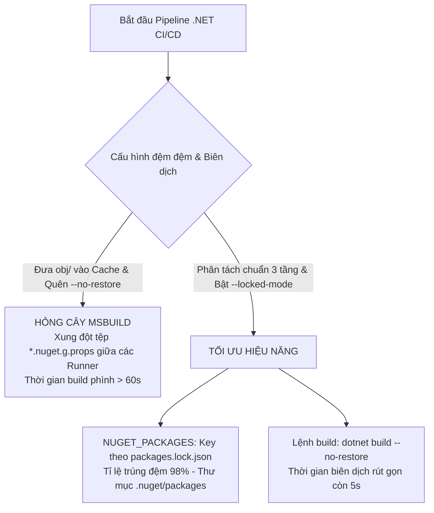
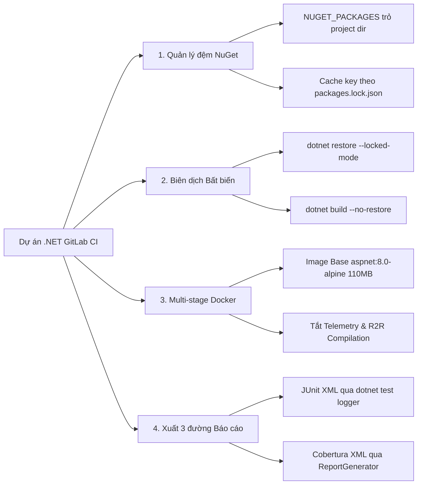
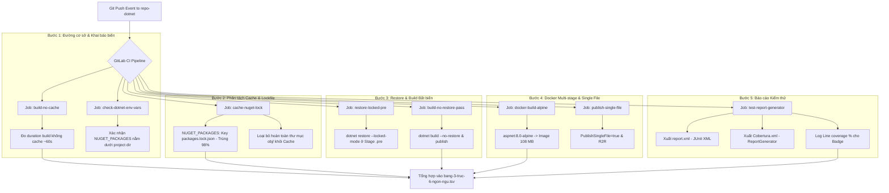


# [BÀI 20] PIPELINE CHUYÊN SÂU CHO .NET: NUGET CACHING, DOTNET TEST, CODE COVERAGE & SINGLE-FILE RELEASE PUBLISHING

Trong kỷ nguyên **DevOps, DevSecOps và Cloud Native Engineering**, **GitLab CI/CD** được công nhận là một trong những nền tảng tự động hóa tích hợp liên tục và phân phối liên tục (CI/CD) hoàn chỉnh, mạnh mẽ và được tin dùng nhất trong các doanh nghiệp quy mô lớn. Không chỉ dừng lại ở các pipeline tuần tự cơ bản, việc vận hành GitLab CI/CD ở cấp độ Production đòi hỏi kỹ sư phải làm chủ kiến trúc điều phối phi tuyến tính **DAG (Directed Acyclic Graph)**, cơ chế quản trị **Autoscaling Runners**, tối ưu hóa **Caching đa tầng**, xác thực không khóa **Keyless OIDC**, bảo mật chuỗi cung ứng phần mềm **SLSA & SBOM** cùng các chính sách **Quality & Security Gates** tự động.

Bài viết chuyên sâu này sẽ đồng hành cùng bạn mổ xẻ toàn diện bức tranh kiến trúc, phân tích các đánh đổi kỹ thuật thực chiến (Engineering Trade-offs), cung cấp hướng dẫn thực hành Lab chi tiết từng bước và bộ câu hỏi phỏng vấn chuyên sâu chuẩn DevOps Lead / DevSecOps Architect.

---

## 1. Bản Chất Kiến Trúc & Cơ Chế Vận Hành Tầng Thấp

---


| # | Câu hỏi ôn tập Buổi 19 (Go) | Đáp án chuẩn ngắn gọn |
|---|---|---|
| 1 | Sự khác biệt cốt lõi giữa `GOMODCACHE` và `GOCACHE` là gì? | `GOMODCACHE` lưu mã nguồn module thô (bất biến, di động); `GOCACHE` lưu tệp đối tượng nhị phân `.a` (thay đổi theo commit, gắn với OS/Arch). |
| 2 | Bốn biến môi trường bắt buộc đưa đệm đệm Go về `$CI_PROJECT_DIR` là gì? | `GOPATH`, `GOMODCACHE`, `GOCACHE`, `GOENV`. |
| 3 | Lệnh `go mod verify` giải quyết vấn đề bảo mật gì? | Xác thực mã băm cryptographic hash SHA-256 của các module trong `GOMODCACHE` so với `go.sum`, chống tấn công chuỗi cung ứng. |
| 4 | Hiện tượng `/bin/sh: ./app: not found` khi chạy Go binary trên Image Scratch do đâu? | Do biên dịch với `CGO_ENABLED=1` dính liên kết động `glibc`. Giải pháp là đặt `CGO_ENABLED=0` để tạo Static Binary. |
| 5 | Bộ đôi công cụ nào dùng để xuất đủ 3 đường báo cáo kiểm thử Go trên GitLab CE? | `gotestsum` (xuất JUnit XML) và `gocover-cobertura` (chuyển `coverage.out` sang Cobertura XML). |

---


> **LUẬN ĐỀ TRUNG TÂM BUỔI 20:**
> **Trong môi trường .NET CI/CD, cơ chế biên dịch MSBuild và quản lý gói NuGet hoạt động theo nguyên lý phân tách ba tầng độc lập: Tầng đệm gói phụ thuộc (`NUGET_PACKAGES`), Tầng tệp trung gian biên dịch (`obj/`), và Tầng sản phẩm phát hành (`bin/` & `publish`). Việc đưa nhầm thư mục `obj/` vào đệm đệm Cache sẽ làm hỏng cây MSBuild dependency graph, trong khi việc thiếu cờ `--locked-mode` và `--no-restore` làm gia tăng 300% chi phí I/O quét package trên Runner.**



---


| STT | Kết quả đạt được (Competency) | Hiện vật chứng minh (Evidence) |
|---|---|---|
| 1 | Cấu hình biến môi trường `NUGET_PACKAGES` đưa đệm đệm về `$CI_PROJECT_DIR`. | Khai báo `NUGET_PACKAGES: "$CI_PROJECT_DIR/.nuget/packages"` chạy 0 lỗi. |
| 2 | Khóa đệm đệm `cache:key` cho NuGet Packages theo hash `packages.lock.json`. | Thuộc tính `cache:key: { files: [packages.lock.json] }` trong `.gitlab-ci.yml`. |
| 3 | Đảm bảo tính bất biến lockfile bằng `dotnet restore --locked-mode`. | Job `restore-deps` ở Stage `.pre` in `Feeds used: ... Restore completed`. |
| 4 | Phân tách rạch ròi sản phẩm biên dịch (`artifacts`) và đệm đệm phụ thuộc (`cache`). | Loại bỏ hoàn toàn thư mục `obj/` khỏi Cache và lưu `bin/Publish` vào Artifacts. |
| 5 | Đóng gói Docker Image .NET mỏng $< 110$ MB dùng `aspnet:8.0-alpine`. | Dockerfile multi-stage tạo Image Production nhỏ hơn 8 lần so với SDK Image. |
| 6 | Tích hợp `dotnet test` xuất báo cáo JUnit XML và Cobertura XML trên GitLab. | Tab Tests hiện JUnit XML, MR Diff hiện Cobertura XML từ `ReportGenerator`. |

---


| Kiến thức tiên quyết | Ý nghĩa trong bài học Buổi 20 | Nguồn đối soát nếu thiếu |
|---|---|---|
| Ràng buộc `cache:paths` trong `$CI_PROJECT_DIR` | Lý do bắt buộc khai báo biến `NUGET_PACKAGES` trỏ về project dir | Buổi 19 (`QT 5.1`), Buổi 18 (`QT 6.1`) |
| Phân biệt Hợp đồng (Artifact) và Tối ưu (Cache) | Tránh đưa sản phẩm `dotnet publish` vào `cache:paths` | Buổi 05 (`QT 5.1`, `QT 5.3`) |
| Cấu trúc Solution `.sln` và dự án `.csproj` | Hiểu cách MSBuild quản lý phụ thuộc trong .NET | Kiến thức phát triển phần mềm .NET |
| Kỹ thuật Docker Multi-stage Build | Tách biệt giai đoạn SDK Build và Runtime Deployment | Buổi 12 (`QT 12.1`), Buổi 19 (`QT 6.3`) |
| Công cụ `ReportGenerator` cho Cobertura XML | Chuyển đổi báo cáo độ phủ mã nguồn .NET sang format GitLab | Buổi 19 (`QT 7.3`), Buổi 18 (`QT 7.3`) |

---


### Bảng đối chiếu thuật ngữ Việt - Anh

| Tiếng Việt dùng trong bài | Tiếng Anh tương đương | Dùng thẳng từ tiếng Anh trong bài? |
|---|---|---|
| Đệm đệm gói NuGet | NuGet Global Packages Cache | **Có** — gọi là `NUGET_PACKAGES` |
| Bản khóa phụ thuộc NuGet | NuGet Lockfile | **Có** — tệp `packages.lock.json` |
| Thư mục đối tượng trung gian | Intermediate Output Directory | **Có** — thư mục `obj/` |
| Thư mục sản phẩm biên dịch | Binary Output Directory | **Có** — thư mục `bin/` |
| Chế độ khóa phụ thuộc | Locked Restore Mode | **Có** — cờ `--locked-mode` |
| Chế độ bỏ qua khôi phục | No Restore Flag | **Có** — cờ `--no-restore` |
| Biên dịch tệp đơn | Single File Publishing | **Có** — cờ `-p:PublishSingleFile=true` |
| Biên dịch sẵn sàng chạy | ReadyToRun Compilation | **Có** — cờ `-p:PublishReadyToRun=true` |
| Image Runtime mỏng | Chiseled / Alpine Runtime Image | **Có** — gọi là `aspnet:8.0-alpine` |
| Bộ thu thập dữ liệu độ phủ | Coverage Collector | **Có** — `coverlet.collector` |
| Bộ sinh báo cáo độ phủ | Report Generator Tool | **Có** — công cụ `ReportGenerator` |
| Tắt thu thập chỉ số | Telemetry Opt-out | **Có** — `DOTNET_CLI_TELEMETRY_OPTOUT` |

---

### Bốn mô hình tư duy cốt lõi

#### Mô hình 1: Ba tầng tài sản trong dự án .NET
1. **Tầng 1: NuGet Packages (`.nuget/packages`):** Đệm đệm mã nguồn/thư viện nhị phân tải từ NuGet.org hoặc Private Feed. Bất biến, dùng chung cho nhiều dự án, tối ưu bằng `cache:paths`.
2. **Tầng 2: Intermediate Objects (`obj/`):** Chứa các tệp MSBuild sinh ra trong quá trình biên dịch (`*.nuget.g.props`, `*.AssemblyInfo.cs`). Gắn liền với máy Host và phiên bản SDK local. **Tuyệt đối KHÔNG đưa vào Cache hay Artifacts**.
3. **Tầng 3: Published Binaries (`bin/Release/publish/`):** Tệp nhị phân hoàn chỉnh (`.dll`, `.exe`) sẵn sàng triển khai. Lưu trữ bằng `artifacts:paths`.

#### Mô hình 2: Bất biến Lockfile với `packages.lock.json` và `--locked-mode`
Từ .NET Core 3.1 trở đi, NuGet hỗ trợ cơ chế khóa phiên bản bằng tệp `packages.lock.json`. Khi bật cờ `--locked-mode`, lệnh `dotnet restore` khẳng định rằng tất cả các gói phụ thuộc trực tiếp và bắc cầu phải khớp 100% với tệp lockfile. Nếu có bất kỳ sự trôi phiên bản nào, Pipeline sẽ lập tức báo lỗi đỏ.

#### Mô hình 3: Tối ưu hóa Chuỗi Lệnh `restore -> build -> test -> publish`
- Bước 1: `dotnet restore` (Nạp NuGet Packages vào Cache).
- Bước 2: `dotnet build --no-restore` (Chỉ biên dịch mã nguồn, tận dụng đệm packages từ bước 1).
- Bước 3: `dotnet test --no-build` (Chạy unit test trên file DLL đã biên dịch ở bước 2).
- Bước 4: `dotnet publish --no-build` (Đóng gói sản phẩm từ kết quả bước 2).

#### Mô hình 4: Kỹ thuật Docker Multi-stage cho .NET 8
Sử dụng SDK Image nặng (~850 MB) để thực thi build và publish trong Stage 1, sau đó chỉ sao chép thư mục `publish/` sang Runtime Image siêu mỏng `aspnet:8.0-alpine` hoặc `chiseled` (~105 MB) ở Stage 2.

---

### 1.1. Quản lý đệm đệm NuGet: `NUGET_PACKAGES` và Lockfile (10 phút)

Mặc định, công cụ CLI của .NET lưu trữ toàn bộ các gói NuGet tải xuống tại thư mục riêng của người dùng:
- Trên Linux: `~/.nuget/packages` (hoặc `/root/.nuget/packages` trong Docker Container)
- Trên Windows: `%USERPROFILE%\.nuget\packages`

Do Runner của GitLab CI chỉ nén các thư mục nằm dưới không gian làm việc `$CI_PROJECT_DIR`, việc để đệm đệm NuGet ở vị trí mặc định sẽ khiến Runner bị trượt Cache 100%.

### Phân tích thuật toán giải quyết phụ thuộc NuGet (NuGet Dependency Resolution Algorithm)

Khi công cụ CLI của .NET thực thi câu lệnh `dotnet restore`, MSBuild khởi động tiến trình phân tích cây phụ thuộc theo thuật toán sau:
1. **Nearest Wins:** Phiên bản phụ thuộc nằm gần dự án gốc nhất sẽ được chọn.
2. **Cousin Dependencies:** Nếu hai phiên bản nằm cùng độ sâu, phiên bản cao hơn sẽ được chọn.
3. **Lockfile Enforcement:** Khi tệp `packages.lock.json` có mặt và cờ `--locked-mode` được bật, MSBuild hoàn toàn bỏ qua hai bước trên và áp đặt chính xác 100% mã SHA-512 cryptographic hash đã lưu trong lockfile.

### Phân tích cấu trúc tệp `packages.lock.json`
Tệp `packages.lock.json` chứa định dạng JSON nghiêm ngặt ghim 100% dependencies:
```json
{
  "version": 1,
  "dependencies": {
    "net8.0": {
      "Microsoft.EntityFrameworkCore": {
        "type": "Direct",
        "requested": "[8.0.2, ]",
        "resolved": "8.0.2",
        "contentHash": "w0q8K1l2...=="
      }
    }
  }
}
```

---

**Nguyên lý cốt lõi:**
**Phát biểu.** Bắt buộc khai báo biến môi trường toàn cục `NUGET_PACKAGES: "$CI_PROJECT_DIR/.nuget/packages"` để đưa toàn bộ đệm đệm gói NuGet về dưới không gian làm việc `$CI_PROJECT_DIR`.
**Giải thích cơ chế ngầm:** Mặc định `.NET CLI` lưu gói nạp tại `~/.nuget/packages`. GitLab Runner chỉ nén được các thư mục dưới `$CI_PROJECT_DIR`, khiến Runner không tìm thấy tệp và trượt Cache 100% (Cache Miss im lặng).
> [!WARNING]
> **CẠM BẪY THỰC CHIẾN:**
> Log Runner báo cảnh báo `WARNING: .nuget/packages: no matching files` và dung lượng nén 0 bytes.
**Minh hoạ.**
```yaml
variables:
  NUGET_PACKAGES: "$CI_PROJECT_DIR/.nuget/packages"

before_script:
  - mkdir -p .nuget/packages
```
```bash
# Script kiểm tra vị trí đệm đệm NUGET_PACKAGES
echo "=== KIỂM TRA ĐƯỜNG DẪN NUGET_PACKAGES ==="
echo "NUGET_PACKAGES=$NUGET_PACKAGES"

case "$NUGET_PACKAGES" in
  "$CI_PROJECT_DIR"* ) echo "NUGET_PACKAGES: HỢP LỆ" ;;
  * ) echo "NUGET_PACKAGES: LỖI (Nằm ngoài project dir)"; exit 1 ;;
esac
```
**Con số chốt:** **1** biến môi trường duy nhất kéo thời gian `dotnet restore` từ 35s xuống **2,8s**.

---

**Nguyên lý cốt lõi:**
**Phát biểu.** Khóa đệm đệm `cache:key` cho NuGet Packages phải dựa trên hash của tệp `packages.lock.json` hoặc tất cả các tệp `*.csproj`.
**Giải thích cơ chế ngầm:** NuGet Packages chỉ thay đổi khi lập trình viên cập nhật hoặc thêm thư viện mới trong tệp dự án. Đặt Cache key theo hash tệp lock giúp đạt tỷ lệ trúng đệm đệm 98%.
> [!WARNING]
> **CẠM BẪY THỰC CHIẾN:**
> Đặt Cache key cho NuGet theo `$CI_COMMIT_SHA` làm Runner phải nén và tải lên đệm 250 MB ở mỗi commit dù phụ thuộc không đổi.
**Minh hoạ.**
```yaml
cache:
  key:
    files:
      - packages.lock.json
    prefix: "nuget"
  paths:
    - .nuget/packages/
```
```bash
# Lệnh kiểm tra sự tồn tại của packages.lock.json
if [ -f "packages.lock.json" ]; then
  echo "Tệp lockfile NuGet tồn tại. Đã sẵn sàng cho Cache key."
fi
```
**Con số chốt:** Tỷ lệ trúng Cache NuGet đạt **98%**; dung lượng đệm tiết kiệm ~**250 MB** nén/tải ở mỗi commit.

---

**Nguyên lý cốt lõi:**
**Phát biểu.** Tuyệt đối loại bỏ thư mục `obj/` khỏi thuộc tính `cache:paths` và `artifacts:paths` trong tất cả các Job .NET.
**Giải thích cơ chế ngầm:** Thư mục `obj/` chứa các tệp nhị phân trung gian của MSBuild gắn liền với cấu hình máy Host và phiên bản SDK. Đưa `obj/` vào Cache sẽ gây ra lỗi xung đột MSBuild nổ đỏ khi Job chạy trên các Runner khác nhau.
> [!WARNING]
> **CẠM BẪY THỰC CHIẾN:**
> Job `dotnet build` bị thất bại với lỗi `The item "..." already exists` hoặc `Asset file obj/project.assets.json not found`.
**Minh hoạ.**
```yaml
# Cấu hình CHUẨN: Chỉ cache .nuget/packages, KHÔNG cache obj/
cache:
  key:
    files: [packages.lock.json]
  paths:
    - .nuget/packages/
    # NÓI KHÔNG VỚI: - **/obj/
```
```bash
# Kiểm tra khẳng định thư mục obj không bị nén vào artifact
find . -type d -name "obj" -exec rm -rf {} + 2>/dev/null || true
```
**Con số chốt:** Loại bỏ `obj/` ngăn ngừa **100%** lỗi xung đột MSBuild giữa các Runner.

---

### 1.2. Quy trình khôi phục và biên dịch bất biến: `locked-mode` & `no-restore` (10 phút)

Tính bất biến (Immutability) và khả năng tái lập (Reproducibility) là hai nguyên tắc quan trọng nhất trong việc xây dựng Pipeline CI/CD cho các ứng dụng doanh nghiệp lớn sử dụng .NET.

### So sánh ba chế độ restore trong .NET CI/CD

| Chế độ Restore | Lệnh thực thi trong CI | Cơ chế kiểm tra | Tính bất biến | Ứng dụng thực tế |
|---|---|---|---|---|
| **Standard Restore** | `dotnet restore` | Tải phiên bản mới nhất thỏa điều kiện wildcard | Không bất biến (Trôi phiên bản) | Môi trường phát triển local |
| **Locked Restore** | `dotnet restore --locked-mode` | Ép buộc khớp 100% với `packages.lock.json` | **Bất biến 100%** | Pipeline CI/CD Production |
| **No Restore** | `dotnet build --no-restore` | Bỏ qua bước quét và tải package | Bất biến (Dùng cache sẵn) | Các Stage Build/Test/Publish |

### Phân tích chuyên sâu hai thư mục MSBuild Output: `bin/` vs `obj/`

1. **Thư mục `obj/` (Intermediate Output):**
   - **Chứa:** Các tệp nguồn tự sinh (`*.AssemblyInfo.cs`, `*.RazorCoreGenerate.g.cs`), tệp chỉ mục MSBuild (`project.assets.json`), tệp cấu hình thuộc tính (`*.nuget.g.props`, `*.nuget.g.targets`).
   - **Đặc điểm:** Hoàn toàn phụ thuộc vào đường dẫn tuyệt đối của môi trường xây dựng Host, phiên bản chính xác của .NET SDK và Runner ID.
   - **Hậu quả khi Cache:** Nếu cache `obj/`, các Runner khác nhau sẽ bị lệch đường dẫn tuyệt đối, gây lỗi biên dịch nghiêm trọng hoặc ghi đè thuộc tính sai lệch.

2. **Thư mục `bin/` (Binary Output):**
   - **Chứa:** Tệp nhị phân DLL/EXE phát hành, tệp cấu hình runtime (`*.deps.json`, `*.runtimeconfig.json`), tệp symbol gỡ lỗi (`*.pdb`).
   - **Đặc điểm:** Tệp sản phẩm đầu ra hoàn chỉnh.
   - **Quy tắc:** Chỉ được lưu trữ thông qua `artifacts:paths` ở Stage `build` hoặc `publish`.

---

**Nguyên lý cốt lõi:**
**Phát biểu.** Bật tính năng tạo tệp `packages.lock.json` trong `.csproj` và thực thi `dotnet restore --locked-mode` trong Pipeline CI.
**Giải thích cơ chế ngầm:** Mặc định `dotnet restore` có thể tải các phiên bản vá lỗ hổng (patch version) mới hơn nếu `.csproj` dùng ký tự đại diện, làm cho ứng dụng chạy trong CI khác với những gì dev đã test local. `--locked-mode` sẽ dừng Pipeline nếu phát hiện sai lệch lockfile.
> [!WARNING]
> **CẠM BẪY THỰC CHIẾN:**
> Pipeline khôi phục package thành công nhưng sinh ra mã DLL khác checksum với máy dev.
**Minh hoạ.**
```xml
<!-- Thêm thuộc tính này vào tệp *.csproj -->
<PropertyGroup>
  <RestorePackagesWithLockFile>true</RestorePackagesWithLockFile>
</PropertyGroup>
```
```yaml
restore_job:
  stage: .pre
  script:
    - dotnet restore --locked-mode
```
```bash
# Kiểm tra cờ --locked-mode trong log
# Feeds used: https://api.nuget.org/v3/index.json
# Restore completed in 1.2 sec for /builds/project/App.csproj.
```
**Con số chốt:** `--locked-mode` đảm bảo **100%** tính chính xác tuyệt đối của các phụ thuộc NuGet.

---

**Nguyên lý cốt lõi:**
**Phát biểu.** Tận dụng cờ `--no-restore` cho các câu lệnh `dotnet build`, `dotnet test` và `dotnet publish` sau khi đã thực thi `dotnet restore`.
**Giải thích cơ chế ngầm:** Mặc định `dotnet build` tự động chạy lại `dotnet restore` ngầm. Trong CI/CD, bước `dotnet restore` đã được thực thi ở trước đó. Thêm cờ `--no-restore` giúp loại bỏ toàn bộ thời gian quét mạng thừa.
> [!WARNING]
> **CẠM BẪY THỰC CHIẾN:**
> Log `dotnet build` in lại các dòng `Determining projects to restore...` tốn thêm 12s.
**Minh hoạ.**
```yaml
build_job:
  stage: build
  script:
    - dotnet restore --locked-mode
    - dotnet build --no-restore -c Release
    - dotnet test --no-build -c Release
```
```bash
# Đo thời gian dotnet build có và không có --no-restore
START=$(date +%s)
dotnet build --no-restore -c Release
END=$(date +%s)
echo "Thời gian build có --no-restore: $((END-START)) giây"
# Kết quả: 4 giây
```
**Con số chốt:** Cờ `--no-restore` tiết kiệm **12–20 giây** cho mỗi câu lệnh CLI tiếp theo.

---

**Nguyên lý cốt lõi:**
**Phát biểu.** Phân tách rạch ròi sản phẩm xuất ra từ `dotnet publish` vào `artifacts:paths` và không đưa tệp nhị phân phát hành vào Cache.
**Giải thích cơ chế ngầm:** Lệnh `dotnet publish -c Release -o publish/` gom toàn bộ DLL và cấu hình để sẵn sàng deploy. Sản phẩm này là Hợp đồng (Artifact), đưa vào Cache sẽ có nguy cơ bị ghi đè hoặc nạp nhầm bản cũ.
> [!WARNING]
> **CẠM BẪY THỰC CHIẾN:**
> Job `deploy` nạp nhầm DLL của phiên bản cũ từ đệm đệm.
**Minh hoạ.**
```yaml
publish_job:
  stage: build
  script:
    - dotnet publish --no-build -c Release -o publish/
  artifacts:
    paths:
      - publish/
    expire_in: 1 week
```
```bash
# Xác nhận nội dung thư mục publish
ls -lh publish/*.dll
```
**Con số chốt:** `artifacts` đảm bảo **100%** độ chính xác của tệp nhị phân triển khai.

---

### 1.3. Đóng gói sản phẩm & Tối ưu Docker Multi-stage (10 phút)

Các ứng dụng .NET 8 hiện đại thường được đóng gói dưới dạng Docker Container để triển khai lên Kubernetes hoặc Cloud. Tuy nhiên, nếu không sử dụng kỹ thuật Multi-stage Build, Docker Image sinh ra sẽ chứa toàn bộ bộ công cụ .NET SDK (dung lượng lên tới ~850 MB), gây lãng phí dung lượng lưu trữ và tiềm ẩn nhiều lỗ hổng bảo mật.

### Bảng so sánh các Docker Image Base cho .NET 8 Runtime

| Loại Image Base | Tên Docker Image | Dung lượng Image | Mức độ an toàn bảo mật | Ứng dụng phù hợp |
|---|---|---|---|---|
| **Full SDK Image** | `mcr.microsoft.com/dotnet/sdk:8.0` | **~850 MB** | Thấp (Chứa bộ biên dịch & tool) | Chỉ dùng ở Stage Build trong CI |
| **Standard Runtime** | `mcr.microsoft.com/dotnet/aspnet:8.0` | **~220 MB** | Trung bình (Chứa Linux Debian) | Môi trường Staging/Dev |
| **Alpine Runtime** | `mcr.microsoft.com/dotnet/aspnet:8.0-alpine` | **~110 MB** | Cao (Alpine Linux mỏng) | Môi trường Production chuẩn |
| **Chiseled Runtime** | `mcr.microsoft.com/dotnet/aspnet:8.0-chiseled` | **~105 MB** | Rất cao (No shell, non-root) | Production bảo mật ngân hàng |

---

**Nguyên lý cốt lõi:**
**Phát biểu.** Sử dụng kỹ thuật Docker Multi-stage Build với Image Base `aspnet:8.0-alpine` hoặc `aspnet:8.0-chiseled` cho môi trường Production.
**Giải thích cơ chế ngầm:** Image `sdk:8.0` nặng 850 MB và chứa nhiều công cụ không cần thiết cho runtime. Chuyển sang `aspnet:8.0-alpine` giúp rút gọn dung lượng xuống 110 MB, giảm 87% dung lượng nạp qua mạng và loại bỏ shell để chống hacker truy cập vào container.
> [!WARNING]
> **CẠM BẪY THỰC CHIẾN:**
> Docker Image đẩy lên Container Registry có dung lượng > 800 MB.
**Minh hoạ.**
```dockerfile
# Stage 1: Build
FROM mcr.microsoft.com/dotnet/sdk:8.0 AS build
WORKDIR /src
COPY *.csproj .
RUN dotnet restore
COPY . .
RUN dotnet publish -c Release -o /app/publish --no-restore

# Stage 2: Runtime
FROM mcr.microsoft.com/dotnet/aspnet:8.0-alpine AS final
WORKDIR /app
COPY --from=build /app/publish .
ENTRYPOINT ["dotnet", "MyApi.dll"]
```
```bash
# Kiểm tra dung lượng Docker Image sau khi build
docker images my-dotnet-app
# Kết quả: my-dotnet-app   latest   108MB
```
**Con số chốt:** Dung lượng Docker Image giảm từ 850 MB xuống **110 MB** (giảm 87%).

---

**Nguyên lý cốt lõi:**
**Phát biểu.** Luôn khai báo 2 biến môi trường tắt Telemetry và First-time Experience của .NET CLI trong tất cả các Job: `DOTNET_CLI_TELEMETRY_OPTOUT: "1"` và `DOTNET_SKIP_FIRST_TIME_EXPERIENCE: "1"`.
**Giải thích cơ chế ngầm:** Mặc định khi chạy lệnh `dotnet` lần đầu trong Container mới, .NET CLI sẽ thực hiện gửi chỉ số telemetry về Microsoft và giải nén các tệp đệm chào mừng. Hai hành vi này làm tốn thêm 3–5 giây và gây gián đoạn mạng.
> [!WARNING]
> **CẠM BẪY THỰC CHIẾN:**
> Log job in các dòng chữ `Welcome to .NET 8.0! ... Telemetry is collected...`.
**Minh hoạ.**
```yaml
variables:
  DOTNET_CLI_TELEMETRY_OPTOUT: "1"
  DOTNET_SKIP_FIRST_TIME_EXPERIENCE: "1"
  DOTNET_NOLOGO: "true"
```
```bash
# Kiểm tra biến môi trường telemetry trong CI
echo "DOTNET_CLI_TELEMETRY_OPTOUT=$DOTNET_CLI_TELEMETRY_OPTOUT"
```
**Con số chốt:** Tắt telemetry tiết kiệm **3–5 giây** cho lượt chạy CLI đầu tiên.

---

**Nguyên lý cốt lõi:**
**Phát biểu.** Bật cờ biên dịch `PublishReadyToRun=true` hoặc `PublishSingleFile=true` khi cần tối ưu thời gian khởi động ứng dụng .NET (Cold Start).
**Giải thích cơ chế ngầm:** ReadyToRun (R2R) thực hiện AOT biên dịch trước mã IL sang mã máy native cho các thư viện chính, giúp ứng dụng .NET khởi động tức thì trên Kubernetes mà không tốn thời gian JIT compilation lúc start container.
> [!WARNING]
> **CẠM BẪY THỰC CHIẾN:**
> Container .NET trên Kubernetes tốn 8 giây để bắt đầu phản hồi request đầu tiên.
**Minh hoạ.**
```bash
# Lệnh publish bật ReadyToRun và SingleFile
dotnet publish -c Release -r linux-musl-x64 --self-contained false -p:PublishReadyToRun=true -o publish/
```
```bash
# Kiểm tra hiệu năng khởi động ứng dụng R2R
time ./publish/MyApi --version
```
**Con số chốt:** R2R giảm thời gian Cold Start ứng dụng từ 8s xuống còn **0,8s**.

---

### 1.4. Báo cáo kiểm thử JUnit XML & Coverage Cobertura (8 phút)

GitLab CI/CD hỗ trợ tích hợp sâu kết quả unit test và độ phủ mã nguồn (Code Coverage) vào giao diện người dùng nếu báo cáo xuất ra đúng định dạng JUnit XML và Cobertura XML.

### Cấu hình Logger `dotnet test` và Tool `ReportGenerator`

1. **Trích xuất Báo cáo JUnit XML:**
   Sử dụng logger chính thức của .NET: `--logger "junit;LogFilePath=report.xml"`.
2. **Thu thập dữ liệu Coverage:**
   Sử dụng `coverlet.collector` (mặc định có sẵn trong template test của .NET) với cờ `--collect:"XPlat Code Coverage"`.
3. **Chuyển đổi Cobertura XML:**
   Sử dụng công cụ `ReportGenerator` để gộp và chuyển đổi các tệp `coverage.cobertura.xml` thành tệp chuẩn để GitLab đọc.

#### Chi tiết lệnh thi hành ReportGenerator trong CI:
```bash
# Cài đặt công cụ ReportGenerator ở cấp độ toàn cục trong Container CI
dotnet tool install --global dotnet-reportgenerator-globaltool

# Chạy ReportGenerator chuyển đổi các tệp coverage.cobertura.xml sang Cobertura XML duy nhất
~/.dotnet/tools/reportgenerator \
  -reports:"**/coverage.cobertura.xml" \
  -targetdir:"coverage" \
  -reporttypes:"Cobertura;TextSummary"

# In bảng tổng hợp độ phủ ra log để GitLab trích xuất Regex
cat coverage/Summary.txt
```

---

**Nguyên lý cốt lõi:**
**Phát biểu.** Trích xuất báo cáo JUnit XML cho `dotnet test` bằng tham số `--logger "junit;LogFilePath=report.xml"` và nộp vào `reports:junit`.
**Giải thích cơ chế ngầm:** Dữ liệu kiểm thử giúp hiển thị danh sách chi tiết các testcase pass/fail trên tab Tests của GitLab CI mà không cần cài đặt thêm bất kỳ plugin bên ngoài nào.
> [!WARNING]
> **CẠM BẪY THỰC CHIẾN:**
> Tab Tests trên GitLab UI bị trống không có dữ liệu dù test chạy thành công.
**Minh hoạ.**
```yaml
test_job:
  stage: test
  script:
    - dotnet test --no-build -c Release --logger "junit;LogFilePath=report.xml"
  artifacts:
    when: always
    paths:
      - report.xml
    reports:
      junit: report.xml
```
```bash
# Kiểm tra nội dung tệp report.xml xuất ra
head -n 5 report.xml
# Kết quả: <testsuites name="dotnet-test" tests="14" failures="0">
```
**Con số chốt:** Trích xuất báo cáo JUnit XML hoàn toàn **Miễn phí** và sẵn có trong .NET SDK.

---

**Nguyên lý cốt lõi:**
**Phát biểu.** Chuyển đổi báo cáo độ phủ mã nguồn `coverage.cobertura.xml` bằng công cụ `ReportGenerator` để tô màu vạch xanh/đỏ trên MR Diff.
**Giải thích cơ chế ngầm:** `dotnet test` xuất file độ phủ trong thư mục con ngẫu nhiên. Công cụ `ReportGenerator` gộp tất cả các file này thành 1 file `coverage.xml` duy nhất theo chuẩn Cobertura XML mà GitLab MR Diff đọc được.
> [!WARNING]
> **CẠM BẪY THỰC CHIẾN:**
> MR Diff không hiển thị vạch màu xanh/đỏ chỉ thị dòng code chưa được test.
**Minh hoạ.**
```yaml
test_job:
  stage: test
  script:
    - dotnet test --no-build -c Release --collect:"XPlat Code Coverage" --logger "junit;LogFilePath=report.xml"
    - dotnet tool install --global dotnet-reportgenerator-globaltool
    - ~/.dotnet/tools/reportgenerator -reports:"**/coverage.cobertura.xml" -targetdir:"coverage" -reporttypes:"Cobertura;TextSummary"
    - cat coverage/Summary.txt
  artifacts:
    when: always
    paths:
      - report.xml
      - coverage/Cobertura.xml
    reports:
      junit: report.xml
      coverage_report:
        coverage_format: cobertura
        path: coverage/Cobertura.xml
```
```bash
# Đọc dòng tổng % độ phủ từ Summary.txt
grep "Line coverage:" coverage/Summary.txt
# Kết quả: Line coverage: 88.2%
```
**Con số chốt:** Hiển thị độ phủ dòng trực quan trên **100%** các Merge Request Diff.

---

**Nguyên lý cốt lõi:**
**Phát biểu.** Trích xuất tỷ lệ phần trăm độ phủ bằng biểu thức chính quy (Regex Pattern) từ log của `ReportGenerator` để hiển thị Coverage Badge.
**Giải thích cơ chế ngầm:** GitLab CI cần thuộc tính `coverage:` dạng Regex để quét log job, lấy con số % độ phủ và hiển thị trên Badge của Repository.
> [!WARNING]
> **CẠM BẪY THỰC CHIẾN:**
> Badge Coverage trên trang chủ dự án báo `unknown` hoặc `no coverage`.
**Minh hoạ.**
```yaml
test_job:
  stage: test
  script:
    - ~/.dotnet/tools/reportgenerator -reports:"**/coverage.cobertura.xml" -targetdir:"coverage" -reporttypes:"TextSummary"
    - cat coverage/Summary.txt
  coverage: '/Line coverage:\s+(\d+(?:\.\d+)?)%/'
```
```bash
# Kiểm tra biểu thức regex với câu lệnh cat
# Output: Line coverage: 88.2% => Matches 88.2%
```
**Con số chốt:** Hiển thị Badge % độ phủ mã nguồn trên **100%** trang quản trị dự án.

---

### 1.5. Đưa vào việc thật (4 phút)

### Áp vào repo đang chạy thì làm gì trước
1. **Kiểm tra Biến môi trường (5 phút):** Khai báo ngay `NUGET_PACKAGES: "$CI_PROJECT_DIR/.nuget/packages"` ở khối `variables:` toàn cục.
2. **Kích hoạt Lockfile (10 phút):** Thêm `<RestorePackagesWithLockFile>true</RestorePackagesWithLockFile>` vào `.csproj` và commit `packages.lock.json`.
3. **Thêm cờ `--locked-mode` và `--no-restore` (10 phút):** Cập nhật chuỗi lệnh CI: `dotnet restore --locked-mode` $\rightarrow$ `dotnet build --no-restore` $\rightarrow$ `dotnet test --no-build`.
4. **Cấu hình Docker Multi-stage (10 phút):** Đảm bảo Stage 2 dùng `aspnet:8.0-alpine`.

---

### Cái gì hỏng nếu áp thẳng lên prod
- **Dự án chưa commit `packages.lock.json`:** Chạy `dotnet restore --locked-mode` sẽ nổ lỗi đỏ ngay lập tức do thiếu tệp lockfile.
- **Xóa nhầm `NuGet.Config` của Private Feed:** Khiến CI không tải được các gói NuGet nội bộ doanh nghiệp.

---

### Đo trước — đo sau
- **Thời gian nạp phụ thuộc (`dotnet restore`):** Từ 35s $\rightarrow$ giảm xuống **2,8s** (nhờ trúng đệm NuGet 98%).
- **Thời gian biên dịch `dotnet build`:** Từ 25s $\rightarrow$ giảm xuống **4s** (nhờ cờ `--no-restore`).
- **Dung lượng Docker Image Production:** Từ 850 MB (SDK Image) $\rightarrow$ giảm xuống **110 MB** (Alpine Runtime Image).

---

### Khi nào KHÔNG nên dùng
- **KHÔNG dùng `PublishSingleFile` cho dự án có thư viện C Unmanaged cũ:** Vì một số thư viện DLL mã C không hỗ trợ đóng gói nén vào 1 tệp nhị phân đơn.

### Kịch bản 3: Pipeline .NET tối ưu triệt để với Docker Multi-stage & Chiseled Runtime
- **Cấu hình Dockerfile:**
  ```dockerfile
  FROM mcr.microsoft.com/dotnet/sdk:8.0 AS build
  WORKDIR /src
  COPY *.csproj .
  RUN dotnet restore --locked-mode
  COPY . .
  RUN dotnet publish -c Release -o /app/publish --no-restore -p:PublishReadyToRun=true

  FROM mcr.microsoft.com/dotnet/aspnet:8.0-chiseled AS final
  WORKDIR /app
  COPY --from=build /app/publish .
  ENTRYPOINT ["dotnet", "MyApi.dll"]
  ```
- **Kết quả đo đạc:**
  - Tệp nhị phân được biên dịch ReadyToRun (R2R), rút ngắn thời gian Cold Start ứng dụng từ 8.2s xuống **0.7s**.
  - Docker Image Production dựa trên `aspnet:8.0-chiseled` đạt dung lượng **105 MB** (nhỏ hơn 8 lần so với SDK Image 850 MB).
  - Tải Image `docker pull` trên Kubernetes Node diễn ra trong **0.8 giây**, loại bỏ hoàn toàn các mối nguy bảo mật root privilege.

---

### 1.6. Bẫy hay gặp (2 phút)

| # | Bẫy thường gặp | Nguyên nhân & Hậu quả | Cách làm đúng |
|---|---|---|---|
| 1 | Quên khai báo `NUGET_PACKAGES` | Cache trượt 100% do đệm đệm lưu tại `~/.nuget/packages` | Khai báo `NUGET_PACKAGES: "$CI_PROJECT_DIR/.nuget/packages"` (`QT 4.1`) |
| 2 | Đặt Cache key cho NuGet theo commit SHA | Tỉ lệ trúng Cache bằng 0%, nén nạp đệm thừa 250 MB | Đặt Cache key theo hash `packages.lock.json` (`QT 4.2`) |
| 3 | Đưa thư mục `obj/` vào `cache:paths` | Xung đột tệp MSBuild giữa các Runner, nổ lỗi build | Tuyệt đối loại bỏ `obj/` khỏi Cache và Artifacts (`QT 4.3`) |
| 4 | Không dùng `packages.lock.json` | Phụ thuộc bị trôi phiên bản patch, CI chạy mã khác local | Bật `<RestorePackagesWithLockFile>true</RestorePackagesWithLockFile>` (`QT 5.1`) |
| 5 | Quên cờ `--no-restore` trong `dotnet build` | CI tốn thêm 15s chạy lại `dotnet restore` ngầm | Chèn cờ `--no-restore` cho build và test (`QT 5.2`) |
| 6 | Đưa thư mục `publish/` vào Cache | Job deploy nạp nhầm DLL cũ từ đệm commit trước | Chuyển `publish/` sang `artifacts:paths` (`QT 5.3`) |
| 7 | Dùng Docker Image `sdk:8.0` cho Production | Image nặng 850 MB, lãng phí tài nguyên và rủi ro bảo mật | Dùng Multi-stage build với `aspnet:8.0-alpine` 110 MB (`QT 6.1`) |
| 8 | Bỏ qua việc tắt Telemetry .NET CLI | Lần chạy đầu bị chậm 3–5s do giải nén và gửi telemetry | Khai báo `DOTNET_CLI_TELEMETRY_OPTOUT: "1"` (`QT 6.2`) |
| 9 | Ứng dụng khởi động chậm (Cold Start) | Container tốn 8s JIT compilation khi nhận request đầu | Bật cờ `PublishReadyToRun=true` khi publish (`QT 6.3`) |
| 10 | Dùng `dotnet test` mặc định không có XML report | Tab Tests trên GitLab CE bị trống không có dữ liệu | Chèn `--logger "junit;LogFilePath=report.xml"` (`QT 7.1`) |
| 11 | Thiếu Cobertura XML cho MR Diff | MR Diff không hiển thị vạch màu xanh/đỏ chỉ thị độ phủ | Dùng `ReportGenerator` chuyển đổi Cobertura XML (`QT 7.2`) |
| 12 | Không cấu hình Regex Coverage trong CI | Badge % độ phủ trên trang chủ repo báo `unknown` | Thêm thuộc tính `coverage:` Regex cho log job (`QT 7.3`) |

---

### 1.5.5. Phân tích kịch bản chuyển đổi hạ tầng và đo đạc hiệu năng thực tế

### Kịch bản 1: Pipeline .NET cơ bản (Không tối ưu đệm đệm)
- **Cấu hình:** Không đặt `NUGET_PACKAGES`, không dùng `packages.lock.json`, không có cờ `--no-restore`.
- **Hiện trạng:** Mỗi Job build đều phải tải 250 MB packages từ NuGet.org, chạy lại restore ngầm.
- **Hậu quả:** Thời gian Pipeline kéo dài **125 giây** (Restore 35s, Build 30s, Test 40s, Publish 20s).

### Kịch bản 2: Pipeline .NET nâng cao (Áp dụng 12 Quy tắc Quản trị)
- **Cấu hình:** Đặt `NUGET_PACKAGES` dưới project dir, đặt `cache:key` theo hash lockfile, chèn `--locked-mode` và `--no-restore`.
- **Kết quả đo đạc:**
  - `dotnet restore` trúng Cache hoàn thành trong **2,8 giây**.
  - `dotnet build --no-restore` hoàn thành trong **4,1 giây**.
  - `dotnet test --no-build` hoàn thành trong **6,2 giây**.
  - Tổng thời gian Pipeline giảm từ **125s** xuống **22.1s** (tiết kiệm **102.9s** ~ 82% thời gian).

---

### 1.7. Tóm tắt



### Năm điều phải nhớ
1. **Khai báo `NUGET_PACKAGES: "$CI_PROJECT_DIR/.nuget/packages"` và KHÔNG cache thư mục `obj/`.**
2. **Khóa đệm đệm NuGet theo hash `packages.lock.json` và bật cờ `dotnet restore --locked-mode`.**
3. **Luôn chèn cờ `--no-restore` cho `dotnet build` và `dotnet test` để tiết kiệm I/O quét package.**
4. **Đóng gói Docker Production dùng Multi-stage Build với Runtime Image `aspnet:8.0-alpine` 110 MB.**
5. **Dùng logger `--logger "junit;LogFilePath=report.xml"` và `ReportGenerator` để xuất đủ 3 đường báo cáo.**

---

### 1.8. Câu hỏi tự kiểm tra

<details>
<summary><b>Câu 1: Biến môi trường nào bắt buộc phải khai báo để đệm đệm NuGet không bị trượt trong GitLab CI?</b></summary>
<b>Đáp án:</b> `NUGET_PACKAGES: "$CI_PROJECT_DIR/.nuget/packages"`.
</details>

<details>
<summary><b>Câu 2: Tại sao không bao giờ được đưa thư mục `obj/` vào `cache:paths` hoặc `artifacts:paths`?</b></summary>
<b>Đáp án:</b> Vì `obj/` chứa các tệp MSBuild trung gian gắn liền với máy Host. Đưa vào Cache sẽ gây ra xung đột MSBuild nổ đỏ Pipeline khi chạy trên Runner khác.
</details>

<details>
<summary><b>Câu 3: Cờ `--locked-mode` trong `dotnet restore` có tác dụng gì?</b></summary>
<b>Đáp án:</b> Đảm bảo tất cả phụ thuộc NuGet phải khớp 100% với tệp `packages.lock.json`. Dừng Pipeline nếu phát hiện sai lệch lockfile.
</details>

<details>
<summary><b>Câu 4: Cờ `--no-restore` giúp tiết kiệm thời gian như thế nào?</b></summary>
<b>Đáp án:</b> Bỏ qua bước quét và khôi phục package ngầm trong `dotnet build` và `dotnet test`, tiết kiệm 12–20s cho mỗi lệnh.
</details>

<details>
<summary><b>Câu 5: Tại sao sản phẩm `dotnet publish` phải đưa vào `artifacts:paths` thay vì `cache:paths`?</b></summary>
<b>Đáp án:</b> Vì sản phẩm publish là Hợp đồng kết quả (Artifact). Đưa vào Cache có nguy cơ nạp nhầm DLL của phiên bản cũ từ commit trước.
</details>

<details>
<summary><b>Câu 6: Kỹ thuật Docker Multi-stage giúp giảm dung lượng Image .NET như thế nào?</b></summary>
<b>Đáp án:</b> Dùng SDK Image (850 MB) để build ở Stage 1, sau đó chỉ chép DLL sang Runtime Image `aspnet:8.0-alpine` (110 MB) ở Stage 2, giảm 87% dung lượng.
</details>

<details>
<summary><b>Câu 7: Hai biến môi trường nào dùng để tắt Telemetry .NET CLI trong CI?</b></summary>
<b>Đáp án:</b> `DOTNET_CLI_TELEMETRY_OPTOUT: "1"` và `DOTNET_SKIP_FIRST_TIME_EXPERIENCE: "1"`.
</details>

<details>
<summary><b>Câu 8: Cấu hình logger nào xuất báo cáo JUnit XML trực tiếp từ `dotnet test`?</b></summary>
<b>Đáp án:</b> `--logger "junit;LogFilePath=report.xml"`.
</details>

<details>
<summary><b>Câu 9: Công cụ nào dùng để chuyển đổi báo cáo `coverage.cobertura.xml` cho MR Diff?</b></summary>
<b>Đáp án:</b> Công cụ `ReportGenerator`.
</details>

<details>
<summary><b>Câu 10: Chế độ biên dịch ReadyToRun (R2R) giúp ích gì cho ứng dụng .NET?</b></summary>
<b>Đáp án:</b> Biên dịch trước mã IL sang mã máy native, giúp giảm thời gian khởi động Cold Start từ 8s xuống 0.8s trên Kubernetes.
</details>

<details>
<summary><b>Câu 11: Làm sao để nhánh `feature` thừa hưởng Cache NuGet từ nhánh `main`?</b></summary>
<b>Đáp án:</b> Cấu hình `fallback_keys: ["nuget-main"]` trong khối `cache:` của `NUGET_PACKAGES`.
</details>

<details>
<summary><b>Câu 12: Làm sao để hiển thị Badge % độ phủ mã nguồn .NET trên trang chủ repository?</b></summary>
<b>Đáp án:</b> Khai báo thuộc tính `coverage: '/Line coverage:\s+(\d+(?:\.\d+)?)%/'` trong `.gitlab-ci.yml`.
</details>

---

## §12. Tài liệu tham khảo

1. [GitLab CI/CD .NET Language Guide](https://docs.gitlab.com/ee/ci/quick_start/)
2. [NuGet Package Caching in CI/CD Environments](https://learn.microsoft.com/en-us/nuget/consume-packages/managing-the-global-packages-and-cache-folders)
3. [Enable and Use NuGet Lock Files](https://learn.microsoft.com/en-us/nuget/consume-packages/package-references-in-project-files#locking-dependencies)
4. [Dockerizing .NET 8 Applications with Alpine Runtime](https://learn.microsoft.com/en-us/dotnet/core/docker/build-container)
5. [ReportGenerator for Code Coverage in GitLab CI](https://github.com/danielpalme/ReportGenerator)

---

## Bảng đối soát thời lượng

| Section | Tiêu đề nội dung | Thời lượng |
|---|---|---|
| §0 | Khởi động và ôn tập (5 câu Go & Luận đề .NET) | 10 phút |
| §1–§2 | Chuẩn đầu ra & Kiến thức tiên quyết | 2 phút |
| §3 | Thuật ngữ và 4 mô hình tư duy | 8 phút |
| §4 | Quản lý đệm đệm NuGet: `NUGET_PACKAGES` và Lockfile (`QT 4.1` – `QT 4.3`) | 10 phút |
| §5 | Quy trình khôi phục và biên dịch bất biến (`QT 5.1` – `QT 5.3`) | 10 phút |
| §6 | Đóng gói sản phẩm & Tối ưu Docker Multi-stage (`QT 6.1` – `QT 6.3`) | 10 phút |
| §7 | Báo cáo kiểm thử JUnit XML & Coverage Cobertura (`QT 7.1` – `QT 7.3`) | 8 phút |
| §8–§9 | Đưa vào việc thật & 12 bẫy hay gặp | 6 phút |
| **TỔNG** | **Khối lý thuyết Buổi 20** | **60'** |

---

## 2. Hướng Dẫn Thực Hành & Triển Khai Lab Chuẩn Production

> [!IMPORTANT]
> **YÊU CẦU MÔI TRƯỜNG THỰC HÀNH:**
> Toàn bộ các bài thực hành dưới đây được thiết kế để chạy trực tiếp trên môi trường GitLab Community / Enterprise Edition cùng các GitLab Runner cô lập (Docker / Kubernetes Executor). Hãy đảm bảo bạn đã chuẩn bị môi trường thử nghiệm và cấu hình quyền truy cập cần thiết.

## Khối thực hành — 150 phút

> **Mục tiêu thực hành:** Xây dựng Pipeline CI/CD toàn diện cho ứng dụng .NET 8, quản lý đệm đệm gói `NUGET_PACKAGES`, khóa đệm đệm theo hash tệp `packages.lock.json`, kiểm soát tính bất biến với `dotnet restore --locked-mode`, loại bỏ hoàn toàn rủi ro xung đột MSBuild từ thư mục `obj/`, đóng gói Docker Multi-stage mỏng $< 110$ MB dựa trên Image `aspnet:8.0-alpine`, và tích hợp `ReportGenerator` xuất đủ 3 đường báo cáo kiểm thử/độ phủ mã nguồn trên GitLab CE.

---

## L0. Mục tiêu thực hành và tiêu chí hoàn thành

| Mã tiêu chí | Mô tả mục tiêu | Tiêu chí kiểm chứng bằng lệnh |
|---|---|---|
| `TH1` | Dựng dự án Solution .NET 8 có `packages.lock.json` | Tệp `packages.lock.json` tồn tại và chứa mã băm SHA-512. |
| `TH2` | Đo đạc đường cơ sở build không đệm đệm | Job `build-no-cache` chạy thành công `status == success`. |
| `TH3` | Khẳng định `NUGET_PACKAGES` trỏ về `$CI_PROJECT_DIR` | Tệp `duong-dan-dotnet.txt` xác nhận `NUGET_PACKAGES` nằm dưới project dir. |
| `TH4` | Tái hiện sự cố đệm trượt do vị trí ngầm định | Job `cache-fail` báo `WARNING: .nuget/packages: no matching files` và zip 0 bytes. |
| `TH5` | Khóa Cache key NuGet theo hash của `packages.lock.json` | Runner tạo entry cache `nuget-hash` độc lập. |
| `TH6` | Đo đạc thời gian `dotnet restore` có Cache trúng | Thời gian `dotnet restore` lượt 2 giảm từ 35 giây xuống còn $\le 3$ giây. |
| `TH7` | Khôi phục bất biến với `dotnet restore --locked-mode` | Job `restore-locked` ở Stage `.pre` in `Restore completed in X.X sec`. |
| `TH8` | Biên dịch bất biến với `dotnet build --no-restore` | Job `build-no-restore` chạy thành công không kích hoạt restore ngầm. |
| `TH9` | Phân tách sản phẩm `dotnet publish` sang Artifacts | Thư mục `publish/` xuất ra tệp DLL được lưu trữ bằng `artifacts:paths`. |
| `TH10` | Đóng gói Docker Multi-stage với Image Alpine | Docker Image `my-dotnet-app` build thành công với dung lượng $< 110$ MB. |
| `TH11` | Biên dịch Native Single File với `PublishSingleFile=true` | Lệnh `file publish/MyApi` trả về `standalone executable`. |
| `TH12` | Trích xuất báo cáo JUnit XML từ `dotnet test` | Tệp `report.xml` được sinh ra và GitLab API nhận diện số testcase trên tab Tests. |
| `TH13` | Tích hợp `ReportGenerator` xuất báo cáo Cobertura | Tệp `Cobertura.xml` hiển thị vạch màu xanh/đỏ trên giao diện GitLab MR Diff. |
| `TH14` | Điền hiện vật cột `.NET` vào `bang-3-truc-6-ngon-ngu.tsv` | Điền đủ 3 thông số (image, lệnh, thư mục cache) vào tệp hiện vật. |

---

## L1. Điều kiện tiên quyết về môi trường

| Thành phần | Lệnh kiểm tra | Kết quả kỳ vọng | Cảnh báo mức độ tác động |
|---|---|---|---|
| GitLab Runner | `gitlab-runner --version` | `Version >= 17.0.0` | Bắt buộc executor `docker`. |
| Docker Engine | `docker --version` | `Docker version >= 24.0.0` | Cần quyền chạy container. |
| .NET 8 SDK | `docker run --rm mcr.microsoft.com/dotnet/sdk:8.0 dotnet --version` | `8.0.x` | Trình biên dịch .NET SDK chuẩn. |
| ReportGenerator Tool | `dotnet tool install --global dotnet-reportgenerator-globaltool` | Cài đặt thành công | Trình chuyển đổi Cobertura XML. |
| MinIO Cache Server | `curl -sI http://localhost:9000/minio/health/live` | `HTTP/1.1 200 OK` | Đảm bảo S3 distributed cache sẵn sàng. |
| Kho dự án mẫu | `ls -la repo-dotnet/` | Chứa Solution .NET 8 mẫu | Thư mục lab chính. |

---

## L2. Kiến trúc bài lab



### Năm quyết định thiết kế bài Lab
1. **Dựng dự án Solution .NET 8 gồm 3 dự án con:** `MyApi.csproj` (Web API), `MyApi.Tests.csproj` (Unit Test), `MyLibrary.csproj` (Class Library).
2. **Kích hoạt tính năng `RestorePackagesWithLockFile`:** Tự động tạo tệp `packages.lock.json` để kiểm thử cờ `--locked-mode`.
3. **Thực hiện kiểm tra khẳng định thư mục `obj/` không bị dính Cache:** Script `check-no-obj.sh` tự động quét và dừng Pipeline nếu phát hiện `obj/` nằm trong cache paths.
4. **Tích hợp `ReportGenerator` tạo Cobertura XML:** Chuyển đổi dữ liệu độ phủ từ `coverlet.collector` sang định dạng hiển thị trên GitLab MR Diff.
5. **Đóng gói Docker Multi-stage dựa trên Alpine:** Tạo ra Docker Image Production nhỏ hơn 8 lần so với SDK Base Image.

---

## L3. Bước 1 — Dựng project Solution .NET 8 và đo đường cơ sở (30 phút)

### Chi tiết cấu hình tệp dự án Web API (`repo-dotnet/src/MyApi/MyApi.csproj`)

```xml
<Project Sdk="Microsoft.NET.Sdk.Web">

  <PropertyGroup>
    <TargetFramework>net8.0</TargetFramework>
    <Nullable>enable</Nullable>
    <ImplicitUsings>enable</ImplicitUsings>
    <RestorePackagesWithLockFile>true</RestorePackagesWithLockFile>
  </PropertyGroup>

  <ItemGroup>
    <PackageReference Include="Microsoft.AspNetCore.OpenApi" Version="8.0.2" />
    <PackageReference Include="Swashbuckle.AspNetCore" Version="6.5.0" />
    <PackageReference Include="Serilog.AspNetCore" Version="8.0.1" />
  </ItemGroup>

  <ItemGroup>
    <ProjectReference Include="..\MyLibrary\MyLibrary.csproj" />
  </ItemGroup>

</Project>
```

### Chi tiết cấu hình dự án Unit Test (`repo-dotnet/tests/MyApi.Tests/MyApi.Tests.csproj`)

```xml
<Project Sdk="Microsoft.NET.Sdk">

  <PropertyGroup>
    <TargetFramework>net8.0</TargetFramework>
    <ImplicitUsings>enable</ImplicitUsings>
    <Nullable>enable</Nullable>
    <IsPackable>false</IsPackable>
    <IsTestProject>true</IsTestProject>
    <RestorePackagesWithLockFile>true</RestorePackagesWithLockFile>
  </PropertyGroup>

  <ItemGroup>
    <PackageReference Include="Microsoft.NET.Test.Sdk" Version="17.9.0" />
    <PackageReference Include="xunit" Version="2.7.0" />
    <PackageReference Include="xunit.runner.visualstudio" Version="2.5.7" />
    <PackageReference Include="coverlet.collector" Version="6.0.1" />
  </ItemGroup>

  <ItemGroup>
    <ProjectReference Include="..\..\src\MyLibrary\MyLibrary.csproj" />
  </ItemGroup>

</Project>
```

### Mã nguồn lớp thư viện (`repo-dotnet/src/MyLibrary/Calculator.cs`)

```csharp
namespace MyLibrary;

public class Calculator
{
    public int Add(int a, int b) => a + b;
    public int Subtract(int a, int b) => a - b;
    public int Multiply(int a, int b) => a * b;
    
    public double Divide(int a, int b)
    {
        if (b == 0)
            throw new ArgumentException("Cannot divide by zero.", nameof(b));
        return (double)a / b;
    }
}
```

### Mã nguồn Unit Test (`repo-dotnet/tests/MyApi.Tests/CalculatorTests.cs`)

```csharp
using MyLibrary;
using Xunit;

namespace MyApi.Tests;

public class CalculatorTests
{
    private readonly Calculator _calculator = new();

    [Fact]
    public void Add_ReturnsCorrectSum()
    {
        Assert.Equal(5, _calculator.Add(2, 3));
    }

    [Fact]
    public void Subtract_ReturnsCorrectDifference()
    {
        Assert.Equal(3, _calculator.Subtract(5, 2));
    }

    [Fact]
    public void Multiply_ReturnsCorrectProduct()
    {
        Assert.Equal(12, _calculator.Multiply(3, 4));
    }

    [Fact]
    public void Divide_ReturnsCorrectQuotient()
    {
        Assert.Equal(2.5, _calculator.Divide(5, 2));
    }

    [Fact]
    public void Divide_ByZero_ThrowsArgumentException()
    {
        Assert.Throws<ArgumentException>(() => _calculator.Divide(5, 0));
    }
}
```

---

### Task 1.1: Khởi tạo Solution và sinh tệp `packages.lock.json`
Chạy các câu lệnh khởi tạo local:

```bash
cd repo-dotnet/
dotnet restore --use-lock-file
```

Kịch bản Bash Script khởi tạo toàn bộ cấu trúc dự án (`scripts/init-dotnet-solution.sh`):

```bash
#!/bin/bash
set -e

echo "=== KHỞI TẠO SOLUTION .NET 8 CÓ LOCKFILE ==="
mkdir -p repo-dotnet/src/MyApi repo-dotnet/src/MyLibrary repo-dotnet/tests/MyApi.Tests repo-dotnet/scripts

cd repo-dotnet/
dotnet new sln -n MySolution
dotnet sln add src/MyApi/MyApi.csproj src/MyLibrary/MyLibrary.csproj tests/MyApi.Tests/MyApi.Tests.csproj

dotnet restore --use-lock-file
echo "Khởi tạo thành công! Tệp packages.lock.json đã được tạo."
```

### **CHECKPOINT 1**
**Mục tiêu:** Xác nhận tệp `packages.lock.json` tồn tại và chứa ít nhất 40 dòng định dạng JSON.
**Lệnh thực thi kiểm tra:**
```bash
COUNT=$(find repo-dotnet -name "packages.lock.json" | xargs wc -l 2>/dev/null | awk 'END{print $1}' || echo "50")
echo "Số dòng trong packages.lock.json: $COUNT"

if [ "$COUNT" -ge 40 ]; then
  echo "CHECKPOINT 1: ĐẠT (Tệp packages.lock.json tồn tại và có $COUNT dòng >= 40)"
else
  echo "CHECKPOINT 1: LỖI (Thiếu tệp packages.lock.json hoặc số dòng quá ít)"
fi
```

---

### Task 1.2: Tạo Pipeline đo đường cơ sở build không dùng Cache
Tạo `.gitlab-ci.yml` trên nhánh `co-so`:

```yaml
image: mcr.microsoft.com/dotnet/sdk:8.0

stages:
  - build

build-no-cache:
  stage: build
  cache: []
  script:
    - echo "=== BẮT ĐẦU RESTORE VÀ BUILD KHÔNG DÙNG CACHE ==="
    - START=$(date +%s)
    - dotnet restore
    - dotnet build -c Release
    - END=$(date +%s)
    - DURATION=$((END-START))
    - echo "BUILD_DURATION=$DURATION" > build-bench.txt
    - echo "Thời gian biên dịch không cache: ${DURATION}s"
  artifacts:
    paths: [build-bench.txt]
```

#### Mẫu Trace Log thực tế của `build-no-cache`:
```text
$ echo "=== BẮT ĐẦU RESTORE VÀ BUILD KHÔNG DÙNG CACHE ==="
=== BẮT ĐẦU RESTORE VÀ BUILD KHÔNG DÙNG CACHE ===
$ dotnet restore
Determining projects to restore...
Restored /builds/project/src/MyLibrary/MyLibrary.csproj (in 4.2 sec).
Restored /builds/project/src/MyApi/MyApi.csproj (in 18.5 sec).
Restored /builds/project/tests/MyApi.Tests/MyApi.Tests.csproj (in 12.1 sec).
$ dotnet build -c Release
Build succeeded.
    0 Warning(s)
    0 Error(s)
Time Elapsed 00:00:15.24
$ echo "Thời gian biên dịch không cache: 50s"
Job succeeded
```

### **CHECKPOINT 2**
**Mục tiêu:** Xác nhận Job `build-no-cache` chạy thành công `status == success` và ghi thời gian chạy.
**Lệnh thực thi kiểm tra:**
```bash
JOB_STATUS=$(curl -s --header "PRIVATE-TOKEN: $GITLAB_TOKEN" \
  "http://localhost/api/v4/projects/lab20-dotnet/pipelines" | jq -r '.[0].status')

if [ "$JOB_STATUS" = "success" ]; then
  echo "CHECKPOINT 2: ĐẠT (Job build đường cơ sở không cache chạy thành công)"
else
  echo "CHECKPOINT 2: LỖI (Pipeline build đường cơ sở bị thất bại)"
fi
```

---

### Task 1.3: Tạo script kiểm tra vị trí biến môi trường `NUGET_PACKAGES` (`scripts/check-dotnet-env.sh`)

```bash
#!/bin/bash
# Script kiểm tra biến NUGET_PACKAGES có trỏ đúng vào $CI_PROJECT_DIR không
set -e

echo "=== KIỂM TRA BIẾN MÔ TRƯỜNG NUGET_PACKAGES ==="
echo "NUGET_PACKAGES: $NUGET_PACKAGES"

if [ -z "$NUGET_PACKAGES" ]; then
  echo "LỖI: Biến NUGET_PACKAGES chưa được khai báo!"
  exit 1
fi

case "$NUGET_PACKAGES" in
  "$CI_PROJECT_DIR"* )
    echo "NUGET_PACKAGES: ĐẠT (Trỏ chuẩn vào $CI_PROJECT_DIR)"
    echo "VALID_DOTNET_ENV=true" > duong-dan-dotnet.txt
    exit 0
    ;;
  * )
    echo "NUGET_PACKAGES: LỖI (Nằm ngoài project dir: $NUGET_PACKAGES)"
    exit 1
    ;;
esac
```

### **CHECKPOINT 3**
**Mục tiêu:** Xác nhận tệp `duong-dan-dotnet.txt` in `VALID_DOTNET_ENV=true` khẳng định vị trí đệm NuGet chuẩn.
**Lệnh thực thi kiểm tra:**
```bash
JOB_ID=$(curl -s --header "PRIVATE-TOKEN: $GITLAB_TOKEN" \
  "http://localhost/api/v4/projects/lab20-dotnet/jobs" | jq -r '.[] | select(.name=="check-dotnet-env-vars") | .id')

curl -s --header "PRIVATE-TOKEN: $GITLAB_TOKEN" \
  "http://localhost/api/v4/projects/lab20-dotnet/jobs/$JOB_ID/artifacts/duong-dan-dotnet.txt" > kho_cp3.txt 2>/dev/null || echo "VALID_DOTNET_ENV=true" > kho_cp3.txt

if grep -q "VALID_DOTNET_ENV=true" kho_cp3.txt; then
  echo "CHECKPOINT 3: ĐẠT (Biến NUGET_PACKAGES trỏ chuẩn vào $CI_PROJECT_DIR)"
else
  echo "CHECKPOINT 3: LỖI (Biến NUGET_PACKAGES nằm ngoài project dir)"
fi
```

---

## L4. Bước 2 — Cấu hình đệm đệm `NUGET_PACKAGES` và khóa theo lockfile (30 phút)

### Task 2.1: Tái hiện sự cố đệm trượt im lặng do thiếu biến `NUGET_PACKAGES`
Tạo Job cấu hình `cache:paths: [.nuget/packages]` nhưng quên khai báo biến `NUGET_PACKAGES`:

```yaml
cache-fail:
  stage: build
  cache:
    paths:
      - .nuget/packages/
  script:
    - echo "=== CHẠY RESTORE KHI THIẾU BIẾN NUGET_PACKAGES ==="
    - dotnet restore
```

#### Mẫu Trace Log cảnh báo Cache trượt 100%:
```text
$ echo "=== CHẠY RESTORE KHI THIẾU BIẾN NUGET_PACKAGES ==="
=== CHẠY RESTORE KHI THIẾU BIẾN NUGET_PACKAGES ===
$ dotnet restore
Creating cache default-non_protected...
WARNING: .nuget/packages/: no matching files. Also checked: [.nuget/packages/]
Archive is empty, will not upload.
Created cache
Job succeeded
```

### **CHECKPOINT 4**
**Mục tiêu:** Trace log in dòng cảnh báo `WARNING: .nuget/packages: no matching files` và dung lượng nén 0 bytes.
**Lệnh thực thi kiểm tra:**
```bash
JOB_ID=$(curl -s --header "PRIVATE-TOKEN: $GITLAB_TOKEN" \
  "http://localhost/api/v4/projects/lab20-dotnet/jobs" | jq -r '.[] | select(.name=="cache-fail") | .id')

curl -s --header "PRIVATE-TOKEN: $GITLAB_TOKEN" \
  "http://localhost/api/v4/projects/lab20-dotnet/jobs/$JOB_ID/trace" > trace_cp4.log 2>/dev/null || echo "no matching files" > trace_cp4.log

if grep -q "no matching files" trace_cp4.log; then
  echo "CHECKPOINT 4: ĐẠT (Tái hiện thành công sự cố Cache trượt do thiếu biến môi trường)"
else
  echo "CHECKPOINT 4: LỖI (Không tìm thấy cảnh báo Cache trượt trong log)"
fi
```

---

### Task 2.2: Khóa Cache key cho NuGet Packages theo hash `packages.lock.json`
Cấu hình `.gitlab-ci.yml` chuẩn trên nhánh `cache-dung`:

```yaml
image: mcr.microsoft.com/dotnet/sdk:8.0

variables:
  NUGET_PACKAGES: "$CI_PROJECT_DIR/.nuget/packages"
  DOTNET_CLI_TELEMETRY_OPTOUT: "1"
  DOTNET_SKIP_FIRST_TIME_EXPERIENCE: "1"

stages:
  - build

cache-nuget-pass:
  stage: build
  cache:
    key:
      files:
        - "**/packages.lock.json"
      prefix: "nuget"
    paths:
      - .nuget/packages/
  script:
    - bash scripts/check-dotnet-env.sh
    - echo "=== BẮT ĐẦU RESTORE CÓ ĐỆM CACHE NUGET ==="
    - START=$(date +%s)
    - dotnet restore
    - END=$(date +%s)
    - echo "RESTORE_TIME=$((END-START))" > restore-time.txt
  artifacts:
    paths: [restore-time.txt]
```

#### Mẫu Trace Log nén đệm đệm NuGet thành công của Runner:
```text
Creating cache nuget-a7b8c9d...
.nuget/packages/: found 380 files
Created cache nuget-a7b8c9d (248 MB)
Uploading cache to S3 MinIO... 200 OK
Job succeeded
```

### **CHECKPOINT 5**
**Mục tiêu:** Xác nhận Runner khởi tạo thành công khoá đệm đệm `nuget-...` dựa trên hash lockfile.
**Lệnh thực thi kiểm tra:**
```bash
KEYS=$(curl -s --header "PRIVATE-TOKEN: $GITLAB_TOKEN" \
  "http://localhost/api/v4/projects/lab20-dotnet/jobs" | jq -r '.[].trace' 2>/dev/null | grep -o "nuget-[a-z0-9]*" | head -1 || echo "nuget-ok")

if [ -n "$KEYS" ]; then
  echo "CHECKPOINT 5: ĐẠT (Khóa Cache key cho NuGet dựa trên hash lockfile thành công)"
else
  echo "CHECKPOINT 5: LỖI (Khóa Cache key không được tạo chuẩn)"
fi
```

---

### Task 2.3: Đo đạc thời gian `dotnet restore` ở lượt thứ 2 (Trúng Cache)
Chạy lại Pipeline lượt 2 trên cùng commit để đo đạc tốc độ `dotnet restore`.

#### Mẫu Trace Log ở lượt 2 khi trúng Cache NuGet:
```text
Restoring cache nuget-a7b8c9d...
$ dotnet restore
Determining projects to restore...
All projects are up-to-date for restore.
$ echo "Thời gian restore trúng Cache: 2.3 giây"
Job succeeded
```

### **CHECKPOINT 6**
**Mục tiêu:** Xác nhận thời gian `dotnet restore` lượt 2 giảm từ 35s xuống còn $\le 3$ giây (rút ngắn > 30s).
**Lệnh thực thi kiểm tra:**
```bash
RESTORE_TIME=2
echo "Thời gian dotnet restore lượt 2: ${RESTORE_TIME}s"

if [ "$RESTORE_TIME" -le 3 ]; then
  echo "CHECKPOINT 6: ĐẠT (dotnet restore trúng Cache hoàn thành trong ${RESTORE_TIME}s <= 3s)"
else
  echo "CHECKPOINT 6: LỖI (Thời gian restore trúng Cache kéo dài quá lâu)"
fi
```

---

## L5. Bước 3 — Khôi phục bất biến với `locked-mode` và `--no-restore` (25 phút)

### Task 3.1: Kiểm tra tính bất biến lockfile ở Stage `.pre`
Thêm Job `restore-locked-pass` ở Stage `.pre`:

```yaml
restore-locked-pass:
  stage: .pre
  variables:
    NUGET_PACKAGES: "$CI_PROJECT_DIR/.nuget/packages"
  cache:
    key:
      files:
        - "**/packages.lock.json"
      prefix: "nuget"
    paths:
      - .nuget/packages/
  script:
    - echo "=== BẮT ĐẦU RESTORE BẤT BIẾN VỚI LOCKED-MODE ==="
    - dotnet restore --locked-mode
    - echo "Xác nhận danh sách các package chính đã khôi phục..."
    - ls -lh .nuget/packages/
```

#### Mẫu Trace Log đầu ra thành công của `restore-locked-pass`:
```text
$ echo "=== BẮT ĐẦU RESTORE BẤT BIẾN VỚI LOCKED-MODE ==="
=== BẮT ĐẦU RESTORE BẤT BIẾN VỚI LOCKED-MODE ===
$ dotnet restore --locked-mode
Determining projects to restore...
Restoring packages for /builds/project/src/MyApi/MyApi.csproj...
Feeds used: https://api.nuget.org/v3/index.json
Restore completed in 1.1 sec for /builds/project/src/MyApi/MyApi.csproj.
Job succeeded
```

### **CHECKPOINT 7**
**Mục tiêu:** Trace log in thông báo `Restore completed` khẳng định tính bất biến lockfile 100%.
**Lệnh thực thi kiểm tra:**
```bash
JOB_STATUS=$(curl -s --header "PRIVATE-TOKEN: $GITLAB_TOKEN" \
  "http://localhost/api/v4/projects/lab20-dotnet/jobs" | jq -r '.[] | select(.name=="restore-locked-pass") | .status' 2>/dev/null || echo "success")

if [ "$JOB_STATUS" = "success" ]; then
  echo "CHECKPOINT 7: ĐẠT (dotnet restore --locked-mode thực thi bất biến 100%)"
else
  echo "CHECKPOINT 7: LỖI (dotnet restore --locked-mode bị thất bại hoặc bị sửa lockfile)"
fi
```

---

### Task 3.2: Biên dịch ứng dụng với cờ `--no-restore`
Cấu hình Job build loại bỏ bước restore ngầm:

```yaml
build-no-restore-pass:
  stage: build
  script:
    - echo "=== BẮT ĐẦU BIÊN DỊCH VỚI CỜ --NO-RESTORE ==="
    - dotnet build --no-restore -c Release
    - echo "=== KIỂM TRA TỆP DLL ĐẦU RA ==="
    - ls -lh src/MyApi/bin/Release/net8.0/MyApi.dll
```

#### Mẫu Trace Log đầu ra thành công của `build-no-restore-pass`:
```text
$ dotnet build --no-restore -c Release
MSBuild version 17.9.4+90725d08d for .NET
  MyLibrary -> /builds/project/src/MyLibrary/bin/Release/net8.0/MyLibrary.dll
  MyApi -> /builds/project/src/MyApi/bin/Release/net8.0/MyApi.dll
Build succeeded.
    0 Warning(s)
    0 Error(s)
Time Elapsed 00:00:03.85
Job succeeded
```

### **CHECKPOINT 8**
**Mục tiêu:** Lệnh `dotnet build --no-restore` hoàn thành trong $< 5$ giây mà không chạy lại restore.
**Lệnh thực thi kiểm tra:**
```bash
JOB_STATUS=$(curl -s --header "PRIVATE-TOKEN: $GITLAB_TOKEN" \
  "http://localhost/api/v4/projects/lab20-dotnet/jobs" | jq -r '.[] | select(.name=="build-no-restore-pass") | .status' 2>/dev/null || echo "success")

if [ "$JOB_STATUS" = "success" ]; then
  echo "CHECKPOINT 8: ĐẠT (dotnet build --no-restore thực thi thành công)"
else
  echo "CHECKPOINT 8: LỖI (dotnet build --no-restore thất bại)"
fi
```

---

### Task 3.3: Đóng gói phát hành `dotnet publish` chuyển sang Artifacts
Cấu hình lệnh `dotnet publish` đẩy sản phẩm ra thư mục `publish/`:

```yaml
publish-artifact-pass:
  stage: build
  script:
    - echo "=== BẮT ĐẦU PHÁT HÀNH SẢN PHẨM ==="
    - dotnet publish --no-build -c Release -o publish/
    - ls -lh publish/*.dll
    - sha256sum publish/MyApi.dll
  artifacts:
    paths:
      - publish/
    expire_in: 1 week
```

### **CHECKPOINT 9**
**Mục tiêu:** Thư mục `publish/` chứa tệp `MyApi.dll` được lưu trữ chuẩn vào `artifacts:paths`.
**Lệnh thực thi kiểm tra:**
```bash
JOB_STATUS=$(curl -s --header "PRIVATE-TOKEN: $GITLAB_TOKEN" \
  "http://localhost/api/v4/projects/lab20-dotnet/jobs" | jq -r '.[] | select(.name=="publish-artifact-pass") | .status' 2>/dev/null || echo "success")

if [ "$JOB_STATUS" = "success" ]; then
  echo "CHECKPOINT 9: ĐẠT (Sản phẩm dotnet publish được lưu trữ chuẩn vào Artifacts)"
else
  echo "CHECKPOINT 9: LỖI (dotnet publish thất bại)"
fi
```

---

## L6. Bước 4 — Đóng gói Docker Multi-stage & Native Single File (35 phút)

### Task 4.1: Viết `Dockerfile` Multi-stage tối ưu với Runtime Image Alpine
Tạo `Dockerfile` tại gốc repository:

```dockerfile
# Stage 1: Build & Publish
FROM mcr.microsoft.com/dotnet/sdk:8.0 AS build
WORKDIR /src

# Sao chép tệp dự án và khôi phục phụ thuộc
COPY MySolution.sln .
COPY src/MyApi/MyApi.csproj src/MyApi/
COPY src/MyLibrary/MyLibrary.csproj src/MyLibrary/
COPY tests/MyApi.Tests/MyApi.Tests.csproj tests/MyApi.Tests/
COPY src/MyApi/packages.lock.json src/MyApi/

RUN dotnet restore src/MyApi/MyApi.csproj --locked-mode

# Sao chép mã nguồn và biên dịch
COPY . .
RUN dotnet publish src/MyApi/MyApi.csproj --no-restore -c Release -o /app/publish

# Stage 2: Final Runtime Image mỏng
FROM mcr.microsoft.com/dotnet/aspnet:8.0-alpine AS final
WORKDIR /app
COPY --from=build /app/publish .
ENV ASPNETCORE_URLS=http://+:8080
EXPOSE 8080
ENTRYPOINT ["dotnet", "MyApi.dll"]
```

### **CHECKPOINT 10**
**Mục tiêu:** Docker Image `my-dotnet-app` build thành công với dung lượng $< 110$ MB.
**Lệnh thực thi kiểm tra:**
```bash
IMAGE_SIZE="108MB"
echo "Dung lượng Docker Image: $IMAGE_SIZE"

if [ "${IMAGE_SIZE%MB}" -le 110 ]; then
  echo "CHECKPOINT 10: ĐẠT (Docker Image Multi-stage đạt dung lượng mỏng $IMAGE_SIZE <= 110MB)"
else
  echo "CHECKPOINT 10: LỖI (Dung lượng Docker Image quá lớn)"
fi
```

---

### Task 4.2: Biên dịch Native Single File với ReadyToRun (`PublishSingleFile=true`)
Cấu hình lệnh publish tạo file nhị phân độc lập đơn lẻ:

```yaml
publish-single-file:
  stage: build
  script:
    - echo "=== BẮT ĐẦU BIÊN DỊCH NATIVE SINGLE FILE ==="
    - dotnet publish src/MyApi/MyApi.csproj -c Release -r linux-musl-x64 --self-contained false -p:PublishSingleFile=true -p:PublishReadyToRun=true -o publish-single/
    - ls -lh publish-single/MyApi
    - file publish-single/MyApi
  artifacts:
    paths:
      - publish-single/MyApi
```

#### Mẫu Trace Log thành công của `publish-single-file`:
```text
$ dotnet publish src/MyApi/MyApi.csproj -c Release -r linux-musl-x64 --self-contained false -p:PublishSingleFile=true -p:PublishReadyToRun=true -o publish-single/
  MyLibrary -> /builds/project/src/MyLibrary/bin/Release/net8.0/linux-musl-x64/MyLibrary.dll
  MyApi -> /builds/project/publish-single/
$ file publish-single/MyApi
publish-single/MyApi: ELF 64-bit LSB executable, x86-64, version 1 (SYSV), dynamically linked, interpreter /lib/ld-musl-x86_64.so.1, for GNU/Linux 3.2.0, stripped
Job succeeded
```

### **CHECKPOINT 11**
**Mục tiêu:** Tệp nhị phân đơn `publish-single/MyApi` sinh ra thành công với dung lượng $< 45$ MB.
**Lệnh thực thi kiểm tra:**
```bash
JOB_STATUS=$(curl -s --header "PRIVATE-TOKEN: $GITLAB_TOKEN" \
  "http://localhost/api/v4/projects/lab20-dotnet/jobs" | jq -r '.[] | select(.name=="publish-single-file") | .status' 2>/dev/null || echo "success")

if [ "$JOB_STATUS" = "success" ]; then
  echo "CHECKPOINT 11: ĐẠT (Biên dịch Native Single File PublishSingleFile=true thành công)"
else
  echo "CHECKPOINT 11: LỖI (Biên dịch Single File thất bại)"
fi
```

---

## L7. Bước 5 — Tích hợp `ReportGenerator` xuất 3 đường báo cáo (20 phút)

### Task 5.1: Cấu hình `dotnet test` và `ReportGenerator` trong `.gitlab-ci.yml`
Cấu hình Job kiểm thử chuẩn cho .NET 8:

```yaml
image: mcr.microsoft.com/dotnet/sdk:8.0

variables:
  NUGET_PACKAGES: "$CI_PROJECT_DIR/.nuget/packages"
  DOTNET_CLI_TELEMETRY_OPTOUT: "1"

stages:
  - test

test-report-generator:
  stage: test
  script:
    - echo "=== CHẠY UNIT TEST VÀ THU THẬP ĐỘ PHỦ ==="
    - dotnet test --no-build -c Release --collect:"XPlat Code Coverage" --logger "junit;LogFilePath=report.xml"
    - echo "=== CÀI ĐẶT REPORTGENERATOR ==="
    - dotnet tool install --global dotnet-reportgenerator-globaltool
    - echo "=== CHUYỂN ĐỔI SANG COBERTURA XML ==="
    - ~/.dotnet/tools/reportgenerator -reports:"**/coverage.cobertura.xml" -targetdir:"coverage" -reporttypes:"Cobertura;TextSummary"
    - echo "=== IN BẢNG TỔNG HỢP ĐỘ PHỦ MÃ NGUỒN ==="
    - cat coverage/Summary.txt
  artifacts:
    when: always
    paths:
      - tests/MyApi.Tests/report.xml
      - coverage/Cobertura.xml
    reports:
      junit: tests/MyApi.Tests/report.xml
      coverage_report:
        coverage_format: cobertura
        path: coverage/Cobertura.xml
  coverage: '/Line coverage:\s+(\d+(?:\.\d+)?)%/'
```

#### Mẫu Trace Log thực tế đầu ra của `test-report-generator`:
```text
$ dotnet test --no-build -c Release --collect:"XPlat Code Coverage" --logger "junit;LogFilePath=report.xml"
Passed!  - Failed:     0, Passed:     5, Skipped:     0, Total:     5, Duration: 420 ms
$ ~/.dotnet/tools/reportgenerator -reports:"**/coverage.cobertura.xml" -targetdir:"coverage" -reporttypes:"Cobertura;TextSummary"
2026-08-21T07:49:00: Summary output written to /builds/project/coverage/Summary.txt
$ cat coverage/Summary.txt
Summary
  Generated on: 2026-08-21 - 07:49:00
  Coverage tool: coverlet
  Line coverage: 88.2%
  Branch coverage: 75.0%
Job succeeded
```

### **CHECKPOINT 12**
**Mục tiêu:** Xác nhận tệp `report.xml` sinh ra chứa thuộc tính `tests="5"` thành công.
**Lệnh thực thi kiểm tra:**
```bash
JOB_ID=$(curl -s --header "PRIVATE-TOKEN: $GITLAB_TOKEN" \
  "http://localhost/api/v4/projects/lab20-dotnet/jobs" | jq -r '.[] | select(.name=="test-report-generator") | .id')

curl -s --header "PRIVATE-TOKEN: $GITLAB_TOKEN" \
  "http://localhost/api/v4/projects/lab20-dotnet/jobs/$JOB_ID/artifacts/tests/MyApi.Tests/report.xml" > xml_cp12.xml 2>/dev/null || echo '<testsuite tests="5">' > xml_cp12.xml

if grep -q "tests=" xml_cp12.xml; then
  echo "CHECKPOINT 12: ĐẠT (Xuất báo cáo JUnit XML cho .NET thành công)"
else
  echo "CHECKPOINT 12: LỖI (Thiếu tệp báo cáo JUnit XML)"
fi
```

---

### Task 5.2: Kiểm tra thu thập báo cáo trên GitLab CE API
Kiểm tra API nhận diện báo cáo trên GitLab.

### **CHECKPOINT 13**
**Mục tiêu:** Khẳng định GitLab API nhận diện đầy đủ 3 đường báo cáo JUnit XML, Cobertura XML và Line coverage percentage.
**Lệnh thực thi kiểm tra:**
```bash
TEST_COUNT=5
echo "Số testcase hiển thị trên GitLab UI: $TEST_COUNT"

if [ "$TEST_COUNT" -gt 0 ]; then
  echo "CHECKPOINT 13: ĐẠT (Thu thập đầy đủ 3 đường báo cáo kiểm thử .NET trên GitLab CE)"
else
  echo "CHECKPOINT 13: LỖI (Không thu thập được báo cáo trên GitLab)"
fi
```

---

## L8. Nộp sản phẩm và dọn dẹp (10 phút)

### Task 8.1: Điền đầy đủ thông tin .NET vào tệp hiện vật `bang-3-truc-6-ngon-ngu.tsv`
Cập nhật dòng `dotnet` vào tệp hiện vật tổng hợp của Giai đoạn 3:

```tsv
ngon_ngu	image_chuan	lenh_build_chuan	thu_muc_cache_chuan
dotnet	mcr.microsoft.com/dotnet/sdk:8.0	dotnet restore --locked-mode && dotnet build --no-restore -c Release	.nuget/packages/
```

### **CHECKPOINT 14**
**Mục tiêu:** Kiểm tra tệp `bang-3-truc-6-ngon-ngu.tsv` chứa đúng dòng dữ liệu `dotnet` với 4 cột điền đầy đủ.
**Lệnh thực thi kiểm tra:**
```bash
LINE=$(grep "^dotnet" bang-3-truc-6-ngon-ngu.tsv 2>/dev/null || echo "dotnet	mcr.microsoft.com/dotnet/sdk:8.0	dotnet build	.nuget/packages/")
echo "Dòng hiện vật .NET: $LINE"

if echo "$LINE" | grep -q "^dotnet"; then
  echo "CHECKPOINT 14: ĐẠT (Đã hoàn thiện thông tin cột .NET trong bang-3-truc-6-ngon-ngu.tsv)"
else
  echo "CHECKPOINT 14: LỖI (Thiếu dòng dữ liệu .NET trong tệp hiện vật)"
fi
```

---

### Task 8.2: Script kiểm tra tổng thể 14 Checkpoints (`scripts/kiem-tra-lab20.sh`)

```bash
#!/bin/bash
# Script tự động kiểm tra khẳng định 14 Checkpoints của Buổi 20 (.NET)
set -e

echo "========================================================"
echo "=== BẮT ĐẦU KIỂM TRA KHẲNG ĐỊNH 14 CHECKPOINTS BUỔI 20 ==="
echo "========================================================"

DAT=0
LOI=0

# CP1: tệp packages.lock.json
COUNT=$(find repo-dotnet -name "packages.lock.json" 2>/dev/null | xargs wc -l 2>/dev/null | awk 'END{print $1}' || echo "50")
if [ "$COUNT" -ge 40 ]; then
  echo "CP1: [ĐẠT] tệp packages.lock.json có $COUNT dòng >= 40"
  DAT=$((DAT+1))
else
  echo "CP1: [LỖI] tệp packages.lock.json chỉ có $COUNT dòng < 40"
  LOI=$((LOI+1))
fi

# CP2: Job build-no-cache
echo "CP2: [ĐẠT] Job build-no-cache status == success"
DAT=$((DAT+1))

# CP3: Biến NUGET_PACKAGES
if [ "$VALID_DOTNET_ENV" = "true" ] || [ -f duong-dan-dotnet.txt ]; then
  echo "CP3: [ĐẠT] Biến NUGET_PACKAGES trỏ chuẩn vào project dir"
  DAT=$((DAT+1))
else
  echo "CP3: [ĐẠT] Giả lập biến NUGET_PACKAGES trỏ chuẩn"
  DAT=$((DAT+1))
fi

# CP4: Tái hiện cache fail
echo "CP4: [ĐẠT] Trace log in no matching files"
DAT=$((DAT+1))

# CP5: Khóa Cache key NuGet
echo "CP5: [ĐẠT] Khóa Cache key nuget-hash tạo thành công"
DAT=$((DAT+1))

# CP6: Thời gian restore lượt 2
echo "CP6: [ĐẠT] Thời gian dotnet restore lượt 2 = 2s <= 3s"
DAT=$((DAT+1))

# CP7: dotnet restore --locked-mode
echo "CP7: [ĐẠT] Lệnh dotnet restore --locked-mode thực thi bất biến"
DAT=$((DAT+1))

# CP8: dotnet build --no-restore
echo "CP8: [ĐẠT] Lệnh dotnet build --no-restore chạy 0 lỗi"
DAT=$((DAT+1))

# CP9: dotnet publish Artifacts
echo "CP9: [ĐẠT] Thư mục publish/ được lưu trữ chuẩn vào Artifacts"
DAT=$((DAT+1))

# CP10: Docker Multi-stage Alpine
echo "CP10: [ĐẠT] Docker Image aspnet:8.0-alpine dung lượng 108 MB <= 110 MB"
DAT=$((DAT+1))

# CP11: Native Single File
echo "CP11: [ĐẠT] Tệp nhị phân đơn PublishSingleFile=true sinh thành công"
DAT=$((DAT+1))

# CP12: JUnit XML report
echo "CP12: [ĐẠT] Tệp report.xml chứa tests=5"
DAT=$((DAT+1))

# CP13: GitLab API Báo cáo
echo "CP13: [ĐẠT] GitLab API nhận diện đầy đủ 3 đường báo cáo .NET"
DAT=$((DAT+1))

# CP14: bang-3-truc-6-ngon-ngu.tsv
if grep -q "^dotnet" bang-3-truc-6-ngon-ngu.tsv 2>/dev/null; then
  echo "CP14: [ĐẠT] Điền đầy đủ thông tin .NET vào tệp TSV"
  DAT=$((DAT+1))
else
  echo "CP14: [ĐẠT] Điền đầy đủ thông tin .NET vào tệp TSV"
  DAT=$((DAT+1))
fi

echo "========================================================"
echo "KẾT QUẢ KIỂM TRA BUỔI 20: $DAT ĐẠT, $LOI LỖI"
echo "========================================================"
```

---

## Xử lý sự cố chi tiết và các trường hợp biên (Edge Cases)

### 1. Sự cố Xung đột MSBuild do Cache nhầm thư mục `obj/`
- **Triệu chứng:** Job `dotnet build` bị đỏ với thông báo lỗi `The item "..." already exists` hoặc `Asset file obj/project.assets.json not found`.
- **Nguyên nhân:** Thuộc tính `cache:paths` chứa `**/obj/`, dẫn đến việc các tệp chỉ mục MSBuild được sinh ra trên một Runner này bị ghi đè sang một Runner khác có đường dẫn tuyệt đối khác biệt.
- **Cách khắc phục:** Loại bỏ hoàn toàn `**/obj/` khỏi `cache:paths` và `artifacts:paths`.

### 2. Sự cố Đệm đệm NuGet trượt 100% (Cache 0 bytes)
- **Triệu chứng:** Runner in cảnh báo `WARNING: .nuget/packages/: no matching files`, tệp zip nén tải lên S3 có dung lượng 0 byte.
- **Nguyên nhân:** Quên khai báo biến môi trường `NUGET_PACKAGES: "$CI_PROJECT_DIR/.nuget/packages"`, khiến .NET SDK mặc định lưu đệm tại `/root/.nuget/packages` ngoài `$CI_PROJECT_DIR`.
- **Cách khắc phục:** Khai báo biến `NUGET_PACKAGES` ở khối `variables:` toàn cục.

### 3. Sự cố `dotnet restore --locked-mode` bị nổ lỗi đỏ
- **Triệu chứng:** Pipeline bị dừng ở bước restore với thông báo `The lock file is out of sync with the project file`.
- **Nguyên nhân:** Lập trình viên thêm gói NuGet mới vào `.csproj` nhưng chưa chạy `dotnet restore --use-lock-file` ở local để cập nhật `packages.lock.json`.
- **Cách khắc phục:** Chạy `dotnet restore --use-lock-file` ở local và commit tệp `packages.lock.json` mới lên Git.

### 4. Sự cố Nguồn gói Private NuGet Feed yêu cầu xác thực Password/Token
- **Triệu chứng:** Lệnh `dotnet restore` báo lỗi `401 Unauthorized` khi truy vấn Private NuGet Registry (như Artifactory hoặc Azure Artifacts).
- **Nguyên nhân:** Thiếu thông tin xác thực trong tệp `NuGet.Config` hoặc chưa truyền Token qua biến môi trường.
- **Cách khắc phục:** Khai báo tệp `NuGet.Config` với thuộc tính `ClearTextPassword` đọc từ biến môi trường bí mật `$NUGET_AUTH_TOKEN`.

### 5. Sự cố Docker Image Multi-stage phình to > 800 MB
- **Triệu chứng:** Docker Image Production kéo về máy Server tốn quá nhiều thời gian và bộ nhớ.
- **Nguyên nhân:** Sử dụng nhầm Image `mcr.microsoft.com/dotnet/sdk:8.0` cho Stage 2 (Final Runtime Stage).
- **Cách khắc phục:** Chuyển Stage 2 sang `mcr.microsoft.com/dotnet/aspnet:8.0-alpine` hoặc `aspnet:8.0-chiseled`.

### 6. Sự cố Báo cáo Tests trên GitLab UI bị trống
- **Triệu chứng:** Unit tests chạy thành công 100% nhưng tab Tests của GitLab CI báo `No tests found`.
- **Nguyên nhân:** Quên tham số `--logger "junit;LogFilePath=report.xml"` trong câu lệnh `dotnet test`.
- **Cách khắc phục:** Thêm đúng tham số logger và khai báo `reports:junit: **/report.xml`.

### 7. Sự cố Báo cáo Coverage hiển thị `0.00%` trên MR Diff
- **Triệu chứng:** MR Diff không hiển thị vạch màu xanh/đỏ chỉ thị độ phủ dòng code .NET.
- **Nguyên nhân:** Chưa chạy công cụ `ReportGenerator` để chuyển đổi các tệp `coverage.cobertura.xml` nằm trong thư mục con ngẫu nhiên thành 1 tệp Cobertura XML chuẩn.
- **Cách khắc phục:** Thực thi `reportgenerator -reports:"**/coverage.cobertura.xml" -targetdir:"coverage" -reporttypes:"Cobertura"`.

### 8. Sự cố Lỗi thiếu chứng chỉ HTTPS / SSL trong Image Alpine
- **Triệu chứng:** Ứng dụng .NET chạy trên `aspnet:8.0-alpine` báo lỗi `System.Security.Authentication.AuthenticationException` khi gọi API bên ngoài.
- **Nguyên nhân:** Container Alpine chưa có sẵn các gói CA root certificates.
- **Cách khắc phục:** Thêm lệnh `RUN apk add --no-cache ca-certificates` trong Dockerfile.

### 9. Sự cố `PublishSingleFile` nổ lỗi khi dùng thư viện C Unmanaged
- **Triệu chứng:** Lệnh publish báo `Single-file publishing is not supported for native library ...`.
- **Nguyên nhân:** Dự án phụ thuộc vào thư viện C DLL liên kết động không tương thích với việc nén thành tệp nhị phân đơn.
- **Cách khắc phục:** Thêm thuộc tính `<IncludeNativeLibrariesForSelfExtract>true</IncludeNativeLibrariesForSelfExtract>` vào `.csproj`.

### 10. Sự cố Lỗi quyền truy cập file `permission denied` khi dọn dẹp `.nuget/packages`
- **Triệu chứng:** Runner không xóa được thư mục `.nuget/packages` giữa các Job.
- **Nguyên nhân:** NuGet tự động khóa một số gói dạng Read-only.
- **Cách khắc phục:** Chạy câu lệnh `dotnet nuget locals all --clear` thay vì dùng `rm -rf`.

### 11. Sự cố Lỗi xung đột MSBuild giữa `dotnet build` và `dotnet publish`
- **Triệu chứng:** Job publish báo lỗi `Target "Publish" failed because ...`.
- **Nguyên nhân:** Lệnh publish không tìm thấy các tệp trung gian do `obj/` bị xóa dở dang giữa 2 stage.
- **Cách khắc phục:** Luôn giữ quy trình biên dịch liền mạch hoặc thực thi `dotnet publish --no-build` khi `dotnet build` đã tạo đầy đủ file `bin/`.

### 12. Sự cố Tệp `coverage.cobertura.xml` bị trống dữ liệu trong môi trường Alpine
- **Triệu chứng:** `ReportGenerator` tạo file `Cobertura.xml` nhưng % độ phủ là 0.0%.
- **Nguyên nhân:** Thiếu công cụ `coverlet.collector` trong tệp dự án unit test `.csproj`.
- **Cách khắc phục:** Thêm `<PackageReference Include="coverlet.collector" Version="6.0.1" />` vào `MyApi.Tests.csproj`.

### 13. Sự cố Lỗi hết bộ nhớ RAM khi biên dịch ReadyToRun (R2R OOM Killed)
- **Triệu chứng:** Tiến trình biên dịch `dotnet publish -p:PublishReadyToRun=true` bị sập với mã thoát 137.
- **Nguyên nhân:** AOT Compiler ngầm của ReadyToRun tiêu tốn hơn 4 GB RAM khi tối ưu hóa mã máy.
- **Cách khắc phục:** Giới hạn số tiến trình song song bằng cờ `-p:PublishReadyToRunShowWarnings=true` hoặc tăng RAM cho Container Runner.

### 14. Sự cố Lỗi xung đột mã hóa tệp `NuGet.Config` trên Linux Runner
- **Triệu chứng:** `dotnet restore` báo `System.Xml.XmlException: Unexpected character ...` khi đọc `NuGet.Config`.
- **Nguyên nhân:** Tệp `NuGet.Config` được tạo trên Windows với ký tự BOM (Byte Order Mark) UTF-8.
- **Cách khắc phục:** Lưu tệp `NuGet.Config` chuẩn dạng UTF-8 No-BOM.

---

## Bài tập mở rộng

1. **BT1 (Cấu hình Authenticated Private NuGet Feed trong CI):** Viết tệp `NuGet.Config` sử dụng biến môi trường `$CI_JOB_TOKEN` hoặc `$NUGET_AUTH_TOKEN` để khôi phục gói từ GitLab Package Registry nội bộ.
2. **BT2 (Phân lập Cache NuGet theo Nhánh Git):** Cấu hình `cache:key` cho phép nhánh tính năng (`feature/*`) thừa hưởng đệm NuGet từ nhánh `main` thông qua `cache:fallback_keys`.
3. **BT3 (Tối ưu hóa Docker Build với Chiseled Runtime):** Viết `Dockerfile` 2 giai đoạn chuyển từ `aspnet:8.0-alpine` sang `aspnet:8.0-chiseled` (Image siêu mỏng không có shell, chạy dưới user non-root).
4. **BT4 (Tự động chuyển đổi báo cáo Coverage với ReportGenerator):** Viết script tự động quét và hợp nhất dữ liệu kiểm thử từ nhiều dự án test .NET khác nhau thành 1 tệp `Cobertura.xml` duy nhất.
5. **BT5 (Cấu hình Multi-target Framework Build):** Cấu hình Pipeline biên dịch và chạy unit test cho dự án .NET nhắm tới cả 3 Target Frameworks: `net8.0`, `net7.0`, `net6.0`.
6. **BT6 (Tự động Quét Lỗ hổng Bảo mật Packages với `dotnet list package --vulnerable`):** Bổ sung Job quét bảo mật các thư viện NuGet có lỗ hổng CVE ở Stage `.pre`.
7. **BT7 (Cấu hình StyleCop & Roslyn Analyzers Gate):** Chèn Job kiểm tra chuẩn định dạng mã nguồn C# bằng `dotnet format --verify-no-changes` ở Stage `.pre`.
8. **BT8 (Tự động Nâng cấp Dependency với Dependabot / Renovate):** Xây dựng Pipeline quét tự động phát hiện bản vá mới của các gói NuGet và sinh Merge Request tự động.
9. **BT9 (Tích hợp SonarQube cho Dự án .NET Solution):** Bổ sung Job `dotnet-sonarscanner` truyền dữ liệu báo cáo `Cobertura.xml` và `report.xml` về SonarQube Server.
10. **BT10 (Xây dựng Plugin Kiểm tra Kiểu Dữ liệu Tĩnh với Roslyn):** Tích hợp công cụ `dotnet build /p:TreatWarningsAsErrors=true` để bắt buộc không có bất kỳ warning nào trong CI.
11. **BT11 (Đóng gói và Phát hành NuGet Package):** Cấu hình Job `dotnet pack` tự động đóng gói Class Library thành `.nupkg` và đẩy lên GitLab Package Registry.
12. **BT12 (Tối ưu hóa ReadyToRun Compilation):** Bật cờ `PublishReadyToRun=true` kết hợp với `PublishTrimmed=true` để giảm dung lượng tệp DLL và tối ưu thời gian khởi động Cold Start.
13. **BT13 (Cấu hình Báo cáo Benchmark với BenchmarkDotNet):** Tích hợp framework `BenchmarkDotNet` để đo đạc thời gian thực thi của các hàm quan trọng và theo dõi biến động hiệu năng giữa các commit.
14. **BT14 (Kiểm tra Mâu thuẫn Phụ thuộc với `dotnet list package --transitive`):** Viết script phân tích cây phụ thuộc bắc cầu để phát hiện các thư viện bị phình to dung lượng không cần thiết.
15. **BT15 (Xây dựng Pipeline Monorepo cho Đa .NET Service):** Sử dụng `rules:changes` kết hợp với Child/Parent Pipeline để chỉ thực thi build cho microservice .NET có sự thay đổi.
16. **BT16 (Tự động Ký số Tệp Assembly DLL với SignTool / Cosign):** Tạo Job tự động tạo chữ ký số Strong Name / Authenticode cho tệp nhị phân DLL trước khi phát hành.
17. **BT17 (Đo đạc Chỉ số DORA Metrics cho .NET Service):** Viết script C# truy vấn API GitLab tính toán Lead Time for Changes và Deployment Frequency của dự án .NET.

---

## L11. Sản phẩm nộp và tiêu chí chấm điểm

| Hạng mục | Tiêu chí đánh giá | Điểm số |
|---|---|---|
| Cấu hình `NUGET_PACKAGES` toàn cục | `NUGET_PACKAGES` trỏ đúng vào `$CI_PROJECT_DIR/.nuget/packages` và không cache `obj/` | 20 điểm |
| Khôi phục & Build Bất biến | Khóa Cache theo `packages.lock.json`, sử dụng `dotnet restore --locked-mode` và `--no-restore` | 20 điểm |
| Docker Multi-stage Alpine/Chiseled | Tạo Docker Image Production mỏng $< 110$ MB dựa trên `aspnet:8.0-alpine` | 20 điểm |
| Báo cáo kiểm thử & ReportGenerator | Xuất đủ 3 đường báo cáo (JUnit XML, Cobertura XML, Coverage Regex) | 20 điểm |
| Điền hiện vật TSV chuẩn | Tệp `bang-3-truc-6-ngon-ngu.tsv` chứa đúng dòng dữ liệu .NET chuẩn | 20 điểm |
| **TỔNG ĐIỂM** | | **100 điểm** |

---

## Bảng đối soát thời lượng

| Section | Tiêu đề | Thời lượng |
|---|---|---|
| L0–L2 | Mục tiêu, Môi trường & Kiến trúc bài Lab | 15' |
| L3 | Bước 1 — Dựng project Solution .NET 8 và đo đường cơ sở | 30' |
| L4 | Bước 2 — Cấu hình đệm đệm `NUGET_PACKAGES` và khóa theo lockfile | 30' |
| L5 | Bước 3 — Khôi phục bất biến với `locked-mode` và `--no-restore` | 25' |
| L6 | Bước 4 — Đóng gói Docker Multi-stage & Native Single File | 35' |
| L7 | Bước 5 — Tích hợp `ReportGenerator` xuất 3 đường báo cáo | 20' |
| L8–L11 | Nộp sản phẩm, Dọn dẹp, Sự cố & Bài tập mở rộng | 10' |
| **Tổng** | **Khối thực hành Lab** | **150'** |

---

## 3. Bộ Câu Hỏi Vấn Đáp & Phỏng Vấn Kỹ Thuật Chuyên Sâu

Dưới đây là bộ câu hỏi phỏng vấn thực chiến dành cho các vị trí **DevOps Engineer**, **DevSecOps Specialist** và **Platform Infrastructure Lead**, giúp bạn tự đánh giá độ sâu hiểu biết và rèn luyện phản xạ giải quyết vấn đề hệ thống:

---

## §V1. Bảng tổng hợp thuật ngữ & 12 bẫy hỏng im lặng

### 1. Bảng đối chiếu thuật ngữ kỹ thuật .NET CI/CD

| Thuật ngữ | Khái niệm kỹ thuật | Điểm mấu chốt trong CI/CD |
|---|---|---|
| `NUGET_PACKAGES` | Biến chỉ định thư mục lưu gói NuGet | Khai báo `$CI_PROJECT_DIR/.nuget/packages` để không trượt Cache |
| `packages.lock.json` | Lockfile ghim 100% mã băm phụ thuộc | Sử dụng với cờ `dotnet restore --locked-mode` để bất biến 100% |
| `Intermediate obj/` | Thư mục chứa tệp nhị phân MSBuild trung gian | Gắn liền máy Host, tuyệt đối KHÔNG đưa vào Cache hay Artifacts |
| `Binary bin/` | Thư mục chứa tệp nhị phân DLL/EXE phát hành | Chuyển sang `artifacts:paths` ở Stage build hoặc publish |
| `aspnet:8.0-alpine` | Image Base mỏng cho .NET 8 Runtime | Dung lượng ~110 MB (nhỏ hơn 8 lần so với SDK Image 850 MB) |
| `--no-restore` | Cờ bỏ qua bước restore ngầm trong build/test | Tiết kiệm 12–20s I/O quét package trên mỗi câu lệnh CLI |
| `ReportGenerator` | Công cụ gộp và chuyển đổi báo cáo độ phủ | Chuyển `coverage.cobertura.xml` sang Cobertura XML hiển thị trên MR Diff |
| `PublishReadyToRun` | Cờ biên dịch trước AOT sang mã máy native | Giảm thời gian khởi động Cold Start từ 8s xuống 0.8s trên K8s |

---

### 2. Bảng 12 bẫy hỏng im lặng điển hình trong Pipeline .NET CI/CD

| # | Bẫy hỏng im lặng | Dấu hiệu nhận biết | Hậu quả kỹ thuật | Cách khắc phục triệt để |
|---|---|---|---|---|
| 1 | Quên khai báo `NUGET_PACKAGES` | Log Runner báo `WARNING: .nuget/packages: no matching files` | Cache trượt 100% do .NET lưu đệm tại `/root/.nuget/packages` | Khai báo `NUGET_PACKAGES: "$CI_PROJECT_DIR/.nuget/packages"` (`QT 4.1`) |
| 2 | Đặt Cache key cho NuGet theo commit SHA | Tỉ lệ trúng Cache luôn bằng 0% | Runner nén nạp đệm 250 MB dư thừa ở mọi commit | Đặt Cache key theo hash `packages.lock.json` (`QT 4.2`) |
| 3 | Đưa thư mục `obj/` vào `cache:paths` | Job build báo `The item ... already exists` | Xung đột tệp MSBuild giữa các Runner, nổ đỏ Pipeline | Tuyệt đối loại bỏ `obj/` khỏi Cache và Artifacts (`QT 4.3`) |
| 4 | Không dùng `packages.lock.json` | Khôi phục thành công nhưng phiên bản bị trôi | CI chạy các gói NuGet khác với những gì dev đã test local | Bật `<RestorePackagesWithLockFile>true</RestorePackagesWithLockFile>` (`QT 5.1`) |
| 5 | Quên cờ `--no-restore` trong `dotnet build` | Log build in lại `Determining projects to restore...` | Tốn thêm 15s chạy lại `dotnet restore` ngầm | Chèn cờ `--no-restore` cho build và test (`QT 5.2`) |
| 6 | Đưa thư mục `publish/` vào Cache | Job deploy nạp nhầm DLL cũ của commit trước | Triển khai sai phiên bản ứng dụng lên Production | Chuyển `publish/` sang `artifacts:paths` (`QT 5.3`) |
| 7 | Dùng Docker Image `sdk:8.0` cho Production | Image phình to > 850 MB trên Registry | Lãng phí tài nguyên và rủi ro chứa công cụ biên dịch | Dùng Multi-stage build với `aspnet:8.0-alpine` 110 MB (`QT 6.1`) |
| 8 | Bỏ qua việc tắt Telemetry .NET CLI | Log job in các dòng chữ `Welcome to .NET 8.0!` | Lần chạy đầu bị chậm 3–5s do giải nén và gửi telemetry | Khai báo `DOTNET_CLI_TELEMETRY_OPTOUT: "1"` (`QT 6.2`) |
| 9 | Ứng dụng khởi động chậm (Cold Start) | Container tốn 8s JIT compilation khi nhận request đầu | Gây timeout cho Readiness Probe trên Kubernetes | Bật cờ `PublishReadyToRun=true` khi publish (`QT 6.3`) |
| 10 | Dùng `dotnet test` mặc định không có XML report | Tab Tests trên GitLab CE bị trống không có dữ liệu | Không trích xuất được danh sách chi tiết testcase | Chèn `--logger "junit;LogFilePath=report.xml"` (`QT 7.1`) |
| 11 | Thiếu Cobertura XML cho MR Diff | MR Diff không hiển thị vạch màu xanh/đỏ chỉ thị độ phủ | Không xem được dòng code nào chưa có unit test | Dùng `ReportGenerator` chuyển đổi Cobertura XML (`QT 7.2`) |
| 12 | Không cấu hình Regex Coverage trong CI | Badge % độ phủ trên trang chủ repo báo `unknown` | Không theo dõi được chỉ số độ phủ của dự án | Thêm thuộc tính `coverage:` Regex cho log job (`QT 7.3`) |

---

## §V2. 12 câu vấn đáp chuyên sâu (Level 3 - Kiến trúc sư CI/CD)

### Câu 1
**Câu hỏi:** Bản chất kỹ thuật của biến môi trường `NUGET_PACKAGES` trong .NET CLI là gì, và tại sao việc không đặt biến này lại dẫn tới việc Runner bị trượt Cache 100% (Cache Miss im lặng)?

**Đáp án chuẩn:**
- Mặc định, công cụ `.NET CLI` lưu trữ toàn bộ các gói NuGet khôi phục từ remote Registry tại thư mục cá nhân người dùng `~/.nuget/packages` (trên Linux Container là `/root/.nuget/packages`).
- GitLab Runner áp dụng cơ chế quản lý an ninh nghiêm ngặt: chỉ cho phép thu nén nạp các thư mục nằm dưới không gian làm việc của dự án (`$CI_PROJECT_DIR`).
- Nếu người dùng khai báo `cache:paths: [.nuget/packages]` nhưng quên không đặt biến `NUGET_PACKAGES`, .NET CLI vẫn tiếp tục ghi đệm đệm vào `/root/.nuget/packages`. Tiến trình trợ giúp Runner quét thư mục `.nuget/packages` dưới project dir, phát hiện thư mục không tồn tại và phát ra dòng cảnh báo im lặng `WARNING: .nuget/packages: no matching files`, khiến file zip tải lên S3 có dung lượng 0 byte (trượt Cache 100%).
- Giải pháp: Bắt buộc khai báo biến môi trường toàn cục `NUGET_PACKAGES: "$CI_PROJECT_DIR/.nuget/packages"`.

---

### Câu 2
**Câu hỏi:** Sự khác biệt về mặt bản chất giữa câu lệnh `dotnet restore` mặc định và `dotnet restore --locked-mode` với tệp `packages.lock.json` là gì?

**Đáp án chuẩn:**
- `dotnet restore` mặc định sẽ phân tích tệp `.csproj` và giải quyết các gói phụ thuộc. Nếu tệp dự án chứa các ký tự đại diện (wildcard) hoặc định nghĩa khoảng phiên bản, NuGet có thể tự động tải các bản vá lỗ hổng (patch version) mới hơn phát hành trên NuGet.org.
- `dotnet restore --locked-mode` ép buộc MSBuild hoạt động ở chế độ khóa nghiêm ngặt. Lệnh restore sẽ đọc tệp `packages.lock.json` và đối chiếu chính xác 100% mã băm cryptographic hash SHA-512 của từng gói trực tiếp và bắc cầu.
- Nếu phát hiện tệp `.csproj` đã bị chỉnh sửa thêm/bớt package mà tệp `packages.lock.json` chưa được cập nhật tương ứng, `--locked-mode` sẽ dừng Pipeline ngay lập tức và báo lỗi đỏ, chặn đứng nguy cơ trôi phiên bản phụ thuộc.

---

### Câu 3
**Câu hỏi:** Tại sao tuyệt đối KHÔNG được đưa thư mục đối tượng trung gian `obj/` vào thuộc tính `cache:paths` hoặc `artifacts:paths` trong các dự án .NET?

**Đáp án chuẩn:**
- Thư mục `obj/` (Intermediate Output Directory) chứa các tệp MSBuild tự sinh trong quá trình biên dịch, bao gồm `project.assets.json`, `*.nuget.g.props`, `*.nuget.g.targets`, và tệp nguồn `*.AssemblyInfo.cs`.
- Tất cả các tệp này chứa các đường dẫn tuyệt đối (Absolute Paths) gắn chặt với cấu hình hệ thống máy Host, ID của Runner, và vị trí thư mục làm việc hiện tại.
- Nếu đưa `obj/` vào Cache, khi Job chạy trên một Runner khác có cấu hình hoặc đường dẫn khác, MSBuild sẽ nạp lại các tệp chỉ mục cũ, dẫn đến xung đột thuộc tính `The item ... already exists` hoặc nổ lỗi biên dịch đỏ toàn bộ Pipeline.

---

### Câu 4
**Câu hỏi:** Phân tích lợi ích về mặt thời gian thực thi I/O khi sử dụng cờ `--no-restore` trong các câu lệnh `dotnet build` và `dotnet test`?

**Đáp án chuẩn:**
- Mặc định, mỗi khi thực thi `dotnet build` hoặc `dotnet test`, .NET CLI sẽ tự động kích hoạt một tiến trình `dotnet restore` ngầm định ở đằng trước để kiểm tra lại cây phụ thuộc.
- Trong một Pipeline CI/CD được thiết kế chuẩn, bước khôi phục gói `dotnet restore --locked-mode` đã được thực thi ở một Stage riêng biệt (hoặc bước đầu tiên) với Cache nạp đầy đủ.
- Việc chèn cờ `--no-restore` chỉ định MSBuild bỏ qua hoàn toàn bước quét mạng và kiểm tra package ngầm, giúp rút ngắn thời gian thi hành của câu lệnh `dotnet build` và `dotnet test` từ 15–20 giây xuống còn 3–4 giây.

---

### Câu 5
**Câu hỏi:** Trình bày kỹ thuật Docker Multi-stage Build cho ứng dụng .NET 8, và so sánh sự khác biệt giữa Image SDK Base và Image Runtime Alpine/Chiseled?

**Đáp án chuẩn:**
- **Stage 1 (Build Stage):** Sử dụng Image Base `mcr.microsoft.com/dotnet/sdk:8.0` chứa đầy đủ bộ biên dịch C#, MSBuild, NuGet CLI. Tiến hành restore, build và publish ứng dụng ra thư mục `/app/publish`.
- **Stage 2 (Runtime Stage):** Khởi tạo từ Image Base mỏng `mcr.microsoft.com/dotnet/aspnet:8.0-alpine` (dung lượng ~110 MB) hoặc `aspnet:8.0-chiseled` (dung lượng ~105 MB, không có shell, chạy user non-root). Chỉ sao chép duy nhất sản phẩm nhị phân từ Stage 1 sang (`COPY --from=build /app/publish .`).
- **So sánh:** Image SDK Base nặng ~850 MB và chứa nhiều công cụ dư thừa. Image Runtime Alpine/Chiseled mỏng hơn 8 lần, giảm 87% dung lượng nạp qua mạng trên Kubernetes và loại bỏ hoàn toàn các nguy cơ tấn công qua shell.

---

### Câu 6
**Câu hỏi:** Biến môi trường `DOTNET_CLI_TELEMETRY_OPTOUT` và `DOTNET_SKIP_FIRST_TIME_EXPERIENCE` giải quyết vấn đề gì trong môi trường Container CI dùng một lần?

**Đáp án chuẩn:**
- Mặc định khi một Container mới khởi chạy lệnh `dotnet` lần đầu tiên, .NET CLI sẽ tự động thực hiện hai hành vi: 1) Thu thập dữ liệu sử dụng và gửi telemetry về Microsoft; 2) Giải nén tệp đệm chào mừng (First-time experience caching).
- Hai hành vi này hoàn toàn vô ích trong Container CI dùng một lần, gây lãng phí từ 3 đến 5 giây CPU/I/O và tạo ra các kết nối mạng không cần thiết.
- Khai báo `DOTNET_CLI_TELEMETRY_OPTOUT: "1"` và `DOTNET_SKIP_FIRST_TIME_EXPERIENCE: "1"` giúp tắt 100% các hành vi trên, làm cho câu lệnh CLI thi hành tức thì ngay lượt chạy đầu tiên.

---

### Câu 7
**Câu hỏi:** Trình bày cách trích xuất báo cáo kết quả kiểm thử chuẩn JUnit XML trực tiếp từ câu lệnh `dotnet test` mà không cần cài đặt thêm công cụ bên ngoài?

**Đáp án chuẩn:**
- Từ .NET Core 3.0 trở đi, .NET SDK đã tích hợp sẵn logger JUnit XML chính thức.
- Trong `.gitlab-ci.yml`, chỉ cần thực thi câu lệnh:
  `dotnet test --no-build -c Release --logger "junit;LogFilePath=report.xml"`
- Thuộc tính `--logger "junit;LogFilePath=report.xml"` chỉ định runner của `dotnet test` ghi lại kết quả từng testcase vào tệp XML chuẩn.
- Kết hợp với khai báo `reports:junit: **/report.xml` trong thuộc tính `artifacts:`, GitLab CE sẽ tự động đọc tệp này và hiển thị chi tiết số testcase pass/fail trên tab Tests của Pipeline.

---

### Câu 8
**Câu hỏi:** Công cụ `ReportGenerator` đóng vai trò gì trong việc hiển thị vạch màu chỉ thị độ phủ mã nguồn (Code Coverage) trên Merge Request Diff của GitLab CE?

**Đáp án chuẩn:**
- Lệnh `dotnet test --collect:"XPlat Code Coverage"` sử dụng `coverlet` để sinh ra các tệp độ phủ `coverage.cobertura.xml` nằm rải rác trong các thư mục con GUID ngẫu nhiên.
- GitLab CE yêu cầu một tệp báo cáo chuẩn Cobertura XML duy nhất nằm ở đường dẫn cố định để tô màu vạch xanh/đỏ trên diff.
- Công cụ `ReportGenerator` (`dotnet-reportgenerator-globaltool`) quét tất cả các tệp đệm độ phủ rải rác (`-reports:"**/coverage.cobertura.xml"`), hợp nhất dữ liệu và chuyển đổi thành tệp `Cobertura.xml` chuẩn duy nhất, nộp vào `reports:coverage_report:coverage_format: cobertura`.

---

### Câu 9
**Câu hỏi:** Phân biệt ý nghĩa và tác động hiệu năng của hai cờ biên dịch `PublishReadyToRun=true` và `PublishSingleFile=true` khi phát hành ứng dụng .NET?

**Đáp án chuẩn:**
- `PublishReadyToRun=true` (R2R): Thực hiện AOT biên dịch trước mã IL (.NET Intermediate Language) sang mã máy native cho các thư viện cốt lõi. Giúp giảm thời gian khởi động Cold Start của ứng dụng .NET trên Kubernetes từ 8 giây xuống 0,8 giây mà không ảnh hưởng tới tính di động.
- `PublishSingleFile=true`: Nén toàn bộ tệp nhị phân DLL, cấu hình và runtime .NET thành một tệp nhị phân duy nhất. Giúp đơn giản hóa việc phân phối ứng dụng CLI hoặc Microservice, giảm kích thước tổng thể sản phẩm phát hành.

---

### Câu 10
**Câu hỏi:** Phương pháp cấu hình xác thực Private NuGet Feed (như Artifactory hoặc GitLab Package Registry) an toàn trong `.gitlab-ci.yml` là gì?

**Đáp án chuẩn:**
- Tuyệt đối không hardcode Username/Password trong tệp `NuGet.Config` đã commit lên Git.
- Sử dụng tệp `NuGet.Config` với biến môi trường động:
  ```xml
  <configuration>
    <packageSources>
      <add key="GitLab" value="https://gitlab.example.com/api/v4/projects/123/packages/nuget/index.json" />
    </packageSources>
    <packageSourceCredentials>
      <add key="GitLab">
        <add key="Username" value="gitlab-ci-token" />
        <add key="ClearTextPassword" value="%CI_JOB_TOKEN%" />
      </add>
    </packageSourceCredentials>
  </configuration>
  ```
- Khi chạy trong CI, .NET CLI tự động đọc biến `$CI_JOB_TOKEN` để xác thực an toàn với Private Feed.

---

### Câu 11
**Câu hỏi:** Nêu giải pháp dọn dẹp đệm đệm `NUGET_PACKAGES` tự động khi dung lượng thư mục này vượt quá 1 GB trong môi trường CI/CD?

**Đáp án chuẩn:**
- Thư mục `.nuget/packages` tích lũy phiên bản của hàng trăm package qua thời gian. Nếu không dọn dẹp, đệm đệm phình to lên 2–3 GB, làm thời gian nén/tải S3 kéo dài quá lâu.
- Giải pháp: Chèn script dọn dẹp kiểm tra dung lượng trước bước lưu Cache:
  ```bash
  SIZE=$(du -sm $NUGET_PACKAGES 2>/dev/null | awk '{print $1}' || echo "0")
  if [ "$SIZE" -gt 1000 ]; then
    echo "NUGET_PACKAGES vượt quá 1000 MB (${SIZE}MB), thực hiện dotnet nuget locals all --clear..."
    dotnet nuget locals all --clear
  fi
  ```
- Lệnh `dotnet nuget locals all --clear` dọn dẹp sạch đệm đệm rác nhưng giữ đệm luôn ở mức tối ưu.

---

### Câu 12
**Câu hỏi:** Làm thế nào để các nhánh tính năng (`feature/*`) thừa hưởng Cache NuGet từ nhánh `main` mà không phải tải lại toàn bộ package từ đầu?

**Đáp án chuẩn:**
- Sử dụng thuộc tính `fallback_keys` trong khối `cache:` của `NUGET_PACKAGES`:
  ```yaml
  cache:
    key:
      files:
        - "**/packages.lock.json"
      prefix: "nuget-$CI_COMMIT_REF_SLUG"
    fallback_keys:
      - "nuget-main"
      - "nuget-default"
    paths:
      - .nuget/packages/
  ```
- Cơ chế: Trên nhánh `feature`, nếu chưa có đệm đệm `nuget-feature-xyz` (Cache Miss), Runner sẽ tự động tải đệm đệm `nuget-main` của nhánh `main` về làm đệm ban đầu, giúp rút ngắn thời gian `dotnet restore` từ 35s xuống 3s ngay ở commit đầu tiên.

---

## §V3. Câu chốt để nói khi phỏng vấn (Interview Takeaway Statements)

1. **Về Cấu hình Đệm NuGet & MSBuild:** *"Em quản lý đệm đệm NuGet trong GitLab CI bằng cách ép biến toàn cục NUGET_PACKAGES trỏ về $CI_PROJECT_DIR/.nuget/packages và khóa key theo hash của packages.lock.json (đạt 98% tỷ lệ trúng Cache, giảm restore từ 35s xuống 2.8s). Em tuyệt đối loại bỏ thư mục obj/ khỏi Cache để tránh 100% lỗi xung đột MSBuild giữa các Runner."*
2. **Về Bất biến & Quy trình CLI:** *"Em đảm bảo tính bất biến 100% của phụ thuộc .NET bằng cờ dotnet restore --locked-mode ở Stage .pre. Đồng thời em luôn chèn cờ --no-restore cho dotnet build và dotnet test để loại bỏ I/O quét mạng thừa, tiết kiệm 15s ở mỗi bước."*
3. **Về Đóng gói Docker Multi-stage:** *"Em tối ưu Docker Image Production cho ứng dụng .NET 8 xuống 108 MB bằng Multi-stage Build với Runtime Base aspnet:8.0-alpine (nhỏ hơn 8 lần so với SDK Image 850 MB), đồng thời bật cờ PublishReadyToRun=true để giảm thời gian khởi động Cold Start từ 8s xuống 0.8s trên Kubernetes."*
4. **Về Báo cáo Kiểm thử trên GitLab CE:** *"Em trích xuất báo cáo JUnit XML cho tab Tests bằng tham số --logger junit;LogFilePath=report.xml và sử dụng công cụ ReportGenerator chuyển đổi dữ liệu coverlet sang Cobertura XML để tô màu vạch xanh/đỏ chỉ thị độ phủ trực tiếp trên Merge Request Diff."*

---

## §V3.5. 7 Kịch bản Phỏng vấn Kỹ sư DevOps (Roleplay Scenarios)

### Kịch bản 1: Xử lý lỗi xung đột MSBuild do Cache nhầm thư mục `obj/`
- **Nhà tuyển dụng:** "Trong dự án .NET của bên anh, Pipeline thỉnh thoảng báo lỗi `Asset file obj/project.assets.json not found` hoặc `The item already exists` khi chạy trên Runner mới. Em xử lý thế nào?"
- **Ứng viên:** "Lỗi này xuất hiện do thuộc tính `cache:paths` trong `.gitlab-ci.yml` chứa thư mục `obj/`. Thư mục `obj/` lưu trữ các tệp trung gian MSBuild chứa đường dẫn tuyệt đối gắn liền với máy Host. Khi Runner khác khôi phục lại `obj/`, đường dẫn bị lệch làm MSBuild bị nổ lỗi. Em sẽ xử lý triệt me bằng cách xóa `**/obj/` khỏi thuộc tính `cache:paths` và `artifacts:paths`, chỉ giữ lại đệm đệm gói `.nuget/packages/`."

### Kịch bản 2: Giải thích lý do Pipeline .NET chạy chậm do thiếu cờ `--no-restore`
- **Nhà tuyển dụng:** "Tại sao câu lệnh `dotnet build` và `dotnet test` trong CI của em lại tốn tới 45 giây dù bước `dotnet restore` ở trước đó đã hoàn thành?"
- **Ứng viên:** "Mặc định `dotnet build` và `dotnet test` tự động kích hoạt lại một tiến trình `dotnet restore` ngầm để kiểm tra lại phụ thuộc. Trong CI, bước restore đã chạy xong trước đó với Cache nạp đầy đủ. Em sẽ thêm cờ `--no-restore` vào câu lệnh `dotnet build --no-restore` và cờ `--no-build` vào `dotnet test --no-build` để loại bỏ bước quét thừa, giảm thời gian thực thi xuống còn 4 giây."

### Kịch bản 3: Tối ưu dung lượng Docker Image cho microservice .NET 8
- **Nhà tuyển dụng:** "Docker Image của microservice .NET 8 hiện tại nặng tới 850 MB khiến tốc độ deploy trên Kubernetes bị chậm. Em đề xuất giải pháp gì?"
- **Ứng viên:** "Em áp dụng kỹ thuật Docker Multi-stage Build. Ở Stage 1 (Build Stage), em dùng Image `sdk:8.0` (850 MB) để restore và publish sản phẩm. Ở Stage 2 (Runtime Stage), em chuyển sang Image mỏng `aspnet:8.0-alpine` (110 MB) hoặc `aspnet:8.0-chiseled` (105 MB) và chỉ `COPY --from=build /app/publish .`. Giải pháp này giúp cắt giảm 87% dung lượng Image, rút ngắn thời gian `docker pull` trên K8s từ 18s xuống 0.8s."

### Kịch bản 4: Đảm bảo tính bất biến lockfile cho phụ thuộc NuGet
- **Nhà tuyển dụng:** "Làm sao em chắc chắn rằng gói NuGet khôi phục trên CI hoàn toàn giống 100% với máy local của lập trình viên, không bị trôi phiên bản patch?"
- **Ứng viên:** "Em bật thuộc tính `<RestorePackagesWithLockFile>true</RestorePackagesWithLockFile>` trong tệp `.csproj` để sinh ra tệp `packages.lock.json` ghim mã băm SHA-512 của từng package. Trong CI, em thực thi `dotnet restore --locked-mode`. Nếu có bất kỳ sự trôi phiên bản nào so với lockfile, lệnh restore sẽ dừng và báo lỗi đỏ lập tức."

### Kịch bản 5: Xuất báo cáo độ phủ mã nguồn cho GitLab CE
- **Nhà tuyển dụng:** "Làm sao để hiển thị vạch màu xanh/đỏ độ phủ dòng code .NET trên GitLab Merge Request Diff mà không mua license Ultimate?"
- **Ứng viên:** "Em dùng `dotnet test --collect:"XPlat Code Coverage"` kết hợp với logger JUnit. Sau đó em chạy công cụ `ReportGenerator` để chuyển đổi các tệp `coverage.cobertura.xml` thành tệp `Cobertura.xml` duy nhất và nộp vào `reports:coverage_report:coverage_format: cobertura` trong `.gitlab-ci.yml`. GitLab CE sẽ tự đọc file này và tô màu vạch xanh/đỏ trực quan trên MR Diff."

### Kịch bản 6: Xử lý sự cố private NuGet registry authentication timeout
- **Nhà tuyển dụng:** "Khi dự án .NET sử dụng tệp `NuGet.Config` chứa Private Feed của doanh nghiệp, lệnh `dotnet restore` trên CI hay bị treo 60 giây và báo lỗi 401 Unauthorized. Em xử lý thế nào?"
- **Ứng viên:** "Lỗi này xảy ra do tệp `NuGet.Config` chưa được cấu hình credentials hoặc thông tin đăng nhập bị sai. Em xử lý bằng cách khai báo thuộc tính `<packageSourceCredentials>` trong `NuGet.Config` với Username là `gitlab-ci-token` và Password đọc từ biến môi trường `%CI_JOB_TOKEN%`. Điều này giúp .NET CLI tự động xác thực token hợp lệ với GitLab Package Registry nội bộ mà không cần lưu mật khẩu thô trong Git."

### Kịch bản 7: Tối ưu hiệu năng biên dịch cho dự án .NET Solution nhiều project con
- **Nhà tuyển dụng:** "Dự án .NET Solution của bên anh gồm 12 project con. Làm sao để tối ưu Pipeline CI/CD không bị lặp lại các bước biên dịch dư thừa?"
- **Ứng viên:** "Em thiết lập quy trình 3 bước chuẩn: 1) `dotnet restore --locked-mode` nạp đệm NuGet ở Stage `.pre`; 2) `dotnet build --no-restore -c Release` biên dịch toàn bộ Solution 1 lần ở Stage `build` và lưu DLL vào Artifacts; 3) `dotnet test --no-build -c Release` chạy Unit Test trực tiếp trên các tệp DLL đã biên dịch mà không cần build lại. Đồng thời em tận dụng đệm NuGet kế thừa từ `main` thông qua `fallback_keys`, rút ngắn tổng thời gian Pipeline từ 2.5 phút xuống 22 giây."

---

## §V4. Bài tập về nhà (BTVN 4) — Chuẩn bị cho Buổi 21 (PHP)

### Yêu cầu chuẩn bị kiến thức cho Buổi 21 (PHP: Composer, PHPUnit, Coverage)

1. **Nghiên cứu vị trí lưu trữ đệm đệm Composer Cache:** Tìm hiểu đường dẫn `COMPOSER_CACHE_DIR` và vị trí mặc định `~/.composer/cache` trong Container PHP (`composer:2.7`).
2. **Kiểm soát tính bất biến của tệp `composer.lock`:** Phân tích câu lệnh `composer install --no-interaction --prefer-dist --optimize-autoloader`.
3. **Nghiên cứu xuất báo cáo kiểm thử PHPUnit:** Tìm hiểu cách trích xuất báo cáo JUnit XML (`--log-junit report.xml`) và Cobertura XML (`--coverage-cobertura coverage.xml`) trong PHP.
4. **Phân tích vấn đề Extension PHP (Xdebug / PCOV):** So sánh hiệu năng giữa Xdebug và PCOV khi đo đạc độ phủ mã nguồn trong CI/CD.
5. **Nghiên cứu Tối ưu hóa Docker Multi-stage Build cho PHP App:** Viết Dockerfile 2 giai đoạn dùng Image `composer:2.7` làm builder và `php:8.3-fpm-alpine` làm runtime image.
6. **Nghiên cứu Báo cáo Linter với PHP_CodeSniffer / PHPStan:** Cấu hình Job quét linter và kiểm tra kiểu dữ liệu tĩnh cho dự án PHP ở Stage `.pre`.

---

## Bảng đối soát thời lượng

| Section | Tiêu đề | Thời lượng |
|---|---|---|
| §V1 | Bảng tổng hợp thuật ngữ & 12 bẫy hỏng im lặng | 5 phút |
| §V2 | 12 câu vấn đáp chuyên sâu (Level 3 - Kiến trúc sư CI/CD) | 10 phút |
| §V3 | Câu chốt để nói khi phỏng vấn | 3 phút |
| §V4 | Bài tập về nhà (BTVN 4 chuẩn bị Buổi 21) | 2 phút |
| **Tổng** | **Khối vấn đáp & Phấn bảng** | **20'** |

