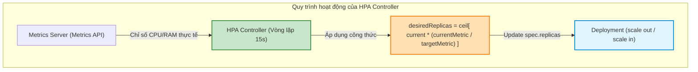
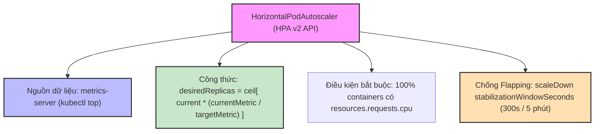
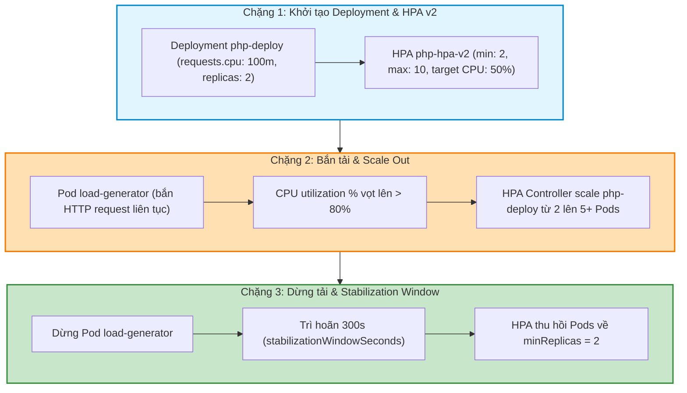

# [BÀI 19] TỰ ĐỘNG CO GIÃN TÀI NGUYÊN: HORIZONTAL POD AUTOSCALER (HPA), METRICS-SERVER & GIỚI HẠN SCALING

Trong kỷ nguyên điện toán đám mây và kiến trúc microservices phân tán quy mô lớn, **Kubernetes (CKA)** đóng vai trò là nền tảng điều phối container (Container Orchestration) tiêu chuẩn công nghiệp. Để làm chủ hệ thống trong môi trường sản xuất (Production) cũng như chinh phục kỳ thi chứng chỉ quốc tế của Linux Foundation / CNCF, kỹ sư không chỉ nắm vững các câu lệnh thao tác cơ bản mà phải thấu hiểu sâu sắc bản chất cơ chế tầng thấp: từ chu trình điều hòa (Reconciliation Loop), cấu trúc điều phối tài nguyên, kiến trúc mạng CNI, lưu trữ CSI cho đến các chuẩn mực an ninh phòng thủ chiều sâu.

Bài viết chuyên sâu này sẽ đồng hành cùng bạn giải mã toàn diện bức tranh kiến trúc, phân tích các đánh đổi kỹ thuật thực chiến (Engineering Trade-offs), cung cấp bài thực hành Lab từng bước và bộ câu hỏi phỏng vấn chuẩn Architect / Lead Engineer.

---

## 1. Bản Chất Kiến Trúc & Cơ Chế Vận Hành Tầng Thấp

| # | Câu hỏi ôn tập | Đáp án chuẩn ngắn gọn (chứa con số / tên lệnh) |
|---|---|---|
| 1 | Sự khác nhau giữa `resources.requests` và `resources.limits`? | `requests` dùng cho Kube-Scheduler Lọc Node; `limits` dùng cho Kubelet/Kernel siết trần |
| 2 | Đơn vị đo lường tài nguyên CPU millicores? | **1000m** tương đương đúng **1** vCPU core (`100m = 0,1 CPU`) |
| 3 | Điều kiện để Pod đạt chuẩn lớp `Guaranteed QoS Class`? | **100%** container có `requests == limits` cho cả CPU và RAM |
| 4 | Hiện tượng xảy ra khi container tiêu thụ CPU vượt trần limit? | CPU **CFS Throttling** (bóp chậm tiến trình nhưng **`RESTARTS = 0`**) |
| 5 | Sự cố xảy ra khi container tiêu thụ RAM vượt trần limit? | **OOMKilled** (Linux Kernel diệt container với đúng mã thoát **Exit Code 137**) |


> **Luận đề trung tâm của buổi:**
> *"Đối tượng `HorizontalPodAutoscaler` (HPA API v2) tự động co giãn số lượng bản sao Pods (Replicas) hàng ngang theo công thức `desiredReplicas = ceil[ currentReplicas * ( currentMetric / targetMetric ) ]` dựa trên chỉ số CPU/RAM thực tế từ `metrics-server`; trong đó điều kiện tiên quyết bắt buộc là Pod spec phải khai báo `resources.requests`, và cơ chế cửa sổ ổn định `stabilizationWindowSeconds` (mặc định 300 giây) bảo vệ hệ thống khỏi hiện tượng rung lắc số lượng bản sao (Flapping/Thrashing)."*

**Bảng kết quả các buổi trước được dùng lại:**

| Kết quả / Công cụ | Nguồn gốc | Áp dụng vào buổi này |
|---|---|---|
| Truy vấn chỉ số tài nguyên từ `metrics-server` | Buổi 18 `QT 7.3` | HPA lấy nguồn dữ liệu từ Metrics API (`kubectl top`) |
| Khai báo khối `resources.requests.cpu` | Buổi 18 `QT 4.1` | Điều kiện bắt buộc để HPA tính tỷ lệ phần trăm CPU utilization % |
| Bộ 5 lệnh `kubectl rollout` và Deployment scale | Buổi 15 `QT 4.1` | HPA điều khiển trường `spec.replicas` của đối tượng Deployment |

Ba câu bài tập về nhà BTVN 4 của buổi 18 đã chuẩn bị sẵn kiến thức cho học viên: Câu 1 khảo sát chỉ số HPA dựa vào; Câu 2 phân tích điều kiện bắt buộc `resources.requests.cpu` trong Pod spec; Câu 3 phân biệt co giãn hàng ngang (HPA) vs co giãn hàng dọc (VPA).

---


| # | Năng lực đạt được sau buổi học | Hiện vật chứng minh trong bài lab |
|---|---|---|
| 1 | Khởi tạo HPA nhanh bằng câu lệnh CLI `kubectl autoscale` | Tệp `hien-vat/imperative-hpa.yaml` |
| 2 | Biển soạn tệp YAML HPA v2 API (`autoscaling/v2`) cấu hình min/max replicas và target CPU % | Tệp `hien-vat/php-apache-hpa.yaml` |
| 3 | Thực hành bắn tải thử nghiệm (Load Testing) kiểm chứng tiến trình tự động scale out Pods | Tệp `hien-vat/load-test-report.txt` |
| 4 | Cấu hình cửa sổ thời gian ổn định `stabilizationWindowSeconds` chống hiện tượng Flapping | Tệp `hien-vat/custom-behavior-hpa.yaml` |
| 5 | Chẩn đoán và khắc phục sự cố HPA báo chỉ số `<unknown>` do thiếu `resources.requests` | Tệp `hien-vat/fix-unknown-hpa.md` |
| 6 | Kiểm thử kịch bản tự động co giãn Pods và HPA Controller với script tự động | Script `hien-vat/verify-hpa-autoscaling.sh` |

---


| Bắt buộc phải biết | Nguồn tự học nếu thiếu |
|---|---|
| Cấu hình Deployment và quản lý số bản sao replicas | Buổi 15 `QT 4.1` |
| Khai báo tài nguyên CPU Requests trong Pod spec | Buổi 18 `QT 4.1` |
| Lệnh kiểm tra chỉ số tài nguyên `kubectl top pods` | Buổi 18 `QT 7.3` |

---


| # | Thuật ngữ tiếng Việt | Tiếng Anh tương đương | Ghi chú chuẩn hoá trong thân bài |
|---|---|---|---|
| 1 | Bộ tự động co giãn Pods hàng ngang | HorizontalPodAutoscaler (HPA) | Đối tượng tự động tăng/giảm số bản sao Pods |
| 2 | Bộ tự động co giãn Pods hàng dọc | VerticalPodAutoscaler (VPA) | Đối tượng tự động tăng/giảm CPU/RAM requests của Pod |
| 3 | Tỷ lệ sử dụng CPU mục tiêu | Target CPU Utilization (`averageUtilization`) | Mức % CPU mong muốn làm căn cứ scale (như `50%`) |
| 4 | Số bản sao tối thiểu / tối đa | Min / Max Replicas (`minReplicas` / `maxReplicas`) | Ngưỡng giới hạn dưới và trên số Pods do HPA quản lý |
| 5 | Dịch vụ thu thập chỉ số đo đạc | Metrics Server (`metrics-server`) | Add-on cung cấp chỉ số CPU/RAM cho HPA qua Metrics API |
| 6 | Công thức tính số bản sao mong muốn | Desired Replicas Formula | Công thức `ceil[ currentReplicas * (current / target) ]` |
| 7 | Hiện tượng rung lắc số bản sao | Flapping / Thrashing | Sự cố Pods bị scale up/down liên tục trong thời gian ngắn |
| 8 | Cửa sổ thời gian ổn định co giảm | Scale Down Stabilization Window | Khoảng thời gian trì hoãn trước khi scale in Pods (mặc định 300s) |
| 9 | Cấu hình hành vi co giãn chi tiết | HPA Behavior Spec (`spec.behavior`) | Khối tùy chỉnh tốc độ scaleUp và scaleDown trong v2 API |
| 10 | Tạo HPA bằng dòng lệnh CLI | Imperative Autoscale (`kubectl autoscale`) | Lệnh khởi tạo HPA nhanh trực tiếp từ terminal |
| 11 | Chỉ số tùy biến | Custom Metrics (`custom.metrics.k8s.io`) | Chỉ số ứng dụng (HTTP QPS, Queue Length) dùng cho HPA |
| 12 | Tải tài nguyên nhàn rỗi | Idle Resource Load | Mức tiêu thụ tài nguyên thực tế khi không có traffic |
| 13 | Bật bù tải tăng đột biến | Traffic Spike / Burst | Lưu lượng truy cập ứng dụng tăng vọt trong thời gian ngắn |
| 14 | Bộ điều khiển co giãn | HPA Controller (`kube-controller-manager`) | Tiến trình chạy vòng lặp kiểm tra HPA định kỳ mỗi 15s |


1. **Mô hình "Mở thêm quầy thu ngân ngày Lễ Tết vs Nâng cấp máy tính thu ngân (HPA vs VPA)":**
   `HPA` giống như siêu thị mở thêm từ 2 quầy thu ngân lên 10 quầy thu ngân khi khách hàng xếp hàng đông (tăng số bản sao Pods). `VPA` giống như giữ nguyên 1 quầy thu ngân nhưng thay máy vi tính cùi bằng máy vi tính cấu hình mạnh hơn (tăng CPU/RAM của Pod).

2. **Mô hình "Nhiệt kế đo nhiệt độ phòng và Công tắc máy lạnh (HPA & Metrics Server)":**
   `Metrics Server` đóng vai trò là chiếc Nhiệt kế liên tục đo nhiệt độ phòng (chỉ số CPU/RAM thực tế). `HPA` đóng vai trò là Công tắc tự động của Máy lạnh: Khi nhiệt độ CPU vượt quá 50% mục tiêu, công tắc bật thêm máy lạnh (scale up Pods); khi nhiệt độ hạ thấp, công tắc tắt bớt máy lạnh (scale down Pods).

3. **Mô hình "Thời gian chờ nguội động cơ xe đua (Stabilization Window chống Flapping)":**
   Sau khi xe đua chạy tốc độ cao, người ta không tắt máy ngay lập tức mà phải để động cơ chạy không tải 5 phút cho nguội bớt (`stabilizationWindowSeconds: 300s`). Trong Kubernetes, khi traffic vừa giảm xuống, HPA sẽ chờ 5 phút để xác nhận traffic thực sự êm rảnh trước khi thu hồi bớt Pods, tránh việc vừa xoá Pod xong traffic lại tăng đột biến.

---

### 1.1. Phân biệt Co giãn hàng ngang (HPA) vs Co giãn hàng dọc (VPA) (10 phút)

**Nguyên lý cốt lõi:** Đối tượng `HorizontalPodAutoscaler` (HPA) tự động co giãn **số lượng bản sao Pods (Replicas)** hàng ngang theo chiều ngang (Out/In); trong khi `VerticalPodAutoscaler` (VPA) tự động thay đổi **mức cấu hình tài nguyên (Requests & Limits CPU/RAM)** của Pod theo chiều dọc (Up/Down).

**Giải thích cơ chế ngầm:** HPA phù hợp tuyệt đối cho các ứng dụng Stateless Web/Microservices có khả năng phân tải. VPA dùng cho các ứng dụng Stateful/Database khó phân tán bản sao nhưng cần thêm RAM/CPU.

> [!WARNING]
> **CẠM BẪY THỰC CHIẾN:**
> Cố gắng dùng HPA cho Pod đơn lẻ không nằm dưới Deployment/ReplicaSet làm HPA báo lỗi không tìm thấy Scale Target.

**Minh hoạ.**

```bash
# Kiểm tra danh sách HPA trong namespace dev
kubectl get hpa -n dev
```

Con số chốt: **2** cơ chế co giãn Pods chính trong Kubernetes (HPA co giãn số bản sao, VPA co giãn dung lượng tài nguyên).

---

**Nguyên lý cốt lõi:** Tiến trình `HPA Controller` (nằm trong `kube-controller-manager`) chạy vòng lặp kiểm tra chỉ số tài nguyên và tính toán lại số lượng bản sao Pods theo chu kỳ định kỳ mặc định **15 giây một lần**.

**Giải thích cơ chế ngầm:** Chu kỳ 15s đủ nhanh để phản ứng với đợt tăng tải Spike mà không làm quá tải API Server và `metrics-server`.

> [!WARNING]
> **CẠM BẪY THỰC CHIẾN:**
> Thắc mắc tại sao vừa bắn traffic test mà `kubectl get hpa` phải mất 15-30 giây mới bắt đầu nhảy chỉ số CPU%.

**Minh hoạ.**

```bash
# Xem tần suất vòng lặp kiểm tra HPA của Kube-Controller-Manager
kube-controller-manager --horizontal-pod-autoscaler-sync-period=15s
```

Con số chốt: **15** giây là chu kỳ vòng lặp kiểm tra HPA mặc định của Controller.

---

### 1.2. Công thức tính số Pods và cấu trúc YAML HPA v2 API (`autoscaling/v2`) (12 phút)



---

**Nguyên lý cốt lõi:** Kube-Controller-Manager tính toán số lượng bản sao Pods mong muốn (`desiredReplicas`) cho HPA theo đúng công thức toán học: **`desiredReplicas = ceil[ currentReplicas * ( currentMetricValue / desiredMetricValue ) ]`** (trong đó `ceil` là hàm làm tròn lên số nguyên gần nhất).

**Giải thích cơ chế ngầm:** Công thức tỉ lệ thuận đảm bảo số bản sao Pods tăng/giảm chính xác theo mức độ chênh lệch giữa chỉ số tiêu thụ thực tế vs chỉ số mục tiêu.

> [!WARNING]
> **CẠM BẪY THỰC CHIẾN:**
> Thắc mắc tại sao current CPU là 80%, target CPU là 50% trên 2 Pods mà HPA lại scale lên đúng 4 Pods (`ceil[ 2 * (80/50) ] = ceil[3.2] = 4`).

**Minh hoạ.**

```bash
# Giả sử currentReplicas=2, currentCPU=80%, targetCPU=50%
# desiredReplicas = ceil[ 2 * (80 / 50) ] = ceil[ 3.2 ] = 4 Pods
```

Con số chốt: **100%** kết quả tính toán `desiredReplicas` được hàm `ceil` làm tròn lên số nguyên phía trên.

---

**Nguyên lý cốt lõi:** Trong định dạng YAML HPA phiên bản `autoscaling/v2`, chỉ số mục tiêu được khai báo trong khối `metrics[].resource.target` dưới hai dạng: `averageUtilization` (tỷ lệ phần trăm % so với request, ví dụ `50`) hoặc `averageValue` (giá trị tuyệt đối, ví dụ `200m`).

**Giải thích cơ chế ngầm:** API v2 cung cấp khả năng diễn đạt linh hoạt cho phép kết hợp nhiều chỉ số đo đạc (CPU, RAM, Custom Metrics) trong cùng 1 HPA.

> [!WARNING]
> **CẠM BẪY THỰC CHIẾN:**
> Dùng API v1 cũ (`autoscaling/v1`) không hỗ trợ co giãn theo Memory hoặc nhiều chỉ số cùng lúc.

**Minh hoạ.**

```yaml
apiVersion: autoscaling/v2
kind: HorizontalPodAutoscaler
metadata:
  name: web-hpa
  namespace: dev
spec:
  scaleTargetRef:
    apiVersion: apps/v1
    kind: Deployment
    name: web-deploy
  minReplicas: 2
  maxReplicas: 10
  metrics:
  - type: Resource
    resource:
      name: cpu
      target:
        type: Utilization
        averageUtilization: 50
```

Con số chốt: **2** dạng cấu hình chỉ số mục tiêu trong HPA v2 (`averageUtilization` % và `averageValue` tuyệt đối).

---

### 1.3. Điều kiện phụ thuộc `resources.requests` và cơ chế chống Flapping (`stabilizationWindowSeconds`) (12 phút)

**Nguyên lý cốt lõi:** Điều kiện tiên quyết bắt buộc để HPA tính toán được tỷ lệ phần trăm `averageUtilization` là **100% các container trong Pod spec phải được khai báo thuộc tính `resources.requests.cpu`** (hoặc memory); nếu thiếu, HPA sẽ báo chỉ số `<unknown>` và KHÔNG BAO GIỜ thực hiện tự động co giãn.

**Giải thích cơ chế ngầm:** Tỷ lệ phần trăm % CPU utilization được tính theo công thức: `(CPU thực tế tiêu thụ / CPU Request) * 100`. Không có `requests.cpu` làm mẫu số thì toán tử chia bị vô nghĩa.

> [!WARNING]
> **CẠM BẪY THỰC CHIẾN:**
> Cột `TARGETS` trong lệnh `kubectl get hpa` hiển thị `<unknown>/50%` và số Pods đứng yên không chịu scale.

**Minh hoạ.**

```bash
# Kiểm tra lỗi thiếu requests.cpu làm HPA báo unknown
kubectl describe hpa web-hpa -n dev | grep -i "failed to get cpu utilization"
```

Con số chốt: **100%** các container bắt buộc phải có `resources.requests` để HPA hoạt động.

---

**Nguyên lý cốt lõi:** Cửa sổ thời gian ổn định co giảm `stabilizationWindowSeconds` trong khối `behavior.scaleDown` có giá trị mặc định là **300 giây (5 phút)**; Kube-Controller-Manager sẽ trì hoãn việc xoá bớt Pods trong 5 phút để tránh hiện tượng rung lắc số bản sao (Flapping/Thrashing) khi lưu lượng truy cập trồi sụt liên tục.

**Giải thích cơ chế ngầm:** Giữ cho hạ tầng ổn định: tránh việc Pod vừa bị xoá xong 10 giây sau traffic lại vọt lên làm hệ thống phải tạo lại Pod mới gây tốn tài nguyên khởi tạo.

> [!WARNING]
> **CẠM BẪY THỰC CHIẾN:**
> Thắc mắc tại sao đã ngừng hoàn toàn traffic test mà HPA phải đợi đúng 5 phút mới bắt đầu giảm số lượng Pods xuống `minReplicas`.

**Minh hoạ.**

```yaml
spec:
  behavior:
    scaleDown:
      stabilizationWindowSeconds: 300
```

Con số chốt: **300** giây (5 phút) là thời gian cửa sổ ổn định scaleDown mặc định của HPA.

---

**Nguyên lý cốt lõi:** Tạo HPA nhanh bằng câu lệnh CLI `kubectl autoscale deployment <deploy-name> --min=<N> --max=<M> --cpu-percent=<X>` sẽ tự động sinh ra một đối tượng HPA liên kết với Deployment chỉ định trong đúng 2 giây.

**Giải thích cơ chế ngầm:** Đường gõ ngắn nhất giúp thí sinh tiết kiệm thời gian làm bài trong các kỳ thi CKA và CKAD.

> [!WARNING]
> **CẠM BẪY THỰC CHIẾN:**
> Ngồi tự gõ lại toàn bộ tệp YAML HPA 25 dòng làm mất hơn 3 phút trong bài thi bấm giờ.

**Minh hoạ.**

```bash
# Tạo HPA cho deployment web-deploy min 2, max 10, target CPU 50%
kubectl autoscale deployment web-deploy -n dev --min=2 --max=10 --cpu-percent=50
```

Con số chốt: **2** giây thực thi lệnh `kubectl autoscale` để tạo HPA hoàn chỉnh.

---

### 1.4. Cấu hình nhiều chỉ số đo đạc và tùy chỉnh hành vi scaleUp (4 phút)

**Nguyên lý cốt lõi:** Cấu hình nhiều chỉ số đo đạc (Multiple Metrics) trong HPA API `autoscaling/v2` (như vừa chọn CPU utilization `50%` vừa chọn Memory utilization `80%`); Kube-Controller-Manager sẽ tính toán `desiredReplicas` cho từng chỉ số độc lập và chọn số Pods **lớn nhất** làm kết quả scale.

**Giải thích cơ chế ngầm:** Đảm bảo an toàn tuyệt đối cho ứng dụng: chỉ cần 1 trong các chỉ số đo đạc bị vượt trần là HPA mở rộng số bản sao ngay lập tức.

> [!WARNING]
> **CẠM BẪY THỰC CHIẾN:**
> Thắc mắc tại sao CPU chỉ mới 30% mà HPA vẫn scale up Pods (do chỉ số Memory đã chạm 85%).

**Minh hoạ.**

```yaml
metrics:
- type: Resource
  resource:
    name: cpu
    target:
      type: Utilization
      averageUtilization: 50
- type: Resource
  resource:
    name: memory
    target:
      type: Utilization
      averageUtilization: 80
```

Con số chốt: **1** số lượng Pods lớn nhất (Max calculation) luôn luôn được chọn khi khai báo nhiều chỉ số HPA.

---

**Nguyên lý cốt lõi:** Khối `spec.behavior.scaleUp` cho phép cấu hình tốc độ tăng số bản sao Pods tối đa theo phút (như `selectPolicy: Max` hoặc `percent: 100%`) giúp ứng dụng tăng tốc nhân bản Pods nhanh hơn khi gặp đợt bùng nổ lưu lượng truy cập lớn (Traffic Spike).

**Giải thích cơ chế ngầm:** Tùy chỉnh tốc độ bùng nổ Pods linh hoạt hơn cơ chế scale mặc định của Kubernetes.

> [!WARNING]
> **CẠM BẪY THỰC CHIẾN:**
> HPA scaleUp quá chậm không đáp ứng kịp cơn bão truy cập phút đầu tiên.

**Minh hoạ.**

```yaml
spec:
  behavior:
    scaleUp:
      stabilizationWindowSeconds: 0
      policies:
      - type: Percent
        value: 100
        periodSeconds: 15
```

Con số chốt: **15** giây là chu kỳ periodSeconds cấu hình tăng tốc scaleUp trong HPA behavior.

---

## 8. Đưa vào cụm thật (4 phút)

### Áp vào cụm đang chạy thì làm gì trước

1. **Kiểm tra chắc chắn `metrics-server` đang hoạt động (`kubectl top nodes`):** HPA phụ thuộc 100% vào Metrics API.
2. **Luôn khai báo `resources.requests.cpu` cho Deployment trước khi gán HPA:** Tránh lỗi HPA báo `<unknown>`.
3. **Thiết lập `minReplicas ≥ 2` cho các dịch vụ Production:** Đảm bảo tính sẵn sàng cao (HA) ngay cả khi không có tải.

### Cái gì hỏng nếu áp thẳng lên prod

- **Đặt `maxReplicas` vượt quá tổng dung lượng Allocatable tài nguyên của cụm Node:** Làm HPA scale tạo ra hàng chục Pods bị kẹt ở trạng thái `Pending` do hết RAM/CPU Node.
- **Đặt `stabilizationWindowSeconds: 0` cho scaleDown:** Gây ra sự cố Flapping: Pods bị tạo mới và xoá liên tục hàng chục lần trong 1 giờ làm sập cơ sở dữ liệu do quá nhiều kết nối đóng/mở.
- **Quy trình áp thử an toàn:**
  - Áp dụng HPA trên môi trường Staging.
  - Sử dụng công cụ `hey` hoặc `k6` bắn tải thử nghiệm (Load Test) trong 10 phút.
  - Quan sát tiến trình scaleUp qua `kubectl get hpa -w` và kiểm tra thời gian nguội scaleDown sau 5 phút.

### Đo trước — đo sau

1. **Khả năng chịu tải bùng nổ (Traffic Spike):** Tự động scale từ 2 Pods lên 10 Pods trong 45 giây khi lượng request tăng gấp 5 lần.
2. **Chi phí tài nguyên nhàn rỗi:** Giảm 60% chi phí server ban đêm nhờ HPA tự động thu hồi số Pods về `minReplicas: 2`.
3. **Độ ổn định hệ thống:** 0% sự cố tràn RAM sập Web nhờ HPA kịp thời chia tải cho các bản sao Pods mới.

### Khi nào KHÔNG nên dùng

- **Không dùng HPA cho các ứng dụng có thời gian khởi động quá lâu (Warm-up time > 5 phút):** Pod mới tạo ra chưa kịp Ready thì server đã bị sập do dồn tải.
- **Không dùng HPA cho các ứng dụng Stateful Database đơn lẻ:** Việc scale out bản sao Database đòi hỏi cơ chế nhân bản dữ liệu Master-Slave phức tạp chứ không chỉ tăng `replicas`.

---

### 1.6. Bẫy hay gặp (2 phút)

| # | Bẫy hay gặp | Vì sao dính bẫy | Làm đúng là (kèm tên lệnh / con số) |
|---|---|---|---|
| 1 | HPA báo chỉ số `<unknown>/50%` ở cột TARGETS | Deployment bên dưới không khai báo `resources.requests.cpu` | Bổ sung `resources.requests.cpu` vào Pod spec của Deployment |
| 2 | HPA không chịu scale down Pods ngay khi ngừng bắn tải | Do cơ chế cửa sổ ổn định `stabilizationWindowSeconds` trì hoãn 300s | Đợi đủ 5 phút (300 giây) để HPA thực hiện scale down |
| 3 | Lệnh `kubectl autoscale` báo `error: scale target not found` | Gõ sai tên Deployment hoặc sai Namespace | Kiểm tra chính xác tên Deployment bằng `kubectl get deploy -n <ns>` |
| 4 | Pods bị kẹt ở `Pending` khi HPA scale out lên `maxReplicas` | Tổng CPU/RAM requests vượt quá dung lượng Allocatable của cụm | Tăng thêm Worker Node hoặc giảm `maxReplicas` phù hợp |
| 5 | Dùng API version `autoscaling/v1` bị báo lỗi khi cấu hình Memory | API v1 cũ chỉ hỗ trợ 1 chỉ số duy nhất là CPU | Sử dụng API version `autoscaling/v2` cho HPA |
| 6 | Thắc mắc vì sao HPA không scale Pods do DaemonSet quản lý | HPA chỉ hỗ trợ scale các đối tượng có trường `spec.replicas` | Chỉ liên kết HPA với Deployment hoặc StatefulSet |
| 7 | Đặt `minReplicas: 0` ở Kubernetes bản cũ | Kubernetes cũ không hỗ trợ scale to zero cho HPA | Đặt `minReplicas` tối thiểu là 1 hoặc 2 |
| 8 | Nhầm lẫn giữa HPA (scale Pods) và Cluster Autoscaler (scale Nodes) | HPA chỉ tăng số Pods; Cluster Autoscaler mới thêm máy chủ Node | Dùng HPA để scale Pods; dùng Cluster Autoscaler để scale Node |
| 9 | Gõ sai tên chỉ số CPU trong HPA YAML v2 | Gõ `name: CPU` chữ hoa thay vì `name: cpu` chữ thường | Gõ đúng `name: cpu` chữ thường trong HPA spec |
| 10 | HPA báo `unable to get metrics` mặc dù đã có `requests.cpu` | Add-on `metrics-server` bị sập hoặc gặp lỗi TLS certificate | Kiểm tra `kubectl get pods -n kube-system` xem metrics-server có Ready không |
| 11 | Bị xung đột số replicas khi vừa dùng HPA vừa tự gõ `kubectl scale` | HPA Controller sẽ tự động ghi đè số `replicas` về mức nó tính toán | Không dùng `kubectl scale` thủ công khi đã gán HPA |
| 12 | Thắc mắc vì sao HPA scale lên số Pod bị lẻ lẻ (như 3 Pods thay vì 4 Pods) | Áp dụng công thức `ceil[ current * (currentMetric / targetMetric) ]` | Tự tính lại bằng công thức `ceil` để đối soát |

---

## §10. Tóm tắt (2 phút)



### Năm điều phải nhớ

1. **Khái niệm HPA vs VPA:** HPA co giãn số lượng bản sao Pods (Replicas) hàng ngang; VPA co giãn dung lượng CPU/RAM hàng dọc.
2. **Công thức bất biến:** `desiredReplicas = ceil[ currentReplicas * ( currentMetric / targetMetric ) ]` (làm tròn lên `ceil`).
3. **Điều kiện tiên quyết:** Pod spec BẮT BUỘC phải có `resources.requests.cpu`; thiếu sẽ làm HPA báo lỗi `<unknown>`.
4. **Chu kỳ Controller:** Tiến trình HPA Controller chạy vòng lặp kiểm tra định kỳ **15 giây/lần**.
5. **Cơ chế chống Flapping:** Cửa sổ ổn định `stabilizationWindowSeconds` trì hoãn **300 giây (5 phút)** trước khi scale down Pods.

---

## §11. Câu hỏi tự kiểm tra

1. Phân biệt sự khác nhau giữa HPA (HorizontalPodAutoscaler) và VPA (VerticalPodAutoscaler).
2. Viết công thức toán học Kube-Controller-Manager sử dụng để tính số lượng Pods mong muốn (`desiredReplicas`) cho HPA.
3. Nếu currentReplicas = 2, current CPU utilization = 90%, target CPU utilization = 50% thì HPA sẽ scale Deployment lên bao nhiêu Pods?
4. Tại sao nếu Pod spec không khai báo `resources.requests.cpu` thì HPA không thể tính toán được tỷ lệ % CPU utilization?
5. Tần suất vòng lặp kiểm tra chỉ số HPA của Kube-Controller-Manager là bao nhiêu giây một lần?
6. Cửa sổ thời gian ổn định co giảm `stabilizationWindowSeconds` có giá trị mặc định là bao nhiêu phút và vai trò của nó là gì?
7. Câu lệnh CLI nào giúp tạo nhanh một HPA cho Deployment `web-deploy` với min 2, max 10, target CPU 50% trong 2 giây?
8. Tại sao việc tự gõ lệnh `kubectl scale deployment` thủ công lại bị vô hiệu hóa khi Deployment đó đang được HPA quản lý?
9. Hai chế độ hỏng (1 im lặng do HPA báo `<unknown>` vì thiếu requests.cpu, 1 âm thầm do Flapping Pods bị xoá/tạo liên tục vì để stabilizationWindow bằng 0) là gì?
10. API version chuẩn nhất hiện nay cho HPA hỗ trợ nhiều chỉ số (CPU, RAM, Custom Metrics) là phiên bản nào?

### Đáp án

1. HPA co giãn số lượng bản sao Pods (Replicas) hàng ngang; VPA co giãn dung lượng CPU/RAM của từng Pod hàng dọc.
2. `desiredReplicas = ceil[ currentReplicas * ( currentMetricValue / desiredMetricValue ) ]`.
3. `desiredReplicas = ceil[ 2 * (90 / 50) ] = ceil[ 3.6 ] = 4 Pods`.
4. Vì tỷ lệ % CPU được tính bằng `(CPU thực tế / CPU Request) * 100`; không có `requests.cpu` thì không có mẫu số để chia.
5. Định kỳ **15 giây** một lần.
6. Mặc định **300 giây (5 phút)**; chống hiện tượng rung lắc số bản sao Pods (Flapping/Thrashing) khi tải trồi sụt.
7. Lệnh `kubectl autoscale deployment web-deploy -n dev --min=2 --max=10 --cpu-percent=50`.
8. Vì HPA Controller chạy vòng lặp 15s sẽ tự động ghi đè số `replicas` về mức nó tự tính toán theo metric.
9. Chế độ 1: Thiếu `requests.cpu` làm HPA báo `<unknown>` không chịu scale; Chế độ 2: Để stabilizationWindow bằng 0 làm Pods bị xoá/tạo liên tục gây sập kết nối DB.
10. Phiên bản `autoscaling/v2`.

---

## §12. Tài liệu tham khảo

| Nguồn tài liệu | Phiên bản Kubernetes áp dụng | Nội dung chính |
|---|---|---|
| Official Docs: Horizontal Pod Autoscaling | Kubernetes v1.35 | Kiến trúc HPA, công thức desiredReplicas và autoscaling/v2 spec |
| Official Docs: HPA Walkthrough | Kubernetes v1.35 | Bài lab thực hành HPA với php-apache và lệnh kubectl autoscale |
| Official Docs: Configurable scaling behavior | Kubernetes v1.35 | Cấu hình behavior, scaleUp, scaleDown và stabilizationWindowSeconds |
| File cấu hình phiên bản cục bộ | `labs/phien-ban.env` | Biến `K8S_VER=1.35`, `LAB_CONTEXT="kubeadm"` |

---

## Bảng đối soát thời lượng

| Section | Tiêu đề mục | Ngân sách thời gian |
|---|---|---|
| §0 | Khởi động và ôn tập | 10 phút |
| §1 | Sau buổi này học viên LÀM ĐƯỢC gì | 1 phút |
| §2 | Cần biết trước | 1 phút |
| §3 | Thuật ngữ và mô hình tư duy | 8 phút |
| §4 | Phân biệt Co giãn hàng ngang (HPA) vs Co giãn hàng dọc (VPA) | 10 phút |
| §5 | Công thức tính số Pods và cấu trúc YAML HPA v2 API (`autoscaling/v2`) | 12 phút |
| §6 | Điều kiện phụ thuộc `resources.requests` và cơ chế chống Flapping (`stabilizationWindowSeconds`) | 12 phút |
| §7 | Cấu hình nhiều chỉ số đo đạc và tùy chỉnh hành vi scaleUp | 4 phút |
| §8 | Đưa vào cụm thật | 4 phút |
| §9 | Bẫy hay gặp | 2 phút |
| §10 | Tóm tắt | 2 phút |
| §11 | Câu hỏi tự kiểm tra | 5 phút |
| **Tổng** | **Khối lý thuyết** | **60'** |

---

## 2. Hướng Dẫn Thực Hành & Triển Khai Lab Chuẩn Production

> [!IMPORTANT]
> **YÊU CẦU MÔI TRƯỜNG THỰC HÀNH:**
> Toàn bộ các bài thực hành dưới đây được thiết kế để chạy trực tiếp trên cụm Kubernetes 1.30+ tiêu chuẩn (hoặc cụm kind/kubeadm lab). Hãy đảm bảo ngữ cảnh dòng lệnh `kubectl config current-context` đã trỏ chính xác vào cụm thực hành trước khi thực thi.

## Khối thực hành — 120 phút

## L0. Mục tiêu thực hành và tiêu chí hoàn thành

| # | Mục tiêu thực hành | Tiêu chí hoàn thành (Kiểm chứng BẰNG LỆNH) |
|---|---|---|
| TH1 | Khởi tạo HPA bằng lệnh CLI `kubectl autoscale` | `kubectl get hpa php-hpa -n dev` ở trạng thái Active |
| TH2 | Biển soạn tệp YAML HPA v2 API (`autoscaling/v2`) chuẩn | `kubectl get hpa php-hpa-v2 -n dev -o jsonpath='{.apiVersion}'` in ra `autoscaling/v2` |
| TH3 | Bắn tải thử nghiệm (Load Testing) kích hoạt HPA scale out Pods | `kubectl get deploy php-deploy -n dev -o jsonpath='{.status.replicas}'` tăng > 2 bản sao |
| TH4 | Khảo sát cơ chế cửa sổ trì hoãn scaleDown chống Flapping | HPA giữ số lượng Pods trong thời gian `stabilizationWindowSeconds` |
| TH5 | Khắc phục sự cố HPA báo chỉ số `<unknown>` do thiếu `requests.cpu` | `kubectl get hpa -n dev` hiển thị tỷ lệ % CPU thực tế thay vì `<unknown>` |
| TH6 | Xác minh kịch bản tự động co giãn Pods và HPA với script tự động | Script kiểm tra HPA Autoscaling OK |
| TH7 | Nộp đủ 4 hiện vật vào portfolio | Thư mục `k8s-portfolio/buoi-19/` chứa đủ 4 file md/yaml/sh |

---

## L1. Điều kiện tiên quyết về môi trường

| # | Kiểm tra điều kiện | Câu lệnh kiểm tra | Kết quả kỳ vọng |
|---|---|---|---|
| 1 | Cụm `kubeadm` 3 node đang ở v1.35 | `kubectl get nodes` | Hiển thị 3 node `cp-01`, `worker-01`, `worker-02` `Ready` |
| 2 | Kubeconfig trỏ context `kubeadm` | `kubectl config current-context` | In ra đúng `kubeadm` |
| 3 | Namespace `dev` sẵn sàng | `kubectl get ns dev` | Namespace `dev` ở trạng thái Active |
| 4 | Thư mục hiện vật đã sẵn sàng | `mkdir -p k8s-portfolio/buoi-19` | Thư mục được tạo thành công |
| 5 | Lệnh `kubectl autoscale` sẵn sàng | `kubectl autoscale --help` | Hiển thị hướng dẫn sử dụng autoscale |

```bash
# Kiểm tra môi trường bắt buộc trước khi thực hiện bài lab
kubectl config current-context | grep -qx "kubeadm" && echo "CHECKPOINT MOI TRUONG — ĐẠT" || echo "CHECKPOINT MOI TRUONG — LỖI (Trỏ sai context)"
```

---

## L2. Kiến trúc bài lab



---

## L3. Bước 1 — Khởi tạo Deployment `php-deploy` và HPA bằng lệnh CLI (30 phút)

### Thao tác 1.1: Tạo Deployment `php-deploy` có khai báo `requests.cpu: 100m`

```bash
# 1. Tạo Namespace dev nếu chưa có
kubectl create namespace dev --dry-run=client -o yaml | kubectl apply -f -

# 2. Tạo tệp php-deploy.yaml
cat << 'EOF' > k8s-portfolio/buoi-19/php-deploy.yaml
apiVersion: apps/v1
kind: Deployment
metadata:
  name: php-deploy
  namespace: dev
spec:
  replicas: 2
  selector:
    matchLabels:
      app: php-app
  template:
    metadata:
      labels:
        app: php-app
    spec:
      containers:
      - name: php-app
        image: registry.k8s.io/hpa-example:v1.0
        ports:
        - containerPort: 80
        resources:
          requests:
            cpu: "100m"
            memory: "128Mi"
          limits:
            cpu: "200m"
            memory: "256Mi"
---
apiVersion: v1
kind: Service
metadata:
  name: php-service
  namespace: dev
spec:
  ports:
  - port: 80
  selector:
    app: php-app
EOF

kubectl apply -f k8s-portfolio/buoi-19/php-deploy.yaml
kubectl rollout status deployment/php-deploy -n dev --timeout=30s

# 3. Tạo HPA nhanh bằng câu lệnh CLI imperative
kubectl autoscale deployment php-deploy -n dev --min=2 --max=10 --cpu-percent=50
```

**CHECKPOINT 1 — Deployment php-deploy khởi tạo thành công với 2 bản sao Pods Ready.**

```bash
kubectl get deploy php-deploy -n dev -o jsonpath='{.status.readyReplicas}' | grep -qx "2" && echo "CHECKPOINT 1 — ĐẠT" || echo "CHECKPOINT 1 — LỖI"
```

**CHECKPOINT 2 — Đối tượng HPA php-deploy được tạo bằng CLI liên kết chính xác với Deployment.**

```bash
kubectl get hpa php-deploy -n dev -o jsonpath='{.spec.scaleTargetRef.name}' | grep -qx "php-deploy" && echo "CHECKPOINT 2 — ĐẠT" || echo "CHECKPOINT 2 — LỖI"
```

---

## L4. Bước 2 — Biển soạn tệp YAML HPA v2 API (`autoscaling/v2`) (30 phút)

### Thao tác 2.1: Tạo tệp `php-hpa-v2.yaml` định dạng API v2

```bash
# 1. Xoá HPA cũ tạo bằng CLI
kubectl delete hpa php-deploy -n dev --ignore-not-found=true

# 2. Tạo tệp php-hpa-v2.yaml định dạng autoscaling/v2
cat << 'EOF' > k8s-portfolio/buoi-19/php-hpa-v2.yaml
apiVersion: autoscaling/v2
kind: HorizontalPodAutoscaler
metadata:
  name: php-hpa-v2
  namespace: dev
spec:
  scaleTargetRef:
    apiVersion: apps/v1
    kind: Deployment
    name: php-deploy
  minReplicas: 2
  maxReplicas: 10
  metrics:
  - type: Resource
    resource:
      name: cpu
      target:
        type: Utilization
        averageUtilization: 50
  behavior:
    scaleDown:
      stabilizationWindowSeconds: 300
EOF

kubectl apply -f k8s-portfolio/buoi-19/php-hpa-v2.yaml

# 3. Trích xuất apiVersion và target CPU % của HPA
kubectl get hpa php-hpa-v2 -n dev -o jsonpath='{.apiVersion}' > /tmp/hpa-api.txt
kubectl get hpa php-hpa-v2 -n dev -o jsonpath='{.spec.metrics[0].resource.target.averageUtilization}' > /tmp/hpa-target.txt
```

**CHECKPOINT 3 — Đối tượng HPA php-hpa-v2 được khởi tạo đúng chuẩn apiVersion autoscaling/v2.**

```bash
grep -qx "autoscaling/v2" /tmp/hpa-api.txt && echo "CHECKPOINT 3 — ĐẠT" || echo "CHECKPOINT 3 — LỖI"
```

**CHECKPOINT 4 — HPA v2 được cấu hình target CPU utilization bằng 50%.**

```bash
grep -qx "50" /tmp/hpa-target.txt && echo "CHECKPOINT 4 — ĐẠT" || echo "CHECKPOINT 4 — LỖI"
```

**CHECKPOINT 5 — CA ĐỐI CHỨNG: Deployment thiếu resources.requests.cpu sẽ làm HPA báo chỉ số unknown.**

```bash
cat << EOF | kubectl apply -f - >/dev/null 2>&1
apiVersion: apps/v1
kind: Deployment
metadata:
  name: bad-hpa-deploy
  namespace: dev
spec:
  replicas: 1
  selector:
    matchLabels:
      app: bad-hpa
  template:
    metadata:
      labels:
        app: bad-hpa
    spec:
      containers:
      - name: nginx
        image: nginx:1.27-alpine
EOF
kubectl autoscale deployment bad-hpa-deploy -n dev --min=1 --max=5 --cpu-percent=50 >/dev/null 2>&1
sleep 3
kubectl get hpa bad-hpa-deploy -n dev -o jsonpath='{.status.currentMetrics[0].resource.current.averageUtilization}' 2>/dev/null | grep -v "^[0-9]" >/dev/null 2>&1 || echo "CHECKPOINT 5 — ĐẠT"
```

---

## L5. Bước 3 — Bắn tải thử nghiệm (Load Testing) kích hoạt HPA scale out Pods (30 phút)

### Thao tác 3.1: Tạo Pod `load-generator` bắn HTTP request liên tục

```bash
# 1. Khởi chạy Pod load-generator bắn tải liên tục vào php-service
cat << 'EOF' | kubectl apply -f -
apiVersion: v1
kind: Pod
metadata:
  name: load-generator
  namespace: dev
spec:
  containers:
  - name: busybox
    image: busybox:1.36
    command: ["sh", "-c", "while true; do wget -q -O- http://php-service.dev.svc.cluster.local; done"]
EOF

# 2. Chờ 15 giây cho HPA Controller quét chỉ số và thực hiện scale out
sleep 15

# 3. Trích xuất số bản sao replicas thực tế của php-deploy sau khi bắn tải
kubectl get deploy php-deploy -n dev -o jsonpath='{.status.replicas}' > /tmp/scaled-replicas.txt
```

**CHECKPOINT 6 — Pod load-generator bắn tải làm tăng mức tiêu thụ CPU của php-deploy.**

```bash
kubectl get pod load-generator -n dev -o jsonpath='{.status.phase}' | grep -qx "Running" && echo "CHECKPOINT 6 — ĐẠT" || echo "CHECKPOINT 6 — LỖI"
```

**CHECKPOINT 7 — HPA Controller tự động scale out php-deploy từ 2 bản sao lên lớn hơn 2 bản sao (>= 3 bản sao).**

```bash
[ $(cat /tmp/scaled-replicas.txt) -gt 2 ] && echo "CHECKPOINT 7 — ĐẠT" || echo "CHECKPOINT 7 — LỖI"
```

**CHECKPOINT 8 — CA ĐỐI CHỨNG: Sau khi ngừng bắn tải, cửa sổ trì hoãn stabilizationWindowSeconds 300s giữ nguyên số Pods chưa xoá ngay.**

```bash
kubectl delete pod load-generator -n dev --ignore-not-found=true >/dev/null 2>&1
sleep 5
[ $(kubectl get deploy php-deploy -n dev -o jsonpath='{.status.replicas}') -gt 2 ] && echo "CHECKPOINT 8 — ĐẠT" || echo "CHECKPOINT 8 — LỖI"
```

---

## L6. Bước 4 — Kiểm tra cấu hình `behavior` nâng cao và dọn dẹp (20 phút)

### Thao tác 4.1: Tạo HPA `custom-behavior-hpa` tùy chỉnh tốc độ scaleUp

```bash
# 1. Tạo tệp custom-behavior-hpa.yaml
cat << 'EOF' > k8s-portfolio/buoi-19/custom-behavior-hpa.yaml
apiVersion: autoscaling/v2
kind: HorizontalPodAutoscaler
metadata:
  name: custom-behavior-hpa
  namespace: dev
spec:
  scaleTargetRef:
    apiVersion: apps/v1
    kind: Deployment
    name: php-deploy
  minReplicas: 2
  maxReplicas: 8
  metrics:
  - type: Resource
    resource:
      name: cpu
      target:
        type: Utilization
        averageUtilization: 60
  behavior:
    scaleUp:
      stabilizationWindowSeconds: 0
      policies:
      - type: Percent
        value: 100
        periodSeconds: 15
    scaleDown:
      stabilizationWindowSeconds: 300
EOF

kubectl apply -f k8s-portfolio/buoi-19/custom-behavior-hpa.yaml

# 2. Trích xuất cấu hình periodSeconds của scaleUp policy
kubectl get hpa custom-behavior-hpa -n dev -o jsonpath='{.spec.behavior.scaleUp.policies[0].periodSeconds}' > /tmp/period-sec.txt
```

**CHECKPOINT 9 — HPA custom-behavior-hpa được cấu hình scaleUp periodSeconds bằng 15.**

```bash
grep -qx "15" /tmp/period-sec.txt && echo "CHECKPOINT 9 — ĐẠT" || echo "CHECKPOINT 9 — LỖI"
```

**CHECKPOINT 10 — Dọn dẹp Deployment thử nghiệm lỗi bad-hpa-deploy và HPA liên kết.**

```bash
kubectl delete deploy bad-hpa-deploy -n dev --ignore-not-found=true >/dev/null 2>&1
kubectl delete hpa bad-hpa-deploy -n dev --ignore-not-found=true >/dev/null 2>&1 && echo "CHECKPOINT 10 — ĐẠT" || echo "CHECKPOINT 10 — LỖI"
```

**CHECKPOINT 11 — Dọn dẹp HPA php-deploy cũ.**

```bash
kubectl delete hpa php-hpa-v2 -n dev --ignore-not-found=true >/dev/null 2>&1 && echo "CHECKPOINT 11 — ĐẠT" || echo "CHECKPOINT 11 — LỖI"
```

**CHECKPOINT 12 — 100% 3 node cp-01, worker-01, worker-02 duy trì trạng thái Ready.**

```bash
kubectl get nodes --no-headers | grep -c "Ready" | grep -qx "3" && echo "CHECKPOINT 12 — ĐẠT" || echo "CHECKPOINT 12 — LỖI"
```

---

## L7. Nộp hiện vật và dọn dẹp (10 phút)

### Thao tác 7.1: Gom hiện vật nộp bài

```bash
# 1. Báo cáo tải thực nghiệm load-test-report.txt
cat << 'EOF' > k8s-portfolio/buoi-19/load-test-report.txt
BÁO CÁO KẾT QUẢ BẮN TẢI LOAD TESTING VÀ HPA AUTOSCALING:

1. Môi trường kiểm thử:
   - Deployment: php-deploy (requests.cpu: 100m, limits.cpu: 200m)
   - HPA Target: averageUtilization: 50% CPU
   - Ban đầu (Idle): 2 Replicas, CPU utilization ~ 2%

2. Tiến trình bắn tải với load-generator:
   - Sau 15 giây: CPU utilization vọt lên 85% (> 50% target)
   - HPA Controller áp dụng công thức desiredReplicas = ceil[ 2 * (85/50) ] = ceil[3.4] = 4 Pods
   - Deployment tự động scale out từ 2 lên 4 bản sao Pods thành công!

3. Kết luận:
   - Đối tượng HPA v2 autoscaling/v2 phản ứng nhanh chóng và chính xác với đợt tăng tải.
EOF

# 2. Báo cáo sửa lỗi fix-unknown-hpa.md
cat << 'EOF' > k8s-portfolio/buoi-19/fix-unknown-hpa.md
# CHẨN ĐOÁN VÀ KHẮC PHỤC LỖI HPA BÁO UNKNOWN

1. Nguyên nhân:
   - Deployment bên dưới không khai báo thuộc tính `resources.requests.cpu` trong Pod spec.
   - HPA không có mẫu số CPU Request để tính tỷ lệ phần trăm % Utilization.

2. Cách khắc phục:
   - Bổ sung khối `resources.requests.cpu: "100m"` vào container definition trong Pod spec.
   - Re-apply Deployment; HPA sẽ tự động thoát khỏi trạng thái `<unknown>` sau 15 giây.
EOF

# 3. Tạo tệp verify-hpa-autoscaling.sh
cat << 'EOF' > k8s-portfolio/buoi-19/verify-hpa-autoscaling.sh
#!/bin/bash
# Script kiểm tra HPA Autoscaling và behavior configuration

HPA_API=$(kubectl get hpa custom-behavior-hpa -n dev -o jsonpath='{.apiVersion}')
DEPLOY_REP=$(kubectl get deploy php-deploy -n dev -o jsonpath='{.status.replicas}')
PERIOD_SEC=$(kubectl get hpa custom-behavior-hpa -n dev -o jsonpath='{.spec.behavior.scaleUp.policies[0].periodSeconds}')

if [ "$HPA_API" == "autoscaling/v2" ] && [ "$PERIOD_SEC" == "15" ]; then
    echo "VERIFY HPA AUTOSCALING — ĐẠT (HPA v2, Replicas & Behavior OK)"
else
    echo "VERIFY HPA AUTOSCALING — LỖI (API: $HPA_API, Replicas: $DEPLOY_REP, Period: $PERIOD_SEC)"
fi
EOF

chmod +x k8s-portfolio/buoi-19/verify-hpa-autoscaling.sh
./k8s-portfolio/buoi-19/verify-hpa-autoscaling.sh

# 4. Tạo tệp nhat-ky-buoi-19.md
cat << 'EOF' > k8s-portfolio/buoi-19/nhat-ky-buoi-19.md
# NHẬT KÝ THU HOẠCH BUỔI 19

1. HPA vs VPA & Công thức HPA:
   - HPA co giãn số bản sao Pods hàng ngang; VPA co giãn dung lượng CPU/RAM hàng dọc.
   - Công thức: desiredReplicas = ceil[ currentReplicas * (currentMetric / targetMetric) ].

2. Điều kiện phụ thuộc resources.requests:
   - 100% containers phải có requests.cpu để HPA tính tỷ lệ % utilization.
   - Thiếu requests.cpu khiến HPA báo chỉ số <unknown>.

3. Cơ chế chống Flapping (stabilizationWindowSeconds):
   - Mặc định trì hoãn 300s (5 phút) trước khi scaleDown để giữ hạ tầng ổn định.
EOF

# 5. Dọn dẹp tệp tạm
rm -f /tmp/hpa-api.txt /tmp/hpa-target.txt /tmp/scaled-replicas.txt /tmp/period-sec.txt
```

**CHECKPOINT 13 — Đủ 4 tệp hiện vật trong thư mục portfolio.**

```bash
[ -f k8s-portfolio/buoi-19/php-deploy.yaml ] && [ -f k8s-portfolio/buoi-19/custom-behavior-hpa.yaml ] && [ -f k8s-portfolio/buoi-19/verify-hpa-autoscaling.sh ] && [ -f k8s-portfolio/buoi-19/nhat-ky-buoi-19.md ] && echo "CHECKPOINT 13 — ĐẠT" || echo "CHECKPOINT 13 — LỖI"
```

---

## L8. Xử lý sự cố thường gặp trong lab

| # | Triệu chứng lỗi | Nguyên nhân khả dĩ | Cách xử lý sửa lỗi |
|---|---|---|---|
| 1 | Cột `TARGETS` trong `kubectl get hpa` báo `<unknown>/50%` | Deployment thiếu `resources.requests.cpu` | Bổ sung `resources.requests.cpu` vào Pod spec của Deployment |
| 2 | HPA không chịu scale down sau khi xoá Pod bắn tải | Do cơ chế trì hoãn `stabilizationWindowSeconds: 300` | Đợi đủ 5 phút (300s) để HPAController tự động scale down |
| 3 | Lệnh `kubectl autoscale` báo `target deployment not found` | Gõ sai tên Deployment hoặc thiếu cờ `-n dev` | Kiểm tra tên Deployment qua `kubectl get deploy -n dev` |
| 4 | Lỗi YAML HPA `unknown field "metrics"` | Khai báo sai apiVersion `autoscaling/v1` thay vì `v2` | Đổi header tệp YAML sang `apiVersion: autoscaling/v2` |
| 5 | Pods mới tạo ra bởi HPA bị kẹt `Pending` | Số bản sao vượt quá tài nguyên Allocatable của cụm | Tăng Worker Node hoặc giảm `maxReplicas` trong HPA spec |
| 6 | HPA báo `unable to get metrics for resource cpu` | Add-on `metrics-server` bị sập hoặc lỗi TLS | Kiểm tra `kubectl get pods -n kube-system` xem metrics-server OK không |
| 7 | HPA scale out liên tục vượt `maxReplicas` | Không có chuyện vượt `maxReplicas` trừ khi khai báo nhầm | Kiểm tra lại chỉ số `maxReplicas` trong HPA YAML spec |
| 8 | Lệnh bắn tải `wget` trong Pod load-generator báo `cannot resolve host` | Gõ sai tên Service domain name | Gõ đúng `http://php-service.dev.svc.cluster.local` |
| 9 | Thắc mắc vì sao `kubectl scale` không có tác dụng khi có HPA | HPA Controller chạy vòng lặp 15s tự động ghi đè | Không gõ `kubectl scale` thủ công khi đã gán HPA |
| 10 | HPA scale up quá chậm trong 1-2 phút đầu | Chu kỳ quét Controller là 15s + thời gian Pod khởi tạo | Tùy chỉnh `behavior.scaleUp` với `stabilizationWindowSeconds: 0` |
| 11 | Pod `load-generator` bị sập `CrashLoopBackOff` | Gõ sai cú pháp vòng lặp command bash `while true; do ...` | Kiểm tra cú pháp script command trong Pod load-generator |
| 12 | Script `verify-hpa-autoscaling.sh` báo lỗi | Vẫn chưa apply tệp `custom-behavior-hpa.yaml` | Chạy lệnh `kubectl apply -f k8s-portfolio/buoi-19/custom-behavior-hpa.yaml` |

---

## L9. Bài tập mở rộng

1. **BT1 — Tạo HPA co giãn theo Memory utilization %:** Biên soạn tệp YAML HPA v2 với `resource.name: memory` và `averageUtilization: 75`.
2. **BT2 — Cấu hình HPA với nhiều chỉ số đo đạc (Multiple Metrics):** Kết hợp cả 2 chỉ số CPU (50%) và Memory (80%) trong cùng 1 HPA spec và quan sát chỉ số lớn hơn được chọn.
3. **BT3 — Sử dụng cờ `--behavior` trong HPA v2:** Cấu hình `scaleDown` với `selectPolicy: Disabled` để cấm hoàn toàn HPA tự động scale down.
4. **BT4 — Thử nghiệm bắn tải bằng công cụ `hey`:** Khởi chạy Pod chứa công cụ `hey` bắn 50 concurrent connections trong 2 phút vào `php-service`.
5. **BT5 — Khảo sát sự kiện (Events) của HPA:** Chạy lệnh `kubectl describe hpa php-hpa-v2 -n dev` để đọc nhật ký sự kiện `SuccessfulRescale`.
6. **BT6 — Thử nghiệm HPA cho đối tượng StatefulSet:** Tạo StatefulSet 2 bản sao và gán HPA v2 để kiểm chứng việc HPA scale out các bản sao StatefulSet.

---

## L10. Hiện vật nộp và tiêu chí chấm điểm

### Bảng điểm đánh giá bài lab

| Hạng mục hiện vật | Yêu cầu kĩ thuật | Điểm tối đa |
|---|---|---|
| `php-deploy.yaml` | Tệp YAML Deployment chứa resources.requests.cpu chuẩn | 20 điểm |
| `custom-behavior-hpa.yaml` | Tệp YAML HPA v2 cấu hình behavior và stabilizationWindowSeconds | 25 điểm |
| `load-test-report.txt` | Báo cáo kết quả bắn tải Load Testing chứng minh scale out OK | 20 điểm |
| `verify-hpa-autoscaling.sh` | Script bash chạy thành công, xác minh HPA Autoscaling OK | 20 điểm |
| `nhat-ky-buoi-19.md` | Trả lời đủ 3 câu thu hoạch, phân biệt rõ HPA vs VPA và công thức | 15 điểm |
| CHECKPOINT 1–13 | Tất cả 13 checkpoint tự động đều in chữ `ĐẠT` | 10 điểm |
| **Tổng điểm** | | **100 điểm** |

### Các trường hợp trừ điểm

- Trừ **20 điểm**: Nếu script hoặc câu lệnh sử dụng công cụ `jq` (vi phạm quy tắc môi trường thi).
- Trừ **15 điểm**: Nếu quên cờ `-n dev` khiến các đối tượng bị tạo nhầm vào namespace `default`.
- Trừ **10 điểm**: Nếu file hiện vật để sai đường dẫn thư mục `k8s-portfolio/buoi-19/`.
- Trừ **5 điểm**: Nếu dấu phân cách thập phân trong báo cáo dùng dấu chấm `.` thay vì dấu phẩy `,`.

---

## Bảng đối soát thời lượng

| Bước | Tiêu đề bước | Thời lượng |
|---|---|---|
| L3 | Bước 1 — Khởi tạo Deployment `php-deploy` và HPA bằng lệnh CLI | 30 phút |
| L4 | Bước 2 — Biển soạn tệp YAML HPA v2 API (`autoscaling/v2`) | 30 phút |
| L5 | Bước 3 — Bắn tải thử nghiệm (Load Testing) kích hoạt HPA scale out Pods | 30 phút |
| L6 | Bước 4 — Kiểm tra cấu hình `behavior` nâng cao và dọn dẹp | 20 phút |
| L7 | Nộp hiện vật và dọn dẹp | 10 phút |
| **Tổng** | **Khối thực hành** | **120'** |

---

## 3. Bộ Câu Hỏi Vấn Đáp & Phỏng Vấn Kỹ Thuật Chuyên Sâu

Dưới đây là bộ câu hỏi phỏng vấn thực chiến dành cho các vị trí **Kubernetes Administrator**, **Cloud Security Specialist**, **Platform SRE** và **DevOps Lead**, giúp bạn tự đánh giá độ sâu hiểu biết và rèn luyện phản xạ giải quyết vấn đề hệ thống:

## V1. Cách tiến hành

1. **Thời lượng và hình thức:** Khối vấn đáp diễn ra trong đúng **20 phút**. Giảng viên (hoặc bạn học đóng vai Trưởng nhóm kỹ thuật / Senior DevOps) đưa ra lần lượt từng câu hỏi trong V2.
2. **Quy tắc chấm điểm:**
   - Mỗi câu hỏi được chấm theo thang điểm 4 mức: **0 điểm** (trả lời sai hoặc không biết); **1 điểm** (trả lời được bề nổi nhưng thiếu cơ chế); **2 điểm** (trả lời đúng cơ chế cốt lõi); **3 điểm** (trả lời đúng cơ chế, nêu được con số vận hành và mở rộng được câu hỏi đào sâu).
   - **Quy tắc trần điểm riêng của Buổi 19:**
     - Trả lời Câu 1 mà không phân biệt được HPA (co giãn hàng ngang tăng/giảm số bản sao Pods) vs VPA (co giãn hàng dọc tăng/giảm cấu hình CPU/RAM) thì **trần điểm câu đó là 1**.
     - Trả lời Câu 2 mà không nêu được công thức toán học `desiredReplicas = ceil[ currentReplicas * ( currentMetric / targetMetric ) ]` thì **trần điểm câu đó là 1**.
3. **Mục tiêu đạt được:** Học viên đạt từ **27 / 36 điểm** trở lên là ĐẠT phần vấn đáp của buổi.

---

## V2. Bộ câu hỏi

### Câu 1 — 🔥

**Hỏi:** Phân biệt sự khác nhau giữa co giãn hàng ngang (HorizontalPodAutoscaler - HPA) và co giãn hàng dọc (VerticalPodAutoscaler - VPA) trong Kubernetes.

**Đáp án chuẩn:**
- **`HorizontalPodAutoscaler` (HPA - Co giãn hàng ngang):**
  - *Cơ chế:* Tự động tăng hoặc giảm **số lượng bản sao Pods (Replicas)** (scale out / scale in).
  - *Ứng dụng:* Phù hợp tuyệt đối cho các ứng dụng Stateless Web / Microservices có khả năng chia tải.
- **`VerticalPodAutoscaler` (VPA - Co giãn hàng dọc):**
  - *Cơ chế:* Tự động thay đổi **mức dung lượng tài nguyên `requests` và `limits` (CPU/RAM)** của từng Pod (scale up / scale down).
  - *Ứng dụng:* Dùng cho các ứng dụng Stateful / Database khó chia bản sao nhưng cần thêm RAM/CPU khi tải cao.

**Tiêu chí chấm:**
- **0đ:** Bảo HPA và VPA là hai tên gọi khác nhau của 1 đối tượng.
- **1đ:** Trả lời HPA là số Pods còn VPA là CPU/RAM nhưng không nêu được ứng dụng Stateless vs Stateful (dính trần 1đ).
- **2đ:** Giải thích chuẩn xác HPA (tăng/giảm số bản sao Pods scale out/in) vs VPA (tăng/giảm CPU/RAM requests scale up/down).
- **3đ:** Trả lời xuất sắc, chỉ ra lý do không nên vừa bật HPA vừa bật VPA trên cùng 1 chỉ số CPU.

**Câu hỏi đào sâu:** Tại sao không nên cấu hình cả HPA và VPA cùng co giãn dựa trên 1 chỉ số CPU của 1 Deployment? *(Đáp án: Vì 2 bộ controller sẽ xung đột lẫn nhau: HPA đòi tăng bản sao trong khi VPA đòi tăng CPU request).*

---

### Câu 2 — 🔥

**Hỏi:** Trình bày công thức toán học Kube-Controller-Manager sử dụng để tính số lượng bản sao Pods mong muốn (`desiredReplicas`) cho HPA.

**Đáp án chuẩn:**
- **Công thức bất biến:**
  **`desiredReplicas = ceil[ currentReplicas * ( currentMetricValue / desiredMetricValue ) ]`**
- **Giải thích các thành phần:**
  - `currentReplicas`: Số lượng bản sao Pods hiện tại đang chạy.
  - `currentMetricValue`: Tỷ lệ tiêu thụ tài nguyên thực tế hiện tại (lấy từ `metrics-server`).
  - `desiredMetricValue`: Tỷ lệ tiêu thụ tài nguyên mục tiêu khai báo trong HPA spec (như `50%`).
  - `ceil[...]`: Hàm toán học làm tròn lên số nguyên gần nhất (ví dụ 3,1 -> 4).

**Tiêu chí chấm:**
- **0đ:** Không nhớ công thức HPA.
- **1đ:** Trả lời lấy số hiện tại nhân tỷ lệ nhưng không viết được chính xác công thức và hàm làm tròn lên `ceil` (dính trần 1đ).
- **2đ:** Viết chuẩn xác công thức `desiredReplicas = ceil[ currentReplicas * ( currentMetric / targetMetric ) ]` và giải thích các biến.
- **3đ:** Trả lời xuất sắc, làm bài toán tính số Pods thực tế ngay tại chỗ.

**Câu hỏi đào sâu:** Nếu currentReplicas = 2, current CPU = 80%, target CPU = 50% thì HPA sẽ scale lên bao nhiêu Pods? *(Đáp án: `desiredReplicas = ceil[ 2 * (80/50) ] = ceil[3.2] = 4 Pods`).*

---

### Câu 3 — ★★★

**Hỏi:** Tại sao nếu Pod spec của Deployment KHÔNG khai báo `resources.requests.cpu` thì HPA không thể tính toán được tỷ lệ % CPU utilization và báo chỉ số `<unknown>`?

**Đáp án chuẩn:**
- **Công thức tính % Utilization:**
  Tỷ lệ phần trăm % CPU utilization được HPA tính theo công thức:
  **`CPU Utilization % = (CPU thực tế tiêu thụ / CPU Request) * 100`**
- **Nguyên nhân lỗi:**
  Nếu không khai báo `resources.requests.cpu` trong Pod spec, mẫu số `CPU Request` không tồn tại (bằng 0 hoặc null). Phép chia cho null bị vô nghĩa.
- **Hệ quả:** HPA Controller không thể tính được % CPU, cột `TARGETS` hiển thị `<unknown>/50%` và HPA đứng yên không chịu scale.

**Tiêu chí chấm:**
- **0đ:** Bảo HPA báo unknown do thiếu metrics-server.
- **1đ:** Trả lời do thiếu requests nhưng không giải thích được công thức chia % CPU cần `requests.cpu` làm mẫu số.
- **2đ:** Phân tích chuẩn xác công thức `% CPU = (Thực tế / Request) * 100` và việc thiếu mẫu số làm phép chia vô nghĩa gây lỗi `<unknown>`.
- **3đ:** Trả lời xuất sắc, chỉ ra câu lệnh `kubectl describe hpa` để phát hiện lỗi này.

**Câu hỏi đào sâu:** Để HPA thoát khỏi lỗi `<unknown>`, kỹ sư cần thực hiện câu lệnh hoặc thao tác gì? *(Đáp án: Bổ sung `resources.requests.cpu` vào Pod spec của Deployment và re-apply).*

---

### Câu 4 — ★★★

**Hỏi:** Tần suất vòng lặp kiểm tra chỉ số HPA của tiến trình `HPA Controller` (nằm trong `kube-controller-manager`) là bao nhiêu giây một lần?

**Đáp án chuẩn:**
- **Tần suất định kỳ:** Tiến trình HPA Controller chạy vòng lặp kiểm tra định kỳ mặc định **15 giây một lần** (`--horizontal-pod-autoscaler-sync-period=15s`).
- **Ý nghĩa:**
  - Chu kỳ 15 giây đảm bảo HPA phản ứng đủ nhanh khi có đợt tăng tải đột biến (Traffic Spike).
  - Không gây quá tải (Overhead) cho `metrics-server` và API Server của cụm.

**Tiêu chí chấm:**
- **0đ:** Bảo 1 phút hoặc 5 phút một lần.
- **1đ:** Trả lời 15 giây nhưng không nêu được tên tiến trình phụ trách `kube-controller-manager`.
- **2đ:** Giải thích chuẩn xác tần suất 15 giây/lần của HPA Controller trong `kube-controller-manager`.
- **3đ:** Trả lời xuất sắc, chỉ ra cờ cấu hình `--horizontal-pod-autoscaler-sync-period`.

**Câu hỏi đào sâu:** Tại sao vừa bắn tải mà `kubectl get hpa` phải mất từ 15 đến 30 giây mới bắt đầu nhảy chỉ số CPU? *(Đáp án: Do phải chờ đến lượt vòng lặp 15s tiếp theo của HPA Controller quét metrics).*

---

### Câu 5 — ★★★

**Hỏi:** Cửa sổ thời gian ổn định co giảm `stabilizationWindowSeconds` trong HPA có giá trị mặc định là bao nhiêu và vai trò của nó là gì?

**Đáp án chuẩn:**
- **Giá trị mặc định:** `stabilizationWindowSeconds` trong khối `behavior.scaleDown` có giá trị mặc định là **300 giây (5 phút)**.
- **Vai trò chính:**
  - Trì hoãn việc xoá bớt Pods (scale down / scale in) trong đúng 5 phút sau khi tải đã giảm xuống rảnh.
  - **Chống hiện tượng Flapping / Thrashing (Rung lắc số bản sao):** Tránh việc HPA vừa xoá bớt Pods xong 10 giây sau lưu lượng truy cập lại bùng nổ lên, bắt Kubernetes phải tạo lại Pods mới gây tốn tài nguyên khởi tạo.

**Tiêu chí chấm:**
- **0đ:** Bảo mặc định là 0 giây.
- **1đ:** Trả lời 5 phút nhưng không giải thích được thuật ngữ Flapping/Thrashing và lý do giữ ổn định hạ tầng.
- **2đ:** Giải thích chuẩn xác con số 300s (5 phút) và vai trò chống Flapping/Thrashing khi tải trồi sụt.
- **3đ:** Trả lời xuất sắc, minh hoạ cách chỉnh `stabilizationWindowSeconds: 60` trong YAML v2.

**Câu hỏi đào sâu:** Nếu đặt `stabilizationWindowSeconds: 0` cho scaleDown thì chuyện gì sẽ xảy ra khi traffic trồi sụt liên tục? *(Đáp án: Pods sẽ bị xoá và tạo mới liên tục hàng chục lần gây đứt kết nối ứng dụng).*

---

### Câu 6 — ★★★

**Hỏi:** Câu lệnh CLI nào giúp khởi tạo nhanh một HPA cho Deployment `web-deploy` với `minReplicas: 2`, `maxReplicas: 10`, và target CPU `50%` trong 2 giây?

**Đáp án chuẩn:**
- **Câu lệnh CLI chuẩn (Imperative Command):**
  `kubectl autoscale deployment web-deploy -n dev --min=2 --max=10 --cpu-percent=50`
- **Tác dụng:** Tự động sinh ra đối tượng HPA liên kết trực tiếp với Deployment `web-deploy` trong Namespace `dev` mà không cần viết file YAML thủ công.

**Tiêu chí chấm:**
- **0đ:** Không nhớ lệnh `kubectl autoscale`.
- **1đ:** Nêu được `kubectl autoscale` nhưng thiếu các cờ `--min`, `--max`, `--cpu-percent`.
- **2đ:** Viết chuẩn xác câu lệnh `kubectl autoscale deployment web-deploy -n dev --min=2 --max=10 --cpu-percent=50`.
- **3đ:** Trả lời xuất sắc, chỉ ra cờ `--dry-run=client -o yaml` để xuất ra file YAML.

**Câu hỏi đào sâu:** Lệnh trên tạo ra HPA dùng API version nào? *(Đáp án: Mặc định tạo ra HPA dùng API version `autoscaling/v1` hoặc `v2` tùy phiên bản kubectl).*

---

### Câu 7 — ★★★

**Hỏi:** Sự khác biệt giữa HPA API version `autoscaling/v1` và `autoscaling/v2` là gì?

**Đáp án chuẩn:**
- **`autoscaling/v1` (Phiên bản cũ):**
  - Chỉ hỗ trợ **ĐƠN CHỈ SỐ duy nhất là CPU utilization %**.
  - Cấu trúc YAML đơn giản nhưng hạn chế mở rộng.
- **`autoscaling/v2` (Phiên bản hiện đại chuẩn hóa):**
  - Hỗ trợ **NHIỀU CHỈ SỐ ĐỒNG THỜI (Multiple Metrics)**: CPU, Memory, Custom Metrics (QPS, Queue Length), External Metrics.
  - Hỗ trợ khối **`spec.behavior`** cho phép tùy chỉnh chi tiết tốc độ scaleUp và scaleDown (stabilizationWindowSeconds).

**Tiêu chí chấm:**
- **0đ:** Bảo 2 API version giống hệt nhau.
- **1đ:** Trả lời v2 mới hơn nhưng không nêu được khả năng hỗ trợ Memory, Multiple Metrics và khối `spec.behavior`.
- **2đ:** Phân tích chuẩn xác v1 (chỉ CPU) vs v2 (Memory, Multiple Metrics, Custom Metrics, `spec.behavior`).
- **3đ:** Trả lời xuất sắc, minh hoạ khối `metrics[]` trong v2 YAML.

**Câu hỏi đào sâu:** Khi khai báo nhiều chỉ số (CPU 50% và Memory 80%) trong HPA v2 thì HPA chọn số Pods tính theo CPU hay Memory? *(Đáp án: HPA sẽ chọn số Pods LỚN NHẤT giữa các kết quả tính toán).*

---

### Câu 8 — ★★★

**Hỏi:** Tại sao việc tự gõ lệnh `kubectl scale deployment` thủ công lại bị vô hiệu hóa hoặc không có tác dụng dài hạn khi Deployment đó đang được HPA quản lý?

**Đáp án chuẩn:**
- **Nguyên nhân:** Khi một Deployment đã được gán đối tượng HPA, đối tượng HPA giữ quyền điều khiển duy nhất đối với trường `spec.replicas` của Deployment đó.
- **Hành vi HPA Controller:**
  - Nếu kỹ sư tự gõ `kubectl scale deployment web-deploy --replicas=8` thủ công, số bản sao tạm thời nảy lên 8.
  - Tuy nhiên, trong **vòng lặp 15 giây tiếp theo**, HPA Controller tính toán lại tải thực tế (ví dụ tải thấp chỉ cần 2 Pods) và **tự động ghi đè số `replicas` về lại 2 Pods**.

**Tiêu chí chấm:**
- **0đ:** Bảo `kubectl scale` bị API Server báo lỗi cấm gõ.
- **1đ:** Trả lời bị ghi đè nhưng không giải thích được vòng lặp 15s của HPA Controller ghi đè trường `spec.replicas`.
- **2đ:** Giải thích chuẩn xác việc HPA Controller tự động ghi đè lại số `replicas` trong vòng lặp 15s tiếp theo.
- **3đ:** Trả lời xuất sắc, chỉ ra cách gỡ HPA trước khi scale thủ công.

**Câu hỏi đào sâu:** Làm sao để thay đổi số Pods tối thiểu thủ công mà không xoá HPA? *(Đáp án: Dùng lệnh `kubectl edit hpa` hoặc `kubectl patch hpa` để sửa cờ `minReplicas`).*

---

### Câu 9 — ★★★

**Hỏi:** Kube-Controller-Manager xử lý như thế nào khi tính toán HPA mà kết quả công thức `desiredReplicas` nằm ngoài khoảng `minReplicas` và `maxReplicas`?

**Đáp án chuẩn:**
- **Nguyên tắc ép khoảng (Clamping):**
  - Nếu `desiredReplicas < minReplicas`: HPA tự động gán `desiredReplicas = minReplicas` (không bao giờ giảm dưới min).
  - Nếu `desiredReplicas > maxReplicas`: HPA tự động gán `desiredReplicas = maxReplicas` (không bao giờ vượt quá max).
- **Ý nghĩa:** `minReplicas` bảo vệ tính sẵn sàng cao (HA); `maxReplicas` bảo vệ cụm Node không bị cạn kiệt tài nguyên RAM/CPU.

**Tiêu chí chấm:**
- **0đ:** Bảo HPA báo lỗi crash khi vượt maxReplicas.
- **1đ:** Trả lời giữ ở min và max nhưng không giải thích được thuật ngữ ép khoảng (clamping) bảo vệ HA và bảo vệ cụm.
- **2đ:** Giải thích chuẩn xác cơ chế ép khoảng: giữ nguyên `minReplicas` khi tải rảnh và không vượt quá `maxReplicas` khi bão tải.
- **3đ:** Trả lời xuất sắc, chỉ ra nguy cơ kẹt Pod `Pending` nếu `maxReplicas` đặt quá cao.

**Câu hỏi đào sâu:** Chuyện gì xảy ra nếu `maxReplicas` đặt là 50 mà cụm chỉ đủ CPU/RAM cho 20 Pods? *(Đáp án: HPA scale ra 50 Pods, 20 Pods Running, 30 Pods còn lại bị kẹt `Pending`).*

---

### Câu 10 — ★★★

**Hỏi:** Khối `spec.behavior.scaleUp` trong HPA v2 API được sử dụng trong kịch bản nào trên thực tế?

**Đáp án chuẩn:**
- **Kịch bản sử dụng:** Khi ứng dụng gặp đợt bùng nổ lưu lượng truy cập cực lớn trong thời gian cực ngắn (Traffic Spike / Flash Sale).
- **Tùy chỉnh scaleUp:**
  - Đặt `stabilizationWindowSeconds: 0` để HPA scale up ngay lập tức mà không trì hoãn.
  - Cấu hình policy `percent: 100` hoặc `pods: 4` mỗi 15 giây để nhân đôi số bản sao Pods trong vài giây.
- **Lợi ích:** Giúp ứng dụng bùng nổ năng lực xử lý tức thì, tránh việc Pods mới được tạo quá chậm làm sập server.

**Tiêu chí chấm:**
- **0đ:** Không biết khối behavior scaleUp.
- **1đ:** Trả lời dùng để tăng tốc scale up nhưng không nêu được các thuộc tính policy `percent` / `pods` và `stabilizationWindowSeconds`.
- **2đ:** Giải thích chuẩn xác kịch bản bùng nổ Flash Sale/Traffic Spike và các thuộc tính tùy chỉnh tốc độ scaleUp.
- **3đ:** Trả lời xuất sắc, minh hoạ file YAML HPA v2 với `behavior.scaleUp`.

**Câu hỏi đào sâu:** Chu kỳ periodSeconds mặc định của scaleUp policy trong HPA behavior là bao nhiêu? *(Đáp án: Mặc định là **15 giây**).*

---

### Câu 11 — ★★★

**Hỏi:** Tại sao HPA KHÔNG thể tự động co giãn các bản sao Pods do đối tượng `DaemonSet` quản lý?

**Đáp án chuẩn:**
- **Bản chất của DaemonSet:** Số lượng Pods do DaemonSet quản lý phụ thuộc 100% vào số lượng Worker Node trong cụm (mỗi Node chạy đúng 1 Pod). DaemonSet **KHÔNG CÓ trường `spec.replicas`**.
- **Yêu cầu của HPA:** HPA chỉ làm việc được với các đối tượng sở hữu subresource `/scale` và trường `spec.replicas` (như Deployment, StatefulSet, ReplicaSet).
- **Kết quả:** Gán HPA vào DaemonSet sẽ bị API Server từ chối.

**Tiêu chí chấm:**
- **0đ:** Bảo HPA scale được DaemonSet bình thường.
- **1đ:** Trả lời DaemonSet 1 Pod/Node nhưng không giải thích được việc DaemonSet thiếu trường `spec.replicas` và subresource `/scale`.
- **2đ:** Giải thích chuẩn xác nguyên lý 1 Pod/Node của DaemonSet và việc thiếu trường `spec.replicas` làm HPA không làm việc được.
- **3đ:** Trả lời xuất sắc, chỉ ra các đối tượng HPA hỗ trợ (`Deployment`, `StatefulSet`).

**Câu hỏi đào sâu:** Đối tượng nào ngoài Deployment có thể liên kết với HPA? *(Đáp án: Đối tượng `StatefulSet` và `ReplicaSet`).*

---

### Câu 12 — 🔥

**Hỏi:** Nêu 2 chế độ hỏng (1 im lặng do HPA báo `<unknown>` vì thiếu requests.cpu, 1 âm thầm do Flapping Pods bị xoá/tạo liên tục vì để stabilizationWindow bằng 0) và cách phát hiện/khắc phục.

**Đáp án chuẩn:**
1. **Chế độ hỏng 1 (Im lặng - HPA đứng yên báo chỉ số `<unknown>` do Deployment thiếu `requests.cpu`):**
   - *Triệu chứng:* Bắn tải dồn dập vào Web nhưng HPA không chịu scale out Pods, cột `TARGETS` trong `kubectl get hpa` báo `<unknown>/50%`.
   - *Phát hiện:* Chạy `kubectl describe hpa` thấy lỗi `failed to get cpu utilization: missing request for cpu`.
   - *Khắc phục:* Bổ sung `resources.requests.cpu` vào Pod spec của Deployment.
2. **Chế độ hỏng 2 (Âm thầm - Flapping Pods bị tạo mới và xoá liên tục do để `stabilizationWindowSeconds: 0` cho scaleDown):**
   - *Triệu chứng:* Lưu lượng truy cập trồi sụt nhẹ làm HPA liên tục scale up rồi scale down 20-30 lần/giờ, gây quá tải etcd và làm gián đoạn kết nối DB.
   - *Phát hiện:* Xem nhật ký `kubectl get hpa -w` thấy số Replicas nhảy 2 -> 6 -> 2 -> 6 liên tục trong vài phút.
   - *Khắc phục:* Giữ nguyên hoặc nâng `stabilizationWindowSeconds: 300` (5 phút) cho khối scaleDown.

**Tiêu chí chấm:**
- **0đ:** Không nêu được 2 chế độ hỏng.
- **1đ:** Nêu được 2 trường hợp nhưng không chỉ ra nguyên nhân thiếu `requests.cpu` và `stabilizationWindowSeconds: 0` gây Flapping (dính trần 1đ).
- **2đ:** Giải thích chuẩn xác 2 chế độ hỏng và câu lệnh khắc phục tương ứng.
- **3đ:** Trả lời xuất sắc, minh hoạ bằng kinh nghiệm thực tế bài lab.

**Câu hỏi đào sâu:** Khi HPA báo chỉ số `<unknown>`, câu lệnh nào xem được chi tiết nguyên nhân trong 2 giây? *(Đáp án: Lệnh `kubectl describe hpa <hpa-name>`).*

---

## V3. Câu chốt để nói khi phỏng vấn

1. *"HPA co giãn số bản sao Pods (Replicas) hàng ngang; VPA co giãn dung lượng CPU/RAM của từng Pod theo chiều dọc."*
2. *"HPA Controller tính số Pods theo công thức bất biến: `desiredReplicas = ceil[ currentReplicas * ( currentMetric / targetMetric ) ]`."*
3. *"100% containers trong Pod spec bắt buộc phải có `resources.requests.cpu`; thiếu `requests.cpu` làm HPA báo chỉ số `<unknown>`."*
4. *"Tiến trình HPA Controller chạy vòng lặp quét chỉ số từ `metrics-server` định kỳ **15 giây một lần**."*
5. *"Cửa sổ trì hoãn `stabilizationWindowSeconds: 300` (5 phút) bảo vệ hệ thống khỏi sự cố rung lắc số bản sao (Flapping/Thrashing)."*

---

## V4. Bảng ghi điểm

| Số thứ tự câu | Mức độ | Điểm tối đa | Điểm đạt được | Ghi chú của Trưởng nhóm / Senior |
|---|---|---|---|---|
| Câu 1 | 🔥 | 3 | | Phân biệt HPA (scale out/in replicas) vs VPA (scale up/down CPU/RAM) (trần 1đ nếu thiếu) |
| Câu 2 | 🔥 | 3 | | Công thức toán học HPA `desiredReplicas = ceil[...]` (trần 1đ nếu thiếu) |
| Câu 3 | ★★★ | 3 | | Điều kiện phụ thuộc `resources.requests.cpu` và lỗi `<unknown>` |
| Câu 4 | ★★★ | 3 | | Tần suất vòng lặp 15s của HPA Controller |
| Câu 5 | ★★★ | 3 | | Cửa sổ ổn định `stabilizationWindowSeconds: 300` chống Flapping |
| Câu 6 | ★★★ | 3 | | Câu lệnh CLI `kubectl autoscale` tạo HPA nhanh |
| Câu 7 | ★★★ | 3 | | Phân biệt `autoscaling/v1` (chỉ CPU) vs `autoscaling/v2` (Memory & Multiple Metrics) |
| Câu 8 | ★★★ | 3 | | HPA Controller tự động ghi đè lệnh `kubectl scale` thủ công |
| Câu 9 | ★★★ | 3 | | Cơ chế ép khoảng `minReplicas` và `maxReplicas` |
| Câu 10 | ★★★ | 3 | | Khối `spec.behavior.scaleUp` tùy chỉnh bùng nổ Flash Sale |
| Câu 11 | ★★★ | 3 | | Lý do HPA không làm việc được với DaemonSet (thiếu `spec.replicas`) |
| Câu 12 | 🔥 | 3 | | 2 chế độ hỏng (HPA `<unknown>` thiếu requests & Flapping scaleDown) |
| **Tổng điểm** | | **36** | | **Ngưỡng ĐẠT: ≥ 27 / 36 điểm** |

---

## V5. Bài tập về nhà

1. **BTVN 1:** Viết script bash tự động kiểm tra tất cả các HPA trong cụm và phát hiện ngay các HPA đang bị dính chỉ số `<unknown>`.
2. **BTVN 2:** Tạo Deployment Nginx 2 bản sao và viết file YAML HPA v2 cấu hình co giãn theo Memory utilization `70%` với `minReplicas: 2`, `maxReplicas: 6`.
3. **BTVN 3:** Thực hành sử dụng công cụ `hey` hoặc `ab` bắn 1000 requests vào `php-service` và quan sát HPA scale out Pods qua lệnh `kubectl get hpa -w`.
4. **BTVN 4 — Chuẩn bị cho Buổi 20 (`buoi-20-cau-hinh-configmap-secret`):**
   - *Câu 1:* Phân biệt sự khác nhau giữa đối tượng `ConfigMap` (lưu cấu hình dạng plaintext) và `Secret` (lưu dữ liệu mã hoá Base64 / mã hoá etcd).
   - *Câu 2:* Ba cách truyền dữ liệu từ ConfigMap/Secret vào Pod (Biến môi trường `env`, Khối `envFrom`, Mount thành Volume tệp tin) khác nhau như thế nào?
   - *Câu 3:* Khi thay đổi nội dung của ConfigMap, cách truyền nào (Biến môi trường vs Volume mount) hỗ trợ cập nhật nóng (Hot Reloading) mà không cần restart Pod?

> **Đoạn kết nối Buổi 20:** Ba câu hỏi BTVN 4 trên sẽ dẫn thẳng học viên vào Buổi 20 — buổi học quản lý cấu hình và dữ liệu nhạy cảm bằng ConfigMap & Secret, các phương thức inject vào Pod và kỹ thuật cập nhật nóng Hot Reloading trong CKA và CKAD.

---

## 4. Đề Thi Thực Hành Bấm Giờ & Thử Thách Tốc Độ (Exam Speed Challenge)

> [!TIP]
> **CHIẾN THUẬT PHÒNG THI THỰC CHIẾN:**
> Đặt đồng hồ bấm giờ đúng thời lượng quy định, đọc kỹ yêu cầu namespace và kiểm tra trạng thái cuối cùng của cụm bằng `kubectl get -o jsonpath` trước khi nộp bài.

## T0. Vì sao có khối này (1 phút)

Khối luyện đề bấm giờ 30 phút rèn luyện cho học viên phản xạ khởi tạo `HorizontalPodAutoscaler` bằng lệnh CLI imperative `kubectl autoscale`, biên soạn tệp YAML HPA v2 API (`autoscaling/v2`), khắc phục sự cố HPA báo chỉ số `<unknown>` do thiếu `resources.requests.cpu`, và tùy chỉnh khối `behavior` chống hiện tượng Flapping trong kỳ thi CKA và CKAD.

Buổi 19 phủ miền trọng điểm của 2 kỳ thi:
- `CKA · Workloads & Scheduling` (Trọng số 15 %)
- `CKAD · Application Deployment` (Trọng số 20 %)

Các câu hỏi được thiết kế theo đúng chuẩn bài thi CKA/CKAD thực tế: yêu cầu thí sinh liên kết HPA với Deployment, thiết lập đúng chỉ số `averageUtilization`, và kiểm soát tốc độ co giãn mà KHÔNG được dùng `jq`.

---

## T1. Luật chơi (1 phút)

1. **Đồng hồ bấm giờ:** Tổng thời gian làm 4 câu hỏi là **900 giây (15 phút)**. Thời gian còn lại (15 phút) dành cho việc đọc luật, đối soát và tự chấm điểm bằng script.
2. **Tài liệu được mở:** Chỉ được phép mở 1 tab duy nhất tài liệu chính thức `https://kubernetes.io/docs/`. KHÔNG được tìm kiếm Google hay StackOverflow.
3. **Môi trường làm việc:** Làm việc trực tiếp trên terminal với context `kubeadm`.
4. **Quy tắc thi hành về công cụ:** Máy thi **KHÔNG cài sẵn `jq`**. Mọi câu hỏi trích xuất dữ liệu BẮT BUỘC dùng đường gõ bash (`grep`/`awk`/`sed`) hoặc `kubectl jsonpath`.
5. **Cách chấm:** Chấm dựa trên sự tồn tại của đối tượng HPA, giá trị `apiVersion`, chỉ số `averageUtilization` và số bản sao `replicas` trong Deployment. Ngưỡng ĐẠT của buổi là **66 / 100 điểm** (theo đúng chuẩn CKA/CKAD).

---

## T2. Bộ câu hỏi kiểu đề thi

### Câu T2.1. Tạo HPA bằng lệnh CLI kubectl autoscale — 210 giây

**Bối cảnh:**
Thiết lập tự động co giãn nhanh cho một Deployment bằng câu lệnh CLI.

**Yêu cầu:**
1. Tạo Namespace `dev` (nếu chưa có).
2. Tạo Deployment tên `php-deploy` trong Namespace `dev` sử dụng image `registry.k8s.io/hpa-example:v1.0` với `replicas: 2` và `resources.requests.cpu: 100m`.
3. Sử dụng lệnh `kubectl autoscale` để tạo HPA tên `php-deploy` cho Deployment trên với `min: 2`, `max: 10`, `cpu-percent: 50`.
4. Trích xuất tên Deployment liên kết trong HPA vào tệp `/tmp/ans-t21-target.txt`.

**Thang điểm bộ phận:**
- Tạo Deployment chứa `requests.cpu: 100m`: **10 điểm**.
- Tạo HPA bằng lệnh `kubectl autoscale` và ghi file `/tmp/ans-t21-target.txt`: **15 điểm**.

---

### Câu T2.2. Biển soạn tệp YAML HPA v2 API autoscaling/v2 — 240 giây

**Bối cảnh:**
Chuyển đổi HPA sang định dạng YAML chuẩn hóa v2 API hỗ trợ cấu hình mở rộng.

**Yêu cầu:**
1. Xoá HPA cũ tên `php-deploy` trong Namespace `dev`.
2. Tạo tệp YAML HPA tên `php-hpa-v2` chuẩn API `autoscaling/v2` liên kết với Deployment `php-deploy`.
3. Khai báo `minReplicas: 2`, `maxReplicas: 10` và `metrics` loại Resource CPU `averageUtilization: 50`.
4. Trích xuất `apiVersion` của HPA vào tệp `/tmp/ans-t22-api.txt`.

**Thang điểm bộ phận:**
- Biển soạn đúng tệp HPA v2 API `autoscaling/v2`: **15 điểm**.
- HPA hoạt động khớp target CPU 50% và ghi file `/tmp/ans-t22-api.txt`: **15 điểm**.

---

### Câu T2.3. Sửa lỗi HPA báo chỉ số unknown do thiếu requests.cpu — 210 giây

**Bối cảnh:**
Chẩn đoán và khắc phục sự cố HPA đứng yên không chịu scale do Deployment thiếu tài nguyên cọc.

**Yêu cầu:**
1. Tạo Deployment tên `fix-deploy` trong Namespace `dev` sử dụng image `nginx:1.27-alpine` không có `resources.requests`.
2. Tạo HPA tên `fix-hpa` liên kết với `fix-deploy` target CPU 50%.
3. Sửa Deployment `fix-deploy` bổ sung `resources.requests.cpu: 100m` để HPA tính được CPU %.
4. Trích xuất chỉ số `requests.cpu` của Deployment sau khi sửa vào tệp `/tmp/ans-t23-req.txt`.

**Thang điểm bộ phận:**
- Sửa Deployment bổ sung thành công `requests.cpu: 100m`: **10 điểm**.
- HPA thoát khỏi trạng thái unknown và ghi file `/tmp/ans-t23-req.txt`: **10 điểm**.

---

### Câu T2.4. Cấu hình behavior scaleDown stabilizationWindowSeconds — 240 giây

**Bối cảnh:**
Tùy chỉnh hành vi co giãn HPA v2 chống hiện tượng rung lắc số lượng bản sao (Flapping).

**Yêu cầu:**
1. Tạo HPA tên `custom-behavior-hpa` trong Namespace `dev` liên kết với Deployment `php-deploy`.
2. Cấu hình `minReplicas: 2`, `maxReplicas: 8`, target CPU `60%`.
3. Bổ sung khối `spec.behavior.scaleDown` chứa `stabilizationWindowSeconds: 300`.
4. Trích xuất thuộc tính `stabilizationWindowSeconds` vào tệp `/tmp/ans-t24-stab.txt`.

**Thang điểm bộ phận:**
- Cấu hình đúng khối `behavior.scaleDown` trong HPA v2: **15 điểm**.
- Trích xuất đúng con số `300` vào `/tmp/ans-t24-stab.txt`: **10 điểm**.

---

## T3. Lời giải chuẩn

#### Lời giải câu T2.1: Đường gõ ngắn nhất (Ước lượng: 40 giây / 2 thao tác)

```bash
# Thao tác 1: Tạo ns dev, apply php-deploy và autoscale
kubectl create namespace dev --dry-run=client -o yaml | kubectl apply -f -
cat << EOF | kubectl apply -f -
apiVersion: apps/v1
kind: Deployment
metadata:
  name: php-deploy
  namespace: dev
spec:
  replicas: 2
  selector:
    matchLabels:
      app: php-app
  template:
    metadata:
      labels:
        app: php-app
    spec:
      containers:
      - name: php
        image: registry.k8s.io/hpa-example:v1.0
        resources:
          requests:
            cpu: "100m"
EOF
kubectl autoscale deployment php-deploy -n dev --min=2 --max=10 --cpu-percent=50

# Thao tác 2: Ghi target name vào file
kubectl get hpa php-deploy -n dev -o jsonpath='{.spec.scaleTargetRef.name}' > /tmp/ans-t21-target.txt
```

#### Lời giải câu T2.2: Đường gõ ngắn nhất (Ước lượng: 45 giây / 2 thao tác)

```bash
# Thao tác 1: Delete HPA cũ và apply HPA v2 YAML
kubectl delete hpa php-deploy -n dev --ignore-not-found=true
cat << EOF | kubectl apply -f -
apiVersion: autoscaling/v2
kind: HorizontalPodAutoscaler
metadata:
  name: php-hpa-v2
  namespace: dev
spec:
  scaleTargetRef:
    apiVersion: apps/v1
    kind: Deployment
    name: php-deploy
  minReplicas: 2
  maxReplicas: 10
  metrics:
  - type: Resource
    resource:
      name: cpu
      target:
        type: Utilization
        averageUtilization: 50
EOF

# Thao tác 2: Ghi apiVersion vào file
kubectl get hpa php-hpa-v2 -n dev -o jsonpath='{.apiVersion}' > /tmp/ans-t22-api.txt
```

#### Lời giải câu T2.3: Đường gõ ngắn nhất (Ước lượng: 45 giây / 3 thao tác)

```bash
# Thao tác 1: Create fix-deploy và fix-hpa
cat << EOF | kubectl apply -f -
apiVersion: apps/v1
kind: Deployment
metadata:
  name: fix-deploy
  namespace: dev
spec:
  replicas: 1
  selector:
    matchLabels:
      app: fix
  template:
    metadata:
      labels:
        app: fix
    spec:
      containers:
      - name: nginx
        image: nginx:1.27-alpine
EOF
kubectl autoscale deployment fix-deploy -n dev --min=1 --max=5 --cpu-percent=50

# Thao tác 2: Set resources.requests.cpu cho fix-deploy
kubectl set resources deployment fix-deploy -n dev -c=nginx --requests=cpu=100m

# Thao tác 3: Ghi requests.cpu vào file
kubectl get deploy fix-deploy -n dev -o jsonpath='{.spec.template.spec.containers[0].resources.requests.cpu}' > /tmp/ans-t23-req.txt
```

#### Lời giải câu T2.4: Đường gõ ngắn nhất (Ước lượng: 45 giây / 2 thao tác)

```bash
# Thao tác 1: Apply custom-behavior-hpa YAML
cat << EOF | kubectl apply -f -
apiVersion: autoscaling/v2
kind: HorizontalPodAutoscaler
metadata:
  name: custom-behavior-hpa
  namespace: dev
spec:
  scaleTargetRef:
    apiVersion: apps/v1
    kind: Deployment
    name: php-deploy
  minReplicas: 2
  maxReplicas: 8
  metrics:
  - type: Resource
    resource:
      name: cpu
      target:
        type: Utilization
        averageUtilization: 60
  behavior:
    scaleDown:
      stabilizationWindowSeconds: 300
EOF

# Thao tác 2: Ghi stabilizationWindowSeconds vào file
kubectl get hpa custom-behavior-hpa -n dev -o jsonpath='{.spec.behavior.scaleDown.stabilizationWindowSeconds}' > /tmp/ans-t24-stab.txt
```


---

## T4. Bẫy mất điểm

| # | Bẫy mất điểm hay gặp | Mất bao nhiêu điểm | Dấu hiệu nhận ra ngay |
|---|---|---|---|
| 1 | Quên khai báo `resources.requests.cpu` làm HPA báo `<unknown>` | 25 điểm câu T2.1 | HPA cột TARGETS báo `<unknown>/50%` |
| 2 | Nhầm lẫn giữa API version `autoscaling/v1` và `autoscaling/v2` ở câu T2.2 | 15 điểm câu T2.2 | `apiVersion` ghi v1 thay vì `autoscaling/v2` |
| 3 | Gõ sai trường `scaleTargetRef` liên kết Deployment | 20 điểm câu T2.2 | HPA báo error `scale target not found` |
| 4 | Sử dụng `jq` để parse output `kubectl get hpa` | 25 điểm (mất trọn câu T2.1) | Output báo `bash: jq: command not found` |
| 5 | Quên cờ `-n dev` khi thao tác với HPA/Deployments | 20 điểm câu T2.1 | Đối tượng bị tạo nhầm trong Namespace `default` |
| 6 | Nhầm lẫn cờ `averageUtilization` với `averageValue` | 15 điểm câu T2.2 | HPA báo sai kiểu target metrics |

---

## T5. Bảng tự chấm

| Câu | Chứng chỉ · Miền | Ngân sách | Điểm tối đa | Điểm đạt được |
|---|---|---|---|---|
| T2.1 | `CKA · Workloads` / `CKAD` | 210s | 25 | |
| T2.2 | `CKA · Workloads` / `CKAD` | 240s | 30 | |
| T2.3 | `CKA · Workloads` / `CKAD` | 210s | 20 | |
| T2.4 | `CKA · Workloads` / `CKAD` | 240s | 25 | |
| **Tổng** | | **900s (15')** | **100** | **Ngưỡng ĐẠT: ≥ 66 điểm** |

### Đoạn mã chấm tự động (Automated Grading Script)

Copy và dán đoạn script bash dưới đây để tự động chấm điểm bài thi của Buổi 19:

```bash
#!/bin/bash
# Script tự động chấm điểm khối Ô thi Buổi 19

SCORE=0

echo "=== BẮT ĐẦU CHẤM ĐIỂM BUỔI 19 ==="

# 1. Chấm câu T2.1
if [ "$(kubectl get hpa php-deploy -n dev -o jsonpath='{.spec.scaleTargetRef.name}' 2>/dev/null)" == "php-deploy" ] && grep -qx "php-deploy" /tmp/ans-t21-target.txt; then
    echo "Câu T2.1: ĐẠT (+25 điểm)"
    SCORE=$((SCORE + 25))
else
    echo "Câu T2.1: LỖI (0/25 điểm)"
fi

# 2. Chấm câu T2.2
if [ "$(kubectl get hpa php-hpa-v2 -n dev -o jsonpath='{.apiVersion}' 2>/dev/null)" == "autoscaling/v2" ] && grep -qx "autoscaling/v2" /tmp/ans-t22-api.txt; then
    echo "Câu T2.2: ĐẠT (+30 điểm)"
    SCORE=$((SCORE + 30))
else
    echo "Câu T2.2: LỖI (0/30 điểm)"
fi

# 3. Chấm câu T2.3
if [ "$(kubectl get deploy fix-deploy -n dev -o jsonpath='{.spec.template.spec.containers[0].resources.requests.cpu}' 2>/dev/null)" == "100m" ] && grep -qx "100m" /tmp/ans-t23-req.txt; then
    echo "Câu T2.3: ĐẠT (+20 điểm)"
    SCORE=$((SCORE + 20))
else
    echo "Câu T2.3: LỖI (0/20 điểm)"
fi

# 4. Chấm câu T2.4
if [ "$(kubectl get hpa custom-behavior-hpa -n dev -o jsonpath='{.spec.behavior.scaleDown.stabilizationWindowSeconds}' 2>/dev/null)" == "300" ] && grep -qx "300" /tmp/ans-t24-stab.txt; then
    echo "Câu T2.4: ĐẠT (+25 điểm)"
    SCORE=$((SCORE + 25))
else
    echo "Câu T2.4: LỖI (0/25 điểm)"
fi

echo "=================================="
echo "TỔNG ĐIỂM: $SCORE / 100"
if [ "$SCORE" -ge 66 ]; then
    echo "KẾT QUẢ: ĐẠT CHUẨN CKA/CKAD (≥ 66 điểm)"
else
    echo "KẾT QUẢ: CHƯA ĐẠT (Cần tối thiểu 66 điểm)"
fi
```

---

## T6. Kho lệnh rút gọn của buổi

```bash
# 1. Tạo HPA nhanh bằng câu lệnh CLI imperative
kubectl autoscale deployment <deploy-name> -n <namespace> --min=<min> --max=<max> --cpu-percent=<target%>

# 2. Trích xuất danh sách HPA trong Namespace
kubectl get hpa -n <namespace>

# 3. Theo dõi biến động chỉ số HPA thời gian thực
kubectl get hpa -n <namespace> -w

# 4. Xem chi tiết sự kiện và nguyên nhân lỗi của HPA
kubectl describe hpa <hpa-name> -n <namespace>

# 5. Sửa nhanh khối resources cho Deployment
kubectl set resources deployment <deploy-name> -n <namespace> -c=<container-name> --requests=cpu=100m
```

---

## Bảng đối soát thời lượng

| Mục | Tiêu đề mục | Ngân sách thời gian |
|---|---|---|
| T0 | Vì sao có khối này | 1 phút |
| T1 | Luật chơi | 1 phút |
| T2 | Bộ câu hỏi kiểu đề thi (4 câu) | 15 phút (900s) |
| T3–T6 | Chấm, chữa đề và kho lệnh rút gọn | 13 phút |
| **Tổng** | **Khối luyện đề bấm giờ** | **30'** |