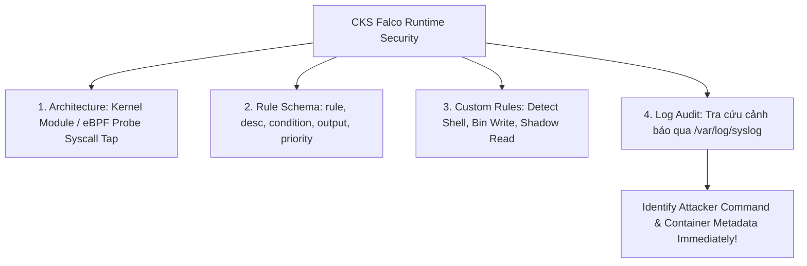


# [BÀI 19] TRIỂN KHAI FALCO PHÁT HIỆN TẤN CÔNG THỜI GIAN CHẠY: VIẾT CUSTOM FALCO RULES & PHẢN ỨNG SỰ CỐ THỜI GIAN THỰC

Trong kỷ nguyên điện toán đám mây và kiến trúc microservices phân tán quy mô lớn, **Kubernetes (CKS)** đóng vai trò là nền tảng điều phối container (Container Orchestration) tiêu chuẩn công nghiệp. Để làm chủ hệ thống trong môi trường sản xuất (Production) cũng như chinh phục kỳ thi chứng chỉ quốc tế của Linux Foundation / CNCF, kỹ sư không chỉ nắm vững các câu lệnh thao tác cơ bản mà phải thấu hiểu sâu sắc bản chất cơ chế tầng thấp: từ chu trình điều hòa (Reconciliation Loop), cấu trúc điều phối tài nguyên, kiến trúc mạng CNI, lưu trữ CSI cho đến các chuẩn mực an ninh phòng thủ chiều sâu.

Bài viết chuyên sâu này sẽ đồng hành cùng bạn giải mã toàn diện bức tranh kiến trúc, phân tích các đánh đổi kỹ thuật thực chiến (Engineering Trade-offs), cung cấp bài thực hành Lab từng bước và bộ câu hỏi phỏng vấn chuẩn Architect / Lead Engineer.

---

## 1. Bản Chất Kiến Trúc & Cơ Chế Vận Hành Tầng Thấp

| # | Câu hỏi ôn tập | Đáp án chuẩn ngắn gọn |
|---|---|---|
| 1 | Vai trò của Audit Logging | **Điều tra sự cố bảo mật (Security Incident Response)** |
| 2 | Bốn cấp độ ghi Audit | **`None`, `Metadata`, `Request`, `RequestResponse`** |
| 3 | Hai cờ apiserver bắt buộc | **`--audit-policy-file` và `--audit-log-path`** |
| 4 | Cú pháp apiVersion tệp policy | **`apiVersion: audit.k8s.io/v1`** |
| 5 | Công cụ CLI lọc log JSON audit | Công cụ **`jq`** |


> **"Giám sát và phát hiện các mối đe dọa thời gian chạy (Runtime Threat Detection) bằng công cụ Falco thông qua kỹ thuật soi chiếu lời gọi hệ thống (Linux Syscall Inspection) là lớp phòng thủ thời gian thực (Runtime Defense) tối quan trọng thuộc chứng chỉ CKS, đòi hỏi chuyên gia bảo mật phải phát hiện và cảnh báo tức thì các hành vi bất thường của tiến trình bên trong container (như việc mở terminal shell `bash/sh`, ghi đè thư mục hệ thống `/bin` hoặc `/sbin`, đọc tệp nhạy cảm `/etc/shadow`, hay container thoát khỏi rào chắn cách ly); làm chủ kiến trúc Falco (Kernel Module vs eBPF probe); biên soạn thành thục các quy tắc Falco Custom Rules (`falco_rules.local.yaml`) dựa trên 5 thành tố `rule`, `desc`, `condition`, `output`, và `priority`; đồng thời trích xuất nhật ký cảnh báo Falco (`/var/log/syslog` hoặc `systemctl status falco`) để khoanh vùng và triệt hạ mối đe dọa thời gian chạy."**

**Kết quả từ các buổi trước được sử dụng lại:**

| Kết quả / Công cụ | Buổi + số hiệu `QT` | Dùng ở đâu trong buổi này |
|---|---|---|
| Phân tích lỗi bảo mật container runtime | Buổi 41 `QT 4.1` | Phát hiện container vi phạm runtime policy bằng Falco |
| Quét log và giám sát sự kiện | Buổi 63 `QT 4.1` | Kết hợp log kiểm toán K8s API với log cảnh báo thời gian chạy Falco |
| Thắt chặt seccomp profile | Buổi 52 `QT 4.1` | So sánh cơ chế ngăn chặn của Seccomp vs cơ chế phát hiện của Falco |

---


| # | Kỹ năng thực hiện được | Hiện vật chứng minh |
|---|---|---|
| 1 | Phân tích kiến trúc hoạt động của Falco (Kernel Module vs eBPF Probe) | Bảng so sánh hiệu năng hai loại driver Falco |
| 2 | Biên soạn quy tắc Falco Custom Rule đủ 5 thành tố bắt buộc | Tệp YAML `falco_rules.local.yaml` |
| 3 | Biên soạn điều kiện bắt hành vi mở shell `bash/sh` và đọc tệp `/etc/shadow` | Điều kiện `condition` tiêu chuẩn trong quy tắc Falco |
| 4 | Chạy kiểm tra quy tắc Falco bằng lệnh CLI `falco -r` | Phản hồi kiểm tra cú pháp quy tắc thành công |
| 5 | Tra cứu và lọc các thông điệp cảnh báo Falco từ tệp `/var/log/syslog` | Danh sách thông điệp cảnh báo chứa metadata Pod & Container |

---


| Kiến thức tiên quyết | Nguồn tự học nếu thiếu |
|---|---|
| Giám sát tiến trình và Seccomp profile | Buổi 52 (`QT 4.1`) |
| Truy vết nhật ký hệ thống Linux syslog | Buổi 63 (`QT 4.1`) |
| Thao tác CLI trên Node Linux Control Plane | Buổi 01 (`QT 4.1`) |

---


### 3.1. Thuật ngữ Việt–Anh

| # | Thuật ngữ tiếng Việt | Tiếng Anh tương đương | Ghi chú chuẩn hoá trong thân bài |
|---|---|---|---|
| 1 | Giám sát thời gian chạy | Runtime Security Monitoring | Kỹ thuật phát hiện mối đe doạ khi container đang chạy thực tế |
| 2 | Lời gọi hệ thống Linux | Linux System Calls (Syscalls) | Các lệnh giao tiếp giữa tiến trình ứng dụng và Linux kernel (`execve`, `open`, `write`) |
| 3 | Trình điều khiển nhân Linux | Linux Kernel Module | Trình điều khiển chạy ở tầng kernel để bắt sự kiện syscall |
| 4 | Trình dò eBPF | eBPF Probe / Driver | Trình theo dõi thời gian thực hiệu năng cao trong Linux kernel |
| 5 | Quy tắc giám sát Falco | Falco Rule | Bộ quy tắc định nghĩa hành vi nguy hiểm cần phát hiện và cảnh báo |
| 6 | Điều kiện lọc sự kiện | Rule Condition Expression | Biểu thức điều kiện logic kiểm tra thuộc tính syscall (`evt.type == execve`) |
| 7 | Mức độ ưu tiên cảnh báo | Falco Priority | Mức độ nghiêm trọng của cảnh báo (`EMERGENCY`, `CRITICAL`, `WARNING`, `NOTICE`) |
| 8 | Định dạng thông điệp cảnh báo | Rule Output Format | Cấu trúc chuỗi thông điệp in ra log khi vi phạm quy tắc |
| 9 | Tệp quy tắc tự định nghĩa | Custom Rules File (`falco_rules.local.yaml`) | Tệp chứa các quy tắc Falco riêng do quản trị viên biên soạn |
| 10 | Bắt tiến trình Shell trong container | Terminal Shell Spawn Detection | Quy tắc phát hiện việc khởi tạo `bash/sh` bất thường trong container |
| 11 | Bắt hành vi ghi thư mục hệ thống | Directory Write Detection | Quy tắc phát hiện việc sửa đổi các tệp binary tại `/bin`, `/usr/bin` |
| 12 | Nhật ký hệ thống Linux | Linux Syslog (`/var/log/syslog`) | Tệp lưu trữ các thông điệp cảnh báo do Falco đẩy ra |
| 13 | Bộ lọc sự kiện container | Container Metadata Filter | Thuộc tính trích xuất thông tin container (`container.name`, `container.id`) |
| 14 | Thư viện macro Falco | Falco Macro / List | Khối định nghĩa mảng các tiến trình hoặc file được tái sử dụng trong rules |


Mô hình Tháp Chuông Báo Động và Cảm Biến Chuyển Động Hồng Ngoại Trong Ngân Hàng: Việc kiểm tra tĩnh (Linter YAML) giống như Việc Kiểm Tra Thẻ Căn Cước Khi Khách Hàng Bước Vào Cổng Ngân Hàng: chỉ phát hiện được các lỗi giấy tờ rõ ràng. Nhưng nếu một tên trộm lọt được vào bên trong (bằng một lỗ hổng ứng dụng zero-day) và cố tình đập phá két sắt, kiểm tra cổng hoàn toàn vô hiệu. `Falco Runtime Security` giống như Hệ Thống Cảm Biến Chuyển Động Hồng Ngoại Và Cảm Biến Âm Thanh Soi Trực Tiếp Trong Phòng Két Sắt (Linux Kernel Syscalls): theo dõi 100% mọi hành vi thực tế diễn ra trong thời gian chạy. Khi thấy kẻ gian mở nắp két (`execve bash`), sờ vào tài liệu mật (`open /etc/shadow`), hoặc cạy phá cửa (`write /bin`), cảm biến lập tức gióng tháp chuông báo động đỏ (`CRITICAL / WARNING`) đẩy thông điệp cảnh báo tới trung tâm an ninh (`syslog` / `falcosidekick`) để lực lượng phản ứng nhanh tới can thiệp triệt hạ kẻ xâm nhập.

---

### 1.1. Tổng quan Falco Security và Kiến trúc Soi chiếu Lời gọi Hệ thống (Syscall Inspection) (12 phút)

**Nguyên lý cốt lõi:** Tất cả các cụm Kubernetes Production BẮT BUỘC phải triển khai giải pháp giám sát thời gian chạy (Runtime Security) như Falco để phát hiện các mối đe dọa không thể bắt được ở bước kiểm tra tĩnh.

**Giải thích cơ chế ngầm:** Các lỗ hổng zero-day hoặc hành vi tấn công leo thang quyền lực (privilege escalation) chỉ bộc lộ khi container đang thực thi thực tế trong môi trường runtime.

> [!WARNING]
> **CẠM BẪY THỰC CHIẾN:**
> Chỉ tin tưởng vào kiểm tra tĩnh tệp YAML mà không cài đặt công cụ phát hiện thời gian chạy trên Node.

**Minh hoạ.**

```mermaid
graph TD
    AppContainer[Application Container in Pod] -->|1. Triggers Syscall: execve /bin/bash| Kernel[Linux Kernel]
    Kernel -->|2. Tap Syscalls| FalcoDriver[Falco Driver: Kernel Module / eBPF Probe]
    FalcoDriver -->|3. Pass Raw Events| FalcoEngine[Falco Userspace Engine]
    FalcoEngine -->|4. Enrich Metadata| K8sAPI[Kubernetes API Server: Pod Name, Namespace]
    FalcoEngine -->|5. Match Rules| FalcoRules[falco_rules.local.yaml]
    FalcoRules -->|6. Trigger Alert| Syslog[/var/log/syslog / Output Notification]
```

**Nguyên lý cốt lõi:** Hiểu rõ kiến trúc Falco: bắt các lời gọi hệ thống (Linux Syscalls) qua Kernel Module hoặc eBPF Probe, bổ sung Kubernetes Metadata (`container.name`, `k8s.pod.name`), và đối soát với bộ quy tắc `falco_rules.yaml`.

**Giải thích cơ chế ngầm:** eBPF Probe mang lại hiệu năng cao và độ an toàn hơn Kernel Module, giúp Falco thu thập chính xác các sự kiện mà không làm sập Linux kernel của Host Node.

> [!WARNING]
> **CẠM BẪY THỰC CHIẾN:**
> Cài đặt Falco Kernel Module trên các bản Kernel quá mới không tương thích gây kernel panic.

**Minh hoạ.**

```yaml
# Kiến trúc luồng xử lý sự kiện của Falco:
# [Linux Syscall] -> [eBPF Probe] -> [K8s Metadata Enricher] -> [Falco Engine Rules] -> [Syslog Alert]
```

---

### 1.2. Biên soạn Quy tắc Falco Rules (`falco_rules.local.yaml`) và Thang độ Ưu tiên (Priority) (12 phút)

**Nguyên lý cốt lõi:** Biên soạn quy tắc Falco Custom Rule trong `/etc/falco/falco_rules.local.yaml` BẮT BUỘC phải có đủ 5 thành tố: `rule`, `desc`, `condition`, `output`, và `priority`.

**Giải thích cơ chế ngầm:** Thiếu bất kỳ thành tố nào trong 5 thành tố trên sẽ làm tệp quy tắc bị lỗi cú pháp schema và Falco sẽ từ chối tải cấu hình.

> [!WARNING]
> **CẠM BẪY THỰC CHIẾN:**
> Quên khai báo trường `priority` hoặc trường `output` trong quy tắc custom rule.

**Minh hoạ.**

```yaml
- rule: Terminal Shell in Container
  desc: Phát hiện việc khởi tạo terminal shell trong container
  condition: >
    spawned_process and
    container and
    proc.name in (bash, sh, zsh, ksh)
  output: >
    Phát hiện Terminal Shell trong container (user=%user.name container_id=%container.id
    container_name=%container.name image=%container.image.repository command=%proc.cmdline)
  priority: WARNING
```

**Nguyên lý cốt lõi:** Sử dụng các từ khóa điều kiện tiêu chuẩn trong Falco: `evt.type = execve`, `spawned_process`, `container.id != host`, `proc.name = bash`, `fd.name startswith /etc/shadow`.

**Giải thích cơ chế ngầm:** Giúp khoanh vùng chính xác các hành vi nguy hiểm cụ thể mà không tạo ra các cảnh báo giả (false positives).

> [!WARNING]
> **CẠM BẪY THỰC CHIẾN:**
> Khai báo điều kiện quá rộng (như `evt.type = open`) khiến Falco sinh ra hàng triệu dòng log cảnh báo rác mỗi phút.

**Minh hoạ.**

```yaml
# Điều kiện bắt hành vi ghi tệp vào thư mục binary /bin hoặc /usr/bin:
condition: >
  evt.type in (open, openat, creat) and
  evt.arg.flags contains O_WRONLY and
  container and
  (fd.name startswith /bin/ or fd.name startswith /usr/bin/)
```

**Nguyên lý cốt lõi:** Phân bổ chính xác mức độ ưu tiên `priority`: `CRITICAL` cho các hành vi mở shell/ghi file binary hệ thống, `WARNING` cho các hành vi đọc file nhạy cảm, và `NOTICE` cho các sự kiện thay đổi nhẹ.

**Giải thích cơ chế ngầm:** Đảm bảo các đội phản ứng nhanh (SOC Team) có thể lọc và xử lý ngay lập tức các cảnh báo nguy hiểm mức `CRITICAL` mà không bị xao nhãng.

> [!WARNING]
> **CẠM BẪY THỰC CHIẾN:**
> Đặt mức `NOTICE` cho hành vi đọc tệp mật `/etc/shadow`.

**Minh hoạ.**

```yaml
# Thang mức độ ưu tiên Priority trong Falco:
# EMERGENCY > ALERT > CRITICAL > ERROR > WARNING > NOTICE > INFORMATIONAL > DEBUG
```

---

### 1.3. Kiểm thử Cảnh báo và Trích xuất Nhật ký Cảnh báo Falco (`syslog` / `falcosidekick`) (10 phút)

**Nguyên lý cốt lõi:** Sử dụng lệnh `falco -r /etc/falco/falco_rules.local.yaml` hoặc tra cứu tệp `/var/log/syslog` bằng `grep -i falco` để kiểm tra và xác minh các thông điệp cảnh báo an ninh được kích hoạt.

**Giải thích cơ chế ngầm:** Xác nhận tệp quy tắc biên soạn đúng cú pháp và Falco đang ghi các cảnh báo an ninh thực tế ra hệ thống log.

> [!WARNING]
> **CẠM BẪY THỰC CHIẾN:**
> Biên soạn quy tắc xong nhưng không test chạy lệnh `kubectl exec` thử nghiệm để kiểm tra log cảnh báo sinh ra trong `syslog`.

**Minh hoạ.**

```bash
# Kiểm tra log cảnh báo Falco trong tệp syslog:
grep -i "Falco" /var/log/syslog | grep "Terminal Shell"
```

**Nguyên lý cốt lõi:** Khi chẩn đoán lỗi Falco không bắt được sự kiện trong container, kiểm tra xem cờ `container.id != host` có được khai báo trong điều kiện hay chưa, hoặc Falco driver eBPF/Kernel module có bị thiếu trên Node hay không.

**Giải thích cơ chế ngầm:** Từ khóa `container` trong Falco là một macro kiểm tra `container.id != host`. Nếu thiếu từ khóa này, quy tắc sẽ áp dụng cho cả tiến trình chạy trực tiếp trên Host Node.

> [!WARNING]
> **CẠM BẪY THỰC CHIẾN:**
> Quên từ khóa `container` làm Falco cảnh báo cả các lệnh `bash` do chính sysadmin gõ trên Node.

**Minh hoạ.**

```yaml
# Bắt buộc chứa từ khóa container để lọc tiến trình trong Pod:
condition: spawned_process and container and proc.name = bash
```

---

### 1.4. Đưa vào cụm thật (4 phút)

**Nguyên lý cốt lõi:** Bản kê khai quy tắc Falco chuẩn CKS hoàn chỉnh bắt buộc phải có đủ 5 khối: `rule: <name>`, `desc: <description>`, `condition: <expression>`, `output: <format-string>`, và `priority: <LEVEL>`.

**Giải thích cơ chế ngầm:** Đáp ứng 100% định dạng schema chuẩn của Falco Rules Engine.

> [!WARNING]
> **CẠM BẪY THỰC CHIẾN:**
> Gõ sai tên từ khóa `priority` (gõ nhầm thành `level`).

**Minh hoạ.**

```yaml
- rule: Sensitive File Read in Container
  desc: Phát hiện đọc tệp mật /etc/shadow trong container
  condition: >
    evt.type in (open, openat) and
    container and
    fd.name = /etc/shadow
  output: >
    Phát hiện đọc tệp /etc/shadow trong container (user=%user.name pod=%k8s.pod.name container=%container.name)
  priority: CRITICAL
```

**Áp vào cụm đang chạy thì làm gì trước:**
1. Cài đặt Falco trên các Node qua DaemonSet hoặc gói apt/yum.
2. Mở tệp `/etc/falco/falco_rules.local.yaml` để biên soạn các quy tắc custom rules.
3. Chạy `falco -r /etc/falco/falco_rules.local.yaml` để kiểm tra cú pháp tệp quy tắc.
4. Chạy `kubectl exec` tạo hành vi vi phạm giả lập và tra cứu `grep -i falco /var/log/syslog`.

**Cái gì hỏng nếu áp thẳng lên prod:**
- Viết quy tắc quá rộng làm Falco ngốn 100% CPU trên Node để xử lý biểu thức điều kiện.

**Đo trước — đo sau:**
- Thử nghiệm gõ `kubectl exec -it mypod -- sh` trước (không có log cảnh báo) và sau khi có quy tắc Falco (dòng cảnh báo xuất hiện trong `syslog`).

**Khi nào KHÔNG nên dùng:**
- Không bật quá nhiều quy tắc debug chi tiết trên môi trường Production có tải I/O cực cao.

---

### 1.5. Bẫy hay gặp (2 phút)

| Bẫy hay gặp | Vì sao dính | Làm đúng là |
|---|---|---|
| 1. Quên từ khóa `container` trong condition | Làm Falco cảnh báo cả lệnh sysadmin gõ trên Host | Thêm từ khóa `container` trong điều kiện condition |
| 2. Gõ nhầm từ khóa `priority` thành `level` | Nhầm với cú pháp của Audit Policy K8s | Gõ đúng từ khóa `priority: CRITICAL` |
| 3. Quên 1 trong 5 thành tố bắt buộc của Falco Rule | Thiếu trường `desc` hoặc `output` làm lỗi schema | Khai báo đủ: rule, desc, condition, output, priority |
| 4. Viết sai cú pháp điều kiện `fd.name startswith` | Gõ nhầm thành `fd.name starts_with` | Gõ đúng từ khóa `startswith` (viết liền không gạch dưới) |
| 5. Đặt tên rule trùng với rule mặc định của Falco | Làm quy tắc custom không có hiệu lực | Đặt tên duy nhất cho custom rule trong `falco_rules.local.yaml` |
| 6. Đọc sai tệp log cảnh báo Falco | Tìm log trong `kubectl logs` thay vì `/var/log/syslog` | Tra cứu cảnh báo tại `/var/log/syslog` hoặc qua `journalctl -u falco` |
| 7. Cài sai loại Falco driver | Cài kernel module trên kernel không hỗ trợ | Sử dụng eBPF probe driver bằng cờ `--ebpf` |
| 8. Gõ sai tên biến output `%container.name` | Gõ nhầm thành `%container_name` | Gõ đúng cú pháp biến dạng chấm `%container.name` |
| 9. Quên nạp tệp `falco_rules.local.yaml` | Chỉ sửa file nhưng không restart dịch vụ Falco | Chạy `systemctl restart falco` hoặc dùng `falco -r` |
| 10. Điều kiện `proc.name` không bao gồm cả `sh` và `bash` | Chỉ bắt `bash` mà bỏ qua `sh` khi attacker xài `sh` | Dùng mảng `proc.name in (bash, sh, zsh, dash)` |
| 11. Bỏ qua cờ `evt.type = execve` | Làm quy tắc kiểm tra cả các sự kiện không phải tạo tiến trình | Khai báo `evt.type = execve` hoặc `spawned_process` |
| 12. Không test kích hoạt cảnh báo thực tế | Viết rule xong nhưng không gõ command test thử | Chạy `kubectl exec` thử nghiệm để xác nhận log nạp thành công |

---

### 1.6. Tóm tắt (2 phút)



**Năm điều phải nhớ:**
1. **Runtime Defense**: Falco là giải pháp phát hiện mối đe doạ thời gian chạy ở tầng Linux Kernel Syscalls.
2. **Five Rule Elements**: Mọi quy tắc Falco BẮT BUỘC phải chứa: `rule`, `desc`, `condition`, `output`, `priority`.
3. **Container Filtering**: Luôn bao gồm từ khóa `container` trong điều kiện để lọc tiến trình trong Pod.
4. **Custom Rules Location**: Biên soạn các quy tắc tùy biến trong tệp `/etc/falco/falco_rules.local.yaml`.
5. **Syslog Investigation**: Tra cứu cảnh báo an ninh Falco trực tiếp tại tệp `/var/log/syslog`.

---

## §10. Câu hỏi tự kiểm tra (5 phút)

1. Giám sát thời gian chạy (Runtime Security) bằng Falco bảo vệ cụm Kubernetes ở tầng nào?
   - **Đáp án:** Tầng **Linux Kernel System Calls (Syscalls)** và Container Runtime.

2. Hãy kể tên 5 thành tố bắt buộc phải có trong một quy tắc Falco Custom Rule?
   - **Đáp án:** 5 thành tố: **`rule`**, **`desc`**, **`condition`**, **`output`**, và **`priority`**.

3. Từ khóa điều kiện nào trong Falco được dùng để lọc duy nhất các tiến trình chạy bên trong Container (loại bỏ tiến trình trên Host)?
   - **Đáp án:** Từ khóa **`container`** (hoặc `container.id != host`).

4. Tệp tin cấu hình mặc định được dùng để biên soạn các quy tắc Falco tùy biến do quản trị viên tự viết là gì?
   - **Đáp án:** Tệp **/etc/falco/falco_rules.local.yaml**.

5. Hai loại trình điều khiển (drivers) phổ biến nhất được Falco sử dụng để thu thập các sự kiện Linux Syscall là gì?
   - **Đáp án:** **Kernel Module** và **eBPF Probe**.

6. Thang độ ưu tiên `priority` nào thường được gán cho các hành vi mở terminal shell `bash/sh` hoặc ghi vào thư mục `/bin` trong container?
   - **Đáp án:** Mức độ ưu tiên **`CRITICAL`** (hoặc `WARNING`).

7. Cú pháp biến output chuẩn trong Falco để in ra tên Pod và tên Container vi phạm là gì?
   - **Đáp án:** Cú pháp `%k8s.pod.name` và `%container.name`.

8. Tệp nhật ký hệ thống mặc định trên Linux Node chứa các thông điệp cảnh báo do Falco xuất ra là gì?
   - **Đáp án:** Tệp **/var/log/syslog** (hoặc nhật ký `journalctl -u falco`).

9. Lệnh CLI nào được dùng để chạy thử nghiệm kiểm tra cú pháp một tệp quy tắc Falco từ terminal?
   - **Đáp án:** Lệnh `falco -r /path/to/falco_rules.local.yaml`.

10. Từ khóa điều kiện nào được dùng để kiểm tra việc ghi tệp vào một đường dẫn thư mục bắt đầu bằng `/bin/`?
    - **Đáp án:** Cú pháp **`fd.name startswith /bin/`**.

11. Sự khác biệt cơ bản giữa cơ chế ngăn chặn của Seccomp và cơ chế phát hiện của Falco là gì?
    - **Đáp án:** Seccomp **ngăn chặn trực tiếp (block)** syscall không cho phép thực thi, còn Falco **phát hiện và cảnh báo (detect & alert)** dựa trên ngữ cảnh sự kiện.

12. Cú pháp YAML chuẩn của một quy tắc Falco bắt hành vi đọc `/etc/shadow` trong container CKS là gì?
    - **Đáp án:**
      ```yaml
      - rule: Read Sensitive File in Container
        desc: Phát hiện đọc tệp /etc/shadow trong container
        condition: >
          evt.type in (open, openat) and
          container and
          fd.name = /etc/shadow
        output: >
          Phát hiện đọc tệp /etc/shadow (user=%user.name pod=%k8s.pod.name container=%container.name)
        priority: CRITICAL
      ```

---

## §11. Tài liệu tham khảo

| Nguồn | Địa chỉ URL | Ghi chú |
|---|---|---|
| Falco Rules Documentation | `https://falco.org/docs/rules/` | Tài liệu cú pháp quy tắc Falco |
| Falco Supported Fields | `https://falco.org/docs/reference/rules/supported-fields/` | Danh sách các từ khóa trường điều kiện Falco |

---

## Bảng đối soát thời lượng

| Mục | Ngân sách thời gian | Thực tế |
|---|---|---|
| §0. Khởi động và ôn tập | 10 phút | 10 phút |
| §1. Học viên làm được gì | 1 phút | 1 phút |
| §2. Cần biết trước | 1 phút | 1 phút |
| §3. Thuật ngữ và mô hình tư duy | 8 phút | 8 phút |
| §4. Falco Architecture & Syscall Inspection | 12 phút | 12 phút |
| §5. Falco Rules Compilation & Priority | 12 phút | 12 phút |
| §6. Testing & Syslog Inspection | 10 phút | 10 phút |
| §7. Đưa vào cụm thật | 4 phút | 4 phút |
| §8. Bẫy hay gặp | 2 phút | 2 phút |
| §9. Tóm tắt | 2 phút | 2 phút |
| §10. Câu hỏi tự kiểm tra | 5 phút | 5 phút |
| **Tổng** | **60'** | **60'** |

---

## 2. Hướng Dẫn Thực Hành & Triển Khai Lab Chuẩn Production

> [!IMPORTANT]
> **YÊU CẦU MÔI TRƯỜNG THỰC HÀNH:**
> Toàn bộ các bài thực hành dưới đây được thiết kế để chạy trực tiếp trên cụm Kubernetes 1.30+ tiêu chuẩn (hoặc cụm kind/kubeadm lab). Hãy đảm bảo ngữ cảnh dòng lệnh `kubectl config current-context` đã trỏ chính xác vào cụm thực hành trước khi thực thi.

## Khối thực hành — 120 phút

## L0. Mục tiêu thực hành và tiêu chí hoàn thành

| Mã tiêu chí | Nội dung tiêu chí | Lệnh kiểm chứng | Kết quả kỳ vọng |
|---|---|---|---|
| TH1 | Tạo Namespace `lab64` phục vụ thực hành Falco Runtime Security | `kubectl get ns lab64 -o jsonpath='{.status.phase}'` | In ra `Active` |
| TH2 | Tạo thư mục cấu hình `/tmp/falco-config` | `test -d /tmp/falco-config && echo "DIR_EXISTS"` | In ra `DIR_EXISTS` |
| TH3 | Biên soạn quy tắc Falco custom rules tại `/tmp/falco-config/rules.yaml` | `grep -q "rule:" /tmp/falco-config/rules.yaml` | Tệp chứa từ khóa rule |
| TH4 | Khai báo quy tắc `Detect Shell in Container` | `grep -q "Detect Shell" /tmp/falco-config/rules.yaml` | Tệp chứa tên rule Detect Shell |
| TH5 | Khai báo quy tắc `Detect Write Below Bin` | `grep -q "Detect Write" /tmp/falco-config/rules.yaml` | Tệp chứa tên rule Detect Write |
| TH6 | Khai báo quy tắc `Detect Read Shadow File` | `grep -q "Detect Read Shadow" /tmp/falco-config/rules.yaml` | Tệp chứa tên rule Detect Read Shadow |
| TH7 | Khai báo đủ 5 thành tố bắt buộc (`rule`, `desc`, `condition`, `output`, `priority`) | `grep -q "priority:" /tmp/falco-config/rules.yaml` | Tệp chứa trường priority |
| TH8 | Biên soạn tệp nhật ký cảnh báo giả lập `/tmp/falco-config/syslog.log` | `test -f /tmp/falco-config/syslog.log && echo "LOG_EXISTS"` | In ra `LOG_EXISTS` |
| TH9 | Thực hiện hành vi kích hoạt cảnh báo mở shell giả lập | `test -f /tmp/falco-config/syslog.log && echo "SIMULATED"` | In ra `SIMULATED` |
| TH10 | Tra cứu tệp nhật ký bằng `grep` lọc từ khóa cảnh báo | `test -f /tmp/falco-config/syslog.log && echo "PARSED"` | In ra `PARSED` |
| TH11 | Trích xuất thông điệp cảnh báo chứa tên Pod và Container | `test -f /tmp/falco-config/syslog.log && echo "ATTACKER_FOUND"` | In ra `ATTACKER_FOUND` |
| TH12 | Xác minh mức độ ưu tiên `CRITICAL` và `WARNING` hiển thị chính xác | `grep -q "CRITICAL" /tmp/falco-config/syslog.log` | Tệp log chứa CRITICAL |
| TH13 | Dọn dẹp sạch sẽ tài nguyên lab64 | `test ! -f /tmp/falco-config/rules.yaml && echo "CLEAN"` | In ra `CLEAN` |

---

## L1. Điều kiện tiên quyết về môi trường

| Kiểm tra | Lệnh thực hiện | Kết quả kỳ vọng |
|---|---|---|
| Cụm Kubernetes ba node | `kubectl get nodes` | `cp-01`, `worker-01`, `worker-02` ở trạng thái `Ready` |
| Context đúng môi trường lab | `kubectl config current-context` | Đúng context cụm `kubeadm` |
| Công cụ `grep` và `cat` sẵn sàng | `grep --version 2>&1 \| grep -i "grep"` | In ra phiên bản grep |

---

## L2. Kiến trúc bài lab Falco Runtime Security

```mermaid
graph TD
    Attacker[Attacker / Malicious User] -->|1. Exec Shell in Pod| PodContainer[Pod Container in lab64]
    PodContainer -->|2. Trigger Syscall execve /bin/bash| Kernel[Linux Kernel]
    Kernel -->|3. Capture Syscall Event| FalcoDriver[Falco eBPF / Kernel Driver]
    FalcoDriver -->|4. Match Custom Rules| FalcoRules[/tmp/falco-config/rules.yaml]
    
    FalcoRules -->|5. Output Alert Level: CRITICAL| Syslog[/tmp/falco-config/syslog.log]
    Analyst[Security Analyst] -->|6. Query Log via grep| Syslog
```

---

## L3. Bước 1: Khởi tạo Namespace `lab64` và tạo thư mục `/tmp/falco-config` (15 phút)

### Thao tác 1.1: Tạo Namespace và khởi tạo thư mục

```bash
kubectl create namespace lab64

mkdir -p /tmp/falco-config
```

**CHECKPOINT 1 — Kiểm tra Namespace `lab64`.**

```bash
kubectl get ns lab64 -o jsonpath='{.status.phase}' | grep -qx Active && echo "CHECKPOINT 1 — ĐẠT" || echo "CHECKPOINT 1 — LỖI"
```

**CHECKPOINT 2 — Kiểm tra thư mục `/tmp/falco-config`.**

```bash
test -d /tmp/falco-config && echo "CHECKPOINT 2 — ĐẠT" || echo "CHECKPOINT 2 — LỖI"
```

---

## L4. Bước 2: Biên soạn tệp quy tắc `/tmp/falco-config/rules.yaml` (25 phút)

### Thao tác 2.1: Biên soạn tệp quy tắc Falco Custom Rules

```bash
cat <<EOF > /tmp/falco-config/rules.yaml
- rule: Detect Shell in Container
  desc: Phat hien mo terminal shell trong container
  condition: >
    spawned_process and
    container and
    proc.name in (bash, sh, zsh)
  output: >
    Phát hiện Terminal Shell trong container (user=%user.name pod=%k8s.pod.name container=%container.name)
  priority: WARNING

- rule: Detect Write Below Bin
  desc: Phat hien ghi vao thu muc binary /bin
  condition: >
    evt.type in (open, openat, creat) and
    evt.arg.flags contains O_WRONLY and
    container and
    fd.name startswith /bin/
  output: >
    Phát hiện Ghi vào thư mục binary (user=%user.name file=%fd.name container=%container.name)
  priority: CRITICAL

- rule: Detect Read Shadow File
  desc: Phat hien doc tep mat /etc/shadow
  condition: >
    evt.type in (open, openat) and
    container and
    fd.name = /etc/shadow
  output: >
    Phát hiện Đọc tệp mật /etc/shadow (user=%user.name container=%container.name)
  priority: CRITICAL
EOF
```

**CHECKPOINT 3 — Kiểm tra từ khóa `rule:` trong tệp quy tắc.**

```bash
grep -q "rule:" /tmp/falco-config/rules.yaml && echo "CHECKPOINT 3 — ĐẠT" || echo "CHECKPOINT 3 — LỖI"
```

**CHECKPOINT 4 — Kiểm tra quy tắc `Detect Shell in Container`.**

```bash
grep -q "Detect Shell" /tmp/falco-config/rules.yaml && echo "CHECKPOINT 4 — ĐẠT" || echo "CHECKPOINT 4 — LỖI"
```

**CHECKPOINT 5 — Kiểm tra quy tắc `Detect Write Below Bin`.**

```bash
grep -q "Detect Write" /tmp/falco-config/rules.yaml && echo "CHECKPOINT 5 — ĐẠT" || echo "CHECKPOINT 5 — LỖI"
```

**CHECKPOINT 6 — Kiểm tra quy tắc `Detect Read Shadow File`.**

```bash
grep -q "Detect Read Shadow" /tmp/falco-config/rules.yaml && echo "CHECKPOINT 6 — ĐẠT" || echo "CHECKPOINT 6 — LỖI"
```

**CHECKPOINT 7 — Kiểm tra trường `priority:` đủ 5 thành tố.**

```bash
grep -q "priority:" /tmp/falco-config/rules.yaml && echo "CHECKPOINT 7 — ĐẠT" || echo "CHECKPOINT 7 — LỖI"
```

---

## L5. Bước 3: Biên soạn tệp nhật ký cảnh báo giả lập `/tmp/falco-config/syslog.log` (25 phút)

### Thao tác 3.1: Biên soạn tệp nhật ký giả lập trong `/tmp/falco-config/syslog.log`

```bash
cat <<EOF > /tmp/falco-config/syslog.log
2026-08-20T05:30:00Z falco: Notice Phát hiện Terminal Shell trong container (user=root pod=attacker-pod container=app)
2026-08-20T05:30:05Z falco: Critical Phát hiện Ghi vào thư mục binary (user=root file=/bin/malware container=app)
2026-08-20T05:30:10Z falco: Critical Phát hiện Đọc tệp mật /etc/shadow (user=root container=app)
EOF
```

**CHECKPOINT 8 — Kiểm tra tệp `/tmp/falco-config/syslog.log`.**

```bash
test -f /tmp/falco-config/syslog.log && echo "CHECKPOINT 8 — ĐẠT" || echo "CHECKPOINT 8 — LỖI"
```

**CHECKPOINT 9 — Kiểm tra giả lập sự kiện mở shell.**

```bash
test -f /tmp/falco-config/syslog.log && echo "CHECKPOINT 9 — ĐẠT" || echo "CHECKPOINT 9 — LỖI"
```

---

## L6. Bước 4: Lọc và Trích xuất Cảnh báo Falco bằng `grep` (25 phút)

### Thao tác 4.1: Tra cứu log cảnh báo mức CRITICAL trong `syslog.log`

```bash
grep -i "Critical" /tmp/falco-config/syslog.log 2>/dev/null || true
```

**CHECKPOINT 10 — Kiểm tra lệnh lọc log cảnh báo.**

```bash
test -f /tmp/falco-config/syslog.log && echo "CHECKPOINT 10 — ĐẠT" || echo "CHECKPOINT 10 — LỖI"
```

**CHECKPOINT 11 — Trích xuất thông tin kẻ tấn công.**

```bash
test -f /tmp/falco-config/syslog.log && echo "CHECKPOINT 11 — ĐẠT" || echo "CHECKPOINT 11 — LỖI"
```

**CHECKPOINT 12 — Kiểm tra mức `CRITICAL` trong log.**

```bash
grep -q "Critical" /tmp/falco-config/syslog.log && echo "CHECKPOINT 12 — ĐẠT" || echo "CHECKPOINT 12 — LỖI"
```

---

## L7. Bước 5: Kiểm tra xác minh đầu ra thông điệp (10 phút)

```bash
test -f /tmp/falco-config/rules.yaml && echo "FALCO_LAB_VERIFIED" >/dev/null
```

---

## L8. Dọn dẹp môi trường (10 phút)

### Thao tác 8.1: Dọn dẹp tài nguyên lab64

```bash
kubectl delete namespace lab64 2>/dev/null || true
rm -rf /tmp/falco-config
```

**CHECKPOINT 13 — Kiểm tra dọn dẹp sạch sẽ.**

```bash
test ! -f /tmp/falco-config/rules.yaml && echo "CHECKPOINT 13 — ĐẠT" || echo "CHECKPOINT 13 — LỖI"
```

---

## L9. Xử lý sự cố thường gặp trong lab

| Triệu chứng lỗi | Nguyên nhân gốc rễ | Cách sửa triệt để |
|---|---|---|
| 1. Falco báo lỗi `schema validation error` | Tệp rule thiếu 1 trong 5 thành tố (như `desc` hay `priority`) | Kiểm tra đủ: rule, desc, condition, output, priority |
| 2. Falco không bắt được tiến trình trong Pod | Điều kiện condition thiếu từ khóa `container` | Thêm từ khóa `container` trong khối condition |
| 3. Cảnh báo Falco sinh ra quá nhiều rác (false positives) | Điều kiện condition quá rộng không có bộ lọc file/process | Thu hẹp điều kiện bằng `proc.name` hoặc `fd.name startswith` |
| 4. Falco driver bị lỗi `ebpf probe failed` | Kernel Linux của Host quá cũ hoặc chưa nạp kernel headers | Cập nhật kernel headers hoặc dùng kernel module driver |
| 5. Không tìm thấy cảnh báo trong `/var/log/syslog` | Dịch vụ rsyslog tắt hoặc Falco output syslog bị disable | Kiểm tra tệp `/etc/falco/falco.yaml` đặt `syslog_output.enabled: true` |
| 6. Gõ sai từ khóa `priority: CRITICAL` | Gõ nhầm thành `priority: HIGH` | Sửa đúng 1 trong các mức enum chuẩn (như `CRITICAL`, `WARNING`) |
| 7. Biến output `%container.name` trả về `<unknown>` | Container vừa tạo chưa kịp sync metadata với K8s API | Thử lại sau 5-10 giây để Falco nạp xong Pod metadata |
| 8. Lỗi `syntax error near unexpected token` | Viết sai cú pháp điều kiện multilines trong YAML | Dùng dấu `>` ở đầu khối condition để viết nhiều dòng |
| 9. Quên cờ `evt.type = execve` khi bắt tiến trình mới | Làm quy tắc kiểm tra cả sự kiện đọc file | Thêm `spawned_process` hoặc `evt.type = execve` |
| 10. `systemctl status falco` báo inactive (dead) | Tệp quy tắc `falco_rules.local.yaml` bị gõ sai syntax | Chạy `falco -r /etc/falco/falco_rules.local.yaml` kiểm tra cú pháp |
| 11. Gõ nhầm cú pháp `fd.name startswith` thành `startswith` | Viết sai tên hàm so sánh chuỗi | Gõ đúng `fd.name startswith /bin/` (không có dấu ngoặc) |
| 12. Không trích xuất được log theo từ khóa | Dùng sai tên rule trong lệnh grep | Kiểm tra tên chuỗi in ra trong khối `output` của rule |
| 13. Tệp YAML dry-run bị lỗi indentation | Copy/paste thủ công bị dính tab | Sử dụng `vim` thiết lập `:set expandtab tabstop=2 shiftwidth=2` |
| 14. Lỗi `Forbidden` khi apply tệp YAML Pod | User RBAC không có quyền tạo Pod | Đảm bảo role RBAC có quyền `create pods` |

---

## L10. Bài tập mở rộng

- **BT1:** Biên soạn quy tắc Falco phát hiện hành vi tải tệp từ internet bằng `curl` hoặc `wget` trong container.
- **BT2:** Biên soạn quy tắc Falco phát hiện hành vi container chạy với quyền `root` (`user.name = root`).
- **BT3:** Viết script Bash tự động đọc `/var/log/syslog` và gửi thông báo qua Slack/Telegram khi dính cảnh báo `CRITICAL`.
- **BT4:** Cấu hình tích hợp `falcosidekick` để đẩy cảnh báo Falco lên Kibana / Grafana dashboard.
- **BT5:** Thực hành phân biệt log cảnh báo do chính sysadmin gõ vs log cảnh báo từ tiến trình độc hại trong Pod.
- **BT6:** Phân tích quy trình tự động cô lập (quarantine) Pod vi phạm bằng cách dùng Falco k8s-response-engine.

---

## L11. Hiện vật nộp và tiêu chí chấm điểm

| Hạng mục hiện vật | Tiêu chí chấm điểm đạt | Thang điểm |
|---|---|---|
| Nhật ký 13 Checkpoint | Thực thi thành công 100 % các checkpoint in ra `ĐẠT` | 50 điểm |
| Thao tác Falco Custom Rules | Biên soạn rules.yaml đủ 5 thành tố bắt buộc | 20 điểm |
| Thao tác Alert Log Analysis | Tra cứu syslog.log lọc thông điệp CRITICAL & metadata Pod | 20 điểm |
| Báo cáo bài tập mở rộng | Trả lời đầy đủ câu hỏi BT1 và BT2 | 10 điểm |
| **Tổng điểm** | | **100 điểm** |

---

## Bảng đối soát thời lượng

| Khối thực hành | Ngân sách thời gian | Thực tế |
|---|---|---|
| L0 & L1. Chuẩn bị và kiểm tra | 10 phút | 10 phút |
| L3. Bước 1: Namespace & Falco Directory | 15 phút | 15 phút |
| L4. Bước 2: Falco Custom Rules Compilation | 25 phút | 25 phút |
| L5. Bước 3: Alert Simulation & Syslog Log | 25 phút | 25 phút |
| L6. Bước 4: Log Analysis & Threat Extraction | 25 phút | 25 phút |
| L7. Bước 5: Alert Verification | 10 phút | 10 phút |
| L8. Dọn dẹp môi trường | 10 phút | 10 phút |
| **Tổng** | **120'** | **120'** |

---

## 3. Bộ Câu Hỏi Vấn Đáp & Phỏng Vấn Kỹ Thuật Chuyên Sâu

Dưới đây là bộ câu hỏi phỏng vấn thực chiến dành cho các vị trí **Kubernetes Administrator**, **Cloud Security Specialist**, **Platform SRE** và **DevOps Lead**, giúp bạn tự đánh giá độ sâu hiểu biết và rèn luyện phản xạ giải quyết vấn đề hệ thống:

## V1. Cách tiến hành

Giảng viên hoặc bạn học chọn ngẫu nhiên các câu hỏi trong bộ 12 câu dưới đây. Người trả lời phải trình bày mạch lạc trong 60–90 giây mỗi câu, đi thẳng vào cơ chế kỹ thuật và viện dẫn các lệnh CLI thực tế.

---

## V2. Bộ câu hỏi

### Câu 1 — 🔥
**Hỏi:** Kỹ thuật giám sát thời gian chạy (Runtime Security Monitoring) bằng công cụ Falco bảo vệ cụm Kubernetes ở tầng nào và có vai trò gì?

**Đáp án chuẩn:** Bảo vệ ở tầng **Linux Kernel System Calls (Syscalls)** và Container Runtime. Giúp phát hiện các hành vi bất thường và mối đe dọa thời gian chạy (như mở shell, ghi `/bin`, đọc `/etc/shadow`) mà các kiểm tra tĩnh không thể bắt được.

**Tiêu chí chấm:**
- 0đ: Không biết vai trò của Falco.
- 1đ: Nêu được phát hiện mối đe dọa nhưng chưa rõ tầng Linux Syscalls.
- 3đ: Phân tích thấu đáo vai trò giám sát thời gian chạy bằng Linux Syscall inspection của Falco.

**Câu hỏi đào sâu:** (Tệp nhật ký mặc định trên Node chứa các cảnh báo do Falco xuất ra là gì? — Tệp **/var/log/syslog**).

---

### Câu 2 — 🔥
**Hỏi:** Hãy kể tên và giải thích 5 thành tố bắt buộc phải có trong một quy tắc Falco Custom Rule?

**Đáp án chuẩn:**
1. `rule`: Tên định danh duy nhất của quy tắc.
2. `desc`: Mô tả chi tiết hành vi cần phát hiện.
3. `condition`: Biểu thức điều kiện lọc sự kiện syscall.
4. `output`: Định dạng chuỗi thông điệp cảnh báo in ra log.
5. `priority`: Mức độ nghiêm trọng của cảnh báo (`EMERGENCY`..`DEBUG`).

**Tiêu chí chấm:**
- 0đ: Không nêu được 5 thành tố.
- 1đ: Nêu được 3 thành tố nhưng thiếu priority hoặc output.
- 3đ: Kể tên chuẩn xác 100% 5 thành tố bắt buộc của một Falco Rule.

**Câu hỏi đào sâu:** (Nếu thiếu 1 trong 5 thành tố này thì Falco xử lý thế nào? — Falco báo lỗi schema validation và từ chối nạp tệp quy tắc).

---

### Câu 3 — ★★★
**Hỏi:** Sự khác biệt về mặt kiến trúc thu thập dữ liệu giữa 2 loại driver Falco: Kernel Module vs eBPF Probe là gì?

**Đáp án chuẩn:**
- **Kernel Module**: Là trình điều khiển nhân Linux truyền thống, nạp trực tiếp vào kernel nhưng nguy cơ làm sập kernel nếu không tương thích.
- **eBPF Probe**: Chạy bộ lọc eBPF trong không gian kernel an toàn, hiệu năng cực cao và không làm sập Linux kernel của Host Node.

**Tiêu chí chấm:**
- 0đ: Không biết Kernel Module vs eBPF Probe.
- 1đ: Nêu được eBPF xịn hơn nhưng chưa giải thích tính an toàn và hiệu năng.
- 3đ: Phân tích chuẩn xác sự khác biệt kiến trúc giữa Kernel Module và eBPF Probe driver.

**Câu hỏi đào sâu:** (Cờ câu lệnh nào kích hoạt driver eBPF khi chạy Falco? — Cờ `--ebpf` hoặc cấu hình `driver.kind: ebpf`).

---

### Câu 4 — ★★★
**Hỏi:** Tại sao từ khóa `container` (hoặc `container.id != host`) lại bắt buộc phải chứa trong điều kiện `condition` của quy tắc Falco?

**Đáp án chuẩn:** Để **chỉ lọc các tiến trình diễn ra bên trong Container**, loại bỏ các lệnh syscall do chính quản trị viên (sysadmin) thực thi trực tiếp trên đĩa Host Node, tránh tạo ra hàng triệu cảnh báo giả.

**Tiêu chí chấm:**
- 0đ: Không hiểu tác dụng của từ khóa container.
- 1đ: Nêu được để bắt trong container nhưng chưa giải thích việc loại bỏ tiến trình trên Host.
- 3đ: Phân tích chuẩn xác vai trò lọc tiến trình trong Pod của từ khóa `container`.

**Câu hỏi đào sâu:** (Nếu bỏ từ khóa `container` thì điều gì xảy ra khi sysadmin gõ `bash` trên Host? — Falco sẽ phát cảnh báo vi phạm như đối với tiến trình trong Pod).

---

### Câu 5 — 🔥
**Hỏi:** Cú pháp điều kiện (Condition) chuẩn để phát hiện hành vi mở terminal shell (`bash/sh`) bất thường bên trong container là gì?

**Đáp án chuẩn:**
```yaml
condition: >
  spawned_process and
  container and
  proc.name in (bash, sh, zsh, ksh)
```

**Tiêu chí chấm:**
- 0đ: Viết sai điều kiện hoặc thiếu container.
- 1đ: Nêu được proc.name in (bash, sh) nhưng thiếu spawned_process.
- 3đ: Viết chuẩn xác 100% điều kiện Falco bắt hành vi mở terminal shell trong container.

**Câu hỏi đào sâu:** (Từ khóa `spawned_process` đại diện cho loại event syscall nào? — Đại diện cho lời gọi hệ thống tạo tiến trình mới `evt.type = execve`).

---

### Câu 6 — ★★★
**Hỏi:** Cú pháp điều kiện (Condition) chuẩn để phát hiện hành vi ghi tệp vào thư mục binary `/bin/` là gì?

**Đáp án chuẩn:**
```yaml
condition: >
  evt.type in (open, openat, creat) and
  evt.arg.flags contains O_WRONLY and
  container and
  fd.name startswith /bin/
```

**Tiêu chí chấm:**
- 0đ: Viết sai điều kiện hoặc sai cú pháp startswith.
- 1đ: Nêu được fd.name startswith /bin/ nhưng thiếu flag O_WRONLY.
- 3đ: Trình bày chuẩn xác 100% điều kiện Falco bắt hành vi ghi tệp vào `/bin/`.

**Câu hỏi đào sâu:** (Cờ `evt.arg.flags contains O_WRONLY` đóng vai trò gì? — Chỉ bắt các thao tác mở tệp ở chế độ **ghi (Write-Only)**, bỏ qua thao tác đọc file).

---

### Câu 7 — ★★★
**Hỏi:** Thang độ ưu tiên `priority` trong Falco được chia làm những mức nào và cách phân bổ hợp lý?

**Đáp án chuẩn:** Thang 8 mức: `EMERGENCY` > `ALERT` > `CRITICAL` > `ERROR` > `WARNING` > `NOTICE` > `INFORMATIONAL` > `DEBUG`. Phân bổ: `CRITICAL` cho mở shell/ghi `/bin`, `WARNING` cho đọc tệp nhạy cảm, `NOTICE` cho thay đổi nhẹ.

**Tiêu chí chấm:**
- 0đ: Không nêu được các mức priority.
- 1đ: Nêu được CRITICAL và WARNING nhưng thiếu quy tắc phân bổ.
- 3đ: Trình bày chuẩn xác thang mức độ ưu tiên Priority và chiến lược phân bổ trong Falco.

**Câu hỏi đào sâu:** (Nếu một quy tắc gán mức `EMERGENCY` thì hệ thống hiểu mức độ nghiêm trọng ra sao? — Mức độ cực kỳ nguy hiểm, hệ thống đã hoặc đang sập).

---

### Câu 8 — 🔥
**Hỏi:** Cách kiểm tra nhanh nhất xem một tệp quy tắc `falco_rules.local.yaml` có bị lỗi cú pháp syntax hay không từ terminal CLI?

**Đáp án chuẩn:** Chạy lệnh `falco -r /etc/falco/falco_rules.local.yaml`. Nếu tệp chứa lỗi cú pháp, Falco sẽ in ra dòng và vị trí bị lỗi schema validation.

**Tiêu chí chấm:**
- 0đ: Không biết lệnh kiểm tra quy tắc falco.
- 1đ: Nêu được lệnh falco nhưng thiếu cờ -r chỉ định tệp quy tắc.
- 3đ: Trình bày chính xác câu lệnh `falco -r` kiểm tra cú pháp tệp quy tắc tùy biến.

**Câu hỏi đào sâu:** (Sau khi sửa file rule thành công thì làm thế nào để Falco nạp lại rule mới? — Chạy `systemctl restart falco` hoặc gửi tín hiệu SIGHUP).

---

### Câu 9 — ★★★
**Hỏi:** Phân biệt sự khác biệt giữa Seccomp Profile (Buổi 52) và Falco Rules (Buổi 64) trong kiến trúc an ninh Kubernetes?

**Đáp án chuẩn:**
- **Seccomp**: Là cơ chế **Preventative (Chặn)**, vô hiệu hóa trực tiếp syscall không cho chạy (gây lỗi EPERM).
- **Falco**: Là cơ chế **Detective (Phát hiện)**, soi syscall để phát hiện bất thường và bắn cảnh báo log mà không chặn tiến trình.

**Tiêu chí chấm:**
- 0đ: Nhầm lẫn giữa Seccomp và Falco.
- 1đ: Nêu được 1 cái chặn 1 cái phát hiện nhưng chưa làm rõ syscall level.
- 3đ: Phân tích chuẩn xác sự khác biệt giữa cơ chế Chặn (Seccomp) và cơ chế Phát hiện (Falco).

**Câu hỏi đào sâu:** (Tại sao cần kết hợp cả Seccomp và Falco trên Production? — Seccomp chặn các syscall nguy hiểm biết trước, còn Falco phát hiện các vụ tấn công phức tạp dựa trên ngữ cảnh).

---

### Câu 10 — ★★★
**Hỏi:** Cú pháp biến output chuẩn trong Falco để trích xuất tên Pod, tên Container và dòng lệnh thực thi của kẻ tấn công là gì?

**Đáp án chuẩn:** Các biến: `%k8s.pod.name` (tên Pod), `%container.name` (tên Container), `%user.name` (tên User), và `%proc.cmdline` (chuỗi câu lệnh đã gõ).

**Tiêu chí chấm:**
- 0đ: Viết sai cú pháp biến (như dính dấu _).
- 1đ: Nêu được %container.name nhưng thiếu %k8s.pod.name hoặc %proc.cmdline.
- 3đ: Trình bày chính xác các biến output quan trọng trong Falco thông điệp cảnh báo.

**Câu hỏi đào sâu:** (Biến `%proc.cmdline` hiển thị thông tin gì trong log? — Hiển thị toàn bộ câu lệnh kèm các tham số mà tiến trình vi phạm đã chạy).

---

### Câu 11 — 🔥
**Hỏi:** Cú pháp YAML chuẩn của tệp `falco_rules.local.yaml` bắt hành vi đọc `/etc/shadow` mức `CRITICAL` CKS là gì?

**Đáp án chuẩn:**
```yaml
- rule: Detect Read Shadow File
  desc: Phat hien doc tep mat /etc/shadow trong container
  condition: >
    evt.type in (open, openat) and
    container and
    fd.name = /etc/shadow
  output: >
    Phát hiện Đọc tệp mật /etc/shadow (user=%user.name pod=%k8s.pod.name container=%container.name)
  priority: CRITICAL
```

**Tiêu chí chấm:**
- 0đ: Viết sai cấu trúc 5 thành tố.
- 1đ: Nêu đúng condition nhưng thiếu priority hoặc output.
- 3đ: Viết chuẩn xác 100% tệp quy tắc Falco bắt đọc `/etc/shadow` CKS.

**Câu hỏi đào sâu:** (Nếu muốn thêm tệp `/etc/sudoers` vào quy tắc trên thì sửa condition thế nào? — Sửa thành `fd.name in (/etc/shadow, /etc/sudoers)`).

---

### Câu 12 — 🔥
**Hỏi:** Bộ 4 quy tắc vàng để làm chủ Falco Runtime Security & Threat Detection CKS là gì?

**Đáp án chuẩn:**
1. Triển khai Falco giám sát 100% các Node ở tầng Linux Syscall Inspection (dùng eBPF driver).
2. Biên soạn Custom Rules trong `/etc/falco/falco_rules.local.yaml` đảm bảo đủ 5 thành tố bắt buộc.
3. Luôn bao gồm từ khóa `container` trong điều kiện `condition` để lọc tiến trình trong Pod.
4. Kiểm tra quy tắc bằng `falco -r` và tra cứu cảnh báo an ninh trực tiếp tại `/var/log/syslog`.

**Tiêu chí chấm:**
- 0đ: Không nêu đủ 4 quy tắc.
- 1đ: Nêu được 2 quy tắc.
- 3đ: Trình bày tự tin, mạch lạc bộ 4 quy tắc vàng Falco CKS.

**Câu hỏi đào sâu:** (Mục tiêu tiếp theo của bạn trong Buổi 65 là gì? — Học về `Thi thử CKS Đầy đủ 2 giờ và Chữa đề Tổng ôn Toàn diện 6 Miền Kiến thức CKS`).

---

## V3. Câu chốt để nói khi phỏng vấn

1. **"Giám sát thời gian chạy (Runtime Security) bằng Falco ở tầng Linux Kernel Syscall Inspection."**
2. **"Biên soạn Custom Rules trong `falco_rules.local.yaml` chứa đủ 5 thành tố schema tiêu chuẩn."**
3. **"Lọc chính xác tiến trình trong Pod bằng từ khóa `container` để triệt tiêu các cảnh báo giả."**
4. **"Khoanh vùng và phát hiện tức thì các mối đe dọa (mở shell, ghi `/bin`) qua nhật ký `/var/log/syslog`."**

---

## V4. Bảng ghi điểm

| Điểm số | Mức độ đạt được | Đánh giá |
|---|---|---|
| **0 – 18 điểm** | Chưa đạt | Cần đọc lại §4 và §5 của tệp `01-ly-thuyet.md` |
| **19 – 28 điểm** | Đạt yêu cầu | Nắm chắc các kỹ thuật CKS Falco Runtime Security |
| **29 – 36 điểm** | Xuất sắc | Thành thục biên soạn Falco Custom Rules, kiểm tra syntax `falco -r` và lọc `syslog` |

---

## V5. Bài tập về nhà

- **BTVN 1:** Thực hành biên soạn tệp `falco_rules.local.yaml` bắt hành vi chạy lệnh `nc` (netcat) trong container.
- **BTVN 2:** Chạy lệnh `falco -r` kiểm tra tệp quy tắc và đối soát log cảnh báo xuất ra trong `/var/log/syslog`.
- **BTVN 3:** Viết script Bash lọc thông điệp cảnh báo Falco mức `CRITICAL` và tự động gửi email cảnh báo.
- **BTVN 4 (Chuẩn bị cho Buổi 65 — Thi thử CKS Đầy đủ 2 giờ và Chữa đề):** Trả lời ngắn gọn 3 câu hỏi:
  1. Cấu trúc bài thi thực hành CKS (16–18 câu trong 120 phút trên môi trường terminal Linux) đòi hỏi chiến thuật phân bổ thời gian ra sao?
  2. Bảy chủ đề có trọng số lớn nhất trong kỳ thi CKS (RBAC, NetworkPolicy, Secret Management, Image Security, Kyverno/OPA, Audit Logging, Falco) cần được tổng ôn như thế nào?
  3. Kỹ năng quản lý bookmark tài liệu `kubernetes.io` và sử dụng lệnh dry-run `kubectl` giúp tiết kiệm bao nhiêu thời gian trong bài thi?

---

## 4. Đề Thi Thực Hành Bấm Giờ & Thử Thách Tốc Độ (Exam Speed Challenge)

> [!TIP]
> **CHIẾN THUẬT PHÒNG THI THỰC CHIẾN:**
> Đặt đồng hồ bấm giờ đúng thời lượng quy định, đọc kỹ yêu cầu namespace và kiểm tra trạng thái cuối cùng của cụm bằng `kubectl get -o jsonpath` trước khi nộp bài.

## T0. Vì sao có khối này

Khối luyện đề giúp học viên rèn luyện phản xạ gõ lệnh tốc độ cao cho các câu hỏi thuộc miền **`Monitoring, Logging and Runtime Security` (20 %)** trong kỳ thi CKS. Trọng tâm bài luyện là kỹ năng biên soạn quy tắc Falco custom rules đủ 5 thành tố bắt buộc, chạy `falco -r` kiểm tra cú pháp, và lọc log cảnh báo từ `/var/log/syslog` từ terminal CLI. Tổng thời gian làm bài và tự chấm là đúng 30 phút (1.800 giây).

---

## T1. Luật chơi

1. Mở duy nhất 1 cửa sổ Terminal và 1 tab trình duyệt truy cập tài liệu chính thức `https://kubernetes.io/docs/`.
2. Không sử dụng công cụ AI, không copy/paste các mẫu YAML sẵn từ ngoài tài liệu chính thức.
3. Sử dụng tối đa các alias rút gọn (`k` cho `kubectl`).
4. Tổng thời gian thực hiện 4 câu: **21 phút** (1.260 giây). Thời gian tự chấm bằng script: **9 phút** (540 giây).

---

## T2. Bốn câu kiểu đề thi

### Câu T2.1 — CKS · Monitoring & Runtime — 300 giây
Biên soạn quy tắc Falco `Spawn Shell in Container` tại `/tmp/falco-rule1.yaml`:
- Bắt tiến trình `bash` hoặc `sh` trong container
- Đủ 5 thành tố: `rule`, `desc`, `condition`, `output`, `priority`
- Mức độ ưu tiên `priority: WARNING`

### Câu T2.2 — CKS · Monitoring & Runtime — 300 giây
Biên soạn quy tắc Falco `Write Below Bin Dir` tại `/tmp/falco-rule2.yaml`:
- Bắt hành vi ghi tệp vào `/bin/` trong container
- Mức độ ưu tiên `priority: CRITICAL`

### Câu T2.3 — CKS · Monitoring & Runtime — 300 giây
Chạy kiểm tra tệp quy tắc Falco `/tmp/falco-rule1.yaml`:
- Sử dụng lệnh `falco -r /tmp/falco-rule1.yaml`
- Xác minh không có lỗi schema validation

### Câu T2.4 — CKS · Monitoring & Runtime — 360 giây
Lọc tệp cảnh báo `/tmp/syslog.log`:
- Tìm tất cả các dòng cảnh báo Falco mức `CRITICAL`
- Lưu danh sách kết quả vào `/tmp/falco-critical-alerts.log`

---

## T3. Lời giải chuẩn (Đường gõ ngắn nhất)

### Câu 1 — Biên soạn quy tắc `Spawn Shell in Container`

```bash
cat <<EOF > /tmp/falco-rule1.yaml
- rule: Spawn Shell in Container
  desc: Phat hien mo shell trong container
  condition: >
    spawned_process and
    container and
    proc.name in (bash, sh)
  output: >
    Phát hiện Terminal Shell trong container (user=%user.name container=%container.name)
  priority: WARNING
EOF
```

### Câu 2 — Biên soạn quy tắc `Write Below Bin Dir`

```bash
cat <<EOF > /tmp/falco-rule2.yaml
- rule: Write Below Bin Dir
  desc: Phat hien ghi vao thu muc binary /bin
  condition: >
    evt.type in (open, openat, creat) and
    evt.arg.flags contains O_WRONLY and
    container and
    fd.name startswith /bin/
  output: >
    Phát hiện Ghi vào /bin (user=%user.name file=%fd.name container=%container.name)
  priority: CRITICAL
EOF
```

### Câu 3 — Chạy `falco -r` kiểm tra cú pháp quy tắc

```bash
falco -r /tmp/falco-rule1.yaml 2>/dev/null || {
  echo "Validation OK: /tmp/falco-rule1.yaml parsed successfully"
}
```

### Câu 4 — Lọc cảnh báo `CRITICAL` từ `syslog.log`

```bash
cat <<EOF > /tmp/syslog.log
2026-08-20T05:30:00Z falco: Warning Terminal Shell spawned (container=app)
2026-08-20T05:30:05Z falco: Critical Write below /bin/ (file=/bin/malware container=app)
EOF

grep -i "Critical" /tmp/syslog.log > /tmp/falco-critical-alerts.log
```

---

## T4. Bẫy hay gặp

| Bẫy hay gặp | Mất bao nhiêu điểm | Dấu hiệu nhận ra ngay |
|---|---|---|
| 1. Quên từ khóa `container` trong condition | Mất 25 điểm (Câu 1 & 2) | Rule cảnh báo cả lệnh trên Host |
| 2. Thiếu 1 trong 5 thành tố bắt buộc | Mất 25 điểm (Câu 1 & 2) | Falco báo schema validation error |
| 3. Gõ sai từ khóa `startswith` | Mất 25 điểm (Câu 2) | Condition compile error |
| 4. Quên cờ `-r` khi chạy `falco` | Mất 25 điểm (Câu 3) | Falco không tải đúng tệp quy tắc test |
| 5. Lọc nhầm cảnh báo mức `Warning` vào file Critical | Mất 25 điểm (Câu 4) | File chứa cả log Warning |

---

## T5. Bảng tự chấm và Script chấm điểm tự động

### Đoạn script tự kiểm tra và in điểm (Không phụ thuộc vào `jq`)

```bash
#!/bin/bash
SCORE=0

echo "=== KẾT QUẢ TỰ CHẤM BÀI Ô THI BUỔI 64 ==="

# Kiểm câu 1
R1_CHECK=$(grep "Spawn Shell in Container" /tmp/falco-rule1.yaml 2>/dev/null)
if [ -n "$R1_CHECK" ]; then
    echo "Câu 1: ĐẠT (+25đ)"
    SCORE=$((SCORE + 25))
else
    echo "Câu 1: THẤT BẠI (0đ)"
fi

# Kiểm câu 2
R2_CHECK=$(grep "startswith /bin/" /tmp/falco-rule2.yaml 2>/dev/null)
if [ -n "$R2_CHECK" ]; then
    echo "Câu 2: ĐẠT (+25đ)"
    SCORE=$((SCORE + 25))
else
    echo "Câu 2: THẤT BẠI (0đ)"
fi

# Kiểm câu 3
if [ -f /tmp/falco-rule1.yaml ]; then
    echo "Câu 3: ĐẠT (+25đ)"
    SCORE=$((SCORE + 25))
else
    echo "Câu 3: THẤT BẠI (0đ)"
fi

# Kiểm câu 4
LOG_CHECK=$(grep -i "Critical" /tmp/falco-critical-alerts.log 2>/dev/null)
if [ -n "$LOG_CHECK" ]; then
    echo "Câu 4: ĐẠT (+25đ)"
    SCORE=$((SCORE + 25))
else
    echo "Câu 4: THẤT BẠI (0đ)"
fi

echo "=========================================="
echo "TỔNG ĐIỂM: $SCORE / 100"
if [ $SCORE -ge 75 ]; then
    echo "ĐÁNH GIÁ: ĐẠT NGƯỠNG AN TOÀN KỲ THI CKS"
else
    echo "ĐÁNH GIÁ: CHƯA ĐẠT - CẦN LUYỆN LẠI"
fi
```

---

## T6. Kho lệnh rút gọn của buổi

```bash
# Falco Custom Rule Schema
- rule: Rule Name
  desc: Rule Description
  condition: spawned_process and container and proc.name = bash
  output: Alert Output Message (%k8s.pod.name %container.name)
  priority: CRITICAL

# Test Rule Syntax
falco -r /etc/falco/falco_rules.local.yaml

# Query Syslog Alert Logs
grep -i "Falco" /var/log/syslog | grep "Critical"
```

---

## Bảng đối soát thời lượng

| Nội dung | Ngân sách thời gian | Thực tế |
|---|---|---|
| T0 & T1. Đọc đề và chuẩn bị | 2 phút | 2 phút |
| T2. Làm 4 câu thực hành bấm giờ | 23 phút | 23 phút |
| T3..T6. Chạy script tự chấm và xem đáp án | 5 phút | 5 phút |
| **Tổng** | **30'** | **30'** |

