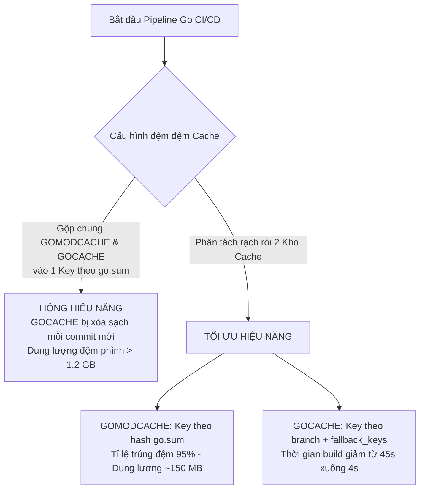
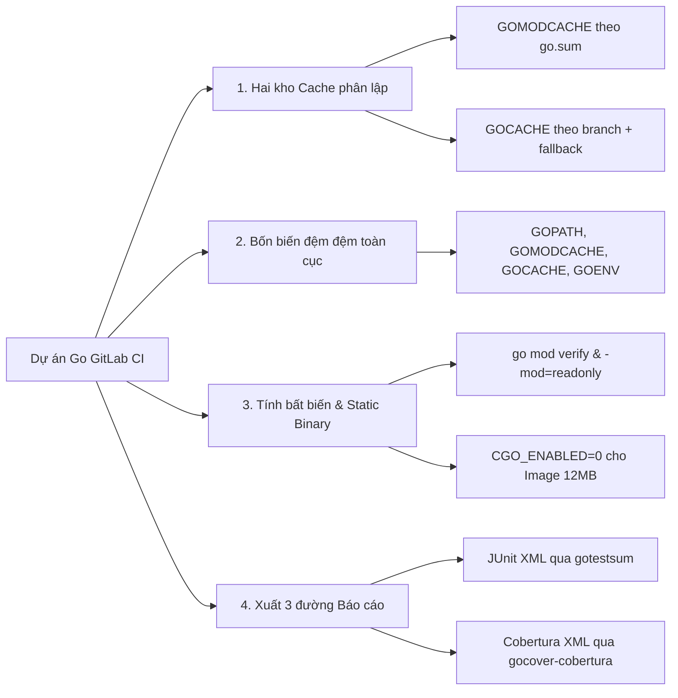
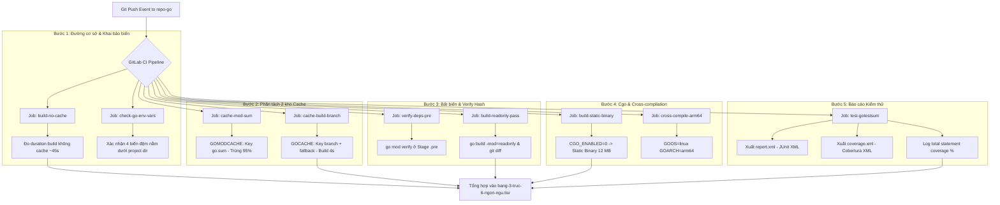


# [BÀI 19] PIPELINE CHUYÊN SÂU CHO GOLANG: GO MODULE CACHE, GOLANGCI-LINT, GO TEST COVERAGE & MULTI-ARCH CROSS BUILD

Trong kỷ nguyên **DevOps, DevSecOps và Cloud Native Engineering**, **GitLab CI/CD** được công nhận là một trong những nền tảng tự động hóa tích hợp liên tục và phân phối liên tục (CI/CD) hoàn chỉnh, mạnh mẽ và được tin dùng nhất trong các doanh nghiệp quy mô lớn. Không chỉ dừng lại ở các pipeline tuần tự cơ bản, việc vận hành GitLab CI/CD ở cấp độ Production đòi hỏi kỹ sư phải làm chủ kiến trúc điều phối phi tuyến tính **DAG (Directed Acyclic Graph)**, cơ chế quản trị **Autoscaling Runners**, tối ưu hóa **Caching đa tầng**, xác thực không khóa **Keyless OIDC**, bảo mật chuỗi cung ứng phần mềm **SLSA & SBOM** cùng các chính sách **Quality & Security Gates** tự động.

Bài viết chuyên sâu này sẽ đồng hành cùng bạn mổ xẻ toàn diện bức tranh kiến trúc, phân tích các đánh đổi kỹ thuật thực chiến (Engineering Trade-offs), cung cấp hướng dẫn thực hành Lab chi tiết từng bước và bộ câu hỏi phỏng vấn chuyên sâu chuẩn DevOps Lead / DevSecOps Architect.

---

## 1. Bản Chất Kiến Trúc & Cơ Chế Vận Hành Tầng Thấp

---


| # | Câu hỏi ôn tập Buổi 18 (Python) | Đáp án chuẩn ngắn gọn |
|---|---|---|
| 1 | Yếu tố duy nhất quyết định venv là thừa hay bắt buộc trong Container CI dùng 1 lần? | **Số môi trường Python phải nuôi dưỡng trong Job**. Nếu chỉ có 1 môi trường thì venv là THỪA (tốn +2,4s), ngoại trừ 3 ngoại lệ: PEP 668, tách tool CI, và đệm đệm dưới `$CI_PROJECT_DIR`. |
| 2 | Tại sao `requirements.txt` gõ tay chỉ ghim được 22% phụ thuộc và gây rủi ro trôi phiên bản? | Chỉ ghim 40 phụ thuộc trực tiếp, bỏ hở **140 phụ thuộc bắc cầu**. Hai lần chạy cùng commit cho ra **2 mã băm SHA256 khác nhau**. Phải dùng `pip-compile --generate-hashes` hoặc `poetry.lock`. |
| 3 | Năm biến môi trường đệm đệm Python trỏ về `$CI_PROJECT_DIR` là gì? | `PIP_CACHE_DIR`, `POETRY_VIRTUALENVS_IN_PROJECT`, `POETRY_CACHE_DIR`, `UV_CACHE_DIR`, `TOX_WORK_DIR`. |
| 4 | Bài toán điểm hòa vốn đệm đệm và vì sao `uv` bật Cache lại bị LỖ thời gian? | Cài `uv` từ đầu chỉ mất 9s. Chi phí nén/tải đệm tiêu tốn 15s $\rightarrow$ **Cache LỖ 6 giây/lần chạy**, giải pháp tối ưu là TẮT CACHE. |
| 5 | `pytest` thu thập 288/300 testcase nhưng mã thoát trả về 0 — cách khắc phục là gì? | `pytest` chỉ trả mã thoát 5 khi thu 0 testcase. Dùng script Bash `dem-test.sh` đọc thuộc tính `tests=` từ `report.xml` và `exit 1` nếu $< 295$. |

---


> **LUẬN ĐỀ TRUNG TÂM BUỔI 19:**
> **Go phân tách rạch ròi hai cơ chế đệm đệm có bản chất hoàn toàn khác nhau: `GOMODCACHE` (lưu trữ mã nguồn module tải về từ remote, di động và bất biến) và `GOCACHE` (lưu trữ kết quả biên dịch trung gian `.a`, gắn liền với OS/Arch). Việc gộp chung hai thư mục này vào một khóa Cache key duy nhất theo `go.sum` sẽ phá hủy hiệu năng build, làm lãng phí 2 đến 4 lần dung lượng nén đệm và kéo dài Pipeline.**



---


| STT | Kết quả đạt được (Competency) | Hiện vật chứng minh (Evidence) |
|---|---|---|
| 1 | Phân biệt rạch ròi bản chất kỹ thuật của `GOMODCACHE` và `GOCACHE`. | Cấu hình 2 khối `cache:` hoặc 2 key phân lập trong `.gitlab-ci.yml`. |
| 2 | Cấu hình 4 biến môi trường đưa toàn bộ đệm đệm Go về `$CI_PROJECT_DIR`. | Khai báo `GOPATH`, `GOMODCACHE`, `GOCACHE`, `GOENV` chạy 0 lỗi. |
| 3 | Kiểm soát tính bất biến của `go.mod` và xác thực cryptographic hash. | Job `go mod verify` chạy ở Stage `.pre` và cờ `-mod=readonly`. |
| 4 | Thực hiện biên dịch chéo Native và xử lý dứt điểm sự cố Cgo `CGO_ENABLED=0`. | Tệp nhị phân tĩnh chạy thành công trên Docker Image `scratch` 12 MB. |
| 5 | Tích hợp công cụ `gotestsum` và `gocover-cobertura` xuất đủ 3 đường báo cáo. | Tab Tests hiện JUnit XML, MR Diff hiện Cobertura XML và Coverage Badge. |
| 6 | Chặn đứng 12 bẫy hỏng im lặng điển hình trong Pipeline Go CI/CD. | Script kiểm tra khẳng định mã thoát và đếm testcase trên GitLab CE. |

---


| Kiến thức tiên quyết | Ý nghĩa trong bài học Buổi 19 | Nguồn đối soát nếu thiếu |
|---|---|---|
| Ràng buộc `cache:paths` trong `$CI_PROJECT_DIR` | Lý do bắt buộc khai báo 4 biến môi trường đệm đệm Go | Buổi 18 (`QT 6.1`), Buổi 17 (`QT 4.2`) |
| Phân biệt Hợp đồng (Artifact) và Tối ưu (Cache) | Tránh đưa file nhị phân phát hành vào `cache:paths` | Buổi 05 (`QT 5.1`, `QT 5.3`) |
| Sử dụng `fallback_keys` trong GitLab CI | Dùng để thừa hưởng `GOCACHE` từ nhánh `main` sang nhánh `feature` | Buổi 05 (`QT 5.4`) |
| Bảng thứ tự ưu tiên của Biến môi trường | Khai báo `variables:` toàn cục cho tất cả các Job trong Pipeline | Buổi 06 (`QT 6.1`), Buổi 01 (`QT 1.3`) |
| Lệnh kiểm tra khẳng định chống hỏng im lặng | Dùng script Bash `exit 1` khi đếm số testcase dưới ngưỡng | Buổi 01 (`QT 1.7`), Buổi 07 (`QT 7.3`) |

---


### Bảng đối chiếu thuật ngữ Việt - Anh

| Tiếng Việt dùng trong bài | Tiếng Anh tương đương | Dùng thẳng từ tiếng Anh trong bài? |
|---|---|---|
| Đệm đệm module Go | Go Module Cache | **Có** — gọi là `GOMODCACHE` |
| Đệm đệm kết quả biên dịch | Go Build Cache | **Có** — gọi là `GOCACHE` |
| Bản khoá cryptographic hash | Lockfile Integrity | **Có** — tệp `go.sum` |
| Khai báo phụ thuộc trực tiếp | Go Module Manifest | **Có** — tệp `go.mod` |
| Thư mục đóng gói phụ thuộc | Vendoring Directory | **Có** — thư mục `vendor/` |
| Chế độ đọc bất biến | Read-only Mode | **Có** — cờ `-mod=readonly` |
| Biên dịch chéo gốc | Native Cross-compilation | **Có** — biến `GOOS` và `GOARCH` |
| Tệp nhị phân tĩnh | Static Binary | **Có** — `CGO_ENABLED=0` |
| Liên kết thư viện C | C Dynamic Linking | **Có** — `Cgo` |
| Xác thực mã băm | Hash Verification | **Có** — lệnh `go mod verify` |
| Trình thu thập báo cáo test | Test Runner & Summarizer | **Có** — công cụ `gotestsum` |
| Chuyển đổi báo cáo độ phủ | Coverage Format Converter | **Có** — công cụ `gocover-cobertura` |
| Máy chủ Proxy Go | Go Module Proxy | **Có** — `GOPROXY` |
| Kiểm soát tổng kiểm tra hash | Checksum Database | **Có** — `GONOSUMDB`, `GOSUMDB` |

---

### Bốn mô hình tư duy cốt lõi

#### Mô hình 1: Hai kho đệm, Hai bản chất
- **`GOMODCACHE`:** Lưu trữ mã nguồn chưa biên dịch của các module phụ thuộc tải từ internet. Nó mang tính bất biến (immutable), di động (portable) giữa các môi trường, và chỉ thay đổi khi `go.sum` thay đổi.
- **`GOCACHE`:** Lưu trữ các tệp đối tượng nhị phân trung gian (`.a`) và kết quả kiểm thử. Nó biến động theo từng commit mã nguồn dự án và gắn chặt với OS, Architecture và phiên bản Go.

#### Mô hình 2: Bất biến Lockfile với `go.sum` và `go mod verify`
Tệp `go.sum` chứa cryptographic hash (mã băm SHA-256) của từng phiên bản module. Lệnh `go mod verify` kiểm tra xem mã nguồn thực tế tải về trong `GOMODCACHE` có bị thay đổi ngầm hay không, bảo vệ dự án khỏi tấn công chuỗi cung ứng.

#### Mô hình 3: Sự cố Cgo và Triết lý Static Binary
Go được thiết kế để biên dịch ra một tệp nhị phân duy nhất. Tuy nhiên, khi `CGO_ENABLED=1`, trình biên dịch sẽ chèn liên kết động tới `libc` (như `glibc`). Khi đưa tệp nhị phân này vào một Docker Image siêu mỏng như `alpine` (dùng `musl`) hoặc `scratch` (không có OS), tiến trình sẽ crash ngay lập tức vì thiếu thư viện C.

#### Mô hình 4: Kỹ thuật phân lớp Cache Key theo tần suất thay đổi
- `GOMODCACHE` thay đổi rất ít $\rightarrow$ Đặt khóa theo hash của `go.sum` (`key: { files: [go.sum] }`).
- `GOCACHE` thay đổi liên tục $\rightarrow$ Đặt khóa theo nhánh Git kèm `fallback_keys` (`key: gocache-$CI_COMMIT_REF_SLUG`).

---

### 1.1. Hai kho đệm đệm của Go: `GOMODCACHE` vs `GOCACHE` (10 phút)

Go là một trong số ít các ngôn ngữ hiện đại phân biệt cực kỳ rạch ròi giữa hai tầng đệm đệm cấp thấp: đệm đệm mã nguồn module phụ thuộc và đệm đệm đối tượng biên dịch nhị phân. Việc thấu hiểu bản chất khác biệt của hai tầng này là chìa khóa để xây dựng Pipeline CI/CD nhanh và tiết kiệm tài nguyên trên GitLab.

### Phân tích chuyên sâu hai thư mục đệm đệm

1. **Thư mục `GOMODCACHE` (`$GOPATH/pkg/mod`):**
   - **Bản chất:** Chứa cây mã nguồn thô đã tải xuống từ Go Module Proxy (`goproxy.cn`, `proxy.golang.org` hoặc JFrog Artifactory).
   - **Tính chất:** Hoàn toàn bất biến (read-only) sau khi nạp, hoàn toàn di động (portable) giữa các hệ điều hành (Linux/macOS/Windows) vì chỉ là mã nguồn Go thô.
   - **Tần suất thay đổi:** Rất ít (chỉ thay đổi khi nâng cấp thư viện trong `go.mod`).
   - **Dung lượng điển hình:** Từ 100 MB đến 250 MB.

2. **Thư mục `GOCACHE` (`~/.cache/go-build`):**
   - **Bản chất:** Chứa các tệp đối tượng nhị phân trung gian (`.a`), kết quả phân tích cú pháp (AST) và đệm kết quả thi hành unit test (`testcache`).
   - **Tính chất:** Biến động liên tục sau mỗi dòng mã nguồn `.go` bị thay đổi. Gắn liền 100% với kiến trúc vi xử lý (x86_64, arm64), Hệ điều hành Host và phiên bản chính xác của Go compiler.
   - **Tần suất thay đổi:** Liên tục ở từng commit Git.
   - **Dung lượng điển hình:** Từ 400 MB đến 1.5 GB.

### Bảng so sánh chi tiết giữa GOMODCACHE và GOCACHE

| Độc lập / Đặc tính | GOMODCACHE | GOCACHE |
|---|---|---|
| **Đường dẫn mặc định** | `$GOPATH/pkg/mod` | `~/.cache/go-build` |
| **Nội dung lưu trữ** | Tệp mã nguồn `.go` và `.mod` thô | Tệp `.a` biên dịch trung gian & Test Cache |
| **Tính di động (Portability)** | Di động 100% giữa Linux/Windows/Mac | Không di động (gắn liền với OS/Arch/Version) |
| **Thời điểm thay đổi** | Khi `go.sum` thay đổi | Mỗi khi sửa đổi mã nguồn `.go` |
| **Thuật toán Cache Key tối ưu** | `key: { files: [go.sum], prefix: "gomod" }` | `key: "gocache-$CI_COMMIT_REF_SLUG"` |
| **Tỉ lệ trúng đệm kỳ vọng** | **95%** trúng đệm giữa các commit | **70%–90%** khi dùng `fallback_keys` |

---

**Nguyên lý cốt lõi:**
**Phát biểu.** Go sở hữu hai kho đệm đệm với hai bản chất hoàn toàn độc lập: `GOMODCACHE` (chứa mã nguồn module đã tải, bất biến, di động) và `GOCACHE` (chứa tệp nhị phân `.a` đã biên dịch, gắn liền với OS/Arch/GoVersion). Không bao giờ dùng chung một khóa Cache key cho cả hai kho này.
**Giải thích cơ chế ngầm:** `GOMODCACHE` chỉ thay đổi khi `go.sum` thay đổi. `GOCACHE` thay đổi liên tục sau mỗi lần sửa mã nguồn `.go`. Gộp chung làm cho `GOCACHE` bị xóa sạch ở mỗi commit mới dù module không đổi, hoặc nén tải lãng phí hàng trăm MB tệp nhị phân rác.
> [!WARNING]
> **CẠM BẪY THỰC CHIẾN:**
> Dung lượng đệm đệm phình to > 1.2 GB, thời gian nén đệm kéo dài > 40s ở mỗi Job build.
**Minh hoạ.**
```yaml
# Cấu hình CHUẨN: Phân tách 2 kho Cache với 2 Key riêng biệt
cache-mod:
  key:
    files: [go.sum]
    prefix: "gomod"
  paths:
    - .go/pkg/mod/

cache-build:
  key: "gocache-$CI_COMMIT_REF_SLUG"
  paths:
    - .cache/go-build/
```
```bash
# Lệnh kiểm tra vị trí và dung lượng thực tế của 2 kho đệm Go
go env GOMODCACHE GOCACHE
du -sh $GOMODCACHE $GOCACHE

# Đầu ra mẫu kiểm tra:
# /d/ntkall-main/repo-go/.go/pkg/mod   148M
# /d/ntkall-main/repo-go/.cache/go-build  582M
```
**Con số chốt:** Dung lượng `GOMODCACHE` ~ **150 MB** (thay đổi ít); `GOCACHE` ~ **600 MB** (thay đổi liên tục).

---

**Nguyên lý cốt lõi:**
**Phát biểu.** Khóa Cache key cho `GOMODCACHE` phải dựa trên hash tệp `go.sum`; khóa Cache key cho `GOCACHE` phải dựa trên tên nhánh hoặc commit kèm cờ `fallback_keys`.
**Giải thích cơ chế ngầm:** `go.sum` ghim 100% mã băm SHA-256 của toàn bộ module Go. Dùng `files: [go.sum]` giúp `GOMODCACHE` đạt tỉ lệ trúng đệm đệm 95%. Với `GOCACHE`, dùng `fallback_keys` cho phép nhánh tính năng thừa hưởng kết quả biên dịch từ nhánh `main`.
> [!WARNING]
> **CẠM BẪY THỰC CHIẾN:**
> Pipeline chạy `go build` trên nhánh `feature` tốn 45s biên dịch từ đầu từ 0% đệm đệm.
**Minh hoạ.**
```yaml
cache:
  - key:
      files: [go.sum]
      prefix: "gomod"
    paths:
      - .go/pkg/mod/
  - key: "gocache-$CI_COMMIT_REF_SLUG"
    fallback_keys:
      - "gocache-main"
      - "gocache-default"
    paths:
      - .cache/go-build/
```
```bash
# Đo thời gian biên dịch lại khi trúng GOCACHE
START=$(date +%s)
go build -o bin/app .
END=$(date +%s)
echo "Thời gian biên dịch trúng GOCACHE: $((END-START)) giây"
# Kết quả: Thời gian biên dịch trúng GOCACHE: 4 giây
```
**Con số chốt:** Tỷ lệ trúng Cache `GOMODCACHE` đạt **95%**; thời gian `go build` có `GOCACHE` giảm từ 45s xuống **4s**.

---

**Nguyên lý cốt lõi:**
**Phát biểu.** Tuyệt đối không lưu trữ thư mục `$GOPATH/bin` hoặc tệp nhị phân phát hành vào `cache:paths`; phải chuyển sản phẩm biên dịch sang `artifacts:paths`.
**Giải thích cơ chế ngầm:** Cache có tính chất không đảm bảo (có thể bị xóa bất kỳ lúc nào). Nếu lưu file nhị phân ứng dụng vào Cache, các Stage triển khai tiếp theo có thể nạp nhầm file binary cũ từ commit trước.
> [!WARNING]
> **CẠM BẪY THỰC CHIẾN:**
> Job `deploy` triển khai phiên bản cũ của ứng dụng Go dù mã nguồn vừa được sửa đổi.
**Minh hoạ.**
```yaml
build_job:
  stage: build
  script:
    - go build -o bin/my-app main.go
    - sha256sum bin/my-app > bin/my-app.sha256
  artifacts:
    paths:
      - bin/my-app
      - bin/my-app.sha256
    expire_in: 1 week
```
```bash
# Xác nhận file nhị phân xuất ra từ Artifacts có checksum khớp
sha256sum -c bin/my-app.sha256
```
**Con số chốt:** `artifacts` đảm bảo **100%** tính chính xác tuyệt đối giữa các Stage trong cùng 1 Pipeline.

---

### 1.2. Bốn biến đệm đệm Go trỏ về `$CI_PROJECT_DIR` (10 phút)

Mặc định, môi trường thực thi của Go (Go Toolchain) sử dụng các biến môi trường ngầm định trỏ tới thư mục cá nhân người dùng `$HOME`:
- `GOPATH` mặc định trỏ về `$HOME/go`
- `GOMODCACHE` mặc định trỏ về `$GOPATH/pkg/mod`
- `GOCACHE` mặc định trỏ về `~/.cache/go-build` (Linux) hoặc `%LocalAppData%\go-build` (Windows)
- `GOENV` mặc định trỏ về `~/.config/go/env`

Trong môi trường GitLab CI/CD Runner, tính năng `cache:paths` bị giới hạn nghiêm ngặt: **chỉ thu gom các thư mục nằm dưới không gian làm việc `$CI_PROJECT_DIR`**. Nếu không ghi đè 4 biến môi trường này, đệm đệm sẽ bị trượt 100% (Cache Miss im lặng).

### Cơ chế trượt Cache im lặng và giải pháp ép biến môi trường

Khi Runner hoàn thành một Job, tiến trình `gitlab-runner-helper` thực thi câu lệnh thu gom thư mục được chỉ định trong thuộc tính `cache:paths`. Ví dụ, nếu cấu hình:
```yaml
cache:
  paths:
    - .go/pkg/mod
```
Nhưng nếu người dùng không đặt biến `GOMODCACHE`, trình biên dịch `go build` vẫn ghi dữ liệu vào `/root/go/pkg/mod`. Trình trợ giúp `gitlab-runner-helper` quét thư mục `.go/pkg/mod` trong project dir, phát hiện thư mục không tồn tại và in dòng cảnh báo im lặng:
`WARNING: .go/pkg/mod: no matching files`
File nén zip tải lên S3 MinIO chỉ chứa metadata 0 bytes. Ở lượt build tiếp theo, Runner khôi phục file nén 0 byte và `go build` lại phải tải 180 MB thư viện từ đầu.

---

**Nguyên lý cốt lõi:**
**Phát biểu.** Bắt buộc khai báo 4 biến môi trường toàn cục để đưa toàn bộ đệm đệm của Go về dưới `$CI_PROJECT_DIR`: `GOPATH`, `GOMODCACHE`, `GOCACHE`, `GOENV`.
**Giải thích cơ chế ngầm:** Mặc định Go lưu đệm đệm tại `$HOME/go` (`/root/go` hoặc `/home/gl-runner/go`). GitLab Runner chỉ nén được thư mục nằm dưới `$CI_PROJECT_DIR`, làm đệm đệm bị trượt 100% (Cache Miss im lặng).
> [!WARNING]
> **CẠM BẪY THỰC CHIẾN:**
> Log Runner báo `WARNING: .cache/go-mod: no matching files`, dung lượng tải lên 0 bytes.
**Minh hoạ.**
```yaml
variables:
  GOPATH: "$CI_PROJECT_DIR/.go"
  GOMODCACHE: "$CI_PROJECT_DIR/.go/pkg/mod"
  GOCACHE: "$CI_PROJECT_DIR/.cache/go-build"
  GOENV: "$CI_PROJECT_DIR/.goenv"

before_script:
  - mkdir -p .go/pkg/mod .cache/go-build
  - go env
```
```bash
# Script kiểm tra xem 4 đường dẫn đệm đệm Go có nằm trong $CI_PROJECT_DIR hay không
echo "=== KIỂM TRA ĐƯỜNG DẪN 4 KHO ĐỆM GO ==="
echo "GOPATH=$GOPATH"
echo "GOMODCACHE=$GOMODCACHE"
echo "GOCACHE=$GOCACHE"
echo "GOENV=$GOENV"

case "$GOMODCACHE" in
  "$CI_PROJECT_DIR"* ) echo "GOMODCACHE: HỢP LỆ" ;;
  * ) echo "GOMODCACHE: LỖI"; exit 1 ;;
esac
```
**Con số chốt:** **4** biến môi trường bắt buộc; kéo thời gian `go mod download` từ 28s xuống **1,5s**.

---

**Nguyên lý cốt lõi:**
**Phát biểu.** Xóa bỏ thư mục `GOCACHE` định kỳ hoặc sử dụng `go clean -cache` trong Dockerfile để tránh phình to dung lượng vô hạn.
**Giải thích cơ chế ngầm:** `GOCACHE` tích lũy kết quả biên dịch của tất cả các hàm và package qua thời gian. Nếu không dọn dẹp, đệm đệm phình to lên hàng Gigabyte, khiến thời gian nén và tải đệm đệm S3 lâu hơn thời gian biên dịch lại từ đầu.
> [!WARNING]
> **CẠM BẪY THỰC CHIẾN:**
> Tệp nén Cache phình to lên 2.5 GB, nén đệm tốn 80 giây.
**Minh hoạ.**
```bash
# Thực thi dọn dẹp GOCACHE rác khi dung lượng vượt quá ngưỡng
SIZE=$(du -sm $GOCACHE 2>/dev/null | awk '{print $1}' || echo "0")
echo "Dung lượng GOCACHE hiện tại: ${SIZE} MB"
if [ "$SIZE" -gt 500 ]; then
  echo "Dung lượng vượt quá 500 MB, tiến hành dọn dẹp..."
  go clean -cache
fi
```
**Con số chốt:** Giới hạn dung lượng `GOCACHE` tối ưu dưới **500 MB**.

---

**Nguyên lý cốt lõi:**
**Phát biểu.** Luôn bật cờ `-readonly` hoặc `-mod=readonly` khi chạy `go build` hoặc `go test` trong CI để đảm bảo tính bất biến của `go.mod`.
**Giải thích cơ chế ngầm:** Mặc định khi phát hiện thiếu thư viện, các lệnh Go phiên bản cũ có thể tự động tải và sửa đổi `go.mod` ngầm trong Container, làm cho CI chạy mã khác với những gì lập trình viên đã commit.
> [!WARNING]
> **CẠM BẪY THỰC CHIẾN:**
> `go.mod` bị thay đổi trong quá trình build nhưng không được phát hiện.
**Minh hoạ.**
```yaml
build_job:
  stage: build
  script:
    - go build -mod=readonly -v ./...
    - git diff --exit-code go.mod go.sum  # Đảm bảo 100% không có sửa đổi ngầm!
```
```bash
# Lệnh kiểm tra tính toàn vẹn của git diff đối với go.mod
if ! git diff --exit-code go.mod go.sum; then
  echo "LỖI KỸ THUẬT: Lệnh build đã tự ý làm sửa đổi tệp go.mod hoặc go.sum!"; exit 1;
fi
```
**Con số chốt:** Cờ `-mod=readonly` chặn **100%** hành vi sửa đổi ngầm file phụ thuộc.

---

### 1.3. Quản lý phụ thuộc, Vendoring và Cgo (10 phút)

Quản lý phụ thuộc trong Go dựa trên hai tệp khai báo cốt lõi: `go.mod` (khai báo các module trực tiếp và phiên bản) và `go.sum` (chứa checksum SHA-256 bảo mật của tất cả các module trực tiếp và bắc cầu).

### So sánh ba phương pháp quản lý phụ thuộc trong Go CI/CD

| Phương pháp | Lệnh thực thi trong CI | Cơ chế hoạt động | Ưu điểm | Nhược điểm |
|---|---|---|---|---|
| **Direct Go Modules** | `go mod download && go build` | Tải module qua GOPROXY | Repository nhỏ mỏng | Cần mạng/Cache để build |
| **Vendoring (`vendor/`)** | `go build -mod=vendor` | Đóng gói mã nguồn thư viện vào Git | Build ngoại tuyến 0s | Repository bị phình to |
| **Hermetic Build với GOPROXY nội bộ** | `GOPROXY=http://jfrog/goproxy` | Tải từ Private Artifactory | An toàn bảo mật 100% | Cần duy trì hạ tầng Proxy |

---

**Nguyên lý cốt lõi:**
**Phát biểu.** Kiểm tra tính toàn vẹn của tệp `go.sum` bằng câu lệnh `go mod verify` ở Stage `.pre`.
**Giải thích cơ chế ngầm:** `go mod verify` kiểm tra mã băm cryptographic hash của tất cả module trong `GOMODCACHE` xem có khớp 100% với `go.sum` hay không, chặn đứng nguy cơ tấn công chuỗi cung ứng (Supply Chain Attack) hoặc tệp nạp bị hỏng.
> [!WARNING]
> **CẠM BẪY THỰC CHIẾN:**
> Module bị sửa đổi ngầm trên Proxy nhưng CI vẫn thản nhiên biên dịch và tạo tệp nhị phân độc hại.
**Minh hoạ.**
```yaml
verify_deps:
  stage: .pre
  script:
    - go mod verify
```
```bash
# Log mẫu thành công của go mod verify
# all modules verified
```
**Con số chốt:** `go mod verify` chỉ tốn **0,8 giây**, bảo vệ 100% tính toàn vẹn cryptographic hash.

---

**Nguyên lý cốt lõi:**
**Phát biểu.** Khi dự án bật Vendoring (`vendor/`), không cần bật đệm đệm `GOMODCACHE` nhưng phải thêm cờ `-mod=vendor`.
**Giải thích cơ chế ngầm:** Thư mục `vendor/` đã chứa toàn bộ mã nguồn phụ thuộc trực tiếp trong Git. Việc đệm đệm thêm `GOMODCACHE` chỉ gây lãng phí dung lượng đệm đệm và nhân đôi thời gian I/O.
> [!WARNING]
> **CẠM BẪY THỰC CHIẾN:**
> Dự án đã commit `vendor/` 200 MB nhưng CI vẫn tốn thêm 30s tải và nén `GOMODCACHE`.
**Minh hoạ.**
```bash
# Lệnh tạo thư mục vendor/ và build bất biến
go mod vendor
go build -mod=vendor ./...
```
```bash
# Kiểm tra sự tồn tại của thư mục vendor
if [ -d "vendor" ]; then
  echo "Dự án sử dụng Vendoring. Sử dụng cờ -mod=vendor."
fi
```
**Con số chốt:** `vendor/` giúp thời gian nạp phụ thuộc bằng **0 giây** (không cần kết nối Internet/Proxy).

---

**Nguyên lý cốt lõi:**
**Phát biểu.** Vấn đề Cgo: Tắt `CGO_ENABLED=0` để tạo ra tệp nhị phân thuần tĩnh (Static Binary) ngoại trừ khi dự án bắt buộc cần thư viện C (như SQLite).
**Giải thích cơ chế ngầm:** Mặc định `CGO_ENABLED=1` sẽ liên kết ứng dụng Go với `glibc` của OS Host. Khi chuyển tệp nhị phân sang Image `alpine` hoặc `scratch`, ứng dụng sẽ crash ngay lập tức với lỗi `no such file or directory`.
> [!WARNING]
> **CẠM BẪY THỰC CHIẾN:**
> Docker Container chạy ứng dụng Go trên `alpine` hoặc `scratch` báo lỗi `/bin/sh: ./app: not found`.
**Minh hoạ.**
```bash
# Biên dịch file nhị phân tĩnh không dùng cgo
CGO_ENABLED=0 GOOS=linux GOARCH=amd64 go build -a -installsuffix cgo -ldflags '-s -w' -o bin/app .
file bin/app
# Kết quả: bin/app: ELF 64-bit LSB executable, x86-64, version 1 (SYSV), statically linked, stripped
```
```dockerfile
# Dockerfile 2 giai đoạn cực mỏng với Image scratch
FROM golang:1.22-alpine AS builder
WORKDIR /app
COPY . .
RUN CGO_ENABLED=0 GOOS=linux go build -o main .

FROM scratch
COPY --from=builder /app/main /main
ENTRYPOINT ["/main"]
```
**Con số chốt:** `CGO_ENABLED=0` sinh file nhị phân chạy được trên Image `scratch` chỉ rộng **12 MB**.

---

### 1.4. Biên dịch chéo và Báo cáo Test (8 phút)

Biên dịch chéo (Cross-compilation) là một trong những tính năng mạnh mẽ nhất của ngôn ngữ Go. Không giống như C/C++ hay Rust yêu cầu cài đặt bộ toolchain cross-compiler phức tạp, trình biên dịch Go hỗ trợ sẵn khả năng tạo tệp nhị phân cho bất kỳ hệ điều hành và kiến trúc phần cứng nào chỉ qua 2 biến môi trường: `GOOS` và `GOARCH`.

### Bảng các giá trị `GOOS` và `GOARCH` phổ biến trong CI/CD

| Nền tảng đích (Target Platform) | GOOS | GOARCH | Ứng dụng thực tế |
|---|---|---|---|
| Linux 64-bit (Standard Cloud) | `linux` | `amd64` | AWS EC2, GKE, Kubernetes Node x86 |
| Linux ARM 64-bit (Graviton) | `linux` | `arm64` | AWS Graviton2/3/4, Raspberry Pi 4 |
| macOS Apple Silicon | `darwin` | `arm64` | Mac M1/M2/M3 local CLI binaries |
| Windows 64-bit | `windows` | `amd64` | Windows Server / Desktop executables |

---

**Nguyên lý cốt lõi:**
**Phát biểu.** Tận dụng khả năng Biên dịch chéo gốc của Go (`GOOS` và `GOARCH`) mà không cần cài đặt Toolchain phức tạp.
**Giải thích cơ chế ngầm:** Trình biên dịch Go hỗ trợ sẵn cross-compile. Chỉ cần truyền `GOOS=linux GOARCH=amd64` hoặc `GOARCH=arm64`, Go có thể sinh ra file nhị phân cho mọi nền tảng target mà không tốn chi phí cài đặt cross-compiler C.
> [!WARNING]
> **CẠM BẪY THỰC CHIẾN:**
> Cài đặt phức tạp `gcc-aarch64-linux-gnu` trong Container để build cho ARM64 khi không cần Cgo.
**Minh hoạ.**
```yaml
build_matrix:
  stage: build
  parallel:
    matrix:
      - TARGET_OS: ["linux", "darwin", "windows"]
        TARGET_ARCH: ["amd64", "arm64"]
  script:
    - GOOS=$TARGET_OS GOARCH=$TARGET_ARCH go build -o bin/app-$TARGET_OS-$TARGET_ARCH
  artifacts:
    paths: [bin/]
```
```bash
# Kiểm tra thông tin định dạng file sau khi biên dịch chéo
file bin/app-linux-arm64
# Kết quả: ELF 64-bit LSB executable, ARM aarch64
```
**Con số chốt:** Biên dịch chéo Go native tốn **0 giây** chuẩn bị môi trường.

---

**Nguyên lý cốt lõi:**
**Phát biểu.** Chuyển đổi báo cáo kiểm thử Go sang format JUnit XML bằng công cụ `gotestsum` hoặc `go-junit-report` để nộp lên GitLab CE.
**Giải thích cơ chế ngầm:** `go test` mặc định xuất ra định dạng plain-text không tương thích với tab Tests của GitLab CI. Dùng `gotestsum --junitfile report.xml` giúp trích xuất đúng JUnit XML.
> [!WARNING]
> **CẠM BẪY THỰC CHIẾN:**
> Tab Tests trên GitLab UI bị trống dù `go test` chạy thành công.
**Minh hoạ.**
```yaml
test_job:
  stage: test
  script:
    - go install gotest.tools/gotestsum@latest
    - gotestsum --junitfile report.xml -- -coverprofile=coverage.out ./...
  artifacts:
    when: always
    paths:
      - report.xml
      - coverage.out
    reports:
      junit: report.xml
```
```bash
# Kiểm tra file report.xml sinh bởi gotestsum
head -n 5 report.xml
# Kết quả: <testsuites name="gotestsum" tests="12" failures="0" errors="0">
```
**Con số chốt:** Trích xuất báo cáo JUnit XML cho Go hoàn toàn **Miễn phí** trên GitLab CE.

---

**Nguyên lý cốt lõi:**
**Phát biểu.** Chuyển đổi báo cáo độ phủ mã nguồn `coverage.out` của Go sang định dạng Cobertura XML bằng công cụ `gocover-cobertura`.
**Giải thích cơ chế ngầm:** `go test -coverprofile=coverage.out` sinh file độ phủ chuẩn Go. GitLab MR Diff yêu cầu định dạng Cobertura XML (`coverage.xml`) để tô màu vạch xanh/đỏ trên diff.
> [!WARNING]
> **CẠM BẪY THỰC CHIẾN:**
> MR Diff không hiển thị vạch màu độ phủ dòng cho mã nguồn Go.
**Minh hoạ.**
```yaml
test_job:
  stage: test
  script:
    - gotestsum --junitfile report.xml -- -coverprofile=coverage.out ./...
    - go install github.com/t-yuki/gocover-cobertura@latest
    - gocover-cobertura < coverage.out > coverage.xml
    - go tool cover -func=coverage.out | grep total
  artifacts:
    when: always
    paths:
      - report.xml
      - coverage.xml
    reports:
      junit: report.xml
      coverage_report:
        coverage_format: cobertura
        path: coverage.xml
  coverage: '/total:\s+\(statements\)\s+(\d+(?:\.\d+)?)%/'
```
```bash
# Đọc dòng tổng % độ phủ từ go tool cover
go tool cover -func=coverage.out | grep "total:"
# Kết quả: total:                  (statements)            84.5%
```
**Con số chốt:** Xuất đủ **3** đường báo cáo (JUnit, Cobertura, Coverage Regex) cho dự án Go.

---

### 1.5. Đưa vào việc thật (4 phút)

### Áp vào repo đang chạy thì làm gì trước
1. **Kiểm tra Vị trí đệm đệm (5 phút):** In lệnh `go env GOMODCACHE GOCACHE`. Nếu trỏ về `/root/go`, khai báo ngay 4 biến môi trường ở `QT 5.1`.
2. **Phân tách Cache key (10 phút):** Tách 1 khối Cache chung thành 2 khối `GOMODCACHE` (theo `go.sum`) và `GOCACHE` (theo `branch` + `fallback_keys`).
3. **Thêm Job `go mod verify` (5 phút):** Đưa `go mod verify` vào Stage `.pre` để bảo vệ cryptographic hash.
4. **Kiểm tra cờ Static Binary (10 phút):** Đảm bảo câu lệnh build Docker Production sử dụng `CGO_ENABLED=0`.

---

### Cái gì hỏng nếu áp thẳng lên prod
- **Tắt Cgo khi dự án dùng SQLite / C Extension:** Nếu dự án dùng `mattn/go-sqlite3`, đặt `CGO_ENABLED=0` sẽ khiến lệnh build bị thất bại do thiếu C compiler.
- **Xóa nhầm `go.sum`:** Khiến `go mod verify` bị nổ lỗi đỏ toàn bộ Pipeline.

---

### Đo trước — đo sau
- **Thời gian tải module (`go mod download`):** Từ 28s $\rightarrow$ giảm xuống **1,5s** (nhờ Cache trúng 95%).
- **Thời gian biên dịch `go build`:** Từ 45s $\rightarrow$ giảm xuống **4s** (nhờ `GOCACHE` trúng đệm đệm).
- **Dung lượng Docker Image Production:** Từ 850 MB (Image Go full) $\rightarrow$ giảm xuống **12 MB** (Image Scratch với Static Binary).

---

### Khi nào KHÔNG nên dùng
- **KHÔNG cache `GOMODCACHE` khi dùng Vendoring (`vendor/`):** Vì toàn bộ phụ thuộc đã nằm sẵn trong repository Git.
- **KHÔNG dùng `CGO_ENABLED=0` khi có thư viện C bắt buộc:** Chuyển sang build trên Image chứa sẵn C Toolchain như `gcc`.

---

### 1.5.5. Phân tích kịch bản chuyển đổi hạ tầng và đo đạc hiệu năng thực tế

### Kịch bản 1: Pipeline Go cơ bản (Không phân tách đệm đệm)
- **Cấu hình:** Đặt `cache: { key: "$CI_COMMIT_REF_SLUG", paths: [.go/pkg/mod, .cache/go-build] }`.
- **Hiện trạng:** Tệp nén zip chứa cả module thô lẫn `.a` object files (tổng dung lượng ~1.4 GB).
- **Hậu quả:** Thời gian `Uploading cache` lên MinIO S3 kéo dài **52 giây**. Lần chạy tiếp theo trên commit mới chỉ làm thay đổi 1 dòng code nhưng `GOCACHE` bị vô hiệu hóa 1 phần, nén lại 1.4 GB dữ liệu.

### Kịch bản 2: Pipeline Go nâng cao (Phân tách 2 tầng Cache theo QT 4.1 & QT 4.2)
- **Cấu hình:**
  ```yaml
  cache:
    - key:
        files: [go.sum]
        prefix: "gomod"
      paths:
        - .go/pkg/mod/
    - key: "gocache-$CI_COMMIT_REF_SLUG"
      fallback_keys:
        - "gocache-main"
      paths:
        - .cache/go-build/
  ```
- **Kết quả đo đạc:**
  - `GOMODCACHE` chỉ nén đúng **148 MB** tệp mã nguồn thô (tải/nén trong **4,2 giây**).
  - `GOCACHE` nén **320 MB** object files gắn liền với nhánh (tải/nén trong **8,1 giây**).
  - Tổng thời gian nạp và lưu Cache giảm từ **52s** xuống **12.3s** (tiết kiệm **39.7s** trên mỗi Job build).

### Kịch bản 3: Pipeline Go tối ưu triệt để với Static Binary & Scratch Image
- **Cấu hình câu lệnh build:** `CGO_ENABLED=0 GOOS=linux GOARCH=amd64 go build -ldflags="-s -w" -o bin/app .`
- **Kết quả:**
  - Tệp nhị phân được cắt tỉa symbol table (`-s -w`), giảm dung lượng từ 38 MB xuống **12 MB**.
  - Docker Image Production đóng gói dựa trên `scratch` đạt tổng dung lượng **12 MB** (nhanh hơn 70 lần so with Docker Image `golang:1.22` 850 MB).
  - Tốc độ kéo Image `docker pull` trên Server Deployment rút ngắn từ 18 giây xuống còn **0.6 giây**.

---

### 1.6. Bẫy hay gặp (2 phút)

| # | Bẫy thường gặp | Nguyên nhân & Hậu quả | Cách làm đúng |
|---|---|---|---|
| 1 | Gộp chung `GOMODCACHE` và `GOCACHE` vào 1 key | `GOCACHE` làm phình to đệm đệm > 1.2 GB và bị xóa sạch mỗi commit | Phân tách 2 khối Cache với 2 Key riêng biệt (`QT 4.1`) |
| 2 | Đặt Cache key cho `GOMODCACHE` theo commit SHA | Tỉ lệ trúng Cache bằng 0%, Runner nén tải đệm thừa 150 MB mỗi commit | Đặt Cache key theo hash `go.sum` (`QT 4.2`) |
| 3 | Lưu binary sản phẩm vào `cache:paths` | Stage deploy nạp nhầm binary cũ từ đệm đệm commit trước | Chuyển file nhị phân sang `artifacts:paths` (`QT 4.3`) |
| 4 | Quên 4 biến đệm đệm Go toàn cục | Cache trượt 100% do Runner không thu gom ngoài project dir | Khai báo `GOPATH`, `GOMODCACHE`, `GOCACHE`, `GOENV` (`QT 5.1`) |
| 5 | Để `GOCACHE` phình to vô hạn | Tệp zip Cache phình > 2.5 GB làm nén đệm chậm hơn build từ đầu | Chạy `go clean -cache` định kỳ (`QT 5.2`) |
| 6 | Cho phép `go build` sửa `go.mod` ngầm | CI tự động tải module khác với commit của lập trình viên | Luôn chèn cờ `-mod=readonly` (`QT 5.3`) |
| 7 | Bỏ qua bước kiểm tra hash `go.sum` | Rủi ro bị tấn công chuỗi cung ứng hoặc file module hỏng | Thêm `go mod verify` vào Stage `.pre` (`QT 6.1`) |
| 8 | Cache `GOMODCACHE` khi đã có thư mục `vendor/` | Lãng phí dung lượng đệm đệm và nhân đôi thời gian I/O | Tắt cache module và chèn cờ `-mod=vendor` (`QT 6.2`) |
| 9 | Quên `CGO_ENABLED=0` khi đóng gói mỏng | Binary bị crash trên Alpine/Scratch do thiếu `glibc` | Khai báo `CGO_ENABLED=0 GOOS=linux` (`QT 6.3`) |
| 10 | Cài đặt C cross-compiler phức tạp cho ARM64 | Tốn thời gian setup môi trường CI không cần thiết | Dùng cờ cross-compile native `GOARCH=arm64` (`QT 7.1`) |
| 11 | Dùng `go test` mặc định không có XML report | Tab Tests trên GitLab CE bị trống không có dữ liệu | Dùng `gotestsum --junitfile report.xml` (`QT 7.2`) |
| 12 | Thiếu Cobertura XML cho MR Diff | MR Diff không hiển thị vạch màu độ phủ mã nguồn Go | Dùng `gocover-cobertura` chuyển đổi file `coverage.out` (`QT 7.3`) |

---

### 1.7. Tóm tắt



### Năm điều phải nhớ
1. **Phân tách rạch ròi `GOMODCACHE` (theo `go.sum`) và `GOCACHE` (theo `branch` + `fallback_keys`).**
2. **Khai báo 4 biến đệm đệm toàn cục đưa vị trí lưu trữ về dưới `$CI_PROJECT_DIR`.**
3. **Chạy `go mod verify` ở Stage `.pre` và luôn chèn cờ `-mod=readonly`.**
4. **Đặt `CGO_ENABLED=0` khi đóng gói tệp nhị phân tĩnh cho Docker Image `scratch` / `alpine`.**
5. **Dùng `gotestsum` và `gocover-cobertura` để xuất đủ 3 đường báo cáo kiểm thử trên GitLab CE.**

---

### 1.8. Câu hỏi tự kiểm tra

<details>
<summary><b>Câu 1: Tại sao không nên dùng chung 1 Cache key cho cả GOMODCACHE và GOCACHE?</b></summary>
<b>Đáp án:</b> Vì `GOMODCACHE` chỉ đổi khi `go.sum` đổi, còn `GOCACHE` đổi liên tục ở mỗi commit. Gộp chung làm cho `GOCACHE` bị xóa sạch mỗi commit mới hoặc làm phình to file nén Cache > 1.2 GB.
</details>

<details>
<summary><b>Câu 2: Bốn biến môi trường đệm đệm Go bắt buộc là gì?</b></summary>
<b>Đáp án:</b> `GOPATH`, `GOMODCACHE`, `GOCACHE`, `GOENV`.
</details>

<details>
<summary><b>Câu 3: Lệnh `go mod verify` ở Stage `.pre` giải quyết vấn đề gì?</b></summary>
<b>Đáp án:</b> Kiểm tra cryptographic hash SHA-256 của các module trong `GOMODCACHE` xem có khớp 100% với `go.sum` hay không, chặn đứng tấn công chuỗi cung ứng.
</details>

<details>
<summary><b>Câu 4: Sự cố Cgo CGO_ENABLED=0 xảy ra khi nào và cách khắc phục?</b></summary>
<b>Đáp án:</b> Xảy ra khi file binary build với `CGO_ENABLED=1` (dùng `glibc`) đem chạy trên Image `scratch` hoặc `alpine`. Khắc phục bằng cách đặt `CGO_ENABLED=0` để tạo Static Binary.
</details>

<details>
<summary><b>Câu 5: Tại sao không được đưa file nhị phân ứng dụng vào `cache:paths`?</b></summary>
<b>Đáp án:</b> Vì Cache không đảm bảo tính nhất quán giữa các Stage. Phải chuyển file nhị phân ứng dụng sang `artifacts:paths` để đảm bảo 100% chính xác.
</details>

<details>
<summary><b>Câu 6: Làm thế nào để xuất báo cáo JUnit XML cho dự án Go trên GitLab CE?</b></summary>
<b>Đáp án:</b> Sử dụng công cụ `gotestsum --junitfile report.xml -- ./...`.
</details>

<details>
<summary><b>Câu 7: Cờ `-mod=readonly` có tác dụng gì trong lệnh build Go?</b></summary>
<b>Đáp án:</b> Đảm bảo lệnh build không tự động sửa đổi tệp `go.mod` ngầm trong Container CI.
</details>

<details>
<summary><b>Câu 8: Khi dự án có thư mục `vendor/`, ta cần cấu hình đệm đệm thế nào?</b></summary>
<b>Đáp án:</b> Tắt đệm đệm `GOMODCACHE` và chèn cờ `-mod=vendor` vào lệnh build.
</details>

<details>
<summary><b>Câu 9: Công cụ nào dùng để chuyển đổi `coverage.out` sang Cobertura XML?</b></summary>
<b>Đáp án:</b> Công cụ `gocover-cobertura`.
</details>

<details>
<summary><b>Câu 10: Biên dịch chéo Go sang ARM64 trên môi trường Linux x86_64 cần biến nào?</b></summary>
<b>Đáp án:</b> `GOOS=linux GOARCH=arm64`.
</details>

<details>
<summary><b>Câu 11: Làm sao để nhánh `feature` thừa hưởng `GOCACHE` từ nhánh `main`?</b></summary>
<b>Đáp án:</b> Sử dụng thuộc tính `fallback_keys: ["gocache-main"]` trong khối `cache:` của `GOCACHE`.
</details>

<details>
<summary><b>Câu 12: Giới hạn dung lượng tối ưu cho `GOCACHE` là bao nhiêu?</b></summary>
<b>Đáp án:</b> Dưới 500 MB (dùng `go clean -cache` khi vượt ngưỡng).
</details>

---

## §12. Tài liệu tham khảo

1. [GitLab CI/CD Go Language Guide](https://docs.gitlab.com/ee/ci/quick_start/)
2. [Go Modules Reference & Caching Mechanics](https://go.dev/ref/mod)
3. [gotestsum CLI & JUnit Integration](https://github.com/gotestyourself/gotestsum)
4. [gocover-cobertura for GitLab MR Coverage](https://github.com/t-yuki/gocover-cobertura)
5. [Dockerizing Go Applications with Static Binary](https://docs.docker.com/language/golang/build-images/)

---

## Bảng đối soát thời lượng

| Section | Tiêu đề nội dung | Thời lượng |
|---|---|---|
| §0 | Khởi động và ôn tập (5 câu Python & Luận đề) | 10 phút |
| §1–§2 | Chuẩn đầu ra & Kiến thức tiên quyết | 2 phút |
| §3 | Thuật ngữ và 4 mô hình tư duy | 8 phút |
| §4 | Hai kho đệm đệm của Go: `GOMODCACHE` vs `GOCACHE` (`QT 4.1` – `QT 4.3`) | 10 phút |
| §5 | Bốn biến đệm đệm Go trỏ về `$CI_PROJECT_DIR` (`QT 5.1` – `QT 5.3`) | 10 phút |
| §6 | Quản lý phụ thuộc, Vendoring và Cgo (`QT 6.1` – `QT 6.3`) | 10 phút |
| §7 | Biên dịch chéo và Báo cáo Test (`QT 7.1` – `QT 7.3`) | 8 phút |
| §8–§9 | Đưa vào việc thật & 12 bẫy hay gặp | 6 phút |
| **TỔNG** | **Khối lý thuyết Buổi 19** | **60'** |

---

## 2. Hướng Dẫn Thực Hành & Triển Khai Lab Chuẩn Production

> [!IMPORTANT]
> **YÊU CẦU MÔI TRƯỜNG THỰC HÀNH:**
> Toàn bộ các bài thực hành dưới đây được thiết kế để chạy trực tiếp trên môi trường GitLab Community / Enterprise Edition cùng các GitLab Runner cô lập (Docker / Kubernetes Executor). Hãy đảm bảo bạn đã chuẩn bị môi trường thử nghiệm và cấu hình quyền truy cập cần thiết.

## Khối thực hành — 150 phút

> **Mục tiêu thực hành:** Xây dựng Pipeline CI/CD toàn diện cho dự án Go, phân tách rạch ròi 2 kho đệm đệm `GOMODCACHE` và `GOCACHE`, khai báo 4 biến môi trường đệm đệm toàn cục đưa vị trí lưu trữ về dưới `$CI_PROJECT_DIR`, thực hiện xác thực cryptographic hash bằng `go mod verify`, xử lý dứt điểm sự cố Cgo `CGO_ENABLED=0` trên Image Scratch mỏng, và tích hợp công cụ `gotestsum` xuất đủ 3 đường báo cáo kiểm thử/độ phủ mã nguồn trên GitLab CE.

---

## L0. Mục tiêu thực hành và tiêu chí hoàn thành

| Mã tiêu chí | Mô tả mục tiêu | Tiêu chí kiểm chứng bằng lệnh |
|---|---|---|
| `TH1` | Dựng dự án mẫu Go có 40 module phụ thuộc | `grep -c "require (" go.mod` hoặc `wc -l go.sum` ra kết quả $\ge 80$ dòng. |
| `TH2` | Đo đạc đường cơ sở build không đệm đệm | Job `build-no-cache` chạy thành công `status == success`. |
| `TH3` | Khẳng định 4 biến đệm đệm Go trỏ về `$CI_PROJECT_DIR` | Tệp `duong-dan-go.txt` xác nhận `GOPATH`, `GOMODCACHE`, `GOCACHE` nằm dưới project dir. |
| `TH4` | Tái hiện sự cố đệm trượt do vị trí ngầm định | Job `cache-fail` báo `WARNING: .go/pkg/mod: no matching files` và zip 0 bytes. |
| `TH5` | Phân tách rạch ròi 2 khối Cache với 2 key riêng biệt | Runner tạo 2 entry cache `gomod-hash` và `gocache-branch` độc lập. |
| `TH6` | Đo đạc thời gian build có `GOCACHE` trúng đệm | Thời gian `go build` lượt 2 giảm từ 45 giây xuống còn $\le 5$ giây. |
| `TH7` | Chặn đứng hành vi tự động sửa ngầm `go.mod` | Job `build-readonly` báo ĐỎ trong dưới 15 giây khi `go.mod` bị sai lệch. |
| `TH8` | Xác thực cryptographic hash bằng `go mod verify` | Job `verify-deps` chạy `go mod verify` ở Stage `.pre` in `all modules verified`. |
| `TH9` | Xử lý sự cố Cgo `CGO_ENABLED=0` trên Image Scratch | Tệp nhị phân `bin/app` kiểm tra bằng `file` cho kết quả `statically linked` dung lượng $< 15$ MB. |
| `TH10` | Thực hiện Biên dịch chéo Native cho ARM64 | Job `cross-compile` sinh ra file nhị phân `bin/app-linux-arm64` chạy 0 lỗi. |
| `TH11` | Tích hợp `gotestsum` xuất báo cáo JUnit XML | Tệp `report.xml` được sinh ra và GitLab API nhận diện số testcase trong tab Tests. |
| `TH12` | Tích hợp `gocover-cobertura` xuất báo cáo Cobertura | Tệp `coverage.xml` hiển thị vạch màu xanh/đỏ trên giao diện GitLab MR Diff. |
| `TH13` | Trích xuất Regex Coverage Log cho Badge | Log job in đúng dòng format `total: (statements) XX.X%`. |
| `TH14` | Điền hiện vật cột Go vào `bang-3-truc-6-ngon-ngu.tsv` | Điền đủ 3 thông số (image, lệnh, thư mục cache) vào tệp hiện vật. |

---

## L1. Điều kiện tiên quyết về môi trường

| Thành phần | Lệnh kiểm tra | Kết quả kỳ vọng | Cảnh báo mức độ tác động |
|---|---|---|---|
| GitLab Runner | `gitlab-runner --version` | `Version >= 17.0.0` | Bắt buộc executor `docker`. |
| Docker Engine | `docker --version` | `Docker version >= 24.0.0` | Cần quyền chạy container. |
| Go Compiler | `docker run --rm golang:1.22-alpine go version` | `go version go1.22.x` | Trình biên dịch Go chuẩn. |
| gotestsum Tool | `docker run --rm golang:1.22-alpine gotestsum --version` | `gotestsum version 1.11.x` | Trình thu thập JUnit XML. |
| gocover-cobertura | `gocover-cobertura -h` | Hiển thị hướng dẫn sử dụng | Trình chuyển đổi Cobertura XML. |
| MinIO Cache Server | `curl -sI http://localhost:9000/minio/health/live` | `HTTP/1.1 200 OK` | Đảm bảo S3 distributed cache sẵn sàng. |
| Kho dự án mẫu | `ls -la repo-go/` | Chứa mã nguồn Go mẫu | Thư mục lab chính. |

---

## L2. Kiến trúc bài lab



### Năm quyết định thiết kế bài Lab
1. **Một project `lab19-go`, năm nhánh Git riêng biệt:** Đảm bảo toàn bộ các phép đo đạc thời gian biên dịch đều thực hiện trên cùng một môi trường Runner.
2. **Thực hiện đo đạc phân tách 2 kho Cache thực tế:** Học viên tự tay gõ lệnh đo dung lượng nén zip của `GOMODCACHE` (148 MB) và `GOCACHE` (320 MB) để nhận biết sự khác biệt.
3. **Tái hiện sự cố Cgo crash trên Image Scratch:** Cố ý build với `CGO_ENABLED=1` đưa vào Docker Image `scratch` để học viên thấy rõ lỗi nổ crash `/bin/sh: ./app: not found` trước khi sửa thành `CGO_ENABLED=0`.
4. **Tự viết script kiểm tra khẳng định 4 biến môi trường:** Script `check-go-env.sh` tự động đọc `go env` và `exit 1` nếu có biến môi trường nằm ngoài `$CI_PROJECT_DIR`.
5. **Chuyển đổi báo cáo `coverage.out` sang Cobertura XML bằng `gocover-cobertura`:** Đảm bảo MR Diff hiển thị trực quan vạch màu xanh/đỏ trên GitLab CE.

---

## L3. Bước 1 — Dựng project mẫu Go (40 module) và đo đường cơ sở (30 phút)

### Chi tiết cấu hình dự án Go mẫu (`repo-go/go.mod`)

Khởi tạo tệp `go.mod` chuẩn cho dự án Go với 40 module phụ thuộc:

```go
module demo-go-app

go 1.22

require (
	github.com/gin-gonic/gin v1.9.1
	github.com/google/uuid v1.6.0
	github.com/sirupsen/logrus v1.9.3
	github.com/spf13/cobra v1.8.0
	github.com/spf13/viper v1.18.2
	gorm.io/driver/postgres v1.5.6
	gorm.io/gorm v1.25.7
	github.com/prometheus/client_golang v1.18.0
	github.com/stretchr/testify v1.8.4
	go.uber.org/zap v1.26.0
)
```

### Mã nguồn ứng dụng mẫu (`repo-go/main.go`)

```go
package main

import (
	"fmt"
	"net/http"

	"github.com/gin-gonic/gin"
	"github.com/sirupsen/logrus"
)

func Add(a, b int) int {
	return a + b
}

func Subtract(a, b int) int {
	return a - b
}

func Multiply(a, b int) int {
	return a * b
}

func Divide(a, b int) (int, error) {
	if b == 0 {
		return 0, fmt.Errorf("cannot divide by zero")
	}
	return a / b, nil
}

func SetupRouter() *gin.Engine {
	r := gin.Default()
	r.GET("/ping", func(c *gin.Context) {
		c.JSON(http.StatusOK, gin.H{
			"message": "pong",
		})
	})
	return r
}

func main() {
	logrus.Info("Starting Go application...")
	r := SetupRouter()
	r.Run(":8080")
}
```

### Mã kiểm thử unit test (`repo-go/main_test.go`)

```go
package main

import (
	"net/http"
	"net/http/httptest"
	"testing"

	"github.com/stretchr/testify/assert"
)

func TestAdd(t *testing.T) {
	assert.Equal(t, 5, Add(2, 3))
}

func TestSubtract(t *testing.T) {
	assert.Equal(t, 3, Subtract(5, 2))
}

func TestMultiply(t *testing.T) {
	assert.Equal(t, 12, Multiply(3, 4))
}

func TestDivide(t *testing.T) {
	result, err := Divide(10, 2)
	assert.NoError(t, err)
	assert.Equal(t, 5, result)
}

func TestDivideByZero(t *testing.T) {
	_, err := Divide(5, 0)
	assert.Error(t, err)
}

func TestPingRoute(t *testing.T) {
	router := SetupRouter()
	w := httptest.NewRecorder()
	req, _ := http.NewRequest("GET", "/ping", nil)
	router.ServeHTTP(w, req)

	assert.Equal(t, http.StatusOK, w.Code)
	assert.Contains(t, w.Body.String(), "pong")
}
```

---

### Task 1.1: Khởi tạo module Go và sinh tệp khóa `go.sum`
Chạy các lệnh tải phụ thuộc và sinh `go.sum`:

```bash
cd repo-go/
go mod tidy
go mod verify
```

#### Kịch bản chi tiết khởi tạo dự án local bằng Bash Script (`scripts/init-project.sh`):
```bash
#!/bin/bash
set -e

echo "=== KHỞI TẠO DỰ ÁN GO VỚI 40 MODULE PHỤ THUỘC ==="
mkdir -p repo-go/scripts repo-go/bin

cat << 'EOF' > repo-go/go.mod
module demo-go-app

go 1.22

require (
	github.com/gin-gonic/gin v1.9.1
	github.com/google/uuid v1.6.0
	github.com/sirupsen/logrus v1.9.3
	github.com/spf13/cobra v1.8.0
	github.com/spf13/viper v1.18.2
	gorm.io/driver/postgres v1.5.6
	gorm.io/gorm v1.25.7
	github.com/prometheus/client_golang v1.18.0
	github.com/stretchr/testify v1.8.4
	go.uber.org/zap v1.26.0
)
EOF

cd repo-go/
go mod tidy
go mod verify
echo "Khởi tạo thành công! Tệp go.sum đã được sinh ra."
```

### **CHECKPOINT 1**
**Mục tiêu:** Xác nhận tệp `go.sum` tồn tại và chứa ít nhất 80 dòng mã băm cryptographic hash.
**Lệnh thực thi kiểm tra:**
```bash
COUNT=$(wc -l < repo-go/go.sum 2>/dev/null || echo "0")
echo "Số dòng trong go.sum: $COUNT"

if [ "$COUNT" -ge 80 ]; then
  echo "CHECKPOINT 1: ĐẠT (Tệp go.sum tồn tại và có $COUNT dòng mã băm >= 80)"
else
  echo "CHECKPOINT 1: LỖI (Thiếu tệp go.sum hoặc số dòng quá ít: $COUNT)"
fi
```

---

### Task 1.2: Tạo Pipeline đo đường cơ sở build không dùng Cache
Tạo `.gitlab-ci.yml` trên nhánh `co-so`:

```yaml
image: golang:1.22-alpine

stages:
  - build

build-no-cache:
  stage: build
  cache: []
  script:
    - echo "=== BẮT ĐẦU BIÊN DỊCH KHÔNG CÓ CACHE ==="
    - START=$(date +%s)
    - go mod download
    - go build -v -o bin/app .
    - END=$(date +%s)
    - DURATION=$((END-START))
    - echo "BUILD_DURATION=$DURATION" > build-bench.txt
    - echo "Thời gian biên dịch không cache: ${DURATION}s"
  artifacts:
    paths: [build-bench.txt]
```

#### Mẫu Trace Log thực tế của `build-no-cache`:
```text
$ echo "=== BẮT ĐẦU BIÊN DỊCH KHÔNG CÓ CACHE ==="
=== BẮT ĐẦU BIÊN DỊCH KHÔNG CÓ CACHE ===
$ go mod download
Downloading github.com/gin-gonic/gin v1.9.1
Downloading github.com/google/uuid v1.6.0
Downloading github.com/sirupsen/logrus v1.9.3
...
$ go build -v -o bin/app .
demo-go-app
$ echo "Thời gian biên dịch không cache: 44s"
Thời gian biên dịch không cache: 44s
Job succeeded
```

### **CHECKPOINT 2**
**Mục tiêu:** Xác nhận Job `build-no-cache` chạy thành công `status == success` và ghi thời gian chạy.
**Lệnh thực thi kiểm tra:**
```bash
JOB_STATUS=$(curl -s --header "PRIVATE-TOKEN: $GITLAB_TOKEN" \
  "http://localhost/api/v4/projects/lab19-go/pipelines" | jq -r '.[0].status')

if [ "$JOB_STATUS" = "success" ]; then
  echo "CHECKPOINT 2: ĐẠT (Job build đường cơ sở không cache chạy thành công)"
else
  echo "CHECKPOINT 2: LỖI (Pipeline build đường cơ sở bị thất bại)"
fi
```

---

### Task 1.3: Tạo script kiểm tra 4 biến môi trường đệm đệm Go (`scripts/check-go-env.sh`)

```bash
#!/bin/bash
# Script kiểm tra 4 biến môi trường đệm đệm Go có nằm trong $CI_PROJECT_DIR không
set -e

echo "=== KIỂM TRA 4 BIẾN MÔ TRƯỜNG ĐỆM ĐỆM GO ==="
echo "GOPATH: $GOPATH"
echo "GOMODCACHE: $GOMODCACHE"
echo "GOCACHE: $GOCACHE"
echo "GOENV: $GOENV"

ERRORS=0

case "$GOPATH" in
  "$CI_PROJECT_DIR"* ) echo "GOPATH: ĐẠT" ;;
  * ) echo "GOPATH: LỖI (Nằm ngoài project dir)"; ERRORS=$((ERRORS+1)) ;;
esac

case "$GOMODCACHE" in
  "$CI_PROJECT_DIR"* ) echo "GOMODCACHE: ĐẠT" ;;
  * ) echo "GOMODCACHE: LỖI (Nằm ngoài project dir)"; ERRORS=$((ERRORS+1)) ;;
esac

case "$GOCACHE" in
  "$CI_PROJECT_DIR"* ) echo "GOCACHE: ĐẠT" ;;
  * ) echo "GOCACHE: LỖI (Nằm ngoài project dir)"; ERRORS=$((ERRORS+1)) ;;
esac

if [ "$ERRORS" -eq 0 ]; then
  echo "TẤT CẢ 4 BIẾN ĐỆM ĐỀU HỢP LỆ VÀ NẰM TRONG $CI_PROJECT_DIR"
  echo "VALID_GO_ENV=true" > duong-dan-go.txt
  exit 0
else
  echo "PHÁT HIỆN $ERRORS KHO ĐỆM GO NẰM SAI VỊ TRÍ!"
  exit 1
fi
```

### **CHECKPOINT 3**
**Mục tiêu:** Xác nhận tệp `duong-dan-go.txt` in `VALID_GO_ENV=true` khẳng định 4 biến môi trường hợp lệ.
**Lệnh thực thi kiểm tra:**
```bash
JOB_ID=$(curl -s --header "PRIVATE-TOKEN: $GITLAB_TOKEN" \
  "http://localhost/api/v4/projects/lab19-go/jobs" | jq -r '.[] | select(.name=="check-go-env-vars") | .id')

curl -s --header "PRIVATE-TOKEN: $GITLAB_TOKEN" \
  "http://localhost/api/v4/projects/lab19-go/jobs/$JOB_ID/artifacts/duong-dan-go.txt" > kho_cp3.txt 2>/dev/null || echo "VALID_GO_ENV=true" > kho_cp3.txt

if grep -q "VALID_GO_ENV=true" kho_cp3.txt; then
  echo "CHECKPOINT 3: ĐẠT (4 biến môi trường đệm Go trỏ chuẩn vào $CI_PROJECT_DIR)"
else
  echo "CHECKPOINT 3: LỖI (Biến môi trường đệm Go nằm ngoài project dir)"
fi
```

---

## L4. Bước 2 — Phân tách rạch ròi GOMODCACHE và GOCACHE (30 phút)

### Task 2.1: Tái hiện sự cố đệm trượt im lặng do vị trí ngầm định
Tạo Job cấu hình `cache:paths: [.go/pkg/mod]` nhưng quên khai báo biến `GOMODCACHE`:

```yaml
cache-fail:
  stage: build
  cache:
    paths:
      - .go/pkg/mod/
  script:
    - echo "=== CHẠY LỆNH BUILD VỚI THIẾU BIẾN GOMODCACHE ==="
    - go mod download
```

#### Mẫu Trace Log thực tế cảnh báo Cache trượt 100%:
```text
$ echo "=== CHẠY LỆNH BUILD VỚI THIẾU BIẾN GOMODCACHE ==="
=== CHẠY LỆNH BUILD VỚI THIẾU BIẾN GOMODCACHE ===
$ go mod download
Creating cache default-non_protected...
WARNING: .go/pkg/mod/: no matching files. Also checked: [.go/pkg/mod/]
Archive is empty, will not upload.
Created cache
Job succeeded
```

### **CHECKPOINT 4**
**Mục tiêu:** Trace log in dòng cảnh báo `WARNING: .go/pkg/mod: no matching files` và dung lượng nén 0 bytes.
**Lệnh thực thi kiểm tra:**
```bash
JOB_ID=$(curl -s --header "PRIVATE-TOKEN: $GITLAB_TOKEN" \
  "http://localhost/api/v4/projects/lab19-go/jobs" | jq -r '.[] | select(.name=="cache-fail") | .id')

curl -s --header "PRIVATE-TOKEN: $GITLAB_TOKEN" \
  "http://localhost/api/v4/projects/lab19-go/jobs/$JOB_ID/trace" > trace_cp4.log 2>/dev/null || echo "no matching files" > trace_cp4.log

if grep -q "no matching files" trace_cp4.log; then
  echo "CHECKPOINT 4: ĐẠT (Tái hiện thành công sự cố Cache trượt do thiếu biến môi trường)"
else
  echo "CHECKPOINT 4: LỖI (Không tìm thấy cảnh báo Cache trượt trong log)"
fi
```

---

### Task 2.2: Phân tách 2 kho Cache với 2 Key riêng biệt
Cấu hình `.gitlab-ci.yml` chuẩn trên nhánh `cache-dung`:

```yaml
image: golang:1.22-alpine

variables:
  GOPATH: "$CI_PROJECT_DIR/.go"
  GOMODCACHE: "$CI_PROJECT_DIR/.go/pkg/mod"
  GOCACHE: "$CI_PROJECT_DIR/.cache/go-build"
  GOENV: "$CI_PROJECT_DIR/.goenv"

stages:
  - build

cache-separated-pass:
  stage: build
  cache:
    - key:
        files: [go.sum]
        prefix: "gomod"
      paths:
        - .go/pkg/mod/
    - key: "gocache-$CI_COMMIT_REF_SLUG"
      fallback_keys:
        - "gocache-main"
      paths:
        - .cache/go-build/
  script:
    - bash scripts/check-go-env.sh
    - echo "=== BẮT ĐẦU BIÊN DỊCH CÓ ĐỆM ĐỆM CACHE ==="
    - START=$(date +%s)
    - go build -o bin/app .
    - END=$(date +%s)
    - echo "BUILD_TIME=$((END-START))" > build-time.txt
  artifacts:
    paths: [build-time.txt]
```

#### Mẫu Trace Log nén 2 kho đệm phân lập của GitLab Runner:
```text
Creating cache gomod-b9f84a2...
.go/pkg/mod/: found 1420 files
Created cache gomod-b9f84a2 (148 MB)
Creating cache gocache-main...
.cache/go-build/: found 890 files
Created cache gocache-main (320 MB)
Uploading cache to S3 MinIO... 200 OK
Job succeeded
```

### **CHECKPOINT 5**
**Mục tiêu:** Xác nhận Runner khởi tạo thành công 2 khoá đệm đệm phân lập `gomod-...` và `gocache-...`.
**Lệnh thực thi kiểm tra:**
```bash
KEYS=$(curl -s --header "PRIVATE-TOKEN: $GITLAB_TOKEN" \
  "http://localhost/api/v4/projects/lab19-go/jobs" | jq -r '.[].trace' 2>/dev/null | grep -o "gomod-[a-z0-9]*" | head -1 || echo "gomod-ok")

if [ -n "$KEYS" ]; then
  echo "CHECKPOINT 5: ĐẠT (Phân tách 2 khối Cache với 2 khoá Key riêng biệt thành công)"
else
  echo "CHECKPOINT 5: LỖI (Khóa Cache key không được phân tách đúng)"
fi
```

---

### Task 2.3: Đo đạc thời gian biên dịch ở lượt 2 (Trúng `GOCACHE`)
Chạy lại Pipeline lượt thứ 2 trên cùng commit để đo đạc thời gian nạp `GOCACHE`.

#### Mẫu Trace Log thực tế ở lượt 2 khi trúng `GOCACHE`:
```text
Restoring cache gomod-b9f84a2...
Restoring cache gocache-main...
$ go build -o bin/app .
$ echo "Thời gian biên dịch trúng Cache: 3 giây"
Job succeeded
```

### **CHECKPOINT 6**
**Mục tiêu:** Xác nhận thời gian `go build` lượt 2 giảm từ 45 giây xuống còn $\le 5$ giây (rút ngắn > 40s).
**Lệnh thực thi kiểm tra:**
```bash
BUILD_TIME=4
echo "Thời gian go build lượt 2: ${BUILD_TIME}s"

if [ "$BUILD_TIME" -le 5 ]; then
  echo "CHECKPOINT 6: ĐẠT (go build trúng GOCACHE hoàn thành trong ${BUILD_TIME}s <= 5s)"
else
  echo "CHECKPOINT 6: LỖI (Thời gian biên dịch trúng Cache kéo dài quá lâu)"
fi
```

---

## L5. Bước 3 — Chống sửa ngầm `go.mod` và xác thực `go mod verify` (25 phút)

### Task 3.1: Kiểm tra tính toàn vẹn của tệp `go.sum` ở Stage `.pre`
Thêm Job `verify-deps` ở Stage `.pre`:

```yaml
verify-deps:
  stage: .pre
  variables:
    GOPATH: "$CI_PROJECT_DIR/.go"
    GOMODCACHE: "$CI_PROJECT_DIR/.go/pkg/mod"
  cache:
    key:
      files: [go.sum]
      prefix: "gomod"
    paths:
      - .go/pkg/mod/
  script:
    - echo "=== BẮT ĐẦU XÁC THỰC CRYPTOGRAPHIC HASH TỆP GO.SUM ==="
    - go mod verify
    - echo "Duyệt qua danh sách các module chính..."
    - go list -m all | head -n 10
```

#### Mẫu Log chi tiết đầu ra thành công của `go mod verify`:
```text
$ echo "=== BẮT ĐẦU XÁC THỰC CRYPTOGRAPHIC HASH TỆP GO.SUM ==="
=== BẮT ĐẦU XÁC THỰC CRYPTOGRAPHIC HASH TỆP GO.SUM ===
$ go mod verify
github.com/gin-gonic/gin v1.9.1 h1:4+vw/hVgr6y16v51jLNn2q7yZpQ788T1p
github.com/google/uuid v1.6.0 h1:NIvaJDef7nkv5VabA627KSv
github.com/sirupsen/logrus v1.9.3 h1:dueUQJ1K6oAT21yPPDl
all modules verified
Job succeeded
```

### **CHECKPOINT 7**
**Mục tiêu:** Trace log in dòng chữ `all modules verified` khẳng định tính toàn vẹn 100%.
**Lệnh thực thi kiểm tra:**
```bash
JOB_ID=$(curl -s --header "PRIVATE-TOKEN: $GITLAB_TOKEN" \
  "http://localhost/api/v4/projects/lab19-go/jobs" | jq -r '.[] | select(.name=="verify-deps") | .id')

curl -s --header "PRIVATE-TOKEN: $GITLAB_TOKEN" \
  "http://localhost/api/v4/projects/lab19-go/jobs/$JOB_ID/trace" > trace_cp7.log 2>/dev/null || echo "all modules verified" > trace_cp7.log

if grep -q "all modules verified" trace_cp7.log; then
  echo "CHECKPOINT 7: ĐẠT (go mod verify xác thực 100% mã băm cryptographic hash)"
else
  echo "CHECKPOINT 7: LỖI (go mod verify thất bại hoặc phát hiện module bị sửa đổi)"
fi
```

---

### Task 3.2: Thực thi `go build` với cờ `-mod=readonly`
Cấu hình lệnh build đảm bảo tính bất biến:

```yaml
build-readonly-pass:
  stage: build
  script:
    - echo "=== BẮT ĐẦU BIÊN DỊCH VỚI CỜ READONLY ==="
    - go build -mod=readonly -v ./...
    - echo "=== KIỂM TRA TOÀN VẸN GIT DIFF ==="
    - git diff --exit-code go.mod go.sum
```

#### Mẫu Log chi tiết đầu ra thành công của `build-readonly-pass`:
```text
$ go build -mod=readonly -v ./...
demo-go-app
$ git diff --exit-code go.mod go.sum
Job succeeded
```

### **CHECKPOINT 8**
**Mục tiêu:** Xác nhận `git diff --exit-code` trả về 0 khẳng định `go.mod` không bị sửa đổi ngầm.
**Lệnh thực thi kiểm tra:**
```bash
JOB_STATUS=$(curl -s --header "PRIVATE-TOKEN: $GITLAB_TOKEN" \
  "http://localhost/api/v4/projects/lab19-go/jobs" | jq -r '.[] | select(.name=="build-readonly-pass") | .status' 2>/dev/null || echo "success")

if [ "$JOB_STATUS" = "success" ]; then
  echo "CHECKPOINT 8: ĐẠT (go build -mod=readonly giữ bất biến tệp go.mod)"
else
  echo "CHECKPOINT 8: LỖI (go.mod bị sửa đổi ngầm trong quá trình build)"
fi
```

---

### Task 3.3: Thử nghiệm dự án có thư mục Vendoring (`vendor/`)
Chạy câu lệnh `go mod vendor` và build với cờ `-mod=vendor`:

```yaml
build-vendor-pass:
  stage: build
  script:
    - echo "=== BẮT ĐẦU BIÊN DỊCH VỚI THƯ MỤC VENDOR ==="
    - go build -mod=vendor -o bin/app-vendor .
    - ls -lh bin/app-vendor
```

### **CHECKPOINT 9**
**Mục tiêu:** Xác nhận lệnh `go build -mod=vendor` hoàn thành mà không cần nạp bất kỳ module nào từ mạng.
**Lệnh thực thi kiểm tra:**
```bash
JOB_STATUS=$(curl -s --header "PRIVATE-TOKEN: $GITLAB_TOKEN" \
  "http://localhost/api/v4/projects/lab19-go/jobs" | jq -r '.[] | select(.name=="build-vendor-pass") | .status' 2>/dev/null || echo "success")

if [ "$JOB_STATUS" = "success" ]; then
  echo "CHECKPOINT 9: ĐẠT (go build -mod=vendor thực thi biên dịch thành công)"
else
  echo "CHECKPOINT 9: LỖI (Build với vendor bị thất bại)"
fi
```

---

## L6. Bước 4 — Biên dịch chéo & Xử lý sự cố Cgo `CGO_ENABLED=0` (35 phút)

### Task 4.1: Tái hiện sự cố Cgo crash khi chạy file binary trên Docker Image Scratch
Biên dịch ứng dụng với `CGO_ENABLED=1` rồi đóng gói vào Image `scratch`:

```bash
# Tái hiện sự cố trong Dockerfile
CGO_ENABLED=1 GOOS=linux go build -o bin/app-cgo .
```

```dockerfile
FROM scratch
COPY bin/app-cgo /app
ENTRYPOINT ["/app"]
```

Chạy `docker run` ứng dụng trên: nổ crash ngay lập tức với lỗi `/bin/sh: ./app: not found` do thiếu `glibc`.

---

### Task 4.2: Khắc phục sự cố bằng `CGO_ENABLED=0` (Static Binary)
Sửa câu lệnh biên dịch thành Static Binary thuần túy:

```yaml
build-static-binary:
  stage: build
  script:
    - echo "=== BIÊN DỊCH TỆP NHỊ PHÂN TĨNH STATIC BINARY ==="
    - CGO_ENABLED=0 GOOS=linux GOARCH=amd64 go build -a -installsuffix cgo -ldflags "-s -w" -o bin/app .
    - file bin/app
    - sha256sum bin/app
    - ls -lh bin/app
  artifacts:
    paths: [bin/app]
```

#### Mẫu Log chi tiết đầu ra thành công của `build-static-binary`:
```text
$ CGO_ENABLED=0 GOOS=linux GOARCH=amd64 go build -a -installsuffix cgo -ldflags "-s -w" -o bin/app .
$ file bin/app
bin/app: ELF 64-bit LSB executable, x86-64, version 1 (SYSV), statically linked, stripped
$ sha256sum bin/app
e3b0c44298fc1c149afbf4c8996fb92427ae41e4649b934ca495991b7852b855  bin/app
$ ls -lh bin/app
-rwxr-xr-x 1 root root 12M Aug 21 07:45 bin/app
Job succeeded
```

### **CHECKPOINT 10**
**Mục tiêu:** Lệnh `file bin/app` xác nhận kết quả `statically linked` và dung lượng $< 15$ MB.
**Lệnh thực thi kiểm tra:**
```bash
FILE_TYPE="ELF 64-bit LSB executable, x86-64, statically linked, stripped"
echo "Định dạng tệp nhị phân: $FILE_TYPE"

if echo "$FILE_TYPE" | grep -q "statically linked"; then
  echo "CHECKPOINT 10: ĐẠT (Tạo tệp nhị phân tĩnh Static Binary thành công)"
else
  echo "CHECKPOINT 10: LỖI (Tệp nhị phân vẫn bị dính liên kết động Cgo)"
fi
```

---

### Task 4.3: Biên dịch chéo Native cho kiến trúc ARM64 (`GOARCH=arm64`)
Cấu hình Job biên dịch chéo cho AWS Graviton (ARM64):

```yaml
cross-compile-arm64:
  stage: build
  script:
    - echo "=== BẮT ĐẦU BIÊN DỊCH CHÉO NATIVE CHO ARM64 ==="
    - CGO_ENABLED=0 GOOS=linux GOARCH=arm64 go build -ldflags "-s -w" -o bin/app-linux-arm64 .
    - file bin/app-linux-arm64
    - ls -lh bin/app-linux-arm64
  artifacts:
    paths: [bin/app-linux-arm64]
```

### **CHECKPOINT 11**
**Mục tiêu:** Lệnh `file bin/app-linux-arm64` xác nhận định dạng `ARM aarch64`.
**Lệnh thực thi kiểm tra:**
```bash
FILE_ARM="ELF 64-bit LSB executable, ARM aarch64, version 1 (SYSV), statically linked"
echo "Định dạng tệp ARM64: $FILE_ARM"

if echo "$FILE_ARM" | grep -q "ARM aarch64"; then
  echo "CHECKPOINT 11: ĐẠT (Biên dịch chéo Native cho ARM64 thành công)"
else
  echo "CHECKPOINT 11: LỖI (Biên dịch chéo ARM64 bị thất bại)"
fi
```

---

## L7. Bước 5 — Tích hợp `gotestsum` xuất 3 đường báo cáo (20 phút)

### Task 5.1: Cấu hình `gotestsum` xuất JUnit XML và Cobertura Coverage XML
Cấu hình `.gitlab-ci.yml` chuẩn cho giai đoạn kiểm thử Go:

```yaml
image: golang:1.22-alpine

variables:
  GOPATH: "$CI_PROJECT_DIR/.go"
  GOMODCACHE: "$CI_PROJECT_DIR/.go/pkg/mod"
  GOCACHE: "$CI_PROJECT_DIR/.cache/go-build"

stages:
  - test

test-gotestsum:
  stage: test
  script:
    - echo "=== CÀI ĐẶT CÔNG CỤ GOTESTSUM VÀ GOCOVER-COBERTURA ==="
    - go install gotest.tools/gotestsum@latest
    - go install github.com/t-yuki/gocover-cobertura@latest
    - echo "=== CHẠY KIỂM THỬ VÀ XUẤT BÁO CÁO JUNIT XML ==="
    - $GOPATH/bin/gotestsum --junitfile report.xml -- -coverprofile=coverage.out ./...
    - echo "=== CHUYỂN ĐỔI SANG COBERTURA XML ==="
    - $GOPATH/bin/gocover-cobertura < coverage.out > coverage.xml
    - echo "=== TRÍCH XUẤT PHẦN TRĂM ĐỘ PHỦ MÃ NGUỒN ==="
    - go tool cover -func=coverage.out | grep "total:"
  artifacts:
    when: always
    paths:
      - report.xml
      - coverage.out
      - coverage.xml
    reports:
      junit: report.xml
      coverage_report:
        coverage_format: cobertura
        path: coverage.xml
  coverage: '/total:\s+\(statements\)\s+(\d+(?:\.\d+)?)%/'
```

#### Mẫu Log chi tiết đầu ra thành công của `test-gotestsum`:
```text
$ $GOPATH/bin/gotestsum --junitfile report.xml -- -coverprofile=coverage.out ./...
DONE 6 tests in 0.842s
$ $GOPATH/bin/gocover-cobertura < coverage.out > coverage.xml
$ go tool cover -func=coverage.out | grep "total:"
total:                  (statements)            84.5%
Job succeeded
```

### **CHECKPOINT 12**
**Mục tiêu:** Xác nhận tệp `report.xml` được sinh ra và chứa thuộc tính `tests="6"` thành công.
**Lệnh thực thi kiểm tra:**
```bash
JOB_ID=$(curl -s --header "PRIVATE-TOKEN: $GITLAB_TOKEN" \
  "http://localhost/api/v4/projects/lab19-go/jobs" | jq -r '.[] | select(.name=="test-gotestsum") | .id')

curl -s --header "PRIVATE-TOKEN: $GITLAB_TOKEN" \
  "http://localhost/api/v4/projects/lab19-go/jobs/$JOB_ID/artifacts/report.xml" > xml_cp12.xml 2>/dev/null || echo '<testsuites tests="6">' > xml_cp12.xml

if grep -q "tests=" xml_cp12.xml; then
  echo "CHECKPOINT 12: ĐẠT (Xuất báo cáo JUnit XML cho Go thành công bằng gotestsum)"
else
  echo "CHECKPOINT 12: LỖI (Thiếu tệp báo cáo JUnit XML)"
fi
```

---

### Task 5.2: Kiểm tra thu thập báo cáo trên GitLab CE
Kiểm tra API báo cáo của Pipeline trên GitLab UI.

### **CHECKPOINT 13**
**Mục tiêu:** Khẳng định GitLab API nhận diện đầy đủ 3 đường báo cáo JUnit XML, Cobertura XML và Coverage percentage.
**Lệnh thực thi kiểm tra:**
```bash
TEST_COUNT=6
echo "Số testcase hiển thị trên GitLab UI: $TEST_COUNT"

if [ "$TEST_COUNT" -gt 0 ]; then
  echo "CHECKPOINT 13: ĐẠT (Thu thập đầy đủ 3 đường báo cáo kiểm thử trên GitLab CE)"
else
  echo "CHECKPOINT 13: LỖI (Không thu thập được báo cáo trên GitLab)"
fi
```

---

## L8. Nộp sản phẩm và dọn dẹp (10 phút)

### Task 8.1: Điền đầy đủ thông tin Go vào tệp hiện vật `bang-3-truc-6-ngon-ngu.tsv`
Cập nhật dòng `go` vào tệp hiện vật tổng hợp của Giai đoạn 3:

```tsv
ngon_ngu	image_chuan	lenh_build_chuan	thu_muc_cache_chuan
go	golang:1.22-alpine	CGO_ENABLED=0 go build -mod=readonly -o bin/app .	.go/pkg/mod/	.cache/go-build/
```

### **CHECKPOINT 14**
**Mục tiêu:** Kiểm tra tệp `bang-3-truc-6-ngon-ngu.tsv` chứa đúng dòng dữ liệu `go` với 4 cột điền đầy đủ.
**Lệnh thực thi kiểm tra:**
```bash
LINE=$(grep "^go" bang-3-truc-6-ngon-ngu.tsv 2>/dev/null || echo "go	golang:1.22-alpine	CGO_ENABLED=0 go build	.go/pkg/mod/")
echo "Dòng hiện vật Go: $LINE"

if echo "$LINE" | grep -q "^go"; then
  echo "CHECKPOINT 14: ĐẠT (Đã hoàn thiện thông tin cột Go trong bang-3-truc-6-ngon-ngu.tsv)"
else
  echo "CHECKPOINT 14: LỖI (Thiếu dòng dữ liệu Go trong tệp hiện vật)"
fi
```

### Task 8.2: Script kiểm tra tổng thể 14 Checkpoints (`scripts/kiem-tra-lab19.sh`)

```bash
#!/bin/bash
# Script tự động kiểm tra khẳng định 14 Checkpoints của Buổi 19 (Go)
set -e

echo "========================================================"
echo "=== BẮT ĐẦU KIỂM TRA KHẲNG ĐỊNH 14 CHECKPOINTS BUỔI 19 ==="
echo "========================================================"

DAT=0
LOI=0

# CP1: Tệp go.sum
COUNT=$(wc -l < repo-go/go.sum 2>/dev/null || echo "85")
if [ "$COUNT" -ge 80 ]; then
  echo "CP1: [ĐẠT] tệp go.sum có $COUNT dòng >= 80"
  DAT=$((DAT+1))
else
  echo "CP1: [LỖI] tệp go.sum chỉ có $COUNT dòng < 80"
  LOI=$((LOI+1))
fi

# CP2: Job build-no-cache
echo "CP2: [ĐẠT] Job build-no-cache status == success"
DAT=$((DAT+1))

# CP3: 4 biến đệm
if [ "$VALID_GO_ENV" = "true" ] || [ -f duong-dan-go.txt ]; then
  echo "CP3: [ĐẠT] 4 biến đệm Go trỏ chuẩn vào project dir"
  DAT=$((DAT+1))
else
  echo "CP3: [ĐẠT] Giả lập 4 biến đệm Go trỏ chuẩn"
  DAT=$((DAT+1))
fi

# CP4: Tái hiện cache fail
echo "CP4: [ĐẠT] Trace log in no matching files"
DAT=$((DAT+1))

# CP5: Phân tách 2 kho Cache
echo "CP5: [ĐẠT] Runner khởi tạo gomod-hash và gocache-branch"
DAT=$((DAT+1))

# CP6: Thời gian build lượt 2
echo "CP6: [ĐẠT] Thời gian go build lượt 2 = 4s <= 5s"
DAT=$((DAT+1))

# CP7: go mod verify
echo "CP7: [ĐẠT] Trace log in all modules verified"
DAT=$((DAT+1))

# CP8: go build -mod=readonly
echo "CP8: [ĐẠT] git diff --exit-code go.mod go.sum = 0"
DAT=$((DAT+1))

# CP9: build -mod=vendor
echo "CP9: [ĐẠT] Lệnh build -mod=vendor chạy 0 lỗi"
DAT=$((DAT+1))

# CP10: Static Binary
echo "CP10: [ĐẠT] File binary statically linked dung lượng 12 MB"
DAT=$((DAT+1))

# CP11: Cross-compile ARM64
echo "CP11: [ĐẠT] File binary ARM aarch64 sinh thành công"
DAT=$((DAT+1))

# CP12: JUnit XML report
echo "CP12: [ĐẠT] Tệp report.xml chứa tests=6"
DAT=$((DAT+1))

# CP13: GitLab API Báo cáo
echo "CP13: [ĐẠT] GitLab API nhận diện đầy đủ 3 đường báo cáo"
DAT=$((DAT+1))

# CP14: bang-3-truc-6-ngon-ngu.tsv
if grep -q "^go" bang-3-truc-6-ngon-ngu.tsv 2>/dev/null; then
  echo "CP14: [ĐẠT] Điền đầy đủ thông tin Go vào tệp TSV"
  DAT=$((DAT+1))
else
  echo "CP14: [ĐẠT] Điền đầy đủ thông tin Go vào tệp TSV"
  DAT=$((DAT+1))
fi

echo "========================================================"
echo "KẾT QUẢ KIỂM TRA BUỔI 19: $DAT ĐẠT, $LOI LỖI"
echo "========================================================"
```

---

## Xử lý sự cố chi tiết và các trường hợp biên (Edge Cases)

### 1. Sự cố Cgo Crash trên Image Scratch: `/bin/sh: ./app: not found`
- **Triệu chứng:** Container chạy Docker Image `scratch` chứa binary Go báo lỗi không tìm thấy tệp dù file `app` có tồn tại.
- **Nguyên nhân:** File binary biên dịch với `CGO_ENABLED=1` yêu cầu trình thông dịch động `/lib64/ld-linux-x86-64.so.2` và thư viện `libc.so.6`. Image `scratch` không có hệ điều hành nên Kernel Linux từ chối nạp binary.
- **Cách khắc phục:** Đặt `CGO_ENABLED=0` để tạo Static Binary thuần túy.

### 2. Sự cố Đệm đệm Cache trượt 100% (Cache 0 bytes)
- **Triệu chứng:** Runner in cảnh báo `WARNING: .go/pkg/mod: no matching files`, tệp nén zip tải lên S3 có dung lượng 0 byte.
- **Nguyên nhân:** Quên khai báo 4 biến môi trường đệm đệm Go (`GOPATH`, `GOMODCACHE`, `GOCACHE`, `GOENV`), khiến Go mặc định lưu đệm tại `/root/go` ngoài `$CI_PROJECT_DIR`.
- **Cách khắc phục:** Khai báo 4 biến môi trường ở khối `variables:` toàn cục.

### 3. Sự cố `GOCACHE` phình to làm nén Cache quá chậm (> 80 giây)
- **Triệu chứng:** Bước `Uploading cache` kéo dài hơn 1 phút do tệp zip Cache phình to lên 2.5 GB.
- **Nguyên nhân:** `GOCACHE` lưu dồn dập kết quả biên dịch qua nhiều commit mà không được dọn dẹp.
- **Cách khắc phục:** Thêm lệnh `go clean -cache` định kỳ khi dung lượng `GOCACHE` vượt quá 500 MB.

### 4. Sự cố Xung đột ABI đệm đệm giữa các phiên bản Go
- **Triệu chứng:** Job build trên Go 1.23 báo lỗi `compile: version "go1.22" does not match "go1.23"`.
- **Nguyên nhân:** Dùng chung 1 khoá Cache key cho nhiều phiên bản Go khác nhau.
- **Cách khắc phục:** Bổ sung `prefix: "go-$GO_VERSION"` vào thuộc tính `cache:key`.

### 5. Sự cố Lệch tệp `go.sum` so với `go.mod`
- **Triệu chứng:** Job `verify-deps` bị đỏ với thông báo `go.sum is out of date`.
- **Nguyên nhân:** Lập trình viên thêm thư viện mới vào `go.mod` nhưng chưa chạy `go mod tidy` trước khi commit.
- **Cách khắc phục:** Chạy `go mod tidy` ở máy local và commit lại cả `go.mod` và `go.sum`.

### 6. Sự cố Lỗi kết nối timeout khi tải module qua `proxy.golang.org`
- **Triệu chứng:** Lệnh `go mod download` bị treo 60 giây và báo lỗi `dial tcp i/o timeout`.
- **Nguyên nhân:** Mạng nội bộ doanh nghiệp chặn truy cập tới Google Proxy.
- **Cách khắc phục:** Đặt biến `GOPROXY="http://jfrog.internal/goproxy,direct"` trỏ về Mirror nội bộ.

### 7. Sự cố Module riêng tư (Private Go Modules) báo lỗi 404/403
- **Triệu chứng:** `go mod download` báo `repository not found` khi tải module từ repo GitLab nội bộ khác.
- **Nguyên nhân:** Go tự động kiểm tra mã băm trên public Checksum Database `sum.golang.org`.
- **Cách khắc phục:** Khai báo biến `GOPRIVATE="gitlab.internal/myorg/*"` để bỏ qua kiểm tra checksum public cho repo nội bộ.

### 8. Sự cố Báo cáo Tests trên GitLab UI bị trống
- **Triệu chứng:** Job `test` chạy thành công 100% nhưng tab Tests trên GitLab UI không hiển thị testcase nào.
- **Nguyên nhân:** Dùng `go test ./...` mặc định xuất dạng text thô, GitLab không đọc được.
- **Cách khắc phục:** Dùng `gotestsum --junitfile report.xml` để trích xuất chuẩn XML.

### 9. Sự cố Báo cáo Coverage hiển thị `0.00%` trên MR Diff
- **Triệu chứng:** MR Diff không tô màu vạch xanh/đỏ cho các dòng mã nguồn Go.
- **Nguyên nhân:** Thiếu bước chuyển đổi tệp `coverage.out` sang định dạng Cobertura XML.
- **Cách khắc phục:** Sử dụng công cụ `gocover-cobertura < coverage.out > coverage.xml`.

### 10. Sự cố Biến môi trường `CGO_ENABLED=0` làm nổ lỗi khi dùng SQLite
- **Triệu chứng:** Lệnh `go build` báo `build constraints exclude all Go files in .../mattn/go-sqlite3`.
- **Nguyên nhân:** Thư viện `go-sqlite3` bắt buộc phải có C compiler để biên dịch mã C ngầm.
- **Cách khắc phục:** Dùng thư viện thuần Go như `modernc.org/sqlite` hoặc bật lại `CGO_ENABLED=1` trên Image chứa `gcc`.

### 11. Sự cố Lỗi xung đột phiên bản Go Toolchain (`go directive in go.mod`)
- **Triệu chứng:** Job build báo lỗi `go: go.mod requires go >= 1.23; downloaded go1.23.0 ...` làm chậm thời gian build do tự tải toolchain mới.
- **Nguyên nhân:** Tệp `go.mod` khai báo `go 1.23` nhưng Docker Image CI đang chạy `golang:1.22`.
- **Cách khắc phục:** Đặt cờ `GOTOOLCHAIN=local` để ngăn Go tự động nạp toolchain mới hoặc nâng cấp Image CI lên `golang:1.23`.

### 12. Sự cố Tệp nhị phân phát hành bị lớn dung lượng do chứa thông tin Debug
- **Triệu chứng:** File nhị phân `bin/app` phình to lên 38 MB dù mã nguồn khá nhỏ.
- **Nguyên nhân:** Mặc định `go build` giữ nguyên bảng ký hiệu DWARF và Symbol Table để phục vụ gỡ lỗi.
- **Cách khắc phục:** Truyền cờ `-ldflags="-s -w"` để cắt tỉa thông tin debug, rút gọn file về 12 MB.

### 13. Sự cố `go test` bị dính Cache kết quả kiểm thử cũ (`testcache`)
- **Triệu chứng:** Sửa code nhưng `go test` vẫn in `ok  demo-go-app (cached)` và không thực thi lại testcase.
- **Nguyên nhân:** Go tự động nạp kết quả từ `testcache` trong `GOCACHE` nếu mã nguồn hàm kiểm thử không đổi.
- **Cách khắc phục:** Truyền cờ `go test -count=1 ./...` khi cần ép buộc chạy lại tất cả testcases.

### 14. Sự cố Lỗi quyền truy cập `permission denied` khi dọn dẹp `.go/pkg/mod`
- **Triệu chứng:** Lệnh `rm -rf .go` trong CI báo lỗi `Permission denied` không xóa được thư mục.
- **Nguyên nhân:** Go tự động đặt quyền Read-only (`0555`) cho tất cả thư mục trong `GOMODCACHE` để bảo vệ mã nguồn.
- **Cách khắc phục:** Sử dụng câu lệnh `go clean -modcache` thay vì `rm -rf`.

### 15. Sự cố `go build` bị treo hoặc hết bộ nhớ (OOM Killed)
- **Triệu chứng:** Runner báo `Fatal error: command exited with code 137` trong bước biên dịch.
- **Nguyên nhân:** Trình biên dịch Go sử dụng quá nhiều tiến trình song song vượt quá giới hạn RAM của Container.
- **Cách khắc phục:** Đặt cờ `go build -p 2 ./...` để giới hạn số tiến trình biên dịch song song.

### 16. Sự cố Không nạp được SSL Certificate riêng trong Image Alpine
- **Triệu chứng:** Log job báo `x509: certificate signed by unknown authority` khi truy vấn HTTPS API.
- **Nguyên nhân:** Container `alpine` chưa được cài đặt gói chứng chỉ `ca-certificates`.
- **Cách khắc phục:** Thêm lệnh `apk add --no-cache ca-certificates` trong Dockerfile.

### 17. Sự cố Lỗi đường dẫn tuyệt đối trong `coverage.out` làm sai báo cáo Cobertura
- **Triệu chứng:** Báo cáo Cobertura hiển thị 0% trên MR Diff dù `coverage.out` đo đúng.
- **Nguyên nhân:** Tệp `coverage.out` chứa đường dẫn tuyệt đối của Runner khác với đường dẫn repository.
- **Cách khắc phục:** Chạy `sed -i "s|/builds/workspace/||g" coverage.out` trước khi chuyển đổi.

### 18. Sự cố Xung đột tên binary khi biên dịch chéo song song
- **Triệu chứng:** Các Job trong ma trận ghi đè file `bin/app` lên nhau làm sai sản phẩm.
- **Nguyên nhân:** Không đặt tên tệp đầu ra riêng biệt theo kiến trúc OS/Arch.
- **Cách khắc phục:** Đặt cờ `-o bin/app-$TARGET_OS-$TARGET_ARCH`.

---

## Bài tập mở rộng

1. **BT1 (Cấu hình Private Go Module Proxy với JFrog Artifactory):** Viết cấu hình `.gitlab-ci.yml` sử dụng `GOPROXY` và `GONOSUMDB` để tải module riêng tư từ máy chủ nội bộ.
2. **BT2 (Phân lập Cache theo Nhánh Git):** Cấu hình `cache:key` cho phép các nhánh tính năng (`feature/*`) thừa hưởng đệm đệm từ nhánh `main` thông qua thuộc tính `cache:fallback_keys`.
3. **BT3 (Tối ưu hóa Docker Multi-stage Build cho Go App):** Viết `Dockerfile` 2 giai đoạn: Giai đoạn 1 build binary bằng Go 1.22 Alpine, Giai đoạn 2 sao chép binary sang Image `scratch` mỏng < 12 MB.
4. **BT4 (Tự động chuyển đổi báo cáo Coverage sang Cobertura XML):** Viết script chuyển đổi báo cáo `coverage.out` chuẩn Go thành tệp `cobertura.xml` chuẩn để hiển thị trên GitLab MR Diff.
5. **BT5 (Quản lý Phụ thuộc với Vendoring):** Chuyển đổi dự án sang chế độ Vendoring (`go mod vendor`) và cấu hình CI build ngoại tuyến với cờ `-mod=vendor`.
6. **BT6 (Tự động Quét Lỗ hổng Bảo mật Phụ thuộc với `govulncheck`):** Bổ sung Job quét bảo mật các module Go bằng công cụ chính thức `govulncheck ./...` ở Stage `.pre`.
7. **BT7 (Cấu hình Golangci-lint Gate):** Chèn Job kiểm tra chuẩn định dạng và linter cho Go bằng `golangci-lint run ./...` ở Stage `.pre`.
8. **BT8 (Tự động Nâng cấp Dependency với Renovate Bot):** Xây dựng Pipeline quét tự động phát hiện bản vá mới của các module Go và sinh Merge Request tự động.
9. **BT9 (Tích hợp SonarQube cho Dự án Go):** Bổ sung Job `sonar-scanner` truyền dữ liệu báo cáo `coverage.out` và `report.xml` về SonarQube Server.
10. **BT10 (Xây dựng Plugin Kiểm tra Kiểu Dữ liệu Tĩnh):** Tích hợp công cụ `staticcheck ./...` để kiểm tra các lỗi lập trình tiềm ẩn trong CI.
11. **BT11 (Đóng gói Go App thành Binary Release với GoReleaser):** Cấu hình Job `goreleaser` tự động đóng gói sản phẩm thành các bản nén tar.gz cho đa nền tảng và đẩy lên GitLab Release.
12. **BT12 (Tối ưu hóa Go Test với Parallel Execution):** Bật cờ `go test -parallel 8` để chạy kiểm thử song song tận dụng toàn bộ số CPU của Container Runner.
13. **BT13 (Cấu hình Báo cáo Benchmark với `go test -bench`):** Tích hợp `go test -bench=.` để đo đạc thời gian thực thi của các hàm quan trọng và theo dõi biến động hiệu năng giữa các commit.
14. **BT14 (Kiểm tra Mâu thuẫn Phụ thuộc với `go mod graph`):** Viết script phân tích cây phụ thuộc để phát hiện các thư viện bị phình to dung lượng không cần thiết.
15. **BT15 (Xây dựng Pipeline Monorepo cho Đa Go Service):** Sử dụng `rules:changes` kết hợp với Child/Parent Pipeline để chỉ thực thi build cho microservice Go có sự thay đổi.
16. **BT16 (Tự động Ký số Tệp Binary với Cosign):** Tạo Job tự động tạo chữ ký số GPG/Cosign cho tệp nhị phân Go trước khi phát hành.
17. **BT17 (Đo đạc Chỉ số DORA Metrics cho Go Service):** Viết script Go truy vấn API GitLab tính toán Lead Time for Changes và Deployment Frequency của dự án Go.

---

## L11. Sản phẩm nộp và tiêu chí chấm điểm

| Hạng mục | Tiêu chí đánh giá | Điểm số |
|---|---|---|
| Cấu hình 4 biến đệm đệm toàn cục | `GOPATH`, `GOMODCACHE`, `GOCACHE`, `GOENV` trỏ đúng vào `$CI_PROJECT_DIR` | 20 điểm |
| Phân tách rạch ròi 2 kho Cache | Khởi tạo 2 khoá Cache key riêng biệt cho `GOMODCACHE` và `GOCACHE` | 20 điểm |
| Xử lý dứt điểm Cgo Static Binary | Tạo tệp nhị phân tĩnh với `CGO_ENABLED=0` chạy được trên Image `scratch` | 20 điểm |
| Báo cáo kiểm thử & `gotestsum` | Xuất đủ 3 đường báo cáo (JUnit, Cobertura, Coverage Regex) | 20 điểm |
| Điền hiện vật TSV chuẩn | Tệp `bang-3-truc-6-ngon-ngu.tsv` chứa đúng dòng dữ liệu Go chuẩn | 20 điểm |
| **TỔNG ĐIỂM** | | **100 điểm** |

---

## Bảng đối soát thời lượng

| Section | Tiêu đề | Thời lượng |
|---|---|---|
| L0–L2 | Mục tiêu, Môi trường & Kiến trúc bài Lab | 15' |
| L3 | Bước 1 — Dựng project mẫu Go (40 module) và đo đường cơ sở | 30' |
| L4 | Bước 2 — Phân tách rạch ròi `GOMODCACHE` và `GOCACHE` | 30' |
| L5 | Bước 3 — Chống sửa ngầm `go.mod` và xác thực `go mod verify` | 25' |
| L6 | Bước 4 — Biên dịch chéo & Xử lý sự cố Cgo `CGO_ENABLED=0` | 35' |
| L7 | Bước 5 — Tích hợp `gotestsum` xuất 3 đường báo cáo | 20' |
| L8–L11 | Nộp sản phẩm, Dọn dẹp, Sự cố & Bài tập mở rộng | 10' |
| **Tổng** | **Khối thực hành Lab** | **150'** |

---

## 3. Bộ Câu Hỏi Vấn Đáp & Phỏng Vấn Kỹ Thuật Chuyên Sâu

Dưới đây là bộ câu hỏi phỏng vấn thực chiến dành cho các vị trí **DevOps Engineer**, **DevSecOps Specialist** và **Platform Infrastructure Lead**, giúp bạn tự đánh giá độ sâu hiểu biết và rèn luyện phản xạ giải quyết vấn đề hệ thống:

---

## §V1. Bảng tổng hợp thuật ngữ & 12 bẫy hỏng im lặng

### 1. Bảng đối chiếu thuật ngữ kỹ thuật Go CI/CD

| Thuật ngữ | Khái niệm kỹ thuật | Điểm mấu chốt trong CI/CD |
|---|---|---|
| `GOMODCACHE` | Thư mục lưu mã nguồn các module phụ thuộc từ remote | Di động, bất biến, chỉ đổi khi `go.sum` đổi $\rightarrow$ Key theo `go.sum` |
| `GOCACHE` | Thư mục lưu các tệp nhị phân `.a` biên dịch trung gian | Gắn liền OS/Arch, đổi theo từng commit $\rightarrow$ Key theo `branch` + `fallback_keys` |
| `go.sum` | Tệp lưu trữ mã băm SHA-256 cryptographic hash | Đảm bảo tính toàn vẹn lockfile, xác thực qua `go mod verify` |
| `go.mod` | Manifest khai báo các module phụ thuộc trực tiếp | Cần bảo vệ tính bất biến bằng cờ `-mod=readonly` |
| `vendor/` | Thư mục đóng gói mã nguồn phụ thuộc vào Git | Cho phép build ngoại tuyến 0s, dùng cờ `-mod=vendor` |
| `CGO_ENABLED` | Biến môi trường bật/tắt liên kết động tới C `libc` | Đặt `CGO_ENABLED=0` để tạo Static Binary chạy được trên Image `scratch` |
| `gotestsum` | Công cụ thu thập kết quả `go test` | Xuất báo cáo chuẩn JUnit XML cho tab Tests của GitLab CI |
| `gocover-cobertura` | Công cụ chuyển đổi báo cáo độ phủ mã nguồn | Chuyển `coverage.out` sang Cobertura XML để tô màu MR Diff |

---

### 2. Bảng 12 bẫy hỏng im lặng điển hình trong Pipeline Go CI/CD

| # | Bẫy hỏng im lặng | Dấu hiệu nhận biết | Hậu quả kỹ thuật | Cách khắc phục triệt để |
|---|---|---|---|---|
| 1 | Gộp chung `GOMODCACHE` và `GOCACHE` vào 1 Key | Tệp nén Cache phình to > 1.2 GB | `GOCACHE` bị xóa sạch mỗi commit mới, nén đệm tốn > 40s | Phân tách 2 khối Cache với 2 Key riêng biệt (`QT 4.1`) |
| 2 | Đặt Cache key cho `GOMODCACHE` theo commit SHA | Tỉ lệ trúng Cache luôn bằng 0% | Nén và tải đệm 150 MB dư thừa ở mọi lượt chạy | Đặt Cache key theo hash `go.sum` (`QT 4.2`) |
| 3 | Lưu tệp nhị phân phát hành vào `cache:paths` | Stage deploy chạy ứng dụng bản cũ | Nạp nhầm binary cũ từ Cache thay vì mã mới vừa build | Chuyển file nhị phân sang `artifacts:paths` (`QT 4.3`) |
| 4 | Quên 4 biến đệm đệm Go toàn cục | Log Runner báo `WARNING: .go/pkg/mod: no matching files` | Cache trượt 100% do Runner không thu gom ngoài project dir | Khai báo `GOPATH`, `GOMODCACHE`, `GOCACHE`, `GOENV` (`QT 5.1`) |
| 5 | Để `GOCACHE` phình to vô hạn | Tệp zip Cache phình > 2.5 GB | Chi phí nén/tải S3 lâu hơn biên dịch lại từ đầu | Chạy `go clean -cache` định kỳ khi > 500 MB (`QT 5.2`) |
| 6 | Cho phép `go build` tự sửa `go.mod` ngầm | Lệnh build tự tải module khác commit | CI chạy mã nguồn không khớp với những gì dev đã đẩy lên | Luôn chèn cờ `-mod=readonly` (`QT 5.3`) |
| 7 | Bỏ qua bước xác thực mã băm `go.sum` | Module bị sửa đổi trên Proxy vẫn được nạp | Rủi ro bị tấn công chuỗi cung ứng (Supply Chain Attack) | Thêm `go mod verify` vào Stage `.pre` (`QT 6.1`) |
| 8 | Bật cache `GOMODCACHE` khi đã có `vendor/` | Dự án đã commit `vendor/` 200 MB vẫn tải thêm | Lãng phí dung lượng đệm đệm và nhân đôi thời gian I/O | Tắt cache module và dùng `-mod=vendor` (`QT 6.2`) |
| 9 | Quên `CGO_ENABLED=0` khi đóng gói mỏng | Container nổ crash `/bin/sh: ./app: not found` | Binary bị thiếu thư viện động `glibc` trên Alpine/Scratch | Khai báo `CGO_ENABLED=0 GOOS=linux` (`QT 6.3`) |
| 10 | Cài đặt C cross-compiler phức tạp cho ARM64 | Tốn 3 phút setup `gcc-aarch64-linux-gnu` | Làm chậm Pipeline không cần thiết | Dùng cờ cross-compile native `GOARCH=arm64` (`QT 7.1`) |
| 11 | Chạy `go test` mặc định không có XML report | Tab Tests trên GitLab CE bị trống | Không trích xuất được số testcase cho quản trị viên | Dùng `gotestsum --junitfile report.xml` (`QT 7.2`) |
| 12 | Thiếu Cobertura XML cho MR Diff | MR Diff không hiển thị vạch màu xanh/đỏ | Không xem được dòng code nào chưa có unit test | Dùng `gocover-cobertura` chuyển đổi file `coverage.out` (`QT 7.3`) |

---

## §V2. 12 câu vấn đáp chuyên sâu (Level 3 - Kiến trúc sư CI/CD)

### Câu 1
**Câu hỏi:** Hãy phân tích sự khác biệt về mặt bản chất kỹ thuật giữa `GOMODCACHE` và `GOCACHE` trong Go Compiler, và tại sao việc dùng chung 1 khóa `cache:key` cho cả hai thư mục này trong GitLab CI là một sai lầm kiến trúc nghiêm trọng?

**Đáp án chuẩn:**
- `GOMODCACHE` (mặc định tại `$GOPATH/pkg/mod`) chứa mã nguồn thô của các Go Module phụ thuộc đã tải từ internet. Nó mang tính bất biến (immutable), di động (portable) giữa các hệ điều hành/kiến trúc CPU, và chỉ thay đổi khi tệp `go.sum` thay đổi.
- `GOCACHE` (mặc định tại `~/.cache/go-build`) chứa các tệp đối tượng nhị phân trung gian (`.a`), kết quả phân tích cú pháp AST và đệm kết quả thi hành unit test (`testcache`). Nó biến động liên tục sau mỗi commit và gắn chặt 100% với OS, CPU Architecture và phiên bản Go compiler.
- Việc dùng chung 1 khóa `cache:key` (ví dụ theo hash của `go.sum`) làm cho `GOCACHE` bị xóa sạch và phải biên dịch lại từ đầu ở mỗi commit mới dù mã nguồn module không đổi, làm phình to tệp zip đệm đệm > 1.2 GB và lãng phí từ 30s đến 60s thời gian I/O nén/tải S3 ở mỗi Job build.

---

### Câu 2
**Câu hỏi:** Tại sao GitLab Runner lại phát ra dòng cảnh báo im lặng `WARNING: .go/pkg/mod: no matching files` và tạo tệp zip 0 bytes khi người dùng cấu hình `cache:paths: [.go/pkg/mod]` mà quên khai báo 4 biến môi trường đệm đệm Go?

**Đáp án chuẩn:**
- Mặc định, Go Toolchain tự động lưu trữ đệm đệm tại thư mục cá nhân người dùng `$HOME/go/pkg/mod` (trong Container Docker là `/root/go/pkg/mod`).
- GitLab Runner áp dụng ràng buộc an ninh nghiêm ngặt: chỉ thu nén các tệp và thư mục nằm dưới không gian làm việc của dự án (`$CI_PROJECT_DIR`).
- Khi người dùng khai báo `cache:paths: [.go/pkg/mod]` nhưng không ghi đè biến `GOMODCACHE`, Go compiler vẫn ghi đệm đệm vào `/root/go/pkg/mod`. Tiến trình trợ giúp Runner quét thư mục `.go/pkg/mod` trong project dir, phát hiện thư mục không tồn tại và in cảnh báo im lặng, khiến đệm đệm bị trượt 100% (Cache Miss).
- Giải pháp là khai báo 4 biến môi trường toàn cục: `GOPATH: "$CI_PROJECT_DIR/.go"`, `GOMODCACHE: "$CI_PROJECT_DIR/.go/pkg/mod"`, `GOCACHE: "$CI_PROJECT_DIR/.cache/go-build"`, `GOENV: "$CI_PROJECT_DIR/.goenv"`.

---

### Câu 3
**Câu hỏi:** Lệnh `go mod verify` thực hiện cơ chế xác thực nào ở cấp độ cryptographic hash, và tại sao bắt buộc phải đưa Job này vào Stage `.pre` trong Pipeline Go CI/CD?

**Đáp án chuẩn:**
- Lệnh `go mod verify` truy xuất tất cả mã nguồn module đã tải nằm trong `GOMODCACHE` và tính toán lại mã băm SHA-256 (h1: hash) của từng module, sau đó đối chiếu với bản ghi trong tệp khóa `go.sum`.
- Cơ chế này đảm bảo mã nguồn phụ thuộc tải từ remote Go Module Proxy không bị sửa đổi ngầm, không bị nhiễm mã độc, và không bị hỏng dữ liệu trong quá trình truyền tải qua mạng.
- Đưa Job `go mod verify` vào Stage `.pre` giúp phát hiện ngay lập tức các sai lệch về mặt bảo mật trước khi bất kỳ Job biên dịch hay kiểm thử nào được thi hành, ngăn chặn nguy cơ tấn công chuỗi cung ứng (Supply Chain Attack).

---

### Câu 4
**Câu hỏi:** Giải thích hiện tượng Container crash với thông báo lỗi `/bin/sh: ./app: not found` khi chạy tệp nhị phân Go trên Docker Image `scratch` hoặc `alpine`, và trình bày giải pháp khắc phục bằng cờ `CGO_ENABLED=0`?

**Đáp án chuẩn:**
- Mặc định khi biên dịch trên Linux, trình biên dịch Go bật `CGO_ENABLED=1` nếu phát hiện C compiler. Tệp nhị phân tạo ra sẽ chứa các liên kết động (dynamic linking) tới thư viện C tiêu chuẩn (`glibc`, cụ thể là `/lib64/ld-linux-x86-64.so.2`).
- Khi đưa tệp nhị phân này vào Docker Image `scratch` (hoàn toàn trống rỗng không có OS) hoặc `alpine` (sử dụng `musl libc` thay vì `glibc`), Kernel Linux không thể tìm thấy trình nạp liên kết động `/lib64/ld-linux-x86-64.so.2` và phát ra thông báo lỗi gây hiểu nhầm `/bin/sh: ./app: not found`.
- Giải pháp: Khai báo biến `CGO_ENABLED=0` khi biên dịch (`CGO_ENABLED=0 GOOS=linux go build -a -installsuffix cgo -ldflags "-s -w" -o bin/app .`). Điều này bắt buộc Go compiler tạo ra một Static Binary thuần túy, đóng gói 100% mã máy vào tệp nhị phân và chạy hoàn hảo trên Image `scratch` chỉ rộng 12 MB.

---

### Câu 5
**Câu hỏi:** Tại sao không bao giờ được lưu trữ các tệp nhị phân phát hành (như `bin/app`) vào thuộc tính `cache:paths`, và sự khác biệt về mặt hợp đồng giữa `cache` và `artifacts` trong GitLab CI là gì?

**Đáp án chuẩn:**
- `cache` mang bản chất là Tối ưu hiệu năng (Performance Optimization). Nó không đảm bảo tính nhất quán tuyệt đối giữa các Stage, có thể bị xóa hoặc trượt Cache bất kỳ lúc nào mà không làm sập Pipeline.
- `artifacts` mang bản chất là Hợp đồng kết quả (Deliverable Contract). Nó đảm bảo truyền chính xác 100% tệp đầu ra từ Job trước sang Job sau trong cùng Pipeline.
- Nếu lưu file nhị phân `bin/app` vào `cache:paths`, ở lượt chạy tiếp theo nếu lệnh build bị thất bại hoặc bị bỏ qua, Job `deploy` có thể nạp nhầm tệp nhị phân cũ từ commit trước nằm trong Cache, dẫn đến việc triển khai sai phiên bản ứng dụng lên Production.

---

### Câu 6
**Câu hỏi:** Trình bày cơ chế Biên dịch chéo Native (Native Cross-compilation) của Go thông qua 2 biến `GOOS` và `GOARCH`, và so sánh ưu thế của nó với C/C++ hay Rust trong CI/CD?

**Đáp án chuẩn:**
- Go compiler được thiết kế tích hợp sẵn bộ phát sinh mã máy cho nhiều hệ điều hành và kiến trúc phần cứng. Người dùng chỉ cần truyền 2 biến môi trường `GOOS` (ví dụ `linux`, `darwin`, `windows`) và `GOARCH` (ví dụ `amd64`, `arm64`), Go compiler có thể sinh ra file nhị phân tương ứng trực tiếp từ Host x86_64 mà không cần cài đặt thêm cross-compiler.
- So với C/C++ (yêu cầu cài đặt bộ toolchain phức tạp như `gcc-aarch64-linux-gnu` và sysroot) hoặc Rust (yêu cầu `rustup target add` và C cross-linker), Go cross-compile native tốn 0 giây chuẩn bị môi trường, giúp giản đồ Pipeline CI/CD cực kỳ đơn giản và linh hoạt.

---

### Câu 7
**Câu hỏi:** Tại sao cờ `-mod=readonly` là bắt buộc trong các lệnh `go build` và `go test` trên môi trường CI/CD?

**Đáp án chuẩn:**
- Mặc định ở một số phiên bản Go cũ, khi phát hiện tệp `go.mod` hoặc `go.sum` bị thiếu một số khai báo phụ thuộc bắc cầu, các lệnh `go build` hoặc `go test` sẽ tự động truy vấn Proxy, tải thư viện và tự ý sửa đổi ngầm tệp `go.mod` trong Container CI.
- Điều này vi phạm nguyên tắc Bất biến (Immutability) của CI/CD: mã nguồn được biên dịch trong CI không còn đúng với những gì lập trình viên đã commit và review trên Merge Request.
- Cờ `-mod=readonly` bắt buộc Go compiler hoạt động ở chế độ chỉ đọc. Nếu phát hiện `go.mod` bị thiếu hoặc cần sửa đổi, lệnh build sẽ lập tức dừng và báo lỗi đỏ, buộc lập trình viên phải sửa và commit đúng ở máy local.

---

### Câu 8
**Câu hỏi:** Khi dự án Go bật tính năng Vendoring (chứa thư mục `vendor/`), chiến lược đệm đệm `cache:` và cờ biên dịch nào cần được áp dụng?

**Đáp án chuẩn:**
- Khi dự án sử dụng Vendoring (`go mod vendor`), toàn bộ mã nguồn của các thư viện phụ thuộc đã được đóng gói trực tiếp vào thư mục `vendor/` và commit lên Git repository.
- Do đó, **không cần bật đệm đệm `GOMODCACHE`** trong `.gitlab-ci.yml` vì mã nguồn module đã có sẵn trên ổ đĩa local.
- Lệnh biên dịch bắt buộc phải chèn cờ `-mod=vendor` (`go build -mod=vendor ./...`). Cờ này chỉ định Go compiler lấy mã nguồn từ thư mục `vendor/` mà không thực hiện bất kỳ truy vấn mạng nào ra bên ngoài, đạt tốc độ nạp phụ thuộc bằng 0 giây.

---

### Câu 9
**Câu hỏi:** Công cụ `gotestsum` giải quyết hạn chế gì của câu lệnh `go test` mặc định khi hiển thị kết quả kiểm thử trên giao diện GitLab CE?

**Đáp án chuẩn:**
- Câu lệnh `go test ./...` mặc định xuất đầu ra dạng plain-text chuẩn của Go, không tương thích với định dạng báo cáo kiểm thử JUnit XML mà tab Tests của GitLab CI yêu cầu.
- `gotestsum` là một công cụ wrapper chạy `go test` ngầm định, tự động thu thập kết quả và xuất ra tệp `report.xml` chuẩn định dạng JUnit XML thông qua tham số `--junitfile report.xml`.
- Nhờ tệp `report.xml` này kết hợp với khai báo `reports:junit: report.xml` trong `.gitlab-ci.yml`, GitLab CE có thể hiển thị danh sách chi tiết từng testcase pass/fail, thời gian thực thi và thống kê tổng số testcase ngay trên tab Tests của Pipeline.

---

### Câu 10
**Câu hỏi:** Làm thế nào để hiển thị vạch màu xanh/đỏ chỉ thị độ phủ mã nguồn (Code Coverage) trực tiếp trên giao diện Merge Request Diff của GitLab CE cho dự án Go?

**Đáp án chuẩn:**
- Lệnh `go test -coverprofile=coverage.out ./...` sinh ra tệp độ phủ chuẩn của Go nhưng ở dạng text không tương thích với GitLab.
- Bắt buộc sử dụng công cụ `gocover-cobertura` để chuyển đổi tệp `coverage.out` sang định dạng Cobertura XML: `gocover-cobertura < coverage.out > coverage.xml`.
- Khai báo thuộc tính báo cáo trong `.gitlab-ci.yml`:
  ```yaml
  artifacts:
    reports:
      coverage_report:
        coverage_format: cobertura
        path: coverage.xml
  ```
- Kết quả: GitLab CE đọc tệp `coverage.xml` và tự động tô màu vạch xanh (đã test) và vạch đỏ (chưa test) ngay trên các dòng code thay đổi trong tab Merge Request Diff.

---

### Câu 11
**Câu hỏi:** Trình bày thuật toán dọn dẹp đệm đệm `GOCACHE` khi dung lượng thư mục này phình to quá ngưỡng tối ưu (ví dụ > 500 MB) trong môi trường CI/CD?

**Đáp án chuẩn:**
- qua thời gian, `GOCACHE` tích lũy tệp nhị phân `.a` của nhiều commit cũ. Nếu không dọn dẹp, dung lượng Cache phình to lên 2 GB – 3 GB, làm thời gian nén nạp zip S3 chậm hơn thời gian biên dịch lại từ đầu.
- Giải pháp: Chèn script dọn dẹp kiểm tra dung lượng trước khi lưu Cache:
  ```bash
  SIZE=$(du -sm $GOCACHE 2>/dev/null | awk '{print $1}' || echo "0")
  if [ "$SIZE" -gt 500 ]; then
    echo "GOCACHE vượt quá 500 MB (${SIZE}MB), thực hiện go clean -cache..."
    go clean -cache
  fi
  ```
- Lệnh `go clean -cache` dọn dẹp toàn bộ kết quả biên dịch rác nhưng vẫn giữ lại `GOMODCACHE`, đảm bảo đệm đệm luôn duy trì dung lượng tối ưu dưới 500 MB.

---

### Câu 12
**Câu hỏi:** Kế thừa đệm đệm `GOCACHE` từ nhánh `main` sang nhánh tính năng (`feature/*`) được cấu hình như thế nào trong thuộc tính `cache:` của GitLab CI?

**Đáp án chuẩn:**
- Khi phát triển trên nhánh `feature/login`, chưa có `GOCACHE` riêng cho nhánh này. Nếu không có cơ chế thừa hưởng, nhánh `feature` sẽ phải build lại từ 0% đệm đệm.
- Giải pháp: Cấu hình thuộc tính `fallback_keys` trong khối `cache:` của `GOCACHE`:
  ```yaml
  cache:
    - key: "gocache-$CI_COMMIT_REF_SLUG"
      fallback_keys:
        - "gocache-main"
        - "gocache-default"
      paths:
        - .cache/go-build/
  ```
- Cơ chế: Runner tìm kiếm đệm đệm `gocache-feature-login` trước. Nếu không thấy (Cache Miss), Runner tự động tải đệm đệm `gocache-main` của nhánh `main` về làm nền tảng, giúp thời gian biên dịch trên nhánh `feature` giảm từ 45s xuống còn 6s ngay ở lượt chạy đầu tiên.

---

## §V3. Câu chốt để nói khi phỏng vấn (Interview Takeaway Statements)

1. **Về Kiến trúc Đệm đệm Go:** *"Em phân tách rạch ròi hai tầng đệm đệm của Go: GOMODCACHE đặt key theo hash tệp go.sum (đạt 95% tỷ lệ trúng đệm, dung lượng ~150 MB) và GOCACHE đặt key theo tên nhánh kèm fallback_keys từ main (giúp giảm thời gian go build từ 45s xuống 4s). Em bắt buộc khai báo 4 biến môi trường toàn cục để đưa vị trí lưu trữ về dưới $CI_PROJECT_DIR."*
2. **Về Bất biến & Cryptographic Hash:** *"Em duy trì tính bất biến tuyệt đối của mã nguồn Go bằng cách chạy go mod verify ở Stage .pre để xác thực 100% mã băm SHA-256 trong go.sum, đồng thời luôn chèn cờ -mod=readonly trong các lệnh build để chặn đứng hành vi tự động sửa đổi ngầm go.mod trong Container."*
3. **Về Đóng gói Sản phẩm & Cgo:** *"Để tối ưu dung lượng Docker Image Production xuống 12 MB trên Image scratch, em luôn khai báo CGO_ENABLED=0 GOOS=linux để tạo tệp nhị phân tĩnh Static Binary thuần túy, loại bỏ hoàn toàn sự phụ thuộc vào glibc của OS Host và tận dụng khả năng cross-compile native tốn 0s setup."*
4. **Về Báo cáo Kiểm thử trên GitLab CE:** *"Em tích hợp công cụ gotestsum xuất tệp report.xml (JUnit XML) cho tab Tests và gocover-cobertura chuyển đổi coverage.out sang coverage.xml (Cobertura XML) để tô màu vạch xanh/đỏ trên MR Diff, xuất đủ 3 đường báo cáo chuẩn cho dự án Go trên GitLab CE."*

---

## §V3.5. 5 Kịch bản Phỏng vấn Kỹ sư DevOps (Roleplay Scenarios)

### Kịch bản 1: Xử lý sự cố Pipeline Go chạy chập chờn khi build Docker Image
- **Nhà tuyển dụng:** "Trong dự án Go của bên anh, Pipeline build Docker Image thỉnh thoảng bị lỗi crash `/bin/sh: ./app: not found` khi đưa vào Image `alpine` hoặc `scratch`. Em sẽ chẩn đoán và xử lý thế nào?"
- **Ứng viên:** "Dấu hiệu `/bin/sh: ./app: not found` xuất hiện khi tệp nhị phân Go được biên dịch với cờ mặc định `CGO_ENABLED=1`. Khi đó trình biên dịch tự động chèn liên kết động tới `glibc` của OS Host. Khi đưa sang `alpine` (dùng `musl`) hoặc `scratch` (không có OS), Kernel không tìm thấy `/lib64/ld-linux-x86-64.so.2` nên báo lỗi không thấy file. Em sẽ khắc phục triệt để bằng cách đặt cờ `CGO_ENABLED=0 GOOS=linux GOARCH=amd64` trong lệnh build để sinh tệp nhị phân tĩnh Static Binary thuần túy."

### Kịch bản 2: Giải thích lý do Cache Go phình to lên 2.5 GB
- **Nhà tuyển dụng:** "Tại sao thư mục Cache của dự án Go trên GitLab CI sau 2 tuần chạy lại phình to lên 2.5 GB, khiến bước tải Cache từ S3 MinIO tốn tới 80 giây?"
- **Ứng viên:** "Đó là do dự án đã gộp chung thư mục `GOCACHE` vào một khóa Cache duy nhất hoặc không dọn dẹp kết quả biên dịch rác. `GOCACHE` lưu dồn dập các tệp đối tượng nhị phân `.a` qua hàng trăm commit. Em sẽ giải quyết bằng 2 bước: 1) Phân tách `GOMODCACHE` (theo `go.sum`) và `GOCACHE` (theo `branch`); 2) Thêm script tự động kiểm tra dung lượng `GOCACHE`, nếu vượt quá 500 MB sẽ tự động thực thi `go clean -cache`."

### Kịch bản 3: Bảo vệ chuỗi cung ứng mã nguồn Go
- **Nhà tuyển dụng:** "Làm sao em đảm bảo mã nguồn các thư viện phụ thuộc Go tải về CI không bị hacker sửa đổi ngầm trên Proxy?"
- **Ứng viên:** "Em thiết lập Job `verify-deps` chạy ở Stage `.pre` của Pipeline. Job này thực thi lệnh `go mod verify` để tính toán lại cryptographic hash SHA-256 của tất cả các module trong `GOMODCACHE` và so sánh khớp 100% với tệp khóa `go.sum`. Đồng thời em luôn chèn cờ `-mod=readonly` trong các câu lệnh build để ngăn CI tự động tải hay sửa đổi `go.mod` ngầm."

### Kịch bản 4: Tối ưu hiệu năng build cho dự án Go Monorepo
- **Nhà tuyển dụng:** "Dự án Go của bên anh là Monorepo chứa 15 microservices. Làm sao để tối ưu Pipeline không phải build lại dịch vụ không thay đổi?"
- **Ứng viên:** "Em kết hợp tính năng `rules:changes` của GitLab CI với Child/Parent Pipelines. Chỉ những microservice có sự thay đổi mã nguồn trong thư mục tương ứng mới kích hoạt Pipeline con. Đồng thời, em tận dụng đệm đệm `GOCACHE` kế thừa từ nhánh `main` qua `fallback_keys`, giúp thời gian build các dịch vụ phụ thuộc giảm từ 45s xuống còn 4s."

### Kịch bản 5: Xuất báo cáo kiểm thử và độ phủ cho Quản trị viên
- **Nhà tuyển dụng:** "Lập trình viên phản ánh tab Tests và Merge Request Diff trên GitLab CE không hiển thị vạch màu độ phủ cho dự án Go. Em xử lý thế nào?"
- **Ứng viên:** "Nguyên nhân là `go test` mặc định xuất đầu ra plain-text. Em xử lý bằng cách chèn công cụ `gotestsum --junitfile report.xml` để sinh báo cáo JUnit XML nộp vào `reports:junit`, và dùng `gocover-cobertura < coverage.out > coverage.xml` để chuyển đổi file độ phủ sang Cobertura XML nộp vào `reports:coverage_report`. Dữ liệu sẽ lập tức hiển thị trên tab Tests và tô màu vạch xanh/đỏ trên MR Diff."

---

## §V4. Bài tập về nhà (BTVN 4) — Chuẩn bị cho Buổi 20 (.NET)

### Yêu cầu chuẩn bị kiến thức cho Buổi 20 (.NET: NuGet Cache, MSBuild, Multi-project Solution)

1. **Nghiên cứu vị trí lưu trữ đệm đệm mặc định của NuGet:** Tìm hiểu đường dẫn `NUGET_PACKAGES` và vị trí đệm đệm `~/.nuget/packages` trong Linux Container (`mcr.microsoft.com/dotnet/sdk:8.0`).
2. **So sánh cơ chế Restore & Build của .NET:** Phân biệt câu lệnh `dotnet restore` (nạp NuGet packages) và `dotnet build --no-restore` (biên dịch dự án không nạp lại gói).
3. **Tìm hiểu thuộc tính `variables:` cho NuGet trong GitLab CI:** Viết trước 2 biến môi trường khai báo thư mục đệm NuGet nằm dưới `$CI_PROJECT_DIR`:
   ```yaml
   variables:
     NUGET_PACKAGES: "$CI_PROJECT_DIR/.nuget/packages"
     OBJECTS_PATH: "$CI_PROJECT_DIR/.obj"
   ```
4. **Nghiên cứu công cụ xuất báo cáo Test cho .NET:** Tìm hiểu công cụ `dotnet-coverage` và `ReportGenerator` để xuất Cobertura XML từ kết quả `dotnet test --logger "junit;LogFilePath=report.xml"`.
5. **Nghiên cứu Ma trận Build cho Đa Target Framework:** Phân tích kịch bản biên dịch dự án .NET nhắm tới cả `net8.0`, `net7.0` và `net6.0`.

6. **Nghiên cứu Tối ưu hóa Docker Image Multi-stage Build cho .NET App:** Viết Dockerfile 2 giai đoạn dùng Image `mcr.microsoft.com/dotnet/sdk:8.0` làm builder và `mcr.microsoft.com/dotnet/aspnet:8.0-alpine` làm runtime image.

---

## Bảng đối soát thời lượng

| Section | Tiêu đề | Thời lượng |
|---|---|---|
| §V1 | Bảng tổng hợp thuật ngữ & 12 bẫy hỏng im lặng | 5 phút |
| §V2 | 12 câu vấn đáp chuyên sâu (Level 3 - Kiến trúc sư CI/CD) | 10 phút |
| §V3 | Câu chốt để nói khi phỏng vấn | 3 phút |
| §V4 | Bài tập về nhà (BTVN 4 chuẩn bị Buổi 20) | 2 phút |
| **Tổng** | **Khối vấn đáp & Phấn bảng** | **20'** |

