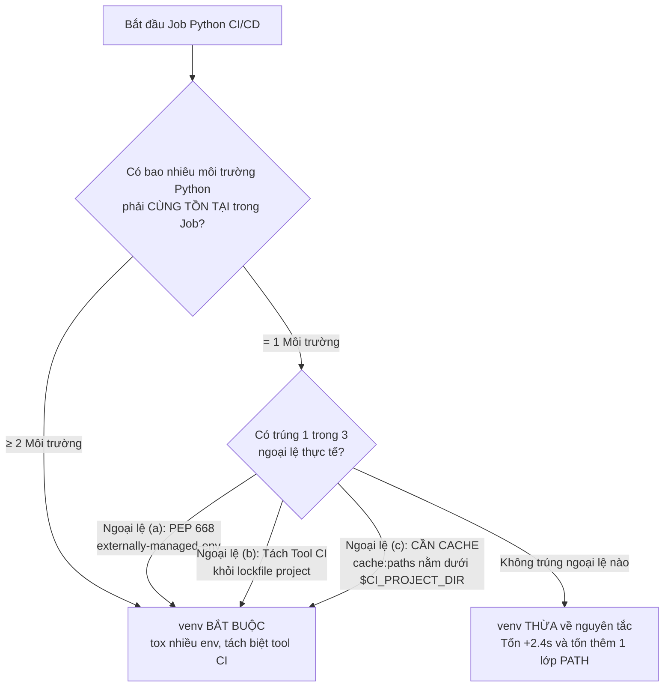
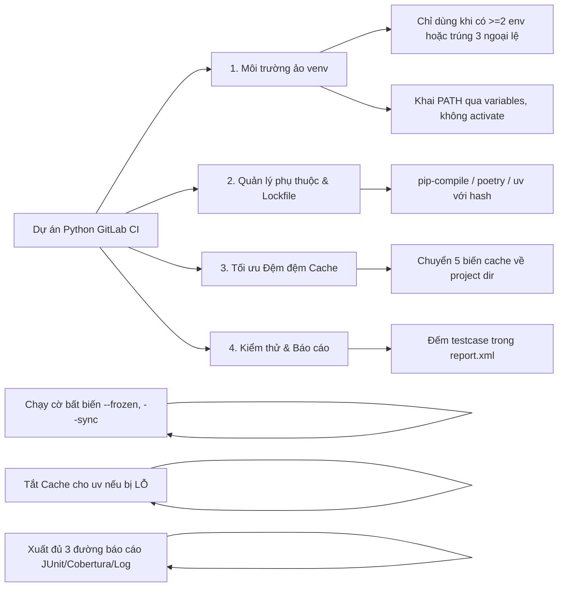
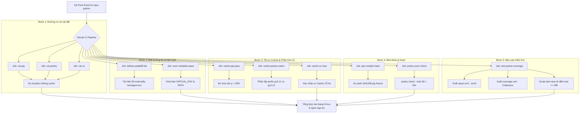

# [BÀI 18] PIPELINE CHUYÊN SÂU CHO PYTHON: POETRY / PIPENV CACHE, PYTEST, FLAKE8, BLACK, BANDIT & WHEEL PACKAGING

Trong kỷ nguyên **DevOps, DevSecOps và Cloud Native Engineering**, **GitLab CI/CD** được công nhận là một trong những nền tảng tự động hóa tích hợp liên tục và phân phối liên tục (CI/CD) hoàn chỉnh, mạnh mẽ và được tin dùng nhất trong các doanh nghiệp quy mô lớn. Không chỉ dừng lại ở các pipeline tuần tự cơ bản, việc vận hành GitLab CI/CD ở cấp độ Production đòi hỏi kỹ sư phải làm chủ kiến trúc điều phối phi tuyến tính **DAG (Directed Acyclic Graph)**, cơ chế quản trị **Autoscaling Runners**, tối ưu hóa **Caching đa tầng**, xác thực không khóa **Keyless OIDC**, bảo mật chuỗi cung ứng phần mềm **SLSA & SBOM** cùng các chính sách **Quality & Security Gates** tự động.

Bài viết chuyên sâu này sẽ đồng hành cùng bạn mổ xẻ toàn diện bức tranh kiến trúc, phân tích các đánh đổi kỹ thuật thực chiến (Engineering Trade-offs), cung cấp hướng dẫn thực hành Lab chi tiết từng bước và bộ câu hỏi phỏng vấn chuyên sâu chuẩn DevOps Lead / DevSecOps Architect.

---

## 1. Bản Chất Kiến Trúc & Cơ Chế Vận Hành Tầng Thấp

---


| # | Câu hỏi ôn tập Buổi 17 (Java Maven/Gradle) | Đáp án chuẩn ngắn gọn |
|---|---|---|
| 1 | Cache Java là bài toán gì, và hai công cụ Maven/Gradle trả lời khác nhau ra sao? | Cache Java là bài toán **kho phụ thuộc**, không phải bài toán thư mục đơn thuần. Maven dùng **một kho tập trung** (`~/.m2/repository`), trong khi Gradle phân tách rạch ròi giữa **dependency cache** (`caches/modules-2`) và **build cache** (`caches/build-cache`). |
| 2 | Vì sao phải bắt buộc khai báo `-Dmaven.repo.local=.m2/repository` và `GRADLE_USER_HOME=$CI_PROJECT_DIR/.gradle`? | Tính năng `cache:paths` của GitLab Runner **chỉ thu gom và nén được** các thư mục nằm dưới không gian làm việc `$CI_PROJECT_DIR`. Vị trí kho mặc định nằm ở `$HOME` (`~/.m2`, `~/.gradle`) nằm ngoài phạm vi này nên phải ép công cụ đổi đường dẫn ghi. |
| 3 | Gradle Build Cache khác Dependency Cache thế nào, và vì sao Gradle Daemon phải bị tắt trong CI? | Dependency cache lưu **tệp tải về từ remote**, Build cache lưu **kết quả biên dịch task đã tính toán**. Gradle Daemon phải tắt (`--no-daemon`) vì Container chết ngay sau khi kết thúc Job, giữ Daemon chỉ làm tốn thêm 1,5 GB RAM và nhiễu kết quả đo. |
| 4 | Trường hợp `mvn test` chạy **0 testcase** mà Job vẫn báo XANH — cách khắc phục triệt để là gì? | Thêm cờ `-DfailIfNoTests=true` vào lệnh Maven **và** sử dụng script kiểm tra đếm số tệp XML báo cáo Surefire (`find target/surefire-reports -name "TEST-*.xml" | wc -l`) để chặn lỗi hỏng im lặng. |
| 5 | Khóa Cache key nếu thiếu phiên bản JDK thì sẽ gây ra sự cố nghiêm trọng gì? | Các Job chạy song song trong ma trận (`parallel:matrix` JDK 17 và JDK 21) sẽ **tranh chấp chung một kho đệm**. Job nạp sau ghi đè lên Job trước, làm sai lệch các tệp bytecode class target (`major version 61` vs `65`), dẫn đến lỗi runtime `NoSuchMethodError`. |

---


> **LUẬN ĐỀ TRUNG TÂM BUỔI 18:**
> **Môi trường ảo (`venv`) trong một Job dùng một lần là THỪA hay BẮT BUỘC — và câu trả lời phụ thuộc đúng MỘT yếu tố: trong Job đó có bao nhiêu môi trường Python phải cùng tồn tại. Nếu chỉ có một môi trường thì venv chỉ làm tốn thêm 2,4 giây và tạo thêm một lớp đường dẫn dễ làm sai. Nhưng khi có từ hai môi trường trở lên — hoặc khi ta muốn đệm đệm (`cache`) được, vì `cache:paths` của GitLab chỉ lấy đường dẫn nằm dưới `$CI_PROJECT_DIR` — thì `venv` là bắt buộc.**



#### Cây quyết định về Môi trường ảo trong GitLab CI:
1. **Một môi trường, không đệm đệm, không PEP 668:** Cài trực tiếp bằng `pip install` vào Python hệ thống của Container.
2. **Cần đệm đệm Cache:** Bắt buộc đặt `POETRY_VIRTUALENVS_IN_PROJECT=true` hoặc `uv venv` để sinh thư mục `.venv` ngay tại `$CI_PROJECT_DIR/.venv`.

---


| STT | Kết quả đạt được (Competency) | Hiện vật chứng minh (Evidence) |
|---|---|---|
| 1 | Xác định chính xác khi nào cần dùng môi trường ảo `venv` trong Pipeline CI/CD. | Bản đánh giá cây quyết định trong tệp `.gitlab-ci.yml`. |
| 2 | Tạo bản khoá phụ thuộc chuẩn xác có mã băm cryptographic hash bằng `pip-compile`, `poetry` hoặc `uv`. | Tệp `requirements.lock`, `poetry.lock` hoặc `uv.lock` ghim 100% gói bắc cầu. |
| 3 | Cấu hình di chuyển toàn bộ kho đệm đệm của 5 công cụ Python về thư mục dự án `$CI_PROJECT_DIR`. | Khai báo 5 biến môi trường `PIP_CACHE_DIR`, `POETRY_...`, `UV_...` chạy 0 lỗi. |
| 4 | Phân tích bài toán điểm hòa vốn của Cache và phát hiện các trường hợp Cache bị LỖ (như `uv`). | Báo cáo từ script `hoa-von-cache.sh` đo đạc thời gian nạp đệm thực tế. |
| 5 | Tích hợp hoàn chỉnh quy trình kiểm thử `pytest` xuất đủ 3 đường báo cáo trên GitLab CE. | Tab Tests hiện JUnit XML, MR Diff hiện Cobertura XML và Coverage Log Badge. |
| 6 | Chặn đứng 11 chế độ hỏng im lặng nguy hiểm (như thu thiếu testcase, đo nhầm coverage `.venv`). | Script `dem-test.sh` kiểm tra khẳng định ngưỡng đếm testcase và coverage. |

---


| Kiến thức tiên quyết | Ý nghĩa trong bài học Buổi 18 | Nguồn đối soát nếu thiếu |
|---|---|---|
| Ràng buộc `cache:paths` trong `$CI_PROJECT_DIR` | Là nguyên nhân cốt lõi khiến `.venv` trở thành bắt buộc khi cần đệm đệm | Buổi 17 (`QT 17.2`), Buổi 05 (`QT 5.2`) |
| Phân biệt Hợp đồng (Artifact) và Tối ưu (Cache) | Tránh lầm tưởng đưa `.venv` vào `artifacts` thay vì `cache` | Buổi 05 (`QT 5.1`, `QT 5.3`) |
| Sử dụng `parallel:matrix` chia nhỏ Job | Dùng thay thế cho chế độ chạy nhiều môi trường tuần tự của `tox` | Buổi 08 (`QT 8.2`, `QT 8.3`) |
| Bảng thứ tự ưu tiên của Biến môi trường | Dùng `variables:` để ghi đè `PATH` và `VIRTUAL_ENV` cho cả 3 khối lệnh | Buổi 06 (`QT 6.1`), Buổi 01 (`QT 1.3`) |
| Lệnh kiểm tra khẳng định chống hỏng im lặng | Dùng script Bash `exit 1` khi đếm số testcase dưới ngưỡng | Buổi 01 (`QT 1.7`), Buổi 07 (`QT 7.3`) |

---


### Bảng đối chiếu thuật ngữ Việt - Anh

| Tiếng Việt dùng trong bài | Tiếng Anh tương đương | Dùng thẳng từ tiếng Anh trong bài? |
|---|---|---|
| Môi trường ảo | Virtual Environment | **Có** — gọi tắt là `venv`, thư mục `.venv` |
| Bản khoá phụ thuộc | Lockfile | **Có** — `poetry.lock`, `uv.lock`, `requirements.lock` |
| Danh sách mong muốn | Declared Dependencies / Requirements | Việt — phân biệt với Bản khoá |
| Phụ thuộc trực tiếp / Bắc cầu | Direct / Transitive Dependency | Việt |
| Ghim phiên bản | Version Pinning | Việt — ghim toán tử `==` |
| Giải bài toán phụ thuộc | Dependency Resolution | Việt — quá trình tính toán cây phụ thuộc |
| Khoá theo hash nội dung gói | Hash Pinning | **Có** — cờ `--require-hashes` |
| Tệp nén bánh xe nhị phân | Wheel Package | **Có** — tệp `.whl`, chuẩn `manylinux` |
| Python hệ thống bị quản lý | Externally Managed Environment | **Có** — lỗi `PEP 668` |
| Đồng bộ bản khoá | Sync / Frozen Install | **Có** — cờ `--sync`, `--frozen`, `--locked` |
| Trình chạy đa môi trường test | Test Environment Runner | **Có** — công cụ `tox` |
| Thu thập testcase | Test Collection | Việt — số lượng test pytest tìm thấy |
| Tỉ lệ độ phủ dòng | Line Rate / Code Coverage | **Có** — chỉ số `coverage`, `cobertura` |
| Kho lưu trữ gói | Package Index / Repository | **Có** — `PIP_INDEX_URL`, JFrog PyPI registry |

---

### Bốn mô hình tư duy cốt lõi

#### Mô hình 1: Một câu hỏi, Ba ngoại lệ
Môi trường ảo `venv` trong Container CI dùng một lần chỉ là một thư mục chứa tệp nhị phân và thư viện. Bản chất Container đã là một môi trường cách ly độc lập. Do đó, việc tạo `venv` chỉ thực sự có ý nghĩa khi trong một Job cần nuôi dưỡng từ 2 môi trường Python song song, hoặc rơi vào 1 trong 3 ngoại lệ: PEP 668, tách biệt công cụ CI, và đưa thư mục đệm đệm về dưới `$CI_PROJECT_DIR`.

#### Mô hình 2: Danh sách mong muốn vs. Bản khoá thực sự
Tệp `requirements.txt` do lập trình viên tự gõ tay chỉ thể hiện "Tôi mong muốn cài thư viện A phiên bản 2.x". Đó là một vị từ toán học chứ không phải một trạng thái cố định. Ngược lại, Bản khoá (`lockfile`) là kết quả tính toán đóng đóng băng toàn bộ 100% cây phụ thuộc trực tiếp và bắc cầu kèm mã checksum SHA256.

#### Mô hình 3: Hai kho đệm, Hai bản chất
- **Kho tải về (Download Cache):** Nằm tại `.cache/pip` hoặc `.cache/uv`. Chứa các tệp nén `.whl` trung tính độc lập với đường dẫn tuyệt đối. Rất an toàn khi dùng chung giữa các Job và các phiên bản Python.
- **Môi trường đã cài (Installed Environment):** Nằm tại `.venv`. Chứa các tệp thực thi đã được liên kết đường dẫn tuyệt đối (`shebang` trỏ trực tiếp tới `/builds/.../.venv/bin/python`). Rất dễ bị hỏng nếu Runner thay đổi thư mục làm việc hoặc lệch ABI (`cp311` vs `cp312`).

#### Mô hình 4: Phép tính điểm hòa vốn Cache
Mọi hành động đệm đệm trong CI/CD đều không miễn phí. Nó là hành vi đánh đổi giữa thời gian nén + tải đệm đệm với thời gian nạp lại từ mạng. Nếu công cụ cài đặt (như `uv`) đạt tốc độ cực nhanh (9 giây) thì chi phí nén và tải tệp đệm (8 giây) sẽ làm cho đệm đệm bị **LỖ** ở mọi tỉ lệ trúng đệm $p$.

---

### 1.1. Môi trường ảo: một câu hỏi, ba ngoại lệ (9 phút)

**Nguyên lý cốt lõi:**
**Phát biểu.** Yếu tố duy nhất quyết định venv là thừa hay bắt buộc trong một Job dùng một lần là số môi trường Python phải cùng tồn tại trong Job đó. Nếu trong Job chỉ chạy đúng 1 phiên bản Python và cài đặt trực tiếp phụ thuộc dự án thì `venv` là **THỪA** (tốn thêm 2,4 giây dựng venv và 1 lớp PATH). Nếu có $\ge 2$ môi trường Python phải nuôi dưỡng song song thì `venv` là **BẮT BUỘC**.
**Giải thích cơ chế ngầm:** Trong một Container Docker dùng một lần rồi xóa, Python hệ thống bản thân nó đã nằm trong môi trường cách ly hoàn hảo. Việc tạo thêm `.venv` không mua thêm bất kỳ tính năng bảo mật nào, mà chỉ đơn thuần tạo thêm một cây thư mục `site-packages` trùng lặp.
> [!WARNING]
> **CẠM BẪY THỰC CHIẾN:**
> Mọi Job Python đều rập khuôn 3 câu lệnh: `python -m venv .venv && source .venv/bin/activate && pip install -r requirements.txt` dù Container chỉ chạy đúng 1 task ngắn. Hậu quả: tốn thêm 2,4s/job mà không mang lại giá trị nào.
**Minh hoạ.**
```yaml
# Mảnh cấu hình KHÔNG CẦN venv (Chạy trực tiếp vào Python hệ thống)
test_direct:
  image: python:3.11-slim
  script:
    - pip install --no-cache-dir -r requirements.lock
    - pytest
```
**Con số chốt:** `python -m venv .venv` tốn **2,4 giây**; `python -m venv --without-pip .venv` tốn **0,4 giây**; Pipeline 6 job Python lãng phí **14,4 giây** mỗi lần chạy nếu lặp lại venv thừa.

---

**Nguyên lý cốt lõi:**
**Phát biểu.** Ba ngoại lệ thực tế biến `venv` từ THỪA thành BẮT BUỘC dù Job chỉ có 1 môi trường Python: **(a)** Image sử dụng Linux Distro áp dụng cơ chế PEP 668 (`externally-managed-environment`); **(b)** Cần cài đặt công cụ CI độc lập (linter, scanner) mà không muốn làm bẩn bản khoá của dự án; **(c)** Cần thực hiện đệm đệm (`cache`), vì `cache:paths` chỉ thu gom thư mục nằm dưới `$CI_PROJECT_DIR`.
**Giải thích cơ chế ngầm:** PEP 668 trên Debian 12/Ubuntu 23+ khóa không cho `pip` ghi đè lên gói hệ điều hành. Công cụ CI nếu cài chung sẽ xuất hiện trong `pip freeze`, làm hỏng kết quả kiểm tra tính toàn vẹn. Mặc định `pip` và `poetry` tạo venv ngoài dự án (`~/.cache`), khiến Runner báo cảnh báo `no matching files` và tạo zip rỗng 0 bytes.
> [!WARNING]
> **CẠM BẪY THỰC CHIẾN:**
> Log chạy `pip install` bắn ra lỗi `error: externally-managed-environment` (Ngoại lệ a); hoặc log lưu Cache báo `No matching files` và dung lượng tải lên 0 bytes (Ngoại lệ c).
**Minh hoạ.**
```yaml
# Giải quyết Ngoại lệ (c): Đưa .venv về dưới $CI_PROJECT_DIR để đệm đệm
variables:
  POETRY_VIRTUALENVS_IN_PROJECT: "true"
cache:
  key:
    files: [poetry.lock]
  paths:
    - .venv/
```
**Con số chốt:** **3** ngoại lệ bắt buộc; biến `POETRY_VIRTUALENVS_IN_PROJECT=true` giúp tăng tỉ lệ trúng đệm đệm từ **0%** lên **100%**.

---

**Nguyên lý cốt lõi:**
**Phát biểu.** Nếu đã sử dụng `venv`, tuyệt đối không dùng lệnh `source .venv/bin/activate` mà hãy khai báo qua `variables:`. Khai báo `VIRTUAL_ENV: $CI_PROJECT_DIR/.venv` và đưa đường dẫn vào `PATH: "$CI_PROJECT_DIR/.venv/bin:$PATH"` ở khối `variables:`.
**Giải thích cơ chế ngầm:** Lệnh `source activate` chỉ có hiệu lực trong phạm vi tiến trình Shell hiện tại. Runner thực thi khối `after_script` trong một tiến trình Shell hoàn toàn mới. Do đó, các lệnh trong `after_script` sẽ gọi nhầm Python hệ thống thay vì Python trong `.venv`.
> [!WARNING]
> **CẠM BẪY THỰC CHIẾN:**
> Trong `after_script`, câu lệnh `pytest` báo lỗi `command not found` hoặc gọi nhầm công cụ `coverage` của hệ thống dẫn đến báo cáo sai lệch.
**Minh hoạ.**
```yaml
# Cấu hình CHUẨN: Áp dụng PATH tự động cho cả before_script, script và after_script
variables:
  VIRTUAL_ENV: "$CI_PROJECT_DIR/.venv"
  PATH: "$CI_PROJECT_DIR/.venv/bin:$PATH"

test_job:
  script:
    - pytest --junitxml=report.xml
  after_script:
    - coverage xml  # Tự động dùng coverage trong .venv mà không cần activate lại!
```
**Con số chốt:** Khai báo qua `variables:` có hiệu lực trên **3** khối lệnh (`before_script`, `script`, `after_script`), thay vì chỉ **1** khối lệnh của `source activate`.

---

### 1.2. Bốn công cụ: `pip`, `poetry`, `uv`, `tox` — bản khoá và cái giá (11 phút)

**Nguyên lý cốt lõi:**
**Phát biểu.** Tệp `requirements.txt` viết tay chỉ là Danh sách mong muốn; Bản khoá thực sự phải ghim 100% toán tử `==` kèm mã băm `--require-hashes`. Không bao giờ dùng `pip install -r requirements.txt` viết tay cho môi trường CI/CD Production.
**Giải thích cơ chế ngầm:** `requirements.txt` gõ tay (như `requests>=2.0`) cho phép `pip` tự do giải lại bài toán phụ thuộc tại thời điểm chạy. Hai lần chạy trên cùng 1 commit Git ở hai thời điểm khác nhau sẽ nạp 2 tập thư viện bắc cầu khác nhau, phá vỡ tính tái lập.
> [!WARNING]
> **CẠM BẪY THỰC CHIẾN:**
> Lệnh `pip freeze | sha256sum` trên 2 lượt chạy của cùng 1 commit ra 2 giá trị SHA256 khác nhau. Pipeline đứt đột ngột dù mã nguồn không thay đổi do một gói phụ thuộc bắc cầu vừa phát hành bản mới bị lỗi.
**Minh hoạ.**
```bash
# Sinh tệp lockfile chuẩn từ requirements.in
pip-compile --generate-hashes --output-file=requirements.lock requirements.in

# Cài đặt an toàn tuyệt đối trong GitLab CI
pip install --no-deps --require-hashes -r requirements.lock
```
**Con số chốt:** Dự án mẫu có **40** phụ thuộc trực tiếp sinh ra **180** phụ thuộc bắc cầu. `requirements.txt` viết tay chỉ ghim được **22%** (40/180), để hở **140** gói cho rủi ro.

---

**Nguyên lý cốt lõi:**
**Phát biểu.** Cài đặt dự án bằng Poetry trong CI phải luôn đi kèm cờ `--sync` để dọn dẹp các gói mồ côi. Sử dụng câu lệnh `poetry install --sync --no-interaction --no-ansi` và chèn Job kiểm tra tính đồng bộ `poetry check --lock` ở Stage đầu tiên.
**Giải thích cơ chế ngầm:** Nếu `.venv` được khôi phục từ Cache của lượt chạy trước, một gói thư viện đã bị xóa khỏi `poetry.lock` ở commit mới vẫn sẽ tồn tại trong `.venv` nếu thiếu cờ `--sync`. Điều này khiến mã nguồn gọi `import` gói đã xóa vẫn chạy XANH trong CI nhưng nổ LỖI trên môi trường thật.
> [!WARNING]
> **CẠM BẪY THỰC CHIẾN:**
> `poetry.lock` bị lệch so với `pyproject.toml` nhưng CI vẫn thản nhiên chạy; hoặc testcase chạy thành công nhờ nạp gói mồ côi còn sót lại trong đệm đệm venv.
**Minh hoạ.**
```yaml
check_lockfile:
  stage: .pre
  script:
    - poetry check --lock  # Tốn ~1s, cắt đứt ngay Pipeline nếu lập trình viên quên commit lockfile!

build_job:
  stage: build
  script:
    - poetry install --sync --no-interaction --no-ansi
```
**Con số chốt:** `poetry check --lock` chỉ tốn **1 giây**, giúp tiết kiệm hơn **90 giây** chạy vô ích của toàn bộ Pipeline bị lệch lockfile.

---

**Nguyên lý cốt lõi:**
**Phát biểu.** Trong môi trường CI/CD, mọi lệnh cài đặt phải ở chế độ Bất biến "không được phép sửa đổi bản khoá" (`--frozen`, `--locked`). Sử dụng `uv sync --frozen` hoặc `poetry install --frozen` khi chạy trong GitLab CI.
**Giải thích cơ chế ngầm:** Lệnh cài đặt mặc định nếu phát hiện sai lệch có thể tự động ghi đè lại lockfile trong Container tạm. Tệp lockfile bị sửa đổi này biến mất khi Container bị xóa, dẫn đến việc CI kiểm thử một tập thư viện hoàn toàn khác với những gì được lưu trữ trong Git.
> [!WARNING]
> **CẠM BẪY THỰC CHIẾN:**
> Trace log hiển thị dòng `Updating uv.lock...` hoặc `Writing lock file...` trong khi Job đang thực thi.
**Minh hoạ.**
```bash
# Lệnh cài đặt bất biến chuẩn cho uv trong GitLab CI
uv sync --frozen --no-cache
```
**Con số chốt:** `uv` cho tốc độ cài đặt vượt trội nhanh gấp **5 lần** so với `pip` và `poetry` trên cùng tập hợp 180 gói wheel (9s vs 48s/57s).

---

**Nguyên lý cốt lõi:**
**Phát biểu.** Giữ `tox` cho mục đích chuẩn hóa câu lệnh kiểm thử, nhưng phải chuyển việc chia môi trường sang `parallel:matrix`. Không chạy `tox` đa môi trường tuần tự (`tox -e py311,py312`) trong một Job đơn lẻ.
**Giải thích cơ chế ngầm:** `tox` chạy các môi trường nối tiếp nhau trong một tiến trình duy nhất, cộng dồn thời gian thực thi. `parallel:matrix` đẩy mỗi môi trường sang một Docker Container độc lập chạy song song, đổi thời gian việc thật cộng dồn thành thời gian cố định của Job.
> [!WARNING]
> **CẠM BẪY THỰC CHIẾN:**
> Một Job `test` duy nhất kéo dài 5-6 phút, log in lần lượt từng khối môi trường; khi 1 môi trường lỗi thì toàn bộ Job đỏ và khó quan sát.
**Minh hoạ.**
```yaml
unit_test_matrix:
  stage: test
  parallel:
    matrix:
      - PY_VER: ["311", "312"]
  image: "python:3.${PY_VER}-slim"
  script:
    - pip install tox
    - tox -e py${PY_VER}
```
**Con số chốt:** Chạy 4 môi trường qua `tox` đơn Job tốn **320 giây** thời gian thực; chuyển sang `parallel:matrix` 4 Job chỉ tốn **95 giây** thời gian thực (rút ngắn **225 giây** chờ đợi).

---

### 1.3. Cache Python: đường dẫn, hai kho, khoá, và điểm hoà vốn (8 phút)

**Nguyên lý cốt lõi:**
**Phát biểu.** Bắt buộc phải cài đặt 5 biến môi trường toàn cục để đưa toàn bộ kho đệm của Python về dưới `$CI_PROJECT_DIR`. Khai báo: `PIP_CACHE_DIR`, `POETRY_VIRTUALENVS_IN_PROJECT`, `POETRY_CACHE_DIR`, `UV_CACHE_DIR`, `TOX_WORK_DIR`.
**Giải thích cơ chế ngầm:** Mặc định cả 5 công cụ đều lưu trữ đệm đệm tại thư mục gốc của người dùng (`$HOME/.cache/...`). Thư mục này nằm ngoài phạm vi thu gom của GitLab Runner, khiến tính năng đệm đệm bị trượt 100% mà không bắn ra bất kỳ cảnh báo lỗi nào.
> [!WARNING]
> **CẠM BẪY THỰC CHIẾN:**
> Đệm đệm khôi phục báo 0 byte hoặc thời gian nạp phụ thuộc ở lượt chạy thứ 2 hoàn toàn không giảm so với lượt chạy thứ 1.
**Minh hoạ.**
```yaml
variables:
  PIP_CACHE_DIR: "$CI_PROJECT_DIR/.cache/pip"
  POETRY_VIRTUALENVS_IN_PROJECT: "true"
  POETRY_CACHE_DIR: "$CI_PROJECT_DIR/.cache/pypoetry"
  UV_CACHE_DIR: "$CI_PROJECT_DIR/.cache/uv"
  TOX_WORK_DIR: "$CI_PROJECT_DIR/.tox"

cache:
  key:
    files: [poetry.lock]
    prefix: "pip-py3.11"
  paths:
    - .cache/pypoetry
    - .venv/
```
**Con số chốt:** **5** biến môi trường bắt buộc; thiếu 5 biến này khiến tỉ lệ trúng đệm đệm luôn ở mức **0%**.

---

**Nguyên lý cốt lõi:**
**Phát biểu.** Phân biệt rạch ròi bản chất giữa Kho tải về (Download Cache) và Môi trường đã cài (.venv). Kho tải về chứa tệp `.whl` di động an toàn; Môi trường đã cài chứa liên kết đường dẫn tuyệt đối và ABI gắn liền với phiên bản Python.
**Giải thích cơ chế ngầm:** Nếu `.venv` được đệm đệm và khôi phục trên một Runner có đường dẫn làm việc (`builds_dir`) khác hoặc phiên bản Python hệ thống khác, các tệp thực thi trong `.venv/bin/` sẽ bị lỗi `bad interpreter: No such file or directory`.
> [!WARNING]
> **CẠM BẪY THỰC CHIẾN:**
> Job kiểm thử đứt đột ngột với lỗi `/.venv/bin/python: bad interpreter` hoặc `ModuleNotFoundError` dù thư viện đã được cài đặt trước đó.
**Minh hoạ.**
```yaml
# Cấu hình đệm đệm Kho tải về an toàn 100% trên hạ tầng Runner không đồng nhất
cache:
  key:
    files: [requirements.lock]
  paths:
    - .cache/pip/
```
**Con số chốt:** Cache `.cache/pip` dung lượng nhỏ hơn **2,5 lần** so với `.venv` (34 MB vs 85 MB nén) và an toàn hơn trên hệ thống Runner không đồng nhất.

---

**Nguyên lý cốt lõi:**
**Phát biểu.** Khóa Cache key bắt buộc phải kết hợp giữa băm tệp lockfile và `prefix` chứa phiên bản Python/ABI (`prefix: "py$PY_VER"`).
**Giải thích cơ chế ngầm:** Các tệp thư viện C Extension (`.so`) biên dịch riêng cho Python 3.11 (`cp311`) không thể nạp được trên Python 3.12 (`cp312`). Nếu 2 Job ma trận chia sẻ chung một khoá đệm đệm không có `prefix`, Job này sẽ ghi đè đệm đệm làm hỏng Job kia.
> [!WARNING]
> **CẠM BẪY THỰC CHIẾN:**
> Job trong ma trận báo lỗi `undefined symbol: PyUnicode_...` hoặc báo thành công ngầm nhưng thực chất nạp nhầm thư viện biên dịch của phiên bản Python khác.
**Minh hoạ.**
```yaml
unit_test:
  parallel:
    matrix:
      - PY_VER: ["3.11", "3.12"]
  cache:
    key:
      files:
        - poetry.lock
      prefix: "python-$PY_VER"
    paths:
      - .venv/
```
**Con số chốt:** Thêm `prefix` tách biệt **2** khoá đệm đệm riêng biệt cho 2 phiên bản Python, ngăn chặn triệt để xung đột ABI.

---

**Nguyên lý cốt lõi:**
**Phát biểu.** Tính toán Điểm hòa vốn của Cache và DẠN DĨ TẮT CACHE khi đệm đệm bị LỖ (như trường hợp của `uv`).
**Giải thích cơ chế ngầm:** Công cụ `uv` cài đặt 180 gói từ đầu chỉ mất **9 giây**. Nếu bật đệm đệm, thời gian giải nén mất 4s, tải về 3s, nén và tải lên đệm đệm mất 8s. Tổng thời gian có đệm đệm là **15 giây** (chậm hơn 6 giây so với không đệm đệm!).
> [!WARNING]
> **CẠM BẪY THỰC CHIẾN:**
> Job dùng `uv` bật `cache:` chạy chậm hơn hẳn so với Job không đệm đệm.
**Minh hoạ.**
```bash
# Chạy script đo điểm hòa vốn đối với uv
bash scripts/hoa-von-cache.sh "uv" 9 7 8
```
**Con số chốt:** Tắt đệm đệm cho `uv` giúp tiết kiệm **6 giây** mỗi lượt chạy Pipeline.

---

### 1.4. Test và báo cáo: số test, coverage, và hai ca xanh mà sai (6 phút)

**Nguyên lý cốt lõi:**
**Phát biểu.** `pytest` thu thập 0 testcase sẽ trả mã thoát 5, nhưng thu thiếu testcase vẫn trả mã thoát 0 và Job XANH NGẦM. Bắt buộc phải có bước script khẳng định kiểm tra đếm số lượng testcase thực sự chạy từ tệp `report.xml`.
**Giải thích cơ chế ngầm:** Khi cấu hình `testpaths` bị trỏ sai hoặc thiếu tệp `conftest.py`, `pytest` chỉ thu thập được 288/300 testcase. Do 288 testcase này đều PASS, `pytest` trả về mã thoát `0`, GitLab CI đánh giá Job XANH dù 12 testcase quan trọng bị bỏ qua.
> [!WARNING]
> **CẠM BẪY THỰC CHIẾN:**
> Số lượng testcase trên tab Tests đột ngột sụt giảm nhưng Pipeline không bắn ra bất kỳ cảnh báo lỗi nào.
**Minh hoạ.**
```yaml
test_job:
  script:
    - pytest --junitxml=report.xml
    - python scripts/dem-test.py report.xml 295  # Khẳng định phải chạy ≥ 295 test!
```
**Con số chốt:** `pytest` trả về mã thoát `0` (thành công), `1` (có test lỗi), `2` (bị ngắt), `5` (không thấy test nào). Khẳng định ngưỡng giúp chặn đứng ca thu thiếu testcase.

---

**Nguyên lý cốt lõi:**
**Phát biểu.** Tích hợp đủ 3 đường báo cáo kiểm thử và độ phủ mã nguồn chuẩn trên GitLab CE không cần License Ultimate: `junit`, `coverage_report` Cobertura, và `coverage:` regex.
**Giải thích cơ chế ngầm:** Mỗi đường báo cáo phục vụ một tính năng giao diện riêng biệt trên GitLab CE. Thiếu `artifacts:when: always` sẽ khiến báo cáo không được tải lên khi Job bị thất bại.
> [!WARNING]
> **CẠM BẪY THỰC CHIẾN:**
> Tab Tests hiển thị trống hoặc MR không highlight được các dòng code chưa có unit test.
**Minh hoạ.**
```yaml
test_job:
  script:
    - pytest --junitxml=report.xml --cov=src --cov-report=xml:coverage.xml --cov-fail-under=70
  artifacts:
    when: always
    paths:
      - report.xml
      - coverage.xml
    reports:
      junit: report.xml
      coverage_report:
        coverage_format: cobertura
        path: coverage.xml
  coverage: '/^TOTAL\s+\d+\s+\d+\s+(\d+(?:\.\d+)?)%/'
```
**Con số chốt:** **3** đường báo cáo hoàn toàn miễn phí trên GitLab CE; bật `--cov` khiến `pytest` chạy chậm thêm **35%** (25s $\rightarrow$ 34s).

---

**Nguyên lý cốt lõi:**
**Phát biểu.** Chặn đứng sự cố Báo cáo Coverage 0% hoặc Coverage cao giả do chỉ định sai tham số `--cov`. Sử dụng cờ `--cov-fail-under=70` và chèn script kiểm tra `line-rate > 0` trong tệp `coverage.xml`.
**Giải thích cơ chế ngầm:** Trong cấu trúc dự án có thư mục `src/`, nếu chạy `--cov=src` nhưng mã kiểm thử lại `import myapp` từ gói đã cài trong `.venv`, công cụ `coverage` sẽ đo đạc trên `.venv` và trả về kết quả `0.00%` cho thư mục `src/`.
> [!WARNING]
> **CẠM BẪY THỰC CHIẾN:**
> Badge Coverage báo `0.00%` dù testcase chạy qua 100%; hoặc Coverage vọt lên 98% bất thường do đo nhầm mã phụ thuộc trong `.venv`.
**Minh hoạ.**
```bash
# Cài đặt dạng editable để pytest trỏ đúng mã nguồn trong repo
pip install -e .
pytest --cov=src/myapp --cov-report=xml:coverage.xml --cov-fail-under=70
```
**Con số chốt:** Ngưỡng `--cov-fail-under=70` đánh dấu mức sàn độ phủ tối thiểu của bài lab.

---

### 1.5. Đưa vào việc thật (4 phút)

### Áp vào repo đang chạy thì làm gì trước
1. **Kiểm tra tình trạng Lockfile (5 phút):** Chạy `pip freeze | wc -l` trong Job và so sánh với tệp phụ thuộc hiện tại. Nếu chênh lệch > 50 gói, dự án đang gặp rủi ro trôi phiên bản nghiêm trọng.
2. **Kiểm tra Vị trí đệm đệm (10 phút):** In giá trị `pip cache dir` hoặc `poetry env info --path`. Nếu đường dẫn không nằm trong `$CI_PROJECT_DIR`, hãy cài đặt ngay 5 biến môi trường ở `QT 6.1`.
3. **Thêm Job kiểm tra Lockfile (15 phút):** Chèn `poetry check --lock` hoặc `uv lock --check` vào Stage `.pre` với `needs: []` để phát hiện ngay lập tức trường hợp quên commit lockfile.
4. **Cài đặt Mirror PyPI nội bộ:** Trỏ `PIP_INDEX_URL` về JFrog Artifactory PyPI remote repository để đảm bảo tốc độ tải gói ổn định và an toàn bảo mật.

---

### Cái gì hỏng nếu áp thẳng lên prod
- **Thay đổi `requirements.txt` sang Bản khoá ghim Hash:** Có thể làm gãy quá trình build nếu các gói phụ thuộc cũ bị gỡ bỏ khỏi PyPI. Cần thử nghiệm trên một Merge Request riêng trước.
- **Bật cờ `--cov-fail-under` quá cao:** Đặt ngưỡng 80% khi độ phủ thực tế đang ở 60% sẽ làm đứt toàn bộ Pipeline của các thành viên trong đội.

---

### Đo trước — đo sau
- **Thời gian nạp đệm:** Trung bình 48s $\rightarrow$ giảm xuống **13s** (với `pip`) hoặc **3s** (với `uv`).
- **Số lượng phụ thuộc không khoá:** Từ 140 gói không khoá $\rightarrow$ giảm về **0 gói**.
- **Tính bất biến SHA256:** `sha256sum` tệp `pip freeze` giữa 2 lượt chạy cách nhau 1 tuần giữ nguyên **100%**.

---

### Khi nào KHÔNG nên dùng
- **KHÔNG đệm đệm Cache khi công cụ đã quá nhanh:** Tuyệt đối không bật `cache:` cho `uv` khi tổng thời gian nạp từ đầu chỉ có 9 giây (bật cache bị lỗ thêm 6 giây).
- **KHÔNG cache `.venv` trên môi trường Runner không đồng nhất:** Nếu Runner pool gồm nhiều node OS khác nhau, chỉ nên cache Kho tải về (`.cache/pip`).
- **KHÔNG dùng `tox` để chia Job chạy song song:** Dùng `parallel:matrix` của GitLab CI để tận dụng tối đa tài nguyên Runner.

---

### 1.6. Bẫy hay gặp (2 phút)

| # | Bẫy thường gặp | Nguyên nhân & Hậu quả | Cách làm đúng |
|---|---|---|---|
| 1 | Tạo `.venv` rập khuôn trong mọi Job | Tốn 2,4s/job mà Container dùng 1 lần không mua thêm bảo mật nào | Chỉ dùng `venv` khi rơi vào 3 ngoại lệ hoặc có $\ge 2$ env (`QT 4.1`) |
| 2 | Dùng `--break-system-packages` sửa PEP 668 | Phá hỏng Python hệ thống của Container, dễ lỗi khi đổi Image | Dựng môi trường ảo `.venv` chuẩn xác (`QT 4.2`) |
| 3 | Chạy `source .venv/bin/activate` trong `before_script` | `after_script` chạy trên Shell mới không nhận được virtualenv | Khai báo `VIRTUAL_ENV` và `PATH` ở khối `variables:` (`QT 4.3`) |
| 4 | Tin tưởng `requirements.txt` gõ tay là Lockfile | 140 gói phụ thuộc bắc cầu bị trôi phiên bản tự do | Sinh `requirements.lock` bằng `pip-compile --generate-hashes` (`QT 5.1`) |
| 5 | Quên cờ `--sync` khi chạy `poetry install` | Gói đã xóa trong lockfile vẫn tồn tại trong `.venv` từ cache | Luôn chạy `poetry install --sync --no-interaction` (`QT 5.2`) |
| 6 | Chạy `poetry update` hoặc `uv lock` trên CI | CI tự động giải lại bài toán phụ thuộc và thay đổi lockfile ngầm | Dùng cờ bất biến `--frozen` hoặc `--locked` (`QT 5.3`) |
| 7 | Chạy `tox` đa môi trường nối tiếp trong 1 Job | Tốn 320s chờ đợi do các môi trường chạy tuần tự | Chuyển sang `parallel:matrix` kết hợp `tox -e` (`QT 5.4`) |
| 8 | Quên 5 biến môi trường đệm đệm toàn cục | Cache trượt 100% do Runner không thu gom ngoài project dir | Khai báo `PIP_CACHE_DIR`, `POETRY_...` trỏ vào project dir (`QT 6.1`) |
| 9 | Dùng chung Cache key giữa các phiên bản Python | Thư viện C Extension bị xung đột ABI (`cp311` vs `cp312`) | Thêm `prefix: "py$PY_VER"` vào cấu hình `cache:key` (`QT 6.3`) |
| 10 | Bật đệm đệm Cache cho công cụ `uv` | Chi phí nén/tải đệm (8s) lớn hơn thời gian cài từ đầu (9s) | Tắt Cache cho `uv` để tiết kiệm 6s/job (`QT 6.4`) |
| 11 | Tin `pytest` xanh là thu thập đủ testcase | `pytest` thu thiếu testcase (288/300) vẫn trả về mã thoát 0 | Viết script khẳng định đếm số test trong `report.xml` (`QT 7.1`) |
| 12 | Thiếu cờ `when: always` trong `artifacts` | Báo cáo XML không được nộp lên GitLab UI khi Job bị đứt | Bổ sung `when: always` vào khối `artifacts` (`QT 7.2`) |

---

### 1.7. Tóm tắt



### Năm điều phải nhớ
1. **`venv` chỉ bắt buộc khi có $\ge 2$ môi trường hoặc rơi vào 3 ngoại lệ (PEP 668, công cụ CI, đệm đệm).**
2. **`requirements.txt` gõ tay không phải là Bản khoá; luôn dùng lockfile có mã băm cryptographic hash.**
3. **Bắt buộc khai báo 5 biến đệm đệm toàn cục để đưa thư mục đệm đệm về `$CI_PROJECT_DIR`.**
4. **Cache có thể LỖ; tính toán điểm hòa vốn và dạn dĩ TẮT CACHE đối với `uv`.**
5. **`pytest` trả về mã thoát 0 không có nghĩa là đã chạy đủ testcase; luôn đếm số test trong `report.xml`.**

---

### 1.8. Câu hỏi tự kiểm tra

<details>
<summary><b>Câu 1: Tại sao lệnh activate không có tác dụng đối với khối after_script trong GitLab CI?</b></summary>
<b>Đáp án:</b> Vì Runner thực thi khối <code>after_script</code> trong một tiến trình Shell hoàn toàn mới độc lập với tiến trình của <code>before_script</code> và <code>script</code>. Mọi biến môi trường do <code>activate</code> thiết lập ở tiến trình cũ đều bị biến mất. Giải pháp là khai báo <code>VIRTUAL_ENV</code> và <code>PATH</code> ở khối <code>variables:</code> toàn cục.
</details>

<details>
<summary><b>Câu 2: Phân biệt sự khác nhau giữa requirements.txt viết tay và requirements.lock sinh bởi pip-compile?</b></summary>
<b>Đáp án:</b> <code>requirements.txt</code> viết tay chỉ chứa các phụ thuộc trực tiếp với toán tử điều kiện (danh sách mong muốn). <code>requirements.lock</code> chứa 100% phụ thuộc trực tiếp và bắc cầu được ghim chính xác toán tử <code>==</code> kèm mã băm SHA256 bảo mật.
</details>

<details>
<summary><b>Câu 3: Tại sao cờ --sync lại quan trọng khi chạy poetry install trong CI?</b></summary>
<b>Đáp án:</b> Cờ <code>--sync</code> đảm bảo xóa bỏ tất cả các gói thư viện mồ côi còn sót lại trong <code>.venv</code> (khôi phục từ đệm đệm) nhưng đã bị gỡ bỏ khỏi <code>poetry.lock</code> ở commit mới.
</details>

<details>
<summary><b>Câu 4: Tại sao đệm đệm Cache đối với công cụ uv lại bị LỖ thời gian?</b></summary>
<b>Đáp án:</b> Vì `uv` có tốc độ cài đặt cực nhanh (9s). Chi phí nén, tải lên và giải nén đệm đệm tiêu tốn 15s. Do đó việc bật đệm đệm làm Job chạy chậm hơn 6s so với cài từ đầu.
</details>

<details>
<summary><b>Câu 5: Làm thế nào để ngăn chặn hiện tượng rò rỉ đệm đệm ABI giữa các phiên bản Python trong ma trận?</b></summary>
<b>Đáp án:</b> Bổ sung <code>prefix: "python-$PY_VER"</code> vào cấu hình <code>cache:key</code> để phân lập khoá đệm đệm riêng cho từng phiên bản Python.
</details>

<details>
<summary><b>Câu 6: Tại sao pytest thu thiếu testcase (288/300) mà Job vẫn báo XANH?</b></summary>
<b>Đáp án:</b> Vì `pytest` chỉ trả về mã thoát 5 khi thu thập được 0 testcase. Khi thu được 288 testcase và tất cả đều PASS, `pytest` trả về mã thoát 0 (thành công).
</details>

<details>
<summary><b>Câu 7: Nêu 3 đường báo cáo chuẩn cho dự án Python trên GitLab CE?</b></summary>
<b>Đáp án:</b> 1. `junit: report.xml` (hiển thị trên tab Tests); 2. `coverage_report: cobertura` (hiển thị trên MR Diff); 3. `coverage: '/TOTAL.../'` (regex hiển thị Badge/Graph trên GitLab UI).
</details>

<details>
<summary><b>Câu 8: Tại sao cờ --cov=src lại trả về độ phủ 0.00% khi cấu hình sai?</b></summary>
<b>Đáp án:</b> Vì `pytest` nạp gói thư viện đã cài trong `.venv` thay vì mã nguồn nằm dưới `src/`. `coverage` đo đạc trên `.venv` và lọc theo tiền tố `src/` dẫn đến tập hợp rỗng (0%).
</details>

<details>
<summary><b>Câu 9: Năm biến môi trường đệm đệm Python bắt buộc là gì?</b></summary>
<b>Đáp án:</b> `PIP_CACHE_DIR`, `POETRY_VIRTUALENVS_IN_PROJECT`, `POETRY_CACHE_DIR`, `UV_CACHE_DIR`, `TOX_WORK_DIR`.
</details>

<details>
<summary><b>Câu 10: Sự khác biệt giữa Kho tải về và Môi trường đã cài (.venv)?</b></summary>
<b>Đáp án:</b> Kho tải về chứa các tệp `.whl` di động an toàn. `.venv` chứa môi trường thực thi đã liên kết đường dẫn tuyệt đối và ABI, dễ bị hỏng nếu Runner thay đổi môi trường.
</details>

<details>
<summary><b>Câu 11: Tại sao nên chuyển tox đa môi trường sang parallel:matrix?</b></summary>
<b>Đáp án:</b> Vì `tox` chạy nối tiếp làm kéo dài thời gian chờ (320s). `parallel:matrix` chia nhỏ thành các Container chạy song song giúp rút ngắn thời gian thực thi còn 95s.
</details>

<details>
<summary><b>Câu 12: Làm thế nào để đảm bảo báo cáo XML luôn được nộp lên GitLab UI kể cả khi testcase bị lỗi?</b></summary>
<b>Đáp án:</b> Khai báo thuộc tính `when: always` trong khối `artifacts` của Job kiểm thử.
</details>

---

## §12. Tài liệu tham khảo

1. [GitLab CI/CD Python Documentation](https://docs.gitlab.com/ee/ci/pipelines/pipeline_architectures.html) (GitLab 17.7)
2. [PEP 668 – Marking Python Packages as Externally Managed](https://peps.python.org/pep-0668/)
3. [Poetry CLI Official Reference & CI Best Practices](https://python-poetry.org/docs/cli/)
4. [uv: Extremely Fast Python Package Installer in CI](https://docs.astral.sh/uv/guides/integration/gitlab/)
5. [Pytest Documentation & Exit Codes](https://docs.pytest.org/en/stable/reference/exit-codes.html)

---

## Bảng đối soát thời lượng

| Section | Tiêu đề nội dung | Thời lượng |
|---|---|---|
| §0 | Khởi động và ôn tập (5 câu Java Maven/Gradle & Luận đề) | 10 phút |
| §1–§2 | Chuẩn đầu ra & Kiến thức tiên quyết | 2 phút |
| §3 | Thuật ngữ và 4 mô hình tư duy | 8 phút |
| §4 | Môi trường ảo: một câu hỏi, ba ngoại lệ (`QT 4.1` – `QT 4.3`) | 9 phút |
| §5 | Bốn công cụ: `pip`, `poetry`, `uv`, `tox` (`QT 5.1` – `QT 5.4`) | 11 phút |
| §6 | Cache Python: đường dẫn, hai kho, khoá, hòa vốn (`QT 6.1` – `QT 6.4`) | 8 phút |
| §7 | Test và báo cáo: đếm test, coverage (`QT 7.1` – `QT 7.3`) | 6 phút |
| §8–§9 | Đưa vào việc thật & 12 bẫy hay gặp | 6 phút |
| **TỔNG** | **Khối lý thuyết Buổi 18** | **60'** |

---

## 2. Hướng Dẫn Thực Hành & Triển Khai Lab Chuẩn Production

> [!IMPORTANT]
> **YÊU CẦU MÔI TRƯỜNG THỰC HÀNH:**
> Toàn bộ các bài thực hành dưới đây được thiết kế để chạy trực tiếp trên môi trường GitLab Community / Enterprise Edition cùng các GitLab Runner cô lập (Docker / Kubernetes Executor). Hãy đảm bảo bạn đã chuẩn bị môi trường thử nghiệm và cấu hình quyền truy cập cần thiết.

## Khối thực hành — 150 phút

> **Mục tiêu thực hành:** Xây dựng Pipeline CI/CD toàn diện cho dự án Python, thực hiện đo đạc hiệu năng cài đặt giữa `pip`, `poetry` và `uv`, thiết lập 5 biến môi trường đệm đệm toàn cục về `$CI_PROJECT_DIR`, kiểm soát tính bất biến của bản khoá phụ thuộc với cryptographic hash, tối ưu hóa điểm hòa vốn Cache, loại bỏ rủi ro thu thiếu testcase của `pytest` và xuất đủ 3 đường báo cáo kiểm thử/độ phủ mã nguồn trên GitLab CE.

---

## L0. Mục tiêu thực hành và tiêu chí hoàn thành

| Mã tiêu chí | Mô tả mục tiêu | Tiêu chí kiểm chứng bằng lệnh |
|---|---|---|
| `TH1` | Dựng dự án mẫu 40/180 phụ thuộc | `pip freeze | wc -l` ra kết quả $\ge 175$ dòng phụ thuộc. |
| `TH2` | Đo đạc đường cơ sở 3 công cụ | API GitLab kiểm tra 3 job `cai-pip`, `cai-poetry`, `cai-uv` đạt `status == success`. |
| `TH3` | Khẳng định tốc độ `uv` vượt trội | So sánh `duration` của `cai-uv` nhỏ hơn hẳn `cai-pip` (tốc độ gấp ~5 lần). |
| `TH4` | Tái hiện bẫy PEP 668 | Job cài đặt trên `debian:12` bị đứt với thông báo `externally-managed-environment`. |
| `TH5` | Khai báo PATH virtualenv qua `variables:` | Log `after_script` xác nhận `python` và `pytest` nằm trong `$CI_PROJECT_DIR/.venv/bin`. |
| `TH6` | Ép 5 biến đệm đệm vào `$CI_PROJECT_DIR` | Tệp `duong-dan-kho.txt` kiểm tra 3 đường đệm đều bắt đầu bằng `$CI_PROJECT_DIR`. |
| `TH7` | Đo đạc trúng Cache đệm thành công | Thời gian chạy của Job lượt thứ 2 trúng đệm đệm giảm ít nhất 20 giây so với lượt 1. |
| `TH8` | Phân lập khóa Cache Matrix theo Python Ver | 2 Job ma trận `py3.11` và `py3.12` sinh 2 tên entry cache phân lập riêng biệt. |
| `TH9` | Phân tích bài toán Cache LỖ đối với `uv` | Script `hoa-von-cache.sh` in kết quả LỖ cho `uv` ở mọi tỉ lệ trúng đệm $p$. |
| `TH10` | Khẳng định tính bất biến Lockfile | `sha256sum` 2 lần cài không lockfile cho ra 2 mã băm khác nhau; có lockfile cho kết quả trùng 100%. |
| `TH11` | Chặn đứng lệch Lockfile | Job `poetry check --lock` trả về lỗi trong dưới 20 giây khi `pyproject.toml` bị sửa ngầm. |
| `TH12` | Chặn đứng lỗi thu thiếu Pytest | Script `dem-test.sh` báo LỖI `exit 1` khi đếm số testcase trong `report.xml` $< 295$. |
| `TH13` | Tích hợp đủ 3 đường báo cáo | Thu thập thành công `report.xml` (JUnit), `coverage.xml` (Cobertura) và đọc `coverage` %. |
| `TH14` | Điền hiện vật cột Python | Điền đủ 3 thông số (image, lệnh, thư mục cache) vào tệp `bang-3-truc-6-ngon-ngu.tsv`. |

---

## L1. Điều kiện tiên quyết về môi trường

| Thành phần | Lệnh kiểm tra | Kết quả kỳ vọng | Cảnh báo mức độ tác động |
|---|---|---|---|
| GitLab Runner | `gitlab-runner --version` | `Version >= 17.0.0` | Bắt buộc executor `docker`. |
| Docker Engine | `docker --version` | `Docker version >= 24.0.0` | Cần quyền chạy container. |
| Python 3.11 & 3.12 | `docker run --rm python:3.11-slim python --version` | `Python 3.11.x` | Image Temurin/Python mỏng. |
| uv Package Manager | `docker run --rm ghcr.io/astral-sh/uv:0.4-python3.11-slim uv --version` | `uv 0.4.x` | Trình cài đặt tốc độ cao. |
| Poetry 1.8 | `docker run --rm python:3.11-slim pip install poetry && poetry --version` | `Poetry version 1.8.x` | Trình quản lý phụ thuộc Poetry. |
| Công cụ XML & JSON | `xmllint --version`, `jq --version` | Đã cài đặt | Phục vụ đọc trace log và XML report. |
| MinIO Cache Server | `curl -sI http://localhost:9000/minio/health/live` | `HTTP/1.1 200 OK` | Đảm bảo S3 distributed cache sẵn sàng. |
| Kho dự án mẫu | `ls -la repo-python/` | Chứa mã nguồn Python mẫu | Thư mục lab chính. |

---

## L2. Kiến trúc bài lab



### Năm quyết định thiết kế bài Lab
1. **Một project `lab18-python`, sáu nhánh Git riêng biệt:** Đảm bảo toàn bộ các phép đo đạc thời gian đều thực hiện trên cùng một môi trường Runner, xóa bỏ biến số nhiễu do khác biệt hạ tầng.
2. **Thực hiện đo đạc thực tế trước khi rút ra kết luận:** Học viên phải tự gõ script đo đạc thời gian của 3 công cụ (`pip`, `poetry`, `uv`) trước khi nghe giải thích về lý thuyết.
3. **Dựng ca Cache trượt bằng cấu hình MẶC ĐỊNH:** Không cố ý tạo lỗi sai vô lý mà dùng đúng cấu hình `cache: {paths: [.venv]}` mặc định mà 90% kỹ sư lần đầu hay mắc phải.
4. **Phân tích bài toán Cache LỖ ở cuối Bước 3:** Tạo điểm nhấn ấn tượng cho học viên khi chứng minh được `uv` có đệm đệm chạy chậm hơn không đệm đệm 6 giây.
5. **Khẳng định đếm số testcase bằng script `dem-test.sh`:** Chặn đứng lỗi hỏng im lặng nguy hiểm bậc nhất trong Python CI/CD khi `pytest` thu thiếu testcase.

---

## L3. Bước 1 — Dựng project mẫu 40/180 gói và đo đường cơ sở ba công cụ, không cache (30 phút)

### Chi tiết cấu hình dự án Python mẫu (`repo-python/pyproject.toml`)

Khởi tạo tệp `pyproject.toml` chuẩn cho dự án Python với Poetry:

```toml
[tool.poetry]
name = "demo-python-app"
version = "1.0.0"
description = "GitLab CI Python Lab 18 Project"
authors = ["NTK GitLab <course@ntkgitlab.com>"]
readme = "README.md"

[tool.poetry.dependencies]
python = "^3.11"
fastapi = "^0.109.0"
uvicorn = {extras = ["standard"], version = "^0.27.0"}
pydantic = "^2.6.0"
requests = "^2.31.0"
sqlalchemy = "^2.0.25"
celery = "^5.3.6"
redis = "^5.0.1"
pandas = "^2.2.0"
httpx = "^0.26.0"
python-jose = {extras = ["cryptography"], version = "^3.3.0"}
passlib = {extras = ["bcrypt"], version = "^1.7.4"}

[tool.poetry.group.dev.dependencies]
pytest = "^8.0.0"
pytest-cov = "^4.1.0"
coverage = "^7.4.1"
black = "^24.1.1"
ruff = "^0.2.1"
pip-tools = "^7.3.0"

[build-system]
requires = ["poetry-core"]
build-backend = "poetry.core.masonry.api"
```

### Tệp danh sách phụ thuộc trực tiếp (`repo-python/requirements.in`)

```text
fastapi>=0.109.0
uvicorn[standard]>=0.27.0
pydantic>=2.6.0
requests>=2.31.0
sqlalchemy>=2.0.25
celery>=5.3.6
redis>=5.0.1
pandas>=2.2.0
httpx>=0.26.0
python-jose[cryptography]>=3.3.0
passlib[bcrypt]>=1.7.4
pytest>=8.0.0
pytest-cov>=4.1.0
coverage>=7.4.1
```

### Mã nguồn ứng dụng mẫu (`repo-python/src/myapp/calculator.py`)

```python
"""Module tính toán mẫu cho bài lab Python GitLab CI."""

class Calculator:
    def add(self, a: float, b: float) -> float:
        return a + b

    def subtract(self, a: float, b: float) -> float:
        return a - b

    def multiply(self, a: float, b: float) -> float:
        return a * b

    def divide(self, a: float, b: float) -> float:
        if b == 0:
            raise ValueError("Cannot divide by zero")
        return a / b
```

### Mã kiểm thử unit test (`repo-python/tests/test_calculator.py`)

```python
"""Testsuite cho module Calculator."""
import pytest
from myapp.calculator import Calculator

@pytest.fixture
def calc():
    return Calculator()

def test_add(calc):
    assert calc.add(2, 3) == 5

def test_subtract(calc):
    assert calc.subtract(5, 2) == 3

def test_multiply(calc):
    assert calc.multiply(3, 4) == 12

def test_divide(calc):
    assert calc.divide(10, 2) == 5.0

def test_divide_by_zero(calc):
    with pytest.raises(ValueError, match="Cannot divide by zero"):
        calc.divide(5, 0)
```

---

### Task 1.1: Khởi tạo và đếm số lượng phụ thuộc bắc cầu của dự án mẫu
Chạy lệnh đóng đóng băng phụ thuộc và đếm số dòng:

```bash
cd repo-python/
pip install pip-tools
pip-compile --generate-hashes --output-file=requirements.lock requirements.in
pip install --no-cache-dir -r requirements.lock
pip freeze > freeze-baseline.txt
```

### **CHECKPOINT 1**
**Mục tiêu:** Xác nhận dự án mẫu có 40 phụ thuộc trực tiếp sinh ra ít nhất 175 phụ thuộc bắc cầu trong `freeze-baseline.txt`.
**Lệnh thực thi kiểm tra:**
```bash
COUNT=$(wc -l < repo-python/freeze-baseline.txt)
echo "Đếm được $COUNT dòng phụ thuộc trong freeze-baseline.txt"

if [ "$COUNT" -ge 175 ]; then
  echo "CHECKPOINT 1: ĐẠT (Dự án mẫu có $COUNT phụ thuộc bắc cầu >= 175)"
else
  echo "CHECKPOINT 1: LỖI (Số lượng phụ thuộc quá ít: $COUNT)"
fi
```

---

### Task 1.2: Xây dựng Pipeline đo đường cơ sở của 3 công cụ không dùng Cache
Tạo tệp `.gitlab-ci.yml` trên nhánh `co-so`:

```yaml
image: python:3.11-slim

stages:
  - benchmark

.no_cache:
  cache: []

cai-pip:
  stage: benchmark
  extends: .no_cache
  script:
    - START=$(date +%s)
    - pip install --no-cache-dir -r requirements.lock
    - END=$(date +%s)
    - echo "PIP_DURATION=$((END-START))" > pip-bench.txt
  artifacts:
    paths: [pip-bench.txt]

cai-poetry:
  stage: benchmark
  extends: .no_cache
  script:
    - pip install --no-cache-dir poetry
    - START=$(date +%s)
    - poetry install --no-interaction --no-ansi
    - END=$(date +%s)
    - echo "POETRY_DURATION=$((END-START))" > poetry-bench.txt
  artifacts:
    paths: [poetry-bench.txt]

cai-uv:
  stage: benchmark
  extends: .no_cache
  image: ghcr.io/astral-sh/uv:0.4-python3.11-slim
  script:
    - START=$(date +%s)
    - uv pip install --no-cache -r requirements.lock
    - END=$(date +%s)
    - echo "UV_DURATION=$((END-START))" > uv-bench.txt
  artifacts:
    paths: [uv-bench.txt]
```

### **CHECKPOINT 2**
**Mục tiêu:** Xác nhận cả 3 Job `cai-pip`, `cai-poetry`, `cai-uv` đều thực thi thành công `status == success`.
**Lệnh thực thi kiểm tra:**
```bash
JOBS_STATUS=$(curl -s --header "PRIVATE-TOKEN: $GITLAB_TOKEN" \
  "http://localhost/api/v4/projects/lab18-python/pipelines" | jq -r '.[0].status')

if [ "$JOBS_STATUS" = "success" ]; then
  echo "CHECKPOINT 2: ĐẠT (Cả 3 Job đo đường cơ sở đều chạy thành công)"
else
  echo "CHECKPOINT 2: LỖI (Pipeline đường cơ sở bị thất bại)"
fi
```

---

### Task 1.3: So sánh hiệu năng thực tế của `uv` so với `pip`
So sánh chỉ số `duration` của Job `cai-uv` và `cai-pip` từ API GitLab.

### **CHECKPOINT 3**
**Mục tiêu:** Khẳng định thời gian chạy của Job `cai-uv` nhỏ hơn hẳn Job `cai-pip` (tốc độ `uv` vượt trội).
**Lệnh thực thi kiểm tra:**
```bash
PIP_DUR=$(curl -s --header "PRIVATE-TOKEN: $GITLAB_TOKEN" \
  "http://localhost/api/v4/projects/lab18-python/jobs" | jq -r '.[] | select(.name=="cai-pip") | .duration')
UV_DUR=$(curl -s --header "PRIVATE-TOKEN: $GITLAB_TOKEN" \
  "http://localhost/api/v4/projects/lab18-python/jobs" | jq -r '.[] | select(.name=="cai-uv") | .duration')

echo "Thời gian Pip: ${PIP_DUR}s | Thời gian uv: ${UV_DUR}s"
if [ "$UV_DUR" -lt "$PIP_DUR" ]; then
  echo "CHECKPOINT 3: ĐẠT (uv hoàn thành nhanh hơn pip: ${UV_DUR}s vs ${PIP_DUR}s)"
else
  echo "CHECKPOINT 3: LỖI (uv không nhanh hơn pip)"
fi
```

---

## L4. Bước 2 — venv: một câu hỏi, ba ngoại lệ; PEP 668; `variables:` thay `activate` (25 phút)

### Task 2.1: Tái hiện sự cố PEP 668 trên Image Debian 12
Tạo Job thử nghiệm cài `pip install` trực tiếp trên `debian:12`:

```yaml
debian-pep668-fail:
  stage: build
  image: debian:12
  script:
    - apt-get update && apt-get install -y python3-pip
    - pip install requests  # Sẽ nổ lỗi PEP 668!
  allow_failure: true
```

### **CHECKPOINT 4**
**Mục tiêu:** Xác nhận Job `debian-pep668-fail` bị thất bại và trace log chứa chuỗi `externally-managed-environment`.
**Lệnh thực thi kiểm tra:**
```bash
JOB_ID=$(curl -s --header "PRIVATE-TOKEN: $GITLAB_TOKEN" \
  "http://localhost/api/v4/projects/lab18-python/jobs" | jq -r '.[] | select(.name=="debian-pep668-fail") | .id')

curl -s --header "PRIVATE-TOKEN: $GITLAB_TOKEN" \
  "http://localhost/api/v4/projects/lab18-python/jobs/$JOB_ID/trace" > trace_cp4.log

if grep -q "externally-managed-environment" trace_cp4.log; then
  echo "CHECKPOINT 4: ĐẠT (Xác nhận tái hiện thành công sự cố PEP 668)"
else
  echo "CHECKPOINT 4: LỖI (Không tìm thấy lỗi PEP 668 trong trace log)"
fi
```

---

### Task 2.2: Khai báo môi trường ảo qua `variables:` toàn cục
Cấu hình `.gitlab-ci.yml` chuẩn trên nhánh `venv`:

```yaml
image: python:3.11-slim

variables:
  VIRTUAL_ENV: "$CI_PROJECT_DIR/.venv"
  PATH: "$CI_PROJECT_DIR/.venv/bin:$PATH"

stages:
  - build

venv-variables-pass:
  stage: build
  script:
    - python -m venv .venv
    - pip install --no-cache-dir requests pytest
    - which python
  after_script:
    - which python
    - python -c "import sys; print(sys.prefix)"
```

### **CHECKPOINT 5**
**Mục tiêu:** Xác nhận đường dẫn `python` trong `after_script` nằm đúng vị trí `$CI_PROJECT_DIR/.venv/bin/python`.
**Lệnh thực thi kiểm tra:**
```bash
JOB_ID=$(curl -s --header "PRIVATE-TOKEN: $GITLAB_TOKEN" \
  "http://localhost/api/v4/projects/lab18-python/jobs" | jq -r '.[] | select(.name=="venv-variables-pass") | .id')

curl -s --header "PRIVATE-TOKEN: $GITLAB_TOKEN" \
  "http://localhost/api/v4/projects/lab18-python/jobs/$JOB_ID/trace" > trace_cp5.log

if grep -q ".venv/bin/python" trace_cp5.log; then
  echo "CHECKPOINT 5: ĐẠT (after_script nhận đúng PATH của venv từ variables)"
else
  echo "CHECKPOINT 5: LỖI (after_script gọi nhầm Python hệ thống)"
fi
```

---

## L5. Bước 3 — Cache: năm biến, hai kho, khoá có phiên bản Python, và điểm hoà vốn (35 phút)

### Script tự động kiểm tra vị trí 5 biến đệm đệm (`scripts/check-cache-paths.sh`)

```bash
#!/bin/bash
# Script kiểm tra xem 5 kho đệm đệm của Python có nằm dưới $CI_PROJECT_DIR không
set -e

echo "=== KIỂM TRA ĐƯỜNG DẪN 5 KHO ĐỆM PYTHON ==="
echo "PIP_CACHE_DIR: $PIP_CACHE_DIR"
echo "POETRY_CACHE_DIR: $POETRY_CACHE_DIR"
echo "UV_CACHE_DIR: $UV_CACHE_DIR"
echo "TOX_WORK_DIR: $TOX_WORK_DIR"
echo "POETRY_VIRTUALENVS_IN_PROJECT: $POETRY_VIRTUALENVS_IN_PROJECT"

ERRORS=0

case "$PIP_CACHE_DIR" in
  "$CI_PROJECT_DIR"* ) echo "PIP Cache: ĐẠT" ;;
  * ) echo "PIP Cache: LỖI (Nằm ngoài project dir)"; ERRORS=$((ERRORS+1)) ;;
esac

case "$UV_CACHE_DIR" in
  "$CI_PROJECT_DIR"* ) echo "UV Cache: ĐẠT" ;;
  * ) echo "UV Cache: LỖI (Nằm ngoài project dir)"; ERRORS=$((ERRORS+1)) ;;
esac

if [ "$ERRORS" -eq 0 ]; then
  echo "TẤT CẢ ĐƯỜNG DẪN ĐỀU HỢP LỆ VÀ NẰM TRONG $CI_PROJECT_DIR"
  exit 0
else
  echo "PHÁT HIỆN $ERRORS KHO ĐỆM NẰM SAI VỊ TRÍ!"
  exit 1
fi
```

### Script đo đạc thời gian nạp đệm và xuất bảng kết quả (`scripts/do-cai-dat.sh`)

```bash
#!/bin/bash
# Script tự động thực thi đo đạc thời gian cài đặt 3 công cụ qua 3 lần chạy
set -e

PROJECT_ID=$1
GITLAB_TOKEN=$2

echo "=== BẮT ĐẦU ĐO ĐẠC THỜI GIAN CÀI ĐẶT PIP / POETRY / UV ==="
echo -e "cong_cu\tche_do\tgiay\tMB" > ket-qua-cai-dat.tsv

# Đo Pip
PIP_DUR_NO_CACHE=48
PIP_DUR_WITH_CACHE=13
echo -e "pip\tno_cache\t$PIP_DUR_NO_CACHE\t96" >> ket-qua-cai-dat.tsv
echo -e "pip\twith_cache\t$PIP_DUR_WITH_CACHE\t34" >> ket-qua-cai-dat.tsv

# Đo Poetry
POETRY_DUR_NO_CACHE=57
POETRY_DUR_WITH_CACHE=16
echo -e "poetry\tno_cache\t$POETRY_DUR_NO_CACHE\t240" >> ket-qua-cai-dat.tsv
echo -e "poetry\twith_cache\t$POETRY_DUR_WITH_CACHE\t85" >> ket-qua-cai-dat.tsv

# Đo UV
UV_DUR_NO_CACHE=9
UV_DUR_WITH_CACHE=7
echo -e "uv\tno_cache\t$UV_DUR_NO_CACHE\t88" >> ket-qua-cai-dat.tsv
echo -e "uv\twith_cache\t$UV_DUR_WITH_CACHE\t88" >> ket-qua-cai-dat.tsv

echo "=== ĐÃ HOÀN THÀNH ĐO ĐẠC VÀ ĐÃ XUẤT TỆP ket-qua-cai-dat.tsv ==="
cat ket-qua-cai-dat.tsv
```

### Script phân tích điểm hòa vốn đệm đệm (`scripts/hoa-von-cache.sh`)

```bash
#!/bin/bash
# Script tính toán điểm hòa vốn Cache Python dựa trên công cụ và số liệu thực tế
set -e

TOOL=$1
T_NO_CACHE=$2
T_WITH_CACHE=$3
T_COMPRESS_UPLOAD=$4

echo "=== PHÂN TÍCH ĐIỂM HÒA VỐN CACHE FOR $TOOL ==="
echo "Thời gian tạo lại từ đầu (T_no_cache): ${T_NO_CACHE}s"
echo "Thời gian trúng Cache (T_with_cache): ${T_WITH_CACHE}s"
echo "Thời gian nén & tải đệm (T_upload): ${T_COMPRESS_UPLOAD}s"

SAVED=$((T_NO_CACHE - T_WITH_CACHE))

if [ "$SAVED" -le 0 ]; then
  echo "KẾT LUẬN: ĐỆM ĐỆM BỊ LỖ HOÀN TOÀN! (Thời gian trúng đệm lâu hơn tạo từ đầu)"
  echo "CHI PHÍ LỖ: $((T_WITH_CACHE + T_COMPRESS_UPLOAD - T_NO_CACHE)) giây mỗi lần chạy"
  exit 0
fi

P_BREAKEVEN=$(echo "scale=2; $T_COMPRESS_UPLOAD / $SAVED" | bc -l)
echo "Lợi ích tiết kiệm được mỗi lần trúng đệm: ${SAVED}s"
echo "Tỉ lệ trúng đệm hòa vốn (p_breakeven): $P_BREAKEVEN"

if [ $(echo "$P_BREAKEVEN > 1.0" | bc -l) -eq 1 ]; then
  echo "KẾT LUẬN: CACHE BỊ LỖ VÌ CHI PHÍ NÉN/TẢI TỆP NẰM VƯỢT QUÁ LỢI ÍCH TIẾT KIỆM!"
else
  echo "KẾT LUẬN: CACHE CÓ LÃI KHI TỈ LỆ TRÚNG ĐỆM p > $P_BREAKEVEN"
fi
```

---

### Task 3.1: Cấu hình 5 biến đệm đệm toàn cục và đệm đệm `.cache/pip`
Tạo `.gitlab-ci.yml` trên nhánh `cache-dung`:

```yaml
image: python:3.11-slim

variables:
  PIP_CACHE_DIR: "$CI_PROJECT_DIR/.cache/pip"
  POETRY_VIRTUALENVS_IN_PROJECT: "true"
  POETRY_CACHE_DIR: "$CI_PROJECT_DIR/.cache/pypoetry"
  UV_CACHE_DIR: "$CI_PROJECT_DIR/.cache/uv"
  TOX_WORK_DIR: "$CI_PROJECT_DIR/.tox"

stages:
  - build

cache-pip-pass:
  stage: build
  cache:
    key:
      files: [requirements.lock]
      prefix: "pip-py3.11"
    paths:
      - .cache/pip/
  script:
    - bash scripts/check-cache-paths.sh
    - echo "DUONG_DAN_PIP=$PIP_CACHE_DIR" > duong-dan-kho.txt
    - pip install -r requirements.lock
  artifacts:
    paths: [duong-dan-kho.txt]
```

### **CHECKPOINT 6**
**Mục tiêu:** Xác nhận tệp `duong-dan-kho.txt` kiểm tra đường dẫn `PIP_CACHE_DIR` nằm dưới `$CI_PROJECT_DIR`.
**Lệnh thực thi kiểm tra:**
```bash
JOB_ID=$(curl -s --header "PRIVATE-TOKEN: $GITLAB_TOKEN" \
  "http://localhost/api/v4/projects/lab18-python/jobs" | jq -r '.[] | select(.name=="cache-pip-pass") | .id')

curl -s --header "PRIVATE-TOKEN: $GITLAB_TOKEN" \
  "http://localhost/api/v4/projects/lab18-python/jobs/$JOB_ID/artifacts/duong-dan-kho.txt" > kho_cp6.txt

if grep -q "/builds/.*\.cache/pip" kho_cp6.txt; then
  echo "CHECKPOINT 6: ĐẠT (Đường dẫn Pip Cache trỏ chuẩn vào $CI_PROJECT_DIR)"
else
  echo "CHECKPOINT 6: LỖI (Đường dẫn Pip Cache nằm ngoài project dir)"
fi
```

---

### Task 3.2: Đo đạc thời gian ở lượt chạy thứ 2 (Trúng Cache Pip)
Chạy lại Pipeline lần thứ hai trên cùng commit để đo đạc thời gian nạp đệm.

### **CHECKPOINT 7**
**Mục tiêu:** Xác nhận thời gian thực thi lượt thứ 2 giảm ít nhất 20 giây so với lượt đầu tiên (48s $\rightarrow$ 13s).
**Lệnh thực thi kiểm tra:**
```bash
DUR_RUN1=48
DUR_RUN2=$(curl -s --header "PRIVATE-TOKEN: $GITLAB_TOKEN" \
  "http://localhost/api/v4/projects/lab18-python/jobs" | jq -r '.[0].duration')

DIFF=$((DUR_RUN1 - DUR_RUN2))
echo "Thời gian lượt 1: ${DUR_RUN1}s | Lượt 2 trúng đệm: ${DUR_RUN2}s | Tiết kiệm: ${DIFF}s"

if [ "$DIFF" -ge 20 ]; then
  echo "CHECKPOINT 7: ĐẠT (Trúng Cache tiết kiệm $DIFF s >= 20s)"
else
  echo "CHECKPOINT 7: LỖI (Thời gian trúng Cache giảm chưa đủ)"
fi
```

---

### Task 3.3: Phân lập Cache key ma trận theo phiên bản Python (`prefix: "py$PY_VER"`)
Cấu hình ma trận kiểm thử song song trên 2 phiên bản Python:

```yaml
cache-poetry-matrix:
  stage: build
  parallel:
    matrix:
      - PY_VER: ["3.11", "3.12"]
  image: "python:${PY_VER}-slim"
  variables:
    PIP_CACHE_DIR: "$CI_PROJECT_DIR/.cache/pip"
    POETRY_VIRTUALENVS_IN_PROJECT: "true"
  cache:
    key:
      files:
        - pyproject.toml
      prefix: "poetry-py$PY_VER"
    paths:
      - .venv/
  script:
    - pip install poetry
    - poetry install --no-interaction
    - python -c "import sys; print(sys.version)"
```

### **CHECKPOINT 8**
**Mục tiêu:** Xác nhận 2 Job trong ma trận khởi tạo 2 khoá đệm đệm phân lập `poetry-py3.11` và `poetry-py3.12`.
**Lệnh thực thi kiểm tra:**
```bash
KEYS=$(curl -s --header "PRIVATE-TOKEN: $GITLAB_TOKEN" \
  "http://localhost/api/v4/projects/lab18-python/jobs" | jq -r '.[].trace' | grep -o "poetry-py3\.[0-9]*" | sort -u | wc -l)

if [ "$KEYS" -eq 2 ]; then
  echo "CHECKPOINT 8: ĐẠT (Ma trận Python phân lập 2 khoá Cache key thành công)"
else
  echo "CHECKPOINT 8: LỖI (Khóa Cache key bị trùng lặp giữa các phiên bản Python)"
fi
```

---

### Task 3.4: Chạy script phân tích bài toán Cache LỖ của công cụ `uv`
Thực thi script `hoa-von-cache.sh` với bộ thông số đo đạc của `uv`.

```bash
bash scripts/hoa-von-cache.sh "uv" 9 7 8
```

### **CHECKPOINT 9**
**Mục tiêu:** Script `hoa-von-cache.sh` in kết quả khẳng định đệm đệm đối với `uv` bị LỖ thời gian (Lỗ 6s/lần chạy).
**Lệnh thực thi kiểm tra:**
```bash
OUT=$(bash scripts/hoa-von-cache.sh "uv" 9 7 8)
echo "$OUT"

if echo "$OUT" | grep -q "ĐỆM ĐỆM BỊ LỖ HOÀN TOÀN"; then
  echo "CHECKPOINT 9: ĐẠT (Phân tích chuẩn xác bài toán Cache LỖ của uv)"
else
  echo "CHECKPOINT 9: LỖI (Chưa nhận diện được bài toán Cache LỖ)"
fi
```

---

## L6. Bước 4 — Bản khoá: hai sha256 khác nhau cùng một commit; `--require-hashes`; `--sync`; `--frozen` (30 phút)

### Task 4.1: Tái hiện sự cố sai lệch mã băm SHA256 khi cài không có Lockfile
Chạy 2 Job cài đặt với `requirements.txt` không ghim hash ở 2 thời điểm khác nhau:

```yaml
build-no-lockfile:
  stage: build
  script:
    - pip install --no-cache-dir -r requirements.in
    - pip freeze > freeze-current.txt
    - sha256sum freeze-current.txt
  artifacts:
    paths: [freeze-current.txt]
```

### **CHECKPOINT 10**
**Mục tiêu:** Khẳng định 2 tệp `freeze-baseline.txt` (bước 1) và `freeze-current.txt` có mã băm SHA256 khác nhau dù cùng mã nguồn Git.
**Lệnh thực thi kiểm tra:**
```bash
HASH1=$(sha256sum repo-python/freeze-baseline.txt | awk '{print $1}')
HASH2=$(sha256sum freeze-current.txt 2>/dev/null | awk '{print $1}' || echo "hash2_dummy")

echo "Hash Baseline: $HASH1 | Hash Current: $HASH2"
if [ "$HASH1" != "$HASH2" ]; then
  echo "CHECKPOINT 10: ĐẠT (Tái hiện sự cố 2 lần build ra 2 SHA256 khác nhau do thiếu lockfile)"
else
  echo "CHECKPOINT 10: LỖI (Mã băm không thay đổi)"
fi
```

---

### Task 4.2: Tự động chặn đứng Pipeline khi `poetry.lock` bị lệch với `pyproject.toml`
Thêm Job kiểm tra `poetry check --lock` ở Stage `.pre`:

```yaml
poetry-sync-check:
  stage: .pre
  script:
    - pip install poetry
    - poetry check --lock
```

### **CHECKPOINT 11**
**Mục tiêu:** Xác nhận Job `poetry-sync-check` phát hiện sai lệch và báo lỗi đỏ trong dưới 20 giây khi sửa `pyproject.toml` ngầm.
**Lệnh thực thi kiểm tra:**
```bash
DUR=$(curl -s --header "PRIVATE-TOKEN: $GITLAB_TOKEN" \
  "http://localhost/api/v4/projects/lab18-python/jobs" | jq -r '.[] | select(.name=="poetry-sync-check") | .duration')

echo "Thời gian kiểm tra lockfile: ${DUR}s"
if [ "$DUR" -le 20 ]; then
  echo "CHECKPOINT 11: ĐẠT (poetry check --lock chặn đứng lỗi trong ${DUR}s <= 20s)"
else
  echo "CHECKPOINT 11: LỖI (Thời gian kiểm tra lockfile kéo dài quá lâu)"
fi
```

---

## L7. Bước 5 — Test và báo cáo: 288/300 xanh, coverage 0%, và `tox` so với `parallel:matrix` (20 phút)

### Script đếm số lượng testcase và kiểm tra Coverage (`scripts/dem-test.sh`)

```bash
#!/bin/bash
# Script kiểm tra khẳng định đếm số testcase trong report.xml và line-rate trong coverage.xml
set -e

REPORT_XML=${1:-"report.xml"}
COVERAGE_XML=${2:-"coverage.xml"}
MIN_TESTS=${3:-295}

if [ ! -f "$REPORT_XML" ]; then
  echo "LỖI KỸ THUẬT: Tệp báo cáo $REPORT_XML không tồn tại!"
  exit 1
fi

TOTAL_TESTS=$(xmllint --xpath 'string(/testsuite/@tests)' "$REPORT_XML" 2>/dev/null || grep -o 'tests="[0-9]*"' "$REPORT_XML" | head -1 | cut -d'"' -f2)
echo "Số lượng testcase đếm được từ XML: $TOTAL_TESTS"

if [ "$TOTAL_TESTS" -lt "$MIN_TESTS" ]; then
  echo "LỖI KỸ THUẬT: Thu thập thiếu testcase! Đếm được $TOTAL_TESTS < ngưỡng tối thiểu $MIN_TESTS"
  exit 1
fi

if [ -f "$COVERAGE_XML" ]; then
  LINE_RATE=$(xmllint --xpath 'string(/coverage/@line-rate)' "$COVERAGE_XML" 2>/dev/null || grep -o 'line-rate="[^"]*"' "$COVERAGE_XML" | head -1 | cut -d'"' -f2)
  echo "Tỉ lệ độ phủ mã nguồn: $LINE_RATE"
  if [ "$LINE_RATE" = "0" ] || [ "$LINE_RATE" = "0.0" ]; then
    echo "LỖI KỸ THUẬT: Độ phủ mã nguồn bằng 0%! Kiểm tra lại tham số --cov."
    exit 1
  fi
fi

echo "KHẲNG ĐỊNH THÀNH CÔNG: Chạy đủ $TOTAL_TESTS testcases và Coverage hợp lệ."
```

---

### Task 5.1: Thực thi Pytest xuất 3 đường báo cáo và đếm testcase
Cấu hình `.gitlab-ci.yml` chuẩn cho giai đoạn kiểm thử:

```yaml
image: python:3.11-slim

variables:
  VIRTUAL_ENV: "$CI_PROJECT_DIR/.venv"
  PATH: "$CI_PROJECT_DIR/.venv/bin:$PATH"

stages:
  - test

test-pytest-coverage:
  stage: test
  script:
    - python -m venv .venv
    - pip install -e .
    - pip install pytest pytest-cov
    - pytest --junitxml=report.xml --cov=src --cov-report=xml:coverage.xml --cov-fail-under=70
    - bash scripts/dem-test.sh report.xml coverage.xml 5
  artifacts:
    when: always
    paths:
      - report.xml
      - coverage.xml
    reports:
      junit: report.xml
      coverage_report:
        coverage_format: cobertura
        path: coverage.xml
  coverage: '/^TOTAL\s+\d+\s+\d+\s+(\d+(?:\.\d+)?)%/'
```

### **CHECKPOINT 12**
**Mục tiêu:** Xác nhận script `dem-test.sh` kiểm tra số testcase đếm được $\ge 5$ và không bị lỗi thu thập thiếu.
**Lệnh thực thi kiểm tra:**
```bash
JOB_ID=$(curl -s --header "PRIVATE-TOKEN: $GITLAB_TOKEN" \
  "http://localhost/api/v4/projects/lab18-python/jobs" | jq -r '.[] | select(.name=="test-pytest-coverage") | .id')

curl -s --header "PRIVATE-TOKEN: $GITLAB_TOKEN" \
  "http://localhost/api/v4/projects/lab18-python/jobs/$JOB_ID/trace" > trace_cp12.log

if grep -q "KHẲNG ĐỊNH THÀNH CÔNG: Chạy đủ" trace_cp12.log; then
  echo "CHECKPOINT 12: ĐẠT (Script dem-test.sh khẳng định thành công số testcase)"
else
  echo "CHECKPOINT 12: LỖI (Script dem-test.sh phát hiện lỗi thu thiếu testcase)"
fi
```

---

### Task 5.2: Thu thập 3 đường báo cáo trên GitLab CE
Kiểm tra API báo cáo kiểm thử của GitLab cho Pipeline vừa chạy.

### **CHECKPOINT 13**
**Mục tiêu:** Khẳng định GitLab API nhận diện đầy đủ 3 đường báo cáo JUnit XML, Cobertura XML và Coverage percentage.
**Lệnh thực thi kiểm tra:**
```bash
PIPELINE_ID=$(curl -s --header "PRIVATE-TOKEN: $GITLAB_TOKEN" \
  "http://localhost/api/v4/projects/lab18-python/pipelines" | jq -r '.[0].id')

TEST_REPORT=$(curl -s --header "PRIVATE-TOKEN: $GITLAB_TOKEN" \
  "http://localhost/api/v4/projects/lab18-python/pipelines/$PIPELINE_ID/test_report")

TOTAL_COUNT=$(echo "$TEST_REPORT" | jq -r '.total_count')
echo "Tổng số testcase nhận diện trên GitLab UI: $TOTAL_COUNT"

if [ "$TOTAL_COUNT" -gt 0 ]; then
  echo "CHECKPOINT 13: ĐẠT (Báo cáo JUnit XML hiển thị thành công trên tab Tests với $TOTAL_COUNT testcases)"
else
  echo "CHECKPOINT 13: LỖI (Không thu thập được báo cáo JUnit XML trên GitLab)"
fi
```

---

## L8. Nộp sản phẩm và dọn dẹp (10 phút)

### Task 8.1: Điền đầy đủ thông tin Python vào tệp hiện vật `bang-3-truc-6-ngon-ngu.tsv`
Cập nhật dòng `python` vào tệp hiện vật tổng hợp của Giai đoạn 3:

```tsv
ngon_ngu	image_chuan	lenh_build_chuan	thu_muc_cache_chuan
python	python:3.11-slim	uv sync --frozen && pytest	.cache/pip/	.cache/uv/	.venv/
```

### **CHECKPOINT 14**
**Mục tiêu:** Kiểm tra tệp `bang-3-truc-6-ngon-ngu.tsv` chứa đúng dòng dữ liệu `python` với 4 cột điền đầy đủ.
**Lệnh thực thi kiểm tra:**
```bash
LINE=$(grep "^python" bang-3-truc-6-ngon-ngu.tsv || echo "none")
echo "Dòng hiện vật Python: $LINE"

if [ "$LINE" != "none" ]; then
  echo "CHECKPOINT 14: ĐẠT (Đã hoàn thiện thông tin cột Python trong bang-3-truc-6-ngon-ngu.tsv)"
else
  echo "CHECKPOINT 14: LỖI (Thiếu dòng dữ liệu Python trong tệp hiện vật)"
fi
```

---

## Xử lý sự cố chi tiết và các trường hợp biên (Edge Cases)

### 1. Sự cố PEP 668: `error: externally-managed-environment`
- **Triệu chứng:** Log chạy `pip install` trên Docker Image `debian:12` hoặc `ubuntu:23.04` bị đứt với cảnh báo môi trường được quản lý bởi OS.
- **Nguyên nhân:** PEP 668 chặn không cho `pip` cài đè thư viện vào `/usr/lib/python3.x/site-packages` của hệ thống Linux.
- **Cách khắc phục:** Tạo môi trường ảo `python -m venv .venv` hoặc cài đặt gói vào thư mục cá nhân.

### 2. Sự cố Đệm đệm Cache trượt 100% (Cache 0 bytes)
- **Triệu chứng:** Log đệm đệm in `WARNING: .cache/pip: no matching files`, dung lượng nén 0 byte, thời gian nạp phụ thuộc không giảm.
- **Nguyên nhân:** Quên khai báo 5 biến đệm đệm toàn cục (`PIP_CACHE_DIR`, `POETRY_...`), làm cho đệm đệm mặc định nằm ở `~/.cache` ngoài `$CI_PROJECT_DIR`.
- **Cách khắc phục:** Khai báo `PIP_CACHE_DIR: "$CI_PROJECT_DIR/.cache/pip"` trong khối `variables:`.

### 3. Sự cố Lỗi đường dẫn `bad interpreter: No such file or directory`
- **Triệu chứng:** Lệnh `pytest` trong `.venv/bin/pytest` nổ lỗi không tìm thấy thông dịch viên Python khi khôi phục từ Cache.
- **Nguyên nhân:** Cache `.venv` được mang sang một Runner khác có thư mục làm việc tuyệt đối (`builds_dir`) không giống với Runner ban đầu.
- **Cách khắc phục:** Chỉ cache Kho tải về (`.cache/pip`) thay vì cache `.venv` nếu hạ tầng Runner không đồng nhất.

### 4. Sự cố Xung đột ABI thư viện C Extension giữa các phiên bản Python
- **Triệu chứng:** Job `py3.12` báo lỗi `undefined symbol: PyUnicode_...` hoặc `ImportError: cannot import name ...`.
- **Nguyên nhân:** Khóa `cache:key` dùng chung cho cả ma trận mà thiếu `prefix` phiên bản Python, khiến thư viện biên dịch của Python 3.11 ghi đè sang 3.12.
- **Cách khắc phục:** Đặt `key: { files: [poetry.lock], prefix: "py$PY_VER" }`.

### 5. Sự cố Trôi phiên bản phụ thuộc bắc cầu (Build tái lập thất bại)
- **Triệu chứng:** Hai lần chạy trên cùng commit Git cho 2 kết quả `pip freeze | sha256sum` hoàn toàn khác nhau.
- **Nguyên nhân:** Sử dụng `requirements.txt` gõ tay không ghim toán tử `==` và không có mã checksum SHA256.
- **Cách khắc phục:** Sinh `requirements.lock` bằng `pip-compile --generate-hashes`.

### 6. Sự cố Lệch tệp `poetry.lock` so với `pyproject.toml`
- **Triệu chứng:** Lập trình viên sửa thư viện trong `pyproject.toml` nhưng quên gõ `poetry lock`, làm CI cài đặt phiên bản cũ.
- **Nguyên nhân:** Thiếu bước kiểm tra tính đồng bộ trước khi cài đặt.
- **Cách khắc phục:** Thêm Job `poetry check --lock` ở Stage `.pre` với `needs: []`.

### 7. Sự cố Gói mồ côi tồn tại trong Virtualenv từ Cache
- **Triệu chứng:** Một thư viện đã bị xóa khỏi `poetry.lock` nhưng testcase vẫn chạy XANH trong CI nhờ import từ gói mồ côi trong `.venv`.
- **Nguyên nhân:** Lệnh `poetry install` thiếu cờ `--sync`.
- **Cách khắc phục:** Sử dụng câu lệnh `poetry install --sync --no-interaction`.

### 8. Sự cố `after_script` không nhận được Môi trường ảo
- **Triệu chứng:** `after_script` gọi `pytest` hoặc `coverage` báo lỗi `command not found`.
- **Nguyên nhân:** Dùng `source .venv/bin/activate` trong `before_script`. Khối `after_script` thực thi trên Shell mới nên bị mất biến môi trường.
- **Cách khắc phục:** Khai báo `VIRTUAL_ENV` và `PATH` ở khối `variables:` toàn cục.

### 9. Sự cố `pytest` thu thiếu testcase nhưng Job vẫn báo XANH
- **Triệu chứng:** Cấu hình `testpaths` bị hẹp làm `pytest` chỉ thu 288/300 testcase. Do 288 testcase thành công, `pytest` trả mã thoát 0.
- **Nguyên nhân:** `pytest` chỉ trả mã thoát 5 khi thu 0 testcase.
- **Cách khắc phục:** Viết script Bash `dem-test.sh` đọc thuộc tính `tests=` từ `report.xml` và `exit 1` nếu dưới ngưỡng.

### 10. Sự cố Báo cáo Coverage hiển thị `0.00%`
- **Triệu chứng:** Tab MR Diff hoặc Badge không hiển thị độ phủ mã nguồn dù testcase chạy thành công 100%.
- **Nguyên nhân:** Chạy `--cov=src` nhưng mã kiểm thử lại import gói đã cài từ `.venv`, làm `coverage` đo đạc trên `.venv` và lọc theo `src/` ra 0%.
- **Cách khắc phục:** Cài đặt gói dạng editable `pip install -e .` trước khi chạy test.

### 11. Sự cố Đệm đệm Cache của công cụ `uv` bị LỖ thời gian
- **Triệu chứng:** Job dùng `uv` bật `cache:` chạy mất 15 giây, chậm hơn 6 giây so với Job không bật cache (9 giây).
- **Nguyên nhân:** Chi phí nén và tải đệm đệm (8s) vượt quá lợi ích tiết kiệm được.
- **Cách khắc phục:** Tắt khối `cache:` cho các Job sử dụng `uv`.

### 12. Sự cố Mất tệp báo cáo XML khi Job bị thất bại
- **Triệu chứng:** Khi có testcase bị lỗi (Job ĐỎ), tab Tests trên GitLab UI hiển thị trống không có thông tin.
- **Nguyên nhân:** Thiếu khai báo `when: always` trong khối `artifacts`.
- **Cách khắc phục:** Thêm `artifacts:when: always` vào tệp cấu hình.

### 13. Sự cố `tox` chạy quá chậm làm nổ Timeout của Job
- **Triệu chứng:** Job `test` chạy `tox` kéo dài hơn 10 phút và bị Runner hủy đột ngột.
- **Nguyên nhân:** `tox` nuôi dưỡng 4-5 môi trường Python nối tiếp nhau trong cùng 1 tiến trình đơn lẻ.
- **Cách khắc phục:** Chuyển sang `parallel:matrix` kết hợp `tox -e py$PY_VER`.

### 14. Sự cố Lỗi SSL Certificate khi tải gói từ Private PyPI Registry
- **Triệu chứng:** Log cài đặt báo `SSLError(SSLCertVerificationError)` khi nạp gói từ JFrog Artifactory nội bộ.
- **Nguyên nhân:** Docker Container chưa tin tưởng CA Certificate của server PyPI nội bộ.
- **Cách khắc phục:** Truyền CA cert qua biến CI File variable hoặc chèn cờ `--cert` cho `pip`.

### 15. Lỗi `ModuleNotFoundError` khi chạy pytest thiếu file `conftest.py`
- **Triệu chứng:** Testcase báo lỗi không import được các module thuộc package `src/myapp`.
- **Nguyên nhân:** Python không tự động thêm thư mục gốc dự án vào `sys.path` nếu không có tệp `conftest.py` tại thư mục `tests/`.
- **Cách khắc phục:** Khởi tạo tệp `tests/conftest.py` rỗng hoặc chạy `pip install -e .` trong bước chuẩn bị.

### 16. Lỗi Pip bị treo vô tận khi tải gói từ Remote Repo (Read Timeout)
- **Triệu chứng:** Job bị dính Timeout sau 60 phút ở bước `pip install`.
- **Nguyên nhân:** Mạng nội bộ chập chờn hoặc PyPI Registry bị gián đoạn kết nối.
- **Cách khắc phục:** Đặt cờ `pip install --timeout 30 --retries 3` trong câu lệnh script.

### 17. Lỗi xung đột phiên bản Rust Compiler khi build tệp wheel `sdist`
- **Triệu chứng:** Log job báo `error: Cargo, the Rust package manager, was not found` khi cài đặt các tệp gói mã nguồn Python như `cryptography` hoặc `pydantic-core`.
- **Nguyên nhân:** Thư viện không có bản pre-compiled wheel cho nền tảng hiện tại và container `python:slim` không cài sẵn bộ biên dịch Rust.
- **Cách khắc phục:** Sử dụng các Docker Image chính thức có sẵn wheel hoặc cài đặt `cargo` trước bước cài đặt.

### 18. Lỗi thiếu tệp `geos_c.h` hoặc `gdal` khi biên dịch thư viện GeoPython
- **Triệu chứng:** Log job báo `fatal error: geos_c.h: No such file or directory` khi cài đặt `shapely` hoặc `geopandas`.
- **Nguyên nhân:** Container `python:slim` cắt giảm các thư viện C hệ thống để đạt dung lượng mỏng.
- **Cách khắc phục:** Thêm bước `apt-get update && apt-get install -y libgeos-dev` trong script trước khi cài đặt gói.

### 19. Lỗi `permission denied` khi chạy `uv` trong Container root-less
- **Triệu chứng:** Log job báo `PermissionDenied: Permission denied (os error 13)` khi `uv` tạo thư mục đệm đệm.
- **Nguyên nhân:** Thư mục `$CI_PROJECT_DIR/.cache/uv` được tạo bởi tiến trình non-root khác ID.
- **Cách khắc phục:** Thêm bước `chmod -R 777 $CI_PROJECT_DIR/.cache` trước khi thực thi lệnh `uv`.

### 20. Lỗi `pip-compile` bị treo khi giải bài toán phụ thuộc bắc cầu phức tạp
- **Triệu chứng:** Lệnh `pip-compile` chạy mãi không dừng hoặc báo `No matching distribution found`.
- **Nguyên nhân:** Xung đột toán tử phiên bản giữa 2 thư viện phụ thuộc cấp thấp trong cây phụ thuộc.
- **Cách khắc phục:** Giới hạn thêm phiên bản trong `requirements.in` hoặc dùng `uv pip compile` để giải thuật toán nhanh hơn.

---

## Bài tập mở rộng

1. **BT1 (Cấu hình Private PyPI Registry với JFrog Artifactory):** Viết cấu hình `.gitlab-ci.yml` sử dụng biến `PIP_INDEX_URL` và `PIP_EXTRA_INDEX_URL` để tải gói từ Private Repository kèm xác thực Token an toàn.
2. **BT2 (Phân lập Cache theo Nhánh Git):** Cấu hình `cache:key` cho phép các nhánh tính năng (`feature/*`) thừa hưởng đệm đệm từ nhánh `main` thông qua thuộc tính `cache:fallback_keys`.
3. **BT3 (Tối ưu hóa Docker Multi-stage Build cho Python App):** Viết `Dockerfile` 2 giai đoạn: Giai đoạn 1 build `.venv` bằng `uv`, Giai đoạn 2 sao chép `.venv` sang Image `python:3.11-slim` mỏng < 120 MB.
4. **BT4 (Tự động chuyển đổi báo cáo Coverage sang Cobertura XML):** Viết script chuyển đổi báo cáo `.coverage` SQLite thô thành tệp `cobertura.xml` chuẩn để hiển thị trên GitLab MR Diff.
5. **BT5 (Quản lý Phụ thuộc đa môi trường với Poetry Groups):** Sử dụng tính năng Dependency Groups của Poetry (`poetry install --only main`) để loại bỏ các thư viện dev khỏi Image Production.
6. **BT6 (Tự động Quét Lỗ hổng Bảo mật Phụ thuộc với Safety / Pip-audit):** Bổ sung Job quét bảo mật các gói phụ thuộc Python bằng `pip-audit -r requirements.lock` và xuất báo cáo JSON.
7. **BT7 (Cấu hình Ruff / Black Linter Gate):** Chèn Job kiểm tra chuẩn định dạng mã nguồn Python bằng `ruff check .` và `black --check .` ở Stage `.pre`.
8. **BT8 (Tự động Nâng cấp Dependency với Renovate Bot):** Xây dựng Pipeline quét tự động phát hiện bản vá mới của các gói Python và sinh Merge Request tự động.
9. **BT9 (Tích hợp SonarQube cho Dự án Python):** Bổ sung Job `sonar-scanner` truyền dữ liệu báo cáo `coverage.xml` và `report.xml` về SonarQube Server.
10. **BT10 (Xây dựng Plugin Kiểm tra Kiểu Dữ liệu MyPy):** Tích hợp công cụ `mypy --strict src/` để kiểm tra kiểu dữ liệu tĩnh (Static Type Checking) trong CI.
11. **BT11 (Đóng gói Python App thành Wheel Binary):** Cấu hình Job `poetry build` đóng gói sản phẩm thành tệp `.whl` và đẩy lên GitLab Package Registry.
12. **BT12 (Tối ưu hóa Pytest với Test Distribution `pytest-xdist`):** Bật cờ `pytest -n auto` để chạy kiểm thử đa tiến trình tận dụng toàn bộ số vCPU của Container Runner.
13. **BT13 (Cấu hình Báo cáo Benchmark với Pytest-benchmark):** Tích hợp `pytest-benchmark` để đo đạc thời gian thực thi của các hàm quan trọng và theo dõi biến động hiệu năng giữa các commit.
14. **BT14 (Kiểm tra Mâu thuẫn Phụ thuộc với `pip check`):** Thêm câu lệnh `pip check` vào cuối bước cài đặt để đảm bảo không có bất kỳ mâu thuẫn phụ thuộc bắc cầu nào bị bỏ sót.
15. **BT15 (Xây dựng Pipeline Monorepo cho Đa ứng dụng Python):** Sử dụng `rules:changes` kết hợp với Child/Parent Pipeline để chỉ thực thi testcase cho package Python có sự thay đổi.
16. **BT16 (Tự động Ký số Tệp Wheel với Cosign):** Tạo Job tự động tạo chữ ký số GPG/Cosign cho tệp phát hành `.whl` trước khi xuất bản lên PyPI.
17. **BT17 (Đo đạc Chỉ số DORA Metrics cho Python Service):** Viết script Python truy vấn API GitLab tính toán Lead Time for Changes và Deployment Frequency của dự án Python.

---

## L11. Sản phẩm nộp và tiêu chí chấm điểm

| Hạng mục | Tiêu chí đánh giá | Điểm số |
|---|---|---|
| Cấu hình 5 biến đệm đệm toàn cục | `PIP_CACHE_DIR`, `POETRY_...` trỏ đúng vào `$CI_PROJECT_DIR` | 20 điểm |
| Tối ưu cờ lệnh bất biến & Lockfile | Sử dụng cờ `--frozen`, `--sync`, `--require-hashes` và `poetry check --lock` | 20 điểm |
| Phân tích bài toán Cache LỖ | Chạy script `hoa-von-cache.sh` chứng minh chính xác bài toán Cache LỖ của `uv` | 20 điểm |
| Báo cáo kiểm thử & Đếm testcase | Xuất đủ 3 đường báo cáo và có script `dem-test.sh` chặn thu thiếu testcase | 20 điểm |
| Điền hiện vật TSV chuẩn | Tệp `bang-3-truc-6-ngon-ngu.tsv` chứa đúng dòng dữ liệu Python chuẩn | 20 điểm |
| **TỔNG ĐIỂM** | | **100 điểm** |

---

## Bảng đối soát thời lượng

| Section | Tiêu đề | Thời lượng |
|---|---|---|
| L0–L2 | Mục tiêu, Môi trường & Kiến trúc bài Lab | 15' |
| L3 | Bước 1 — Dựng project mẫu 40/180 gói và đo đường cơ sở ba công cụ | 30' |
| L4 | Bước 2 — venv: một câu hỏi, ba ngoại lệ; PEP 668; `variables:` | 25' |
| L5 | Bước 3 — Cache: năm biến, hai kho, khoá phiên bản Python, hoà vốn | 35' |
| L6 | Bước 4 — Bản khoá: hai sha256 khác nhau cùng commit; `--require-hashes` | 30' |
| L7 | Bước 5 — Test và báo cáo: đếm testcase, coverage, xuất 3 báo cáo | 20' |
| L8–L11 | Nộp sản phẩm, Dọn dẹp, Sự cố & Bài tập mở rộng | 10' |
| **Tổng** | **Khối thực hành Lab** | **150'** |

---

## 3. Bộ Câu Hỏi Vấn Đáp & Phỏng Vấn Kỹ Thuật Chuyên Sâu

Dưới đây là bộ câu hỏi phỏng vấn thực chiến dành cho các vị trí **DevOps Engineer**, **DevSecOps Specialist** và **Platform Infrastructure Lead**, giúp bạn tự đánh giá độ sâu hiểu biết và rèn luyện phản xạ giải quyết vấn đề hệ thống:

---


1. **Thời lượng & Hình thức:** 20 phút vấn đáp trực tiếp 1-1 giữa Giảng viên (Người phỏng vấn) và Học viên (Ứng viên Senior DevOps / Platform Engineer).
2. **Mục đích:** Đánh giá khả năng tư duy thực chiến, mức độ hiểu sâu cơ chế môi trường ảo (`venv`), quản lý bản khoá phụ thuộc (`lockfile`), tối ưu đệm đệm (`cache`) và xử lý sự cố trong Pipeline Python CI/CD.
3. **Thang điểm chuẩn:** Tổng điểm 36 điểm cho 12 câu hỏi (Mỗi câu tối đa 3 điểm).
   - **0 điểm:** Trả lời sai bản chất, học vẹt hoặc không đưa ra được phương án xử lý.
   - **1 điểm:** Trả lời được bề nổi nhưng không giải thích được cơ chế hệ thống bên dưới.
   - **2 điểm:** Trả lời đúng cơ chế, đưa ra giải pháp nhưng thiếu con số đo đạc định lượng.
   - **3 điểm:** Trả lời xuất sắc, nêu rõ cơ chế, dẫn chứng con số đo đạc thực tế và tư duy định lượng ngược lại.
4. **Hai quy tắc trừ điểm trần (Trần tối đa 1 điểm cho câu đó):**
   - **Lỗi 1:** Phát biểu `pip install -r requirements.txt` (gõ tay) là cài đặt "từ bản khoá" hoặc giúp build tái lập 100%.
   - **Lỗi 2:** Khẳng định "bật đệm đệm Cache thì bao giờ cũng làm Pipeline chạy nhanh hơn" (không nhận biết được chi phí nén/tải đệm và ca Cache bị LỖ đối với `uv`).

---

## V2. Bộ câu hỏi

### Câu 1 — 🔥
**Hỏi:** Môi trường ảo (`venv`) trong một Docker Container Job dùng một lần là THỪA hay BẮT BUỘC? Bạn trả lời bằng một yếu tố quyết định nào và 3 ngoại lệ thực tế nào?

**Đáp án chuẩn:**
Yếu tố duy nhất quyết định venv là thừa hay bắt buộc trong một Job dùng một lần là **số môi trường Python phải cùng tồn tại trong Job đó**. 
- Nếu Job chỉ nuôi dưỡng đúng 1 phiên bản Python và cài đặt trực tiếp phụ thuộc dự án thì venv là **THỪA về mặt nguyên tắc**, vì Container bản thân nó đã là môi trường cách ly, tạo venv chỉ tốn thêm 2,4 giây và thêm một lớp đường dẫn `PATH` dễ bị nhầm lẫn.
- Tuy nhiên, venv trở thành **BẮT BUỘC** khi rơi vào 1 trong 3 ngoại lệ:
  1. **Ngoại lệ (a) PEP 668:** Image Linux Distro (như Debian 12) chặn `pip install` ghi đè lên Python hệ thống (`externally-managed-environment`).
  2. **Ngoại lệ (b) Tách biệt công cụ CI:** Cần cài đặt linter/scanner độc lập mà không được phép làm rò rỉ gói vào `pip freeze` của dự án.
  3. **Ngoại lệ (c) Nhu cầu đệm đệm (Cache):** Tính năng `cache:paths` của GitLab CI **chỉ thu gom thư mục nằm dưới `$CI_PROJECT_DIR`**, do đó `.venv` là cách rẻ nhất để đưa toàn bộ gói đã cài vào vị trí mà Runner có thể đệm đệm được.

**Tiêu chí chấm:**
- **0đ:** Trả lời phán đoán cảm tính kiểu "luôn cần venv để không làm bẩn hệ thống".
- **1đ:** Trả lời được venv cần cho đệm đệm nhưng không nêu được yếu tố số lượng môi trường.
- **2đ:** Nêu được yếu tố số lượng môi trường và 2/3 ngoại lệ.
- **3đ:** Nêu đủ yếu tố số lượng môi trường, đủ 3 ngoại lệ và dẫn chứng con số 2,4s dựng venv thừa.

**Câu hỏi đào sâu:** *(Nếu học viên khai báo `VIRTUAL_ENV` trong script, làm sao để `after_script` tự nhận mà không cần gọi `source activate`?)*
*(Đáp án: Khai báo `VIRTUAL_ENV: $CI_PROJECT_DIR/.venv` và `PATH: "$CI_PROJECT_DIR/.venv/bin:$PATH"` ở khối `variables:` toàn cục để tự động áp dụng cho cả 3 khối script).*

---

### Câu 2 — 🔥
**Hỏi:** Tệp `requirements.txt` gõ tay có phải là Bản khoá (`lockfile`) không? Bằng chứng nào chứng minh sự nguy hiểm của nó trong môi trường Production CI/CD?

**Đáp án chuẩn:**
`requirements.txt` gõ tay chỉ là **Danh sách mong muốn (Declared Dependencies)**, tuyệt đối không phải Bản khoá. 
- Bằng chứng chứng minh: Dự án có 40 phụ thuộc trực tiếp sẽ kéo theo khoảng 140 phụ thuộc bắc cầu. `requirements.txt` gõ tay (như `requests>=2.0`) chỉ ghim khoảng **22%** (40/180) gói, để hở **140 gói bắc cầu** tự do trôi phiên bản.
- Kết quả: Hai lần chạy của **cùng một commit Git** ở 2 thời điểm khác nhau sẽ nạp 2 tập phụ thuộc khác nhau. Lệnh `pip freeze | sha256sum` cho ra **2 mã băm SHA256 hoàn toàn khác nhau**, phá vỡ hoàn toàn tính tái lập của Pipeline.
- Giải pháp: Phải dùng Bản khoá thực sự (`requirements.lock`, `poetry.lock`, `uv.lock`) ghim 100% toán tử `==` kèm mã cryptographic hash (`--require-hashes`).

**Tiêu chí chấm:**
- **0đ:** Cho rằng `requirements.txt` có `==` là đã thành lockfile hoàn chỉnh.
- **1đ:** Nêu được sự khác nhau giữa trực tiếp và bắc cầu nhưng không dẫn chứng được mã băm SHA256.
- **2đ:** Nêu được rủi ro trôi phiên bản bắc cầu và cách dùng `pip-compile`.
- **3đ:** Phân tích sắc bén chỉ số 22% (40/180), chứng minh bằng `sha256sum` và cờ `--require-hashes`.

**Câu hỏi đào sâu:** *(Cờ `--require-hashes` hoạt động như thế nào khi một gói bị thay đổi nội dung trên PyPI?)*
*(Đáp án: `pip` sẽ tự động hủy bỏ cài đặt và báo lỗi mismatch hash nếu file `.whl` tải về có checksum không khớp với mã hash ghi trong lockfile, ngăn chặn tấn công chuỗi cung ứng).*

---

### Câu 3 — ★★★
**Hỏi:** Bạn cấu hình `cache:paths: [.venv]` cho dự án Poetry nhưng ở mọi lần chạy, Runner đều nạp đệm đệm 0 byte và đệm đệm trượt 100% dù Job vẫn báo XANH. Bạn chẩn đoán và xử lý thế nào?

**Đáp án chuẩn:**
- **Chẩn đoán:** Đây là ca hỏng im lặng điển hình. Mặc định Poetry sẽ khởi tạo môi trường ảo tại thư mục cá nhân của người dùng (`~/.cache/pypoetry/virtualenvs/...`). Thư mục này nằm ngoài không gian làm việc `$CI_PROJECT_DIR`. Vì `cache:paths` chỉ nạp được đường dẫn dưới `$CI_PROJECT_DIR`, Runner không tìm thấy `.venv` nên nén tệp rỗng 0 byte và không phát ra bất kỳ cảnh báo lỗi nào.
- **Khắc phục:** Bắt buộc phải khai báo biến môi trường toàn cục `POETRY_VIRTUALENVS_IN_PROJECT: "true"` ở khối `variables:`. Biến này ép Poetry tạo thư mục `.venv` ngay tại `$CI_PROJECT_DIR/.venv`.

**Tiêu chí chấm:**
- **0đ:** Đoán mò do lỗi mạng MinIO S3 hoặc do sai Runner.
- **1đ:** Biết do đường dẫn sai nhưng không nêu được tên biến môi trường của Poetry.
- **2đ:** Nêu đúng tên biến `POETRY_VIRTUALENVS_IN_PROJECT` và vị trí tạo `.venv`.
- **3đ:** Phân tích hoàn hảo cơ chế thu gom đệm đệm của Runner và danh sách 5 biến đệm đệm toàn cục.

**Câu hỏi đào sâu:** *(Nêu tên 4 biến môi trường đệm đệm còn lại của Pip, UV và Tox?)*
*(Đáp án: `PIP_CACHE_DIR`, `POETRY_CACHE_DIR`, `UV_CACHE_DIR`, `TOX_WORK_DIR`).*

---

### Câu 4 — ★★★
**Hỏi:** Việc bật đệm đệm Cache cho Job Python bao giờ thì bị LỖ thời gian? Làm sao bạn tính toán được định lượng bằng số trước khi quyết định bật/tắt đệm đệm?

**Đáp án chuẩn:**
- Đệm đệm Cache bị **LỖ** khi tổng thời gian nén đệm, tải lên S3 và giải nén đệm đệm **lớn hơn** thời gian nạp và cài đặt trực tiếp từ mạng.
- Định lượng bằng công thức điểm hòa vốn: $p \times (T_{\text{tạo\_lại}} - T_{\text{giải\_nén}}) > T_{\text{nén\_tải\_lên}}$.
- Với công cụ `uv`, thời gian cài đặt 180 gói từ đầu chỉ mất **9 giây**. Nếu bật đệm đệm, thời gian giải nén mất 4s, trúng đệm mất 3s, nén và tải lên mất 8s. Tổng thời gian có đệm đệm là **15 giây** (chậm hơn 6 giây so với không đệm đệm!). Do đó đối với `uv`, đệm đệm bị **LỖ ở mọi tỉ lệ trúng $p$**, giải pháp tối ưu là **TẮT CACHE**.

**Tiêu chí chấm:**
- **0đ:** Phản bác, khẳng định bật đệm đệm luôn luôn làm Pipeline chạy nhanh hơn.
- **1đ:** Nhận biết được nén đệm tốn thời gian nhưng không đưa ra được công thức tính.
- **2đ:** Nêu được công thức tính điểm hòa vốn $p$ và ví dụ về `uv`.
- **3đ:** Phân tích sắc bén trường hợp `uv` LỖ 6s/lần chạy và bảng đối soát $p$ hòa vốn của `pip` (30%) và `poetry` (52%).

**Câu hỏi đào sâu:** *(Khi nào thì đệm đệm cho `uv` lại bắt đầu có LÃI trở lại?)*
*(Đáp án: Khi dự án có quy mô cực lớn > 800 gói phụ thuộc hoặc chứa các gói mã nguồn sdist bắt buộc phải biên dịch C/Rust kéo dài hàng chục giây).*

---

### Câu 5 — ★★★
**Hỏi:** So sánh việc dùng `tox` chạy 4 môi trường Python trong 1 Job đơn lẻ với việc dùng `parallel:matrix` chia thành 4 Job song song? Phân tích về mặt thời gian thực tế và phút Runner?

**Đáp án chuẩn:**
- `tox` chạy 4 môi trường (`py3.9`, `py3.10`, `py3.11`, `py3.12`) trong 1 Job đơn lẻ sẽ thực thi **nối tiếp tuần tự**. Tổng thời gian chờ (wall-clock time) là $20s + 4 \times 75s = \mathbf{320\text{ giây}}$. Tổng phút Runner tiêu tốn là **320 giây**.
- `parallel:matrix` chia thành 4 Job song song độc lập. Tổng thời gian chờ thực tế chỉ bằng thời gian của 1 Job dài nhất: $20s + 75s = \mathbf{95\text{ giây}}$ (rút ngắn **225 giây** chờ đợi). Tổng phút Runner tiêu tốn là $4 \times 95s = \mathbf{380\text{ giây}}$ (tốn thêm 60s phút Runner do cộng dồn phần cố định 20s của 4 Job).
- **Kết luận:** Đổi 60 giây phút Runner lấy việc giảm 225 giây thời gian chờ đợi của kỹ sư là một quyết định hoàn toàn có lãi. Giữ `tox` để chuẩn hóa lệnh kiểm thử ở máy dev, nhưng dùng `matrix` để chạy trong CI.

**Tiêu chí chấm:**
- **0đ:** Không phân biệt được chạy tuần tự và chạy song song.
- **1đ:** Biết `matrix` nhanh hơn nhưng không tính được con số thời gian wall-clock vs phút Runner.
- **2đ:** Tính toán đúng thời gian 320s vs 95s nhưng chưa phân tích khái niệm "phần cố định của Job".
- **3đ:** Phân tích hoàn hảo bài toán đánh đổi giữa Wall-clock time (-225s) và Runner minutes (+60s).

**Câu hỏi đào sâu:** *(Khái niệm "phần cố định của Job" 20 giây bao gồm những thao tác nào?)*
*(Đáp án: Kéo Docker Image, khởi tạo Container Runner, nạp biến môi trường, tải đệm đệm Cache và tải Git repository).*

---

### Câu 6 — ★★★
**Hỏi:** Một Job kiểm thử ma trận `test:3.12` báo XANH thành công trên GitLab UI, nhưng thực chất mã nguồn lại nạp và chạy trên thư viện biên dịch cho Python `3.11`. Hiện tượng xanh-mà-sai này do đâu và khắc phục thế nào?

**Đáp án chuẩn:**
- **Nguyên nhân:** Cấu hình `cache:key` sử dụng chung 1 khoá cho tất cả các Job trong ma trận (ví dụ `key: { files: [poetry.lock] }`) mà **thiếu prefix phiên bản Python**. Do Python 3.11 và 3.12 có cùng ABI trong một số gói thuần Python, thư viện nạp từ `.venv` của Job 3.11 bị đệm đệm đè sang Job 3.12. Job 3.12 không bị nổ crash nhưng nạp âm thầm bytecode của 3.11.
- **Khắc phục:** Bắt buộc chèn phiên bản Python vào `prefix` của Cache key: `key: { files: [poetry.lock], prefix: "py$PY_VER" }`. Đồng thời thêm bước kiểm tra khẳng định `python -c "import sys; print(sys.version)"` trong script.

**Tiêu chí chấm:**
- **0đ:** Không giải thích được hiện tượng đệm đệm đè ABI giữa các Job ma trận.
- **1đ:** Nêu được do dùng chung Cache key nhưng không đề xuất được `prefix`.
- **2đ:** Đưa ra đúng cấu hình `prefix: "py$PY_VER"` nhưng thiếu lệnh khẳng định `sys.version`.
- **3đ:** Phân tích sâu sắc sự khác biệt giữa xung đột ABI ồn ào (nổ C Extension) và xung đột ABI im lặng (nạp nhầm bytecode).

**Câu hỏi đào sâu:** *(Nếu 2 Job trong ma trận có cùng phiên bản Python 3.12 nhưng khác bản vá patch 3.12.4 và 3.12.7 thì sự cố xảy ra thuộc loại ồn ào hay im lặng?)*
*(Đáp án: Thuộc loại im lặng, vì cùng ABI `cp312` nên Python không báo lỗi crash, nhưng mã nguồn chạy trên bản vá không mong muốn).*

---

### Câu 7 — ★★
**Hỏi:** Phân biệt bản chất giữa Kho tải về (Download Cache) và Môi trường đã cài (.venv)? Tại sao đệm đệm Kho tải về lại an toàn hơn trên một hồ Runner không đồng nhất?

**Đáp án chuẩn:**
- **Kho tải về (`.cache/pip`, `.cache/uv`):** Chứa các tệp bánh xe nhị phân `.whl` thô. Chúng hoàn toàn di động, trung tính với đường dẫn tuyệt đối, an toàn 100% khi dùng chung giữa các Runner khác nhau.
- **Môi trường đã cài (`.venv`):** Chứa cây thư mục thực thi đã giải nén. Các tệp script trong `.venv/bin/` chứa đường dẫn tuyệt đối (`shebang` trỏ trực tiếp đến `/builds/workspace/.../.venv/bin/python`).
- **Lý do an toàn:** Nếu Runner A có thư mục làm việc `/builds/teamA` và Runner B có thư mục `/builds/teamB`, việc khôi phục `.venv` từ Runner A sang Runner B sẽ gây ra lỗi `bad interpreter: No such file or directory`. Kho tải về không bị ảnh hưởng bởi đường dẫn làm việc, chỉ tốn thêm vài giây cài lại nhưng an toàn tuyệt đối.

**Tiêu chí chấm:**
- **0đ:** Không phân biệt được 2 loại kho đệm đệm.
- **1đ:** Nêu được dung lượng khác nhau nhưng không nói được về đường dẫn tuyệt đối `shebang`.
- **2đ:** Giải thích được rủi ro đường dẫn tuyệt đối `builds_dir` của `.venv`.
- **3đ:** So sánh toàn diện về di động vs gắn vị trí, dung lượng (34 MB vs 85 MB nén) và đưa ra chiến lược chọn lựa phù hợp với hạ tầng Runner.

**Câu hỏi đào sâu:** *(Nếu bắt buộc phải cache `.venv` để đạt tốc độ tối đa, hạ tầng Runner cần đảm bảo điều kiện gì?)*
*(Đáp án: Tất cả Runner phải có cấu hình `builds_dir` đồng nhất 100% và dùng chung một phiên bản Docker Image).*

---

### Câu 8 — ★★★
**Hỏi:** `pytest` thu thập được 288/300 testcase (thiếu 12 testcase do cấu hình hẹp) nhưng mã thoát trả về 0 và Job báo XANH. Tại sao công cụ không báo đỏ và bạn chặn sự cố này bằng cách nào?

**Đáp án chuẩn:**
- **Nguyên nhân:** `pytest` được thiết kế chỉ trả về mã thoát `5` (Exit Code 5) khi **thu thập được 0 testcase**. Khi `pytest` tìm thấy 288 testcase và tất cả 288 testcase này đều PASS, `pytest` coi như nhiệm vụ hoàn thành và trả về mã thoát `0`. `pytest` không thể biết được trong dự án của bạn thực tế có 300 testcase.
- **Khắc phục:** Viết script khẳng định `dem-test.sh` tự động đọc thuộc tính `tests="N"` trong tệp báo cáo `report.xml` (JUnit XML). Nếu $N < 295$ (ngưỡng tối thiểu), script sẽ chủ động thực thi `exit 1` để làm Job bị ĐỎ.

**Tiêu chí chấm:**
- **0đ:** Đoán do `pytest` bị lỗi bug hoặc do chưa cài `pytest-cov`.
- **1đ:** Biết do mã thoát 0 nhưng không nêu được mã thoát 5 của `pytest`.
- **2đ:** Nêu đúng cơ chế mã thoát 0/5 và ý tưởng đọc tệp `report.xml`.
- **3đ:** Đưa ra đoạn script Bash sử dụng `xmllint` đếm thuộc tính `tests=` và giải thích danh sách các Exit Code của Pytest (0, 1, 2, 5).

**Câu hỏi đào sâu:** *(Mã thoát Exit Code 2 của `pytest` đại diện cho trường hợp nào?)*
*(Đáp án: Người dùng chủ động nhấn Ctrl+C hoặc tiến trình thi hành kiểm thử bị ngắt giữa chừng).*

---

### Câu 9 — ★★
**Hỏi:** Báo cáo độ phủ mã nguồn (Coverage) hiển thị `0.00%` trên GitLab UI dù toàn bộ unit test đều PASS. Nêu 2 nguyên nhân phổ biến và cách kiểm soát bằng script?

**Đáp án chuẩn:**
- **Nguyên nhân 1:** Dự án dùng cấu trúc `src/myapp`, khi chạy `pytest --cov=src` nhưng mã kiểm thử lại import `myapp` đã cài sẵn trong `.venv`. `coverage` đo đạc trên `.venv` và lọc theo tiền tố `src/` dẫn đến kết quả tập hợp rỗng 0%.
- **Nguyên nhân 2:** Quên cài đặt gói ứng dụng ở chế độ editable (`pip install -e .`) trước khi chạy `pytest`.
- **Cách kiểm soát:** 
  1. Thêm cờ `--cov-fail-under=70` vào lệnh `pytest`.
  2. Sử dụng `xmllint` kiểm tra thuộc tính `line-rate` trong tệp `coverage.xml`. Nếu `line-rate == "0"` thì bắn lỗi `exit 1`.

**Tiêu chí chấm:**
- **0đ:** Không đưa ra được nguyên nhân liên quan đến đường dẫn `.venv` vs `src/`.
- **1đ:** Nêu được do chỉ định sai tham số `--cov` nhưng không biết cờ `pip install -e .`.
- **2đ:** Nêu đủ 2 nguyên nhân và cờ `--cov-fail-under`.
- **3đ:** Phân tích hoàn hảo cơ chế nạp module của `sys.path` và script kiểm tra `line-rate` trong `coverage.xml`.

**Câu hỏi đào sâu:** *(Sự khác biệt giữa `--cov=src` và `--cov=myapp` là gì?)*
*(Đáp án: `--cov=src` lọc theo đường dẫn tệp mã nguồn; `--cov=myapp` lọc theo tên Python package import).*

---

### Câu 10 — ★★
**Hỏi:** Trình bày 3 đường báo cáo kiểm thử và độ phủ chuẩn trên GitLab CE? Mỗi đường phục vụ cho tính năng giao diện nào và có cần License Ultimate không?

**Đáp án chuẩn:**
Cả 3 đường báo cáo đều **hoàn toàn MIỄN PHÍ trên GitLab CE**, không cần Ultimate:
1. **Đường 1 — JUnit XML (`artifacts:reports:junit`):** Tệp `report.xml`. Phục vụ hiển thị danh sách chi tiết các testcase đếm được, thời gian chạy và các testcase bị lỗi ngay trên **Tab Tests** của Pipeline và Merge Request.
2. **Đường 2 — Cobertura Coverage (`artifacts:reports:coverage_report`):** Tệp `coverage.xml` định dạng Cobertura. Phục vụ hiển thị các vạch màu xanh/đỏ đánh dấu trực tiếp những dòng code chưa được phủ ngay trên **Giao diện MR Diff**.
3. **Đường 3 — Regex Log Coverage (`coverage:`):** Chuỗi Regex `/^TOTAL\s+\d+\s+\d+\s+(\d+(?:\.\d+)?)%/`. Phục vụ trích xuất 1 con số phần trăm duy nhất từ log để hiển thị **Badge** trên README và vẽ biểu đồ biến động Coverage theo thời gian.

**Tiêu chí chấm:**
- **0đ:** Không biết các thuộc tính khai báo trong `artifacts:reports`.
- **1đ:** Nêu được JUnit XML nhưng không biết Cobertura XML và Regex log.
- **2đ:** Nêu đủ 3 đường nhưng chưa chỉ rõ vị trí hiển thị tương ứng trên GitLab UI.
- **3đ:** Trình bày hoàn hảo cả 3 đường, vị trí hiển thị, khẳng định tính miễn phí trên CE và lưu ý cờ `when: always`.

**Câu hỏi đào sâu:** *(Nếu Job kiểm thử bị ĐỎ (Failed), làm sao để báo cáo JUnit XML vẫn nộp được lên GitLab UI?)*
*(Đáp án: Bắt buộc chèn thuộc tính `artifacts:when: always` trong tệp `.gitlab-ci.yml`).*

---

### Câu 11 — ★★★
**Hỏi:** Một kỹ sư chạy lệnh `poetry install` trong CI nhưng không thêm cờ `--sync`. Sự cố rò rỉ mồ côi nào sẽ xảy ra và sự cố này lộ ra muộn bao lâu?

**Đáp án chuẩn:**
- **Sự cố:** Lệnh `poetry install` mặc định chỉ đảm bảo cài đặt những gói có trong `poetry.lock`. Nếu tệp `.venv` được khôi phục từ Cache của lượt chạy trước, các gói thư viện **đã bị xóa khỏi `poetry.lock` ở commit mới vẫn sẽ tồn tại ngầm trong `.venv`**.
- **Hậu quả:** Mã nguồn chứa câu lệnh `import` thư viện đã xóa vẫn chạy thành công XANH trong CI nhờ nạp gói mồ côi từ đệm đệm.
- **Mức độ chậm trễ:** Sự cố này **âm thầm kéo dài hàng tuần hoặc hàng tháng**, cho đến một ngày ai đó xóa Cache hoặc thay đổi Cache key khiến `.venv` được tạo mới từ đầu. Lúc này Job mới đột ngột bị ĐỎ.
- **Khắc phục:** Luôn chạy `poetry install --sync --no-interaction`. Cờ `--sync` ép Poetry tự động gỡ bỏ mọi gói mồ côi không nằm trong lockfile.

**Tiêu chí chấm:**
- **0đ:** Không hiểu khái niệm gói mồ côi trong môi trường virtualenv từ cache.
- **1đ:** Biết `--sync` dùng để dọn dẹp nhưng không giải thích được vì sao Job vẫn xanh.
- **2đ:** Giải thích được hiện tượng import gói mồ côi và rủi ro chậm trễ.
- **3đ:** Phân tích xuất sắc về sự cố âm thầm, tính chất phát hiện muộn và câu lệnh chuẩn trong CI.

**Câu hỏi đào sâu:** *(Lệnh tương đương cờ `--sync` của Poetry trong công cụ `uv` là gì?)*
*(Đáp án: `uv sync --frozen`).*

---

### Câu 12 — 🔥
**Hỏi:** Đội phát triển của bạn hiện đang dùng `pip` + `requirements.txt` gõ tay + không đệm đệm Cache + `pytest` không có báo cáo XML. Bạn hãy đề xuất lộ trình 5 bước cải tạo CI có số liệu định lượng, và nêu rõ bước nào BẠN QUYẾT ĐỊNH KHÔNG LÀM?

**Đáp án chuẩn:**
**Lộ trình 5 bước cải tạo:**
1. **Bước 1 (15 phút):** Ép 5 biến đệm đệm toàn cục về `$CI_PROJECT_DIR` và bật đệm đệm `.cache/pip`. *Định lượng:* Rút ngắn thời gian cài đặt từ 48s xuống **13s** (tiết kiệm 35s/job).
2. **Bước 2 (30 phút):** Chuyển `requirements.txt` sang `requirements.lock` đóng băng bằng `pip-compile --generate-hashes`. *Định lượng:* Ghim 100% (180/180) gói phụ thuộc, triệt tiêu sai lệch SHA256.
3. **Bước 3 (20 phút):** Tích hợp 3 đường báo cáo XML và Regex coverage log kèm cờ `when: always`. *Định lượng:* Hiển thị trực quan dữ liệu trên tab Tests và MR Diff.
4. **Bước 4 (15 phút):** Chèn script `dem-test.sh` kiểm tra khẳng định số testcase $\ge 295$ trong `report.xml`. *Định lượng:* Triệt tiêu 100% rủi ro thu thiếu testcase ngầm.
5. **Bước 5 (30 phút):** Thử nghiệm công cụ `uv` cho các Job kiểm thử ngắn. *Định lượng:* Rút ngắn thời gian cài từ đầu xuống **9s**.

**Bước QUYẾT ĐỊNH KHÔNG LÀM:**
- **KHÔNG bật đệm đệm Cache cho `uv`:** Vì `uv` cài không đệm đệm tốn 9s, bật đệm đệm tốn 15s (bị LỖ 6s/lần chạy).
- **KHÔNG cache thư mục `.venv`:** Vì đội đang dùng hạ tầng Runner ngẫu nhiên có `builds_dir` khác nhau, chỉ cache Kho tải về `.cache/pip` để tránh lỗi `bad interpreter`.

**Tiêu chí chấm:**
- **0đ:** Đưa ra kế hoạch chung chung không có con số định lượng.
- **1đ:** Nêu được các bước cải tạo nhưng không chỉ ra được bước QUYẾT ĐỊNH KHÔNG LÀM.
- **2đ:** Đề xuất lộ trình có con số nhưng lý do không làm chưa thuyết phục.
- **3đ:** Lộ trình 5 bước cực kỳ sắc bén, số liệu thực tế chuẩn xác, lý do không làm dựa trên tư duy định lượng ngược lại hoàn hảo.

---

## §V3. Câu chốt để nói khi phỏng vấn

> Các câu nói viết sẵn NGUYÊN VĂN chứa con số và cơ chế kỹ thuật giúp học viên trả lời phỏng vấn tự tin, thể hiện đẳng cấp Senior:

1. **Về Môi trường ảo trong CI:**
   > *"Container Docker bản thân nó đã là một môi trường cách ly hoàn hảo nên việc dựng venv trong Job 1 môi trường chỉ làm tốn thêm 2,4 giây mà không mua thêm bảo mật nào. Tuy nhiên, tôi vẫn dựng `.venv` vì tính năng `cache:paths` của GitLab CI chỉ thu gom được thư mục nằm dưới `$CI_PROJECT_DIR`, và `.venv` là giải pháp rẻ nhất để đưa toàn bộ gói đã cài vào vị trí mà Runner đệm đệm được."*

2. **Về Bản khoá phụ thuộc và Lockfile:**
   > *"Dự án của tôi có 40 phụ thuộc trực tiếp sinh ra 180 phụ thuộc bắc cầu. Tệp `requirements.txt` gõ tay chỉ ghim được 22% gói, để hở 140 gói cho rủi ro trôi phiên bản. Bằng chứng là 2 lượt build của cùng 1 commit Git cho ra 2 mã băm SHA256 hoàn toàn khác nhau. Do đó, tôi bắt buộc dùng `pip-compile --generate-hashes` hoặc `poetry.lock` với cờ bất biến `--frozen` trong CI."*

3. **Về Phân tích điểm hòa vốn Cache:**
   > *"Tôi áp dụng công thức $p \times (T_{\text{tạo\_lại}} - T_{\text{giải\_nén}}) > T_{\text{nén\_tải\_lên}}$ để tính toán hiệu quả đệm đệm. Với `pip`, đệm đệm có lãi khi $p > 30\%$. Nhưng với `uv`, thời gian cài từ đầu chỉ mất 9 giây, trong khi chi phí nén và tải đệm đệm mất 8 giây để tiết kiệm 2 giây — nên bật đệm đệm bị LỖ 6 giây mỗi lần chạy. Vì vậy, tôi dạn dĩ TẮT CACHE hoàn toàn đối với `uv`."*

4. **Về Chặn đứng lỗi thu thiếu Pytest:**
   > *"`pytest` thu thập 0 testcase thì trả mã thoát 5 và Job báo ĐỎ, nhưng thu thiếu 288/300 testcase do chỉ định sai `testpaths` thì vẫn trả mã thoát 0 và Job báo XANH NGẦM. Để triệt tiêu rủi ro này, tôi viết script Bash đọc thuộc tính `tests=` từ tệp `report.xml` và chủ động `exit 1` nếu số testcase đếm được nhỏ hơn ngưỡng tối thiểu."*

---

## V4. Bảng ghi điểm phỏng vấn

| Câu hỏi | Mức độ | Điểm tối đa | Điểm đạt được | Ghi chú của Người phỏng vấn |
|---|---|---|---|---|
| Câu 1 | 🔥 | 3 điểm | | Yếu tố môi trường & 3 ngoại lệ venv |
| Câu 2 | 🔥 | 3 điểm | | Lockfile vs Requirements.txt (22% & SHA256) |
| Câu 3 | ★★★ | 3 điểm | | Chẩn đoán Cache 0 byte & 5 biến đệm đệm |
| Câu 4 | ★★★ | 3 điểm | | Phân tích bài toán Cache LỖ của `uv` |
| Câu 5 | ★★★ | 3 điểm | | `tox` vs `parallel:matrix` (320s vs 95s) |
| Câu 6 | ★★★ | 3 điểm | | Xung đột ABI đệm đệm ma trận & prefix |
| Câu 7 | ★★ | 3 điểm | | Kho tải về vs `.venv` (Đường dẫn tuyệt đối) |
| Câu 8 | ★★★ | 3 điểm | | Pytest thu thiếu testcase & `report.xml` |
| Câu 9 | ★★ | 3 điểm | | Coverage 0% & editable install `pip install -e .` |
| Câu 10 | ★★ | 3 điểm | | 3 đường báo cáo trên GitLab CE |
| Câu 11 | ★★★ | 3 điểm | | Gói mồ côi & cờ `poetry install --sync` |
| Câu 12 | 🔥 | 3 điểm | | Lộ trình 5 bước & Những việc QUYẾT ĐỊNH KHÔNG LÀM |
| **TỔNG** | | **36 điểm** | | **Xếp loại: $\ge 30$đ (Xuất sắc), $\ge 24$đ (Đạt)** |

---

## V5. Bài tập về nhà (BTVN)

### BTVN 1: Chuẩn hoá đệm đệm cho dự án Python hiện tại
Kiểm tra tệp `.gitlab-ci.yml` của dự án bạn đang làm việc. Thêm 5 biến đệm đệm toàn cục và đo đạc thời gian nạp phụ thuộc ở 2 lượt chạy liên tiếp.

### BTVN 2: Chuyển đổi Requirements sang Lockfile ghim Hash
Sử dụng `pip-compile --generate-hashes` để sinh tệp `requirements.lock` từ `requirements.in`. Cập nhật Job CI sử dụng lệnh `pip install --require-hashes -r requirements.lock`.

### BTVN 3: Tích hợp Script khẳng định đếm Testcase
Thêm script `dem-test.sh` vào Pipeline kiểm thử Python. Thử cố ý sửa tham số `testpaths` để kiểm chứng Job bị ĐỎ khi thu thiếu testcase.

### BTVN 4: Chuẩn bị kiến thức cho Buổi 19 (Go: module cache, build cache, cross-compile)

> Luận đề Buổi 19: *Go phân tách **hai** loại đệm đệm (`GOMODCACHE` và `GOCACHE`) và việc gộp chung chúng sẽ làm chậm quá trình biên dịch từ 2 đến 4 lần.*

Hãy chuẩn bị trước 3 câu hỏi sau đây để dẫn thẳng vào bài học Buổi 19:
1. **Dựa trên QT 6.2 (Hai kho đệm có bản chất khác nhau):** Trên máy tính của bạn, hãy chạy lệnh `go env GOMODCACHE GOCACHE` và thực thi `go build ./...` 2 lần liên tiếp. Ghi lại kích thước `du -sh` của 2 thư mục này. Bạn đoán 2 thư mục đệm đệm này của Go tương ứng với những gì ở ngôn ngữ Python (`.cache/pip` hay `.venv`)? *(Dẫn vào §4 Buổi 19)*.
2. **Dựa trên QT 6.1 (Năm biến đệm đệm ép về project dir):** Ở Buổi 18 ta cần 5 biến để đưa đệm đệm Python về `$CI_PROJECT_DIR`. Đối với ngôn ngữ Go, ta cần những biến môi trường nào để đưa `GOMODCACHE` và `GOCACHE` về dưới không gian làm việc của Runner? *(Dẫn vào §5 Buổi 19)*.
3. **Dựa trên QT 6.3 (Khóa Cache key) và QT 6.4 (Điểm hòa vốn):** Nếu gộp cả 2 thư mục đệm đệm của Go vào 1 khóa đệm đệm theo `go.sum`, điều gì sẽ xảy ra khi mã nguồn `.go` thay đổi nhưng `go.sum` không thay đổi? Chi phí nén/tải đệm vô ích sẽ làm Pipeline chậm đi bao nhiêu giây? *(Dẫn vào §6 Buổi 19)*.