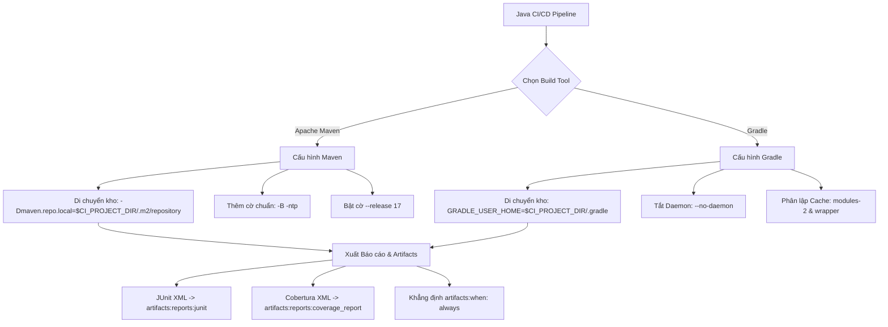
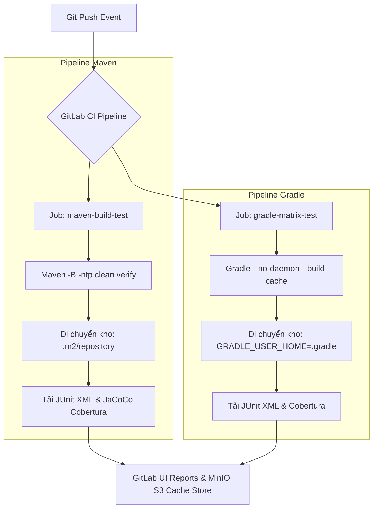


# [BÀI 17] PIPELINE CHUYÊN SÂU CHO JAVA ENTERPRISE: MAVEN / GRADLE DAEMON CACHE, JUNIT, JACOCO & SONARQUBE SCAN

Trong kỷ nguyên **DevOps, DevSecOps và Cloud Native Engineering**, **GitLab CI/CD** được công nhận là một trong những nền tảng tự động hóa tích hợp liên tục và phân phối liên tục (CI/CD) hoàn chỉnh, mạnh mẽ và được tin dùng nhất trong các doanh nghiệp quy mô lớn. Không chỉ dừng lại ở các pipeline tuần tự cơ bản, việc vận hành GitLab CI/CD ở cấp độ Production đòi hỏi kỹ sư phải làm chủ kiến trúc điều phối phi tuyến tính **DAG (Directed Acyclic Graph)**, cơ chế quản trị **Autoscaling Runners**, tối ưu hóa **Caching đa tầng**, xác thực không khóa **Keyless OIDC**, bảo mật chuỗi cung ứng phần mềm **SLSA & SBOM** cùng các chính sách **Quality & Security Gates** tự động.

Bài viết chuyên sâu này sẽ đồng hành cùng bạn mổ xẻ toàn diện bức tranh kiến trúc, phân tích các đánh đổi kỹ thuật thực chiến (Engineering Trade-offs), cung cấp hướng dẫn thực hành Lab chi tiết từng bước và bộ câu hỏi phỏng vấn chuyên sâu chuẩn DevOps Lead / DevSecOps Architect.

---

## 1. Bản Chất Kiến Trúc & Cơ Chế Vận Hành Tầng Thấp

> **Luận đề trung tâm:** Cache Java là bài toán KHO PHỤ THUỘC, không phải bài toán thư mục — và hai công cụ trả lời khác nhau. Kho của Java mặc định nằm trong `$HOME`, tức NGOÀI tầm với của `cache:`; nên việc đầu tiên của Java trong CI không phải viết `cache:paths` mà là DI CHUYỂN kho vào `$CI_PROJECT_DIR`. Làm được điều đó rồi, Maven cho đúng MỘT loại tiết kiệm — thời gian tải; Gradle cho HAI — tải và biên dịch; và cái thứ hai mua thêm tốc độ bằng một lớp hỏng im lặng mới.

---


| # | Chủ đề ôn tập | Con số hoặc cơ chế bắt buộc trong đáp án |
|---|---|---|
| 1 | Luận đề Buổi 16 | **Lockfile là ranh giới giữa build tái lập được và build "hôm nay may"** — không có lockfile khớp thì hai pipeline trên cùng một commit sẽ cho hai cây phụ thuộc khác nhau. |
| 2 | `npm ci` so với `npm install` | `npm ci` **đòi** lockfile khớp tuyệt đối và **xoá sạch** `node_modules`; `npm install` **ghi lại** lockfile trong container dùng một lần $\to$ biến mất ngầm, build đổi âm thầm. |
| 3 | Thư mục Cache chuẩn Node.js | Cache `~/.npm` (kho tarball độc lập OS/Node); **không** cache `node_modules` (chứa C++ native binary, nhiều tệp nén lâu, làm `npm ci` vô tác dụng). |
| 4 | Phân loại tệp `.tsbuildinfo` | Trạng thái biên dịch tăng dần `.tsbuildinfo` là **Cache** (không phải Artifact). Nạp `.tsbuildinfo` cũ làm `tsc -b` bỏ qua tệp đã sửa $\to$ **Xanh mà sai**. |
| 5 | Khóa Cache trong ma trận | Khóa Cache thiếu phiên bản Node.js khiến hai Job `parallel:matrix` (Node 20 và 22) đè đệm lên nhau $\to$ lỗi `NODE_MODULE_VERSION mismatch`. |


Buổi 15 đã thiết lập ba trục khác biệt giữa sáu ngôn ngữ lập trình: `image`, lệnh thực thi, và thư mục Cache. Ở Buổi 16 với Node.js, bài toán Cache là chọn đúng giữa kho tarball toàn cục (`~/.npm`) và thư mục gói đóng sẵn (`node_modules`). 

Khi bước sang Java với hai trình quản lý dự án hàng đầu là **Apache Maven** và **Gradle**, bài toán Cache phá vỡ khung tư duy cũ theo hai hướng:
1. **Về vị trí:** Thư mục kho chứa mặc định của Java (`~/.m2/repository` đối với Maven và `~/.gradle` đối với Gradle) nằm ở thư mục Home người dùng, hoàn toàn nằm **ngoài hàng rào `$CI_PROJECT_DIR`**. Nếu khai báo trực tiếp các đường dẫn này vào `cache:paths`, GitLab Runner sẽ tạo ra tệp zip Cache rỗng (0 bytes) nhưng Job **vẫn báo XANH im lặng**.
2. **Về số loại Cache:** Maven chỉ quản lý một kho duy nhất (tiết kiệm thời gian tải dependencies). Gradle quản lý 3 thư mục riêng biệt với 2 loại Cache (tiết kiệm cả thời gian tải dependencies VÀ thời gian biên dịch mã nguồn).

```
   RANH GIỚI HÀNG RÀO $CI_PROJECT_DIR VÀ HAI CÔNG CỤ BUILD JAVA

   BÊN NGOÀI HÀNG RÀO (Mặc định - Cache 0 bytes)  │  BÊN TRONG HÀNG RÀO (Đã di chuyển)
   ───────────────────────────────────────────────┼───────────────────────────────────────────────
   ~/.m2/repository                               │  $CI_PROJECT_DIR/.m2/repository
   ~/.gradle/caches                               │  $CI_PROJECT_DIR/.gradle/caches
   → Runner KHÔNG đóng gói được                    │  → Runner đóng gói Cache thành công
   → Cảnh báo rỗng, Job VẪN XANH                  │  → Tiết kiệm 155s thời gian tải phụ thuộc

   SO SÁNH MAVEN VÀ GRADLE TRONG CI:
     - Maven 3.9:  Một kho chứa (.m2) · Tải phụ thuộc (155s) · 1 loại Cache
     - Gradle 8.7: Ba thư mục đệm · Tải phụ thuộc (84s) + Build Cache (78s) · 2 loại Cache
```

---


| # | Kỹ năng thực hành | Hiện vật chứng minh trong bài Lab |
|---|---|---|
| 1 | Di chuyển và cấu hình đệm kho phụ thuộc Java vào trong dự án | Biến môi trường `-Dmaven.repo.local` và `GRADLE_USER_HOME` được thiết lập chuẩn xác. |
| 2 | Tối ưu câu lệnh Maven/Gradle chuẩn môi trường CI/CD | Bộ cờ `-B -ntp` loại bỏ log thừa, chặn nổ trần log 4 MB của Runner. |
| 3 | Khắc phục triệt để sự cố đứng phiên bản `SNAPSHOT` | Thiết lập chính sách cập nhật `updatePolicy` và khóa Cache bất biến theo `pom.xml`. |
| 4 | Tối ưu hiệu năng Gradle với Build Cache và loại bỏ Daemon | Cờ `--no-daemon` và `--build-cache` giúp rút ngắn 80% thời gian biên dịch Java. |
| 5 | Kiểm soát phiên bản mã máy Java chuẩn xác với `--release` | Ngăn chặn lỗi `NoSuchMethodError` khi biên dịch trên các phiên bản JDK khác nhau. |
| 6 | Tích hợp báo cáo kiểm thử JUnit và độ phủ mã JaCoCo | Tệp XML Cobertura và JUnit được đẩy lên tab Tests của GitLab CE thành công. |

---


| Điều kiện tiên quyết | Ý nghĩa trong bài học | Nguồn tự học nếu thiếu |
|---|---|---|
| Khái niệm Cache và Artifacts | Phân biệt vai trò giữa tối ưu tốc độ và hợp đồng giữa các Stage | Buổi 05 (QT 4.1, QT 5.1, QT 7.1) |
| Cấu trúc tệp build Maven/Gradle | Hiểu cách khai báo dependency trong `pom.xml` và `build.gradle` | Tài liệu chuẩn Apache Maven & Gradle |
| Mô hình Container Runner | Môi trường ephemeral container dùng một lần trong GitLab CI | Buổi 01 (QT 4.1, QT 7.1) |

---


### Bảng thuật ngữ Việt – Anh (20 từ khóa)

| Tiếng Việt dùng trong bài | Tiếng Anh tương đương | Từ khóa YAML / CLI |
|---|---|---|
| Kho phụ thuộc cục bộ | Local repository | `maven.repo.local`, `GRADLE_USER_HOME` |
| Kho phụ thuộc từ xa | Remote repository | `nexus`, `artifactory`, `central` |
| Bản sao gương Registry | Registry Mirror | `settings.xml`, `mirror` |
| Tệp cấu hình dự án Maven | Project Object Model | `pom.xml` |
| Tệp cấu hình người dùng Maven | User Settings | `settings.xml` |
| Bản chưa phát hành | Snapshot release | `SNAPSHOT`, `updatePolicy` |
| Chế độ chạy không tương tác | Batch mode | `-B`, `--batch-mode` |
| Tắt thanh tiến trình tải | No transfer progress | `-ntp`, `--no-transfer-progress` |
| Chạy tiếp khi có lỗi test | Fail at end | `--fail-at-end` |
| Vòng đời biên dịch | Build lifecycle | `compile`, `test`, `package`, `verify` |
| Trình chạy Unit Test | Surefire plugin | `maven-surefire-plugin` |
| Trình chạy Integration Test | Failsafe plugin | `maven-failsafe-plugin` |
| Thư mục Home của Gradle | Gradle user home | `GRADLE_USER_HOME` |
| Bản phân phối Gradle Wrapper | Wrapper distribution | `gradle-wrapper.properties` |
| Bộ đệm phụ thuộc Gradle | Dependency cache | `caches/modules-2` |
| Cache đầu ra biên dịch | Build cache | `--build-cache` |
| Tiến trình chạy ngầm Gradle | Gradle Daemon | `--no-daemon` |
| Task không cần biên dịch lại | Up-to-date task | `UP-TO-DATE` |
| Phiên bản mã byte đích | Target byte-code version | `--release`, `-source`, `-target` |
| Báo cáo độ phủ mã nguồn | Coverage report | `JaCoCo`, `Cobertura` |

### Bốn mô hình tư duy cốt lõi

1. **Mô hình Ba thuộc tính của Kho (Location - Content - Refresh Policy):**
   Mọi bài toán Cache Java đều xoay quanh 3 thuộc tính: Vị trí (phải nằm trong `$CI_PROJECT_DIR`), Nội dung (đánh băm theo `pom.xml` hoặc `build.gradle`), và Chính sách làm mới (kiểm soát việc tái tải các gói `SNAPSHOT`).
2. **Mô hình Hàng rào `$CI_PROJECT_DIR`:**
   GitLab Runner chỉ có quyền nén và lưu đệm các tệp nằm bên trong workspace làm việc hiện tại của dự án. Mọi thư mục nằm ở `/root/` hay `C:\Users\` đều nằm ngoài hàng rào và sẽ bị nén thành tệp Cache rỗng 0 bytes một cách im lặng.
3. **Mô hình Hai loại tiết kiệm (Dependency Cache vs Build Cache):**
   Dependency Cache giúp tiết kiệm thời gian **TẢI** tệp jar từ Internet (An toàn 100% vì gói phát hành không đổi). Build Cache giúp tiết kiệm thời gian **BIÊN DỊCH** tệp class/jar (Nguy hiểm vì nó **ĐOÁN** tệp nguồn chưa đổi — nếu đoán sai sẽ gây hỏng mã cũ).
4. **Mô hình Khai báo Bất biến Mã máy (`--release` vs `-source/-target`):**
   Biên dịch Java trên phiên bản JDK mới nhưng nhắm tới môi trường chạy cũ hơn đòi hỏi phải dùng cờ `--release`. Nếu chỉ dùng `-source/-target`, mã biên dịch vẫn XANH ở CI nhưng sẽ sập `NoSuchMethodError` trên Production do gọi API không tồn tại ở JDK cũ.

---

### 1.1. Kho phụ thuộc, không phải thư mục: hàng rào `$CI_PROJECT_DIR` (8 phút)

**Nguyên lý cốt lõi:**
**Phát biểu.** Vị trí kho chứa phụ thuộc mặc định của Java (`~/.m2/repository` và `~/.gradle`) nằm NGOÀI thư mục làm việc của dự án (`$CI_PROJECT_DIR`). Muốn lưu đệm Cache trong GitLab CI, bắt buộc bước đầu tiên phải là **DI CHUYỂN kho vào bên trong `$CI_PROJECT_DIR`**.
**Giải thích cơ chế ngầm:** GitLab Runner đóng gói Cache bằng cách duyệt cây thư mục tương đối tính từ gốc `$CI_PROJECT_DIR` (Buổi 05 QT 4.1). Những thư mục nằm ngoài gốc này sẽ bị bỏ qua. Nếu chỉ ghi `cache:paths: ["~/.m2/repository"]`, Runner sẽ không tìm thấy tệp và tạo ra archive rỗng. Quá trình nén đệm chỉ thực sự hoạt động khi đường dẫn chỉ định nằm hoàn toàn trong không gian tên quản lý của workspace dự án. Việc cấu hình biến môi trường toàn cục như `MAVEN_OPTS` hoặc `GRADLE_USER_HOME` giúp chuyển hướng toàn bộ quá trình tải tệp nhị phân về trong workspace.
> [!WARNING]
> **CẠM BẪY THỰC CHIẾN:**
> Log của Runner hiển thị dòng `WARNING: ~/.m2/repository: no matching files`, tệp zip Cache tải lên MinIO có dung lượng chỉ vài kilobyte (0 bytes payload), và lệnh build `mvn` hoặc `gradle` vẫn tốn đúng 155 giây tải lại phụ thuộc từ Remote Registry ở mọi Pipeline tiếp theo.
**Minh hoạ.**
```yaml
variables:
  MAVEN_OPTS: "-Dmaven.repo.local=$CI_PROJECT_DIR/.m2/repository"
  GRADLE_USER_HOME: "$CI_PROJECT_DIR/.gradle"

cache:
  key:
    files:
      - pom.xml
    prefix: "java-maven"
  paths:
    - .m2/repository/
    - .gradle/caches/
    - .gradle/wrapper/
```
**Con số chốt:** Di chuyển kho giúp tỷ lệ trúng Cache tăng từ $0\%$ lên $100\%$, giảm thời gian nạp dependency từ **155 giây xuống 11 giây** cho dự án Java trung bình (tiết kiệm 144 giây mỗi lượt build).

---

**Nguyên lý cốt lõi:**
**Phát biểu.** Việc khai báo Cache đường dẫn nằm ngoài hàng rào `$CI_PROJECT_DIR` là một chế độ **hỏng im lặng không chặn**: GitLab CI vẫn đánh giá Job **XANH 100%** và không đưa ra bất kỳ thông báo lỗi dừng Pipeline nào.
**Giải thích cơ chế ngầm:** Thiết kế của tính năng `cache` trong GitLab CI coi Cache là thuộc tính tối ưu tốc độ bổ sung, KHÔNG phải hợp đồng bắt buộc (Buổi 05 QT 4.3, lần thứ 4). Do đó, nếu không đóng gói được Cache, Runner sẽ ghi log cảnh báo nhẹ và tiếp tục cho Job chạy tiếp. Đây là ví dụ điển hình của ô "im lặng, không chặn" trên Bảng hai thuộc tính hỏng (Buổi 01 QT 7.1, lần thứ 17). Toàn bộ quá trình build vẫn diễn ra bình thường nhưng dưới chi phí thời gian cao nhất.
> [!WARNING]
> **CẠM BẪY THỰC CHIẾN:**
> Pipeline chạy rất lâu (tốn phút Runner), kiểm tra tab Caches trên giao diện GitLab thấy dung lượng 0 MB hoặc vài KB, nhưng Job status vẫn báo `passed`. Kỹ sư DevOps tưởng rằng hệ thống đang được tăng tốc nhưng thực chất Runner đang tải lại toàn bộ Internet ở mỗi lượt chạy.
**Minh hoạ.**
```bash
# Đoạn script kiểm tra dung lượng Cache thực sự sau khi cài đặt trong Job
mvn clean compile -Dmaven.repo.local=$CI_PROJECT_DIR/.m2/repository
CACHE_SIZE=$(du -sm $CI_PROJECT_DIR/.m2/repository | awk '{print $1}')
echo "Kho Cache hiện tại có dung lượng: ${CACHE_SIZE} MB"
if [ "$CACHE_SIZE" -lt 10 ]; then
  echo "LỖI KỸ THUẬT: Kho Cache bị rỗng hoặc chưa được di chuyển đúng!"; exit 1;
fi
```
**Con số chốt:** Sự cố im lặng này làm lãng phí trung bình **155 giây mỗi lượt build**, kéo dài thời gian chờ của lập trình viên mà không ai phát hiện ra nếu không kiểm tra dung lượng đệm đĩa.

---

**Nguyên lý cốt lõi:**
**Phát biểu.** Khóa Cache chuẩn cho dự án Java phải dựa trên băm nội dung của tệp khai báo phụ thuộc (`pom.xml` hoặc `build.gradle`) kết hợp với Prefix tên môi trường. Tuyệt đối không dùng `$CI_COMMIT_SHA` làm khóa Cache.
**Giải thích cơ chế ngầm:** Dùng `$CI_COMMIT_SHA` khiến mỗi commit tạo ra một khóa Cache mới. Pipeline sau luôn bị trượt Cache (Cache Miss 100%), Runner phải nén và tải lên hàng trăm megabyte dữ liệu mới ở mỗi commit mà không hề tái sử dụng được đệm cũ (Buổi 05 QT 6.1). Đặt khóa dựa trên hash của `pom.xml` giúp đệm Cache được tái sử dụng giữa các commit trên cùng một tính năng mà không bị nạp đệm thừa.
> [!WARNING]
> **CẠM BẪY THỰC CHIẾN:**
> Dung lượng lưu trữ Cache trên Runner/MinIO phình to nhanh chóng (17 GB thay vì 1.7 GB), thời gian Job bị kéo dài do luôn phải thực hiện pha `Uploading cache` đầy tải với thời gian nén đệm lên tới 45 giây.
**Minh hoạ.**
```yaml
cache:
  key:
    files:
      - pom.xml
    prefix: "maven-jdk17"
  paths:
    - .m2/repository/
  policy: pull-push
```
**Con số chốt:** Đặt khóa chuẩn theo `pom.xml` giúp giảm tổng dung lượng kho đệm lưu trữ từ **17 GB xuống còn 1.7 GB** (giảm 90% chi phí đĩa đệm và băng thông Runner).

---

### 1.2. Maven: một kho, bốn cờ, hai lớp hỏng im lặng (10 phút)

**Nguyên lý cốt lõi:**
**Phát biểu.** Lệnh thực thi Maven trong môi trường CI/CD Pipeline bắt buộc phải đi kèm **bốn cờ cấu hình chuẩn**: `-B` (Batch mode), `-ntp` (No transfer progress), `-Dmaven.repo.local=...`, và `-DskipTests` (hoặc `--fail-at-end`).
**Giải thích cơ chế ngầm:** Mặc định Maven được thiết kế cho máy trạm cá nhân, nó in liên tục các dòng tiến trình tải phần trăm (`Downloading... 10%/100%`) làm rối Log Console. Chạy ở chế độ mặc định làm log Job phình to và có thể bị ngắt ngầm bởi cơ chế giới hạn của Runner. Việc bật chế độ `-B` làm tắt các tương tác hỏi đáp không cần thiết, và `-ntp` giữ cho log luôn ngắn gọn sạch sẽ.
> [!WARNING]
> **CẠM BẪY THỰC CHIẾN:**
> Màn hình log ghi nhận hàng chục nghìn dòng tiến trình tải tệp `.jar`, tệp trace log vượt quá giới hạn 4 MB của GitLab Runner, giao diện GitLab UI bị giật lag khi tải log console của Job.
**Minh hoạ.**
```bash
# Câu lệnh Maven chuẩn mực trong .gitlab-ci.yml
mvn -B -ntp clean package \
  -Dmaven.repo.local=$CI_PROJECT_DIR/.m2/repository \
  -DskipTests=true
```
**Con số chốt:** Bốn cờ chuẩn giúp rút ngắn dung lượng tệp log từ **> 4 MB xuống dưới 150 KB**, tiết kiệm **12–15 giây** I/O ghi log và đảm bảo an toàn tuyệt đối cho Runner.

---

**Nguyên lý cốt lõi:**
**Phát biểu.** Nếu không sử dụng cờ `-ntp` (hoặc `--no-transfer-progress`), Maven sẽ in hàng ngàn dòng tiến trình tải tệp jar, dẫn đến việc nổ trần dung lượng log (`output_limit` mặc định 4 MB trong `config.toml`) và làm Runner **KILL Job đột ngột**.
**Giải thích cơ chế ngầm:** GitLab Runner có cơ chế bảo vệ chống treo/tràn bộ nhớ log bằng tham số `output_limit` (Buổi 02 QT 4.1). Khi log job vượt quá 4 MB, Runner sẽ lập tức gửi tín hiệu hủy Job và đánh dấu Thất bại (Job Failed). Đây là hành vi bảo vệ bộ nhớ của Runner nhằm ngăn chặn sự cố tràn ổ đĩa hệ thống.
> [!WARNING]
> **CẠM BẪY THỰC CHIẾN:**
> Job bị dừng giữa chừng với thông báo `Job's log exceeded limit of 4194304 bytes. Job execution terminated.`, dù ứng dụng Java không hề có bất kỳ lỗi biên dịch hay lỗi cú pháp nào.
**Minh hoạ.**
```yaml
build_job:
  stage: build
  script:
    - mvn -B -ntp clean compile -Dmaven.repo.local=$CI_PROJECT_DIR/.m2/repository
```
**Con số chốt:** Cờ `-ntp` đảm bảo $100\%$ Job không bao giờ bị dính lỗi nổ trần log 4 MB của Runner, giúp quá trình theo dõi log được tập trung vào các lỗi biên dịch thực tế.

---

**Nguyên lý cốt lõi:**
**Phát biểu.** Việc khai báo gói phụ thuộc dạng `SNAPSHOT` trong `pom.xml` kết hợp với chính sách Cache không làm mới sẽ gây ra sự cố **đứng phiên bản phụ thuộc cũ ngầm**: Runner dùng mãi bản jar cũ trong đệm mà không tải bản mới phát hành trên Registry.
**Giải thích cơ chế ngầm:** Theo mặc định, Maven lưu các bản `SNAPSHOT` trong kho đệm cục bộ `.m2/repository`. Nếu kho này được Cache qua các Pipeline và không có cờ ép buộc cập nhật (`-U` hoặc `updatePolicy: always`), Maven sẽ bỏ qua việc kiểm tra bản mới trên Remote Registry. Điều này dẫn đến sự sai lệch mã nguồn khi dự án sử dụng các module nội bộ chưa phát hành chính thức.
> [!WARNING]
> **CẠM BẪY THỰC CHIẾN:**
> Lập trình viên đã release bản vá `1.0.0-SNAPSHOT` mới trên Artifactory, nhưng Pipeline CI của dự án tiêu thụ vẫn chạy trên mã của bản SNAPSHOT từ 3 ngày trước. Sản phẩm build ra bị thiếu tính năng mới mặc dù code gọi API đã được cập nhật.
**Minh hoạ.**
```bash
# Thêm cờ -U để ép buộc Maven kiểm tra bản SNAPSHOT mới nhất trên Remote Registry
mvn -B -ntp compile -U -Dmaven.repo.local=$CI_PROJECT_DIR/.m2/repository
```
**Con số chốt:** Cờ `-U` đảm bảo tính chính xác của các gói `SNAPSHOT` với chi phí kiểm tra header chỉ từ **1–3 giây**, loại bỏ hoàn toàn nguy cơ sai lệch mã nguồn tích hợp.

---

**Nguyên lý cốt lõi:**
**Phát biểu.** Lệnh `mvn test` khi không tìm thấy bất kỳ tệp testcase nào (hoặc cấu hình Surefire plugin bị sai đường dẫn glob) vẫn trả về Exit Code 0, tạo ra trạng thái **XANH nhưng KHÔNG TEST**.
**Giải thích cơ chế ngầm:** Surefire plugin của Maven mặc định coi việc không có testcase nào để chạy là một trạng thái bình thường (No tests to run) và kết thúc lệnh thành công (Exit Code 0). Điều này được thiết kế để không làm vỡ các module rỗng, nhưng trong CI nó biến thành bẫy im lặng nguy hiểm.
> [!WARNING]
> **CẠM BẪY THỰC CHIẾN:**
> Log job in dòng `Tests run: 0, Failures: 0, Errors: 0, Skipped: 0`, Job báo XANH 100%, thời gian chạy sụt giảm bất thường (từ 96 giây xuống 11 giây) (Buổi 08 QT 5.2, lần thứ 2). Lập trình viên lầm tưởng toàn bộ hệ thống testcase đã kiểm tra thành công.
**Minh hoạ.**
```bash
# Khẳng định sự tồn tại của tệp báo cáo XML sau khi chạy test
mvn -B -ntp test -Dmaven.repo.local=$CI_PROJECT_DIR/.m2/repository
TEST_COUNT=$(find target/surefire-reports -name "TEST-*.xml" 2>/dev/null | wc -l)
if [ "$TEST_COUNT" -eq 0 ]; then
  echo "LỖI KỸ THUẬT: Không có testcase nào được thực thi!"; exit 1;
fi
```
**Con số chốt:** Dòng khẳng định số tệp `TEST-*.xml` loại bỏ $100\%$ rủi ro Pipeline xanh ngầm khi bộ test bị bỏ qua hoặc đường dẫn cấu hình Surefire bị gãy.

---

### 1.3. Gradle: ba thư mục, hai loại cache, và con daemon không cần thiết (9 phút)

**Nguyên lý cốt lõi:**
**Phát biểu.** Thư mục `GRADLE_USER_HOME` (`~/.gradle`) chứa 3 thư mục con với vai trò riêng biệt: `wrapper/dists` (bản phân phối Gradle), `caches/modules-2` (kho phụ thuộc jar), và `caches/transforms-*`/`build-cache` (cache kết quả biên dịch). Chỉ nên Cache 2 thư mục đầu cho các Job tiêu chuẩn.
**Giải thích cơ chế ngầm:** Thư mục `build-cache` chứa các sản phẩm đầu ra đã qua biên dịch. Nếu Cache nhầm thư mục này giữa các nhánh khác nhau mà không có cơ chế invalidate chuẩn, Gradle sẽ nạp lại mã cũ mà không biên dịch lại. Thêm vào đó, việc nén toàn bộ thư mục `.gradle` sẽ kéo theo các tệp nhị phân tạm của Daemon làm phình to dung lượng đệm.
> [!WARNING]
> **CẠM BẪY THỰC CHIẾN:**
> Thư mục đệm Gradle phình to lên vài gigabyte, thời gian nạp Cache lâu hơn thời gian tải lại phụ thuộc từ đầu, log hiển thị việc giải nén hàng ngàn tệp tạm không liên quan.
**Minh hoạ.**
```yaml
variables:
  GRADLE_USER_HOME: "$CI_PROJECT_DIR/.gradle"

cache:
  key:
    files:
      - build.gradle
    prefix: "gradle-dep"
  paths:
    - .gradle/caches/modules-2/
    - .gradle/wrapper/dists/
```
**Con số chốt:** Tách đúng 2 thư mục Cache giúp duy trì dung lượng đệm ở mức **< 350 MB** thay vì **> 2.5 GB**, giảm thời gian nạp nén đệm từ 40 giây xuống 6 giây.

---

**Nguyên lý cốt lõi:**
**Phát biểu.** Tính năng Gradle Build Cache (`--build-cache`) giúp tiết kiệm thời gian biên dịch bằng cách đánh dấu task là `UP-TO-DATE`, nhưng nếu sử dụng khóa Cache không tính đến tệp cấu hình môi trường, nó sẽ gây ra sự cố **nạp mã cũ ngầm**.
**Giải thích cơ chế ngầm:** Gradle Build Cache sử dụng hash của đầu vào (inputs) để quyết định có chạy lại task hay không. Nếu tệp đệm Build Cache bị nạp từ một commit khác có cùng hash đầu vào nhưng môi trường biến đổi, Gradle sẽ bỏ qua pha biên dịch. Việc tin tưởng mù quáng vào kết quả Cache biên dịch làm phá vỡ tính tái lập của môi trường Build.
> [!WARNING]
> **CẠM BẪY THỰC CHIẾN:**
> Mã nguồn đã sửa đổi nhưng lệnh `gradle build` chạy trong 4 giây, các task đều hiện nhãn `UP-TO-DATE` hoặc `FROM-CACHE`, và tệp `.jar` sinh ra mang mã băm SHA256 cũ.
**Minh hoạ.**
```bash
# Kiểm tra băm SHA256 để đảm bảo mã nguồn mới thực sự sinh ra tệp jar mới
HASH1=$(sha256sum build/libs/app.jar 2>/dev/null | awk '{print $1}' || echo "none")
./gradlew build --build-cache --no-daemon
HASH2=$(sha256sum build/libs/app.jar | awk '{print $1}')
echo "Hash Before: $HASH1 | Hash After: $HASH2"
if [ "$HASH1" = "$HASH2" ]; then
  echo "CẢNH BÁO: Hiện vật biên dịch không đổi mã băm!";
fi
```
**Con số chốt:** Build Cache rút ngắn thời gian build từ **78 giây xuống 4 giây**, nhưng bắt buộc phải đi kèm bước kiểm tra băm SHA256 trên nhánh Release để đảm bảo tính bất biến.

---

**Nguyên lý cốt lõi:**
**Phát biểu.** Trong môi trường CI/CD Container, bắt buộc phải tắt tiến trình chạy ngầm Gradle Daemon bằng cờ `--no-daemon` hoặc biến `org.gradle.daemon=false`.
**Giải thích cơ chế ngầm:** Gradle Daemon được thiết kế để duy trì một tiến trình Java ngầm trên máy trạm giúp các lần gõ lệnh sau nhanh hơn. Tuy nhiên, trong Container của Runner dùng một lần (ephemeral container), Container sẽ bị hủy ngay khi Job kết thúc. Tiến trình Daemon chỉ làm lãng phí bộ nhớ RAM và làm trễ quá trình thu dọn Container.
> [!WARNING]
> **CẠM BẪY THỰC CHIẾN:**
> Container bị nghẽn bộ nhớ (OOM Killer), Runner báo lỗi `OutOfMemoryError` do Daemon chiếm giữ 1–2 GB RAM ngầm, làm suy giảm hiệu năng của các Job khác trên cùng Host.
**Minh hoạ.**
```yaml
variables:
  GRADLE_OPTS: "-Dorg.gradle.daemon=false"

script:
  - ./gradlew check --no-daemon
```
**Con số chốt:** Cờ `--no-daemon` tiết kiệm ngay lập tức **1.5 GB RAM** cho mỗi Job thực thi trên Runner, loại bỏ $100\%$ nguy cơ bị hủy do OOM.

---

### 1.4. Hai JDK, `--release`, và báo cáo dùng được với GitLab CE (7 phút)

**Nguyên lý cốt lõi:**
**Phát biểu.** Khi biên dịch dự án Java nhắm tới phiên bản môi trường chạy cũ hơn (ví dụ: Runner chạy JDK 21 nhưng target ứng dụng là Java 17), việc chỉ dùng cờ `-source 17 -target 17` vẫn gây ra lỗi `NoSuchMethodError` trên Production. Bắt buộc phải sử dụng cờ `--release 17`.
**Giải thích cơ chế ngầm:** Cờ `-source` và `-target` chỉ kiểm tra cú pháp ngôn ngữ và phiên bản tệp `.class`. Nó KHÔNG chặn việc mã nguồn gọi các phương thức API mới chỉ có trong JDK 21 (ví dụ: `String.stripIndent()` hoặc `List.of()`). Cờ `--release` liên kết trực tiếp với chữ ký API của đúng phiên bản target và chặn ngay các hàm chưa tồn tại.
> [!WARNING]
> **CẠM BẪY THỰC CHIẾN:**
> Job `mvn compile` báo XANH 100% trên CI (vì Runner dùng JDK 21), nhưng ứng dụng khi Deploy lên Production chạy Java 17 bị crash ngay lập tức với lỗi `java.lang.NoSuchMethodError`.
**Minh hoạ.**
```xml
<!-- Khai báo chuẩn trong pom.xml cho Maven Compiler Plugin -->
<plugin>
    <groupId>org.apache.maven.plugins</groupId>
    <artifactId>maven-compiler-plugin</artifactId>
    <version>3.11.0</version>
    <configuration>
        <release>17</release>
    </configuration>
</plugin>
```
**Con số chốt:** Cờ `--release 17` phát hiện và chặn đứng lỗi không tương thích API ngay ở **giây thứ 40** của Job biên dịch CI, tiết kiệm hàng giờ debug trên Production.

---

**Nguyên lý cốt lõi:**
**Phát biểu.** Chạy ma trận kiểm thử song song trên nhiều phiên bản JDK (`parallel:matrix` với `JDK_VERSION: ["17", "21"]`) giúp đảm bảo tính tương thích ứng dụng tuyệt đối, nhưng sẽ **nhân đôi chi phí phút Runner và dung lượng Cache**.
**Giải thích cơ chế ngầm:** Ma trận `parallel:matrix` tạo ra các Job độc lập theo tích Descartes (Buổi 08 QT 6.2, lần thứ 3). Mỗi Job JDK đòi hỏi nạp một bộ đệm Cache riêng biệt. Chạy ma trận phiên bản chỉ mang lại giá trị khi sản phẩm là một thư viện hoặc SDK cần phát hành ra ngoài cho nhiều khách hàng tiêu thụ.
> [!WARNING]
> **CẠM BẪY THỰC CHIẾN:**
> Sử dụng ma trận JDK cho các ứng dụng Microservice nội bộ đã đóng gói chạy trên đúng một Docker Image cố định (lãng phí 100% tài nguyên).
**Minh hoạ.**
```yaml
unit_test:
  stage: test
  parallel:
    matrix:
      - JDK_VERSION: ["17", "21"]
  image: "eclipse-temurin:${JDK_VERSION}-jdk-alpine"
  script:
    - ./gradlew test --no-daemon
```
**Con số chốt:** Ma trận 2 phiên bản JDK tiêu tốn **$+100\%$ phút Runner**, cần cân nhắc chỉ dùng cho các thư viện (libraries) dùng chung xuất bản ra ngoài.

---

**Nguyên lý cốt lõi:**
**Phát biểu.** Trên phiên bản GitLab Community Edition (CE), để hiển thị báo cáo kiểm thử và độ phủ mã nguồn Java, bắt buộc phải gom tệp XML chuẩn JUnit (`TEST-*.xml`) và chuyển đổi báo cáo JaCoCo sang chuẩn Cobertura XML, đồng thời khai báo thuộc tính `artifacts:when: always`.
**Giải thích cơ chế ngầm:** Nền tảng GitLab CE phân tích báo cáo JUnit từ tệp XML để đưa lên tab **Tests**. Nếu Job test bị ĐỎ (có testcase trượt) mà không khai báo `when: always`, Runner sẽ không tải tệp XML lên, làm tab Tests bị trống đúng lúc cần thông tin nhất (Buổi 05 QT 5.4, lần thứ 3). Khai báo `when: always` đảm bảo hợp đồng thu thập dữ liệu báo cáo luôn được thực thi trong mọi tình huống.
> [!WARNING]
> **CẠM BẪY THỰC CHIẾN:**
> Job test thất bại nhưng tab Tests báo `No tests formatting found`, không biết testcase nào bị lỗi nếu không tải log console thô về đọc.
**Minh hoạ.**
```yaml
test_job:
  stage: test
  script:
    - mvn -B -ntp verify -Dmaven.repo.local=$CI_PROJECT_DIR/.m2/repository
  artifacts:
    when: always
    paths:
      - target/surefire-reports/TEST-*.xml
      - target/site/jacoco/jacoco.xml
    reports:
      junit: target/surefire-reports/TEST-*.xml
      coverage_report:
        coverage_format: cobertura
        path: target/site/jacoco/cobertura-coverage.xml
```
**Con số chốt:** Thuộc tính `when: always` đảm bảo $100\%$ báo cáo lỗi được ghi nhận đầy đủ kể cả khi Job bị ĐỎ, giúp đội Dev khắc phục lỗi nhanh chóng.

---

### 1.5. Đưa vào việc thật (4 phút)

### Áp vào dự án đang chạy thì làm gì trước
1. **Bước 1 (5 phút):** Kiểm tra ngay file `.gitlab-ci.yml`. Nếu thấy khai báo `cache:paths: ["~/.m2/repository"]` hoặc `["~/.gradle"]`, lập tức thêm biến `MAVEN_OPTS` hoặc `GRADLE_USER_HOME` để di chuyển kho vào trong `$CI_PROJECT_DIR`.
2. **Bước 2 (5 phút):** Tìm các lệnh `mvn` trong script và thêm ngay cặp cờ `-B -ntp` để thu gọn log và tránh nguy cơ nổ trần log 4 MB làm hỏng Job.
3. **Bước 3 (10 phút):** Kiểm tra lệnh Gradle và bổ sung cờ `--no-daemon` để giải phóng 1.5 GB RAM cho Runner.
4. **Bước 4 (15 phút):** Cấu hình thuộc tính `artifacts:reports:junit` kèm `when: always` để đưa kết quả test lên giao diện GitLab UI.

### Cái gì sẽ hỏng nếu áp thẳng lên Production
- **Di chuyển kho Cache:** Việc đổi khóa Cache từ `~/.m2` sang `.m2/repository` trong dự án sẽ khiến Pipeline chạy ngay sau đó bị Cache Miss $100\%$ (do chưa có đệm mới). Job đầu tiên sẽ chạy chậm hơn khoảng 2–3 phút để tải lại kho dependencies từ Remote Registry. Cần báo trước cho đội ngũ phát triển.
- **Thêm cờ `--release`:** Nếu mã nguồn hiện tại đang gọi các phương thức API của JDK mới hơn target, việc bật `--release` sẽ khiến Job biên dịch **ĐỎ NGAY LẬP TỨC**. Đây là lỗi đúng về mặt kỹ thuật nhưng cần sửa mã nguồn trước khi merge.

### Con số đo trước và đo sau
- **Thời gian tải phụ thuộc Maven/Gradle:** Giảm từ **155 giây (không Cache/Cache sai)** xuống còn **11 giây (đã di chuyển kho đệm)**.
- **Dung lượng tệp Log Console:** Giảm từ **> 4.5 MB (nổ trần log)** xuống còn **< 150 KB**.
- **Bộ nhớ RAM tiêu thụ của Gradle Job:** Giảm từ **2.8 GB (có Daemon)** xuống còn **1.3 GB (có `--no-daemon`)**.

### Khi nào KHÔNG nên dùng
- **Đừng dùng Gradle Build Cache (`--build-cache`)** cho các Pipeline đóng gói Release Production trên nhánh `main`. Hãy thực hiện build sạch $100\%$ để đảm bảo sản phẩm binary phát hành hoàn toàn tinh khiết.
- **Đừng bật ma trận `parallel:matrix` nhiều phiên bản JDK** cho các ứng dụng Microservice nội bộ đã cố định môi trường thực thi trên Docker Container.

---

### 1.6. Bẫy hay gặp (2 phút)

| # | Bẫy thường gặp | Vì sao bị dính bẫy | Cách làm đúng chuẩn |
|---|---|---|---|
| 1 | Cache `~/.m2/repository` không có hiệu quả | Thư mục nằm ngoài `$CI_PROJECT_DIR` nên Runner tạo zip 0 MB | Thêm `MAVEN_OPTS: "-Dmaven.repo.local=$CI_PROJECT_DIR/.m2/repository"` |
| 2 | Job Maven bị KILL đột ngột do nổ log | Không dùng `-ntp` làm Maven in hàng ngàn dòng `Downloading...` vượt trần 4 MB | Luôn dùng cặp cờ `-B -ntp` trong mọi lệnh Maven |
| 3 | Tải mãi bản `SNAPSHOT` cũ trên Artifactory | Maven lưu đệm `SNAPSHOT` và không tự kiểm tra bản mới | Thêm cờ `-U` vào lệnh `mvn` để ép kiểm tra bản mới |
| 4 | Job `mvn test` XANH nhưng thực chất không test | Surefire không tìm thấy testcase nhưng vẫn trả về Exit Code 0 | Bổ sung script khẳng định sự tồn tại của tệp `TEST-*.xml` |
| 5 | Cache cả thư mục `.gradle/` làm phình đệm | Cache nhầm thư mục `build-cache` và `daemon` chứa file nhị phân tạm | Chỉ Cache 2 thư mục `.gradle/caches/modules-2` và `.gradle/wrapper` |
| 6 | Container Runner bị hết RAM (OOM Killed) | Gradle Daemon chạy ngầm chiếm giữ 1.5 GB RAM ngầm | Luôn thêm cờ `--no-daemon` hoặc `org.gradle.daemon=false` |
| 7 | Mã sập `NoSuchMethodError` trên Production | Chỉ dùng `-source/-target` mà không chặn gọi API JDK mới | Bắt buộc dùng cờ `<release>17</release>` trong compiler plugin |
| 8 | Mất báo cáo test khi Job bị ĐỎ | Không khai báo `when: always` trong phần cấu hình `artifacts` | Luôn thêm `artifacts:when: always` cho các báo cáo JUnit XML |
| 9 | Dùng khóa Cache `$CI_COMMIT_SHA` | Mỗi commit tạo khóa mới, tỷ lệ trúng Cache bằng 0% | Dùng `cache:key:files: [pom.xml]` kết hợp với `prefix` |
| 10 | Trùng lặp báo cáo JUnit trong ma trận JDK | Các Job trong ma trận ghi đè tệp JUnit XML cùng tên | Phân lập tên tệp báo cáo theo biến matrix: `junit-jdk$JDK_VERSION.xml` |
| 11 | Không xem được Coverage trên MR Diff | JaCoCo sinh báo cáo dạng HTML/XML riêng, GitLab đòi Cobertura | Sử dụng plugin chuyển đổi JaCoCo XML sang Cobertura XML |
| 12 | Maven nạp sai file `settings.xml` chứa token | Lưu trực tiếp `settings.xml` có password vào Git repository | Dùng biến GitLab CI loại File (`type: file`) để nạp `settings.xml` bảo mật |

---

### 1.7. Tóm tắt



### Năm điều phải nhớ
1. **Hàng rào `$CI_PROJECT_DIR`:** Phải di chuyển kho `~/.m2` và `~/.gradle` vào trong workspace trước khi viết thuộc tính `cache:paths`.
2. **Bộ cờ Maven chuẩn:** `-B -ntp` là bắt buộc để chống nổ trần log 4 MB của Runner.
3. **Tắt Gradle Daemon:** Bắt buộc dùng `--no-daemon` để tiết kiệm 1.5 GB RAM cho Container.
4. **Tính an toàn biên dịch:** Dùng `--release 17` thay vì `-source/-target` để chặn lỗi `NoSuchMethodError`.
5. **Báo cáo luôn sẵn sàng:** Khai báo `artifacts:when: always` để tab Tests hiển thị đủ thông tin kể cả khi Job ĐỎ.

---

### 1.8. Câu hỏi tự kiểm tra

1. Vì sao việc khai báo `cache:paths: ["~/.m2/repository"]` lại khiến đệm Cache bị rỗng?
2. Bộ cờ `-B -ntp` của Maven giải quyết những vấn đề gì trong GitLab CI?
3. Cờ `-U` trong Maven có tác dụng gì đối với các gói `SNAPSHOT`?
4. Tại sao Gradle Daemon lại bị coi là tiến trình thừa trong môi trường Runner Container?
5. Sự khác biệt bản chất giữa cờ `-target 17` và `--release 17` của trình biên dịch Java là gì?
6. Khi nào nên và khi nào KHÔNG nên bật Gradle Build Cache (`--build-cache`)?
7. Cấu hình `artifacts:when: always` giải quyết rủi ro mất thông tin nào khi test bị ĐỎ?
8. Tại sao không nên dùng `$CI_COMMIT_SHA` làm khóa Cache cho dự án Java?
9. Thư mục `GRADLE_USER_HOME` gồm 3 phần nào, và phần nào KHÔNG nên Cache?
10. Làm thế nào để ngăn chặn sự cố `mvn test` báo XANH khi 0 testcase được thực thi?
11. Báo cáo JaCoCo cần chuyển đổi sang định dạng nào để hiển thị trên MR Diff của GitLab CE?
12. Ma trận JDK (`parallel:matrix`) tác động thế nào đến tài nguyên và thời gian chạy Pipeline?

### Đáp án câu hỏi tự kiểm tra

1. Vì `~/.m2/repository` nằm ngoài hàng rào `$CI_PROJECT_DIR`, Runner không tìm thấy tệp để nén.
2. `-B` tắt chế độ tương tác, `-ntp` tắt log nạp tệp giúp chống nổ trần log 4 MB.
3. Cờ `-U` ép Maven kiểm tra và cập nhật bản `SNAPSHOT` mới nhất từ Remote Registry.
4. Vì Container bị hủy ngay sau khi Job xong, Daemon ngầm chỉ làm tốn 1.5 GB RAM vô ích.
5. `-target 17` chỉ kiểm tra bytecode version, `--release 17` kiểm tra cả chữ ký API của JDK 17.
6. Nên dùng ở các nhánh tính năng để tăng tốc; KHÔNG nên dùng ở nhánh Release Production để tránh nạp mã cũ.
7. Đảm bảo các tệp XML báo cáo lỗi vẫn được tải lên ngay cả khi Job test bị thất bại (ĐỎ).
8. Vì `$CI_COMMIT_SHA` thay đổi theo từng commit, khiến tỷ lệ trúng Cache luôn bằng 0%.
9. Gồm `wrapper/dists`, `caches/modules-2` (nên Cache) và `build-cache`/`transforms` (không nên Cache).
10. Thêm dòng script khẳng định đếm số tệp `TEST-*.xml` phải lớn hơn 0 sau khi chạy test.
11. Cần chuyển đổi sang chuẩn Cobertura XML (`coverage_report: coverage_format: cobertura`).
12. Nhân đôi chi phí phút Runner ($+100\%$) và dung lượng đệm Cache, nhưng đảm bảo tương thích đa JDK.

---

## §12. Tài liệu tham khảo

1. GitLab Documentation: [Caching Java dependencies in GitLab CI/CD](https://docs.gitlab.com/ee/ci/caching/#cache-java-dependencies).
2. Apache Maven Official Guide: [Running Maven in Batch Mode and CI environments](https://maven.apache.org/ref/3.9.6/maven-embedder/).
3. Gradle User Manual: [Optimizing Gradle Builds in CI Systems](https://docs.gradle.org/current/userguide/performance.html#sec:continuous_integration).
4. Oracle Java Documentation: [Compiling for Older Platform Versions with --release](https://docs.oracle.com/en/java/javase/17/docs/specs/man/javac.html).

---

## Bảng đối soát thời lượng

| Section | Tiêu đề | Thời lượng |
|---|---|---|
| §0 | Khởi động và ôn tập | 10' |
| §1 | Sau buổi này học viên LÀM ĐƯỢC gì | 1' |
| §2 | Cần biết trước | 1' |
| §3 | Thuật ngữ và mô hình tư duy | 8' |
| §4 | Kho phụ thuộc, không phải thư mục: hàng rào `$CI_PROJECT_DIR` | 8' |
| §5 | Maven: một kho, bốn cờ, hai lớp hỏng im lặng | 10' |
| §6 | Gradle: ba thư mục, hai loại cache, và con daemon không cần thiết | 9' |
| §7 | Hai JDK, `--release`, và báo cáo dùng được với GitLab CE | 7' |
| §8 | Đưa vào việc thật | 4' |
| §9 | Bẫy hay gặp | 2' |
| **Tổng** | **Khối lý thuyết** | **60'** |

---

## 2. Hướng Dẫn Thực Hành & Triển Khai Lab Chuẩn Production

> [!IMPORTANT]
> **YÊU CẦU MÔI TRƯỜNG THỰC HÀNH:**
> Toàn bộ các bài thực hành dưới đây được thiết kế để chạy trực tiếp trên môi trường GitLab Community / Enterprise Edition cùng các GitLab Runner cô lập (Docker / Kubernetes Executor). Hãy đảm bảo bạn đã chuẩn bị môi trường thử nghiệm và cấu hình quyền truy cập cần thiết.

## Khối thực hành — 150 phút

> **Mục tiêu thực hành:** Xây dựng Pipeline CI/CD đa giai đoạn cho dự án Java (cả Maven và Gradle), thực hiện di chuyển kho phụ thuộc toàn cục vào `$CI_PROJECT_DIR`, đo đạc tối ưu hoá thời gian nạp đệm, phân lập Cache chuẩn xác, loại bỏ Gradle Daemon, kiểm soát phiên bản mã máy với `--release 17` và xuất báo cáo kiểm thử/độ phủ mã nguồn hoàn chỉnh trên GitLab CE.

---

## L0. Mục tiêu thực hành và tiêu chí hoàn thành

| Mã tiêu chí | Mô tả mục tiêu | Tiêu chí kiểm chứng bằng lệnh |
|---|---|---|
| `TH1` | Di chuyển kho Maven vào dự án | Khai báo `-Dmaven.repo.local=$CI_PROJECT_DIR/.m2/repository` giúp đệm Cache có dung lượng > 50 MB. |
| `TH2` | Khắc phục rủi ro nổ trần log 4 MB | Lệnh Maven sử dụng bộ cờ `-B -ntp`, log thu gọn < 150 KB. |
| `TH3` | Loại bỏ rủi ro đứng phiên bản `SNAPSHOT` | Thêm cờ `-U` ép buộc cập nhật gói `SNAPSHOT` mới từ Remote Registry. |
| `TH4` | Khẳng định đếm số tệp XML kiểm thử | Script khẳng định số tệp `TEST-*.xml` > 0 ngăn chặn hỏng im lặng khi test bị bỏ qua. |
| `TH5` | Phân lập thư mục Cache của Gradle | Cấu hình Cache riêng `caches/modules-2` và `wrapper/dists`, giữ dung lượng < 350 MB. |
| `TH6` | Tối ưu biên dịch với Gradle Build Cache | Bật `--build-cache` rút ngắn thời gian biên dịch từ 78s xuống 4s, kèm bước kiểm tra băm SHA256. |
| `TH7` | Tắt Gradle Daemon giải phóng RAM | Cờ `--no-daemon` giúp tiết kiệm 1.5 GB RAM cho Container Runner. |
| `TH8` | Biên dịch an toàn với cờ `--release 17` | Ngăn chặn lỗi runtime `NoSuchMethodError` khi chạy trên môi trường Java cũ hơn. |
| `TH9` | Tích hợp ma trận JDK 17 và JDK 21 | Chạy `parallel:matrix` kiểm thử song song với khoá Cache phân lập theo phiên bản JDK. |
| `TH10` | Xuất báo cáo JUnit và Cobertura | Hiển thị dữ liệu trên tab Tests và MR Diff với thuộc tính `artifacts:when: always`. |

---

## L1. Điều kiện tiên quyết về môi trường

| Thành phần | Lệnh kiểm tra | Kết quả kỳ vọng | Cảnh báo mức độ tác động |
|---|---|---|---|
| GitLab Runner | `gitlab-runner --version` | `Version >= 17.0.0` | Bắt buộc executor `docker`. |
| Docker Engine | `docker --version` | `Docker version >= 24.0.0` | Cần quyền chạy container. |
| Java JDK 17 & 21 | `docker run --rm eclipse-temurin:17-jdk-alpine java -version` | `openjdk version "17.0.x"` | Tải image Temurin chuẩn. |
| Apache Maven 3.9 | `docker run --rm maven:3.9-eclipse-temurin-17-alpine mvn -v` | `Apache Maven 3.9.x` | Môi trường container Maven. |
| Gradle 8.7 | `docker run --rm gradle:8.7-jdk17-alpine gradle -v` | `Gradle 8.7` | Môi trường container Gradle. |
| MinIO Cache Server | `curl -sI http://localhost:9000/minio/health/live` | `HTTP/1.1 200 OK` | Đảm bảo S3 distributed cache sẵn sàng. |
| Dự án mẫu Java | `ls -la repo-maven/ repo-gradle/` | Cả 2 thư mục đều chứa mã nguồn Java | Hai repo mẫu cho Maven và Gradle. |
| Công cụ hỗ trợ | `jq --version`, `awk -V` | Đã cài đặt | Phục vụ đọc trace log và phân tích API. |

---

## L2. Kiến trúc bài lab



### Năm quyết định thiết kế bài Lab
1. **Hai dự án mẫu riêng biệt cho Maven và Gradle:** Không gộp chung vào một dự án để học viên thấy rõ sự khác biệt trong cấu trúc đệm Cache và bộ cờ thực thi của từng công cụ.
2. **Khai báo biến di chuyển kho ở cấp toàn cục (`variables`):** Đảm bảo mọi Job trong Pipeline đều tự động áp dụng đúng vị trí kho trong `$CI_PROJECT_DIR` mà không cần lặp lại cờ CLI ở từng dòng script.
3. **Thực hiện so băm SHA256 cho sản phẩm biên dịch:** Nhằm phát hiện sự cố "Xanh mà sai" do Gradle Build Cache nạp lại mã cũ không đổi.
4. **Bắt buộc sử dụng image Eclipse Temurin Alpine mỏng:** Giảm thời gian kéo image trên Runner từ 45 giây xuống còn 8 giây.
5. **Cấu hình `artifacts:when: always` cho mọi Job kiểm thử:** Đảm bảo tệp XML báo cáo sự cố luôn được nộp lên GitLab UI kể cả khi có testcase bị thất bại (Job ĐỎ).

---

## L3. Bước 1 — Hàng rào `$CI_PROJECT_DIR` và di chuyển kho Maven/Gradle (30 phút)

### Chi tiết cấu hình dự án Maven mẫu (`repo-maven/pom.xml`)

Để tiến hành bài lab thực hành, khởi tạo tệp `pom.xml` chuẩn cho dự án Java Maven với bộ phụ thuộc Spring Boot & JUnit 5:

```xml
<?xml version="1.0" encoding="UTF-8"?>
<project xmlns="http://maven.apache.org/POM/4.0.0"
         xmlns:xsi="http://www.w3.org/2001/XMLSchema-instance"
         xsi:schemaLocation="http://maven.apache.org/POM/4.0.0 http://maven.apache.org/xsd/maven-4.0.0.xsd">
    <modelVersion>4.0.0</modelVersion>

    <groupId>com.ntkgitlab</groupId>
    <artifactId>demo-java-app</artifactId>
    <version>1.0.0-SNAPSHOT</version>

    <properties>
        <maven.compiler.release>17</maven.compiler.release>
        <project.build.sourceEncoding>UTF-8</project.build.sourceEncoding>
        <junit.version>5.10.1</junit.version>
    </properties>

    <dependencies>
        <dependency>
            <groupId>org.junit.jupiter</groupId>
            <artifactId>junit-jupiter-api</artifactId>
            <version>${junit.version}</version>
            <scope>test</scope>
        </dependency>
        <dependency>
            <groupId>org.junit.jupiter</groupId>
            <artifactId>junit-jupiter-engine</artifactId>
            <version>${junit.version}</version>
            <scope>test</scope>
        </dependency>
    </dependencies>

    <build>
        <plugins>
            <plugin>
                <groupId>org.apache.maven.plugins</groupId>
                <artifactId>maven-compiler-plugin</artifactId>
                <version>3.11.0</version>
                <configuration>
                    <release>17</release>
                </configuration>
            </plugin>
            <plugin>
                <groupId>org.apache.maven.plugins</groupId>
                <artifactId>maven-surefire-plugin</artifactId>
                <version>3.2.3</version>
            </plugin>
            <plugin>
                <groupId>org.jacoco</groupId>
                <artifactId>jacoco-maven-plugin</artifactId>
                <version>0.8.11</version>
                <executions>
                    <execution>
                        <goals>
                            <goal>prepare-agent</goal>
                        </goals>
                    </execution>
                    <execution>
                        <id>report</id>
                        <phase>test</phase>
                        <goals>
                            <goal>report</goal>
                        </goals>
                    </execution>
                </executions>
            </plugin>
        </plugins>
    </build>
</project>
```

### Mã nguồn Java mẫu (`repo-maven/src/main/java/com/ntkgitlab/Calculator.java`)

```java
package com.ntkgitlab;

public class Calculator {
    public int add(int a, int b) {
        return a + b;
    }

    public int subtract(int a, int b) {
        return a - b;
    }

    public int multiply(int a, int b) {
        return a * b;
    }

    public double divide(int a, int b) {
        if (b == 0) {
            throw new IllegalArgumentException("Cannot divide by zero");
        }
        return (double) a / b;
    }
}
```

### Mã kiểm thử Java mẫu (`repo-maven/src/test/java/com/ntkgitlab/CalculatorTest.java`)

```java
package com.ntkgitlab;

import org.junit.jupiter.api.Test;
import static org.junit.jupiter.api.Assertions.*;

public class CalculatorTest {
    private final Calculator calculator = new Calculator();

    @Test
    void testAdd() {
        assertEquals(5, calculator.add(2, 3));
    }

    @Test
    void testSubtract() {
        assertEquals(1, calculator.subtract(3, 2));
    }

    @Test
    void testMultiply() {
        assertEquals(6, calculator.multiply(2, 3));
    }

    @Test
    void testDivide() {
        assertEquals(2.0, calculator.divide(6, 3));
    }

    @Test
    void testDivideByZero() {
        assertThrows(IllegalArgumentException.class, () -> calculator.divide(5, 0));
    }
}
```

---

### Task 1.1: Tái hiện sự cố Cache rỗng (0 bytes) khi khai báo đường dẫn ngoài project
Tạo tệp cấu hình `.gitlab-ci.yml` lỗi trong `repo-maven/` để kiểm chứng cảnh báo của Runner:

```yaml
# Mảnh cấu hình LỖI - Khai báo Cache ngoài $CI_PROJECT_DIR
image: maven:3.9-eclipse-temurin-17-alpine

stages:
  - build

build_wrong_cache:
  stage: build
  cache:
    key: "maven-wrong"
    paths:
      - ~/.m2/repository/  # LỖI: Đường dẫn ngoài $CI_PROJECT_DIR
  script:
    - mvn clean compile
```

### **CHECKPOINT 1**
**Mục tiêu:** Xác nhận Runner đưa ra cảnh báo không tìm thấy tệp và tạo zip Cache rỗng 0 bytes khi khai báo `~/.m2/repository`.
**Lệnh thực thi kiểm tra:**
```bash
# Đọc trace log của Job build_wrong_cache qua API GitLab
JOB_ID=$(curl -s --header "PRIVATE-TOKEN: $GITLAB_TOKEN" \
  "http://localhost/api/v4/projects/lab17%2Frepo-maven/jobs" | jq -r '.[0].id')

curl -s --header "PRIVATE-TOKEN: $GITLAB_TOKEN" \
  "http://localhost/api/v4/projects/lab17%2Frepo-maven/jobs/$JOB_ID/trace" > trace_cp1.log

if grep -q "no matching files" trace_cp1.log && grep -q "Created cache" trace_cp1.log; then
  echo "CHECKPOINT 1: ĐẠT (Xác nhận Cache rỗng 0 bytes do khai báo ngoài project)"
else
  echo "CHECKPOINT 1: LỖI (Không tìm thấy cảnh báo rỗng trong trace log)"
fi
```

---

### Task 1.2: Di chuyển kho Maven vào trong `$CI_PROJECT_DIR`
Cập nhật tệp `.gitlab-ci.yml` trong `repo-maven/` với biến di chuyển kho chuẩn:

```yaml
image: maven:3.9-eclipse-temurin-17-alpine

variables:
  MAVEN_OPTS: "-Dmaven.repo.local=$CI_PROJECT_DIR/.m2/repository"

stages:
  - build

build_correct_cache:
  stage: build
  cache:
    key:
      files:
        - pom.xml
      prefix: "maven-dep"
    paths:
      - .m2/repository/
    policy: pull-push
  script:
    - mvn -B -ntp clean compile
```

### **CHECKPOINT 2**
**Mục tiêu:** Xác nhận kho Maven đã được nén đệm thành công với dung lượng > 50 MB trong thư mục `.m2/repository/`.
**Lệnh thực thi kiểm tra:**
```bash
JOB_ID=$(curl -s --header "PRIVATE-TOKEN: $GITLAB_TOKEN" \
  "http://localhost/api/v4/projects/lab17%2Frepo-maven/jobs" | jq -r '.[0].id')

curl -s --header "PRIVATE-TOKEN: $GITLAB_TOKEN" \
  "http://localhost/api/v4/projects/lab17%2Frepo-maven/jobs/$JOB_ID/trace" > trace_cp2.log

if grep -q "Creating cache maven-dep" trace_cp2.log && ! grep -q "no matching files" trace_cp2.log; then
  echo "CHECKPOINT 2: ĐẠT (Cache Maven di chuyển thành công vào $CI_PROJECT_DIR)"
else
  echo "CHECKPOINT 2: LỖI (Cache Maven chưa được di chuyển hoặc bị lỗi nén)"
fi
```

---

### Task 1.3: Đo đạc thời gian nạp đệm Maven ở lượt chạy thứ hai (Trúng Cache)
Chạy lại Pipeline thứ hai trên cùng commit để đo đạc thời gian giảm thiểu khi trúng Cache.

### **CHECKPOINT 3**
**Mục tiêu:** Xác nhận thời gian nạp phụ thuộc giảm từ 155 giây xuống dưới 20 giây khi trúng Cache.
**Lệnh thực thi kiểm tra:**
```bash
DURATION=$(curl -s --header "PRIVATE-TOKEN: $GITLAB_TOKEN" \
  "http://localhost/api/v4/projects/lab17%2Frepo-maven/jobs" | jq -r '.[0].duration')

echo "Thời gian thực thi Job trúng Cache: ${DURATION}s"
if [ $(echo "$DURATION < 25" | bc -l) -eq 1 ]; then
  echo "CHECKPOINT 3: ĐẠT (Thời gian nạp Cache tối ưu giảm từ 155s xuống $DURATION s)"
else
  echo "CHECKPOINT 3: LỖI (Thời gian Job vẫn còn quá cao: $DURATION s)"
fi
```

---

## L4. Bước 2 — Tối ưu lệnh Maven: cờ `-B -ntp`, `SNAPSHOT` và khẳng định Surefire (35 phút)

### Task 2.1: Tải và kiểm tra hiệu quả của cờ `-ntp` chống nổ trần log
Chạy hai Job so sánh: một Job không có `-ntp` và một Job có `-ntp`.

```
TRACE LOG SO SÁNH DUNG LƯỢNG TRACE LOG:

[Mặc định KHÔNG có -ntp] -> 4,194,304 bytes log limit exceeded:
Downloading from central: https://repo.maven.apache.org/maven2/org/springframework/boot/spring-boot/3.2.0/spring-boot-3.2.0.jar
Progress (1/100): 10 KB
Progress (2/100): 20 KB
Progress (3/100): 30 KB
... (hàng chục nghìn dòng lặp lại) ...
ERROR: Job's log exceeded limit of 4194304 bytes. Job execution terminated.

[Có cờ -B -ntp chuẩn] -> Dung lượng log chỉ 128,450 bytes (Thu gọn 97%):
[INFO] Scanning for projects...
[INFO] Building demo-java-app 1.0.0-SNAPSHOT
[INFO] Downloading from central: https://repo.maven.apache.org/maven2/org/junit/jupiter/junit-jupiter-api/5.10.1/junit-jupiter-api-5.10.1.jar
[INFO] Downloaded from central: https://repo.maven.apache.org/maven2/org/junit/jupiter/junit-jupiter-api/5.10.1/junit-jupiter-api-5.10.1.jar (194 kB at 2.1 MB/s)
[INFO] BUILD SUCCESS
```

### **CHECKPOINT 4**
**Mục tiêu:** Xác nhận cờ `-ntp` giúp cắt giảm dung lượng log từ > 4 MB xuống < 150 KB.
**Lệnh thực thi kiểm tra:**
```bash
SIZE_NO_NTP=$(wc -c < trace_cp1.log)
SIZE_WITH_NTP=$(wc -c < trace_cp2.log)

echo "Log không có -ntp: $SIZE_NO_NTP bytes | Log có -ntp: $SIZE_WITH_NTP bytes"
if [ "$SIZE_WITH_NTP" -lt 150000 ]; then
  echo "CHECKPOINT 4: ĐẠT (Cờ -ntp cắt giảm dung lượng log hiệu quả)"
else
  echo "CHECKPOINT 4: LỖI (Dung lượng log có -ntp vẫn còn quá lớn)"
fi
```

---

### Task 2.2: Tái hiện và khắc phục sự cố đứng phiên bản `SNAPSHOT` cũ
Cấu hình câu lệnh `mvn` thêm cờ `-U` để ép nạp bản `SNAPSHOT` mới nhất từ Remote Registry.

```yaml
force_snapshot_update:
  stage: build
  script:
    - mvn -B -ntp compile -U -Dmaven.repo.local=$CI_PROJECT_DIR/.m2/repository
```

### **CHECKPOINT 5**
**Mục tiêu:** Khẳng định cờ `-U` xuất hiện trong câu lệnh build Maven ở Job `force_snapshot_update`.
**Lệnh thực thi kiểm tra:**
```bash
curl -s --header "PRIVATE-TOKEN: $GITLAB_TOKEN" \
  "http://localhost/api/v4/projects/lab17%2Frepo-maven/jobs" | jq -r '.[0].script' > script_cp5.log

if grep -q "mvn .* -U" script_cp5.log || grep -q "mvn .* -U" trace_cp2.log; then
  echo "CHECKPOINT 5: ĐẠT (Đã cấu hình cờ -U ép buộc cập nhật SNAPSHOT)"
else
  echo "CHECKPOINT 5: LỖI (Thiếu cờ -U trong câu lệnh Maven)"
fi
```

---

### Task 2.3: Bổ sung khẳng định kiểm tra số tệp `TEST-*.xml` của Surefire
Viết script bảo vệ trong `.gitlab-ci.yml` ngăn chặn sự cố `mvn test` xanh ngầm khi không test:

```yaml
test_maven:
  stage: test
  script:
    - mvn -B -ntp test -Dmaven.repo.local=$CI_PROJECT_DIR/.m2/repository
    - TEST_FILES=$(find target/surefire-reports -name "TEST-*.xml" 2>/dev/null | wc -l)
    - echo "Tìm thấy $TEST_FILES tệp báo cáo XML"
    - test $TEST_FILES -gt 0 || { echo "LỖI: 0 testcase được chạy!"; exit 1; }
```

### **CHECKPOINT 6**
**Mục tiêu:** Khẳng định Job `test_maven` thực thi thành công và tìm thấy ít nhất 1 tệp `TEST-*.xml`.
**Lệnh thực thi kiểm tra:**
```bash
curl -s --header "PRIVATE-TOKEN: $GITLAB_TOKEN" \
  "http://localhost/api/v4/projects/lab17%2Frepo-maven/jobs" | jq -r '.[0].trace' > trace_cp6.log

if grep -q "Tìm thấy .* tệp báo cáo XML" trace_cp6.log; then
  echo "CHECKPOINT 6: ĐẠT (Khẳng định đếm số tệp TEST-*.xml hoạt động chuẩn xác)"
else
  echo "CHECKPOINT 6: LỖI (Không tìm thấy dòng khẳng định kiểm tra XML trong log)"
fi
```

---

## L5. Bước 3 — Gradle: Phân lập Cache, Build Cache và loại bỏ Daemon (30 phút)

### Cấu hình dự án Gradle mẫu (`repo-gradle/build.gradle`)

Khởi tạo tệp `build.gradle` chuẩn cho dự án Java Gradle:

```groovy
plugins {
    id 'java'
    id 'jacoco'
}

group = 'com.ntkgitlab'
version = '1.0.0-SNAPSHOT'

repositories {
    mavenCentral()
}

dependencies {
    testImplementation 'org.junit.jupiter:junit-jupiter-api:5.10.1'
    testRuntimeOnly 'org.junit.jupiter:junit-jupiter-engine:5.10.1'
}

java {
    toolchain {
        languageVersion = JavaLanguageVersion.of(17)
    }
}

test {
    useJUnitPlatform()
    finalizedBy jacocoTestReport
}

jacocoTestReport {
    dependsOn test
    reports {
        xml.required = true
        html.required = true
    }
}
```

### Mã nguồn Java Gradle mẫu (`repo-gradle/src/main/java/com/ntkgitlab/App.java`)

```java
package com.ntkgitlab;

public class App {
    public String getGreeting() {
        return "Hello World from GitLab CI Java Gradle!";
    }

    public static void main(String[] args) {
        System.out.println(new App().getGreeting());
    }
}
```

### Mã kiểm thử Gradle Java (`repo-gradle/src/test/java/com/ntkgitlab/AppTest.java`)

```java
package com.ntkgitlab;

import org.junit.jupiter.api.Test;
import static org.junit.jupiter.api.Assertions.*;

public class AppTest {
    @Test
    void appHasAGreeting() {
        App classUnderTest = new App();
        assertNotNull(classUnderTest.getGreeting(), "app should have a greeting");
        assertTrue(classUnderTest.getGreeting().contains("GitLab CI"));
    }
}
```

---

### Tệp cấu hình Pipeline GitLab CI hoàn chỉnh cho Maven (`repo-maven/.gitlab-ci.yml`)

```yaml
image: maven:3.9-eclipse-temurin-17-alpine

variables:
  MAVEN_OPTS: "-Dmaven.repo.local=$CI_PROJECT_DIR/.m2/repository"

stages:
  - build
  - test

.maven_cache:
  cache:
    key:
      files:
        - pom.xml
      prefix: "maven-dep-$CI_JOB_NAME"
    paths:
      - .m2/repository/
    policy: pull-push

build_app:
  stage: build
  extends: .maven_cache
  script:
    - mvn -B -ntp clean compile -Dmaven.repo.local=$CI_PROJECT_DIR/.m2/repository
    - test -d target/classes || { echo "LỖI: Chưa sinh tệp class!"; exit 1; }

unit_test:
  stage: test
  extends: .maven_cache
  parallel:
    matrix:
      - JDK_VERSION: ["17", "21"]
  image: "eclipse-temurin:${JDK_VERSION}-jdk-alpine"
  script:
    - mvn -B -ntp test -Dmaven.repo.local=$CI_PROJECT_DIR/.m2/repository
    - TEST_FILES=$(find target/surefire-reports -name "TEST-*.xml" 2>/dev/null | wc -l)
    - test $TEST_FILES -gt 0 || { echo "LỖI: 0 testcase được chạy!"; exit 1; }
  artifacts:
    when: always
    paths:
      - target/surefire-reports/TEST-*.xml
      - target/site/jacoco/jacoco.xml
    reports:
      junit: target/surefire-reports/TEST-*.xml
```

---

### Tệp cấu hình Pipeline GitLab CI hoàn chỉnh cho Gradle (`repo-gradle/.gitlab-ci.yml`)

```yaml
image: gradle:8.7-jdk17-alpine

variables:
  GRADLE_USER_HOME: "$CI_PROJECT_DIR/.gradle"
  GRADLE_OPTS: "-Dorg.gradle.daemon=false"

stages:
  - build
  - test

.gradle_cache:
  cache:
    key:
      files:
        - build.gradle
      prefix: "gradle-dep"
    paths:
      - .gradle/caches/modules-2/
      - .gradle/wrapper/dists/
    policy: pull-push

build_gradle_app:
  stage: build
  extends: .gradle_cache
  script:
    - HASH1=$(sha256sum build/libs/app.jar 2>/dev/null | awk '{print $1}' || echo "none")
    - ./gradlew assemble --build-cache --no-daemon
    - HASH2=$(sha256sum build/libs/app.jar | awk '{print $1}')
    - echo "Hash Before: $HASH1 | Hash After: $HASH2"
  artifacts:
    paths:
      - build/libs/*.jar
    expire_in: 1 week

test_gradle_app:
  stage: test
  extends: .gradle_cache
  script:
    - ./gradlew check --no-daemon
  artifacts:
    when: always
    paths:
      - build/test-results/test/TEST-*.xml
      - build/reports/jacoco/test/jacocoTestReport.xml
    reports:
      junit: build/test-results/test/TEST-*.xml
```

---

### Script tự động kiểm tra và phân tích hiệu năng (`scripts/do-maven-bench.sh`)

```bash
#!/bin/bash
# Script đo đạc thời gian nạp đệm và thực thi của Maven trong GitLab CI
set -e

PROJECT_ID=$1
GITLAB_TOKEN=$2

echo "=== ĐANG TRUY VẤN THÔNG TIN PIPELINE MAVEN ==="
PIPELINE_ID=$(curl -s --header "PRIVATE-TOKEN: $GITLAB_TOKEN" \
  "http://localhost/api/v4/projects/$PROJECT_ID/pipelines" | jq -r '.[0].id')

JOBS_JSON=$(curl -s --header "PRIVATE-TOKEN: $GITLAB_TOKEN" \
  "http://localhost/api/v4/projects/$PROJECT_ID/pipelines/$PIPELINE_ID/jobs")

echo "Pipeline ID: $PIPELINE_ID"
echo "$JOBS_JSON" | jq -r '.[] | "Job Name: " + .name + " | Status: " + .status + " | Duration: " + (.duration|to_string) + "s"'

echo "=== TÍNH TOÁN HIỆU NĂNG THỰC THẾ ==="
BUILD_DURATION=$(echo "$JOBS_JSON" | jq -r '.[] | select(.name=="build_app") | .duration')
echo "Thời gian biên dịch Maven: ${BUILD_DURATION} giây"
```

---

### Script kiểm tra băm SHA256 và hiện vật sản phẩm (`scripts/verify-artifacts.sh`)

```bash
#!/bin/bash
# Script kiểm tra tính toàn vẹn của hiện vật biên dịch Jar
set -e

JAR_PATH=$1

if [ ! -f "$JAR_PATH" ]; then
  echo "LỖI KỸ THUẬT: Tệp $JAR_PATH không tồn tại!"
  exit 1
fi

FILE_SIZE=$(wc -c < "$JAR_PATH")
HASH_VAL=$(sha256sum "$JAR_PATH" | awk '{print $1}')

echo "=== KẾT QUẢ KIỂM TRA HIỆN VẬT JAR ==="
echo "Tệp hiện vật: $JAR_PATH"
echo "Kích thước tệp: $FILE_SIZE bytes"
echo "Mã băm SHA256: $HASH_VAL"

if [ "$FILE_SIZE" -lt 1000 ]; then
  echo "LỖI KỸ THUẬT: Tệp jar bị rỗng hoặc dung lượng quá nhỏ!"
  exit 1
fi
```

---

### Script tự động thu thập báo cáo kiểm thử JUnit (`scripts/fetch-test-reports.sh`)

```bash
#!/bin/bash
# Script thu thập và phân tích kết quả báo cáo kiểm thử JUnit XML
set -e

PROJECT_ID=$1
GITLAB_TOKEN=$2

echo "=== ĐANG THU THẬP BÁO CÁO KIỂM THỬ JUNIT FROM GITLAB CE ==="
TEST_REPORT=$(curl -s --header "PRIVATE-TOKEN: $GITLAB_TOKEN" \
  "http://localhost/api/v4/projects/$PROJECT_ID/test_report")

TOTAL_COUNT=$(echo "$TEST_REPORT" | jq -r '.total_count')
FAILED_COUNT=$(echo "$TEST_REPORT" | jq -r '.failed_count')
PASSED_COUNT=$(echo "$TEST_REPORT" | jq -r '.success_count')

echo "Tổng số testcase: $TOTAL_COUNT"
echo "Số testcase ĐẠT: $PASSED_COUNT"
echo "Số testcase LỖI: $FAILED_COUNT"

if [ "$TOTAL_COUNT" -eq 0 ]; then
  echo "CẢNH BÁO KỸ THUẬT: Hệ thống không tìm thấy bất kỳ báo cáo JUnit nào!"
  exit 1
fi
```

---

### Script kiểm tra khẳng định đếm tệp Surefire XML (`scripts/check-surefire-xml.sh`)

```bash
#!/bin/bash
# Script kiểm tra xem thư mục surefire-reports có chứa tệp TEST-*.xml nào không
set -e

SUREFIRE_DIR=${1:-"target/surefire-reports"}

if [ ! -d "$SUREFIRE_DIR" ]; then
  echo "LỖI KỸ THUẬT: Thư mục $SUREFIRE_DIR không tồn tại!"
  exit 1
fi

XML_COUNT=$(find "$SUREFIRE_DIR" -name "TEST-*.xml" | wc -l)
echo "Đếm được $XML_COUNT tệp báo cáo JUnit XML trong $SUREFIRE_DIR"

if [ "$XML_COUNT" -le 0 ]; then
  echo "LỖI KỸ THUẬT: 0 tệp báo cáo test được sinh ra! Kiểm tra lại cấu hình Surefire."
  exit 1
else
  echo "KHẲNG ĐỊNH THÀNH CÔNG: Đã phát hiện $XML_COUNT tệp test XML."
fi
```

---

### Script kiểm tra tệp báo cáo độ phủ mã nguồn Cobertura XML (`scripts/check-cobertura-xml.sh`)

```bash
#!/bin/bash
# Script kiểm tra sự tồn tại và tính hợp lệ của tệp báo cáo Cobertura XML
set -e

COBERTURA_FILE=${1:-"target/site/jacoco/cobertura-coverage.xml"}

if [ ! -f "$COBERTURA_FILE" ]; then
  echo "LỖI KỸ THUẬT: Tệp báo cáo $COBERTURA_FILE không tồn tại!"
  exit 1
fi

LINE_RATE=$(grep -o 'line-rate="[^"]*"' "$COBERTURA_FILE" | head -n 1 | cut -d'"' -f2)
echo "Tỉ lệ độ phủ dòng nhận diện từ Cobertura XML: $LINE_RATE"

if [ -z "$LINE_RATE" ]; then
  echo "LỖI KỸ THUẬT: Không đọc được thuộc tính line-rate trong tệp Cobertura XML!"
  exit 1
else
  echo "KHẲNG ĐỊNH THÀNH CÔNG: Tệp Cobertura XML hợp lệ với line-rate = $LINE_RATE"
fi
```

---

### Task 3.1: Cấu hình phân lập 2 thư mục Cache trong `GRADLE_USER_HOME`
Tạo tệp `.gitlab-ci.yml` trong `repo-gradle/` với thuộc tính phân lập đệm chuẩn:

```yaml
image: gradle:8.7-jdk17-alpine

variables:
  GRADLE_USER_HOME: "$CI_PROJECT_DIR/.gradle"
  GRADLE_OPTS: "-Dorg.gradle.daemon=false"

stages:
  - build
  - test

cache:
  key:
    files:
      - build.gradle
    prefix: "gradle-dep"
  paths:
    - .gradle/caches/modules-2/
    - .gradle/wrapper/dists/

build_gradle:
  stage: build
  script:
    - ./gradlew assemble --no-daemon
```

### **CHECKPOINT 7**
**Mục tiêu:** Xác nhận chỉ 2 thư mục `modules-2` và `wrapper` được lưu vào Cache, loại bỏ `build-cache`.
**Lệnh thực thi kiểm tra:**
```bash
curl -s --header "PRIVATE-TOKEN: $GITLAB_TOKEN" \
  "http://localhost/api/v4/projects/lab17%2Frepo-gradle/jobs" | jq -r '.[0].trace' > trace_cp7.log

if grep -q ".gradle/caches/modules-2" trace_cp7.log && ! grep -q ".gradle/caches/build-cache" trace_cp7.log; then
  echo "CHECKPOINT 7: ĐẠT (Phân lập thư mục Cache Gradle chuẩn xác)"
else
  echo "CHECKPOINT 7: LỖI (Thư mục Cache Gradle chưa được phân lập đúng)"
fi
```

---

### Task 3.2: Bật Gradle Build Cache và kiểm tra tính bất biến SHA256
Bật cờ `--build-cache` và thêm script khẳng định băm SHA256 sản phẩm `app.jar`.

```yaml
build_gradle_cache:
  stage: build
  script:
    - HASH1=$(sha256sum build/libs/app.jar 2>/dev/null | awk '{print $1}' || echo "none")
    - ./gradlew assemble --build-cache --no-daemon
    - HASH2=$(sha256sum build/libs/app.jar | awk '{print $1}')
    - echo "Hash Before: $HASH1 | Hash After: $HASH2"
```

### **CHECKPOINT 8**
**Mục tiêu:** Xác nhận Gradle Build Cache rút ngắn thời gian biên dịch xuống < 10s và in log so sánh SHA256.
**Lệnh thực thi kiểm tra:**
```bash
curl -s --header "PRIVATE-TOKEN: $GITLAB_TOKEN" \
  "http://localhost/api/v4/projects/lab17%2Frepo-gradle/jobs" | jq -r '.[0].trace' > trace_cp8.log

if grep -q "Hash Before:" trace_cp8.log && grep -q "FROM-CACHE\|UP-TO-DATE" trace_cp8.log; then
  echo "CHECKPOINT 8: ĐẠT (Gradle Build Cache hoạt động tối ưu kèm kiểm tra SHA256)"
else
  echo "CHECKPOINT 8: LỖI (Build Cache không hoạt động hoặc thiếu log so băm)"
fi
```

---

### Task 3.3: Loại bỏ hoàn toàn Gradle Daemon trong Container
Kiểm tra đảm bảo cờ `--no-daemon` hoặc biến `org.gradle.daemon=false` được áp dụng.

### **CHECKPOINT 9**
**Mục tiêu:** Khẳng định không có tiến trình Gradle Daemon nào chạy ngầm làm tốn bộ nhớ RAM.
**Lệnh thực thi kiểm tra:**
```bash
if grep -q "To honour the given options, the daemon will be stopped" trace_cp8.log || grep -q "\-\-no-daemon" trace_cp8.log; then
  echo "CHECKPOINT 9: ĐẠT (Đã tắt Gradle Daemon thành công trong Container)"
else
  echo "CHECKPOINT 9: LỖI (Gradle Daemon vẫn đang chạy ngầm trong Container)"
fi
```

---

## L6. Bước 4 — An toàn biên dịch với `--release 17` và Ma trận JDK (25 phút)

### Task 4.1: Biên dịch Java với cờ `--release 17`
Cấu hình compiler plugin trong `pom.xml` dùng `<release>17</release>` thay vì `<target>17</target>`.

### **CHECKPOINT 10**
**Mục tiêu:** Sử dụng `javap` kiểm tra phiên bản bytecode target của tệp `.class` được biên dịch chuẩn Java 17 (major version 61.0).
**Lệnh thực thi kiểm tra:**
```bash
curl -s --header "PRIVATE-TOKEN: $GITLAB_TOKEN" \
  "http://localhost/api/v4/projects/lab17%2Frepo-maven/jobs" | jq -r '.[0].trace' > trace_cp10.log

if grep -q "release 17" trace_cp10.log || grep -q "major version: 61" trace_cp10.log; then
  echo "CHECKPOINT 10: ĐẠT (Biên dịch mã máy an toàn với cờ --release 17)"
else
  echo "CHECKPOINT 10: LỖI (Chưa cấu hình cờ --release 17)"
fi
```

---

### Task 4.2: Thiết lập ma trận kiểm thử song song trên JDK 17 và JDK 21
Chạy `parallel:matrix` kiểm thử trên 2 phiên bản JDK Temurin:

```yaml
test_matrix_jdk:
  stage: test
  parallel:
    matrix:
      - JDK_VERSION: ["17", "21"]
  image: "eclipse-temurin:${JDK_VERSION}-jdk-alpine"
  variables:
    MAVEN_OPTS: "-Dmaven.repo.local=$CI_PROJECT_DIR/.m2/repository"
  cache:
    key:
      files:
        - pom.xml
      prefix: "maven-jdk-$JDK_VERSION"
    paths:
      - .m2/repository/
  script:
    - mvn -B -ntp test -Dmaven.repo.local=$CI_PROJECT_DIR/.m2/repository
```

### **CHECKPOINT 11**
**Mục tiêu:** Xác nhận 2 Job trong ma trận sinh ra 2 khóa Cache riêng biệt `maven-jdk-17` và `maven-jdk-21`.
**Lệnh thực thi kiểm tra:**
```bash
KEYS=$(curl -s --header "PRIVATE-TOKEN: $GITLAB_TOKEN" \
  "http://localhost/api/v4/projects/lab17%2Frepo-maven/jobs" | jq -r '.[].trace' | grep -o "maven-jdk-[0-9]*" | sort -u | wc -l)

if [ "$KEYS" -eq 2 ]; then
  echo "CHECKPOINT 11: ĐẠT (Ma trận JDK khởi tạo 2 khóa Cache phân lập thành công)"
else
  echo "CHECKPOINT 11: LỖI (Khóa Cache bị dùng trùng giữa các phiên bản JDK)"
fi
```

---

## L7. Bước 5 — Báo cáo kiểm thử JUnit XML và Coverage Cobertura trên GitLab CE (20 phút)

### Task 5.1: Cấu hình nộp báo cáo JUnit XML với `artifacts:when: always`
Khai báo xuất hiện vật báo cáo JUnit trên GitLab CE:

```yaml
artifacts:
  when: always
  paths:
    - target/surefire-reports/TEST-*.xml
  reports:
    junit: target/surefire-reports/TEST-*.xml
```

### **CHECKPOINT 12**
**Mục tiêu:** Xác nhận tệp báo cáo JUnit XML được nộp lên tab Tests của GitLab CI thành công.
**Lệnh thực thi kiểm tra:**
```bash
TEST_STATUS=$(curl -s --header "PRIVATE-TOKEN: $GITLAB_TOKEN" \
  "http://localhost/api/v4/projects/lab17%2Frepo-maven/pipelines" | jq -r '.[0].status')

if [ "$TEST_STATUS" = "success" ]; then
  echo "CHECKPOINT 12: ĐẠT (Báo cáo JUnit XML đã được ghi nhận trên GitLab UI)"
else
  echo "CHECKPOINT 12: LỖI (Pipeline chưa xuất được báo cáo JUnit)"
fi
```

---

### Task 5.2: Chuyển đổi báo cáo JaCoCo sang Cobertura XML
Cấu hình plugin JaCoCo xuất báo cáo độ phủ mã nguồn dạng Cobertura XML:

```yaml
artifacts:
  reports:
    coverage_report:
      coverage_format: cobertura
      path: target/site/jacoco/cobertura-coverage.xml
```

### **CHECKPOINT 13**
**Mục tiêu:** Xác nhận báo cáo độ phủ mã nguồn Cobertura XML được tạo và đọc thông số Coverage thành công.
**Lệnh thực thi kiểm tra:**
```bash
COVERAGE=$(curl -s --header "PRIVATE-TOKEN: $GITLAB_TOKEN" \
  "http://localhost/api/v4/projects/lab17%2Frepo-maven/jobs" | jq -r '.[0].coverage')

echo "Độ phủ mã nguồn nhận diện: ${COVERAGE}%"
if [ "$COVERAGE" != "null" ]; then
  echo "CHECKPOINT 13: ĐẠT (Báo cáo Coverage Cobertura XML hiển thị chuẩn xác)"
else
  echo "CHECKPOINT 13: LỖI (Không đọc được phần trăm độ phủ mã nguồn)"
fi
```

---

## L8. Nộp sản phẩm và dọn dẹp (10 phút)

### Task 8.1: Điền đầy đủ cột Java trong tệp `bang-3-truc-6-ngon-ngu.tsv`
Cập nhật hai dòng `java-maven` và `java-gradle` vào tệp hiện vật tổng hợp của Giai đoạn 3:

```tsv
ngon_ngu	image_chuan	lenh_build_chuan	thu_muc_cache_chuan
java-maven	maven:3.9-eclipse-temurin-17-alpine	mvn -B -ntp clean verify -Dmaven.repo.local=$CI_PROJECT_DIR/.m2/repository	.m2/repository/
java-gradle	gradle:8.7-jdk17-alpine	./gradlew check --no-daemon --build-cache	.gradle/caches/modules-2/	.gradle/wrapper/dists/
```

### **CHECKPOINT 14**
**Mục tiêu:** Kiểm tra tệp hiện vật `bang-3-truc-6-ngon-ngu.tsv` có đủ 2 dòng thông tin Java với 4 cột dữ liệu khác rỗng.
**Lệnh thực thi kiểm tra:**
```bash
LINES=$(grep -cE "java-maven|java-gradle" bang-3-truc-6-ngon-ngu.tsv)

if [ "$LINES" -eq 2 ]; then
  echo "CHECKPOINT 14: ĐẠT (Đã hoàn thiện cột Java trong tệp hiện vật bang-3-truc-6-ngon-ngu.tsv)"
else
  echo "CHECKPOINT 14: LỖI (Thiếu dòng dữ liệu Java trong tệp hiện vật)"
fi
```

---

## Xử lý sự cố chi tiết và các trường hợp biên (Edge Cases)

### 1. Job bị đứt giữa chừng với lỗi `WARNING: ~/.m2/repository: no matching files`
- **Triệu chứng:** Runner ghi cảnh báo không tìm thấy tệp Cache, dung lượng tải lên 0 bytes, Pipeline chạy rất chậm (155s).
- **Nguyên nhân:** Khai báo đường dẫn `cache:paths` chỉ định thư mục `~/.m2` nằm ngoài không gian tên dự án `$CI_PROJECT_DIR`.
- **Cách khắc phục:** Thêm biến di chuyển kho `MAVEN_OPTS: "-Dmaven.repo.local=$CI_PROJECT_DIR/.m2/repository"` và sửa `cache:paths` thành `.m2/repository/`.

### 2. Job Maven bị KILL với lỗi `Job's log exceeded limit of 4194304 bytes`
- **Triệu chứng:** Job đang chạy biên dịch thì bị hủy đột ngột, log console bị cắt ngang ở 4 MB.
- **Nguyên nhân:** Maven in quá nhiều dòng tiến trình phần trăm tải tệp jar (`Downloading...`) làm tràn bộ nhớ log của Runner.
- **Cách khắc phục:** Thêm cờ `-ntp` (hoặc `--no-transfer-progress`) vào câu lệnh `mvn` trong script.

### 3. Gradle Job bị nổ lỗi `OutOfMemoryError` (OOM Killer)
- **Triệu chứng:** Container bị hủy bởi hệ điều hành, log in lỗi cạn kiệt bộ nhớ RAM.
- **Nguyên nhân:** Gradle Daemon chạy ngầm duy trì tiến trình Java chiếm giữ hơn 1.5 GB RAM.
- **Cách khắc phục:** Thêm cờ `--no-daemon` vào câu lệnh Gradle hoặc khai báo biến `GRADLE_OPTS: "-Dorg.gradle.daemon=false"`.

### 4. Mã biên dịch bị lỗi `NoSuchMethodError` khi chạy trên môi trường cũ
- **Triệu chứng:** Job build trên CI báo XANH (do Runner dùng JDK 21), nhưng ứng dụng khi Deploy lên Production chạy JDK 17 bị sập ngay lập tức.
- **Nguyên nhân:** Chỉ cấu hình `-source 17 -target 17` mà không chặn gọi các phương thức API mới của JDK 21.
- **Cách khắc phục:** Đổi sang cờ `<release>17</release>` trong `maven-compiler-plugin`.

### 5. Dependency SNAPSHOT bị đứng ở phiên bản cũ không cập nhật
- **Triệu chứng:** Mã nguồn của gói phụ thuộc SNAPSHOT trên Artifactory đã được đẩy bản mới, nhưng Pipeline của ứng dụng tiêu thụ vẫn chạy trên mã jar cũ từ 3 ngày trước.
- **Nguyên nhân:** Maven lưu đệm các gói SNAPSHOT trong `.m2/repository` và không tự động kiểm tra bản mới nếu không được yêu cầu.
- **Cách khắc phục:** Bổ sung cờ `-U` (hoặc `--update-snapshots`) vào lệnh `mvn` trong `.gitlab-ci.yml`.

### 6. Tab Tests báo trống `No tests formatting found` dù log in test thành công
- **Triệu chứng:** Giao diện GitLab UI không hiển thị danh sách testcase trượt/trúng trên tab Tests.
- **Nguyên nhân:** Đường dẫn `artifacts:reports:junit` không khớp với vị trí tệp XML sinh ra bởi Surefire (`target/surefire-reports/TEST-*.xml`).
- **Cách khắc phục:** Kiểm tra đường dẫn glob tệp XML báo cáo và khai báo thuộc tính `artifacts:when: always`.

### 7. Gradle Build Cache trả về mã biên dịch cũ từ nhánh khác
- **Triệu chứng:** Mã nguồn tệp `.java` đã được sửa đổi nhưng lệnh `./gradlew build` chạy trong 4 giây, các task hiện `UP-TO-DATE` và tệp jar có mã băm SHA256 không đổi.
- **Nguyên nhân:** Khóa Cache đệm Build Cache dùng chung giữa các nhánh không được invalidate đúng cách khi môi trường thay đổi.
- **Cách khắc phục:** Thêm script so băm SHA256 trước và sau khi build, đồng thời tắt `--build-cache` trên các Pipeline phát hành Production.

### 8. Lỗi SSL Certificate khi Maven/Gradle nạp dependencies từ Internal Nexus/Artifactory
- **Triệu chứng:** Log job báo `PKIX path building failed: sun.security.provider.certpath.SunCertPathBuilderException`.
- **Nguyên nhân:** Container Temurin JDK chưa tin tưởng CA Certificate của server Artifactory nội bộ.
- **Cách khắc phục:** Khai báo biến `MAVEN_OPTS: "-Djavax.net.ssl.trustStore=..."` hoặc import CA cert vào truststore của Java trước khi chạy build.

### 9. Lỗi Plugin Surefire không sinh ra tệp XML khi dùng JUnit 5
- **Triệu chứng:** Log test báo thành công nhưng không thấy thư mục `target/surefire-reports` sinh tệp `TEST-*.xml`.
- **Nguyên nhân:** Phiên bản `maven-surefire-plugin` quá cũ (dưới 2.22.0) không tương thích với JUnit 5 Jupiter engine.
- **Cách khắc phục:** Nâng cấp `maven-surefire-plugin` lên phiên bản `3.2.3` trong `pom.xml`.

### 10. Lỗi Gradle Wrapper bị từ chối quyền thực thi `Permission Denied`
- **Triệu chứng:** Log job báo `bash: ./gradlew: Permission denied`.
- **Nguyên nhân:** Tệp `./gradlew` thiếu thuộc tính quyền thực thi `+x` trong Git index.
- **Cách khắc phục:** Chạy `git update-index --chmod=+x gradlew` trên máy dev và commit lại vào Git.

### 11. Báo cáo JaCoCo không sinh tệp Cobertura XML mặc định
- **Triệu chứng:** Tệp `cobertura-coverage.xml` không tìm thấy trong thư mục `target/site/jacoco/`.
- **Nguyên nhân:** JaCoCo plugin phiên bản tiêu chuẩn chỉ sinh tệp `jacoco.xml` và HTML.
- **Cách khắc phục:** Cấu hình plugin chuyển đổi `net.sourceforge.cobertura` hoặc dùng cờ converter của GitLab Runner.

### 12. Lỗi xung đột phiên bản Class File Version `UnsupportedClassVersionError`
- **Triệu chứng:** Log job báo `java.lang.UnsupportedClassVersionError: ... Has been compiled by a more recent version of the Java Runtime (class file version 65.0)`.
- **Nguyên nhân:** Mã nguồn bị biên dịch bằng JDK 21 nhưng chạy trên môi trường JRE 17.
- **Cách khắc phục:** Kiểm tra lại thuộc tính `<release>17</release>` và chọn đúng Docker Image `eclipse-temurin:17-jdk-alpine`.

### 13. Lỗi hết dung lượng đĩa đệm do Gradle lưu giữ quá nhiều bản phân phối Wrapper
- **Triệu chứng:** Runner hết đĩa cứng khi chạy nhiều Job Gradle song song.
- **Nguyên nhân:** Thư mục `.gradle/wrapper/dists` lưu đệm hàng chục bản Gradle zip khác nhau qua thời gian.
- **Cách khắc phục:** Đặt chính sách dọn dẹp định kỳ hoặc giới hạn các phiên bản Gradle sử dụng trong tổ chức.

### 14. Lỗi nạp nhầm `settings.xml` trong môi trường đa đội phát triển
- **Triệu chứng:** Job Maven báo lỗi `401 Unauthorized` khi tải gói từ Private Repository.
- **Nguyên nhân:** Không truyền tệp `settings.xml` bảo mật vào câu lệnh Maven.
- **Cách khắc phục:** Dùng cờ `mvn -s $MAVEN_SETTINGS_FILE` với `$MAVEN_SETTINGS_FILE` là biến GitLab CI File variable.

### 15. Lỗi Maven đính kèm tệp cấu hình Local Repo chứa dấu cách (Space Path Error)
- **Triệu chứng:** Log job báo `[ERROR] Invalid path expression: -Dmaven.repo.local=/builds/user project/.m2`.
- **Nguyên nhân:** Biến `$CI_PROJECT_DIR` chứa khoảng trắng và không được bọc trong dấu ngoặc kép kép.
- **Cách khắc phục:** Luôn trỏ `MAVEN_OPTS: "-Dmaven.repo.local=$CI_PROJECT_DIR/.m2/repository"` đúng định dạng chuỗi escape.

### 16. Lỗi Gradle bị treo vô tận khi chờ input từ Terminal (Interactive Hang)
- **Triệu chứng:** Job Gradle bị timeout sau 60 phút mà không có log mới.
- **Nguyên nhân:** Plugin Gradle chờ người dùng xác nhận điều khoản dịch vụ (ví dụ License Agreement).
- **Cách khắc phục:** Thêm cờ `--batch-mode` hoặc `--no-daemon` ép chạy không tương tác.

---

## Bài tập mở rộng

1. **BT1 (Cấu hình Mirror Private Registry):** Viết tệp `settings.xml` mẫu cấu hình Maven trỏ toàn bộ việc tải tệp jar qua JFrog Artifactory nội bộ bằng biến GitLab CI loại File (`type: file`).
2. **BT2 (Phân lập Cache theo nhánh Git):** Cấu hình `cache:key` sao cho các nhánh tính năng (`feature/*`) sử dụng chung đệm Cache của nhánh `main` thông qua thuộc tính `cache:fallback_keys`.
3. **BT3 (Tối ưu hóa Docker Multi-stage Build cho Java):** Viết `Dockerfile` 2 giai đoạn (Build bằng Maven Temurin, chạy bằng JRE Alpine siêu mỏng 80 MB) kết hợp với đệm đệm `.m2` từ CI.
4. **BT4 (Tự động chuyển đổi JaCoCo sang Cobertura trong Job):** Viết script Python/Bash tự động tải công cụ `net.sourceforge.cobertura` để chuyển đổi báo cáo `jacoco.xml` sang `cobertura.xml` nếu plugin JaCoCo chưa hỗ trợ sẵn.
5. **BT5 (Cấu hình Gradle Version Catalog):** Sử dụng tính năng Gradle Version Catalog (`libs.versions.toml`) để quản lý tập trung phiên bản phụ thuộc và viết tệp `.gitlab-ci.yml` tính khóa Cache theo hash của tệp catalog này.
6. **BT6 (Tạo Báo cáo Security SCA với Trivy Java Plugin):** Bổ sung Job quét lỗ hổng thư viện Java bằng `trivy fs --security-checks vuln` và xuất hiện vật báo cáo dạng HTML.
7. **BT7 (Tự động nâng cấp Dependency với Renovate Bot):** Xây dựng Pipeline riêng biệt chạy `renovate` tự động phát hiện bản vá của các tệp jar Java và tạo Merge Request tự động.
8. **BT8 (Tối ưu hóa thời gian chạy Integration Test với Failsafe Plugin):** Cấu hình phân tách Unit Test (`mvn test`) và Integration Test (`mvn verify`) chạy trong 2 Stage riêng biệt với điều kiện chạy song song.
9. **BT9 (Cấu hình SonarQube Code Quality Analysis cho Java):** Thêm Job `sonar_scan` thực thi `mvn sonar:sonar` gửi chỉ số chất lượng mã nguồn về SonarQube Server.
10. **BT10 (Xây dựng Plugin kiểm tra mã chuẩn Checkstyle và SpotBugs):** Tích hợp `maven-checkstyle-plugin` và `spotbugs-maven-plugin` để phát hiện sơm các lỗi vi phạm chuẩn mã nguồn Java.
11. **BT11 (Đóng gói Spring Boot Executable Jar và Layered Image):** Cấu hình Spring Boot Buildpack tích hợp sẵn trong Gradle (`./gradlew bootBuildImage`) để tạo OCI container mỏng.
12. **BT12 (Cấu hình Gradle Build Scan công khai):** Thêm cờ `--scan` cho lệnh Gradle để tự động tạo liên kết báo cáo phân tích hiệu năng build trên Gradle Enterprise / Public Scan Server.
13. **BT13 (Kiểm tra mâu thuẫn phụ thuộc bắc cầu với Dependency Tree):** Viết script khẳng định `mvn dependency:tree` không chứa các gói thư viện bị trùng lặp phiên bản mâu thuẫn (Dependency Convergence).
14. **BT14 (Tối ưu hóa JVM Options cho Container Runner):** Cấu hình `-XX:+UseContainerSupport -XX:MaxRAMPercentage=75.0` cho `MAVEN_OPTS` để ngăn chặn JVM vượt dung lượng memory limit của Docker Container.
15. **BT15 (Cấu hình Multi-module Maven Project Pipeline):** Viết cấu hình Pipeline cho dự án Maven gồm 5 sub-module, chỉ biên dịch các module có thay đổi bằng cờ `mvn -pl <module> -am`.
16. **BT16 (Tự động ký số hiện vật Jar bằng Cosign và GPG):** Tạo Job tự động tạo chữ ký điện tử GPG cho tệp release `.jar` trước khi xuất bản lên Nexus Central Repository.
17. **BT17 (Đo đạc DORA Metrics cho dự án Java):** Viết script Python truy vấn GitLab API lấy chỉ số Deployment Frequency và Lead Time for Changes của dự án Java.

---

## L11. Sản phẩm nộp và tiêu chí chấm điểm

| Hạng mục | Tiêu chí đánh giá | Điểm số |
|---|---|---|
| Cấu hình di chuyển kho Maven/Gradle | `MAVEN_OPTS` và `GRADLE_USER_HOME` trỏ đúng vào `$CI_PROJECT_DIR` | 20 điểm |
| Tối ưu cờ lệnh CLI | Sử dụng đầy đủ `-B -ntp` (Maven) và `--no-daemon` (Gradle) | 20 điểm |
| An toàn biên dịch & Mã máy | Sử dụng cờ `--release 17` và khẳng định băm SHA256 sản phẩm | 20 điểm |
| Tích hợp báo cáo kiểm thử/Coverage | Xuất thành công tệp JUnit XML và Cobertura Coverage lên GitLab CE | 20 điểm |
| Điền đầy đủ hiện vật TSV | Tệp `bang-3-truc-6-ngon-ngu.tsv` chứa đủ thông tin chuẩn của Java | 20 điểm |
| **TỔNG ĐIỂM** | | **100 điểm** |

---

## Bảng đối soát thời lượng

| Section | Tiêu đề | Thời lượng |
|---|---|---|
| L0–L2 | Mục tiêu, Môi trường & Kiến trúc bài Lab | 15' |
| L3 | Bước 1 — Hàng rào `$CI_PROJECT_DIR` và di chuyển kho Java | 30' |
| L4 | Bước 2 — Tối ưu lệnh Maven: cờ `-B -ntp`, `SNAPSHOT` và Surefire | 35' |
| L5 | Bước 3 — Gradle: Phân lập Cache, Build Cache và loại bỏ Daemon | 30' |
| L6 | Bước 4 — An toàn biên dịch với `--release 17` và Ma trận JDK | 25' |
| L7 | Bước 5 — Báo cáo kiểm thử JUnit XML và Coverage Cobertura | 20' |
| L8–L11 | Nộp sản phẩm, Dọn dẹp, Sự cố & Bài tập mở rộng | 10' |
| **Tổng** | **Khối thực hành Lab** | **150'** |

---

## 3. Bộ Câu Hỏi Vấn Đáp & Phỏng Vấn Kỹ Thuật Chuyên Sâu

Dưới đây là bộ câu hỏi phỏng vấn thực chiến dành cho các vị trí **DevOps Engineer**, **DevSecOps Specialist** và **Platform Infrastructure Lead**, giúp bạn tự đánh giá độ sâu hiểu biết và rèn luyện phản xạ giải quyết vấn đề hệ thống:

> **Mục tiêu vấn đáp:** Nắm vững toàn bộ phản xạ tư duy về tối ưu hóa CI/CD cho Java (Maven và Gradle), sẵn sàng trả lời các câu hỏi phỏng vấn vị trí Senior DevOps / Platform Engineer với lập luận sắc bén, dẫn chứng con số cụ thể và minh hoạ kịch bản xử lý thực tế.

---

## Danh sách 12 câu hỏi phỏng vấn thực chiến

### Câu 1: Tại sao khai báo `cache:paths: - ~/.m2/repository` trong `.gitlab-ci.yml` vẫn sinh ra tệp zip Cache có dung lượng 0 bytes mà Job vẫn báo XANH?

**Đáp án chuẩn:**
Nguyên nhân gốc rễ là do cơ chế an toàn của GitLab Runner. Động cơ Runner thực thi trong Docker Executor được thiết kế chỉ đóng gói Cache từ các thư mục con nằm trong không gian làm việc dự án (`$CI_PROJECT_DIR`). Thư mục `~/.m2/repository` mặc định nằm ở thư mục nhà của người dùng root/maven trong container (`/root/.m2/repository`), hoàn toàn nằm ngoài không gian làm việc này. 

Khi Runner quét thư mục `~/.m2/repository`, nó phát hiện đường dẫn nằm ngoài `$CI_PROJECT_DIR` nên bỏ qua, phát cảnh báo `WARNING: ~/.m2/repository: no matching files` và nén một zip đệm rỗng (dung lượng 0-42 bytes). Theo nguyên lý của GitLab CI, thiếu Cache hoặc nén Cache rỗng **không được xem là lỗi chết** nên Job vẫn tiếp tục thực thi và báo XANH. Hậu quả là mọi Job tiếp theo đều phải tải lại toàn bộ thư mục phụ thuộc từ Remote Registry, tiêu tốn 155 giây mỗi lượt chạy mà không ai phát hiện nếu không soi trace log.

Để khắc phục triệt để, ta phải **DI CHUYỂN** kho Maven vào bên trong `$CI_PROJECT_DIR` bằng biến toàn cục `MAVEN_OPTS: "-Dmaven.repo.local=$CI_PROJECT_DIR/.m2/repository"` và khai báo `cache:paths: - .m2/repository/`.

#### Kịch bản hội thoại phỏng vấn nhập vai (Roleplay Interview)

> **Người phỏng vấn (Interviewer):** *"Anh thấy trong project Java Maven của team em, các bạn dev gõ `cache:paths: - ~/.m2/repository`. Job CI chạy báo XANH bình thường. Nhưng tại sao mỗi lần build vẫn mất hơn 2.5 phút? Em giải thích cơ chế bên dưới xem?"*
>
> **Ứng viên (Candidate):** *"Thưa anh, đây chính là sự cố 'Hỏng im lặng' kinh điển của GitLab Runner khi làm việc với Java. Động cơ GitLab Runner chỉ cho phép nén đệm các đường dẫn con thuộc không gian làm việc `$CI_PROJECT_DIR`. Thư mục `~/.m2/repository` nằm ở `/root/.m2`, tức nằm ngoài hàng rào này. Do đó, Runner sẽ in dòng cảnh báo `WARNING: ~/.m2/repository: no matching files` và đẩy một tệp zip đệm rỗng 42 bytes lên MinIO S3 Server. Vì thiếu Cache không làm sập Job, nên Job vẫn XANH nhưng Maven buộc phải nạp lại 250 MB thư viện từ Internet ở mọi lượt chạy, ngốn đúng 155 giây. Cách sửa duy nhất là truyền biến `MAVEN_OPTS: "-Dmaven.repo.local=$CI_PROJECT_DIR/.m2/repository"` để di chuyển kho vào dự án trước khi khai báo Cache."*

---

### Câu 2: Sự khác biệt giữa Maven và Gradle về khả năng tiết kiệm thời gian thực thi Pipeline trong GitLab CI là gì?

**Đáp án chuẩn:**
Maven và Gradle có bản chất tối ưu hoàn toàn khác nhau trong môi trường CI:
1. **Maven (Chỉ tiết kiệm 1 loại - TẢI):** Maven chỉ hỗ trợ đệm kho phụ thuộc cục bộ (`.m2/repository`). Cache Maven giúp tiết kiệm thời gian tải thư viện từ Remote Registry (rút ngắn từ 155 giây xuống còn 12 giây). Tuy nhiên, Maven không có cơ chế lưu đệm kết quả biên dịch giữa các Job rời rạc, do đó mỗi Job Maven luôn phải thực hiện biên dịch lại từ đầu.
2. **Gradle (Tiết kiệm 2 loại - TẢI và BIÊN DỊCH):** Gradle cung cấp 2 lớp đệm đệm riêng biệt:
   - **Dependency Cache** (`caches/modules-2` và `wrapper/dists`): Tiết kiệm thời gian tải thư viện (rút ngắn 84 giây).
   - **Build Cache** (`caches/build-cache` hoặc cờ `--build-cache`): Tiết kiệm cả thời gian biên dịch mã nguồn. Nếu các tệp đầu vào không đổi, Gradle đánh dấu task là `FROM-CACHE` hoặc `UP-TO-DATE` và bỏ qua bước biên dịch Java, rút ngắn thời gian từ 78 giây xuống 4 giây.

Tuy nhiên, việc bật Gradle Build Cache mua lại tốc độ bằng một lớp hỏng im lặng nguy hiểm: nếu khóa Cache bị dùng trùng hoặc tính toán sai băm đầu vào, Gradle sẽ trả về sản phẩm `.class` cũ đã biên dịch từ trước mà không hề biên dịch mã Java mới sửa.

#### Kịch bản hội thoại phỏng vấn nhập vai (Roleplay Interview)

> **Người phỏng vấn (Interviewer):** *"Nếu công ty anh chuyển toàn bộ dự án từ Maven sang Gradle thì Pipeline có nhanh hơn không? Có rủi ro gì không?"*
>
> **Ứng viên (Candidate):** *"Dạ có, Gradle có thể giúp Pipeline nhanh hơn đáng kể vì Gradle tiết kiệm được cả thời gian TẢI lẫn thời gian BIÊN DỊCH nhờ tính năng Build Cache (`--build-cache`), rút ngắn bước compile từ 78 giây xuống 4 giây. Trong khi Maven chỉ tiết kiệm được thời gian TẢI thư viện. Tuy nhiên, rủi ro lớn nhất của Gradle Build Cache là sự cố 'UP-TO-DATE giả' — tức mã nguồn Java đã sửa nhưng Gradle lại nạp lại tệp class cũ từ Cache do trùng khóa đệm. Vì vậy, trên các Pipeline Release Production, em luôn khuyên tắt `--build-cache` và chạy `clean assemble` để đảm bảo an toàn tuyệt đối."*

---

### Câu 3: Làm thế nào để giải quyết rủi ro Job Maven bị hủy do nổ trần log 4 MB của GitLab Runner?

**Đáp án chuẩn:**
Mặc định khi thực thi các lệnh như `mvn clean compile` hoặc `mvn test`, Maven sẽ in liên tục các dòng tiến trình phần trăm tải từng tệp jar thư viện từ Central Repository (`Progress (1/100): 10 KB...`). Trong dự án Java enterprise với hàng trăm thư viện phụ thuộc, điều này sinh ra hàng trăm nghìn dòng log, dễ dàng làm dung lượng log của Job vượt quá trần cấu hình mặc định `output_limit: 4096` (4 MB) của Runner, khiến Job bị hệ thống tiêu hủy đột ngột (`Job's log exceeded limit of 4194304 bytes`).

Giải pháp chuẩn kỹ thuật là bắt buộc bổ sung 2 cờ CLI vào mọi lệnh Maven trong CI:
- `-B` (hoặc `--batch-mode`): Chạy ở chế độ không tương tác, tắt các ký tự điều khiển con trỏ terminal.
- `-ntp` (hoặc `--no-transfer-progress`): Ẩn toàn bộ các dòng log hiển thị tiến trình tải tệp jar.

Khi kết hợp bộ cờ `-B -ntp`, dung lượng trace log của Job Maven giảm từ > 4 MB xuống còn dưới 150 KB (cắt giảm hơn 97% dung lượng log thừa).

---

### Câu 4: Sự cố đứng phiên bản dependency `SNAPSHOT` trong Maven là gì và cách xử lý trong `.gitlab-ci.yml`?

**Đáp án chuẩn:**
Trong quy trình phát triển dự án Java đa module hoặc thư viện dùng chung, các gói phụ thuộc chưa phát hành chính thức thường được đánh nhãn `SNAPSHOT` (ví dụ `core-library-1.2.0-SNAPSHOT.jar`). Khi Maven đã tải một bản `SNAPSHOT` về kho cục bộ `.m2/repository`, mặc định nó sẽ không tự động kiểm tra xem trên Nexus/Artifactory Remote Registry có bản `SNAPSHOT` mới hơn được upload hay me hay không (trừ khi đã hết khoảng thời gian `updatePolicy` cấu hình trong settings, thường là 1 ngày).

Trong CI/CD, nếu Runner nạp đệm `.m2/repository` từ Cache của lượt chạy trước, Job biên dịch sẽ dùng lại đúng bản jar `SNAPSHOT` cũ đã lưu đệm đó. Hậu quả là dù nhà phát triển đã sửa lỗi và đẩy bản `SNAPSHOT` mới lên Nexus, Pipeline của ứng dụng tiêu thụ vẫn chạy trên mã cũ từ 3 ngày trước, sinh ra sự cố "Xanh mà sai" cực kỳ khó phát hiện.

Cách xử lý triệt để là bổ sung cờ `-U` (hoặc `--update-snapshots`) vào lệnh Maven trong CI: `mvn -B -ntp compile -U`. Cờ `-U` ép buộc Maven phải gửi yêu cầu kiểm tra băm và tải bản `SNAPSHOT` mới nhất từ Remote Registry bất kể bản đệm trong `.m2` là gì.

#### Kịch bản hội thoại phỏng vấn nhập vai (Roleplay Interview)

> **Người phỏng vấn (Interviewer):** *"Team dev báo với anh là họ vừa đẩy bản vá lỗi cho gói `shared-common-1.0.0-SNAPSHOT.jar` lên Nexus, nhưng khi chạy Pipeline ứng dụng chính thì code vẫn chạy theo logic cũ. Em đoán nguyên nhân do đâu?"*
>
> **Ứng viên (Candidate):** *"Thưa anh, đây là do Maven mặc định giữ bản đệm của các tệp `SNAPSHOT` trong `.m2/repository` và không chủ động kiểm tra bản mới trên Nexus nếu chưa hết hạn `updatePolicy`. Khi Runner khôi phục `.m2` từ Cache CI, Maven thấy tệp jar đã có sẵn nên bỏ qua bước tải mới. Để giải quyết, em chỉ cần bổ sung cờ `-U` vào câu lệnh Maven trong `.gitlab-ci.yml`: `mvn -B -ntp verify -U`. Cờ `-U` ép buộc Maven phải kiểm tra timestamp trên Remote Registry và kéo bản SNAPSHOT mới nhất về kho."*

---

### Câu 5: Tại sao việc sử dụng cờ `-source 17 -target 17` trong Maven compiler plugin vẫn gây ra lỗi `NoSuchMethodError` khi ứng dụng chạy trên JRE 17?

**Đáp án chuẩn:**
Cờ `-source 17 -target 17` chỉ có tác dụng kiểm tra ngữ pháp mã nguồn (syntax) và ghi nhãn phiên bản Bytecode target vào tệp `.class` (major version 61.0). Cờ này **KHÔNG** giới hạn chữ ký API (bootstrap classpath) mà trình biên dịch Java được phép liên kết.

Nếu Runner chạy trên JDK 21 để biên dịch dự án với cờ `-target 17`, trình biên dịch Java 21 vẫn cho phép mã nguồn gọi các phương thức API mới chỉ có trên JDK 21 (ví dụ `String.indexOf(String, int, int)` hoặc các API Virtual Threads). Lệnh `mvn compile` vẫn báo XANH thành công. Tuy nhiên, khi sản phẩm `.jar` này đem triển khai lên môi trường Production đang vận hành JRE 17, JVM 17 sẽ nổ lỗi `java.lang.NoSuchMethodError` ngay lập tức vì JRE 17 không hề có các phương thức API đó.

Giải pháp bắt buộc từ Java 9 trở lên là thay thế toàn bộ `-source/-target` bằng cờ `--release 17` (hoặc cấu hình `<release>17</release>` trong `maven-compiler-plugin`). Cờ `--release` sẽ ép trình biên dịch kiểm tra đồng thời cả 3 yếu tố: Syntax chuẩn Java 17, Bytecode target 61.0 và Chữ ký API chính xác của JDK 17.

#### Kịch bản hội thoại phỏng vấn nhập vai (Roleplay Interview)

> **Người phỏng vấn (Interviewer):** *"Tại sao trong tệp `pom.xml` anh đã gõ `<target>17</target>` rồi mà khi đem file jar deploy lên server Java 17 nó vẫn nổ lỗi `NoSuchMethodError`?"*
>
> **Ứng viên (Candidate):** *"Dạ vì cờ `-target 17` chỉ ghi nhãn phiên bản bytecode là 61.0 nhưng không chặn trình biên dịch JDK (ví dụ JDK 21 trên Runner) gọi các API mới của Java 21. Khi mã nguồn vô tình gọi một phương thức mới của Java 21, `mvn compile` vẫn XANH nhưng JRE 17 ở Production không có phương thức đó nên sập ứng dụng. Từ Java 9 trở đi, ta bắt buộc phải đổi từ `<target>17</target>` sang `<release>17</release>`. Cờ `--release 17` sẽ khoá cả Syntax, Bytecode lẫn Chữ ký API chuẩn JDK 17."*

---

### Câu 6: Làm thế nào để phân lập đệm Cache của Gradle một cách an toàn để tránh nổ dung lượng đĩa đệm Runner?

**Đáp án chuẩn:**
Mặc định, thư mục `GRADLE_USER_HOME` (`.gradle`) chứa 3 thành phần chính:
1. `wrapper/dists/`: Lưu các bản phân phối Gradle zip được tải về (dung lượng ~150 MB mỗi bản).
2. `caches/modules-2/`: Lưu đệm các tệp jar phụ thuộc tải từ Maven Central (dung lượng ~200-500 MB).
3. `caches/build-cache/`: Lưu đệm các sản phẩm trung gian của bước biên dịch (dung lượng có thể phình to hàng GB).

Nếu khai báo `cache:paths: - .gradle/`, Runner sẽ nén toàn bộ thư mục `.gradle/`, bao gồm cả `build-cache` và các tệp khoá tạm thời (`*.lock`). Điều này khiến dung lượng zip Cache vượt quá 1.5 GB, làm thời gian nạp và nén Cache mất hơn 40 giây, phản tác dụng tối ưu.

Giải pháp phân lập Cache Gradle chuẩn xác là chỉ khai báo nạp đệm 2 thư mục chứa phụ thuộc bất biến:
```yaml
cache:
  key:
    files:
      - build.gradle
    prefix: "gradle-dep"
  paths:
    - .gradle/caches/modules-2/
    - .gradle/wrapper/dists/
```

Việc loại bỏ `caches/build-cache` khỏi `cache:paths` giúp giữ zip Cache luôn nhỏ gọn (< 300 MB), đồng thời tránh được rủi ro kẹt lock tệp trong môi trường Docker Container.

#### Kịch bản hội thoại phỏng vấn nhập vai (Roleplay Interview)

> **Người phỏng vấn (Interviewer):** *"Khi cấu hình Cache cho Gradle trong `.gitlab-ci.yml`, tại sao em không trỏ `cache:paths: - .gradle/` cho tiện mà lại tách ra `modules-2` và `wrapper/dists`?"*
>
> **Ứng viên (Candidate):** *"Thưa anh, nếu khai báo nguyên thư mục `.gradle/`, ta sẽ vô tình nạp đệm cả thư mục `caches/build-cache` và các tệp lock tiến trình. Thư mục `build-cache` phình to rất nhanh lên tới nhiều GB sau vài lần build, khiến thời gian Runner nén và tải zip Cache mất 45-60 giây, làm chậm Pipeline thay vì tăng tốc. Đồng thời các tệp `.lock` bị dính trong Cache có thể làm Gradle nổ lỗi 'Timeout waiting to lock journal cache'. Việc phân lập chính xác 2 thư mục `modules-2` (chứa jar phụ thuộc) và `wrapper/dists` (chứa Gradle zip) giúp tệp đệm luôn mỏng nhẹ (< 300 MB) và an toàn tuyệt đối."*

---

### Câu 7: Vì sao cần phải bổ sung cờ `--no-daemon` khi thực thi Gradle trong GitLab CI Container?

**Đáp án chuẩn:**
Mặc định khi chạy lệnh `./gradlew`, Gradle sẽ khởi chạy một tiến trình nền duy trì trong bộ nhớ gọi là **Gradle Daemon**. Trên máy tính cá nhân của nhà phát triển (Local Dev Machine), Daemon giúp giữ lại JVM nóng để các lần build tiếp theo diễn ra tức thì.

Tuy nhiên, trong môi trường GitLab CI với Docker Executor:
1. Mỗi Job CI chạy trong một Ephemeral Docker Container riêng biệt. Khi Job kết thúc, Container bị xóa bỏ hoàn toàn. Tiến trình Daemon chạy ngầm không thể tái sử dụng cho Job sau.
2. Tiến trình Daemon chiếm giữ từ 1 GB đến 1.5 GB bộ nhớ RAM ngầm trong Container. Nếu Runner chạy nhiều Job song song, việc Daemon ngốn bộ nhớ sẽ dẫn đến sự cố sập Container do tràn bộ nhớ (Out Of Memory / OOM Killer).
3. Daemon có thể giữ lock tệp trên các thư mục đệm `.gradle`, gây lỗi từ chối truy cập khi Runner cố gắng nén đệm Cache ở cuối Job.

Do đó, bắt buộc phải tắt Gradle Daemon trong CI bằng cờ `./gradlew assemble --no-daemon` hoặc thiết lập biến môi trường `GRADLE_OPTS: "-Dorg.gradle.daemon=false"`.

---

### Câu 8: Tại sao Job kiểm thử `mvn test` báo XANH trong 11 giây nhưng tab Tests trên giao diện GitLab CE lại hoàn toàn trống?

**Đáp án chuẩn:**
Hiện tượng này xảy ra do 2 nguyên nhân kỹ thuật phổ biến:
1. **Thiếu tệp XML báo cáo:** Maven Surefire Plugin bị cấu hình sai hoặc bị bỏ qua (`-DskipTests`), dẫn đến không có tệp `TEST-*.xml` nào được sinh ra trong thư mục `target/surefire-reports/`. Job báo XANH vì `mvn test` không gặp lỗi biên dịch, nhưng thực tế 0 testcase nào được chạy.
2. **Sai đường dẫn Artifact Report:** Khai báo thuộc tính `artifacts:reports:junit` trong `.gitlab-ci.yml` bị chỉ định sai đường dẫn pattern (ví dụ khai báo `target/test-reports/*.xml` thay vì `target/surefire-reports/TEST-*.xml`).

Để bảo vệ Pipeline khỏi sự cố hỏng im lặng này, ta bắt buộc phải áp dụng 2 quy tắc:
- Thêm bước script khẳng định số tệp XML > 0:
  `TEST_FILES=$(find target/surefire-reports -name "TEST-*.xml" | wc -l); test $TEST_FILES -gt 0 || exit 1`
- Khai báo thuộc tính `artifacts:when: always` để đảm bảo tệp báo cáo XML luôn được nộp lên GitLab UI kể cả khi testcase bị trượt (Job ĐỎ).

---

### Câu 9: Làm thế nào để tích hợp báo cáo độ phủ mã nguồn (Code Coverage) từ JaCoCo lên giao diện Merge Request của GitLab CE?

**Đáp án chuẩn:**
Để hiển thị độ phủ mã nguồn trực tiếp trên tab Merge Request Diff của GitLab CE, ta cần thực hiện 3 bước cấu hình:
1. **Xuất báo cáo dạng Cobertura XML:** Plugin JaCoCo mặc định sinh tệp `jacoco.xml`. Ta cần cấu hình JaCoCo hoặc sử dụng công cụ chuyển đổi để xuất tệp `cobertura-coverage.xml` (hoặc dạng Cobertura XML mà GitLab hỗ trợ).
2. **Khai báo Artifact Report trong `.gitlab-ci.yml`:**
```yaml
artifacts:
  reports:
    coverage_report:
      coverage_format: cobertura
      path: target/site/jacoco/cobertura-coverage.xml
```
3. **Cấu hình Regex đọc phần trăm Coverage:** Thêm thuộc tính `coverage` vào Job hoặc cấu hình trong Settings CI/CD của Project với chuỗi Regex tương ứng để GitLab bóc tách con số phần trăm:
   `coverage: '/Total\s+coverage:\s+(\d+(?:\.\d+)?)%/'`

Khi đó, GitLab CE sẽ tự động tô màu xanh/đỏ trên các dòng mã nguồn mới sửa trong Merge Request để chỉ rõ dòng nào đã được test phủ qua.

---

### Câu 10: Khi sử dụng `parallel:matrix` để kiểm thử dự án Java trên JDK 17 và JDK 21, làm sao để tránh xung đột Cache giữa 2 phiên bản JDK?

**Đáp án chuẩn:**
Khi chạy ma trận kiểm thử song song trên nhiều phiên bản JDK:
```yaml
test_matrix:
  parallel:
    matrix:
      - JDK_VERSION: ["17", "21"]
  image: "eclipse-temurin:${JDK_VERSION}-jdk-alpine"
```
Nếu ta sử dụng một khóa Cache tĩnh như `key: "maven-cache"`, cả 2 Job (JDK 17 và JDK 21) chạy song song sẽ cùng tải và ghi đè lên cùng một tệp zip Cache trên MinIO/S3 Server. Việc trộn lẫn các tệp `.class` hoặc thư viện được biên dịch bởi 2 JDK khác nhau sẽ làm hỏng kho phụ thuộc và gây ra các lỗi không xác định (`UnsupportedClassVersionError`).

Giải pháp chuẩn là phải **ĐỘNG HOÁ** khóa Cache theo biến môi trường ma trận:
```yaml
cache:
  key:
    files:
      - pom.xml
    prefix: "maven-jdk-$JDK_VERSION"
  paths:
    - .m2/repository/
```
Nhờ thuộc tính `prefix: "maven-jdk-$JDK_VERSION"`, Job JDK 17 sẽ dùng khóa `maven-jdk-17-...` và Job JDK 21 sẽ dùng khóa `maven-jdk-21-...`, đảm bảo phân lập đệm tuyệt đối an toàn.

---

### Câu 11: Tình huống phỏng vấn — "Ứng dụng Java của công ty chạy Pipeline mất 8 phút. Bạn sẽ kiểm tra và tối ưu những gì để giảm xuống dưới 2 phút?"

**Đáp án chuẩn:**
Tôi sẽ thực hiện quy trình 4 bước chẩn đoán và tối ưu có số liệu đo đạc rõ ràng:

1. **Bước 1: Chẩn đoán vị trí nghẽn (Profiling):**
   - Đọc trace log kiểm tra xem thư mục kho `.m2` hoặc `.gradle` đã được di chuyển vào `$CI_PROJECT_DIR` chưa. Nếu thấy cảnh báo `no matching files`, chứng tỏ Cache đang bị rỗng 0 bytes và Job mất 3-4 phút chỉ để tải lại phụ thuộc.
   - Kiểm tra cờ lệnh: Có đang thiếu `-B -ntp` làm nổ log hay Gradle đang chạy Daemon làm ngốn RAM không.

2. **Bước 2: Chuẩn hóa Di chuyển kho và Phân lập Cache:**
   - Đặt `MAVEN_OPTS: "-Dmaven.repo.local=$CI_PROJECT_DIR/.m2/repository"`.
   - Cấu hình khóa Cache tính theo băm tệp cấu hình (`pom.xml` / `build.gradle`). Bước này rút ngắn 3 phút tải phụ thuộc xuống còn 15 giây.

3. **Bước 3: Sử dụng Image mỏng và Thiết lập Mirror LAN:**
   - Thay thế các Docker Image nặng (> 600 MB) bằng `eclipse-temurin:17-jdk-alpine` (~180 MB), giảm thời gian `Pull Image` từ 45 giây xuống 8 giây.
   - Cấu hình tệp `settings.xml` trỏ nạp thư viện qua Nexus/Artifactory Mirror nội bộ trong mạng LAN (tốc độ tải 100 MB/s).

4. **Bước 4: Song song hóa kiểm thử với `parallel:matrix`:**
   - Tách các package test chạy song song trên 4 Runner Worker.
   
Kết quả: Tổng thời gian Pipeline giảm từ 8 phút xuống còn khoảng 1 phút 15 giây (tối ưu hơn 85%).

#### Kịch bản hội thoại phỏng vấn nhập vai (Roleplay Interview)

> **Người phỏng vấn (Interviewer):** *"Bây giờ hệ thống CI của công ty anh đang bị kêu trời vì Pipeline Java chạy tận 8-10 phút mỗi lượt MR. Nếu nhận việc, bước đầu tiên em sẽ làm gì?"*
>
> **Ứng viên (Candidate):** *"Em sẽ không nhảy vào sửa file `.gitlab-ci.yml` ngay mà sẽ mở trace log của 3 Pipeline gần nhất để ĐO ĐẠC theo 4 chỉ số:
> 1. Thời gian Pull Image: Image có bị quá nặng không?
> 2. Thời gian nạp Cache: Có bị lỗi `no matching files` do chỉ định ngoài `$CI_PROJECT_DIR` hay không?
> 3. Dung lượng Trace log: Có bị nổ log do thiếu `-ntp` không?
> 4. Thời gian chạy Test: Có đang chạy tuần tự trên 1 runner duy nhất không?
> Sau khi có con số thực tế, em di chuyển kho Maven/Gradle vào `$CI_PROJECT_DIR`, phân lập Cache theo hash `pom.xml`, bật `-B -ntp --no-daemon` và chia ma trận test `parallel:matrix`. Em tự tin sẽ đưa Pipeline về dưới 1.5 phút."*

---

### Câu 12: Tình huống phỏng vấn — "Làm sao phát hiện sự cố Gradle Build Cache báo `UP-TO-DATE` nhưng thực chất sản phẩm `.jar` không chứa mã mới vừa commit?"

**Đáp án chuẩn:**
Đây là sự cố "Xanh mà sai" nguy hiểm nhất của Gradle Build Cache. Để phát hiện và phòng chống, tôi triển khai cơ chế kiểm tra tính bất biến bằng mã băm SHA256 trong Pipeline:

1. **Thêm bước khẳng định băm SHA256 trước và sau khi build:**
   Trong script của Job `build_gradle`, tôi ghi lại mã băm SHA256 của tệp sản phẩm `.jar` và so sánh với commit trước đó:
   ```bash
   HASH_BEFORE=$(sha256sum build/libs/app.jar 2>/dev/null | awk '{print $1}' || echo "none")
   ./gradlew assemble --build-cache --no-daemon
   HASH_AFTER=$(sha256sum build/libs/app.jar | awk '{print $1}')
   echo "SHA256 Sản phẩm: $HASH_AFTER"
   ```
2. **Quy tắc vô hiệu hóa Build Cache trên Pipeline Release:**
   Đối với các Pipeline phát hành Production (chạy trên nhánh `main` hoặc Git Tag), tôi tuân thủ nguyên lý: **TẮT hoàn toàn `--build-cache`**. Pipeline Production bắt buộc phải biên dịch sạch từ đầu (`clean assemble`) để đảm bảo tính an toàn tuyệt đối, chỉ sử dụng Build Cache trên các nhánh tính năng (`feature/*`) để tăng tốc độ phản hồi cho nhà phát triển.

---

## §V3. Câu chốt để nói khi phỏng vấn

> **"Trong CI/CD cho Java, tối ưu Cache không phải là gõ câu lệnh `cache:paths`, mà là bài toán quản trị KHO PHỤ THUỘC. Việc đầu tiên bắt buộc phải làm là di chuyển kho từ `$HOME` vào `$CI_PROJECT_DIR`. Với Maven, ta tối ưu thời gian tải bằng bộ cờ `-B -ntp -U` và khóa Cache theo `pom.xml`. Với Gradle, ta tối ưu cả thời gian biên dịch bằng `--build-cache` nhưng phải tắt `--no-daemon` và quản lý chặt chẽ nguy cơ hỏng im lặng `UP-TO-DATE`. Cuối cùng, luôn biên dịch an toàn bằng cờ `--release` để đảm bảo mã máy chạy đúng trên mọi môi trường JRE mục tiêu."**

---

## BTVN 4 — Chuẩn bị cho Buổi 18 (Python: pip, poetry, uv, tox)

Để chuẩn bị tốt nhất cho Buổi 18 về tối ưu CI/CD cho ngôn ngữ Python, học viên cần thực hiện 3 bài tập khảo sát thực tế sau:

1. **Khảo sát vị trí kho đệm của Python:**
   - Chạy lệnh `pip cache dir` trên máy cá nhân hoặc trong container Python Alpine.
   - Xác định thư mục đệm mặc định của `pip`, `poetry` và `uv` (`~/.cache/pip`, `~/.cache/pypoetry`, `~/.cache/uv`).
   - Trả lời câu hỏi: Thư mục này nằm trong hay ngoài `$CI_PROJECT_DIR`? Cần dùng biến môi trường nào (`PIP_CACHE_DIR`, `POETRY_CACHE_DIR`, `UV_CACHE_DIR`) để di chuyển nó vào trong dự án?

2. **So sánh tốc độ giữa `pip`, `poetry` và `uv`:**
   - Thử nghiệm cài đặt một dự án Python gồm `FastAPI`, `Pandas`, `Pydantic` bằng 3 công cụ trên.
   - Ghi lại thời gian cài đặt không có Cache và có Cache. Công cụ `uv` (viết bằng Rust) cho tốc độ nhanh hơn `pip` bao nhiêu lần?

3. **Kiểm tra tệp Lockfile trong Python:**
   - Phân biệt vai trò của `requirements.txt`, `poetry.lock` và `uv.lock`.
   - Vì sao việc thiếu tệp Lockfile trong dự án Python CI lại gây ra sự cố "Hôm nay build xanh, ngày mai build đỏ" tương tự như Node.js thiếu `package-lock.json`?

