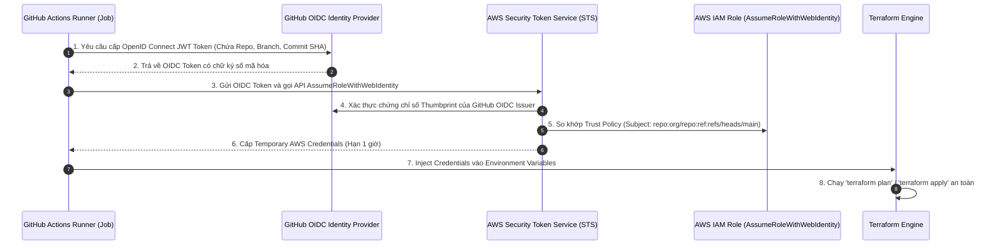
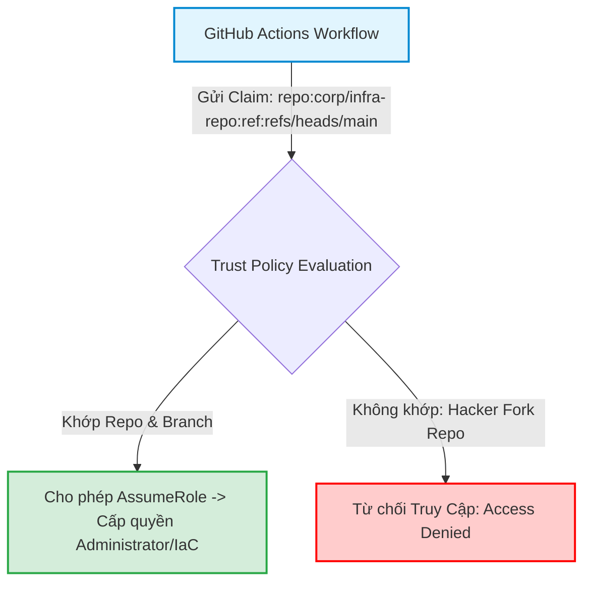
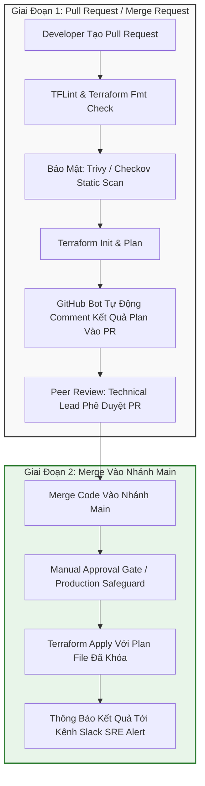
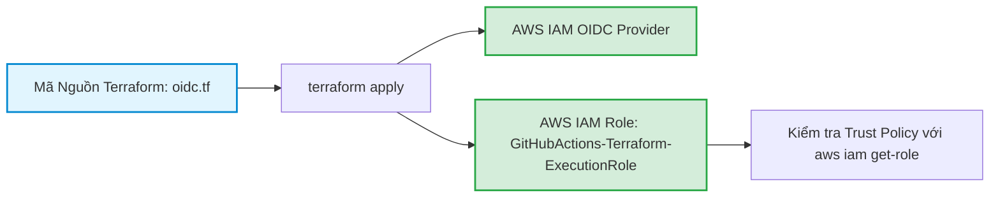
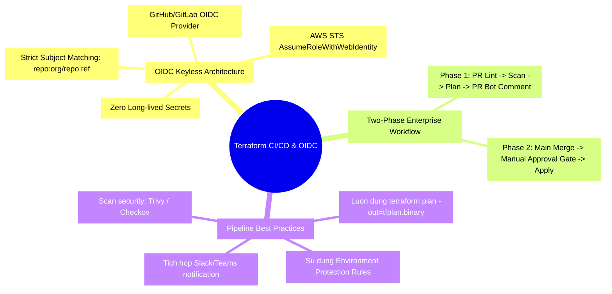

# Terraform trong CI/CD: GitLab CI, GitHub Actions và OIDC Authentication

Trong môi trường doanh nghiệp hiện đại, việc chạy `terraform apply` trực tiếp từ máy tính xách tay cá nhân của kỹ sư (Laptop Ops) bị coi là một hành vi vi phạm nghiêm trọng các quy chuẩn bảo mật và quản trị rủi ro (Compliance & Governance). Mọi thay đổi hạ tầng bắt buộc phải được theo dõi thông qua phiên bản mã nguồn Git (GitOps), kiểm tra tự động trong quá trình **Pull Request (Plan Phase)** và chỉ được phép triển khai vào Production sau khi vượt qua các bước **Phê duyệt thủ công (Manual Approval Gate)** trên hệ thống **CI/CD Pipeline**.

Tuy nhiên, một trong những thách thức lớn nhất khi đưa Terraform lên CI/CD là bài toán **Bảo mật Thông tin Xác thực (Credentials Security)**: Làm thế nào để Pipeline có thể tương tác với AWS/GCP/Azure mà không cần lưu trữ các cặp khóa tĩnh nguy hiểm (`AWS_ACCESS_KEY_ID` / `AWS_SECRET_ACCESS_KEY`) trên repository secrets?

Bài viết này sẽ hướng dẫn bạn thiết lập cơ chế xác thực không khóa **Keyless Authentication** thông qua **OpenID Connect (OIDC)**, xây dựng Pipeline chuẩn Enterprise với GitHub Actions / GitLab CI, và tự động hóa việc đưa báo cáo `terraform plan` trực tiếp vào thảo luận Pull Request.

---

## 1. Kiến Trúc Xác Thực Không Khóa (Keyless OIDC Authentication)

Phương pháp truyền thống lưu trữ AWS Secret Key trong GitHub Secrets tiềm ẩn rủi ro lộ lọt thông tin khi repository bị xâm nhập hoặc log pipeline vô tình in ra credentials. Chuẩn **OpenID Connect (OIDC)** giải quyết triệt để vấn đề này bằng cách sử dụng **JSON Web Tokens (JWT)** ngắn hạn được ký bởi Identity Provider (GitHub/GitLab) và xác thực bởi Cloud Provider (AWS STS).



### 1.1. Ma Trận So Sánh: Static Secrets vs OIDC Authentication

| Tiêu Chí So Sánh | Static IAM Access Keys | OpenID Connect (OIDC) Keyless |
| :--- | :--- | :--- |
| **Vị trí lưu trữ khóa** | Lưu tĩnh trong GitHub Secrets / GitLab Variables | **Không có khóa tĩnh**. Sinh token động theo từng Job |
| **Thời hạn tồn tại** | Vĩnh viễn cho đến khi bị thu hồi thủ công | **Tự hủy sau 15 - 60 phút** (Temporary Credentials) |
| **Rủi ro lộ lọt** | Cực kỳ cao nếu log bị rò rỉ hoặc secret bị copy | **Gần như bằng 0** (Token gắn chặt với ngữ cảnh Job) |
| **Phân quyền ngữ cảnh (Granular)** | Khó phân lập giữa branch `dev` và branch `main` | Ràng buộc chặt chẽ theo `repository`, `ref/branch`, `tag` |
| **Công sức bảo trì (Key Rotation)** | Phải xoay vòng key định kỳ 90 ngày một lần | **Zero Maintenance** (Tự động xoay vòng hoàn toàn) |

---

## 2. Thiết Lập OIDC AWS IAM Role Bằng Terraform

Trước khi cấu hình CI/CD Pipeline, chúng ta cần dùng Terraform để tạo một IAM OpenID Connect Provider và IAM Role có Trust Policy liên kết với GitHub Actions.



### 2.1. Code Khởi Tạo AWS OIDC Cho GitHub Actions

```hcl
# 1. Khởi tạo OIDC Provider cho GitHub Actions trên AWS
resource "aws_iam_openid_connect_provider" "github" {
  url             = "https://token.actions.githubusercontent.com"
  client_id_list  = ["sts.amazonaws.com"]
  thumbprint_list = ["6938fd4d98bab03faadb97b34396831e3780aea1", "1c58a3a8518e8759bf075b76b750d4f8d731b300"]
}

# 2. Định nghĩa Trust Policy nghiêm ngặt cho IAM Role
data "aws_iam_policy_document" "github_actions_assume_role" {
  statement {
    effect  = "Allow"
    actions = ["sts:AssumeRoleWithWebIdentity"]

    principals {
      type        = "Federated"
      identifiers = [aws_iam_openid_connect_provider.github.arn]
    }

    # RÀNG BUỘC CHẶT CHẼ REPOSITORY VÀ NHÁNH ĐƯỢC PHÉP DEPLOY
    condition {
      test     = "StringEquals"
      variable = "token.actions.githubusercontent.com:aud"
      values   = ["sts.amazonaws.com"]
    }

    condition {
      test     = "StringLike"
      variable = "token.actions.githubusercontent.com:sub"
      # Chỉ cho phép repository 'my-company/infrastructure' trên nhánh 'main' hoặc các pull requests
      values   = ["repo:my-company/infrastructure:*"]
    }
  }
}

# 3. Tạo IAM Role cho CI/CD Pipeline
resource "aws_iam_role" "github_ci_role" {
  name               = "GitHubActions-Terraform-ExecutionRole"
  assume_role_policy = data.aws_iam_policy_document.github_actions_assume_role.json
}

# 4. Gắn quyền thực thi quản trị hạ tầng (Tùy biến theo nguyên lý Least Privilege)
resource "aws_iam_role_policy_attachment" "ci_admin" {
  role       = aws_iam_role.github_ci_role.name
  policy_arn = "arn:aws:iam::aws:policy/AdministratorAccess"
}

output "ci_role_arn" {
  value       = aws_iam_role.github_ci_role.arn
  description = "ARN truyền vào GitHub Actions Workflow"
}
```

---

## 3. Kiến Trúc Pipeline Chuẩn Enterprise: Two-Phase Workflow

Một pipeline Terraform chuẩn mực trong doanh nghiệp luôn được chia làm 2 giai đoạn độc lập:



---

## 4. Xây Dựng GitHub Actions Workflow Hoàn Chỉnh

Dưới đây là file cấu hình workflow hoàn chỉnh `.github/workflows/terraform-pipeline.yml` tích hợp OIDC, Static Analysis, Pull Request Bot Comment và Apply Gate.

```yaml
name: "Terraform Enterprise Pipeline"

on:
  pull_request:
    branches: [ "main" ]
    paths:
      - "environments/production/**"
      - "modules/**"
  push:
    branches: [ "main" ]
    paths:
      - "environments/production/**"
      - "modules/**"

permissions:
  id-token: write # BẮT BUỘC ĐỂ LẤY OIDC JWT TOKEN
  contents: read
  pull-requests: write # BẮT BUỘC ĐỂ POST COMMENT KẾT QUẢ PLAN

env:
  AWS_REGION: "ap-southeast-1"
  ROLE_TO_ASSUME: "arn:aws:iam::123456789012:role/GitHubActions-Terraform-ExecutionRole"
  TF_VERSION: "1.6.2"
  WORKING_DIR: "environments/production"

jobs:
  # ==========================================
  # JOB 1: VALIDATION & PLAN CHO PULL REQUEST
  # ==========================================
  terraform-plan:
    name: "Terraform Lint, Scan & Plan"
    runs-on: ubuntu-latest
    defaults:
      run:
        working-directory: ${{ env.WORKING_DIR }}
    steps:
      - name: "Checkout Code"
        uses: actions/checkout@v4

      - name: "Configure AWS Credentials via OIDC"
        uses: aws-actions/configure-aws-credentials@v4
        with:
          role-to-assume: ${{ env.ROLE_TO_ASSUME }}
          aws-region: ${{ env.AWS_REGION }}
          audience: "sts.amazonaws.com"

      - name: "Setup Terraform"
        uses: hashicorp/setup-terraform@v3
        with:
          terraform_version: ${{ env.TF_VERSION }}

      - name: "Check Format"
        run: terraform fmt -check -recursive

      - name: "Terraform Init"
        run: terraform init

      - name: "Terraform Validate"
        run: terraform validate -no-color

      - name: "Terraform Plan"
        id: plan
        if: github.event_name == 'pull_request'
        run: |
          terraform plan -no-color -out=tfplan.binary
          terraform show -no-color tfplan.binary > tfplan.txt
        continue-on-error: false

      - name: "Comment Plan to Pull Request"
        uses: actions/github-script@v7
        if: github.event_name == 'pull_request'
        with:
          github-token: ${{ secrets.GITHUB_TOKEN }}
          script: |
            const fs = require('fs');
            const planOutput = fs.readFileSync('${{ env.WORKING_DIR }}/tfplan.txt', 'utf8');
            const maxLen = 60000;
            const truncatedPlan = planOutput.length > maxLen ? planOutput.substring(0, maxLen) + "\n...[TRUNCATED]" : planOutput;
            
            const output = `#### Terraform Plan Status: ✅ Succeeded
            #### Working Directory: \`${{ env.WORKING_DIR }}\`
            
            <details><summary>Xem chi tiết kết quả Terraform Plan</summary>
            
            \`\`\`hcl
            ${truncatedPlan}
            \`\`\`
            
            </details>
            
            *Pusher: @${{ github.actor }}, Action: \`${{ github.event_name }}\`*`;
            
            github.rest.issues.createComment({
              issue_number: context.issue.number,
              owner: context.repo.owner,
              repo: context.repo.repo,
              body: output
            })

  # ==========================================
  # JOB 2: APPLY CHO NHÁNH MAIN (PRODUCTION)
  # ==========================================
  terraform-apply:
    name: "Terraform Apply Production"
    needs: terraform-plan
    if: github.ref == 'refs/heads/main' && github.event_name == 'push'
    runs-on: ubuntu-latest
    environment: production # KÍCH HOẠT MANUAL APPROVAL GATE TRÊN GITHUB UI
    defaults:
      run:
        working-directory: ${{ env.WORKING_DIR }}
    steps:
      - name: "Checkout Code"
        uses: actions/checkout@v4

      - name: "Configure AWS Credentials via OIDC"
        uses: aws-actions/configure-aws-credentials@v4
        with:
          role-to-assume: ${{ env.ROLE_TO_ASSUME }}
          aws-region: ${{ env.AWS_REGION }}

      - name: "Setup Terraform"
        uses: hashicorp/setup-terraform@v3
        with:
          terraform_version: ${{ env.TF_VERSION }}

      - name: "Terraform Init"
        run: terraform init

      - name: "Terraform Apply"
        run: terraform apply -auto-approve -no-color
```

---

## 5. GitLab CI/CD Pipeline Tương Đương Chuẩn Enterprise

Đối với các tổ chức sử dụng **GitLab CI**, cơ chế OIDC được thực hiện thông qua cấu hình `id_tokens` và image chính thức của GitLab Terraform.

```yaml
# .gitlab-ci.yml
stages:
  - validate
  - plan
  - apply

image:
  name: hashicorp/terraform:1.6.2
  entrypoint: [""]

variables:
  AWS_DEFAULT_REGION: "ap-southeast-1"
  ROLE_ARN: "arn:aws:iam::123456789012:role/GitLabCI-Terraform-ExecutionRole"

before_script:
  - mkdir -p ~/.aws
  - echo "Acquiring AWS credentials via GitLab OIDC..."
  - >
    if [ -n "$CI_JOB_JWT_V2" ]; then
      export AWS_WEB_IDENTITY_TOKEN_FILE="/tmp/web_identity_token"
      echo "$CI_JOB_JWT_V2" > "$AWS_WEB_IDENTITY_TOKEN_FILE"
      export AWS_ROLE_ARN="$ROLE_ARN"
      export AWS_ROLE_SESSION_NAME="GitLabCI-${CI_PIPELINE_ID}"
    fi
  - terraform init

validate:
  stage: validate
  script:
    - terraform fmt -check
    - terraform validate

plan:
  stage: plan
  script:
    - terraform plan -out=plan.cache
  artifacts:
    name: plan
    paths:
      - plan.cache
    expire_in: 7 days
  only:
    - merge_requests
    - main

apply:
  stage: apply
  script:
    - terraform apply -input=false plan.cache
  dependencies:
    - plan
  when: manual # MANUAL APPROVAL GATE
  only:
    - main
```

---

## 6. Hands-On Lab: Thiết Lập OIDC Trust Policy & Chạy Test Giả Lập Token

Trong bài lab này, chúng ta sẽ viết mã Terraform tạo IAM OIDC Provider cho GitHub Actions và dùng script kiểm tra tính hợp lệ của Trust Policy.



### Bước 1: Khởi tạo thư mục lab
```bash
mkdir -p terraform-lab19-oidc
cd terraform-lab19-oidc
```

### Bước 2: Tạo file `main.tf` định nghĩa OIDC Trust Policy
```hcl
terraform {
  required_version = ">= 1.5.0"
  required_providers {
    aws = {
      source  = "hashicorp/aws"
      version = "~> 5.0"
    }
  }
}

provider "aws" {
  region = "ap-southeast-1"
}

variable "github_organization" {
  type        = string
  default     = "my-enterprise-org"
  description = "Tên GitHub Organization hoặc User"
}

variable "github_repository" {
  type        = string
  default     = "cloud-infrastructure"
  description = "Tên Repository chứa mã nguồn Terraform"
}

# 1. Khởi tạo OIDC Provider
resource "aws_iam_openid_connect_provider" "github_actions" {
  url             = "https://token.actions.githubusercontent.com"
  client_id_list  = ["sts.amazonaws.com"]
  thumbprint_list = ["6938fd4d98bab03faadb97b34396831e3780aea1"]
}

# 2. Xây dựng Trust Policy JSON
data "aws_iam_policy_document" "oidc_trust" {
  statement {
    effect  = "Allow"
    actions = ["sts:AssumeRoleWithWebIdentity"]

    principals {
      type        = "Federated"
      identifiers = [aws_iam_openid_connect_provider.github_actions.arn]
    }

    condition {
      test     = "StringEquals"
      variable = "token.actions.githubusercontent.com:aud"
      values   = ["sts.amazonaws.com"]
    }

    # BẢO VỆ CHỐNG TRUY CẬP TRÁI PHÉP TỪ REPOSITORY KHÁC
    condition {
      test     = "StringLike"
      variable = "token.actions.githubusercontent.com:sub"
      values   = ["repo:${var.github_organization}/${var.github_repository}:*"]
    }
  }
}

# 3. Tạo IAM Role
resource "aws_iam_role" "cicd_execution_role" {
  name               = "GitHubActions-Terraform-Lab-Role"
  assume_role_policy = data.aws_iam_policy_document.oidc_trust.json
}

# 4. Gắn Read-Only Policy phục vụ thử nghiệm an toàn
resource "aws_iam_role_policy_attachment" "readonly_attach" {
  role       = aws_iam_role.cicd_execution_role.name
  policy_arn = "arn:aws:iam::aws:policy/ReadOnlyAccess"
}

output "role_arn" {
  value = aws_iam_role.cicd_execution_role.arn
}
```

### Bước 3: Chạy `terraform init` và `terraform apply`
```bash
terraform init
terraform apply -auto-approve
```

### Bước 4: Kiểm tra Trust Policy đã được tạo trên AWS
```bash
aws iam get-role --role-name GitHubActions-Terraform-Lab-Role --query "Role.AssumeRolePolicyDocument" --output json
```

### Bước 5: Xác minh điều kiện `token.actions.githubusercontent.com:sub`
Đảm bảo giá trị `sub` trong output khớp chính xác với `repo:my-enterprise-org/cloud-infrastructure:*`.

### Bước 6: Dọn dẹp môi trường lab
```bash
terraform destroy -auto-approve
cd ..
rm -rf terraform-lab19-oidc
```

---

## 7. 10 Câu Hỏi Trắc Nghiệm & Phỏng Vấn Chuyên Sâu (Self-Check Q&A)

### Q1: Tại sao việc chạy `terraform apply` trực tiếp trên máy cục bộ của kỹ sư (Laptop Ops) bị cấm trong các môi trường tài chính, ngân hàng?
- **Trả lời**: Vì Laptop Ops tiềm ẩn nhiều rủi ro:
  - Thiếu tính minh bạch và audit log (không biết chính xác ai đã deploy phiên bản commit nào).
  - Nguy cơ lộ Access Key lưu trên máy cá nhân khi bị dính malware.
  - Sự khác biệt về phiên bản CLI, biến môi trường và mạng nội bộ giữa các máy trạm dẫn đến trạng thái State không nhất quán.
  - Không thể thực thi quy trình thẩm định 4 mắt (Peer Review / 4-Eyes Principle).

### Q2: Cơ chế xác thực OIDC giữa GitHub Actions và AWS STS hoạt động dựa trên tiêu chuẩn mã hóa nào?
- **Trả lời**: Hoạt động dựa trên chuẩn mã hóa **OpenID Connect (OIDC)** xây dựng trên nền tảng **OAuth 2.0** và **JSON Web Tokens (JWT)**. GitHub Actions ký số JWT token bằng Private Key của mình, và AWS STS xác thực chữ ký này thông qua bộ khóa công khai (Public Keys) được công bố tại endpoint `.well-known/openid-configuration` của GitHub.

### Q3: Trong Trust Policy của AWS IAM Role dành cho GitHub OIDC, trường `token.actions.githubusercontent.com:sub` đại diện cho thông tin gì?
- **Trả lời**: Trường `sub` (Subject Claim) chứa định danh ngữ cảnh thực thi của GitHub Actions, theo cấu trúc: `repo:<org>/<repo>:ref:<branch_or_tag>` hoặc `repo:<org>/<repo>:pull_request`. Đây là chốt chặn quan trọng nhất để ngăn chặn các GitHub repositories khác mạo danh và assume role của bạn.

### Q4: Tại sao trong file workflow GitHub Actions, bước `terraform plan` phải lưu file output nhị phân `terraform plan -out=tfplan.binary`?
- **Trả lời**: Để đảm bảo **tính tất định (Determinism)**. File `tfplan.binary` là một snapshot chứa chính xác danh sách các thay đổi đã được review và approve trong Pull Request. Khi chạy `terraform apply tfplan.binary`, Terraform chỉ thực thi đúng những gì đã được ghi nhận trong file đó, tránh trường hợp hạ tầng bị ai đó thay đổi ngầm giữa thời điểm Plan và Apply.

### Q5: Điều gì xảy ra nếu hai Developer cùng mở 2 Pull Request sửa đổi cùng một module Terraform và CI/CD kích hoạt song song?
- **Trả lời**: Khi cả hai job cùng chạy `terraform init` và `terraform plan`, cơ chế **State Locking** (thông qua DynamoDB hoặc S3 Native Locking) sẽ khóa state. Job chạy sau sẽ phải chờ job chạy trước nhả lock hoặc báo lỗi `State Lock Error`, ngăn chặn tình trạng race condition và xung đột dữ liệu.

### Q6: Làm thế nào để ngăn chặn một Pull Request độc hại từ bên ngoài (Forked Repository) tự động lấy OIDC credentials để truy cập hạ tầng AWS?
- **Trả lời**: 
  - Đặt điều kiện `sub` trong IAM Trust Policy chỉ chấp nhận chính xác repo nội bộ (`repo:my-org/my-repo:*`).
  - Trong cài đặt GitHub Repository Settings, tắt tùy chọn *"Send write tokens to workflows from fork pull requests"*.

### Q7: Công cụ Atlantis (Open-source GitOps for Terraform) khác gì so với GitHub Actions thông thường?
- **Trả lời**: Atlantis là một server chuyên dụng lắng nghe Webhooks từ GitHub/GitLab. Developer tương tác với Terraform bằng cách gõ comment trực tiếp trong PR (ví dụ: `atlantis plan`, `atlantis apply`). Atlantis tự động quản lý State Lock ở tầng PR level, khóa nhánh cho đến khi apply xong, rất tiện lợi nhưng đòi hỏi phải tự vận hành một máy chủ hoặc cluster để chạy Atlantis Server.

### Q8: Tại sao permission `id-token: write` là bắt buộc trong GitHub Actions Workflow khi dùng OIDC?
- **Trả lời**: Mặc định, GitHub Actions cấp quyền `read` cho GITHUB_TOKEN để đảm bảo an toàn. Quyền `id-token: write` là yêu cầu bắt buộc để cho phép GitHub Runner gửi yêu cầu ký và nhận OIDC JSON Web Token (JWT) từ máy chủ OpenID Connect của GitHub.

### Q9: Làm thế nào để thiết lập quy trình kiểm tra mã nguồn tĩnh (Static Security Scanning) trước khi `terraform plan` chạy trong CI/CD?
- **Trả lời**: Tích hợp các công cụ chuyên dụng vào các step trước `terraform plan`:
  - `tflint`: Kiểm tra cú pháp, lỗi logic và chuẩn best practice.
  - `trivy` hoặc `checkov`: Quét lỗ hổng bảo mật, phát hiện Security Group mở port nguy hiểm, S3 thiếu mã hóa, hoặc IAM quyền quá rộng.

### Q10: Khi sử dụng `terraform apply tfplan.binary`, có cần truyền lại biến `-var` hoặc `-var-file` không?
- **Trả lời**: **KHÔNG CẦN**. Mọi giá trị biến số, cấu hình providers và kế hoạch thay đổi đã được đóng gói toàn vẹn bên trong file nhị phân `tfplan.binary`. Terraform sẽ từ chối nếu bạn cố tình truyền thêm cờ `-var` vào lệnh apply file plan.

---

## 8. Tổng Kết & Cheat Sheet Thực Chiến



- **Tiêu chuẩn vàng bảo mật**: Khai tử 100% IAM Access Keys tĩnh trên GitHub/GitLab, chuyển đổi toàn bộ sang **OIDC Keyless Authentication**.
- **Nguyên tắc vận hành**: Không bao giờ áp dụng thay đổi mà không thông qua bước kiểm tra Pull Request và lưu giữ file plan nhị phân `tfplan.binary`.
- **Bước tiếp theo**: Trong [Bài 20: Quản Lý Secrets và Dữ Liệu Sensitive Trong Terraform Chuẩn Doanh Nghiệp](./20-quan-ly-secrets-va-du-lieu-sensitive-trong-terraform.md), chúng ta sẽ giải quyết triệt để vấn đề rò rỉ mật khẩu trong State file bằng HashiCorp Vault, AWS Secrets Manager và biến số `sensitive = true`!
