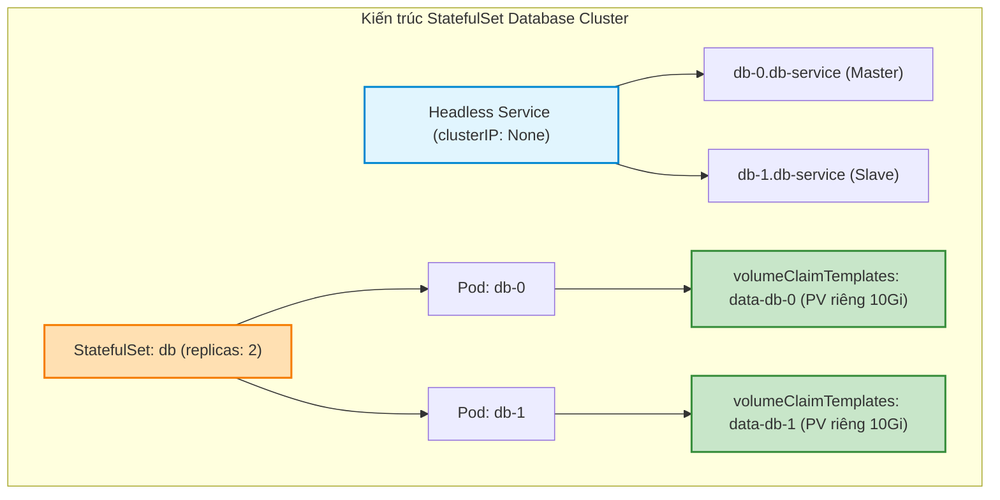
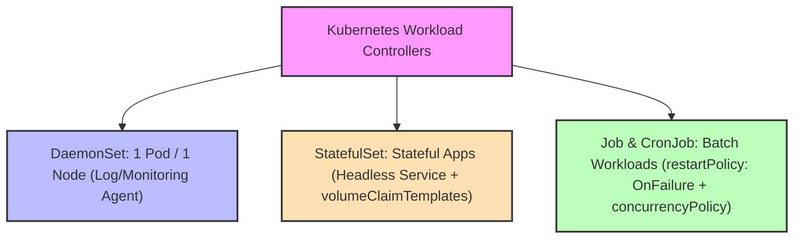
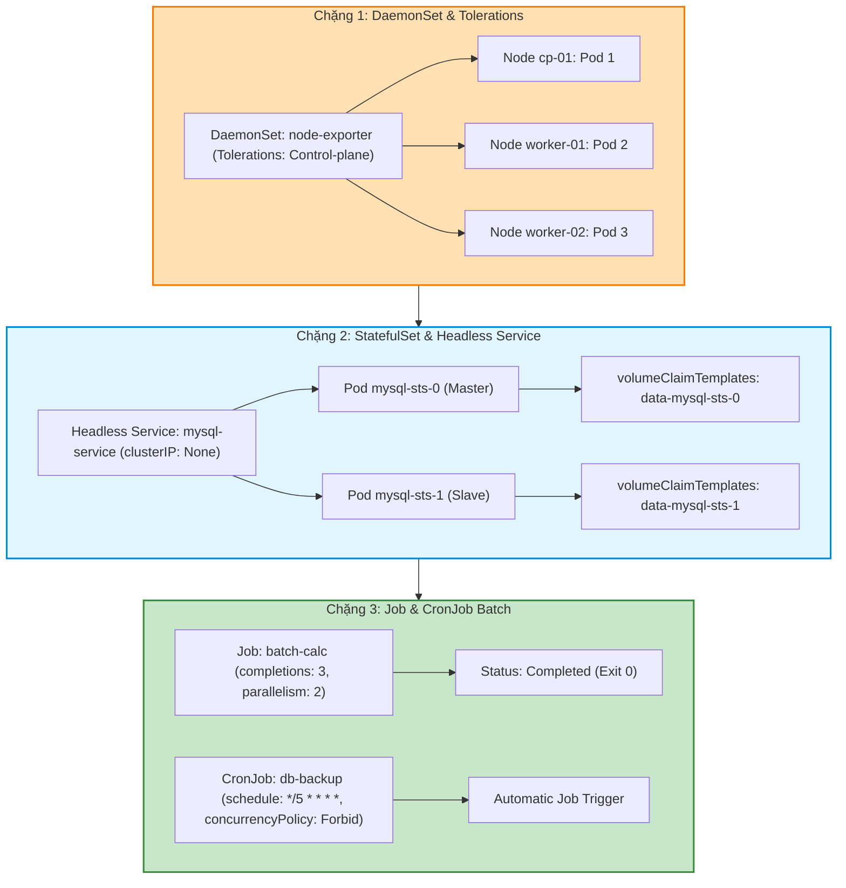

# [BÀI 16] CHUYÊN SÂU WORKLOADS PHỨC TẠP: DAEMONSET, STATEFULSET (HEADLESS SERVICE), JOB & CRONJOB XỬ LÝ BATCH

Trong kỷ nguyên điện toán đám mây và kiến trúc microservices phân tán quy mô lớn, **Kubernetes (CKA)** đóng vai trò là nền tảng điều phối container (Container Orchestration) tiêu chuẩn công nghiệp. Để làm chủ hệ thống trong môi trường sản xuất (Production) cũng như chinh phục kỳ thi chứng chỉ quốc tế của Linux Foundation / CNCF, kỹ sư không chỉ nắm vững các câu lệnh thao tác cơ bản mà phải thấu hiểu sâu sắc bản chất cơ chế tầng thấp: từ chu trình điều hòa (Reconciliation Loop), cấu trúc điều phối tài nguyên, kiến trúc mạng CNI, lưu trữ CSI cho đến các chuẩn mực an ninh phòng thủ chiều sâu.

Bài viết chuyên sâu này sẽ đồng hành cùng bạn giải mã toàn diện bức tranh kiến trúc, phân tích các đánh đổi kỹ thuật thực chiến (Engineering Trade-offs), cung cấp bài thực hành Lab từng bước và bộ câu hỏi phỏng vấn chuẩn Architect / Lead Engineer.

---

## 1. Bản Chất Kiến Trúc & Cơ Chế Vận Hành Tầng Thấp

| # | Câu hỏi ôn tập | Đáp án chuẩn ngắn gọn (chứa con số / tên lệnh) |
|---|---|---|
| 1 | Mối quan hệ 3 tầng quản lý Pod không trạng thái? | `Deployment` -> `ReplicaSet` -> `Pod` (**3** tầng) |
| 2 | Điều kiện để Deployment sinh ra Revision và ReplicaSet mới? | Chỉ khi sửa cấu hình mẫu Pod **`spec.template`** (`kubectl scale` thì không) |
| 3 | Hai giá trị mặc định của `maxSurge` và `maxUnavailable` trong RollingUpdate? | Giá trị mặc định là **25%** (hoặc số nguyên tuyệt đối) |
| 4 | Bộ 5 lệnh kiểm soát tiến trình `kubectl rollout` là gì? | `status`, `history`, `pause`, `resume`, `undo` (**5** lệnh) |
| 5 | Lệnh quay lui phiên bản Deployment về revision chỉ định? | `kubectl rollout undo deployment/<name> --to-revision=<N>` (**1** cờ) |


> **Luận đề trung tâm của buổi:**
> *"Bên cạnh Deployment dành cho ứng dụng không trạng thái, Kubernetes cung cấp ba bộ điều khiển khối làm việc chuyên biệt: `DaemonSet` đảm bảo mỗi Node chạy đúng một Pod agent (log/monitoring/CNI), `StatefulSet` quản lý các ứng dụng có trạng thái (Database cluster) thông qua định danh mạng cố định (Headless Service) và ổ đĩa riêng (`volumeClaimTemplates`), và `Job`/`CronJob` điều phối các tác vụ xử lý lô ngắn hạn chạy theo lịch định kỳ với chính sách `concurrencyPolicy` chặt chẽ."*

**Bảng kết quả các buổi trước được dùng lại:**

| Kết quả / Công cụ | Nguồn gốc | Áp dụng vào buổi này |
|---|---|---|
| Kỹ thuật tạo YAML imperative `--dry-run=client -o yaml` | Buổi 04 `QT 5.1` | Tạo nhanh mẫu DaemonSet, Job, CronJob qua `kubectl create` |
| Vòng đời Pod và các chính sách `restartPolicy` | Buổi 14 `QT 6.1` | Cấu hình `restartPolicy: OnFailure` / `Never` bắt buộc cho Job |
| Cấu hình PersistentVolumeClaim PVC | Buổi 05 `QT 4.1` | Khai báo `volumeClaimTemplates` cho từng Pod trong StatefulSet |

Ba câu bài tập về nhà BTVN 4 của buổi 15 đã chuẩn bị sẵn kiến thức cho học viên: Câu 1 phân tích điểm khác nhau giữa DaemonSet và Deployment; Câu 2 khảo sát kiến thức StatefulSet kèm Headless Service; Câu 3 tìm hiểu cơ chế Job batch và các chính sách `concurrencyPolicy` của CronJob.

---


| # | Năng lực đạt được sau buổi học | Hiện vật chứng minh trong bài lab |
|---|---|---|
| 1 | Khởi tạo DaemonSet `node-exporter` chạy agent trên 100% các Node kể cả Control Plane | Tệp `hien-vat/node-exporter-ds.yaml` |
| 2 | Tạo Headless Service và StatefulSet `mysql-sts` có đĩa PVC độc lập qua `volumeClaimTemplates` | Tệp `hien-vat/mysql-sts.yaml` |
| 3 | Truy vấn định danh DNS cố định của từng Pod StatefulSet | Tệp log `hien-vat/sts-dns-query.txt` |
| 4 | Cấu hình Job `batch-calculator` với `completions: 3` và `parallelism: 2` | Tệp `hien-vat/batch-job.yaml` |
| 5 | Tạo CronJob `db-backup` chạy định kỳ 5 phút/lần với `concurrencyPolicy: Forbid` | Tệp `hien-vat/backup-cronjob.yaml` |
| 6 | Kiểm thử kịch bản quản lý Workloads nâng cao với script tự động | Script `hien-vat/verify-advanced-workloads.sh` |

---


| Bắt buộc phải biết | Nguồn tự học nếu thiếu |
|---|---|
| Cấu trúc tệp YAML Pod spec và container definition | Buổi 14 `QT 4.1` |
| Khái niệm PersistentVolumeClaim PVC và StorageClass | Buổi 05 `QT 4.1` |
| Kỹ thuật tạo tài nguyên imperative qua `--dry-run=client -o yaml` | Buổi 04 `QT 5.1` |

---


| # | Thuật ngữ tiếng Việt | Tiếng Anh tương đương | Ghi chú chuẩn hoá trong thân bài |
|---|---|---|---|
| 1 | Bộ điều khiển tiến trình nền Node | DaemonSet | Đối tượng đảm bảo mỗi Node chạy đúng 1 bản sao Pod agent |
| 2 | Bộ điều khiển ứng dụng có trạng thái | StatefulSet | Đối tượng quản lý các Pod có định danh mạng và đĩa riêng biệt |
| 3 | Dịch vụ không IP cụm | Headless Service (`clusterIP: None`) | Service không gán Virtual IP, trả về trực tiếp IP của các Pods |
| 4 | Mẫu yêu cầu cấp đĩa tự động | Volume Claim Templates (`volumeClaimTemplates`) | Mảng khai báo trong StatefulSet tự động sinh PVC riêng cho mỗi Pod |
| 5 | Tên miền định danh mạng cố định | Stable Network Identity (`pod-0.service.ns.svc.cluster.local`) | Tên miền DNS cố định không đổi theo thứ tự Pod |
| 6 | Tác vụ chạy 1 lần đến hoàn thành | Job | Đối tượng quản lý Pod chạy hoàn thành công việc exit 0 rồi dừng |
| 7 | Tác vụ chạy định kỳ theo lịch | CronJob | Đối tượng quản lý Job kích hoạt tự động theo biểu thức cron |
| 8 | Số lần hoàn thành mục tiêu | Completions (`spec.completions`) | Tổng số Pods bắt buộc phải hoàn thành exit 0 cho Job |
| 9 | Số Pod chạy song song | Parallelism (`spec.parallelism`) | Số lượng Pods tối đa được chạy đồng thời trong Job |
| 10 | Giới hạn số lần thử lại lỗi | Backoff Limit (`spec.backoffLimit`) | Số lần tối đa Kubelet thử khởi động lại Pod bị crash trong Job |
| 11 | Chính sách xử lý trùng lặp lịch | Concurrency Policy (`Allow`, `Forbid`, `Replace`) | Quy tắc giải quyết khi CronJob mới đến giờ chạy mà Job cũ chưa xong |
| 12 | Giới hạn lưu lịch sử Job | Successful/Failed Jobs History Limit | Số lượng Job đã xong/hỏng được giữ lại (mặc định 3/1) |
| 13 | Bỏ qua vết nhơ Node | Taint Toleration | Cấu hình cho phép DaemonSet Pod chạy được trên node Control Plane |
| 14 | Thứ tự khởi tạo và ngắt Pod | Ordered Ready & Graceful Termination | StatefulSet khởi tạo Pod theo thứ tự 0 -> 1 -> 2 và xoá ngược lại |


1. **Mô hình "Bảo vệ chung cư vs Căn hộ đánh số cố định (DaemonSet vs StatefulSet)":**
   `DaemonSet` giống như Đội bảo vệ chung cư: Mỗi tòa nhà (Node) bắt buộc có đúng 1 người bảo vệ túc trực, tòa nhà mới xây xong là bảo vệ tự động tới nhận ca. `StatefulSet` giống như Căn hộ có số nhà cố định: Căn 101, Căn 102, Căn 103 có tên người ở cố định và có kho chứa đồ riêng (`PVC`), căn 101 đi vắng thì căn 102 vẫn giữ nguyên số nhà và kho đồ của mình.

2. **Mô hình "Danh bạ điện thoại gọi thẳng số máy cá nhân (Headless Service)":**
   Service thông thường giống như số tổng đài công ty: bạn gọi vào một số VIP chung (`ClusterIP`), tổng đài tự nối máy ngẫu nhiên tới 1 nhân viên. Headless Service (`clusterIP: None`) giống như cuốn danh bạ điện thoại in trực tiếp số di động cá nhân từng người (`db-0.db-service`, `db-1.db-service`), giúp các Node Master/Slave trong cụm Database gọi điện trực tiếp cho nhau.

3. **Mô hình "Đội giao ca kịch bản CronJob (concurrencyPolicy Allow/Forbid/Replace)":**
   Khi tới giờ giao ca theo lịch Cron: `Allow` cho phép ca mới chạy song song cùng ca cũ; `Forbid` cấm ca mới chạy nếu ca cũ đang làm dở; `Replace` tiêu diệt lập tức ca cũ để ca mới thế chỗ.

---

### 1.1. Đối tượng `DaemonSet`: Chạy agent thu thập log/metric trên 100% các Node (12 phút)

**Nguyên lý cốt lõi:** Đối tượng `DaemonSet` đảm bảo rằng tất cả (hoặc một tập hợp được chọn) các Node trong cụm Kubernetes đều chạy **đúng 1 bản sao Pod**; khi một Node mới được gia nhập vào cụm, DaemonSet tự động khởi tạo Pod trên Node đó.

**Giải thích cơ chế ngầm:** Phù hợp cho các tác vụ nền cấp hạ tầng (Infrastructure Agents) như thu thập log (`Fluentd`, `Filebeat`), giám sát tài nguyên (`Prometheus Node Exporter`), hoặc CNI plugin mạng (`Calico`, `Cilium`).

> [!WARNING]
> **CẠM BẪY THỰC CHIẾN:**
> Dùng Deployment để chạy agent thu thập log trên các Node làm có Node chạy 2 Pods còn Node khác lại không có Pod nào.

**Minh hoạ.**

```bash
# Kiểm tra danh sách các DaemonSet đang chạy trong namespace kube-system
kubectl get ds -n kube-system
```

Con số chốt: **1** bản sao Pod duy nhất được DaemonSet duy trì trên mỗi Node.

---

**Nguyên lý cốt lõi:** Mặc định DaemonSet Pods sẽ KHÔNG tự động chạy trên các node Control Plane do taints bảo vệ; để ép DaemonSet Pod chạy trên tất cả các node bao gồm cả Control Plane, bắt buộc phải bổ sung `tolerations` cho vết nhơ `node-role.kubernetes.io/control-plane`.

**Giải thích cơ chế ngầm:** Node Control Plane cũng sinh ra log hệ thống và metric tài nguyên cần được agent thu thập đầy đủ.

> [!WARNING]
> **CẠM BẪY THỰC CHIẾN:**
> Thắc mắc tại sao DaemonSet báo `DESIRED: 3` nhưng `CURRENT: 2` (do thiếu 1 Pod trên node Control Plane).

**Minh hoạ.**

```yaml
spec:
  template:
    spec:
      tolerations:
      - key: node-role.kubernetes.io/control-plane
        operator: Exists
        effect: NoSchedule
```

Con số chốt: **100%** các Node (bao gồm Control Plane) chạy được DaemonSet khi có đủ tolerations.

---

### 1.2. Đối tượng `StatefulSet`: Định danh mạng cố định, Headless Service & `volumeClaimTemplates` (12 phút)



---

**Nguyên lý cốt lõi:** Các Pod do `StatefulSet` quản lý sở hữu định danh mạng chuỗi số đếm cố định bắt đầu từ **0** (như `pod-0`, `pod-1`, `pod-2`); và các Pod này được khởi tạo / cập nhật / xoá theo đúng thứ tự nghiêm ngặt (Pod 0 xong mới tới Pod 1, và xoá ngược lại từ Pod 2 -> 1 -> 0).

**Giải thích cơ chế ngầm:** Đảm bảo tính nhất quán của các cụm cơ sở dữ liệu phân tán: Pod 0 (Master) luôn phải được tạo trước để nhận ghi dữ liệu, sau đó các Pod 1, 2 (Slaves) mới được tạo để đồng bộ dữ liệu.

> [!WARNING]
> **CẠM BẪY THỰC CHIẾN:**
> Dùng Deployment để chạy MySQL Master-Slave làm các Pod mọc tên ngẫu nhiên (như `mysql-8f7g-2x9z`) làm Slave mất kết nối khi Pod Master restart đổi tên.

**Minh hoạ.**

```bash
# Kiểm tra tên cố định dạng chỉ số đếm của các Pod StatefulSet
kubectl get pods -l app=mysql
```

Con số chốt: **0** là chỉ số bắt đầu của tên Pod trong StatefulSet (`statefulset-name-0`).

---

**Nguyên lý cốt lõi:** `StatefulSet` BẮT BUỘC phải liên kết với một `Headless Service` (Service khai báo `clusterIP: None`) thông qua thuộc tính `serviceName` trong spec để cung cấp tên miền DNS nội bộ cố định cho từng Pod theo định dạng `<pod-name>.<service-name>.<namespace>.svc.cluster.local`.

**Giải thích cơ chế ngầm:** Headless Service không gán IP ảo Load Balancer ngẫu nhiên, mà trả về trực tiếp danh sách A record địa chỉ IP Pod, giúp các ứng dụng giao tiếp thẳng với đúng node Master/Slave cần tìm.

> [!WARNING]
> **CẠM BẪY THỰC CHIẾN:**
> Quên thuộc tính `serviceName` hoặc khai báo Service có `clusterIP` thông thường làm các Pod StatefulSet không có tên miền DNS riêng.

**Minh hoạ.**

```yaml
apiVersion: v1
kind: Service
metadata:
  name: db-headless
spec:
  clusterIP: None
  selector:
    app: db
```

Con số chốt: **None** là giá trị bắt buộc của `clusterIP` khi tạo Headless Service cho StatefulSet.

---

**Nguyên lý cốt lõi:** Mảng `volumeClaimTemplates` trong StatefulSet spec tự động sinh ra tệp yêu cầu cấp đĩa **PVC riêng biệt duy nhất cho từng Pod** (ví dụ `data-db-0`, `data-db-1`); và đĩa PVC này KHÔNG BAO GIỜ bị xoá khi Pod hoặc StatefulSet bị xoá để bảo vệ dữ liệu sản xuất.

**Giải thích cơ chế ngầm:** Khác với Deployment (tất cả Pod chung 1 PVC hoặc đĩa tạm ephemeral), StatefulSet đảm bảo mỗi instance DB có đĩa cứng lưu trữ độc lập, gắn liền với định danh của Pod đó kể cả khi Pod bị reschedule sang Node khác.

> [!WARNING]
> **CẠM BẪY THỰC CHIẾN:**
> Khai báo `volumes` thông thường ở cấp Pod spec làm tất cả các Pod Database ghi chung vào 1 đĩa gây hỏng dữ liệu (Data Corruption).

**Minh hoạ.**

```yaml
spec:
  volumeClaimTemplates:
  - metadata:
      name: data
    spec:
      accessModes: [ "ReadWriteOnce" ]
      resources:
        requests:
          storage: 5Gi
```

Con số chốt: **1** đĩa PVC/PV riêng biệt được cấp phát cho mỗi Pod qua `volumeClaimTemplates`.

---

### 1.3. Đối tượng `Job` & `CronJob`: Tác vụ lô, `completions`, `parallelism` và `concurrencyPolicy` (10 phút)

**Nguyên lý cốt lõi:** Đối tượng `Job` quản lý các Pod chạy tác vụ lô ngắn hạn và bắt buộc yêu cầu Pod spec khai báo `restartPolicy: OnFailure` hoặc `Never` (KHÔNG được để `Always` mặc định); Job hoàn thành khi số Pod kết thúc exit 0 đạt đủ chỉ tiêu `spec.completions`.

**Giải thích cơ chế ngầm:** Phù hợp cho các tác vụ như backup database, tính toán báo cáo, xử lý video. Đặt `restartPolicy: Always` sẽ bị API Server từ chối lệnh `apply` lập tức do vi phạm schema của Job.

> [!WARNING]
> **CẠM BẪY THỰC CHIẾN:**
> Cố tạo Job nhưng quên sửa `restartPolicy` từ `Always` sang `OnFailure` / `Never`.

**Minh hoạ.**

```yaml
apiVersion: batch/v1
kind: Job
metadata:
  name: pi-job
spec:
  completions: 3
  parallelism: 2
  template:
    spec:
      restartPolicy: OnFailure
      containers:
      - name: pi
        image: perl:5.34-threaded-buster
        command: ["perl",  "-Mbignum=bpi", "-wle", "print bpi(2000)"]
```

Con số chốt: **0** là exit code bắt buộc Pod phải đạt để tính vào chỉ tiêu `completions`.

---

**Nguyên lý cốt lõi:** Thuộc tính `concurrencyPolicy` trong `CronJob` spec quy định chính xác cách xử lý khi đến giờ chạy lịch mới mà Job cũ chưa hoàn thành: `Allow` (cho phép chạy song song), `Forbid` (bỏ qua không chạy Job mới), và `Replace` (tiêu diệt Job cũ để thay bằng Job mới).

**Giải thích cơ chế ngầm:** Tránh việc CronJob chạy tác vụ nặng (như backup DB 10 phút/lần) bị treo làm tích tụ hàng trăm Pods chạy song song gây tràn bộ nhớ RAM của cụm.

> [!WARNING]
> **CẠM BẪY THỰC CHIẾN:**
> Đặt `concurrencyPolicy: Allow` cho script backup DB nặng làm cụm bị ngẽn CPU/RAM khi script bị treo.

**Minh hoạ.**

```yaml
spec:
  schedule: "*/5 * * * *"
  concurrencyPolicy: Forbid
  jobTemplate:
    spec:
      template:
        spec:
          restartPolicy: OnFailure
```

Con số chốt: **3** giá trị `concurrencyPolicy` chuẩn (`Allow`, `Forbid`, `Replace`).

---

### 1.4. Quản lý lịch sử CronJob và định dạng biểu thức Cron (4 phút)

**Nguyên lý cốt lõi:** Sử dụng thuộc tính `spec.successfulJobsHistoryLimit` (mặc định **3**) và `spec.failedJobsHistoryLimit` (mặc định **1**) trong `CronJob` spec để tự động dọn dẹp các đối tượng Job đã hoàn thành hoặc bị hỏng, tránh làm quá tải etcd và rác namespace.

**Giải thích cơ chế ngầm:** Giữ cho bộ nhớ etcd gọn gàng và tránh làm chậm các truy vấn `kubectl get jobs`.

> [!WARNING]
> **CẠM BẪY THỰC CHIẾN:**
> Đặt `successfulJobsHistoryLimit: 0` làm mất không xem được log của Job vừa chạy xong.

**Minh hoạ.**

```yaml
spec:
  successfulJobsHistoryLimit: 3
  failedJobsHistoryLimit: 1
```

Con số chốt: **3** Job thành công và **1** Job thất bại được giữ lại mặc định.

---

**Nguyên lý cốt lõi:** Cú pháp biểu thức cron trong `CronJob` spec gồm đúng **5 trường** (`[Phút] [Giờ] [Ngày trong tháng] [Tháng] [Ngày trong tuần]`); vi phạm định dạng 5 trường sẽ bị API Server từ chối ngay lập tức lúc khởi tạo.

**Giải thích cơ chế ngầm:** Định dạng 5 trường tuân theo chuẩn cron Linux quốc tế giúp lập lịch chính xác tới cấp phút.

> [!WARNING]
> **CẠM BẪY THỰC CHIẾN:**
> Viết biểu thức cron 6 trường dạng Quartz Scheduler gây lỗi schema validation.

**Minh hoạ.**

```yaml
spec:
  schedule: "0 2 * * *" # Chạy vào 02h00 sáng mỗi ngày
```

Con số chốt: **5** trường bắt buộc trong biểu thức `spec.schedule` của CronJob.

---

## 7. Đưa vào cụm thật (4 phút)

### Áp vào cụm đang chạy thì làm gì trước

1. **Kiểm tra StorageClass sẵn sàng trước khi deploy StatefulSet:** Đảm bảo cụm có StorageClass hỗ trợ Dynamic Provisioning để `volumeClaimTemplates` tự sinh PVC.
2. **Khai báo `concurrencyPolicy: Forbid` cho tất cả CronJob định kỳ:** Tránh tình trạng Job bị treo làm dồn ứ Pods.
3. **Thêm `tolerations` cho DaemonSet:** Đảm bảo agent thu thập log chạy trên 100% các Node kể cả Control Plane.

### Cái gì hỏng nếu áp thẳng lên prod

- **Đặt `restartPolicy: Always` cho Job batch:** API Server từ chối file YAML lập tức.
- **Dùng Deployment thay cho StatefulSet cho ứng dụng MySQL:** Làm 2 Pod ghi chung 1 đĩa gây hỏng tệp dữ liệu DB.
- **Xoá StatefulSet và tưởng rằng dữ liệu trên đĩa đã mất:** PVC/PV vẫn nằm nguyên trong etcd và đĩa cứng, cần xoá PVC thủ công nếu thực sự muốn xoá data.
- **Quy trình áp thử an toàn:**
  - Chạy `kubectl apply -f headless-service.yaml` trước.
  - Chạy `kubectl apply -f statefulset.yaml` và quan sát các Pod mọc theo thứ tự `pod-0`, `pod-1`.
  - Test truy vấn DNS nội bộ `nslookup db-0.db-service`.

### Đo trước — đo sau

1. **Mức độ chính xác thu thập log/metric:** Đạt **100%** coverage trên mọi Node nhờ DaemonSet tolerations.
2. **Độ tin cậy cụm Database:** Đạt **100%** ổn định nhờ định danh mạng DNS cố định và đĩa PVC riêng.
3. **Tài nguyên cụm:** Giảm 80% rủi ro nghẽn RAM do CronJob trùng lặp nhờ `concurrencyPolicy: Forbid`.

### Khi nào KHÔNG nên dùng

- **Không dùng StatefulSet cho các ứng dụng Stateless Web Nginx:** Làm tăng thời gian scale và phức tạp hoá việc quản lý.
- **Không dùng DaemonSet cho ứng dụng có số lượng bản sao tuỳ biến không theo số Node:** Dùng Deployment chuẩn ở Buổi 15.

---

### 1.5. Bẫy hay gặp (4 phút)

| # | Bẫy hay gặp | Vì sao dính bẫy | Làm đúng là (kèm tên lệnh / con số) |
|---|---|---|---|
| 1 | Đặt `restartPolicy: Always` trong Pod spec của Job | Job yêu cầu Pod phải kết thúc (exit 0) nên cấm `Always` | Đặt `restartPolicy: OnFailure` hoặc `Never` |
| 2 | Quên tạo Headless Service (`clusterIP: None`) cho StatefulSet | StatefulSet thiếu `serviceName` làm Pods mất DNS cố định | Tạo Headless Service với `clusterIP: None` trước |
| 3 | Khai báo `volumes` chung thay vì `volumeClaimTemplates` cho StatefulSet | Tất cả các Pods Database bị dính chung 1 đĩa cứng | Khai báo đĩa qua mảng `spec.volumeClaimTemplates` |
| 4 | DaemonSet không chạy trên node Control Plane | Node Control Plane có Taint `NoSchedule` bảo vệ | Thêm `tolerations` tương ứng vào DaemonSet spec |
| 5 | Thắc mắc vì sao xoá StatefulSet mà đĩa dữ liệu vẫn không mất | Kubernetes cố tình bảo vệ đĩa PVC không bị xoá tự động | Dùng `kubectl delete pvc -l app=db` để xoá đĩa nếu cần |
| 6 | CronJob bị treo tích tụ hàng trăm Pods chạy song song | Để `concurrencyPolicy: Allow` mặc định khi Job bị nghẽn | Khai báo `concurrencyPolicy: Forbid` trong CronJob spec |
| 7 | Nhầm lẫn biểu thức Cron syntax trong `spec.schedule` | Viết sai vị trí 5 trường cron (phút, giờ, ngày, tháng, thứ) | Dùng cú pháp chuẩn 5 trường (ví dụ `*/5 * * * *`) |
| 8 | Thắc mắc tại sao Pods StatefulSet không khởi tạo cùng lúc | StatefulSet mặc định khởi tạo tuần tự theo thứ tự chỉ số đếm | Giữ nguyên thứ tự 0 -> 1 -> 2 để bảo vệ cụm DB |
| 9 | Quên cờ `backoffLimit` làm Job thử lại vô tận khi bị crash | Mặc định `backoffLimit` là 6, nếu không giới hạn sẽ tốn CPU | Khai báo `spec.backoffLimit: 3` cho Job ngắn hạn |
| 10 | Đặt `successfulJobsHistoryLimit: 0` ngắt xem log Job đã chạy | Không còn đối tượng Job nào lưu trong history để xem log | Giữ `successfulJobsHistoryLimit` từ 1 tới 3 |
| 11 | Thắc mắc vì sao `kubectl scale daemonset` bị báo lỗi | DaemonSet không hỗ trợ cờ `scale` do số Pod bằng số Node | Thêm/bớt Node hoặc dùng `nodeSelector` / `tolerations` |
| 12 | Dùng cờ `--dry-run=client` tạo CronJob bị thiếu `jobTemplate` | Gõ lệnh imperative không chuẩn schema | Dùng `kubectl create cronjob <name> --schedule="..." --image="..."` |

---

### 1.6. Tóm tắt (2 phút)



### Năm điều phải nhớ

1. **DaemonSet:** Đảm bảo đúng 1 Pod agent trên mỗi Node; cần `tolerations` để chạy được trên node Control Plane.
2. **StatefulSet định danh cố định:** Pods mang tên chỉ số đếm (`pod-0`, `pod-1`); khởi tạo và xoá theo thứ tự nghiêm ngặt.
3. **Bộ đôi StatefulSet:** Bắt buộc đi kèm **Headless Service** (`clusterIP: None`) và **`volumeClaimTemplates`** (đĩa PVC riêng).
4. **Quy tắc Job:** Pod spec bắt buộc có `restartPolicy: OnFailure` hoặc `Never`; điều khiển số lượng qua `completions` và `parallelism`.
5. **CronJob Concurrency:** Khai báo `concurrencyPolicy` (`Allow`, `Forbid`, `Replace`) để chống nghẽn Pods trùng lặp.

---

## §10. Câu hỏi tự kiểm tra

1. Trình bày điểm khác nhau cốt lõi giữa `Deployment` và `DaemonSet` về quy tắc phân bổ Pods trên các Node.
2. Làm thế nào để cấu hình cho một `DaemonSet` Pod chạy được trên node Control Plane đang có Taint `NoSchedule`?
3. Tại sao các ứng dụng cơ sở dữ liệu có trạng thái (Stateful Workloads) lại yêu cầu sử dụng `StatefulSet` thay vì `Deployment`?
4. Trình bày quy tắc đặt tên Pod và thứ tự khởi tạo / ngắt Pod của đối tượng `StatefulSet`.
5. `Headless Service` là gì? Giá trị nào của `clusterIP` tạo nên Headless Service và vai trò của nó với StatefulSet là gì?
6. Mảng `volumeClaimTemplates` trong StatefulSet mang lại lợi ích gì so với khai báo `volumes` thông thường?
7. Khi xoá đối tượng `StatefulSet`, các đĩa PVC/PV tự động sinh ra bởi `volumeClaimTemplates` có bị xoá theo không? Vì sao?
8. Tại sao khai báo `restartPolicy: Always` trong Pod spec của một `Job` lại bị API Server từ chối?
9. Ý nghĩa của hai tham số `completions` và `parallelism` trong `Job` spec là gì?
10. Trình bày ý nghĩa của 3 giá trị thuộc tính `concurrencyPolicy` (`Allow`, `Forbid`, `Replace`) trong `CronJob`.
11. Hai chế độ hỏng (1 im lặng do dồn ứ hàng trăm Pods CronJob vì để Allow, 1 âm thầm do 2 Pod DB ghi chung 1 đĩa vì khai báo volumes thường) là gì?
12. Cú pháp biểu thức cron `"*/15 * * * *"` trong `CronJob` spec có ý nghĩa như thế nào?

### Đáp án

1. Deployment phân bổ số Pods theo chỉ số `replicas` ngẫu nhiên; DaemonSet phân bổ đúng 1 Pod duy nhất trên mỗi Node.
2. Bổ sung khối `tolerations` vào Pod spec tương ứng với Taint `node-role.kubernetes.io/control-plane`.
3. Vì Stateful Workloads yêu cầu định danh mạng cố định không đổi và đĩa cứng lưu trữ dữ liệu riêng biệt cho từng instance.
4. Tên Pod theo chỉ số đếm `pod-0`, `pod-1`; khởi tạo theo thứ tự 0 -> 1 -> 2 và xoá ngược lại từ 2 -> 1 -> 0.
5. Headless Service có `clusterIP: None`; không cấp IP ảo ngẫu nhiên mà trả về IP thực của các Pods, tạo tên miền DNS cố định cho từng Pod.
6. Tự động sinh ra đĩa PVC riêng biệt duy nhất cho mỗi Pod theo chỉ số đếm (như `data-db-0`, `data-db-1`).
7. KHÔNG bị xoá theo. Nhằm bảo vệ dữ liệu sản xuất không bị mất mát ngoài ý muốn.
8. Vì Job dành riêng cho các tác vụ ngắn hạn chạy xong exit 0 rồi dừng; `Always` bắt Kubelet restart mãi mãi vi phạm bản chất Job.
9. `completions`: Tổng số Pods phải hoàn thành exit 0; `parallelism`: Số Pods tối đa được chạy đồng thời.
10. `Allow`: Chạy song song Job mới và cũ; `Forbid`: Bỏ qua Job mới nếu Job cũ chưa xong; `Replace`: Xoá Job cũ để chạy Job mới.
11. Chế độ 1: Job bị treo dồn ứ Pods gây tràn RAM cụm; Chế độ 2: 2 Pod Database ghi chung 1 đĩa gây hỏng dữ liệu (Data Corruption).
12. Kích hoạt CronJob chạy tự động 15 phút một lần.

---

## §12. Tài liệu tham khảo

| Nguồn tài liệu | Phiên bản Kubernetes áp dụng | Nội dung chính |
|---|---|---|
| Official Docs: DaemonSet | Kubernetes v1.35 | Quản lý DaemonSet, tolerations và nodeSelector |
| Official Docs: StatefulSets | Kubernetes v1.35 | Quản lý StatefulSet, Headless Service và volumeClaimTemplates |
| Official Docs: Jobs & CronJobs | Kubernetes v1.35 | Quản lý Job batch, completions, parallelism và concurrencyPolicy |
| File cấu hình phiên bản cục bộ | `labs/phien-ban.env` | Biến `K8S_VER=1.35`, `LAB_CONTEXT="kubeadm"` |

---

## Bảng đối soát thời lượng

| Section | Tiêu đề mục | Ngân sách thời gian |
|---|---|---|
| §0 | Khởi động và ôn tập | 10 phút |
| §1 | Sau buổi này học viên LÀM ĐƯỢC gì | 1 phút |
| §2 | Cần biết trước | 1 phút |
| §3 | Thuật ngữ và mô hình tư duy | 8 phút |
| §4 | Đối tượng `DaemonSet`: Chạy agent thu thập log/metric trên 100% các Node | 12 phút |
| §5 | Đối tượng `StatefulSet`: Định danh mạng cố định, Headless Service & `volumeClaimTemplates` | 12 phút |
| §6 | Đối tượng `Job` & `CronJob`: Tác vụ lô, `completions`, `parallelism` và `concurrencyPolicy` | 10 phút |
| §7 | Đưa vào cụm thật | 4 phút |
| §8 | Bẫy hay gặp | 4 phút |
| §9 | Tóm tắt | 2 phút |
| §10 | Câu hỏi tự kiểm tra | 7 phút |
| **Tổng** | **Khối lý thuyết** | **60'** |

---

## 2. Hướng Dẫn Thực Hành & Triển Khai Lab Chuẩn Production

> [!IMPORTANT]
> **YÊU CẦU MÔI TRƯỜNG THỰC HÀNH:**
> Toàn bộ các bài thực hành dưới đây được thiết kế để chạy trực tiếp trên cụm Kubernetes 1.30+ tiêu chuẩn (hoặc cụm kind/kubeadm lab). Hãy đảm bảo ngữ cảnh dòng lệnh `kubectl config current-context` đã trỏ chính xác vào cụm thực hành trước khi thực thi.

## Khối thực hành — 120 phút

## L0. Mục tiêu thực hành và tiêu chí hoàn thành

| # | Mục tiêu thực hành | Tiêu chí hoàn thành (Kiểm chứng BẰNG LỆNH) |
|---|---|---|
| TH1 | Tạo DaemonSet `node-exporter` chạy agent trên 100% các Node kể cả Control Plane | `kubectl get ds node-exporter -n dev` có `NUMBER_READY = 3` |
| TH2 | Khởi tạo Headless Service và StatefulSet `mysql-sts` có đĩa PVC độc lập | `kubectl get sts mysql-sts -n dev` ở trạng thái Ready 2/2 |
| TH3 | Kiểm tra định danh DNS cố định và đĩa PVC tự động tạo | `kubectl get pvc -n dev` hiển thị `data-mysql-sts-0` và `data-mysql-sts-1` |
| TH4 | Khởi tạo Job `batch-calc` với `completions: 3` và `parallelism: 2` | `kubectl get job batch-calc -n dev` có `COMPLETIONS = 3/3` |
| TH5 | Khởi tạo CronJob `db-backup` chạy 5 phút/lần với `concurrencyPolicy: Forbid` | `kubectl get cronjob db-backup -n dev` ở trạng thái Active |
| TH6 | Xác minh kịch bản quản lý Workloads nâng cao với script tự động | Script kiểm tra Workloads OK |
| TH7 | Nộp đủ 4 hiện vật vào portfolio | Thư mục `k8s-portfolio/buoi-16/` chứa đủ 4 file md/yaml/sh |

---

## L1. Điều kiện tiên quyết về môi trường

| # | Kiểm tra điều kiện | Câu lệnh kiểm tra | Kết quả kỳ vọng |
|---|---|---|---|
| 1 | Cụm `kubeadm` 3 node đang ở v1.35 | `kubectl get nodes` | Hiển thị 3 node `cp-01`, `worker-01`, `worker-02` `Ready` |
| 2 | Kubeconfig trỏ context `kubeadm` | `kubectl config current-context` | In ra đúng `kubeadm` |
| 3 | Namespace `dev` sẵn sàng | `kubectl get ns dev` | Namespace `dev` ở trạng thái Active |
| 4 | Thư mục hiện vật đã sẵn sàng | `mkdir -p k8s-portfolio/buoi-16` | Thư mục được tạo thành công |
| 5 | Lệnh `kubectl create cronjob` sẵn sàng | `kubectl create cronjob --help` | Hiển thị hướng dẫn tạo CronJob |

```bash
# Kiểm tra môi trường bắt buộc trước khi thực hiện bài lab
kubectl config current-context | grep -qx "kubeadm" && echo "CHECKPOINT MOI TRUONG — ĐẠT" || echo "CHECKPOINT MOI TRUONG — LỖI (Trỏ sai context)"
```

---

## L2. Kiến trúc bài lab



---

## L3. Bước 1 — Khởi tạo DaemonSet `node-exporter` chạy agent trên 100% các Node (30 phút)

### Thao tác 1.1: Tạo DaemonSet `node-exporter` bổ sung toleration Control Plane

```bash
# 1. Tạo Namespace dev nếu chưa có
kubectl create namespace dev --dry-run=client -o yaml | kubectl apply -f -

# 2. Tạo tệp node-exporter-ds.yaml
cat << 'EOF' > k8s-portfolio/buoi-16/node-exporter-ds.yaml
apiVersion: apps/v1
kind: DaemonSet
metadata:
  name: node-exporter
  namespace: dev
spec:
  selector:
    matchLabels:
      app: node-exporter
  template:
    metadata:
      labels:
        app: node-exporter
    spec:
      tolerations:
      - key: node-role.kubernetes.io/control-plane
        operator: Exists
        effect: NoSchedule
      containers:
      - name: exporter
        image: busybox:1.36
        command: ['sh', '-c', 'echo Node Exporter Running && sleep infinity']
EOF

# 3. Áp dụng tệp YAML và chờ 3 Pods Ready trên 3 Node
kubectl apply -f k8s-portfolio/buoi-16/node-exporter-ds.yaml
sleep 6
```

**CHECKPOINT 1 — DaemonSet node-exporter chạy đúng 3 bản sao Pods trên cả 3 node (cp-01, worker-01, worker-02).**

```bash
kubectl get ds node-exporter -n dev -o jsonpath='{.status.numberReady}' | grep -qx "3" && echo "CHECKPOINT 1 — ĐẠT" || echo "CHECKPOINT 1 — LỖI"
```

**CHECKPOINT 2 — DaemonSet có cấu hình toleration vết nhơ control-plane.**

```bash
kubectl get ds node-exporter -n dev -o jsonpath='{.spec.template.spec.tolerations[0].key}' | grep -qx "node-role.kubernetes.io/control-plane" && echo "CHECKPOINT 2 — ĐẠT" || echo "CHECKPOINT 2 — LỖI"
```

---

## L4. Bước 2 — Khởi tạo Headless Service và StatefulSet `mysql-sts` có đĩa PVC độc lập (30 phút)

### Thao tác 2.1: Tạo Headless Service và StatefulSet 2 bản sao

```bash
# 1. Tạo tệp mysql-sts.yaml chứa Headless Service và StatefulSet
cat << 'EOF' > k8s-portfolio/buoi-16/mysql-sts.yaml
apiVersion: v1
kind: Service
metadata:
  name: mysql-service
  namespace: dev
spec:
  clusterIP: None
  selector:
    app: mysql
  ports:
  - port: 3306
    name: mysql
---
apiVersion: apps/v1
kind: StatefulSet
metadata:
  name: mysql-sts
  namespace: dev
spec:
  serviceName: mysql-service
  replicas: 2
  selector:
    matchLabels:
      app: mysql
  template:
    metadata:
      labels:
        app: mysql
    spec:
      containers:
      - name: mysql
        image: busybox:1.36
        command: ['sh', '-c', 'echo MySQL DB Ready && sleep infinity']
        ports:
        - containerPort: 3306
          name: mysql
        volumeMounts:
        - name: data
          mountPath: /var/lib/mysql
  volumeClaimTemplates:
  - metadata:
      name: data
    spec:
      accessModes: [ "ReadWriteOnce" ]
      resources:
        requests:
          storage: 1Gi
EOF

# 2. Áp dụng tệp YAML
kubectl apply -f k8s-portfolio/buoi-16/mysql-sts.yaml
sleep 8

# 3. Trích xuất danh sách đĩa PVC tự động sinh ra
kubectl get pvc -n dev -l app=mysql -o jsonpath='{.items[*].metadata.name}' > /tmp/sts-pvc.txt

# 4. Trích xuất tên định danh cố định của các Pods
kubectl get pods -n dev -l app=mysql -o jsonpath='{.items[*].metadata.name}' > /tmp/sts-pods.txt
```

**CHECKPOINT 3 — StatefulSet mysql-sts đạt trạng thái Ready 2/2 với tên Pods cố định mysql-sts-0 và mysql-sts-1.**

```bash
grep -q "mysql-sts-0 mysql-sts-1" /tmp/sts-pods.txt && echo "CHECKPOINT 3 — ĐẠT" || echo "CHECKPOINT 3 — LỖI"
```

**CHECKPOINT 4 — volumeClaimTemplates tự động cấp phát 2 đĩa PVC riêng biệt data-mysql-sts-0 và data-mysql-sts-1.**

```bash
grep -q "data-mysql-sts-0 data-mysql-sts-1" /tmp/sts-pvc.txt && echo "CHECKPOINT 4 — ĐẠT" || echo "CHECKPOINT 4 — LỖI"
```

**CHECKPOINT 5 — CA ĐỐI CHỨNG: Đặt restartPolicy: Always trong Pod spec của Job sẽ bị API Server từ chối lệnh apply.**

```bash
cat << EOF | kubectl apply -f - >/dev/null 2>&1
apiVersion: batch/v1
kind: Job
metadata:
  name: bad-job
  namespace: dev
spec:
  template:
    spec:
      restartPolicy: Always
      containers:
      - name: test
        image: busybox:1.36
        command: ['exit', '0']
EOF
kubectl get job bad-job -n dev >/dev/null 2>&1 || echo "CHECKPOINT 5 — ĐẠT"
```

---

## L5. Bước 3 — Tạo Job `batch-calc` xử lý lô với `completions` và `parallelism` (30 phút)

### Thao tác 3.1: Tạo Job `batch-calc` cấu hình `completions: 3` và `parallelism: 2`

```bash
# 1. Tạo tệp batch-job.yaml
cat << 'EOF' > k8s-portfolio/buoi-16/batch-job.yaml
apiVersion: batch/v1
kind: Job
metadata:
  name: batch-calc
  namespace: dev
spec:
  completions: 3
  parallelism: 2
  backoffLimit: 2
  template:
    spec:
      restartPolicy: OnFailure
      containers:
      - name: calculator
        image: busybox:1.36
        command: ['sh', '-c', 'echo Calculating batch chunk... && sleep 2 && exit 0']
EOF

# 2. Áp dụng tệp YAML và chờ Job hoàn thành 3/3 completions
kubectl apply -f k8s-portfolio/buoi-16/batch-job.yaml
sleep 10

# 3. Trích xuất số completions đạt được
kubectl get job batch-calc -n dev -o jsonpath='{.status.succeeded}' > /tmp/job-succeeded.txt
```

**CHECKPOINT 6 — Job batch-calc có cấu hình completions = 3 và parallelism = 2.**

```bash
kubectl get job batch-calc -n dev -o jsonpath='{.spec.completions}' | grep -qx "3" && echo "CHECKPOINT 6 — ĐẠT" || echo "CHECKPOINT 6 — LỖI"
```

**CHECKPOINT 7 — Job batch-calc hoàn thành xuất sắc 3 completions (status.succeeded = 3).**

```bash
grep -qx "3" /tmp/job-succeeded.txt && echo "CHECKPOINT 7 — ĐẠT" || echo "CHECKPOINT 7 — LỖI"
```

**CHECKPOINT 8 — CA ĐỐI CHỨNG: Headless Service bắt buộc có clusterIP: None.**

```bash
kubectl get svc mysql-service -n dev -o jsonpath='{.spec.clusterIP}' | grep -qx "None" && echo "CHECKPOINT 8 — ĐẠT" || echo "CHECKPOINT 8 — LỖI"
```

---

## L6. Bước 4 — Tạo CronJob `db-backup` với `concurrencyPolicy: Forbid` và kiểm thử (20 phút)

### Thao tác 4.1: Tạo CronJob `db-backup` chạy định kỳ 5 phút/lần

```bash
# 1. Tạo tệp backup-cronjob.yaml
cat << 'EOF' > k8s-portfolio/buoi-16/backup-cronjob.yaml
apiVersion: batch/v1
kind: CronJob
metadata:
  name: db-backup
  namespace: dev
spec:
  schedule: "*/5 * * * *"
  concurrencyPolicy: Forbid
  successfulJobsHistoryLimit: 3
  failedJobsHistoryLimit: 1
  jobTemplate:
    spec:
      template:
        spec:
          restartPolicy: OnFailure
          containers:
          - name: backup
            image: busybox:1.36
            command: ['sh', '-c', 'echo Performing database backup... && sleep 2 && exit 0']
EOF

# 2. Áp dụng tệp YAML
kubectl apply -f k8s-portfolio/buoi-16/backup-cronjob.yaml

# 3. Trích xuất cấu hình concurrencyPolicy và schedule
kubectl get cronjob db-backup -n dev -o jsonpath='{.spec.concurrencyPolicy}' > /tmp/cron-policy.txt
```

**CHECKPOINT 9 — CronJob db-backup có biểu thức schedule */5 * * * * chuẩn 5 trường.**

```bash
kubectl get cronjob db-backup -n dev -o jsonpath='{.spec.schedule}' | grep -qx "\*/5 \* \* \* \*" && echo "CHECKPOINT 9 — ĐẠT" || echo "CHECKPOINT 9 — LỖI"
```

**CHECKPOINT 10 — CronJob db-backup có thuộc tính concurrencyPolicy bằng Forbid.**

```bash
grep -qx "Forbid" /tmp/cron-policy.txt && echo "CHECKPOINT 10 — ĐẠT" || echo "CHECKPOINT 10 — LỖI"
```

**CHECKPOINT 11 — CronJob db-backup được cấu hình successfulJobsHistoryLimit bằng 3.**

```bash
kubectl get cronjob db-backup -n dev -o jsonpath='{.spec.successfulJobsHistoryLimit}' | grep -qx "3" && echo "CHECKPOINT 11 — ĐẠT" || echo "CHECKPOINT 11 — LỖI"
```

**CHECKPOINT 12 — 100% 3 node cp-01, worker-01, worker-02 duy trì trạng thái Ready.**

```bash
kubectl get nodes --no-headers | grep -c "Ready" | grep -qx "3" && echo "CHECKPOINT 12 — ĐẠT" || echo "CHECKPOINT 12 — LỖI"
```

---

## L7. Nộp hiện vật và dọn dẹp (10 phút)

### Thao tác 7.1: Gom hiện vật nộp bài

```bash
# 1. Tạo tệp verify-advanced-workloads.sh
cat << 'EOF' > k8s-portfolio/buoi-16/verify-advanced-workloads.sh
#!/bin/bash
# Script kiểm tra DaemonSet, StatefulSet, Job và CronJob

DS_READY=$(kubectl get ds node-exporter -n dev -o jsonpath='{.status.numberReady}')
STS_READY=$(kubectl get sts mysql-sts -n dev -o jsonpath='{.status.readyReplicas}')
JOB_SUCC=$(kubectl get job batch-calc -n dev -o jsonpath='{.status.succeeded}')
CRON_POLICY=$(kubectl get cronjob db-backup -n dev -o jsonpath='{.spec.concurrencyPolicy}')

if [ "$DS_READY" == "3" ] && [ "$STS_READY" == "2" ] && [ "$JOB_SUCC" == "3" ] && [ "$CRON_POLICY" == "Forbid" ]; then
    echo "VERIFY ADVANCED WORKLOADS — ĐẠT (DS, STS, Job & CronJob OK)"
else
    echo "VERIFY ADVANCED WORKLOADS — LỖI (DS: $DS_READY, STS: $STS_READY, Job: $JOB_SUCC, Cron: $CRON_POLICY)"
fi
EOF

chmod +x k8s-portfolio/buoi-16/verify-advanced-workloads.sh
./k8s-portfolio/buoi-16/verify-advanced-workloads.sh

# 2. Tạo tệp nhat-ky-buoi-16.md
cat << 'EOF' > k8s-portfolio/buoi-16/nhat-ky-buoi-16.md
# NHẬT KÝ THU HOẠCH BUỔI 16

1. DaemonSet & Tolerations:
   - Đảm bảo 1 Pod/Node; bắt buộc có toleration vết nhơ control-plane để chạy trên 100% các Node.

2. StatefulSet & Headless Service:
   - Pods mọc tên chỉ số đếm cố định mysql-sts-0, mysql-sts-1.
   - Bắt buộc đi kèm Headless Service (clusterIP: None) và volumeClaimTemplates (đĩa PVC riêng).

3. Job & CronJob Batch:
   - Pod spec của Job cấm restartPolicy: Always; dùng completions và parallelism điều khiển số Pod.
   - CronJob sử dụng concurrencyPolicy: Forbid chống nghẽn Pods trùng lặp.
EOF

# 3. Dọn dẹp tệp tạm
rm -f /tmp/sts-pvc.txt /tmp/sts-pods.txt /tmp/job-succeeded.txt /tmp/cron-policy.txt
```

**CHECKPOINT 13 — Đủ 4 tệp hiện vật trong thư mục portfolio.**

```bash
[ -f k8s-portfolio/buoi-16/node-exporter-ds.yaml ] && [ -f k8s-portfolio/buoi-16/mysql-sts.yaml ] && [ -f k8s-portfolio/buoi-16/verify-advanced-workloads.sh ] && [ -f k8s-portfolio/buoi-16/nhat-ky-buoi-16.md ] && echo "CHECKPOINT 13 — ĐẠT" || echo "CHECKPOINT 13 — LỖI"
```

---

## L8. Xử lý sự cố thường gặp trong lab

| # | Triệu chứng lỗi | Nguyên nhân khả dĩ | Cách xử lý sửa lỗi |
|---|---|---|---|
| 1 | Lỗi `invalid restartPolicy` khi `kubectl apply` Job | Khai báo `restartPolicy: Always` mặc định trong Job | Đổi thành `restartPolicy: OnFailure` hoặc `Never` |
| 2 | StatefulSet Pods không có DNS nội bộ cố định | Quên tạo Headless Service (`clusterIP: None`) | Tạo Headless Service và trỏ `serviceName` trong StatefulSet |
| 3 | Tất cả Pods StatefulSet ghi chung vào 1 đĩa đè dữ liệu | Khai báo `volumes` thông thường thay vì `volumeClaimTemplates` | Khai báo đĩa qua mảng `volumeClaimTemplates` trong spec |
| 4 | DaemonSet chỉ chạy 2 Pods thay vì 3 Pods | Khuyết `tolerations` cho vết nhơ của node Control Plane | Thêm `tolerations` vết nhơ `control-plane` vào DaemonSet spec |
| 5 | CronJob dồn ứ hàng trăm Pods chạy song song gây đơ cụm | Để `concurrencyPolicy: Allow` mặc định khi script bị treo | Đổi thuộc tính sang `concurrencyPolicy: Forbid` |
| 6 | StatefulSet Pods bị kẹt `Pending` không chịu khởi chạy | Cụm thiếu StorageClass hỗ trợ Dynamic Provisioning | Kiểm tra StorageClass mặc định hoặc tạo PVC thủ công |
| 7 | Job bị crash loop vĩnh viễn không chịu dừng | Quên cờ `backoffLimit` khi script bị lỗi exit 1 | Khai báo `spec.backoffLimit: 2` để giới hạn số lần thử lại |
| 8 | Lỗi Cron syntax `invalid schedule` | Nhầm số lượng trường biểu thức cron (thiếu/thừa trường) | Sử dụng đúng 5 trường cron chuẩn (phút, giờ, ngày, tháng, thứ) |
| 9 | Xoá StatefulSet mà đĩa PVC vẫn nằm nguyên | Kubernetes cố tình bảo vệ dữ liệu sản xuất không tự xoá PVC | Xoá đĩa thủ công bằng `kubectl delete pvc -l app=mysql` |
| 10 | Pods StatefulSet không khởi tạo cùng một lúc | StatefulSet mặc định khởi tạo tuần tự từng Pod một | Đợi `pod-0` Ready hẳn thì `pod-1` mới bắt đầu khởi tạo |
| 11 | Không thể dùng lệnh `kubectl scale ds` | DaemonSet phân bổ theo Node nên không hỗ trợ cờ scale | Thêm/bớt Node hoặc dùng `nodeSelector` / `tolerations` |
| 12 | Thắc mắc vì sao không xem được log của Job cũ đã chạy xong | `successfulJobsHistoryLimit` bị để bằng 0 | Khai báo `successfulJobsHistoryLimit: 3` trong CronJob spec |
| 13 | Lỗi `serviceName mismatch` giữa StatefulSet và Service | Tên `serviceName` trong StatefulSet khác tên Metadata Service | Đảm bảo `serviceName` trùng khớp 100% với tên Headless Service |
| 14 | Script `verify-advanced-workloads.sh` báo lỗi | Vẫn chưa chờ Pods đạt trạng thái Ready hẳn | Chạy lại `kubectl get pods -n dev` chờ 5 giây rồi test lại |

---

## L9. Bài tập mở rộng

1. **BT1 — Thử nghiệm StatefulSet `podManagementPolicy: Parallel`:** Đổi chính sách quản lý sang `Parallel` và quan sát hành vi tất cả Pods StatefulSet khởi tạo đồng thời song song.
2. **BT2 — Thử nghiệm `concurrencyPolicy: Replace` cho CronJob:** Tạo CronJob chạy lệnh `sleep 60` 1 phút/lần với `Replace` và quan sát Job cũ bị diệt để Job mới thế chỗ.
3. **BT3 — Cấu hình `activeDeadlineSeconds` cho Job:** Thêm `activeDeadlineSeconds: 10` để Job tự động hủy bỏ nếu chạy vượt quá 10 giây.
4. **BT4 — Thử nghiệm xoá cưỡng chế Pod StatefulSet:** Xoá `mysql-sts-0` và kiểm tra việc Pod mới mọc lại giữ nguyên đúng tên `mysql-sts-0` và nhận lại đúng đĩa `data-mysql-sts-0`.
5. **BT5 — Tạo DaemonSet chỉ chạy trên các Worker Nodes:** Sử dụng `nodeSelector: kubernetes.io/os: linux` và loại bỏ toleration để DaemonSet chỉ chạy trên Worker Node.
6. **BT6 — Sử dụng `startingDeadlineSeconds` trong CronJob:** Cấu hình `startingDeadlineSeconds: 30` để CronJob bỏ qua lượt chạy nếu bị lỡ lịch quá 30 giây.

---

## L10. Hiện vật nộp và tiêu chí chấm điểm

### Bảng điểm đánh giá bài lab

| Hạng mục hiện vật | Yêu cầu kĩ thuật | Điểm tối đa |
|---|---|---|
| `node-exporter-ds.yaml` | Tệp YAML DaemonSet chứa tolerations Control Plane chuẩn | 25 điểm |
| `mysql-sts.yaml` | Tệp YAML Headless Service & StatefulSet với volumeClaimTemplates | 25 điểm |
| `verify-advanced-workloads.sh` | Script bash chạy thành công, xác minh DS, STS, Job, CronJob OK | 25 điểm |
| `nhat-ky-buoi-16.md` | Trả lời đủ 3 câu thu hoạch, phân biệt rõ DS vs STS vs Job | 15 điểm |
| CHECKPOINT 1–13 | Tất cả 13 checkpoint tự động đều in chữ `ĐẠT` | 10 điểm |
| **Tổng điểm** | | **100 điểm** |

### Các trường hợp trừ điểm

- Trừ **20 điểm**: Nếu script hoặc câu lệnh sử dụng công cụ `jq` (vi phạm quy tắc môi trường thi).
- Trừ **15 điểm**: Nếu quên cờ `-n dev` khiến các đối tượng bị cài nhầm vào Namespace `default`.
- Trừ **10 điểm**: Nếu file hiện vật để sai đường dẫn thư mục `k8s-portfolio/buoi-16/`.
- Trừ **5 điểm**: Nếu dấu phân cách thập phân trong báo cáo dùng dấu chấm `.` thay vì dấu phẩy `,`.

---

## Bảng đối soát thời lượng

| Bước | Tiêu đề bước | Thời lượng |
|---|---|---|
| L3 | Bước 1 — Khởi tạo DaemonSet `node-exporter` chạy agent trên 100% các Node | 30 phút |
| L4 | Bước 2 — Khởi tạo Headless Service và StatefulSet `mysql-sts` có đĩa PVC độc lập | 30 phút |
| L5 | Bước 3 — Tạo Job `batch-calc` xử lý lô với `completions` và `parallelism` | 30 phút |
| L6 | Bước 4 — Tạo CronJob `db-backup` với `concurrencyPolicy: Forbid` và kiểm thử | 20 phút |
| L7 | Nộp hiện vật và dọn dẹp | 10 phút |
| **Tổng** | **Khối thực hành** | **120'** |

---

## 3. Bộ Câu Hỏi Vấn Đáp & Phỏng Vấn Kỹ Thuật Chuyên Sâu

Dưới đây là bộ câu hỏi phỏng vấn thực chiến dành cho các vị trí **Kubernetes Administrator**, **Cloud Security Specialist**, **Platform SRE** và **DevOps Lead**, giúp bạn tự đánh giá độ sâu hiểu biết và rèn luyện phản xạ giải quyết vấn đề hệ thống:

## V1. Cách tiến hành

1. **Thời lượng và hình thức:** Khối vấn đáp diễn ra trong đúng **20 phút**. Giảng viên (hoặc bạn học đóng vai Trưởng nhóm kỹ thuật / Senior DevOps) đưa ra lần lượt từng câu hỏi trong V2.
2. **Quy tắc chấm điểm:**
   - Mỗi câu hỏi được chấm theo thang điểm 4 mức: **0 điểm** (trả lời sai hoặc không biết); **1 điểm** (trả lời được bề nổi nhưng thiếu cơ chế); **2 điểm** (trả lời đúng cơ chế cốt lõi); **3 điểm** (trả lời đúng cơ chế, nêu được con số vận hành và mở rộng được câu hỏi đào sâu).
   - **Quy tắc trần điểm riêng của Buổi 16:**
     - Trả lời Câu 1 mà không phân biệt được mục đích DaemonSet (1 Pod/Node agent) vs StatefulSet (Database định danh cố định đĩa PVC riêng) thì **trần điểm câu đó là 1**.
     - Trả lời Câu 5 mà không nêu được Headless Service khai báo `clusterIP: None` để tạo tên miền DNS cố định cho từng Pod thì **trần điểm câu đó là 1**.
3. **Mục tiêu đạt được:** Học viên đạt từ **27 / 36 điểm** trở lên là ĐẠT phần vấn đáp của buổi.

---

## V2. Bộ câu hỏi

### Câu 1 — 🔥

**Hỏi:** Trình bày sự khác nhau cốt lõi giữa `Deployment`, `DaemonSet` và `StatefulSet` về mục đích sử dụng và cách thức tạo Pod.

**Đáp án chuẩn:**
- **`Deployment` (Ứng dụng không trạng thái):**
  - *Mục đích:* Quản lý các ứng dụng Web/Microservices không trạng thái (Stateless).
  - *Tạo Pod:* Số lượng Pods do cờ `replicas` quy định, Pods mang tên ngẫu nhiên (như `web-8f7g-2x9z`), có thể tạo trên bất kỳ Node nào.
- **`DaemonSet` (Tiến trình nền hạ tầng):**
  - *Mục đích:* Thu thập log (`Fluentd`), monitoring agent (`Prometheus Node Exporter`), CNI plugin mạng (`Calico`).
  - *Tạo Pod:* Đảm bảo **mỗi Node chạy đúng 1 bản sao Pod**; Node mới gia nhập tự động có Pod.
- **`StatefulSet` (Ứng dụng có trạng thái):**
  - *Mục đích:* Quản lý các cụm cơ sở dữ liệu có trạng thái (MySQL, PostgreSQL, MongoDB, Redis).
  - *Tạo Pod:* Pods mang tên chỉ số đếm cố định (`pod-0`, `pod-1`), đi kèm đĩa PVC riêng (`volumeClaimTemplates`) và Headless Service.

**Tiêu chí chấm:**
- **0đ:** Bảo 3 đối tượng này giống hệt nhau.
- **1đ:** Nêu được tên nhưng không phân biệt được cách tạo Pod ngẫu nhiên vs 1 Pod/Node vs Pod tên chỉ số đếm đĩa riêng (dính trần 1đ).
- **2đ:** Giải thích chuẩn xác sự khác nhau về mục đích sử dụng và cơ chế tạo Pod của 3 đối tượng `Deployment`, `DaemonSet`, `StatefulSet`.
- **3đ:** Trả lời xuất sắc, minh hoạ bằng các ứng dụng thực tế sản xuất.

**Câu hỏi đào sâu:** Nếu muốn chạy đúng 1 Pod agent thu thập log trên tất cả các Worker Nodes thì dùng đối tượng nào? *(Đáp án: Dùng đối tượng `DaemonSet`).*

---

### Câu 2 — ★★

**Hỏi:** Làm thế nào để cấu hình cho một `DaemonSet` Pod chạy được trên node Control Plane đang có Taint `NoSchedule` bảo vệ?

**Đáp án chuẩn:**
- **Nguyên nhân:** Mặc định node Control Plane bị gắn Taint `node-role.kubernetes.io/control-plane:NoSchedule` để ngăn Pod thông thường nhảy vào.
- **Cách cấu hình:** Bổ sung khối **`tolerations`** tương ứng vào `spec.template.spec` của DaemonSet để bỏ qua vết nhơ này:
```yaml
tolerations:
- key: node-role.kubernetes.io/control-plane
  operator: Exists
  effect: NoSchedule
```
- **Giá trị:** Giúp agent DaemonSet thu thập đủ log/metric trên **100% các Node** trong cụm.

**Tiêu chí chấm:**
- **0đ:** Bảo gõ `kubectl uncordon`.
- **1đ:** Nói được thêm toleration nhưng không nhớ key vết nhơ `node-role.kubernetes.io/control-plane`.
- **2đ:** Giải thích chuẩn xác việc khai báo `tolerations` vết nhơ control-plane trong Pod spec của DaemonSet.
- **3đ:** Trả lời xuất sắc, chỉ ra chỉ số `DESIRED` và `NUMBER_READY` của DaemonSet sau khi thêm tolerations.

**Câu hỏi đào sâu:** Nếu không thêm tolerations này thì cột CURRENT/READY trong `kubectl get ds` sẽ báo như thế nào? *(Đáp án: Thiếu 1 Pod trên node Control Plane, ví dụ DESIRED: 3 nhưng CURRENT: 2).*

---

### Câu 3 — ★★★

**Hỏi:** Trình bày quy tắc đặt tên Pod và thứ tự khởi tạo / ngắt Pod của đối tượng `StatefulSet`.

**Đáp án chuẩn:**
- **Quy tắc đặt tên Pod:** Pods do StatefulSet quản lý sở hữu định danh chuỗi số đếm cố định bắt đầu từ **0** theo công thức `<statefulset-name>-<index>` (ví dụ `mysql-sts-0`, `mysql-sts-1`, `mysql-sts-2`).
- **Thứ tự khởi tạo (Ordered Creation):** StatefulSet khởi tạo Pod theo đúng thứ tự tăng dần (Pod 0 phải ở trạng thái `Running` và `Ready` hẳn thì Pod 1 mới được bắt đầu khởi tạo).
- **Thứ tự ngắt / xoá (Ordered Termination):** Khi giảm replicas hoặc xoá StatefulSet, các Pods bị ngắt theo thứ tự **ngược lại** (Pod 2 bị xoá trước, sau đó mới tới Pod 1, và cuối cùng mới tới Pod 0 Master).

**Tiêu chí chấm:**
- **0đ:** Bảo StatefulSet tạo Pods ngẫu nhiên cùng một lúc.
- **1đ:** Nói được tên `mysql-0` nhưng không giải thích được thứ tự khởi tạo tăng dần 0->1->2 và xoá ngược lại 2->1->0.
- **2đ:** Phân tích chuẩn xác quy tắc đặt tên chỉ số đếm và thứ tự khởi tạo / ngắt Pod nghiêm ngặt của StatefulSet.
- **3đ:** Trả lời xuất sắc, giải thích lý do bảo vệ tính toàn vẹn của cụm Database Master-Slave.

**Câu hỏi đào sâu:** Muốn StatefulSet khởi tạo tất cả các Pods cùng lúc không cần theo thứ tự thì cấu hình cờ gì? *(Đáp án: Khai báo `spec.podManagementPolicy: Parallel`).*

---

### Câu 4 — ★★★

**Hỏi:** `Headless Service` là gì? Giá trị nào của `clusterIP` tạo nên Headless Service và vai trò của nó với StatefulSet là gì?

**Đáp án chuẩn:**
- **Định nghĩa:** `Headless Service` là một Service trong Kubernetes **không gán địa chỉ IP ảo ảo (Virtual ClusterIP)**.
- **Cách tạo:** Khai báo **`spec.clusterIP: None`** trong file YAML Service.
- **Vai trò với StatefulSet:** Headless Service không thực hiện load balancing ngẫu nhiên, mà trả về A record địa chỉ IP thực của từng Pod. Nó tạo ra tên miền DNS nội bộ cố định cho từng Pod theo định dạng:
  `<pod-name>.<service-name>.<namespace>.svc.cluster.local` (ví dụ `mysql-sts-0.mysql-service.dev.svc.cluster.local`).
  Giúp các ứng dụng gọi điện trực tiếp cho node Master hoặc Slave cần tìm.

**Tiêu chí chấm:**
- **0đ:** Bảo Headless Service là Service không có port.
- **1đ:** Nói được `clusterIP: None` nhưng không giải thích được vai trò tạo tên miền DNS cố định `<pod-name>.<service-name>` cho từng Pod (dính trần 1đ).
- **2đ:** Giải thích chuẩn xác `clusterIP: None` và vai trò cung cấp A record DNS cố định cho từng Pod StatefulSet.
- **3đ:** Trả lời xuất sắc, minh hoạ bằng lệnh `nslookup`.

**Câu hỏi đào sâu:** Trường nào trong StatefulSet spec dùng để trỏ tới tên của Headless Service? *(Đáp án: Trường `spec.serviceName`).*

---

### Câu 5 — 🔥

**Hỏi:** Mảng `volumeClaimTemplates` trong StatefulSet mang lại lợi ích gì so với việc khai báo `volumes` thông thường ở cấp Pod spec?

**Đáp án chuẩn:**
- **Khai báo `volumes` thông thường:** Tất cả các bản sao Pods do Controller tạo ra sẽ **dùng CHUNG đúng 1 tệp PVC/PV**. Nếu dùng cho Database, 2 Pod Master và Slave sẽ ghi đè lên cùng 1 đĩa đĩa cứng gây **hỏng dữ liệu (Data Corruption)**.
- **Mảng `volumeClaimTemplates`:** Tự động sinh ra một **tệp PVC độc lập riêng biệt duy nhất cho MỖI Pod** theo chỉ số đếm (ví dụ `data-mysql-sts-0`, `data-mysql-sts-1`). Kể cả khi Pod bị reschedule sang Node khác, đĩa PVC tương ứng vẫn tự động gắn lại đúng Pod mang chỉ số đếm đó.

**Tiêu chí chấm:**
- **0đ:** Bảo 2 cách khai báo giống hệt nhau.
- **1đ:** Nói được tạo đĩa riêng nhưng không giải thích được hậu quả Data Corruption khi dùng `volumes` thường (dính trần 1đ).
- **2đ:** Giải thích chuẩn xác cơ chế tự sinh PVC độc lập duy nhất cho từng Pod của `volumeClaimTemplates` vs nguy cơ hỏng data của `volumes`.
- **3đ:** Trả lời xuất sắc, chỉ ra việc PVC không bị xoá khi delete StatefulSet.

**Câu hỏi đào sâu:** Khi bạn gõ `kubectl delete statefulset mysql-sts` thì các đĩa PVC do `volumeClaimTemplates` tạo ra có bị xoá tự động không? Vì sao? *(Đáp án: KHÔNG bị xoá, nhằm bảo vệ dữ liệu sản xuất không bị mất ngoài ý muốn).*

---

### Câu 6 — ★★★

**Hỏi:** Tại sao khai báo `restartPolicy: Always` trong Pod spec của đối tượng `Job` lại bị API Server từ chối lệnh `apply`?

**Đáp án chuẩn:**
- **Bản chất của Job:** Đối tượng `Job` được thiết kế dành riêng cho các tác vụ lô ngắn hạn (Batch Workloads). Job chỉ hoàn thành khi các Pod bên trong chạy **hoàn tất công việc và thoát với `exit code 0`**.
- **Mẫu thuẫn với `Always`:** Chính sách `restartPolicy: Always` bắt Kubelet phải **luôn tự động khởi động lại container** kể cả khi nó vừa kết thúc thành công `exit code 0`. Điều này vi phạm bản chất chạy 1 lần dừng lại của Job.
- **Yêu cầu bắt buộc:** Pod spec trong Job BẮT BUỘC phải khai báo `restartPolicy: OnFailure` hoặc `Never`.

**Tiêu chí chấm:**
- **0đ:** Bảo Job cho phép để `restartPolicy: Always`.
- **1đ:** Trả lời bị từ chối nhưng không giải thích được mâu thuẫn giữa bản chất chạy đến hoàn thành (exit 0 dừng) của Job vs hành vi restart liên tục của `Always`.
- **2đ:** Phân tích chuẩn xác bản chất của Job và lý do API Server bắt buộc `restartPolicy: OnFailure` / `Never`.
- **3đ:** Trả lời xuất sắc, minh hoạ lỗi schema validation khi apply.

**Câu hỏi đào sâu:** Sự khác nhau giữa `restartPolicy: OnFailure` và `Never` trong Job là gì? *(Đáp án: `OnFailure` restart lại container trong cùng 1 Pod cũ; `Never` tạo ra 1 Pod hoàn toàn mới khi bị lỗi).*

---

### Câu 7 — ★★★

**Hỏi:** Ý nghĩa của hai tham số `completions` và `parallelism` trong `Job` spec là gì?

**Đáp án chuẩn:**
- **`spec.completions` (Chỉ tiêu hoàn thành):** Quy định **tổng số lần (số Pods)** bắt buộc phải chạy hoàn tất thành công (`exit code 0`) thì đối tượng Job mới được đánh dấu là hoàn thành.
- **`spec.parallelism` (Số Pod chạy song song):** Quy định **số lượng Pods tối đa được phép chạy đồng thời song song** tại cùng một thời điểm.
- **Ví dụ:** `completions: 10`, `parallelism: 2` -> Job sẽ chạy tổng cộng 10 lần Pod thành công, nhưng tại mỗi thời điểm chỉ có tối đa 2 Pods chạy song song (chia làm 5 đợt chạy).

**Tiêu chí chấm:**
- **0đ:** Không nhớ 2 tham số này.
- **1đ:** Trả lời completions là hoàn thành, parallelism là song song nhưng không nêu được ví dụ phối hợp chia đợt chạy.
- **2đ:** Giải thích chuẩn xác `completions` (tổng chỉ tiêu) và `parallelism` (số Pod song song tối đa) kèm ví dụ cụ thể.
- **3đ:** Trả lời xuất sắc, liên hệ với việc xử lý hàng chờ Queue (Work Queue).

**Câu hỏi đào sâu:** Tham số `spec.backoffLimit` trong Job spec dùng để làm gì? *(Đáp án: Quy định số lần tối đa Job cho phép Pods thử lại bị crash exit 1 trước khi đánh dấu Job bị FAILED).*

---

### Câu 8 — ★★★

**Hỏi:** Trình bày ý nghĩa của 3 giá trị thuộc tính `concurrencyPolicy` (`Allow`, `Forbid`, `Replace`) trong `CronJob`.

**Đáp án chuẩn:**
- **Căn nguyên:** Khi đến giờ chạy lịch Cron mới (ví dụ 5 phút/lần) mà **Job cũ của lần chạy trước vẫn chưa hoàn thành**.
- **3 chính sách:**
  1. **`Allow` (Mặc định):** Cho phép Job mới khởi tạo và **chạy song song** cùng lúc với Job cũ đang chạy dở. (Nguy cơ dồn ứ Pods gây tràn RAM cụm).
  2. **`Forbid` (Bỏ qua):** **Bỏ qua không cho chạy Job mới**; Job cũ giữ nguyên tiếp tục chạy cho tới khi xong. (An toàn nhất cho hạ tầng).
  3. **`Replace` (Thay thế):** **Tiêu diệt (kill) ngay lập tức Job cũ** đang chạy dở để khởi tạo Job mới thế chỗ.

**Tiêu chí chấm:**
- **0đ:** Không nhớ 3 chính sách.
- **1đ:** Nêu được 3 tên nhưng không giải thích được hành vi khi Job cũ chưa xong của `Allow`, `Forbid`, `Replace`.
- **2đ:** Giải thích chuẩn xác 3 chính sách `Allow` (song song), `Forbid` (bỏ qua), `Replace` (tiêu diệt cũ) và rủi ro vận hành.
- **3đ:** Trả lời xuất sắc, khuyến nghị dùng `Forbid` cho các script backup DB.

**Câu hỏi đào sâu:** Tại sao với các script sao lưu dữ liệu (Database Backup CronJob) người ta luôn cài `concurrencyPolicy: Forbid`? *(Đáp án: Tránh việc 2 script backup chạy đè lên nhau gây nghẽn I/O đĩa và hỏng file backup).*

---

### Câu 9 — ★★★

**Hỏi:** Thuộc tính `successfulJobsHistoryLimit` và `failedJobsHistoryLimit` trong `CronJob` spec có vai trò gì và giá trị mặc định là bao nhiêu?

**Đáp án chuẩn:**
- **Vai trò:** Quy định số lượng đối tượng Job cũ đã hoàn thành (`successful`) hoặc bị lỗi (`failed`) được giữ lại trong cụm để người quản trị kiểm tra log và status.
- **Giá trị mặc định:**
  - `successfulJobsHistoryLimit`: Mặc định giữ **3** Jobs.
  - `failedJobsHistoryLimit`: Mặc định giữ **1** Job.
- **Ý nghĩa:** Tự động dọn dẹp các Job cũ đã chạy xong để tránh làm rác namespace và bộ nhớ etcd.

**Tiêu chí chấm:**
- **0đ:** Không nhớ 2 thuộc tính này.
- **1đ:** Trả lời giới hạn lịch sử nhưng không nhớ con số mặc định 3 (successful) và 1 (failed).
- **2đ:** Giải thích chuẩn xác vai trò dọn dẹp etcd và con số mặc định 3/1.
- **3đ:** Trả lời xuất sắc, chỉ ra cách xem log của Job cũ qua `kubectl logs job/<job-name>`.

**Câu hỏi đào sâu:** Nếu đặt `successfulJobsHistoryLimit: 0` thì chuyện gì xảy ra sau khi CronJob chạy xong 1 lượt? *(Đáp án: Đối tượng Job bị xoá lập tức, bạn không thể dùng `kubectl logs` xem lại kết quả chạy được nữa).*

---

### Câu 10 — ★★★

**Hỏi:** Cú pháp biểu thức cron `"*/10 * * * *"` trong `CronJob` spec có ý nghĩa như thế nào và giải thích 5 trường trong biểu thức cron.

**Đáp án chuẩn:**
- **Cấu trúc 5 trường:** `[Phút] [Giờ] [Ngày trong tháng] [Tháng] [Ngày trong tuần]`
  1. Trường 1 (`*/10`): Phút (Lặp lại mỗi 10 phút).
  2. Trường 2 (`*`): Giờ (Mọi giờ trong ngày).
  3. Trường 3 (`*`): Ngày trong tháng (Mọi ngày).
  4. Trường 4 (`*`): Tháng (Mọi tháng).
  5. Trường 5 (`*`): Ngày trong tuần (Mọi thứ từ Chủ nhật tới Thứ 7).
- **Ý nghĩa biểu thức `"*/10 * * * *"`:** Tự động kích hoạt Job chạy **10 phút một lần, liên tục 24/7**.

**Tiêu chí chấm:**
- **0đ:** Đọc sai cú pháp cron.
- **1đ:** Nói được 10 phút một lần nhưng không giải thích được 5 trường vị trí Phút, Giờ, Ngày, Tháng, Thứ.
- **2đ:** Giải thích chuẩn xác ý nghĩa 10 phút/lần và 5 trường vị trí của biểu thức cron.
- **3đ:** Trả lời xuất sắc, minh hoạ biểu thức `"0 2 * * *"` (chạy 2h00 sáng mỗi ngày).

**Câu hỏi đào sâu:** Biểu thức cron `"0 0 * * 0"` nghĩa là gì? *(Đáp án: Chạy vào đúng 00h00 đêm Chủ nhật hàng tuần).*

---

### Câu 11 — ★★★

**Hỏi:** Tại sao không thể sử dụng cờ `kubectl scale` đối với đối tượng `DaemonSet`?

**Đáp án chuẩn:**
- **Nguyên lý của DaemonSet:** Số lượng Pods do DaemonSet quản lý **phụ thuộc 100% vào số lượng Node trong cụm** (hoặc số Node thoả mãn `nodeSelector` / `tolerations`). Mỗi Node chạy đúng 1 Pod.
- **Sự vô lý của `scale`:** Lệnh `kubectl scale` dùng để tăng/giảm số `replicas` cố định (như scale từ 2 lên 5 Pods). Việc ép DaemonSet chạy 5 Pods trên cụm 3 Node là vi phạm nguyên tắc thiết kế 1 Pod/Node.
- **Thông báo:** API Server từ chối cờ `scale` cho DaemonSet. Muốn tăng số Pod DaemonSet phải thêm Node mới vào cụm.

**Tiêu chí chấm:**
- **0đ:** Bảo `kubectl scale ds` chạy bình thường.
- **1đ:** Nói được không scale được nhưng không giải thích được nguyên lý số Pod phụ thuộc 100% vào số Node của DaemonSet.
- **2đ:** Giải thích chuẩn xác lý do API Server từ chối cờ scale cho DaemonSet do nguyên tắc 1 Pod/Node.
- **3đ:** Trả lời xuất sắc, chỉ ra cách giới hạn DaemonSet qua `nodeSelector`.

**Câu hỏi đào sâu:** Làm sao để loại bỏ DaemonSet Pod khỏi 1 Node cụ thể mà không cần xoá DaemonSet? *(Đáp án: Thêm Taint mới lên Node đó mà DaemonSet không có toleration, hoặc sửa `nodeSelector`).*

---

### Câu 12 — 🔥

**Hỏi:** Nêu 2 chế độ hỏng (1 im lặng do dồn ứ hàng trăm Pods CronJob vì để Allow, 1 âm thầm do 2 Pod DB ghi chung 1 đĩa vì khai báo volumes thường) và cách phát hiện/khắc phục.

**Đáp án chuẩn:**
1. **Chế độ hỏng 1 (Im lặng - Dồn ứ hàng trăm Pods CronJob do để `concurrencyPolicy: Allow`):**
   - *Triệu chứng:* Script backup DB bị treo, CronJob cứ 5 phút lại tạo 1 Job mới, tích tụ hàng trăm Pods chạy song song làm cạn kiệt CPU/RAM của cụm.
   - *Phát hiện:* Gõ `kubectl get pods` thấy hàng chục Pods backup đang `Running` cùng lúc; xem CronJob spec thấy `concurrencyPolicy: Allow`.
   - *Khắc phục:* Sửa CronJob spec sang `concurrencyPolicy: Forbid`.
2. **Chế độ hỏng 2 (Âm thầm - Hỏng dữ liệu Database do khai báo `volumes` thường thay vì `volumeClaimTemplates`):**
   - *Triệu chứng:* StatefulSet tạo xong, Pod Master và Slave cùng mount ghi vào đúng 1 đĩa PVC chung, làm hỏng tệp dữ liệu đĩa (Data Corruption).
   - *Phát hiện:* Đọc StatefulSet spec thấy dùng khối `spec.template.spec.volumes` thay vì `spec.volumeClaimTemplates`.
   - *Khắc phục:* Khai báo đĩa qua mảng `volumeClaimTemplates` để mỗi Pod tự sinh PVC riêng.

**Tiêu chí chấm:**
- **0đ:** Không nêu được 2 chế độ hỏng.
- **1đ:** Nêu được 2 trường hợp nhưng không chỉ ra nguyên nhân `Allow` dồn ứ Pods và `volumes` thường gây Data Corruption (dính trần 1đ).
- **2đ:** Giải thích chuẩn xác 2 chế độ hỏng và câu lệnh khắc phục tương ứng.
- **3đ:** Trả lời xuất sắc, minh hoạ bằng kinh nghiệm thực tế bài lab.

**Câu hỏi đào sâu:** Khi một CronJob bị treo dồn ứ nhiều Pods, câu lệnh nào giúp xoá nhanh tất cả các Job cũ đang treo? *(Đáp án: Lệnh `kubectl delete job -l app=<cron-label>`).*

---

## V3. Câu chốt để nói khi phỏng vấn

1. *"DaemonSet đảm bảo đúng 1 Pod agent trên mỗi Node; bắt buộc bổ sung `tolerations` để agent chạy được trên 100% các Node kể cả Control Plane."*
2. *"StatefulSet quản lý các ứng dụng có trạng thái (Database) với định danh mạng chuỗi số đếm cố định (`pod-0`, `pod-1`) và thứ tự khởi tạo/ngắt nghiêm ngặt."*
3. *"StatefulSet bắt buộc đi kèm `Headless Service` (`clusterIP: None`) để tạo DNS cố định và `volumeClaimTemplates` để sinh đĩa PVC độc lập cho từng Pod."*
4. *"Pod spec của đối tượng `Job` bắt buộc phải có `restartPolicy: OnFailure` hoặc `Never`; không được phép dùng `Always`."*
5. *"Khai báo `concurrencyPolicy: Forbid` trong CronJob giúp ngăn ngừa rủi ro dồn ứ Pods trùng lặp khi tác vụ bị treo."*

---

## V4. Bảng ghi điểm

| Số thứ tự câu | Mức độ | Điểm tối đa | Điểm đạt được | Ghi chú của Trưởng nhóm / Senior |
|---|---|---|---|---|
| Câu 1 | 🔥 | 3 | | Phân biệt Deployment (Stateless) vs DaemonSet (1 Pod/Node) vs StatefulSet (Database đĩa riêng) (trần 1đ nếu thiếu) |
| Câu 2 | ★★ | 3 | | Tolerations vết nhơ `control-plane` cho DaemonSet |
| Câu 3 | ★★★ | 3 | | StatefulSet đặt tên chỉ số đếm (`pod-0`) và thứ tự khởi tạo 0->1->2 |
| Câu 4 | ★★★ | 3 | | Headless Service `clusterIP: None` và vai trò tạo DNS cố định |
| Câu 5 | 🔥 | 3 | | `volumeClaimTemplates` sinh PVC riêng vs `volumes` thường hỏng data (trần 1đ nếu thiếu) |
| Câu 6 | ★★★ | 3 | | Mâu thuẫn giữa `restartPolicy: Always` vs bản chất của Job |
| Câu 7 | ★★★ | 3 | | Tham số `completions` (tổng chỉ tiêu) và `parallelism` (số Pod song song) |
| Câu 8 | ★★★ | 3 | | 3 giá trị `concurrencyPolicy` (`Allow`, `Forbid`, `Replace`) trong CronJob |
| Câu 9 | ★★★ | 3 | | Giới hạn `successfulJobsHistoryLimit` (3) và `failedJobsHistoryLimit` (1) |
| Câu 10 | ★★★ | 3 | | Cấu trúc 5 trường biểu thức Cron `"*/10 * * * *"` |
| Câu 11 | ★★★ | 3 | | Lý do API Server từ chối cờ `kubectl scale` với DaemonSet |
| Câu 12 | 🔥 | 3 | | 2 chế độ hỏng (CronJob Allow dồn ứ Pods & volumes thường hỏng data) |
| **Tổng điểm** | | **36** | | **Ngưỡng ĐẠT: ≥ 27 / 36 điểm** |

---

## V5. Bài tập về nhà

1. **BTVN 1:** Viết script bash tự động kiểm tra tất cả các StatefulSet trong cụm và trích xuất danh sách các PVC đang gắn với từng Pod StatefulSet.
2. **BTVN 2:** Thực hành tạo DaemonSet thu thập log `fluentd`, bổ sung toleration Control Plane và kiểm tra số Pod Ready khớp với số Node trong cụm.
3. **BTVN 3:** Xây dựng CronJob chạy script Python tính toán báo cáo 10 phút/lần với `concurrencyPolicy: Forbid` và `successfulJobsHistoryLimit: 2`.
4. **BTVN 4 — Chuẩn bị cho Buổi 17 (`buoi-17-scheduler-va-rang-buoc-dat-pod`):**
   - *Câu 1:* Kubernetes Scheduler phân bổ Pod vào Node dựa trên những bước xử lý chính nào (`Filtering` / `NodeResourcesFit` & `Scoring`)?
   - *Câu 2:* Phân biệt sự khác nhau giữa `nodeSelector`, `nodeAffinity` (`required` vs `preferred`), `podAffinity` và `podAntiAffinity`.
   - *Câu 3:* Cơ chế `Taints` (Vết nhơ trên Node) và `Tolerations` (Sự dung thứ trên Pod) phối hợp với nhau như thế nào để đuổi/hút Pod?

> **Đoạn kết nối Buổi 17:** Ba câu hỏi BTVN 4 trên sẽ dẫn thẳng học viên vào Buổi 17 — buổi học chuyên sâu về bộ lập lịch Kubernetes Scheduler, các kỹ thuật điều hướng đặt Pod nâng cao (`nodeSelector`, `nodeAffinity`, `podAntiAffinity`, `Taints` & `Tolerations`) để kiểm soát chính xác vị trí Pod chạy trên hạ tầng trong CKA và CKAD.

---

## 4. Đề Thi Thực Hành Bấm Giờ & Thử Thách Tốc Độ (Exam Speed Challenge)

> [!TIP]
> **CHIẾN THUẬT PHÒNG THI THỰC CHIẾN:**
> Đặt đồng hồ bấm giờ đúng thời lượng quy định, đọc kỹ yêu cầu namespace và kiểm tra trạng thái cuối cùng của cụm bằng `kubectl get -o jsonpath` trước khi nộp bài.

## T0. Vì sao có khối này (1 phút)

Khối luyện đề bấm giờ 30 phút rèn luyện cho học viên phản xạ tạo DaemonSet có toleration Control Plane, khởi tạo StatefulSet kết hợp Headless Service và `volumeClaimTemplates`, cấu hình Job batch với `completions`/`parallelism`, và tạo CronJob định kỳ chứa `concurrencyPolicy: Forbid` trong kỳ thi CKA và CKAD.

Buổi 16 phủ miền trọng điểm của 2 kỳ thi:
- `CKA · Workloads & Scheduling` (Trọng số 15 %)
- `CKAD · Application Deployment` (Trọng số 20 %)

Các câu hỏi được thiết kế theo đúng chuẩn bài thi CKA/CKAD thực tế: yêu cầu thí sinh thao tác với các kiểu workload đặc thù, khai báo đúng đĩa PVC riêng cho StatefulSet, thiết lập chính sách chống dồn ứ CronJob mà KHÔNG được dùng `jq`.

---

## T1. Luật chơi (1 phút)

1. **Đồng hồ bấm giờ:** Tổng thời gian làm 4 câu hỏi là **900 giây (15 phút)**. Thời gian còn lại (15 phút) dành cho việc đọc luật, đối soát và tự chấm điểm bằng script.
2. **Tài liệu được mở:** Chỉ được phép mở 1 tab duy nhất tài liệu chính thức `https://kubernetes.io/docs/`. KHÔNG được tìm kiếm Google hay StackOverflow.
3. **Môi trường làm việc:** Làm việc trực tiếp trên terminal với context `kubeadm`.
4. **Quy tắc thi hành về công cụ:** Máy thi **KHÔNG cài sẵn `jq`**. Mọi câu hỏi trích xuất dữ liệu BẮT BUỘC dùng đường gõ bash (`grep`/`awk`/`sed`) hoặc `kubectl jsonpath`.
5. **Cách chấm:** Chấm dựa trên trạng thái `Ready`/`Completed` của Pods, sự tồn tại của PVC riêng cho StatefulSet và cấu hình `concurrencyPolicy` của CronJob. Ngưỡng ĐẠT của buổi là **66 / 100 điểm** (theo đúng chuẩn CKA/CKAD).

---

## T2. Bộ câu hỏi kiểu đề thi

### Câu T2.1. Khởi tạo DaemonSet node-exporter chạy trên tất cả các node — 210 giây

**Bối cảnh:**
Triển khai agent thu thập tài nguyên trên 100% các Node trong cụm.

**Yêu cầu:**
1. Tạo Namespace `dev` (nếu chưa có).
2. Tạo DaemonSet tên `node-exporter` trong Namespace `dev` sử dụng image `busybox:1.36` chạy `command: ['sh', '-c', 'sleep infinity']`.
3. Bổ sung `tolerations` cho vết nhơ `node-role.kubernetes.io/control-plane:NoSchedule`.
4. Chờ 3 Pods ở trạng thái `Running` trên 3 Node và ghi số Pod Ready vào tệp `/tmp/ans-t21-ds.txt`.

**Thang điểm bộ phận:**
- Tạo DaemonSet có toleration Control Plane chạy 3 Pods thành công: **15 điểm**.
- Trích xuất đúng số Pod Ready vào file `/tmp/ans-t21-ds.txt`: **10 điểm**.

---

### Câu T2.2. Khởi tạo Headless Service và StatefulSet mysql-sts — 240 giây

**Bối cảnh:**
Triển khai cụm cơ sở dữ liệu có trạng thái với đĩa cứng riêng biệt.

**Yêu cầu:**
1. Tạo Headless Service tên `mysql-service` (`clusterIP: None`) trong Namespace `dev`.
2. Tạo StatefulSet tên `mysql-sts` với `replicas: 2` liên kết `serviceName: mysql-service`.
3. Khai báo `volumeClaimTemplates` tên `data` cấp đĩa `1Gi` mount vào `/var/lib/mysql`.
4. Chờ 2 Pods `mysql-sts-0` và `mysql-sts-1` Ready và ghi tên các PVC vào tệp `/tmp/ans-t22-pvc.txt`.

**Thang điểm bộ phận:**
- Tạo đúng Headless Service và StatefulSet 2 bản sao: **15 điểm**.
- Khai báo đúng `volumeClaimTemplates` và ghi tên PVC vào `/tmp/ans-t22-pvc.txt`: **15 điểm**.

---

### Câu T2.3. Cấu hình Job batch-calc với completions và parallelism — 210 giây

**Bối cảnh:**
Triển khai tác vụ tính toán lô ngắn hạn chạy đến hoàn thành.

**Yêu cầu:**
1. Tạo Job tên `batch-calc` trong Namespace `dev` sử dụng image `busybox:1.36`.
2. Khai báo `command: ['sh', '-c', 'echo Batch Chunk OK && exit 0']`.
3. Khai báo `completions: 3`, `parallelism: 2` và `restartPolicy: OnFailure`.
4. Chờ Job hoàn thành 3/3 và ghi số succeeded vào tệp `/tmp/ans-t23-job.txt`.

**Thang điểm bộ phận:**
- Cấu hình đúng `completions: 3`, `parallelism: 2` và `restartPolicy: OnFailure`: **10 điểm**.
- Job hoàn thành 3/3 thành công và ghi file `/tmp/ans-t23-job.txt`: **10 điểm**.

---

### Câu T2.4. Khởi tạo CronJob db-backup với concurrencyPolicy Forbid — 240 giây

**Bối cảnh:**
Lập lịch sao lưu dữ liệu định kỳ với chính sách chống dồn ứ Pods.

**Yêu cầu:**
1. Tạo CronJob tên `db-backup` trong Namespace `dev` sử dụng image `busybox:1.36`.
2. Khai báo `schedule: "*/5 * * * *"`.
3. Cấu hình `concurrencyPolicy: Forbid` và `successfulJobsHistoryLimit: 3`.
4. Ghi thuộc tính `concurrencyPolicy` vào tệp `/tmp/ans-t24-cron.txt`.

**Thang điểm bộ phận:**
- Tạo đúng CronJob biểu thức schedule `*/5 * * * *`: **15 điểm**.
- Cấu hình đúng `concurrencyPolicy: Forbid` và ghi file `/tmp/ans-t24-cron.txt`: **10 điểm**.

---

## T3. Lời giải chuẩn

#### Lời giải câu T2.1: Đường gõ ngắn nhất (Ước lượng: 40 giây / 2 thao tác)

```bash
# Thao tác 1: Tạo ns dev và apply DaemonSet YAML
kubectl create namespace dev --dry-run=client -o yaml | kubectl apply -f -
cat << EOF | kubectl apply -f -
apiVersion: apps/v1
kind: DaemonSet
metadata:
  name: node-exporter
  namespace: dev
spec:
  selector:
    matchLabels:
      app: node-exporter
  template:
    metadata:
      labels:
        app: node-exporter
    spec:
      tolerations:
      - key: node-role.kubernetes.io/control-plane
        operator: Exists
        effect: NoSchedule
      containers:
      - name: exporter
        image: busybox:1.36
        command: ['sh', '-c', 'sleep infinity']
EOF

# Thao tác 2: Chờ status và ghi numberReady vào file
sleep 6
kubectl get ds node-exporter -n dev -o jsonpath='{.status.numberReady}' > /tmp/ans-t21-ds.txt
```

#### Lời giải câu T2.2: Đường gõ ngắn nhất (Ước lượng: 50 giây / 2 thao tác)

```bash
# Thao tác 1: Apply Headless Service & StatefulSet YAML
cat << EOF | kubectl apply -f -
apiVersion: v1
kind: Service
metadata:
  name: mysql-service
  namespace: dev
spec:
  clusterIP: None
  selector:
    app: mysql
  ports:
  - port: 3306
---
apiVersion: apps/v1
kind: StatefulSet
metadata:
  name: mysql-sts
  namespace: dev
spec:
  serviceName: mysql-service
  replicas: 2
  selector:
    matchLabels:
      app: mysql
  template:
    metadata:
      labels:
        app: mysql
    spec:
      containers:
      - name: mysql
        image: busybox:1.36
        command: ['sh', '-c', 'sleep infinity']
        volumeMounts:
        - name: data
          mountPath: /var/lib/mysql
  volumeClaimTemplates:
  - metadata:
      name: data
    spec:
      accessModes: [ "ReadWriteOnce" ]
      resources:
        requests:
          storage: 1Gi
EOF

# Thao tác 2: Chờ Ready và ghi danh sách PVC vào file
sleep 8
kubectl get pvc -n dev -l app=mysql -o jsonpath='{.items[*].metadata.name}' > /tmp/ans-t22-pvc.txt
```

#### Lời giải câu T2.3: Đường gõ ngắn nhất (Ước lượng: 35 giây / 2 thao tác)

```bash
# Thao tác 1: Apply Job YAML
cat << EOF | kubectl apply -f -
apiVersion: batch/v1
kind: Job
metadata:
  name: batch-calc
  namespace: dev
spec:
  completions: 3
  parallelism: 2
  template:
    spec:
      restartPolicy: OnFailure
      containers:
      - name: calc
        image: busybox:1.36
        command: ['sh', '-c', 'echo Batch Chunk OK && exit 0']
EOF

# Thao tác 2: Chờ Succeeded và ghi status vào file
sleep 8
kubectl get job batch-calc -n dev -o jsonpath='{.status.succeeded}' > /tmp/ans-t23-job.txt
```

#### Lời giải câu T2.4: Đường gõ ngắn nhất (Ước lượng: 35 giây / 2 thao tác)

```bash
# Thao tác 1: Apply CronJob YAML
cat << EOF | kubectl apply -f -
apiVersion: batch/v1
kind: CronJob
metadata:
  name: db-backup
  namespace: dev
spec:
  schedule: "*/5 * * * *"
  concurrencyPolicy: Forbid
  successfulJobsHistoryLimit: 3
  jobTemplate:
    spec:
      template:
        spec:
          restartPolicy: OnFailure
          containers:
          - name: backup
            image: busybox:1.36
            command: ['sh', '-c', 'echo Backup OK && exit 0']
EOF

# Thao tác 2: Ghi concurrencyPolicy vào file
kubectl get cronjob db-backup -n dev -o jsonpath='{.spec.concurrencyPolicy}' > /tmp/ans-t24-cron.txt
```


---

## T4. Bẫy mất điểm

| # | Bẫy mất điểm hay gặp | Mất bao nhiêu điểm | Dấu hiệu nhận ra ngay |
|---|---|---|---|
| 1 | Đặt `restartPolicy: Always` trong Pod spec của Job ở câu T2.3 | 20 điểm câu T2.3 | API Server từ chối file YAML do sai schema |
| 2 | Quên `clusterIP: None` ở Headless Service câu T2.2 | 15 điểm câu T2.2 | Service nhận ClusterIP ảo thay vì Headless |
| 3 | Quên `tolerations` vết nhơ Control Plane ở DaemonSet câu T2.1 | 15 điểm câu T2.1 | `NUMBER_READY` chỉ báo 2 thay vì 3 |
| 4 | Sử dụng `jq` để parse output `kubectl get ds` | 25 điểm (mất trọn câu T2.1) | Output báo `bash: jq: command not found` |
| 5 | Quên cờ `-n dev` khi thao tác với các tài nguyên | 20 điểm câu T2.1 | Đối tượng bị tạo nhầm trong Namespace `default` |
| 6 | Nhầm lẫn 5 trường biểu thức Cron ở câu T2.4 | 15 điểm câu T2.4 | API Server báo `invalid cron schedule` |

---

## T5. Bảng tự chấm

| Câu | Chứng chỉ · Miền | Ngân sách | Điểm tối đa | Điểm đạt được |
|---|---|---|---|---|
| T2.1 | `CKA · Workloads` / `CKAD` | 210s | 25 | |
| T2.2 | `CKA · Workloads` / `CKAD` | 240s | 30 | |
| T2.3 | `CKA · Workloads` / `CKAD` | 210s | 20 | |
| T2.4 | `CKA · Workloads` / `CKAD` | 240s | 25 | |
| **Tổng** | | **900s (15')** | **100** | **Ngưỡng ĐẠT: ≥ 66 điểm** |

### Đoạn mã chấm tự động (Automated Grading Script)

Copy và dán đoạn script bash dưới đây để tự động chấm điểm bài thi của Buổi 16:

```bash
#!/bin/bash
# Script tự động chấm điểm khối Ô thi Buổi 16

SCORE=0

echo "=== BẮT ĐẦU CHẤM ĐIỂM BUỔI 16 ==="

# 1. Chấm câu T2.1
if [ "$(kubectl get ds node-exporter -n dev -o jsonpath='{.status.numberReady}' 2>/dev/null)" == "3" ] && grep -qx "3" /tmp/ans-t21-ds.txt; then
    echo "Câu T2.1: ĐẠT (+25 điểm)"
    SCORE=$((SCORE + 25))
else
    echo "Câu T2.1: LỖI (0/25 điểm)"
fi

# 2. Chấm câu T2.2
if grep -q "data-mysql-sts-0" /tmp/ans-t22-pvc.txt && [ "$(kubectl get sts mysql-sts -n dev -o jsonpath='{.status.readyReplicas}' 2>/dev/null)" == "2" ]; then
    echo "Câu T2.2: ĐẠT (+30 điểm)"
    SCORE=$((SCORE + 30))
else
    echo "Câu T2.2: LỖI (0/30 điểm)"
fi

# 3. Chấm câu T2.3
if [ "$(kubectl get job batch-calc -n dev -o jsonpath='{.status.succeeded}' 2>/dev/null)" == "3" ] && grep -qx "3" /tmp/ans-t23-job.txt; then
    echo "Câu T2.3: ĐẠT (+20 điểm)"
    SCORE=$((SCORE + 20))
else
    echo "Câu T2.3: LỖI (0/20 điểm)"
fi

# 4. Chấm câu T2.4
if [ "$(kubectl get cronjob db-backup -n dev -o jsonpath='{.spec.concurrencyPolicy}' 2>/dev/null)" == "Forbid" ] && grep -qx "Forbid" /tmp/ans-t24-cron.txt; then
    echo "Câu T2.4: ĐẠT (+25 điểm)"
    SCORE=$((SCORE + 25))
else
    echo "Câu T2.4: LỖI (0/25 điểm)"
fi

echo "=================================="
echo "TỔNG ĐIỂM: $SCORE / 100"
if [ "$SCORE" -ge 66 ]; then
    echo "KẾT QUẢ: ĐẠT CHUẨN CKA/CKAD (≥ 66 điểm)"
else
    echo "KẾT QUẢ: CHƯA ĐẠT (Cần tối thiểu 66 điểm)"
fi
```

---

## T6. Kho lệnh rút gọn của buổi

```bash
# 1. Trích xuất số Pod Ready của DaemonSet
kubectl get ds <ds-name> -n <namespace> -o jsonpath='{.status.numberReady}'

# 2. Trích xuất tên đĩa PVC tự động sinh ra bởi StatefulSet
kubectl get pvc -n <namespace> -l app=<app-label> -o jsonpath='{.items[*].metadata.name}'

# 3. Kiểm tra số completions đã hoàn thành của Job
kubectl get job <job-name> -n <namespace> -o jsonpath='{.status.succeeded}'

# 4. Kiểm tra cấu hình concurrencyPolicy của CronJob
kubectl get cronjob <cronjob-name> -n <namespace> -o jsonpath='{.spec.concurrencyPolicy}'

# 5. Tạo nhanh CronJob imperative
kubectl create cronjob <cron-name> --schedule="*/5 * * * *" --image=<image> -n <namespace> -- <command>
```

---

## Bảng đối soát thời lượng

| Mục | Tiêu đề mục | Ngân sách thời gian |
|---|---|---|
| T0 | Vì sao có khối này | 1 phút |
| T1 | Luật chơi | 1 phút |
| T2 | Bộ câu hỏi kiểu đề thi (4 câu) | 15 phút (900s) |
| T3–T6 | Chấm, chữa đề và kho lệnh rút gọn | 13 phút |
| **Tổng** | **Khối luyện đề bấm giờ** | **30'** |