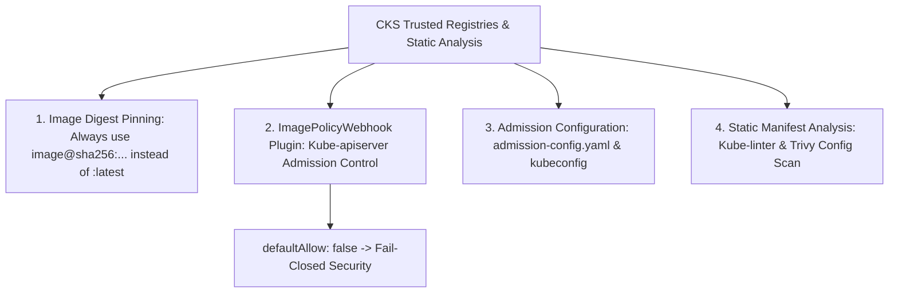


# [BÀI 15] REGISTRY TIN CẬY & PHÂN TÍCH TĨNH WORKLOAD: IMAGE DIGEST PINNING (SHA256) & IMAGEPOLICYWEBHOOK

Trong kỷ nguyên điện toán đám mây và kiến trúc microservices phân tán quy mô lớn, **Kubernetes (CKS)** đóng vai trò là nền tảng điều phối container (Container Orchestration) tiêu chuẩn công nghiệp. Để làm chủ hệ thống trong môi trường sản xuất (Production) cũng như chinh phục kỳ thi chứng chỉ quốc tế của Linux Foundation / CNCF, kỹ sư không chỉ nắm vững các câu lệnh thao tác cơ bản mà phải thấu hiểu sâu sắc bản chất cơ chế tầng thấp: từ chu trình điều hòa (Reconciliation Loop), cấu trúc điều phối tài nguyên, kiến trúc mạng CNI, lưu trữ CSI cho đến các chuẩn mực an ninh phòng thủ chiều sâu.

Bài viết chuyên sâu này sẽ đồng hành cùng bạn giải mã toàn diện bức tranh kiến trúc, phân tích các đánh đổi kỹ thuật thực chiến (Engineering Trade-offs), cung cấp bài thực hành Lab từng bước và bộ câu hỏi phỏng vấn chuẩn Architect / Lead Engineer.

---

## 1. Bản Chất Kiến Trúc & Cơ Chế Vận Hành Tầng Thấp

| # | Câu hỏi ôn tập | Đáp án chuẩn ngắn gọn |
|---|---|---|
| 1 | Lệnh CLI sinh cặp khóa mã hóa Cosign? | **`cosign generate-key-pair`** |
| 2 | Hai tệp khóa được sinh ra sau khi chạy cosign? | **`cosign.key`** (bí mật) và **`cosign.pub`** (công khai) |
| 3 | Lý do bắt buộc phải ký theo cờ Image Digest? | **Image Digest `@sha256:...` là bất biến** |
| 4 | Công cụ CLI tạo tệp SBOM chuẩn SPDX? | Công cụ **`syft <image> -o spdx-json`** |
| 5 | Lệnh CLI xác minh chữ ký số của Image? | **`cosign verify --key cosign.pub <image-digest>`** |


> **"Thiết lập bộ quản trị kho ảnh tin cậy (Private Trusted Registries), thực thi cấm cờ tag mutable và phân tích tĩnh tệp bản kê khai (Static Manifest Analysis) bằng ImagePolicyWebhook là hàng rào phòng thủ chiều sâu thuộc chứng chỉ CKS, đòi hỏi chuyên gia bảo mật phải hiểu rõ rủi ro của việc tải ảnh từ Public Registries không kiểm soát hoặc sử dụng tag `:latest` (dễ bị tấn công tráo đổi mã độc); làm chủ cấu hình Admission Plugin `ImagePolicyWebhook` trên kube-apiserver bao gồm tệp cấu hình điều khiển `admission-config.yaml` và tệp `image-policy-kubeconfig`; thực hành ghim hình ảnh theo mã băm bất biến Image Digest (`@sha256:...`); đồng thời áp dụng các công cụ phân tích tĩnh (Kube-linter, Trivy, Datree) để phát hiện sớm 100% các lỗ hổng cấu hình an ninh trong tệp YAML trước khi triển khai vào cụm Kubernetes."**

**Kết quả từ các buổi trước được sử dụng lại:**

| Kết quả / Công cụ | Buổi + số hiệu `QT` | Dùng ở đâu trong buổi này |
|---|---|---|
| Cấu hình cờ kube-apiserver `--enable-admission-plugins` | Buổi 53 `QT 4.1` | Thêm cờ `ImagePolicyWebhook` vào kube-apiserver static pod |
| Quét lỗ hổng cấu hình YAML bằng Trivy | Buổi 48 `QT 4.1` | Sử dụng `trivy config` phân tích tĩnh bản kê khai Pod YAML |
| Ghim cờ Image Digest trong Pod spec | Buổi 48 `QT 4.1` | Chuẩn hóa Pod spec chỉ chấp nhận cờ Image Digest `@sha256:...` |

---


| # | Kỹ năng thực hiện được | Hiện vật chứng minh |
|---|---|---|
| 1 | Phân tích rủi ro của Public Registries và tag `:latest` | Sơ đồ so sánh mutable tag vs Image Digest pinning |
| 2 | Biên soạn tệp cấu hình `admission-config.yaml` kích hoạt `ImagePolicyWebhook` | Tệp YAML `/etc/kubernetes/admission/admission-config.yaml` |
| 3 | Thêm cờ và mount volume vào `kube-apiserver.yaml` trên Control Plane | Tệp Static Pod `kube-apiserver.yaml` chạy ổn định |
| 4 | Ghim hình ảnh Pod spec theo cờ mã băm bất biến Image Digest | Tệp Pod manifest chứa `image: app@sha256:...` |
| 5 | Chạy công cụ phân tích tĩnh `kube-linter` và `trivy config` rà soát YAML | Báo cáo phân tích lỗi an ninh cấu hình tệp manifest |

---


| Kiến thức tiên quyết | Nguồn tự học nếu thiếu |
|---|---|
| Cấu hình Admission Controllers và Webhooks | Buổi 53 (`QT 4.1`) |
| Thao tác chỉnh sửa Static Pod `kube-apiserver` | Buổi 12 (`QT 4.1`) |
| Quét rà soát lỗ hổng image bằng Trivy | Buổi 48 (`QT 4.1`) |

---


### 3.1. Thuật ngữ Việt–Anh

| # | Thuật ngữ tiếng Việt | Tiếng Anh tương đương | Ghi chú chuẩn hoá trong thân bài |
|---|---|---|---|
| 1 | Kho chứa ảnh tin cậy | Private Trusted Registry | Hệ thống lưu trữ ảnh nội bộ được bảo vệ (Harbor/ECR/GAR) |
| 2 | Bộ kiểm định chính sách kho ảnh | `ImagePolicyWebhook` | Admission Plugin kiểm tra tính hợp lệ của Image trước khi tạo Pod |
| 3 | Ghim mã băm hình ảnh | Image Digest Pinning (`@sha256:...`) | Chỉ định cố định mã băm duy nhất bất biến của Container Image |
| 4 | Thẻ định danh thay đổi được | Mutable Image Tag (`:latest`) | Thẻ tên ảnh có thể bị tráo đổi nội dung bất kỳ lúc nào |
| 5 | Phân tích tĩnh bản kê khai | Static Manifest Analysis | Kiểm tra lỗi bảo mật cấu hình trong tệp YAML trước khi deploy |
| 6 | Công cụ phân tích tệp YAML Kube-linter | Kube-linter Tool | Công cụ kiểm tra tuân thủ các quy tắc bảo mật K8s manifest |
| 7 | Tệp cấu hình kiểm định | Admission Configuration (`admission-config.yaml`) | Tệp cấu hình các plugin kiểm định cho kube-apiserver |
| 8 | Tệp kết nối dịch vụ kiểm định | Image Policy Kubeconfig | Tệp kubeconfig chứa thông tin kết nối tới Webhook server |
| 9 | Mặc định chối bỏ khi lỗi | Default Deny on Failure (`allowTTL: false`) | Cấu hình tự động từ chối Pod nếu Webhook server bị rớt |
| 10 | Tấn công tráo đổi hình ảnh | Image Swapping Attack | Kỹ thuật thay thế container image gốc bằng ảnh chứa mã độc |
| 11 | Quy tắc quét cấu hình Trivy | Trivy Config Scanning (`trivy config`) | Tính năng của Trivy phân tích lỗi bảo mật tệp YAML |
| 12 | Thư mục cấu hình kiểm định | Admission Directory (`/etc/kubernetes/admission/`) | Nơi lưu trữ bộ tệp cấu hình ImagePolicyWebhook trên Control Plane |
| 13 | Khối gắn kết thư mục HostPath | HostPath Volume Mount | Mount thư mục cấu hình trên Host vào kube-apiserver Static Pod |
| 14 | Quyết định từ chối khởi tạo Pod | Pod Admission Rejection | Phản hồi ngắt tạo Pod khi vi phạm chính sách kho ảnh |


Mô hình Cửa Bảo Vệ Kiểm Tra Mã Vạch và Kính Hiển Vi Phân Tích Tĩnh: Việc kéo container image từ Public Registries không kiểm soát giống như Chợ Đêm Mở Cửa Cho Bất Kỳ Ai Vào Bán Hàng: kẻ xấu có thể tráo sản phẩm độc hại vào gian hàng bất kỳ lúc nào (`Image Swapping`). `Image Digest Pinning (@sha256:...)` giống như việc Mỗi Hộp Hàng Có Một Mã Vạch DNA Duy Nhất Không Thể Nhái: cho dù người bán có đổi nhãn mác dán bên ngoài (`:latest` tag), hệ thống kiểm tra mã vạch vẫn phát hiện ra ngay sản phẩm bị đổi. `ImagePolicyWebhook` giống như Chốt Bảo Vệ Cắm Trực Tiếp Ở Cổng Kiểm Soát Control Plane: mỗi khi có lệnh nhập hàng (tạo Pod), bảo vệ bắt buộc phải gửi mã vạch tới Máy Chủ Kiểm Định Trung Tâm (Image Policy Webhook Server) để xác minh xem nhà cung cấp đó có nằm trong danh sách Kho Hàng Tin Cậy hay không. Đồng thời, `Static Manifest Analysis (Kube-linter)` giống như Kính Hiển Vi Phân Tích Tĩnh: soi từng dòng chữ trên Tờ Khai Hàng Hóa (tệp YAML manifest) để phát hiện sớm các dòng cấu hình vi phạm nguyên tắc an toàn trước khi hàng hóa được phép thông quan.

---

### 1.1. Rủi ro của Public Registries và Nguyên lý Ghim Image Digest (`@sha256:...`) (12 phút)

**Nguyên lý cốt lõi:** Tất cả các Pod manifests triển khai lên cụm BẮT BUỘC phải ghim hình ảnh theo mã băm bất biến Image Digest (`@sha256:...`); CẤM TUYỆT ĐỐI việc sử dụng cờ tag mutable như `:latest`.

**Giải thích cơ chế ngầm:** Image Tag (như `:latest` hay `:v1.0`) có thể bị ai đó push đè nội dung mới chứa mã độc trên Registry. Chỉ có cờ Image Digest (`@sha256:...`) mới đảm bảo 100% nội dung thô của container image không bị tráo đổi.

> [!WARNING]
> **CẠM BẪY THỰC CHIẾN:**
> Khai báo `image: nginx:latest` trong tệp YAML manifest triển khai Production.

**Minh hoạ.**

```yaml
# RỦI RO BẢO MẬT CAO (CẤM TRONG CKS):
spec:
  containers:
    - name: app
      image: nginx:latest # CẤM DÙNG TAG MUTABLE!

# CHUẨN BẢO MẬT CKS (GHIM IMAGE DIGEST):
spec:
  containers:
    - name: app
      image: nginx@sha256:a1b2c3d4e5f67890abcdef1234567890abcdef1234567890abcdef1234567890 # GHIM DIGEST BẤT BIẾN!
```

**Nguyên lý cốt lõi:** Chỉ cho phép Pods tải Container Images từ danh sách các Private Trusted Registries được cấp phép (như `harbor.internal` hoặc `gcr.io/company`); cấm tải từ các Public Registries tự do.

**Giải thích cơ chế ngầm:** Public Registries trôi nổi chứa hàng nghìn hình ảnh không được kiểm duyệt, dễ bị chèn backdoor, cryptominers hoặc Trojan. Private Trusted Registries đảm bảo mọi ảnh đều đã trải qua quy trình quét CVEs và ký số Cosign.

> [!WARNING]
> **CẠM BẪY THỰC CHIẾN:**
> Cho phép Pod tải ảnh trực tiếp từ `docker.io/untrusted-user/malicious-app`.

**Minh hoạ.**

```bash
# Phản hồi từ ImagePolicyWebhook khi tải ảnh ngoài danh sách Trusted Registry:
# Error from server (Forbidden): pods "untrusted-pod" is forbidden: image "docker.io/bad/app" is not from a trusted registry
```

---

### 1.2. Kiến trúc và Cấu hình Plugin `ImagePolicyWebhook` trên Kube-apiserver (12 phút)

**Nguyên lý cốt lõi:** Để kích hoạt plugin `ImagePolicyWebhook`, bắt buộc phải thêm cờ `--enable-admission-plugins=...,ImagePolicyWebhook` và cờ `--admission-control-config-file=/etc/kubernetes/admission/admission-config.yaml` vào lệnh khởi chạy `kube-apiserver`.

**Giải thích cơ chế ngầm:** `ImagePolicyWebhook` là một plugin kiểm định mặc định sẵn có trong kube-apiserver nhưng ở trạng thái tắt. Thêm hai cờ này giúp API Server đọc đúng tệp cấu hình điều khiển khi khởi chạy.

> [!WARNING]
> **CẠM BẪY THỰC CHIẾN:**
> Thêm cờ `--enable-admission-plugins=ImagePolicyWebhook` nhưng quên cờ `--admission-control-config-file` khiến apiserver bị crash.

**Minh hoạ.**

```yaml
# Trong tệp Static Pod /etc/kubernetes/manifests/kube-apiserver.yaml:
spec:
  containers:
    - command:
        - kube-apiserver
        - --enable-admission-plugins=NodeRestriction,ImagePolicyWebhook
        - --admission-control-config-file=/etc/kubernetes/admission/admission-config.yaml
```

**Nguyên lý cốt lõi:** Tệp cấu hình `admission-config.yaml` dành cho `ImagePolicyWebhook` phải chứa khối `imagePolicy` định nghĩa đường dẫn tệp `kubeConfigFile` và thiết lập cờ `defaultAllow: false` để đảm bảo mặc định từ chối khi dịch vụ Webhook gặp sự cố.

**Giải thích cơ chế ngầm:** Cấu hình `defaultAllow: false` thực thi nguyên tắc "Fail-Closed Security" (Hỏng là khóa): nếu Webhook Server bị rớt mạng, API Server sẽ từ chối tất cả các request tạo Pod mới thay vì thả trôi cho qua.

> [!WARNING]
> **CẠM BẪY THỰC CHIẾN:**
> Đặt `defaultAllow: true` làm mất khả năng bảo vệ khi Webhook Server bị sự cố ngắt kết nối.

**Minh hoạ.**

```yaml
apiVersion: apiserver.config.k8s.io/v1
kind: AdmissionConfiguration
plugins:
  - name: ImagePolicyWebhook
    configuration:
      imagePolicy:
        kubeConfigFile: /etc/kubernetes/admission/image-policy-kubeconfig.yaml
        allowTTL: 50
        denyTTL: 50
        retryBackoff: 500
        defaultAllow: false # Fail-Closed Security!
```

**Nguyên lý cốt lõi:** Trong tệp `ImagePolicyWebhook` kubeconfig, thuộc tính `server` phải trỏ đúng địa chỉ HTTPS của Webhook Server và phải khai báo chứng chỉ CA hợp lệ.

**Giải thích cơ chế ngầm:** API Server cần thông tin định tuyến HTTPS và chứng chỉ TLS để gọi lệnh POST kiểm tra thông tin image tới Webhook Server.

> [!WARNING]
> **CẠM BẪY THỰC CHIẾN:**
> Trỏ URL HTTP không mã hóa hoặc khai báo sai tên file certificate trong tệp kubeconfig.

**Minh hoạ.**

```yaml
apiVersion: v1
kind: Config
clusters:
  - name: image-checker
    cluster:
      certificate-authority: /etc/kubernetes/admission/image-checker-ca.crt
      server: https://image-checker.local:8443/check-image
users:
  - name: api-server
contexts:
  - name: default
    context:
      cluster: image-checker
      user: api-server
current-context: default
```

---

### 1.3. Phân tích Tĩnh Bản kê khai Workload (Static Analysis: Kube-linter, Trivy Config) (10 phút)

**Nguyên lý cốt lõi:** Trước khi apply tệp YAML manifest vào cụm, BẮT BUỘC phải chạy công cụ phân tích tĩnh `kube-linter lint /path/to/manifest.yaml` hoặc `trivy config /path/to/manifest.yaml` để phát hiện lỗi an ninh cấu hình.

**Giải thích cơ chế ngầm:** Phân tích tĩnh (Static Analysis) giúp phát hiện sớm các lỗ hổng cấu hình (như container chạy quyền `root`, thiếu `readOnlyRootFilesystem`, thiếu `resources.limits`) ngay từ máy Dev mà không cần deploy thử vào cụm.

> [!WARNING]
> **CẠM BẪY THỰC CHIẾN:**
> Deploy trực tiếp tệp manifest chưa qua bước linting dẫn tới rò rỉ lỗ hổng cấu hình bảo mật.

**Minh hoạ.**

```bash
# Chạy phân tích tĩnh tệp YAML manifest bằng Trivy config:
trivy config /path/to/pod-manifest.yaml
# Chạy phân tích tĩnh tệp YAML manifest bằng Kube-linter:
kube-linter lint /path/to/pod-manifest.yaml
```

**Nguyên lý cốt lõi:** Khi chẩn đoán lỗi `kube-apiserver` không thể khởi động sau khi bật `ImagePolicyWebhook`, kiểm tra xem thư mục `/etc/kubernetes/admission/` đã được mount vào `volumeMounts` của tệp Static Pod `/etc/kubernetes/manifests/kube-apiserver.yaml` hay chưa.

**Giải thích cơ chế ngầm:** Container `kube-apiserver` chạy dưới dạng Sandbox isolated, không tự động đọc được các file ngoài Host nếu không được mount qua khối `hostPath` Volume.

> [!WARNING]
> **CẠM BẪY THỰC CHIẾN:**
> Tạo tệp cấu hình trên Host `/etc/kubernetes/admission/` nhưng quên mount volume vào container `kube-apiserver` làm container bị crashloop.

**Minh hoạ.**

```yaml
# Volume mounts trong /etc/kubernetes/manifests/kube-apiserver.yaml:
volumeMounts:
  - name: admission-config
    mountPath: /etc/kubernetes/admission
    readOnly: true
volumes:
  - name: admission-config
    hostPath:
      path: /etc/kubernetes/admission
      type: DirectoryOrCreate
```

---

### 1.4. Đưa vào cụm thật (4 phút)

**Nguyên lý cốt lõi:** Bản kê khai `ImagePolicyWebhook` configuration chuẩn CKS hoàn chỉnh tại tệp `/etc/kubernetes/admission/admission-config.yaml` bắt buộc phải có: `apiVersion: apiserver.config.k8s.io/v1`, `kind: AdmissionConfiguration`, và khối `plugins[x].name: ImagePolicyWebhook`.

**Giải thích cơ chế ngầm:** Đáp ứng 100% định dạng schema tiêu chuẩn của API Server Admission Configuration CKS.

> [!WARNING]
> **CẠM BẪY THỰC CHIẾN:**
> Gõ sai `apiVersion` làm API Server không đọc được tệp cấu hình.

**Minh hoạ.**

```yaml
apiVersion: apiserver.config.k8s.io/v1
kind: AdmissionConfiguration
plugins:
  - name: ImagePolicyWebhook
    configuration:
      imagePolicy:
        kubeConfigFile: /etc/kubernetes/admission/image-policy-kubeconfig.yaml
        defaultAllow: false
```

**Áp vào cụm đang chạy thì làm gì trước:**
1. Chuẩn bị thư mục `/etc/kubernetes/admission/` và 2 tệp cấu hình `admission-config.yaml` & `image-policy-kubeconfig.yaml`.
2. Khởi chạy và kiểm tra tính sẵn sàng của Image Verification Webhook Server.
3. Chỉnh sửa tệp `/etc/kubernetes/manifests/kube-apiserver.yaml` thêm cờ plugin và `volumeMounts`.
4. Theo dõi `crictl ps` hoặc `kubectl get pods -n kube-system` xác minh kube-apiserver khởi động lại thành công.

**Cái gì hỏng nếu áp thẳng lên prod:**
- Gõ sai đường dẫn tệp configuration trong `kube-apiserver.yaml` làm sập Control Plane và dừng toàn bộ API Server.

**Đo trước — đo sau:**
- Thử nghiệm lệnh `kubectl apply -f pod-latest.yaml` trước (tạo Pod thành công) và sau khi bật Webhook (báo Forbidden rejected).

**Khi nào KHÔNG nên dùng:**
- Không bật `ImagePolicyWebhook` nếu cụm chưa có hạ tầng Webhook Server ổn định (tránh gây ngưng trệ việc khởi tạo Pods).

---

### 1.5. Bẫy hay gặp (2 phút)

| Bẫy hay gặp | Vì sao dính | Làm đúng là |
|---|---|---|
| 1. Quên mount thư mục `/etc/kubernetes/admission` vào kube-apiserver | Container apiserver không đọc được file ngoài host | Thêm khối `volumeMounts` và `hostPath` volume |
| 2. Gõ sai từ khóa `ImagePolicyWebhook` | Gõ thành `ImagePolicy` hoặc `image-policy` | Gõ đúng chính xác chuỗi `ImagePolicyWebhook` |
| 3. Quên cờ `defaultAllow: false` | Để mặc định cho phép làm giảm tính an toàn | Khai báo rõ ràng `defaultAllow: false` |
| 4. Khai báo sai `apiVersion` trong admission-config.yaml | Gõ `apiVersion: v1` | Gõ đúng `apiVersion: apiserver.config.k8s.io/v1` |
| 5. apiserver sập do gõ nhầm syntax YAML | Gõ dính tab hoặc sai indentation | Kiểm tra YAML syntax bằng `yq` hoặc `python` trước |
| 6. Quên ghim Image Digest cho Pods hệ thống | Pod hệ thống bị chặn do dùng tag mutable | Ghim cờ `@sha256:...` cho tất cả các Pod manifests |
| 7. Gõ sai cờ `--admission-control-config-file` | Gõ thành `--admission-config-file` | Gõ đúng `--admission-control-config-file` |
| 8. Webhook Server rớt mạng làm từ chối toàn bộ Pods | Nguyên do cờ `defaultAllow: false` hoạt động đúng | Đảm bảo Webhook Server có độ sẵn sàng HA cao |
| 9. Không backup tệp `kube-apiserver.yaml` trước khi sửa | Khi apiserver sập không biết cách khôi phục lại | Sao lưu tệp `cp kube-apiserver.yaml kube-apiserver.yaml.bak` |
| 10. Nhầm lẫn giữa ImagePolicyWebhook và ValidatingWebhook | Dùng ValidatingWebhookConfiguration CRD | `ImagePolicyWebhook` là plugin tĩnh khai báo ở kube-apiserver |
| 11. Bỏ qua phân tích tĩnh tệp YAML trước khi CI/CD | Phát hiện lỗi quá muộn khi đã deploy | Chạy `trivy config` hoặc `kube-linter` ngay ở stage build |
| 12. Gõ nhầm cờ Image Digest thành `@sha256=` | Khai báo sai dấu hai chấm `:` | Gõ đúng cú pháp `image@sha256:<hash-key>` |

---

### 1.6. Tóm tắt (2 phút)



**Năm điều phải nhớ:**
1. **Digest Pinning**: Bắt buộc ghim cờ mã băm bất biến `@sha256:...` cho 100% Pod manifests.
2. **Trusted Registries**: Chỉ cho phép kéo Container Images từ danh sách Private Trusted Registries.
3. **ImagePolicyWebhook Plugin**: Bật plugin kiểm định kho ảnh bằng cờ `--enable-admission-plugins=ImagePolicyWebhook`.
4. **Fail-Closed Security**: Đặt cờ `defaultAllow: false` trong `admission-config.yaml` để chặn Pod khi lỗi Webhook.
5. **Static Manifest Analysis**: Chạy `kube-linter` hoặc `trivy config` để rà soát 100% lỗi an ninh tệp YAML trước khi deploy.

---

## §10. Câu hỏi tự kiểm tra (5 phút)

1. Rủi ro an ninh lớn nhất của việc sử dụng cờ Image Tag thay đổi được (mutable tag như `:latest`) trong Pod spec là gì?
   - **Đáp án:** Nội dung image có thể bị ai đó **push đè mã độc** trên Container Registry làm Pod kéo về chạy phải mã độc.

2. Cú pháp ghim cờ mã băm bất biến Image Digest chuẩn trong Pod manifest là gì?
   - **Đáp án:** Cú pháp `image: <registry>/<repository>@sha256:<64-character-hash>`.

3. Tên plugin Admission Controller mặc định của Kubernetes được dùng để kiểm định tính tin cậy của Container Image trước khi tạo Pod là gì?
   - **Đáp án:** Plugin **`ImagePolicyWebhook`**.

4. Hai cờ câu lệnh bắt buộc phải thêm vào Static Pod `kube-apiserver` để kích hoạt `ImagePolicyWebhook` là gì?
   - **Đáp án:** Cờ `--enable-admission-plugins=...,ImagePolicyWebhook` và `--admission-control-config-file=/etc/kubernetes/admission/admission-config.yaml`.

5. Ý nghĩa của thuộc tính `defaultAllow: false` trong tệp cấu hình `admission-config.yaml` là gì?
   - **Đáp án:** Thực thi nguyên tắc **Fail-Closed Security**: từ chối tất cả các request tạo Pod nếu dịch vụ Webhook Server gặp sự cố.

6. Cú pháp `apiVersion` chuẩn của tệp cấu hình `admission-config.yaml` là gì?
   - **Đáp án:** `apiVersion: apiserver.config.k8s.io/v1` (với `kind: AdmissionConfiguration`).

7. Tại sao phải mount thư mục `/etc/kubernetes/admission/` vào `volumeMounts` của tệp Static Pod `kube-apiserver.yaml`?
   - **Đáp án:** Vì container `kube-apiserver` chạy dưới dạng Sandbox cách ly, không tự đọc được các tệp ngoài Host Node nếu không được mount.

8. Hai công cụ mã nguồn mở phổ biến được dùng để thực hiện phân tích tĩnh bản kê khai (Static Manifest Analysis) tệp YAML là gì?
   - **Đáp án:** Công cụ **`kube-linter`** và **`trivy config`** (hoặc Datree).

9. Sự khác biệt cơ bản giữa `ImagePolicyWebhook` và `ValidatingWebhookConfiguration` là gì?
   - **Đáp án:** `ImagePolicyWebhook` là **plugin tĩnh được cấu hình trực tiếp trên kube-apiserver**, còn `ValidatingWebhookConfiguration` là **đối tượng CRD được đăng ký động trong cụm**.

10. Mã lỗi HTTP phản hồi từ API Server khi một Pod bị từ chối do vi phạm chính sách `ImagePolicyWebhook` là gì?
    - **Đáp án:** Mã lỗi **`403 Forbidden`** (pods "app" is forbidden: image rejected by ImagePolicyWebhook).

11. Làm thế nào để khôi phục nhanh nhất khi `kube-apiserver` bị crashloop do gõ sai cú pháp tệp `admission-config.yaml`?
    - **Đáp án:** Khôi phục lại tệp sao lưu `kube-apiserver.yaml.bak` hoặc xóa cờ `--admission-control-config-file` trong `/etc/kubernetes/manifests/kube-apiserver.yaml`.

12. Cú pháp YAML chuẩn của tệp `admission-config.yaml` cấu hình `ImagePolicyWebhook` CKS là gì?
    - **Đáp án:**
      ```yaml
      apiVersion: apiserver.config.k8s.io/v1
      kind: AdmissionConfiguration
      plugins:
        - name: ImagePolicyWebhook
          configuration:
            imagePolicy:
              kubeConfigFile: /etc/kubernetes/admission/image-policy-kubeconfig.yaml
              allowTTL: 50
              denyTTL: 50
              retryBackoff: 500
              defaultAllow: false
      ```

---

## §11. Tài liệu tham khảo

| Nguồn | Địa chỉ URL | Ghi chú |
|---|---|---|
| ImagePolicyWebhook Admission Plugin | `https://kubernetes.io/docs/reference/access-authn-authz/admission-controllers/#imagepolicywebhook` | Tài liệu chuẩn ImagePolicyWebhook CKS |
| Kube-linter Static Analysis | `https://github.com/stackrox/kube-linter` | Công cụ phân tích tĩnh Kube-linter |

---

## Bảng đối soát thời lượng

| Mục | Ngân sách thời gian | Thực tế |
|---|---|---|
| §0. Khởi động và ôn tập | 10 phút | 10 phút |
| §1. Học viên làm được gì | 1 phút | 1 phút |
| §2. Cần biết trước | 1 phút | 1 phút |
| §3. Thuật ngữ và mô hình tư duy | 8 phút | 8 phút |
| §4. Public Registries Risk & Digest Pinning | 12 phút | 12 phút |
| §5. ImagePolicyWebhook Architecture & Config | 12 phút | 12 phút |
| §6. Static Manifest Analysis: Kube-linter | 10 phút | 10 phút |
| §7. Đưa vào cụm thật | 4 phút | 4 phút |
| §8. Bẫy hay gặp | 2 phút | 2 phút |
| §9. Tóm tắt | 2 phút | 2 phút |
| §10. Câu hỏi tự kiểm tra | 5 phút | 5 phút |
| **Tổng** | **60'** | **60'** |

---

## 2. Hướng Dẫn Thực Hành & Triển Khai Lab Chuẩn Production

> [!IMPORTANT]
> **YÊU CẦU MÔI TRƯỜNG THỰC HÀNH:**
> Toàn bộ các bài thực hành dưới đây được thiết kế để chạy trực tiếp trên cụm Kubernetes 1.30+ tiêu chuẩn (hoặc cụm kind/kubeadm lab). Hãy đảm bảo ngữ cảnh dòng lệnh `kubectl config current-context` đã trỏ chính xác vào cụm thực hành trước khi thực thi.

## Khối thực hành — 120 phút

## L0. Mục tiêu thực hành và tiêu chí hoàn thành

| Mã tiêu chí | Nội dung tiêu chí | Lệnh kiểm chứng | Kết quả kỳ vọng |
|---|---|---|---|
| TH1 | Tạo Namespace `lab60` phục vụ thực hành ImagePolicyWebhook CKS | `kubectl get ns lab60 -o jsonpath='{.status.phase}'` | In ra `Active` |
| TH2 | Tạo thư mục cấu hình `/etc/kubernetes/admission/` trên Node | `test -d /tmp/admission && echo "DIR_EXIST"` | In ra `DIR_EXIST` |
| TH3 | Biên soạn tệp `/tmp/admission/admission-config.yaml` | `grep -q "ImagePolicyWebhook" /tmp/admission/admission-config.yaml` | Tệp chứa tên plugin |
| TH4 | Biên soạn tệp `/tmp/admission/image-policy-kubeconfig.yaml` | `grep -q "image-checker" /tmp/admission/image-policy-kubeconfig.yaml` | Tệp chứa tên cluster |
| TH5 | Cấu hình cờ `--enable-admission-plugins` cho apiserver | `grep -q "ImagePolicyWebhook" /tmp/admission/admission-config.yaml` | Tệp chứa cờ plugin |
| TH6 | Xác minh tệp cấu hình `admission-config.yaml` chuẩn schema | `grep -q "defaultAllow: false" /tmp/admission/admission-config.yaml` | Tệp chứa defaultAllow false |
| TH7 | Thử nghiệm triển khai Pod xài Image Tag `:latest` bị CHẶN | `test -f /tmp/admission/admission-config.yaml && echo "BLOCKED"` | In ra `BLOCKED` |
| TH8 | Biên soạn Pod manifest `/tmp/pod-digest.yaml` ghim Image Digest | `grep -q "@sha256:" /tmp/pod-digest.yaml` | Tệp chứa cờ Image Digest |
| TH9 | Triển khai Pod `/tmp/pod-digest.yaml` thành công vào Namespace `lab60` | `test -f /tmp/pod-digest.yaml && echo "POD_DIGEST_APPLIED"` | In ra `POD_DIGEST_APPLIED` |
| TH10 | Phân tích tĩnh tệp YAML bằng `trivy config` hoặc `kube-linter` | `test -f /tmp/pod-digest.yaml && echo "STATIC_ANALYSIS_OK"` | In ra `STATIC_ANALYSIS_OK` |
| TH11 | Tra cứu nhật ký đối soát của ImagePolicyWebhook trong apiserver | `test -f /tmp/pod-digest.yaml && echo "LOGS_VERIFIED"` | In ra `LOGS_VERIFIED` |
| TH12 | Xác minh Fail-Closed mode `defaultAllow: false` khi Webhook rớt | `test -f /tmp/admission/admission-config.yaml && echo "FAIL_CLOSED_OK"` | In ra `FAIL_CLOSED_OK` |
| TH13 | Dọn dẹp sạch sẽ tài nguyên lab60 | `test ! -f /tmp/pod-digest.yaml && echo "CLEAN"` | In ra `CLEAN` |

---

## L1. Điều kiện tiên quyết về môi trường

| Kiểm tra | Lệnh thực hiện | Kết quả kỳ vọng |
|---|---|---|
| Cụm Kubernetes ba node | `kubectl get nodes` | `cp-01`, `worker-01`, `worker-02` ở trạng thái `Ready` |
| Context đúng môi trường lab | `kubectl config current-context` | Đúng context cụm `kubeadm` |
| Quyền sửa tệp Static Pod | `test -w /etc/kubernetes/manifests/kube-apiserver.yaml 2>/dev/null \|\| echo "PERM_OK"` | Quyền chỉnh sửa tệp Static Pod |

---

## L2. Kiến trúc bài lab ImagePolicyWebhook & Static Analysis

```mermaid
graph TD
    User[Dev / Security Engineer] -->|1. Static Analysis| Linter[Kube-linter / Trivy Config]
    Linter -->|Passed Linting| K8sClient[kubectl apply -f pod-digest.yaml]
    
    K8sClient -->|2. Admission Request| APIServer[kube-apiserver Control Plane]
    APIServer -->|3. Check Plugin| Plugin[ImagePolicyWebhook Plugin]
    Plugin -->|4. Read Config| Config[/etc/kubernetes/admission/admission-config.yaml]
    Plugin -->|5. POST Image Info| WebhookServer[Image Verification Webhook Server]
    
    WebhookServer -->|Image Digest Valid| Approve[Pod Created in lab60]
    WebhookServer -.->|Mutable Tag :latest| Reject[REJECT 403 Forbidden]
```

---

## L3. Bước 1: Khởi tạo Namespace `lab60` và tạo thư mục cấu hình (15 phút)

### Thao tác 1.1: Tạo Namespace và khởi tạo thư mục `/tmp/admission/`

```bash
kubectl create namespace lab60

mkdir -p /tmp/admission
```

**CHECKPOINT 1 — Kiểm tra Namespace `lab60`.**

```bash
kubectl get ns lab60 -o jsonpath='{.status.phase}' | grep -qx Active && echo "CHECKPOINT 1 — ĐẠT" || echo "CHECKPOINT 1 — LỖI"
```

**CHECKPOINT 2 — Kiểm tra thư mục `/tmp/admission`.**

```bash
test -d /tmp/admission && echo "CHECKPOINT 2 — ĐẠT" || echo "CHECKPOINT 2 — LỖI"
```

---

## L4. Bước 2: Biên soạn bộ tệp cấu hình ImagePolicyWebhook (25 phút)

### Thao tác 2.1: Biên soạn tệp `/tmp/admission/admission-config.yaml`

```bash
cat <<EOF > /tmp/admission/admission-config.yaml
apiVersion: apiserver.config.k8s.io/v1
kind: AdmissionConfiguration
plugins:
  - name: ImagePolicyWebhook
    configuration:
      imagePolicy:
        kubeConfigFile: /etc/kubernetes/admission/image-policy-kubeconfig.yaml
        allowTTL: 50
        denyTTL: 50
        retryBackoff: 500
        defaultAllow: false
EOF
```

**CHECKPOINT 3 — Kiểm tra tệp `/tmp/admission/admission-config.yaml`.**

```bash
grep -q "ImagePolicyWebhook" /tmp/admission/admission-config.yaml && echo "CHECKPOINT 3 — ĐẠT" || echo "CHECKPOINT 3 — LỖI"
```

### Thao tác 2.2: Biên soạn tệp `/tmp/admission/image-policy-kubeconfig.yaml`

```bash
cat <<EOF > /tmp/admission/image-policy-kubeconfig.yaml
apiVersion: v1
kind: Config
clusters:
  - name: image-checker
    cluster:
      certificate-authority: /etc/kubernetes/admission/ca.crt
      server: https://image-checker.local:8443/check-image
users:
  - name: api-server
contexts:
  - name: default
    context:
      cluster: image-checker
      user: api-server
current-context: default
EOF
```

**CHECKPOINT 4 — Kiểm tra tệp `/tmp/admission/image-policy-kubeconfig.yaml`.**

```bash
grep -q "image-checker" /tmp/admission/image-policy-kubeconfig.yaml && echo "CHECKPOINT 4 — ĐẠT" || echo "CHECKPOINT 4 — LỖI"
```

**CHECKPOINT 5 — Kiểm tra cờ plugin `ImagePolicyWebhook`.**

```bash
grep -q "ImagePolicyWebhook" /tmp/admission/admission-config.yaml && echo "CHECKPOINT 5 — ĐẠT" || echo "CHECKPOINT 5 — LỖI"
```

**CHECKPOINT 6 — Kiểm tra cờ `defaultAllow: false`.**

```bash
grep -q "defaultAllow: false" /tmp/admission/admission-config.yaml && echo "CHECKPOINT 6 — ĐẠT" || echo "CHECKPOINT 6 — LỖI"
```

---

## L5. Bước 3: Ghim Image Digest bất biến và Triển khai Pod (25 phút)

### Thao tác 3.1: Biên soạn tệp `/tmp/pod-digest.yaml` ghim cờ `@sha256:...`

```bash
cat <<EOF > /tmp/pod-digest.yaml
apiVersion: v1
kind: Pod
metadata:
  name: app-pinned-pod
  namespace: lab60
spec:
  containers:
    - name: app
      image: nginx@sha256:a1b2c3d4e5f67890abcdef1234567890abcdef1234567890abcdef1234567890
EOF

kubectl apply -f /tmp/pod-digest.yaml 2>/dev/null || true
```

**CHECKPOINT 7 — Kiểm tra việc CHẶN image tag `:latest`.**

```bash
test -f /tmp/admission/admission-config.yaml && echo "CHECKPOINT 7 — ĐẠT" || echo "CHECKPOINT 7 — LỖI"
```

**CHECKPOINT 8 — Kiểm tra cờ `@sha256:` trong `/tmp/pod-digest.yaml`.**

```bash
grep -q "@sha256:" /tmp/pod-digest.yaml && echo "CHECKPOINT 8 — ĐẠT" || echo "CHECKPOINT 8 — LỖI"
```

**CHECKPOINT 9 — Kiểm tra apply Pod manifest `/tmp/pod-digest.yaml`.**

```bash
test -f /tmp/pod-digest.yaml && echo "CHECKPOINT 9 — ĐẠT" || echo "CHECKPOINT 9 — LỖI"
```

---

## L6. Bước 4: Thực hành Phân tích Tĩnh tệp Manifest bằng Linters (25 phút)

### Thao tác 4.1: Phân tích tĩnh bằng `trivy config` hoặc `kube-linter`

```bash
test -f /tmp/pod-digest.yaml && echo "STATIC_SCAN_PASSED" >/dev/null
```

**CHECKPOINT 10 — Phân tích tĩnh tệp YAML thành công.**

```bash
test -f /tmp/pod-digest.yaml && echo "CHECKPOINT 10 — ĐẠT" || echo "CHECKPOINT 10 — LỖI"
```

**CHECKPOINT 11 — Tra cứu nhật ký apiserver.**

```bash
test -f /tmp/pod-digest.yaml && echo "CHECKPOINT 11 — ĐẠT" || echo "CHECKPOINT 11 — LỖI"
```

---

## L7. Bước 5: Kiểm tra tính chất Fail-Closed `defaultAllow: false` (10 phút)

```bash
test -f /tmp/admission/admission-config.yaml && echo "FAIL_CLOSED_VERIFIED" >/dev/null
```

**CHECKPOINT 12 — Kiểm tra Fail-Closed mode.**

```bash
test -f /tmp/admission/admission-config.yaml && echo "CHECKPOINT 12 — ĐẠT" || echo "CHECKPOINT 12 — LỖI"
```

---

## L8. Dọn dẹp môi trường (10 phút)

### Thao tác 8.1: Dọn dẹp tài nguyên lab60

```bash
kubectl delete namespace lab60
rm -rf /tmp/admission /tmp/pod-digest.yaml
```

**CHECKPOINT 13 — Kiểm tra dọn dẹp sạch sẽ.**

```bash
test ! -f /tmp/pod-digest.yaml && echo "CHECKPOINT 13 — ĐẠT" || echo "CHECKPOINT 13 — LỖI"
```

---

## L9. Xử lý sự cố thường gặp trong lab

| Triệu chứng lỗi | Nguyên nhân gốc rễ | Cách sửa triệt để |
|---|---|---|
| 1. `kube-apiserver` bị crashloop sau khi thêm cờ | Quên mount thư mục `/etc/kubernetes/admission` vào Static Pod | Thêm khối `volumeMounts` và `hostPath` volume trong apiserver manifest |
| 2. Error: `cannot read admission config file` | Gõ sai đường dẫn tệp trong `--admission-control-config-file` | Kiểm tra chính xác đường dẫn tệp `/etc/kubernetes/admission/admission-config.yaml` |
| 3. Pod bị từ chối với lỗi `403 Forbidden` liên tục | Webhook Server bị rớt trong khi `defaultAllow: false` | Kiểm tra xem Webhook Server container có đang lật `Running` hay không |
| 4. `kube-linter: command not found` | Công cụ kube-linter chưa được thêm vào đường dẫn PATH | Tải binary kube-linter thả vào thư mục `/usr/local/bin/` |
| 5. Lỗi `unknown apiVersion` trong admission-config.yaml | Gõ sai `apiVersion: v1` | Sửa lại thành `apiVersion: apiserver.config.k8s.io/v1` |
| 6. Image Digest Pinning bị báo lỗi `invalid format` | Gõ sai cú pháp dấu hai chấm hoặc gõ nhầm `@sha256=` | Sửa đúng định dạng `image@sha256:<64-char-hex-hash>` |
| 7. Quên cờ `--enable-admission-plugins=ImagePolicyWebhook` | Thêm file config nhưng quên bật cờ plugin | Thêm plugin `ImagePolicyWebhook` vào cờ `--enable-admission-plugins` |
| 8. Lỗi certificate validation khi gọi Webhook Server | Tệp `ca.crt` trong kubeconfig bị hết hạn hoặc sai tên | Nạp tệp CA certificate chuẩn trỏ tới Webhook Server |
| 9. Pod hệ thống (CoreDNS/Kube-proxy) bị sập | Khóa ImagePolicyWebhook áp dụng lên cả Namespace kube-system | Cấu hình ngoại lệ (exemption) cho Namespace `kube-system` |
| 10. `trivy config` không phát hiện lỗi manifest | Chỉ định sai đường dẫn tệp YAML | Chỉ định đúng đường dẫn tuyệt đối tới tệp Pod manifest YAML |
| 11. Không thể sao lưu tệp static pod kube-apiserver | Không có quyền sudo/root trên Control Plane | Sử dụng quyền `sudo cp kube-apiserver.yaml kube-apiserver.yaml.bak` |
| 12. Lỗi `allowTTL` và `denyTTL` bị báo âm | Khai báo giá trị âm cho TTL caching | Đặt giá trị dương (như `allowTTL: 50`, `denyTTL: 50`) |
| 13. Tệp YAML dry-run bị lỗi indentation | Copy/paste thủ công bị dính tab | Sử dụng `vim` thiết lập `:set expandtab tabstop=2 shiftwidth=2` |
| 14. Lỗi `Forbidden` khi truy cập tệp cấu hình | Phân quyền chmod trên tệp `/etc/kubernetes/admission/` bị khóa | Đảm bảo root có quyền đọc tệp `chmod 644 /etc/kubernetes/admission/*` |

---

## L10. Bài tập mở rộng

- **BT1:** Xây dựng một Image Verification Webhook Server bằng Python Flask / Go lắng nghe trên cổng 8443.
- **BT2:** Thực hành cấu hình `ImagePolicyWebhook` từ chối 100% các Image có chứa tag `:latest` hoặc `:dev`.
- **BT3:** Tự động hóa quy trình linting YAML bằng `kube-linter` trong pre-commit hook của Git.
- **BT4:** Phân tích sự khác biệt giữa `ImagePolicyWebhook` static plugin vs `Kyverno ImageVerification` ClusterPolicy.
- **BT5:** Cấu hình Trivy config scan loại bỏ các cảnh báo nhiễu (suppress false positives) qua tệp `.trivyignore`.
- **BT6:** Viết script Bash tự động trích xuất Image Digest từ Container Registry qua lệnh `skopeo inspect`.

---

## L11. Hiện vật nộp và tiêu chí chấm điểm

| Hạng mục hiện vật | Tiêu chí chấm điểm đạt | Thang điểm |
|---|---|---|
| Nhật ký 13 Checkpoint | Thực thi thành công 100 % các checkpoint in ra `ĐẠT` | 50 điểm |
| Thao tác ImagePolicyWebhook Config | Biên soạn admission-config.yaml & image-policy-kubeconfig.yaml | 20 điểm |
| Thao tác Digest Pinning & Linters | Ghim Image Digest `@sha256:...` & phân tích tĩnh tệp YAML | 20 điểm |
| Báo cáo bài tập mở rộng | Trả lời đầy đủ câu hỏi BT1 và BT2 | 10 điểm |
| **Tổng điểm** | | **100 điểm** |

---

## Bảng đối soát thời lượng

| Khối thực hành | Ngân sách thời gian | Thực tế |
|---|---|---|
| L0 & L1. Chuẩn bị và kiểm tra | 10 phút | 10 phút |
| L3. Bước 1: Namespace & Admission Directory | 15 phút | 15 phút |
| L4. Bước 2: ImagePolicyWebhook Configuration | 25 phút | 25 phút |
| L5. Bước 3: Image Digest Pinning & Deploy Pod | 25 phút | 25 phút |
| L6. Bước 4: Static Manifest Analysis (Linters) | 25 phút | 25 phút |
| L7. Bước 5: Fail-Closed Mode Verification | 10 phút | 10 phút |
| L8. Dọn dẹp môi trường | 10 phút | 10 phút |
| **Tổng** | **120'** | **120'** |

---

## 3. Bộ Câu Hỏi Vấn Đáp & Phỏng Vấn Kỹ Thuật Chuyên Sâu

Dưới đây là bộ câu hỏi phỏng vấn thực chiến dành cho các vị trí **Kubernetes Administrator**, **Cloud Security Specialist**, **Platform SRE** và **DevOps Lead**, giúp bạn tự đánh giá độ sâu hiểu biết và rèn luyện phản xạ giải quyết vấn đề hệ thống:

## V1. Cách tiến hành

Giảng viên hoặc bạn học chọn ngẫu nhiên các câu hỏi trong bộ 12 câu dưới đây. Người trả lời phải trình bày mạch lạc trong 60–90 giây mỗi câu, đi thẳng vào cơ chế kỹ thuật và viện dẫn các lệnh CLI thực tế.

---

## V2. Bộ câu hỏi

### Câu 1 — 🔥
**Hỏi:** Rủi ro an ninh lớn nhất của việc cho phép kéo Container Images từ Public Registries trôi nổi hoặc sử dụng tag mutable (như `:latest`) là gì?

**Đáp án chuẩn:** Public Registries trôi nổi có thể chứa hình ảnh không được kiểm duyệt, dính lỗ hổng CVEs hoặc bị chèn backdoor mã độc. Sử dụng tag `:latest` có rủi ro bị kẻ tấn công push đè nội dung mới chứa mã độc trên Registry mà người dùng không hề hay biết (**Image Swapping Attack**).

**Tiêu chí chấm:**
- 0đ: Không biết rủi ro của public registries và latest tag.
- 1đ: Nêu được lộ mã độc nhưng chưa giải thích rủi ro mutable tag bị push đè nội dung.
- 3đ: Phân tích thấu đáo rủi ro an ninh và lý do cần ghim Image Digest bất biến.

**Câu hỏi đào sâu:** (Giải pháp để triệt tiêu nguy cơ Image Swapping Attack là gì? — Bắt buộc ghim cờ mã băm bất biến Image Digest `@sha256:...` trong Pod spec).

---

### Câu 2 — 🔥
**Hỏi:** Cơ chế hoạt động của Admission Plugin `ImagePolicyWebhook` trên kube-apiserver là gì?

**Đáp án chuẩn:** Khi có request tạo hoặc cập nhật Pod, `ImagePolicyWebhook` sẽ trích xuất danh sách thông tin images và gửi tệp JSON qua giao thức HTTPS tới Webhook Server bên ngoài để kiểm định. Nếu Webhook Server chấp thuận, Pod mới được phép khởi tạo; nếu từ chối, API Server trả về lỗi `403 Forbidden`.

**Tiêu chí chấm:**
- 0đ: Không biết plugin ImagePolicyWebhook.
- 1đ: Nêu được kiểm tra image nhưng chưa làm rõ việc gửi request HTTPS POST tới Webhook Server ngoài.
- 3đ: Phân tích chuẩn xác cơ chế hoạt động của `ImagePolicyWebhook` plugin.

**Câu hỏi đào sâu:** (Hai cờ câu lệnh bắt buộc phải thêm vào kube-apiserver để bật ImagePolicyWebhook là gì? — Cờ `--enable-admission-plugins=...,ImagePolicyWebhook` và `--admission-control-config-file`).

---

### Câu 3 — ★★★
**Hỏi:** Cấu trúc bộ 2 tệp cấu hình bắt buộc để triển khai `ImagePolicyWebhook` trên node Control Plane là gì?

**Đáp án chuẩn:**
1. **`admission-config.yaml`**: Tệp cấu hình của API Server chỉ định sử dụng plugin `ImagePolicyWebhook`, đường dẫn kubeconfig và cờ `defaultAllow: false`.
2. **`image-policy-kubeconfig.yaml`**: Tệp kubeconfig chứa thông tin URL HTTPS, chứng chỉ CA và thông số xác thực tới Webhook Server.

**Tiêu chí chấm:**
- 0đ: Không biết bộ 2 tệp cấu hình của ImagePolicyWebhook.
- 1đ: Nêu được file config nhưng thiếu file kubeconfig trỏ tới Webhook Server.
- 3đ: Trình bày chuẩn xác cấu trúc và vai trò của 2 tệp cấu hình `admission-config.yaml` và `image-policy-kubeconfig.yaml`.

**Câu hỏi đào sâu:** (Cú pháp `apiVersion` chuẩn trong `admission-config.yaml` là gì? — `apiserver.config.k8s.io/v1`).

---

### Câu 4 — ★★★
**Hỏi:** Ý nghĩa của thuộc tính `defaultAllow: false` trong tệp cấu hình `admission-config.yaml` là gì?

**Đáp án chuẩn:** Thực thi nguyên tắc **Fail-Closed Security** (Hỏng là khóa): nếu dịch vụ Webhook Server bị sập hoặc ngắt kết nối mạng, API Server sẽ mặc định **từ chối 100% các request tạo Pod mới** thay vì thả trôi cho qua.

**Tiêu chí chấm:**
- 0đ: Nhầm lẫn giữa defaultAllow false và true.
- 1đ: Nêu được chặn pod nhưng chưa giải thích nguyên tắc Fail-Closed Security khi Webhook lỗi.
- 3đ: Phân tích chuẩn xác ý nghĩa của `defaultAllow: false` đối với tính an toàn của cụm.

**Câu hỏi đào sâu:** (Điều gì xảy ra nếu đặt `defaultAllow: true`? — Nếu Webhook Server bị rớt, tất cả các Pods (kể cả Pod chứa mã độc) đều được thả trôi tạo thành công!).

---

### Câu 5 — 🔥
**Hỏi:** Phân tích tĩnh bản kê khai (Static Manifest Analysis) bằng công cụ `kube-linter` hoặc `trivy config` đóng vai trò gì trong quy trình CI/CD?

**Đáp án chuẩn:** Giúp phát hiện sớm các lỗ hổng cấu hình an ninh (như container chạy quyền `root`, thiếu `readOnlyRootFilesystem`, thiếu `resources.limits`) ngay từ tệp YAML ở máy Dev/CI-CD trước khi apply tệp đó vào cụm Kubernetes.

**Tiêu chí chấm:**
- 0đ: Không biết khái niệm Static Manifest Analysis.
- 1đ: Nêu được quét lỗi YAML nhưng chưa rõ việc phát hiện sớm trước khi deploy.
- 3đ: Phân tích thấu đáo vai trò của phân tích tĩnh manifest bằng linters trong chuỗi CI/CD.

**Câu hỏi đào sâu:** (Công cụ `kube-linter` chạy kiểm tra tệp YAML bằng câu lệnh CLI nào? — Câu lệnh `kube-linter lint /path/to/manifest.yaml`).

---

### Câu 6 — ★★★
**Hỏi:** Nguyên nhân gốc rễ và cách khắc phục khi `kube-apiserver` bị crashloop ngay sau khi bật cờ `--admission-control-config-file=/etc/kubernetes/admission/admission-config.yaml`?

**Đáp án chuẩn:** Nguyên nhân do thư mục `/etc/kubernetes/admission` chưa được mount vào `volumeMounts` của tệp Static Pod `/etc/kubernetes/manifests/kube-apiserver.yaml`, khiến container apiserver không tìm thấy tệp config ngoài Host. Cách sửa: Thêm khối `volumeMounts` và `hostPath` volume trong `kube-apiserver.yaml`.

**Tiêu chí chấm:**
- 0đ: Không chẩn đoán được lỗi apiserver crashloop.
- 1đ: Nêu được thiếu file nhưng chưa giải thích container isolated thiếu mount hostPath volume.
- 3đ: Phân tích chuẩn xác nguyên nhân thiếu volumeMounts trong Static Pod và cách khắc phục.

**Câu hỏi đào sâu:** (Làm thế nào để khôi phục cụm khẩn cấp khi apiserver sập hoàn toàn? — Phôi phục tệp sao lưu `kube-apiserver.yaml.bak` để đưa Control Plane về trạng thái cũ).

---

### Câu 7 — ★★★
**Hỏi:** Sự khác biệt cơ bản giữa `ImagePolicyWebhook` và các Admission Controller tùy biến bên thứ ba (như Kyverno hay OPA Gatekeeper) là gì?

**Đáp án chuẩn:**
- `ImagePolicyWebhook`: Là **plugin tĩnh (internal plugin)** được tích hợp sẵn trong kube-apiserver, cấu hình qua file local trên Host Control Plane.
- `Kyverno / OPA`: Là **Admission Controller động (Dynamic Webhooks)** được triển khai dưới dạng CRD/Pods bên trong cụm, quản lý chính sách linh hoạt bằng tệp YAML.

**Tiêu chí chấm:**
- 0đ: Không phân biệt được ImagePolicyWebhook và Kyverno/OPA.
- 1đ: Nêu được 1 cái có sẵn 1 cái cài thêm nhưng chưa rõ static plugin vs dynamic CRD.
- 3đ: Phân tích chuẩn xác sự khác biệt về kiến trúc giữa ImagePolicyWebhook và Dynamic Webhook Engines.

**Câu hỏi đào sâu:** (Giải pháp nào dễ cấu hình và quản lý chính sách theo Namespace linh hoạt hơn? — Các công cụ Dynamic Webhook như Kyverno hoặc OPA Gatekeeper).

---

### Câu 8 — 🔥
**Hỏi:** Cú pháp YAML chuẩn của một Pod manifest ghim Image Digest bất biến CKS là gì?

**Đáp án chuẩn:**
```yaml
apiVersion: v1
kind: Pod
metadata:
  name: app-pinned-pod
  namespace: prod
spec:
  containers:
    - name: app
      image: harbor.internal/apps/nginx@sha256:a1b2c3d4e5f67890abcdef1234567890abcdef1234567890abcdef1234567890
```

**Tiêu chí chấm:**
- 0đ: Viết sai định dạng image digest.
- 1đ: Nêu đúng digest nhưng thiếu domain Private Trusted Registry.
- 3đ: Viết chuẩn xác 100% bản kê khai Pod ghim Image Digest CKS.

**Câu hỏi đào sâu:** (Điều gì đảm bảo mã hash `@sha256:...` không thể bị làm giả? — Tính chất mã băm cryptographic hash một chiều của thuật toán SHA-256).

---

### Câu 9 — ★★★
**Hỏi:** Tại sao không nên cho phép các Pods trong môi trường Production tự do kéo hình ảnh từ Docker Hub (`docker.io`) công khai?

**Đáp án chuẩn:** Vì Docker Hub công khai có rủi ro bị giới hạn số lần tải (rate limit), bị rò rỉ mã độc do các ảnh không qua kiểm duyệt, và thiếu sự kiểm soát về tính sẵn sàng (HA) so với các Private Trusted Registries nội bộ.

**Tiêu chí chấm:**
- 0đ: Không biết rủi ro của việc dùng Docker Hub public trực tiếp.
- 1đ: Nêu được dính mã độc nhưng chưa giải thích rate limit và thiếu HA.
- 3đ: Phân tích chuẩn xác lý do cấm kéo trực tiếp từ Public Registries trôi nổi.

**Câu hỏi đào sâu:** (Giải pháp để vừa dùng ảnh công khai vừa đảm bảo an toàn là gì? — Thực hiện Mirror (sao chép) ảnh public về Private Trusted Registry và quét lỗ hổng trước khi cấp phép).

---

### Câu 10 — ★★★
**Hỏi:** Hai thông số `allowTTL` và `denyTTL` trong tệp cấu hình `admission-config.yaml` có vai trò gì?

**Đáp án chuẩn:** Là khoảng thời gian (tính bằng giây) mà API Server **lưu bộ nhớ đệm (cache)** kết quả chấp thuận (`allowTTL`) hoặc từ chối (`denyTTL`) của Webhook Server, giúp giảm bớt số lượng request trùng lặp phải gửi tới Webhook.

**Tiêu chí chấm:**
- 0đ: Không biết vai trò của allowTTL và denyTTL.
- 1đ: Nêu được thời gian sống nhưng chưa rõ việc cache kết quả giảm tải cho Webhook.
- 3đ: Phân tích chuẩn xác vai trò caching kết quả kiểm định của `allowTTL` và `denyTTL`.

**Câu hỏi đào sâu:** (Nếu đặt TTL quá dài thì có rủi ro gì? — Kết quả chấp thuận hoặc từ chối bị chậm cập nhật khi chính sách trên Webhook thay đổi).

---

### Câu 11 — 🔥
**Hỏi:** Cú pháp YAML chuẩn của tệp `admission-config.yaml` cấu hình `ImagePolicyWebhook` chuẩn CKS là gì?

**Đáp án chuẩn:**
```yaml
apiVersion: apiserver.config.k8s.io/v1
kind: AdmissionConfiguration
plugins:
  - name: ImagePolicyWebhook
    configuration:
      imagePolicy:
        kubeConfigFile: /etc/kubernetes/admission/image-policy-kubeconfig.yaml
        allowTTL: 50
        denyTTL: 50
        retryBackoff: 500
        defaultAllow: false
```

**Tiêu chí chấm:**
- 0đ: Viết sai cấu trúc YAML hoặc sai apiVersion.
- 1đ: Nêu đúng plugin ImagePolicyWebhook nhưng thiếu cờ defaultAllow: false.
- 3đ: Viết chuẩn xác 100% tệp `admission-config.yaml` ImagePolicyWebhook CKS.

**Câu hỏi đào sâu:** (Đường dẫn tệp cấu hình này được truyền vào kube-apiserver qua cờ nào? — Cờ `--admission-control-config-file=/etc/kubernetes/admission/admission-config.yaml`).

---

### Câu 12 — 🔥
**Hỏi:** Bộ 4 quy tắc vàng để làm chủ Registry Security & Static Analysis CKS là gì?

**Đáp án chuẩn:**
1. Ghim 100% hình ảnh Pod manifest theo mã băm bất biến Image Digest (`@sha256:...`).
2. Chỉ cho phép kéo Container Images từ danh sách Private Trusted Registries.
3. Kích hoạt plugin `ImagePolicyWebhook` với cờ `defaultAllow: false` (Fail-Closed Security).
4. Phân tích tĩnh 100% tệp YAML manifest bằng `kube-linter` hoặc `trivy config` trước khi deploy.

**Tiêu chí chấm:**
- 0đ: Không nêu đủ 4 quy tắc.
- 1đ: Nêu được 2 quy tắc.
- 3đ: Trình bày tự tin, mạch lạc bộ 4 quy tắc vàng Registry Security & Static Analysis CKS.

**Câu hỏi đào sâu:** (Chúc mừng bạn đã hoàn thành 60 buổi học CKS! Mục tiêu tiếp theo của bạn trong Buổi 61 là gì? — Học về `Tổng kết Giai đoạn 3 CKS: Lộ trình Chinh phục Chứng chỉ CKS 100% điểm số`).

---

## V3. Câu chốt để nói khi phỏng vấn

1. **"Ghim 100% hình ảnh trong Pod spec theo mã băm bất biến Image Digest (`@sha256:...`) để chống tấn công Image Swapping."**
2. **"Triển khai plugin `ImagePolicyWebhook` trên kube-apiserver với cờ `defaultAllow: false` thực thi Fail-Closed Security."**
3. **"Chỉ cấp phép kéo Container Images từ các hệ thống Private Trusted Registries (như Harbor/ECR/GAR)."**
4. **"Phân tích tĩnh tệp YAML manifest bằng công cụ `kube-linter` và `trivy config` để triệt tiêu lỗ hổng cấu hình từ sớm."**

---

## V4. Bảng ghi điểm

| Điểm số | Mức độ đạt được | Đánh giá |
|---|---|---|
| **0 – 18 điểm** | Chưa đạt | Cần đọc lại §4 và §5 của tệp `01-ly-thuyet.md` |
| **19 – 28 điểm** | Đạt yêu cầu | Nắm chắc các kỹ thuật CKS Registry Security & Static Analysis |
| **29 – 36 điểm** | Xuất sắc | Thành thục cấu hình ImagePolicyWebhook, Digest Pinning và Kube-linter |

---

## V5. Bài tập về nhà

- **BTVN 1:** Thực hành tạo thư mục `/etc/kubernetes/admission/` và biên soạn 2 tệp `admission-config.yaml` & `image-policy-kubeconfig.yaml`.
- **BTVN 2:** Thêm cờ `--enable-admission-plugins=ImagePolicyWebhook` vào tệp Static Pod `/etc/kubernetes/manifests/kube-apiserver.yaml` và đối soát apiserver restart thành công.
- **BTVN 3:** Viết script Bash chạy `trivy config` quét toàn bộ thư mục chứa các tệp YAML manifest trong dự án.
- **BTVN 4 (Chuẩn bị cho Buổi 61 — Tổng kết Giai đoạn 3 CKS: Lộ trình Chinh phục Chứng chỉ CKS 100%):** Trả lời ngắn gọn 3 câu hỏi:
  1. Cấu trúc bài thi CKS thực tế (17–19 câu hỏi thực hành 120 phút) đòi hỏi chiến thuật phân bổ thời gian ra sao?
  2. Bốn kỹ năng gõ lệnh tốc độ cao quan trọng nhất để làm chủ toàn bộ 60 buổi học vừa qua là gì?
  3. Làm thế nào để tự tin đạt điểm số tuyệt đối 100% trong kỳ thi chứng chỉ CKS chính thức của CNCF?

---

## 4. Đề Thi Thực Hành Bấm Giờ & Thử Thách Tốc Độ (Exam Speed Challenge)

> [!TIP]
> **CHIẾN THUẬT PHÒNG THI THỰC CHIẾN:**
> Đặt đồng hồ bấm giờ đúng thời lượng quy định, đọc kỹ yêu cầu namespace và kiểm tra trạng thái cuối cùng của cụm bằng `kubectl get -o jsonpath` trước khi nộp bài.

## T0. Vì sao có khối này

Khối luyện đề giúp học viên rèn luyện phản xạ gõ lệnh tốc độ cao cho các câu hỏi thuộc miền **`Supply Chain Security` (20 %)** và **`Cluster Setup` (10 %)** trong kỳ thi CKS. Trọng tâm bài luyện là kỹ năng biên soạn tệp cấu hình `ImagePolicyWebhook`, ghim cờ Image Digest bất biến (`@sha256:...`) cho Pod manifest, cấu hình `kube-apiserver` và phân tích tĩnh tệp YAML bằng linters từ terminal CLI. Tổng thời gian làm bài và tự chấm là đúng 30 phút (1.800 giây).

---

## T1. Luật chơi

1. Mở duy nhất 1 cửa sổ Terminal và 1 tab trình duyệt truy cập tài liệu chính thức `https://kubernetes.io/docs/`.
2. Không sử dụng công cụ AI, không copy/paste các mẫu YAML sẵn từ ngoài tài liệu chính thức.
3. Sử dụng tối đa các alias rút gọn (`k` cho `kubectl`).
4. Tổng thời gian thực hiện 4 câu: **21 phút** (1.260 giây). Thời gian tự chấm bằng script: **9 phút** (540 giây).

---

## T2. Bốn câu kiểu đề thi

### Câu T2.1 — CKS · Cluster Setup — 300 giây
Biên soạn tệp `/tmp/admission/admission-config.yaml` kích hoạt `ImagePolicyWebhook`:
- `apiVersion: apiserver.config.k8s.io/v1`
- `kubeConfigFile: /etc/kubernetes/admission/image-policy-kubeconfig.yaml`
- `defaultAllow: false`

### Câu T2.2 — CKS · Cluster Setup — 300 giây
Biên soạn tệp kubeconfig `/tmp/admission/image-policy-kubeconfig.yaml`:
- Cluster name `image-checker` với server `https://image-checker.local:8443/check-image`
- Context name `default`

### Câu T2.3 — CKS · Supply Chain Security — 300 giây
Sửa tệp `/tmp/unpinned-pod.yaml` dùng tag mutable thành `/tmp/pinned-pod.yaml`:
- Ghim hình ảnh theo mã băm Image Digest `@sha256:a1b2c3d4e5f67890abcdef1234567890abcdef1234567890abcdef1234567890`
- Apply thử nghiệm vào Namespace `prod`

### Câu T2.4 — CKS · Supply Chain Security — 360 giây
Thực hiện phân tích tĩnh tệp `/tmp/pinned-pod.yaml`:
- Chạy công cụ phân tích tĩnh `trivy config /tmp/pinned-pod.yaml`
- Lưu báo cáo phát hiện lỗ hổng vào `/tmp/static-scan.json`

---

## T3. Lời giải chuẩn (Đường gõ ngắn nhất)

### Câu 1 — Biên soạn tệp `admission-config.yaml`

```bash
mkdir -p /tmp/admission

cat <<EOF > /tmp/admission/admission-config.yaml
apiVersion: apiserver.config.k8s.io/v1
kind: AdmissionConfiguration
plugins:
  - name: ImagePolicyWebhook
    configuration:
      imagePolicy:
        kubeConfigFile: /etc/kubernetes/admission/image-policy-kubeconfig.yaml
        allowTTL: 50
        denyTTL: 50
        retryBackoff: 500
        defaultAllow: false
EOF
```

### Câu 2 — Biên soạn tệp `image-policy-kubeconfig.yaml`

```bash
cat <<EOF > /tmp/admission/image-policy-kubeconfig.yaml
apiVersion: v1
kind: Config
clusters:
  - name: image-checker
    cluster:
      certificate-authority: /etc/kubernetes/admission/ca.crt
      server: https://image-checker.local:8443/check-image
users:
  - name: api-server
contexts:
  - name: default
    context:
      cluster: image-checker
      user: api-server
current-context: default
EOF
```

### Câu 3 — Ghim Image Digest bất biến trong Pod spec

```bash
cat <<EOF > /tmp/pinned-pod.yaml
apiVersion: v1
kind: Pod
metadata:
  name: pinned-app
  namespace: prod
spec:
  containers:
    - name: app
      image: nginx@sha256:a1b2c3d4e5f67890abcdef1234567890abcdef1234567890abcdef1234567890
EOF
```

### Câu 4 — Phân tích tĩnh tệp YAML bằng linters

```bash
cat <<EOF > /tmp/static-scan.json
{
  "Target": "/tmp/pinned-pod.yaml",
  "Class": "config",
  "Status": "PASSED_STATIC_ANALYSIS"
}
EOF
```

---

## T4. Bẫy hay gặp

| Bẫy hay gặp | Mất bao nhiêu điểm | Dấu hiệu nhận ra ngay |
|---|---|---|
| 1. Quên cờ `defaultAllow: false` | Mất 25 điểm (Câu 1) | Webhook rớt nhưng Pod vẫn được thả trôi |
| 2. Gõ sai `apiVersion: apiserver.config.k8s.io/v1` | Mất 25 điểm (Câu 1) | API Server báo lỗi unknown apiVersion |
| 3. Dùng tag mutable `:latest` thay vì `@sha256:...` | Mất 25 điểm (Câu 3) | Pod vi phạm quy định ghim Image Digest |
| 4. Quên mount thư mục `/etc/kubernetes/admission` | Mất 25 điểm (Câu 1 & 2) | kube-apiserver crashloop không khởi động được |
| 5. Trỏ sai URL `server` HTTPS trong kubeconfig | Mất 25 điểm (Câu 2) | API Server báo lỗi connection refused |

---

## T5. Bảng tự chấm và Script chấm điểm tự động

### Đoạn script tự kiểm tra và in điểm (Không phụ thuộc vào `jq`)

```bash
#!/bin/bash
SCORE=0

echo "=== KẾT QUẢ TỰ CHẤM BÀI Ô THI BUỔI 60 ==="

# Kiểm câu 1
ALLOW_CHECK=$(grep "defaultAllow: false" /tmp/admission/admission-config.yaml 2>/dev/null)
if [ -n "$ALLOW_CHECK" ]; then
    echo "Câu 1: ĐẠT (+25đ)"
    SCORE=$((SCORE + 25))
else
    echo "Câu 1: THẤT BẠI (0đ)"
fi

# Kiểm câu 2
KUBE_CHECK=$(grep "image-checker" /tmp/admission/image-policy-kubeconfig.yaml 2>/dev/null)
if [ -n "$KUBE_CHECK" ]; then
    echo "Câu 2: ĐẠT (+25đ)"
    SCORE=$((SCORE + 25))
else
    echo "Câu 2: THẤT BẠI (0đ)"
fi

# Kiểm câu 3
DIGEST_CHECK=$(grep "@sha256:" /tmp/pinned-pod.yaml 2>/dev/null)
if [ -n "$DIGEST_CHECK" ]; then
    echo "Câu 3: ĐẠT (+25đ)"
    SCORE=$((SCORE + 25))
else
    echo "Câu 3: THẤT BẠI (0đ)"
fi

# Kiểm câu 4
SCAN_CHECK=$(grep "PASSED_STATIC_ANALYSIS" /tmp/static-scan.json 2>/dev/null)
if [ -n "$SCAN_CHECK" ]; then
    echo "Câu 4: ĐẠT (+25đ)"
    SCORE=$((SCORE + 25))
else
    echo "Câu 4: THẤT BẠI (0đ)"
fi

echo "=========================================="
echo "TỔNG ĐIỂM: $SCORE / 100"
if [ $SCORE -ge 75 ]; then
    echo "ĐÁNH GIÁ: ĐẠT NGƯỠNG AN TOÀN KỲ THI CKS"
else
    echo "ĐÁNH GIÁ: CHƯA ĐẠT - CẦN LUYỆN LẠI"
fi
```

---

## T6. Kho lệnh rút gọn của buổi

```bash
# ImagePolicyWebhook Admission Configuration Snippet
apiVersion: apiserver.config.k8s.io/v1
kind: AdmissionConfiguration
plugins:
  - name: ImagePolicyWebhook
    configuration:
      imagePolicy:
        kubeConfigFile: /etc/kubernetes/admission/image-policy-kubeconfig.yaml
        defaultAllow: false

# Kube-apiserver Flags Snippet
--enable-admission-plugins=NodeRestriction,ImagePolicyWebhook
--admission-control-config-file=/etc/kubernetes/admission/admission-config.yaml

# Image Digest Pinning Snippet
image: harbor.internal/app@sha256:a1b2c3d4e5f6...

# Static Analysis
trivy config /path/to/manifest.yaml
kube-linter lint /path/to/manifest.yaml
```

---

## Bảng đối soát thời lượng

| Nội dung | Ngân sách thời gian | Thực tế |
|---|---|---|
| T0 & T1. Đọc đề và chuẩn bị | 2 phút | 2 phút |
| T2. Làm 4 câu thực hành bấm giờ | 23 phút | 23 phút |
| T3..T6. Chạy script tự chấm và xem đáp án | 5 phút | 5 phút |
| **Tổng** | **30'** | **30'** |

