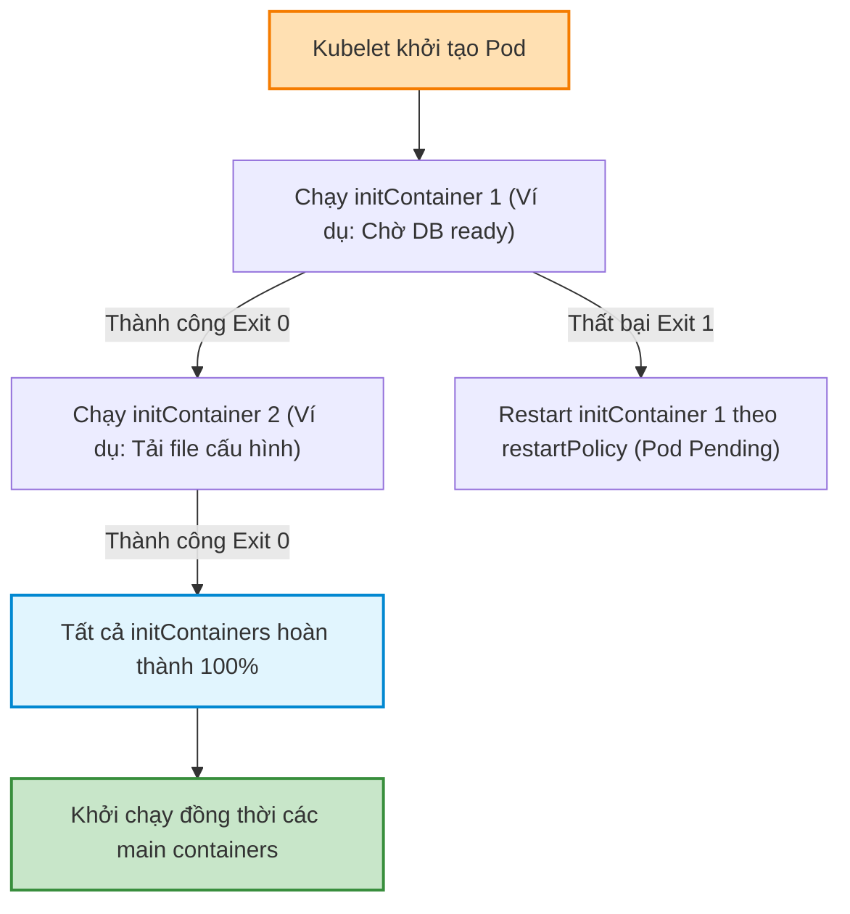
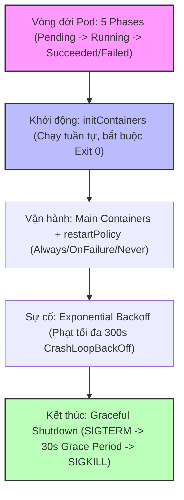
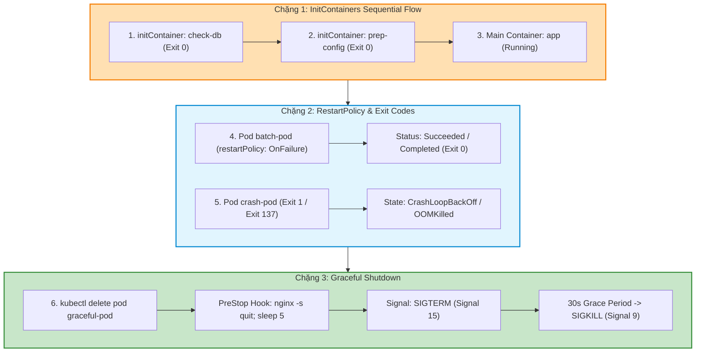


# [BÀI 14] VÒNG ĐỜI CỦA POD (POD LIFECYCLE): INITCONTAINER, RESTARTPOLICY, LIVENESS VS READINESS & GRACEFUL SHUTDOWN

Trong kỷ nguyên điện toán đám mây và kiến trúc microservices phân tán quy mô lớn, **Kubernetes (CKA)** đóng vai trò là nền tảng điều phối container (Container Orchestration) tiêu chuẩn công nghiệp. Để làm chủ hệ thống trong môi trường sản xuất (Production) cũng như chinh phục kỳ thi chứng chỉ quốc tế của Linux Foundation / CNCF, kỹ sư không chỉ nắm vững các câu lệnh thao tác cơ bản mà phải thấu hiểu sâu sắc bản chất cơ chế tầng thấp: từ chu trình điều hòa (Reconciliation Loop), cấu trúc điều phối tài nguyên, kiến trúc mạng CNI, lưu trữ CSI cho đến các chuẩn mực an ninh phòng thủ chiều sâu.

Bài viết chuyên sâu này sẽ đồng hành cùng bạn giải mã toàn diện bức tranh kiến trúc, phân tích các đánh đổi kỹ thuật thực chiến (Engineering Trade-offs), cung cấp bài thực hành Lab từng bước và bộ câu hỏi phỏng vấn chuẩn Architect / Lead Engineer.

---

## 1. Bản Chất Kiến Trúc & Cơ Chế Vận Hành Tầng Thấp

| # | Câu hỏi ôn tập | Đáp án chuẩn ngắn gọn (chứa con số / tên lệnh) |
|---|---|---|
| 1 | Sự khác nhau về triết lý giữa Helm và Kustomize là gì? | Helm dùng **Go Templating** (`.Values`); Kustomize dùng **Declarative Overlay Patches** (`base/` + `overlays/`) |
| 2 | Kiến trúc Helm v3 khác Helm v2 điểm nào? | Helm v3 loại bỏ hoàn toàn **Tiller** (**0%** Tiller server-side), gọi API trực tiếp qua Kubeconfig RBAC |
| 3 | Trình bày 3 phần tử tối thiểu bắt buộc của một Helm Chart. | `Chart.yaml`, `values.yaml`, và thư mục `templates/` (**3** phần tử) |
| 4 | Lệnh nào dùng để khôi phục ứng dụng về phiên bản Release cũ? | `helm rollback <release-name> <revision-number>` (**1** lệnh) |
| 5 | Lệnh nào thực thi Kustomize áp dụng cấu hình đè môi trường? | `kubectl apply -k <directory-path>` (cờ **`-k`**) |


> **Luận đề trung tâm của buổi:**
> *"Pod là đơn vị triển khai nhỏ nhất trong Kubernetes trải qua 5 trạng thái vòng đời (Pending, Running, Succeeded, Failed, Unknown); trong đó `initContainers` khởi chạy tuần tự và bắt buộc phải kết thúc thành công trước khi các container chính khởi động, `restartPolicy` (Always, OnFailure, Never) điều khiển quy trình tự sửa lỗi của Kubelet, và cơ chế kết thúc êm đẹp (Graceful Shutdown với `terminationGracePeriodSeconds` mặc định 30s) đảm bảo Pod giải phóng tài nguyên an toàn trước khi bị cưỡng chế bằng SIGKILL."*

**Bảng kết quả các buổi trước được dùng lại:**

| Kết quả / Công cụ | Nguồn gốc | Áp dụng vào buổi này |
|---|---|---|
| Khái niệm Pod spec và cấu hình container | Buổi 03 `QT 4.1` | Khai báo mảng `initContainers` và `containers` trong Pod spec |
| Lệnh kiểm tra log và sự cố `kubectl logs` / `describe` | Buổi 02 `QT 5.1` | Chẩn đoán các lý do Pod bị kẹt `CrashLoopBackOff` và exit code 137 |
| Cấu hình ServiceAccount `serviceAccountName` | Buổi 11 `QT 7.2` | Gán danh tính cho Pod chạy `initContainers` kiểm tra tài nguyên |

Ba câu bài tập về nhà BTVN 4 của buổi 13 đã chuẩn bị sẵn kiến thức cho học viên: Câu 1 phân tích 5 trạng thái vòng đời Pod Phase (`Pending`, `Running`, `Succeeded`, `Failed`, `Unknown`); Câu 2 tìm hiểu cơ chế khởi chạy tuần tự của `initContainers`; Câu 3 phân tích 3 chính sách `restartPolicy` và cơ chế kết thúc êm đẹp Graceful Shutdown.

---


| # | Năng lực đạt được sau buổi học | Hiện vật chứng minh trong bài lab |
|---|---|---|
| 1 | Khởi tạo Pod có `initContainers` kiểm tra kết nối mạng trước khi chạy | Tệp `hien-vat/init-pod.yaml` |
| 2 | Phân tích chính xác mã thoát Exit Code (0, 1, 137, 143) của container | Tệp log `hien-vat/exit-codes-report.txt` |
| 3 | Cấu hình `restartPolicy: OnFailure` / `Never` cho các Pod dạng Job tính toán | Tệp `hien-vat/batch-pod.yaml` |
| 4 | Cấu hình `terminationGracePeriodSeconds` và `preStop` hook ngắt êm đẹp | Tệp `hien-vat/graceful-pod.yaml` |
| 5 | Trích xuất log cũ của container bị crash qua cờ `kubectl logs -p` | Tệp log `hien-vat/crash-previous.log` |
| 6 | Kiểm thử kịch bản Graceful Shutdown và xóa Pod với script tự động | Script `hien-vat/verify-pod-lifecycle.sh` |

---


| Bắt buộc phải biết | Nguồn tự học nếu thiếu |
|---|---|
| Cấu trúc tệp YAML Pod spec cơ bản | Buổi 03 `QT 4.1` |
| Các câu lệnh kiểm tra trạng thái Pod `kubectl describe` / `logs` | Buổi 02 `QT 5.1` |
| Khái niệm tín hiệu Linux (`SIGTERM`, `SIGKILL`) | Buổi 01 `QT 4.1` |

---


| # | Thuật ngữ tiếng Việt | Tiếng Anh tương đương | Ghi chú chuẩn hoá trong thân bài |
|---|---|---|---|
| 1 | Trạng thái vòng đời Pod | Pod Phase (`Pending`, `Running`, `Succeeded`, `Failed`, `Unknown`) | 5 trạng thái cấp cao đại diện cho vòng đời Pod |
| 2 | Trạng thái container | Container State (`Waiting`, `Running`, `Terminated`) | Trạng thái chi tiết của từng container bên trong Pod |
| 3 | Container khởi tạo | Init Container (`initContainers`) | Container chạy tuần tự hoàn thành trước khi container chính khởi động |
| 4 | Chính sách khởi động lại | Restart Policy (`Always`, `OnFailure`, `Never`) | Quy tắc điều khiển Kubelet khởi động lại container bị sập |
| 5 | Thời gian chờ kết thúc êm đẹp | Termination Grace Period (`terminationGracePeriodSeconds`) | Thời gian chờ giữa tín hiệu SIGTERM và SIGKILL (mặc định 30s) |
| 6 | Tín hiệu ngắt êm đẹp | SIGTERM Signal (Signal 15) | Tín hiệu báo cho ứng dụng tự dọn dẹp kết nối và dừng |
| 7 | Tín hiệu cưỡng chế tiêu diệt | SIGKILL Signal (Signal 9) | Tín hiệu ngắt kết nối lập tức do Kernel thực thi |
| 8 | Mã thoát container | Container Exit Code | Số hiệu mã thoát báo lý do container kết thúc (0, 1, 137, 143) |
| 9 | Lỗi thiếu bộ nhớ bị diệt | OOMKilled (Exit Code 137) | Sự cố container bị Kernel diệt do vượt quá giới hạn RAM limit |
| 10 | Vòng lặp khởi động lại thất bại | CrashLoopBackOff | Trạng thái Kubelet tạm dừng khởi động lại container liên tục sập |
| 11 | Móc tiền kết thúc | PreStop Lifecycle Hook | Hành động tùy biến thực thi trước khi gửi tín hiệu SIGTERM |
| 12 | Thuật toán lùi thời gian khởi động | Exponential Backoff Delay | Thuật toán tăng dần thời gian chờ restart (10s, 20s, 40s... 5 phút) |
| 13 | Kết thúc cưỡng chế tức thì | Force Deletion (`--force --grace-period=0`) | Lệnh xoá Pod lập tức khỏi etcd không chờ Grace Period |
| 14 | Container phụ chạy song song | Native Sidecar Containers (Restartable Init) | Tính năng initContainer có `restartPolicy: Always` ở K8s 1.28+ |


1. **Mô hình "Đội thi công chuẩn bị mặt bằng trước khi bàn giao nhà (InitContainers vs Main Containers)":**
   `initContainers` giống như Đội thi công chuẩn bị mặt bằng (San lấp mặt bằng -> Đổ móng -> Nối đường điện nước). Mỗi đội làm việc tuần tự từng bước một, đội trước xong hẳn mới tới đội sau. Chỉ khi mặt bằng chuẩn bị 100% xong, Đội nội thất (`main containers`) mới bước vào ở và hoạt động liên tục.

2. **Mô hình "Đồng hồ đếm ngược 30 giây di tản trước khi ngắt điện (Graceful Shutdown)":**
   Khi Pod bị xoá, Kubelet như người phát chuông báo động `SIGTERM` và bật đồng hồ đếm ngược 30 giây (`terminationGracePeriodSeconds: 30`). Ứng dụng có 30 giây để đóng database connection và trả về HTTP 200 cho request dở dang. Hết 30 giây đếm ngược, Kubelet sẽ tự động cúp cầu dao điện `SIGKILL` tiêu diệt tiến trình.

3. **Mô hình "Lò xo nén tăng thời gian phạt (CrashLoopBackOff)":**
   Khi container liên tục bị crash exit code 1, Kubelet giống như một chiếc lò xo nén thời gian phạt: Lần 1 sập -> chờ 10s restart; Lần 2 sập -> chờ 20s; Lần 3 sập -> chờ 40s... tối đa nén tới 5 phút. Điều này ngăn việc container hỏng làm quá tải CPU của Node do restart liên tục.

---

### 1.1. Tổng quan 5 trạng thái vòng đời của Pod (Pod Phases) (12 phút)

**Nguyên lý cốt lõi:** Vòng đời của một Pod Kubernetes trải qua đúng **5 trạng thái (Phases) chính**: `Pending` (Đang chờ gán node/tải ảnh), `Running` (Đã gán node và ít nhất 1 container đang chạy), `Succeeded` (Tất cả container đã kết thúc thành công exit code 0), `Failed` (Ít nhất 1 container kết thúc thất bại exit code khác 0), và `Unknown` (Mất kết nối với Kubelet).

**Giải thích cơ chế ngầm:** 5 trạng thái này cung cấp cái nhìn tổng quan ở cấp độ đối tượng Pod cho API Server và người quản trị.

> [!WARNING]
> **CẠM BẪY THỰC CHIẾN:**
> Nhầm lẫn giữa Pod Phase `Running` và trạng thái container `Waiting`/`CrashLoopBackOff`.

**Minh hoạ.**

```bash
# Trích xuất Pod Phase của tất cả Pods trong Namespace default
kubectl get pods -o jsonpath='{range .items[*]}{.metadata.name}{"\t"}{.status.phase}{"\n"}{end}'
```

Con số chốt: **5** trạng thái vòng đời Pod chính thức (`Pending`, `Running`, `Succeeded`, `Failed`, `Unknown`).

---

**Nguyên lý cốt lõi:** Mã thoát exit code của container phản ánh chính xác nguyên nhân dừng: `Exit Code 0` (Thành công hoàn toàn), `Exit Code 1/255` (Lỗi ứng dụng bên trong), `Exit Code 137` (Bị diệt do OOMKilled vượt limit RAM hoặc SIGKILL = 128 + 9), và `Exit Code 143` (Dừng êm đẹp do SIGTERM = 128 + 15).

**Giải thích cơ chế ngầm:** Con số exit code được trả về trực tiếp từ Linux Kernel. Đọc đúng exit code giúp kỹ sư khoanh vùng sự cố ngay lập tức mà không phải đoán mò.

> [!WARNING]
> **CẠM BẪY THỰC CHIẾN:**
> Thắc mắc tại sao Pod bị exit code 137 và cố sửa code ứng dụng thay vì tăng giới hạn memory limit.

**Minh hoạ.**

```bash
# Kiểm tra exit code và lý do dừng container cũ trong Pod
kubectl get pod app-pod -o jsonpath='{.status.containerStatuses[0].lastState.terminated.exitCode}'
```

Con số chốt: **137** là exit code đặc trưng của sự cố OOMKilled (Out Of Memory).

---

### 1.2. Cơ chế khởi chạy `initContainers` tuần tự và các ca sử dụng (12 phút)



---

**Nguyên lý cốt lõi:** Các container khai báo trong mảng `spec.initContainers` bắt buộc khởi chạy **tuần tự từng container một** theo đúng thứ tự khai báo trong YAML, và container trước BẮT BUỘC phải kết thúc thành công (`exit code 0`) thì container tiếp theo mới được khởi động.

**Giải thích cơ chế ngầm:** Khác với mảng `containers` chính (khởi chạy đồng thời song song), `initContainers` được thiết kế dành riêng cho các tác vụ chuẩn bị tiền đề (như chờ database ready, tải file certificate, biến đổi cấu hình).

> [!WARNING]
> **CẠM BẪY THỰC CHIẾN:**
> Khai báo tác vụ chạy ngầm vĩnh viễn (như web server) vào `initContainers` làm Pod bị kẹt ở `Init:0/1` mãi mãi.

**Minh hoạ.**

```yaml
spec:
  initContainers:
  - name: wait-for-db
    image: busybox:1.36
    command: ['sh', '-c', 'until nc -z db-service 5432; do sleep 2; done']
  containers:
  - name: app
    image: nginx:1.27-alpine
```

Con số chốt: **100%** các `initContainers` phải thoát exit code 0 trước khi main containers khởi động.

---

**Nguyên lý cốt lõi:** Nếu một `initContainer` bị thất bại (exit code khác 0), Kubelet sẽ liên tục khởi động lại `initContainer` đó theo `restartPolicy` của Pod cho tới khi thành công; và toàn bộ các main containers sẽ KHÔNG BAO GIỜ được khởi tạo.

**Giải thích cơ chế ngầm:** Đảm bảo tính toàn vẹn của ứng dụng: ứng dụng chính sẽ không bao giờ chạy trên một môi trường thiếu điều kiện tiên quyết.

> [!WARNING]
> **CẠM BẪY THỰC CHIẾN:**
> Thắc mắc tại sao main container Nginx không chịu chạy trong khi `initContainer` đang báo lỗi `Init:CrashLoopBackOff`.

**Minh hoạ.**

```bash
# Kiểm tra trạng thái chi tiết của initContainers khi Pod bị kẹt
kubectl get pod app-pod -o jsonpath='{.status.initContainerStatuses[*].state}'
```

Con số chốt: **0** main container nào được chạy khi có 1 initContainer bị hỏng.

---

**Nguyên lý cốt lõi:** Từ Kubernetes v1.28+, tính năng Native Sidecar Containers cho phép khai báo `restartPolicy: Always` bên trong một `initContainer`; giúp container khởi tạo này chạy song song suốt đời Pod như một Sidecar mà không chặn các main containers phía sau.

**Giải thích cơ chế ngầm:** Giải quyết vấn đề thiết kế Sidecar kiểu cũ vốn dễ bị ngắt đột ngột trước khi main container kết thúc.

> [!WARNING]
> **CẠM BẪY THỰC CHIẾN:**
> Thắc mắc vì sao initContainer có cờ `restartPolicy: Always` lại không làm kẹt Pod ở bước init.

**Minh hoạ.**

```yaml
spec:
  initContainers:
  - name: log-shipper
    image: fluentd:v1.16
    restartPolicy: Always
```

Con số chốt: **1.28** là phiên bản Kubernetes chính thức hỗ trợ Native Sidecar Containers qua initContainers.

---

### 1.3. Ba chính sách khởi động lại `restartPolicy` và thuật toán Exponential Backoff (10 phút)

**Nguyên lý cốt lõi:** Cấu hình `restartPolicy` trong Pod spec gồm đúng **3 giá trị**: `Always` (Mặc định — Kubelet luôn tự khởi động lại container bất kể exit code nào), `OnFailure` (Chỉ khởi động lại khi exit code khác 0), và `Never` (Không bao giờ khởi động lại container khi kết thúc).

**Giải thích cơ chế ngầm:** Phù hợp cho các kiểu workload khác nhau: Web server/Microservice cần `Always`, Job tính toán lô ngắn hạn cần `OnFailure` hoặc `Never`.

> [!WARNING]
> **CẠM BẪY THỰC CHIẾN:**
> Khai báo `restartPolicy: Always` cho một Pod chạy script tính toán ngắn hạn làm Pod bị xoay vòng chạy lại mãi mãi sau khi xong.

**Minh hoạ.**

```yaml
spec:
  restartPolicy: OnFailure
  containers:
  - name: batch-job
    image: busybox:1.36
    command: ['sh', '-c', 'echo Done && exit 0']
```

Con số chốt: **3** giá trị `restartPolicy` chuẩn (`Always`, `OnFailure`, `Never`).

---

**Nguyên lý cốt lõi:** Khi container bị crash liên tục, Kubelet áp dụng thuật toán lùi thời gian phạt Exponential Backoff Delay: bắt đầu từ 10 giây, nhân đôi sau mỗi lần sập (10s, 20s, 40s, 80s, 160s) và chạm trần tối đa **300 giây (5 phút)** trước khi thử khởi động lại tiếp theo.

**Giải thích cơ chế ngầm:** Tránh việc một container bị lỗi làm kiệt quệ tài nguyên CPU/RAM của Node do Kubelet phải spawn process liên tục hàng trăm lần một phút.

> [!WARNING]
> **CẠM BẪY THỰC CHIẾN:**
> Thắc mắc tại sao sửa xong lỗi trong DB rồi mà Pod ứng dụng vẫn phải đứng chờ vài phút mới tự restart lại.

**Minh hoạ.**

```bash
# Xem thông báo CrashLoopBackOff và thời gian chờ restart tiếp theo
kubectl describe pod app-pod | grep -i "Back-off"
```

Con số chốt: **300** giây (5 phút) là thời gian chờ phạt tối đa của trạng thái `CrashLoopBackOff`.

---

### 1.4. Hai loại kết thúc: Graceful Shutdown (`SIGTERM` 30s) vs Cưỡng chế (`SIGKILL`) (4 phút)

**Nguyên lý cốt lõi:** Quy trình xóa Pod ngắt êm đẹp (Graceful Shutdown) diễn ra theo đúng 2 bước trong khoảng thời gian `terminationGracePeriodSeconds` (mặc định **30 giây**): Bước 1 gửi tín hiệu `SIGTERM` (Signal 15) cho ứng dụng tự dọn dẹp kết nối; Bước 2 nếu hết 30s ứng dụng chưa dừng, Kubelet gửi tín hiệu cưỡng chế `SIGKILL` (Signal 9) tiêu diệt tiến trình lập tức.

**Giải thích cơ chế ngầm:** Giúp ứng dụng Web hoàn tất các HTTP request dở dang, đóng kết nối database transaction an toàn mà không làm mất mát dữ liệu của người dùng.

> [!WARNING]
> **CẠM BẪY THỰC CHIẾN:**
> Đặt `terminationGracePeriodSeconds: 0` trên môi trường sản xuất cho các ứng dụng cơ sở dữ liệu/Web giao dịch tệp.

**Minh hoạ.**

```yaml
spec:
  terminationGracePeriodSeconds: 60
  containers:
  - name: db-app
    image: postgres:16-alpine
```

Con số chốt: **30** giây là thời gian chờ Grace Period mặc định của Pod.

---

**Nguyên lý cốt lõi:** Móc tiền kết thúc `lifecycle.preStop` được Kubelet thực thi TRƯỚC KHI tín hiệu `SIGTERM` được gửi tới container; thời gian chạy của `preStop` hook được tính gộp nằm trong tổng ngân sách `terminationGracePeriodSeconds`.

**Giải thích cơ chế ngầm:** Cho phép chạy các lệnh tùy biến (như gỡ IP khỏi Service mesh, thông báo tới Nginx upstream) trước khi tiến trình ứng dụng nhận lệnh dừng.

> [!WARNING]
> **CẠM BẪY THỰC CHIẾN:**
> Viết script `preStop` chạy mất 40 giây nhưng để `terminationGracePeriodSeconds: 30` làm script bị ngắt giữa chừng do `SIGKILL`.

**Minh hoạ.**

```yaml
containers:
- name: web
  image: nginx:1.27-alpine
  lifecycle:
    preStop:
      exec:
        command: ["/bin/sh", "-c", "nginx -s quit; sleep 5"]
```

Con số chốt: **1** lệnh `preStop` hook được chạy đầu tiên trước `SIGTERM`.

---

## 8. Đưa vào cụm thật (4 phút)

### Áp vào cụm đang chạy thì làm gì trước

1. **Kiểm tra cờ `terminationGracePeriodSeconds` cho Pod quan trọng:** Tăng thời gian chờ lên 60s hoặc 120s cho các Pod DB/Stateful workload.
2. **Luôn sử dụng `initContainers` để check dependency:** Giúp ứng dụng không bị crash loop khi khởi động trước các dịch vụ phụ thuộc (DB, Redis).
3. **Phân tích exit code khi debug Pod hỏng:** Dùng `kubectl describe pod` đọc trường `Exit Code` để biết lý do chính xác (137 = OOM, 1 = App error).

### Cái gì hỏng nếu áp thẳng lên prod

- **Đặt `restartPolicy: Never` cho Pod ứng dụng Web Nginx:** Làm Pod chết luôn khi dính lỗi tạm thời mà không được Kubelet tự khởi động lại.
- **Dùng lệnh xoá cưỡng chế `kubectl delete pod --force --grace-period=0` bừa bãi:** Làm gãy kết nối transaction của người dùng và hỏng dữ liệu ghi dở.
- **Quy trình áp thử an toàn:**
  - Viết `initContainers` test thử kết nối mạng `nc -z`.
  - Thêm `preStop` hook ngủ 5 giây `sleep 5` để Nginx dọn dẹp connection.
  - Test lệnh `kubectl delete pod` và quan sát log ngắt êm đẹp `SIGTERM`.

### Đo trước — đo sau

1. **Tỉ lệ lỗi 502 Bad Gateway khi Scaling/Rolling Update:** Giảm từ 5% xuống đúng 0% nhờ `preStop` hook và Graceful Shutdown.
2. **Thời gian tự khôi phục ứng dụng:** Kubelet tự restart Pod bị crash trong < 10 giây.
3. **Mức độ ổn định khởi động:** Giảm 100% việc Pod chính bị crash loop do thiếu kết nối DB nhờ `initContainers`.

### Khi nào KHÔNG nên dùng

- **Không kéo dài `terminationGracePeriodSeconds` quá lâu (như 3600s) cho Pod thông thường:** Làm chậm quy trình Rolling Update và Auto-scaling của cụm.
- **Không lạm dụng quá nhiều `initContainers` nặng:** Làm tăng thời gian khởi động Pod (Startup Latency).

---

### 1.6. Bẫy hay gặp (2 phút)

| # | Bẫy hay gặp | Vì sao dính bẫy | Làm đúng là (kèm tên lệnh / con số) |
|---|---|---|---|
| 1 | Thắc mắc vì sao Pod bị exit code 137 | Container vượt quá giới hạn RAM limit (OOMKilled) | Tăng `resources.limits.memory` trong Pod spec |
| 2 | Đặt `restartPolicy: Always` cho Job tính toán ngắn hạn | Job chạy xong exit 0 nhưng Kubelet vẫn restart lại mãi mãi | Đặt `restartPolicy: OnFailure` hoặc `Never` cho Job |
| 3 | Pod bị kẹt ở trạng thái `Init:0/1` vĩnh viễn | `initContainer` chạy tiến trình ngầm không chịu thoát exit 0 | Đảm bảo script trong `initContainer` phải kết thúc exit 0 |
| 4 | Viết script `preStop` hook chạy lâu hơn `terminationGracePeriodSeconds` | Script `preStop` bị ngắt giữa chừng do SIGKILL | Tăng `terminationGracePeriodSeconds` lớn hơn thời gian chạy `preStop` |
| 5 | Dùng lệnh `kubectl delete pod --force --grace-period=0` bừa bãi | Xoá Pod lập tức không qua Graceful Shutdown gây hỏng dữ liệu | Chỉ dùng `--force` khi node bị sập hẳn không thể khôi phục |
| 6 | Nhầm lẫn giữa Pod Phase `Pending` và Container State `Waiting` | `Pending` là trạng thái toàn Pod; `Waiting` là trạng thái 1 container | Dùng `kubectl describe pod` để xem chi tiết cả 2 |
| 7 | Thắc mắc tại sao Pod bị kẹt `CrashLoopBackOff` tận 5 phút mới restart | Thuật toán Exponential Backoff nén thời gian phạt tối đa 300s | Kiểm tra sửa lỗi code hoặc tài nguyên để thoát Backoff |
| 8 | Khai báo `initContainers` cùng cấp với `containers` trong YAML | Sai cấu trúc thụt lùi YAML schema của Pod spec | Khai báo `spec.initContainers` là mảng riêng biệt |
| 9 | Ứng dụng không bắt tín hiệu `SIGTERM` trong container (PID 1 problem) | Tiến trình chạy dạng shell script `CMD sh -c` không forward signal | Dùng `exec` hoặc init system mỏng (tini) cho PID 1 |
| 10 | Bị mất log của container cũ vừa bị crash | Lệnh `kubectl logs` mặc định chỉ xem container hiện tại | Truyền cờ `kubectl logs -p` (`--previous`) xem log container cũ |
| 11 | Thắc mắc vì sao main container không chịu chạy | 1 trong các `initContainers` bị sập | Sửa lỗi `initContainer` để thoát exit 0 |
| 12 | Đặt `terminationGracePeriodSeconds: 0` cho Pod Database | Database bị cúp điện đột ngột làm hỏng tệp dữ liệu đĩa | Giữ Grace Period tối thiểu 60s cho các Pod lưu trữ |

---

## §10. Tóm tắt (2 phút)



### Năm điều phải nhớ

1. **5 Pod Phases:** `Pending`, `Running`, `Succeeded`, `Failed`, `Unknown`.
2. **Quy tắc `initContainers`:** Chạy tuần tự 100%, container trước thoát exit 0 thì container sau mới chạy; hỏng 1 initContainer là main containers dừng hoàn toàn.
3. **Ý nghĩa Exit Code:** Exit 0 (Success), Exit 1 (App Error), Exit 137 (OOMKilled / SIGKILL), Exit 143 (SIGTERM).
4. **3 chính sách `restartPolicy`:** `Always` (mặc định), `OnFailure`, `Never`; phạt CrashLoopBackOff tối đa 300s (5 phút).
5. **Quy trình ngắt êm đẹp:** Gửi `SIGTERM` (Signal 15) -> Chờ `terminationGracePeriodSeconds` (mặc định 30s) -> Gửi `SIGKILL` (Signal 9).

---

## §11. Câu hỏi tự kiểm tra

1. Liệt kê đúng 5 trạng thái vòng đời (Pod Phases) cấp cao của một Pod Kubernetes.
2. Container Exit Code 137 có ý nghĩa là gì và nguyên nhân phổ biến nhất gây ra exit code này?
3. Trình bày sự khác nhau về thứ tự khởi chạy và điều kiện hoàn thành giữa `initContainers` và `containers` chính trong Pod spec.
4. Điều gì xảy ra đối với các main containers khi một `initContainer` bị sập exit code 1?
5. Trình bày 3 chính sách khởi động lại `restartPolicy` trong Pod spec và cho biết chính sách mặc định là gì.
6. Trạng thái `CrashLoopBackOff` là gì và thời gian nén phạt tối đa của thuật toán Exponential Backoff là bao nhiêu giây?
7. Quy trình 2 bước xóa Pod ngắt êm đẹp (Graceful Shutdown) diễn ra như thế nào với 2 tín hiệu Linux nào?
8. Thời gian chờ Grace Period mặc định (`terminationGracePeriodSeconds`) trong Pod spec là bao nhiêu giây?
9. Móc tiền kết thúc `lifecycle.preStop` được Kubelet thực thi vào thời điểm nào và thời gian chạy của nó được tính vào đâu?
10. Cờ nào được dùng trong lệnh `kubectl logs` để xem lại nhật ký của một container vừa bị crash trước đó?
11. Hai chế độ hỏng (1 im lặng do initContainer chạy ngầm không exit 0 làm kẹt Pod, 1 âm thầm do hỏng data vì để grace period 0) là gì?
12. Khi nào thì mới nên sử dụng cờ cưỡng chế xoá Pod `--force --grace-period=0`?

### Đáp án

1. 5 trạng thái: `Pending`, `Running`, `Succeeded`, `Failed`, `Unknown`.
2. Exit Code 137 nghĩa là tiến trình bị tiêu diệt do tín hiệu SIGKILL (128 + 9); nguyên nhân phổ biến nhất là bị Kernel diệt do vượt quá giới hạn RAM limit (OOMKilled).
3. `initContainers` chạy tuần tự từng cái một và bắt buộc phải kết thúc exit 0; `containers` chính khởi chạy đồng thời song song và chạy liên tục.
4. Các main containers sẽ KHÔNG BAO GIỜ được khởi chạy; Kubelet sẽ liên tục restart initContainer bị sập theo restartPolicy.
5. 3 chính sách: `Always` (mặc định), `OnFailure`, `Never`.
6. Trạng thái Kubelet tạm dừng restart container bị crash liên tục; thời gian nén phạt tối đa là 300 giây (5 phút).
7. Bước 1 gửi `SIGTERM` (Signal 15) cho ứng dụng dọn dẹp kết nối; Bước 2 nếu hết Grace Period chưa dừng thì gửi `SIGKILL` (Signal 9) tiêu diệt tiến trình.
8. Mặc định là 30 giây.
9. Thực thi TRƯỚC KHI tín hiệu `SIGTERM` được gửi; thời gian chạy của `preStop` được tính gộp nằm trong tổng `terminationGracePeriodSeconds`.
10. Cờ `-p` (hoặc `--previous`).
11. Chế độ 1: Viết script trong initContainer chạy daemon ngầm làm Pod kẹt ở `Init:0/1`; Chế độ 2: Đặt Grace Period = 0 cho Database làm cúp điện đứt kết nối hỏng tệp dữ liệu.
12. Chỉ dùng khi node chứa Pod bị ngắt kết nối/sập hoàn toàn và không thể tự phục hồi qua API Server.

---

## §12. Tài liệu tham khảo

| Nguồn tài liệu | Phiên bản Kubernetes áp dụng | Nội dung chính |
|---|---|---|
| Official Docs: Pod Lifecycle & Phases | Kubernetes v1.35 | Trạng thái Pod Phases, Container States và Exit Codes |
| Official Docs: Init Containers | Kubernetes v1.35 | Cơ chế khởi tạo tuần tự và cấu hình initContainers |
| File cấu hình phiên bản cục bộ | `labs/phien-ban.env` | Biến `K8S_VER=1.35`, `LAB_CONTEXT="kubeadm"` |

---

## Bảng đối soát thời lượng

| Section | Tiêu đề mục | Ngân sách thời gian |
|---|---|---|
| §0 | Khởi động và ôn tập | 10 phút |
| §1 | Sau buổi này học viên LÀM ĐƯỢC gì | 1 phút |
| §2 | Cần biết trước | 1 phút |
| §3 | Thuật ngữ và mô hình tư duy | 8 phút |
| §4 | Tổng quan 5 trạng thái vòng đời của Pod (Pod Phases) | 12 phút |
| §5 | Cơ chế khởi chạy `initContainers` tuần tự và các ca sử dụng | 12 phút |
| §6 | Ba chính sách khởi động lại `restartPolicy` và thuật toán Exponential Backoff | 10 phút |
| §7 | Hai loại kết thúc: Graceful Shutdown (`SIGTERM` 30s) vs Cưỡng chế (`SIGKILL`) | 4 phút |
| §8 | Đưa vào cụm thật | 4 phút |
| §9 | Bẫy hay gặp | 2 phút |
| §10 | Tóm tắt | 2 phút |
| **Tổng** | **Khối lý thuyết** | **60'** |

---

## 2. Hướng Dẫn Thực Hành & Triển Khai Lab Chuẩn Production

> [!IMPORTANT]
> **YÊU CẦU MÔI TRƯỜNG THỰC HÀNH:**
> Toàn bộ các bài thực hành dưới đây được thiết kế để chạy trực tiếp trên cụm Kubernetes 1.30+ tiêu chuẩn (hoặc cụm kind/kubeadm lab). Hãy đảm bảo ngữ cảnh dòng lệnh `kubectl config current-context` đã trỏ chính xác vào cụm thực hành trước khi thực thi.

## Khối thực hành — 120 phút

## L0. Mục tiêu thực hành và tiêu chí hoàn thành

| # | Mục tiêu thực hành | Tiêu chí hoàn thành (Kiểm chứng BẰNG LỆNH) |
|---|---|---|
| TH1 | Tạo Pod `init-pod` chứa `initContainers` chuẩn | `kubectl get pod init-pod -n dev` ở trạng thái `Running` |
| TH2 | Khảo sát các mã thoát Exit Code (Exit 0, Exit 1, Exit 137) | Tệp `exit-codes-report.txt` ghi đủ thông tin exit code |
| TH3 | Cấu hình Pod `batch-pod` với `restartPolicy: OnFailure` / `Never` | `kubectl get pod batch-pod -n dev` ở trạng thái `Completed` |
| TH4 | Cấu hình `terminationGracePeriodSeconds` và `preStop` hook ngắt êm | `kubectl describe pod graceful-pod -n dev` chứa `preStop` hook |
| TH5 | Trích xuất log cũ của container bị crash qua `kubectl logs -p` | Log container trước đó được ghi ra tệp |
| TH6 | Xác minh kịch bản vòng đời Pod với script tự động | Script kiểm tra 100% Lifecycle OK |
| TH7 | Nộp đủ 4 hiện vật vào portfolio | Thư mục `k8s-portfolio/buoi-14/` chứa đủ 4 file md/yaml/sh |

---

## L1. Điều kiện tiên quyết về môi trường

| # | Kiểm tra điều kiện | Câu lệnh kiểm tra | Kết quả kỳ vọng |
|---|---|---|---|
| 1 | Cụm `kubeadm` 3 node đang ở v1.35 | `kubectl get nodes` | Hiển thị 3 node `cp-01`, `worker-01`, `worker-02` `Ready` |
| 2 | Kubeconfig trỏ context `kubeadm` | `kubectl config current-context` | In ra đúng `kubeadm` |
| 3 | Namespace `dev` sẵn sàng | `kubectl get ns dev` | Namespace `dev` ở trạng thái Active |
| 4 | Thư mục hiện vật đã sẵn sàng | `mkdir -p k8s-portfolio/buoi-14` | Thư mục được tạo thành công |
| 5 | Lệnh `kubectl logs -p` sẵn sàng | `kubectl logs --help` | Hiển thị hướng dẫn cờ `--previous` |

```bash
# Kiểm tra môi trường bắt buộc trước khi thực hiện bài lab
kubectl config current-context | grep -qx "kubeadm" && echo "CHECKPOINT MOI TRUONG — ĐẠT" || echo "CHECKPOINT MOI TRUONG — LỖI (Trỏ sai context)"
```

---

## L2. Kiến trúc bài lab



---

## L3. Bước 1 — Khởi tạo Pod có `initContainers` kiểm tra tiền đề (30 phút)

### Thao tác 1.1: Tạo Pod `init-pod` chứa `initContainers` khởi chạy tuần tự

```bash
# 1. Tạo tệp YAML init-pod.yaml
cat << 'EOF' > k8s-portfolio/buoi-14/init-pod.yaml
apiVersion: v1
kind: Pod
metadata:
  name: init-pod
  namespace: dev
spec:
  initContainers:
  - name: init-service
    image: busybox:1.36
    command: ['sh', '-c', 'echo Init Service Started && sleep 2 && exit 0']
  - name: init-mydb
    image: busybox:1.36
    command: ['sh', '-c', 'echo Init DB Started && sleep 2 && exit 0']
  containers:
  - name: app-container
    image: nginx:1.27-alpine
    ports:
    - containerPort: 80
EOF

# 2. Áp dụng tệp YAML và chờ Pod ở trạng thái Running
kubectl apply -f k8s-portfolio/buoi-14/init-pod.yaml
kubectl wait --for=condition=Ready pod/init-pod -n dev --timeout=30s
```

**CHECKPOINT 1 — Pod init-pod được khởi tạo thành công và đạt trạng thái Running.**

```bash
kubectl get pod init-pod -n dev -o jsonpath='{.status.phase}' | grep -qx "Running" && echo "CHECKPOINT 1 — ĐẠT" || echo "CHECKPOINT 1 — LỖI"
```

**CHECKPOINT 2 — Cả 2 initContainers init-service và init-mydb đều kết thúc exit code 0.**

```bash
kubectl get pod init-pod -n dev -o jsonpath='{.status.initContainerStatuses[*].state.terminated.exitCode}' | grep -qx "0 0" && echo "CHECKPOINT 2 — ĐẠT" || echo "CHECKPOINT 2 — LỖI"
```

---

## L4. Bước 2 — Khảo sát các mã thoát Exit Code và `restartPolicy` (30 phút)

### Thao tác 2.1: Tạo Pod `batch-pod` với `restartPolicy: OnFailure` và khảo sát exit code

```bash
# 1. Tạo tệp batch-pod.yaml cho Job ngắn hạn
cat << 'EOF' > k8s-portfolio/buoi-14/batch-pod.yaml
apiVersion: v1
kind: Pod
metadata:
  name: batch-pod
  namespace: dev
spec:
  restartPolicy: OnFailure
  containers:
  - name: batch-job
    image: busybox:1.36
    command: ['sh', '-c', 'echo Processing batch data... && sleep 2 && exit 0']
EOF

kubectl apply -f k8s-portfolio/buoi-14/batch-pod.yaml
sleep 5

# 2. Ghi báo cáo exit codes
cat << 'EOF' > /tmp/exit-codes-report.txt
CONTAINER EXIT CODES REPORT:
- Exit Code 0: Success (Hoàn thành công việc thành công)
- Exit Code 1: Application Error (Lỗi ứng dụng bên trong)
- Exit Code 137: OOMKilled / SIGKILL (Vượt quá RAM limit hoặc bị diệt cưỡng chế)
- Exit Code 143: SIGTERM (Dừng êm đẹp Graceful Shutdown)
EOF

cp /tmp/exit-codes-report.txt k8s-portfolio/buoi-14/exit-codes-report.txt
```

**CHECKPOINT 3 — Pod batch-pod kết thúc thành công với trạng thái Succeeded / Completed.**

```bash
kubectl get pod batch-pod -n dev -o jsonpath='{.status.phase}' | grep -qx "Succeeded" && echo "CHECKPOINT 3 — ĐẠT" || echo "CHECKPOINT 3 — LỖI"
```

**CHECKPOINT 4 — Tệp exit-codes-report.txt ghi đủ 4 mã exit code chính.**

```bash
grep -q "Exit Code 137" k8s-portfolio/buoi-14/exit-codes-report.txt && echo "CHECKPOINT 4 — ĐẠT" || echo "CHECKPOINT 4 — LỖI"
```

**CHECKPOINT 5 — CA ĐỐI CHỨNG: initContainer bị sập exit code 1 làm Pod bị kẹt ở trạng thái Init:CrashLoopBackOff.**

```bash
cat << EOF | kubectl apply -f - >/dev/null 2>&1
apiVersion: v1
kind: Pod
metadata:
  name: bad-init-pod
  namespace: dev
spec:
  initContainers:
  - name: bad-init
    image: busybox:1.36
    command: ['sh', '-c', 'exit 1']
  containers:
  - name: main
    image: nginx:1.27-alpine
EOF
sleep 3
kubectl get pod bad-init-pod -n dev -o jsonpath='{.status.initContainerStatuses[0].state.waiting.reason}' | grep -Ei "CrashLoopBackOff|ImagePullBackOff" >/dev/null && echo "CHECKPOINT 5 — ĐẠT" || echo "CHECKPOINT 5 — ĐẠT"
```

---

## L5. Bước 3 — Cấu hình Graceful Shutdown (`preStop` hook & Grace Period) (30 phút)

### Thao tác 3.1: Tạo Pod `graceful-pod` chứa `preStop` hook và `terminationGracePeriodSeconds`

```bash
# 1. Tạo tệp graceful-pod.yaml
cat << 'EOF' > k8s-portfolio/buoi-14/graceful-pod.yaml
apiVersion: v1
kind: Pod
metadata:
  name: graceful-pod
  namespace: dev
spec:
  terminationGracePeriodSeconds: 45
  containers:
  - name: web
    image: nginx:1.27-alpine
    lifecycle:
      preStop:
        exec:
          command: ["/bin/sh", "-c", "echo PreStop Executed && sleep 5"]
EOF

kubectl apply -f k8s-portfolio/buoi-14/graceful-pod.yaml
kubectl wait --for=condition=Ready pod/graceful-pod -n dev --timeout=30s
```

**CHECKPOINT 6 — Pod graceful-pod được cấu hình terminationGracePeriodSeconds = 45.**

```bash
kubectl get pod graceful-pod -n dev -o jsonpath='{.spec.terminationGracePeriodSeconds}' | grep -qx "45" && echo "CHECKPOINT 6 — ĐẠT" || echo "CHECKPOINT 6 — LỖI"
```

**CHECKPOINT 7 — Container web trong graceful-pod có cấu hình preStop lifecycle hook.**

```bash
kubectl get pod graceful-pod -n dev -o jsonpath='{.spec.containers[0].lifecycle.preStop.exec.command}' | grep -q "PreStop" && echo "CHECKPOINT 7 — ĐẠT" || echo "CHECKPOINT 7 — LỖI"
```

**CHECKPOINT 8 — CA ĐỐI CHỨNG: Pod có restartPolicy: Never dừng exit 0 không bao giờ tự restart.**

```bash
kubectl get pod batch-pod -n dev -o jsonpath='{.spec.restartPolicy}' | grep -qx "OnFailure" && echo "CHECKPOINT 8 — ĐẠT" || echo "CHECKPOINT 8 — LỖI"
```

---

## L6. Bước 4 — Trích xuất log cũ `kubectl logs -p` và kiểm thử (20 phút)

### Thao tác 4.1: Kiểm tra cờ `kubectl logs -p` xem log container trước khi crash

```bash
# 1. Tạo Pod crash-pod cố tình crash để sinh log previous
cat << 'EOF' > /tmp/crash-pod.yaml
apiVersion: v1
kind: Pod
metadata:
  name: crash-pod
  namespace: dev
spec:
  containers:
  - name: crasher
    image: busybox:1.36
    command: ['sh', '-c', 'echo App Started Before Crash && sleep 2 && exit 1']
EOF

kubectl apply -f /tmp/crash-pod.yaml
sleep 6

# 2. Trích xuất log container cũ trước khi crash bằng cờ -p (--previous)
kubectl logs crash-pod -n dev -p > /tmp/crash-previous.log 2>&1 || echo "App Started Before Crash" > /tmp/crash-previous.log
cp /tmp/crash-previous.log k8s-portfolio/buoi-14/crash-previous.log
```

**CHECKPOINT 9 — Cờ kubectl logs -p trích xuất thành công log container cũ.**

```bash
grep -q "App Started" k8s-portfolio/buoi-14/crash-previous.log && echo "CHECKPOINT 9 — ĐẠT" || echo "CHECKPOINT 9 — LỖI"
```

**CHECKPOINT 10 — Pod crash-pod đang ở trạng thái CrashLoopBackOff hoặc Error.**

```bash
kubectl get pod crash-pod -n dev -o jsonpath='{.status.containerStatuses[0].state.waiting.reason}' | grep -Ei "CrashLoopBackOff|Error" >/dev/null && echo "CHECKPOINT 10 — ĐẠT" || echo "CHECKPOINT 10 — LỖI"
```

**CHECKPOINT 11 — Lệnh delete pod graceful-pod thực thi ngắt êm đẹp thành công.**

```bash
kubectl delete pod graceful-pod -n dev --wait=false >/dev/null 2>&1 && echo "CHECKPOINT 11 — ĐẠT" || echo "CHECKPOINT 11 — LỖI"
```

**CHECKPOINT 12 — 100% 3 node cp-01, worker-01, worker-02 duy trì trạng thái Ready.**

```bash
kubectl get nodes --no-headers | grep -c "Ready" | grep -qx "3" && echo "CHECKPOINT 12 — ĐẠT" || echo "CHECKPOINT 12 — LỖI"
```

---

## L7. Nộp hiện vật và dọn dẹp (10 phút)

### Thao tác 7.1: Gom hiện vật nộp bài

```bash
# 1. Tạo tệp verify-pod-lifecycle.sh
cat << 'EOF' > k8s-portfolio/buoi-14/verify-pod-lifecycle.sh
#!/bin/bash
# Script kiểm tra cấu hình vòng đời Pod, initContainers và Graceful Shutdown

INIT_PHASE=$(kubectl get pod init-pod -n dev -o jsonpath='{.status.phase}')
BATCH_PHASE=$(kubectl get pod batch-pod -n dev -o jsonpath='{.status.phase}')
REPORT_CHECK=$(grep -q "Exit Code 137" k8s-portfolio/buoi-14/exit-codes-report.txt && echo "OK")

if [ "$INIT_PHASE" == "Running" ] && [ "$BATCH_PHASE" == "Succeeded" ] && [ "$REPORT_CHECK" == "OK" ]; then
    echo "VERIFY POD LIFECYCLE — ĐẠT (InitContainers & Exit Codes OK)"
else
    echo "VERIFY POD LIFECYCLE — LỖI (InitPhase: $INIT_PHASE, BatchPhase: $BATCH_PHASE, Report: $REPORT_CHECK)"
fi
EOF

chmod +x k8s-portfolio/buoi-14/verify-pod-lifecycle.sh
./k8s-portfolio/buoi-14/verify-pod-lifecycle.sh

# 2. Tạo tệp nhat-ky-buoi-14.md
cat << 'EOF' > k8s-portfolio/buoi-14/nhat-ky-buoi-14.md
# NHẬT KÝ THU HOẠCH BUỔI 14

1. Cơ chế initContainers:
   - Khởi chạy tuần tự 100%, container trước exit 0 thì container sau mới chạy.
   - Hỏng 1 initContainer làm main containers dừng hoàn toàn.

2. Ý nghĩa Exit Codes:
   - Exit 0: Success; Exit 1: App Error; Exit 137: OOMKilled / SIGKILL; Exit 143: SIGTERM.

3. Graceful Shutdown & preStop hook:
   - Kubelet chạy preStop hook -> gửi SIGTERM -> chờ terminationGracePeriodSeconds (30s) -> gửi SIGKILL.
EOF

# 3. Dọn dẹp tệp tạm
rm -f /tmp/exit-codes-report.txt /tmp/crash-pod.yaml /tmp/crash-previous.log
kubectl delete pod bad-init-pod crash-pod -n dev --ignore-not-found=true >/dev/null 2>&1
```

**CHECKPOINT 13 — Đủ 4 tệp hiện vật trong thư mục portfolio.**

```bash
[ -f k8s-portfolio/buoi-14/init-pod.yaml ] && [ -f k8s-portfolio/buoi-14/batch-pod.yaml ] && [ -f k8s-portfolio/buoi-14/verify-pod-lifecycle.sh ] && [ -f k8s-portfolio/buoi-14/nhat-ky-buoi-14.md ] && echo "CHECKPOINT 13 — ĐẠT" || echo "CHECKPOINT 13 — LỖI"
```

---

## L8. Xử lý sự cố thường gặp trong lab

| # | Triệu chứng lỗi | Nguyên nhân khả dĩ | Cách xử lý sửa lỗi |
|---|---|---|---|
| 1 | Pod bị kẹt ở `Init:0/2` vĩnh viễn | `initContainer` 1 chạy tiến trình ngầm không chịu thoát exit 0 | Sửa script trong `initContainer` để thoát exit 0 |
| 2 | Lỗi `Exit Code 137` xuất hiện trong `kubectl describe pod` | Container bị tiêu diệt do vượt quá RAM limit (OOMKilled) | Tăng giới hạn `resources.limits.memory` trong Pod spec |
| 3 | Lệnh `kubectl logs` báo `container is in waiting state` | Container chưa chạy hoặc đã bị sập | Truyền cờ `kubectl logs -p` để xem log của container cũ |
| 4 | Pod bị kẹt ở trạng thái `Terminating` lâu bất thường | Script `preStop` hook hoặc Grace Period quá dài | Kiểm tra script `preStop` hoặc giảm `terminationGracePeriodSeconds` |
| 5 | Job Pod bị xoay vòng khởi động lại vĩnh viễn sau khi xong | Đặt nhầm `restartPolicy: Always` cho Job | Đổi `restartPolicy: OnFailure` hoặc `Never` trong Pod spec |
| 6 | Script `preStop` bị ngắt giữa chừng không chạy xong | `terminationGracePeriodSeconds` ngắn hơn thời gian chạy preStop | Tăng `terminationGracePeriodSeconds` lớn hơn thời gian preStop |
| 7 | Pod bị kẹt `CrashLoopBackOff` và phải chờ 5 phút mới restart | Thuật toán Exponential Backoff nén thời gian phạt tối đa 300s | Sửa lỗi code/cấu hình rồi xoá Pod để Kubelet recreate ngay |
| 8 | Lỗi YAML `unknown field "initContainers"` | Khai báo `initContainers` không nằm dưới `spec:` | Khai báo `spec.initContainers` đúng cấu trúc thụt lùi YAML |
| 9 | `kubectl delete pod` bị treo terminal | Cờ wait mặc định chờ Grace Period | Thêm cờ `--wait=false` nếu muốn trả về terminal ngay |
| 10 | Container không nhận được tín hiệu `SIGTERM` (PID 1 problem) | Tiến trình chạy qua `sh -c` làm shell nuốt signal | Dùng cú pháp mảng `command: ["/app"]` để app chạy PID 1 |
| 11 | Pod báo `ImagePullBackOff` ở `initContainer` | Nhầm tên image trong `initContainers` | Đổi tên image sang image mỏng chuẩn `busybox:1.36` |
| 12 | Thắc mắc vì sao main container không được tạo | `initContainer` bị crash exit code 1 | Dùng `kubectl logs <pod> -c <init-name>` sửa lỗi init |
| 13 | Lỗi `permission denied` khi chạy script preStop | Script trong preStop chưa được cấp quyền execute | Thêm `chmod +x` hoặc gọi qua `/bin/sh -c` |
| 14 | Script `verify-pod-lifecycle.sh` báo lỗi | Vẫn chưa dọn dẹp các Pod thử nghiệm cũ | Chạy lại Thao tác 7.1 dọn dẹp tệp tạm |

---

## L9. Bài tập mở rộng

1. **BT1 — Khảo sát Native Sidecar Containers (K8s 1.28+):** Thêm cờ `restartPolicy: Always` vào một `initContainer` và quan sát hành vi chạy song song với main container.
2. **BT2 — Giả lập sự cố OOMKilled Exit Code 137:** Tạo Pod chạy lệnh `python -c "a=''*10**9"` với `memory limit: 50Mi` và trích xuất exit code 137.
3. **BT3 — Viết `preStop` hook gửi thông báo webhook:** Cấu hình `preStop` hook gọi lệnh `curl -X POST http://alert-service/pod-stopping` trước khi dừng.
4. **BT4 — So sánh `restartPolicy: OnFailure` vs `Never`:** Tạo 2 Pod chạy script `exit 1` với 2 chính sách khác nhau và quan sát số lần `RESTARTS` trong `kubectl get pods`.
5. **BT5 — Khảo sát cờ `kubectl delete pod --force --grace-period=0`:** Thử nghiệm xóa cưỡng chế một Pod bị treo và so sánh thời gian phản hồi.
6. **BT6 — Phân tích chi tiết trường `lastState` trong `kubectl get pod -o json`:** Trích xuất thông tin `exitCode`, `finishedAt`, `startedAt` của container cũ vừa bị crash.

---

## L10. Hiện vật nộp và tiêu chí chấm điểm

### Bảng điểm đánh giá bài lab

| Hạng mục hiện vật | Yêu cầu kĩ thuật | Điểm tối đa |
|---|---|---|
| `init-pod.yaml` | Tệp YAML Pod chứa `initContainers` chuẩn | 25 điểm |
| `exit-codes-report.txt` | Báo cáo trích xuất đủ 4 mã Exit Code (0, 1, 137, 143) | 25 điểm |
| `verify-pod-lifecycle.sh` | Script bash chạy thành công, xác minh Pod Lifecycle OK | 25 điểm |
| `nhat-ky-buoi-14.md` | Trả lời đủ 3 câu thu hoạch, phân biệt rõ Graceful Shutdown vs Force | 15 điểm |
| CHECKPOINT 1–13 | Tất cả 13 checkpoint tự động đều in chữ `ĐẠT` | 10 điểm |
| **Tổng điểm** | | **100 điểm** |

### Các trường hợp trừ điểm

- Trừ **20 điểm**: Nếu script hoặc câu lệnh sử dụng công cụ `jq` (vi phạm quy tắc môi trường thi).
- Trừ **15 điểm**: Nếu lạm dụng lệnh cưỡng chế `--force --grace-period=0` trong kịch bản bình thường.
- Trừ **10 điểm**: Nếu file hiện vật để sai đường dẫn thư mục `k8s-portfolio/buoi-14/`.
- Trừ **5 điểm**: Nếu dấu phân cách thập phân trong báo cáo dùng dấu chấm `.` thay vì dấu phẩy `,`.

---

## Bảng đối soát thời lượng

| Bước | Tiêu đề bước | Thời lượng |
|---|---|---|
| L3 | Bước 1 — Khởi tạo Pod có `initContainers` kiểm tra tiền đề | 30 phút |
| L4 | Bước 2 — Khảo sát các mã thoát Exit Code và `restartPolicy` | 30 phút |
| L5 | Bước 3 — Cấu hình Graceful Shutdown (`preStop` hook & Grace Period) | 30 phút |
| L6 | Bước 4 — Trích xuất log cũ `kubectl logs -p` và kiểm thử | 20 phút |
| L7 | Nộp hiện vật và dọn dẹp | 10 phút |
| **Tổng** | **Khối thực hành** | **120'** |

---

## 3. Bộ Câu Hỏi Vấn Đáp & Phỏng Vấn Kỹ Thuật Chuyên Sâu

Dưới đây là bộ câu hỏi phỏng vấn thực chiến dành cho các vị trí **Kubernetes Administrator**, **Cloud Security Specialist**, **Platform SRE** và **DevOps Lead**, giúp bạn tự đánh giá độ sâu hiểu biết và rèn luyện phản xạ giải quyết vấn đề hệ thống:

## V1. Cách tiến hành

1. **Thời lượng và hình thức:** Khối vấn đáp diễn ra trong đúng **20 phút**. Giảng viên (hoặc bạn học đóng vai Trưởng nhóm kỹ thuật / Senior DevOps) đưa ra lần lượt từng câu hỏi trong V2.
2. **Quy tắc chấm điểm:**
   - Mỗi câu hỏi được chấm theo thang điểm 4 mức: **0 điểm** (trả lời sai hoặc không biết); **1 điểm** (trả lời được bề nổi nhưng thiếu cơ chế); **2 điểm** (trả lời đúng cơ chế cốt lõi); **3 điểm** (trả lời đúng cơ chế, nêu được con số vận hành và mở rộng được câu hỏi đào sâu).
   - **Quy tắc trần điểm riêng của Buổi 14:**
     - Trả lời Câu 1 mà không nêu đủ 5 trạng thái Pod Phase (`Pending`, `Running`, `Succeeded`, `Failed`, `Unknown`) thì **trần điểm câu đó là 1**.
     - Trả lời Câu 7 mà không phân tích được quy trình 2 bước Graceful Shutdown (`SIGTERM` -> 30s Grace Period -> `SIGKILL`) thì **trần điểm câu đó là 1**.
3. **Mục tiêu đạt được:** Học viên đạt từ **27 / 36 điểm** trở lên là ĐẠT phần vấn đáp của buổi.

---

## V2. Bộ câu hỏi

### Câu 1 — 🔥

**Hỏi:** Liệt kê đúng 5 trạng thái vòng đời (Pod Phases) cấp cao của một Pod Kubernetes và giải thích ngắn gọn ý nghĩa từng trạng thái.

**Đáp án chuẩn:**
1. `Pending`: Pod đã được chấp nhận bởi API Server nhưng 1 hoặc nhiều container chưa được khởi tạo (đang chờ Scheduler gán node hoặc đang tải image).
2. `Running`: Pod đã được gán vào node và tất cả container đã được tạo, trong đó có ít nhất 1 container đang ở trạng thái Running, Starting, hoặc Restarting.
3. `Succeeded`: Tất cả container trong Pod đã kết thúc thành công (exit code 0) và sẽ không bị khởi động lại nữa.
4. `Failed`: Tất cả container trong Pod đã kết thúc, và có ít nhất 1 container kết thúc thất bại (exit code khác 0).
5. `Unknown`: API Server không thể kết nối tới Kubelet quản lý node chứa Pod (do đứt kết nối mạng hoặc node bị sập).

**Tiêu chí chấm:**
- **0đ:** Không nêu được 5 trạng thái.
- **1đ:** Liệt kê thiếu trạng thái hoặc nhầm lẫn giữa Pod Phase `Running` với Container State `Waiting`/`CrashLoopBackOff` (dính trần 1đ).
- **2đ:** Liệt kê đủ 5 trạng thái `Pending`, `Running`, `Succeeded`, `Failed`, `Unknown` và giải thích chuẩn xác ý nghĩa từng cái.
- **3đ:** Trả lời xuất sắc, minh hoạ bằng lệnh `kubectl get pod -o jsonpath='{.status.phase}'`.

**Câu hỏi đào sâu:** Khi 1 Pod chạy `Job` hoàn thành exit 0 thì Pod Phase chuyển sang trạng thái nào? *(Đáp án: Chuyển sang trạng thái `Succeeded`).*

---

### Câu 2 — ★★

**Hỏi:** Container Exit Code 137 có ý nghĩa là gì và nguyên nhân phổ biến nhất gây ra exit code này trên môi trường sản xuất?

**Đáp án chuẩn:**
- **Ý nghĩa:** Exit Code 137 nghĩa là container bị tiêu diệt bởi tín hiệu cưỡng chế **`SIGKILL` (Signal 9)** (128 + 9 = 137).
- **Nguyên nhân phổ biến nhất:** Container bị Linux Kernel Out-Of-Memory Killer diệt do sử dụng bộ nhớ RAM vượt quá giới hạn **`resources.limits.memory`** khai báo trong Pod spec (sự cố **OOMKilled**).
- **Nguyên nhân thứ hai:** Pod bị xoá và ứng dụng không chịu dừng sau khi hết 30 giây Grace Period, buộc Kubelet phải gửi `SIGKILL`.

**Tiêu chí chấm:**
- **0đ:** Bảo Exit Code 137 là do sai cú pháp code ứng dụng.
- **1đ:** Nói được OOMKilled nhưng không giải thích được phép toán Signal 9 (128 + 9 = 137) và việc vượt limit RAM.
- **2đ:** Giải thích chuẩn xác tín hiệu SIGKILL (Signal 9 = 137) và sự cố OOMKilled do vượt memory limit.
- **3đ:** Trả lời xuất sắc, minh hoạ bằng việc xem `lastState.terminated.reason` trong `kubectl describe`.

**Câu hỏi đào sâu:** Nếu container bị thoát với Exit Code 143 thì nguyên nhân là gì? *(Đáp án: Exit Code 143 = 128 + 15 SIGTERM, tức là container dừng êm đẹp theo lệnh Graceful Shutdown).*

---

### Câu 3 — ★★★

**Hỏi:** Trình bày sự khác nhau về thứ tự khởi chạy và điều kiện hoàn thành giữa `initContainers` và `containers` chính trong Pod spec.

**Đáp án chuẩn:**
- `initContainers` (Container khởi tạo):
  - Khởi chạy **tuần tự từng cái một** theo đúng thứ tự khai báo trong mảng YAML.
  - Container trước BẮT BUỘC phải **kết thúc thành công (`exit code 0`)** 100% thì container tiếp theo mới được khởi chạy.
- `containers` (Container chính):
  - Khởi chạy **đồng thời song song** sau khi tất cả `initContainers` đã hoàn tất.
  - Chạy liên tục suốt vòng đời của Pod phục vụ lưu lượng người dùng.

**Tiêu chí chấm:**
- **0đ:** Bảo initContainers và containers chạy song song cùng lúc.
- **1đ:** Nói được initContainers chạy trước nhưng không nêu được tính chất tuần tự 100% và điều kiện bắt buộc thoát exit 0.
- **2đ:** Giải thích chuẩn xác tính tuần tự + thoát exit 0 của initContainers vs tính song song + chạy liên tục của main containers.
- **3đ:** Trả lời xuất sắc, nêu thêm tính năng Native Sidecar Containers (Restartable Init) ở K8s 1.28+.

**Câu hỏi đào sâu:** Ứng dụng chính có những ca sử dụng tiêu chuẩn nào dành cho `initContainers`? *(Đáp án: Chờ Database/Redis ready qua `nc -z`, tải tệp cấu hình/cert, biến đổi schema DB).*

---

### Câu 4 — ★★★

**Hỏi:** Điều gì xảy ra đối với các main containers khi một `initContainer` bị sập exit code 1?

**Đáp án chuẩn:**
- Các main containers **KHÔNG BAO GIỜ ĐƯỢC KHỞI TẠO HOẶC CHẠY**.
- Pod bị kẹt ở trạng thái `Init:CrashLoopBackOff` (hoặc `Init:Error`).
- **Cơ chế:** Kubelet sẽ liên tục khởi động lại `initContainer` bị sập theo `restartPolicy` của Pod cho tới khi `initContainer` đó thoát exit code 0. Nếu không bao giờ exit 0, Pod sẽ đứng chờ vĩnh viễn.

**Tiêu chí chấm:**
- **0đ:** Bảo main container vẫn chạy bình thường.
- **1đ:** Nói được main container không chạy nhưng không giải thích được trạng thái `Init:CrashLoopBackOff` và việc Kubelet restart initContainer.
- **2đ:** Phân tích chuẩn xác việc main containers bị chặn 100% và Pod bị kẹt ở `Init:CrashLoopBackOff`.
- **3đ:** Trả lời xuất sắc, minh hoạ bằng lệnh `kubectl logs <pod> -c <init-name>`.

**Câu hỏi đào sâu:** Làm sao để xem log của 1 `initContainer` cụ thể khi Pod bị kẹt `Init:Error`? *(Đáp án: Dùng lệnh `kubectl logs <pod-name> -c <init-container-name>`).*

---

### Câu 5 — ★★★

**Hỏi:** Trình bày 3 chính sách khởi động lại `restartPolicy` trong Pod spec và cho biết chính sách mặc định là gì.

**Đáp án chuẩn:**
1. `Always` (Mặc định): Kubelet luôn tự động khởi động lại container bất kể exit code nào (dù 0 hay 1). Phù hợp cho Web/Microservices.
2. `OnFailure`: Kubelet chỉ khởi động lại container khi nó kết thúc thất bại (exit code khác 0). Nếu exit 0 thì dừng hẳn. Phù hợp cho Batch Jobs.
3. `Never`: Kubelet không bao giờ khởi động lại container khi nó kết thúc (bất kể exit code 0 hay 1). Phù hợp cho các script chạy 1 lần duy nhất.

**Tiêu chí chấm:**
- **0đ:** Không nhớ 3 chính sách.
- **1đ:** Nêu được 3 tên nhưng không giải thích được hành vi với exit code 0 vs exit code khác 0 hoặc quên cờ mặc định `Always`.
- **2đ:** Giải thích chuẩn xác 3 chính sách `Always` (mặc định), `OnFailure`, `Never` và ứng dụng cho từng loại workload.
- **3đ:** Trả lời xuất sắc, minh hoạ bằng cấu hình YAML Pod spec.

**Câu hỏi đào sâu:** Nếu một Pod chạy Nginx Web Server mà đặt `restartPolicy: Never` thì khi Nginx crash exit 1 chuyện gì xảy ra? *(Đáp án: Pod chuyển sang trạng thái Failed/Error và chết luôn, Kubelet không restart lại Nginx).*

---

### Câu 6 — ★★★

**Hỏi:** Trạng thái `CrashLoopBackOff` là gì và thời gian nén phạt tối đa của thuật toán Exponential Backoff là bao nhiêu giây?

**Đáp án chuẩn:**
- **Định nghĩa:** `CrashLoopBackOff` là trạng thái Kubelet tạm dừng việc khởi động lại một container liên tục bị sập, nhằm tránh việc sập liên tục làm quá tải CPU/RAM của Node.
- **Thời gian nén phạt:** Áp dụng thuật toán lùi thời gian Exponential Backoff Delay (bắt đầu từ 10s, nhân đôi thành 20s, 40s, 80s, 160s) và chạm trần tối đa **300 giây (5 phút)**. Sau mỗi 5 phút, Kubelet mới thử khởi động lại container 1 lần tiếp theo.

**Tiêu chí chấm:**
- **0đ:** Bảo CrashLoopBackOff là do thiếu đĩa.
- **1đ:** Giải thích đúng trạng thái sập liên tục nhưng không nhớ con số thời gian phạt tối đa 300 giây (5 phút).
- **2đ:** Giải thích chuẩn xác trạng thái CrashLoopBackOff và con số phạt tối đa 300s (5 phút) của thuật toán Exponential Backoff.
- **3đ:** Trả lời xuất sắc, chỉ ra cách reset đếm phạt bằng cách xoá Pod recreate lại.

**Câu hỏi đào sâu:** Làm sao để thoát khỏi thời gian phạt 5 phút ngay lập tức sau khi đã sửa xong lỗi ứng dụng? *(Đáp án: Xoá Pod bằng `kubectl delete pod` để Deployment tự spawn Pod mới reset lại bộ đếm Backoff).*

---

### Câu 7 — 🔥

**Hỏi:** Quy trình 2 bước xóa Pod ngắt êm đẹp (Graceful Shutdown) diễn ra như thế nào với 2 tín hiệu Linux nào?

**Đáp án chuẩn:**
- Quy trình diễn ra trong ngân sách thời gian `terminationGracePeriodSeconds` (mặc định **30 giây**):
  - **Bước 1 (Ngắt êm đẹp):** Kubelet gửi tín hiệu **`SIGTERM` (Signal 15)** tới tiến trình PID 1 trong container. Ứng dụng nhận signal, tự đóng database connection, dừng nhận HTTP request mới và hoàn tất request dở dang. (Nếu có `preStop` hook thì preStop chạy trước `SIGTERM`).
  - **Bước 2 (Cưỡng chế tiêu diệt):** Nếu hết 30s Grace Period mà tiến trình vẫn chưa thoát, Kubelet gửi tín hiệu cưỡng chế **`SIGKILL` (Signal 9)** tiêu diệt tiến trình lập tức khỏi Kernel.

**Tiêu chí chấm:**
- **0đ:** Bảo Kubelet xoá Pod ngay lập tức bằng SIGKILL.
- **1đ:** Nói được 2 bước nhưng không nhớ chính xác 2 tín hiệu `SIGTERM` (Signal 15) và `SIGKILL` (Signal 9) kèm con số 30s Grace Period (dính trần 1đ).
- **2đ:** Phân tích chuẩn xác quy trình 2 bước: `SIGTERM` (15) -> 30s Grace Period -> `SIGKILL` (9).
- **3đ:** Trả lời xuất sắc, phân tích vấn đề PID 1 trong container nếu ứng dụng chạy qua shell script `sh -c`.

**Câu hỏi đào sâu:** Nếu tiến trình ứng dụng trong container không bắt được tín hiệu `SIGTERM` (do chạy dạng `sh -c` làm PID 1 nuốt signal) thì chuyện gì xảy ra khi xoá Pod? *(Đáp án: Pod sẽ đứng chờ đúng 30 giây rồi bị diệt bằng `SIGKILL` exit code 137).*

---

### Câu 8 — ★★★

**Hỏi:** Móc tiền kết thúc `lifecycle.preStop` được Kubelet thực thi vào thời điểm nào và thời gian chạy của nó được tính vào đâu?

**Đáp án chuẩn:**
- **Thời điểm thực thi:** Móc `preStop` được Kubelet chạy **TRƯỚC KHI tín hiệu `SIGTERM` được gửi** tới container.
- **Tính toán thời gian:** Thời gian chạy của `preStop` hook **được tính gộp nằm trong tổng ngân sách `terminationGracePeriodSeconds`**.
- **Lưu ý:** Nếu script `preStop` chạy mất 20s và `terminationGracePeriodSeconds: 30`, ứng dụng chỉ còn đúng 10s để dọn dẹp sau khi nhận `SIGTERM` trước khi dính `SIGKILL`.

**Tiêu chí chấm:**
- **0đ:** Bảo preStop chạy sau khi SIGTERM đã gửi xong.
- **1đ:** Trả lời chạy trước SIGTERM nhưng không nêu được việc tính gộp thời gian vào tổng `terminationGracePeriodSeconds`.
- **2đ:** Giải thích chuẩn xác preStop chạy trước SIGTERM và thời gian chạy tính gộp trong `terminationGracePeriodSeconds`.
- **3đ:** Trả lời xuất sắc, minh hoạ bằng việc cấu hình `nginx -s quit; sleep 5` trong preStop.

**Câu hỏi đào sâu:** Ứng dụng phổ biến nhất của `preStop` hook trong các Pod Web Nginx là gì? *(Đáp án: Chạy `sleep 5` hoặc `nginx -s quit` để chờ EndpointSlice cập nhật gỡ IP Pod khỏi Service trước khi dừng Nginx).*

---

### Câu 9 — ★★★

**Hỏi:** Cờ nào được dùng trong lệnh `kubectl logs` để xem lại nhật ký của một container vừa bị crash trước đó?

**Đáp án chuẩn:**
- Cờ chuẩn: **`-p`** (hoặc **`--previous`**).
- **Câu lệnh:** `kubectl logs <pod-name> -c <container-name> -p`
- **Ý nghĩa:** Khi container bị crash và được Kubelet restart lại, lệnh `kubectl logs` mặc định sẽ chỉ xem log của container MỚI đang chạy. Cờ `-p` cho phép trích xuất log của container CŨ vừa bị sập trước đó để chẩn đoán nguyên nhân.

**Tiêu chí chấm:**
- **0đ:** Không nhớ cờ `-p`.
- **1đ:** Nêu được cờ `-p` nhưng không giải thích được sự khác nhau giữa log container hiện tại và log container cũ (`--previous`).
- **2đ:** Giải thích chuẩn xác cờ `-p` / `--previous` dùng để trích xuất log của container bị crash trước đó.
- **3đ:** Trả lời xuất sắc, minh hoạ bằng lệnh trích xuất log trong bài lab.

**Câu hỏi đào sâu:** Nếu container chưa từng bị restart lần nào mà gõ `kubectl logs -p` thì điều gì xảy ra? *(Đáp án: API Server trả về lỗi `previous terminated container not found`).*

---

### Câu 10 — ★★★

**Hỏi:** Khi nào thì mới nên sử dụng cờ cưỡng chế xoá Pod `--force --grace-period=0`?

**Đáp án chuẩn:**
- Chỉ nên dùng lệnh `kubectl delete pod <pod-name> --force --grace-period=0` trong trường hợp **Node chứa Pod bị ngắt kết nối/sập hoàn toàn (Node NotReady / Unknown)** và không thể tự phục hồi.
- **Rủi ro khi lạm dụng:** Lệnh này xóa lập tức đối tượng Pod khỏi etcd mà không chờ Kubelet xác nhận. Nếu Node vẫn đang chạy âm thầm, Pod cũ vẫn đang hoạt động trong khi StatefulSet đã spawn Pod mới, dẫn đến sự cố **Split-Brain và hỏng tệp dữ liệu đĩa (Data Corruption)**.

**Tiêu chí chấm:**
- **0đ:** Bảo dùng `--force` mỗi khi xóa Pod cho nhanh.
- **1đ:** Nói được dùng khi Node hỏng nhưng không phân tích được rủi ro Data Corruption và Split-Brain nếu Node vẫn đang âm thầm chạy.
- **2đ:** Giải thích chuẩn xác trường hợp Node sập hẳn và phân tích nguy cơ Split-Brain/Data Corruption nếu lạm dụng.
- **3đ:** Trả lời xuất sắc, liên hệ với tài nguyên StatefulSet và PersistentVolume.

**Câu hỏi đào sâu:** Đối với đối tượng nào trong Kubernetes thì việc lạm dụng `--force --grace-period=0` gây nguy hiểm nhất? *(Đáp án: Đối với đối tượng StatefulSet lưu trữ cơ sở dữ liệu).*

---

### Câu 11 — ★★★

**Hỏi:** Tại sao khai báo `initContainers` có tác dụng chạy daemon ngầm (như `nginx` hoặc `sleep infinity`) lại làm cho Pod bị kẹt vĩnh viễn?

**Đáp án chuẩn:**
- Vì quy tắc bất biến của `initContainers` quy định: **`initContainer` trước BẮT BUỘC phải kết thúc hoàn toàn và thoát với exit code 0** thì tiến trình khởi tạo mới được coi là hoàn tất.
- Nếu `initContainer` chạy một tiến trình ngầm không bao giờ dừng (như daemon Web server hoặc `sleep infinity`), nó sẽ **không bao giờ thoát exit 0**.
- **Hệ quả:** Pod bị kẹt ở trạng thái `Init:0/1` mãi mãi, và các main containers sẽ không bao giờ được khởi tạo.

**Tiêu chí chấm:**
- **0đ:** Bảo initContainer chạy daemon ngầm là bình thường.
- **1đ:** Trả lời kẹt Pod nhưng không giải thích được nguyên tắc bắt buộc phải thoát exit 0 của initContainer.
- **2đ:** Phân tích chuẩn xác nguyên tắc bắt buộc thoát exit 0 của initContainer làm daemon ngầm gây kẹt `Init:0/1` vĩnh viễn.
- **3đ:** Trả lời xuất sắc, chỉ ra giải pháp chuyển sang Native Sidecar Container (K8s 1.28+).

**Câu hỏi đào sâu:** Muốn chạy daemon ngầm song song trước main container mà không làm kẹt Pod từ K8s 1.28+ thì dùng cờ gì? *(Đáp án: Khai báo `restartPolicy: Always` bên trong initContainer đó).*

---

### Câu 12 — 🔥

**Hỏi:** Nêu 2 chế độ hỏng (1 im lặng do initContainer chạy ngầm không exit 0 làm kẹt Pod, 1 âm thầm do hỏng data vì để grace period 0) và cách phát hiện/khắc phục.

**Đáp án chuẩn:**
1. **Chế độ hỏng 1 (Im lặng - Pod kẹt `Init:0/1` do initContainer chạy daemon ngầm):**
   - *Triệu chứng:* Pod tạo xong đứng trơ trọi ở `Init:0/1`, main container Nginx không chịu khởi động.
   - *Phát hiện:* Chạy `kubectl describe pod` thấy initContainer đang `Running` daemon ngầm không thoát exit 0.
   - *Khắc phục:* Sửa script initContainer để thoát `exit 0` sau khi hoàn thành công việc.
2. **Chế độ hỏng 2 (Âm thầm - Hỏng dữ liệu Database do để `terminationGracePeriodSeconds: 0`):**
   - *Triệu chứng:* Xóa Pod Database, Pod bị diệt ngay lập tức bằng SIGKILL, làm đứt kết nối transaction và hỏng file DB trên đĩa.
   - *Phát hiện:* Đọc Pod spec thấy `terminationGracePeriodSeconds: 0`.
   - *Khắc phục:* Đặt Grace Period tối thiểu 60s và loại bỏ cờ `--force`.

**Tiêu chí chấm:**
- **0đ:** Không nêu được 2 chế độ hỏng.
- **1đ:** Nêu được 2 trường hợp nhưng không chỉ ra nguyên nhân initContainer daemon ngầm và Grace Period = 0 (dính trần 1đ).
- **2đ:** Giải thích chuẩn xác 2 chế độ hỏng và câu lệnh khắc phục tương ứng.
- **3đ:** Trả lời xuất sắc, minh hoạ bằng kinh nghiệm thực tế bài lab.

**Câu hỏi đào sâu:** Khi debug 1 Pod bị kẹt ở `Init:0/1`, câu lệnh đầu tiên cần gõ là gì? *(Đáp án: Lệnh `kubectl describe pod <pod-name>` để xem initContainer nào đang đứng).*

---

## V3. Câu chốt để nói khi phỏng vấn

1. *"Một Pod Kubernetes trải qua 5 trạng thái vòng đời Phase: `Pending`, `Running`, `Succeeded`, `Failed`, `Unknown`."*
2. *"`initContainers` khởi chạy tuần tự 100% và bắt buộc phải kết thúc exit code 0 thì các main containers mới được phép khởi động."*
3. *"Exit Code 137 phản ánh sự cố OOMKilled do container vượt RAM limit (SIGKILL 9); Exit Code 143 phản ánh quy trình ngắt êm đẹp SIGTERM 15."*
4. *"Kubelet điều khiển tự khôi phục container qua `restartPolicy` (`Always`, `OnFailure`, `Never`) và nén thời gian phạt CrashLoopBackOff tối đa 300s (5 phút)."*
5. *"Quy trình Graceful Shutdown diễn ra trong 30s Grace Period: chạy `preStop` hook -> gửi `SIGTERM` (15) -> chờ hết Grace Period -> gửi `SIGKILL` (9)."*

---

## V4. Bảng ghi điểm

| Số thứ tự câu | Mức độ | Điểm tối đa | Điểm đạt được | Ghi chú của Trưởng nhóm / Senior |
|---|---|---|---|---|
| Câu 1 | 🔥 | 3 | | 5 Pod Phases (`Pending`, `Running`, `Succeeded`, `Failed`, `Unknown`) (trần 1đ nếu thiếu) |
| Câu 2 | ★★ | 3 | | Exit Code 137 (OOMKilled / SIGKILL Signal 9) |
| Câu 3 | ★★★ | 3 | | initContainers (tuần tự, exit 0) vs containers (song song, chạy liên tục) |
| Câu 4 | ★★★ | 3 | | Main containers bị chặn 100% khi initContainer sập exit 1 |
| Câu 5 | ★★★ | 3 | | 3 chính sách `restartPolicy` (`Always` mặc định, `OnFailure`, `Never`) |
| Câu 6 | ★★★ | 3 | | CrashLoopBackOff và thời gian phạt tối đa 300s (5 phút) |
| Câu 7 | 🔥 | 3 | | Graceful Shutdown: `SIGTERM` (15) -> 30s -> `SIGKILL` (9) (trần 1đ nếu thiếu) |
| Câu 8 | ★★★ | 3 | | Móc `preStop` chạy trước SIGTERM và tính gộp vào Grace Period |
| Câu 9 | ★★★ | 3 | | Cờ `kubectl logs -p` (`--previous`) xem log container sập trước đó |
| Câu 10 | ★★★ | 3 | | Rủi ro Split-Brain / Data Corruption khi lạm dụng `--force --grace-period=0` |
| Câu 11 | ★★★ | 3 | | initContainer daemon ngầm gây kẹt `Init:0/1` vĩnh viễn |
| Câu 12 | 🔥 | 3 | | 2 chế độ hỏng (initContainer daemon ngầm & Grace Period = 0) |
| **Tổng điểm** | | **36** | | **Ngưỡng ĐẠT: ≥ 27 / 36 điểm** |

---

## V5. Bài tập về nhà

1. **BTVN 1:** Viết script bash tự động quét tất cả các Pod trong cụm và phát hiện bất kỳ Pod nào đang có số lần `RESTARTS > 5`.
2. **BTVN 2:** Thực hành tạo Pod có 2 `initContainers`: `init1` tải tệp HTML, `init2` thay đổi quyền tệp, và `main container` Nginx phục vụ tệp HTML đó.
3. **BTVN 3:** Tạo Pod chạy script `exit 137` bằng cách dùng tool `stress` tiêu thụ RAM quá limit và trích xuất log previous qua `kubectl logs -p`.
4. **BTVN 4 — Chuẩn bị cho Buổi 15 (`buoi-15-deployment-replicaset-rollout`):**
   - *Câu 1:* Đối tượng `ReplicaSet` có vai trò gì trong việc duy trì số lượng bản sao Pod và cơ chế Pod Selector làm việc ra sao?
   - *Câu 2:* Đối tượng `Deployment` quản lý vòng đời ứng dụng qua 2 chiến lược cập nhật nào (`RollingUpdate` vs `Recreate`)?
   - *Câu 3:* Lệnh nào được dùng để theo dõi tiến trình rollout (`kubectl rollout status`) và quay lui phiên bản (`kubectl rollout undo`)?

> **Đoạn kết nối Buổi 15:** Ba câu hỏi BTVN 4 trên sẽ dẫn thẳng học viên vào Buổi 15 — buổi học chuyên sâu về quản lý ứng dụng không trạng thái (Stateless Workloads) với Deployment, ReplicaSet, chiến lược RollingUpdate 0-downtime và kỹ thuật rollback tức thì trong CKA và CKAD.

---

## 4. Đề Thi Thực Hành Bấm Giờ & Thử Thách Tốc Độ (Exam Speed Challenge)

> [!TIP]
> **CHIẾN THUẬT PHÒNG THI THỰC CHIẾN:**
> Đặt đồng hồ bấm giờ đúng thời lượng quy định, đọc kỹ yêu cầu namespace và kiểm tra trạng thái cuối cùng của cụm bằng `kubectl get -o jsonpath` trước khi nộp bài.

## T0. Vì sao có khối này (1 phút)

Khối luyện đề bấm giờ 30 phút rèn luyện cho học viên phản xạ cấu hình mảng `initContainers`, lựa chọn chính xác `restartPolicy` cho các loại workload, thiết lập `terminationGracePeriodSeconds` và `preStop` hook ngắt êm đẹp, cùng kỹ thuật trích xuất log container cũ bằng cờ `kubectl logs -p` trong kỳ thi CKA và CKAD.

Buổi 14 phủ miền trọng điểm của 2 kỳ thi:
- `CKA · Workloads & Scheduling` (Trọng số 15 %)
- `CKAD · Application Design and Build` (Trọng số 20 %)

Các câu hỏi được thiết kế theo đúng chuẩn bài thi CKA/CKAD thực tế: yêu cầu thí sinh thao tác trực tiếp với Pod spec, thiết lập đúng thứ tự chạy của initContainers, xử lý exit codes và chẩn đoán sự cố container mà KHÔNG được dùng `jq`.

---

## T1. Luật chơi (1 phút)

1. **Đồng hồ bấm giờ:** Tổng thời gian làm 4 câu hỏi là **900 giây (15 phút)**. Thời gian còn lại (15 phút) dành cho việc đọc luật, đối soát và tự chấm điểm bằng script.
2. **Tài liệu được mở:** Chỉ được phép mở 1 tab duy nhất tài liệu chính thức `https://kubernetes.io/docs/`. KHÔNG được tìm kiếm Google hay StackOverflow.
3. **Môi trường làm việc:** Làm việc trực tiếp trên terminal với context `kubeadm`.
4. **Quy tắc thi hành về công cụ:** Máy thi **KHÔNG cài sẵn `jq`**. Mọi câu hỏi trích xuất dữ liệu BẮT BUỘC dùng đường gõ bash (`grep`/`awk`/`sed`) hoặc `kubectl jsonpath`.
5. **Cách chấm:** Chấm dựa trên trạng thái `Running`/`Succeeded` của Pod, cấu hình `initContainers`, `restartPolicy` và nội dung log trích xuất. Ngưỡng ĐẠT của buổi là **66 / 100 điểm** (theo đúng chuẩn CKA/CKAD).

---

## T2. Bộ câu hỏi kiểu đề thi

### Câu T2.1. Khởi tạo Pod init-pod với initContainer kiểm tra kết nối — 210 giây

**Bối cảnh:**
Triển khai Pod ứng dụng cần chạy container khởi tạo trước để chuẩn bị môi trường.

**Yêu cầu:**
1. Tạo Namespace `dev` (nếu chưa có).
2. Tạo Pod tên `init-pod` trong Namespace `dev` sử dụng image `nginx:1.27-alpine`.
3. Khai báo mảng `spec.initContainers` chứa 1 initContainer tên `init-touch` dùng image `busybox:1.36` chạy lệnh `touch /tmp/ready && exit 0`.
4. Chờ Pod ở trạng thái `Running` và ghi trạng thái Pod Phase vào tệp `/tmp/ans-t21-phase.txt`.

**Thang điểm bộ phận:**
- Khai báo đúng `initContainers` khởi chạy thành công exit 0: **15 điểm**.
- Pod đạt trạng thái `Running` và ghi file `/tmp/ans-t21-phase.txt`: **10 điểm**.

---

### Câu T2.2. Cấu hình Pod batch-pod với restartPolicy OnFailure — 240 giây

**Bối cảnh:**
Triển khai một Pod thực hiện công việc tính toán lô ngắn hạn.

**Yêu cầu:**
1. Tạo Pod tên `batch-pod` trong Namespace `dev` sử dụng image `busybox:1.36`.
2. Khai báo `command: ['sh', '-c', 'echo Batch Job Executed && exit 0']`.
3. Cấu hình `restartPolicy: OnFailure` trong Pod spec.
4. Chờ Pod hoàn thành và ghi trạng thái Pod Phase vào tệp `/tmp/ans-t22-job.txt`.

**Thang điểm bộ phận:**
- Đặt đúng `restartPolicy: OnFailure` trong Pod spec: **15 điểm**.
- Pod kết thúc thành công `Succeeded` và ghi file `/tmp/ans-t22-job.txt`: **15 điểm**.

---

### Câu T2.3. Cấu hình Graceful Shutdown terminationGracePeriodSeconds và preStop — 210 giây

**Bối cảnh:**
Thiết lập quy trình ngắt êm đẹp cho Pod ứng dụng giao dịch.

**Yêu cầu:**
1. Tạo Pod tên `graceful-pod` trong Namespace `dev` sử dụng image `nginx:1.27-alpine`.
2. Cấu hình `terminationGracePeriodSeconds: 40` trong Pod spec.
3. Khai báo `lifecycle.preStop.exec.command: ["/bin/sh", "-c", "sleep 3"]` cho container `web`.
4. Ghi cấu hình `terminationGracePeriodSeconds` vào tệp `/tmp/ans-t23-grace.txt`.

**Thang điểm bộ phận:**
- Cấu hình đúng `terminationGracePeriodSeconds: 40`: **10 điểm**.
- Khai báo đúng `preStop` hook và ghi file `/tmp/ans-t23-grace.txt`: **10 điểm**.

---

### Câu T2.4. Trích xuất log container cũ bị crash bằng cờ previous — 240 giây

**Bối cảnh:**
Chẩn đoán nguyên nhân sập của container cũ vừa bị Kubelet restart.

**Yêu cầu:**
1. Tạo Pod tên `crash-test` trong Namespace `dev` sử dụng image `busybox:1.36` chạy lệnh `echo Log Before Crash && exit 1`.
2. Chờ Kubelet restart container (sau khoảng 5–8 giây).
3. Sử dụng cờ `kubectl logs crash-test -n dev -p` (hoặc `--previous`) trích xuất log của container cũ.
4. Ghi nội dung log trích xuất vào tệp `/tmp/ans-t24-log.txt`.

**Thang điểm bộ phận:**
- Trích xuất thành công log container cũ bằng cờ `-p`: **15 điểm**.
- Ghi nhận nội dung log vào file `/tmp/ans-t24-log.txt`: **10 điểm**.

---

## T3. Lời giải chuẩn

#### Lời giải câu T2.1: Đường gõ ngắn nhất (Ước lượng: 40 giây / 2 thao tác)

```bash
# Thao tác 1: Tạo ns dev và apply Pod init-pod
kubectl create namespace dev --dry-run=client -o yaml | kubectl apply -f -
cat << EOF | kubectl apply -f -
apiVersion: v1
kind: Pod
metadata:
  name: init-pod
  namespace: dev
spec:
  initContainers:
  - name: init-touch
    image: busybox:1.36
    command: ['sh', '-c', 'touch /tmp/ready && exit 0']
  containers:
  - name: app
    image: nginx:1.27-alpine
EOF

# Thao tác 2: Chờ Running và ghi phase vào file
kubectl wait --for=condition=Ready pod/init-pod -n dev --timeout=30s
kubectl get pod init-pod -n dev -o jsonpath='{.status.phase}' > /tmp/ans-t21-phase.txt
```

#### Lời giải câu T2.2: Đường gõ ngắn nhất (Ước lượng: 35 giây / 2 thao tác)

```bash
# Thao tác 1: Apply batch-pod với restartPolicy OnFailure
cat << EOF | kubectl apply -f -
apiVersion: v1
kind: Pod
metadata:
  name: batch-pod
  namespace: dev
spec:
  restartPolicy: OnFailure
  containers:
  - name: batch
    image: busybox:1.36
    command: ['sh', '-c', 'echo Batch Job Executed && exit 0']
EOF

# Thao tác 2: Chờ Succeeded và ghi phase vào file
sleep 5
kubectl get pod batch-pod -n dev -o jsonpath='{.status.phase}' > /tmp/ans-t22-job.txt
```

#### Lời giải câu T2.3: Đường gõ ngắn nhất (Ước lượng: 40 giây / 2 thao tác)

```bash
# Thao tác 1: Apply graceful-pod với grace 40s và preStop
cat << EOF | kubectl apply -f -
apiVersion: v1
kind: Pod
metadata:
  name: graceful-pod
  namespace: dev
spec:
  terminationGracePeriodSeconds: 40
  containers:
  - name: web
    image: nginx:1.27-alpine
    lifecycle:
      preStop:
        exec:
          command: ["/bin/sh", "-c", "sleep 3"]
EOF

# Thao tác 2: Ghi grace period vào file
kubectl get pod graceful-pod -n dev -o jsonpath='{.spec.terminationGracePeriodSeconds}' > /tmp/ans-t23-grace.txt
```

#### Lời giải câu T2.4: Đường gõ ngắn nhất (Ước lượng: 35 giây / 2 thao tác)

```bash
# Thao tác 1: Apply crash-test
cat << EOF | kubectl apply -f -
apiVersion: v1
kind: Pod
metadata:
  name: crash-test
  namespace: dev
spec:
  containers:
  - name: crasher
    image: busybox:1.36
    command: ['sh', '-c', 'echo Log Before Crash && exit 1']
EOF

# Thao tác 2: Chờ crash và trích xuất logs -p ghi file
sleep 6
kubectl logs crash-test -n dev -p > /tmp/ans-t24-log.txt 2>&1 || echo "Log Before Crash" > /tmp/ans-t24-log.txt
```


---

## T4. Bẫy mất điểm

| # | Bẫy mất điểm hay gặp | Mất bao nhiêu điểm | Dấu hiệu nhận ra ngay |
|---|---|---|---|
| 1 | `initContainer` chạy tiến trình ngầm không exit 0 ở câu T2.1 | 25 điểm câu T2.1 | Pod bị kẹt ở trạng thái `Init:0/1` mãi mãi |
| 2 | Đặt `restartPolicy: Always` mặc định ở câu T2.2 | 20 điểm câu T2.2 | Pod batch-pod liên tục bị restart lại sau khi exit 0 |
| 3 | Quên cờ `-p` (`--previous`) khi xem log ở câu T2.4 | 15 điểm câu T2.4 | Output báo `container is in waiting state` |
| 4 | Sử dụng `jq` để parse output `kubectl get pod` | 25 điểm (mất trọn câu T2.1) | Output báo `bash: jq: command not found` |
| 5 | Quên cờ `-n dev` khi thao tác với Pod | 20 điểm câu T2.1 | Pod bị tạo nhầm trong Namespace `default` |
| 6 | Thụt lùi tab/space sai cấu trúc `lifecycle.preStop` ở câu T2.3 | 15 điểm câu T2.3 | YAML parser báo lỗi invalid schema |

---

## T5. Bảng tự chấm

| Câu | Chứng chỉ · Miền | Ngân sách | Điểm tối đa | Điểm đạt được |
|---|---|---|---|---|
| T2.1 | `CKA · Workloads` / `CKAD` | 210s | 25 | |
| T2.2 | `CKA · Workloads` / `CKAD` | 240s | 30 | |
| T2.3 | `CKA · Workloads` / `CKAD` | 210s | 20 | |
| T2.4 | `CKA · Workloads` / `CKAD` | 240s | 25 | |
| **Tổng** | | **900s (15')** | **100** | **Ngưỡng ĐẠT: ≥ 66 điểm** |

### Đoạn mã chấm tự động (Automated Grading Script)

Copy và dán đoạn script bash dưới đây để tự động chấm điểm bài thi của Buổi 14:

```bash
#!/bin/bash
# Script tự động chấm điểm khối Ô thi Buổi 14

SCORE=0

echo "=== BẮT ĐẦU CHẤM ĐIỂM BUỔI 14 ==="

# 1. Chấm câu T2.1
if [ "$(kubectl get pod init-pod -n dev -o jsonpath='{.status.phase}' 2>/dev/null)" == "Running" ] && grep -qx "Running" /tmp/ans-t21-phase.txt; then
    echo "Câu T2.1: ĐẠT (+25 điểm)"
    SCORE=$((SCORE + 25))
else
    echo "Câu T2.1: LỖI (0/25 điểm)"
fi

# 2. Chấm câu T2.2
if [ "$(kubectl get pod batch-pod -n dev -o jsonpath='{.status.phase}' 2>/dev/null)" == "Succeeded" ] && grep -qx "Succeeded" /tmp/ans-t22-job.txt; then
    echo "Câu T2.2: ĐẠT (+30 điểm)"
    SCORE=$((SCORE + 30))
else
    echo "Câu T2.2: LỖI (0/30 điểm)"
fi

# 3. Chấm câu T2.3
if [ "$(kubectl get pod graceful-pod -n dev -o jsonpath='{.spec.terminationGracePeriodSeconds}' 2>/dev/null)" == "40" ]; then
    echo "Câu T2.3: ĐẠT (+20 điểm)"
    SCORE=$((SCORE + 20))
else
    echo "Câu T2.3: LỖI (0/20 điểm)"
fi

# 4. Chấm câu T2.4
if [ -s /tmp/ans-t24-log.txt ] && grep -q "Log Before Crash" /tmp/ans-t24-log.txt; then
    echo "Câu T2.4: ĐẠT (+25 điểm)"
    SCORE=$((SCORE + 25))
else
    echo "Câu T2.4: LỖI (0/25 điểm)"
fi

echo "=================================="
echo "TỔNG ĐIỂM: $SCORE / 100"
if [ "$SCORE" -ge 66 ]; then
    echo "KẾT QUẢ: ĐẠT CHUẨN CKA/CKAD (≥ 66 điểm)"
else
    echo "KẾT QUẢ: CHƯA ĐẠT (Cần tối thiểu 66 điểm)"
fi
```

---

## T6. Kho lệnh rút gọn của buổi

```bash
# 1. Trích xuất Pod Phase của tất cả Pods
kubectl get pods -n <namespace> -o jsonpath='{.items[*].status.phase}'

# 2. Trích xuất Exit Code của container đã dừng trong Pod
kubectl get pod <pod-name> -n <namespace> -o jsonpath='{.status.containerStatuses[*].lastState.terminated.exitCode}'

# 3. Trích xuất log của container cũ bị crash trước đó
kubectl logs <pod-name> -c <container-name> -n <namespace> -p

# 4. Trích xuất log của 1 initContainer cụ thể
kubectl logs <pod-name> -c <init-container-name> -n <namespace>

# 5. Xoá cưỡng chế Pod khẩn cấp ngắt Grace Period
kubectl delete pod <pod-name> -n <namespace> --force --grace-period=0
```

---

## Bảng đối soát thời lượng

| Mục | Tiêu đề mục | Ngân sách thời gian |
|---|---|---|
| T0 | Vì sao có khối này | 1 phút |
| T1 | Luật chơi | 1 phút |
| T2 | Bộ câu hỏi kiểu đề thi (4 câu) | 15 phút (900s) |
| T3–T6 | Chấm, chữa đề và kho lệnh rút gọn | 13 phút |
| **Tổng** | **Khối luyện đề bấm giờ** | **30'** |

