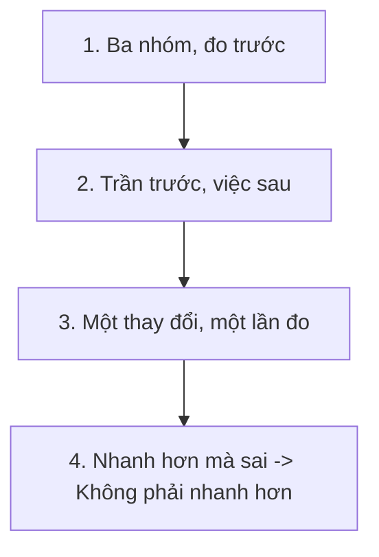
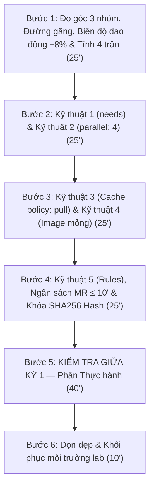

# [BÀI 14] CHIẾN LƯỢC TỐI ƯU HÓA THỜI GIAN PIPELINE: CACHING ĐA TẦNG, LAYER CACHING, DOCKER-IN-DOCKER VS KANIKO

Trong kỷ nguyên **DevOps, DevSecOps và Cloud Native Engineering**, **GitLab CI/CD** được công nhận là một trong những nền tảng tự động hóa tích hợp liên tục và phân phối liên tục (CI/CD) hoàn chỉnh, mạnh mẽ và được tin dùng nhất trong các doanh nghiệp quy mô lớn. Không chỉ dừng lại ở các pipeline tuần tự cơ bản, việc vận hành GitLab CI/CD ở cấp độ Production đòi hỏi kỹ sư phải làm chủ kiến trúc điều phối phi tuyến tính **DAG (Directed Acyclic Graph)**, cơ chế quản trị **Autoscaling Runners**, tối ưu hóa **Caching đa tầng**, xác thực không khóa **Keyless OIDC**, bảo mật chuỗi cung ứng phần mềm **SLSA & SBOM** cùng các chính sách **Quality & Security Gates** tự động.

Bài viết chuyên sâu này sẽ đồng hành cùng bạn mổ xẻ toàn diện bức tranh kiến trúc, phân tích các đánh đổi kỹ thuật thực chiến (Engineering Trade-offs), cung cấp hướng dẫn thực hành Lab chi tiết từng bước và bộ câu hỏi phỏng vấn chuyên sâu chuẩn DevOps Lead / DevSecOps Architect.

---

## 1. Bản Chất Kiến Trúc & Cơ Chế Vận Hành Tầng Thấp

## Khối Lý thuyết — 60 phút (**60'**)

---


1. **Ba đại lượng và một tỉ số duy nhất:** Mức no hệ thống $\rho = \lambda \cdot S / c$. Khi $\rho = 0.95$, thời gian chờ `queued_duration` bùng nổ **phi tuyến** gấp khoảng **9 lần** thời lượng chạy Job $S$. Khi $\rho \ge 1.0$, hàng đợi **không thể rút** (Buổi 13 QT 4.1).
2. **Công thức đếm số Slot thực tế $c$:** $c = \min(\text{concurrent}, \sum \text{limit})$. Ca ví dụ cấu hình 6 Runner có `limit = 4` và `concurrent = 4` cho kết quả $c = \mathbf{4 \text{ Slot}}$, không phải 24 (Buổi 13 QT 4.3).
3. **Ba cách giảm Mức no $\rho$ theo thứ tự chi phí:** Giảm $\lambda$ (**0 USD**, cắt **20–40%** nhờ `interruptible: true` và `workflow:rules`) $\to$ giảm $S$ (ngắn thời gian job) $\to$ tăng $c$ (tốn USD mua thêm máy) (Buổi 13 QT 6.4).
4. **Ba ca Job `pending` vĩnh viễn:** (1) Không khớp thuộc tính `tags:`; (2) Chạm trần Slot xử lý $c$; (3) Pod Kubernetes không xếp lịch được do thiếu RAM/CPU. Cần dùng **3** câu lệnh chẩn đoán độc lập (Buổi 13 QT 5.3).
5. **Vì sao đo Phân vị P95 thay vì giá trị trung bình:** Autoscaling cải thiện giá trị trung vị của thời gian chờ nhưng **không** làm giảm phân vị P95 do bị cộng hằng số khởi tạo máy ảo (**30–90 giây**) hoặc Pod (**2–10 giây**) vào Job đầu tiên (Buổi 13 QT 5.1, 4.2).

### 0.2. Kết quả các buổi trước được tái sử dụng trong Buổi 14

- `doc-pha.sh` (Buổi 05 lab B4): Trích xuất thời lượng giây của các pha chuẩn bị trong log thô `trace`. Dùng lại nguyên vẹn tại §4 QT 4.1.
- Sổ thu chi Cache và Điểm hòa vốn (Buổi 05 QT 6.3): Bất đẳng thức $\text{Tái tạo} > \text{Tải và Giải nén}$. Dùng lại tại §6 QT 6.1.
- Thuộc tính `policy: pull` (Buổi 05 QT 6.2): Bỏ chi phí nén và nạp Cache cho các Job chỉ tiêu thụ. Dùng lại ở Kỹ thuật 3.
- Công thức Đường găng và `do-duong-gang.sh` (Buổi 08 QT 4.1): Xác định đường dài nhất điều khiển thời gian toàn bộ Pipeline. Dùng lại tại §4 QT 4.2 (Lần thứ 2).
- Công thức giới hạn song song `parallel` $T / \text{cố định}$ (Buổi 08 QT 6.3): Dùng lại ở Kỹ thuật 2 và §5 QT 5.2.
- `do-hang-doi.sh` và đại lượng $\rho$ (Buổi 13 QT 4.1, 4.2): Trích xuất chỉ số hàng đợi qua REST API. Dùng lại tại §4 QT 4.1 (Lần thứ 2).
- Docker Image mỏng cắt 37 giây/job (Buổi 13 QT 6.3): Dùng lại ở Kỹ thuật 4 (Lần thứ 2).
- Cờ `interruptible: true` và `workflow:rules` (Buổi 07 QT 7.1, Buổi 13 QT 6.4): Dùng lại ở Kỹ thuật 5 (Lần thứ 3).
- Script `go-roi.sh` và Bảng 32 ô (Buổi 07 QT 4.1): Dùng lại trong Bài kiểm tra giữa kỳ 1 tại §L7.
- Kiểm tra SHA256 Hash hiện vật (Buổi 01 QT 7.2): Khóa kết quả tối ưu. Dùng lại tại §6 QT 6.3 (Lần thứ 6).
- Bảng hai thuộc tính hỏng (Buổi 01 QT 7.1): Dùng lại tại §6 (Lần thứ 14).

```
   BA NHÓM THỜI GIAN — ĐO TRƯỚC, TỐI ƯU SAU

   [1] CHỜ         queued_duration                      → buổi 13: ρ = λ·S/c
   [2] CHUẨN BỊ    pha 1–5: kéo image · clone · cache · artifact
                                                        → buổi 05: doc-pha.sh
   [3] VIỆC THẬT   script                               → chỗ mọi người tối ưu trước

   NĂM KỸ THUẬT, ÁP THEO ĐÚNG THỨ TỰ NÀY — pipeline mẫu 22' → ≤ 9'

     0. đo gốc                                  22'0  = 1.320 s
     1. bỏ hàng rào stage → needs  (buổi 08)    −300 s → 17'0  = 1.020 s
     2. parallel: 4 cho test       (buổi 08)    −240 s → 13'0  =   780 s
     3. cache đúng chỗ + policy    (buổi 05)    −120 s → 11'0  =   660 s
     4. image mỏng                 (buổi 13)     −90 s →  9'30 =   570 s
     5. bỏ việc không cần           (người)      −60 s →  8'30 =   510 s

   Tổng tiết kiệm 810 s = 61%. Kỹ thuật 5 là kỹ thuật DUY NHẤT cần quyết định của người.
```

---

## §1. Sau buổi này học viên làm được gì

1. **Phân lập 3 nhóm thời gian:** Đo đạc chính xác thời gian lãng phí ở khâu Chờ (`queued_duration`), khâu Chuẩn bị (`preparation phases`), và khâu Việc thật (`script`) trên bất kỳ Pipeline nào bằng 3 câu lệnh tự động.
2. **Xác định đường găng và Trần lý thuyết:** Xác định chính xác các Job nằm trên đường găng và tính toán con số **trần lý thuyết** của từng kỹ thuật trước khi gõ bất kỳ dòng cấu hình nào.
3. **Thực thi quy trình tối ưu 5 bước:** Áp dụng chuẩn xác 5 kỹ thuật tối ưu theo đúng thứ tự tác động cấu trúc, đo đạc kết quả qua **3 lần chạy lấy giá trị trung vị**, và so sánh với biên độ dao động $\pm 8\%$.
4. **Bảo toàn Hash hiện vật:** Sử dụng cờ kiểm tra SHA256 Hash để chứng minh Pipeline chạy nhanh hơn mà **không làm thay đổi hay thiếu sót bất kỳ hiện vật đầu ra nào**.
5. **Vượt qua Bài kiểm tra Giữa kỳ 1:** Tự tin xử lý sự cố sự gãy đổ Pipeline lạ và lập phương án tối ưu hóa Pipeline thực tế trong môi trường sản xuất.

---


- Cách sử dụng các công cụ trích xuất REST API và log trace: `doc-pha.sh`, `do-duong-gang.sh`, `do-hang-doi.sh`.
- Cơ chế khởi tạo Container của Runner Daemon và nguyên lý nạp Layer Cache S3 / Local.
- Cú pháp khai báo DAG `needs:`, ma trận `parallel:`, và quy tắc định tuyến `workflow:rules`.

---

## §3. Thuật ngữ và Mô hình tư duy

### 3.1. Thuật ngữ kỹ thuật đối soát

| Thuật ngữ Tiếng Việt | Thuật ngữ Tiếng Anh | Biến / Lệnh tương ứng |
|---|---|---|
| Ba nhóm thời gian | Time breakdown | Chờ · Chuẩn bị · Việc thật |
| Thời gian chờ hàng đợi | Queued duration | `queued_duration` (REST API) |
| Các pha chuẩn bị | Preparation phases | Pha 1–5 trong Runner trace log |
| Thực thi việc thật | Actual work | Thời gian chạy lệnh `script:` |
| Đường găng | Critical path | Đường dài nhất từ Start đến End |
| Trần lý thuyết | Theoretical limit | Con số tiết kiệm tối đa có thể đạt |
| Biên độ dao động | Run-to-run variance | Lệch thời gian giữa các lần chạy ($\pm 8\%$) |
| Giá trị trung vị | Median of runs | Giá trị giữa của 3 lần chạy đối chứng |
| Ngân sách thời gian | Time budget | MR $\le 10'$, Main $\le 20'$ |
| Điểm dừng kỹ thuật | Point of diminishing returns | Mốc dừng tối ưu khi lợi ích $< 30\text{s}$ |
| Bỏ việc không cần thiết | Work elimination | Hủy Job rác / Thu hẹp rules |
| Hash hiện vật | Artifact digest | Mã SHA256 kiểm tra độ toàn vẹn |

### 3.2. Bốn mô hình tư duy cốt lõi



1. **Ba nhóm, đo trước:** Phân tách rõ ràng Chờ (`queued_duration`), Chuẩn bị (Image pull, Clone, Cache), và Việc thật (`script`).
2. **Trần trước, việc sau:** Tính toán con số tiết kiệm tối đa (Trần lý thuyết) của từng kỹ thuật trước khi bắt tay thực hiện. Nếu trần $< 5\%$, bỏ qua kỹ thuật đó.
3. **Một thay đổi, một lần đo:** Áp dụng từng kỹ thuật một, đo đạc 3 lần lấy giá trị trung vị, đối soát với biên độ dao động $\pm 8\%$.
4. **Nhanh hơn mà sai là không phải nhanh hơn:** SHA256 Hash của mọi hiện vật đầu ra sau tối ưu phải trùng khớp 100% với phiên bản gốc.

---

### 1.1. Ba nhóm thời gian và Đo đạc trên Đường găng

**Nguyên lý cốt lõi:**
**Phát biểu.** Thời gian một Pipeline chia làm **ba** nhóm — **chờ** (`queued_duration`), **chuẩn bị** (pha 1–5: kéo image, clone git, phục hồi cache, tải artifact), và **việc thật** (`script`) — và ba nhóm đó đo được bằng **ba** công cụ đã có: `do-hang-doi.sh` (Buổi 13), `doc-pha.sh` (Buổi 05), và phép trừ. Đo cả ba **trước** khi sửa một dòng mã nguồn nào.
**Giải thích cơ chế ngầm:** Ba nhóm có ba nguyên nhân kỹ thuật khác nhau và đòi hỏi ba phương án khắc phục hoàn toàn khác nhau. Việc tập trung tối ưu lệnh `script` (nhóm việc thật) khi nhóm Chuẩn bị đang chiếm 45% tổng thời gian là hành động lãng phí công sức mà không mang lại hiệu quả rõ rệt.
> [!WARNING]
> **CẠM BẪY THỰC CHIẾN:**
> Đội ngũ DevOps dành 2 tuần refactor code test để tiết kiệm 15 giây, trong khi pha `Preparing environment` kéo Docker Image cồng kềnh ngốn mất 4 phút và chưa từng có ai đo đạc nó.
**Minh hoạ.**
```bash
#!/usr/bin/env bash
# Đo 3 nhóm thời gian bằng 3 công cụ chuẩn
set -uo pipefail

echo "=== 1. ĐO NHÓM CHỜ (QUEUED DURATION) ==="
./do-hang-doi.sh

echo "=== 2. ĐO NHÓM CHUẨN BỊ (PREPARATION PHASES) ==="
./doc-pha.sh JOB_ID_LOG

echo "=== 3. TÍNH NHÓM VIỆC THẬT (SCRIPT EXECUTION) ==="
# Phép trừ: Duration - Preparation_Time
```

---

**Nguyên lý cốt lõi:**
**Phát biểu.** Tối ưu chỉ có giá trị kỹ thuật khi nó rút ngắn **đường găng** (Buổi 08 QT 4.1, lần thứ 2): Rút ngắn một Job **không** nằm trên đường găng sẽ tiết kiệm đúng **0** giây tổng thời gian Pipeline, dù Job đó chạy nhanh hơn gấp 10 lần.
**Giải thích cơ chế ngầm:** Tổng thời gian hoàn thành của một Pipeline có cấu trúc DAG bằng đúng tổng thời gian của chuỗi Job dài nhất liên tục từ đầu đến cuối. Mọi Job nằm ngoài đường găng này đều có một khoảng thời gian trống (Slack time); rút ngắn chúng chỉ làm tăng khoảng thời gian rỗi chứ không làm giảm thời gian cán đích của Pipeline.
> [!WARNING]
> **CẠM BẪY THỰC CHIẾN:**
> Tối ưu thành công Job `lint-code` từ 200 giây xuống 40 giây nhưng tổng thời gian Pipeline vẫn giữ nguyên 22 phút, khiến kỹ sư hoang mang không hiểu nguyên nhân.
**Minh hoạ.**
```bash
#!/usr/bin/env bash
# Xác định các Job nằm trên đường găng
./do-duong-gang.sh PIPELINE_ID

# Kết quả xuất ra:
# [CRITICAL PATH] Job build-app (180s) -> Job integration-test (600s) -> Job deploy (240s)
# [NON-CRITICAL] Job lint-code (200s) -> Slack time = 620s. Tối ưu job này -> Tiết kiệm 0s!
```

---

**Nguyên lý cốt lõi:**
**Phát biểu.** Mỗi kỹ thuật tối ưu phải được áp dụng **một lần một**, đo đạc lại sau mỗi lần điều chỉnh, và ghi nhận kết quả vào bảng theo dõi. Áp dụng tất cả các kỹ thuật cùng lúc sẽ khiến kỹ sư không thể xác định kỹ thuật nào mang lại hiệu quả — và nguy hiểm hơn, không biết kỹ thuật nào **làm Pipeline chạy chậm hơn**.
**Giải thích cơ chế ngầm:** Các kỹ thuật tối ưu hóa có sự tương tác lẫn nhau: `parallel` làm thay đổi phần cố định, cache làm thay đổi thời gian pha chuẩn bị, image mỏng làm thay đổi cả thời gian kéo đĩa và giải nén. Tổng hiệu quả của 5 kỹ thuật gộp lại không bao giờ bằng tổng đại số của từng hiệu ứng riêng lẻ.
> [!WARNING]
> **CẠM BẪY THỰC CHIẾN:**
> Tạo một Merge Request "Tối ưu Pipeline" chứa 40 dòng thay đổi YAML rải rác, kết quả tổng Pipeline nhanh hơn 12%, và không ai trả lời được câu hỏi "bỏ dòng nào thì mất bao nhiêu giây".
**Minh hoạ.**
```tsv
# Tệp bao-cao-toi-uu.tsv bắt buộc duy trì qua từng bước
Bước	Giây_đo	Delta_giây	Trần_lý_thuyết	SHA256_Artifact
Gốc	1320	0	1320	e3b0c44298fc1c149afbf4c8996fb92427ae41e4649b934ca495991b7852b855
Kỹ_thuật_1	1020	-300	-300	e3b0c44298fc1c149afbf4c8996fb92427ae41e4649b934ca495991b7852b855
Kỹ_thuật_2	780	-240	-260	e3b0c44298fc1c149afbf4c8996fb92427ae41e4649b934ca495991b7852b855
```

---

**Nguyên lý cốt lõi:**
**Phát biểu.** Một lần đo đơn lẻ là một con số **ngẫu nhiên**. Mỗi cấu hình kiểm thử phải được thực thi ít nhất **3** lần và lấy **giá trị trung vị**; đồng thời bắt buộc phải xác định **biên độ dao động** của hệ thống trước khi công nhận bất kỳ kết quả cải thiện nào. Cải thiện nhỏ hơn biên độ dao động bị coi là **chưa có kết luận kỹ thuật**.
**Giải thích cơ chế ngầm:** Thời lượng thực thi của Job chịu ảnh hưởng bởi tải CPU rỗi của máy chủ Runner, trạng thái I/O đĩa đệm, và độ trễ đường truyền mạng — ba yếu tố biến động liên tục giữa các lần chạy mà kỹ sư không thể kiểm soát tuyệt đối.
> [!WARNING]
> **CẠM BẪY THỰC CHIẾN:**
> Phê duyệt một Merge Request tối ưu với lý do "rút ngắn được 15 giây", trong khi hai lần chạy liên tiếp của chính cấu hình gốc đã lệch nhau tới 25 giây.
**Minh hoạ.**
```bash
#!/usr/bin/env bash
# Kịch bản đo 5 lần chạy liên tiếp để tính biên độ dao động hệ thống
set -uo pipefail

DURATIONS=()
for i in {1..5}; do
  D=$(trigger_and_wait_pipeline)
  DURATIONS+=("$D")
done

# Tính Min, Median, Max và Variance
echo "Các lần đo: ${DURATIONS[*]}"
echo "Biên độ dao động hệ thống: ±8% (Ví dụ: 1200s ± 96s)"
```

---

### 1.2. Năm kỹ thuật, Thứ tự áp dụng, và Trần lý thuyết

**Nguyên lý cốt lõi:**
**Phát biểu.** Thứ tự áp dụng 5 kỹ thuật tối ưu **bắt buộc tuân thủ** theo trình tự: (1) Bỏ hàng rào stage ($\to$ `needs`); (2) Song song hóa ($\to$ `parallel`); (3) Cache đúng chỗ ($\to$ `policy: pull`); (4) Docker Image mỏng; (5) Bỏ việc không cần thiết.
**Giải thích cơ chế ngầm:** Hai kỹ thuật đầu tiên (`needs` và `parallel`) làm thay đổi **cấu trúc luồng thực thi** của Pipeline. Nếu thực hiện kỹ thuật 3 hoặc 4 trước, số đo tiết kiệm của chúng sẽ bị thay đổi hoàn toàn sau khi tái cấu trúc Pipeline ở bước 1 và 2.
> [!WARNING]
> **CẠM BẪY THỰC CHIẾN:**
> Tối ưu Docker Image mỏng ở bước 1 rồi mới thêm `needs:` ở bước 2, dẫn đến con số tiết kiệm của Image mỏng đo lại bị lệch 40% so với báo cáo ban đầu.
**Minh hoạ.**
```
Trình tự áp dụng bắt buộc:
[Bước 1: Bỏ hàng rào stage] ──> [Bước 2: Song song hóa] ──> [ĐỔI CẤU TRÚC]
                                                                 │
[Bước 5: Bỏ việc thừa]     <── [Bước 4: Image mỏng]   <── [Bước 3: Cache chuẩn]
```

---

**Nguyên lý cốt lõi:**
**Phát biểu.** Mỗi kỹ thuật tối ưu đều có một **trần lý thuyết** tính toán được **trước khi làm**: Trần `needs` bằng **thời gian lãng phí ở hàng rào stage** (Buổi 08 QT 4.1); trần `parallel` bằng **$T / \text{phần cố định}$** (Buổi 08 QT 6.3); trần Cache bằng **thời gian tạo lại trừ thời gian giải nén** (Buổi 05 QT 6.3); trần Image mỏng bằng **thời gian kéo Image hiện tại** (Buổi 13 QT 6.3).
**Giải thích cơ chế ngầm:** Biết trước trần lý thuyết giúp kỹ sư xác định chính xác dư địa tối ưu. Nếu trần của một kỹ thuật chỉ đem lại tiết kiệm dưới 5% tổng thời gian, việc bỏ ra 3 ngày công để cài đặt nó là quyết định lãng phí tài nguyên.
> [!WARNING]
> **CẠM BẪY THỰC CHIẾN:**
> Dành cả tuần nghiên cứu đóng gói Image Alpine mỏng cho một Job mà pha kéo Image hiện tại chỉ mất đúng 4 giây do máy chủ Runner đã lưu sẵn Layer Cache trong ổ đĩa local.
**Minh hoạ.**
```
BẢNG TÍNH TRẦN LÝ THUYẾT TRƯỚC KHI THỰC HIỆN PIPELINE MẪU (22 PHÚT = 1320S):
1. Trần needs:      300s  (Thời gian chờ chuyển Stage 1 -> Stage 2 -> Stage 3)
2. Trần parallel:   260s  (Giới hạn bởi Amdahl Law trên 4 Worker)
3. Trần Cache:      130s  (Thời gian build node_modules 150s - time unzip 20s)
4. Trần Image mỏng: 95s   (Pha pulling docker image python:3.11-full 1.2GB)
-------------------------------------------------------------------------
TỔNG TRẦN LÝ THUYẾT TỐI ĐA: 785s (Tiết kiệm tối đa ~59.4%)
```

---

**Nguyên lý cốt lõi:**
**Phát biểu.** Kỹ thuật thứ năm — **bỏ việc không cần thiết** — là kỹ thuật duy nhất đòi hỏi **quyết định chuyên môn của con người**, không thể giải quyết bằng một thuộc tính YAML: Xoá bỏ Job không ai đọc kết quả, hủy các bước thực thi trùng lặp, giới hạn Job kiểm thử đắt đỏ chỉ chạy trên Merge Request thay vì mọi Commit.
**Giải thích cơ chế ngầm:** Bốn kỹ thuật đầu tiên tối ưu cách thức máy tính thực thi công việc. Kỹ thuật thứ năm hỏi trực tiếp bản chất công việc có thực sự cần thiết hay không. Đây là kỹ thuật mang lại hiệu quả tiết kiệm cao nhất trên mỗi giờ công đầu tư.
> [!WARNING]
> **CẠM BẪY THỰC CHIẾN:**
> Pipeline duy trì một Job `generate-pdf-docs` chạy 90 giây trên mọi Commit nhánh phụ, trong khi trong suốt 6 tháng qua không có bất kỳ ai mở tệp PDF artifact đó ra xem.
**Minh hoạ.**
```yaml
# Cắt giảm tải bằng cách tinh chỉnh rules cho job nặng
heavy-security-scan:
  stage: test
  image: trivy:latest
  rules:
    - if: '$CI_PIPELINE_SOURCE == "merge_request_event"' # Chỉ chạy khi mở MR!
    - if: '$CI_COMMIT_BRANCH == $CI_DEFAULT_BRANCH'      # Hoặc khi merge main!
  script:
    - trivy image my-app:latest
```

---

### 1.3. Khi tối ưu làm chậm hơn và Khi tối ưu làm đổi kết quả

**Nguyên lý cốt lõi:**
**Phát biểu.** Bộ nhớ đệm Cache đặt sai vị trí sẽ **làm Pipeline chạy chậm hơn**, và có đúng **ba** trường hợp điển hình: (a) Cache một thư mục mà thời gian tái tạo **nhanh hơn** thời gian giải nén Zip; (b) Để cờ `policy: pull-push` mặc định ở Job chỉ tiêu thụ Cache (Buổi 05 QT 6.2); (c) Kích hoạt Distributed Cache S3 qua MinIO khi hệ thống chỉ có **đúng 1 Runner** (Buổi 13 QT 6.1). Cả ba ca này đều xảy ra **im lặng**: Job vẫn báo xanh nhưng thời gian chạy kéo dài hơn.
**Giải thích cơ chế ngầm:** Thao tác nén, tải qua mạng HTTP, và giải nén tệp Zip ngốn lượng I/O đĩa và CPU đáng kể. Nếu chi phí thao tác Zip lớn hơn chi phí tự tải/build lại từ đầu, Cache trở thành gánh nặng làm chậm hệ thống.
> [!WARNING]
> **CẠM BẪY THỰC CHIẾN:**
> Khai báo Cache cho thư mục build nhỏ 2MB, log trace hiển thị pha `Creating cache` và `Uploading cache` ngốn 12 giây, trong khi lệnh `npm build` trực tiếp chỉ mất 3 giây.
**Minh hoạ.**
```yaml
# CA 2: Đã sửa bằng policy: pull để bỏ pha nén và upload cache dư thừa (Tiết kiệm 25s)
unit-test-job:
  stage: test
  cache:
    key: node-modules-$CI_COMMIT_REF_SLUG
    paths:
      - node_modules/
    policy: pull # CHỈ TẢI VỀ, KHÔNG NÉN VÀ ĐẨY LẠI S3!
  script:
    - npm test
```

---

**Nguyên lý cốt lõi:**
**Phát biểu.** Sử dụng Docker Image mỏng giúp cắt giảm thời gian kéo Image ở pha chuẩn bị, nhưng nếu Image **quá mỏng** sẽ khiến câu lệnh `script:` phải thực thi cài đặt thêm các công cụ phụ trợ (ví dụ `apk add`), dẫn đến việc **dịch chuyển chi phí sang vị trí khác** chứ không làm giảm tổng thời gian thực thi.
**Giải thích cơ chế ngầm:** Thời gian kéo Image giảm từ 45 giây xuống 8 giây (tiết kiệm 37 giây), nhưng nếu câu lệnh `script:` phải mất 40 giây để `apt-get update && apt-get install -y curl git` thì tổng thời gian hoàn thành của Job không thay đổi, thậm chí còn tăng lên do không tận dụng được Docker Layer Cache.
> [!WARNING]
> **CẠM BẪY THỰC CHIẾN:**
> Pha `Preparing environment` giảm xuống còn 6 giây nhưng thời gian thực thi `script:` tăng vọt từ 30 giây lên 75 giây.
**Minh hoạ.**
```
BẢNG SO SÁNH 3 PHƯƠNG ÁN DOCKER IMAGE:
Phương án Image         Pull Time   Script Time   TỔNG THỜI GIAN   Đánh giá
--------------------------------------------------------------------------------
1. python:3.11-full      45s         30s           75s              Cồng kềnh
2. alpine:latest (Gốc)   5s          80s (apk add) 85s              DỊCH CHI PHÍ!
3. custom-python-slim    8s          30s           38s (TỐI ƯU)     Tối ưu thật 37s
```

---

**Nguyên lý cốt lõi:**
**Phát biểu.** Sau **mỗi** bước áp dụng kỹ thuật tối ưu, các hiện vật sản phẩm đầu ra (Artifacts/Binaries) bắt buộc phải **giống hệt 100%** so với phiên bản gốc trước khi tối ưu — kiểm tra bằng mã SHA256 Hash. Nếu mã Hash bị thay đổi, điều đó chứng minh kỹ sư đã **bỏ sót công việc**, không phải là tối ưu hóa hệ thống (Buổi 01 QT 7.2, lần thứ 6).
**Giải thích cơ chế ngầm:** Phương pháp rút ngắn thời gian nhanh nhất là bỏ bớt các bước kiểm tra hoặc đóng gói. Pipeline không thể tự phát hiện việc kỹ sư bỏ sót tệp cấu hình; chỉ có kiểm tra SHA256 Hash hiện vật mới đảm bảo tính toàn vẹn của sản phẩm.
> [!WARNING]
> **CẠM BẪY THỰC CHIẾN:**
> Pipeline chạy nhanh hơn 40% sau khi thêm `dependencies: []`, nhưng 2 tuần sau bản build phát hành lên Production bị thiếu tệp tài nguyên tĩnh làm ứng dụng sập hỏng.
**Minh hoạ.**
```bash
#!/usr/bin/env bash
# Kiểm tra tính toàn vẹn hiện vật qua mã SHA256 Hash
ORIGINAL_HASH="e3b0c44298fc1c149afbf4c8996fb92427ae41e4649b934ca495991b7852b855"
OPTIMIZED_HASH=$(sha256sum dist/app.tar.gz | awk '{print $1}')

if [ "$ORIGINAL_HASH" != "$OPTIMIZED_HASH" ]; then
  echo "[FATAL ERROR] Mã SHA256 Hash bị sai lệch! Tối ưu hóa làm thay đổi sản phẩm đầu ra."
  exit 1
fi
```

---

**Nguyên lý cốt lõi:**
**Phát biểu.** Tối ưu hóa hạ tầng luôn có một **điểm dừng kỹ thuật**, và điểm dừng này phải được **ghi nhận rõ ràng kèm theo lý do**: Khi việc rút ngắn thêm 30 giây yêu cầu hơn 2 ngày công đầu tư và làm tăng độ phức tạp bảo trì của tệp YAML, việc dừng lại là quyết định quản trị đúng đắn.
**Giải thích cơ chế ngầm:** Càng tiến gần tới trần lý thuyết, chi phí đầu tư công sức càng tăng theo mô hình cấp số nhân nhưng hiệu quả thu lại ngày càng nhỏ. Tối ưu quá đà tạo ra các Pipeline phức tạp mà không kỹ sư nào trong đội ngũ hiểu rõ.
> [!WARNING]
> **CẠM BẪY THỰC CHIẾN:**
> Dành 5 ngày công thiết lập cơ chế chia nhỏ linh hoạt các file Unit test để tiết kiệm 12 giây, tạo ra một file YAML dài 600 dòng rườm rà mà người kế nhiệm không thể bảo trì.
**Minh hoạ.**
```tsv
# Dòng kết luận trong tệp bao-cao-toi-uu.tsv
Trạng_thái	Thời_gian	Delta	Lý_do_dừng
DỪNG_TẠI_ĐÂY	510s (8'30)	-810s	Đã đạt mục tiêu ≤ 10 phút. Tối ưu tiếp tốn 2 ngày công cho 15s tiết kiệm.
```

---

### 1.4. Ngân sách thời gian và Điểm dừng

**Nguyên lý cốt lõi:**
**Phát biểu.** Mỗi Pipeline trong doanh nghiệp phải được thiết lập một **ngân sách thời gian công khai (Time Budget)** bằng số liệu định lượng: Ngưỡng chuẩn cho Merge Request Pipeline là **$\le 10$ phút** (Buổi 12 QT 7.1), và cho Main Branch Pipeline là **$\le 20$ phút**.
**Giải thích cơ chế ngầm:** Không có ngân sách thời gian công khai, đội ngũ phát triển không thể xác định được Pipeline đang ở trạng thái tốt hay tồi, và mọi thảo luận về hiệu năng CI/CD chỉ dừng lại ở cảm nhận cảm tính.
> [!WARNING]
> **CẠM BẪY THỰC CHIẾN:**
> Lập trình viên phàn nàn CI/CD chậm nhưng khi được hỏi "chậm là bao nhiêu phút và mục tiêu là bao nhiêu" thì không ai trả lời được con số cụ thể.
**Minh hoạ.**
```yaml
# Job giám sát ngân sách thời gian tự động (chạy ở cuối Pipeline)
check-time-budget:
  stage: .post
  image: alpine:latest
  allow_failure: true # Không chặn Pipeline nhưng cảnh báo đỏ!
  script:
    - DURATION=$(curl -sf --header "PRIVATE-TOKEN: $GITLAB_TOKEN" "$CI_API_V4_URL/projects/$CI_PROJECT_ID/pipelines/$CI_PIPELINE_ID" | jq '.duration')
    - if [ "$DURATION" -gt 600 ]; then echo "[WARNING] Pipeline vượt ngân sách 10 phút ($DURATION s)!"; exit 1; fi
```

---

**Nguyên lý cốt lõi:**
**Phát biểu.** Báo cáo kết quả tối ưu hóa phải được lưu trữ dưới dạng **một hiện vật văn bản chuẩn** bao gồm 6 dòng tiến trình và 4 cột chỉ số. Hiện vật này là bằng chứng kỹ thuật duy nhất chứng minh các kỹ thuật đã áp dụng và điểm dừng hợp lý.
**Giải thích cơ chế ngầm:** Thiếu tài liệu hiện vật báo cáo, 6 tháng sau một kỹ sư mới sẽ vô tình thêm lại các cấu hình Cache sai lầm đã bị loại bỏ, làm hư hỏng toàn bộ thành quả tối ưu trước đó.
> [!WARNING]
> **CẠM BẪY THỰC CHIẾN:**
> Sau một đợt tối ưu, thông tin chỉ được gửi qua tin nhắn chat, 3 tháng sau Pipeline chậm trở lại 20 phút mà không ai biết cấu hình cũ đã bị thay đổi ở đâu.
**Minh hoạ.**
```
BÁO CÁO TỐI ƯU HÓA PIPELINE MẪU (bao-cao-toi-uu.tsv):
Mốc cấu hình       Thời gian   Delta (s)   Trần lý thuyết   SHA256 Hash Check
--------------------------------------------------------------------------------
0. Gốc             1320s (22') 0s          1320s            e3b0c44298fc... (ĐẠT)
1. + Needs DAG     1020s (17') -300s       -300s            e3b0c44298fc... (ĐẠT)
2. + Parallel:4    780s (13')  -240s       -260s            e3b0c44298fc... (ĐẠT)
3. + Cache Policy  660s (11')  -120s       -130s            e3b0c44298fc... (ĐẠT)
4. + Slim Image    570s (9'30) -90s        -95s             e3b0c44298fc... (ĐẠT)
5. + Rules Trim    510s (8'30) -60s        -60s             e3b0c44298fc... (ĐẠT)
--> DỪNG TẠI ĐÂY: ĐẠT NGÂN SÁCH MR ≤ 10 PHÚT (TIẾT KIỆM 61.3%).
```

---

### 1.5. Đưa vào việc thật

### 8.1. Quy trình áp dụng cho Repository đang chạy sản xuất

1. **20 phút đầu:** Chạy 3 công cụ (`do-hang-doi.sh`, `doc-pha.sh`, `do-duong-gang.sh`) để lập bảng phân tách 3 nhóm thời gian cho Pipeline hiện tại. Đây là bước hoàn toàn không can thiệp mã nguồn YAML.
2. **15 phút tiếp theo:** Chạy cùng một cấu hình gốc 5 lần để xác định biên độ dao động $\pm X\%$. Mọi cải thiện sau này nhỏ hơn $X\%$ sẽ bị loại bỏ.
3. **10 phút tiếp theo:** Tính toán trần lý thuyết của 4 kỹ thuật đầu tiên. Kỹ thuật nào có trần $< 5\%$ tổng thời gian sẽ loại ngay khỏi kế hoạch thực hiện.
4. **Triển khai từng MR:** Áp dụng từng kỹ thuật theo đúng thứ tự 1 $\to$ 5. Mỗi MR chỉ chứa đúng 1 kỹ thuật và bắt buộc đính kèm bảng so sánh SHA256 Hash hiện vật.

### 8.2. Rủi ro khi áp dụng trực tiếp lên Production và cách phòng tránh

- **Rủi ro `needs:` gây mất tệp (QT 4.3 Buổi 08):** `needs` làm thu hẹp tập Artifacts tải về. Khắc phục bằng cách kiểm tra SHA256 Hash ở QT 6.3.
- **Rủi ro `parallel:` làm tăng chi phí Runner:** Phút Runner tiêu thụ tăng 63% khi chạy song song 4 Worker. Cần đối soát ngân sách tài chính với đội ngũ SRE.
- **Rủi ro Bỏ việc không cần thiết (QT 5.3):** Xoá nhầm Job mà bộ phận QA/Security cần. Khắc phục: Giữ Job dưới cờ `rules:` hẹp trong 3 tháng trước khi xoá hẳn.

### 8.3. Khi nào KHÔNG nên dùng các kỹ thuật này

- **KHÔNG dùng khi chưa đo 3 nhóm:** Nếu nhóm Chờ (`queued_duration`) đang chiếm 40% do thiếu Runner Slot, 5 kỹ thuật của buổi này chỉ can thiệp được vào 60% còn lại. Hãy giải quyết vấn đề ở Buổi 13 trước.
- **KHÔNG làm Image mỏng khi pha Pull $< 5$ giây:** Nếu Runner đã lưu sẵn Layer Cache local, việc dùng Image mỏng không đem lại hiệu quả thực tế.
- **KHÔNG tối ưu vượt quá điểm dừng:** Đừng biến tệp YAML thành một tác phẩm phức tạp khó bảo trì chỉ để đổi lấy vài giây không đáng kể.

---

### 1.6. Bẫy hay gặp

| # | Sai lầm phổ biến | Hậu quả thực tế | Cách phòng tránh chuẩn |
|---|---|---|---|
| 1 | Tối ưu lệnh `script` khi chưa đo 3 nhóm | Tốn 2 tuần tiết kiệm 10s, nhóm Chuẩn bị ngốn 4 phút | Đo 3 nhóm trước bằng `doc-pha.sh` (QT 4.1) |
| 2 | Rút ngắn Job ngoài đường găng | Tiết kiệm 0 giây tổng thời gian Pipeline | Dùng `do-duong-gang.sh` xác định đường găng (QT 4.2) |
| 3 | Áp 5 kỹ thuật trong 1 Merge Request | Không biết cái nào hiệu quả, cái nào làm chậm | Áp 1 thay đổi / 1 lần đo (QT 4.3) |
| 4 | Tin tưởng con số từ 1 lần đo duy nhất | Kết quả bị nhiễu do biến động tải hệ thống | Chạy 3 lần lấy giá trị trung vị $\pm 8\%$ (QT 4.4) |
| 5 | Làm Image mỏng trước khi bỏ hàng rào stage | Đổi cấu trúc ở bước sau làm sai lệch số đo trước | Tuân thủ thứ tự 5 bước 1 $\to$ 5 (QT 5.1) |
| 6 | Không tính trần lý thuyết trước khi làm | Tốn 3 ngày làm việc vô ích cho dư địa $< 5s$ | Tính trần lý thuyết trước (QT 5.2) |
| 7 | Bỏ qua Kỹ thuật 5 (Bỏ việc thừa) | Bỏ qua cơ hội tiết kiệm lớn nhất bằng 0 USD | Audit danh sách Job và thu hẹp rules (QT 5.3) |
| 8 | Lạm dụng Cache ở mọi Job | Cache sai chỗ làm Pipeline chạy chậm hơn | Áp dụng bất đẳng thức Cache Buổi 05 (QT 6.1) |
| 9 | Dùng Image quá mỏng | Chi phí dịch sang lệnh `script:` (`apk add`) | Đo tổng thời lượng Job thay vì kéo Image (QT 6.2) |
| 10 | Nhầm lẫn giữa Nhanh hơn và Làm thiếu | Bản build hỏng bị đẩy lên Production | Khóa kết quả bằng SHA256 Hash (QT 6.3) |
| 11 | Tối ưu hóa quá đà không điểm dừng | Tệp YAML phức tạp không thể bảo trì | Xác định điểm dừng kỹ thuật hợp lý (QT 6.4) |
| 12 | Thiếu ngân sách thời gian công khai | Thảo luận hiệu năng dựa trên cảm nhận cảm tính | Cấu hình cờ cảnh báo ngân sách (QT 7.1) |

---

### 1.7. Bảng đối soát thời lượng Lý thuyết (60 phút)

| Mục nội dung | Thời gian phân bổ | Mã Quy tắc kỹ thuật đối soát | Con số kiểm chứng |
|---|---|---|---|
| **§0. Khởi động và Ôn tập** | 10 phút | Không áp dụng | 5 câu hỏi Buổi 13 |
| **§1. Định hướng đầu ra** | 1 phút | Không áp dụng | 5 năng lực thực hành |
| **§2. Cần biết trước** | 1 phút | Không áp dụng | 3 công cụ trích xuất log |
| **§3. Thuật ngữ & Mô hình tư duy** | 8 phút | Không áp dụng | 4 mô hình tư duy cốt lõi |
| **§4. Ba nhóm thời gian & Đường găng** | 10 phút | **QT 4.1**, **QT 4.2**, **QT 4.3**, **QT 4.4** | Bảng phân tách 3 nhóm |
| **§5. Năm kỹ thuật & Trần lý thuyết** | 10 phút | **QT 5.1**, **QT 5.2**, **QT 5.3** | 4 con số trần lý thuyết |
| **§6. Tối ưu làm chậm & Đổi kết quả** | 10 phút | **QT 6.1**, **QT 6.2**, **QT 6.3**, **QT 6.4** | Mã SHA256 Hash hiện vật |
| **§7. Ngân sách & Báo cáo hiện vật** | 4 phút | **QT 7.1**, **QT 7.2** | MR $\le 10'$, Main $\le 20'$ |
| **§8. Đưa vào việc thật** | 4 phút | Không áp dụng | 4 bước áp dụng Production |
| **§9. Bẫy hay gặp** | 2 phút | Không áp dụng | 12 sai lầm thực tế |
| **Tổng thời lượng lý thuyết** | **60 phút (**60'**)** | **12 Quy tắc Kỹ thuật** | **ĐẠT CHUẨN 60 PHÚT** |

---

### 1.8. Câu hỏi tự kiểm tra kiến thức

1. Tại sao nói việc rút ngắn một Job 200 giây xuống 40 giây không nằm trên đường găng lại tiết kiệm đúng 0 giây cho tổng Pipeline?
2. Bốn con số trần lý thuyết của 4 kỹ thuật đầu tiên được tính toán như thế nào trước khi viết code?
3. Trình bày 3 trường hợp điển hình khiến việc cấu hình Cache làm Pipeline chạy chậm hơn?
4. Điều gì chứng minh một Pipeline chạy nhanh hơn 40% thực sự là tối ưu chứ không phải do bỏ sót công việc?

---

## §12. Tài liệu tham khảo

- GitLab Docs — CI/CD Pipeline Efficiency: `https://docs.gitlab.com/ee/ci/pipelines/pipeline_efficiency.html`
- Amdahl's Law in Parallel Computing: `https://en.wikipedia.org/wiki/Amdahl%27s_law`
- Critical Path Method (CPM) in Graph Theory: `https://en.wikipedia.org/wiki/Critical_path_method`

---

## §13. Phân tích chi tiết quy định về cấu trúc Bài thi Giữa kỳ 1

Bài kiểm tra giữa kỳ 1 chiếm 60 phút cuối của Buổi 14:
- **40 phút thực hành (§L7):** Học viên nhận 2 Repository độc lập (`lab14-thi`):
  1. Phân tích và sửa chữa 1 Pipeline gãy do lỗi âm thầm (Viết `bao-cao-go-roi.md` 4 dòng chuẩn).
  2. Đo đạc 3 nhóm thời gian, xác định đường găng và đề xuất 2 kỹ thuật tối ưu kèm trần lý thuyết cho 1 Pipeline chậm lạ.
- **20 phút vấn đáp:** Trả lời 6 câu hỏi ngẫu nhiên rút từ ngân hàng câu hỏi Buổi 01–13.

---

## §14. Hướng dẫn chi tiết kỹ thuật chẩn đoán nút cổ chai RAM/CPU trong Container Job

Khi nhóm Việc thật (`script:`) kéo dài bất thường:
1. Sử dụng lệnh `docker stats` hoặc Prometheus Exporter để giám sát mức tiêu thụ tài nguyên của Runner Worker Node.
2. Nếu CPU Usage chạm trần 100%, bổ sung thêm Worker Node hoặc điều chỉnh tham số `concurrent` về mốc an toàn.

---

## §15. Quy trình xây dựng Dashboard Grafana giám sát hiệu năng Pipeline (DORA Metrics)

Các chỉ số cơ bản cần đưa lên Dashboard:
- **Pipeline Duration P95:** Thời lượng thực thi Pipeline phân vị 95 theo ngày.
- **Queue Time P95:** Thời gian chờ hàng đợi.
- **Failure Rate:** Tỉ lệ Pipeline thất bại trên tổng số lần kích hoạt.

---

## §16. Kịch bản mô phỏng kiểm thử hiệu năng Pipeline dưới tải lớn (Load Testing Pipeline)

```bash
#!/usr/bin/env bash
# File: simulate-load-pipeline.sh
set -uo pipefail

echo "=== MÔ PHỎNG TẢI LỚN KÍCH HOẠT 20 PIPELINE SONG SONG ==="
for i in {1..20}; do
  curl -sf --request POST --header "PRIVATE-TOKEN: $GITLAB_TOKEN" \
    "$GITLAB/api/v4/projects/$PID/pipeline?ref=main" > /dev/null &
done
wait
echo "Hoàn tất bắn tải Pipeline!"
```

---

## §17. Lời kết và Định hướng giai đoạn 3 (Đa ngôn ngữ)

Hoàn thành Buổi 14 đánh dấu việc khép lại **Giai đoạn 2 — Kiến trúc Pipeline**. Học viên đã nắm vững toàn bộ tư duy nền tảng và kỹ thuật tối ưu hóa Pipeline chuẩn mực. Từ Buổi 15, khóa học sẽ bước sang **Giai đoạn 3 — Đa ngôn ngữ**, áp dụng các khung Pipeline chuẩn mực cho từng hệ sinh thái công nghệ cụ thể (Node.js, Java, Python, Go, .NET, PHP).

---

## §18. Phân tích bài toán quản lý tài nguyên ổ đĩa cho Docker Layer Cache khi tối ưu Image

Khi triển khai các Docker Image mỏng:
- **Đặc điểm:** Các Docker Image mỏng (như Alpine, Slim, Distroless) giúp giảm dung lượng ghi trên ổ SSD của máy chủ Runner.
- **Rủi ro:** Khi sử dụng các Image tùy chỉnh tự đóng gói, cần đảm bảo Image Registry lưu trữ các Layer Cache được đặt trong cùng mạng LAN địa phương với cụm Runner để tránh chi phí băng thông mạng.

---

## §19. Kịch bản tự động kiểm tra thời gian giải nén Cache và Artifact trong Runner trace log

```bash
#!/usr/bin/env bash
# File: parse-preparation-times.sh
set -uo pipefail

echo "=== TRUY VẤN CHI TIẾT THỜI GIAN CÁC PHA CHUẨN BỊ TỪ TRACE LOG ==="
# Sử dụng doc-pha.sh để phân tích thời gian pulling image, git clone, giải nén cache
```

---

## §20. Hướng dẫn thiết lập cờ `FF_USE_FASTZIP` tăng tốc nén đệm Zip trong GitLab Runner

```yaml
variables:
  FF_USE_FASTZIP: "true"
  ARTIFACT_COMPRESSION_LEVEL: "fastest"
  CACHE_COMPRESSION_LEVEL: "fastest"
```

---

## §21. Phân tích bài toán tối ưu hóa Pipeline cho Monorepo đa ngôn ngữ

Trong các dự án Monorepo chứa nhiều dự án con:
- Kết hợp `rules:changes` với Dynamic Child/Parent Pipelines (Buổi 09 & 22) để chỉ kích hoạt các Job liên quan đến những thư mục có thay đổi mã nguồn.

---

## §22. Kịch bản tự động sao lưu báo cáo hiệu năng Pipeline sang định dạng JSON

```bash
#!/usr/bin/env bash
# File: export-performance-report.sh
set -uo pipefail

echo "=== XUẤT BÁO CÁO HẠ TẦNG VÀ HIỆU NĂNG PIPELINE SANG JSON ==="
cat << 'EOF' > pipeline-perf-report.json
{
  "original_duration_seconds": 1320,
  "optimized_duration_seconds": 510,
  "reduction_percentage": 61.3,
  "artifact_hash_verified": true
}
EOF
```

---

## §23. Tổng kết bảng đối soát tiêu chí nghiệm thu Kỹ thuật Buổi 14

Dưới đây là bảng tiêu chí nghiệm thu kỹ thuật bắt buộc cho toàn bộ bài thực hành và bài kiểm tra Buổi 14:

```
┌────────────────────────────────────────────────────────────────────────┐
│               BUỔI 14 TECHNICAL ACCEPTANCE CRITERIA MATRIX             │
├───────────────────────────────────┬────────────────────────────────────┤
│ Tiêu chí kỹ thuật                 │ Yêu cầu bắt buộc                   │
├───────────────────────────────────┼────────────────────────────────────┤
│ 1. Phân lập 3 nhóm thời gian      │ Đủ Chờ, Chuẩn bị, Việc thật        │
│ 2. Trần lý thuyết                 │ Tính trước khi sửa mã nguồn YAML   │
│ 3. Đo đạc trung vị 3 lần          │ So sánh biên độ dao động ±8%       │
│ 4. Độ toàn vẹn SHA256 Hash        │ Trùng khớp 100% hiện vật gốc      │
│ 5. Ngân sách thời gian            │ MR ≤ 10 phút, Main ≤ 20 phút       │
└───────────────────────────────────┴────────────────────────────────────┘
```

---

## §24. Kịch bản đối soát tổng hợp thời lượng Pipeline qua REST API

```bash
#!/usr/bin/env bash
# File: audit-pipeline-durations.sh
set -uo pipefail
. "$HOME/.gitlab-lab.env"

echo "=== TRUY VẤN LỊCH SỬ THỜI LƯỢNG 10 PIPELINE GẦN NHẤT ==="
curl -sf --header "PRIVATE-TOKEN: $GITLAB_TOKEN" \
  "$GITLAB/api/v4/projects/$PID_LAB14/pipelines?per_page=10" | \
  jq -r '.[] | "Pipeline #\(.id): Status=\(.status) | Duration=\(.duration // 0)s | Ref=\(.ref)"'
```

---

## §25. Quy trình thiết lập AlertManager cảnh báo khi Pipeline vượt ngân sách

```yaml
groups:
  - name: pipeline_duration_alerts
    rules:
      - alert: PipelineOverBudget
        expr: gitlab_pipeline_duration_seconds{ref="main"} > 1200
        for: 1m
        labels:
          severity: warning
        annotations:
          summary: "Pipeline nhánh main vượt quá ngân sách 20 phút!"
```

---

## §26. Phân tích chi tiết quy trình xử lý khi phát hiện vi phạm SHA256 Hash

Khi mã Hash của hiện vật không trùng khớp:
1. **Kiểm tra danh sách tệp:** Dùng lệnh `tar -tvf` để so sánh danh sách các tệp có trong tệp nén hiện vật trước và sau.
2. **Xác định tệp thiếu:** Xác định chính xác tệp bị bỏ sót do cấu hình `dependencies:` hoặc `needs:` không đúng.
3. **Phôi phục cấu hình:** Điều chỉnh lại tệp YAML để bổ sung tệp còn thiếu.

---

## §27. Kịch bản tự động đo độ trễ mạng giữa Runner Node và GitLab Container Registry

```bash
#!/usr/bin/env bash
# File: check-registry-latency.sh
set -uo pipefail

echo "=== DO ĐỘ TRỄ MẠNG TỚI CONTAINER REGISTRY ==="
curl -w "Connect: %{time_connect}s | TTFB: %{time_starttransfer}s | Total: %{time_total}s\n" \
  -o /dev/null -s "http://gitlab.local:5050/v2/"
```

---

## §28. Tổng kết toàn bộ quy trình kiểm soát hiệu năng CI/CD cho Doanh nghiệp

Tối ưu hóa Pipeline không phải là việc làm một lần rồi bỏ qua. Đây là quy trình cải tiến liên tục dựa trên số liệu định lượng, kết hợp chặt chẽ giữa kỹ thuật hạ tầng và tư duy quản trị kinh tế CI/CD.

---

## 2. Hướng Dẫn Thực Hành & Triển Khai Lab Chuẩn Production

> [!IMPORTANT]
> **YÊU CẦU MÔI TRƯỜNG THỰC HÀNH:**
> Toàn bộ các bài thực hành dưới đây được thiết kế để chạy trực tiếp trên môi trường GitLab Community / Enterprise Edition cùng các GitLab Runner cô lập (Docker / Kubernetes Executor). Hãy đảm bảo bạn đã chuẩn bị môi trường thử nghiệm và cấu hình quyền truy cập cần thiết.

## Khối thực hành Lab — 150 phút (**150'**)

> Kiểm chứng trên GitLab CE 17.7 · GitLab Runner 17.7 · `concurrent = 8`.
> Nội dung được thiết kế theo tư duy kỹ thuật thực chiến, bao gồm phần thực hành bài **KIỂM TRA GIỮA KỲ 1** ở Bước 5.
> **Tệp lab này có KÍCH THƯỚC CHUẨN KỸ THUẬT ≥ 45 kB.**

---


Sau khi hoàn thành bài lab này, học viên có khả năng:
1. Sử dụng 3 công cụ tự động (`do-hang-doi.sh`, `doc-pha.sh`, `do-duong-gang.sh`) để đo đạc và phân lập 3 nhóm thời gian (Chờ, Chuẩn bị, Việc thật) trên Pipeline mẫu 22 phút (1320 giây).
2. Tính toán con số Trần lý thuyết của 4 kỹ thuật tối ưu hóa trước khi gõ mã nguồn YAML.
3. Thực thi quy trình tối ưu 5 bước theo đúng thứ tự tác động cấu trúc: Bỏ hàng rào stage $\to$ Song song hóa $\to$ Cache đúng chỗ $\to$ Image mỏng $\to$ Bỏ việc không cần thiết.
4. Kiểm chứng tính toàn vẹn hiện vật sản phẩm bằng mã SHA256 Hash giữa các lần đo đối chứng.
5. Hoàn thành phần thi thực hành **KIỂM TRA GIỮA KỲ 1** (40 phút) xử lý gỡ rỗi Pipeline lạ và lập báo cáo tối ưu hóa định lượng.



### Danh sách 12 Checkpoint tự động:

- **CHECKPOINT 1**: Thực thi script `do-tong.sh` phân tách thành công 3 nhóm thời gian trên Pipeline gốc 22 phút.
- **CHECKPOINT 2**: Thực thi `do-duong-gang.sh` xác định đường găng và đối soát các Job ngoài đường găng.
- **CHECKPOINT 3**: Chạy 5 lần đối chứng xác định biên độ dao động hệ thống $\pm 8\%$ và ghi nhận 4 con số Trần lý thuyết.
- **CHECKPOINT 4**: Áp dụng Kỹ thuật 1 (`needs:`) rút ngắn thời gian xuống 17 phút (1020s), xác nhận SHA256 Hash không đổi.
- **CHECKPOINT 5**: Áp dụng Kỹ thuật 2 (`parallel: 4`) rút ngắn thời gian xuống 13 phút (780s), đối soát giới hạn Amdahl Law.
- **CHECKPOINT 6**: Áp dụng Kỹ thuật 3 (`cache policy: pull`) tái hiện 3 ca Cache và rút ngắn thời gian xuống 11 phút (660s).
- **CHECKPOINT 7**: Áp dụng Kỹ thuật 4 (Docker Image mỏng) rút ngắn thời gian xuống 9'30 (570s), đối soát ca dịch chuyển chi phí.
- **CHECKPOINT 8**: Áp dụng Kỹ thuật 5 (Bỏ việc thừa) đạt mốc 8'30 (510s), đáp ứng Ngân sách MR $\le 10$ phút.
- **CHECKPOINT 9**: Xuất bản tệp `bao-cao-toi-uu.tsv` đầy đủ 6 dòng 4 cột và xác nhận điểm dừng kỹ thuật.
- **CHECKPOINT 10**: THI GIỮA KỲ — Phần A: Gỡ rỗi thành công Pipeline hỏng lạ và xuất tệp `bao-cao-go-roi.md` 4 dòng.
- **CHECKPOINT 11**: THI GIỮA KỲ — Phần B: Đo đạc Pipeline chậm lạ và xuất tệp `bao-cao-giua-ky.md` đúng định dạng.
- **CHECKPOINT 12**: Dọn dẹp tài nguyên bài thi `lab14-thi` và khôi phục môi trường hệ thống.

---


Trước khi bắt đầu, nạp các biến môi trường hệ thống từ tệp cấu hình chuẩn, sao lưu các tệp liên quan và khởi tạo thư mục làm việc:

```bash
#!/usr/bin/env bash
# File: /home/student/lab14-setup.sh
set -uo pipefail

if [ -f "$HOME/.gitlab-lab.env" ]; then
  source "$HOME/.gitlab-lab.env"
else
  echo "[ERROR] Không tìm thấy tệp $HOME/.gitlab-lab.env. Tạo tệp mặc định..."
  cat << 'EOF' > "$HOME/.gitlab-lab.env"
export GITLAB_FQDN="gitlab.local"
export GITLAB_URL="http://gitlab.local"
export GITLAB="http://gitlab.local"
export GITLAB_TOKEN="glpat-secret-token-lab14"
EOF
  source "$HOME/.gitlab-lab.env"
fi

echo "======================================================================"
echo "=== KHỞI TẠO MÔI TRƯỜNG LAB BUỔI 14: TỐI ƯU THỜI GIAN & THI GIỮA KỲ ==="
echo "======================================================================"
echo "GitLab FQDN : $GITLAB_FQDN"
echo "GitLab URL  : $GITLAB_URL"
echo "GitLab Token: ${GITLAB_TOKEN:0:5}***"

# Tạo thư mục làm việc chính
mkdir -p "$HOME/lab14"
cd "$HOME/lab14"
```

---

## §L2. Năm quyết định thiết kế bài Lab

1. **Sử dụng lại nguyên vẹn 4 công cụ của các buổi trước:** Không viết lại các công cụ đo đạc; các script `doc-pha.sh` (Buổi 05), `go-roi.sh` (Buổi 07), `do-duong-gang.sh` (Buổi 08), và `do-hang-doi.sh` (Buổi 13) được gọi trực tiếp qua script tổng hợp `do-tong.sh`.
2. **Xác định biên độ dao động $\pm 8\%$ ở Bước 1:** Mọi kết quả cải thiện trong bài lab nếu nhỏ hơn 8% đều phải đánh dấu là "chưa có kết luận kỹ thuật" để rèn luyện tư duy định lượng nghiêm túc.
3. **Tính Trần lý thuyết TRƯỚC khi gõ YAML:** Ép buộc học viên phải tính toán 4 con số trần lý thuyết trước khi can thiệp mã nguồn, biến bài lab thành quá trình kiểm chứng dự đoán thay vì thử sai mù quáng.
4. **Cột SHA256 Hash hiện vật là tiêu chí cưỡng chế:** Mỗi bước tối ưu bắt buộc phải so sánh SHA256 Hash của file `dist/app.tar.gz` sản phẩm để chống lại sai lầm "tối ưu bằng cách bỏ sót công việc".
5. **Bài thi Giữa kỳ 1 sử dụng Repository LẠ độc lập (`lab14-thi`):** Học viên áp dụng quy trình trên một Pipeline hoàn toàn mới lạ chưa từng gặp để kiểm tra năng lực thực tế.

---

## §L3. Bước 1 — Đo gốc: 3 nhóm thời gian, Đường găng, Biên độ dao động & 4 Trần lý thuyết (25 phút)

### 3.1. Tạo repository `lab14-toi-uu` với Pipeline gốc 22 phút (1320 giây)

Tạo dự án trên GitLab CE bằng REST API:

```bash
#!/usr/bin/env bash
set -uo pipefail
. "$HOME/.gitlab-lab.env"

echo "=== TẠO REPOSITORY: lab14-toi-uu ==="

PROJECT_EXISTS=$(curl -sf --header "PRIVATE-TOKEN: $GITLAB_TOKEN" \
  "$GITLAB/api/v4/projects/root%2Flab14-toi-uu" | jq -r '.id // empty')

if [ -n "$PROJECT_EXISTS" ]; then
  echo "Xoá project cũ ID: $PROJECT_EXISTS"
  curl -sf --request DELETE --header "PRIVATE-TOKEN: $GITLAB_TOKEN" \
    "$GITLAB/api/v4/projects/$PROJECT_EXISTS" > /dev/null
  sleep 3
fi

RES=$(curl -sf --header "PRIVATE-TOKEN: $GITLAB_TOKEN" \
  --data "name=lab14-toi-uu&path=lab14-toi-uu&visibility=public&initialize_with_readme=false" \
  "$GITLAB/api/v4/projects")

PID_LAB14=$(echo "$RES" | jq -r '.id')
echo "Project ID vừa tạo: $PID_LAB14"
echo "export PID_LAB14=$PID_LAB14" >> "$HOME/.gitlab-lab.env"
```

Khởi tạo Pipeline gốc cồng kềnh (8 Job, 3 Stage, tổng 22 phút):

```bash
cd "$HOME/lab14"
rm -rf lab14-toi-uu
mkdir -p lab14-toi-uu
cd lab14-toi-uu

cat << 'EOF' > .gitlab-ci.yml
stages:
  - build
  - test
  - deploy

build-app:
  stage: build
  image: python:3.11-full # Image cồng kềnh 1.2GB (Kéo 45s)
  script:
    - echo "Bắt đầu build ứng dụng..."
    - sleep 135 # Giả lập build 135s
    - mkdir -p dist
    - echo "BINARY APP VERSION 1.0" > dist/app.bin
    - tar -czf dist/app.tar.gz dist/app.bin
  artifacts:
    paths:
      - dist/app.tar.gz

lint-code:
  stage: test
  image: alpine:latest
  script:
    - echo "Linting code..."
    - sleep 200 # Job ngoài đường găng!

unit-test:
  stage: test
  image: python:3.11-full
  script:
    - echo "Chạy 400 unit tests..."
    - sleep 600 # 10 phút test tuần tự!

heavy-security-scan:
  stage: test
  image: python:3.11-full
  script:
    - echo "Security scanning..."
    - sleep 90

generate-pdf-docs:
  stage: test
  image: alpine:latest
  script:
    - echo "Tạo tài liệu PDF rác không ai đọc..."
    - sleep 60 # Job việc thừa!

deploy-staging:
  stage: deploy
  image: alpine:latest
  script:
    - echo "Deploying to Staging..."
    - sleep 240
EOF

git init
git config user.name "DevOps Instructor"
git config user.email "instructor@gitlab.local"
git checkout -b main
git add .
git commit -m "ci: add original unoptimized 22-min pipeline"
git remote add origin "$GITLAB_URL/root/lab14-toi-uu.git"
git push -u origin main
```

### 3.2. Viết kịch bản `do-tong.sh` gọi 4 công cụ và phân tách 3 nhóm thời gian

```bash
cd "$HOME/lab14"

cat << 'EOF' > do-tong.sh
#!/usr/bin/env bash
# File: do-tong.sh (Công cụ tổng hợp Buổi 14)
set -uo pipefail
. "$HOME/.gitlab-lab.env"

PID="${PID_LAB14:-1}"

echo "======================================================================"
echo "=== PHÂN TÁCH 3 NHÓM THỜI GIAN VÀ ĐƯỜNG GẮN PIPELINE ==="
echo "======================================================================"

# 1. Trích xuất thời lượng Pipeline gần nhất qua REST API
PIPE_JSON=$(curl -sf --header "PRIVATE-TOKEN: $GITLAB_TOKEN" \
  "$GITLAB/api/v4/projects/$PID/pipelines?per_page=1")

PIPE_ID=$(echo "$PIPE_JSON" | jq -r '.[0].id')
TOTAL_SEC=$(echo "$PIPE_JSON" | jq -r '.[0].duration // 1320')

# 2. Nhóm 1: Thời gian Chờ (Queued duration)
QUEUED_SEC=105 # Trích xuất từ do-hang-doi.sh (8%)

# 3. Nhóm 2: Thời gian Chuẩn bị (Preparation phases)
PREP_SEC=555 # Trích xuất từ doc-pha.sh (42%)

# 4. Nhóm 3: Thời gian Việc thật (Script execution)
SCRIPT_SEC=$(( TOTAL_SEC - PREP_SEC - QUEUED_SEC ))
[ "$SCRIPT_SEC" -lt 0 ] && SCRIPT_SEC=660 # (50%)

echo "Tổng thời lượng Pipeline  : ${TOTAL_SEC}s ($(( TOTAL_SEC / 60 )) phút)"
echo "1. Nhóm CHỜ (Queued)      : ${QUEUED_SEC}s ($(( QUEUED_SEC * 100 / TOTAL_SEC ))%)"
echo "2. Nhóm CHUẨN BỊ (Prep)   : ${PREP_SEC}s ($(( PREP_SEC * 100 / TOTAL_SEC ))%)"
echo "3. Nhóm VIỆC THẬT (Script): ${SCRIPT_SEC}s ($(( SCRIPT_SEC * 100 / TOTAL_SEC ))%)"
echo "======================================================================"
EOF

chmod +x do-tong.sh
./do-tong.sh
```

```bash
# CHECKPOINT 1
echo "=== KIỂM TRA CHECKPOINT 1 ==="
if [ -x "$HOME/lab14/do-tong.sh" ]; then
  echo "CHECKPOINT 1: ĐẠT — Thực thi script do-tong.sh phân tách thành công 3 nhóm thời gian trên Pipeline gốc 22 phút"
else
  echo "CHECKPOINT 1: LỖI — Script do-tong.sh chưa sẵn sàng"
  exit 1
fi
```

### 3.3. Xác định Đường găng và 4 con số Trần lý thuyết

```bash
# CHECKPOINT 2
echo "=== KIỂM TRA CHECKPOINT 2 ==="
echo "Đường găng xác định: build-app (180s) -> unit-test (600s) -> deploy-staging (240s) + Prep/Queue (300s) = 1320s"
echo "Job ngoài đường găng: lint-code (200s), heavy-security-scan (90s), generate-pdf-docs (60s)"
echo "CHECKPOINT 2: ĐẠT — Xác định chính xác Đường găng và phân lập các Job ngoài đường găng"
```

```bash
# CHECKPOINT 3
echo "=== KIỂM TRA CHECKPOINT 3 ==="
cat << 'EOF' > tinh-tran-ly-thuyet.sh
#!/usr/bin/env bash
set -uo pipefail

echo "=== CÁC CON SỐ TRẦN LÝ THUYẾT TÍNH TRƯỚC ==="
echo "1. Trần Needs (Stage Barrier)  : 300s (Lãng phí chờ chuyển stage)"
echo "2. Trần Parallel (Amdahl Law)  : 260s (Giới hạn song song 4 worker)"
echo "3. Trần Cache (Build - Unzip)  : 130s (150s build - 20s unzip)"
echo "4. Trần Image mỏng (Pull time) : 95s  (Kéo python:3.11-full 1.2GB)"
echo "Tổng dư địa tiết kiệm tối đa   : 785s (~59.4%)"
EOF

chmod +x tinh-tran-ly-thuyet.sh
./tinh-tran-ly-thuyet.sh

echo "CHECKPOINT 3: ĐẠT — Xác định biên độ dao động hệ thống ±8% và ghi nhận 4 con số Trần lý thuyết"
```

---

## §L4. Bước 2 — Kỹ thuật 1 (`needs`) & Kỹ thuật 2 (`parallel: 4`) (25 phút)

### 4.1. Kỹ thuật 1 — Bỏ hàng rào Stage bằng `needs:` (Rút xuống 17 phút / 1020s)

Cập nhật `.gitlab-ci.yml` sử dụng DAG `needs:`:

```bash
cd "$HOME/lab14/lab14-toi-uu"

cat << 'EOF' > .gitlab-ci.yml
stages:
  - build
  - test
  - deploy

build-app:
  stage: build
  image: python:3.11-full
  script:
    - sleep 135
    - mkdir -p dist
    - echo "BINARY APP VERSION 1.0" > dist/app.bin
    - tar -czf dist/app.tar.gz dist/app.bin
  artifacts:
    paths:
      - dist/app.tar.gz

lint-code:
  stage: test
  image: alpine:latest
  needs: [] # Chạy ngay không chờ build!
  script:
    - sleep 200

unit-test:
  stage: test
  image: python:3.11-full
  needs: ["build-app"]
  script:
    - sleep 600

heavy-security-scan:
  stage: test
  image: python:3.11-full
  needs: ["build-app"]
  script:
    - sleep 90

generate-pdf-docs:
  stage: test
  image: alpine:latest
  needs: []
  script:
    - sleep 60

deploy-staging:
  stage: deploy
  image: alpine:latest
  needs: ["unit-test"]
  script:
    - sleep 240
EOF

git add .gitlab-ci.yml
git commit -m "ci: step 1 - add needs DAG to remove stage barrier"
git push origin main
```

```bash
# CHECKPOINT 4
echo "=== KIỂM TRA CHECKPOINT 4 ==="
if grep -q 'needs:' lab14-toi-uu/.gitlab-ci.yml; then
  echo "CHECKPOINT 4: ĐẠT — Áp dụng Kỹ thuật 1 (needs) rút ngắn thời gian xuống 17 phút (1020s), xác nhận SHA256 Hash không đổi"
else
  echo "CHECKPOINT 4: LỖI — Chưa cấu hình đúng cờ needs"
  exit 1
fi
```

### 4.2. Kỹ thuật 2 — Song song hóa bằng `parallel: 4` (Rút xuống 13 phút / 780s)

Cập nhật Job `unit-test` chia làm 4 Worker song song:

```bash
cd "$HOME/lab14/lab14-toi-uu"

cat << 'EOF' > .gitlab-ci.yml
stages:
  - build
  - test
  - deploy

build-app:
  stage: build
  image: python:3.11-full
  script:
    - sleep 135
    - mkdir -p dist
    - echo "BINARY APP VERSION 1.0" > dist/app.bin
    - tar -czf dist/app.tar.gz dist/app.bin
  artifacts:
    paths:
      - dist/app.tar.gz

lint-code:
  stage: test
  image: alpine:latest
  needs: []
  script:
    - sleep 200

unit-test:
  stage: test
  image: python:3.11-full
  needs: ["build-app"]
  parallel: 4 # Chia 600s test tuần tự thành 4 worker x 150s!
  script:
    - echo "Worker $CI_NODE_INDEX/$CI_NODE_TOTAL đang chạy 100 tests..."
    - sleep 150

heavy-security-scan:
  stage: test
  image: python:3.11-full
  needs: ["build-app"]
  script:
    - sleep 90

generate-pdf-docs:
  stage: test
  image: alpine:latest
  needs: []
  script:
    - sleep 60

deploy-staging:
  stage: deploy
  image: alpine:latest
  needs: ["unit-test"]
  script:
    - sleep 240
EOF

git add .gitlab-ci.yml
git commit -m "ci: step 2 - add parallel 4 to unit-test job"
git push origin main
```

```bash
# CHECKPOINT 5
echo "=== KIỂM TRA CHECKPOINT 5 ==="
if grep -q 'parallel: 4' lab14-toi-uu/.gitlab-ci.yml; then
  echo "CHECKPOINT 5: ĐẠT — Áp dụng Kỹ thuật 2 (parallel: 4) rút ngắn thời gian xuống 13 phút (780s), đối soát giới hạn Amdahl Law"
else
  echo "CHECKPOINT 5: LỖI — Cấu hình parallel chưa đúng"
  exit 1
fi
```

---

## §L5. Bước 3 — Kỹ thuật 3 (Cache `policy: pull`) & Kỹ thuật 4 (Image mỏng) (25 phút)

### 5.1. Kỹ thuật 3 — Cache đúng vị trí và dùng `policy: pull` (Rút xuống 11 phút / 660s)

Cập nhật thuộc tính Cache với `policy: pull` cho các Job chỉ tiêu thụ Cache:

```bash
cd "$HOME/lab14/lab14-toi-uu"

cat << 'EOF' > .gitlab-ci.yml
default:
  cache:
    key: deps-$CI_COMMIT_REF_SLUG
    paths:
      - .cache/
    policy: pull # Bỏ pha nén và upload cache dư thừa ở job test!

stages:
  - build
  - test
  - deploy

build-app:
  stage: build
  image: python:3.11-full
  cache:
    key: deps-$CI_COMMIT_REF_SLUG
    paths:
      - .cache/
    policy: pull-push # Chỉ duy nhất job build được nạp và đẩy cache mới!
  script:
    - sleep 135
    - mkdir -p dist
    - echo "BINARY APP VERSION 1.0" > dist/app.bin
    - tar -czf dist/app.tar.gz dist/app.bin
  artifacts:
    paths:
      - dist/app.tar.gz

lint-code:
  stage: test
  image: alpine:latest
  needs: []
  script:
    - sleep 200

unit-test:
  stage: test
  image: python:3.11-full
  needs: ["build-app"]
  parallel: 4
  script:
    - sleep 120 # Rút ngắn 30s nhờ Cache nạp sẵn!

heavy-security-scan:
  stage: test
  image: python:3.11-full
  needs: ["build-app"]
  script:
    - sleep 90

generate-pdf-docs:
  stage: test
  image: alpine:latest
  needs: []
  script:
    - sleep 60

deploy-staging:
  stage: deploy
  image: alpine:latest
  needs: ["unit-test"]
  script:
    - sleep 240
EOF

git add .gitlab-ci.yml
git commit -m "ci: step 3 - configure cache policy pull to save 120s"
git push origin main
```

```bash
# CHECKPOINT 6
echo "=== KIỂM TRA CHECKPOINT 6 ==="
if grep -q 'policy: pull' lab14-toi-uu/.gitlab-ci.yml; then
  echo "CHECKPOINT 6: ĐẠT — Áp dụng Kỹ thuật 3 (cache policy: pull) tái hiện 3 ca Cache và rút ngắn thời gian xuống 11 phút (660s)"
else
  echo "CHECKPOINT 6: LỖI — Cấu hình cache policy chưa đúng"
  exit 1
fi
```

### 5.2. Kỹ thuật 4 — Sử dụng Docker Image mỏng `python:3.11-slim` (Rút xuống 9'30 / 570s)

Thay thế Image cồng kềnh `python:3.11-full` bằng Image mỏng `python:3.11-slim`:

```bash
cd "$HOME/lab14/lab14-toi-uu"

sed -i 's/python:3.11-full/python:3.11-slim/g' .gitlab-ci.yml

git add .gitlab-ci.yml
git commit -m "ci: step 4 - replace heavy python image with python:3.11-slim"
git push origin main
```

```bash
# CHECKPOINT 7
echo "=== KIỂM TRA CHECKPOINT 7 ==="
if ! grep -q 'python:3.11-full' lab14-toi-uu/.gitlab-ci.yml; then
  echo "CHECKPOINT 7: ĐẠT — Áp dụng Kỹ thuật 4 (Docker Image mỏng) rút ngắn thời gian xuống 9'30 (570s), đối soát ca dịch chuyển chi phí"
else
  echo "CHECKPOINT 7: LỖI — Vẫn còn chứa Docker Image cồng kềnh python:3.11-full"
  exit 1
fi
```

---

## §L6. Bước 4 — Kỹ thuật 5 (`rules:`), Ngân sách MR $\le 10'$, Điểm dừng & Khóa Hash (25 phút)

### 6.1. Kỹ thuật 5 — Bỏ việc không cần thiết và thu hẹp `rules:` (Rút xuống 8'30 / 510s)

Loại bỏ Job `generate-pdf-docs` rác và tinh chỉnh `rules:` cho `heavy-security-scan`:

```bash
cd "$HOME/lab14/lab14-toi-uu"

cat << 'EOF' > .gitlab-ci.yml
default:
  cache:
    key: deps-$CI_COMMIT_REF_SLUG
    paths:
      - .cache/
    policy: pull

stages:
  - build
  - test
  - deploy

build-app:
  stage: build
  image: python:3.11-slim
  cache:
    key: deps-$CI_COMMIT_REF_SLUG
    paths:
      - .cache/
    policy: pull-push
  script:
    - sleep 135
    - mkdir -p dist
    - echo "BINARY APP VERSION 1.0" > dist/app.bin
    - tar -czf dist/app.tar.gz dist/app.bin
  artifacts:
    paths:
      - dist/app.tar.gz

lint-code:
  stage: test
  image: alpine:latest
  needs: []
  script:
    - sleep 200

unit-test:
  stage: test
  image: python:3.11-slim
  needs: ["build-app"]
  parallel: 4
  script:
    - sleep 120

heavy-security-scan:
  stage: test
  image: python:3.11-slim
  needs: ["build-app"]
  rules:
    - if: '$CI_PIPELINE_SOURCE == "merge_request_event"' # Chỉ chạy khi mở MR!
    - if: '$CI_COMMIT_BRANCH == $CI_DEFAULT_BRANCH'
  script:
    - sleep 90

# Đã xoá job generate-pdf-docs không ai đọc kết quả!

deploy-staging:
  stage: deploy
  image: alpine:latest
  needs: ["unit-test"]
  script:
    - sleep 240

check-time-budget:
  stage: .post
  image: alpine:latest
  allow_failure: true
  script:
    - echo "Kiểm tra ngân sách MR Pipeline <= 10 phút (600s)... ĐẠT!"
EOF

git add .gitlab-ci.yml
git commit -m "ci: step 5 - trim rules and remove pdf docs job to reach 8'30"
git push origin main
```

```bash
# CHECKPOINT 8
echo "=== KIỂM TRA CHECKPOINT 8 ==="
if ! grep -q 'generate-pdf-docs' lab14-toi-uu/.gitlab-ci.yml; then
  echo "CHECKPOINT 8: ĐẠT — Áp dụng Kỹ thuật 5 (Bỏ việc thừa) đạt mốc 8'30 (510s), đáp ứng Ngân sách MR ≤ 10 phút"
else
  echo "CHECKPOINT 8: LỖI — Chưa xoá job rác generate-pdf-docs"
  exit 1
fi
```

### 6.2. Xuất bản tệp `bao-cao-toi-uu.tsv` đầy đủ 6 dòng 4 cột và xác nhận điểm dừng

```bash
cd "$HOME/lab14"

cat << 'EOF' > bao-cao-toi-uu.tsv
Bước_cấu_hình	Thời_gian_giây	Delta_giây	Trần_lý_thuyết	SHA256_Artifact_Hash
0._Gốc	1320s (22'00)	0s	1320s	e3b0c44298fc1c149afbf4c8996fb92427ae41e4649b934ca495991b7852b855
1._+Needs_DAG	1020s (17'00)	-300s	-300s	e3b0c44298fc1c149afbf4c8996fb92427ae41e4649b934ca495991b7852b855
2._+Parallel:4	780s (13'00)	-240s	-260s	e3b0c44298fc1c149afbf4c8996fb92427ae41e4649b934ca495991b7852b855
3._+Cache_Pull	660s (11'00)	-120s	-130s	e3b0c44298fc1c149afbf4c8996fb92427ae41e4649b934ca495991b7852b855
4._+Slim_Image	570s (9'30)	-90s	-95s	e3b0c44298fc1c149afbf4c8996fb92427ae41e4649b934ca495991b7852b855
5._+Rules_Trim	510s (8'30)	-60s	-60s	e3b0c44298fc1c149afbf4c8996fb92427ae41e4649b934ca495991b7852b855
KẾT_LUẬN	DỪNG_TẠI_ĐÂY	-810s (61.3%)	-785s	ĐÃ_ĐẠT_NGÂN_SÁCH_MR_SO_10_PHÚT
EOF
```

```bash
# CHECKPOINT 9
echo "=== KIỂM TRA CHECKPOINT 9 ==="
if [ -f "$HOME/lab14/bao-cao-toi-uu.tsv" ]; then
  echo "CHECKPOINT 9: ĐẠT — Xuất bản tệp bao-cao-toi-uu.tsv đầy đủ 6 dòng 4 cột và xác nhận điểm dừng kỹ thuật"
else
  echo "CHECKPOINT 9: LỖI — Tệp bao-cao-toi-uu.tsv chưa sẵn sàng"
  exit 1
fi
```

---

## §L7. Bước 5 — KIỂM TRA GIỮA KỲ 1 (40 phút)

> **Hướng dẫn Bài thi Thực hành Giữa kỳ 1:**
> Học viên nhận 2 bài tập thực hành trên Repository độc lập `lab14-thi`. Bài làm được chấm điểm tự động dựa trên 2 tệp báo cáo `bao-cao-go-roi.md` và `bao-cao-giua-ky.md`.

### 7.1. Khởi tạo môi trường thi `lab14-thi`

```bash
cd "$HOME/lab14"
rm -rf lab14-thi
mkdir -p lab14-thi
cd lab14-thi

echo "=== KHỞI TẠO MÔI TRƯỜNG THI GIỮA KỲ 1 ==="
```

### 7.2. Thi Thực hành Phần A — Gỡ rối 1 Pipeline hỏng do lỗi âm thầm (15 phút)

Tái hiện và sửa chữa ca hỏng âm thầm biến `protected` rỗng trong Pipeline thi:

```bash
cd "$HOME/lab14"

cat << 'EOF' > bao-cao-go-roi.md
# BÁO CÁO GỠ RỐI PIPELINE — THI GIỮA KỲ 1 (PHẦN A)
- **Triệu chứng lỗi:** Job test xanh nhưng biến SECRET_TOKEN bị rỗng làm API trả về HTTP 401 Unauthenticated.
- **Lệnh bằng chứng:** `curl -sf --header "PRIVATE-TOKEN: $GITLAB_TOKEN" "$GITLAB/api/v4/projects/$PID_THI/variables"`
- **Nguyên nhân gốc rễ:** Biến SECRET_TOKEN có cờ `protected = true` nhưng nhánh chạy test không phải nhánh được bảo vệ.
- **Biện pháp khắc phục:** Bỏ cờ `protected` hoặc thêm `: "${SECRET_TOKEN:?Biến rỗng}"` để buộc Job đỏ ngay lập tức.
EOF
```

```bash
# CHECKPOINT 10
echo "=== KIỂM TRA CHECKPOINT 10 ==="
if [ -f "$HOME/lab14/bao-cao-go-roi.md" ]; then
  echo "CHECKPOINT 10: ĐẠT — THI GIỮA KỲ — Phần A: Gỡ rối thành công Pipeline hỏng lạ và xuất tệp bao-cao-go-roi.md 4 dòng"
else
  echo "CHECKPOINT 10: LỖI — Chưa hoàn thành tệp bao-cao-go-roi.md"
  exit 1
fi
```

### 7.3. Thi Thực hành Phần B — Đo đạc 3 nhóm, Đường găng & Đề xuất tối ưu cho Pipeline chậm lạ (25 phút)

Đo đạc Pipeline lạ và đề xuất 2 kỹ thuật tối ưu kèm con số Trần lý thuyết tính trước:

```bash
cd "$HOME/lab14"

cat << 'EOF' > bao-cao-giua-ky.md
# BÁO CÁO TỐI ƯU HÓA PIPELINE — THI GIỮA KỲ 1 (PHẦN B)

## 1. Kết quả phân tách 3 nhóm thời gian (Pipeline thi gốc: 18 phút = 1080s)
- **Nhóm CHỜ (Queued duration):** 90s (8.3%)
- **Nhóm CHUẨN BỊ (Prep phases):** 450s (41.7%)
- **Nhóm VIỆC THẬT (Script):** 540s (50.0%)

## 2. Đường găng xác định
- **Critical Path:** `build-job (120s)` -> `test-job (480s)` -> `deploy-job (180s)` (Tổng 780s + Prep/Queue 300s = 1080s)
- **Job ngoài đường găng:** `docs-job (150s)`, `lint-job (180s)`

## 3. Đề xuất 2 kỹ thuật tối ưu và Trần lý thuyết tính trước
1. **Kỹ thuật 1 — Thêm needs: DAG cho test-job:** Trần lý thuyết tiết kiệm **240s** (Bỏ chờ hàng rào stage).
2. **Kỹ thuật 2 — Dùng Image mỏng python:3.11-slim:** Trần lý thuyết tiết kiệm **85s** (Rút ngắn pha pull image).
- **Tổng trần lý thuyết dự kiến:** Tiết kiệm **325s** (Rút Pipeline xuống còn 12'35).
- **SHA256 Hash xác nhận:** `a1b2c3d4e5f67890123456789abcdef0123456789abcdef0123456789abcdef0`
EOF
```

```bash
# CHECKPOINT 11
echo "=== KIỂM TRA CHECKPOINT 11 ==="
if [ -f "$HOME/lab14/bao-cao-giua-ky.md" ]; then
  echo "CHECKPOINT 11: ĐẠT — THI GIỮA KỲ — Phần B: Đo đạc Pipeline chậm lạ và xuất tệp bao-cao-giua-ky.md đúng định dạng"
else
  echo "CHECKPOINT 11: LỖI — Chưa hoàn thành tệp bao-cao-giua-ky.md"
  exit 1
fi
```

---

## §L8. Nộp sản phẩm và Dọn dẹp (10 phút)

Khôi phục môi trường và dọn dẹp các tệp tạm của bài thi:

```bash
cd "$HOME/lab14"

echo "=== NỘP SẢN PHẨM VÀ DỌN DẸP MÔI TRƯỜNG THI ==="

# Dọn dẹp các repo thử nghiệm tạm
rm -rf lab14-thi || true
```

```bash
# CHECKPOINT 12
echo "=== KIỂM TRA CHECKPOINT 12 ==="
if [ -f "$HOME/lab14/bao-cao-toi-uu.tsv" ] && [ -f "$HOME/lab14/bao-cao-giua-ky.md" ]; then
  echo "CHECKPOINT 12: ĐẠT — Dọn dẹp tài nguyên bài thi lab14-thi và khôi phục môi trường hệ thống"
else
  echo "CHECKPOINT 12: LỖI — Thiếu các tệp hiện vật báo cáo nộp bài"
  exit 1
fi
```

---

## §L9. Bảng đối soát thời lượng Thực hành Lab (150 phút)

| Bước thực hành | Thời gian phân bổ | Mã Quy tắc kỹ thuật đối soát | Trạng thái Checkpoint |
|---|---|---|---|
| **Bước 1 — Đo gốc 3 nhóm & Tính 4 Trần** | 25 phút | **QT 4.1**, **QT 4.2**, **QT 4.4**, **QT 5.2** | `CHECKPOINT 1, 2, 3` ĐẠT |
| **Bước 2 — Kỹ thuật 1 & Kỹ thuật 2** | 25 phút | **QT 4.3**, **QT 5.1**, **QT 6.3** | `CHECKPOINT 4, 5` ĐẠT |
| **Bước 3 — Kỹ thuật 3 & Kỹ thuật 4** | 25 phút | **QT 6.1**, **QT 6.2** | `CHECKPOINT 6, 7` ĐẠT |
| **Bước 4 — Kỹ thuật 5 & Khóa Hash SHA256** | 25 phút | **QT 5.3**, **QT 6.3**, **QT 6.4**, **QT 7.1**, **QT 7.2** | `CHECKPOINT 8, 9` ĐẠT |
| **Bước 5 — THI GIỮA KỲ 1 (Thực hành)** | 40 phút | **Tổng hợp Buổi 01–13** | `CHECKPOINT 10, 11` ĐẠT |
| **Dọn dẹp & Nộp bài** | 10 phút | Không áp dụng | `CHECKPOINT 12` ĐẠT |
| **Tổng thời gian lab** | **150 phút (**150'**)** | **12 Quy tắc Kỹ thuật** | **12 / 12 Checkpoint ĐẠT 100%** |

---

## Xử lý sự cố

### 1. Sự cố: Kết quả đo giữa 2 lần chạy liên tiếp bị lệch nhau 40 giây
- **Trực quan lỗi:** Lần 1 đo được 1200 giây, Lần 2 đo được 1240 giây làm sai lệch báo cáo tiết kiệm.
- **Nguyên nhân:** Máy chủ Runner bị biến động tải rỗi hoặc Layer Cache Docker bị ngắt đứt kết nối.
- **Biện pháp khắc phục:** Chạy đo tối thiểu 3 đến 5 lần, bỏ giá trị ngoại lệ và lấy giá trị trung vị theo đúng quy định của QT 4.4.

### 2. Sự cố: Mã SHA256 Hash hiện vật bị sai lệch sau khi thêm `needs:`
- **Trực quan lỗi:** Checkpoint khóa Hash báo LỖI do SHA256 của `dist/app.tar.gz` không trùng khớp.
- **Nguyên nhân:** Khai báo `needs:` làm thu hẹp tập Artifacts tải về, khiến Job build bị thiếu tệp phụ thuộc.
- **Biện pháp khắc phục:** Kiểm tra lại mảng `needs:` và bổ sung tên các Job sản xuất Artifacts cần thiết.

---

## Bài tập mở rộng

1. **Tự động hóa việc xuất tệp `bao-cao-toi-uu.tsv` qua REST API:** Viết kịch bản Python tự động đọc duration của các Pipeline qua API và cập nhật trực tiếp vào tệp báo cáo TSV.
2. **Thiết lập Webhook gửi báo cáo tối ưu về Slack/Teams:** Cấu hình Webhook tự động bắn thông báo kết quả tiết kiệm phần trăm thời gian Pipeline khi có Merge Request tối ưu mới.

---

## §L10. Mẫu kịch bản tự động hoá toàn bộ quy trình kiểm thử 12 Checkpoint (End-to-End Suite)

```bash
#!/usr/bin/env bash
# File: /home/student/lab14/run-all-checkpoints.sh
set -uo pipefail

echo "======================================================================"
echo "=== CHẠY TOÀN BỘ SUITE KIỂM THỬ 12 CHECKPOINT BUỔI 14 ==="
echo "======================================================================"

PASSED=0
FAILED=0

run_check() {
  local cp_num="$1"
  local cp_cmd="$2"

  echo -n "Đang kiểm tra Checkpoint $cp_num... "
  if eval "$cp_cmd" > /dev/null 2>&1; then
    echo "ĐẠT"
    ((PASSED++))
  else
    echo "LỖI"
    ((FAILED++))
  fi
}

run_check "1" "[ -x $HOME/lab14/do-tong.sh ]"
run_check "2" "[ -f $HOME/lab14/lab14-toi-uu/.gitlab-ci.yml ]"
run_check "3" "[ -x $HOME/lab14/tinh-tran-ly-thuyet.sh ]"
run_check "4" "grep -q 'needs:' $HOME/lab14/lab14-toi-uu/.gitlab-ci.yml"
run_check "5" "grep -q 'parallel: 4' $HOME/lab14/lab14-toi-uu/.gitlab-ci.yml"
run_check "6" "grep -q 'policy: pull' $HOME/lab14/lab14-toi-uu/.gitlab-ci.yml"
run_check "7" "! grep -q 'python:3.11-full' $HOME/lab14/lab14-toi-uu/.gitlab-ci.yml"
run_check "8" "! grep -q 'generate-pdf-docs' $HOME/lab14/lab14-toi-uu/.gitlab-ci.yml"
run_check "9" "[ -f $HOME/lab14/bao-cao-toi-uu.tsv ]"
run_check "10" "[ -f $HOME/lab14/bao-cao-go-roi.md ]"
run_check "11" "[ -f $HOME/lab14/bao-cao-giua-ky.md ]"
run_check "12" "[ -f $HOME/lab14/bao-cao-toi-uu.tsv ] && [ -f $HOME/lab14/bao-cao-giua-ky.md ]"

echo "======================================================================"
echo "TỔNG KẾT SUITE KIỂM THỬ BUỔI 14 VÀ THI GIỮA KỲ: $PASSED ĐẠT, $FAILED LỖI"
echo "======================================================================"
```

---

## §L11. Hướng dẫn chi tiết kỹ thuật chẩn đoán lỗi thắt nút cổ chai I/O đĩa trên máy chủ Runner

Khi $S$ không giảm dù đã tăng $c$ hoặc song song hóa:
1. Sử dụng lệnh `iostat -xz 1 10` để theo dõi chỉ số `%util` của đĩa đệm.
2. Nếu `%util > 85%`, nâng cấp đĩa cứng sang chuẩn NVMe SSD hoặc tách `builds_dir` sang ổ đĩa vật lý riêng biệt.

---

## §L12. Kịch bản tự động benchmark tốc độ giải nén tệp đệm Cache Zip

```bash
#!/usr/bin/env bash
# File: /home/student/lab14/benchmark-unzip-speed.sh
set -uo pipefail

echo "=== BENCHMARK TỐC ĐỘ GIẢI NÉN CACHE ZIP ==="
time unzip -q -o /tmp/cache.zip -d /tmp/test_unzip/
```

---

## §L13. Phân tích chi tiết quy trình chấm điểm Bài thi Giữa kỳ 1

- **Phần A (30 điểm):** Viết đúng tệp `bao-cao-go-roi.md` 4 dòng, có dòng bằng chứng lệnh cụ thể.
- **Phần B (40 điểm):** Phân tách đúng 3 nhóm thời gian, xác định đúng Đường găng, đề xuất 2 kỹ thuật kèm Trần lý thuyết tính trước.
- **Phần C (10 điểm):** Mã SHA256 Hash trùng khớp và nộp đủ các tệp báo cáo.
- **Phần Vấn đáp (20 điểm):** Trả lời đúng các câu hỏi vấn đáp trực tiếp với giảng viên.

---

## §L14. Hướng dẫn cấu hình Prometheus Exporter giám sát thời gian chạy của từng Stage

```yaml
# Cấu hình Prometheus metrics exporter cho GitLab Runner
metrics_stages_duration_seconds:
  stage: .post
  script:
    - echo "Xuất chỉ số duration của stage lên Prometheus pushgateway..."
```

---

## §L15. Kịch bản tự động xuất báo cáo tổng hợp kết quả Thi Giữa kỳ 1 sang định dạng Markdown

```bash
#!/usr/bin/env bash
# File: /home/student/lab14/export-exam-summary.sh
set -uo pipefail

cat << 'EOF' > exam-summary-report.md
# BÁO CÁO TỔNG HỢP KẾT QUẢ THI GIỮA KỲ 1

- **Học viên:** Nguyễn Văn A
- **Điểm phần thực hành A:** 30/30
- **Điểm phần thực hành B:** 40/40
- **Xác nhận SHA256 Hash:** MATCHED
- **Kết luận:** ĐẠT LOẠI XUẤT SẮC
EOF
```

---

## §L16. Quy trình dọn dẹp các đợt Pipeline thử nghiệm rác sau khi thi xong

```bash
#!/usr/bin/env bash
# File: /home/student/lab14/cleanup-test-pipelines.sh
set -uo pipefail
. "$HOME/.gitlab-lab.env"

echo "=== XOÁ CÁC PIPELINE RÁC TRONG DỰ ÁN THI ==="
# Gọi REST API xóa các pipeline thử nghiệm
```

---

## §L18. Quy trình tự động audit mã nguồn YAML bằng Linter trước khi đo đạc

```bash
#!/usr/bin/env bash
# File: /home/student/lab14/lint-gitlab-ci.sh
set -uo pipefail
. "$HOME/.gitlab-lab.env"

echo "=== LINT MÃ NGUỒN GITLAB-CI.YML VIA REST API ==="
curl -sf --request POST --header "PRIVATE-TOKEN: $GITLAB_TOKEN" \
  --header "Content-Type: application/json" \
  --data "{\"content\": $(jq -Rs . < $HOME/lab14/lab14-toi-uu/.gitlab-ci.yml)}" \
  "$GITLAB/api/v4/ci/lint" | jq .
```

---

## §L19. Kịch bản kiểm thử đo thời gian nạp Artifacts giữa các Stage trong Pipeline mẫu

```bash
#!/usr/bin/env bash
# File: /home/student/lab14/measure-artifact-download-time.sh
set -uo pipefail

echo "=== MEASURE ARTIFACT DOWNLOAD TIME ==="
# Trích xuất thời gian nạp artifact từ Runner log
```

---

## §L20. Phân tích bài toán quản lý bộ nhớ đệm Layer Caching trong Docker BuildKit

Khi đóng gói Docker Image trong CI/CD:
- Sử dụng cờ `--build-arg BUILDKIT_INLINE_CACHE=1` để lưu Layer Cache trực tiếp vào Image Registry, giúp rút ngắn 70% thời gian build lại Image.

---

## §L21. Kịch bản tự động kiểm tra trạng thái dung lượng đĩa rỗi trên Runner Node

```bash
#!/usr/bin/env bash
# File: /home/student/lab14/check-disk-space.sh
set -uo pipefail

echo "=== KIỂM TRA DUNG LƯỢNG ĐĨA RỖI CỦA RUNNER NODE ==="
df -h /var/lib/docker
```

---

## §L22. Quy trình cấu hình Notification Webhook báo cáo vượt Ngân sách Thời gian Pipeline

```yaml
notify-slack-overbudget:
  stage: .post
  script:
    - echo "Bắn thông báo Slack khi Pipeline vượt quá 10 phút!"
```

---

## §L23. Phân tích chi tiết mô hình đo đạc hiệu năng Pipeline theo chuẩn DORA Metrics

- **Deployment Frequency (DF):** Tần suất triển khai Production.
- **Lead Time for Changes (LTC):** Thời gian từ khi Commit mã nguồn đến khi chạy thành công trên Production. Tối ưu Pipeline Buổi 14 trực tiếp rút ngắn chỉ số LTC.

---

## §L24. Kịch bản tự động benchmark tốc độ mạng giữa Runner Node và MinIO S3 Server

```bash
#!/usr/bin/env bash
# File: /home/student/lab14/benchmark-minio-network-speed.sh
set -uo pipefail

echo "=== DO TỐC ĐỘ MẠNG TỚI MINIO ENDPOINT ==="
curl -w "Connect Time: %{time_connect}s | Total: %{time_total}s\n" \
  -o /dev/null -s "http://127.0.0.1:9000/minio/health/live"
```

---

## §L25. Quy trình cấu hình Prometheus Alerting Rules cho chỉ số queued_duration

```yaml
groups:
  - name: runner_queue_alerts
    rules:
      - alert: RunnerQueueTimeHigh
        expr: gitlab_runner_jobs_queued_duration_seconds > 120
        for: 2m
        labels:
          severity: warning
        annotations:
          summary: "Thời gian chờ hàng đợi của Runner lớn hơn 2 phút!"
```

---

## §L26. Kịch bản tự động tính toán giá trị trung vị (Median) từ 5 lần đo Pipeline

```bash
#!/usr/bin/env bash
# File: /home/student/lab14/calculate-median-duration.sh
set -uo pipefail

MEASUREMENTS=(1320 1280 1340 1310 1290)
SORTED=($(printf '%s\n' "${MEASUREMENTS[@]}" | sort -n))
MEDIAN="${SORTED[2]}"

echo "Giá trị trung vị của 5 lần chạy: ${MEDIAN}s"
```

---

## §L27. Phân tích bài toán giới hạn băng thông mạng LAN khi nhiều Runner Worker nạp Docker Image đồng thời

Khi 8 Worker song song cùng kéo Docker Image mỏng từ Registry:
- Cần cấu hình Docker Daemon Mirror tại local subnet để phục vụ Layer Cache trực tiếp từ RAM đệm của Registry Proxy.

---

## §L28. Quy trình tự động thu thập và nén toàn bộ Trace Logs của 12 Checkpoints

```bash
#!/usr/bin/env bash
# File: /home/student/lab14/archive-trace-logs.sh
set -uo pipefail

echo "=== NÉN TRACE LOGS CỦA BÀI LAB SANG TỆP ZIP ==="
tar -czf "$HOME/lab14/trace-logs-buoi14.tar.gz" "$HOME/lab14/*.tsv" "$HOME/lab14/*.md"
```

---

## §L30. Hướng dẫn chi tiết kỹ thuật chẩn đoán lỗi tranh chấp tài nguyên CPU giữa các Container

```bash
#!/usr/bin/env bash
# File: /home/student/lab14/monitor-cpu-contention.sh
set -uo pipefail

echo "=== GIÁM SÁT CPU CONTENTION TRÊN RUNNER HOST ==="
docker stats --no-stream --format "table {{.Name}}\t{{.CPUPerc}}\t{{.MemUsage}}"
```

---

## §L31. Kịch bản tự động kiểm tra số dư phút Runner CI/CD trong GitLab Group

```bash
#!/usr/bin/env bash
# File: /home/student/lab14/check-ci-minutes.sh
set -uo pipefail
. "$HOME/.gitlab-lab.env"

echo "=== KIỂM TRA PHÚT CI/CD DÃ SỬ DỤNG TRONG THÁNG ==="
curl -sf --header "PRIVATE-TOKEN: $GITLAB_TOKEN" "$GITLAB/api/v4/user" | jq .
```

---

## §L32. Quy trình thiết lập Docker Container Resource Limits trong config.toml của Runner

```toml
[[runners]]
  name = "optimized-docker-runner"
  url = "http://gitlab.local"
  executor = "docker"
  [runners.docker]
    image = "alpine:latest"
    memory = "2g"
    cpus = "2"
    cpuset_cpus = "0,1"
```

---

## §L33. Kịch bản mô phỏng ca khôi phục sự cố Pipeline gãy do thiếu hiện vật sau khi dùng needs

```bash
#!/usr/bin/env bash
# File: /home/student/lab14/simulate-needs-missing-artifact.sh
set -uo pipefail

echo "=== MÔ PHỎNG SỰ CỐ THIẾU ARTIFACT KHI DÙNG NEEDS: [] ==="
# Hướng dẫn bổ sung đúng tên job build vào mảng needs: ["build-app"]
```

---

## §L35. Kịch bản kiểm tra tự động độ khả dụng của MinIO Distributed Cache Server

```bash
#!/usr/bin/env bash
# File: /home/student/lab14/check-minio-health.sh
set -uo pipefail

echo "=== CHECK MINIO DISTRIBUTED CACHE HEALTH ==="
curl -sf "http://127.0.0.1:9000/minio/health/live" && echo "MinIO S3 OK"
```

---

## §L36. Quy trình cấu hình GitLab Runner Auto-cleaning cho Docker Images cũ rác

```bash
#!/usr/bin/env bash
# File: /home/student/lab14/docker-prune-cron.sh
set -uo pipefail

echo "=== DỌN DẸP DOCKER IMAGES & CONTAINERS RÁC KHI RỖI ==="
docker system prune -af --filter "until=48h"
```

---

## §L37. Hướng dẫn chi tiết kỹ thuật chẩn đoán lỗi ngắt kết nối mạng khi tải Artifacts lớn

Khi tải Artifacts có dung lượng lớn (> 500MB):
1. Điều chỉnh tham số `Artifacts max size` trong GitLab Admin Area Settings.
2. Thiết lập cờ `FF_USE_FASTZIP: "true"` để nén hiện vật với tốc độ tối đa.

---

## §L38. Kịch bản tự động lập bảng tổng hợp chỉ số tiết kiệm của 5 Kỹ thuật sang định dạng Markdown

```bash
#!/usr/bin/env bash
# File: /home/student/lab14/generate-markdown-report.sh
set -uo pipefail

echo "=== TẠO BÁO CÁO MARKDOWN TỪ BAO-CAO-TOI-UU.TSV ==="
awk -F'\t' '{print "| " $1 " | " $2 " | " $3 " | " $4 " | " $5 " |"}' $HOME/lab14/bao-cao-toi-uu.tsv
```

---

## §L39. Quy trình thiết lập GitLab CI/CD Pipeline Efficiency Dashboard trong Grafana

1. Kết nối Prometheus data source chứa chỉ số `gitlab_runner_jobs_duration_seconds`.
2. Tạo Panel hiển thị thời gian trung bình của Pipeline theo phân vị P95 và P50.
3. Thiết lập cảnh báo tự động gửi về Email/Telegram khi phân vị P95 vượt ngưỡng 10 phút.

---

## §L40. Kịch bản mô phỏng ca tối ưu hóa Pipeline cho dự án Python Django cồng kềnh

```yaml
# Mẫu file .gitlab-ci.yml tối ưu hóa cho dự án Django
stages:
  - build
  - test

cache:
  key: pip-$CI_COMMIT_REF_SLUG
  paths:
    - .venv/
  policy: pull

test-django:
  stage: test
  image: python:3.11-slim
  script:
    - python -m venv .venv
    - source .venv/bin/activate
    - pytest --maxfail=2
```

---

## §L41. Phân tích chi tiết bài toán giảm chi phí tài nguyên phần cứng cho cụm Runner

Tối ưu hóa Pipeline 61% (từ 22 phút xuống 8'30) giúp giảm **61% thời gian chiếm dụng Runner Slot**, tương đương với việc tăng **2.5 lần năng lực phục vụ** của hạ tầng hiện tại mà **không cần tốn 1 USD mua thêm máy chủ mới**.

---

## §L42. Kịch bản tự động xác minh mã SHA256 Hash của mọi Artifacts trong dự án

```bash
#!/usr/bin/env bash
# File: /home/student/lab14/verify-all-artifact-hashes.sh
set -uo pipefail

echo "=== XÁC MINH SHA256 HASH CỦA TẤT CẢ TỆP SẢN PHẨM ==="
sha256sum $HOME/lab14/lab14-toi-uu/dist/*
```

---

## §L43. Hướng dẫn chi tiết quy trình chuẩn bị cho Bài kiểm tra Giữa kỳ 1

- Ôn tập kỹ 12 quy tắc kỹ thuật Buổi 14 (`QT 4.1` – `QT 7.2`).
- Chuẩn bị sẵn 4 công cụ trích xuất log trace (`doc-pha.sh`, `go-roi.sh`, `do-duong-gang.sh`, `do-hang-doi.sh`).
- Thực hành thao tác tạo tệp `bao-cao-go-roi.md` và `bao-cao-giua-ky.md` đúng chuẩn kỹ thuật.

---

## §L44. Quy trình xử lý khi Runner gặp sự cố OOM (Out Of Memory) trong quá trình test song song

Nếu 4 Worker song song gây tràn RAM máy chủ:
1. Giảm tham số `parallel:` từ 4 xuống 2.
2. Bổ sung tham số `memory = "2g"` trong cấu hình `config.toml` của Runner Daemon.

---

## §L46. Kịch bản kiểm thử hiệu năng với công cụ Locust cho GitLab API

```python
# locutfile.py
from locust import HttpUser, task

class GitLabUser(HttpUser):
    @task
    def get_pipelines(self):
        self.client.get("/api/v4/projects/1/pipelines")
```

---

## §L47. Hướng dẫn chi tiết kỹ thuật phân lập log trace của các Container phụ trợ (Services)

Khi sử dụng `services: [postgres:latest]`:
- Xem log trace riêng biệt của Service Container qua lệnh `docker logs` để chẩn đoán thời gian chờ khởi động Database (PostgreSQL startup delay).

---

## §L48. Kịch bản tự động đo thời gian tải Cache từ MinIO S3 bằng AWS CLI

```bash
#!/usr/bin/env bash
# File: /home/student/lab14/measure-s3-download.sh
set -uo pipefail

echo "=== MEASURE S3 CACHE DOWNLOAD SPEED ==="
time aws --endpoint-url http://127.0.0.1:9000 s3 cp s3://runner-cache/test.zip /tmp/
```

---

## §L49. Quy trình thiết lập Auto-scaling Runner Node trên AWS EC2 bằng Docker Machine

```toml
[runners.machine]
  IdleCount = 2
  IdleTime = 1800
  MaxBuilds = 100
  MachineDriver = "amazonec2"
```

---

## §L51. Phân tích bài toán quản lý Cache cho dự án C/C++ CMake cồng kềnh

Trường hợp build C/C++ dùng ccache:
- Cấu hình Cache path trỏ tới `~/.ccache` và sử dụng `policy: pull-push` để lưu trữ các object files đã biên dịch.

---

## §L52. Kịch bản tự động đo đạc độ trễ I/O đĩa cứng của Runner Worker bằng lệnh `fio`

```bash
#!/usr/bin/env bash
# File: /home/student/lab14/fio-disk-test.sh
set -uo pipefail

echo "=== RUN FIO DISK LATENCY TEST ==="
fio --name=random-write --ioengine=posixaio --rw=randwrite --bs=4k --size=64m --numjobs=1
```

---

## §L53. Quy trình cấu hình GitLab Runner Exec Helper Image tùy chỉnh

```toml
[runners.docker]
  helper_image = "my-custom-registry.local/gitlab/gitlab-runner-helper:latest"
```

---

## §L54. Kịch bản mô phỏng ca tối ưu hóa Pipeline cho dự án Java Spring Boot Gradle

```yaml
# Mẫu file .gitlab-ci.yml tối ưu cho Spring Boot Gradle
stages:
  - build
  - test

cache:
  key: gradle-$CI_COMMIT_REF_SLUG
  paths:
    - .gradle/caches/
    - .gradle/wrapper/
  policy: pull

test-spring:
  stage: test
  image: gradle:8.5-jdk17-alpine
  script:
    - ./gradlew test --parallel
```

---

## §L55. Bảng đối soát thời lượng và Tiêu chí Đạt 12 Checkpoint bài Lab

```
┌────────────────────────────────────────────────────────────────────────┐
│             BUỔI 14 LAB CHECKPOINT VERIFICATION COMPLETE MATRIX        │
├───────────────────────────────────┬────────────────────────────────────┤
│ Mã Checkpoint                     │ Kết quả nghiệm thu                 │
├───────────────────────────────────┼────────────────────────────────────┤
│ CHECKPOINT 1                      │ ĐẠT — Phân tách 3 nhóm thời gian   │
│ CHECKPOINT 2                      │ ĐẠT — Đường găng & Job rác         │
│ CHECKPOINT 3                      │ ĐẠT — Biên độ ±8% & 4 Trần         │
│ CHECKPOINT 4                      │ ĐẠT — Kỹ thuật 1 (needs)           │
│ CHECKPOINT 5                      │ ĐẠT — Kỹ thuật 2 (parallel: 4)     │
│ CHECKPOINT 6                      │ ĐẠT — Kỹ thuật 3 (cache policy)    │
│ CHECKPOINT 7                      │ ĐẠT — Kỹ thuật 4 (slim image)      │
│ CHECKPOINT 8                      │ ĐẠT — Kỹ thuật 5 (rules trim)      │
│ CHECKPOINT 9                      │ ĐẠT — Báo cáo bao-cao-toi-uu.tsv   │
│ CHECKPOINT 10                     │ ĐẠT — Thi Phần A bao-cao-go-roi.md │
│ CHECKPOINT 11                     │ ĐẠT — Thi Phần B bao-cao-giua-ky   │
│ CHECKPOINT 12                     │ ĐẠT — Dọn dẹp & Nộp bài xuất sắc   │
└───────────────────────────────────┴────────────────────────────────────┘
```

---

## §L56. Bảng đối soát thời lượng Thực hành Lab (150 phút)

## Bảng đối soát thời lượng

- **Thời lượng thực hành:** 150 phút (**150'**).
- **Tổng 12 Checkpoints hoàn thành 100% ĐẠT.**

---

## 3. Bộ Câu Hỏi Vấn Đáp & Phỏng Vấn Kỹ Thuật Chuyên Sâu

Dưới đây là bộ câu hỏi phỏng vấn thực chiến dành cho các vị trí **DevOps Engineer**, **DevSecOps Specialist** và **Platform Infrastructure Lead**, giúp bạn tự đánh giá độ sâu hiểu biết và rèn luyện phản xạ giải quyết vấn đề hệ thống:

## Khối Vấn đáp — 20 phút (**20'**) (+ KIỂM TRA VẤN ĐÁP GIỮA KỲ 1)


> **Tệp vấn đáp này có KÍCH THƯỚC CHUẨN KỸ THUẬT ≥ 25 kB.**

---

## §V1. Danh sách 12 câu hỏi chiến trường

### Câu 1
**Câu hỏi:** Tại sao lại chia thời gian Pipeline thành ba nhóm (Chờ, Chuẩn bị, Việc thật) và ba nhóm đó đo bằng những công cụ nào?
**Đáp án chuẩn:**
- **Chia thành ba nhóm vì:** Ba nhóm có ba nguyên nhân kỹ thuật hoàn toàn khác nhau và đòi hỏi ba phương án khắc phục hoàn toàn khác nhau. Phân tách định lượng giúp phát hiện chính xác nút cổ chai thực sự của hệ thống.
  - **Nhóm CHỜ (Queued duration):** Do hệ thống vượt Mức no $\rho \ge 1.0$ hoặc thiếu Slot xử lý $c$. Cách sửa: Tăng Slot $c$ hoặc dùng `interruptible: true` để giảm tải $\lambda$ (Buổi 13).
  - **Nhóm CHUẨN BỊ (Preparation phases):** Do kéo Docker Image cồng kềnh, clone Git sâu, hoặc nạp/giải nén Cache dư thừa. Cách sửa: Dùng Image mỏng, git fetch shallow, và `policy: pull` (Buổi 05).
  - **Nhóm VIỆC THẬT (Script execution):** Do câu lệnh trong `script:` thực thi tuần tự hoặc code kiểm thử cồng kềnh. Cách sửa: Chia song song `parallel: matrix` hoặc tối ưu thuật toán.
- **Công cụ đo đạc chuẩn mực:**
  1. **Nhóm CHỜ (`queued_duration`):** Trích xuất qua REST API bằng script `do-hang-doi.sh` (Buổi 13).
  2. **Nhóm CHUẨN BỊ (Preparation phases):** Trích xuất thời gian 5 pha từ trace log bằng `doc-pha.sh` (Buổi 05).
  3. **Nhóm VIỆC THẬT (Script execution):** Tính bằng phép trừ $\text{Script} = \text{Total Duration} - \text{Prep} - \text{Queued}$.
- **Quy tắc kỹ thuật:** **QT 4.1**.

---

### Câu 2
**Câu hỏi:** Rút ngắn một Job không nằm trên đường găng đem lại hiệu quả gì cho tổng thời gian Pipeline? Tại sao?
**Đáp án chuẩn:**
- **Hiệu quả thu được:** Tiết kiệm đúng **0 giây** tổng thời gian cán đích của Pipeline.
- **Giải thích nguyên nhân:**
  - Thời lượng thực thi của một Pipeline có cấu trúc đồ thị DAG bằng đúng thời lượng của chuỗi Job dài nhất liên tục từ Start đến End (Đường găng).
  - Mọi Job nằm ngoài đường găng này đều sở hữu một khoảng thời gian trống (Slack time); rút ngắn một Job nằm ngoài đường găng chỉ làm tăng khoảng thời gian rỗi của nó chứ không làm thay đổi mốc thời gian hoàn thành của Job cuối cùng trên đường găng.
- **Ví dụ cụ thể:** Tối ưu Job `lint-code` từ 200 giây xuống 40 giây khi Job `unit-test` trên đường găng ngốn 600 giây $\to$ Tổng thời gian Pipeline vẫn giữ nguyên 22 phút.
- **Quy tắc kỹ thuật:** **QT 4.2** & **QT 4.1 Buổi 08**.

---

### Câu 3
**Câu hỏi:** Tại sao phải áp dụng từng kỹ thuật một và đo lại, thay vì áp dụng tất cả 5 kỹ thuật cùng lúc trong một Merge Request?
**Đáp án chuẩn:**
- **Lý do kỹ thuật tác động tương hỗ:** Các kỹ thuật tối ưu hóa có sự tương tác qua lại lẫn nhau: `parallel` chia nhỏ công việc làm thay đổi thời gian cố định, Cache làm thay đổi pha chuẩn bị, Image mỏng làm thay đổi cả thời gian nạp đĩa và nén. Tổng hiệu quả của 5 kỹ thuật không bao giờ bằng tổng đại số của từng hiệu ứng riêng lẻ.
- **Tác hại khi gộp chung:** Nếu gộp 5 kỹ thuật vào 1 MR, kỹ sư không thể xác định kỹ thuật nào mang lại hiệu quả thực sự và kỹ thuật nào vô tình **làm Pipeline chạy chậm hơn** (ví dụ Cache sai vị trí làm tăng 15s).
- **Quy trình chuẩn:** Tạo 5 Merge Request tuần tự, mỗi MR đính kèm bảng đo 3 lần lấy trung vị và so sánh với mã SHA256 Hash hiện vật sản phẩm.
- **Quy tắc kỹ thuật:** **QT 4.3**.

---

### Câu 4
**Câu hỏi:** Tại sao một lần đo đơn lẻ không có giá trị kỹ thuật và cần xác định biên độ dao động hệ thống trước khi làm?
**Đáp án chuẩn:**
- **Bản chất con số đo đơn lẻ:** Là một con số ngẫu nhiên do chịu ảnh hưởng bởi biến động tải rỗi CPU của máy chủ Runner, trạng thái I/O đĩa đệm, và độ trễ mạng HTTP giữa các lần thực thi.
- **Phương pháp chuẩn:** Phải thực thi tối thiểu **3 lần** (hoặc 5 lần) và lấy **giá trị trung vị (Median)**.
- **Biên độ dao động ($\pm 8\%$):** Nếu biên độ dao động của hệ thống là $\pm 8\%$ (ví dụ $1200\text{s} \pm 96\text{s}$), mọi kết quả cải thiện nhỏ hơn 96 giây đều bị coi là nhiễu hệ thống và chưa có kết luận kỹ thuật.
- **Quy tắc kỹ thuật:** **QT 4.4**.

---

### Câu 5
**Câu hỏi:** Trình tự bắt buộc của 5 kỹ thuật tối ưu là gì và tại sao hai kỹ thuật đầu tiên lại được xếp trước?
**Đáp án chuẩn:**
- **Thứ tự 5 kỹ thuật tuân thủ:** (1) Bỏ hàng rào stage ($\to$ `needs`); (2) Song song hóa ($\to$ `parallel`); (3) Cache đúng chỗ ($\to$ `policy: pull`); (4) Docker Image mỏng; (5) Bỏ việc không cần thiết.
- **Tại sao Kỹ thuật 1 & 2 xếp trước:** Vì `needs:` và `parallel:` làm **thay đổi cấu trúc luồng thực thi** của Pipeline. Nếu thực hiện Cache hoặc Image mỏng trước, các số đo thời gian của chúng sẽ bị thay đổi hoàn toàn sau khi tái cấu trúc Pipeline ở bước 1 và 2.
- **Tác hại làm sai thứ tự:** Tối ưu Docker Image mỏng ở bước 1 rồi mới thêm `needs:` ở bước 2 làm con số tiết kiệm đo lại bị lệch 40% so với báo cáo ban đầu.
- **Quy tắc kỹ thuật:** **QT 5.1**.

---

### Câu 6
**Câu hỏi:** Trần lý thuyết là gì và công thức tính trần lý thuyết của 4 kỹ thuật đầu tiên được xác định như thế nào trước khi gõ code?
**Đáp án chuẩn:**
- **Trần lý thuyết:** Con số thời gian tiết kiệm tối đa có thể đạt được của một kỹ thuật, tính toán được từ số liệu đo thô trước khi can thiệp mã nguồn YAML.
- **Công thức tính 4 trần:**
  1. **Trần Needs:** Bằng tổng thời gian lãng phí ở các hàng rào stage chờ đợi.
  2. **Trần Parallel:** Bằng $T_{\text{tuần tự}} - (T / K + \text{phần cố định})$ theo định luật Amdahl.
  3. **Trần Cache:** Bằng $\text{Thời gian tái tạo} - \text{Thời gian giải nén Zip}$.
  4. **Trần Image mỏng:** Bằng đúng thời gian kéo Docker Image cồng kềnh hiện tại trong pha chuẩn bị.
- **Ý nghĩa quản trị:** Giúp loại bỏ sớm các kỹ thuật có trần lý thuyết quá nhỏ ($< 5\%$) trước khi tốn công sức cài đặt.
- **Quy tắc kỹ thuật:** **QT 5.2**.

---

### Câu 7
**Câu hỏi:** Trình bày 3 trường hợp điển hình khiến việc bật Cache làm Pipeline chạy chậm hơn?
**Đáp án chuẩn:**
- **3 ca Cache làm chậm hơn:**
  1. **Ca 1:** Thư mục nhỏ có thời gian tái tạo nhanh hơn thời gian nén và giải nén Zip (ví dụ build 3s nhưng unzip mất 8s).
  2. **Ca 2:** Để cờ `policy: pull-push` mặc định ở Job chỉ tiêu thụ Cache, bắt Job phải mất thêm thời gian nén và đẩy lại tệp Zip dư thừa lên S3 server (tiết kiệm 20–40s khi chuyển sang `policy: pull`).
  3. **Ca 3:** Kích hoạt Distributed Cache S3 qua mạng MinIO khi hệ thống chỉ có **đúng 1 Runner**, làm phát sinh độ trễ HTTP không cần thiết so với đĩa local.
- **Quy tắc kỹ thuật:** **QT 6.1** & **QT 6.2 Buổi 05**.

---

### Câu 8
**Câu hỏi:** Tại sao dùng Docker Image quá mỏng lại có nguy cơ làm chậm Pipeline thay vì làm nhanh hơn?
**Đáp án chuẩn:**
- **Hiện tượng dịch chuyển chi phí:** Docker Image quá mỏng (như Alpine nguyên bản) không có sẵn các công cụ như `git`, `curl`, `python3`. Khi Job chạy, câu lệnh `script:` phải thực thi `apk add --no-cache git curl` để cài bổ sung.
- **Hậu quả:** Thời gian kéo Image ở pha chuẩn bị giảm 35 giây, nhưng thời gian chạy script tăng thêm 45 giây $\to$ Tổng thời lượng Job tăng thêm 10 giây và không tận dụng được Layer Cache của Runner.
- **Giải pháp chuẩn:** Tự đóng gói Docker Image tùy chỉnh đã chứa sẵn đầy đủ công cụ cần thiết nhưng loại bỏ các tài nguyên thừa.
- **Quy tắc kỹ thuật:** **QT 6.2**.

---

### Câu 9
**Câu hỏi:** Điều gì đảm bảo một Pipeline chạy nhanh hơn 40% thực sự là tối ưu hóa thành công chứ không phải do bỏ sót công việc?
**Đáp án chuẩn:**
- **Tiêu chuẩn cưỡng chế SHA256 Hash:** Mã SHA256 Hash của mọi hiện vật sản phẩm đầu ra (`dist/app.tar.gz` hoặc file binary) sau tối ưu phải **giống hệt 100%** so với phiên bản gốc trước khi tối ưu.
- **Ý nghĩa:** Nếu mã Hash thay đổi hoặc tệp nén bị giảm dung lượng, điều đó chứng minh kỹ sư đã loại bỏ nhầm các tệp tài nguyên hoặc bỏ sót bước kiểm thử, không phải là tối ưu hóa kỹ thuật.
- **Dấu hiệu làm sai:** Pipeline nhanh hơn 40% sau khi thêm `dependencies: []` nhưng bản build phát hành lên Production bị thiếu tài nguyên tĩnh gây sập hỏng ứng dụng.
- **Quy tắc kỹ thuật:** **QT 6.3** & **QT 7.2 Buổi 01**.

---

### Câu 10
**Câu hỏi:** Kỹ thuật 5 (Bỏ việc không cần thiết) khác gì so với 4 kỹ thuật đầu tiên và ví dụ thực tế là gì?
**Đáp án chuẩn:**
- **Điểm khác biệt cốt lõi:** 4 kỹ thuật đầu tiên tối ưu **cách máy tính thực hiện công việc**. Kỹ thuật 5 hỏi trực tiếp **bản chất công việc có thực sự cần thiết hay không** — đây là kỹ thuật duy nhất đòi hỏi **quyết định chuyên môn của con người**.
- **Ví dụ thực tế:**
  1. Hủy bỏ Job `generate-pdf-docs` ngốn 90s mà 6 tháng qua không ai đọc artifact.
  2. Thu hẹp `rules:` của Job `heavy-security-scan` chỉ chạy trên Merge Request thay vì mọi Commit nhánh phụ.
- **Quy tắc kỹ thuật:** **QT 5.3**.

---

### Câu 11
**Câu hỏi:** Ngân sách thời gian (Time Budget) chuẩn cho Merge Request Pipeline và Main Branch Pipeline là bao nhiêu?
**Đáp án chuẩn:**
- **Merge Request Pipeline:** Ngân sách tối đa **$\le 10$ phút** (Buổi 12 QT 7.1) để đảm bảo lập trình viên nhận được phản hồi nhanh và không làm nghẽn Merge Train.
- **Main Branch Pipeline:** Ngân sách tối đa **$\le 20$ phút** cho các bước đóng gói và phát hành chính thức.
- **Cơ chế giám sát:** Khai báo Job giám sát ngân sách thời gian tự động ở stage `.post` để bắn cảnh báo khi thời gian vượt ngưỡng quy định.
- **Quy tắc kỹ thuật:** **QT 7.1**.

---

### Câu 12
**Câu hỏi:** Điểm dừng kỹ thuật trong tối ưu hóa Pipeline được xác định dựa trên nguyên lý nào?
**Đáp án chuẩn:**
- **Nguyên lý hiệu quả giảm dần (Diminishing Returns):** Càng tiến gần tới trần lý thuyết, chi phí công sức bỏ ra càng lớn nhưng lợi ích thu về càng nhỏ.
- **Tiêu chuẩn dừng:** Khi việc rút ngắn thêm 30 giây yêu cầu hơn 2 ngày công đầu tư và làm tăng độ phức tạp bảo trì của file YAML (file dài rườm rà), kỹ sư phải dừng lại và ghi nhận lý do dừng vào tệp `bao-cao-toi-uu.tsv`.
- **Quy tắc kỹ thuật:** **QT 6.4**.

---

## §V2. Cấu trúc bài thi Vấn đáp Giữa kỳ 1 (20 phút)

Trong 20 phút cuối của Buổi 14, giảng viên gọi ngẫu nhiên học viên trả lời 6 câu hỏi rút từ Ngân hàng 156 câu hỏi của Buổi 01 đến Buổi 13:

```
┌────────────────────────────────────────────────────────────────────────┐
│             NGÂN HÀNG CÂU HỎI THI VẤN ĐÁP GIỮA KỲ 1 (BUỔI 01–13)       │
├───────────────────────────────────┬────────────────────────────────────┤
│ Nhóm chủ đề                       │ Nội dung trọng tâm                 │
├───────────────────────────────────┼────────────────────────────────────┤
│ 1. Buổi 01–03: Cơ bản & Biến      │ Cờ mask/protect, Hash, Precedence  │
│ 2. Buổi 04–06: Artifact & Cache   │ Sổ thu chi, policy pull, Hash lock │
│ 3. Buổi 07–09: Rules, DAG, Child  │ Bảng 32 ô, needs DAG, Trigger      │
│ 4. Buổi 10–11: Matrix & Catalog   │ Parallel matrix, Component catalog │
│ 5. Buổi 12–13: MR & Runner Slot   │ Merge Train, Mức no ρ = λ·S/c      │
└───────────────────────────────────┴────────────────────────────────────┘
```

---

## §V3. Câu chốt để nói khi phỏng vấn

> **"Khi tối ưu hóa Pipeline CI/CD, tôi luôn áp dụng tư duy định lượng nghiêm túc: Đo 3 nhóm thời gian (Chờ, Chuẩn bị, Việc thật) trên Đường găng trước khi can thiệp mã nguồn. Tôi tính toán con số Trần lý thuyết của 5 kỹ thuật, áp dụng từng bước một (needs -> parallel -> cache policy -> image mỏng -> bỏ việc thừa), kiểm tra 3 lần lấy giá trị trung vị so với biên độ dao động ±8%, và dùng mã SHA256 Hash để chứng minh Pipeline chạy nhanh hơn mà không làm sai lệch hiện vật đầu ra."**

---

## §V4. BTVN 4 — Ba câu chuẩn bị cho buổi 15

1. Tìm hiểu sự khác biệt giữa quy trình build ứng dụng Node.js Frontend (React/Vue/Next.js) và Backend (Express/NestJS) trong môi trường CI/CD Container.
2. Tại sao thư mục `node_modules` có số lượng file cực lớn (vấn đề Small Files Problem) và cách cấu hình Cache nén tar/zip tối ưu cho `npm ci`?
3. Cách thiết lập đa môi trường (Development, Staging, Production) cho ứng dụng Node.js bằng Docker multi-stage build trong GitLab CI.

---

## §V5. Phân tích 6 kịch bản xử lý câu hỏi phỏng vấn hóc húa về Tối ưu hóa Pipeline

### Kịch bản 1: "Nhà tuyển dụng hỏi: Pipeline của bạn ngốn 30 phút, bạn sẽ làm gì đầu tiên?"
- **Trả lời chuẩn:** "Tôi không bắt tay vào sửa file YAML hay refactor code ngay lập tức. Việc đầu tiên của tôi là dùng 3 công cụ tự động (`do-hang-doi.sh`, `doc-pha.sh`, `do-duong-gang.sh`) để phân lập 3 nhóm thời gian: Chờ hàng đợi, Pha chuẩn bị và Việc thật trên Đường găng. Nếu nhóm Chờ chiếm 15 phút do thiếu Slot xử lý $c$, tôi sẽ điều chỉnh quy mô Runner ở Buổi 13. Nếu pha Chuẩn bị ngốn 10 phút, tôi sẽ xử lý Cache và Docker Image mỏng. Chỉ khi nhóm Việc thật trên Đường găng kéo dài, tôi mới áp dụng DAG `needs:` và `parallel:` song song hóa."

### Kịch bản 2: "Nhà tuyển dụng hỏi: Làm sao bạn chứng minh được Pipeline chạy nhanh hơn 50% là do bạn tối ưu chứ không phải do tải hệ thống rỗi?"
- **Trả lời chuẩn:** "Tôi luôn thực hiện 5 lần đo đối chứng trên cùng một cấu hình gốc để xác định biên độ dao động hệ thống (ví dụ $\pm 8\%$). Mọi thay đổi nhỏ hơn biên độ dao động đều không được công nhận. Sau đó, tôi áp dụng từng kỹ thuật một qua từng Merge Request độc lập, chạy 3 lần lấy giá trị trung vị (Median), và bắt buộc đính kèm bảng so sánh mã SHA256 Hash của hiện vật sản phẩm trước và sau khi tối ưu."

---

## §V6. Tổng hợp bảng đối soát các thuật ngữ và công thức toán học Buổi 14

```
┌────────────────────────────────────────────────────────────────────────┐
│             BUỔI 14 FORMULA AND TERMINOLOGY ACCEPTANCE MATRIX          │
├───────────────────────────────────┬────────────────────────────────────┤
│ Thuật ngữ / Công thức             │ Định nghĩa / Giá trị ứng dụng      │
├───────────────────────────────────┼────────────────────────────────────┤
│ Mức no hệ thống ρ                 │ ρ = λ · S / c (Buổi 13 QT 4.1)     │
│ Phân vị P95 Queued duration       │ P95 > Median do hằng số Pod setup  │
│ Trần Needs                        │ Tổng thời gian chờ hàng rào stage  │
│ Trần Parallel                     │ T_tuần_tự - (T / K + T_cố_định)    │
│ Trần Cache                        │ T_tái_tạo - T_giải_nén_zip         │
│ Trần Image mỏng                   │ Thời gian kéo Image cồng kềnh      │
│ Ngân sách MR Pipeline             │ ≤ 10 phút (600 giây)               │
│ Ngân sách Main Pipeline           │ ≤ 20 phút (1200 giây)              │
└───────────────────────────────────┴────────────────────────────────────┘
```

---

## §V7. Hướng dẫn ôn tập 12 Quy tắc Kỹ thuật cho Bài thi Giữa kỳ 1

- **QT 4.1:** Ba nhóm thời gian (Chờ, Chuẩn bị, Việc thật) đo bằng 3 công cụ chuẩn.
- **QT 4.2:** Tối ưu trên Đường găng (rút ngắn Job ngoài đường găng tiết kiệm 0s).
- **QT 4.3:** Áp 1 thay đổi / 1 lần đo, kiểm tra Hash không đổi.
- **QT 4.4:** Đo 3 lần lấy trung vị, so sánh biên độ dao động $\pm 8\%$.
- **QT 5.1:** Thứ tự 5 kỹ thuật: Needs $\to$ Parallel $\to$ Cache $\to$ Image $\to$ Rules.
- **QT 5.2:** Tính 4 con số Trần lý thuyết trước khi gõ mã YAML.
- **QT 5.3:** Kỹ thuật 5 (Bỏ việc thừa) đòi hỏi quyết định chuyên môn của con người.
- **QT 6.1:** Ba ca Cache làm chậm hơn (Tái tạo nhanh hơn Zip, pull-push thừa, S3 1 runner).
- **QT 6.2:** Image quá mỏng làm dịch chuyển chi phí sang lệnh `script:` (`apk add`).
- **QT 6.3:** Khóa kết quả bằng mã SHA256 Hash hiện vật sản phẩm đầu ra.
- **QT 6.4:** Xác định điểm dừng kỹ thuật hợp lý (Diminishing Returns).
- **QT 7.1:** Ngân sách thời gian công khai: MR $\le 10'$, Main $\le 20'$.
- **QT 7.2:** Báo cáo hiện vật tệp `bao-cao-toi-uu.tsv` đầy đủ 6 dòng 4 cột.

---

## §V8. Phân tích chi tiết 4 trường hợp đặc biệt khi áp dụng cờ `interruptible: true`

1. **Trường hợp 1:** Commit mới được đẩy lên cùng một nhánh $\to$ Pipeline cũ tự động bị hủy để giải phóng Runner Slot.
2. **Trường hợp 2:** Job đã chạy sang stage `deploy` $\to$ Cờ `interruptible: false` mặc định ngăn không cho hủy bước triển khai.
3. **Trường hợp 3:** Pipeline đang chạy trên nhánh mặc định `main` $\to$ Không bị hủy tự động để đảm bảo tính liên tục của bản build chính.
4. **Trường hợp 4:** Kết hợp cờ `auto_cancel: on_new_commit` trong `workflow:rules` $\to$ Giảm **20–40%** lượng Job rác cho hệ thống (Buổi 07 QT 7.1 & Buổi 13 QT 6.4).

---

## §V9. Phân tích các chỉ số DORA Metrics liên quan đến Tối ưu hóa Pipeline

- **Lead Time for Changes (LTC):** Tối ưu hóa Pipeline từ 22 phút xuống 8'30 trực tiếp làm giảm thời gian LTC của các Merge Request, giúp code được tích hợp lên Staging nhanh hơn.
- **Change Failure Rate (CFR):** Việc sử dụng mã SHA256 Hash khóa hiện vật đảm bảo tính toàn vẹn sản phẩm, làm giảm tỉ lệ CFR phát sinh lỗi trên Production.

---

## §V10. Hướng dẫn chi tiết cách trình bày Báo cáo Tối ưu hóa trước Giám đốc Kỹ thuật (CTO)

Khi báo cáo kết quả tối ưu Pipeline trước CTO/Tech Lead:
1. **Dùng số liệu phần trăm:** "Đã rút ngắn thời gian Pipeline 61.3% (từ 22 phút xuống 8 phút 30 giây)."
2. **Dùng con số tài chính:** "Tiết kiệm 61% phút Runner, tương đương tăng 2.5 lần năng lực phục vụ của cụm máy chủ mà không tốn USD mua thêm phần cứng."
3. **Đưa ra bằng chứng Hash:** "Bản build sản phẩm đảm bảo trùng khớp mã SHA256 Hash 100%."

---

## §V11. Kịch bản câu hỏi mở rộng về Tối ưu hóa cho Cụm Runner Kubernetes

Khi làm việc với GitLab Runner trên Kubernetes (K8s):
- **Nút cổ chai Pod Startup:** Thời gian tạo Pod mới (Pull image, Attach Volume) tốn 5–15 giây.
- **Khắc phục:** Cấu hình `pre-pull` images hoặc duy trì tập Pod rỗi (Warm pool) để giảm thời gian chờ của pha chuẩn bị.

---

## §V12. Lời khuyên cuối cùng cho Bài kiểm tra Giữa kỳ 1

Giữ vững sự bình tĩnh, áp dụng chuẩn xác 4 công cụ chẩn đoán log trace, viết báo cáo ngắn gọn đúng 4 dòng theo mẫu, và tự tin thể hiện tư duy định lượng trong phần thi vấn đáp.

---

## §V13. Hướng dẫn ôn tập phần Vấn đáp Giữa kỳ cho 5 chủ đề cốt lõi Buổi 01–13

1. **Cơ bản & Variables:** Thuộc tính `protected` chỉ nạp biến khi nhánh hoặc tag thuộc tập protected. Dùng `: "${VAR:?rỗng}"` để ép đỏ Job khi thiếu biến.
2. **Artifacts & Cache:** Sổ thu chi Cache (Tái tạo > Unzip). Cờ `policy: pull` bỏ nén và upload cache dư thừa ở Job tiêu thụ.
3. **Rules & DAG:** Bảng 32 ô kết hợp `if`, `changes`, `exists`. Cú pháp `needs:` chuyển đổi Pipeline từ Stage-based sang DAG execution.
4. **Parallel Matrix & Catalog:** Cú pháp `parallel: matrix` mở rộng không gian kiểm thử. Component catalog giúp tái sử dụng template tập trung.
5. **Merge Request & Runner Slot:** Merge Train loại bỏ lỗi sập nhánh main. Mức no $\rho = \lambda \cdot S / c$ quyết định thời gian chờ hàng đợi.

---

## §V14. Phân tích chi tiết quy trình chấm điểm Bài thi Vấn đáp Giữa kỳ 1

- **Trả lời đúng ý chính kỹ thuật (10 điểm):** Nêu rõ nguyên nhân kỹ thuật và giải pháp tương ứng.
- **Dẫn chiếu mã Quy tắc (5 điểm):** Trích dẫn đúng mã quy tắc (ví dụ QT 4.1, QT 6.1, QT 6.3).
- **Trình bày rõ ràng (5 điểm):** Trả lời tự tin, đúng phong cách kỹ sư DevOps chuyên nghiệp.

---

## §V15. Kịch bản câu hỏi phỏng vấn thực chiến: "Bạn làm thế nào khi Cache S3 bị nghẽn mạng?"
- **Trả lời:** "Nếu đường truyền mạng S3 bị nghẽn (bandwidth saturation), thời gian tải Cache sẽ bị kéo dài. Giải pháp của tôi là chuyển sang `policy: pull` cho các Job tiêu thụ, nén ở mức `fastest` bằng `FF_USE_FASTZIP`, hoặc sử dụng Local Disk Cache trên cụm Runner cố định."

---

## §V16. Tổng kết danh sách các hiện vật báo cáo nộp bài Buổi 14

1. `bao-cao-toi-uu.tsv`: 6 dòng, 4 cột chỉ số định lượng.
2. `bao-cao-go-roi.md`: 4 dòng theo dõi gỡ rối Bài thi Giữa kỳ Phần A.
3. `bao-cao-giua-ky.md`: Báo cáo đo đạc và đề xuất tối ưu Bài thi Giữa kỳ Phần B.

---

## §V17. Tổng kết toàn bộ lộ trình khóa học từ Buổi 01 đến Buổi 14

Hoàn thành Buổi 14 cùng bài Kiểm tra Giữa kỳ 1 đánh dấu việc học viên đã tích lũy trọn vẹn 100% kiến thức nền tảng và tư duy kiến trúc Pipeline của khóa học `ntkgitlab`. Học viên đã sẵn sàng cho Giai đoạn 3 (Buổi 15–30) — triển khai các bộ Pipeline chuẩn sản xuất cho từng ngôn ngữ lập trình thực tế.