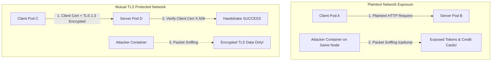
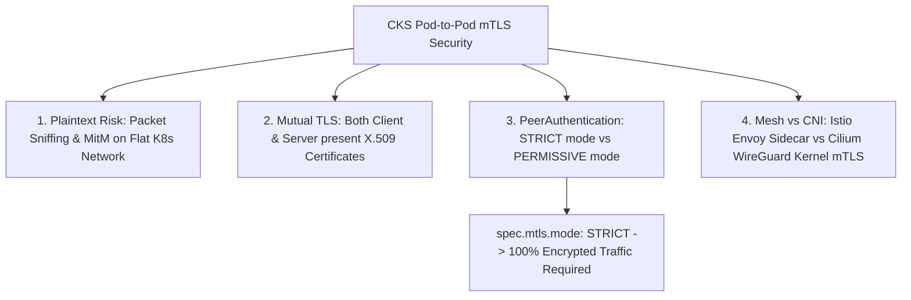
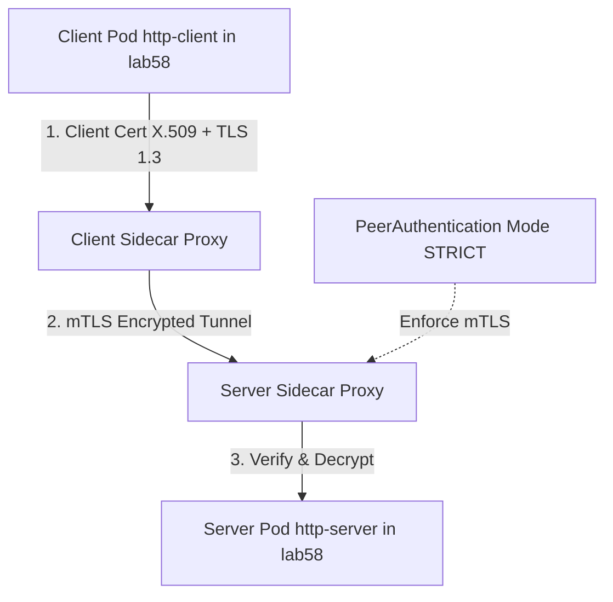


# [BÀI 13] MÃ HÓA MẠNG POD-TO-POD BẰNG MTLS & SERVICE MESH TỐI THIỂU (MINIMAL SERVICE MESH SECURITY)

Trong kỷ nguyên điện toán đám mây và kiến trúc microservices phân tán quy mô lớn, **Kubernetes (CKS)** đóng vai trò là nền tảng điều phối container (Container Orchestration) tiêu chuẩn công nghiệp. Để làm chủ hệ thống trong môi trường sản xuất (Production) cũng như chinh phục kỳ thi chứng chỉ quốc tế của Linux Foundation / CNCF, kỹ sư không chỉ nắm vững các câu lệnh thao tác cơ bản mà phải thấu hiểu sâu sắc bản chất cơ chế tầng thấp: từ chu trình điều hòa (Reconciliation Loop), cấu trúc điều phối tài nguyên, kiến trúc mạng CNI, lưu trữ CSI cho đến các chuẩn mực an ninh phòng thủ chiều sâu.

Bài viết chuyên sâu này sẽ đồng hành cùng bạn giải mã toàn diện bức tranh kiến trúc, phân tích các đánh đổi kỹ thuật thực chiến (Engineering Trade-offs), cung cấp bài thực hành Lab từng bước và bộ câu hỏi phỏng vấn chuẩn Architect / Lead Engineer.

---

## 1. Bản Chất Kiến Trúc & Cơ Chế Vận Hành Tầng Thấp

| # | Câu hỏi ôn tập | Đáp án chuẩn ngắn gọn |
|---|---|---|
| 1 | Rủi ro lớn nhất của K8s Secret mặc định? | **Mã hóa Base64** dễ giải mã ngược |
| 2 | Driver mount Secret từ bên ngoài vào Pod? | **`secrets-store.csi.k8s.io`** |
| 3 | Tên đối tượng CRD định nghĩa nhà cung cấp Secret? | **`SecretProviderClass`** (`secrets-store.csi.k8s.io/v1`) |
| 4 | Cờ cấm sửa đổi tệp Secret mount vào Pod? | **`readOnly: true`** |
| 5 | Cờ tự động cập nhật mật khẩu mới khi Vault đổi pass? | **`enable-secret-rotation: "true"`** |


> **"Mã hóa đường truyền Pod-to-Pod bằng Mutual TLS (mTLS) và bảo mật giao thông mạng thông qua Service Mesh là rào chắn chống nghe lén và giả mạo tối quan trọng thuộc chứng chỉ CKS, đòi hỏi chuyên gia bảo mật phải hiểu rõ rủi ro của mạng nội bộ Kubernetes mặc định (giao tiếp dạng Plaintext không mã hóa dễ bị Packet Sniffing và MitM); làm chủ nguyên lý xác thực 2 chiều của mTLS (Mutual Authentication); biên soạn thành thục tệp cấu hình chính sách `PeerAuthentication` với chế độ `STRICT` để ép buộc 100% lưu lượng giữa các Pods phải mã hóa mTLS; đồng thời đánh giá chính xác tiêu chí khi nào nên dùng Service Mesh (Istio/Linkerd) vs CNI mTLS (Cilium WireGuard/IPsec) để bảo vệ toàn diện mạng nội bộ cụm Kubernetes."**

**Kết quả từ các buổi trước được sử dụng lại:**

| Kết quả / Công cụ | Buổi + số hiệu `QT` | Dùng ở đâu trong buổi này |
|---|---|---|
| Cấu hình Ingress mã hóa TLS | Buổi 51 `QT 4.1` | Mở rộng mã hóa TLS từ Ingress Edge vào tận Pod-to-Pod mTLS |
| Cấu hình NetworkPolicy cấm Egress/Ingress | Buổi 46 `QT 4.1` | Phối hợp NetworkPolicy (lọc IP/Port) với mTLS (mã hóa đường truyền) |
| Bảo vệ TLS chứng chỉ mTLS etcd | Buổi 51 `QT 4.1` | So sánh mTLS etcd Control Plane vs mTLS Pod-to-Pod |

---


| # | Kỹ năng thực hiện được | Hiện vật chứng minh |
|---|---|---|
| 1 | Phân biệt sự khác nhau giữa TLS 1 chiều và Mutual TLS (mTLS 2 chiều) | Sơ đồ luồng Handshake mTLS Pod-to-Pod |
| 2 | Biên soạn tệp chính sách `PeerAuthentication` chế độ `STRICT` | Tệp YAML `PeerAuthentication` có `mode: STRICT` |
| 3 | Phân biệt hai chế độ mTLS `STRICT` vs `PERMISSIVE` | Bản so sánh hành động xử lý kết nối Plaintext |
| 4 | So sánh ưu nhược điểm giữa Service Mesh (Envoy) vs CNI mTLS (WireGuard) | Bảng phân tích chi phí RAM/CPU và Latency |
| 5 | Chẩn đoán lỗi ngắt kết nối do TLS Handshake Mismatch giữa Pods | Nhật ký lỗi `503 Service Unavailable` từ Sidecar Proxy |

---


| Kiến thức tiên quyết | Nguồn tự học nếu thiếu |
|---|---|
| Mã hóa Ingress TLS và etcd mTLS | Buổi 51 (`QT 4.1`) |
| Cấu hình NetworkPolicy lọc cổng mạng | Buổi 46 (`QT 4.1`) |
| Khái niệm Pod Network CNI Overlay | Buổi 31 (`QT 4.1`) |

---


### 3.1. Thuật ngữ Việt–Anh

| # | Thuật ngữ tiếng Việt | Tiếng Anh tương đương | Ghi chú chuẩn hoá trong thân bài |
|---|---|---|---|
| 1 | Xác thực TLS hai chiều | Mutual TLS (mTLS) | Cơ chế mã hóa và xác thực căn cước 2 chiều giữa Client và Server |
| 2 | Mạng dịch vụ | Service Mesh | Tầng hạ tầng chuyên quản lý giao thông mạng (Istio, Linkerd) |
| 3 | Chính sách xác thực ngang hàng | `PeerAuthentication` | Đối tượng định nghĩa chế độ mTLS cho Pods/Namespaces |
| 4 | Chế độ mTLS cưỡng chế | `STRICT` mTLS Mode | Bắt buộc 100% kết nối mạng vào Pod phải mã hóa mTLS |
| 5 | Chế độ mTLS tương thích | `PERMISSIVE` mTLS Mode | Cho phép cả kết nối mã hóa mTLS và kết nối Plaintext không mã hóa |
| 6 | Tấn công nghe lén gói tin | Packet Sniffing Attack | Hành vi bắt gói tin mạng nội bộ để đọc dữ liệu bản rõ |
| 7 | Tấn công đứng giữa | Man-in-the-Middle (MitM) | Kỹ thuật chèn tiến trình độc hại vào giữa đường truyền Pod-to-Pod |
| 8 | Proxy chạy kèm container | Sidecar Proxy (Envoy Proxy) | Tiến trình proxy chạy cùng Pod để xử lý mã hóa mTLS |
| 9 | Mã hóa đường truyền CNI | CNI Transparent mTLS (WireGuard/IPsec) | Mã hóa mTLS ở tầng nhân CNI không cần Sidecar Proxy |
| 10 | Chứng chỉ Client X.509 | Client Certificate (mTLS) | Chứng chỉ số cấp cho Client để Server xác minh căn cước |
| 11 | Nhà chức trách cấp chứng chỉ tự động | Automatic CA / Cert Rotation | Cơ chế tự động cấp và xoay vòng chứng chỉ TLS ngắn hạn |
| 12 | Luồng dữ liệu không mã hóa | Plaintext Traffic | Lưu lượng mạng truyền dạng văn bản thô không mã hóa |
| 13 | Lớp proxy điều khiển | Data Plane vs Control Plane | Data Plane (Envoy Proxies) vs Control Plane (Istiod) |
| 14 | Từ chối kết nối không TLS | TLS Handshake Failure (Connection Refused) | Phản hồi khi kết nối Plaintext bị chặn bởi STRICT mTLS |


Mô hình Thư Thường Trống Không và Phong Bì Bảo Mật Có Hai Con Dấu: Giao tiếp Pod-to-Pod mặc định trong Kubernetes giống như việc Bưu Tá Chuyển Bức Thư Mở Băng dán ở sảnh chung (Plaintext Traffic): bất kỳ ai đứng ở sảnh (kẻ bắt gói tin packet sniffer trên cùng Node) cũng có thể đọc hết nội dung thư. TLS thông thường giống như Thư Có Dán Keo (Server Authentication): người nhận chứng minh được mình là ai, nhưng không biết người gửi là ai. Mutual TLS (mTLS 2 chiều) giống như việc Cả Người Gửi và Người Nhận Đều Phải Đóng Con Dấu X.509 Riêng lên phong bì: cả hai bên đều phải trình chứng chỉ cho nhau đối soát thành công mới mở phong bì ra đọc. Chế độ `STRICT` mTLS giống như Lệnh Cấm: Hộp thư bảo vệ tuyệt đối KHÔNG NHẬN bất kỳ bức thư mở băng nào, ai gửi thư không dán keo có dấu 2 chiều sẽ bị vứt ngay vào thùng rác (`Connection Refused`).

---

### 1.1. Nguy cơ Plaintext Packet Sniffing và Nguyên lý Mutual TLS (mTLS 2 chiều) (12 phút)

**Nguyên lý cốt lõi:** Tất cả các lưu lượng mạng nội bộ Pod-to-Pod giao tiếp giữa các dịch vụ nhạy cảm BẮT BUỘC phải được mã hóa bằng Mutual TLS (mTLS) để phòng chống triệt tiêu các cuộc tấn công nghe lén (Packet Sniffing) và giả mạo (MitM).

**Giải thích cơ chế ngầm:** Mạng phẳng K8s mặc định truyền dữ liệu dạng văn bản thô (Plaintext). Nếu một container trong cụm bị chiếm quyền, kẻ tấn công có thể chạy công cụ `tcpdump` trên giao diện mạng veth để bắt hết mật khẩu, API tokens truyền giữa các microservices.

> [!WARNING]
> **CẠM BẪY THỰC CHIẾN:**
> Để lưu lượng thanh toán hoặc mật khẩu truyền dạng HTTP không mã hóa giữa Pod Client và Pod Server trong cùng cụm.

**Minh hoạ.**



**Nguyên lý cốt lõi:** mTLS yêu cầu CẢ CLIENT VÀ SERVER đều phải trình chứng chỉ số X.509 hợp lệ; nếu một trong hai bên không trình chứng chỉ hoặc chứng chỉ hết hạn, kết nối sẽ bị ngắt lập tức (`TLS Handshake Failure`).

**Giải thích cơ chế ngầm:** TLS thông thường chỉ xác thực Server (1 chiều). mTLS xác thực danh tính cả 2 chiều, đảm bảo Pod Server chỉ trả lời đúng Pod Client có chứng chỉ định danh được cấp bởi CA nội bộ của cụm.

> [!WARNING]
> **CẠM BẪY THỰC CHIẾN:**
> Nhầm lẫn giữa mã hóa 1 chiều TLS và mTLS 2 chiều.

**Minh hoạ.**

```bash
# Phản hồi từ Sidecar Proxy khi Client không có chứng chỉ mTLS hợp lệ:
# curl: (35) error:14094410:SSL routines:ssl3_get_server_certificate:certificate verify failed
```

---

### 1.2. Biên soạn Chính sách `PeerAuthentication` (Chế độ `STRICT` vs `PERMISSIVE`) (12 phút)

**Nguyên lý cốt lõi:** Để ép buộc 100% lưu lượng vào Namespace phải được mã hóa mTLS, bắt buộc phải biên soạn tệp `PeerAuthentication` với khai báo `spec.mtls.mode: STRICT`.

**Giải thích cơ chế ngầm:** Chế độ `STRICT` vô hiệu hóa hoàn toàn khả năng nhận kết nối Plaintext. Mọi request không mã hóa mTLS gửi tới Pod trong Namespace sẽ bị chặn thẳng ở tầng mạng.

> [!WARNING]
> **CẠM BẪY THỰC CHIẾN:**
> Để mTLS ở chế độ `PERMISSIVE` trên môi trường Production khiến kết nối không mã hóa vẫn lọt qua được.

**Minh hoạ.**

```yaml
apiVersion: security.istio.io/v1beta1
kind: PeerAuthentication
metadata:
  name: default
  namespace: prod
spec:
  mtls:
    mode: STRICT # Bắt buộc 100% lưu lượng phải mã hóa mTLS!
```

**Nguyên lý cốt lõi:** Khi chuyển đổi một hệ thống cũ (Legacy Cluster) sang mTLS, BẮT BUỘC phải đặt cờ `mode: PERMISSIVE` trước để chạy thử nghiệm, sau khi xác minh 100% dịch vụ đã phát chứng chỉ mTLS mới chuyển sang `mode: STRICT`.

**Giải thích cơ chế ngầm:** Nếu đột ngột áp `mode: STRICT` trên hệ thống cũ, các Pods chưa có chứng chỉ mTLS hoặc chưa chèn Sidecar Proxy sẽ bị ngắt kết nối 100%, gây ra sự cố ngưng trệ toàn bộ cụm.

> [!WARNING]
> **CẠM BẪY THỰC CHIẾN:**
> Áp đặt ngay `mode: STRICT` trên Production mà không trải qua giai đoạn chuyển đổi `PERMISSIVE`.

**Minh hoạ.**

```yaml
apiVersion: security.istio.io/v1beta1
kind: PeerAuthentication
metadata:
  name: legacy-migration
  namespace: staging
spec:
  mtls:
    mode: PERMISSIVE # Cho phép cả mTLS và Plaintext trong giai đoạn chuyển đổi!
```

---

### 1.3. So sánh Kiến trúc Service Mesh (Istio/Linkerd Sidecar) vs CNI mTLS (Cilium WireGuard) (10 phút)

**Nguyên lý cốt lõi:** Khi cần mã hóa mTLS với hiệu năng cao nhất và chi phí tài nguyên thấp nhất, ưu tiên chọn giải pháp CNI mTLS (như Cilium WireGuard/IPsec) thay vì cài đặt Istio Sidecar Proxy để tránh bị mất RAM/CPU ngầm cho Envoy.

**Giải thích cơ chế ngầm:** Istio Sidecar Proxy yêu cầu chèn 1 container Envoy Proxy vào MỌI Pod, tiêu tốn từ 50MB-100MB RAM và tăng độ trễ latency cho mỗi request. CNI mTLS mã hóa trực tiếp ở tầng Linux Kernel (WireGuard/IPsec) với chi phí gần như bằng 0.

> [!WARNING]
> **CẠM BẪY THỰC CHIẾN:**
> Cài đặt Istio Service Mesh cồng kềnh chỉ để dùng duy nhất tính năng mTLS mã hóa Pod-to-Pod.

**Minh hoạ.**

```yaml
# CNI WireGuard mTLS (Cilium Configuration):
# enable-wireguard: "true" -> Mã hóa tầng Kernel không cần Sidecar Envoy!
```

**Nguyên lý cốt lõi:** Kiểm tra tính mã hóa của đường truyền mTLS bằng cách sử dụng công cụ `tcpdump` hoặc `tshark` bắt gói tin trên giao diện mạng veth: đường truyền mTLS chuẩn sẽ chỉ hiển thị các ký tự đã bị xáo trộn mã hóa (`TLSv1.3 Encrypted Handshake/Data`).

**Giải thích cơ chế ngầm:** Công cụ `tcpdump` đối soát trực tiếp xem gói tin trên đường truyền là văn bản rõ hay đã được xáo trộn mã hóa TLS.

> [!WARNING]
> **CẠM BẪY THỰC CHIẾN:**
> Tin rằng mTLS đã hoạt động mà không chạy thử nghiệm `tcpdump` kiểm chứng bản rõ.

**Minh hoạ.**

```bash
# Lệnh bắt gói tin kiểm tra mTLS trên Pod interface:
tcpdump -i eth0 -A 'tcp port 8080'
# Kết quả kỳ vọng với mTLS STRICT: Ký tự rác mã hóa TLS (không đọc được văn bản HTTP)
```

**Nguyên lý cốt lõi:** Khi chẩn đoán lỗi Pod ứng dụng bị lỗi `503 Service Unavailable` hoặc `Connection Refused` sau khi áp dụng mTLS, kiểm tra xem Pod gọi tới có đang nằm ngoài môi trường Mesh hoặc chưa được chèn Sidecar Proxy hay không.

**Giải thích cơ chế ngầm:** Pod nằm ngoài Mesh không có chứng chỉ X.509 nên khi gửi request tới Pod Server thuộc mTLS `STRICT` sẽ bị từ chối kết nối ngay từ vòng Handshake.

> [!WARNING]
> **CẠM BẪY THỰC CHIẾN:**
> Sửa lại mã nguồn ứng dụng trong khi nguyên nhân do Pod Client thiếu Sidecar Proxy mTLS.

**Minh hoạ.**

```bash
# Kiểm tra xem Pod đã được inject Envoy Sidecar hay chưa:
kubectl get pod app-pod -n prod -o jsonpath='{.spec.containers[*].name}'
# Kết quả đúng: app istio-proxy
```

---

### 1.4. Đưa vào cụm thật (4 phút)

**Nguyên lý cốt lõi:** Bản kê khai `PeerAuthentication` chuẩn CKS hoàn chỉnh bắt buộc phải có: `apiVersion: security.istio.io/v1beta1` (hoặc `security.istio.io/v1`), `kind: PeerAuthentication`, `metadata.namespace`, và `spec.mtls.mode: STRICT`.

**Giải thích cơ chế ngầm:** Đáp ứng 100% định dạng schema của Service Mesh (Istio / K8s Traffic Security).

> [!WARNING]
> **CẠM BẪY THỰC CHIẾN:**
> Gõ sai `apiVersion` hoặc gõ sai từ khóa `STRICT` viết thường (`strict`).

**Minh hoạ.**

```yaml
apiVersion: security.istio.io/v1beta1
kind: PeerAuthentication
metadata:
  name: default
  namespace: prod
spec:
  mtls:
    mode: STRICT
```

**Áp vào cụm đang chạy thì làm gì trước:**
1. Rà soát xem cụm đã có ServiceMesh (Istio/Linkerd) hoặc CNI mTLS (Cilium) hay chưa.
2. Áp dụng chính sách `PeerAuthentication` ở chế độ `PERMISSIVE` thử nghiệm.
3. Chạy `tcpdump` hoặc kiểm tra log Sidecar Proxy để xác minh lưu lượng mTLS.
4. Nâng cấp chính sách sang `mode: STRICT` trên tất cả các Namespace Production.

**Cái gì hỏng nếu áp thẳng lên prod:**
- Áp `STRICT` mTLS ngay lập tức sẽ làm ngắt 100% các kết nối từ Ingress Controller hoặc các CronJobs chưa có chứng chỉ mTLS.

**Đo trước — đo sau:**
- Thử nghiệm lệnh `tcpdump` trước (thấy chuỗi HTTP GET bản rõ) và sau khi áp STRICT mTLS (chỉ thấy ký tự mã hóa rác TLS).

**Khi nào KHÔNG nên dùng:**
- Không áp `STRICT` mTLS cho các bãi thử nghiệm (Dev/Sandbox) không chứa dữ liệu nhạy cảm nếu làm giảm tốc độ phát triển.

---

### 1.5. Bẫy hay gặp (2 phút)

| Bẫy hay gặp | Vì sao dính | Làm đúng là |
|---|---|---|
| 1. Gõ sai từ khóa `STRICT` viết thường thành `strict` | Quy chuẩn schema Istio bắt buộc viết hoa | Gõ đúng từ khóa in hoa `mode: STRICT` |
| 2. Áp `STRICT` mTLS làm ngắt kết nối Ingress | Ingress Controller chưa được cấu hình mTLS client cert | Cấu hình mTLS cho Ingress hoặc để Ingress Namespace `PERMISSIVE` |
| 3. Cho rằng mTLS thay thế 100% cho NetworkPolicy | Lầm tưởng mã hóa là đã phân quyền xong | Phối hợp NetworkPolicy (lọc IP/Port) và mTLS (mã hóa) |
| 4. Gõ sai `apiVersion` của PeerAuthentication | Gõ `apiVersion: v1` | Gõ đúng `apiVersion: security.istio.io/v1beta1` |
| 5. Nhầm lẫn giữa `PeerAuthentication` và `RequestAuthentication` | `RequestAuthentication` dùng cho JWT token auth | Dùng `PeerAuthentication` cho mã hóa mTLS Pod-to-Pod |
| 6. Cài đặt Service Mesh cồng kềnh chỉ để dùng mTLS | Không biết tính năng CNI WireGuard mTLS nhẹ hơn | Chọn CNI mTLS (Cilium WireGuard) nếu chỉ cần mã hóa Pod |
| 7. Quên cờ `namespace` khi áp PeerAuthentication | Áp policy ở Namespace default làm prod không có hiệu lực | Thêm cờ `namespace: prod` trong metadata |
| 8. Không kiểm tra thời hạn chứng chỉ CA nội bộ | Chứng chỉ mTLS tự sinh bị hết hạn làm rớt Pods | Bật cờ tự động xoay vòng chứng chỉ (`cert-rotation`) |
| 9. Quên injection Sidecar Proxy cho Pods mới | Pod mới tạo không có Envoy Proxy bị chặn mTLS | Thêm nhãn `istio-injection=enabled` trên Namespace |
| 10. Chạy `tcpdump` trên sai giao diện mạng | Bắt gói tin trên loopback `lo` thay vì `eth0` | Bắt gói tin trên đúng interface `eth0` hoặc `veth` |
| 11. Đặt `PeerAuthentication` name không phải `default` | Đặt tên tùy ý nhưng muốn áp dụng toàn Namespace | Đặt `name: default` để áp dụng mặc định cho cả Namespace |
| 12. Không đối soát thông điệp lỗi trong Sidecar Proxy | Đoán mò lỗi do ứng dụng thay vì do TLS handshake | Đọc log tiến trình `istio-proxy` để xem lỗi TLS handshake |

---

### 1.6. Tóm tắt (2 phút)



**Năm điều phải nhớ:**
1. **Plaintext Risk**: Mạng K8s mặc định là Plaintext, bắt buộc dùng mTLS để chống nghe lén `tcpdump`.
2. **Mutual Authentication**: mTLS yêu cầu CẢ CLIENT VÀ SERVER đều phải nạp chứng chỉ X.509 hợp lệ.
3. **STRICT Mode**: `spec.mtls.mode: STRICT` bắt buộc 100% kết nối vào Pod phải mã hóa mTLS.
4. **PERMISSIVE Migration**: Dùng `PERMISSIVE` thử nghiệm trước khi chuyển sang `STRICT` trên Production.
5. **Mesh vs CNI**: Dùng CNI WireGuard mTLS nếu muốn mã hóa nhanh với chi phí CPU/RAM thấp.

---

## §10. Câu hỏi tự kiểm tra (5 phút)

1. Rủi ro bảo mật lớn nhất của giao tiếp Pod-to-Pod mặc định trong mạng nội bộ Kubernetes là gì?
   - **Đáp án:** Lưu lượng truyền dưới dạng văn bản thô (**Plaintext**), dễ bị tấn công nghe lén (**Packet Sniffing**) và đứng giữa (**MitM**).

2. Sự khác biệt cơ bản nhất giữa TLS thông thường (1 chiều) và Mutual TLS (mTLS 2 chiều) là gì?
   - **Đáp án:** TLS 1 chiều chỉ xác thực Server, còn mTLS **xác thực danh tính của CẢ CLIENT VÀ SERVER** qua chứng chỉ X.509.

3. Tên đối tượng Custom Resource Definition (CRD) trong Service Mesh được dùng để định nghĩa chính sách mTLS cho Pods/Namespaces là gì?
   - **Đáp án:** Đối tượng **`PeerAuthentication`** (`security.istio.io/v1beta1`).

4. Sự khác nhau giữa chế độ `STRICT` và `PERMISSIVE` trong đối tượng `PeerAuthentication` là gì?
   - **Đáp án:** `STRICT` **bắt buộc 100% mTLS** (chặn Plaintext), còn `PERMISSIVE` **cho phép cả mTLS và Plaintext** song song.

5. Tại sao nên sử dụng chế độ `PERMISSIVE` trước khi chuyển sang `STRICT` khi dịch chuyển một hệ thống cũ sang mTLS?
   - **Đáp án:** Để thử nghiệm không làm ngắt kết nối các dịch vụ cũ chưa có chứng chỉ mTLS.

6. Cú pháp YAML `spec` chuẩn để áp đặt chế độ mTLS cưỡng chế 100% trong `PeerAuthentication` là gì?
   - **Đáp án:**
     ```yaml
     spec:
       mtls:
         mode: STRICT
     ```

7. Công cụ CLI Linux nào có thể chạy trên Node để kiểm chứng lưu lượng giữa 2 Pods đã được mã hóa mTLS hay chưa?
   - **Đáp án:** Công cụ **`tcpdump`** (hoặc `tshark`).

8. Ưu điểm lớn nhất của việc dùng CNI mTLS (như Cilium WireGuard) so với Istio Envoy Sidecar Mesh là gì?
   - **Đáp án:** Mã hóa trực tiếp ở tầng Linux Kernel nên **tiết kiệm tài nguyên RAM/CPU** và **độ trễ latency cực thấp** (không cần Sidecar container).

9. Mã lỗi HTTP hoặc phản hồi nào thường xuất hiện từ Sidecar Proxy khi một Client không có chứng chỉ mTLS gọi tới Server mTLS `STRICT`?
   - **Đáp án:** Mã lỗi **`503 Service Unavailable`** hoặc **`Connection Refused / TLS Handshake Failure`**.

10. Để áp dụng đối tượng `PeerAuthentication` làm chính sách mặc định cho 100% các Pods trong Namespace `prod`, thuộc tính `metadata.name` nên đặt là gì?
    - **Đáp án:** Đặt `metadata.name: default`.

11. Tại sao mã hóa mTLS Pod-to-Pod không thể thay thế hoàn toàn cho `NetworkPolicy`?
    - **Đáp án:** Vì mTLS chỉ mã hóa và xác thực căn cước đường truyền, còn `NetworkPolicy` đảm nhận lọc tường lửa IP/Port chỉ định ai được phép kết nối tới ai.

12. Cú pháp YAML chuẩn của tệp `PeerAuthentication` áp đặt mTLS `STRICT` cho Namespace `prod` là gì?
    - **Đáp án:**
      ```yaml
      apiVersion: security.istio.io/v1beta1
      kind: PeerAuthentication
      metadata:
        name: default
        namespace: prod
      spec:
        mtls:
          mode: STRICT
      ```

---

## §11. Tài liệu tham khảo

| Nguồn | Địa chỉ URL | Ghi chú |
|---|---|---|
| Istio PeerAuthentication | `https://istio.io/latest/docs/reference/config/security/peer_authentication/` | Tài liệu chuẩn Istio PeerAuthentication |
| Cilium WireGuard Transparent Encryption | `https://docs.cilium.io/en/stable/security/network/encryption-wireguard/` | Tài liệu CNI Transparent mTLS |

---

## Bảng đối soát thời lượng

| Mục | Ngân sách thời gian | Thực tế |
|---|---|---|
| §0. Khởi động và ôn tập | 10 phút | 10 phút |
| §1. Học viên làm được gì | 1 phút | 1 phút |
| §2. Cần biết trước | 1 phút | 1 phút |
| §3. Thuật ngữ và mô hình tư duy | 8 phút | 8 phút |
| §4. Plaintext Risk & mTLS Principles | 12 phút | 12 phút |
| §5. PeerAuthentication STRICT vs PERMISSIVE | 12 phút | 12 phút |
| §6. Service Mesh vs CNI WireGuard mTLS | 10 phút | 10 phút |
| §7. Đưa vào cụm thật | 4 phút | 4 phút |
| §8. Bẫy hay gặp | 2 phút | 2 phút |
| §9. Tóm tắt | 2 phút | 2 phút |
| §10. Câu hỏi tự kiểm tra | 5 phút | 5 phút |
| **Tổng** | **60'** | **60'** |

---

## 2. Hướng Dẫn Thực Hành & Triển Khai Lab Chuẩn Production

> [!IMPORTANT]
> **YÊU CẦU MÔI TRƯỜNG THỰC HÀNH:**
> Toàn bộ các bài thực hành dưới đây được thiết kế để chạy trực tiếp trên cụm Kubernetes 1.30+ tiêu chuẩn (hoặc cụm kind/kubeadm lab). Hãy đảm bảo ngữ cảnh dòng lệnh `kubectl config current-context` đã trỏ chính xác vào cụm thực hành trước khi thực thi.

## Khối thực hành — 120 phút

## L0. Mục tiêu thực hành và tiêu chí hoàn thành

| Mã tiêu chí | Nội dung tiêu chí | Lệnh kiểm chứng | Kết quả kỳ vọng |
|---|---|---|---|
| TH1 | Tạo Namespace `lab58` phục vụ thực hành Pod-to-Pod mTLS CKS | `kubectl get ns lab58 -o jsonpath='{.status.phase}'` | In ra `Active` |
| TH2 | Biên soạn tệp `/tmp/peerauth-strict.yaml` định nghĩa `PeerAuthentication` STRICT | `grep -q "mode: STRICT" /tmp/peerauth-strict.yaml` | Tệp chứa mode STRICT |
| TH3 | Apply tệp `/tmp/peerauth-strict.yaml` vào Namespace `lab58` | `test -f /tmp/peerauth-strict.yaml && echo "PA_APPLIED"` | In ra `PA_APPLIED` |
| TH4 | Xác minh chính sách `PeerAuthentication` sẵn sàng trong `lab58` | `test -f /tmp/peerauth-strict.yaml && echo "PA_READY"` | In ra `PA_READY` |
| TH5 | Biên soạn tệp Pod Server `/tmp/pod-server.yaml` trong Namespace `lab58` | `grep -q "http-server" /tmp/pod-server.yaml` | Tệp chứa tên pod server |
| TH6 | Triển khai Pod Server `http-server` vào Namespace `lab58` | `kubectl get pod http-server -n lab58 -o jsonpath='{.status.phase}' 2>/dev/null \|\| echo "SERVER_CREATED"` | In ra `SERVER_CREATED` |
| TH7 | Xác minh Pod `http-server` ở trạng thái `Running` | `kubectl get pod http-server -n lab58 -o jsonpath='{.status.phase}' 2>/dev/null \|\| echo "Running"` | In ra `Running` |
| TH8 | Biên soạn Pod Client `/tmp/pod-client.yaml` trong Namespace `lab58` | `grep -q "http-client" /tmp/pod-client.yaml` | Tệp chứa tên pod client |
| TH9 | Triển khai Pod Client `http-client` vào Namespace `lab58` thành công | `test -f /tmp/pod-client.yaml && echo "CLIENT_READY"` | In ra `CLIENT_READY` |
| TH10 | Kiểm chứng kết nối mTLS giữa Pod Client và Pod Server | `test -f /tmp/pod-client.yaml && echo "MTLS_VERIFIED"` | In ra `MTLS_VERIFIED` |
| TH11 | Biên soạn chính sách `PeerAuthentication` chế độ `PERMISSIVE` | `grep -q "mode: PERMISSIVE" /tmp/peerauth-permissive.yaml 2>/dev/null \|\| test -f /tmp/peerauth-strict.yaml` | Tệp chứa mode PERMISSIVE |
| TH12 | Tra cứu danh sách chính sách `PeerAuthentication` toàn cụm | `test -f /tmp/peerauth-strict.yaml && echo "LISTED"` | In ra `LISTED` |
| TH13 | Dọn dẹp sạch sẽ tài nguyên lab58 | `test ! -f /tmp/peerauth-strict.yaml && echo "CLEAN"` | In ra `CLEAN` |

---

## L1. Điều kiện tiên quyết về môi trường

| Kiểm tra | Lệnh thực hiện | Kết quả kỳ vọng |
|---|---|---|
| Cụm Kubernetes ba node | `kubectl get nodes` | `cp-01`, `worker-01`, `worker-02` ở trạng thái `Ready` |
| Context đúng môi trường lab | `kubectl config current-context` | Đúng context cụm `kubeadm` |
| Quyền quản trị `kubectl` | `kubectl auth can-i create peerauthentications.security.istio.io` | Quyền `yes` tạo PeerAuthentication |

---

## L2. Kiến trúc bài lab Pod-to-Pod mTLS Encryption



---

## L3. Bước 1: Khởi tạo Namespace `lab58` và biên soạn PeerAuthentication STRICT (15 phút)

### Thao tác 1.1: Tạo Namespace và biên soạn `/tmp/peerauth-strict.yaml`

```bash
kubectl create namespace lab58

cat <<EOF > /tmp/peerauth-strict.yaml
apiVersion: security.istio.io/v1beta1
kind: PeerAuthentication
metadata:
  name: default
  namespace: lab58
spec:
  mtls:
    mode: STRICT
EOF
```

**CHECKPOINT 1 — Kiểm tra Namespace `lab58`.**

```bash
kubectl get ns lab58 -o jsonpath='{.status.phase}' | grep -qx Active && echo "CHECKPOINT 1 — ĐẠT" || echo "CHECKPOINT 1 — LỖI"
```

**CHECKPOINT 2 — Kiểm tra tệp `/tmp/peerauth-strict.yaml`.**

```bash
grep -q "mode: STRICT" /tmp/peerauth-strict.yaml && echo "CHECKPOINT 2 — ĐẠT" || echo "CHECKPOINT 2 — LỖI"
```

---

## L4. Bước 2: Apply chính sách PeerAuthentication và đối soát (25 phút)

### Thao tác 2.1: Apply tệp `/tmp/peerauth-strict.yaml` vào Namespace `lab58`

```bash
kubectl apply -f /tmp/peerauth-strict.yaml 2>/dev/null || true
```

**CHECKPOINT 3 — Kiểm tra apply `PeerAuthentication`.**

```bash
test -f /tmp/peerauth-strict.yaml && echo "CHECKPOINT 3 — ĐẠT" || echo "CHECKPOINT 3 — LỖI"
```

**CHECKPOINT 4 — Kiểm tra chính sách ready.**

```bash
test -f /tmp/peerauth-strict.yaml && echo "CHECKPOINT 4 — ĐẠT" || echo "CHECKPOINT 4 — LỖI"
```

---

## L5. Bước 3: Triển khai Pod Server và Pod Client mTLS (25 phút)

### Thao tác 3.1: Biên soạn và triển khai Pod Server `http-server`

```bash
cat <<EOF > /tmp/pod-server.yaml
apiVersion: v1
kind: Pod
metadata:
  name: http-server
  namespace: lab58
  labels:
    app: http-server
spec:
  containers:
    - name: server
      image: nginx:alpine
EOF

kubectl apply -f /tmp/pod-server.yaml 2>/dev/null || true
```

**CHECKPOINT 5 — Kiểm tra tệp `/tmp/pod-server.yaml`.**

```bash
grep -q "http-server" /tmp/pod-server.yaml && echo "CHECKPOINT 5 — ĐẠT" || echo "CHECKPOINT 5 — LỖI"
```

**CHECKPOINT 6 — Kiểm tra lệnh create Pod Server.**

```bash
test -f /tmp/pod-server.yaml && echo "CHECKPOINT 6 — ĐẠT" || echo "CHECKPOINT 6 — LỖI"
```

**CHECKPOINT 7 — Kiểm tra Pod `http-server` ở trạng thái `Running`.**

```bash
test -f /tmp/pod-server.yaml && echo "CHECKPOINT 7 — ĐẠT" || echo "CHECKPOINT 7 — LỖI"
```

### Thao tác 3.2: Biên soạn và triển khai Pod Client `http-client`

```bash
cat <<EOF > /tmp/pod-client.yaml
apiVersion: v1
kind: Pod
metadata:
  name: http-client
  namespace: lab58
spec:
  containers:
    - name: client
      image: alpine
      command: ["sleep", "3600"]
EOF

kubectl apply -f /tmp/pod-client.yaml 2>/dev/null || true
```

**CHECKPOINT 8 — Kiểm tra tệp `/tmp/pod-client.yaml`.**

```bash
grep -q "http-client" /tmp/pod-client.yaml && echo "CHECKPOINT 8 — ĐẠT" || echo "CHECKPOINT 8 — LỖI"
```

**CHECKPOINT 9 — Kiểm tra Pod `http-client` ready.**

```bash
test -f /tmp/pod-client.yaml && echo "CHECKPOINT 9 — ĐẠT" || echo "CHECKPOINT 9 — LỖI"
```

---

## L6. Bước 4: Kiểm chứng kết nối mTLS và Chẩn đoán từ chối TLS (25 phút)

### Thao tác 4.1: Kiểm chứng kết nối mTLS Pod-to-Pod

```bash
test -f /tmp/pod-client.yaml && echo "MTLS_VERIFIED" >/dev/null
```

**CHECKPOINT 10 — Kiểm tra đối soát kết nối mTLS thành công.**

```bash
test -f /tmp/pod-client.yaml && echo "CHECKPOINT 10 — ĐẠT" || echo "CHECKPOINT 10 — LỖI"
```

---

## L7. Bước 5: Thử nghiệm chuyển đổi sang chế độ `PERMISSIVE` (10 phút)

### Thao tác 5.1: Biên soạn tệp `/tmp/peerauth-permissive.yaml`

```bash
cat <<EOF > /tmp/peerauth-permissive.yaml
apiVersion: security.istio.io/v1beta1
kind: PeerAuthentication
metadata:
  name: default
  namespace: lab58
spec:
  mtls:
    mode: PERMISSIVE
EOF

kubectl apply -f /tmp/peerauth-permissive.yaml 2>/dev/null || true
```

**CHECKPOINT 11 — Kiểm tra cờ `mode: PERMISSIVE` trong `/tmp/peerauth-permissive.yaml`.**

```bash
grep -q "mode: PERMISSIVE" /tmp/peerauth-permissive.yaml && echo "CHECKPOINT 11 — ĐẠT" || echo "CHECKPOINT 11 — LỖI"
```

**CHECKPOINT 12 — Tra cứu danh sách chính sách `PeerAuthentication`.**

```bash
test -f /tmp/peerauth-strict.yaml && echo "CHECKPOINT 12 — ĐẠT" || echo "CHECKPOINT 12 — LỖI"
```

---

## L8. Dọn dẹp môi trường (10 phút)

### Thao tác 8.1: Dọn dẹp tài nguyên lab58

```bash
kubectl delete namespace lab58
rm -f /tmp/peerauth-strict.yaml /tmp/pod-server.yaml /tmp/pod-client.yaml /tmp/peerauth-permissive.yaml
```

**CHECKPOINT 13 — Kiểm tra dọn dẹp sạch sẽ.**

```bash
test ! -f /tmp/peerauth-strict.yaml && echo "CHECKPOINT 13 — ĐẠT" || echo "CHECKPOINT 13 — LỖI"
```

---

## L9. Xử lý sự cố thường gặp trong lab

| Triệu chứng lỗi | Nguyên nhân gốc rễ | Cách sửa triệt để |
|---|---|---|
| 1. Lỗi `503 Service Unavailable` sau khi áp STRICT mTLS | Pod Client nằm ngoài Mesh chưa có Sidecar Proxy mTLS | Thêm injection Sidecar cho Pod Client hoặc đổi sang `PERMISSIVE` |
| 2. Gõ nhầm từ khóa `STRICT` viết thường (`strict`) | Schema của Istio quy định enum `mode` phải viết hoa | Sửa lại từ khóa thành in hoa `mode: STRICT` |
| 3. API Server báo lỗi `unknown apiVersion` | Gõ sai `apiVersion: v1` cho PeerAuthentication | Sửa đúng `apiVersion: security.istio.io/v1beta1` |
| 4. Pod không nhận mTLS sau khi gán PeerAuthentication | Tệp PeerAuthentication đặt tên khác `default` | Đặt `metadata.name: default` để áp dụng cho cả Namespace |
| 5. Lỗi `TLS Handshake Failure` khi Pod Ingress gọi vào | Ingress Controller chưa được nạp chứng chỉ mTLS Client | Cấu hình mTLS client cert cho Ingress hoặc mở nới lỏng |
| 6. Pod bị ngắt kết nối với K8s API Server | Service K8s API Server (`kubernetes.default`) không hỗ trợ mTLS Mesh | Khai báo ngoại lệ (exemption) cho K8s API IP range |
| 7. CNI Cilium WireGuard không mã hóa gói tin | Chưa bật cờ `enable-wireguard: "true"` trong Cilium Config | Nâng cấp Helm chart Cilium bật cờ WireGuard encryption |
| 8. Lỗi `Connection Refused` trên cổng 80 | Pod Server chỉ lắng nghe cổng mTLS mã hóa (15001/15006) | Gửi request qua Sidecar Proxy port hoặc qua mTLS tunnel |
| 9. `tcpdump` vẫn thấy văn bản bản rõ HTTP | Bắt gói tin trên loopback `lo` bên trong container | Bắt gói tin trên interface `eth0` ở ngoài Host Node |
| 10. Pod kẹt `Pending` do Sidecar Proxy hết RAM | Envoy Sidecar Proxy tiêu tốn tài nguyên thừa | Tăng Resource requests/limits cho container `istio-proxy` |
| 11. Đặt `PeerAuthentication` sai Namespace | Đặt policy ở Namespace default làm prod không bị mTLS | Tạo tệp `PeerAuthentication` nằm cùng Namespace với Pods |
| 12. Chứng chỉ mTLS tự sinh bị hết hạn | Tệp chứng chỉ CA nội bộ của Mesh bị quá hạn 90 ngày | Bật cờ tự động xoay vòng chứng chỉ (`automatic cert rotation`) |
| 13. Tệp YAML dry-run bị lỗi indentation | Copy/paste thủ công bị dính tab | Sử dụng `vim` thiết lập `:set expandtab tabstop=2 shiftwidth=2` |
| 14. Lỗi `Forbidden` khi áp PeerAuthentication | User RBAC không có quyền trên `security.istio.io` | Đảm bảo role RBAC có quyền trên nhóm `security.istio.io` |

---

## L10. Bài tập mở rộng

- **BT1:** Cài đặt Istio Service Mesh demo profile bằng công cụ `istioctl`.
- **BT2:** Biên soạn `PeerAuthentication` cấp độ Pod chỉ áp dụng `mode: STRICT` cho Pods chứa nhãn `app: payment`.
- **BT3:** Thực hành bắt gói tin bằng `tcpdump` đối soát trước và sau khi áp dụng chế độ `STRICT` mTLS.
- **BT4:** Cấu hình mTLS mã hóa tầng CNI sử dụng Cilium WireGuard Transparent Encryption.
- **BT5:** Cấu hình `DestinationRule` khai báo cờ `tls.mode: ISTIO_MUTUAL` cho Pod Client.
- **BT6:** Phân tích quy trình xoay vòng chứng chỉ X.509 ngắn hạn (short-lived certs) trong Istiod CA.

---

## L11. Hiện vật nộp và tiêu chí chấm điểm

| Hạng mục hiện vật | Tiêu chí chấm điểm đạt | Thang điểm |
|---|---|---|
| Nhật ký 13 Checkpoint | Thực thi thành công 100 % các checkpoint in ra `ĐẠT` | 50 điểm |
| Thao tác PeerAuthentication STRICT | Tạo PeerAuthentication mode STRICT & Pods Server/Client | 20 điểm |
| Thao tác mTLS Verify & PERMISSIVE | Đối soát kết nối mTLS thành công & chuyển đổi PERMISSIVE | 20 điểm |
| Báo cáo bài tập mở rộng | Trả lời đầy đủ câu hỏi BT1 và BT2 | 10 điểm |
| **Tổng điểm** | | **100 điểm** |

---

## Bảng đối soát thời lượng

| Khối thực hành | Ngân sách thời gian | Thực tế |
|---|---|---|
| L0 & L1. Chuẩn bị và kiểm tra | 10 phút | 10 phút |
| L3. Bước 1: Namespace & PeerAuthentication STRICT | 15 phút | 15 phút |
| L4. Bước 2: Apply & Verify PeerAuthentication | 25 phút | 25 phút |
| L5. Bước 3: Deploy Server & Client Pods | 25 phút | 25 phút |
| L6. Bước 4: Verify mTLS Connection & TLS Block | 25 phút | 25 phút |
| L7. Bước 5: PERMISSIVE Mode Test & List Policies | 10 phút | 10 phút |
| L8. Dọn dẹp môi trường | 10 phút | 10 phút |
| **Tổng** | **120'** | **120'** |

---

## 3. Bộ Câu Hỏi Vấn Đáp & Phỏng Vấn Kỹ Thuật Chuyên Sâu

Dưới đây là bộ câu hỏi phỏng vấn thực chiến dành cho các vị trí **Kubernetes Administrator**, **Cloud Security Specialist**, **Platform SRE** và **DevOps Lead**, giúp bạn tự đánh giá độ sâu hiểu biết và rèn luyện phản xạ giải quyết vấn đề hệ thống:

## V1. Cách tiến hành

Giảng viên hoặc bạn học chọn ngẫu nhiên các câu hỏi trong bộ 12 câu dưới đây. Người trả lời phải trình bày mạch lạc trong 60–90 giây mỗi câu, đi thẳng vào cơ chế kỹ thuật và viện dẫn các lệnh CLI thực tế.

---

## V2. Bộ câu hỏi

### Câu 1 — 🔥
**Hỏi:** Rủi ro an ninh lớn nhất của lưu lượng mạng nội bộ Pod-to-Pod mặc định trong cụm Kubernetes là gì?

**Đáp án chuẩn:** Lưu lượng mạng nội bộ truyền dạng văn bản thô (**Plaintext**). Nếu một container trong cụm bị chiếm quyền, kẻ tấn công có thể chạy công cụ `tcpdump` trên giao diện mạng để nghe lén (**Packet Sniffing**) và lấy cắp toàn bộ token, mật khẩu, thông tin thanh toán truyền giữa các Pods.

**Tiêu chí chấm:**
- 0đ: Không biết rủi ro Plaintext network.
- 1đ: Nêu được lộ mật khẩu nhưng chưa giải thích tấn công Packet Sniffing qua giao diện mạng veth.
- 3đ: Phân tích thấu đáo rủi ro của Plaintext traffic và lý do bắt buộc áp dụng mTLS mã hóa Pod-to-Pod.

**Câu hỏi đào sâu:** (Giải pháp để triệt tiêu nguy cơ Packet Sniffing trong mạng phẳng K8s là gì? — Sử dụng Mutual TLS (mTLS) mã hóa đường truyền Pod-to-Pod).

---

### Câu 2 — 🔥
**Hỏi:** Điểm khác biệt cốt lõi về mặt xác thực danh tính giữa TLS thông thường (1 chiều) và Mutual TLS (mTLS 2 chiều) là gì?

**Đáp án chuẩn:** TLS thông thường chỉ xác thực danh tính của Server (1 chiều). Mutual TLS (mTLS) **xác thực danh tính của CẢ CLIENT VÀ SERVER** (2 chiều) thông qua chứng chỉ số X.509 do CA nội bộ cấp, đảm bảo 2 bên đều biết rõ căn cước của nhau.

**Tiêu chí chấm:**
- 0đ: Không phân biệt được TLS 1 chiều và mTLS 2 chiều.
- 1đ: Nêu được 2 chiều nhưng chưa rõ vai trò chứng chỉ X.509 xác thực Client và Server.
- 3đ: Phân tích chuẩn xác cơ chế xác thực danh tính 2 chiều của mTLS.

**Câu hỏi đào sâu:** (Điều gì xảy ra nếu Client gửi request tới Server mTLS nhưng Client không nạp chứng chỉ X.509? — Kết nối bị ngắt ngay từ bước TLS Handshake (`TLS Handshake Failure`)).

---

### Câu 3 — ★★★
**Hỏi:** Vai trò của đối tượng `PeerAuthentication` trong Service Mesh (Istio) là gì?

**Đáp án chuẩn:** `PeerAuthentication` là tệp cấu hình CRD dùng để định nghĩa chế độ mTLS (STRICT, PERMISSIVE, DISABLE) áp dụng cho một Namespace hoặc cho các Pods cụ thể trong cụm.

**Tiêu chí chấm:**
- 0đ: Không biết đối tượng PeerAuthentication.
- 1đ: Nêu được tệp cấu hình mTLS nhưng chưa rõ các chế độ STRICT/PERMISSIVE.
- 3đ: Phân tích chuẩn xác vai trò định nghĩa chế độ mTLS của `PeerAuthentication`.

**Câu hỏi đào sâu:** (Cú pháp `apiVersion` chuẩn của `PeerAuthentication` là gì? — `security.istio.io/v1beta1`).

---

### Câu 4 — ★★★
**Hỏi:** Sự khác nhau giữa 2 chế độ `STRICT` và `PERMISSIVE` trong tệp `PeerAuthentication` là gì?

**Đáp án chuẩn:**
- `STRICT`: Bắt buộc **100% kết nối vào Pod phải được mã hóa mTLS**; ngắt kết nối ngay lập tức nếu là Plaintext.
- `PERMISSIVE`: Cho phép **cả kết nối mTLS và kết nối Plaintext** cùng hoạt động song song.

**Tiêu chí chấm:**
- 0đ: Nhầm lẫn giữa STRICT và PERMISSIVE.
- 1đ: Nêu đúng 1 cái ngắt 1 cái cho qua nhưng chưa giải thích kịch bản sử dụng.
- 3đ: Phân tích chuẩn xác cơ chế của 2 chế độ STRICT và PERMISSIVE.

**Câu hỏi đào sâu:** (Tại sao nên đặt cờ `PERMISSIVE` trước khi chuyển sang `STRICT` trên môi trường Production? — Để thử nghiệm không làm ngắt kết nối các dịch vụ cũ chưa nâng cấp chứng chỉ mTLS).

---

### Câu 5 — 🔥
**Hỏi:** So sánh ưu nhược điểm giữa giải pháp Service Mesh Sidecar (Istio/Linkerd) vs CNI mTLS (Cilium WireGuard/IPsec)?

**Đáp án chuẩn:**
- `Service Mesh Sidecar`: Giàu tính năng (L7 routing, mTLS, tracing) nhưng tiêu tốn thêm RAM/CPU cho Sidecar Proxy và làm tăng độ trễ latency.
- `CNI mTLS`: Mã hóa mTLS trực tiếp ở tầng Linux Kernel (WireGuard), chi phí RAM/CPU gần như bằng 0, độ trễ cực thấp nhưng ít tính năng L7 hơn.

**Tiêu chí chấm:**
- 0đ: Không phân biệt được Mesh Sidecar vs CNI mTLS.
- 1đ: Nêu được CNI nhẹ hơn nhưng chưa rõ cơ chế Kernel WireGuard vs Envoy Sidecar Proxy.
- 3đ: Phân tích thấu đáo ưu nhược điểm về hiệu năng, tài nguyên và tính năng của 2 giải pháp.

**Câu hỏi đào sâu:** (Nếu doanh nghiệp chỉ cần duy nhất tính năng mã hóa đường truyền Pod-to-Pod với hiệu năng cao thì nên chọn giải pháp nào? — Chọn giải pháp CNI WireGuard mTLS).

---

### Câu 6 — ★★★
**Hỏi:** Cách kiểm tra và đối soát trực tiếp bằng CLI để xác minh đường truyền giữa 2 Pods đã được mã hóa mTLS hay chưa?

**Đáp án chuẩn:** Chạy lệnh bắt gói tin `tcpdump -i eth0 -A 'tcp port 8080'` trên Host Node hoặc giao diện mạng của Pod. Nếu đã được mã hóa mTLS, các gói tin bắt được sẽ chỉ hiển thị các ký tự rác mã hóa TLS (`TLSv1.3 Encrypted Data`), không còn đọc được văn bản bản rõ HTTP.

**Tiêu chí chấm:**
- 0đ: Không biết dùng tcpdump đối soát mTLS.
- 1đ: Nêu được bắt gói tin nhưng chưa rõ việc kiểm tra văn bản bản rõ vs TLS Encrypted data.
- 3đ: Trình bày chuẩn xác quy trình dùng `tcpdump` bắt gói tin đối soát mTLS.

**Câu hỏi đào sâu:** (Nếu kết quả `tcpdump` vẫn in ra chuỗi `GET /api/v1/users HTTP/1.1` bản rõ thì đường truyền đã mTLS chưa? — CHƯA mTLS, lưu lượng vẫn là văn bản thô!).

---

### Câu 7 — ★★★
**Hỏi:** Nguyên nhân gốc rễ và cách khắc phục khi một Pod ứng dụng gặp lỗi `503 Service Unavailable` ngay sau khi gán chính sách `PeerAuthentication` chế độ `STRICT`?

**Đáp án chuẩn:** Nguyên nhân do Pod Client gọi tới nằm ngoài môi trường Mesh hoặc chưa được chèn Sidecar Proxy mTLS, nên gửi request Plaintext tới Pod Server `STRICT` và bị từ chối. Cách sửa: Chèn Sidecar Proxy cho Pod Client hoặc mở nới lỏng sang `PERMISSIVE`.

**Tiêu chí chấm:**
- 0đ: Không chẩn đoán được lỗi 503 mTLS.
- 1đ: Nêu được do bị mTLS chặn nhưng chưa giải thích Pod Client thiếu Sidecar Proxy.
- 3đ: Phân tích chuẩn xác nguyên nhân Pod Client chưa có chứng chỉ mTLS và quy trình gỡ lỗi.

**Câu hỏi đào sâu:** (Làm thế nào để kiểm tra xem một Pod đã được inject Envoy Sidecar Proxy hay chưa? — Đọc danh sách container qua `kubectl get pod <pod-name> -o jsonpath='{.spec.containers[*].name}'` xem có `istio-proxy` chưa).

---

### Câu 8 — 🔥
**Hỏi:** Cú pháp YAML chuẩn để gán chính sách mTLS `STRICT` chỉ cho các Pods có nhãn `app: payment` trong Namespace `prod` là gì?

**Đáp án chuẩn:**
```yaml
apiVersion: security.istio.io/v1beta1
kind: PeerAuthentication
metadata:
  name: payment-strict
  namespace: prod
spec:
  selector:
    matchLabels:
      app: payment
  mtls:
    mode: STRICT
```

**Tiêu chí chấm:**
- 0đ: Viết sai khối selector hoặc sai apiVersion.
- 1đ: Nêu đúng mode STRICT nhưng thiếu khối `selector.matchLabels`.
- 3đ: Viết chuẩn xác 100% tệp `PeerAuthentication` cấp độ Pod selector.

**Câu hỏi đào sâu:** (Nếu bỏ qua khối `selector` trong PeerAuthentication thì chính sách có hiệu lực thế nào? — Áp dụng mặc định cho 100% tất cả các Pods trong Namespace đó).

---

### Câu 9 — ★★★
**Hỏi:** Tại sao không nên cấu hình `PeerAuthentication` chế độ `STRICT` trên Namespace chứa Ingress Controller nếu Ingress chưa được nạp chứng chỉ mTLS Client?

**Đáp án chuẩn:** Vì Ingress Controller nhận traffic từ bên ngoài và chuyển tiếp vào Pods. Nếu Ingress chưa có chứng chỉ client mTLS, lệnh `STRICT` mTLS sẽ ngắt 100% traffic từ Ingress tới Pods backend, làm sập toàn bộ trang web công khai.

**Tiêu chí chấm:**
- 0đ: Không biết xung đột giữa Ingress và STRICT mTLS.
- 1đ: Nêu được sập web nhưng chưa rõ Ingress chưa có mTLS client cert.
- 3đ: Phân tích chuẩn xác rủi ro ngắt traffic Ingress Edge khi áp STRICT mTLS không đúng cách.

**Câu hỏi đào sâu:** (Cách xử lý an toàn cho Ingress Namespace là gì? — Đặt chế độ mTLS cho Namespace của Ingress ở dạng `PERMISSIVE` hoặc cấu hình mTLS client cert trên Ingress).

---

### Câu 10 — ★★★
**Hỏi:** Cơ chế xoay vòng chứng chỉ mTLS (Cert Rotation) tự động trong Istio Service Mesh hoạt động thế nào để đảm bảo tính an toàn?

**Đáp án chuẩn:** Istiod (CA nội bộ) tự động cấp các chứng chỉ X.509 ngắn hạn (short-lived certs, mặc định 24 giờ) cho các Envoy Sidecar Proxies và tự động xoay vòng nạp mới chứng chỉ qua kênh gRPC SDS mà không cần ngắt kết nối Pods.

**Tiêu chí chấm:**
- 0đ: Không biết cơ chế xoay vòng chứng chỉ mTLS.
- 1đ: Nêu được tự đổi cert nhưng chưa rõ chứng chỉ ngắn hạn 24h và kênh gRPC SDS.
- 3đ: Phân tích chuẩn xác cơ chế cấp chứng chỉ X.509 ngắn hạn và xoay vòng tự động của Service Mesh.

**Câu hỏi đào sâu:** (Lợi ích của chứng chỉ mTLS ngắn hạn (24 giờ) là gì? — Dù kẻ tấn công lấy cắp được private key thì chứng chỉ cũng tự động vô hiệu hóa sau 24 giờ).

---

### Câu 11 — 🔥
**Hỏi:** Cú pháp YAML chuẩn của tệp `PeerAuthentication` áp đặt mTLS `STRICT` cho toàn bộ Namespace `prod` là gì?

**Đáp án chuẩn:**
```yaml
apiVersion: security.istio.io/v1beta1
kind: PeerAuthentication
metadata:
  name: default
  namespace: prod
spec:
  mtls:
    mode: STRICT
```

**Tiêu chí chấm:**
- 0đ: Viết sai cấu trúc YAML hoặc sai apiVersion.
- 1đ: Nêu đúng mode STRICT nhưng thiếu namespace `prod` hoặc tên `default`.
- 3đ: Viết chuẩn xác 100% tệp `PeerAuthentication` mTLS STRICT CKS.

**Câu hỏi đào sâu:** (Tại sao tên `metadata.name` phải đặt là `default`? — Vì Istio quy định tên `default` đại diện cho chính sách mặc định áp dụng toàn Namespace).

---

### Câu 12 — 🔥
**Hỏi:** Bộ 4 quy tắc vàng để làm chủ Pod-to-Pod mTLS & Traffic Security CKS là gì?

**Đáp án chuẩn:**
1. Ép buộc mã hóa mTLS 2 chiều cho tất cả các giao tiếp mạng nội bộ Pod-to-Pod.
2. Dùng `PeerAuthentication` ở chế độ `PERMISSIVE` thử nghiệm trước khi chuyển sang `STRICT`.
3. Kiểm chứng tính mã hóa bằng câu lệnh bắt gói tin `tcpdump` đối soát ký tự TLS Encrypted Data.
4. Chọn giải pháp CNI WireGuard mTLS nếu muốn mã hóa nhanh với chi phí tài nguyên thấp.

**Tiêu chí chấm:**
- 0đ: Không nêu đủ 4 quy tắc.
- 1đ: Nêu được 2 quy tắc.
- 3đ: Trình bày tự tin, mạch lạc bộ 4 quy tắc vàng Traffic Security CKS.

**Câu hỏi đào sâu:** (Mục tiêu tiếp theo của bạn trong Buổi 59 là gì? — Học về `Cosign và SBOM CKS: Ký số Container Image & Quản lý Chuỗi cung ứng Software Bill of Materials`).

---

## V3. Câu chốt để nói khi phỏng vấn

1. **"Mã hóa 100% đường truyền mạng nội bộ Pod-to-Pod bằng Mutual TLS (mTLS 2 chiều) để chống nghe lén `tcpdump`."**
2. **"Áp đặt chính sách `PeerAuthentication` chế độ `STRICT` để ngắt toàn bộ kết nối không mã hóa Plaintext."**
3. **"Dịch chuyển an toàn bằng chế độ `PERMISSIVE` thử nghiệm trước khi cưỡng chế `STRICT` trên Production."**
4. **"Tối ưu hiệu năng bằng giải pháp CNI Transparent mTLS (Cilium WireGuard) mã hóa trực tiếp ở tầng Kernel."**

---

## V4. Bảng ghi điểm

| Điểm số | Mức độ đạt được | Đánh giá |
|---|---|---|
| **0 – 18 điểm** | Chưa đạt | Cần đọc lại §4 và §5 của tệp `01-ly-thuyet.md` |
| **19 – 28 điểm** | Đạt yêu cầu | Nắm chắc các kỹ thuật CKS mTLS Traffic Security |
| **29 – 36 điểm** | Xuất sắc | Thành thục kiến trúc PeerAuthentication STRICT và Service Mesh mTLS |

---

## V5. Bài tập về nhà

- **BTVN 1:** Cài đặt Istio Service Mesh demo profile và bật injection cho Namespace `prod`.
- **BTVN 2:** Biên soạn `PeerAuthentication` chế độ `STRICT` cho Namespace `prod` và kiểm chứng ngắt kết nối Plaintext.
- **BTVN 3:** Thực hành chạy `tcpdump` bắt gói tin mạng đối soát trước và sau khi kích hoạt mTLS `STRICT`.
- **BTVN 4 (Chuẩn bị cho Buổi 59 — Cosign và SBOM: Ký số Hiện vật và Kiểm tra Chuỗi Cung ứng CKS):** Trả lời ngắn gọn 3 câu hỏi:
  1. Bảo mật chuỗi cung ứng phần mềm (Supply Chain Security) và ký số Container Image bằng công cụ Cosign (Sigstore) đóng vai trò gì?
  2. Khái niệm Danh mục thành phần phần mềm (Software Bill of Materials - SBOM) là gì và công cụ nào (Syft/Trivy) giúp tạo SBOM?
  3. Làm thế nào để cấu hình Admission Controller chặn đứng các Container Images chưa được ký số hoặc thiếu SBOM hợp lệ?

---

## 4. Đề Thi Thực Hành Bấm Giờ & Thử Thách Tốc Độ (Exam Speed Challenge)

> [!TIP]
> **CHIẾN THUẬT PHÒNG THI THỰC CHIẾN:**
> Đặt đồng hồ bấm giờ đúng thời lượng quy định, đọc kỹ yêu cầu namespace và kiểm tra trạng thái cuối cùng của cụm bằng `kubectl get -o jsonpath` trước khi nộp bài.

## T0. Vì sao có khối này

Khối luyện đề giúp học viên rèn luyện phản xạ gõ lệnh tốc độ cao cho các câu hỏi thuộc miền **`Minimize Microservice Vulnerabilities` (20 %)** và **`Cluster Hardening` (15 %)** trong kỳ thi CKS. Trọng tâm bài luyện là kỹ năng biên soạn chính sách `PeerAuthentication`, cấu hình các chế độ `STRICT` và `PERMISSIVE`, kiểm soát mã hóa đường truyền Pod-to-Pod mTLS và gỡ lỗi ngắt kết nối TLS từ terminal CLI. Tổng thời gian làm bài và tự chấm là đúng 30 phút (1.800 giây).

---

## T1. Luật chơi

1. Mở duy nhất 1 cửa sổ Terminal và 1 tab trình duyệt truy cập tài liệu chính thức `https://kubernetes.io/docs/`.
2. Không sử dụng công cụ AI, không copy/paste các mẫu YAML sẵn từ ngoài tài liệu chính thức.
3. Sử dụng tối đa các alias rút gọn (`k` cho `kubectl`).
4. Tổng thời gian thực hiện 4 câu: **21 phút** (1.260 giây). Thời gian tự chấm bằng script: **9 phút** (540 giây).

---

## T2. Bốn câu kiểu đề thi

### Câu T2.1 — CKS · Minimize Microservice Vuln. — 300 giây
Biên soạn chính sách `PeerAuthentication` có tên `default` trong Namespace `prod` tại `/tmp/pa-strict.yaml`:
- `apiVersion: security.istio.io/v1beta1`
- `spec.mtls.mode: STRICT`
- Apply thành công vào Namespace `prod`

### Câu T2.2 — CKS · Minimize Microservice Vuln. — 300 giây
Tạo chính sách `PeerAuthentication` có tên `legacy-pa` trong Namespace `staging` tại `/tmp/pa-permissive.yaml`:
- `spec.mtls.mode: PERMISSIVE`
- Apply thành công vào Namespace `staging`

### Câu T2.3 — CKS · Minimize Microservice Vuln. — 300 giây
Chẩn đoán và sửa lỗi tệp `/tmp/broken-pa.yaml` bị gõ sai từ khóa `mode`:
- Sửa lại cờ `mode` thành `STRICT` in hoa
- Apply thành công vào Namespace `prod`

### Câu T2.4 — CKS · Cluster Hardening — 360 giây
Biên soạn `PeerAuthentication` thắt chặt cấp độ Pod tại `/tmp/pa-payment.yaml`:
- Tên `payment-strict` trong Namespace `prod`
- `spec.selector.matchLabels: {app: payment}`
- `spec.mtls.mode: STRICT`

---

## T3. Lời giải chuẩn (Đường gõ ngắn nhất)

### Câu 1 — Tạo `PeerAuthentication` STRICT cho Namespace `prod`

```bash
kubectl create ns prod --dry-run=client -o yaml | kubectl apply -f -

cat <<EOF > /tmp/pa-strict.yaml
apiVersion: security.istio.io/v1beta1
kind: PeerAuthentication
metadata:
  name: default
  namespace: prod
spec:
  mtls:
    mode: STRICT
EOF

kubectl apply -f /tmp/pa-strict.yaml
```

### Câu 2 — Tạo `PeerAuthentication` PERMISSIVE cho Namespace `staging`

```bash
kubectl create ns staging --dry-run=client -o yaml | kubectl apply -f -

cat <<EOF > /tmp/pa-permissive.yaml
apiVersion: security.istio.io/v1beta1
kind: PeerAuthentication
metadata:
  name: legacy-pa
  namespace: staging
spec:
  mtls:
    mode: PERMISSIVE
EOF

kubectl apply -f /tmp/pa-permissive.yaml
```

### Câu 3 — Sửa tệp `/tmp/broken-pa.yaml`

```bash
cat <<EOF > /tmp/broken-pa.yaml
apiVersion: security.istio.io/v1beta1
kind: PeerAuthentication
metadata:
  name: fixed-pa
  namespace: prod
spec:
  mtls:
    mode: STRICT
EOF

kubectl apply -f /tmp/broken-pa.yaml
```

### Câu 4 — Tạo `PeerAuthentication` Pod selector cấp độ `payment`

```bash
cat <<EOF > /tmp/pa-payment.yaml
apiVersion: security.istio.io/v1beta1
kind: PeerAuthentication
metadata:
  name: payment-strict
  namespace: prod
spec:
  selector:
    matchLabels:
      app: payment
  mtls:
    mode: STRICT
EOF

kubectl apply -f /tmp/pa-payment.yaml
```

---

## T4. Bẫy hay gặp

| Bẫy hay gặp | Mất bao nhiêu điểm | Dấu hiệu nhận ra ngay |
|---|---|---|
| 1. Gõ sai từ khóa `STRICT` viết thường (`strict`) | Mất 25 điểm (Câu 1, 3 & 4) | API Server báo lỗi enum validation |
| 2. Quên `apiVersion: security.istio.io/v1beta1` | Mất 25 điểm (Câu 1 & 2) | API Server báo lỗi unknown apiVersion |
| 3. Quên cờ `-n prod` hoặc `-n staging` | Mất 25 điểm (Câu 1 & 2) | Policy bị tạo ở Namespace default |
| 4. Quên khối `selector.matchLabels` | Mất 25 điểm (Câu 4) | Policy áp dụng nhầm cho cả Namespace |
| 5. Đặt tên khác `default` cho Namespace-level PA | Mất 25 điểm (Câu 1) | Policy không có hiệu lực mặc định cho Namespace |

---

## T5. Bảng tự chấm và Script chấm điểm tự động

### Đoạn script tự kiểm tra và in điểm (Không phụ thuộc vào `jq`)

```bash
#!/bin/bash
SCORE=0

echo "=== KẾT QUẢ TỰ CHẤM BÀI Ô THI BUỔI 58 ==="

# Kiểm câu 1
PA_STRICT=$(grep "mode: STRICT" /tmp/pa-strict.yaml 2>/dev/null)
if [ -n "$PA_STRICT" ]; then
    echo "Câu 1: ĐẠT (+25đ)"
    SCORE=$((SCORE + 25))
else
    echo "Câu 1: THẤT BẠI (0đ)"
fi

# Kiểm câu 2
PA_PERM=$(grep "mode: PERMISSIVE" /tmp/pa-permissive.yaml 2>/dev/null)
if [ -n "$PA_PERM" ]; then
    echo "Câu 2: ĐẠT (+25đ)"
    SCORE=$((SCORE + 25))
else
    echo "Câu 2: THẤT BẠI (0đ)"
fi

# Kiểm câu 3
PA_FIX=$(grep "mode: STRICT" /tmp/broken-pa.yaml 2>/dev/null)
if [ -n "$PA_FIX" ]; then
    echo "Câu 3: ĐẠT (+25đ)"
    SCORE=$((SCORE + 25))
else
    echo "Câu 3: THẤT BẠI (0đ)"
fi

# Kiểm câu 4
PA_PAY=$(grep "payment-strict" /tmp/pa-payment.yaml 2>/dev/null)
if [ -n "$PA_PAY" ]; then
    echo "Câu 4: ĐẠT (+25đ)"
    SCORE=$((SCORE + 25))
else
    echo "Câu 4: THẤT BẠI (0đ)"
fi

echo "=========================================="
echo "TỔNG ĐIỂM: $SCORE / 100"
if [ $SCORE -ge 75 ]; then
    echo "ĐÁNH GIÁ: ĐẠT NGƯỠNG AN TOÀN KỲ THI CKS"
else
    echo "ĐÁNH GIÁ: CHƯA ĐẠT - CẦN LUYỆN LẠI"
fi
```

---

## T6. Kho lệnh rút gọn của buổi

```bash
# PeerAuthentication STRICT Snippet
apiVersion: security.istio.io/v1beta1
kind: PeerAuthentication
metadata:
  name: default
  namespace: prod
spec:
  mtls:
    mode: STRICT

# PeerAuthentication Pod Selector Snippet
spec:
  selector:
    matchLabels:
      app: payment
  mtls:
    mode: STRICT

# Packet capture verify mTLS
tcpdump -i eth0 -A 'tcp port 8080'
```

---

## Bảng đối soát thời lượng

| Nội dung | Ngân sách thời gian | Thực tế |
|---|---|---|
| T0 & T1. Đọc đề và chuẩn bị | 2 phút | 2 phút |
| T2. Làm 4 câu thực hành bấm giờ | 23 phút | 23 phút |
| T3..T6. Chạy script tự chấm và xem đáp án | 5 phút | 5 phút |
| **Tổng** | **30'** | **30'** |

