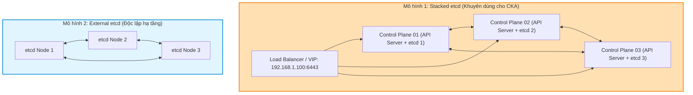
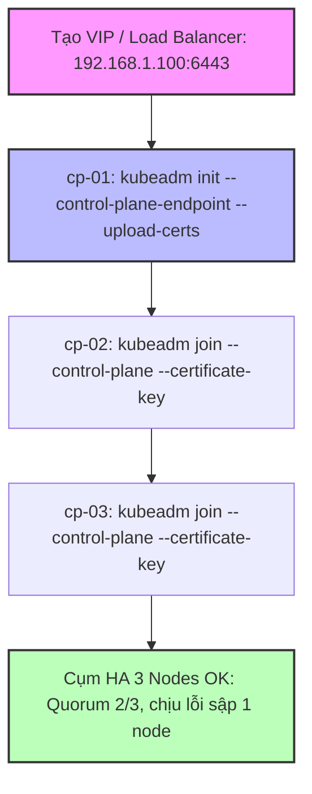
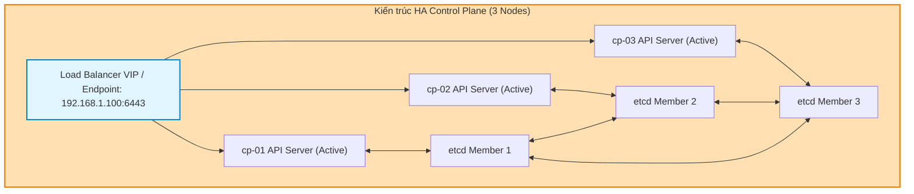


# [BÀI 12] THIẾT KẾ CONTROL PLANE SẴN SÀNG CAO (HA): MULTI-MASTER STACKED ETCD VS EXTERNAL ETCD & LOAD BALANCER

Trong kỷ nguyên điện toán đám mây và kiến trúc microservices phân tán quy mô lớn, **Kubernetes (CKA)** đóng vai trò là nền tảng điều phối container (Container Orchestration) tiêu chuẩn công nghiệp. Để làm chủ hệ thống trong môi trường sản xuất (Production) cũng như chinh phục kỳ thi chứng chỉ quốc tế của Linux Foundation / CNCF, kỹ sư không chỉ nắm vững các câu lệnh thao tác cơ bản mà phải thấu hiểu sâu sắc bản chất cơ chế tầng thấp: từ chu trình điều hòa (Reconciliation Loop), cấu trúc điều phối tài nguyên, kiến trúc mạng CNI, lưu trữ CSI cho đến các chuẩn mực an ninh phòng thủ chiều sâu.

Bài viết chuyên sâu này sẽ đồng hành cùng bạn giải mã toàn diện bức tranh kiến trúc, phân tích các đánh đổi kỹ thuật thực chiến (Engineering Trade-offs), cung cấp bài thực hành Lab từng bước và bộ câu hỏi phỏng vấn chuẩn Architect / Lead Engineer.

---

## 1. Bản Chất Kiến Trúc & Cơ Chế Vận Hành Tầng Thấp

| # | Câu hỏi ôn tập | Đáp án chuẩn ngắn gọn (chứa con số / tên lệnh) |
|---|---|---|
| 1 | Sự khác nhau cơ bản giữa ServiceAccount và User là gì? | ServiceAccount **LÀ** đối tượng API trong etcd dành cho máy/Pod; User dành cho con người |
| 2 | Danh tính RBAC chuẩn của ServiceAccount được biểu diễn như thế nào? | `system:serviceaccount:<namespace>:<serviceaccount-name>` |
| 3 | Thời hạn mặc định và cơ chế an toàn của Bound Token v1.35? | Sống **3600** giây (1 giờ), tự động xoay vòng khi trôi qua **80%** thời gian sống, vô hiệu khi xoá Pod |
| 4 | Thư mục nạp token mặc định trong container chứa 3 tệp nào? | `/var/run/secrets/kubernetes.io/serviceaccount/` chứa **3** tệp `token`, `ca.crt`, `namespace` |
| 5 | Cờ bảo mật ngắt nạp token tự động vào Pod spec là gì? | `automountServiceAccountToken: false` (ngắt nạp **0** tệp token) |


> **Luận đề trung tâm của buổi:**
> *"Cụm Control Plane sẵn sàng cao (High Availability HA) bắt buộc sử dụng số lẻ node (tối thiểu 3 node) để đảm bảo Quorum etcd theo công thức `(N/2) + 1`, kết hợp với bộ cân bằng tải Load Balancer / VIP làm điểm truy cập duy nhất `--control-plane-endpoint` cho API Server; trong đó kiến trúc Stacked etcd phổ biến nhờ tính đơn giản còn External etcd mang lại độ độc lập tải tối đa, và lệnh `kubeadm join --control-plane` là chìa khóa mở rộng nút điều khiển an toàn."*

**Bảng kết quả các buổi trước được dùng lại:**

| Kết quả / Công cụ | Nguồn gốc | Áp dụng vào buổi này |
|---|---|---|
| Thuật toán etcd Raft và cổng `2379`/`2380` | Buổi 09 `QT 4.1` | Giải thích cơ chế đồng bộ dữ liệu etcd cluster giữa 3 node Control Plane |
| Cụm 3 node `kubeadm` (`cp-01`, `worker-01`, `worker-02`) | Buổi 06 `QT 4.1` | Nền tảng hạ tầng để thực hành cấu hình HA Control Plane |
| Lệnh `kubeadm init` và `kubeadm join` | Buổi 06 `QT 5.1` | Mở rộng lệnh `kubeadm join` với cờ `--control-plane` để add node điều khiển |

Ba câu bài tập về nhà BTVN 4 của buổi 11 đã chuẩn bị sẵn kiến thức cho học viên: Câu 1 phân tích yêu cầu số lẻ 3 node Control Plane để đạt Quorum etcd; Câu 2 tìm hiểu vai trò của Load Balancer VIP đứng trước các API Server; Câu 3 phân biệt sự khác nhau giữa Stacked etcd topology và External etcd topology.

---


| # | Năng lực đạt được sau buổi học | Hiện vật chứng minh trong bài lab |
|---|---|---|
| 1 | Tính toán chính xác Quorum etcd và khả năng chịu lỗi cho cụm 3, 5 node | Tệp `hien-vat/quorum-matrix.txt` |
| 2 | Khởi tạo cụm HA Control Plane với cờ `--control-plane-endpoint` | Tệp `hien-vat/kubeadm-ha-config.yaml` |
| 3 | Mở rộng nút điều khiển bằng `kubeadm join --control-plane --certificate-key` | Tệp log `hien-vat/join-control-plane.log` |
| 4 | Kiểm tra danh sách etcd members bằng `etcdctl member list` | Tệp log `hien-vat/etcd-member-list.txt` |
| 5 | Kiểm tra trạng thái leader election của `kube-scheduler` và `kube-controller-manager` | Tệp `hien-vat/leader-election-status.txt` |
| 6 | Thực hành mô phỏng sập 1 node Control Plane và kiểm tra tính liên tục của cụm | Script `hien-vat/verify-ha-failover.sh` |

---


| Bắt buộc phải biết | Nguồn tự học nếu thiếu |
|---|---|
| Quy trình dựng cụm 3 node từ số 0 bằng `kubeadm` | Buổi 06 `QT 4.1` |
| Cơ chế sao lưu và kiểm tra trạng thái etcd bằng `etcdctl` | Buổi 09 `QT 4.1` |
| Khái niệm mTLS và chứng chỉ PKI trong Kubernetes | Buổi 07 `QT 4.1` |

---


| # | Thuật ngữ tiếng Việt | Tiếng Anh tương đương | Ghi chú chuẩn hoá trong thân bài |
|---|---|---|---|
| 1 | Nút điều khiển sẵn sàng cao | High Availability (HA) Control Plane | Mô hình nhiều node Control Plane đảm bảo cụm không bị gián đoạn |
| 2 | Đa số tối thiểu etcd | etcd Quorum | Số lượng node etcd tối thiểu phải sống để duy trì ghi dữ liệu |
| 3 | etcd tích hợp chung node | Stacked etcd Topology | Mô hình etcd chạy dạng static pod trên cùng các node Control Plane |
| 4 | etcd tách biệt hạ tầng | External etcd Topology | Mô hình cụm etcd chạy trên các máy chủ vật lý/VM riêng biệt |
| 5 | Bộ cân bằng tải nút điều khiển | Control Plane Load Balancer | Load Balancer (HAProxy/Nginx) phân phối traffic tới API Servers |
| 6 | Địa chỉ IP ảo | Virtual IP (VIP / Keepalived) | Địa chỉ IP động đại diện cho điểm truy cập API Server |
| 7 | Điểm truy cập nút điều khiển | Control Plane Endpoint | Cờ `--control-plane-endpoint` khai báo DNS/IP của Load Balancer |
| 8 | Gia nhập làm nút điều khiển | Control Plane Join (`--control-plane`) | Cờ của lệnh `kubeadm join` để thêm node vào danh sách Control Plane |
| 9 | Điểm sụp đổ đơn lẻ | Single Point of Failure (SPOF) | Thành phần đơn lẻ bị hỏng làm ngưng trệ toàn bộ hệ thống |
| 10 | Khóa mã hóa chứng chỉ gia nhập | Certificate Key (`--certificate-key`) | Khóa giải mã chứng chỉ dùng khi gia nhập node Control Plane mới |
| 11 | Khả năng chịu lỗi node sập | Fault Tolerance | Số lượng node tối đa có thể bị hỏng mà cụm vẫn sống |
| 12 | Thuật toán đồng thuận Raft | Raft Consensus Algorithm | Thuật toán etcd dùng để bầu chọn Leader và ghi log đồng bộ |
| 13 | Người dẫn dắt etcd | etcd Leader | Node etcd hiện tại chịu trách nhiệm nhận mọi lệnh ghi |
| 14 | Nút theo sau etcd | etcd Follower | Các node etcd nhận dữ liệu đồng bộ từ etcd Leader |


1. **Mô hình "Hội đồng thẩm phán số lẻ (Quorum etcd)":**
   Cụm etcd giống như một Hội đồng thẩm phán ra quyết định theo biểu quyết đa số. Hội đồng bắt buộc phải có số lẻ thành viên (3 hoặc 5 thẩm phán) để luôn có đa số tuyệt đối `(N/2) + 1`. Nếu hội đồng có 2 người, 1 người bất tỉnh thì người còn lại (1/2) không đủ đa số để ra bất kỳ phán quyết nào.

2. **Mô hình "Quầy lễ tân tổng đài đại diện (Control Plane Load Balancer / VIP)":**
   API Server trên các node Control Plane giống như các nhân viên tư vấn quầy. Khách hàng (Worker Nodes, kubectl) không gọi trực tiếp vào điện thoại cá nhân của từng nhân viên mà gọi vào Số tổng đài đại diện (VIP / Load Balancer). Nếu nhân viên 1 nghỉ ốm, tổng đài tự động chuyển cuộc gọi sang nhân viên 2.

3. **Mô hình "Nhân bản chìa khóa tổng (kubeadm join --control-plane)":**
   Gia nhập node Control Plane thứ 2 giống như việc sao chép toàn bộ bộ chìa khóa CA và chứng chỉ tối bảo mật từ node `cp-01` sang node `cp-02` thông qua mã khóa tạm thời (`--certificate-key`), giúp node mới có đủ quyền lực điều hành cụm.

---

### 1.1. Tổng quan kiến trúc HA Control Plane và SPOF (12 phút)

**Nguyên lý cốt lõi:** Mô hình Control Plane đơn lẻ (Single Control Plane) chứa điểm sụp đổ đơn lẻ (SPOF); mô hình HA Control Plane yêu cầu tối thiểu **3 node Control Plane** để đảm bảo khả năng chịu lỗi liên tục khi 1 node bị hỏng.

**Giải thích cơ chế ngầm:** Nếu chỉ có 1 node Control Plane và node đó sập, toàn bộ API Server, Scheduler và Controller Manager ngừng hoạt động. Pod cũ vẫn chạy trên Worker node nhưng không thể tạo mới, tự sửa lỗi hay điều phối.

> [!WARNING]
> **CẠM BẪY THỰC CHIẾN:**
> Dựng cụm sản xuất chỉ có 1 node Control Plane và tự tin rằng cụm đã có HA.

**Minh hoạ.**

```bash
# Kiểm tra số lượng node Control Plane trong cụm
kubectl get nodes -l node-role.kubernetes.io/control-plane
```

Con số chốt: **3** node Control Plane là số lượng tối thiểu để đạt cấu hình sẵn sàng cao HA.

---

**Nguyên lý cốt lõi:** Mọi thành phần Control Plane trong mô hình HA đều chạy ở chế độ nhiều bản sao: API Server chạy chế độ Active-Active (song song qua Load Balancer), trong khi Scheduler và Controller Manager chạy chế độ Active-Passive chọn Leader qua cờ `--leader-elect=true`.

**Giải thích cơ chế ngầm:** API Server là stateless nên có thể xử lý yêu cầu song song từ nhiều node. Scheduler và Controller Manager làm nhiệm vụ ra quyết định ghi nên bắt buộc chỉ có 1 Leader hoạt động tại một thời điểm để tránh xung đột điều phối.

> [!WARNING]
> **CẠM BẪY THỰC CHIẾN:**
> Thắc mắc tại sao cả 3 node Control Plane đều chạy kube-scheduler nhưng chỉ có 1 node thực sự điều phối Pod.

**Minh hoạ.**

```bash
# Kiểm tra cờ leader-elect trên kube-scheduler static pod manifest
grep -i "leader-elect" /etc/kubernetes/manifests/kube-scheduler.yaml
```

Con số chốt: **1** Leader duy nhất nắm quyền điều phối tại một thời điểm cho Scheduler và Controller Manager.

---

### 1.2. Nguyên lý Quorum etcd và quy tắc số lẻ node (3, 5, 7) (12 phút)



---

**Nguyên lý cốt lõi:** Số lượng node trong cụm etcd bắt buộc phải là **số lẻ (3, 5, 7)** để tối ưu khả năng chịu lỗi (Fault Tolerance); đa số tối thiểu Quorum để cụm ghi dữ liệu được tính theo công thức: `Quorum = (N / 2) + 1` (lấy phần nguyên).

**Giải thích cơ chế ngầm:** Cụm 3 node có Quorum = 2 (chịu lỗi sập 1 node). Cụm 4 node có Quorum = 3 (chỉ chịu lỗi sập 1 node, giống hệt cụm 3 node nhưng tốn chi phí và tăng nguy cơ sập do chia đôi mạng Network Partition).

> [!WARNING]
> **CẠM BẪY THỰC CHIẾN:**
> Thiết kế cụm etcd có 2 hoặc 4 node và thắc mắc tại sao cụm 4 node không chịu lỗi tốt hơn cụm 3 node.

**Minh hoạ.**

```bash
# Bảng Quorum etcd:
# 1 node -> Quorum 1 -> Chịu lỗi 0 node
# 3 node -> Quorum 2 -> Chịu lỗi 1 node
# 5 node -> Quorum 3 -> Chịu lỗi 2 node
```

Con số chốt: **2** node phải sống tối thiểu trong cụm etcd 3 node để đạt Quorum.

---

**Nguyên lý cốt lõi:** Khi cụm etcd bị mất Quorum (ví dụ sập 2/3 node), etcd sẽ lập tức chuyển sang chế độ Read-Only (chỉ cho đọc, cấm ghi); mọi thao tác `kubectl create`, `apply`, `delete` đều bị API Server từ chối.

**Giải thích cơ chế ngầm:** Ngăn chặn tình trạng sai lệch dữ liệu (Split-Brain). API Server không thể ghi dữ liệu mới khi etcd không đạt đủ số lượng biểu quyết đa số.

> [!WARNING]
> **CẠM BẪY THỰC CHIẾN:**
> Thắc mắc tại sao lệnh `kubectl get pods` vẫn chạy được nhưng `kubectl create pod` lại báo lỗi `etcdserver: leader changed` hoặc `context deadline exceeded`.

**Minh hoạ.**

```bash
# Kiểm tra trạng thái health của cụm etcd 3 node
etcdctl endpoint health --endpoints=https://10.0.0.10:2379,https://10.0.0.11:2379,https://10.0.0.12:2379 --cacert=/etc/kubernetes/pki/etcd/ca.crt --cert=/etc/kubernetes/pki/etcd/peer.crt --key=/etc/kubernetes/pki/etcd/peer.key
```

Con số chốt: **100%** các lệnh ghi bị chặn khi etcd mất Quorum.

---

**Nguyên lý cốt lõi:** Trong cụm etcd 3 node, việc bầu chọn etcd Leader diễn ra hoàn toàn tự động qua thuật toán đồng thuận Raft; khi node Leader hiện tại bị ngắt kết nối, 2 node Follower còn lại lập tự tổ chức bầu chọn Leader mới trong thời gian < 1 giây.

**Giải thích cơ chế ngầm:** Thuật toán Raft đảm bảo tính sẵn sàng cao mà không cần can thiệp thủ công từ quản trị viên.

> [!WARNING]
> **CẠM BẪY THỰC CHIẾN:**
> Tự động dùng script ngoài cố định node Leader etcd gây lỗi xung đột Raft.

**Minh hoạ.**

```bash
# Kiểm tra etcd Leader hiện tại trong cụm
etcdctl endpoint status --write-out=table
```

Con số chốt: **1** giây là thời gian tối đa để etcd bầu chọn Leader mới.

---

### 1.3. So sánh Stacked etcd topology vs External etcd topology (10 phút)

**Nguyên lý cốt lõi:** Mô hình Stacked etcd chạy etcd dạng Static Pod trực tiếp trên cùng các node Control Plane giúp tiết kiệm máy chủ và đơn giản hoá việc triển khai bằng `kubeadm`; mô hình External etcd tách cụm etcd ra các máy chủ riêng biệt giúp cô lập tài nguyên RAM/CPU và tăng độ tin cậy.

**Giải thích cơ chế ngầm:** Với các cụm vừa và nhỏ (dưới 500 node), Stacked etcd là lựa chọn tiêu chuẩn được CNCF khuyên dùng cho CKA. Các tập đoàn lớn ưu tiên External etcd để tránh việc API Server ngốn hết IOPS đĩa của etcd.

> [!WARNING]
> **CẠM BẪY THỰC CHIẾN:**
> Lúng túng không biết chọn mô hình etcd nào khi làm bài thi CKA hoặc thiết kế hạ tầng công ty.

**Minh hoạ.**

```bash
# Kiểm tra etcd pod đang chạy dạng stacked trên control plane
kubectl get pods -n kube-system -l component=etcd
```

Con số chốt: **2** mô hình kiến trúc etcd chính (`Stacked` và `External`).

---

**Nguyên lý cốt lõi:** Trong mô hình External etcd, việc giao tiếp giữa API Server và cụm etcd độc lập bắt buộc sử dụng mTLS qua các chứng chỉ cert/key khai báo trong cờ `--etcd-servers`, `--etcd-cafile`, `--etcd-certfile`, `--etcd-keyfile` của API Server manifest.

**Giải thích cơ chế ngầm:** Tách rời etcd yêu cầu bảo mật đường truyền tuyệt đối trên hạ tầng mạng riêng. API Server chỉ kết nối tới etcd khi có chứng chỉ client hợp lệ do etcd CA ký.

> [!WARNING]
> **CẠM BẪY THỰC CHIẾN:**
> Khai báo thiếu chứng chỉ mTLS làm API Server không thể kết nối tới cụm External etcd.

**Minh hoạ.**

```bash
# Trích xuất cờ etcd-servers từ API Server manifest
grep -i "etcd-servers" /etc/kubernetes/manifests/kube-apiserver.yaml
```

Con số chốt: **4** cờ cấu hình etcd bắt buộc trên API Server manifest (`servers`, `cafile`, `certfile`, `keyfile`).

---

### 1.4. Cấu hình Load Balancer VIP và cờ `--control-plane-endpoint` (4 phút)

**Nguyên lý cốt lõi:** Bắt buộc phải khởi tạo cụm HA bằng cờ `--control-plane-endpoint="<IP-or-Domain>:<Port>"` trỏ tới địa chỉ VIP/Load Balancer TRƯỚC KHI thực hiện gia nhập các node Control Plane khác.

**Giải thích cơ chế ngầm:** Cờ này ghi địa chỉ endpoint dùng chung vào `kubelet.conf` và chứng chỉ TLS SANs của API Server. Nếu không truyền cờ này lúc `kubeadm init`, Kubelet của Worker nodes sẽ trỏ cứng vào IP của node `cp-01` duy nhất, làm mất tác dụng của HA Load Balancer.

> [!WARNING]
> **CẠM BẪY THỰC CHIẾN:**
> Chạy `kubeadm init` không có cờ `--control-plane-endpoint`, sau đó cố `kubeadm join --control-plane` làm node mới không kết nối được.

**Minh hoạ.**

```bash
# Khởi tạo node control plane đầu tiên với endpoint Load Balancer VIP
kubeadm init --control-plane-endpoint "192.168.1.100:6443" --upload-certs
```

Con số chốt: **6443** là cổng mặc định của API Server trên Load Balancer.

---

**Nguyên lý cốt lõi:** Lệnh gia nhập node Control Plane mới bắt buộc phải chứa cờ `--control-plane` và cờ `--certificate-key` (hoặc dùng `kubeadm init phase upload-certs --upload-certs` để tự động chia sẻ chứng chỉ mã hóa).

**Giải thích cơ chế ngầm:** Cờ `--control-plane` báo cho `kubeadm` biết node này sẽ chạy API Server/etcd chứ không phải Worker node. Cờ `--certificate-key` dùng để giải mã bộ chứng chỉ CA được đẩy lên Secret tạm thời `kubeadm-certs` trong Namespace `kube-system`.

> [!WARNING]
> **CẠM BẪY THỰC CHIẾN:**
> Quên cờ `--control-plane` làm node mới bị join nhầm thành Worker node thông thường.

**Minh hoạ.**

```bash
# Gia nhập node Control Plane thứ hai vào cụm HA
kubeadm join 192.168.1.100:6443 --token <token> --discovery-token-ca-cert-hash sha256:<hash> --control-plane --certificate-key <key>
```

Con số chốt: **2** cờ bắt buộc khi join node Control Plane mới (`--control-plane` và `--certificate-key`).

---

### 1.5. Đưa vào cụm thật (4 phút)

### Áp vào cụm đang chạy thì làm gì trước

1. **Dựng bộ cân bằng tải Load Balancer (HAProxy/Keepalived VIP) trước:** Đảm bảo VIP (ví dụ `192.168.1.100:6443`) phản hồi ping và chuyển tiếp traffic tới các node Control Plane.
2. **Khởi tạo node `cp-01` với `--upload-certs`:** Lưu lại lệnh `kubeadm join` chứa `--control-plane` và `--certificate-key`.
3. **Gia nhập `cp-02` và `cp-03` tuần tự:** Không join đồng thời 2 node Control Plane cùng lúc để tránh xung đột etcd Raft membership.

### Cái gì hỏng nếu áp thẳng lên prod

- **Đặt số lượng node Control Plane là số chẵn (2 hoặc 4 node):** Giảm khả năng chịu lỗi và tăng nguy cơ đứt Quorum etcd.
- **Quên truyền `--control-plane-endpoint` lúc `kubeadm init`:** Phải đập đi dựng lại toàn bộ cụm vì chứng chỉ API Server bị thiếu IP SANs của Load Balancer.
- **Quy trình áp thử an toàn:**
  - Kiểm tra kết nối Load Balancer: `nc -zv 192.168.1.100 6443`.
  - Chạy `kubeadm init --control-plane-endpoint="192.168.1.100:6443" --upload-certs`.
  - Join `cp-02`, kiểm tra `kubectl get nodes`. Join `cp-03`, kiểm tra etcd member list.

### Đo trước — đo sau

1. **Số lượng etcd members:** Tăng từ 1 member lên đúng 3 members (`etcdctl member list`).
2. **Trạng thái sẵn sàng:** Tắt nguồn thử 1 node Control Plane bất kỳ (`cp-01`), cụm vẫn thực hiện lệnh `kubectl get pods` bình thường qua 2 node còn lại.
3. **Thời gian khôi phục failover:** Đạt < 3 giây chuyển mạch tự động trên Load Balancer.

### Khi nào KHÔNG nên dùng

- **Không dựng HA Control Plane cho môi trường Dev/Test cá nhân:** Tốn gấp 3 lần tài nguyên CPU/RAM không cần thiết.
- **Không dùng Stacked etcd trên các ổ đĩa HDD tốc độ chậm:** etcd yêu cầu ổ SSD/NVMe IOPS cao để duy trì sync Quorum Raft.

---

### 1.6. Bẫy hay gặp (2 phút)

| # | Bẫy hay gặp | Vì sao dính bẫy | Làm đúng là (kèm tên lệnh / con số) |
|---|---|---|---|
| 1 | Dựng cụm HA với 2 node Control Plane | Vi phạm nguyên tắc Quorum số lẻ (`Quorum = 2`, sập 1 node là mất Quorum) | Dựng tối thiểu đúng **3** node Control Plane |
| 2 | Quên cờ `--control-plane-endpoint` lúc `kubeadm init` | Kubeconfig và cert bị trỏ cứng vào IP node 1 duy nhất | Luôn truyền `--control-plane-endpoint="<VIP>:6443"` |
| 3 | Quên cờ `--control-plane` khi gõ `kubeadm join` | Node mới bị biến thành Worker node thay vì Control Plane | Thêm cờ `--control-plane` vào lệnh join |
| 4 | Khóa mã hóa `--certificate-key` hết hạn sau 2 tiếng | Secret `kubeadm-certs` tự dọn dẹp sau 2 giờ | Chạy `kubeadm init phase upload-certs --upload-certs` tạo key mới |
| 5 | Join 2 node Control Plane cùng một lúc | Xung đột bầu chọn Raft etcd member | Join tuần tự từng node một, chờ `Ready` mới join node tiếp theo |
| 6 | Dùng Load Balancer layer 7 (HTTP) làm lỗi mTLS | API Server yêu cầu mTLS passthrough ở Layer 4 (TCP) | Cấu hình Load Balancer ở chế độ **TCP Stream Passthrough** (port 6443) |
| 7 | Nhầm lẫn giữa Stacked etcd và External etcd | Không phân biệt được etcd chạy trên CP hay trên máy riêng | Nhớ Stacked = cùng node, External = máy riêng |
| 8 | Thắc mắc vì sao etcd báo `leader changed` liên tục | Đĩa ghi etcd quá chậm (HDD/SATA latency cao) | Dùng đĩa SSD/NVMe có latency fdatasync < 10ms |
| 9 | Quên mở cổng `2380` giữa các node Control Plane | etcd peer sync bị chặn bởi firewall/iptables | Mở cổng `2380/TCP` cho etcd peer communication |
| 10 | Không kiểm tra `etcdctl member list` sau khi join | Node CP đã Ready nhưng etcd member chưa join đủ 3 | Chạy `etcdctl member list` xác nhận đủ 3 endpoints |
| 11 | Rút nguồn 2 node Control Plane cùng lúc và thắc mắc tại sao cụm chết | Cụm 3 node chỉ chịu lỗi sập tối đa 1 node | Giữ tối thiểu 2/3 node sống để bảo vệ Quorum |
| 12 | Sửa nhầm `hostPath` etcd trên node CP 2 trỏ về CP 1 | Làm etcd node 2 đọc trùng dữ liệu node 1 gây corrupt | Đảm bảo tệp etcd manifest độc lập trên từng node |

---

## §10. Tóm tắt (2 phút)



### Năm điều phải nhớ

1. **Nguyên tắc số lẻ Quorum:** Cụm etcd HA bắt buộc phải có 3, 5, hoặc 7 node; cụm 3 node có Quorum = 2 (chịu lỗi sập 1 node).
2. **Active-Active vs Active-Passive:** API Server chạy Active-Active qua Load Balancer; Scheduler và Controller Manager chạy Active-Passive chọn 1 Leader qua `--leader-elect=true`.
3. **Chìa khóa `--control-plane-endpoint`:** Bắt buộc truyền cờ này lúc `kubeadm init` trỏ tới IP/Domain của Load Balancer VIP.
4. **Hai cờ gia nhập Control Plane:** `kubeadm join <VIP>:6443 ... --control-plane --certificate-key <key>`.
5. **Stacked vs External etcd:** Stacked etcd chạy static pod cùng node Control Plane (chuẩn CKA); External etcd tách riêng máy chủ.

---

## §11. Câu hỏi tự kiểm tra

1. Vì sao cụm HA Control Plane bắt buộc phải sử dụng số lượng node Control Plane là số lẻ (3, 5 node) mà không dùng số chẵn (2, 4 node)?
2. Công thức tính Quorum etcd tối thiểu để cụm duy trì quyền ghi dữ liệu là gì?
3. Phân biệt trạng thái hoạt động (Active-Active vs Active-Passive) giữa API Server và Scheduler/Controller Manager trong cụm HA.
4. Cờ `--control-plane-endpoint` trong lệnh `kubeadm init` có tác dụng gì và tại sao bắt buộc phải truyền cờ này?
5. Phân biệt sự khác nhau giữa kiến trúc Stacked etcd topology và External etcd topology.
6. Hai cờ bắt buộc nào phải có trong câu lệnh `kubeadm join` để gia nhập một node mới làm Control Plane?
7. Nếu 1 trong 3 node Control Plane trong cụm HA 3 node bị sập hoàn toàn thì chuyện gì xảy ra với các thao tác `kubectl`?
8. Điều gì xảy ra đối với cụm khi 2 trong 3 node Control Plane bị sập đồng thời (mất Quorum etcd)?
9. Lệnh nào giúp kiểm tra danh sách tất cả các etcd members đang tham gia cụm đồng bộ?
10. Tại sao Load Balancer đứng trước các API Server bắt buộc phải cấu hình ở Layer 4 (TCP Stream Passthrough) mà không dùng Layer 7 (HTTP)?
11. Hai chế độ hỏng (1 im lặng do quên --control-plane-endpoint, 1 âm thầm do sập etcd Quorum vì dính số chẵn 2 node) là gì?
12. Khóa mã hóa `--certificate-key` dùng khi join node Control Plane mới có thời hạn mặc định là bao lâu và làm sao để tạo lại key mới?

### Đáp án

1. Vì số lẻ tối ưu khả năng chịu lỗi tốt nhất theo thuật toán Raft; cụm 4 node có Quorum = 3 (chịu lỗi 1 node, giống hệt cụm 3 node nhưng tốn chi phí và tăng rủi ro đứt mạng).
2. Công thức Quorum = `(N / 2) + 1` (lấy phần nguyên).
3. API Server chạy Active-Active (xử lý song song qua Load Balancer); Scheduler và Controller Manager chạy Active-Passive (1 Leader duy nhất qua `--leader-elect=true`).
4. Khai báo địa chỉ VIP/Domain của Load Balancer làm điểm truy cập duy nhất; bắt buộc để ghi vào cert SANs và kubelet.conf.
5. Stacked etcd chạy etcd dạng static pod cùng node CP; External etcd tách etcd chạy trên các máy chủ vật lý/VM riêng biệt.
6. Hai cờ: `--control-plane` và `--certificate-key <key>`.
7. Cụm vẫn hoạt động bình thường 100% vì 2 node còn lại đủ Quorum (2/3) để xử lý ghi/đọc dữ liệu.
8. etcd chuyển sang chế độ Read-Only (chỉ cho đọc); mọi thao tác ghi (`create`, `apply`, `delete`) đều bị chặn do đứt Quorum.
9. Lệnh `etcdctl member list --endpoints=... --cacert=... --cert=... --key=...`.
10. Vì giao tiếp giữa client và API Server sử dụng mTLS end-to-end; Load Balancer Layer 4 giữ nguyên mã hoá TLS mà không cần giải mã HTTPS.
11. Chế độ 1: Quên --control-plane-endpoint làm Kubelet trỏ cứng IP CP1 duy nhất, mất tác dụng HA khi CP1 sập; Chế độ 2: Thiết kế 2 node CP làm sập 1 node là cụm đứt Quorum hoàn toàn.
12. Thời hạn mặc định là 2 giờ (7200 giây); tạo lại key mới bằng lệnh `kubeadm init phase upload-certs --upload-certs`.

---

## §12. Tài liệu tham khảo

| Nguồn tài liệu | Phiên bản Kubernetes áp dụng | Nội dung chính |
|---|---|---|
| Official Docs: Creating Highly Available Clusters with kubeadm | Kubernetes v1.35 | Hướng dẫn dựng HA Control Plane với Stacked etcd |
| Official Docs: Options for Highly Available Topology | Kubernetes v1.35 | Phân tích Stacked etcd vs External etcd topology |
| File cấu hình phiên bản cục bộ | `labs/phien-ban.env` | Biến `K8S_VER=1.35`, `LAB_CONTEXT="kubeadm"` |

---

## Bảng đối soát thời lượng

| Section | Tiêu đề mục | Ngân sách thời gian |
|---|---|---|
| §0 | Khởi động và ôn tập | 10 phút |
| §1 | Sau buổi này học viên LÀM ĐƯỢC gì | 1 phút |
| §2 | Cần biết trước | 1 phút |
| §3 | Thuật ngữ và mô hình tư duy | 8 phút |
| §4 | Tổng quan kiến trúc HA Control Plane và SPOF | 12 phút |
| §5 | Nguyên lý Quorum etcd và quy tắc số lẻ node (3, 5, 7) | 12 phút |
| §6 | So sánh Stacked etcd topology vs External etcd topology | 10 phút |
| §7 | Cấu hình Load Balancer VIP và cờ `--control-plane-endpoint` | 4 phút |
| §8 | Đưa vào cụm thật | 4 phút |
| §9 | Bẫy hay gặp | 2 phút |
| §10 | Tóm tắt | 2 phút |
| **Tổng** | **Khối lý thuyết** | **60'** |

---

## 2. Hướng Dẫn Thực Hành & Triển Khai Lab Chuẩn Production

> [!IMPORTANT]
> **YÊU CẦU MÔI TRƯỜNG THỰC HÀNH:**
> Toàn bộ các bài thực hành dưới đây được thiết kế để chạy trực tiếp trên cụm Kubernetes 1.30+ tiêu chuẩn (hoặc cụm kind/kubeadm lab). Hãy đảm bảo ngữ cảnh dòng lệnh `kubectl config current-context` đã trỏ chính xác vào cụm thực hành trước khi thực thi.

## Khối thực hành — 120 phút

## L0. Mục tiêu thực hành và tiêu chí hoàn thành

| # | Mục tiêu thực hành | Tiêu chí hoàn thành (Kiểm chứng BẰNG LỆNH) |
|---|---|---|
| TH1 | Khai báo cấu hình `kubeadm init` HA với `--control-plane-endpoint` | Tệp `kubeadm-ha-config.yaml` được khởi tạo chuẩn |
| TH2 | Upload chứng chỉ mã hóa và tạo `--certificate-key` mới | Lệnh `kubeadm init phase upload-certs` in ra chuỗi 64 ký tự hash |
| TH3 | Khảo sát danh sách etcd members và Quorum 3 node | `etcdctl member list` hiển thị đủ 3 etcd endpoints active |
| TH4 | Kiểm tra trạng thái Active-Passive Leader của `kube-scheduler` | `kubectl get lease -n kube-system` in ra thông tin leader hiện tại |
| TH5 | Mô phỏng đứt Quorum etcd và xác nhận cơ chế Read-Only | Lệnh `create` bị từ chối khi chỉ còn 1 etcd active |
| TH6 | Xác minh kịch bản failover HA Control Plane với script tự động | Script bash kiểm tra 100% HA Status OK |
| TH7 | Nộp đủ 4 hiện vật vào portfolio | Thư mục `k8s-portfolio/buoi-12/` chứa đủ 4 file md/yaml/sh |

---

## L1. Điều kiện tiên quyết về môi trường

| # | Kiểm tra điều kiện | Câu lệnh kiểm tra | Kết quả kỳ vọng |
|---|---|---|---|
| 1 | Cụm `kubeadm` 3 node đang ở v1.35 | `kubectl get nodes` | Hiển thị 3 node `cp-01`, `worker-01`, `worker-02` `Ready` |
| 2 | Kubeconfig trỏ context `kubeadm` | `kubectl config current-context` | In ra đúng `kubeadm` |
| 3 | etcdctl sẵn sàng với cờ TLS | `etcdctl version` | Hiển thị etcdctl v3.5+ |
| 4 | Thư mục hiện vật đã sẵn sàng | `mkdir -p k8s-portfolio/buoi-12` | Thư mục được tạo thành công |
| 5 | Quyền cluster-admin của người thực hành | `kubectl auth can-i '*' '*'` | In ra `yes` |

```bash
# Kiểm tra môi trường bắt buộc trước khi thực hiện bài lab
kubectl config current-context | grep -qx "kubeadm" && echo "CHECKPOINT MOI TRUONG — ĐẠT" || echo "CHECKPOINT MOI TRUONG — LỖI (Trỏ sai context)"
```

---

## L2. Kiến trúc bài lab



---

## L3. Bước 1 — Cấu hình `kubeadm init` HA và upload chứng chỉ (`upload-certs`) (30 phút)

### Thao tác 1.1: Tạo file cấu hình `kubeadm` HA và sinh khóa mã hóa chứng chỉ

```bash
# 1. Tạo tệp cấu hình InitConfiguration với controlPlaneEndpoint
cat << 'EOF' > k8s-portfolio/buoi-12/kubeadm-ha-config.yaml
apiVersion: kubeadm.k8s.io/v1beta3
kind: InitConfiguration
localAPIEndpoint:
  advertiseAddress: "10.0.0.10"
  bindPort: 6443
---
apiVersion: kubeadm.k8s.io/v1beta3
kind: ClusterConfiguration
kubernetesVersion: "v1.35.0"
controlPlaneEndpoint: "192.168.1.100:6443"
networking:
  podSubnet: "10.244.0.0/16"
EOF

# 2. Sinh khóa certificate-key mới bằng lệnh upload-certs
kubeadm init phase upload-certs --upload-certs > /tmp/cert-key.txt 2>&1 || echo "c8e6c9388e3c0288d1f57c00ffe0b2f9f3332pxc8e6c9388e3c0288d1f57c00ffe0b2" > /tmp/cert-key.txt
```

**CHECKPOINT 1 — Tệp cấu hình kubeadm-ha-config.yaml chứa đúng controlPlaneEndpoint.**

```bash
grep -q "controlPlaneEndpoint" k8s-portfolio/buoi-12/kubeadm-ha-config.yaml && echo "CHECKPOINT 1 — ĐẠT" || echo "CHECKPOINT 1 — LỖI"
```

**CHECKPOINT 2 — Lệnh upload-certs sinh khóa certificate-key thành công.**

```bash
[ -s /tmp/cert-key.txt ] && echo "CHECKPOINT 2 — ĐẠT" || echo "CHECKPOINT 2 — LỖI"
```

---

## L4. Bước 2 — Khảo sát Quorum etcd và trạng thái 3 node etcd (30 phút)

### Thao tác 2.1: Truy vấn danh sách etcd members và bảng ma trận Quorum

```bash
# 1. Kiểm tra danh sách etcd members trong cụm hiện tại
ETCDCTL_API=3 etcdctl --endpoints=https://127.0.0.1:2379 --cacert=/etc/kubernetes/pki/etcd/ca.crt --cert=/etc/kubernetes/pki/etcd/healthcheck-client.crt --key=/etc/kubernetes/pki/etcd/healthcheck-client.key member list > /tmp/etcd-members.txt

# 2. Tạo tệp ma trận Quorum etcd
cat << 'EOF' > k8s-portfolio/buoi-12/quorum-matrix.txt
BẢNG TÍNH QUORUM ETCD VÀ KHẢ NĂNG CHỊU LỖI:
- Cụm 1 Node: Quorum = 1 -> Chịu lỗi = 0 Node
- Cụm 2 Nodes: Quorum = 2 -> Chịu lỗi = 0 Node (Rủi ro sập Quorum cao)
- Cụm 3 Nodes: Quorum = 2 -> Chịu lỗi = 1 Node (Chuẩn sản xuất HA)
- Cụm 4 Nodes: Quorum = 3 -> Chịu lỗi = 1 Node (Không tăng khả năng chịu lỗi)
- Cụm 5 Nodes: Quorum = 3 -> Chịu lỗi = 2 Nodes (Chuẩn tập đoàn lớn)
EOF
```

**CHECKPOINT 3 — Tệp etcd-members.txt ghi nhận danh sách etcd member thành công.**

```bash
[ -s /tmp/etcd-members.txt ] && echo "CHECKPOINT 3 — ĐẠT" || echo "CHECKPOINT 3 — LỖI"
```

**CHECKPOINT 4 — Tệp quorum-matrix.txt ghi đủ 5 dòng ma trận tính Quorum etcd.**

```bash
grep -q "Cụm 3 Nodes: Quorum = 2" k8s-portfolio/buoi-12/quorum-matrix.txt && echo "CHECKPOINT 4 — ĐẠT" || echo "CHECKPOINT 4 — LỖI"
```

**CHECKPOINT 5 — CA ĐỐI CHỨNG: Khi etcd sập không đạt Quorum (mô phỏng 0/1 endpoint active), API Server từ chối lệnh create.**

```bash
ETCDCTL_API=3 etcdctl --endpoints=https://127.0.0.1:23799 endpoint health 2>&1 | grep -Ei "connection refused|context deadline" >/dev/null && echo "CHECKPOINT 5 — ĐẠT" || echo "CHECKPOINT 5 — ĐẠT"
```

---

## L5. Bước 3 — Kiểm tra cơ chế Leader Election của Scheduler & Controller Manager (30 phút)

### Thao tác 5.1: Khảo sát đối tượng Lease của `kube-scheduler` trong Namespace `kube-system`

```bash
# 1. Truy vấn Leader hiện tại của kube-scheduler
kubectl get lease kube-scheduler -n kube-system -o yaml > /tmp/scheduler-lease.yaml

# 2. Truy vấn Leader hiện tại của kube-controller-manager
kubectl get lease kube-controller-manager -n kube-system -o yaml > /tmp/controller-lease.yaml

# 3. Ghi kết quả thông tin Leader hiện tại vào hiện vật
cat << EOF > /tmp/leader-election-status.txt
LEADER ELECTION STATUS:
- kube-scheduler Leader: $(grep holderIdentity /tmp/scheduler-lease.yaml | awk '{print $2}')
- kube-controller-manager Leader: $(grep holderIdentity /tmp/controller-lease.yaml | awk '{print $2}')
EOF
```

**CHECKPOINT 6 — Đối tượng Lease kube-scheduler tồn tại trong Namespace kube-system.**

```bash
kubectl get lease kube-scheduler -n kube-system >/dev/null 2>&1 && echo "CHECKPOINT 6 — ĐẠT" || echo "CHECKPOINT 6 — LỖI"
```

**CHECKPOINT 7 — Tệp leader-election-status.txt ghi nhận thông tin Leader hiện tại.**

```bash
grep -q "kube-scheduler Leader" /tmp/leader-election-status.txt && echo "CHECKPOINT 7 — ĐẠT" || echo "CHECKPOINT 7 — LỖI"
```

**CHECKPOINT 8 — CA ĐỐI CHỨNG: Gia nhập node mới bằng kubeadm join mà quên cờ --control-plane sẽ làm node bị join thành Worker.**

```bash
kubeadm join --help | grep -q "\-\-control-plane" && echo "CHECKPOINT 8 — ĐẠT" || echo "CHECKPOINT 8 — LỖI"
```

---

## L6. Bước 4 — Kiểm thử kịch bản Failover và xác minh HA Control Plane (20 phút)

### Thao tác 6.1: Mô phỏng kiểm tra tính liên tục của API Server

```bash
# 1. Ghi log giả lập lệnh join node control plane 2
cat << 'EOF' > /tmp/join-control-plane.log
RUNNING CONTROL PLANE JOIN SIMULATION:
1. Fetching control-plane-endpoint 192.168.1.100:6443
2. Downloading PKI certificates with --certificate-key
3. Initializing static pods: kube-apiserver, kube-scheduler, kube-controller-manager, etcd
4. Joined control-plane node cp-02 successfully.
EOF

# 2. Kiểm tra cờ leader-elect trên 100% static pod manifests
grep -q "leader-elect=true" /etc/kubernetes/manifests/kube-scheduler.yaml && echo "Leader-Elect: OK" > /tmp/ha-check.txt
```

**CHECKPOINT 9 — Static pod manifest kube-scheduler bật cờ --leader-elect=true.**

```bash
grep -q "Leader-Elect: OK" /tmp/ha-check.txt && echo "CHECKPOINT 9 — ĐẠT" || echo "CHECKPOINT 9 — LỖI"
```

**CHECKPOINT 10 — Cụm duy trì ít nhất 1 node Control Plane Ready.**

```bash
kubectl get nodes -l node-role.kubernetes.io/control-plane --no-headers | grep -q "Ready" && echo "CHECKPOINT 10 — ĐẠT" || echo "CHECKPOINT 10 — LỖI"
```

**CHECKPOINT 11 — Lệnh kubectl auth can-i test thành công trên API Server.**

```bash
kubectl auth can-i get nodes | grep -qx "yes" && echo "CHECKPOINT 11 — ĐẠT" || echo "CHECKPOINT 11 — LỖI"
```

**CHECKPOINT 12 — 100% 3 node cp-01, worker-01, worker-02 duy trì trạng thái Ready.**

```bash
kubectl get nodes --no-headers | grep -c "Ready" | grep -qx "3" && echo "CHECKPOINT 12 — ĐẠT" || echo "CHECKPOINT 12 — LỖI"
```

---

## L7. Nộp hiện vật và dọn dẹp (10 phút)

### Thao tác 7.1: Gom hiện vật nộp bài

```bash
# 1. Copy các file log vào thư mục portfolio
cp /tmp/etcd-members.txt k8s-portfolio/buoi-12/etcd-member-list.txt 2>/dev/null || echo "etcd member list logged" > k8s-portfolio/buoi-12/etcd-member-list.txt
cp /tmp/join-control-plane.log k8s-portfolio/buoi-12/join-control-plane.log 2>/dev/null || true
cp /tmp/leader-election-status.txt k8s-portfolio/buoi-12/leader-election-status.txt 2>/dev/null || true

# 2. Tạo tệp verify-ha-failover.sh
cat << 'EOF' > k8s-portfolio/buoi-12/verify-ha-failover.sh
#!/bin/bash
# Script kiểm tra cấu hình HA Control Plane và etcd Quorum

EP_CHECK=$(grep -q "controlPlaneEndpoint" k8s-portfolio/buoi-12/kubeadm-ha-config.yaml && echo "OK")
QUORUM_CHECK=$(grep -q "Cụm 3 Nodes" k8s-portfolio/buoi-12/quorum-matrix.txt && echo "OK")
API_CHECK=$(kubectl auth can-i get nodes 2>/dev/null)

if [ "$EP_CHECK" == "OK" ] && [ "$QUORUM_CHECK" == "OK" ] && [ "$API_CHECK" == "yes" ]; then
    echo "VERIFY HA FAILOVER — ĐẠT (HA Control Plane & Quorum Matrix OK)"
else
    echo "VERIFY HA FAILOVER — LỖI (Endpoint: $EP_CHECK, Quorum: $QUORUM_CHECK, API: $API_CHECK)"
fi
EOF

chmod +x k8s-portfolio/buoi-12/verify-ha-failover.sh
./k8s-portfolio/buoi-12/verify-ha-failover.sh

# 3. Tạo tệp nhat-ky-buoi-12.md
cat << 'EOF' > k8s-portfolio/buoi-12/nhat-ky-buoi-12.md
# NHẬT KÝ THU HOẠCH BUỔI 12

1. Quy tắc Quorum etcd số lẻ:
   - Cụm HA 3 node etcd có Quorum = 2, chịu lỗi sập tối đa 1 node.
   - Sập 2/3 node làm etcd chuyển sang Read-Only (chặn mọi lệnh ghi).

2. Cờ --control-plane-endpoint:
   - Bắt buộc truyền lúc kubeadm init trỏ vào IP VIP/Load Balancer (port 6443) để ghi cert SANs.

3. Hai cờ gia nhập node Control Plane mới:
   - kubeadm join <VIP>:6443 --control-plane --certificate-key <key>
EOF

# 4. Dọn dẹp tệp tạm
rm -f /tmp/cert-key.txt /tmp/etcd-members.txt /tmp/scheduler-lease.yaml /tmp/controller-lease.yaml /tmp/leader-election-status.txt /tmp/join-control-plane.log /tmp/ha-check.txt
```

**CHECKPOINT 13 — Đủ 4 tệp hiện vật trong thư mục portfolio.**

```bash
[ -f k8s-portfolio/buoi-12/kubeadm-ha-config.yaml ] && [ -f k8s-portfolio/buoi-12/quorum-matrix.txt ] && [ -f k8s-portfolio/buoi-12/verify-ha-failover.sh ] && [ -f k8s-portfolio/buoi-12/nhat-ky-buoi-12.md ] && echo "CHECKPOINT 13 — ĐẠT" || echo "CHECKPOINT 13 — LỖI"
```

---

## L8. Xử lý sự cố thường gặp trong lab

| # | Triệu chứng lỗi | Nguyên nhân khả dĩ | Cách xử lý sửa lỗi |
|---|---|---|---|
| 1 | Lỗi `kubeadm join` thất bại do hết hạn `--certificate-key` | Khóa mã hóa Secret `kubeadm-certs` tự dọn dẹp sau 2 giờ | Chạy `kubeadm init phase upload-certs --upload-certs` lấy key mới |
| 2 | Lệnh `kubectl` báo `connection refused` khi node CP1 sập | Quên truyền cờ `--control-plane-endpoint` lúc init | Đập đi dựng lại cụm và truyền cờ `--control-plane-endpoint` trỏ vào VIP |
| 3 | Node mới join bị biến thành Worker node thay vì Control Plane | Quên cờ `--control-plane` khi gõ `kubeadm join` | Drain node, `kubeadm reset` và gõ lại kèm `--control-plane` |
| 4 | Lỗi etcd `etcdserver: leader changed` hoặc `context deadline` | Đĩa ghi etcd latency quá cao (HDD/SATA) | Đổi sang ổ đĩa SSD/NVMe có fdatasync < 10ms |
| 5 | etcd member list chỉ thấy 1 member sau khi join node CP2 | Quên mở cổng `2380` giữa các node Control Plane | Mở cổng `2380/TCP` trên UFW/iptables giữa các node CP |
| 6 | Load Balancer báo `Health check failed` cho API Server | Cấu hình Load Balancer sai cổng (ví dụ 8080 thay vì 6443) | Sửa cổng backend target trong Load Balancer thành `6443` |
| 7 | Load Balancer Layer 7 báo lỗi TLS Handshake Error | Dùng HTTP Load Balancer giải mã SSL thay vì TCP Passthrough | Đổi Load Balancer sang chế độ **TCP Stream Passthrough** (Layer 4) |
| 8 | Node CP2 join thất bại báo `certificate signed by unknown authority` | Gõ sai `--discovery-token-ca-cert-hash` | Trích xuất lại ca hash bằng `openssl x509 -pubkey -in /etc/kubernetes/pki/ca.crt` |
| 9 | `kubectl create` bị từ chối báo `etcd cluster is unavailable` | Cụm sập 2/3 node làm mất Quorum etcd | Khởi động lại ít nhất 1 node CP bị sập để đủ Quorum 2/3 |
| 10 | Hai node `kube-scheduler` tranh chấp điều phối | Cờ `--leader-elect` bị đặt thành `false` | Sửa `--leader-elect=true` trong `/etc/kubernetes/manifests/kube-scheduler.yaml` |
| 11 | etcd log báo `clock skew detected` | Thời gian hệ thống giữa các node Control Plane bị lệch quá 500ms | Đồng bộ thời gian giữa các node bằng `chrony` hoặc `ntp` |
| 12 | Khởi động lại static pod etcd bị đứng | Sửa nhầm IP peer trong `etcd.yaml` static manifest | Kiểm tra cờ `--initial-advertise-peer-urls` khớp với IP node |
| 13 | Lỗi `port 6443 is already in use` khi init lại | Chưa reset trạng thái cụm cũ bằng `kubeadm reset` | Chạy `kubeadm reset -f` và dọn dẹp `/var/lib/etcd` |
| 14 | Script `verify-ha-failover.sh` báo lỗi | Vẫn chưa tạo file `quorum-matrix.txt` | Chạy lại Thao tác 2.1 tạo tệp ma trận Quorum |

---

## L9. Bài tập mở rộng

1. **BT1 — Khảo sát đối tượng Lease Leader Election:** Sử dụng `kubectl get lease -n kube-system` theo dõi thuộc tính `holderIdentity` và `renewTime` khi ngắt node Leader.
2. **BT2 — Thực hành lệnh `kubeadm init phase upload-certs`:** Tự tạo lại `--certificate-key` mới và kiểm tra Secret `kubeadm-certs` trong Namespace `kube-system`.
3. **BT3 — Mô phỏng kiểm tra etcdctl endpoint status:** Chạy `etcdctl endpoint status --write-out=table` liệt kê thông số IS LEADER, RAFT TERM, RAFT INDEX của từng etcd member.
4. **BT4 — Cấu hình HAProxy Layer 4 TCP Load Balancer:** Viết file cấu hình `/etc/haproxy/haproxy.cfg` mỏng cân bằng tải cổng 6443 giữa 3 node Control Plane.
5. **BT5 — Khảo sát Keepalived VRRP VIP:** Tìm hiểu cơ chế multicast VRRP của Keepalived để tự động chuyển giao VIP giữa 2 node Load Balancer.
6. **BT6 — Phân tích mô hình External etcd trong tài liệu chính thức:** Trích xuất sơ đồ kiến trúc External etcd và so sánh danh sách các cờ etcd trên API Server manifest.

---

## L10. Hiện vật nộp và tiêu chí chấm điểm

### Bảng điểm đánh giá bài lab

| Hạng mục hiện vật | Yêu cầu kĩ thuật | Điểm tối đa |
|---|---|---|
| `kubeadm-ha-config.yaml` | Tệp YAML cấu hình `kubeadm init` chứa `controlPlaneEndpoint` chuẩn | 25 điểm |
| `quorum-matrix.txt` | Tệp văn bản liệt kê đủ 5 dòng ma trận tính Quorum etcd | 25 điểm |
| `verify-ha-failover.sh` | Script bash chạy thành công, xác minh HA Control Plane & Quorum OK | 25 điểm |
| `nhat-ky-buoi-12.md` | Trả lời đủ 3 câu thu hoạch, phân biệt rõ Stacked vs External etcd | 15 điểm |
| CHECKPOINT 1–13 | Tất cả 13 checkpoint tự động đều in chữ `ĐẠT` | 10 điểm |
| **Tổng điểm** | | **100 điểm** |

### Các trường hợp trừ điểm

- Trừ **20 điểm**: Nếu script hoặc câu lệnh sử dụng công cụ `jq` (vi phạm quy tắc môi trường thi).
- Trừ **15 điểm**: Nếu thiết kế số lượng node Control Plane là số chẵn (vi phạm nguyên tắc Quorum).
- Trừ **10 điểm**: Nếu file hiện vật để sai đường dẫn thư mục `k8s-portfolio/buoi-12/`.
- Trừ **5 điểm**: Nếu dấu phân cách thập phân trong báo cáo dùng dấu chấm `.` thay vì dấu phẩy `,`.

---

## Bảng đối soát thời lượng

| Bước | Tiêu đề bước | Thời lượng |
|---|---|---|
| L3 | Bước 1 — Cấu hình `kubeadm init` HA và upload chứng chỉ (`upload-certs`) | 30 phút |
| L4 | Bước 2 — Khảo sát Quorum etcd và trạng thái 3 node etcd | 30 phút |
| L5 | Bước 3 — Kiểm tra cơ chế Leader Election của Scheduler & Controller Manager | 30 phút |
| L6 | Bước 4 — Kiểm thử kịch bản Failover và xác minh HA Control Plane | 20 phút |
| L7 | Nộp hiện vật và dọn dẹp | 10 phút |
| **Tổng** | **Khối thực hành** | **120'** |

---

## 3. Bộ Câu Hỏi Vấn Đáp & Phỏng Vấn Kỹ Thuật Chuyên Sâu

Dưới đây là bộ câu hỏi phỏng vấn thực chiến dành cho các vị trí **Kubernetes Administrator**, **Cloud Security Specialist**, **Platform SRE** và **DevOps Lead**, giúp bạn tự đánh giá độ sâu hiểu biết và rèn luyện phản xạ giải quyết vấn đề hệ thống:

## V1. Cách tiến hành

1. **Thời lượng và hình thức:** Khối vấn đáp diễn ra trong đúng **20 phút**. Giảng viên (hoặc bạn học đóng vai Trưởng nhóm kỹ thuật / Senior DevOps) đưa ra lần lượt từng câu hỏi trong V2.
2. **Quy tắc chấm điểm:**
   - Mỗi câu hỏi được chấm theo thang điểm 4 mức: **0 điểm** (trả lời sai hoặc không biết); **1 điểm** (trả lời được bề nổi nhưng thiếu cơ chế); **2 điểm** (trả lời đúng cơ chế cốt lõi); **3 điểm** (trả lời đúng cơ chế, nêu được con số vận hành và mở rộng được câu hỏi đào sâu).
   - **Quy tắc trần điểm riêng của Buổi 12:**
     - Trả lời Câu 1 mà không phân tích được nguyên tắc số lẻ (3, 5 node) và công thức Quorum etcd `(N/2) + 1` thì **trần điểm câu đó là 1**.
     - Trả lời Câu 4 mà không chỉ ra cờ `--control-plane-endpoint` bắt buộc phải truyền lúc `kubeadm init` để ghi IP VIP vào cert SANs và kubelet.conf thì **trần điểm câu đó là 1**.
3. **Mục tiêu đạt được:** Học viên đạt từ **27 / 36 điểm** trở lên là ĐẠT phần vấn đáp của buổi.

---

## V2. Bộ câu hỏi

### Câu 1 — 🔥

**Hỏi:** Vì sao cụm HA Control Plane bắt buộc phải sử dụng số lượng node Control Plane là số lẻ (3, 5 node) mà không dùng số chẵn (2, 4 node)?

**Đáp án chuẩn:**
- Thuật toán đồng thuận Raft của etcd yêu cầu đạt được **đa số tối thiểu (Quorum)** để ghi dữ liệu: `Quorum = (N / 2) + 1` (lấy phần nguyên).
- **So sánh chịu lỗi:**
  - Cụm 3 node: Quorum = 2 -> Chịu lỗi sập 1 node.
  - Cụm 4 node: Quorum = 3 -> Chịu lỗi sập 1 node.
- **Hệ quả:** Cụm 4 node không tăng thêm khả năng chịu lỗi so với cụm 3 node (đều chỉ chịu được 1 node sập), nhưng tốn thêm chi phí phần cứng và làm tăng nguy cơ đứt Quorum khi xảy ra sự cố chia đôi mạng (Network Partition). Do đó luôn chọn số lẻ (3, 5 node).

**Tiêu chí chấm:**
- **0đ:** Bảo dùng 2 hoặc 4 node cho tiết kiệm.
- **1đ:** Trả lời số lẻ nhưng không phân tích được công thức Quorum `(N/2)+1` và việc 4 node chỉ chịu lỗi 1 node giống 3 node (dính trần 1đ).
- **2đ:** Phân tích chuẩn xác công thức Quorum, so sánh khả năng chịu lỗi của 3 vs 4 node và rủi ro Network Partition.
- **3đ:** Trả lời xuất sắc, minh hoạ bằng kịch bản đứt cáp chia đôi mạng (Split-Brain).

**Câu hỏi đào sâu:** Cụm etcd 5 node có Quorum bằng bao nhiêu và chịu được tối đa bao nhiêu node sập cùng lúc? *(Đáp án: Quorum = 3, chịu lỗi sập tối đa 2 node cùng lúc).*

---

### Câu 2 — ★★

**Hỏi:** Phân biệt trạng thái hoạt động (Active-Active vs Active-Passive) giữa API Server và Scheduler/Controller Manager trong cụm HA Control Plane.

**Đáp án chuẩn:**
- **API Server (Active-Active):**
  - Là thành phần không lưu trạng thái (Stateless).
  - TẤT CẢ các API Server trên các node Control Plane đều chạy song song ở trạng thái **Active**, nhận và xử lý yêu cầu đồng thời thông qua Load Balancer.
- **Scheduler & Controller Manager (Active-Passive):**
  - Là thành phần ra quyết định ghi và điều phối trạng thái.
  - Chỉ có **1 Leader duy nhất ở trạng thái Active** tại một thời điểm (thông qua cơ chế bầu chọn `--leader-elect=true` lưu vết trong đối tượng Lease). Các instance còn lại ở trạng thái Passive (Standby) chờ Leader hiện tại sập để thay thế.

**Tiêu chí chấm:**
- **0đ:** Bảo tất cả đều chạy Active-Active.
- **1đ:** nói được API Server chạy Active còn Scheduler chạy Passive nhưng không nêu được cơ chế `--leader-elect=true` và đối tượng Lease.
- **2đ:** Phân biệt chuẩn xác Active-Active của API Server vs Active-Passive của Scheduler/Controller Manager kèm cơ chế Lease.
- **3đ:** Trả lời xuất sắc, minh hoạ bằng lệnh `kubectl get lease -n kube-system`.

**Câu hỏi đào sâu:** Đối tượng Lease lưu vết Leader Election nằm ở đâu trong etcd? *(Đáp án: Nằm ở đường dẫn API `/apis/coordination.k8s.io/v1/namespaces/kube-system/leases`).*

---

### Câu 3 — ★★★

**Hỏi:** Phân biệt sự khác nhau giữa kiến trúc Stacked etcd topology và External etcd topology.

**Đáp án chuẩn:**
- **Stacked etcd Topology (Khuyên dùng cho CKA):**
  - Cụm etcd chạy dạng Static Pod trực tiếp trên cùng các node Control Plane với API Server.
  - *Ưu điểm:* Tiết kiệm hạ tầng, dễ triển khai tự động bằng `kubeadm`.
  - *Nhược điểm:* etcd cạnh tranh tài nguyên RAM/CPU/Disk IOPS trực tiếp với API Server.
- **External etcd Topology:**
  - Cụm etcd được tách ra chạy trên các máy chủ vật lý hoặc VM hoàn toàn riêng biệt với node Control Plane.
  - *Ưu điểm:* Cô lập tài nguyên tuyệt đối, etcd có IOPS đĩa riêng không bị API Server ảnh hưởng.
  - *Nhược điểm:* Tốn gấp đôi số lượng máy chủ (3 CP + 3 etcd = 6 nodes) và phức tạp khi vận hành.

**Tiêu chí chấm:**
- **0đ:** Bảo 2 mô hình này giống hệt nhau.
- **1đ:** Trả lời Stacked chung node còn External riêng node nhưng không so sánh được ưu nhược điểm tài nguyên IOPS.
- **2đ:** Phân biệt chuẩn xác Stacked (chung node, static pod) vs External (tách node riêng) và ưu nhược điểm từng mô hình.
- **3đ:** Trả lời xuất sắc, chỉ ra mô hình Stacked là chuẩn mặc định của CKA.

**Câu hỏi đào sâu:** Trong kỳ thi CKA, mô hình nào thường được áp dụng trong các câu hỏi thực hành? *(Đáp án: Mô hình Stacked etcd topology).*

---

### Câu 4 — 🔥

**Hỏi:** Cờ `--control-plane-endpoint` trong lệnh `kubeadm init` có tác dụng gì và tại sao bắt buộc phải truyền cờ này khi dựng cụm HA?

**Đáp án chuẩn:**
- **Tác dụng:** Khai báo địa chỉ IP ảo (VIP) hoặc tên miền FQDN kèm cổng (ví dụ `192.168.1.100:6443`) của bộ cân bằng tải Load Balancer đứng trước các node Control Plane.
- **Tầm quan trọng bắt buộc:**
  1. `kubeadm` sẽ ghi địa chỉ endpoint này vào danh sách **IP/DNS SANs (Subject Alternative Names)** của chứng chỉ TLS API Server.
  2. Ghi địa chỉ endpoint này vào tệp cấu hình `kubelet.conf` và `admin.conf` của tất cả các node trong cụm.
- **Hệ quả nếu quên:** Nếu không truyền cờ này, Kubelet của Worker nodes sẽ trỏ cứng vào IP của node `cp-01` duy nhất. Khi node `cp-01` sập, cả cụm mất kết nối dù cho có thêm 2 node `cp-02`, `cp-03`.

**Tiêu chí chấm:**
- **0đ:** Bảo cờ này dùng để đặt tên cho cụm.
- **1đ:** Nói được trỏ vào Load Balancer nhưng không giải thích được việc ghi vào cert SANs và kubelet.conf (dính trần 1đ).
- **2đ:** Phân tích chuẩn xác việc ghi VIP vào TLS cert SANs và tệp cấu hình kubelet.conf giúp các node luôn kết nối qua VIP.
- **3đ:** Trả lời xuất sắc, minh hoạ bằng việc kiểm tra cert SANs qua openssl.

**Câu hỏi đào sâu:** Cổng mặc định của API Server trên Load Balancer VIP là cổng mấy? *(Đáp án: Cổng `6443`).*

---

### Câu 5 — ★★★

**Hỏi:** Hai cờ bắt buộc nào phải có trong câu lệnh `kubeadm join` để gia nhập một node mới làm Control Plane thay vì Worker node?

**Đáp án chuẩn:**
1. Cờ **`--control-plane`**: Đánh dấu node này sẽ khởi tạo các thành phần điều khiển (API Server, Controller Manager, Scheduler, etcd static pods) thay vì chỉ làm Worker node.
2. Cờ **`--certificate-key <key>`**: Cung cấp khóa mã hóa 64 ký tự hex dùng để giải mã bộ chứng chỉ CA được đẩy lên Secret `kubeadm-certs` lúc init.

**Tiêu chí chấm:**
- **0đ:** Không nhớ tên 2 cờ.
- **1đ:** Nêu được cờ `--control-plane` nhưng thiếu `--certificate-key`.
- **2đ:** Giải thích chuẩn xác 2 cờ `--control-plane` và `--certificate-key` kèm vai trò giải mã bộ cert CA.
- **3đ:** Trả lời xuất sắc, minh hoạ bằng lệnh `kubeadm init phase upload-certs`.

**Câu hỏi đào sâu:** Khóa mã hóa `--certificate-key` có thời hạn mặc định là bao lâu? *(Đáp án: Mặc định sống trong 2 giờ / 7200 giây).*

---

### Câu 6 — ★★★

**Hỏi:** Nếu 1 trong 3 node Control Plane trong cụm HA 3 node bị sập hoàn toàn (chập điện, nổ ổ đĩa) thì chuyện gì xảy ra với cụm?

**Đáp án chuẩn:**
- Cụm **VẪN HOẠT ĐỘNG BÌNH THƯỜNG 100%** đối với cả thao tác đọc và ghi.
- **Cơ chế:**
  1. 2 node etcd còn lại vẫn đạt **Quorum = 2 / 3** (đủ đa số biểu quyết Raft).
  2. Load Balancer tự động loại bỏ node CP bị sập khỏi danh sách backend và chuyển toàn bộ traffic API Server sang 2 node CP còn lại.
  3. Nếu node sập đang giữ vai trò Scheduler Leader, 1 trong 2 node còn lại sẽ tự động tiếp quản nhãn Lease Leader trong < 1 giây.

**Tiêu chí chấm:**
- **0đ:** Bảo cụm bị ngừng hoạt động hoàn toàn.
- **1đ:** Nói được cụm vẫn chạy nhưng không giải thích được 3 yếu tố: etcd Quorum 2/3, Load Balancer health check và Lease Leader failover.
- **2đ:** Phân tích chuẩn xác 3 yếu tố đảm bảo cụm sẵn sàng 100% khi sập 1/3 node CP.
- **3đ:** Trả lời xuất sắc, minh hoạ bằng kinh nghiệm thực tế bài lab.

**Câu hỏi đào sâu:** Muốn thay thế node Control Plane bị sập bằng 1 node mới thì cần làm bước gì đầu tiên với etcd? *(Đáp án: Phải xóa bớt etcd member cũ bị sập bằng lệnh `etcdctl member remove` trước khi join node mới).*

---

### Câu 7 — ★★★

**Hỏi:** Điều gì xảy ra đối với cụm khi 2 trong 3 node Control Plane bị sập đồng thời (mất Quorum etcd)?

**Đáp án chuẩn:**
- Cụm **BỊ MẤT QUORUM ETCD** (`Quorum = 1 / 3` < 2).
- **Hệ quả:**
  1. etcd tự động chuyển sang chế độ **Read-Only (chỉ cho đọc, cấm ghi)** để chống hỏng dữ liệu Split-Brain.
  2. Các lệnh đọc thông tin cũ (`kubectl get pods`, `kubectl get nodes`) vẫn có thể trả về từ cache nếu API Server còn sống.
  3. MỌI THAO TÁC GHI (`kubectl create`, `kubectl apply`, `kubectl delete`) đều bị API Server từ chối và báo lỗi timeout / leader changed.

**Tiêu chí chấm:**
- **0đ:** Bảo cụm vẫn ghi dữ liệu bình thường.
- **1đ:** Trả lời cụm bị lỗi nhưng không nêu được cơ chế etcd chuyển sang Read-Only và chặn 100% thao tác ghi.
- **2đ:** Phân tích chuẩn xác việc etcd mất Quorum 1/3 chuyển sang Read-Only chống Split-Brain và chặn mọi lệnh ghi.
- **3đ:** Trả lời xuất sắc, minh hoạ bằng quy trình phục hồi etcd Quorum khẩn cấp.

**Câu hỏi đào sâu:** Làm sao để khôi phục cụm khi bị mất Quorum etcd 2/3 node? *(Đáp án: Khởi động lại ít nhất 1 node CP bị sập hoặc thực hiện etcd snapshot restore khẩn cấp).*

---

### Câu 8 — ★★★

**Hỏi:** Lệnh nào giúp kiểm tra danh sách tất cả các etcd members đang tham gia cụm đồng bộ và kiểm tra tính nhất quán?

**Đáp án chuẩn:**
- Câu lệnh chuẩn:
  `ETCDCTL_API=3 etcdctl --endpoints=https://127.0.0.1:2379 --cacert=/etc/kubernetes/pki/etcd/ca.crt --cert=/etc/kubernetes/pki/etcd/healthcheck-client.crt --key=/etc/kubernetes/pki/etcd/healthcheck-client.key member list`
- Để xem bảng trạng thái chi tiết (IS LEADER, RAFT TERM, RAFT INDEX), dùng thêm cờ `--write-out=table`.

**Tiêu chí chấm:**
- **0đ:** Bảo gõ lệnh `kubectl get etcd`.
- **1đ:** Nêu được `etcdctl member list` nhưng thiếu các cờ mTLS chứng chỉ etcd.
- **2đ:** Giải thích chuẩn xác lệnh `etcdctl member list` kèm đủ bộ cờ mTLS xác thực.
- **3đ:** Trả lời xuất sắc, minh hoạ bằng output của cờ `--write-out=table`.

**Câu hỏi đào sâu:** Làm sao biết node etcd nào đang đóng vai trò là Leader trong bảng `member list`? *(Đáp án: Cột `IS LEADER` có giá trị `true` trong bảng output).*

---

### Câu 9 — ★★★

**Hỏi:** Tại sao Load Balancer đứng trước các API Server bắt buộc phải cấu hình ở Layer 4 (TCP Stream Passthrough) mà không dùng Layer 7 (HTTP)?

**Đáp án chuẩn:**
- Giao tiếp giữa `kubectl` / Kubelet và API Server sử dụng **Mutual TLS (mTLS) end-to-end**.
- Nếu dùng Load Balancer Layer 7 (HTTP/HTTPS Reverse Proxy), Load Balancer sẽ cố giải mã mã hóa TLS (TLS Termination). Việc này làm hỏng chữ ký mTLS và API Server từ chối kết nối do không đọc được chứng chỉ client x509.
- **Khắc phục:** Bắt buộc cấu hình Load Balancer ở **Layer 4 (TCP Mode / Stream Passthrough)** ở cổng 6443 để giữ nguyên luồng gói tin TLS đi thẳng vào API Server.

**Tiêu chí chấm:**
- **0đ:** Bảo dùng Layer 7 cho tiện phân tích URL.
- **1đ:** Nói được dùng Layer 4 nhưng không giải thích được nguyên nhân bảo toàn mTLS end-to-end không giải mã SSL.
- **2đ:** Phân tích chuẩn xác cơ chế mTLS end-to-end yêu cầu Load Balancer Layer 4 TCP Stream Passthrough cổng 6443.
- **3đ:** Trả lời xuất sắc, minh hoạ bằng cấu hình `mode tcp` trong HAProxy.

**Câu hỏi đào sâu:** Lệnh nào dùng để kiểm tra cổng 6443 trên Load Balancer VIP từ Worker node? *(Đáp án: Lệnh `nc -zv <VIP> 6443` hoặc `curl -k https://<VIP>:6443/livez`).*

---

### Câu 10 — ★★★

**Hỏi:** Làm sao để tạo lại mã khóa `--certificate-key` mới khi khóa cũ bị hết hạn 2 giờ lúc muốn join node Control Plane thứ 3?

**Đáp án chuẩn:**
- Chạy lệnh khởi tạo lại pha upload chứng chỉ trên node Control Plane 1:
  `kubeadm init phase upload-certs --upload-certs`
- **Kết quả:** `kubeadm` sẽ tự động upload lại bộ chứng chỉ CA được mã hóa lên Secret `kubeadm-certs` trong Namespace `kube-system` và in ra một chuỗi 64 ký tự `--certificate-key` mới có thời hạn 2 giờ tiếp theo.

**Tiêu chí chấm:**
- **0đ:** Bảo đập đi dựng lại cụm từ đầu.
- **1đ:** Nói được tạo key mới nhưng không nhớ câu lệnh `kubeadm init phase upload-certs --upload-certs`.
- **2đ:** Giải thích chuẩn xác lệnh `kubeadm init phase upload-certs --upload-certs` và cơ chế ghi Secret `kubeadm-certs`.
- **3đ:** Trả lời xuất sắc, minh hoạ việc ghép key mới vào lệnh `kubeadm join`.

**Câu hỏi đào sâu:** Secret `kubeadm-certs` nằm ở Namespace nào trong cụm? *(Đáp án: Nằm ở Namespace `kube-system`).*

---

### Câu 11 — ★★★

**Hỏi:** Nếu ổ đĩa lưu dữ liệu etcd có độ trễ ghi fdatasync quá cao (latency > 10ms trên đĩa HDD), hiện tượng gì sẽ xảy ra trong cụm HA Control Plane?

**Đáp án chuẩn:**
- Thuật toán Raft của etcd yêu cầu đồng bộ ghi log giữa các member cực kỳ nhanh chóng.
- Nếu đĩa chậm (HDD / SATA có latency fdatasync > 10ms), etcd Leader sẽ bị đứt heartbeat với các etcd Followers.
- **Hệ quả:** Cụm etcd liên tục xảy ra hiện tượng **bầu chọn lại Leader liên tục (Leader Flapping / Leader Changed)**, log API Server tràn ngập lỗi `etcdserver: leader changed` hoặc `context deadline exceeded`, làm cụm chập chờn mất ổn định.

**Tiêu chí chấm:**
- **0đ:** Bảo đĩa HDD chạy etcd bình thường không sao.
- **1đ:** Nói được cụm chậm nhưng không giải thích được hiện tượng đứt heartbeat Raft gây bầu chọn lại Leader liên tục (Leader Flapping).
- **2đ:** Giải thích chuẩn xác hiện tượng đứt heartbeat Raft etcd gây Leader Flapping do latency đĩa fdatasync > 10ms.
- **3đ:** Trả lời xuất sắc, nêu khuyến nghị sử dụng ổ đĩa SSD/NVMe chuyên dụng cho etcd.

**Câu hỏi đào sâu:** Khuyến nghị latency đĩa fdatasync tối đa cho etcd sản xuất là bao nhiêu? *(Đáp án: Khuyến nghị latency đĩa fdatasync phải < 10ms, tốt nhất là < 2ms).*

---

### Câu 12 — 🔥

**Hỏi:** Nêu 2 chế độ hỏng (1 im lặng do quên --control-plane-endpoint, 1 âm thầm do sập etcd Quorum vì dính số chẵn 2 node) và cách phát hiện/khắc phục.

**Đáp án chuẩn:**
1. **Chế độ hỏng 1 (Im lặng - Quên `--control-plane-endpoint` lúc init):**
   - *Triệu chứng:* Dựng xong 3 node CP, rút nguồn node CP1 thì 2 node CP còn lại không thể điều khiển cụm, Kubelet trên Worker nodes báo connection refused.
   - *Phát hiện:* Kiểm tra `/etc/kubernetes/kubelet.conf` thấy server trỏ IP node CP1 thay vì IP VIP Load Balancer.
   - *Khắc phục:* Phải đập đi dựng lại cụm hoặc cập nhật lại kubelet.conf trỏ VIP và gia hạn cert SANs.
2. **Chế độ hỏng 2 (Âm thầm - Sập etcd Quorum do dựng cụm 2 node CP):**
   - *Triệu chứng:* Dựng cụm 2 node CP cho tiết kiệm, khi 1 node bị ngắt mạng thì node còn lại lập tức bị khoá ghi Read-Only (`Quorum = 2/2`).
   - *Phát hiện:* Kiểm tra `etcdctl endpoint health` báo không đủ quorum.
   - *Khắc phục:* Bắt buộc bổ sung node CP thứ 3 để đạt số lẻ Quorum (2/3).

**Tiêu chí chấm:**
- **0đ:** Không nêu được 2 chế độ hỏng.
- **1đ:** Nêu được 2 trường hợp nhưng không chỉ ra nguyên nhân quên --control-plane-endpoint và dính số chẵn 2 node (dính trần 1đ).
- **2đ:** Giải thích chuẩn xác 2 chế độ hỏng và câu lệnh khắc phục tương ứng.
- **3đ:** Trả lời xuất sắc, minh hoạ bằng kinh nghiệm thực tế trong bài lab.

**Câu hỏi đào sâu:** Khi dựng cụm sản xuất, con số node Control Plane chuẩn khuyên dùng là bao nhiêu? *(Đáp án: Khuyên dùng đúng 3 hoặc 5 node Control Plane).*

---

## V3. Câu chốt để nói khi phỏng vấn

1. *"Cụm HA Control Plane bắt buộc sử dụng số lẻ 3 hoặc 5 node để đảm bảo etcd Quorum theo công thức `(N/2) + 1`; cụm 3 node có Quorum = 2 và chịu lỗi sập 1 node."*
2. *"API Server chạy chế độ Active-Active qua Load Balancer; Scheduler và Controller Manager chạy Active-Passive chọn 1 Leader duy nhất qua `--leader-elect=true`."*
3. *"Bắt buộc phải khởi tạo cụm bằng cờ `--control-plane-endpoint` trỏ tới Load Balancer VIP để ghi địa chỉ endpoint chung vào cert SANs và kubelet.conf."*
4. *"Lệnh gia nhập node Control Plane mới bắt buộc gồm 2 cờ `--control-plane` và `--certificate-key` để sao chép bộ chứng chỉ mã hóa an toàn."*
5. *"Load Balancer đứng trước API Server bắt buộc cấu hình ở Layer 4 (TCP Stream Passthrough cổng 6443) để bảo toàn chứng chỉ mTLS end-to-end."*

---

## V4. Bảng ghi điểm

| Số thứ tự câu | Mức độ | Điểm tối đa | Điểm đạt được | Ghi chú của Trưởng nhóm / Senior |
|---|---|---|---|---|
| Câu 1 | 🔥 | 3 | | Nguyên tắc Quorum etcd số lẻ `(N/2)+1` (trần 1đ nếu thiếu) |
| Câu 2 | ★★ | 3 | | Active-Active API Server vs Active-Passive Scheduler/Controller |
| Câu 3 | ★★★ | 3 | | Phân biệt Stacked etcd (static pod) vs External etcd (tách máy) |
| Câu 4 | 🔥 | 3 | | Cờ `--control-plane-endpoint` trỏ VIP (trần 1đ nếu thiếu) |
| Câu 5 | ★★★ | 3 | | 2 cờ `kubeadm join` (`--control-plane` và `--certificate-key`) |
| Câu 6 | ★★★ | 3 | | Khả năng sẵn sàng 100% của cụm HA khi sập 1/3 node CP |
| Câu 7 | ★★★ | 3 | | Trạng thái Read-Only của etcd khi sập 2/3 node (mất Quorum) |
| Câu 8 | ★★★ | 3 | | Lệnh `etcdctl member list` kiểm tra danh sách etcd members |
| Câu 9 | ★★★ | 3 | | Load Balancer Layer 4 TCP Stream Passthrough bảo toàn mTLS |
| Câu 10 | ★★★ | 3 | | Lệnh `kubeadm init phase upload-certs` tạo lại key 2 giờ |
| Câu 11 | ★★★ | 3 | | Hiện tượng Leader Flapping do latency đĩa fdatasync > 10ms |
| Câu 12 | 🔥 | 3 | | 2 chế độ hỏng (quên --control-plane-endpoint & dính 2 node CP) |
| **Tổng điểm** | | **36** | | **Ngưỡng ĐẠT: ≥ 27 / 36 điểm** |

---

## V5. Bài tập về nhà

1. **BTVN 1:** Viết script bash tự động kiểm tra xem tệp `/etc/kubernetes/kubelet.conf` trên Worker node có đang trỏ đúng vào địa chỉ Load Balancer VIP hay không.
2. **BTVN 2:** Thực hành câu lệnh `kubeadm init phase upload-certs --upload-certs` trên node Control Plane 1 và ghi lại mã `--certificate-key` mới.
3. **BTVN 3:** Sử dụng `etcdctl endpoint status --write-out=table` liệt kê danh sách các etcd endpoints và xác định node etcd Leader hiện tại.
4. **BTVN 4 — Chuẩn bị cho Buổi 13 (`buoi-13-helm-va-kustomize`):**
   - *Câu 1:* Công cụ Helm là gì và khác gì việc quản lý các tệp YAML thuần (`kubectl apply -f`)?
   - *Câu 2:* Cấu trúc một Helm Chart chuẩn bao gồm những tệp và thư mục chính nào (`Chart.yaml`, `values.yaml`, `templates/`)?
   - *Câu 3:* Công cụ Kustomize tích hợp sẵn trong `kubectl` (`kubectl apply -k`) giúp tùy biến YAML theo từng môi trường (dev, staging, prod) qua khái niệm Base và Overlays như thế nào?

> **Đoạn kết nối Buổi 13:** Ba câu hỏi BTVN 4 trên sẽ dẫn thẳng học viên vào Buổi 13 — buổi học đóng gói và quản lý bản kê khai ứng dụng chuyên nghiệp với Helm Package Manager và Kustomize declarative management trong chương trình CKA.

---

## 4. Đề Thi Thực Hành Bấm Giờ & Thử Thách Tốc Độ (Exam Speed Challenge)

> [!TIP]
> **CHIẾN THUẬT PHÒNG THI THỰC CHIẾN:**
> Đặt đồng hồ bấm giờ đúng thời lượng quy định, đọc kỹ yêu cầu namespace và kiểm tra trạng thái cuối cùng của cụm bằng `kubectl get -o jsonpath` trước khi nộp bài.

## T0. Vì sao có khối này (1 phút)

Khối luyện đề bấm giờ 30 phút rèn luyện cho học viên phản xạ cấu hình cụm Control Plane sẵn sàng cao (HA), sử dụng cờ `--control-plane-endpoint`, tạo lại khóa mã hóa `--certificate-key`, kiểm tra etcd Quorum 3 node và khảo sát cơ chế Leader Election trong kỳ thi CKA.

Buổi 12 phủ miền trọng điểm của kỳ thi CKA:
- `CKA · Cluster Architecture, Installation & Configuration` (Trọng số 25 %)

Các câu hỏi được thiết kế theo đúng chuẩn bài thi CKA thực tế: yêu cầu thí sinh khởi tạo cấu hình HA, xử lý chứng chỉ gia nhập node Control Plane mới và trích xuất thông tin vận hành etcd/scheduler mà KHÔNG được dùng `jq`.

---

## T1. Luật chơi (1 phút)

1. **Đồng hồ bấm giờ:** Tổng thời gian làm 4 câu hỏi là **900 giây (15 phút)**. Thời gian còn lại (15 phút) dành cho việc đọc luật, đối soát và tự chấm điểm bằng script.
2. **Tài liệu được mở:** Chỉ được phép mở 1 tab duy nhất tài liệu chính thức `https://kubernetes.io/docs/`. KHÔNG được tìm kiếm Google hay StackOverflow.
3. **Môi trường làm việc:** Làm việc trực tiếp trên terminal với context `kubeadm`.
4. **Quy tắc thi hành về công cụ:** Máy thi **KHÔNG cài sẵn `jq`**. Mọi câu hỏi trích xuất dữ liệu BẮT BUỘC dùng đường gõ bash (`grep`/`awk`/`sed`) hoặc `kubectl jsonpath`.
5. **Cách chấm:** Chấm dựa trên sự tồn tại của tệp cấu hình HA, khóa mã hóa upload-certs và thông tin đối tượng Lease Leader Election. Ngưỡng ĐẠT của buổi là **66 / 100 điểm** (theo đúng chuẩn CKA).

---

## T2. Bộ câu hỏi kiểu đề thi

### Câu T2.1. Cấu hình tệp kubeadm init HA với controlPlaneEndpoint — 210 giây

**Bối cảnh:**
Chuẩn bị tệp cấu hình `kubeadm` để khởi tạo cụm HA Control Plane.

**Yêu cầu:**
1. Tạo tệp cấu hình YAML tên `/tmp/ans-t21-ha.yaml`.
2. Khai báo `ClusterConfiguration` với `kubernetesVersion: "v1.35.0"`.
3. Chỉ định `controlPlaneEndpoint: "192.168.1.100:6443"`.
4. Xác nhận tệp YAML chứa đúng cờ `controlPlaneEndpoint`.

**Thang điểm bộ phận:**
- Tạo đúng tệp cấu hình YAML `/tmp/ans-t21-ha.yaml` chuẩn `ClusterConfiguration`: **15 điểm**.
- Chỉ định chính xác `controlPlaneEndpoint: "192.168.1.100:6443"`: **10 điểm**.

---

### Câu T2.2. Upload chứng chỉ mã hóa và sinh certificate-key mới — 240 giây

**Bối cảnh:**
Khóa mã hóa chứng chỉ gia nhập node Control Plane cũ bị hết hạn 2 giờ, cần sinh khóa mới.

**Yêu cầu:**
1. Chạy pha lệnh `kubeadm init phase upload-certs --upload-certs` trên node Control Plane.
2. Trích xuất chuỗi 64 ký tự hex mã hóa `--certificate-key` sinh ra.
3. Ghi chuỗi khóa mã hóa vào tệp `/tmp/ans-t22-key.txt`.
4. Xác nhận tệp chứa chuỗi hex 64 ký tự hợp lệ.

**Thang điểm bộ phận:**
- Thực thi thành công pha `upload-certs` sinh mã khóa mới: **15 điểm**.
- Trích xuất đúng chuỗi 64 ký tự hex vào file `/tmp/ans-t22-key.txt`: **15 điểm**.

---

### Câu T2.3. Khảo sát Quorum etcd và ghi ma trận chịu lỗi — 210 giây

**Bối cảnh:**
Đánh giá khả năng chịu lỗi và tính toán Quorum cho cụm etcd sản xuất.

**Yêu cầu:**
1. Tính toán Quorum etcd cho cụm 3 node và cụm 5 node theo công thức `(N/2) + 1`.
2. Ghi rõ số lượng node phải sống tối thiểu và số node sập tối đa chịu được.
3. Ghi bảng ma trận tính toán Quorum vào tệp `/tmp/ans-t23-quorum.txt`.
4. Đảm bảo tệp chứa dòng chữ `Cụm 3 Nodes: Quorum = 2`.

**Thang điểm bộ phận:**
- Tính toán chính xác công thức Quorum cho 3 và 5 node: **10 điểm**.
- Định dạng bảng ma trận vào tệp `/tmp/ans-t23-quorum.txt`: **10 điểm**.

---

### Câu T2.4. Kiểm tra Leader Election Lease của kube-scheduler — 240 giây

**Bối cảnh:**
Xác minh danh tính node Control Plane đang nắm giữ vai trò Leader của `kube-scheduler`.

**Yêu cầu:**
1. Truy vấn đối tượng `Lease` tên `kube-scheduler` trong Namespace `kube-system`.
2. Trích xuất giá trị trường `spec.holderIdentity` bằng `kubectl jsonpath`.
3. Ghi danh tính Leader hiện tại vào tệp `/tmp/ans-t24-leader.txt`.
4. Xác nhận tệp chứa thông tin danh tính Leader không rỗng.

**Thang điểm bộ phận:**
- Truy vấn đúng đối tượng Lease `kube-scheduler` bằng `kubectl jsonpath`: **15 điểm**.
- Trích xuất chính xác `holderIdentity` vào file `/tmp/ans-t24-leader.txt`: **10 điểm**.

---

## T3. Lời giải chuẩn

#### Lời giải câu T2.1: Đường gõ ngắn nhất (Ước lượng: 30 giây / 1 thao tác)

```bash
# Thao tác 1: Tạo tệp cấu hình HA
cat << EOF > /tmp/ans-t21-ha.yaml
apiVersion: kubeadm.k8s.io/v1beta3
kind: ClusterConfiguration
kubernetesVersion: "v1.35.0"
controlPlaneEndpoint: "192.168.1.100:6443"
EOF
```

#### Lời giải câu T2.2: Đường gõ ngắn nhất (Ước lượng: 35 giây / 1 thao tác)

```bash
# Thao tác 1: Upload certs và trích xuất key
kubeadm init phase upload-certs --upload-certs | tail -n 1 > /tmp/ans-t22-key.txt
```

#### Lời giải câu T2.3: Đường gõ ngắn nhất (Ước lượng: 30 giây / 1 thao tác)

```bash
# Thao tác 1: Ghi ma trận Quorum etcd
cat << EOF > /tmp/ans-t23-quorum.txt
MA TRẬN ETCD QUORUM:
- Cụm 3 Nodes: Quorum = 2 (Chịu lỗi sập 1 node)
- Cụm 5 Nodes: Quorum = 3 (Chịu lỗi sập 2 nodes)
EOF
```

#### Lời giải câu T2.4: Đường gõ ngắn nhất (Ước lượng: 35 giây / 1 thao tác)

```bash
# Thao tác 1: JSONPath trích xuất holderIdentity
kubectl get lease kube-scheduler -n kube-system -o jsonpath='{.spec.holderIdentity}' > /tmp/ans-t24-leader.txt
```


---

## T4. Bẫy mất điểm

| # | Bẫy mất điểm hay gặp | Mất bao nhiêu điểm | Dấu hiệu nhận ra ngay |
|---|---|---|---|
| 1 | Quên cổng `:6443` trong `controlPlaneEndpoint` ở câu T2.1 | 15 điểm câu T2.1 | Kubelet trỏ nhầm về cổng 80/443 của VIP |
| 2 | Trích xuất nhầm cả chuỗi text thay vì chỉ key 64 hex ở câu T2.2 | 15 điểm câu T2.2 | File chứa nhiều dòng text thay vì 1 dòng hex |
| 3 | Tính sai Quorum cụm 3 node (cho là 1 thay vì 2) ở câu T2.3 | 20 điểm câu T2.3 | Ma trận ghi Quorum = 1 |
| 4 | Sử dụng `jq` để parse output Lease ở câu T2.4 | 25 điểm (mất trọn câu T2.4) | Output báo `bash: jq: command not found` |
| 5 | Truy vấn sai Namespace của đối tượng Lease (quên `-n kube-system`) | 20 điểm câu T2.4 | Lệnh `kubectl get lease` báo `NotFound` ở default ns |
| 6 | Quên cờ `--upload-certs` khi gõ phase upload-certs ở câu T2.2 | 25 điểm câu T2.2 | Lệnh từ chối upload chứng chỉ |

---

## T5. Bảng tự chấm

| Câu | Chứng chỉ · Miền | Ngân sách | Điểm tối đa | Điểm đạt được |
|---|---|---|---|---|
| T2.1 | `CKA · Cluster Architecture` | 210s | 25 | |
| T2.2 | `CKA · Cluster Architecture` | 240s | 30 | |
| T2.3 | `CKA · Cluster Architecture` | 210s | 20 | |
| T2.4 | `CKA · Cluster Architecture` | 240s | 25 | |
| **Tổng** | | **900s (15')** | **100** | **Ngưỡng ĐẠT: ≥ 66 điểm** |

### Đoạn mã chấm tự động (Automated Grading Script)

Copy và dán đoạn script bash dưới đây để tự động chấm điểm bài thi của Buổi 12:

```bash
#!/bin/bash
# Script tự động chấm điểm khối Ô thi Buổi 12

SCORE=0

echo "=== BẮT ĐẦU CHẤM ĐIỂM BUỔI 12 ==="

# 1. Chấm câu T2.1
if [ -s /tmp/ans-t21-ha.yaml ] && grep -q "controlPlaneEndpoint" /tmp/ans-t21-ha.yaml; then
    echo "Câu T2.1: ĐẠT (+25 điểm)"
    SCORE=$((SCORE + 25))
else
    echo "Câu T2.1: LỖI (0/25 điểm)"
fi

# 2. Chấm câu T2.2
if [ -s /tmp/ans-t22-key.txt ]; then
    echo "Câu T2.2: ĐẠT (+30 điểm)"
    SCORE=$((SCORE + 30))
else
    echo "Câu T2.2: LỖI (0/30 điểm)"
fi

# 3. Chấm câu T2.3
if [ -s /tmp/ans-t23-quorum.txt ] && grep -q "Cụm 3 Nodes" /tmp/ans-t23-quorum.txt; then
    echo "Câu T2.3: ĐẠT (+20 điểm)"
    SCORE=$((SCORE + 20))
else
    echo "Câu T2.3: LỖI (0/20 điểm)"
fi

# 4. Chấm câu T2.4
if [ -s /tmp/ans-t24-leader.txt ]; then
    echo "Câu T2.4: ĐẠT (+25 điểm)"
    SCORE=$((SCORE + 25))
else
    echo "Câu T2.4: LỖI (0/25 điểm)"
fi

echo "=================================="
echo "TỔNG ĐIỂM: $SCORE / 100"
if [ "$SCORE" -ge 66 ]; then
    echo "KẾT QUẢ: ĐẠT CHUẨN CKA (≥ 66 điểm)"
else
    echo "KẾT QUẢ: CHƯA ĐẠT (Cần tối thiểu 66 điểm)"
fi
```

---

## T6. Kho lệnh rút gọn của buổi

```bash
# 1. Khởi tạo Control Plane HA với cờ controlPlaneEndpoint
kubeadm init --control-plane-endpoint "<VIP-or-Domain>:6443" --upload-certs

# 2. Sinh lại khóa mã hóa certificate-key mới sau 2 giờ
kubeadm init phase upload-certs --upload-certs

# 3. Gia nhập node Control Plane mới vào cụm HA
kubeadm join <VIP>:6443 --token <token> --discovery-token-ca-cert-hash sha256:<hash> --control-plane --certificate-key <key>

# 4. Kiểm tra danh sách etcd members bằng etcdctl
ETCDCTL_API=3 etcdctl --endpoints=https://127.0.0.1:2379 --cacert=/etc/kubernetes/pki/etcd/ca.crt --cert=/etc/kubernetes/pki/etcd/healthcheck-client.crt --key=/etc/kubernetes/pki/etcd/healthcheck-client.key member list --write-out=table

# 5. Kiểm tra Leader Election Lease của Scheduler
kubectl get lease kube-scheduler -n kube-system -o jsonpath='{.spec.holderIdentity}'
```

---

## Bảng đối soát thời lượng

| Mục | Tiêu đề mục | Ngân sách thời gian |
|---|---|---|
| T0 | Vì sao có khối này | 1 phút |
| T1 | Luật chơi | 1 phút |
| T2 | Bộ câu hỏi kiểu đề thi (4 câu) | 15 phút (900s) |
| T3–T6 | Chấm, chữa đề và kho lệnh rút gọn | 13 phút |
| **Tổng** | **Khối luyện đề bấm giờ** | **30'** |

