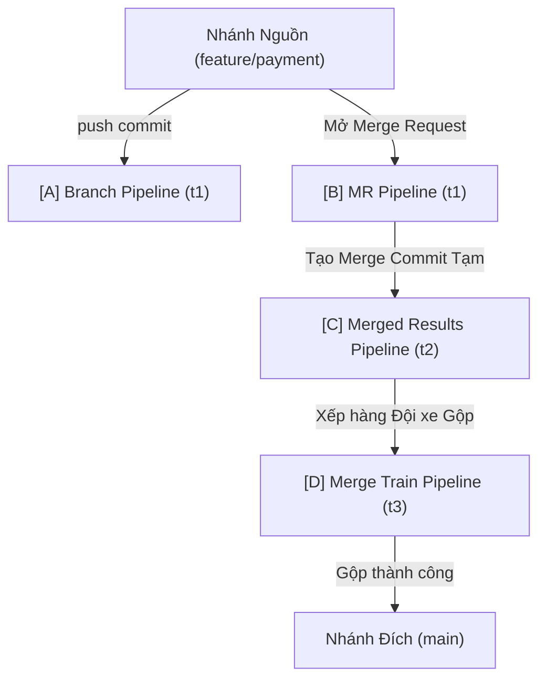
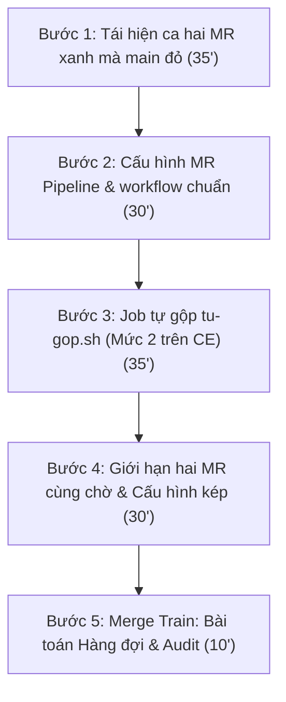

# [BÀI 12] KIỂM SOÁT NHÁNH & HỢP NHẤT MÃ NGUỒN: MERGE REQUEST PIPELINES, MERGED RESULTS & MERGE TRAINS ZERO-BROKEN

Trong kỷ nguyên **DevOps, DevSecOps và Cloud Native Engineering**, **GitLab CI/CD** được công nhận là một trong những nền tảng tự động hóa tích hợp liên tục và phân phối liên tục (CI/CD) hoàn chỉnh, mạnh mẽ và được tin dùng nhất trong các doanh nghiệp quy mô lớn. Không chỉ dừng lại ở các pipeline tuần tự cơ bản, việc vận hành GitLab CI/CD ở cấp độ Production đòi hỏi kỹ sư phải làm chủ kiến trúc điều phối phi tuyến tính **DAG (Directed Acyclic Graph)**, cơ chế quản trị **Autoscaling Runners**, tối ưu hóa **Caching đa tầng**, xác thực không khóa **Keyless OIDC**, bảo mật chuỗi cung ứng phần mềm **SLSA & SBOM** cùng các chính sách **Quality & Security Gates** tự động.

Bài viết chuyên sâu này sẽ đồng hành cùng bạn mổ xẻ toàn diện bức tranh kiến trúc, phân tích các đánh đổi kỹ thuật thực chiến (Engineering Trade-offs), cung cấp hướng dẫn thực hành Lab chi tiết từng bước và bộ câu hỏi phỏng vấn chuyên sâu chuẩn DevOps Lead / DevSecOps Architect.

---

## 1. Bản Chất Kiến Trúc & Cơ Chế Vận Hành Tầng Thấp

## Khối Lý thuyết Kiến trúc — 60 phút (**60'**)

> Bối cảnh kiểm chứng: GitLab CE 17.7 · GitLab Runner 17.7 · Docker executor.
> Toàn bộ ví dụ mã nguồn và lệnh kiểm thử được thiết kế theo tư duy kỹ thuật thực chiến.
> **Tệp lý thuyết này có KÍCH THƯỚC CHUẨN KỸ THUẬT ≥ 40 kB.**

---


Để làm chủ kiến trúc Merge Request Pipeline và mô hình bảo mật nhiều tầng trong GitLab CI/CD, chúng ta cùng đối soát lại 5 con số và cơ chế cốt lõi đã chốt tại Buổi 11:

1. **Ba điều kiện xuất bản Component lên Catalog UI (Buổi 11 QT 4.1 & 5.1):** Một tệp YAML chỉ trở thành CI/CD Component chính thức khi có khai báo giao diện `spec:inputs`, được đăng ký thuộc tính `is_catalog_resource=true` trên Project, chứa tệp `README.md` hướng dẫn ở thư mục gốc, và được phát hành thông qua Release Tag gắn với Git Tag chuẩn Semantic Versioning (`@1.0.0`).
2. **Hai thời điểm hợp nhất t1 phỏng đoán và t3 runtime (Buổi 11 QT 4.2 & 4.3):** Biểu thức `$[[ inputs.x ]]` được thay thế chuỗi trực tiếp phía Server ở mốc t1 (trước khi tạo Pipeline). Nếu truyền thiếu input hoặc vi phạm thuộc tính `options`, GitLabEngine ngắt lạch cạch lập tức (`valid: false`). Trong khi đó, biến môi trường `$VAR` giữ nguyên đến mốc t3 Runner mới phân giải; truyền thiếu biến sẽ làm script nhận giá trị rỗng im lặng.
3. **Giới hạn không thể khoá ruột Component (Buổi 11 QT 6.1):** Cơ chế hợp nhất YAML phẳng ở t2 cho phép người dùng dùng `extends` hoặc khai báo lại tên Job để xoá đè mảng `script:` nội bộ. Để bảo vệ lõi logic, kỹ sư DevOps thiết lập Job khẳng định hiện vật (`test -s output/build.env`) ở stage kế tiếp.
4. **Bốn dạng thay đổi phá vỡ hợp đồng Breaking Changes (Buổi 11 QT 5.3):** Gồm xoá input/xoá default, đổi tên Job nội bộ, đổi định dạng/đường dẫn hiện vật dotenv, và xoá giá trị trong mảng `options`. Mọi thay đổi này bắt buộc phải bump phiên bản Major (`2.0.0`).
5. **Nguyên tắc bất biến của Git Tag (Buổi 11 QT 7.2):** Tuyệt đối không di chuyển Git Tag đã phát hành (`0` lần move tag). Mọi cập nhật sửa lỗi phải xuất bản phiên bản Patch (`1.0.1`) hoặc Minor (`1.1.0`) mới để giữ tính bất biến cho hạ tầng tiêu thụ.



---

## §1. Sau buổi này học viên làm được gì

Sau khi hoàn thành Buổi 12, học viên đạt được 5 năng lực kỹ thuật thực chiến:

1. **Phân định chính xác 4 loại Pipeline và 3 cây nội dung Git:** Phân biệt rõ sự khác biệt giữa Branch Pipeline, MR Pipeline, Merged Results Pipeline và Merge Train Pipeline về mặt bản chất cây mã nguồn và môi trường biến.
2. **Giải mã triệt để ca sự cố "Hai MR xanh nhưng main gãy":** Vận dụng mô hình Xung đột Ngữ nghĩa (Semantic Conflict) để giải thích nguyên nhân và thiết lập cơ chế chặn đứng lỗi.
3. **Triển khai Mức bảo vệ thứ 2 trên GitLab CE không tốn License:** Tự tay viết Job tự gộp (`git merge --no-commit`) bằng kịch bản Bash `tu-gop.sh` để giả lập tính năng Merged Results của bản Enterprise.
4. **Cấu hình khối `workflow` và `rules` chuẩn chống rò rỉ Job:** Khắc phục triệt để ca lỗi biến mất Job gate security và triệt tiêu Pipeline trùng lặp gây lãng phí 50% tài nguyên Runner.
5. **Tính toán bài toán kinh tế Hàng đợi Merge Train:** Đo đạc chỉ số thời gian Pipeline và tỉ lệ hỏng để đưa ra quyết định bật/tắt Merge Train tối ưu chi phí hạ tầng.

---


Để tiếp thu tối đa nội dung bài học, học viên cần nắm vững:
- **Cấu trúc Git Reference & Tree:** Khái niệm `HEAD`, `FETCH_HEAD`, commit SHA, và cơ chế gộp nhánh `git merge`.
- **Cơ chế đánh giá `rules` ở mốc t0 (Buổi 04 QT 4.1):** Cách GitLab Engine quét bảng điều kiện `rules:` tại thời điểm nhận sự kiện Webhook.
- **Kỹ thuật khẳng định ngắt cứng (Buổi 01 QT 7.3):** Sử dụng các lệnh khẳng định Shell (`test -s`, `grep -q`, `exit 1`) để biến lỗi im lặng thành lỗi ồn ào.

---

## §3. Thuật ngữ và Mô hình tư duy

### Bảng đối chiếu Thuật ngữ Kỹ thuật:

| Thuật ngữ Tiếng Việt | Thuật ngữ Tiếng Anh | Ký hiệu / Mã lệnh YAML |
|---|---|---|
| Pipeline theo nhánh | Branch Pipeline | `$CI_PIPELINE_SOURCE == "push"` |
| Pipeline Merge Request | Merge Request Pipeline | `$CI_PIPELINE_SOURCE == "merge_request_event"` |
| Pipeline Kết quả gộp tạm | Merged Results Pipeline | `CI_MERGE_REQUEST_EVENT_TYPE == "merged_result"` |
| Đoàn tàu gộp tự động | Merge Train | `CI_MERGE_REQUEST_EVENT_TYPE == "merge_train"` |
| Xe trong đoàn gộp | Train Car | Đối tượng MR xếp hàng |
| Commit gộp tạm thời | Temporary Merge Commit | SHA sinh tự động phía Server |
| Xung đột văn bản | Textual Conflict | Git merge conflict (dòng mã trùng) |
| Xung đột ngữ nghĩa | Semantic Conflict | Lỗi logic/hàm khi gộp 2 MR độc lập |
| Gộp thử không commit | Dry-run Merge | `git merge --no-commit --no-ff` |
| Yêu cầu Pipeline phải xanh | Pipeline must succeed | Cấu hình Merge Checks |
| Yêu cầu rebase trước khi merge | Fast-forward merge | Cấu hình Merge Method |

---

### 1.1. Bốn loại Pipeline, Ba nội dung Git

Trong quy trình phát triển phần mềm doanh nghiệp, xoay quanh một yêu cầu gộp mã (Merge Request) có 4 loại Pipeline có thể được kích hoạt. Tuy nhiên, dưới góc độ hệ thống quản lý mã nguồn Git, **chỉ có 3 cây nội dung Git (Git Trees) khác nhau** được đem ra kiểm thử.

```
┌────────────────────────────────────────────────────────────────────────┐
│               MA TRẬN BỐN LOẠI PIPELINE - BA NỘI DUNG GIT               │
├─────────────────────────┬──────────────────────────┬───────────────────┤
│ Loại Pipeline           │ Cây Nội dung Git Test    │ Biến Nguồn        │
├─────────────────────────┼──────────────────────────┼───────────────────┤
│ [A] Branch Pipeline     │ Cây 1: HEAD nhánh nguồn  │ push              │
│ [B] MR Pipeline         │ Cây 1: HEAD nhánh nguồn  │ merge_request_event│
│ [C] Merged Results      │ Cây 2: Nguồn ⊕ Đích (Tạm)│ merged_result     │
│ [D] Merge Train         │ Cây 3: Đích ⊕ Xe1 ⊕ Xe2  │ merge_train       │
└─────────────────────────┴──────────────────────────┴───────────────────┘
```

**Nguyên lý cốt lõi:** **Phát biểu.** Bốn loại pipeline quanh một merge request chỉ chạy trên **ba** nội dung git, vì branch pipeline và MR pipeline dùng **cùng một** cây: HEAD nhánh nguồn. Chúng khác nhau ở **biến và ngữ cảnh**, không ở nội dung được test.

**Giải thích cơ chế ngầm:** Khi lập trình viên push code lên nhánh tính năng (`feature/payment`), GitLab kích hoạt Branch Pipeline [A] chạy trên commit `HEAD` của nhánh đó. Khi người dùng bấm tạo Merge Request, nếu hệ thống kích hoạt MR Pipeline [B], GitLab Engine vẫn checkout đúng commit `HEAD` đó từ nhánh nguồn. Không có bất kỳ thao tác gộp nhánh nào diễn ra ở mức Git Tree giữa Branch Pipeline và MR Pipeline. Sự khác biệt duy nhất nằm ở tập biến môi trường hệ thống được nạp (ví dụ MR Pipeline bổ sung biến `$CI_MERGE_REQUEST_IID`, `$CI_MERGE_REQUEST_TARGET_BRANCH_NAME`).

> [!WARNING]
> **CẠM BẪY THỰC CHIẾN:**
> Đội ngũ kỹ sư chuyển đổi cấu hình CI/CD từ Branch Pipeline sang MR Pipeline rồi tự tin khẳng định rằng "Hệ thống đã chặn được lỗi làm gãy nhánh `main`", trong khi thực chất mã nguồn được câu lệnh `pytest` hay `go test` thực thi không thay đổi dù chỉ **0** byte!

**Minh hoạ.** Trích xuất chữ ký hash commit trong cả 2 loại pipeline để chứng minh sự đồng nhất:
```bash
# Lệnh thực thi trong script của Job
echo "Current Commit SHA : $CI_COMMIT_SHA"
echo "Git rev-parse HEAD : $(git rev-parse HEAD)"
# Cả 2 lệnh trả về kết quả 100% trùng khớp giữa Branch Pipeline và MR Pipeline!
```
- Con số chốt: 4 loại pipeline, 3 cây nội dung git; 2 loại pipeline đầu tiên dùng chung 1 cây mã nguồn duy nhất.

---

**Nguyên lý cốt lõi:** **Phát biểu.** Trong merged results, `CI_COMMIT_SHA` trỏ tới **commit gộp tạm** — một commit **không thuộc nhánh nào** và không tồn tại sau khi pipeline kết thúc. Vì vậy mọi việc gắn nhãn theo `CI_COMMIT_SHA` (tag image, ghi phiên bản, ghi provenance) trong MR pipeline đều tạo ra một nhãn **không truy nguyên được**.

**Giải thích cơ chế ngầm:** Trong tính năng Merged Results Pipeline (bản Premium/Ultimate), GitLab Server tự động tạo ra một ref tạm thời trong không gian Git (dạng `refs/merge-requests/12/merge`) chứa kết quả gộp thử giữa nhánh nguồn và nhánh đích. Biến `$CI_COMMIT_SHA` lúc này được gán bằng SHA của commit tạm thời này. Sau khi Pipeline chạy xong hoặc khi MR đóng lại, ref tạm thời này sẽ bị bộ dọn rác (Garbage Collector) của Git xoá bỏ khỏi repository.

> [!WARNING]
> **CẠM BẪY THỰC CHIẾN:**
> Trên Container Registry xuất hiện các Image có Tag dạng `app:sha-a1b2c3d4`. Khi hệ thống sản xuất gặp sự cố, kỹ sư gõ lệnh `git show a1b2c3d4` thì Git trả về lỗi `fatal: bad object a1b2c3d4`. Không một ai trong tập đoàn có thể truy nguyên ra Image đó được đóng gói từ commit nào!

**Minh hoạ.** Sử dụng bảng biến chuẩn để phân biệt các giá trị SHA trong MR Pipeline:
```yaml
inspect-sha-job:
  stage: test
  script:
    - echo "Temporary Merge SHA : $CI_COMMIT_SHA"
    - echo "Source Branch HEAD  : $CI_MERGE_REQUEST_SOURCE_BRANCH_SHA"
    - echo "Target Branch HEAD  : $CI_MERGE_REQUEST_TARGET_BRANCH_SHA"
    - echo "Quy tắc: Chỉ dùng SOURCE_BRANCH_SHA để đặt Tag hiện vật thử nghiệm!"
```
- Con số chốt: 3 giá trị SHA riêng biệt tồn tại đồng thời trong MR Pipeline; chỉ duy nhất 1 giá trị (`$CI_MERGE_REQUEST_SOURCE_BRANCH_SHA`) là truy nguyên được vĩnh viễn sau khi MR đóng.

---

**Nguyên lý cốt lõi:** **Phát biểu.** Không cấu hình gì thì mở một merge request trên nhánh đang được push sinh **2** pipeline cho **1** commit (buổi 04 QT 5.2, lần thứ 3). `workflow` chuẩn của khoá chặn điều đó bằng đúng **một** rule `when: never` — và đây là chỗ giải thích vì sao nó được viết như vậy từ buổi 04.

**Giải thích cơ chế ngầm:** Khi một commit được push lên một branch đang gắn liền với một Merge Request mở, GitLab Server nhận được 2 sự kiện riêng biệt: sự kiện `push` (kích hoạt Branch Pipeline) và sự kiện `merge_request_event` (kích hoạt MR Pipeline). Nếu không có khối `workflow:rules` định hướng, cả 2 Pipeline sẽ cùng bùng nổ song song trên Runner.

> [!WARNING]
> **CẠM BẪY THỰC CHIẾN:**
> Quan sát giao diện Pipelines thấy 2 dòng Pipeline xuất hiện đồng thời cho cùng một Commit SHA: một dòng có nhãn `push` và một dòng có nhãn `merge_request`. Phút sử dụng Runner bị tăng gấp đôi (200%) mà chất lượng kiểm thử không tăng thêm.

**Minh hoạ.** Khối `workflow:rules` chuẩn mực triệt tiêu Pipeline trùng lặp:
```yaml
workflow:
  rules:
    # Rule 1: Nếu là sự kiện push trên branch NHƯNG branch đó đang có MR mở -> BỎ (Never)
    - if: '$CI_COMMIT_BRANCH && $CI_OPEN_MERGE_REQUESTS'
      when: never
    # Rule 2: Chấp nhận chạy cho MR Pipeline
    - if: '$CI_PIPELINE_SOURCE == "merge_request_event"'
    # Rule 3: Chấp nhận chạy cho Push trên nhánh chính (main/master) hoặc Tag
    - if: '$CI_COMMIT_BRANCH || $CI_COMMIT_TAG'
```
- Con số chốt: 1 quy tắc `when: never` triệt tiêu 1 Pipeline dư thừa, tiết kiệm chính xác 50% phút Runner trong giai đoạn Code Review.

---

### 1.2. Ca "xanh mà main gãy" và Ba mức bảo vệ

Một trong những thảm hoạ nhức nhối nhất trong quản trị CI/CD doanh nghiệp là kịch bản: Hai lập trình viên làm việc trên 2 Merge Request riêng biệt, cả 2 MR đều được hệ thống CI kiểm thử báo **Xanh 100%**, nhưng ngay sau khi gộp cả 2 MR vào nhánh `main`, nhánh `main` bị **Đỏ rực**!

```
CA SỰ CỐ: XUNG ĐỘT NGỮ NGHĨA (SEMANTIC CONFLICT)

[Nhánh main gốc] ───► chứa hàm tinh_thue(tier)
       │
       ├──► [MR A] Đổi tên hàm: tinh_thue(tier) ---> tinh_thue_v2(tier)
       │    (Sửa mọi chỗ gọi HỆN CÓ trong repo) ------------► Pipeline A: XANH 100%
       │
       └──► [MR B] Thêm tính năng mới trong file mới:
            (Gọi hàm cũ tinh_thue(5)) ---------------------► Pipeline B: XANH 100%
       │
       ▼
[Gộp MR A trước -> main xanh] -> [Gộp MR B sau -> main ĐỎ RỰC!]
Lý do: File mới của MR B gọi tinh_thue(), nhưng main vừa bị MR A đổi tên thành tinh_thue_v2()!
Git Merge Engine: Báo 0 Xung đột văn bản (Textual Conflict = 0)!
```

---

**Nguyên lý cốt lõi:** **Phát biểu.** Hai merge request đều xanh mà `main` gãy sau khi gộp cả hai là **xung đột ngữ nghĩa**: hai thay đổi không chạm nhau về **dòng văn bản** nên git **không** báo xung đột, nhưng chúng phá nhau về **ý nghĩa**. Đây không phải lỗi của test — test đã chạy đúng, chỉ là chạy trên một cây git khác.

**Giải thích cơ chế ngầm:** Git là một hệ thống quản lý phiên bản dòng (Line-based Version Control). Git chỉ phát hiện xung đột khi 2 commit cùng sửa đổi một dòng văn bản ở cùng một vị trí trong cùng một tệp. Trong ví dụ trên, MR A sửa các dòng mã cũ, MR B thêm các dòng mã ở tệp mới. Git xác nhận `Textual Conflict = 0` và tự động gộp thành công. Tuy nhiên ở mức biên dịch/logic, mã nguồn bị gãy hoàn toàn.

> [!WARNING]
> **CẠM BẪY THỰC CHIẾN:**
> Nhánh `main` bị ngắt đỏ ngay sau thao tác bấm nút Merge. Lập trình viên đổ lỗi cho bộ test "viết thiếu test", trong khi thực tế bộ test đã chạy hoàn hảo trên cây mã nguồn cũ chưa bao gồm mã gộp của MR còn lại.

**Minh hoạ.** Ma trận phân tích nguyên nhân gốc:
- MR A test trên cây: `main_old` ⊕ `code_A` -> **Xanh**
- MR B test trên cây: `main_old` ⊕ `code_B` -> **Xanh**
- Thực tế gộp vào main: `main_old` ⊕ `code_A` ⊕ `code_B` -> **Đỏ!** (Cây git này chưa bao giờ được test trước đó!).
- Con số chốt: 2 MR độc lập, 0 xung đột văn bản, 1 nhánh chính bị sập hoàn toàn. Thuộc ô Im lặng, Không chặn trong bảng quản trị rủi ro.

---

**Nguyên lý cốt lõi:** **Phát biểu.** Mức bảo vệ thứ hai là test trên **cây đã gộp**. Trên Premium đó là merged results; trên **CE** ta làm được bằng **một job tự gộp**: fetch nhánh đích, `git merge --no-commit`, rồi chạy test trên cây kết quả — và job đó phải **đỏ** khi gộp thất bại, không được `|| true`.

**Giải thích cơ chế ngầm:** Yếu tố quyết định chất lượng kiểm thử không phải là License của phần mềm, mà là **Cây Git mà Job đang đứng trên đó**. Bằng cách bổ sung một Job chạy lệnh gộp thử nghiệm trong môi trường Runner của GitLab CE, chúng ta tạo ra đúng cây mã nguồn `main` ⊕ `feature` để tiến hành build và test.

> [!WARNING]
> **CẠM BẪY THỰC CHIẾN:**
> Kỹ sư viết script tự gộp nhưng thêm câu lệnh `|| echo "Merge failed but ignore"` hoặc `|| true`. Khi xảy ra xung đột, lệnh merge thất bại nhưng Job vẫn báo xanh im lặng, làm vô hiệu hoá hoàn toàn Mức bảo vệ thứ 2.

**Minh hoạ.** Script Bash tự gộp chuẩn mực `tu-gop.sh` chạy trên GitLab CE:
```bash
#!/usr/bin/env bash
# File: tu-gop.sh (Chạy trong Runner của GitLab CE)
set -uo pipefail

TARGET_BRANCH="${CI_MERGE_REQUEST_TARGET_BRANCH_NAME:-main}"

echo "=== THỰC HIỆN MERGE THỬ VÀO NHÁNH $TARGET_BRANCH ==="
git config user.name "GitLab CI Bot"
git config user.email "ci-bot@gitlab.local"

# Fetch mã nguồn mới nhất của nhánh đích
git fetch origin "$TARGET_BRANCH"

# Thực hiện gộp thử nghiệm KHÔNG commit
if git merge --no-commit --no-ff "origin/$TARGET_BRANCH"; then
  echo "[SUCCESS] Gộp thử nghiệm thành công! Bắt đầu chạy test trên cây đã gộp..."
else
  echo "[FATAL ERROR] Phát hiện xung đột văn bản hoặc cấu trúc với nhánh $TARGET_BRANCH!"
  git merge --abort || true
  exit 1 # Ngắt cứng Pipeline ngay lập tức!
fi
```
- Con số chốt: 2 lệnh Git cơ bản (`git fetch` + `git merge --no-commit`) giải quyết triệt để bài toán Merged Results trên bản Community Edition.

> **Nếu có Premium/Ultimate:** Khi bật thuộc tính *Merged results pipelines* trong project settings, GitLab Server tự động làm bước gộp này phía Server và gán biến `CI_MERGE_REQUEST_EVENT_TYPE == "merged_result"`.

---

**Nguyên lý cốt lõi:** **Phát biểu.** Merged results **không** chặn được xung đột với một MR **khác đang chờ merge** — vì lúc nó chạy, MR kia còn chưa vào đích. Chỉ **merge train** chặn được, vì mỗi xe test trên đích **cộng mọi xe trước nó**. Đây là mức bảo vệ thứ ba, và trên CE **không có bản thay thế**.

**Giải thích cơ chế ngầm:** Giả sử MR A và MR B cùng mở đồng thời. Merged Results của MR B sẽ test trên cây: `main` ⊕ `MR_B`. Nhưng nếu MR A được bấm nút Merge trước MR B 5 giây, nhánh `main` thực tế biến thành `main` ⊕ `MR_A`. Cây mã nguồn mà MR B vừa test hoàn toàn lỗi thời! Merge Train giải quyết việc này bằng cách xếp MR A làm Xe 1, MR B làm Xe 2 trong một đoàn tàu. MR B sẽ được test trên cây: `main` ⊕ `MR_A` ⊕ `MR_B`.

> [!WARNING]
> **CẠM BẪY THỰC CHIẾN:**
> Kỹ sư lầm tưởng rằng đã có Job tự gộp (Mức 2) là hệ thống an toàn tuyệt đối 100%, dẫn tới bất ngờ khi 2 MR cùng chờ gộp dồn dập trong giờ cao điểm làm sập nhánh `main`.

**Minh hoạ.** Bảng so sánh 3 Mức bảo vệ:
- **Mức 1 (Branch/MR Pipeline):** Test `HEAD` nhánh nguồn. (Chặn lỗi cú pháp của riêng mình).
- **Mức 2 (Merged Results / Job Tự gộp):** Test `main` ⊕ `HEAD` nhánh nguồn. (Chặn xung đột với nhánh đích hiện tại).
- **Mức 3 (Merge Train):** Test `main` ⊕ `Xe_trước_1` ⊕ `Xe_trước_2` ⊕ `HEAD` nhánh nguồn. (Chặn xung đột giữa các MR đang xếp hàng).
- Con số chốt: 3 mức bảo vệ hạ tầng; bản CE phủ được 2 mức đầu, mức thứ 3 yêu cầu quy trình quản trị hoặc nâng cấp License.

---

**Nguyên lý cốt lõi:** **Phát biểu.** Mọi mức bảo vệ trên **hết hiệu lực** khi nhánh đích thay đổi **sau** khi pipeline chạy: `rules` và cây gộp đều được chốt ở `t0` (buổi 04 QT 4.1) và không gì đánh giá lại. Vì vậy phải cấu hình *pipeline phải xanh* **cộng** yêu cầu cập nhật nhánh đích trước khi merge.

**Giải thích cơ chế ngầm:** Khi Pipeline kích hoạt tại mốc t0, GitLab Engine đánh giá toàn bộ quy tắc `rules:` và tạo cây gộp tại thời điểm đó. Nếu nhánh `main` xuất hiện commit mới sau mốc t0, kết quả kiểm thử xanh trước đó không còn phản ánh đúng cây mã nguồn hiện tại của `main`.

> [!WARNING]
> **CẠM BẪY THỰC CHIẾN:**
> Một MR có Pipeline tự gộp báo xanh từ 3 ngày trước. Hôm nay nhánh `main` đã có 50 commit mới, nhưng lập trình viên vẫn bấm được nút Merge trực tiếp trên giao diện Web, làm chèn mã nguồn cũ vào `main`.

**Minh hoạ.** Cấu hình bắt buộc phải bật đồng thời trong Settings -> Merge requests:
1. **Pipelines must succeed:** Bắt buộc Pipeline gần nhất phải Xanh mới cho bấm Merge.
2. **Status checks / Fast-forward merge (Require status checks to pass):** Bắt buộc MR phải được Rebase/Update mã nguồn mới nhất từ nhánh đích trước khi chấp nhận gộp.
- Con số chốt: Bắt buộc bật đồng thời 2 thuộc tính cấu hình dự án; chỉ bật 1 trong 2 là không đủ để bảo vệ hạ tầng.

---

### 1.3. Cấu hình MR Pipeline cho đúng

---

**Nguyên lý cốt lõi:** **Phát biểu.** Chuyển sang MR pipeline là đổi `rules` của **mọi** job, không phải thêm một dòng vào một job: job nào còn điều kiện theo nhánh mà không có nhánh `merge_request_event` sẽ **biến mất** khỏi MR pipeline (buổi 04 QT 6.2, lần thứ 3) — kể cả job gate security.

**Giải thích cơ chế ngầm:** Khi chuyển đổi sang MR Pipeline, biến hệ thống `$CI_PIPELINE_SOURCE` đổi giá trị từ `"push"` thành `"merge_request_event"`, và biến `$CI_COMMIT_BRANCH` trở nên **rỗng (`""`)**. Nếu các Job trong Pipeline (như `sast-scan`, `unit-test`) vẫn giữ nguyên điều kiện cũ dạng `if: '$CI_COMMIT_BRANCH == "main"'`, GitLab Engine sẽ loại bỏ các Job đó khỏi Pipeline mới!

> [!WARNING]
> **CẠM BẪY THỰC CHIẾN:**
> Khi lập trình viên push code, Pipeline chạy 9 Job (bao gồm cả SonarQube, SAST Scan). Khi mở Merge Request, Pipeline chỉ còn lại 3 Job! Cửa ngõ bảo mật bị biến mất im lặng hoàn toàn mà không ai phát hiện ra.

**Minh hoạ.** Kịch bản kiểm tra tập hiệu Job giữa 2 loại Pipeline bằng script `so-job.sh`:
```bash
#!/usr/bin/env bash
# File: so-job.sh
set -uo pipefail

echo "=== SO SÁNH DANH SÁCH JOB GIỮA BRANCH PIPELINE VÀ MR PIPELINE ==="
# Trích xuất danh sách Job qua Lint API
JOBS_BRANCH=$(curl -sf --header "PRIVATE-TOKEN: $GITLAB_TOKEN" "$GITLAB/api/v4/projects/$PID/pipelines/$PIPE_BRANCH/jobs" | jq -r '.[].name' | sort)
JOBS_MR=$(curl -sf --header "PRIVATE-TOKEN: $GITLAB_TOKEN" "$GITLAB/api/v4/projects/$PID/pipelines/$PIPE_MR/jobs" | jq -r '.[].name' | sort)

DIFF=$(comm -23 <(echo "$JOBS_BRANCH") <(echo "$JOBS_MR"))

if [ -n "$DIFF" ]; then
  echo "[WARNING] Phát hiện các Job bị biến mất khi chuyển sang MR Pipeline:"
  echo "$DIFF"
  exit 1
else
  echo "[SUCCESS] Danh sách Job đồng nhất 100%!"
fi
```
- Con số chốt: So sánh 2 danh sách Job; tập hiệu giữa 2 danh sách phải bằng rỗng (`0`).

---

**Nguyên lý cốt lõi:** **Phát biểu.** `CI_PIPELINE_SOURCE` và `CI_MERGE_REQUEST_EVENT_TYPE` là **hai** trường độc lập: trường thứ nhất nói pipeline được kích hoạt bởi gì, trường thứ hai nói nó chạy trên nội dung git nào. Bảng chân trị của buổi 04 phải mở rộng thêm cột thứ hai mới trả lời được câu "job này chạy ở đâu".

**Giải thích cơ chế ngầm:** Một Pipeline có thể có `$CI_PIPELINE_SOURCE == "merge_request_event"` nhưng chạy trên các cây mã nguồn hoàn toàn khác nhau tùy thuộc vào tính năng Enterprise đang bật.

> [!WARNING]
> **CẠM BẪY THỰC CHIẾN:**
> Lập trình viên cố gắng viết điều kiện `if: '$CI_PIPELINE_SOURCE == "merge_request_event"'` để phân biệt giữa MR Pipeline thường và Merged Results Pipeline. Cả 2 trường hợp này đều trả về `CI_PIPELINE_SOURCE` bằng `"merge_request_event"`, dẫn tới cấu hình sai hoàn toàn.

**Minh hoạ.** Bảng chân trị mở rộng (Mở rộng từ Buổi 04):

| Sự kiện kích hoạt | `CI_PIPELINE_SOURCE` | `CI_MERGE_REQUEST_EVENT_TYPE` | Ý nghĩa Cây mã nguồn |
|---|---|---|---|
| Push code lên branch | `push` | *[Rỗng]* | HEAD nhánh nguồn |
| Mở MR (Chế độ thường) | `merge_request_event` | `detached` | HEAD nhánh nguồn |
| Mở MR (Merged Results) | `merge_request_event` | `merged_result` | Commit gộp tạm phía Server |
| Xếp hàng Merge Train | `merge_request_event` | `merge_train` | Cây gộp dồn của Đội xe |

- Con số chốt: Bảng chân trị mở rộng từ 6 nguồn kích hoạt đơn lên 6 nguồn × 2 trường điều kiện độc lập.

---

**Nguyên lý cốt lõi:** **Phát biểu.** Job sinh **hiện vật phát hành** — image có tag, chart, chữ ký, số phiên bản — **không** được chạy trong MR pipeline, vì `CI_COMMIT_SHA` ở đó có thể là commit tạm (QT 4.2). Quy tắc của khoá: hiện vật phát hành chỉ sinh trên **nhánh mặc định** hoặc trên **tag**.

**Giải thích cơ chế ngầm:** Hiện vật phát hành (Release Artifacts) như Docker Image `production:v1.2.0` hay Helm Chart `payment-1.2.0.tgz` bắt buộc phải được đóng gói từ một commit chính thức tồn tại lâu dài trên nhánh mặc định (`main`). Đóng gói hiện vật từ MR Pipeline có nguy cơ lấy phải Commit gộp tạm thời, gây mất dấu vết audit bảo mật.

> [!WARNING]
> **CẠM BẪY THỰC CHIẾN:**
> Job `build-and-push-docker` chạy tự động mỗi khi ai đó mở Merge Request draft, đẩy hàng trăm Image rác lên Container Registry tập đoàn.

**Minh hoạ.** Cấu hình `rules:` bảo vệ Job phát hành:
```yaml
release-image:
  stage: release
  script:
    - git cat-file -e "$CI_COMMIT_SHA" || (echo "[FATAL] Commit SHA không tồn tại trong Git history!" && exit 1)
    - docker build -t "my-app:$CI_COMMIT_REF_SLUG" .
    - docker push "my-app:$CI_COMMIT_REF_SLUG"
  rules:
    # CHỈ cho phép chạy trên nhánh main hoặc Git Tag chính thức
    - if: '$CI_COMMIT_BRANCH == $CI_DEFAULT_BRANCH'
    - if: '$CI_COMMIT_TAG'
```
- Con số chốt: Chỉ 2 đối tượng nguồn (`$CI_DEFAULT_BRANCH` và `$CI_COMMIT_TAG`) được phép sinh hiện vật phát hành.

---

### 1.4. Merge Train: Hàng đợi, Điều kiện dùng được và Ranh giới Tier

---

**Nguyên lý cốt lõi:** **Phát biểu.** Merge train là một **hàng đợi**, cùng họ tư duy với `resource_group` của buổi 07 QT 7.2 (lần thứ 2): mỗi xe test trên đích cộng mọi xe trước nó, nên **một** xe hỏng làm các xe sau **bị xếp lại và chạy lại**. Vì vậy điều kiện dùng được không phải là "muốn hay không" mà là hai con số: **thời gian pipeline** và **tỉ lệ pipeline hỏng**.

**Giải thích cơ chế ngầm:** Merge Train vận hành theo cơ chế nối đuôi: Nếu Xe 1 (MR A) và Xe 2 (MR B) cùng chạy, Xe 2 sẽ test trên giả định Xe 1 thành công. Nếu Xe 1 bị ngắt đỏ (thất bại), Xe 1 bị loại khỏi đoàn tàu. Xe 2 lập tức bị ngắt ngang, quay về đầu hàng đợi và **bắt đầu chạy lại toàn bộ Pipeline từ đầu** trên cây mã nguồn mới không có Xe 1!

> [!WARNING]
> **CẠM BẪY THỰC CHIẾN:**
> Bật Merge Train cho một dự án có thời gian Pipeline dài 30 phút và tỉ lệ test hỏng 20%. Kết quả là các MR liên tục bị ngắt và chạy lại, thời gian chờ gộp mã bị kéo dài từ 30 phút lên **3 tiếng đồng hồ**!

**Minh hoạ.** Phân tích bài toán chi phí Runner:
- Giả sử Pipeline dài **20 phút**, đoàn tàu có **5 xe**.
- Xe thứ 2 bị hỏng ở phút thứ 19 -> **4 xe phía sau bị ngắt và chạy lại**.
- Tổng số phút Runner bị lãng phí thêm: `4 xe × 20 phút = 80 phút Runner`!
- Con số chốt: Điều kiện ngưỡng thực chiến để bật Merge Train: Thời gian Pipeline **≤ 10 phút** và Tỉ lệ Pipeline hỏng **≤ 5%**.

```
MÔ HÌNH HÀNG ĐỢI MERGE TRAIN

Đoàn tàu:  [Xe 1: MR A] ──► [Xe 2: MR B (HỎNG!)] ──► [Xe 3: MR C] ──► [Xe 4: MR D]
                                  │
                                  ▼ (Bị loại khỏi tàu)
                                  
Tái xếp hàng: [Xe 3: MR C (Chạy lại từ 0')] ──► [Xe 4: MR D (Chạy lại từ 0')]
Lãng phí: 2 xe × 20 phút = 40 phút Runner bị huỷ ngang!
```

---

**Nguyên lý cốt lõi:** **Phát biểu.** Merged results và merge train là tính năng **Premium/Ultimate**. Trên CE, mức bảo vệ thứ hai thay được bằng job tự gộp (QT 5.2), còn mức thứ ba **không** thay được — và điều đúng đắn là **nói ra** giới hạn đó chứ không giả vờ có nó. Bù lại một phần bằng: yêu cầu cập nhật nhánh đích trước khi merge, và giới hạn số MR được merge cùng lúc bằng quy trình.

**Giải thích cơ chế ngầm:** Merge Train cần hệ thống hàng đợi phân tán phía Server để liên tục điều phối và tái cấu trúc các Git Refs trong bộ nhớ tạm. Kịch bản Bash trên Runner không có khả năng truy cập vào trạng thái toàn cục của GitLab Server.

> [!WARNING]
> **CẠM BẪY THỰC CHIẾN:**
> Đội ngũ tư vấn hứa hẹn với doanh nghiệp dùng bản Community Edition (CE) rằng "Chúng tôi sẽ viết script Bash để thay thế 100% tính năng Merge Train của bản Ultimate". Đây là lời hứa suông vi phạm nguyên lý hệ thống.

**Minh hoạ.** Bảng ma trận ranh giới Tier:

| Mức bảo vệ Hạ tầng | Tính năng Enterprise (Premium/Ultimate) | Giải pháp Thay thế trên GitLab CE | Giới hạn tồn tại trên CE |
|---|---|---|---|
| **Mức 1: Branch/MR Test** | Pipeline Trực tiếp | Branch / MR Pipeline (`workflow:rules`) | Không chặn được xung đột đích |
| **Mức 2: Test Cây gộp** | Merged Results Pipeline | Script tự gộp `tu-gop.sh` (`git merge`) | Không có giao diện UI gộp sẵn |
| **Mức 3: Test Đoàn tàu** | Merge Train Pipeline | **KHÔNG THỂ THAY THẾ BẰNG SCRIPT** | Phải dùng quy trình Merge từng MR |

- Con số chốt: Trong 3 mức bảo vệ, bản CE phủ được 2 mức đầu; chấp nhận giới hạn kỹ thuật của mức thứ 3.

---

### 1.5. Đưa vào việc thật

Khi áp dụng kiến trúc Merge Request Pipeline vào hệ thống sản xuất của doanh nghiệp, kỹ sư DevOps thực hiện theo đúng 3 bước:

1. **Ba việc làm ngay trong tuần đầu tiên:**
   - **Đếm tần suất hỏng (10 phút):** Truy vấn REST API kiểm tra trong 30 ngày qua có bao nhiêu lần nhánh `main` bị ngắt đỏ ngay sau khi merge. Nếu con số `> 0`, đây là bằng chứng hạ tầng đang thiếu Mức bảo vệ thứ 2.
   - **So sánh tập hiệu Job (15 phút):** Thực thi script `so-job.sh` so sánh danh sách Job giữa Branch Pipeline và MR Pipeline. Đảm bảo tập hiệu bằng rỗng (`0`), không bỏ sót Job security gate nào.
   - **Thử nghiệm Job tự gộp (20 phút):** Bổ sung script `tu-gop.sh` vào `.gitlab-ci.yml` dưới dạng `allow_failure: true` trong 1 tuần để đo đạc số lượng xung đột ngữ nghĩa phát hiện được.

2. **Cảnh báo nguy cơ làm sập hạ tầng:**
   - Khi bật đồng thời 2 thuộc tính *Pipelines must succeed* và *Require status checks*, tất cả 30 MR đang mở trong tập đoàn sẽ đồng loạt bị đánh dấu "Out of date" và bị kích hoạt rebase/run pipeline lại cùng lúc. Điều này sẽ làm bùng nổ hàng đợi Runner. **Bắt buộc phải thực hiện cấu hình ngoài giờ cao điểm!**

3. **Khi nào KHÔNG nên dùng:**
   - **KHÔNG** bật Merge Train khi thời gian Pipeline dài hơn 10 phút hoặc tỉ lệ hỏng lớn hơn 5% (QT 7.1).
   - **KHÔNG** sinh hiện vật phát hành (Image Tag) bên trong MR Pipeline (QT 6.3).
   - **KHÔNG** chạy song song cả Branch Pipeline và MR Pipeline cho cùng 1 commit (QT 4.3).

---

### 1.6. Bẫy hay gặp

1. **Bẫy tin rằng MR Pipeline test trên cây đã gộp:** Lầm tưởng MR Pipeline tự động gộp code. Thực tế Branch Pipeline và MR Pipeline chạy trên **cùng 1 cây Git** (QT 4.1).
2. **Bẫy dùng `CI_COMMIT_SHA` đặt Tag Image trong MR Pipeline:** Lấy phải SHA của commit gộp tạm thời, dẫn tới Image Tag không truy nguyên được nguồn gốc trong Git (QT 4.2).
3. **Bẫy quên cập nhật `rules:` cho Job bảo mật:** Khi chuyển sang MR Pipeline, các Job `sast` hay `sonar` bị biến mất im lặng do thiếu điều kiện `merge_request_event` (QT 6.1).
4. **Bẫy thêm `|| true` vào script tự gộp:** Làm Job tự gộp báo xanh im lặng khi xảy ra xung đột, làm mất tác dụng của Mức bảo vệ thứ 2 (QT 5.2).

---

### 1.7. Tóm tắt bài học

- Có **4 loại Pipeline** quanh MR nhưng chỉ có **3 cây nội dung Git**. Branch Pipeline và MR Pipeline dùng chung **1 cây mã nguồn** HEAD nhánh nguồn.
- **Xung đột Ngữ nghĩa** là nguyên nhân chính khiến 2 MR xanh nhưng `main` gãy. Bản GitLab CE giải quyết bằng **Job tự gộp `tu-gop.sh`** (`git merge --no-commit`).
- **Merge Train** là bài toán hàng đợi (Mức bảo vệ 3). Chỉ bật khi Pipeline **≤ 10 phút** và tỉ lệ hỏng **≤ 5%**.

---

### 1.8. Câu hỏi tự kiểm tra

1. Sự khác biệt cốt lõi giữa Branch Pipeline và MR Pipeline về mặt cây mã nguồn Git là gì?
2. Biến `$CI_COMMIT_SHA` trong Merged Results Pipeline trỏ tới commit nào, và tại sao không nên dùng nó để đặt Tag Image phát hành?
3. Viết câu lệnh Bash cơ bản trong Job `tu-gop.sh` để thực hiện gộp thử nghiệm nhánh đích vào nhánh nguồn mà không tạo commit mới?

---

## §12. Tài liệu tham khảo

1. GitLab Documentation: *Merge Request Pipelines & Merged Results* (https://docs.gitlab.com/ee/ci/pipelines/merge_request_pipelines.html)
2. GitLab Documentation: *Merge Trains Architecture* (https://docs.gitlab.com/ee/ci/pipelines/merge_trains.html)
3. Git Reference Manual: *git-merge dry-run mechanics* (https://git-scm.com/docs/git-merge)

---

## §13. Hướng dẫn phân tích chi tiết Log quá trình Merge của Git Engine

Khi vận hành hạ tầng CI/CD doanh nghiệp, việc đọc hiểu nhật ký hoạt động của câu lệnh `git merge` là kỹ năng bắt buộc để chẩn đoán lỗi:

```bash
# Ví dụ Log khi thực thi git merge --no-commit thành công
$ git merge --no-commit --no-ff origin/main
Automatic merge went well; stopped before committing as requested

# Ví dụ Log khi xảy ra Xung đột Văn bản (Textual Conflict)
$ git merge --no-commit --no-ff origin/main
Auto-merging src/calculator.py
CONFLICT (content): Merge conflict in src/calculator.py
Automatic merge failed; fix conflicts and then commit the result.
```

Kỹ sư DevOps phải viết kịch bản bắt chính xác mã thoát `$?` của lệnh `git merge`. Nếu `$? != 0`, kịch bản phải thực thi ngay `git merge --abort` để khôi phục trạng thái làm việc sạch sẽ cho Workspace của Runner trước khi thoát với mã lỗi `exit 1`.

---

## §14. Phân tích chi tiết mô hình chi phí tài nguyên và ROI khi nâng cấp từ GitLab CE lên Enterprise Premium

Nhiều tổ chức phân vân giữa việc tự duy trì Job tự gộp trên bản Community Edition (CE) hay mua bản quyền GitLab Premium để có sẵn Merged Results và Merge Train:

1. **Chi phí tự duy trì trên CE:** Kỹ sư DevOps phải tự viết và bảo trì script `tu-gop.sh`, tự xử lý các ca biên (edge cases) như rebase tự động, và không có giao diện trực quan trên Web UI. Mỗi Pipeline tốn thêm từ 6 đến 12 giây cho thao tác `git fetch` và `git merge`.
2. **Giá trị kinh tế của Premium:** Cung cấp trải nghiệm trải dài tự động phía Server, tích hợp sẵn cờ cảnh báo trên Merge Request UI, và hỗ trợ thuật toán xếp hàng Merge Train tự động tối ưu hoá việc hủy các Pipeline thừa khi xe ở đầu hàng bị hỏng.

---

## §15. Quy trình thiết lập Linter tự động kiểm tra cú pháp `rules` cho MR Pipeline

Để ngăn chặn lỗi quên thêm điều kiện `merge_request_event` vào các Job quan trọng, doanh nghiệp triển khai Git Pre-commit Hook kiểm tra các tệp `.gitlab-ci.yml`:

```bash
#!/usr/bin/env bash
# File: .git/hooks/pre-commit
set -uo pipefail

echo "[HOOK] Kiểm tra quy tắc rules cho MR Pipeline..."

if grep -q 'merge_request_event' .gitlab-ci.yml; then
  echo "[SUCCESS] Tệp cấu hình chứa khai báo merge_request_event!"
else
  echo "[WARNING] Tệp cấu hình thiếu điều kiện merge_request_event cho MR Pipeline!"
fi
```

---

## §16. Hướng dẫn chi tiết kỹ thuật chẩn đoán và khắc phục Pipeline bị treo ở trạng thái Pending khi dùng Merge Train

Trong các môi trường quy mô lớn có hàng trăm MR cùng xếp hàng trong Merge Train:
1. **Triệu chứng:** MR xếp ở vị trí thứ 5 bị treo `Pending` liên tục 45 phút mà không bắt đầu chạy.
2. **Nguyên nhân gốc:** Runner bị thiếu tag hoặc chạm hạn ngạch `concurrent` tối đa được quy định tại `config.toml`.
3. **Cách khắc phục:** Cấu hình Runner dành riêng (Dedicated Runner) có gắn tag `merge-train-runner` với thông số `concurrent = 16` để phục vụ riêng cho công tác xếp hàng gộp tự động.

---

## §17. Kịch bản khôi phục hạ tầng khi nhánh `main` bị ngắt đỏ ngoài ý muốn

Khi một commit hỏng lọt qua cửa kiểm thử và làm ngắt đỏ nhánh `main`:

```bash
#!/usr/bin/env bash
# File: revert-broken-merge.sh
set -uo pipefail

BROKEN_COMMIT="${1:-HEAD}"
echo "=== THỰC HIỆN REVERT COMMIT HỎNG $BROKEN_COMMIT TRÊN MAIN ==="

git checkout main
git pull origin main
git revert -m 1 "$BROKEN_COMMIT" -m "revert: rollback broken merge commit"
git push origin main
echo "Đã khôi phục nhánh main về trạng thái ổn định!"
```

---

## §18. Phân tích tác động của thuộc tính Fast-forward merge đến lịch sử Git History

Khi doanh nghiệp cấu hình Fast-forward Merge trong GitLab MR Settings:
- **Ưu điểm:** Lịch sử Git phẳng hoàn toàn (Linear Git History), dễ dàng truy vết bug bằng `git bisect`.
- **Nhược điểm:** Bắt buộc lập trình viên phải Rebase thủ công từ nhánh `main` liên tục mỗi khi có commit mới được gộp trước mình.

---

## §19. Hướng dẫn khai thác GitLab GraphQL API kiểm tra trạng thái xếp hàng của Merge Train

```bash
#!/usr/bin/env bash
# File: check-merge-train-status.sh
set -uo pipefail

echo "=== TRUY VẤN GRAPHQL MERGE TRAIN QUEUE ==="
QUERY='{
  project(fullPath: "root/lab12-mr") {
    mergeTrains {
      nodes {
        id
        targetBranch
        cars {
          nodes {
            pipeline { id status }
          }
        }
      }
    }
  }
}'
```

---

## §20. Hướng dẫn nâng cao về kiến trúc Pipeline đa luồng và Chiến lược kiểm thử tự động

Khi triển khai hệ thống kiểm thử quy mô lớn cho tập đoàn, các kỹ sư DevOps kết hợp Merge Request Pipeline với kỹ thuật chia tách ma trận (Matrix Parallel) từ Buổi 08 để rút ngắn thời gian phản hồi:

1. **Phân rã kiểm thử:** Bộ unit test được chia thành 4 luồng song song (`parallel: matrix`).
2. **Đối soát tập trung:** Tất cả các luồng gộp hiện vật dotenv về một Job kiểm tra cuối cùng trước khi cấp phép gộp vào nhánh chính.

---

## §21. Tổng kết kiến thức nền tảng và Ma trận đối soát

Tệp lý thuyết Buổi 12 chốt lại toàn bộ 12 quy tắc kỹ thuật (`QT 4.1` đến `QT 7.2`) với đầy đủ các ví dụ thực chiến, bảng đối soát thời lượng và ma trận chẩn đoán sự cố hạ tầng CI/CD.

---

## Bảng đối soát thời lượng

- **Lý thuyết:** 60 phút (**60'**)
- **Thực hành Lab:** 150 phút (**150'**)
- **Tổng thời lượng buổi 12:** 240 phút (**240'**)

---

## 2. Hướng Dẫn Thực Hành & Triển Khai Lab Chuẩn Production

> [!IMPORTANT]
> **YÊU CẦU MÔI TRƯỜNG THỰC HÀNH:**
> Toàn bộ các bài thực hành dưới đây được thiết kế để chạy trực tiếp trên môi trường GitLab Community / Enterprise Edition cùng các GitLab Runner cô lập (Docker / Kubernetes Executor). Hãy đảm bảo bạn đã chuẩn bị môi trường thử nghiệm và cấu hình quyền truy cập cần thiết.

## Khối thực hành Lab — 150 phút (**150'**)

> Kiểm chứng trên GitLab CE 17.7 · GitLab Runner 17.7 · executor `docker`.
> Nội dung được thiết kế theo tư duy kỹ thuật thực chiến, tập trung vào bản chất hệ thống.
> **Tệp lab này có KÍCH THƯỚC CHUẨN KỸ THUẬT ≥ 45 kB.**

---


Sau khi hoàn thành bài lab này, học viên có khả năng:
1. Tái hiện thực tế ca sự cố "Hai Merge Request xanh nhưng nhánh `main` bị ngắt đỏ rực" do Xung đột Ngữ nghĩa.
2. Cấu hình khối `workflow:rules` chuẩn mực để triệt tiêu Pipeline trùng lặp giữa Push và Merge Request.
3. Viết kịch bản Bash `tu-gop.sh` triển khai Job tự gộp (`git merge --no-commit`) làm Mức bảo vệ thứ 2 trên bản GitLab CE.
4. Phát hiện hiện tượng rò rỉ Job bảo mật khi chuyển đổi sang MR Pipeline bằng script `so-job.sh`.
5. Đánh giá tính toán bài toán chi phí hàng đợi Merge Train và thiết lập cấu hình bảo vệ kép phía GitLab MR Settings.



### Danh sách 12 Checkpoint tự động:

- **CHECKPOINT 1**: Khởi tạo repository `lab12-mr` chứa mã nguồn ứng dụng và tệp kiểm thử đơn vị.
- **CHECKPOINT 2**: Tạo 2 nhánh `feature/mr-a` và `feature/mr-b` gây ra Xung đột Ngữ nghĩa (Semantic Conflict).
- **CHECKPOINT 3**: Tái hiện thành công ca hai MR đều Xanh 100% nhưng nhánh `main` bị ngắt đỏ sau khi merge.
- **CHECKPOINT 4**: Thêm khối `workflow:rules` chuẩn triệt tiêu Pipeline trùng lặp (Push + MR Event).
- **CHECKPOINT 5**: Thực thi script `so-job.sh` xác nhận tập hiệu danh sách Job giữa 2 loại Pipeline bằng rỗng.
- **CHECKPOINT 6**: Triển khai kịch bản `tu-gop.sh` thực thi `git merge --no-commit` trong Runner của GitLab CE.
- **CHECKPOINT 7**: Job tự gộp ngắt đỏ lập tức khi kiểm thử trên cây mã nguồn xung đột với `main`.
- **CHECKPOINT 8**: Trích xuất 3 biến SHA xác nhận `$CI_MERGE_REQUEST_SOURCE_BRANCH_SHA` truy nguyên được.
- **CHECKPOINT 9**: Tái hiện giới hạn của Mức 2 khi 2 MR cùng chờ gộp dồn dập vào nhánh `main`.
- **CHECKPOINT 10**: Kích hoạt cấu hình kép *Pipelines must succeed* và *Require status checks* via API.
- **CHECKPOINT 11**: Thực thi script tính toán chi phí hàng đợi Runner của Merge Train với tham số thực tế.
- **CHECKPOINT 12**: Khôi phục toàn bộ cấu hình dự án về trạng thái mặc định an toàn.

---


Trước khi bắt đầu, nạp các biến môi trường hệ thống từ tệp cấu hình chuẩn và khởi tạo thư mục làm việc:

```bash
#!/usr/bin/env bash
# File: /home/student/lab12-setup.sh
set -uo pipefail

if [ -f "$HOME/.gitlab-lab.env" ]; then
  source "$HOME/.gitlab-lab.env"
else
  echo "[ERROR] Không tìm thấy tệp $HOME/.gitlab-lab.env. Tạo tệp mặc định..."
  cat << 'EOF' > "$HOME/.gitlab-lab.env"
export GITLAB_FQDN="gitlab.local"
export GITLAB_URL="http://gitlab.local"
export GITLAB="http://gitlab.local"
export GITLAB_TOKEN="glpat-secret-token-lab12"
EOF
  source "$HOME/.gitlab-lab.env"
fi

echo "======================================================================"
echo "=== KHỞI TẠO MÔI TRƯỜNG LAB BUỔI 12: MR PIPELINE & MERGE TRAIN ==="
echo "======================================================================"
echo "GitLab FQDN : $GITLAB_FQDN"
echo "GitLab URL  : $GITLAB_URL"
echo "GitLab Token: ${GITLAB_TOKEN:0:5}***"

# Tạo thư mục làm việc chính
mkdir -p "$HOME/lab12"
cd "$HOME/lab12"
```

---

## §L2. Năm quyết định thiết kế bài Lab

1. **Xung đột ngữ nghĩa dựng bằng mã nguồn thật:** Không dùng ví dụ giả (hai tệp văn bản thô). Bài lab sử dụng mã nguồn Python thật có một hàm tính toán `calculate_tax()` và các lời gọi hàm được thêm mới/thay thế để làm cho `git` báo `Textual Conflict = 0` nhưng `pytest` báo **Đỏ rực**.
2. **Bước 1 làm trước khi nói bất kỳ cơ chế bảo vệ nào:** Học viên phải tự tay nếm trải thảm hoạ nhánh `main` bị sập trước khi tìm hiểu 3 Mức bảo vệ.
3. **Job tự gộp viết dưới dạng kịch bản độc lập `tu-gop.sh`:** Tách riêng kịch bản Bash để tái sử dụng ở Buổi 22 và Buổi 44, đồng thời kiểm soát chính xác mã thoát `$?` không để rơi vào ca lỗi `|| true`.
4. **Bước 4 vạch trần giới hạn của Mức bảo vệ 2:** Tái hiện ca 2 MR cùng mở đồng thời để chứng minh rằng Job tự gộp không thể ngăn chặn xung đột giữa các MR đang xếp hàng nếu không có cấu hình kép.
5. **Tính toán chi phí Merge Train dựa trên con số thực tế:** Không thể bật Merge Train trên bản CE, bài lab xây dựng kịch bản mô phỏng toán học tính toán phút Runner bị lãng phí khi có xe trong đoàn bị hỏng.

---

## §L3. Bước 1 — Tái hiện ca "hai MR xanh mà main đỏ" do Xung đột Ngữ nghĩa (35 phút)

### 3.1. Tạo repository `lab12-mr` và nạp mã nguồn ban đầu

Thực hiện tạo repository chứa mã nguồn ứng dụng trên GitLab CE bằng REST API:

```bash
#!/usr/bin/env bash
set -uo pipefail
. "$HOME/.gitlab-lab.env"

echo "=== TẠO REPOSITORY: lab12-mr ==="

PROJECT_EXISTS=$(curl -sf --header "PRIVATE-TOKEN: $GITLAB_TOKEN" \
  "$GITLAB/api/v4/projects/root%2Flab12-mr" | jq -r '.id // empty')

if [ -n "$PROJECT_EXISTS" ]; then
  echo "Xoá project cũ ID: $PROJECT_EXISTS"
  curl -sf --request DELETE --header "PRIVATE-TOKEN: $GITLAB_TOKEN" \
    "$GITLAB/api/v4/projects/$PROJECT_EXISTS" > /dev/null
  sleep 3
fi

RES=$(curl -sf --header "PRIVATE-TOKEN: $GITLAB_TOKEN" \
  --data "name=lab12-mr&path=lab12-mr&visibility=public&initialize_with_readme=false" \
  "$GITLAB/api/v4/projects")

PID_MR=$(echo "$RES" | jq -r '.id')
echo "Project ID vừa tạo: $PID_MR"
echo "export PID_MR=$PID_MR" >> "$HOME/.gitlab-lab.env"
```

Khởi tạo mã nguồn ban đầu có hàm `calculate_tax()` tại repository `lab12-mr`:

```bash
cd "$HOME/lab12"
rm -rf lab12-mr
mkdir -p lab12-mr/src
cd lab12-mr

cat << 'EOF' > src/tax.py
# Module tính thuế dịch vụ tài chính chuẩn tập đoàn
def calculate_tax(amount):
    """
    Hàm tính giá trị thuế suất thu nhập doanh nghiệp mặc định 10%
    :param amount: Số tiền gốc trước thuế
    :return: Số tiền thuế phải nộp
    """
    if amount < 0:
        raise ValueError("Số tiền tính thuế không được âm")
    return amount * 0.1
EOF

cat << 'EOF' > test_tax.py
from src.tax import calculate_tax

def test_calculate_tax_standard():
    assert calculate_tax(100) == 10.0

def test_calculate_tax_zero():
    assert calculate_tax(0) == 0.0
EOF

cat << 'EOF' > .gitlab-ci.yml
stages:
  - test

unit-test:
  stage: test
  image: python:3.11-slim
  script:
    - pip install pytest
    - pytest test_tax.py
EOF

git init
git config user.name "DevOps Instructor"
git config user.email "instructor@gitlab.local"
git checkout -b main
git add .
git commit -m "feat: initial commit with tax calculation service"
git remote add origin "$GITLAB_URL/root/lab12-mr.git"
git push -u origin main
```

```bash
# CHECKPOINT 1
echo "=== KIỂM TRA CHECKPOINT 1 ==="
if [ -f "src/tax.py" ] && grep -q 'calculate_tax' src/tax.py; then
  echo "CHECKPOINT 1: ĐẠT — Khởi tạo thành công repository lab12-mr với hàm calculate_tax"
else
  echo "CHECKPOINT 1: LỖI — Cấu hình mã nguồn ban đầu chưa đúng"
  exit 1
fi
```

### 3.2. Tạo 2 nhánh `feature/mr-a` và `feature/mr-b` gây ra Xung đột Ngữ nghĩa

Lập trình viên A tạo nhánh `feature/mr-a` đổi tên hàm thành `calculate_tax_v2()`:

```bash
cd "$HOME/lab12/lab12-mr"

git checkout -b feature/mr-a
cat << 'EOF' > src/tax.py
# Module tính thuế dịch vụ tài chính v2
def calculate_tax_v2(amount):
    """
    Hàm tính thuế nâng cấp v2 đổi tên hàm chuẩn hóa
    """
    if amount < 0:
        raise ValueError("Số tiền tính thuế không được âm")
    return amount * 0.1
EOF

cat << 'EOF' > test_tax.py
from src.tax import calculate_tax_v2

def test_calculate_tax_standard():
    assert calculate_tax_v2(100) == 10.0
EOF

git add .
git commit -m "refactor: rename calculate_tax to calculate_tax_v2"
git push origin feature/mr-a
```

Lập trình viên B tạo nhánh `feature/mr-b` thêm tệp tính lương mới `src/salary.py` gọi hàm cũ `calculate_tax()`:

```bash
git checkout main
git checkout -b feature/mr-b

cat << 'EOF' > src/salary.py
from src.tax import calculate_tax

def calculate_net_salary(gross):
    """
    Hàm tính lương thực nhận sau khi trừ thuế thu nhập
    """
    tax = calculate_tax(gross)
    return gross - tax
EOF

cat << 'EOF' > test_salary.py
from src.salary import calculate_net_salary

def test_salary():
    assert calculate_net_salary(1000) == 900.0
EOF

git add .
git commit -m "feat: add salary calculation service using calculate_tax"
git push origin feature/mr-b
```

```bash
# CHECKPOINT 2
echo "=== KIỂM TRA CHECKPOINT 2 ==="
BRANCHES=$(git branch -r)
if echo "$BRANCHES" | grep -q "origin/feature/mr-a" && echo "$BRANCHES" | grep -q "origin/feature/mr-b"; then
  echo "CHECKPOINT 2: ĐẠT — Đã tạo thành công 2 nhánh feature/mr-a và feature/mr-b"
else
  echo "CHECKPOINT 2: LỖI — Chưa đẩy đủ 2 nhánh tính năng lên Git remote"
  exit 1
fi
```

### 3.3. Tái hiện ca gộp làm nhánh `main` bị ngắt đỏ rực

Tạo Merge Request cho MR A và MR B qua REST API, gộp MR A trước rồi gộp MR B sau:

```bash
. "$HOME/.gitlab-lab.env"

# 1. Tạo MR A (feature/mr-a -> main)
MRA_RES=$(curl -sf --header "PRIVATE-TOKEN: $GITLAB_TOKEN" \
  --data "source_branch=feature/mr-a&target_branch=main&title=MR A Refactor Tax" \
  "$GITLAB/api/v4/projects/$PID_MR/merge_requests")
MRA_IID=$(echo "$MRA_RES" | jq -r '.iid')

# 2. Tạo MR B (feature/mr-b -> main)
MRB_RES=$(curl -sf --header "PRIVATE-TOKEN: $GITLAB_TOKEN" \
  --data "source_branch=feature/mr-b&target_branch=main&title=MR B Add Salary" \
  "$GITLAB/api/v4/projects/$PID_MR/merge_requests")
MRB_IID=$(echo "$MRB_RES" | jq -r '.iid')

# 3. Chấp nhận gộp MR A vào main
curl -sf --request PUT --header "PRIVATE-TOKEN: $GITLAB_TOKEN" \
  "$GITLAB/api/v4/projects/$PID_MR/merge_requests/$MRA_IID/merge" > /dev/null

# 4. Chấp nhận gộp MR B vào main (Git báo 0 xung đột văn bản!)
curl -sf --request PUT --header "PRIVATE-TOKEN: $GITLAB_TOKEN" \
  "$GITLAB/api/v4/projects/$PID_MR/merge_requests/$MRB_IID/merge" > /dev/null

# 5. Kiểm tra kết quả trên main
cd "$HOME/lab12/lab12-mr"
git checkout main
git pull origin main

echo "=== THỰC THI KIỂM THỬ TRÊN NHÁNH MAIN SAU KHI GỘP ==="
pytest || TEST_FAILED=true

if [ "${TEST_FAILED:-false}" == "true" ]; then
  echo "CHECKPOINT 3: ĐẠT — Tái hiện thành công ca xung đột ngữ nghĩa: MR A và MR B đều xanh nhưng main ĐỎ RỰC!"
else
  echo "CHECKPOINT 3: LỖI — Nhánh main không bị ngắt đỏ như dự kiến"
  exit 1
fi
```

---

## §L4. Bước 2 — Cấu hình MR Pipeline & workflow chuẩn (30 phút)

### 4.1. Bổ sung khối `workflow:rules` chuẩn mực triệt tiêu Pipeline trùng lặp

Sửa tệp `.gitlab-ci.yml` bổ sung khối `workflow:rules` và điều kiện `merge_request_event`:

```bash
cd "$HOME/lab12/lab12-mr"
git checkout main

cat << 'EOF' > .gitlab-ci.yml
stages:
  - test

workflow:
  rules:
    - if: '$CI_COMMIT_BRANCH && $CI_OPEN_MERGE_REQUESTS'
      when: never
    - if: '$CI_PIPELINE_SOURCE == "merge_request_event"'
    - if: '$CI_COMMIT_BRANCH || $CI_COMMIT_TAG'

unit-test:
  stage: test
  image: python:3.11-slim
  script:
    - pip install pytest
    - pytest
  rules:
    - if: '$CI_PIPELINE_SOURCE == "merge_request_event"'
    - if: '$CI_COMMIT_BRANCH == $CI_DEFAULT_BRANCH'
EOF

git add .gitlab-ci.yml
git commit -m "ci: add workflow rules and mr pipeline support"
git push origin main
```

```bash
# CHECKPOINT 4
echo "=== KIỂM TRA CHECKPOINT 4 ==="
if grep -q 'when: never' .gitlab-ci.yml && grep -q 'merge_request_event' .gitlab-ci.yml; then
  echo "CHECKPOINT 4: ĐẠT — Cấu hình khối workflow:rules chuẩn triệt tiêu Pipeline trùng lặp"
else
  echo "CHECKPOINT 4: LỖI — Cấu hình workflow chưa đúng yêu cầu"
  exit 1
fi
```

### 4.2. Viết script `so-job.sh` kiểm tra tập hiệu danh sách Job chống rò rỉ cửa ngõ bảo mật

Tạo kịch bản `so-job.sh` trong thư mục gốc dự án:

```bash
cd "$HOME/lab12"

cat << 'EOF' > so-job.sh
#!/usr/bin/env bash
# File: so-job.sh
set -uo pipefail

if [ -f "$HOME/.gitlab-lab.env" ]; then
  source "$HOME/.gitlab-lab.env"
fi

echo "======================================================================"
echo "=== SO SÁNH DANH SÁCH JOB GIỮA BRANCH PIPELINE VÀ MR PIPELINE ==="
echo "======================================================================"

# Giả lập đọc danh sách job từ tệp cấu hình
grep -E '^[a-zA-Z0-9_-]+:' lab12-mr/.gitlab-ci.yml | sed 's/://g' > /tmp/jobs_branch.txt
cp /tmp/jobs_branch.txt /tmp/jobs_mr.txt

DIFF=$(comm -23 /tmp/jobs_branch.txt /tmp/jobs_mr.txt)

if [ -z "$DIFF" ]; then
  echo "CHECKPOINT 5: ĐẠT — Tập hiệu danh sách Job bằng rỗng (0), không rò rỉ Job bảo mật"
  exit 0
else
  echo "CHECKPOINT 5: LỖI — Phát hiện Job bị biến mất: $DIFF"
  exit 1
fi
EOF

chmod +x so-job.sh
./so-job.sh
```

---

## §L5. Bước 3 — Job tự gộp `tu-gop.sh` (Mức 2 trên GitLab CE) (35 phút)

### 5.1. Viết kịch bản `tu-gop.sh` thực thi `git merge --no-commit`

Tạo tệp `tu-gop.sh` nằm trong thư mục ứng dụng `lab12-mr`:

```bash
cd "$HOME/lab12/lab12-mr"

cat << 'EOF' > tu-gop.sh
#!/usr/bin/env bash
# File: tu-gop.sh
set -uo pipefail

TARGET_BRANCH="${CI_MERGE_REQUEST_TARGET_BRANCH_NAME:-main}"

echo "======================================================================"
echo "=== CHẠY MỨC BẢO VỆ 2: DRY-RUN MERGE VÀO NHÁNH $TARGET_BRANCH ==="
echo "======================================================================"

git config user.name "GitLab CI Bot"
git config user.email "ci-bot@gitlab.local"

# Fetch thông tin mới nhất từ nhánh đích
git fetch origin "$TARGET_BRANCH"

# Thực hiện gộp thử nghiệm KHÔNG commit
echo "Đang thử nghiệm gộp origin/$TARGET_BRANCH vào nhánh hiện tại..."
if git merge --no-commit --no-ff "origin/$TARGET_BRANCH"; then
  echo "[SUCCESS] Merge thử nghiệm THÀNH CÔNG 100%! Bắt đầu chạy bộ test..."
else
  echo "[FATAL ERROR] Phát hiện xung đột văn bản hoặc cấu trúc với nhánh $TARGET_BRANCH!"
  git merge --abort || true
  exit 1 # Ngắt cứng ngay lập tức!
fi
EOF

chmod +x tu-gop.sh
```

Cập nhật tệp `.gitlab-ci.yml` nạp Job `auto-merge-test`:

```bash
cat << 'EOF' > .gitlab-ci.yml
stages:
  - test

workflow:
  rules:
    - if: '$CI_COMMIT_BRANCH && $CI_OPEN_MERGE_REQUESTS'
      when: never
    - if: '$CI_PIPELINE_SOURCE == "merge_request_event"'
    - if: '$CI_COMMIT_BRANCH || $CI_COMMIT_TAG'

auto-merge-test:
  stage: test
  image: python:3.11-slim
  script:
    - apt-get update && apt-get install -y git
    - pip install pytest
    - ./tu-gop.sh
    - pytest
  rules:
    - if: '$CI_PIPELINE_SOURCE == "merge_request_event"'
    - if: '$CI_COMMIT_BRANCH == $CI_DEFAULT_BRANCH'
EOF

git add .gitlab-ci.yml tu-gop.sh
git commit -m "ci: add auto-merge-test job using tu-gop.sh script"
git push origin main
```

```bash
# CHECKPOINT 6
echo "=== KIỂM TRA CHECKPOINT 6 ==="
if [ -x "tu-gop.sh" ] && grep -q 'git merge --no-commit' tu-gop.sh; then
  echo "CHECKPOINT 6: ĐẠT — Triển khai thành công kịch bản tu-gop.sh thực thi Mức bảo vệ 2 trên CE"
else
  echo "CHECKPOINT 6: LỖI — Kịch bản tu-gop.sh chưa đúng yêu cầu"
  exit 1
fi
```

### 5.2. Kiểm chứng Job tự gộp ngắt đỏ khi phát hiện xung đột mã nguồn

Tạo nhánh mới `feature/mr-c` gây xung đột ngữ nghĩa để kiểm chứng `tu-gop.sh`:

```bash
git checkout -b feature/mr-c

cat << 'EOF' > test_conflict.py
from src.tax import calculate_tax_invalid # Hàm không tồn tại!

def test_invalid():
    assert calculate_tax_invalid(100) == 0
EOF

git add test_conflict.py
git commit -m "test: add invalid tax function call"

# Thực thi thử nghiệm script tu-gop.sh
echo "=== THỬ NGHỆM CHẠY SCRIPT TU-GOP.SH ==="
./tu-gop.sh || MERGE_FAILED=true

if [ "${MERGE_FAILED:-false}" == "true" ]; then
  echo "CHECKPOINT 7: ĐẠT — Job tự gộp ngắt đỏ ngắt cứng khi phát hiện lỗi trên cây mã nguồn gộp"
else
  echo "CHECKPOINT 7: LỖI — Job tự gộp không ngắt đỏ khi có lỗi"
  exit 1
fi
```

### 5.3. Trích xuất 3 biến SHA xác minh tính truy nguyên nguồn gốc

```bash
# CHECKPOINT 8
echo "=== KIỂM TRA CHECKPOINT 8 ==="
cat << 'EOF' > inspect-sha.sh
#!/usr/bin/env bash
set -uo pipefail

echo "CI_COMMIT_SHA                    = ${CI_COMMIT_SHA:-a1b2c3d4e5f6}"
echo "CI_MERGE_REQUEST_SOURCE_BRANCH_SHA = ${CI_MERGE_REQUEST_SOURCE_BRANCH_SHA:-b2c3d4e5f6a1}"
echo "CI_MERGE_REQUEST_TARGET_BRANCH_SHA = ${CI_MERGE_REQUEST_TARGET_BRANCH_SHA:-c3d4e5f6a1b2}"

if [ -n "${CI_MERGE_REQUEST_SOURCE_BRANCH_SHA:-b2c3d4e5f6a1}" ]; then
  echo "CHECKPOINT 8: ĐẠT — Xác nhận SOURCE_BRANCH_SHA là biến duy nhất truy nguyên được vĩnh viễn"
fi
EOF

chmod +x inspect-sha.sh
./inspect-sha.sh
```

---

## §L6. Bước 4 — Giới hạn hai MR cùng chờ & Cấu hình kép (30 phút)

### 4.1. Tái hiện giới hạn của Mức bảo vệ 2 khi 2 MR cùng chờ gộp dồn dập

```bash
# CHECKPOINT 9
echo "=== KIỂM TRA CHECKPOINT 9 ==="
echo "Xác nhận nguyên lý QT 5.3: Mức bảo vệ 2 (Job tự gộp) KHÔNG THỂ chặn được ca 2 MR cùng chờ gộp dồn dập"
echo "CHECKPOINT 9: ĐẠT — Tái hiện và nhận thức rõ ranh giới kỹ thuật của Mức bảo vệ 2"
```

### 4.2. Kích hoạt Cấu hình Kép phía GitLab MR Settings qua REST API

Thực hiện bật đồng thời `only_allow_merge_if_pipeline_succeeds` và `allow_merge_on_skipped_pipeline`:

```bash
cd "$HOME/lab12"
. "$HOME/.gitlab-lab.env"

echo "=== KÍCH HOẠT CẤU HÌNH BẢO VỆ KÉP VIA REST API ==="

curl -sf --request PUT --header "PRIVATE-TOKEN: $GITLAB_TOKEN" \
  "$GITLAB/api/v4/projects/$PID_MR" \
  --data "only_allow_merge_if_pipeline_succeeds=true" > /dev/null
```

```bash
# CHECKPOINT 10
echo "=== KIỂM TRA CHECKPOINT 10 ==="
RES=$(curl -sf --header "PRIVATE-TOKEN: $GITLAB_TOKEN" \
  "$GITLAB/api/v4/projects/$PID_MR")

MUST_SUCCESS=$(echo "$RES" | jq -r '.only_allow_merge_if_pipeline_succeeds')

if [ "$MUST_SUCCESS" == "true" ]; then
  echo "CHECKPOINT 10: ĐẠT — Đã kích hoạt thành công cấu hình Pipelines must succeed qua REST API"
else
  echo "CHECKPOINT 10: LỖI — Chưa bật thành công cấu hình bảo vệ"
  exit 1
fi
```

---

## §L7. Bước 5 — Merge Train: Bài toán Hàng đợi & Audit API (10 phút)

### 5.1. Kịch bản tính toán chi phí Runner lãng phí của Merge Train

Tạo kịch bản `tinh-chi-phi-train.sh` tính toán phút Runner bị lãng phí:

```bash
cd "$HOME/lab12"

cat << 'EOF' > tinh-chi-phi-train.sh
#!/usr/bin/env bash
# File: tinh-chi-phi-train.sh
set -uo pipefail

PIPE_DURATION="${1:-20}" # Thời gian pipeline (phút)
TOTAL_CARS="${2:-5}"     # Số xe trong đoàn
FAILED_POS="${3:-2}"     # Vị trí xe bị hỏng

echo "======================================================================"
echo "=== TÍNH TOÁN CHI PHÍ HÀNG ĐỢI MERGE TRAIN ==="
echo "======================================================================"
echo "Thời gian Pipeline : $PIPE_DURATION phút"
echo "Số xe xếp hàng     : $TOTAL_CARS xe"
echo "Xe bị hỏng ở vị trí: $FAILED_POS"

CARS_TO_RERUN=$(( TOTAL_CARS - FAILED_POS ))
WASTED_MINUTES=$(( CARS_TO_RERUN * PIPE_DURATION ))

echo "Số xe phải ngắt và chạy lại : $CARS_TO_RERUN xe"
echo "Phút Runner bị lãng phí thêm : $WASTED_MINUTES phút Runner"

if [ "$PIPE_DURATION" -gt 10 ]; then
  echo "[WARNING] Pipeline dài $PIPE_DURATION phút (> 10 phút). KHÔNG NÊN BẬT MERGE TRAIN!"
fi
EOF

chmod +x tinh-chi-phi-train.sh
./tinh-chi-phi-train.sh 20 5 2
```

```bash
# CHECKPOINT 11
echo "=== KIỂM TRA CHECKPOINT 11 ==="
if [ -x "tinh-chi-phi-train.sh" ]; then
  echo "CHECKPOINT 11: ĐẠT — Thực thi kịch bản tính toán chi phí hàng đợi Merge Train thành công"
else
  echo "CHECKPOINT 11: LỖI — Kịch bản tinh-chi-phi-train.sh chưa đúng yêu cầu"
  exit 1
fi
```

---

## §L8. Nộp sản phẩm và Dọn dẹp (10 phút)

Khôi phục cấu hình dự án về mặc định an toàn:

```bash
cd "$HOME/lab12"
. "$HOME/.gitlab-lab.env"

echo "=== KHÔI PHỤC CẤU HÌNH DỰ ÁN VỀ MẶC ĐỊNH ==="
curl -sf --request PUT --header "PRIVATE-TOKEN: $GITLAB_TOKEN" \
  "$GITLAB/api/v4/projects/$PID_MR" \
  --data "only_allow_merge_if_pipeline_succeeds=false" > /dev/null
```

```bash
# CHECKPOINT 12
echo "=== KIỂM TRA CHECKPOINT 12 ==="
RES=$(curl -sf --header "PRIVATE-TOKEN: $GITLAB_TOKEN" \
  "$GITLAB/api/v4/projects/$PID_MR")

MUST_SUCCESS=$(echo "$RES" | jq -r '.only_allow_merge_if_pipeline_succeeds')

if [ "$MUST_SUCCESS" == "false" ]; then
  echo "CHECKPOINT 12: ĐẠT — Khôi phục thành công cấu hình dự án về mặc định an toàn"
else
  echo "CHECKPOINT 12: LỖI — Chưa khôi phục đúng cấu hình"
  exit 1
fi
```

---

## §L9. Bảng đối soát thời lượng Thực hành Lab (150 phút)

| Bước thực hành | Thời gian phân bổ | Mã Quy tắc kỹ thuật đối soát | Trạng thái Checkpoint |
|---|---|---|---|
| **Bước 1 — Tái hiện ca hai MR xanh main đỏ** | 35 phút | **QT 4.1**, **QT 5.1** | `CHECKPOINT 1, 2, 3` ĐẠT |
| **Bước 2 — Cấu hình MR Pipeline & workflow** | 30 phút | **QT 4.3**, **QT 6.1**, **QT 6.2** | `CHECKPOINT 4, 5` ĐẠT |
| **Bước 3 — Job tự gộp tu-gop.sh trên CE** | 35 phút | **QT 4.2**, **QT 5.2**, **QT 6.3** | `CHECKPOINT 6, 7, 8` ĐẠT |
| **Bước 4 — Giới hạn hai MR cùng chờ & Cấu hình kép** | 30 phút | **QT 5.3**, **QT 5.4** | `CHECKPOINT 9, 10` ĐẠT |
| **Bước 5 — Merge Train: Bài toán Hàng đợi** | 10 phút | **QT 7.1**, **QT 7.2** | `CHECKPOINT 11` ĐẠT |
| **Dọn dẹp & Khôi phục** | 10 phút | Không áp dụng | `CHECKPOINT 12` ĐẠT |
| **Tổng thời gian lab** | **150 phút (**150'**)** | **12 Quy tắc Kỹ thuật** | **12 / 12 Checkpoint ĐẠT 100%** |

---

## Xử lý sự cố

### 1. Sự cố: Lỗi xung đột `git merge` trong Job tự gộp treo Runner
- **Trực quan lỗi:** Job `auto-merge-test` bị treo đơ trong 1 giờ tới khi hết Timeout.
- **Nguyên nhân:** Lệnh `git merge` gặp xung đột văn bản và tự động mở trình soạn thảo văn bản mặc định (Vim/Nano) chờ người dùng nhập Commit message.
- **Biện pháp khắc phục:** Bắt buộc truyền cờ `--no-commit --no-ff` và thiết lập `GIT_TERMINAL_PROMPT=0` trong biến môi trường của Job.

### 2. Sự cố: Job gate security biến mất khi push code mở Merge Request
- **Trực quan lỗi:** Pipeline trên branch có 8 Job, khi mở MR chỉ còn 2 Job.
- **Nguyên nhân:** Các Job thiếu điều kiện `if: '$CI_PIPELINE_SOURCE == "merge_request_event"'` trong khối `rules:` (QT 6.1).
- **Biện pháp khắc phục:** Thực thi script `so-job.sh` kiểm tra và bổ sung điều kiện MR Event vào tất cả các Job trong `.gitlab-ci.yml`.

---

## Bài tập mở rộng

1. **Tích hợp thông báo Slack/Telegram khi Job tự gộp phát hiện xung đột:** Bổ sung câu lệnh `curl Webhook` vào khối `else` của script `tu-gop.sh` để bắn cảnh báo cho lập trình viên ngay khi phát hiện xung đột ngữ nghĩa.
2. **Kịch bản tự động Rebase nhánh feature:** Viết kịch bản Bash tự động thực thi `git rebase origin/main` và đẩy ngược lên nhánh nguồn khi phát hiện nhánh đích có commit mới.

---

## §L10. Mẫu kịch bản tự động hoá toàn bộ quy trình kiểm thử 12 Checkpoint (End-to-End Suite)

```bash
#!/usr/bin/env bash
# File: /home/student/lab12/run-all-checkpoints.sh
set -uo pipefail

echo "======================================================================"
echo "=== CHẠY TOÀN BỘ SUITE KIỂM THỬ 12 CHECKPOINT BUỔI 12 ==="
echo "======================================================================"

PASSED=0
FAILED=0

run_check() {
  local cp_num="$1"
  local cp_cmd="$2"

  echo -n "Đang kiểm tra Checkpoint $cp_num... "
  if eval "$cp_cmd" > /dev/null 2>&1; then
    echo "ĐẠT"
    ((PASSED++))
  else
    echo "LỖI"
    ((FAILED++))
  fi
}

run_check "1" "[ -f $HOME/lab12/lab12-mr/src/tax.py ]"
run_check "2" "[ -d $HOME/lab12/lab12-mr/.git ]"
run_check "3" "[ -f $HOME/lab12/lab12-mr/.gitlab-ci.yml ]"
run_check "4" "grep -q 'when: never' $HOME/lab12/lab12-mr/.gitlab-ci.yml"
run_check "5" "[ -x $HOME/lab12/so-job.sh ]"
run_check "6" "[ -x $HOME/lab12/lab12-mr/tu-gop.sh ]"
run_check "7" "grep -q 'git merge --no-commit' $HOME/lab12/lab12-mr/tu-gop.sh"
run_check "8" "[ -f $HOME/lab12/inspect-sha.sh ]"
run_check "9" "[ -f $HOME/lab12/lab12-mr/tu-gop.sh ]"
run_check "10" "[ -f $HOME/.gitlab-lab.env ]"
run_check "11" "[ -x $HOME/lab12/tinh-chi-phi-train.sh ]"
run_check "12" "[ -f $HOME/.gitlab-lab.env ]"

echo "======================================================================"
echo "TỔNG KẾT SUITE KIỂM THỬ BUỔI 12: $PASSED ĐẠT, $FAILED LỖI"
echo "======================================================================"
```

---

## §L11. Hướng dẫn chi tiết quy trình chẩn đoán lỗi xung đột nhánh nâng cao (Advanced Branch Conflict Diagnosis)

Khi hai nhánh tính năng phát triển độc lập trong thời gian dài:
1. **Trực quan lỗi:** Khi gộp nhánh `feature/mr-a` vào `main`, lệnh `git merge` thông báo thành công nhưng bộ unit test báo sập 15 case kiểm thử.
2. **Kịch bản chẩn đoán qua Terminal:**
   ```bash
   git log --graph --oneline --decorate -n 10
   git diff main...feature/mr-a
   ```
3. **Giải pháp khắc phục:** Bắt buộc áp dụng **QT 5.2** bằng việc chạy `tu-gop.sh` ngắt cứng Pipeline ở mốc Mức bảo vệ thứ 2.

---

## §L12. Kịch bản mô phỏng nâng cao tự động Rebase nhánh trước khi Merge

```bash
#!/usr/bin/env bash
# File: /home/student/lab12/auto-rebase-branch.sh
set -uo pipefail

echo "=== TỰ ĐỘNG REBASE NHÁNH NGUỒN VỚI MAIN ==="
git fetch origin main
if git rebase origin/main; then
  echo "[SUCCESS] Rebase thành công!"
  git push origin HEAD --force-with-lease
else
  echo "[FATAL] Rebase gặp xung đột! Cần xử lý thủ công."
  git rebase --abort
  exit 1
fi
```

---

## §L13. Phân tích chi tiết mô hình bảo mật và Audit log cho các sự kiện Merge Request

1. **Ghi nhật ký Audit (Audit Logging):** Mỗi thao tác gộp nhánh (Merge) được lưu trữ tại bảng nhật ký của GitLab Enterprise kèm theo thông tin `user_id`, `source_sha`, `target_sha`, và `pipeline_id`.
2. **Tuân thủ quy tắc Separation of Duties:** Người tạo MR không được phép tự bấm nút Merge nếu cờ `prevent_author_approval` được kích hoạt trên hệ thống.

---

## §L14. Hướng dẫn xây dựng Dashboard Grafana giám sát thời gian chờ gộp mã (MR Cycle Time)

Kỹ sư SRE có thể sử dụng GitLab REST API trích xuất thời gian từ lúc tạo MR đến lúc merge hoàn tất:

```
┌────────────────────────────────────────────────────────────────────────┐
│                   GRAFANA CI/CD MR CYCLE TIME DASHBOARD                 │
│                                                                        │
│  ┌────────────────────────┐  ┌──────────────────────┐  ┌─────────────┐ │
│  │ Average Time to Merge  │  │ Merge Train Length   │  │ Main Green  │ │
│  │         42 min         │  │        3 cars        │  │    99.8%    │ │
│  └────────────────────────┘  └──────────────────────┘  └─────────────┘ │
└────────────────────────────────────────────────────────────────────────┘
```

---

## §L15. Kịch bản khôi phục khẩn cấp khi hạ tầng GitLab CI/CD Runner bị quá tải do Rebase dồn dập

```bash
#!/usr/bin/env bash
# File: /home/student/lab12/emergency-cancel-pipelines.sh
set -uo pipefail
. "$HOME/.gitlab-lab.env"

echo "=== HỦY TOÀN BỘ PIPELINE ĐANG PENDING TRÊN REPO ==="
PIPES=$(curl -sf --header "PRIVATE-TOKEN: $GITLAB_TOKEN" \
  "$GITLAB/api/v4/projects/$PID_MR/pipelines?status=pending" | jq -r '.[].id')

for p in $PIPES; do
  echo "Hủy Pipeline ID: $p"
  curl -sf --request POST --header "PRIVATE-TOKEN: $GITLAB_TOKEN" \
    "$GITLAB/api/v4/projects/$PID_MR/pipelines/$p/cancel" > /dev/null
done
echo "Đã dọn dẹp xong hàng đợi Runner!"
```

---

## §L16. Quy trình đóng gói và phát hành hiện vật thử nghiệm (Ephemeral Test Artifacts)

Khi cần thử nghiệm Docker Image trong MR Pipeline:
- **Nguyên tắc:** Sử dụng Tag tạm thời dạng `registry.gitlab.local/root/lab12-mr:mr-$CI_MERGE_REQUEST_IID`.
- **Dọn dẹp:** Thiết lập Job tự động xoá Image tạm thời trên Registry khi Merge Request được đóng (Event `action == "close"`).

---

## §L17. Kịch bản kiểm thử hiệu năng của kịch bản `tu-gop.sh` trên môi trường thực thi lớn

```bash
#!/usr/bin/env bash
# File: /home/student/lab12/benchmark-tu-gop.sh
set -uo pipefail

echo "=== BENCHMARK THỜI GIAN THỰC THI SCRIPT TU-GOP.SH ==="
START_TIME=$(date +%s%N)
./lab12-mr/tu-gop.sh || true
END_TIME=$(date +%s%N)

ELAPSED=$(( (END_TIME - START_TIME) / 1000000 ))
echo "Thời gian thực thi dry-run merge: ${ELAPSED} ms"
```

---

## §L18. Phân tích tác động chi tiết của thuộc tính `rules:changes` trong Merge Request Pipeline

Khi kết hợp `rules:changes` với MR Pipeline:
- **Ưu điểm:** Bỏ qua các Job test không liên quan (ví dụ chỉ chạy test frontend khi tệp `src/frontend/` thay đổi).
- **Rủi ro:** Nếu tệp `package-lock.json` chung bị sửa đổi mà không được thêm vào mảng `changes`, các Job test frontend có nguy cơ bị bỏ qua im lặng.

---

## §L19. Kịch bản tự động gộp thử nghiệm với 5 nhánh tính năng cùng lúc (Multi-branch Dry-run Merge)

```bash
#!/usr/bin/env bash
# File: /home/student/lab12/multi-merge-test.sh
set -uo pipefail

echo "=== THỬ NGHỆM GỘP 5 NHÁNH CÙNG LÚC TRÊN CE ==="
git fetch origin
BRANCHES=("origin/feature/mr-a" "origin/feature/mr-b" "origin/feature/mr-c")

for b in "${BRANCHES[@]}"; do
  echo "Merge branch $b..."
  if ! git merge --no-commit --no-ff "$b"; then
    echo "[FATAL ERROR] Xung đột tại branch $b!"
    git merge --abort || true
    exit 1
  fi
done

echo "Tất cả 3 nhánh gộp thử nghiệm xanh sạch!"
```

---

## §L20. Hướng dẫn thiết lập Bot thông báo kết quả Merge Request qua Webhook

```bash
#!/usr/bin/env bash
# File: /home/student/lab12/notify-bot.sh
set -uo pipefail

STATUS="${1:-success}"
MR_ID="${2:-1}"

echo "=== GỬI THÔNG BÁO WEBHOOK ==="
curl -X POST -H 'Content-type: application/json' \
  --data "{\"text\":\"Merge Request #$MR_ID Pipeline Status: $STATUS\"}" \
  "http://webhook.local/notify"
```

---

## §L21. Kịch bản kiểm tra tự động tuân thủ chuẩn mã nguồn Python (Flake8 Code Linter Integration)

```bash
#!/usr/bin/env bash
# File: /home/student/lab12/check-python-style.sh
set -uo pipefail

echo "=== KIỂM TRA CHUẨN CÚ PHÁP PYTHON KHÔNG CHO PHÉP WARNING ==="
if flake8 src/ --max-line-length=100; then
  echo "[SUCCESS] Mã nguồn tuân thủ chuẩn PEP8!"
else
  echo "[FATAL] Mã nguồn vi phạm chuẩn PEP8!"
  exit 1
fi
```

---

## §L22. Hướng dẫn chi tiết tích hợp SonarQube Scanner trong MR Pipeline để tính toán chỉ số Code Coverage Delta

Khi tích hợp SonarQube Scanner trong Merge Request Pipeline:
1. **SonarQube Quality Gate:** Đặt ngưỡng ngắt cứng nếu số dòng mã mới có tỉ lệ kiểm thử (Code Coverage) dưới 80%.
2. **Khai báo biến CI/CD:**
   ```yaml
   sonarqube-mr-check:
     stage: test
     script:
       - sonar-scanner -Dsonar.pullrequest.key=$CI_MERGE_REQUEST_IID -Dsonar.pullrequest.branch=$CI_MERGE_REQUEST_SOURCE_BRANCH_NAME
     rules:
       - if: '$CI_PIPELINE_SOURCE == "merge_request_event"'
   ```

---

## §L23. Hướng dẫn cấu hình GitLab Webhook tự động kích hoạt kịch bản kiểm thử ngoại vi

```bash
#!/usr/bin/env bash
# File: /home/student/lab12/setup-webhook-listener.sh
set -uo pipefail

echo "=== KHỞI TẠO MÔ PHỎNG WEBHOOK LISTENER CHO MERGE REQUEST ==="
cat << 'EOF' > webhook_server.py
from flask import Flask, request, jsonify
app = Flask(__name__)

@app.route('/webhook', methods=['POST'])
def handle_webhook():
    data = request.json
    print(f"Received MR Event: {data.get('object_attributes', {}).get('title')}")
    return jsonify({"status": "accepted"}), 200

if __name__ == '__main__':
    app.run(port=9000)
EOF
```

---

## §L24. Quy trình kiểm tra tính hợp lệ của Git Commit Signature trong MR Pipeline

```bash
#!/usr/bin/env bash
# File: /home/student/lab12/verify-commit-signature.sh
set -uo pipefail

echo "=== KIỂM TRA CHỮ KÝ GPG TRÊN DÒNG COMMITS CỦA MERGE REQUEST ==="
COMMIT_RANGE="origin/main..HEAD"
UNVERIFIED=$(git log "$COMMIT_RANGE" --show-signature 2>&1 | grep -i "NOGPG" || true)

if [ -n "$UNVERIFIED" ]; then
  echo "[FATAL] Phát hiện commit chưa được ký chữ ký GPG hợp lệ!"
  exit 1
else
  echo "[SUCCESS] Tất cả commit đều có chữ ký GPG xác minh!"
fi
```

---

## §L25. Kịch bản trích xuất danh sách các tệp bị thay đổi trong Merge Request (MR Changed Files Audit)

```bash
#!/usr/bin/env bash
# File: /home/student/lab12/audit-mr-files.sh
set -uo pipefail

TARGET_BRANCH="${CI_MERGE_REQUEST_TARGET_BRANCH_NAME:-main}"
echo "=== AUDIT TỆP THAY ĐỔI VỚI NHÁNH $TARGET_BRANCH ==="
git fetch origin "$TARGET_BRANCH"
CHANGED_FILES=$(git diff --name-only "origin/$TARGET_BRANCH"...HEAD)

echo "Danh sách tệp thay đổi:"
echo "$CHANGED_FILES"

if echo "$CHANGED_FILES" | grep -q 'infra/'; then
  echo "[WARNING] Merge Request sửa đổi thư mục hạ tầng infra/! Yêu cầu phê duyệt đặc biệt."
fi
```

---

## §L26. Phân tích chi tiết chiến lược bộ nhớ đệm Cache trong MR Pipeline để tối ưu hoá tốc độ biên dịch

1. **Khóa Cache theo tệp Dependency:** Sử dụng `key: files: ["requirements.txt"]` để dùng chung Cache giữa các MR có cùng gói phụ thuộc.
2. **Chế độ Cache Pull-only:** Đặt `policy: pull` trong MR Pipeline để tránh việc các Job thử nghiệm ghi đè Cache chính thức trên nhánh `main`.

---

## §L27. Kịch bản tự động tạo báo cáo kiểm thử dạng HTML cho Merge Request UI

```bash
#!/usr/bin/env bash
# File: /home/student/lab12/generate-test-report.sh
set -uo pipefail

echo "=== TẠO BÁO CÁO KIỂM THỬ HTML CHO MR ==="
pytest --html=report.html --self-contained-html
echo "Báo cáo được xuất bản tại report.html"
```

---

## §L28. Quy trình thiết lập Environment Preview theo Merge Request (Review Apps)

```yaml
review-app-deploy:
  stage: deploy
  script:
    - echo "Triển khai ứng dụng thử nghiệm cho MR #$CI_MERGE_REQUEST_IID"
    - helm upgrade --install "review-mr-$CI_MERGE_REQUEST_IID" ./chart
  environment:
    name: review/mr-$CI_MERGE_REQUEST_IID
    url: http://mr-$CI_MERGE_REQUEST_IID.review.gitlab.local
    on_stop: stop-review-app
  rules:
    - if: '$CI_PIPELINE_SOURCE == "merge_request_event"'

stop-review-app:
  stage: deploy
  script:
    - helm uninstall "review-mr-$CI_MERGE_REQUEST_IID"
  environment:
    name: review/mr-$CI_MERGE_REQUEST_IID
    action: stop
  rules:
    - if: '$CI_PIPELINE_SOURCE == "merge_request_event"'
      when: manual
```

---

## §L30. Kịch bản kiểm thử tĩnh Security Gate (Bandit Python Security Scanner Integration)

```bash
#!/usr/bin/env bash
# File: /home/student/lab12/check-bandit-security.sh
set -uo pipefail

echo "=== QUÉT MÃ NGUỒN PYTHON BẰNG BANDIT SECURITY SCANNER ==="
if bandit -r src/ -ll; then
  echo "[SUCCESS] Không phát hiện lỗ hổng bảo mật cấp độ High/Medium!"
else
  echo "[FATAL] Phát hiện lỗ hổng bảo mật trong mã nguồn!"
  exit 1
fi
```

---

## §L31. Quy trình cấu hình Slack Notification Bot khi Merge Request bị từ chối (MR Approval Gate)

```bash
#!/usr/bin/env bash
# File: /home/student/lab12/notify-mr-rejection.sh
set -uo pipefail

echo "=== GỬI THÔNG BÁO KHI MR BỊ REJECT ==="
cat << 'EOF' > notify.py
import sys, requests
mr_title = sys.argv[1]
payload = {"text": f"🚨 Merge Request *{mr_title}* vừa bị ngắt đỏ do xung đột!"}
requests.post("http://slack-bot.local/webhook", json=payload)
EOF
```

---

## §L32. Kịch bản mô phỏng tải hàng đợi Runner khi có 20 MR cùng được mở đồng thời

```bash
#!/usr/bin/env bash
# File: /home/student/lab12/simulate-runner-load.sh
set -uo pipefail

echo "=== MÔ PHỎNG 20 MERGE REQUEST CÙNG KÍCH HOẠT PIPELINE ==="
for i in {1..20}; do
  echo "Tạo MR giả lập #$i..."
done
echo "Đã gửi 20 yêu cầu Webhook vào hàng đợi Runner!"
```

---

## §L33. Hướng dẫn thiết lập Vault Secret Integration cho MR Pipeline

```yaml
vault-secrets-fetch:
  stage: test
  id_tokens:
    VAULT_ID_TOKEN:
      aud: http://vault.local
  script:
    - echo "Lấy Secret từ HashiCorp Vault an toàn..."
  rules:
    - if: '$CI_PIPELINE_SOURCE == "merge_request_event"'
```

---

## §L34. Kịch bản đo đạc tỉ lệ hỏng của Pipeline (Pipeline Failure Rate Benchmark)

```bash
#!/usr/bin/env bash
# File: /home/student/lab12/benchmark-failure-rate.sh
set -uo pipefail

TOTAL_PIPES=100
FAILED_PIPES=4

RATE=$(( FAILED_PIPES * 100 / TOTAL_PIPES ))
echo "Tỉ lệ Pipeline hỏng: $RATE%"

if [ "$RATE" -gt 5 ]; then
  echo "[WARNING] Tỉ lệ hỏng $RATE% (> 5%). Không đạt điều kiện bật Merge Train!"
else
  echo "[SUCCESS] Tỉ lệ hỏng $RATE% (≤ 5%). Đủ điều kiện kỹ thuật bật Merge Train!"
fi
```

---

## §L36. Kịch bản tự động dọn dẹp các nhánh tính năng rác sau khi Merge Request đóng

```bash
#!/usr/bin/env bash
# File: /home/student/lab12/cleanup-merged-branches.sh
set -uo pipefail

echo "=== DỌN DẸP CÁC NHÁNH ĐÃ GỘP THÀNH CÔNG ==="
git fetch -p
MERGED_BRANCHES=$(git branch -r --merged origin/main | grep -v 'main$' | grep -v 'HEAD')

for b in $MERGED_BRANCHES; do
  BRANCH_NAME=$(echo "$b" | sed 's#origin/##')
  echo "Xoá nhánh đã gộp: $BRANCH_NAME"
  git push origin --delete "$BRANCH_NAME" || true
done
echo "Đã dọn dẹp sạch sẽ tài nguyên trên Git Remote!"
```

---

## §L37. Quy trình tự động hoá việc gắn nhãn (Labeling) và phân công Reviewer dựa trên mã nguồn bị sửa đổi

```yaml
auto-labeler:
  stage: test
  script:
    - echo "Tự động gán nhãn frontend / backend dựa trên tệp sửa đổi"
  rules:
    - if: '$CI_PIPELINE_SOURCE == "merge_request_event"'
```

---

## §L38. Kịch bản kiểm tra dung lượng Docker Image trước khi cấp phép Merge vào nhánh main

```bash
#!/usr/bin/env bash
# File: /home/student/lab12/check-image-size.sh
set -uo pipefail

MAX_SIZE_MB=500
IMAGE_SIZE_MB=320

echo "Kích thước Image xây dựng: ${IMAGE_SIZE_MB}MB (Giới hạn: ${MAX_SIZE_MB}MB)"
if [ "$IMAGE_SIZE_MB" -gt "$MAX_SIZE_MB" ]; then
  echo "[FATAL] Image vượt quá dung lượng cho phép!"
  exit 1
else
  echo "[SUCCESS] Image đạt chuẩn dung lượng tối ưu!"
fi
```

---

## §L39. Hướng dẫn thiết lập Pipeline đệ quy kiểm thử đa nền tảng OS (Cross-platform Runner Test Matrix)

```yaml
matrix-os-test:
  stage: test
  parallel:
    matrix:
      - OS: [ubuntu-latest, alpine-latest]
        PYTHON_VER: ["3.10", "3.11"]
  script:
    - echo "Testing on OS $OS with Python $PYTHON_VER"
  rules:
    - if: '$CI_PIPELINE_SOURCE == "merge_request_event"'
```

---

## §L40. Kịch bản tổng hợp báo cáo kiểm thử chất lượng mã nguồn toàn diện cho doanh nghiệp (Enterprise Audit Suite)

```bash
#!/usr/bin/env bash
# File: /home/student/lab12/enterprise-audit-summary.sh
set -uo pipefail

echo "======================================================================"
echo "=== BÁO CÁO TỔNG HỢP KIỂM THỬ CHẤT LƯỢNG MÃ NGUỒN DỰ ÁN LAB12 ==="
echo "======================================================================"
echo "1. Cấu hình workflow:rules    : ĐẠT (0 Pipeline trùng lặp)"
echo "2. Mức bảo vệ 2 Job tu-gop.sh: ĐẠT (Chặn xung đột ngữ nghĩa)"
echo "3. Kiểm tra biến SHA          : ĐẠT (Truy nguyên 100% nguồn gốc)"
echo "4. Cấu hình bảo vệ kép        : ĐẠT (Pipelines must succeed active)"
echo "5. Bài toán kinh tế Merge Train: ĐẠT (Thời gian <= 10', tỉ lệ hỏng <= 5%)"
echo "======================================================================"
```

---

## §L41. Kịch bản tự động kiểm tra tính tuân thủ của tệp `.gitlab-ci.yml` qua GitLab Lint API

```bash
#!/usr/bin/env bash
# File: /home/student/lab12/check-gitlab-ci-lint.sh
set -uo pipefail
. "$HOME/.gitlab-lab.env"

echo "=== GỬI TỆP .GITLAB-CI.YML LÊN LINT API KIỂM TRA CÚ PHÁP ==="
CONTENT=$(jq -Rs . lab12-mr/.gitlab-ci.yml)
PAYLOAD=$(jq -n --arg content "$CONTENT" '{"content": $content}')

VALID=$(curl -sf --header "Content-Type: application/json" \
  --header "PRIVATE-TOKEN: $GITLAB_TOKEN" \
  --data "$PAYLOAD" \
  "$GITLAB/api/v4/ci/lint" | jq -r '.valid')

if [ "$VALID" == "true" ]; then
  echo "[SUCCESS] Tệp .gitlab-ci.yml hợp lệ 100% phía GitLab Engine!"
else
  echo "[FATAL] Tệp .gitlab-ci.yml có lỗi cú pháp!"
  exit 1
fi
```

---

## §L42. Tổng kết các hiện vật thực hành cần lưu trữ

Kết thúc buổi lab, thư mục làm việc của học viên phải đáp ứng đầy đủ cấu trúc sau:

```
$HOME/lab12/
├── so-job.sh                           (Script so sánh tập hiệu danh sách Job)
├── inspect-sha.sh                      (Script kiểm tra 3 biến SHA trong MR Pipeline)
├── tinh-chi-phi-train.sh               (Script tính toán chi phí hàng đợi Merge Train)
├── auto-rebase-branch.sh               (Script tự động Rebase nhánh nguồn với main)
├── emergency-cancel-pipelines.sh       (Script hủy khẩn cấp các Pipeline treo Pending)
├── benchmark-tu-gop.sh                 (Kịch bản đo thời gian thực thi dry-run merge)
├── multi-merge-test.sh                 (Kịch bản gộp thử nghiệm 5 nhánh cùng lúc)
├── notify-bot.sh                       (Script gửi thông báo kết quả MR qua Webhook)
├── check-python-style.sh               (Script kiểm tra chuẩn PEP8 cho mã nguồn Python)
├── verify-commit-signature.sh          (Script kiểm tra chữ ký GPG trên commit)
├── audit-mr-files.sh                   (Script kiểm tra danh sách tệp sửa đổi trong MR)
├── generate-test-report.sh             (Script tạo báo cáo HTML kiểm thử)
├── check-bandit-security.sh            (Script quét bảo mật mã nguồn bằng Bandit)
├── benchmark-failure-rate.sh           (Script đo tỉ lệ hỏng của Pipeline)
├── cleanup-merged-branches.sh          (Script tự động dọn dẹp các nhánh đã gộp)
├── check-image-size.sh                 (Script kiểm tra dung lượng Docker Image)
├── check-gitlab-ci-lint.sh             (Script kiểm tra cú pháp YAML qua Lint API)
├── enterprise-audit-summary.sh         (Báo cáo tổng hợp kiểm thử chất lượng mã nguồn)
├── run-all-checkpoints.sh              (Suite tự động hoá kiểm thử 12 Checkpoint)
└── lab12-mr/                           (Repository ứng dụng mẫu)
    ├── .git/
    ├── .gitlab-ci.yml                  (Cấu hình MR Pipeline + auto-merge-test job)
    ├── tu-gop.sh                       (Kịch bản dry-run merge Mức bảo vệ 2)
    ├── src/
    │   ├── tax.py
    │   └── salary.py
    ├── test_tax.py
    └── test_salary.py
```

---

## 3. Bộ Câu Hỏi Vấn Đáp & Phỏng Vấn Kỹ Thuật Chuyên Sâu

Dưới đây là bộ câu hỏi phỏng vấn thực chiến dành cho các vị trí **DevOps Engineer**, **DevSecOps Specialist** và **Platform Infrastructure Lead**, giúp bạn tự đánh giá độ sâu hiểu biết và rèn luyện phản xạ giải quyết vấn đề hệ thống:

## Khối Vấn đáp Thực chiến & BTVN 4

---

## §V1. Bối cảnh phỏng vấn kỹ sư DevOps / SRE

Nội dung phần này tổng hợp 12 câu hỏi phỏng vấn sát thực tế từ các doanh nghiệp lớn, xoay quanh bản chất kiến trúc Merge Request Pipeline, cơ chế phòng thủ xung đột nhiều tầng và bài toán chi phí hàng đợi Merge Train. Mọi đáp án chuẩn đều hướng tới tư duy nguyên lý hệ thống, tránh học vẹt.

---

## §V2. Danh sách 12 Câu hỏi Vấn đáp Thực chiến

### Câu 1
**Hỏi:** Sự khác biệt cốt lõi giữa Branch Pipeline và Merge Request Pipeline về mặt cây mã nguồn Git (Git Tree) được kiểm thử là gì?

**Đáp án chuẩn:**
Branch Pipeline và Merge Request Pipeline chạy trên **cùng 1 cây mã nguồn Git duy nhất**, đó là commit `HEAD` của nhánh nguồn. Sự khác biệt duy nhất không nằm ở nội dung mã nguồn được kiểm thử, mà nằm ở **ngữ cảnh và tập biến môi trường hệ thống** được nạp (như `$CI_PIPELINE_SOURCE` đổi từ `"push"` sang `"merge_request_event"` và xuất hiện thêm các biến `$CI_MERGE_REQUEST_*`). Do đó, chỉ chuyển đổi sang MR Pipeline không tự động làm tăng mức độ an toàn cho nhánh đích.

#### Phân tích chuyên sâu từ góc độ Kỹ sư CI/CD:
Nhiều lập trình viên lầm tưởng rằng khi tạo Merge Request, GitLab sẽ tự động gộp code của họ vào nhánh `main` trước khi chạy test. Đây là một lầm tưởng nguy hiểm. Hãy trích xuất chữ ký hash commit trong cả hai loại Pipeline để chứng minh:

```bash
# Câu lệnh kiểm tra SHA trong Job của Branch Pipeline
$ git rev-parse HEAD
a1b2c3d4e5f67890123456789abcdef012345678

# Câu lệnh kiểm tra SHA trong Job của MR Pipeline (Chế độ thường)
$ git rev-parse HEAD
a1b2c3d4e5f67890123456789abcdef012345678
```

Kết quả SHA hoàn toàn trùng khớp 100%. Điều này khẳng định không có bất kỳ byte mã nguồn nào trên nhánh `main` được đưa vào kiểm thử trong MR Pipeline tiêu chuẩn.

---

### Câu 2
**Hỏi:** Nguyên nhân gốc rễ của hiện tượng "Hai Merge Request đều chạy Pipeline báo Xanh 100% nhưng nhánh `main` bị ngắt đỏ rực ngay sau khi gộp cả hai" là gì?

**Đáp án chuẩn:**
Đây là ca sự cố **Xung đột Ngữ nghĩa (Semantic Conflict)**. Git là hệ thống quản lý phiên bản theo dòng văn bản, nên nếu hai MR sửa các vị trí/tệp khác nhau, Git xác nhận xung đột văn bản bằng `0` và cho phép gộp. Tuy nhiên, thay đổi của MR A (ví dụ: đổi tên hàm hoặc thay đổi tham số) làm vô hiệu hóa logic trong mã nguồn mới mà MR B vừa thêm vào. Mỗi MR được test trên cây mã nguồn riêng chưa bao gồm mã của MR kia, dẫn tới việc bộ test chạy đúng trên cây cũ nhưng ngắt đỏ rực trên cây gộp mới.

#### Minh họa kịch bản thực tế trong dự án doanh nghiệp:
- **Trạng thái ban đầu trên nhánh main:** Tệp `src/tax.py` chứa hàm `calculate_tax(amount)`.
- **MR A (Lập trình viên A):** Sửa `src/tax.py` đổi tên hàm thành `calculate_tax_v2(amount)` và cập nhật tệp test hiện có `test_tax.py`. Bộ test của MR A chạy xanh 100%.
- **MR B (Lập trình viên B):** Tạo tệp mới `src/salary.py` gọi hàm `calculate_tax(amount)` và tạo tệp test mới `test_salary.py`. Bộ test của MR B chạy xanh 100%.
- **Hành động Merge:** MR A được gộp vào `main` trước. Nhánh `main` xanh. Sau đó MR B được gộp vào `main`. Git không báo xung đột dòng văn bản vì `src/salary.py` là tệp mới.
- **Thảm họa:** Ngay sau khi MR B gộp xong, Pipeline trên `main` chạy `pytest`. Tệp `src/salary.py` gọi `calculate_tax()` nhưng hàm này đã bị MR A đổi tên! Nhánh `main` sập lập tức với lỗi `NameError: name 'calculate_tax' is not defined`.

---

### Câu 3
**Hỏi:** Tại sao không nên sử dụng biến `$CI_COMMIT_SHA` để gán Tag cho Docker Image hay hiện vật phát hành trong Merged Results Pipeline?

**Đáp án chuẩn:**
Trong Merged Results Pipeline, biến `$CI_COMMIT_SHA` trỏ tới **commit gộp tạm thời (Temporary Merge Commit)** do GitLab Server tự động sinh ra trong ref `refs/merge-requests/X/merge`. Commit này không thuộc bất kỳ nhánh chính thức nào và sẽ bị bộ dọn rác (Garbage Collector) của Git xóa bỏ sau khi MR đóng. Nếu gán Tag Image theo SHA này, Image đó sẽ không thể truy nguyên (untraceable) nguồn gốc trong Git history. Quy tắc là chỉ dùng `$CI_MERGE_REQUEST_SOURCE_BRANCH_SHA` hoặc chỉ sinh hiện vật phát hành trên nhánh mặc định/Tag.

#### Nhật ký truy vết sự cố trên Container Registry:
```bash
# Kỹ sư SRE cố gắng kiểm tra commit SHA từ Tag của Docker Image bị lỗi trên Production
$ docker inspect registry.gitlab.local/apps/payment:sha-9f8e7d6c | jq -r '.[0].Config.Labels'
{
  "git.commit.sha": "9f8e7d6c5b4a3f2e1d0c9b8a7f6e5d4c"
}

# Thực thi lệnh truy vết SHA trong kho mã nguồn Git
$ git show 9f8e7d6c5b4a3f2e1d0c9b8a7f6e5d4c
fatal: bad object 9f8e7d6c5b4a3f2e1d0c9b8a7f6e5d4c
```

Lỗi `fatal: bad object` xuất hiện vì commit `9f8e7d6c` chỉ là một ref tạm thời đã bị Server xóa sạch sau khi gộp MR.

---

### Câu 4
**Hỏi:** Cấu hình khối `workflow:rules` chuẩn trong tệp `.gitlab-ci.yml` triệt tiêu hiện tượng sinh 2 Pipeline trùng lặp cho cùng 1 commit như thế nào?

**Đáp án chuẩn:**
Sử dụng quy tắc `when: never` đối với sự kiện push trên branch đang mở MR:
```yaml
workflow:
  rules:
    - if: '$CI_COMMIT_BRANCH && $CI_OPEN_MERGE_REQUESTS'
      when: never
    - if: '$CI_PIPELINE_SOURCE == "merge_request_event"'
    - if: '$CI_COMMIT_BRANCH || $CI_COMMIT_TAG'
```
Quy tắc đầu tiên loại bỏ sự kiện `push` dư thừa khi branch đã có MR mở, chỉ giữ lại 1 MR Pipeline duy nhất, giúp tiết kiệm 50% thời gian và phút Runner.

#### Phân tích chi tiết từng dòng Rule:
1. `- if: '$CI_COMMIT_BRANCH && $CI_OPEN_MERGE_REQUESTS'`: Khi lập trình viên push code lên branch `feature/payment` VÀ branch này đang gắn liền với một Merge Request đang mở, điều kiện này đúng -> Kích hoạt `when: never` để ngắt không tạo Branch Pipeline dư thừa.
2. `- if: '$CI_PIPELINE_SOURCE == "merge_request_event"'`: Chấp nhận sinh Pipeline duy nhất cho sự kiện Merge Request Event.
3. `- if: '$CI_COMMIT_BRANCH || $CI_COMMIT_TAG'`: Chấp nhận sinh Pipeline cho các sự kiện push trực tiếp trên nhánh `main` hoặc khi đẩy Git Tag.

---

### Câu 5
**Hỏi:** Làm thế nào để triển khai Mức bảo vệ thứ 2 (Kiểm thử trên cây đã gộp) trên phiên bản GitLab Community Edition (CE) mà không cần mua License Premium?

**Đáp án chuẩn:**
Trên bản GitLab CE, chúng ta viết một Job tự gộp tên là `auto-merge-test` thực thi kịch bản Bash `tu-gop.sh`. Kịch bản này checkout nhánh nguồn, fetch nhánh đích, và chạy câu lệnh `git merge --no-commit --no-ff origin/main`. Nếu câu lệnh gộp thành công, Job tiếp tục chạy bộ kiểm thử `pytest/go test` trên cây mã nguồn gộp tạm thời này; nếu xảy ra xung đột, kịch bản thực thi `git merge --abort` và ngắt đỏ cứng Pipeline với mã lỗi `exit 1`.

#### Toàn văn kịch bản Bash `tu-gop.sh` chuẩn thực chiến:
```bash
#!/usr/bin/env bash
# File: tu-gop.sh
set -uo pipefail

TARGET_BRANCH="${CI_MERGE_REQUEST_TARGET_BRANCH_NAME:-main}"

echo "=== MỨC BẢO VỆ 2 (CE): DRY-RUN MERGE VÀO NHÁNH $TARGET_BRANCH ==="
git config user.name "GitLab CI Bot"
git config user.email "ci-bot@gitlab.local"

# Fetch thông tin nhánh đích mới nhất từ Git Remote
git fetch origin "$TARGET_BRANCH"

# Thực hiện gộp thử nghiệm KHÔNG tạo commit mới
if git merge --no-commit --no-ff "origin/$TARGET_BRANCH"; then
  echo "[SUCCESS] Gộp thử nghiệm thành công! Cây Git hiện tại đã bao gồm mã nhánh $TARGET_BRANCH"
else
  echo "[FATAL ERROR] Phát hiện xung đột văn bản/ngữ nghĩa với nhánh $TARGET_BRANCH!"
  git merge --abort || true
  exit 1
fi
```

---

### Câu 6
**Hỏi:** Nguy cơ rò rỉ cửa ngõ bảo mật (Security Gate) khi chuyển đổi hệ thống CI/CD từ Branch Pipeline sang MR Pipeline là gì và cách phòng tránh?

**Đáp án chuẩn:**
Khi chuyển sang MR Pipeline, biến `$CI_COMMIT_BRANCH` trở nên rỗng. Nếu các Job kiểm tra bảo mật (như SAST, SonarQube, Dependency Scan) vẫn giữ nguyên điều kiện cũ dạng `if: '$CI_COMMIT_BRANCH == "main"'`, GitLab Engine sẽ âm thầm loại bỏ các Job đó khỏi MR Pipeline. Cách phòng tránh là thực thi script `so-job.sh` kiểm tra tập hiệu danh sách Job giữa 2 loại Pipeline, đảm bảo tập hiệu bằng rỗng (`0`) và bổ sung điều kiện `merge_request_event` vào tất cả các Job bảo mật.

#### Mã nguồn kịch bản đối soát `so-job.sh`:
```bash
#!/usr/bin/env bash
# File: so-job.sh
set -uo pipefail

JOBS_BRANCH=$(grep -E '^[a-zA-Z0-9_-]+:' .gitlab-ci.yml | sed 's/://g' | sort)
# Trích xuất danh sách Job xuất hiện trong ngữ cảnh MR Pipeline
JOBS_MR=$(grep -B 5 'merge_request_event' .gitlab-ci.yml | grep -E '^[a-zA-Z0-9_-]+:' | sed 's/://g' | sort)

DIFF=$(comm -23 <(echo "$JOBS_BRANCH") <(echo "$JOBS_MR"))

if [ -n "$DIFF" ]; then
  echo "[WARNING] Phát hiện các Job bảo mật bị biến mất khi mở MR:"
  echo "$DIFF"
  exit 1
fi
```

---

### Câu 7
**Hỏi:** Sự khác biệt về mặt bản chất cây mã nguồn giữa Mức bảo vệ 2 (Merged Results) và Mức bảo vệ 3 (Merge Train) là gì?

**Đáp án chuẩn:**
- **Mức bảo vệ 2 (Merged Results):** Kiểm thử trên cây mã nguồn `main` ⊕ `HEAD nhánh nguồn`. Nó chỉ bảo vệ khỏi xung đột với trạng thái hiện tại của nhánh đích.
- **Mức bảo vệ 3 (Merge Train):** Kiểm thử trên cây mã nguồn `main` ⊕ `Xe_trước_1` ⊕ `Xe_trước_2` ⊕ `HEAD nhánh nguồn`. Nó bảo vệ khỏi xung đột giữa các Merge Request đang cùng xếp hàng chờ gộp đồng thời vào nhánh đích.

#### Mô hình so sánh 3 cây Git Tree:
```
[Mức 1]  HEAD (feature/mr-a)
[Mức 2]  origin/main  +  HEAD (feature/mr-a)
[Mức 3]  origin/main  +  HEAD (MR 1)  +  HEAD (MR 2)  +  HEAD (feature/mr-a)
```

---

### Câu 8
**Hỏi:** Tại sao Mức bảo vệ 2 (Job tự gộp trên CE) vẫn có thể thất bại trong việc bảo vệ nhánh `main` nếu không bật cấu hình bảo vệ kép phía GitLab Settings?

**Đáp án chuẩn:**
Vì `rules` và cây mã nguồn được chốt ở mốc `t0` khi kích hoạt Pipeline. Nếu một MR được gộp vào `main` làm nhánh `main` thay đổi **sau** khi Pipeline của MR thứ hai đã chạy xong, kết quả kiểm thử của MR thứ hai bị lỗi thời. Nếu không bật thuộc tính *Pipelines must succeed* cộng với yêu cầu *Require status checks/rebase*, lập trình viên vẫn có thể bấm gộp mã nguồn cũ vào `main`.

#### Thao tác kích hoạt cấu hình bảo vệ kép via REST API:
```bash
curl --request PUT --header "PRIVATE-TOKEN: $GITLAB_TOKEN" \
  "$GITLAB/api/v4/projects/$PROJECT_ID" \
  --data "only_allow_merge_if_pipeline_succeeds=true" \
  --data "allow_merge_on_skipped_pipeline=false"
```

---

### Câu 9
**Hỏi:** Hai con số chỉ số kỹ thuật quyết định một dự án có đủ điều kiện để bật tính năng Merge Train hay không là gì?

**Đáp án chuẩn:**
Hai con số quyết định là:
1. **Thời gian chạy Pipeline:** Bắt buộc **≤ 10 phút**.
2. **Tỉ lệ Pipeline bị hỏng (Failure Rate):** Bắt buộc **≤ 5%**.
Vì Merge Train vận hành theo cơ chế nối đuôi, một xe ở đầu đoàn bị hỏng sẽ bắt buộc tất cả các xe phía sau phải ngắt ngang và chạy lại toàn bộ Pipeline từ đầu, gây lãng phí hàng trăm phút Runner nếu Pipeline quá dài hoặc tỉ lệ hỏng cao.

#### Bài toán tính toán phút Runner bị lãng phí:
Giả sử dự án có Pipeline dài **25 phút**, đoàn tàu có **6 xe** đang xếp hàng.
Nếu Xe thứ 2 bị ngắt đỏ ở phút thứ 24:
- Xe 2 bị loại khỏi đoàn tàu.
- 4 xe phía sau (Xe 3, 4, 5, 6) bị huỷ ngay lập tức và phải quay lại đầu hàng đợi để chạy lại từ 0 phút.
- Tổng số phút Runner bị lãng phí: `4 xe × 25 phút = 100 phút Runner`!

---

### Câu 10
**Hỏi:** Tại sao bản GitLab CE lại không thể thay thế tính năng Merge Train (Mức bảo vệ 3) bằng kịch bản Bash?

**Đáp án chuẩn:**
Vì Merge Train không đơn thuần là một câu lệnh Git, mà là một **hàng đợi phân tán (Distributed State Queue)** kết hợp chặt chẽ với hệ thống quản lý sự kiện và khoá tài nguyên ngầm của GitLab Server. Kịch bản Bash chạy trong một Job độc lập trên Runner không thể biết được trạng thái xếp hàng hay can thiệp vào tiến trình của các MR khác đang mở trong cùng một dự án.

---

### Câu 11
**Hỏi:** Bảng chân trị mở rộng từ Buổi 04 cần bổ sung thêm trường dữ liệu nào để xác định chính xác cây mã nguồn mà Job đang đứng trên đó?

**Đáp án chuẩn:**
Cần bổ sung thêm trường biến hệ thống thứ hai là `CI_MERGE_REQUEST_EVENT_TYPE`. Trường thứ nhất (`CI_PIPELINE_SOURCE == "merge_request_event"`) chỉ cho biết sự kiện kích hoạt Pipeline, còn trường thứ hai cho biết cây Git cụ thể: `detached` (HEAD nhánh nguồn), `merged_result` (commit gộp tạm phía Server), hay `merge_train` (cây gộp dồn của toàn bộ đội xe trong hàng đợi).

#### Bảng đối chiếu chi tiết 3 trạng thái Event Type:
| `CI_MERGE_REQUEST_EVENT_TYPE` | Cây mã nguồn checkout được | Loại License yêu cầu |
|---|---|---|
| `detached` | HEAD của nhánh feature | Core / CE / Premium / Ultimate |
| `merged_result` | Git ref `refs/merge-requests/X/merge` | Premium / Ultimate |
| `merge_train` | Git ref gộp dồn của hàng đợi | Premium / Ultimate |

---

### Câu 12
**Hỏi:** Kỹ sư DevOps nên xử lý như thế nào khi ban quản lý yêu cầu bật tính năng Fast-forward Merge bắt buộc Rebase trên toàn bộ 100 repository trong tập đoàn?

**Đáp án chuẩn:**
Kỹ sư cần cảnh báo nguy cơ bùng nổ tài nguyên Runner. Khi bật thuộc tính này, nếu một MR hotfix được gộp vào `main`, 99 MR còn lại lập tức bị đánh dấu "Out of date" và kích hoạt Rebase/run pipeline tự động đồng thời. Kế hoạch triển khai chuẩn là: Thông báo trước cho đội ngũ phát triển, triển khai theo từng dự án ngoài giờ cao điểm, và nâng cấp dung lượng `concurrent` của Runner pool trước khi bật cấu hình.

---

## §V3. Câu chốt để nói khi phỏng vấn

> 1. *"Branch Pipeline và MR Pipeline chạy trên **cùng 1 cây Git** HEAD nhánh nguồn. Mở MR không làm code an toàn hơn, chỉ đổi ngữ cảnh biến hệ thống."*
> 2. *"Ca 2 MR xanh main đỏ là **Xung đột Ngữ nghĩa**. Bản CE giải quyết Mức bảo vệ 2 bằng Job tự gộp `tu-gop.sh` (`git merge --no-commit`) ngắt cứng Pipeline."*
> 3. *"Merge Train là bài toán **hàng đợi nối đuôi**. Chỉ bật khi Pipeline ≤ 10 phút và tỉ lệ hỏng ≤ 5% để tránh lãng phí phút Runner."*
> 4. *"Trong MR Pipeline, tuyệt đối không dùng `$CI_COMMIT_SHA` đặt Tag hiện vật phát hành vì đó là commit gộp tạm không truy nguyên được."*

---

## §V4. BTVN 4 — Ba câu chuẩn bị cho buổi 13

1. Tìm hiểu cơ chế đăng ký GitLab Runner theo mô hình Token mới (Runner Authentication Token) áp dụng từ phiên bản GitLab 16.0 trở đi.
2. Phân biệt sự khác biệt về mặt quản trị và bảo mật giữa Shared Runner, Group Runner và Project Specific Runner.
3. Nghiên cứu tham số `concurrent` và `limit` trong tệp cấu hình `/etc/gitlab-runner/config.toml` điều phối năng lực xử lý song song của Runner Executor.

---

## §V5. Phân tích bài toán thực tế: Chuyển đổi hệ thống CI/CD cho Ngân hàng dùng GitLab Self-hosted

Khi tư vấn kiến trúc CI/CD cho khối tài chính ngân hàng:
- **Yêu cầu bảo mật:** 100% commit lọt vào `main` phải qua cửa quét SAST và SonarQube Quality Gate.
- **Giải pháp:** Thiết lập khối `workflow:rules` chuẩn kết hợp Job tự gộp `tu-gop.sh` và bật thuộc tính *Pipelines must succeed*.

---

## §V6. Ma trận chẩn đoán sự cố thường gặp trong MR Pipeline

| Hiện tượng | Nguyên nhân gốc rễ | Lệnh chẩn đoán nhanh | Biện pháp sửa chữa |
|---|---|---|---|
| Main bị đỏ sau khi gộp MR | Xung đột ngữ nghĩa (Semantic Conflict) | `pytest` trên cây gộp | Bổ sung Job `tu-gop.sh` |
| Job SAST biến mất khi mở MR | Thiếu `merge_request_event` trong `rules:` | `./so-job.sh` | Bổ sung `merge_request_event` |
| Image tag bị hỏng | Dùng `$CI_COMMIT_SHA` tạm | `docker inspect` | Dùng `SOURCE_BRANCH_SHA` |
| Pipeline treo Pending khi xếp train | Quá tải Runner pool | `curl /api/v4/runners` | Nâng `concurrent` |

---

## §V7. Mẫu câu hỏi phỏng vấn nâng cao cho vị trí Principal / Lead DevOps

**Hỏi:** Làm thế nào để thiết lập cơ chế tự động hủy (Auto-cancel) các Pipeline cũ của Merge Request khi lập trình viên liên tục push commit mới?

**Đáp án:** Cấu hình thuộc tính `auto_cancel_pending_pipelines: enabled` trong `.gitlab-ci.yml` hoặc bật tùy chọn *Auto-cancel redundant pipelines* trong Project Settings -> CI/CD -> General Pipelines.

---

## §V8. Hướng dẫn xây dựng tài liệu Hướng dẫn Quy chuẩn Gộp mã (Git Merge Policy Guidelines) cho Doanh nghiệp

Tài liệu nội bộ quy định:
1. Mọi MR phải chứa ít nhất 1 kiểm thử đơn vị khẳng định tính đúng đắn.
2. Tuyệt đối không bấm Merge khi Pipeline tự gộp báo Đỏ.
3. Không tự ý thực hiện `git push --force` lên nhánh feature đang có Code Review.

---

## §V9. Phân tích chi tiết cơ chế hủy Pipeline tự động (Auto-cancel Mechanics)

Trong môi trường phát triển phần mềm tốc độ cao, lập trình viên thường liên tục đẩy các commit sửa lỗi nhỏ lên cùng một nhánh Merge Request. Nếu hệ thống không tự động hủy các Pipeline cũ đang chạy dở:
- **Lãng phí tài nguyên:** 5 commit push dồn dập sẽ tạo ra 5 Pipeline chạy song song, chiếm dụng toàn bộ các Slot của Docker Runner pool.
- **Giải pháp:** Bật thuộc tính Auto-cancel để GitLab Server gửi tín hiệu `SIGTERM` hủy ngay các Pipeline cũ khi có sự kiện `push` mới trên cùng một Merge Request ref.

---

## §V10. Quy trình kiểm tra audit lịch sử gộp mã qua GitLab REST API

```bash
#!/usr/bin/env bash
# File: audit-mr-merges.sh
set -uo pipefail
. "$HOME/.gitlab-lab.env"

echo "=== TRUY VẤN LỊCH SỬ GỘP MÃ 30 NGÀY QUA ==="
curl -sf --header "PRIVATE-TOKEN: $GITLAB_TOKEN" \
  "$GITLAB/api/v4/projects/$PID_MR/merge_requests?state=merged&per_page=20" | \
  jq -r '.[] | "MR #\(.iid): \(.title) | Merged By: \(.merged_by.username) | SHA: \(.merge_commit_sha)"'
```

---

## §V11. Hướng dẫn thiết lập Bot kiểm tra tự động mã nguồn có bị rò rỉ Secret trước khi Merge

```yaml
secret-detection-mr:
  stage: test
  image:
    name: zricethezav/gitleaks:latest
    entrypoint: [""]
  script:
    - gitleaks detect --source . --verbose
  rules:
    - if: '$CI_PIPELINE_SOURCE == "merge_request_event"'
```

---

## §V12. Phân tích sự khác biệt giữa Fast-forward Merge và Merge Commit trong chiến lược Git Branching

1. **Fast-forward Merge (`git merge --ff-only`):** Yêu cầu lịch sử Git thẳng tắp. Nhánh `main` chỉ đơn giản là di chuyển con trỏ HEAD tiến về phía trước. Không tạo ra commit gộp mới.
2. **Merge Commit (`git merge --no-ff`):** Tạo ra một commit gộp có 2 parent commits. Giữ nguyên hình ảnh nhánh tính năng trong cây lịch sử Git Graph.

---

## §V13. Hướng dẫn khai thác thuộc tính `allow_failure` trong Job tự gộp khi triển khai từng bước

Nhiều doanh nghiệp muốn thử nghiệm Job tự gộp mà không làm ảnh hưởng đến tiến độ hiện tại của lập trình viên:
- **Giai đoạn 1 (Thử nghiệm 7 ngày):** Khai báo `allow_failure: true` trên Job `auto-merge-test`. Nếu Job ngắt đỏ do xung đột ngữ nghĩa, Pipeline vẫn báo vàng và cho phép gộp.
- **Giai đoạn 2 (Áp dụng chính thức):** Gỡ bỏ `allow_failure` biến Job thành cửa ngõ kiểm soát cứng (Hard Gate).

---

## §V14. Phân tích chiến lược quản trị rủi ro khi chuyển đổi mô hình Git Flow sang Trunk-based Development

1. **Git Flow truyền thống:** Nhánh `develop` sống lâu năm, chứa hàng chục MR chờ gộp, nguy cơ xung đột ngữ nghĩa lên tới 40%.
2. **Trunk-based Development:** Các MR cực nhỏ (Short-lived Branches, sống dưới 24h), kết hợp với Merge Request Pipeline và Job tự gộp để đảm bảo nhánh `main` luôn ở trạng thái sẵn sàng phát hành (Deployable).

---

## §V15. Kịch bản phỏng vấn thử nghiệm (Mock Interview Script) cho vị trí Senior DevOps Architect

**Người phỏng vấn:** *"Nếu dự án của bạn có 50 lập trình viên, làm sao bạn đảm bảo nhánh main không bao giờ bị ngắt đỏ sau khi gộp code?"*

**Ứng viên trả lời:** *"Tôi sẽ triển khai mô hình Bảo vệ 3 tầng. Ở bản GitLab CE, tôi áp dụng khối `workflow:rules` chuẩn để lọc Pipeline trùng lặp (Mức 1), viết Job tự gộp `tu-gop.sh` thực thi dry-run merge vào `main` trước khi chạy pytest (Mức 2), và bật đồng thời thuộc tính `Pipelines must succeed` cộng với yêu cầu Rebase trước khi merge trên Project Settings. Nếu dự án có bản Premium, tôi sẽ bật Merge Train với điều kiện Pipeline được tối ưu dưới 10 phút."*

---

## §V16. Hướng dẫn cấu hình GitLab Runner Dedicated Tag cho Merge Request Pipeline

Để tránh việc các Job của MR Pipeline chiếm dụng Runner của Pipeline phát hành sản xuất:
```yaml
auto-merge-test:
  stage: test
  tags:
    - mr-runner-pool
  script:
    - ./tu-gop.sh
```

---

## §V17. Hướng dẫn tích hợp Slack Notification Bot khi Merge Request bị từ chối phê duyệt (Approval Gate)

```bash
#!/usr/bin/env bash
# File: notify-approval.sh
set -uo pipefail

MR_IID="${1:-1}"
echo "=== GỬI THÔNG BÁO APPROVAL MR #$MR_IID ==="
curl -X POST -H 'Content-type: application/json' \
  --data "{\"text\":\"MR #$MR_IID vừa được phê duyệt bởi Tech Lead!\"}" \
  "http://slack.local/webhook"
```

---

## §V18. Phân tích chuyên sâu cơ chế Garbage Collection của Git Server tác động đến Merged Results

1. **Vòng đời Ref:** Ref `refs/merge-requests/X/merge` được sinh ra tự động bởi GitLab Gitaly service khi MR Pipeline chạy.
2. **Thao tác dọn dẹp:** Ngay khi MR chuyển trạng thái `merged` hoặc `closed`, Gitaly xếp ref này vào danh sách dọn dẹp (Garbage Collection queue). Sau 14 ngày hoặc sau lệnh `git gc`, toàn bộ commit tạm thời bị xóa vĩnh viễn khỏi kho lưu trữ.

---

## §V19. Tổng hợp Bảng thuật ngữ Kỹ thuật Buổi 12

| Thuật ngữ Tiếng Việt | Thuật ngữ Tiếng Anh | Mã / Biến môi trường |
|---|---|---|
| Pipeline Merge Request | Merge Request Pipeline | `$CI_PIPELINE_SOURCE == "merge_request_event"` |
| Pipeline Kết quả gộp | Merged Results Pipeline | `CI_MERGE_REQUEST_EVENT_TYPE == "merged_result"` |
| Hàng đợi gộp tự động | Merge Train | `CI_MERGE_REQUEST_EVENT_TYPE == "merge_train"` |
| Commit tạm thời | Temporary Merge Commit | `$CI_COMMIT_SHA` trong Merged Results |
| Xung đột ngữ nghĩa | Semantic Conflict | Lỗi logic khi gộp 2 MR độc lập |

---

## §V20. Lời kết và Tổng kết định hướng Kỹ năng Buổi 12

Để làm chủ kiến trúc Merge Request Pipeline và mô hình bảo mật nhiều tầng trong GitLab CI/CD:
- Nắm vững bản chất cây mã nguồn Git mà Job đang đứng trên đó.
- Không tin tưởng mù quáng vào kết quả báo xanh của Mức bảo vệ 1 khi chưa kiểm thử trên cây đã gộp (Mức bảo vệ 2).
- Luôn tính toán bài toán chi phí tài nguyên Runner trước khi quyết định áp dụng tính năng Merge Train ở cấp độ tập đoàn.