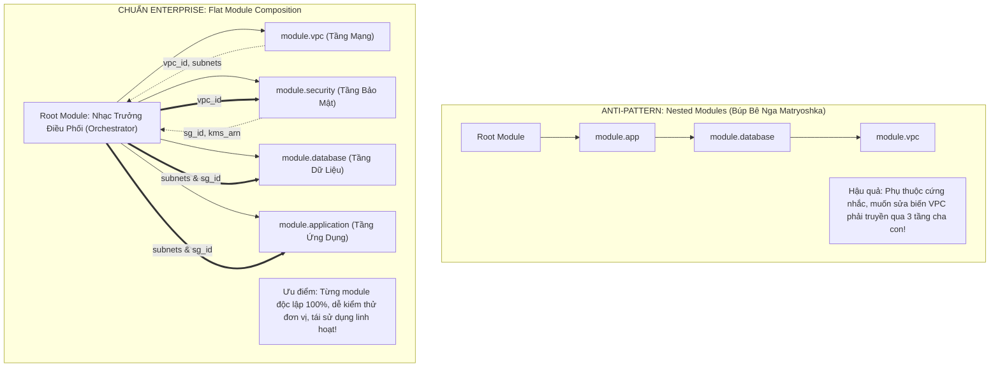
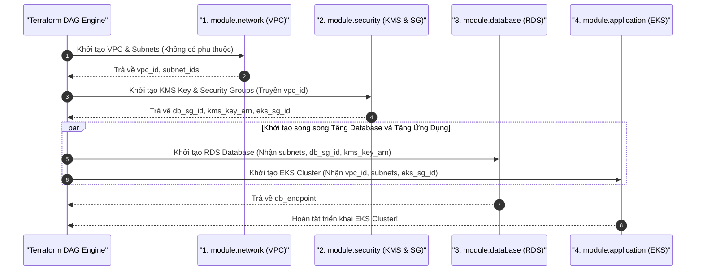


# Ghép Nối Module (Module Composition) & Kiến Trúc Phân Tầng Multi-Tier Trên Terraform Registry

Khi một kỹ sư đã làm chủ kỹ năng tự viết các Module đơn chức năng (**Single-Purpose Modules**), thử thách kiến trúc tiếp theo của một Platform Architect là: *Làm thế nào để liên kết các khối module độc lập này lại với nhau để dựng nên một hệ sinh thái hạ tầng đám mây hoàn chỉnh (Multi-Tier Enterprise Architecture) bao gồm Mạng VPC, Tường lửa, Cơ sở dữ liệu và Cụm Kubernetes?*

Nhiều kỹ sư khi thiết kế hệ thống thường rơi vào cái bẫy nguy hiểm mang tên **Nesting Modules (Module lồng module kiểu búp bê Nga Matryoshka)**: Module Ứng dụng gọi Module Database, Module Database lại tự ý lồng Module VPC bên trong... Mô hình này tạo ra sự phụ thuộc cứng nhắc (Tight Coupling), gây bùng nổ biến trung gian (**Pass-through Variables Explosion**) và biến việc bảo trì thành một "cơn ác mộng".

Giải pháp tiêu chuẩn công nghiệp được HashiCorp khuyến nghị là **Ghép Nối Module Phẳng (Flat Module Composition)**. Bài viết này sẽ giúp bạn làm chủ nghệ thuật điều phối dữ liệu qua đồ thị DAG, phân tích cấu trúc tệp kê khai `.terraform/modules/modules.json`, làm chủ cú pháp Git Subpath `//` và xây dựng kiến trúc hạ tầng phân tầng chuẩn Enterprise.

---

## 1. Cuộc Đối Đầu Kiến Trúc: Flat Composition vs Nested Anti-Pattern



---

## 2. Bảng So Sánh Chi Tiết Các Mô Hình Kiến Trúc Module

| Tiêu Chí So Sánh | Monolithic Root (Nguyên Khối) | Nested Modules (Búp Bê Nga) | Flat Module Composition (Chuẩn) |
| :--- | :--- | :--- | :--- |
| **Tính Đóng Gói (Encapsulation)** | Kém (Tất cả tài nguyên nằm chung) | Quá mức (Che giấu logic quá sâu) | **Tối ưu (Mỗi module là một Black Box)** |
| **Bùng Nổ Biến (Pass-through Vars)**| Không có | Cực kỳ nghiêm trọng (Lặp biến 3-4 lần) | **Không có (Biến đi thẳng vào module cần)** |
| **Khả Năng Tái Sử Dụng (Reusability)**| Hoàn toàn không thể | Rất thấp (Bị dính chùm phụ thuộc) | **Tối đa (Chạy độc lập trên bất kỳ VPC nào)** |
| **Độ Phức Tạp Khi Debug** | Dễ thấy nhưng khó cô lập lỗi | Cực kỳ khó trace lỗi qua nhiều tầng | **Dễ dàng cô lập lỗi tại từng Node trên DAG** |
| **Hỗ Trợ `count` / `for_each`** | Có | Rất khó và dễ gặp lỗi provider lock | **Hoàn hảo, áp dụng linh hoạt trên từng module** |

---

## 3. Cơ Chế Git Subpath Syntax (`//`) & Tệp Kê Khai `modules.json`

Khi doanh nghiệp lưu trữ toàn bộ các Module dùng chung trong một **Monorepo Git**, Terraform sử dụng cú pháp đặc biệt **hai dấu gạch chéo (`//`)** để phân biệt giữa địa chỉ kho lưu trữ và đường dẫn thư mục con bên trong:

```hcl
# Cú pháp Git Subpath chuẩn xác
module "vpc" {
  source = "git::https://github.com/showtech-org/terraform-modules.git//modules/aws-vpc?ref=v2.1.0"
  
  cidr_block  = "10.0.0.0/16"
  environment = var.environment
}
```

### Giải Phẫu Tệp Kê Khai `.terraform/modules/modules.json`:
Khi bạn chạy `terraform init`, Terraform Core sẽ clone các module về thư mục tạm và ghi lại bảng kê khai metadata trong tệp `.terraform/modules/modules.json`:

```json
{
  "Modules": [
    {
      "Key": "",
      "Source": "",
      "Dir": "."
    },
    {
      "Key": "vpc",
      "Source": "git::https://github.com/showtech-org/terraform-modules.git//modules/aws-vpc?ref=v2.1.0",
      "Dir": ".terraform/modules/vpc/modules/aws-vpc"
    },
    {
      "Key": "security",
      "Source": "git::https://github.com/showtech-org/terraform-modules.git//modules/aws-security?ref=v1.4.0",
      "Dir": ".terraform/modules/security/modules/aws-security"
    }
  ]
}
```

> [!TIP]
> **TỐI ƯU BĂNG THÔNG KHI DÙNG MONOREPO:**
> Khi nhiều module cùng trỏ về một Git Repository với cùng một Git Tag (`?ref=v2.1.0`), Terraform Core rất thông minh: Nó chỉ gửi lệnh `git clone` **duy nhất một lần**, sau đó tự động trỏ các `Dir` khác nhau vào các thư mục con tương ứng, giúp giảm 80% thời gian chạy `terraform init` trong CI/CD!

---

## 4. Kiến Trúc Mẫu Ghép Nối 4 Tầng Doanh Nghiệp (HCL Breakdown)

Dưới đây là mã nguồn Root Module đóng vai trò làm "Nhạc trưởng" điều phối luồng dữ liệu giữa 4 tầng hạ tầng độc lập:

```hcl
# root/main.tf - Kiến trúc Flat Composition 4 tầng chuẩn Enterprise
terraform {
  required_version = ">= 1.7.0"
  required_providers {
    aws = {
      source  = "hashicorp/aws"
      version = "~> 5.45.0"
    }
  }
}

provider "aws" {
  region = var.aws_region
}

# -----------------------------------------------------------------------------
# 1. TẦNG MẠNG CƠ SỞ (Network Tier)
# -----------------------------------------------------------------------------
module "network" {
  source = "./modules/aws-vpc"

  cidr_block          = var.vpc_cidr
  public_subnet_cidrs = ["10.0.1.0/24", "10.0.2.0/24"]
  private_subnet_cidrs = ["10.0.10.0/24", "10.0.11.0/24"]
  environment         = var.environment
}

# -----------------------------------------------------------------------------
# 2. TẦNG BẢO MẬT & TƯỜNG LỬA (Security & KMS Tier)
# -----------------------------------------------------------------------------
module "security" {
  source = "./modules/aws-security"

  vpc_id      = module.network.vpc_id # Lấy output từ Module Network
  environment = var.environment
}

# -----------------------------------------------------------------------------
# 3. TẦNG CƠ SỞ DỮ LIỆU & LƯU TRỮ (Data Tier)
# -----------------------------------------------------------------------------
module "database" {
  source = "./modules/aws-rds-postgres"

  subnet_ids             = module.network.private_subnet_ids # Lấy private subnets
  vpc_security_group_ids = [module.security.db_security_group_id]
  kms_key_arn            = module.security.kms_key_arn
  environment            = var.environment
}

# -----------------------------------------------------------------------------
# 4. TẦNG ĐIỆN TOÁN & ỨNG DỤNG (Compute & Application Tier)
# -----------------------------------------------------------------------------
module "application" {
  source = "./modules/aws-eks-cluster"

  vpc_id                 = module.network.vpc_id
  subnet_ids             = module.network.private_subnet_ids
  control_plane_sg_id    = module.security.eks_security_group_id
  db_connection_endpoint = module.database.db_endpoint # Lấy output từ Module Database
  environment            = var.environment
}
```

---

## 5. Luồng Thực Thi Tự Động Trên Đồ Thị DAG

Dựa trên các tham chiếu `module.<name>.<output>`, Terraform Core tự động phân tích và xây dựng đồ thị DAG tuần tự - song song chuẩn xác:



---

## 6. Phân Tích Cạm Bẫy Thực Chiến: Vòng Lặp Phụ Thuộc Chéo Giữa Các Module

### Tình Huống Sự Cố Thực Tế:
Một nhóm kỹ sư tách hệ thống thành 2 module: `module "network"` và `module "security"`.
- Trong `module "network"`, kỹ sư muốn tạo VPC Flow Logs và cần truyền ID của Security Group từ `module.security.flow_logs_sg_id`.
- Trong `module "security"`, kỹ sư lại cần `module.network.vpc_id` để tạo Security Group.

Khi chạy lệnh `terraform plan`:

```log
Error: Cycle: module.network (expand), module.security (expand), module.network (expand)

A cycle was detected in the dependency graph between the modules:
module.network depends on module.security
module.security depends on module.network
```

### 5-Whys Root Cause Analysis:
1. **Tại sao Terraform báo lỗi Cycle giữa 2 module?** $\rightarrow$ Vì Module Network cần output của Module Security, và Module Security lại cần output của Module Network.
2. **Tại sao lại có sự phụ thuộc 2 chiều này?** $\rightarrow$ Do kỹ sư gộp tính năng VPC Flow Logs (vốn thuộc tầng Giám sát/Bảo mật) vào bên trong Module Network.
3. **Tại sao việc gộp này lại sai?** $\rightarrow$ Vi phạm nguyên lý Single Responsibility Principle; Module Network chỉ nên thuần túy tạo hạ tầng mạng cơ sở (VPC, Subnet, Route Table).
4. **Biện pháp khắc phục chuẩn SRE:**
   - **Tách rời tài nguyên phụ thuộc:** Đưa tài nguyên `aws_flow_log` ra khỏi Module Network và chuyển sang Module Security hoặc khai báo độc lập ở Root Module.
   - **Đảm bảo luồng dữ liệu 1 chiều (Unidirectional Data Flow):** Dữ liệu luôn chảy xuôi từ Network $\rightarrow$ Security $\rightarrow$ Data $\rightarrow$ Application, tuyệt đối không có mũi tên chảy ngược lại.

---

## 7. Hands-on Lab: Xây Dựng Dự Án Flat Composition Hoàn Chỉnh (8 Bước)

### Bước 1: Khởi tạo cấu trúc thư mục Monorepo
```bash
mkdir -p /tmp/composition-lab/modules/network
mkdir -p /tmp/composition-lab/modules/app
cd /tmp/composition-lab
```

### Bước 2: Viết Module Network độc lập
```bash
cat << 'EOF' > modules/network/main.tf
terraform {
  required_version = ">= 1.7.0"
  required_providers {
    local = { source = "hashicorp/local", version = "~> 2.5.0" }
  }
}

variable "network_name" { type = string }

resource "local_file" "vpc_net" {
  filename = "${path.module}/vpc_${var.network_name}.txt"
  content  = "Network CIDR: 10.0.0.0/16 - Mode: Isolated"
}

output "network_id" {
  value = "net-${var.network_name}-01234"
}
EOF
```

### Bước 3: Viết Module App độc lập (Nhận `network_id` làm input)
```bash
cat << 'EOF' > modules/app/main.tf
terraform {
  required_version = ">= 1.7.0"
  required_providers {
    local = { source = "hashicorp/local", version = "~> 2.5.0" }
  }
}

variable "app_name"   { type = string }
variable "network_id" { type = string }

resource "local_file" "app_manifest" {
  filename = "${path.module}/app_${var.app_name}.json"
  content  = jsonencode({
    application = var.app_name
    attached_network = var.network_id
    status = "Active"
  })
}

output "manifest_path" {
  value = local_file.app_manifest.filename
}
EOF
```

### Bước 4: Viết Root Module điều phối Flat Composition
```bash
cat << 'EOF' > main.tf
terraform {
  required_version = ">= 1.7.0"
}

# 1. Gọi Module Network
module "core_network" {
  source       = "./modules/network"
  network_name = "production"
}

# 2. Gọi Module App và truyền Output từ Module Network
module "order_service" {
  source     = "./modules/app"
  app_name   = "order-api"
  network_id = module.core_network.network_id
}

output "app_summary" {
  value = {
    network  = module.core_network.network_id
    manifest = module.order_service.manifest_path
  }
}
EOF
```

### Bước 5: Khởi tạo và kiểm tra tệp kê khai `modules.json`
```bash
terraform init
cat .terraform/modules/modules.json | jq .
```

### Bước 6: Kiểm tra tính hợp lệ của Đồ thị DAG
```bash
terraform validate
terraform plan
```

### Bước 7: Thực thi triển khai toàn bộ hệ sinh thái
```bash
terraform apply -auto-approve
```

### Bước 8: Xác minh kết quả Output và dọn dẹp
```bash
terraform output
cat modules/app/app_order-api.json

# Dọn dẹp môi trường
terraform destroy -auto-approve
cd .. && rm -rf /tmp/composition-lab
```

---

## 8. 10 Câu Hỏi Tự Kiểm Tra Chuyên Sâu (Self-Check Q&A)

### Câu 1: Tại sao mô hình Flat Module Composition lại được khuyến nghị hơn mô hình Nested Modules?
<details>
<summary><b>Xem lời giải chi tiết</b></summary>
Vì Flat Composition tuân thủ nguyên lý <b>Single Responsibility</b> và <b>Loose Coupling</b>. Mỗi module hoàn toàn độc lập, không bị phụ thuộc lồng nhau, loại bỏ hiện tượng bùng nổ biến trung gian (Pass-through variables), giúp dễ dàng kiểm thử đơn vị và tái sử dụng trên nhiều dự án khác nhau.
</details>

### Câu 2: Cú pháp hai dấu gạch chéo (`//`) trong Module Source có ý nghĩa gì?
<details>
<summary><b>Xem lời giải chi tiết</b></summary>
Được dùng cho <b>Git Subpath</b>. Nó giúp Terraform Core phân biệt: Phần trước <code>//</code> là địa chỉ Git Repository cần clone, và phần sau <code>//</code> là đường dẫn tới thư mục con cụ thể bên trong kho chứa mã nguồn đó.
</details>

### Câu 3: Tệp `.terraform/modules/modules.json` có vai trò gì trong quá trình chạy Terraform?
<details>
<summary><b>Xem lời giải chi tiết</b></summary>
Là tệp kê khai siêu dữ liệu (Manifest) do <code>terraform init</code> tự động sinh ra, lưu trữ ánh xạ giữa tên logic của Module (Key), nguồn tải về (Source) và thư mục vật lý cục bộ (Dir) trên ổ đĩa để Terraform Core nạp mã nguồn khi chạy Plan/Apply.
</details>

### Câu 4: Làm thế nào để giải quyết lỗi Cycle Dependency giữa 2 module độc lập?
<details>
<summary><b>Xem lời giải chi tiết</b></summary>
Bắt buộc phải tái cấu trúc để đảm bảo <b>Luồng dữ liệu 1 chiều (Unidirectional Data Flow)</b>. Tách các tài nguyên phụ thuộc chéo (ví dụ VPC Flow Logs hoặc Security Group Rules) ra thành một module thứ ba độc lập hoặc khai báo trực tiếp tại Root Module.
</details>

### Câu 5: Điều gì xảy ra nếu bạn thay đổi mã nguồn trong Child Module nhưng không chạy lại `terraform init`?
<details>
<summary><b>Xem lời giải chi tiết</b></summary>
- Nếu là <b>Local Module Path (./modules/...)</b>: Thay đổi có hiệu lực ngay lập tức khi chạy Plan/Apply.<br/>
- Nếu là <b>Remote Git Module</b>: Terraform sẽ tiếp tục dùng bản code cũ trong <code>.terraform/modules/</code> cho đến khi bạn chạy <code>terraform init -upgrade</code> để tải lại bản mới.
</details>

### Câu 6: Làm thế nào để truyền một biến nhạy cảm từ Module A sang Module B qua Root Module một cách an toàn?
<details>
<summary><b>Xem lời giải chi tiết</b></summary>
1. Đánh dấu <code>sensitive = true</code> trên output của Module A.<br/>
2. Đánh dấu <code>sensitive = true</code> trên input variable của Module B.<br/>
3. Tại Root Module, truyền trực tiếp: <code>secret_var = module.mod_a.secret_output</code>.
</details>

### Câu 7: Khi nào nên sử dụng Private Terraform Registry thay vì gọi trực tiếp Git HTTPS?
<details>
<summary><b>Xem lời giải chi tiết</b></summary>
Khi doanh nghiệp cần: (1) Quản lý phiên bản Semantic Versioning chuyên nghiệp; (2) Tự động hóa kiểm tra bảo mật và tài liệu; (3) Phân quyền RBAC kiểm soát nhóm nào được phép sử dụng module nào; (4) Tối ưu hóa tốc độ tải module trong CI/CD.
</details>

### Câu 8: Root Module đóng vai trò gì trong mô hình Flat Composition?
<details>
<summary><b>Xem lời giải chi tiết</b></summary>
Root Module đóng vai trò là <b>"Nhạc trưởng điều phối" (Orchestrator / Glue Code)</b>: Khởi tạo các provider, kết nối Remote Backend, nhận output của module này truyền vào input của module kia và xuất ra các output tổng hợp của toàn hệ thống.
</details>

### Câu 9: Làm thế nào để chạy kiểm thử độc lập (Unit Test) cho một Single-Purpose Module?
<details>
<summary><b>Xem lời giải chi tiết</b></summary>
Tạo một thư mục <code>examples/basic</code> bên trong chính module đó, sử dụng framework <code>terraform test</code> (Terraform 1.6+) để tạo tài nguyên thử nghiệm ngắn hạn (Ephemeral Infrastructure) và kiểm tra các điều kiện assertion.
</details>

### Câu 10: Có nên đưa tệp `.terraform/modules/` vào Git Version Control không?
<details>
<summary><b>Xem lời giải chi tiết</b></summary>
<b>TUYỆT ĐỐI KHÔNG</b>. Toàn bộ thư mục <code>.terraform/</code> phải luôn nằm trong tệp <code>.gitignore</code> vì nó chứa các tệp nhị phân và mã nguồn tải tạm thời, sẽ được tự động sinh ra khi chạy <code>terraform init</code>.
</details>

---

## 9. Tổng Kết & Lộ Trình Bài Học Tiếp Theo

Làm chủ nghệ thuật **Ghép Nối Module Phẳng (Flat Module Composition)** và kiến trúc phân tầng đa lớp giúp bạn thiết kế những hệ sinh thái hạ tầng đám mây đồ sộ, linh hoạt và sẵn sàng mở rộng cho hàng trăm dịch vụ vi mô.

Trong **[Bài 12: Quản Trị Đa Môi Trường: So Sánh Thực Chiến Terraform Workspaces vs Directory Layout vs Terragrunt](12-quan-tri-da-moi-truong-terraform-workspaces-vs-directory-layout-terragrunt.md)**, chúng ta sẽ bước vào cuộc tranh luận kiến trúc kinh điển nhất thế giới DevOps: Khi nào nên dùng Workspaces, khi nào nên chia thư mục File-based Layout, và tại sao các tập đoàn hàng đầu lại lựa chọn Terragrunt!

