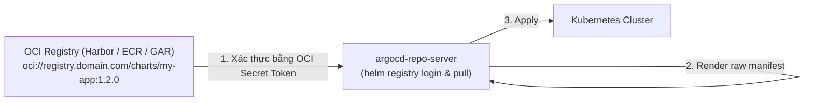
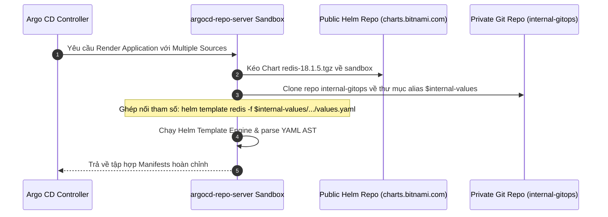
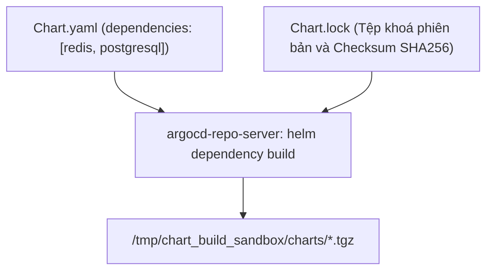
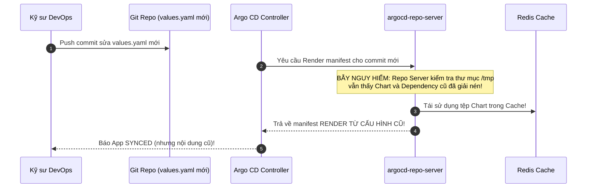


# Quản Lý Helm Charts Trong Argo CD & Kỹ Thuật Multiple Sources Nâng Cao

Trong cộng đồng Cloud Native, **Helm** là trình quản lý gói (Package Manager) phổ biến nhất với hàng chục ngàn thư viện Chart chất lượng cao được cộng đồng mã nguồn mở và các hãng công nghệ phát hành (như Redis, PostgreSQL, Kafka, NGINX Ingress, Prometheus).

Tuy nhiên, cách Argo CD tiếp cận và quản lý Helm Charts có một sự khác biệt bản chất so với cách sử dụng lệnh `helm install` truyền thống. Argo CD không lưu trữ trạng thái Release trong Secret của Helm, mà sử dụng cơ chế **`helm template`** để biên dịch toàn bộ Chart thành các bản khai báo thuần túy (Raw Manifests) và quản lý chúng thông qua vòng lặp điều hòa GitOps.

Đặc biệt, từ phiên bản Argo CD 2.6+, tính năng **Multiple Sources** ra đời đã giải quyết một bài toán hóc búa nhất của doanh nghiệp: *Làm thế nào để sử dụng một Helm Chart công khai trên Internet nhưng kết hợp với một tệp `values.yaml` nội bộ chứa cấu hình bảo mật nằm trong một kho Git riêng tư của công ty?*

Bài viết này sẽ hướng dẫn bạn làm chủ toàn diện Helm trong Argo CD, khai thác kỹ thuật **Multiple Sources `$values`**, quản lý các kho lưu trữ **OCI Registry** hiện đại và xử lý các cạm bẫy kẹt cache Helm dependencies.

---

## 1. Bản Chất Của Helm Trong Argo CD: `helm template` vs `helm install`

Để hiểu đúng cách vận hành, hãy so sánh cơ chế triển khai Helm truyền thống với mô hình GitOps trên Argo CD:

```mermaid
flowchart TD
    subgraph HELM_CLI["1. MÔ HÌNH TRUYỀN THỐNG: HELM CLI (helm install)"]
        CLI_USER["Kỹ sư chạy lệnh: helm install my-redis bitnami/redis"]
        CLI_USER --> HELM_ENGINE["Helm Client Render"]
        HELM_ENGINE --> K8S_1["Kubernetes API Server"]
        HELM_ENGINE --> HELM_SEC["Tạo Kubernetes Secret: sh.helm.release.v1.my-redis (Lưu Release State)"]
        
        DRIFT_1["Ai đó sửa kubectl edit Pod"] -.->|Helm không phát hiện được| K8S_1
    end

    subgraph ARGO_HELM["2. MÔ HÌNH GITOPS: ARGO CD (helm template Engine)"]
        GIT_CHART["Helm Chart + Values trên Git"]
        ARGO_REPO["argocd-repo-server (Thực thi: helm template --values ...)"]
        ARGO_CTRL["argocd-application-controller (Three-Way Diff Engine)"]
        K8S_2["Kubernetes API Server (Live State)"]
        
        GIT_CHART --> ARGO_REPO
        ARGO_REPO -->|Trả về Raw YAML| ARGO_CTRL
        ARGO_CTRL -->|Reconcile Loop & Self-Healing| K8S_2
        
        DRIFT_2["Ai đó sửa kubectl edit Pod"] ==>|Bị phát hiện và dập tắt ngay| ARGO_CTRL
    end


```



### 1.1. Bảng So Sánh Chi Tiết Các Cơ Chế Quản Lý Helm

| Tiêu Chí So Sánh | Helm CLI Truyền Thống (`helm install`) | Argo CD Helm Engine (`helm template`) | Flux Helm Controller |
| :--- | :--- | :--- | :--- |
| **Phương thức thực thi** | Chạy lệnh tương tác từ máy cá nhân hoặc CI pipeline | Controller tự động kéo và render bằng `helm template` | Chạy Helm Engine bên trong cụm tạo Release Secret |
| **Lưu trữ trạng thái (State)** | Lưu trong Secret `sh.helm.release.v1.*` | Không tạo Secret Helm Release; trạng thái lưu trên Git & etcd | Lưu trong Secret Helm Release tương tự Helm CLI |
| **Phát hiện Configuration Drift** | Không hỗ trợ (Chỉ biết trạng thái khi chạy lệnh) | **Liên tục 24/7** thông qua Reconciliation Loop | Hỗ trợ qua Drift Detection của Helm Controller |
| **Tự chữa lành (Self-Healing)** | Không hỗ trợ | Tự động ghi đè khôi phục về đúng Git | Tự động reconcile lại Helm Release |
| **Xử lý Helm Hooks** | Hỗ trợ Native Helm Hooks (`pre-install`, `post-upgrade`) | Chuyển đổi thành **Argo CD Resource Hooks** hoặc bỏ qua | Hỗ trợ Native Helm Hooks |
| **Lệnh `helm list` trên cụm** | Hiển thị danh sách Releases | **Không hiển thị Release nào** | Hiển thị Release đầy đủ |

---

## 2. Quản Lý Helm Charts Từ Kho Lưu Trữ OCI Registry

Hiện nay, các nhà cung cấp dịch vụ Cloud và công cụ Container Registry (như Harbor, Amazon ECR, Google Artifact Registry, GitHub Packages) đều chuyển sang hỗ trợ chuẩn **OCI (Open Container Initiative)** để lưu trữ cả Docker Images và Helm Charts trên cùng một hệ sinh thái.



### 2.1. Đăng Ký Kho Lưu Trữ OCI Trong Argo CD

Để Argo CD có thể kéo Chart từ một kho OCI yêu cầu xác thực bí mật:

```yaml
# oci-repository-secret.yaml
apiVersion: v1
kind: Secret
metadata:
  name: private-oci-registry-secret
  namespace: argocd
  labels:
    argocd.argoproj.io/secret-type: repository
stringData:
  type: "helm"
  name: "Company OCI Harbor Registry"
  # URL OCI bắt buộc phải có tiền tố oci:// và không chứa tên chart
  url: "harbor.company.internal/helm-charts"
  enableOCI: "true"
  username: "robot-argocd"
  password: "harbor-robot-token-secret"
```

### 2.2. Cấu Hình Chứng Chỉ TLS Riêng Cho Private Helm Registry

Nếu kho OCI Registry sử dụng chứng chỉ nội bộ (Self-Signed SSL Certificate), ta cần đưa CA Root vào ConfigMap `argocd-tls-certs-cm`:

```yaml
apiVersion: v1
kind: ConfigMap
metadata:
  name: argocd-tls-certs-cm
  namespace: argocd
  labels:
    app.kubernetes.io/part-of: argocd
data:
  harbor.company.internal: |
    -----BEGIN CERTIFICATE-----
    MIIDdTCCAl2gAwIBAgIUXj7x... (Nội dung chứng chỉ Root CA)
    -----END CERTIFICATE-----
```

---

## 3. Đỉnh Cao Kỹ Thuật: Multiple Sources Với Biến `$values`

### 3.1. Bài Toán Thực Tế Tại Doanh Nghiệp
- Bạn muốn triển khai một dịch vụ nguồn mở phức tạp (ví dụ: `redis-cluster` hoặc `kube-prometheus-stack`) từ kho Bitnami công khai (`https://charts.bitnami.com/bitnami`).
- Tuy nhiên, tệp cấu hình `values.yaml` của bạn chứa các tham số bảo mật, tên miền nội bộ và mật khẩu đã mã hóa, bắt buộc phải lưu trong kho Git riêng tư của công ty (`https://github.com/company/internal-gitops.git`).
- Trước đây, bạn phải tự clone chart về kho Git nội bộ (Vendor Chart), gây lãng phí dung lượng và khó khăn khi muốn nâng cấp phiên bản Chart mới.

### 3.2. Kiến Trúc Hoạt Động Của Multiple Sources Trong Repo Server

Khi nhận yêu cầu biên dịch Application có nhiều nguồn, `argocd-repo-server` tạo một thư mục sandbox tạm thời và thực hiện quy trình sau:



> [!IMPORTANT]
> **ĐỘ ĐỘC BẢN CỦA MULTIPLE SOURCES:**
> Tính năng Multiple Sources (`spec.sources`) cho phép doanh nghiệp kết hợp Helm Chart công khai trên Internet với tệp `values.yaml` nội bộ bảo mật trên Git riêng qua biến `$alias`, loại bỏ hoàn toàn nhu cầu fork/vendor chart thủ công.

---

## 4. Phân Tích Cấu Hình Chi Tiết Manifest Multiple Sources (Line-by-Line Breakdown)

Dưới đây là manifest Application hoàn chỉnh kết hợp Helm OCI/HTTP với kho Git nội bộ:

```yaml
# application-helm-multiple-sources.yaml
apiVersion: argoproj.io/v1alpha1
kind: Application
metadata:
  name: production-redis-cluster
  namespace: argocd
spec:
  project: production-project
  
  # KHAI BÁO DANH SÁCH NHIỀU NGUỒN DỮ LIỆU (MULTIPLE SOURCES)
  sources:
    # 1. NGUỒN THỨ NHẤT: Helm Chart từ kho Public
    - repoURL: "https://charts.bitnami.com/bitnami"
      chart: "redis"
      targetRevision: "18.1.5" # Cố định phiên bản Chart cụ thể
      helm:
        # Đặt Release Name cho Helm template
        releaseName: "prod-redis"
        # Bật tính năng render CRDs đi kèm Chart
        includeCRDs: true
        # Bỏ qua các hook của Helm nếu muốn Argo quản lý vòng đời
        skipHooks: false
        # Sử dụng biến $internal-values để tham chiếu sang tệp values ở nguồn thứ hai
        valueFiles:
          - "$internal-values/services/redis/environments/production/values.yaml"
          - "$internal-values/services/redis/environments/production/secrets-values.yaml"
        # Bỏ qua nếu file values phụ không tồn tại
        ignoreMissingValueFiles: true
        # Override thêm các tham số trực tiếp nếu cần
        parameters:
          - name: "architecture"
            value: "replication"
          - name: "auth.enabled"
            value: "true"
          - name: "metrics.enabled"
            value: "true"
          # Truyền tham số cho Subchart lồng nhau
          - name: "sentinel.enabled"
            value: "false"
          - name: "master.resources.requests.cpu"
            value: "500m"
        # Truyền nội dung file thô vào template (ví dụ script cấu hình custom)
        fileParameters:
          - name: "sentinel.customConfig"
            path: "$internal-values/services/redis/configs/sentinel.conf"

    # 2. NGUỒN THỨ HAI: Kho Git nội bộ chứa tệp values.yaml
    - repoURL: "https://github.com/company/internal-gitops.git"
      targetRevision: "main"
      # Đặt định danh bí danh (Alias Reference) cho nguồn này
      ref: "internal-values"

  destination:
    server: "https://kubernetes.default.svc"
    namespace: "database-production"

  syncPolicy:
    automated:
      prune: true
      selfHeal: true
    syncOptions:
      - CreateNamespace=true
      - ServerSideApply=true
```

#### Phân Tích Từng Khối Cấu Hình:
- **Dòng 148-151 (`repoURL` & `targetRevision`):** Chỉ định kho Chart và cố định phiên bản `18.1.5` để đảm bảo tính bất biến (Immutability).
- **Dòng 155 (`includeCRDs: true`):** Đảm bảo toàn bộ các Custom Resource Definitions nằm trong thư mục `crds/` của Chart sẽ được Argo CD biên dịch và nạp vào cụm trước.
- **Dòng 157 (`skipHooks: false`):** Cho phép các Helm Hooks chuyển đổi thành Argo CD Hooks. Nếu Chart có các hook gây lỗi, có thể đổi thành `true`.
- **Dòng 159-163 (`$internal-values`):** Cú pháp `$alias-name` đại diện cho đường dẫn của repo thứ hai được clone về bộ nhớ đệm của `argocd-repo-server`.
- **Dòng 165 (`ignoreMissingValueFiles: true`):** Ngăn chặn lỗi build crash nếu một file values tùy chọn (như `secrets-values.yaml`) chưa được commit lên Git.
- **Dòng 173-180 (`fileParameters`):** Cho phép nhúng toàn bộ nội dung của một file cấu hình thô từ kho Git nội bộ vào biến template của Helm mà không cần viết lại dạng Base64.
- **Dòng 184-187 (`ref: internal-values`):** Gán nhãn định danh cho kho Git riêng tư để các nguồn khác có thể tham chiếu.

---

## 5. Xử Lý Helm CRDs & Cạm Bẫy Hook Xung Đột

Trong Helm 3, các tệp CRD đặt trong thư mục `crds/` không được nâng cấp tự động khi chạy `helm upgrade`. Tuy nhiên, với Argo CD:
1. **Argo CD đối xử với CRDs như tài nguyên tiêu chuẩn:** Khi bật `includeCRDs: true`, toàn bộ CRDs trong thư mục `crds/` đều được quản lý và tự động nâng cấp đồng bộ theo GitOps.
2. **Xung Đột Helm Hooks:** Nhiều Helm Charts bên thứ ba sử dụng hook `pre-install` dạng Kubernetes Job để migrate database. Nếu Job này chạy lỗi, Argo CD sẽ bị kẹt ở giai đoạn `Syncing`.
3. **Giải Pháp:** Thiết lập annotation `helm.sh/hook-delete-policy: hook-succeeded,before-hook-creation` hoặc tắt hook bằng `skipHooks: true` để nhường quyền điều phối cho **Sync Waves** của Argo CD.

---

## 6. Cơ Chế Quản Trị Helm Dependencies Trong Repo Server

Khi triển khai Helm Chart nội bộ có khai báo `dependencies` trong `Chart.yaml`:



- **Quy Tắc Quản Trị Dependency:** Luôn commit tệp `Chart.lock` vào kho Git. Khi có `Chart.lock`, Repo Server sẽ thực thi lệnh `helm dependency build` thay vì `helm dependency update`, đảm bảo 100% tính nhất quán về phiên bản subcharts giữa môi trường local và cụm Kubernetes.

---

## 7. Xác Thực Chữ Ký GPG & Bảo Mật Helm Supply Chain

Trong các môi trường tài chính và ngân hàng (Fintech/Banking), việc xác thực nguồn gốc Chart là bắt buộc để phòng chống tấn công chuỗi cung ứng (Supply Chain Attack):

```yaml
apiVersion: v1
kind: ConfigMap
metadata:
  name: argocd-cm
  namespace: argocd
data:
  # Bắt buộc xác thực chữ ký GPG cho toàn bộ Helm Charts
  helm.verify: "true"
```

Khi bật cờ này, `argocd-repo-server` sẽ kiểm tra tệp chữ ký `provenance (.prov)` của Helm Chart bằng Public Key đã nạp trước khi thực thi lệnh template.

---

## 8. Cạm Bẫy Thực Chiến: "Sửa `values.yaml` Trên Git Nhưng Argo CD Vẫn Render Bản Cũ Do Kẹt Cache Helm Dependency"

### Hiện Tượng Sự Cố & Log Trace
- Kỹ sư DevOps sửa một tham số trong file `values.yaml` trên kho Git nội bộ và push commit lên nhánh `main`.
- Argo CD phát hiện commit mới, thực hiện Reconcile nhưng manifest render ra hoàn toàn **không có sự thay đổi nào**. Ứng dụng vẫn chạy theo cấu hình cũ.
- Khi kiểm tra log của `argocd-repo-server`, phát hiện `repo-server` vẫn đang tái sử dụng tệp Chart cũ nằm trong thư mục cache `/tmp`:

```json
{
  "timestamp": "2026-03-30T09:15:22Z",
  "level": "info",
  "component": "argocd-repo-server",
  "msg": "helm dependency build skipped; chart tarball already cached in /tmp/_helm_cache/redis-18.1.5.tgz",
  "action": "helm template cached"
}
```



### 8.1. Phân Tích Nguyên Nhân Gốc Rễ (5-Whys)
1. **Tại sao cấu hình mới không được cập nhật?** $\rightarrow$ Vì `argocd-repo-server` trả về bản YAML render từ cache cũ.
2. **Tại sao Repo Server dùng cache cũ?** $\rightarrow$ Vì cờ cache TTL của Helm dependencies chưa hết hạn và thư mục `/tmp` vẫn còn tệp `.tgz` đã giải nén trước đó.
3. **Tại sao Helm không tự nhận biết thay đổi nội bộ?** $\rightarrow$ Do Chart sử dụng Subchart dạng wildcard dependency version (`version: ~1.0.0`) nên Helm không kiểm tra lại checksum subchart.
4. **Giải pháp khắc phục tức thì là gì?** $\rightarrow$ Thực thi lệnh `--hard-refresh` trên CLI hoặc bấm nút `Hard Refresh` trên Web UI để xóa sạch bộ nhớ đệm của Repo Server.
5. **Biện pháp phòng ngừa dài hạn là gì?** $\rightarrow$ Thiết lập `helm.dependency-update: "true"` và cố định tuyệt đối `Chart.lock` trong Git repository.

---

## 9. Hướng Dẫn Thực Hành CLI: Kiểm Thử Helm Template Với Multiple Sources (Step-by-Step Lab)

Dưới đây là quy trình thực hành từ dòng lệnh để kiểm tra, gỡ lỗi và kiểm chứng ứng dụng Helm trong Argo CD:

```bash
# Bước 1: Kiểm tra trạng thái ứng dụng Helm đang chạy trên Argo CD
argocd app get production-redis-cluster

# Bước 2: Xem toàn bộ danh sách các tham số Helm đang được áp dụng từ các nguồn
argocd app get production-redis-cluster --show-params

# Bước 3: Thay đổi một tham số Helm trực tiếp từ dòng lệnh CLI (Override thử nghiệm)
argocd app set production-redis-cluster --parameter auth.sentinel=false

# Bước 4: Ép buộc xóa toàn bộ bộ nhớ đệm Repo Server và tính toán lại (Hard Refresh)
argocd app get production-redis-cluster --hard-refresh

# Bước 5: Xem sự khác biệt trước khi đồng bộ (Dry-run diff)
argocd app diff production-redis-cluster

# Bước 6: Kích hoạt đồng bộ hóa với tùy chọn Server-Side Apply
argocd app sync production-redis-cluster --server-side
```

---

## 10. Bộ Câu Hỏi Tự Kiểm Tra Chuyên Sâu (Self-Check Q&A)

Dưới đây là 10 câu hỏi sát hạch chuyên sâu về Helm & GitOps trên Argo CD:

### Câu 1: Tại sao lệnh `helm list` trên cụm Kubernetes không hiển thị các ứng dụng được cài đặt bằng Argo CD?
- **Đáp án:** Vì Argo CD sử dụng động cơ `helm template` để biên dịch Chart thành các đối tượng Kubernetes YAML thô và áp dụng trực tiếp qua Kubernetes API. Argo CD không tạo ra đối tượng Secret chứa Release metadata của Helm, do đó công cụ Helm CLI độc lập sẽ không nhận biết được các Release này.

### Câu 2: Biến `$alias` trong cú pháp Multiple Sources của Argo CD hoạt động như thế nào?
- **Đáp án:** Khi một nguồn Git được định danh bằng trường `ref: <alias-name>`, Argo CD sẽ tự động clone nguồn đó về và tạo một biến môi trường đại diện cho đường dẫn thư mục của nguồn đó (dạng `$alias-name`). Các nguồn khác trong cùng Application có thể sử dụng biến này để trỏ tới các tệp cấu hình (như `$alias-name/path/to/values.yaml`).

### Câu 3: Làm thế nào để truyền một giá trị nhạy cảm (như mật khẩu Database) vào Helm Chart trong Argo CD mà không ghi Plaintext trong `values.yaml`?
- **Đáp án:** Có 3 cách chuẩn mực: (1) Kết hợp với **Bitnami Sealed Secrets** hoặc **External Secrets Operator** để tạo ra Secret trước, sau đó Helm Chart chỉ tham chiếu qua `existingSecret`, (2) Sử dụng **Helm Secrets Plugin (SOPS)**, hoặc (3) Truyền qua Argo CD Parameter Overrides đọc từ Secret.

### Câu 4: Trường `spec.sources[].helm.parameters` có độ ưu tiên cao hơn hay thấp hơn các giá trị trong `valueFiles`?
- **Đáp án:** Có độ ưu tiên **CAO HƠN**. Thứ tự ghi đè cấu hình của Helm trong Argo CD là: `values.yaml mặc định của Chart` $\rightarrow$ `valueFiles khai báo trong Application` $\rightarrow$ `parameters khai báo trực tiếp (Tương đương cờ --set của Helm)`.

### Câu 5: Cần cấu hình gì trong `argocd-cm` để ngăn chặn việc tải lên các tệp `values.yaml` quá lớn làm tràn RAM của `argocd-repo-server`?
- **Đáp án:** Cấu hình tham số `helm.valuesFileMaxBytes` trong ConfigMap `argocd-cm` (ví dụ: `helm.valuesFileMaxBytes: "2097152"` để giới hạn kích thước tối đa là 2MB).

### Câu 6: Làm thế nào để khai báo một kho Helm OCI yêu cầu xác thực trong Argo CD?
- **Đáp án:** Tạo một Secret thuộc namespace `argocd` có nhãn `argocd.argoproj.io/secret-type: repository`, trường `type: helm`, `enableOCI: "true"` và `url: "harbor.domain.com/charts"` (không kèm tên chart).

### Câu 7: Tùy chọn `ignoreMissingValueFiles: true` trong Helm Application có tác dụng gì?
- **Đáp án:** Giúp Argo CD bỏ qua và không báo lỗi build thất bại nếu một tệp `values.yaml` được khai báo trong danh sách `valueFiles` không tìm thấy trong kho lưu trữ Git.

### Câu 8: `fileParameters` trong cấu hình Helm của Argo CD dùng để làm gì?
- **Đáp án:** Cho phép truyền nội dung của một tệp thô bất kỳ (như script cấu hình `.sh`, chứng chỉ SSL `.pem`, hoặc tệp config phức tạp) từ repo vào một biến template Helm dưới dạng chuỗi string, tương đương cờ `--set-file` của Helm CLI.

### Câu 9: Tại sao nên tránh dùng `targetRevision: latest` hoặc wildcard version cho Helm Chart trong GitOps?
- **Đáp án:** Vì điều đó vi phạm nguyên tắc Bất Biến (Immutability) của GitOps. Khi kho Helm phát hành bản mới, cụm có thể tự động nâng cấp mà không có commit nào trên Git, gây khó khăn cho việc rollback và tái lập môi trường.

### Câu 10: Khi sử dụng Multiple Sources, nếu một trong hai nguồn Git bị lỗi kết nối thì Argo CD sẽ xử lý thế nào?
- **Đáp án:** Argo CD sẽ đánh dấu Application ở trạng thái `ComparisonError` và không thực hiện bất kỳ hành động đồng bộ nào cho đến khi toàn bộ các nguồn được kéo về thành công, đảm bảo tính toàn vẹn của bản build manifest.

---

## Tổng Kết

Làm chủ Helm trong Argo CD kết hợp với kỹ thuật **Multiple Sources** giúp các tổ chức công nghệ tận dụng tối đa hệ sinh thái hàng ngàn Helm Charts mã nguồn mở, đồng thời bảo đảm tính riêng tư, bảo mật và khả năng kiểm soát tập trung cho các cấu hình doanh nghiệp.

Chúc mừng bạn đã hoàn thành trọn vẹn **Giai Đoạn 2 (Đồng Bộ Nâng Cao & Quản Trị Đa Môi Trường)**!

Ở bài tiếp theo mở màn **Giai Đoạn 3**, chúng ta sẽ bước lên cấp độ quy mô khổng lồ với **Mô Hình Quản Trị Quy Mô App-of-Apps Pattern Chuẩn Enterprise**!

