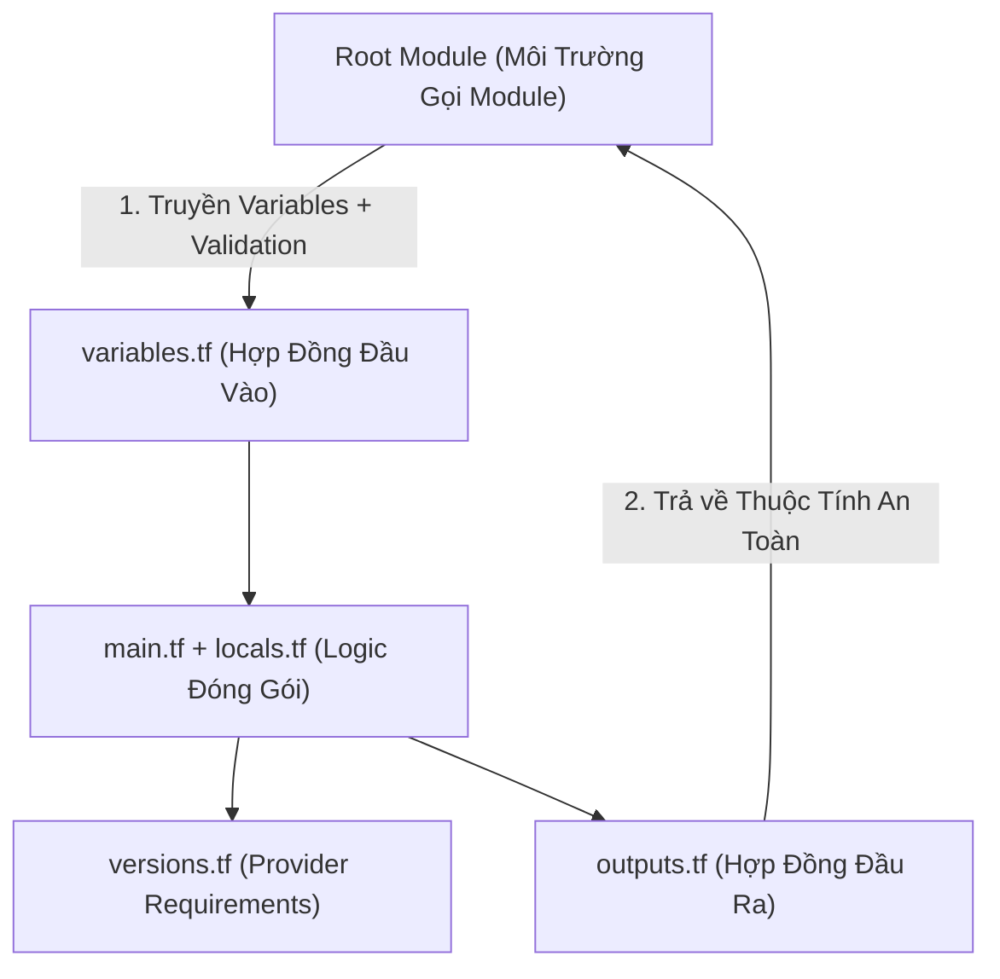
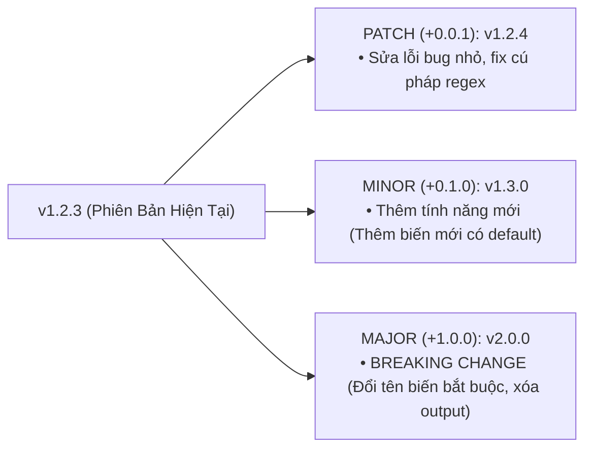

# Tự Viết Module Terraform Chuẩn Enterprise: Cấu Trúc File, Hợp Đồng Giao Tiếp & Semantic Versioning

Khi hạ tầng của một doanh nghiệp phát triển từ vài chục tài nguyên lên hàng nghìn tài nguyên phân tán, việc viết toàn bộ mã nguồn HCL trong một thư mục gốc nguyên khối (**Root Module Monolith**) sẽ biến codebase thành một "mớ bòng bong" không thể bảo trì:
- Mã nguồn bị sao chép lặp đi lặp lại (**Copy-Paste Anti-pattern**) giữa các môi trường `dev`, `staging`, `prod`.
- Một thay đổi nhỏ trên cấu hình mạng có thể vô tình làm ảnh hưởng hoặc làm sập cơ sở dữ liệu.
- Các nhóm phát triển ứng dụng (Dev Teams) không có cách nào tự khởi tạo hạ tầng tuân thủ theo đúng tiêu chuẩn an ninh và quy chuẩn đặt tên của nhóm Nền tảng (Platform SRE Team).

Giải pháp cốt lõi cho bài toán này là **Module hóa (Modularization)**. Tuy nhiên, tự viết một Module để "chạy được" rất dễ, nhưng viết một **Module chuẩn Enterprise có tính đóng gói cao, giao diện chặt chẽ và không chứa breaking changes ngầm** đòi hỏi tư duy thiết kế phần mềm nghiêm ngặt.

Bài viết này sẽ hướng dẫn bạn toàn bộ quy chuẩn thiết kế Module theo khuyến nghị của HashiCorp: Cấu trúc thư mục tiêu chuẩn, thiết kế **Hợp đồng giao tiếp (Module Contracts)**, nguyên lý **Provider Inversion of Control**, tự động hóa tài liệu với `terraform-docs` và quản trị vòng đời phiên bản bằng **Semantic Versioning (SemVer)**.

---

## 1. Cấu Trúc Thư Mục Chuẩn HashiCorp (Standard Module Structure)

Một Module chuyên nghiệp bắt buộc phải tuân thủ bố cục cây thư mục chuẩn hóa sau:

```
terraform-aws-secure-storage/
├── README.md               # Tài liệu hướng dẫn sử dụng, bảng inputs/outputs (tự động sinh)
├── LICENSE                 # Giấy phép mã nguồn (Apache-2.0 / MIT / Proprietary)
├── main.tf                 # Logic tạo tài nguyên chính của module
├── variables.tf            # Hợp đồng Input: Khai báo biến, kiểu dữ liệu, validation rules
├── outputs.tf              # Hợp đồng Output: Các giá trị trả về cho module cha
├── versions.tf             # Yêu cầu phiên bản Terraform CLI và Providers (KHÔNG cấu hình provider block!)
├── locals.tf               # Biến trung gian, chuẩn hóa naming convention & tags
└── examples/               # Các kịch bản mẫu có thể chạy thực tế
    ├── basic/              # Cấu hình tối thiểu (Minimal working example)
    └── complete/           # Cấu hình toàn diện đầy đủ tính năng (Production ready)
```



---

## 2. Bảng So Sánh Các Nguồn Gọi Module Phổ Biến

| Nguồn Gọi Module (Source) | Cú Pháp Khai Báo | Cơ Chế Tải & Kiểm Soát Phiên Bản | Môi Trường Phù Hợp |
| :--- | :--- | :--- | :--- |
| **Local File Path** | `source = "./modules/s3-secure"` | Tham chiếu trực tiếp thư mục con, không có version | Phát triển nội bộ nhanh trong Monorepo |
| **Git HTTPS / SSH** | `source = "git::https://github.com/org/repo.git?ref=v1.2.0"` | Tải qua Git Tag / Branch / Commit SHA | Đa Repository nội bộ doanh nghiệp |
| **Terraform Registry** | `source = "terraform-aws-modules/vpc/aws"` | Tải trực tiếp từ Registry công khai, hỗ trợ `version = "~> 5.0"` | Sử dụng các Module cộng đồng phổ biến |
| **Private Module Registry** | `source = "app.terraform.io/showtech/s3/aws"` | Quản lý phiên bản bảo mật qua HCP Terraform / GitLab Registry | Chuẩn mực vàng cho hạ tầng Enterprise |
| **S3 / GCS Bucket** | `source = "s3::https://s3.amazonaws.com/bucket/module.zip"` | Tải gói zip nén từ Cloud Storage | Hệ thống đóng băng mã nguồn cô lập |

---

## 3. Thiết Kế Hợp Đồng Giao Tiếp (The Module Contract)

Một Module chuẩn mực hoạt động như một "hộp đen" (**Black Box Encapsulation**): Bên ngoài chỉ cần quan tâm tới các tham số đầu vào và đầu ra, toàn bộ logic phức tạp bên trong được giấu kín.

### 3.1. Hợp Đồng Đầu Vào Chặt Chẽ (Input Validation)
```hcl
# File: variables.tf
variable "bucket_name" {
  type        = string
  description = "Tên duy nhất toàn cầu của S3 Bucket (tuân thủ DNS-compliant)"

  validation {
    condition     = can(regex("^[a-z0-9][a-z0-9-]{1,61}[a-z0-9]$", var.bucket_name))
    error_message = "bucket_name không hợp lệ: phải từ 3 đến 63 ký tự, chỉ gồm chữ thường, số và dấu gạch ngang."
  }
}

variable "environment" {
  type        = string
  description = "Môi trường triển khai hệ thống"

  validation {
    condition     = contains(["development", "staging", "production"], var.environment)
    error_message = "environment bắt buộc phải là: 'development', 'staging' hoặc 'production'."
  }
}

variable "enable_versioning" {
  type        = bool
  default     = true
  description = "Kích hoạt tính năng Versioning để bảo vệ dữ liệu"
}

variable "kms_key_arn" {
  type        = string
  default     = null
  description = "ARN của AWS KMS Key dùng để mã hóa dữ liệu. Nếu null, module sẽ dùng SSE-S3 mặc định."
}
```

---

### 3.2. Hợp Đồng Đầu Ra Minh Bạch và Bảo Mật (Outputs)
```hcl
# File: outputs.tf
output "bucket_id" {
  value       = aws_s3_bucket.this.id
  description = "Tên định danh duy nhất của S3 Bucket đã tạo"
}

output "bucket_arn" {
  value       = aws_s3_bucket.this.arn
  description = "Amazon Resource Name (ARN) của S3 Bucket phục vụ phân quyền IAM"
}

output "bucket_domain_name" {
  value       = aws_s3_bucket.this.bucket_domain_name
  description = "Địa chỉ DNS FQDN của Bucket"
}
```

---

## 4. Nguyên Lý Sống Còn: Provider Inversion of Control

> [!CAUTION]
> **QUY TẮC BẤT DI BẤT DỊCH: KHÔNG BAO GIỜ KHAI BÁO `provider` BLOCK BÊN TRONG CHILD MODULE!**
> Bên trong Child Module, bạn **CHỈ ĐƯỢC PHÉP** khai báo phiên bản trong `required_providers` bên trong tệp `versions.tf`. Tuyệt đối không được định nghĩa khối `provider "aws" { region = "..." }`.
> 
> Nếu bạn khai báo khối `provider` bên trong Child Module, Terraform sẽ **CẤM HOÀN TOÀN** việc sử dụng các siêu tham số vòng lặp `for_each` hoặc `count` trên Module đó, đồng thời làm mất khả năng hủy tài nguyên (`destroy`) khi gỡ bỏ module!

```hcl
# File: versions.tf - ĐÚNG CHUẨN: Chỉ khai báo yêu cầu phiên bản
terraform {
  required_version = ">= 1.7.0"

  required_providers {
    aws = {
      source  = "hashicorp/aws"
      version = ">= 5.0.0, < 6.0.0" # Phạm vi phiên bản linh hoạt cho người gọi module
    }
  }
}
```

---

## 5. Mã Nguồn Hoàn Chỉnh: Enterprise Module `terraform-aws-secure-s3`

Dưới đây là mã nguồn logic cốt lõi bên trong tệp `main.tf` và `locals.tf`:

```hcl
# File: locals.tf
locals {
  name_prefix = "showtech-${var.environment}-${var.bucket_name}"

  # Hợp nhất tags người dùng truyền vào với tags bắt buộc của Enterprise
  module_tags = {
    ManagedByModule = "terraform-aws-secure-storage"
    Environment     = var.environment
  }
}
```

```hcl
# File: main.tf
resource "aws_s3_bucket" "this" {
  bucket        = local.name_prefix
  force_destroy = false

  tags = local.module_tags
}

resource "aws_s3_bucket_versioning" "this" {
  bucket = aws_s3_bucket.this.id

  versioning_configuration {
    status = var.enable_versioning ? "Enabled" : "Suspended"
  }
}

resource "aws_s3_bucket_server_side_encryption_configuration" "this" {
  bucket = aws_s3_bucket.this.id

  rule {
    apply_server_side_encryption_by_default {
      kms_master_key_id = var.kms_key_arn
      sse_algorithm     = var.kms_key_arn != null ? "aws:kms" : "AES256"
    }
    bucket_key_enabled = true
  }
}

resource "aws_s3_bucket_public_access_block" "this" {
  bucket = aws_s3_bucket.this.id

  block_public_acls       = true
  block_public_policy     = true
  ignore_public_acls      = true
  restrict_public_buckets = true
}
```

---

## 6. Chiến Lược Quản Lý Phiên Bản Semantic Versioning (SemVer)

Khi phát hành Module cho toàn doanh nghiệp sử dụng, bạn bắt buộc phải tuân thủ chuẩn **Semantic Versioning 2.0.0 (`vMAJOR.MINOR.PATCH`)**:



### Cách Gọi Module An Toàn Trong Root Module:
```hcl
# root/main.tf - Sử dụng toán tử bi-directional pessimistic constraint ~>
module "app_storage" {
  source  = "git::https://github.com/showtech-org/terraform-aws-secure-storage.git?ref=v1.3.0"
  
  bucket_name = "payment-receipts"
  environment = "production"
}
```

---

## 7. Phân Tích Cạm Bẫy Thực Chiến: Lỗi "Provider Configuration In Child Module Blocks For_Each"

### Tình Huống Sự Cố Thực Tế:
Một nhóm kỹ sư phát triển một Module RDS Database. Bên trong Module, kỹ sư đã khai báo trực tiếp:
```hcl
# CODE SAI: Khai báo provider bên trong child module
provider "aws" {
  region = "ap-southeast-1"
}

resource "aws_db_instance" "db" { ... }
```

Khi nhóm DevOps ở Root Module muốn dùng `for_each` để tạo 3 cơ sở dữ liệu cho 3 dịch vụ khác nhau:
```hcl
module "databases" {
  for_each = toset(["order", "payment", "inventory"])
  source   = "./modules/rds"
  db_name  = each.key
}
```

### Log Lỗi Trả Về Khi Chạy `terraform init` / `plan`:
```log
Error: Module is incompatible with count, for_each, and depends_on

  on main.tf line 12, in module "databases":
  12: module "databases" {

The module at module.databases contains its own provider configurations, 
so it cannot be used with count, for_each, or depends_on.
```

### 5-Whys Root Cause Analysis:
1. **Tại sao Terraform từ chối chạy `for_each` trên module?** $\rightarrow$ Vì bên trong module con có chứa khối `provider "aws" {}`.
2. **Tại sao có khối provider lại cấm `for_each`?** $\rightarrow$ Vì trong kiến trúc của Terraform Core, Provider Plugin được khởi tạo ở cấp độ toàn cục trước khi đồ thị DAG mở rộng các nhánh vòng lặp; một Child Module không thể tự ý sinh ra nhiều phiên bản Provider độc lập trong vòng lặp.
3. **Tại sao kỹ sư lại viết provider vào trong module?** $\rightarrow$ Do thói quen sao chép từ Root Module cũ mà không hiểu nguyên lý Provider Inversion of Control.
4. **Biện pháp khắc phục tận gốc:**
   - **Xóa sạch toàn bộ khối `provider "aws" {}` ra khỏi Child Module.**
   - **Chuyển các yêu cầu phiên bản sang khối `required_providers` trong `versions.tf`.**
   - **Nếu cần truyền Region khác nhau, sử dụng kỹ thuật Provider Alias (`providers = { aws = aws.us_east }`).**

---

## 8. Hands-on Lab: Đóng Gói, Kiểm Thử & Gọi Module (8 Bước)

### Bước 1: Tạo cấu trúc thư mục Module hoàn chỉnh
```bash
mkdir -p /tmp/module-lab/modules/secure-file
mkdir -p /tmp/module-lab/modules/secure-file/examples/basic
cd /tmp/module-lab
```

### Bước 2: Viết tệp `variables.tf` cho Child Module
```bash
cat << 'EOF' > modules/secure-file/variables.tf
variable "file_name" {
  type        = string
  description = "Ten cua tep tin can tao"

  validation {
    condition     = can(regex("^[a-z0-9_.-]+$", var.file_name))
    error_message = "file_name chi duoc chua chu thuong, so, dau cham va gach ngang."
  }
}

variable "file_content" {
  type        = string
  description = "Noi dung tep tin"
}
EOF
```

### Bước 3: Viết tệp `main.tf` cho Child Module
```bash
cat << 'EOF' > modules/secure-file/main.tf
terraform {
  required_version = ">= 1.7.0"
  required_providers {
    local = {
      source  = "hashicorp/local"
      version = "~> 2.5.0"
    }
  }
}

resource "local_file" "this" {
  filename = "${path.module}/output/${var.file_name}"
  content  = var.file_content
}
EOF
```

### Bước 4: Viết tệp `outputs.tf` cho Child Module
```bash
cat << 'EOF' > modules/secure-file/outputs.tf
output "file_path" {
  value       = local_file.this.filename
  description = "Duong dan day du cua tep tin da tao"
}
EOF
```

### Bước 5: Viết tệp Root Module gọi Child Module với vòng lặp `for_each`
```bash
cat << 'EOF' > main.tf
terraform {
  required_version = ">= 1.7.0"
}

module "app_files" {
  source   = "./modules/secure-file"
  for_each = {
    "config" = "environment=production\nport=8080"
    "banner" = "Welcome to ShowTech Enterprise Platform"
  }

  file_name    = "${each.key}.txt"
  file_content = each.value
}

output "generated_files" {
  value = [for m in module.app_files : m.file_path]
}
EOF
```

### Bước 6: Khởi tạo và kiểm tra tính hợp lệ
```bash
terraform init
terraform validate
```

### Bước 7: Thực thi triển khai Apply
```bash
terraform apply -auto-approve
```

### Bước 8: Xác minh kết quả Output và dọn dẹp
```bash
terraform output
cat modules/secure-file/output/config.txt

# Dọn dẹp môi trường thử nghiệm
terraform destroy -auto-approve
cd .. && rm -rf /tmp/module-lab
```

---

## 9. 10 Câu Hỏi Tự Kiểm Tra Chuyên Sâu (Self-Check Q&A)

### Câu 1: Tại sao không bao giờ được khai báo khối `provider "aws" {}` bên trong Child Module?
<details>
<summary><b>Xem lời giải chi tiết</b></summary>
Vì sẽ làm mất tính năng quan trọng nhất của Module: <b>Không thể sử dụng `count` hoặc `for_each` trên Module đó</b>. Child Module chỉ được phép nhận Provider từ Root Module truyền xuống (Provider Inversion of Control).
</details>

### Câu 2: Tệp `versions.tf` trong Child Module có nhiệm vụ gì?
<details>
<summary><b>Xem lời giải chi tiết</b></summary>
Dùng để khai báo ràng buộc phiên bản tối thiểu của Terraform CLI (<code>required_version</code>) và phiên bản của các Provider plugins (<code>required_providers</code>) mà Module này tương thích, giúp cảnh báo sớm cho người dùng nếu dùng sai phiên bản.
</details>

### Câu 3: Quy tắc đặt tên Git Tag chuẩn Semantic Versioning cho Module là gì?
<details>
<summary><b>Xem lời giải chi tiết</b></summary>
Phải theo định dạng <code>vMAJOR.MINOR.PATCH</code> (ví dụ: <code>v1.2.0</code>). Khi có Breaking Change (ví dụ đổi tên biến bắt buộc), bắt buộc phải tăng MAJOR version (<code>v2.0.0</code>).
</details>

### Câu 4: Làm thế nào để tự động sinh tài liệu Markdown `README.md` chuyên nghiệp cho Module?
<details>
<summary><b>Xem lời giải chi tiết</b></summary>
Sử dụng công cụ mã nguồn mở tiêu chuẩn <b><code>terraform-docs</code></b> (lệnh: <code>terraform-docs markdown table --output-file README.md .</code>) để tự động quét toàn bộ variables, outputs, providers và render thành bảng trực quan.
</details>

### Câu 5: Sự khác nhau giữa việc gọi Module qua Local Path và qua Git Tag là gì?
<details>
<summary><b>Xem lời giải chi tiết</b></summary>
- <b>Local Path:</b> Thay đổi code module có hiệu lực ngay lập tức trong lần chạy plan tiếp theo, không kiểm soát được phiên bản.<br/>
- <b>Git Tag:</b> Module được khóa cứng vào một phiên bản bất biến (Immutable Version Tag), giúp các môi trường Staging/Production được bảo vệ an toàn khỏi các thay đổi chưa kiểm duyệt.
</details>

### Câu 6: Biến `path.module` trong HCL trả về đường dẫn nào?
<details>
<summary><b>Xem lời giải chi tiết</b></summary>
Trả về đường dẫn thư mục nơi tệp mã nguồn HCL hiện tại đang được định nghĩa (thư mục của chính Module con đó), rất hữu ích khi dùng với các hàm <code>file("${path.module}/template.json")</code>.
</details>

### Câu 7: Khi nào nên tách một đoạn code HCL thành một Module riêng biệt?
<details>
<summary><b>Xem lời giải chi tiết</b></summary>
Khi đoạn code đó: (1) Được tái sử dụng ở từ 2 nơi trở lên; (2) Đại diện cho một mẫu kiến trúc logic độc lập (VPC, EKS, RDS Cluster); (3) Cần được phân quyền quản lý hoặc kiểm thử độc lập bởi một nhóm chuyên môn.
</details>

### Câu 8: Toán tử `~>` (Pessimistic Constraint Operator) trong khai báo phiên bản hoạt động như thế nào?
<details>
<summary><b>Xem lời giải chi tiết</b></summary>
Ví dụ <code>~> 1.2.0</code> cho phép tự động cập nhật các bản vá lỗi PATCH (từ <code>1.2.0</code> đến <code>1.2.99</code>) nhưng <b>chặn đứng việc nâng lên MINOR 1.3.0</b>. Còn <code>~> 1.2</code> cho phép nâng cấp đến <code>1.99.0</code> nhưng chặn MAJOR <code>2.0.0</code>.
</details>

### Câu 9: Thư mục `examples/` bên trong Module đóng vai trò gì trong việc kiểm thử?
<details>
<summary><b>Xem lời giải chi tiết</b></summary>
Cung cấp các kịch bản triển khai mẫu thực tế (Working Examples) giúp người dùng dễ dàng hiểu cách sử dụng, đồng thời đóng vai trò là mã nguồn kiểm thử đầu vào cho các framework kiểm thử tự động như <code>terraform test</code> hoặc <code>Terratest</code>.
</details>

### Câu 10: Làm thế nào để truyền một Provider Alias khác Region vào trong Child Module?
<details>
<summary><b>Xem lời giải chi tiết</b></summary>
Sử dụng tham số <code>providers</code> khi gọi module:
<pre><code>module "us_storage" {
  source    = "./modules/s3"
  providers = {
    aws = aws.us_east_1
  }
}</code></pre>
</details>

---

## 10. Tổng Kết & Lộ Trình Bài Học Tiếp Theo

Khép lại **Giai Đoạn 2: Quản Trị State & Modules Chuyên Sâu**, bạn đã nắm vững cấu trúc State Schema v4, kỹ thuật Remote Backend S3 + DynamoDB Locking, phẫu thuật State Subcommands, chiến lược chế ngự Drift và nghệ thuật đóng gói Enterprise Module.

Trong **Giai Đoạn 3 (Lập Trình Nâng Cao & Tự Động Hóa Đa Môi Trường)** mở đầu với **[Bài 11: Module Composition & Quản Lý Phụ Thuộc Module Đa Tầng: Private Registry, Git Submodules & Nested Modules](11-module-composition-private-registry-va-quan-ly-phu-thuoc-module-da-tang.md)**, chúng ta sẽ bước vào thế giới của kiến trúc phân tầng: Kỹ thuật kết hợp Module Composition, quản trị Private Module Registry và cách xử lý luồng dữ liệu giữa các module độc lập!
