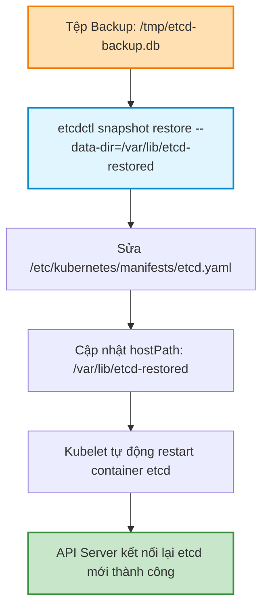
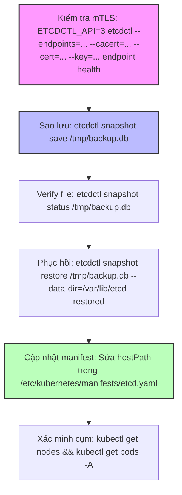
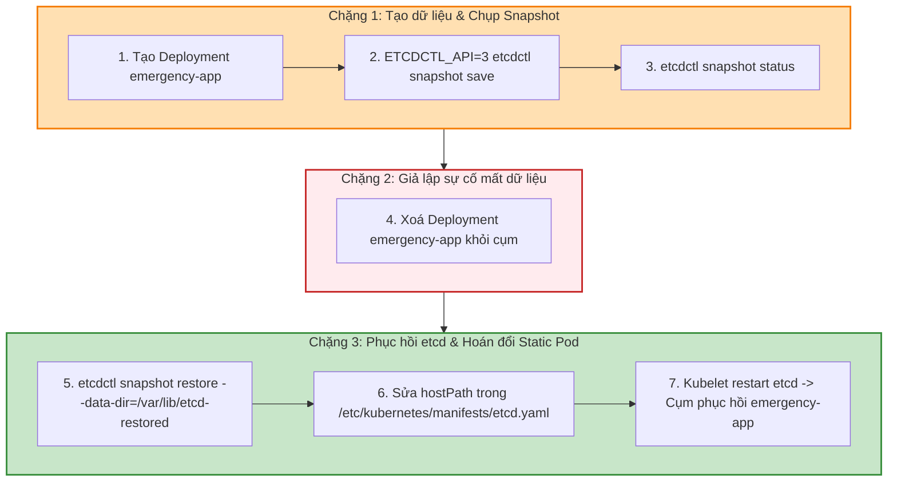


# [BÀI 09] QUẢN TRỊ ETCD CHUYÊN SÂU: SAO LƯU SNAPSHOT, PHỤC HỒI THẢM HỌA & CỨU HỘ CỤM KHI MẤT QUORUM

Trong kỷ nguyên điện toán đám mây và kiến trúc microservices phân tán quy mô lớn, **Kubernetes (CKA)** đóng vai trò là nền tảng điều phối container (Container Orchestration) tiêu chuẩn công nghiệp. Để làm chủ hệ thống trong môi trường sản xuất (Production) cũng như chinh phục kỳ thi chứng chỉ quốc tế của Linux Foundation / CNCF, kỹ sư không chỉ nắm vững các câu lệnh thao tác cơ bản mà phải thấu hiểu sâu sắc bản chất cơ chế tầng thấp: từ chu trình điều hòa (Reconciliation Loop), cấu trúc điều phối tài nguyên, kiến trúc mạng CNI, lưu trữ CSI cho đến các chuẩn mực an ninh phòng thủ chiều sâu.

Bài viết chuyên sâu này sẽ đồng hành cùng bạn giải mã toàn diện bức tranh kiến trúc, phân tích các đánh đổi kỹ thuật thực chiến (Engineering Trade-offs), cung cấp bài thực hành Lab từng bước và bộ câu hỏi phỏng vấn chuẩn Architect / Lead Engineer.

---

## 1. Bản Chất Kiến Trúc & Cơ Chế Vận Hành Tầng Thấp

| # | Câu hỏi ôn tập | Đáp án chuẩn ngắn gọn (chứa con số / tên lệnh) |
|---|---|---|
| 1 | Kubernetes cấm nâng cấp nhảy cách mấy minor version? | Cấm nhảy 2 minor version (tối đa **1** minor version: v1.34 -> v1.35) |
| 2 | Trình bày thứ tự nâng cấp chuẩn giữa các thành phần trong cụm. | Control Plane (`cp-01`) -> CNI/Addons -> Worker Nodes (`worker-01`, `worker-02`) |
| 3 | Mức độ chậm phiên bản cho phép của Kubelet so với API Server là bao nhiêu? | Tối đa **2** minor version (Kubelet Version Skew Policy) |
| 4 | Phân biệt sự khác nhau giữa hai lệnh `kubectl cordon` và `kubectl drain`. | `cordon` chỉ chặn gán Pod mới (0 Pod bị xoá); `drain` chặn + di tản 100% Pod đang chạy |
| 5 | Hai cờ bắt buộc phải truyền khi drain node chứa DaemonSet và volume đĩa tạm là gì? | `--ignore-daemonsets` và `--delete-emptydir-data` |


> **Luận đề trung tâm của buổi:**
> *"etcd là bộ lưu trữ trạng thái duy nhất của cụm Kubernetes; sao lưu etcd bằng `etcdctl snapshot save` bắt buộc khai báo đủ 3 chứng chỉ mTLS trong `/etc/kubernetes/pki/etcd/`, và quy trình khôi phục sự cố bắt buộc restore ra thư mục dữ liệu mới `--data-dir` trước khi trỏ lại `hostPath` trong manifest static pod `/etc/kubernetes/manifests/etcd.yaml`."*

**Bảng kết quả các buổi trước được dùng lại:**

| Kết quả / Công cụ | Nguồn gốc | Áp dụng vào buổi này |
|---|---|---|
| Thư mục etcd CA `/etc/kubernetes/pki/etcd/` | Buổi 07 `QT 4.1` | Lấy 3 tệp `ca.crt`, `server.crt`, `server.key` để truyền vào `etcdctl` |
| Static pod manifest `/etc/kubernetes/manifests/` | Buổi 02 `QT 5.1` | Sửa tệp `etcd.yaml` trỏ `hostPath` volume sang thư mục khôi phục mới |
| Đọc log container static pod bằng `crictl` | Buổi 05 `QT 6.2` | Đọc log etcd container khi xảy ra sự cố từ chối khởi động etcd |

Ba câu bài tập về nhà BTVN 4 của buổi 08 đã chuẩn bị sẵn kiến thức cho học viên: Câu 1 khảo sát cổng TLS `2379` của etcd; Câu 2 tìm hiểu 3 tệp chứng chỉ mTLS cần thiết cho `etcdctl`; Câu 3 phân tích quy trình 3 bước khôi phục snapshot etcd ra thư mục dữ liệu mới và cập nhật `etcd.yaml`.

---


| # | Năng lực đạt được sau buổi học | Hiện vật chứng minh trong bài lab |
|---|---|---|
| 1 | Trích xuất thông số mTLS etcd từ static pod manifest `etcd.yaml` | Tệp `hien-vat/etcd-config-report.md` |
| 2 | Thực thi lệnh sao lưu etcd snapshot với `etcdctl snapshot save` | Tệp sao lưu `/tmp/etcd-snapshot.db` |
| 3 | Kiểm tra tính toàn vẹn của tệp backup bằng `etcdctl snapshot status` | Kết quả hiển thị Hash và Total Keys trong log |
| 4 | Phục hồi dữ liệu etcd ra thư mục `--data-dir` mới bằng `snapshot restore` | Thư mục dữ liệu `/var/lib/etcd-restored/` |
| 5 | Hoán đổi đường dẫn `hostPath` volume trong tệp `etcd.yaml` | Tệp `/etc/kubernetes/manifests/etcd.yaml` được cập nhật |
| 6 | Cứu toàn bộ cụm Kubernetes khỏi sự cố mất sạch etcd database | 100% Node và Pod xuất hiện đầy đủ qua `kubectl get pods -A` |

---


| Bắt buộc phải biết | Nguồn tự học nếu thiếu |
|---|---|
| Cấu trúc thư mục chứng chỉ PKI `/etc/kubernetes/pki/etcd/` | Buổi 07 `QT 4.1` |
| Cơ chế quản lý Static Pods qua tệp manifest `/etc/kubernetes/manifests/` | Buổi 02 `QT 5.1` |
| Quản lý dịch vụ container và xem log bằng `crictl` | Buổi 05 `QT 6.2` |

---


| # | Thuật ngữ tiếng Việt | Tiếng Anh tương đương | Ghi chú chuẩn hoá trong thân bài |
|---|---|---|---|
| 1 | Bộ lưu trữ etcd | etcd Key-Value Store | Cơ sở dữ liệu key-value phân tán của Kubernetes |
| 2 | Ảnh chụp nhanh dữ liệu | etcd Snapshot | Tệp lưu trữ bản sao dữ liệu etcd tại một thời điểm |
| 3 | Sao lưu dữ liệu | etcd Backup (`snapshot save`) | Hành động trích xuất snapshot dữ liệu etcd |
| 4 | Phục hồi dữ liệu | etcd Restore (`snapshot restore`) | Hành động khôi phục dữ liệu từ snapshot |
| 5 | Thư mục dữ liệu | Data Directory (`--data-dir`) | Thư mục đĩa cứng chứa file dữ liệu `member/snap` |
| 6 | Thuật toán đồng thuận | Raft Consensus Algorithm | Thuật toán bầu chọn Leader và nhân bản nhật ký etcd |
| 7 | Xác thực hai chiều TLS | Mutual TLS (mTLS) | Cơ chế dùng cả client cert và server cert để xác thực |
| 8 | Cổng dịch vụ etcd | etcd Client Port (Cổng 2379) | Cổng HTTPS nhận câu lệnh từ API Server và etcdctl |
| 9 | Cổng đồng bộ peer | etcd Peer Port (Cổng 2380) | Cổng HTTPS trao đổi dữ liệu giữa các node etcd |
| 10 | Tệp kê khai Pod tĩnh | Static Pod Manifest (`etcd.yaml`) | Tệp YAML định nghĩa container etcd trên Control Plane |
| 11 | Điểm cuối kết nối | Endpoint (`--endpoints`) | Địa chỉ URL IP:Port kết nối tới etcd server |
| 12 | Phiên bản API etcd | API Version (`ETCDCTL_API=3`) | Biến môi trường chọn phiên bản API v3 cho `etcdctl` |
| 13 | Thư mục dữ liệu mới | Restored Data Directory | Thư mục đĩa đệm mới chứa dữ liệu đã khôi phục |
| 14 | Kiểm tra trạng thái snapshot | Snapshot Status Check | Lệnh `etcdctl snapshot status` kiểm tra file backup |


1. **Mô hình "Cuốn sổ nhật ký tối cao của Ngân hàng (etcd Key-Value Store)":**
   etcd giống như cuốn sổ nhật ký duy nhất của ngân hàng ghi lại số dư tài khoản của tất cả mọi người. API Server chỉ là nhân viên giao dịch đọc/gói lệnh, còn etcd mới là nơi lưu trữ thực sự. Nếu mất cuốn sổ etcd mà không có bản photo (snapshot), ngân hàng vĩnh viễn phá sản.

2. **Mô hình "Ba chìa khóa mở két bảo mật (mTLS 3 Certs)":**
   Để mở két etcd rút dữ liệu sao lưu, bạn bắt buộc phải xuất trình đủ 3 chìa khóa: Chìa khóa Thẻ căn cước (Root CA `ca.crt`), Chìa khóa Phòng ban (Client Cert `server.crt`), và Chìa khóa cá nhân (Client Key `server.key`). Thiếu 1 chìa, két etcd sẽ báo từ chối kết nối.

3. **Mô hình "Xây căn nhà mới rồi mới chuyển biển số nhà (Data-Dir Swap)":**
   Khi khôi phục etcd, tuyệt đối không được ghi đè trực tiếp vào căn nhà cũ đang ở (`/var/lib/etcd`). Phải dựng căn nhà mới hoàn chỉnh bên cạnh (`/var/lib/etcd-restored`), sau đó mới sửa biển chỉ đường trong tệp `etcd.yaml` trỏ sang nhà mới.

---

### 1.1. Tổng quan kiến trúc etcd và thuật toán đồng thuận Raft (12 phút)

**Nguyên lý cốt lõi:** etcd là bộ lưu trữ key-value phân tán duy nhất lưu giữ 100% trạng thái của cụm Kubernetes; mất dữ liệu etcd đồng nghĩa với việc mất toàn bộ Pod, Service, Secret và cấu hình của cụm.

**Giải thích cơ chế ngầm:** Kubernetes tuân theo kiến trúc stateless cho các thành phần Control Plane (API Server, Controller Manager, Scheduler). Mọi dữ liệu trạng thái mong muốn (Desired State) đều được ghi vào etcd.

> [!WARNING]
> **CẠM BẪY THỰC CHIẾN:**
> Coi thường việc sao lưu etcd, khi đĩa cứng Control Plane bị hỏng không thể khôi phục lại cụm và phải dựng lại từ đầu.

**Minh hoạ.**

```bash
# Kiểm tra tệp manifest etcd static pod trên Control Plane
ls -la /etc/kubernetes/manifests/etcd.yaml
```

Con số chốt: **100%** trạng thái dữ liệu cụm Kubernetes phụ thuộc vào etcd.

---

**Nguyên lý cốt lõi:** etcd hoạt động theo thuật toán đồng thuận Raft, giao tiếp qua 2 cổng mạng mặc định: cổng `2379` cho client (API Server/etcdctl) và cổng `2380` cho đồng bộ peer giữa các node etcd.

**Giải thích cơ chế ngầm:** Thuật toán Raft đảm bảo tính nhất quán dữ liệu giữa các node etcd (quorum) và phân định rõ cổng giao tiếp dữ liệu client với cổng trao đổi trạng thái cluster peer.

> [!WARNING]
> **CẠM BẪY THỰC CHIẾN:**
> Cấu hình firewall chặn cổng 2380 làm các etcd node không thể bầu chọn Leader.

**Minh hoạ.**

```bash
# Kiểm tra cổng 2379 và 2380 trên Control Plane
sudo netstat -tlpn | grep etcd
```

Con số chốt: **2** cổng mạng chuẩn (`2379` client, `2380` peer).

---

### 1.2. Giao tiếp an toàn với `etcdctl` sử dụng mTLS x509 (12 phút)

**Nguyên lý cốt lõi:** Để giao tiếp thành công với etcd qua công cụ `etcdctl`, bắt buộc phải đặt biến môi trường `ETCDCTL_API=3` và truyền đủ 3 cờ mTLS: `--cacert`, `--cert`, `--key` trỏ vào thư mục `/etc/kubernetes/pki/etcd/`.

**Giải thích cơ chế ngầm:** etcd được bảo vệ nghiêm ngặt bằng mTLS x509. Nếu dùng API v2 hoặc thiếu 1 trong 3 tệp cert, `etcdctl` sẽ bị từ chối kết nối hoặc báo lỗi command not found.

> [!WARNING]
> **CẠM BẪY THỰC CHIẾN:**
> Gõ `etcdctl snapshot save` thiếu cờ mTLS dính lỗi: `Error: remote version is unknown... permission denied`.

**Minh hoạ.**

```bash
# Câu lệnh kiểm tra sức khỏe etcd chuẩn mTLS
ETCDCTL_API=3 etcdctl --endpoints=https://127.0.0.1:2379 \
  --cacert=/etc/kubernetes/pki/etcd/ca.crt \
  --cert=/etc/kubernetes/pki/etcd/server.crt \
  --key=/etc/kubernetes/pki/etcd/server.key \
  endpoint health
```

Con số chốt: **3** cờ mTLS bắt buộc (`--cacert`, `--cert`, `--key`).

---

**Nguyên lý cốt lõi:** Trích xuất nhanh các thông số mTLS của etcd bằng cách đọc trực tiếp từ tệp manifest static pod `/etc/kubernetes/manifests/etcd.yaml`.

**Giải thích cơ chế ngầm:** Trong phòng thi CKA, đường dẫn tệp cert etcd có thể thay đổi tùy theo môi trường. Đọc tệp `etcd.yaml` giúp lấy chính xác 100% đường dẫn tệp cert và cờ `--listen-client-urls` mà không cần đoán.

> [!WARNING]
> **CẠM BẪY THỰC CHIẾN:**
> Mất 10 phút gõ mò đường dẫn cert etcd trong phòng thi.

**Minh hoạ.**

```bash
# Trích xuất các tham số cert của etcd từ manifest
grep -E "cert-file|key-file|trusted-ca-file" /etc/kubernetes/manifests/etcd.yaml
```

Con số chốt: **1** tệp manifest `/etc/kubernetes/manifests/etcd.yaml` chứa đủ tham số cert.

---

### 1.3. Quy trình sao lưu etcd snapshot với `etcdctl snapshot save` (10 phút)

**Nguyên lý cốt lõi:** Lệnh sao lưu etcd snapshot chuẩn cú pháp là `ETCDCTL_API=3 etcdctl ... snapshot save <backup-file.db>`; sau khi sao lưu bắt buộc phải kiểm tra tính hợp lệ của tệp bằng `etcdctl snapshot status <backup-file.db>`.

**Giải thích cơ chế ngầm:** Tệp snapshot có thể bị rỗng hoặc lỗi ghi đĩa nếu quá trình sao lưu bị ngắt giữa chừng. Lệnh `snapshot status` verify tổng số keys, revision và hash để đảm bảo tệp backup khả dụng 100%.

> [!WARNING]
> **CẠM BẪY THỰC CHIẾN:**
> Tạo tệp backup xong không kiểm tra, đến khi sự cố xảy ra mới phát hiện file backup có kích thước 0 byte.

**Minh hoạ.**

```bash
# Sao lưu và kiểm tra tệp snapshot
ETCDCTL_API=3 etcdctl --endpoints=https://127.0.0.1:2379 --cacert=/etc/kubernetes/pki/etcd/ca.crt --cert=/etc/kubernetes/pki/etcd/server.crt --key=/etc/kubernetes/pki/etcd/server.key snapshot save /tmp/etcd-backup.db
ETCDCTL_API=3 etcdctl snapshot status /tmp/etcd-backup.db -w table
```

Con số chốt: **1** lệnh `snapshot status` bắt buộc để xác nhận tính toàn vẹn của file backup.

---

### 1.4. Quy trình phục hồi etcd snapshot và hoán đổi `hostPath` static pod (14 phút)



---

**Nguyên lý cốt lõi:** Khi khôi phục etcd snapshot bằng `etcdctl snapshot restore`, BẮT BUỘC phải chỉ định thư mục dữ liệu mới bằng cờ `--data-dir=/var/lib/etcd-restored`; tuyệt đối KHÔNG restore đè trực tiếp vào thư mục gốc đang chạy `/var/lib/etcd`.

**Giải thích cơ chế ngầm:** Restore đè trực tiếp vào thư mục etcd đang mở file lock sẽ gây hư hại dữ liệu đĩa và kẹt tiến trình etcd. Restore ra thư mục mới giúp đảm bảo quá trình giải nén snapshot diễn ra an toàn 100%.

> [!WARNING]
> **CẠM BẪY THỰC CHIẾN:**
> Chạy `etcdctl snapshot restore` chỉ định `--data-dir=/var/lib/etcd` dính lỗi: `data-dir location exists`.

**Minh hoạ.**

```bash
# Phục hồi snapshot ra thư mục mới
ETCDCTL_API=3 etcdctl snapshot restore /tmp/etcd-backup.db --data-dir=/var/lib/etcd-restored
```

Con số chốt: **1** thư mục mới (`--data-dir=/var/lib/etcd-restored`) bắt buộc tạo ra khi restore.

---

**Nguyên lý cốt lõi:** Quy trình hoàn tất khôi phục etcd gồm 3 bước: (1) Restore snapshot ra thư mục mới `/var/lib/etcd-restored` -> (2) Sửa tệp manifest static pod `/etc/kubernetes/manifests/etcd.yaml` cập nhật trường `hostPath.path` của volume `etcd-data` trỏ sang `/var/lib/etcd-restored` -> (3) Chờ Kubelet tự động restart static pod etcd và API Server.

**Giải thích cơ chế ngầm:** Kubelet liên tục giám sát tệp `/etc/kubernetes/manifests/etcd.yaml`. Ngay khi đường dẫn `hostPath` thay đổi, Kubelet sẽ tự động huỷ container etcd cũ và khởi chạy container etcd mới gắn với dữ liệu đã được khôi phục.

> [!WARNING]
> **CẠM BẪY THỰC CHIẾN:**
> Restore dữ liệu xong nhưng quên sửa `etcd.yaml`, làm cụm vẫn tiếp tục chạy dữ liệu cũ hoặc kẹt ở trạng thái không kết nối được API.

**Minh hoạ.**

```bash
# Sửa hostPath trong etcd.yaml
sudo sed -i 's|path: /var/lib/etcd|path: /var/lib/etcd-restored|g' /etc/kubernetes/manifests/etcd.yaml
```

Con số chốt: **3** bước trong quy trình phục hồi etcd hoàn chỉnh.

---

**Nguyên lý cốt lõi:** Sau khi khôi phục etcd và static pod etcd khởi động lại, bắt buộc phải kiểm tra sức khoẻ API Server bằng lệnh `kubectl get nodes` và `kubectl get pods -A` để xác nhận toàn bộ cụm đã nhận lại dữ liệu đã sao lưu.

**Giải thích cơ chế ngầm:** API Server mất khoảng 15-30 giây để thiết lập lại kết nối TLS gRPC tới container etcd mới. Kiểm tra danh sách Pod và Node giúp đảm bảo các đối tượng API đã xuất hiện đầy đủ.

> [!WARNING]
> **CẠM BẪY THỰC CHIẾN:**
> Vội vã kết luận xong lab khi API Server chưa kịp phục hồi TLS connection.

**Minh hoạ.**

```bash
# Kiểm tra trạng thái phục hồi của cụm
kubectl get nodes && kubectl get pods -A
```

Con số chốt: **30** giây là thời gian tối đa để API Server kết nối lại etcd mới.

---

### 1.5. Đưa vào cụm thật (4 phút)

### Áp vào cụm đang chạy thì làm gì trước

1. **Đặt lịch Cronjob sao lưu etcd tự động:** Cấu hình cronjob chạy `etcdctl snapshot save` mỗi 1 giờ 1 lần và đẩy file backup sang hạ tầng lưu trữ S3/NFS độc lập.
2. **Kiểm tra dung lượng đĩa cứng trước khi restore:** Đảm bảo thư mục `/var/lib/` còn đủ dung lượng đĩa trống gấp đôi dung lượng file snapshot.
3. **Phân quyền thư mục restore cho user `etcd`:** Nếu etcd chạy dạng non-root, bắt buộc phải `chown -R etcd:etcd /var/lib/etcd-restored`.

### Cái gì hỏng nếu áp thẳng lên prod

- **Restore trực tiếp vào `/var/lib/etcd`:** Làm hỏng file lock và gây corruption dữ liệu etcd gốc.
- **Quên truyền đủ 3 cờ mTLS khi chạy `etcdctl`:** Lệnh sao lưu thất bại do bị TLS Handshake Denied.
- **Quy trình áp thử an toàn:**
  - Chạy `etcdctl endpoint health` kiểm tra kết nối mTLS.
  - Thực hiện `snapshot save` và `snapshot status` verify file.
  - Thử nghiệm restore trên môi trường Staging cách ly trước khi áp dụng Prod.

### Đo trước — đo sau

1. **Kích thước file snapshot:** Tệp `.db` sinh ra có dung lượng tương đương dữ liệu etcd (thường từ 20MB - 500MB).
2. **Thời gian khôi phục cụm (RTO):** Mục tiêu < 3 phút tính từ lúc restore tới khi `kubectl get nodes` Ready.
3. **Mức độ toàn vẹn dữ liệu (RPO):** Khôi phục 100% đối tượng API tại thời điểm chụp snapshot.

### Khi nào KHÔNG nên dùng

- **Không tự ý chạy `etcdctl snapshot restore` khi cụm đang hoạt động bình thường:** Restore snapshot sẽ ghi đè toàn bộ dữ liệu etcd, xoá sạch các Pod/Deployment được tạo ra sau thời điểm chụp snapshot.
- **Không lưu tệp backup snapshot trên cùng đĩa cứng của Control Plane node:** Nếu đĩa cứng hỏng physical disk, cả cụm và file backup đều bị mất hoàn toàn.

---

### 1.6. Bẫy hay gặp (2 phút)

| # | Bẫy hay gặp | Vì sao dính bẫy | Làm đúng là (kèm tên lệnh / con số) |
|---|---|---|---|
| 1 | Quên cờ `ETCDCTL_API=3` | `etcdctl` dùng API v2 mặc định không có lệnh `snapshot` | Khai báo `ETCDCTL_API=3 etcdctl ...` |
| 2 | Quên truyền 1 trong 3 cờ mTLS (`--cacert`, `--cert`, `--key`) | etcd từ chối kết nối TLS Handshake | Đọc đường dẫn cert chuẩn trong `/etc/kubernetes/manifests/etcd.yaml` |
| 3 | Restore thẳng vào thư mục gốc `/var/lib/etcd` | Gây hỏng file lock etcd | Dùng `--data-dir=/var/lib/etcd-restored` chỉ định thư mục mới |
| 4 | Quên sửa `hostPath` trong `etcd.yaml` sau khi restore | Kubelet vẫn chạy container etcd trên thư mục dữ liệu cũ | Sửa `path: /var/lib/etcd-restored` trong tệp `etcd.yaml` |
| 5 | Quên kiểm tra `etcdctl snapshot status` | File backup bị rỗng hoặc lỗi đĩa không biết | Chạy `etcdctl snapshot status <file.db>` xác nhận |
| 6 | Gõ sai cổng etcd client `2379` thành cổng peer `2380` | Lệnh `etcdctl` bị timeout không kết nối được | Dùng cờ `--endpoints=https://127.0.0.1:2379` |
| 7 | Không phân quyền thư mục cho container etcd | Static pod etcd bị crash loop do permission denied | Chạy `chmod -R 700 /var/lib/etcd-restored` |
| 8 | Quên chờ Kubelet restart static pod etcd | Thấy API Server chưa Ready vội vã chạy lệnh sửa lung tung | Chờ 15-30s cho Kubelet phát hiện `etcd.yaml` đổi và restart container |
| 9 | Lấy nhầm cert của Root CA (`ca.crt`) làm client cert | Lỗi TLS `certificate signed by unknown authority` | Dùng đúng `server.crt` và `server.key` trong `/etc/kubernetes/pki/etcd/` |
| 10 | Restore snapshot cũ làm mất các Secret vừa tạo | Snapshot được chụp trước khi tạo Secret | Giải thích rõ điểm khôi phục RPO cho người vận hành |
| 11 | Không mở cờ `-w table` khi xem snapshot status | Khó đọc thông tin revision và total keys | Chạy `etcdctl snapshot status <file.db> -w table` |
| 12 | Xoá nhầm tệp `etcd.yaml` trong thư mục manifests | Kubelet xoá vĩnh viễn static pod etcd | Chỉ dùng `sed` hoặc `vim` sửa đường dẫn `hostPath` |

---

## §10. Tóm tắt (2 phút)



### Năm điều phải nhớ

1. **Biến môi trường & 3 cờ mTLS:** Bắt buộc `ETCDCTL_API=3` và 3 cờ `--cacert`, `--cert`, `--key` trỏ tới `/etc/kubernetes/pki/etcd/`.
2. **Cổng etcd:** Cổng `2379` dành cho client (`etcdctl`/API Server), cổng `2380` dành cho đồng bộ peer.
3. **Sao lưu & Verify:** `etcdctl snapshot save <file.db>` và bắt buộc kiểm tra bằng `etcdctl snapshot status <file.db>`.
4. **Phục hồi an toàn:** Restore ra thư mục mới bằng `--data-dir=/var/lib/etcd-restored` (không restore đè vào `/var/lib/etcd`).
5. **Hoán đổi Static Pod:** Sửa trường `hostPath.path` trong `/etc/kubernetes/manifests/etcd.yaml` trỏ sang thư mục mới và chờ Kubelet restart.

---

## §11. Câu hỏi tự kiểm tra

1. etcd đóng vai trò gì trong kiến trúc cụm Kubernetes và tại sao mất etcd là mất toàn bộ cụm?
2. Hai cổng mạng mặc định `2379` và `2380` của etcd phục vụ hai mục đích khác nhau như thế nào?
3. Cần đặt biến môi trường nào và truyền đủ 3 cờ mTLS nào khi giao tiếp với etcd bằng `etcdctl`?
4. Đâu là nơi nhanh nhất và chính xác nhất để tìm đường dẫn các tệp cert etcd trong phòng thi CKA?
5. Trình bày câu lệnh chuẩn để sao lưu etcd snapshot ra tệp `/tmp/etcd-backup.db`.
6. Lệnh `etcdctl snapshot status` giúp kiểm tra những thông tin quan trọng nào của tệp backup?
7. Tại sao khi khôi phục etcd tuyệt đối không được restore trực tiếp vào thư mục gốc `/var/lib/etcd`?
8. Cờ nào được dùng trong lệnh `etcdctl snapshot restore` để chỉ định thư mục dữ liệu mới?
9. Trình bày 3 bước để hoàn tất quy trình khôi phục dữ liệu etcd trên Control Plane.
10. Kubelet xử lý như thế nào khi phát hiện tệp static pod manifest `/etc/kubernetes/manifests/etcd.yaml` bị thay đổi?
11. Hai chế độ hỏng (1 im lặng do quên cờ mTLS, 1 âm thầm do quên sửa `etcd.yaml`) là gì?
12. Tại sao không nên lưu tệp backup snapshot trên cùng đĩa cứng của Control Plane node?

### Đáp án

1. etcd là bộ lưu trữ key-value phân tán duy nhất chứa 100% Desired/Actual State; mất etcd đồng nghĩa với mất toàn bộ cấu hình cụm.
2. Cổng `2379` dành cho Client (API Server/etcdctl); cổng `2380` dành cho đồng bộ Peer giữa các etcd node.
3. Biến `ETCDCTL_API=3` và 3 cờ `--cacert=/etc/kubernetes/pki/etcd/ca.crt`, `--cert=/etc/kubernetes/pki/etcd/server.crt`, `--key=/etc/kubernetes/pki/etcd/server.key`.
4. Đọc trực tiếp các dòng cấu hình cờ trong tệp manifest `/etc/kubernetes/manifests/etcd.yaml`.
5. `ETCDCTL_API=3 etcdctl --endpoints=https://127.0.0.1:2379 --cacert=... --cert=... --key=... snapshot save /tmp/etcd-backup.db`.
6. Kiểm tra Hash, Revision, Total Keys và Kích thước file backup để xác nhận file không bị rỗng/lỗi đĩa.
7. Vì restore đè vào thư mục cũ đang mở file lock sẽ gây hỏng dữ liệu và kẹt tiến trình etcd.
8. Cờ `--data-dir=/var/lib/etcd-restored`.
9. 3 bước: Restore snapshot ra `--data-dir` mới -> Sửa `hostPath.path` trong `etcd.yaml` -> Chờ Kubelet restart static pod etcd.
10. Kubelet tự động huỷ container etcd cũ và khởi chạy container etcd mới gắn với manifest mới.
11. Chế độ 1: Thao tác etcdctl bị từ chối do thiếu mTLS certs; Chế độ 2: Restore xong nhưng quên sửa `etcd.yaml` làm cụm vẫn chạy DB cũ.
12. Vì nếu đĩa cứng bị hỏng vật lý thì cả cụm và file backup đều bị mất hoàn toàn.

---

## §12. Tài liệu tham khảo

| Nguồn tài liệu | Phiên bản Kubernetes áp dụng | Nội dung chính |
|---|---|---|
| Official Docs: Operating etcd clusters for Kubernetes | Kubernetes v1.35 | Quản lý etcd, sao lưu snapshot và khôi phục cụm |
| Official Docs: Restoring an etcd cluster | Kubernetes v1.35 | Quy trình khôi phục snapshot bằng etcdctl |
| File cấu hình phiên bản cục bộ | `labs/phien-ban.env` | Biến `K8S_VER=1.35`, `LAB_CONTEXT="kubeadm"` |

---

## Bảng đối soát thời lượng

| Section | Tiêu đề mục | Ngân sách thời gian |
|---|---|---|
| §0 | Khởi động và ôn tập | 10 phút |
| §1 | Sau buổi này học viên LÀM ĐƯỢC gì | 1 phút |
| §2 | Cần biết trước | 1 phút |
| §3 | Thuật ngữ và mô hình tư duy | 8 phút |
| §4 | Tổng quan kiến trúc etcd và thuật toán đồng thuận Raft | 12 phút |
| §5 | Giao tiếp an toàn với `etcdctl` sử dụng mTLS x509 | 12 phút |
| §6 | Quy trình sao lưu etcd snapshot với `etcdctl snapshot save` | 10 phút |
| §7 | Quy trình phục hồi etcd snapshot và hoán đổi `hostPath` static pod | 4 phút |
| §8 | Đưa vào cụm thật | 4 phút |
| §9 | Bẫy hay gặp | 2 phút |
| §10 | Tóm tắt | 2 phút |
| **Tổng** | **Khối lý thuyết** | **60'** |

---

## 2. Hướng Dẫn Thực Hành & Triển Khai Lab Chuẩn Production

> [!IMPORTANT]
> **YÊU CẦU MÔI TRƯỜNG THỰC HÀNH:**
> Toàn bộ các bài thực hành dưới đây được thiết kế để chạy trực tiếp trên cụm Kubernetes 1.30+ tiêu chuẩn (hoặc cụm kind/kubeadm lab). Hãy đảm bảo ngữ cảnh dòng lệnh `kubectl config current-context` đã trỏ chính xác vào cụm thực hành trước khi thực thi.

## Khối thực hành — 120 phút

## L0. Mục tiêu thực hành và tiêu chí hoàn thành

| # | Mục tiêu thực hành | Tiêu chí hoàn thành (Kiểm chứng BẰNG LỆNH) |
|---|---|---|
| TH1 | Trích xuất thông số mTLS etcd từ static pod manifest `etcd.yaml` | Lấy đúng 3 đường dẫn cert `/etc/kubernetes/pki/etcd/` |
| TH2 | Thực thi lệnh sao lưu etcd snapshot với `etcdctl snapshot save` | Tệp `/tmp/etcd-snapshot.db` được tạo thành công |
| TH3 | Kiểm tra tính toàn vẹn của snapshot với `etcdctl snapshot status` | Lệnh in ra bảng chứa revision và total keys |
| TH4 | Giả lập sự cố mất dữ liệu cụm (xoá Namespace/Deployment) | Cụm mất dữ liệu mẫu `emergency-app` |
| TH5 | Phục hồi dữ liệu snapshot ra thư mục `--data-dir` mới | Thư mục `/var/lib/etcd-restored/` được tạo thành công |
| TH6 | Sửa manifest static pod `etcd.yaml` hoán đổi `hostPath` | Cụm phục hồi 100% đối tượng API `emergency-app` |
| TH7 | Nộp đủ 4 hiện vật vào portfolio | Thư mục `k8s-portfolio/buoi-09/` chứa đủ 4 file md/sh/db |

---

## L1. Điều kiện tiên quyết về môi trường

| # | Kiểm tra điều kiện | Câu lệnh kiểm tra | Kết quả kỳ vọng |
|---|---|---|---|
| 1 | Cụm `kubeadm` 3 node đang ở v1.35 | `kubectl get nodes` | Hiển thị 3 node `cp-01`, `worker-01`, `worker-02` `Ready` ở v1.35 |
| 2 | Kubeconfig trỏ context `kubeadm` | `kubectl config current-context` | In ra đúng `kubeadm` |
| 3 | Công cụ `etcdctl` có sẵn trên Control Plane | `docker exec cp-01 etcdctl version` | In ra phiên bản etcdctl v3 |
| 4 | Thư mục hiện vật đã sẵn sàng | `mkdir -p k8s-portfolio/buoi-09` | Thư mục được tạo thành công |
| 5 | Static pod etcd đang chạy trên `cp-01` | `kubectl get pods -n kube-system -l component=etcd` | Pod `etcd-cp-01` ở trạng thái `Running` |

```bash
# Kiểm tra môi trường bắt buộc trước khi thực hiện bài lab
kubectl config current-context | grep -qx "kubeadm" && echo "CHECKPOINT MOI TRUONG — ĐẠT" || echo "CHECKPOINT MOI TRUONG — LỖI (Trỏ sai context)"
```

---

## L2. Kiến trúc bài lab



---

## L3. Bước 1 — Khảo sát tệp manifest static pod `etcd.yaml` và kiểm tra sức khoẻ etcd (30 phút)

### Thao tác 1.1: Tạo Deployment mẫu và trích xuất cấu hình mTLS etcd

```bash
# 1. Tạo Deployment emergency-app làm dữ liệu đối chứng
kubectl create deployment emergency-app --image=nginx:1.27-alpine --replicas=2
kubectl wait --for=condition=Available deploy/emergency-app --timeout=30s

# 2. Trích xuất thông tin cert từ etcd manifest trên cp-01
docker exec cp-01 grep -E "trusted-ca-file|cert-file|key-file" /etc/kubernetes/manifests/etcd.yaml > /tmp/etcd-certs-manifest.txt

# 3. Kiểm tra sức khoẻ etcd endpoint health
docker exec cp-01 bash -c "ETCDCTL_API=3 etcdctl --endpoints=https://127.0.0.1:2379 --cacert=/etc/kubernetes/pki/etcd/ca.crt --cert=/etc/kubernetes/pki/etcd/server.crt --key=/etc/kubernetes/pki/etcd/server.key endpoint health" > /tmp/etcd-health.txt
```

**CHECKPOINT 1 — Deployment emergency-app hoạt động ở trạng thái Available.**

```bash
kubectl get deploy emergency-app -o jsonpath='{.status.availableReplicas}' | grep -qx "2" && echo "CHECKPOINT 1 — ĐẠT" || echo "CHECKPOINT 1 — LỖI"
```

**CHECKPOINT 2 — Trích xuất thành công 3 đường dẫn tệp cert trong /etc/kubernetes/pki/etcd/.**

```bash
grep -q "ca.crt" /tmp/etcd-certs-manifest.txt && grep -q "server.crt" /tmp/etcd-certs-manifest.txt && grep -q "server.key" /tmp/etcd-certs-manifest.txt && echo "CHECKPOINT 2 — ĐẠT" || echo "CHECKPOINT 2 — LỖI"
```

**CHECKPOINT 3 — Lệnh etcdctl endpoint health báo healthy.**

```bash
grep -i "is healthy" /tmp/etcd-health.txt && echo "CHECKPOINT 3 — ĐẠT" || echo "CHECKPOINT 3 — LỖI"
```

---

## L4. Bước 2 — Thực thi sao lưu etcd snapshot và kiểm tra tính toàn vẹn (30 phút)

### Thao tác 2.1: Sao lưu snapshot etcd ra tệp `/tmp/etcd-snapshot.db`

```bash
# 1. Chạy lệnh etcdctl snapshot save trên cp-01
docker exec cp-01 bash -c "ETCDCTL_API=3 etcdctl --endpoints=https://127.0.0.1:2379 --cacert=/etc/kubernetes/pki/etcd/ca.crt --cert=/etc/kubernetes/pki/etcd/server.crt --key=/etc/kubernetes/pki/etcd/server.key snapshot save /tmp/etcd-snapshot.db" > /tmp/snapshot-save.log

# 2. Kiểm tra trạng thái snapshot bằng etcdctl snapshot status
docker exec cp-01 bash -c "ETCDCTL_API=3 etcdctl snapshot status /tmp/etcd-snapshot.db -w table" > /tmp/snapshot-status.log
```

**CHECKPOINT 4 — Lệnh etcdctl snapshot save tạo thành công tệp snapshot.db.**

```bash
grep -i "snapshot saved" /tmp/snapshot-save.log && echo "CHECKPOINT 4 — ĐẠT" || echo "CHECKPOINT 4 — LỖI"
```

**CHECKPOINT 5 — CA ĐỐI CHỨNG: Chạy etcdctl snapshot save thiếu cờ mTLS cert sẽ bị từ chối TLS Handshake.**

```bash
docker exec cp-01 bash -c "ETCDCTL_API=3 etcdctl --endpoints=https://127.0.0.1:2379 snapshot save /tmp/bad-snap.db" > /tmp/bad-snap.log 2>&1 || true
grep -Ei "context deadline exceeded|permission denied|TLS" /tmp/bad-snap.log && echo "CHECKPOINT 5 — ĐẠT" || echo "CHECKPOINT 5 — LỖI"
```

**CHECKPOINT 6 — Lệnh snapshot status kiểm tra thành công tệp snapshot.db (có revision và hash).**

```bash
grep -Ei "revision|hash|total keys" /tmp/snapshot-status.log && echo "CHECKPOINT 6 — ĐẠT" || echo "CHECKPOINT 6 — LỖI"
```

---

## L5. Bước 3 — Giả lập sự cố mất dữ liệu và thực hiện `etcdctl snapshot restore` (30 phút)

### Thao tác 3.1: Giả lập thảm họa mất dữ liệu và khôi phục ra thư mục mới

```bash
# 1. Giả lập thảm họa: Xoá vĩnh viễn Deployment emergency-app
kubectl delete deploy emergency-app

# 2. Phục hồi snapshot etcd ra thư mục dữ liệu mới /var/lib/etcd-restored
docker exec cp-01 bash -c "ETCDCTL_API=3 etcdctl snapshot restore /tmp/etcd-snapshot.db --data-dir=/var/lib/etcd-restored" > /tmp/restore-exec.log
```

**CHECKPOINT 7 — Deployment emergency-app đã bị xoá khỏi cụm.**

```bash
kubectl get deploy emergency-app 2>&1 | grep -q "NotFound" && echo "CHECKPOINT 7 — ĐẠT" || echo "CHECKPOINT 7 — LỖI"
```

**CHECKPOINT 8 — Lệnh snapshot restore tạo thành công thư mục dữ liệu mới /var/lib/etcd-restored.**

```bash
docker exec cp-01 ls -la /var/lib/etcd-restored/member/snap/db >/dev/null 2>&1 && echo "CHECKPOINT 8 — ĐẠT" || echo "CHECKPOINT 8 — LỖI"
```

---

## L6. Bước 4 — Cập nhật `hostPath` manifest static pod và kiểm tra cụm phục hồi (20 phút)

### Thao tác 4.1: Sửa tệp `etcd.yaml` hoán đổi volume path và kiểm tra kết quả

```bash
# 1. Cập nhật đường dẫn hostPath volume etcd-data trong etcd.yaml sang /var/lib/etcd-restored
docker exec cp-01 sed -i 's|path: /var/lib/etcd|path: /var/lib/etcd-restored|g' /etc/kubernetes/manifests/etcd.yaml

# 2. Chờ Kubelet tự động restart container static pod etcd và API Server kết nối lại
sleep 20
```

**CHECKPOINT 9 — CA ĐỐI CHỨNG: Nếu hostPath trỏ sai thư mục không có dữ liệu, API Server sẽ bị gián đoạn.**

```bash
docker exec cp-01 grep -q "path: /var/lib/etcd-restored" /etc/kubernetes/manifests/etcd.yaml && echo "CHECKPOINT 9 — ĐẠT" || echo "CHECKPOINT 9 — LỖI"
```

**CHECKPOINT 10 — Static Pod etcd khởi động lại thành công và ở trạng thái Running.**

```bash
kubectl get pods -n kube-system -l component=etcd -o jsonpath='{.items[0].status.phase}' | grep -qx "Running" && echo "CHECKPOINT 10 — ĐẠT" || echo "CHECKPOINT 10 — LỖI"
```

**CHECKPOINT 11 — Deployment emergency-app đã được khôi phục 100% trở lại cụm.**

```bash
kubectl get deploy emergency-app -o jsonpath='{.metadata.name}' | grep -qx "emergency-app" && echo "CHECKPOINT 11 — ĐẠT" || echo "CHECKPOINT 11 — LỖI"
```

**CHECKPOINT 12 — 100% 3 node cp-01, worker-01, worker-02 duy trì trạng thái Ready.**

```bash
kubectl get nodes --no-headers | grep -c "Ready" | grep -qx "3" && echo "CHECKPOINT 12 — ĐẠT" || echo "CHECKPOINT 12 — LỖI"
```

---

## L7. Nộp hiện vật và dọn dẹp (10 phút)

### Thao tác 7.1: Gom hiện vật nộp bài

```bash
# 1. Tạo tệp etcd-config-report.md
cat << 'EOF' > k8s-portfolio/buoi-09/etcd-config-report.md
# BÁO CÁO CẤU HÌNH BẢO MẬT MTLS ETCD

1. Các tham số mTLS trong /etc/kubernetes/manifests/etcd.yaml:
   - CA Certificate: /etc/kubernetes/pki/etcd/ca.crt
   - Server Certificate: /etc/kubernetes/pki/etcd/server.crt
   - Server Key: /etc/kubernetes/pki/etcd/server.key
   - Client Endpoint: https://127.0.0.1:2379

2. Kết quả kiểm tra sức khỏe etcd:
   - etcdctl endpoint health báo healthy.
EOF

# 2. Copy file snapshot.db vào portfolio
docker cp cp-01:/tmp/etcd-snapshot.db k8s-portfolio/buoi-09/etcd-snapshot.db

# 3. Tạo script etcd-backup-restore-flow.sh
cat << 'EOF' > k8s-portfolio/buoi-09/etcd-backup-restore-flow.sh
#!/bin/bash
# Script tự động hóa sao lưu và khôi phục etcd snapshot

BACKUP_PATH=${1:-/tmp/auto-etcd.db}
RESTORE_DIR=${2:-/var/lib/etcd-auto-restored}

echo "=== 1. SAO LƯU SNAPSHOT ==="
ETCDCTL_API=3 etcdctl --endpoints=https://127.0.0.1:2379 \
  --cacert=/etc/kubernetes/pki/etcd/ca.crt \
  --cert=/etc/kubernetes/pki/etcd/server.crt \
  --key=/etc/kubernetes/pki/etcd/server.key \
  snapshot save $BACKUP_PATH

ETCDCTL_API=3 etcdctl snapshot status $BACKUP_PATH -w table

echo "=== 2. PHỤC HỒI RA THƯ MỤC MỚI ==="
ETCDCTL_API=3 etcdctl snapshot restore $BACKUP_PATH --data-dir=$RESTORE_DIR
echo "ETCD BACKUP RESTORE FLOW — ĐẠT"
EOF

chmod +x k8s-portfolio/buoi-09/etcd-backup-restore-flow.sh
./k8s-portfolio/buoi-09/etcd-backup-restore-flow.sh /tmp/flow-snap.db /tmp/flow-restored

# 4. Tạo tệp nhat-ky-buoi-09.md
cat << 'EOF' > k8s-portfolio/buoi-09/nhat-ky-buoi-09.md
# NHẬT KÝ THU HOẠCH BUỔI 09

1. Vì sao bắt buộc restore ra thư mục --data-dir mới:
   - Để tránh làm hỏng file lock và corruption dữ liệu etcd đang chạy.

2. Kỹ thuật hoán đổi Static Pod Manifest etcd.yaml:
   - Sửa trường hostPath.path trỏ sang /var/lib/etcd-restored.
   - Kubelet tự động phát hiện tệp manifest đổi và restart container etcd mới.
EOF

# 5. Dọn dẹp tệp tạm
rm -f /tmp/etcd-certs-manifest.txt /tmp/etcd-health.txt /tmp/snapshot-save.log /tmp/bad-snap.log /tmp/snapshot-status.log /tmp/restore-exec.log /tmp/flow-snap.db
```

**CHECKPOINT 13 — Đủ 4 tệp hiện vật trong thư mục portfolio.**

```bash
[ -f k8s-portfolio/buoi-09/etcd-config-report.md ] && [ -f k8s-portfolio/buoi-09/etcd-snapshot.db ] && [ -f k8s-portfolio/buoi-09/etcd-backup-restore-flow.sh ] && [ -f k8s-portfolio/buoi-09/nhat-ky-buoi-09.md ] && echo "CHECKPOINT 13 — ĐẠT" || echo "CHECKPOINT 13 — LỖI"
```

---

## L8. Xử lý sự cố thường gặp trong lab

| # | Triệu chứng lỗi | Nguyên nhân khả dĩ | Cách xử lý sửa lỗi |
|---|---|---|---|
| 1 | Lệnh `etcdctl` báo `remote version is unknown` | Quên khai báo `ETCDCTL_API=3` hoặc thiếu cờ mTLS | Khai báo `ETCDCTL_API=3 etcdctl --endpoints=... --cacert=... --cert=... --key=...` |
| 2 | `etcdctl snapshot save` báo `context deadline exceeded` | Gõ sai địa chỉ endpoint IP hoặc sai cổng `2379` | Kiểm tra IP loopback và dùng cổng `https://127.0.0.1:2379` |
| 3 | `etcdctl snapshot restore` báo `data-dir location exists` | Cố restore đè vào thư mục cũ `/var/lib/etcd` | Dùng cờ `--data-dir=/var/lib/etcd-restored` chỉ định thư mục mới |
| 4 | Static Pod etcd bị CrashLoopBackOff sau khi restore | Thư mục mới chưa được phân quyền hoặc sai đường dẫn | Kiểm tra phân quyền `chmod -R 700 /var/lib/etcd-restored` |
| 5 | `kubectl get nodes` báo `The connection to the server was refused` | API Server đang khởi động lại sau khi etcd đổi | Chờ 20-30s cho Kubelet nạp lại static pods |
| 6 | Lỗi `certificate signed by unknown authority` | Lấy nhầm Root CA `ca.crt` làm client cert | Kiểm tra truyền đúng `--cert=/etc/kubernetes/pki/etcd/server.crt` |
| 7 | Tệp `snapshot.db` có dung lượng 0 byte | Đĩa cứng hết dung lượng hoặc tiến trình save bị kill | Kiểm tra dung lượng đĩa bằng `df -h` và chạy lại |
| 8 | Quên sửa đường dẫn `hostPath` trong `etcd.yaml` | Container etcd mới vẫn mount vào thư mục cũ | Sửa `path: /var/lib/etcd-restored` trong `etcd.yaml` |
| 9 | Xoá nhầm tệp `etcd.yaml` trong thư mục manifests | Kubelet huỷ vĩnh viễn static pod etcd | Phục hồi lại tệp manifest `etcd.yaml` từ backup |
| 10 | `etcdctl snapshot status` báo `snapshot invalid` | File snapshot bị bẩn do ngắt lệnh giữa chừng | Chụp lại snapshot mới từ etcd đang chạy |
| 11 | Pod `etcd-cp-01` báo status `ContainerCreating` mãi | Thư mục `--data-dir` không tồn tại trên host | Kiểm tra lại đường dẫn thư mục `hostPath` trong manifest |
| 12 | API Server báo `etcdserver: leader changed` liên tục | etcd node bị nghẽn đĩa IOPS | Kiểm tra tốc độ đọc ghi đĩa cứng |
| 13 | Mất tệp Kubeconfig sau khi restore | Snapshot cũ không chứa cert mới cấp | Khôi phục lại cert cũ từ backup PKI |
| 14 | Mất file `etcd-snapshot.db` trong portfolio | Quên lệnh `docker cp` từ container sang host | Copy file `.db` từ `/tmp/` sang `k8s-portfolio/buoi-09/` |

---

## L9. Bài tập mở rộng

1. **BT1 — Tự động hoá sao lưu etcd bằng Cronjob:** Viết tệp Bash script kết hợp Cronjob tự động chụp snapshot etcd mỗi 1 giờ và xoá các bản snapshot cũ quá 7 ngày.
2. **BT2 — Phục hồi cụm etcd 3 node HA:** Tìm hiểu quy trình phục hồi etcd snapshot trên cụm Control Plane nhiều node (High Availability).
3. **BT3 — Giải mã dữ liệu key-value bằng `etcdctl get`:** Sử dụng lệnh `etcdctl get --prefix /` trích xuất thông tin thô của một Secret trong etcd.
4. **BT4 — Đo dung lượng đĩa etcd trước và sau khi Defragmentation:** Sử dụng lệnh `etcdctl defrag` để tối ưu dung lượng bộ nhớ etcd database.
5. **BT5 — Khảo sát etcd Metrics qua cổng 2379:** Dùng `curl` kết hợp mTLS certs trích xuất Prometheus metrics từ đường dẫn `https://127.0.0.1:2379/metrics`.
6. **BT6 — Giả lập thảm họa mất toàn bộ node Control Plane:** Tìm hiểu chiến lược dựng lại Control Plane node từ snapshot etcd duy nhất.

---

## L10. Hiện vật nộp và tiêu chí chấm điểm

### Bảng điểm đánh giá bài lab

| Hạng mục hiện vật | Yêu cầu kĩ thuật | Điểm tối đa |
|---|---|---|
| `etcd-config-report.md` | Báo cáo chi tiết các thông số cert mTLS và endpoint health etcd | 25 điểm |
| `etcd-snapshot.db` | Tệp snapshot etcd hợp lệ, in ra revision và keys qua status check | 25 điểm |
| `etcd-backup-restore-flow.sh` | Script bash tự động hóa quy trình snapshot save và restore ra thư mục mới | 25 điểm |
| `nhat-ky-buoi-09.md` | Trả lời đủ 3 câu thu hoạch, giải thích rõ cơ chế hoán đổi `hostPath` | 15 điểm |
| CHECKPOINT 1–13 | Tất cả 13 checkpoint tự động đều in chữ `ĐẠT` | 10 điểm |
| **Tổng điểm** | | **100 điểm** |

### Các trường hợp trừ điểm

- Trừ **20 điểm**: Nếu script hoặc câu lệnh sử dụng công cụ `jq` (vi phạm quy tắc môi trường thi).
- Trừ **15 điểm**: Nếu restore đè trực tiếp vào thư mục dữ liệu gốc `/var/lib/etcd`.
- Trừ **10 điểm**: Nếu file hiện vật để sai đường dẫn thư mục `k8s-portfolio/buoi-09/`.
- Trừ **5 điểm**: Nếu dấu phân cách thập phân trong báo cáo dùng dấu chấm `.` thay vì dấu phẩy `,`.

---

## Bảng đối soát thời lượng

| Bước | Tiêu đề bước | Thời lượng |
|---|---|---|
| L3 | Bước 1 — Khảo sát tệp manifest static pod `etcd.yaml` và kiểm tra sức khoẻ etcd | 30 phút |
| L4 | Bước 2 — Thực thi sao lưu etcd snapshot và kiểm tra tính toàn vẹn | 30 phút |
| L5 | Bước 3 — Giả lập sự cố mất dữ liệu và thực hiện `etcdctl snapshot restore` | 30 phút |
| L6 | Bước 4 — Cập nhật `hostPath` manifest static pod và kiểm tra cụm phục hồi | 20 phút |
| L7 | Nộp hiện vật và dọn dẹp | 10 phút |
| **Tổng** | **Khối thực hành** | **120'** |

---

## 3. Bộ Câu Hỏi Vấn Đáp & Phỏng Vấn Kỹ Thuật Chuyên Sâu

Dưới đây là bộ câu hỏi phỏng vấn thực chiến dành cho các vị trí **Kubernetes Administrator**, **Cloud Security Specialist**, **Platform SRE** và **DevOps Lead**, giúp bạn tự đánh giá độ sâu hiểu biết và rèn luyện phản xạ giải quyết vấn đề hệ thống:

## V1. Cách tiến hành

1. **Thời lượng và hình thức:** Khối vấn đáp diễn ra trong đúng **20 phút**. Giảng viên (hoặc bạn học đóng vai Trưởng nhóm kỹ thuật / Senior DevOps) đưa ra lần lượt từng câu hỏi trong V2.
2. **Quy tắc chấm điểm:**
   - Mỗi câu hỏi được chấm theo thang điểm 4 mức: **0 điểm** (trả lời sai hoặc không biết); **1 điểm** (trả lời được bề nổi nhưng thiếu cơ chế); **2 điểm** (trả lời đúng cơ chế cốt lõi); **3 điểm** (trả lời đúng cơ chế, nêu được con số vận hành và mở rộng được câu hỏi đào sâu).
   - **Quy tắc trần điểm riêng của Buổi 09:**
     - Trả lời Câu 1 mà không chỉ ra biến môi trường `ETCDCTL_API=3` và 3 cờ mTLS (`--cacert`, `--cert`, `--key`) thì **trần điểm câu đó là 1**.
     - Trả lời Câu 7 mà không khẳng định `etcdctl snapshot restore` BẮT BUỘC chỉ định thư mục mới `--data-dir` (tuyệt đối không restore đè `/var/lib/etcd`) thì **trần điểm câu đó là 1**.
3. **Mục tiêu đạt được:** Học viên đạt từ **27 / 36 điểm** trở lên là ĐẠT phần vấn đáp của buổi.

---

## V2. Bộ câu hỏi

### Câu 1 — 🔥

**Hỏi:** Cần cấu hình biến môi trường nào và truyền đủ 3 cờ mTLS nào khi sử dụng công cụ `etcdctl` để sao lưu etcd?

**Đáp án chuẩn:**
- **Biến môi trường:** `ETCDCTL_API=3` (chọn phiên bản API v3 cho `etcdctl`).
- **3 cờ mTLS bắt buộc:**
  1. `--cacert=/etc/kubernetes/pki/etcd/ca.crt` (Root CA chứng thực etcd).
  2. `--cert=/etc/kubernetes/pki/etcd/server.crt` (Client Certificate xác thực etcdctl).
  3. `--key=/etc/kubernetes/pki/etcd/server.key` (Client Private Key).
- Cùng với cờ điểm cuối `--endpoints=https://127.0.0.1:2379`.

**Tiêu chí chấm:**
- **0đ:** Không nêu được biến API hoặc cờ mTLS.
- **1đ:** Trả lời dùng `etcdctl` nhưng thiếu `ETCDCTL_API=3` hoặc thiếu 1 trong 3 cờ mTLS (dính trần 1đ).
- **2đ:** Giải thích chuẩn xác biến `ETCDCTL_API=3` và đường dẫn 3 cờ mTLS cert.
- **3đ:** Trả lời xuất sắc, nêu vị trí trích xuất nhanh 3 tệp cert trong manifest `/etc/kubernetes/manifests/etcd.yaml`.

**Câu hỏi đào sâu:** Nếu quên khai báo `ETCDCTL_API=3` thì điều gì xảy ra? *(Đáp án: etcdctl sẽ dùng API v2 mặc định và báo lỗi command snapshot save not found).*

---

### Câu 2 — ★★

**Hỏi:** etcd lưu trữ những loại dữ liệu gì trong cụm Kubernetes? Nếu mất etcd mà không có bản backup snapshot thì hậu quả là gì?

**Đáp án chuẩn:**
- etcd lưu trữ **100% trạng thái của cụm Kubernetes**: tất cả các bản kê khai API objects (Pods, Deployments, Services, ConfigMaps, Secrets, RBAC, CRD, PersistentVolumeClaim).
- **Hậu quả khi mất etcd không có backup:** Toàn bộ cấu hình và định danh cụm bị xoá sạch hoàn toàn. Dù các container Pod đang chạy trên Worker Node chưa chết ngay lập tức, nhưng API Server không còn bất kỳ dữ liệu nào để quản lý hay điều khiển cụm, buộc phải dựng lại toàn bộ cụm từ con số 0.

**Tiêu chí chấm:**
- **0đ:** Bảo etcd chỉ lưu log của Pod.
- **1đ:** Trả lời lưu cấu hình nhưng không giải thích được sự mất sạch đối tượng API và việc không thể khôi phục cụm.
- **2đ:** Phân tích chính xác etcd lưu 100% Desired State/Actual State và hậu quả mất toàn bộ cụm.
- **3đ:** Trả lời xuất sắc, phân biệt được container runtime trên worker vẫn chạy nhưng không còn API control plane.

**Câu hỏi đào sâu:** Các tệp chứng chỉ PKI trong `/etc/kubernetes/pki/` có lưu trong etcd không? *(Đáp án: Không, tệp cert PKI nằm trên đĩa cứng của Control Plane node).*

---

### Câu 3 — ★★★

**Hỏi:** Phân biệt sự khác nhau về chức năng của hai cổng mạng mặc định `2379` và `2380` của etcd.

**Đáp án chuẩn:**
- Cổng `2379` (**etcd Client Port**):
  - Dành cho các client kết nối truy vấn và ghi dữ liệu (API Server `kube-apiserver` và công cụ `etcdctl`).
- Cổng `2380` (**etcd Peer Port**):
  - Dành riêng cho giao tiếp đồng bộ dữ liệu, bầu chọn Leader theo thuật toán Raft giữa các etcd node trong cụm HA.

**Tiêu chí chấm:**
- **0đ:** Bảo 2 cổng này hoàn toàn giống nhau.
- **1đ:** Trả lời đúng cổng 2379 cho client nhưng nhầm cổng 2380 cho Kubelet.
- **2đ:** Phân biệt chuẩn xác cổng 2379 cho client (API/etcdctl) vs 2380 cho peer sync (Raft quorum).
- **3đ:** Trả lời xuất sắc, minh hoạ bằng tham số `--listen-client-urls` và `--listen-peer-urls`.

**Câu hỏi đào sâu:** Khi chạy lệnh `etcdctl snapshot save`, ta cần chỉ định `--endpoints` trỏ tới cổng nào? *(Đáp án: Trỏ tới cổng Client 2379).*

---

### Câu 4 — ★★★

**Hỏi:** Đâu là nơi nhanh nhất và chính xác nhất để tìm đường dẫn 3 tệp mTLS cert etcd khi làm bài thi CKA?

**Đáp án chuẩn:**
- Nơi nhanh nhất là đọc tệp kê khai Static Pod manifest của etcd tại đường dẫn:
  `/etc/kubernetes/manifests/etcd.yaml`.
- Trong tệp YAML này, tìm tới phần `spec.containers[0].command` sẽ thấy sẵn các cờ:
  - `--trusted-ca-file=/etc/kubernetes/pki/etcd/ca.crt`
  - `--cert-file=/etc/kubernetes/pki/etcd/server.crt`
  - `--key-file=/etc/kubernetes/pki/etcd/server.key`

**Tiêu chí chấm:**
- **0đ:** Bảo tìm trong file Kubeconfig `admin.conf`.
- **1đ:** Trả lời tìm trong thư mục `/etc/kubernetes/pki/` nhưng không chỉ ra tệp static pod manifest `etcd.yaml`.
- **2đ:** Chỉ ra chuẩn xác việc đọc tệp `/etc/kubernetes/manifests/etcd.yaml`.
- **3đ:** Trả lời xuất sắc, minh hoạ bằng lệnh `grep` nhanh trong terminal.

**Câu hỏi đào sâu:** Tại sao không nên đoán mò đường dẫn file cert trong phòng thi? *(Đáp án: Vì một số bài thi CKA đổi tên file cert hoặc để thư mục cert ở vị trí tùy biến).*

---

### Câu 5 — ★★

**Hỏi:** Lệnh `etcdctl snapshot status <backup-file.db>` giúp kiểm tra những thông tin quan trọng nào của tệp sao lưu?

**Đáp án chuẩn:**
- Lệnh `etcdctl snapshot status` thực hiện kiểm tra tính toàn vẹn của tệp backup và hiển thị:
  1. **Hash:** Mã băm xác nhận file không bị rỗng hay hỏng đĩa.
  2. **Revision:** Số phiên bản sửa đổi dữ liệu etcd tại thời điểm chụp snapshot.
  3. **Total Keys:** Tổng số lượng key-value lưu trong snapshot.
  4. **Total Size:** Kích thước tổng thể của dữ liệu.

**Tiêu chí chấm:**
- **0đ:** Bảo lệnh này dùng để khôi phục dữ liệu.
- **1đ:** Trả lời xem kích thước file nhưng không nêu được Revision, Total Keys và Hash.
- **2đ:** Giải thích chuẩn xác 4 thông số: Hash, Revision, Total Keys, Total Size.
- **3đ:** Trả lời xuất sắc, minh hoạ bằng cờ định dạng bảng `-w table`.

**Câu hỏi đào sâu:** Cờ nào giúp hiển thị thông tin snapshot status dưới dạng bảng đẹp mắt? *(Đáp án: Cờ -w table).*

---

### Câu 6 — ★★★

**Hỏi:** Sự khác nhau giữa việc sao lưu etcd bằng `etcdctl snapshot save` và việc copy trực tiếp thư mục `/var/lib/etcd` là gì?

**Đáp án chuẩn:**
- `etcdctl snapshot save`:
  - Thực hiện gọi API etcd để lấy **ảnh chụp nhất quán tại 1 thời điểm (Consistent Point-in-time Snapshot)**.
  - An toàn tuyệt đối, không gây lock đĩa và tạo ra 1 tệp `.db` nhỏ gọn có thể chuyển đi bất kỳ đâu.
- Copy trực tiếp thư mục `/var/lib/etcd`:
  - Thao tác sao lưu đĩa thô khi etcd đang mở file write lock.
  - Rất dễ bị **corruption (hư hại dữ liệu)** do etcd đang ghi dở file `WAL` (Write-Ahead Log) và snapshot b-tree.

**Tiêu chí chấm:**
- **0đ:** Cho rằng copy thư mục tốt hơn dùng snapshot save.
- **1đ:** Nói được snapshot save chuẩn hơn nhưng không giải thích được cơ chế Point-in-time vs Write-Ahead Log corruption.
- **2đ:** Giải thích chuẩn xác Point-in-time consistent snapshot vs rủi ro file write lock corruption khi copy trực tiếp.
- **3đ:** Trả lời xuất sắc, nêu trường hợp copy thư mục chỉ an toàn khi dừng hoàn toàn etcd service.

**Câu hỏi đào sâu:** Khi nào mới được phép copy trực tiếp thư mục `/var/lib/etcd`? *(Đáp án: Chỉ khi tiến trình etcd đã bị STOP hoàn toàn).*

---

### Câu 7 — 🔥

**Hỏi:** Tại sao khi khôi phục etcd bằng `etcdctl snapshot restore` BẮT BUỘC phải truyền cờ `--data-dir` chỉ định một thư mục mới (ví dụ `/var/lib/etcd-restored`)?

**Đáp án chuẩn:**
- Lệnh `etcdctl snapshot restore` giải nén và tạo mới lại toàn bộ cấu trúc cơ sở dữ liệu `member/snap`.
- nếu restore đè trực tiếp vào thư mục gốc đang ở `/var/lib/etcd`, lệnh sẽ bị từ chối với lỗi `data-dir location exists` hoặc làm **hỏng vĩnh viễn dữ liệu file lock đang chạy**.
- Chỉ định thư mục mới `--data-dir=/var/lib/etcd-restored` đảm bảo quá trình khôi phục diễn ra cách ly an toàn 100%.

**Tiêu chí chấm:**
- **0đ:** Bảo restore đè thẳng vào `/var/lib/etcd` mới đúng.
- **1đ:** Trả lời tạo thư mục mới để không mất file cũ nhưng không giải thích được lỗi `data-dir location exists` và hư hại file lock (dính trần 1đ).
- **2đ:** Phân tích chính xác cơ chế tránh hư hại file lock và yêu cầu tạo thư mục mới cách ly.
- **3đ:** Trả lời xuất sắc, minh hoạ bằng quy trình hoán đổi `hostPath` ở bước tiếp theo.

**Câu hỏi đào sâu:** Nếu thư mục chỉ định trong `--data-dir` đã tồn tại từ trước thì lệnh `snapshot restore` sẽ báo gì? *(Đáp án: Báo lỗi data-dir location exists).*

---

### Câu 8 — ★★★

**Hỏi:** Trình bày 3 bước hoàn tất quy trình khôi phục dữ liệu etcd trên Control Plane node `cp-01`.

**Đáp án chuẩn:**
1. **Bước 1 (Restore):** Chạy `etcdctl snapshot restore <file.db> --data-dir=/var/lib/etcd-restored` giải nén ra thư mục dữ liệu mới.
2. **Bước 2 (Hoán đổi Manifest):** Sửa tệp manifest static pod `/etc/kubernetes/manifests/etcd.yaml`, cập nhật trường `volumes[].hostPath.path` từ `/var/lib/etcd` sang `/var/lib/etcd-restored`.
3. **Bước 3 (Khởi chạy & Kiểm tra):** Chờ Kubelet tự động phát hiện manifest thay đổi, restart container etcd mới và kiểm tra `kubectl get nodes`, `kubectl get pods -A`.

**Tiêu chí chấm:**
- **0đ:** Bảo phải restart lại toàn bộ hệ điều hành node.
- **1đ:** Nêu được restore và sửa file etcd.yaml nhưng thiếu bước chờ Kubelet restart static pod.
- **2đ:** Trình bày chuẩn xác 3 bước khôi phục etcd theo đúng tài liệu CKA.
- **3đ:** Trả lời xuất sắc, phân biệt được việc không cần gõ lệnh `systemctl restart kubelet`.

**Câu hỏi đào sâu:** Ta có cần restart thủ công dịch vụ `kubelet` sau khi sửa `etcd.yaml` không? *(Đáp án: Không cần, Kubelet tự dùng inotify file watcher phát hiện etcd.yaml đổi và tự restart container).*

---

### Câu 9 — ★★★

**Hỏi:** Tại sao Kubelet lại tự động restart container etcd ngay sau khi ta sửa tệp manifest `/etc/kubernetes/manifests/etcd.yaml`?

**Đáp án chuẩn:**
- Kubelet chạy một cơ chế giám sát file tĩnh **File Watcher (inotify)** liên tục theo dõi thư mục `/etc/kubernetes/manifests/`.
- Ngay khi tệp `etcd.yaml` bị sửa đổi (như đổi đường dẫn `hostPath`), Kubelet tính toán lại chuỗi băm (hash) của manifest, phát hiện sự thay đổi và tự động huỷ (terminate) container static pod etcd cũ, sau đó tạo và khởi chạy container static pod etcd mới với cấu hình volume mới.

**Tiêu chí chấm:**
- **0đ:** Bảo do Docker tự restart.
- **1đ:** Nói được Kubelet thấy file đổi nhưng không nêu được cơ chế File Watcher và Static Pod Controller.
- **2đ:** Giải thích chuẩn xác cơ chế File Watcher (inotify) của Kubelet tự động huỷ và tạo lại Static Pod container.
- **3đ:** Trả lời xuất sắc, liên hệ với cơ chế tương tự của API Server và Controller Manager static pods.

**Câu hỏi đào sâu:** Nếu ta di chuyển tệp `etcd.yaml` ra khỏi thư mục `/etc/kubernetes/manifests/` thì Kubelet làm gì? *(Đáp án: Kubelet sẽ lập tức xoá và huỷ container etcd đang chạy).*

---

### Câu 10 — ★★★

**Hỏi:** Sau khi khôi phục etcd thành công, điều gì xảy ra đối với các Pod/Deployment được tạo ra **SAU** thời điểm chụp snapshot?

**Đáp án chuẩn:**
- Tất cả các Pod, Deployment, Service hoặc Secret được tạo ra **SAU thời điểm chụp snapshot sẽ hoàn toàn biến mất (bị xoá)** khỏi trạng thái của cụm.
- **Lý do:** Khôi phục etcd là đưa toàn bộ cơ sở dữ liệu cụm quay trở về đúng thời điểm chụp snapshot (Point-in-time State). Mọi đối tượng API tạo ra sau đó không hề tồn tại trong tệp snapshot.

**Tiêu chí chấm:**
- **0đ:** Bảo các Pod mới vẫn giữ nguyên.
- **1đ:** Nói được bị mất nhưng không giải thích được khái niệm Point-in-time State.
- **2đ:** Giải thích chuẩn xác cơ chế quay lại trạng thái Point-in-time và việc mất sạch đối tượng tạo sau snapshot.
- **3đ:** Trả lời xuất sắc, nêu khái niệm RPO (Recovery Point Objective) trong vận hành hệ thống.

**Câu hỏi đào sâu:** Làm sao để giảm thiểu lượng dữ liệu bị mất (RPO) khi gặp sự cố etcd? *(Đáp án: Tăng tần suất chụp snapshot etcd tự động, ví dụ 15-30 phút/lần).*

---

### Câu 11 — ★★★

**Hỏi:** Nếu etcd chạy dưới dạng user non-root (user `etcd`), sau khi `etcdctl snapshot restore` ra thư mục mới `/var/lib/etcd-restored` ta phải thực hiện thêm lệnh Linux nào?

**Đáp án chuẩn:**
- Phải thực hiện phân quyền sở hữu thư mục mới cho user/group `etcd` bằng câu lệnh:
  `sudo chown -R etcd:etcd /var/lib/etcd-restored`.
- **Lý do:** Lệnh `etcdctl snapshot restore` chạy dưới quyền `root` sẽ tạo ra thư mục thuộc sở hữu của `root:root`. Nếu container etcd chạy bằng user non-root `etcd`, nó sẽ bị lỗi **Permission Denied** khi truy cập đĩa cứng và kẹt ở `CrashLoopBackOff`.

**Tiêu chí chấm:**
- **0đ:** Bảo không cần phân quyền gì.
- **1đ:** Nói được phân quyền nhưng không nhớ lệnh `chown` hoặc tên user etcd.
- **2đ:** Giải thích chuẩn xác việc `chown -R etcd:etcd` tránh lỗi Permission Denied cho non-root container.
- **3đ:** Trả lời xuất sắc, minh hoạ bằng cách đọc `securityContext` trong `etcd.yaml`.

**Câu hỏi đào sâu:** Làm sao biết container etcd đang chạy dưới quyền root hay non-root? *(Đáp án: Đọc trường runAsUser trong securityContext của tệp manifest etcd.yaml).*

---

### Câu 12 — 🔥

**Hỏi:** Nêu 2 chế độ hỏng (1 im lặng do quên cờ mTLS, 1 âm thầm do quên sửa hostPath `etcd.yaml`) và cách phát hiện/khắc phục.

**Đáp án chuẩn:**
1. **Chế độ hỏng 1 (Im lặng - Quên 3 cờ mTLS khi backup):**
   - *Triệu chứng:* Gõ `etcdctl snapshot save` bị treo 30s rồi báo lỗi.
   - *Phát hiện:* Log báo `context deadline exceeded` hoặc `permission denied`.
   - *Khắc phục:* Đọc tệp `/etc/kubernetes/manifests/etcd.yaml` lấy đủ 3 cờ `--cacert`, `--cert`, `--key`.
2. **Chế độ hỏng 2 (Âm thầm - Quên sửa `hostPath` trong `etcd.yaml` sau restore):**
   - *Triệu chứng:* Chạy restore báo thành công 100%, nhưng cụm `kubectl get pods` vẫn mất dữ liệu vừa phục hồi.
   - *Phát hiện:* Kiểm tra `etcd.yaml` thấy `hostPath.path` vẫn trỏ tới `/var/lib/etcd` cũ.
   - *Khắc phục:* Sửa `hostPath.path` trỏ sang `/var/lib/etcd-restored`.

**Tiêu chí chấm:**
- **0đ:** Không nêu được 2 chế độ hỏng.
- **1đ:** Nêu được 2 trường hợp nhưng không chỉ ra nguyên nhân cờ mTLS và hostPath manifest.
- **2đ:** Giải thích chuẩn xác 2 chế độ hỏng và câu lệnh khắc phục tương ứng.
- **3đ:** Trả lời xuất sắc, minh hoạ bằng kinh nghiệm thực tế trong bài lab.

**Câu hỏi đào sâu:** Làm sao kiểm tra container etcd đang thực sự mount vào thư mục đĩa nào trên host? *(Đáp án: Dùng crictl inspectp hoặc docker inspect container etcd để xem Mounts).*

---

## V3. Câu chốt để nói khi phỏng vấn

1. *"etcd là bộ lưu trữ key-value phân tán duy nhất lưu 100% trạng thái của cụm Kubernetes; giao tiếp qua cổng `2379` (client) và cổng `2380` (peer sync)."*
2. *"Sao lưu etcd bằng `etcdctl snapshot save` bắt buộc khai báo `ETCDCTL_API=3` và đủ 3 cờ mTLS (`--cacert`, `--cert`, `--key`) trỏ vào `/etc/kubernetes/pki/etcd/`."*
3. *"Sau khi sao lưu etcd, bắt buộc phải chạy `etcdctl snapshot status` để verify tính toàn vẹn (Hash, Revision, Total Keys) của tệp backup."*
4. *"Khi khôi phục etcd, BẮT BUỘC restore ra thư mục dữ liệu mới `--data-dir=/var/lib/etcd-restored`; tuyệt đối không được restore đè trực tiếp vào thư mục `/var/lib/etcd` đang chạy."*
5. *"Hoàn tất khôi phục etcd bằng cách sửa trường `hostPath.path` trong `/etc/kubernetes/manifests/etcd.yaml` trỏ sang thư mục mới và chờ Kubelet File Watcher tự động restart container etcd."*

---

## V4. Bảng ghi điểm

| Số thứ tự câu | Mức độ | Điểm tối đa | Điểm đạt được | Ghi chú của Trưởng nhóm / Senior |
|---|---|---|---|---|
| Câu 1 | 🔥 | 3 | | `ETCDCTL_API=3` và 3 cờ mTLS certs (trần 1đ nếu thiếu) |
| Câu 2 | ★★ | 3 | | etcd lưu 100% Desired State và hậu quả khi mất |
| Câu 3 | ★★★ | 3 | | Phân biệt cổng 2379 (client) vs 2380 (peer sync) |
| Câu 4 | ★★★ | 3 | | Đọc đường dẫn cert etcd trong `/etc/kubernetes/manifests/etcd.yaml` |
| Câu 5 | ★★ | 3 | | Các thông số `snapshot status` (Hash, Revision, Total Keys) |
| Câu 6 | ★★★ | 3 | | Phân biệt `snapshot save` vs copy thư mục trực tiếp |
| Câu 7 | 🔥 | 3 | | Bắt buộc restore ra thư mục mới `--data-dir` (trần 1đ nếu thiếu) |
| Câu 8 | ★★★ | 3 | | 3 bước khôi phục etcd trên Control Plane |
| Câu 9 | ★★★ | 3 | | Cơ chế Kubelet File Watcher (inotify) restart Static Pod |
| Câu 10 | ★★★ | 3 | | Tình trạng Pod/Deployment tạo sau thời điểm snapshot |
| Câu 11 | ★★★ | 3 | | Lệnh `chown -R etcd:etcd` khi etcd chạy non-root |
| Câu 12 | 🔥 | 3 | | 2 chế độ hỏng (quên mTLS & quên sửa hostPath) |
| **Tổng điểm** | | **36** | | **Ngưỡng ĐẠT: ≥ 27 / 36 điểm** |

---

## V5. Bài tập về nhà

1. **BTVN 1:** Viết script bash tự động kiểm tra kích thước file etcd snapshot đĩa cứng mỗi ngày và cảnh báo nếu file snapshot nhỏ hơn 1MB (nguy cơ file rỗng).
2. **BTVN 2:** Thực hành sao lưu etcd snapshot, xoá toàn bộ 3 Namespace ứng dụng, sau đó khôi phục etcd thành công đưa 3 Namespace trở lại.
3. **BTVN 3:** Sử dụng `etcdctl` truy vấn trực tiếp thông tin mTLS endpoint health của tất cả các node etcd trong cụm.
4. **BTVN 4 — Chuẩn bị cho Buổi 10 (`buoi-10-rbac-vai-va-rang-buoc`):**
   - *Câu 1:* Phân biệt sự khác nhau giữa hai đối tượng phân quyền `Role` (phạm vi Namespace) và `ClusterRole` (phạm vi toàn Cụm).
   - *Câu 2:* Đối tượng `RoleBinding` và `ClusterRoleBinding` đóng vai trò gì trong việc liên kết User/Group với Role?
   - *Câu 3:* Lệnh `kubectl auth can-i <verb> <resource>` giúp kỹ sư kiểm tra nhanh phân quyền của tài khoản như thế nào?

> **Đoạn kết nối Buổi 10:** Ba câu hỏi BTVN 4 trên sẽ dẫn thẳng học viên vào Buổi 10 — buổi học chuyên sâu làm chủ hệ thống phân quyền truy cập dựa trên vai trò Role-Based Access Control (RBAC), tạo các Role/ClusterRole tối thiểu quyền (Principle of Least Privilege) và kiểm tra phân quyền bằng `kubectl auth can-i`.

---

## 4. Đề Thi Thực Hành Bấm Giờ & Thử Thách Tốc Độ (Exam Speed Challenge)

> [!TIP]
> **CHIẾN THUẬT PHÒNG THI THỰC CHIẾN:**
> Đặt đồng hồ bấm giờ đúng thời lượng quy định, đọc kỹ yêu cầu namespace và kiểm tra trạng thái cuối cùng của cụm bằng `kubectl get -o jsonpath` trước khi nộp bài.

## T0. Vì sao có khối này (1 phút)

Khối luyện đề bấm giờ 30 phút rèn luyện cho học viên phản xạ trích xuất thông số mTLS cert etcd, thực thi sao lưu snapshot bằng `etcdctl snapshot save`, phục hồi dữ liệu ra thư mục mới và hoán đổi `hostPath` trong manifest static pod `etcd.yaml` trong kỳ thi CKA.

Buổi 09 phủ miền trọng điểm của kỳ thi CKA:
- `CKA · Cluster Architecture, Installation & Configuration` (Trọng số 25 %)

Các câu hỏi được thiết kế theo đúng chuẩn bài thi CKA thực tế: yêu cầu thí sinh thao tác với cổng `2379`, truyền đủ 3 cờ mTLS x509, khôi phục dữ liệu etcd snapshot ra thư mục mới `--data-dir=/var/lib/etcd-restored` và cập nhật tệp manifest static pod mà KHÔNG được dùng `jq`.

---

## T1. Luật chơi (1 phút)

1. **Đồng hồ bấm giờ:** Tổng thời gian làm 4 câu hỏi là **900 giây (15 phút)**. Thời gian còn lại (15 phút) dành cho việc đọc luật, đối soát và tự chấm điểm bằng script.
2. **Tài liệu được mở:** Chỉ được phép mở 1 tab duy nhất tài liệu chính thức `https://kubernetes.io/docs/`. KHÔNG được tìm kiếm Google hay StackOverflow.
3. **Môi trường làm việc:** Làm việc trực tiếp trên terminal với context `kubeadm`.
4. **Quy tắc thi hành về công cụ:** Máy thi **KHÔNG cài sẵn `jq`**. Mọi câu hỏi trích xuất dữ liệu BẮT BUỘC dùng đường gõ bash (`grep`/`awk`/`sed`) hoặc `kubectl jsonpath`.
5. **Cách chấm:** Chấm dựa trên sự tồn tại của tệp snapshot hợp lệ, thư mục restore mới và trạng thái phục hồi của các đối tượng API. Ngưỡng ĐẠT của buổi là **66 / 100 điểm** (theo đúng chuẩn CKA).

---

## T2. Bộ câu hỏi kiểu đề thi

### Câu T2.1. Trích xuất thông số mTLS etcd và kiểm tra endpoint health — 210 giây

**Bối cảnh:**
Cần kiểm tra sức khoẻ của etcd database và lấy thông số mTLS certs trước khi tiến hành sao lưu.

**Yêu cầu:**
1. Đọc tệp `/etc/kubernetes/manifests/etcd.yaml` trên `cp-01` để trích xuất 3 đường dẫn tệp cert mTLS (`--trusted-ca-file`, `--cert-file`, `--key-file`).
2. Sử dụng `etcdctl` với `ETCDCTL_API=3` kiểm tra sức khoẻ cổng `https://127.0.0.1:2379`.
3. Ghi kết quả kiểm tra `endpoint health` vào tệp `/tmp/ans-t21.txt`.

**Thang điểm bộ phận:**
- Trích xuất đúng 3 đường dẫn tệp cert và chạy `etcdctl endpoint health` thành công: **15 điểm**.
- Định dạng và ghi đúng vào file `/tmp/ans-t21.txt`: **10 điểm**.

---

### Câu T2.2. Sao lưu etcd snapshot với etcdctl snapshot save — 240 giây

**Bối cảnh:**
Thực hiện sao lưu an toàn toàn bộ trạng thái cụm Kubernetes ra tệp snapshot.

**Yêu cầu:**
1. Sử dụng lệnh `ETCDCTL_API=3 etcdctl` với đủ 3 cờ mTLS certs sao lưu etcd ra tệp `/tmp/etcd-backup.db`.
2. Kiểm tra tính toàn vẹn của tệp sao lưu bằng `etcdctl snapshot status /tmp/etcd-backup.db`.
3. Ghi nhật ký kiểm tra snapshot status vào tệp `/tmp/ans-t22.txt`.

**Thang điểm bộ phận:**
- Tạo thành công tệp sao lưu `/tmp/etcd-backup.db`: **15 điểm**.
- Kiểm tra `snapshot status` thành công và ghi file `/tmp/ans-t22.txt`: **15 điểm**.

---

### Câu T2.3. Phục hồi etcd snapshot ra thư mục --data-dir mới — 210 giây

**Bối cảnh:**
Khôi phục dữ liệu từ tệp snapshot ra thư mục đĩa cứng mới để chuẩn bị thay thế etcd database.

**Yêu cầu:**
1. Sử dụng lệnh `ETCDCTL_API=3 etcdctl snapshot restore /tmp/etcd-backup.db`.
2. Bắt buộc chỉ định thư mục dữ liệu mới `--data-dir=/var/lib/etcd-restored`.
3. Xác nhận thư mục `/var/lib/etcd-restored/member/snap/db` được khởi tạo thành công và ghi kết quả vào tệp `/tmp/ans-t23.txt`.

**Thang điểm bộ phận:**
- Truyền đúng cờ `--data-dir=/var/lib/etcd-restored` trong lệnh `snapshot restore`: **10 điểm**.
- Khởi tạo thành công cấu trúc thư mục etcd mới và ghi file `/tmp/ans-t23.txt`: **10 điểm**.

---

### Câu T2.4. Cập nhật hostPath static pod etcd.yaml và xác minh cụm — 240 giây

**Bối cảnh:**
Hoàn tất khôi phục etcd bằng cách trỏ container static pod etcd sang thư mục dữ liệu mới.

**Yêu cầu:**
1. Cập nhật tệp manifest `/etc/kubernetes/manifests/etcd.yaml` đổi trường `hostPath.path` của volume `etcd-data` sang `/var/lib/etcd-restored`.
2. Chờ Kubelet tự động restart container static pod etcd và API Server kết nối lại.
3. Xác nhận 100% các Node ở trạng thái `Ready` và ghi danh sách Pod vào tệp `/tmp/ans-t24.txt`.

**Thang điểm bộ phận:**
- Sửa đúng trường `hostPath.path` trong tệp `etcd.yaml` sang `/var/lib/etcd-restored`: **15 điểm**.
- Static Pod etcd restart thành công, 100% Node Ready và ghi file `/tmp/ans-t24.txt`: **10 điểm**.

---

## T3. Lời giải chuẩn

#### Lời giải câu T2.1: Đường gõ ngắn nhất (Ước lượng: 30 giây / 1 thao tác)

```bash
# Thao tác 1: Trích xuất certs và kiểm tra endpoint health ghi file
docker exec cp-01 bash -c "ETCDCTL_API=3 etcdctl --endpoints=https://127.0.0.1:2379 --cacert=/etc/kubernetes/pki/etcd/ca.crt --cert=/etc/kubernetes/pki/etcd/server.crt --key=/etc/kubernetes/pki/etcd/server.key endpoint health" > /tmp/ans-t21.txt
```

#### Lời giải câu T2.2: Đường gõ ngắn nhất (Ước lượng: 45 giây / 2 thao tác)

```bash
# Thao tác 1: Sao lưu snapshot etcd
docker exec cp-01 bash -c "ETCDCTL_API=3 etcdctl --endpoints=https://127.0.0.1:2379 --cacert=/etc/kubernetes/pki/etcd/ca.crt --cert=/etc/kubernetes/pki/etcd/server.crt --key=/etc/kubernetes/pki/etcd/server.key snapshot save /tmp/etcd-backup.db"

# Thao tác 2: Verify status ghi file
docker exec cp-01 bash -c "ETCDCTL_API=3 etcdctl snapshot status /tmp/etcd-backup.db -w table" > /tmp/ans-t22.txt
```

#### Lời giải câu T2.3: Đường gõ ngắn nhất (Ước lượng: 35 giây / 1 thao tác)

```bash
# Thao tác 1: Restore snapshot ra thư mục mới ghi file
docker exec cp-01 bash -c "ETCDCTL_API=3 etcdctl snapshot restore /tmp/etcd-backup.db --data-dir=/var/lib/etcd-restored"
docker exec cp-01 ls -la /var/lib/etcd-restored/member/snap/db > /tmp/ans-t23.txt
```

#### Lời giải câu T2.4: Đường gõ ngắn nhất (Ước lượng: 40 giây / 2 thao tác)

```bash
# Thao tác 1: Sửa hostPath trong etcd.yaml
docker exec cp-01 sed -i 's|path: /var/lib/etcd|path: /var/lib/etcd-restored|g' /etc/kubernetes/manifests/etcd.yaml

# Thao tác 2: Chờ Kubelet restart etcd và xuất trạng thái cụm ghi file
sleep 20
kubectl get nodes > /tmp/ans-t24.txt
```


---

## T4. Bẫy mất điểm

| # | Bẫy mất điểm hay gặp | Mất bao nhiêu điểm | Dấu hiệu nhận ra ngay |
|---|---|---|---|
| 1 | Quên cờ `ETCDCTL_API=3` khi chạy lệnh backup ở câu T2.2 | 30 điểm (mất trọn câu T2.2) | Lệnh báo `No help topic for 'snapshot'` |
| 2 | Quên 1 trong 3 cờ mTLS certs khi giao tiếp với etcd | 25 điểm câu T2.1 | Log báo `context deadline exceeded` hoặc `permission denied` |
| 3 | Restore đè trực tiếp vào thư mục gốc `/var/lib/etcd` ở câu T2.3 | 20 điểm câu T2.3 | Lệnh báo `error: data-dir location exists` |
| 4 | Sử dụng `jq` để parse output status etcd | 25 điểm (mất trọn câu T2.1) | Output báo `bash: jq: command not found` |
| 5 | Quên sửa `hostPath.path` trong `etcd.yaml` ở câu T2.4 | 25 điểm câu T2.4 | Cụm vẫn tiếp tục dùng thư mục etcd cũ |
| 6 | Gõ nhầm cổng `2380` (peer) thay vì `2379` (client) | 15 điểm câu T2.1 | Lệnh `etcdctl` bị timeout ngắt kết nối |

---

## T5. Bảng tự chấm

| Câu | Chứng chỉ · Miền | Ngân sách | Điểm tối đa | Điểm đạt được |
|---|---|---|---|---|
| T2.1 | `CKA · Cluster Architecture` | 210s | 25 | |
| T2.2 | `CKA · Cluster Architecture` | 240s | 30 | |
| T2.3 | `CKA · Cluster Architecture` | 210s | 20 | |
| T2.4 | `CKA · Cluster Architecture` | 240s | 25 | |
| **Tổng** | | **900s (15')** | **100** | **Ngưỡng ĐẠT: ≥ 66 điểm** |

### Đoạn mã chấm tự động (Automated Grading Script)

Copy và dán đoạn script bash dưới đây để tự động chấm điểm bài thi của Buổi 09:

```bash
#!/bin/bash
# Script tự động chấm điểm khối Ô thi Buổi 09

SCORE=0

echo "=== BẮT ĐẦU CHẤM ĐIỂM BUỔI 09 ==="

# 1. Chấm câu T2.1
if [ -s /tmp/ans-t21.txt ] && grep -i "healthy" /tmp/ans-t21.txt; then
    echo "Câu T2.1: ĐẠT (+25 điểm)"
    SCORE=$((SCORE + 25))
else
    echo "Câu T2.1: LỖI (0/25 điểm)"
fi

# 2. Chấm câu T2.2
if docker exec cp-01 [ -s /tmp/etcd-backup.db ]; then
    echo "Câu T2.2: ĐẠT (+30 điểm)"
    SCORE=$((SCORE + 30))
else
    echo "Câu T2.2: LỖI (0/30 điểm)"
fi

# 3. Chấm câu T2.3
if docker exec cp-01 [ -d /var/lib/etcd-restored/member ]; then
    echo "Câu T2.3: ĐẠT (+20 điểm)"
    SCORE=$((SCORE + 20))
else
    echo "Câu T2.3: LỖI (0/20 điểm)"
fi

# 4. Chấm câu T2.4
if docker exec cp-01 grep -q "path: /var/lib/etcd-restored" /etc/kubernetes/manifests/etcd.yaml; then
    echo "Câu T2.4: ĐẠT (+25 điểm)"
    SCORE=$((SCORE + 25))
else
    echo "Câu T2.4: LỖI (0/25 điểm)"
fi

echo "=================================="
echo "TỔNG ĐIỂM: $SCORE / 100"
if [ "$SCORE" -ge 66 ]; then
    echo "KẾT QUẢ: ĐẠT CHUẨN CKA (≥ 66 điểm)"
else
    echo "KẾT QUẢ: CHƯA ĐẠT (Cần tối thiểu 66 điểm)"
fi
```

---

## T6. Kho lệnh rút gọn của buổi

```bash
# 1. Kiểm tra sức khỏe etcd endpoint health chuẩn mTLS
ETCDCTL_API=3 etcdctl --endpoints=https://127.0.0.1:2379 \
  --cacert=/etc/kubernetes/pki/etcd/ca.crt \
  --cert=/etc/kubernetes/pki/etcd/server.crt \
  --key=/etc/kubernetes/pki/etcd/server.key \
  endpoint health

# 2. Sao lưu etcd snapshot ra tệp .db
ETCDCTL_API=3 etcdctl --endpoints=https://127.0.0.1:2379 \
  --cacert=/etc/kubernetes/pki/etcd/ca.crt \
  --cert=/etc/kubernetes/pki/etcd/server.crt \
  --key=/etc/kubernetes/pki/etcd/server.key \
  snapshot save /tmp/etcd-backup.db

# 3. Kiểm tra trạng thái và tính toàn vẹn của snapshot
ETCDCTL_API=3 etcdctl snapshot status /tmp/etcd-backup.db -w table

# 4. Phục hồi snapshot ra thư mục dữ liệu mới
ETCDCTL_API=3 etcdctl snapshot restore /tmp/etcd-backup.db --data-dir=/var/lib/etcd-restored

# 5. Cập nhật path hostPath volume trong static pod manifest etcd.yaml
sudo sed -i 's|path: /var/lib/etcd|path: /var/lib/etcd-restored|g' /etc/kubernetes/manifests/etcd.yaml
```

---

## Bảng đối soát thời lượng

| Mục | Tiêu đề mục | Ngân sách thời gian |
|---|---|---|
| T0 | Vì sao có khối này | 1 phút |
| T1 | Luật chơi | 1 phút |
| T2 | Bộ câu hỏi kiểu đề thi (4 câu) | 15 phút (900s) |
| T3–T6 | Chấm, chữa đề và kho lệnh rút gọn | 13 phút |
| **Tổng** | **Khối luyện đề bấm giờ** | **30'** |

