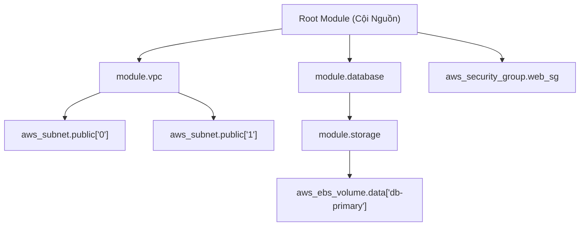
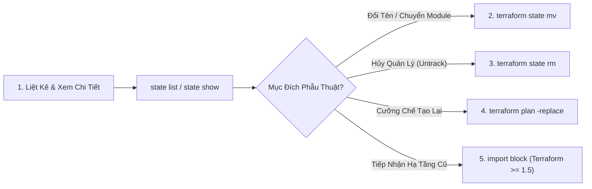
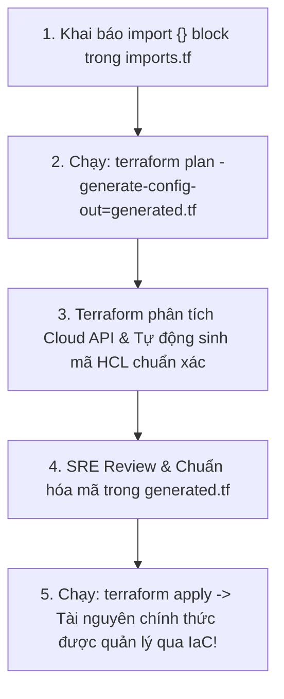
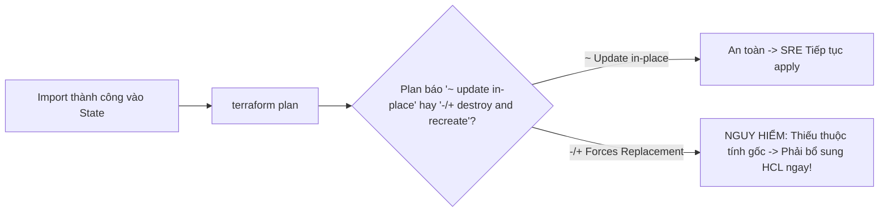
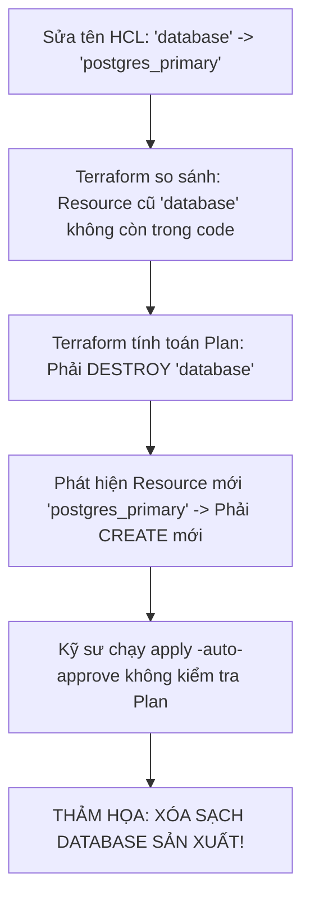

# Phẫu Thuật State: Làm Chủ State Subcommands (mv, rm, replace) & Declarative Import Block

Trong hành trình quản trị hạ tầng bằng mã (**Infrastructure as Code**), sẽ có những thời điểm bạn bắt buộc phải thực hiện các thao tác "can thiệp ngoại khoa" trực tiếp vào file State. Đó là khi bạn cần:
- **Tái cấu trúc (Refactor) hạ tầng:** Chuyển đổi một khối mã nguyên khối (Monolith) thành các Module độc lập mà **tuyệt đối không được phép xóa và tạo lại tài nguyên đang chạy** (Zero Downtime).
- **Tiếp nhận (Onboard) hạ tầng cũ:** Đưa hàng trăm máy chủ ảo, cơ sở dữ liệu và mạng VPC đã được tạo thủ công từ ClickOps sang quyền kiểm soát chính thức của Terraform.
- **Loại bỏ quyền quản lý (Untrack):** Ngừng theo dõi một tài nguyên nhưng **vẫn giữ nguyên tài nguyên thực tế trên Cloud** để bàn giao quyền quản lý cho một đội ngũ khác.
- **Cưỡng chế tái tạo (Force Replace):** Buộc phải hủy và tạo mới lại một máy chủ bị lỗi cục bộ mà không cần chỉnh sửa bất kỳ dòng mã nguồn HCL nào.

Mọi sai sót trong quá trình thao tác State đều có thể dẫn tới thảm họa xóa sổ toàn bộ cơ sở dữ liệu sản xuất hoặc tạo ra tài nguyên rác mồ côi (Orphaned Resources). Bài viết này sẽ hướng dẫn bạn làm chủ hệ tọa độ **Resource Addressing**, bộ công cụ **State Subcommands**, và tính năng **Declarative `import {}` Block** kết hợp sinh code tự động được giới thiệu từ Terraform 1.5+.

---

## 1. Bản Đồ Resource Addressing: Tọa Độ Của Tài Nguyên Trong State

Trước khi thực hiện bất kỳ lệnh can thiệp nào, kỹ sư SRE bắt buộc phải nắm vững **Resource Addressing (Cú pháp địa chỉ tài nguyên)**. Đây là hệ tọa độ duy nhất giúp Terraform Core định vị chính xác vị trí của từng tài nguyên trong cây phân cấp đồ thị:



---

## 2. Bảng Tra Cứu Cú Pháp Resource Addressing Toàn Diện

| Cấu Trúc Khai Báo Trong HCL | Cú Pháp Địa Chỉ State (Resource Address) | Ví Dụ Thực Tế |
| :--- | :--- | :--- |
| **Tài nguyên đơn lẻ ở Root Module** | `<resource_type>.<name>` | `aws_instance.web` |
| **Data Source ở Root Module** | `data.<resource_type>.<name>` | `data.aws_ami.ubuntu` |
| **Tài nguyên trong Child Module** | `module.<mod_name>.<type>.<name>` | `module.vpc.aws_vpc.main` |
| **Module lồng nhau đa cấp** | `module.<parent>.<child>.<type>.<name>` | `module.core.module.network.aws_subnet.pub` |
| **Tài nguyên sử dụng vòng lặp `count`** | `<type>.<name>[<index_number>]` | `aws_subnet.public[0]`, `aws_subnet.public[1]` |
| **Tài nguyên sử dụng `for_each` (Map/Set)**| `<type>.<name>["<key_string>"]` | `aws_instance.app["prod"]` |

> [!WARNING]
> **CẠM BẪY ESCAPE KÝ TỰ TRÊN TERMINAL SHELL:**
> Trên môi trường Linux/macOS Bash, Zsh hoặc Windows PowerShell, các ký tự ngoặc vuông `[]` và nháy kép `""` thường bị Shell hiểu nhầm là toán tử nội suy mảng. Khi chạy lệnh CLI, **luôn luôn bọc toàn bộ địa chỉ tài nguyên trong dấu nháy đơn `'...'`**:
> ```bash
> # ĐÚNG CHUẨN: Bọc nháy đơn an toàn
> terraform state show 'module.vpc.aws_subnet.public[0]'
> terraform state show 'aws_instance.app["prod"]'
> ```

---

## 3. Bộ Tứ Quyền Lực: State Subcommands Thường Dùng



### 3.1. `terraform state list` & `terraform state show`
- `terraform state list`: Trả về toàn bộ danh sách địa chỉ tài nguyên đang có trong State. Hỗ trợ lọc theo tiền tố module: `terraform state list module.vpc`.
- `terraform state show '<address>'`: Hiển thị chi tiết toàn bộ các thuộc tính (attributes) đang được ghi nhớ trong State mà không cần gửi request gọi Cloud API.

### 3.2. `terraform state mv` — Tái Cấu Trúc Zero-Downtime
Lệnh `state mv` đổi tên logic hoặc di chuyển tài nguyên giữa các module trong State mà **hoàn toàn không chạm vào tài nguyên vật lý đang chạy trên Cloud**:

```bash
# Trường hợp 1: Đổi tên nội bộ trong Root Module
terraform state mv aws_instance.web_server aws_instance.app_server

# Trường hợp 2: Di chuyển tài nguyên từ Root Module vào Child Module
terraform state mv aws_s3_bucket.media module.storage.aws_s3_bucket.this

# Trường hợp 3: Chuyển đổi giữa tài nguyên đơn lẻ sang mảng count
terraform state mv aws_subnet.public 'aws_subnet.public[0]'
```

> [!IMPORTANT]
> **TIÊU CHUẨN NGHIỆM THU REFACTORING:**
> Sau khi chạy lệnh `state mv` và cập nhật mã nguồn HCL tương ứng, khi bạn chạy `terraform plan`, kết quả bắt buộc phải hiển thị dòng chữ vàng:
> ```text
> No changes. Your infrastructure matches the configuration.
> ```
> Nếu `plan` báo `1 to add, 1 to destroy`, nghĩa là bạn đã gõ sai địa chỉ hoặc quên chưa di chuyển State!

### 3.3. `terraform state rm` — Hủy Quyền Quản Lý (Untrack Resource)
Khi bạn muốn Terraform "quên" một tài nguyên nhưng **tuyệt đối không được xóa tài nguyên đó trên AWS/GCP**:

```bash
terraform state rm aws_db_instance.legacy_mysql
```
Tài nguyên cơ sở dữ liệu `legacy_mysql` vẫn tiếp tục chạy bình thường trên AWS, nhưng Terraform sẽ không còn theo dõi nó nữa. Sau đó, bạn có thể xóa đoạn code HCL tương ứng mà không sợ bị xóa mất database.

### 3.4. `terraform plan -replace` — Cưỡng Chế Tái Tạo An Toàn
Chuẩn công nghiệp hiện đại từ Terraform 0.15.2+ là sử dụng cờ `-replace` thay cho lệnh nguy hiểm cũ `terraform taint`:

```bash
# Xem trước kế hoạch tái tạo có chủ đích
terraform plan -replace="aws_instance.api_server" -out=replace.tfplan

# Áp dụng kế hoạch tái tạo
terraform apply replace.tfplan
```

---

## 4. Cuộc Cách Mạng: Declarative `import {}` Block (Terraform 1.5+)

Trước phiên bản 1.5, việc import tài nguyên cũ vào Terraform đòi hỏi phải gõ lệnh Imperative `terraform import <address> <id>` và kỹ sư phải tự tay viết mã HCL khớp từng thuộc tính (rất dễ sai sót).

Từ Terraform 1.5+, cơ chế **Declarative Import Block** cho phép bạn khai báo ý định import trực tiếp trong code HCL và **tự động sinh mã nguồn** bằng cờ `-generate-config-out`:



### Bảng So Sánh Hai Phương Pháp Import:

| Tiêu Chí So Sánh | Lệnh Cũ `terraform import` (Imperative) | Khối Mới `import {}` (Declarative - 1.5+) |
| :--- | :--- | :--- |
| **Quy Trình Thực Hiện** | Chạy CLI thủ công từng lệnh một | Khai báo dạng code trong tệp `.tf` |
| **Khả Năng Code Review** | Không có (Thao tác trực tiếp vào State) | Review qua Git Pull Request / Merge Request |
| **Sinh Mã Nguồn HCL** | Hoàn toàn thủ công (Kỹ sư phải tự viết) | **Tự động 100%** qua `-generate-config-out` |
| **Kiểm Thử Trước (Plan)** | Không hỗ trợ chạy `plan` | Cho phép chạy `terraform plan` để kiểm duyệt |
| **Hỗ Trợ CI/CD Pipeline** | Rất khó tự động hóa an toàn | Tương thích hoàn hảo với GitOps Automation |

### Ví Dụ Thực Tế Tiếp Nhận S3 Bucket Đã Có Sẵn:

```hcl
# imports.tf - Khai báo khối Import
import {
  to = aws_s3_bucket.imported_bucket
  id = "showtech-legacy-data-lake-2024"
}
```

Lệnh tự động sinh mã nguồn HCL:
```bash
terraform plan -generate-config-out=generated_resources.tf
```

Terraform sẽ tự động sinh tệp `generated_resources.tf` với đầy đủ thuộc tính khớp 100% với tài nguyên trên Cloud!

---

## 5. Xử Lý Các Tài Nguyên Có Composite ID (Security Group Rules, IAM Attachments)

Nhiều tài nguyên trên AWS không có một ID đơn lẻ mà được định danh bằng **Composite ID (ID tổng hợp phân tách bằng dấu gạch ngang hoặc gạch dưới)**:

| Loại Tài Nguyên (Resource Type) | Cấu Trúc Composite ID Khi Import | Ví Dụ ID Thực Tế |
| :--- | :--- | :--- |
| **`aws_security_group_rule`** | `<sg_id>_<type>_<proto>_<from>_<to>_<cidr>` | `sg-0123456_ingress_tcp_443_443_0.0.0.0/0` |
| **`aws_route`** | `<route_table_id>_<destination_cidr>` | `rtb-0987654_10.0.0.0/16` |
| **`aws_iam_role_policy_attachment`** | `<role_name>/<policy_arn>` | `eks-node-role/arn:aws:iam::aws:policy/AmazonEKSWorkerNodePolicy` |
| **`aws_s3_bucket_policy`** | `<bucket_name>` | `showtech-prod-storage-ap-southeast-1` |

## 6. Xử Lý Hiện Tượng ForceNew Drift Khi Import Tài Nguyên Cũ

Một trong những sự cố phổ biến nhất khi import tài nguyên cũ là: Mã HCL tự sinh hoặc viết tay bị thiếu một thuộc tính bắt buộc khiến Provider coi đó là thay đổi thuộc tính phá hủy (**Forces Replacement**):



> [!CAUTION]
> **KIỂM TRA KỸ LƯỠNG KÝ HIỆU `(forces replacement)`:**
> Sau khi import tài nguyên vào State, khi chạy `terraform plan`, nếu bạn thấy xuất hiện dòng chữ `~ resource "..." must be replaced` kèm theo `(forces replacement)`, **TUYỆT ĐỐI KHÔNG ĐƯỢC APPLY**! Hãy mở `terraform state show` để kiểm tra chính xác giá trị gốc trên Cloud và sao chép vào file HCL cho đến khi Plan chỉ còn hiển thị `~ update in-place` hoặc `No changes`.

---

## 7. Phân Tích Cạm Bẫy Thực Chiến: Thảm Họa "Đổi Tên Resource Làm Mất Dữ Liệu"

### Tình Huống Sự Cố Thực Tế:
Tại một công ty tài chính, một kỹ sư muốn đổi tên định danh của cơ sở dữ liệu RDS trong file `main.tf` từ `resource "aws_db_instance" "database"` thành `resource "aws_db_instance" "postgres_primary"`.

Kỹ sư đã sửa code trực tiếp và chạy ngay lệnh:
```bash
terraform apply -auto-approve
```

### Hậu Quả & Log Lỗi Thực Tế:
```log
# Trích đoạn log thảm họa từ Terraform CLI
Terraform will perform the following actions:

  # aws_db_instance.database will be destroyed
  - resource "aws_db_instance" "database" {
      - id                   = "rds-prod-database" -> null
      - identifier           = "rds-prod-database" -> null
      # (30 attributes deleted)
    }

  # aws_db_instance.postgres_primary will be created
  + resource "aws_db_instance" "postgres_primary" {
      + id                   = (known after apply)
      + identifier           = "rds-prod-database"
      # (Creating new database...)
    }

Plan: 1 to add, 0 to change, 1 to destroy.

aws_db_instance.database: Destroying... [id=rds-prod-database]
# TOÀN BỘ CƠ SỞ DỮ LIỆU SẢN XUẤT BỊ XÓA SỔ VĨNH VIỄN!
```



### 5-Whys Root Cause Analysis:
1. **Tại sao cơ sở dữ liệu sản xuất bị xóa?** $\rightarrow$ Vì Terraform thực thi hành động `Destroy` đối với tài nguyên `aws_db_instance.database`.
2. **Tại sao Terraform lại xóa?** $\rightarrow$ Vì Terraform không hiểu khái niệm "đổi tên"; nó chỉ thấy tài nguyên cũ bị xóa khỏi code HCL và một tài nguyên mới xuất hiện.
3. **Tại sao kỹ sư không dùng `state mv` trước?** $\rightarrow$ Do kỹ sư chủ quan không nắm được quy tắc: Đổi tên resource trong code bắt buộc phải đồng bộ đổi tên trong State bằng `terraform state mv`.
4. **Tại sao lệnh apply vẫn chạy được khi đang xóa database?** $\rightarrow$ Do thiếu cấu hình an toàn `prevent_destroy = true` trong khối `lifecycle` của database và thiếu thuộc tính `deletion_protection = true` trên AWS.
5. **Quy trình chuẩn SRE để đổi tên an toàn:**
   - **Bước 1 (Đổi tên trong State trước):**
     ```bash
     terraform state mv aws_db_instance.database aws_db_instance.postgres_primary
     ```
   - **Bước 2 (Sửa tên trong code HCL):** Đổi tên khớp 100% với tên mới trong state.
   - **Bước 3 (Chạy Plan kiểm tra):** Xác nhận `Plan: 0 to add, 0 to change, 0 to destroy`.

---

## 7. Hands-on Lab: Thực Hành Phẫu Thuật State & Declarative Import (8 Bước)

### Bước 1: Khởi tạo thư mục thực hành thử nghiệm
```bash
mkdir -p /tmp/state-surgery-lab && cd /tmp/state-surgery-lab
terraform init
```

### Bước 2: Tạo một tài nguyên mẫu ban đầu bằng `local_file`
```bash
cat << 'EOF' > main.tf
terraform {
  required_providers {
    local = {
      source  = "hashicorp/local"
      version = "~> 2.5.0"
    }
  }
}

resource "local_file" "original_doc" {
  filename = "${path.module}/doc_v1.txt"
  content  = "State Surgery Practical Lab - ShowTech Enterprise"
}
EOF

terraform apply -auto-approve
```

### Bước 3: Đổi tên tài nguyên trong State bằng `state mv`
```bash
# Đổi tên từ original_doc sang refactored_doc trong State
terraform state mv local_file.original_doc local_file.refactored_doc
```

### Bước 4: Sửa code HCL để đồng bộ với tên mới trong State
```bash
sed -i 's/original_doc/refactored_doc/g' main.tf
```

### Bước 5: Chạy `terraform plan` để kiểm chứng Zero-Downtime
```bash
terraform plan
```
Xác nhận màn hình hiển thị: `No changes. Your infrastructure matches the configuration.`

### Bước 6: Hủy quyền quản lý bằng `state rm`
```bash
terraform state rm local_file.refactored_doc
```
Kiểm tra tệp `doc_v1.txt` trên ổ đĩa vẫn tồn tại bình thường nhưng không còn trong State:
```bash
terraform state list # Kết quả rỗng
ls -la doc_v1.txt    # Tệp vẫn tồn tại
```

### Bước 7: Tiếp nhận lại tài nguyên bằng Declarative `import {}` Block
```bash
cat << 'EOF' > imports.tf
import {
  to = local_file.refactored_doc
  id = "./doc_v1.txt"
}
EOF

terraform apply -auto-approve
```

### Bước 8: Xác minh tài nguyên đã quay trở lại quyền kiểm soát của State
```bash
terraform state list
# Kết quả: local_file.refactored_doc đã được quản lý trở lại!

# Dọn dẹp môi trường
terraform destroy -auto-approve
cd .. && rm -rf /tmp/state-surgery-lab
```

---

## 8. 10 Câu Hỏi Tự Kiểm Tra Chuyên Sâu (Self-Check Q&A)

### Câu 1: Lệnh `terraform state mv` thực hiện hành động gì lên hạ tầng thực tế trên Cloud?
<details>
<summary><b>Xem lời giải chi tiết</b></summary>
<b>HOÀN TOÀN KHÔNG CHẠM VÀO CLOUD</b>. Lệnh <code>state mv</code> chỉ sửa đổi đường dẫn địa chỉ (Resource Address) bên trong tài liệu JSON của State File. Tài nguyên vật lý trên AWS/GCP/Azure vẫn tiếp tục hoạt động liên tục mà không hề bị gián đoạn hay restart.
</details>

### Câu 2: Sự khác biệt cơ bản giữa `terraform state rm` và `terraform destroy` là gì?
<details>
<summary><b>Xem lời giải chi tiết</b></summary>
- <code>state rm</code>: Chỉ xóa bản ghi ánh xạ của tài nguyên ra khỏi State File (Untrack), tài nguyên thực tế trên Cloud <b>VẪN CÒN NGUYÊN</b>.<br/>
- <code>destroy</code>: Gửi lệnh API lên Cloud để <b>XÓA VĨNH VIỄN</b> tài nguyên thực tế.
</details>

### Câu 3: Khối `import {}` trong Terraform 1.5+ có ưu điểm gì vượt trội so với lệnh `terraform import` cũ?
<details>
<summary><b>Xem lời giải chi tiết</b></summary>
1. Tính chất Declarative: Kế hoạch import được lưu trữ trong mã nguồn Git, có thể review qua Pull Request.<br/>
2. Xem trước kế hoạch (Preview): Cho phép chạy <code>terraform plan</code> để đối soát trước khi import.<br/>
3. Tự động sinh mã nguồn (Code Generation): Tự động tạo code HCL chuẩn xác bằng cờ <code>-generate-config-out</code>.
</details>

### Câu 4: Khi di chuyển tài nguyên từ Root Module vào Child Module, lệnh `state mv` được viết như thế nào?
<details>
<summary><b>Xem lời giải chi tiết</b></summary>
Cú pháp: <code>terraform state mv <source_address> <destination_address></code>.<br/>
Ví dụ: <code>terraform state mv aws_security_group.web module.network.aws_security_group.web</code>.
</details>

### Câu 5: Vì sao lệnh `terraform plan -replace` lại an toàn hơn lệnh cũ `terraform taint`?
<details>
<summary><b>Xem lời giải chi tiết</b></summary>
Lệnh cũ <code>taint</code> ghi đè trực tiếp trạng thái nguy hiểm vào State ngay lập tức. Trong khi <code>-replace</code> chỉ tạo ra một kế hoạch thay thế tạm thời trong bộ nhớ Plan, cho phép kỹ sư xem xét kỹ lưỡng và chỉ thực thi khi đã kiểm duyệt an toàn.
</details>

### Câu 6: Làm thế nào để định vị một tài nguyên nằm trong vòng lặp `for_each` khi chạy `state show`?
<details>
<summary><b>Xem lời giải chi tiết</b></summary>
Sử dụng cú pháp: <code>terraform state show '<resource_type>.<name>["<key>"]'</code> (Bắt buộc bọc trong dấu nháy đơn để tránh lỗi Shell interpolation). Ví dụ: <code>terraform state show 'aws_instance.server["prod"]'</code>.
</details>

### Câu 7: Điều gì xảy ra nếu bạn đổi tên resource trong HCL nhưng quên chạy `state mv` trước khi apply?
<details>
<summary><b>Xem lời giải chi tiết</b></summary>
Terraform sẽ coi tài nguyên có tên cũ đã bị xóa khỏi code (tạo hành vi <b>Destroy</b>) và tài nguyên có tên mới là một tài nguyên hoàn toàn mới (tạo hành vi <b>Create</b>). Điều này dẫn tới việc xóa mất tài nguyên đang chạy và làm mất mát dữ liệu!
</details>

### Câu 8: Sau khi import thành công bằng khối `import {}`, có nên giữ lại khối `import` đó trong code không?
<details>
<summary><b>Xem lời giải chi tiết</b></summary>
Từ Terraform 1.5+, bạn <b>hoàn toàn có thể giữ lại</b> khối <code>import {}</code> trong mã nguồn như một tài liệu ghi nhớ lịch sử nguồn gốc tài nguyên mà không gây ảnh hưởng gì tới các đợt apply tiếp theo. Hoặc bạn có thể xóa đi sau khi tài nguyên đã nằm an toàn trong State.
</details>

### Câu 9: Lệnh `terraform state pull` và `terraform state push` được dùng trong tình huống nào?
<details>
<summary><b>Xem lời giải chi tiết</b></summary>
Dùng để tải trực tiếp nội dung State thô (Raw JSON) về máy (<code>state pull > state.json</code>) để chỉnh sửa cứu hộ khẩn cấp khi State bị corrupt, sau đó đẩy ngược lại Remote Backend một cách có kiểm soát bằng lệnh <code>state push</code>.
</details>

### Câu 10: Rào chắn an ninh nào trong HCL giúp ngăn chặn hoàn toàn việc xóa nhầm tài nguyên khi chạy apply sai sót?
<details>
<summary><b>Xem lời giải chi tiết</b></summary>
Khai báo khối <code>lifecycle { prevent_destroy = true }</code> trực tiếp bên trong tài nguyên cần bảo vệ. Bất kỳ lệnh Plan nào có ý định xóa tài nguyên này đều sẽ bị Terraform chặn đứng ngay lập tức.
</details>

---

## 9. Tổng Kết & Lộ Trình Bài Học Tiếp Theo

Làm chủ bộ công cụ **State Subcommands (`mv`, `rm`, `replace`)** và tính năng **Declarative `import {}` Block** biến bạn thành một "bác sĩ phẫu thuật hạ tầng" thực thụ, có khả năng tái cấu trúc và giải cứu mọi hệ sinh thái IaC mà không gây ra bất kỳ giây phút gián đoạn dịch vụ nào.

Trong **[Bài 09: Xử Lý Configuration Drift: Kỹ Thuật Reconcile, Ignore Changes & Chống Thất Thoát Tài Nguyên Mồ Côi](09-xu-ly-drift-ha-tang-refresh-only-reconciliation-va-chong-that-thoat-tai-nguyen.md)**, chúng ta sẽ đi sâu vào nghệ thuật chế ngự Drift: Phân loại Drift ác tính vs lành tính, sử dụng `ignore_changes` chuẩn mực cho Auto-Scaling / Mutating Webhooks và dọn dẹp các tài nguyên mồ côi (Orphaned Resources).
