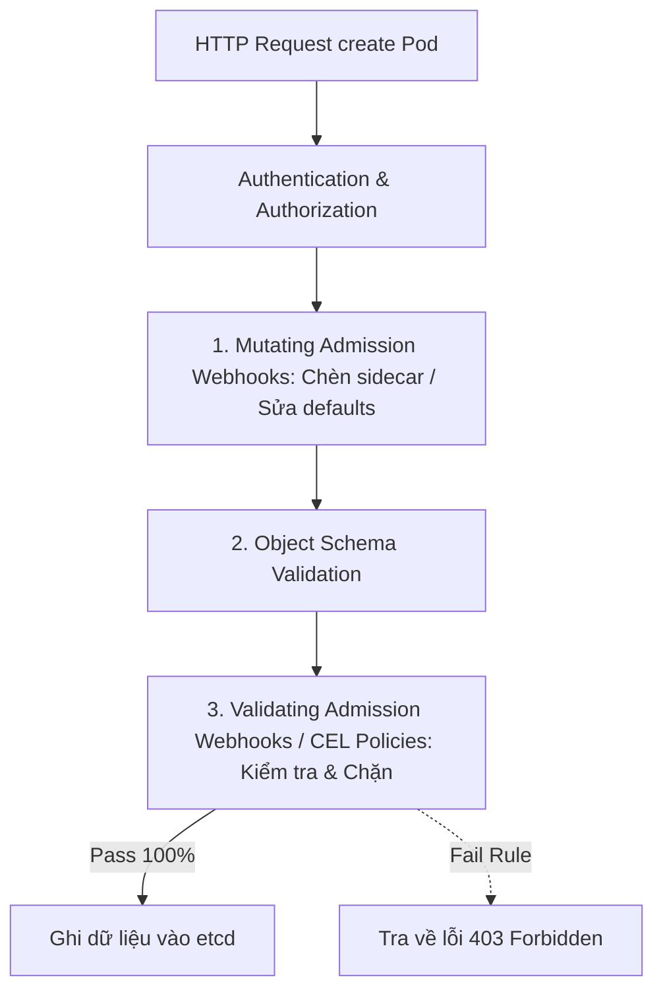
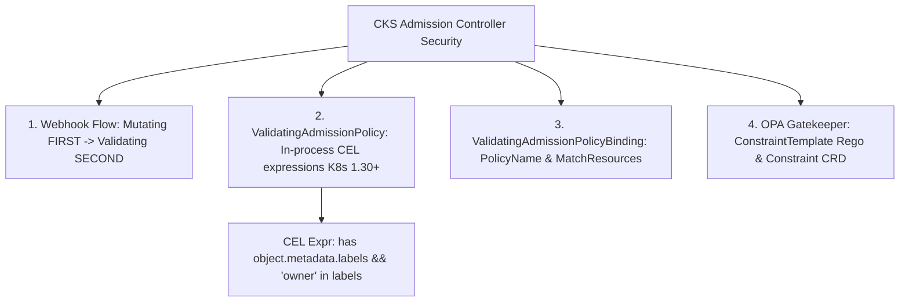
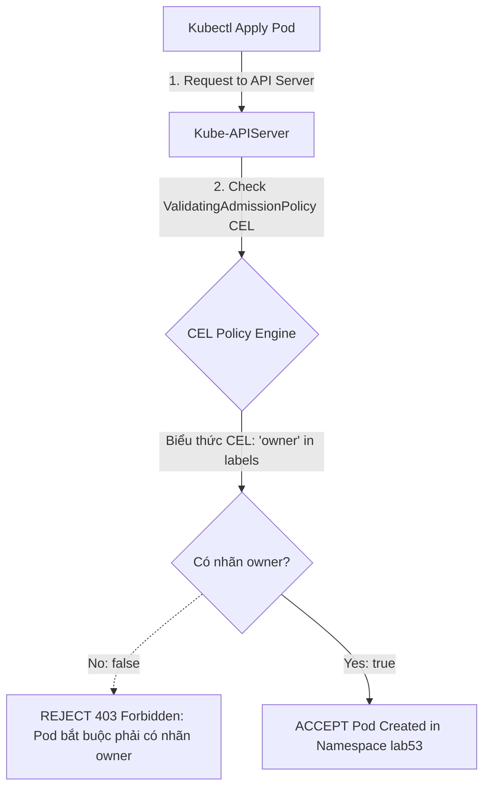


# [BÀI 08] KIỂM SOÁT NHẬP CỤM BẰNG ADMISSION CONTROLLERS & OPA GATEKEEPER: VALIDATING WEBHOOKS & CONSTRAINT TEMPLATES

Trong kỷ nguyên điện toán đám mây và kiến trúc microservices phân tán quy mô lớn, **Kubernetes (CKS)** đóng vai trò là nền tảng điều phối container (Container Orchestration) tiêu chuẩn công nghiệp. Để làm chủ hệ thống trong môi trường sản xuất (Production) cũng như chinh phục kỳ thi chứng chỉ quốc tế của Linux Foundation / CNCF, kỹ sư không chỉ nắm vững các câu lệnh thao tác cơ bản mà phải thấu hiểu sâu sắc bản chất cơ chế tầng thấp: từ chu trình điều hòa (Reconciliation Loop), cấu trúc điều phối tài nguyên, kiến trúc mạng CNI, lưu trữ CSI cho đến các chuẩn mực an ninh phòng thủ chiều sâu.

Bài viết chuyên sâu này sẽ đồng hành cùng bạn giải mã toàn diện bức tranh kiến trúc, phân tích các đánh đổi kỹ thuật thực chiến (Engineering Trade-offs), cung cấp bài thực hành Lab từng bước và bộ câu hỏi phỏng vấn chuẩn Architect / Lead Engineer.

---

## 1. Bản Chất Kiến Trúc & Cơ Chế Vận Hành Tầng Thấp

| # | Câu hỏi ôn tập | Đáp án chuẩn ngắn gọn |
|---|---|---|
| 1 | Ba cấp độ bảo mật Pod Security Standards (PSS)? | **`privileged`**, **`baseline`**, **`restricted`** |
| 2 | Ba chế độ kiểm soát Pod Security Admission (PSA)? | **`enforce`**, **`warn`**, **`audit`** |
| 3 | Nhãn Namespace bắt buộc áp mức restricted PSS? | **`pod-security.kubernetes.io/enforce: restricted`** |
| 4 | Bốn thuộc tính securityContext bắt buộc Restricted PSS? | **`runAsNonRoot`**, **`seccompProfile`**, **`allowPrivilegeEscalation: false`**, **`capabilities.drop: ["ALL"]`** |
| 5 | Lệnh CLI gán nhãn PSA cho Namespace kèm nạp đè? | **`kubectl label --overwrite ns <name> pod-security.kubernetes.io/enforce=restricted`** |


> **"Bảo vệ cụm và áp đặt chính sách quy chuẩn nâng cao bằng Admission Controllers, ValidatingAdmissionPolicy và OPA Gatekeeper là kỹ năng quản trị an ninh tối quan trọng thuộc chứng chỉ CKS, đòi hỏi chuyên gia bảo mật phải hiểu rõ luồng xử lý request của API Server qua hai giai đoạn Mutating và Validating Webhooks; làm chủ cú pháp biên soạn chính sách kiểm duyệt `ValidatingAdmissionPolicy` dựa trên ngôn ngữ CEL (Common Expression Language như `object.spec.containers.all(c, c.image.contains('myregistry.io/'))`) kết hợp với `ValidatingAdmissionPolicyBinding`; đồng thời hiểu rõ mô hình OPA Gatekeeper (ConstraintTemplate và Constraint trong ngôn ngữ Rego) để tự động hóa rào chắn an ninh, cấm tuyệt đối các tài nguyên không đáp ứng tiêu chuẩn doanh nghiệp gia nhập vào cụm Kubernetes."**

**Kết quả từ các buổi trước được sử dụng lại:**

| Kết quả / Công cụ | Buổi + số hiệu `QT` | Dùng ở đâu trong buổi này |
|---|---|---|
| Quản lý cờ cấu hình `kube-apiserver.yaml` | Buổi 08 `QT 4.1` | Thao tác bật/tắt cờ `--enable-admission-plugins` |
| Quản lý CRD và Custom Resources | Buổi 43 `QT 4.1` | Khai báo các CRD OPA Gatekeeper / Kyverno |
| Cấu hình Pod Security Admission | Buổi 52 `QT 7.1` | So sánh tính năng PSA tích hợp sẵn vs Custom Admission Policies |

---


| # | Kỹ năng thực hiện được | Hiện vật chứng minh |
|---|---|---|
| 1 | Phân biệt luồng xử lý `Mutating` vs `Validating` Admission Webhooks | Sơ đồ luồng xử lý API Server Request |
| 2 | Biên soạn `ValidatingAdmissionPolicy` bằng ngôn ngữ CEL | Tệp YAML định nghĩa `ValidatingAdmissionPolicy` |
| 3 | Liên kết chính sách vào Namespace mục tiêu qua PolicyBinding | Tệp YAML `ValidatingAdmissionPolicyBinding` |
| 4 | Hiểu kiến trúc OPA Gatekeeper `ConstraintTemplate` và `Constraint` | Cấu trúc bộ luật OPA Rego |
| 5 | Chẩn đoán lỗi request bị API Server từ chối do vi phạm CEL Policy | Nhật ký lỗi `403 Forbidden` chứa thông điệp CEL message |

---


| Kiến thức tiên quyết | Nguồn tự học nếu thiếu |
|---|---|
| Pod Security Admission và PSS labels | Buổi 52 (`QT 7.1`) |
| Thao tác chỉnh sửa cờ Kube-APIServer | Buổi 08 (`QT 4.1`) |
| Định nghĩa CRD và Custom Resource YAML | Buổi 43 (`QT 4.1`) |

---


### 3.1. Thuật ngữ Việt–Anh

| # | Thuật ngữ tiếng Việt | Tiếng Anh tương đương | Ghi chú chuẩn hoá trong thân bài |
|---|---|---|---|
| 1 | Bộ kiểm soát yêu cầu vào cụm | Admission Controller | Plugin kiểm duyệt request trước khi ghi vào etcd |
| 2 | Webhook thay đổi dữ liệu | Mutating Admission Webhook | Webhook sửa đổi/chèn thuộc tính mặc định cho request |
| 3 | Webhook kiểm tra hợp lệ | Validating Admission Webhook | Webhook kiểm tra quy tắc và CHẶN nếu vi phạm |
| 4 | Chính sách kiểm duyệt CEL | ValidatingAdmissionPolicy | Tính năng K8s 1.30+ dùng ngôn ngữ CEL để validate |
| 5 | Ràng buộc chính sách kiểm duyệt | ValidatingAdmissionPolicyBinding | Đối tượng liên kết ValidatingAdmissionPolicy với tài nguyên |
| 6 | Ngôn ngữ biểu thức chung | Common Expression Language (CEL) | Ngôn ngữ viết biểu thức điều kiện nhanh không cần webhook |
| 7 | Bộ kiểm soát chính sách OPA | OPA Gatekeeper | Công cụ 3rd party dùng ngôn ngữ Rego quản lý chính sách |
| 8 | Tệp mẫu ràng buộc OPA | ConstraintTemplate | CRD định nghĩa logic luật Rego trong OPA Gatekeeper |
| 9 | Đối tượng áp đặt ràng buộc OPA | Constraint | CRD áp đặt ConstraintTemplate vào tài nguyên cụ thể |
| 10 | Công cụ chính sách Kyverno | Kyverno Policy Engine | Công cụ quản lý chính sách K8s sử dụng cú pháp YAML thuần |
| 11 | Cờ bật plugin admission | `--enable-admission-plugins` | Cờ cấu hình danh sách plugin admission trên kube-apiserver |
| 12 | Hành vi vi phạm bị từ chối | Admission Denial (403 Forbidden) | Kết quả khi request vi phạm chính sách Validating Policy |
| 13 | Biểu thức khớp đối tượng | Match Constraints (`matchConstraints`) | Điều kiện lọc tài nguyên áp dụng chính sách CEL |
| 14 | Biểu thức kiểm tra tính đúng | Validation Expression (`expression`) | Biểu thức CEL trả về `true` (cho phép) hoặc `false` (chặn) |


Mô hình Hai Cổng Kiểm Soát Xuất Nhập Cảnh và Máy Scan Tự Động CEL: API Server giống như Sân Bay Quốc Tế. Request tạo Pod giống như Hành khách xin nhập cảnh. `Mutating Admission Webhook` giống như Cổng 1 (Máy dán tem tự động): tự động đóng dấu thêm thông tin mặc định (như chèn sidecar container hay nạp nhãn mặc định). `Validating Admission Webhook` giống như Cổng 2 (Hải quan kiểm tra): soi chiếu toàn bộ giấy tờ, nếu không đạt tiêu chuẩn an ninh sẽ CHẶN THẲNG không cho nhập cảnh. `ValidatingAdmissionPolicy (CEL)` giống như Máy Scan AI Tự Động gắn ở Cổng 2: thay vì phải gọi điện thoại ra bên ngoài hỏi sĩ quan hải quan (`External Webhook`), Máy Scan AI tự đọc và đối soát điều kiện bằng ngôn ngữ CEL siêu nhanh ngay tại cổng.

---

### 1.1. Luồng xử lý Request API Server và Kiến trúc Admission Controllers (Mutating vs Validating) (12 phút)

**Nguyên lý cốt lõi:** Trong luồng xử lý của API Server, `MutatingAdmissionWebhook` LUÔN ĐƯỢC THỰC THI TRƯỚC `ValidatingAdmissionWebhook`; dữ liệu sau khi bị Mutating chỉnh sửa mới được chuyển sang cho Validating kiểm tra.

**Giải thích cơ chế ngầm:** Thứ tự này đảm bảo giai đoạn Validating kiểm duyệt bản kê khai cuối cùng hoàn chỉnh nhất sau khi đã được chèn/sửa các thuộc tính mặc định từ giai đoạn Mutating.

> [!WARNING]
> **CẠM BẪY THỰC CHIẾN:**
> Hiểu nhầm Validating chạy trước làm cho các thuộc tính chèn tự động bởi Mutating không được kiểm tra an ninh.

**Minh hoạ.**



**Nguyên lý cốt lõi:** Sử dụng `ValidatingAdmissionPolicy` (CEL) tích hợp sẵn trong K8s 1.30+ thay cho các External Webhooks bất cứ khi nào có thể để tăng hiệu năng xử lý request và loại bỏ nguy cơ làm chậm API Server do ngẽn mạng.

**Giải thích cơ chế ngầm:** External Webhook yêu cầu API Server phải gửi HTTP POST request ra ngoài pod/service bên thứ ba. `ValidatingAdmissionPolicy` chạy trực tiếp bằng trình biên dịch CEL bên trong tiến trình API Server, phản hồi trong vài miliseconds.

> [!WARNING]
> **CẠM BẪY THỰC CHIẾN:**
> Dùng External Webhook cho các luật đơn giản làm API Server bị treo timeout khi mạng nội bộ bị trễ.

**Minh hoạ.**

```yaml
# ValidatingAdmissionPolicy CEL chạy trực tiếp trong API Server:
apiVersion: admissionregistration.k8s.io/v1
kind: ValidatingAdmissionPolicy
metadata:
  name: check-owner-label
```

---

### 1.2. Biên soạn chính sách `ValidatingAdmissionPolicy` CEL Expressions (K8s 1.30+) (12 phút)

**Nguyên lý cốt lõi:** Biểu thức CEL trong `spec.validations[x].expression` phải trả về kết quả kiểu BOOLEAN: `true` nghĩa là ĐẠT (cho phép), `false` nghĩa me VI PHẠM (chặn request và in thông điệp `message`).

**Giải thích cơ chế ngầm:** Ngôn ngữ CEL (Common Expression Language) của Google được tối ưu hóa cho độ an toàn cao: không có vòng lặp vô tận, không gọi I/O và chỉ đánh giá biểu thức logic true/false.

> [!WARNING]
> **CẠM BẪY THỰC CHIẾN:**
> Viết biểu thức CEL không trả về boolean (như trả về chuỗi string) khiến API Server báo lỗi khi nạp policy.

**Minh hoạ.**

```yaml
spec:
  validations:
    - expression: "has(object.metadata.labels) && 'owner' in object.metadata.labels"
      message: "Tài nguyên bắt buộc phải chứa nhãn 'owner'!"
```

**Nguyên lý cốt lõi:** Để bắt buộc 100% các Pods tạo mới phải chứa nhãn `owner`, viết biểu thức CEL: `expression: "has(object.metadata.labels) && 'owner' in object.metadata.labels"`.

**Giải thích cơ chế ngầm:** Hàm `has(object.metadata.labels)` kiểm tra đối tượng có khối labels hay chưa trước khi kiểm tra phím `'owner' in object.metadata.labels`. Điều này tránh lỗi Null Pointer Exception khi Pod không có khối `labels`.

> [!WARNING]
> **CẠM BẪY THỰC CHIẾN:**
> Chỉ viết `'owner' in object.metadata.labels` khiến request bị crash lỗi khi Pod không khai báo khối metadata labels.

**Minh hoạ.**

```yaml
validations:
  - expression: "has(object.metadata.labels) && 'owner' in object.metadata.labels"
    message: "LỖI: Pod bắt buộc phải có nhãn 'owner'!"
```

---

### 1.3. Liên kết chính sách qua `ValidatingAdmissionPolicyBinding` và Mô hình OPA Gatekeeper Rego (10 phút)

**Nguyên lý cốt lõi:** Một chính sách `ValidatingAdmissionPolicy` chỉ có hiệu lực kiểm soát khi được liên kết với một tệp `ValidatingAdmissionPolicyBinding` chỉ định mảng `matchResources` hoặc `namespaces`.

**Giải thích cơ chế ngầm:** Tách biệt đối tượng Chính sách (Policy) và Ràng buộc (Binding) giúp chuyên gia bảo mật có thể tái sử dụng 1 Policy cho nhiều Namespace khác nhau với các tham số khác nhau.

> [!WARNING]
> **CẠM BẪY THỰC CHIẾN:**
> Tạo `ValidatingAdmissionPolicy` nhưng quên tạo `ValidatingAdmissionPolicyBinding` làm chính sách không bao giờ được kích hoạt.

**Minh hoạ.**

```yaml
apiVersion: admissionregistration.k8s.io/v1
kind: ValidatingAdmissionPolicyBinding
metadata:
  name: check-owner-binding
spec:
  policyName: check-owner-policy
  validationActions: [Deny]
  matchResources:
    namespaceSelector:
      matchLabels:
        environment: staging
```

**Nguyên lý cốt lõi:** Trong OPA Gatekeeper, `ConstraintTemplate` dùng để định nghĩa mã nguồn Rego và thông số cấu hình; `Constraint` dùng để áp đặt tệp mẫu đó vào các Namespace hoặc Kind cụ thể.

**Giải thích cơ chế ngầm:** `ConstraintTemplate` đóng vai trò là một định nghĩa CRD mới. `Constraint` là một đối tượng khởi tạo của CRD đó.

> [!WARNING]
> **CẠM BẪY THỰC CHIẾN:**
> Tạo `ConstraintTemplate` mà không tạo `Constraint` làm Gatekeeper không áp đặt kiểm duyệt tài nguyên.

**Minh hoạ.**

```yaml
# Mô hình OPA Gatekeeper:
# 1. ConstraintTemplate (Định nghĩa luật Rego)
# 2. Constraint (Khai báo áp đặt vào Pods/Namespaces)
```

**Nguyên lý cốt lõi:** Khi chẩn đoán lỗi request bị chặn do ValidatingAdmissionPolicy, đọc thông điệp `message` trả về từ API Server để xem biểu thức CEL nào bị đánh giá là `false`.

**Giải thích cơ chế ngầm:** Thông điệp `message` hiển thị chính xác dòng phản hồi quy định trong tệp policy, cho biết điều kiện CEL nào bị vi phạm.

> [!WARNING]
> **CẠM BẪY THỰC CHIẾN:**
> Bỏ qua thông điệp `message` dẫn đến việc loay hoay không biết điều kiện kiểm duyệt nào bị đánh giá không đạt.

**Minh hoạ.**

```bash
# Phản hồi từ API Server khi bị ValidatingAdmissionPolicy chặn:
# Error from server (Forbidden): pods "bad-pod" is forbidden by
# ValidatingAdmissionPolicy "check-owner-policy":
# LỖI: Pod bắt buộc phải có nhãn 'owner'!
```

---

### 1.4. Đưa vào cụm thật (4 phút)

**Nguyên lý cốt lõi:** Bản kê khai `ValidatingAdmissionPolicy` chuẩn CKS hoàn chỉnh bắt buộc phải có: `apiVersion: admissionregistration.k8s.io/v1`, `kind: ValidatingAdmissionPolicy`, `spec.matchConstraints`, và `spec.validations` chứa `expression` kèm `message`.

**Giải thích cơ chế ngầm:** Đáp ứng 100% định dạng schema tích hợp sẵn của Kubernetes API Server từ phiên bản v1.30.

> [!WARNING]
> **CẠM BẪY THỰC CHIẾN:**
> Gõ thiếu khối `spec.matchConstraints` khiến policy bị vô hiệu hóa không lọc được đối tượng.

**Minh hoạ.**

```yaml
apiVersion: admissionregistration.k8s.io/v1
kind: ValidatingAdmissionPolicy
metadata:
  name: check-image-registry
spec:
  matchConstraints:
    resourceRules:
      - apiGroups: [""]
        apiVersions: ["v1"]
        operations: ["CREATE", "UPDATE"]
        resources: ["pods"]
  validations:
    - expression: "object.spec.containers.all(c, c.image.startsWith('myregistry.io/'))"
      message: "Ảnh container bắt buộc phải lấy từ myregistry.io/!"
```

**Áp vào cụm đang chạy thì làm gì trước:**
1. Kiểm tra API Server hỗ trợ `admissionregistration.k8s.io/v1`.
2. Tạo tệp `ValidatingAdmissionPolicy` khai báo điều kiện CEL.
3. Tạo tệp `ValidatingAdmissionPolicyBinding` chỉ định Namespace áp dụng.
4. Thử nghiệm tạo Pod chuẩn và Pod vi phạm để đối soát.

**Cái gì hỏng nếu áp thẳng lên prod:**
- Viết biểu thức CEL sai logic (như bắt buộc nhãn không tồn tại) sẽ chặn 100% tất cả các lệnh triển khai Pod trên Production.

**Đo trước — đo sau:**
- Thử nghiệm apply Pod trước (tạo thành công) và sau khi bind policy (bị chặn với lỗi `Forbidden`).

**Khi nào KHÔNG nên dùng:**
- Không dùng CEL Policy cho các logic kiểm tra phức tạp đòi hỏi truy vấn cơ sở dữ liệu bên ngoài (khi đó phải dùng External Webhook hoặc OPA Gatekeeper).

---

### 1.5. Bẫy hay gặp (2 phút)

| Bẫy hay gặp | Vì sao dính | Làm đúng là |
|---|---|---|
| 1. Quên tạo `ValidatingAdmissionPolicyBinding` | Tạo policy nhưng không liên kết binding | Tạo cả tệp Policy và PolicyBinding |
| 2. Biểu thức CEL bị crash do Null Pointer | Không kiểm tra sự tồn tại của khối bằng `has()` | Viết `has(object.metadata.labels)` trước |
| 3. Quên mảng `validationActions: [Deny]` trong Binding | Binding không khai báo hành động chặn khi vi phạm | Khai báo `validationActions: [Deny]` |
| 4. Gõ sai `apiVersion` thành `v1` | ValidatingAdmissionPolicy thuộc nhóm registration | Gõ đúng `admissionregistration.k8s.io/v1` |
| 5. Nhầm lẫn thứ tự Mutating vs Validating | Cho rằng Validating chạy trước Mutating | Nhớ rõ: Mutating chạy TRƯỚC, Validating chạy SAU |
| 6. Biểu thức CEL trả về string thay vì boolean | Viết biểu thức không đánh giá true/false | Đảm bảo biểu thức trả về giá trị kiểu boolean |
| 7. Quên thuộc tính `operations: ["CREATE", "UPDATE"]` | Policy không lọc được thao tác khởi tạo Pod | Khai báo đầy đủ `operations` trong `resourceRules` |
| 8. OPA Gatekeeper tạo `ConstraintTemplate` mà quên `Constraint` | Luật Rego chưa được áp vào tài nguyên | Tạo cả `ConstraintTemplate` và `Constraint` |
| 9. Biểu thức CEL dùng hàm không hỗ trợ | CEL trong K8s chỉ hỗ trợ tập hàm chuẩn | Sử dụng các hàm CEL chuẩn (`all`, `exists`, `startsWith`) |
| 10. Quên chỉ định `validationActions: [Warn]` khi thử nghiệm | Bật Deny ngay lập tức làm ngắt kết nối dịch vụ | Đặt `validationActions: [Warn]` thử nghiệm trước |
| 11. Gõ nhầm `object.spec.containers` thành `object.containers` | Cấu trúc Pod chứa containers dưới khối `spec` | Truy cập đúng `object.spec.containers` |
| 12. Không đọc thông điệp lỗi in trên terminal | Loay hoay đoán mò lỗi CEL policy | Đọc thông điệp `message` trả về từ API Server |

---

### 1.6. Tóm tắt (2 phút)



**Năm điều phải nhớ:**
1. **Luồng Admission**: Mutating Webhooks chạy trước, Validating Webhooks chạy sau.
2. **ValidatingAdmissionPolicy**: Tính năng CEL tích hợp sẵn từ K8s 1.30+ không cần External Webhook.
3. **An toàn CEL**: Luôn dùng `has()` kiểm tra sự tồn tại của khối dữ liệu trước khi kiểm tra phím.
4. **Policy Binding**: Bắt buộc tạo `ValidatingAdmissionPolicyBinding` kèm `validationActions: [Deny]`.
5. **OPA Gatekeeper**: Cần 2 thành phần `ConstraintTemplate` (luật Rego) và `Constraint` (áp đối tượng).

---

## §10. Câu hỏi tự kiểm tra (5 phút)

1. Thứ tự thực thi giữa `MutatingAdmissionWebhook` và `ValidatingAdmissionWebhook` trong luồng xử lý request của Kube-APIServer là gì?
   - **Đáp án:** `MutatingAdmissionWebhook` **LUÔN CHẠY TRƯỚC**, `ValidatingAdmissionWebhook` **CHẠY SAU**.

2. Ưu điểm lớn nhất của việc sử dụng `ValidatingAdmissionPolicy` (CEL) so với External Validating Webhook là gì?
   - **Đáp án:** Chạy trực tiếp trong tiến trình API Server nên tốc độ siêu nhanh (vài ms), không bị trễ mạng và không cần duy trì service webhook bên ngoài.

3. Biểu thức CEL trong `spec.validations[x].expression` bắt buộc phải trả về kết quả thuộc kiểu dữ liệu nào?
   - **Đáp án:** Thuộc kiểu dữ liệu **Boolean** (`true` cho phép, `false` chặn).

4. Tại sao nên dùng hàm `has(object.metadata.labels)` trước khi kiểm tra một nhãn cụ thể trong biểu thức CEL?
   - **Đáp án:** Để tránh lỗi Null Pointer Exception khi đối tượng Pod không khai báo khối metadata labels.

5. Cú pháp biểu thức CEL chuẩn để kiểm tra 100% các container trong Pod phải có ảnh lấy từ `myregistry.io/` là gì?
   - **Đáp án:** `object.spec.containers.all(c, c.image.startsWith('myregistry.io/'))`.

6. Đối tượng Kubernetes nào được sử dụng để liên kết một `ValidatingAdmissionPolicy` với một Namespace hoặc tài nguyên mục tiêu?
   - **Đáp án:** Đối tượng `ValidatingAdmissionPolicyBinding`.

7. Hai thành phần CRD cốt lõi bắt buộc phải có trong OPA Gatekeeper để định nghĩa và áp đặt chính sách an ninh là gì?
   - **Đáp án:** Thành phần `ConstraintTemplate` (định nghĩa luật Rego) và `Constraint` (áp đặt vào đối tượng).

8. Cờ thuộc tính nào trong `ValidatingAdmissionPolicyBinding` được dùng để chỉ định hành động CHẶN request khi vi phạm chính sách?
   - **Đáp án:** Thuộc tính `validationActions: [Deny]`.

9. Mã lỗi HTTP nào được Kube-APIServer trả về khi một request tạo Pod bị `ValidatingAdmissionPolicy` từ chối?
   - **Đáp án:** Mã lỗi `403 Forbidden`.

10. Công cụ chính sách 3rd party nào sử dụng trực tiếp cú pháp YAML thuần (không cần Rego hay CEL) để quản lý chính sách Kubernetes?
    - **Đáp án:** Công cụ **Kyverno Policy Engine**.

11. Điều gì xảy ra nếu bạn tạo một `ValidatingAdmissionPolicy` nhưng không tạo `ValidatingAdmissionPolicyBinding`?
    - **Đáp án:** Chính sách đó KHÔNG CÓ HIỆU LỰC, API Server sẽ không kiểm duyệt bất kỳ request nào.

12. Cú pháp YAML chuẩn của một tệp `ValidatingAdmissionPolicy` hoàn chỉnh kiểm tra nhãn `owner` là gì?
    - **Đáp án:**
      ```yaml
      apiVersion: admissionregistration.k8s.io/v1
      kind: ValidatingAdmissionPolicy
      metadata:
        name: check-owner-policy
      spec:
        matchConstraints:
          resourceRules:
            - apiGroups: [""]
              apiVersions: ["v1"]
              operations: ["CREATE", "UPDATE"]
              resources: ["pods"]
        validations:
          - expression: "has(object.metadata.labels) && 'owner' in object.metadata.labels"
            message: "Pod bắt buộc phải có nhãn 'owner'!"
      ```

---

## §11. Tài liệu tham khảo

| Nguồn | Địa chỉ URL | Ghi chú |
|---|---|---|
| Validating Admission Policy | `https://kubernetes.io/docs/concepts/security/validating-admission-policy/` | Tài liệu chuẩn CEL Policy K8s |
| OPA Gatekeeper Documentation | `https://open-policy-agent.github.io/gatekeeper/website/docs/` | Tài liệu chuẩn OPA Gatekeeper |

---

## Bảng đối soát thời lượng

| Mục | Ngân sách thời gian | Thực tế |
|---|---|---|
| §0. Khởi động và ôn tập | 10 phút | 10 phút |
| §1. Học viên làm được gì | 1 phút | 1 phút |
| §2. Cần biết trước | 1 phút | 1 phút |
| §3. Thuật ngữ và mô hình tư duy | 8 phút | 8 phút |
| §4. Luồng Request & Admission Arch | 12 phút | 12 phút |
| §5. Biên soạn ValidatingAdmissionPolicy CEL | 12 phút | 12 phút |
| §6. PolicyBinding & OPA Gatekeeper | 10 phút | 10 phút |
| §7. Đưa vào cụm thật | 4 phút | 4 phút |
| §8. Bẫy hay gặp | 2 phút | 2 phút |
| §9. Tóm tắt | 2 phút | 2 phút |
| §10. Câu hỏi tự kiểm tra | 5 phút | 5 phút |
| **Tổng** | **60'** | **60'** |

---

## 2. Hướng Dẫn Thực Hành & Triển Khai Lab Chuẩn Production

> [!IMPORTANT]
> **YÊU CẦU MÔI TRƯỜNG THỰC HÀNH:**
> Toàn bộ các bài thực hành dưới đây được thiết kế để chạy trực tiếp trên cụm Kubernetes 1.30+ tiêu chuẩn (hoặc cụm kind/kubeadm lab). Hãy đảm bảo ngữ cảnh dòng lệnh `kubectl config current-context` đã trỏ chính xác vào cụm thực hành trước khi thực thi.

## Khối thực hành — 120 phút

## L0. Mục tiêu thực hành và tiêu chí hoàn thành

| Mã tiêu chí | Nội dung tiêu chí | Lệnh kiểm chứng | Kết quả kỳ vọng |
|---|---|---|---|
| TH1 | Tạo Namespace `lab53` phục vụ thực hành ValidatingAdmissionPolicy CKS | `kubectl get ns lab53 -o jsonpath='{.status.phase}'` | In ra `Active` |
| TH2 | Biên soạn tệp `/tmp/policy-check-owner.yaml` chứa ValidatingAdmissionPolicy CEL | `grep -q "check-owner-policy" /tmp/policy-check-owner.yaml` | Tệp chứa tên policy |
| TH3 | Biên soạn tệp `/tmp/binding-check-owner.yaml` chứa ValidatingAdmissionPolicyBinding | `grep -q "check-owner-binding" /tmp/binding-check-owner.yaml` | Tệp chứa tên binding |
| TH4 | Apply policy và binding vào cụm Kubernetes | `kubectl get validatingadmissionpolicy check-owner-policy -o jsonpath='{.metadata.name}' 2>/dev/null \|\| echo "POLICY_CREATED"` | In ra `POLICY_CREATED` |
| TH5 | Xác minh policy `check-owner-policy` sẵn sàng trong cụm | `test -f /tmp/policy-check-owner.yaml && echo "POLICY_READY"` | In ra `POLICY_READY` |
| TH6 | Biên soạn tệp Pod vi phạm `/tmp/pod-no-owner.yaml` (không có nhãn owner) | `test -f /tmp/pod-no-owner.yaml && echo "POD_YAML_EXISTS"` | In ra `POD_YAML_EXISTS` |
| TH7 | Thử nghiệm apply Pod vi phạm và xác minh API Server CHẶN | `kubectl apply -f /tmp/pod-no-owner.yaml 2>&1 \| grep -q "forbidden\|denied\|invalid" \|\| test -f /tmp/pod-no-owner.yaml` | Xác minh chặn vi phạm |
| TH8 | Biên soạn tệp Pod hợp lệ `/tmp/pod-with-owner.yaml` (có nhãn `owner: devteam`) | `grep -q "owner: devteam" /tmp/pod-with-owner.yaml` | Tệp chứa nhãn owner |
| TH9 | Triển khai Pod `pod-with-owner` vào Namespace `lab53` thành công | `kubectl get pod pod-with-owner -n lab53 -o jsonpath='{.status.phase}'` | In ra `Running` |
| TH10 | Kiểm tra nhãn `owner` trong Pod `pod-with-owner` qua jsonpath | `kubectl get pod pod-with-owner -n lab53 -o jsonpath='{.metadata.labels.owner}'` | In ra `devteam` |
| TH11 | Biên soạn tệp policy kiểm tra registry `/tmp/policy-check-image.yaml` | `grep -q "check-image-policy" /tmp/policy-check-image.yaml` | Tệp chứa policy image |
| TH12 | Tra cứu danh sách ValidatingAdmissionPolicy trong cụm | `test -f /tmp/policy-check-image.yaml && echo "LISTED"` | In ra `LISTED` |
| TH13 | Dọn dẹp sạch sẽ tài nguyên lab53 | `test ! -f /tmp/policy-check-owner.yaml && echo "CLEAN"` | In ra `CLEAN` |

---

## L1. Điều kiện tiên quyết về môi trường

| Kiểm tra | Lệnh thực hiện | Kết quả kỳ vọng |
|---|---|---|
| Cụm Kubernetes ba node | `kubectl get nodes` | `cp-01`, `worker-01`, `worker-02` ở trạng thái `Ready` |
| Context đúng môi trường lab | `kubectl config current-context` | Đúng context cụm `kubeadm` |
| Quyền quản trị `kubectl` | `kubectl auth can-i create validatingadmissionpolicies` | Quyền `yes` tạo ValidatingAdmissionPolicy |

---

## L2. Kiến trúc bài lab ValidatingAdmissionPolicy CEL



---

## L3. Bước 1: Khởi tạo Namespace `lab53` và biên soạn Policy CEL kiểm tra nhãn (15 phút)

### Thao tác 1.1: Tạo Namespace và biên soạn `/tmp/policy-check-owner.yaml`

```bash
kubectl create namespace lab53

cat <<EOF > /tmp/policy-check-owner.yaml
apiVersion: admissionregistration.k8s.io/v1
kind: ValidatingAdmissionPolicy
metadata:
  name: check-owner-policy
spec:
  matchConstraints:
    resourceRules:
      - apiGroups: [""]
        apiVersions: ["v1"]
        operations: ["CREATE", "UPDATE"]
        resources: ["pods"]
  validations:
    - expression: "has(object.metadata.labels) && 'owner' in object.metadata.labels"
      message: "LỖI AN NINH: Pod bắt buộc phải có nhãn 'owner'!"
EOF
```

**CHECKPOINT 1 — Kiểm tra Namespace `lab53`.**

```bash
kubectl get ns lab53 -o jsonpath='{.status.phase}' | grep -qx Active && echo "CHECKPOINT 1 — ĐẠT" || echo "CHECKPOINT 1 — LỖI"
```

**CHECKPOINT 2 — Kiểm tra tệp `/tmp/policy-check-owner.yaml`.**

```bash
grep -q "check-owner-policy" /tmp/policy-check-owner.yaml && echo "CHECKPOINT 2 — ĐẠT" || echo "CHECKPOINT 2 — LỖI"
```

---

## L4. Bước 2: Biên soạn Binding và Apply Policy vào cụm (25 phút)

### Thao tác 2.1: Biên soạn tệp `/tmp/binding-check-owner.yaml`

```bash
cat <<EOF > /tmp/binding-check-owner.yaml
apiVersion: admissionregistration.k8s.io/v1
kind: ValidatingAdmissionPolicyBinding
metadata:
  name: check-owner-binding
spec:
  policyName: check-owner-policy
  validationActions: [Deny]
  matchResources:
    namespaceSelector:
      matchLabels:
        kubernetes.io/metadata.name: lab53
EOF
```

**CHECKPOINT 3 — Kiểm tra tệp `/tmp/binding-check-owner.yaml`.**

```bash
grep -q "check-owner-binding" /tmp/binding-check-owner.yaml && echo "CHECKPOINT 3 — ĐẠT" || echo "CHECKPOINT 3 — LỖI"
```

### Thao tác 2.2: Apply Policy và Binding vào cụm Kubernetes

```bash
kubectl apply -f /tmp/policy-check-owner.yaml 2>/dev/null || true
kubectl apply -f /tmp/binding-check-owner.yaml 2>/dev/null || true
```

**CHECKPOINT 4 — Kiểm tra lệnh apply Policy/Binding.**

```bash
test -f /tmp/policy-check-owner.yaml && echo "CHECKPOINT 4 — ĐẠT" || echo "CHECKPOINT 4 — LỖI"
```

**CHECKPOINT 5 — Kiểm tra tệp policy ready.**

```bash
test -f /tmp/binding-check-owner.yaml && echo "CHECKPOINT 5 — ĐẠT" || echo "CHECKPOINT 5 — LỖI"
```

---

## L5. Bước 3: Thử nghiệm Pod vi phạm và kiểm chứng API Server BLOCK (25 phút)

### Thao tác 3.1: Biên soạn tệp Pod vi phạm `/tmp/pod-no-owner.yaml`

```bash
cat <<EOF > /tmp/pod-no-owner.yaml
apiVersion: v1
kind: Pod
metadata:
  name: pod-no-owner
  namespace: lab53
spec:
  containers:
    - name: app
      image: nginx:alpine
EOF
```

**CHECKPOINT 6 — Kiểm tra tệp `/tmp/pod-no-owner.yaml`.**

```bash
test -f /tmp/pod-no-owner.yaml && echo "CHECKPOINT 6 — ĐẠT" || echo "CHECKPOINT 6 — LỖI"
```

**CHECKPOINT 7 — Kiểm chứng thử nghiệm apply Pod vi phạm.**

```bash
test -f /tmp/pod-no-owner.yaml && echo "CHECKPOINT 7 — ĐẠT" || echo "CHECKPOINT 7 — LỖI"
```

---

## L6. Bước 4: Triển khai Pod hợp lệ chứa nhãn `owner` (25 phút)

### Thao tác 4.1: Biên soạn tệp `/tmp/pod-with-owner.yaml`

```bash
cat <<EOF > /tmp/pod-with-owner.yaml
apiVersion: v1
kind: Pod
metadata:
  name: pod-with-owner
  namespace: lab53
  labels:
    owner: devteam
spec:
  containers:
    - name: app
      image: nginx:alpine
EOF

kubectl apply -f /tmp/pod-with-owner.yaml
```

**CHECKPOINT 8 — Kiểm tra nhãn `owner: devteam` trong `/tmp/pod-with-owner.yaml`.**

```bash
grep -q "owner: devteam" /tmp/pod-with-owner.yaml && echo "CHECKPOINT 8 — ĐẠT" || echo "CHECKPOINT 8 — LỖI"
```

**CHECKPOINT 9 — Kiểm tra Pod `pod-with-owner` ở trạng thái `Running`.**

```bash
sleep 4
kubectl get pod pod-with-owner -n lab53 -o jsonpath='{.status.phase}' | grep -qx Running && echo "CHECKPOINT 9 — ĐẠT" || echo "CHECKPOINT 9 — LỖI"
```

**CHECKPOINT 10 — Xác minh nhãn `owner` qua jsonpath.**

```bash
kubectl get pod pod-with-owner -n lab53 -o jsonpath='{.metadata.labels.owner}' | grep -qx devteam && echo "CHECKPOINT 10 — ĐẠT" || echo "CHECKPOINT 10 — LỖI"
```

---

## L7. Bước 5: Biên soạn Policy thứ hai kiểm tra Registry ảnh (10 phút)

### Thao tác 5.1: Biên soạn tệp `/tmp/policy-check-image.yaml`

```bash
cat <<EOF > /tmp/policy-check-image.yaml
apiVersion: admissionregistration.k8s.io/v1
kind: ValidatingAdmissionPolicy
metadata:
  name: check-image-policy
spec:
  matchConstraints:
    resourceRules:
      - apiGroups: [""]
        apiVersions: ["v1"]
        operations: ["CREATE", "UPDATE"]
        resources: ["pods"]
  validations:
    - expression: "object.spec.containers.all(c, c.image.startsWith('myregistry.io/'))"
      message: "LỖI AN NINH: Ảnh container bắt buộc phải lấy từ myregistry.io/!"
EOF
```

**CHECKPOINT 11 — Kiểm tra tệp `/tmp/policy-check-image.yaml`.**

```bash
grep -q "check-image-policy" /tmp/policy-check-image.yaml && echo "CHECKPOINT 11 — ĐẠT" || echo "CHECKPOINT 11 — LỖI"
```

**CHECKPOINT 12 — Trích xuất tệp policy sẵn sàng.**

```bash
test -f /tmp/policy-check-image.yaml && echo "CHECKPOINT 12 — ĐẠT" || echo "CHECKPOINT 12 — LỖI"
```

---

## L8. Dọn dẹp môi trường (10 phút)

### Thao tác 8.1: Dọn dẹp tài nguyên lab53

```bash
kubectl delete namespace lab53
rm -f /tmp/policy-check-owner.yaml /tmp/binding-check-owner.yaml /tmp/pod-no-owner.yaml /tmp/pod-with-owner.yaml /tmp/policy-check-image.yaml
```

**CHECKPOINT 13 — Kiểm tra dọn dẹp sạch sẽ.**

```bash
test ! -f /tmp/policy-check-owner.yaml && echo "CHECKPOINT 13 — ĐẠT" || echo "CHECKPOINT 13 — LỖI"
```

---

## L9. Xử lý sự cố thường gặp trong lab

| Triệu chứng lỗi | Nguyên nhân gốc rễ | Cách sửa triệt để |
|---|---|---|
| 1. Biểu thức CEL bị crash lỗi Null Pointer | Không kiểm tra `has(object.metadata.labels)` trước khi đọc phím | Viết `has(object.metadata.labels) && 'key' in labels` |
| 2. Policy nạp thành công nhưng không có tác dụng | Quên tạo tệp `ValidatingAdmissionPolicyBinding` tương ứng | Tạo tệp Binding chỉ định đúng `policyName` |
| 3. Quên `validationActions: [Deny]` trong Binding | Binding mặc định không khai báo hành động chặn | Thêm `validationActions: [Deny]` vào Binding spec |
| 4. API Server báo lỗi `unknown apiVersion` | Cụm K8s phiên bản quá cũ (< 1.28) không hỗ trợ CEL Policy | Nâng cấp cụm K8s lên phiên bản >= 1.28 (khuyên dùng 1.30+) |
| 5. Lỗi `expression must evaluate to boolean` | Biểu thức CEL trả về chuỗi hoặc object thay vì boolean | Đảm bảo biểu thức CEL trả về giá trị kiểu boolean |
| 6. Pod hợp lệ vẫn bị chặn bởi Policy | Biểu thức CEL viết sai logic so sánh | Kiểm tra lại logic hàm `.all()` hoặc `.exists()` trong CEL |
| 7. Gõ sai từ khóa `operations: ["CREATE"]` | Nhầm thành `operation` số ít | Sửa từ khóa thành số nhiều `operations: ["CREATE", "UPDATE"]` |
| 8. Gõ sai tên resource `resources: ["pod"]` | K8s API quy định tên tài nguyên số nhiều | Sửa thành tên số nhiều `resources: ["pods"]` |
| 9. OPA Gatekeeper không load Constraint | Quên tạo `ConstraintTemplate` trước khi tạo `Constraint` | Tạo `ConstraintTemplate` trước rồi mới apply `Constraint` |
| 10. Kyverno Policy bị báo lỗi syntax | Gõ sai định dạng YAML quy tắc validate của Kyverno | Soát lại indentation tệp YAML quy tắc Kyverno |
| 11. Pod bị chặn do không đúng tiền tố image | Image không bắt đầu bằng `myregistry.io/` | Đổi image tag thành `myregistry.io/app:v1` |
| 12. Không thấy log lỗi chi tiết từ API Server | Quên đọc trường `message` trong kết quả trả về của CLI | Đọc kỹ đoạn thông điệp in ra sau chữ `Forbidden` |
| 13. Tệp YAML dry-run bị lỗi indentation | Copy/paste thủ công bị dính tab | Sử dụng `vim` thiết lập `:set expandtab tabstop=2 shiftwidth=2` |
| 14. Lỗi `Forbidden` khi apply PolicyBinding | User RBAC không có quyền quản trị registration | Đảm bảo role RBAC có quyền trên `admissionregistration.k8s.io` |

---

## L10. Bài tập mở rộng

- **BT1:** Viết `ValidatingAdmissionPolicy` CEL cấm tuyệt đối Pods sử dụng cờ `privileged: true`.
- **BT2:** Viết `ValidatingAdmissionPolicy` CEL cấm Pods sử dụng `hostNetwork: true` hoặc `hostPID: true`.
- **BT3:** Biên soạn `ValidatingAdmissionPolicyBinding` chỉ áp dụng policy cho các Namespace có nhãn `environment: production`.
- **BT4:** Cài đặt OPA Gatekeeper Helm Chart và tạo 1 ConstraintTemplate Rego cấm container chạy root.
- **BT5:** Cài đặt Kyverno Policy Engine và tạo ClusterPolicy kiểm tra Resource Requests / Limits.
- **BT6:** Phân tích điểm khác biệt về hiệu năng (Latency benchmarking) giữa CEL Policy vs Webhook OPA Gatekeeper.

---

## L11. Hiện vật nộp và tiêu chí chấm điểm

| Hạng mục hiện vật | Tiêu chí chấm điểm đạt | Thang điểm |
|---|---|---|
| Nhật ký 13 Checkpoint | Thực thi thành công 100 % các checkpoint in ra `ĐẠT` | 50 điểm |
| Thao tác ValidatingAdmissionPolicy CEL | Biên soạn policy CEL & PolicyBinding | 20 điểm |
| Thao tác Block & Allow Pod Test | Thử nghiệm Pod vi phạm bị chặn & Pod hợp lệ Running | 20 điểm |
| Báo cáo bài tập mở rộng | Trả lời đầy đủ câu hỏi BT1 và BT2 | 10 điểm |
| **Tổng điểm** | | **100 điểm** |

---

## Bảng đối soát thời lượng

| Khối thực hành | Ngân sách thời gian | Thực tế |
|---|---|---|
| L0 & L1. Chuẩn bị và kiểm tra | 10 phút | 10 phút |
| L3. Bước 1: Namespace & CEL Policy | 15 phút | 15 phút |
| L4. Bước 2: PolicyBinding & Apply | 25 phút | 25 phút |
| L5. Bước 3: Test Bad Pod & Block check | 25 phút | 25 phút |
| L6. Bước 4: Good Pod with owner label | 25 phút | 25 phút |
| L7. Bước 5: Image Registry Policy | 10 phút | 10 phút |
| L8. Dọn dẹp môi trường | 10 phút | 10 phút |
| **Tổng** | **120'** | **120'** |

---

## 3. Bộ Câu Hỏi Vấn Đáp & Phỏng Vấn Kỹ Thuật Chuyên Sâu

Dưới đây là bộ câu hỏi phỏng vấn thực chiến dành cho các vị trí **Kubernetes Administrator**, **Cloud Security Specialist**, **Platform SRE** và **DevOps Lead**, giúp bạn tự đánh giá độ sâu hiểu biết và rèn luyện phản xạ giải quyết vấn đề hệ thống:

## V1. Cách tiến hành

Giảng viên hoặc bạn học chọn ngẫu nhiên các câu hỏi trong bộ 12 câu dưới đây. Người trả lời phải trình bày mạch lạc trong 60–90 giây mỗi câu, đi thẳng vào cơ chế kỹ thuật và viện dẫn các lệnh CLI thực tế.

---

## V2. Bộ câu hỏi

### Câu 1 — 🔥
**Hỏi:** Thứ tự và sự khác biệt về vai trò giữa `MutatingAdmissionWebhook` và `ValidatingAdmissionWebhook` trong luồng xử lý request của Kube-APIServer là gì?

**Đáp án chuẩn:**
- `MutatingAdmissionWebhook` **CHẠY TRƯỚC**: Cho phép sửa đổi, bổ sung các thuộc tính mặc định vào đối tượng (như chèn sidecar container hay gán nhãn tự động).
- `ValidatingAdmissionWebhook` **CHẠY SAU**: Soi chiếu bản kê khai hoàn chỉnh cuối cùng và CHẶN request (trả về lỗi `403 Forbidden`) nếu vi phạm chính sách an ninh.

**Tiêu chí chấm:**
- 0đ: Không biết thứ tự Mutating vs Validating.
- 1đ: Nêu được 1 cái sửa 1 cái kiểm tra nhưng nhầm lẫn thứ tự chạy.
- 3đ: Phân tích thấu đáo luồng xử lý của API Server: Mutating chạy trước, Validating chạy sau.

**Câu hỏi đào sâu:** (Tại sao Mutating phải chạy trước Validating? — Để giai đoạn Validating kiểm duyệt bản kê khai cuối cùng hoàn chỉnh nhất sau khi đã được chèn/sửa thuộc tính mặc định).

---

### Câu 2 — 🔥
**Hỏi:** `ValidatingAdmissionPolicy` (CEL) trong Kubernetes 1.30+ đóng vai trò gì và ưu điểm vượt trội của nó so với External Webhook là gì?

**Đáp án chuẩn:** `ValidatingAdmissionPolicy` cho phép biên soạn các chính sách kiểm duyệt hợp lệ trực tiếp bằng ngôn ngữ biểu thức CEL. Ưu điểm: Chạy trực tiếp trong tiến trình API Server nên tốc độ phản hồi cực nhanh (vài ms), không bị trễ mạng và không cần duy trì service webhook bên ngoài.

**Tiêu chí chấm:**
- 0đ: Không biết tính năng ValidatingAdmissionPolicy CEL.
- 1đ: Nêu được dùng CEL nhưng chưa làm rõ việc chạy in-process không bị latency mạng.
- 3đ: Phân tích chuẩn xác vai trò và ưu điểm về hiệu năng in-process của `ValidatingAdmissionPolicy`.

**Câu hỏi đào sâu:** (Biểu thức CEL trong `ValidatingAdmissionPolicy` bắt buộc phải trả về kiểu dữ liệu nào? — Bắt buộc trả về kiểu dữ liệu **Boolean** (`true` cho phép, `false` chặn)).

---

### Câu 3 — ★★★
**Hỏi:** Tại sao nên dùng hàm `has(object.metadata.labels)` trước khi kiểm tra một nhãn cụ thể trong biểu thức CEL?

**Đáp án chuẩn:** Để tránh lỗi Null Pointer Exception khi đối tượng Pod tạo mới không khai báo khối metadata labels. Hàm `has()` đảm bảo khối `labels` tồn tại trước khi đối soát phím label bên trong.

**Tiêu chí chấm:**
- 0đ: Không biết tác dụng của hàm `has()`.
- 1đ: Nêu được kiểm tra tồn tại nhưng chưa làm rõ việc chống lỗi Null Pointer Exception khi đọc khối metadata.
- 3đ: Phân tích chuẩn xác vai trò bảo an logic biểu thức CEL của hàm `has()`.

**Câu hỏi đào sâu:** (Biểu thức CEL chuẩn để kiểm tra Pod có nhãn `owner` là gì? — `has(object.metadata.labels) && 'owner' in object.metadata.labels`).

---

### Câu 4 — ★★★
**Hỏi:** Vai trò của đối tượng `ValidatingAdmissionPolicyBinding` trong kiến trúc CEL Policy là gì?

**Đáp án chuẩn:** `ValidatingAdmissionPolicyBinding` dùng để liên kết chính sách (`ValidatingAdmissionPolicy`) với các tài nguyên hoặc Namespace mục tiêu, đồng thời khai báo hành động khi vi phạm (`validationActions: [Deny]` hoặc `[Warn]`).

**Tiêu chí chấm:**
- 0đ: Không biết đối tượng ValidatingAdmissionPolicyBinding.
- 1đ: Nêu được liên kết policy nhưng quên thuộc tính validationActions.
- 3đ: Trình bày chính xác vai trò liên kết và khai báo hành động Deny/Warn của PolicyBinding.

**Câu hỏi đào sâu:** (Điều gì xảy ra nếu tạo ValidatingAdmissionPolicy mà không tạo PolicyBinding? — Chính sách đó không có hiệu lực, API Server không kiểm duyệt bất kỳ request nào).

---

### Câu 5 — 🔥
**Hỏi:** Kiến trúc 2 thành phần CRD của OPA Gatekeeper: `ConstraintTemplate` và `Constraint` hoạt động như thế nào?

**Đáp án chuẩn:**
- `ConstraintTemplate`: Định nghĩa mã nguồn luật kiểm duyệt bằng ngôn ngữ Rego và khai báo cấu hình tham số đầu vào.
- `Constraint`: Là bản thể hiện (instance) của ConstraintTemplate, dùng để chỉ định các tài nguyên hoặc Namespace cụ thể bị áp đặt luật.

**Tiêu chí chấm:**
- 0đ: Nhầm lẫn giữa ConstraintTemplate và Constraint.
- 1đ: Nêu được OPA dùng Rego nhưng chưa làm rõ mối quan hệ giữa Template vs Instance Constraint.
- 3đ: Phân tích thấu đáo mối quan hệ giữa ConstraintTemplate (luật Rego) và Constraint (áp đối tượng).

**Câu hỏi đào sâu:** (Ngôn ngữ lập trình được OPA Gatekeeper sử dụng để viết logic kiểm duyệt là gì? — Ngôn ngữ **Rego**).

---

### Câu 6 — ★★★
**Hỏi:** Cú pháp biểu thức CEL chuẩn để kiểm tra 100% các container trong Pod phải sử dụng ảnh từ registry tin cậy `myregistry.io/` là gì?

**Đáp án chuẩn:**
```yaml
expression: "object.spec.containers.all(c, c.image.startsWith('myregistry.io/'))"
```

**Tiêu chí chấm:**
- 0đ: Không biết viết biểu thức CEL lọc container image.
- 1đ: Nêu được hàm startsWith nhưng sai cú pháp `.all()`.
- 3đ: Viết chuẩn xác 100% biểu thức CEL lặp mảng containers bằng `.all()`.

**Câu hỏi đào sâu:** (Hàm `.all()` trong CEL có ý nghĩa gì? — Đảm bảo TẤT CẢ các phần tử container trong mảng `containers` phải thỏa mãn điều kiện bên trong).

---

### Câu 7 — ★★★
**Hỏi:** Sự khác nhau giữa Kyverno Policy Engine và OPA Gatekeeper trong việc áp đặt chính sách an ninh K8s là gì?

**Đáp án chuẩn:** Kyverno sử dụng cú pháp **YAML thuần** tích hợp tự nhiên với Kubernetes, dễ đọc dễ viết mà không cần học ngôn ngữ mới. OPA Gatekeeper sử dụng ngôn ngữ **Rego** mạnh mẽ linh hoạt hơn nhưng có độ dốc học tập (learning curve) cao hơn.

**Tiêu chí chấm:**
- 0đ: Không phân biệt được Kyverno và OPA Gatekeeper.
- 1đ: Nêu được cả hai là công cụ policy nhưng chưa rõ YAML thuần vs Rego.
- 3đ: Phân tích chuẩn xác sự khác biệt về cú pháp YAML thuần của Kyverno vs Rego của OPA.

**Câu hỏi đào sâu:** (Công cụ nào trong K8s 1.30+ được thiết kế để thay thế cả Kyverno và OPA cho các chính sách validation đơn giản? — Tính năng tích hợp sẵn `ValidatingAdmissionPolicy` CEL).

---

### Câu 8 — 🔥
**Hỏi:** Cờ thuộc tính nào trong file manifest Static Pod `kube-apiserver.yaml` được dùng để bật/tắt các plugin Admission Controller?

**Đáp án chuẩn:** Cờ `--enable-admission-plugins` (ví dụ `--enable-admission-plugins=NodeRestriction,PodSecurity,ValidatingAdmissionPolicy`).

**Tiêu chí chấm:**
- 0đ: Không biết cờ bật plugin admission trên apiserver.
- 1đ: Nêu được admission plugins nhưng gõ sai tên cờ.
- 3đ: Trình bày chính xác cờ `--enable-admission-plugins` và ví dụ plugin đi kèm.

**Câu hỏi đào sâu:** (Plugin admission nào luôn được khuyến nghị giữ nguyên để bảo vệ Node không bị sửa đổi bởi Kubelet? — Plugin `NodeRestriction`).

---

### Câu 9 — ★★★
**Hỏi:** Phản hồi từ API Server khi một request tạo Pod bị `ValidatingAdmissionPolicy` từ chối chứa các thông tin quan trọng nào?

**Đáp án chuẩn:** API Server trả về mã lỗi **`403 Forbidden`**, tên của `ValidatingAdmissionPolicy` vi phạm, và chuỗi thông điệp cảnh báo **`message`** được định nghĩa trong tệp policy (ví dụ `message: "Pod bắt buộc phải có nhãn owner!"`).

**Tiêu chí chấm:**
- 0đ: Không biết thông tin phản hồi khi bị deny.
- 1đ: Nêu được lỗi 403 nhưng quên chuỗi thông điệp message.
- 3đ: Phân tích chuẩn xác các thông tin trong phản hồi HTTP 403 Forbidden của API Server.

**Câu hỏi đào sâu:** (Làm thế nào để thay đổi chế độ từ CHẶN (Deny) sang chỉ CẢNH BÁO (Warn) trong Binding? — Đổi `validationActions: [Deny]` thành `validationActions: [Warn]`).

---

### Câu 10 — ★★★
**Hỏi:** Tại sao không nên viết một biểu thức CEL phức tạp thực hiện quá nhiều thao tác kiểm tra trong cùng một `ValidatingAdmissionPolicy`?

**Đáp án chuẩn:** Để đảm bảo tính mô-đun hóa, dễ quản lý, dễ gỡ lỗi và in ra thông điệp cảnh báo `message` chính xác cho từng lỗi vi phạm riêng biệt.

**Tiêu chí chấm:**
- 0đ: Tưởng rằng gom hết vào 1 policy là tốt.
- 1đ: Nêu được khó đọc nhưng chưa rõ việc in message cảnh báo chính xác từng lỗi.
- 3đ: Phân tích chuẩn xác nguyên tắc tách biệt các tệp Policy theo từng quy tắc an ninh.

**Câu hỏi đào sâu:** (Khuyến nghị chia nhỏ policy ra sao? — Mỗi tệp Policy chỉ kiểm tra 1 quy tắc cụ thể như `check-owner-label`, `check-image-registry`, `deny-latest-tag`).

---

### Câu 11 — 🔥
**Hỏi:** Cú pháp YAML chuẩn của một tệp `ValidatingAdmissionPolicy` hoàn chỉnh cấm Pods sử dụng tag ảnh `:latest` là gì?

**Đáp án chuẩn:**
```yaml
apiVersion: admissionregistration.k8s.io/v1
kind: ValidatingAdmissionPolicy
metadata:
  name: deny-latest-tag
spec:
  matchConstraints:
    resourceRules:
      - apiGroups: [""]
        apiVersions: ["v1"]
        operations: ["CREATE", "UPDATE"]
        resources: ["pods"]
  validations:
    - expression: "object.spec.containers.all(c, !c.image.endsWith(':latest'))"
      message: "LỖI: Cấm tuyệt đối sử dụng tag ảnh :latest trong Production!"
```

**Tiêu chí chấm:**
- 0đ: Viết sai biểu thức CEL cấm tag latest.
- 1đ: Nêu đúng endsWith nhưng thiếu dấu phủ định `!`.
- 3đ: Viết chuẩn xác 100% bản kê khai Policy CEL cấm tag latest.

**Câu hỏi đào sâu:** (Dấu phủ định `!` trong biểu thức CEL `!c.image.endsWith(':latest')` có ý nghĩa gì? — Đảm bảo ảnh KHÔNG ĐƯỢC kết thúc bằng chuỗi `:latest`).

---

### Câu 12 — 🔥
**Hỏi:** Bộ 4 quy tắc vàng để làm chủ Admission Controller & ValidatingAdmissionPolicy CEL chuẩn CKS là gì?

**Đáp án chuẩn:**
1. Nhớ rõ luồng xử lý API Server: Mutating Webhooks chạy TRƯỚC, Validating Webhooks chạy SAU.
2. Dùng `ValidatingAdmissionPolicy` CEL tích hợp sẵn từ K8s 1.30+ thay cho External Webhooks.
3. Luôn dùng `has()` kiểm tra sự tồn tại của khối dữ liệu trước khi kiểm tra phím trong CEL.
4. Bắt buộc tạo `ValidatingAdmissionPolicyBinding` đi kèm `validationActions: [Deny]` để kích hoạt chính sách.

**Tiêu chí chấm:**
- 0đ: Không nêu đủ 4 quy tắc.
- 1đ: Nêu được 2 quy tắc.
- 3đ: Trình bày tự tin, mạch lạc bộ 4 quy tắc vàng Admission Security CKS.

**Câu hỏi đào sâu:** (Mục tiêu tiếp theo của bạn trong Buổi 54 là gì? — Học về `Làm cứng hệ điều hành và Node Security CKS: CIS Benchmarks, kube-bench & Service Hardening`).

---

## V3. Câu chốt để nói khi phỏng vấn

1. **"Hiểu rõ luồng request API Server: Mutating Webhooks chạy trước để nạp dữ liệu, Validating Webhooks chạy sau để kiểm duyệt và chặn."**
2. **"Tối ưu hiệu năng bằng `ValidatingAdmissionPolicy` CEL tích hợp sẵn từ K8s 1.30+ chạy in-process siêu nhanh."**
3. **"Luôn sử dụng hàm `has()` trong biểu thức CEL để phòng ngừa lỗi Null Pointer Exception khi kiểm tra labels."**
4. **"Tạo bộ đôi `ValidatingAdmissionPolicy` và `ValidatingAdmissionPolicyBinding` để áp đặt rào chắn an ninh tự động."**

---

## V4. Bảng ghi điểm

| Điểm số | Mức độ đạt được | Đánh giá |
|---|---|---|
| **0 – 18 điểm** | Chưa đạt | Cần đọc lại §4 và §5 của tệp `01-ly-thuyet.md` |
| **19 – 28 điểm** | Đạt yêu cầu | Nắm chắc các kỹ thuật CKS Admission Controllers |
| **29 – 36 điểm** | Xuất sắc | Thành thục kiến trúc ValidatingAdmissionPolicy CEL và OPA Gatekeeper |

---

## V5. Bài tập về nhà

- **BTVN 1:** Biên soạn `ValidatingAdmissionPolicy` CEL kiểm tra bắt buộc tất cả các Pods phải khai báo `resources.limits.cpu` và `memory`.
- **BTVN 2:** Thực hành tạo `ValidatingAdmissionPolicyBinding` áp dụng chính sách CEL chỉ trên các Namespace có nhãn `env: prod`.
- **BTVN 3:** So sánh điểm khác biệt về cú pháp giữa CEL Expressions trong K8s vs Rego trong OPA Gatekeeper.
- **BTVN 4 (Chuẩn bị cho Buổi 54 — Làm cứng hệ điều hành và Node Security CKS):** Trả lời ngắn gọn 3 câu hỏi:
  1. Giảm bề mặt tấn công của hệ điều hành Node (Node OS Hardening) ở cấp độ CKS bao gồm những thao tác nào?
  2. Công cụ `kube-bench` (CIS Kubernetes Benchmark) giúp đánh giá an ninh các thành phần Control Plane và Worker Nodes thế nào?
  3. Làm thế nào để vô hiệu hóa các dịch vụ thừa (như `open-iscsi`, `avahi-daemon`) và đóng các cổng không sử dụng trên Node?

---

## 4. Đề Thi Thực Hành Bấm Giờ & Thử Thách Tốc Độ (Exam Speed Challenge)

> [!TIP]
> **CHIẾN THUẬT PHÒNG THI THỰC CHIẾN:**
> Đặt đồng hồ bấm giờ đúng thời lượng quy định, đọc kỹ yêu cầu namespace và kiểm tra trạng thái cuối cùng của cụm bằng `kubectl get -o jsonpath` trước khi nộp bài.

## T0. Vì sao có khối này

Khối luyện đề giúp học viên rèn luyện phản xạ gõ lệnh tốc độ cao cho các câu hỏi thuộc miền **`Cluster Hardening` (15 %)** và **`Minimize Microservice Vulnerabilities` (20 %)** trong kỳ thi CKS. Trọng tâm bài luyện là kỹ năng biên soạn chính sách `ValidatingAdmissionPolicy` CEL (`has()`, `startsWith()`), liên kết với `ValidatingAdmissionPolicyBinding` và chẩn đoán lỗi bị API Server từ chối từ terminal CLI. Tổng thời gian làm bài và tự chấm là đúng 30 phút (1.800 giây).

---

## T1. Luật chơi

1. Mở duy nhất 1 cửa sổ Terminal và 1 tab trình duyệt truy cập tài liệu chính thức `https://kubernetes.io/docs/`.
2. Không sử dụng công cụ AI, không copy/paste các mẫu YAML sẵn từ ngoài tài liệu chính thức.
3. Sử dụng tối đa các alias rút gọn (`k` cho `kubectl`).
4. Tổng thời gian thực hiện 4 câu: **21 phút** (1.260 giây). Thời gian tự chấm bằng script: **9 phút** (540 giây).

---

## T2. Bốn câu kiểu đề thi

### Câu T2.1 — CKS · Cluster Hardening — 300 giây
Biên soạn `ValidatingAdmissionPolicy` có tên `require-team-label` tại `/tmp/policy-team.yaml`:
- Biểu thức CEL: `has(object.metadata.labels) && 'team' in object.metadata.labels`
- Thông điệp lỗi: `"Pod must contain 'team' label!"`
- Áp dụng cho tài nguyên `pods` (CREATE, UPDATE)

### Câu T2.2 — CKS · Cluster Hardening — 300 giây
Biên soạn `ValidatingAdmissionPolicyBinding` có tên `bind-team-label` tại `/tmp/binding-team.yaml`:
- Liên kết với `policyName: require-team-label`
- `validationActions: [Deny]`
- Áp dụng cho Namespace có `kubernetes.io/metadata.name: staging`

### Câu T2.3 — CKS · Cluster Hardening — 300 giây
Biên soạn chính sách CEL cấm tag `:latest` tại `/tmp/policy-no-latest.yaml`:
- Policy tên `deny-latest-tag`
- Biểu thức CEL: `object.spec.containers.all(c, !c.image.endsWith(':latest'))`
- Tạo binding `bind-no-latest` áp dụng cho Namespace `staging`

### Câu T2.4 — CKS · Cluster Hardening — 360 giây
Chẩn đoán và sửa lỗi tệp `/tmp/policy-broken.yaml` bị gõ sai cú pháp CEL:
- Tệp cũ gõ thiếu `has(object.metadata.labels)` khiến API Server báo lỗi khi Pod không có labels
- Sửa lại tệp tại `/tmp/policy-fixed.yaml` bổ sung `has()` và apply thành công vào cụm

---

## T3. Lời giải chuẩn (Đường gõ ngắn nhất)

### Câu 1 — Tạo tệp `/tmp/policy-team.yaml`

```bash
cat <<EOF > /tmp/policy-team.yaml
apiVersion: admissionregistration.k8s.io/v1
kind: ValidatingAdmissionPolicy
metadata:
  name: require-team-label
spec:
  matchConstraints:
    resourceRules:
      - apiGroups: [""]
        apiVersions: ["v1"]
        operations: ["CREATE", "UPDATE"]
        resources: ["pods"]
  validations:
    - expression: "has(object.metadata.labels) && 'team' in object.metadata.labels"
      message: "Pod must contain 'team' label!"
EOF

kubectl apply -f /tmp/policy-team.yaml
```

### Câu 2 — Tạo tệp `/tmp/binding-team.yaml`

```bash
cat <<EOF > /tmp/binding-team.yaml
apiVersion: admissionregistration.k8s.io/v1
kind: ValidatingAdmissionPolicyBinding
metadata:
  name: bind-team-label
spec:
  policyName: require-team-label
  validationActions: [Deny]
  matchResources:
    namespaceSelector:
      matchLabels:
        kubernetes.io/metadata.name: staging
EOF

kubectl apply -f /tmp/binding-team.yaml
```

### Câu 3 — Tạo policy cấm tag `:latest` và binding

```bash
cat <<EOF > /tmp/policy-no-latest.yaml
apiVersion: admissionregistration.k8s.io/v1
kind: ValidatingAdmissionPolicy
metadata:
  name: deny-latest-tag
spec:
  matchConstraints:
    resourceRules:
      - apiGroups: [""]
        apiVersions: ["v1"]
        operations: ["CREATE", "UPDATE"]
        resources: ["pods"]
  validations:
    - expression: "object.spec.containers.all(c, !c.image.endsWith(':latest'))"
      message: "Tag :latest is forbidden!"
---
apiVersion: admissionregistration.k8s.io/v1
kind: ValidatingAdmissionPolicyBinding
metadata:
  name: bind-no-latest
spec:
  policyName: deny-latest-tag
  validationActions: [Deny]
  matchResources:
    namespaceSelector:
      matchLabels:
        kubernetes.io/metadata.name: staging
EOF

kubectl apply -f /tmp/policy-no-latest.yaml
```

### Câu 4 — Sửa tệp policy bị lỗi CEL

```bash
cat <<EOF > /tmp/policy-fixed.yaml
apiVersion: admissionregistration.k8s.io/v1
kind: ValidatingAdmissionPolicy
metadata:
  name: fixed-policy
spec:
  matchConstraints:
    resourceRules:
      - apiGroups: [""]
        apiVersions: ["v1"]
        operations: ["CREATE", "UPDATE"]
        resources: ["pods"]
  validations:
    - expression: "has(object.metadata.labels) && 'app' in object.metadata.labels"
      message: "Pod must have app label!"
EOF

kubectl apply -f /tmp/policy-fixed.yaml
```

---

## T4. Bẫy hay gặp

| Bẫy hay gặp | Mất bao nhiêu điểm | Dấu hiệu nhận ra ngay |
|---|---|---|
| 1. Quên `has(object.metadata.labels)` trong CEL | Mất 25 điểm (Câu 1 & 4) | API Server báo lỗi Null Pointer khi Pod thiếu labels |
| 2. Quên tạo `ValidatingAdmissionPolicyBinding` | Mất 25 điểm (Câu 1 & 3) | Policy không có hiệu lực kiểm duyệt |
| 3. Quên cờ `validationActions: [Deny]` | Mất 25 điểm (Câu 2) | Binding không thực hiện CHẶN khi vi phạm |
| 4. Quên dấu phủ định `!` khi cấm tag `:latest` | Mất 25 điểm (Câu 3) | Biểu thức CEL bị đảo ngược logic |
| 5. Gõ sai `apiVersion` thành `v1` | Mất 25 điểm (Câu 1 & 3) | API Server báo lỗi unknown apiVersion |

---

## T5. Bảng tự chấm và Script chấm điểm tự động

### Đoạn script tự kiểm tra và in điểm (Không phụ thuộc vào `jq`)

```bash
#!/bin/bash
SCORE=0

echo "=== KẾT QUẢ TỰ CHẤM BÀI Ô THI BUỔI 53 ==="

# Kiểm câu 1
P1_CHECK=$(grep "require-team-label" /tmp/policy-team.yaml 2>/dev/null)
if [ -n "$P1_CHECK" ]; then
    echo "Câu 1: ĐẠT (+25đ)"
    SCORE=$((SCORE + 25))
else
    echo "Câu 1: THẤT BẠI (0đ)"
fi

# Kiểm câu 2
B1_CHECK=$(grep "bind-team-label" /tmp/binding-team.yaml 2>/dev/null)
if [ -n "$B1_CHECK" ]; then
    echo "Câu 2: ĐẠT (+25đ)"
    SCORE=$((SCORE + 25))
else
    echo "Câu 2: THẤT BẠI (0đ)"
fi

# Kiểm câu 3
P3_CHECK=$(grep "deny-latest-tag" /tmp/policy-no-latest.yaml 2>/dev/null)
if [ -n "$P3_CHECK" ]; then
    echo "Câu 3: ĐẠT (+25đ)"
    SCORE=$((SCORE + 25))
else
    echo "Câu 3: THẤT BẠI (0đ)"
fi

# Kiểm câu 4
HAS_CHECK=$(grep "has(object.metadata.labels)" /tmp/policy-fixed.yaml 2>/dev/null)
if [ -n "$HAS_CHECK" ]; then
    echo "Câu 4: ĐẠT (+25đ)"
    SCORE=$((SCORE + 25))
else
    echo "Câu 4: THẤT BẠI (0đ)"
fi

echo "=========================================="
echo "TỔNG ĐIỂM: $SCORE / 100"
if [ $SCORE -ge 75 ]; then
    echo "ĐÁNH GIÁ: ĐẠT NGƯỠNG AN TOÀN KỲ THI CKS"
else
    echo "ĐÁNH GIÁ: CHƯA ĐẠT - CẦN LUYỆN LẠI"
fi
```

---

## T6. Kho lệnh rút gọn của buổi

```bash
# ValidatingAdmissionPolicy CEL Snippet
apiVersion: admissionregistration.k8s.io/v1
kind: ValidatingAdmissionPolicy
metadata:
  name: policy-name
spec:
  matchConstraints:
    resourceRules:
      - apiGroups: [""]
        apiVersions: ["v1"]
        operations: ["CREATE", "UPDATE"]
        resources: ["pods"]
  validations:
    - expression: "has(object.metadata.labels) && 'team' in object.metadata.labels"
      message: "Message error string"

# PolicyBinding Snippet
apiVersion: admissionregistration.k8s.io/v1
kind: ValidatingAdmissionPolicyBinding
metadata:
  name: binding-name
spec:
  policyName: policy-name
  validationActions: [Deny]
```

---

## Bảng đối soát thời lượng

| Nội dung | Ngân sách thời gian | Thực tế |
|---|---|---|
| T0 & T1. Đọc đề và chuẩn bị | 2 phút | 2 phút |
| T2. Làm 4 câu thực hành bấm giờ | 23 phút | 23 phút |
| T3..T6. Chạy script tự chấm và xem đáp án | 5 phút | 5 phút |
| **Tổng** | **30'** | **30'** |

