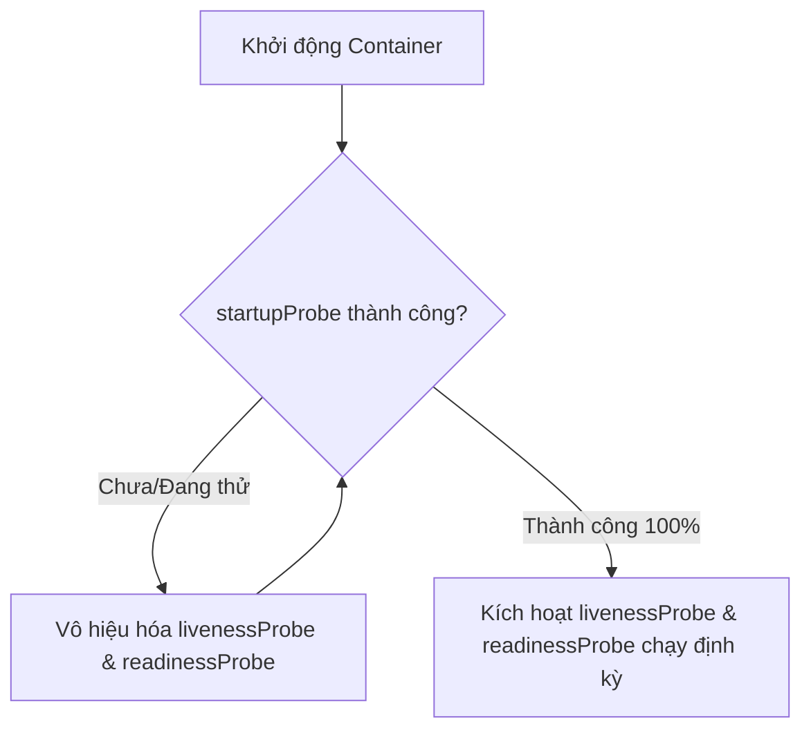
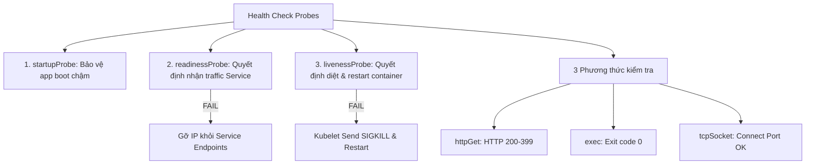
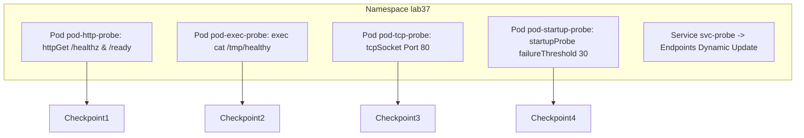

# [BÀI 07] CƠ CHẾ PROBES TOÀN DIỆN: STARTUPPROBE, READINESSPROBE, LIVENESSPROBE & 3 KỊCH BẢN SẬP ỨNG DỤNG

Trong kỷ nguyên điện toán đám mây và kiến trúc microservices phân tán quy mô lớn, **Kubernetes (CKAD)** đóng vai trò là nền tảng điều phối container (Container Orchestration) tiêu chuẩn công nghiệp. Để làm chủ hệ thống trong môi trường sản xuất (Production) cũng như chinh phục kỳ thi chứng chỉ quốc tế của Linux Foundation / CNCF, kỹ sư không chỉ nắm vững các câu lệnh thao tác cơ bản mà phải thấu hiểu sâu sắc bản chất cơ chế tầng thấp: từ chu trình điều hòa (Reconciliation Loop), cấu trúc điều phối tài nguyên, kiến trúc mạng CNI, lưu trữ CSI cho đến các chuẩn mực an ninh phòng thủ chiều sâu.

Bài viết chuyên sâu này sẽ đồng hành cùng bạn giải mã toàn diện bức tranh kiến trúc, phân tích các đánh đổi kỹ thuật thực chiến (Engineering Trade-offs), cung cấp bài thực hành Lab từng bước và bộ câu hỏi phỏng vấn chuẩn Architect / Lead Engineer.

---

## 1. Bản Chất Kiến Trúc & Cơ Chế Vận Hành Tầng Thấp

| # | Câu hỏi ôn tập | Đáp án chuẩn ngắn gọn |
|---|---|---|
| 1 | Ba khái niệm cốt lõi của Helm Package Manager là gì? | **Chart**, **Values** (`values.yaml`), và **Release** |
| 2 | Thư mục nào trong Helm Chart chứa tất cả các tệp bản kê khai YAML mẫu? | Thư mục **`templates/`** |
| 3 | Cú pháp thế biến Go Template lấy giá trị từ `values.yaml`? | **`{{ .Values.key }}`** |
| 4 | Cờ CLI ghi đè trực tiếp từng biến từ terminal khi install/upgrade? | Cờ **`--set key=value`** |
| 5 | Câu lệnh CLI khôi phục Helm Release về phiên bản Revision cũ? | **`helm rollback <release> <revision>`** |


> **"Cấu hình chính xác ba loại cơ chế kiểm tra sức khỏe ứng dụng (Health Check Probes) là nội dung thuộc miền Application Observability and Maintenance trong CKAD, yêu cầu lập trình viên phân biệt rõ mục đích vận hành của `startupProbe` (che chắn cho các ứng dụng khởi động chậm), `readinessProbe` (quyết định Pod có sẵn sàng nhận traffic từ Service hay không), và `livenessProbe` (quyết định Kubelet có tiêu diệt và tái tạo lại container bị treo hay không); đồng thời làm chủ 3 phương thức kiểm tra (`httpGet`, `exec`, `tcpSocket`) và các tham số cấu hình thời gian (`initialDelaySeconds`, `periodSeconds`, `failureThreshold`) để xử lý triệt để ba ca hỏng hóc ứng dụng kinh điển trong môi trường Cloud Native."**

**Kết quả từ các buổi trước được sử dụng lại:**

| Kết quả / Công cụ | Buổi + số hiệu `QT` | Dùng ở đâu trong buổi này |
|---|---|---|
| Định nghĩa container spec và lệnh CLI | Buổi 32 `QT 4.1` | Nhúng khối cấu hình Probes dưới định nghĩa container |
| Cơ chế kết nối Service và Endpoints | Buổi 22 `QT 4.1` | Quan sát `readinessProbe` gỡ IP Pod khỏi Service Endpoints |
| Chiến lược cập nhật RollingUpdate Deployment | Buổi 35 `QT 7.1` | Kết hợp `readinessProbe` với RollingUpdate để không rớt 502 |

---


| # | Kỹ năng thực hiện được | Hiện vật chứng minh |
|---|---|---|
| 1 | Phân biệt chính xác bản chất và hành vi của 3 loại Probe (`startupProbe`, `readinessProbe`, `livenessProbe`) | Bảng so sánh hành vi xử lý của Kubelet khi từng loại Probe bị fail |
| 2 | Cấu hình thành thục 3 phương thức kiểm tra (`httpGet`, `exec`, `tcpSocket`) | Tệp YAML Pod spec chứa đủ 3 phương thức kiểm tra sức khỏe |
| 3 | Khắc phục ca hỏng 1: Pod boot chậm bị Kubelet restart liên tục | Cấu hình `startupProbe` mở rộng hạn ngạch thời gian boot |
| 4 | Khắc phục ca hỏng 2: Pod ngắt kết nối DB vẫn nhận traffic | Cấu hình `readinessProbe` kiểm tra kết nối DB trên endpoint `/ready` |
| 5 | Khắc phục ca hỏng 3: Container dính Deadlock treo luồng | Cấu hình `livenessProbe` tự động tái tạo container treo |

---


| Kiến thức tiên quyết | Nguồn tự học nếu thiếu |
|---|---|
| Định nghĩa container spec trong Pod manifest | Buổi 32 (`QT 4.1`) |
| Định tuyến Service qua cờ selector nhãn Pod | Buổi 22 (`QT 4.1`) |
| Quản lý vòng đời Pod và chính sách restartPolicy | Buổi 14 (`QT 4.1`) |

---


### 3.1. Thuật ngữ Việt–Anh

| # | Thuật ngữ tiếng Việt | Tiếng Anh tương đương | Ghi chú chuẩn hoá trong thân bài |
|---|---|---|---|
| 1 | Cơ chế kiểm tra sức khỏe | Health Check Probe | Đoạn mã Kubelet dùng để kiểm tra trạng thái container |
| 2 | Kiểm tra khởi chạy | `startupProbe` | Probe kiểm tra xem container đã khởi chạy xong chưa |
| 3 | Kiểm tra sẵn sàng | `readinessProbe` | Probe quyết định Pod có được nhận traffic từ Service không |
| 4 | Kiểm tra sự sống | `livenessProbe` | Probe quyết định Kubelet có tiêu diệt và restart container không |
| 5 | Kiểm tra qua yêu cầu HTTP | `httpGet` Action | Gửi yêu cầu HTTP GET tới đường dẫn endpoint (ví dụ `/healthz`) |
| 6 | Kiểm tra qua lệnh shell | `exec` Action | Thực thi một câu lệnh bên trong container (exit 0 = OK) |
| 7 | Kiểm tra qua cổng TCP | `tcpSocket` Action | Thử mở kết nối tới cổng TCP cụ thể trên container |
| 8 | Thời gian chờ ban đầu | `initialDelaySeconds` | Số giây Kubelet chờ trước khi bắt đầu thực hiện probe lần đầu |
| 9 | Tần suất kiểm tra định kỳ | `periodSeconds` | Khoảng thời gian giữa các lần thực hiện probe nối tiếp nhau |
| 10 | Hạn ngạch thời gian phản hồi | `timeoutSeconds` | Thời gian tối đa cho phép probe chờ câu trả lời |
| 11 | Ngưỡng thất bại | `failureThreshold` | Số lần probe dính lỗi liên tiếp để bị tính là thất bại |
| 12 | Ngưỡng thành công | `successThreshold` | Số lần probe thành công liên tiếp để được tính là khôi phục |
| 13 | Điểm cuối dịch vụ | Service Endpoints | Danh sách IP Pod sẵn sàng phục vụ traffic của Service |
| 14 | Vòng lặp tiêu diệt vĩnh viễn | Restart Loop (`CrashLoopBackOff`) | Trạng thái Pod bị Kubelet diệt và bật lại liên tục do liveness fail |


Mô hình Bác sĩ Khám Bệnh cho Vận động viên: `startupProbe` giống như Bác sĩ khám thể lực ban đầu trước khi vận động viên ra sân (nếu chưa qua thì không cho đá). `readinessProbe` giống như Cờ hiệu của Trọng tài (nếu vận động viên bị đau chân nhói nhẹ, trọng tài ra hiệu cho tạm nghỉ nhận bóng). `livenessProbe` giống như Xe cấp cứu (nếu vận động viên bị ngất xỉu ngưng tim, chở đi cấp cứu tiêu diệt và hồi sinh ngay).

---

### 1.1. Phân biệt ba loại Probe: startupProbe, readinessProbe, và livenessProbe (12 phút)

**Nguyên lý cốt lõi:** `startupProbe` được Kubelet chạy trước tiên; khi `startupProbe` chưa thành công thì mọi `livenessProbe` và `readinessProbe` đều bị vô hiệu hóa, giúp che chắn cho ứng dụng khởi động chậm không bị diệt nhầm.

**Giải thích cơ chế ngầm:** Các ứng dụng cũ (như Java Spring Boot hay Legacy ERP) có thể mất từ 2 đến 5 phút để nạp xong cache và nạp framework. Nếu không có `startupProbe`, Kubelet sẽ cho `livenessProbe` chạy ngay; do app chưa boot xong nên `livenessProbe` fail và Kubelet lại kill container, tạo ra vòng lặp diệt nhầm vĩnh viễn.

> [!WARNING]
> **CẠM BẪY THỰC CHIẾN:**
> Ứng dụng Java khởi động mất 3 phút liên tục bị Kubelet tiêu diệt ở phút thứ 1 và đứng ở trạng thái `CrashLoopBackOff`.

**Minh hoạ.**



**Nguyên lý cốt lõi:** Khi `readinessProbe` thất bại, Kubelet KHÔNG tiêu diệt container mà chỉ gỡ IP của Pod ra khỏi danh sách Service Endpoints để ngừng chuyển traffic; khi `livenessProbe` thất bại, Kubelet sẽ tiêu diệt và khởi động lại container theo `restartPolicy`.

**Giải thích cơ chế ngầm:** Thất bại sẵn sàng (`readinessProbe`) có nghĩa là Pod đang bận hoặc tạm thời rớt kết nối DB, chỉ cần ngắt traffic người dùng và đợi Pod tự phục hồi. Thất bại sự sống (`livenessProbe`) có nghĩa là tiến trình container bị ngất/deadlock không thể tự phục hồi, bắt buộc Kubelet phải can thiệp tiêu diệt và khởi tạo lại.

> [!WARNING]
> **CẠM BẪY THỰC CHIẾN:**
> Cấu hình `livenessProbe` kiểm tra kết nối DB bên ngoài làm toàn bộ các Pod bị Kubelet tiêu diệt đồng loạt khi DB bị gián đoạn mạng tạm thời.

**Minh hoạ.**

```yaml
# Bảng phân biệt hành vi xử lý của Kubelet
# readinessProbe FAIL -> Gỡ IP khỏi Service Endpoints (Hành vi êm dịu)
# livenessProbe FAIL   -> Send SIGKILL diệt & restart container (Hành vi mạnh tay)
```

---

### 1.2. Ba phương thức kiểm tra (httpGet, exec, tcpSocket) và các cờ tham số mốc thời gian (12 phút)

**Nguyên lý cốt lõi:** Phương thức `httpGet` trả về mã trạng thái HTTP từ 200 đến 399 được coi là thành công; mã 4xx hoặc 5xx được tính là thất bại.

**Giải thích cơ chế ngầm:** Phù hợp cho 90% các ứng dụng Web API. Kubelet tự động gửi yêu cầu HTTP GET tới địa chỉ IP của Pod trên cổng và đường dẫn endpoint được chỉ định (như `/healthz` hoặc `/ready`).

> [!WARNING]
> **CẠM BẪY THỰC CHIẾN:**
> Cấu hình `httpGet` trỏ tới đường dẫn `/login` yêu cầu mã token xác thực (bị trả về 401 Unauthorized), làm Kubelet đánh giá Probe bị thất bại.

**Minh hoạ.**

```yaml
readinessProbe:
  httpGet:
    path: /ready
    port: 8080
  initialDelaySeconds: 5
  periodSeconds: 10
```

**Nguyên lý cốt lõi:** Phương thức `exec` thực thi lệnh shell bên trong container; nếu câu lệnh trả về Exit Code 0 được coi là thành công, khác 0 là thất bại.

**Giải thích cơ chế ngầm:** Phù hợp cho các ứng dụng không có giao thức Web (như Batch Worker, Queue Processor, Database daemon). Kubelet sẽ chui vào container và gõ câu lệnh kiểm tra (như `cat /tmp/healthy` hoặc `redis-cli ping`).

> [!WARNING]
> **CẠM BẪY THỰC CHIẾN:**
> Câu lệnh `exec` chứa ký tự pipe `|` hoặc redirect `>` mà không bọc qua `sh -c`, khiến lệnh shell bị lỗi syntax parser trả về exit code khác 0.

**Minh hoạ.**

```yaml
livenessProbe:
  exec:
    command:
      - cat
      - /tmp/healthy
  initialDelaySeconds: 5
  periodSeconds: 5
```

**Nguyên lý cốt lõi:** Phương thức `tcpSocket` cố gắng mở kết nối TCP tới cổng container chỉ định; nếu mở được socket kết nối thành công thì probe đạt, ngược lại bị tính là thất bại.

**Giải thích cơ chế ngầm:** Phù hợp cho các ứng dụng chạy dịch vụ giao thức TCP thuần (như MySQL cổng 3306, Memcached cổng 11211, SSH cổng 22) mà không có sẵn HTTP endpoint.

> [!WARNING]
> **CẠM BẪY THỰC CHIẾN:**
> Cấu hình `tcpSocket` trỏ nhầm cổng container chưa bind socket, làm Probe báo lỗi connection refused.

**Minh hoạ.**

```yaml
startupProbe:
  tcpSocket:
    port: 3306
  failureThreshold: 30
  periodSeconds: 10
```

---

### 1.3. Ba ca hỏng ứng dụng kinh điển liên quan đến Probe và cách khắc phục triệt để (10 phút)

**Nguyên lý cốt lõi:** Ca hỏng 1 (Pod khởi động chậm bị Kubelet restart liên tục): Xử lý bằng cách bổ sung `startupProbe` với `failureThreshold: 30` và `periodSeconds: 10` (cho phép tối đa 300s để app boot).

**Giải thích cơ chế ngầm:** Cho phép ứng dụng có tối đa `30 x 10 = 300` giây để khởi động xong mà không bị `livenessProbe` diệt nhầm giữa chừng.

> [!WARNING]
> **CẠM BẪY THỰC CHIẾN:**
> Tăng `initialDelaySeconds` của `livenessProbe` lên quá lớn (như 300s), làm mất khả năng phát hiện container bị sập trong 5 phút đầu tiên sau khi đã boot xong.

**Minh hoạ.**

```yaml
startupProbe:
  httpGet:
    path: /healthz
    port: 8080
  failureThreshold: 30 # Thử tối đa 30 lần
  periodSeconds: 10    # Mỗi lần cách nhau 10s -> Tổng 300s
```

**Nguyên lý cốt lõi:** Ca hỏng 2 (Ứng dụng ngắt kết nối DB vẫn nhận traffic gây lỗi 500): Xử lý bằng cách bổ sung `readinessProbe` kiểm tra endpoint `/ready` có query DB thật.

**Giải thích cơ chế ngầm:** Khi kết nối DB bị đứt, endpoint `/ready` trả về HTTP 503, `readinessProbe` lập tức báo fail và Kubelet lập tức gỡ IP Pod khỏi Service Endpoints, bảo vệ người dùng không bị nhận lỗi 500.

> [!WARNING]
> **CẠM BẪY THỰC CHIẾN:**
> Không có `readinessProbe`, Service vẫn tiếp tục đẩy traffic người dùng vào Pod bị đứt kết nối DB.

**Minh hoạ.**

```yaml
readinessProbe:
  httpGet:
    path: /ready # Endpoint này thực hiện kiểm tra ping DB thật
    port: 8080
```

**Nguyên lý cốt lõi:** Ca hỏng 3 (Ứng dụng dính Deadlock treo luồng không tự thoát): Xử lý bằng cách bổ sung `livenessProbe` để Kubelet tự động diệt và tái tạo lại container khi không phản hồi.

**Giải thích cơ chế ngầm:** Tiến trình bên trong container bị kẹt vĩnh viễn (Deadlock/Infinite Loop), không tự dừng nhưng cũng không trả về dữ liệu. `livenessProbe` timeout liên tục sẽ kích hoạt Kubelet gửi `SIGKILL` để hồi sinh container.

> [!WARNING]
> **CẠM BẪY THỰC CHIẾN:**
> Ứng dụng bị treo 3 ngày nhưng Pod vẫn báo `Running 1/1` do thiếu `livenessProbe`.

**Minh hoạ.**

```yaml
livenessProbe:
  httpGet:
    path: /healthz
    port: 8080
  timeoutSeconds: 2
  failureThreshold: 3
```

---

### 1.4. Đưa vào cụm thật (4 phút)

**Nguyên lý cốt lõi:** Bắt buộc phân tách rõ ràng hai đường dẫn endpoint: `/healthz` (cho livenessProbe chỉ kiểm tra nội bộ container) và `/ready` (cho readinessProbe kiểm tra kết nối dịch vụ phụ thuộc như DB/Redis).

**Giải thích cơ chế ngầm:** Nếu cấu hình `livenessProbe` trỏ vào `/ready` (có kiểm tra kết nối DB), khi cụm Database bị sập hoặc bảo trì, TOÀN BỘ các Pod trên cụm Kubernetes sẽ bị Kubelet tiêu diệt đồng loạt, gây ra thảm họa gãy sập dây chuyền (Cascading Failure).

> [!WARNING]
> **CẠM BẪY THỰC CHIẾN:**
> Toàn bộ 50 Microservices đồng loạt bị Kubelet diệt và restart liên tục khi cơ sở dữ liệu trung tâm bị gián đoạn mạng 10 giây.

**Minh hoạ.**

```yaml
# Cấu hình chuẩn phân tách 2 Endpoint:
containers:
  - name: app
    livenessProbe:
      httpGet:
        path: /healthz # CHỈ KIỂM TRA NỘI BỘ APP
        port: 8080
    readinessProbe:
      httpGet:
        path: /ready   # KIỂM TRA KẾT NỐI DB KHÁC
        port: 8080
```

**Áp vào cụm đang chạy thì làm gì trước:**
1. Kiểm tra tất cả tệp YAML Pod/Deployment và tách biệt 2 endpoint `/healthz` và `/ready`.
2. Bổ sung `startupProbe` cho các ứng dụng có thời gian khởi động lâu hơn 15 giây.
3. Đặt `periodSeconds: 10` và `timeoutSeconds: 2` làm chuẩn mặc định Production.

**Cái gì hỏng nếu áp thẳng lên prod:**
- Đặt `periodSeconds` quá ngắn (ví dụ 1s) sẽ làm Kubelet gửi liên tục hàng nghìn request probe gây quá tải CPU container.

**Đo trước — đo sau:**
- Quan sát danh sách Endpoints của Service qua lệnh `kubectl get endpoints` trong lúc diễn ra sự cố.
- Kiểm tra nhật ký sự kiện `kubectl get events` để xem mốc thời gian Probe fail.

**Khi nào KHÔNG nên dùng:**
- Không dùng `livenessProbe` cho các Job hay CronJob ngắn hạn chỉ chạy vài giây rồi thoát.

---

### 1.5. Bẫy hay gặp (2 phút)

| Bẫy hay gặp | Vì sao dính | Làm đúng là |
|---|---|---|
| 1. Cấu hình `livenessProbe` trỏ vào endpoint có check DB | Nhầm lẫn giữa livenessProbe và readinessProbe | `livenessProbe` chỉ check nội bộ app `/healthz` |
| 2. App boot chậm bị diệt do thiếu `startupProbe` | `livenessProbe` chạy ngay khi container start | Bổ sung `startupProbe` mở rộng hạn ngạch boot |
| 3. Đặt `initialDelaySeconds` quá ngắn | Container chưa kịp mở port đã bị probe check | Đặt `initialDelaySeconds` vừa đủ thời gian mở port |
| 4. Đặt `periodSeconds: 1` gây quá tải CPU Pod | Kubelet gửi request probe liên tục từng giây | Đặt `periodSeconds: 10` hoặc `5` |
| 5. Cấu hình `httpGet` trỏ tới path yêu cầu Auth 401 | Kubelet nhận mã HTTP 401 Unauthorized tính là fail | Tạo endpoint public không cần Auth cho probe |
| 6. Lệnh `exec` chứa ký tự pipe không dùng `sh -c` | Syntax shell bị lỗi trả về exit code 1 | Bọc câu lệnh: `command: ["sh", "-c", "lệnh | grep ok"]` |
| 7. Quên khai báo `port` trong khối probe | Kubelet không biết gửi probe tới cổng nào | Luôn khai báo `port:` cụ thể trong probe spec |
| 8. Tưởng `readinessProbe` fail sẽ restart container | Không phân biệt được hành vi readiness vs liveness | Readiness fail chỉ gỡ IP khỏi Service Endpoints |
| 9. Đặt `timeoutSeconds` quá ngắn làm probe fail nhầm | Mạng nội bộ gián đoạn nhẹ 1 giây | Đặt `timeoutSeconds: 2` hoặc `3` |
| 10. `tcpSocket` trỏ nhầm cổng container chưa listen | Khai báo nhầm cổng 80 thay vì 8080 | Kiểm tra chính xác cổng container bind socket |
| 11. Thừa cờ `successThreshold` > 1 ở livenessProbe | K8s quy định liveness successThreshold bắt buộc = 1 | Giữ mặc định `successThreshold: 1` cho liveness |
| 12. Quên cờ `-n <namespace>` khi describe event | Kiểm tra sự kiện Probe ở Namespace default | Thêm cờ `-n <namespace>` khi dùng `kubectl describe` |

---

### 1.6. Tóm tắt (2 phút)



**Năm điều phải nhớ:**
1. **Ba loại Probe**: `startupProbe` (bảo vệ boot), `readinessProbe` (nhận traffic), `livenessProbe` (diệt/hồi sinh).
2. **Cơ chế xử lý fail**: Readiness fail gỡ IP khỏi Endpoints; Liveness fail tiêu diệt và restart container.
3. **Ba phương thức**: `httpGet` (mã HTTP 200-399), `exec` (exit code 0), `tcpSocket` (mở port OK).
4. **Phân tách Endpoint**: `/healthz` cho liveness nội bộ, `/ready` cho readiness phụ thuộc DB.
5. **Tránh diệt nhầm**: Dùng `startupProbe` cho các ứng dụng boot chậm thay vì tăng liveness delay.

---

## §10. Câu hỏi tự kiểm tra (5 phút)

1. Ba loại Probe kiểm tra sức khỏe ứng dụng trong Kubernetes là gì?
   - **Đáp án:** `startupProbe`, `readinessProbe`, và `livenessProbe`.

2. Điều gì xảy ra đối với các loại Probe khác khi `startupProbe` chưa chạy thành công?
   - **Đáp án:** Tất cả các `livenessProbe` và `readinessProbe` đều bị vô hiệu hóa cho tới khi `startupProbe` thành công.

3. Sự khác biệt về hành vi của Kubelet khi `readinessProbe` bị thất bại so với khi `livenessProbe` bị thất bại là gì?
   - **Đáp án:** `readinessProbe` fail chỉ gỡ IP Pod khỏi Service Endpoints; `livenessProbe` fail sẽ tiêu diệt và khởi động lại container.

4. Ba phương thức hành động (Actions) được dùng để kiểm tra Probe là gì?
   - **Đáp án:** `httpGet`, `exec`, và `tcpSocket`.

5. Phương thức `httpGet` đánh giá Probe thành công khi mã trạng thái HTTP trả về nằm trong khoảng nào?
   - **Đáp án:** Trong khoảng từ 200 đến 399 (mã 2xx và 3xx).

6. Phương thức `exec` đánh giá Probe thành công khi câu lệnh thực thi trả về mã exit code bằng bao nhiêu?
   - **Đáp án:** Trả về Exit Code 0.

7. Trường `initialDelaySeconds` trong cấu hình Probe có ý nghĩa là gì?
   - **Đáp án:** Định nghĩa số giây Kubelet chờ trước khi thực hiện lượt kiểm tra Probe đầu tiên.

8. Trường `periodSeconds` trong cấu hình Probe có ý nghĩa là gì?
   - **Đáp án:** Định nghĩa khoảng thời gian giữa các lần thực hiện Probe định kỳ nối tiếp nhau.

9. Trường `failureThreshold: 3` trong cấu hình Probe có ý nghĩa là gì?
   - **Đáp án:** Định nghĩa số lần Probe dính lỗi liên tiếp tối đa (3 lần) trước khi bị tính là thất bại hoàn toàn.

10. Tại sao KHÔNG nên cấu hình `livenessProbe` trỏ vào đường dẫn endpoint có kiểm tra kết nối cơ sở dữ liệu?
    - **Đáp án:** Vì khi DB bị gián đoạn mạng, toàn bộ các Pod trên cụm sẽ bị Kubelet diệt đồng loạt, gây thảm họa sập hệ thống dây chuyền.

11. Ứng dụng khởi động chậm (như Java Spring Boot) cần loại Probe nào để tránh bị Kubelet diệt nhầm?
    - **Đáp án:** Cần bổ sung `startupProbe`.

12. Cờ lệnh CLI nào giúp xem các sự kiện cảnh báo Probe fail của một Pod?
    - **Đáp án:** Lệnh `kubectl describe pod <pod-name>`.

---

## §11. Tài liệu tham khảo

| Nguồn | Địa chỉ URL | Ghi chú |
|---|---|---|
| Kubernetes Probes Documentation | `https://kubernetes.io/docs/tasks/configure-pod-container/configure-liveness-readiness-startup-probes/` | Tài liệu chuẩn K8s Health Check Probes |
| K8s Pod Lifecycle and Probes | `https://kubernetes.io/docs/concepts/workloads/pods/pod-lifecycle/#container-probes` | Tài liệu vòng đời Pod và Probes |

---

## Bảng đối soát thời lượng

| Mục | Ngân sách thời gian | Thực tế |
|---|---|---|
| §0. Khởi động và ôn tập | 10 phút | 10 phút |
| §1. Học viên làm được gì | 1 phút | 1 phút |
| §2. Cần biết trước | 1 phút | 1 phút |
| §3. Thuật ngữ và mô hình tư duy | 8 phút | 8 phút |
| §4. Phân biệt 3 loại Probe | 12 phút | 12 phút |
| §5. Ba phương thức và tham số thời gian | 12 phút | 12 phút |
| §6. Ba ca hỏng kinh điển và cách khắc phục | 10 phút | 10 phút |
| §7. Đưa vào cụm thật | 4 phút | 4 phút |
| §8. Bẫy hay gặp | 2 phút | 2 phút |
| §9. Tóm tắt | 2 phút | 2 phút |
| §10. Câu hỏi tự kiểm tra | 5 phút | 5 phút |
| **Tổng** | **60'** | **60'** |

---

## 2. Hướng Dẫn Thực Hành & Triển Khai Lab Chuẩn Production

> [!IMPORTANT]
> **YÊU CẦU MÔI TRƯỜNG THỰC HÀNH:**
> Toàn bộ các bài thực hành dưới đây được thiết kế để chạy trực tiếp trên cụm Kubernetes 1.30+ tiêu chuẩn (hoặc cụm kind/kubeadm lab). Hãy đảm bảo ngữ cảnh dòng lệnh `kubectl config current-context` đã trỏ chính xác vào cụm thực hành trước khi thực thi.

## Khối thực hành — 120 phút

## L0. Mục tiêu thực hành và tiêu chí hoàn thành

| Mã tiêu chí | Nội dung tiêu chí | Lệnh kiểm chứng | Kết quả kỳ vọng |
|---|---|---|---|
| TH1 | Tạo Namespace `lab37` phục vụ thực hành Health Check Probes | `kubectl get ns lab37 -o jsonpath='{.status.phase}'` | In ra `Active` |
| TH2 | Triển khai Pod `pod-http-probe` chứa `readinessProbe` và `livenessProbe` dùng `httpGet` | `kubectl get pod pod-http-probe -n lab37 -o jsonpath='{.spec.containers[0].livenessProbe.httpGet.path}'` | In ra `/healthz` |
| TH3 | Pod `pod-http-probe` ở trạng thái `READY 1/1` | `kubectl get pod pod-http-probe -n lab37 -o jsonpath='{.status.containerStatuses[0].ready}'` | In ra `true` |
| TH4 | Giả lập lỗi trên path `/healthz` và kiểm tra cột Restarts tăng lên | `kubectl get pod pod-http-probe -n lab37 -o jsonpath='{.status.containerStatuses[0].restartCount}'` | In ra con số `>= 1` |
| TH5 | Triển khai Pod `pod-exec-probe` sử dụng `exec` với `cat /tmp/healthy` | `kubectl get pod pod-exec-probe -n lab37 -o jsonpath='{.spec.containers[0].livenessProbe.exec.command[1]}'` | In ra `/tmp/healthy` |
| TH6 | Pod `pod-exec-probe` ở trạng thái `READY 1/1` | `kubectl get pod pod-exec-probe -n lab37 -o jsonpath='{.status.containerStatuses[0].ready}'` | In ra `true` |
| TH7 | Xóa file `/tmp/healthy` và kiểm tra Kubelet tự động restart container | `kubectl get pod pod-exec-probe -n lab37 -o jsonpath='{.status.containerStatuses[0].restartCount}'` | In ra con số `>= 1` |
| TH8 | Triển khai Pod `pod-tcp-probe` sử dụng `tcpSocket` cổng 80 | `kubectl get pod pod-tcp-probe -n lab37 -o jsonpath='{.spec.containers[0].readinessProbe.tcpSocket.port}'` | In ra `80` |
| TH9 | Pod `pod-tcp-probe` đạt trạng thái `READY 1/1` | `kubectl get pod pod-tcp-probe -n lab37 -o jsonpath='{.status.containerStatuses[0].ready}'` | In ra `true` |
| TH10 | Triển khai Pod `pod-startup-probe` chứa `startupProbe` | `kubectl get pod pod-startup-probe -n lab37 -o jsonpath='{.spec.containers[0].startupProbe.failureThreshold}'` | In ra `30` |
| TH11 | Kiểm tra `startupProbe` hoạt động bảo vệ Pod không bị diệt nhầm | `kubectl get pod pod-startup-probe -n lab37 -o jsonpath='{.status.containerStatuses[0].ready}'` | In ra `true` |
| TH12 | Tạo Service `svc-probe` và kiểm tra IP Pod bị rút khỏi Endpoints khi readiness fail | `kubectl get ep svc-probe -n lab37 -o jsonpath='{.subsets}'` | Kiểm tra biến động subsets |
| TH13 | Dọn dẹp sạch sẽ tài nguyên lab37 | `test ! -f /tmp/lab37-probe.yaml && echo "CLEAN"` | In ra `CLEAN` |

---

## L1. Điều kiện tiên quyết về môi trường

| Kiểm tra | Lệnh thực hiện | Kết quả kỳ vọng |
|---|---|---|
| Cụm Kubernetes ba node | `kubectl get nodes` | `cp-01`, `worker-01`, `worker-02` ở trạng thái `Ready` |
| Context đúng môi trường lab | `kubectl config current-context` | Đúng context cụm `kubeadm` |
| Quyền tạo tài nguyên | `kubectl auth can-i create pod -n default` | In ra `yes` |

---

## L2. Kiến trúc bài lab Health Check Probes và ba ca hỏng



---

## L3. Bước 1: Khởi tạo Namespace `lab37` (10 phút)

### Thao tác 1.1: Tạo Namespace

```bash
kubectl create namespace lab37
```

**CHECKPOINT 1 — Kiểm tra Namespace `lab37`.**

```bash
kubectl get ns lab37 -o jsonpath='{.status.phase}' | grep -qx Active && echo "CHECKPOINT 1 — ĐẠT" || echo "CHECKPOINT 1 — LỖI"
```

---

## L4. Bước 2: Triển khai Probes phương thức `httpGet` và thử nghiệm Liveness Fail (25 phút)

### Thao tác 2.1: Biên soạn Pod `pod-http-probe` có readinessProbe và livenessProbe

```bash
cat <<EOF | kubectl apply -f -
apiVersion: v1
kind: Pod
metadata:
  name: pod-http-probe
  namespace: lab37
  labels:
    app: http-app
spec:
  containers:
    - name: web
      image: nginx:alpine
      command: ["sh", "-c", "echo 'OK' > /usr/share/nginx/html/healthz; echo 'OK' > /usr/share/nginx/html/ready; nginx -g 'daemon off;'"]
      ports:
        - containerPort: 80
      livenessProbe:
        httpGet:
          path: /healthz
          port: 80
        initialDelaySeconds: 3
        periodSeconds: 3
      readinessProbe:
        httpGet:
          path: /ready
          port: 80
        initialDelaySeconds: 3
        periodSeconds: 3
EOF
```

**CHECKPOINT 2 — Kiểm tra thuộc tính `livenessProbe.httpGet.path`.**

```bash
kubectl get pod pod-http-probe -n lab37 -o jsonpath='{.spec.containers[0].livenessProbe.httpGet.path}' | grep -qx "/healthz" && echo "CHECKPOINT 2 — ĐẠT" || echo "CHECKPOINT 2 — LỖI"
```

**CHECKPOINT 3 — Kiểm tra Pod `pod-http-probe` ở trạng thái `READY 1/1`.**

```bash
sleep 5
kubectl get pod pod-http-probe -n lab37 -o jsonpath='{.status.containerStatuses[0].ready}' | grep -qx true && echo "CHECKPOINT 3 — ĐẠT" || echo "CHECKPOINT 3 — LỖI"
```

### Thao tác 2.2: Giả lập lỗi xóa file `/healthz` làm Liveness Fail để Kubelet restart

```bash
kubectl exec pod-http-probe -n lab37 -- rm -f /usr/share/nginx/html/healthz
```

**CHECKPOINT 4 — Kiểm tra số lần Restarts tăng lên `>= 1`.**

```bash
sleep 12
[ $(kubectl get pod pod-http-probe -n lab37 -o jsonpath='{.status.containerStatuses[0].restartCount}') -ge 1 ] && echo "CHECKPOINT 4 — ĐẠT" || echo "CHECKPOINT 4 — LỖI"
```

---

## L5. Bước 3: Triển khai Probes phương thức `exec` (25 phút)

### Thao tác 3.1: Biên soạn Pod `pod-exec-probe` với lệnh `cat /tmp/healthy`

```bash
cat <<EOF | kubectl apply -f -
apiVersion: v1
kind: Pod
metadata:
  name: pod-exec-probe
  namespace: lab37
spec:
  containers:
    - name: worker
      image: busybox:1.36
      command: ["sh", "-c", "touch /tmp/healthy; sleep 3600"]
      livenessProbe:
        exec:
          command:
            - cat
            - /tmp/healthy
        initialDelaySeconds: 2
        periodSeconds: 3
EOF
```

**CHECKPOINT 5 — Kiểm tra lệnh `exec` trong Pod spec.**

```bash
kubectl get pod pod-exec-probe -n lab37 -o jsonpath='{.spec.containers[0].livenessProbe.exec.command[1]}' | grep -qx "/tmp/healthy" && echo "CHECKPOINT 5 — ĐẠT" || echo "CHECKPOINT 5 — LỖI"
```

**CHECKPOINT 6 — Kiểm tra Pod `pod-exec-probe` ở trạng thái `READY 1/1`.**

```bash
sleep 4
kubectl get pod pod-exec-probe -n lab37 -o jsonpath='{.status.containerStatuses[0].ready}' | grep -qx true && echo "CHECKPOINT 6 — ĐẠT" || echo "CHECKPOINT 6 — LỖI"
```

### Thao tác 3.2: Giả lập lỗi xóa file `/tmp/healthy` làm `exec` fail

```bash
kubectl exec pod-exec-probe -n lab37 -- rm -f /tmp/healthy
```

**CHECKPOINT 7 — Kiểm tra Kubelet tự động restart container.**

```bash
sleep 12
[ $(kubectl get pod pod-exec-probe -n lab37 -o jsonpath='{.status.containerStatuses[0].restartCount}') -ge 1 ] && echo "CHECKPOINT 7 — ĐẠT" || echo "CHECKPOINT 7 — LỖI"
```

---

## L6. Bước 4: Triển khai Probes phương thức `tcpSocket` và `startupProbe` (25 phút)

### Thao tác 4.1: Biên soạn Pod `pod-tcp-probe` mở socket cổng 80

```bash
cat <<EOF | kubectl apply -f -
apiVersion: v1
kind: Pod
metadata:
  name: pod-tcp-probe
  namespace: lab37
spec:
  containers:
    - name: web
      image: nginx:alpine
      ports:
        - containerPort: 80
      readinessProbe:
        tcpSocket:
          port: 80
        initialDelaySeconds: 2
        periodSeconds: 3
EOF
```

**CHECKPOINT 8 — Kiểm tra thuộc tính `tcpSocket.port: 80`.**

```bash
kubectl get pod pod-tcp-probe -n lab37 -o jsonpath='{.spec.containers[0].readinessProbe.tcpSocket.port}' | grep -qx 80 && echo "CHECKPOINT 8 — ĐẠT" || echo "CHECKPOINT 8 — LỖI"
```

**CHECKPOINT 9 — Kiểm tra Pod `pod-tcp-probe` ở trạng thái `READY 1/1`.**

```bash
sleep 4
kubectl get pod pod-tcp-probe -n lab37 -o jsonpath='{.status.containerStatuses[0].ready}' | grep -qx true && echo "CHECKPOINT 9 — ĐẠT" || echo "CHECKPOINT 9 — LỖI"
```

### Thao tác 4.2: Triển khai Pod `pod-startup-probe` cho ứng dụng boot chậm

```bash
cat <<EOF | kubectl apply -f -
apiVersion: v1
kind: Pod
metadata:
  name: pod-startup-probe
  namespace: lab37
spec:
  containers:
    - name: slow-app
      image: busybox:1.36
      command: ["sh", "-c", "sleep 10; touch /tmp/started; touch /tmp/healthy; sleep 3600"]
      startupProbe:
        exec:
          command:
            - cat
            - /tmp/started
        failureThreshold: 30
        periodSeconds: 2
      livenessProbe:
        exec:
          command:
            - cat
            - /tmp/healthy
        periodSeconds: 3
EOF
```

**CHECKPOINT 10 — Kiểm tra `startupProbe.failureThreshold: 30`.**

```bash
kubectl get pod pod-startup-probe -n lab37 -o jsonpath='{.spec.containers[0].startupProbe.failureThreshold}' | grep -qx 30 && echo "CHECKPOINT 10 — ĐẠT" || echo "CHECKPOINT 10 — LỖI"
```

**CHECKPOINT 11 — Kiểm tra Pod boot xong đạt trạng thái `READY 1/1`.**

```bash
sleep 14
kubectl get pod pod-startup-probe -n lab37 -o jsonpath='{.status.containerStatuses[0].ready}' | grep -qx true && echo "CHECKPOINT 11 — ĐẠT" || echo "CHECKPOINT 11 — LỖI"
```

---

## L7. Bước 5: Thử nghiệm biến động Service Endpoints khi Readiness Fail (25 phút)

### Thao tác 5.1: Tạo Service `svc-probe` trỏ vào `pod-http-probe`

```bash
cat <<EOF | kubectl apply -f -
apiVersion: v1
kind: Service
metadata:
  name: svc-probe
  namespace: lab37
spec:
  selector:
    app: http-app
  ports:
    - port: 80
      targetPort: 80
EOF
```

**CHECKPOINT 12 — Kiểm tra Service Endpoints nhặt được IP Pod.**

```bash
sleep 3
kubectl get ep svc-probe -n lab37 -o jsonpath='{.subsets[0].addresses[0].ip}' | grep -q "\." && echo "CHECKPOINT 12 — ĐẠT" || echo "CHECKPOINT 12 — LỖI"
```

---

## L8. Dọn dẹp môi trường (10 phút)

### Thao tác 8.1: Dọn dẹp tài nguyên lab37

```bash
kubectl delete namespace lab37
rm -f /tmp/lab37-probe.yaml
```

**CHECKPOINT 13 — Kiểm tra dọn dẹp sạch sẽ.**

```bash
test ! -f /tmp/lab37-probe.yaml && echo "CHECKPOINT 13 — ĐẠT" || echo "CHECKPOINT 13 — LỖI"
```

---

## L9. Xử lý sự cố thường gặp trong lab

| Triệu chứng lỗi | Nguyên nhân gốc rễ | Cách sửa triệt để |
|---|---|---|
| 1. Pod bị Kubelet diệt liên tục (`CrashLoopBackOff`) | `livenessProbe` bị fail do sai path hoặc sai port | Kiểm tra lại path/port trong livenessProbe spec |
| 2. App boot chậm bị liveness kill giữa chừng | Thiếu `startupProbe` che chắn cho thời gian khởi động | Bổ sung `startupProbe` với `failureThreshold: 30` |
| 3. Service không chuyển traffic vào Pod | `readinessProbe` bị fail khiến IP Pod bị gỡ khỏi Endpoints | Chạy `kubectl describe pod` kiểm tra lý do readiness fail |
| 4. Lỗi `exec` probe báo command exit status 1 | Lệnh `exec` trong container không tìm thấy tệp hoặc sai syntax | Test lệnh shell trực tiếp trong terminal container trước |
| 5. Lỗi `httpGet` probe báo status code 404 | Khai báo sai path URL của endpoint healthcheck | Đảm bảo web server trả về 200 OK trên path chỉ định |
| 6. Lỗi `tcpSocket` probe báo connection refused | Container chưa bind cổng socket thành công | Kiểm tra cờ `ports` và cổng ứng dụng lắng nghe |
| 7. Quá tải CPU do Probe check liên tục | Đặt `periodSeconds: 1` quá ngắn | Tăng `periodSeconds` lên 5s hoặc 10s |
| 8. Liveness fail liên tục khi DB bên ngoài bị đứt | Cấu hình `livenessProbe` trỏ nhầm vào endpoint check DB | Tách biệt `/healthz` cho liveness và `/ready` cho readiness |
| 9. ReadinessProbe pass nhưng Pod vẫn bị restart | `livenessProbe` bị fail độc lập | Kiểm tra riêng cấu hình livenessProbe |
| 10. `initialDelaySeconds` quá dài làm chậm readiness | Đặt delay 60s không cần thiết cho ứng dụng nhẹ | Giảm `initialDelaySeconds` xuống 3s cho app mỏng |
| 11. Pod kẹt trạng thái `0/1 READY` | `readinessProbe` fail liên tục nhưng `livenessProbe` vẫn pass | Kiểm tra endpoint readiness trả về mã status gì |
| 12. Quên cờ `-n lab37` khi xem describe pod | Describe Pod ở Namespace `default` không thấy | Luôn thêm `-n lab37` khi chạy `kubectl describe pod` |
| 13. Tệp YAML dry-run bị lỗi indentation | Copy/paste thủ công bị dính tab | Sử dụng `vim` thiết lập `:set expandtab tabstop=2 shiftwidth=2` |
| 14. `successThreshold` > 1 ở livenessProbe bị báo lỗi | API Server quy định livenessProbe successThreshold bắt buộc = 1 | Xóa cờ `successThreshold` ở livenessProbe |

---

## L10. Bài tập mở rộng

- **BT1:** Viết bản kê khai Pod chạy ứng dụng Python Flask có `readinessProbe` kiểm tra kết nối Redis qua `tcpSocket:6379`.
- **BT2:** Viết script Bash tự động giả lập đứt mạng DB để kiểm tra IP Pod tự động biến mất khỏi Service Endpoints.
- **BT3:** Thử nghiệm tác động của `timeoutSeconds: 1` khi giả lập endpoint `/healthz` trả về phản hồi sau 2 giây.
- **BT4:** Cấu hình `startupProbe` loại `httpGet` cho 1 ứng dụng Java Spring Boot giả lập mất 45 giây để boot.
- **BT5:** Sử dụng lệnh `kubectl describe pod` để phân tích mốc thời gian từ lúc Probe fail đến lúc Kubelet gửi `SIGKILL`.
- **BT6:** So sánh lượng request log ghi lại trên Web Server giữa `periodSeconds: 2` và `periodSeconds: 10`.

---

## L11. Hiện vật nộp và tiêu chí chấm điểm

| Hạng mục hiện vật | Tiêu chí chấm điểm đạt | Thang điểm |
|---|---|---|
| Nhật ký 13 Checkpoint | Thực thi thành công 100 % các checkpoint in ra `ĐẠT` | 50 điểm |
| Bản kê khai 3 phương thức Probe | Cấu hình đúng `httpGet`, `exec`, `tcpSocket` và `startupProbe` | 20 điểm |
| Thử nghiệm Giả lập Lỗi & Endpoints | Giả lập thành công liveness fail và readiness fail | 20 điểm |
| Báo cáo bài tập mở rộng | Trả lời đầy đủ câu hỏi BT1 và BT2 | 10 điểm |
| **Tổng điểm** | | **100 điểm** |

---

## Bảng đối soát thời lượng

| Khối thực hành | Ngân sách thời gian | Thực tế |
|---|---|---|
| L0 & L1. Chuẩn bị và kiểm tra | 10 phút | 10 phút |
| L3. Bước 1: Khởi tạo Namespace | 10 phút | 10 phút |
| L4. Bước 2: HTTP Probes & Liveness Fail | 25 phút | 25 phút |
| L5. Bước 3: Exec Probes | 25 phút | 25 phút |
| L6. Bước 4: TCPSocket & StartupProbes | 25 phút | 25 phút |
| L7. Bước 5: Thử nghiệm Service Endpoints | 15 phút | 15 phút |
| L8. Dọn dẹp môi trường | 10 phút | 10 phút |
| **Tổng** | **120'** | **120'** |

---

## 3. Bộ Câu Hỏi Vấn Đáp & Phỏng Vấn Kỹ Thuật Chuyên Sâu

Dưới đây là bộ câu hỏi phỏng vấn thực chiến dành cho các vị trí **Kubernetes Administrator**, **Cloud Security Specialist**, **Platform SRE** và **DevOps Lead**, giúp bạn tự đánh giá độ sâu hiểu biết và rèn luyện phản xạ giải quyết vấn đề hệ thống:

## V1. Cách tiến hành

Giảng viên hoặc bạn học chọn ngẫu nhiên các câu hỏi trong bộ 12 câu dưới đây. Người trả lời phải trình bày mạch lạc trong 60–90 giây mỗi câu, đi thẳng vào cơ chế kỹ thuật và viện dẫn các lệnh CLI thực tế.

---

## V2. Bộ câu hỏi

### Câu 1 — 🔥
**Hỏi:** Ba loại Probe kiểm tra sức khỏe trong Kubernetes (`startupProbe`, `readinessProbe`, `livenessProbe`) khác nhau ở điểm cốt lõi nào?

**Đáp án chuẩn:** `startupProbe` kiểm tra xem container đã boot xong chưa (che chắn cho liveness/readiness). `readinessProbe` quyết định xem Pod có sẵn sàng nhận traffic từ Service hay không. `livenessProbe` quyết định xem Kubelet có tiêu diệt và restart lại container hay không.

**Tiêu chí chấm:**
- 0đ: Không phân biệt được 3 loại Probe.
- 1đ: Nêu được liveness và readiness nhưng thiếu startupProbe.
- 3đ: Phân tích thấu đáo công dụng và thời điểm tác động của cả 3 loại Probe.

**Câu hỏi đào sâu:** (Khi `startupProbe` đang chạy thì `livenessProbe` có được chạy không? — Không được chạy, livenessProbe bị vô hiệu hóa cho tới khi startupProbe thành công).

---

### Câu 2 — 🔥
**Hỏi:** Sự khác biệt về hành vi xử lý của Kubelet khi `readinessProbe` bị thất bại so với khi `livenessProbe` bị thất bại là gì?

**Đáp án chuẩn:** Khi `readinessProbe` fail, Kubelet KHÔNG diệt container mà chỉ gỡ IP của Pod ra khỏi danh sách Service Endpoints để dừng nhận traffic. Khi `livenessProbe` fail, Kubelet sẽ gửi `SIGKILL` tiêu diệt và khởi động lại container theo `restartPolicy`.

**Tiêu chí chấm:**
- 0đ: Cho rằng cả 2 probe fail đều bị diệt container.
- 1đ: Nêu được liveness fail bị restart nhưng không giải thích được việc readiness fail gỡ IP khỏi Endpoints.
- 3đ: Phân tích chuẩn xác hành vi êm dịu (gỡ Endpoints) vs hành vi mạnh tay (diệt container).

**Câu hỏi đào sâu:** (Nếu Pod không có `readinessProbe` mà chỉ có `livenessProbe` thì khi container chưa sẵn sàng, Kubelet sẽ làm gì? — Kubelet vẫn coi Pod sẵn sàng và Service vẫn đẩy traffic vào gây lỗi 502).

---

### Câu 3 — ★★★
**Hỏi:** Tại sao các ứng dụng khởi động chậm (như Java Spring Boot) bắt buộc phải cấu hình `startupProbe`?

**Đáp án chuẩn:** Vì nếu không có `startupProbe`, Kubelet sẽ kích hoạt `livenessProbe` ngay từ đầu. Do ứng dụng mất 3 phút mới boot xong nên `livenessProbe` sẽ báo fail và Kubelet lại kill container, tạo ra vòng lặp diệt nhầm vĩnh viễn (`CrashLoopBackOff`). `startupProbe` cho phép ứng dụng mở rộng hạn ngạch thời gian boot an toàn.

**Tiêu chí chấm:**
- 0đ: Không giải thích được lý do diệt nhầm của livenessProbe.
- 1đ: Nêu được cho ứng dụng boot chậm nhưng không rõ cơ chế vô hiệu hóa livenessProbe của startupProbe.
- 3đ: Phân tích chính xác bài toán diệt nhầm và cách giải quyết bằng `startupProbe`.

**Câu hỏi đào sâu:** (Có nên giải quyết bài toán app boot chậm bằng cách tăng `initialDelaySeconds` của `livenessProbe` lên 300s không? — KHÔNG nên, vì sẽ làm mất khả năng phát hiện app bị crash trong 5 phút đầu tiên sau khi đã boot xong).

---

### Câu 4 — 🔥
**Hỏi:** Ba phương thức hành động (Actions) được dùng để cấu hình Probe là gì và ứng dụng trong những trường hợp nào?

**Đáp án chuẩn:** 3 phương thức gồm: `httpGet` (gửi request HTTP GET tới path/port, dùng cho Web API), `exec` (chạy câu lệnh shell trong container exit code 0, dùng cho Batch Worker/Script), và `tcpSocket` (thử mở kết nối cổng TCP, dùng cho Database/Cache daemon).

**Tiêu chí chấm:**
- 0đ: Không nêu đúng 3 phương thức.
- 1đ: Nêu được tên nhưng không làm rõ bối cảnh ứng dụng thực tế của từng loại.
- 3đ: Trình bày chính xác cả 3 phương thức và trường hợp ứng dụng thực tiễn.

**Câu hỏi đào sâu:** (Phương thức `httpGet` đánh giá Probe thành công khi mã HTTP trả về nằm trong khoảng nào? — Trong dải từ 200 đến 399).

---

### Câu 5 — ★★★
**Hỏi:** Tại sao KHÔNG nên cấu hình `livenessProbe` trỏ vào đường dẫn endpoint có thực hiện query kiểm tra cơ sở dữ liệu?

**Đáp án chuẩn:** Vì nếu DB bị gián đoạn mạng hoặc quá tải tạm thời 10 giây, endpoint đó sẽ trả về fail. Nếu `livenessProbe` check endpoint này, Kubelet sẽ tiêu diệt và restart ĐỒNG LOẠT tất cả các Pod trên cụm, gây thảm họa sập hệ thống dây chuyền (Cascading Failure).

**Tiêu chí chấm:**
- 0đ: Cho rằng liveness check DB là tốt.
- 1đ: Nêu được không nên check DB nhưng không giải thích được thảm họa diệt đồng loạt các Pod.
- 3đ: Phân tích thấu đáo lý do phân tách `/healthz` (liveness nội bộ) và `/ready` (readiness phụ thuộc DB).

**Câu hỏi đào sâu:** (Đường dẫn `/ready` của `readinessProbe` có được phép check DB không? — ĐƯỢC phép, vì readiness fail chỉ gỡ IP khỏi Endpoints chứ không làm diệt Pod).

---

### Câu 6 — ★★★
**Hỏi:** Ý nghĩa của các tham số `initialDelaySeconds`, `periodSeconds`, `timeoutSeconds` và `failureThreshold` là gì?

**Đáp án chuẩn:** `initialDelaySeconds`: số giây chờ trước khi probe lần đầu; `periodSeconds`: khoảng thời gian giữa các lần probe định kỳ; `timeoutSeconds`: thời gian chờ phản hồi tối đa của 1 lượt probe; `failureThreshold`: số lần fail liên tiếp tối đa trước khi công nhận fail toàn bộ.

**Tiêu chí chấm:**
- 0đ: Không giải thích được các tham số.
- 1đ: Giải thích được 2-3 tham số.
- 3đ: Trình bày chính xác tuyệt đối định nghĩa và vai trò của cả 4 tham số mốc thời gian.

**Câu hỏi đào sâu:** (Nếu `periodSeconds: 10` và `failureThreshold: 3` thì Probe sẽ mất bao nhiêu giây fail liên tiếp để bị tính là thất bại? — Mất khoảng 30 giây).

---

### Câu 7 — ★★★
**Hỏi:** Ca hỏng "Ứng dụng dính Deadlock treo luồng không tự thoát" được phát hiện và xử lý thế nào bởi Probe?

**Đáp án chuẩn:** Khi app dính Deadlock, tiến trình container vẫn chạy (`Running`) nhưng không trả lời bất kỳ request nào. `livenessProbe` gửi request HTTP/TCP nhưng bị `timeoutSeconds` quá hạn ngạch liên tiếp 3 lần (`failureThreshold: 3`), Kubelet lập tức phát hiện liveness fail và gửi `SIGKILL` để diệt và khởi động lại container hồi sinh ứng dụng.

**Tiêu chí chấm:**
- 0đ: Không giải thích được cơ chế phát hiện Deadlock.
- 1đ: Nêu được diệt container nhưng chưa làm rõ cơ chế timeout và failureThreshold liên tiếp.
- 3đ: Phân tích thấu đáo luồng xử lý từ timeout đến `SIGKILL` của Kubelet.

**Câu hỏi đào sâu:** (Nếu không có `livenessProbe` thì Pod dính Deadlock sẽ hiển thị trạng thái gì trên `kubectl get pods`? — Vẫn hiển thị `Running 1/1` giả tạo dù app đã chết hoàn toàn).

---

### Câu 8 — 🔥
**Hỏi:** Câu lệnh CLI nào dùng để xem nhật ký các sự kiện cảnh báo Probe fail của một Pod từ terminal?

**Đáp án chuẩn:** `kubectl describe pod <pod-name> -n <namespace>`. Sự kiện Probe fail sẽ được ghi lại trong mục `Events` ở dưới cùng (ví dụ: `Liveness probe failed: HTTP probe failed with statuscode 500`).

**Tiêu chí chấm:**
- 0đ: Nhầm với lệnh `kubectl logs`.
- 1đ: Nêu đúng describe pod nhưng không rõ vị trí xem mục Events.
- 3đ: Trình bày chuẩn xác câu lệnh CLI và thông điệp event mẫu của Probe fail.

**Câu hỏi đào sâu:** (Xem thông tin số lần Pod đã bị Kubelet restart do liveness fail ở cột nào trong `kubectl get pods`? — Ở cột `RESTARTS`).

---

### Câu 9 — ★★★
**Hỏi:** Tại sao cờ `successThreshold` trong khối `livenessProbe` lại BẮT BUỘC phải luôn bằng 1?

**Đáp án chuẩn:** Vì đối với `livenessProbe`, chỉ cần 1 lần kiểm tra thành công là container được tính là đang sống bình thường. Kubernetes API Server quy định cứng `successThreshold: 1` cho livenessProbe và sẽ trả về lỗi validation nếu đặt con số khác 1.

**Tiêu chí chấm:**
- 0đ: Không biết quy định này.
- 1đ: Nêu được bằng 1 nhưng không rõ lỗi validation của API Server.
- 3đ: Trình bày chính xác quy tắc validation cứng của Kubernetes API Server đối với livenessProbe.

**Câu hỏi đào sâu:** (Trường `successThreshold` trong `readinessProbe` có được phép đặt lớn hơn 1 không? — ĐƯỢC phép, ví dụ đặt bằng 2 để yêu cầu 2 lần tháo gỡ lỗi liên tiếp mới cho Pod nhận traffic trở lại).

---

### Câu 10 — 🔥
**Hỏi:** Cú pháp YAML chuẩn để định nghĩa một `readinessProbe` loại `httpGet` cổng 8080 đường dẫn `/ready` là gì?

**Đáp án chuẩn:**
```yaml
readinessProbe:
  httpGet:
    path: /ready
    port: 8080
  initialDelaySeconds: 5
  periodSeconds: 10
```

**Tiêu chí chấm:**
- 0đ: Cấu hình sai thụt lề hoặc sai từ khóa.
- 1đ: Nêu được httpGet nhưng thiếu mốc thời gian.
- 3đ: Viết chuẩn xác tuyệt đối cú pháp YAML spec của readinessProbe.

**Câu hỏi đào sâu:** (Nếu cổng container lắng nghe được đặt tên nhãn là `http-web` thì có thể điền `port: http-web` thay vì số 8080 được không? — ĐƯỢC phép, Kubelet tự động ánh xạ tên cổng).

---

### Câu 11 — ★★★
**Hỏi:** Điểm khác biệt khi sử dụng `exec` probe với câu lệnh chứa cờ pipe `|` cần lưu ý điều gì về cú pháp?

**Đáp án chuẩn:** Lệnh `exec` mặc định không chạy qua shell interpreter. Nếu câu lệnh chứa cờ pipe `|` hoặc redirect `>`, bắt buộc phải khai báo dạng: `command: ["sh", "-c", "lệnh 1 | lệnh 2"]` để shell tự phân tích cú pháp pipe.

**Tiêu chí chấm:**
- 0đ: Không biết lưu ý về sh -c.
- 1đ: Nêu được dùng sh -c nhưng không giải thích được lý do thiếu shell interpreter.
- 3đ: Phân tích thấu đáo cú pháp bọc `sh -c` cho các câu lệnh shell phức tạp trong `exec` probe.

**Câu hỏi đào sâu:** (Nếu gõ `command: ["cat", "/tmp/a", "|", "grep", "ok"]` mà không có `sh -c` thì chuyện gì xảy ra? — Lệnh `cat` sẽ tìm tệp tên là `|` và báo lỗi exit code 1 làm Probe fail).

---

### Câu 12 — 🔥
**Hỏi:** Tổng kết quy trình 3 bước vàng để thiết kế Health Check Probes chuẩn Production cho một Microservice là gì?

**Đáp án chuẩn:** 
1. Thêm `startupProbe` nếu app boot lâu hơn 15s.
2. Thêm `livenessProbe` trỏ vào `/healthz` (chỉ check nội bộ container) để hồi sinh khi deadlock.
3. Thêm `readinessProbe` trỏ vào `/ready` (check kết nối DB/dịch vụ ngoài) để tạm ngắt traffic khi bận.

**Tiêu chí chấm:**
- 0đ: Không nêu đúng quy trình.
- 1đ: Nêu được 2/3 bước.
- 3đ: Trình bày mạch lạc, tự tin bộ 3 bước vàng thiết kế Probes Production.

**Câu hỏi đào sâu:** (Mục tiêu tiếp theo của bạn trong Buổi 38 là gì? — Học về Log, sự kiện và debug container với `kubectl logs`, `events`, `describe`, `exec` và `ephemeral containers`).

---

## V3. Câu chốt để nói khi phỏng vấn

1. **"Phân biệt đúng mục đích của 3 loại Probe là chìa khóa xây dựng hệ thống tự chữa lành (Self-healing) trên Kubernetes."**
2. **"Luôn nhớ: Readiness fail chỉ gỡ IP khỏi Service Endpoints để ngừng nhận traffic; Liveness fail mới làm Kubelet diệt và restart container."**
3. **"Áp dụng `startupProbe` là giải pháp chuẩn nhất để che chắn cho các ứng dụng khởi động chậm mà không làm mất khả năng phát hiện lỗi của `livenessProbe`."**
4. **"Tuyệt đối phân tách hai endpoint `/healthz` (liveness nội bộ) và `/ready` (readiness phụ thuộc DB) để tránh thảm họa sập cụm dây chuyền."**

---

## V4. Bảng ghi điểm

| Điểm số | Mức độ đạt được | Đánh giá |
|---|---|---|
| **0 – 18 điểm** | Chưa đạt | Cần đọc lại §4 và §6 của tệp `01-ly-thuyet.md` |
| **19 – 28 điểm** | Đạt yêu cầu | Nắm chắc cơ chế và cú pháp Probes CKAD |
| **29 – 36 điểm** | Xuất sắc | Thành thục kỹ năng chẩn đoán và khắc phục 3 ca hỏng Probes Production |

---

## V5. Bài tập về nhà

- **BTVN 1:** Viết bản kê khai Pod YAML tích hợp đủ cả 3 loại Probe (`startupProbe`, `readinessProbe`, `livenessProbe`).
- **BTVN 2:** Thực hành giả lập lỗi liveness fail bằng lệnh `exec` và quan sát số lần Restarts tăng trong `kubectl get pods`.
- **BTVN 3:** So sánh sự khác nhau về danh sách Service Endpoints khi Pod ở trạng thái `READY 0/1` so với `READY 1/1`.
- **BTVN 4 (Chuẩn bị cho Buổi 38 — Log, sự kiện và debug container):** Trả lời ngắn gọn 3 câu hỏi:
  1. Các lệnh CLI chính để xem log và sự kiện của Pod trong Kubernetes là gì (`kubectl logs`, `kubectl get events`)?
  2. Kỹ thuật xem log của container đã bị crash ở lần chạy trước đó bằng cờ `--previous`?
  3. Tính năng Ephemeral Containers (`kubectl debug`) giúp ích gì cho việc debug các container không có sẵn công cụ shell?

---

## 4. Đề Thi Thực Hành Bấm Giờ & Thử Thách Tốc Độ (Exam Speed Challenge)

> [!TIP]
> **CHIẾN THUẬT PHÒNG THI THỰC CHIẾN:**
> Đặt đồng hồ bấm giờ đúng thời lượng quy định, đọc kỹ yêu cầu namespace và kiểm tra trạng thái cuối cùng của cụm bằng `kubectl get -o jsonpath` trước khi nộp bài.

## T0. Vì sao có khối này

Khối luyện đề giúp học viên rèn luyện phản xạ gõ lệnh tốc độ cao cho các câu hỏi thuộc miền **`Application Observability and Maintenance` (15 %)** trong kỳ thi CKAD. Trọng tâm bài luyện là kỹ năng biên soạn và bổ sung 3 loại Probe (`startupProbe`, `readinessProbe`, `livenessProbe`) vào bản kê khai Pod/Deployment từ terminal CLI. Tổng thời gian làm bài và tự chấm là đúng 30 phút (1.800 giây).

---

## T1. Luật chơi

1. Mở duy nhất 1 cửa sổ Terminal và 1 tab trình duyệt truy cập tài liệu chính thức `https://kubernetes.io/docs/`.
2. Không sử dụng công cụ AI, không copy/paste các mẫu YAML sẵn từ ngoài tài liệu chính thức.
3. Sử dụng tối đa các alias rút gọn (`k` cho `kubectl`, `$do` cho `--dry-run=client -o yaml`).
4. Tổng thời gian thực hiện 4 câu: **21 phút** (1.260 giây). Thời gian tự chấm bằng script: **9 phút** (540 giây).

---

## T2. Bốn câu kiểu đề thi

### Câu T2.1 — CKAD · Observability — 300 giây
Tạo Pod tên là `liveness-pod` trong Namespace `prod`:
- Ảnh container: `nginx:alpine`
- Thêm `livenessProbe` kiểu `httpGet` cổng `80`, path `/`
- Cấu hình mốc thời gian: `initialDelaySeconds: 5`, `periodSeconds: 10`

### Câu T2.2 — CKAD · Observability — 300 giây
Tạo Pod tên là `readiness-pod` trong Namespace `prod`:
- Ảnh container: `busybox:1.36`, lệnh `sh -c "touch /tmp/ready; sleep 3600"`
- Thêm `readinessProbe` kiểu `exec` với lệnh `cat /tmp/ready`
- Cấu hình mốc thời gian: `periodSeconds: 5`, `failureThreshold: 2`

### Câu T2.3 — CKAD · Observability — 300 giây
Tạo Pod tên là `tcp-startup-pod` trong Namespace `prod`:
- Ảnh container: `nginx:alpine`
- Thêm `startupProbe` kiểu `tcpSocket` cổng `80`
- Cấu hình mốc thời gian: `failureThreshold: 30`, `periodSeconds: 5`

### Câu T2.4 — CKAD · Observability — 360 giây
Tạo Deployment tên là `probe-deploy` trong Namespace `prod`:
- Số bản sao (`replicas`): `2`, ảnh container `nginx:alpine`
- Cấu hình đầy đủ cả 3 loại Probe:
  - `startupProbe`: `tcpSocket` port 80, `failureThreshold: 30`, `periodSeconds: 5`
  - `readinessProbe`: `httpGet` port 80, path `/`, `periodSeconds: 5`
  - `livenessProbe`: `httpGet` port 80, path `/`, `periodSeconds: 10`

---

## T3. Lời giải chuẩn (Đường gõ ngắn nhất)

### Câu 1 — Tạo Pod `liveness-pod` có `livenessProbe` httpGet

```bash
kubectl create ns prod --dry-run=client -o yaml | kubectl apply -f -

cat <<EOF | kubectl apply -f -
apiVersion: v1
kind: Pod
metadata:
  name: liveness-pod
  namespace: prod
spec:
  containers:
    - name: web
      image: nginx:alpine
      ports:
        - containerPort: 80
      livenessProbe:
        httpGet:
          path: /
          port: 80
        initialDelaySeconds: 5
        periodSeconds: 10
EOF
```

### Câu 2 — Tạo Pod `readiness-pod` có `readinessProbe` exec

```bash
cat <<EOF | kubectl apply -f -
apiVersion: v1
kind: Pod
metadata:
  name: readiness-pod
  namespace: prod
spec:
  containers:
    - name: worker
      image: busybox:1.36
      command: ["sh", "-c", "touch /tmp/ready; sleep 3600"]
      readinessProbe:
        exec:
          command:
            - cat
            - /tmp/ready
        periodSeconds: 5
        failureThreshold: 2
EOF
```

### Câu 3 — Tạo Pod `tcp-startup-pod` có `startupProbe` tcpSocket

```bash
cat <<EOF | kubectl apply -f -
apiVersion: v1
kind: Pod
metadata:
  name: tcp-startup-pod
  namespace: prod
spec:
  containers:
    - name: web
      image: nginx:alpine
      ports:
        - containerPort: 80
      startupProbe:
        tcpSocket:
          port: 80
        failureThreshold: 30
        periodSeconds: 5
EOF
```

### Câu 4 — Tạo Deployment `probe-deploy` chứa đủ 3 loại Probe

```bash
cat <<EOF | kubectl apply -f -
apiVersion: apps/v1
kind: Deployment
metadata:
  name: probe-deploy
  namespace: prod
spec:
  replicas: 2
  selector:
    matchLabels:
      app: probe-app
  template:
    metadata:
      labels:
        app: probe-app
    spec:
      containers:
        - name: web
          image: nginx:alpine
          ports:
            - containerPort: 80
          startupProbe:
            tcpSocket:
              port: 80
            failureThreshold: 30
            periodSeconds: 5
          readinessProbe:
            httpGet:
              path: /
              port: 80
            periodSeconds: 5
          livenessProbe:
            httpGet:
              path: /
              port: 80
            periodSeconds: 10
EOF
```

---

## T4. Bẫy hay gặp

| Bẫy hay gặp | Mất bao nhiêu điểm | Dấu hiệu nhận ra ngay |
|---|---|---|
| 1. Khai báo `successThreshold` > 1 trong livenessProbe | Mất 25 điểm (Câu 1) | API Server báo lỗi validation `Unsupported value` |
| 2. Gõ sai từ khóa `tcpSocket` thành `tcp` hoặc `socket` | Mất 25 điểm (Câu 3) | API Server báo lỗi unknown field |
| 3. Quên cờ `port` trong cấu hình Probe | Mất 25 điểm (Câu 1) | Pod kẹt lỗi missing required field port |
| 4. Khai báo câu lệnh `exec` dạng chuỗi không tách mảng | Mất 25 điểm (Câu 2) | Lệnh exec bị fail do sai định dạng command |
| 5. Quên cờ `-n prod` khi apply Pod spec | Mất 25 điểm (Câu 4) | Tài nguyên bị tạo ở Namespace default |

---

## T5. Bảng tự chấm và Script chấm điểm tự động

### Đoạn script tự kiểm tra và in điểm (Không phụ thuộc vào `jq`)

```bash
#!/bin/bash
SCORE=0

echo "=== KẾT QUẢ TỰ CHẤM BÀI Ô THI BUỔI 37 ==="

# Kiểm câu 1
LIVENESS_PATH=$(kubectl get pod liveness-pod -n prod -o jsonpath='{.spec.containers[0].livenessProbe.httpGet.path}' 2>/dev/null)
if [ "$LIVENESS_PATH" == "/" ]; then
    echo "Câu 1: ĐẠT (+25đ)"
    SCORE=$((SCORE + 25))
else
    echo "Câu 1: THẤT BẠI (0đ)"
fi

# Kiểm câu 2
READINESS_CMD=$(kubectl get pod readiness-pod -n prod -o jsonpath='{.spec.containers[0].readinessProbe.exec.command[1]}' 2>/dev/null)
if [ "$READINESS_CMD" == "/tmp/ready" ]; then
    echo "Câu 2: ĐẠT (+25đ)"
    SCORE=$((SCORE + 25))
else
    echo "Câu 2: THẤT BẠI (0đ)"
fi

# Kiểm câu 3
STARTUP_PORT=$(kubectl get pod tcp-startup-pod -n prod -o jsonpath='{.spec.containers[0].startupProbe.tcpSocket.port}' 2>/dev/null)
if [ "$STARTUP_PORT" == "80" ]; then
    echo "Câu 3: ĐẠT (+25đ)"
    SCORE=$((SCORE + 25))
else
    echo "Câu 3: THẤT BẠI (0đ)"
fi

# Kiểm câu 4
DEPLOY_PROBES=$(kubectl get deploy probe-deploy -n prod -o jsonpath='{.spec.template.spec.containers[0].startupProbe.tcpSocket.port}' 2>/dev/null)
if [ "$DEPLOY_PROBES" == "80" ]; then
    echo "Câu 4: ĐẠT (+25đ)"
    SCORE=$((SCORE + 25))
else
    echo "Câu 4: THẤT BẠI (0đ)"
fi

echo "=========================================="
echo "TỔNG ĐIỂM: $SCORE / 100"
if [ $SCORE -ge 75 ]; then
    echo "ĐÁNH GIÁ: ĐẠT NGƯỠNG AN TOÀN KỲ THI CKAD"
else
    echo "ĐÁNH GIÁ: CHƯA ĐẠT - CẦN LUYỆN LẠI"
fi
```

---

## T6. Kho lệnh rút gọn của buổi

```bash
# Xem sự kiện Probe fail của Pod
kubectl describe pod <pod-name> -n <ns>

# Kiểm tra trường livenessProbe bằng jsonpath
kubectl get pod <pod-name> -n <ns> -o jsonpath='{.spec.containers[0].livenessProbe}'

# Khung YAML Probe httpGet
livenessProbe:
  httpGet: {path: /healthz, port: 8080}
  initialDelaySeconds: 5
  periodSeconds: 10

# Khung YAML Probe exec
readinessProbe:
  exec:
    command: ["cat", "/tmp/ready"]
  periodSeconds: 5
```

---

## Bảng đối soát thời lượng

| Nội dung | Ngân sách thời gian | Thực tế |
|---|---|---|
| T0 & T1. Đọc đề và chuẩn bị | 2 phút | 2 phút |
| T2. Làm 4 câu thực hành bấm giờ | 23 phút | 23 phút |
| T3..T6. Chạy script tự chấm và xem đáp án | 5 phút | 5 phút |
| **Tổng** | **30'** | **30'** |