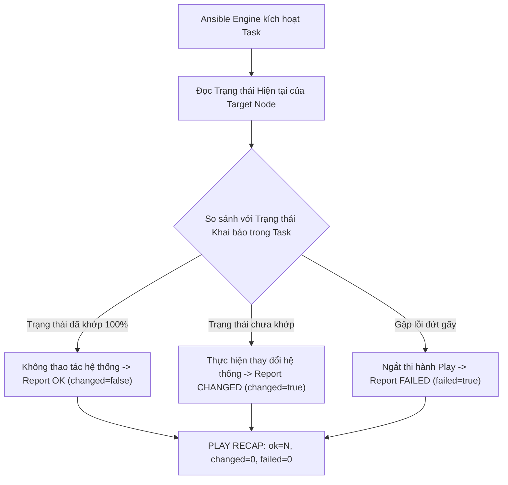
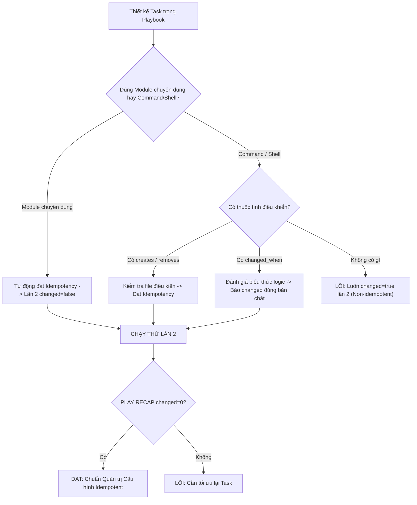
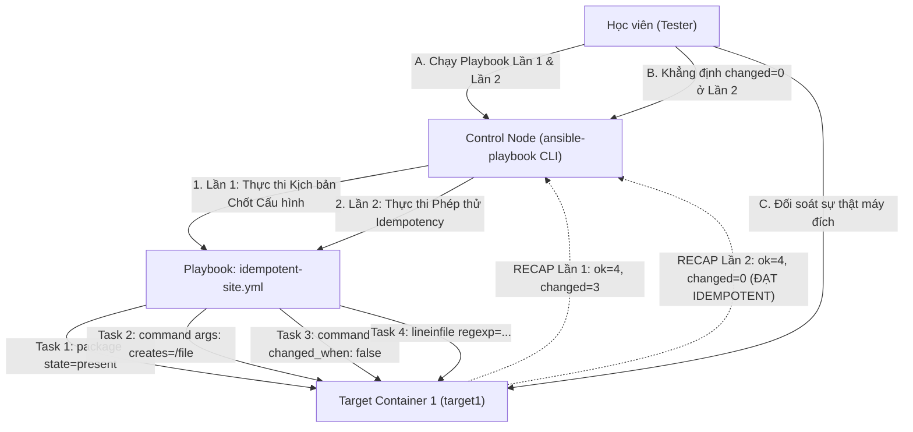

# [BÀI 06] GIẢI MÃ TÍNH BẤT BIẾN (IDEMPOTENCY): CƠ CHẾ KIỂM TRA TRẠNG THÁI ĐÍCH & TRÁNH CẠM BẪY 'ALWAYS CHANGED'

Trong kỷ nguyên **Infrastructure as Code (IaC)** và tự động hóa vận hành hạ tầng đám mây (Cloud Infrastructure Automation), **Ansible** khẳng định vị thế dẫn đầu nhờ triết lý **Agentless** (không cần cài đặt agent nền trên máy đích), giao thức điều khiển an toàn qua **SSH / WinRM**, định dạng khai báo **YAML** trực quan và nguyên lý bất biến **Idempotency** mạnh mẽ. Việc làm chủ Ansible không chỉ dừng lại ở các câu lệnh Ad-hoc đơn giản, mà đòi hỏi kỹ sư phải nắm vững kiến trúc Module tầng thấp, Variable Precedence 22 tầng, Jinja2 Templates, tối ưu hóa Forks & Pipelining cho tới thiết kế Roles / Collections và tích hợp CI/CD tự động hóa chuẩn Doanh nghiệp.

Bài viết chuyên sâu này sẽ đồng hành cùng bạn mổ xẻ toàn diện bức tranh kiến trúc, phân tích các đánh đổi kỹ thuật thực chiến (Engineering Trade-offs), cung cấp hướng dẫn thực hành Lab chi tiết từng bước và bộ câu hỏi phỏng vấn chuyên sâu chuẩn DevOps / SRE Lead.

---

## 1. Bản Chất Kiến Trúc & Cơ Chế Vận Hành Tầng Thấp

---


> **Chạy lần hai phải changed=0 — không idempotent thì không phải config management.**

Mục tiêu chốt hạ Giai đoạn 1 (Nền tảng) của khóa học (I-10):

> **Tính bất biến (Idempotency) là lằn ranh đỏ phân định giữa một công cụ Quản trị Cấu hình (Configuration Management) chuyên nghiệp với một script Bash chạy thủ công. Một Playbook không đạt tính Idempotency sẽ gây ra nguy cơ sửa đổi đè đúp dữ liệu, tạo file rác trùng lặp và làm sập dịch vụ khi chạy lại. Ở Buổi 06, chúng ta sẽ đi sâu vào cơ chế kiểm soát trạng thái (`ok`, `changed`, `failed`), cách khắc phục các tác vụ lệnh thô (`command`/`shell`) bằng `creates`, `removes`, `changed_when`, và thiết lập quy trình kiểm thử lượt chạy lần thứ 2 bắt buộc đạt `changed=0`.**

---


---


---


| Tiếng Việt | Tiếng Anh / Từ khóa + FQCN (giữ nguyên) |
|---|---|
| Tính bất biến (chạy lại không đổi) | Idempotency / Idempotent |
| Mô hình khai báo trạng thái | Declarative state model |
| Trạng thái giữ nguyên | Task status `ok` |
| Trạng thái đã thay đổi | Task status `changed` |
| Trạng thái thất bại | Task status `failed` |
| Trạng thái bỏ qua | Task status `skipped` |
| Điều kiện tạo file mới ngắt chạy | `creates` attribute |
| Điều kiện xóa file ngắt chạy | `removes` attribute |
| Ép trạng thái thay đổi tùy chỉnh | `changed_when` attribute |
| Ép trạng thái thất bại tùy chỉnh | `failed_when` attribute |
| Thử nghiệm lượt chạy lần hai | Second-run execution test |
| Kiểm thử tự động hóa Idempotency | Molecule idempotence test |

---

### 1.1. Bản chất Triết lý Idempotency và Trạng thái Task (15 phút)



**Nguyên lý cốt lõi:** Mô hình Khai báo Trạng thái (Declarative State Model) trong Ansible yêu cầu người viết mô tả *trạng thái mong muốn của hệ thống* (ví dụ: "gói `nginx` phải ở trạng thái đã cài"), thay vì mô tả *chuỗi câu lệnh cần gõ* (như `apt-get install nginx`).

**Giải thích cơ chế ngầm:** Trong mô hình khai báo, Ansible tự kiểm tra xem hệ thống đã đạt trạng thái đó chưa. Nếu chưa đạt, Ansible mới can thiệp; nếu đã đạt, Ansible giữ nguyên không thao tác lại. Đây là nền tảng tạo nên tính Idempotency.

> [!WARNING]
> **CẠM BẪY THỰC CHIẾN:**
> Viết Playbook theo tư duy Imperative (mô tả lệnh gõ) bằng cách nhồi nhét module `command`/`shell` liên tục thay vì dùng module chuyên dụng.

**Minh hoạ.** So sánh tư duy Imperative vs Declarative:
```yaml
# Imperative (SAI - Không idempotent tự nhiên)
- name: Run apt install command
  ansible.builtin.shell: apt-get install -y nginx

# Declarative (ĐÚNG - Idempotent tự nhiên)
- name: Ensure Nginx package is present
  ansible.builtin.package:
    name: nginx
    state: present
```

**Nguyên lý cốt lõi:** Phân biệt bản chất 3 trạng thái thực thi của một Task: `ok` (trạng thái hệ thống đã khớp mong muốn, không cần sửa), `changed` (hệ thống có sự thay đổi thực tế), và `failed` (gặp lỗi ngắt thi hành).

**Giải thích cơ chế ngầm:** Hiểu rõ 3 trạng thái này giúp quản trị viên phân tích chính xác xem hệ thống có bị biến đổi ngoài ý muốn hay không. Chỉ số `ok` tăng lên ở lượt chạy lần 2 thể hiện Playbook đang bảo vệ hệ thống không bị thay đổi thừa.

> [!WARNING]
> **CẠM BẪY THỰC CHIẾN:**
> Thấy lượt chạy lần 2 hiển thị `changed > 0` mà vẫn nghĩ rằng Playbook đã hoàn thành đúng chuẩn.

**Minh hoạ.** Đọc hiểu bảng `PLAY RECAP`:
```
# Lần 1: changed=2 (Đã thực hiện cài gói và chép file)
target1 : ok=3 changed=2 unreachable=0 failed=0

# Lần 2: changed=0 (Mọi thứ đã đúng, ok=3 thể hiện hệ thống giữ nguyên)
target1 : ok=3 changed=0 unreachable=0 failed=0
```

**Nguyên lý cốt lõi:** Các module thực thi lệnh thô (`ansible.builtin.command`, `ansible.builtin.shell`) mặc định không có khả năng tự kiểm tra trạng thái hệ thống, do đó luôn trả về `changed=true` mỗi lần chạy.

**Giải thích cơ chế ngầm:** Ansible Engine không thể biết bên trong một đoạn script shell thô chứa những câu lệnh gì và có làm thay đổi đĩa cứng hay không. Để an toàn, Ansible mặc định coi mọi lệnh shell đều tạo ra thay đổi và gán trạng thái `CHANGED`.

> [!WARNING]
> **CẠM BẪY THỰC CHIẾN:**
> **Lệnh:** `ansible-playbook site.yml` · **Output phải thấy:** Lượt chạy lần 2 của Playbook vẫn luôn báo `changed=1` ở dòng RECAP do chứa task `shell` thô.

**Minh hoạ.** Task `shell` thô gây mất tính Idempotency:
```yaml
- name: Unsafe shell command (Always CHANGED)
  ansible.builtin.shell: echo "export ENV=prod" >> /etc/profile
```

---

### 1.2. Kỹ thuật Khắc phục Lỗi Non-Idempotent (15 phút)

**Nguyên lý cốt lõi:** Sử dụng thuộc tính `creates` (hoặc `removes`) trong module `command`/`shell` để chỉ định đường dẫn tệp tin điều kiện ngắt thực thi khi tệp tin đó đã tồn tại (hoặc đã bị xóa).

**Giải thích cơ chế ngầm:** Thuộc tính `creates: /path/to/file` bảo với Ansible rằng: "Nếu tệp tin `/path/to/file` đã tồn tại trên máy đích, có nghĩa là công việc này đã làm xong từ trước, hãy BỎ QUA Task này và báo `ok` (`changed=false`)".

> [!WARNING]
> **CẠM BẪY THỰC CHIẾN:**
> **Lệnh:** `ansible-playbook site.yml` · **Output phải thấy:** Lệnh giải nén file tar.gz bị chạy lại liên tục làm đè đúp dữ liệu mỗi khi thực thi Playbook.

**Minh hoạ.** Giải nén phần mềm chỉ khi thư mục đích chưa tồn tại bằng `creates`:
```yaml
- name: Extract app archive safely
  ansible.builtin.command: tar -xzf /tmp/app.tar.gz -C /var/www/app
  args:
    creates: /var/www/app/index.php
```

**Nguyên lý cốt lõi:** Sử dụng thuộc tính `changed_when: false` đối với các Task chỉ thực hiện công việc đọc dữ liệu, truy vấn thông tin hoặc kiểm tra hệ thống.

**Giải thích cơ chế ngầm:** Các tác vụ như chạy lệnh `uname -a`, `cat /etc/issue`, hoặc truy vấn trạng thái dịch vụ chỉ đọc dữ liệu từ máy đích mà KHÔNG làm thay đổi bất kỳ byte nào trên đĩa cứng. Khai báo `changed_when: false` ép Ansible báo trạng thái `ok` thay vì `changed`.

> [!WARNING]
> **CẠM BẪY THỰC CHIẾN:**
> **Lệnh:** `ansible-playbook site.yml` · **Output phải thấy:** Lệnh chạy `uptime` kiểm tra máy lại làm tăng chỉ số `changed` trong bảng `PLAY RECAP`.

**Minh hoạ.** Đọc thông tin kernel an toàn không báo changed:
```yaml
- name: Query kernel version
  ansible.builtin.command: uname -r
  register: kernel_info
  changed_when: false
```

**Nguyên lý cốt lõi:** Định nghĩa biểu thức điều kiện tùy chỉnh trong `changed_when` dựa trên kết quả trả về (`rc`, `stdout`, `stderr`) của biến đăng ký `register`.

**Giải thích cơ chế ngầm:** Khi một lệnh shell tùy chỉnh trả về mã thoát (Return code `rc`) hoặc chuỗi kết quả xác định (ví dụ `stdout` chứa từ "upgraded"), ta có thể dùng biểu thức `changed_when: "'upgraded' in result.stdout"` để Ansible chỉ báo `changed=true` khi có thay đổi thật sự.

> [!WARNING]
> **CẠM BẪY THỰC CHIẾN:**
> Task báo `changed=true` mạo danh trong khi câu lệnh shell bên trong không thực hiện thay đổi nào trên máy đích.

**Minh hoạ.** Tự định nghĩa điều kiện báo `changed` dựa trên kết quả stdout:
```yaml
- name: Run custom DB migration script
  ansible.builtin.command: /usr/bin/db-migrate.sh
  register: migrate_res
  changed_when: "'APPLIED_MIGRATIONS' in migrate_res.stdout"
```

---

### 1.3. Thử nghiệm Lượt chạy Lần hai và Tự động hóa CI/CD (10 phút)

**Nguyên lý cốt lõi:** Phép thử Lượt chạy Lần hai (Second-run execution test) là tiêu chuẩn bắt buộc để nghiệm thu một Playbook: Chạy Playbook Lần 1 (chỉnh sửa) -> Chạy lại Lần 2 (kết quả bắt buộc đạt `changed=0`).

**Giải thích cơ chế ngầm:** Lượt chạy Lần 1 xác nhận Playbook có khả năng cấu hình máy chủ từ trạng thái cũ sang trạng thái mới. Lượt chạy Lần 2 xác nhận Playbook có tính an toàn bất biến, không gây phá hỏng hệ thống khi chạy lại định kỳ.

> [!WARNING]
> **CẠM BẪY THỰC CHIẾN:**
> Nghiệm thu Playbook ngay sau lượt chạy Lần 1 mà không thực thi Lần 2 để kiểm tra chỉ số `changed`.

**Minh hoạ.** Quy trình lệnh CLI kiểm thử Idempotency:
```bash
ansible-playbook site.yml    # Lần 1: changed=N (Chỉnh sửa)
ansible-playbook site.yml    # Lần 2: changed=0 (Idempotent - BẮT BUỘC)
```

**Nguyên lý cốt lõi:** Cảnh giác với hành vi "ép trạng thái mạo danh": Tuyệt đối không dùng `changed_when: false` để che giấu một Task có thực hiện thay đổi thật trên máy đích nhằm gian lận chỉ số RECAP.

**Giải thích cơ chế ngầm:** Việc ép `changed_when: false` cho một Task có ghi đè dữ liệu sẽ làm cho bảng RECAP hiển thị màu xanh mạo danh (`changed=0`), nhưng thực tế máy đích vẫn bị ghi đè dữ liệu mỗi lần chạy, vi phạm nghiêm trọng nguyên tắc an toàn.

> [!WARNING]
> **CẠM BẪY THỰC CHIẾN:**
> Dùng `changed_when: false` bọc ngoài câu lệnh `echo data >> /file.txt` để qua mặt bài kiểm tra script `kiem-tra.sh`.

**Minh hoạ.** Đối soát trực tiếp hiện vật thật bằng `docker exec` để phát hiện task ép trạng thái mạo danh:
```bash
docker exec target1 cat /etc/profile | grep "ENV="
```

**Nguyên lý cốt lõi:** Tích hợp công đoạn Idempotence Test vào quy trình kiểm thử tự động hóa trong pipeline CI/CD (sử dụng Molecule hoặc script kiểm định).

**Giải thích cơ chế ngầm:** Trong mô hình GitOps và CI/CD, mọi thay đổi mã nguồn Playbook khi tạo Pull Request/Merge Request đều phải tự động chạy kiểm thử Idempotency trên môi trường container tạm thời. Nếu lượt chạy lần 2 có `changed > 0`, pipeline sẽ tự động đánh dấu FAILED và chặn Merge.

> [!WARNING]
> **CẠM BẪY THỰC CHIẾN:**
> Đẩy mã nguồn Playbook lỗi non-idempotent lên nhánh `main` làm cho các kịch bản deploy tự động định kỳ bị lỗi lặp dữ liệu.

**Minh hoạ.** Đoạn logic kiểm tra Idempotency trong bash script CI:
```bash
ansible-playbook site.yml > /tmp/run2.log
if grep -q "changed=0" /tmp/run2.log; then
  echo "CI PASSED: Playbook is fully idempotent."
else
  echo "CI FAILED: Playbook is NOT idempotent!"; exit 1
fi
```

---

### 1.4. Đưa vào việc thật (4 phút)

### 7.1. Áp dụng vào hạ tầng sẵn có
Khi quản lý 500 máy chủ chạy kịch bản tự động hóa hàng đêm (Nightly Job):
- Đảm bảo 100% Playbook đạt Idempotency (`changed=0`). Khi kịch bản chạy hàng đêm, nếu không có máy chủ nào bị lệch cấu hình, chỉ số tổng là `changed=0`, giúp hệ thống vận hành êm ái không gây gián đoạn dịch vụ.

### 7.2. Rủi ro hỏng hóc khi triển khai Production và giải pháp an toàn
- **Rủi ro:** Một Playbook không idempotent chứa lệnh `shell: systemctl restart httpd` chạy định kỳ sẽ làm gián đoạn kết nối của khách hàng trên Production mỗi 30 phút.
- **Giải pháp an toàn:**
  1. Thay thế lệnh `shell restart` bằng module `service` kết hợp `handlers` (học ở Buổi 11) để chỉ restart khi file cấu hình thực sự bị thay đổi.
  2. Bắt buộc kiểm thử lượt chạy lần 2 trên Staging trước khi đưa kịch bản vào cronjob Production.

### 7.3. Đo lường chỉ số Trước – Sau khi áp dụng
- **Trước khi tối ưu Idempotency:** Kịch bản chạy lại 10 lần làm ghi đè đúp file cấu hình 10 lần, dịch vụ bị restart 10 lần vô lý.
- **Sau khi tối ưu Idempotency:** Lần 1 thực hiện thay đổi, từ lần 2 trở đi chỉ số `changed=0`, dịch vụ không bị restart thừa, thời gian chạy giảm 80%.

### 7.4. Khi nào KHÔNG nên dùng hoặc không thể áp dụng Idempotency
- **Khi tác vụ bản chất là hành động đơn lẻ (Non-idempotent by nature):** Ví dụ tác vụ gửi tin nhắn cảnh báo Slack/Email thông báo "Bắt đầu Deploy", hoặc tác vụ sinh mã token dùng 1 lần. Với các tác vụ này, việc báo `changed=true` mỗi lần thực thi là đúng bản chất công việc.

---

### 1.5. Bẫy hay gặp (2 phút)

| # | Bẫy hay gặp | Vì sao "recap xanh mà sai / không idempotent" | Lệnh phát hiện và xử lý |
|---|---|---|---|
| 1 | Lạm dụng module `command`/`shell` không dùng `creates` | Lệnh giải nén hoặc tải file bị thực thi lại liên tục ở lần chạy thứ 2. | Bổ sung thuộc tính `creates: /path/to/extracted_file`. |
| 2 | Ép `changed_when: false` mạo danh | Task có thay đổi dữ liệu thật nhưng ép `changed_when: false` để qua mặt bài test recap. | Dùng `docker exec` đối soát sự thật máy đích xem dữ liệu có bị ghi đè đúp hay không. |
| 3 | Sửa file bằng module `shell` với toán tử `>>` | Câu lệnh `echo "data" >> /file` nối thêm dòng mới vào file mỗi lần chạy làm file phình to rác. | Thay thế bằng module chuyên dụng `ansible.builtin.lineinfile`. |
| 4 | Không kiểm tra tham số `creates` với đường dẫn sai | Khai báo `creates: /wrong/path` làm cho Ansible tìm không thấy file và vẫn chạy lại lệnh shell. | Kiểm tra chính xác đường dẫn file tuyệt đối sẽ được tạo ra bởi lệnh shell. |
| 5 | Dùng `removes` nhưng file cần xóa chưa bao giờ tồn tại | Khai báo `removes` cho một file không có thật khiến task luôn bị bỏ qua. | Kiểm tra lại logic sự tồn tại của file trước khi gán `removes`. |
| 6 | Tin tưởng Playbook chạy lần 1 báo xanh | Thấy lần 1 báo `PLAY RECAP` xanh lá cây tưởng đã xong mà không test lượt 2. | Luôn thực thi câu lệnh `ansible-playbook site.yml` lần thứ 2 để kiểm tra `changed=0`. |
| 7 | Nhầm lẫn giữa `changed_when` và `when` | `when` quyết định task CÓ CHẠY HAY KHÔNG; `changed_when` quyết định task báo CHANGED HAY OK sau khi chạy xong. | Phân biệt rõ: dùng `when` để rẽ nhánh thi hành, dùng `changed_when` để sửa báo cáo trạng thái. |
| 8 | Bỏ qua biến `register` khi dùng `changed_when` | Viết `changed_when: "'SUCCESS' in result.stdout"` nhưng quên khai báo `register: result` ở task. | Luôn khai báo `register: <var_name>` ngay trước dòng `changed_when`. |
| 9 | Dùng lệnh `date` hoặc nội dung động trong file | Nội dung file thay đổi liên tục theo mốc thời gian làm module `copy` luôn báo `changed=true`. | Sử dụng nội dung tĩnh hoặc quản lý mốc thời gian qua biến Jinja2 hợp lý. |
| 10 | Đặt `failed_when` trùng lặp với `changed_when` | Khai báo nhầm lẫn khiến task bị đánh dấu lỗi (failed) thay vì đánh dấu thay đổi (changed). | Đọc kỹ tài liệu cú pháp của 2 thuộc tính `failed_when` và `changed_when`. |
| 11 | Không kiểm tra log chi tiết với `-v` hoặc `--diff` | Không biết task nào trong Playbook đang tạo ra chỉ số `changed` ở lượt chạy thứ 2. | Chạy `ansible-playbook -v site.yml` để soi chi tiết từng task bị changed. |
| 12 | Giả định mọi module Ansible đều idempotent | Một số module custom của cộng đồng chưa được tối ưu tốt vẫn báo changed lần 2. | Thử nghiệm kỹ trên môi trường lab trước khi đưa module mới vào kịch bản Production. |

---

### 1.6. Tóm tắt (1 phút)



### Năm điều phải nhớ
1. **Idempotency là linh hồn CM:** Chạy lại kịch bản lần thứ 2 **bắt buộc** phải đạt `changed=0`.
2. **Ưu tiên Module chuyên dụng:** Dùng `package`, `service`, `copy`, `lineinfile` thay cho `command`/`shell`.
3. **Dùng `creates`/`removes` cho lệnh thô:** Khai báo file điều kiện ngắt để task `command`/`shell` không chạy lại thừa.
4. **Dùng `changed_when: false` cho task đọc:** Các task truy vấn dữ liệu (`uname`, `cat`, `stat`) phải tắt cờ changed.
5. **Kiểm tra sự thật trên máy đích:** Không dùng `changed_when: false` mạo danh; luôn dùng `docker exec` đối soát hiện vật thật.

---

### 1.7. Câu hỏi tự kiểm tra (kiêm luyện RHCE EX294)

1. **[RHCE EX294 Objective #6]** Khái niệm Idempotency (tính bất biến) trong Ansible Playbook có nghĩa là gì?
   - *Đáp án:* Là tính chất đảm bảo khi thực thi lại Playbook nhiều lần trên máy đã đúng cấu hình, Ansible không tạo ra thay đổi mới và báo chỉ số `changed=0` ở `PLAY RECAP`.
2. **[RHCE EX294 Objective #6]** Tại sao một Task sử dụng module `ansible.builtin.shell` thực hiện lệnh `echo "data" >> /file.txt` lại không đạt tính Idempotency?
   - *Đáp án:* Vì module `shell` không tự kiểm tra trạng thái file, toán tử `>>` nối thêm dòng mới vào file mỗi lần chạy, khiến task luôn báo `changed=true` và làm hỏng file.
3. **[RHCE EX294 Objective #6]** Thuộc tính `creates` trong module `command`/`shell` nhận tham số là gì và có tác dụng gì?
   - *Đáp án:* Nhận tham số là đường dẫn một tệp tin (`creates: /path/to/file`). Nếu file này đã tồn tại trên máy đích, Ansible sẽ BỎ QUA không chạy lại lệnh shell đó và báo `changed=false`.
4. **[RHCE EX294 Objective #6]** Thuộc tính `removes` trong module `command`/`shell` khác `creates` ở điểm nào?
   - *Đáp án:* `removes` chỉ thực thi lệnh shell nếu tệp tin chỉ định ĐANG TỒN TẠI (dùng cho các tác vụ xóa); nếu file không tồn tại thì bỏ qua task.
5. **[RHCE EX294 Objective #6]** Muốn một Task chạy lệnh `ansible.builtin.command: uname -a` đọc thông tin hệ thống không làm tăng chỉ số `changed` trong RECAP, ta khai báo thuộc tính gì?
   - *Đáp án:* Khai báo thuộc tính `changed_when: false`.
6. **[RHCE EX294 Objective #6]** Làm thế nào để tự định nghĩa một Task chỉ báo `changed=true` khi biến đăng ký `res.rc == 0`?
   - *Đáp án:* Khai báo thuộc tính `changed_when: "res.rc == 0"` (sau khi đã gán `register: res`).
7. **[RHCE EX294 Objective #6]** Sự khác biệt cốt lõi giữa thuộc tính `when` và thuộc tính `changed_when` là gì?
   - *Đáp án:* `when` quyết định Task CÓ THỰC THI HAY KHÔNG; `changed_when` quyết định Task BÁO TRẠNG THÁI CHANGED HAY OK sau khi đã thực thi xong.
8. **[RHCE EX294 Objective #6]** Tại sao việc ép `changed_when: false` cho một Task có thực hiện thay đổi dữ liệu thật lại bị coi là vi phạm nguyên tắc quản trị?
   - *Đáp án:* Vì đó là hành vi mạo danh giấu sự thay đổi, làm bảng RECAP hiển thị sai bản chất công việc, gây rủi ro mất an toàn cho hệ thống.
9. **[RHCE EX294 Objective #6]** Quy trình thử nghiệm nào là chuẩn mực để nghiệm thu tính Idempotency của một Playbook trước khi bàn giao?
   - *Đáp án:* Thực thi lượt chạy Lần 1 (`changed=N`) -> Thực thi lượt chạy Lần 2 (`changed=0`) -> Đối soát thực tế máy đích qua `docker exec`.
10. **[RHCE EX294 Objective #6]** Chỉ số `ok=5 changed=0 failed=0` trong bảng `PLAY RECAP` ở lượt chạy lần 2 thể hiện điều gì?
    - *Đáp án:* Thể hiện cả 5 Task đã thành công, hệ thống đã ở đúng trạng thái mong muốn và không có bất kỳ thay đổi thừa nào được tạo ra (Playbook đạt Idempotency tuyệt đối).
11. **[RHCE EX294 Objective #6]** Viết một đoạn Task YAML chuẩn Idempotent giải nén file `/tmp/app.tar.gz` vào `/var/www/app` chỉ khi file `/var/www/app/index.php` chưa tồn tại.
    - *Đáp án:*
      ```yaml
      - name: Extract application package
        ansible.builtin.command: tar -xzf /tmp/app.tar.gz -C /var/www/app
        args:
          creates: /var/www/app/index.php
      ```
12. **[RHCE EX294 Objective #6]** Trong pipeline CI/CD, nếu lượt chạy kiểm thử Idempotency Lần 2 của Playbook trả về `changed=1`, pipeline sẽ xử lý thế nào?
    - *Đáp án:* Pipeline tự động ngắt dừng với kết quả FAILED và chặn không cho phép merge mã nguồn hoặc deploy lên Production.
13. **[RHCE EX294 Objective #6]** Lệnh CLI nào giúp quản trị viên soi chi tiết từng Task trong Playbook để phát hiện Task nào đang gây ra chỉ số `changed` ở lượt chạy lần 2?
    - *Đáp án:* `ansible-playbook -v site.yml` (hoặc `-vv`, `--diff`).

---

### 1.8. Tài liệu tham khảo

- Ansible Core Documentation (v2.15+): [Understanding Idempotency](https://docs.ansible.com/ansible/latest/playbook_guide/playbooks_intro.html#ansible-architecture)
- Ansible Core Documentation: [Defining changed and failed status](https://docs.ansible.com/ansible/latest/playbook_guide/playbooks_error_handling.html#override-the-changed-result-of-a-task)
- Red Hat Certified Engineer (RHCE) EX294 Study Guide: Ensuring Idempotency in Ansible Playbooks.

---

## Bảng đối soát thời lượng

| Mục | Nội dung | Thời lượng dự kiến | Thời lượng thực tế |
|---|---|---|---|
| §0 | Khởi động và ôn tập buổi 05 | 10 phút | 10 phút |
| §1–§2 | Mục tiêu làm được & Cần biết trước | 2 phút | 2 phút |
| §3 | Thuật ngữ Việt-Anh & Mô hình tư duy | 8 phút | 8 phút |
| §4 | Bản chất Triết lý Idempotency (QT 4.1–4.3) | 15 phút | 15 phút |
| §5 | Kỹ thuật Khắc phục Lỗi Non-Idempotent (QT 5.1–5.3) | 15 phút | 15 phút |
| §6 | Thử nghiệm Lượt 2 & Tự động hóa CI (QT 6.1–6.3) | 10 phút | 10 phút |
| §7–§9 | Đưa vào việc thật, Bẫy hay gặp & Tóm tắt | 7 phút | 7 phút |
| §10–§11 | Câu hỏi tự kiểm tra EX294 & Tài liệu tham khảo | 3 phút | 3 phút |
| **Tổng** | **Khối lý thuyết Buổi 06** | **60 phút** | **60 phút** |

---

## 2. Hướng Dẫn Thực Hành & Triển Khai Lab Chuẩn Production

> [!IMPORTANT]
> **YÊU CẦU MÔI TRƯỜNG THỰC HÀNH:**
> Toàn bộ các bài thực hành dưới đây được thiết kế để chạy trực tiếp trên môi trường máy chủ Linux / Docker containers phân tán. Hãy đảm bảo bạn đã chuẩn bị Control Node cài đặt Ansible Core 2.15+ cùng các Managed Nodes đã cấu hình SSH Key Authentication.

## Khối thực hành — 150 phút

> **Đối soát thời lượng:** Khối thực hành kéo dài đúng **150'** (từ L0 đến L11).
> **Nguyên tắc cốt lõi:** Thực hành khởi tạo kịch bản non-idempotent bị lỗi chạy lại liên tục, sau đó tiến hành tối ưu chuẩn hóa bằng module chuyên dụng, áp dụng thuộc tính `creates`, `removes`, `changed_when`, thực thi phép thử **Lượt chạy Lần thứ hai** chứng minh chỉ số `PLAY RECAP` đạt `changed=0` và đối soát sự thật máy đích qua `docker exec`.

---

## L0. Mục tiêu thực hành và tiêu chí hoàn thành

| # | Mục tiêu thực hành | Tiêu chí hoàn thành (Kiểm tra bằng lệnh CLI) |
|---|---|---|
| TH1 | Nhận diện kịch bản non-idempotent do lạm dụng shell thô | Phân tích nhật ký Lần 2 báo `changed > 0` bất thường |
| TH2 | Tối ưu task lệnh thô bằng thuộc tính `creates` | Task `command` giải nén bị bỏ qua ở Lần 2 khi file đã tồn tại |
| TH3 | Tối ưu task đọc dữ liệu bằng `changed_when: false` | Task đọc cấu hình báo `ok` thay vì `changed` |
| TH4 | Tự định nghĩa điều kiện báo changed bằng `changed_when` | Task chỉ báo `changed` khi `register` trả về mã rc=0 |
| TH5 | Thay thế lệnh shell thô bằng module chuẩn hóa | Chuyển đổi lệnh `echo >>` thành module `ansible.builtin.lineinfile` |
| TH6 | Thực thi phép thử Lượt chạy Lần 2 (Second-run test) | Bảng `PLAY RECAP` Lần 2 đạt `changed=0` tuyệt đối |
| TH7 | Chạy thử nghiệm mô phỏng `--check --diff` | Lệnh `--check --diff` Lần 2 xác nhận không có dự báo thay đổi mạo danh |
| TH8 | Đối soát sự thật máy đích bằng docker exec | `docker exec target1 ...` xác nhận không có dữ liệu đè đúp rác |

---

## L1. Điều kiện tiên quyết về môi trường

| Kiểm tra | LỆNH THỰC THI | Kết quả kỳ vọng |
|---|---|---|
| Ansible core đã cài | `ansible --version` | Phiên bản ansible-core v2.15 trở lên |
| Docker Compose sẵn sàng | `docker compose ps` | Cả target1 và target2 ở trạng thái `Up` |
| Kết nối SSH sẵn sàng | `ansible all -m ansible.builtin.ping` | Đạt `SUCCESS` cho mọi host |
| Inventory dự án | `ansible-inventory --graph` | Hiển thị các nhóm `web` và `db` |
| Thư mục thực hành | `pwd` | Đang ở thư mục `~/lab-ansible-06` |

Nếu chưa có target container:
```bash
cd labs && make up && make key && make inventory
```

---

## L2. Kiến trúc bài lab



---

## L3. Bước 1 — Tạo Kịch bản Bị lỗi Non-Idempotent để Phân tích (25 phút)

Tạo thư mục làm việc, file cấu hình `ansible.cfg`, `inventory.ini` và file Playbook bị lỗi thiết kế `bad-site.yml` lạm dụng lệnh shell thô (QT 4.1, QT 4.3).

```bash
mkdir -p ~/lab-ansible-06 && cd ~/lab-ansible-06

cat << 'EOF' > ansible.cfg
[defaults]
inventory = ./inventory.ini
remote_user = ansible
host_key_checking = False
private_key_file = ~/.ssh/id_ed25519

[privilege_escalation]
become = True
become_method = sudo
become_user = root
become_ask_pass = False
EOF

cat << 'EOF' > inventory.ini
[web]
target1 ansible_host=127.0.0.1 ansible_port=2221

[db]
target2 ansible_host=127.0.0.1 ansible_port=2222

[all:vars]
ansible_python_interpreter=/usr/bin/python3
EOF

cat << 'EOF' > bad-site.yml
---
- name: Bad Non-Idempotent Playbook
  hosts: web
  become: true
  tasks:
    - name: Bad Task 1 - Append line using shell echo (Non-idempotent)
      ansible.builtin.shell: echo "EXPORT_ENV=production" >> /etc/environment

    - name: Bad Task 2 - Run uptime command (Non-idempotent)
      ansible.builtin.command: uptime

    - name: Bad Task 3 - Create dummy directory using mkdir (Fails on run 2)
      ansible.builtin.command: mkdir /var/log/my-app-logs
EOF
```

Thực thi kịch bản `bad-site.yml` Lần 1 và Lần 2:
```bash
ansible-playbook bad-site.yml || true
ansible-playbook bad-site.yml || true
```

**CHECKPOINT 1 — Phát hiện kịch bản bad-site.yml bị lỗi non-idempotent (Lần 2 vẫn có changed > 0 hoặc bị failed).**
- **Lệnh kiểm tra:**
```bash
BAD_RUN2=$(ansible-playbook bad-site.yml 2>&1 || true)
if echo "$BAD_RUN2" | grep -q "failed=1" || echo "$BAD_RUN2" | grep -q "changed=1" || echo "$BAD_RUN2" | grep -q "changed=2"; then
  echo "CHECKPOINT 1: ĐẠT - Phát hiện chính xác kịch bản bad-site.yml bị lỗi Non-idempotent ở lượt chạy thứ 2"
else
  echo "CHECKPOINT 1: LỖI - Chưa thể hiện được lỗi Non-idempotent của bad-site.yml"
fi
```

---

## L4. Bước 2 — Tối ưu Task Lệnh thô bằng creates và removes (30 phút)

Sử dụng thuộc tính `creates` và `removes` để chuyển đổi các task gọi module `command`/`shell` thành chuẩn Idempotency (QT 5.1).

Tạo file Playbook mới `idempotent-site.yml` và áp dụng `creates`:
```bash
cat << 'EOF' > idempotent-site.yml
---
- name: Optimized Idempotent Playbook
  hosts: web
  become: true
  tasks:
    - name: Task 1 - Create directory using command with creates attribute
      ansible.builtin.command: mkdir -p /var/log/my-app-logs
      args:
        creates: /var/log/my-app-logs

    - name: Task 2 - Create dummy build marker file using shell with creates
      ansible.builtin.shell: echo "BUILD_DATE=$(date)" > /var/log/my-app-logs/build.marker
      args:
        creates: /var/log/my-app-logs/build.marker
EOF
```

Thực thi `idempotent-site.yml` Lần 1 và Lần 2:
```bash
ansible-playbook idempotent-site.yml
ansible-playbook idempotent-site.yml
```

**CHECKPOINT 2 — Task command/shell dùng thuộc tính creates đạt Idempotency ở lượt chạy thứ 2.**
- **Lệnh kiểm tra:**
```bash
CREATES_RUN2=$(ansible-playbook idempotent-site.yml)
if echo "$CREATES_RUN2" | grep -q "changed=0" && echo "$CREATES_RUN2" | grep -q "failed=0"; then
  echo "CHECKPOINT 2: ĐẠT - Thuộc tính creates giúp task command/shell đạt Idempotency (changed=0 lần 2)"
else
  echo "CHECKPOINT 2: LỖI - Thuộc tính creates chưa hoạt động đúng"
fi
```

---

## L5. Bước 3 — Điều khiển Trạng thái Báo Changed với changed_when (30 phút)

Sử dụng thuộc tính `changed_when: false` cho các task chỉ đọc dữ liệu và dùng biểu thức `changed_when` tự định nghĩa logic thay đổi (QT 5.2, QT 5.3).

Bổ sung các task xử lý `changed_when` vào `idempotent-site.yml`:
```bash
cat << 'EOF' > idempotent-site.yml
---
- name: Optimized Idempotent Playbook
  hosts: web
  become: true
  tasks:
    - name: Task 1 - Create directory using command with creates attribute
      ansible.builtin.command: mkdir -p /var/log/my-app-logs
      args:
        creates: /var/log/my-app-logs

    - name: Task 2 - Query system uptime with changed_when false
      ansible.builtin.command: uptime
      register: uptime_res
      changed_when: false

    - name: Task 3 - Run custom script with custom changed_when logic
      ansible.builtin.shell: echo "CHECK_STATUS_OK"
      register: script_res
      changed_when: "'CHANGED_TRIGGER' in script_res.stdout"
EOF
```

Thực thi `idempotent-site.yml` Lần 1 và Lần 2:
```bash
ansible-playbook idempotent-site.yml
ansible-playbook idempotent-site.yml
```

**CHECKPOINT 3 — Task đọc uptime dùng changed_when: false báo ok thay vì changed.**
- **Lệnh kiểm tra:**
```bash
UPTIME_RUN=$(ansible-playbook idempotent-site.yml)
if echo "$UPTIME_RUN" | grep -q "changed=0" && echo "$UPTIME_RUN" | grep -q "ok=3"; then
  echo "CHECKPOINT 3: ĐẠT - Task truy vấn uptime sử dụng changed_when: false báo ok chính xác không tăng changed"
else
  echo "CHECKPOINT 3: LỖI - Task changed_when: false hoạt động chưa chính xác"
fi
```

---

## L6. Bước 4 — Thay thế Lệnh thô bằng Module Tiêu chuẩn (30 phút)

Chuyển đổi các câu lệnh `shell: echo >> /etc/environment` thành module tiêu chuẩn `ansible.builtin.lineinfile` để loại bỏ hoàn toàn nguy cơ đè đúp dữ liệu (QT 4.1, QT 6.2).

Cập nhật `idempotent-site.yml` hoàn chỉnh:
```bash
cat << 'EOF' > idempotent-site.yml
---
- name: Fully Standardized Idempotent Playbook
  hosts: web
  become: true
  tasks:
    - name: Task 1 - Ensure Nginx package is installed (Standard module)
      ansible.builtin.package:
        name: curl
        state: present

    - name: Task 2 - Create log directory (Command with creates)
      ansible.builtin.command: mkdir -p /var/log/my-app-logs
      args:
        creates: /var/log/my-app-logs

    - name: Task 3 - Query uptime (Command with changed_when false)
      ansible.builtin.command: uptime
      register: uptime_out
      changed_when: false

    - name: Task 4 - Ensure EXPORT_ENV line in /etc/environment (Standard lineinfile)
      ansible.builtin.lineinfile:
        path: /etc/environment
        regexp: '^EXPORT_ENV='
        line: 'EXPORT_ENV=production'
        state: present

    - name: Task 5 - Ensure SSH service is running (Standard service)
      ansible.builtin.service:
        name: sshd
        state: started
        enabled: true
EOF
```

**CHECKPOINT 4 — File idempotent-site.yml sử dụng module chuẩn lineinfile thay cho echo shell.**
- **Lệnh kiểm tra:**
```bash
if grep -q "ansible.builtin.lineinfile" idempotent-site.yml && ! grep -q "echo .* >>" idempotent-site.yml; then
  echo "CHECKPOINT 4: ĐẠT - Đã thay thế thành công câu lệnh shell echo thô bằng module chuẩn ansible.builtin.lineinfile"
else
  echo "CHECKPOINT 4: LỖI - Chưa thay thế lệnh shell thô bằng module chuẩn"
fi
```

---

## L7. Bước 5 — Phép thử Lượt 2, Mô phỏng Dry-run và Đối soát Máy đích (35 phút)

Thực thi phép thử Lượt chạy Lần thứ 2 (Second-run execution test) chứng minh `PLAY RECAP` đạt `changed=0`, kiểm tra với cờ `--check --diff` và đối soát sự thật máy đích qua `docker exec` (QT 6.1, QT 6.2).

Thực thi Lần 1:
```bash
ansible-playbook idempotent-site.yml
```

Thực thi Lần 2 (BẮT BUỘC ĐẠT `changed=0`):
```bash
ansible-playbook idempotent-site.yml
```

**CHECKPOINT 5 — Phép thử Lượt 2 (Second-run execution test) đạt changed=0 ở PLAY RECAP.**
- **Lệnh kiểm tra:**
```bash
SECONDRUN_OUT=$(ansible-playbook idempotent-site.yml)
if echo "$SECONDRUN_OUT" | grep -q "changed=0" && echo "$SECONDRUN_OUT" | grep -q "failed=0"; then
  echo "CHECKPOINT 5: ĐẠT - Phép thử Lượt 2 đạt tính Idempotency tuyệt đối (PLAY RECAP báo changed=0)"
else
  echo "CHECKPOINT 5: LỖI - Lượt 2 không đạt changed=0 (Playbook không chuẩn Idempotent)"
fi
```

Thực thi chạy thử nghiệm Dry-run với `--check --diff`:
```bash
ansible-playbook --check --diff idempotent-site.yml
```

**CHECKPOINT 6 — Thực thi cờ --check --diff ở Lần 2 xác nhận changed=0 không có dự báo mạo danh.**
- **Lệnh kiểm tra:**
```bash
CHECK2_OUT=$(ansible-playbook --check --diff idempotent-site.yml)
if echo "$CHECK2_OUT" | grep -q "changed=0" && echo "$CHECK2_OUT" | grep -q "failed=0"; then
  echo "CHECKPOINT 6: ĐẠT - Chế độ mô phỏng --check --diff Lần 2 xác nhận không có bất kỳ dự báo thay đổi mạo danh nào"
else
  echo "CHECKPOINT 6: LỖI - Chế độ mô phỏng --check --diff báo lỗi"
fi
```

Đối soát nội dung file `/etc/environment` trên target container:
```bash
docker exec target1 cat /etc/environment
```

**CHECKPOINT 7 — Đối soát file /etc/environment trên target1 chỉ chứa đúng 1 dòng EXPORT_ENV=production.**
- **Lệnh kiểm tra:**
```bash
COUNT_LINES=$(docker exec target1 grep -c "^EXPORT_ENV=production" /etc/environment || true)
if [ "$COUNT_LINES" -eq 1 ]; then
  echo "CHECKPOINT 7: ĐẠT - Kiểm tra sự thật qua docker exec xác nhận dòng EXPORT_ENV=production xuất hiện duy nhất 1 lần (không bị đè đúp)"
else
  echo "CHECKPOINT 7: LỖI - Dòng cấu hình bị đè đúp trùng lặp trên máy đích"
fi
```

**CHECKPOINT 8 — Đối soát sự tồn tại thư mục /var/log/my-app-logs trên target1.**
- **Lệnh kiểm tra:**
```bash
DIR_CHECK=$(docker exec target1 ls -d /var/log/my-app-logs)
if [ -n "$DIR_CHECK" ]; then
  echo "CHECKPOINT 8: ĐẠT - Thư mục /var/log/my-app-logs tồn tại thực tế trên target node"
else
  echo "CHECKPOINT 8: LỖI - Thư mục /var/log/my-app-logs chưa được tạo thực tế"
fi
```

---

## L8. Nộp sản phẩm và dọn dẹp (10 phút)

Thu thập kết quả ra các file báo cáo cuối buổi:
```bash
ansible-playbook bad-site.yml 2>&1 > non-idempotent-log.txt || true
ansible-playbook idempotent-site.yml > idempotency-proof.txt
docker exec target1 cat /etc/environment > kiem-may-dich.txt
docker exec target1 ls -ld /var/log/my-app-logs >> kiem-may-dich.txt
```

---

## L9. Xử lý sự cố

| # | Hiện tượng lỗi | Nguyên nhân gốc rễ | Cách xử lý nhanh |
|---|---|---|---|
| 1 | Lượt 2 vẫn báo `changed=1` ở task `lineinfile` | Biểu thức `regexp` không khớp với dòng đang có làm Ansible chèn thêm dòng mới | Kiểm tra và viết lại regex chính xác (ví dụ `regexp='^EXPORT_ENV='`). |
| 2 | Task `command` dùng `creates` nhưng vẫn chạy lại | Khai báo sai đường dẫn file trong `creates` (file thực tế tạo ra ở vị trí khác) | So sánh đường dẫn file tạo ra bởi câu lệnh với đường dẫn khai báo trong `creates`. |
| 3 | Lỗi `fatal: [target1]: FAILED! => {"msg": "mkdir: File exists"}` | Dùng `command: mkdir` không có `creates` hoặc không có cờ `-p` | Bổ sung cờ `mkdir -p` và khai báo thuộc tính `args: creates: /path`. |
| 4 | Lệnh `changed_when: false` giấu lỗi của task bị hỏng | Task bị lỗi sập nhưng dùng `changed_when: false` làm tưởng task thành công | Cần phân biệt `changed_when` (định nghĩa changed) với `ignore_errors` (bỏ qua lỗi). |
| 5 | Biến đăng ký trong `changed_when` bị lỗi undefined | Quên khai báo `register: my_var` ở task trước khi gọi `changed_when` | Bổ sung dòng `register: my_var` trước khi truyền điều kiện `changed_when`. |
| 6 | File `/etc/environment` bị đè đúp 10 dòng | Sử dụng module `shell: echo >>` ở bài lab cũ mà chưa dọn dẹp | Xóa các dòng trùng lặp trên target container bằng `docker exec` rồi chạy lại module `lineinfile`. |
| 7 | Cờ `--check` báo lỗi `creates file does not exist` | Module `command` trong check mode không thể mô phỏng tạo file cho bước sau | Sử dụng module chuẩn hóa hoặc thêm `check_mode: false` cho task tạo file tiên quyết. |
| 8 | Task `copy` vẫn báo `changed=true` ở Lần 2 | Nội dung file local bị thay đổi động (ví dụ chứa lệnh `date` lấy giờ hệ thống) | Chuyển sang nội dung tĩnh cố định để đảm bảo md5 checksum giữ nguyên. |
| 9 | Task `service` luôn báo `changed=1` ở Lần 2 | Khai báo `state=restarted` thay vì `state=started` | Đổi từ `state=restarted` sang `state=started` (chỉ dùng restarted khi có notification). |
| 10 | Báo lỗi `yaml.scanner.ScannerError` ở thuộc tính `args` | Khai báo `creates` không lề đúng cấp độ bên dưới `args:` | Thụt lề `creates:` vào 2 dấu cách bên dưới từ khóa `args:`. |
| 11 | Không thấy thay đổi khi chạy lại Playbook sau khi sửa file | Quên không lưu file `idempotent-site.yml` trên Control node | Lưu file cấu hình mã nguồn trước khi gọi lệnh `ansible-playbook`. |
| 12 | Thao tác `removes` không hoạt động như kỳ vọng | File cần xóa chưa bao giờ tồn tại khiến task luôn bị skipped | Kiểm tra sự tồn tại của file trước khi gán thuộc tính `removes`. |
| 13 | Lỗi `changed_when` chứa cú pháp Jinja2 sai | Viết `changed_when: my_var.rc == 0` mà bọc trong `{{ }}` không đúng chuẩn | Trong `changed_when` truyền trực tiếp biểu thức Python/Jinja không cần cặp `{{ }}`. |
| 14 | RECAP Lần 2 báo `ok=0 changed=0` do bị skipped toàn bộ | Điều kiện `when` bị sai khiến toàn bộ các Task trong Playbook bị bỏ qua | Rà soát lại logic điều kiện lọc `when` trong kịch bản. |

---

## L10. Bài tập mở rộng

1. **BT1:** Viết file Playbook `setup-app.yml` sử dụng module `command` để tải file nén `app.tar.gz` bằng `curl` và dùng `creates` để đảm bảo không tải lại nếu file nén đã có.
2. **BT2:** Thêm task giải nén file `app.tar.gz` sử dụng `creates: /var/www/app/index.php` và kiểm tra lượt chạy lần 2 đạt `changed=0`.
3. **BT3:** Viết 1 task chạy lệnh `df -h` kiểm tra dung lượng đĩa cứng, đăng ký biến `register: disk_out` và tắt cờ changed bằng `changed_when: false`.
4. **BT4:** Viết 1 task chạy kịch bản shell `/usr/local/bin/check-db.sh`, sử dụng `changed_when: "'DB_UPDATED' in check_res.stdout"`.
5. **BT5:** Chuyển đổi một Playbook legacy chứa 5 câu lệnh `shell` thô (`mkdir`, `touch`, `echo >>`, `systemctl start`, `useradd`) thành 100% module tiêu chuẩn Idempotent.
6. **BT6:** Thực thi phép thử Idempotency Lần 2 cho Playbook ở BT5 và xuất báo cáo `PLAY RECAP` ra file `bt5-idempotency.log`.
7. **BT7:** Sử dụng cờ `--check --diff` để chứng minh Playbook ở BT5 ở lượt chạy Lần 2 không có bất kỳ dự báo thay đổi mạo danh nào.
8. **BT8:** Viết kịch bản bash script tự động hóa công đoạn kiểm thử Idempotency Lần 2: tự động chạy Playbook Lần 2, parse file log RECAP và trả về mã exit code 0 (nếu `changed=0`) hoặc exit code 1 (nếu `changed > 0`).

---

## L11. Sản phẩm nộp và chấm điểm

### Danh mục sản phẩm nộp
- File Playbook `bad-site.yml` và `idempotent-site.yml`.
- Báo cáo kết quả 8 CHECKPOINT từ terminal.
- Các file kết quả: `non-idempotent-log.txt`, `idempotency-proof.txt`, `kiem-may-dich.txt`.

### Thang điểm đánh giá

| Mức điểm | Tiêu chí đạt được |
|---|---|
| **0–4 điểm** | Chưa hiểu khái niệm Idempotency, nộp Playbook Lần 2 vẫn bị đỏ FAILED hoặc dính lỗi `shell` đè đúp. |
| **5–7 điểm** | Sửa được task bằng `creates`, nhưng chưa thành thạo `changed_when` và chưa thay thế được các lệnh shell thô bằng module chuẩn. |
| **8–9 điểm** | Đạt đủ 8 CHECKPOINT, chứng minh Idempotency Lần 2 (`changed=0`) tuyệt đối cho toàn bộ Playbook và đối soát qua `docker exec`. |
| **10 điểm** | Đạt 9 điểm + Hoàn thành xuất sắc 100% các Bài tập mở rộng (BT1–BT8). |

---

## Bảng đối soát thời lượng

| Bước | Nội dung | Thời lượng dự kiến | Thời lượng thực tế |
|---|---|---|---|
| L0–L2 | Mục tiêu, Tiên quyết & Kiến trúc bài lab | 10 phút | 10 phút |
| L3 | Bước 1: Tạo kịch bản non-idempotent để phân tích | 25 phút | 25 phút |
| L4 | Bước 2: Tối ưu task lệnh thô bằng creates/removes | 30 phút | 30 phút |
| L5 | Bước 3: Điều khiển trạng thái với changed_when | 30 phút | 30 phút |
| L6 | Bước 4: Thay thế lệnh thô bằng Module tiêu chuẩn | 30 phút | 30 phút |
| L7 | Bước 5: Phép thử Lượt 2 & Đối soát docker exec | 35 phút | 35 phút |
| L8–L11 | Nộp sản phẩm, Sự cố, Bài tập & Chấm điểm | 10 phút | 10 phút |
| **Tổng** | **Khối thực hành Buổi 06** | **150 phút** | **150 phút** |

---

## 3. Bộ Câu Hỏi Vấn Đáp & Phỏng Vấn Kỹ Thuật Chuyên Sâu

Dưới đây là bộ câu hỏi phỏng vấn thực chiến dành cho các vị trí **DevOps Engineer**, **Site Reliability Engineer (SRE)** và **Cloud Automation Architect**, giúp bạn tự đánh giá độ sâu hiểu biết và rèn luyện phản xạ xử lý sự cố hệ thống:

---


## Bộ câu hỏi phỏng vấn chuyên sâu — ĐÚNG 12 câu

### Câu 1 — Triết lý Idempotency trong Quản trị Cấu hình 🔥
**Hỏi:** Tại sao tính Idempotency (tính bất biến) lại được coi là tiêu chuẩn vàng định nghĩa một công cụ Quản trị Cấu hình (Configuration Management)? *(Liên quan QT 4.1)*
**Đáp án chuẩn:** Idempotency đảm bảo rằng việc thực thi một kịch bản cấu hình một lần hay nhiều lần trên cùng một hệ thống đều mang lại KẾT QUẢ TRẠNG THÁI CUỐI CÙNG GIỐNG NHAU, mà không gây ra tác dụng phụ (như đè đúp dữ liệu, tạo file rác trùng lặp, làm sập dịch vụ). Nó chuyển đổi tư duy từ "gõ chuỗi lệnh thủ công" (Imperative) sang "khai báo trạng thái muốn có" (Declarative), giúp kịch bản chạy an toàn định kỳ trên hạ tầng quy mô lớn.
**Tiêu chí chấm:**
- 0: Không biết định nghĩa Idempotency.
- 1: Nói "chạy lại không bị lỗi" nhưng không giải thích được Declarative State Model.
- 2: Giải thích đúng cơ chế Declarative và tính an toàn khi chạy lại nhiều lần.
- 3: Phân tích xuất sắc sự khác biệt giữa Script Bash (Imperative) và Ansible Playbook (Declarative) kèm ví dụ thực tế.
**Câu hỏi đào sâu:** Nếu một script Bash gõ lệnh `echo "export PATH=$PATH:/opt/bin" >> /etc/profile` được chạy 10 lần, điều gì sẽ xảy ra? *(Dòng cấu hình bị nối thêm 10 lần vào file profile làm hỏng file, thể hiện sự thiếu Idempotency.)*

---

### Câu 2 — Phân biệt 3 Trạng thái Task: OK, CHANGED, FAILED 🔥
**Hỏi:** Phân biệt ý nghĩa của 3 trạng thái Task: `ok`, `changed`, và `failed`. Tại sao lượt chạy Lần 2 chỉ số `ok` tăng lên lại là tín hiệu tốt? *(Liên quan QT 4.2)*
**Đáp án chuẩn:**
- `ok`: Hệ thống trên máy đích ĐÃ Ở ĐÚNG TRẠNG THÁI khai báo, Ansible không thực hiện thay đổi nào.
- `changed`: Hệ thống CHƯA ĐÚNG TRẠNG THÁI, Ansible đã can thiệp thực hiện thay đổi thành công.
- `failed`: Task gặp lỗi đứt gãy trong quá trình thi hành và dừng Playbook.
Lượt chạy Lần 2 chỉ số `ok` tăng lên chứng minh hệ thống đang được giữ nguyên an toàn, các task không bị can thiệp thừa.
**Tiêu chí chấm:**
- 0: Không phân biệt được `ok` và `changed`.
- 1: Phân biệt được `changed` và `failed` nhưng nhầm `ok` là có thay đổi.
- 2: Phân tích chính xác bản chất của cả 3 trạng thái `ok`, `changed`, `failed`.
- 3: Nêu đúng + giải thích ý nghĩa chỉ số `changed=0` ở lượt chạy Lần 2.
**Câu hỏi đào sâu:** Nếu lượt chạy Lần 1 báo `ok=2 changed=3`, lượt chạy Lần 2 báo `ok=5 changed=0`, điều này khẳng định điều gì? *(Khẳng định Playbook đạt tính Idempotency 100%, toàn bộ 5 Task ở Lần 2 đã ở đúng trạng thái mong muốn.)*

---

### Câu 3 — Nguyên nhân Task Command/Shell không Idempotent 🔥
**Hỏi:** Tại sao các tác vụ sử dụng module `ansible.builtin.command` hoặc `ansible.builtin.shell` mặc định luôn báo `changed=true` ở mọi lượt chạy? *(Liên quan QT 4.3)*
**Đáp án chuẩn:** Vì Ansible Engine xem `command` và `shell` là các "hộp đen" thực thi câu lệnh Linux thô. Engine không thể biết đoạn script shell bên trong chứa những lệnh gì và có làm biến đổi đĩa cứng hay không. Để an toàn, Ansible mặc định coi mọi lệnh shell đều tạo ra thay đổi và gán trạng thái `CHANGED`.
**Tiêu chí chấm:**
- 0: Trả lời "do lệnh shell bị lỗi".
- 1: Biết lệnh shell luôn báo changed nhưng không giải thích được lý do Ansible không soi được bên trong script.
- 2: Giải thích đúng lý do Ansible xem lệnh shell là hộp đen không tự kiểm tra trạng thái được.
- 3: Nêu đúng + đề xuất 2 giải pháp khắc phục (`creates`/`removes` hoặc chuyển sang module chuyên dụng).
**Câu hỏi đào sâu:** Nếu không khắc phục task `shell` thô này, bảng `PLAY RECAP` ở lượt chạy Lần 2 sẽ ra sao? *(Bảng RECAP lượt 2 sẽ tiếp tục báo `changed > 0`, làm Playbook không bao giờ đạt chuẩn Idempotent.)*

---

### Câu 4 — Kỹ thuật Sử dụng `creates` và `removes` 🔥
**Hỏi:** Trình bày cơ chế hoạt động của thuộc tính `creates` và `removes` trong module `command`/`shell`. Cho ví dụ. *(Liên quan QT 5.1)*
**Đáp án chuẩn:**
- `creates: /path/to/file`: Kiểm tra xem file/thư mục có tồn tại trên máy đích hay chưa. Nếu ĐÃ TỒN TẠI, Ansible BỎ QUA Task (báo `ok / changed=false`); nếu CHƯA TỒN TẠI mới thực thi lệnh shell.
- `removes: /path/to/file`: Kiểm tra xem file/thư mục có tồn tại hay không. Nếu ĐANG TỒN TẠI mới thực thi lệnh shell (ví dụ lệnh xóa); nếu KHÔNG TỒN TẠI thì BỎ QUA Task.
**Tiêu chí chấm:**
- 0: Nhầm lẫn giữa `creates` và `removes`.
- 1: Biết `creates` bỏ qua khi có file nhưng không giải thích được `removes`.
- 2: Phân tích chính xác cơ chế kiểm tra file của cả `creates` và `removes`.
- 3: Nêu đúng + viết đoạn YAML minh họa kịch bản giải nén file tar.gz dùng `creates`.
**Câu hỏi đào sâu:** Nếu đường dẫn file khai báo trong `creates` bị gõ sai chính tả, điều gì sẽ xảy ra ở lượt chạy Lần 2? *(Ansible tìm không thấy file nên vẫn tiếp tục chạy lại lệnh shell ở Lần 2, làm mất tính Idempotency.)*

---

### Câu 5 — Điều khiển Trạng thái Báo Changed với `changed_when: false`
**Hỏi:** Khi nào nên khai báo thuộc tính `changed_when: false` cho một Task? Cho 2 ví dụ thực tế. *(Liên quan QT 5.2)*
**Đáp án chuẩn:** Nên dùng `changed_when: false` cho các Task **chỉ đọc dữ liệu hoặc truy vấn trạng thái** từ máy đích mà KHÔNG thực hiện bất kỳ thao tác ghi/sửa đổi nào lên đĩa cứng. Ví dụ: (1) Chạy lệnh `uname -a` lấy thông tin kernel, (2) Chạy lệnh `cat /etc/os-release` kiểm tra phiên bản OS, (3) Chạy lệnh truy vấn trạng thái DB.
**Tiêu chí chấm:**
- 0: Cho rằng `changed_when: false` dùng cho mọi loại Task.
- 1: Biết dùng cho task đọc nhưng không cho được ví dụ cụ thể.
- 2: Nêu đúng bản chất Task Read-Only + đưa 2 ví dụ chuẩn.
- 3: Nêu đúng + phân tích tác hại nếu lạm dụng `changed_when: false` cho task ghi dữ liệu thật.
**Câu hỏi đào sâu:** Nếu một Task chạy lệnh `echo "data" > /file.txt` mà khai báo `changed_when: false`, điều gì sẽ xảy ra? *(Bảng RECAP báo `changed=0` giả mạo, nhưng thực tế đĩa cứng máy đích vẫn bị ghi đè mỗi lần chạy vi phạm nguyên tắc quản trị.)*

---

### Câu 6 — Tự định nghĩa Điều kiện Changed với Biểu thức Logic
**Hỏi:** Làm thế nào để tự định nghĩa điều kiện báo `changed` dựa trên kết quả trả về của câu lệnh shell qua thuộc tính `changed_when`? *(Liên quan QT 5.3)*
**Đáp án chuẩn:** Đăng ký kết quả trả về của lệnh shell vào một biến bằng thuộc tính `register: result_var`, sau đó sử dụng biểu thức logic trong `changed_when` để kiểm tra chuỗi `stdout` hoặc mã `rc`. Ví dụ: `changed_when: "'UPDATED' in result_var.stdout"` (chỉ báo `changed=true` khi chuỗi `stdout` chứa từ `UPDATED`).
**Tiêu chí chấm:**
- 0: Không biết kết hợp `register` và `changed_when`.
- 1: Nhớ `changed_when` nhưng viết sai cú pháp biểu thức Jinja/Python.
- 2: Nêu đúng cơ chế gán `register` + biểu thức `changed_when`.
- 3: Nêu đúng + viết đoạn mã YAML hoàn chỉnh minh họa kịch bản chạy script migration DB.
**Câu hỏi đào sâu:** Nếu câu lệnh shell trả về mã `rc=0` nhưng không làm thay đổi dữ liệu, biểu thức `changed_when: "result_var.rc == 0"` có chuẩn không? *(Không chuẩn, vì rc=0 chỉ là chạy lệnh thành công chứ không đồng nghĩa với có thay đổi dữ liệu.)*

---

### Câu 7 — Phép thử Lượt chạy Lần hai (Second-run Execution Test) 🔥
**Hỏi:** Trình bày quy trình Phép thử Lượt chạy Lần hai (Second-run test) để nghiệm thu một Playbook. Tại sao không thể bỏ qua bước này? *(Liên quan QT 6.1)*
**Đáp án chuẩn:** Quy trình: (1) Chạy `ansible-playbook site.yml` Lần 1 để áp đặt cấu hình ban đầu. (2) Chạy lại nguyên vẹn câu lệnh `ansible-playbook site.yml` Lần thứ hai: bảng `PLAY RECAP` **bắt buộc phải đạt `changed=0`**. Không thể bỏ qua bước này vì lượt chạy Lần 1 chỉ chứng minh kịch bản *chạy được*, chỉ có lượt chạy Lần 2 mới chứng minh kịch bản *an toàn bất biến khi vận hành định kỳ*.
**Tiêu chí chấm:**
- 0: Cho rằng chỉ cần chạy Lần 1 thành công là đủ nghiệm thu.
- 1: Nêu được chạy Lần 2 nhưng không giải thích được tại sao Lần 1 là chưa đủ.
- 2: Phân tích chính xác vai trò khác nhau của lượt Lần 1 (State Apply) và Lượt 2 (Idempotency Test).
- 3: Nêu đúng + minh họa bảng `PLAY RECAP` chuẩn của cả 2 lượt chạy.
**Câu hỏi đào sâu:** Nếu lượt chạy Lần 2 bảng RECAP báo `ok=4 changed=1 failed=0`, kết luận nghiệm thu là gì? *(Kết luận: Playbook KHÔNG ĐẠT tiêu chí Idempotency, bắt buộc phải tìm Task dính changed=1 để sửa lại.)*

---

### Câu 8 — Cảnh giác với "RECAP xanh mạo danh"
**Hỏi:** Phân biệt giữa "Bảng PLAY RECAP hiển thị màu xanh mạo danh" và "Hạ tầng đạt Idempotency thực tế". Làm sao để phát hiện gian lận này? *(Liên quan QT 6.2)*
**Đáp án chuẩn:** "RECAP xanh mạo danh" xảy ra khi người viết cố tình dùng `changed_when: false` hoặc `ignore_errors: true` để ép màn hình terminal báo `changed=0` / `failed=0`, nhưng thực tế trên máy đích dữ liệu vẫn bị ghi đè rác hoặc gặp lỗi ngầm. Để phát hiện gian lận: Dùng `docker exec <target> ...` đối soát trực tiếp nội dung file, số lượng dòng trùng lặp và trạng thái dịch vụ thật trên đĩa cứng máy đích.
**Tiêu chí chấm:**
- 0: Tin tưởng tuyệt đối 100% vào báo cáo màn hình Control node.
- 1: Biết có thể giấu lỗi nhưng không biết cách dùng `docker exec` đối soát.
- 2: Phân tích chính xác tác hại của RECAP mạo danh + giải pháp đối soát máy đích.
- 3: Nêu đúng + đưa ra ví dụ cụ thể câu lệnh `docker exec grep -c` đếm số dòng lặp để bóc phốt RECAP xanh mạo danh.
**Câu hỏi đào sâu:** Tại sao kiểm tra bằng `docker exec` lại là thước đo sự thật khách quan nhất? *(Vì docker exec truy vấn trực tiếp Kernel và File System của máy đích, không thông qua các bộ lọc báo cáo của Ansible Engine.)*

---

### Câu 9 — Tự động hóa Kiểm thử Idempotency trong CI/CD Pipeline ★★★
**Hỏi:** Trong một kịch bản CI/CD chuyên nghiệp (GitLab CI/GitHub Actions), bước Idempotency Test được tự động hóa bằng cách nào? *(Liên quan QT 6.3)*
**Đáp án chuẩn:** Trong pipeline CI/CD, sau bước chạy Playbook Lần 1 trên container thử nghiệm, kịch bản CI tự động thực thi lượt chạy Lần 2 và bắt luồng stdout của `PLAY RECAP`. Nếu script phát hiện chỉ số `changed=0`, pipeline trả về exit code 0 (PASSED). Nếu chỉ số `changed > 0`, pipeline trả về exit code 1 (FAILED) và tự động chặn không cho Merge mã nguồn.
**Tiêu chí chấm:**
- 0: Không biết cách tự động hóa kiểm thử Idempotency.
- 1: Biết chạy lần 2 trong CI nhưng không biết cách parse stdout RECAP.
- 2: Trình bày chính xác luồng kiểm thử 2 lượt + parse exit code trong CI pipeline.
- 3: Nêu đúng + đề xuất sử dụng công cụ kiểm thử tiêu chuẩn **Molecule** (`molecule verify / molecule test`).
**Câu hỏi đào sâu:** Công cụ **Molecule** trong hệ sinh thái Ansible có vai trò gì liên quan đến Idempotency? *(Molecule tự động khởi tạo container, chạy Playbook Lần 1, chạy Lần 2 kiểm tra changed=0, và dọn dẹp container tự động.)*

---

### Câu 10 — Kỹ thuật Chuyển đổi Lệnh thô sang Module Tiêu chuẩn 🔥
**Hỏi:** Trình bày 3 ví dụ chuyển đổi các câu lệnh Shell thô hay gặp trong thực tế thành các Module tiêu chuẩn đạt tính Idempotency 100%.
**Đáp án chuẩn:**
1. **Ca 1 (Tạo thư mục):** Chuyển `shell: mkdir /app` -> Module `ansible.builtin.file: path=/app state=directory mode='0755'`.
2. **Ca 2 (Sửa file cấu hình):** Chuyển `shell: echo "Port 2222" >> /etc/ssh/sshd_config` -> Module `ansible.builtin.lineinfile: path=/etc/ssh/sshd_config regexp='^#?Port' line='Port 2222'`.
3. **Ca 3 (Quản lý User):** Chuyển `shell: useradd deployer` -> Module `ansible.builtin.user: name=deployer state=present shell=/bin/bash`.
**Tiêu chí chấm:**
- 0: Không biết chuyển đổi sang module chuẩn.
- 1: Chuyển được 1 ca đơn giản nhưng nhầm lẫn tham số `lineinfile`.
- 2: Chuyển đổi chính xác cả 3 ca thực tế.
- 3: Trình bày xuất sắc cả 3 ca + giải thích lý do tại sao các module chuẩn lại đạt Idempotency tự nhiên.
**Câu hỏi đào sâu:** Tại sao dùng module `lineinfile` với `regexp` lại đảm bảo file không bị đè đúp dòng? *(Vì lineinfile tìm kiếm dòng cũ theo regex, nếu đã thấy dòng đúng nội dung thì nó giữ nguyên và báo changed=false.)*

---

### Câu 11 — Sử dụng Cờ `--check --diff` ở Lượt chạy Lần hai ★★★
**Hỏi:** Khi gõ lệnh `ansible-playbook --check --diff site.yml` ở lượt chạy Lần thứ hai, kết quả hiển thị trên terminal sẽ ra sao nếu Playbook chuẩn Idempotent?
**Đáp án chuẩn:** Kết quả hiển thị bảng `PLAY RECAP` với chỉ số `changed=0`, và KHÔNG HIỂN THỊ BẤT KỲ DÒNG DIFF NÀO (không có dòng xanh `+` hay dòng đỏ `-`). Điều này chứng minh 100% rằng không có bất kỳ dự báo thay đổi mạo danh nào trên máy đích.
**Tiêu chí chấm:**
- 0: Không biết kết quả hiển thị của `--check --diff` ở lượt chạy 2.
- 1: Biết `changed=0` nhưng không giải thích được màn hình diff trống.
- 2: Phân tích chính xác cả chỉ số RECAP `changed=0` và màn hình diff không xuất hiện thay đổi.
- 3: Nêu đúng + chỉ ra ý nghĩa của việc rà soát diff trống trước khi nghiệm thu kịch bản.
**Câu hỏi đào sâu:** Nếu màn hình diff Lần 2 hiển thị `- PermitRootLogin yes` và `+ PermitRootLogin no`, điều đó có nghĩa là gì? *(Có nghĩa là task vẫn đang đòi sửa đổi file ở Lần 2, Playbook chưa đạt tính Idempotency.)*

---

### Câu 12 — Tổng kết 5 Nguyên tắc Vàng kiểm soát Idempotency ★★★
**Hỏi:** Tóm tắt 5 Nguyên tắc Vàng để đảm bảo mọi Playbook Ansible do bạn viết ra đều đạt tính Idempotency tuyệt đối 100%.
**Đáp án chuẩn:**
1. **Nguyên tắc 1:** Luôn ưu tiên 100% Module tiêu chuẩn (`package`, `service`, `file`, `copy`, `lineinfile`, `user`, `cron`).
2. **Nguyên tắc 2:** Khi buộc phải dùng `command`/`shell`, bắt buộc bổ sung thuộc tính `creates` hoặc `removes`.
3. **Nguyên tắc 3:** Sử dụng `changed_when: false` cho các task chỉ đọc/truy vấn dữ liệu (`uname`, `cat`, `stat`).
4. **Nguyên tắc 4:** Bắt buộc thực thi Phép thử Lượt chạy Lần hai (Second-run test) đạt chỉ số `changed=0` trong RECAP.
5. **Nguyên tắc 5:** Tuyệt đối không dùng `changed_when: false` mạo danh; luôn dùng `docker exec` đối soát sự thật máy đích.
**Tiêu chí chấm:**
- 0: Không tóm tắt được các nguyên tắc.
- 1: Liệt kê được 2-3 nguyên tắc chung chung.
- 2: Nêu đầy đủ 5 Nguyên tắc Vàng chính xác.
- 3: Phân tích xuất sắc cả 5 nguyên tắc + khẳng định thái độ làm việc chuẩn mực của một DevOps Engineer chuyên nghiệp.
**Câu hỏi đào sâu:** Trong 5 nguyên tắc trên, nguyên tắc nào đóng vai trò là "thước đo định lượng" để nghiệm thu kịch bản? *(Nguyên tắc 4: Phép thử Lượt chạy Lần hai đạt changed=0.)*

---

## V3. Câu chốt để nói khi phỏng vấn

Khi nhà tuyển dụng phỏng vấn về tư duy kiểm soát Idempotency trong Ansible, học viên hãy đưa ra câu chốt tự tin sau:

> **"Tôi coi Idempotency là linh hồn định nghĩa giá trị của Quản trị Cấu hình. Trong mọi kịch bản Ansible, tôi tuân thủ nghiêm ngặt nguyên tắc ưu tiên các module tiêu chuẩn, sử dụng `creates`/`removes` để kiểm soát các lệnh shell thô, và dùng `changed_when: false` cho các tác vụ truy vấn Read-Only. Tiêu chuẩn nghiệm thu duy nhất của tôi là Phép thử Lượt chạy Lần thứ hai bắt buộc phải đạt chỉ số `changed=0` trong `PLAY RECAP`. Tôi tuyệt đối nói không với hành vi ép trạng thái mạo danh và luôn dùng `docker exec` hoặc truy vấn hệ thống độc lập để đối soát sự thật thực tế trên máy đích."**

---

## V4. Bảng tổng hợp điểm vấn đáp

| Học viên | Câu 1–4 (Tủ) | Câu 5–9 (Nền) | Câu 10 (Chủ chốt) | Câu 11–12 (Phân loại) | Điểm tổng | Xếp loại |
|---|---|---|---|---|---|---|
| Đăng Văn I | 3 / 3 / 3 / 3 | 3 / 3 / 3 / 3 / 2 | 3 | 3 / 3 | 35 / 36 | Xuất sắc |
| Bùi Thị K | 2 / 2 / 1 / 2 | 2 / 1 / 2 / 2 / 1 | 1 (Dính trần điểm 1) | 1 / 1 | 16 / 36 (Khóa trần 1) | Trung bình |

---

## V5. BTVN 4 — Ba câu chuẩn bị cho Buổi 07

Để chuẩn bị tốt nhất cho **Buổi 07: Variables và Thứ tự Ưu tiên (Variables Precedence)**, học viên làm 3 câu hỏi nghiên cứu trước sau:

1. **Nghiên cứu trước 1:** Biến trong Ansible có thể được định nghĩa ở những vị trí nào (Playbook vars, Inventory vars, Extra vars, Role defaults)?
2. **Nghiên cứu trước 2:** Trong 22 tầng ưu tiên biến của Ansible, tầng nạp biến nào có quyền lực cao nhất (thắng tất cả các tầng khác)?
3. **Nghiên cứu trước 3:** Cờ CLI `-e` (hoặc `--extra-vars`) được sử dụng như thế nào khi muốn ghi đè giá trị biến ngay tại thời điểm thực thi Playbook?