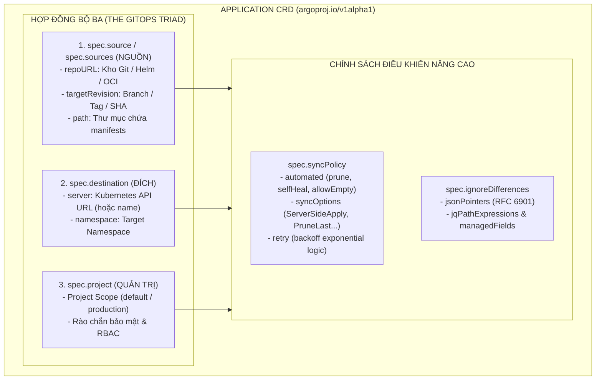
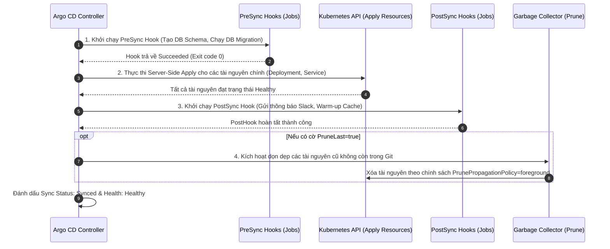
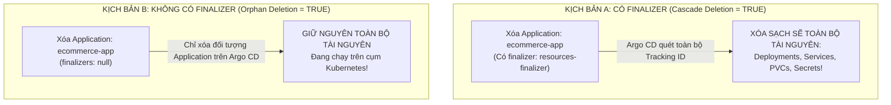
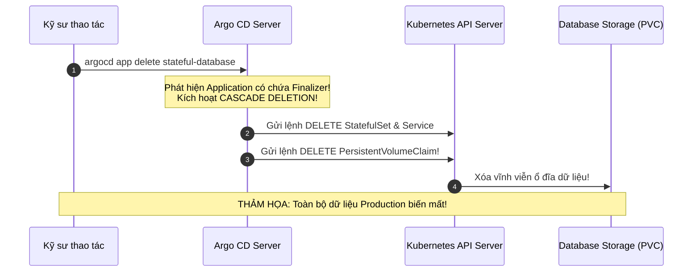

# Giải Mã Application CRD: Hợp Đồng Nguồn Đích, Sync Options & Tracking IDs

Trong hệ sinh thái Argo CD, đối tượng Custom Resource Definition (**CRD**) quan trọng và xuất hiện nhiều nhất chính là **`Application`** (`argoproj.io/v1alpha1`). Đây là bản giao kèo khai báo (Declarative Contract) gắn kết chặt chẽ giữa một kho lưu trữ mã nguồn Git và một cụm Kubernetes mục tiêu.

Nếu ví Argo CD như một người nhạc trưởng, thì `Application CRD` chính là bản tổng phổ quy định chính xác: *Ai chơi nhạc? (Source Repo)*, *Chơi ở sân khấu nào? (Destination Cluster & Namespace)*, *Chơi theo luật nào? (Sync Policy & Options)*, *Giới hạn quyền hạn ra sao? (AppProject)*, *Khung giờ nào được phép diễn? (Sync Windows)*, và *Cách thức giải quyết xung đột dữ liệu như thế nào?*.

Bài viết này sẽ "mổ xẻ" từng trường dữ liệu trong Application CRD, phân tích chi tiết các `syncOptions` tối quan trọng, khai phá tính năng Multiple Sources, phân tích vòng đời Sync, làm rõ ma trận trạng thái Health và cảnh báo nguy cơ mất dữ liệu diện rộng do hiểu sai cơ chế **Cascade Deletion Finalizers**.

---

## 1. Mô Hình Bộ Ba Ràng Buộc (The GitOps Triad Contract)

Cấu trúc cốt lõi của một `Application CRD` luôn xoay quanh 3 chân kiềng vững chắc:



---

## 2. Phân Tích Cấu Hình Từng Dòng Application CRD (Line-by-Line Breakdown)

Dưới đây là một tệp manifest `Application` chuẩn mực cấp Doanh nghiệp với đầy đủ các cấu hình nâng cao:

```yaml
# application-production-ecommerce.yaml
apiVersion: argoproj.io/v1alpha1
kind: Application
metadata:
  name: ecommerce-payment-api
  namespace: argocd
  # Finalizer quản lý vòng đời xóa tài nguyên con (Cascade Deletion)
  finalizers:
    - resources-finalizer.argocd.argoproj.io
  labels:
    tier: backend
    criticality: high
    env: production
spec:
  # 1. Gán vào AppProject để chịu kiểm soát an ninh
  project: ecommerce-production-project

  # 2. Khai báo Nguồn Chân Lý (Source of Truth)
  source:
    repoURL: "https://github.com/company-org/ecommerce-gitops.git"
    targetRevision: "v2.5.0" # Có thể là Branch (main), Tag (v2.5.0) hoặc Commit SHA
    path: "services/payment-api/overlays/production"
    
    # Tùy chọn cấu hình riêng cho Kustomize / Helm / Raw Directory
    kustomize:
      images:
        - "company-registry.io/payment-api:v2.5.0"

  # 3. Khai báo Đích Đến Triển Khai (Destination)
  destination:
    # URL của cụm Kubernetes đích (Local hoặc Remote Cluster)
    server: "https://10.0.100.50:6443"
    namespace: "payment-prod"

  # 4. Chính Sách Đồng Bộ Tự Động (Sync Policy)
  syncPolicy:
    automated:
      prune: true     # Tự động xóa tài nguyên trên K8s nếu file YAML bị xóa trên Git
      selfHeal: true  # Tự động ghi đè nếu ai đó sửa lén trên cụm bằng kubectl
      allowEmpty: false # Chặn việc vô tình xóa trắng cụm nếu thư mục Git bị rỗng
    
    # Chiến lược thử lại khi việc đồng bộ thất bại
    retry:
      limit: 5
      backoff:
        duration: "5s"
        factor: 2
        maxDuration: "3m"

    # Danh mục Sync Options tối quan trọng
    syncOptions:
      - CreateNamespace=true        # Tự động tạo namespace nếu chưa tồn tại
      - ServerSideApply=true        # Bật Server-Side Apply để hỗ trợ manifests lớn
      - ApplyOutOfSyncOnly=true     # Tối ưu hiệu năng: Chỉ apply tài nguyên bị lệch
      - PrunePropagationPolicy=foreground # Thứ tự xóa tài nguyên con trước khi xóa cha
      - PruneLast=true              # Xóa tài nguyên cũ sau khi tài nguyên mới đã Healthy
      - RespectIgnoreDifferences=true # Tôn trọng IgnoreDifferences trong cả quá trình Sync

  # 5. Loại trừ các trường bị Mutation Webhook hoặc HPA tự động chỉnh sửa
  ignoreDifferences:
    - group: apps
      kind: Deployment
      jsonPointers:
        - /spec/replicas

  # 6. Thông tin bổ trợ hiển thị trên Argo CD UI Dashboard
  info:
    - name: "Runbook"
      value: "https://wiki.company.internal/ops/payment-runbook"
    - name: "On-Call Engineer"
      value: "@sre-team-duty"
```

---

## 3. Cấu Hình Lọc Tệp Nâng Cao Cho Thư Mục Manifest (Directory Filter)

Khi làm việc với các thư mục chứa nhiều tệp YAML hỗn hợp (bao gồm tài liệu Markdown, kịch bản test hoặc tệp nháp), bạn có thể sử dụng cấu hình `directory`:

```yaml
spec:
  source:
    repoURL: "https://github.com/company-org/raw-manifests.git"
    targetRevision: main
    path: "environments/production"
    directory:
      recurse: true # Quét đệ quy toàn bộ thư mục con bên trong
      include: "{*.yaml,*.yml}" # Chỉ đọc các tệp có đuôi .yaml hoặc .yml
      exclude: "{*test*,*draft*,README.md}" # Bỏ qua toàn bộ các tệp thử nghiệm
```

### 3.1. Lợi Ích Của Directory Filter:
- Ngăn chặn lỗi biên dịch manifest khi trong thư mục vô tình chứa các tệp không phải định dạng Kubernetes.
- Hỗ trợ tổ chức cây thư mục phân cấp sâu mà không cần phải viết file `kustomization.yaml` phức tạp.

---

## 4. Tính Năng Multiple Sources (Nhiều Nguồn Đồng Thời)

Kể từ phiên bản Argo CD v2.6+, trường `spec.sources` cho phép một Application kết hợp nhiều nguồn tài nguyên khác nhau, ví dụ: lấy Helm Chart công khai từ Helm Repository của bên thứ ba và gộp với file `values.yaml` nội bộ lưu trong kho Git riêng:

```yaml
# application-multiple-sources.yaml
apiVersion: argoproj.io/v1alpha1
kind: Application
metadata:
  name: vault-enterprise
  namespace: argocd
spec:
  project: default
  sources:
    # Nguồn 1: Helm Chart chính thức từ HashiCorp
    - repoURL: 'https://helm.releases.hashicorp.com'
      chart: vault
      targetRevision: 0.27.0
      helm:
        valueFiles:
          - $values/infra/vault/production-values.yaml
    # Nguồn 2: Git Repository nội bộ chứa file custom values
    - repoURL: 'https://github.com/company-org/k8s-config.git'
      targetRevision: main
      ref: values
  destination:
    server: 'https://kubernetes.default.svc'
    namespace: vault-system
```

### 4.1. Cơ Chế Khai Báo Biến Tham Chiếu `$values`
Bằng cách đặt thuộc tính `ref: values` ở Nguồn 2, Argo CD cho phép Nguồn 1 tham chiếu trực tiếp đến các tệp cấu hình nằm trong kho Git ở Nguồn 2 qua cú pháp `$values/đường_dẫn_tệp`. Điều này giúp tuân thủ nguyên tắc DRY và không cần phải tự sao chép (Vendor) các Helm Chart đồ sộ vào Git nội bộ.

---

## 5. Quản Lý Khung Giờ Cấm Triển Khai (Sync Windows)

Để ngăn chặn rủi ro tự động deploy vào lúc nửa đêm, ngày nghỉ lễ hoặc giờ cao điểm mua sắm, Argo CD cho phép thiết lập **Sync Windows**:

```yaml
# Cấu hình trong AppProject quản lý Application
spec:
  syncWindows:
    # Khóa toàn bộ Auto-Sync vào chiều thứ 6 và cuối tuần (Friday Freeze)
    - kind: deny
      schedule: "0 17 * * 5" # 17:00 chiều Thứ 6 hàng tuần
      duration: "63h"        # Khóa trong 63 tiếng liên tục cho tới sáng Thứ 2
      applications:
        - "ecommerce-*"
      manualSync: false      # Cấm cả việc kỹ sư bấm nút Sync thủ công!
```

---

## 6. Vòng Đời Thực Thi Sync Và Cơ Chế PrunePropagationPolicy

Khi một lệnh Sync được kích hoạt, Application Controller thực thi một chuỗi các bước tuần tự được kiểm soát chặt chẽ:



---

## 7. Ma Trận Đánh Giá Trạng Thái Sức Khỏe (Health Status Matrix)

Argo CD tự động đánh giá sức khỏe của từng đối tượng tài nguyên và tổng hợp thành sức khỏe chung của toàn bộ Application:

| Trạng thái Health | Biểu tượng UI | Ý nghĩa kỹ thuật | Nguyên nhân thường gặp |
|---|---|---|---|
| **`Healthy`** | Trái tim xanh lá | Toàn bộ Pods đã sẵn sàng (`Running`), Endpoints đã có IP, CRD đạt mục tiêu. | Ứng dụng hoạt động hoàn hảo. |
| **`Progressing`** | Bánh răng vàng xoay | Đang trong quá trình RollingUpdate, Pods đang khởi tạo hoặc Hook Jobs đang chạy. | Quá trình deploy đang diễn ra bình thường. |
| **`Degraded`** | Trái tim vỡ đỏ | Có ít nhất 1 Pod bị `CrashLoopBackOff`, OOMKilled hoặc Hook Job bị Failed. | Lỗi mã nguồn, thiếu biến môi trường, tràn bộ nhớ RAM. |
| **`Suspended`** | Tạm dừng cam | Tài nguyên đang ở trạng thái bị treo chủ động (ví dụ: Argo Rollouts bị Pause ở bước Canary). | Đang chờ lệnh Resume thủ công từ kỹ sư. |
| **`Missing`** | Chấm hỏi xám | Tài nguyên có định nghĩa trên Git nhưng chưa được khởi tạo trên cụm Kubernetes. | Chưa bấm Sync hoặc cấu hình bộ lọc sai. |
| **`Unknown`** | Dấu chấm hỏi | Argo CD không có bộ phân tích sức khỏe (Health Assessment) cho Custom Resource này. | Thiếu Custom Lua Script cho CRD của bên thứ ba. |

---

## 8. Giải Mã Chi Tiết Toàn Bộ Danh Mục Sync Options

`spec.syncPolicy.syncOptions` là tập hợp các cờ tinh chỉnh sâu hành vi của Kubernetes API Client khi Argo CD thực hiện thao tác đồng bộ:

| Sync Option | Ý nghĩa kỹ thuật & Tác động thực tế | Khuyến nghị sử dụng |
|---|---|---|
| **`CreateNamespace=true`** | Tự động tạo namespace đích nếu nó chưa tồn tại trên cụm mục tiêu. | **Bắt buộc bật** cho các ứng dụng mới để tránh lỗi `namespace not found`. |
| **`ServerSideApply=true`** | Sử dụng tính năng Kubernetes Server-Side Apply thay vì Client-side `kubectl apply`. Giải quyết triệt để lỗi tràn annotation `kubectl.kubernetes.io/last-applied-configuration` khi làm việc với các CRD lớn. | **Khuyên dùng 100%** trên Kubernetes 1.25+. |
| **`ApplyOutOfSyncOnly=true`** | Mặc định Argo CD sẽ apply lại toàn bộ 100% tài nguyên trong thư mục Git. Tùy chọn này chỉ thị Controller **chỉ apply đúng những tài nguyên đang bị lệch (OutOfSync)**, giảm tải 90% số lượng request lên etcd. | **Bắt buộc bật** cho các cụm có hàng ngàn tài nguyên. |
| **`PruneLast=true`** | Trong quá trình cập nhật, các tài nguyên cũ cần bị xóa sẽ chỉ bị xóa **sau cùng**, sau khi toàn bộ tài nguyên mới đã được tạo và đạt trạng thái `Healthy`. | **Bắt buộc bật** để đảm bảo Zero-Downtime khi đổi tên Service/Deployment. |
| **`RespectIgnoreDifferences=true`** | Mặc định Argo CD chỉ bỏ qua Diff khi hiển thị UI; khi bấm Sync nó vẫn ghi đè. Cờ này bắt buộc Sync Engine phải bỏ qua các trường đã khai báo trong `ignoreDifferences` ngay cả trong lúc Apply. | **Bắt buộc bật** khi tích hợp với HPA. |
| **`PrunePropagationPolicy=foreground`** | Xác định chiến lược xóa Kubernetes: `foreground` (xóa Pods con trước khi xóa Deployment cha), `background` (xóa cha ngay lập tức và dọn con ngầm), `orphan` (xóa cha nhưng giữ lại con). | **Foreground** là an toàn nhất. |
| **`Replace=true`** | Sử dụng `kubectl replace` hoặc `kubectl create` thay vì `kubectl apply`. Dùng khi cập nhật các tài nguyên không thể merge (ví dụ: một số trường bất biến của Job/Pod). | Chỉ dùng khi thật sự cần thiết. |
| **`Validate=false`** | Bỏ qua việc kiểm tra Schema Validation của Kubernetes API Server khi apply manifest. | **Hạn chế dùng** (chỉ dùng tạm thời khi CRD Schema bị lỗi cú pháp). |

---

## 9. Cơ Chế Cascade Deletion Với Finalizers

Một trong những tính năng mạnh mẽ nhất nhưng cũng nguy hiểm nhất của Application CRD là trường `metadata.finalizers`.



### 9.1. `resources-finalizer.argocd.argoproj.io` Hoạt Động Ra Sao?
- **Khi có Finalizer:** Khi người dùng chạy lệnh `kubectl delete app <app-name>` hoặc bấm nút "Delete" trên UI, Argo CD sẽ chặn tiến trình xóa Application lại, duyệt qua toàn bộ cây tài nguyên có gắn `tracking-id` trên cụm Kubernetes và **xóa sạch toàn bộ tài nguyên con trước**, sau đó mới xóa Application CRD.
- **Khi không có Finalizer (Orphan):** Argo CD chỉ xóa bản ghi Application trong etcd; toàn bộ Pods, Services, PVC trên cụm vẫn tiếp tục chạy độc lập (trở thành tài nguyên vô thừa nhận - Orphan Resources).

> [!CAUTION]
> **CẨN TRỌNG VỚI RESOURCES FINALIZER:**
> Gắn `resources-finalizer.argocd.argoproj.io` vào Application đồng nghĩa với việc khi bạn xóa đối tượng Application, toàn bộ Pods, Services và Persistent Volumes trên Kubernetes sẽ bị xóa sạch theo. Luôn chỉ định `--cascade=false` nếu chỉ muốn xóa bản ghi trên Argo CD.

> [!TIP]
> **KHUYẾN NGHỊ SERVER-SIDE APPLY:**
> Luôn kích hoạt `ServerSideApply=true` trong `syncOptions` để tránh lỗi tràn annotation `last-applied-configuration` khi làm việc với các CRD lớn.

---

## 10. Cạm Bẫy Thực Chiến: "Xóa Nhầm Application Làm Bay Màu Toàn Bộ Database Production Do Gắn Dính Finalizer"

### Hiện Tượng Thảm Họa
Một kỹ sư DevOps muốn di chuyển ứng dụng `stateful-database` sang một cụm Argo CD mới. Kỹ sư chạy lệnh xóa Application trên cụm cũ:
`argocd app delete stateful-database`
Chỉ sau 5 giây, toàn bộ StatefulSet, PersistentVolumeClaims (PVC) và dữ liệu cơ sở dữ liệu trên Production bị Kubernetes xóa sạch sẽ, gây ra sự cố gián đoạn dịch vụ nghiêm trọng!



### 10.1. Nguyên Nhân Gốc Rễ
Kỹ sư không nhận ra rằng manifest Application ban đầu có khai báo `finalizers: [resources-finalizer.argocd.argoproj.io]`. Khi xóa bằng CLI hoặc UI mà không chỉ định rõ tùy chọn **Cascade = False**, Argo CD mặc định sẽ xóa toàn bộ tài nguyên thực tế bên dưới.

### 10.2. Quy Trình Phòng Ngừa & Khắc Phục Khẩn Cấp
Nếu muốn xóa Application trên Argo CD mà **giữ nguyên 100% tài nguyên đang chạy trên Kubernetes (Orphan)**:

```bash
# Cách 1: Xóa Application bằng CLI với cờ --cascade=false
argocd app delete stateful-database --cascade=false

# Cách 2: Gỡ bỏ Finalizer trực tiếp bằng kubectl patch trước khi xóa
kubectl patch app stateful-database -n argocd -p '{"metadata":{"finalizers":null}}' --type=merge
kubectl delete app stateful-database -n argocd
```

---

## 11. Hướng Dẫn Thực Hành CLI: Quản Trị Vòng Đời Application CRD

```bash
# 1. Tạo một Application mới trực tiếp từ file YAML khai báo
kubectl apply -f application-production-ecommerce.yaml

# 2. Kiểm tra chi tiết cấu hình Source, Destination và Sync Options
argocd app get ecommerce-payment-api

# 3. Kích hoạt đồng bộ thủ công với tùy chọn Server-Side Apply
argocd app sync ecommerce-payment-api --server-side-apply=true

# 4. Gỡ kẹt một Application bị treo ở trạng thái 'Terminating' do Finalizer
kubectl get app -n argocd ecommerce-payment-api -o yaml | grep -A 5 finalizers
kubectl patch app ecommerce-payment-api -n argocd --type json --patch='[ { "op": "remove", "path": "/metadata/finalizers" } ]'

# 5. Xem trạng thái sức khỏe chi tiết của từng tài nguyên con dưới dạng JSON
argocd app get ecommerce-payment-api -o json | jq '.status.resources[] | {kind: .kind, name: .name, health: .health.status}'
```

---

## 12. Bộ Câu Hỏi Tự Kiểm Tra Chuyên Sâu (Self-Check Q&A)

### Câu 1: Sự khác biệt cơ bản giữa `ServerSideApply=true` và `kubectl apply` truyền thống trong Argo CD là gì?
- **Đáp án:** `kubectl apply` truyền thống (Client-side) tính toán patch ở phía client và ghi toàn bộ cấu hình vào annotation `kubectl.kubernetes.io/last-applied-configuration` (bị giới hạn kích thước 256KB). `ServerSideApply=true` gửi trực tiếp manifest lên Kubernetes API Server để hệ thống tự quản lý quyền sở hữu từng trường dữ liệu qua `fieldManagers`, loại bỏ giới hạn kích thước và xử lý xung đột thông minh hơn.

### Câu 2: Tùy chọn `ApplyOutOfSyncOnly=true` mang lại lợi ích gì cho hệ thống quy mô lớn?
- **Đáp án:** Giúp giảm thiểu tối đa số lượng API calls gửi tới Kubernetes API Server và etcd. Thay vì gửi lệnh apply cho 500 tài nguyên trong thư mục Git, Argo CD chỉ gửi request cập nhật cho đúng 2 tài nguyên bị thay đổi, giúp tăng tốc độ đồng bộ lên gấp 10 lần và tránh nghẽn mạng cụm.

### Câu 3: Điều gì sẽ xảy ra nếu cấu hình `spec.destination.namespace` trỏ tới một namespace chưa tồn tại và `CreateNamespace=true` bị tắt?
- **Đáp án:** Quá trình đồng bộ sẽ thất bại ngay lập tức với lỗi `namespaces "..." not found`. Ứng dụng sẽ chuyển sang trạng thái Sync Status: `Failed` và Health Status: `Degraded`.

### Câu 4: Làm thế nào để Application tự động thử lại (Retry) khi gặp lỗi mạng tạm thời trong quá trình deploy?
- **Đáp án:** Cấu hình khối `spec.syncPolicy.retry` với các tham số `limit` (số lần thử lại), `backoff.duration` (thời gian chờ ban đầu) và `backoff.factor` (hệ số nhân lũy tiến).

### Câu 5: Nếu xóa một Application trên Argo CD mà không có `finalizers`, các Pods bên dưới có bị tắt không?
- **Đáp án:** **Không!** Toàn bộ Pods, Services và tài nguyên trên cụm Kubernetes vẫn tiếp tục hoạt động bình thường ở chế độ Orphan. Chỉ có bản ghi quản trị của Application trên giao diện và database của Argo CD bị xóa.

### Câu 6: Tính năng `spec.sources` (Multiple Sources) giải quyết bài toán kiến trúc nào trong doanh nghiệp?
- **Đáp án:** Giải quyết bài toán tách biệt giữa Helm Chart của bên thứ ba (hoặc Chart dùng chung của Platform Team) và tệp cấu hình `values.yaml` nhạy cảm của từng môi trường nằm trong kho Git riêng, loại bỏ nhu cầu phải clone toàn bộ Chart vào kho nội bộ.

### Câu 7: Tác dụng của tùy chọn `allowEmpty: false` trong `syncPolicy.automated` là gì?
- **Đáp án:** Ngăn chặn thảm họa xóa sạch tài nguyên trên cụm. Nếu vì một sự cố nào đó (như lỗi merge Git hoặc xóa nhầm thư mục) khiến kho Git không còn chứa file manifest nào, Argo CD sẽ từ chối Prune và không xóa tài nguyên trên Kubernetes.

### Câu 8: Tại sao tùy chọn `PruneLast=true` lại quan trọng đối với việc cập nhật Zero-Downtime?
- **Đáp án:** Mặc định khi một tài nguyên bị xóa hoặc thay thế, Argo CD có thể xóa tài nguyên cũ trước khi tài nguyên mới sẵn sàng. `PruneLast=true` đảm bảo tài nguyên cũ chỉ bị xóa sau khi toàn bộ tài nguyên mới đã được khởi tạo và vượt qua bài kiểm tra Readiness Probe.

### Câu 9: Làm thế nào để giải cứu một Application bị treo vĩnh viễn ở trạng thái `Terminating` khi xóa?
- **Đáp án:** Lỗi xảy ra do Finalizer đang chờ xóa tài nguyên con nhưng tài nguyên con bị kẹt (ví dụ PVC không thể unmount). Cách xử lý là chạy lệnh `kubectl patch app <app-name> -n argocd -p '{"metadata":{"finalizers":null}}' --type=merge` để xóa bỏ Finalizer và giải phóng Application.

### Câu 10: Trường `spec.destination.name` có thể thay thế cho `spec.destination.server` không?
- **Đáp án:** **Có!** Kể từ Argo CD v1.4+, thay vì gõ URL API Server dài dòng và dễ đổi (như `https://10.0.100.50:6443`), bạn có thể sử dụng tên logic của cụm đã đăng ký trong Argo CD (ví dụ `name: production-us-east-1`).

---

## Tổng Kết

`Application CRD` là trái tim của kiến trúc GitOps trên Argo CD — nơi mọi quy tắc về nguồn mã, đích triển khai, phương thức áp dụng và an toàn vòng đời được định nghĩa tường minh.

Ở bài tiếp theo, chúng ta sẽ đi sâu vào **Đồng Bộ Tự Động: Sync Policy, Prune, Self-Heal & Vạch Trần Toàn Bộ Các Biến Thể Của Cạm Bẫy "Synced Nhưng Sai"**!
