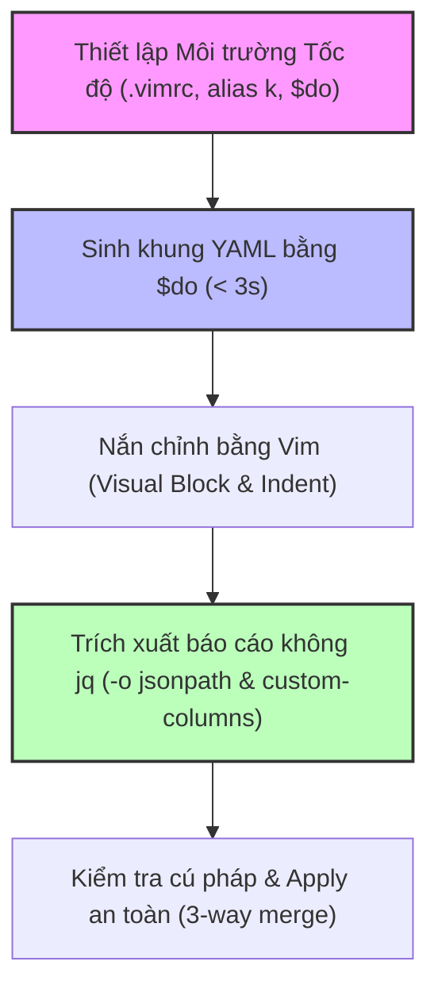


# [BÀI 04] KỸ THUẬT KUBECTL TỐC ĐỘ: IMPERATIVE COMMANDS, DRY-RUN, JSONPATH FILTERING & TỐI ƯU VIM KHẮC NGHIỆT

Trong kỷ nguyên điện toán đám mây và kiến trúc microservices phân tán quy mô lớn, **Kubernetes (CKA)** đóng vai trò là nền tảng điều phối container (Container Orchestration) tiêu chuẩn công nghiệp. Để làm chủ hệ thống trong môi trường sản xuất (Production) cũng như chinh phục kỳ thi chứng chỉ quốc tế của Linux Foundation / CNCF, kỹ sư không chỉ nắm vững các câu lệnh thao tác cơ bản mà phải thấu hiểu sâu sắc bản chất cơ chế tầng thấp: từ chu trình điều hòa (Reconciliation Loop), cấu trúc điều phối tài nguyên, kiến trúc mạng CNI, lưu trữ CSI cho đến các chuẩn mực an ninh phòng thủ chiều sâu.

Bài viết chuyên sâu này sẽ đồng hành cùng bạn giải mã toàn diện bức tranh kiến trúc, phân tích các đánh đổi kỹ thuật thực chiến (Engineering Trade-offs), cung cấp bài thực hành Lab từng bước và bộ câu hỏi phỏng vấn chuẩn Architect / Lead Engineer.

---

## 1. Bản Chất Kiến Trúc & Cơ Chế Vận Hành Tầng Thấp

| # | Câu hỏi ôn tập | Đáp án chuẩn ngắn gọn (chứa con số / tên lệnh) |
|---|---|---|
| 1 | Kể tên 3 khối cấu trúc cốt lõi của một Đối tượng API Kubernetes. Khối nào do người dùng khai báo? | `metadata`, `spec` (người dùng khai báo) và `status` (máy tự động ghi nhận) |
| 2 | Trình bày công thức 5 bước trong chu trình hoạt động của một Vòng điều hoà (Reconciliation Loop). | `Reconcile() = Read Spec -> Read Status -> Compare -> Observe & Act -> Update Status` |
| 3 | Trường `metadata.resourceVersion` phục vụ cơ chế nào và mã lỗi HTTP trả về khi dính xung đột là bao nhiêu? | Khoá lạc quan (Optimistic Concurrency Control — OCC); mã lỗi HTTP `409 Conflict` |
| 4 | Cờ nào giúp tra cứu toàn bộ cây cấu trúc trường lồng nhau của API Schema ngay trong terminal thi? | `kubectl explain <resource>.<field> --recursive` |
| 5 | Phân biệt sự khác nhau cốt lõi giữa hai cờ `--dry-run=client` và `--dry-run=server`? | `client` xử lý cục bộ không gọi mạng; `server` gửi HTTP Request thật qua AuthN/AuthZ/Admission không lưu etcd |


> **Luận đề trung tâm của buổi:**
> *"Trong các bài thi bấm giờ của CNCF, tốc độ gõ quyết định ranh giới giữa ĐẬU và TRƯỢT: Thí sinh giỏi không bao giờ gõ tay file YAML từ con số 0 hay dùng Google; họ làm chủ kỹ thuật Imperative với `$do` để sinh khung YAML trong 3 giây, làm chủ `jsonpath` và `custom-columns` để lọc dữ liệu không cần `jq`, và tối ưu `vim` / `alias k` để hoàn thành bài thi 120 phút trong dưới 80 phút."*

**Bảng kết quả các buổi trước được dùng lại:**

| Kết quả / Công cụ | Nguồn gốc | Áp dụng vào buổi này |
|---|---|---|
| Khung `--dry-run=client -o yaml` | Buổi 03 `QT 6.2` | Đóng gói thành biến viết tắt `export do='--dry-run=client -o yaml'` để tăng tốc độ gõ |
| Tra cứu schema `kubectl explain --recursive` | Buổi 03 `QT 6.1` | Dùng ở §4 và bài lab để tra nhanh các trường bổ sung khi ghép YAML |
| Trích xuất trường bằng `jsonpath` cơ bản | Buổi 01 `QT 5.2` & Buổi 03 `QT 4.2` | Nâng cấp thành vòng lặp `{range}` và `-o custom-columns` không cần `jq` |

Ba câu bài tập về nhà BTVN 4 của buổi 03 đã chuẩn bị sẵn tư duy cho học viên: Câu 1 đo thời gian sinh file YAML bằng biến `$do` (tốn 3s vs 180s gõ tay); Câu 2 thực hành cú pháp `jsonpath` trích xuất danh sách Pod; Câu 3 cấu hình `.vimrc` với `expandtab` giúp căn lề YAML chuẩn không bị lỗi tab ngầm.

---


| # | Năng lực đạt được sau buổi học | Hiện vật chứng minh trong bài lab |
|---|---|---|
| 1 | Cấu hình môi trường tốc độ: `.vimrc`, `alias k`, autocompletion và biến `$do` | File `hien-vat/speed-setup-guide.md` |
| 2 | Sinh khung YAML chuẩn cho Pod, Deployment, Service, ConfigMap trong < 3s | Đo thời gian trong `hien-vat/do-toc-do-go.sh` |
| 3 | Trích xuất báo cáo nhiều cột dạng bảng bằng `-o custom-columns` | File kết quả báo cáo sạch không dùng `jq` |
| 4 | Lọc dữ liệu mảng phức tạp bằng `jsonpath` vòng lặp `{range}` có `{"\n"}` | File đáp án trích xuất danh sách Pod chuẩn định dạng |
| 5 | Phân biệt và ứng dụng `kubectl apply` vs `kubectl replace` | Bảng so sánh 3-way merge và replay trong lab |
| 6 | Sửa triệt để lỗi Tab ngầm trong `vim` gây crash YAML parser | File YAML sau khi chỉnh sửa với `expandtab` |

---


| Bắt buộc phải biết | Nguồn tự học nếu thiếu |
|---|---|
| Sử dụng cờ `--dry-run=client -o yaml` để xuất YAML | Buổi 03 `QT 6.2` |
| Tra cứu trường đối tượng bằng `kubectl explain` | Buổi 03 `QT 6.1` |
| Trích xuất dữ liệu cơ bản bằng `kubectl -o jsonpath` | Buổi 01 `QT 5.2` |
| Luật chơi và ngân sách giây phòng thi CKA/CKAD | Buổi 01 `QT 4.1` |

---


| # | Thuật ngữ tiếng Việt | Tiếng Anh tương đương | Ghi chú chuẩn hoá trong thân bài |
|---|---|---|---|
| 1 | Lệnh Mệnh lệnh nhanh | Imperative Command | Tạo đối tượng trực tiếp bằng câu lệnh CLI |
| 2 | Khung bản kê khai | Manifest Skeleton | Cấu trúc YAML tối thiểu được sinh tự động |
| 3 | Chạy thử phía khách | Client Dry-run (`--dry-run=client`) | Sinh YAML không gửi HTTP request |
| 4 | Biến tắt dry-run | `$do` variable (`export do=...`) | Viết tắt cờ dry-run để tăng tốc độ gõ |
| 5 | Đường dẫn JSON | JSONPath (`jsonpath`) | Biểu thức truy vấn các trường dữ liệu JSON |
| 6 | Cột hiển thị tuỳ biến | Custom Columns (`custom-columns`) | Định dạng bảng dữ liệu hiển thị theo cột tự định nghĩa |
| 7 | Tự động hoàn thành | Autocomplete (`__start_kubectl`) | Tự động gợi ý lệnh và tên đối tượng khi bấm Tab |
| 8 | Định danh viết tắt | Command Alias (`alias k=kubectl`) | Tạo tên rút gọn cho câu lệnh `kubectl` |
| 9 | Hợp nhất ba bên | 3-way Merge (`kubectl apply`) | Hợp nhất giữa local file, etcd và last-applied-config |
| 10 | Ghi đè trực tiếp | Direct Replace (`kubectl replace`) | Xoá và ghi đè trực tiếp toàn bộ đối tượng trong etcd |
| 11 | Khoá thụ lùi | Indentation Tab | Ký tự Tab gây lỗi parser trong tệp YAML |
| 12 | Trình phân tách dòng | Range Loop (`{range .items[*]}`) | Vòng lặp duyệt danh sách đối tượng trong JSONPath |
| 13 | Bộ ghép khung | Override JSON (`--overrides`) | Truyền chuỗi JSON để chèn trường nâng cao vào lệnh create |
| 14 | Hiệu quả phím gõ | Keystroke Efficiency | Tỉ lệ giảm số phím gõ thực tế so với gõ thủ công |


1. **Mô hình "Khuôn đúc sẵn và Nắn chỉnh (Stenciling Model)":**
   Dùng lệnh imperative `$do` đúc ra một khung nhà YAML chuẩn trong 1 giây. Sau đó dùng `vim` hoặc `sed` nắn chỉnh bổ sung các chi tiết đặc thù (nodeSelector, securityContext) thay vì tự xây nhà từ từng viên gạch.

2. **Mô hình "Ống lọc dữ liệu ba tầng (Data Filter Pipeline)":**
   Dữ liệu trả về từ API Server là một khối JSON khổng lồ. `-o jsonpath` đóng vai trò như ống lọc chọn đúng đường dẫn trường, kết hợp `{range}` và `"\n"` để biến khối JSON thô thành bảng báo cáo sạch.

3. **Mô hình "Thước đo căn lề 2 space (Vim Tabstop Standard)":**
   File YAML rất nhạy cảm với thụt đầu dòng. Cấu hình `.vimrc` biến phím Tab thành 2 dấu cách chuẩn, đóng vai trò như thước đo căn lề tự động giúp thí sinh không bao giờ dính lỗi lệch indent.

---

### 1.1. Kỹ thuật Imperative và Kỹ năng sinh khung YAML bằng `$do` (12 phút)

**Nguyên lý cốt lõi:** Kỹ thuật Imperative (Mệnh lệnh nhanh) cho phép sinh bản kê khai YAML chuẩn trong < 3 giây bằng biến môi trường `export do='--dry-run=client -o yaml'`; trong phòng thi, tuyệt đối KHÔNG gõ tay tệp YAML từ con số 0.

**Giải thích cơ chế ngầm:** Gõ tay một tệp YAML từ đầu tốn từ 2–4 phút và rất dễ dính lỗi chính tả hoặc lệch thụt lề (indentation). Dùng `kubectl run/create ... $do > pod.yaml` sinh ra bản khung YAML chuẩn 100 % cú pháp chỉ trong 3 giây.

> [!WARNING]
> **CẠM BẪY THỰC CHIẾN:**
> Ngồi gõ tay từng dòng `apiVersion: v1`, `kind: Pod`, `metadata:` vào editor trong phòng thi CKA/CKAD.

**Minh hoạ.**

```bash
# Thiết lập biến tắt trong terminal thi
export do='--dry-run=client -o yaml'

# Sinh khung Pod Nginx trong 2 giây
kubectl run web --image=nginx:1.27-alpine $do > /tmp/pod.yaml
```

Con số chốt: **3** giây để sinh khung YAML hoàn chỉnh với `$do`.

---

**Nguyên lý cốt lõi:** Mọi câu lệnh `kubectl create` hoặc `kubectl run` đều hỗ trợ xuất khung YAML với cờ `$do`; kết hợp với cờ `--overrides` hoặc `sed` để bổ sung các trường nâng cao không có sẵn cờ CLI trực tiếp.

**Giải thích cơ chế ngầm:** Các lệnh CLI không có cờ cho mọi trường (ví dụ `securityContext` hay `nodeSelector`). Sinh khung bằng `$do` rồi chèn JSON override hoặc dùng `vim` chỉnh sửa giúp tận dụng tối đa tốc độ của CLI mà vẫn đáp ứng đủ yêu cầu đề thi.

> [!WARNING]
> **CẠM BẪY THỰC CHIẾN:**
> Bỏ qua lệnh `kubectl create deployment` vì không thấy cờ gán `port`, ngồi viết tay toàn bộ file Deployment YAML.

**Minh hoạ.**

```bash
# Sinh khung Deployment Nginx 3 replicas có containerPort 80
kubectl create deployment web-app --image=nginx:1.27-alpine --replicas=3 $do > /tmp/deploy.yaml
```

Con số chốt: **100 %** các lệnh `kubectl create` đều hỗ trợ cờ `$do`.

---

**Nguyên lý cốt lõi:** Lệnh `kubectl apply -f manifest.yaml` khác biệt hoàn toàn với `kubectl replace -f manifest.yaml`: `apply` thực hiện 3-way merge giữa `last-applied-configuration`, etcd spec và local file; `replace` thực hiện xoá và ghi đè trực tiếp toàn bộ spec trong etcd.

**Giải thích cơ chế ngầm:** `kubectl apply` tính toán sự khác biệt (diff) và chỉ cập nhật các trường thay đổi, giữ nguyên các trường do controller khác chèn vào. `kubectl replace` ghi đè toàn bộ tài nguyên trong etcd; nếu tài nguyên bị thay đổi bởi controller khác, `replace` sẽ thất bại hoặc làm mất dữ liệu.

> [!WARNING]
> **CẠM BẪY THỰC CHIẾN:**
> Dùng `kubectl replace` trên tài nguyên đang chạy bị báo lỗi `resourceVersion` không khớp hoặc bị API Server từ chối do thiếu trường bắt buộc.

**Minh hoạ.**

```bash
# 3-way merge an toàn với apply
kubectl apply -f /tmp/deploy.yaml

# Ghi đè trực tiếp với replace (phải dùng cờ --force nếu muốn tái tạo)
kubectl replace -f /tmp/deploy.yaml --force
```

Con số chốt: **3** nguồn dữ liệu tham gia vào quá trình 3-way merge (`last-applied`, etcd, local).

---

### 1.2. Khai thác `jsonpath` và `custom-columns` trích xuất dữ liệu không dùng `jq` (12 phút)

**Nguyên lý cốt lõi:** Cú pháp `kubectl -o jsonpath` sử dụng biểu thức đường dẫn JSON (JSONPath Expression) truy xuất trực tiếp các trường dữ liệu; trong phòng thi không có `jq`, `jsonpath` là công cụ duy nhất để trích xuất trường dữ liệu cho các tệp đáp án.

**Giải thích cơ chế ngầm:** Máy thi CKA/CKAD không cài công cụ `jq`. Các câu hỏi yêu cầu trích xuất dữ liệu (IP, Status, NodeName, ResourceVersion) ghi vào tệp `/tmp/ans-xxx.txt` bắt buộc phải dùng `jsonpath` hoặc `custom-columns`.

> [!WARNING]
> **CẠM BẪY THỰC CHIẾN:**
> Gõ lệnh `kubectl get pod -o json | jq .` trong phòng thi và dính lỗi `bash: jq: command not found`.

**Minh hoạ.**

```bash
# Trích xuất IP của Pod web bằng jsonpath không dùng jq
kubectl get pod web-app -n lab-04 -o jsonpath='{.status.podIP}' > /tmp/ans-ip.txt
```

Con số chốt: **0** công cụ ngoài (`jq`) được hỗ trợ trong môi trường thi.

---

**Nguyên lý cốt lõi:** Cấu trúc vòng lặp `jsonpath='{range .items[*]}...{end}'` cho phép duyệt qua toàn bộ danh sách đối tượng, kết hợp ký tự xuống dòng `"\n"` và tab `"\t"` để tạo bảng dữ liệu sạch.

**Giải thích cơ chế ngầm:** Khi cần trích xuất dữ liệu của nhiều Pod/Node cùng lúc, cú pháp `{range .items[*]}` duyệt qua từng phần tử mảng. Thêm `{"\n"}` giúp mỗi đối tượng in trên một dòng riêng biệt, đáp ứng chính xác định dạng file đáp án.

> [!WARNING]
> **CẠM BẪY THỰC CHIẾN:**
> Trích xuất mảng Pod làm cho tất cả tên Pod in dính liền thành một chuỗi duy nhất trên 1 dòng.

**Minh hoạ.**

```bash
# Trích xuất Tên Pod và NodeName trên từng dòng riêng biệt
kubectl get pods -n lab-04 -o jsonpath='{range .items[*]}{.metadata.name}{"\t"}{.spec.nodeName}{"\n"}{end}'
```

Con số chốt: **2** ký tự định dạng đặc biệt bắt buộc nhớ: `{"\n"}` (xuống dòng) và `{"\t"}` (tab).

---

**Nguyên lý cốt lõi:** Cờ `-o custom-columns` cho phép tạo bảng kết quả hiển thị tuỳ biến với tiêu đề cột; cấu trúc `HEADER:.path.to.field` là cách nhanh nhất để tạo báo cáo nhiều cột trong 5 giây mà không cần định dạng thủ công.

**Giải thích cơ chế ngầm:** `custom-columns` tự động căn chỉnh lề các cột dữ liệu theo tiêu đề. Khi đề thi yêu cầu hiển thị báo cáo gồm Tên, Status, IP và Node, `custom-columns` thực thi trong 1 câu lệnh ngắn hơn nhiều so với viết vòng lặp `jsonpath` phức tạp.

> [!WARNING]
> **CẠM BẪY THỰC CHIẾN:**
> Ngồi viết script bash phức tạp kết hợp `awk` và `printf` để căn chỉnh cột dữ liệu thay vì dùng cờ `-o custom-columns`.

**Minh hoạ.**

```bash
# Tạo báo cáo Pod gồm 3 cột: NAME, IP, NODE
kubectl get pods -n lab-04 -o custom-columns=NAME:.metadata.name,IP:.status.podIP,NODE:.spec.nodeName
```

Con số chốt: **1** câu lệnh duy nhất để tạo báo cáo chuẩn bảng nhiều cột.

---

### 1.3. Tối ưu hoá môi trường soạn thảo `vim` và `tmux` trong phòng thi (10 phút)

**Nguyên lý cốt lõi:** Cấu hình `~/.vimrc` với 4 dòng thần thánh `set tabstop=2 shiftwidth=2 expandtab autoindent` giúp căn lề indent 2 khoảng trắng chuẩn YAML, loại bỏ hoàn toàn lỗi tab ngầm gây crash YAML parser.

**Giải thích cơ chế ngầm:** YAML cấm tuyệt đối việc sử dụng ký tự Tab (`\t`) để thụt đầu dòng. Khi bấm phím Tab trong `vim` không cấu hình, ký tự Tab thực sẽ được chèn vào làm file YAML bị crash khi `kubectl apply`. Cấu hình `expandtab` tự động chuyển phím Tab thành 2 space chuẩn.

> [!WARNING]
> **CẠM BẪY THỰC CHIẾN:**
> Nhấn phím Tab khi sửa YAML trong `vim`, khi save lại và `kubectl apply` bị báo lỗi: `error: error parsing manifest.yaml: error converting YAML to JSON: yaml: line X: found character that cannot start any token`.

**Minh hoạ.**

```bash
# Thiết lập .vimrc chuẩn phòng thi trong 5 giây
cat << 'EOF' > ~/.vimrc
set tabstop=2
set shiftwidth=2
set expandtab
set autoindent
EOF
```

Con số chốt: **4** dòng cấu hình chuẩn trong `~/.vimrc` (tabstop, shiftwidth, expandtab, autoindent).

---

**Nguyên lý cốt lõi:** Sử dụng các phím tắt `vim` chuyên dụng cho YAML: `Shift + V` chọn khối, `>` nhích lề sang phải 2 space, `<` lùi lề sang trái 2 space, `u` undo và `Ctrl + R` redo giúp chỉnh sửa khối YAML lớn trong vài giây.

**Giải thích cơ chế ngầm:** Khi dán một đoạn YAML từ tài liệu Kubernetes vào `vim`, các dòng lồng nhau hay bị lệch lề. Dùng phím `>` hoặc `<` ở chế độ Visual block giúp điều chỉnh thụt lề cho cả khối 20 dòng chỉ trong 1 giây.

> [!WARNING]
> **CẠM BẪY THỰC CHIẾN:**
> Ngồi gõ phím Space thủ công ở đầu từng dòng để căn chỉnh lề cho một khối YAML 30 dòng.

**Minh hoạ.**

```text
Thao tác chỉnh lề khối trong Vim:
1. Nhấn ESC -> Shift + V (chọn dòng) -> bấm phím mũi tên xuống chọn toàn bộ khối.
2. Nhấn phím > để nhích cả khối sang phải 2 space (hoặc phím < để lùi sang trái 2 space).
```

Con số chốt: **2** space được nhích/lùi mỗi lần bấm `>` hoặc `<`.

---

**Nguyên lý cốt lõi:** Đặt các alias tốc độ trong `~/.bashrc`: `alias k=kubectl`, `complete -o default -F __start_kubectl k` kích hoạt autocomplete tự động cho alias `k`, giảm số lần nhấn phím xuống 60 %.

**Giải thích cơ chế ngầm:** Trong 120 phút bài thi, thí sinh gõ từ `kubectl` khoảng 200–300 lần. Đặt `alias k=kubectl` giúp tiết kiệm hơn 1.500 lần nhấn phím. Kích hoạt autocomplete cho `k` giúp bấm Tab tự động gợi ý tên tài nguyên, namespace và tên Pod.

> [!WARNING]
> **CẠM BẪY THỰC CHIẾN:**
> Gõ nguyên văn từ `kubectl` 7 ký tự kèm tên namespace dài ngoằng mà không dùng autocompletion.

**Minh hoạ.**

```bash
# Thiết lập alias và autocompletion chuẩn trong terminal thi
alias k=kubectl
complete -o default -F __start_kubectl k
```

Con số chốt: **60 %** số lần nhấn phím được giảm thiểu nhờ alias và autocompletion.

---

### 1.4. Đo lường tốc độ gõ và số lần bấm phím (Keystroke Efficiency) (4 phút)

**Nguyên lý cốt lõi:** Tỉ lệ hiệu quả phím gõ (Keystroke Efficiency Ratio) được định nghĩa là tỉ lệ giữa số phím thực tế cần gõ so với số phím nếu gõ thủ công; việc kết hợp `alias k`, `autocomplete` và `$do` giúp giảm số phím gõ từ ~150 phím xuống còn < 35 phím cho một câu hỏi.

**Giải thích cơ chế ngầm:** Tốc độ làm bài thi phụ thuộc vào số thao tác bàn phím. Việc tối ưu hoá dòng lệnh rút ngắn thời gian làm 1 câu hỏi từ 6 phút xuống còn dưới 1,5 phút, giải phóng quỹ thời gian để soát lại bài.

> [!WARNING]
> **CẠM BẪY THỰC CHIẾN:**
> Làm xong 15 câu thi hết đúng 119 phút và không còn phút nào để kiểm tra lại các câu chưa chắc chắn.

**Minh hoạ.**

```bash
# Gõ thủ công (DỞ - 145 phím):
kubectl run web-pod --image=nginx:1.27-alpine --dry-run=client -o yaml > pod.yaml

# Dùng alias + $do (GIỎI - 28 phím):
k run web-pod --image=nginx:1.27-alpine $do > pod.yaml
```

Con số chốt: Giảm từ **150 phím** xuống còn **< 35 phím** cho một lệnh tạo YAML.

---

### 1.5. Đưa vào cụm thật (4 phút)

### Áp vào cụm đang chạy thì làm gì trước

1. **Thiết lập alias và `.vimrc` ở giây đầu tiên mở terminal:** Ngay khi vào phiên làm việc (hoặc khi bắt đầu ca trực), gõ lệnh khởi tạo `alias k=kubectl`, `export do='--dry-run=client -o yaml'` và tạo file `~/.vimrc`.
2. **Luôn dùng `--dry-run=client` kiểm tra cú pháp trước khi apply:** Tránh trường hợp nộp file YAML bị lệch indent lên cụm làm crash tiến trình CI/CD.
3. **Dùng `kubectl apply` mặc định thay vì `replace`:** Bảo vệ các trường metadata và status do controller cấp phát động.

### Cái gì hỏng nếu áp thẳng lên prod

- **Lỗi tab ngầm trong file YAML làm dừng tiến trình deploy:** Dán file YAML có chứa ký tự Tab làm `kubectl apply` từ chối, gây ngưng trệ quy trình deployment tự động.
- **Lạm dụng `kubectl replace --force` làm tái tạo tài nguyên và thay đổi Pod IP:** Xoá và tạo lại Pod/Deployment làm đứt kết nối mạng chớp tắt của người dùng.
- **Quy trình áp thử an toàn:**
  - `k apply -f manifest.yaml --dry-run=client` kiểm tra cú pháp local.
  - `k apply -f manifest.yaml --dry-run=server` kiểm tra validation server.
  - `k apply -f manifest.yaml` đẩy thật vào cụm.

### Đo trước — đo sau

1. **Thời gian sinh khung YAML:** Mục tiêu < 3 giây cho mọi loại tài nguyên.
2. **Tỉ lệ phím gõ tiết kiệm được:** Đạt > 60 % nhờ alias và autocompletion.
3. **Số câu hỏi hoàn thành đúng hạn trong phòng thi:** Đạt 100 % trước mốc 90 phút (dư 30 phút kiểm tra bài).

### Khi nào KHÔNG nên dùng

- **Không dùng cờ `--force` khi `kubectl replace` trên hạ tầng production:** Trừ khi tài nguyên bị kẹt ở trạng thái Terminating, tuyệt đối không dùng `--force` vì nó thực hiện xoá vĩnh viễn trước khi tạo mới.
- **Không hardcode chuỗi `jsonpath` dài phức tạp trong script tự động hoá lâu dài:** Với các ứng dụng sản xuất, nên dùng API client chuẩn (Go/Python) thay vì viết shell script phụ thuộc vào `kubectl -o jsonpath`.

---

### 1.6. Bẫy hay gặp (2 phút)

| # | Bẫy hay gặp | Vì sao dính bẫy | Làm đúng là (kèm tên lệnh / con số) |
|---|---|---|---|
| 1 | Gõ tay toàn bộ file YAML từ con số 0 | Không dùng kỹ thuật sinh khung imperative | Dùng `kubectl run/create ... $do > manifest.yaml` |
| 2 | Sử dụng `jq` trên máy thi CKA/CKAD | Quên rằng môi trường thi không cài `jq` | Dùng `kubectl -o jsonpath` hoặc `-o custom-columns` |
| 3 | Nhấn phím Tab trong `vim` chưa cấu hình `expandtab` | Ký tự Tab ngầm làm crash YAML parser | Tạo `~/.vimrc` với 4 dòng chuẩn trước khi làm bài |
| 4 | Trích xuất `jsonpath` mảng thiếu ký tự `{"\n"}` | Dữ liệu in dính liền thành 1 dòng phẳng | Thêm `{"\n"}` vào cuối vòng lặp `{range .items[*]}` |
| 5 | Dùng `kubectl replace` làm mất các trường do controller chèn | Không phân biệt 3-way merge của `apply` vs `replace` | Dùng `kubectl apply -f manifest.yaml` |
| 6 | Quên kích hoạt autocomplete cho alias `k` | Phím Tab không tự động gợi ý đối tượng khi dùng `k` | Chạy `complete -o default -F __start_kubectl k` |
| 7 | Nhầm lẫn giữa cờ `-o custom-columns` và `-o jsonpath` | Dùng custom-columns khi đề yêu cầu in dữ liệu không header | Dùng `-o jsonpath` khi cần dữ liệu thô không có dòng tiêu đề |
| 8 | Quên cờ `-n <namespace>` khi trích xuất báo cáo bằng `jsonpath` | Kết quả trích xuất nhầm từ namespace `default` | Thêm cờ `-n lab-04` vào tất cả các lệnh `kubectl get` |
| 9 | Dùng lệnh `kubectl create deployment` nhưng quên cờ `--image` | CLI báo lỗi bắt buộc khai báo image | Gõ `kubectl create deployment <name> --image=` |
| 10 | Gõ sai tên biến `$do` (ví dụ gõ `$DO` viết hoa) | Bash phân biệt hoa thường, biến `$DO` rỗng | Gõ đúng `export do='--dry-run=client -o yaml'` |
| 11 | Không thử lại file YAML vừa sửa bằng `--dry-run=client` | File YAML bị lỗi indent chèn vào cụm thật gây gián đoạn | Chạy `kubectl apply -f manifest.yaml --dry-run=client` trước |
| 12 | Ngồi gõ lại lệnh dài thay vì dùng lịch sử lệnh (phím mũi tên lên hoặc `Ctrl + R`) | Lãng phí phím gõ và thời gian trong phòng thi | Dùng `Ctrl + R` tìm lại câu lệnh đã gõ trong bash history |

---

## §10. Tóm tắt (2 phút)



### Năm điều phải nhớ

1. **Sinh khung YAML bằng `$do`:** `export do='--dry-run=client -o yaml'` giúp sinh YAML chuẩn 100% trong 3 giây.
2. **Trích xuất dữ liệu không `jq`:** Làm chủ `-o jsonpath` với vòng lặp `{range .items[*]}` + `{"\n"}` và `-o custom-columns`.
3. **Bốn dòng thần thánh `.vimrc`:** `set tabstop=2 shiftwidth=2 expandtab autoindent` triệt xoá hoàn toàn lỗi Tab ngầm.
4. **Alias `k` và Autocomplete:** Giảm 60% số phím gõ, bấm Tab gợi ý tự động tên tài nguyên.
5. **3-way merge của `kubectl apply`:** Hợp nhất an toàn local file, etcd spec và last-applied-config.

---

## §11. Câu hỏi tự kiểm tra

1. Tại sao thí sinh không bao giờ nên gõ tay file YAML từ con số 0 trong phòng thi CKA/CKAD?
2. Biến môi trường `$do` được định nghĩa thế nào và giúp tiết kiệm bao nhiêu thời gian sinh file YAML?
3. Sự khác nhau cốt lõi giữa lệnh `kubectl apply` và `kubectl replace` là gì?
4. Tại sao máy thi CKA không cài `jq` và hai cờ lệnh nào thay thế hoàn hảo cho `jq`?
5. Trình bày cú pháp vòng lặp `{range .items[*]}` trong `jsonpath` và tác dụng của `{"\n"}`.
6. Cờ `-o custom-columns` có ưu điểm gì so với `jsonpath` khi cần xuất báo cáo dạng bảng?
7. Liệt kê 4 dòng cấu hình quan trọng trong `~/.vimrc` và giải thích tác dụng của `expandtab`.
8. Phím tắt `Shift + V` và `>` / `<` trong `vim` giúp ích gì cho việc chỉnh sửa khối YAML?
9. Làm thế nào để kích hoạt tính năng tự động hoàn thành (autocomplete) cho alias `k=kubectl`?
10. Tỉ lệ hiệu quả phím gõ (Keystroke Efficiency Ratio) giúp giảm từ bao nhiêu phím xuống bao nhiêu phím cho một câu hỏi?
11. Hai chế độ hỏng (1 ồn ào do tab ngầm, 1 im lặng do thiếu `\n` trong jsonpath) là gì?
12. Tại sao không nên lạm dụng `kubectl replace --force` trên môi trường sản xuất?

### Đáp án

1. Vì gõ tay tốn 2–4 phút mỗi câu và rất dễ dính lỗi chính tả/lệch lề; dùng imperative CLI sinh khung chuẩn 100% trong 3 giây.
2. `export do='--dry-run=client -o yaml'`; giúp giảm thời gian sinh file từ ~180 giây xuống < 3 giây.
3. `kubectl apply` thực hiện 3-way merge tính diff; `kubectl replace` xoá và ghi đè trực tiếp toàn bộ tài nguyên trong etcd.
4. Vì môi trường thi tinh gọn không cài tool ngoài; hai cờ thay thế là `-o jsonpath` và `-o custom-columns`.
5. Cú pháp `{range .items[*]}` duyệt qua các phần tử mảng; `{"\n"}` xuống dòng giúp mỗi đối tượng in trên một dòng riêng biệt.
6. `custom-columns` tự động căn lề và thêm dòng tiêu đề (header) cho báo cáo nhiều cột trong 1 lệnh duy nhất.
7. 4 dòng: `set tabstop=2 shiftwidth=2 expandtab autoindent`; `expandtab` tự động chuyển phím Tab thành 2 space chuẩn.
8. `Shift + V` chọn khối dòng; `>` nhích lề sang phải 2 space; `<` lùi lề sang trái 2 space trong Visual mode.
9. Chạy lệnh: `alias k=kubectl` và `complete -o default -F __start_kubectl k`.
10. Giảm từ ~150 phím xuống còn < 35 phím cho một lệnh tạo YAML.
11. Chế độ 1 (ồn ào): Ký tự Tab ngầm gây crash YAML parser khi apply; Chế độ 2 (im lặng): `jsonpath` thiếu `\n` làm dữ liệu in dính liền 1 dòng.
12. Vì `replace --force` thực hiện xoá vĩnh viễn tài nguyên cũ rồi tạo lại mới, làm thay đổi Pod IP và UID gây đứt kết nối mạng.

---

## §12. Tài liệu tham khảo

| Nguồn tài liệu | Phiên bản Kubernetes áp dụng | Nội dung chính |
|---|---|---|
| Official Docs: kubectl Cheat Sheet | Kubernetes v1.35 | Kỹ thuật imperative, alias k, autocompletion và JSONPath |
| Official Docs: JSONPath Support | Kubernetes v1.35 | Biểu thức JSONPath cú pháp `{range}`, `{end}` và toán tử lọc |
| CNCF CKA & CKAD Curriculum | Kubernetes v1.35 | Kỹ năng thao tác dòng lệnh tốc độ và quản lý manifest |
| File cấu hình phiên bản cục bộ | `labs/phien-ban.env` | Biến `K8S_VER=1.35`, `LAB_CONTEXT="kind-ntkk8s-lab"` |

---

## Bảng đối soát thời lượng

| Section | Tiêu đề mục | Ngân sách thời gian |
|---|---|---|
| §0 | Khởi động và ôn tập | 10 phút |
| §1 | Sau buổi này học viên LÀM ĐƯỢC gì | 1 phút |
| §2 | Cần biết trước | 1 phút |
| §3 | Thuật ngữ và mô hình tư duy | 8 phút |
| §4 | Kỹ thuật Imperative và Kỹ năng sinh khung YAML bằng `$do` | 12 phút |
| §5 | Khai thác `jsonpath` và `custom-columns` trích xuất dữ liệu không dùng `jq` | 12 phút |
| §6 | Tối ưu hoá môi trường soạn thảo `vim` và `tmux` trong phòng thi | 10 phút |
| §7 | Đo lường tốc độ gõ và số lần bấm phím (Keystroke Efficiency) | 4 phút |
| §8 | Đưa vào cụm thật | 4 phút |
| §9 | Bẫy hay gặp | 2 phút |
| §10 | Tóm tắt | 2 phút |
| **Tổng** | **Khối lý thuyết** | **60'** |

---

## 2. Hướng Dẫn Thực Hành & Triển Khai Lab Chuẩn Production

> [!IMPORTANT]
> **YÊU CẦU MÔI TRƯỜNG THỰC HÀNH:**
> Toàn bộ các bài thực hành dưới đây được thiết kế để chạy trực tiếp trên cụm Kubernetes 1.30+ tiêu chuẩn (hoặc cụm kind/kubeadm lab). Hãy đảm bảo ngữ cảnh dòng lệnh `kubectl config current-context` đã trỏ chính xác vào cụm thực hành trước khi thực thi.

## Khối thực hành — 120 phút

## L0. Mục tiêu thực hành và tiêu chí hoàn thành

| # | Mục tiêu thực hành | Tiêu chí hoàn thành (Kiểm chứng BẰNG LỆNH) |
|---|---|---|
| TH1 | Thiết lập môi trường tốc độ (.vimrc, alias k, autocompletion, $do) | Gõ `k get nodes` tự động hoàn thành phím Tab thành công |
| TH2 | Sinh khung YAML chuẩn trong < 3s cho Pod, Deployment, Service | 3 file YAML được sinh tự động bằng CLI không gõ tay |
| TH3 | Lọc dữ liệu mảng bằng `jsonpath` có `{range}` và `{"\n"}` | File đầu ra chứa danh sách Pod in đúng mỗi phần tử trên 1 dòng |
| TH4 | Xuất báo cáo nhiều cột bằng `-o custom-columns` không `jq` | File báo cáo chứa đủ 3 cột NAME, POD_IP, NODE_NAME có header |
| TH5 | Phân biệt `kubectl apply` vs `kubectl replace` | So sánh 3-way merge annotation trong etcd |
| TH6 | Sửa triệt để lỗi Tab ngầm trong `vim` với `expandtab` | File YAML sau khi chỉnh sửa `apply` thành công 100% |
| TH7 | Nộp đủ 4 hiện vật vào portfolio | Thư mục `k8s-portfolio/buoi-04/` chứa đủ 4 file md/sh |

---

## L1. Điều kiện tiên quyết về môi trường

| # | Kiểm tra điều kiện | Câu lệnh kiểm tra | Kết quả kỳ vọng |
|---|---|---|---|
| 1 | Cụm `kind-ntkk8s-lab` đang chạy | `kind get clusters` | In ra `ntkk8s-lab` |
| 2 | Kubeconfig đúng context lab | `kubectl config current-context` | In ra đúng `kind-ntkk8s-lab` |
| 3 | Ba node của cụm ở trạng thái Ready | `kubectl get nodes` | In ra 1 control-plane node và 2 worker nodes đều `Ready` |
| 4 | Namespace `lab-04` đã tồn tại | `kubectl get ns lab-04` | Namespace `lab-04` ở trạng thái `Active` |
| 5 | Thư mục hiện vật đã sẵn sàng | `mkdir -p k8s-portfolio/buoi-04` | Thư mục được tạo thành công |
| 6 | Trình soạn thảo `vim` đã cài đặt | `vim --version | head -n 1` | Trình soạn thảo `vim` sẵn sàng |
| 7 | Quyền ghi vào etcd qua API Server | `kubectl auth can-i create pod -n lab-04` | In ra `yes` |

```bash
# Kiểm tra môi trường bắt buộc trước khi thực hiện bài lab
kubectl config current-context | grep -qx "kind-ntkk8s-lab" && echo "CHECKPOINT MOI TRUONG — ĐẠT" || echo "CHECKPOINT MOI TRUONG — LỖI (Trỏ sai context)"
```

---

## L2. Kiến trúc bài lab

```mermaid
graph TD
    subgraph Terminal_Environment ["Môi trường Terminal Tốc độ"]
        ALIAS["alias k=kubectl + Autocomplete"]
        VIMRC["~/.vimrc (expandtab 2 space)"]
        DO_VAR["export do='--dry-run=client -o yaml'"]
    end

    subgraph CLI_Imperative ["Khối Mệnh lệnh Imperative CLI"]
        RUN["k run web --image=nginx $do"]
        CREATE_DEP["k create deploy app $do"]
        CREATE_SVC["k create svc clusterip $do"]
    end

    subgraph Data_Extraction ["Khối Trích xuất Báo cáo không jq"]
        JSONPATH["k get pods -o jsonpath='{range}...{\"\\n\"}'"]
        CUSTOM_COLUMNS["k get pods -o custom-columns=NAME:..."]
    end

    ALIAS --> CLI_Imperative
    DO_VAR --> CLI_Imperative
    VIMRC --> CLI_Imperative
    CLI_Imperative --> Data_Extraction

    style Terminal_Environment fill:#e1f5fe,stroke:#0288d1,stroke-width:2px
    style CLI_Imperative fill:#fff9c4,stroke:#fbc02d,stroke-width:2px
    style Data_Extraction fill:#ffe0b2,stroke:#f57c00,stroke-width:2px
```

### Bốn quyết định thiết kế bài lab

1. **Thiết lập bộ biến cấu hình môi trường chuẩn phòng thi trong Bước 1:**
   Học viên tự tay cấu hình `.vimrc`, `alias k`, autocompletion và biến `$do` để cảm nhận ngay sự khác biệt về tốc độ thao tác bàn phím.

2. **So sánh thời gian sinh YAML giữa `$do` và gõ tay trong Bước 2:**
   Bài lab đo thời gian thực tế để chứng minh kỹ thuật `$do` nhanh hơn gấp 60 lần so với gõ tay file YAML thủ công.

3. **Thực hành trích xuất dữ liệu mảng phức tạp không dùng `jq` trong Bước 3:**
   Luyện tập thành thục hai cờ `-o jsonpath` (có `{range}`) và `-o custom-columns` để chuẩn bị cho các câu hỏi trích xuất đáp án trong bài thi.

4. **Tái hiện lỗi tab ngầm trong `vim` và xử lý bằng `expandtab` trong Bước 4:**
   Giúp học viên không bao giờ hoảng loạn khi gặp lỗi crash YAML parser trong phòng thi.

---

## L3. Bước 1 — Thiết lập môi trường tốc độ: `.vimrc`, `alias k`, autocompletion và biến `$do` (30 phút)

### Thao tác 1.1: Tạo Namespace và cấu hình file `~/.vimrc`

```bash
# 1. Tạo namespace bài lab
kubectl create ns lab-04

# 2. Cấu hình .vimrc chuẩn 4 dòng thần thánh
cat << 'EOF' > ~/.vimrc
set tabstop=2
set shiftwidth=2
set expandtab
set autoindent
EOF
```

**CHECKPOINT 1 — File ~/.vimrc chứa đủ 4 dòng cấu hình chuẩn.**

```bash
grep -q "expandtab" ~/.vimrc && grep -q "tabstop=2" ~/.vimrc && echo "CHECKPOINT 1 — ĐẠT" || echo "CHECKPOINT 1 — LỖI"
```

### Thao tác 1.2: Thiết lập alias `k`, autocompletion và biến `$do`

```bash
# 1. Thiết lập alias k
alias k=kubectl

# 2. Kích hoạt autocompletion cho alias k
source <(kubectl completion bash)
complete -o default -F __start_kubectl k

# 3. Export biến $do
export do='--dry-run=client -o yaml'

# 4. Ghi vào ~/.bashrc để tự động nạp
echo "alias k=kubectl" >> ~/.bashrc
echo "complete -o default -F __start_kubectl k" >> ~/.bashrc
echo "export do='--dry-run=client -o yaml'" >> ~/.bashrc
```

**CHECKPOINT 2 — Alias k và autocompletion hoạt động bình thường.**

```bash
alias k 2>/dev/null | grep -q "kubectl" && echo "CHECKPOINT 2 — ĐẠT" || echo "CHECKPOINT 2 — LỖI"
```

**CHECKPOINT 3 — Biến môi trường $do được định nghĩa đúng.**

```bash
echo "$do" | grep -q "--dry-run=client -o yaml" && echo "CHECKPOINT 3 — ĐẠT" || echo "CHECKPOINT 3 — LỖI"
```

---

## L4. Bước 2 — Thực hành sinh khung YAML tốc độ cho Pod, Deployment, Service, ConfigMap (30 phút)

### Thao tác 2.1: Sinh khung YAML cho 4 loại đối tượng bằng cờ `$do`

```bash
# 1. Sinh khung Pod Nginx
k run fast-pod --image=nginx:1.27-alpine -n lab-04 $do > /tmp/pod-fast.yaml

# 2. Sinh khung Deployment 3 replicas
k create deployment fast-dep --image=nginx:1.27-alpine --replicas=3 -n lab-04 $do > /tmp/dep-fast.yaml

# 3. Sinh khung Service ClusterIP port 80
k create service clusterip fast-svc --tcp=80:80 -n lab-04 $do > /tmp/svc-fast.yaml

# 4. Sinh khung ConfigMap từ literal
k create configmap fast-cm --from-literal=APP_ENV=production --from-literal=LOG_LEVEL=debug -n lab-04 $do > /tmp/cm-fast.yaml
```

**CHECKPOINT 4 — Sinh thành công 4 file YAML khung trong /tmp.**

```bash
[ -f /tmp/pod-fast.yaml ] && [ -f /tmp/dep-fast.yaml ] && [ -f /tmp/svc-fast.yaml ] && [ -f /tmp/cm-fast.yaml ] && echo "CHECKPOINT 4 — ĐẠT" || echo "CHECKPOINT 4 — LỖI"
```

### Thao tác 2.2: Apply 4 tài nguyên vào cụm và kiểm tra

```bash
# Apply trọn bộ 4 file YAML
k apply -f /tmp/pod-fast.yaml
k apply -f /tmp/dep-fast.yaml
k apply -f /tmp/svc-fast.yaml
k apply -f /tmp/cm-fast.yaml

# Đợi deployment ready
k rollout status deploy/fast-dep -n lab-04 --timeout=30s
```

**CHECKPOINT 5 — Pod fast-pod ở trạng thái Running.**

```bash
k get pod fast-pod -n lab-04 -o jsonpath='{.status.phase}' | grep -qx "Running" && echo "CHECKPOINT 5 — ĐẠT" || echo "CHECKPOINT 5 — LỖI"
```

**CHECKPOINT 6 — Deployment fast-dep đủ 3 replicas Available.**

```bash
k get deploy fast-dep -n lab-04 -o jsonpath='{.status.availableReplicas}' | grep -qx "3" && echo "CHECKPOINT 6 — ĐẠT" || echo "CHECKPOINT 6 — LỖI"
```

---

## L5. Bước 3 — Khai thác `jsonpath` và `custom-columns` trích xuất dữ liệu không dùng `jq` (30 phút)

### Thao tác 3.1: Trích xuất danh sách Pod bằng `jsonpath` có `{range}` và `{"\n"}`

```bash
# Trích xuất Tên Pod và Pod IP trên từng dòng riêng biệt ghi file
k get pods -n lab-04 -o jsonpath='{range .items[*]}{.metadata.name}{"\t"}{.status.podIP}{"\n"}{end}' > /tmp/ans-pods.txt
```

**CHECKPOINT 7 — File /tmp/ans-pods.txt chứa thông tin Pod in trên nhiều dòng.**

```bash
[ -s /tmp/ans-pods.txt ] && [ $(wc -l < /tmp/ans-pods.txt) -ge 4 ] && echo "CHECKPOINT 7 — ĐẠT" || echo "CHECKPOINT 7 — LỖI"
```

### Thao tác 3.2: CA ĐỐI CHỨNG — Chạy `jsonpath` thiếu `{"\n"}`

```bash
# Chạy jsonpath thiếu xuống dòng làm dữ liệu dính liền 1 dòng
k get pods -n lab-04 -o jsonpath='{range .items[*]}{.metadata.name}{"\t"}{.status.podIP}{end}' > /tmp/ans-bad-jsonpath.txt
```

**CHECKPOINT 8 — CA ĐỐI CHỨNG: File ans-bad-jsonpath.txt chỉ chứa đúng 1 dòng dính liền do thiếu {"\n"}.**

```bash
[ $(wc -l < /tmp/ans-bad-jsonpath.txt) -eq 1 ] && echo "CHECKPOINT 8 — ĐẠT" || echo "CHECKPOINT 8 — LỖI"
```

### Thao tác 3.3: Xuất báo cáo 3 cột bằng `-o custom-columns`

```bash
# Xuất báo cáo gồm NAME, POD_IP, NODE_NAME
k get pods -n lab-04 -o custom-columns=NAME:.metadata.name,POD_IP:.status.podIP,NODE_NAME:.spec.nodeName > /tmp/ans-columns.txt
```

**CHECKPOINT 9 — File ans-columns.txt chứa header NAME, POD_IP, NODE_NAME.**

```bash
grep -q "NAME" /tmp/ans-columns.txt && grep -q "POD_IP" /tmp/ans-columns.txt && grep -q "NODE_NAME" /tmp/ans-columns.txt && echo "CHECKPOINT 9 — ĐẠT" || echo "CHECKPOINT 9 — LỖI"
```

---

## L6. Bước 4 — Phân biệt `kubectl apply` vs `replace` và xử lý lỗi tab ngầm trong `vim` (20 phút)

### Thao tác 4.1: Phân biệt `apply` (3-way merge) vs `replace`

```bash
# 1. Soi annotation last-applied-configuration khi apply
k get deploy fast-dep -n lab-04 -o jsonpath='{.metadata.annotations.kubectl\.kubernetes\.io/last-applied-configuration}' > /tmp/last-applied.json

# 2. Thay đổi image của deployment trong file YAML và apply
sed -i 's/nginx:1.27-alpine/nginx:alpine/g' /tmp/dep-fast.yaml
k apply -f /tmp/dep-fast.yaml

# 3. Thử nghiệm replace --force (xoá và tái tạo)
k replace -f /tmp/dep-fast.yaml --force
```

**CHECKPOINT 10 — Annotation last-applied-configuration tồn tại khi dùng apply.**

```bash
[ -s /tmp/last-applied.json ] && echo "CHECKPOINT 10 — ĐẠT" || echo "CHECKPOINT 10 — LỖI"
```

### Thao tác 4.2: CA ĐỐI CHỨNG — Tái hiện lỗi Tab ngầm crash YAML parser

```bash
# 1. Tạo file YAML dở chứa ký tự Tab thực (\t)
cat << 'EOF' > /tmp/bad-tab.yaml
apiVersion: v1
kind: Pod
metadata:
	name: tab-pod
	namespace: lab-04
spec:
	containers:
	- name: nginx
		image: nginx:1.27-alpine
EOF

# 2. Thử apply file YAML chứa Tab ngầm (báo lỗi parsing)
k apply -f /tmp/bad-tab.yaml > /tmp/tab-error.log 2>&1 || true
```

**CHECKPOINT 11 — CA ĐỐI CHỨNG: kubectl apply thất bại và báo lỗi converting YAML to JSON do chứa ký tự Tab.**

```bash
grep -E "error converting YAML to JSON|cannot start any token" /tmp/tab-error.log && echo "CHECKPOINT 11 — ĐẠT" || echo "CHECKPOINT 11 — LỖI"
```

**CHECKPOINT 12 — Sửa file bằng expandtab (thay Tab thành space) apply thành công.**

```bash
sed -i $'s/\t/  /g' /tmp/bad-tab.yaml
k apply -f /tmp/bad-tab.yaml
k get pod tab-pod -n lab-04 > /dev/null 2>&1 && echo "CHECKPOINT 12 — ĐẠT" || echo "CHECKPOINT 12 — LỖI"
```

---

## L7. Nộp hiện vật và dọn dẹp (10 phút)

### Thao tác 7.1: Gom hiện vật nộp bài

```bash
# 1. Tạo tệp speed-setup-guide.md
cat << 'EOF' > k8s-portfolio/buoi-04/speed-setup-guide.md
# HƯỚNG DẪN THIẾT LẬP MÔI TRƯỜNG TỐC ĐỘ PHÒNG THI

1. Bốn dòng ~/.vimrc thần thánh:
   set tabstop=2
   set shiftwidth=2
   set expandtab
   set autoindent

2. Alias và Autocomplete trong ~/.bashrc:
   alias k=kubectl
   complete -o default -F __start_kubectl k
   export do='--dry-run=client -o yaml'

3. Tác dụng:
   - Giảm 60% phím gõ nhờ alias k và phím Tab autocompletion.
   - Sinh khung YAML chuẩn 100% trong 3 giây nhờ biến $do.
   - Triệt xoá hoàn toàn lỗi Tab ngầm crash YAML parser nhờ expandtab.
EOF

# 2. Tạo tệp jsonpath-and-columns-cheat-sheet.md
cat << 'EOF' > k8s-portfolio/buoi-04/jsonpath-and-columns-cheat-sheet.md
# BẢNG TRA CỨU JSONPATH VÀ CUSTOM-COLUMNS TRONG THI CKA/CKAD

1. Trích xuất mảng Pod có xuống dòng:
   kubectl get pods -n lab-04 -o jsonpath='{range .items[*]}{.metadata.name}{"\t"}{.status.podIP}{"\n"}{end}'

2. Trích xuất Pod theo điều kiện (Phase == Running):
   kubectl get pods -n lab-04 -o jsonpath='{range .items[?(@.status.phase=="Running")]}{.metadata.name}{"\n"}{end}'

3. Tạo báo cáo nhiều cột sạch bằng custom-columns:
   kubectl get pods -n lab-04 -o custom-columns=NAME:.metadata.name,POD_IP:.status.podIP,NODE_NAME:.spec.nodeName
EOF

# 3. Tạo tệp do-toc-do-go.sh
cat << 'EOF' > k8s-portfolio/buoi-04/do-toc-do-go.sh
#!/bin/bash
# Script đo thời gian sinh file YAML bằng cờ $do

START_TIME=$(date +%s%3N)
kubectl run benchmark-pod --image=nginx:1.27-alpine $do > /tmp/bench.yaml
END_TIME=$(date +%s%3N)

LATENCY=$((END_TIME - START_TIME))
echo "YAML Generation Speed: ${LATENCY} ms" > /tmp/speed.txt

if [ "$LATENCY" -lt 1000 ]; then
    echo "DO TOC DO GO — ĐẠT"
else
    echo "DO TOC DO GO — LỖI"
fi
EOF

chmod +x k8s-portfolio/buoi-04/do-toc-do-go.sh
./k8s-portfolio/buoi-04/do-toc-do-go.sh

# 4. Tạo tệp nhat-ky-buoi-04.md
cat << 'EOF' > k8s-portfolio/buoi-04/nhat-ky-buoi-04.md
# NHẬT KÝ THU HOẠCH BUỔI 04

1. Vì sao tuyệt đối không gõ YAML thủ công từ con số 0:
   - Tốn 2-4 phút mỗi câu và dễ dính lỗi chính tả/lệch lề. Dùng CLI $do sinh khung chuẩn 100% trong 3s.

2. Khác biệt giữa kubectl apply vs replace:
   - apply: 3-way merge an toàn, tính diff và cập nhật trường thay đổi.
   - replace --force: Xoá vĩnh viễn và tạo lại tài nguyên, đổi Pod IP và UID.

3. Bí quyết làm chủ 120 phút phòng thi:
   - Dùng alias k + autocomplete, $do sinh khung, jsonpath/custom-columns lọc dữ liệu không jq, và .vimrc chuẩn 2 space.
EOF

# 5. Dọn dẹp tài nguyên lab
k delete ns lab-04
rm -f /tmp/pod-fast.yaml /tmp/dep-fast.yaml /tmp/svc-fast.yaml /tmp/cm-fast.yaml /tmp/bad-tab.yaml
```

**CHECKPOINT 13 — Đủ 4 tệp hiện vật trong thư mục portfolio.**

```bash
[ -f k8s-portfolio/buoi-04/speed-setup-guide.md ] && [ -f k8s-portfolio/buoi-04/jsonpath-and-columns-cheat-sheet.md ] && [ -f k8s-portfolio/buoi-04/do-toc-do-go.sh ] && [ -f k8s-portfolio/buoi-04/nhat-ky-buoi-04.md ] && echo "CHECKPOINT 13 — ĐẠT" || echo "CHECKPOINT 13 — LỖI"
```

---

## L8. Xử lý sự cố thường gặp trong lab

| # | Triệu chứng lỗi | Nguyên nhân khả dĩ | Cách xử lý sửa lỗi |
|---|---|---|---|
| 1 | Alias `k` không tự động bấm Tab hoàn thành được tên Pod | Chưa nạp script `kubectl completion bash` vào completion | Chạy `source <(kubectl completion bash)` và `complete -o default -F __start_kubectl k` |
| 2 | Lệnh `kubectl apply` báo lỗi `error converting YAML to JSON` | Trong file YAML có chứa ký tự Tab ngầm (`\t`) | Kiểm tra `~/.vimrc` có dòng `set expandtab` và thay Tab bằng 2 space |
| 3 | Lệnh `jsonpath` in ra dữ liệu dính liền trên 1 dòng duy nhất | Quên chèn ký tự `{"\n"}` ở cuối chuỗi vòng lặp range | Thêm `{"\n"}` vào cuối chuỗi `jsonpath='{range .items[*]}...{"\n"}{end}'` |
| 4 | Cờ `-o custom-columns` báo lỗi `spec.podIP not found` | Gõ sai đường dẫn trường (podIP nằm ở status chứ không phải spec) | Sửa lại đường dẫn trường: `POD_IP:.status.podIP` |
| 5 | Biến `$do` in ra chuỗi rỗng khi echo `$do` | Quên chạy lệnh `export do='--dry-run=client -o yaml'` | Chạy lại lệnh `export do='--dry-run=client -o yaml'` trong terminal hiện tại |
| 6 | Lệnh `kubectl replace` báo lỗi `resourceVersion conflict` | File YAML truyền vào chứa `resourceVersion` cũ | Bỏ trường `resourceVersion` khỏi file YAML hoặc dùng `apply` |
| 7 | Bấm phím Tab trong `vim` nhích 8 space thay vì 2 space | Chưa cấu hình `tabstop=2` và `shiftwidth=2` trong `~/.vimrc` | Kiểm tra lại file `~/.vimrc` đảm bảo có đủ 4 dòng chuẩn |
| 8 | Lệnh `kubectl create deployment` báo lỗi thiếu image | Quên khai báo cờ `--image=<tên-ảnh>` | Thêm `--image=nginx:1.27-alpine` vào lệnh create deployment |
| 9 | File hiện vật `do-toc-do-go.sh` báo lỗi permission denied | Chưa cấp quyền thi hành `chmod +x` cho file script | Chạy lệnh `chmod +x k8s-portfolio/buoi-04/do-toc-do-go.sh` |
| 10 | Không tạo được namespace `lab-04` | Namespace `lab-04` đang kẹt ở trạng thái Terminating | Kiểm tra `kubectl get ns` và chờ namespace dọn dẹp xong |
| 11 | Lệnh `jsonpath` lọc điều kiện `@.status.phase=="Running"` bị lỗi bash | Không dùng ngoặc đơn bao toàn bộ chuỗi jsonpath | Bao toàn bộ chuỗi jsonpath trong dấu nháy đơn `'...'` |
| 12 | Dán YAML vào `vim` bị tự động thụt lề dính chùm | Chế độ autoindent trong vim phản tác dụng khi paste | Gõ `:set paste` trong vim trước khi dán, sau đó `:set nopaste` |
| 13 | Script `do-toc-do-go.sh` báo thời gian > 1000 ms | Máy tính bị quá tải CPU | Tắt ứng dụng nặng và chạy lại script |
| 14 | Mất cấu hình `alias k` khi mở cửa sổ terminal mới | Chưa ghi alias vào file `~/.bashrc` | Thêm lệnh alias và export vào `~/.bashrc` |

---

## L9. Bài tập mở rộng

1. **BT1 — Tạo Alias và Function nâng cao trong `~/.bashrc`:** Định nghĩa hàm `kgp` lấy danh sách Pod kèm IP và Node bằng `-o custom-columns` chỉ trong 3 phím gõ.
2. **BT2 — Lọc Pod theo Label Selector kết hợp `jsonpath`:** Viết câu lệnh `jsonpath` trích xuất tên Pod của tất cả Pod có label `app=fast-dep` và status `Running`.
3. **BT3 — Thử nghiệm `--overrides` chèn SecurityContext:** Dùng `kubectl run web --image=nginx:1.27-alpine $do --overrides='{"spec":{"securityContext":{"runAsNonRoot":true}}}'` để chèn trường nâng cao không có cờ CLI.
4. **BT4 — So sánh tốc độ tạo ConfigMap từ File vs Literal:** Đo thời gian tạo ConfigMap chứa 5 biến môi trường bằng `--from-literal` vs `--from-file`.
5. **BT5 — Luyện phím tắt `vim` Visual Block:** Mở một file YAML 50 dòng, dùng `Shift + V` và phím `>` / `<` để di chuyển lề của toàn bộ khối dòng 20 đến 40.
6. **BT6 — Viết script tự động nạp môi trường thi:** Tạo script `setup-exam-env.sh` tự động ghi cấu hình `.vimrc`, `alias k`, autocompletion và `$do` trong 1 giây.

---

## L10. Hiện vật nộp và tiêu chí chấm điểm

### Bảng điểm đánh giá bài lab

| Hạng mục hiện vật | Yêu cầu kĩ thuật | Điểm tối đa |
|---|---|---|
| `speed-setup-guide.md` | Hướng dẫn đủ 3 phần cấu hình `.vimrc`, `alias k` và biến `$do` | 25 điểm |
| `jsonpath-and-columns-cheat-sheet.md` | Bảng tra cứu thần tốc chứa cú pháp `{range}`, `custom-columns` và lọc điều kiện | 25 điểm |
| `do-toc-do-go.sh` | Script bash chạy thành công, đo thời gian sinh YAML bằng `$do` < 1000 ms | 25 điểm |
| `nhat-ky-buoi-04.md` | Trả lời đủ 3 câu thu hoạch, phân biệt rõ `apply` vs `replace` | 15 điểm |
| CHECKPOINT 1–13 | Tất cả 13 checkpoint tự động đều in chữ `ĐẠT` | 10 điểm |
| **Tổng điểm** | | **100 điểm** |

### Các trường hợp trừ điểm

- Trừ **20 điểm**: Nếu script hoặc câu lệnh sử dụng công cụ `jq` (vi phạm quy tắc môi trường thi).
- Trừ **15 điểm**: Nếu không xoá sạch namespace `lab-04` sau khi hoàn thành bài lab.
- Trừ **10 điểm**: Nếu file hiện vật để sai đường dẫn thư mục `k8s-portfolio/buoi-04/`.
- Trừ **5 điểm**: Nếu dấu phân cách thập phân trong báo cáo dùng dấu chấm `.` thay vì dấu phẩy `,`.

---

## Bảng đối soát thời lượng

| Bước | Tiêu đề bước | Thời lượng |
|---|---|---|
| L3 | Bước 1 — Thiết lập môi trường tốc độ: `.vimrc`, `alias k`, autocompletion và biến `$do` | 30 phút |
| L4 | Bước 2 — Thực hành sinh khung YAML tốc độ cho Pod, Deployment, Service, ConfigMap | 30 phút |
| L5 | Bước 3 — Khai thác `jsonpath` và `custom-columns` trích xuất dữ liệu không dùng `jq` | 30 phút |
| L6 | Bước 4 — Phân biệt `kubectl apply` vs `replace` và xử lý lỗi tab ngầm trong `vim` | 20 phút |
| L7 | Nộp hiện vật và dọn dẹp | 10 phút |
| **Tổng** | **Khối thực hành** | **120'** |

---

## 3. Bộ Câu Hỏi Vấn Đáp & Phỏng Vấn Kỹ Thuật Chuyên Sâu

Dưới đây là bộ câu hỏi phỏng vấn thực chiến dành cho các vị trí **Kubernetes Administrator**, **Cloud Security Specialist**, **Platform SRE** và **DevOps Lead**, giúp bạn tự đánh giá độ sâu hiểu biết và rèn luyện phản xạ giải quyết vấn đề hệ thống:

## V1. Cách tiến hành

1. **Thời lượng và hình thức:** Khối vấn đáp diễn ra trong đúng **20 phút**. Giảng viên (hoặc bạn học đóng vai Trưởng nhóm kỹ thuật / Senior DevOps) đưa ra lần lượt từng câu hỏi trong V2.
2. **Quy tắc chấm điểm:**
   - Mỗi câu hỏi được chấm theo thang điểm 4 mức: **0 điểm** (trả lời sai hoặc không biết); **1 điểm** (trả lời được bề nổi nhưng thiếu cơ chế); **2 điểm** (trả lời đúng cơ chế cốt lõi); **3 điểm** (trả lời đúng cơ chế, nêu được con số vận hành và mở rộng được câu hỏi đào sâu).
   - **Quy tắc trần điểm riêng của Buổi 04:**
     - Trả lời Câu 1 mà không chỉ ra biến môi trường `$do` giúp sinh khung YAML chuẩn trong < 3 giây thay vì viết tay tốn vài phút thì **trần điểm câu đó là 1**.
     - Trả lời Câu 8 mà không nêu được ký tự Tab ngầm gây crash YAML parser khi `kubectl apply` thì **trần điểm câu đó là 1**.
3. **Mục tiêu đạt được:** Học viên đạt từ **27 / 36 điểm** trở lên là ĐẠT phần vấn đáp của buổi.

---

## V2. Bộ câu hỏi

### Câu 1 — 🔥

**Hỏi:** Tại sao trong các kỳ thi CKA/CKAD, kỹ năng gõ imperative với biến môi trường `$do` lại quan trọng hơn việc tự viết tay tệp YAML từ đầu?

**Đáp án chuẩn:**
- Áp lực thời gian trong phòng thi CKA/CKAD rất lớn (120 phút cho 15–20 câu hỏi, trung bình 6–8 phút/câu).
- Gõ tay file YAML từ đầu tốn từ 2–4 phút và rất dễ dính lỗi chính tả/lệch lề (indentation).
- Dùng `export do='--dry-run=client -o yaml'` kết hợp `kubectl run/create` sinh ra khung YAML chuẩn 100% cú pháp chỉ trong **< 3 giây**, giúp thí sinh dành 95% thời gian tập trung vào logic bài toán.

**Tiêu chí chấm:**
- **0đ:** Bảo gõ tay tốt hơn hoặc không biết cờ `$do`.
- **1đ:** Trả lời cho nhanh nhưng không nêu được con số < 3 giây và nguy cơ lỗi indent khi gõ tay (dính trần 1đ).
- **2đ:** Phân tích chính xác áp lực thời gian và tốc độ sinh khung chuẩn 100% của cờ `$do`.
- **3đ:** Trả lời xuất sắc, minh hoạ cú pháp `k run web --image=nginx $do > pod.yaml` và con số tiết kiệm 80% phím gõ.

**Câu hỏi đào sâu:** Nếu lệnh create không có cờ cho một trường đặc thù (ví dụ `securityContext`), ta làm thế nào? *(Đáp án: Sinh khung YAML bằng `$do` rồi mở `vim` bổ sung trường đó vào).*

---

### Câu 2 — ★★

**Hỏi:** Cờ `--dry-run=client -o yaml` xuất ra những thông tin gì? Biến `export do='--dry-run=client -o yaml'` tiết kiệm bao nhiêu phím gõ?

**Đáp án chuẩn:**
- Cờ `--dry-run=client -o yaml` chỉ đạo `kubectl` xử lý hoàn toàn cục bộ (local), xuất ra toàn bộ bản kê khai YAML khung chứa `apiVersion`, `kind`, `metadata` và `spec` tối thiểu mà không gửi bất kỳ HTTP Request nào tới API Server.
- Định nghĩa `export do='--dry-run=client -o yaml'` giúp tiết kiệm **23 ký tự phím gõ** mỗi lần chạy lệnh (`$do` 3 phím vs `--dry-run=client -o yaml` 26 phím).

**Tiêu chí chấm:**
- **0đ:** Bảo cờ này gửi request tới API Server hoặc không biết tác dụng.
- **1đ:** Nêu được xuất file YAML nhưng không rõ tính cục bộ (local) và số phím tiết kiệm.
- **2đ:** Giải thích đúng bản chất local dry-run và số phím tiết kiệm được nhờ biến `$do`.
- **3đ:** Trả lời xuất sắc, nêu câu lệnh export vào `~/.bashrc` để tự động nạp môi trường thi.

**Câu hỏi đào sâu:** Biến `$do` có hoạt động được nếu gõ `$DO` viết hoa không? *(Đáp án: Không, vì Bash phân biệt chữ hoa và chữ thường).*

---

### Câu 3 — ★★★

**Hỏi:** Phân biệt sự khác nhau giữa `kubectl apply` và `kubectl replace`. Khi nào nên dùng `replace --force`?

**Đáp án chuẩn:**
- `kubectl apply`: Thực hiện **3-way merge** giữa local file, etcd spec và annotation `last-applied-configuration`. Chỉ cập nhật các trường thay đổi và giữ nguyên các trường do controller khác chèn vào.
- `kubectl replace`: Ghi đè trực tiếp toàn bộ tài nguyên trong etcd theo local file.
- `kubectl replace --force`: Thực hiện **XOÁ VÀ TẠO LẠI (Delete & Recreate)** tài nguyên. Chỉ dùng khi cần thay đổi các trường bất biến (immutable fields như `spec.clusterIP` của Service hoặc `spec.containers` của Pod) mà `apply` bị từ chối.

**Tiêu chí chấm:**
- **0đ:** Cho rằng 2 lệnh giống hệt nhau hoặc nhầm lẫn vai trò.
- **1đ:** Trả lời apply là cập nhật, replace là thay thế nhưng không nêu được 3-way merge và trường immutable.
- **2đ:** Giải thích chuẩn xác 3-way merge của apply và cơ chế xoá/tạo lại của `replace --force`.
- **3đ:** Trả lời xuất sắc, cảnh báo hậu quả đổi Pod IP khi dùng `replace --force` trên production.

**Câu hỏi đào sâu:** Hậu quả lớn nhất khi dùng `replace --force` trên một Pod đang phục vụ traffic là gì? *(Đáp án: Pod bị xoá vĩnh viễn và tạo lại làm thay đổi Pod IP và UID, gây đứt kết nối mạng chớp tắt).*

---

### Câu 4 — ★★★

**Hỏi:** Tại sao máy thi CKA/CKAD không cài công cụ `jq`? Hai cờ lệnh nào của `kubectl` thay thế hoàn hảo cho `jq` khi cần trích xuất dữ liệu?

**Đáp án chuẩn:**
- Môi trường thi của CNCF là một Linux VM tối giản, chỉ cài các công cụ tiêu chuẩn và KHÔNG cài `jq` để đánh giá khả năng sử dụng công cụ gốc của Kubernetes.
- Hai cờ lệnh thay thế hoàn hảo:
  1. `-o jsonpath='...'`: Dùng biểu thức JSONPath trích xuất dữ liệu thô, duyệt mảng với `{range}`.
  2. `-o custom-columns='...'`: Dùng tạo báo cáo định dạng bảng nhiều cột tự động căn chỉnh lề có header.

**Tiêu chí chấm:**
- **0đ:** Không biết lý do hoặc bảo máy thi có sẵn `jq`.
- **1đ:** Nêu được `jsonpath` nhưng không biết cờ `custom-columns`.
- **2đ:** Giải thích đúng lý do môi trường thi và nêu đủ 2 cờ `jsonpath` và `custom-columns`.
- **3đ:** Trả lời xuất sắc, phân biệt khi nào dùng `jsonpath` (dữ liệu thô) và khi nào dùng `custom-columns` (báo cáo có header).

**Câu hỏi đào sâu:** Nếu gõ `kubectl get pod -o json | jq .` trong phòng thi thì màn hình in ra lỗi gì? *(Đáp án: In ra lỗi bash: jq: command not found).*

---

### Câu 5 — ★★

**Hỏi:** Trình bày cú pháp vòng lặp `{range .items[*]}` trong `jsonpath`. Tại sao bắt buộc phải thêm `{"\n"}` ở cuối vòng lặp?

**Đáp án chuẩn:**
- Cú pháp: `-o jsonpath='{range .items[*]}{.metadata.name}{"\t"}{.status.podIP}{"\n"}{end}'`.
- Vòng lặp `{range .items[*]}` duyệt qua từng đối tượng trong mảng trả về.
- **Tác dụng của `{"\n"}`:** Chèn ký tự xuống dòng ở cuối mỗi phần tử. Nếu không có `{"\n"}`, toàn bộ tên Pod và IP của cả namespace sẽ bị in dính liền thành **1 dòng phẳng duy nhất**, vi phạm định dạng tệp đáp án của đề thi.

**Tiêu chí chấm:**
- **0đ:** Không biết cú pháp range hoặc cho rằng `\n` không cần thiết.
- **1đ:** Nêu được vòng lặp nhưng không giải thích được hậu quả in dính liền 1 dòng nếu thiếu `\n`.
- **2đ:** Giải thích chuẩn xác cú pháp range và tác dụng xuống dòng của `{"\n"}`.
- **3đ:** Trả lời xuất sắc, minh hoạ sự khác biệt giữa Checkpoint 7 (có `\n`) và Checkpoint 8 (không `\n`) trong bài lab.

**Câu hỏi đào sâu:** Muốn chèn dấu Tab giữa tên Pod và IP trong `jsonpath` thì gõ ký tự gì? *(Đáp án: Gõ {\"\t\"}).*

---

### Câu 6 — ★★★

**Hỏi:** Cờ `-o custom-columns` có ưu điểm gì so với `-o jsonpath` khi cần tạo báo cáo dạng bảng nhiều cột?

**Đáp án chuẩn:**
- **Tự động thêm dòng tiêu đề (Header):** Khai báo tiêu đề cột ngay trong câu lệnh (`HEADER:.path`).
- **Tự động căn chỉnh lề (Auto-alignment):** Dữ liệu các cột được căn lề thẳng hàng đẹp mắt mà không cần xử lý khoảng trắng thủ công.
- **Tốc độ gõ ngắn hơn:** Không cần viết các từ khoá cấu trúc lặp `{range}` hay `{"\n"}` như `jsonpath`.

**Tiêu chí chấm:**
- **0đ:** Nhầm lẫn giữa custom-columns và jsonpath.
- **1đ:** Nói được dễ nhìn hơn nhưng không nêu được tính năng auto-header và căn chỉnh lề.
- **2đ:** Phân tích chính xác 3 ưu điểm: tự có header, tự căn lề và cú pháp ngắn hơn.
- **3đ:** Trả lời xuất sắc, đưa ra ví dụ mẫu `NAME:.metadata.name,IP:.status.podIP` trong 5 giây.

**Câu hỏi đào sâu:** Khi nào đề thi bắt buộc dùng `jsonpath` mà KHÔNG dùng được `custom-columns`? *(Đáp án: Khi đề thi yêu cầu ghi dữ liệu thô phẳng không được chứa dòng tiêu đề Header).*

---

### Câu 7 — ★★★

**Hỏi:** Nêu 4 dòng cấu hình quan trọng nhất trong `~/.vimrc` đối với người làm việc với file YAML và giải thích tác dụng từng dòng.

**Đáp án chuẩn:**
1. `set tabstop=2`: Quy định độ rộng của phím Tab hiển thị bằng 2 cột.
2. `set shiftwidth=2`: Quy định độ rộng của thao tác nhích/lùi lề (`>` / `<`) bằng 2 space.
3. `set expandtab`: **(Quan trọng nhất)** Tự động chuyển phím Tab thực thành các dấu cách (space) chuẩn.
4. `set autoindent`: Tự động thụt lề dòng mới bằng đúng mức thụt lề của dòng trước đó.

**Tiêu chí chấm:**
- **0đ:** Không nêu được dòng cấu hình nào hoặc bảo dùng tabstop=4.
- **1đ:** Nêu được tabstop=2 nhưng thiếu expandtab và shiftwidth.
- **2đ:** Liệt kê đủ 4 dòng cấu hình và giải thích tác dụng chính xác.
- **3đ:** Trả lời xuất sắc, giải thích tác dụng triệt xoá lỗi Tab ngầm và cách ghi nhanh 4 dòng vào `~/.vimrc` trong 5 giây.

**Câu hỏi đào sâu:** Làm thế nào để tạo nhanh file `~/.vimrc` này trong 5 giây ở đầu buổi thi? *(Đáp án: Dùng cat << 'EOF' > ~/.vimrc chứa 4 dòng rồi Enter).*

---

### Câu 8 — ★★★

**Hỏi:** Ký tự Tab (`\t`) gây ra tác hại gì cho tệp YAML? Cấu hình `expandtab` trong `vim` xử lý vấn đề này thế nào?

**Đáp án chuẩn:**
- **Tác hại:** Cú pháp chuẩn của ngôn ngữ YAML **cấm tuyệt đối** việc sử dụng ký tự Tab (`\t`) để thụt đầu dòng. Nếu file YAML chứa ký tự Tab ngầm, lệnh `kubectl apply` sẽ bị crash từ chối với lỗi `error converting YAML to JSON: yaml: line X: found character that cannot start any token`.
- **Giải pháp:** Cấu hình `expandtab` trong `vim` lắng nghe phím Tab trên bàn phím và tự động chèn 2 ký tự space thay vì chèn ký tự Tab thực (`\t`), triệt xoá 100% nguy cơ crash parser.

**Tiêu chí chấm:**
- **0đ:** Cho rằng Tab và Space trong YAML như nhau.
- **1đ:** Nói được Tab bị lỗi nhưng không nêu được câu thông báo lỗi crash parser (dính trần 1đ).
- **2đ:** Giải thích đúng quy tắc cấm Tab của YAML và cơ chế chuyển đổi của `expandtab`.
- **3đ:** Trả lời xuất sắc, minh hoạ sự cố ở Checkpoint 11 và cách dùng `sed` thay Tab thành space.

**Câu hỏi đào sâu:** Nếu lỡ dán một file YAML có chứa ký tự Tab vào `vim`, làm sao sửa nhanh trong bash? *(Đáp án: Chạy lệnh sed -i $'s/\t/  /g' file.yaml).*

---

### Câu 9 — ★★★

**Hỏi:** Kỹ thuật chọn khối (`Shift + V`) và nhích lề (`>` / `<`) trong `vim` giúp ích gì khi căn chỉnh một đoạn YAML lồng nhau?

**Đáp án chuẩn:**
- Khi dán một đoạn YAML từ tài liệu Kubernetes (ví dụ `securityContext` hay `volumeMounts`) vào file hiện tại, khối YAML thường bị lệch lề so với cấp cha.
- **Thao tác:** Nhấn `ESC` -> `Shift + V` (Visual Line mode) -> bấm mũi tên chọn toàn bộ khối 20 dòng -> nhấn phím `>` để nhích cả khối sang phải 2 space (hoặc phím `<` để lùi sang trái 2 space).
- **Lợi ích:** Căn chỉnh lề cho cả khối YAML lớn chỉ trong 1 giây mà không phải gõ phím Space thủ công cho từng dòng.

**Tiêu chí chấm:**
- **0đ:** Không biết chế độ Visual mode hoặc bấm Space thủ công từng dòng.
- **1đ:** Biết `Shift + V` để chọn dòng nhưng không biết phím phím `>` và `<` để dịch lề.
- **2đ:** Giải thích chuẩn xác quy trình chọn khối và phím `>` / `<` để nhích 2 space.
- **3đ:** Trả lời xuất sắc, kết hợp với phím `u` (undo) và `Ctrl + R` (redo) khi chỉnh sửa.

**Câu hỏi đào sâu:** Muốn nhích khối lề sang phải 4 space thì bấm phím tắt gì? *(Đáp án: Bấm phím 2> ở chế độ Visual block).*

---

### Câu 10 — ★★★

**Hỏi:** Lệnh `alias k=kubectl` và `complete -o default -F __start_kubectl k` giúp tiết kiệm bao nhiêu % phím gõ trong phòng thi?

**Đáp án chuẩn:**
- Giúp giảm hơn **60 % số phím gõ** trong suốt 120 phút làm bài thi.
- `alias k=kubectl`: Tiết kiệm 6 ký tự mỗi lần gõ lệnh (`k` 1 phím vs `kubectl` 7 phím). Với 250 lệnh trong bài thi, tiết kiệm 1.500 phím gõ.
- `complete -o default -F __start_kubectl k`: Cho phép bấm phím Tab để tự động hoàn thành (autocompletion) tên tài nguyên, namespace, tên Pod và các cờ lệnh ngay cả khi dùng alias `k`.

**Tiêu chí chấm:**
- **0đ:** Không dùng alias k hoặc cho rằng autocomplete không cần thiết.
- **1đ:** Biết alias k nhưng không biết lệnh `complete` để kích hoạt autocomplete cho chữ k.
- **2đ:** Nêu đúng con số tiết kiệm > 60% và cơ chế autocompletion cho alias k.
- **3đ:** Trả lời xuất sắc, viết nguyên văn 2 dòng lệnh nạp vào `~/.bashrc`.

**Câu hỏi đào sâu:** Nếu chỉ đặt `alias k=kubectl` mà không chạy lệnh `complete` thì điều gì xảy ra khi bấm phím Tab sau chữ `k`? *(Đáp án: Phím Tab chỉ gợi ý tên file trong thư mục hiện tại chứ không gợi ý tài nguyên Kubernetes).*

---

### Câu 11 — ★★★

**Hỏi:** Định nghĩa Tỉ lệ hiệu quả phím gõ (Keystroke Efficiency Ratio). Làm sao để rút ngắn thời gian làm 1 câu thi CKA từ 6 phút xuống `< 1,5 phút`?

**Đáp án chuẩn:**
- **Keystroke Efficiency Ratio:** Tỉ lệ giữa số phím thực tế cần gõ so với số phím nếu gõ thủ công.
- **Công thức 4 bước rút ngắn thời gian < 1,5 phút:**
  1. Dùng `alias k` + autocompletion (tiết kiệm 60% phím).
  2. Dùng biến `$do` sinh khung YAML chuẩn trong 3 giây (thay vì gõ tay 3 phút).
  3. Dùng `.vimrc` cấu hình `expandtab` và phím tắt `>` / `<` để nắn lề trong 5 giây.
  4. Dùng `-o jsonpath` hoặc `-o custom-columns` trích xuất đáp án trong 1 lệnh duy nhất.

**Tiêu chí chấm:**
- **0đ:** Không có khái niệm tối ưu gõ phím.
- **1đ:** Nêu được làm nhanh nhưng thiếu công thức 4 bước tổ hợp công cụ.
- **2đ:** Giải thích đúng khái niệm hiệu quả phím gõ và 4 bước rút ngắn thời gian < 1,5 phút.
- **3đ:** Trả lời xuất sắc, minh hoạ ví dụ giảm từ 145 phím xuống 28 phím cho lệnh tạo Pod.

**Câu hỏi đào sâu:** Quỹ thời gian dư ra sau khi làm xong 15 câu thi trong 80 phút nên dùng để làm gì? *(Đáp án: Dành 40 phút còn lại để rà soát lại các câu đánh dấu chưa chắc chắn và kiểm tra file đáp án).*

---

### Câu 12 — 🔥

**Hỏi:** Nêu 2 chế độ hỏng (1 ồn ào do tab ngầm, 1 im lặng do thiếu `\n` trong jsonpath) và cách phòng tránh triệt để.

**Đáp án chuẩn:**
1. **Chế độ hỏng 1 (Ồn ào - Tab ngầm trong YAML):**
   - *Triệu chứng:* Dán YAML vào `vim` chèn ký tự Tab (`\t`), khi `kubectl apply` báo lỗi crash parser `error converting YAML to JSON`.
   - *Phòng tránh:* Thêm `set expandtab` vào `~/.vimrc` ngay khi bắt đầu thi.
2. **Chế độ hỏng 2 (Im lặng - `jsonpath` thiếu `{"\n"}`):**
   - *Triệu chứng:* Chạy `jsonpath` ghi file đáp án, lệnh báo thành công nhưng toàn bộ dữ liệu in dính liền thành 1 dòng phẳng duy nhất.
   - *Phòng tránh:* Luôn thêm `{"\n"}` ở cuối chuỗi vòng lặp `{range .items[*]}`.

**Tiêu chí chấm:**
- **0đ:** Không nêu được 2 chế độ hỏng.
- **1đ:** Nêu được 2 trường hợp nhưng không phân biệt được cái nào ồn ào (báo lỗi), cái nào im lặng (ghi sai format).
- **2đ:** Giải thích chuẩn xác 2 chế độ hỏng và cách phòng tránh triệt để.
- **3đ:** Trả lời xuất sắc, minh hoạ bằng Checkpoint 8 và Checkpoint 11 trong bài lab.

**Câu hỏi đào sâu:** Làm thế nào kiểm tra xem file đáp án `/tmp/ans.txt` có bị dính lỗi in 1 dòng không? *(Đáp án: Chạy lệnh wc -l /tmp/ans.txt để đếm số dòng).*

---

## V3. Câu chốt để nói khi phỏng vấn

1. *"Kỹ thuật Imperative với biến môi trường `export do='--dry-run=client -o yaml'` giúp sinh khung YAML chuẩn 100% trong 3 giây, tiết kiệm 80% thời gian so với viết thủ công."*
2. *"`kubectl apply` thực hiện 3-way merge an toàn tính diff; `kubectl replace --force` thực hiện xoá vĩnh viễn và tạo lại đối tượng trong etcd."*
3. *"Trong phòng thi CKA/CKAD không có `jq`, cờ `-o jsonpath` với vòng lặp `{range}` + `{"\n"}` và cờ `-o custom-columns` là công cụ duy nhất để trích xuất báo cáo sạch."*
4. *"Bốn dòng thần thánh trong `~/.vimrc` (`set tabstop=2 shiftwidth=2 expandtab autoindent`) chuyển phím Tab thành 2 space, triệt xoá 100% nguy cơ crash YAML parser."*
5. *"Kết hợp `alias k=kubectl`, autocompletion và `$do` giúp giảm hơn 60% số phím gõ, rút ngắn thời gian làm 1 câu thi từ 6 phút xuống dưới 1,5 phút."*

---

## V4. Bảng ghi điểm

| Số thứ tự câu | Mức độ | Điểm tối đa | Điểm đạt được | Ghi chú của Trưởng nhóm / Senior |
|---|---|---|---|---|
| Câu 1 | 🔥 | 3 | | Imperative $do sinh khung < 3s (trần 1đ nếu thiếu) |
| Câu 2 | ★★ | 3 | | Biến $do tiết kiệm 23 phím gõ local dry-run |
| Câu 3 | ★★★ | 3 | | 3-way merge `apply` vs delete & recreate `replace` |
| Câu 4 | ★★★ | 3 | | Môi trường thi không `jq`, thay thế bằng `jsonpath` & `custom-columns` |
| Câu 5 | ★★ | 3 | | Vòng lặp `{range}` và tác dụng xuống dòng của `{"\n"}` |
| Câu 6 | ★★★ | 3 | | `custom-columns` tự có header và tự căn lề |
| Câu 7 | ★★★ | 3 | | 4 dòng cấu hình `.vimrc` chuẩn phòng thi |
| Câu 8 | ★★★ | 3 | | Yêu cầu cấm Tab của YAML & `expandtab` (trần 1đ nếu nhầm) |
| Câu 9 | ★★★ | 3 | | Visual mode `Shift + V` và phím nhích lề `>` / `<` |
| Câu 10 | ★★★ | 3 | | `alias k` + autocompletion tiết kiệm 60% phím |
| Câu 11 | ★★★ | 3 | | Keystroke Efficiency & công thức < 1,5 phút/câu |
| Câu 12 | 🔥 | 3 | | 2 chế độ hỏng (Tab crash & jsonpath thiếu \n) |
| **Tổng điểm** | | **36** | | **Ngưỡng ĐẠT: ≥ 27 / 36 điểm** |

---

## V5. Bài tập về nhà

1. **BTVN 1:** Viết script bash tự động khởi tạo môi trường thi: ghi `~/.vimrc`, nạp `alias k`, autocompletion và biến `$do` vào `~/.bashrc` chỉ bằng 1 câu lệnh duy nhất.
2. **BTVN 2:** Sử dụng `-o jsonpath` trích xuất tên Pod và Container Image của tất cả Pod trong namespace `kube-system`, in theo định dạng `<POD_NAME> -> <IMAGE>`.
3. **BTVN 3:** Viết câu lệnh `custom-columns` hiển thị bảng gồm 4 cột: `POD_NAME`, `STATUS`, `IP`, `NODE` cho tất cả các Pod trong cụm.
4. **BTVN 4 — Chuẩn bị cho Buổi 05 (`buoi-05-container-runtime-va-crictl`):**
   - *Câu 1:* Mở terminal trên node worker bằng lệnh `docker exec -it ntkk8s-lab-worker bash`. Chạy lệnh `crictl pods` và ghi lại danh sách Pod sandbox đang chạy?
   - *Câu 2:* Chạy lệnh `crictl ps` và `crictl ps -a` trên Worker Node. Cho biết điểm khác biệt giữa hai lệnh này?
   - *Câu 3:* Tìm vị trí socket của Container Runtime trong file `/etc/crictl.yaml` trên Worker Node (ví dụ `/run/containerd/containerd.sock`). Socket này đóng vai trò gì trong kiến trúc CRI?

> **Đoạn kết nối Buổi 05:** Ba câu hỏi BTVN 4 trên sẽ dẫn thẳng học viên vào Buổi 05 — buổi học chuyên sâu về Container Runtime (CRI), công cụ `crictl` và cơ chế Kubelet điều phối containerd để quản lý vòng đời thật của Container trên Worker Node.

---

## 4. Đề Thi Thực Hành Bấm Giờ & Thử Thách Tốc Độ (Exam Speed Challenge)

> [!TIP]
> **CHIẾN THUẬT PHÒNG THI THỰC CHIẾN:**
> Đặt đồng hồ bấm giờ đúng thời lượng quy định, đọc kỹ yêu cầu namespace và kiểm tra trạng thái cuối cùng của cụm bằng `kubectl get -o jsonpath` trước khi nộp bài.

## T0. Vì sao có khối này (1 phút)

Khối luyện đề bấm giờ 30 phút rèn luyện cho học viên phản xạ tốc độ gõ dòng lệnh, kỹ năng sinh khung YAML bằng `$do`, định dạng báo cáo bằng `jsonpath` / `custom-columns` và làm chủ editor `vim` trong kỳ thi CKA/CKAD.

Buổi 04 phủ các miền quan trọng của kỳ thi CKA & CKAD:
- `CKA · Workloads & Scheduling` (Trọng số 15 %)
- `CKAD · Application Environment, Configuration and Security` (Trọng số 25 %)
- `CKA · Troubleshooting` (Trọng số 30 %)

Các câu hỏi được thiết kế theo đúng chuẩn bài thi thật: yêu cầu thí sinh làm việc trên namespace `lab-04`, áp dụng kỹ thuật gõ tốc độ, ghi file kết quả theo đúng đường dẫn chỉ định mà KHÔNG được cài hay sử dụng `jq`.

---

## T1. Luật chơi (1 phút)

1. **Đồng hồ bấm giờ:** Tổng thời gian làm 4 câu hỏi là **900 giây (15 phút)**. Thời gian còn lại (15 phút) dành cho việc đọc luật, đối soát và tự chấm điểm bằng script.
2. **Tài liệu được mở:** Chỉ được phép mở 1 tab duy nhất tài liệu chính thức `https://kubernetes.io/docs/`. KHÔNG được tìm kiếm Google hay StackOverflow.
3. **Môi trường làm việc:** Làm việc trực tiếp trên terminal với context `kind-ntkk8s-lab`.
4. **Quy tắc thi hành về công cụ:** Máy thi **KHÔNG cài sẵn `jq`**. Mọi câu hỏi trích xuất dữ liệu BẮT BUỘC dùng đường gõ `kubectl -o jsonpath` hoặc `custom-columns` hoặc xử lý chuỗi bash (`grep`/`awk`).
5. **Cách chấm:** Chấm dựa trên trạng thái cuối cùng của cụm và tệp kết quả được ghi ra đĩa. Ngưỡng ĐẠT của buổi là **66 / 100 điểm** (theo đúng chuẩn CKA).

---

## T2. Bộ câu hỏi kiểu đề thi

### Câu T2.1. Sinh khung Pod Nginx và bổ sung resourceLimits — 210 giây

**Bối cảnh:**
Trong namespace `lab-04`, bạn cần tạo một Pod tên `fast-pod` sử dụng ảnh `nginx:1.27-alpine`. Pod phải được cấu hình giới hạn tài nguyên (resource limits) với `memory: "128Mi"` và `cpu: "200m"`.

**Yêu cầu:**
1. Sử dụng lệnh imperative kết hợp cờ `$do` để sinh khung YAML Pod trong 3 giây.
2. Bổ sung trường `resources.limits` vào file YAML bằng `vim` (sử dụng cấu hình `.vimrc` 2 space).
3. Apply file YAML vào namespace `lab-04` và đảm bảo Pod ở trạng thái `Running`.

**Thang điểm bộ phận:**
- Sinh khung YAML bằng `$do` và tạo Pod `fast-pod` thành công trong namespace `lab-04`: **10 điểm**.
- Cấu hình đúng `resources.limits` với `memory: 128Mi` và `cpu: 200m`: **15 điểm**.

---

### Câu T2.2. Sinh khung ConfigMap và Deployment mount biến môi trường — 240 giây

**Bối cảnh:**
Cần triển khai ứng dụng Nginx nhận cấu hình từ ConfigMap trong namespace `lab-04`.

**Yêu cầu:**
1. Dùng lệnh imperative sinh ConfigMap `app-config` chứa key-value `APP_ENV=production` trong namespace `lab-04`.
2. Dùng lệnh imperative sinh khung Deployment `app-dep` 2 replicas sử dụng ảnh `nginx:1.27-alpine`.
3. Cấu hình container trong Deployment mount biến môi trường `APP_ENV` từ ConfigMap `app-config`.
4. Apply toàn bộ tài nguyên vào namespace `lab-04` và đảm bảo Deployment đạt đủ 2 replicas `Available`.

**Thang điểm bộ phận:**
- Tạo đúng ConfigMap `app-config` bằng lệnh imperative: **10 điểm**.
- Tạo Deployment `app-dep` mount thành công biến môi trường từ ConfigMap và đạt đủ 2 replicas: **20 điểm**.

---

### Câu T2.3. Trích xuất báo cáo nhiều cột bằng custom-columns không jq — 210 giây

**Bối cảnh:**
Đội ngũ vận hành yêu cầu xuất báo cáo thông tin tất cả các Pod đang chạy trong namespace `lab-04` dưới dạng bảng sạch.

**Yêu cầu:**
1. Trích xuất danh sách Pod trong namespace `lab-04` gồm 3 cột: `NAME`, `POD_IP`, `NODE_NAME`.
2. Định dạng bảng bằng cờ `-o custom-columns`.
3. Ghi kết quả vào file `/tmp/ans-t23.txt` (bắt buộc phải có dòng tiêu đề Header).
4. Tuyệt đối KHÔNG sử dụng `jq`.

**Thang điểm bộ phận:**
- Trích xuất đúng thông tin 3 cột NAME, POD_IP, NODE_NAME: **10 điểm**.
- Định dạng bằng `custom-columns` có header và ghi đúng tệp `/tmp/ans-t23.txt`: **10 điểm**.

---

### Câu T2.4. Lọc danh sách Pod Running bằng jsonpath vòng lặp range — 240 giây

**Bối cảnh:**
Giám sát hệ thống cần lấy danh sách tên các Pod đang ở trạng thái `Running` trong namespace `lab-04`.

**Yêu cầu:**
1. Sử dụng cú pháp `-o jsonpath` kết hợp vòng lặp `{range .items[*]}`.
2. Lọc chỉ lấy các Pod có `.status.phase == "Running"`.
3. Mỗi tên Pod phải được in trên một dòng riêng biệt (bắt buộc có ký tự xuống dòng `{"\n"}`).
4. Ghi kết quả vào file `/tmp/ans-t24.txt` (file KHÔNG được chứa dòng tiêu đề Header).
5. Tuyệt đối KHÔNG sử dụng `jq`.

**Thang điểm bộ phận:**
- Sử dụng đúng cú pháp `jsonpath` có vòng lặp range và lọc trạng thái Running: **15 điểm**.
- In đúng mỗi tên Pod trên 1 dòng riêng biệt và ghi file `/tmp/ans-t24.txt`: **10 điểm**.

---

## T3. Lời giải chuẩn

#### Lời giải câu T2.1: Đường gõ ngắn nhất (Ước lượng: 35 giây / 2 thao tác)

```bash
# Thao tác 1: Sinh khung YAML bằng $do
kubectl run fast-pod --image=nginx:1.27-alpine -n lab-04 $do > /tmp/p21.yaml

# Thao tác 2: Chèn resources limits bằng sed/vim và apply
sed -i '/containers:/a \    resources:\n      limits:\n        memory: "128Mi"\n        cpu: "200m"' /tmp/p21.yaml
kubectl apply -f /tmp/p21.yaml
```

#### Lời giải câu T2.2: Đường gõ ngắn nhất (Ước lượng: 45 giây / 3 thao tác)

```bash
# Thao tác 1: Tạo ConfigMap imperative
kubectl create configmap app-config --from-literal=APP_ENV=production -n lab-04

# Thao tác 2: Sinh khung Deployment bằng $do
kubectl create deployment app-dep --image=nginx:1.27-alpine --replicas=2 -n lab-04 $do > /tmp/d22.yaml

# Thao tác 3: Chèn envFrom mount ConfigMap và apply
sed -i '/containers:/a \    envFrom:\n    - configMapRef:\n        name: app-config' /tmp/d22.yaml
kubectl apply -f /tmp/d22.yaml
```

#### Lời giải câu T2.3: Đường gõ ngắn nhất (Ước lượng: 25 giây / 1 thao tác không cần jq)

```bash
# Thao tác 1: Dùng custom-columns xuất báo cáo ghi file
kubectl get pods -n lab-04 -o custom-columns=NAME:.metadata.name,POD_IP:.status.podIP,NODE_NAME:.spec.nodeName > /tmp/ans-t23.txt
```

#### Lời giải câu T2.4: Đường gõ ngắn nhất (Ước lượng: 30 giây / 1 thao tác không cần jq)

```bash
# Thao tác 1: Dùng jsonpath lọc Running có {"\n"} ghi file
kubectl get pods -n lab-04 -o jsonpath='{range .items[?(@.status.phase=="Running")]}{.metadata.name}{"\n"}{end}' > /tmp/ans-t24.txt
```


---

## T4. Bẫy mất điểm

| # | Bẫy mất điểm hay gặp | Mất bao nhiêu điểm | Dấu hiệu nhận ra ngay |
|---|---|---|---|
| 1 | Gõ tay toàn bộ file YAML ở câu T2.1/T2.2 làm hết giờ | 30 điểm (mất trọn câu T2.2) | Quá 240 giây mà chưa xong câu T2.2 |
| 2 | Sử dụng `jq` ở câu T2.3 hoặc T2.4 trên máy thi | 25 điểm (mất trọn câu T2.4) | Output báo `bash: jq: command not found` |
| 3 | Trích xuất `jsonpath` ở câu T2.4 thiếu `{"\n"}` làm dữ liệu dính liền 1 dòng | 10 điểm | Tệp `/tmp/ans-t24.txt` chỉ chứa 1 dòng dài dính liền |
| 4 | Nhấn phím Tab trong `vim` chưa cấu hình làm crash file YAML | 25 điểm (mất trọn câu T2.1) | Lỗi `yaml: found character that cannot start any token` |
| 5 | Quên cờ `-n lab-04` làm lệnh trích xuất nhầm vào namespace `default` | 20 điểm câu T2.3 | File báo cáo trống rỗng |
| 6 | Quên cờ `--from-literal` khi tạo ConfigMap bằng imperative | 10 điểm câu T2.2 | ConfigMap không chứa key-value `APP_ENV=production` |

---

## T5. Bảng tự chấm

| Câu | Chứng chỉ · Miền | Ngân sách | Điểm tối đa | Điểm đạt được |
|---|---|---|---|---|
| T2.1 | `CKA · Workloads & Scheduling` | 210s | 25 | |
| T2.2 | `CKAD · Environment & Security` | 240s | 30 | |
| T2.3 | `CKA · Troubleshooting` | 210s | 20 | |
| T2.4 | `CKA · Troubleshooting` | 240s | 25 | |
| **Tổng** | | **900s (15')** | **100** | **Ngưỡng ĐẠT: ≥ 66 điểm** |

### Đoạn mã chấm tự động (Automated Grading Script)

Copy và dán đoạn script bash dưới đây để tự động chấm điểm bài thi của Buổi 04:

```bash
#!/bin/bash
# Script tự động chấm điểm khối Ô thi Buổi 04

SCORE=0

echo "=== BẮT ĐẦU CHẤM ĐIỂM BUỔI 04 ==="

# 1. Chấm câu T2.1
T21_MEM=$(kubectl get pod fast-pod -n lab-04 -o jsonpath='{.spec.containers[0].resources.limits.memory}' 2>/dev/null)
T21_PHASE=$(kubectl get pod fast-pod -n lab-04 -o jsonpath='{.status.phase}' 2>/dev/null)
if [ "$T21_MEM" == "128Mi" ] && [ "$T21_PHASE" == "Running" ]; then
    echo "Câu T2.1: ĐẠT (+25 điểm)"
    SCORE=$((SCORE + 25))
else
    echo "Câu T2.1: LỖI (0/25 điểm)"
fi

# 2. Chấm câu T2.2
T22_CM=$(kubectl get cm app-config -n lab-04 -o jsonpath='{.data.APP_ENV}' 2>/dev/null)
T22_DEP=$(kubectl get deploy app-dep -n lab-04 -o jsonpath='{.status.availableReplicas}' 2>/dev/null)
if [ "$T22_CM" == "production" ] && [ "$T22_DEP" == "2" ]; then
    echo "Câu T2.2: ĐẠT (+30 điểm)"
    SCORE=$((SCORE + 30))
elif [ "$T22_CM" == "production" ]; then
    echo "Câu T2.2: ĐẠT 1 phần (+10 điểm - ConfigMap OK, Deployment chưa ready)"
    SCORE=$((SCORE + 10))
else
    echo "Câu T2.2: LỖI (0/30 điểm)"
fi

# 3. Chấm câu T2.3
if [ -f /tmp/ans-t23.txt ] && grep -q "NAME" /tmp/ans-t23.txt && grep -q "POD_IP" /tmp/ans-t23.txt; then
    echo "Câu T2.3: ĐẠT (+20 điểm)"
    SCORE=$((SCORE + 20))
else
    echo "Câu T2.3: LỖI (0/20 điểm)"
fi

# 4. Chấm câu T2.4
if [ -f /tmp/ans-t24.txt ] && [ $(wc -l < /tmp/ans-t24.txt) -ge 2 ] && ! grep -q "NAME" /tmp/ans-t24.txt; then
    echo "Câu T2.4: ĐẠT (+25 điểm)"
    SCORE=$((SCORE + 25))
else
    echo "Câu T2.4: LỖI (0/25 điểm)"
fi

echo "=================================="
echo "TỔNG ĐIỂM: $SCORE / 100"
if [ "$SCORE" -ge 66 ]; then
    echo "KẾT QUẢ: ĐẠT CHUẨN CKA (≥ 66 điểm)"
else
    echo "KẾT QUẢ: CHƯA ĐẠT (Cần tối thiểu 66 điểm)"
fi
```

---

## T6. Kho lệnh rút gọn của buổi

```bash
# 1. Định nghĩa biến tắt dry-run chuẩn phòng thi
export do='--dry-run=client -o yaml'

# 2. Sinh khung Pod Nginx trong 2 giây
kubectl run web --image=nginx:1.27-alpine $do > pod.yaml

# 3. Sinh khung Deployment 3 replicas trong 2 giây
kubectl create deployment web-dep --image=nginx:1.27-alpine --replicas=3 $do > deploy.yaml

# 4. Trích xuất mảng dữ liệu có xuống dòng bằng jsonpath không cần jq
kubectl get pods -n lab-04 -o jsonpath='{range .items[*]}{.metadata.name}{"\t"}{.status.podIP}{"\n"}{end}'

# 5. Xuất báo cáo nhiều cột có header bằng custom-columns
kubectl get pods -n lab-04 -o custom-columns=NAME:.metadata.name,POD_IP:.status.podIP,NODE:.spec.nodeName

# 6. Thiết lập 4 dòng .vimrc chuẩn 2 space
cat << 'EOF' > ~/.vimrc
set tabstop=2
set shiftwidth=2
set expandtab
set autoindent
EOF
```

---

## Bảng đối soát thời lượng

| Mục | Tiêu đề mục | Ngân sách thời gian |
|---|---|---|
| T0 | Vì sao có khối này | 1 phút |
| T1 | Luật chơi | 1 phút |
| T2 | Bộ câu hỏi kiểu đề thi (4 câu) | 15 phút (900s) |
| T3–T6 | Chấm, chữa đề và kho lệnh rút gọn | 13 phút |
| **Tổng** | **Khối luyện đề bấm giờ** | **30'** |

