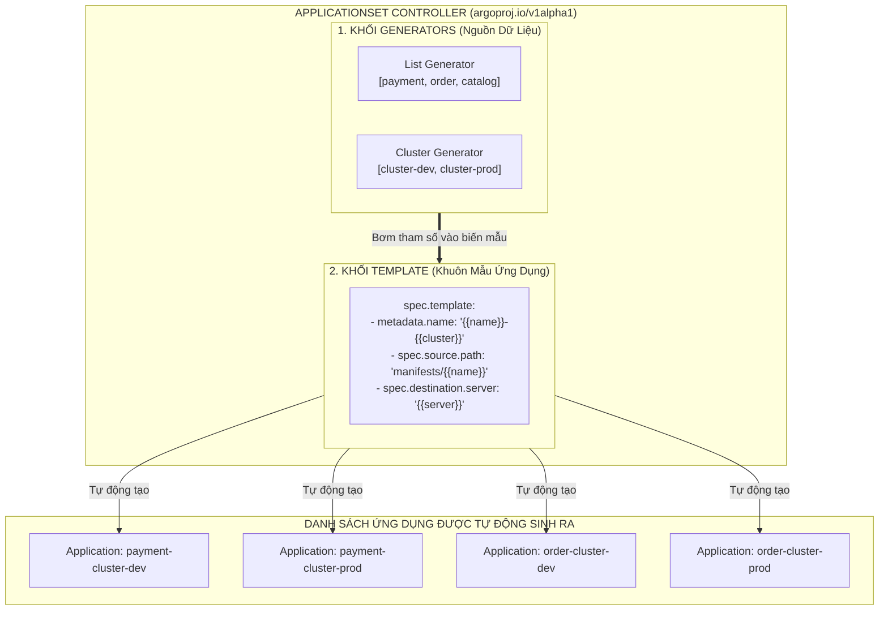
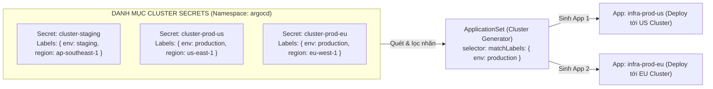
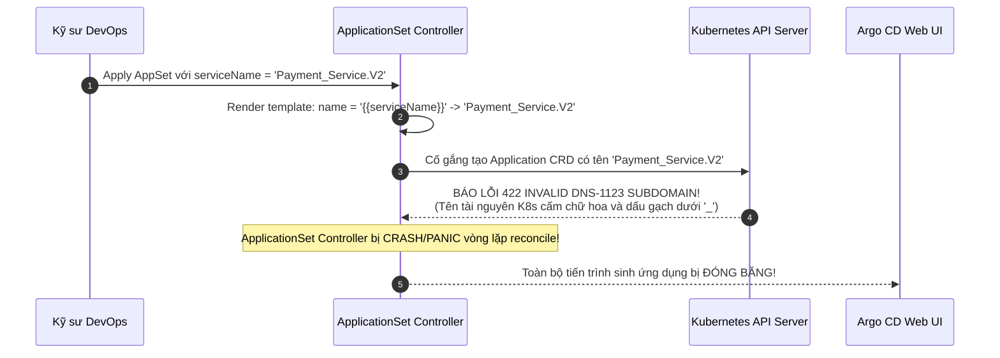


# Tự Động Sinh Ứng Dụng Hàng Loạt: ApplicationSet List & Cluster Generator

Nếu như mô hình **App-of-Apps** (ở bài trước) giúp chúng ta nhóm các ứng dụng con dưới một Root Application, thì nó vẫn tồn tại một hạn chế lớn: Kỹ sư vẫn phải viết từng tệp YAML `Application` thủ công cho từng dịch vụ và từng cụm mục tiêu. Khi doanh nghiệp mở rộng lên 50 microservices chạy trên 10 cụm Kubernetes (Dev, Staging, Prod ở 3 châu lục), số lượng tệp manifest `Application` bạn phải duy trì sẽ lên tới con số $50 \times 10 = 500$ tệp YAML!

Để giải quyết bài toán tự động hóa ở quy mô cực lớn, nhóm phát triển Argo đã tạo ra **`ApplicationSet`** — một Controller thông minh đóng vai trò là "Nhà máy sản xuất Application CRD hàng loạt" dựa trên khuôn mẫu (**Templating Engine**).

Bài viết này sẽ hướng dẫn bạn bóc tách cấu trúc của ApplicationSet, làm chủ hai loại Generator nền tảng: **List Generator** và **Cluster Generator**, khai thác chiến lược cập nhật dần **RollingSync Strategy**, cấu hình Go Template Engine và xử lý các lỗi cạm bẫy khi truyền tham số biến mẫu.

---

## 1. Kiến Trúc Hoạt Động Của ApplicationSet Controller

Một đối tượng `ApplicationSet` hoạt động dựa trên sự kết hợp hoàn hảo giữa 2 khối chức năng:
1. **Generators (Động cơ sinh dữ liệu):** Thu thập danh sách các tham số đầu vào từ nhiều nguồn (Danh sách tĩnh, Cụm Kubernetes, Thư mục Git, Pull Requests).
2. **Template (Khuôn mẫu Application):** Một bản mẫu `Application CRD` chứa các biến giữ chỗ dạng `{{parameter}}`. ApplicationSet Controller sẽ thay thế các biến bằng dữ liệu từ Generator để sinh ra hàng loạt `Application CRD` thực tế.



---

## 2. Bảng So Sánh Các Loại Generator Trong ApplicationSet

| Loại Generator | Nguồn Dữ Liệu (Source of Truth) | Trường Hợp Sử Dụng Điển Hình | Ưu Điểm | Nhược Điểm |
| :--- | :--- | :--- | :--- | :--- |
| **List Generator** | Mảng tĩnh các phần tử trong YAML | Danh mục cố định 5-10 microservices nội bộ | Dễ viết, kiểm soát trực tiếp trong 1 file | Vẫn phải sửa file ApplicationSet khi thêm dịch vụ |
| **Cluster Generator** | Kubernetes Secrets gắn nhãn `argocd.argoproj.io/secret-type: cluster` | Triển khai hạ tầng (Ingress, Monitoring) lên 100+ cụm K8s | **Tự động 100% khi thêm cụm mới** | Phụ thuộc vào tính chính xác của Cluster Labels |
| **Git Directory Generator** | Cây thư mục trên kho Git | Tự động sinh app khi dev tạo folder mới trên Git | Tính tự phục vụ (Self-service) cực cao | Cần cấu hình webhook để phản hồi nhanh |
| **Pull Request Generator** | GitHub/GitLab PR Webhook API | Môi trường Preview Ephemeral cho từng Pull Request | Tối ưu chi phí, tự hủy khi đóng PR | Tốn quota API token của GitHub/GitLab |
| **Matrix Generator** | Tích Cartesian của 2 generators con | Nhân chéo (N dịch vụ $\times$ M cụm) | Khả năng tự động hóa vô tận | Cấu hình phức tạp hơn, khó debug template |

---

## 3. List Generator: Tự Động Hóa Danh Mục Microservices

**List Generator** cho phép bạn định nghĩa một danh sách tĩnh các dịch vụ kèm theo các cặp tham số tùy biến (Key-Value) trực tiếp bên trong YAML.

### 3.1. Phân Tích Cấu Hình Chi Tiết List Generator (Line-by-Line Breakdown)

```yaml
# appset-list-microservices.yaml
apiVersion: argoproj.io/v1alpha1
kind: ApplicationSet
metadata:
  name: ecommerce-core-services
  namespace: argocd
spec:
  # 1. KHỐI GENERATORS: Khai báo danh sách các microservices
  generators:
    - list:
        elements:
          - serviceName: payment-api
            port: "8080"
            replicas: "5"
            env: production
          - serviceName: order-api
            port: "8081"
            replicas: "3"
            env: production
          - serviceName: catalog-api
            port: "8082"
            replicas: "4"
            env: production

  # 2. KHỐI TEMPLATE: Khuôn mẫu Application CRD sử dụng biến {{...}}
  template:
    metadata:
      # Tên ứng dụng được sinh động: payment-api-production
      name: "{{serviceName}}-{{env}}"
      labels:
        service: "{{serviceName}}"
        environment: "{{env}}"
    spec:
      project: default
      source:
        repoURL: "https://github.com/company/ecommerce-gitops.git"
        targetRevision: "main"
        path: "services/{{serviceName}}/overlays/{{env}}"
      destination:
        server: "https://kubernetes.default.svc"
        namespace: "{{serviceName}}-{{env}}"
      syncPolicy:
        automated:
          prune: true
          selfHeal: true
        syncOptions:
          - CreateNamespace=true
          - ServerSideApply=true
```

Khi áp dụng manifest trên, ApplicationSet Controller sẽ tự động sinh ra 3 đối tượng `Application` độc lập: `payment-api-production`, `order-api-production`, và `catalog-api-production`. Khi muốn thêm dịch vụ thứ 4, bạn chỉ cần bổ sung 1 phần tử vào danh sách `elements`.

---

## 4. Cluster Generator: Tự Động Triển Khai Hạ Tầng Đa Cụm

Trong kiến trúc Multi-Cluster, bạn kết nối nhiều cụm Kubernetes từ xa vào Argo CD. Mỗi cụm được đại diện bởi một `Secret` trong namespace `argocd`.

**Cluster Generator** sẽ tự động truy vấn toàn bộ các `Cluster Secrets` có gắn nhãn phù hợp (dựa vào `selector.matchLabels`) để sinh ra các Application tương ứng trên từng cụm.



### 4.1. Các Biến Có Sẵn Trong Cluster Generator
Khi sử dụng Cluster Generator, bạn có thể sử dụng các biến giữ chỗ mặc định sau trong `spec.template`:
- **`{{name}}`:** Tên của cụm khai báo trong Secret (ví dụ: `production-us-east`).
- **`{{server}}`:** Địa chỉ URL của Kubernetes API Server (ví dụ: `https://10.0.50.10:6443`).
- **`{{metadata.labels.<key>}}`:** Giá trị của các nhãn được gắn trên Cluster Secret (ví dụ: `{{metadata.labels.region}}`, `{{metadata.labels.env}}`).

### 4.2. Manifest Triển Khai Hạ Tầng Giám Sát Đa Cụm Kèm RollingSync

```yaml
# appset-cluster-monitoring.yaml
apiVersion: argoproj.io/v1alpha1
kind: ApplicationSet
metadata:
  name: multi-cluster-monitoring-stack
  namespace: argocd
spec:
  # CHIẾN LƯỢC CẬP NHẬT DẦN (ROLLINGSYNC STRATEGY)
  strategy:
    type: RollingSync
    rollingSync:
      steps:
        # Bước 1: Cập nhật trước trên các cụm Staging (Canary Phase)
        - matchExpressions:
            - key: env
              operator: In
              values:
                - staging
          maxUpdate: 100%
        # Bước 2: Cập nhật dần trên các cụm Production (tối đa 20% số cụm cùng lúc)
        - matchExpressions:
            - key: env
              operator: In
              values:
                - production
          maxUpdate: 20%

  generators:
    - clusters:
        # Chỉ chọn các cụm có nhãn monitoring=enabled
        selector:
          matchLabels:
            monitoring: enabled
  template:
    metadata:
      name: "monitoring-{{name}}"
      labels:
        cluster: "{{name}}"
        region: "{{metadata.labels.region}}"
        env: "{{metadata.labels.env}}"
    spec:
      project: infrastructure
      source:
        repoURL: "https://github.com/company/infra-gitops.git"
        targetRevision: "main"
        path: "infrastructure/monitoring/overlays/{{metadata.labels.region}}"
      destination:
        # Tự động trỏ tới API Server của từng cụm từ xa
        server: "{{server}}"
        namespace: "monitoring"
      syncPolicy:
        automated:
          prune: true
          selfHeal: true
        syncOptions:
          - CreateNamespace=true
```

> [!IMPORTANT]
> **SỨC MẠNH CỦA ROLLINGSYNC:**
> Thay vì nâng cấp đồng loạt 100 cụm cùng lúc gây nguy cơ mất mát dịch vụ diện rộng (Blast Radius lớn), `RollingSync` cho phép bạn nâng cấp cụm Staging trước, sau đó triển khai từng đợt `20%` trên các cụm Production.

---

## 5. Tối Ưu Hóa Hiệu Năng ApplicationSet Controller Trên Hệ Thống Lớn

Khi quản lý hàng trăm ApplicationSets sinh ra hàng ngàn Applications, bạn cần tinh chỉnh các tham số controller trong ConfigMap `argocd-cmd-params-cm`:

```yaml
apiVersion: v1
kind: ConfigMap
metadata:
  name: argocd-cmd-params-cm
  namespace: argocd
data:
  # Tăng số lượng worker xử lý ApplicationSet đồng thời
  applicationsetcontroller.concurrent.reconciliations: "25"
  # Kích hoạt tính năng Progressive Syncs nâng cao
  applicationsetcontroller.enable.progressive.syncs: "true"
```

---

## 6. Quản Lý Vòng Đời Ứng Dụng Với `syncPolicy.preserveResourcesOnDeletion`

Khi bạn xóa một phần tử khỏi `elements` trong List Generator hoặc xóa một cụm khỏi danh sách, ApplicationSet Controller mặc định sẽ **xóa bỏ Application con tương ứng**.

Để kiểm soát hành vi xóa này:

```yaml
spec:
  syncPolicy:
    # Nếu đặt là true: Khi ApplicationSet bị xóa, toàn bộ Application con VẪN ĐƯỢC GIỮ NGUYÊN (Orphan)
    preserveResourcesOnDeletion: true
    applicationsSync: create-update # Không cho phép tự ý xóa Application khi generator đổi
```

---

## 7. Cạm Bẫy Thực Chiến: "Ký Tự Đặt Tên Không Hợp Lệ Làm ApplicationSet Treo Toàn Bộ Tiến Trình Sinh Ứng Dụng"

### Hiện Tượng Sự Cố & Log Trace
- Kỹ sư DevOps thêm một phần tử mới vào List Generator: `serviceName: "Payment_Service.V2"`.
- Sau khi áp dụng manifest, **không có bất kỳ Application con nào được tạo ra**. Cả 10 dịch vụ cũ cũng biến mất hoặc không cập nhật được.
- Giao diện người dùng không hiển thị ứng dụng nào mới.

```json
{
  "timestamp": "2026-04-01T11:20:00Z",
  "level": "error",
  "component": "applicationset-controller",
  "msg": "error generating application from template",
  "error": "Application.argoproj.io \"Payment_Service.V2-production\" is invalid: metadata.name: Invalid value: \"Payment_Service.V2-production\": a lowercase RFC 1123 subdomain must consist of lower case alphanumeric characters, '-' or '.'"
}
```



### 7.1. Phân Tích Nguyên Nhân Gốc Rễ (5-Whys)
1. **Tại sao toàn bộ hệ thống ApplicationSet không sinh thêm app nào?** $\rightarrow$ Vì Controller bị nghẽn trong vòng lặp Reconcile khi gặp một tên không hợp lệ.
2. **Tại sao tên không hợp lệ?** $\rightarrow$ Vì biến `serviceName` chứa chữ hoa `Payment` và dấu gạch dưới `_Service`.
3. **Tại sao Kubernetes từ chối tên này?** $\rightarrow$ Vì `metadata.name` của mọi tài nguyên Kubernetes bắt buộc tuân theo chuẩn **RFC 1123 DNS Subdomain** (chỉ chữ thường, số, dấu gạch ngang).
4. **Tại sao ApplicationSet không tự sửa?** $\rightarrow$ Mặc định cú pháp `{{serviceName}}` chỉ thay thế chuỗi thô mà không tự động normalize.
5. **Biện pháp phòng ngừa triệt để là gì?** $\rightarrow$ Sử dụng Go Template Functions tích hợp sẵn trong ApplicationSet hoặc bắt buộc quy chuẩn đặt tên trong CI pipeline.

### 7.2. Sử Dụng Go Template Functions Để Chuẩn Hóa Chuỗi Ký Tự

Từ Argo CD 2.8+, bạn có thể bật tính năng Go Templating nâng cao:

```yaml
spec:
  goTemplate: true
  template:
    metadata:
      # Tự động chuyển toàn bộ thành chữ thường và thay dấu '_' thành '-'
      name: '{{ .serviceName | lower | replace "_" "-" }}-{{ .env }}'
```

---

## 8. Kiểm Thử Template ApplicationSet Ngoại Tuyến Bằng `argocd-util`

Trước khi đẩy ApplicationSet lên cụm Production, bạn có thể kiểm thử kết quả render template trực tiếp trên terminal bằng công cụ `argocd-util`:

```bash
# Render thử nghiệm ApplicationSet mà không cần nạp vào Kubernetes
argocd-util appset generate appset-list-microservices.yaml
```

Lệnh này sẽ in ra toàn bộ các đối tượng `Application` YAML được sinh ra, giúp bạn bắt lỗi cú pháp biến giữ chỗ ngay từ máy cá nhân!

---

## 9. Hướng Dẫn Thực Hành CLI: Tương Tác Với ApplicationSet (Step-by-Step Lab)

Dưới đây là quy trình thực hành từ dòng lệnh để triển khai, gỡ lỗi và kiểm tra ApplicationSet:

```bash
# Bước 1: Thêm một cụm Kubernetes từ xa vào Argo CD và gán nhãn
argocd cluster add staging-k8s-context --name staging-ap-southeast-1
kubectl label secret -n argocd -l argocd.argoproj.io/secret-type=cluster \
  monitoring=enabled tier=staging region=ap-southeast-1

# Bước 2: Áp dụng tệp manifest ApplicationSet
kubectl apply -f appset-list-microservices.yaml

# Bước 3: Xem trạng thái và danh sách các Application được ApplicationSet quản lý
kubectl get applicationsets -n argocd
argocd app list

# Bước 4: Kiểm tra xem một Application cụ thể có thuộc quyền sở hữu của ApplicationSet nào
kubectl get app payment-api-production -n argocd -o jsonpath="{.metadata.ownerReferences}" | jq .

# Bước 5: Xem nhật ký thời gian thực của ApplicationSet Controller để bắt lỗi template
kubectl logs -n argocd -l app.kubernetes.io/name=argocd-applicationset-controller -f --tail=50

# Bước 6: Xóa ApplicationSet an toàn mà vẫn giữ nguyên các Application con
kubectl patch appset ecommerce-core-services -n argocd \
  -p '{"spec":{"syncPolicy":{"preserveResourcesOnDeletion":true}}}' --type=merge
kubectl delete appset ecommerce-core-services -n argocd
```

---

## 10. Bộ Câu Hỏi Tự Kiểm Tra Chuyên Sâu (Self-Check Q&A)


<div class="qa-answer">
  <div class="qa-answer-header">
    <svg width="14" height="14" fill="none" stroke="currentColor" stroke-width="2" viewBox="0 0 24 24"><path d="M22 11.08V12a10 10 0 1 1-5.93-9.14"></path><polyline points="22 4 12 14.01 9 11.01"></polyline></svg>
    <span>Phân Tích &amp; Lời Giải Kỹ Thuật</span>
  </div>
  
App-of-Apps là mô hình quản trị cây thư mục tĩnh (mỗi ứng dụng con bắt buộc phải có 1 file YAML Application định nghĩa sẵn). <code>ApplicationSet</code> là một Controller động có khả năng sử dụng <b style="color: var(--accent-primary);">Generators & Templates</b> để tự động sinh ra hàng trăm Application CRD dựa trên các điều kiện biến động (danh sách cụm, danh sách thư mục Git, Pull Requests).
</div>
</details>

<div class="qa-answer">
  <div class="qa-answer-header">
    <svg width="14" height="14" fill="none" stroke="currentColor" stroke-width="2" viewBox="0 0 24 24"><path d="M22 11.08V12a10 10 0 1 1-5.93-9.14"></path><polyline points="22 4 12 14.01 9 11.01"></polyline></svg>
    <span>Phân Tích &amp; Lời Giải Kỹ Thuật</span>
  </div>
  
Ta chỉnh sửa trực tiếp tệp Secret của cụm đó trong namespace <code>argocd</code> bằng lệnh:
  <code>kubectl label secret <cluster-secret-name> -n argocd environment=production region=us-east-1</code>
  Cluster Generator sẽ tự động phát hiện nhãn mới và kích hoạt tạo ứng dụng tương ứng.
</div>
</details>

<div class="qa-answer">
  <div class="qa-answer-header">
    <svg width="14" height="14" fill="none" stroke="currentColor" stroke-width="2" viewBox="0 0 24 24"><path d="M22 11.08V12a10 10 0 1 1-5.93-9.14"></path><polyline points="22 4 12 14.01 9 11.01"></polyline></svg>
    <span>Phân Tích &amp; Lời Giải Kỹ Thuật</span>
  </div>
  
Đại diện cho <b style="color: var(--accent-primary);">tên của thư mục cuối cùng</b> trong đường dẫn Git. Ví dụ, với đường dẫn <code>services/payment-api</code>, thì <code>{{path.basename}}</code> sẽ trả về chuỗi <code>"payment-api"</code>.
</div>
</details>

<div class="qa-answer">
  <div class="qa-answer-header">
    <svg width="14" height="14" fill="none" stroke="currentColor" stroke-width="2" viewBox="0 0 24 24"><path d="M22 11.08V12a10 10 0 1 1-5.93-9.14"></path><polyline points="22 4 12 14.01 9 11.01"></polyline></svg>
    <span>Phân Tích &amp; Lời Giải Kỹ Thuật</span>
  </div>
  
Toàn bộ các đối tượng <code>Application CRD</code> con do ApplicationSet đó sinh ra sẽ bị <b style="color: var(--accent-primary);">xóa sạch ngay lập tức</b>. Nếu các Application con có gắn <code>resources-finalizer</code>, toàn bộ Pods, Services trên Kubernetes cũng sẽ bị xóa theo (Cascade Deletion).
</div>
</details>

<div class="qa-answer">
  <div class="qa-answer-header">
    <svg width="14" height="14" fill="none" stroke="currentColor" stroke-width="2" viewBox="0 0 24 24"><path d="M22 11.08V12a10 10 0 1 1-5.93-9.14"></path><polyline points="22 4 12 14.01 9 11.01"></polyline></svg>
    <span>Phân Tích &amp; Lời Giải Kỹ Thuật</span>
  </div>
  
<b style="color: var(--accent-primary);">Hoàn toàn được!</b> Bạn có thể khai báo nhiều generators trong danh sách <code>spec.generators</code>, hoặc kết hợp chúng lại bằng <b style="color: var(--accent-primary);">Matrix Generator</b> (nhân ma trận) hoặc <b style="color: var(--accent-primary);">Merge Generator</b> (hợp nhất có điều kiện).
</div>
</details>

<div class="qa-answer">
  <div class="qa-answer-header">
    <svg width="14" height="14" fill="none" stroke="currentColor" stroke-width="2" viewBox="0 0 24 24"><path d="M22 11.08V12a10 10 0 1 1-5.93-9.14"></path><polyline points="22 4 12 14.01 9 11.01"></polyline></svg>
    <span>Phân Tích &amp; Lời Giải Kỹ Thuật</span>
  </div>
  
Giúp điều phối tiến trình nâng cấp ứng dụng theo từng bước phân kỳ (Staged Rollout) trên hàng loạt cụm, ví dụ cập nhật 100% cụm staging trước, sau đó mới nâng cấp từng đợt 20% số cụm production, ngăn chặn nguy cơ sự cố lan rộng ra toàn bộ hệ thống.
</div>
</details>

<div class="qa-answer">
  <div class="qa-answer-header">
    <svg width="14" height="14" fill="none" stroke="currentColor" stroke-width="2" viewBox="0 0 24 24"><path d="M22 11.08V12a10 10 0 1 1-5.93-9.14"></path><polyline points="22 4 12 14.01 9 11.01"></polyline></svg>
    <span>Phân Tích &amp; Lời Giải Kỹ Thuật</span>
  </div>
  
Bật tính năng <code>goTemplate: true</code> trong <code>spec</code> của ApplicationSet và sử dụng các Go template functions như <code>{{ .name | lower | replace "_" "-" }}</code> để chuẩn hóa chuỗi trước khi gán vào <code>metadata.name</code>.
</div>
</details>

<div class="qa-answer">
  <div class="qa-answer-header">
    <svg width="14" height="14" fill="none" stroke="currentColor" stroke-width="2" viewBox="0 0 24 24"><path d="M22 11.08V12a10 10 0 1 1-5.93-9.14"></path><polyline points="22 4 12 14.01 9 11.01"></polyline></svg>
    <span>Phân Tích &amp; Lời Giải Kỹ Thuật</span>
  </div>
  
Cấu hình này chỉ cho phép ApplicationSet tạo mới hoặc cập nhật Application CRD, nhưng <b style="color: var(--accent-primary);">ngăn cấm tuyệt đối việc tự động xóa bỏ Application con</b> khi một phần tử bị gỡ khỏi Generator, giúp tăng tính an toàn cho môi trường Production.
</div>
</details>

<div class="qa-answer">
  <div class="qa-answer-header">
    <svg width="14" height="14" fill="none" stroke="currentColor" stroke-width="2" viewBox="0 0 24 24"><path d="M22 11.08V12a10 10 0 1 1-5.93-9.14"></path><polyline points="22 4 12 14.01 9 11.01"></polyline></svg>
    <span>Phân Tích &amp; Lời Giải Kỹ Thuật</span>
  </div>
  
<code>https://kubernetes.default.svc</code>.
</div>
</details>

<div class="qa-answer">
  <div class="qa-answer-header">
    <svg width="14" height="14" fill="none" stroke="currentColor" stroke-width="2" viewBox="0 0 24 24"><path d="M22 11.08V12a10 10 0 1 1-5.93-9.14"></path><polyline points="22 4 12 14.01 9 11.01"></polyline></svg>
    <span>Phân Tích &amp; Lời Giải Kỹ Thuật</span>
  </div>
  
ApplicationSet Controller sẽ báo lỗi xung đột (Conflict) trong log và từ chối cập nhật Application bị trùng lặp, đảm bảo không có sự ghi đè cấu hình không kiểm soát.
</div>
</details>

---

## Tổng Kết

`ApplicationSet` là bước nhảy vọt về năng suất vận hành, giải phóng đội ngũ Platform Engineering khỏi gánh nặng bảo trì hàng trăm tệp manifest tĩnh và mở ra kỷ nguyên tự động hóa phân phối phần mềm trên quy mô đa cụm. Bằng việc kết hợp List/Cluster Generator và chiến lược RollingSync, hệ thống GitOps của bạn đạt được sự linh hoạt và mức độ an toàn tối đa.

Ở bài tiếp theo, chúng ta sẽ nâng cấp lên mức độ phức tạp cao nhất của ApplicationSet với **Git Directory, Matrix, Merge & Pull Request Preview Generators**!

