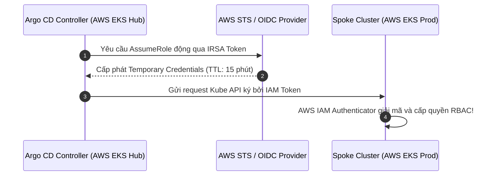
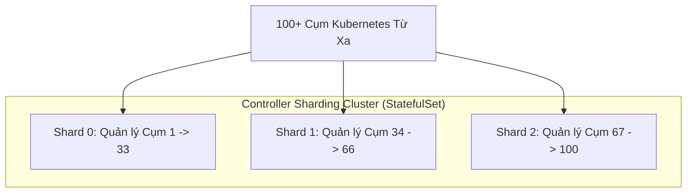
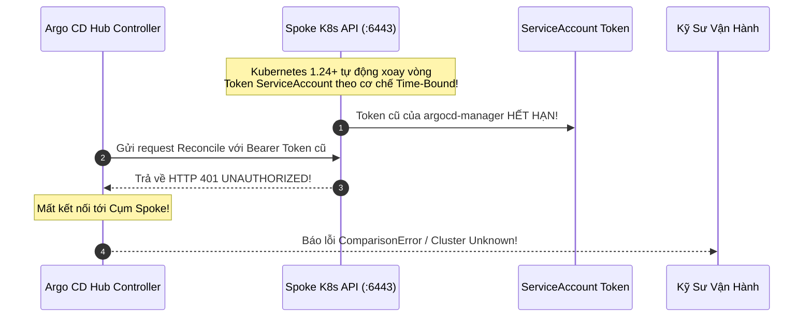


# Quản Trị Đa Cụm: Multi-Cluster GitOps & Triển Khai Chéo Hạ Tầng Chuẩn Doanh Nghiệp

Trong kỷ nguyên đám mây lai (Hybrid Cloud) và đa vùng (Multi-Region), hầu hết các doanh nghiệp không còn vận hành trên một cụm Kubernetes duy nhất. Một kiến trúc chuẩn mực thường bao gồm nhiều cụm phân tán theo chức năng hoặc địa lý: cụm cho môi trường Phát triển (Dev/Staging), cụm Sản xuất tại Mỹ (Prod-US), cụm Sản xuất tại Châu Á (Prod-APAC), và các cụm tại trung tâm dữ liệu On-Premise.

Thay vì phải cài đặt và duy trì hàng chục cụm Argo CD độc lập trên từng cụm, giải pháp tối ưu nhất là xây dựng **Mô Hình Hub-and-Spoke (Trung Tâm & Chi Nhánh)**: Một cụm **Hub Cluster** duy nhất chịu trách nhiệm điều khiển tập trung, theo dõi kho GitOps và triển khai ứng dụng chéo hạ tầng xuống toàn bộ các cụm **Spoke Clusters** mục tiêu.

> [!IMPORTANT]
> **MÔ HÌNH QUẢN TRỊ TẬP TRUNG HUB-AND-SPOKE:**
> Hub-and-Spoke là kiến trúc tiêu chuẩn ngành giúp tập trung hóa quyền quản trị (Single Pane of Glass), đồng thời phân lập quyền thực thi trên các cụm Spoke vệ tinh thông qua RBAC tối thiểu (`argocd-manager`).

> [!TIP]
> **BẢO MẬT KHÔNG DÙNG TOKEN TĨNH:**
> Trên AWS EKS và GCP GKE, hãy luôn ưu tiên sử dụng IAM Roles for Service Accounts (IRSA / Workload Identity) thay vì lưu trữ Bearer Token dài hạn trong Cluster Secret để loại bỏ nguy cơ rò rỉ credential.

---

## 1. Mô Hình Kiến Trúc Hub-and-Spoke Trong GitOps Đa Cụm

```mermaid
flowchart TD
    subgraph GIT_LAYER["NGUỒN CHÂN LÝ DUY NHẤT: GITOPS REPO"]
        GIT_REPO["Git Repository (All Environments)"]
    end

    subgraph HUB_CLUSTER["HUB CLUSTER (Cụm Trung Tâm Quản Trị - Control Plane)"]
        ARGO_CP["Argo CD Control Plane (Namespace: argocd)<br/>- argocd-server (Web UI & CLI)<br/>- application-controller (Reconcile Engine)<br/>- repo-server (Manifest Render)"]
        
        SECRETS_LIST["Danh Mục Cluster Secrets:<br/>1. Secret: spoke-staging-cluster<br/>2. Secret: spoke-prod-us<br/>3. Secret: spoke-prod-apac"]
    end

    subgraph SPOKE_1["SPOKE CLUSTER 1: STAGING (spoke-staging)"]
        SA1["ServiceAccount: argocd-manager<br/>(Chỉ có quyền trong namespace staging)"]
        APPS1["Staging Microservices Workloads"]
    end

    subgraph SPOKE_2["SPOKE CLUSTER 2: PROD US (spoke-prod-us)"]
        SA2["ServiceAccount: argocd-manager<br/>(ClusterRole: Quản trị workloads)"]
        APPS2["Production US Microservices"]
    end

    subgraph SPOKE_3["SPOKE CLUSTER 3: PROD APAC (spoke-prod-apac)"]
        SA3["ServiceAccount: argocd-manager<br/>(ClusterRole: Quản trị workloads)"]
        APPS3["Production APAC Microservices"]
    end

    GIT_LAYER ==>|"Declarative Sync"| ARGO_CP
    ARGO_CP [--]|Đọc cấu hình kết nối| SECRETS_LIST

    ARGO_CP -->|"mTLS gRPC / Kube API :6443"| SA1
    ARGO_CP -->|"mTLS gRPC / Kube API :6443"| SA2
    ARGO_CP -->|"mTLS gRPC / Kube API :6443"| SA3

    SA1 --> APPS1
    SA2 --> APPS2
    SA3 --> APPS3


```

---

## 2. So Sánh Các Mô Hình Quản Trị Đa Cụm

| Tiêu Chí Đánh Giá | Hub-and-Spoke Tập Trung (Khuyên Dùng) | Tự Trị Độc Lập (Autonomous In-Cluster) | Kiến Trúc Đám Mây Lai (Hybrid Mesh) |
| :--- | :--- | :--- | :--- |
| **Vị trí cài đặt Argo CD** | Chỉ cài đặt 1 cụm Hub duy nhất | Cài đặt đầy đủ Argo CD trên từng cụm Spoke | Hub quản lý AppSet, Spoke chạy Agent nhẹ |
| **Giao diện giám sát (Observability)** | **1 Dashboard duy nhất toàn cầu** | Phân tán (Phải đăng nhập N dashboard) | Tập trung thông qua Hub Control Plane |
| **Quản trị Xác thực & SSO** | Thiết lập OIDC/Dex 1 lần duy nhất | Phải cấu hình SSO riêng cho từng cụm | Thiết lập 1 lần tại Hub |
| **Tải tài nguyên hạ tầng** | Tiết kiệm tối đa RAM/CPU cho các cụm Spoke | Tốn tài nguyên chạy controller trên từng cụm | Trung bình |
| **Phụ thuộc kết nối mạng** | Yêu cầu kết nối từ Hub tới Spoke API (:6443) | Không phụ thuộc mạng giữa các cụm | Yêu cầu kết nối không liên tục |
| **Rủi ro ảnh hưởng lan tỏa (Blast Radius)** | Cần bảo vệ nghiêm ngặt quyền Admin trên Hub | Cô lập hoàn toàn theo từng cụm | Được phân tầng theo Project RBAC |

---

## 3. Xác Thực Zero-Static-Credentials Đa Đám Mây (AWS IRSA & GCP Workload Identity)

Trong các tổ chức bảo mật nghiêm ngặt, việc lưu Bearer Token tĩnh của ServiceAccount trong Kubernetes Secret bị coi là lỗ hổng bảo mật nghiêm trọng. Ta có thể sử dụng cơ chế IAM ngắn hạn:



### 3.1. Manifest Cấu Hình Cluster Secret Dùng AWS IAM Role:
```yaml
apiVersion: v1
kind: Secret
metadata:
  name: eks-spoke-prod-us
  namespace: argocd
  labels:
    argocd.argoproj.io/secret-type: cluster
    environment: production
type: Opaque
stringData:
  name: "eks-production-us"
  server: "https://EKS-ENDPOINT-URL.eks.amazonaws.com"
  config: |
    {
      "awsAuthConfig": {
        "clusterName": "eks-production-us",
        "roleARN": "arn:aws:iam::123456789012:role/ArgoCDSpokeAdminRole"
      },
      "tlsClientConfig": {
        "insecure": false,
        "caData": "LS0tLS1CRUdJTiBDRVJUSUZJQ0FURS0t..."
      }
    }
```

### 3.2. Manifest Cấu Hình Cho Google Kubernetes Engine (GKE) Workload Identity:
```yaml
apiVersion: v1
kind: Secret
metadata:
  name: gke-spoke-asia
  namespace: argocd
  labels:
    argocd.argoproj.io/secret-type: cluster
    environment: production
type: Opaque
stringData:
  name: "gke-production-asia"
  server: "https://35.240.100.20"
  config: |
    {
      "execProviderConfig": {
        "command": "argocd-k8s-auth",
        "args": ["gcp"],
        "apiVersion": "client.authentication.k8s.io/v1beta1"
      },
      "tlsClientConfig": {
        "insecure": false,
        "caData": "LS0tLS1CRUdJTiBDRVJUSUZJQ0FURS0t..."
      }
    }
```

---

## 4. Cơ Chế Xác Thực An Toàn: Lệnh `argocd cluster add` Hoạt Động Ra Sao?

Khi bạn chạy lệnh CLI để kết nối một cụm mới:
`argocd cluster add <kubecontext-name> --name <cluster-name>`

Argo CD tự động thực thi chuỗi 5 bước thiết lập bảo mật:
1. Tạo một namespace chuyên dụng trên cụm Spoke: `kube-system` (hoặc `argocd`).
2. Khởi tạo một ServiceAccount an toàn: **`argocd-manager`**.
3. Cấp phát quyền hạn thông qua đối tượng `ClusterRole` và `ClusterRoleBinding` (hoặc `RoleBinding` nếu giới hạn namespace).
4. Tạo một ServiceAccount Token (hoặc trích xuất từ Kubernetes Secret).
5. Quay trở lại cụm Hub và lưu trữ toàn bộ thông tin kết nối (API Endpoint, CA Certificate, Bearer Token) vào một Kubernetes `Secret` có gắn nhãn `argocd.argoproj.io/secret-type: cluster`.

---

## 5. Phân Tích Cấu Trúc Manifest Tệp Cluster Secret (Line-by-Line Breakdown)

Bạn có thể khai báo các cụm từ xa hoàn toàn bằng tệp YAML theo chuẩn Declarative:

```yaml
# cluster-secret-prod-us.yaml
apiVersion: v1
kind: Secret
metadata:
  name: cluster-spoke-prod-us
  namespace: argocd
  # NHÃN BẮT BUỘC ĐỂ ARGO CD NHẬN BIẾT ĐÂY LÀ CLUSTER SECRET
  labels:
    argocd.argoproj.io/secret-type: cluster
    # Các nhãn tùy biến dùng cho Cluster Generator và phân quyền
    environment: production
    region: us-east-1
    tier: payment-gateway
type: Opaque
stringData:
  # Tên hiển thị của cụm trên giao diện UI và CLI
  name: "production-us-east"
  
  # Địa chỉ URL của Kubernetes API Server của cụm từ xa
  server: "https://10.0.100.50:6443"
  
  # Giới hạn các namespaces được phép deploy (Nếu để trống là toàn cụm)
  namespaces: "ecommerce-prod,payment-prod"
  
  # Cấu hình chứng chỉ TLS và Token xác thực mTLS
  config: |
    {
      "bearerToken": "eyJhbGciOiJSUzI1NiIsImtpZCI...",
      "tlsClientConfig": {
        "insecure": false,
        "caData": "LS0tLS1CRUdJTiBDRVJUSUZJQ0FURS0tLS0tCg=="
      }
    }
```

---

## 6. Cấu Hình Phân Mảnh Tải (Controller Sharding) Cho Hàng Trăm Cụm

Khi quản lý hơn 50 - 100+ cụm Kubernetes từ xa, một tiến trình `argocd-application-controller` đơn lẻ sẽ bị quá tải bộ nhớ và nghẽn CPU do phải mở hàng ngàn WebSocket Informers tới các API Server.

Argo CD hỗ trợ cơ chế **Dynamic Controller Sharding**:



### Cấu Hình Sharding Trong ConfigMap `argocd-cmd-params-cm`:
```yaml
apiVersion: v1
kind: ConfigMap
metadata:
  name: argocd-cmd-params-cm
  namespace: argocd
data:
  # Kích hoạt thuật toán băm phân cụm tròn (Round-Robin Sharding)
  controller.cluster.sharding.algorithm: "round-robin"
```

Và tăng số lượng replicas của `argocd-application-controller` StatefulSet lên 3 hoặc 5 bản sao.

---

## 7. Quản Lý Triển Khai Chéo Hạ Tầng (Cross-Deploy Application)

Để triển khai một ứng dụng lên cụm Spoke từ xa, trong tệp `Application CRD`, ta chỉ cần chỉ định trường `spec.destination.server` hoặc `spec.destination.name` trỏ tới cụm đó:

```yaml
# application-deploy-to-spoke.yaml
apiVersion: argoproj.io/v1alpha1
kind: Application
metadata:
  name: payment-api-us
  namespace: argocd
spec:
  project: default
  source:
    repoURL: "https://github.com/company/ecommerce-gitops.git"
    targetRevision: "main"
    path: "services/payment-api/overlays/prod-us"
  destination:
    # Trỏ chính xác vào URL hoặc Tên của cụm từ xa đã đăng ký
    name: "production-us-east"
    namespace: "payment-prod"
  syncPolicy:
    automated:
      prune: true
      selfHeal: true
    syncOptions:
      - CreateNamespace=true
      - ServerSideApply=true
```

---

## 8. Cạm Bẫy Thực Chiến: "Token Của ServiceAccount Bị Hết Hạn Làm Argo CD Mất Kết Nối Toàn Bộ Cụm Spoke"

### Hiện Tượng Sự Cố & Log Trace
- Toàn bộ 50 ứng dụng đang chạy trên cụm `production-us-east` bất ngờ chuyển sang trạng thái **`Sync Status: Unknown`** hoặc **`ComparisonError`**.
- Không thể deploy phiên bản mới, giao diện Web báo lỗi màu đỏ rực: `Unable to connect to cluster: Unauthorized / token expired`.
- Tuy nhiên, các Pods trên cụm Spoke vẫn đang chạy bình thường.

```json
{
  "timestamp": "2026-04-03T08:30:15Z",
  "level": "error",
  "component": "argocd-application-controller",
  "cluster": "https://10.0.100.50:6443",
  "msg": "Failed to sync cluster cache: Unauthorized",
  "error": "the server has asked for the client to provide credentials (get namespaces)"
}
```



### 8.1. Phân Tích Nguyên Nhân Gốc Rễ (5-Whys)
1. **Tại sao cụm Spoke báo Unauthorized?** $\rightarrow$ Vì Kube API Server từ chối Bearer Token gửi từ Hub.
2. **Tại sao Token bị từ chối?** $\rightarrow$ Vì Token đã hết hạn sống (Expired).
3. **Tại sao Token bị hết hạn?** $\rightarrow$ Từ Kubernetes 1.24+, tính năng `BoundServiceAccountTokenVolume` tự động gán TTL ngắn hạn cho token tạm thời.
4. **Tại sao trước đây không bị?** $\rightarrow$ Do các phiên bản Kubernetes cũ hơn 1.24 tạo Token vĩnh viễn không bao giờ hết hạn.
5. **Giải pháp chuẩn hóa là gì?** $\rightarrow$ Tạo Secret tĩnh gắn `kubernetes.io/service-account.name` hoặc sử dụng cơ chế AWS IRSA / GCP Workload Identity để xoay vòng token tự động.

### 8.2. Giải Pháp Khắc Phục Triệt Để

Tạo một Secret tĩnh gắn annotation `kubernetes.io/service-account.name` trên cụm Spoke để cấp phát Token dài hạn cho `argocd-manager`:

```yaml
# Trên cụm Spoke: Tạo Secret tĩnh không bị hết hạn
apiVersion: v1
kind: Secret
metadata:
  name: argocd-manager-longlived-token
  namespace: kube-system
  annotations:
    kubernetes.io/service-account.name: argocd-manager
type: kubernetes.io/service-account-token
```
Sau đó, trích xuất token này và cập nhật lại vào `Cluster Secret` trên cụm Hub.

---

## 9. Hướng Dẫn Thực Hành CLI: Kết Nối Và Quản Trị Cụm Từ Xa (Step-by-Step Lab)

Dưới đây là quy trình thực hành từ dòng lệnh để kết nối, kiểm thử và vận hành cụm từ xa:

```bash
# Bước 1: Liệt kê toàn bộ danh sách cụm Kubernetes đang được quản lý bởi Argo CD
argocd cluster list

# Bước 2: Thêm một cụm mới vào Argo CD từ file Kubeconfig hiện tại
argocd cluster add kind-spoke-cluster --name spoke-staging-01

# Bước 3: Gán nhãn môi trường cho cụm để Cluster Generator nhận diện
kubectl label secret -n argocd -l argocd.argoproj.io/secret-type=cluster \
  environment=staging region=ap-southeast-1 --overwrite

# Bước 4: Kiểm tra chi tiết thông số kết nối và phiên bản Kubernetes của cụm từ xa
argocd cluster get https://10.0.100.50:6443

# Bước 5: Kiểm tra kết nối mạng và độ trễ gRPC giữa Hub và Spoke
kubectl exec -it -n argocd deploy/argocd-server -- \
  curl -k -m 5 https://10.0.100.50:6443/version

# Bước 6: Xóa một cụm an toàn khỏi danh mục quản lý của Argo CD
argocd cluster rm production-us-east
```

---

## 10. Bộ Câu Hỏi Tự Kiểm Tra Chuyên Sâu (Self-Check Q&A)


<div class="qa-answer">
  <div class="qa-answer-header">
    <svg width="14" height="14" fill="none" stroke="currentColor" stroke-width="2" viewBox="0 0 24 24"><path d="M22 11.08V12a10 10 0 1 1-5.93-9.14"></path><polyline points="22 4 12 14.01 9 11.01"></polyline></svg>
    <span>Phân Tích &amp; Lời Giải Kỹ Thuật</span>
  </div>
  
<b style="color: var(--accent-primary);">Không!</b> Các ứng dụng trên cụm Spoke vẫn tiếp tục hoạt động độc lập và ổn định 100%. Trong thời gian Hub sập, chỉ có tính năng tự động đồng bộ phiên bản mới bị tạm dừng; toàn bộ hạ tầng thực tế trên Spoke không hề bị gián đoạn.
</div>
</details>

<div class="qa-answer">
  <div class="qa-answer-header">
    <svg width="14" height="14" fill="none" stroke="currentColor" stroke-width="2" viewBox="0 0 24 24"><path d="M22 11.08V12a10 10 0 1 1-5.93-9.14"></path><polyline points="22 4 12 14.01 9 11.01"></polyline></svg>
    <span>Phân Tích &amp; Lời Giải Kỹ Thuật</span>
  </div>
  
Hub-and-Spoke giúp: (1) <b style="color: var(--accent-primary);">Quản trị tập trung:</b> Một giao diện duy nhất để giám sát toàn bộ tài nguyên toàn cầu, (2) <b style="color: var(--accent-primary);">Bảo mật:</b> Quản lý SSO, RBAC và Audit Log tại 1 điểm, (3) <b style="color: var(--accent-primary);">Tiết kiệm tài nguyên:</b> Không cần tốn RAM/CPU để chạy bộ Controller trên từng cụm Spoke nhỏ.
</div>
</details>

<div class="qa-answer">
  <div class="qa-answer-header">
    <svg width="14" height="14" fill="none" stroke="currentColor" stroke-width="2" viewBox="0 0 24 24"><path d="M22 11.08V12a10 10 0 1 1-5.93-9.14"></path><polyline points="22 4 12 14.01 9 11.01"></polyline></svg>
    <span>Phân Tích &amp; Lời Giải Kỹ Thuật</span>
  </div>
  
Khi chạy lệnh <code>argocd cluster add</code>, sử dụng cờ <code>--namespace <ns1>,<ns2></code> hoặc thay thế <code>ClusterRoleBinding</code> bằng các <code>RoleBinding</code> cục bộ trong các namespace đích trên cụm Spoke.
</div>
</details>

<div class="qa-answer">
  <div class="qa-answer-header">
    <svg width="14" height="14" fill="none" stroke="currentColor" stroke-width="2" viewBox="0 0 24 24"><path d="M22 11.08V12a10 10 0 1 1-5.93-9.14"></path><polyline points="22 4 12 14.01 9 11.01"></polyline></svg>
    <span>Phân Tích &amp; Lời Giải Kỹ Thuật</span>
  </div>
  
Chỉ cần mở kết nối một chiều (Egress) từ <b style="color: var(--accent-primary);">Hub Cluster tới cổng TCP <code>:6443</code> (Kubernetes API Server)</b> của Spoke Cluster. Spoke Cluster hoàn toàn không cần mở bất kỳ luồng mạng Inbound nào kết nối ngược lại Hub.
</div>
</details>

<div class="qa-answer">
  <div class="qa-answer-header">
    <svg width="14" height="14" fill="none" stroke="currentColor" stroke-width="2" viewBox="0 0 24 24"><path d="M22 11.08V12a10 10 0 1 1-5.93-9.14"></path><polyline points="22 4 12 14.01 9 11.01"></polyline></svg>
    <span>Phân Tích &amp; Lời Giải Kỹ Thuật</span>
  </div>
  
Thông qua giao thức <b style="color: var(--accent-primary);">HTTPS / REST API / mTLS</b> chuẩn của Kubernetes API Server, được bảo vệ bằng chứng chỉ TLS CA của cụm Spoke và xác thực bằng Bearer Token của ServiceAccount <code>argocd-manager</code>.
</div>
</details>

<div class="qa-answer">
  <div class="qa-answer-header">
    <svg width="14" height="14" fill="none" stroke="currentColor" stroke-width="2" viewBox="0 0 24 24"><path d="M22 11.08V12a10 10 0 1 1-5.93-9.14"></path><polyline points="22 4 12 14.01 9 11.01"></polyline></svg>
    <span>Phân Tích &amp; Lời Giải Kỹ Thuật</span>
  </div>
  
Khi có nhiều bản sao Controller chạy dạng StatefulSet (Shard 0, Shard 1, Shard 2), mỗi Shard sẽ nhận trách nhiệm giám sát và điều hòa một tập hợp các cụm Spoke riêng biệt dựa trên thuật toán băm (Hash Ring / Round-Robin), giúp chia đều tải bộ nhớ Informers và CPU.
</div>
</details>

<div class="qa-answer">
  <div class="qa-answer-header">
    <svg width="14" height="14" fill="none" stroke="currentColor" stroke-width="2" viewBox="0 0 24 24"><path d="M22 11.08V12a10 10 0 1 1-5.93-9.14"></path><polyline points="22 4 12 14.01 9 11.01"></polyline></svg>
    <span>Phân Tích &amp; Lời Giải Kỹ Thuật</span>
  </div>
  
IRSA sử dụng OpenID Connect (OIDC) để cấp phát IAM Role động ngắn hạn (STS Temporary Credentials), loại bỏ hoàn toàn nguy cơ rò rỉ token bí mật tĩnh trong Kubernetes Secret.
</div>
</details>

<div class="qa-answer">
  <div class="qa-answer-header">
    <svg width="14" height="14" fill="none" stroke="currentColor" stroke-width="2" viewBox="0 0 24 24"><path d="M22 11.08V12a10 10 0 1 1-5.93-9.14"></path><polyline points="22 4 12 14.01 9 11.01"></polyline></svg>
    <span>Phân Tích &amp; Lời Giải Kỹ Thuật</span>
  </div>
  
Trong thời gian mất mạng, các Application trên cụm đó chuyển sang <code>Unknown</code>. Khi mạng phục hồi, Controller Shard phụ trách cụm đó sẽ tự động tái thiết lập kết nối WebSocket Informer và chạy lại chu kỳ Reconciliation để kiểm tra drift.
</div>
</details>

<div class="qa-answer">
  <div class="qa-answer-header">
    <svg width="14" height="14" fill="none" stroke="currentColor" stroke-width="2" viewBox="0 0 24 24"><path d="M22 11.08V12a10 10 0 1 1-5.93-9.14"></path><polyline points="22 4 12 14.01 9 11.01"></polyline></svg>
    <span>Phân Tích &amp; Lời Giải Kỹ Thuật</span>
  </div>
  
Trong trường <code>config</code> của Cluster Secret, sửa thuộc tính JSON <code>"tlsClientConfig": { "insecure": true }</code>.
</div>
</details>

<div class="qa-answer">
  <div class="qa-answer-header">
    <svg width="14" height="14" fill="none" stroke="currentColor" stroke-width="2" viewBox="0 0 24 24"><path d="M22 11.08V12a10 10 0 1 1-5.93-9.14"></path><polyline points="22 4 12 14.01 9 11.01"></polyline></svg>
    <span>Phân Tích &amp; Lời Giải Kỹ Thuật</span>
  </div>
  
Sử dụng <b style="color: var(--accent-primary);">ApplicationSet với Cluster Generator</b> kết hợp selector nhãn cụm thay vì tạo 10 Application CRD thủ công.
</div>
</details>

---

## Tổng Kết

Mô hình Multi-Cluster GitOps với kiến trúc Hub-and-Spoke và Sharding Controller là chuẩn mực kiến trúc không thể thiếu cho các tổ chức công nghệ hiện đại, mang lại khả năng mở rộng quy mô toàn cầu, bảo mật tập trung và độ tin cậy tuyệt đối.

Ở bài tiếp theo, chúng ta sẽ đi sâu vào **Phân Quyền & Giới Hạn Phạm Vi Ứng Dụng Với AppProject: Thiết Lập 5 Rào Chắn An Ninh Đa Tenant**!

