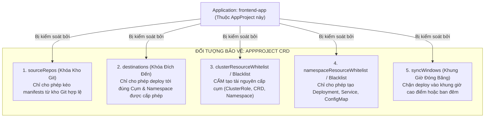
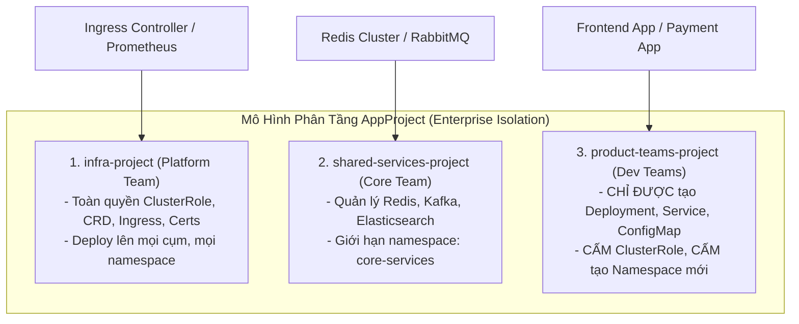
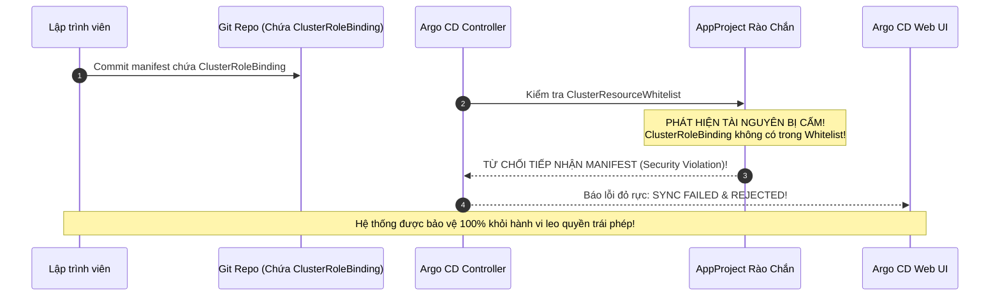


# Phân Quyền & Giới Hạn Phạm Vi Ứng Dụng Với AppProject: 5 Rào Chắn An Ninh

Trong môi trường doanh nghiệp có hàng chục đội phát triển cùng chia sẻ một hệ thống Argo CD chung, việc để tất cả ứng dụng trong dự án mặc định (**Project `default`**) là một lỗ hổng bảo mật cực kỳ nguy hiểm. 

Nếu không có rào chắn giới hạn phạm vi:
- Một lập trình viên của đội Frontend có thể vô tình hoặc cố ý khai báo một `ClusterRoleBinding` để chiếm toàn quyền `cluster-admin` trên cụm Kubernetes.
- Đội Phát triển có thể deploy nhầm ứng dụng sang namespace của đội Thanh toán (`payment-production`).
- Kỹ sư có thể kích hoạt deploy vào 12h đêm hoặc trong giờ cao điểm Flash Sale, gây ra rủi ro sập hệ thống dịch vụ.

> [!IMPORTANT]
> **NGUYÊN TẮC BẤT DI BẤT DỊCH: KHÔNG DÙNG PROJECT DEFAULT TRÊN PRODUCTION!**
> Mọi ứng dụng triển khai trên Production bắt buộc phải thuộc về một `AppProject` riêng biệt với danh sách trắng (Whitelisting) nguồn Git, cụm đích, namespace và danh mục Kubernetes resources được phép áp dụng.

> [!TIP]
> **BẢO VỆ DOANH THU BẰNG SYNC WINDOWS:**
> Thiết lập Sync Windows dạng `deny` trong các khung giờ cao điểm (Peak Traffic Hours / Flash Sale) để ngăn chặn hoàn toàn việc deploy nhầm gây gián đoạn dịch vụ của khách hàng.

---

## 1. Năm Rào Chắn An Ninh Cốt Lõi Của AppProject

Một đối tượng `AppProject` hoạt động như một "pháo đài bảo vệ" bao bọc lấy các Application con, ngăn chặn mọi hành vi vi phạm chính sách bảo mật:



---

## 2. Bảng So Sánh Chi Tiết 5 Rào Chắn Bảo Vệ

| Rào Chắn An Ninh | Phạm Vi Kiểm Soát | Hành Vi Khi Vi Phạm | Khuyến Nghị Thiết Lập Enterprise |
| :--- | :--- | :--- | :--- |
| **1. `sourceRepos`** | Giới hạn danh mục Git Repo URL & Helm Registries | Báo lỗi `ComparisonError: repository not permitted in project` | Chỉ cho phép Org URL `https://github.com/company-org/*` |
| **2. `destinations`** | Giới hạn Cụm K8s (`server`) & `namespace` | Báo lỗi `destination not permitted in project` | Cô lập chính xác namespace của đội, cấm dùng wildcard `*` |
| **3. `clusterResourceWhitelist`** | Kiểm soát tài nguyên cấp Cụm (Cluster-scoped) | Báo lỗi `Resource ClusterRoleBinding is not permitted` | Để trống (Default Deny All) hoặc chỉ mở `Namespace` |
| **4. `namespaceResourceWhitelist`** | Kiểm soát tài nguyên bên trong Namespace | Báo lỗi `Resource Kind is not permitted` | Whitelist `Deployment`, `Service`, `ConfigMap`, `Ingress` |
| **5. `syncWindows`** | Kiểm soát thời gian được phép đồng bộ (Cron) | Báo lỗi `Sync is blocked by sync window` | Thiết lập `deny` vào khung giờ cao điểm Flash Sale |

---

## 3. Kiến Trúc Cô Lập Đa Khách Thuê (Multi-Tenant Isolation Architecture)

Trong các tổ chức Enterprise, ta thiết kế mô hình AppProject phân tầng theo 3 nhóm đối tượng:



---

## 4. Phân Tích Cấu Hình Chi Tiết Manifest AppProject Chuẩn Enterprise (Line-by-Line Breakdown)

### 4.1. Manifest AppProject Cho Đội Phát Triển (`ecommerce-production-project.yaml`)

```yaml
# appproject-ecommerce-production.yaml
apiVersion: argoproj.io/v1alpha1
kind: AppProject
metadata:
  name: ecommerce-production-project
  namespace: argocd
  # Finalizer bảo vệ không cho xóa Project nếu vẫn còn Application đang chạy bên trong
  finalizers:
    - resources-finalizer.argocd.argoproj.io
spec:
  description: "Dự án quản trị bảo mật cho nhóm E-commerce Production"

  # 1. RÀO CHẮN 1: Danh sách các kho Git được phép sử dụng (Hỗ trợ Wildcard *)
  sourceRepos:
    - "https://github.com/company-org/ecommerce-*.git"
    - "https://charts.bitnami.com/bitnami"

  # 2. RÀO CHẮN 2: Danh sách các Cụm và Namespace được phép triển khai
  destinations:
    # Cho phép deploy tới cụm nội bộ ở namespace ecommerce-prod
    - namespace: "ecommerce-prod"
      server: "https://kubernetes.default.svc"
    # Cho phép deploy tới cụm Production từ xa
    - namespace: "ecommerce-prod"
      name: "production-us-east"

  # 3. RÀO CHẮN 3: Danh sách trắng tài nguyên cấp Cụm (Cluster-Scoped)
  # Tuyệt đối CẤM ClusterRole, ClusterRoleBinding, CRDs
  clusterResourceWhitelist:
    - group: ""
      kind: Namespace

  # 4. RÀO CHẮN 4: Danh sách trắng tài nguyên trong Namespace
  namespaceResourceWhitelist:
    - group: "apps"
      kind: "Deployment"
    - group: "apps"
      kind: "StatefulSet"
    - group: ""
      kind: "Service"
    - group: ""
      kind: "ConfigMap"
    - group: "bitnami.com"
      kind: "SealedSecret"
    - group: "networking.k8s.io"
      kind: "Ingress"

  # CẤM tuyệt đối ResourceQuota và LimitRange trong namespace
  namespaceResourceBlacklist:
    - group: ""
      kind: ResourceQuota
    - group: ""
      kind: LimitRange

  # Tự động tiêm nhãn khi Argo CD tự tạo namespace
  namespaceMetadata:
    labels:
      istio-injection: enabled
      team: ecommerce-backend

  # 5. RÀO CHẮN 5: Khung giờ kiểm soát triển khai (Sync Windows)
  syncWindows:
    # Đóng băng triển khai (Block Deploy) vào khung giờ cao điểm mua sắm (11h - 13h hàng ngày)
    - kind: deny
      schedule: "0 11 * * *"
      duration: "2h"
      applications:
        - "*"
      manualSync: false # Cấm cả việc bấm nút Sync thủ công!

    # Cho phép triển khai vào khung giờ bảo trì hàng tuần (Sáng thứ Bảy)
    - kind: allow
      schedule: "0 6 * * 6"
      duration: "4h"
      applications:
        - "*"

  # 6. PHÂN QUYỀN PROJECT ROLES & CẤP PHÁT JWT TOKEN
  roles:
    # Role dành cho Developer: Chỉ được xem ứng dụng và sync trên môi trường Dev
    - name: dev-engineer
      description: "Quyền hạn dành cho lập trình viên"
      policies:
        - p, proj:ecommerce-production-project:dev-engineer, applications, get, ecommerce-production-project/*, allow
        - p, proj:ecommerce-production-project:dev-engineer, applications, sync, ecommerce-production-project/dev-*, allow
        - p, proj:ecommerce-production-project:dev-engineer, applications, sync, ecommerce-production-project/prod-*, deny
      groups:
        - "company:ecommerce:developers"

    # Role dành cho CI/CD Automation Pipeline
    - name: devops-ci-runner
      description: "Quyền hạn dành cho GitHub Actions CI/CD Pipeline"
      policies:
        - p, proj:ecommerce-production-project:devops-ci-runner, applications, get, ecommerce-production-project/*, allow
        - p, proj:ecommerce-production-project:devops-ci-runner, applications, sync, ecommerce-production-project/*, allow

  # 7. GIÁM SÁT TÀI NGUYÊN MỒ CÔI (ORPHANED RESOURCES)
  orphanedResources:
    warn: true
    ignore:
      - group: ""
        kind: ConfigMap
        name: kube-root-ca.crt
```

### 4.2. Manifest AppProject Cho Đội Hạ Tầng Nền Tảng (`infra-platform-project.yaml`)

Khác với Dev Team bị giới hạn nghiêm ngặt, Platform Team cần quyền tạo tài nguyên Cluster-scoped:

```yaml
# appproject-infra-platform.yaml
apiVersion: argoproj.io/v1alpha1
kind: AppProject
metadata:
  name: infra-platform-project
  namespace: argocd
spec:
  description: "Dự án quản trị hạ tầng nền tảng (Platform SRE)"
  sourceRepos:
    - "https://github.com/company-org/k8s-infrastructure.git"
    - "https://charts.jetstack.io"
    - "https://kubernetes.github.io/ingress-nginx"
  destinations:
    - namespace: "*"
      server: "*"
  # Cho phép tạo tài nguyên cấp Cụm (Cluster-Scoped)
  clusterResourceWhitelist:
    - group: "rbac.authorization.k8s.io"
      kind: "ClusterRole"
    - group: "rbac.authorization.k8s.io"
      kind: "ClusterRoleBinding"
    - group: "apiextensions.k8s.io"
      kind: "CustomResourceDefinition"
    - group: "cert-manager.io"
      kind: "ClusterIssuer"
```

---

## 5. Quản Lý Khung Giờ Triển Khai (Sync Windows)

Tính năng **Sync Windows** giúp các tổ chức tài chính, thương mại điện tử thực thi chính sách **Deploy Freeze** nghiêm ngặt.

```mermaid
flowchart LR
    DEV_PUSH["Developer Merge PR vào 11h30 trưa (Khung giờ Cao Điểm)"] --> ARGO_CTRL["Argo CD Controller"]
    ARGO_CTRL --> WINDOW_CHECK{"Kiểm tra Sync Windows"}
    
    WINDOW_CHECK -->|Trong khung giờ DENY (11h-13h)| BLOCK["CHẶN ĐỒNG BỘ!<br/>Trạng thái: Sync Blocked by Window"]
    WINDOW_CHECK -->|Ngoài khung giờ DENY| PASS["Cho phép Đồng Bộ & Deploy Bình Thường"]


```

### 5.1. Các Thuộc Tính Trong Sync Windows
- **`kind: allow` / `kind: deny`:** Xác định đây là khung giờ Cho phép hay Cấm.
- **`schedule`:** Biểu thức Cron chuẩn 5 trường (`phút giờ ngày tháng thứ`).
- **`duration`:** Thời lượng kéo dài của khung giờ (ví dụ: `2h`, `30m`).
- **`manualSync: true / false`:** Quyết định xem người dùng có được phép bấm nút "Sync" thủ công trên Web UI để ghi đè quy tắc hay không.

---

## 6. Xác Thực Chữ Ký Commit (GPG Signature Verification) Trong AppProject

Để đảm bảo mã nguồn deploy lên Production không bị kẻ gian chèn mã độc vào nhánh Git, ta có thể bắt buộc kiểm tra chữ ký GPG của commit:

```yaml
spec:
  signatureKeys:
    - keyID: "4AEE18F83AFDEB23" # Khóa GPG Public Key của Lead Tech
```

Nếu một commit được merge mà không có chữ ký số từ đúng KeyID trên, Argo CD sẽ từ chối đồng bộ hóa ngay lập tức!

---

## 7. Giám Sát Audit Log & Kiểm Tra Tuân Thủ AppProject

Mọi hành động vi phạm chính sách AppProject đều được ghi nhận vào nhật ký kiểm toán (Audit Log) của `argocd-server`:

```bash
kubectl logs -n argocd deploy/argocd-server | grep -E "level=warn|level=error" | grep "AppProject"
```

Log sẽ in rõ danh tính người dùng (Username/OIDC Email), địa chỉ IP, tên ứng dụng và tài nguyên bị từ chối, hỗ trợ đắc lực cho các đợt đánh giá bảo mật SOC2 / ISO 27001.

---

## 8. Cạm Bẫy Thực Chiến: "Đợt Deploy Bị Thất Bại Đỏ Rực Do Khai Báo Tài Nguyên Bị AppProject Chặn"

### Hiện Tượng Sự Cố & Log Trace
- Lập trình viên bổ sung một tệp `clusterrolebinding.yaml` vào kho GitOps để cấp quyền cho ứng dụng đọc thông tin Node.
- Khi Argo CD thực hiện đồng bộ, toàn bộ quá trình bị **hủy bỏ ngay lập tức** với thông báo lỗi đỏ rực:

```json
{
  "timestamp": "2026-04-04T10:15:30Z",
  "level": "error",
  "component": "argocd-application-controller",
  "application": "ecommerce-production-project/frontend-app",
  "msg": "Sync failed: Resource 'rbac.authorization.k8s.io/v1:ClusterRoleBinding' is not permitted in project 'ecommerce-production-project'",
  "phase": "SyncFailed"
}
```



### 8.1. Phân Tích Ý Nghĩa Bảo Mật (5-Whys)
1. **Tại sao đợt sync bị báo lỗi đỏ?** $\rightarrow$ Vì Controller từ chối apply tài nguyên `ClusterRoleBinding`.
2. **Tại sao bị từ chối?** $\rightarrow$ Do đối tượng `ClusterRoleBinding` không nằm trong danh sách `clusterResourceWhitelist` của `AppProject`.
3. **Tại sao Dev lại thêm ClusterRoleBinding?** $\rightarrow$ Dev muốn ứng dụng tự lấy IP của Node để xử lý định tuyến.
4. **Tại sao không nên cho phép điều đó?** $\rightarrow$ Vì cấp quyền ClusterRoleBinding cho Pod có thể tạo ra lỗ hổng leo quyền kiểm soát toàn bộ cụm Kubernetes.
5. **Cách xử lý chuẩn xác là gì?** $\rightarrow$ Sử dụng Downward API của Kubernetes (`fieldRef: spec.nodeName`) để truyền tên Node vào Pod thay vì cấp quyền ClusterRole.

---

## 9. Bộ Quy Tắc Vàng (Best Practices) Thiết Lập AppProject Doanh Nghiệp

Để đảm bảo hệ thống GitOps vừa an toàn vừa thuận tiện cho người dùng, hãy tuân thủ 4 nguyên tắc vàng sau:

1. **Nguyên tắc Đặc quyền Tối thiểu (Principle of Least Privilege):** Không bao giờ dùng wildcard `*` cho `destinations.namespace` trong các project của đội phát triển. Luôn chỉ định chính xác tên namespace được cấp phép.
2. **Tuyệt đối cấm Cluster-scoped Resources cho Dev Teams:** Giữ `clusterResourceWhitelist` rỗng hoặc chỉ cho phép tạo `Namespace` có điều kiện. Mọi tài nguyên cấp cụm (ClusterRole, StorageClass, CRD) phải thuộc về `infra-platform-project`.
3. **Luôn bật Orphaned Resources Monitoring:** Đặt `orphanedResources.warn: true` để phát hiện kịp thời các tài nguyên "chết" do ai đó sửa tay ngoài luồng GitOps.
4. **Kiểm soát chặt chẽ Sync Windows:** Phối hợp giữa `kind: deny` vào các ngày lễ lớn / Black Friday và `manualSync: false` để ngăn chặn rủi ro con người.

---

## 10. Hướng Dẫn Thực Hành CLI: Kiểm Tra Quyền Hạn AppProject (Step-by-Step Lab)

Dưới đây là quy trình thực hành từ dòng lệnh để tạo, cấu hình và kiểm thử AppProject:

```bash
# Bước 1: Tạo AppProject từ manifest khai báo
kubectl apply -f appproject-ecommerce-production.yaml

# Bước 2: Liệt kê toàn bộ danh sách các AppProject hiện có
argocd proj list

# Bước 3: Xem chi tiết 5 rào chắn an ninh của một Project
argocd proj get ecommerce-production-project

# Bước 4: Tạo một JWT Token mới cho Project Role qua dòng lệnh
argocd proj role create-token ecommerce-production-project devops-ci-runner \
  -i "github-actions-runner-2026"

# Bước 5: Kiểm tra xem một người dùng/role có quyền sync trên Project không
argocd account can-i sync applications "ecommerce-production-project/payment-api"

# Bước 6: Kiểm thử deploy một ứng dụng vi phạm Whitelist để xem cơ chế chặn hoạt động
kubectl apply -f illegal-clusterrole-app.yaml
argocd app get illegal-clusterrole-app
```

---

## 11. Bộ Câu Hỏi Tự Kiểm Tra Chuyên Sâu (Self-Check Q&A)

Dưới đây là 10 câu hỏi sát hạch chuyên sâu về AppProject:

### Câu 1: Tại sao nên sử dụng Whitelist (Danh sách trắng) thay vì Blacklist (Danh sách đen) trong cấu hình tài nguyên của AppProject?
- **Đáp án:** Theo nguyên lý **Zero Trust**, Whitelist an toàn hơn nhiều vì nó "Mặc định Từ chối Tất cả" (Default Deny All) và chỉ cho phép những tài nguyên được khai báo tường minh. Blacklist có nguy cơ bị bỏ sót khi Kubernetes ra mắt các loại tài nguyên hoặc API Groups mới.

### Câu 2: Khi một khung giờ Sync Windows dạng `deny` đang có hiệu lực, nếu kỹ sư bấm nút "Sync" trên giao diện Web thì điều gì sẽ xảy ra?
- **Đáp án:** Nếu `manualSync: false`, giao diện Web sẽ chặn nút bấm và hiển thị thông báo lỗi `Sync is denied by window`. Nếu `manualSync: true`, kỹ sư được phép ghi đè để deploy thủ công (thường dùng cho các ca xử lý sự cố khẩn cấp).

### Câu 3: Điều gì xảy ra nếu cố tình xóa một AppProject mà bên trong vẫn còn các đối tượng Application đang liên kết?
- **Đáp án:** Nhờ có `finalizers: [resources-finalizer.argocd.argoproj.io]`, Kubernetes sẽ **chặn tiến trình xóa AppProject lại**, bảo vệ các Application bên trong không bị mất liên kết đột ngột.

### Câu 4: Một Application có thể thuộc về nhiều hơn 1 AppProject cùng lúc không?
- **Đáp án:** **Không!** Mỗi đối tượng `Application` chỉ có thể liên kết với **duy nhất 1 AppProject** thông qua trường `spec.project`.

### Câu 5: Làm thế nào để cho phép một AppProject kéo manifests từ mọi kho Git của một Organization trên GitHub?
- **Đáp án:** Sử dụng ký tự đại diện Wildcard `*` trong `spec.sourceRepos`:
  ```yaml
  sourceRepos:
    - "https://github.com/company-org/*"
  ```

### Câu 6: JWT Tokens được tạo trong `spec.roles` của AppProject có thể dùng cho mục đích gì?
- **Đáp án:** Dùng để xác thực các công cụ tự động hóa bên ngoài (như GitHub Actions, GitLab CI, Jenkins) thông qua biến môi trường `ARGOCD_AUTH_TOKEN`, cấp quyền hạn tối thiểu (chỉ get/sync các ứng dụng thuộc project đó) mà không cần cấp tài khoản người dùng thực.

### Câu 7: Nếu một AppProject không khai báo `clusterResourceWhitelist`, mặc định hành vi sẽ là gì?
- **Đáp án:** Mặc định toàn bộ các tài nguyên cấp Cụm (Cluster-Scoped như `Namespace`, `ClusterRole`, `PV`, `CRD`) sẽ bị **từ chối 100%**, đảm bảo an toàn mặc định cho hệ thống.

### Câu 8: Thuộc tính `orphanedResources` trong AppProject giúp ích gì cho việc quản trị?
- **Đáp án:** Cho phép Argo CD cảnh báo hoặc gửi thông báo khi phát hiện trên namespace đích có những tài nguyên tồn tại nhưng không thuộc quyền quản lý của bất kỳ Application GitOps nào.

### Câu 9: Làm cách nào để cấu hình Sync Windows chỉ áp dụng cho một microservice cụ thể trong Project?
- **Đáp án:** Trong khối `syncWindows`, thay vì đặt `applications: ["*"]`, hãy chỉ định danh sách tên ứng dụng cụ thể: `applications: ["payment-api", "checkout-api"]`.

### Câu 10: Sự khác biệt giữa `AppProject Roles` và `argocd-rbac-cm Global Roles` là gì?
- **Đáp án:** `argocd-rbac-cm` cấu hình phân quyền tập trung cho toàn bộ hệ thống Argo CD. Trong khi đó, `AppProject Roles` cho phép chủ sở hữu của từng Project tự quản lý phân quyền nội bộ trong phạm vi các ứng dụng của dự án mình mà không cần quyền sửa ConfigMap hệ thống.

---

## Tổng Kết

`AppProject` là rào chắn an ninh vững chắc nhất trong Argo CD, biến hệ thống thành một nền tảng đa khách thuê (Multi-tenant Platform) an toàn tuyệt đối, phân định ranh giới trách nhiệm rõ ràng và bảo vệ môi trường Production trước mọi sai sót vận hành.

Ở bài tiếp theo, chúng ta sẽ khám phá **Tùy Biến Engine Render Với Config Management Plugins (CMP v2 Sidecars) & Quản Trị Directory Apps**!

